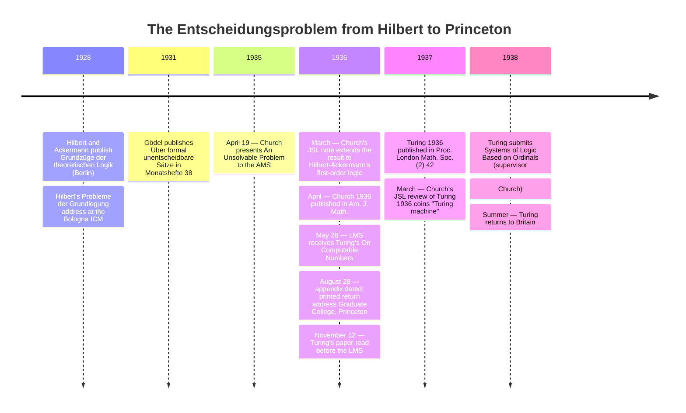

:::tip[In one paragraph]
In 1936, Alonzo Church at Princeton and Alan Turing at Cambridge independently proved Hilbert's *Entscheidungsproblem* — the demand for a mechanical procedure deciding the provability of any first-order formula — unsolvable. Church's λ-calculus proof reached the negative answer first; Turing's "computing machine" reading a paper tape gave the second proof its enduring metaphor. In §6 of the same paper, Turing described a single universal machine as a mathematical specification, not a physical stored-program computer.
:::

<strong>Cast of characters</strong>

| Name | Lifespan | Role |
|---|---|---|
| David Hilbert | 1862–1943 | Göttingen mathematician; with Ackermann's 1928 *Grundzüge der theoretischen Logik* (ch. 3) and his Bologna ICM address that same year, posed the *Entscheidungsproblem*. |
| Kurt Gödel | 1906–1978 | Vienna logician; the 1931 *Monatshefte* paper (Theorem VI) proved an incompleteness result under ω-consistency. Decidability remained a separate question. |
| Alonzo Church | 1903–1995 | Princeton assistant professor; lambda-calculus founder; presented the negative answer to the AMS on April 19, 1935 and published it in *Am. J. Math.* April 1936 — first to the result. |
| Stephen Cole Kleene | 1909–1994 | Church's just-graduated Princeton Ph.D.; joint developer of λ-definability; independently proved λ-definability equivalent to Gödel-Herbrand recursiveness. |
| Alan Turing | 1912–1954 | Fellow of King's College, Cambridge (1935); independently solved the *Entscheidungsproblem* via the a-machine model in "On Computable Numbers" (received LMS 28 May 1936); §6 introduced the universal computing machine. |
| Max Newman | 1897–1984 | Cambridge mathematician; his foundations-of-mathematics lectures introduced Turing to the *Entscheidungsproblem*; wrote to Church recommending Turing for Princeton. |

<strong>Timeline (1928–1938)</strong>

<strong>Plain-words glossary</strong>

- ***Entscheidungsproblem*** — German for "decision problem." Hilbert's 1928 demand for a mechanical procedure that, given any first-order logical formula, decides in finite time whether the formula is provable. The chapter's load-bearing question.
- **Lambda calculus (λ-calculus)** — Church's symbolic system for defining mathematical functions, developed from the late 1920s onward. A function is written as a λ-expression; what gets computed is what reduces to a normal form by a finite chain of conversion rules.
- **a-machine** — Turing's term for his abstract device: a finite-state scanner moving along an infinite tape divided into squares, reading and writing one symbol at a time per a finite table of m-configurations. Church's 1937 review renamed it the "Turing machine."
- **Universal computing machine (U)** — Turing's fixed machine for simulating any other computing machine from an encoded description on its tape. Introduced in §6 of Turing 1936.
- **Recursive function** — A function definable from basic arithmetic operations by a finite sequence of substitutions, primitive-recursive constructions, and minimization. Built up by Gödel and Herbrand by 1934; Kleene proved it equivalent to λ-definability.
- **ω-consistency** — A stronger requirement than ordinary consistency. A system must not prove a property for every individual natural-number case while also proving that the property fails for some natural number. Proving each case separately is different from proving one statement about all cases.
- **Church-Turing thesis** — The *philosophical* claim that recursive, λ-definable, and Turing-computable functions all capture the intuitive notion of "effectively calculable." The equivalence among the formal models is a theorem; their match to the intuitive notion is a thesis. Church discussed that identification in §7 of his 1936 paper; Turing's appendix outlined the formal λ-definability–Turing-computability equivalence, while his paper separately addressed the model's adequacy.

The challenge was laid out clearly, in the third chapter of a textbook that would come to define the foundational crisis of early twentieth-century mathematics. In *Grundzüge der theoretischen Logik*, published in Berlin in 1928, David Hilbert and Wilhelm Ackermann systematically formulated what they called the *Entscheidungsproblem*. The problem asked a seemingly straightforward question about the absolute limits of formal logic: is there a "general process" for determining whether any given formula of the functional calculus is provable? The ambition was concrete: a finite procedure that any sufficiently patient computer — a human one, in 1928 — could mechanically execute, taking a logical formula as input and emitting a single bit of output (*provable* or *not provable*) without recourse to ingenuity or insight.

Hilbert, the most influential mathematician of his generation, had spent the preceding decades trying to secure the foundations of mathematics against the creeping paradoxes of set theory. His broader program rested on the hope that all mathematical truths could be formalized into a rigorous, mechanical system. In historical retrospectives, Hilbert's ambition is often decomposed into three distinct requirements: completeness, ensuring that every true mathematical statement could be proved within the system; consistency, ensuring that the system could never prove a contradiction; and decidability, the demand that a mechanical procedure must exist to determine the truth or falsity of any formal assertion. The *Entscheidungsproblem* was the demand for decidability. Unlike completeness, which spoke to what the system could in principle demonstrate, decidability spoke to what a machine could in finite time decide. If it could be solved positively, mathematics would be reducible, in principle, to the mechanical execution of a finite set of rules.

On 23 October 1930, Hans Hahn presented a short abstract of Kurt Gödel's result to the Vienna Academy of Sciences. The full text was received by *Monatshefte für Mathematik und Physik* on 17 November 1930 and published in 1931, in an austere paper of dense formal logic titled "Über formal unentscheidbare Sätze der *Principia Mathematica* und verwandter Systeme I."

Gödel's Theorem VI worked with his formal system P and an added primitive recursive class of formulas. If the resulting system was ω-consistent, it contained a closed arithmetical sentence that was neither provable nor disprovable within that system. The hypothesis matters: this was not a claim about every formal system. Rosser's 1936 result later used a modified argument to obtain an undecidable proposition under plain consistency.

The proof rested on a coding device of remarkable economy. Gödel devised a numbering scheme that assigned every symbol, every formula, and every proof in his formal system a distinct natural number, so that statements about what the system could prove became, formally, statements about ordinary arithmetic — claims the system itself could express. From inside this arithmetised metalanguage Gödel built the formula `r` with a free variable; the corresponding closed quantified sentence asserted its own unprovability. In the proof's first branch, proving that closed sentence would contradict consistency; in the second, excluding a proof of its negation required ω-consistency. The conclusion therefore rested on Gödel's stated ω-consistency hypothesis, not plain consistency. Under these conditions, the system could express an arithmetical sentence that its own rules could neither prove nor refute.

Yet, as devastating as Gödel's incompleteness theorem was to the mathematical orthodoxy of 1931, it did not entirely close the book on Hilbert's foundational questions. Gödel had proved that formal systems have blind spots, but he had not proved that it was impossible to identify where those blind spots were. Decidability—the *Entscheidungsproblem*—was technically a separate question. Was there a mechanical procedure that could examine a statement and correctly report whether it was provable or unprovable?

This gap was explicitly recognized by the very people who would eventually close it. Alan Turing himself drew the distinction carefully. "It should perhaps be remarked that what I shall prove is quite different from the well-known results of Gödel," Turing would write five years later. "On the other hand, I shall show that there is no general method which tells whether a given formula is provable." Gödel had proved that mathematics was incomplete. It would take two other mathematicians, working independently and on opposite sides of the Atlantic, to prove that mathematics was also undecidable.

## The Parallel Discovery

The first person to prove the unsolvability of the *Entscheidungsproblem* was Alonzo Church, an assistant professor of mathematics at Princeton University. Working with his former student Stephen Cole Kleene, Church had spent the early 1930s developing a new formal system called the lambda calculus. Through a series of stepping-stone publications in the *Annals of Mathematics* and the *American Journal of Mathematics*, Church and Kleene refined the lambda calculus until it was robust enough to serve as a rigorous theory of computability. The framework had emerged from Church's earlier work on the foundations of logic in the late 1920s and matured through joint development with Kleene across the early 1930s, with the technical machinery carried forward in increments by Church's contribution to *Annals of Mathematics* volume 34 in 1933 and Kleene's longer paper in *American Journal of Mathematics* volume 57 in 1935. By 1935 it was the established framework for the small Princeton circle's work on computability.

On April 19, 1935, Church presented his findings to the American Mathematical Society. A full year later, in April 1936, the detailed formal proof appeared in the *American Journal of Mathematics* under the title "An Unsolvable Problem of Elementary Number Theory." A more compact companion piece, explicitly extending the result to Hilbert and Ackermann's formulation, appeared concurrently in the *Journal of Symbolic Logic* in March 1936.

The year-long interval between presentation and publication is itself part of the story. Church's argument had been circulating among foundational logicians for over a year by the time Turing's manuscript reached London. The chronology mattered: Church had reached the negative answer first, and the published record fixed that priority before the second proof of the same theorem was even committed to type.

Church's 1936 paper is a masterpiece of abstract formal logic. In its seventh section, titled "The notion of effective calculability," Church made a crucial conceptual leap. He proposed that the intuitive, informal idea of an "effectively calculable" function should be strictly identified with the formally defined class of recursive functions, or equivalently, with the functions definable in his lambda calculus. Church was careful to frame this equivalence not as a mathematical theorem that could be proved, but as a foundational definition. "This definition is thought to be justified by the considerations which follow," Church wrote, "so far as positive justification can ever be obtained for the selection of a formal definition to correspond to an intuitive notion." This philosophical assertion is what modern computer science refers to as Church's thesis.

Having locked down the definition of computability, Church proceeded to prove its limits. His Theorem XVIII established that the property of a well-formed formula having a normal form is not a recursive property. From there, Theorem XIX delivered the fatal blow. "There is no recursive function of two formulas A and B," Church wrote, "whose value is 2 or 1 according as A conv B or not" — no algorithm, in modern terms, capable of deciding whether two well-formed lambda-formulas could be reduced to one another by a finite chain of conversion rules. The undecidability of conversion was, in turn, the lever by which Church pried open the decision problem of *Principia Mathematica* itself. The paper concluded with a direct corollary targeting the heart of Hilbert's remaining program. The *Entscheidungsproblem* of any ω-consistent system strong enough to allow certain comparatively simple methods of definition and proof—explicitly singling out the system of *Principia Mathematica*—was mathematically unsolvable.

Church's proof was correct, exhaustive, and rigorously complete. He had arrived at the negative answer to the *Entscheidungsproblem* first. Yet his formulation, expressed entirely in the dense, austere syntax of the lambda calculus, did not mention computing machinery at all. The proof was a triumph of formal logic, but it lacked a physical metaphor. It was an argument about the interconvertibility of abstract symbols. In Church's own 1937 review of Turing's paper, he favoured Turing's machine model for its intuitive effectiveness — an early acknowledgement that the lambda calculus, mathematically unassailable, did not on its own offer the conceptual bridge that Turing's a-machine had supplied. A machine-model reading of this abstract impossibility result — still a mathematical specification, not a later physical architecture — would come from a young graduate student working entirely independently in England.

## The Paper Tape

At King's College, Cambridge, Alan Turing had been elected a fellow in 1935, at the remarkably young age of twenty-two, on the strength of a dissertation concerning the Central Limit Theorem. According to standard biographical accounts, Turing had attended lectures on the foundations of mathematics given by Max Newman, which likely served as his introduction to the *Entscheidungsproblem*. Working alone for the better part of a year, completely unaware of the lambda calculus circulating in Princeton, Turing attacked the problem by stripping the act of computation down to its most primitive, mechanical essence. The image at the centre of his paper was not, in the first instance, a machine: it was a clerk — a person reading symbols off a sheet of paper, consulting a fixed table of rules, and writing fresh symbols in response. What he produced was the rigorous mathematical translation of this human clerk into a finite formal specification, and only then a piece of imagined hardware that could execute the specification automatically.

Turing's manuscript, "On Computable Numbers, with an Application to the Entscheidungsproblem," was received by the London Mathematical Society on May 28, 1936. Rather than relying on recursive functions or abstract symbolic logic, Turing grounded his proof in a thought experiment about a hypothetical machine. 

In the opening section of his paper, Turing introduced what he called the "computing machine" (and later, the "a-machine," for automatic machine). "We may compare a man in the process of computing a real number to a machine which is only capable of a finite number of conditions," Turing wrote. He stripped away all human intuition, leaving only a scanner moving along a one-dimensional tape divided into squares. "The machine is supplied with a 'tape' (the analogue of paper) running through it, and divided into sections (called 'squares') each capable of bearing a 'symbol'." At any given moment, the machine's behavior was completely determined by two factors: its current internal state — which Turing called its "m-configuration" — and the single symbol currently visible under the scanner. From that pair, a finite table specified three things: the symbol the scanner should write back into the present square (perhaps the same symbol, perhaps a fresh one); the direction the tape should move next (one square left, one square right, or stationary); and the next m-configuration the machine should adopt. There were no clocks. There were no random fluctuations. There was no operator. The entire dynamics of the system were encoded in that single finite table, which Turing rendered explicitly for several worked examples in the early sections of his paper.

Turing made one further preliminary distinction. "If at each stage the motion of a machine ... is completely determined by the configuration," he wrote in section two, "we shall call the machine an 'automatic machine' (or *a*-machine)." A separate class — the "choice machine," which left some moves to be resolved by an external operator — was set aside; everything that followed concerned the strictly automatic case.

Within the class of automatic machines Turing drew a further sharp distinction between two types. A machine that only ever printed a finite number of output symbols (figures of the first kind) and then ceased to produce more was labeled "circular." A machine that continued to print output symbols infinitely was "circle-free." The computable numbers, Turing argued, were precisely those sequences produced by circle-free machines.

Having established this mechanical vocabulary, Turing proceeded to his paper's eighth section, where he unleashed a diagonal argument to prove that certain machines could never exist. He posed a question: could one invent a general-purpose machine, called D, that could examine the blueprint of any other machine and successfully decide whether that machine was circle-free? Through a rigorous logical contradiction, Turing showed that if machine D existed, it could be used to construct a paradoxical machine that defied its own operational rules. "Thus both verdicts are impossible," Turing concluded, "and we conclude that there can be no machine D."

He then generalized this finding into what would become the cornerstone of theoretical computer science. There could be no machine E, Turing proved, "which, when supplied with the S.D [standard description] of an arbitrary machine M, will determine whether M ever prints a given symbol (0 say)." In modern computer science textbooks, this concept is universally known as the Halting Problem, a didactic name popularized in 1958 by the mathematician Martin Davis. Turing himself never used the word "halting," framing his proof strictly around the concepts of circle-freeness and the printing of specific symbols.

The final step was to bring this mechanical impossibility back to Hilbert. In the paper's eleventh section, Turing reduced the *Entscheidungsproblem* to the print-symbol problem. He demonstrated how to construct a logical formula, `Un(M)`, which would be provable within the functional calculus if and only if a given computing machine M ever printed the symbol 0. Because his eighth section had just proved that no general mechanical process could determine whether M prints 0, it necessarily followed that no general process could determine whether the formula `Un(M)` was provable. The conclusion was absolute: "the Hilbert Entscheidungsproblem can have no solution."

The reduction unfolded in two short lemmas. Lemma 1 demonstrated that for any computing machine M, the formula `Un(M)` was provable in the functional calculus K precisely when M ever printed the symbol 0; Lemma 2 reversed the implication. Stitched together, the two lemmas converted the print-symbol question — which section eight had just shown to be mechanically undecidable — into a question about formal provability. Hilbert had asked whether the truths of mathematics were reducible to a procedure. Turing answered that there was no procedure here. The negative result Church had reached through the symbolic combinatorics of the lambda calculus, Turing had reached through a finite-state device reading a tape.

## A Universal Computing Machine

The unsolvability of the *Entscheidungsproblem* was the stated goal of Turing's paper, but the paper's enduring historical legacy lies nestled in its sixth section. It was here, almost as a mechanical convenience to facilitate his broader proof, that Turing introduced a single machine that could compute any computable sequence from an encoded description.

"It is possible to invent a single machine which can be used to compute any computable sequence," Turing wrote. He called this theoretical construct the universal computing machine. 

Prior to this paragraph, computation had been imagined as a realm of bespoke, single-purpose mechanisms. A machine was physically configured to perform one specific calculation. If you wanted to compute a different sequence, you had to build a different machine with a different table of m-configurations. 

Turing shattered this assumption. He observed that the table of instructions governing any specific computing machine M could itself be encoded as a string of letters and numbers—what he called its standard description, or S.D. Because the S.D was just a sequence of symbols, it could be written out onto the squares of a paper tape. Therefore, one could construct a single, fixed universal machine, U. "If this machine U is supplied with a tape on the beginning of which is written the S.D of some computing machine M," Turing explained, "then U will compute the same sequence as M."

In section seven, Turing committed nearly five pages of his paper to the detailed instruction table that defined U's behavior. Each row specified an m-configuration, the symbol presently scanned, the symbol to be written in its place, the direction of head movement, and the next state. The table was finite. It could, in principle, be transcribed by any sufficiently patient clerk and verified line by line. Turing's purpose in section seven was to put the universal machine beyond the reach of accusation: it was not a hand-waved metaphor invoked for proof's sake but an explicit mechanism whose behavior could be checked symbol by symbol. He had described, with the rigor a draftsman applies to a load-bearing beam, the mathematical specification of a universal machine. That specification did not by itself establish a physical implementation in copper and steel.

The universal machine's key formal implication was that a description of a machine could be supplied on its tape. In the model, U's transition rules remain fixed while it interprets the supplied description. The description is data for U and specifies the machine being simulated: the symbols' role depends on the computation, rather than on a different physical material.

Turing's 1936 paper was a mathematical model, not a physical computer. It would be anachronistic to call the universal computing machine itself the EDVAC or ENIAC, or to treat the paper as a hardware blueprint. Its lasting contribution here is formal: an encoded instruction table could be supplied as data to a fixed machine.

Sections 6 and 7 together supplied the mathematical specification: §6 introduced U's encoded-machine idea, and §7 gave its tape, symbols, states, and transition table. That specification did not by itself establish a physical implementation. Zuse's Z1 was under construction from 1936 and completed in 1938 as a limited, punched-tape, mechanical programmable machine; it belongs to a related but distinct engineering history and is not established as an implementation of Turing's U. The mathematical U and contemporaneous physical machines therefore belong in the same chronology without being identified with one another. The engineering path from mathematical model to later hardware is the work of the next several chapters.

## The Princeton Connection

The story of the universal machine's reception is ultimately a story of the fragile, analog infrastructure of 1930s mathematics. There were no digital networks to synchronize discoveries; there were only the transatlantic postal steamers carrying academic journals between England and the United States, with transit times often stretching to a week or more.

Mid-1930s foundational mathematics ran on the speed of mail. Issues of the *Proceedings of the London Mathematical Society* and the *American Journal of Mathematics* travelled by ship between Britain and the United States, and the discovery of an overlap between Church's and Turing's results travelled at the cadence of journal publication and personal correspondence rather than instant exchange.

Sometime between the London Mathematical Society receiving Turing's manuscript on May 28, 1936, and the end of August, Turing learned of Alonzo Church's parallel work. In a footnote added to the first page of his paper, Turing acknowledged Church's "recent paper" in the *American Journal of Mathematics*, as well as the companion note in the *Journal of Symbolic Logic*. 

The three-page appendix, dated "Added 28 August, 1936," was titled "Computability and effective calculability." It stated its purpose as an outline proof in both directions. First, Turing described a machine that computes a λ-definable sequence; then he outlined how to represent a computable sequence with a lambda expression. The appendix left some auxiliary constructions unproved: it presented a formal equivalence, not a proof that either model captured every intuitive effective procedure.

The appendix carried a printed return address: "The Graduate College, Princeton University, New Jersey, U.S.A." That line locates the paper, not a witnessed arrival. The August date and the printed address do not by themselves establish when Turing crossed the Atlantic.

Standard biographical accounts place Turing at Princeton later in 1936, holding a Procter Visiting Fellowship and submitting his 1938 doctoral thesis, "Systems of Logic Based on Ordinals," under Church's supervision. Those residency and fellowship details remain uncertain at the level of this chapter: they are not read off the appendix address.

The mathematical community quickly synthesized the parallel discoveries. In March 1937, Alonzo Church published a brief review of Turing's paper in the *Journal of Symbolic Logic*. It was in this review that Church famously coined the term "Turing machine" to describe Turing's a-machine. More importantly, Church conceded that Turing's mechanical formulation possessed a distinct conceptual advantage over his own lambda calculus. Computability by a Turing machine, Church wrote, "has the advantage of making the identification with effectiveness in the ordinary (not explicitly defined) sense evident immediately."

With Turing's appendix, the theoretical foundations of computer science locked into place. The triangle of formal equivalences was complete: Church's λ-definability, the Gödel-Herbrand framework of general recursiveness (which Kleene had recently proven equivalent to λ-definability), and Turing-computability all perfectly bounded the exact same class of mathematical functions. 

The formal equivalences were mathematical theorems; Turing's appendix outlined the λ-definability–Turing-computability equivalence, and Kleene's prior equivalence between λ-definability and Gödel-Herbrand recursiveness had closed the third side of the triangle. The philosophical assertion that this specific, formal class of functions perfectly captured the informal, human intuition of what it meant to be "effectively calculable" — that was, and remained, a thesis. Today the proposition is known as the Church-Turing thesis, honoring both the man who first formalised the boundary and the man who gave the boundary its most enduring mechanical metaphor.

The year 1936 gave us a mathematical specification, while the physical history remained plural and unfinished. Turing's achievement was to make computation a rigorously defined mathematical object and to show that a fixed machine could interpret encoded instructions. The *Entscheidungsproblem* had fallen.

:::note[Why this still matters today]
Many general-purpose stored-program systems can be usefully modeled in a Turing-style way: a fixed processor interprets encoded instructions, and programs can be represented as data. This is a model, not a literal description of every production computer; Microchip's AVR documentation, for example, specifies separate program and data buses and spaces in a Harvard architecture. The program-as-data framing of §6 helps explain compilers, interpreters, virtual machines, and containers, but those modern systems are later applications and analogies.

The negative result still bites, too. Turing's no-general-process results, strengthened by Rice's theorem for non-trivial semantic program properties, explain why no sound-and-complete automatic analysis can decide every behavior of every arbitrary program. Antivirus tools are an engineering example rather than the theorem itself: signatures and heuristics can produce false positives and false negatives. Formal verification can prove selected specifications, but no single automatic procedure decides every non-trivial semantic property of arbitrary programs. For the first-order provability and validity question posed by the *Entscheidungsproblem*, no general decision procedure exists. That result changed how computing could be understood.
:::

:::tip[Optional: run one tiny machine by hand]

Turing’s §3 Example I gives a four-state machine that prints `0101…` from a blank
tape. The table below is adapted from his [source table](https://www.cs.virginia.edu/~robins/Turing_Paper_1936.pdf)
(printed p. 233; PDF p. 4).

For this teaching version, cells are numbered `…, -1, 0, 1, 2, …`; cell `0` is
initially scanned, every cell is blank (`□`), and the initial state is `b`. `P0` writes
`0` on the scanned cell, `P1` writes `1`, and `R` scans the next cell to the right.
The state changes after all operations in a row:

| State | Scanned symbol | Operations | Next state |
| --- | --- | --- | --- |
| `b` | `□` | `P0, R` | `c` |
| `c` | `□` | `R` | `e` |
| `e` | `□` | `P1, R` | `f` |
| `f` | `□` | `R` | `b` |

**Try it first:** predict the state, head cell, and printed bit after each of the first eight
table transitions. `P0, R` counts as one transition with two operations.

Reveal the trace

| Transition | Before (state, head) | Operations | After (state, head) | Printed bit |
| ---: | --- | --- | --- | --- |
| 1 | `b, 0` | `P0, R` | `c, 1` | `0` |
| 2 | `c, 1` | `R` | `e, 2` | — |
| 3 | `e, 2` | `P1, R` | `f, 3` | `1` |
| 4 | `f, 3` | `R` | `b, 4` | — |
| 5 | `b, 4` | `P0, R` | `c, 5` | `0` |
| 6 | `c, 5` | `R` | `e, 6` | — |
| 7 | `e, 6` | `P1, R` | `f, 7` | `1` |
| 8 | `f, 7` | `R` | `b, 8` | — |

The printed bits are `0101`; the intervening cells remain blank. After four transitions the state is back to `b`,
with the head four cells farther right. The same rules then repeat the pattern on fresh
blank cells.

The indexed cells and `□` are teaching notation; Turing’s printed table uses his own
page layout and the terms “m-configuration,” “symbol,” `P`, and `R`.

:::

## Sources

These references support the Gödel–Rosser distinction, the separation of formal equivalence from the Church–Turing thesis, scoped physical-machine claims, and the Princeton address/arrival distinction. Access and locator checks were recorded on September 5 and rechecked on September 11, 2026. Broader chronology, fellowship dating, and machine-lineage questions remain open in the [research review](https://github.com/kube-dojo/kube-dojo.github.io/issues/2329).

- [Feferman et al., *Gödel Collected Works I*](https://academic.oup.com/book/55022/chapter/422805314) — chapter abstract and publication-history entry identify Hans Hahn's 23 October 1930 presentation of Gödel's short abstract and the full text's 17 November 1930 receipt; the full chapter is access-restricted, so no additional claim is drawn from it.

- [Gödel 1931, Martin Hirzel translation](https://hirzels.com/martin/papers/canon00-goedel.pdf) — Definition of ω-consistency, Theorem VI and proof, original journal markers pp. 187–189; PDF pp. 14–16. This is a partial translation with changed notation and omitted sections, not an original scan. Its equations 12–13 distinguish the free-variable predicate `r` from the closed quantified sentence `forall(17, r)`.
- [Gödel 1931, Meltzer 1962 translation](https://homepages.uc.edu/~martinj/History_of_Logic/Godel/Godel%20%E2%80%93%20On%20Formally%20Undecidable%20Propositions%20of%20Principia%20Mathematica%201931.pdf) — Proposition VI and proof, book pp. 57–59 / PDF pp. 60–62 (original markers [188]–[189]). Independently states the same ω-consistency hypothesis and two-step split; every ω-consistent system is consistent, but the converse fails. This is not an original *Monatshefte* scan.
- [Rosser, “Extensions of some theorems of Gödel and Church”](https://www.cambridge.org/core/journals/journal-of-symbolic-logic/article/abs/extensions-of-some-theorems-of-godel-and-church/0461E34DC1F219C459EE84CC2FA89068) — *Journal of Symbolic Logic* 1(3), September 1936, pp. 87–91. The publisher's article extract supports the separate consistency-only modified argument; its detailed proof was not reviewed.
- [Turing, “On Computable Numbers”](https://www.cs.virginia.edu/~robins/Turing_Paper_1936.pdf) — §3 Example I, printed pp. 233–234/PDF pp. 4–5; §6, printed pp. 241–242/PDF pp. 12–13; §8 PDF pp. 11–18; §11 PDF p. 29; appendix pp. 263–265/PDF pp. 34–36. The paper supplies the machine-table example, the mathematical specification of U, and the no-general-process results; printed p. 265 carries the Graduate College return address; the appendix presents the equivalence in outline and leaves auxiliary constructions unproved.
- [Church, “An Unsolvable Problem of Elementary Number Theory”](https://ics.uci.edu/~lopes/teaching/inf212W12/readings/church.pdf) — §7, printed p. 356/PDF p. 13 (the PDF includes its cover). This supports the proposal and justification for identifying effective calculation with formal classes, distinct from the formal-equivalence theorem.
- [Konrad Zuse Internet Archive, Z1](https://zuse.zib.de/z1) — Z1 description dates construction to 1936–38 and describes punched-tape input, mechanical operation, limited programmability, and no relays; this does not establish a universal-machine implementation.
- [Rojas, “The Z1: Architecture and Algorithms”](https://www.mi.fu-berlin.de/inf/groups/ag-ki/publications/Z1-Architecture/index.html) — opening architecture overview dates the machine to 1936–38 and notes no conditional branching; the description is reconstructed from blueprints, letters, and notebooks.
- [Microchip tinyAVR architecture](https://onlinedocs.microchip.com/oxy/GUID-B990D80E-52D0-4869-8631-E8A045F89631-en-US-4/GUID-F9B6741C-7F50-477E-81A8-5423F10CD41A.html) — §9.3, “Harvard Architecture,” documents separate program/data buses and spaces, bounding the modern “every computer” analogy.
- [SEP, “Recursive Functions”](https://plato.stanford.edu/entries/recursive-functions/) — Theorem 3.4 (Rice's theorem) summarizes undecidability for non-trivial semantic properties, including total output and correct computation.
- [NIST SP 800-83](https://nvlpubs.nist.gov/nistpubs/Legacy/SP/nistspecialpublication800-83.pdf) and [NIST publication record](https://csrc.nist.gov/pubs/sp/800/83/final) — the archived November 2005 guidance, withdrawn in 2013 and superseded by Rev. 1, documents signatures, heuristics, false positives and false negatives (PDF §3.4.1.1, pp. 32–33); it is historical operational context, not a current survey or undecidability proof.
