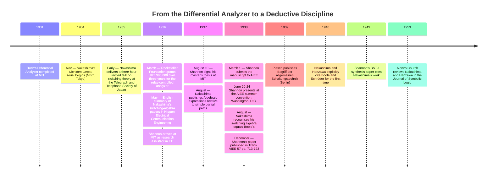

:::tip[In one paragraph]
In August 1937, Claude Shannon signed a master's thesis at MIT that gave switching-circuit design an axiomatic foundation: eight postulates, perfect-induction proofs, and an explicit identification of relay algebra with George Boole's calculus of propositions. Akira Nakashima at NEC had reached the same insight in Tokyo two years earlier. Hansi Piesch (1939) and Plechl–Duschek (1946) later published related German-language titles; this chapter uses their accessible opening pages, not complete-paper priority claims. Shannon's distinctive contribution was axiomatic completeness — circuit design became a deductive discipline, not a uniquely Shannon-only insight.
:::

<details>
<summary><strong>Cast of characters</strong></summary>

| Name | Lifespan | Role |
|---|---|---|
| Claude Shannon | 1916–2001 | Research assistant in MIT EE (1936–1937); signed "A Symbolic Analysis of Relay and Switching Circuits" on August 10, 1937; published it in *Trans. AIEE* in December 1938. The chapter's primary protagonist; contribution is the axiomatic completeness of the calculus. |
| Vannevar Bush | 1890–1974 | MIT Vice-President and Dean of Engineering; architect of the Differential Analyzer program whose 1936 successor formed the MIT context for Shannon's research-assistant period. Recipient of the March 17, 1936 Rockefeller grant. |
| Akira Nakashima | 1908–1970 | Engineer at Nippon Electric Company (NEC), Tokyo; developed a relay-network algebra ahead of Shannon's thesis and later recognised its identity with Boole's algebra. |
| Masao Hanzawa | — | Engineer at NEC's exchange-engineering team; co-author with Nakashima from 1936 onward, including the 1940 papers that first explicitly cite Boole and Schröder. |
| Frank L. Hitchcock | 1875–1957 | Professor of mathematics at MIT; Shannon's *formal* thesis supervisor — distinct from Bush, who was Shannon's research-program supervisor and MIT employer. |
| Samuel H. Caldwell | 1904–1960 | Bush's MIT colleague and deputy on the Rockefeller Differential Analyzer project; took on day-to-day responsibility for the new analyzer as Bush's vice-presidential duties accumulated; thanked in Shannon's 1938 byline footnote. |

</details>

<details>
<summary><strong>Timeline (1931–1953)</strong></summary>



</details>

<details>
<summary><strong>Plain-words glossary</strong></summary>

- **Hindrance** — Shannon's term for the algebraic value assigned to a two-terminal switching circuit. `0` denotes the hindrance of a *closed* circuit (current flows; "no hindrance"); `1` denotes the hindrance of an *open* circuit (no current flows). The inverse of the modern Boolean convention where `1` is "true / closed."
- **Series-parallel circuit** — In Shannon's calculus, `X + Y` represents the *series* connection of two two-terminal circuits and `X · Y` (often written `XY`) represents the *parallel* connection. Any expression in `+`, `·`, and negation describes a series-parallel network, and vice versa.
- **Postulate** — A foundational axiom the calculus asserts rather than proves. Shannon's thesis lists eight postulates, arranged in dual pairs `1a/1b` through `4a/4b`, that fix how `+`, `·`, `0`, and `1` interact.
- **Perfect induction** — Shannon's name for proof by case-exhaustion. Because every variable takes only two values, every theorem can be verified by computing both sides for each finite combination of inputs.
- **Make / break contact** — The two physical kinds of relay contact. A *make* contact is normally open and closes when the relay is energised; a *break* contact is normally closed and opens. Shannon defined negation `X'` as "the hindrance of the break contacts of the same relay whose make contacts have hindrance `X`" — turning logical NOT into a physically realisable operation.
- **Calculus of propositions** — Boole's 1854 algebra of logical propositions, where `+` is OR-on-truth and `·` is AND-on-truth. Shannon's thesis identifies his switching algebra with this calculus under the inversion induced by the hindrance convention; Table I of the 1938 paper makes the analogue explicit row by row.

</details>

In 1931, Vannevar Bush's Differential Analyzer was completed at the Massachusetts Institute of Technology. It was a mechanical machine, consisting of a long table-like framework crisscrossed by interconnectible shafts, with a series of drawing boards along one side and six disc integrators along the other. The machine cost approximately $25,000 to construct. The disc integrator was, as historian Larry Owens observed, "the heart of the analyzer and the means by which it performed the operation of integration"—a variable-friction gear whose geometry forced the constituent shafts to turn in accordance with a specified relationship.

The 1931 machine occupied a modest footprint by the standards of large industrial equipment, but it embodied a dense relationship between mechanical motion and mathematical operation. Each of the six disc integrators performed one integration; chains of gear shafts carried the resulting shaft rotations to the drawing-board pens, which traced the analyzer's solution curves on paper. To solve a fresh differential equation, an operator routed gear couplings between the integrators, the drawing-board outputs, and the bus shafts that ran the length of the table, in effect "wiring" the analyzer for that one problem. Reconfiguration was hand work, not the throwing of a switch.

In March 1936, seeking to automate this arduous setup process, the Rockefeller Foundation awarded MIT a grant of $85,000 over three years to build the Rockefeller Differential Analyzer. This successor machine was intended to rely on automatic electrical interconnection of machine elements rather than manual gear configuration.

The grant was formally documented in a letter from Bush to Warren Weaver, the director of Rockefeller's Natural Sciences Division, on March 17, 1936. Samuel H. Caldwell, Bush's MIT colleague who appears in archival photographs of the 1931 machine, assumed day-to-day responsibility for the new project as Bush's vice-presidential and dean responsibilities accumulated. The new analyzer, eventually demonstrated for the first time on December 13, 1941 and dedicated to wartime work in 1942, would ultimately incorporate "some two thousand vacuum tubes, several thousand relays, a hundred and fifty motors, and automated input units" and weigh nearly a hundred tons. That finished-machine scale belongs to the 1941–42 wartime analyzer, not to Shannon's 1936–37 setting. In 1936 and 1937, however, the relay-controlled successor existed only on Bush's drawing boards; the working machine at MIT was still the 1931 mechanical analyzer, with no relays in its computational path at all.

The hardest engineering challenge in the new machine was automatic control—assigning computing elements to different problems quickly, efficiently, and automatically. Owens described that challenge as one that "posed, in fact, a software problem." Owens's account does not identify Shannon's duties or motives. Shannon's 1938 paper separately identifies him as a research assistant in MIT's Department of Electrical Engineering during the period when the 1931 mechanical analyzer was still the working machine and the Rockefeller successor was being planned and designed.

Shannon had completed a B.S. at the University of Michigan in 1936 and arrived at MIT later that year. The available record places his research-assistant appointment alongside the planning period for the Rockefeller successor, but it does not document a specific assignment, day-to-day task, or private motivation. The chronology supplies context for the thesis without proving that the analyzer setup problem alone produced Shannon's method.

## The Parallel Discovery

The MIT analyzer chronology does not supply Nakashima's setting, and Owens's analyzer history does not name Shannon. Independent theoretical work was underway in Tokyo. Akira Nakashima, a graduate of Tokyo University, was working as an engineer at the Nippon Electric Company (NEC) on the design of relay networks. Nakashima undertook an extensive analysis of many case studies of relay networks, trying to formulate a unified design theory. He began considering the impedances of relay contacts as two-valued variables, using logic OR and AND operations to represent series and parallel connections.

Nakashima worked at NEC on relay networks for telephone switching—the same application class Shannon later named, not a documented shared project or motive. Niwa Yasujiro, NEC's chief engineer, and Shimazu Yasujiro served as senior figures in the laboratory; Nakashima conducted much of his switching-theory research after office hours. In 1936 he was transferred to NEC's transmission engineering group but continued the relay-network research alongside his new duties, increasingly in collaboration with Masao Hanzawa from NEC's exchange-engineering team. Three different English spellings of his surname—Nakashima, Nakasima, Nakajima—appear across his publications, a reflection of romanization conventions in flux during the period; the kanji rendering also varies between two forms across his corpus. A later TICSP historical report attributes to Akihiko Yamada the claim that Nakashima's 1935 publication was the first paper on switching theory worldwide. TICSP points that wording at a 2003 Yamada article this chapter has not retrieved, and at a 2004 Japanese article that is not used here as a checked English quotation.

Nakashima presented his results in a serial in *Nichiden Geppo* (the NEC Technical Journal) running from November 1934 through September 1935 in Japanese. The Telegraph and Telephone Society of Japan engaged Nakashima to give a three-hour invited talk on switching theory at the Society's annual meeting in early 1935. The talk was subsequently published as "Synthesis theory of relay networks" in the *Journal of the Institute of Telegraph and Telephone Engineers of Japan* in September 1935, and an English-language summary appeared in *Nippon Electrical Communication Engineering* in May 1936.

Nakashima developed his algebra initially without using symbolic notation. He recognized only in August 1938—after Shannon's work had been presented in the United States—that his independently developed switching algebra was "actually equal to the Boolean algebra," and his first explicit citation of George Boole and Ernst Schröder appeared in a 1940 paper co-authored with Hanzawa. Nakashima's notation paralleled Shannon's subsequent work almost exactly: Nakashima used `A=∞` for open circuits and `A=0` for closed circuits (the opposite of Shannon's hindrance convention), while both used `+` for series connection and `·` for parallel connection, and both used an overline or prime for negation.

The historical asymmetry deserves to be stated cleanly. Nakashima reached the *insight*—that relay networks have an algebra of their own—earlier than Shannon, by approximately two years if one measures from the *Nichiden Geppo* serial that began in late 1934, or by fifteen months if one measures from the May 1936 English summary in *Nippon Electrical Communication Engineering* against Shannon's August 1937 thesis signature. There is no documented path showing that Shannon read either Nakashima's Japanese papers or the English summaries before submitting his own thesis, and the parsimonious historical reading is independent simultaneous discovery on opposite sides of the Pacific. What Shannon contributed, and Nakashima had not yet—in 1937—was the *axiomatic completeness*: the closed list of postulates, the perfect-induction proof method, and the explicit identification of the calculus with George Boole's algebra of propositions at first publication rather than at second or third revision.

## The Thesis

On August 10, 1937, Claude Shannon signed his master's thesis, "A Symbolic Analysis of Relay and Switching Circuits," in the MIT Department of Electrical Engineering. His formal thesis supervisor was Professor F. L. Hitchcock.

The thesis opened by establishing a two-problem framework for circuit design: "analysis" (determining the operating characteristics of a given circuit) and "synthesis" (finding a circuit that incorporates given characteristics while ideally requiring the least number of switch blades and relay contacts). Shannon explicitly named the practical motivating applications for this theory: "automatic telephone exchanges, industrial motor control equipment and in almost any circuits designed to perform complex operations automatically."

The synthesis problem was the heart of the matter. Engineers already knew how to *analyze* a given relay network—start from one terminal, trace possible paths to the other, enumerate the conditions under which current would flow. Shannon's inverse question is algebraic: given desired characteristics, write a series-parallel expression and reduce the number of letters. The thesis names telephone exchanges and motor-control equipment as applications. It does not supply a priced, floor-space, or failure-probability argument for why fewer letters are better.

Shannon introduced a "hindrance" notation to map physical circuits to mathematics. "The symbol 0 (zero) will be used to represent the hinderance of a closed circuit," he wrote, "and the symbol 1 (unity) to represent the hinderance of an open circuit." He denoted series connection of two-terminal circuits with a `+`, and parallel connection with a `·` (multiplication). He then listed eight postulates, arranged in pairs to emphasize their duality: "if in any of the *a* postulates the zero's are replaced by one's and the multiplications by additions and vice versa, the corresponding *b* postulate will result."

The first pair of postulates, 1a and 1b, asserted that a closed circuit in series with a closed circuit was closed (`0 + 0 = 0`) and that an open circuit in parallel with an open circuit was open (`1 · 1 = 1`). The next pairs captured the asymmetric cases. Postulate 4 fixed the two-valued constraint—every variable was either `0` or `1` at any given time—and that constraint made every later proof an exhaustive case-check. The pair-and-duality structure was not stylistic ornament. It made the algebra symmetric under the simultaneous swap of `+` with `·` and `0` with `1`, which in turn meant that every theorem in the thesis came packaged with a free dual theorem on the opposite side of the page.

To prove his theorems, Shannon used the method of "perfect induction"—the verification of the theorem for all possible cases, which is finite because each variable takes only the values 0 and 1. He defined negation, `X'`, based on the physical properties of a relay: "If X is the hindrance of the make contacts of a relay, then X' is the hindrance of the break contacts of the same relay." The negation theorems—`X + X' = 1`, `X · X' = 0`, `0' = 1`, `1' = 0`, and `(X')' = X`—followed directly from this definition.

The hindrance convention is worth pausing on, because Shannon's choice of which value represented which physical state runs in the opposite direction of the convention that would dominate digital logic textbooks two generations later. In modern Boolean notation, `1` is *true* and corresponds to a closed switch through which current flows; series circuits implement AND. In Shannon's 1937 framing, `1` is the *hindrance of an open circuit*—a circuit through which no current flows—and series of two open circuits is itself open, so the operation `+` acts as OR on open-ness, equivalent to AND on closed-ness. The two formulations are interchangeable through a simple inversion, but a reader cross-checking the thesis against a modern textbook needs to apply the inversion carefully or risk reading every postulate inside out.

Most importantly, Shannon explicitly identified his calculus with George Boole's work. "The algebra of logic ... originated by George Boole, is a symbolic method of investigating logical relationships," he wrote. Shannon's reference 4 in the published 1938 paper pointed to E. V. Huntington's 1904 *Transactions of the American Mathematical Society* paper "Sets of independent postulates for the algebra of logic"—the same paper that historians of switching theory would later identify as the canonical postulate set for Boolean algebra. The identification was therefore not a vague analogy. Shannon was claiming, with Huntington's postulate set in hand and his own postulates derived from relay behavior on the other, that the two systems were the same algebra under different physical interpretations. Boole's variables were truth values of propositions; Shannon's were hindrances of two-terminal circuits; the formal structure was identical. In a table (later published as Table I: "Analogue Between the Calculus of Propositions and the Symbolic Relay Analysis"), Shannon explicitly mapped the concepts: `X+Y` as series connection corresponded to the proposition that either X or Y is true, `XY` as parallel connection to the proposition that both are true, and `X'` as the contradictory proposition. From that identification the methodology of switching-circuit design followed without further metaphysics. To design a relay network that performed a given logical function, an engineer wrote down the function in Boolean form, simplified it algebraically, and read off the simplified expression as a series-parallel circuit.

Shannon's algebra demonstrated that mathematics, rather than trial-and-error, could be the primary tool for hardware optimization. Before this theoretical foundation, designing a complex relay circuit meant using a "cut and try" method, "first satisfying one requirement and then making additions until all are satisfied." The resulting design, Shannon observed, "will seldom be the simplest" and often contained "hidden 'sneak circuits.'"

Instead, Shannon wrote, "any expression formed with the operations of addition, multiplication, and negation represents explicitly a circuit containing only series and parallel connections. Such a circuit will be called a series-parallel circuit. Each letter in an expression of this sort represents a make or break relay contact, or a switch blade and contact." To find the circuit requiring the least number of contacts, "it is therefore necessary to manipulate the expression into the form in which the least number of letters appear."

## The Simplification

He provided a worked example to demonstrate the method. The original hindrance function, drawn as Figure 5 in the thesis, was `X_ab = W + W'(X+Y) + (X+Z)(S+W'+Z)(Z'+Y+S'V)`. Its 13 contact occurrences use six Boolean variables—`W`, `X`, `Y`, `Z`, `S`, and `V`. Counting these contacts does not tell us the number of physical relays. Shannon applies theorem 17b, `X + f(X) = X + f(0)`, successively to `W`, then `X` and `Y`. The displayed intermediate is `W + X + Y + Z(Z' + S'V)`. On the next page, distributing gives `W + X + Y + ZZ' + ZS'V`, and `ZZ' = 0` leaves the Figure 6 expression `W + X + Y + ZS'V`, with six contact occurrences. Shannon called this a "large reduction in the number of elements."

:::tip[Plain reading]
Theorem 15a is the absorption law: in Shannon's algebra, $X + XY = X$. Theorem 17b is different: $X + f(X) = X + f(0)$. If $X=0$, both sides are $f(0)$; if $X=1$, the `+ X` term makes both sides 1. That two-case check explains why 17b preserves equality when Shannon applies it to the Figure 5 expression. The distributive law then exposes $ZZ'=0$, leaving `W + X + Y + ZS'V`.
:::

The worked example gives the algebra a concrete purpose. An engineer can compare two series-parallel forms before building either one: the rewritten circuit must preserve the original circuit's open-or-closed behavior for every assignment of the variables. Here, the same behavior can be expressed with six contacts instead of thirteen.

### Try it: will the circuit be open or closed?

This modern learning exercise uses the expressions in [Shannon's thesis, printed pp. 14–16](https://dspace.mit.edu/handle/1721.1/11173). Remember the hindrance convention: `0` means closed and `1` means open. Read `+` as OR, juxtaposition as AND, and a prime as NOT.

Set `W=0, X=0, Y=0, Z=1, S=0, V=1`. Predict the result of each expression before opening the answer. Do they describe the same open-or-closed behavior? Be careful with the primed terms: since `S=0`, `S'=1`.

<details>
<summary>Reveal the answer, then check every assignment</summary>

For this assignment, the original becomes:

`0 + 1(0+0) + (0+1)(0+1+1)(0+0+1·1) = 1`

The reduced expression becomes `0+0+0+1·1·1 = 1`. Both describe an open circuit.

One matching case is encouraging; it cannot establish equivalence. Six binary variables have 64 possible assignments. This Python check evaluates the two expressions for every one of them, and stops with the offending assignment if their results differ:

```python
from itertools import product

def original(W, X, Y, Z, S, V):
    return int(bool(W or ((not W) and (X or Y)) or
        ((X or Z) and (S or (not W) or Z) and
         ((not Z) or Y or ((not S) and V)))))

def reduced(W, X, Y, Z, S, V):
    return int(bool(W or X or Y or (Z and (not S) and V)))

sample = (0, 0, 0, 1, 0, 1)
print("sample:", original(*sample), reduced(*sample))
assert original(*sample) == reduced(*sample)

checked = 0
for assignment in product((0, 1), repeat=6):
    assert original(*assignment) == reduced(*assignment), assignment
    checked += 1
print("assignments checked:", checked)
```

This is a present-day algebra check of the transcribed expressions. The historical argument remains on the thesis pages; the program does not reconstruct a physical experiment.

</details>

### A second worked example

In the Section V *Selective Circuit* example, relay `A` must operate when any one, any three, or all four of the relays `w`, `x`, `y`, `z` operate. Count the possibilities: four ways to choose one relay, four ways to choose three, and one way to choose all four. That makes nine operating combinations out of sixteen.

Yet Shannon starts with **seven** product terms. The apparent mismatch is the hindrance convention at work: his expression describes the seven cases that prevent operation—none of the four relays operated, or exactly two. Its value is `1` in those cases; the desired operation corresponds to `0`.

From that expression he obtains a series-parallel circuit with 20 elements. A *symmetric function* makes the shared structure easier to describe: `A = S₄(1, 3, 4)`. Here the numbers count operated relays, whose make-contact hindrance is zero; they identify when `A` has zero hindrance too. Shannon's symmetric-function circuit uses 15 elements. He then uses the complement, `A' = S₄(0, 2)`, and a planar-network dual to recover `A`, reporting a further reduction to 14 elements. These are contact-element counts, not counts of input combinations or named relays. He calls the result "probably the most economical circuit of any sort"—a qualified assessment in the source, not a proof here of a global minimum.

Turing's 1936 universal-machine paper belongs nearby only as a pointer, not as a premise: Shannon's thesis addressed relay-circuit synthesis, and the two works were not in conversation.

## From Thesis to Standard

Shannon submitted his manuscript to the American Institute of Electrical Engineers on March 1, 1938. The paper was made available for preprinting on May 27, 1938, and he presented it at the AIEE summer convention in Washington, D.C., in June. It was published in the *Transactions of the American Institute of Electrical Engineers* in December 1938. In the byline footnote, Shannon acknowledged his debt to Doctor F. L. Hitchcock, Doctor Vannevar Bush, and Doctor S. H. Caldwell.

The formulation of switching-circuit algebra was an idea occurring across multiple engineering centers. Piesch's "Begriff der allgemeinen Schaltungstechnik" appeared in *Archiv für Elektrotechnik* 33 (1939), 672–686; the publisher record dates receipt to 28 February 1939 and publication to October 1939. The accessible TICSP facsimile supports the title and opening-page context, not a complete analysis of the paper. Plechl and Duschek's "Grundzüge einer Algebra der elektrischen Schaltungen" appeared in *Österreichisches Ingenieur-Archiv* I (1946), 203–230. The reproduced pages reference Nakashima/Hanzawa and Piesch, but they do not establish a citation pattern for the complete publication; one printed Piesch reference says "1937," while the publisher record gives 1939. Shannon's 1949 *Bell System Technical Journal* paper, "The synthesis of two-terminal switching circuits" (volume 28, number 1, pages 59 through 98), cites Nakashima's work. A 1953 review by Alonzo Church in the *Journal of Symbolic Logic* later recorded Nakashima and Hanzawa's work in that literature.

The 1938 *Trans. AIEE* paper was an engineering-trade publication, not an academic-mathematics one. Its later reach is best stated more cautiously than the usual origin story allows: the framework appears less as a single-origin event than as a deductive language for circuit design that gradually became part of the foundation of digital logic.

The most revealing comparison is between the documents themselves. Nakashima's relay-network research preceded Shannon's thesis. The later European publications belong in that history too, but their opening pages cannot settle how their complete arguments compare with Shannon's. In the thesis, readers can follow the postulates, proofs, connection to Boole's calculus of propositions, and worked circuit reductions together. Its contribution becomes tangible in those steps: a circuit diagram becomes an expression, and algebra provides a way to transform it while preserving its behavior.

:::note[Why this still matters today]
The habit of transforming a symbolic description also appears in one documented modern tool flow. Consider [Yosys](https://yosyshq.readthedocs.io/_/downloads/yosys/en/latest/pdf/): its documentation describes turning a Verilog design's behavior, including clocked state and memory accesses, into an internal network. The tool transforms that network while aiming to preserve its function, then maps it to cells or memory resources for a chosen target library. The resulting network depends on the technology and synthesis choices. This does not equate every modern chip with Shannon's two-terminal series-parallel relay model, and it does not claim universal minimality. The useful question that carries across is narrower: what can you change in a representation while keeping the behavior you need?
:::

## Sources

The sources offer different views of the story: Owens follows the analyzer project, Shannon presents the algebra, and the later historical studies trace related work in Japan and Europe. The European papers are represented here by their cited opening pages, rather than complete copies.

- [Owens, “Vannevar Bush and the Differential Analyzer”](https://worrydream.com/refs/Owens_1986_-_Vannevar_Bush_and_the_Differential_Analyzer.pdf) — printed pp. 63, 72, 79–81 cover the 1931 mechanical analyzer, March 1936 grant, automatic-control problem, and 1941–42 finished machine. This history of the analyzer does not discuss Shannon.
- [Shannon, *A Symbolic Analysis of Relay and Switching Circuits* (MIT thesis)](https://dspace.mit.edu/handle/1721.1/11173) — cover/acknowledgement supports the August 10, 1937 signature, Hitchcock supervision, and MIT affiliation; printed pp. 14–16 (PDF pp. 17–19) show the two theorems, Figure 5 and its intermediate expression, and the six-contact Figure 6. Printed pp. 52–54 (PDF pp. 55–57) give the Selective Circuit requirement, hindrance expression, and 20/15/14-element sequence; printed p. 40 defines the symmetric-function notation by zero-valued variables.
- [Shannon, 1938 *Transactions of the AIEE* paper](https://harrymoreno.com/assets/greatPapersInCompSci/3.2_-_A_Symbolic_analysis_of_rela_and_switching_circuits-Claude_E._Shannon.pdf) — Wiley reissue pp. 471–477 / AIEE pp. 713–719 support publication metadata, the Hitchcock/Bush/Caldwell acknowledgement, and the published algebra.
- [Stanković and Astola, TICSP Report 40](https://ethw-images.s3.us-east-va.perf.cloud.ovh.us/ethw/2/2f/Report-40.pdf) — printed pp. 13–20 support Nakashima's chronology, August 1938 Boolean recognition, 1940 citation timing, 1949 Shannon citation, and the Yamada-attribution chain; printed pp. 183, 185–186 provide the accessible Piesch and Plechl–Duschek facsimile pages. The original ETHW PDF URL returns 404; the report is served from the linked S3 archive.
- [Yamada, “History of Research on Switching Theory in Japan”](https://www.jstage.jst.go.jp/article/ieejfms/124/8/124_8_720/_article) — Japanese article with an English abstract and a scanned PDF. TICSP's priority claim cites a separate 2003 Yamada publication; this 2004 article is not the source of a checked English quotation.
- [Cambridge publisher record for Alonzo Church's 1953 review](https://www.cambridge.org/core/services/aop-cambridge-core/content/view/07A9CFEDA2DD6E305929347F18F708D1) — publisher metadata names the author as Alonzo Church and gives *The Journal of Symbolic Logic*, volume 18, issue 4, page 346.
- [Piesch publisher record](https://link.springer.com/article/10.1007/BF01656419) — receipt on 28 February 1939 and publication in October 1939; full text requires access. These dates conflict with the “1937” printed in the Plechl–Duschek reference.
- [Yosys manual](https://yosyshq.readthedocs.io/_/downloads/yosys/en/latest/pdf/) — version 0.68-dev, retrieved September 5, 2026: printed pp. 44, 50, 53, 71–72 describe process lowering, memory handling, and target mapping. This is a modern tool example; the rolling manual URL may later serve a different version.
