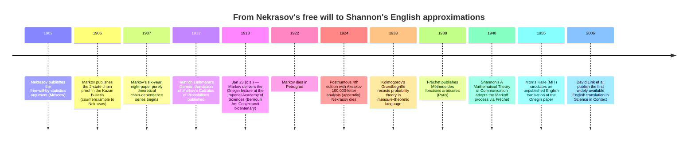

:::tip[In one paragraph]
In 1906, Andrei Markov refuted Pavel Nekrasov's free-will-by-statistics argument with a two-state counterexample — as later English accounts describe the Kazan paper — showing the Weak Law of Large Numbers still holds when successive trials are not independent. Seven years later, on January 23, 1913 (o.s.), he hand-counted 20,000 vowels and consonants in Pushkin's *Eugene Onegin* to give the theorem an empirical demonstration. The conceptual lineage to language models is real, but the transmission route was indirect.
:::

<strong>Cast of characters</strong>

| Name | Lifespan | Role |
|---|---|---|
| Andrei Markov | 1856–1922 | Petersburg mathematician; took over Chebyshev's probability course on his retirement in 1883; published the 1906 chain-dependence proof in the Kazan Bulletin and the 1913 *Eugene Onegin* analysis at the Imperial Academy of Sciences. The chapter's protagonist. |
| Pavel Nekrasov | 1853–1924 | Moscow mathematician with a theological-seminary background; the 1902 paper Markov read as arguing pairwise independence is necessary for the Weak Law of Large Numbers. Hayes and Basharin, citing Ondar, later quote Markov calling that work an "abuse of mathematics." |
| Pafnuty Chebyshev | 1821–1894 | St. Petersburg mathematician; published a broader proof of the Weak Law of Large Numbers than Bernoulli's; mentor to Markov; passed his probability course to Markov on his 1883 retirement. |
| Aleksandr Chuprov | 1874–1926 | Petersburg statistician; long-running correspondent of Markov. Later English accounts quote the correspondence from Ondar 1981; that edition has not been opened for this chapter. |
| Maurice Fréchet | 1878–1973 | French mathematician; his 1938 *Méthode des fonctions arbitraires* became an important bibliographic bridge between Markov and Shannon. |
| Claude Shannon | 1916–2001 | Bell Labs mathematician; "A Mathematical Theory of Communication" (BSTJ, 1948) §3 "The Series of Approximations to English" runs n-gram approximations on English text using the Markoff-process formalism. Reaches Markov via the genus name, not direct citation. |

<strong>Timeline (1902–2006)</strong>

<strong>Plain-words glossary</strong>

- **Weak Law of Large Numbers (WLLN)** — The theorem that, for an arithmetic average over many trials, the average converges in probability to the expected value. Bernoulli proved a special case in 1713; Chebyshev gave a broader version. Later English accounts of Markov's 1906 paper describe the same conclusion for a two-state chain; the Kazan proof is not reconstructed here.
- **Independence (of random variables)** — Two random variables are *independent* if knowing one tells you nothing about the other. Coin flips are the textbook example. Nekrasov, as Markov read him, argued that the WLLN held only for independent variables; Markov's 1906 paper supplied a counterexample.
- **Markov chain** — A sequence of random states where the probability of the next state depends only on the current one (first-order chain) — or, in higher orders, only on the last $n$ states. Hayes and Seneta describe Markov's 1906 result as the two-state first-order case with all four transition probabilities strictly between 0 and 1.
- **Transition probability** — In a Markov chain, the probability of moving from one state to a specified next state. Markov's *Onegin* analysis estimated, for example, that the probability of a vowel after a consonant in Pushkin's Cyrillic was $p_0 \approx 0.663$; the probability of a vowel after a vowel was $p_1 \approx 0.128$.
- **Dispersion coefficient** — In Markov's *Onegin* sample, the ratio of empirical variance to the variance a chain model predicts. For those counts the empirical value was 0.208; the second-order chain predicted 0.195 and the first-order chain 0.300. Those two comparisons are diagnostics for this sample, not a general rule that a coefficient near 1 validates a model.
- **N-gram** — A contiguous sequence of $n$ tokens (here, letters or words) drawn from a text. Shannon's 1948 §3 ran first-, second-, third-order, and word-level n-gram approximations to English. *N*-grams are a finite-order predictive model with a related conditioning pattern; they are not a bibliographic "direct descendant" of Markov 1913.

<strong>The math, on demand</strong>

Markov's 1906 proof and 1913 demonstration both run on a short list of definitions and counts.

- **Two-state first-order chain.** If the current state is A, the next state is A with probability $p_1$ and B with probability $1 - p_1$. From B, A with probability $p_0$ and B with probability $1 - p_0$. Hayes, Seneta, and Sheynin's English rendering of the two-state case describe Markov 1906 as proving the WLLN for any such chain with $0 < p_0, p_1 < 1$. This chapter does not reconstruct the Kazan proof.
- **Independence test.** Under independence the two transition probabilities coincide: $p_1 = p_0$. Markov's diagnostic was the gap $\delta = p_1 - p_0$; the larger $|\delta|$, the deeper the dependence between successive trials. Rechecked from the printed *Onegin* figures, $0.128 - 0.663 = -0.535$ for this sample.
- **Onegin block variance.** Average vowels per 100-letter block: $43.19$, so the unconditional vowel probability $p \approx 0.432$. Sum of squared deviations $1022.8$ over $200$ blocks gives variance $5.114$ and standard deviation $\sigma \approx 2.26$.
- **Onegin first-order counts.** Out of $8{,}638$ vowels in $20{,}000$ letters, $p_1 = 1{,}104 / 8{,}638 \approx 0.128$ (a vowel follows a vowel). Out of the consonant-following positions, $p_0 \approx 0.663$ (a vowel follows a consonant). Therefore $\delta = p_1 - p_0 = -0.535$ — a substantial separation from independence.
- **Second-order chain.** Conditioning on the previous *two* letters yields four transition probabilities $p_{1,1}, p_{1,0}, p_{0,1}, p_{0,0}$. Markov found $p_{1,1} \approx 0.104$ — after two vowels in a row, the chance of a third vowel is *lower* than after just one ($0.104 < p_1 = 0.128$), and far below the unconditional $p \approx 0.432$.
- **Dispersion coefficient as model fit.** For this sample the empirical coefficient was $0.208$; the second-order chain predicted $0.195$, the first-order chain $0.300$. Closer prediction is a better fit *on these counts*, not a general validation rule — and on that comparison the dependence extends at least one letter back.

Russia at the turn of the twentieth century held two leading schools of probability theory, separated by the Pulkovo meridian and a long-running dispute over what mathematics was permitted to claim about human action. St. Petersburg University carried the lineage from Jakob Bernoulli's 1713 *Ars Conjectandi* through Pafnuty Chebyshev, who had published a broader proof of the Weak Law of Large Numbers than Bernoulli's own and whose probability-theory course passed to a single successor on his retirement in 1883. Pavel Nekrasov worked at Moscow University after a theological-seminary education. Hayes, writing a century later, compresses the contrast into a polarity: Moscow University as an Orthodox "stronghold," and "A secular republican from Petersburg was confronting an ecclesiastical monarchist from Moscow." Basharin, Langville, and Naumov independently contrast a Moscow-school interest in free will with the Petersburg tradition. That neat pairing is a later secondary framing, not a primary charter of either faculty.

The spark for what would become the mathematical foundation of language modeling was struck in Moscow. Pavel Alekseevich Nekrasov, a mathematician on the Moscow faculty who had begun his education at a theological seminary, published a paper in 1902. Nekrasov's claim, according to Andrei Andreevich Markov's interpretation, was that the pairwise independence of summands was both necessary and sufficient for the Weak Law of Large Numbers to hold. The implication of this argument was sweeping. As paraphrased by the science writer Brian Hayes, the popular form of the argument ran like this: voluntary acts are independent, like coin flips; the law of large numbers applies only to such independent events; data gathered by social scientists, such as crime statistics, conform to the law of large numbers; therefore, the underlying acts of individuals must be independent and voluntary. Free will, in Nekrasov's formulation, was mathematically demonstrable.

From St. Petersburg, Markov read the argument as a fundamental misuse of probability theory. Markov, born in Ryazan in 1856 to a forestry-service official who later managed an aristocrat's estate, was by most accounts a nettlesome character, abrasive even with friends and fiercely combative with rivals. Hayes quotes Markov calling Nekrasov's work "an abuse of mathematics." Basharin, citing Ondar, dates that phrasing to a 2 November 1910 postcard about page 195 of Chuprov's *Essays on the Theory of Statistics*. Ondar's edition has not been opened here; the phrase is a Hayes/Basharin quotation of that edition, not a letter verified at first hand. Markov was not a man given to measured opposition. When Tsar Nicholas II vetoed the writer Maxim Gorky's election to the Imperial Academy of Sciences in 1902, Markov announced he would refuse all future tsarist honors — without resigning his own membership. When the Russian Orthodox Church excommunicated Leo Tolstoy in 1908, Markov asked the Church to excommunicate him as well, a request that was granted. The historian Eugene Seneta, working from the Markov-Chuprov correspondence as later collected in Kh. O. Ondar's 1981 edition, records that Markov's antipathy did not cool with time: in late 1910, after Chuprov mentioned Nekrasov in a positive light, Markov responded with what Seneta calls "fiery post-cards." Eight years after the original 1902 paper, the dispute was still active. Seneta's late-1910 cards are an independent secondary; they do not by themselves verify the Hayes/Basharin wording.

A note on the historical record is in order. Seneta is more cautious than Hayes about the substance of the 1902 argument. Markov *interpreted* Nekrasov as claiming that pairwise independence was necessary for the Weak Law to hold; whether Nekrasov literally argued that, in those terms, is a question this chapter cannot settle, because Nekrasov's 1902 paper has not been read directly. The popular free-will gloss in Hayes is what Markov/Hayes took Nekrasov to imply; the more carefully phrased mathematical claim in Seneta is what Markov decided he had to refute. The two readings are compatible, but the chapter is recording Markov's reading of Nekrasov, not Nekrasov's verbatim self-description.

Markov's own career had unfolded along the Petersburg lineage with unusual exactness. He had taken over Chebyshev's probability-theory course at St. Petersburg University on Chebyshev's retirement in 1883, the year he also married Maria Valvatieva, daughter of the owner of the estate his father had once managed. He was elected Adjunct of the Imperial Academy of Sciences in 1886 at Chebyshev's proposal and Extraordinary Academician on January 30, 1890 (Old Style). He was promoted to full Professor at the university in 1893; in 1896, two years after Chebyshev's death, he was elected Ordinary Academician at the Academy. The first edition of his textbook *Ischislenie Veroiatnostei* (*Calculus of Probabilities*) appeared in 1900; the second would follow in 1908. By the time Nekrasov's 1902 argument reached St. Petersburg, Markov was a tenured pillar of the Petersburg school with two decades of teaching tied to the Bernoulli-Chebyshev tradition.

## The 1906 Counterexample

Markov retired from St. Petersburg University as Emeritus Professor in 1905, though he remained an Academician and continued to teach the probability course he had inherited. It was from this position that he formulated his response. In a 1906 paper for the Kazan *Izvestiia*, Markov constructed a deliberate counterexample to Nekrasov's claim. Hayes and Seneta describe the result as the Weak Law of Large Numbers for a two-state chain in which all four transition probabilities lay strictly between zero and one; Sheynin's English rendering of the two-state case supports that same framing. If the current state was A, the next state would be A with probability p1 and B with probability 1 − p1, and the law of large numbers would still apply despite the dependence between successive trials. The Kazan pagination has not been verified here, and this chapter does not add proof steps from the translation.

The mathematical force of the refutation was austere. Nekrasov had — as Markov read him — required pairwise independence for the Weak Law to hold. Markov supplied an explicit counterexample in which successive trials were demonstrably *not* independent, and in which the law of large numbers nonetheless converged. The two-state chain was the simplest non-trivial dependent process available, and the convergence held without leaning on any property an independent trial would have provided. After 1906, the inference from "social statistics conform to the WLLN" to "the underlying acts must be independent" was no longer mathematically licensed. Whether human acts were free or determined remained, as it had been before Nekrasov tried to rescue free will with a theorem, a metaphysical question.

The proof was symbolic, written on paper, and ran entirely without empirical illustration. It was the beginning of a six-year, eight-paper purely theoretical series extending chain dependence theory to multiple states, complex chains, and events left without observation. The follow-ups had a clear bibliographic shape. The 1907 paper "Recherches sur un cas remarquable d'épreuves dépendantes" appeared in the *Bulletin de l'Académie Impériale des Sciences de St.-Pétersbourg*; a slightly different French version reached *Acta Mathematica* in 1910, giving the work its first extended Western European readership. A 1908 paper in the Academy's *Mémoires* extended the limit theorems to chain sums; a 1910 paper generalized the chain proof beyond two states; further papers in 1911 and 1912 covered "valeurs liées qui ne forment pas une chaîne véritable," chains of multiple steps, and chains in which some events were left without observation. Across all of these papers, Markov did not look for empirical applications. In the words of David Link, during those six years Markov "could not think of a practical illustration and empirical verification of his deductions, or was not interested in finding one." Hayes renders a letter to Chuprov as Markov being "concerned only with questions of pure analysis" and referring to "the question of the applicability of probability theory with indifference." That English sentence is Hayes's; Ondar has not been checked independently, so the chapter does not treat it as a letter read at first hand.

## The Bernoulli Bicentenary Lecture

That indifference broke on January 23, 1913, by the Old Style Russian calendar — February 5 in the Gregorian. While Russia at large prepared to mark three hundred years of Romanov rule, the bicentenary of an entirely different anniversary fell that winter: the 1713 posthumous publication, by Jakob Bernoulli's nephew Niklaus, of *Ars Conjectandi*, the book that had first formulated the law of large numbers. Markov organized a lecture for the physical-mathematical faculty of the Imperial Academy of Sciences in St. Petersburg to commemorate it. Link, writing as the cautious historian of the lecture, observes only that the choice "gave the physical-mathematical faculty's event a political dimension"; Hayes, writing as Markov's biographer, treats the choice as a deliberate counterpoint to the Romanov tercentenary. Whichever reading is correct, the same mathematical world that had heard six years of Markov's purely theoretical chain proofs would now hear an empirical demonstration of one of them — and the empirical case would be a literary text.

His test set was literary, but the choice was not. Pushkin's *Eugene Onegin* — begun during Pushkin's southern exile in Odessa, after his banishment from St. Petersburg for political poetry, and continued at his mother's country seat at Mikhaylovskoe — offered Markov a long, structurally homogeneous corpus of standardized Cyrillic. He took the first 20,000 letters: the entire first chapter and sixteen stanzas of the second. He stripped out the punctuation, the spaces, the hard signs (ъ), and the soft signs (ь), noting that the latter were not pronounced independently but merely modified the preceding letter.

At the start of the lecture Markov defined seven probabilities. He called the unconditional probability that a letter is a vowel p; the first-order conditional probabilities — the probability of a vowel given the previous letter was a vowel, or a consonant — p1 and p0; and the four second-order conditional probabilities, conditioning on the previous two letters, p1,1, p1,0, p0,1, and p0,0. The first three would carry the first-order argument; the four others were reserved for a sharper, second-order test of the chain.

He organized the unbroken stream of Cyrillic characters into two hundred small tables, each containing ten rows by ten columns. He counted the vowels in each column, paired columns one and six, two and seven, three and eight, four and nine, and five and ten, and entered the sums in bold. This layout permitted simultaneous horizontal and vertical aggregation across each table; forty such tables of paired sums fill an entire page of the published lecture. Link, examining the apparatus a century later, characterized the transformation Markov had performed on Pushkin's text as "a paper-automaton" and a "writing game with discrete characters" — the alphabet recast as a finite state space, the text recast as a sequence of transitions between those states.

The arithmetic mean number of vowels per hundred-letter block was 43.19, giving an unconditional vowel probability p ≈ 0.432. The variance, computed via the method of least squares — the technique developed by Adrien-Marie Legendre in 1805 and Carl Friedrich Gauss in 1809 — came to 1022.8 / 200 = 5.114, with a corresponding standard deviation of about 2.26. Plotted, the per-block vowel counts fell along a normal curve almost as cleanly as if the letters had been drawn independently. Independence, in other words, was not contradicted at the block level — a long sample averages out, regardless of the dependence within. The dependence would have to be looked for at the level of pairs.

Returning to the unbroken stream of letters, Markov counted the pair patterns. Out of 8,638 total vowels, he found 1,104 vowel-vowel pairs, giving p1 — the probability of a vowel after a vowel — as 1104 / 8638 = 0.128. Excluding the first letter, which has no predecessor, he found 7,534 consonants following a vowel and 3,827 consonant-consonant pairs out of 11,361 available consonant-following positions, giving p0 — the probability of a vowel after a consonant — as 0.663. The probability of a consonant following a vowel, q1, was therefore 0.872. The diagnostic signature of the chain was the difference δ = p1 − p0 = 0.128 − 0.663 = −0.535. Under independence, p1 and p0 would coincide; the larger the absolute gap, the deeper the dependence between successive letters. Half a unit was a substantial separation.

Markov did not stop at first-order dependence. He counted the triple patterns to examine the second-order chain: 115 vowel-vowel-vowel sequences and 505 consonant-consonant-consonant sequences in the 20,000-letter sample. After two vowels in a row, the probability of a third vowel collapsed to 0.104 — lower than the unconditional rate of 0.432 by a factor of more than four, and lower even than p1, the probability of a vowel after a single vowel. After two consonants, the probability of another consonant was 1 − 0.132 = 0.868. When these figures were plugged into a two-step chain, the theoretical dispersion coefficient came to 0.195. On this sample that was a tighter comparison to the empirical coefficient of 0.208 than the 0.300 yielded by the one-step chain. Those two gaps are diagnostics for these counts, not a general validation rule. On that comparison the dependence extended at least one letter back.

The labor required for this pencil-and-paper tabulation was immense. A century later, attempting a similar count on an English translation, Hayes circled vowel-vowel pairs on a printout with a pen and missed 62 of 248 of them in the first ten stanzas; he concluded that Markov was "probably faster and more accurate than I am" and "must have spent several days on these labors." The result was a fully empirical demonstration that the Weak Law of Large Numbers held on a chain whose links were measurably real — and a reminder, for any reader inclined to assume that the late-twentieth-century statistical turn in language modeling was the first time anyone had counted letters by hand, that the counting had been done in 1913, on Pushkin, against a free-will theorem.

## The Forty-Year Silence

Markov's *Onegin* analysis was published in the *Bulletin of the Imperial Academy of Sciences of St. Petersburg* in Russian only. A few years later he repeated the exercise on a different corpus: the first 100,000 letters of Sergei Timofeevich Aksakov's autobiographical *Childhood Years of Bagrov's Grandson*, a memoir Aksakov had dictated to his daughter because he had been blind for ten years. This second analysis was included in the appendix to the posthumous 1924 fourth edition of Markov's *Calculus of Probability*. Markov had survived the October Revolution by five years; in 1921 he had complained to the Academy that he could not attend meetings for lack of suitable footwear, and a committee chaired by Maxim Gorky — the same Gorky whose 1902 election the Tsar had vetoed — eventually located him a pair, which Markov dismissed as "stupidly stitched." Markov died in Petrograd on July 20, 1922; Nekrasov followed in 1924, his work falling into post-revolutionary obscurity.

Markov's chains traveled west all the same — not through the *Onegin* paper, but through the term-of-art "Markoff process." Heinrich Liebmann's 1912 German translation of Markov's *Calculus of Probabilities* seeded the chain machinery in the European mathematical community. Maurice Fréchet's 1938 *Méthode des fonctions arbitraires. Théorie des événements en chaîne dans le cas d'un nombre fini d'états possibles*, published in Paris by Gauthier-Villars, generalized the Markoff-process formalism in French and is the work Shannon later footnotes. Kolmogorov's 1933 *Grundbegriffe der Wahrscheinlichkeitsrechnung*, and the 1950 Chelsea English of it, define Markov chains in measure-theoretic language; Shannon does not cite that book. Link records Bru's Bologna-1928 Hostinský–Fréchet–Khinchin–Kolmogorov synthesis; that sketch is a later secondary, not Shannon's bibliography. By 1948 the Markoff process was a settled mathematical term with an established literature, even as the *Onegin* paper itself remained unread outside Russia.

It was in 1948 that Claude Shannon published "A Mathematical Theory of Communication" in the *Bell System Technical Journal*. In the third section, "The Series of Approximations to English," Shannon adopted discrete Markoff processes as the model of an information source. He presented worked first-, second-, third-order, and word-level n-gram approximations to English text. The second-order output read "OCRO HLI RGWR NMIELWIS EU LL NBNESEBYA TH EEI ALHENHTTPA OOBTTVA NAH BRL"; the third-order produced "IN NO IST LAT WHEY CRATICT FROURE BIRS GROCID PONDENOME OF DEMONSTURES OF THE REPTAGIN IS REGOACTIONA OF CRE."

Shannon generalized the construction in §4, "Graphical Representation of a Markoff Process." Section 5, "Ergodic and Mixed Sources," supplied the conditions under which the statistics of such a source are well-defined; section 6, "Choice, Uncertainty and Entropy," attached the entropy measure that would carry the rest of the paper. Footnote 6, the only note routing readers to a detailed treatment of the Markoff-process formalism, is Fréchet 1938 only. It does not cite Markov, Kolmogorov, or Khinchin. The evidenced bibliographic hop is Shannon to Fréchet; any Kolmogorov transmission remains the secondary sketch above, not Shannon's own source list. The transmission of the idea was conceptual, moving via the genus name of the process rather than direct citation of the 1913 or 1906 papers. Shannon's text approximations were themselves a hand-counting exercise. As Shannon detailed in section three, his second-order sample was constructed using a book of random numbers in conjunction with a table of letter frequencies. The higher-order examples were generated by opening a book at random, finding the previous letters, and copying the next one — the same kind of pencil-and-paper procedure Markov had used. The labor involved, Shannon noted, became enormous at the next stage. The same constraint Markov had hit on Pushkin in 1913 was, in 1948, still the active constraint at Bell Labs.

Markov's *Onegin* paper remained inaccessible to the English-speaking world even as Shannon was building on the Markoff-process formalism. In 1955, the MIT linguist Morris Halle produced a mimeographed English translation at the request of colleagues exploring statistical approaches to language. That translation was never published; it survived only in mimeograph form in a few libraries. Fifty-one more years passed before David Link and his colleagues published a widely available English version in *Science in Context* in 2006 — ninety-three years after the lecture, and fifty-eight after Shannon's paper had already absorbed the formalism through Fréchet.

## The Honest Close

What lay between Markov's pencil-and-paper Pushkin tables and any later practical use of n-gram models was, on the documented record, two missing pieces rather than a reconstructed hardware history. There was no published English translation of the *Onegin* paper, and there was no theory of communication that needed a stochastic source as input until Shannon. Shannon's own §3 remarks that constructing further n-gram approximations by hand, with random-number books and frequency tables, made the labor "enormous." That is a constraint on counting. It does not date digital storage, and it does not say that convergence-speed or sampling questions can be answered only by a computer.

Markov did not foresee text generation. He proved a theorem against a theological misuse of mathematics, gave it a literary demonstration, and walked away. The chain of transmission to twenty-first-century language modeling is real, but it is deeply indirect — running through Liebmann's textbook and Shannon's cited Fréchet for the formalism that Shannon actually names, through Shannon's 1948 §3 for the n-gram demonstration on English, and through a fifty-year delay before published English access to the *Onegin* paper itself. Kolmogorov belongs in the later secondary transmission sketch, not in Shannon's footnote. It would take the Cold War theory of communication explored in Chapter 6, and the eventual emergence of the statistical underground covered in Chapter 30, to turn a mathematical counterexample into the foundation of a new artificial intelligence.

One last clarification belongs at the close, and it is narrower than an architecture slogan. Markov's 1913 counts estimate two first-order transitions, $p_1 = P(\text{vowel}\mid\text{vowel})$ and $p_0 = P(\text{vowel}\mid\text{consonant})$, on a two-symbol alphabet. A first-order chain requires $P(X_{t+1}\mid X_t, X_{t-1},\ldots,X_0) = P(X_{t+1}\mid X_t)$. His second-order counts instead condition on the previous two letters. Brown et al. describe GPT-3 as an autoregressive language model that estimates $P(x_{t+1}\mid x_1,\ldots,x_t)$ from available prior tokens inside a finite context window (§§1–2). In Vaswani et al., decoder self-attention is causally masked, so position $t$ may use earlier positions in that window but not later ones (§§3–3.1); the encoder is not under that mask.

That is a finite-context condition, not Markov's two-state, one-step table. It is also not a proof that attention "violates the Markov property," or that no Markov representation exists. A model that conditions on the last $W$ tokens can be written as a Markov chain whose state is the length-$W$ token tuple — a finite but enormous state space. Whether that representation is useful is a separate question, and neither paper adjudicates it. The shared, sourced fact is the conditioning pattern: estimate what may come next from a recorded prefix. Markov measured vowel transitions; GPT-3 scores a token vocabulary.

:::note[Why this still matters today]
What changes when the alphabet grows from two symbols to a vocabulary of tokens? Markov's calculation fills a small table of vowel/consonant transitions; GPT-3 scores possible next tokens from the context it has available. The shared question is “what may come next, given what has come before?”
:::

### Sources for the modern analogy

- Vaswani et al., “Attention Is All You Need,” [arXiv:1706.03762](https://arxiv.org/pdf/1706.03762), abstract and printed pp. 2–3, §§3–3.1: the encoder-decoder Transformer, its autoregressive decoder, and decoder self-attention's causal masking.
- Brown et al., “Language Models are Few-Shot Learners,” [arXiv:2005.14165](https://arxiv.org/pdf/2005.14165), abstract and §§1–2: GPT-3 as an autoregressive model, next-token completion, and a finite context window.
