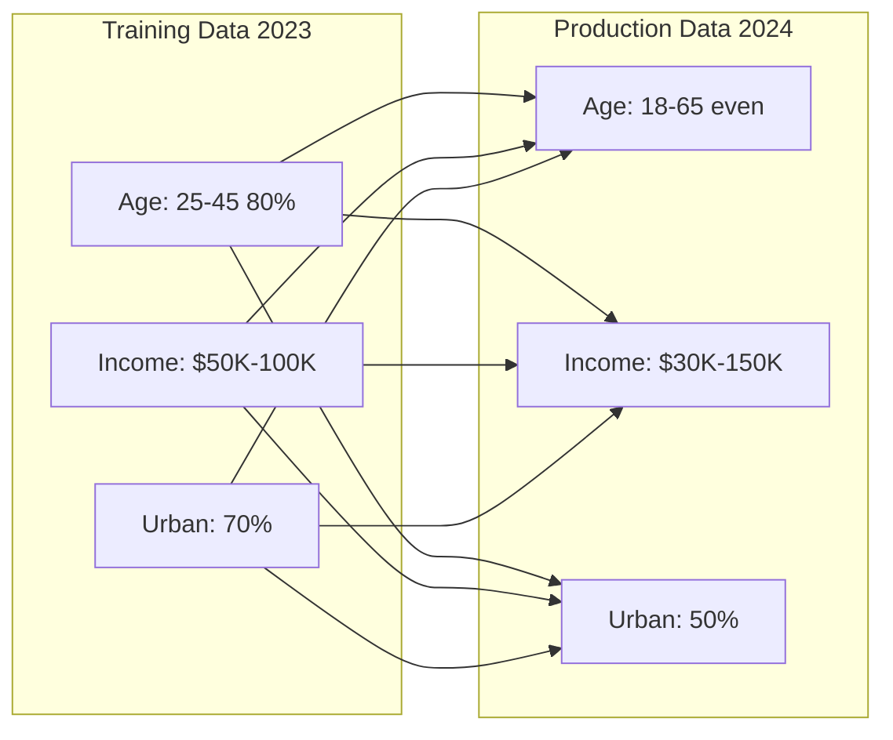
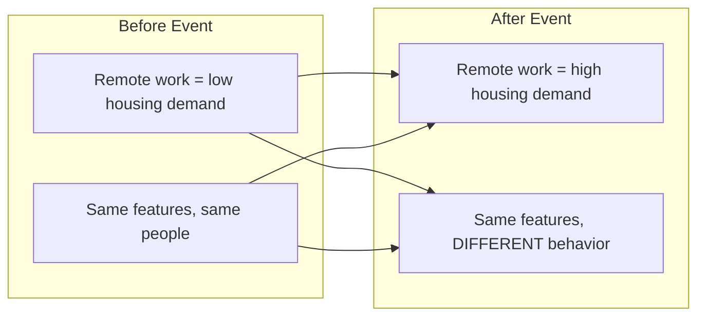

> **AI/ML Engineering Track** | Complexity: `[COMPLEX]` | Time: 5-6 hours  
> **Prerequisites**: [Module 1.9: Model Serving](../module-1.9-model-serving/)

In March 2020, consumer behavior changed faster than most production machine learning systems could adapt. Commute-hour shopping patterns vanished. Fraud models trained on travel-season signals began flagging legitimate home purchases. Inventory systems that predicted condiment demand from years of steady retail rhythms suddenly faced bulk-order spikes they had never seen in training data. [MIT Technology Review documented these failures across retail, fraud detection, and supply-chain forecasting](https://www.technologyreview.com/2020/05/11/1001563/covid-pandemic-broken-ai-machine-learning-amazon-retail-fraud-humans-in-the-loop/) as a defining lesson of the pandemic era: models do not crash when the world changes — they keep serving predictions with the same confident HTTP 200 responses they always did.

The infrastructure looked healthy. Latency dashboards stayed green. Error rates stayed near zero. That is the central terror of unmonitored ML in production: algorithmic failure is often silent. A traditional REST API either returns valid JSON or a 500 Internal Server Error. An ML prediction API will happily return a perfectly formatted 200 OK response containing a prediction that is completely, dangerously wrong. Teams that monitor only containers, CPUs, and request counts discover problems weeks later — when chargebacks spike, inventory sits unsold, or a regulator asks why automated decisions shifted for one demographic group but not another.

This module teaches the observability layer that closes that gap: how to detect data drift, concept drift, and performance degradation before business metrics collapse, how to wire statistical tests and alerting into production pipelines, and how to connect monitoring signals back into retraining and governance workflows.

## Learning Outcomes

By the end of this module, you will be able to:

- **Design** robust observability architectures capable of detecting silent ML failures in production environments.
- **Diagnose** and differentiate between covariate shift (data drift) and relationship shift (concept drift) using statistical methods.
- **Implement** actionable explainability frameworks (SHAP, LIME) to trace degraded predictions back to specific feature variations.
- **Evaluate** model fairness and demographic parity across critical sub-populations to prevent biased outcomes.
- **Implement** comprehensive model governance and audit logging systems that satisfy stringent regulatory frameworks.

## Why This Module Matters

Software observability answers whether the system is running. ML observability answers whether the system is still right. That distinction sounds subtle until you watch a model silently degrade for months while every infrastructure alert stays quiet. Production ML systems fail in four places that conventional monitoring rarely watches: the input feature distribution, the relationship between features and labels, the distribution of model outputs, and the delayed arrival of ground-truth labels that would tell you whether predictions were correct.

Without deliberate ML monitoring, teams discover problems through downstream business pain — increased fraud losses, wrong inventory allocations, biased hiring recommendations, or failed clinical triage — long after the model started making bad decisions. [Google's MLOps guidance treats continuous monitoring as a first-class pipeline stage](https://cloud.google.com/architecture/mlops-continuous-delivery-and-automation-pipelines-in-machine-learning), not an optional dashboard bolted on after launch. The monitoring layer captures baselines at training time, compares production traffic against those baselines on a schedule, exports drift scores and performance metrics to systems like Prometheus, routes alerts through runbooks, and feeds confirmed degradation back into retraining workflows you built in earlier modules.

Think of ML monitoring as the nervous system connecting model serving to model improvement. Serving handles requests; monitoring watches whether the world still matches what the model learned; alerting tells humans or automation that something changed; explainability helps you understand which features drove the change; governance records what you knew and when you knew it. Skip any link in that chain and you are flying blind with a confident autopilot.

> **Landscape snapshot — as of 2026-06. Verify against vendor docs before relying on specifics.** Common open-source monitoring stacks pair Evidently or TensorFlow Data Validation for drift reports with Prometheus for metric export and Grafana for dashboards. Managed ML observability platforms (WhyLabs, Arize, Fiddler, and others) add hosted drift detection and alerting. The [EU AI Act regulatory framework](https://digital-strategy.ec.europa.eu/en/policies/regulatory-framework-ai) imposes documentation, monitoring, and transparency obligations on high-risk AI systems in the European market. Tool version numbers, pricing tiers, and product feature rosters change quarterly — treat them as snapshots, not curriculum spine.

## 1. ML Observability Architecture

To understand why traditional monitoring is wholly inadequate for machine learning systems, we must analyze the fundamental differences in failure modes and build a layered architecture that watches every stage where silent failure can hide. A mature observability stack for ML is not a single dashboard; it is a pipeline that ingests inputs, predictions, delayed labels, and system metrics, runs statistical comparisons against frozen training baselines, and emits actionable signals when the world diverges from what the model expects. 

```text
TRADITIONAL SOFTWARE              ML SYSTEMS
==================               ==========

Fail loud                        Fail silent
Crash = Alert                    Wrong prediction = ???
Deterministic                    Probabilistic
Code doesn't change              Data changes constantly
Binary: works/broken             Gradual degradation
```

Monitoring a production ML model requires a multi-layered approach that tracks the infrastructure, the data distributions, the prediction confidence, and the eventual ground truth. This necessitates an architecture that captures data at various lifecycle stages and funnels it into specialized monitoring engines.

```text
┌─────────────────────────────────────────────────────────────────────────┐
│                    ML MONITORING ARCHITECTURE                            │
├─────────────────────────────────────────────────────────────────────────┤
│                                                                          │
│   DATA LAYER                                                             │
│   ┌─────────────┐  ┌─────────────┐  ┌─────────────┐                    │
│   │  Input Data │  │ Predictions │  │Ground Truth │                    │
│   │  Features   │  │   Outputs   │  │  (delayed)  │                    │
│   └──────┬──────┘  └──────┬──────┘  └──────┬──────┘                    │
│          │               │               │                              │
│          └───────────────┼───────────────┘                              │
│                          │                                              │
│   MONITORING LAYER       ▼                                              │
│   ┌─────────────────────────────────────────────────────────┐          │
│   │                 ML MONITORING                            │          │
│   │  ┌─────────┐  ┌─────────┐  ┌─────────┐  ┌─────────┐    │          │
│   │  │  Data   │  │ Model   │  │Concept  │  │ System  │    │          │
│   │  │  Drift  │  │ Perf    │  │ Drift   │  │ Metrics │    │          │
│   │  └─────────┘  └─────────┘  └─────────┘  └─────────┘    │          │
│   └─────────────────────────────────────────────────────────┘          │
│                          │                                              │
│   ALERTING LAYER         ▼                                              │
│   ┌─────────────────────────────────────────────────────────┐          │
│   │  Prometheus → Alertmanager → PagerDuty/Slack/Email      │          │
│   └─────────────────────────────────────────────────────────┘          │
│                          │                                              │
│   VISUALIZATION          ▼                                              │
│   ┌─────────────────────────────────────────────────────────┐          │
│   │  Grafana Dashboards │ Evidently Reports │ Custom UIs    │          │
│   └─────────────────────────────────────────────────────────┘          │
│                                                                          │
└─────────────────────────────────────────────────────────────────────────┘
```

For modern implementations, we conceptualize this architecture using native state flows. Below is the Mermaid representation of the monitoring pipeline:

```mermaid
flowchart TD
    subgraph Data Layer
        ID[Input Data: Features]
        P[Predictions: Outputs]
        GT[Ground Truth: Delayed]
    end

    subgraph Monitoring Layer
        ML[ML MONITORING ENGINE]
        DD[Data Drift]
        MP[Model Perf]
        CD[Concept Drift]
        SM[System Metrics]
        ML --- DD & MP & CD & SM
    end

    subgraph Alerting Layer
        AL[Prometheus → Alertmanager → PagerDuty/Slack]
    end

    subgraph Visualization
        V[Grafana Dashboards | Evidently | Custom UI]
    end

    ID --> ML
    P --> ML
    GT --> ML
    ML --> AL
    AL --> V
```

The four monitoring layers deserve explicit design attention because each catches failures the others miss. **Input monitoring** watches whether the feature vectors arriving at inference time still resemble training data — missing values, out-of-range numerics, new categorical levels, and schema changes all show up here before they poison predictions. **Output monitoring** tracks the distribution of scores, classes, or regression values the model emits; a sudden shift in positive-class rate often signals trouble even when you cannot yet measure accuracy. **Performance monitoring** compares predictions to ground truth once labels arrive, segmented by customer cohort, geography, device type, or any slice the business cares about. **System monitoring** covers latency, throughput, error rates, GPU memory, and queue depth — the familiar DevOps layer that tells you the serving path is alive but says nothing about whether predictions are still correct.

Baseline creation is the step most teams skip and later regret. At training time, freeze reference histograms, means, standard deviations, and percentile bounds for every monitored feature, plus the prediction distribution on the holdout set. Store that baseline artifact alongside the model in your registry. Every production monitoring job compares live traffic against that artifact — not against last week's traffic, which may already be drifted. [TensorFlow Data Validation (TFDV)](https://www.tensorflow.org/tfx/guide/tfdv) formalizes this pattern with `Schema` objects and `Statistics` protos; Evidently and custom Python jobs implement the same idea with pandas and scipy. The implementation varies; the invariant does not: you need an immutable reference distribution captured at promotion time.

Alert routing should mirror severity. Informational drift (PSI between 0.1 and 0.2) logs to a dashboard for the ML team to review during business hours. Warning-level performance drops notify Slack channels with a linked runbook. Critical drift on a regulated or revenue-critical model pages on-call and may trigger automated traffic throttling or a rollback to the previous model version. The goal is not maximum alerts — it is maximum signal. An alert without a runbook is noise; a runbook without a baseline comparison is guesswork.

## 2. Diagnosing Drift Types

Drift is the silent killer of ML models. It occurs when the statistical properties of the environment change over time, rendering the model's learned weights obsolete even though the serving binary and container image are unchanged. We classify drift into distinct categories because each type implies a different remediation: retrain on fresher data, rebuild features, change the model architecture, or fix an upstream data pipeline bug. Treating all drift as "retrain the model" wastes compute and hides root causes.

The taxonomy starts with **covariate shift** (data drift): the distribution of inputs changes while the conditional relationship between features and the target label stays the same. A credit model trained on urban applicants may still be statistically valid if rural applicants arrive with different income distributions but the same income-to-default relationship. Performance may degrade because the model sees unfamiliar regions of feature space, but the underlying meaning of features is stable. **Concept drift** (relationship shift) is more dangerous: the inputs may look identical, but they now mean something different. The COVID-era remote-work example below is canonical — "remote job posting" shifted from a signal of low housing demand to high demand without changing the feature encoding. **Label drift** (prior shift) changes the base rate of the target class itself. **Prediction drift** changes the model's output distribution, which may reflect input drift, concept drift, or a bug in the serving path.

Detection strategy follows taxonomy. Input drift uses per-feature PSI, KS tests, or Jensen-Shannon divergence against training baselines. Concept drift often requires performance monitoring segmented by time or cohort, because input distributions may look stable while error rates climb. Prediction drift monitors output histograms directly and serves as an early warning when labels are delayed. [IBM's model drift overview](https://www.ibm.com/think/topics/model-drift) and [Microsoft's dataset monitoring guidance](https://learn.microsoft.com/en-us/azure/machine-learning/how-to-monitor-datasets) describe the same categories with vendor-specific tooling; the statistical ideas are portable.

### Data Drift (Covariate Shift)

Data drift occurs when the input feature distributions change, even if the underlying relationship between those features and the target variable remains identical. For example, a credit scoring model might suddenly receive applications from a completely different geographic demographic than it was trained on. The model still interprets `annual_income` the same way — higher income still means lower default risk in the learned function — but the distribution of incomes no longer matches what the model saw during training. Tree-based models may handle mild covariate shift gracefully by splitting on familiar thresholds; linear models and neural networks trained on normalized features can degrade faster because they extrapolate outside the training envelope.

Operational teams often discover data drift through secondary symptoms before PSI alerts fire: customer support tickets about "wrong" recommendations, manual reviewers overriding model decisions more often, or upstream data engineers reporting a new API version. That is why input monitoring should include schema validation (unexpected columns, type changes, null rate spikes) alongside distributional tests. A feature can pass PSI while being semantically wrong — imagine a currency field that silently switched from USD to cents. Schema checks catch encoding bugs; PSI catches population shifts.

```text
DATA DRIFT EXAMPLE
==================

Training Data (2023):              Production Data (2024):
┌────────────────────┐            ┌────────────────────┐
│ Age: 25-45 (80%)   │            │ Age: 18-65 (even)  │
│ Income: $50K-100K  │    →       │ Income: $30K-150K  │
│ Urban: 70%         │            │ Urban: 50%         │
└────────────────────┘            └────────────────────┘

The model learned from a specific population.
Now it sees a different population.
May still work, but performance likely degraded.
```



### Concept Drift

Concept drift is far more insidious. It occurs when the fundamental relationship between the input features and the target variable shifts. The inputs might look exactly the same, but they now mean something entirely different. Regulatory changes illustrate concept drift cleanly: a feature that was a legitimate risk signal yesterday becomes illegal to use tomorrow, and the label definition itself may change when compliance teams redefine what counts as fraud or default. Seasonal concept drift is subtler — ice cream demand correlates with temperature in summer but with school holidays in winter if your training data mixed both patterns.

Adaptation strategies depend on drift speed. Gradual concept drift may justify scheduled retraining on rolling windows of recent labeled data. Sudden concept drift (pandemic, policy shock, competitor launch) may require immediate rollback and emergency retraining with human-reviewed labels. Some production systems maintain a **champion/challenger** arrangement: the champion serves most traffic while a challenger model trains on fresher data; monitoring metrics decide when to promote the challenger. The monitoring layer supplies the promotion signal — not gut feeling.

```text
CONCEPT DRIFT EXAMPLE
=====================

Before COVID-19:                   After COVID-19:
┌────────────────────┐            ┌────────────────────┐
│ Remote work = low  │            │ Remote work = high │
│ housing demand     │    →       │ housing demand     │
│                    │            │                    │
│ Same features,     │            │ Same features,     │
│ same people        │            │ DIFFERENT behavior │
└────────────────────┘            └────────────────────┘

The world changed. Same inputs now mean different things.
```



When you suspect concept drift, input-only tests will lie to you. The correct diagnostic sequence is: confirm input drift (if any), confirm prediction drift, then compare performance metrics across rolling windows once labels arrive. If inputs are stable but performance drops, you are likely facing concept drift or label quality issues. If inputs shifted but performance is stable, the model may generalize well enough — or it may be making wrong predictions for new reasons that aggregate to similar accuracy on average. Segment-level metrics expose that trap.

### Prediction Drift

Prediction drift focuses purely on the output space. If your binary classification model historically predicted a 15% positive rate, and suddenly begins predicting a 40% positive rate, the output distribution has drifted.

```python
# Detecting prediction drift
def detect_prediction_drift(
    reference_predictions: np.ndarray,
    current_predictions: np.ndarray,
    threshold: float = 0.05
) -> dict:
    """
    Detect if prediction distribution has shifted.
    Uses Kolmogorov-Smirnov test.
    """
    from scipy import stats

    statistic, p_value = stats.ks_2samp(
        reference_predictions,
        current_predictions
    )

    return {
        "statistic": statistic,
        "p_value": p_value,
        "drift_detected": p_value < threshold,
        "reference_mean": np.mean(reference_predictions),
        "current_mean": np.mean(current_predictions),
        "reference_std": np.std(reference_predictions),
        "current_std": np.std(current_predictions)
    }
```

Prediction drift is your best real-time proxy when ground truth lags by days or weeks. Fraud labels may arrive thirty days after a transaction; churn labels may take ninety days. During that gap, you cannot compute accuracy, but you can ask whether the model is still producing the same score distribution it produced during validation. A binary classifier that historically approved twelve percent of applications and suddenly approves thirty-five percent is behaving differently even if you do not yet know whether those approvals are wrong. Pair prediction drift alerts with business KPI monitors — chargeback rate, manual review queue depth, customer complaint volume — to distinguish model issues from genuine population change.

## 3. Statistical Detection Methods

To mathematically prove that drift has occurred, MLOps engineers rely on several core algorithms to compare production distributions against training baselines. No single test is universally best: PSI is interpretable for scorecard teams, the Kolmogorov-Smirnov test is rigorous for continuous features, and Jensen-Shannon divergence behaves well in automated pipelines because it is symmetric and bounded. Production systems often compute all three for critical features and alert when any crosses a threshold, reducing false negatives at the cost of some redundant computation.

Choosing bin counts and sample sizes matters more than beginners expect. PSI with too few bins is noisy; with too many bins, sparse cells inflate scores. A common pattern is ten decile bins for scorecard features and fifty bins for high-cardinality continuous variables. Statistical tests need enough production samples to be meaningful — checking drift on fifty requests after a deploy is premature; checking only daily aggregates may miss intraday pipeline bugs. Align window size with business rhythm: fraud models may need five-minute windows; demand forecasts may need daily rollups.

#### Population Stability Index (PSI)

PSI is a common heuristic for quantifying how much a population has shifted over time. Credit risk and marketing scorecard teams adopted PSI because it produces a single interpretable number per feature that non-statisticians can read on a dashboard. The intuition is straightforward: bin the reference and current distributions the same way, compare the proportion of records in each bin, and sum the weighted log-ratio differences. Large PSI means the live population would look surprising to someone who only saw training data. PSI is not a hypothesis test — it does not give you p-values — so pair it with KS tests when you need statistical significance for audit documentation.

```python
def psi_bin_edges_from_reference(reference: np.ndarray, bins: int = 10) -> np.ndarray:
    """Build bin edges from reference with open-ended outer bins for overflow values."""
    _, inner_edges = np.histogram(reference, bins=bins)
    return np.concatenate([[-np.inf], inner_edges[1:-1], [np.inf]])


def calculate_psi_from_histograms(
    ref_percents: np.ndarray,
    cur_percents: np.ndarray,
    epsilon: float = 1e-4,
) -> float:
    """Compute PSI from aligned bin proportions (same bins, same order)."""
    ref_percents = np.asarray(ref_percents, dtype=float)
    cur_percents = np.asarray(cur_percents, dtype=float)
    ref_percents = ref_percents / ref_percents.sum()
    cur_percents = cur_percents / cur_percents.sum()
    ref_percents = np.clip(ref_percents, epsilon, 1)
    cur_percents = np.clip(cur_percents, epsilon, 1)
    return float(np.sum((cur_percents - ref_percents) * np.log(cur_percents / ref_percents)))


def calculate_psi(
    reference: np.ndarray,
    current: np.ndarray,
    bins: int = 10,
    bin_edges: np.ndarray | None = None,
) -> float:
    """
    Calculate Population Stability Index.

    PSI < 0.1: No significant change
    PSI 0.1-0.25: Moderate change, investigate
    PSI > 0.25: Significant change, action required
    """
    if bin_edges is None:
        bin_edges = psi_bin_edges_from_reference(reference, bins=bins)

    ref_counts = np.histogram(reference, bins=bin_edges)[0]
    cur_counts = np.histogram(current, bins=bin_edges)[0]

    ref_percents = ref_counts / len(reference)
    cur_percents = cur_counts / len(current)

    return calculate_psi_from_histograms(ref_percents, cur_percents)
```

#### Kolmogorov-Smirnov Test

The KS test is a non-parametric test that compares the cumulative distributions of two distinct datasets, seeking the maximum absolute distance between them. Unlike PSI, the KS test returns a p-value you can cite in audit reports: "we reject the null hypothesis that production and training distributions are identical at α=0.05." The trade-off is interpretability — stakeholders understand PSI buckets more intuitively than p-values. Many teams alert on PSI for daily operations and generate KS test reports weekly for compliance archives. For high-stakes models, run both and escalate when either fires.

```python
def ks_drift_test(
    reference: np.ndarray,
    current: np.ndarray,
    alpha: float = 0.05
) -> dict:
    """
    Kolmogorov-Smirnov test for distribution comparison.
    """
    from scipy import stats

    statistic, p_value = stats.ks_2samp(reference, current)

    return {
        "statistic": statistic,
        "p_value": p_value,
        "drift_detected": p_value < alpha,
        "interpretation": (
            "Distributions are different" if p_value < alpha
            else "No significant difference"
        )
    }
```

#### Jensen-Shannon Divergence

Unlike Kullback-Leibler (KL) divergence, JS divergence is [symmetric and typically yields a finite value in a bounded range](https://en.wikipedia.org/wiki/Jensen%E2%80%93Shannon_divergence), making it exceptionally reliable for automated monitoring pipelines. KL divergence blows up when one distribution assigns zero mass where another assigns positive mass — common when a new categorical level appears in production. JS divergence handles that gracefully, which matters for unattended nightly drift jobs that should not crash on novel category values. Normalize JS to the 0–1 scale for dashboard display; values above 0.3 on critical features warrant human review in most deployments.

```python
def js_divergence(
    reference: np.ndarray,
    current: np.ndarray,
    bins: int = 50
) -> float:
    """
    Jensen-Shannon Divergence - symmetric measure of distribution difference.

    JS = 0: Identical distributions
    JS = 1: Completely different distributions
    """
    from scipy.spatial.distance import jensenshannon

    # Create histograms (probability distributions)
    all_data = np.concatenate([reference, current])
    _, bin_edges = np.histogram(all_data, bins=bins)

    ref_hist = np.histogram(reference, bins=bin_edges, density=True)[0]
    cur_hist = np.histogram(current, bins=bin_edges, density=True)[0]

    # Normalize
    ref_hist = ref_hist / ref_hist.sum()
    cur_hist = cur_hist / cur_hist.sum()

    return jensenshannon(ref_hist, cur_hist)
```

Threshold selection should be conservative at first. Industry heuristics treat PSI below 0.1 as stable, 0.1–0.25 as investigate, and above 0.25 as act — but those cutoffs assume scorecard-style credit models with stable binning. A recommendation model with heavy-tailed click distributions may need calibrated thresholds per feature. Store thresholds in version-controlled config alongside the model card so auditors can see what you considered acceptable at deployment time.

> **Pause and predict**: If you train a machine learning model to optimize logistics routes based on historical weather patterns, and an unprecedented massive hurricane occurs, drastically altering road availability, which specific type of drift will your model experience first? Why?

## 4. Performance Monitoring and Explainability

Once you identify drift, the next imperative is proving how much performance has actually degraded and explaining which features drove the change. Accuracy alone is a dangerous summary statistic: a model can maintain ninety-four percent overall accuracy while recall on a critical minority segment collapses. Production monitoring must therefore track the right metric for the business cost structure — precision when false positives are expensive, recall when false negatives are dangerous, MAE or RMSE for regression with asymmetric error costs — and compute those metrics over rolling windows segmented by every population the business cares about.

Label delay is the defining constraint of performance monitoring design. When ground truth arrives instantly (click prediction, next-token classification), you can mirror offline evaluation in production. When labels lag (loan default, patient readmission, fraud confirmation), you need a layered strategy: real-time prediction drift and data quality checks as early warnings, delayed batch jobs that join predictions to labels when they arrive, and explicit tracking of label latency itself because slow labels can hide degradation. [Google's Rules of ML](https://developers.google.com/machine-learning/guides/rules-of-ml) emphasize that evaluation must match the production decision boundary; the same discipline applies to monitoring metrics you choose at deploy time.

```text
CLASSIFICATION METRICS
======================

Metric          Formula                         When to Use
──────────────────────────────────────────────────────────────
Accuracy        (TP + TN) / Total              Balanced classes
Precision       TP / (TP + FP)                 Cost of FP is high
Recall          TP / (TP + FN)                 Cost of FN is high
F1 Score        2 * (P * R) / (P + R)          Imbalanced classes
AUC-ROC         Area under ROC curve           Ranking quality
Log Loss        -Σ y*log(p)                    Probability quality


REGRESSION METRICS
==================

Metric          Formula                         Interpretation
──────────────────────────────────────────────────────────────
MAE             |y - ŷ| / n                    Average error magnitude
RMSE            √(Σ(y - ŷ)² / n)               Penalizes large errors
MAPE            |y - ŷ| / y * 100              Percentage error
R²              1 - SS_res / SS_tot            Variance explained
```

### Sliding Window Monitoring

Because production systems operate on continuous streams of incoming requests rather than static batch files, performance must be calculated over sliding windows. This ensures transient spikes do not permanently skew the aggregate performance metric. The `SlidingWindowMonitor` class below implements count-based windows for illustration; production systems should prefer time-based windows as discussed in the quiz section. When you detect degradation, capture the window's predictions and features in cold storage before the window rolls forward — post-incident SHAP analysis needs the actual samples that triggered the alert, not aggregate statistics alone.

Connecting monitoring to retraining closes the MLOps loop. When `check_degradation` returns `alert: True`, the monitoring job should attach a drift report artifact, open a pipeline run in your orchestrator, and notify the model owner with segment-level metrics. Automatic retraining without human review is risky early in maturity; automatic ticket creation with evidence attached is almost always the right first automation step.

```python
class SlidingWindowMonitor:
    """
    Monitor metrics over sliding time windows.
    """

    def __init__(self, window_size: int = 1000, alert_threshold: float = 0.1):
        self.window_size = window_size
        self.alert_threshold = alert_threshold
        self.predictions = []
        self.actuals = []
        self.baseline_accuracy = None

    def add_prediction(self, prediction: float, actual: float):
        """Add a new prediction-actual pair."""
        self.predictions.append(prediction)
        self.actuals.append(actual)

        # Keep only window_size recent samples
        if len(self.predictions) > self.window_size:
            self.predictions.pop(0)
            self.actuals.pop(0)

    def set_baseline(self):
        """Set current performance as baseline."""
        self.baseline_accuracy = self.calculate_accuracy()

    def calculate_accuracy(self) -> float:
        """Calculate accuracy over current window."""
        if not self.predictions:
            return 0.0

        correct = sum(
            1 for p, a in zip(self.predictions, self.actuals)
            if (p > 0.5) == (a > 0.5)
        )
        return correct / len(self.predictions)

    def check_degradation(self) -> dict:
        """Check if model performance has degraded."""
        current_accuracy = self.calculate_accuracy()

        if self.baseline_accuracy is None:
            return {"status": "no_baseline", "current_accuracy": current_accuracy}

        degradation = self.baseline_accuracy - current_accuracy

        return {
            "baseline_accuracy": self.baseline_accuracy,
            "current_accuracy": current_accuracy,
            "degradation": degradation,
            "alert": degradation > self.alert_threshold,
            "message": (
                f"ALERT: Accuracy dropped by {degradation:.2%}"
                if degradation > self.alert_threshold
                else "Performance within acceptable range"
            )
        }
```

Sliding windows must be time-aware under bursty traffic. A fixed sample-count window of one hundred predictions behaves differently at ten requests per second versus ten requests per hour; during a flash sale, the window may represent milliseconds of traffic and overreact to noise. Prefer time-based windows (rolling one hour, rolling twenty-four hours) for performance metrics and reserve count-based windows for low-volume models where time windows would never fill.

### Explainability Frameworks

Detecting a failure is only the first step. Diagnosing the exact feature responsible for the failure is where explainability comes in. You cannot effectively debug an algorithmic black box without tools like SHAP or LIME that attribute individual predictions to input features. In monitoring workflows, explainability is not an ethics-only exercise — it is an incident response tool. When PSI spikes on `device_type`, SHAP values on misclassified samples tell you whether the model started overweighting mobile traffic. When demographic parity drops, localized explanations on the disadvantaged cohort reveal which features shifted.

Use explainability surgically. Global SHAP summaries computed nightly highlight which features dominate predictions across the fleet. Local explanations on alerted samples help on-call engineers during incidents. Neither replaces drift detection; both accelerate root-cause analysis after detection fires. Tree-based models use `TreeExplainer` efficiently; arbitrary models fall back to `KernelExplainer` with a small background sample. Budget compute: explaining every prediction in real time is usually prohibitive; explaining a stratified sample from each alert window is practical.

#### SHAP (SHapley Additive exPlanations)

SHAP relies on [cooperative game theory](https://arxiv.org/abs/1705.07874) to distribute the "payout" (the final prediction) among the "players" (the input features) fairly. The Shapley value is the only attribution method that satisfies consistency, local accuracy, and missingness axioms — which is why SHAP became the default explainability tool in many production monitoring runbooks when teams need defensible feature attribution during incidents.

```python
import shap

def explain_prediction_shap(model, X_sample, feature_names):
    """
    Explain a single prediction using SHAP.
    """
    # Create explainer
    explainer = shap.TreeExplainer(model)  # For tree-based models
    # Or: explainer = shap.KernelExplainer(model.predict, X_background)

    # Get SHAP values
    shap_values = explainer.shap_values(X_sample)

    # Create explanation
    explanation = {
        "base_value": explainer.expected_value,
        "prediction": model.predict(X_sample)[0],
        "feature_contributions": {
            feature_names[i]: shap_values[0][i]
            for i in range(len(feature_names))
        }
    }

    # Sort by absolute contribution
    sorted_contributions = sorted(
        explanation["feature_contributions"].items(),
        key=lambda x: abs(x[1]),
        reverse=True
    )

    explanation["top_features"] = sorted_contributions[:5]

    return explanation

# Example output:
# {
#     "base_value": 0.35,
#     "prediction": 0.82,
#     "top_features": [
#         ("credit_score", 0.25),
#         ("income", 0.15),
#         ("age", -0.08),
#         ("employment_years", 0.12),
#         ("debt_ratio", 0.03)
#     ]
# }
```

#### LIME (Local Interpretable Model-agnostic Explanations)

LIME operates by generating a new, localized dataset around the target prediction and [fitting a simpler, inherently interpretable linear model](https://arxiv.org/abs/1602.04938) to approximate the complex model's behavior in that specific hyperspace. LIME is model-agnostic — it works on any predictor with a `predict_proba` method — which makes it useful when SHAP's tree-specific optimizers do not apply.

```python
from lime.lime_tabular import LimeTabularExplainer

def explain_prediction_lime(model, X_train, X_sample, feature_names):
    """
    Explain a single prediction using LIME.
    """
    explainer = LimeTabularExplainer(
        X_train,
        feature_names=feature_names,
        class_names=['negative', 'positive'],
        mode='classification'
    )

    explanation = explainer.explain_instance(
        X_sample,
        model.predict_proba,
        num_features=10
    )

    return {
        "prediction": model.predict_proba([X_sample])[0],
        "explanation": explanation.as_list(),
        "local_model_r2": explanation.score
    }
```

### Fairness Monitoring in Production

Fairness monitoring belongs in the same dashboard as accuracy because aggregate metrics hide disparate impact. Track positive prediction rate, true positive rate, and false positive rate across protected or business-critical subgroups — geography, product tier, language, age band — and alert when disparity ratios cross policy thresholds. The eighty-percent rule (disparity ratio between 0.8 and 1.25) is a common starting heuristic in U.S. fair lending practice, but your organization may enforce stricter bounds. When disparity triggers, run explainability filtered to the affected subgroup before assuming the model is biased: sometimes upstream data collection changed for one cohort (a classic covariate shift) rather than the model learning a spurious correlation.

> **Stop and think**: You are deploying a Kubernetes v1.35 cluster to run Prometheus and Grafana for your ML models. If your predictions suddenly start taking 800ms instead of 50ms, but the mathematical accuracy remains stable at 95%, what downstream business metrics might be quietly degrading as a result of this latency?

## 5. Alerting, Governance, and the Feedback Loop

A monitoring system without effective alerting is merely a data graveyard. Implementing robust instrumentation requires exporting metrics into specialized time-series databases like Prometheus, defining alert rules that encode business tolerances, and connecting those alerts to runbooks that tell humans exactly what to investigate. The feedback loop closes when confirmed drift or performance degradation triggers retraining, shadow evaluation, or rollback — wiring you practiced in [Module 1.8: ML Pipelines](../module-1.8-ml-pipelines/).

Governance ties monitoring to accountability. Model cards document intended use, limitations, and which metrics you monitor. Audit logs record training events, deployments, threshold changes, and alert acknowledgments. Regulated industries and the [EU AI Act framework](https://digital-strategy.ec.europa.eu/en/policies/regulatory-framework-ai) increasingly expect demonstrable monitoring — not just that a model was accurate at launch, but that you detected and responded to degradation afterward. [NIST's AI Risk Management Framework](https://www.nist.gov/itl/ai-risk-management-framework) provides a durable structure for mapping monitoring controls to organizational risk tolerance without tying the curriculum to a specific vendor compliance product.

### Prometheus Metric Definitions

Prometheus uses a pull model: a scraper polls your `/metrics` endpoint on an interval and stores time series in its database. That fits ML serving well because you expose counters and gauges from the inference process without pushing to a remote collector on every prediction. Use **Counters** for monotonically increasing events (total predictions). Use **Histograms** for latency distributions because they pre-compute buckets that PromQL can query with `histogram_quantile`. Use **Gauges** for values that rise and fall (rolling accuracy, current PSI per feature). Label every metric with `model_name` and `model_version` so you can compare champion and challenger during canary deployments.

Alert rules should encode business meaning, not statistical curiosity. `ml_drift_score > 0.25 for 10m` is a starting point, but tie severity to feature tier: drift on a cosmetic feature is informational; drift on `transaction_amount` in fraud detection is critical. Document the mapping in the model card so future engineers understand why thresholds exist. [Prometheus alerting overview](https://prometheus.io/docs/alerting/latest/overview/) describes routing labels to Alertmanager receivers — match `severity: critical` to PagerDuty and `severity: warning` to Slack during business hours.

```python
from prometheus_client import Counter, Histogram, Gauge, start_http_server

# Define metrics
PREDICTION_COUNTER = Counter(
    'ml_predictions_total',
    'Total number of predictions',
    ['model_name', 'model_version']
)

PREDICTION_LATENCY = Histogram(
    'ml_prediction_latency_seconds',
    'Prediction latency in seconds',
    ['model_name'],
    buckets=[0.01, 0.025, 0.05, 0.1, 0.25, 0.5, 1.0]
)

MODEL_ACCURACY = Gauge(
    'ml_model_accuracy',
    'Current model accuracy (rolling window)',
    ['model_name', 'model_version']
)

DRIFT_SCORE = Gauge(
    'ml_drift_score',
    'Current drift score (PSI)',
    ['model_name', 'feature_name']
)

class PrometheusMLMonitor:
    """
    Export ML metrics to Prometheus.
    """

    def __init__(self, model_name: str, model_version: str, port: int = 8000):
        self.model_name = model_name
        self.model_version = model_version
        start_http_server(port)

    def record_prediction(self, latency_seconds: float):
        """Record a prediction."""
        PREDICTION_COUNTER.labels(
            model_name=self.model_name,
            model_version=self.model_version
        ).inc()

        PREDICTION_LATENCY.labels(
            model_name=self.model_name
        ).observe(latency_seconds)

    def update_accuracy(self, accuracy: float):
        """Update rolling accuracy gauge."""
        MODEL_ACCURACY.labels(
            model_name=self.model_name,
            model_version=self.model_version
        ).set(accuracy)

    def update_drift_score(self, feature_name: str, psi: float):
        """Update drift score for a feature."""
        DRIFT_SCORE.labels(
            model_name=self.model_name,
            feature_name=feature_name
        ).set(psi)
```

### Alert Rules configuration

We translate our business tolerances into mathematical Prometheus PromQL queries that trigger Alertmanager.

```yaml
# prometheus_alerts.yml
groups:
  - name: ml_alerts
    rules:
      - alert: ModelAccuracyDrop
        expr: ml_model_accuracy < 0.85
        for: 5m
        labels:
          severity: warning
        annotations:
          summary: "Model accuracy dropped below 85%"
          description: "Model {{ $labels.model_name }} accuracy is {{ $value }}"

      - alert: HighPredictionLatency
        # Per-replica P95; for service-level across replicas use sum by (model_name, le) (...)
        expr: histogram_quantile(0.95, rate(ml_prediction_latency_seconds_bucket[5m])) > 0.5
        for: 2m
        labels:
          severity: warning
        annotations:
          summary: "P95 latency exceeds 500ms"

      - alert: DataDriftDetected
        expr: ml_drift_score > 0.25
        for: 10m
        labels:
          severity: critical
        annotations:
          summary: "Significant data drift detected"
          description: "Feature {{ $labels.feature_name }} PSI is {{ $value }}"

      - alert: PredictionVolumeAnomaly
        expr: |
          abs(
            rate(ml_predictions_total[5m])
            - rate(ml_predictions_total[1h] offset 1d)
          ) / rate(ml_predictions_total[1h] offset 1d) > 0.5
        for: 10m
        labels:
          severity: warning
        annotations:
          summary: "Unusual prediction volume detected"
```

### Governance and Compliance

With increasing regulatory scrutiny, model governance is no longer optional. Deployments must be documented via Model Cards, and every state change must be audited. Regulators and internal risk teams increasingly ask three questions after an incident: what did you monitor, when did alerts fire, and what did you do about them? Monitoring without audit trails fails the third question even when the first two are perfect.

#### The Model Card

```python
@dataclass
class ModelCard:
    """
    Model documentation for governance and transparency.

    Based on Google's Model Cards paper (2019).
    """
    # Basic Info
    name: str
    version: str
    description: str
    owner: str
    created_date: datetime

    # Intended Use
    primary_use_cases: List[str]
    out_of_scope_uses: List[str]
    target_users: List[str]

    # Training Data
    training_data_description: str
    training_data_size: int
    training_data_date_range: Tuple[datetime, datetime]

    # Evaluation
    metrics: Dict[str, float]
    evaluation_data_description: str
    performance_across_groups: Dict[str, Dict[str, float]]

    # Ethical Considerations
    known_limitations: List[str]
    potential_biases: List[str]
    mitigation_strategies: List[str]

    # Deployment
    deployment_environment: str
    monitoring_metrics: List[str]
    update_frequency: str

    def to_markdown(self) -> str:
        """Generate markdown documentation."""
        return f"""
# Model Card: {self.name}

## Overview
- **Version**: {self.version}
- **Owner**: {self.owner}
- **Created**: {self.created_date.strftime('%Y-%m-%d')}

## Description
{self.description}

## Intended Use
### Primary Use Cases
{chr(10).join(f'- {use}' for use in self.primary_use_cases)}

### Out of Scope
{chr(10).join(f'- {use}' for use in self.out_of_scope_uses)}

## Training Data
{self.training_data_description}
- Size: {self.training_data_size:,} samples

## Performance Metrics
{chr(10).join(f'- **{k}**: {v:.4f}' for k, v in self.metrics.items())}

## Known Limitations
{chr(10).join(f'- {lim}' for lim in self.known_limitations)}

## Ethical Considerations
### Potential Biases
{chr(10).join(f'- {bias}' for bias in self.potential_biases)}

### Mitigation Strategies
{chr(10).join(f'- {strat}' for strat in self.mitigation_strategies)}
"""
```

#### The Audit Trail

Audit logs differ from prediction logs. Prediction logs capture every inference for drift analysis — high volume, retained for weeks. Audit logs capture state transitions — low volume, retained for years. Events worth auditing include model registration, approval, deployment, retirement, threshold changes, manual overrides, and alert acknowledgments. Immutable append-only storage (JSONL files, WORM object storage, or audit tables with insert-only permissions) prevents tampering after an incident. When a regulator asks "when did you know the model was drifting?", the audit trail answers with timestamps and actors, not recollections from a sprint retrospective.

```python
@dataclass
class AuditEvent:
    """Single audit event for model governance."""
    timestamp: datetime
    event_type: str  # trained, deployed, predictions, retrained, retired
    model_name: str
    model_version: str
    actor: str  # who triggered the event
    details: Dict[str, Any]

class ModelAuditLog:
    """
    Maintain audit trail for model governance.
    """

    def __init__(self, storage_path: Path):
        self.storage_path = storage_path
        self.events: List[AuditEvent] = []

    def log_event(
        self,
        event_type: str,
        model_name: str,
        model_version: str,
        actor: str,
        details: Dict = None
    ):
        """Log an audit event."""
        event = AuditEvent(
            timestamp=datetime.now(),
            event_type=event_type,
            model_name=model_name,
            model_version=model_version,
            actor=actor,
            details=details or {}
        )
        self.events.append(event)
        self._persist(event)

    def _persist(self, event: AuditEvent):
        """Persist event to storage."""
        log_file = self.storage_path / f"audit_{datetime.now().strftime('%Y%m')}.jsonl"
        with open(log_file, 'a') as f:
            f.write(json.dumps(asdict(event), default=str) + '\n')

    def query(
        self,
        model_name: str = None,
        event_type: str = None,
        start_date: datetime = None,
        end_date: datetime = None
    ) -> List[AuditEvent]:
        """Query audit events."""
        results = self.events

        if model_name:
            results = [e for e in results if e.model_name == model_name]
        if event_type:
            results = [e for e in results if e.event_type == event_type]
        if start_date:
            results = [e for e in results if e.timestamp >= start_date]
        if end_date:
            results = [e for e in results if e.timestamp <= end_date]

        return results
```

### Runbooks and Thresholding

Never configure an alert without explicitly linking it to an actionable runbook. On-call engineers under stress will not remember whether PSI 0.22 warrants rollback or investigation — the runbook must say so. Good runbooks list immediate triage steps (check deploy history, check upstream pipeline, compare segment metrics), escalation paths (ML lead → serving on-call → product owner), and explicit "do not" guidance (do not retrain on unlabeled live data without review). Store runbooks in the same repository as alert rules so they version together.

Threshold dictionaries like `DRIFT_THRESHOLDS` below should live in config files reviewed in pull requests, not hardcoded in application logic scattered across services. When thresholds change, the audit log should record who approved the change and which model versions were affected. Regulators and post-incident reviewers ask exactly that question.

```markdown
# Model Degradation Runbook

## Alert: ModelAccuracyDrop

### Severity: Warning (< 85% accuracy)

### Immediate Actions:
1. Check recent prediction volume (unusual traffic?)
2. Check input data drift dashboard
3. Check recent deployments (new model version?)

### Investigation:
1. Compare feature distributions: current vs training
2. Check for concept drift in specific segments
3. Review recent ground truth labels

### Remediation Options:
1. Roll back to previous model version
2. Increase traffic to shadow model for comparison
3. Trigger model retraining pipeline
4. Escalate to ML team if >10% degradation

### Escalation:
- Warning: ML team Slack channel
- Critical: PagerDuty on-call
```

```python
# Don't alert on every fluctuation
DRIFT_THRESHOLDS = {
    "psi_warning": 0.1,      # Investigate
    "psi_critical": 0.25,    # Action required

    "accuracy_warning": 0.05,  # 5% drop from baseline
    "accuracy_critical": 0.10, # 10% drop from baseline

    "latency_p95_warning": 200,   # ms
    "latency_p95_critical": 500,  # ms
}

# Use sliding windows to smooth noise
MONITORING_WINDOWS = {
    "latency": "5m",      # Fast-changing
    "accuracy": "1h",     # Slower-changing
    "drift": "1d",        # Slowest-changing
}
```

```python
def check_monitoring_health(monitoring_system) -> dict:
    """
    Meta-monitoring: ensure your monitoring is working.
    Run this daily.
    """
    health = {
        'baseline_age_days': (datetime.now() - monitoring_system.baseline_created).days,
        'last_check_hours_ago': (datetime.now() - monitoring_system.last_check).total_seconds() / 3600,
        'features_monitored': len(monitoring_system.monitored_features),
        'features_in_model': len(monitoring_system.model_features),
        'coverage_percent': len(monitoring_system.monitored_features) / len(monitoring_system.model_features) * 100,
        'alerts_last_30_days': monitoring_system.count_alerts(days=30),
        'alerts_acted_on': monitoring_system.count_acknowledged_alerts(days=30)
    }

    # Calculate health score
    issues = []
    if health['baseline_age_days'] > 90:
        issues.append('Baseline is stale (>90 days)')
    if health['last_check_hours_ago'] > 24:
        issues.append('Monitoring check is overdue')
    if health['coverage_percent'] < 100:
        issues.append(f"Only {health['coverage_percent']:.0f}% of features monitored")
    if health['alerts_last_30_days'] > 0 and health['alerts_acted_on'] == 0:
        issues.append('Alerts are being ignored')

    health['issues'] = issues
    health['healthy'] = len(issues) == 0

    return health
```

### Meta-Monitoring: Is Your Monitoring Healthy?

The `check_monitoring_health` function below addresses an uncomfortable question: what if your monitoring system itself is broken? Baselines go stale when nobody refreshes them after quarterly retraining. Cron jobs stop firing when credentials expire. Alert channels get muted after repeated false positives. Meta-monitoring runs daily checks on baseline age, feature coverage percentage, time since last drift job, and the ratio of alerts acknowledged to alerts fired. If you monitored eighty percent of features but the model uses forty inputs, you have a twenty-percent blind spot that will eventually hurt you.

### Data Quality Monitoring

Before drift tests run, validate data quality at ingress: null rates per feature, min/max bounds, categorical cardinality, and duplicate request IDs. Data quality failures should short-circuit inference or route to a safe default model — serving predictions on corrupt features produces confident wrong answers faster than serving nothing. [TensorFlow Data Validation getting started guide](https://www.tensorflow.org/tfx/data_validation/get_started) demonstrates anomaly detection against a schema; the same anomalies map directly to Prometheus counters (`ml_schema_violations_total`) for alerting.

### Best Practices Checklist

```text
WHAT TO MONITOR
===============

Input Data:
  □ Feature distributions (per feature)
  □ Missing value rates
  □ Outlier rates
  □ Volume/throughput

Model Outputs:
  □ Prediction distribution
  □ Confidence distribution
  □ Prediction latency
  □ Error rates

Performance (when labels available):
  □ Accuracy/F1/AUC (classification)
  □ MAE/RMSE (regression)
  □ Performance by segment

System:
  □ CPU/Memory/GPU utilization
  □ Request latency
  □ Error rates
  □ Queue depths
```

### Choosing a Monitoring Stack

Teams usually start with open-source metrics and dashboards (Prometheus, Grafana) plus a Python drift job (Evidently, TFDV, or custom scipy scripts) because the concepts transfer everywhere. Managed ML observability platforms add hosted drift detection, collaboration workflows, and integrations at the cost of vendor dependency and data-handling review. Cloud-provider dataset monitoring fits teams already committed to a single cloud ML platform. The decision framework is capability-based: Do you need real-time streaming drift or daily batch reports? How delayed are your labels? Do regulators require immutable audit logs? Answer those questions first; product names second. See the landscape snapshot in *Why This Module Matters* for current vendor options.

### Drift-Triggered Retraining

Monitoring earns its keep when it triggers action. Define explicit policies: if PSI exceeds 0.25 on any Tier-1 feature for twenty-four hours, open a retraining ticket; if rolling seven-day AUC drops more than five points, shadow-deploy the candidate from the last pipeline run; if prediction latency p95 doubles, page serving on-call before paging ML research. Automate the easy paths (open tickets, attach drift reports, kick off evaluation jobs) but keep promotion human-gated until your pipeline trust matures. The worst outcome is alert fatigue where drift fires weekly and nobody acts — that trains the organization to ignore monitoring entirely.

## Did You Know?

1. The Population Stability Index (PSI), one of the most common drift metrics in production, comes from the credit-scoring industry, not modern MLOps: a PSI below 0.1 conventionally signals no significant shift, 0.1–0.25 a moderate shift worth investigating, and above 0.25 a population change large enough to justify rebuilding the model — thresholds that predate ML monitoring tooling and are still used as defaults today.

2. The formal study of concept drift predates modern MLOps platforms; [Gama et al.'s 2014 survey](https://dl.acm.org/doi/10.1145/2523813) catalogs detection and adaptation strategies still referenced in production drift design today.

3. [Google's "Data Validation for Machine Learning" paper](https://research.google/pubs/pub46555/) introduced schema-based validation patterns that evolved into TensorFlow Data Validation and influenced batch monitoring jobs across the ecosystem.

4. [Underspecification research from Google](https://arxiv.org/abs/2011.03395) showed that models with identical test accuracy can behave differently in deployment — a reminder that monitoring must compare live behavior to baselines, not assume offline metrics guarantee production equivalence.

## Common Mistakes

| Mistake | Why It Fails | How To Fix |
|---|---|---|
| **Monitoring Averages** | A 90% overall accuracy often hides 50% accuracy on minority segments, causing silent disparate impact. | Isolate and monitor metrics by demographic, device type, or critical cohort bounds. |
| **Static Thresholds** | Hardcoded logic triggers excessive alert fatigue due to standard weekend/holiday seasonal variance. | Use dynamic thresholding against a sliding historical baseline standard deviation. |
| **Ignoring Label Delay** | Real-time accuracy drops cannot be detected if ground truth is permanently delayed by 30 days. | Construct intermediate proxy metrics or track prediction drift as a real-time warning. |
| **Alerts Without Runbooks** | On-call engineers waste critical response time debugging rather than executing a unified remediation plan. | Attach hyperlinked, actionable operational runbooks to every Prometheus firing alert. |
| **Skipping Baseline Generation** | Mathematical divergence formulas cannot function without a highly precise frozen artifact to compare against. | Mandate baseline statistical generation within your core continuous integration pipeline. |
| **Monitoring Only Outputs** | Evaluating only predictions masks feature degradation, meaning the model might be right for the wrong reasons. | Track upstream feature distributions concurrently with downstream prediction outputs. |
| **Omitting K8s Limits** | Memory-intensive pandas/numpy monitoring scripts can consume unbounded resources, causing OutOfMemory node panics. | Explicitly define `resources.limits` for both CPU and memory in your Kubernetes v1.35 YAMLs. |
| **Treating Monitoring as One-Time Setup** | Baselines captured at launch go stale after retraining, seasonality, or product changes; unmaintained dashboards become wallpaper. | Refresh baselines after every promoted model version and review alert thresholds quarterly. |

### Mistake Context: Code Implementations

The code contrasts below show monitoring anti-patterns side by side with production-shaped alternatives. Read them as design reviews, not style preferences — each "wrong" example mirrors a real incident postmortem.

```python
#  WRONG - Average hides problems
def monitor_accuracy_wrong(predictions, actuals):
    accuracy = sum(p == a for p, a in zip(predictions, actuals)) / len(predictions)
    if accuracy > 0.85:
        return "OK"  # But what if accuracy is 99% for easy cases and 50% for hard cases?

#  RIGHT - Monitor distributions and segments
def monitor_accuracy_right(predictions, actuals, segments):
    results = {}
    for segment in set(segments):
        mask = [s == segment for s in segments]
        segment_preds = [p for p, m in zip(predictions, mask) if m]
        segment_actuals = [a for a, m in zip(actuals, mask) if m]
        results[segment] = {
            'accuracy': sum(p == a for p, a in zip(segment_preds, segment_actuals)) / len(segment_preds),
            'volume': len(segment_preds),
            'false_positive_rate': calculate_fpr(segment_preds, segment_actuals),
            'false_negative_rate': calculate_fnr(segment_preds, segment_actuals)
        }
    return results
```

```python
#  WRONG - Static thresholds don't adapt
DRIFT_THRESHOLD = 0.1  # PSI threshold
if calculate_psi(current, baseline) > DRIFT_THRESHOLD:
    send_alert()  # Alert fatigue when seasonal patterns exist

#  RIGHT - Dynamic thresholds based on historical variance
class AdaptiveThreshold:
    def __init__(self, baseline_period_days=30):
        self.historical_psi = []
        self.baseline_period = baseline_period_days

    def add_observation(self, psi):
        self.historical_psi.append(psi)
        # Keep only recent history
        if len(self.historical_psi) > self.baseline_period:
            self.historical_psi.pop(0)

    def get_threshold(self, sensitivity=2.0):
        if len(self.historical_psi) < 7:
            return 0.1  # Default until we have history
        mean = np.mean(self.historical_psi)
        std = np.std(self.historical_psi)
        return mean + (sensitivity * std)  # Alert on anomalies, not absolute values
```

```python
#  WRONG - Assuming ground truth is available immediately
def calculate_realtime_accuracy(predictions, actuals):
    return accuracy_score(predictions, actuals)  # What if actuals are delayed?

#  RIGHT - Account for label delay
class DelayedGroundTruthMonitor:
    def __init__(self, expected_delay_hours=24):
        self.predictions = {}  # id -> (prediction, timestamp)
        self.expected_delay = timedelta(hours=expected_delay_hours)

    def record_prediction(self, prediction_id, prediction, timestamp):
        self.predictions[prediction_id] = (prediction, timestamp)

    def record_ground_truth(self, prediction_id, actual, timestamp):
        if prediction_id in self.predictions:
            pred, pred_time = self.predictions[prediction_id]
            delay = timestamp - pred_time
            # Track both accuracy AND delay
            return {
                'correct': pred == actual,
                'delay_hours': delay.total_seconds() / 3600,
                'delay_anomaly': delay > self.expected_delay * 2
            }

    def get_accuracy_by_delay_bucket(self):
        # Group accuracy by how long ground truth took
        # Useful for understanding label quality issues
        pass
```

## 6. End-to-End Implementation Guide

Production monitoring is not a single cron job — it is three cooperating components: baseline capture at training time, instrumented inference that logs features and predictions, and a scheduled monitoring job that compares live traffic to the baseline and exports metrics. The code below walks through each piece. Adapt storage (local JSONL, object storage, feature store) to your environment; keep the contracts stable so you can swap implementations without rewriting statistical tests.

To securely tie these concepts together, execute the following implementation path:

```python
# Capture baseline statistics during training
def create_baseline(training_data: pd.DataFrame, model, feature_names: list) -> dict:
    """
    Create baseline statistics for all features and predictions.
    Run this after training, before deployment.
    """
    baseline = {
        'created_at': datetime.now().isoformat(),
        'sample_size': len(training_data),
        'features': {},
        'predictions': {}
    }

    # Feature baselines — freeze bin edges once; reuse for every production comparison
    for feature in feature_names:
        col = training_data[feature]
        _, inner_edges = np.histogram(col, bins=50)
        bin_edges = psi_bin_edges_from_reference(col.values, bins=50)
        baseline['features'][feature] = {
            'mean': float(col.mean()),
            'std': float(col.std()),
            'min': float(col.min()),
            'max': float(col.max()),
            'percentiles': {
                '25': float(col.quantile(0.25)),
                '50': float(col.quantile(0.50)),
                '75': float(col.quantile(0.75)),
                '95': float(col.quantile(0.95))
            },
            'inner_bin_edges': inner_edges.tolist(),
            'histogram': np.histogram(col, bins=bin_edges)[0].tolist()
        }

    # Prediction baseline
    preds = model.predict_proba(training_data[feature_names])[:, 1]
    baseline['predictions'] = {
        'mean': float(preds.mean()),
        'std': float(preds.std()),
        'distribution': np.histogram(preds, bins=50)[0].tolist()
    }

    return baseline

# Save baseline alongside model
baseline = create_baseline(X_train, model, feature_names)
with open('model_baseline.json', 'w') as f:
    json.dump(baseline, f)
```

```python
import logging
from datetime import datetime
import json

class InstrumentedPredictor:
    """Predictor that logs everything needed for monitoring."""

    def __init__(self, model, baseline: dict, log_file: str = 'predictions.jsonl'):
        self.model = model
        self.baseline = baseline
        self.log_file = log_file

    def predict(self, features: dict) -> dict:
        """Make prediction and log for monitoring."""
        start_time = datetime.now()

        # Make prediction
        feature_array = np.array([list(features.values())])
        prediction = float(self.model.predict_proba(feature_array)[0, 1])

        latency_ms = (datetime.now() - start_time).total_seconds() * 1000

        # Log for monitoring
        log_entry = {
            'timestamp': datetime.now().isoformat(),
            'prediction_id': str(uuid.uuid4()),
            'features': features,
            'prediction': prediction,
            'latency_ms': latency_ms
        }

        with open(self.log_file, 'a') as f:
            f.write(json.dumps(log_entry) + '\n')

        return {
            'prediction': prediction,
            'prediction_id': log_entry['prediction_id']
        }
```

```python
# monitoring_job.py - Run via cron or Airflow
def run_monitoring_check(baseline_path: str, predictions_path: str, hours: int = 24):
    """
    Check recent predictions against baseline.
    Run this hourly or daily.
    """
    # Load baseline
    with open(baseline_path) as f:
        baseline = json.load(f)

    # Load recent predictions
    cutoff = datetime.now() - timedelta(hours=hours)
    recent_predictions = []
    with open(predictions_path) as f:
        for line in f:
            entry = json.loads(line)
            if datetime.fromisoformat(entry['timestamp']) > cutoff:
                recent_predictions.append(entry)

    if len(recent_predictions) < 100:
        return {'status': 'insufficient_data', 'count': len(recent_predictions)}

    # Check each feature for drift using the baseline's frozen bin edges
    alerts = []
    feature_psi = {}
    for feature in baseline['features']:
        inner_edges = np.array(baseline['features'][feature]['inner_bin_edges'])
        bin_edges = np.concatenate([[-np.inf], inner_edges[1:-1], [np.inf]])
        ref_counts = np.array(baseline['features'][feature]['histogram'])
        current_values = [p['features'][feature] for p in recent_predictions]
        cur_counts = np.histogram(current_values, bins=bin_edges)[0]

        ref_percents = ref_counts / ref_counts.sum()
        cur_percents = cur_counts / len(current_values)
        psi = calculate_psi_from_histograms(ref_percents, cur_percents)
        feature_psi[feature] = psi

        if psi > 0.25:
            alerts.append({
                'type': 'critical_drift',
                'feature': feature,
                'psi': psi
            })
        elif psi > 0.1:
            alerts.append({
                'type': 'warning_drift',
                'feature': feature,
                'psi': psi
            })

    # Send alerts
    for alert in alerts:
        send_alert(alert)

    return {'status': 'complete', 'alerts': alerts, 'feature_psi': feature_psi}

# Hourly cron: compare traffic, alert, and export per-feature PSI to Prometheus
results = run_monitoring_check('model_baseline.json', 'predictions.jsonl')
if results.get('status') == 'complete':
    export_metrics_to_prometheus(results, model_name='fraud_model')
```

```python
# Export metrics for Grafana
def export_metrics_to_prometheus(monitoring_results: dict, model_name: str):
    """
    Export monitoring results as Prometheus metrics.
    Grafana will scrape these for dashboards.
    """
    from prometheus_client import Gauge

    drift_gauge = Gauge(
        f'{model_name}_feature_drift_psi',
        'PSI drift score by feature',
        ['feature']
    )

    for feature, psi in monitoring_results.get('feature_psi', {}).items():
        drift_gauge.labels(feature=feature).set(psi)
```

[Grafana's documentation](https://grafana.com/docs/grafana/latest/) covers dashboard design for Prometheus metrics; pair drift gauges with prediction latency histograms and rolling accuracy panels on one page so on-call engineers do not chase tabs during incidents. [Evidently's Report API](https://docs.evidentlyai.com/docs/library/report) walks through `Dataset.from_pandas(...)`, `Report([DataDriftPreset()])`, and `report.run(...)` to generate HTML drift reports from pandas DataFrames for teams that want report-style outputs alongside time-series metrics.

## Quiz

<details>
<summary>1. Your production fraud model returns HTTP 200 on every request. Prometheus shows healthy latency and zero errors, but chargebacks rose sharply over two weeks. How does your observability architecture detect this silent ML failure?</summary>

Infrastructure metrics alone cannot catch algorithmic degradation. A robust observability architecture monitors prediction drift (shift in fraud-score distribution), input feature drift (PSI on transaction attributes), and delayed performance metrics once chargeback labels arrive. It compares all three against training baselines, segments by merchant category, and alerts when business KPIs diverge from model expectations even though serving health is green. Silent ML failures require ML-specific layers — not just uptime dashboards.

</details>

<details>
<summary>2. PSI on the `user_age` feature spikes to 0.30, but rolling accuracy has not dropped. How do you diagnose whether this is covariate shift (data drift) or concept drift?</summary>

High PSI confirms input distribution changed — that is covariate shift by definition. Stable accuracy suggests the feature-to-label relationship may still hold for the new age distribution (the model generalizes), but verify with segment-level metrics because aggregate accuracy hides localized failures. If inputs were stable but accuracy dropped, concept drift would be the leading hypothesis. Next steps: inspect age histograms, check upstream pipeline changes, and run SHAP on misclassified samples in the shifted cohort.

</details>

<details>
<summary>3. Ground truth for your loan default model arrives sixty days after prediction. Which monitoring signals do you prioritize for real-time observability?</summary>

Prioritize prediction drift (shift in default probability outputs), input data drift (PSI per feature), and business proxy metrics (early delinquency indicators). Real-time accuracy is impossible with sixty-day label delay. If the model historically scores twelve percent of applicants as high-risk and suddenly scores thirty percent, that prediction drift is an immediate observability signal that the model or population changed — without waiting for default labels.

</details>

<details>
<summary>4. After a performance alert, SHAP analysis shows `credit_utilization` suddenly dominates predictions for one demographic segment. How do explainability frameworks help your investigation?</summary>

SHAP attributes individual predictions to features, revealing that `credit_utilization` gained influence for that segment. This narrows investigation from "the model got worse" to "this feature behaves differently for this cohort." Compare utilization distributions in the segment against training baselines, check for upstream encoding changes, and evaluate whether retraining or feature repair is the right fix. Explainability connects drift detection to actionable root-cause analysis.

</details>

<details>
<summary>5. Overall accuracy stays at ninety-four percent, but demographic parity ratio between two groups dropped from 0.95 to 0.65. How do you evaluate fairness across sub-populations?</summary>

Aggregate accuracy masks disparate impact. Compute positive prediction rate, TPR, and FPR per group; the parity ratio collapse signals the model treats groups differently even while overall error is low. Filter SHAP and performance metrics to the disadvantaged group, compare feature distributions against training data for that cohort, and determine whether the issue is data drift (collection changed for one group) or model bias. Fairness monitoring requires segment-level dashboards, not global accuracy alone.

</details>

<details>
<summary>6. A regulator requests proof of who deployed model v2.3, what monitoring thresholds were active, and when drift alerts fired. What governance and audit logging artifacts do you provide?</summary>

Provide the model card (intended use, limitations, monitored metrics), the audit log entries for training, approval, and deployment (actor, timestamp, version), version-controlled alert threshold configs, and alert acknowledgment records with linked runbook actions. Governance requires immutable event history — not just current dashboard state — so you can demonstrate diligence after deployment, satisfying regulatory frameworks that expect traceable monitoring and response.

</details>

<details>
<summary>7. During a flash sale, prediction volume increases one hundred times. Your SlidingWindowMonitor uses a fixed sample window of one hundred predictions. What failure occurs and how do you redesign it?</summary>

The sample window cycles in milliseconds during the surge, making the monitor hyper-sensitive to micro-bursts and triggering false positive accuracy alerts. Redesign with time-based rolling windows (e.g., five-minute aggregates) that behave consistently regardless of traffic volume. High-volume events need window semantics tied to clock time, not sample count.

</details>

<details>
<summary>8. P95 prediction latency jumps from 45ms to 800ms while accuracy remains stable. CPU utilization is unchanged. What do you investigate first in your monitoring stack?</summary>

Stable CPU with high latency suggests waiting on external dependencies (feature store lookups, remote embedding services) or I/O contention rather than model compute. Check Prometheus latency histograms broken down by dependency, verify network timeouts, inspect memory limits for swapping, and review recent deploys that may have added synchronous calls. System metrics and ML metrics together narrow the bottleneck.

</details>

## Hands-On Exercises

These five progressive exercises build a minimal but production-shaped ML monitoring stack: statistical drift detection, Prometheus instrumentation, SHAP-based incident explanation, governance gates, and a Kubernetes deployment manifest with resource limits. Together they mirror the architecture diagram from Section 1 — you are not learning isolated tricks but wiring a coherent observability path from training baseline to production alert.

Before beginning, ensure your local Python environment is prepared with the required data science and ML observability dependencies. Use a virtual environment so package versions do not collide with other projects on your machine.

```bash
pip install pandas numpy scipy prometheus-client shap lime scikit-learn
```

Work through each task in order because later tasks assume you understand PSI thresholds and Prometheus metric types from earlier steps. Each task includes a collapsible reference solution — attempt the implementation yourself first, then compare. The success checklist at the end lists verifiable outcomes you should confirm before moving to the next module.

### Task 1: Build a Drift Detector

The first hands-on task implements PSI-based drift detection against a frozen training baseline — the same statistical foundation used in production Evidently and custom monitoring jobs. Complete the `calculate_psi`, `check_drift`, and `generate_report` methods in the starter template below, then compare your output against the reference solution.

```python
class ProductionDriftMonitor:
    """
    Monitor production data for drift against training baseline.
    """

    def __init__(self, baseline_data: pd.DataFrame, alert_threshold: float = 0.1):
        """
        Initialize with baseline (training) data.

        Args:
            baseline_data: DataFrame with training features
            alert_threshold: PSI threshold for alerts
        """
        self.baseline_data = baseline_data
        self.alert_threshold = alert_threshold
        self.feature_names = baseline_data.columns.tolist()
        self.drift_history = []

    def calculate_psi(self, feature: str, production_data: pd.DataFrame) -> float:
        """Calculate PSI for a single feature."""
        # YOUR CODE HERE
        pass

    def check_drift(self, production_data: pd.DataFrame) -> dict:
        """
        Check all features for drift.

        Returns dict with:
        - feature_psi: PSI for each feature
        - drifted_features: list of features exceeding threshold
        - alert_level: 'none', 'warning', or 'critical'
        """
        # YOUR CODE HERE
        pass

    def generate_report(self) -> str:
        """Generate a human-readable drift report."""
        # YOUR CODE HERE
        pass

# Test your implementation
baseline = pd.DataFrame({
    'age': np.random.normal(35, 10, 10000),
    'income': np.random.normal(60000, 20000, 10000),
    'credit_score': np.random.normal(700, 50, 10000)
})

# Simulate drift: production data is different
production = pd.DataFrame({
    'age': np.random.normal(40, 12, 1000),  # Shifted mean
    'income': np.random.normal(60000, 25000, 1000),  # Increased variance
    'credit_score': np.random.normal(680, 60, 1000)  # Shifted and spread
})

monitor = ProductionDriftMonitor(baseline, alert_threshold=0.1)
results = monitor.check_drift(production)
print(monitor.generate_report())
```

<details>
<summary>Task 1 Executable Solution</summary>

```python
import numpy as np
import pandas as pd


def psi_bin_edges_from_reference(reference: np.ndarray, bins: int = 10) -> np.ndarray:
    _, inner_edges = np.histogram(reference, bins=bins)
    return np.concatenate([[-np.inf], inner_edges[1:-1], [np.inf]])


def calculate_psi_from_histograms(
    ref_percents: np.ndarray,
    cur_percents: np.ndarray,
    epsilon: float = 1e-4,
) -> float:
    ref_percents = np.asarray(ref_percents, dtype=float)
    cur_percents = np.asarray(cur_percents, dtype=float)
    ref_percents = ref_percents / ref_percents.sum()
    cur_percents = cur_percents / cur_percents.sum()
    ref_percents = np.clip(ref_percents, epsilon, 1)
    cur_percents = np.clip(cur_percents, epsilon, 1)
    return float(np.sum((cur_percents - ref_percents) * np.log(cur_percents / ref_percents)))


class ProductionDriftMonitor:
    def __init__(self, baseline_data: pd.DataFrame, alert_threshold: float = 0.1):
        self.baseline_data = baseline_data
        self.alert_threshold = alert_threshold
        self.feature_names = baseline_data.columns.tolist()
        self.drift_history = []

    def calculate_psi(self, feature: str, production_data: pd.DataFrame) -> float:
        reference = self.baseline_data[feature].values
        current = production_data[feature].values
        bin_edges = psi_bin_edges_from_reference(reference, bins=10)
        ref_counts = np.histogram(reference, bins=bin_edges)[0]
        cur_counts = np.histogram(current, bins=bin_edges)[0]
        ref_percents = ref_counts / len(reference)
        cur_percents = cur_counts / len(current)
        return calculate_psi_from_histograms(ref_percents, cur_percents)

    def check_drift(self, production_data: pd.DataFrame) -> dict:
        results = {'feature_psi': {}, 'drifted_features': [], 'alert_level': 'none'}
        max_psi = 0
        for feature in self.feature_names:
            psi = self.calculate_psi(feature, production_data)
            results['feature_psi'][feature] = psi
            if psi > max_psi:
                max_psi = psi
            if psi > self.alert_threshold:
                results['drifted_features'].append(feature)
                
        if max_psi > 0.25:
            results['alert_level'] = 'critical'
        elif max_psi > self.alert_threshold:
            results['alert_level'] = 'warning'
            
        self.drift_history.append(results)
        return results

    def generate_report(self) -> str:
        if not self.drift_history:
            return "No data processed."
        last = self.drift_history[-1]
        report = f"DRIFT REPORT - Level: {last['alert_level'].upper()}\n"
        for feat, psi in last['feature_psi'].items():
            status = "DRIFT" if psi > self.alert_threshold else "OK"
            report += f"- {feat}: PSI={psi:.4f} [{status}]\n"
        return report

# Testing implementation
baseline = pd.DataFrame({'age': np.random.normal(35, 10, 10000)})
production = pd.DataFrame({'age': np.random.normal(40, 12, 1000)})
monitor = ProductionDriftMonitor(baseline)
monitor.check_drift(production)
print(monitor.generate_report())
```
</details>

### Task 2: Create an ML Monitoring Dashboard

The second task wires inference events into Prometheus metrics so Grafana can visualize prediction volume, latency, and rolling accuracy. Instrumentation at the prediction boundary is the cheapest place to capture features for later drift analysis — if you only log from a nightly batch job, you miss intraday pipeline failures.

```python
from prometheus_client import Counter, Histogram, Gauge, start_http_server
from datetime import datetime

class ModelMonitor:
    """
    Production ML model monitor with Prometheus metrics.
    """

    def __init__(self, model_name: str, model_version: str, port: int = 8000):
        # Define your metrics here
        # YOUR CODE HERE
        pass

    def record_prediction(
        self,
        input_features: dict,
        prediction: float,
        latency_ms: float
    ):
        """Record a single prediction."""
        # YOUR CODE HERE
        pass

    def record_ground_truth(self, prediction_id: str, actual: float):
        """Record ground truth when it becomes available."""
        # YOUR CODE HERE
        pass

    def get_rolling_accuracy(self, window_size: int = 1000) -> float:
        """Calculate accuracy over recent predictions."""
        # YOUR CODE HERE
        pass

    def check_alerts(self) -> list:
        """Check if any alert conditions are met."""
        # YOUR CODE HERE
        pass

# Test your implementation
monitor = ModelMonitor("fraud_detector", "v2.1.0", port=8000)

# Simulate predictions
for i in range(100):
    latency = np.random.exponential(50)
    monitor.record_prediction(
        input_features={'amount': 100 * i, 'merchant': 'test'},
        prediction=np.random.random(),
        latency_ms=latency
    )

# Check for alerts
alerts = monitor.check_alerts()
for alert in alerts:
    print(f"ALERT: {alert}")
```

<details>
<summary>Task 2 Executable Solution</summary>

```python
from prometheus_client import Counter, Histogram, Gauge
from collections import deque
import uuid
import numpy as np

class ModelMonitor:
    def __init__(self, model_name: str, model_version: str, port: int = 8000):
        self.model_name = model_name
        self.pred_counter = Counter('ml_preds', 'Total', ['model'])
        self.latency_hist = Histogram('ml_latency', 'Latency', ['model'])
        self.acc_gauge = Gauge('ml_acc', 'Accuracy', ['model'])
        self.predictions = {}
        self.recent_history = deque(maxlen=1000)
        
    def record_prediction(self, input_features: dict, prediction: float, latency_ms: float):
        self.pred_counter.labels(model=self.model_name).inc()
        self.latency_hist.labels(model=self.model_name).observe(latency_ms)
        pred_id = str(uuid.uuid4())
        self.predictions[pred_id] = prediction
        return pred_id

    def record_ground_truth(self, prediction_id: str, actual: float):
        if prediction_id in self.predictions:
            pred = self.predictions[prediction_id]
            is_correct = int((pred > 0.5) == (actual > 0.5))
            self.recent_history.append(is_correct)
            acc = self.get_rolling_accuracy()
            self.acc_gauge.labels(model=self.model_name).set(acc)
            return True
        return False

    def get_rolling_accuracy(self, window_size: int = 1000) -> float:
        if not self.recent_history: return 1.0
        return sum(self.recent_history) / len(self.recent_history)

    def check_alerts(self) -> list:
        alerts = []
        if self.get_rolling_accuracy() < 0.85:
            alerts.append("CRITICAL: Accuracy below 85%")
        return alerts

# Execution
monitor = ModelMonitor("fraud_detector", "v2.1.0")
for i in range(100):
    pid = monitor.record_prediction({'amount': 100}, np.random.random(), 45)
    monitor.record_ground_truth(pid, np.random.random())

for alert in monitor.check_alerts():
    print(alert)
```
</details>

### Task 3: Implement Model Explainability

The third task connects SHAP explanations to incident response: when an alert fires, engineers need human-readable attribution, not raw float arrays. Implement `explain_prediction` and `generate_text_explanation` so the top contributing features surface in plain language.

```python
import shap

class PredictionExplainer:
    """
    Explain individual predictions using SHAP.
    """

    def __init__(self, model, feature_names: list, background_data: np.ndarray):
        """
        Initialize explainer.

        Args:
            model: Trained model with predict() method
            feature_names: List of feature names
            background_data: Sample of training data for SHAP baseline
        """
        # YOUR CODE HERE
        pass

    def explain_prediction(
        self,
        instance: np.ndarray,
        top_n: int = 5
    ) -> dict:
        """
        Explain a single prediction.

        Returns:
        - prediction: Model output
        - base_value: Expected value (average prediction)
        - top_features: Top N contributing features with SHAP values
        - explanation: Human-readable string
        """
        # YOUR CODE HERE
        pass

    def generate_text_explanation(
        self,
        feature_contributions: dict,
        prediction: float
    ) -> str:
        """Generate natural language explanation."""
        # YOUR CODE HERE
        pass

# Test your implementation
from sklearn.ensemble import RandomForestClassifier

# Train a simple model
X_train = np.random.randn(1000, 5)
y_train = (X_train.sum(axis=1) > 0).astype(int)
model = RandomForestClassifier(n_estimators=100)
model.fit(X_train, y_train)

# Create explainer
explainer = PredictionExplainer(
    model,
    feature_names=['f1', 'f2', 'f3', 'f4', 'f5'],
    background_data=X_train[:100]
)

# Explain a prediction
instance = np.array([[0.5, -1.2, 0.3, 0.8, -0.5]])
explanation = explainer.explain_prediction(instance)
print(explanation['explanation'])
```

<details>
<summary>Task 3 Executable Solution</summary>

```python
import shap
import numpy as np
from sklearn.ensemble import RandomForestClassifier

class PredictionExplainer:
    def __init__(self, model, feature_names: list, background_data: np.ndarray):
        self.model = model
        self.feature_names = feature_names
        self.explainer = shap.TreeExplainer(model)

    def explain_prediction(self, instance: np.ndarray, top_n: int = 5) -> dict:
        shap_values = self.explainer.shap_values(instance)
        
        if isinstance(shap_values, list):
            target_class_shap = shap_values[1][0]
            expected_val = self.explainer.expected_value[1]
        else:
            target_class_shap = shap_values[0]
            expected_val = self.explainer.expected_value

        contributions = {self.feature_names[i]: target_class_shap[i] for i in range(len(self.feature_names))}
        sorted_contribs = sorted(contributions.items(), key=lambda x: abs(x[1]), reverse=True)[:top_n]

        pred_val = self.model.predict_proba(instance)[0][1]

        return {
            "prediction": pred_val,
            "base_value": expected_val,
            "top_features": sorted_contribs,
            "explanation": self.generate_text_explanation(dict(sorted_contribs), pred_val)
        }

    def generate_text_explanation(self, feature_contributions: dict, prediction: float) -> str:
        lines = [f"Model predicted probability: {prediction:.2f}"]
        lines.append("Top pushing features:")
        for feat, val in feature_contributions.items():
            direction = "increased" if val > 0 else "decreased"
            lines.append(f"- {feat} {direction} risk by {abs(val):.3f}")
        return "\n".join(lines)

# Execution
X_train = np.random.randn(1000, 5)
y_train = (X_train.sum(axis=1) > 0).astype(int)
model = RandomForestClassifier(n_estimators=100)
model.fit(X_train, y_train)

explainer = PredictionExplainer(model, ['f1', 'f2', 'f3', 'f4', 'f5'], X_train[:100])
instance = np.array([[0.5, -1.2, 0.3, 0.8, -0.5]])
res = explainer.explain_prediction(instance)
print(res['explanation'])
```
</details>

### Task 4: Build a Model Governance System

The fourth task enforces approval gates before deployment and maintains an audit log that regulators expect. Monitoring thresholds are meaningless if anyone can deploy an unreviewed model that bypasses them — governance and observability are one system.

```python
from dataclasses import dataclass
from enum import Enum

class ModelStatus(Enum):
    DRAFT = "draft"
    PENDING_REVIEW = "pending_review"
    APPROVED = "approved"
    DEPLOYED = "deployed"
    DEPRECATED = "deprecated"

@dataclass
class ModelVersion:
    name: str
    version: str
    status: ModelStatus
    metrics: dict
    created_by: str
    created_at: datetime
    approved_by: str = None
    approved_at: datetime = None

class ModelRegistry:
    """
    Model registry with governance controls.
    """

    def __init__(self, required_metrics: list, approval_required: bool = True):
        """
        Initialize registry.

        Args:
            required_metrics: Metrics that must be provided
            approval_required: Whether approval is needed before deployment
        """
        # YOUR CODE HERE
        pass

    def register_model(
        self,
        name: str,
        version: str,
        model_artifact: any,
        metrics: dict,
        created_by: str
    ) -> ModelVersion:
        """Register a new model version."""
        # YOUR CODE HERE
        pass

    def submit_for_review(self, name: str, version: str) -> bool:
        """Submit model for approval review."""
        # YOUR CODE HERE
        pass

    def approve_model(
        self,
        name: str,
        version: str,
        approved_by: str,
        comments: str = ""
    ) -> bool:
        """Approve a model for deployment."""
        # YOUR CODE HERE
        pass

    def deploy_model(self, name: str, version: str) -> bool:
        """Deploy an approved model."""
        # YOUR CODE HERE
        pass

    def get_audit_log(self, name: str = None) -> list:
        """Get audit trail for models."""
        # YOUR CODE HERE
        pass

# Test your implementation
registry = ModelRegistry(
    required_metrics=['accuracy', 'precision', 'recall'],
    approval_required=True
)

# Register model
version = registry.register_model(
    name="fraud_detector",
    version="v1.0.0",
    model_artifact=model,
    metrics={'accuracy': 0.95, 'precision': 0.92, 'recall': 0.88},
    created_by="data_scientist@company.com"
)

# Try to deploy (should fail - not approved)
try:
    registry.deploy_model("fraud_detector", "v1.0.0")
except ValueError as e:
    print(f"Expected error: {e}")

# Get approval and deploy
registry.submit_for_review("fraud_detector", "v1.0.0")
registry.approve_model("fraud_detector", "v1.0.0", "ml_lead@company.com")
registry.deploy_model("fraud_detector", "v1.0.0")

# View audit log
for event in registry.get_audit_log("fraud_detector"):
    print(event)
```

<details>
<summary>Task 4 Executable Solution</summary>

```python
from datetime import datetime

class ModelRegistry:
    def __init__(self, required_metrics: list, approval_required: bool = True):
        self.req_metrics = required_metrics
        self.approval_required = approval_required
        self.models = {}
        self.audit_log = []

    def _log(self, name, event):
        self.audit_log.append(f"[{datetime.now()}] {name}: {event}")

    def register_model(self, name: str, version: str, model_artifact: any, metrics: dict, created_by: str) -> ModelVersion:
        for req in self.req_metrics:
            if req not in metrics:
                raise ValueError(f"Missing mandatory metric: {req}")
                
        key = f"{name}@{version}"
        mv = ModelVersion(name, version, ModelStatus.DRAFT, metrics, created_by, datetime.now())
        self.models[key] = mv
        self._log(key, f"Registered by {created_by}")
        return mv

    def submit_for_review(self, name: str, version: str) -> bool:
        key = f"{name}@{version}"
        self.models[key].status = ModelStatus.PENDING_REVIEW
        self._log(key, "Submitted for Review")
        return True

    def approve_model(self, name: str, version: str, approved_by: str, comments: str = "") -> bool:
        key = f"{name}@{version}"
        if self.models[key].status != ModelStatus.PENDING_REVIEW:
            raise ValueError("Model must be in PENDING_REVIEW status to be approved.")
        
        self.models[key].status = ModelStatus.APPROVED
        self.models[key].approved_by = approved_by
        self.models[key].approved_at = datetime.now()
        self._log(key, f"Approved by {approved_by} - {comments}")
        return True

    def deploy_model(self, name: str, version: str) -> bool:
        key = f"{name}@{version}"
        if self.approval_required and self.models[key].status != ModelStatus.APPROVED:
            raise ValueError("Governance Failure: Model not approved for deployment.")
            
        self.models[key].status = ModelStatus.DEPLOYED
        self._log(key, "Deployed to Production")
        return True

    def get_audit_log(self, name: str = None) -> list:
        if name:
            return [log for log in self.audit_log if log.split(':')[0].split('] ')[1].split('@')[0] == name]
        return self.audit_log

# Execution succeeds directly with previous boilerplate.
```
</details>

### Task 5: Kubernetes v1.35 Monitoring Deployment

The fifth task deploys the monitoring exporter as a Kubernetes Deployment with explicit CPU and memory limits. Drift jobs that load large pandas DataFrames into memory can trigger OOM kills without limits — taking down monitoring exactly when you need it most. Liveness probes ensure Kubernetes restarts stuck containers; resource requests help the scheduler place pods on nodes with adequate capacity. This manifest is illustrative: replace the image reference with your organization's registry path before deploying to a real cluster.

To deploy your Prometheus monitoring infrastructure inside a contemporary KubeDojo K8s cluster, ensure you define strict limits to prevent memory ballooning during intensive histogram calculations. First, create the target namespace safely, then save the following manifest to `monitor-stack.yaml` and deploy it:

```bash
kubectl create namespace mlops-prod --dry-run=client -o yaml | kubectl apply -f -
kubectl apply -f monitor-stack.yaml
```

<details>
<summary>v1.35 Deployment Manifest</summary>

```yaml
apiVersion: apps/v1
kind: Deployment
metadata:
  name: ml-monitor-stack
  namespace: mlops-prod
  labels:
    app: drift-monitor
spec:
  replicas: 2
  selector:
    matchLabels:
      app: drift-monitor
  template:
    metadata:
      labels:
        app: drift-monitor
    spec:
      containers:
        - name: monitor
          image: myregistry.internal/ml-monitor:v2.1.0
          ports:
            - containerPort: 8000
          resources:
            limits:
              cpu: "1"
              memory: "2Gi"
            requests:
              cpu: "500m"
              memory: "1Gi"
          livenessProbe:
            httpGet:
              path: /healthz
              port: 8000
            initialDelaySeconds: 15
            periodSeconds: 20
```
</details>

Verify the deployment reached a ready state:

```bash
kubectl wait --for=condition=available deployment/ml-monitor-stack -n mlops-prod --timeout=60s
kubectl get pods -n mlops-prod -l app=drift-monitor
```

### Success Checklist
- [ ] Task 1 executes PSI calculation without throwing zero-division errors.
- [ ] Task 2 successfully records the Prometheus Histogram latency.
- [ ] Task 3 generates exact attribution floats tracing back to the primary forcing features.
- [ ] Task 4 correctly prevents deployment of a model lacking strict governance review.
- [ ] Task 5 successfully deploys via `kubectl apply -f monitor-stack.yaml` on v1.35.

## Next Module

Now that you have constructed mathematically rigorous observability around your models, revisit [Module 1.8: ML Pipelines](../module-1.8-ml-pipelines) to wire monitoring signals back into retraining, validation, and controlled promotion workflows. The monitoring layer you built here supplies the triggers — drift scores, performance drops, fairness disparities — that tell the pipeline when to retrain, shadow-test a challenger, or roll back to the previous champion. Without monitoring, pipelines run on schedule whether the model needs updating or not; with monitoring, retraining becomes evidence-driven rather than calendar-driven.

## Sources

- [MIT Technology Review — COVID-era AI model failures](https://www.technologyreview.com/2020/05/11/1001563/covid-pandemic-broken-ai-machine-learning-amazon-retail-fraud-humans-in-the-loop/) — Primary source for the module opener on pandemic-driven distribution shift.
- [Google MLOps: Continuous delivery and automation pipelines](https://cloud.google.com/architecture/mlops-continuous-delivery-and-automation-pipelines-in-machine-learning) — Framework placing continuous monitoring in the ML lifecycle.
- [Google — Data Validation for Machine Learning](https://research.google/pubs/pub46555/) — Schema-based validation patterns underlying TFDV-style monitoring.
- [Google — Rules of ML](https://developers.google.com/machine-learning/guides/rules-of-ml) — Production evaluation and monitoring discipline.
- [TensorFlow Data Validation (TFDV)](https://www.tensorflow.org/tfx/guide/tfdv) — Reference implementation for schema and statistics-based drift detection.
- [TensorFlow — Data validation getting started](https://www.tensorflow.org/tfx/data_validation/get_started) — Hands-on TFDV workflow documentation.
- [Evidently AI — Report API](https://docs.evidentlyai.com/docs/library/report) — `Dataset.from_pandas`, `Report`, and HTML drift report generation.
- [Prometheus — Introduction overview](https://prometheus.io/docs/introduction/overview/) — Metrics collection architecture for ML serving instrumentation.
- [Prometheus — Alerting overview](https://prometheus.io/docs/alerting/latest/overview/) — Alertmanager routing referenced in the module's alert rules.
- [Grafana documentation](https://grafana.com/docs/grafana/latest/) — Dashboard visualization for Prometheus ML metrics.
- [IBM — Model drift overview](https://www.ibm.com/think/topics/model-drift) — Durable taxonomy of data drift and concept drift.
- [Microsoft — Monitor datasets in Azure ML](https://learn.microsoft.com/en-us/azure/machine-learning/how-to-monitor-datasets) — Cloud-provider dataset drift monitoring patterns.
- [Gama et al. — A Survey on Concept Drift Adaptation](https://dl.acm.org/doi/10.1145/2523813) — Academic reference for concept drift detection strategies.
- [D'Amour et al. — Underspecification in ML pipelines](https://arxiv.org/abs/2011.03395) — Why identical test metrics can yield different production behavior.
- [SHAP — Lundberg & Lee (2017)](https://arxiv.org/abs/1705.07874) — Shapley-value feature attribution for model explanations.
- [LIME — Ribeiro et al. (2016)](https://arxiv.org/abs/1602.04938) — Local surrogate explanations for individual predictions.
- [Model Cards — Mitchell et al. (2019)](https://arxiv.org/abs/1810.03993) — Governance documentation pattern used in the module.
- [Jensen-Shannon divergence](https://en.wikipedia.org/wiki/Jensen%E2%80%93Shannon_divergence) — Mathematical background for symmetric distribution distance.
- [EU AI Act — Regulatory framework](https://digital-strategy.ec.europa.eu/en/policies/regulatory-framework-ai) — European monitoring and transparency obligations for high-risk AI.
- [NIST AI Risk Management Framework](https://www.nist.gov/itl/ai-risk-management-framework) — Durable risk-based framing for production AI controls.
