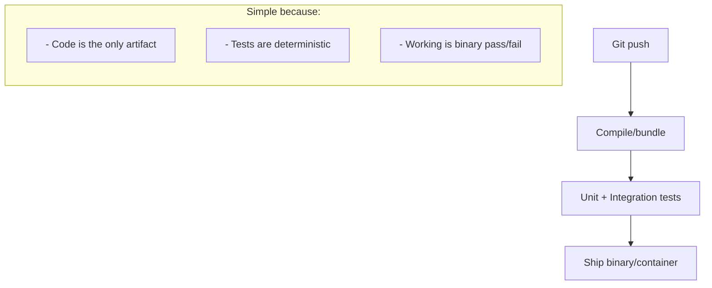
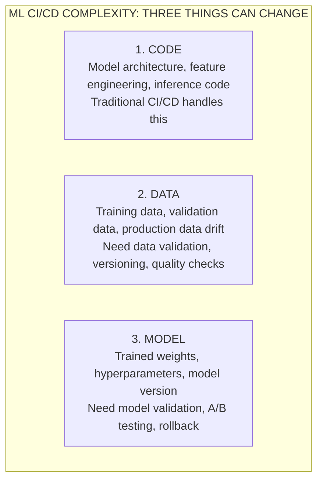
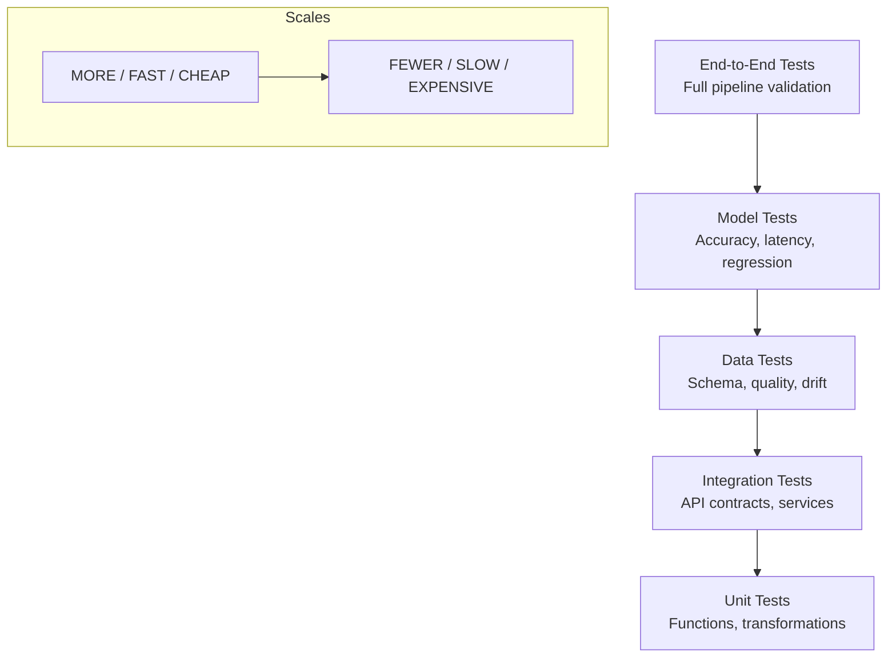
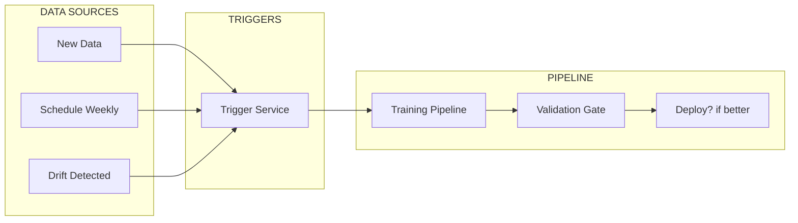
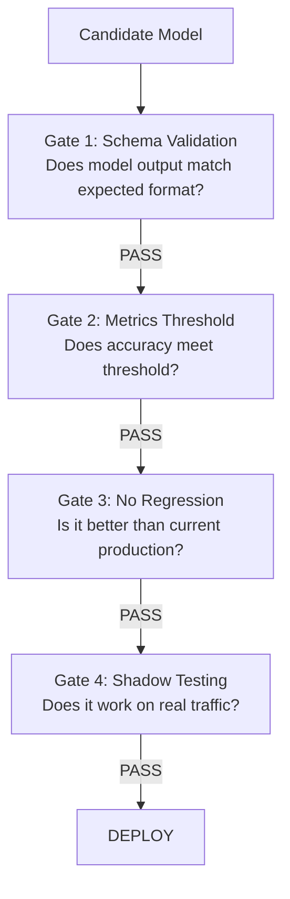
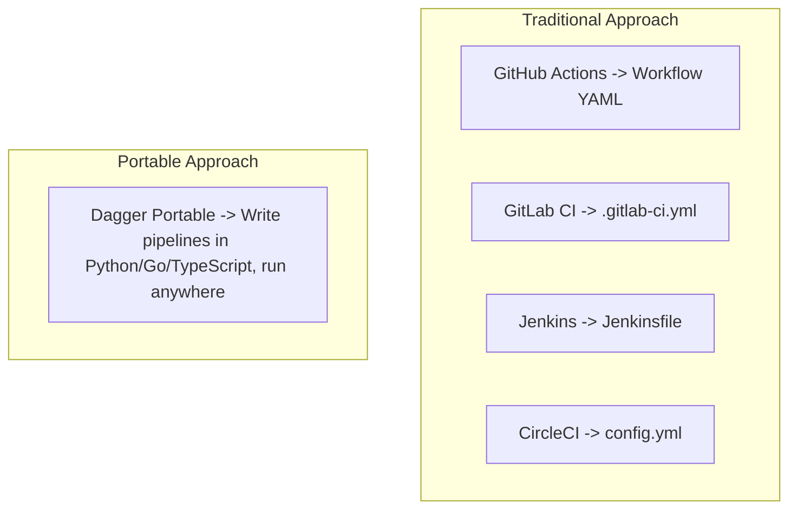

> **AI/ML Engineering Track** | Complexity: `[COMPLEX]` | Time: 5-6
---

## Learning Outcomes

By the end of this module, you will be able to:
- **Diagnose** failure modes unique to Machine Learning pipelines that traditional software CI/CD misses.
- **Design** automated testing pipelines for data validation and model metric enforcement using GitHub Actions.
- **Implement** a Continuous Training (CT) workflow that safely handles automatic retraining when data drift occurs.
- **Evaluate** and construct strict Model Validation Gates to prevent regressions from reaching production environments.
- **Compare** vendor-specific YAML pipelines with portable execution strategies using Dagger.

---

## Why This Module Matters

Traditional CI/CD assumes the main artifact is code. The compiler, linter, unit tests, integration tests, and deployment scripts all orbit around a source tree that changes when a developer changes it. Machine learning systems add two more artifacts that can break production without a code diff: the data used to train or evaluate the model, and the trained model artifact that emerges from a stochastic training process. CI/CD for ML therefore has to answer a broader release question: did the code still run, did the data still mean what we think it means, and did the new model improve the product without creating a new operational failure?

Hypothetical scenario: a recommendation team retrains a model, sees better offline accuracy, and deploys it without noticing that inference latency doubled under realistic production concurrency. The code compiled, the notebook looked clean, and the aggregate validation score improved, yet users experienced slower pages and the business saw fewer completed recommendations. That failure is not a mystery once you separate the artifacts. The model improved on one statistical measure while regressing on a serving constraint that the pipeline never checked.

This module teaches you how to build safety nets around that wider release surface. You will use GitHub Actions as a concrete CI/CD environment, design gates for data and model validation, reason about Continuous Training when production drift appears, and compare YAML-bound workflows with a portable execution layer such as Dagger. The goal is not to memorize one vendor's syntax. The goal is to learn the release discipline that keeps ML changes observable, repeatable, and reversible.

---

## Why CI/CD for ML is Different

Before diving into workflow files, we need to understand the failure model. CI/CD for ML is not just "regular CI/CD with different tools" because the system being released is partly learned from data rather than completely specified by code. A normal web service can still have subtle production issues, but a deterministic function generally behaves the same way when given the same input. A trained model can change behavior because the training set changed, a feature distribution shifted, a tokenizer version changed, a random seed exposed instability, or the evaluation data stopped representing the population that production traffic now contains.

Think of traditional software like building a house from blueprints. The blueprints define exactly what the house should look like, and the inspection process can compare the finished structure against those plans. Machine learning is closer to training a search dog. You can design the exercises, choose the rewards, control the environment, and measure the outcome, but you cannot inspect every internal association the dog learned. Two training runs may both pass the same headline score while behaving differently in a rare but important situation.

That analogy matters because it changes the job of the pipeline. The pipeline cannot simply ask, "does the code execute?" It has to ask whether the training data is suitable, whether the evaluation set still represents the product, whether the model is better on the slices that matter, whether the serving path remains fast enough, and whether the organization can roll back the model artifact independently from the code. Good ML CI/CD turns those questions into gates that run consistently every time a candidate model moves toward production.

### The Traditional CI/CD Pipeline

In standard software engineering, the artifacts are usually deterministic code changes. A developer pushes a change, the CI system builds the package, tests run, and a deployment system ships the same binary or container that passed the checks. The pipeline can be complicated, but the contract is clear: the tested artifact is the released artifact, and the primary trigger is a change in the repository.



This model still matters in ML projects because you still have ordinary software around the model. Feature extraction code, request handlers, batch jobs, model-serving containers, dashboards, and infrastructure manifests all need conventional linting and tests. The mistake is assuming those checks are sufficient. They prove that the scaffolding around the model still works; they do not prove that the model is useful, fair enough for its purpose, cheap enough to run, or safe to retrain automatically.

### The ML CI/CD Challenge

The core challenge is that ML has three things that can change independently, and any of them can break your system. Traditional CI/CD mostly deals with code changes. ML CI/CD must handle code, data, and model changes, each with its own testing requirements. A data engineering job can introduce nulls without touching the model code. A retraining job can produce weights that perform worse on a high-value customer segment even when global accuracy improves. A serving library change can preserve predictions while increasing memory pressure.



Any of these can trigger a pipeline, which is why the pipeline has to encode intent. A pull request that edits `README.md` should not launch a full GPU training run. A pull request that changes a tokenizer should probably run unit tests, data transformation tests, and at least a model smoke test because tokenization can silently change feature values. A scheduled retraining run should not deploy a model merely because training completed; it should compare the candidate against the current production baseline and stop if the candidate is worse on required metrics.

The practical design pattern is to split gates by artifact. Code gates validate deterministic logic and packaging. Data gates validate schema, distributions, completeness, duplication, label integrity, and data freshness. Model gates validate metrics, regressions, latency, calibration, fairness or slice performance where applicable, and operational properties such as model size. Deployment gates validate rollout mechanics, rollback paths, and monitoring hooks. This separation keeps the pipeline readable and makes failure messages actionable.

### Continuous X in ML

The continuous spectrum for ML introduces two additional loops on top of normal CI and CD. Continuous Integration still catches code defects, and Continuous Delivery or Continuous Deployment still moves artifacts through environments. Continuous Training reacts to new data or drift by producing a new candidate model. Continuous Monitoring observes production behavior so the system can decide when retraining, rollback, or human review is necessary.

```text
THE CONTINUOUS SPECTRUM
=======================

CI  (Continuous Integration)
    → Code changes trigger tests
    → Unit tests, linting, type checking
    → Same as traditional software

CD  (Continuous Delivery/Deployment)
    → Successful tests trigger deployment
    → Model packaging, container builds
    → Deploy to staging/production

CT  (Continuous Training) ← NEW FOR ML!
    → Data changes trigger retraining
    → Scheduled or event-driven
    → Automatic model updates

CM  (Continuous Monitoring) ← NEW FOR ML!
    → Track model performance in production
    → Detect data drift, model degradation
    → Trigger retraining when needed
```

Continuous Monitoring (CM) is the post-deployment feedback loop: it watches live predictions, latency, error rates, and input distributions, then feeds signals back into CT. When CM detects degradation or drift that retraining might fix, it can trigger a new CT run; when the problem is operational rather than statistical, CM may instead page an on-call engineer or initiate rollback. CM does not replace validation gates — it tells the system *when* to consider retraining, not *whether* a candidate is safe to promote.

The important boundary is that CT should not be treated as "deploy whatever training produced." CT is a candidate-generation loop. It may wake up because a schedule fired, a data drift metric crossed a threshold, a model monitor reported degradation, or an operator requested retraining. After training, the candidate still has to pass validation gates before it can be promoted. That distinction prevents a common failure where automation accelerates bad models instead of accelerating safe model updates.

> **Pause and predict**: If your model accuracy drops suddenly, but your code has not changed in three months, which component of the "Continuous X" spectrum should catch the drop and initiate a fix?

> **Landscape snapshot — as of 2026-06. Verify against vendor docs before relying on specifics.** The examples in this module use GitHub Actions workflow syntax and major-version action references such as `actions/checkout@v4`, `actions/setup-python@v5`, and `actions/cache@v4`, plus Dagger's GitHub Action examples from the upstream action repository. Artifact and cache actions have newer majors (v6/v7 as of 2026); `@v4` is shown here as a stable illustration — pin a current SHA in production workflows. These identifiers are useful for a runnable teaching example, but they are volatile product details. The durable ideas are event triggers, path filters, artifact handoff, validation gates, and portable pipeline execution.


---

## GitHub Actions for ML

GitHub Actions is a common CI/CD option for ML projects because it is built into GitHub and supports repository events, pull request checks, manual dispatch, scheduled jobs, matrix workflows, artifacts, caching, environments, and secrets. Those are ordinary CI/CD features, but they map well to ML needs when you use them deliberately. A pull request can run cheap checks. A merge can build a model-serving image. A schedule can launch a retraining candidate. A manual dispatch can let an operator retrain with a chosen dataset window after an incident.

Think of GitHub Actions like a programmable robot assistant that watches your repository. When you push code, create a pull request, or reach a scheduled time, the assistant wakes up and follows the instructions in the workflow file. The assistant is literal: it only knows the triggers, paths, jobs, dependencies, and commands you wrote down. That literalness is useful in ML because it forces you to express release policy as repeatable gates instead of tribal knowledge in a notebook review.

The mistake many teams make is putting all ML work into one giant job named `train`. That makes every failure ambiguous. Did preprocessing break? Did the validation data disappear? Did the model train successfully but miss the latency target? Did deployment fail because credentials were missing? A better workflow names the stages after the artifact being checked, uses `needs:` to express dependencies, and uploads artifacts only after the stage that owns them has passed. The pipeline becomes a map of the release process rather than a pile of shell commands.

### Anatomy of a Workflow

Here is a standard foundational setup for an ML project workflow. Notice that the `on:` block is doing as much design work as the `jobs:` block. Path filters prevent irrelevant changes from launching expensive stages, scheduled triggers support periodic retraining, and `workflow_dispatch` gives humans a controlled way to run the pipeline without editing code. In a mature ML repository, triggers are part of the cost-control and risk-control strategy, not just boilerplate copied from another project.

```yaml
# .github/workflows/ml-pipeline.yml
name: ML Pipeline

# Triggers
on:
  push:
    branches: [main, develop]
    paths:
      - 'src/**'
      - 'tests/**'
      - 'requirements.txt'
  pull_request:
    branches: [main]
  schedule:
    - cron: '0 0 * * 0'  # Weekly retraining
  workflow_dispatch:      # Manual trigger

# Environment variables
env:
  PYTHON_VERSION: '3.10'
  MODEL_REGISTRY: 'models'

# Jobs
jobs:
  test:
    runs-on: ubuntu-latest
    steps:
      - uses: actions/checkout@v4
      - uses: actions/setup-python@v5
        with:
          python-version: ${{ env.PYTHON_VERSION }}
      - run: pip install -r requirements.txt
      - run: pytest tests/
```

The workflow above is intentionally small, but it contains the core shape. `actions/checkout` gives the runner the source tree. `actions/setup-python` pins the interpreter family for the job. Dependency installation makes the runtime reproducible enough for a CI check. The final `pytest` command is where the project-specific policy starts. In an ML repository, that test command should not be limited to ordinary unit tests; it should eventually fan out into code, data, and model checks.

You should also notice what the workflow does not do. It does not download production secrets into a pull request from an untrusted fork. It does not train a full model on every trivial change. It does not deploy from a job that has not produced a validated artifact. Those omissions are design decisions. In ML CI/CD, what you choose not to trigger is often as important as what you trigger, because training and evaluation can be expensive, slow, and sensitive to private data.

### ML-Specific Workflow Patterns

To address the complexity of ML testing, your jobs should be split systematically to validate the code, data, and model stages sequentially. The example below separates code quality, unit tests, data tests, and model tests. This layout gives you a useful failure diagnosis: if `data-tests` fails, you investigate schema and quality assumptions before wasting time on model training; if `model-tests` fails after data tests pass, you investigate model behavior rather than raw input integrity.

```yaml
# Pattern 1: Code Quality + ML Tests
jobs:
  code-quality:
    runs-on: ubuntu-latest
    steps:
      - uses: actions/checkout@v4
      - name: Lint
        run: ruff check src/
      - name: Type Check
        run: mypy src/
      - name: Format Check
        run: black --check src/

  unit-tests:
    runs-on: ubuntu-latest
    steps:
      - uses: actions/checkout@v4
      - name: Run unit tests
        run: pytest tests/unit/ -v

  data-tests:
    runs-on: ubuntu-latest
    steps:
      - uses: actions/checkout@v4
      - name: Validate data schema
        run: python -m src.validate_data
      - name: Check data quality
        run: pytest tests/data/ -v

  model-tests:
    runs-on: ubuntu-latest
    needs: [unit-tests, data-tests]
    steps:
      - uses: actions/checkout@v4
      - name: Load model
        run: python -m src.load_model
      - name: Run model tests
        run: pytest tests/model/ -v
      - name: Check model metrics
        run: python -m src.validate_metrics
```

The dependency edge from `model-tests` to `[unit-tests, data-tests]` is not just a performance optimization. It encodes the idea that model evaluation is meaningful only after the deterministic code and input data have cleared basic checks. Without that ordering, a model test might fail because the model is bad, because the feature code is broken, or because the data loader silently changed. Pipelines should narrow the search space for humans when they fail.

You can extend this pattern with separate jobs for fairness or slice tests, latency tests, security scans, container builds, and deployment dry runs. The rule of thumb is to put cheap, deterministic checks early and expensive, probabilistic, or environment-dependent checks later. This keeps feedback fast for developers while still preserving strict gates before promotion. A well-designed pipeline tells a developer within minutes whether the pull request has basic defects and only spends heavier compute after those checks justify it.

### Caching for ML Workflows

Because ML repositories often pull heavy dependencies and large model artifacts, caching is usually important for keeping CI runtimes practical. Caching is not a correctness mechanism; it is a speed and cost mechanism. The cache key has to match the thing being cached closely enough that stale artifacts do not hide real failures. For dependency caches, that usually means hashing lockfiles or requirement files. For model artifacts, it means hashing model configuration, dataset version pointers, or other inputs that define the artifact.

```yaml
# Cache dependencies (saves 2-5 minutes)
- uses: actions/cache@v4
  with:
    path: ~/.cache/pip
    key: ${{ runner.os }}-pip-${{ hashFiles('requirements.txt') }}
    restore-keys: |
      ${{ runner.os }}-pip-

# Cache model artifacts (saves download time)
- uses: actions/cache@v4
  with:
    path: models/
    key: models-${{ hashFiles('models/config.json') }}

# Cache Hugging Face models
- uses: actions/cache@v4
  with:
    path: ~/.cache/huggingface
    key: hf-${{ hashFiles('requirements.txt') }}
```

The examples show three different cache scopes, and each carries a different risk. A pip cache is usually safe because dependency resolution still checks requested packages. A model artifact cache is riskier because the model may be the thing under test; if the cache key does not include every input that should invalidate the model, the pipeline can accidentally evaluate yesterday's artifact. A model hub cache is useful for smoke tests, but teams should avoid treating a mutable external artifact as if it were a pinned release asset.

Good ML pipelines make cache misses boring. If a cache is cold, the workflow should still be able to rebuild the dependency, download the model, or retrain the candidate from versioned inputs. If a cache hit occurs, the workflow should record what it reused. That audit trail matters when someone asks why a model was promoted. The answer should be reconstructable from the commit, dataset pointer, training configuration, model artifact digest, validation report, and deployment event.

---

## Testing Strategies for ML

Testing ML systems requires thinking in layers. Traditional software tests often ask whether a function returns the right value for a known input. ML testing adds statistical and operational questions: is this data clean enough, does this distribution resemble the reference population, is this model accurate enough for the decision it supports, is this model fast enough for the serving path, and did this candidate get worse than the production baseline on a slice that matters? The pipeline has to answer all of those questions before deployment becomes routine.

The best way to keep the problem manageable is to make each layer cheap enough and precise enough for its purpose. Unit tests should be fast and deterministic. Data tests should be specific about schema and quality assumptions. Model tests should compare metrics against thresholds and baselines. End-to-end tests should prove that the assembled path can run, but they should not be the first place you discover broken preprocessing. If every defect reaches the end-to-end layer, the pipeline is too blunt.

### The ML Testing Pyramid



The pyramid is a cost and confidence model. At the bottom, unit and integration tests are numerous because they are fast and cheap. They should run on nearly every pull request. In the middle, data and model tests are less numerous because they require datasets, fixtures, model loading, and metric calculation. At the top, end-to-end tests are few because they involve the full pipeline, deployment surfaces, and sometimes realistic infrastructure. You still need them, but you should not depend on them for every small defect.

ML teams often invert the pyramid by relying on notebooks, ad hoc training runs, and one large offline evaluation. That gives a false sense of safety because it compresses many separate checks into one score. A model that passes aggregate accuracy can still fail because labels are stale, a feature is leaking future information, a minority slice regressed, latency is unacceptable, or the model artifact cannot be loaded by the serving container. The pyramid prevents one metric from pretending to be the whole release gate.

### Unit Tests for ML Code

Unit tests for ML code follow the same principles as traditional software, but they often focus on data transformation functions rather than business logic. These tests are the bread-and-butter layer because they are fast, deterministic, and numerous. A tokenizer should handle punctuation consistently. A normalization function should handle constant arrays without division by zero. A feature extraction function should return the same schema every time. If these assumptions break, model metrics become hard to interpret because the model is no longer seeing the feature representation you thought you trained.

```python
# tests/unit/test_preprocessing.py
import pytest
import numpy as np
from src.preprocessing import normalize, tokenize, extract_features

class TestNormalize:
    """Test normalization functions."""

    def test_normalize_zero_mean(self):
        """Output should have zero mean."""
        data = np.array([1, 2, 3, 4, 5])
        result = normalize(data)
        assert np.isclose(result.mean(), 0, atol=1e-7)

    def test_normalize_unit_variance(self):
        """Output should have unit variance."""
        data = np.array([1, 2, 3, 4, 5])
        result = normalize(data)
        assert np.isclose(result.std(), 1, atol=1e-7)

    def test_normalize_handles_constant(self):
        """Should handle constant arrays without division by zero."""
        data = np.array([5, 5, 5, 5, 5])
        result = normalize(data)
        assert not np.any(np.isnan(result))

    def test_normalize_empty_array(self):
        """Should raise on empty input."""
        with pytest.raises(ValueError):
            normalize(np.array([]))


class TestTokenize:
    """Test tokenization functions."""

    def test_tokenize_basic(self):
        """Basic tokenization should split on whitespace."""
        text = "Hello world"
        tokens = tokenize(text)
        assert tokens == ["hello", "world"]

    def test_tokenize_handles_punctuation(self):
        """Should remove punctuation."""
        text = "Hello, world!"
        tokens = tokenize(text)
        assert tokens == ["hello", "world"]

    def test_tokenize_max_length(self):
        """Should respect max_length parameter."""
        text = "one two three four five"
        tokens = tokenize(text, max_length=3)
        assert len(tokens) == 3
```

The example intentionally tests behavior rather than implementation details. It does not care how `normalize` computes the result; it cares that the output has the properties downstream training expects. It also tests edge cases that are common in data pipelines: empty inputs, constant arrays, punctuation, and maximum lengths. In a production repository, you would add fixtures for time zones, missing values, categorical levels, locale-specific text, and any transformation that has caused an incident before.

Unit tests are also where you remove accidental nondeterminism. If a preprocessing step samples rows, shuffles features, or uses a random seed, the test should make the behavior explicit. Nondeterminism is not automatically bad in ML, but hidden nondeterminism makes CI failures difficult to reproduce. A test that sometimes passes and sometimes fails teaches developers to distrust the pipeline, and once developers distrust CI, they start looking for ways around it.

### Data Quality Tests

Data quality tests are the ML-specific layer that traditional software usually does not have. They answer questions such as whether the schema is correct, whether required fields have nulls, whether labels come from the expected set, whether the class distribution is plausible, whether duplicates are flooding the sample, and whether new data looks compatible with the reference data. These checks are not glamorous, but they are often the difference between a safe retraining loop and an automated degradation loop.

```python
# tests/data/test_data_quality.py
import pytest
import pandas as pd
from src.data import load_training_data

@pytest.fixture
def training_data():
    """Load training data for tests."""
    return load_training_data()

class TestDataSchema:
    """Verify data schema expectations."""

    def test_required_columns_exist(self, training_data):
        """All required columns must be present."""
        required = ['text', 'label', 'timestamp', 'source']
        missing = set(required) - set(training_data.columns)
        assert not missing, f"Missing columns: {missing}"

    def test_no_null_in_required_fields(self, training_data):
        """Required fields should not have nulls."""
        required = ['text', 'label']
        for col in required:
            null_count = training_data[col].isnull().sum()
            assert null_count == 0, f"{col} has {null_count} nulls"

    def test_label_values_valid(self, training_data):
        """Labels should be in expected set."""
        valid_labels = {0, 1, 2}  # negative, neutral, positive
        actual_labels = set(training_data['label'].unique())
        invalid = actual_labels - valid_labels
        assert not invalid, f"Invalid labels: {invalid}"


class TestDataQuality:
    """Verify data quality expectations."""

    def test_minimum_samples(self, training_data):
        """Should have minimum number of samples."""
        min_samples = 1000
        assert len(training_data) >= min_samples

    def test_class_balance(self, training_data):
        """Classes should be reasonably balanced."""
        label_counts = training_data['label'].value_counts()
        min_ratio = label_counts.min() / label_counts.max()
        assert min_ratio >= 0.1, f"Class imbalance ratio: {min_ratio}"

    def test_text_length_distribution(self, training_data):
        """Text lengths should be within expected range."""
        lengths = training_data['text'].str.len()
        assert lengths.min() >= 10, "Text too short"
        assert lengths.max() <= 10000, "Text too long"
        assert lengths.median() >= 50, "Median text length too short"

    def test_no_duplicate_texts(self, training_data):
        """Should not have duplicate texts."""
        duplicates = training_data['text'].duplicated().sum()
        duplicate_ratio = duplicates / len(training_data)
        assert duplicate_ratio < 0.01, f"Duplicate ratio: {duplicate_ratio:.2%}"
```

The data tests above encode product assumptions as executable policy. `test_required_columns_exist` says training cannot proceed if the features needed by the model are missing. `test_no_null_in_required_fields` says mandatory fields cannot silently disappear. `test_label_values_valid` catches new labels before the model treats them as unknown or wrong. `test_class_balance` does not require perfect balance; it requires the distribution to stay within a range where training and evaluation are still meaningful.

The thresholds in data quality tests should come from domain understanding, historical data, and failure analysis, not from arbitrary numbers chosen to make CI green. A fraud model might tolerate rare positive labels because fraud is naturally sparse. A sentiment classifier might need stronger class-balance checks because skew can hide regression. A medical or financial model may require additional checks for consent, lineage, or allowed feature use. The pipeline should express the risk of the system it protects.

### Model Quality Tests

Model quality tests verify that the candidate model does what it is supposed to do under the release policy. They ensure predictions are within reasonable bounds, aggregate metrics meet minimum thresholds, important slices do not regress, inference is fast enough, and the new model is at least as good as the current production model according to the metrics that matter. This is the layer where CI/CD becomes ML-specific rather than merely software-specific.

```python
# tests/model/test_model_quality.py
import pytest
import time
import numpy as np
from src.model import load_model, predict

@pytest.fixture(scope="module")
def model():
    """Load model once for all tests."""
    return load_model("models/production/model.pt")

@pytest.fixture
def test_samples():
    """Sample inputs for testing."""
    return [
        "This product is amazing!",
        "Terrible experience, never again.",
        "It's okay, nothing special.",
    ]

class TestModelAccuracy:
    """Verify model accuracy thresholds."""

    def test_accuracy_above_threshold(self, model):
        """Model accuracy should meet minimum threshold."""
        from src.evaluate import evaluate_on_test_set
        metrics = evaluate_on_test_set(model)
        assert metrics['accuracy'] >= 0.85, f"Accuracy {metrics['accuracy']}"

    def test_f1_score_above_threshold(self, model):
        """F1 score should meet minimum threshold."""
        from src.evaluate import evaluate_on_test_set
        metrics = evaluate_on_test_set(model)
        assert metrics['f1'] >= 0.80, f"F1 {metrics['f1']}"

    def test_no_class_collapse(self, model, test_samples):
        """Model should predict multiple classes."""
        predictions = [predict(model, text) for text in test_samples * 10]
        unique_predictions = set(predictions)
        assert len(unique_predictions) >= 2, "Model collapsed to single class"


class TestModelLatency:
    """Verify model inference performance."""

    def test_single_inference_latency(self, model, test_samples):
        """Single inference should be fast."""
        text = test_samples[0]

        start = time.perf_counter()
        predict(model, text)
        latency_ms = (time.perf_counter() - start) * 1000

        assert latency_ms < 100, f"Latency {latency_ms:.1f}ms exceeds 100ms"

    def test_batch_inference_latency(self, model, test_samples):
        """Batch inference should scale efficiently."""
        batch = test_samples * 100  # 300 samples

        start = time.perf_counter()
        for text in batch:
            predict(model, text)
        total_ms = (time.perf_counter() - start) * 1000

        per_sample_ms = total_ms / len(batch)
        assert per_sample_ms < 50, f"Per-sample latency {per_sample_ms:.1f}ms"


class TestModelRegression:
    """Verify model doesn't regress from baseline."""

    def test_no_accuracy_regression(self, model):
        """New model should not be worse than baseline."""
        from src.evaluate import evaluate_on_test_set, load_baseline_metrics

        current = evaluate_on_test_set(model)
        baseline = load_baseline_metrics()

        # Allow 1% regression tolerance
        min_accuracy = baseline['accuracy'] * 0.99
        assert current['accuracy'] >= min_accuracy, (
            f"Regression: {current['accuracy']:.3f} < {min_accuracy:.3f}"
        )
```

The model tests show three classes of protection. Accuracy and F1 thresholds prevent obviously weak models from advancing. The class-collapse test catches a model that returns the same class too often, which can happen when data, labels, or preprocessing are broken. Latency tests prevent a statistically better model from violating the serving contract. Regression tests compare the candidate to the baseline so the pipeline does not promote a model that merely clears an absolute floor while being worse than what users already had.

The most important design choice is to make model tests comparative and contextual. A fixed metric threshold is useful, but it can be too weak when the production model is already much better than the threshold. A baseline comparison is stronger, but it can be too narrow if it ignores slices or operational constraints. A robust validation suite combines absolute minimums, baseline comparisons, slice-level checks, and serving constraints so the model cannot optimize one visible number while failing a hidden requirement.

---

## Continuous Training (CT)

Continuous Training is the ML-specific addition to the traditional CI/CD acronym set. We need it because model usefulness depends on the relationship between training data and production reality. If customers change behavior, upstream data collection changes, fraud patterns evolve, product catalog terms shift, or labels arrive with a different delay, the model can become stale even when the source code is untouched. CT gives the system a controlled way to produce new candidate models when data changes.

The word "controlled" is doing important work. CT is not the same as blind automatic deployment. A CT system may train on a schedule, train after enough new labeled examples arrive, train after a drift detector fires, or train after an operator requests a run. In all cases, training creates a candidate artifact. That candidate then passes through the same data and model gates as any other release. If the candidate fails, the correct outcome is often to keep the current production model, alert the team, and investigate the data or model behavior.

Drift is also not a single thing. Data drift means the input distribution has changed. Concept drift means the relationship between inputs and labels has changed. Label drift means the output distribution changes in ways that may or may not reflect product reality. Operational drift means production serving conditions changed, such as request volume or hardware class. A CT trigger should be tied to the kind of drift you can observe and the kind of corrective action you can validate. Retraining is powerful, but it is not a universal response to every monitoring signal.

### CT Architecture



The architecture separates signal collection from training and promotion. New data, schedules, and drift alerts all feed a trigger service, but that service should not directly deploy a model. It starts a training pipeline that produces a candidate. The validation gate then decides whether that candidate is safe to promote. This separation protects the system from noisy drift detectors, partial data loads, and human pressure to "just retrain it" without checking whether the retrained model is actually better.

In a small repository, the trigger service might be nothing more than a scheduled GitHub Actions workflow plus a manual dispatch button. In a larger platform, it might be an event-driven orchestrator connected to a feature store, model registry, data quality monitor, experiment tracker, and deployment controller. The durable idea is the same in both cases: signals trigger candidate generation, validation gates decide promotion, and monitoring verifies the post-deployment result.

### Scheduled Retraining Workflow

Scheduled retraining is the easiest CT pattern to reason about because the trigger is predictable. It works well when new labels arrive on a regular cadence, when the model is cheap enough to retrain, and when the product can tolerate a candidate being produced even if no meaningful drift occurred. The downside is that a schedule can waste compute or produce unnecessary model churn. A weekly retraining job should still stop at validation if the candidate does not improve the system.

```yaml
# .github/workflows/continuous-training.yml
name: Continuous Training

on:
  schedule:
    - cron: '0 2 * * 0'  # Every Sunday at 2 AM
  workflow_dispatch:
    inputs:
      force_deploy:
        description: 'Deploy even if metrics are worse'
        required: false
        default: 'false'

jobs:
  fetch-data:
    runs-on: ubuntu-latest
    steps:
      - uses: actions/checkout@v4

      - name: Fetch latest training data
        run: |
          python -m src.data.fetch \
            --start-date $(date -d '7 days ago' +%Y-%m-%d) \
            --end-date $(date +%Y-%m-%d) \
            --output data/new/

      - name: Upload data artifact
        uses: actions/upload-artifact@v4
        with:
          name: training-data
          path: data/new/

  train:
    needs: fetch-data
    runs-on: ubuntu-latest
    steps:
      - uses: actions/checkout@v4

      - name: Download data
        uses: actions/download-artifact@v4
        with:
          name: training-data
          path: data/new/

      - name: Train model
        run: |
          python -m src.train \
            --data data/new/ \
            --output models/candidate/ \
            --experiment-name "weekly-retrain-${{ github.run_id }}"

      - name: Upload model
        uses: actions/upload-artifact@v4
        with:
          name: candidate-model
          path: models/candidate/

  validate:
    needs: train
    runs-on: ubuntu-latest
    outputs:
      should_deploy: ${{ steps.compare.outputs.should_deploy }}
    steps:
      - uses: actions/checkout@v4

      - name: Download candidate model
        uses: actions/download-artifact@v4
        with:
          name: candidate-model
          path: models/candidate/

      - name: Download production model
        run: |
          aws s3 cp s3://models/production/ models/production/ --recursive

      - name: Compare models
        id: compare
        run: |
          python -m src.evaluate.compare \
            --candidate models/candidate/ \
            --baseline models/production/ \
            --output metrics.json

          # Check if candidate is better
          BETTER=$(python -c "
          import json
          m = json.load(open('metrics.json'))
          print('true' if m['candidate']['accuracy'] > m['baseline']['accuracy'] else 'false')
          ")
          echo "should_deploy=$BETTER" >> $GITHUB_OUTPUT

  deploy:
    needs: validate
    # workflow_dispatch inputs are strings — compare to 'true', not a boolean
    if: needs.validate.outputs.should_deploy == 'true' || github.event.inputs.force_deploy == 'true'
    runs-on: ubuntu-latest
    steps:
      - uses: actions/checkout@v4

      - name: Download candidate model
        uses: actions/download-artifact@v4
        with:
          name: candidate-model
          path: models/candidate/

      - name: Deploy to production
        run: |
          # Upload to S3
          aws s3 cp models/candidate/ s3://models/production/ --recursive

          # Update Kubernetes deployment (requires v1.35+ cluster compatibility).
          # Image tag must match the container built and pushed earlier in the pipeline
          # (e.g. a build-image job that tags with github.sha).
          kubectl set image deployment/model-server \
            model=myregistry/model:${{ github.sha }}

      - name: Notify
        run: |
          curl -X POST ${{ secrets.SLACK_WEBHOOK }} \
            -d '{"text": "New model deployed! Run: ${{ github.run_id }}"}'
```

The workflow uses jobs as a chain of custody. `fetch-data` defines the data window and uploads an artifact. `train` consumes that artifact and produces a candidate model. `validate` compares the candidate with the production model and emits a structured output. `deploy` runs only if validation says the candidate should deploy, unless a manual override was explicitly requested. This pattern makes promotion auditable because every stage has a named input and output.

There are two subtle risks in this example that a real implementation should handle carefully. First, the production model download must be authenticated and pinned to the exact baseline being compared, not a mutable path that changes during validation. Second, a `force_deploy` override should require strong controls, such as an environment approval, an incident ticket, or a restricted role. Overrides are useful during recovery, but if they become routine, the validation gate stops being a gate and becomes decoration.

### Drift-Triggered CT

Drift-triggered CT is more responsive than a pure schedule, but it requires more care. A drift detector can tell you that a distribution changed; it cannot automatically tell you whether retraining will improve the product. For example, a seasonal traffic shift may be expected, a new upstream data source may be temporary, or a labeling delay may make the freshest data misleading. The detector should therefore start an investigation or candidate-generation flow, not silently rewrite production.

An effective drift-triggered workflow records the reference window, the current window, the drift metric, the affected features or slices, and the decision taken. If retraining starts, the candidate model should be evaluated on stable validation data and on the newly drifted population when labels are available. If labels are not yet available, the system may choose shadow evaluation, delayed promotion, or human review. The point is to make drift a release input, not a panic button.

### When Not to Retrain Automatically

Automatic retraining is a poor fit when labels are delayed, expensive, noisy, legally sensitive, or vulnerable to feedback loops. A fraud model, for example, may learn from adversarial behavior that changes in response to the model itself. A recommendation system may reinforce its own historical choices if the training data only contains what the previous model showed users. A medical model may require formal review before new training data can affect decisions. CT should match the risk profile of the domain.

You can still automate parts of the workflow in these situations. The pipeline can fetch new data, run validation, produce a candidate, generate a report, and open a review item without deploying. That preserves repeatability and reduces manual toil while keeping promotion under stronger governance. The mature question is not "can we automate retraining?" but "which steps are safe to automate, which evidence should be generated automatically, and who is accountable for promotion?"

---

## Model Validation Gates

Validation gates are automated checkpoints that a model must pass before deployment. They turn release policy into code. A gate can be simple, such as "accuracy must be at least this threshold," or it can be contextual, such as "the candidate must not regress more than this tolerance on any critical slice compared with the production baseline." Gates prevent the pipeline from confusing successful training with a safe release.

Good gates are specific enough to fail loudly and explain why. A vague gate named `validate_model` that returns a single pass/fail status is hard to debug. A named gate such as `schema_validation`, `metrics_threshold`, `no_regression`, `latency_budget`, or `slice_fairness` gives the operator a starting point. It also lets the team decide which gates are hard blockers and which gates are warnings that require human review.



The diagram shows a strict progression from candidate model to deployment. Schema validation comes first because a model that produces the wrong output shape cannot be evaluated safely. Metrics thresholds come next because a model that misses minimum quality should not consume more release effort. No-regression checks compare the candidate with production, because a model can clear an absolute threshold and still be worse than the current model. Shadow testing or traffic simulation comes later because it is more expensive and closer to production.

The order of gates matters for cost and diagnosis. Cheap structural gates should run before expensive evaluation. Fast offline checks should run before shadow tests. Gates that produce actionable failure messages should run before gates that merely show "not good enough." This makes the pipeline faster, but it also makes it kinder to developers: the first failure is more likely to identify the actual problem.

### Implementation

```python
# src/validation/gates.py
from dataclasses import dataclass
from typing import Callable, Optional
from enum import Enum

class GateStatus(Enum):
    PASSED = "passed"
    FAILED = "failed"
    SKIPPED = "skipped"

@dataclass
class GateResult:
    gate_name: str
    status: GateStatus
    message: str
    metrics: dict = None

class ValidationGate:
    """Base class for validation gates."""

    def __init__(self, name: str, required: bool = True):
        self.name = name
        self.required = required

    def check(self, model, context: dict) -> GateResult:
        raise NotImplementedError


class MetricsThresholdGate(ValidationGate):
    """Check if model meets minimum metrics thresholds."""

    def __init__(
        self,
        thresholds: dict,
        name: str = "metrics_threshold",
    ):
        super().__init__(name)
        self.thresholds = thresholds

    def check(self, model, context: dict) -> GateResult:
        metrics = context.get('metrics', {})

        failures = []
        for metric, threshold in self.thresholds.items():
            value = metrics.get(metric, 0)
            if value < threshold:
                failures.append(
                    f"{metric}: {value:.3f} < {threshold:.3f}"
                )

        if failures:
            return GateResult(
                gate_name=self.name,
                status=GateStatus.FAILED,
                message=f"Thresholds not met: {', '.join(failures)}",
                metrics=metrics,
            )

        return GateResult(
            gate_name=self.name,
            status=GateStatus.PASSED,
            message="All thresholds met",
            metrics=metrics,
        )


class NoRegressionGate(ValidationGate):
    """Check that new model isn't worse than baseline."""

    def __init__(
        self,
        metric: str = "accuracy",
        tolerance: float = 0.01,
        name: str = "no_regression",
    ):
        super().__init__(name)
        self.metric = metric
        self.tolerance = tolerance

    def check(self, model, context: dict) -> GateResult:
        current = context.get('metrics', {}).get(self.metric, 0)
        baseline = context.get('baseline_metrics', {}).get(self.metric, 0)

        min_allowed = baseline * (1 - self.tolerance)

        if current < min_allowed:
            return GateResult(
                gate_name=self.name,
                status=GateStatus.FAILED,
                message=f"Regression: {current:.3f} < {min_allowed:.3f}",
                metrics={"current": current, "baseline": baseline},
            )

        return GateResult(
            gate_name=self.name,
            status=GateStatus.PASSED,
            message=f"No regression: {current:.3f} >= {min_allowed:.3f}",
            metrics={"current": current, "baseline": baseline},
        )


class ValidationPipeline:
    """Run model through validation gates."""

    def __init__(self, gates: list[ValidationGate]):
        self.gates = gates

    def validate(self, model, context: dict) -> tuple[bool, list[GateResult]]:
        results = []
        all_passed = True

        for gate in self.gates:
            result = gate.check(model, context)
            results.append(result)

            if result.status == GateStatus.FAILED and gate.required:
                all_passed = False
                break  # Stop on first required failure

        return all_passed, results
```

The implementation uses a base `ValidationGate` interface so every gate has the same contract: inspect the model and context, then return a `GateResult`. That makes the pipeline composable. You can add a latency gate, a slice-performance gate, a calibration gate, or a model-size gate without rewriting the orchestration code. The `required` flag also lets teams distinguish a hard blocker from a soft warning, though production promotion should be conservative about soft warnings in high-risk domains.

The `MetricsThresholdGate` catches candidates that fail minimum standards, while `NoRegressionGate` protects against candidates that are worse than production. In real systems, the context dictionary would contain model metadata, evaluation reports, dataset identifiers, baseline metrics, latency measurements, and links to artifacts. The gate should write enough information to support audit and rollback. A pass/fail boolean alone is not enough evidence when a model release later needs to be explained.

Validation gates should evolve after incidents. If a model failed because a class collapsed, add a class-diversity gate. If it failed because a high-value segment regressed, add a slice gate. If it failed because a candidate used too much memory, add a resource gate. This is the same discipline as adding a regression test after a software bug, but the regression may be statistical, operational, or data-related rather than a single deterministic input-output pair.

---

## Portable CI/CD with Dagger

Many CI systems use their own workflow definitions, which makes pipeline logic harder to move between platforms without adaptation. A GitHub Actions workflow, a Jenkinsfile, a GitLab CI file, and a CircleCI config can all express similar steps, but they use different syntax, execution environments, and local reproduction paths. That becomes painful in ML because pipeline failures often depend on data, artifacts, caches, and container images. If developers cannot reproduce the CI path locally, they debug by pushing commits and waiting.

Dagger addresses this problem by moving pipeline logic into code that runs through a portable container execution engine. Instead of expressing every step as vendor-specific YAML, you define functions that can run locally or in CI. The CI system still triggers the run, stores logs, and handles credentials, but the pipeline body becomes less tied to one CI vendor. For ML teams, that portability is valuable because training and validation flows often outlive a particular CI platform.



This does not mean Dagger removes the need for GitHub Actions or another CI system. It changes what the CI system owns. GitHub Actions can own the trigger, permissions, and integration with repository checks. Dagger can own the repeatable pipeline graph: lint, test, train, build, publish, and validate. That separation is useful when you want the same steps to run on a developer laptop, in a pull request, and in a release workflow with fewer differences between environments.

The tradeoff is that Dagger adds another abstraction and runtime to understand. For a small project with a simple workflow, plain YAML may be easier. For a growing ML platform with repeated training and validation patterns across repositories, portable pipeline code can reduce duplication and vendor lock-in. The decision should be based on reproducibility pain, pipeline complexity, and team familiarity, not on tool novelty.

### Dagger Pipeline Example

```python
# dagger/pipeline.py
import dagger
from dagger import dag, function, object_type

@object_type
class MLPipeline:
    """ML Pipeline with Dagger."""

    @function
    async def test(self, source: dagger.Directory) -> str:
        """Run tests on the ML code."""
        return await (
            dag.container()
            .from_("python:3.10-slim")
            .with_directory("/app", source)
            .with_workdir("/app")
            .with_exec(["pip", "install", "-r", "requirements.txt"])
            .with_exec(["pip", "install", "pytest"])
            .with_exec(["pytest", "tests/", "-v"])
            .stdout()
        )

    @function
    async def lint(self, source: dagger.Directory) -> str:
        """Lint the code."""
        return await (
            dag.container()
            .from_("python:3.10-slim")
            .with_directory("/app", source)
            .with_workdir("/app")
            .with_exec(["pip", "install", "ruff", "mypy"])
            .with_exec(["ruff", "check", "src/"])
            .with_exec(["mypy", "src/"])
            .stdout()
        )

    @function
    async def train(
        self,
        source: dagger.Directory,
        data: dagger.Directory,
        epochs: int = 10,
    ) -> dagger.Directory:
        """Train the model."""
        return await (
            dag.container()
            .from_("pytorch/pytorch:2.0.1-cuda11.8-cudnn8-runtime")
            .with_directory("/app", source)
            .with_directory("/data", data)
            .with_workdir("/app")
            .with_exec(["pip", "install", "-r", "requirements.txt"])
            .with_exec([
                "python", "-m", "src.train",
                "--data", "/data",
                "--output", "/models",
                "--epochs", str(epochs),
            ])
            .directory("/models")
        )

    @function
    async def build_image(
        self,
        source: dagger.Directory,
        model: dagger.Directory,
    ) -> str:
        """Build production Docker image."""
        container = (
            dag.container()
            .from_("python:3.10-slim")
            .with_directory("/app", source)
            .with_directory("/app/models", model)
            .with_workdir("/app")
            .with_exec(["pip", "install", "-r", "requirements.txt"])
            .with_entrypoint(["python", "-m", "src.serve"])
        )

        # Publish to registry
        address = await container.publish(
            f"myregistry/ml-model:latest"
        )
        return address

    @function
    async def full_pipeline(
        self,
        source: dagger.Directory,
        data: dagger.Directory,
    ) -> str:
        """Run the complete ML pipeline."""
        # Run tests and lint in parallel
        test_result = self.test(source)
        lint_result = self.lint(source)

        # Wait for both
        await test_result
        await lint_result

        # Train model
        model = await self.train(source, data)

        # Build and publish image
        image = await self.build_image(source, model)

        return f"Pipeline complete! Image: {image}"
```

The example deliberately keeps each pipeline function small. `test` and `lint` run in separate containers so they can be understood independently and, in a fuller implementation, parallelized or cached independently. `train` consumes a source directory and a data directory, then returns a model directory rather than writing to a hidden external path. `build_image` consumes the model directory and source directory, then publishes a container. That flow mirrors the artifact boundaries you want in any ML pipeline: source in, data in, model out, image out.

The most important Dagger habit is to make inputs explicit. If a training function reads from a global bucket name that is not visible in the function signature, local reproduction becomes fragile. If the data directory, model configuration, and source tree are explicit parameters, a developer or CI runner can invoke the same pipeline with a known set of inputs. Explicit inputs also make cache behavior easier to reason about because the pipeline graph has a clearer dependency structure.

### Running Dagger Locally

```bash
# Install Dagger CLI
curl -L https://dl.dagger.io/dagger/install.sh | sh

# Scaffold a Dagger module in the repo (run once per project)
dagger init --sdk=python

# Run pipeline locally
dagger call test --source=.

# Run full pipeline
dagger call full-pipeline --source=. --data=./data/

# Call from GitHub Actions
# .github/workflows/dagger.yml
name: Dagger Pipeline
on: push
jobs:
  build:
    runs-on: ubuntu-latest
    steps:
      - uses: actions/checkout@v4
      - uses: dagger/dagger-for-github@v8.4.0
        with:
          verb: call
          args: full-pipeline --source=. --data=./data/
```

Running the same pipeline locally and in CI changes the debugging loop. Without portability, a developer may need to push a commit, wait for the runner, inspect a remote log, guess at a fix, and repeat. With portable execution, the developer can run the same function against the same source and a representative data directory before pushing. CI remains the source of truth for protected branches, but local reproduction reduces waste and shortens feedback.

There is still a security boundary to respect. Local Dagger runs should not require production credentials, and CI runs should scope secrets to the jobs that actually need them. A portable pipeline should support safe local inputs, such as a small anonymized dataset or synthetic fixture, while the protected CI environment supplies production-like artifacts only after earlier gates pass. Portability should improve reproducibility without weakening credential hygiene.

---

## Workflow Patterns for ML

Once the basic concepts are clear, the next design task is choosing which workflow pattern runs at each stage of the lifecycle. A pull request workflow optimizes for fast feedback. A release workflow optimizes for artifact integrity and environment promotion. A matrix workflow optimizes for compatibility confidence. A scheduled or drift-triggered workflow optimizes for model freshness. These workflows can share commands, but they should not all do the same amount of work.

The useful question is: what decision is this workflow allowed to make? A PR validation workflow decides whether code is ready to merge. A release pipeline decides whether a versioned artifact can move to staging or production. A CT workflow decides whether a newly trained candidate deserves promotion. A monitoring workflow decides whether humans should investigate drift or degradation. Naming that decision keeps the workflow from accumulating unrelated responsibilities.

### Pattern 1: PR Validation

PR validation should be fast enough that developers keep it enabled and strict enough that broken model code does not land. This is where linting, formatting checks, unit tests, data-contract tests with small fixtures, and model smoke tests belong. It is usually not where full retraining belongs, unless the model is tiny and training is cheap. The purpose is to reject obvious defects before the branch contaminates the mainline.

```yaml
# .github/workflows/pr-validation.yml
name: PR Validation

on:
  pull_request:
    branches: [main]

jobs:
  quick-checks:
    runs-on: ubuntu-latest
    steps:
      - uses: actions/checkout@v4
      - name: Lint & Format
        run: |
          pip install ruff black
          ruff check src/
          black --check src/

  unit-tests:
    runs-on: ubuntu-latest
    steps:
      - uses: actions/checkout@v4
      - name: Unit Tests
        run: |
          pip install -r requirements.txt pytest
          pytest tests/unit/ -v --tb=short

  model-smoke-test:
    runs-on: ubuntu-latest
    needs: unit-tests
    steps:
      - uses: actions/checkout@v4
      - name: Quick Model Test
        run: |
          pip install -r requirements.txt
          python -m src.test_model --quick
```

The quick model test should be designed as a smoke test, not as a full validation replacement. It can load the model, run a handful of representative inputs, verify output schema, and catch catastrophic failures such as class collapse or serialization errors. It should not pretend to prove production readiness. That proof comes later, when the pipeline has access to validated data, baseline metrics, and deployment-like infrastructure.

### Pattern 2: Release Pipeline

Release pipelines should promote immutable artifacts, not rebuild mystery artifacts in each environment. In a strong release design, the artifact that passed tests is the artifact that goes to staging, and the artifact that passed staging is the one considered for production. The model version, container image digest, configuration, and validation report should travel together. If a release has to be rolled back, the team should know exactly which model and image were active.

```yaml
# .github/workflows/release.yml
name: Release

on:
  push:
    tags:
      - 'v*'

jobs:
  build-and-test:
    runs-on: ubuntu-latest
    steps:
      - uses: actions/checkout@v4
      - name: Full Test Suite
        run: pytest tests/ -v

  build-image:
    needs: build-and-test
    runs-on: ubuntu-latest
    steps:
      - uses: actions/checkout@v4
      - name: Build Docker Image
        run: |
          docker build -t myapp:${{ github.ref_name }} .

      - name: Log in to Container Registry
        uses: docker/login-action@v3
        with:
          username: ${{ secrets.REGISTRY_USERNAME }}
          password: ${{ secrets.REGISTRY_PASSWORD }}

      - name: Push to Registry
        run: |
          docker push myapp:${{ github.ref_name }}

  deploy-staging:
    needs: build-image
    runs-on: ubuntu-latest
    environment: staging
    steps:
      - name: Deploy to Staging
        run: |
          kubectl set image deployment/app app=myapp:${{ github.ref_name }}

  deploy-production:
    needs: deploy-staging
    runs-on: ubuntu-latest
    environment: production
    steps:
      - name: Deploy to Production
        run: |
          kubectl set image deployment/app app=myapp:${{ github.ref_name }}
```

The release example shows environment promotion with a build step, staging deployment, and production deployment. For ML systems, you would usually add a model registry lookup, candidate validation report, and rollout strategy. A model-serving deployment should also expose metrics that monitoring can compare before and after the rollout. Shipping the artifact is only half the release; proving that the release behaves acceptably after deployment is the other half.

### Pattern 3: Matrix Testing

Matrix testing is useful when the project supports multiple runtime combinations. A Python package used by several teams may need to test multiple Python versions. A model-serving library may need to run on Linux and macOS for developer parity, while production only uses Linux. Matrix testing is less about ML statistics and more about environment compatibility. It catches failures caused by platform-specific dependencies, serialization behavior, and filesystem assumptions.

```yaml
# Test across multiple Python versions and OS
jobs:
  test:
    runs-on: ${{ matrix.os }}
    strategy:
      matrix:
        os: [ubuntu-latest, macos-latest]
        python-version: ['3.9', '3.10', '3.11']
        exclude:
          - os: macos-latest
            python-version: '3.9'

    steps:
      - uses: actions/checkout@v4
      - uses: actions/setup-python@v5
        with:
          python-version: ${{ matrix.python-version }}
      - run: pytest tests/
```

> **Stop and think**: If your matrix tests pass on Linux but fail on macOS for a random seed generator, which part of the testing pyramid needs an enforced standard for OS-independent determinism?

The answer is usually the unit or integration layer around preprocessing and training utilities. Randomness needs to be controlled close to the functions that use it, not discovered at the end of the pipeline. Once deterministic behavior is enforced in the lower layers, matrix testing becomes a compatibility check rather than a lottery.

## Hypothetical Scenario: When CI/CD Fails

Hypothetical scenario: a candidate model passes conventional tests because the pipeline only checks aggregate accuracy and output schema. After release, the team discovers that the model performs poorly on a customer segment that represents a small share of the validation data but a large share of business risk. The pipeline did exactly what it was told to do; the failure was that the release policy did not include slice-level evaluation for the segment that mattered.

What went wrong was not "CI/CD failed" in the abstract. The gate design was incomplete. Aggregate metrics can hide uneven performance because strong results on the majority population can compensate for weak results on a minority slice. The fix is to add slice-based evaluation, require minimum performance on critical groups or product segments, and publish the validation report as a release artifact. This turns an invisible risk into a named gate that future candidates must pass.

Hypothetical scenario: a team configures a workflow so every pull request runs full retraining on accelerator-backed runners, even when the change only edits documentation or comments. The pipeline looks impressive, but it burns compute, slows review, and trains candidates from changes that cannot affect model behavior. The problem is not that training is expensive; the problem is that the trigger policy does not match the risk of the change.

The fix is to split the workflow by intent. Documentation-only changes should run markdown or site checks. Feature engineering changes should run unit, data, and model smoke tests. Main-branch merges or explicit retraining requests can run heavier training. Budget alerts, path filters, cache keys, and artifact reuse all help, but the durable lesson is simpler: expensive jobs should have a reason to run, and that reason should be visible in the workflow trigger.

## Cost Controls and Pipeline Economics

Cost control in ML CI/CD is mostly about matching compute intensity to confidence needs. Fast checks run often. Expensive checks run when their evidence changes a release decision. A full training run on every commit may feel rigorous, but it often teaches the wrong habit: developers wait longer, learn less from each failure, and eventually look for bypasses. A layered pipeline is cheaper because it is more precise.

The first economic lever is trigger design. Use path filters so model jobs run when model-relevant files change. Use schedules when labels arrive on a predictable cadence. Use manual dispatch for exceptional retraining. Use deployment environments or protected approvals for risky promotions. The second lever is artifact design. Cache dependencies, version datasets, reuse validated artifacts, and avoid downloading large model files unless the job truly needs them. The third lever is observability. Record runtime, cache hit rate, artifact size, and stage-level failure reasons so the team can optimize the pipeline based on evidence.

### Benchmarks: What Teams Actually Spend

There is no honest universal benchmark for what teams "actually spend" on ML CI/CD. The answer depends on runner type, cloud provider, region, dataset size, model architecture, training frequency, retention policy, network egress, and whether the team uses hosted or self-hosted infrastructure. Presenting a generic dollar table would be fabricated precision. The better benchmark is your own measured cost per workflow stage, collected from billing exports and CI telemetry, reviewed on a regular cadence, and tied back to the release decisions those stages support.

Use a simple internal scorecard instead of invented industry numbers: average runtime by job, cache hit rate, artifact storage growth, failed-run percentage, retraining frequency, deployment frequency, rollback frequency, and cost per successful promoted model. Those metrics are durable because every team can measure them in its own environment. They also create better engineering conversations than a generic table, because they show which stage is expensive and whether that expense is buying meaningful release confidence.

---

## Did You Know?

- **Continuous Training is an explicit MLOps concept, not just a cron job.** Google's MLOps guidance separates CI, CD, and CT because model release safety depends on automated training, validation, and promotion decisions, not just code integration.
- **TensorFlow Data Validation treats schema and statistics as first-class pipeline artifacts.** That design is a useful mental model even if your team uses another stack, because data expectations should be versioned and checked instead of remembered informally.
- **GitHub Actions path filters are a release-policy tool.** They are often described as workflow syntax, but in ML repositories they decide whether a change deserves cheap checks, model smoke tests, or expensive retraining.
- **Portable pipeline tools do not remove CI governance.** Dagger can make the pipeline body reproducible across local and CI environments, while GitHub Actions or another CI system can still own triggers, branch protection, environments, and secret scoping.

---

## Common Mistakes and How to Avoid Them

| Mistake | Why It Happens | How to Fix It |
| :--- | :--- | :--- |
| **Testing in Production Only** | The team trusts monitoring to catch model failures after deployment because offline validation feels slow. | Mirror production logic in CI, use anonymized production-shaped samples, and promote only artifacts that passed explicit gates. |
| **Manual Approval Bottlenecks** | Humans are asked to judge routine metric comparisons that software can evaluate consistently. | Automate objective gates for latency, regression, schema, and data quality; reserve manual review for policy changes or high-risk releases. |
| **Not Versioning Data** | Code is tracked in git, but training reads from a mutable bucket path or warehouse query. | Version dataset pointers and statistics with the model release so the training state can be reconstructed later. |
| **Triggering Heavy Jobs Too Often** | The workflow treats every pull request as if it could change model behavior. | Use path filters, small fixtures, and staged validation so expensive training runs only when evidence justifies them. |
| **Silent Failures on Corrupt Data** | A data pipeline injects nulls, invalid labels, or duplicate rows, and training still completes. | Codify schema and quality assumptions, then hard-fail the pipeline when required feature columns violate them. |
| **Overfitting the Happy Path Test** | The test suite only evaluates examples the model has historically handled well. | Add failure-mode fixtures, edge cases, and slice-based evaluation for product segments where mistakes matter. |
| **Deploying Training Output Directly** | The team treats a completed training job as a release-ready model. | Treat training as candidate generation, then require validation gates, artifact registration, and rollback metadata before promotion. |

### Mistake Deep Dive: Not Versioning Data

Code is versioned in git, and model artifacts may be versioned in a registry. Data is often the weak link because it lives in object storage, a warehouse, or a feature store that changes independently from the repository. If the release record only says "trained from latest data," the team cannot reproduce the model later. That undermines debugging, audit, rollback, and scientific comparison.

**The problem:**
```python
# Which data did this model use?
model_v3.pt  # No idea. The S3 bucket was updated since training.
```

**The solution:**
```python
# DVC (Data Version Control) tracks data alongside code
dvc add data/training.csv
git add data/training.csv.dvc
git commit -m "Training data v3 - added October examples"
```

The DVC example is not the only valid approach. Some teams use lakehouse table versions, feature-store snapshots, registry metadata, or workflow artifacts. The important property is not the tool name; it is that a model release points to the exact data definition, data version, feature transformation, training code, and evaluation report that produced it. Without that chain, rollback may restore a model file while leaving the cause of the bad model unexplained.

---

## Quiz

<details>
<summary>1. Hypothetical: your team is migrating a fraud detection model to an automated CI/CD flow. During a pull request, a developer alters the feature scaling function and the model starts returning the same score for every transaction. Which layer of the testing pyramid should catch this before the model trains?</summary>

The unit test layer should catch it. Feature scaling is deterministic code, so the pipeline should validate the normalization behavior directly with representative and edge-case inputs. Waiting for a model metric to reveal this problem is slower and less precise because the model failure would be a downstream symptom of a broken transformation.
</details>

<details>
<summary>2. Hypothetical: a workflow downloads a large model artifact every time a developer edits documentation. What CI/CD features should you use to prevent the unnecessary heavy job while preserving meaningful model checks?</summary>

Use path filtering and layered workflow design. Documentation-only changes should run documentation or site checks, while model-relevant changes can run model smoke tests or heavier validation. Caching can reduce repeated downloads, but caching is not a substitute for correct triggers; the best job is the one that does not run when its evidence cannot affect the release decision.
</details>

<details>
<summary>3. A recommendation model passes schema validation and aggregate metric thresholds, but traffic simulation shows it is several times slower than the production model. Which validation gate is missing?</summary>

The missing gate is a latency or performance regression gate. Aggregate model quality is not enough for production promotion because a model can be more accurate while violating the serving contract. The validation suite should compare candidate latency, memory, and throughput against a baseline or budget before deployment.
</details>

<details>
<summary>4. A manager wants every retrained model to wait in a manual approval queue, but the production model is degrading while routine candidates sit untouched. How would you design a safer compromise using CT principles?</summary>

Use tiered promotion rules. Routine candidates that pass strict objective gates, including data quality, baseline comparison, slice checks, and latency budgets, can move through automated promotion or low-friction approval. Higher-risk changes, such as new feature families, policy-sensitive models, or candidates with warnings, should require human review. CT should generate evidence automatically; governance should focus on the cases where judgment is actually needed.
</details>

<details>
<summary>5. A team has pipeline logic embedded deeply in a Jenkinsfile and cannot reproduce CI failures on developer machines. What architectural shift can reduce this CI-vendor coupling?</summary>

Move reusable pipeline logic into a portable execution layer such as Dagger, while leaving the CI system responsible for triggers, permissions, and status checks. The benefit is that the same pipeline functions can run locally and in CI, reducing the debug loop where developers push commits only to see how a remote runner behaves.
</details>

<details>
<summary>6. After a continuous training pipeline launches, new candidates become worse because the incoming data stream slowly accumulates corrupt inputs. Which part of the system failed, and why is that especially dangerous in CT?</summary>

The data quality gate failed. CT depends on the assumption that new data is suitable for training or at least safe to evaluate. If corrupt inputs bypass schema, completeness, duplication, label, or drift checks, the automation can repeatedly train candidates from bad evidence and make degradation look like normal retraining.
</details>

<details>
<summary>7. A candidate model improves global accuracy but regresses on a small customer segment that has high product risk. Why is a single aggregate threshold insufficient, and what should be added?</summary>

A single aggregate threshold can hide uneven performance because strong majority-slice results can compensate for weak minority-slice results. The pipeline should add slice-based evaluation and require minimum performance or no-regression checks for the segments that matter to the product, safety, fairness, or compliance goals.
</details>

---

## Hands-On Exercises: End-to-End Pipeline Assembly

In this lab, you will configure a realistic ML CI/CD environment spanning code checks, validation gates, portable execution, and artifact deployment. The commands are intentionally small so you can see the gate behavior without needing a production model. In a real project, each task would be connected to versioned data, a model registry, and a protected deployment environment.

**Prerequisites:** A Linux/macOS shell, Python 3.10+, and a local Kubernetes v1.35 cluster such as minikube or kind.

### Task 1: Scaffold the Action Workflow

We need to block broken Python code before it attempts to train a model. Create a pull request workflow that lints the `src/` directory and treats formatting or linting failures as merge blockers. This is the cheapest useful gate, so it belongs near the beginning of the pipeline.

<details>
<summary>Solution & Commands</summary>

```bash
mkdir -p .github/workflows
cat << 'EOF' > .github/workflows/pr-check.yml
name: PR Code Check
on: [pull_request]
jobs:
  lint:
    runs-on: ubuntu-latest
    steps:
      - uses: actions/checkout@v4
      - name: Install dependencies
        run: pip install ruff black
      - name: Code Quality
        run: |
          black --check src/
          ruff check src/
EOF

# Verify file creation
ls -l .github/workflows/pr-check.yml
```
</details>

### Task 2: Implement the Data Quality Gate

Write a small `pytest` script that fails if a dataset drops below a predefined sample threshold. The example deliberately fails so you can observe the gate rejecting low-quality data before it reaches training.
The same quality-control lesson is developed in [Observability](../../prerequisites/modern-devops/module-1.4-observability/).

<details>
<summary>Solution & Commands</summary>

```bash
mkdir -p tests/data
cat << 'EOF' > tests/data/test_data_gate.py
def test_data_volume():
    # In a real environment, load pandas here.
    simulated_row_count = 800
    minimum_required = 1000

    assert simulated_row_count >= minimum_required, f"Data starvation: Only {simulated_row_count} rows available."
EOF

# Install pytest and run it to observe the deliberate gate failure.
pip install pytest
pytest tests/data/test_data_gate.py
```
</details>

### Task 3: Install and Verify Dagger

Install Dagger locally to prepare for portable CI/CD execution. This gives you a way to run the same pipeline function locally and in CI, which is especially useful when ML failures depend on containers, artifacts, or data directories.

<details>
<summary>Solution & Commands</summary>

```bash
# Install the Dagger CLI.
curl -L https://dl.dagger.io/dagger/install.sh | sh

# Verify installation.
./bin/dagger version
```
</details>

### Task 4: Simulate a Kubernetes Deployment

Once your pipeline outputs an image, configure your cluster to update its active ML server. This task is intentionally a deployment mechanics exercise, not a real model-serving release. The fake registry image makes the rollout fail, which lets you practice reading rollout status without pretending the deployment succeeded.

<details>
<summary>Solution & Commands</summary>

```bash
# Ensure you are on a v1.35 context.
kubectl version

# Create a simulated deployment first.
kubectl create deployment ml-inference-server --image=nginx:alpine

# Apply the new artifact directly to the deployment.
kubectl set image deployment/ml-inference-server \
  nginx=myregistry/model:v2.0.1
  
# Verify the rollout status. This will timeout due to the fake registry.
kubectl rollout status deployment/ml-inference-server --timeout=10s || true
```
</details>

### Success Checklist
- [ ] You have a functional `.github/workflows` directory enforcing syntax limits.
- [ ] You observed a `pytest` validation gate reject an under-sampled dataset.
- [ ] You successfully installed and verified the Dagger CLI.
- [ ] You practiced a `kubectl set image` command suitable for a v1.35+ production environment.

---

## Next Module

You now have the release-discipline foundation for ML systems: code gates, data gates, model gates, Continuous Training triggers, portable pipeline execution, and cost controls based on measured evidence. The next module moves from validation into runtime orchestration, where a model artifact becomes a Kubernetes workload with rollout, scaling, health, and rollback behavior.

Next: [Kubernetes Fundamentals for ML](../module-1.4-kubernetes-for-ml/) - learn how to package validated models and deploy them resiliently using production-grade orchestration.

## Sources

- [GitHub Actions workflow syntax](https://docs.github.com/en/actions/writing-workflows/workflow-syntax-for-github-actions) - Reference for events, jobs, matrices, expressions, and workflow structure used in the examples.
- [GitHub Actions dependency caching](https://docs.github.com/en/actions/writing-workflows/choosing-what-your-workflow-does/caching-dependencies-to-speed-up-workflows) - Reference for cache keys, restore keys, and dependency caching behavior.
- [actions/cache](https://github.com/actions/cache) - Upstream action used in the caching examples and snapshot note.
- [GitHub Actions product overview](https://github.com/features/actions) - Product overview for hosted automation, repository events, and workflow execution.
- [MLOps: Continuous delivery and automation pipelines in machine learning](https://cloud.google.com/solutions/machine-learning/mlops-continuous-delivery-and-automation-pipelines-in-machine-learning) - Authoritative reference for CI, CD, CT, validation, and automation patterns in production ML systems.
- [Continuous Training for Production ML in the TensorFlow Extended Platform](https://www.usenix.org/conference/opml19/presentation/baylor) - Primary paper on continuous training in TFX and the operational reasons CT exists.
- [TensorFlow Extended guide](https://www.tensorflow.org/tfx/guide) - Reference for production ML pipeline components such as example generation, validation, transformation, training, evaluation, and serving.
- [TensorFlow Data Validation getting started](https://www.tensorflow.org/tfx/data_validation/get_started/) - Reference for schema and statistics checks that inform the data-quality gate discussion.
- [Evidently data drift documentation](https://docs.evidentlyai.com/metrics/preset_data_drift) - Reference for data drift analysis and why drift signals should feed retraining decisions carefully.
- [Dagger documentation](https://docs.dagger.io/) - Reference for portable pipeline execution and Dagger's local/CI workflow model.
- [Dagger GitHub Actions integration](https://docs.dagger.io/ci/integrations/github-actions/) - Reference for using Dagger from GitHub Actions workflows.
- [Dagger upstream repository](https://github.com/dagger/dagger) - Upstream project reference for SDK-based pipeline definitions.
- [Dagger for GitHub upstream action](https://github.com/dagger/dagger-for-github) - Upstream action reference used to verify the example major version.
- [MLflow model registry documentation](https://mlflow.org/docs/latest/ml/model-registry/) - Reference for model registration and artifact lifecycle concepts used in the release discussion.
- [DVC documentation](https://dvc.org/doc) - Reference for data versioning concepts used in the mistake deep dive.
