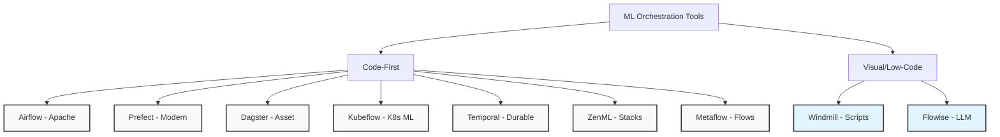
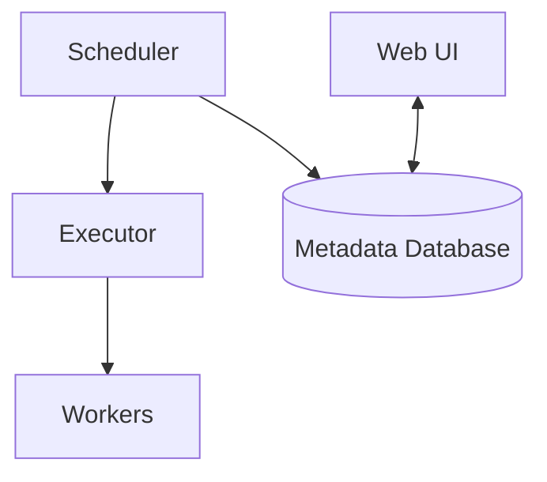
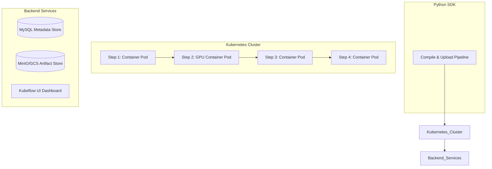
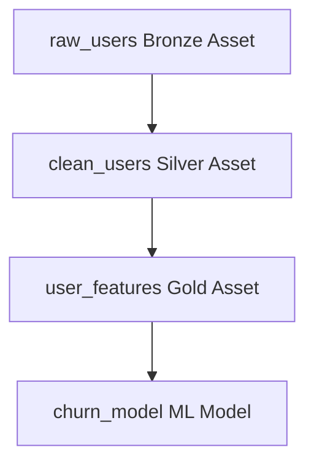
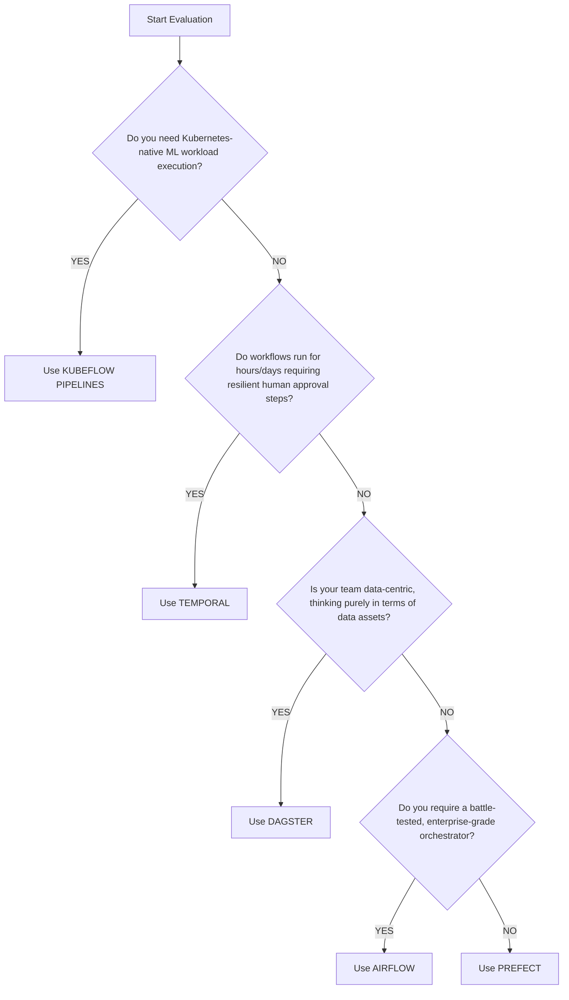
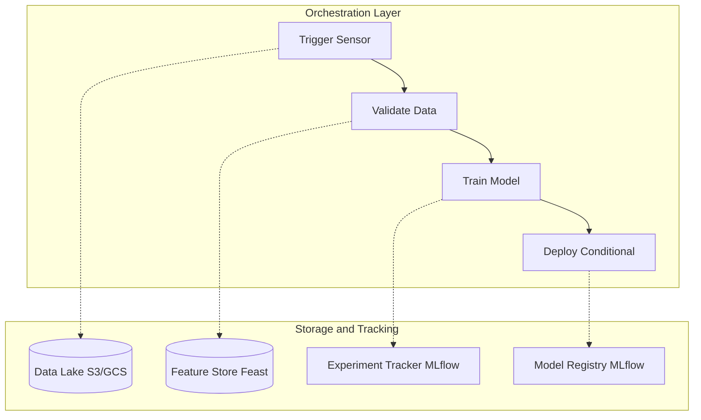

> **AI/ML Engineering Track** | Complexity: `[COMPLEX]` | Time: 6-8

**Prerequisites**: [Module 1.7: Data Pipelines](../module-1.7-data-pipelines/) (data versioning, feature stores, and validation)

A notebook trains a model once. Production retrains it on a schedule, validates every artifact, caches expensive steps, branches on metric thresholds, and leaves an audit trail that another engineer can replay six months later. That gap between a one-off experiment and a repeatable system is what ML pipeline frameworks exist to close. Pipeline tools such as Kubeflow Pipelines, TensorFlow Extended (TFX), ZenML, and Metaflow express machine learning work as a directed acyclic graph of components, pass typed artifacts between steps, compile the graph to a runtime, and apply caching so you do not pay twice for unchanged preprocessing.

The broader orchestration story still matters because ML pipelines sit on top of schedulers and clusters. [Maxime Beauchemin's work at Airbnb led to Apache Airflow](https://airflow.apache.org/docs/apache-airflow/stable/project.html), which popularized DAGs-as-code for data workflows when cron scripts stopped scaling. Kubeflow Pipelines, Argo Workflows, Prefect, Dagster, and Temporal each answer adjacent questions—Kubernetes-native ML steps, asset lineage, durable long-running workflows—but the durable spine across all of them is the same: declare dependencies explicitly, make steps idempotent where possible, store artifacts outside task memory, and treat the compiled graph as the contract between data science and platform engineering.

---

## What You'll Be Able to Do

By the end of this module, you will be able to design, implement, compile, diagnose, and compare production ML pipelines using the frameworks and orchestration patterns below.
- **Design** end-to-end ML training pipelines with components, typed artifacts, caching, and conditional deployment gates.
- **Implement** pipeline definitions using Kubeflow Pipelines as the primary Kubernetes-native example and map equivalent concepts to TFX, ZenML, and Metaflow.
- **Compile** a pipeline graph to a portable runtime specification and explain how the scheduler materializes container steps on a cluster.
- **Diagnose** silent failures, cache misses, and cascading pipeline errors using run metadata, logs, and data health checks.
- **Compare** task-based DAG orchestrators (Airflow, Prefect) against ML-native pipeline SDKs (Kubeflow, TFX, ZenML, Metaflow) for GPU training and reproducibility.

---

## Why This Module Matters

Every production ML system eventually outgrows a single script. Data arrives on different cadences, training consumes GPUs for hours, evaluation must gate promotion, and regulators ask which dataset and code revision produced a given model artifact. Without a pipeline layer, teams glue together cron jobs, shell scripts, and manual notebook exports. Each step might work in isolation while the composed system fails silently: an empty extract succeeds with exit code zero, downstream training runs on zero rows, and deployment pushes a useless artifact because nobody validated row counts at the boundary.

ML pipeline frameworks treat each step as a component with declared inputs and outputs, not as an opaque function that mutates shared filesystem state. Artifacts—datasets, models, metrics, evaluation reports—are first-class objects stored in object storage or a metadata backend, and the orchestrator passes references between steps instead of serializing multi-gigabyte tables through a message bus. Caching hashes component inputs so unchanged preprocessing is skipped on the next run, which saves real money when feature engineering dominates wall-clock time. Conditional edges encode business rules such as "deploy only if accuracy exceeds the champion model," which turns informal checklist culture into executable policy.

Think of ML orchestration like an airport control tower coordinating specialized ground crews. Individual planes know how to fly, but without sequencing, fueling, baggage loading, and runway assignment, chaos follows. The pipeline compiler is the flight plan; the runtime is the tower; artifacts are the cargo manifests that prove what moved between stations. Whether you run on Kubeflow inside a shared Kubernetes cluster, on TFX inside a managed Vertex pipeline, on ZenML with a stack abstraction, or on Metaflow with cloud-backed `@step` decorators, the engineering judgment is the same: isolate side effects, version artifacts, make retries safe, and never trust a green checkmark without data validation at every handoff.

---

## Did You Know?

- Kubeflow Pipelines compiles Python pipeline definitions into an [Argo Workflows](https://argoproj.github.io/workflows/) YAML specification, which is why the same DAG concepts appear in both the ML SDK and the underlying Kubernetes workflow engine.
- TFX introduced the notion of [ML Metadata (MLMD)](https://www.tensorflow.org/tfx/guide/mlmd) to record lineage across pipeline components, predating many open-source experiment-tracking integrations that teams bolt on today.
- ZenML separates **stacks** (orchestrator, artifact store, experiment tracker) from **pipelines**, so the same Python pipeline code can target a local runner in development and a Kubeflow or Kubernetes orchestrator in production without rewriting step logic.
- Metaflow's `@step` decorator persists intermediate results to cloud object storage automatically, which is why resuming a failed multi-day training workflow does not require custom checkpoint plumbing in user code.

> **Landscape snapshot — as of 2026-06. Verify against vendor docs before relying on specifics.**
>
> | Framework | Typical SDK / entrypoint | Primary runtime target | Notable pipeline concepts |
> |-----------|--------------------------|------------------------|---------------------------|
> | Kubeflow Pipelines | `kfp.dsl` Python SDK | Kubernetes (Argo Workflows) | `@dsl.component`, `Input`/`Output` artifacts, `compiler.Compiler()` |
> | TFX | Pipeline DSL + standard components | KFP, Vertex AI, Apache Beam runners | ExampleGen, Transform, Trainer, Tuner, Pusher, MLMD lineage |
> | ZenML | `@step` / `@pipeline` decorators | Local, Kubeflow, Kubernetes, Airflow, etc. | Stacks, artifact stores, model registry integrations |
> | Metaflow | `@step` / `@flow` decorators | AWS Batch, Kubernetes, local | Datastore artifacts, `--with` cards, resume after failure |
> | Airflow / Prefect / Dagster | Task or asset decorators | Self-hosted or managed control planes | General workflow orchestration; often wrap ML pipeline runners |

---

## Pipeline Fundamentals: Components, Artifacts, and Compilation

Before comparing tools, internalize the vocabulary they share. A **pipeline** is a directed acyclic graph whose nodes are **components** (also called steps or tasks) and whose edges are data or control dependencies. A **component** is a containerized unit of work with declared inputs and outputs: it might preprocess parquet files, train an estimator, evaluate on a holdout set, or register a model. An **artifact** is a persistent output of a component—training data snapshot, serialized model, metric bundle, HTML evaluation report—not an in-memory object that vanishes when the pod exits.

Artifact typing matters because it enables schema validation and UI visualization. Kubeflow Pipelines uses types such as `Dataset`, `Model`, and `Metrics`. TFX wires components through standard artifact classes recorded in MLMD. ZenML materializes artifacts through its artifact store abstraction. Metaflow writes pickles or structured files to its datastore and exposes them as flow inputs to downstream steps. The implementation differs, but the design goal is identical: the orchestrator should know *what* was produced, *where* it lives, and *which upstream revision* fed each step.

**Compilation** is the act of translating a high-level pipeline definition into something a runtime can execute. In Kubeflow Pipelines, `compiler.Compiler().compile(pipeline_fn, 'pipeline.yaml')` emits an Argo Workflow manifest. That manifest lists container images, commands, resource requests, volume mounts, and dependency edges. The Kubeflow API server or Argo controller then schedules pods on Kubernetes. TFX compiles to a runner-specific representation (Kubeflow, Beam, or Vertex). ZenML resolves the active stack and delegates to the configured orchestrator backend. Metaflow packages code and dependencies into a flow graph executed by its runtime agent. Compilation separates *authoring time* (Python in your repo) from *run time* (pods on a cluster), which is how the same pipeline definition can be unit-tested locally and promoted unchanged to production.

**Caching** compares a fingerprint of each component's inputs—data hashes, parameter values, container image digest—against prior successful runs. When the fingerprint matches, the orchestrator reuses stored artifacts instead of re-executing the container. Caching is not magic; it requires deterministic components and stable input addressing. If your preprocessing step reads "latest" data without pinning a version, the cache key changes unpredictably or, worse, serves stale outputs. Production teams pin dataset revisions (DVC, Delta Lake versions, snapshot IDs) and treat cache invalidation as a data governance decision, not a framework toggle.

**Conditional and parallel execution** extend linear DAGs. A training pipeline might fan out hyperparameter trials in parallel, then reduce results in a selection step. A metric threshold might route execution to `deploy` or `alert` branches. Kubeflow supports conditional groups in its SDK; Airflow uses branch operators; Metaflow merges paths with `join`. Parallelism without artifact discipline creates race conditions—two steps writing the same path—so frameworks encourage unique artifact URIs per run ID.

Finally, pipelines connect to **experiment tracking** and **model registries** at the boundaries. Training components log parameters and metrics to MLflow, Weights & Biases, or Neptune; registration components push approved models to a registry with stage transitions. The pipeline is the spine; tracking and serving are organs attached at defined interfaces. Module 1.6 covered experiment tracking; Module 1.9 will cover serving. Here, the focus is the graph that reliably produces the artifact those systems consume.

```text
ML PIPELINE LIFECYCLE (DURABLE SPINE)
=====================================

  Author (Python SDK)  -->  Compile (YAML / IR)  -->  Schedule (controller)
         |                          |                         |
         v                          v                         v
   Components +              Argo / Beam /            Pods + artifact
   typed I/O                  Vertex spec               store writes
         |                          |                         |
         +--------------------------+-------------------------+
                                    v
                          Metadata + cache lookup
                                    |
                                    v
                    Experiment tracker / model registry (optional hooks)
```

The diagram is intentionally tool-agnostic. When you read Kubeflow, TFX, ZenML, or Metaflow documentation, map each feature to one of these stages. If a feature does not map cleanly—say, a UI-only button with no artifact record—that is a signal the platform is hiding state you will need during an incident review.

---

## The History of ML Orchestration: From Cron to Cloud-Native

### The Cron Era (Pre-2014)

Before dedicated orchestration tools, teams ran ML pipelines with cron jobs and bash scripts. This worked for simple pipelines, but as companies grew, the limitations became painful. The lack of standardized dependency management meant scripts had to arbitrarily sleep and guess when upstream data would be ready.

The core problems of the cron era were common across many engineering teams because cron itself is only a clock, not a dependency graph. Teams bolted together shell wrappers, but nothing recorded which upstream extract failed or which dataset version a model consumed.
- **No dependency management**: Cron does not natively know that job A must finish successfully before job B starts.
- **No visibility**: You could not see what was running, what failed, or why without logging into servers.
- **No retries**: Failures meant manual intervention or complete data loss.
- **No auditing**: Who ran what? When? With what parameters? The answers were lost to history.

### The Birth of Modern Orchestration (2014-2016)

**Airflow emerges at Airbnb (2014)**. Maxime Beauchemin's frustration became the industry's solution. Key innovations included [expressing DAGs as pure Python code, explicit dependency management, a rich UI visualization, and extensible operator classes](https://airflow.apache.org/docs/apache-airflow/stable/index.html). Airbnb open-sourced it in 2015, and it rapidly became one of the most widely adopted workflow orchestrators.

**Apache Oozie**. [Oozie was a Hadoop workflow engine that defined workflows in XML and managed dependent jobs](https://oozie.apache.org/docs/5.2.0/DG_Overview.html). Oozie mattered for batch Hadoop ecosystems; modern ML teams rarely start there, but the pattern—XML or code declaring DAG edges—reappears whenever a platform compiles pipelines to a lower-level workflow engine.

### The Kubernetes Revolution (2017-2020)

As ML workflows transitioned to containerized environments, orchestration tools had to adapt natively to Kubernetes primitives instead of assuming long-lived VMs with locally attached disks. Containerized steps need explicit artifact volumes, image pull secrets, and resource requests so the scheduler can place GPU work intelligently.

**Kubeflow**: [Kubeflow is an open-source toolkit for building and running machine learning workflows on Kubernetes](https://github.com/kubeflow/pipelines).

**Argo Workflows**: [Argo Workflows is a Kubernetes-native workflow engine that defines containerized workflows declaratively](https://argoproj.github.io/workflows/). Kubeflow Pipelines still compiles to Argo under the hood on many distributions, which is why learning Argo pod patterns pays off even when authors never write raw Workflow YAML.

### The Modern Era (2020-Present)

The latest evolution of orchestration tools acknowledges that machine learning code is inherently different from standard web application code.

**Prefect**: Takes a Python-native approach to orchestration. Flows are regular Python functions decorated with `@flow` and `@task`, rather than a separate workflow DSL.
**Dagster**: Introduced "[Software-Defined Assets](https://github.com/dagster-io/dagster)." Instead of thinking about what tasks you run, you think about what data you produce.
**Metaflow**: Netflix-originated Python flows with `@step` decorators and automatic artifact persistence to cloud object storage, optimized for data scientist ergonomics and resume-after-failure semantics.

---

## Why Orchestration Still Surrounds ML Pipelines

Pipeline SDKs solve ML-specific artifact and component problems, but they still rely on a scheduler somewhere in the stack. Training a model once in a Jupyter notebook is trivial; training it daily with validation, feature extraction, champion/challenger evaluation, and gated deployment is where orchestration becomes essential. General orchestrators (Airflow, Prefect, Dagster) often *trigger* ML pipeline runs or wrap individual tasks, while ML-native frameworks (Kubeflow, TFX, ZenML, Metaflow) own the graph inside the run. Mature platforms frequently combine both: Airflow kicks off a Kubeflow Pipeline run at 06:00 UTC after upstream ETL sensors succeed.

The operational contrast between ad-hoc scripts and orchestrated pipelines is worth internalizing because it explains why platform teams standardize on compiled graphs instead of shared cron entries:

```text
WITHOUT ORCHESTRATION              WITH ORCHESTRATION
====================              ==================

Manual cron jobs                  Declarative DAGs
"It worked on my machine"         Reproducible pipelines
No visibility                     Full observability
Failures go unnoticed             Automatic retries + alerts
No dependency management          Clear task dependencies
Ad-hoc scheduling                 Intelligent scheduling
```

| Without Orchestration | With Airflow |
|-----------------------|--------------|
| Significant time spent debugging cron jobs | Lower maintenance overhead with centralized orchestration |
| Revenue can be affected by stale or failed ML pipelines | Better validation and orchestration can reduce operational mistakes |
| Heavier manual on-call burden | Less manual intervention with alerting and automation |
| Manual retraining triggers | Automatic daily retraining |

> **Pause and predict**: If your feature engineering task is not strictly idempotent and fails halfway through, what specific data corruption occurs when the orchestrator automatically retries the task after a transient network failure?

---

## The Orchestration Landscape

To navigate the complex tooling environment, we must categorize orchestrators based on their core philosophy rather than on marketing names alone. Some tools optimize for data-engineering batch schedules, others for ML artifact graphs, and others for portable ML authoring; the diagram below groups common options by whether they are general orchestrators or ML-native pipeline frameworks.

```text
┌─────────────────────────────────────────────────────────────────────────┐
│                    ML ORCHESTRATION TOOLS                                │
├─────────────────────────────────────────────────────────────────────────┤
│                                                                          │
│  GENERAL ORCHESTRATION               ML-NATIVE PIPELINES                 │
│  ────────────────────                ───────────────────                 │
│                                                                          │
│  ┌─────────────┐  ┌─────────────┐   ┌─────────────┐  ┌─────────────┐   │
│  │   AIRFLOW   │  │   PREFECT   │   │    ZENML    │  │  METAFLOW   │   │
│  │  (Apache)   │  │  (Modern)   │   │  (Stacks)   │  │  (Flows)    │   │
│  │             │  │             │   │             │  │             │   │
│  │ Python DAGs │  │ Python-     │   │ @step /     │  │ @step /     │   │
│  │ Scheduling  │  │ native      │   │ @pipeline   │  │ @flow       │   │
│  │ Battle-     │  │ Dynamic     │   │ Stack       │  │ Datastore   │   │
│  │ tested      │  │ Hybrid      │   │ portability │  │ resume      │   │
│  └─────────────┘  └─────────────┘   └─────────────┘  └─────────────┘   │
│                                                                          │
│  ┌─────────────┐  ┌─────────────┐   ┌─────────────┐  ┌─────────────┐   │
│  │   DAGSTER   │  │  KUBEFLOW   │   │  WINDMILL   │  │   FLOWISE   │   │
│  │  (Asset)    │  │  (K8s ML)   │   │  (Scripts)  │  │  (LLM)      │   │
│  │             │  │             │   │             │  │             │   │
│  │ Data-aware  │  │ K8s-native  │   │ Any lang    │  │ Drag-drop   │   │
│  │ Typed       │  │ ML-focused  │   │ Visual +    │  │ LLM flows   │   │
│  │ Software-   │  │ Pipelines   │   │ code        │  │             │   │
│  │ defined     │  │             │   │             │  │             │   │
│  └─────────────┘  └─────────────┘   └─────────────┘  └─────────────┘   │
│                                                                          │
│  ┌─────────────┐                                                        │
│  │  TEMPORAL   │  WHEN TO USE WHAT:                                     │
│  │  (Durable)  │  ───────────────────                                   │
│  │             │  Complex ML Pipelines → Airflow, Kubeflow              │
│  │ Long-       │  Data Engineering    → Dagster, Airflow                │
│  │ running     │  Portable ML authoring → ZenML, Metaflow               │
│  │ Reliable    │  Human approval gates  → Temporal                      │
│  │ workflows   │  Long-running Jobs   → Temporal                        │
│  └─────────────┘  K8s-native ML       → Kubeflow                        │
│                                                                          │
└─────────────────────────────────────────────────────────────────────────┘
```

The same landscape can be visualized as a dependency matrix when you need to explain relationships to stakeholders who will not read a full toolchain comparison document.


---

## Apache Airflow Deep Dive

Airflow remains the reference implementation for calendar-driven DAG orchestration even when ML teams adopt Kubeflow or TFX for the training graph itself. Understanding Airflow matters because it is often the outer loop: sensors wait for warehouse exports, a trigger operator launches a Kubeflow Pipeline run, and email or Slack callbacks fire when the inner ML job completes. Airflow thinks in tasks and schedules; ML pipeline SDKs think in artifacts and container images. Production platforms connect the two layers instead of forcing one tool to do everything.

### What is Airflow?

Airflow is a widely used workflow orchestrator that lets you [define workflows as code, schedule them, and monitor them through a web UI](https://airflow.apache.org/docs/apache-airflow/stable/index.html). The scheduler evaluates DAG definitions stored in a metadata database, enqueueing work when interval or external triggers match policy. Workers—or a Kubernetes executor—pull tasks and execute Python callables or operators. Task state, logs, and XCom metadata return to the database so operators can debug failed runs without SSH access to individual boxes.

```text
AIRFLOW ARCHITECTURE
====================

┌─────────────────────────────────────────────────────────────────┐
│                         AIRFLOW                                  │
├─────────────────────────────────────────────────────────────────┤
│                                                                  │
│   ┌─────────────┐    ┌─────────────┐    ┌─────────────┐        │
│   │  SCHEDULER  │───▶│   EXECUTOR  │───▶│   WORKERS   │        │
│   │             │    │             │    │             │        │
│   │ Triggers    │    │ Celery/K8s/ │    │ Run tasks   │        │
│   │ DAG runs    │    │ Local       │    │             │        │
│   └─────────────┘    └─────────────┘    └─────────────┘        │
│          │                                     │                │
│          ▼                                     ▼                │
│   ┌─────────────┐                      ┌─────────────┐        │
│   │  METADATA   │                      │  WEB UI     │        │
│   │  DATABASE   │◀────────────────────▶│             │        │
│   │  (Postgres) │                      │ Monitoring  │        │
│   └─────────────┘                      └─────────────┘        │
│                                                                  │
└─────────────────────────────────────────────────────────────────┘
```

The scheduler, executor, workers, metadata database, and web UI form a control plane that is separate from the data plane where your ML containers actually train models. The following diagram highlights how scheduling decisions flow into execution.


### DAG Basics

A DAG defines the workflow structure. Think of a DAG like a strict recipe with non-negotiable dependencies: you can chop vegetables and boil water in parallel, but you cannot add the vegetables until the water is boiling. The "acyclic" part guarantees you cannot create impossible circular dependencies.

```python
from airflow import DAG
from airflow.operators.python import PythonOperator
from airflow.operators.bash import BashOperator
from datetime import datetime, timedelta

# DAG definition
default_args = {
    'owner': 'ml_team',
    'depends_on_past': False,
    'start_date': datetime(2024, 1, 1),
    'retries': 3,
    'retry_delay': timedelta(minutes=5),
    'email_on_failure': True,
    'email': ['ml-team@company.com'],
}

with DAG(
    'ml_training_pipeline',
    default_args=default_args,
    description='Daily ML model training pipeline',
    schedule='@daily',  # or '0 6 * * *' for 6 AM
    catchup=False,
    tags=['ml', 'training'],
) as dag:

    # Task 1: Extract data
    extract_data = PythonOperator(
        task_id='extract_data',
        python_callable=extract_from_database,
    )

    # Task 2: Validate data
    validate_data = PythonOperator(
        task_id='validate_data',
        python_callable=run_data_validation,
    )

    # Task 3: Feature engineering
    feature_engineering = PythonOperator(
        task_id='feature_engineering',
        python_callable=engineer_features,
    )

    # Task 4: Train model
    train_model = PythonOperator(
        task_id='train_model',
        python_callable=train_ml_model,
    )

    # Task 5: Evaluate model
    evaluate_model = PythonOperator(
        task_id='evaluate_model',
        python_callable=evaluate_model_performance,
    )

    # Task 6: Deploy if good
    deploy_model = PythonOperator(
        task_id='deploy_model',
        python_callable=deploy_to_production,
    )

    # Define dependencies (the DAG structure)
    extract_data >> validate_data >> feature_engineering
    feature_engineering >> train_model >> evaluate_model >> deploy_model
```

### ML-Specific Patterns in Airflow

Machine learning pipelines frequently require dynamic branching depending on the quality of a trained model. If the accuracy drops below an established threshold, the deployment task should be skipped. [Airflow's TaskFlow API, introduced heavily in version 2.0, simplifies passing context between these dynamic branches](https://airflow.apache.org/docs/apache-airflow/stable/tutorial/taskflow.html).

```python
from airflow.decorators import dag, task
from airflow.operators.python import BranchPythonOperator
from airflow.utils.trigger_rule import TriggerRule

@dag(
    schedule='@daily',
    start_date=datetime(2024, 1, 1),
    catchup=False,
)
def ml_pipeline_with_branching():
    """
    ML pipeline with conditional deployment based on metrics.
    """

    @task
    def extract_data():
        """Extract training data from source."""
        # Extract logic
        return {'rows': 10000, 'features': 50}

    @task
    def validate_data(data_info: dict):
        """Validate data quality."""
        if data_info['rows'] < 1000:
            raise ValueError("Insufficient data!")
        return {'valid': True, 'rows': data_info['rows']}

    @task
    def train_model(data_info: dict):
        """Train the ML model."""
        # Training logic
        return {
            'accuracy': 0.92,
            'f1_score': 0.89,
            'model_path': '/models/v1.0'
        }

    @task
    def evaluate_model(metrics: dict):
        """Evaluate model and decide deployment."""
        return {
            'deploy': metrics['accuracy'] > 0.90,
            'metrics': metrics
        }

    def choose_deployment_path(**context):
        """Branch based on model quality."""
        ti = context['ti']
        evaluation = ti.xcom_pull(task_ids='evaluate_model')

        if evaluation['deploy']:
            return 'deploy_to_production'
        else:
            return 'notify_failure'

    branch = BranchPythonOperator(
        task_id='branch_on_quality',
        python_callable=choose_deployment_path,
    )

    @task
    def deploy_to_production(evaluation: dict):
        """Deploy model to production."""
        print(f"Deploying model with accuracy: {evaluation['metrics']['accuracy']}")
        return {'deployed': True}

    @task
    def notify_failure(evaluation: dict):
        """Send notification about failed quality check."""
        print(f"Model did not meet threshold: {evaluation['metrics']['accuracy']}")
        return {'notified': True}

    @task(trigger_rule=TriggerRule.ONE_SUCCESS)
    def cleanup():
        """Cleanup temporary files."""
        print("Cleaning up...")

    # Build the DAG
    data = extract_data()
    validated = validate_data(data)
    model = train_model(validated)
    evaluation = evaluate_model(model)

    branch >> [deploy_to_production(evaluation), notify_failure(evaluation)]
    [deploy_to_production(evaluation), notify_failure(evaluation)] >> cleanup()

# Instantiate the DAG
ml_pipeline = ml_pipeline_with_branching()
```

---

## Kubeflow Pipelines

[Kubeflow Pipelines](https://github.com/kubeflow/pipelines) is the Kubernetes-native ML pipeline SDK most platform teams encounter when standardizing GPU training on shared clusters. Each component runs in its own container pod; the compiler emits a workflow specification the control plane schedules like any other batch workload. Think of Kubeflow like an automated factory line where stations have different tooling—CPU preprocessing pods versus GPU training pods—but share a single artifact warehouse (S3, GCS, or MinIO) and a metadata database that records run lineage.

Kubeflow fits teams that already operate Kubernetes competently and want ML steps to inherit cluster primitives: namespaces, quotas, GPU device plugins, secrets, and network policies. It is less attractive when the organization has no cluster appetite and prefers a managed SaaS runner; in that case ZenML or a cloud TFX/Vertex path may reduce operational surface area while preserving similar DAG concepts.

Kubeflow is a strong default when your platform team already runs Kubernetes with GPU node pools, object storage, and tenant isolation policies, and when you want ML steps to look like ordinary batch workloads to cluster operators.
- Distributed GPU-intensive training jobs with per-step resource requests.
- Reproducible, containerized experiments where artifact URIs are auditable.
- Multi-tenant ML platforms that isolate teams by namespace and quota.

```text
KUBEFLOW PIPELINES ARCHITECTURE
===============================

┌─────────────────────────────────────────────────────────────────┐
│                    KUBEFLOW PIPELINES                            │
├─────────────────────────────────────────────────────────────────┤
│                                                                  │
│   PIPELINE DEFINITION (Python SDK)                               │
│   ┌─────────────────────────────────────────────────────────┐   │
│   │  pipeline.py → compile() → upload()                     │   │
│   └─────────────────────────────────────────────────────────┘   │
│                           │                                      │
│                           ▼                                      │
│   ┌─────────────────────────────────────────────────────────┐   │
│   │                 KUBERNETES CLUSTER                       │   │
│   │  ┌─────────┐  ┌─────────┐  ┌─────────┐  ┌─────────┐    │   │
│   │  │  Step 1 │─▶│  Step 2 │─▶│  Step 3 │─▶│  Step 4 │    │   │
│   │  │  (Pod)  │  │  (Pod)  │  │  (Pod)  │  │  (Pod)  │    │   │
│   │  │         │  │  +GPU   │  │         │  │         │    │   │
│   │  └─────────┘  └─────────┘  └─────────┘  └─────────┘    │   │
│   └─────────────────────────────────────────────────────────┘   │
│                           │                                      │
│                           ▼                                      │
│   ┌─────────────────────────────────────────────────────────┐   │
│   │  METADATA STORE  │  ARTIFACT STORE  │  UI DASHBOARD     │   │
│   │  (MySQL)         │  (MinIO/GCS)     │  (Runs, Metrics)  │   │
│   └─────────────────────────────────────────────────────────┘   │
│                                                                  │
└─────────────────────────────────────────────────────────────────┘
```

After compilation, the Kubeflow control plane schedules pods, writes artifacts to object storage, and surfaces run progress in the UI as shown in the execution flow below.


### Kubeflow Pipeline Definition

The Python SDK uses `@dsl.component` to declare containerized functions. `Input[Dataset]` and `Output[Model]` parameters tell the compiler how to wire artifact paths into the container filesystem. `set_accelerator_type` paired with `set_accelerator_limit` requests GPUs on the generated pod spec (KFP v2 deprecated the older `set_gpu_limit` helper), and `set_memory_limit` sets memory bounds. After authoring, `compiler.Compiler().compile()` produces YAML you upload to the Kubeflow UI or API; each run instantiates pods, records metrics in the metadata store, and applies caching when step signatures match prior successful executions.

When debugging Kubeflow, inspect three layers: the compiled YAML (did dependencies and artifact paths serialize correctly?), the pod events (GPU, image pull, OOM), and the artifact bucket (did the step write the expected file?). Most "mysterious" skips are cache hits—valuable in production, confusing during development if you forgot you pinned inputs.

```python
from kfp import dsl
from kfp import compiler
from kfp.dsl import Dataset, Model, Metrics, Input, Output

# Define a component
@dsl.component(
    base_image='python:3.10',
    packages_to_install=['pandas', 'scikit-learn']
)
def preprocess_data(
    input_data: Input[Dataset],
    output_data: Output[Dataset],
    test_size: float = 0.2
):
    """Preprocess and split data."""
    import pandas as pd
    from sklearn.model_selection import train_test_split

    df = pd.read_csv(input_data.path)

    # Preprocessing
    df = df.dropna()
    df = df[df['value'] > 0]

    # Split
    train, test = train_test_split(df, test_size=test_size)

    # Save
    train.to_csv(output_data.path, index=False)


@dsl.component(
    base_image='python:3.10',
    packages_to_install=['pandas', 'scikit-learn', 'xgboost']
)
def train_model(
    training_data: Input[Dataset],
    model_output: Output[Model],
    metrics_output: Output[Metrics],
    n_estimators: int = 100,
    max_depth: int = 6
):
    """Train XGBoost model."""
    import pandas as pd
    import xgboost as xgb
    from sklearn.metrics import accuracy_score, f1_score
    import json

    df = pd.read_csv(training_data.path)
    X = df.drop('target', axis=1)
    y = df['target']

    # Train
    model = xgb.XGBClassifier(
        n_estimators=n_estimators,
        max_depth=max_depth
    )
    model.fit(X, y)

    # Evaluate
    predictions = model.predict(X)
    accuracy = accuracy_score(y, predictions)
    f1 = f1_score(y, predictions, average='weighted')

    # Save model
    model.save_model(model_output.path)

    # Log metrics
    metrics_output.log_metric('accuracy', accuracy)
    metrics_output.log_metric('f1_score', f1)


@dsl.component(base_image='python:3.10')
def deploy_model(
    model: Input[Model],
    metrics: Input[Metrics],
    endpoint: str
) -> str:
    """Deploy model if metrics pass threshold."""
    # Check metrics
    if metrics.metadata.get('accuracy', 0) < 0.85:
        return "Model did not meet accuracy threshold"

    # Deploy logic
    print(f"Deploying to {endpoint}")
    return f"Deployed to {endpoint}"


# Define the pipeline
@dsl.pipeline(
    name='ML Training Pipeline',
    description='End-to-end ML training with Kubeflow'
)
def ml_training_pipeline(
    input_data_path: str,
    test_size: float = 0.2,
    n_estimators: int = 100,
    max_depth: int = 6,
    deploy_endpoint: str = 'production'
):
    # Step 1: Preprocess
    preprocess_task = preprocess_data(
        input_data=dsl.importer(
            artifact_uri=input_data_path,
            artifact_class=Dataset
        ),
        test_size=test_size
    )

    # Step 2: Train (request GPU)
    train_task = train_model(
        training_data=preprocess_task.outputs['output_data'],
        n_estimators=n_estimators,
        max_depth=max_depth
    )
    train_task.set_accelerator_type('nvidia.com/gpu').set_accelerator_limit(1)
    train_task.set_memory_limit('8G')

    # Step 3: Deploy
    deploy_task = deploy_model(
        model=train_task.outputs['model_output'],
        metrics=train_task.outputs['metrics_output'],
        endpoint=deploy_endpoint
    )


# Compile the pipeline
compiler.Compiler().compile(
    ml_training_pipeline,
    'ml_pipeline.yaml'
)
```

### Caching and Conditional Steps in Kubeflow

Caching in Kubeflow Pipelines is enabled at the pipeline and task level. When a task's input artifact URIs, parameters, and container image digest match a previous run, the controller can mark the step skipped and surface prior outputs in the UI. This behavior is essential for iterative model tuning where only the trainer hyperparameters change. Teams disable caching temporarily during debugging so every step re-executes, then re-enable it for scheduled production runs.

Conditional execution uses `dsl.If` or legacy condition components to express predicates on metric artifacts or parameters. The antipattern is encoding business logic only inside a shell script without recording the decision in metadata—auditors cannot see *why* deployment was skipped. Prefer explicit branch components whose inputs are typed metric artifacts so the UI and MLMD-style lineage reflect the gate.

---

## TensorFlow Extended (TFX)

[TensorFlow Extended (TFX)](https://www.tensorflow.org/tfx) is Google's production ML platform toolkit built around standardized pipeline components and ML Metadata (MLMD). Where Kubeflow gives you generic `@dsl.component` containers, TFX ships opinionated components—`ExampleGen`, `StatisticsGen`, `SchemaGen`, `ExampleValidator`, `Transform`, `Trainer`, `Tuner`, `Evaluator`, `Pusher`—that implement TensorFlow-friendly best practices for data validation and training. Teams on TensorFlow or Keras often adopt TFX because the components encode years of production lessons: compute statistics before training, enforce schemas, export transformed features consistently, and push only models that pass evaluation thresholds.

TFX pipelines compile to a runner abstraction. The same pipeline definition can execute locally for development, on Kubeflow Pipelines for on-prem Kubernetes, on Apache Beam for large-scale preprocessing, or on managed Vertex AI Pipelines in Google Cloud. That portability mirrors the durable spine from earlier: components declare artifacts; MLMD records lineage; the runner materializes containers. The volatile choice is *which runner* your organization operates today—consult the landscape snapshot rather than treating one runner as universal.

MLMD deserves explicit attention because it is the lineage brain behind TFX. Each component execution creates `Execution` records linked to `Artifact` entities (datasets, models, statistics protos). When compliance asks which training data produced a given production model version, MLMD answers with a graph query instead of a spreadsheet archaeology project. Even if you do not adopt full TFX, study MLMD's data model; Kubeflow and Vertex integrations increasingly mirror similar metadata concepts.

```python
# Illustrative TFX pipeline shape (API evolves; verify against current TFX docs)
from tfx.orchestration import pipeline
from tfx.components import CsvExampleGen, StatisticsGen, SchemaGen, ExampleValidator

def create_tfx_pipeline(pipeline_name: str, pipeline_root: str, data_root: str) -> pipeline.Pipeline:
    example_gen = CsvExampleGen(input_base=data_root)
    statistics_gen = StatisticsGen(examples=example_gen.outputs['examples'])
    schema_gen = SchemaGen(statistics=statistics_gen.outputs['output'])
    example_validator = ExampleValidator(
        statistics=statistics_gen.outputs['output'],
        schema=schema_gen.outputs['output'],
    )
    # Transform, Trainer, Evaluator, and Pusher wire similarly with artifact edges
    return pipeline.Pipeline(
        pipeline_name=pipeline_name,
        pipeline_root=pipeline_root,
        components=[example_gen, statistics_gen, schema_gen, example_validator],
        enable_cache=True,
    )
```

The snippet is intentionally structural rather than copy-paste runnable: TFX component constructors change across releases, and your runner configuration belongs in environment-specific settings. The lesson is the graph of named artifacts (`examples`, `statistics`, `schema`) flowing through validated stages before a trainer ever sees data.

---

## ZenML

[ZenML](https://docs.zenml.io/) targets teams that want ML pipeline code to stay portable across orchestrators. You decorate Python functions with `@step` and compose them in a `@pipeline`. ZenML resolves the active **stack**—orchestrator, artifact store, container registry, experiment tracker, model registry, secrets manager—and injects the correct backends at runtime. The same `train_pipeline()` can run locally with a local orchestrator during development, then execute on Kubeflow or Kubernetes in staging without rewriting step bodies.

Stacks are ZenML's answer to the "works on my laptop" problem. A stack is a named configuration bundle: artifact store points at S3, orchestrator points at a Kubeflow instance, experiment tracker points at MLflow. Switching stacks is how you promote code paths across environments while keeping Python source identical. This indirection adds concepts to learn upfront but pays off when data scientists should not hardcode cluster endpoints in notebooks.

Artifact handling is explicit. Steps return materialized objects; ZenML serializes them to the configured artifact store and passes handles downstream. Integrations exist for popular trackers and registries, which lets ZenML sit between raw Kubeflow and a full MLOps portal. ZenML is often the right bridge when you have multiple orchestrators in the enterprise (Airflow for ETL, Kubeflow for training) but want one Python authoring experience for ML steps.

```python
from zenml import step, pipeline

@step
def load_data() -> str:
  return "/data/train.parquet"

@step
def train_model(data_path: str) -> float:
  # training logic returns a metric such as accuracy
  return 0.91

@pipeline
def training_pipeline():
  data = load_data()
  train_model(data)

if __name__ == "__main__":
  training_pipeline()
```

After `zenml init` and stack configuration, `training_pipeline()` runs on whichever orchestrator the active stack defines. Consult ZenML docs for the exact CLI to register stacks and connect remote orchestrators; those commands churn faster than the stack abstraction itself.

---

## Metaflow

[Metaflow](https://docs.metaflow.org/) originated at Netflix for data science workflows that need easy local development and painless cloud scaling. Flows are Python scripts with `@step` functions and a `@flow` decorator (or class-based flows in newer APIs). Metaflow's runtime packages code, dependencies, and datastore configuration, then executes steps—locally or on AWS Batch / Kubernetes depending on configuration—with automatic persistence of intermediate artifacts to S3 (or compatible object storage).

Metaflow optimizes for **resume** semantics. If a long-running training step fails on hour six of eight, rerunning the flow skips completed upstream steps because their artifacts already exist in the datastore. That behavior resembles Kubeflow caching but is oriented toward individual data scientist ergonomics rather than multi-tenant cluster scheduling. Metaflow also supports cards—lightweight HTML reports attached to steps—which help teams review training curves without opening a separate tracker for every experiment.

Metaflow is less prescriptive than TFX about ML component types. You write arbitrary Python inside steps, which accelerates adoption for teams that do not want ExampleGen/Transform ceremony. The tradeoff is that you must supply your own validation and registry discipline; Metaflow will happily persist a broken model pickle if you skip evaluation gates.

```python
from metaflow import FlowSpec, step, card

class TrainFlow(FlowSpec):
    @step
    def start(self):
        self.dataset_uri = "s3://ml-data/train.parquet"
        self.next(self.train)

    @card
    @step
    def train(self):
        # load self.dataset_uri, fit model, set self.accuracy
        self.accuracy = 0.93
        self.next(self.evaluate)

    @step
    def evaluate(self):
        if self.accuracy < 0.90:
            raise ValueError("Model below quality bar")
        self.next(self.end)

    @step
    def end(self):
        print("Flow complete")

if __name__ == "__main__":
    TrainFlow()
```

Run with `python trainflow.py run` locally, or configure Metaflow's metadata and compute backends for cloud execution. The `card` decorator is optional but illustrates how Metaflow surfaces step-level narratives alongside persisted artifacts.

---

## Choosing Among ML-Native Pipeline Frameworks

Kubeflow Pipelines, TFX, ZenML, and Metaflow all implement the same durable spine—typed artifacts, compilation to a runtime, caching, and lineage—but they optimize for different operating constraints. Kubeflow Pipelines fits teams that already run Kubernetes and want Argo-backed ML DAGs with first-class GPU scheduling on pod specs. TFX fits TensorFlow-centric organizations that want opinionated validation components (`ExampleGen`, `StatisticsGen`, `SchemaGen`, `ExampleValidator`) and MLMD lineage without inventing those stages from scratch. ZenML fits enterprises that need one Python `@pipeline` to target a local stack in development and a Kubeflow or Kubernetes stack in production by swapping stack configuration instead of rewriting step bodies. Metaflow fits data science teams that prioritize `@step` ergonomics, automatic datastore artifacts, and resume-after-failure semantics over multi-tenant cluster scheduling features.

General orchestrators (Airflow, Prefect, Dagster) and durable workflow engines (Temporal) typically surround these frameworks rather than replace them. Airflow might trigger a Kubeflow Pipeline run after warehouse sensors succeed; Temporal might coordinate a multi-day training workflow with a human approval gate while Kubeflow or TFX owns the artifact graph inside each training run. The decision is therefore two-layered: pick the ML-native compiler that matches your artifact and runtime requirements, then pick the outer scheduler that matches your cadence, sensors, and approval policies.

| Framework | Best when | Watch out for |
|-----------|-----------|---------------|
| Kubeflow Pipelines | Kubernetes is the training runtime; GPU steps need native pod resource fields | Platform setup overhead; authors must understand K8s scheduling |
| TFX | TensorFlow shops need standardized validation components and MLMD lineage | Runner and component APIs evolve across releases |
| ZenML | Same pipeline code must run locally and on remote orchestrators via stacks | Stack registration before first remote execution |
| Metaflow | Individual data scientists need resilient flows with automatic artifact persistence | Less prescriptive validation—you supply evaluation gates |

---

## Modern Alternatives: Prefect & Dagster

### Prefect: Python-Native Workflows

Prefect represents a severe paradigm shift away from traditional orchestrators. It is architected to be completely Pythonic. You do not need to rewrite your data science logic to fit within specialized operator classes; instead, you merely [decorate your standard Python functions with `@task` and `@flow`](https://github.com/PrefectHQ/prefect).

```python
from prefect import flow, task
from prefect.tasks import task_input_hash
from datetime import timedelta

@task(
    retries=3,
    retry_delay_seconds=60,
    cache_key_fn=task_input_hash,
    cache_expiration=timedelta(hours=1)
)
def extract_data(source: str) -> dict:
    """Extract data from source."""
    print(f"Extracting from {source}")
    return {"rows": 10000, "source": source}

@task
def transform_data(data: dict) -> dict:
    """Transform the data."""
    return {"rows": data["rows"], "transformed": True}

@task
def train_model(data: dict) -> dict:
    """Train ML model."""
    return {"accuracy": 0.95, "rows_used": data["rows"]}

@task
def deploy_if_good(metrics: dict) -> str:
    """Deploy model if metrics are good."""
    if metrics["accuracy"] > 0.90:
        return "Deployed to production!"
    return "Model not good enough"

@flow(name="ML Training Pipeline")
def ml_pipeline(source: str = "s3://data/training"):
    """Complete ML training pipeline."""
    # Extract
    raw_data = extract_data(source)

    # Transform
    clean_data = transform_data(raw_data)

    # Train
    metrics = train_model(clean_data)

    # Deploy
    result = deploy_if_good(metrics)

    return result

# Run the flow
if __name__ == "__main__":
    ml_pipeline()
```

Prefect and Airflow both schedule Python callables, but they optimize for different developer ergonomics: Airflow assumes a central scheduler and explicit DAG files, while Prefect treats flows as plain functions that can run locally or remotely with less boilerplate.
```text
PREFECT                              AIRFLOW
───────                              ───────
Python-native                        DAG files in specific folder
Dynamic workflows                    Static DAG structure
Local-first                          Server-first
Hybrid execution                     Centralized execution
Built-in caching                     Manual caching
Modern UI                            Classic UI
```

### Dagster: Asset-Based Pipelines

Dagster takes an entirely different architectural approach: instead of explicitly defining tasks that mutate state, [you strictly define "assets" (the data structures you aim to produce)](https://github.com/dagster-io/dagster). Think of the functional difference like cooking food in a kitchen. Airflow operates like a highly sequential recipe that demands "chop the carrots, then aggressively sauté them, then serve them"—it focuses solely on the execution steps. Conversely, Dagster operates like declaring the finished meal—"we require chopped carrots, we require sautéed vegetables, we require a served dish"—and the orchestration engine automatically calculates and figures out the precise computational steps to construct each declared asset.

```python
from dagster import asset, AssetExecutionContext, Definitions
from dagster import MaterializeResult, MetadataValue
import pandas as pd

@asset(
    description="Raw user data from database",
    group_name="bronze"
)
def raw_users(context: AssetExecutionContext) -> pd.DataFrame:
    """Extract raw user data."""
    context.log.info("Extracting raw users...")
    return pd.DataFrame({
        'user_id': range(1000),
        'name': [f'User {i}' for i in range(1000)],
        'signup_date': pd.date_range('2024-01-01', periods=1000)
    })

@asset(
    description="Cleaned and validated user data",
    group_name="silver",
    deps=[raw_users]
)
def clean_users(context: AssetExecutionContext, raw_users: pd.DataFrame) -> pd.DataFrame:
    """Clean and validate user data."""
    # Remove duplicates
    df = raw_users.drop_duplicates()

    # Add derived columns
    df['days_since_signup'] = (pd.Timestamp.now() - df['signup_date']).dt.days

    context.log.info(f"Cleaned {len(df)} users")
    return df

@asset(
    description="User features for ML",
    group_name="gold",
    deps=[clean_users]
)
def user_features(context: AssetExecutionContext, clean_users: pd.DataFrame) -> MaterializeResult:
    """Engineer features for ML."""
    df = clean_users.copy()

    # Feature engineering
    df['is_new_user'] = df['days_since_signup'] < 30
    df['user_segment'] = pd.cut(
        df['days_since_signup'],
        bins=[0, 30, 90, 365, float('inf')],
        labels=['new', 'active', 'mature', 'veteran']
    )

    # Save
    df.to_parquet('/data/features/user_features.parquet')

    return MaterializeResult(
        metadata={
            'num_rows': MetadataValue.int(len(df)),
            'num_features': MetadataValue.int(len(df.columns)),
            'schema': MetadataValue.md(df.dtypes.to_markdown())
        }
    )

@asset(
    description="Trained churn prediction model",
    group_name="ml",
    deps=[user_features]
)
def churn_model(context: AssetExecutionContext) -> MaterializeResult:
    """Train churn prediction model."""
    # Load features
    features = pd.read_parquet('/data/features/user_features.parquet')

    # Train model (simplified)
    accuracy = 0.92

    return MaterializeResult(
        metadata={
            'accuracy': MetadataValue.float(accuracy),
            'training_rows': MetadataValue.int(len(features))
        }
    )

# Define the Dagster job
defs = Definitions(
    assets=[raw_users, clean_users, user_features, churn_model]
)
```

Dagster renders software-defined assets as a medallion-style graph where bronze, silver, gold, and ML layers appear as nodes with explicit lineage edges in the UI.
```text
┌─────────────┐
│  raw_users  │ (Bronze)
└──────┬──────┘
       │
       ▼
┌─────────────┐
│ clean_users │ (Silver)
└──────┬──────┘
       │
       ▼
┌─────────────┐
│user_features│ (Gold)
└──────┬──────┘
       │
       ▼
┌─────────────┐
│ churn_model │ (ML)
└─────────────┘
```

The asset dependency graph below is the mental model Dagster users reason about when deciding which partitions to rematerialize after an upstream schema change.


---

## Temporal: Durable Execution

Temporal is designed for [durable, long-running workflows that preserve workflow state across failures and resume execution without restarting the entire process from scratch](https://github.com/temporalio/temporal/blob/main/docs/architecture/README.md).

```python
from temporalio import activity, workflow
from temporalio.client import Client
from temporalio.common import RetryPolicy
from dataclasses import dataclass
from datetime import timedelta

@dataclass
class TrainingConfig:
    dataset_path: str
    model_type: str
    hyperparameters: dict

@dataclass
class TrainingResult:
    model_path: str
    metrics: dict

# Activities (the actual work)
@activity.defn
async def download_dataset(path: str) -> str:
    """Download dataset (can take hours for large datasets)."""
    # Temporal handles retries, timeouts, heartbeats
    print(f"Downloading from {path}...")
    return "/local/data/training.parquet"

@activity.defn
async def train_model(local_path: str, config: TrainingConfig) -> dict:
    """Train model (can take hours/days)."""
    # Long-running training
    print(f"Training {config.model_type}...")
    return {"accuracy": 0.95, "path": "/models/v1"}

@activity.defn
async def deploy_model(model_path: str) -> str:
    """Deploy to production."""
    print(f"Deploying {model_path}...")
    return "https://api.company.com/model/v1"

@activity.defn
async def wait_for_human_approval(training_result: dict) -> bool:
    """Pause until a compliance reviewer approves the model."""
    print(f"Awaiting approval for metrics: {training_result}")
    return True

# Workflow (the orchestration)
@workflow.defn
class MLTrainingWorkflow:
    """
    Durable ML training workflow.

    If this crashes mid-training, Temporal will resume
    from exactly where it left off!
    """

    @workflow.run
    async def run(self, config: TrainingConfig) -> TrainingResult:
        # Step 1: Download (with timeout and retries)
        local_path = await workflow.execute_activity(
            download_dataset,
            config.dataset_path,
            start_to_close_timeout=timedelta(hours=2),
            retry_policy=RetryPolicy(maximum_attempts=3)
        )

        # Step 2: Train (long-running, with heartbeat)
        training_result = await workflow.execute_activity(
            train_model,
            local_path,
            config,
            start_to_close_timeout=timedelta(days=7),
            heartbeat_timeout=timedelta(minutes=10),
        )

        # Step 3: Human approval (workflow waits!)
        approved = await workflow.execute_activity(
            wait_for_human_approval,
            training_result,
            start_to_close_timeout=timedelta(days=30),
        )

        if approved:
            # Step 4: Deploy
            endpoint = await workflow.execute_activity(
                deploy_model,
                training_result["path"],
                start_to_close_timeout=timedelta(minutes=30),
            )

            return TrainingResult(
                model_path=training_result["path"],
                metrics=training_result
            )
        else:
            raise Exception("Human rejected the model")

# Run the workflow
async def main():
    client = await Client.connect("localhost:7233")

    result = await client.execute_workflow(
        MLTrainingWorkflow.run,
        TrainingConfig(
            dataset_path="s3://data/training",
            model_type="xgboost",
            hyperparameters={"n_estimators": 100}
        ),
        id="ml-training-2024-01-15",
        task_queue="ml-training",
    )

    print(f"Training complete: {result}")
```

Temporal complements rather than replaces ML pipeline compilers: use it when workflow state must survive process restarts across days or weeks, especially for human approval gates that outlive any single Kubernetes pod.
```text
USE TEMPORAL WHEN:
──────────────────
• Workflows can take hours/days/weeks
• Human approval steps are needed
• Workflows must survive infrastructure failures
• You need exactly-once execution guarantees
• Complex compensation/rollback logic

DON'T USE TEMPORAL WHEN:
────────────────────────
• Simple scheduled jobs (use Airflow)
• Quick data transformations (use Dagster)
• Real-time streaming (use Kafka/Flink)
```

> **Stop and think**: Temporal is exceptionally powerful, but why might an engineering team choose NOT to use its durable execution paradigm for a straightforward, nightly batch job that simply unloads a massive database table to an S3 bucket?

---

## Comparison Matrix

To objectively summarize the architectural differences between platforms, compare paradigm, operational cost, and the failure modes each system optimizes for rather than treating popularity as a technical requirement.

```text
┌────────────────┬─────────────┬─────────────┬─────────────┬─────────────┬─────────────┐
│    Feature     │   AIRFLOW   │   PREFECT   │   DAGSTER   │  KUBEFLOW   │   TEMPORAL  │
├────────────────┼─────────────┼─────────────┼─────────────┼─────────────┼─────────────┤
│ Paradigm       │ Task-based  │ Task-based  │ Asset-based │ Container   │ Durable     │
│                │ DAGs        │ Flows       │ Assets      │ Pipelines   │ Workflows   │
├────────────────┼─────────────┼─────────────┼─────────────┼─────────────┼─────────────┤
│ Learning Curve │ Medium      │ Low         │ Medium      │ High        │ High        │
├────────────────┼─────────────┼─────────────┼─────────────┼─────────────┼─────────────┤
│ Best For       │ Data/ML     │ Modern      │ Data        │ K8s ML      │ Long-       │
│                │ Pipelines   │ Pipelines   │ Products    │ Training    │ running     │
├────────────────┼─────────────┼─────────────┼─────────────┼─────────────┼─────────────┤
│ Scheduling     │  Built-in │  Built-in │  Built-in │  Built-in │ ️ External │
├────────────────┼─────────────┼─────────────┼─────────────┼─────────────┼─────────────┤
│ Dynamic DAGs   │ ️ Limited  │  Native   │  Native   │ ️ Limited  │  Native   │
├────────────────┼─────────────┼─────────────┼─────────────┼─────────────┼─────────────┤
│ GPU Support    │ ️ Manual   │ ️ Manual   │ ️ Manual   │  Native   │ ️ Manual   │
├────────────────┼─────────────┼─────────────┼─────────────┼─────────────┼─────────────┤
│ Self-hosted    │  Yes      │  Yes      │  Yes      │  Yes      │  Yes      │
├────────────────┼─────────────┼─────────────┼─────────────┼─────────────┼─────────────┤
│ Managed Cloud  │  MWAA     │  Prefect  │  Dagster  │  Vertex   │  Temporal │
│                │   GCP       │   Cloud     │   Cloud     │   AI        │   Cloud     │
├────────────────┼─────────────┼─────────────┼─────────────┼─────────────┼─────────────┤
│ Community      │ Very large  │ Large       │ Large       │ Large       │ Growing     │
└────────────────┴─────────────┴─────────────┴─────────────┴─────────────┴─────────────┘
```

---

## Production Patterns

Production ML pipelines reuse a small set of control-flow patterns regardless of vendor SDK. Retries absorb transient infrastructure faults, branching encodes promotion policy, parallelism speeds embarrassingly parallel work, and sensors synchronize with late-arriving data. The snippets below show how different orchestrators express the same ideas; translate them mentally when you move from Airflow to Kubeflow or ZenML.

### Pattern 1: Retry with Exponential Backoff

```python
# Airflow
from airflow.decorators import task

@task(
    retries=5,
    retry_delay=timedelta(minutes=1),
    retry_exponential_backoff=True,
    max_retry_delay=timedelta(hours=1)
)
def flaky_api_call():
    """Call external API with retries."""
    pass

# Prefect
from prefect import task

@task(
    retries=5,
    retry_delay_seconds=[60, 120, 240, 480, 960]  # Custom backoff
)
def flaky_api_call():
    pass
```

### Pattern 2: Conditional Branching

```python
# Airflow
from airflow.operators.python import BranchPythonOperator

def choose_path(**context):
    metrics = context['ti'].xcom_pull(task_ids='evaluate')
    if metrics['accuracy'] > 0.9:
        return 'deploy_production'
    elif metrics['accuracy'] > 0.8:
        return 'deploy_staging'
    else:
        return 'retrain'

branch = BranchPythonOperator(
    task_id='branch',
    python_callable=choose_path
)
```

### Pattern 3: Parallel Execution

```python
# Airflow - Dynamic Task Mapping
@task
def process_partition(partition_id: int):
    return f"Processed {partition_id}"

@dag
def parallel_processing():
    partitions = list(range(10))

    # This creates 10 parallel tasks!
    results = process_partition.expand(partition_id=partitions)

    aggregate_results(results)

# Prefect - Concurrent Execution
from prefect import flow, task
from prefect.futures import wait

@task
def process_item(item):
    return item * 2

@flow
def parallel_flow():
    items = range(100)
    futures = [process_item.submit(item) for item in items]
    results = [f.result() for f in futures]
    return results
```

### Pattern 4: Sensors and Triggers

```python
# Airflow - Wait for file
from airflow.sensors.filesystem import FileSensor

wait_for_data = FileSensor(
    task_id='wait_for_data',
    filepath='/data/daily/{{ ds }}/data.parquet',
    poke_interval=300,  # Check every 5 minutes
    timeout=3600 * 6,   # Timeout after 6 hours
    mode='reschedule'   # Don't block worker
)

# Airflow - Wait for external DAG
from airflow.sensors.external_task import ExternalTaskSensor

wait_for_upstream = ExternalTaskSensor(
    task_id='wait_for_upstream',
    external_dag_id='data_ingestion',
    external_task_id='load_complete',
    timeout=3600
)
```

---

## Decision Framework

```text
CHOOSING AN ORCHESTRATION TOOL
==============================

START HERE
    │
    ▼
┌─────────────────────────────────────┐
│ Do you need Kubernetes-native ML?   │
└─────────────────────────────────────┘
    │                    │
   YES                  NO
    │                    │
    ▼                    ▼
┌─────────┐    ┌─────────────────────────────┐
│KUBEFLOW │    │ Do workflows run for        │
│PIPELINES│    │ hours/days with human       │
└─────────┘    │ approval steps?             │
               └─────────────────────────────┘
                   │                    │
                  YES                  NO
                   │                    │
                   ▼                    ▼
              ┌─────────┐    ┌─────────────────────────────┐
              │TEMPORAL │    │ Is your team data-centric   │
              └─────────┘    │ (thinking in assets)?       │
                             └─────────────────────────────┘
                                 │                    │
                                YES                  NO
                                 │                    │
                                 ▼                    ▼
                            ┌─────────┐    ┌─────────────────────────────┐
                            │ DAGSTER │    │ Need battle-tested,         │
                            └─────────┘    │ enterprise-grade?           │
                                           └─────────────────────────────┘
                                               │                    │
                                              YES                  NO
                                               │                    │
                                               ▼                    ▼
                                          ┌─────────┐         ┌─────────┐
                                          │ AIRFLOW │         │ PREFECT │
                                          └─────────┘         └─────────┘

ML-NATIVE PIPELINE NEEDS:
─────────────────────────
• K8s-native GPU training  → Kubeflow Pipelines
• TensorFlow validation    → TFX
• Stack portability        → ZenML
• Data scientist ergonomics → Metaflow
```

The decision tree matrix below condenses the comparison into a sequence of questions about Kubernetes requirements, workflow duration, asset-centric modeling, and appetite for self-hosted operations.


---

## Debugging ML Pipelines: A Practical Guide

When massive pipelines catastrophically fail at 3 AM, engineering teams require systematic debugging approaches. Randomly re-running jobs rarely fixes structural problems. Here is the rigorous methodology utilized by experienced MLOps engineers across the tech industry.

### Step 1: Identify the Failure Scope

First, determine precisely what component failed and how deeply the error cascaded, because the remediation path differs when a single training pod OOMs versus when the scheduler stops dispatching work entirely.

```text
FAILURE SCOPE ASSESSMENT
========================

SINGLE TASK FAILURE:
- Check task logs first
- Usually: bad data, resource exhaustion, external dependency
- Fix: Patch and re-run from failed task

CASCADING FAILURE:
- Multiple downstream tasks failed
- Usually: upstream data issue or resource contention
- Fix: Fix root cause, clear downstream, re-run

SCHEDULER FAILURE:
- No tasks running at all
- Usually: orchestrator health issue
- Fix: Check scheduler logs, restart if needed

SILENT FAILURE:
- Pipeline "succeeded" but results are wrong
- Usually: data validation missing
- Fix: Add validation tasks, investigate data
```

### Step 2: Analyze Task Logs

Every professional orchestrator provides granular task logs, and engineers must know how to extract them efficiently during an incident instead of clicking randomly in the UI. For Airflow, use `airflow tasks logs <dag_id> <task_id> <execution_date>` from the CLI or the equivalent log link in the web UI. For Prefect, open the flow run page, select the failed task, and read the task log panel which preserves stdout from the worker process. For Dagster, open the asset detail view, inspect the materialization history for the failing partition, and read the structured log viewer which correlates step events with asset keys.

### Step 3: Reproduce Locally

The fastest debugging cycles usually happen locally. To diagnose effectively, extract the isolated failing task's core logic and execute it as a standalone script:

```python
# Instead of running the whole pipeline
# Extract the function and test directly

def debug_failing_task():
    """Run the failing task logic locally."""
    # Copy the task's inputs from the failed run
    input_data = pd.read_parquet('/tmp/debug/input.parquet')

    # Run the transformation
    result = transform_data(input_data)

    # Inspect intermediate state
    print(f"Input shape: {input_data.shape}")
    print(f"Output shape: {result.shape}")
    print(f"Null counts: {result.isnull().sum()}")

if __name__ == "__main__":
    debug_failing_task()
```

### Step 4: Check Data Assumptions

Data issues are a common source of ML pipeline failures, so teams should validate assumptions explicitly during debugging:

```python
def data_health_check(df: pd.DataFrame, context: str) -> None:
    """Standard data health check for debugging."""
    print(f"\n=== Data Health Check: {context} ===")
    print(f"Shape: {df.shape}")
    print(f"Memory: {df.memory_usage(deep=True).sum() / 1e6:.1f} MB")
    print(f"\nNull counts:")
    print(df.isnull().sum())
    print(f"\nData types:")
    print(df.dtypes)
    print(f"\nNumeric statistics:")
    print(df.describe())
```

### Common Failure Patterns and Fixes

| Symptom | Likely Cause | Fix |
|---------|-------------|-----|
| OOM (Out of Memory) | Data larger than expected | Add chunking, increase memory, or sample |
| Timeout | Slow external dependency | Add timeout handling, use async, cache |
| Schema mismatch | Upstream data changed | Add schema validation, alert on drift |
| Empty results | Filter too aggressive | Add row count assertions, log filter stats |
| Duplicate data | Idempotency missing | Implement upsert pattern, add dedup |
| Stale data | Sensor misconfigured | Check sensor timeout and poke interval |

### Pro Tips from Production Engineers

Experienced pipeline owners treat observability as part of the pipeline contract, not as an afterthought added only after the first outage. The three patterns below—structured start logs, training checkpoints, and canary transforms—show up repeatedly in postmortems because they shrink the search space when a run fails at 03:00.

Always log context explicitly at task start because the first lines in a task log often determine how quickly someone recognizes resource starvation versus code failure:
```python
@task
def process_batch(batch_id: str):
    logger.info(f"Starting batch {batch_id} at {datetime.now()}")
    logger.info(f"Memory available: {psutil.virtual_memory().available / 1e9:.2f} GB")
    logger.info(f"CPU count: {os.cpu_count()}")
    # ... your logic
```

When something fails hours into a run, those opening log lines reveal whether the worker started with enough memory and whether CPU contention was already present before your training code executed.

For massive long-running training tasks, checkpoint progress continually so infrastructure retries do not restart entirely from epoch zero when a spot instance disappears or a node drains for maintenance:
```python
@task
def train_model_with_checkpoints(config: dict):
    """Training with checkpoint support."""
    checkpoint_path = f"/checkpoints/{config['run_id']}.pt"

    # Resume if checkpoint exists
    if os.path.exists(checkpoint_path):
        model.load_state_dict(torch.load(checkpoint_path))
        logger.info(f"Resumed from checkpoint")

    for epoch in range(config['epochs']):
        # Training logic...

        # Save checkpoint every N epochs
        if epoch % 10 == 0:
            torch.save(model.state_dict(), checkpoint_path)
```

Before executing transforms over terabytes of data, run a canary transform on a tiny sample so schema mistakes surface in seconds instead of after hours of cluster time:
```python
@task
def safe_transform(data_path: str):
    """Transform with canary testing."""
    df = pd.read_parquet(data_path)

    # Canary: run on 1% sample first
    sample = df.sample(frac=0.01)
    try:
        result_sample = transform(sample)
        assert len(result_sample) > 0, "Transform produced empty result"
        assert result_sample.isnull().sum().sum() == 0, "Transform produced nulls"
    except Exception as e:
        raise ValueError(f"Canary test failed: {e}")

    # Full run only if canary passes
    return transform(df)
```

---

## Connecting Pipelines to Experiment Tracking and Model Registries

Pipeline components should not silently train models in a vacuum. Experiment tracking systems such as MLflow, Weights & Biases, or Neptune capture parameters, metrics, and artifacts for human comparison, while model registries add stage transitions (`Staging`, `Production`) with approval semantics. The integration point is usually a training or evaluation component that logs metrics as pipeline artifacts *and* emits a tracker run ID stored in ML Metadata or Kubeflow run labels.

Design the handoff explicitly: the training component writes `model.tar.gz` to object storage, logs `accuracy` and `f1` to your tracker, and returns a structured metrics artifact consumed by a conditional deploy component. The registry step should reference immutable artifact URIs, not mutable paths like `/latest/model.pkl`. If your registry allows mutable aliases, your pipeline must still record the content hash or version ID that was promoted so rollback means redeploying a known artifact, not hoping the alias still points to the same bytes.

ZenML and TFX integrate trackers and registries through stack components or first-class pipeline steps. Kubeflow users often invoke MLflow from inside `@dsl.component` containers. Metaflow users attach cards or call tracker APIs directly inside `@step` functions. None of these patterns remove the need for pipeline-level gates: tracking tells you what happened; branching decides whether production may change.

When debugging promotion mistakes, correlate three IDs: pipeline run ID, tracker run ID, and registry model version. If those identifiers diverge in your spreadsheets, your automation is incomplete. Mature teams generate a single promotion record object—sometimes a JSON artifact attached to the final step—that lists all three identifiers plus the dataset snapshot hash used for training.

Serving systems discussed in the next module consume registry entries. That means your pipeline's final artifact must include not only the model binary but also the inference schema: feature names, dtypes, and preprocessing graph or ONNX opset version. Pipelines that stop at `model.pkl` without exporting serving metadata push complexity into the deployment team and invite train-serve skew.

---

## Production War Stories

### Hypothetical scenario: Silent Failure

A production ML pipeline can fail silently if an upstream extraction step returns empty data without raising an exception.

Because the orchestrator registered a successful zero-exit code, the pipeline continued merrily executing:
- The complex feature engineering task efficiently processed exactly zero rows (reporting zero errors).
- The model training stage attempted to run on an empty dataset and produced an unusable result.
- The deployment stage happily pushed the empty "model" artifact to the production inference cluster.

If empty data reaches production, a fraud model can become dangerously ineffective until engineers spot the anomaly.

**Lesson learned**: You must add strict, explicit data validation tasks with absolute row count checks and raise aggressive exceptions on empty data.

```python
@task
def validate_data(df: pd.DataFrame) -> pd.DataFrame:
    """Fail fast on bad data."""
    if len(df) == 0:
        raise ValueError("Empty DataFrame - data extraction likely failed!")
    if len(df) < 1000:
        raise ValueError(f"Suspiciously small dataset: {len(df)} rows")
    return df
```

### Hypothetical scenario: Circular Dependency

Large Airflow deployments can accumulate poorly documented cross-DAG dependencies that become difficult to reason about over time.

Circular dependencies between DAGs can create deadlocks where the UI appears healthy even though no useful work is progressing.

Untangling undocumented dependency loops can take days and materially delay downstream business processes.

**Lesson learned**: Explicitly document all cross-DAG dependencies architecturally.

---

## Building Your First Production Pipeline

A production ML pipeline is more than a training script inside a nightly cron job. It is a contract between data engineering, machine learning, and platform teams about how artifacts move from raw storage through validation, feature materialization, training, evaluation, registration, and optional deployment. The orchestration layer coordinates *when* each stage runs; the pipeline SDK defines *what* each stage consumes and produces; object storage and metadata services prove *which revision* flowed into a given model binary.

When you design your first pipeline, start from artifact boundaries rather than from favorite tools. Identify immutable inputs (dataset snapshot ID, feature view version, container image digest), mutable parameters (hyperparameters, thresholds), and outputs that downstream systems require (registered model URI, evaluation report, promotion decision). Only then pick whether Kubeflow, TFX, ZenML, or Metaflow is the best compiler for your runtime. Many teams trigger an ML-native pipeline from Airflow or Dagster once upstream ETL sensors succeed—the outer orchestrator handles calendar scheduling while the inner pipeline handles ML artifact typing.

### Architecture Reference

```text
PRODUCTION ML PIPELINE ARCHITECTURE
===================================

┌─────────────────────────────────────────────────────────────────────────────┐
│                            ORCHESTRATION LAYER                               │
│  ┌─────────────┐    ┌─────────────┐    ┌─────────────┐    ┌─────────────┐ │
│  │   TRIGGER   │───▶│  VALIDATE   │───▶│   TRAIN     │───▶│   DEPLOY    │ │
│  │   (Sensor)  │    │   (Data)    │    │   (Model)   │    │ (Conditional)│ │
│  └─────────────┘    └─────────────┘    └─────────────┘    └─────────────┘ │
│         │                  │                  │                  │          │
│         │                  │                  │                  │          │
└─────────┼──────────────────┼──────────────────┼──────────────────┼──────────┘
          │                  │                  │                  │
          ▼                  ▼                  ▼                  ▼
┌─────────────┐    ┌─────────────┐    ┌─────────────┐    ┌─────────────┐
│  DATA LAKE  │    │  FEATURE    │    │  EXPERIMENT │    │  MODEL      │
│   (S3/GCS)  │    │   STORE     │    │   TRACKER   │    │  REGISTRY   │
│             │    │  (Feast)    │    │  (MLflow)   │    │  (MLflow)   │
└─────────────┘    └─────────────┘    └─────────────┘    └─────────────┘
```

Visualizing the production deployment logic:

---

## Common Mistakes and How to Avoid Them

Pipeline failures are rarely mysterious once you inspect artifact boundaries and scheduler metadata. The mistakes below appear repeatedly across Kubeflow, TFX, ZenML, Metaflow, and general orchestrators such as Airflow because they violate the same durable principles: pass references not payloads, pin versions, make retries safe, and fail loudly on empty data.

| Mistake | Why | Fix |
|---|---|---|
| Hardcoding absolute configurations | Requires full code deployments just to change basic hyperparameters | Use parameterized config dictionaries or external parameter stores |
| Refusing to implement idempotency | Retrying failed tasks corrupts the database by blindly duplicating writes | Implement strict upsert patterns and completely drop existing partitions before inserting new data |
| Passing large DataFrames through Airflow XCom | XComs are intended for small serializable values, not large datasets such as DataFrames | Save data exclusively to object storage (S3) and pass only the lightweight file path URI string |
| Ignoring explicit timezone configurations | Inconsistent timezone handling can cause schedules to run at unintended times, especially around DST changes | Standardize purely on UTC globally and explicitly define timezone aware executions |
| Severe lack of rigorous data quality gates | Upstream bad data silently trains and deploys garbage models into live production | Implement rigid row count, strict null check, and comprehensive schema validation tasks upfront |
| Infinite execution retries without backoff | Unintentionally slams recovering downstream APIs and severely exacerbates ongoing outages | Set explicit maximum task retries and enforce exponential backoff delays across all workers |
| Disabling cache without noticing during debug | Developers think a step re-ran but the UI reused prior artifacts, leading to false conclusions about code changes | Toggle cache explicitly, bump input artifact versions, or annotate runs when validating new trainer code |
| Compiling pipelines without pinning container images | Identical YAML parameters can execute different library versions when `:latest` tags move | Pin image digests or immutable tags in every component definition before promoting to production |

### Mistake 1: Hardcoding Configuration

```python
#  WRONG - Hardcoded values
@task
def train_model():
    model = XGBClassifier(
        n_estimators=100,       # Can't change without code deploy
        max_depth=6,            # A/B testing requires code changes
        learning_rate=0.1
    )
    data = pd.read_csv('/data/training.csv')  # Fixed path
    return model.fit(data)

#  RIGHT - Parameterized configuration
@task
def train_model(config: dict, data_path: str):
    """Train with configurable hyperparameters."""
    model = XGBClassifier(**config['hyperparameters'])
    data = pd.read_csv(data_path)
    return model.fit(data)

# Usage: Pass config via Airflow Variables or Prefect Blocks
```

### Mistake 2: Not Implementing Idempotency

```python
#  WRONG - Non-idempotent task
@task
def append_predictions():
    """Appends predictions to table - running twice doubles data!"""
    predictions = generate_predictions()
    db.execute("INSERT INTO predictions VALUES (?)", predictions)

#  RIGHT - Idempotent task
@task
def upsert_predictions(run_date: str):
    """Upserts predictions - safe to re-run."""
    predictions = generate_predictions()
    # Delete existing predictions for this run, then insert
    db.execute("DELETE FROM predictions WHERE run_date = ?", run_date)
    db.execute("INSERT INTO predictions VALUES (?)", predictions)
```

### Mistake 3: Passing Large Data Through XCom/Artifacts

```python
#  WRONG - Passing DataFrames through XCom
@task
def extract():
    return pd.read_csv('huge_file.csv')  # 10GB DataFrame in XCom!

@task
def transform(data):
    return data.transform(...)  # Serialization nightmare

#  RIGHT - Pass references, not data
@task
def extract() -> str:
    """Extract data and return path reference."""
    df = pd.read_csv('huge_file.csv')
    output_path = '/tmp/extracted_data.parquet'
    df.to_parquet(output_path)
    return output_path  # Just pass the path

@task
def transform(data_path: str) -> str:
    """Load from path, transform, save."""
    df = pd.read_parquet(data_path)
    df_transformed = df.transform(...)
    output_path = '/tmp/transformed_data.parquet'
    df_transformed.to_parquet(output_path)
    return output_path
```


## Quiz

<details>
<summary>1. Scenario: You are managing a nightly batch ML job that systematically trains an XGBoost model on yesterday's sales data. The core data pipeline takes exactly 45 minutes to execute, and isolated failures are typically caused by missing upstream relational database partitions. Which orchestration platform is best suited for this task and why?</summary>

**Answer:** Apache Airflow or Prefect fits this scenario. The job is a short, calendar-driven batch DAG with clear task dependencies and partition-wait requirements—exactly what task-based orchestrators handle well. You do not need Temporal's durable multi-day workflow state for a nightly 45-minute job, and Kubeflow is unnecessary unless the training graph itself must compile to Kubernetes pods. Airflow's sensor ecosystem is a practical fit for delaying the run until yesterday's database partition lands.
</details>

<details>
<summary>2. Scenario: Your core data science team forcefully complains that they repeatedly do not understand the Airflow DAG boilerplate code logic. They conceptually think purely in terms of "data artifacts" like raw tables, intelligently cleaned tables, and engineered analytical features. Which advanced tool should you immediately migrate to?</summary>

**Answer:** Dagster is the best match. The team thinks in assets—raw tables, cleaned tables, engineered features—not in Airflow operator boilerplate. Dagster's Software-Defined Assets model centers the graph on what data is produced and how assets depend on each other, while Airflow centers on task execution records. Data scientists can write Python functions that materialize DataFrames, and Dagster infers lineage from those asset definitions.
</details>

<details>
<summary>3. Scenario: Your data science team writes one Python training pipeline that must run on a laptop during development and on a shared Kubeflow cluster in production without rewriting step logic. Which ML-native framework emphasizes stack-based portability?</summary>

**Answer:** ZenML. Its stack abstraction separates pipeline code from runtime backends—local orchestrator and artifact store in development, Kubeflow (or Kubernetes) orchestrator and remote artifact store in production. The same `@step` and `@pipeline` definitions run in both environments after you switch the active stack, which is the portability problem this scenario describes.
</details>

<details>
<summary>4. Scenario: Your highly-regulated machine learning verification pipeline inevitably involves a multi-day neural network training step explicitly followed by a mandatory manual human-in-the-loop compliance approval step. If the underlying Kubernetes bare-metal node randomly reboots during exactly day two, the critical workflow must aggressively resume exactly where it precipitously crashed. Which tool is strictly architecturally required?</summary>

**Answer:** Temporal. It persists workflow state in an event history and resumes from the last completed step after worker or node failure. Airflow typically marks the in-flight task failed when a worker dies, which can force a full re-run of a multi-day training step. Temporal's durable execution model is built for workflows that span days and include human approval gates that outlive any single pod.
</details>

<details>
<summary>5. Why is it functionally incredibly dangerous to pass a massive 10GB Pandas DataFrame between two discrete Apache Airflow operational tasks using the XCom communication subsystem?</summary>

**Answer:** XCom is designed for small metadata—run IDs, row counts, metric scalars—not multi-gigabyte payloads. Airflow serializes XCom values into its metadata database (often PostgreSQL). Passing a 10GB DataFrame forces worker memory pressure during serialization and can bloat or destabilize the metadata store. Pass a URI to object storage or a shared path reference instead, and load the data inside the downstream task.
</details>

<details>
<summary>6. Scenario: You notice that tasks in your Airflow cluster are successfully entering the "queued" state but remain there indefinitely without starting. Based on the operational responsibilities of an orchestrator's components, which system component is most likely experiencing a critical failure?</summary>

**Answer:** The executing workers (or the executor component) are most likely failing. The central scheduler has successfully performed its responsibility of parsing the DAG, determining the tasks are ready, and placing them in the execution queue. The failure occurs at the next step, where the operational "muscle" (the workers) should be actively extracting and running those queued tasks.
</details>


---

## Hands-On Exercises

### Exercise 1: Build an Executable Airflow ML DAG

**Goal**: Systematically implement a complete, executable machine learning training pipeline in Apache Airflow demonstrating linear dependencies and strict conditional branching logic.

**Task 1: Set Up Your Local Workspace**
Create an entirely isolated development workspace using Python's virtual environment module. Install Apache Airflow alongside critical ML libraries.
```bash
mkdir airflow-lab && cd airflow-lab
python3 -m venv venv
source venv/bin/activate
pip install apache-airflow==2.8.0 pandas scikit-learn
# Set AIRFLOW_HOME so Airflow uses our local directory instead of ~/airflow
export AIRFLOW_HOME=$(pwd)/airflow
# Initialize the local SQLite metadata database required by Airflow
airflow db migrate

# Checkpoint: Verify Airflow is installed and the database is initialized
airflow info
```

**Task 2: Generate the Core DAG Scaffold**
Construct a directory specifically named `dags` located deep inside your `airflow` directory. Create a new Python file named `ml_dag.py` and immediately insert the provided starter configuration structure:

```bash
mkdir -p airflow/dags
```

Inside `airflow/dags/ml_dag.py`, add:
```python
from airflow import DAG
from airflow.operators.python import PythonOperator, BranchPythonOperator
from datetime import datetime, timedelta

default_args = {
    'owner': 'ml_team',
    'retries': 3,
    'retry_delay': timedelta(minutes=5)
}

with DAG(
    'ml_training_exercise',
    default_args=default_args,
    schedule='@daily',
    start_date=datetime(2024, 1, 1),
    catchup=False
) as dag:
    # Your tasks here
    pass
```

*Checkpoint*: Run `airflow dags list` to ensure your empty DAG is parsed and recognized by the scheduler.

**Task 3: Develop the Core Python Callables**
At the exact top of your `ml_dag.py` (positioned below the absolute imports), write the functional Python logic required to extract a dataset, calculate a training iteration, and evaluate deployment thresholds.

> **Caution:** `/tmp` paths work on a single local worker only. On distributed or Kubernetes executors, tasks may run on different machines—pass artifact URIs through the pipeline's artifact store (S3, GCS, or Airflow's configured storage), not the local filesystem.

```python
import pandas as pd
from sklearn.ensemble import RandomForestClassifier
from sklearn.metrics import accuracy_score

def extract_data(**kwargs):
    df = pd.DataFrame({'feature1': [1,2,3,4,5], 'target': [0,1,0,1,0]})
    df.to_csv('/tmp/data.csv', index=False)
    return '/tmp/data.csv'

def train_model(**kwargs):
    df = pd.read_csv('/tmp/data.csv')
    model = RandomForestClassifier(random_state=42)
    model.fit(df[['feature1']], df['target'])
    preds = model.predict(df[['feature1']])
    acc = accuracy_score(df['target'], preds)
    return acc

def decide_deployment(**kwargs):
    ti = kwargs['ti']
    accuracy = ti.xcom_pull(task_ids='train_model_task')
    if accuracy > 0.8:
        return 'deploy_task'
    return 'notify_task'
```

**Task 4: Interconnect the DAG Execution Dependencies**
Deep inside your `with DAG(...) as dag:` execution block, completely replace the placeholder `pass` statement with heavily structured `PythonOperator` configurations and establish the required dependency pipeline graph using the bitshift (`>>`) operator.

<details>
<summary>View Final Solution for Exercise 1</summary>

```python
from airflow import DAG
from airflow.operators.python import PythonOperator, BranchPythonOperator
from airflow.operators.empty import EmptyOperator
from datetime import datetime, timedelta
import pandas as pd
from sklearn.ensemble import RandomForestClassifier
from sklearn.metrics import accuracy_score

default_args = {
    'owner': 'ml_team',
    'retries': 3,
    'retry_delay': timedelta(minutes=5)
}

def extract_data(**kwargs):
    df = pd.DataFrame({'feature1': [1,2,3,4,5], 'target': [0,1,0,1,0]})
    df.to_csv('/tmp/data.csv', index=False)
    return '/tmp/data.csv'

def train_model(**kwargs):
    df = pd.read_csv('/tmp/data.csv')
    model = RandomForestClassifier(random_state=42)
    model.fit(df[['feature1']], df['target'])
    preds = model.predict(df[['feature1']])
    acc = accuracy_score(df['target'], preds)
    return acc

def decide_deployment(**kwargs):
    ti = kwargs['ti']
    accuracy = ti.xcom_pull(task_ids='train_model_task')
    if accuracy > 0.8:
        return 'deploy_task'
    return 'notify_task'

with DAG(
    'ml_training_exercise',
    default_args=default_args,
    schedule='@daily',
    start_date=datetime(2024, 1, 1),
    catchup=False
) as dag:
    
    extract = PythonOperator(
        task_id='extract_task',
        python_callable=extract_data
    )
    
    train = PythonOperator(
        task_id='train_model_task',
        python_callable=train_model
    )
    
    branch = BranchPythonOperator(
        task_id='branch_task',
        python_callable=decide_deployment
    )
    
    deploy = EmptyOperator(task_id='deploy_task')
    notify = EmptyOperator(task_id='notify_task')
    
    extract >> train >> branch >> [deploy, notify]
```
</details>

Confirm the Airflow exercise succeeded before moving on:
- [ ] Airflow parses the DAG logic flawlessly without raising import errors.
- [ ] `airflow dags test ml_training_exercise` runs completely successfully.
- [ ] The dynamic branching operator strictly selects the correct deployment task path based on the generated XCom metrics.

### Exercise 2: Create a Prescriptive Prefect Flow

**Goal**: Systematically build an executable Prefect orchestration pipeline demonstrating modern Python-native asynchronous concurrency.

**Task 1: Set Up Prefect Dependencies**
While remaining directly inside your virtual environment, forcefully install the core Prefect libraries and modern HTTP clients.
```bash
pip install prefect httpx

# Checkpoint: Verify Prefect installation
prefect version
```

**Task 2: Implement the Core Flow Script Scaffold**
Rapidly create a new file named `prefect_flow.py` and initialize the orchestration context with the provided structural block:

```python
from prefect import flow, task
from prefect.tasks import task_input_hash
from datetime import timedelta
import httpx

@task(cache_key_fn=task_input_hash, cache_expiration=timedelta(hours=1))
def fetch_data(user_id: int) -> dict:
    """Fetch user data from API."""
    response = httpx.get(f"https://jsonplaceholder.typicode.com/users/{user_id}")
    return response.json()

@flow(name="Parallel Data Processing")
def process_users(user_ids: list[int]):
    # Your implementation here
    pass
```

**Task 3: Execute and Complete the Orchestration Logic**
Systematically update the script to concurrently fetch multiple external datasets. Radically update the `process_users` flow execution layer to asynchronously iterate over multiple identification integers, strategically call `fetch_data`, and effectively aggregate the returning dictionaries.

<details>
<summary>View Final Solution for Exercise 2</summary>

```python
from prefect import flow, task
from prefect.tasks import task_input_hash
from datetime import timedelta
import httpx

@task(cache_key_fn=task_input_hash, cache_expiration=timedelta(hours=1))
def fetch_data(user_id: int) -> dict:
    """Fetch user data from API."""
    response = httpx.get(f"https://jsonplaceholder.typicode.com/users/{user_id}")
    return response.json()

@flow(name="Parallel Data Processing")
def process_users(user_ids: list[int]):
    results = []
    for uid in user_ids:
        # Submit allows concurrent execution
        future = fetch_data.submit(uid)
        results.append(future)
    
    # Wait for all futures to resolve
    data = [f.result() for f in results]
    names = [user.get('name', '') for user in data]
    print(f"Processed absolute users: {names}")
    return names

if __name__ == "__main__":
    process_users([1, 2, 3])
```
</details>

Confirm the Prefect exercise succeeded before moving on:
- [ ] The Python script officially executes cleanly without throwing syntax errors.
- [ ] You vividly see Prefect orchestration metadata logs aggressively outputting directly to your primary terminal.
- [ ] The application console explicitly prints the accurate string names of the processed structural users.

### Exercise 3: Design a Dagster Asset Graph

This exercise constructs a bronze-to-ML asset graph in Dagster so you can see how software-defined assets differ from task-only DAGs. You will install Dagster locally, define a raw bronze asset, derive silver and gold assets with explicit dependencies, and materialize the graph from the Dagster UI.

Begin by installing Dagster, the webserver package, and pandas inside the same virtual environment you used for the earlier exercises, then confirm the CLI reports a successful installation before you author assets.
```bash
pip install dagster dagster-webserver pandas

# Checkpoint: Verify Dagster installation
dagster --version
```

Create a file named `dagster_assets.py` and seed it with the bronze asset stub below, which will become the root of your lineage graph once you add silver, gold, and model assets in the next task.

```python
from dagster import asset, AssetExecutionContext, Definitions
from dagster import MaterializeResult, MetadataValue
import pandas as pd

@asset(
    description="Raw event data from source system",
    group_name="bronze",
    metadata={"owner": "data_engineering"}
)
def raw_events(context: AssetExecutionContext) -> pd.DataFrame:
    """Simulate raw event data extraction."""
    context.log.info("Extracting raw events...")
    # Your implementation here
    pass

# Define silver, gold, and ml_model assets
```

Below the bronze asset, implement silver, gold, and ML model assets that form a linear dependency chain. Use the `deps` parameter and typed function arguments so Dagster can infer execution order and render the lineage graph without manual task wiring.

<details>
<summary>View Final Solution for Exercise 3</summary>

```python
from dagster import asset, AssetExecutionContext, Definitions
from dagster import MaterializeResult, MetadataValue
import pandas as pd

@asset(
    description="Raw event data from source system",
    group_name="bronze",
    metadata={"owner": "data_engineering"}
)
def raw_events(context: AssetExecutionContext) -> pd.DataFrame:
    """Simulate raw event data extraction."""
    context.log.info("Extracting raw events...")
    return pd.DataFrame({'user_id': [1,2,3], 'event_count': [10, 20, 30]})

@asset(
    description="Cleaned analytical data",
    group_name="silver",
    deps=[raw_events]
)
def clean_events(raw_events: pd.DataFrame) -> pd.DataFrame:
    return raw_events.dropna()

@asset(
    description="Feature engineered ML data",
    group_name="gold",
    deps=[clean_events]
)
def model_features(clean_events: pd.DataFrame) -> pd.DataFrame:
    clean_events['normalized_count'] = clean_events['event_count'] / 100
    return clean_events

@asset(
    description="Trained ML model binary representation",
    group_name="ml_model",
    deps=[model_features]
)
def trained_model(model_features: pd.DataFrame) -> MaterializeResult:
    return MaterializeResult(
        metadata={
            'accuracy': MetadataValue.float(0.95),
            'training_rows': MetadataValue.int(len(model_features))
        }
    )

defs = Definitions(
    assets=[raw_events, clean_events, model_features, trained_model]
)
```
</details>

Confirm the Dagster exercise succeeded before finishing the module:
- [ ] Executing `dagster dev -f dagster_assets.py` brilliantly launches the graphical UI seamlessly.
- [ ] Aggressively navigating to `localhost:3000` vividly displays the absolute complete asset lineage graph.
- [ ] Radically clicking the "Materialize All" execution button correctly operates the pipeline sequentially.


---

## Next Module

Continue to [Module 1.9: Model Serving](../module-1.9-model-serving/) for deployment patterns—FastAPI and gRPC inference endpoints, canary rollouts, and Kubernetes-native serving controls that consume the artifacts your pipelines produce.

## Sources

- [Apache Airflow Project History](https://airflow.apache.org/docs/apache-airflow/stable/project.html) — Official project history covering Airflow's origins and open-source timeline.
- [Apache Airflow Documentation](https://airflow.apache.org/docs/apache-airflow/stable/index.html) — Primary documentation for Airflow concepts such as DAGs, dependencies, operators, scheduling, and the web UI.
- [Apache Oozie Overview](https://oozie.apache.org/docs/5.2.0/DG_Overview.html) — Official overview of Oozie's XML-defined workflow model and Hadoop job orchestration.
- [Kubeflow Pipelines README](https://github.com/kubeflow/pipelines) — Primary overview of Kubeflow Pipelines as a Kubernetes-oriented ML workflow platform.
- [Argo Workflows Documentation](https://argoproj.github.io/workflows/) — Official documentation for Argo's Kubernetes-native, declarative workflow engine.
- [TensorFlow Extended (TFX) Guide](https://www.tensorflow.org/tfx/guide) — Official TFX documentation for pipeline components, runners, and ML Metadata integration.
- [ZenML Documentation](https://docs.zenml.io/) — Stack-based pipeline orchestration, artifact stores, and integration guides.
- [Metaflow Documentation](https://docs.metaflow.org/) — Flow authoring, datastore artifacts, and cloud execution configuration.
- [Dagster README](https://github.com/dagster-io/dagster) — Primary project overview describing Dagster's software-defined asset approach.
- [Airflow TaskFlow Tutorial](https://airflow.apache.org/docs/apache-airflow/stable/tutorial/taskflow.html) — Official TaskFlow reference for Python-first task composition and data passing in Airflow 2.x.
- [Prefect README](https://github.com/PrefectHQ/prefect) — Primary overview of Prefect's Python `@flow` and `@task` workflow model.
- [Temporal Architecture Overview](https://github.com/temporalio/temporal/blob/main/docs/architecture/README.md) — Primary architecture reference for Temporal's durable execution and failure-recovery model.
- [Airflow XComs Documentation](https://airflow.apache.org/docs/apache-airflow/stable/core-concepts/xcoms.html) — Official guidance that XComs are for small, serializable values exchanged between tasks.
