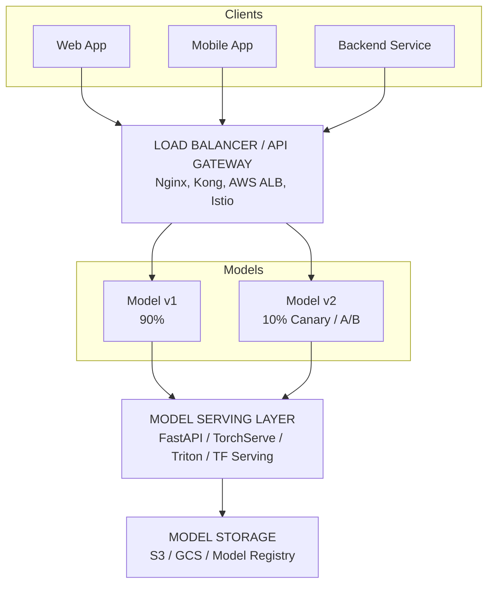
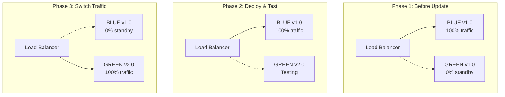
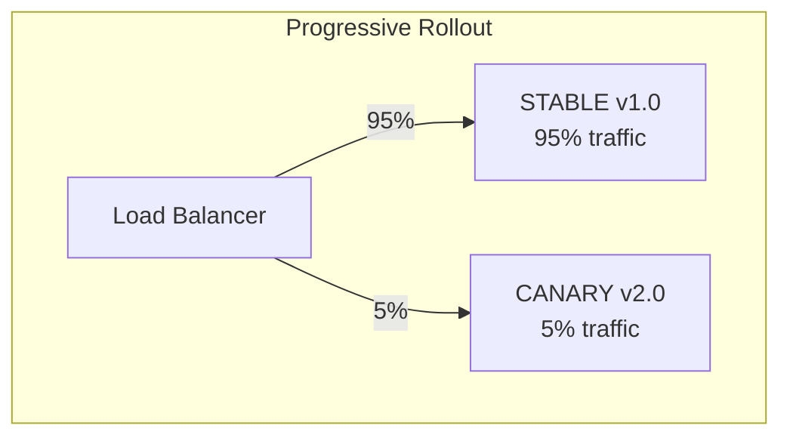

> **AI/ML Engineering Track** | Complexity: `[COMPLEX]` | Time: 5-6 hours

**Prerequisites**: Complete [Module 1.8: ML Pipelines](./module-1.8-ml-pipelines/) first so you understand artifact promotion, orchestration, and how training outputs become versioned deployables.

## What You'll Be Able to Do

By the end of this module, you will be able to apply the following serving skills in production-style designs and labs:
- **Design** robust, scalable model serving architectures utilizing load balancers, API gateways, and specialized inference serving layers.
- **Evaluate** and **compare** advanced, framework-specific serving solutions (Triton, TorchServe) against general-purpose web frameworks for production workloads.
- **Implement** canary rollouts on Kubernetes v1.35+ and explain when blue-green cutover is preferable for instant rollback.
- **Diagnose** production bottlenecks by implementing rigorous request validation, health checks, and graceful shutdown patterns.
- **Debug** misconfigured serving infrastructures by analyzing resource saturation and latency telemetry.

## Why This Module Matters

In November 2021, Zillow's iBuying division wound down after its home-price forecasting model struggled to price homes accurately during a rapid housing-market cooldown. [Zillow announced the wind-down of Zillow Offers](https://www.prnewswire.com/news-releases/zillow-group-reports-third-quarter-2021-financial-results--shares-plan-to-wind-down-zillow-offers-operations-301414460.html) in its third-quarter 2021 results, citing forecasting unpredictability, inventory write-downs, and balance-sheet volatility from holding homes longer than expected. The filing documents a forecasting and business failure—not specific deficiencies in serving infrastructure.

A serving-focused reading of this kind of failure is instructive: had the system exposed progressive rollout, traffic splitting, latency-aware monitoring, and automated circuit breakers, operators might have throttled or rolled back inference before losses cascaded. **That serving-control lesson is our analytical framing, not a claim from Zillow's filing.** The durable takeaway for ML engineers: deploying a model without versioned rollback, traffic splitting, and production observability is an operational risk, not merely a research inconvenience.

Model serving is where machine learning becomes a product. Training optimizes accuracy on historical data; serving optimizes reliability, latency, throughput, and safe change under live traffic. A classifier that scores well offline can still harm users if the API returns 500 errors during rollout, if GPU memory spikes under batch load, or if a new model version silently degrades tail latency for your most active customers. Serving engineers therefore design around failure modes that data scientists rarely encounter in notebooks: cold starts, queue buildup, protocol overhead, accelerator saturation, schema drift between training and inference, and the human cost of an incident at 2 a.m.

The durable pattern across every stack—whether you choose FastAPI, KServe, Seldon Core, BentoML, Triton, TorchServe, or vLLM—is the same. You expose a versioned inference endpoint behind load balancing and health gating, you measure latency and error budgets continuously, you batch or scale to match hardware economics, and you roll out changes progressively so a bad artifact never takes 100% of traffic instantly. You also document which metric proves success for each model—latency for routing, calibration for risk, conversion for recommendations—because serving without an evaluation contract invites endless post-incident arguments. This module teaches that spine tool-agnostically and uses concrete frameworks as worked examples.

## Did You Know?

- The ONNX interchange format was introduced at NeurIPS 2017 and later gained broad cross-framework support, which is why many serving pipelines treat ONNX export as the default portability step between training and optimized runtimes.
- Dynamic batching in specialized inference servers can raise GPU utilization dramatically because accelerators are designed for parallel matrix work; sequential single-row inference often leaves most SIMD capacity idle even when the server appears busy on CPU metrics.
- Canary and shadow deployments solve different problems: canary routing limits blast radius for a new model version, while shadow routing duplicates live traffic to a candidate model without affecting user-visible responses—useful for drift checks before any promotion.
- Tail latency (P95/P99) frequently matters more than median latency for user trust; a serving tier that looks healthy at P50 can still fail product SLOs if a fraction of requests wait behind cold GPUs, oversized payloads, or lock contention in preprocessing.

## 1. The Serving Lifecycle and the Deployment Chasm

Training a highly accurate machine learning model is merely the starting line. Getting that model into a production environment, serving predictions reliably at scale, and maintaining its integrity over months of shifting data constitutes the bulk of an ML engineer's workload. Data scientists optimize for accuracy on curated snapshots; serving engineers optimize for reliability, latency, throughput, and safe change under adversarial network conditions, partial outages, and human operators deploying on Friday afternoons.

Think of training like building a prototype hypercar in a closed laboratory. It is fast, powerful, and beautiful on a controlled test track. Serving is entering that same car in a 24-hour endurance race where you need a pit crew (platform automation), telemetry (metrics and tracing), race strategy (rollout policy), and a spare vehicle (versioned rollback). Most laboratory prototypes do not survive race day without that infrastructure, and most notebook models do not survive production without an equally deliberate serving design.

The serving lifecycle has five durable stages that every team implements under different names. First, **package**: serialize weights, preprocessing logic, and metadata into an immutable artifact registered with a version. Second, **build**: bake the artifact into a container or runtime bundle with explicit resource requests and startup behavior. Third, **expose**: front the runtime with a stable network identity, authentication, and request schema. Fourth, **operate**: monitor latency histograms, error rates, saturation, and data-quality signals while autoscaling on the right metric. Fifth, **change**: promote, canary, shadow, or roll back versions without breaking clients. Skipping any stage creates the "deployment chasm" between research and production:

The stark contrast between the research phase and the production phase is often referred to as the deployment gap:

```text
RESEARCH                           PRODUCTION
========                           ==========

Jupyter notebooks                  REST/gRPC APIs
Single GPU                         Distributed serving
Batch predictions                  Real-time (<100ms)
"Works on my machine"              99.9% uptime SLA
Manual updates                     Automated rollouts
No monitoring                      Full observability
```

Crossing the chasm requires explicit contracts. Clients should send validated feature vectors or documents, not opaque blobs that crash parsers. Logs should record model version, schema hash, and latency per request so post-incident replay can separate routing bugs from stale weights or feature drift. Servers should distinguish **liveness** (process up) from **readiness** (model loaded and able to score). Deployments should keep at least one prior version addressable for rollback. Dashboards should chart P50, P95, and P99 latency separately because optimizing the median while ignoring the tail is how teams ship regressions that only power users feel. These contracts are boring until an incident proves they were load-bearing.

## 2. Online, Batch, and Streaming Inference

Not every prediction request belongs on the same serving path. **Online inference** answers synchronous user or service calls—fraud checks at checkout, search ranking, chat completions—where latency budgets are tight and errors are immediately visible. **Batch inference** scores large stored datasets on a schedule or after an ETL job finishes; latency is measured in minutes or hours, but cost per million rows dominates. **Streaming inference** consumes unbounded event streams (click logs, sensor readings) and may use windowed features; throughput and backpressure matter more than single-request milliseconds.

The architectural fork happens early. Online paths usually sit behind API gateways or service meshes with horizontal pod autoscaling on request rate, queue depth, or GPU utilization. Batch paths are often Kubernetes Jobs, workflow steps, or queue workers that scale to zero between runs. Streaming paths may pair with stream processors and asynchronous embedding workers where predictions land in a feature store or secondary topic rather than returning directly to a mobile client.

Latency and throughput trade off differently in each mode. Online serving minimizes time-to-first-byte for a single prediction, which pushes you toward warm GPUs, small payloads, and efficient protocols like gRPC when JSON becomes a bottleneck. Batch serving maximizes rows per GPU-second, which pushes you toward dynamic batching, larger memory footprints, and asynchronous job IDs when a synchronous HTTP call would time out. Teams that force batch scoring through the same synchronous REST tier as the mobile app usually discover the problem as growing P99 latency during nightly ETL, not as a training metric regression.

Scale-to-zero is attractive for sporadic workloads—internal admin tools, rarely used models, development namespaces—but it collides with cold-start reality. Loading multi-gigabyte weights, compiling CUDA kernels, or fetching artifacts from object storage can take tens of seconds. Production online APIs therefore pre-warm replicas, use readiness gates, or keep a minimum replica count; batch jobs may tolerate cold starts if the job runtime is hours. The decision is economic and SLO-driven, not ideological.

Security and multi-tenancy belong in the serving story even when this module focuses on mechanics. Inference endpoints can leak training data memorization through confident wrong answers, expose model theft via unlimited query APIs, or become cryptocurrency-mining targets if GPUs are reachable without auth. Rate limiting at the gateway, per-tenant API keys, and audit logs of model version per request are baseline controls—not extras—for any externally reachable predictor.

## 3. Serving Architecture and Traffic Management

A robust model serving architecture decouples client applications from raw inference engines. This decoupling allows engineers to route traffic, split loads for experiments, enforce authentication at the edge, and scale inference hardware independently of front-end clients. By treating the model as a modular microservice, updates can roll out invisibly to end users when versioning and traffic policies are explicit.

The request path typically traverses four layers. **Clients** (web, mobile, backend jobs) speak HTTP or gRPC. A **load balancer or API gateway** terminates TLS, enforces rate limits, and attaches tracing identifiers. A **routing plane** selects which model version or experiment arm should score the request—stable, canary, shadow, or A/B cohort. The **model serving layer** loads artifacts, executes preprocessing and inference, and returns structured responses with version metadata. **Model storage** (object store, registry, or mounted volume) supplies immutable artifacts; it should never be confused with the ephemeral container filesystem.

Treating the serving layer as a black box is tempting but dangerous. Preprocessing—tokenization, image resizing, feature lookups—often dominates tail latency when it is implemented as single-threaded Python on the request path. Observability must span the whole path, not only the `model.forward()` call. When debugging saturation, inspect queue depth at the gateway, thread pool utilization in the server, GPU memory pressure, and deserialization cost before retraining.

## 4. Building Custom REST Services with FastAPI

The diagram below shows how clients, routing, serving, and storage connect in a typical production layout. FastAPI is a common choice for the serving layer when teams need a Python-native HTTP API with schema validation, OpenAPI docs, and async I/O without adopting a full inference-server framework yet.



### Request Validation and the Lifespan Hook

FastAPI has become a default choice for custom ML serving layers in Python because it combines async I/O, automatic OpenAPI generation, and strict input validation through Pydantic models. For serving, validation is not cosmetic: malformed tensors, wrong feature lengths, and out-of-range values should return structured 4xx responses before they touch NumPy or torch and produce opaque 500 errors that waste GPU cycles and confuse on-call engineers. The `lifespan` context manager loads the model once per worker process and releases it on shutdown, which pairs naturally with Kubernetes readiness probes that should fail until loading completes.

```python
from contextlib import asynccontextmanager

from fastapi import FastAPI, HTTPException
from pydantic import BaseModel, ConfigDict, Field
import joblib
import numpy as np
import time
from uuid import uuid4

MODEL_PATH = "models/production/model.pkl"
MODEL_VERSION = "1.2.0"

@asynccontextmanager
async def lifespan(app: FastAPI):
    global model
    model = joblib.load(MODEL_PATH)
    try:
        yield
    finally:
        model = None

class PredictionRequest(BaseModel):
    features: list[float] = Field(..., min_length=1, max_length=100)
    model_version: str = "latest"

    model_config = ConfigDict(
        json_schema_extra={
            "example": {
                "features": [0.5, 0.3, 0.8, 0.2],
                "model_version": "v1.2.0"
            }
        }
    )

class PredictionResponse(BaseModel):
    prediction: float
    confidence: float | None = None
    model_version: str
    latency_ms: float

app = FastAPI(
    title="ML Model API",
    description="Production model serving API",
    version="1.0.0",
    lifespan=lifespan
)

model = None

@app.post("/predict", response_model=PredictionResponse)
async def predict(request: PredictionRequest):
    """
    Generate prediction for input features.
    """
    if model is None:
        raise HTTPException(status_code=503, detail="Model not loaded")
    start = time.time()

    try:
        # Preprocess
        features = np.array(request.features).reshape(1, -1)

        # Predict
        prediction = model.predict(features)[0]
        confidence = None
        if hasattr(model, "predict_proba"):
            confidence_score = model.predict_proba(features)
            if hasattr(confidence_score, "__len__"):
                confidence = float(confidence_score.max())

        latency = (time.time() - start) * 1000
        model_version = MODEL_VERSION if request.model_version == "latest" else request.model_version

        return PredictionResponse(
            prediction=float(prediction),
            confidence=confidence,
            model_version=model_version,
            latency_ms=latency
        )

    except Exception as e:
        raise HTTPException(status_code=500, detail=str(e))

@app.get("/health")
async def health():
    """Health check endpoint."""
    return {"status": "healthy", "model_loaded": model is not None}

@app.get("/model/info")
async def model_info():
    """Get model metadata."""
    return {
        "name": "churn_predictor",
        "version": "1.2.0",
        "framework": "sklearn",
        "features": 4,
        "classes": ["no_churn", "churn"]
    }
```

### Implementing Batch and Asynchronous Predictions

Hardware accelerators like GPUs are drastically underutilized when processing single, sequential requests. To maximize throughput and justify accelerator cost, production systems batch rows on the server, accept client-side batches, or offload large scoring jobs to asynchronous workers. FastAPI can expose both synchronous `/predict/batch` endpoints for medium-sized payloads and `/predict/async` job submission for workloads that exceed HTTP timeout budgets. The async pattern returns a `job_id` immediately so clients poll or subscribe for completion—essential when a million-row scoring job would otherwise trip gateway timeouts even though the model itself is healthy.

```python
from fastapi import BackgroundTasks
from typing import List
from uuid import uuid4

from datetime import UTC, datetime

class BatchRequest(BaseModel):
    instances: List[List[float]]
    async_mode: bool = False

class BatchResponse(BaseModel):
    predictions: List[float]
    batch_size: int
    total_latency_ms: float

@app.post("/predict/batch", response_model=BatchResponse)
async def predict_batch(request: BatchRequest):
    """
    Batch prediction for multiple instances.
    More efficient than individual calls.
    """
    if model is None:
        raise HTTPException(status_code=503, detail="Model not loaded")

    start = time.time()

    features = np.array(request.instances)
    predictions = model.predict(features).tolist()

    return BatchResponse(
        predictions=predictions,
        batch_size=len(request.instances),
        total_latency_ms=(time.time() - start) * 1000
    )

def generate_job_id() -> str:
    """Generate a deterministic-friendly request identifier."""
    return f"job-{uuid4()}"


def process_batch_async(job_id: str, instances: list[list[float]]) -> None:
    """Background worker for offline batch predictions."""
    try:
        if model is None:
            batch_jobs[job_id] = {"status": "failed", "error": "model not loaded"}
            return

        features = np.array(instances)
        predictions = model.predict(features).tolist()
        batch_jobs[job_id] = {
            "status": "completed",
            "predictions": predictions,
            "batch_size": len(instances),
            "completed_at": datetime.now(UTC).isoformat().replace("+00:00", "Z"),
        }
    except Exception as e:
        batch_jobs[job_id] = {"status": "failed", "error": str(e)}

# Async batch processing
batch_jobs: dict[str, dict] = {}

@app.post("/predict/async")
async def predict_async(
    request: BatchRequest,
    background_tasks: BackgroundTasks
):
    """
    Submit batch for async processing.
    Returns job_id to check status later.
    """
    job_id = generate_job_id()
    background_tasks.add_task(
        process_batch_async,
        job_id,
        request.instances
    )
    return {"job_id": job_id, "status": "processing"}


@app.get("/predict/async/{job_id}")
async def predict_async_status(job_id: str):
    if job_id not in batch_jobs:
        raise HTTPException(status_code=404, detail="Unknown job id")
    return batch_jobs[job_id]
```

## 5. High-Performance Serving with gRPC

As your service scales to thousands of requests per second, the overhead of parsing JSON text payloads becomes a severe bottleneck on CPU and network bandwidth. REST with JSON is excellent for developer ergonomics and quick debugging; gRPC with Protocol Buffers is excellent when both ends of the wire are machines that must move high-dimensional tensors or embeddings with minimal serialization tax. Think of REST as a handwritten letter—readable, flexible, and slow to produce at scale—and gRPC as a compact binary protocol where field tags and packed numeric arrays deserialize with predictable cost.

gRPC also gives you a first-class streaming model. Unary RPCs mirror classic request/response HTTP. Client streaming, server streaming, and bidirectional streaming let you pipeline feature generation and inference for workloads where waiting for a full payload before scoring is wasteful. Service meshes and load balancers must be configured for HTTP/2 when you adopt gRPC, which is an operational cost—but one that many high-QPS ML platforms pay willingly once JSON parsing shows up in flame graphs.

```mermaid
graph TD
    subgraph REST JSON Payload
        R1[JSON Text: ~50 bytes]
        R2[\{features: 0.5, 0.3, 0.8, id: 1\}]
        R3[Requires Heavy CPU Parsing]
        R1 --- R2 --- R3
    end

    subgraph gRPC Protobuf Payload
        G1[Protobuf Binary: ~20 bytes]
        G2[0x0a0c0d0000003f15cdcc4c...]
        G3[Zero Parsing Overhead]
        G1 --- G2 --- G3
    end
```

**Pause and predict:** If your gRPC service receives 10,000 small requests per second and you add a 50ms dynamic batching window, P99 latency for any single request may rise by up to 50ms plus batch inference time, but aggregate throughput often climbs sharply because the GPU executes one wide forward pass instead of thousands of sequential micro-passes that leave SIMD units idle.

### Protocol Buffer Definitions

To utilize gRPC, you define your data structures strictly in a `.proto` file. This definition acts as a binding contract between clients and servers: field numbers, types, and repeated fields are versioned explicitly, which reduces the class of "silent JSON shape drift" bugs that plague loosely typed REST gateways. For ML teams, the `.proto` file should live in the same repository as the model schema documentation so data scientists and serving engineers negotiate feature contracts in one place.

```protobuf
// model_service.proto

syntax = "proto3";

package ml_serving;

service ModelService {
    // Unary prediction
    rpc Predict(PredictRequest) returns (PredictResponse);

    // Streaming predictions (for real-time data)
    rpc PredictStream(stream PredictRequest) returns (stream PredictResponse);

    // Batch prediction
    rpc PredictBatch(BatchRequest) returns (BatchResponse);

    // Model info
    rpc GetModelInfo(Empty) returns (ModelInfo);
}

message PredictRequest {
    repeated float features = 1;
    string model_version = 2;
}

message PredictResponse {
    float prediction = 1;
    float confidence = 2;
    string model_version = 3;
    float latency_ms = 4;
}

message BatchRequest {
    repeated PredictRequest instances = 1;
}

message BatchResponse {
    repeated PredictResponse predictions = 1;
    int32 batch_size = 2;
    float total_latency_ms = 3;
}

message ModelInfo {
    string name = 1;
    string version = 2;
    string framework = 3;
    int32 num_features = 4;
    repeated string classes = 5;
}

message Empty {}
```

### Implementing the gRPC Servicer

The Python implementation maps strongly typed protobuf messages into NumPy or torch tensors inside servicer methods, bypassing much of the HTTP/JSON stack. Thread pool sizing on `grpc.server` becomes a tuning knob: too few workers and you starve concurrent RPCs; too many and you contend on the Python GIL or GPU context switches. For GPU-backed servicers, keep heavy inference on a bounded worker queue and avoid doing preprocessing on the RPC thread if it blocks the pool.

```python
import grpc
from concurrent import futures
import model_service_pb2
import model_service_pb2_grpc
import numpy as np
import time

class ModelServicer(model_service_pb2_grpc.ModelServiceServicer):
    def __init__(self, model):
        self.model = model

    def Predict(self, request, context):
        """Single prediction."""
        start = time.time()

        features = np.array(request.features).reshape(1, -1)
        prediction = self.model.predict(features)[0]
        confidence = self.model.predict_proba(features).max()

        return model_service_pb2.PredictResponse(
            prediction=float(prediction),
            confidence=float(confidence),
            model_version=request.model_version or "v1.0",
            latency_ms=(time.time() - start) * 1000
        )

    def PredictStream(self, request_iterator, context):
        """Streaming predictions - process as they arrive."""
        for request in request_iterator:
            features = np.array(request.features).reshape(1, -1)
            prediction = self.model.predict(features)[0]

            yield model_service_pb2.PredictResponse(
                prediction=float(prediction),
                confidence=0.95,
                model_version="v1.0",
                latency_ms=1.0
            )

    def PredictBatch(self, request, context):
        """Batch prediction."""
        start = time.time()

        responses = []
        for instance in request.instances:
            features = np.array(instance.features).reshape(1, -1)
            prediction = self.model.predict(features)[0]

            responses.append(model_service_pb2.PredictResponse(
                prediction=float(prediction),
                confidence=0.95,
                model_version="v1.0"
            ))

        return model_service_pb2.BatchResponse(
            predictions=responses,
            batch_size=len(responses),
            total_latency_ms=(time.time() - start) * 1000
        )

def serve():
    server = grpc.server(futures.ThreadPoolExecutor(max_workers=10))
    model_service_pb2_grpc.add_ModelServiceServicer_to_server(
        ModelServicer(model), server
    )
    server.add_insecure_port('[::]:50051')
    server.start()
    server.wait_for_termination()
```

## 6. Production Serving Frameworks

When traffic volume, framework diversity, or GPU sharing requirements outgrow hand-rolled FastAPI services, teams adopt specialized inference platforms that implement dynamic batching, multi-model hosting, metrics endpoints, and Kubernetes-native scaling integrations. The durable selection criteria are not brand loyalty but workload fit: framework lock-in, need for LLM-specific scheduling, multi-tenant GPU density, ensemble graphs, and how much custom preprocessing lives outside the server.

> **Landscape snapshot — as of 2026-06. Verify against vendor docs before relying on specifics.**
>
> | Platform | Primary sweet spot | Notes |
> |---|---|---|
> | [KServe](https://kserve.github.io/website/) | Kubernetes-native InferenceService CRDs, serverless scale patterns | Strong when you want GitOps-friendly model rollouts on K8s |
> | [Seldon Core](https://docs.seldon.io/projects/seldon-core/en/latest/) | Graph-based deployments, A/B and multi-armed routing | Useful for complex inference graphs beyond a single model container |
> | [BentoML](https://docs.bentoml.com/en/latest/) | Developer-centric packaging to containerized services | Fast path from Python class to production image |
> | [NVIDIA Triton](https://github.com/triton-inference-server/server) | Multi-framework GPU serving, ensembles, dynamic batching | Baseline for high-throughput mixed ONNX/TRT/PyTorch/TF models |
> | [TorchServe](https://pytorch.org/serve/) | PyTorch-first serving with handlers and management APIs | **Legacy / inherited estates only** — official docs state it is no longer actively maintained and has no planned security patches (as of 2026-06) |
> | [vLLM](https://docs.vllm.ai/en/latest/) | LLM throughput with PagedAttention and continuous batching | Default discussion point for open-weights LLM online serving |

None of these tools removes the need for rollout discipline, observability, or schema validation—they implement the **how** of inference execution while you still own the **when** and **which version** via platform policy.

**KServe** (and similar Kubernetes-native controllers) wrap containers with InferenceService CRDs so data scientists submit a model URI and framework type while platform teams enforce standard annotations for autoscaling, ingress, and canary traffic. The durable benefit is GitOps: desired model revisions live in version control beside application manifests, and rollbacks become revert commits rather than manual `kubectl` surgery. **Seldon Core** extends that idea to directed acyclic graphs of transformers, routers, and combiners—valuable when production inference is a pipeline of models rather than a single `predict()` call. **BentoML** optimizes the inner loop from Python class to OCI image for teams that want developer speed before adopting cluster-wide CRDs.

**CPU versus GPU serving** is a cost and latency decision, not a moral one. Small tree models, linear models, and lightly quantized embeddings often serve cheaper on CPU with horizontal scale-out, especially when QPS is moderate and GPU nodes would sit idle. Deep networks, large transformers, and wide batch scoring usually need GPUs to meet tail-latency targets, but GPU efficiency requires batching and careful memory budgeting—an A100 rented for single-row REST calls is frequently a budget leak. Many platforms run preprocessing on CPU autoscaled Deployments and inference on GPU node pools with taints, which isolates expensive accelerators from generic web traffic.

**vLLM** and comparable LLM servers add continuous batching and memory-efficient KV-cache management for generative workloads where classic dynamic batching assumptions break down. Token streaming changes client protocols: users tolerate time-to-first-token more than time-to-full-completion, so dashboards must track both. LLM serving also amplifies prompt-validation needs—unbounded prompts are a denial-of-wallet attack against your GPU fleet.

### TorchServe (legacy)

Developed jointly by AWS and Meta, TorchServe provides a standardized environment for serving PyTorch models without writing multithreading and batching boilerplate for every project. Handlers split preprocessing, inference, and postprocessing into lifecycle hooks, which keeps teams from entangling I/O and tensor code in one giant endpoint function. TorchServe exposes management APIs for registering model versions and can host multiple models per process when GPU memory allows.

As of 2026-06, the [official TorchServe page](https://pytorch.org/serve/) states the project is **no longer actively maintained** with no planned security patches. Treat TorchServe as guidance for inherited PyTorch estates you cannot migrate immediately—not as a recommended choice for new greenfield serving. For new deployments, prefer Triton, KServe, BentoML, or a maintained custom FastAPI/gRPC layer unless organizational constraints force you to operate an existing TorchServe fleet.

```python
# TorchServe handler example
# Save as model_handler.py

from ts.torch_handler.base_handler import BaseHandler
import torch
import json

class ModelHandler(BaseHandler):
    def __init__(self):
        super().__init__()
        self.model = None

    def initialize(self, context):
        """Load the model."""
        self.manifest = context.manifest
        model_dir = context.system_properties.get("model_dir")

        # Load model
        model_path = f"{model_dir}/model.pt"
        self.model = torch.jit.load(model_path)
        self.model.eval()

    def preprocess(self, data):
        """Preprocess input data."""
        inputs = []
        for row in data:
            input_data = row.get("data") or row.get("body")
            if isinstance(input_data, (bytes, bytearray)):
                input_data = json.loads(input_data.decode('utf-8'))
            inputs.append(torch.tensor(input_data["features"]))
        return torch.stack(inputs)

    def inference(self, inputs):
        """Run model inference."""
        with torch.no_grad():
            outputs = self.model(inputs)
        return outputs

    def postprocess(self, outputs):
        """Format outputs for response."""
        predictions = outputs.numpy().tolist()
        return [{"prediction": p} for p in predictions]
```

### Triton Inference Server

NVIDIA Triton is a multi-framework inference server aimed at maximizing hardware utilization across diverse model types in one shared GPU pool. It supports concurrent model execution, dynamic batching with configurable queue delay, and ensemble scheduling that chains preprocessing and inference stages without round-tripping tensors back through HTTP microservices. That matters when preprocessing is itself a GPU-friendly model (for example, a ONNX-based image resize graph) and you want both stages colocated to protect tail latency.

Triton also exposes Prometheus metrics and standardized gRPC/HTTP inference protocols, which helps platform teams build a single autoscaler and dashboard template even when individual product teams train in PyTorch, TensorFlow, or export to ONNX/TensorRT. The operational cost is higher configuration surface area—`config.pbtxt` per model, instance groups, and precision modes must be deliberate—but the payoff is predictable throughput when many models share expensive accelerators.

```protobuf
# Triton model configuration
# config.pbtxt

name: "ensemble_model"
platform: "ensemble"
max_batch_size: 64

input [
  {
    name: "INPUT"
    data_type: TYPE_FP32
    dims: [ -1, 128 ]  # Dynamic batch, 128 features
  }
]

output [
  {
    name: "OUTPUT"
    data_type: TYPE_FP32
    dims: [ -1, 1 ]
  }
]

ensemble_scheduling {
  step [
    {
      model_name: "preprocessing"
      model_version: -1
      input_map {
        key: "INPUT"
        value: "INPUT"
      }
      output_map {
        key: "PROCESSED"
        value: "preprocessed"
      }
    },
    {
      model_name: "main_model"
      model_version: -1
      input_map {
        key: "preprocessed"
        value: "PROCESSED"
      }
      output_map {
        key: "OUTPUT"
        value: "OUTPUT"
      }
    }
  ]
}
```

When teams ask "which server is best," translate the question into workload constraints: required frameworks, need for ensembles, LLM versus classical ML, multi-tenant GPU sharing, expected QPS growth, and how much custom Python must run inside the process. A startup serving one PyTorch image classifier on modest QPS should not adopt Triton on day one; a platform team hosting forty models for internal products probably should not maintain forty bespoke FastAPI codebases either. The comparison table summarizes tradeoffs at a glance, but your SLO and staffing reality pick the row.

### Framework Comparison

| Feature | FastAPI | TorchServe | Triton | TF Serving |
|---|---|---|---|---|
| Framework | Any | PyTorch | Multi | TensorFlow |
| Protocol | REST | REST/gRPC | REST/gRPC | REST/gRPC |
| Batching | Manual | Dynamic | Dynamic | Dynamic |
| GPU Support | Manual | Built-in | Built-in | Built-in |
| Model Format | Any | TorchScript | ONNX/TRT | SavedModel |
| Complexity | Low | Medium | High | Medium |
| Use Case | Simple APIs | PyTorch models | High perf multi-model | TF models |

Choosing between custom FastAPI and a dedicated server is a capacity and governance question. FastAPI wins when models are small, traffic is moderate, and teams want full control in Python. Triton wins when dynamic batching, multi-model GPU sharing, or standardized metrics matter more than writing your own handlers; TorchServe remains relevant only for legacy PyTorch fleets you have not yet migrated. KServe and Seldon add Kubernetes CRDs and traffic policies when platform teams must enforce uniform rollouts across dozens of models owned by different product groups.

## 7. Autoscaling, Request Batching, and Saturation Signals

Autoscaling for inference should track the bottleneck metric, not whichever graph is easiest to export. CPU-based Horizontal Pod Autoscaler rules work for lightweight sklearn APIs but lie about GPU-backed transformers: CPU can look idle while requests queue behind a saturated GPU or a single-threaded tokenizer. Queue depth, in-flight requests, P95 latency, or custom metrics from the inference server (Triton and TorchServe expose Prometheus endpoints) often make better scaling signals. Event-driven autoscalers such as KEDA can scale from zero on queue length for batch scoring workers, but online APIs with strict tail-latency SLOs usually keep a non-zero minimum replica count.

Request batching trades latency for throughput by holding requests briefly to form a wider tensor. A 10–50ms batching window might raise tail latency slightly while doubling effective QPS on the same GPU. The correct window is empirical: too short and you gain nothing; too long and product teams miss interactive SLOs. Server-side batching (inside Triton/TorchServe/vLLM) is preferable to asking every client to batch, because clients have uneven arrival times and you retain centralized observability.

When debugging resource saturation, read signals in order: ingress 5xx rate and latency histograms, replica count and HPA events, per-pod GPU utilization and memory, inference server queue metrics, then application logs. Jumping straight to retraining while P99 spikes during rollouts is a common anti-pattern when the real issue is cold GPU replicas or missing readiness gates.

## 8. Deployment Patterns for Safe Model Change

Advanced deployment patterns are non-negotiable for enterprise ML platforms. They provide the safety nets required to deploy models confidently, ensuring you can pull the plug instantly if the new weights behave erratically on live data distributions you did not fully capture offline.

### Blue-Green Deployment

Blue-green routing provisions an entirely parallel production environment alongside your current one. You deploy the candidate model to the idle color, run smoke and shadow comparisons against production traffic captures, then flip the load balancer atomically. Rollback is another atomic flip, which is invaluable when the new artifact passes health checks but degrades business metrics. The cost is duplicated infrastructure during cutover—often acceptable for high-risk models where downtime or bad predictions are more expensive than spare GPUs.



### Canary Deployment

Canary deployments gradually expose a new model version to a small slice of real production traffic, increasing weight as error budgets and latency SLOs remain green. Kubernetes Ingress controllers (as in the hands-on lab), service mesh routes, or platform CRDs like KServe and Seldon can implement weighted splits. Automatic rollback should trigger on objective signals—rising 5xx rate, P99 regression beyond a threshold, or business guardrails—not on intuition after a calendar deadline.

### Shadow Deployment

Shadow deployments duplicate live requests to a candidate model without returning its output to users. The stable model still serves responses, while shadow workers score asynchronously for comparison logging. This pattern catches training-serving skew and data drift before any user sees a bad prediction, and it pairs well with replaying historical traffic captures when live shadow cost is too high. The operational price is doubled inference compute during the shadow window, which must be budgeted.



### A/B Testing

Canary deployment and A/B testing are often confused because both route subsets of traffic, but they serve different goals. Canary deployment is an operational safety pattern: you shift a tiny, controlled slice of users while watching error budgets, SLOs, and rollback signals. A/B testing is a statistical product strategy: deterministic user segmentation lets you compare business outcomes between control and treatment groups without contamination across variants. The hash-based router below uses SHA-256 instead of Python's randomized `hash()` so assignment stays stable across processes and pod restarts—a requirement for valid experiment analysis.

```python
import hashlib

class ABTestRouter:
    """
    Route requests to different model versions for A/B testing.
    """

    def __init__(self):
        self.experiments = {}

    def create_experiment(
        self,
        experiment_id: str,
        control_model: str,
        treatment_model: str,
        traffic_split: float = 0.5
    ):
        """Create new A/B experiment."""
        self.experiments[experiment_id] = {
            "control": control_model,
            "treatment": treatment_model,
            "split": traffic_split,
            "metrics": {"control": [], "treatment": []}
        }

    def route_request(self, experiment_id: str, user_id: str) -> str:
        """
        Deterministically route user to model variant.
        Same user always gets same variant (for consistency).
        """
        experiment = self.experiments[experiment_id]

        # Use hashlib for deterministic assignment across workers/pod restarts.
        # Python's hash() is randomized per-process by design, so it cannot be trusted.
        digest = hashlib.sha256(f"{experiment_id}:{user_id}".encode("utf-8")).hexdigest()
        hash_value = int(digest, 16) % 100
        is_treatment = hash_value < (experiment["split"] * 100)

        return experiment["treatment"] if is_treatment else experiment["control"]

    def record_outcome(
        self,
        experiment_id: str,
        variant: str,
        prediction: float,
        actual: float
    ):
        """Record prediction outcome for analysis."""
        self.experiments[experiment_id]["metrics"][variant].append({
            "prediction": prediction,
            "actual": actual,
            "correct": (prediction > 0.5) == (actual > 0.5)
        })

    def analyze_experiment(self, experiment_id: str) -> dict:
        """
        Statistical analysis of A/B test results.
        """
        exp = self.experiments[experiment_id]
        control = exp["metrics"]["control"]
        treatment = exp["metrics"]["treatment"]

        control_accuracy = sum(m["correct"] for m in control) / len(control)
        treatment_accuracy = sum(m["correct"] for m in treatment) / len(treatment)

        # Two-proportion z-test for binary conversion outcomes
        from statsmodels.stats.proportion import proportions_ztest

        control_n = len(control)
        treatment_n = len(treatment)
        control_successes = sum(m["correct"] for m in control)
        treatment_successes = sum(m["correct"] for m in treatment)

        z_stat, p_value = proportions_ztest(
            [control_successes, treatment_successes],
            [control_n, treatment_n],
        )

        return {
            "control_accuracy": control_accuracy,
            "treatment_accuracy": treatment_accuracy,
            "improvement": treatment_accuracy - control_accuracy,
            "p_value": p_value,
            "significant": p_value < 0.05,
            "recommendation": "deploy_treatment" if (
                treatment_accuracy > control_accuracy and p_value < 0.05
            ) else "keep_control"
        }
```

**Stop and think:** When implementing A/B testing for a recommendation engine, deterministic routing based on a hash of the user ID is critical because the same user must always see the same model variant; otherwise refreshes bounce between arms, ruining both UX and the independence assumptions behind hypothesis tests.

## 9. Model Optimization for Serving Economics

To scale inference without unbounded infrastructure spend, teams optimize the artifact and runtime after training converges. Optimization is not one knob—it is a pipeline: export to a portable graph format, compile for target hardware, choose precision (FP32, FP16, INT8), and validate accuracy on a representative evaluation slice after each transform. Skipping accuracy validation after quantization is how teams ship fast models that silently mis-rank or miscalibrate probabilities.

### ONNX format conversion

```python
import numpy as np
import onnx
import onnxruntime as ort
import torch

# Export PyTorch model to ONNX
def export_to_onnx(model, sample_input, output_path):
    """Export PyTorch model to ONNX format."""
    model.eval()

    torch.onnx.export(
        model,
        sample_input,
        output_path,
        export_params=True,
        opset_version=17,
        input_names=['input'],
        output_names=['output'],
        dynamic_shapes={
            'input': {0: 'batch_size'},
            'output': {0: 'batch_size'},
        },
        dynamo=True,
    )

    # Verify the model
    onnx_model = onnx.load(output_path)
    onnx.checker.check_model(onnx_model)
    print(f"Model exported to {output_path}")

# Run inference with ONNX Runtime
class ONNXPredictor:
    def __init__(self, model_path: str):
        # Use GPU if available
        providers = ['CUDAExecutionProvider', 'CPUExecutionProvider']
        self.session = ort.InferenceSession(model_path, providers=providers)

        # Get input/output names
        self.input_name = self.session.get_inputs()[0].name
        self.output_name = self.session.get_outputs()[0].name

    def predict(self, features: np.ndarray) -> np.ndarray:
        """Run inference."""
        return self.session.run(
            [self.output_name],
            {self.input_name: features.astype(np.float32)}
        )[0]

    def benchmark(self, features: np.ndarray, iterations: int = 100) -> dict:
        """Benchmark inference performance."""
        import time

        # Warmup
        for _ in range(10):
            self.predict(features)

        # Benchmark
        latencies = []
        for _ in range(iterations):
            start = time.time()
            self.predict(features)
            latencies.append((time.time() - start) * 1000)

        return {
            "mean_ms": np.mean(latencies),
            "p50_ms": np.percentile(latencies, 50),
            "p95_ms": np.percentile(latencies, 95),
            "p99_ms": np.percentile(latencies, 99),
            "throughput_qps": 1000 / np.mean(latencies)
        }
```

### TensorRT on NVIDIA GPUs

TensorRT compiles ONNX or native graphs into engines tuned for a specific GPU architecture by fusing layers, picking kernels, and optionally lowering precision. Engines are hardware-specific artifacts: an engine built for one SKU is not portable to another, which affects your CI pipeline—you typically build engines per deployment target or per instance type family. Always benchmark with representative batch sizes; a graph that is faster at batch 1 may lose at batch 32 if memory bandwidth becomes the limiter.

```python
# TensorRT for NVIDIA GPU optimization
import tensorrt as trt

def optimize_with_tensorrt(onnx_path: str, engine_path: str):
    """
    Convert ONNX model to TensorRT engine.
    Can provide 2-5x speedup on NVIDIA GPUs.
    """
    logger = trt.Logger(trt.Logger.WARNING)
    builder = trt.Builder(logger)
    network = builder.create_network(
        1 << int(trt.NetworkDefinitionCreationFlag.EXPLICIT_BATCH)
    )
    parser = trt.OnnxParser(network, logger)

    # Parse ONNX
    with open(onnx_path, 'rb') as f:
        if not parser.parse(f.read()):
            for error in range(parser.num_errors):
                print(parser.get_error(error))
            raise RuntimeError("ONNX parsing failed")

    # Configure builder
    config = builder.create_builder_config()
    config.set_memory_pool_limit(trt.MemoryPoolType.WORKSPACE, 1 << 30)  # 1GB

    # Enable FP16 for faster inference (with minimal accuracy loss)
    if builder.platform_has_fast_fp16:
        config.set_flag(trt.BuilderFlag.FP16)

    # Build engine (TensorRT 8+)
    serialized_engine = builder.build_serialized_network(network, config)
    if serialized_engine is None:
        raise RuntimeError("TensorRT build failed")

    # Save
    with open(engine_path, 'wb') as f:
        f.write(serialized_engine)

    print(f"TensorRT engine saved to {engine_path}")
```

The `benchmark()` helper in the ONNX example above is the right habit: warm up GPUs, measure P50/P95/P99, and record throughput at realistic batch sizes. Publish those numbers per environment rather than treating marketing benchmarks as universal truth.

## 10. Diagnosing Production Bottlenecks: Validation, Health Checks, and Graceful Shutdown

Model serving operates in a hostile environment where networks drop packets, clients send malformed payloads, nodes drain during rollouts, and GPUs exhaust memory under bursty batch traffic. **Diagnosing** production bottlenecks starts at the contract boundary: validate inputs early, expose differentiated health endpoints, and shut down without aborting in-flight predictions. These patterns are load-bearing for the fourth learning outcome in this module—without them, dashboards show green while users time out.

Request validation belongs at the edge of inference, not inside catch-all exception handlers that return 500 for bad client data. Pydantic validators should enforce feature dimensionality, numeric ranges, and forbidden nulls so operators can distinguish client bugs from server regressions in logs. Health checks should separate **liveness** (restart a stuck process) from **readiness** (stop sending traffic until weights are loaded). Graceful shutdown hooks should wait for active requests to finish after SIGTERM so Kubernetes rollouts do not truncate predictions mid-flight—especially important when mean inference time is hundreds of milliseconds.

When latency spikes without obvious errors, inspect validation overhead, lock contention, batching windows, GPU memory fragmentation, and artifact download time on new replicas. Many "model got worse" incidents are serving regressions: a new container image forgot to pin a preprocessor version, readiness flipped true before warm-up completed, or HPA added cold pods during a traffic spike.

### Health Checks and Kubernetes Probes

```python
@app.get("/health")
async def health():
    """Liveness check."""
    return {"status": "alive"}

@app.get("/ready")
async def ready():
    """Readiness check - is the model loaded?"""
    if model is None:
        raise HTTPException(503, "Model not loaded")
    return {"status": "ready", "model_version": "1.2.0"}
```

Readiness should fail when `model is None` or when a warm-up inference has not completed; liveness should remain tolerant of slow models unless the process is deadlocked. Startup probes help large LLM containers that legitimately need minutes to load shards before either liveness or readiness semantics apply.

### Graceful Shutdowns

```python
import asyncio
import signal
import time

active_requests = 0

class GracefulShutdown:
    def __init__(self):
        self.shutdown = False
        signal.signal(signal.SIGTERM, self._handler)
        signal.signal(signal.SIGINT, self._handler)

    def _handler(self, signum, frame):
        print("Shutdown signal received")
        self.shutdown = True

    async def wait_for_requests(self, timeout: int = 30):
        """Wait for in-flight requests to complete."""
        start = time.time()
        while active_requests > 0 and (time.time() - start) < timeout:
            await asyncio.sleep(0.1)
```

On Kubernetes, set `terminationGracePeriodSeconds` high enough to cover P99 inference duration plus buffer, and coordinate with preStop hooks if the load balancer needs a drain signal before SIGTERM reaches the app.

### Aggressive Request Validation

```python
from pydantic import BaseModel, Field, field_validator

class PredictionRequest(BaseModel):
    features: list[float] = Field(..., min_length=10, max_length=10)

    @field_validator("features")
    @classmethod
    def validate_features(cls, v: list[float]) -> list[float]:
        if len(v) != 10:
            raise ValueError(f"Expected 10 features, got {len(v)}")
        if any(not (-100 <= f <= 100) for f in v):
            raise ValueError("Features must be in range [-100, 100]")
        return v
```

Return 422 for schema violations when possible so client teams get actionable feedback; reserve 500 for genuine server faults after validation passes.

### Model Versioning and Rollback

A centralized model registry serves as the system of record. Reverting to a previous state must be a fast, automated API call, not an archaeological expedition through an object store. The registry example below tracks stages (`staging`, `production`, `archived`) so promotion and rollback are explicit state transitions rather than copy commands that overwrite live files.

```python
import json
from datetime import datetime
from pathlib import Path

class ModelRegistry:
    """
    Simple model registry for version management.
    """

    def __init__(self, storage_path: str):
        self.storage_path = Path(storage_path)
        self.storage_path.mkdir(parents=True, exist_ok=True)
        self.registry_file = self.storage_path / "registry.json"
        self.registry = self._load_registry()

    def _load_registry(self) -> dict:
        if self.registry_file.exists():
            return json.loads(self.registry_file.read_text())
        return {"models": {}, "production": {}}

    def _save_registry(self):
        self.registry_file.write_text(json.dumps(self.registry, indent=2))

    def register_model(
        self,
        model_name: str,
        version: str,
        model_path: str,
        metrics: dict,
        metadata: dict = None
    ):
        """Register a new model version."""
        if model_name not in self.registry["models"]:
            self.registry["models"][model_name] = {}

        self.registry["models"][model_name][version] = {
            "path": model_path,
            "metrics": metrics,
            "metadata": metadata or {},
            "registered_at": datetime.now().isoformat(),
            "stage": "staging"
        }

        self._save_registry()
        return f"Registered {model_name}:{version}"

    def promote_to_production(self, model_name: str, version: str):
        """Promote a model version to production."""
        if model_name not in self.registry["models"]:
            raise ValueError(f"Model {model_name} not found")
        if version not in self.registry["models"][model_name]:
            raise ValueError(f"Version {version} not found")

        # Demote current production
        if model_name in self.registry["production"]:
            old_version = self.registry["production"][model_name]
            self.registry["models"][model_name][old_version]["stage"] = "archived"

        # Promote new version
        self.registry["models"][model_name][version]["stage"] = "production"
        self.registry["production"][model_name] = version

        self._save_registry()
        return f"Promoted {model_name}:{version} to production"

    def rollback(self, model_name: str, to_version: str):
        """Rollback to a previous version."""
        return self.promote_to_production(model_name, to_version)

    def get_production_model(self, model_name: str) -> dict:
        """Get current production model info."""
        if model_name not in self.registry["production"]:
            raise ValueError(f"No production model for {model_name}")

        version = self.registry["production"][model_name]
        return {
            "version": version,
            **self.registry["models"][model_name][version]
        }
```

The most expensive operational mistake is still overwriting active artifacts in place without a versioned escape hatch, because rollback becomes archaeology across laptops and unlabeled object-store keys. Promotion should be a pointer swap, registry stage change, or traffic-weight change—not a destructive copy that erases the only known good weights.

## 11. Debugging Misconfigured Serving with Latency and Saturation Telemetry

When on-call pages fire, teams often debate whether the model "went bad" or the platform misbehaved. In practice, most acute serving incidents are platform misconfigurations observable in metrics: traffic routed to cold replicas, autoscaler adding Pods that fail readiness, JSON parsing dominating CPU, GPU memory exhausted by batch size changes, or ingress timeouts shorter than P99 inference. **Debugging** misconfigured serving starts by separating client errors, server errors, and latency inflation without assuming retraining is the fix.

Build a standard triage checklist. First, split HTTP status codes—4xx spikes after a client release suggest schema drift; 5xx spikes after a model promotion suggest readiness or loading failures. Second, compare P50, P95, and P99 latency—median shifts often track CPU saturation, while tail-only regression frequently tracks queueing, batching windows, or GPU cold starts. Third, correlate replica count with latency; if latency rises as HPA adds Pods, you likely have a cold-start or artifact-download problem, not insufficient replicas. Fourth, inspect inference-server metrics (queue time, batch size, GPU utilization) before opening Jupyter.

Resource saturation has different signatures. CPU at 100% with low GPU utilization on a supposedly GPU model means preprocessing or serialization is stuck on host threads—consider moving transforms into ONNX/TRT, using gRPC, or batching. GPU at 100% with growing queue depth means you need more replicas, wider batching, or a smaller precision mode—not necessarily a new architecture. Memory climbing linearly with traffic often signals per-request allocations in Python handlers rather than model weights themselves. Network egress spikes on REST image APIs point to uncompressed payloads that gRPC or thumbnail preprocessing should shrink.

Kubernetes-specific failures show up in events before application logs. `Pending` Pods during scale-out point to insufficient GPU, overly tight resource requests, or missing tolerations. `OOMKilled` containers after a batch-size change means limits were sized for single-row inference only. Endpoints empty while Pods are Running almost always means readiness always fails—often because `/ready` returns 200 before the model can actually score. Rollout stuck at `0 of N updated` frequently means the new Pod never becomes ready while the old ReplicaSet still carries traffic, which is correct safety behavior but confusing if you expected instant promotion.

Latency histograms should be the language between ML and platform teams. Publish SLOs as explicit thresholds on P99 and error rate, not as "the model seems slower." When comparing canary and stable, compare histograms and business guardrails together—a canary with better click-through but worse P99 may still be unacceptable for checkout flows. Keep a dashboard row per model version with request rate, 4xx/5xx ratio, P50/P95/P99, GPU memory, and batch delay so rollbacks are evidence-based clicks rather than debates.

Tracing a single slow request end-to-end often reveals surprises: time in API gateway auth, feature store lookups, or S3 artifact checks dominates while `predict()` is fast. Distributed tracing with a consistent `request_id` propagated from ingress through preprocessing to inference makes those splits visible. Without tracing, teams optimize the model while users wait on unrelated I/O.

Finally, document "known good" baseline metrics after every successful promotion. Rollback decisions become trivial when the stable version historically runs at 40ms P99 and the canary sits at 220ms with identical traffic—no committee required. That discipline turns the fifth learning outcome into a habit: misconfiguration leaves fingerprints in saturation and latency telemetry long before accuracy metrics move.

Operational reviews should also capture **capacity headroom**: if peak traffic uses 85% of GPU memory with batching enabled, the next marketing campaign or holiday spike has no margin. Load tests at two to five times expected peak remain the cheapest way to learn whether autoscaling adds cold Pods faster than queues drain, whether ingress timeouts align with tail latency, and whether your registry can supply artifacts quickly enough when many replicas start concurrently. Treat those tests as part of the serving lifecycle, not as optional performance theater.

```text
# BAD: Overwriting the production model
cp new_model.pt /models/production/model.pt
# There is no old model anymore. Rollback = find it on someone's laptop.

# GOOD: Versioned deployment
cp new_model.pt /models/v2.1.0/model.pt
ln -sf /models/v2.1.0 /models/current
# Rollback = ln -sf /models/v2.0.0 /models/current
```

Serving well is a loop, not a launch event. You ship a versioned artifact behind validated APIs and differentiated health checks, expose it through progressive traffic policies, watch P50/P95/P99 and saturation signals instead of only accuracy, and optimize graphs when telemetry proves inference—not training—is the bottleneck. The summary below condenses the durable vocabulary you should recognize in design reviews and incident channels.

## Summary

```text
MODEL DEPLOYMENT PATTERNS
=========================

SERVING OPTIONS:
FastAPI        - Simple, flexible, Python-native
gRPC           - High performance, strong typing
TorchServe     - PyTorch-native (legacy; unmaintained as of 2026-06)
Triton         - Multi-framework, GPU optimized
TF Serving     - TensorFlow models

DEPLOYMENT PATTERNS:
Blue-Green     - Instant rollback, zero downtime
Canary         - Progressive rollout, risk mitigation
A/B Testing    - Statistical comparison, data-driven

OPTIMIZATION:
ONNX           - Universal format, cross-platform
TensorRT       - NVIDIA GPU optimization (2-5x speedup)
Quantization   - INT8 for smaller models, faster inference

KEY METRICS:
Latency        - P50, P95, P99
Throughput     - Queries per second
Availability   - 99.9% uptime target
```

## Common Mistakes

| Mistake | Why It Happens | What To Do Instead |
|---|---|---|
| Deploying without rollback | Teams assume offline metrics guarantee live safety and skip version pinning. | Keep prior artifacts addressable; automate blue-green or canary promotion and one-command rollback. |
| Ignoring P99 latency | Mean dashboards look healthy while tail users wait behind cold GPUs or queues. | Alert on P95/P99, batching delay, and queue depth—not only CPU and mean latency. |
| Marking ready before warm-up | HTTP listeners start before weights finish loading or GPUs allocate memory. | Gate readiness on model load plus a representative warm-up inference. |
| Returning 500 for bad inputs | Unvalidated payloads crash inference code and hide client bugs. | Validate with Pydantic (or equivalent) and return structured 4xx errors at the boundary. |
| Scaling on the wrong metric | HPA tracks CPU while GPUs saturate or JSON parsing dominates. | Scale on server queue depth, GPU utilization, request rate, or custom latency metrics. |
| Training/serving skew | Preprocessing reimplemented differently in the API than in training. | Share feature definitions via a feature store or packaged transform artifact. |
| Skipping shadow or canary validation | Models promote straight to 100% after offline tests on stale slices. | Shadow or canary on live traffic with automatic rollback thresholds. |
| Ignoring graceful drain on rollout | SIGTERM kills workers immediately while requests are mid-inference. | Track in-flight work, lengthen grace periods, and use preStop hooks where needed. |

## Quiz

<details>
<summary>1. Scenario: You are tasked with serving a massive Deep Learning model where requests contain high-dimensional image tensors. The current REST API is saturating network bandwidth and CPU parsing cycles. Which protocol should you migrate to and why?</summary>
gRPC is the optimal choice. It uses Protocol Buffers, a compact binary format that drastically reduces payload size compared to JSON's text-based serialization. This minimizes network overhead and serialization latency, critical for massive high-dimensional tensor data.
</details>

<details>
<summary>2. Scenario: Your new fraud detection model is ready for production. A false positive blocks a legitimate user's transaction, which is highly disruptive. Which deployment strategy minimizes operational risk while validating the model against real traffic?</summary>
Canary deployment. By routing only a strictly limited percentage (e.g., 5%) of live traffic to the new model, you can empirically validate its real-world performance. If metrics degrade, you automatically halt the rollout and revert, strictly capping the blast radius.
</details>

<details>
<summary>3. What is the primary architectural purpose of exporting a PyTorch model to the ONNX format?</summary>
ONNX provides a widely supported, framework-agnostic mathematical format for model weights and execution graphs. Exporting to ONNX decouples the training framework from the serving infrastructure, allowing the model to be optimized and deployed across diverse hardware and high-performance execution engines like TensorRT.
</details>

<details>
<summary>4. Scenario: A recommendation model's initialization takes 15 seconds due to heavy GPU allocation routines. During traffic spikes, Kubernetes autoscales the pods, but users routed to these new pods experience extreme timeouts. How do you resolve this architectural flaw?</summary>
Implement a pre-warming and readiness strategy. The container should execute a dummy inference payload during startup to comprehensively initialize the GPU memory before the `/ready` Kubernetes probe returns an HTTP 200 OK. This ensures Kubernetes only routes traffic to fully warmed instances.
</details>

<details>
<summary>5. Why does dynamic batching significantly improve GPU utilization during model serving compared to handling requests sequentially?</summary>
GPUs are specifically designed for massive parallel processing. Processing a batch of 64 requests simultaneously takes only fractionally longer than processing a single request. Dynamic batching accumulates incoming network requests for a brief time window (e.g., 10ms) and processes them in a single forward pass, dramatically increasing aggregate throughput.
</details>

<details>
<summary>6. Scenario: A pricing model passes offline evaluation and you must promote it with instant rollback if business metrics degrade—downtime during cutover is unacceptable. Should you use canary routing or blue-green deployment, and why?</summary>
Blue-green deployment. Canary routing limits blast radius gradually but still mixes old and new versions in the request path during promotion. Blue-green provisions a parallel environment, validates the candidate stack in isolation, then flips the load balancer atomically so every client hits the new version at once—or flips back instantly if metrics fail. That atomic cutover and one-step rollback match high-stakes models where partial mixed-version exposure is itself a product risk.
</details>

<details>
<summary>8. Framework choice: You need to serve a high-throughput recommendation model and frequently test model architecture variants. Which serving stack is the better baseline to support dynamic batching and mixed precision across multiple frameworks, and when might TorchServe still appear in production?</summary>
Triton is the better baseline when you need cross-framework flexibility, advanced tensor engine features, and aggressive batching optimizations across mixed model types. TorchServe may still appear in inherited PyTorch estates, but as of 2026-06 it is no longer actively maintained with planned security patches—do not choose it for new greenfield serving. Prefer Triton, KServe, BentoML, or a maintained custom layer unless migration constraints force you to operate an existing TorchServe fleet.
</details>

<details>
<summary>7. Scenario: Production inference passes liveness checks, but malformed feature vectors trigger 500 errors, rollouts drop in-flight requests, and P99 latency spikes during scale-out. How do you diagnose and fix these bottlenecks using request validation, differentiated health checks, and graceful shutdown?</summary>
Diagnose in layers: rising 500s with valid infrastructure health often mean missing request validation—add strict schema checks that return 4xx before inference. Rollout timeouts during scale events point to readiness marking true before warm-up completes; gate `/ready` on loaded weights and a dummy inference. Truncated responses during deploys indicate missing graceful shutdown—track active requests on SIGTERM and align `terminationGracePeriodSeconds` with P99 inference time. Latency spikes on new replicas without error spikes often mean cold GPU or artifact download; fix with pre-warmed images, cached artifacts, or minimum replicas rather than retraining.
</details>

---

## Hands-On Exercise: Full-Stack Model Deployment

In this progressive lab, you will build, containerize, and safely deploy a machine learning API to a Kubernetes v1.35+ cluster using readiness gates, immutable image tags, and weighted canary routing. The exercise intentionally uses a tiny sklearn model so you can focus on serving contracts—the same Kubernetes and ingress patterns apply when the container hosts a multi-gigabyte GPU model.

### Task 1: Train a Classifier Locally

First, create the model artifact that the serving layer will load at startup, because every later step—container image, probes, and rollout—assumes a concrete file on disk with a known schema.

<details>
<summary>Solution & Checkpoint</summary>

Create a file named `train.py`:
```python
import joblib
from sklearn.ensemble import RandomForestClassifier
from sklearn.datasets import make_classification

# Generate dummy churn data
X, y = make_classification(n_samples=1000, n_features=4, random_state=42)

# Train model
clf = RandomForestClassifier(n_estimators=10, random_state=42)
clf.fit(X, y)

# Save artifact
joblib.dump(clf, 'model.joblib')
print("Model saved to model.joblib")
```

**Execution:**
```bash
pip install scikit-learn==1.5.2 joblib
python train.py
```

- [ ] Checkpoint: Verify `model.joblib` exists in your working directory.
</details>

### Task 2: Build the FastAPI Serving Layer

Create the REST interface that implements differentiated liveness and readiness logic, returning 503 from `/ready` until the joblib artifact is loaded so Kubernetes does not route traffic to half-initialized workers.

<details>
<summary>Solution & Checkpoint</summary>

Create a file named `server.py`:
```python
import os
from contextlib import asynccontextmanager

from fastapi import FastAPI, HTTPException
from pydantic import BaseModel
import joblib
import numpy as np

MODEL_PATH = "model.joblib"
MODEL_VERSION = os.getenv("MODEL_VERSION", "1.0.0")
model = None


@asynccontextmanager
async def lifespan(_: FastAPI):
    global model
    model = joblib.load(MODEL_PATH)
    try:
        yield
    finally:
        model = None


app = FastAPI(lifespan=lifespan)

class PredictRequest(BaseModel):
    features: list[float]

def _model_version() -> str:
    return MODEL_VERSION

@app.post("/predict")
async def predict(req: PredictRequest):
    if model is None:
        raise HTTPException(status_code=503, detail="Model not loaded")
    if len(req.features) != 4:
        raise HTTPException(status_code=400, detail="Require exactly 4 features")
    pred = model.predict(np.array([req.features]))
    return {"prediction": int(pred[0]), "model_version": _model_version()}

@app.get("/health")
async def health():
    return {"status": "alive"}

@app.get("/ready")
async def ready():
    if model is None:
        raise HTTPException(status_code=503, detail="Model loading")
    return {"status": "ready", "model_version": _model_version()}
```

**Execution:**
```bash
pip install fastapi uvicorn
uvicorn server:app --host 0.0.0.0 --port 8000 &
```

- [ ] Checkpoint: Run `curl http://localhost:8000/health` and ensure it returns `{"status": "alive"}`. Stop the background process (`kill %1`) before proceeding.
</details>

### Task 3: Containerize the Application

Package the model and API into an immutable, versioned container image so promotion means changing an image tag or digest, not mutating files on a running Pod filesystem.

<details>
<summary>Solution & Checkpoint</summary>

Create a file named `Dockerfile`:
```dockerfile
FROM python:3.11-slim

ARG MODEL_VERSION=1.0.0
ENV MODEL_VERSION=${MODEL_VERSION}

WORKDIR /app
COPY requirements.txt .
RUN pip install --no-cache-dir -r requirements.txt

COPY model.joblib .
COPY server.py .

EXPOSE 8000
CMD ["uvicorn", "server:app", "--host", "0.0.0.0", "--port", "8000"]
```

Create `requirements.txt` (pin the same scikit-learn version used in Task 1 training):
```text
fastapi==0.103.1
uvicorn==0.23.2
scikit-learn==1.5.2
joblib==1.3.2
```

**Execution:**
```bash
docker build -t local-registry/churn-api:v1 .
```

- [ ] Checkpoint: Run `docker image ls | grep churn-api` to confirm the image is built and tagged locally.
</details>

### Task 4: Deploy to Kubernetes

Deploy the container using standard Kubernetes v1.35 resource definitions with readiness and liveness probes wired to the endpoints you implemented, then validate failure recovery by temporarily breaking readiness and watching endpoints drain.

<details>
<summary>Solution & Checkpoint</summary>

Create a file named `deployment.yaml`:
```yaml
apiVersion: apps/v1
kind: Deployment
metadata:
  name: churn-api-v1
spec:
  replicas: 2
  selector:
    matchLabels:
      app: churn-api
      version: v1
  template:
    metadata:
      labels:
        app: churn-api
        version: v1
    spec:
      containers:
      - name: api
        image: local-registry/churn-api:v1
        imagePullPolicy: Never # For local testing
        ports:
        - containerPort: 8000
        readinessProbe:
          httpGet:
            path: /ready
            port: 8000
          initialDelaySeconds: 2
          periodSeconds: 5
        livenessProbe:
          httpGet:
            path: /health
            port: 8000
          initialDelaySeconds: 2
          periodSeconds: 10
---
apiVersion: v1
kind: Service
metadata:
  name: churn-api-service-v1
spec:
  selector:
    app: churn-api
    version: v1
  ports:
  - port: 80
    targetPort: 8000
```

**Execution:**
```bash
kubectl apply -f deployment.yaml
kubectl rollout status deployment/churn-api-v1
```

- [ ] Checkpoint: Run `kubectl get pods -l app=churn-api` and verify both replicas reach the `Running` state and `1/1` readiness.
- [ ] Validation drill: run a readiness failure simulation and confirm recovery. Patching the Deployment template starts a new ReplicaSet; **old Ready pods keep serving while new pods fail readiness—the rollout stalls, which is the point**:
  ```bash
  kubectl patch deployment churn-api-v1 --type='json' -p='[{"op":"replace","path":"/spec/template/spec/containers/0/readinessProbe/httpGet/path","value":"/not-ready"}]'
  NEW_RS=$(kubectl get rs -l app=churn-api,version=v1 --sort-by=.metadata.creationTimestamp -o jsonpath='{.items[-1].metadata.name}')
  HASH=$(kubectl get rs "$NEW_RS" -o jsonpath='{.spec.template.metadata.labels.pod-template-hash}')
  kubectl wait --for=jsonpath='{.status.conditions[?(@.type=="Ready")].status}'=False pod -l app=churn-api,version=v1,pod-template-hash="$HASH" --timeout=90s
  kubectl rollout undo deployment/churn-api-v1
  kubectl rollout status deployment/churn-api-v1 --timeout=120s
  ```
</details>

### Task 5: Implement Nginx Canary Routing

Simulate a risky rollout of v2 by deploying a parallel Deployment and Service plus a weighted Ingress annotation, observing how only a fraction of requests reach the candidate stack while the stable version continues to serve the majority.

<details>
<summary>Solution & Checkpoint</summary>

Create a file named `ingress-canary.yaml`:
```yaml
apiVersion: apps/v1
kind: Deployment
metadata:
  name: churn-api-v2
spec:
  replicas: 1
  selector:
    matchLabels:
      app: churn-api
      version: v2
  template:
    metadata:
      labels:
        app: churn-api
        version: v2
    spec:
      containers:
      - name: api
        image: local-registry/churn-api:v2
        imagePullPolicy: Never # For local testing
        ports:
        - containerPort: 8000
        readinessProbe:
          httpGet:
            path: /ready
            port: 8000
          initialDelaySeconds: 2
          periodSeconds: 5
        livenessProbe:
          httpGet:
            path: /health
            port: 8000
          initialDelaySeconds: 2
          periodSeconds: 10
---
apiVersion: v1
kind: Service
metadata:
  name: churn-api-service-v2
spec:
  selector:
    app: churn-api
    version: v2
  ports:
  - port: 80
    targetPort: 8000
---
apiVersion: networking.k8s.io/v1
kind: Ingress
metadata:
  name: churn-api-ingress
spec:
  ingressClassName: nginx
  rules:
  - host: api.example.com
    http:
      paths:
      - path: /predict
        pathType: Prefix
        backend:
          service:
            name: churn-api-service-v1
            port:
              number: 80
---
apiVersion: networking.k8s.io/v1
kind: Ingress
metadata:
  name: churn-api-ingress-canary
  annotations:
    nginx.ingress.kubernetes.io/canary: "true"
    nginx.ingress.kubernetes.io/canary-weight: "10"
spec:
  ingressClassName: nginx
  rules:
  - host: api.example.com
    http:
      paths:
      - path: /predict
        pathType: Prefix
        backend:
          service:
            name: churn-api-service-v2
            port:
              number: 80
```

**Execution:**
```bash
docker build --build-arg MODEL_VERSION=2.0.0-canary -t local-registry/churn-api:v2 .
kubectl apply -f ingress-canary.yaml
```

- [ ] Checkpoint: POST to the ingress and count `model_version` labels—approximately 10% should report `2.0.0-canary` while the rest report `1.0.0`:
  ```bash
  for i in {1..100}; do
    curl -s -X POST -H "Host: api.example.com" -H "Content-Type: application/json" \
      -d '{"features":[0,0,0,0]}' "http://<ingress-ip>/predict"
  done | jq -r '.model_version' | sort | uniq -c
  ```
</details>

---

## Next Module

Continue to [Module 1.10: ML Monitoring](../module-1.10-ml-monitoring/) to instrument the serving paths you built here—latency histograms, error budgets, drift detection, and alert design that keep models trustworthy after deployment. Monitoring closes the loop opened in this module: serving exposes versioned predictions under SLOs, and observability tells you when to roll back, retrain, or fix the platform before users notice.

## Sources

- [Triton Inference Server](https://github.com/triton-inference-server/server) — Dynamic batching, ensemble scheduling, metrics, and multi-framework inference protocols.
- [KServe Documentation](https://kserve.github.io/website/) — Kubernetes-native InferenceService patterns and serverless scaling integrations.
- [Seldon Core Documentation](https://docs.seldon.io/projects/seldon-core/en/latest/) — Graph-based inference deployments and advanced traffic routing for experiments.
- [BentoML Documentation](https://docs.bentoml.com/en/latest/) — Packaging Python models into containerized production services.
- [PyTorch TorchServe](https://pytorch.org/serve/) — Handler model, management APIs, and PyTorch-focused serving workflows.
- [vLLM Documentation](https://docs.vllm.ai/en/latest/) — LLM serving with PagedAttention, continuous batching, and throughput-oriented scheduling.
- [ONNX](https://onnx.ai/) — Open neural network exchange format for portable graphs between training and runtimes.
- [NVIDIA TensorRT Documentation](https://docs.nvidia.com/deeplearning/tensorrt/) — GPU engine compilation, precision modes, and deployment guidance.
- [FastAPI Documentation](https://fastapi.tiangolo.com/) — Async Python APIs, Pydantic validation, and OpenAPI integration for custom serving layers.
- [gRPC Introduction](https://grpc.io/docs/what-is-grpc/introduction/) — RPC semantics, HTTP/2 transport, and protobuf contracts for high-throughput services.
- [Kubernetes Liveness, Readiness, and Startup Probes](https://kubernetes.io/docs/concepts/configuration/liveness-readiness-startup-probes/) — Probe behavior that gates traffic during model load and rollout.
- [AWS Well-Architected ML Lens — Optimize Models for Inference](https://docs.aws.amazon.com/wellarchitected/latest/machine-learning-lens/mlsus05-bp03.html) — Latency, throughput, and cost tradeoffs for inference optimization.
- [Zillow Q3 2021 Results — Zillow Offers Wind-Down](https://www.prnewswire.com/news-releases/zillow-group-reports-third-quarter-2021-financial-results--shares-plan-to-wind-down-zillow-offers-operations-301414460.html) — Primary source for the iBuying wind-down discussed in Why This Module Matters.
