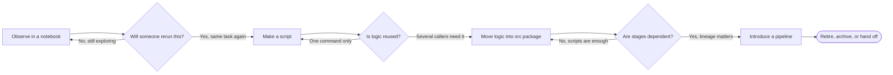

> **AI/ML Engineering Track** | Complexity: `[MEDIUM]` | Time: 2-3 hours
>
> **Prerequisites**: Modules 1.1 through 1.3 complete

---

## What You'll Be Able to Do

By the end of this module, you will be able to:

- evaluate whether a task belongs in a notebook, script, reusable package, or pipeline based on reproducibility, collaboration, and operational risk
- refactor messy notebook logic into a structured project with reusable modules, command-line scripts, separated data, and controlled outputs
- debug common notebook-to-project failures such as hidden state, copied preprocessing logic, noisy artifacts, and untracked configuration changes
- design a starter AI project layout that supports exploration today while leaving a clear path toward testing, automation, and production handoff
- justify version-control and artifact-management decisions so teammates can reproduce results without turning the repository into a dump of generated files

This module is not about making notebooks look professional. It is about learning where each kind of work belongs so your experiments can survive contact with other people, later reruns, and production expectations.

---

## Why This Module Matters

*(Maya is a hypothetical illustrative learner, not a documented incident.)* Maya joined a small AI team two weeks before a customer demo. The model already looked promising, the notebook had attractive charts, and everyone believed the hard part was over. Then she tried to rerun the project from a fresh clone.

The first run failed because the notebook expected a local file that was never committed. The second run completed but produced different metrics because one preprocessing cell had been executed days earlier with a slightly different rule. The third run generated a chart, but nobody could tell whether it came from the current model, last week's model, or a manually edited CSV file.

The model was not the first failure point. The project structure was. The team had treated a notebook like a reliable system, even though it was really a record of exploration mixed with hidden state, temporary files, and copied logic.

That story is common in AI and ML engineering. A notebook can help you discover a useful idea, but it does not automatically give you a reproducible training job, a reviewable preprocessing library, or a deployment-ready evaluation process.

Professional AI projects need a deliberate path from exploration to repeatability. You do not need enterprise tooling on day one, but you do need boundaries that make intent visible: notebooks for thinking, scripts for repeatable runs, packages for reusable logic, and pipelines for orchestrated workflows.

The senior habit is not avoiding notebooks. The senior habit is knowing when a notebook has finished its job and when the work must graduate into code that another person can run, review, test, and trust.

---

## The Mental Model: Four Working Modes

AI work changes shape as uncertainty decreases. At the start, you are often asking, "What is in this data?" or "Does this idea show any signal?" Later, you ask, "Can we run this again?" and "Can another system depend on this output?" Those are different questions, and they deserve different working modes.

A notebook is best when the next useful action depends on what you just observed. You run a query, inspect a chart, change an assumption, and try again. This feedback loop is powerful because it keeps exploration close to evidence.

A script is best when the useful action should be repeatable without manual cell execution. You want a command that accepts parameters, reads expected inputs, writes expected outputs, and behaves the same way after a kernel restart or on a teammate's machine.

A package is best when several notebooks or scripts need the same logic. Dataset loading, feature engineering, prompt formatting, metric calculation, and inference wrappers should not be copied across files because copied logic becomes inconsistent logic.

A pipeline is best when the work has multiple dependent stages and artifact tracking matters. Ingesting data, validating it, transforming it, training a model, evaluating the result, and publishing artifacts are not just commands; they are a workflow with dependencies and consequences.

```text
+----------------+        +----------------+        +----------------+        +----------------+
| Notebook Mode  |        |  Script Mode   |        | Package Mode   |        | Pipeline Mode  |
| explore signal | -----> | repeat a run   | -----> | reuse logic    | -----> | orchestrate    |
| inspect data   |        | set parameters |        | test behavior  |        | track outputs  |
+----------------+        +----------------+        +----------------+        +----------------+
        |                         |                         |                         |
        v                         v                         v                         v
   "What happens?"          "Run it again."          "Use it safely."          "Operate it."
```

The arrows are not a maturity ranking where notebooks are childish and pipelines are advanced. They show how responsibility moves as a project becomes less uncertain and more shared.

A solo learning project may stay mostly in notebook and script mode. A team project that feeds a downstream service must usually move key logic into packages and workflows. The right answer depends on risk, not fashion.



The diagram is useful because it turns a vague architecture conversation into an operator decision. The question is not "Which tool is more professional?" The question is "What responsibility has this work acquired, and which working mode exposes that responsibility clearly enough for the next person?"

**Stop and think:** if your current AI project disappeared from memory and only the Git repository remained, which steps could another person rerun without asking you what order the notebook cells were executed in?

That question reveals the boundary between exploration and engineering. If the answer is "almost none," the next improvement is not a more complex tool; it is a clearer project layout and a smaller amount of reusable code moved out of cells.

---

## Start Simple: What Belongs Where

A project layout is a communication tool. It tells future readers what they can edit, what they can rerun, what was generated, and what should be treated carefully. A good starter layout does not need many folders, but the folders it has should mean something.

```text
my-ai-project/
├── README.md
├── pyproject.toml
├── notebooks/
│   ├── 01-exploration.ipynb
│   └── 02-error-analysis.ipynb
├── src/
│   └── my_project/
│       ├── __init__.py
│       ├── data.py
│       ├── features.py
│       ├── train.py
│       ├── evaluate.py
│       └── inference.py
├── configs/
│   ├── train-baseline.yaml
│   └── eval-local.yaml
├── data/
│   ├── raw/
│   ├── interim/
│   └── processed/
├── outputs/
│   ├── figures/
│   ├── predictions/
│   └── reports/
└── tests/
    ├── test_features.py
    └── test_metrics.py
```

The most important boundary is between source and generated material. Files under `src/` express project behavior and should be reviewed like code. Files under `outputs/` are produced by running code and should usually be recreated rather than hand-edited.

The second important boundary is between raw data and processed data. Raw data should be treated as input evidence. Processed data is a derived artifact that can usually be recreated if the transformation code and input version are known.

The third important boundary is between notebooks and reusable code. A notebook can import functions, create plots, and explain findings, but it should not be the only place where business-critical preprocessing or evaluation logic exists.

A useful layout makes mistakes easier to notice. If someone drops `final_predictions_v2_actual.csv` beside `train.py`, the directory itself tells you the file is in the wrong place. If everything lives in the root folder, the project gives no such feedback.

**Active check:** imagine a teammate opens the repository and wants to change the text normalization rule. In the layout above, where should they look first, and which files should they avoid editing by hand?

The best answer is that reusable normalization logic should live under `src/my_project/`, probably in `features.py` or a related module. They should avoid editing generated files under `outputs/` because those files should be produced by commands, not patched manually.

---

## Notebook Mode: Use It for Discovery, Not Dependency

Notebooks are excellent when the work is interactive. You can load a small sample, inspect missing values, plot a distribution, test a prompt, or compare model outputs while keeping observations next to code. That closeness is why notebooks remain valuable even in mature engineering teams.

The danger is that notebooks make temporary state feel permanent. A variable can exist because you ran a deleted cell. A dataframe can contain columns produced by an earlier version of a transformation. A chart can render from a file that exists only on your laptop.

The notebook file looks linear, but the execution history may not be linear. That mismatch creates the classic failure: "It works on my machine when I run the cells in the way I remember, but nobody else can reproduce it."

A healthy notebook has a narrow role. It imports stable logic, chooses a small experiment, visualizes or explains the result, and records reasoning. It does not secretly contain the only implementation of preprocessing, training, evaluation, or deployment behavior.

Good notebook content includes exploratory queries, charts, metric comparison tables, prompt trials, manual error analysis, and short explanatory walkthroughs. These activities benefit from interactivity and annotation because the learner or practitioner is still forming judgment.

Bad notebook content includes final training logic, deployment-critical preprocessing, copied production functions, large committed outputs, manual cell-order dependencies, and hidden file writes that no command documents. These activities require repeatability more than interactivity.

The practical test is simple: if the result must be run again exactly and trusted by other people, it should not live only in a notebook. It can be called from a notebook, but the reusable behavior should live somewhere testable and runnable outside the notebook.

This distinction matters even for small projects. A single notebook can become unmanageable once it contains data loading, cleaning, feature engineering, model fitting, evaluation, visualization, and reporting all mixed together. The problem is not line count; the problem is unclear responsibility.

---

## Script Mode: Turn Repeatable Work into Commands

A script is a promise that a task can be repeated without human memory. The command should say what it does through arguments, configuration, inputs, and outputs. A teammate should not need to know which cell you ran first.

Scripts are especially useful when you need to rerun an experiment with changed parameters. A training script can accept a config path. An evaluation script can accept a predictions file and write a metrics report. A preprocessing script can read raw data and produce processed data.

A script does not need to be complicated. In fact, the first script should often be boring. Its job is to call reusable functions in the right order, validate obvious inputs, and write outputs to predictable locations.

```python
# src/my_project/features.py
from __future__ import annotations


def normalize_text(value: str) -> str:
    """Normalize text for a small baseline experiment."""
    return " ".join(value.strip().lower().split())


def build_features(rows: list[str]) -> list[dict[str, object]]:
    """Turn raw text rows into simple features that a script or notebook can reuse."""
    features = []
    for row in rows:
        cleaned = normalize_text(row)
        features.append(
            {
                "text": cleaned,
                "character_count": len(cleaned),
                "word_count": len(cleaned.split()),
            }
        )
    return features
```

```python
# src/my_project/run_features.py
from __future__ import annotations

import json
from pathlib import Path

from my_project.features import build_features


PROJECT_ROOT = Path(__file__).resolve().parents[2]
INPUT_PATH = PROJECT_ROOT / "data" / "raw" / "sample.txt"
OUTPUT_PATH = PROJECT_ROOT / "outputs" / "reports" / "features_preview.jsonl"


def main() -> None:
    rows = INPUT_PATH.read_text(encoding="utf-8").splitlines()
    features = build_features(rows)

    OUTPUT_PATH.parent.mkdir(parents=True, exist_ok=True)
    with OUTPUT_PATH.open("w", encoding="utf-8") as handle:
        for item in features:
            handle.write(json.dumps(item) + "\n")

    print(f"Wrote {len(features)} rows to {OUTPUT_PATH}")


if __name__ == "__main__":
    main()
```

```bash
PYTHONPATH=src .venv/bin/python src/my_project/run_features.py
```

Here `PYTHONPATH=src` is only a pre-install shorthand for a project that has not been installed yet. Once the package has an editable install, run the command without that environment prefix.

The function in `features.py` is reusable logic. The script in `run_features.py` is executable workflow. The notebook can import the same function for inspection, but it no longer owns the only copy of the transformation.

Notice that the script writes to `outputs/reports/`, not beside the source file. This one choice makes review easier because source changes and generated results do not compete for attention in the same directory.

Also notice that paths are derived from the script location instead of hard-coded to one developer's machine. That makes the script more portable and avoids the "works only on my laptop" failure mode.

**Stop and think:** if this script produced a wrong `word_count`, where would you fix the bug, and how would you avoid fixing it separately in three notebooks?

The bug belongs in `src/my_project/features.py` because that is where the reusable behavior lives. Once the function is fixed there, scripts and notebooks importing it receive the same correction instead of drifting apart.

---

## Package Mode: Give Shared Logic a Home

Package mode begins when you stop treating Python files as random helpers and start treating them as a small library for your project. The library does not need to be published to PyPI. It only needs stable names, clear responsibilities, and behavior that can be tested.

A package gives teammates a shared vocabulary. Instead of saying "copy the cleaning cells from the second notebook," you can say "use `build_features()` from `my_project.features`." That change sounds small, but it turns a memory-based process into an interface.

The package boundary also helps you decide what deserves tests. Exploratory plotting cells may not need tests, but text normalization, dataset splitting, metric computation, and prompt formatting often do. If those functions influence model behavior or reported results, they deserve more than visual inspection.

```text
src/my_project/
├── __init__.py
├── data.py          # read and validate input datasets
├── features.py      # transform raw examples into model-ready inputs
├── metrics.py       # calculate evaluation numbers consistently
├── train.py         # training orchestration and model save logic
├── evaluate.py      # evaluation orchestration and report creation
└── inference.py     # prediction wrapper used by demos or services
```

A good package layout follows responsibilities, not tool names. Avoid files like `utils.py` becoming a junk drawer for unrelated functions. A function that reads data belongs near data loading. A function that computes metrics belongs near evaluation.

For beginner projects, a few modules are enough. For senior-level work, the same idea scales into clearer interfaces: dataset objects, configuration schemas, model wrappers, evaluation reports, and deployment adapters. The principle does not change; reusable behavior needs a stable home.

The package should not hide every detail behind abstraction. Premature abstraction can make a small project harder to understand. Move code into a package when reuse, testing, or review pressure appears, not because every notebook cell must immediately become a class.

A useful decision rule is to watch for the second copy. The first version of a helper can live in a notebook while you learn. When another notebook or script needs the same logic, extract it before the two copies evolve differently.

---

## Project Metadata: `pyproject.toml` as the Contract

Once reusable code lives under `src/`, the repository needs a small project contract. That contract is usually `pyproject.toml`, because the Python Packaging User Guide describes it as the place where a project declares build-system requirements and project metadata such as name, Python version requirements, dependencies, optional dependencies, and entry points. The important habit is not memorizing every key. The habit is knowing which choices belong in metadata, which choices belong in runtime configuration, and which choices do not belong in either file. ([PyPA: Writing your pyproject.toml](https://packaging.python.org/en/latest/guides/writing-pyproject-toml/), [PyPA: pyproject.toml specification](https://packaging.python.org/en/latest/specifications/pyproject-toml/))

For a notebook-to-script project, `pyproject.toml` should answer three practical questions. What package should be importable from `src/`? Which Python versions and runtime libraries does the project expect? Which development extras let a teammate run notebooks, tests, and linters without guessing from your shell history? Those answers make environment setup reviewable in Git instead of hidden in a long sequence of one-off install commands.

```toml
[build-system]
requires = ["setuptools>=69"]
build-backend = "setuptools.build_meta"

[project]
name = "notebook-refactor-demo"
version = "0.1.0"
requires-python = ">=3.12"
dependencies = [
  "pandas>=2.2",
  "scikit-learn>=1.5",
]

[project.optional-dependencies]
dev = [
  "jupyterlab>=4",
  "pytest>=8",
  "ruff>=0.5",
]

[tool.setuptools.packages.find]
where = ["src"]

[tool.pytest.ini_options]
pythonpath = ["src"]
testpaths = ["tests"]
```

The `src` layout is not decoration. Setuptools documents package discovery for `src-layout` projects, and that layout helps prevent an accidental import from the repository root from hiding packaging mistakes. If the project installs cleanly and tests import `my_project` through the same package name that notebooks and scripts use, you are testing the project shape that teammates will run instead of testing a lucky local path. ([Setuptools: Package Discovery and Namespace Packages](https://setuptools.pypa.io/en/latest/userguide/package_discovery.html))

```bash
.venv/bin/python -m pip install -e ".[dev]"
.venv/bin/python -m pytest
```

After this install, `PYTHONPATH=src` is no longer needed; the package is importable by name in the active environment.

Do not turn `pyproject.toml` into an experiment diary. Model thresholds, dataset snapshots, prompt variants, and output report paths usually belong in command arguments or config files because they change per run. Package names, supported Python versions, and development tool settings belong in `pyproject.toml` because they describe the project environment. That separation keeps metadata stable while still letting experiments vary.

---

## Dependency Hygiene: Pick One Source of Truth

Dependency hygiene is an operational decision before it is a tooling decision. A team gets into trouble when one person edits `requirements.txt`, another person runs `uv add`, a third person uses `pdm add`, and the notebook server contains packages that never appear in the repository. The fix is to choose one source of truth for direct dependencies, one lock or compile artifact policy, and one documented install command. Python's `venv` module supports isolated environments, but isolation only helps if the environment can be recreated from files the project actually tracks. ([Python venv](https://docs.python.org/3/library/venv.html))

| Tooling choice | Dependency source of truth | Reproducibility artifact | Good operator use |
|---|---|---|---|
| `uv` project workflow | `pyproject.toml` managed with `uv add` and related project commands | `uv.lock` records the resolved environment | Best when the team wants fast project sync and a lockfile-driven workflow |
| PDM workflow | `pyproject.toml` managed with `pdm add` and dependency groups | `pdm.lock` records the resolved environment | Best when the team already standardizes on PDM project management |
| `pip-tools` workflow | `requirements.in`, `pyproject.toml`, or similar input files | compiled `requirements.txt` from `pip-compile` | Best when deployment or platform policy expects pinned requirements files |

The table is not a ranking. It is a warning against mixing ownership. uv documents project dependencies in `pyproject.toml` and project synchronization through its own workflow. PDM documents dependency management through project metadata and groups. pip-tools documents `pip-compile` as the command that compiles pinned requirement output from higher-level dependency inputs. Each approach can be disciplined when the team follows it consistently. Each approach becomes confusing when its generated files are hand-edited by a different workflow. ([uv: Managing Dependencies](https://docs.astral.sh/uv/concepts/projects/dependencies/), [PDM: Manage Dependencies](https://pdm-project.org/latest/usage/dependency/), [pip-tools: pip-compile](https://pip-tools.readthedocs.io/en/stable/reference/pip-compile/))

```bash
# uv-owned project
uv add pandas scikit-learn
uv sync
# (use uv run <command> for one-off commands in the managed environment)

# PDM-owned project
pdm add pandas scikit-learn
pdm install

# pip-tools-owned project
.venv/bin/pip-compile requirements.in -o requirements.txt
.venv/bin/pip-sync requirements.txt
```

For notebook-heavy work, dependency hygiene also protects interpretation. A model metric can change because the data changed, the code changed, or a library version changed. If the dependency state is not documented, the team may spend hours debugging model behavior while the real difference is a silently upgraded parser, tokenizer, dataframe library, or evaluation package. A clean project records the dependency decision near the code so reruns can test the same hypothesis under the same environment boundary.

---

## Configuration: Separate Choices from Code

AI experiments often differ by parameters rather than behavior. You may change a model name, input file, split seed, prompt template, training epoch count, threshold, or output path. If every change requires editing source code, experiments become hard to compare.

Configuration files make choices explicit. They let you run the same code with different settings and preserve the conditions under which an output was produced. This is especially important when results are discussed in reviews or reports.

```yaml
# configs/train-baseline.yaml
data:
  input_path: data/processed/train.jsonl
  validation_path: data/processed/validation.jsonl

model:
  name: baseline-logistic-regression
  random_seed: 13

training:
  max_examples: 5000
  text_field: text
  label_field: label

outputs:
  report_path: outputs/reports/train-baseline.json
  predictions_path: outputs/predictions/train-baseline.jsonl
```

A configuration file is not automatically better than command-line arguments. Small scripts can use arguments directly. As soon as a run needs several related settings, a config file becomes easier to review and preserve.

The deeper point is that experiment choices should not be hidden in edited cells. If a result depends on a threshold of `0.72`, a random seed, or a particular input snapshot, that dependency should be visible in the command or configuration used to produce the result.

For serious work, save a copy of the effective configuration beside the output report. That practice makes later comparisons much easier because the artifact carries evidence about how it was produced.

```text
outputs/
└── reports/
    ├── train-baseline.json
    └── train-baseline.config.yaml
```

Configuration also reduces social friction. A reviewer can discuss whether a threshold makes sense without reading the whole script, and a teammate can rerun the experiment without searching for changed literals inside a notebook.

---

## Data and Output Hygiene

AI projects generate clutter faster than most software projects. A single afternoon can produce raw exports, cleaned datasets, cached embeddings, prediction files, screenshots, charts, metrics reports, model checkpoints, and notebook checkpoints.

Clutter becomes dangerous when generated files are indistinguishable from source files. A teammate may edit an output by hand. A review may focus on hundreds of changed notebook metadata lines. A script may accidentally read yesterday's processed file instead of today's raw input.

Separate directories reduce that risk by giving every file a role. Raw data belongs under `data/raw/`. Intermediate transformations can live under `data/interim/`. Processed model-ready datasets can live under `data/processed/`. Generated charts, predictions, and reports belong under `outputs/`.

```text
data/
├── raw/
│   └── customer-feedback-2026-04-20.csv
├── interim/
│   └── feedback-cleaned.jsonl
└── processed/
    ├── train.jsonl
    └── validation.jsonl

outputs/
├── figures/
│   └── label-distribution.png
├── predictions/
│   └── baseline-validation.jsonl
└── reports/
    └── baseline-metrics.json
```

This layout does not decide what should be committed to Git. It only decides where things belong. Version-control decisions still depend on size, sensitivity, reproducibility, and team policy.

A small sample dataset used in tests may belong in Git. A large raw export with sensitive fields does not. A generated metrics report for a release may be preserved intentionally. A temporary chart from exploration probably should not be committed.

Notebook outputs deserve special care. Output cells can make notebooks huge, noisy, and difficult to review. If the notebook is meant as teaching material, a few small outputs may help. If it is an experiment log, consider stripping bulky outputs and storing important artifacts separately.

A clean repository should describe how to recreate important artifacts. It should not mirror every artifact the project ever emitted. The difference is discipline, not minimalism.

**Active check:** your pull request includes a changed training script, a generated PNG, a cached embedding file, and a metrics JSON report. Which files would you ask the team to review as source, and which would you treat as artifacts needing an explicit reason to commit?

The training script is source and should be reviewed directly. The generated PNG, cached embeddings, and metrics report are artifacts; they may be useful, but each needs a reason to be committed instead of recreated by the documented command.

---

## Worked Example: From Messy Notebook to Structured Project

*(Hypothetical teaching example, not a recorded run or a production incident.)* Now we will transform a small messy notebook into a maintainable project. The goal is not to create a perfect architecture. The goal is to show the decisions, in order, so you can apply the same reasoning to larger AI projects.

Assume the notebook started as a quick text-classification experiment. It loads examples, cleans text, creates simple features, calculates a fake score for demonstration, and writes predictions. The whole experiment works only because the author remembers the cell order.

```python
# notebooks/01-messy-experiment.ipynb cell
import json
from pathlib import Path

rows = [
    "  Great docs but setup was slow  ",
    "Model failed on my short examples",
    "  clean output and helpful walkthrough ",
]

cleaned = []
for row in rows:
    cleaned.append(" ".join(row.strip().lower().split()))

features = []
for text in cleaned:
    features.append(
        {
            "text": text,
            "word_count": len(text.split()),
            "character_count": len(text),
        }
    )

predictions = []
for item in features:
    label = "positive" if "great" in item["text"] or "helpful" in item["text"] else "needs_review"
    predictions.append({"text": item["text"], "label": label})

Path("final_outputs").mkdir(exist_ok=True)
with open("final_outputs/preds.jsonl", "w", encoding="utf-8") as handle:
    for prediction in predictions:
        handle.write(json.dumps(prediction) + "\n")
```

This is a believable first notebook. It is not bad because it exists; it is bad if it becomes the only implementation. The cleaning rule, feature creation, labeling rule, input data, and output location are all trapped in one exploratory cell.

Step one is to identify responsibilities. The notebook currently handles data input, text normalization, feature building, prediction logic, and artifact writing. Those responsibilities change for different reasons, so they should not remain tangled together.

```text
Messy cell responsibility map
+----------------------+------------------------------------------+-----------------------------+
| Responsibility       | Current location                         | Better home                 |
+----------------------+------------------------------------------+-----------------------------+
| sample input         | hardcoded notebook list                   | data/raw/sample.txt         |
| normalization        | loop inside notebook                      | src/my_project/features.py  |
| feature building     | loop inside notebook                      | src/my_project/features.py  |
| prediction rule      | loop inside notebook                      | src/my_project/inference.py |
| output writing       | notebook file write                       | repeatable script           |
| visual inspection    | notebook                                  | notebook                    |
+----------------------+------------------------------------------+-----------------------------+
```

Step two is to create the project skeleton. The structure gives each responsibility a destination before we move code. This prevents extraction from becoming another pile of random files.

```bash
mkdir -p my-ai-project/{notebooks,src/my_project,data/raw,outputs/predictions,outputs/reports,tests}
touch my-ai-project/src/my_project/__init__.py
printf "  Great docs but setup was slow  \nModel failed on my short examples\n  clean output and helpful walkthrough \n" > my-ai-project/data/raw/sample.txt
```

Step three is to move reusable feature logic into a module. We are not changing behavior yet. We are preserving behavior while giving it a stable name and home.

```python
# src/my_project/features.py
from __future__ import annotations


def normalize_text(value: str) -> str:
    return " ".join(value.strip().lower().split())


def build_features(rows: list[str]) -> list[dict[str, object]]:
    output = []
    for row in rows:
        text = normalize_text(row)
        output.append(
            {
                "text": text,
                "word_count": len(text.split()),
                "character_count": len(text),
            }
        )
    return output
```

Step four is to move prediction behavior into another module. In a real project this might call a trained model or an LLM endpoint. Here it remains simple so the project structure is the main lesson.

```python
# src/my_project/inference.py
from __future__ import annotations


def predict_label(text: str) -> str:
    positive_markers = {"great", "helpful", "clean"}
    words = set(text.split())
    if words & positive_markers:
        return "positive"
    return "needs_review"


def predict_rows(features: list[dict[str, object]]) -> list[dict[str, object]]:
    predictions = []
    for item in features:
        text = str(item["text"])
        predictions.append({"text": text, "label": predict_label(text)})
    return predictions
```

Step five is to create a repeatable script that wires the pieces together. The script reads from `data/raw/`, calls reusable code, and writes generated predictions under `outputs/`. The notebook no longer owns the execution contract.

```python
# src/my_project/run_baseline.py
from __future__ import annotations

import json
from pathlib import Path

from my_project.features import build_features
from my_project.inference import predict_rows


PROJECT_ROOT = Path(__file__).resolve().parents[2]
INPUT_PATH = PROJECT_ROOT / "data" / "raw" / "sample.txt"
OUTPUT_PATH = PROJECT_ROOT / "outputs" / "predictions" / "baseline.jsonl"


def main() -> None:
    rows = INPUT_PATH.read_text(encoding="utf-8").splitlines()
    features = build_features(rows)
    predictions = predict_rows(features)

    OUTPUT_PATH.parent.mkdir(parents=True, exist_ok=True)
    with OUTPUT_PATH.open("w", encoding="utf-8") as handle:
        for prediction in predictions:
            handle.write(json.dumps(prediction) + "\n")

    print(f"Wrote {len(predictions)} predictions to {OUTPUT_PATH}")


if __name__ == "__main__":
    main()
```

Step six is to update the notebook so it imports the project rather than duplicating logic. The notebook remains useful because it can inspect outputs and explain decisions. It is no longer the only way to produce results.

```python
# notebooks/01-exploration.ipynb cell
from my_project.features import build_features
from my_project.inference import predict_rows

rows = [
    "  Great docs but setup was slow  ",
    "Model failed on my short examples",
    "  clean output and helpful walkthrough ",
]

features = build_features(rows)
predictions = predict_rows(features)
predictions
```

Step seven is to run the project from a clean command. A teammate should be able to clone the repository, install dependencies, and run the script without knowing the notebook history.

```bash
cd my-ai-project
.venv/bin/python src/my_project/run_baseline.py
cat outputs/predictions/baseline.jsonl
```

Step eight is to add a small test around the extracted logic. This test is not about achieving perfect coverage. It protects the behavior that used to be hidden inside a cell and is now shared by scripts and notebooks.

```python
# tests/test_features.py
from my_project.features import build_features, normalize_text


def test_normalize_text_collapses_space_and_lowercases() -> None:
    assert normalize_text("  Helpful   Walkthrough  ") == "helpful walkthrough"


def test_build_features_counts_words_after_normalization() -> None:
    rows = ["  Clean output  "]
    assert build_features(rows) == [
        {
            "text": "clean output",
            "word_count": 2,
            "character_count": 12,
        }
    ]
```

The transformation changed the project in a specific way. The notebook still supports exploration, but repeatable behavior now lives in modules and scripts. Outputs are generated in a predictable directory. A test protects reusable transformation logic.

The senior lesson is that refactoring out of a notebook should be incremental. Do not pause exploration for a week to build a grand framework. Extract the logic that is repeated, trusted, or shared, then leave the notebook focused on observation and interpretation.

---

## Notebook-to-Script Conversion

Conversion tools help you cross the bridge from exploration to repeatability, but they do not decide what is production code. Jupyter's conversion documentation points to nbconvert for converting notebook documents, and nbconvert documents command-line conversion to script form. That exported script is useful evidence because it shows the current notebook order in plain text. It is not automatically a clean training program, because notebook cells may still mix imports, plots, markdown assumptions, temporary variables, and hidden filesystem choices. ([Jupyter: Formatting and Conversion](https://docs.jupyter.org/en/latest/projects/conversion.html), [nbconvert Usage](https://nbconvert.readthedocs.io/en/latest/usage.html))

```bash
mkdir -p converted
jupyter nbconvert --to script notebooks/01-exploration.ipynb --output-dir converted
head -160 converted/01-exploration.py
```

Use nbconvert when you need a one-time extraction or an audit snapshot of what the notebook currently contains. The next step is still human judgment. Functions that define reusable behavior move to `src/my_project/`. Commands that should run from a clean shell become scripts. Plotting and interpretation can remain in the notebook. This keeps the conversion from becoming a mechanical dump where every cell becomes permanent just because a tool exported it.

Jupytext solves a different problem. Its paired-notebook workflow keeps an `.ipynb` file paired with a text representation such as a percent-format Python file or Markdown file. That can make code review easier because teammates can inspect the text form while still opening the notebook interactively. It is most useful when a notebook remains a living exploration document and the team wants reviewable changes without pretending the notebook has already become a script. ([Jupytext: Paired Notebooks](https://jupytext.readthedocs.io/en/latest/paired-notebooks.html))

```bash
jupytext --set-formats ipynb,py:percent notebooks/01-exploration.ipynb
jupytext --sync notebooks/01-exploration.ipynb
git status --short notebooks/
```

The safe promotion sequence is short. First, restart the kernel and run the notebook top to bottom so the exported text reflects an actual execution path rather than old kernel memory. Second, export or pair the notebook so the current state is reviewable. Third, move repeated or trusted behavior into `src/`, add a script for repeatable execution, and replace notebook copies with imports. Fourth, add a test around behavior that affects results. If any step fails, the failure is information about hidden state that the notebook was masking.

| Situation | Better tool move | Engineering decision |
|---|---|---|
| You need a one-time plain-text snapshot of an existing notebook | Export with nbconvert | Review the exported order, then extract only reusable behavior |
| The notebook remains active but diffs are too noisy | Pair with Jupytext | Keep exploration interactive while reviewing code-like changes in text |
| The result must run daily or feed another service | Write a script and package functions | Treat the notebook as an inspector, not the execution contract |

Do not measure success by the absence of notebooks. Measure success by whether the project can explain which notebook is exploratory, which script reruns the result, which module owns shared behavior, which config records run choices, and which artifact path contains generated output. That explanation is what turns notebook work into engineering work.

---

## Decision Points: When to Graduate Work

The hardest part is not knowing that scripts and packages exist. The hardest part is deciding when the current form is no longer enough. Graduation should be based on friction and risk.

Move from notebook to script when a task must run repeatedly, when parameters need to change systematically, when another person needs to run it, or when the result is used for comparison. Repetition is the signal that manual cell execution is becoming a liability.

Move from script to package when multiple scripts or notebooks need the same logic, when behavior needs tests, or when naming and interfaces matter. Shared logic without a shared home is where subtle project drift begins.

Move from package to pipeline when there are multiple dependent steps, when artifacts need lineage, when jobs need scheduling, or when failures must be isolated by stage. A pipeline is not just a bigger script; it records the workflow shape.

```text
Decision guide
+-----------------------------+-----------------------------+------------------------------+
| Signal                      | Risk if ignored             | Next move                    |
+-----------------------------+-----------------------------+------------------------------+
| Rerun needed often          | manual cell-order mistakes  | create a script              |
| Logic copied twice          | inconsistent behavior       | extract a package module     |
| Parameters edited in code   | unclear experiment history  | use arguments or config      |
| Many dependent stages       | partial, untracked runs     | introduce a pipeline         |
| Outputs hard to compare     | unreliable conclusions      | standardize output paths     |
| Handoff required            | tribal knowledge dependency | document commands and layout |
+-----------------------------+-----------------------------+------------------------------+
```

Do not graduate work only because it feels more professional. A notebook with a clear purpose may be better than an overbuilt framework. A single script may be better than a pipeline when there is only one stage and no artifact lineage problem.

On the other hand, do not hide behind simplicity when the project is already shared. If three people are editing the same notebook, copying cells between experiments, and manually renaming output files, the project has already outgrown pure notebook mode.

A good engineering decision names both the cost and the risk. "We are keeping this in a notebook because the question is still exploratory" is defensible. "We are keeping production preprocessing in a notebook because nobody has moved it yet" is not.

---

## Version Control: Review the Project, Not the Debris

Git is excellent at reviewing source code and text configuration. It is less pleasant for large datasets, binary artifacts, bulky notebook outputs, cached embeddings, model checkpoints, and generated images. Treating all files the same makes reviews worse.

Track files that describe how the project works: source code, tests, configuration, lightweight documentation, dependency definitions, and small example data when it is safe and useful. These files help another person understand and reproduce behavior.

Avoid tracking files that are large, sensitive, generated, or easily recreated unless there is a deliberate reason. Raw customer data, model checkpoints, temporary predictions, notebook checkpoints, and intermediate caches usually need artifact storage or regeneration instructions instead of Git commits.

A `.gitignore` is part of the project design. It documents which generated paths should stay out of normal review. The file should be specific enough to catch common clutter without hiding source files accidentally.

```text
# generated outputs
outputs/
*.log

# notebook internals
.ipynb_checkpoints/

# local environment
.venv/
.env

# common caches
__pycache__/
.pytest_cache/
```

Be careful with broad ignore rules. Ignoring all `data/` files may be appropriate for sensitive projects, but it can also hide small sample fixtures needed for tests. A better pattern is often to ignore large subdirectories while explicitly allowing safe examples.

Notebook diffs require special attention. JSON notebook files contain metadata, execution counts, and outputs that can dominate a review, because the nbformat documentation defines notebooks as structured JSON documents with cells, metadata, and outputs. Tools such as notebook-aware diffing and output stripping exist because ordinary text diffs are often too noisy for notebooks. ([nbformat: Notebook Format](https://nbformat.readthedocs.io/en/latest/format_description.html), [nbdime](https://github.com/jupyter/nbdime), [nbstripout](https://github.com/kynan/nbstripout))

The project should answer three review questions quickly: What behavior changed? What experiment choices changed? Which artifacts were produced by running the project? If a pull request cannot answer those questions, the layout and version-control habits need improvement.

---

## From Beginner Habits to Senior Habits

A beginner often asks, "Where can I put this so it runs?" That is a reasonable starting question, but it is not enough once other people depend on the work. A senior practitioner asks, "Where should this live so the next change is safer?"

The difference appears in small choices. A beginner copies a cleaning cell into a second notebook. A senior extracts the cleaning rule before the copies diverge. A beginner saves `new_final_results.csv` in the root folder. A senior writes outputs to a predictable path with a command that can recreate them.

Senior habits also show up in naming. `run_baseline.py` tells a teammate how to execute a baseline. `features.py` tells them where transformations live. `outputs/predictions/baseline.jsonl` tells them the file was generated and what it represents.

This is not bureaucracy for its own sake. Clear structure reduces cognitive load during debugging. When a metric changes unexpectedly, you can inspect configuration, source code, input data, and generated outputs separately instead of searching through a long notebook for hidden causes.

Good project structure also makes collaboration less personal. Instead of asking the original author to remember what happened, the team can inspect commands, modules, configs, and artifacts. The project carries more of its own explanation.

The best AI engineers preserve the speed of exploration while building escape routes from it. They use notebooks to learn quickly, scripts to rerun reliably, packages to share behavior, and pipelines when coordination becomes the problem.

---

## Did You Know?

1. [Notebook files are structured JSON documents, not just Python scripts with extra comments.](https://nbformat.readthedocs.io/en/latest/format_description.html) That is why ordinary text diffs can be noisy and why [notebook-aware diff tools](https://github.com/jupyter/nbdime) are useful in collaborative projects.

2. [PyPA's `pyproject.toml` guide](https://packaging.python.org/en/latest/guides/writing-pyproject-toml/) treats project metadata and dependencies as project declarations, which is why dependency changes belong in reviewed files rather than only in terminal history.

3. [Jupytext paired notebooks](https://jupytext.readthedocs.io/en/latest/paired-notebooks.html) let a notebook keep its interactive form while a text representation gives reviewers a cleaner view of code-like changes.

4. [Git's `gitignore` documentation](https://git-scm.com/docs/gitignore) describes ignored files as intentionally untracked files, which is the exact mental model you need for generated outputs, caches, and local environments.

---

## Common Mistakes

| Mistake | What Goes Wrong | Better Move |
|---|---|---|
| Keeping all logic inside notebooks | hidden state and irreproducible runs make handoff fragile | move reusable preprocessing, training, and evaluation logic into `src/` |
| Mixing data, code, and outputs in one folder | contributors cannot tell what is source versus generated material | separate directories by purpose before the project grows |
| Tracking every output in Git | pull requests become noisy and repositories become bloated | track source and intentional examples, not every generated artifact |
| Using notebooks for production-critical steps | deployment behavior depends on manual cell order and local memory | create scripts for repeatable execution and reviewable handoff |
| Copy-pasting code between notebooks | small fixes land in one copy while other copies keep old behavior | centralize shared code as soon as a second user appears |
| Editing parameters directly inside source code | experiment history becomes hard to reconstruct and compare | move run choices into command arguments or configuration files |
| Writing scripts that depend on local absolute paths | teammates cannot run the project from their own clone | derive paths from the project root and document the command |
| Creating a pipeline before the workflow is understood | the team maintains orchestration around unstable assumptions | start with scripts, then pipeline the stages that are truly repeatable |

---

## Quiz

**Q1.** Your team has a notebook that trains a model, writes predictions, and produces the chart used in a weekly review. After a kernel restart, the notebook runs top to bottom but produces different metrics because an earlier hidden dataframe state is gone. What should you change first, and why?

<details>
<summary>Answer</summary>

Move the reusable preprocessing, training, and evaluation behavior out of the notebook into modules and a repeatable script. The immediate problem is hidden notebook state, so the fix is to create an execution path that does not depend on remembered cell order. The notebook can still visualize the result, but trusted behavior should live in code that can run from a clean process.

</details>

**Q2.** A repository contains `train.py`, `raw_export.csv`, `plot_new.png`, `predictions_final.jsonl`, and two notebooks all in the root folder. A new teammate cannot tell which files are inputs, which are source, and which are generated. Design a better layout for this situation.

<details>
<summary>Answer</summary>

Put source code under `src/`, notebooks under `notebooks/`, raw data under `data/raw/`, and generated charts or predictions under `outputs/figures/` and `outputs/predictions/`. The goal is not cosmetic organization; it is to make file intent visible. Once the layout separates responsibilities, reviewers can focus on source changes and treat generated artifacts as outputs with explicit reasons for preservation.

</details>

**Q3.** You notice the same text-cleaning cell copied into three notebooks and one training script. A bug fix has already been applied in only one copy. What refactor should you perform, and what risk does it reduce?

<details>
<summary>Answer</summary>

Extract the cleaning logic into a reusable function under the project package, such as `src/my_project/features.py`, and import it from the notebooks and script. This reduces divergence risk because there is one implementation to fix and test. It also gives the behavior a stable name, making future reviews and debugging easier.

</details>

**Q4.** A product manager asks for daily evaluation runs using different threshold values so the team can compare output reports over time. The current process requires editing a notebook cell before each run. What working mode should this move toward?

<details>
<summary>Answer</summary>

Move the evaluation into script mode with command-line arguments or configuration files for the threshold values. Daily repeated execution and systematic parameter changes are signals that manual notebook edits are no longer appropriate. The reports should be written to predictable output paths so comparisons are based on reproducible runs.

</details>

**Q5.** Your pull request includes a new evaluation function, an updated config file, a large generated prediction file, notebook metadata changes, and a metrics report. The reviewer says the diff is hard to inspect. How should you decide what belongs in the PR?

<details>
<summary>Answer</summary>

The evaluation function and config file are source-level changes and usually belong in the PR. The large prediction file, notebook metadata noise, and generated report need explicit justification because they are artifacts. If the report is important, document the command that recreates it or commit only a lightweight intentional artifact according to team policy.

</details>

**Q6.** A teammate wants to introduce a workflow orchestrator immediately because the project may become production-facing later. Today there is one exploratory notebook and no stable preprocessing contract. How would you evaluate that proposal?

<details>
<summary>Answer</summary>

I would delay the orchestrator and first extract stable logic into scripts and package modules. A pipeline is useful when repeatable stages and artifact dependencies are understood. Introducing orchestration too early can freeze unstable assumptions and add maintenance cost before the team knows what workflow actually needs coordination.

</details>

**Q7.** A downstream service depends on a processed dataset created by a notebook. The service broke because someone changed a cleaning rule in the notebook but did not update the documentation. What structural change would prevent this class of failure?

<details>
<summary>Answer</summary>

Move the cleaning rule into reviewed source code, run it through a repeatable preprocessing script, and preserve the relevant configuration or command used for the dataset. Add tests around the cleaning behavior if the downstream service depends on it. The key change is to make the preprocessing contract visible and reviewable instead of hidden in exploratory cells.

</details>

**Q8.** An experiment has grown into five dependent steps: ingest raw files, validate them, build features, train a model, and publish evaluation artifacts. Different teammates run different steps manually, and nobody knows which outputs belong together. What is the next architectural move?

<details>
<summary>Answer</summary>

This is a good signal to move toward pipeline mode. The problem is no longer just a single repeatable command; it is coordination among dependent stages and their artifacts. A pipeline can make stage order, inputs, outputs, and failures explicit so the team can reproduce complete runs rather than manually stitching together partial results.

</details>

---

## Hands-On Exercise

**Goal:** transform a small notebook-first experiment into a structured project that separates exploration, reusable code, repeatable commands, data, and generated outputs.

You do not need a real model for this exercise. The point is to practice the project architecture decision, not to optimize predictive performance. Use the simple text examples below so you can focus on structure and reproducibility.

- [ ] Create a starter project layout with separate homes for notebooks, source code, raw data, generated predictions, generated reports, and tests.

```bash
mkdir -p notebook-refactor-demo/{notebooks,src/my_project,data/raw,outputs/predictions,outputs/reports,tests}
touch notebook-refactor-demo/src/my_project/__init__.py
touch notebook-refactor-demo/README.md
find notebook-refactor-demo -maxdepth 3 -type d | sort
```

- [ ] Add project metadata so the `src/` package can be installed and tests can import it by name.

```bash
cat > notebook-refactor-demo/pyproject.toml <<'EOF'
[build-system]
requires = ["setuptools>=69"]
build-backend = "setuptools.build_meta"

[project]
name = "notebook-refactor-demo"
version = "0.1.0"
requires-python = ">=3.12"
dependencies = []

[project.optional-dependencies]
dev = [
  "pytest>=8",
]

[tool.setuptools.packages.find]
where = ["src"]

[tool.pytest.ini_options]
pythonpath = ["src"]
testpaths = ["tests"]
EOF

(cd notebook-refactor-demo && .venv/bin/python -m pip install -e ".[dev]")
```

- [ ] Add a raw input file under `data/raw/` instead of hardcoding the only copy of the data inside a notebook.

```bash
cat > notebook-refactor-demo/data/raw/sample.txt <<'EOF'
  Great docs but setup was slow
Model failed on my short examples
  clean output and helpful walkthrough
EOF
```

- [ ] Create reusable feature code under `src/my_project/features.py` so normalization and feature building are no longer trapped in notebook cells.

```python
from __future__ import annotations


def normalize_text(value: str) -> str:
    return " ".join(value.strip().lower().split())


def build_features(rows: list[str]) -> list[dict[str, object]]:
    output = []
    for row in rows:
        text = normalize_text(row)
        output.append(
            {
                "text": text,
                "word_count": len(text.split()),
                "character_count": len(text),
            }
        )
    return output
```

- [ ] Create reusable prediction code under `src/my_project/inference.py` so the labeling rule has one implementation.

```python
from __future__ import annotations


def predict_label(text: str) -> str:
    positive_markers = {"great", "helpful", "clean"}
    if set(text.split()) & positive_markers:
        return "positive"
    return "needs_review"


def predict_rows(features: list[dict[str, object]]) -> list[dict[str, object]]:
    predictions = []
    for item in features:
        text = str(item["text"])
        predictions.append({"text": text, "label": predict_label(text)})
    return predictions
```

- [ ] Create a repeatable script under `src/my_project/run_baseline.py` that reads raw data, calls reusable code, and writes generated predictions under `outputs/`.

```python
from __future__ import annotations

import json
from pathlib import Path

from my_project.features import build_features
from my_project.inference import predict_rows


PROJECT_ROOT = Path(__file__).resolve().parents[2]
INPUT_PATH = PROJECT_ROOT / "data" / "raw" / "sample.txt"
OUTPUT_PATH = PROJECT_ROOT / "outputs" / "predictions" / "baseline.jsonl"


def main() -> None:
    rows = INPUT_PATH.read_text(encoding="utf-8").splitlines()
    predictions = predict_rows(build_features(rows))

    OUTPUT_PATH.parent.mkdir(parents=True, exist_ok=True)
    with OUTPUT_PATH.open("w", encoding="utf-8") as handle:
        for prediction in predictions:
            handle.write(json.dumps(prediction) + "\n")

    print(f"Wrote {len(predictions)} predictions to {OUTPUT_PATH}")


if __name__ == "__main__":
    main()
```

- [ ] Run the script from a clean command and verify that output appears in the generated-output directory, not beside the source code.

```bash
cd notebook-refactor-demo
.venv/bin/python src/my_project/run_baseline.py
cat outputs/predictions/baseline.jsonl
```

- [ ] Add a notebook placeholder that explains its role as exploration and inspection, not the only execution path.

```bash
cat > notebooks/01-exploration-notes.md <<'EOF'
# Exploration Notes

Use this notebook or note file to inspect sample rows, display generated predictions, and explain observations.

Do not keep the only copy of normalization, feature-building, prediction, or output-writing logic here.
EOF
```

- [ ] Add a small test for the extracted feature behavior so the refactor has a basic safety net.

```python
from my_project.features import build_features, normalize_text


def test_normalize_text_collapses_spaces_and_lowercases() -> None:
    assert normalize_text("  Helpful   Walkthrough  ") == "helpful walkthrough"


def test_build_features_counts_words_after_normalization() -> None:
    assert build_features(["  Clean output  "])[0]["word_count"] == 2
```

- [ ] Rerun the script twice and confirm the project does not depend on notebook cell order or hidden kernel memory.

```bash
.venv/bin/python src/my_project/run_baseline.py
.venv/bin/python src/my_project/run_baseline.py
find src data outputs notebooks tests -maxdepth 3 -type f | sort
```

Success criteria:

- [ ] The project has separate `notebooks/`, `src/`, `data/`, `outputs/`, and `tests/` directories.
- [ ] Raw input data lives under `data/raw/` rather than inside the only notebook cell.
- [ ] Reusable feature and prediction logic live under `src/my_project/`.
- [ ] A command-line script produces predictions under `outputs/predictions/`.
- [ ] The notebook or notebook placeholder explains observations and imports logic instead of owning the execution path.
- [ ] The script can be run repeatedly from a clean shell command.
- [ ] At least one test protects behavior that used to be hidden in notebook code.
- [ ] You can explain which files are source, which files are inputs, and which files are generated artifacts.

After completing the exercise, compare your result with the worked example in this module. The exact filenames may differ, but the responsibilities should be separated in the same way: exploration stays interactive, reusable logic gets named, repeatable execution becomes a command, and generated files go to predictable output paths.

---

## Next Module

- [AI-Native Development](../ai-native-development/) — the next phase in the default route: bring local models and AI-assisted coding into your daily workflow.

Optional later-phase deep-dives (after you complete Phases 1–4):
- [Home-Scale RAG Systems](../vector-rag/module-1.6-home-scale-rag-systems/)
- [Notebooks to Production for ML/LLMs](../mlops/module-1.11-notebooks-to-production-for-ml-llms/)

## Sources

- [Cookiecutter Data Science](https://github.com/drivendataorg/cookiecutter-data-science) — Provides a widely used reference project layout for separating code, data, notebooks, and outputs.
- [nbstripout](https://github.com/kynan/nbstripout) — Directly supports the module's version-control hygiene advice by stripping notebook outputs and noisy metadata.
- [nbformat.readthedocs.io: format description.html](https://nbformat.readthedocs.io/en/latest/format_description.html) — The nbformat documentation explicitly describes the official Jupyter Notebook format and its JSON-schema-defined top-level structure.
- [github.com: nbdime](https://github.com/jupyter/nbdime) — The nbdime project directly documents notebook-aware diff and merge commands, supporting the claim that notebook-specific review tooling exists.
- [Jupyter: Formatting and Conversion](https://docs.jupyter.org/en/latest/projects/conversion.html) — Identifies notebook conversion tooling in the Jupyter project ecosystem, including nbconvert.
- [nbconvert Usage](https://nbconvert.readthedocs.io/en/latest/usage.html) — Documents command-line notebook conversion, including script export workflows.
- [Jupytext Paired Notebooks](https://jupytext.readthedocs.io/en/latest/paired-notebooks.html) — Documents pairing `.ipynb` notebooks with text formats for synchronized review.
- [PyPA: Writing your pyproject.toml](https://packaging.python.org/en/latest/guides/writing-pyproject-toml/) — Documents practical project metadata, dependency, optional-dependency, and entry-point declarations.
- [PyPA: pyproject.toml specification](https://packaging.python.org/en/latest/specifications/pyproject-toml/) — Provides the packaging specification context for `pyproject.toml`.
- [Setuptools: Package Discovery and Namespace Packages](https://setuptools.pypa.io/en/latest/userguide/package_discovery.html) — Documents package discovery, including the `src` layout used by the module examples.
- [Python venv](https://docs.python.org/3/library/venv.html) — Documents isolated Python virtual environments and how installed packages are scoped to them.
- [uv: Managing Dependencies](https://docs.astral.sh/uv/concepts/projects/dependencies/) — Documents uv project dependency management through project metadata and synchronization.
- [PDM: Manage Dependencies](https://pdm-project.org/latest/usage/dependency/) — Documents PDM dependency management and dependency groups.
- [pip-tools: pip-compile](https://pip-tools.readthedocs.io/en/stable/reference/pip-compile/) — Documents compiling pinned requirements from dependency input files.
- [Git: gitignore](https://git-scm.com/docs/gitignore) — Documents intentionally untracked files and ignore-pattern behavior for generated paths.
