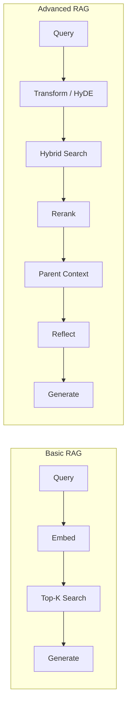
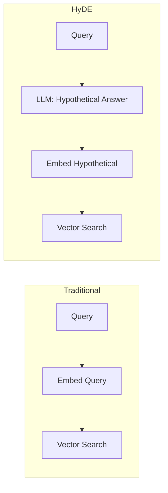
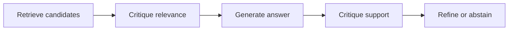
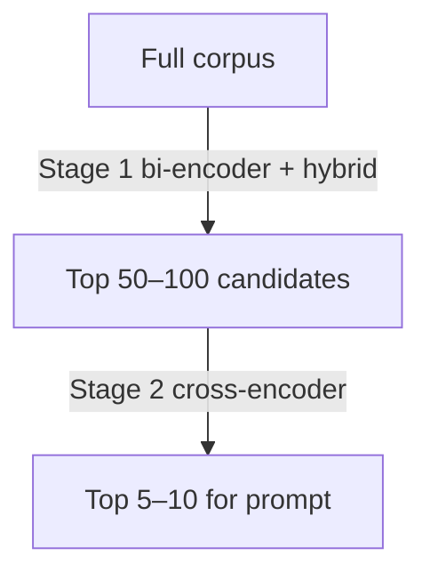

> **AI/ML Engineering Track** | Complexity: `[ADVANCED]` | Time: 4-5 hours
>
> **Prerequisites**: A working RAG pipeline from module 1.2, embeddings and hybrid retrieval basics, Python, and familiarity with BM25 and cross-encoder reranking concepts.

## Learning Outcomes

By the end of this module, you will be able to:

- **Design** GraphRAG knowledge-graph retrieval architectures that connect facts spread across disconnected documents for multi-hop questions.
- **Apply** HyDE hypothetical document embeddings when user queries and indexed passages use different vocabulary or linguistic structure.
- **Build** hybrid BM25-plus-dense retrieval pipelines that fuse rankings with reciprocal rank fusion and cross-encoder reranking.
- **Implement** Self-RAG reflective retrieval loops that critique retrieved passages before the generator commits to an answer.
- **Assemble** an advanced production RAG pipeline that combines query transformation, parent-document retrieval, and deliberate pattern selection.

## Why This Module Matters

A basic Retrieval-Augmented Generation stack—embed the query, pull top-k chunks, stuff them into a prompt—works surprisingly well on demos and surprisingly poorly on production traffic. The gap shows up quietly at first: a support bot that nails generic questions but fails on internal acronyms, a wiki assistant that returns semantically related paragraphs that never mention the exact error code the engineer typed, or an internal research tool that cannot chain facts across three separate PDFs because no single chunk contains the full reasoning path. These are not model failures in the usual sense; the generator often behaves correctly given the context it receives. The retrieval layer simply never surfaced the right evidence.

**Hypothetical scenario:** An platform team deploys RAG over five years of incident postmortems, architecture decision records, and runbooks. A staff engineer asks, "Which services owned by the payments squad depended on the legacy auth broker before we migrated to OIDC?" No individual document states that sentence verbatim. One postmortem names the auth broker outage, an ADR lists OIDC migration scope, and a service catalog spreadsheet fragment mentions payments ownership—but those facts live in separate chunks with incompatible wording. Flat top-k vector search returns chunks about "authentication" and "payments" without assembling the dependency chain. The LLM, instructed to answer from context, either refuses or stitches a plausible narrative from partial matches. Advanced retrieval patterns exist precisely for this class of failure: when the knowledge is present in the corpus but not co-located in embedding space.

The same team might later discover that eighty percent of tickets are single-hop lookups while twenty percent require multi-hop reasoning. That split justifies a router: default path runs hybrid search and reranking for speed; a slower path enables graph seeding when questions contain dependency language or span multiple entity types detected by a lightweight parser. Without measurement, teams either over-build graphs for FAQ traffic or under-build them for analysts who need relationship summaries across the whole archive.

Production teams reach for advanced patterns when baseline recall and precision plateau despite better chunking and embedding upgrades. Graph traversal addresses multi-hop structure. HyDE and query transformation close vocabulary gaps between questions and documentation tone. Hybrid lexical-plus-dense search recovers exact identifiers BM25 remembers and embeddings paraphrase. Cross-encoder reranking sharpens a noisy shortlist. Self-RAG adds reflection so irrelevant context does not become authoritative instructions. Parent-document retrieval preserves small, precise search units while feeding the generator wider narrative context. None of these techniques replaces disciplined indexing or evaluation—see [Module 1.4: RAG Evaluation & Optimization](./module-1.4-rag-evaluation-optimization) for measurement—but they are the standard toolkit for pushing retrieval past naive vector search.

Fine-tuning is a different lever from retrieval; for when and how to fine-tune model behavior, see the Advanced GenAI sub-track ([Fine-Tuning LLMs](../advanced-genai/module-1.1-fine-tuning-llms), [LoRA & Parameter-Efficient Fine-Tuning](../advanced-genai/module-1.2-lora-parameter-efficient-fine-tuning)). This module is about getting RAG retrieval itself to perform: choosing patterns, understanding cost and latency tradeoffs, and wiring them into a pipeline you can operate.

The mental model to keep throughout this module is that retrieval quality sets a ceiling on answer quality. A capable generator cannot reliably invent facts that never appeared in the prompt, and it should not be asked to reconcile contradictory passages without explicit reasoning steps. Advanced patterns widen the retrieval ceiling by attacking specific defect modes: disconnected facts, vocabulary drift, weak ranking, and unfiltered noise. They do not remove the need for human-readable source documents, sensible access controls, or feedback loops when users thumbs-down an answer.

Teams sometimes postpone advanced patterns because the baseline demo looked acceptable. That delay is reasonable until you have traffic. Once real queries arrive, failure modes cluster quickly—internal jargon, multi-document reasoning, identifier-heavy lookups, and long-form policies split across pages. The patterns below are the industry-standard responses to those clusters. Treat them as composable middleware between your API gateway and your vector or search backend, instrumented so you can disable a stage when it does not earn its latency on your data.

## Beyond Basic Retrieval: When Patterns Earn Their Complexity

[Retrieval-Augmented Generation](https://arxiv.org/abs/2005.11401) established the core idea: augment a parametric language model with non-parametric retrieval at inference time so answers can track an external corpus. Module 1.2 in this sub-track walks through indexing, chunking, and generation. Advanced patterns sit on top of that foundation—they do not eliminate the need for clean documents, consistent metadata, or periodic re-indexing. They change what happens between the user query and the context window.

Think of pattern selection as adding specialized tools to a workshop rather than replacing the workbench. You do not enable GraphRAG, HyDE, hybrid search, reranking, and Self-RAG on every request; each step adds latency, compute, and failure surface. Instead, you map failure modes to tools. Multi-hop questions suggest graph traversal. Vocabulary mismatch suggests HyDE or query rewriting. Alphanumeric identifiers suggest hybrid lexical retrieval. Noisy shortlists suggest cross-encoder reranking. High-stakes answers suggest reflection. Long documents suggest parent-child chunking. The sections below treat each pattern as an engineering decision with explicit costs, not a catalog of buzzwords.

Another way to prioritize is to inspect your retrieval miss logs manually once a week. When engineers rewrite queries and suddenly get good answers, you are seeing vocabulary mismatch—HyDE or multi-query expansion is the likely fix. When the correct document appears on page three of keyword search but never in vector top-k, hybrid fusion is the fix. When both lists contain related but wrong siblings, reranking is the fix. When the right fact exists only after linking two people mentioned in separate tickets, GraphRAG or structured metadata joins deserve investigation. This observational habit prevents pattern shopping driven by blog posts rather than by your corpus behavior.

Latency budgets should be negotiated per route. A background research assistant tolerates several seconds of retrieval orchestration; an inline IDE hint may allow only hundreds of milliseconds. Advanced pipelines therefore benefit from feature flags and per-tenant configuration: enable reranking globally because it is cheap relative to HyDE, enable HyDE only on routes where paraphrase dominates, enable Self-RAG only on externally visible answers. Kubernetes deployments can express those flags as ConfigMap keys consumed by your retrieval microservice, letting you roll out pattern changes without redeploying the generator model.



> **The Orchestra Analogy**
>
> Basic RAG is a soloist reading one sheet of music. Advanced RAG is a conductor coordinating sections: the query transformer sets tempo, hybrid search harmonizes lexical and semantic voices, reranking sharpens the melody line, and Self-RAG is the final listen-through before the performance goes live.

## GraphRAG: Knowledge Graphs Meet RAG

### The Problem with Flat Retrieval

Traditional RAG indexes isolated text chunks. Each chunk embedding captures local semantics but not explicit relationships between entities mentioned across files. Questions that require connecting facts—founder backgrounds linked to company histories linked to technology choices—often have no single chunk where all entities co-occur. Flat retrieval returns individually plausible passages that never complete the reasoning chain.

The failure is subtle because each retrieved chunk can look relevant in isolation. A chunk about a founder's university mentions education but not the company they later built; a chunk about that company's product line never names the founder again. The embedding model scores both as "somewhat related" to a compound question, yet neither supplies the bridging fact. Increasing top-k without structure often adds more peripheral chunks, increasing noise in the prompt and giving the generator more material to hallucinate connections from. Graph structure is one way to make those bridges explicit instead of hoping cosine similarity invents them.

GraphRAG addresses this by extracting entities and relationships during ingestion, storing them in a graph structure, and traversing that graph at query time after seeding from semantic entity search. [Microsoft's GraphRAG work](https://arxiv.org/abs/2404.16130) demonstrates corpus-level graph indexes built from private text collections, enabling community summaries and multi-hop retrieval paths that flat chunk search misses. Graph databases (Neo4j, Memgraph) and in-process libraries (NetworkX) are peers for storage; framework integrations (LlamaIndex, LangChain graph stores) differ mainly in ergonomics, not in the underlying pattern.

### How GraphRAG Works

The ingestion pipeline adds steps before vectors land in a store:

1. **Chunk and embed** documents as in basic RAG.
2. **Extract entities and edges** with structured LLM prompts or dedicated NER pipelines.
3. **Resolve duplicates** so "ACME Corp," "Acme," and "the iPhone maker" map to consistent nodes when appropriate.
4. **Persist** nodes, edges, and back-references to source chunks.
5. **At query time**, embed the question, find seed entities, traverse one or more hops, collect linked chunks, then rank.

```python
# GraphRAG retrieval sketch — graph store API varies by backend
class GraphRAG:
  """Combine vector entity search with graph traversal."""

  def retrieve(self, query: str, k: int = 5, max_hops: int = 2) -> list[str]:
    seed_entities = self.vector_store.search_entities(embed(query), k=3)
    expanded = set(seed_entities)
    for entity in seed_entities:
      expanded.update(self.graph.neighbors(entity, max_hops=max_hops))
    chunks: list[str] = []
    for entity in expanded:
      chunks.extend(self.chunk_index.for_entity(entity))
    return self.rerank(query, chunks)[:k]
```

### Entity Extraction

Extraction quality dominates graph usefulness. A generic prompt that returns inconsistent relationship labels creates noisy edges; a schema-constrained prompt improves precision at the cost of recall on unusual phrasing.

Plan human-in-the-loop review for relationship types that affect safety or finance—APPROVED_BY, TRANSFERRED_TO, DEPENDS_ON—before automating traversal in production. For lower-risk knowledge bases, sample ten extractions per thousand documents and measure precision of edges manually. When precision falls below your threshold, tighten prompts or switch to a smaller, higher-quality extraction model for the indexing path only, keeping a faster model for online generation.

Incremental indexing must update both vectors and graph edges when documents change. Deleting a node without garbage-collecting orphaned edges produces phantom traversals; versioning graph snapshots alongside corpus versions simplifies rollback when a bad extraction batch lands.

```python
ENTITY_EXTRACTION_PROMPT = """
Extract entities and relationships from the text below.
Return JSON only:

{
  "entities": [{"name": "...", "type": "PERSON|ORG|TECH|CONCEPT|..."}],
  "relationships": [{"source": "...", "target": "...", "type": "..."}]
}

Text:
{text}
"""
```

**Hypothetical scenario:** Entity extraction tags "Apple" as a fruit in a grocery memo and as a technology company in a vendor contract. Without entity disambiguation, graph traversal pulls unrelated chunks into the same community. Mitigations include type constraints in prompts, document-level metadata filters at traversal time, and human review queues for high-degree ambiguous nodes.

### Graph-Enhanced Retrieval with Neo4j

For larger graphs, a dedicated graph database scales traversal and Cypher queries more comfortably than an in-memory adjacency list.

```python
from neo4j import GraphDatabase

class Neo4jGraphRAG:
  def __init__(self, uri: str, user: str, password: str):
    self.driver = GraphDatabase.driver(uri, auth=(user, password))

  def linked_entities(self, entity_id: str, max_hops: int = 2) -> list[str]:
    cypher = """
    MATCH (start:Entity {id: $id})-[*1..$hops]-(connected:Entity)
    RETURN DISTINCT connected.id AS entity_id
    """
    with self.driver.session() as session:
      rows = session.run(cypher, id=entity_id, hops=max_hops)
      return [row["entity_id"] for row in rows]
```

Operational costs include extraction LLM calls per document (index-time), graph storage, and traversal latency per query. GraphRAG pays off when questions explicitly require relationship chaining across sources; it is heavy overhead for FAQ-style single-hop lookup.

Community detection on large graphs—grouping densely connected entities and summarizing each community—helps answer "what are the main themes in this corpus?" style questions that flat search treats as vague keyword matches. That workflow is indexing-heavy: you pay extraction and summarization once, then amortize across many analytic queries. For fast-changing ticket streams, incremental graph updates must be planned; otherwise edges lag reality and traversal confidently returns stale relationships. Many teams snapshot graphs nightly and accept intraday staleness for internal analytics, while keeping vector indexes fresher for operational lookup.

When graph extraction quality is uncertain, a lighter alternative is metadata joins: store structured fields (owner squad, service name, dependency lists) alongside chunks and filter or boost during retrieval. GraphRAG shines when relationships are implicit in prose; structured catalogs already modeled in CMDBs or service meshes may not need full NLP extraction if you can join IDs deterministically at query time.

| Factor | Flat RAG | GraphRAG |
|--------|----------|----------|
| Index complexity | Chunk + embed | Chunk + embed + extract + graph load |
| Query latency | Low | Medium–high (seed search + hops) |
| Best fit | Single-hop factual lookup | Multi-hop, corpus-wide themes |
| Failure mode | Misses disconnected facts | Noisy graph from bad extraction |

> **Pause and predict**: If extraction systematically misses implicit relationships (for example, pronouns referring to earlier entities), will graph traversal help or amplify gaps? What preprocessing step would you add?

## HyDE: Hypothetical Document Embeddings

### The Query-Document Mismatch Problem

Dense retrieval compares embedding vectors. Questions and answers often occupy different regions of that space because they use different grammatical forms: interrogatives versus declarative statements, informal user language versus formal documentation, synonyms the embedding model only loosely aligns. A user asks, "How do I make my code run faster?" while the best passage titled "Performance optimization techniques" never contains the words "slow" or "faster."

Mismatch also appears across modalities of expertise. Novice users ask symptom-oriented questions; expert-authored runbooks write in component-oriented language ("adjust the ingestion worker batch size") without ever saying "system feels slow." Domain-specific embeddings reduce but do not eliminate the gap. HyDE is attractive precisely because it uses the same generator you already operate to translate symptom language into component language at query time, instead of maintaining hand-built synonym tables per product surface.

### The HyDE Solution

[Hypothetical Document Embeddings (HyDE)](https://arxiv.org/abs/2212.10496) asks the LLM to draft a hypothetical passage that would answer the query, embeds that passage instead of the raw question, and searches the vector store with the hypothetical embedding. The generated text mimics document tone and terminology, landing closer to real chunks in embedding space.



```python
def hyde_search(query: str, k: int = 5) -> list[dict]:
  prompt = f"""Write a detailed technical passage that answers this question.
Use authoritative documentation tone. Include specific terminology.

Question: {query}
"""
  hypothetical = llm.generate(prompt)
  hyde_vector = embed(hypothetical)
  return vector_store.search(hyde_vector, k=k)
```

### Multi-HyDE and Cost Control

A single hypothetical might guess the wrong angle. Multi-HyDE generates several hypotheticals (theory-focused, operations-focused, troubleshooting-focused), searches with each embedding, merges candidate lists, and deduplicates before reranking. Each hypothetical adds one LLM call plus one embedding call—budget accordingly.

Cap hypothetical length. Long generated passages dilute embedding focus and increase generation cost. A tight paragraph targeting two hundred to four hundred tokens is usually sufficient. Instruct the model to mirror your documentation style—imperative steps for runbooks, declarative definitions for glossaries—so the hypothetical lands in the same stylistic cluster as indexed chunks.

HyDE is a poor fit for exact-match queries such as error codes, SKU numbers, or ticket IDs where lexical precision matters more than paraphrase. Route those queries to hybrid BM25-heavy paths instead of generating synthetic prose that can dilute rare tokens.

Temperature and prompt shape matter for HyDE. Low-temperature generation keeps hypotheticals on-topic; instruct the model to avoid inventing product names or version numbers not present in typical documentation for your domain. Some teams cache hypothetical embeddings for frequent queries to shave repeated LLM calls, invalidating cache entries when the underlying corpus version changes. Always log both the user query and the hypothetical text during pilot phases so reviewers can spot when HyDE drifts into fantasy terminology that pollutes search.

Compare HyDE against simpler baselines before committing: a single LLM paraphrase of the user question (without full passage generation) sometimes closes much of the gap with lower token cost. Run both on a hundred labeled queries and measure recall@k; keep the cheaper technique if the delta is within your tolerance band.

| Tradeoff | Benefit | Cost |
|----------|---------|------|
| Latency | Better recall on paraphrase-heavy questions | +1 LLM generation per query (or per angle) |
| Risk | Surfaces docs with matching jargon | Hypothetical may hallucinate terms not in corpus |
| Operations | Simple to prototype | Requires monitoring for low-confidence generations |

## Query Expansion and Transformation

Query transformation is the umbrella category that includes HyDE, multi-query generation, step-back prompting, and decomposition. The shared goal is to produce one or more search queries better aligned with how knowledge is written than the user's first message.

**Multi-query expansion** asks the LLM to rewrite a question into several search queries, runs retrieval for each, and fuses results—often with reciprocal rank fusion (RRF). This helps when users pack multiple constraints into one sentence.

**Step-back prompting** generates a broader question ("What are the core principles of Kubernetes networking?") alongside the specific user query, retrieves for both, and merges context so the generator sees general background plus targeted facts.

**Sub-query decomposition** breaks complex questions into ordered or parallel sub-questions, retrieves for each, and synthesizes—conceptually similar to GraphRAG but without a persistent graph when relationships are ephemeral.

```python
def multi_query_retrieve(user_query: str, k: int = 10) -> list[str]:
  rewrite_prompt = f"""Generate three diverse search queries that would help answer:
{user_query}
Return one query per line."""
  variants = [line.strip() for line in llm.generate(rewrite_prompt).splitlines() if line.strip()]
  rankings: list[list[str]] = []
  for q in variants:
    rankings.append([doc_id for doc_id, _ in dense_search(q, k=k)])
  fused_ids = reciprocal_rank_fusion(rankings)
  return [fetch_doc(doc_id) for doc_id in fused_ids[:k]]
```

Transformation steps belong early in the pipeline—before expensive reranking—so downstream stages operate on a richer candidate pool. Log transformed queries (redacted) to debug retrieval misses without guessing user intent offline.

Decomposition shines for compound questions such as "Compare our rollback procedure for payments versus catalog services and list on-call contacts for each." A single embedding of the full sentence often lands in a vague region of vector space. Decomposing into sub-questions lets each retrieval call focus, though you must budget prompt tokens when merging multiple sub-answers. Step-back prompting is cheaper when the gap is missing background context rather than missing a specific fact; it pairs well with parent-document retrieval because the broad context and narrow hit can land in the same parent section after expansion.

Guard transformation with timeouts and fallbacks. If the rewriter LLM stalls, fall back to the raw user string so hybrid search still runs. If rewriting produces empty or toxic output, skip transformation for that request and increment a metric so on-call engineers see regressions quickly.

## Self-RAG: Self-Reflective Retrieval

### The Garbage-In Problem

When retrieval returns irrelevant passages, many LLMs still try to honor the instruction "answer using only the context." The model rationalizes, blends unrelated facts, or invents bridges between passages. The failure is upstream, but the symptom looks like hallucination.

Instruction tuning teaches models to be helpful with whatever context they receive, which is the opposite of what high-stakes RAG needs. Self-RAG reframes helpfulness as conditional: helpful means citing supported facts or clearly refusing. Product copy should align with that behavior—users prefer a visible "no matching policy found" to a confident wrong refund deadline.

### Reflection Before Generation

[Self-RAG](https://arxiv.org/abs/2310.11511) introduces explicit critique steps: decide whether to retrieve, judge passage relevance, generate, then judge whether the answer is supported by evidence. Research implementations train models to emit control tokens; production systems often approximate the same flow with structured prompts until fine-tuned critics are justified.



```python
class SelfRAG:
  def __init__(self, llm, retriever):
    self.llm = llm
    self.retriever = retriever

  def answer(self, query: str) -> str:
    passages = self.retriever.search(query, k=8)
    relevant = [p for p in passages if self._is_relevant(query, p)]
    if not relevant:
      return self._abstain(query)
    draft = self._generate(query, relevant)
    if not self._is_supported(draft, relevant):
      return self._regenerate_with_constraints(query, relevant, draft)
    return draft

  def _is_relevant(self, query: str, passage: str) -> bool:
    verdict = self.llm.generate(
      f"Query: {query}\nPassage: {passage}\n"
      "Is this passage relevant? Reply RELEVANT or IRRELEVANT only."
    )
    return "RELEVANT" in verdict.upper()
```

Trained Self-RAG models use tokens such as `[Retrieve]`, `[IsRel]`, `[IsSup]`, and `[IsUse]` to gate flow without verbose natural-language critiques—lower latency at the cost of training investment.

Self-RAG increases latency linearly with critique rounds and should be reserved for domains where unsupported answers carry real harm (medical triage support, regulated financial guidance, safety procedures). For low-risk internal wikis, a lighter guardrail—citation required, abstain if no chunk exceeds a score threshold—may suffice.

Prompt-based critics are easier to ship than training custom reflection tokens, but they can be gamed by verbose generators that sound confident. Combine critique with citation span checks: require that each factual sentence map to a substring in a retrieved passage. When spans cannot be aligned, downgrade to abstain or escalate to a human. Trained Self-RAG models encode these behaviors more compactly, which matters at high QPS; pilot with prompts, then invest in fine-tuning critics only after prompts prove value on labeled failure sets.

Reflection also applies to retrieval necessity: not every user message needs search. Chitchat, formatting requests, and follow-ups fully answered by conversation history should skip retrieval to save cost. A lightweight router that classifies "needs evidence" versus "conversational" prevents polluting context windows with irrelevant wiki chunks during casual interactions.

## Hybrid Search: BM25, Dense Vectors, and RRF

### Why Combine Lexical and Semantic Retrieval?

Dense embeddings excel at paraphrase and conceptual similarity. Lexical rankers such as [BM25](https://en.wikipedia.org/wiki/Okapi_BM25) excel at rare tokens, exact codes, and product identifiers that embeddings smear together. Hybrid search runs both retrieval paths and fuses rankings.

Neither path alone matches how humans search. People type exact strings when they copy from logs; they type concepts when they explore unfamiliar domains. A single retrieval stack must serve both modes because query intent is not known a priori. Hybrid fusion is therefore less an optional optimization than a recognition that your user population will exercise both behaviors on the same corpus within minutes of launch.

```text
Query: "error code 0x80070005"
Semantic-only risk: returns generic "error handling" docs
BM25 strength: rewards documents containing the exact code string
```

```text
Query: "how to fix slow Python loops"
BM25 weakness: misses "performance optimization" without overlapping tokens
Semantic strength: connects "slow loops" to optimization guides
```

### BM25 Intuition

BM25 scores documents using term frequency and inverse document frequency with length normalization—keywords that are rare in the corpus but present in a document score highly; stuffing keywords into a long document is penalized.

```python
import math

# Conceptual BM25 term scoring — use rank_bm25.BM25Okapi in practice
def bm25_term_score(tf: int, df: int, n_docs: int, doc_len: int, avg_doc_len: float,
                    k1: float = 1.5, b: float = 0.75) -> float:
  idf = math.log(1 + (n_docs - df + 0.5) / (df + 0.5))
  numerator = tf * (k1 + 1)
  denominator = tf + k1 * (1 - b + b * doc_len / avg_doc_len)
  return idf * numerator / denominator
```

### Weighted Fusion versus RRF

A weighted linear combination (`alpha * semantic + (1-alpha) * bm25`) requires normalizing scores from incompatible scales—min-max normalization is common but sensitive to outlier candidates. [Reciprocal Rank Fusion (RRF)](https://www.elastic.co/guide/en/elasticsearch/reference/current/rrf.html) ignores raw scores and merges based on rank position: documents that appear near the top in multiple lists rise to the top of the fused list.

```python
def reciprocal_rank_fusion(rankings: list[list[str]], k: int = 60) -> list[str]:
  scores: dict[str, float] = {}
  for ranking in rankings:
    for rank, doc_id in enumerate(ranking):
      scores[doc_id] = scores.get(doc_id, 0.0) + 1.0 / (k + rank + 1)
  return sorted(scores, key=scores.get, reverse=True)
```

Vector databases (Qdrant, Weaviate, Milvus, pgvector extensions) and search engines (Elasticsearch, OpenSearch) each expose hybrid APIs with different tuning knobs—treat vendor docs as dated implementation notes, not as universal constants. Re-tune on your query logs quarterly.

Implementing hybrid search yourself with BM25Okapi plus a numpy dot product—as in the hands-on lab—teaches the mechanics, but production systems usually colocate sparse and dense indexes in one service to avoid dual round trips. When indexes diverge across services, consistency becomes a failure mode: a document present only in the vector store never receives BM25 votes. Reindex both paths from the same canonical document table with shared document IDs so RRF fusion refers to stable keys.

Tokenization choices affect BM25 more than embeddings. Code corpora may require custom tokenizers that split snake_case and dotted identifiers; legal corpora may need citation-aware tokenization. Evaluate tokenizer changes on a frozen query set because switching tokenization without reindexing silently shifts lexical scores.

| Signal | Favor semantic | Favor BM25 / RRF with lexical list |
|--------|----------------|-------------------------------------|
| User language | Conceptual questions | IDs, statutes, part numbers |
| Corpus | Narrative docs | Logs, tickets, API references |
| Failure symptom | Right topic, wrong wording | Right wording never retrieved |

> **Stop and think**: For a legal research tool where users paste citation strings like "Smith v. Jones, 542 U.S. 296", should your fusion weighting lean lexical? What would you log to verify?

## Cross-Encoder Reranking

### Bi-Encoders versus Cross-Encoders

First-stage retrieval almost always uses bi-encoders: embed query and documents separately, score with cosine similarity, leverage precomputed document vectors for speed. [Cross-encoders](https://www.sbert.net/examples/applications/cross-encoder/README.html) feed query and document together through a transformer, allowing full attention between tokens—far more accurate relevance judgments and far too slow to run across millions of documents per query.

The capacity gap between stages is intentional. Bi-encoders compress each document into one vector, necessarily losing token-level interactions; cross-encoders spend compute only where bi-encoder scores suggest plausibility. Trying to shrink cross-encoders into the first stage by aggressively pruning the corpus usually destroys recall. The engineering discipline is accepting bi-encoder imprecision at scale and buying precision only on a shortlist.

The standard two-stage pattern retrieves tens or hundreds of candidates quickly, then reranks with a cross-encoder.



```python
from sentence_transformers import CrossEncoder

class TwoStageRetriever:
  def __init__(self, bi_encoder, cross_encoder_name: str = "cross-encoder/ms-marco-MiniLM-L-6-v2"):
    # bi_encoder must expose .search(query, k) -> list[str] (index wrapper), not bare SentenceTransformer.encode()
    self.bi_encoder = bi_encoder
    self.cross_encoder = CrossEncoder(cross_encoder_name)

  def search(self, query: str, k: int = 5, candidates: int = 50) -> list[str]:
    first_stage = self.bi_encoder.search(query, k=candidates)
    pairs = [[query, doc] for doc in first_stage]
    scores = self.cross_encoder.predict(pairs)
    ranked = sorted(zip(first_stage, scores), key=lambda x: x[1], reverse=True)
    return [doc for doc, _ in ranked[:k]]
```

Managed reranking APIs (Cohere Rerank, Jina Reranker, cloud search services) trade per-query cost for operational simplicity. Self-hosted cross-encoders on CPU often suffice for sub-100 candidate lists; GPU batching helps at higher QPS.

Skipping reranking when first-stage recall is noisy sends mediocre chunks to the generator—one of the cheapest upgrades many teams defer too long. Measure nDCG or MRR on a labeled set before and after adding reranking; the latency increase is usually smaller than adding another HyDE call.

Batch cross-encoder predictions when serving multiple queries or multiple candidates on GPU; batch size trades latency for throughput. On CPU-only nodes, cap candidates aggressively—reranking thirty documents instead of one hundred often captures most precision gains. Monitor score calibration: if all cross-encoder scores cluster high, your model may be miscalibrated for your domain and need fine-tuning on in-domain query–passage pairs distilled from click logs.

Rerank the text you will actually show the model. If parent-document expansion happens after reranking, you may promote a child snippet whose parent is mostly irrelevant. Preferred order: fuse first-stage lists, expand to parents, rerank parent texts (or titles plus lead paragraphs if parents are huge), then truncate to the token budget.

## Parent Document Retrieval

Chunk size forces an uncomfortable tradeoff. Small chunks (200–400 tokens) produce sharp embeddings for search but starve the generator of surrounding definitions, exceptions, and prerequisites. Large chunks improve generation context but blur embeddings so specific facts drown in noise.

Parent retrieval is the standard compromise taught in retrieval courses under various names—small-to-big, child-parent, hierarchical retrieval—but the implementation detail that matters is consistent IDs linking children to parents across reindexes. Without stable IDs, eval sets built on child hits cannot be replayed after rechunking, and production citations break when you rebuild the index overnight.

Parent document retrieval—sometimes called small-to-big retrieval—indexes small child chunks for search while storing mappings to larger parent sections (full documents, headings, or page spans) returned to the LLM.

```python
class ParentDocumentRetriever:
  def __init__(self):
    self.child_chunks: dict[str, str] = {}
    self.parents: dict[str, str] = {}
    self.child_to_parent: dict[str, str] = {}
    self.vector_store = VectorStore()

  def add(self, parent_id: str, text: str, child_size: int = 256):
    self.parents[parent_id] = text
    for idx, child in enumerate(split_text(text, child_size)):
      child_id = f"{parent_id}::{idx}"
      self.child_chunks[child_id] = child
      self.child_to_parent[child_id] = parent_id
      self.vector_store.upsert(child_id, embed(child))

  def search(self, query: str, k: int = 3) -> list[str]:
    hits = self.vector_store.search(embed(query), k=k * 3)
    parent_ids = list(dict.fromkeys(self.child_to_parent[c] for c in hits))
    return [self.parents[pid] for pid in parent_ids[:k]]
```

Framework helpers such as the [LangChain Parent Document Retriever](https://python.langchain.com/docs/how_to/parent_document_retriever/) implement the same pattern with pluggable splitters and stores. Hierarchical variants index sentence → paragraph → section → document, retrieving at the finest level and expanding upward until a token budget fills.

Watch parent expansion when multiple child hits map to the same parent—you may duplicate large sections in the prompt. Deduplicate parents and apply a token cap before generation.

Choose parent boundaries to match how humans authored the source. Markdown headings, PDF page spans, and logical sections in JSON APIs each imply different parent splits. Arbitrary fixed token parents can sever definitions from the terms they define. When sources are HTML, preserve heading hierarchy so expansion can climb from sentence to subsection to article without crossing unrelated topics on the same page.

Store child offsets in metadata so citations can highlight the precise sentence even when the generator read a full parent. Users trust answers more when the UI scrolls to the triggering snippet rather than dumping a ten-page policy. That metadata also helps evaluators in Module 1.4 attribute failures to chunking versus ranking versus generation.

## Assembling the Production RAG Pipeline

Advanced pipelines compose patterns behind a router that classifies queries or reads feature flags. Routing can be as simple as regular expressions that detect UUIDs, ticket keys, and hexadecimal error codes, sending those queries down a BM25-heavy path while sending natural-language questions through HyDE. More advanced routers use a small classifier trained on click logs. The key is explicit routing telemetry: when a route misfires, you want logs showing which branch fired and what recall looked like before reranking.

Cost accounting should be per stage. HyDE adds generator tokens; hybrid adds sparse index CPU; reranking adds cross-encoder milliseconds; Self-RAG multiplies LLM calls. Present finance and product stakeholders a menu with marginal cost per pattern so they can choose high-stakes routes deliberately rather than accidentally enabling every technique in production.

A pragmatic default for enterprise text corpora:

1. **Normalize** the query (spell-check, locale, strip PII per policy).
2. **Route** exact-token queries toward BM25-heavy hybrid; exploratory language toward HyDE or multi-query.
3. **Retrieve** with hybrid search + RRF across dense and sparse lists.
4. **Expand** child hits to parent documents where chunking is fine-grained.
5. **Rerank** the merged candidate texts with a cross-encoder.
6. **Reflect** with Self-RAG or a lightweight relevance filter.
7. **Generate** with citations; abstain if support checks fail.
8. **Log** retrieval IDs, scores, and latencies per stage for later evaluation in Module 1.4.

```python
class ProductionRAG:
  def answer(self, query: str) -> str:
    if looks_like_exact_token(query):
      rankings = [bm25_rank(query), dense_rank(query)]
    else:
      hyde_vec = embed_hypothetical(query)
      rankings = [bm25_rank(query), dense_rank_vector(hyde_vec)]
    fused = reciprocal_rank_fusion(rankings)
    parents = self.parent_retriever.expand(fused[:40])
    top = self.cross_encoder.rerank(query, parents, k=6)
    relevant = self.self_rag.filter_relevant(query, top)
    if not relevant:
      return "I could not find supporting documentation for that question."
    return self.generator.generate(query, relevant)
```

```text
┌──────────────────────────────────────────────────────────────────────┐
│                    ADVANCED RAG PIPELINE (conceptual)                │
├──────────────────────────────────────────────────────────────────────┤
│  Query ─► Transform? ─► Hybrid retrieve ─► Parent expand ─► Rerank   │
│                              │                        │              │
│                              └──── Graph seed? ───────┘              │
│                                         ▼                            │
│                              Reflect / filter ─► Generate + cite     │
└──────────────────────────────────────────────────────────────────────┘
```

Pattern economics matter at scale. The table below summarizes typical tradeoffs—measure on your own traffic before enabling every stage for every request.

| Pattern | When it helps | Latency impact | Quality impact |
|---------|---------------|----------------|----------------|
| HyDE / multi-query | Vocabulary mismatch | +LLM call(s) | Recall ↑ on paraphrases |
| Hybrid + RRF | Mixed lexical + semantic queries | +sparse index lookup | Robustness ↑ |
| GraphRAG | Multi-hop relational questions | +graph traversal | Connectivity ↑ |
| Cross-encoder rerank | Noisy bi-encoder shortlists | +model pass on N docs | Precision ↑ |
| Parent docs | Small chunks, needs context | Low | Generation coherence ↑ |
| Self-RAG | High-stakes grounding | +multiple LLM critiques | Unsupported answers ↓ |

Document the pipeline as a directed acyclic graph in your internal architecture wiki, not only as code. On-call engineers debugging a sudden latency spike need to know which optional stages were enabled in the last config change. Pair the diagram with feature flags named after stages (`hyde_enabled`, `graph_seed_enabled`, `self_rag_enabled`) so incident response can disable suspects without rolling back the entire service.

Start with hybrid retrieval plus reranking—the highest ROI pair for many corpora—then add HyDE or GraphRAG when labeled eval sets show specific failure clusters. Avoid enabling reflection on every path until baseline retrieval metrics plateau.

Operability concerns matter as much as algorithm choice. Emit structured traces per stage—latency, candidate counts, fusion weights, rerank scores, abstain decisions—so SREs can distinguish indexer lag from reranker CPU saturation. Version your embedding model, sparse tokenizer, and cross-encoder checkpoint in config; rolling upgrades should support blue/green indexes rather than mixed-vector-space queries during migration.

Security parallels basic RAG: transformation LLMs can leak prompts, graph extraction can surface restricted entities if ACLs are applied only at chunk level, and parent expansion can pull adjacent paragraphs the user was not authorized to view if parent boundaries cross clearance levels. Apply document-level ACL filters before fusion, not only before display. For multi-tenant SaaS, isolate indexes per tenant; shared hybrid indexes have been the root cause of cross-customer retrieval bleed in several public postmortems—treat those reports as architectural warnings rather than as curiosity.

Finally, remember generators still paraphrase. Even perfect retrieval requires prompt instructions to cite sources and to abstain when evidence is thin. Advanced retrieval narrows the failure space; Module 1.4 helps you measure how narrow it became and where the next increment of effort should land.

Keep a personal checklist when reviewing retrieval pull requests: Does the change address a named failure mode? Is there a flag to disable it? Are latencies logged per stage? Does documentation state when not to use the pattern? Positive answers prevent advanced RAG stacks from becoming opaque spaghetti that future maintainers fear to touch.

## Pattern Interaction and Ordering

Patterns are not commutative. HyDE before hybrid search changes both dense and hypothetical dense lists; applying HyDE after fusion would be meaningless. Parent expansion should usually follow first-stage fusion so rerankers judge the same text the generator will see. Graph seeding can either add a third ranking list for RRF or restrict the candidate universe before hybrid search when graph confidence is high. Self-RAG belongs after you have a near-final candidate set; running critique on hundreds of passages defeats its purpose.

When two patterns solve the same symptom, prefer the cheaper one first. Query paraphrase without full HyDE may fix vocabulary mismatch; if not, escalate to HyDE. Metadata joins may fix multi-hop questions before you invest in GraphRAG extraction. This incremental approach keeps complexity proportional to evidence rather than to enthusiasm.

Cold-start corpora with fewer than a few hundred documents rarely benefit from GraphRAG communities; hybrid plus rerank on well-chunked text is usually sufficient until coverage gaps show up in eval sets. Conversely, million-document log archives with dense identifiers benefit from hybrid search on day one even if you defer every LLM-based transformation.

When you present architecture options to leadership, frame advanced patterns as insurance against known retrieval failure classes rather than as universal upgrades. Show one labeled example per pattern drawn from your own redacted logs: a miss fixed by HyDE, a miss fixed by BM25, a miss fixed by reranking, a miss fixed by parent expansion, a near-miss caught by reflection. That narrative connects engineering detail to risk reduction without promising zero hallucinations—only fewer preventable retrieval errors on the path to the generator.

## Did You Know?

- **HyDE (2022)** generates a hypothetical answer document before embedding, explicitly targeting the query–passage linguistic gap described in the [original paper](https://arxiv.org/abs/2212.10496).
- **BM25** remains a strong lexical baseline decades after its introduction; hybrid pipelines often still include a sparse stage because embeddings alone miss rare exact tokens.
- **GraphRAG community reports** describe summarizing large private corpora by clustering graph communities—useful when users ask thematic questions rather than pinpoint facts.
- **Cross-encoders** score query–document pairs jointly, which is why the [MS MARCO MiniLM cross-encoder](https://huggingface.co/cross-encoder/ms-marco-MiniLM-L-6-v2) family is widely used as a second stage despite bi-encoders handling first-stage scale.

Across these patterns, the recurring theme is paying compute only where a known retrieval defect appears. Teams that enable every technique on day one usually struggle to debug regressions; teams that add patterns in response to labeled misses compound retrieval quality deliberately over time and traffic.

## Common Mistakes

| Mistake | Why it fails | Better approach |
|---------|--------------|-----------------|
| Semantic-only retrieval on ID-heavy corpora | Embeddings blur rare codes and SKUs | Add BM25 or keyword field with RRF fusion |
| Cross-encoder on full corpus | Pairwise scoring does not scale to millions of docs | Two-stage retrieve 50–100, rerank, pass top 5–10 |
| HyDE on exact-match queries | Synthetic text dilutes rare tokens | Route token-like queries to lexical-heavy hybrid |
| Tiny chunks without parent mapping | Search precision high, generation context starved | Parent document retrieval or hierarchical chunking |
| Noisy entity graph | Bad extraction fractures or merges entities incorrectly | Schema constraints, disambiguation, human review for hub nodes |
| Self-RAG everywhere | Latency and cost multiply per critique round | Reserve reflection for high-stakes paths; threshold abstain elsewhere |
| Static hybrid weights forever | Query mix shifts by product and season | Log queries, re-tune alpha or RRF participation quarterly |
| Skipping rerank after fusion | Fused lists still contain plausible but wrong docs | Always rerank before stuffing the prompt |

## Knowledge Check

<details>
<summary>1. Your internal wiki RAG misses answers because engineers ask "how do I speed up loops?" while docs say "performance optimization." Which pattern directly targets this mismatch?</summary>

HyDE or broader query transformation. HyDE generates a hypothetical passage in documentation tone before embedding, aligning query vectors with declarative source text. Multi-query expansion is an alternative when several paraphrases might match different sections.
</details>

<details>
<summary>2. Support search must surface error code 0x80070005 reliably even when users paraphrase the surrounding question. What retrieval change helps most?</summary>

Hybrid search weighting lexical BM25 (or dedicated keyword fields) alongside dense vectors, fused with RRF. Semantic search alone often returns generic troubleshooting pages; BM25 rewards documents containing the exact code string.
</details>

<details>
<summary>3. A compliance analyst asks who approved budget transfers across three years of emails no single message fully describes. Why might flat chunk RAG fail while GraphRAG is worth evaluating?</summary>

Flat retrieval needs co-occurring terms in one chunk. Approval chains span messages and roles connected by relationships, not shared vocabulary in one paragraph. Graph extraction plus traversal can link people, approvals, and amounts across messages—if extraction quality is controlled.
</details>

<details>
<summary>4. After hybrid retrieval you still see good-enough but wrong passages in the top five. What single added stage most often sharpens ordering before generation?</summary>

Cross-encoder reranking on a shortlist (for example 50 candidates narrowed to 5–10). Bi-encoders score query and document independently; cross-encoders judge relevance with full cross-attention, improving precision on the final context bundle.
</details>

<details>
<summary>5. Chunk size is 256 tokens for search quality, yet the model complains answers lack surrounding policy exceptions. Which retrieval pattern fixes generation context without re-indexing huge chunks?</summary>

Parent document retrieval: keep small child chunks for search, map hits to larger parent sections for the prompt, and deduplicate parents to respect token limits.
</details>

<details>
<summary>6. Medically oriented assistants cannot treat irrelevant trial abstracts as grounding. Which pattern adds an explicit gate before generation?</summary>

Self-RAG (or an equivalent relevance critique): filter passages labeled irrelevant, abstain when nothing survives, and optionally verify support after drafting. This reduces confident answers built on unrelated retrieved text.
</details>

<details>
<summary>7. Why is reciprocal rank fusion often preferred over a fixed 50/50 weighted sum of BM25 and cosine scores?</summary>

BM25 and cosine scores live on incomparable scales; normalization is fragile when score distributions shift. RRF uses ranks only, rewarding documents that score highly in multiple retrieval lists without tuning a fragile alpha on raw scores.
</details>

## Hands-On Exercise: Hybrid Search with Cross-Encoder Reranking

Build a minimal two-stage retriever in Python that combines BM25 and dense embeddings, fuses with RRF, and reranks with a cross-encoder. This lab isolates the hybrid-plus-rerank pattern without requiring a vector database cluster.

### Prerequisites

You need Python 3.11 or newer, a virtual environment, and three packages: `sentence-transformers` for bi-encoder and cross-encoder models, `rank_bm25` for lexical scoring, and `numpy` for vector math. The lab downloads public model weights on first run; allow a few minutes on slow networks. No GPU is required—the MiniLM checkpoints run comfortably on CPU for the toy corpus size used here.

If you already operate a vector database in another environment, treat this script as a reference implementation you can port once the fusion and rerank ordering is intuitive. The important artifact is not the file layout but the observation that first-stage recall and second-stage precision are separate tuning problems linked by stable document IDs.

```bash
python -m venv .venv
source .venv/bin/activate
pip install sentence-transformers rank_bm25 numpy
```

### Corpus

Use this inline corpus (save as `corpus.txt` with one document per line) or paste into your script:

```text
Error code 0x80070005 indicates access denied on Windows systems.
Python performance improves with vectorized NumPy operations and profiling.
Kubernetes liveness probes restart containers that fail health checks.
Access denied errors often relate to NTFS permissions or UAC settings.
Algorithmic optimization reduces hot loops in data processing pipelines.
```

### Implementation Tasks

Create `hybrid_rerank.py` implementing RRF fusion and two-stage retrieval.

```python
from __future__ import annotations

import numpy as np
from rank_bm25 import BM25Okapi
from sentence_transformers import SentenceTransformer, CrossEncoder

DOCUMENTS = [...]  # load corpus lines

bi_encoder = SentenceTransformer("all-MiniLM-L6-v2")
cross_encoder = CrossEncoder("cross-encoder/ms-marco-MiniLM-L-6-v2")
doc_embeddings = bi_encoder.encode(DOCUMENTS, normalize_embeddings=True)
tokenized = [doc.lower().split() for doc in DOCUMENTS]
bm25 = BM25Okapi(tokenized)

def dense_rank(query: str, k: int) -> list[int]:
  q = bi_encoder.encode(query, normalize_embeddings=True)
  scores = doc_embeddings @ q
  return list(np.argsort(scores)[::-1][:k])

def bm25_rank(query: str, k: int) -> list[int]:
  scores = bm25.get_scores(query.lower().split())
  return list(np.argsort(scores)[::-1][:k])

def reciprocal_rank_fusion(rankings: list[list[int]], k: int = 60) -> list[int]:
  scores: dict[int, float] = {}
  for ranking in rankings:
    for rank, doc_idx in enumerate(ranking):
      scores[doc_idx] = scores.get(doc_idx, 0.0) + 1.0 / (k + rank + 1)
  return sorted(scores, key=scores.get, reverse=True)

def hybrid_rerank(query: str, k: int = 3) -> list[tuple[str, float]]:
  fused = reciprocal_rank_fusion([bm25_rank(query, 10), dense_rank(query, 10)])
  candidates = [DOCUMENTS[i] for i in fused[:5]]
  pairs = [[query, doc] for doc in candidates]
  scores = cross_encoder.predict(pairs)
  ranked = sorted(zip(candidates, scores), key=lambda x: x[1], reverse=True)
  return ranked[:k]

if __name__ == "__main__":
  for doc, score in hybrid_rerank("How do I troubleshoot error 0x80070005?", k=3):
    print(f"{score:.3f}  {doc}")
```

### What You Are Learning in This Lab

The script exercises the same failure mode production teams see when error codes appear only in lexical indexes while users ask conversational questions. RRF lets a document rank well even if it is not the top dense hit, as long as BM25 places it highly. The cross-encoder then judges the full query–passage pair, correcting cases where both first-stage scorers were fooled by partial token overlap. After running the lab, compare dense-only ranking by temporarily bypassing BM25 and RRF; the difference in ordering is the empirical justification for hybrid plus rerank in your architecture reviews.

### Success Checklist

- [ ] Virtual environment created and `sentence-transformers`, `rank_bm25`, `numpy` installed without errors.
- [ ] `hybrid_rerank.py` runs end-to-end and prints three ranked documents for the sample query.
- [ ] For the `0x80070005` query, a document containing the exact error code appears in the top result after reranking.
- [ ] For a paraphrase query such as "speed up Python hot loops", a performance-related document ranks above unrelated access-denied text.
- [ ] You can explain which pipeline stage improved precision compared to dense-only first-stage retrieval.

### Verification

```bash
source .venv/bin/activate
python hybrid_rerank.py
```

Expect the access-denied error-code document to rise after fusion and reranking even when the user question is phrased in natural language. Experiment with a second query to observe when BM25-heavy fusion helps versus semantic-only first stage.

Extend the lab by logging intermediate rankings to stdout: print the BM25 ordering, dense ordering, fused ordering, and final reranked ordering side by side. That table becomes a portable debugging template when you attach it to retrieval incident tickets. Reviewers can see immediately whether failure happened before fusion, after fusion, or during reranking, which narrows remediation to tokenizer issues, embedding drift, or cross-encoder mismatch respectively.

## Next Module

Continue to [Module 1.4: RAG Evaluation & Optimization](../module-1.4-rag-evaluation-optimization) to measure retrieval quality, tune chunking and fusion weights with labeled data, and build repeatable evaluation loops for the pipelines you assembled here.

## Sources

- [Retrieval-Augmented Generation for Knowledge-Intensive NLP Tasks](https://arxiv.org/abs/2005.11401) — Foundational RAG paper defining non-parametric retrieval at inference time.
- [Precise Zero-Shot Dense Retrieval without Relevance Labels (HyDE)](https://arxiv.org/abs/2212.10496) — Introduces hypothetical document embeddings for query–document mismatch.
- [Self-RAG: Learning to Retrieve, Generate, and Critique through Self-Reflection](https://arxiv.org/abs/2310.11511) — Self-reflective retrieval tokens and critique loops.
- [From Local to Global: A Graph RAG Approach to Query-Focused Summarization](https://arxiv.org/abs/2404.16130) — GraphRAG indexing and community summarization over text corpora.
- [Microsoft GraphRAG documentation](https://microsoft.github.io/graphrag/) — Operational guide to graph-based RAG indexing workflows.
- [Okapi BM25 (Wikipedia)](https://en.wikipedia.org/wiki/Okapi_BM25) — Lexical ranking baseline used in hybrid retrieval.
- [Reciprocal rank fusion (Elasticsearch reference)](https://www.elastic.co/guide/en/elasticsearch/reference/current/rrf.html) — Rank-based fusion without score normalization.
- [Reciprocal Rank Fusion outperforms Condorcet and individual Rank Learning Methods (Cormack, Clarke & Buettcher, SIGIR 2009)](https://plg.uwaterloo.ca/~gvcormac/cormacksigir09-rrf.pdf) — Original RRF paper introducing rank-based fusion.
- [Sentence-Transformers cross-encoder documentation](https://www.sbert.net/examples/applications/cross-encoder/README.html) — Bi-encoder versus cross-encoder tradeoffs and usage patterns.
- [cross-encoder/ms-marco-MiniLM-L-6-v2 (Hugging Face)](https://huggingface.co/cross-encoder/ms-marco-MiniLM-L-6-v2) — Widely used reranking model checkpoint for second-stage retrieval.
- [LangChain Parent Document Retriever](https://python.langchain.com/docs/how_to/parent_document_retriever/) — Small-to-big chunking pattern for search precision with parent context.
- [Passage Re-ranking with BERT (NAACL 2019)](https://arxiv.org/abs/1901.04085) — Cross-encoder relevance scoring lineage for passage ranking.
