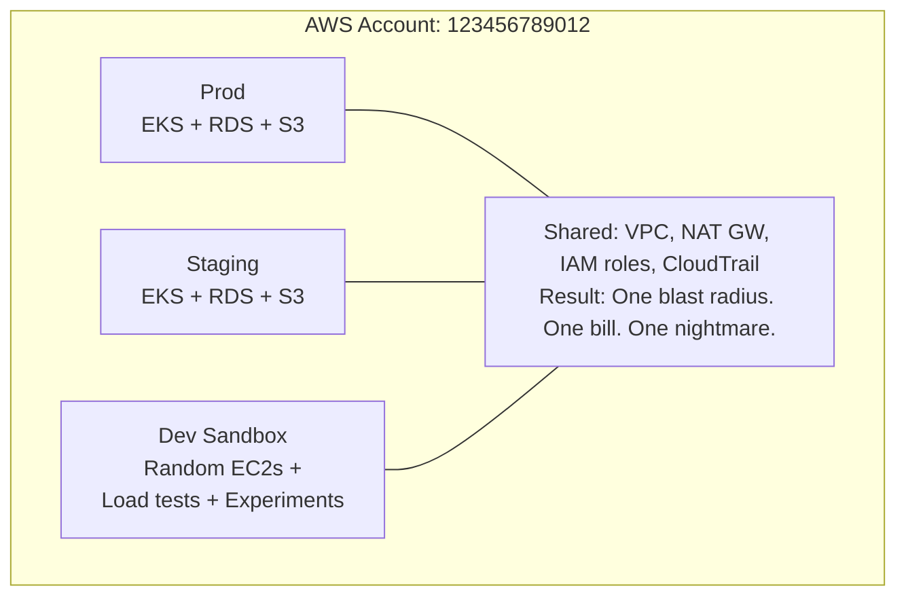
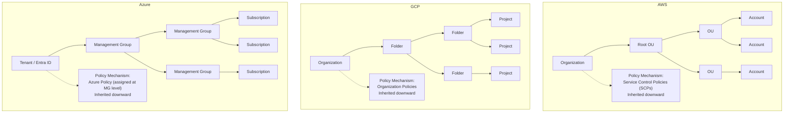
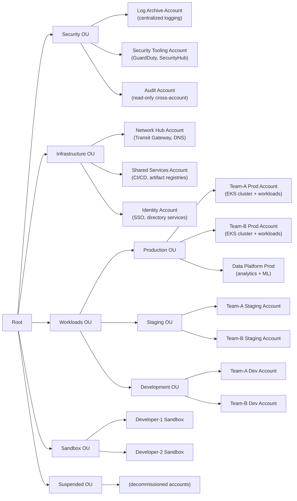
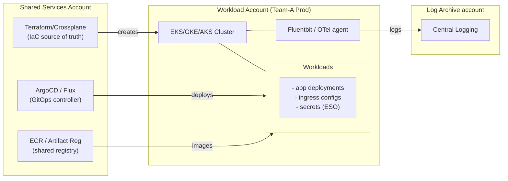
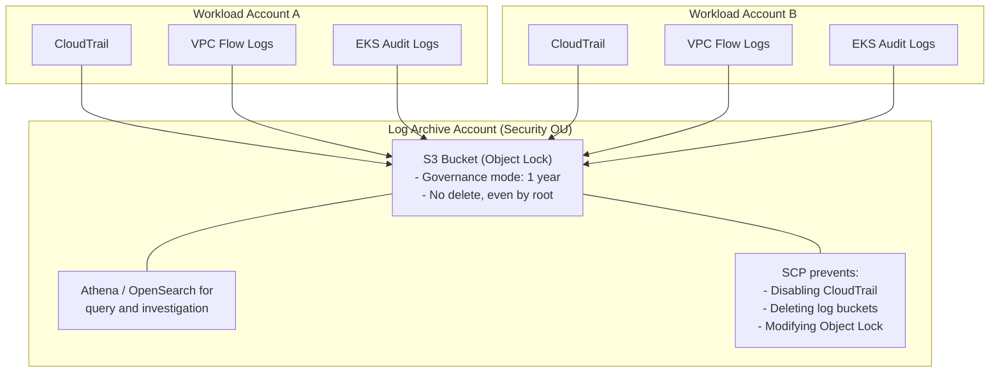
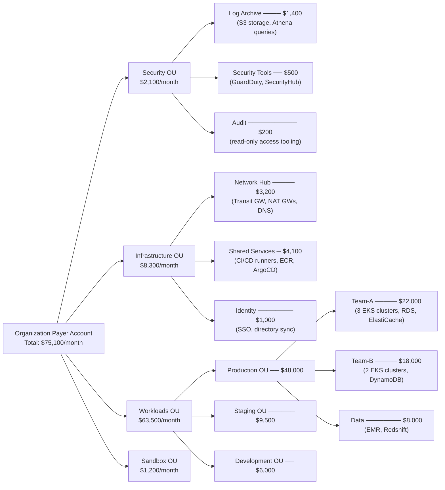
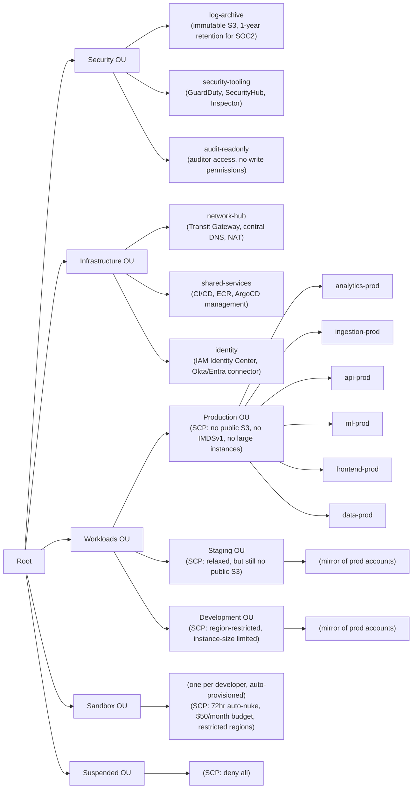

> **Complexity**: `[COMPLEX]`
>
> **Time to Complete**: 2.5 hours
>
> **Prerequisites**: [Cloud Architecture Patterns](/cloud/architecture-patterns/), familiarity with at least one hyperscaler (AWS, GCP, or Azure)
>
> **Track**: Advanced Cloud Operations

## What You'll Be Able to Do

After completing this comprehensive engineering module, you will be able to:

- **Design multi-account organization structures using AWS Organizations, GCP Folders, and Azure Management Groups** to enforce strict administrative and billing boundaries across massive enterprise environments.
- **Implement automated account vending pipelines that provision new cloud accounts with security guardrails built in**, eliminating manual configuration drift and securing environments from the moment of inception.
- **Configure cross-account networking with Transit Gateway, Shared VPC, and VNet peering for hub-spoke topologies**, enabling secure, centralized traffic inspection.
- **Evaluate account-per-team vs account-per-environment strategies for blast radius isolation and compliance**, ensuring that your architectural topology matches your organizational risk appetite.
- **Diagnose cross-account IAM permissions and Service Control Policy conflicts**, allowing you to troubleshoot complex access issues without compromising the principle of least privilege.

---

## Why This Module Matters

**A representative single-account failure pattern.**

When production and non-production workloads share the same cloud account and networking stack, a non-production load test can consume shared infrastructure, disrupt production traffic, and create major operational and compliance fallout.

The root cause of this catastrophic failure was not the load test itself, nor was it the junior developer's actions. The fundamental failure was the architecture—or rather, the complete lack of a defensive architectural strategy. When every resource, identity, and network component lives in a single cloud account, there are zero hard blast radius boundaries. IAM policies often become extremely complex and difficult to audit effectively. Cost attribution degrades into pure guesswork based on inconsistent resource tagging. Audit trails transform into a tangled mess of production operations interspersed with random development activity. Most dangerously, a single misconfiguration or resource exhaustion event in a non-critical environment can effortlessly cascade into a total production outage.

This module teaches you how to systematically dismantle the single-account anti-pattern and design robust, scalable multi-account architectures across AWS, GCP, and Azure. You will learn to build organizational hierarchies that enforce complete isolation by default, centralize only what strictly needs to be shared (such as centralized logging, security scanning, and core networking), and keep everything else behind hard administrative boundaries. More importantly, you will understand how these foundational cloud boundary decisions directly dictate the operational posture of your Kubernetes clusters—determining exactly where they live, how they communicate across network boundaries, and who ultimately controls their lifecycle.

---

## The Landing Zone Concept

Before you create your first additional cloud account, you need a landing zone: a pre-configured, multi-account foundation that provides a secure, compliant starting point for every new workload environment. Think of a landing zone as the factory floor—you do not build a factory around every new product line; you build the factory once, with power, ventilation, safety systems, and assembly lines already in place. Every new product plugs into that infrastructure from day one.

### Why One Account Is Never Enough

The landing zone is not just about scale. It is about **blast-radius isolation**: if a compromised developer credential or a runaway process brings down resources in one account, the boundary of an AWS account, GCP project, or Azure subscription means the damage stops there. Compare that to a single-account model where misbehavior in the staging namespace can exhaust shared API rate limits, fill shared log buckets, or worst of all, reach the production database through an overly broad IAM role.

The landing zone also enforces **billing separation** by design. The moment your organization grows past a handful of engineers, you need to know how much Team Alpha spends versus Team Beta, and how much of that spend is production versus experimentation. Accounts and projects are natural billing containers; resource tags alone cannot provide the same hard guarantee because tagging is opt-in, often inconsistent, and never retroactive.

**Quota isolation** is equally important. Cloud providers enforce service quotas per account or per project. If your development team spins up 50 GPU instances for a model training run and hits the regional quota ceiling in a shared account, the production pipeline blocked behind it has no recourse. Separating environments into distinct accounts gives each team its own quota pool.

**Environment and team separation** closes the loop. A landing zone structured by environment (Production, Staging, Development, Sandbox) with workload accounts underneath allows you to attach a single Service Control Policy (AWS), Organization Policy constraint (GCP), or Azure Policy assignment to the Production Organizational Unit and know with certainty that every production account inherits it. Structure by team first and you will spend years writing per-account exception lists.

### The Landing Zone Map Across Clouds

| Concept | AWS | GCP | Azure |
|---|---|---|---|
| Automates org setup | Control Tower | Terraform landing-zone module / Fabric FAST | Azure Landing Zones (ALZ) |
| Underlying hierarchy | AWS Organizations + OUs → Accounts | Resource Manager: Organization → Folder → Project | Entra ID tenant → Management Groups → Subscriptions |
| Account factory | Account Factory (AFT) or Service Catalog | Project Factory (Terraform module + Cloud Build) | Subscription Vending (ARM/Bicep + EA/MCA) |
| Baseline guardrails at creation | Preventive + detective guardrails applied on account birth | org-level constraints placed on folder, inherited by new projects | Azure Policy assignments at Management Group, inherited by new subscriptions |
| Centralized logging | Org-wide CloudTrail + Config | Aggregated log sinks at org/folder level | Azure Activity Log + diagnostic settings |

AWS Control Tower builds the landing zone on top of AWS Organizations, deploying a management account, a log archive account, and an audit account out of the box, then applies mandatory guardrails (preventive SCPs and detective AWS Config rules) that cannot be disabled by member accounts. GCP's equivalent is typically deployed through the open-source Terraform landing-zone module or the Google Cloud Foundation Toolkit, which creates a folder hierarchy, sets baseline Organization Policy constraints, and provisions a project factory. Azure's Cloud Adoption Framework (CAF) prescribes Azure Landing Zones: a set of Management Groups (like `Corp`, `Online`, `Sandbox`), subscription vending templates, and a policy-driven governance model.

> **Hypothetical scenario**: A healthcare company migrates 200 workloads to the cloud without a landing zone. Each team manually creates accounts, skips CloudTrail configuration in 40% of them, and uses inconsistent naming. Six months later, an auditor requests proof that every account has logging enabled. The platform team spends three weeks writing one-off scripts to crawl accounts they did not know existed. The landing zone would have enforced organization-wide CloudTrail on every account from the moment of creation—audit proof would be a one-line AWS Config query.

### Landing Zone and Kubernetes

The landing zone shapes your Kubernetes posture before you provision a single cluster. With a landing zone in place, the platform team can pre-configure:

- **Networking**: a shared VPC (GCP) or Transit Gateway (AWS) ready for new clusters to attach to (see Module 8.2 for the full transit-hub design).
- **Identity**: an IAM Identity Center (AWS) / Workforce Identity Federation (GCP) / Entra ID (Azure) integration so that cluster RBAC maps to organizational SSO on day one.
- **Logging**: a centralized log sink or organization trail so every new EKS/GKE/AKS cluster ships its audit events to the immutable archive without any per-cluster configuration.

Without a landing zone, each of these integrations becomes a manual bootstrapping step performed by whoever happens to create the cluster—and almost certainly skipped the first time.

---

## The Single-Account Trap

Before we can confidently design sophisticated multi-account architectures, we must first deeply understand why engineering teams consistently fall into the single-account trap. The evolutionary pattern of a growing startup or a new enterprise project is often similar and predictably flawed:

1. **The Genesis**: A team starts a new project. They create a single cloud account because it is often the fastest path to value. They deploy everything into a default VPC.
2. **The Growth Phase**: The team expands. More workloads, databases, and microservices are added. Everything is still deployed into the single account, relying on naming conventions to differentiate resources.
3. **The Isolation Attempt**: The team realizes they need a staging environment. They create a new Kubernetes namespace, a new VPC, or rely entirely on resource tagging. Everything still resides within the exact same administrative billing and identity boundary.
4. **The Breaking Point**: Compliance requirements arrive, or an insider threat simulation is conducted. The team realizes their IAM roles are a spaghetti network of cross-connected permissions. Implementing true least-privilege access can become practically impossible without breaking existing applications. Panic ensues.

The single-account model works perfectly for a solo developer building a low-stakes side project. It often stops working once your organization requires any of the following enterprise pillars: strict environment isolation, granular cost visibility, regulatory compliance boundaries, or true team autonomy without stepping on each other's toes.

**Pause and predict:** Consider an organization that isolates production and staging workloads within a single AWS account using strictly scoped IAM policies and distinct resource prefixes. If an attacker compromises a developer's staging IAM credentials, can they disrupt production availability despite possessing zero IAM permissions to production resources?

<details>
<summary>Check your prediction</summary>

Staging-scoped IAM policies in a **single account** do not create a hard blast-radius boundary. Even when IAM explicitly forbids access to production ARN resources, all workloads share identical account-level control plane limits and underlying networking primitives. An attacker possessing staging credentials can exhaust regional API quotas (such as rate limits on EC2, IAM, or CloudFormation Describe and Mutate calls) or saturate shared infrastructure like a single NAT Gateway or VPC peering links. In a single account, shared NAT gateways, API quotas, and the shared control plane can still starve production workloads and trigger cascading operational outages without requiring any production-level IAM grants.
</details>

Teams often treat account membership as an implementation detail until billing, identity, and network objects all share one envelope. The diagram below makes that envelope visible before we name the stronger provider boundary.



The compounding problems of this architecture are severe and unavoidable:
- A development load test easily saturates the production NAT Gateway, severing outbound internet access for mission-critical pods.
- An IAM role designed strictly for a staging background worker accidentally receives wild-card permissions that grant it destructive access to the production relational database.
- The monthly AWS cost report indicates a spend of "$84,000 this month," but tracing exactly which team or which experimental feature generated that cost can become extremely difficult because tagging enforcement is often manual and error-prone.
- Security and compliance logs (like AWS CloudTrail) mix noisy developer experiments alongside critical production audit events, making real-time threat detection alerting virtually useless due to overwhelming false positives.

The multi-account model systematically solves all of these inherent flaws by creating the strongest isolation boundary the provider offers. An AWS account, a GCP project, or an Azure subscription represents the absolute strongest isolation boundary that any cloud provider offers below the root organization level.

---

## Organizational Hierarchies Across Clouds

Every major hyperscaler recognizes the necessity of multi-account isolation and provides a top-level hierarchy for logically organizing these massive fleets of accounts. While the specific terminology differs wildly between AWS, GCP, and Azure, the underlying architectural concept is broadly the same: you typically nest individual accounts inside hierarchical logical groupings that inherit strict administrative policies downward from the root.

### The Rosetta Stone of Cloud Organization

The diagram below serves as your translation matrix for understanding how organizational hierarchies map across the three dominant public cloud providers.



### Key Differences That Matter

Understanding the subtle mechanical differences in how these providers enforce policy is critical for platform engineers designing cross-cloud strategies.

| Feature | AWS (Organizations) | GCP (Resource Manager) | Azure (Management Groups) |
|---|---|---|---|
| Isolation unit | Account | Project | Subscription |
| Max nesting depth | [5 levels of OUs](https://docs.aws.amazon.com/organizations/latest/userguide/orgs_reference_limits.html) | [10 levels of folders](https://cloud.google.com/resource-manager/docs/limits) | [6 levels of MGs](https://learn.microsoft.com/en-us/azure/governance/management-groups/overview) |
| Policy mechanism | SCPs (deny-only) | Org Policies (boolean/list) | Azure Policy (deny + audit) |
| Billing boundary | Account-level | Project-level or Billing Account | Subscription-level |
| Hard resource limits | Per-account quotas | Per-project quotas | Per-subscription quotas |
| Cross-boundary networking | VPC Peering, Transit GW | Shared VPC, VPC Peering | VNet Peering, Virtual WAN |

There is one exceptionally critical nuance you must internalize: **[AWS Service Control Policies (SCPs) can only deny actions; they cannot explicitly grant permissions.](https://docs.aws.amazon.com/organizations/latest/userguide/orgs_manage_policies_scps.html)** This means your entire SCP strategy must be based on establishing preventative guardrails rather than attempting to perform access grants. If an SCP allows an action, the IAM principal still requires an explicit `Allow` in their identity-based or resource-based policy to actually perform the action. 

Conversely, GCP Organization Policies operate on a vastly different paradigm. They do not evaluate low-level IAM API actions; instead, they aggressively [constrain the actual configuration state of resources](https://cloud.google.com/resource-manager/docs/organization-policy/overview) (for instance, mandating that "Virtual Machines can only be created in specific geographic regions" or "Public IP addresses are strictly forbidden"). Azure Policy represents the most flexible hybrid of both worlds, possessing the capability to [explicitly deny deployments, seamlessly audit existing non-compliant resources, and even automatically remediate configurations on the fly](https://learn.microsoft.com/en-us/azure/governance/policy/concepts/effect-basics), which makes it incredibly powerful but correspondingly complex to reason about and debug.

### Guardrails in Practice: Three Worked Examples

**AWS SCP — Deny Public S3 Buckets Org-Wide.** An SCP is a deny-only permission boundary that applies to every IAM principal in the accounts under its scope. Suppose you want to prevent public-read ACLs on any S3 bucket across all production accounts:

```json
{
  "Version": "2012-10-17",
  "Statement": [
    {
      "Sid": "DenyPublicS3ACL",
      "Effect": "Deny",
      "Action": ["s3:PutBucketAcl"],
      "Resource": "*",
      "Condition": {
        "StringEquals": {
          "s3:x-amz-acl": ["public-read", "public-read-write", "authenticated-read"]
        }
      }
    }
  ]
}
```

This SCP, attached to the Production OU, blocks any `PutBucketAcl` call that attempts to set a public ACL. No per-account configuration needed—every current and future account in that OU inherits the restriction. Remember the golden rule: an SCP never grants permissions; it only narrows the maximum permissions a principal can exercise. The IAM principal still needs an explicit `Allow` for `s3:PutBucketAcl`.

**GCP Organization Policy — Restrict VM External IPs.** GCP Organization Policies do not operate on IAM API actions. Instead, they enforce constraints on resource configurations. The `constraints/compute.vmExternalIpAccess` list constraint controls whether VMs can receive an external IP address:

```bash
# Apply the v2 org policy (target folder is encoded in the YAML name: field)
gcloud org-policies set-policy policies/vm-external-ip-deny.yaml
```

The constraint definition (in YAML) specifies what is allowed. Because it is a deny-by-default list constraint, only the values you list explicitly in `allowedValues` are permitted:

```yaml
name: folders/123456789012/policies/compute.vmExternalIpAccess
spec:
  rules:
  - values:
      allowedValues:
      - "projects/allowed-external-ips-project/zones/us-central1-a/instances/nat-gateway"
```

This means every VM across any project under that folder is blocked from obtaining an external IP—except the single NAT gateway instance that the networking team explicitly allows. The policy inherits downward to child folders and projects automatically.

**Azure Policy — Deny Public IP on NICs.** Azure Policy assignments at a Management Group span all child management groups and subscriptions. The policy engine evaluates every create or update request against its rules:

```json
{
  "if": {
    "field": "type",
    "equals": "Microsoft.Network/networkInterfaces"
  },
  "then": {
    "effect": "deny"
  }
}
```

When this policy is assigned at the root management group with a more targeted condition (e.g., `field: "Microsoft.Network/publicIPAddresses"` not present in `properties.ipConfigurations[*].properties.publicIPAddress`), it blocks network interfaces from being created with a public IP. Alternatively, an `audit` effect would flag existing violations without blocking deployments—handy for brownfield environments where you need to understand the blast radius before enforcing.

The key operational difference across the three clouds: AWS SCPs work exclusively through IAM action filtering (you can only deny what an IAM policy elsewhere allows). GCP constraints work through resource configuration gating at the API layer—the constraint checker inspects the resource definition in the API call itself. Azure Policy sits between the two, offering `deny`, `audit`, and `deployIfNotExists` (auto-remediation) effects that span both IAM and resource configuration.

---

## Designing Your OU Structure

The Organizational Unit (OU) structure is the foundational administrative skeleton of your entire cloud architecture. If you get it wrong in the beginning, you will be locked in a perpetual struggle against it for years to come. If you get it right, the structure becomes entirely invisible—quietly and efficiently enforcing isolation, regulatory compliance, and cost boundaries without adding any daily friction to the engineering teams.

### The Reference Architecture

The architecture depicted below is a battle-tested, enterprise-grade OU structure actively utilized by highly regulated organizations running fleets of 20 to 200 AWS accounts. The exact same logical pattern seamlessly maps to GCP folders and Azure management groups.



### Why This Structure Works

**The Security OU resides at the absolute top tier**: Security accounts logically demand the most draconian and restrictive SCPs in the organization. For example, the Log Archive account is configured as strictly write-only for all other member accounts, and exclusively read-only for the security investigation teams. The log archive account should be designed so workload accounts and ordinary administrators cannot delete audit logs; if you need retention that even root cannot bypass, use controls such as S3 Object Lock compliance mode with tightly scoped administration. No principal is allowed to disable Amazon GuardDuty findings or tamper with the S3 bucket object locks.

**Infrastructure OU is entirely isolated from Application Workloads**: The core networking team manages immense, org-wide routing topologies via Transit Gateways and centralized Route 53 DNS configurations without ever requiring or desiring access to the actual application workloads. The CI/CD pipeline infrastructure runs completely isolated in a dedicated shared services account, securely pushing compiled container artifacts to registries that the disparate workload accounts can securely pull from via highly scoped resource policies.

**Pause and predict:** Consider an enterprise that structures its top-level Organizational Units (OUs) by business unit rather than by environment tier. How does this organizational design affect Service Control Policy (SCP) inheritance, operational overhead, and compliance enforcement across the account fleet?

<details>
<summary>Check your prediction</summary>

Structuring top-level OUs by business unit forces the cloud platform team into an operational dilemma: they must either duplicate identical production SCP guardrails across dozens of nested OU subtrees or attach a broad preventative SCP at the organizational **root**, which then inadvertently breaks lower environments like developer sandboxes. Furthermore, architects must remember two fundamental SCP constraints: SCPs do **not grant** permissions (they only establish the maximum allowable permission boundary for attached accounts), and SCPs do **not apply** to the **management account** (or service-linked roles). Managing policies across business unit hierarchies creates extensive policy drift, multiplies administrative maintenance, and complicates audit validation.
</details>

Landing-zone OU trees have to survive org-chart churn. Disposable developer accounts then need a different control story than the accounts that hold customer data.

**Workloads OU splits rigorously by environment, not by team**: This is arguably the most critical design decision you will make. If you choose to split your hierarchy by team first (resulting in a structure like Team-A-Prod, Team-A-Staging, Team-A-Dev all residing within the same parent Team-A OU), it becomes much harder to apply environment-wide policies without resorting to complex, error-prone per-account exception lists. By structuring by environment first, you can easily apply a single SCP to the entire Production OU stating "No public S3 buckets allowed anywhere," guaranteeing comprehensive compliance.

**Sandbox OU demands aggressive, automated cost controls**: Sandbox environments are explicitly designed for safe experimentation. These accounts are provisioned with auto-nuke lifecycle policies (utilizing open-source tools like `aws-nuke` or customized lambda functions) that automatically and mercilessly destroy any infrastructure resources older than 72 hours. Hard budget alarms are configured to fire if spend exceeds $50 per month. This architecture empowers developers with total freedom to experiment using native cloud primitives without risking runaway bills.

### Setting Up AWS Organizations

Executing this structure via the CLI demonstrates the fundamental building blocks, though in production environments, this should usually be driven by an Account Vending Pipeline.

```bash
# Create the organization (from management account)
aws organizations create-organization --feature-set ALL

# Create the OU structure
ROOT_ID=$(aws organizations list-roots --query 'Roots[0].Id' --output text)

# Create top-level OUs
SECURITY_OU=$(aws organizations create-organizational-unit \
  --parent-id $ROOT_ID \
  --name "Security" \
  --query 'OrganizationalUnit.Id' --output text)

INFRA_OU=$(aws organizations create-organizational-unit \
  --parent-id $ROOT_ID \
  --name "Infrastructure" \
  --query 'OrganizationalUnit.Id' --output text)

WORKLOADS_OU=$(aws organizations create-organizational-unit \
  --parent-id $ROOT_ID \
  --name "Workloads" \
  --query 'OrganizationalUnit.Id' --output text)

# Create environment sub-OUs under Workloads
PROD_OU=$(aws organizations create-organizational-unit \
  --parent-id $WORKLOADS_OU \
  --name "Production" \
  --query 'OrganizationalUnit.Id' --output text)

STAGING_OU=$(aws organizations create-organizational-unit \
  --parent-id $WORKLOADS_OU \
  --name "Staging" \
  --query 'OrganizationalUnit.Id' --output text)

DEV_OU=$(aws organizations create-organizational-unit \
  --parent-id $WORKLOADS_OU \
  --name "Development" \
  --query 'OrganizationalUnit.Id' --output text)

# Create a new account and move it to the Production OU
aws organizations create-account \
  --email "team-a-prod@company.com" \
  --account-name "Team-A-Production"

# Move account to Production OU (once created)
aws organizations move-account \
  --account-id 111122223333 \
  --source-parent-id $ROOT_ID \
  --destination-parent-id $PROD_OU
```

### GCP Equivalent with Folders

Google Cloud utilizes an incredibly robust hierarchical structure heavily centered around Folders and Projects. The methodology is remarkably similar to AWS Organizations.

```bash
# Create folder structure
ORG_ID=$(gcloud organizations list --format="value(ID)")

# Create top-level folders
gcloud resource-manager folders create \
  --display-name="Security" \
  --organization=$ORG_ID

gcloud resource-manager folders create \
  --display-name="Infrastructure" \
  --organization=$ORG_ID

WORKLOADS_FOLDER=$(gcloud resource-manager folders create \
  --display-name="Workloads" \
  --organization=$ORG_ID \
  --format="value(name)")

# Create environment sub-folders
PROD_FOLDER_ID=$(gcloud resource-manager folders create \
  --display-name="Production" \
  --folder=$WORKLOADS_FOLDER \
  --format="value(name)")

gcloud resource-manager folders create \
  --display-name="Staging" \
  --folder=$WORKLOADS_FOLDER

# Create a project in the Production folder
gcloud projects create team-a-prod-2026 \
  --folder=$PROD_FOLDER_ID \
  --name="Team A Production"
```

---

## Automated Account Vending Pipelines

Creating accounts manually via the cloud provider's web console or iterative bash scripts is an architectural anti-pattern. Manual creation inevitably leads to severe configuration drift, accidentally bypassed security guardrails, and entirely forgotten baseline integrations. To maintain uncompromising consistency and security at enterprise scale, you must urgently implement an automated account vending pipeline. This pipeline acts as an immutable factory, ensuring every newly minted environment adheres strictly to organizational standards from the precise moment of inception.

An automated account vending pipeline deeply relies on Infrastructure as Code (IaC) tools—such as Terraform, Pulumi, or AWS CloudFormation—which are rigorously orchestrated by a centralized CI/CD system. In a modern GitOps workflow, when a development team requires a brand-new cloud environment, they do not submit an IT service desk ticket that lingers for weeks; instead, they simply open a Pull Request against a central governance configuration repository. This repository contains the structured metadata defining the requested account, specifying critical details such as the owner's email address, the target Organizational Unit, the assigned financial cost center, and the specific required network topology tier.

Once the platform engineering team approves and merges the Pull Request, the pipeline executes a deterministic sequence of strictly defined automated steps:
1. It executes an initial API call to the cloud provider to provision the raw, empty account structure.
2. It pauses execution, utilizing a polling mechanism to wait for the asynchronous account creation to fully finalize across the provider's global control plane.
3. It assumes a highly privileged initial cross-account deployment role inside the newly formed account and begins an automated bootstrap sequence.
4. The bootstrap sequence systematically deletes default VPCs (which are widely treated as non-compliant in stricter environments due to implicit internet accessibility), establishes custom network subnets attached to the central Transit Gateway, configures robust centralized logging agents, and establishes the local IAM roles mapped directly to the organization's central Identity Provider.

### The Role of AWS Control Tower and Account Factory

In the massive AWS ecosystem, this complex orchestration is frequently handled by AWS Control Tower and its native Account Factory feature. Control Tower abstracts away the immense complexities of coordinating AWS Organizations, AWS IAM Identity Center, and AWS Service Catalog into a unified managed service. It provides a structured Landing Zone that automatically applies preventative and detective guardrails upon account birth. When paired directly with Account Factory for Terraform (AFT), platform teams achieve a [fully automated, GitOps-driven workflow](https://docs.aws.amazon.com/controltower/latest/userguide/aft-overview.html).

With AFT, engineers define an account request inside a centralized Terraform module map. Pushing this declarative code triggers an underlying AWS CodePipeline workflow that not only safely creates the account but also seamlessly applies localized custom baseline modules. For example, if a team explicitly requests a "production" environment, the pipeline intelligently attaches a stricter set of customized Service Control Policies, configures a higher-tier enterprise support plan, and locks down cross-region resource creation.

### Extending Vending to Kubernetes

The account vending philosophy extends seamlessly into the modern Kubernetes lifecycle. Once the foundational cloud account is permanently established and secured, the exact same automated pipeline can transparently invoke secondary modules to deploy an EKS, GKE, or AKS cluster. By physically embedding the Kubernetes cluster provisioning inside the larger account vending logic, you mathematically guarantee that the cluster is automatically registered with your central ArgoCD or Flux instance, its audit logs are hard-wired to the immutable log archive account, and its inbound ingress controllers are correctly peered with the central network hub. This holistic pipeline can reduce environment setup from a multi-week manual effort to a far more repeatable and auditable automated process.

### GCP Project Factory

GCP's equivalent is the Project Factory—typically implemented through the open-source [Terraform project-factory module](https://github.com/terraform-google-modules/terraform-google-project-factory). The pattern is identical in spirit to AFT: a developer submits a structured request (a Terraform module call or a YAML manifest in a governance repository), and a CI/CD pipeline picks it up.

```hcl
# project-requests/team-a-prod.tf
module "team-a-prod" {
  source  = "terraform-google-modules/project-factory/google"
  version = "~> 14.5"

  name              = "team-a-prod"
  org_id            = var.org_id
  folder_id         = google_folder.production.id
  billing_account   = var.billing_account
  activate_apis     = [
    "compute.googleapis.com",
    "container.googleapis.com",
    "logging.googleapis.com",
    "monitoring.googleapis.com"
  ]
  disable_services_on_destroy = false

  # Automatically apply baseline organization policies
  enable_org_policy_data_access_logs = true
  enable_org_policy_vm_external_ip   = false
}
```

When this module is applied, the pipeline creates a project under the Production folder, enables the core APIs, and places it under the correct billing account—all before any cluster provisioning begins. Google's landing-zone blueprint (Fabric FAST) extends this further, pre-creating network host projects, log sink destinations, and shared VPC service projects in a deterministic order.

### Azure Subscription Vending

Azure subscription vending follows the same declarative model, typically powered by ARM templates or Bicep modules deployed through Azure DevOps or GitHub Actions. The Cloud Adoption Framework's [Azure Landing Zones](https://learn.microsoft.com/en-us/azure/cloud-adoption-framework/ready/landing-zone/) accelerator provisions subscriptions under management groups with Azure Policy assignments pre-attached.

A subscription vending request starts as a simple parameter file fed to a Bicep module that handles the orchestration:

```bicep
// subscription-vending.bicep — invoked per team/environment request
param subscriptionName string = 'Team-A-Prod'
param managementGroupId string = 'Production'
param billingScope string = '/providers/Microsoft.Billing/billingAccounts/1234567/enrollmentAccounts/8901234'

module subscription 'subscription.bicep' = {
  name: '${subscriptionName}-create'
  params: {
    subscriptionName: subscriptionName
    managementGroupId: managementGroupId
    billingScope: billingScope
  }
}

// Post-provisioning: apply baseline policies, configure networking, onboard to Log Analytics
module baseline 'baseline.bicep' = {
  name: '${subscriptionName}-baseline'
  params: {
    subscriptionId: subscription.outputs.subscriptionId
    policyAssignments: [
      'Deny-Public-IP',
      'Audit-Diagnostic-Settings',
      'Deploy-Log-Analytics-Agent'
    ]
    vnetHubResourceId: '/subscriptions/${networkHubSubscription}/resourceGroups/network-hub-rg/providers/Microsoft.Network/virtualNetworks/hub-vnet'
  }
  dependsOn: [subscription]
}
```

The automation layer handles subscription creation, management group placement, and baseline onboarding in a single atomic pipeline stage. If the baseline step fails, the subscription is quarantined (moved to a `Pending` management group) until remediation.

> **Key operational insight**: None of the three vending patterns (AFT, Project Factory, Subscription Vending) should require custom code. Each is a battle-tested open-source module maintained by the cloud provider or a major community. Your job is not to build the factory but to configure its parameters and wire it into your GitOps pipeline. If you find yourself writing a bespoke account-creation script, you have missed the entire point of the landing zone.

---

## Workload Isolation Patterns

Not every single development team needs its own dedicated cloud account. And similarly, not every distinct workload demands its own isolated Kubernetes cluster. The true art of platform engineering lies in precisely matching the isolation level to the actual technical and regulatory requirements of the workloads in question.

### Isolation Decision Matrix

The following matrix provides a clear framework for deciding when to share infrastructure and when to enforce hard boundaries.

| Requirement | Same Account, Same Cluster | Same Account, Separate Clusters | Separate Accounts |
|---|---|---|---|
| Team autonomy | Low (shared RBAC) | Medium (cluster admin) | High (account admin) |
| Blast radius | Pod/Namespace level | Cluster level | Account level |
| Compliance boundary | Cannot achieve PCI/HIPAA | Possible with effort | Clean boundary |
| Cost visibility | Tags only | Tags + cluster | Account-level billing |
| Network isolation | NetworkPolicy | VPC/subnet separation | VPC per account |
| Resource contention | High risk | Medium risk | Zero risk |
| Operational overhead | Low | Medium | High |

### Hypothetical Scenario: When Namespace Isolation Isn't Enough

**Pause and predict:** A multi-tenant Kubernetes cluster co-locates PCI cardholder workloads and non-PCI applications, enforcing separation using strict Calico NetworkPolicies that drop all inter-namespace pod traffic. If an attacker compromises a pod in the non-PCI namespace, can NetworkPolicies prevent them from mapping the PCI topology and discovering sensitive cluster assets?

<details>
<summary>Check your prediction</summary>

A Kubernetes NetworkPolicy controls strictly data-plane packet flows between pods and CIDR blocks; a NetworkPolicy does not filter or intercept traffic directed to the Kubernetes API server (`kube-apiserver`). If the compromised pod's mounted service account token possesses cluster-scoped read permissions—or if cluster-wide RBAC bindings permit `get` or `list` operations on `namespaces`, `pods`, `nodes`, or `services`—the attacker can query the control plane directly over HTTPS. By executing cluster-scoped `get` or `list` calls, the attacker can systematically map out PCI namespaces, discover pod IP addresses, enumerate sensitive service endpoints, and identify node architectures despite flawless pod-to-pod NetworkPolicy enforcement.
</details>

The next section looks at who owns cluster create, upgrade, and teardown once the estate is no longer a single Kubernetes control plane.

Hypothetical scenario: A fintech company runs PCI- and non-PCI-grade workloads in the same Kubernetes cluster, separated only by namespaces and NetworkPolicies. During a compliance audit, the auditor asks a simple question: "Can a pod in the non-PCI namespace discover the existence of the PCI namespace and the pods inside it?"

The truthful answer is yes if your RBAC is not tightly scoped. cluster-scoped read access (on `namespaces`, `pods`, and `services` resources) can reveal the structure of the PCI environment. The auditor flagged this as a data leakage risk—not because actual cardholder data was exposed through the API, but because the existence and topology of the PCI infrastructure was discoverable by unauthorized internal tenants, violating the "need to know" principle.

If teams build deeply around a shared-cluster model, moving later to hard isolation can become a long and disruptive migration.

The harsh lesson learned: You should decisively establish your hard isolation boundaries before onboarding tenants whenever possible, not after.

### Kubernetes Lifecycle in a Multi-Account World

Every individual account that hosts Kubernetes clusters requires an incredibly clear and rigorously enforced lifecycle model. In modern Kubernetes (v1.35+), the tooling to enforce this has matured significantly, but the architectural pattern remains the foundational key to stability.



The absolute golden rule of this architecture is that clusters are ephemeral cattle, never beloved pets. The Infrastructure as Code repository centralized in the Shared Services account possesses the capability to completely recreate any workload cluster from scratch in minutes. The critical strategic decision for platform teams is whether each individual development team physically manages their own cluster infrastructure configurations, or whether a centralized platform engineering team provisions the base clusters globally. As organizations grow, many teams adopt a model where a central platform group provisions base clusters and application teams own workload delivery through GitOps.

### Workload Identity Across Account Boundaries

Kubernetes pods live inside an account. But the cloud resources they need—databases, queues, object storage, secrets in a central vault—often live in different accounts. Hard-coding long-lived credentials into pods is a security anti-pattern with a body count. Instead, each cloud provider offers a mechanism for pods to assume a cloud identity without any stored credential, even when the target resource is in another account.

**AWS: IRSA (IAM Roles for Service Accounts).** The pattern relies on an OIDC provider associated with the EKS cluster. A Kubernetes ServiceAccount annotated with an IAM role ARN allows pods using that ServiceAccount to obtain temporary AWS credentials through the STS `AssumeRoleWithWebIdentity` call. Crucially, the IAM role lives in whichever account the target resource is in. If Team A's EKS cluster is in account `111111111111` and their application needs to read from an S3 bucket in the shared-services account `222222222222`, the IAM role is created in `222222222222` with a trust policy that permits the EKS cluster's OIDC provider to assume it:

```yaml
# In the shared-services account (222222222222)
# IAM role trust policy — allows any pod in Team-A's cluster with the right SA
{
  "Version": "2012-10-17",
  "Statement": [{
    "Effect": "Allow",
    "Principal": {
      "Federated": "arn:aws:iam::222222222222:oidc-provider/oidc.eks.us-east-1.amazonaws.com/id/EXAMPLED539D4633E53DE1B71EXAMPLE"
    },
    "Action": "sts:AssumeRoleWithWebIdentity",
    "Condition": {
      "StringEquals": {
        "oidc.eks.us-east-1.amazonaws.com/id/EXAMPLED539D4633E53DE1B71EXAMPLE:sub": "system:serviceaccount:team-a-app:inventory-reader"
      }
    }
  }]
}
```

The source cluster's OIDC provider must first be registered as an IAM identity provider in the shared-services account `222222222222` (per AWS [Authenticate to another account with IRSA](https://docs.aws.amazon.com/eks/latest/userguide/cross-account-access.html)); only then can a role in that account trust the federated principal ARN above.

The pod's ServiceAccount is annotated with `eks.amazonaws.com/role-arn: arn:aws:iam::222222222222:role/inventory-reader`. No AWS credentials exist in the cluster. The EKS pod identity webhook injects the `AWS_WEB_IDENTITY_TOKEN_FILE` and `AWS_ROLE_ARN` environment variables, and the AWS SDK handles the rest.

IRSA (above) is OIDC web-identity via `AssumeRoleWithWebIdentity`; EKS Pod Identity (`pods.eks.amazonaws.com`, Task 4) is a separate trust model—do not conflate them on the same workload.

**GCP: Workload Identity Federation.** GKE clusters in one project can authenticate to resources in another project using workload identity federation. The cluster's workload identity pool is tied to a GCP service account in the target project:

```bash
# In the target project where the resource lives
gcloud iam service-accounts add-iam-policy-binding \
  sa-name@target-project.iam.gserviceaccount.com \
  --member="principal://iam.googleapis.com/projects/CLUSTER_PROJECT_NUMBER/locations/global/workloadIdentityPools/CLUSTER_PROJECT_ID.svc.id.goog/subject/ns/team-a-app/sa/inventory-reader" \
  --role="roles/iam.workloadIdentityUser"
```

The GKE Metadata Server running on each node intercepts credential requests from annotated pods and returns a federated token for the target service account. No key material touches the pod's filesystem.

**Azure: Workload Identity.** AKS clusters using the workload identity mutating admission webhook (enabled with `az aks update --enable-oidc-issuer --enable-workload-identity`) project a federated credential into the pod's filesystem. A Microsoft Entra ID application registration with federated credentials allows the pod to authenticate as that identity:

```yaml
apiVersion: v1
kind: ServiceAccount
metadata:
  name: inventory-reader
  namespace: team-a-app
  annotations:
    azure.workload.identity/client-id: "00000000-0000-0000-0000-000000000000"
    azure.workload.identity/tenant-id: "00000000-0000-0000-0000-000000000000"
```

The mutating webhook projects a signed token into `/var/run/secrets/azure/tokens/azure-identity-token`. The Azure SDK client libraries detect this file and exchange it for a Microsoft Entra ID access token scoped to the target resource—no client secrets, no connection strings, no ceremony.

In all three models, the architecture is the same: the pod presents a signed identity token (from the cluster's trusted issuer) to the cloud IAM system, which validates it and returns short-lived credentials scoped to the cross-account role or service account. The blast radius stays small: even if a pod is compromised, the attacker gets only the permissions of that single cross-account role, not the cluster's node role or any human's access key.

---

## Centralized Logging & Audit

In an expansive multi-account architecture, security logging becomes simultaneously vastly more important and significantly more complex to execute securely. You absolutely require a unified single pane of glass for security event correlation, but you must also guarantee mathematically that no individual compromised account can tamper with or destroy its own historical audit logs to cover an attacker's tracks.

### The Immutable Log Archive Pattern

To achieve this level of forensic guarantee, organizations employ the Immutable Log Archive Pattern, heavily utilizing write-once-read-many (WORM) storage mechanics.



### AWS: Organization-Wide CloudTrail

To ensure no account falls out of compliance, CloudTrail is configured at the organization root level. This enforces logging [across every existing and future account automatically](https://docs.aws.amazon.com/organizations/latest/userguide/services-that-can-integrate-cloudtrail.html).

```bash
# Create organization trail (from management account)
aws cloudtrail create-trail \
  --name org-trail \
  --s3-bucket-name company-org-cloudtrail-logs \
  --is-organization-trail \
  --is-multi-region-trail \
  --enable-log-file-validation \
  --kms-key-id arn:aws:kms:us-east-1:999888777666:key/mrk-abc123

aws cloudtrail start-logging --name org-trail

# SCP to prevent member accounts from disabling CloudTrail
cat <<'EOF' > deny-cloudtrail-changes.json
{
  "Version": "2012-10-17",
  "Statement": [
    {
      "Sid": "ProtectCloudTrail",
      "Effect": "Deny",
      "Action": [
        "cloudtrail:StopLogging",
        "cloudtrail:DeleteTrail",
        "cloudtrail:UpdateTrail"
      ],
      "Resource": "arn:aws:cloudtrail:*:*:trail/org-trail"
    }
  ]
}
EOF

aws organizations create-policy \
  --name "ProtectCloudTrail" \
  --description "Prevent member accounts from disabling org CloudTrail" \
  --type SERVICE_CONTROL_POLICY \
  --content file://deny-cloudtrail-changes.json

# Attach SCP to the root (applies to all *member* accounts)
aws organizations attach-policy \
  --policy-id p-1234567890 \
  --target-id $ROOT_ID
```

**Pause and predict:** An attacker gains full administrator privileges inside a member workload account and discovers that an organizational Service Control Policy (SCP) strictly denies `cloudtrail:StopLogging` and `cloudtrail:DeleteTrail`. Given that the attacker cannot alter the organization trail, how can they obscure malicious activity or evade detection while controlling local compute resources?

<details>
<summary>Check your prediction</summary>

While member accounts **cannot modify/delete** an **organization trail**, controlling local compute resources provides several vectors to evade centralized detection without touching CloudTrail configurations. Because organization trails capture management events by default but frequently omit high-volume S3 or Lambda data events to control costs, the attacker can execute exfiltration through untracked data planes. Locally, the attacker can terminate or blind in-guest logging agents (such as Fluent Bit, Falco, or CloudWatch agents), generate massive volumes of benign API calls to drown alerts in noise, or route commands through temporary compute instances that never write telemetry to disk before termination. Administrative SCPs protect trail configuration immutability, but local compute compromise still demands defense-in-depth telemetry collection.
</details>

AWS is not the only organization-wide audit plane. The same design question appears when the estate includes Google Cloud folders and Azure management groups, each with a native hierarchical export path.

### GCP: Organization-Level Log Sinks

Google Cloud handles centralized auditing gracefully through [hierarchical log sinks that cascade down and capture all activity](https://cloud.google.com/logging/docs/export/aggregated_sinks_overview) seamlessly.

```bash
# Create organization-level log sink
gcloud logging sinks create org-audit-sink \
  storage.googleapis.com/company-org-audit-logs \
  --organization=$ORG_ID \
  --include-children \
  --log-filter='logName:"cloudaudit.googleapis.com"'

# Grant the sink's service account write access to the bucket
# (The sink creates a unique service account automatically)
SINK_SA=$(gcloud logging sinks describe org-audit-sink \
  --organization=$ORG_ID \
  --format="value(writerIdentity)")

gsutil iam ch $SINK_SA:objectCreator gs://company-org-audit-logs
```

### EKS Audit Logs to Central Logging

Cloud provider audit logs (like CloudTrail) track infrastructure changes, but Kubernetes audit logs are entirely separate and must be explicitly handled. They track critical API calls executed inside the cluster. You absolutely must capture both streams.

```yaml
# Fluentbit ConfigMap to ship EKS audit logs to central account
apiVersion: v1
kind: ConfigMap
metadata:
  name: fluent-bit-config
  namespace: logging
data:
  fluent-bit.conf: |
    [SERVICE]
        Flush         5
        Log_Level     info
        Parsers_File  parsers.conf

    [INPUT]
        Name              tail
        Tag               kube.audit.*
        Path              /var/log/kubernetes/audit/*.log
        Parser            json
        Refresh_Interval  10
        Mem_Buf_Limit     50MB

    [OUTPUT]
        Name              s3
        Match             kube.audit.*
        bucket            central-audit-logs-cross-account
        region            us-east-1
        role_arn          arn:aws:iam::999888777666:role/audit-log-writer
        total_file_size   50M
        upload_timeout    60s
        s3_key_format     /eks-audit/$TAG/%Y/%m/%d/%H/$UUID.gz
        compression       gzip
```

---

## Shared Services: What to Centralize

While extreme isolation is necessary for workloads, not every operational resource should be heavily isolated. Certain infrastructure components act as natural shared services that benefit tremendously from centralization, reducing operational overhead and establishing single sources of truth. The architectural challenge lies in properly identifying which resources to consolidate and building the appropriate cross-account access patterns.

### Centralize vs. Distribute Decision Framework

Use this framework when debating whether an architectural component should be consolidated into the Shared Services account or distributed into individual Workload accounts.

| Resource | Centralize | Distribute | Reasoning |
|---|---|---|---|
| Container registry | Yes | | One source of truth for images, scan once |
| CI/CD pipelines | Yes | | Consistent build process, shared runners |
| DNS management | Yes | | Single delegation, avoid split-brain |
| Secrets management | Hybrid | Hybrid | Central vault, local caching (ESO pattern) |
| Service mesh control | Depends | Depends | Centralize if cross-cluster, distribute if single |
| Monitoring stack | Yes | | Unified dashboards, correlation across clusters |
| Cluster provisioning (IaC) | Yes | | Consistent configs, version control |
| Application deployment | | Yes | Teams own their deploy cadence |

> **Stop and think**: Centralizing CI/CD pipelines in a shared services account establishes a single source of truth, but it also means the deployment runners require highly privileged cross-account access to modify production resources. How must you design the IAM trust boundaries so that a compromised runner cannot arbitrarily pivot and destroy resources across the entire organization?

### Centralized Identity

In a multi-account architecture without centralized identity, every account has its own set of local IAM users, groups, and roles. The result is a credential-management disaster: 50 accounts × N engineers = a combinatorial explosion of access keys, forgotten root credentials, and offboarding gaps where terminated employees retain access in forgotten corners of the organization.

The fix is a single identity plane that all accounts trust:

- **AWS IAM Identity Center** (formerly AWS SSO) integrates with an external identity provider (Okta, Entra ID, PingFederate, or IAM Identity Center's own directory) and maps organizational users and groups to permission sets in member accounts. An engineer logs in once through the AWS access portal and selects which account and role they need. The member accounts never contain any long-lived IAM users.

- **GCP Cloud Identity / Workforce Identity Federation** provides the equivalent: a Google Workspace or Cloud Identity domain is the source of truth for users and groups. Workforce identity pools (for non-Google identity providers) allow SAML/OIDC federation, mapping external identities to GCP principals. Permissions are granted through IAM policy bindings at the folder or project level—never through per-project local user accounts.

- **Azure Entra ID** (the identity plane for Azure) is already the tenant root. Every subscription is a child of the Entra ID tenant, so user and group objects are naturally shared. An engineer authenticates once to Entra ID and receives role-based access (e.g., `Contributor`, `Reader`) scoped to specific subscriptions or management groups. There is no concept of a "local IAM user" in Azure; all identities flow through Entra ID.

The shared identity plane must be treated as a tier-0 asset. If the identity provider is compromised, every account in the organization is reachable. Protect it with phishing-resistant MFA (FIDO2 security keys or hardware tokens), emergency-access ("break-glass") accounts with full administrative access to the identity system itself, and conditional-access policies that block logins from untrusted locations. The identity plane is the one thing you cannot isolate per-account—by definition it spans the entire organization. Treat it accordingly.

### The Shared VPC Pattern (GCP)

GCP's Shared VPC architecture is widely regarded as one of the cleanest, most efficient implementations of centralized networking available in modern cloud environments. In this robust model, [a dedicated host project physically owns the VPC network infrastructure, and individual workload service projects merely attach their resources to it](https://cloud.google.com/vpc/docs/shared-vpc).

```bash
# Enable Shared VPC in the host project (network hub)
gcloud compute shared-vpc enable network-hub-project

# Associate a service project (workload account)
gcloud compute shared-vpc associated-projects add team-a-prod \
  --host-project=network-hub-project

# Grant the service project's GKE service account access to the shared subnet
gcloud projects add-iam-policy-binding network-hub-project \
  --member="serviceAccount:service-TEAM_A_PROJECT_NUM@container-engine-robot.iam.gserviceaccount.com" \
  --role="roles/container.hostServiceAgentUser"

# Create a GKE cluster in the service project using the shared VPC
gcloud container clusters create team-a-prod \
  --project=team-a-prod \
  --network=projects/network-hub-project/global/networks/shared-vpc \
  --subnetwork=projects/network-hub-project/regions/us-central1/subnetworks/team-a-subnet \
  --cluster-secondary-range-name=pods \
  --services-secondary-range-name=services
```

This advanced topology provides the central networking team with total, uncompromised control over network management tasks—such as updating global firewall rules, managing dynamic BGP routes, and assigning IP address blocks—while simultaneously allowing each application team to retain full ownership over their cluster configurations and workload deployments. The networking team monitors all traffic flows globally, but the application team interacts solely with their local, isolated project space.

---

## Hierarchical Billing & Cost Allocation

A properly implemented multi-account architecture rewards organizations with the most highly accurate, transparent cost attribution possible. Instead of relying on fragile, manually applied resource tags to determine who spent what, costs are naturally and automatically isolated to the exact account that physically incurred them.

### AWS: Consolidated Billing with Cost Allocation Tags

To maximize cost visibility, organizations activate consolidated billing at the root level and enforce strict cost allocation tags that cascade downwards.

```bash
# Enable cost allocation tags at the organization level
aws ce update-cost-allocation-tags-status \
  --cost-allocation-tags-status \
    TagKey=Environment,Status=Active \
    TagKey=Team,Status=Active \
    TagKey=CostCenter,Status=Active

# Create a budget per workload account
aws budgets create-budget \
  --account-id 111122223333 \
  --budget '{
    "BudgetName": "team-a-prod-monthly",
    "BudgetLimit": {"Amount": "15000", "Unit": "USD"},
    "TimeUnit": "MONTHLY",
    "BudgetType": "COST"
  }' \
  --notifications-with-subscribers '[
    {
      "Notification": {
        "NotificationType": "ACTUAL",
        "ComparisonOperator": "GREATER_THAN",
        "Threshold": 80,
        "ThresholdType": "PERCENTAGE"
      },
      "Subscribers": [
        {"SubscriptionType": "EMAIL", "Address": "team-a-lead@company.com"},
        {"SubscriptionType": "SNS", "Address": "arn:aws:sns:us-east-1:111122223333:budget-alerts"}
      ]
    }
  ]'
```

### Cost Hierarchy Visualization

Visualizing the financial spend across an enterprise demonstrates the immediate, striking power of structural boundaries. Organizations can trace every dollar down to the precise team and environment.



When existing in a primitive single-account state, finance teams can only declare: "$75,100 was spent—but we have absolutely no idea where it goes or why." With a robust multi-account model, you unlock a granular, mathematically verifiable per-team and per-environment breakdown by absolute default.

### Pro tip: Tagging standards across accounts

Even with the clearest multi-account boundaries, you still urgently need consistent, broadly applied tags for creating cross-cutting financial views across the entire organization. You must mathematically enforce a strict tagging policy at the highest organization level.

```bash
# AWS: Create a tag policy (enforced via Organizations)
cat <<'EOF' > tag-policy.json
{
  "tags": {
    "Environment": {
      "tag_key": {"@@assign": "Environment"},
      "tag_value": {"@@assign": ["production", "staging", "development", "sandbox"]},
      "enforced_for": {"@@assign": ["ec2:instance", "eks:cluster", "rds:db"]}
    },
    "Team": {
      "tag_key": {"@@assign": "Team"},
      "enforced_for": {"@@assign": ["ec2:instance", "eks:cluster"]}
    },
    "CostCenter": {
      "tag_key": {"@@assign": "CostCenter"},
      "enforced_for": {"@@assign": ["ec2:instance", "eks:cluster", "rds:db", "s3:bucket"]}
    }
  }
}
EOF

aws organizations create-policy \
  --name "RequiredTags" \
  --type TAG_POLICY \
  --content file://tag-policy.json

aws organizations attach-policy \
  --policy-id p-tag12345 \
  --target-id $WORKLOADS_OU
```

### Consolidated Billing and Committed-Use Sharing

A secondary payoff of the multi-account architecture that rarely gets mentioned in architecture diagrams: financial optimization. When all accounts roll up to a single payer (AWS management account, GCP billing account, Azure EA/MCA billing scope), the organization unlocks:

- **Volume discount aggregation**: Reserved Instances, Savings Plans (AWS), Committed Use Discounts (GCP), and Azure Reserved VM Instances are purchased at the payer level. When a workload account consumes a matching resource, the discount applies—even if that account never purchased a commitment. Without consolidated billing, each team negotiates its own pricing, and combined purchasing power is forfeited.

- **Pro tip: Coverage-first purchasing**: At the organization level, target 70–80% coverage on compute commitments (RIs, CUDs, Savings Plans) for predictable production workloads. Leave the remaining 20–30% as on-demand for elasticity and sandbox accounts. Purchasing 100% coverage locks you out of the flexibility the cloud is supposed to provide.

### The Hidden Tax: Cross-Account Data Egress

Multi-account isolation has a real financial tradeoff, and it is the one bill line item that catches every platform team off guard the first time: cross-account data transfer. The cloud providers generally treat traffic between accounts or projects as billable data egress if it crosses a regional or zonal boundary.

| Transfer Type | AWS | GCP | Azure |
|---|---|---|---|
| Same region, same availability zone | Typically free (private IP) | Typically free | Typically free |
| Same region, different AZ | $0.01/GB each direction | $0.01/GB (inter-zone) | $0.01/GB each direction |
| Same region, cross-account/project/sub | Payer-to-payer, treated as inter-AZ or internet depending on routing | Billed at standard network egress rates if between projects | Billed per VNet peering pricing rules |
| Cross-region | $0.02/GB (varies by region pair) | Internet egress rates ($0.12/GB typical) | $0.035/GB (varies) |
| Cross-cloud (AWS to GCP, etc.) | Internet egress ($0.09/GB typical first 10TB) | Internet egress ($0.12/GB typical) | Internet egress (varies) |

The upshot: multi-account isolation is not free. If you run heavy data pipelines that pull from S3 in a data-lake account into an EMR cluster in a compute account, every byte crossing that boundary incurs a transfer charge. This is where the landing-zone networking design (Module 8.2) becomes a cost decision, not just a connectivity decision: placing the compute cluster and the data lake in the same account and using VPC endpoints can eliminate egress charges entirely.

> **Hypothetical scenario**: A machine-learning platform stores feature data in a centralized "data-lake" account (`us-east-1`) and runs training jobs in a separate "ml-compute" account (`us-west-2`). Each training epoch pulls 5 TB via cross-region S3 access and replication paths that bill at roughly $0.02/GB—about $100 in transfer per run. Over 200 training runs per month, that is $20,000 in egress charges that a same-account, same-region layout could largely avoid. The fix: align data locality with compute (same account and region where possible), or architect replication and endpoints deliberately. The landing zone should encode these data-locality rules—don't let workload teams discover them on the bill.

---

## Did You Know?

1. AWS Control Tower provides a managed landing-zone pattern for multi-account AWS environments, with account provisioning and guardrails layered on top of AWS Organizations and related services. Google Cloud and Azure also publish landing-zone guidance for large multi-project or multi-subscription estates.

2. Google Cloud project-creation quotas are adjustable, and many service quotas are enforced per project, so large estates sometimes spread workloads across multiple projects for quota, isolation, or governance reasons.

3. The root user credentials and account-recovery mechanisms for your AWS Organizations management account are among the highest-value targets in your AWS estate. Because SCPs do not restrict the management account, you should protect that account with tightly controlled contacts, strong MFA, and a formal break-glass process.

4. Azure deny assignments can block specific actions even when a role assignment would otherwise allow them, which makes them useful as an additional guardrail in centrally managed environments.

---

## Common Mistakes

Organizational hierarchies are notoriously difficult to refactor once workloads are actively deployed. Avoid these catastrophic architectural missteps from day one.

| Mistake | Why It Happens | How to Fix It |
|---|---|---|
| Organizing OUs by team instead of environment | Feels natural to team ownership | Structure by environment first, team second. Apply environment policies at the OU level. |
| Running everything in the management/payer account | "It's the first account, might as well use it" | [Management account should run NOTHING except billing and organization management. Zero workloads.](https://docs.aws.amazon.com/en_us/organizations/latest/userguide/orgs_best-practices_mgmt-acct.html) |
| Not creating a Suspended OU | Forgot about account decommissioning | Create a Suspended OU with SCPs that deny all actions. Move decommissioned accounts here instead of closing them ([closing has a 90-day reopen window](https://docs.aws.amazon.com/accounts/latest/reference/manage-acct-closing.html)). |
| Sharing VPCs across environments | Trying to save on NAT Gateway costs | Separate VPCs per environment. Modest savings on shared egress infrastructure usually are not worth the larger blast radius created by sharing environments. |
| Manual account creation | "We only need a few accounts" | Automate with Account Factory (Control Tower), Terraform, or Crossplane from day one. Even if you only have three accounts. |
| Forgetting centralized DNS | Each account creates its own hosted zone | Create a central DNS account with Route53/Cloud DNS. Delegate subdomains to workload accounts via NS records. |
| No SCP/policy guardrails on day one | "We'll add governance later" | Apply baseline SCPs immediately: deny disabling CloudTrail, deny leaving the organization, restrict regions. |
| One IAM Identity Center permission set for all environments | "Admin is admin" | Create separate permission sets for prod (read-only default, break-glass for write) vs dev (broader access). |

---

## Quiz

<details>
<summary>1. Scenario: You have inherited an AWS environment where the primary data warehouse runs in the organization's management (payer) account to "save on NAT gateway costs." Your security team wants to apply a new Service Control Policy (SCP) to restrict access to certain regions globally. How does the placement of this data warehouse impact your security posture?</summary>

The management account is strictly exempt from Service Control Policies (SCPs), meaning any workload running within it operates completely outside the organization's automated guardrails. If an SCP is applied to restrict regions, the data warehouse and any other resources in the management account will entirely bypass these restrictions. Furthermore, running workloads in this account needlessly expands the attack surface of your most privileged environment, which inherently possesses access to billing data and org-wide settings. To maintain strict security boundaries, the management account must be reserved solely for billing and organization administration, with zero active workloads.
</details>

<details>
<summary>2. Scenario: Your cloud engineering team is migrating a multi-account architecture from AWS to GCP. In AWS, you relied on an SCP that explicitly denied the `s3:DeleteBucket` action to prevent accidental data loss. A junior engineer proposes creating an identical "deny action" Organization Policy in GCP for Cloud Storage. Why will this approach fail, and what is the fundamental difference in how these two mechanisms operate?</summary>

AWS SCPs function as strict IAM permission boundaries that can only explicitly deny API actions, effectively filtering what user policies are allowed to execute regardless of their granted permissions. Conversely, GCP Organization Policies do not evaluate IAM actions; instead, they constrain the actual configuration state of resources, such as enforcing that buckets must have uniform bucket-level access enabled or restricting resource creation to specific regions. The engineer's approach will fail because GCP Organization Policies cannot deny specific API calls like bucket deletion. You must adapt your strategy to use GCP's resource configuration constraints combined with proper IAM role scoping to achieve the same data protection goals.
</details>

<details>
<summary>3. Scenario: A fast-growing software company has 8 development teams. Each team manages 2 EKS clusters: one for staging and one for production. The CTO suggests creating 8 AWS accounts (one per team) to keep the billing simple. What critical security and operational risks does this 8-account strategy introduce, and what is the recommended alternative?</summary>

Using an 8-account strategy mixes staging and production environments within the same blast radius, meaning a misconfigured IAM role or a runaway process in staging could directly compromise or degrade production resources. Furthermore, this structure makes it much harder to apply environment-wide Service Control Policies (SCPs), such as enforcing strict public access blocks exclusively on all production accounts, without creating complex, per-account exceptions. The recommended alternative is to use 16 accounts—one per team per environment—which establishes a hard boundary that naturally aligns with environment-specific SCPs. The operational overhead of managing 16 accounts instead of 8 is negligible when utilizing automated account vending solutions like AWS Control Tower or Terraform.
</details>

<details>
<summary>4. Scenario: An enterprise currently allows each of its 15 workload accounts to host its own container registry. A recent security audit revealed that 40% of deployed images contain critical vulnerabilities, and patching them requires coordinating with all 15 account owners. How would migrating to a centralized container registry in a shared services account resolve this operational bottleneck?</summary>

A centralized container registry establishes a single, authoritative source of truth for all container images across the organization, eliminating image sprawl and version inconsistencies. By consolidating images, security teams can implement a unified scanning pipeline where an image is scanned exactly once upon push, and vulnerabilities are caught before the image is distributed to workload accounts. This architecture also drastically simplifies CI/CD workflows, as pipelines only need to push to one destination while workload accounts securely pull images using cross-account IAM resource policies. Ultimately, this reduces storage costs for duplicate images and shifts the security enforcement point to a single, manageable chokepoint.
</details>

<details>
<summary>5. Scenario: A platform team identifies an orphaned AWS account previously used by a departed contractor. The account contains an active Amazon Route 53 hosted zone serving production DNS records. To immediately stop the billing charges, an administrator clicks "Close Account" without deleting the resources. What are the immediate and long-term consequences of this action?</summary>

When an AWS account is closed, it enters a 90-day suspended state where it becomes completely inaccessible via the console or API, but the underlying resources are not immediately destroyed. During this period, the active Route 53 hosted zone will continue to route traffic, but you will be entirely unable to modify or manage those DNS records if an emergency arises. After the 90-day window, AWS will permanently close the account and begin a non-deterministic deletion of resources, potentially causing a catastrophic outage when the DNS records are eventually purged. To avoid this, best practices dictate moving the account to a Suspended OU with a "deny all" SCP to stop activity, allowing administrators to safely identify, migrate, or manually delete critical resources before initiating the final closure.
</details>

<details>
<summary>6. Scenario: A multi-national corporation is designing a hub-and-spoke network topology to connect 50 regional workload environments. The AWS architecture team plans to use VPC Peering between every account, while the GCP team proposes a Shared VPC model. What architectural scaling challenges will the AWS team face with their approach compared to the GCP team's strategy?</summary>

The AWS team's VPC Peering approach relies on a decentralized, point-to-point model, meaning connecting 50 environments requires creating and managing an N-squared mesh of peering connections, each with its own independent route tables and security groups. This rapidly becomes an operational nightmare to maintain, audit, and troubleshoot at scale, which is why AWS Transit Gateway is typically recommended for this volume. In contrast, GCP's Shared VPC uses a centralized model where a single host project manages one unified VPC, its subnets, and its firewall rules, while service projects simply deploy resources into those shared subnets. This allows the GCP networking team to maintain centralized visibility and control over all traffic flows without the compounding complexity of point-to-point peering.
</details>

<details>
<summary>7. Scenario: To boost developer velocity, an organization provides 50 engineers with their own personal AWS sandbox accounts, granting them full administrative access to experiment. After three months, the monthly cloud bill spikes by $15,000, primarily driven by forgotten GPU instances and unattached EBS volumes. How does implementing automated resource cleanup solve this issue beyond just reducing costs?</summary>

While the immediate benefit of automated resource cleanup is stopping the financial bleed caused by abandoned infrastructure, its deeper value lies in enforcing an ephemeral mindset and reducing the attack surface. Forgotten resources like unpatched EC2 instances or exposed load balancers inevitably become critical security vulnerabilities over time, providing attackers with easy footholds into the organization. By automatically wiping resources older than 48 to 72 hours, you proactively eliminate these lingering security risks while simultaneously removing the "guilt barrier" for developers, allowing them to freely experiment knowing the system will clean up after them. This practice ensures sandbox environments remain safe, cost-effective scratchpads rather than permanent, unmanaged technical debt.
</details>

---

## Hands-On Exercise: Implement an Automated Account Vending & Governance Pipeline

In this comprehensive exercise, you will implement the foundational, automated components of a multi-account architecture pipeline using modern Infrastructure as Code (IaC). To successfully make this executable and testable without requiring highly dangerous root access to a real cloud organization, we will construct the configurations locally and rigorously validate them using offline toolchains.

### Setup Your Local Workspace

First, initialize a robust local project structure to serve as the blueprint for your governance infrastructure repository. Open your terminal and execute the following commands to construct the target state hierarchy.

```bash
mkdir -p cloudbrew-org/{policies,accounts,shared,modules}
cd cloudbrew-org
touch policies/baseline-scp.json
touch shared/ecr-policy.sh
touch shared/logging.tf
```

### Task 1: Design the Account Factory Target State

Before writing a single line of automation code, you must forcefully define the target organizational state. You are actively building the deployment pipeline for a fictional analytics platform named "CloudBrew". The automated pipeline will deterministically generate the following logical structure based on configuration inputs. Deeply analyze the intended architectural state below.

Before deploying multi-account architectures across enterprise cloud estates, platform architects must audit common operational misconceptions about blast radiuses, SCP hierarchies, and centralized audit immutability. Each scenario below states a claim that sounds operationally convenient but masks subtle distributed systems failures. Treat the claim as the hypothesis, then open the details only after you have a prediction.

**Card A: A staging-only IAM policy in a single AWS account is a hard blast-radius boundary, so a compromised staging user cannot affect production availability.** An engineering lead hosts both staging and production microservices inside a single AWS account, enforcing separation strictly through IAM policies that restrict staging developer roles to staging-tagged resources. An attacker compromises the credentials of a staging developer. The lead assumes that because the IAM policy explicitly denies access to production resource ARNs, the compromised credentials cannot degrade the uptime or availability of production workloads.

<details>
<summary>Check your prediction</summary>

Failure layer: IAM resource-level authorization boundaries versus shared account-wide infrastructure and control-plane quotas. Next action: understand that staging-scoped IAM in a single account does not constitute a hard blast-radius boundary; all workloads share the same regional AWS API rate limits, account service quotas, VPC peering connections, and shared NAT Gateways; a compromised staging user can saturate EC2 Describe or Mutate API calls, consume all regional Elastic IP allocations, or exhaust NAT Gateway bandwidth, causing severe service starvation and downtime for production applications; isolate distinct environments into dedicated AWS accounts provisioned through an automated landing zone.
</details>

**Card B: Top-level OUs by business unit make org-wide production SCPs easier because each BU can own its own guardrails.** A global enterprise organizes its AWS Organizations hierarchy with top-level Organizational Units representing business units such as Retail, Logistics, and Corporate. The cloud platform team assumes this structure simplifies governance because each business unit can autonomously define and manage its own security guardrails. They plan to roll out organization-wide production security policies while letting each business unit maintain independent deployment velocity.

<details>
<summary>Check your prediction</summary>

Failure layer: Organizational Unit hierarchy inheritance models versus uniform compliance policy attachment points. Next action: recognize that structuring top-level OUs by business unit forces teams to duplicate identical production SCPs across every business unit's subtree or attach broad policies at the organization root that inadvertently disrupt development sandboxes; remember that SCPs do not grant permissions, nor do SCPs apply to the management account; structure top-level OUs primarily by environment (Security, Infrastructure, Workloads-Prod, Workloads-NonProd, Sandbox) so universal guardrails attach cleanly at the environment tier without per-team duplication.
</details>

**Card C: Kubernetes NetworkPolicies between PCI and non-PCI namespaces prevent a compromised pod from discovering PCI objects via the API.** A fintech security architect deploys payment card processing services and general analytics workloads into the same Kubernetes cluster, separating them into distinct namespaces. The architect implements strict Calico NetworkPolicies with default-deny ingress and egress rules between the namespaces. The architect assumes that because all direct network packet communication between the non-PCI and PCI namespaces is blocked, a compromised analytics pod cannot discover or enumerate the existence of PCI workloads.

<details>
<summary>Check your prediction</summary>

Failure layer: Data-plane packet filtering boundaries versus control-plane API access controls. Next action: understand that NetworkPolicies filter traffic exclusively between pod network interfaces and external IP endpoints, but do not govern requests routed to the Kubernetes API server; if the compromised pod's ServiceAccount possesses cluster-scoped RBAC permissions, an attacker can execute get and list requests against namespaces, pods, and services to map the entire PCI environment topology; enforce strict namespace-scoped RBAC, disable automatic ServiceAccount token mounting where unnecessary, and isolate regulated PCI workloads into physically distinct clusters residing in dedicated cloud accounts.
</details>

**Card D: An SCP that denies CloudTrail StopLogging means a compromised workload-account administrator cannot hide activity, so local compute access is irrelevant.** A platform team attaches an organization-level Service Control Policy that explicitly denies member accounts the ability to execute `cloudtrail:StopLogging`, `cloudtrail:DeleteTrail`, or `cloudtrail:UpdateTrail` on the organization trail. During an incident, an attacker gains local root access on an EC2 worker node within a member workload account. The platform team assumes the attacker cannot conceal their malicious actions because the SCP guarantees tamper-proof audit logging across all workload activity.

<details>
<summary>Check your prediction</summary>

Failure layer: Cloud control-plane policy enforcement versus in-guest runtime compute observability. Next action: recognize that while member accounts cannot modify or delete an organization trail, an attacker controlling local compute resources can terminate local telemetry forwarding agents, manipulate in-guest system logs, flood benign API calls to drown alerts in noise, or exploit data-plane actions (such as direct S3 data access) that are not captured if data events are omitted to minimize logging costs; combine SCPs with runtime endpoint security agents, S3 Object Lock in compliance mode, and centralized aggregate log export to ensure end-to-end auditability.
</details>

**Success Criteria**:
- [ ] Identify the total number of accounts needed (security + infra + workload + sandbox)
- [ ] Verify that the security OU accounts cannot be tampered with by workload accounts
- [ ] Confirm that each team has production, staging, and development environments

<details>
<summary>Solution: Target Architecture Blueprint</summary>



Total accounts: 3 (security) + 3 (infra) + 18 (workloads: 6 teams x 3 envs) + N (sandboxes) = 24 + sandboxes
</details>

### Task 2: Implement the Baseline SCP

Your automated account vending pipeline must programmatically attach a critical baseline Service Control Policy directly to the organization root to establish the primary boundary. Write the accurate JSON payload for this SCP in your `policies/baseline-scp.json` file. It must specifically deny any unauthorized tampering with CloudTrail, absolutely prevent accounts from leaving the organization, block users from disabling GuardDuty, and strictly restrict geographic regions to `us-east-1`, `us-west-2`, and `eu-west-1`.

**Success Criteria**:
- [ ] SCP denies `cloudtrail:StopLogging`, `cloudtrail:DeleteTrail`, `cloudtrail:UpdateTrail`
- [ ] SCP denies `organizations:LeaveOrganization`
- [ ] SCP denies `guardduty:DeleteDetector`, `guardduty:DisassociateFromMasterAccount`, `guardduty:UpdateDetector`
- [ ] Region restriction condition uses `StringNotEquals` with `aws:RequestedRegion`
- [ ] JSON validates with `jq . policies/baseline-scp.json`

Validate your json syntax locally:
```bash
jq . policies/baseline-scp.json
```

<details>
<summary>Solution: Baseline SCP Implementation</summary>

```json
{
  "Version": "2012-10-17",
  "Statement": [
    {
      "Sid": "DenyCloudTrailTampering",
      "Effect": "Deny",
      "Action": [
        "cloudtrail:StopLogging",
        "cloudtrail:DeleteTrail",
        "cloudtrail:UpdateTrail"
      ],
      "Resource": "arn:aws:cloudtrail:*:*:trail/org-trail"
    },
    {
      "Sid": "DenyLeavingOrganization",
      "Effect": "Deny",
      "Action": "organizations:LeaveOrganization",
      "Resource": "*"
    },
    {
      "Sid": "DenyDisablingGuardDuty",
      "Effect": "Deny",
      "Action": [
        "guardduty:DeleteDetector",
        "guardduty:DisassociateFromMasterAccount",
        "guardduty:UpdateDetector"
      ],
      "Resource": "*"
    },
    {
      "Sid": "RestrictToAllowedRegions",
      "Effect": "Deny",
      "NotAction": [
        "iam:*",
        "organizations:*",
        "sts:*",
        "support:*",
        "billing:*"
      ],
      "Resource": "*",
      "Condition": {
        "StringNotEquals": {
          "aws:RequestedRegion": [
            "us-east-1",
            "us-west-2",
            "eu-west-1"
          ]
        }
      }
    }
  ]
}
```
</details>

### Task 3: Automate Cross-Account ECR Access

Write an automation shell script inside `shared/ecr-policy.sh` that programmatically applies a robust ECR repository policy, ensuring that all dynamically created workload accounts can successfully pull container images. Your pipeline will automatically invoke this script when bootstrapping the central shared services account.

**Success Criteria**:
- [ ] ECR policy grants `ecr:GetDownloadUrlForLayer`, `ecr:BatchGetImage`, `ecr:BatchCheckLayerAvailability`
- [ ] Organization-level condition (`aws:PrincipalOrgID`) is used instead of hard-coding account IDs
- [ ] Script is idempotent (safe to run multiple times)

<details>
<summary>Solution: ECR Policy Automation</summary>

```bash
# In the shared-services account, set the ECR repository policy
aws ecr set-repository-policy \
  --repository-name company/api-service \
  --policy-text '{
    "Version": "2012-10-17",
    "Statement": [
      {
        "Sid": "AllowWorkloadAccountsPull",
        "Effect": "Allow",
        "Principal": {
          "AWS": [
            "arn:aws:iam::111111111111:root",
            "arn:aws:iam::222222222222:root",
            "arn:aws:iam::333333333333:root"
          ]
        },
        "Action": [
          "ecr:GetDownloadUrlForLayer",
          "ecr:BatchGetImage",
          "ecr:BatchCheckLayerAvailability"
        ]
      }
    ]
  }'

# Better approach: use an organization condition
aws ecr set-repository-policy \
  --repository-name company/api-service \
  --policy-text '{
    "Version": "2012-10-17",
    "Statement": [
      {
        "Sid": "AllowOrgPull",
        "Effect": "Allow",
        "Principal": "*",
        "Action": [
          "ecr:GetDownloadUrlForLayer",
          "ecr:BatchGetImage",
          "ecr:BatchCheckLayerAvailability"
        ],
        "Condition": {
          "StringEquals": {
            "aws:PrincipalOrgID": "o-abc1234567"
          }
        }
      }
    ]
  }'
```

The organization condition is generally superior because you typically do not need to manually update the restrictive policy payload each time a new account is dynamically provisioned by the vending machine.
</details>

### Task 4: Codify Centralized Logging Infrastructure

In the `shared/logging.tf` file, strictly define the complex Terraform resource blocks required to create the immutable S3 storage bucket designated for audit logs, alongside the specific IAM role that future workload accounts must assume to deposit log events.

**Success Criteria**:
- [ ] S3 bucket has `object_lock_enabled = true`
- [ ] Object lock uses `GOVERNANCE` mode with 365-day retention
- [ ] Bucket versioning is enabled
- [ ] Bucket policy denies `s3:DeleteObject` and `s3:DeleteObjectVersion` for all principals
- [ ] IAM role uses `pods.eks.amazonaws.com` as the trusted service principal type
- [ ] `terraform validate` passes cleanly

Verify the integrity of your Infrastructure as Code implementation locally:
```bash
cd shared
terraform init
terraform validate
```

<details>
<summary>Solution: Centralized Logging IaC</summary>

```hcl
# In the log-archive account
resource "aws_s3_bucket" "audit_logs" {
  bucket = "cloudbrew-org-audit-logs"

  object_lock_enabled = true

  tags = {
    Environment = "security"
    Purpose     = "immutable-audit-logs"
    CostCenter  = "security-ops"
  }
}

resource "aws_s3_bucket_object_lock_configuration" "audit_logs" {
  bucket = aws_s3_bucket.audit_logs.id

  rule {
    default_retention {
      mode = "GOVERNANCE"
      days = 365
    }
  }
}

resource "aws_s3_bucket_versioning" "audit_logs" {
  bucket = aws_s3_bucket.audit_logs.id
  versioning_configuration {
    status = "Enabled"
  }
}

resource "aws_s3_bucket_policy" "audit_logs" {
  bucket = aws_s3_bucket.audit_logs.id

  policy = jsonencode({
    Version = "2012-10-17"
    Statement = [
      {
        Sid       = "AllowOrgWrite"
        Effect    = "Allow"
        Principal = { AWS = "arn:aws:iam::*:role/audit-log-writer" }
        Action    = ["s3:PutObject"]
        Resource  = "${aws_s3_bucket.audit_logs.arn}/*"
        Condition = {
          StringEquals = {
            "aws:PrincipalOrgID" = "o-abc1234567"
          }
        }
      },
      {
        Sid       = "DenyDeleteForEveryone"
        Effect    = "Deny"
        Principal = "*"
        Action    = ["s3:DeleteObject", "s3:DeleteObjectVersion"]
        Resource  = "${aws_s3_bucket.audit_logs.arn}/*"
      }
    ]
  })
}

# IAM role in each workload account (deployed via StackSets)
resource "aws_iam_role" "audit_log_writer" {
  name = "audit-log-writer"

  assume_role_policy = jsonencode({
    Version = "2012-10-17"
    Statement = [
      {
        Effect = "Allow"
        Principal = {
          Service = "pods.eks.amazonaws.com"
        }
        Action = [
          "sts:AssumeRole",
          "sts:TagSession"
        ]
      }
    ]
  })
}

resource "aws_iam_role_policy" "audit_log_writer" {
  name = "write-to-central-bucket"
  role = aws_iam_role.audit_log_writer.id

  policy = jsonencode({
    Version = "2012-10-17"
    Statement = [
      {
        Effect   = "Allow"
        Action   = ["s3:PutObject"]
        Resource = "arn:aws:s3:::cloudbrew-org-audit-logs/*"
      }
    ]
  })
}
```
</details>

### Task 5: Programmatic Cost Allocation

Your advanced vending pipeline automatically assigns granular tags to all generated accounts. Using the simplified monthly cost data generated below, carefully calculate the true per-team costs, which must actively include a proportional distribution of all shared core infrastructure spend.

**Success Criteria**:
- [ ] Shared infrastructure total ($7,300) is correctly calculated
- [ ] Proportional allocation uses direct workload spend as the distribution key
- [ ] Team Alpha total = $18,780/month (60% share of shared costs)
- [ ] Team Beta total = $12,520/month (40% share of shared costs)
- [ ] Grand total ($31,300) reconciles with the sum of direct + shared spend

| Account | Monthly Cost |
|---|---|
| Network Hub | $3,200 |
| Shared Services | $4,100 |
| Team-Alpha Prod | $12,000 |
| Team-Alpha Staging | $2,400 |
| Team-Beta Prod | $8,000 |
| Team-Beta Staging | $1,600 |

<details>
<summary>Solution: Cost Allocation Logic</summary>

Shared infrastructure: $3,200 + $4,100 = $7,300

Allocation method: proportional to direct workload spend.

Total workload spend: $12,000 + $2,400 + $8,000 + $1,600 = $24,000

Team Alpha direct: $12,000 + $2,400 = $14,400 (60% of workload spend)
Team Beta direct: $8,000 + $1,600 = $9,600 (40% of workload spend)

Team Alpha shared allocation: $7,300 x 0.60 = $4,380
Team Beta shared allocation: $7,300 x 0.40 = $2,920

**Team Alpha total: $14,400 + $4,380 = $18,780/month**
**Team Beta total: $9,600 + $2,920 = $12,520/month**

Grand total: $18,780 + $12,520 = $31,300 (matches $24,000 + $7,300)

This specific proportional model is overwhelmingly the most common enterprise approach. Standard alternatives include an equal split (which is structurally unfair if teams operate at wildly different scale profiles) or strict usage-based allocation (which is flawlessly accurate but historically incredibly complex to accurately measure and consistently enforce without robust custom tooling).
</details>

---

## Next Module

[Module 8.2: Advanced Cloud Networking & Transit Hubs](../module-8.2-transit-hubs/) — Now that you have completely mastered the organizational and identity boundaries of multi-account architecture, it is time to meticulously learn exactly how to connect all of these isolated accounts without creating an unmanageable networking nightmare. In the next module, we will deeply explore hub-and-spoke network designs, the advanced mechanics of transit gateways, and the intricate art of routing highly secure traffic seamlessly across heavily guarded organizational boundaries.

## Sources

- [docs.aws.amazon.com: orgs reference limits.html](https://docs.aws.amazon.com/organizations/latest/userguide/orgs_reference_limits.html) — AWS Organizations quotas document the five-level OU nesting limit.
- [cloud.google.com: limits](https://cloud.google.com/resource-manager/docs/limits) — Google Cloud Resource Manager limits explicitly state that folders can be nested up to 10 levels deep.
- [learn.microsoft.com: overview](https://learn.microsoft.com/en-us/azure/governance/management-groups/overview) — Microsoft's management groups overview documents the six-level depth limit.
- [docs.aws.amazon.com: orgs manage policies scps.html](https://docs.aws.amazon.com/organizations/latest/userguide/orgs_manage_policies_scps.html) — AWS SCP documentation explicitly describes SCPs as guardrails that do not by themselves grant permissions.
- [cloud.google.com: overview](https://cloud.google.com/resource-manager/docs/organization-policy/overview) — Google's Organization Policy documentation describes policy constraints and their boolean or list-style enforcement model.
- [learn.microsoft.com: effect basics](https://learn.microsoft.com/en-us/azure/governance/policy/concepts/effect-basics) — Microsoft's Azure Policy effects reference lists deny, audit, modify, and deployIfNotExists as supported effects.
- [docs.aws.amazon.com: aft overview.html](https://docs.aws.amazon.com/controltower/latest/userguide/aft-overview.html) — AWS documents AFT as a Terraform-based account provisioning framework that adopts a GitOps model.
- [docs.aws.amazon.com: services that can integrate cloudtrail.html](https://docs.aws.amazon.com/organizations/latest/userguide/services-that-can-integrate-cloudtrail.html) — AWS Organizations documentation explicitly describes organization trails as automatically applied to member accounts and protected from member-account modification.
- [cloud.google.com: aggregated sinks overview](https://cloud.google.com/logging/docs/export/aggregated_sinks_overview) — Google Cloud Logging documents aggregated sinks as routing entries from a folder or organization and its child resources.
- [cloud.google.com: shared vpc](https://cloud.google.com/vpc/docs/shared-vpc) — Google's Shared VPC overview directly describes the host-project/service-project model and centralized control of network resources.
- [docs.aws.amazon.com: orgs best practices mgmt acct.html](https://docs.aws.amazon.com/en_us/organizations/latest/userguide/orgs_best-practices_mgmt-acct.html) — AWS best-practices guidance explicitly recommends using the management account only for organization management and billing.
- [docs.aws.amazon.com: manage acct closing.html](https://docs.aws.amazon.com/accounts/latest/reference/manage-acct-closing.html) — AWS Account Management documentation describes the 90-day post-closure period and reopening window.
- [github.com: terraform-google-modules/terraform-google-project-factory](https://github.com/terraform-google-modules/terraform-google-project-factory) — Open-source Terraform module maintained by Google for declarative project creation with baseline configuration.
- [learn.microsoft.com: Azure Landing Zones](https://learn.microsoft.com/en-us/azure/cloud-adoption-framework/ready/landing-zone/) — Microsoft's Cloud Adoption Framework documentation for the Azure Landing Zone accelerator and subscription vending model.
