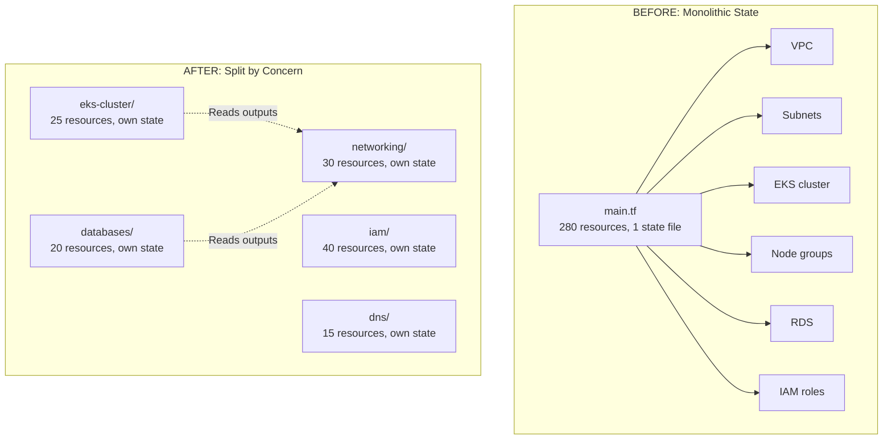
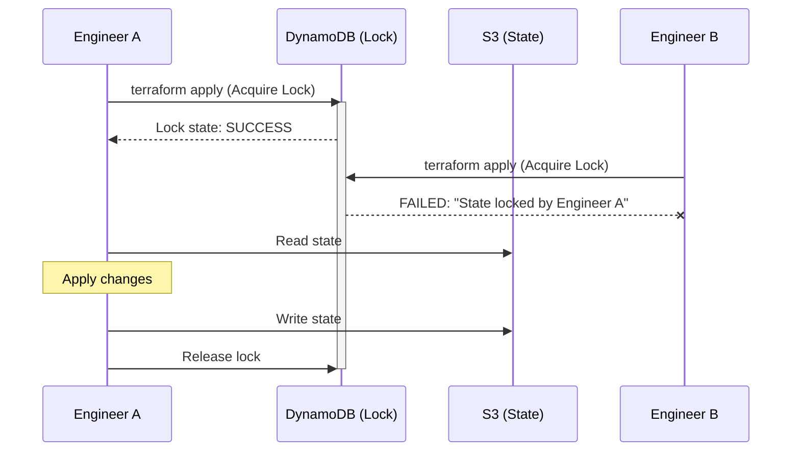
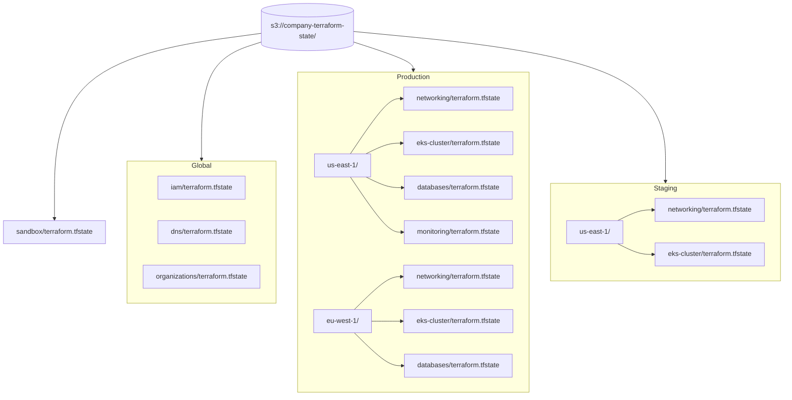
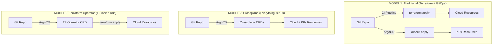
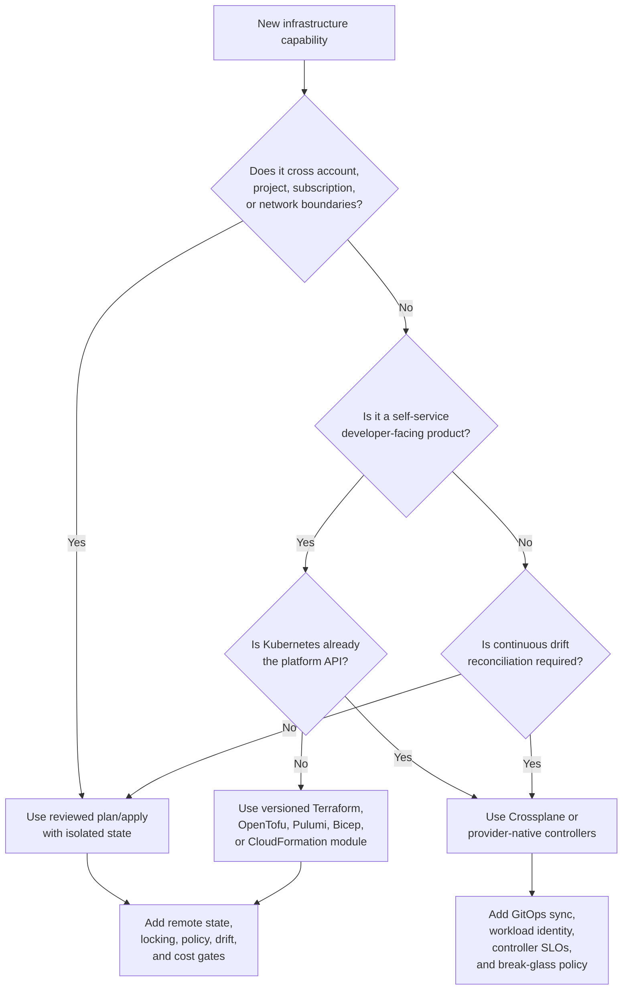
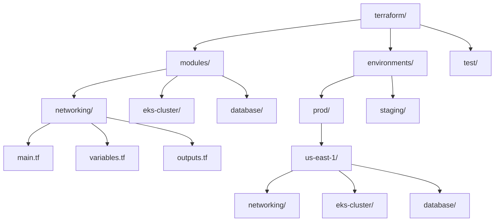

> **Complexity**: `[MEDIUM]`
>
> **Time to Complete**: 2 hours
>
> **Prerequisites**: Basic Terraform experience (variables, modules, state), familiarity with Git workflows
>
> **Track**: Advanced Cloud Operations

## What You'll Be Able to Do

After completing this module, you will be able to:

- **Design** Terraform or Pulumi state management strategies for large-scale multi-account infrastructure to eliminate single points of failure.
- **Implement** modular IaC patterns with versioned components, workspace isolation, and strict policy-as-code validation.
- **Diagnose** configuration drift across environments and deploy automated remediation pipelines for infrastructure managed by Terraform or CloudFormation.
- **Evaluate** the architectural tradeoffs of various IaC tools (Terraform, Pulumi, CloudFormation, Bicep, Crossplane) for multi-cloud Kubernetes platform engineering.
- **Compare** traditional push-based pipeline deployments against pull-based Kubernetes-native GitOps controllers for cloud infrastructure orchestration.

---

## Why This Module Matters

Hypothetical scenario: a platform engineering team was operating a large AWS footprint from a single monolithic Terraform state file, and over time that state became a bottleneck. Routine `terraform plan` calls slowed enough to delay ordinary change approvals and made incident response feel painfully serialized. In that scenario, teams often lose the ability to keep pace with real-time production needs because every change has to cross the same large blast radius.

That is why monolithic state becomes an incident amplifier: a slow refresh can push operators toward urgent console edits, and each manual change increases drift risk for the next automation run. When teams patch by hand, drift is no longer a rare corner case; it becomes the new normal and your IaC graph stops matching reality. The result is a destructive loop of urgent work followed by larger corrective applies.

This module deconstructs scaling infrastructure as code into safe, composable practices. You will learn how to isolate failure domains by splitting state, design reusable Kubernetes-focused modules with explicit assumptions, and automate drift detection before it becomes an emergency. By the end, you can transition from brittle, serialized deployment pipelines to a resilient model using Terraform, OpenTofu, Terratest, and Crossplane inside a GitOps posture that supports sustained scale.

The larger lesson is that enterprise IaC is not just scripts that create infrastructure. At scale, it becomes a reviewed, versioned product with owners, release notes, compatibility contracts, policy gates, cost controls, and incident procedures. AWS accounts, Google Cloud projects, and Azure subscriptions are not merely deployment targets; they are administrative boundaries where identity, billing, audit, and blast radius meet. A good IaC architecture makes those boundaries visible before a plan runs, not after a production apply surprises everyone.

This is especially true for Kubernetes platform teams because clusters sit at the intersection of cloud networking, IAM, compute, storage, observability, and cost. A single EKS, GKE, or AKS cluster module may provision VPC or VNet attachments, workload identity bindings, private endpoints, logging sinks, autoscaling node pools, and backup hooks. If that module is treated as a pile of HCL rather than a product surface, every consumer gets a slightly different cluster and the platform team loses the ability to reason about the fleet.

---

## The Monolithic State Problem

Terraform state maps your configuration to real infrastructure and stores metadata about managed resources, so every `plan` or `apply` must reconcile that mapping before it can make new changes. As state grows, operations can slow dramatically because Terraform refreshes existing remote objects for the entire graph on every run, not just the subset you intend to touch. Think of that as the infrastructure equivalent of a shared global ledger: one large file that must stay internally consistent before any line item can be changed.

A concrete analogy helps here. If an accountant wants to update a tiny marketing expense in a huge multinational spreadsheet, they still have to wait for all formulas across every department to recalculate. The same dynamic appears in Terraform when one small change depends on refreshing hundreds of unrelated resources first. Eventually, even simple merges are blocked because the file becomes so unwieldy that routine operations fail or become impractically slow.

**Pause and predict:** If two engineers simultaneously run `terraform apply` on a local monolithic state file without any remote backend or locking configured, what exactly happens to the JSON file?

<details>
<summary>Check your prediction</summary>

The local backend locks via system APIs on that machine only (such as file locking system calls). However, if two engineers work on separate workstations with their own copies of the JSON state file, the local lock on one machine cannot coordinate with the other machine. Both engineers can run `terraform apply` simultaneously against cloud APIs, and whoever writes their local state file last will overwrite the earlier apply's recorded resources without warning, resulting in a last-snapshot-wins race condition where infrastructure exists in the cloud but disappears from the recorded state.

**At larger state sizes, teams often experience:**
- Unacceptably slow plans that block CI/CD pipeline concurrency.
- Frequent state lock timeouts during peak deployment hours.
- Team members waiting idle to apply changes sequentially.
- Intense temptation to bypass automation and make manual changes (resulting in drift).
- Catastrophic state corruption from aborted or concurrent operations.
</details>

The next concern is how large the graph is, not just who holds the file. The table below is the operational cost of one shared ledger as resource counts grow.

| Resources | State Size | Plan Time | Apply Time | Risk |
|---|---|---|---|---|
| Small | Small | Seconds | Under a minute | Low |
| Dozens | Small | Tens of seconds | Minutes | Low |
| Around one hundred | Moderate | Minutes | Several minutes | Medium |
| Hundreds | Larger | Several minutes | Many minutes | High |
| Many hundreds | Large | Double-digit minutes | Double-digit minutes | Very High |
| Very large | Very large | Tens of minutes | Tens of minutes or more | Extreme |

The failure mode is not just "Terraform is slow." The deeper problem is that the state file has become the coordination point for too many independent lifecycles. A networking change, a node-pool change, an IAM role update, a database parameter edit, and an observability sink adjustment may all be logically unrelated, yet a monolithic root module forces them through the same refresh, lock, review queue, and rollback boundary. That is why a harmless tag update can become risky: it must evaluate the same global graph that also contains destructive database and cluster changes.

AWS, GCP, and Azure all make this worse when the IaC graph crosses administrative boundaries. On AWS, the graph may span multiple accounts governed by [AWS Organizations service control policies](https://docs.aws.amazon.com/organizations/latest/userguide/orgs_manage_policies_scps.html) and a [Control Tower landing zone](https://docs.aws.amazon.com/controltower/latest/userguide/what-is-control-tower.html). On Google Cloud, the same graph may cross organization, folder, and project boundaries in the [resource hierarchy](https://cloud.google.com/resource-manager/docs/cloud-platform-resource-hierarchy), with Org Policy constraints inherited through that hierarchy. On Azure, a plan may cross management groups, subscriptions, and resource groups organized through [management groups](https://learn.microsoft.com/en-us/azure/governance/management-groups/overview) and Azure landing zones. If one root module needs credentials for every boundary, you have accidentally created a superuser deployment robot.

For Kubernetes operations, the practical shift is to stop thinking in terms of "one repo equals one apply." Instead, think in stacks with separate ownership and release cadence: account vending or project vending, shared network, cluster foundation, node capacity, workload identity, add-ons, observability, and application-facing services. The platform team owns the product contract for each stack, while workload teams consume pinned versions and submit changes through review. That operating model preserves speed because a team can change its AKS node pool or GKE workload identity binding without taking a lock on unrelated AWS Transit Gateway or global DNS state.

### State Splitting Strategy

The most effective solution is to split your Terraform configuration into multiple independent, sharply bounded state files. Each state file should manage a tightly coupled logical group of resources that share a lifecycle, because blast radius is directly related to how much unrelated state a single apply touches. In practice, this means each team or platform domain can evolve faster without waiting on unrelated work in another domain. You retain speed when plans are smaller, and you gain safer rollback behavior because failure events are now localized.



By isolating these layers, you enforce a strict blast radius and make ownership meaningful. A destructive change to the database tier cannot inadvertently delete the transit gateway routing tables, because those resources now live in a different execution boundary. That single architectural separation often removes the need for brittle manual coordination in CI and lets teams run in parallel with much lower contention.

> **Stop and think**: In the split-state architecture shown below, if a syntax error breaks the `databases/` configuration, can the platform team still deploy updates to the EKS cluster or IAM roles? How does this impact deployment velocity during an incident?

State segmentation should follow dependency direction, not just folder aesthetics. A lower-level state file should expose a small contract to higher-level consumers, while higher-level components should not reach back into the lower layer's implementation details. In a typical AWS layout, organization and account baselines sit at the bottom, VPC and shared networking come next, EKS cluster foundation follows, node pools and add-ons sit above that, and workload namespaces or managed services live at the edge. The same pattern maps cleanly to GCP projects and shared VPCs, and to Azure subscriptions, VNets, and AKS clusters.

The segmentation rule is simple: split when ownership, lifecycle, credential scope, or blast radius changes. Production and staging should not share a state file because their approval and rollback requirements differ. Networking and cluster add-ons should not share a state file because a CoreDNS add-on change should not be able to modify a hub VNet. A central platform team and an application team should not share a state file because their access model is different. The split creates more directories, but it buys smaller plans, shorter locks, better audit trails, and less pressure to make emergency console changes.

There is a cost dimension hiding inside this design choice. Poor state hygiene leaves behind orphaned resources because nobody is sure which state owns them, and cloud billing systems do not care whether an abandoned load balancer, NAT gateway, public IP address, disk, or snapshot was created by a clean module or by a failed migration. At moderate scale, a handful of forgotten per-environment resources can quietly turn into a recurring spend problem. A clean state boundary gives FinOps teams a way to map billed resources back to the module, team, environment, and cost center that created them.

---

## Splitting State and Loose Coupling

Once you fragment your state, those independent pieces inevitably need to communicate. For example, the Kubernetes compute cluster must know the identifiers of the private subnets provisioned by the networking tier. In practice, this communication layer is where architecture quality is tested first, because it determines whether one domain can evolve without forcing coupled changes in every downstream consumer. The legacy method for this is the `terraform_remote_state` data source, which works but often cements implicit dependencies.

### Remote State Data Sources (Tight Coupling)

The `terraform_remote_state` data source reaches directly into another team's state file in the remote backend to [read its exported outputs](https://developer.hashicorp.com/terraform/language/state/remote-state-data). 

```hcl
# networking/outputs.tf -- Export values from networking state
output "vpc_id" {
  value = aws_vpc.main.id
}

output "private_subnet_ids" {
  value = aws_subnet.private[*].id
}

output "eks_security_group_id" {
  value = aws_security_group.eks.id
}

# eks-cluster/data.tf -- Read from networking state
data "terraform_remote_state" "networking" {
  backend = "s3"
  config = {
    bucket = "company-terraform-state"
    key    = "networking/terraform.tfstate"
    region = "us-east-1"
  }
}

# eks-cluster/cluster.tf -- Use the imported values
resource "aws_eks_cluster" "main" {
  name     = "prod-cluster"
  role_arn = aws_iam_role.eks.arn

  vpc_config {
    subnet_ids         = data.terraform_remote_state.networking.outputs.private_subnet_ids
    security_group_ids = [data.terraform_remote_state.networking.outputs.eks_security_group_id]
  }
}
```

While functional, this approach generates heavy architectural coupling. The EKS configuration must know exactly where the networking team stores their state and the exact output names it expects. If the networking team refactors their backend path or renames `vpc_id` to `primary_vpc_id`, the EKS deployment will likely fail on the next plan or apply. In other words, you gain modularity in resource ownership but keep a fragile integration contract hidden in filenames and string values.

### Better Alternative: Use Data Sources Instead of Remote State

To achieve true loose coupling—akin to relying on a stable API contract rather than directly accessing another microservice's database—you should query the cloud provider directly using native data sources and robust resource tagging strategies.

```hcl
# Instead of remote state, query AWS directly
# This avoids tight coupling between state files

data "aws_vpc" "main" {
  tags = {
    Name        = "production-vpc"
    Environment = "production"
  }
}

data "aws_subnets" "private" {
  filter {
    name   = "vpc-id"
    values = [data.aws_vpc.main.id]
  }
  tags = {
    Tier = "private"
  }
}

resource "aws_eks_cluster" "main" {
  name     = "prod-cluster"
  role_arn = aws_iam_role.eks.arn

  vpc_config {
    subnet_ids = data.aws_subnets.private.ids
  }
}
```

This decoupled approach ensures that as long as the networking team maintains the agreed-upon tagging taxonomy, they are free to overhaul their internal module structures without disrupting downstream consumers. You keep an explicit contract around tags and attributes instead of internal state file mechanics. As a result, a module boundary becomes a stable interface, not a hardwired dependency on another team's internal implementation details.

---

## Remote Backends and State Locking

Local state files committed to source control are a critical security vulnerability and an operational anti-pattern. [State files contain the plaintext representations of all configured variables](https://developer.hashicorp.com/terraform/language/manage-sensitive-data), including database master passwords, private TLS keys, and identity provider secrets, so they should never be treated like ordinary application configuration. Git also cannot provide atomic locking during concurrent deployments, which means parallel operators can easily collide without clear ownership of state transitions. To solve both issues, enterprise IaC relies on remote backends with distributed locking, so sensitive state is centralized and serialized correctly.

**Pause and predict:** What happens if an engineer gets impatient during a long `terraform apply`, force-quits their terminal, and then manually deletes the remote lock object so they can try again?

<details>
<summary>Check your prediction</summary>

Deleting the lock object mid-apply removes mutual exclusion and immediately allows a second writer to acquire a lock and execute modifications against the same infrastructure and state file simultaneously. Even though the original process's terminal was terminated, background cloud provider API operations initiated by the first apply may still be executing or committing changes asynchronously. When the second apply runs, both operations write conflicting state snapshots, corrupting resource tracking and potentially triggering duplicate resource creation or accidental resource deletion. For AWS environments, modern S3 state backends implement native locking via the `use_lockfile` attribute, whereas dedicated DynamoDB locking tables are deprecated. If an execution appears stuck, operators must verify cloud provider API operations have fully ceased before using `terraform force-unlock` with the specific Lock ID rather than deleting backend lock records directly.
</details>

The sequence diagram below traces a typical apply against object storage and a lock coordinator, so you can compare the intended happy path with the failure you just reasoned about.



A common AWS setup stores state in S3 and uses a locking mechanism; older Terraform setups often used DynamoDB tables, while current S3 backends also support native lockfiles. The key decision is to choose a backend strategy that aligns with your organization’s operational model, observability tooling, and incident workflow. If you combine explicit lock tables (or lockfile support) with consistent key naming, you avoid most accidental concurrent writes and the class of corruption they trigger during rushed change windows.

```hcl
# Backend configuration (per-state-file)
terraform {
  backend "s3" {
    bucket         = "company-terraform-state"
    key            = "prod/us-east-1/networking/terraform.tfstate"
    region         = "us-east-1"
    encrypt        = true
    kms_key_id     = "alias/terraform-state"
    dynamodb_table = "terraform-state-lock"
  }
}

# Create the DynamoDB lock table (one-time setup)
# aws dynamodb create-table \
#   --table-name terraform-state-lock \
#   --attribute-definitions AttributeName=LockID,AttributeType=S \
#   --key-schema AttributeName=LockID,KeyType=HASH \
#   --billing-mode PAY_PER_REQUEST
```

Remote backend design is a multi-cloud operating decision, not just a Terraform syntax choice. Terraform's [S3 backend](https://developer.hashicorp.com/terraform/language/backend/s3) stores state in an S3 object and can use S3 lockfiles, while DynamoDB locking is now a legacy compatibility path that older estates still need to recognize during migrations. The [GCS backend](https://developer.hashicorp.com/terraform/language/backend/gcs) stores state in a Google Cloud Storage bucket prefix and supports locking, so the same segmentation idea maps to project and folder boundaries. The [azurerm backend](https://developer.hashicorp.com/terraform/language/backend/azurerm) stores state as a blob in Azure Storage and supports state locking with Azure Blob Storage capabilities.

The backend should be provisioned before the infrastructure it manages, and it should be treated as a small, highly protected foundation service. Enable object versioning or equivalent recovery controls where the backend supports them, encrypt state at rest with organization-managed keys when policy requires it, and restrict access to the CI identities that actually need the state. The people who can read state may be able to read sensitive values, so state access belongs in the same review category as secret-store access rather than ordinary repository access.

Locking protects the state file from concurrent writers, but it does not protect you from bad architecture. A lock on a monolithic state file can serialize a whole enterprise behind one slow apply, and a lock on a poorly scoped state file can still give the wrong team permission to change the wrong resources. The goal is therefore two-layer safety: small state files to reduce blast radius, plus backend locking to prevent simultaneous writes inside each boundary.

When a lock gets stuck, the incident procedure should be boring and explicit. First, confirm whether a real apply is still running; second, inspect the CI job, terminal session, or pipeline logs that acquired the lock; third, back up the state before any manual unlock or recovery action; finally, document the reason in the change record. Manually deleting a lock because a plan is inconvenient is the IaC equivalent of force-removing a database transaction marker, and it can turn a slow deployment into a corrupted state recovery exercise.

### State File Organization Pattern

State storage path design is not cosmetic; it is one of the highest-leverage controls for operational clarity. A robust directory hierarchy is essential to prevent confusion when dozens of teams are touching different environments, and the standard industry pattern aligns state keys with business-unit, environment, and region topology. When the path convention is obvious, runbooks become reliable, and on-call operators can recover faster because they can infer ownership from the key alone.

```text
s3://company-terraform-state/
├── global/
│   ├── iam/terraform.tfstate
│   ├── dns/terraform.tfstate
│   └── organizations/terraform.tfstate
│
├── prod/
│   ├── us-east-1/
│   │   ├── networking/terraform.tfstate
│   │   ├── eks-cluster/terraform.tfstate
│   │   ├── databases/terraform.tfstate
│   │   └── monitoring/terraform.tfstate
│   │
│   └── eu-west-1/
│       ├── networking/terraform.tfstate
│       ├── eks-cluster/terraform.tfstate
│       └── databases/terraform.tfstate
│
├── staging/
│   └── us-east-1/
│       ├── networking/terraform.tfstate
│       └── eks-cluster/terraform.tfstate
│
└── sandbox/
    └── terraform.tfstate
```

To visualize this logical distribution mapping:



This specific key/path structure: `{env}/{region}/{component}/terraform.tfstate` matches the landing-zone foundations discussed in earlier architecture modules, and it maps cleanly onto isolated cloud accounts. In practice, it minimizes the blast radius of any individual apply operation while making governance easier in audits and incident retrospectives. You also gain a predictable place to enforce lifecycle rules around retention and encryption by component.

Translate the pattern to each provider rather than copying S3 terminology everywhere. On AWS, the state key often includes organization unit, account alias, region, and component, because the account is the strongest operational boundary. On GCP, the equivalent path often includes folder, project, region, and component, because project ownership and billing are central to Google Cloud operations. On Azure, the path often includes management group lineage, subscription, region, and component, because subscriptions are common isolation and budget boundaries inside Azure landing zones.

State outputs should be deliberately boring. Export stable identifiers such as VPC IDs, subnet IDs, project IDs, subscription IDs, cluster names, OIDC issuer URLs, and private DNS zone names, but avoid exporting internal implementation details that consumers should not depend on. If a downstream stack needs to know every route table ID, every private endpoint NIC, or every generated IAM policy fragment, the upstream module may not be exposing the right product interface yet.

Drift becomes more dangerous after state is split because teams can start assuming their state file is the whole truth. It is only the truth for the resources it owns. A resource can drift because a human changed it in the console, because a controller reconciled it, because a provider default changed, or because another state file owns a dependency that moved. Mature teams therefore pair segmentation with scheduled drift checks, ownership tags, and policy gates that reject resources without `Environment`, `Team`, `CostCenter`, and lifecycle metadata.

---

## Designing Modules for Scale

Well-designed modules are the foundational building blocks for managing Kubernetes infrastructure at scale, because they make architectural intent explicit and enforceable. A mature module encapsulates a logical unit of infrastructure with a highly opinionated, cleanly constructed interface, which prevents consumers from accidentally making architecture-breaking choices. In practice, this gives product teams confidence to self-service within guardrails while preserving platform standards across dozens of environments.

**Pause and predict:** If a module has 50 variables to account for every possible AWS configuration, how does that impact the readability of the root module consuming it? Is it actually better than writing raw resources?

<details>
<summary>Check your prediction</summary>

A 50-variable pass-through module is usually worse than composition or raw resources because it introduces an indirection layer that obscures infrastructure behavior without delivering genuine abstraction. Consumers still must understand all 50 underlying cloud provider knobs, but now they lose provider documentation clarity, IDE autocomplete precision, and direct control over resource lifecycles. When a module merely mirrors provider parameters 1:1, teams incur maintenance overhead for parameter forwarding, version upgrades, and test matrices while gaining none of the architectural guardrails that justify module boundaries.

A common failure mode is creating "wrapper modules" that expose every underlying provider parameter and pretend abstraction exists where none is delivered. Such modules provide little architectural value because consumers still need deep platform knowledge to configure them safely. Instead, modules should encode your organization's specific security and compliance policies directly into baseline behavior, so the module can prevent unsafe defaults even when users are in a hurry.
</details>

The next section is how versioned, thin root modules make review possible when dozens of environments consume the same cluster contract.

Terraform and OpenTofu modules are software interfaces. HashiCorp describes a [module](https://developer.hashicorp.com/terraform/language/modules) as a collection of resources managed together, and that definition matters because a module should have a cohesive reason to change. OpenTofu follows the same broad IaC workflow of writing configuration, planning changes, and applying approved operations across cloud and on-premises APIs, making it a practical vendor-neutral baseline for teams that need Terraform-compatible patterns while tracking the [OpenTofu](https://opentofu.org/docs/intro/) ecosystem. The point is not to debate brands; the point is to make module contracts explicit enough that either tool can operate safely.

The cleanest large-scale layout is usually root-module-per-stack. A reusable module lives under `modules/`, but each real deployment has a small root module under `environments/`, `stacks/`, or a similar directory that wires provider aliases, backend configuration, input values, and data sources. That root module is where you express "production EKS in us-east-1" or "shared GKE networking in folder platform-prod." Keeping root modules thin makes review easier because reviewers can see whether the pull request changes product intent or reusable module behavior.

Versioning is the difference between self-service and chaos. Publish reusable modules through a registry or controlled VCS source, pin consumers to explicit versions, and treat breaking changes as major-version events with migration notes. A platform team that updates a shared AKS, EKS, or GKE module without pinning can accidentally force every consumer to absorb a provider change at once. A platform team that publishes versioned modules lets each workload team plan, test, and roll forward on its own schedule.

Do not use Terraform CLI workspaces as a substitute for architecture. The [workspaces documentation](https://developer.hashicorp.com/terraform/language/state/workspaces) is explicit that workspaces are not appropriate for system decomposition or deployments requiring separate credentials and access controls. Workspaces can be useful for lightweight duplication of a configuration, but they are a poor boundary for production versus staging, account versus account, or team versus team. If the blast radius or credential scope differs, use a separate root module and backend key.

Orchestration tools help only after the state model is sound. Terragrunt can reduce backend and provider repetition across many root modules, while Terraform Stacks in HCP Terraform provide a component-based architecture for coordinating infrastructure across environments and deployments. [Terraform Stacks](https://developer.hashicorp.com/terraform/language/stacks) have documented product behavior and limits, so treat them as an orchestration layer rather than a magic substitute for good module design. The same caution applies to any in-house wrapper: it should make safe patterns easier, not hide dangerous coupling behind a friendlier command.

Module review should include compatibility, security, operability, and cost. A cluster module should describe which Kubernetes version line it targets, how private control-plane access is handled, which workload identity model it supports, how add-ons are managed, what tags and labels are mandatory, and which cost-affecting resources it creates by default. For AWS, that may include IRSA or EKS Pod Identity decisions; for GCP, Workload Identity Federation for GKE; for Azure, Microsoft Entra Workload ID. These are part of the module contract because a workload team will build operational assumptions around them.

### EKS Cluster Module

Observe the constraints and sensible defaults built into this EKS module structure:

```hcl
# modules/eks-cluster/variables.tf
variable "cluster_name" {
  type        = string
  description = "Name of the EKS cluster"
}

variable "cluster_version" {
  type        = string
  description = "Kubernetes version"
  default     = "1.35"
}

variable "vpc_id" {
  type        = string
  description = "VPC ID where the cluster will be created"
}

variable "subnet_ids" {
  type        = list(string)
  description = "Subnet IDs for the cluster (private subnets)"
}

variable "node_groups" {
  type = map(object({
    instance_types = list(string)
    desired_size   = number
    min_size       = number
    max_size       = number
    capacity_type  = optional(string, "ON_DEMAND")
    labels         = optional(map(string), {})
    taints = optional(list(object({
      key    = string
      value  = string
      effect = string
    })), [])
  }))
  description = "Node group configurations"
}

variable "enable_karpenter" {
  type        = bool
  default     = true
  description = "Install Karpenter for autoscaling"
}

variable "cluster_addons" {
  type = map(object({
    version = optional(string)
  }))
  default = {
    vpc-cni            = {}
    coredns            = {}
    kube-proxy         = {}
    aws-ebs-csi-driver = {}
  }
}

variable "tags" {
  type    = map(string)
  default = {}
}
```

```hcl
# modules/eks-cluster/main.tf
resource "aws_eks_cluster" "this" {
  name     = var.cluster_name
  version  = var.cluster_version
  role_arn = aws_iam_role.cluster.arn

  vpc_config {
    subnet_ids              = var.subnet_ids
    endpoint_private_access = true
    endpoint_public_access  = false
    security_group_ids      = [aws_security_group.cluster.id]
  }

  access_config {
    authentication_mode                         = "API_AND_CONFIG_MAP"
    bootstrap_cluster_creator_admin_permissions = true
  }

  encryption_config {
    provider {
      key_arn = aws_kms_key.eks.arn
    }
    resources = ["secrets"]
  }

  tags = merge(var.tags, {
    "kubernetes.io/cluster/${var.cluster_name}" = "owned"
  })

  depends_on = [
    aws_iam_role_policy_attachment.cluster_policy,
    aws_iam_role_policy_attachment.cluster_vpc_policy,
  ]
}

resource "aws_eks_node_group" "this" {
  for_each = var.node_groups

  cluster_name    = aws_eks_cluster.this.name
  node_group_name = each.key
  node_role_arn   = aws_iam_role.node.arn
  subnet_ids      = var.subnet_ids
  instance_types  = each.value.instance_types
  capacity_type   = each.value.capacity_type

  scaling_config {
    desired_size = each.value.desired_size
    min_size     = each.value.min_size
    max_size     = each.value.max_size
  }

  labels = merge(each.value.labels, {
    "node-group" = each.key
  })

  dynamic "taint" {
    for_each = each.value.taints
    content {
      key    = taint.value.key
      value  = taint.value.value
      effect = taint.value.effect
    }
  }

  tags = var.tags
}

# EKS addons
resource "aws_eks_addon" "this" {
  for_each = var.cluster_addons

  cluster_name                = aws_eks_cluster.this.name
  addon_name                  = each.key
  addon_version               = each.value.version
  resolve_conflicts_on_create = "OVERWRITE"
  resolve_conflicts_on_update = "PRESERVE"
}
```

```hcl
# modules/eks-cluster/outputs.tf
output "cluster_name" {
  value = aws_eks_cluster.this.name
}

output "cluster_endpoint" {
  value = aws_eks_cluster.this.endpoint
}

output "cluster_ca_certificate" {
  value = aws_eks_cluster.this.certificate_authority[0].data
}

output "oidc_provider_arn" {
  value = aws_iam_openid_connect_provider.eks.arn
}

output "oidc_provider_url" {
  value = aws_eks_cluster.this.identity[0].oidc[0].issuer
}

output "node_security_group_id" {
  value = aws_eks_cluster.this.vpc_config[0].cluster_security_group_id
}
```

### Using the Module

Notice how clean the consumption logic becomes when the module handles the underlying heavy lifting. The developer defines intent, not provider mechanics.

```hcl
# environments/prod/us-east-1/eks-cluster/main.tf
module "eks" {
  source = "../../../../modules/eks-cluster"

  cluster_name    = "prod-us-east-1"
  cluster_version = "1.35"
  vpc_id          = data.aws_vpc.prod.id
  subnet_ids      = data.aws_subnets.private.ids

  node_groups = {
    general = {
      instance_types = ["m7i.xlarge"]
      desired_size   = 3
      min_size       = 3
      max_size       = 10
      capacity_type  = "ON_DEMAND"
      labels = {
        "workload-class" = "general"
      }
    }

    spot-workers = {
      instance_types = ["m7i.xlarge", "m6i.xlarge", "c7i.xlarge"]
      desired_size   = 5
      min_size       = 2
      max_size       = 20
      capacity_type  = "SPOT"
      labels = {
        "workload-class" = "batch"
        "node-type"      = "spot"
      }
      taints = [
        {
          key    = "spot"
          value  = "true"
          effect = "NO_SCHEDULE"
        }
      ]
    }
  }

  enable_karpenter = true

  tags = {
    Environment = "production"
    Team        = "platform"
    CostCenter  = "CC-1000"
  }
}
```

The root module consuming this EKS module should be small enough that a reviewer can understand its intent in a few minutes. If the root module contains hundreds of raw AWS resources alongside the module call, the abstraction is leaking and the team is back to building snowflakes. In a multi-cloud platform, the equivalent GKE and AKS root modules should have the same conceptual shape even though provider arguments differ: choose cluster name, region, private network, node-pool profile, identity mode, observability defaults, backup posture, and ownership tags.

At enterprise scale, use separate release lanes for reusable modules and environment roots. A reusable module change should pass unit-style validation, static checks, policy checks, and at least one isolated integration test before consumers update. An environment root change should focus on version bump, input change, provider alias change, or data-source contract change. Keeping those lanes distinct makes rollback clearer: revert the root-module version pin to go back, or release a module patch when the reusable contract is wrong.

Cost review belongs in the same pull request as the module change. Tools in the Infracost style can estimate cost impact from Terraform, CloudFormation, or CDK before deployment, which helps catch expensive resource class changes before they become invoices. The estimate is not a replacement for provider billing knowledge, because NAT, inter-zone traffic, cross-region replication, managed log ingestion, public IPs, and idle disks often depend on runtime traffic patterns. It is still valuable because it gives reviewers a cost diff when a module quietly adds three NAT gateways, a larger node-pool default, or a retained snapshot policy.

---

## IaC + GitOps: Crossplane vs. Terraform Operator

Historically, many teams run a split-brain model: Terraform acts as an imperative CLI tool triggered by CI/CD pipelines, while a GitOps engine like ArgoCD manages Kubernetes manifests separately. That separation can work, but it also creates duplicated access models, duplicate review workflows, and duplicated mental overhead during incidents. A significant architectural shift is moving the control plane entirely into Kubernetes via controllers like Crossplane or the Terraform Operator, so cloud and Kubernetes resources follow one reconciliation philosophy.



Model 1 (Traditional Terraform + GitOps) is exceptionally mature and widely understood, and it preserves the familiar `terraform plan` review flow before infrastructure changes are applied. In practice, teams often like the deterministic PR model because every change is already expressed as a Terraform execution plan. The downside is operational coordination cost: you maintain two different systems with separate access boundaries and state models, so teams can drift out of lockstep between infrastructure and Kubernetes delivery.

Model 2 (Crossplane) unifies cloud provisioning under a single Kubernetes-native GitOps control plane, and it keeps team interfaces consistent across platform layers. Crossplane reconciliation turns infrastructure into Kubernetes desired state, so drift is corrected continuously when the control plane is healthy. This is powerful for platform teams that want one mental model, but it assumes strong K8s diagnostics skills because provider behavior and controller graphs can be deeply nested.

Model 3 (Terraform Operator) allows teams to keep existing Terraform modules, including HCL-heavy investments, while migrating to Kubernetes-native delivery patterns. It can work when direct controller-native tool choices are not yet possible, because it preserves familiar module semantics. At the same time, it introduces substantial state-management complexity, because Terraform execution remains imperative inside a declarative scheduler and therefore adds a new class of reconciliation race conditions around retries, locking, and eventual consistency.

### Crossplane Example

Crossplane translates infrastructure blueprints into Custom Resource Definitions (CRDs), which lets teams manage cloud resources with the same workflow patterns they already use for Kubernetes objects. That same indirection is why drift correction can be automatic, but also why controller visibility becomes the primary debugging path during production issues.

> **Stop and think**: If Crossplane continuously reconciles state every 60 seconds, how do you handle "break-glass" emergency changes where an engineer *must* temporarily manually modify an AWS resource in the console to stop a critical incident?

```text
# Create an RDS instance using Crossplane
apiVersion: rds.aws.upbound.io/v1beta2
kind: Instance
metadata:
  name: payments-db
  namespace: crossplane-system
spec:
  forProvider:
    region: us-east-1
    instanceClass: db.r7g.large
    engine: postgres
    engineVersion: "16"
    allocatedStorage: 100
    storageType: gp3
    dbName: payments
    masterUsername: admin
    masterPasswordSecretRef:
      name: rds-password
      namespace: crossplane-system
      key: password
    vpcSecurityGroupIds:
      - sg-abc123
    dbSubnetGroupName: prod-db-subnets
    publiclyAccessible: false
    backupRetentionPeriod: 14
    multiAz: true
    tags:
      Environment: production
      Team: payments
      CostCenter: CC-2000
  providerConfigRef:
    name: aws-provider
# ---
# The Crossplane controller continuously reconciles:
# If someone changes the RDS instance in the console,
# Crossplane will revert it to match this spec.
# This is drift detection + correction built in.
```

### When to Use Each Approach

| Factor | Terraform | Crossplane | TF Operator |
|---|---|---|---|
| Existing TF codebase | Keep Terraform | Consider migration | Use TF Operator |
| Team skill set | TF experts | K8s experts | TF experts |
| Cloud resource coverage | Excellent (all providers) | Good (growing) | Uses TF providers |
| Drift correction | Manual (`terraform apply`) | Automatic (reconciliation) | Periodic (`terraform apply`) |
| State management | S3 + DynamoDB | etcd (K8s) | S3 + DynamoDB |
| PR workflow | `terraform plan` in PR | `kubectl diff` in PR | `terraform plan` in PR |
| Multi-cloud | Excellent | Good | Excellent |

Crossplane is strongest when the platform team wants to expose a product API rather than expose raw cloud resources. A developer should not need to understand every RDS, Cloud SQL, or Azure Database for PostgreSQL parameter to request a compliant database; they should request a platform-defined class with size, retention, environment, and ownership fields. Crossplane compositions can turn that request into provider-specific managed resources while the controller watches for drift. That makes the platform API feel like Kubernetes, but it also means the platform team must operate Crossplane itself as a production control plane.

The provider-native Kubernetes options follow the same reconciliation idea with different scope. Google [Config Connector](https://cloud.google.com/config-connector/docs/overview) manages Google Cloud resources as Kubernetes custom resources, AWS Controllers for Kubernetes ([ACK](https://aws-controllers-k8s.github.io/community/docs/community/overview/)) exposes AWS service resources through Kubernetes controllers, and [Azure Service Operator](https://azure.github.io/azure-service-operator/) manages Azure resources from within a Kubernetes cluster. These tools can be excellent when one cloud dominates the platform and Kubernetes is already the operational center. They can be awkward when a team needs one uniform abstraction across AWS, GCP, and Azure or when cluster outages must not block cloud recovery.

The identity model must be part of the decision. AWS workloads can use [IAM roles for service accounts](https://docs.aws.amazon.com/eks/latest/userguide/iam-roles-for-service-accounts.html) or [EKS Pod Identity](https://docs.aws.amazon.com/eks/latest/userguide/pod-identities.html) to avoid static credentials in pods. GKE recommends [Workload Identity Federation for GKE](https://cloud.google.com/kubernetes-engine/docs/concepts/workload-identity) for fine-grained access to Google Cloud APIs without service account key files. AKS uses [Microsoft Entra Workload ID](https://learn.microsoft.com/en-us/azure/aks/workload-identity-overview), and new AKS designs should not use the older pod-managed identity pattern. If your infrastructure controller needs cloud credentials, the workload identity pattern is the line between a controlled platform and a cluster-wide secret with too much power.

GitOps for infrastructure works best when the controller owns a narrow API surface. ArgoCD or Flux can sync Crossplane claims, Config Connector resources, ACK resources, or ASO resources from Git, while Atlantis or a Terraform/OpenTofu CI pipeline can run PR-driven plans for HCL. The decision is not "GitOps or Terraform"; it is whether reconciliation should happen continuously through the Kubernetes API or through reviewed plan/apply jobs. Continuous reconciliation is powerful for safe, repeatable services; explicit plan/apply is often better for rare, high-blast-radius changes such as account vending, hub networking, or region-scale migrations.

---

## Drift Detection and Testing

Configuration drift occurs the moment your live cloud infrastructure diverges from source-controlled desired state, and drift often appears long before teams notice it. Most incidents start with one of three patterns: manual console edits during urgency, background system changes that bypass pipelines, or provider defaults that changed underneath an old plan. This matters because drift is rarely just cosmetic; it changes blast radius by making subsequent applies act on outdated assumptions. In practice, drift is an operational debt that compounds if it is not caught by a scheduled feedback loop.

**Pause and predict:** Aside from catching manual operational changes, why is scheduled drift detection considered a critical security control?

<details>
<summary>Check your prediction</summary>

Scheduled `plan -refresh-only` detects objects changed outside of Terraform, making it an indispensable security control rather than a mere operational convenience. Unauthorized changes—such as an attacker modifying security group ingress rules to expose internal databases to the public internet, tampering with IAM trust policies, or disabling CloudTrail logging—often take place directly through the cloud API without updating source-controlled configuration files. Without automated, continuous drift detection, security teams remain blind to these out-of-band compromises until the next scheduled application deployment or compliance audit.

Detecting drift proactively prevents massive "surprise" applies where a benign pull request unexpectedly schedules the destruction of an unmanaged data tier. In a mature process, drift detection belongs next to policy checks and secret scanning, not as an afterthought after production incidents. This is why teams treat it as a guardrail: if the live environment has already moved, every planned change is only meaningful when that gap is made visible and resolved first.
</details>

The next subsection is the concrete command and the CI schedule so the check is a job, not a slide.

### Detecting Drift

Teams execute non-destructive reconciliation checks in CI/CD by reading current cloud attributes against recorded state before proposing new resource updates.

```bash
# Terraform: Detect drift with refresh-only plan
terraform plan -refresh-only

# Expected output when drift exists:
# Note: Objects have changed outside of Terraform
#
# Terraform detected the following changes made outside of Terraform
# since the last "terraform apply":
#
#   # aws_security_group.eks has been changed
#   ~ resource "aws_security_group" "eks" {
#       ~ ingress {
#           + cidr_blocks = ["0.0.0.0/0"]  <-- SOMEONE OPENED THIS TO THE WORLD
#         }
#     }

# Run drift detection on a schedule (CI/CD)
# GitHub Actions example:
```

A resilient pipeline runs this detection automatically using cron-based scheduled jobs.

```yaml
# .github/workflows/drift-detection.yml
name: Terraform Drift Detection
on:
  schedule:
    - cron: '0 6 * * *'  # Daily at 6 AM UTC
  workflow_dispatch:

jobs:
  detect-drift:
    runs-on: ubuntu-latest
    permissions:
      id-token: write   # Required for OIDC token minting (configure-aws-credentials)
      contents: read
    strategy:
      matrix:
        component:
          - networking
          - eks-cluster
          - databases
          - iam
    steps:
      - uses: actions/checkout@v4
        with:
          persist-credentials: false

      - uses: hashicorp/setup-terraform@v3
        with:
          terraform_version: 1.9.0

      - name: Configure AWS credentials
        uses: aws-actions/configure-aws-credentials@v4
        with:
          role-to-assume: arn:aws:iam::111111111111:role/terraform-drift-detector
          aws-region: us-east-1

      - name: Terraform Init
        working-directory: terraform/environments/prod/us-east-1/${{ matrix.component }}
        run: terraform init -input=false

      - name: Detect Drift
        id: drift
        working-directory: terraform/environments/prod/us-east-1/${{ matrix.component }}
        run: |
          terraform plan -refresh-only -detailed-exitcode -input=false 2>&1 | tee plan.txt
          EXIT_CODE=${PIPESTATUS[0]}
          if [ $EXIT_CODE -eq 2 ]; then
            echo "drift_detected=true" >> $GITHUB_OUTPUT
            echo "DRIFT DETECTED in ${{ matrix.component }}"
          elif [ $EXIT_CODE -eq 0 ]; then
            echo "drift_detected=false" >> $GITHUB_OUTPUT
            echo "No drift in ${{ matrix.component }}"
          else
            echo "Error running terraform plan"
            exit 1
          fi

      - name: Alert on Drift
        if: steps.drift.outputs.drift_detected == 'true'
        run: |
          curl -X POST "${{ secrets.SLACK_WEBHOOK }}" \
            -H 'Content-type: application/json' \
            --data "{
              \"text\": \"DRIFT DETECTED in terraform/prod/us-east-1/${{ matrix.component }}\nRun terraform plan to see details.\"
            }"
```

> **Production note**: Pin each `uses:` action to a full commit SHA per your org's supply-chain policy; version tags are shown here for readability.

Drift detection should run at the same segmentation level as state ownership. If networking, clusters, databases, and IAM each have independent state, each deserves an independent scheduled plan with clear ownership and escalation. A single nightly job that runs every component serially may work for a small platform, but it becomes noisy at scale because failures hide in a long log and the owning team is unclear. A better model publishes a drift result per component, links to the exact plan output, and pages or tickets the team that owns the affected state.

Multi-cloud drift signals have different personalities. AWS drift often appears as security group, IAM, route table, or autoscaling changes made during urgent response. GCP drift often appears around project IAM bindings, firewall rules, service enablement, or shared VPC attachments. Azure drift often appears in role assignments, policy exemptions, diagnostic settings, private endpoints, or AKS node-pool properties. The underlying lesson is the same: a manual console edit must either be reconciled back to code or deliberately imported into code, because leaving it invisible makes the next plan less trustworthy.

Policy-as-code belongs before apply, not after an audit. OPA can evaluate structured Terraform plan JSON in CI, Sentinel can enforce policies in HashiCorp workflows, and tools such as Checkov can scan IaC for common misconfigurations before a provider API call happens. The important design principle is to gate the plan artifact, because the plan shows what will actually be created, changed, or destroyed after variables, modules, and data sources have resolved. Static HCL checks are useful, but the plan is where hidden module defaults become visible.

Guardrails should express provider-specific risk in platform language. Reject public Kubernetes API endpoints unless an explicit exception is approved. Reject resources without ownership tags or labels. Reject NAT gateways, public IPs, or load balancers without a cost-center tag. Reject cross-region replication unless the module declares the DR reason. Reject Azure policy exemptions or AWS SCP workarounds without a ticket reference. These policies teach teams what "safe infrastructure" means in your environment, and they make the review process consistent across AWS, GCP, Azure, and Kubernetes.

The cost lens matters during drift too. A manual console change may not break production, but it can create an expensive hidden path: traffic routed through a centralized NAT gateway, logs duplicated into a high-retention sink, snapshots retained forever, or cross-region replication enabled without lifecycle policy. AWS [NAT Gateway pricing guidance](https://docs.aws.amazon.com/vpc/latest/userguide/nat-gateway-pricing.html) includes gateway hours and processed data, and AWS recommends same-AZ placement or endpoints to reduce transfer costs. Google [Cloud NAT pricing](https://cloud.google.com/nat/pricing) includes gateway, processed data, IP address, and outbound transfer dimensions, while Google [network pricing](https://cloud.google.com/vpc/network-pricing) distinguishes same-zone, inter-zone, and inter-region data transfer. Azure [NAT Gateway documentation](https://learn.microsoft.com/en-us/azure/nat-gateway/nat-overview) points operators to pricing and SLA review before adoption. IaC review should catch those cost paths before they become normal.

### Terratest: Testing Infrastructure Code

Unlike application code, infrastructure code cannot be comprehensively mocked without sacrificing realism. Terratest is a Go library that validates your infrastructure by physically provisioning the real assets, executing functional validations against them, and tearing them down safely.

> **Stop and think**: Notice the `defer terraform.Destroy(t, terraformOptions)` line in the Terratest example. What happens to the AWS resources if a test assertion fails halfway through the execution?

```go
// test/eks_cluster_test.go
package test

import (
    "testing"
    "time"

    "github.com/gruntwork-io/terratest/modules/aws"
    "github.com/gruntwork-io/terratest/modules/k8s"
    "github.com/gruntwork-io/terratest/modules/terraform"
    "github.com/stretchr/testify/assert"
    "github.com/stretchr/testify/require"
)

func TestEksCluster(t *testing.T) {
    t.Parallel()

    terraformOptions := terraform.WithDefaultRetryableErrors(t, &terraform.Options{
        TerraformDir: "../modules/eks-cluster",
        Vars: map[string]interface{}{
            "cluster_name":    "test-cluster-" + time.Now().Format("20060102150405"),
            "cluster_version": "1.35",
            "vpc_id":          "vpc-test123",
            "subnet_ids":      []string{"subnet-a", "subnet-b"},
            "node_groups": map[string]interface{}{
                "test": map[string]interface{}{
                    "instance_types": []string{"t3.medium"},
                    "desired_size":   1,
                    "min_size":       1,
                    "max_size":       2,
                    "capacity_type":  "SPOT",
                },
            },
        },
    })

    // Clean up at the end
    defer terraform.Destroy(t, terraformOptions)

    // Deploy the module
    terraform.InitAndApply(t, terraformOptions)

    // Validate outputs
    clusterName := terraform.Output(t, terraformOptions, "cluster_name")
    assert.Contains(t, clusterName, "test-cluster-")

    clusterEndpoint := terraform.Output(t, terraformOptions, "cluster_endpoint")
    assert.NotEmpty(t, clusterEndpoint)

    // Validate the cluster is actually functional
    kubeconfig := aws.GetKubeConfigForEksCluster(t, clusterName, "us-east-1")

    options := k8s.NewKubectlOptions("", kubeconfig, "default")

    // The module sets endpoint_public_access = false; k8s.GetNodes requires
    // API reachability — run this test from a self-hosted runner inside the VPC,
    // or override endpoint_public_access = true in CI-only test variables.
    nodes := k8s.GetNodes(t, options)
    require.GreaterOrEqual(t, len(nodes), 1)

    for _, node := range nodes {
        for _, condition := range node.Status.Conditions {
            if condition.Type == "Ready" {
                assert.Equal(t, "True", string(condition.Status))
            }
        }
    }

    // Check that core addons are running
    k8s.WaitUntilDeploymentAvailable(t, options, "coredns", 5, 30*time.Second)
}
```

```bash
# Run Terratest
cd test/
go test -v -timeout 30m -run TestEksCluster
```

---

## Patterns & Anti-Patterns

The patterns below are deliberately operational rather than tool-branded. You can implement them with Terraform, OpenTofu, Pulumi, CloudFormation, Bicep, Crossplane, Config Connector, ACK, or ASO, but the same engineering tests apply: does the pattern reduce blast radius, make ownership visible, improve review quality, and keep cost tied to the team that creates it? If the answer is no, the tool choice is probably hiding an organizational problem.

| Proven Pattern | When to Use | Why It Works | Scaling Note |
|---|---|---|---|
| Root module per stack | Use for each environment, region, account, project, subscription, or major component boundary. | Keeps state, credentials, reviews, and rollback scoped to a meaningful lifecycle. | Standardize naming so automation can discover stacks without a central spreadsheet. |
| Versioned platform modules | Use when multiple teams consume a shared VPC, EKS, GKE, AKS, database, or observability module. | Turns infrastructure into a product contract with compatibility expectations and migration paths. | Pin versions in root modules and roll upgrades through rings rather than fleet-wide surprise changes. |
| PR-driven plan with policy gates | Use when changes require human review, cost review, or high-blast-radius approval. | Reviewers see the resolved plan, policy engine results, and cost estimate before apply. | Run plans in parallel per state boundary, but serialize applies per backend lock. |
| Kubernetes-native infrastructure API | Use when developers need self-service cloud resources through Kubernetes and platform abstractions. | Controllers continuously reconcile declared state and expose a familiar API to application teams. | Treat the controller cluster, provider credentials, and CRDs as production dependencies. |

These patterns work because they separate responsibilities before automation runs. A networking team can own shared VPC or VNet state, a cluster team can own the EKS, GKE, or AKS foundation, and application teams can request higher-level services without inheriting every provider footgun. The platform team still provides paved roads, but the road is no longer one global apply queue.

| Anti-Pattern | What Goes Wrong | Why Teams Fall Into It | Better Alternative |
|---|---|---|---|
| One global state file | Every change refreshes and locks unrelated resources, so slow plans and high blast radius become normal. | The first version was small, and nobody created a split rule before growth arrived. | Split by lifecycle, owner, credential scope, and blast radius before plan time becomes painful. |
| Wrapper module with every provider argument | Consumers still need expert knowledge, but now debugging is harder because the abstraction hides raw resources. | Platform teams try to be flexible for every possible future use case. | Build opinionated modules for known product classes and add inputs only after repeated real demand. |
| Console-first emergency fixes | The live environment diverges from code, and the next plan may undo or amplify the emergency change. | Incident pressure rewards immediate visible action over durable reconciliation. | Use break-glass with time-boxed exceptions, then reconcile through code, import, or deliberate rollback. |
| Cost-blind module defaults | NAT gateways, public IPs, large node pools, snapshots, and log retention accumulate quietly. | Reviewers focus on functional correctness and assume billing will be caught elsewhere. | Add cost estimation, mandatory ownership tags, and provider-specific cost policies to CI. |

The hardest anti-pattern to unwind is not technical; it is the habit of treating IaC as a private engineer convenience rather than a shared production interface. Once five teams depend on a module, changing it without versioning is the same kind of risk as changing a library API without a release process. Once a state file manages production, unlocking it without a recovery procedure is the same kind of risk as editing a database by hand.

---

## Decision Framework

Use this framework when choosing how to manage a new piece of cloud infrastructure. Start with ownership and blast radius, then choose the execution model. Tool preference comes later, because a familiar tool used with the wrong boundary still produces fragile operations.



| Decision Axis | Prefer Plan/Apply IaC | Prefer Kubernetes-Native Controller | Watch the Tradeoff |
|---|---|---|---|
| Blast radius | Account vending, hub networking, global IAM, DNS, DR foundations | Namespaced self-service resources and repeatable managed services | Controllers can reconcile quickly, but they can also revert emergency console fixes quickly. |
| Review model | Human-approved plans, cost diffs, and policy reports are mandatory | GitOps sync and admission policy are the main guardrails | Plan/apply is slower; reconciliation requires stronger controller observability. |
| Team interface | Platform engineers are comfortable with HCL, Bicep, or provider IaC | Developers already use Kubernetes manifests and GitOps workflows | YAML self-service still needs product-level abstraction, not raw cloud resource exposure. |
| State model | Remote backend with segmentation, locking, and explicit drift jobs | Kubernetes API state plus cloud provider reconciliation status | Kubernetes `etcd` and controller health become part of the infrastructure control plane. |
| Cost control | Cost estimates and policy gates on the plan artifact | Admission policy, quotas, and controller-level defaults | Runtime traffic costs still need billing export and ownership tags in either model. |

For AWS-heavy organizations, the default answer is often Terraform or OpenTofu for account, VPC, EKS, IAM, and shared-services foundations, then Crossplane or ACK for carefully bounded developer self-service. For GCP-heavy organizations, project and shared-VPC foundations often stay in Terraform/OpenTofu or Deployment Manager successors, while Config Connector can work well when Kubernetes is the platform API. For Azure-heavy organizations, landing-zone and subscription foundations often use Terraform or Bicep, while ASO can make sense for application-facing Azure resources that need to live beside Kubernetes workloads.

The most important decision is where reconciliation should happen. If you need a human to read the exact plan before a production network or IAM boundary changes, use a PR-driven plan/apply workflow. If you need a product team to request a standard database, bucket, or queue and have the platform continuously keep it in policy, use a Kubernetes-native control-plane model. If you need both, use both, but draw the line explicitly and document which tool owns each resource.

---

## Did You Know?

1. **Terraform state handling is often the hardest operational part of Terraform at scale.** Teams commonly run into problems with concurrent changes, stuck locks, secret exposure, and backend mistakes, so state management deserves explicit design and review.

2. **Crossplane's AWS ecosystem covers many common services, and generation tooling like Upjet can derive Crossplane providers from Terraform providers.** Coverage continues to evolve, but Terraform still has broader provider and resource coverage overall.

3. **Public Terraform modules often accumulate inputs that add complexity without delivering real abstraction value.** Module bloat is a common maintenance problem, so small, opinionated interfaces are usually easier to understand and operate.

4. **[HashiCorp changed Terraform's license from Mozilla Public License 2.0 to Business Source License (BSL) in August 2023](https://discuss.hashicorp.com/t/hashicorp-projects-changing-license-to-business-source-license-v1-1/57106)**, which triggered the [creation of OpenTofu -- a community-maintained fork under the Linux Foundation](https://www.linuxfoundation.org/press/announcing-opentofu). Both Terraform and OpenTofu continue to evolve, but detailed feature and adoption comparisons should be checked against current primary sources before making specific claims.

---

## Common Mistakes

| Mistake | Why It Happens | How to Fix It |
|---|---|---|
| One monolithic state file for everything | "It started small and grew" | Split by concern: networking, compute, databases, IAM. Each component in its own directory with its own state. Do this early -- splitting later is painful. |
| Not using state locking | "We'll coordinate manually" | Use a backend that supports locking. On AWS, current S3 backends can use native lockfiles; GCS and Azure Blob Storage also support locking. Without locking, concurrent writers can corrupt state. |
| Storing secrets in state | "It's encrypted at rest" | Treat Terraform state as sensitive data, avoid using it as a secret store, and use dedicated secret-management patterns where possible. |
| Writing modules that are too generic | "We'll configure everything through variables" | Write modules for YOUR use case. A module with 50 variables is worse than raw resources. Start specific, generalize only when you have three proven use cases. |
| No automated drift detection | "We run terraform plan manually before changes" | Drift happens between planned changes. Schedule daily drift detection in CI. Alert on drift immediately -- it is often a security issue. |
| Using `terraform taint` to force recreation | "The resource is broken, just recreate it" | `terraform taint` is deprecated in favor of `-replace`. Review the replacement impact in the plan before recreating infrastructure. |
| Not testing modules before use | "It works on my machine" | Use Terratest or [`terraform test` (built-in since 1.6)](https://developer.hashicorp.com/terraform/language/tests) to validate modules create functional infrastructure. Test in an isolated account to avoid production impact. |
| Manual state manipulation without backup | "I'll just terraform state rm this broken resource" | Back up state before manual changes, for example with `terraform state pull`, and treat state edits as high-risk recovery work rather than routine operations. |

---

## Quiz

<details>
<summary>1. Scenario: You just joined a team where a single `terraform plan` takes 14 minutes. The state file contains 800 resources across VPCs, EKS clusters, and RDS instances. What is happening under the hood during those 14 minutes, and how does splitting the state resolve this?</summary>

Before every plan or apply, Terraform performs a "state refresh" where it queries the cloud provider API for the current state of every resource in the state file. With 800 resources, these API calls compound, taking minutes just to verify existing infrastructure before planning new changes. Additionally, Terraform must evaluate dependencies across the entire monolithic graph and hold the massive JSON state in memory. Splitting the state drastically reduces the number of API calls and limits the dependency graph for any single operation. This ensures that a change to an RDS instance only refreshes the database resources, keeping plan times under a minute.
</details>

<details>
<summary>2. Scenario: Your team split the networking and compute state files. You need to pass the VPC ID from the networking state to the compute state. You can either use `terraform_remote_state` or an `aws_vpc` data source. Which approach creates tighter coupling, and why might you prefer the other?</summary>

Using `terraform_remote_state` creates tight coupling because the compute configuration must know exactly where the networking state file is stored and what its outputs are named. If the networking team moves their state file or renames an output, the compute deployment breaks. AWS data sources offer loose coupling by querying the cloud provider API directly based on resource tags or attributes. The compute module doesn't need to know how the VPC was created, only how to find it. While data sources require consistent tagging conventions and add API calls during the plan phase, they are generally preferred because they survive organizational restructuring and state file migrations.
</details>

<details>
<summary>3. Scenario: Your organization relies heavily on ArgoCD and wants developers to self-service RDS databases using Kubernetes manifests, rather than learning HCL. Should you adopt Crossplane or stick with Terraform, and why?</summary>

You should adopt Crossplane for this scenario because it aligns perfectly with a Kubernetes-native, self-service model. Crossplane allows developers to provision cloud resources using the same Kubernetes YAML and GitOps pipelines (like ArgoCD) they already use for application deployments. Instead of forcing developers to learn Terraform HCL and maintain separate CI/CD pipelines, they simply submit a Custom Resource Definition (CRD) to the cluster. Furthermore, Crossplane's continuous reconciliation loop ensures that the RDS database remains in its desired state automatically, without requiring developers to run `terraform apply`.
</details>

<details>
<summary>4. Scenario: A junior engineer temporarily opens port 22 to the world on a production security group via the AWS Console at 3 AM. Your IaC tool is Crossplane. How will the system react compared to a traditional Terraform setup running in a daily CI pipeline?</summary>

Because Crossplane operates as a Kubernetes controller, its continuous reconciliation loop will detect the manual console change during its next cycle (typically within 60 seconds). Crossplane will automatically revert the security group back to the desired state defined in the Git repository, closing the unauthorized port without any human intervention. In contrast, a traditional Terraform setup would not detect this drift until the scheduled daily CI pipeline runs its `terraform plan -refresh-only`. The port would remain open and vulnerable for hours, requiring manual review of the drift report and a subsequent `terraform apply` to fix it.
</details>

<details>
<summary>5. Scenario: A team proposes committing their Terraform state file to their private Git repository to keep code and state versioned together, arguing that the repo is secure. Why is this a dangerous anti-pattern, and what three specific problems does a remote backend solve?</summary>

Committing state files to Git is dangerous because Terraform stores the plaintext values of all managed resources, meaning database passwords, private keys, and API tokens would be permanently recorded in the commit history. Furthermore, Git cannot provide the state locking necessary to prevent two engineers from simultaneously applying changes and corrupting the infrastructure state. A remote backend solves these issues by providing encryption at rest, centralized access control, and state locking via mechanisms like DynamoDB. It also prevents the repository from bloating with massive JSON files that change on every infrastructure update.
</details>

<details>
<summary>6. Scenario: You maintain an EKS Terraform module used by 15 different product teams. One team requests a new feature that fundamentally changes how node groups are defined. How do you implement this change without breaking the module for the other 14 teams?</summary>

You must treat the module as a versioned software artifact and implement the change using semantic versioning. Add the new feature by introducing optional variables with default values that strictly preserve the existing behavior for the 14 other teams. If the change is fundamentally breaking and cannot be made backward-compatible, you must release a new major version of the module (e.g., v2.0.0). The other teams will remain pinned to the v1 release and can plan their migration to the new architecture independently, ensuring that your feature addition causes zero operational disruption.
</details>

<details>
<summary>7. Scenario: You need to implement modular IaC patterns with versioned components, workspace isolation, and strict policy-as-code validation before any Terraform or OpenTofu apply reaches AWS, GCP, or Azure. Where should the policy run, and why is the plan artifact more useful than raw HCL alone?</summary>

The policy should run in CI against the resolved plan, before apply, because that is where module defaults, variables, provider data, and resource expansions are visible together. Raw HCL scanning is still valuable, but it can miss behavior hidden behind reusable modules or generated values. A plan-aware gate can reject the actual public endpoint, missing tag, or forbidden region that would be created. This makes the policy a release guardrail rather than a post-deployment audit finding.
</details>

<details>
<summary>8. Scenario: You need to diagnose configuration drift across environments and deploy automated remediation pipelines for infrastructure managed by Terraform, OpenTofu, or CloudFormation. The platform wants continuous drift correction, but the network team wants human approval for hub routing changes. What mixed operating model fits both needs?</summary>

Use PR-driven plan/apply for high-blast-radius foundation layers such as account, project, subscription, hub networking, and global IAM because humans need to inspect those plans before execution. Use Crossplane or provider-native Kubernetes controllers for bounded self-service products such as standard databases, queues, or buckets when the platform API is already Kubernetes-centered. The line between the two models should be documented by ownership and resource type, so no resource is managed by both systems. This gives developers a fast reconciled API while preserving deliberate approval for changes that can disrupt the whole platform.
</details>

---

## Hands-On Exercise: Structure and Test Terraform for Multi-Account EKS

In this comprehensive exercise, you will restructure a brittle monolithic Terraform configuration into a robust modular, multi-state design, ready for multi-account deployment.

### Scenario

You have inherited a monolithic `main.tf` file that simultaneously creates a VPC, an EKS cluster, an RDS database, and several IAM roles. Your objective is to fracture it into independent modules, wire the states together cleanly, and implement a testing suite.

### Task 1: Design the Directory Structure

Map out a file hierarchy that explicitly separates modules (reusable templates) from environments (the actual executions of those templates). Isolate the state directories for networking, compute, and databases.

<details>
<summary>Solution</summary>

```text
terraform/
├── modules/
│   ├── networking/
│   │   ├── main.tf
│   │   ├── variables.tf
│   │   └── outputs.tf
│   ├── eks-cluster/
│   │   ├── main.tf
│   │   ├── variables.tf
│   │   └── outputs.tf
│   └── database/
│       ├── main.tf
│       ├── variables.tf
│       └── outputs.tf
│
├── environments/
│   ├── prod/
│   │   └── us-east-1/
│   │       ├── networking/
│   │       │   ├── main.tf        # Uses modules/networking
│   │       │   ├── backend.tf     # S3 state: prod/us-east-1/networking
│   │       │   └── terraform.tfvars
│   │       ├── eks-cluster/
│   │       │   ├── main.tf        # Uses modules/eks-cluster
│   │       │   ├── backend.tf     # S3 state: prod/us-east-1/eks-cluster
│   │       │   ├── data.tf        # Reads VPC from networking state
│   │       │   └── terraform.tfvars
│   │       └── database/
│   │           ├── main.tf        # Uses modules/database
│   │           ├── backend.tf     # S3 state: prod/us-east-1/database
│   │           ├── data.tf        # Reads VPC from networking state
│   │           └── terraform.tfvars
│   │
│   └── staging/
│       └── us-east-1/
│           └── ...                # Same structure, different values
│
└── test/
    ├── networking_test.go
    └── eks_cluster_test.go
```


</details>

### Task 2: Write the Networking Module

Define the foundational networking module template to dynamically provision public and private subnets across multiple availability zones using CIDR arithmetic.

<details>
<summary>Solution</summary>

```hcl
# modules/networking/variables.tf
variable "environment" {
  type = string
}

variable "region" {
  type = string
}

variable "vpc_cidr" {
  type    = string
  default = "10.0.0.0/16"
}

variable "azs" {
  type    = list(string)
  default = ["us-east-1a", "us-east-1b", "us-east-1c"]
}

# modules/networking/main.tf
resource "aws_vpc" "main" {
  cidr_block           = var.vpc_cidr
  enable_dns_hostnames = true
  enable_dns_support   = true

  tags = {
    Name        = "${var.environment}-vpc"
    Environment = var.environment
  }
}

resource "aws_subnet" "private" {
  count             = length(var.azs)
  vpc_id            = aws_vpc.main.id
  cidr_block        = cidrsubnet(var.vpc_cidr, 4, count.index)
  availability_zone = var.azs[count.index]

  tags = {
    Name                              = "${var.environment}-private-${var.azs[count.index]}"
    "kubernetes.io/role/internal-elb" = "1"
    Tier                              = "private"
  }
}

resource "aws_subnet" "public" {
  count                   = length(var.azs)
  vpc_id                  = aws_vpc.main.id
  cidr_block              = cidrsubnet(var.vpc_cidr, 4, count.index + length(var.azs))
  availability_zone       = var.azs[count.index]
  map_public_ip_on_launch = true

  tags = {
    Name                     = "${var.environment}-public-${var.azs[count.index]}"
    "kubernetes.io/role/elb" = "1"
    Tier                     = "public"
  }
}

# modules/networking/outputs.tf
output "vpc_id" {
  value = aws_vpc.main.id
}

output "private_subnet_ids" {
  value = aws_subnet.private[*].id
}

output "public_subnet_ids" {
  value = aws_subnet.public[*].id
}

output "vpc_cidr" {
  value = aws_vpc.main.cidr_block
}
```
</details>

### Task 3: Write the Environment Configuration

Deploy instances of the networking and EKS modules inside your production environment, ensuring you define a rigorous S3 backend and accurately link the EKS module to the networking state exports.

<details>
<summary>Solution</summary>

```hcl
# environments/prod/us-east-1/networking/backend.tf
terraform {
  backend "s3" {
    bucket         = "company-terraform-state"
    key            = "prod/us-east-1/networking/terraform.tfstate"
    region         = "us-east-1"
    encrypt        = true
    dynamodb_table = "terraform-state-lock"
  }
}

# environments/prod/us-east-1/networking/main.tf
module "networking" {
  source = "../../../../modules/networking"

  environment = "production"
  region      = "us-east-1"
  vpc_cidr    = "10.0.0.0/16"
  azs         = ["us-east-1a", "us-east-1b", "us-east-1c"]
}

output "vpc_id" {
  value = module.networking.vpc_id
}

output "private_subnet_ids" {
  value = module.networking.private_subnet_ids
}

# environments/prod/us-east-1/eks-cluster/data.tf
# Query VPC and subnets via tags (loose coupling — no remote state dependency)
data "aws_vpc" "main" {
  tags = {
    Name        = "production-vpc"
    Environment = "production"
  }
}

data "aws_subnets" "private" {
  filter {
    name   = "vpc-id"
    values = [data.aws_vpc.main.id]
  }

  tags = {
    Tier = "private"
  }
}

# environments/prod/us-east-1/eks-cluster/main.tf
module "eks" {
  source = "../../../../modules/eks-cluster"

  cluster_name = "prod-us-east-1"
  vpc_id       = data.aws_vpc.main.id
  subnet_ids   = data.aws_subnets.private.ids

  node_groups = {
    general = {
      instance_types = ["m7i.xlarge"]
      desired_size   = 3
      min_size       = 3
      max_size       = 10
    }
  }

  tags = {
    Environment = "production"
    CostCenter  = "CC-1000"
  }
}
```
</details>

### Task 4: Write a Drift Detection Script

Develop a custom bash script that recursively steps into the networking, EKS, and database directories to execute automated, refresh-only state checks, bubbling up critical alerts if the live configuration has drifted.

<details>
<summary>Solution</summary>

```bash
#!/bin/bash
# scripts/detect-drift.sh
set -e

COMPONENTS=("networking" "eks-cluster" "database")
ENVIRONMENT="prod"
REGION="us-east-1"
DRIFT_FOUND=0

echo "=== Terraform Drift Detection ==="
echo "Environment: $ENVIRONMENT"
echo "Region: $REGION"
echo "Date: $(date -u +%Y-%m-%dT%H:%M:%SZ)"
echo ""

for COMPONENT in "${COMPONENTS[@]}"; do
  DIR="terraform/environments/${ENVIRONMENT}/${REGION}/${COMPONENT}"

  if [ ! -d "$DIR" ]; then
    echo "SKIP: $COMPONENT (directory not found)"
    continue
  fi

  echo "--- Checking $COMPONENT ---"
  cd "$DIR"

  terraform init -input=false -no-color > /dev/null 2>&1

  # Run refresh-only plan with detailed exit code
  # Exit code 0 = no changes, 1 = error, 2 = changes detected
  set +e
  PLAN_OUTPUT=$(terraform plan -refresh-only -detailed-exitcode -input=false -no-color 2>&1)
  EXIT_CODE=$?
  set -e

  if [ $EXIT_CODE -eq 2 ]; then
    echo "DRIFT DETECTED in $COMPONENT"
    echo "$PLAN_OUTPUT" | grep -A 5 "has been changed"
    DRIFT_FOUND=1
  elif [ $EXIT_CODE -eq 0 ]; then
    echo "OK: No drift in $COMPONENT"
  else
    echo "ERROR: Failed to check $COMPONENT"
    echo "$PLAN_OUTPUT"
  fi

  cd - > /dev/null
  echo ""
done

if [ $DRIFT_FOUND -eq 1 ]; then
  echo "=== DRIFT DETECTED ==="
  echo "Run 'terraform plan' in the affected components for details."
  exit 2
else
  echo "=== ALL CLEAR ==="
  echo "No drift detected in any component."
  exit 0
fi
```
</details>

### Task 5: Write a Basic Terraform Test

Use the native Terraform testing framework (introduced in v1.6) to compose an automated validation suite that asserts the behavioral correctness of your core networking boundaries before the module can be deployed anywhere.

<details>
<summary>Solution</summary>

```hcl
# modules/networking/tests/networking.tftest.hcl
# (Terraform native testing, available since v1.6)

variables {
  environment = "test"
  region      = "us-east-1"
  vpc_cidr    = "10.99.0.0/16"
  azs         = ["us-east-1a", "us-east-1b"]
}

run "vpc_is_created" {
  command = plan

  assert {
    condition     = aws_vpc.main.cidr_block == "10.99.0.0/16"
    error_message = "VPC CIDR should be 10.99.0.0/16"
  }

  assert {
    condition     = aws_vpc.main.enable_dns_hostnames == true
    error_message = "VPC should have DNS hostnames enabled"
  }

  assert {
    condition     = aws_vpc.main.tags["Environment"] == "test"
    error_message = "VPC should be tagged with Environment=test"
  }
}

run "subnets_are_created" {
  command = plan

  assert {
    condition     = length(aws_subnet.private) == 2
    error_message = "Should create 2 private subnets (one per AZ)"
  }

  assert {
    condition     = length(aws_subnet.public) == 2
    error_message = "Should create 2 public subnets (one per AZ)"
  }

  assert {
    condition     = aws_subnet.private[0].tags["Tier"] == "private"
    error_message = "Private subnets should be tagged Tier=private"
  }
}

run "subnets_have_unique_cidrs" {
  command = plan

  assert {
    condition     = aws_subnet.private[0].cidr_block != aws_subnet.private[1].cidr_block
    error_message = "Private subnets should have different CIDR blocks"
  }
}
```

```bash
# Run the tests
cd modules/networking
terraform test

# Expected output:
# tests/networking.tftest.hcl... in progress
#   run "vpc_is_created"... pass
#   run "subnets_are_created"... pass
#   run "subnets_have_unique_cidrs"... pass
# tests/networking.tftest.hcl... tearing down
# tests/networking.tftest.hcl... pass
#
# Success! 3 passed, 0 failed.
```
</details>

Before you close the hands-on lab, audit the four operational claims below. Each open card states a hypothesis that sounds operationally plausible during large-scale infrastructure as code and state management operations. Treat the claim as a prediction, then open the details only after you have an answer.

**Card A: Two engineers can safely `terraform apply` the same local JSON state file at once because Terraform always serializes writes.** A development team shares an internal repository containing a local state file checked into version control or mounted on a shared network drive. When two developers execute updates concurrently from their workstations, the team assumes that Terraform automatically arbitrates write calls. They expect both sets of newly provisioned cloud infrastructure to survive without data loss or corruption.

<details>
<summary>Check your prediction</summary>

Failure layer: Local state concurrency and distributed serialization mechanics. Next action: recognize that the local backend only implements file locking via system APIs on the immediate local machine where the CLI executes; independent workstations possessing separate local copies of the JSON state cannot communicate local lock status across machine boundaries; when both developers execute `terraform apply` simultaneously, each reads an identical starting snapshot, applies its changes, and writes back its local result, causing the last write to completely overwrite previous additions; always use a distributed remote backend such as S3 with object locking to enforce global mutual exclusion across all team members.
</details>

**Card B: If an apply is stuck, deleting the DynamoDB or S3 lock object is a safe way to retry immediately.** An infrastructure engineer encounters a stalled deployment pipeline during an urgent change window. The engineer assumes the previous runner crashed and left an orphaned lock in the backend store. To unblock the pipeline quickly, they manually delete the lock record from the cloud console and trigger a new deployment immediately.

<details>
<summary>Check your prediction</summary>

Failure layer: State lock mutual exclusion and asynchronous cloud API execution. Next action: understand that deleting the lock object mid-apply removes the synchronization barrier while the initial runner may still be executing asynchronous cloud API modifications; if a second apply launches simultaneously, both processes issue conflicting write calls against identical cloud resources and produce corrupted state files; modern AWS S3 backends enforce state locking via the native `use_lockfile` parameter, while DynamoDB lock tables are deprecated; to safely resolve stuck executions, verify via cloud audit logs that all underlying API operations have fully halted before releasing the lock through `terraform force-unlock` using the designated Lock ID.
</details>

**Card C: A module with 50 variables covering every AWS knob is a better interface than writing the resources in the root module.** A centralized platform team constructs a comprehensive cluster module that exposes fifty separate configuration variables, mirroring every underlying resource parameter available in the cloud provider schema. The team believes this exhaustive passthrough interface maximizes flexibility and delivers an ideal reusable abstraction for downstream product teams building Kubernetes infrastructure.

<details>
<summary>Check your prediction</summary>

Failure layer: Abstraction boundary design and module coupling. Next action: recognize that a 50-variable pass-through module is usually worse than composition or raw resources because it introduces an indirection layer that adds cognitive overhead without providing meaningful architectural guardrails; downstream consumers must still master every underlying cloud parameter, yet they lose native documentation, type hints, and editor validation; design modules around opinionated organizational standards with minimal inputs and sensible defaults, composing independent, smaller modules or using raw resources directly when total parameter customization is truly required.
</details>

**Card D: Scheduled drift detection is only an operations convenience; it is not a security control.** An engineering organization treats automated drift detection as a non-essential operational script intended solely to save troubleshooting time for site reliability engineers before planned maintenance. Because security controls are managed through identity policies and network firewalls, leadership assumes drift schedules provide no direct contribution to infrastructure security posture.

<details>
<summary>Check your prediction</summary>

Failure layer: Out-of-band state divergence and threat detection visibility. Next action: recognize that scheduled `plan -refresh-only` detects objects changed outside of Terraform, functioning as a vital security control that uncovers out-of-band modifications; attackers who obtain cloud credentials frequently alter security group ingress rules, attach rogue IAM permissions, or disable audit trails directly in the cloud console without touching source control; automated drift detection exposes these unauthorized discrepancies before malicious actors can exploit the lingering vulnerabilities or overwrite evidence during subsequent deployments.
</details>

**Success Criteria**:

- [ ] Directory structure effectively separates networking, EKS, and databases into logically independent state boundaries.
- [ ] Each functional component utilizes its own remote backend configuration with a rigorously enforced unique state key.
- [ ] The core EKS compute component correctly inherits VPC metadata from the upstream networking state.
- [ ] The custom drift detection script seamlessly iterates over isolated components and reports unapproved deviations.
- [ ] Automated tests consistently validate expected module output formats without manually provisioning cloud assets.

---

## Next Module

Return to the [Advanced Operations hub](/cloud/advanced-operations/) for a summary of all modules in this phase and guidance on what to pursue next. You have comprehensively navigated the full lifecycle of advanced cloud operations: transitioning from monolithic state chaos toward modular GitOps automation, enabling your platform to safely scale without arbitrary operational ceilings.

## Sources

- [developer.hashicorp.com: remote state data](https://developer.hashicorp.com/terraform/language/state/remote-state-data) — HashiCorp's `terraform_remote_state` reference directly describes retrieving root module outputs from another state snapshot.
- [developer.hashicorp.com: manage sensitive data](https://developer.hashicorp.com/terraform/language/manage-sensitive-data) — HashiCorp documentation explicitly says local state is plaintext and may contain secrets such as database passwords or API tokens.
- [developer.hashicorp.com: S3 backend](https://developer.hashicorp.com/terraform/language/backend/s3) — HashiCorp documents S3 state storage, S3 lockfiles, and the deprecated DynamoDB locking compatibility path.
- [developer.hashicorp.com: GCS backend](https://developer.hashicorp.com/terraform/language/backend/gcs) — HashiCorp documents Google Cloud Storage backend state storage and locking support.
- [developer.hashicorp.com: azurerm backend](https://developer.hashicorp.com/terraform/language/backend/azurerm) — HashiCorp documents Azure Blob Storage state storage and AzureRM backend locking behavior.
- [developer.hashicorp.com: modules](https://developer.hashicorp.com/terraform/language/modules) — HashiCorp defines module hierarchy, root modules, child modules, and module distribution patterns.
- [developer.hashicorp.com: workspaces](https://developer.hashicorp.com/terraform/language/state/workspaces) — HashiCorp documents workspace behavior and warns against using workspaces for system decomposition or separate credential boundaries.
- [developer.hashicorp.com: stacks](https://developer.hashicorp.com/terraform/language/stacks) — HashiCorp documents Terraform Stacks as a component-based architecture for coordinating deployments at scale.
- [developer.hashicorp.com: tests](https://developer.hashicorp.com/terraform/language/tests) — HashiCorp documents Terraform's native testing framework and test-file structure.
- [opentofu.org: getting started](https://opentofu.org/docs/intro/) — OpenTofu's documentation describes its IaC workflow and provider-based resource management model.
- [docs.aws.amazon.com: AWS Organizations SCPs](https://docs.aws.amazon.com/organizations/latest/userguide/orgs_manage_policies_scps.html) — AWS documents service control policies as organization-level permission guardrails.
- [docs.aws.amazon.com: AWS Control Tower](https://docs.aws.amazon.com/controltower/latest/userguide/what-is-control-tower.html) — AWS documents Control Tower landing zones, account governance, and controls.
- [cloud.google.com: resource hierarchy](https://cloud.google.com/resource-manager/docs/cloud-platform-resource-hierarchy) — Google Cloud documents organization, folder, and project hierarchy behavior and inherited policies.
- [cloud.google.com: organization policy overview](https://cloud.google.com/resource-manager/docs/organization-policy/overview) — Google Cloud documents managed and custom organization policy constraints.
- [learn.microsoft.com: Azure management groups](https://learn.microsoft.com/en-us/azure/governance/management-groups/overview) — Microsoft documents management group hierarchy, subscription organization, and inherited policy/RBAC behavior.
- [learn.microsoft.com: Azure landing zones](https://learn.microsoft.com/en-us/azure/cloud-adoption-framework/ready/landing-zone/) — Microsoft documents Azure landing zone design, platform/application landing zones, and IaC implementation options.
- [docs.aws.amazon.com: EKS IRSA](https://docs.aws.amazon.com/eks/latest/userguide/iam-roles-for-service-accounts.html) — AWS documents IAM roles for Kubernetes service accounts and OIDC-based pod credentials.
- [docs.aws.amazon.com: EKS Pod Identity](https://docs.aws.amazon.com/eks/latest/userguide/pod-identities.html) — AWS documents EKS Pod Identity associations between Kubernetes service accounts and IAM roles.
- [cloud.google.com: Workload Identity Federation for GKE](https://cloud.google.com/kubernetes-engine/docs/concepts/workload-identity) — Google Cloud documents GKE workload identities for fine-grained access to Google Cloud APIs without service account key files.
- [learn.microsoft.com: Microsoft Entra Workload ID for AKS](https://learn.microsoft.com/en-us/azure/aks/workload-identity-overview) — Microsoft documents AKS pod-to-Azure identity federation using Microsoft Entra Workload ID.
- [learn.microsoft.com: Microsoft Entra pod-managed identity for AKS](https://learn.microsoft.com/en-us/azure/aks/use-azure-ad-pod-identity) — Microsoft documents the older AKS pod-managed identity approach referenced in the workload identity comparison.
- [kubernetes.io: custom resources](https://kubernetes.io/docs/concepts/extend-kubernetes/api-extension/custom-resources/) — Kubernetes documents custom resources, custom controllers, and the declarative API model.
- [cloud.google.com: Config Connector overview](https://cloud.google.com/config-connector/docs/overview) — Google Cloud documents Config Connector and its Kubernetes custom-resource approach for Google Cloud resources.
- [aws-controllers-k8s.github.io: ACK overview](https://aws-controllers-k8s.github.io/community/docs/community/overview/) — ACK documentation describes defining and using AWS service resources directly from Kubernetes.
- [azure.github.io: Azure Service Operator](https://azure.github.io/azure-service-operator/) — Azure Service Operator documentation describes managing Azure resources from a Kubernetes cluster.
- [docs.crossplane.io: managed resources](https://docs.crossplane.io/latest/managed-resources/managed-resources/) — Crossplane documentation describes managed resources as Kubernetes representations of external resources.
- [openpolicyagent.org: OPA Terraform](https://www.openpolicyagent.org/docs/terraform) — OPA documentation describes policy evaluation for Terraform plan data.
- [developer.hashicorp.com: Sentinel](https://developer.hashicorp.com/sentinel/docs) — HashiCorp documents Sentinel as policy as code for proactive enforcement in HashiCorp workflows.
- [infracost.io: get started](https://www.infracost.io/docs/) — Infracost documents pre-deployment cloud cost estimation for Terraform, CloudFormation, and AWS CDK workflows.
- [docs.aws.amazon.com: NAT gateway pricing](https://docs.aws.amazon.com/vpc/latest/userguide/nat-gateway-pricing.html) — AWS documents NAT gateway hourly and per-GB processed-data cost surfaces and cost-reduction guidance.
- [cloud.google.com: Cloud NAT pricing](https://cloud.google.com/nat/pricing) — Google Cloud documents Cloud NAT gateway, processed-data, external-IP, and data-transfer cost components.
- [cloud.google.com: VPC network pricing](https://cloud.google.com/vpc/network-pricing) — Google Cloud documents intra-zone, inter-zone, inter-region, and product-to-product network data-transfer pricing behavior.
- [learn.microsoft.com: Azure NAT Gateway overview](https://learn.microsoft.com/en-us/azure/nat-gateway/nat-overview) — Microsoft documents Azure NAT Gateway behavior and links operators to pricing and SLA guidance.
- [github.com: provider terraform](https://github.com/crossplane-contrib/provider-terraform) — The provider-terraform README explicitly says it can run Terraform code and work with existing Terraform modules.
- [discuss.hashicorp.com: HashiCorp license change announcement](https://discuss.hashicorp.com/t/hashicorp-projects-changing-license-to-business-source-license-v1-1/57106) — HashiCorp's official announcement thread states the license change from MPL 2.0 to BSL v1.1.
- [linuxfoundation.org: announcing opentofu](https://www.linuxfoundation.org/press/announcing-opentofu) — The Linux Foundation launch announcement explicitly describes OpenTofu as a response to Terraform's license change.
- [Terraform State](https://developer.hashicorp.com/terraform/language/state) — This is the core reference for what state is, why Terraform needs it, and how state relates to infrastructure changes.
- [Crossplane Repository](https://github.com/crossplane/crossplane) — This is the primary upstream project for the Kubernetes-native control-plane model discussed in the module's Crossplane section.
