> **Complexity**: `[COMPLEX]`
>
> **Time to Complete**: 3 hours
>
> **Prerequisites**: [Module 8.1: Multi-Account Architecture & Org Design](../module-8.1-multi-account/), basic understanding of VPCs/VNets and CIDR notation
>
> **Track**: Advanced Cloud Operations

## What You'll Be Able to Do

After completing this module, you will be able to:

- **Configure AWS Transit Gateway, GCP Cloud Interconnect, and Azure Virtual WAN for centralized network routing**
- **Design hub-spoke network topologies that support transitive routing, traffic inspection, and cross-region connectivity**
- **Implement network segmentation using route tables, firewall appliances, and centralized egress inspection points**
- **Diagnose and optimize cross-AZ and cross-region transit topologies** — troubleshoot routing failures with flow logs and route analysis, and mitigate hidden data-transfer costs in high-throughput environments
- **Debug overlapping CIDR conflicts and implement centralized IP Address Management (IPAM) strategies**

---

## Why This Module Matters

Teams that outgrow full-mesh VPC peering can quickly hit peering quotas and route-table management overhead, making a later migration to a transit hub slow, risky, and expensive. In practice, these migrations are often not just technical rewrites; they trigger emergency outages, long change windows, and repeated validation cycles across dozens of teams. That is why topology is not an afterthought—you want a design that can absorb growth before growth makes architecture redesign unavoidable.

Large-scale network migrations can consume weeks of senior engineering time, delay product delivery, and become particularly painful in regulated environments where every change requires approval evidence. If the topology keeps changing in the middle of product growth, teams are forced into one of two bad choices: continue operating with brittle complexity or pause feature delivery for a major refactor. The primary lesson is not merely to use a Transit Gateway from the start, but to understand the trade-off curve of each transit design. This module teaches you how to choose the correct topology from day one, how AWS/GCP/Azure implement hub architectures differently, and how to handle scale-only issues like overlapping CIDR blocks, transitive routing blackholes, and high egress burn.

---

## Network Topology Patterns

Every multi-account cloud architecture requires a definitive network topology. A network topology is your blueprint for how Virtual Private Clouds (VPCs) or Virtual Networks (VNets) connect to each other, route traffic to the public internet, and interface with legacy on-premises data centers. There are three fundamental design patterns, each presenting sharp trade-offs between simplicity, cost, and operational overhead.

### Pattern 1: Full Mesh (VPC Peering)

In a Full Mesh topology, every VPC connects directly to every other VPC that needs to communicate. Think of this like a town where every house builds a private driveway directly to every other house they want to visit, which makes each route relationship explicit and simple to reason about early on. As the number of VPCs grows, that simplicity disappears because every new connection creates two route-table entries and new operational surface area. The model therefore works well only when your network graph is genuinely small and stable.
For architecture teams, the full-mesh model creates a cognitive map that is easy to validate manually but quickly impossible to police at scale. The hidden cost is governance: every team can influence a connected graph without seeing every edge that route planning touches. In practice, this leads to what many teams call "route sprawl," where no one person can predict blast radius because each peering decision propagates policy coupling across all existing links.

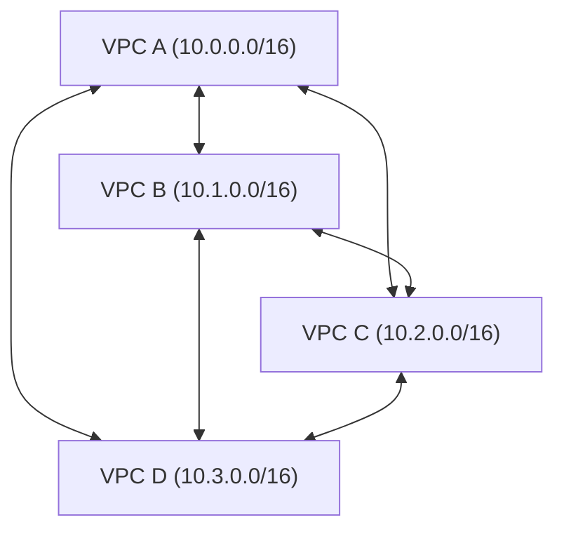

**Connections needed**: `N * (N-1) / 2`
- 4 VPCs = 6 connections
- 10 VPCs = 45 connections
- 25 VPCs = 300 connections
- 50 VPCs = 1,225 connections

**Pros**: This pattern offers the lowest possible latency because traffic takes a direct path without intermediate hops. There is no central router to become a single point of failure, no bandwidth bottleneck, and crucially, no per-gigabyte data processing charges for the transit hop itself (in AWS, intra-region VPC peering is free for the connection, though cross-AZ peering traffic still incurs roughly $0.01/GB each way). In tiny environments, these advantages can simplify troubleshooting because you can map traffic paths by manually tracing peering edges.

**Cons**: The architecture scales quadratically. Route tables grow linearly per VPC, creating immense administrative burden. [VPC Peering explicitly denies transitive routing](https://docs.aws.amazon.com/whitepapers/latest/aws-vpc-connectivity-options/vpc-peering.html) (if VPC A peers with B, and B peers with C, VPC A cannot reach C through B). Furthermore, there is no centralized inspection point to enforce universal firewall policies.

**When to use**: Full mesh is appropriate for very small deployments under 10 VPCs. It is also favored in highly cost-sensitive environments where avoiding per-GB processing charges is more important than architectural simplicity. Once growth is expected in the same year, you should begin planning a hub transition so you avoid redesigning every route table under pressure.

### Pattern 2: Hub-and-Spoke (Transit Gateway / NCC / Virtual WAN)

A Hub-and-Spoke model centralizes routing. A central hub routes traffic between all attached spokes. Spokes connect only to the hub, never directly to each other. This is analogous to a central post office sorting all mail for a region, which makes it easier to apply uniform policy and predict where new spokes should attach. Because decisions are centralized, this pattern generally reduces operational risk while preserving predictable expansion paths.
The most powerful characteristic of this topology is not lower-latency routing itself; it is the explicitness of policy boundaries. By deciding which spoke can attach to which attachment and route domain, you define the blast radius once and reuse it consistently. That consistency becomes more valuable than the raw number of paths because routing decisions often outlive applications. If an SRE team can only reason about a small set of route domains, incident response and auditability both improve.

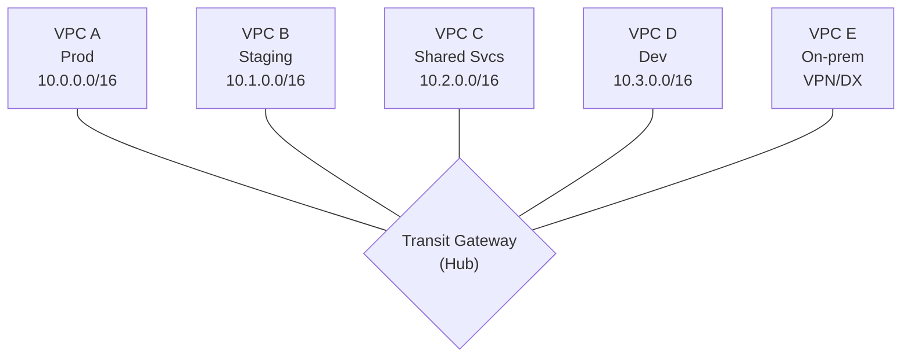

**Connections needed**: `N` (exactly one connection per spoke)
- 50 VPCs = 50 connections
- Transitive routing: YES (VPC A can reach VPC D strictly through the hub)
- Centralized inspection: YES (All traffic can be forced through a firewall VPC)

**Pros**: This pattern exhibits linear scaling, making it manageable at enterprise scale. It enables centralized routing policy, transitive routing, and provides a single, logical attachment point for on-premises connectivity (VPN/Direct Connect). It is the foundational pattern for centralized egress and deep security inspection, because inspection and governance can be attached to the hub boundary instead of duplicated everywhere.

**Cons**: The hub acts as a potential bandwidth bottleneck, although managed cloud hubs are designed to handle massive throughput. Cloud providers levy per-GB data processing charges for traffic passing through the hub (e.g., [AWS Transit Gateway charges $0.02/GB](https://aws.amazon.com/transit-gateway/pricing/)). A catastrophic hub misconfiguration affects all intra-organization connectivity, so design and change control around the hub should be treated as critical infrastructure.

**When to use**: This is the default enterprise standard for environments with 10 or more VPCs. It is mandatory for environments requiring centralized security inspection, extensive on-premises connectivity, or regulated sectors demanding deep traffic visibility. In most real enterprises, this is the pattern you adopt before fragmentation of ownership starts to dominate reliability.

### Pattern 3: Hybrid (Hub-and-Spoke + Direct Peering)

The Hybrid pattern utilizes a hub for the vast majority of organizational traffic but implements direct peering exclusively for extraordinarily high-bandwidth or latency-sensitive flows. It is a pragmatic compromise when a purely centralized model is correct in principle but not yet optimal in all economic scenarios. Because exceptions are controlled and explicit, you preserve the operational benefits of the hub while reducing fee leakage on heavy workloads.
In a well-run hybrid design, direct peering is never a one-off "performance workaround"; it is a governance-reviewed exception. You define threshold language (for example, sustained flow above defined bandwidth and latency targets over a set period), then enforce those constraints through change control so the exception set does not become an unmanaged bypass. Teams who skip this discipline often discover they have recreated a hidden full-mesh in the exceptions list, with all the same management issues they had previously tried to avoid.

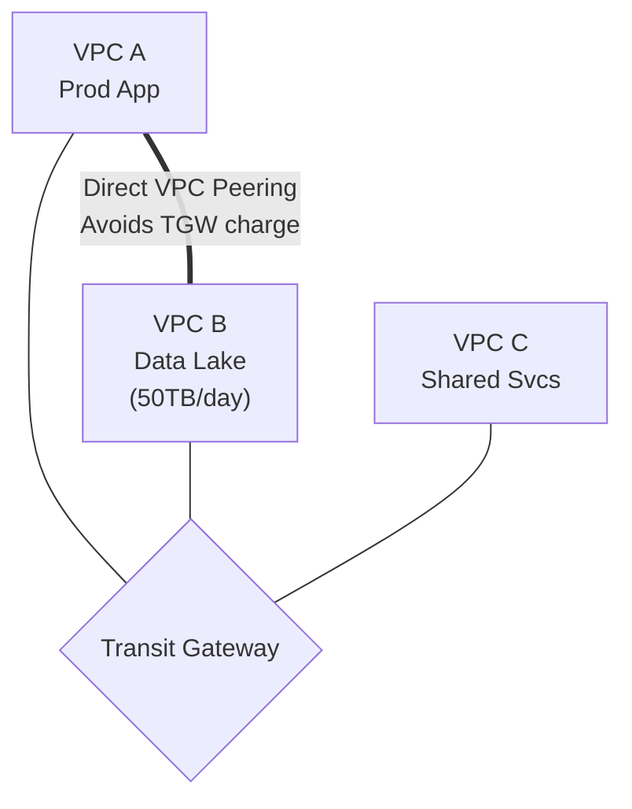

**Rule of thumb**: Implement direct peering bypasses only when sustained traffic between two specific VPCs is high enough that transit-hub processing fees materially affect your bill.

**Pause and predict:** Consider an organization expanding its cloud footprint to 30 VPCs that all require any-to-any network communication. Why does full-mesh VPC peering become architecturally unmanageable and operationally brittle at this scale compared to a centralized transit hub?

<details>
<summary>Check your prediction</summary>

Full-mesh VPC peering for 30 VPCs requires `N * (N - 1) / 2 = 435` point-to-point peering connections. Because VPC peering is non-transitive, traffic cannot hop through an intermediate VPC, forcing every pair of VPCs to maintain an explicit peering relationship. Each VPC route table requires 29 distinct target entries pointing to respective peering IDs; while the live default quota allows **500** routes per route table (expandable up to a maximum quota of **1000**), managing 435 connections introduces severe operational friction. Onboarding a 31st VPC requires provisioning 30 new peerings and updating 60 route tables simultaneously. A Transit Gateway collapses this combinatorial explosion down to **N attachments** (one per VPC) with centralized routing domains.
</details>

Enterprise networks still need a place to hang VPN, Direct Connect, and inspection VPCs beside application VPCs. The following section treats those hang-points as named objects instead of as one-off peering tickets.

---

## Transit Gateway Deep Dive (AWS)

AWS Transit Gateway (TGW) serves as the backbone of enterprise AWS networking. It operates as a cloud-native router positioned at the geographical center of your network, linking VPCs, Customer Gateways via VPN tunnels, and AWS Direct Connect gateways. Once you understand TGW, you can model inter-VPC, on-prem, and multi-region traffic as explicit route-domain policy instead of ad hoc point-to-point exceptions.
At scale, the most difficult part is not creating the TGW itself; it is encoding institutional intent so that every attachment follows the same baseline rules. Before you add any new spoke, ask three questions: which security domain owns it, which route tables must see it, and whether it must transit inspection. Those three choices determine blast radius more clearly than any diagram because they describe future maintenance behavior.

### Core Concepts

Understanding TGW requires mastering three core primitives: Attachments, Route Tables, and Peering. Treat each primitive as an explicit control plane surface, because nearly every production failure in hub-based designs is eventually a combination of attachment drift, wrong route associations, or peer attachment mismatch.
Attachments represent the boundary between ownership domains, and route tables encode the business intent for that domain. Attachments can be correct while route propagation remains wrong, and the failure will look like random packet loss unless you read the route table sequence carefully. Peering expands organizational reach across regions or clouds, but it amplifies the importance of consistent CIDR planning and deterministic route priorities. Thinking in those three primitives early prevents late-firefighting because every failure class maps to one of three configuration objects.

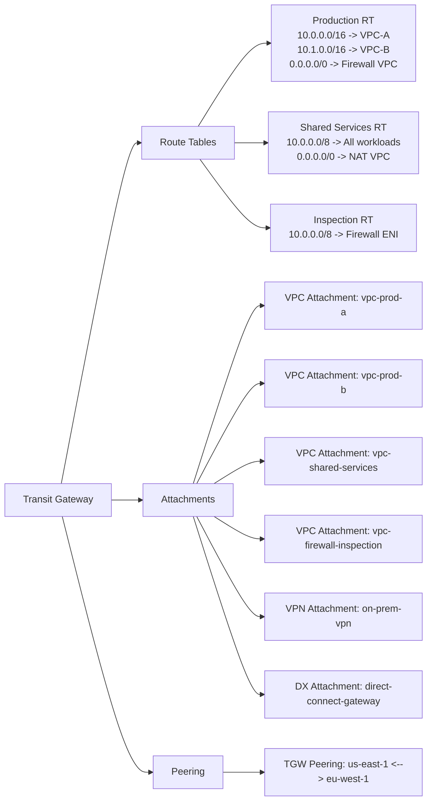

### Setting Up Transit Gateway with Terraform

When provisioning a Transit Gateway via Infrastructure as Code, you must configure it defensively. Notice how `default_route_table_association` and `default_route_table_propagation` are explicitly disabled. Disabling both forces you to model intended communication domains consciously, which is the same control you want when multiple security owners share the network.
Terraform is the right place to encode this restraint because it makes your network contract reviewable and replayable. If someone later adds an attachment through the console without matching route-domain decisions, your pipeline can catch drift before the traffic path changes in production. In other words, code-first networking is not about automating the happy path alone; it is about making incorrect paths harder to create in the first place.

```hcl
# Create the Transit Gateway
resource "aws_ec2_transit_gateway" "main" {
  description                     = "Organization Transit Gateway"
  amazon_side_asn                 = 64512
  auto_accept_shared_attachments  = "disable"
  default_route_table_association = "disable"
  default_route_table_propagation = "disable"
  dns_support                     = "enable"
  vpn_ecmp_support                = "enable"

  tags = {
    Name        = "org-transit-gateway"
    Environment = "infrastructure"
  }
}

# Share the TGW across the organization using RAM
resource "aws_ram_resource_share" "tgw_share" {
  name                      = "transit-gateway-share"
  allow_external_principals = false
}

resource "aws_ram_resource_association" "tgw" {
  resource_arn       = aws_ec2_transit_gateway.main.arn
  resource_share_arn = aws_ram_resource_share.tgw_share.arn
}

resource "aws_ram_principal_association" "org" {
  principal          = "arn:aws:organizations::111111111111:organization/o-abc1234567"
  resource_share_arn = aws_ram_resource_share.tgw_share.arn
}

# Create route tables for different traffic domains
resource "aws_ec2_transit_gateway_route_table" "production" {
  transit_gateway_id = aws_ec2_transit_gateway.main.id
  tags = { Name = "production-routes" }
}

resource "aws_ec2_transit_gateway_route_table" "shared_services" {
  transit_gateway_id = aws_ec2_transit_gateway.main.id
  tags = { Name = "shared-services-routes" }
}

resource "aws_ec2_transit_gateway_route_table" "inspection" {
  transit_gateway_id = aws_ec2_transit_gateway.main.id
  tags = { Name = "inspection-routes" }
}

# Attach a workload VPC (done in each workload account)
resource "aws_ec2_transit_gateway_vpc_attachment" "prod_vpc" {
  subnet_ids         = [aws_subnet.private_a.id, aws_subnet.private_b.id]
  transit_gateway_id = aws_ec2_transit_gateway.main.id
  vpc_id             = aws_vpc.production.id

  transit_gateway_default_route_table_association = false
  transit_gateway_default_route_table_propagation = false

  tags = { Name = "prod-vpc-attachment" }
}

# Associate the attachment with the production route table
resource "aws_ec2_transit_gateway_route_table_association" "prod" {
  transit_gateway_attachment_id  = aws_ec2_transit_gateway_vpc_attachment.prod_vpc.id
  transit_gateway_route_table_id = aws_ec2_transit_gateway_route_table.production.id
}

# Propagate the VPC's routes into the shared services route table
# (so shared services can reach production)
resource "aws_ec2_transit_gateway_route_table_propagation" "prod_to_shared" {
  transit_gateway_attachment_id  = aws_ec2_transit_gateway_vpc_attachment.prod_vpc.id
  transit_gateway_route_table_id = aws_ec2_transit_gateway_route_table.shared_services.id
}
```

### Routing Traffic Through a Centralized Firewall

The most powerful architectural capability unlocked by Transit Gateway is centralized inspection. By strategically assigning route tables, you can force all east-west (VPC-to-VPC) traffic through a dedicated firewall appliance before it reaches its final destination. In practical terms, this lets you move from scattered per-team firewall posture to a single inspect-and-verify point that auditors can reason about once and apply repeatedly.
Centralized inspection creates a clean narrative for platform ownership: ingress and egress policy are both enforced at one choke point, while security teams can iterate rule sets without changing each workload VPC. That does not eliminate all policy work in workload teams, but it turns repeated, brittle per-team firewall divergence into one stable operational plane. For regulated environments, this is especially important because you can prove exactly where inspection occurs and what changed between audit windows.

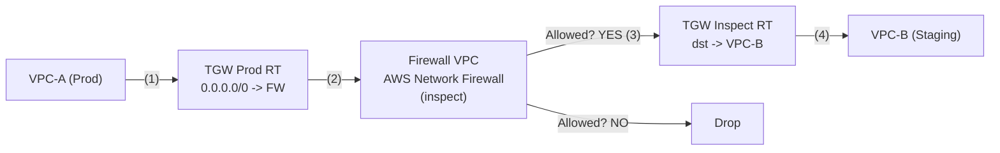

The traffic flow executes in a precise sequence:
1. A packet leaves VPC-A. The VPC route table sends it to the TGW Attachment.
2. The packet arrives at the TGW and evaluates the "Prod" Route Table. The Prod RT has a default route forcing everything to the Firewall VPC.
3. The packet traverses the firewall appliance in the Firewall VPC.
4. If allowed, the packet leaves the Firewall VPC and re-enters the TGW, but this time it is evaluated against the "Inspect" Route Table.
5. The Inspect RT contains the specific route for VPC-B, delivering the packet successfully.

Enable **appliance mode** on the inspection-VPC TGW attachment: without `appliance_mode_support = "enable"`, Transit Gateway hashes flows per-AZ and return traffic can land on a different AZ's firewall endpoint, breaking stateful inspection.

This architecture introduces additional hop and inspection latency but provides major security benefits:
- Centralized Intrusion Detection/Prevention (IDS/IPS) for internal traffic.
- Consolidated logging of all inter-VPC flows in a single pane of glass.
- Critical capability to block lateral movement by ransomware or compromised Kubernetes pods.

```hcl
# Inspection-VPC attachment: appliance mode keeps ingress/return on the same AZ ENI
resource "aws_ec2_transit_gateway_vpc_attachment" "firewall" {
  subnet_ids                                      = [aws_subnet.firewall_a.id, aws_subnet.firewall_b.id]
  transit_gateway_id                              = aws_ec2_transit_gateway.main.id
  vpc_id                                          = aws_vpc.firewall.id
  appliance_mode_support                          = "enable"
  transit_gateway_default_route_table_association = false
  transit_gateway_default_route_table_propagation = false
  tags = { Name = "firewall-vpc-attachment" }
}

# Route all traffic from production to the firewall
resource "aws_ec2_transit_gateway_route" "prod_default" {
  destination_cidr_block         = "0.0.0.0/0"
  transit_gateway_attachment_id  = aws_ec2_transit_gateway_vpc_attachment.firewall.id
  transit_gateway_route_table_id = aws_ec2_transit_gateway_route_table.production.id
}

# In the firewall VPC, route return traffic back through TGW
resource "aws_route" "firewall_return" {
  route_table_id         = aws_route_table.firewall_private.id
  destination_cidr_block = "10.0.0.0/8"
  transit_gateway_id     = aws_ec2_transit_gateway.main.id
}
```

**Pause and predict:** When provisioning an AWS Transit Gateway, default configurations enable default route table association and default route table propagation. Why does relying on this default Transit Gateway route table undermine enterprise network segmentation and security postures?

<details>
<summary>Check your prediction</summary>

The default Transit Gateway route table automatically associates every new attachment and propagates its CIDR block into a single flat routing domain. Under default association and propagation, every connected VPC, VPN, and Direct Connect circuit gains unrestricted bidirectional network reachability to every other attachment. This behavior collapses environment isolation, allowing lower-trust development or sandbox attachments to route directly into mission-critical production VPCs. To establish strict network segmentation, engineers must disable default route table association and propagation during gateway creation, provisioning dedicated, isolated route tables with explicit associations and selective propagations.
</details>

The next hyperscaler in this module does not start from a regional router object at all. Its intra-org fabric is a shared network owned by a host project, with a different enforcement surface than attachment-to-route-table mapping.

---

## GCP Network Connectivity Center (NCC) and Shared VPC

Google Cloud Platform (GCP) approaches transit networking from an entirely different philosophy. Instead of a single gateway product routing between disparate VPCs, GCP relies heavily on **Shared VPC** for intra-organization connectivity, reserving the Network Connectivity Center (NCC) for hybrid cloud and multi-cloud scenarios. This distinction matters operationally, because many teams migrating from AWS over-index on hub design and then discover they need to internalize shared-network governance as the center of control.

### Shared VPC: The GCP Way

In GCP, Shared VPC is the dominant multi-project networking model. Rather than peering dozens of separate VPCs, network administrators create one massive VPC inside a central "Host Project". They then share specific subnets out to "Service Projects" owned by individual teams. 
In GCP, that governance center is the host project. Teams still require strong ownership boundaries, but the boundaries are represented as subnet and project relationships first. This flips the mental model compared to an AWS-centric TGW mindset where the hub object is the dominant anchor. As a result, "who can add a subnet" and "who can attach a service account" become as critical as routing choices.

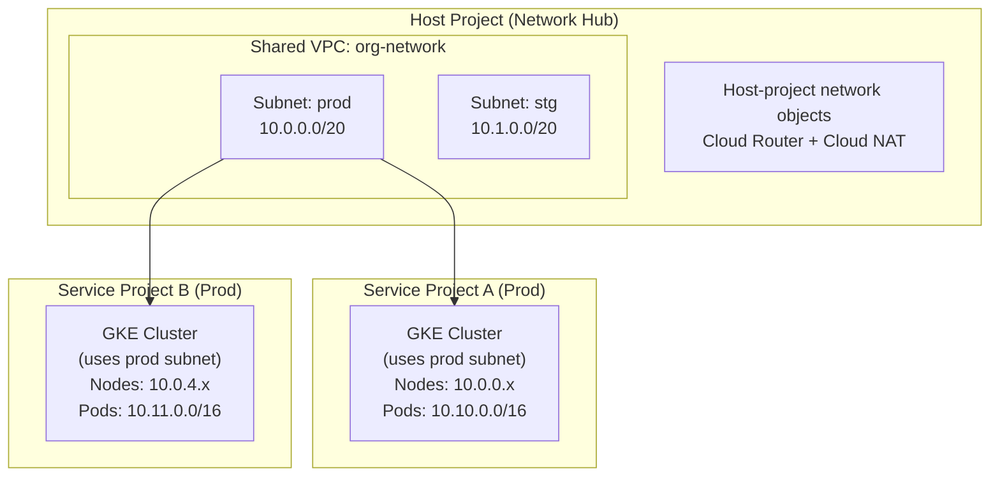

The pivotal distinction from AWS is that there is only ONE network boundary to manage. [The host project is where those network objects live](https://cloud.google.com/vpc/docs/shared-vpc), and service projects consume the subnets it shares.

```bash
# Enable Shared VPC on the host project
gcloud compute shared-vpc enable network-hub-project

# Associate service projects
gcloud compute shared-vpc associated-projects add team-a-prod \
  --host-project=network-hub-project

gcloud compute shared-vpc associated-projects add team-b-prod \
  --host-project=network-hub-project

# Create subnets with secondary ranges for GKE
gcloud compute networks subnets create prod-subnet \
  --project=network-hub-project \
  --network=org-network \
  --region=us-central1 \
  --range=10.0.0.0/20 \
  --secondary-range=pods=10.10.0.0/16,services=10.20.0.0/20 \
  --secondary-range=pods-b=10.11.0.0/16

# Grant GKE service account access to the shared subnet
PROJECT_NUM=$(gcloud projects describe team-a-prod --format="value(projectNumber)")

gcloud projects add-iam-policy-binding network-hub-project \
  --member="serviceAccount:service-${PROJECT_NUM}@container-engine-robot.iam.gserviceaccount.com" \
  --role="roles/container.hostServiceAgentUser"

# Create GKE cluster in service project using shared VPC
gcloud container clusters create team-a-prod \
  --project=team-a-prod \
  --region=us-central1 \
  --network=projects/network-hub-project/global/networks/org-network \
  --subnetwork=projects/network-hub-project/regions/us-central1/subnetworks/prod-subnet \
  --cluster-secondary-range-name=pods \
  --services-secondary-range-name=services \
  --enable-private-nodes \
  --master-ipv4-cidr=172.16.0.0/28

# Second cluster in team-b-prod uses the pods-b secondary range (see diagram)
gcloud container clusters create team-b-prod \
  --project=team-b-prod \
  --region=us-central1 \
  --network=projects/network-hub-project/global/networks/org-network \
  --subnetwork=projects/network-hub-project/regions/us-central1/subnetworks/prod-subnet \
  --cluster-secondary-range-name=pods-b \
  --services-secondary-range-name=services \
  --enable-private-nodes \
  --master-ipv4-cidr=172.16.0.16/28
```

**Pause and predict:** Staging and production both live as subnets in one Shared VPC host project. How do platform teams prevent staging workloads from reaching production databases?

<details>
<summary>Check your prediction</summary>

Because GCP VPC networks feature global routing where all subnets route to one another by default, route tables cannot be used to isolate environments within a Shared VPC. Instead, network isolation is enforced exclusively through **host-project firewall** policies using network tags or service accounts. Security teams define hierarchical or VPC-level firewall rules in the host project that explicitly deny cross-tier communication between staging and production workloads. They bind ingress and egress restrictions to specific target service accounts attached to compute instances and GKE nodes.
</details>

Hybrid and branch connectivity still has to land somewhere once the shared network exists. The next object in this module is the one Google positions for on-premises VPNs and Dedicated Interconnects rather than for day-to-day subnet isolation.

### GCP Network Connectivity Center

Network Connectivity Center (NCC) provides a managed hub focused primarily on establishing external connectivity. Use NCC to terminate high-bandwidth BGP sessions, on-premises VPNs, and Dedicated Interconnects, piping that external traffic smoothly into your Shared VPC. Treat NCC as the external ingress/egress anchor first, and only then layer in policy for inter-project routing consistency.
The advantage of this sequence is deterministic troubleshooting. If on-premises reachability degrades, you isolate the issue at NCC and interconnect attachments first, then move inward to shared-network policy. You avoid the common mistake of immediately changing many service projects in response to a single external path issue. This keeps incidents localizable and prevents collateral impact in unrelated environments.

```bash
# Create an NCC hub
gcloud network-connectivity hubs create org-hub \
  --description="Organization network hub"

# Create a spoke for a VPN tunnel to on-premises
gcloud network-connectivity spokes create onprem-spoke \
  --hub=org-hub \
  --region=us-central1 \
  --vpn-tunnel=onprem-tunnel-1,onprem-tunnel-2 \
  --site-to-site-data-transfer

# Create a spoke for a Cloud Interconnect (dedicated connection)
gcloud network-connectivity spokes create colo-spoke \
  --hub=org-hub \
  --region=us-central1 \
  --interconnect-attachment=colo-attachment-1
```

---

## Azure Virtual WAN

Microsoft Azure utilizes Virtual WAN (vWAN), a managed service consolidating networking, security, and routing functionalities into a single interface. Virtual WAN streamlines large-scale branch connectivity and reduces manual hub design effort in globally distributed enterprise footprints. The abstraction can significantly shorten provisioning, but you still need strong naming and route hygiene to keep intent clear across dozens of branches.
Azure’s value proposition here is similar to TGW in one respect and different in another: both centralize paths, but vWAN bakes in branch-to-branch operations you may otherwise model manually with many VPN gateway objects. If your environment is branch-heavy, this can cut time-to-connect by orders of magnitude; if your environment is security-heavy, the same abstraction demands equally strong governance around policy inheritance. You still need to prove who owns each hub and what routes may be exported outside it.

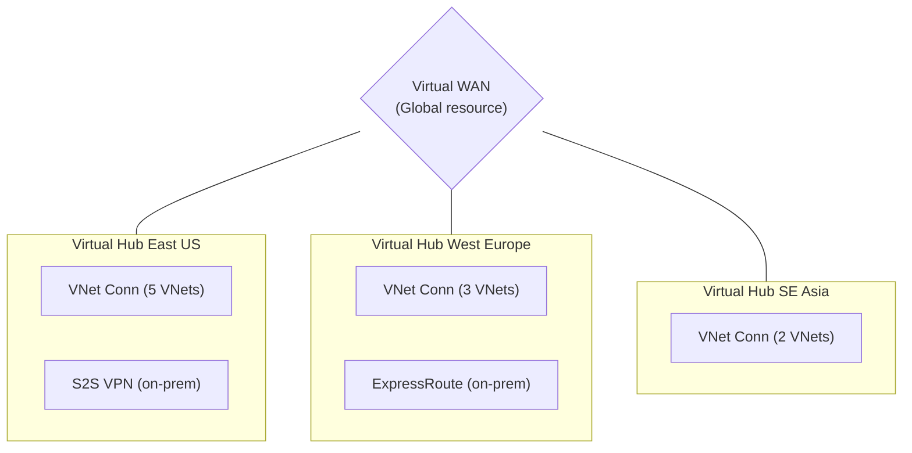

A crucial feature of Virtual WAN Standard tier is its automatic, global meshing. If you deploy regional Hubs across the globe, [Microsoft automatically provisions full-mesh transit routing between them over the Azure backbone.](https://learn.microsoft.com/en-us/azure/virtual-wan/virtual-wan-faq)
When regional hubs are auto-meshed, the security posture shifts from "connectivity-first" to "policy-first." You gain speed at the fabric layer, but you pay for rigor in what each spoke is allowed to do. In practical platform work, this often requires a preflight policy bundle reviewed by both network and platform teams so automatic mesh expansion does not outrun governance.

That behavior is useful for scale, yet it also means you must explicitly design segmentation and inspection policy outside the hub mesh or you will unintentionally permit cross-region paths you never intended.

```bash
# Create a Virtual WAN
az network vwan create \
  --name org-vwan \
  --resource-group networking-rg \
  --type Standard \
  --branch-to-branch-traffic true

# Create a regional hub
az network vhub create \
  --name eastus-hub \
  --resource-group networking-rg \
  --vwan org-vwan \
  --address-prefix 10.100.0.0/24 \
  --location eastus \
  --sku Standard

# Connect a spoke VNet to the hub
az network vhub connection create \
  --name prod-vnet-connection \
  --resource-group networking-rg \
  --vhub-name eastus-hub \
  --remote-vnet /subscriptions/SUB_ID/resourceGroups/prod-rg/providers/Microsoft.Network/virtualNetworks/prod-vnet \
  --internet-security true

# Add a VPN gateway to the hub
az network vpn-gateway create \
  --name eastus-vpn-gw \
  --resource-group networking-rg \
  --vhub eastus-hub \
  --scale-unit 2
```

---

## The Overlapping CIDR Problem

Overlapping CIDR ranges constitute the single most pervasive networking error in multi-account cloud architectures. Two disparate teams independently select the common `10.0.0.0/16` block for their respective VPCs. The architecture functions flawlessly in isolation until a business requirement forces integration. At that exact moment, routing breaks down entirely because IP routers cannot decipher identical destination addresses.

### How It Happens

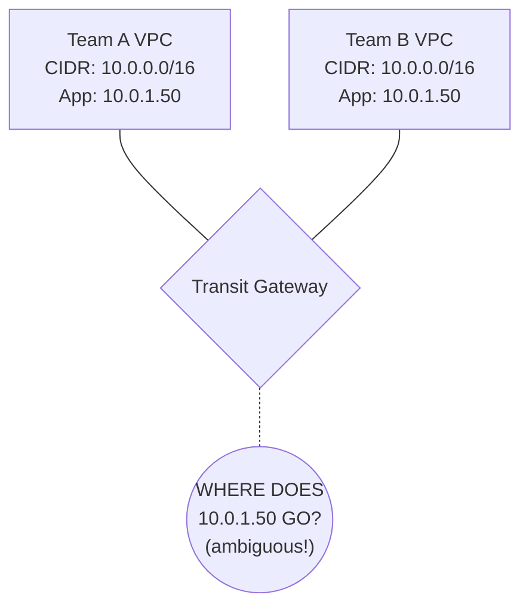

**Pause and predict:** Following a corporate acquisition, two independent engineering organizations need to connect their production VPCs, but both environments were originally provisioned using `10.0.0.0/16`. If both VPCs attach to the same Transit Gateway, can the gateway route traffic between them, and how can connectivity be established without immediately renumbering workloads?

<details>
<summary>Check your prediction</summary>

An AWS Transit Gateway will **not** route between attachments with identical, overlapping CIDRs because the routing engine cannot deterministically resolve the destination attachment for the ambiguous `10.0.0.0/16` prefix. To establish bidirectional communication without undertaking an immediate, disruptive network renumbering project, teams must deploy **Private NAT** gateways or proxy endpoints alongside non-overlapping routable CIDR blocks. Source and destination addresses are translated to non-overlapping routable IPs before packets traverse the transit hub, paired with split-horizon Private DNS zones to resolve service endpoints to translated addresses.
</details>

Merger connectivity is a one-time emergency; the standing control is who is allowed to pick a CIDR at account-vending time. The next section is that allocation plane.

### Prevention: IP Address Management (IPAM)

The preventative cure is instituting [centralized IP Address Management (IPAM)](https://docs.aws.amazon.com/vpc/latest/ipam/allocate-cidrs-ipam.html). By defining authoritative IP pools, you force teams to request allocations programmatically, sharply reducing the manual mistakes that cause overlapping CIDRs. In mature organizations, that authority model also supports delegation because teams can self-serve within policy boundaries instead of negotiating CIDR space through informal channels.
At a design level, this is one of the rare controls that improves reliability and culture at the same time. Engineers stop thinking of CIDR as an arbitrary local preference and start treating it as shared infrastructure as code. Over time, the quality of all architecture decisions improves because conflicts are discovered at creation time instead of during an integration deadline crunch.

```bash
# AWS: Use VPC IPAM (IP Address Manager)
aws ec2 create-ipam \
  --operating-regions RegionName=us-east-1 RegionName=eu-west-1

# Create a top-level pool
aws ec2 create-ipam-pool \
  --ipam-scope-id ipam-scope-abc123 \
  --address-family ipv4 \
  --description "Organization IPv4 pool"

# Provision the master CIDR block
aws ec2 provision-ipam-pool-cidr \
  --ipam-pool-id ipam-pool-abc123 \
  --cidr 10.0.0.0/8

# Create sub-pools per environment
aws ec2 create-ipam-pool \
  --ipam-scope-id ipam-scope-abc123 \
  --source-ipam-pool-id ipam-pool-abc123 \
  --address-family ipv4 \
  --allocation-default-netmask-length 20 \
  --description "Production VPCs"

# When creating a VPC, request from the pool (no manual CIDR)
aws ec2 create-vpc \
  --ipv4-ipam-pool-id ipam-pool-prod123 \
  --ipv4-netmask-length 20
```

### CIDR Allocation Strategy

A robust strategy segments the massive `10.0.0.0/8` master block into logical routing domains before a single line of Terraform is written. Furthermore, deploying Kubernetes requires immense IP space for Pods. In most cases, utilize Carrier-Grade NAT ranges (e.g., `100.64.0.0/10`) for secondary pod subnets to avoid exhausting your primary routing space.
That one-time segmentation decision is what prevents the majority of downstream incidents where teams discover conflicts after the fact. The master block is not just an accounting range; it is a governance boundary that expresses who is allowed to expand and at what cadence. If your segmentation includes environment-based bands (Production, Staging, Development), you can preemptively encode guardrails that align with security and compliance constraints.

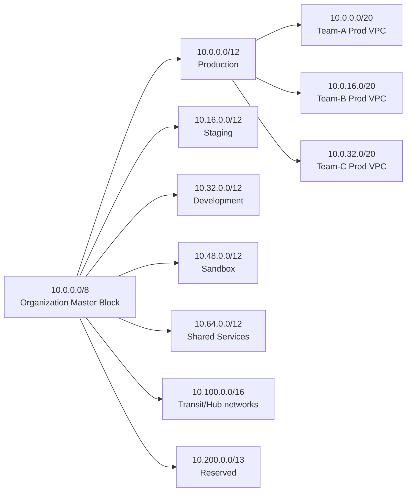

---

## Egress Filtering and Cost Optimization

Egress (outbound) data transfer represents the silent killer of cloud budgets. AWS levies a charge of $0.09/GB for internet egress. At scale, this rapidly eclipses compute costs. 
The hidden problem is that cost teams usually discover this line after optimization work has already started elsewhere. Teams tune compute, memory, and instance classes aggressively, while every packet still takes inefficient exit paths through repeated NAT and unshared egress designs. That is why egress design deserves the same priority as autoscaling policy or database sizing during architecture reviews.

### Centralized Egress Pattern

Instead of deploying discrete NAT Gateways into every workload VPC, funnel all outbound internet requests through your Transit Gateway into a dedicated Egress VPC.

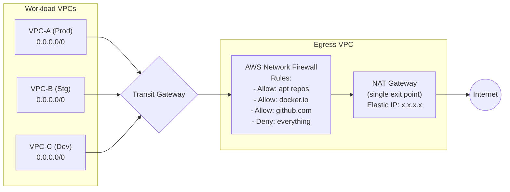

The architectural benefits are manifold:
- **Consolidated Identity**: Presenting a single egress Elastic IP vastly simplifies firewall allowlisting required by third-party partners.
- **Deep Filtering**: Intercepting traffic prevents compromised container pods from communicating with command-and-control servers or exfiltrating data.
- **Cost Reduction**: Eliminating redundant NAT Gateways across dozens of VPCs saves substantial hourly running costs ($32/month per eliminated gateway).

### AWS Network Firewall Rules

By utilizing [stateful domain allowlists inspecting TLS SNI headers](https://docs.aws.amazon.com/network-firewall/latest/APIReference/API_RulesSourceList.html), administrators can permit access specifically to necessary artifact repositories while discarding malicious outbound requests.

```bash
# Create a rule group for allowed domains
aws network-firewall create-rule-group \
  --rule-group-name "allowed-egress-domains" \
  --type STATEFUL \
  --capacity 100 \
  --rule-group '{
    "RulesSource": {
      "RulesSourceList": {
        "Targets": [
          ".amazonaws.com",
          ".docker.io",
          ".github.com",
          ".githubusercontent.com",
          "registry.k8s.io",
          ".grafana.com",
          "apt.kubernetes.io"
        ],
        "TargetTypes": ["HTTP_HOST", "TLS_SNI"],
        "GeneratedRulesType": "ALLOWLIST"
      }
    }
  }'
```

### Cross-AZ and Cross-Region Transfer Costs

The most frequently overlooked expenditure in Kubernetes networking is cross-AZ data transfer. Examine the pricing matrix carefully: teams often underestimate the cumulative effect because the unit cost looks small, but multiplied by hundreds of millions of east-west calls it becomes strategic burn. Good network design in this area is rarely glamorous, but it is one of the highest-leverage cost-control levers.

| Traffic Path | AWS Cost/GB | GCP Cost/GB | Azure Cost/GB |
|---|---|---|---|
| Same AZ | Free | Free | Free |
| Cross-AZ (same region) | Charge depends on service and traffic path | Charge depends on zones, IP type, and path | Charge depends on service and billing path |
| Cross-Region (same continent) | Metered; exact rate depends on source and destination regions | Metered; exact rate depends on source and destination regions | Metered; exact rate depends on source and destination regions |
| Cross-Region (intercontinental) | Metered; typically higher than intra-continent traffic | Metered; typically higher than intra-continent traffic | Metered; typically higher than intra-continent traffic |
| Internet egress | Metered; varies by source region and usage tier | Metered; varies by destination and usage tier | Metered; varies by source region and pricing path |
| TGW data processing | AWS Transit Gateway adds per-GB processing charges | Product- and path-dependent; check current NCC or VPC pricing | Product- and path-dependent; check current Virtual WAN and bandwidth pricing |

The AWS cross-AZ charge proves particularly devastating for distributed Kubernetes workloads. If a cluster spans three Availability Zones to maintain high availability, every intra-cluster service request that crosses an AZ boundary incurs a $0.02/GB round-trip charge. For this reason, topology-aware routing and workload placement must be part of every platform design review, not an afterthought after performance tuning.
Cost governance here is less about memorizing pricing pages and more about designing for locality first, then exceptions. If your service mesh or cluster autoscaler is already controlling where pods land, then networking policy should reinforce that behavior with topological awareness. The platform can remain highly available without every request bouncing across availability boundaries when same-zone alternatives exist.

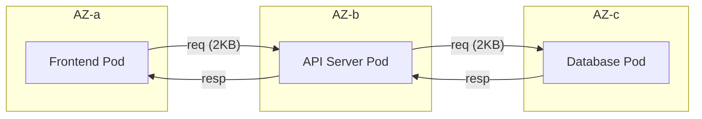

To mitigate this, leverage Kubernetes topology-aware routing so traffic prefers same-zone endpoints when the Service and endpoint distribution allow it.

---
## Governance, Verification, and Change Control for Transit Network Operations

A practical way to think about these patterns is as a control plane platform, not a one-time migration project. The initial diagram becomes valuable only when every engineer uses it to make safe changes without rediscovering every edge case. In mature teams, the goal is to make the first week of operation look like the same process as the last week: predictable, scripted, and reviewable. You can apply this mindset regardless of whether the network has only two spokes or forty.

Start each design sprint by freezing assumptions about ownership. Clarify who owns VPC attachments, who owns route-table strategy, and who owns security policy exceptions. When this boundary is clear, changes are easier to delegate and easier to audit when traffic behavior changes. In practical terms, this prevents a recurring pattern where one engineer changes routing and another modifies a firewall rule minutes later without understanding the combined impact.

For the three provider families, the operational sequence is similar even if implementation differs. First, define the intended connectivity graph and expected failure boundaries; second, implement the smallest auditable change to that graph; third, validate with explicit evidence; and fourth, document what changed before moving on. This sequence aligns with route-table-heavy designs, shared-IP models, and managed hub workflows because the cognitive load is the same: define path behavior, then verify path behavior.

In Terraform-heavy environments, this is often captured as a **Network Control Plan** section in the same change ticket. Include:
- **What changed**: new attachments, new route associations, or new route table exceptions.
- **Why it changed**: traffic pattern shift, compliance need, or scale threshold.
- **Expected blast radius**: which environments can reach each other and which cannot.
- **Verification command list**: one query for control-plane objects, one query for flow-level behavior, and one smoke call path.

This format reduces ambiguity because reviewer decisions become evidence-backed. Even if a reviewer does not share the same private mental model, they can evaluate the plan against the module's expected architecture and detect contradictions quickly. That is especially useful in cross-team environments where subnet ownership, service ownership, and security ownership do not naturally align.

A common source of post-change instability is over-optimizing one metric at the expense of another. For example, reducing one-off spend by changing peering or firewall policy can accidentally increase operational complexity if it removes route consistency. The right response is not to forbid all optimization; it is to force every optimization through the same pre-merge review and post-merge verification habit. If traffic can no longer be explained by a small set of route and inspection rules, the network has become unmanageable.

Operational consistency also relies on clear rollback criteria. A high-quality runbook defines what “failure” means before change windows begin: acceptable packet loss, allowable latency budget shift, and a maximum time to restore baseline routes. Without this language, teams debate after the fact whether an observed degradation is severe or acceptable. With it, response runs are cleaner: either the change is within pre-agreed tolerances, or it is rolled back immediately and retested.

Finally, teach teams to treat observability as part of architecture, not as an afterthought. If a hub design includes no way to trace why a path moved from expected route table A to fallback table B, then the architecture is incomplete even if it currently passes functional checks. Add flow identifiers and expected-route documentation together, and use those artifacts in every incident review. Over time this turns “invisible routing drift” into a bounded, repeatable event.

## Cutover, Validation, and Regression Guardrails

Topology migrations rarely fail because a single command is wrong; they usually fail because teams combine too much change into one window and skip visibility checkpoints. The most reliable strategy is staged change: first prove attachment wiring, then prove route behavior, then prove policy enforcement. Even if your initial design is fully modernized, this order prevents accidental outages by ensuring each control-plane object is validated before the next one depends on it.

For a realistic migration, define your "pilot cohort" as a bounded slice of production-like traffic rather than only an isolated lab. If you start with a tiny canary VPC, you can verify that TGW route table association, propagation, and firewall detours work exactly as your design diagram says they do. If the canary succeeds, you move to the second cohort with the same validation sequence and a stricter change freeze. This sequencing matters because shared egress and shared inspection often reveal issues only when unrelated services share the same security domain.

A proven regression guardrail is to run pre- and post-cutover evidence captures side by side. Before any change, collect baseline route tables, flow logs, and route-health checks from representative environments; after each milestone, capture the same artifacts and diff them manually or with scripts. This is not busywork, because identical workloads with different route table bindings can behave as if only one component changed. With artifacts aligned, an incident can be diagnosed by comparing expected and observed outputs, rather than by re-learning the whole architecture during an outage.

In practice, the migration pattern should include a "policy-first rollback condition." If a single service loses required connectivity, or if new egress concentration produces unplanned side effects, rollback must restore the last known-good egress + route state, not just the last Terraform apply. Teams that rollback only partial state usually carry transient inconsistencies into the next attempt, and that compounds risk. This is why every ticket should specify the exact rollback anchor object set, not only the commit hash.

One subtle point in transit evolution is that success is not binary and not merely "it works." After completion, measure whether the organization can perform the next small change without re-litigating ownership or architecture intent. If the second and third operations become faster than the first, your design has crossed from diagram to institution. If they remain manual and repetitive, then the network is still trapped in project-by-project tribal knowledge despite passing the initial acceptance criteria.

## Troubleshooting Transit Networks

When complex hub-and-spoke networks fail, they rarely trigger explicit error codes. They fail silently, manifesting as routing blackholes. Because a single packet might traverse five different routing tables across three VPCs, diagnosing the exact point of failure demands systematic analysis.

### Identifying Routing Blackholes with VPC Flow Logs

VPC Flow Logs persistently record metadata regarding IP traffic flowing through network interfaces. During troubleshooting, you must scan relentlessly for `REJECT` records because they are the most direct evidence of a hard stop in the path. Once you can tie a reject timestamp to a subnet route table and attachment, you can usually isolate the failure within one to two network domains instead of guessing.
Pairing flow-log forensics with route table inventory is especially effective because it distinguishes policy failure from topology failure. A reject caused by security controls points you toward Network ACL, Security Group, or firewall policy updates, while a missing route points you toward TGW attachment configuration and propagation state. This distinction reduces blast-radius during incident response because your actions become narrower and safer.

```text
# Sample VPC Flow Log (AWS)
version account-id interface-id srcaddr dstaddr srcport dstport protocol packets bytes start end action log-status
2 123456789012 eni-0a1b2c3d 10.0.1.50 10.1.2.75 443 49152 6 5 500 1620140761 1620140821 ACCEPT OK
2 123456789012 eni-0a1b2c3d 10.0.1.50 10.2.3.10 443 49153 6 1 40 1620140761 1620140821 REJECT OK
```

A `REJECT` action occurs for two primary reasons:
1. **Firewall Block**: The packet arrived at the destination, but a Security Group or Network ACL denied it.
2. **Path Issue**: A missing or incorrect route can blackhole traffic, but you need route analysis tools in addition to flow logs to prove that was the cause. 

### Route Analysis Tools

To augment manual log parsing, cloud providers offer automated path analysis. AWS Reachability Analyzer and GCP Connectivity Tests can model the expected path and highlight blocking components in routing or policy. Use them as confirmation tools so you can validate that a missing path is truly a routing defect and not a destination-side security rule.
Automated analysis does not remove human reasoning; it shortens the distance between a hypothesis and evidence. Start with your expected source and destination, then compare expected path analysis output with known route tables. If the expected and observed paths diverge, you can usually isolate misattachments before opening support tickets or changing application configuration.

---

## Did You Know?

1. [**AWS Transit Gateway processes up to 100 Gbps per VPC attachment** and supports up to 5,000 attachments per gateway](https://docs.aws.amazon.com/vpc/latest/tgw/transit-gateway-quotas.html). Its release gave AWS customers a managed alternative to self-built transit VPC patterns.
2. **GCP's Shared VPC is built for large multi-project environments.** Use host projects and shared subnets when multiple teams need centralized network control with delegated project ownership.
3. **Azure Virtual WAN Standard automatically meshes hubs** within the same Virtual WAN, reducing manual inter-hub routing work over Microsoft's backbone.
4. **Cross-AZ data transfer in AWS can become a major bill driver at scale.** Track it explicitly instead of assuming it is negligible.

---

## Common Mistakes

| Mistake | Why It Happens | How to Fix It |
|---|---|---|
| Using VPC Peering when Transit Gateway is needed | Peering is simpler to set up initially | Start evaluating TGW early if you expect multiple VPCs, centralized inspection, or ongoing network growth. Migration from peering to TGW is usually more disruptive later. |
| Overlapping CIDR ranges across accounts | No centralized IP planning | Implement AWS IPAM or maintain a CIDR registry in your IaC. Allocate from non-overlapping pools per environment. |
| Forgetting to update VPC route tables after TGW attachment | TGW handles its routes, but VPCs need routes pointing to TGW | Automate: when attaching a VPC to TGW, also add a route `0.0.0.0/0 -> tgw-id` in the VPC's private route table. |
| Running NAT Gateways in every VPC | Each VPC needs internet access | Centralize NAT in a shared egress VPC when the traffic pattern and failure model fit; this can remove repeated hourly NAT gateway charges, but the exact savings depend on region and usage. |
| Ignoring cross-AZ data transfer costs | "It's just $0.01/GB" | For high-throughput K8s clusters, this can be thousands per month. Use topology-aware routing and monitor cross-AZ traffic with VPC Flow Logs. |
| Not enabling TGW route table segmentation | Using the default route table for everything | Create separate route tables per security domain (prod, staging, shared). This prevents staging workloads from routing to production VPCs. |
| Peering VPCs across regions without considering latency | "The cloud handles it" | Cross-region latency varies widely by geography and path. For real-time APIs, measure it directly with `ping`, `mtr`, or application-level tests before designing cross-region flows. |
| Skipping egress filtering | "We trust our workloads" | A compromised pod can exfiltrate data to any IP. Centralized egress with domain allowlists is a critical security control. |

---

## Quiz

<details>
<summary>1. You are a network architect moving from AWS to GCP. In AWS, you connected 50 project VPCs using Transit Gateway. How will your approach to multi-project connectivity fundamentally change in GCP, and why?</summary>

In AWS, Transit Gateway connects separate VPCs (each with its own CIDR, route tables, and security groups) through a central router, maintaining network isolation. GCP uses a Shared VPC model where a single VPC is owned by a host project and its subnets are shared to service projects. There are no separate VPCs to connect—everything resides in one network. This eliminates the need for transit routing for intra-org traffic, but means firewall rules apply across all projects sharing the VPC.
</details>

<details>
<summary>2. Your EKS cluster spans 3 AZs and generates 50TB of cross-AZ traffic monthly. What are two strategies to reduce this cost?</summary>

Strategy 1: Enable topology-aware routing in Kubernetes. Configure Services with `internalTrafficPolicy: Local` where possible — that setting is node-local and blackholes traffic if no endpoint exists on the same node, which is distinct from zone-aware `trafficDistribution`. Use `trafficDistribution: PreferSameZone` in your Service spec so kube-proxy prefers endpoints in the same AZ (`PreferClose` remains a deprecated alias as of Kubernetes 1.34). Strategy 2: Use pod topology spread constraints combined with service affinity to co-locate communicating services in the same AZ. For example, place the API server and its database cache in the same AZ. This requires understanding your service call graph. Together, these can reduce cross-AZ traffic by 40-70%, saving $500-$700/month on a 50TB workload.
</details>

<details>
<summary>3. A partner company requires you to provide a static IP for their firewall allowlist. You have 12 VPCs across 3 accounts. How do you provide a single egress IP?</summary>

Create a centralized egress VPC with a NAT Gateway attached to an Elastic IP. Route all internet-bound traffic from your 12 VPCs through the Transit Gateway to the egress VPC. The NAT Gateway translates all outbound traffic to the single Elastic IP. The partner allowlists this one IP. This pattern also lets you add AWS Network Firewall in the egress VPC for domain-based filtering. The cost is one NAT Gateway ($32/month + $0.045/GB) instead of 12 NAT Gateways ($384/month), plus TGW data processing ($0.02/GB). At moderate traffic volumes, the centralized approach is cheaper and more manageable.
</details>

<details>
<summary>4. Your platform team has historically used a shared wiki spreadsheet to allocate VPC CIDR blocks. Recently, two different product teams accidentally claimed the same `10.4.0.0/16` block, causing a multi-day outage when their networks couldn't peer. How would implementing AWS VPC IPAM prevent this situation from happening again?</summary>

AWS VPC IPAM provides automated, conflict-free CIDR allocation enforced at the API level. When you create a VPC from an IPAM pool, IPAM guarantees the allocated CIDR does not overlap with any other allocation in the pool. Spreadsheets and tagging rely entirely on human discipline—someone must manually check the spreadsheet, and nothing prevents them from bypassing it. Furthermore, IPAM tracks actual usage versus allocation and integrates with AWS Organizations to enforce allocation guardrails programmatically.
</details>

<details>
<summary>5. You are designing a transit network in AWS for a highly regulated financial application. All traffic between the 'payments' VPC and the 'web' VPC must be inspected by an Intrusion Prevention System (IPS). You have configured a Transit Gateway with isolated route tables. What is the necessary routing flow to guarantee inspection?</summary>

Traffic from the 'web' VPC must hit a TGW attachment associated with a 'web' route table. This route table must have a default route (0.0.0.0/0) pointing exclusively to the firewall VPC attachment. In the firewall VPC, traffic is processed by the IPS instances, then routed back to the TGW. Critically, the firewall VPC attachment must be associated with a distinct 'inspection' route table containing specific CIDR routes for the 'payments' VPC, ensuring the cleaned traffic is forwarded accurately to its final destination.
</details>

<details>
<summary>6. A platform team deployed a multi-region Kubernetes v1.35 architecture. The application operates smoothly, but the monthly cloud bill displays exorbitant data transfer spikes. Upon investigation, they discover that front-end pods in `us-east-1a` are communicating with backend pods in `us-east-1b` and `us-east-1c` equally. How can this architecture be optimized to diminish these costs without sacrificing availability?</summary>

The exorbitant costs stem directly from cross-AZ data transfer, which incurs financial penalties in both directions. The architecture can be deeply optimized by enabling topology-aware routing. By configuring Services with `trafficDistribution: PreferSameZone` (introduced as alpha in 1.30; the value is now `PreferSameZone` with `PreferClose` kept as a deprecated alias, beta and on by default as of 1.34), `kube-proxy` actively prioritizes routing network traffic to application endpoints residing strictly within the same Availability Zone. This minimizes wasteful cross-AZ hops and vastly reduces the associated data transfer fees.
</details>

---

## Hands-On Exercise: Deploy an End-to-End Hub-and-Spoke Network

In this exercise, you will deploy a guided hub-and-spoke network topology you can extend to complete end-to-end. You will provision the foundational infrastructure, architect the routing logic, apply the configuration via Terraform, and finalize the setup by deploying a stateful egress firewall. Each step builds toward a reproducible blueprint: first create stable primitives, then enforce segmentation, then validate behavior, then add defensive controls. Task 3 deliberately leaves TGW VPC attachment resources for you to add before apply.
The exercise intentionally blends architecture, implementation, and validation so the same pattern can be reused in real teams. You are not only building a diagram that works once; you are building a repeatable sequence your team can standardize on. If this feels long in the first pass, it is by design: production-grade network work rewards patience and predictability over speed.

### Scenario

**Company**: DataStream (a massive data pipeline provider)
- **Infrastructure**: Four discrete workload VPCs (`ingest-prod`, `process-prod`, `api-prod`, `shared-services`).
- **On-Premises**: A legacy data center connected via VPN.
- **Security Requirement**: All outbound internet egress must be scrutinized by a centralized firewall.
- **Segmentation Requirement**: The `ingest` and `process` VPCs must communicate natively; however, the `api` VPC must absolutely not reach `ingest` directly.

### Step 0: Infrastructure Scaffolding

Before we can test Transit Gateway routing, we must provision the underlying VPCs. Save the following code block as `scaffold.tf` and deploy it. This establishes the structural foundation required for the subsequent Terraform operations.

```hcl
provider "aws" {
  region = "us-east-1"
}

variable "vpcs" {
  default = {
    "ingest-prod"     = "10.0.0.0/20"
    "process-prod"    = "10.0.16.0/20"
    "api-prod"        = "10.0.32.0/20"
    "shared-services" = "10.64.0.0/20"
    "egress-vpc"      = "10.100.1.0/24"
  }
}

resource "aws_vpc" "scaffold" {
  for_each             = var.vpcs
  cidr_block           = each.value
  enable_dns_support   = true
  enable_dns_hostnames = true
  tags = { Name = each.key }
}

resource "aws_subnet" "scaffold" {
  for_each   = var.vpcs
  vpc_id     = aws_vpc.scaffold[each.key].id
  cidr_block = cidrsubnet(each.value, 4, 0)
  tags       = { Name = "${each.key}-subnet-az1" }
}

output "egress_vpc_id" {
  value = aws_vpc.scaffold["egress-vpc"].id
}

output "egress_subnet_id" {
  value = aws_subnet.scaffold["egress-vpc"].id
}
```

Execute the scaffolding setup:
```bash
terraform init
terraform apply -auto-approve
```

### Task 1: Design the CIDR Plan

Now that the VPCs exist, formulate a comprehensive CIDR allocation plan ensuring zero overlap across the hub, spokes, EKS pods, and on-premises facilities.

<details>
<summary>Solution</summary>

```text
CIDR Allocation Plan
════════════════════════════════════════

Network Hub:
  Transit Gateway CIDR: 10.100.0.0/24

Workload VPCs:
  ingest-prod:      10.0.0.0/20  (4,094 usable IPs)
  process-prod:     10.0.16.0/20
  api-prod:         10.0.32.0/20
  shared-services:  10.64.0.0/20

Egress/Firewall VPC:
  egress-vpc:       10.100.1.0/24

On-Premises:
  datacenter:       172.16.0.0/12 (existing allocation)

Pod CIDRs (secondary ranges for EKS):
  ingest-prod pods:   100.64.0.0/16
  process-prod pods:  100.65.0.0/16
  api-prod pods:      100.66.0.0/16
```
</details>

### Task 2: Design the TGW Route Tables

Draft the logical associations and propagations required to enforce the strict segmentation requirement: `ingest` and `process` communicate freely, but `api` remains isolated from `ingest`.

<details>
<summary>Solution</summary>

```text
TGW Route Tables:
═══════════════════════════════════════

Route Table: "data-pipeline" (for ingest and process)
  Associations: ingest-prod, process-prod
  Propagations from: ingest-prod, process-prod, shared-services
  Static route: 0.0.0.0/0 -> egress-vpc attachment
  Result: ingest <-> process: YES, ingest -> shared: YES

Route Table: "api-tier" (for api)
  Associations: api-prod
  Propagations from: process-prod, shared-services
  Static route: 0.0.0.0/0 -> egress-vpc attachment
  NOT propagated: ingest-prod
  Result: api -> process: YES, api -> ingest: NO

Route Table: "shared" (for shared-services)
  Associations: shared-services
  Propagations from: ingest-prod, process-prod, api-prod
  Static route: 0.0.0.0/0 -> egress-vpc attachment
  Result: shared -> all workloads: YES

Route Table: "egress" (for firewall/egress VPC)
  Associations: egress-vpc
  Propagations from: ALL VPCs
  Result: return traffic routes to correct VPC
```
</details>

### Task 3: Write the Terraform for TGW Route Segmentation

To render the architecture functional, save the solution block below to a file named `tgw.tf`. This file intentionally focuses on route-table behavior and segmentation mechanics because those decisions are the most fragile part of this pattern in real environments.
To avoid accidental misconfiguration, keep a pre-check list in source control: every new spoke should declare its desired route tables, expected CIDR peers, and the owner responsible for firewall exceptions. This makes future edits auditable and prevents undocumented behavior from becoming the de facto standard.

*Prerequisite Note:* Because the solution strictly demonstrates the TGW routing logic, ensure you also add standard `aws_ec2_transit_gateway_vpc_attachment` resources pointing your scaffolded VPCs to the newly declared `aws_ec2_transit_gateway.main` to make the deployment perfectly whole.

Run `terraform apply -auto-approve` after saving the logic.

<details>
<summary>Solution</summary>

```hcl
resource "aws_ec2_transit_gateway" "main" {
  amazon_side_asn                 = 64512
  default_route_table_association = "disable"
  default_route_table_propagation = "disable"
  tags = { Name = "datastream-tgw" }
}

# Route Tables
resource "aws_ec2_transit_gateway_route_table" "data_pipeline" {
  transit_gateway_id = aws_ec2_transit_gateway.main.id
  tags = { Name = "data-pipeline-rt" }
}

resource "aws_ec2_transit_gateway_route_table" "api_tier" {
  transit_gateway_id = aws_ec2_transit_gateway.main.id
  tags = { Name = "api-tier-rt" }
}

resource "aws_ec2_transit_gateway_route_table" "shared" {
  transit_gateway_id = aws_ec2_transit_gateway.main.id
  tags = { Name = "shared-rt" }
}

resource "aws_ec2_transit_gateway_route_table" "egress" {
  transit_gateway_id = aws_ec2_transit_gateway.main.id
  tags = { Name = "egress-rt" }
}

# Associations (which RT does each attachment use for outbound lookups)
resource "aws_ec2_transit_gateway_route_table_association" "ingest_to_pipeline" {
  transit_gateway_attachment_id  = aws_ec2_transit_gateway_vpc_attachment.ingest.id
  transit_gateway_route_table_id = aws_ec2_transit_gateway_route_table.data_pipeline.id
}

resource "aws_ec2_transit_gateway_route_table_association" "process_to_pipeline" {
  transit_gateway_attachment_id  = aws_ec2_transit_gateway_vpc_attachment.process.id
  transit_gateway_route_table_id = aws_ec2_transit_gateway_route_table.data_pipeline.id
}

resource "aws_ec2_transit_gateway_route_table_association" "api_to_api_tier" {
  transit_gateway_attachment_id  = aws_ec2_transit_gateway_vpc_attachment.api.id
  transit_gateway_route_table_id = aws_ec2_transit_gateway_route_table.api_tier.id
}

# Propagations (which VPC routes are visible in each RT)
# Data pipeline RT sees: ingest, process, shared-services
resource "aws_ec2_transit_gateway_route_table_propagation" "ingest_in_pipeline" {
  transit_gateway_attachment_id  = aws_ec2_transit_gateway_vpc_attachment.ingest.id
  transit_gateway_route_table_id = aws_ec2_transit_gateway_route_table.data_pipeline.id
}

resource "aws_ec2_transit_gateway_route_table_propagation" "process_in_pipeline" {
  transit_gateway_attachment_id  = aws_ec2_transit_gateway_vpc_attachment.process.id
  transit_gateway_route_table_id = aws_ec2_transit_gateway_route_table.data_pipeline.id
}

resource "aws_ec2_transit_gateway_route_table_propagation" "shared_in_pipeline" {
  transit_gateway_attachment_id  = aws_ec2_transit_gateway_vpc_attachment.shared.id
  transit_gateway_route_table_id = aws_ec2_transit_gateway_route_table.data_pipeline.id
}

# API tier RT sees: process, shared-services (NOT ingest)
resource "aws_ec2_transit_gateway_route_table_propagation" "process_in_api" {
  transit_gateway_attachment_id  = aws_ec2_transit_gateway_vpc_attachment.process.id
  transit_gateway_route_table_id = aws_ec2_transit_gateway_route_table.api_tier.id
}

resource "aws_ec2_transit_gateway_route_table_propagation" "shared_in_api" {
  transit_gateway_attachment_id  = aws_ec2_transit_gateway_vpc_attachment.shared.id
  transit_gateway_route_table_id = aws_ec2_transit_gateway_route_table.api_tier.id
}

# Default routes to egress VPC for internet-bound traffic
resource "aws_ec2_transit_gateway_route" "pipeline_default" {
  destination_cidr_block         = "0.0.0.0/0"
  transit_gateway_attachment_id  = aws_ec2_transit_gateway_vpc_attachment.egress.id
  transit_gateway_route_table_id = aws_ec2_transit_gateway_route_table.data_pipeline.id
}

resource "aws_ec2_transit_gateway_route" "api_default" {
  destination_cidr_block         = "0.0.0.0/0"
  transit_gateway_attachment_id  = aws_ec2_transit_gateway_vpc_attachment.egress.id
  transit_gateway_route_table_id = aws_ec2_transit_gateway_route_table.api_tier.id
}
```
</details>

### Task 4: Write Egress Firewall Rules

Finally, deploy the AWS Network Firewall into the Egress VPC. Before executing the script below, you must substitute the placeholder variables with your live infrastructure details. This final step validates that your previous route design is not only theoretically correct but also hardened with practical egress policy enforcement.
This final step is where observability and policy control become coupled. If a single path is blocked in the firewall, your validation should prove whether the failure is expected for a constrained security policy or an unintended infrastructure regression. Keep notes on every false-positive allowlist exception because those are the fastest way to drift toward inconsistent inspection behavior.

Execute this command to retrieve your live IDs from Step 0:
```bash
export LIVE_ACCOUNT=$(aws sts get-caller-identity --query Account --output text)
export LIVE_VPC=$(terraform output -raw egress_vpc_id)
export LIVE_SUBNET=$(terraform output -raw egress_subnet_id)
```
Replace `ACCOUNT` with `$LIVE_ACCOUNT`, `vpc-egress123` with `$LIVE_VPC`, and `subnet-fw-az1` with `$LIVE_SUBNET` within the bash snippet below prior to running it. The scaffold provisions one subnet per VPC (single-AZ lab); use only that mapping.

<details>
<summary>Solution</summary>

```bash
# Create a stateful rule group with domain allowlist
aws network-firewall create-rule-group \
  --rule-group-name "datastream-egress-allowlist" \
  --type STATEFUL \
  --capacity 200 \
  --rule-group '{
    "RulesSource": {
      "RulesSourceList": {
        "Targets": [
          ".amazonaws.com",
          "registry.k8s.io",
          ".docker.io",
          ".github.com",
          ".githubusercontent.com",
          "pypi.org",
          "files.pythonhosted.org",
          ".datadog.com",
          ".grafana.net"
        ],
        "TargetTypes": ["HTTP_HOST", "TLS_SNI"],
        "GeneratedRulesType": "ALLOWLIST"
      }
    }
  }'

# Create the firewall policy
aws network-firewall create-firewall-policy \
  --firewall-policy-name "datastream-egress-policy" \
  --firewall-policy '{
    "StatelessDefaultActions": ["aws:forward_to_sfe"],
    "StatelessFragmentDefaultActions": ["aws:forward_to_sfe"],
    "StatefulRuleGroupReferences": [
      {
        "ResourceArn": "arn:aws:network-firewall:us-east-1:ACCOUNT:stateful-rulegroup/datastream-egress-allowlist"
      }
    ],
    "StatefulDefaultActions": ["aws:drop_strict"],
    "StatefulEngineOptions": {
      "RuleOrder": "STRICT_ORDER"
    }
  }'

# Create the firewall in the egress VPC
aws network-firewall create-firewall \
  --firewall-name "datastream-egress-fw" \
  --firewall-policy-arn "arn:aws:network-firewall:us-east-1:ACCOUNT:firewall-policy/datastream-egress-policy" \
  --vpc-id vpc-egress123 \
  --subnet-mappings SubnetId=subnet-fw-az1
```
</details>

### Task 5: Validation & Teardown

Verify the successful deployment of the hub-and-spoke infrastructure and tear down the assets to prevent recurring cloud charges.

- [ ] Validate the Transit Gateway route table configuration:
  ```bash
  aws ec2 describe-transit-gateway-route-tables
  ```
- [ ] Validate the active state of the Network Firewall appliance:
  ```bash
  aws network-firewall describe-firewall --firewall-name "datastream-egress-fw"
  ```
- [ ] Destroy the entire scaffolded infrastructure:
  ```bash
  terraform destroy -auto-approve
  ```

Before deploying centralized transit topologies and multi-cloud hub architectures, platform architects must audit common operational misconceptions about routing limits, default transit domains, cross-project isolation, and overlapping address spaces. Each scenario below states a claim that sounds operationally convenient but masks subtle distributed systems failures. Treat the claim as the hypothesis, then open the details only after you have a prediction.

**Card A: Full-mesh VPC peering for 30 VPCs is fine because each peering is a single API call and route tables are unlimited.** A networking lead designs connectivity for a growing enterprise footprint spanning 30 VPCs. To avoid the per-gigabyte data processing fees of a Transit Gateway, the lead decides to interconnect all 30 VPCs using native VPC peering connections. The lead reasons that because creating a peering connection is a simple Terraform resource or API call, full-mesh peering will remain operationally trivial, and VPC route tables can easily scale to accommodate all routes without hitting platform quotas.

<details>
<summary>Check your prediction</summary>

Failure layer: Combinatorial peering complexity and route table quotas versus centralized hub management. Next action: understand that full-mesh VPC peering for 30 VPCs requires 435 individual point-to-point peering connections, each requiring bidirectional acceptance and route updates across 60 route tables; VPC route tables are strictly limited, with a default quota of 500 routes and a hard limit of 1000 routes; adding a 31st VPC demands 30 new peering connections and manual updates to 60 route tables, creating immense operational toil and configuration drift; deploy an AWS Transit Gateway to replace 435 peerings with 30 attachments, centralizing route distribution and firewall inspection within dedicated route tables.
</details>

**Card B: The default Transit Gateway route table is the safest production choice because AWS already segments attachments for you.** A cloud platform team provisions an AWS Transit Gateway using default settings to interconnect production, staging, and shared services VPCs. An engineer assumes that because AWS Transit Gateway is an enterprise routing service, the default route table automatically enforces least-privilege traffic boundaries between different attachment types. The team attaches all workload VPCs to the gateway without modifying route table associations or disabling default propagation.

<details>
<summary>Check your prediction</summary>

Failure layer: Default transit routing domain flat topologies versus intentional route domain segmentation. Next action: recognize that the default Transit Gateway route table automatically associates all attachments and propagates all routes into a single flat routing domain; this enables unrestricted any-to-any IP reachability between all attached VPCs, allowing lower-trust development and staging environments to route directly into sensitive production databases; to achieve secure network segmentation, disable default route table association and default propagation on the Transit Gateway, and create separate custom route tables (such as production, non-production, shared-services, and egress) with explicit associations and selective propagations.
</details>

**Card C: In GCP Shared VPC, staging and production subnets are isolated by default the same way AWS TGW route tables isolate VPCs.** A multi-cloud architect migrating systems from AWS to Google Cloud sets up a Shared VPC inside a host project, creating a staging subnet for Team A and a production subnet for Team B. Accustomed to AWS where subnets in different VPCs cannot communicate without explicit peering or TGW routes, the architect assumes that distinct subnets in a Shared VPC remain isolated by default and cannot exchange traffic without creating an explicit routing rule.

<details>
<summary>Check your prediction</summary>

Failure layer: Global VPC routing behavior versus host-project firewall policy enforcement. Next action: understand that Google Cloud VPCs utilize a global routing plane where all subnets within the same VPC route to each other automatically without requiring gateways or routers; in a Shared VPC, workloads in the staging subnet have direct network-layer routing to the production subnet by default; to enforce environment isolation, you must define centralized ingress and egress firewall rules in the host project; tag compute instances or bind service accounts to workloads, and create firewall rules that explicitly deny traffic between staging and production identifiers.
</details>

**Card D: Two VPCs that both use 10.0.0.0/16 can attach to the same Transit Gateway and route to each other without NAT or renumbering.** Following an acquisition, an enterprise platform team needs to link the acquired company's infrastructure to their main core network. Both organizations built their production workloads within `10.0.0.0/16`. An engineer attaches both VPCs to the corporate Transit Gateway, assuming that because Transit Gateway supports BGP and advanced routing policies, it can inspect packet headers and route traffic between the overlapping VPCs without requiring network address translation or IP renumbering.

<details>
<summary>Check your prediction</summary>

Failure layer: Routing table prefix disambiguation versus overlapping private IPv4 address spaces. Next action: understand that an AWS Transit Gateway cannot route traffic between attachments with identical, overlapping CIDRs because route tables require unique, deterministic destination prefixes; when two attachments advertise identical `10.0.0.0/16` CIDRs, the gateway cannot determine which attachment should receive the traffic and drops or misroutes packets; to establish communication without renumbering the entire network, provision Private NAT gateways or intermediate proxy instances alongside non-overlapping secondary CIDRs (such as `100.64.0.0/10` Carrier-Grade NAT space), translating addresses before packets traverse the Transit Gateway.
</details>

**Success Criteria**:
- [ ] Confirm Transit Gateway route table associations and propagations enforce strict isolation between the data pipeline and API tiers.
- [ ] Verify that non-whitelisted outbound destinations are dropped by the stateful AWS Network Firewall policy in the egress VPC.
- [ ] Ensure all hub attachments, routes, and firewall appliances are validated and torn down without leaving orphaned billable resources.

---

## Next Module

[Module 8.3: Cross-Cluster & Cross-Region Networking](../module-8.3-cross-cluster-networking/) -- Transition your perspective from raw cloud-level virtual networks to intricate Kubernetes-level networking. You will master how individual pods separated by vast geographic distances discover and talk to each other seamlessly using Cilium Cluster Mesh, the advanced Multi-Cluster Services API, and global DNS load balancing layers.

## Sources

- [docs.aws.amazon.com: vpc peering.html](https://docs.aws.amazon.com/whitepapers/latest/aws-vpc-connectivity-options/vpc-peering.html) — AWS documentation explicitly states that VPC peering does not support transitive peering.
- [aws.amazon.com: pricing](https://aws.amazon.com/transit-gateway/pricing/) — The AWS Transit Gateway pricing page directly states a $0.02 data-processing charge in its pricing example.
- [cloud.google.com: shared vpc](https://cloud.google.com/vpc/docs/shared-vpc) — The Shared VPC overview directly describes host and service projects, internal-IP communication, and centralized control of network resources.
- [docs.aws.amazon.com: API RulesSourceList.html](https://docs.aws.amazon.com/network-firewall/latest/APIReference/API_RulesSourceList.html) — The API reference explicitly says that for HTTPS traffic, domain filtering is SNI-based.
- [learn.microsoft.com: virtual wan faq](https://learn.microsoft.com/en-us/azure/virtual-wan/virtual-wan-faq) — Microsoft's Virtual WAN FAQ states that hubs in a Standard Virtual WAN are meshed and automatically connected.
- [docs.aws.amazon.com: allocate cidrs ipam.html](https://docs.aws.amazon.com/vpc/latest/ipam/allocate-cidrs-ipam.html) — AWS IPAM documentation explicitly says it helps strategically assign prefixes and avoid overlapping IP ranges.
- [docs.aws.amazon.com: transit gateway quotas.html](https://docs.aws.amazon.com/vpc/latest/tgw/transit-gateway-quotas.html) — AWS Transit Gateway quotas directly document both limits.
- [docs.aws.amazon.com: vpc peering connection quotas.html](https://docs.aws.amazon.com/vpc/latest/peering/vpc-peering-connection-quotas.html) — General lesson point for an illustrative rewrite.
- [aws.amazon.com: pricing](https://aws.amazon.com/vpc/pricing/) — General lesson point for an illustrative rewrite.
- [AWS Transit Gateway Route Tables](https://docs.aws.amazon.com/vpc/latest/tgw/tgw-route-tables.html) — Covers TGW associations, propagations, and static routes, which are central to hub-and-spoke segmentation.
