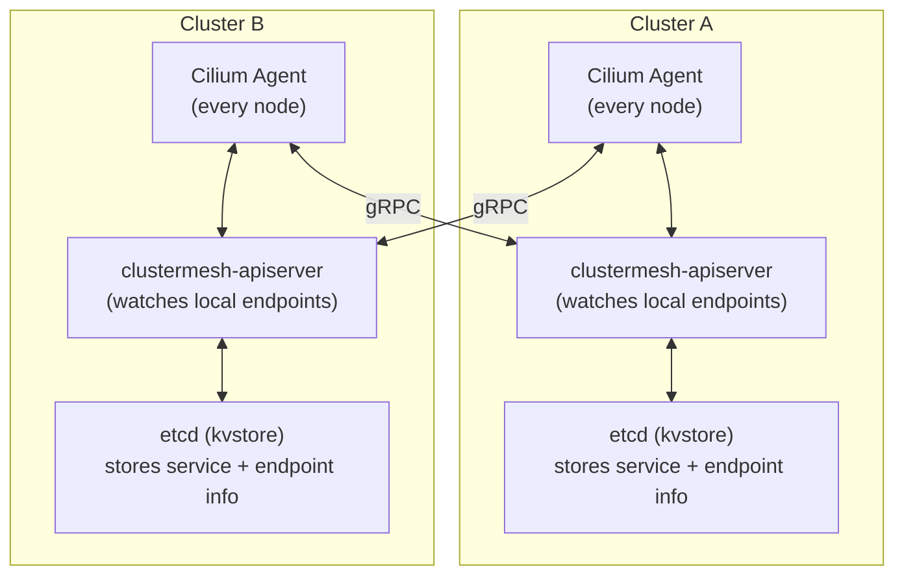
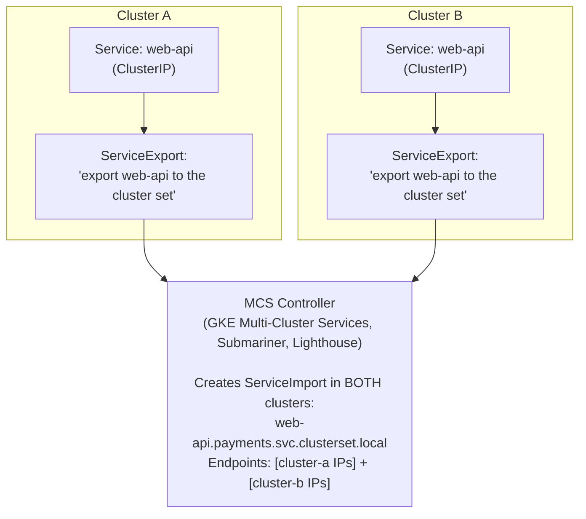
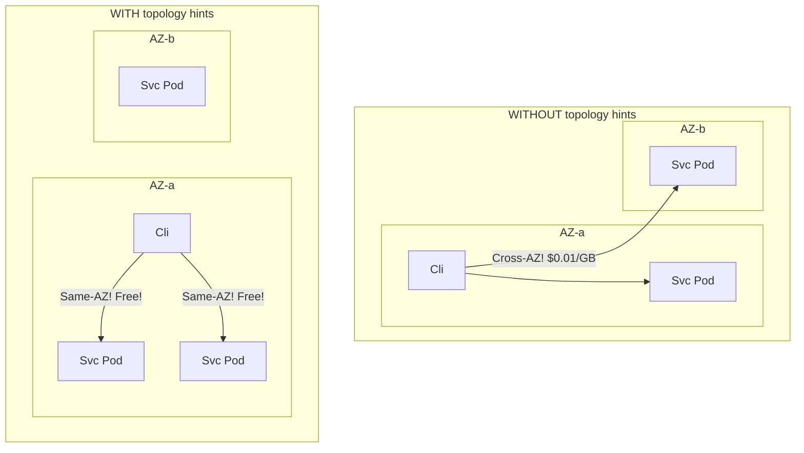

> **Complexity**: `[COMPLEX]`
>
> **Time to Complete**: 3 hours
>
> **Prerequisites**: [Module 8.2: Advanced Cloud Networking & Transit Hubs](../module-8.2-transit-hubs/), working knowledge of Kubernetes Services and Ingress
>
> **Track**: Advanced Cloud Operations

## What You'll Be Able to Do

After completing this module, you will be able to:

- **Evaluate** the critical trade-offs between flat routable topologies and isolated island architectures when designing multi-cluster networks.
- **Implement** transparent, cross-cluster service discovery utilizing the advanced eBPF capabilities of Cilium Cluster Mesh.
- **Compare** the Kubernetes Multi-Cluster Services (MCS) API against proprietary mesh solutions for establishing robust cross-boundary communication.
- **Diagnose** cross-Availability Zone traffic routing inefficiencies and implement topology-aware routing to heavily reduce data transfer costs.
- **Design** sophisticated global load balancing strategies and robust split-brain mitigation tactics for active-active multi-region Kubernetes deployments.

## Why This Module Matters

A common multi-region rollout failure is discovering too late that a dependency still lives in another cluster and that a hardcoded ClusterIP cannot be used across cluster boundaries. Under production load, that ad hoc cross-region dependency can push a latency-sensitive call path over its timeout budget, which then turns a payment flow into a severe fraud incident before dashboards even register the blast radius. Cross-cluster networking is the complex architectural problem many teams postpone until a second cluster is already in production, because the day-to-day single-cluster workflow does not expose the true failure modes. When your first cross-cluster incident occurs, the combination of routing surprises, DNS drift, and partial failures makes the problem feel urgent and unforgiving. This module teaches the advanced networking models and operational patterns required to make workloads in different clusters—and even different geographic regions—communicate reliably and securely. You will learn why the choice between flat and island networking is structurally transformative, how Cilium Cluster Mesh and the Kubernetes Multi-Cluster Services (MCS) API behave under the hood, and how to design for split-brain scenarios so they become recoverable instead of catastrophic.

## Flat vs. Island Networking Models

When you transition from operating a single Kubernetes cluster to managing multiple clusters, you are typically confronted early with a fundamental architectural choice regarding network topology. Should pods in entirely different clusters be able to reach each other directly via their IP addresses, or should they communicate exclusively through explicit, highly controlled service discovery mechanisms and gateways? This decision dictates your IP Address Management (IPAM) strategy, your security posture, and your cloud routing configuration. A poor fit here tends to create expensive refactors because network behavior leaks into every app deployment manifest, making teams debate topology decisions at the wrong layer.

In practice, the right model comes from balancing five realities at once: how many clusters you already own, who controls them, how your DNS plane is governed, whether you need vendor portability, and whether your services must be globally discoverable with zero application changes. If your platform charter values consistent behavior across dozens of teams and regions, topology is no longer just a network choice; it becomes your operating model. Treat this decision like a schema decision in your platform API, because once you standardize, it shapes how future teams build delivery pipelines for years.

### Flat Networking (Routable Pod CIDRs)

In a purely flat networking model, every single pod across every cluster deployed in your organization is assigned a unique, globally routable IP address within your corporate intranet or Virtual Private Cloud (VPC). A pod residing in Cluster A can reach a pod in Cluster B directly by its IP address, exactly the same way it would seamlessly reach a fellow pod within its own local cluster environment. This design is compelling when teams want every workload to be reachable using familiar pod-level addressing, but it also shifts architectural responsibility upward to global route planning and strict IP governance.

```mermaid
flowchart LR
    subgraph Cluster A ["Cluster A (us-east-1)<br>Pod CIDR: 100.64.0.0/16"]
        PodA["frontend-pod<br>100.64.12.5"]
        PodB["api-pod<br>100.64.33.18"]
        PodA -->|"Direct IP"| PodB
    end
    
    subgraph VPC ["VPC Peering or TGW"]
        route["Routing"]
    end
    
    subgraph Cluster B ["Cluster B (eu-west-1)<br>Pod CIDR: 100.65.0.0/16"]
        PodC["frontend-pod<br>100.65.8.22"]
        PodD["api-pod<br>100.65.41.9"]
        PodC --> PodD
    end
    
    PodB -->|"Direct IP"| route
    route -->|"Direct IP"| PodD
    
    classDef cluster fill:none,stroke:#333,stroke-width:2px;
    class Cluster A,Cluster B cluster;
```

The flat model is straightforward to reason about and can accelerate migration from legacy single-cluster architectures because it extends familiar service wiring with fewer new abstractions. At the same time, it quietly turns every subnet and route decision into shared infrastructure debt. If you inherit this model, invest heavily in change control for cluster onboarding, because a single misallocated CIDR or missing transit route can invalidate that shared assumption in multiple locations.

**Architectural Requirements:**
- **Strict IPAM:** Non-overlapping Pod CIDRs across ALL clusters are mandatory. You cannot have two clusters utilizing the `10.244.0.0/16` space.
- **Underlay Routing:** VPC-level routing for pod CIDRs must be established. The underlay network (routers, Transit Gateways) must possess routes directing traffic to the specific nodes hosting those pod IPs.
- **CNI Integration:** The Container Network Interface (CNI) must actively advertise pod routes to the broader VPC environment (for instance, utilizing the AWS VPC CNI or Calico running in BGP peering mode).

**Pros**: The flat model offers a wonderfully simple mental model for developers. Any pod can directly reach any other pod, provided network policies allow it. There is no absolute requirement for a heavyweight service mesh or complex Layer 7 gateways just to establish basic TCP connectivity. Standard debugging tools like `curl <pod-ip>` function flawlessly across massive cluster boundaries.

**Cons**: The demand for globally unique pod CIDRs makes IP Address Management (IPAM) highly critical and often exhausting. Every individual cluster's pod CIDR must be explicitly routable through the core VPC infrastructure, which can easily exhaust cloud provider route table limits. Furthermore, there is no inherent access control boundary; any compromised pod can theoretically attempt to reach any other pod across the globe unless you meticulously enforce restrictive NetworkPolicies.

### Island Networking (Isolated Pod CIDRs)

Conversely, in the island networking model, each Kubernetes cluster operates as a fiercely independent networking island. Pod CIDR blocks are entirely localized to the cluster and are permitted to overlap freely with other clusters. Any cross-cluster communication must traverse explicit, carefully managed gateways or high-level service abstractions. The model intentionally inverts the burden: instead of pre-coordinating every network boundary as an IPAM problem, you intentionally centralize control at protocol edges like ingress and gateways, which can simplify governance but increases architectural coupling to those shared control points.

```mermaid
flowchart LR
    subgraph Cluster A ["Cluster A (us-east-1)<br>Pod CIDR: 10.244.0.0/16"]
        PodA["frontend-pod<br>10.244.1.5"]
        GWA["Gateway/LB<br>(NodePort, NLB, or Istio GW)"]
        PodA --> GWA
    end
    
    subgraph Cluster B ["Cluster B (eu-west-1)<br>Pod CIDR: 10.244.0.0/16"]
        PodB["frontend-pod<br>10.244.1.5"]
        GWB["Gateway/LB<br>(NodePort, NLB, or Istio GW)"]
        GWB --> PodB
    end
    
    GWA -->|"HTTPS<br>(public or private link)"| GWB
    
    classDef cluster fill:none,stroke:#333,stroke-width:2px;
    class Cluster A,Cluster B cluster;
```

Island networking often aligns better with organizations that run multiple platform stacks, cloud providers, or independently managed clusters. It is intentionally conservative: cluster teams can move quickly inside their own network boundaries, while your cross-cluster layer remains explicit and testable. This produces a more deliberate integration posture, because every external dependency must pass through governed gateways and contracts before becoming available to peer clusters.

**Architectural Characteristics:**
- **CIDR Independence:** Pod CIDRs CAN heavily overlap (e.g., deploying `10.244.x.x` in literally every cluster you provision).
- **Explicit Communication:** Traffic exclusively flows through explicit ingress controllers, API gateways, or service mesh east-west gateways.
- **Inherent Security:** Access control is strictly enforced at the gateway layer, providing a natural choke point for security audits and WAF inspections.

**Pros**: There is zero CIDR coordination required between teams, massively reducing administrative overhead. Clusters become completely independently deployable units. The gateway provides a highly natural, defensible access control boundary. This model effortlessly scales to hundreds or thousands of clusters and operates flawlessly across wildly different cloud providers and on-premises bare-metal servers.

**Cons**: Traffic incurs higher latency due to the mandatory extra network hop through the gateway infrastructure. Service discovery becomes significantly more complex, as you cannot rely on simple internal DNS records. Establishing connectivity usually requires explicit configuration (Ingress, DNS, certificates) for each cross-cluster service. Debugging is notoriously harder because direct pod-to-pod pings are impossible.

### Decision Framework

Choosing between these topologies is a foundational platform engineering decision. Use the following heuristic matrix to guide your architectural design.

| Factor | Choose Flat | Choose Island |
|---|---|---|
| Number of clusters | < 10 | 10+ |
| Cloud providers | Single cloud | Multi-cloud |
| Team autonomy | Low (centralized platform) | High (independent teams) |
| Service mesh | Already using one | Not using / optional |
| Compliance | Low (no strict boundaries) | High (network isolation required) |
| Migration from monolith | Yes (pods need to reach legacy IPs) | No |
| CNI | AWS VPC CNI, Azure CNI | Calico, Cilium (overlay mode) |

**Pause and predict:** If your company acquires a startup that uses the exact same Pod CIDR (e.g., `10.244.0.0/16`) as your main clusters, which networking model will you be forced to use to connect them?

<details>
<summary>Check your prediction</summary>

Overlapping `10.244.0.0/16` pod CIDRs directly block flat, routable inter-cluster networking because the Linux routing table cannot deterministically resolve identical destination subnets across cluster boundaries. You are forced to implement an **island + explicit gateways** architecture where each cluster preserves its isolated networking domain and workloads communicate exclusively through ingress controllers or egress gateway proxies.
</details>

When this pattern appears during diligence, the highest-value move is to separate integration decisions from migration urgency. If you can define a long-lived network contract first, teams are less likely to make dangerous temporary exceptions just to satisfy timelines. The costliest mistakes usually occur when one team forces flat networking despite overlap constraints and then spends months papering over routing defects with manual service lists. In those cases, the architecture debt compounds because every workaround gets replicated across every future cluster purchase.

## Patterns & Anti-Patterns

| Pattern / Anti-Pattern | Problem | Better approach |
|---|---|---|
| **Pattern: Island + explicit gateways** | Overlapping pod CIDRs block flat routing | Treat each cluster as an island; expose only gateway-approved services |
| **Pattern: Topology-aware Services** | Cross-AZ traffic inflates transfer bills | Set `trafficDistribution: PreferClose` and validate with flow telemetry |
| **Anti-pattern: Forcing flat networking after M&A** | Overlapping `10.244.0.0/16` ranges break routing | Default to island networking until IPAM is reconciled |
| **Anti-pattern: Hardcoded ClusterIPs** | ClusterIPs are local to one cluster | Use `*.svc.cluster.local`, MCS `*.svc.clusterset.local`, or Cilium global services |
| **Anti-pattern: ClusterIP for cross-cluster** | No routable endpoint outside the cluster | Use LoadBalancer/NodePort, Cilium `service.cilium.io/global`, or MCS `ServiceExport` |
| **Anti-pattern: Flat mesh without policies** | Any compromised pod can probe remote pods | Enforce `CiliumNetworkPolicy` / `NetworkPolicy` on cross-cluster paths |
| **Anti-pattern: DNS-only failover without drills** | TTL caching delays regional cutover | Pair low TTLs with health checks, or use anycast (Global Accelerator / GCP global LB) |
| **Anti-pattern: Ignoring split-brain** | Partitions cause duplicate writes | Run partition chaos tests; fail write probes and enter safe mode |

## Cilium Cluster Mesh

Many teams adopt Cilium Cluster Mesh after they have already validated a flat-routing baseline and then discover that IP overlap, operational speed, and zero-change service discovery are the constraints that matter most. This is a practical evolution path because it lets teams preserve existing workload behavior while adding cross-cluster reach. In effect, you can stop treating network boundaries as application concerns and treat them as part of the platform substrate, which is exactly where transport abstractions should live in mature organizations.

When operating within a flat networking topology, Cilium Cluster Mesh is a widely used open-source option for linking multiple Kubernetes clusters at the networking and service discovery layers. Utilizing the immense power of eBPF (Extended Berkeley Packet Filter) within the Linux kernel, Cilium enables pods residing in one cluster to effortlessly discover and communicate with services located in a completely different cluster exactly as if they were local workloads. In practice, you get transparent networking semantics for developers because endpoint selection and topology details remain invisible to the application layer, yet this transparency also means your platform team must deeply understand where and how policies are enforced across cluster boundaries. Cilium Cluster Mesh becomes most valuable when your organization values predictable DNS behavior and low-latency cross-cluster routing over a clean vendor-neutral API abstraction layer.

### How It Works Under the Hood

Cilium Cluster Mesh completely bypasses the historical limitations of `kube-proxy` and traditional `iptables` rules by injecting networking logic directly into the kernel using eBPF programs attached to network interfaces. This means packets can be inspected and steered with less user-space overhead, and the result is often lower latency for cross-cluster service calls. At a system level, the model is simple to operate when each cluster trusts the same identity model, because the heavy lifting happens consistently through the same kernel-native datapath components in every node.



1. Each individual cluster runs a dedicated `clustermesh-apiserver` component. This component's sole responsibility is to securely expose the cluster's internal service and endpoint topology data.
2. The Cilium agents running on every node in each cluster establish secure gRPC connections to the OTHER cluster's apiserver, constantly syncing state to learn about remote service endpoints.
3. When a pod located in Cluster A attempts to resolve a service that exists in both interconnected clusters, the eBPF datapath transparently intercepts the request and load-balances the traffic across both local AND remote pod endpoints dynamically.
4. The actual traffic between the clusters flows entirely directly (from the source pod IP directly to the destination pod IP) utilizing the underlying flat network routing infrastructure (such as AWS VPC peering or a Transit Gateway).

That flow requires careful sequencing in operations runbooks, because every stage can appear healthy from one perspective while masking a downstream misalignment. A practical mental model is: control plane sync first, route plane readiness second, and finally application-level resolution verification. If any layer is skipped, your troubleshooting time multiplies because you can no longer tell whether a failed request is caused by discovery lag or routing enforcement. This sequencing also scales when additional clusters are added, because you can add checks per layer instead of reinventing ad hoc validation for every pair.

In mature teams, this sequencing is codified as a change-management gate: cluster-mesh metadata sync verified, interconnect reachability verified, and then cross-cluster workload resolution validated with production-like request patterns. If one gate fails, teams pause rollout and apply targeted fixes rather than assuming the next layer will self-heal. That produces predictable operational outcomes, because every partial success is treated as evidence for a clearly defined subsystem instead of generalized “everything is okay” confidence.

### Setting Up Cluster Mesh

The configuration process requires non-overlapping CIDRs and a properly routed underlay network. Before you run these commands, confirm that your route tables, security groups, and firewall rules allow node-level pod CIDR traffic between the participating clusters. If you skip that verification, the control plane objects may install correctly while application-level service discovery still behaves as if Cluster Mesh never completed, which creates an avoidable debugging loop.

```bash
# Prerequisites: Cilium installed in both clusters with cluster mesh enabled
# Both clusters must have non-overlapping Pod CIDRs
# Underlying network must route pod CIDRs between clusters

# Install Cilium CLI
CILIUM_CLI_VERSION=$(curl -s https://raw.githubusercontent.com/cilium/cilium-cli/main/stable.txt)
curl -L --fail --remote-name-all \
  https://github.com/cilium/cilium-cli/releases/download/${CILIUM_CLI_VERSION}/cilium-darwin-arm64.tar.gz
sudo tar xzvf cilium-darwin-arm64.tar.gz -C /usr/local/bin

# Install Cilium with cluster mesh support on Cluster A
cilium install \
  --set cluster.name=cluster-a \
  --set cluster.id=1 \
  --set ipam.operator.clusterPoolIPv4PodCIDRList="100.64.0.0/16"

# Install Cilium with cluster mesh support on Cluster B
cilium install \
  --set cluster.name=cluster-b \
  --set cluster.id=2 \
  --set ipam.operator.clusterPoolIPv4PodCIDRList="100.65.0.0/16"

# Enable cluster mesh on both clusters
cilium clustermesh enable --context cluster-a
cilium clustermesh enable --context cluster-b

# Connect the clusters
cilium clustermesh connect --context cluster-a --destination-context cluster-b

# Verify the connection
cilium clustermesh status --context cluster-a
```

### Cross-Cluster Service Discovery in Action

Once the Cluster Mesh is fully interconnected, standard Kubernetes services that share the exact same name and namespace across the different clusters are automatically and seamlessly merged into a global service entity by Cilium. You can exert granular control over this behavior utilizing specific annotations. In this pattern, local cluster teams keep their existing manifests but rely on cluster-wide policy, because each service resolution path now includes remote endpoints that participate as peers to local endpoints in a global pool.

```yaml
# Deploy a service in both clusters with the same name
# Cilium will load-balance across endpoints in BOTH clusters
apiVersion: v1
kind: Service
metadata:
  name: fraud-detection
  namespace: payments
  annotations:
    # Optional: prefer local endpoints, use remote only as fallback
    service.cilium.io/global: "true"
    service.cilium.io/affinity: "local"
spec:
  selector:
    app: fraud-detection
  ports:
    - port: 8080
      targetPort: 8080
```

> **Cilium 1.13+ annotations**: Cluster Mesh services use `service.cilium.io/global` and `service.cilium.io/affinity`. On Cilium releases before 1.13, the legacy spellings `io.cilium/global-service` and `io.cilium/service-affinity` are equivalent.

By default, Cilium load-balances traffic globally. However, for latency-sensitive applications, maintaining local affinity is paramount. You can explicitly define service affinity rules to govern endpoint selection. In failure scenarios, those rules also give you a deterministic fallback strategy, because they control whether local capacity exhaustion will spill traffic to remote endpoints or prioritize consistency by reducing cross-cluster fan-out.

```yaml
# Service affinity options:
# "local"  - prefer endpoints in the same cluster (fallback to remote)
# "remote" - prefer endpoints in the remote cluster
# "none"   - load-balance equally across all clusters (default)
```

If you wish to prevent a service from being exposed to the global mesh entirely, you simply omit the `service.cilium.io/global` annotation. Use that boundary intentionally for internal-only APIs, especially when operational risk increases if a debugging pod in one cluster can resolve sensitive endpoints in another without explicit authorization policy.

```yaml
# To make a service available ONLY to the local cluster
# (not exported to cluster mesh), omit the service.cilium.io/global annotation
apiVersion: v1
kind: Service
metadata:
  name: internal-cache
  namespace: payments
  # No service.cilium.io/global annotation = local only
spec:
  selector:
    app: redis-cache
  ports:
    - port: 6379
```

**Pause and predict:** If you annotate a service with `service.cilium.io/affinity: "local"`, what happens when all local endpoints for that service crash? Will the requests fail, or will they route to the remote cluster?

<details>
<summary>Check your prediction</summary>

Setting `service.cilium.io/affinity: "local"` instructs Cilium to prefer local cluster backends, but it uses **remote endpoints if and only if all local backends are unavailable or unhealthy**. The service does **not** fail closed; instead, Cilium fails over to healthy endpoints in the remote mesh cluster to preserve service availability across the fleet.
</details>

Cross-cluster failover maintains application uptime across clusters during localized node or availability zone disruptions. Allowing traffic to traverse mesh boundaries automatically introduces critical cross-cluster security and isolation responsibilities. Platform teams must ensure that remote failover paths cannot bypass intended cluster trust perimeters or expose internal service ports.

### Network Policies Across Boundaries

One of the most profound advantages of utilizing a unified CNI across clusters is the ability to enforce consistent, identity-based security policies that span the entire global infrastructure. Cilium Cluster Mesh intelligently extends network policies across physical cluster boundaries, allowing you to filter traffic based on cryptographically verified pod identities rather than fragile IP addresses. This is especially useful in regulated environments because policy decisions can remain consistent even as clusters are replaced, moved across AZs, or re-provisioned with temporary overlays.

```yaml
# Allow traffic from cluster-b's frontend to cluster-a's API
apiVersion: cilium.io/v2
kind: CiliumNetworkPolicy
metadata:
  name: allow-cross-cluster-frontend
  namespace: payments
spec:
  endpointSelector:
    matchLabels:
      app: fraud-detection
  ingress:
    - fromEndpoints:
        - matchLabels:
            app: payment-frontend
            io.cilium.k8s.policy.cluster: cluster-b
      toPorts:
        - ports:
            - port: "8080"
              protocol: TCP
```

## Multi-Cluster Services API (MCS API)

For teams that prefer standardized Kubernetes APIs over implementation-specific behavior, MCS can feel like a governance-first alternative. The tradeoff is that the API contract alone does not erase implementation differences, so architecture conversations shift from feature parity to controller maturity and operational confidence. In other words, MCS reduces one class of lock-in, but it does not remove cross-team ownership obligations around rollout discipline, policy, and failover expectations.

This does not mean one model is universally better than the other. In practice, teams often choose MCS when they need explicit control over how far cross-cluster visibility should travel and when they want explicit interoperability points across provider boundaries. Other teams choose Cilium when the top priority is developer transparency and minimal impact to application-level manifests. The best choice is whichever aligns with your organizational capability, not whichever appears simpler at design time.

While Cilium provides an incredibly powerful datapath implementation, the Kubernetes Multi-Cluster Services (MCS) API, formally defined in KEP-1645, represents the official, standardized Kubernetes approach to cross-cluster service discovery. The MCS API is intentionally less feature-rich out-of-the-box than a complete mesh like Cilium, but it offers a vendor-neutral interface that various controllers can implement. In practical terms, that means you can reduce lock-in at the service-discovery control plane layer, as long as you are willing to accept implementation differences between providers and controller projects.

### Core Concepts of MCS

The MCS API introduces two critical Custom Resource Definitions (CRDs) to the Kubernetes ecosystem: [`ServiceExport` and `ServiceImport`](https://cloud.google.com/kubernetes-engine/docs/how-to/multi-cluster-services). This pairing forms the core contract for cross-cluster intent: `ServiceExport` expresses what service you want visible to peers, while `ServiceImport` is the controller-generated aggregation surface used by workloads in remote clusters.



**DNS Resolution Mechanics:**
- When an application queries `web-api.payments.svc.cluster.local`, DNS returns ONLY the local endpoints residing within the same cluster.
- When an application explicitly queries `web-api.payments.svc.clusterset.local`, the MCS-aware DNS implementation returns an aggregated list of endpoints compiled from ALL clusters that have successfully exported that service.

### Leveraging the MCS API on Google Kubernetes Engine (GKE)

Google Cloud Platform's GKE provides deeply integrated, [native support for the MCS API through its Fleet management capabilities](https://cloud.google.com/kubernetes-engine/docs/how-to/multi-cluster-services).

```bash
# Register clusters to a fleet
gcloud container fleet memberships register cluster-a \
  --gke-cluster=us-central1/cluster-a \
  --enable-workload-identity

gcloud container fleet memberships register cluster-b \
  --gke-cluster=europe-west1/cluster-b \
  --enable-workload-identity

# Enable multi-cluster services
gcloud container fleet multi-cluster-services enable

# Grant the required IAM role
gcloud projects add-iam-policy-binding PROJECT_ID \
  --member="serviceAccount:PROJECT_ID.svc.id.goog[gke-mcs/gke-mcs-importer]" \
  --role="roles/compute.networkViewer"
```

To expose a service, you must deliberately create a `ServiceExport` object in the cluster hosting the workload.

```yaml
# Export a service from Cluster A
apiVersion: net.gke.io/v1
kind: ServiceExport
metadata:
  name: fraud-detection
  namespace: payments
```

The underlying MCS controller observes this `ServiceExport` and automatically synthesizes a corresponding `ServiceImport` object in all other registered clusters within the defined fleet. Consequently, pods running in remote clusters can now reliably resolve `fraud-detection.payments.svc.clusterset.local`. This unified DNS query will seamlessly return endpoint IP addresses collected from absolutely all clusters that simultaneously export the exact same service name within the identical namespace. Because the contract is based on namespace and name consistency, cross-cluster service discovery is explicit and predictable, but you must treat that determinism as a governance contract and document ownership boundaries for every shared namespace.

### MCS API vs. Cilium Cluster Mesh Comparison

When deciding on a cross-cluster strategy, consider these fundamental differences:

| Feature | MCS API | Cilium Cluster Mesh |
|---|---|---|
| Kubernetes-native | Yes (KEP-1645) | No (Cilium-specific) |
| Service discovery | DNS (clusterset.local) | eBPF (transparent) |
| Pod-to-pod direct | Depends on implementation | Yes (requires flat network) |
| Network policy across clusters | No | Yes (CiliumNetworkPolicy) |
| Cloud support | GKE native, others via Submariner | Any (self-managed) |
| Overlapping pod CIDRs | Depends on implementation | No (requires unique CIDRs) |
| Service affinity (prefer local) | Via topology hints | Via annotation |
| Maturity | GA on GKE; maturity varies by controller and distribution | Available in current Cilium releases |

## Cross-AZ and Cross-Region Cost Management

The financial consequences of cross-cluster networking decisions are only visible after traffic ramps, which is why many teams underestimate these costs during design. This is especially true in microservices systems where each new call hop may multiply flow volume. If cost is not designed into topology selection, optimization eventually becomes a reactive exercise after billing alerts, and the eventual fixes are noisier than if the architecture had been built for locality first.

Before touching cost controls, teams should model data paths for representative business flows, because not all traffic is equally expensive to move. A synchronous read path with dozens of small calls can produce a higher transfer envelope than a coarse-grained bulk job, even when CPU and request volume look similar. Treat egress and inter-AZ movement as part of capacity planning, and validate that architecture choices reflect real business transactions rather than synthetic averages.

Navigating cross-cluster networking is rarely just a pure technical or architectural challenge—it frequently morphs into a devastating cost-management challenge. In major public cloud environments like AWS and GCP, whenever network traffic crosses the physical boundaries between Availability Zones (AZs) or geographic regions, the cloud provider levies data transfer fees. At scale, these ["penny per gigabyte" charges](https://aws.amazon.com/vpc/pricing/) can rapidly accumulate into hundreds of thousands of dollars annually. As soon as you connect two active regions, every unbounded east-west request becomes a recurring line item, so topology design decisions should be treated as FinOps controls, not purely networking decisions.

### Implementing Topology-Aware Routing

Modern iterations of Kubernetes (v1.30 and above) possess sophisticated, built-in capabilities to mitigate these exorbitant cross-AZ costs through a feature known as topology-aware routing. By actively utilizing the [`trafficDistribution` field](https://kubernetes.io/blog/2024/04/17/kubernetes-v1-30-release/), platform engineers can instruct the `kube-proxy` to aggressively prioritize routing requests to service endpoints located within the exact same availability zone as the client pod. This is especially useful for high-throughput synchronous APIs where even minor latency increases become user-visible. The mechanism does not remove cross-AZ traffic entirely, but it makes most traffic local first and reserves cross-boundary paths for resilience and true failover, which is exactly the behavior you want at scale.

```yaml
# Enable topology-aware routing on a service (Kubernetes 1.30+)
apiVersion: v1
kind: Service
metadata:
  name: fraud-detection
  namespace: payments
spec:
  trafficDistribution: PreferClose
  selector:
    app: fraud-detection
  ports:
    - port: 8080
```

To understand the profound financial impact of this simple configuration change, consider the routing dynamics illustrated below:



Without topology-aware routing, kube-proxy uses its normal cluster-wide endpoint selection rather than preferring same-zone endpoints. Once topology hints are engaged, kube-proxy fundamentally alters its behavior, prioritizing endpoints situated within the identical zone to effectively bypass unnecessary cross-AZ transit. The operational pattern is simple to reason about: you configure intent once at the Service object, and the underlying endpoint selection logic continuously re-optimizes while respecting health and capacity signals.

### Comprehensive Monitoring of Cross-AZ Traffic

Monitoring is the difference between “believing” and “proving” where your traffic actually goes. Without it, you cannot reliably test whether topology-aware routing is reducing data transfer charges, and you may end up tuning fields like `trafficDistribution` based on assumptions. The pattern is to couple configuration changes with weekly, reproducible flow-analysis snapshots so you can compare pre/post behavior on identical workloads.

To truly optimize costs, you must possess the ability to actively monitor and quantify cross-AZ communication patterns using raw network flow telemetry. Cost optimization without telemetry is guessing, because traffic spikes can appear after a code deployment and remain invisible in coarse service metrics for hours. By instrumenting subnet-level flow analysis, you can distinguish application-driven growth from topology misconfiguration and choose the least risky mitigation with confidence.

> **VPC Flow Logs limitation**: The optional `${az-id}` field records only the Availability Zone of the **logged ENI**, not the destination endpoint's AZ. Native flow logs do **not** expose a `dst_az_id` column. To classify true cross-AZ pod traffic in Athena, enrich records (for example via Amazon Data Firehose plus Lambda) with destination subnet/AZ metadata, or join `srcaddr`/`dstaddr` against your pod→node→subnet→AZ inventory table.

```bash
# Use VPC Flow Logs to identify cross-AZ traffic patterns
# Enable flow logs on each subnet
aws ec2 create-flow-logs \
  --resource-type Subnet \
  --resource-ids subnet-prod-az1a subnet-prod-az1b subnet-prod-az1c \
  --traffic-type ALL \
  --log-destination-type s3 \
  --log-destination arn:aws:s3:::vpc-flow-logs-bucket \
  --log-format '${az-id} ${srcaddr} ${dstaddr} ${bytes} ${flow-direction}'

# Query with Athena to rank high-volume pod CIDR flows (native fields only)
# (assumes flow logs are partitioned in S3; join/enrich for true cross-AZ classification)
cat <<'SQL'
SELECT
  az_id,
  srcaddr,
  dstaddr,
  SUM(bytes) / 1073741824 AS gb_transferred,
  SUM(bytes) / 1073741824 * 0.01 AS estimated_cost_usd
FROM vpc_flow_logs
WHERE srcaddr LIKE '100.64.%'   -- pod CIDR
  AND dstaddr LIKE '100.64.%'   -- pod CIDR
  AND date = '2026-03-24'
GROUP BY az_id, srcaddr, dstaddr
ORDER BY gb_transferred DESC
LIMIT 20
SQL
```

**Pause and predict:** Does topology-aware routing guarantee that cross-AZ traffic will never happen? What triggers kube-proxy to spill traffic over to another zone?

<details>
<summary>Check your prediction</summary>

Topology-aware routing does **not** guarantee zero cross-AZ traffic. The EndpointSlice controller allocates hints proportionally, but if an Availability Zone lacks sufficient ready endpoints to service its proportional share of traffic, or if endpoint hints cannot be generated, `kube-proxy` **falls back cluster-wide** to distribute requests across all zones to protect workload availability.
</details>

Internal routing optimizations minimize data transfer overhead between availability zones inside a single geographic region. Enterprises running distributed applications must also route incoming traffic from external clients across global boundaries. The next architectural challenge requires steering internet users across autonomous regional clusters before requests enter internal service fabrics.

## Global Load Balancing for Multi-Region Deployments

When external users are involved, every additional network hop is both an availability and latency risk, so these modules should not stop at internal architecture diagrams. Platform teams need a governance story that includes ownership over route policy, runbook-driven failover drills, and explicit ownership of health checks across providers. Your global ingress layer must be observed at the same granularity as your core SLO tooling, because route mistakes here impact first-time-to-render and error budgets more directly than many internal platform incidents.

When architecting systems that span multiple global regions, relying exclusively on internal service discovery is insufficient for handling external user ingress. You require a robust mechanism to intelligently route incoming users to the absolute nearest, healthiest cluster available. Global load balancing resolves this colossal challenge directly at the network edge. In practice, this is where regional resiliency and user latency requirements meet, because DNS and transport-layer routing decisions need to happen before traffic ever enters cluster-native service logic. For external traffic, your first hop is often the decisive hop: if the wrong region receives traffic, no amount of internal optimization can prevent avoidable user-perceived latency or failed failover behavior.

The design choice here is not simply about which DNS answer is shortest. It is also about policy consistency, observability of health transitions, and predictable blast-radius containment when a region becomes partially unavailable. A global load-balancing tier that behaves predictably under degradation is a platform primitive in itself, not a one-off networking checkbox.

A quick design pattern is to define region weights, synthetic failover scenarios, and customer impact thresholds before any resource is created. That predefinition avoids last-minute architectural drift when incidents happen. If the route policy is tested, documented, and versioned, the team can reason about recovery speed with less guesswork, because every outcome has a clear owner and a measured expectation.

The distinction between DNS-layer control and transport-layer control matters even when both approaches appear operationally similar. In one pattern, you gain faster regional selection but inherit client-side and ISP caching behavior; in the other, you tighten route semantics at the edge but increase dependency on provider-specific health signal quality. Architects should evaluate these as explicit trade-offs in design reviews, because your global ingress decision determines both customer experience and failure-mode behavior under partial outages.

### Comparing Global Load Balancing Solutions

Different cloud providers employ drastically different technological approaches to global ingress routing, and those differences matter when you are selecting for your specific blast-radius, latency, and compliance requirements:

- **AWS Ecosystem: Route53 paired with Global Accelerator**
  - Route53 handles advanced DNS-based resolution, providing complex latency, geolocation, and automated failover routing logic.
  - Global Accelerator provisions [dedicated Anycast IP addresses, accelerating traffic over the AWS global backbone](https://docs.aws.amazon.com/global-accelerator/latest/dg/introduction-how-it-works.html) while offering rapid health checks and TCP/UDP level load balancing.

- **GCP Ecosystem: Cloud Load Balancing (Global Tier)**
  - Google utilizes a uniquely powerful model providing [a single global Anycast IP address](https://cloud.google.com/load-balancing/docs/load-balancing-overview) that routes HTTP(S), TCP, and UDP traffic across the entire world.
  - It seamlessly features profound, native integration directly with GKE Network Endpoint Groups (NEGs).

- **Azure Ecosystem: AKS networking + global front door**
  - For cross-cluster east-west on AKS, teams commonly pair [Azure CNI Overlay](https://learn.microsoft.com/en-us/azure/aks/azure-cni-overlay) (overlapping pod space per cluster) with explicit gateways, or adopt [Azure CNI Powered by Cilium](https://learn.microsoft.com/en-us/azure/aks/azure-cni-powered-by-cilium) for Cilium Cluster Mesh–style global services.
  - For multi-region user ingress, [Azure Front Door](https://learn.microsoft.com/en-us/azure/frontdoor/front-door-overview) (anycast edge + health probes) and [Traffic Manager](https://learn.microsoft.com/en-us/azure/traffic-manager/traffic-manager-overview) (DNS-based latency/failover routing) mirror the AWS Global Accelerator / Route53 split.

| Provider | Cross-cluster CNI / discovery | Multi-region external ingress |
|---|---|---|
| AWS | VPC CNI flat routes, MCS via fleet patterns | Route53 + Global Accelerator |
| GCP | GKE MCS API, multi-cluster Gateway | Global external HTTP(S) LB + NEGs |
| Azure | Azure CNI Overlay or Cilium on AKS | Azure Front Door + Traffic Manager |

### Provisioning GCP Global Load Balancers with Multi-Cluster Gateways

Google's implementation of the emerging Kubernetes Gateway API delivers sophisticated multi-cluster support natively, and the multi-cluster Gateway resources become a direct integration point between platform networking policy and application-level route definitions. This means route behavior can evolve alongside Kubernetes resources rather than requiring separate edge tooling for each topology change.

```yaml
# GKE Gateway API with multi-cluster support
apiVersion: gateway.networking.k8s.io/v1
kind: Gateway
metadata:
  name: global-gateway
  namespace: payments
spec:
  gatewayClassName: gke-l7-global-external-managed-mc
  listeners:
    - name: https
      port: 443
      protocol: HTTPS
      tls:
        mode: Terminate
        certificateRefs:
          - name: payments-tls
```

Once the core Gateway is securely instantiated, you subsequently bind routing rules to dynamically direct incoming HTTP requests toward your deployed `ServiceImport` resources. This model is especially effective for teams already standardizing on Gateway API governance, because control over path matching, TLS, and backend references can stay in one declarative API surface.

```yaml
apiVersion: gateway.networking.k8s.io/v1
kind: HTTPRoute
metadata:
  name: payments-route
  namespace: payments
spec:
  parentRefs:
    - name: global-gateway
  rules:
    - matches:
        - path:
            type: PathPrefix
            value: /api/payments
      backendRefs:
        - group: net.gke.io
          kind: ServiceImport
          name: payments-api
          port: 8080
```

### Implementing DNS-Based Failover via AWS Route53

If your architecture is strictly bound to AWS, establishing automated, [latency-driven routing combined with robust failover mechanisms](https://docs.aws.amazon.com/Route53/latest/DeveloperGuide/routing-policy-latency.html) demands meticulous configuration of Route53 health checks and alias records. The control plane for this pattern is straightforward, but the operational quality depends on aggressive alerting, because a misconfigured check can amplify an incident by steering users toward an already degraded region.

```bash
# Create health checks for each regional endpoint
HEALTH_CHECK_EAST=$(aws route53 create-health-check \
  --caller-reference "east-$(date +%s)" \
  --health-check-config '{
    "Type": "HTTPS",
    "ResourcePath": "/healthz",
    "FullyQualifiedDomainName": "east.api.example.com",
    "Port": 443,
    "RequestInterval": 10,
    "FailureThreshold": 3
  }' \
  --query 'HealthCheck.Id' --output text)

HEALTH_CHECK_WEST=$(aws route53 create-health-check \
  --caller-reference "west-$(date +%s)" \
  --health-check-config '{
    "Type": "HTTPS",
    "ResourcePath": "/healthz",
    "FullyQualifiedDomainName": "west.api.example.com",
    "Port": 443,
    "RequestInterval": 10,
    "FailureThreshold": 3
  }' \
  --query 'HealthCheck.Id' --output text)

# Create latency-based routing with failover
aws route53 change-resource-record-sets \
  --hosted-zone-id Z1234567890 \
  --change-batch '{
    "Changes": [
      {
        "Action": "CREATE",
        "ResourceRecordSet": {
          "Name": "api.example.com",
          "Type": "A",
          "SetIdentifier": "us-east-1",
          "Region": "us-east-1",
          "AliasTarget": {
            "HostedZoneId": "Z2FDTNDATAQYW2",
            "DNSName": "east-nlb-abc123.elb.us-east-1.amazonaws.com",
            "EvaluateTargetHealth": true
          },
          "HealthCheckId": "'$HEALTH_CHECK_EAST'"
        }
      },
      {
        "Action": "CREATE",
        "ResourceRecordSet": {
          "Name": "api.example.com",
          "Type": "A",
          "SetIdentifier": "eu-west-1",
          "Region": "eu-west-1",
          "AliasTarget": {
            "HostedZoneId": "Z32O12XQLNTSW2",
            "DNSName": "west-nlb-xyz789.elb.eu-west-1.amazonaws.com",
            "EvaluateTargetHealth": true
          },
          "HealthCheckId": "'$HEALTH_CHECK_WEST'"
        }
      }
    ]
  }'
```

## Split-Brain: The Multi-Cluster Nightmare

The most terrifying phenomenon in distributed systems architecture is the split-brain scenario. This catastrophic event unfolds when distinct clusters completely lose network connectivity with one another due to an unexpected partition, yet they individually remain fully online, continuing to process external user traffic independently. During this partition, every isolated cluster falsely assumes it is the sole, authoritative source of operational truth. If your application writes mutable data in this mode, the result is almost always eventual inconsistency and business-level corruption, because two independent clusters can satisfy mutually incompatible operations at the same time.

A clean design avoids pretending that transport partitions are rare; they must be treated as a normal failure mode because they are. The safer mindset is to explicitly define what each service may do when peer reachability is uncertain, rather than allowing each cluster team to invent ad-hoc fallback behavior under pressure. In high-stakes payment or inventory systems, this is the difference between a documented runbook and an undocumented incident.

If your architecture can tolerate this failure, then define user-visible behavior explicitly instead of relying on implicit recovery assumptions. For many platforms, that means strict read preferences, explicit write guards, and conflict indicators that remain observable to support teams during recovery operations. The objective is not to make partitions impossible, but to make their effects understandable, bounded, and reversible.

A second practical design step is to predefine partition ownership transitions, including who may promote a writer cluster and under what conditions. Without that predefinition, every incident becomes a governance war because operators must decide under stress whether data safety or uptime is more important. Clear ownership prevents that ambiguity and reduces recovery time from chaos.

At scale, split-brain resilience is as much about organizational muscle memory as it is about algorithmic correctness. If your escalation path relies on a single decision-maker, your recovery window will lengthen exactly when the topology is least forgiving. So teams should rehearse ownership transition drills, verify alert fan-out, and ensure runbook steps include explicit communication templates, not just configuration changes.

In production, most teams discover split-brain exposure at the intersection between network policy, data policy, and customer comms. One cluster may continue accepting writes while another is still serving stale reads, and every missing line in the runbook becomes a manual decision during an outage. The strongest platform teams treat this as a full reliability story: control-plane behavior, business-domain invariants, and incident communication should all be prepared before users ever see a warning page.

A resilient split-brain posture is therefore less about one perfect solution and more about bounded uncertainty. The goal is to ensure that, when uncertainty happens, every layer is explicit: the topology layer defines where traffic can go, the data layer defines what writes mean, and the operating layer defines who acts first. If those expectations are captured once and rehearsed often, partition incidents become controlled events with known outcomes instead of improvised crises.

Because distributed systems failures often appear sequentially—route degradation, then consistency questions, then stakeholder pressure—the team that remains explicit about preconditions tends to recover faster. This is why each cluster operator should understand not only technical toggle steps but also when to pause, when to notify, and when to intentionally narrow service responsibility. Those non-technical actions are as important as technical steps because they reduce the mean decision time under uncertainty and prevent inconsistent changes during active incidents.

```mermaid
sequenceDiagram
    participant A as Cluster A
    participant B as Cluster B
    
    Note over A,B: Normal Operation
    A<-->>B: Network Connected
    Note left of A: User X balance: $500
    Note right of B: User X balance: $500
    
    Note over A,B: Network partition occurs! ╳
    Note left of A: User deposits $100
    Note right of B: User withdraws $200
    Note left of A: User X: $600
    Note right of B: User X: $300
    
    Note over A,B: Network restores
    A<-->>B: Network Connected
    Note left of A: "User X: $600"
    Note right of B: "User X: $300"
    
    Note over A,B: Which is correct? BOTH are. And NEITHER is.<br/>The real answer should be $400 ($500 + $100 - $200)<br/>but neither cluster knows about the other's operation.
```

When the fundamental network infrastructure eventually restores connectivity, the architectural damage has already been done: you are left staring at hopelessly conflicting, irreconcilable system states.

### Architectural Mitigation Strategies

To defend against split-brain corruption, platform architects must implement profound, application-aware safeguards:

**Strategy 1: Single Writer, Multiple Readers.** Enforce strict rules where only a single designated cluster maintains the definitive authority to execute write operations to a specific data partition. All other participating clusters are demoted to serving exclusively read-only traffic. If the designated writer cluster catastrophically fails, you must carefully execute a highly controlled promotion process for one of the readers, often accepting a marginal risk of minor data loss.

**Strategy 2: CRDTs (Conflict-free Replicated Data Types).** Completely re-architect your core data structures so that concurrently executed, conflicting modifications are mathematically guaranteed to successfully merge. Specialized data structures like monotonic counters, distributed sets, and operational registers can be rigorously designed to remain perfectly conflict-free, although this universally mandates profound, invasive changes to application-level code.

**Strategy 3: Distributed Fencing Tokens.** Require the critical write path to unconditionally secure a cryptographic validation token from an external, highly robust distributed lock service (such as an externalized etcd cluster or Apache ZooKeeper). Throughout the duration of a network partition, exclusively the specific cluster that actively retains ownership of the unexpired token is permitted to successfully write data. All other isolated clusters will aggressively reject write attempts until they can reliably reacquire the validated token.

```yaml
# Strategy 1: Leader election for cross-cluster write authority
# Using a Kubernetes Lease object in a "coordination" cluster
apiVersion: coordination.k8s.io/v1
kind: Lease
metadata:
  name: payments-write-leader
  namespace: coordination
spec:
  holderIdentity: cluster-a
  leaseDurationSeconds: 30
  acquireTime: "2026-03-24T10:15:00Z"
  renewTime: "2026-03-24T10:15:25Z"
  leaseTransitions: 3
```

```python
# Application-level split-brain detection
# Each cluster periodically checks if it can reach the other
import requests
import time

PEER_CLUSTERS = {
    "cluster-b": "https://cluster-b.internal.example.com/healthz",
    "cluster-c": "https://cluster-c.internal.example.com/healthz",
}

def check_partition():
    """Detect if we're in a network partition."""
    unreachable = []
    for cluster, url in PEER_CLUSTERS.items():
        try:
            resp = requests.get(url, timeout=5)
            if resp.status_code != 200:
                unreachable.append(cluster)
        except requests.exceptions.RequestException:
            unreachable.append(cluster)

    if unreachable:
        # We might be partitioned. Switch to safe mode:
        # - Reject writes that require cross-cluster consistency
        # - Continue serving reads from local cache
        # - Alert the on-call team
        enter_safe_mode(unreachable)
        return True
    return False

def enter_safe_mode(unreachable_clusters):
    """Restrict operations during detected partition."""
    print(f"PARTITION DETECTED: Cannot reach {unreachable_clusters}")
    print("Entering safe mode: rejecting cross-cluster writes")
    # Set a readiness probe to fail for write endpoints
    # This makes the load balancer stop sending write traffic here
    with open("/tmp/write-ready", "w") as f:
        f.write("false")
```

**Pause and predict:** If you use a single-writer, multiple-reader database architecture across two clusters, what happens to write requests during a network partition if the active writer is in the partitioned cluster?

<details>
<summary>Check your prediction</summary>

Without automated node fencing or quorum consensus, an isolated writer inside a partitioned cluster can continue accepting mutating transactions while remaining completely cut off from its readers and standby replicas. This condition causes **split-brain** data divergence and silent state corruption; to prevent catastrophic data drift, the isolated cluster must actively fail write readiness probes and switch to safe mode immediately upon losing heartbeat connectivity.
</details>

Designing resilient multi-cluster systems requires anticipating the complex failure modes that emerge when physical networks degrade under production workloads. Before moving forward into operational implementations, reviewing verified platform behaviors reinforces the technical boundaries that govern multi-cluster architectures.

## Did You Know?

1. **Cilium Cluster Mesh can be configured for up to 255 connected clusters by default, or 511 with `maxConnectedClusters=511`**; increasing that limit reduces the number of cluster-local identities available.
2. **Inter-AZ and inter-zone data transfer charges can become material at scale**. Providers publish current network pricing directly, so teams should model those costs from the live pricing pages instead of assuming they are negligible.
3. **The Kubernetes Multi-Cluster Services API is defined by KEP-1645**, and implementation maturity still varies across controllers and distributions even though the upstream API has advanced over time.
4. **Large-scale cluster managers such as Google's Borg included integrated naming and service-discovery concepts well before Kubernetes standardized multi-cluster service discovery**.

## Common Mistakes

| Mistake | Why It Happens | How to Fix It |
|---|---|---|
| Overlapping pod CIDRs across clusters | Default CNI settings use the same range (e.g., 10.244.0.0/16) | Plan pod CIDRs before deploying clusters. Use unique ranges (100.64.x.0/16, 100.65.x.0/16, etc.) |
| Hardcoding ClusterIPs in config | Works in single-cluster, breaks in multi-cluster | Use DNS names (service.namespace.svc.cluster.local) or MCS API (service.namespace.svc.clusterset.local) |
| Not considering DNS TTL during failover | DNS records have TTLs that clients cache | Set health check intervals to 10s and DNS TTL to 30-60s. Use Global Accelerator (anycast) for instant failover without DNS. |
| Ignoring cross-AZ costs for pod traffic | "It's just a penny per GB" | At tens of terabytes per month, cross-AZ traffic can become a noticeable bill line item. Enable topology-aware routing and monitor with VPC Flow Logs. |
| Using ClusterIP services for cross-cluster communication | ClusterIPs are local to each cluster | Use LoadBalancer or NodePort services, or Cilium global services, or MCS API ServiceExport |
| No health checking for cross-cluster endpoints | Assuming remote cluster is always healthy | Implement active health checks. Use Cilium's built-in health probing or external health check endpoints. |
| Flat networking without network policies | "Any pod can reach any pod" is convenient but dangerous | Deploy CiliumNetworkPolicy or NetworkPolicy to restrict cross-cluster traffic to explicitly allowed paths. |
| Not testing split-brain scenarios | "The network never partitions" | It does. Run chaos engineering experiments (disconnect clusters, observe behavior). Implement partition detection and safe mode. |

## Quiz

<details>
<summary>1. Your organization is merging with another company. You now have 15 clusters spread across AWS, GCP, and on-premises environments, with overlapping 10.244.0.0/16 pod subnets. Would you choose an island or flat networking model to connect these clusters, and why?</summary>

You would choose the island networking model for this scenario. Island networking is required here because flat networking demands globally unique pod CIDRs, which you no longer have due to the overlapping subnets from the merger. Furthermore, flat networking scales poorly beyond a handful of clusters and is notoriously difficult to configure across disparate cloud providers and on-premises boundaries. By treating each cluster as an isolated island, you rely on explicit gateways to route cross-cluster traffic, completely sidestepping the IP overlap issue and maintaining clean administrative boundaries across the 15 clusters.
</details>

<details>
<summary>2. Your platform team is debating whether to implement Cilium Cluster Mesh or the Kubernetes Multi-Cluster Services (MCS) API to allow frontend pods in cluster A to discover backend pods in cluster B. If the team requires the service discovery mechanism to be completely transparent to the application code without changing DNS suffixes, which solution should they choose and why?</summary>

The team should choose Cilium Cluster Mesh for this requirement. Cilium Cluster Mesh operates transparently at the eBPF and kernel level, intercepting standard Kubernetes DNS requests and seamlessly load-balancing across local and remote endpoints using the exact same `cluster.local` DNS name. In contrast, the MCS API introduces a new DNS suffix (`clusterset.local`), which would require the application code or configuration to explicitly target the new domain to reach cross-cluster endpoints. Because Cilium merges services with the same name and namespace across clusters, it satisfies the requirement for zero application-level changes while enabling global discovery.
</details>

<details>
<summary>3. A service has 6 replicas: 4 running in us-east-1a and 2 running in us-east-1b. A client pod makes a request from us-east-1a. How does traffic distribution change if you enable topology-aware routing on the service?</summary>

Without topology hints, kube-proxy randomly distributes traffic across all 6 endpoints, meaning roughly 33% of requests from the client in `us-east-1a` would cross the availability zone boundary to `us-east-1b`. With topology-aware routing enabled (`trafficDistribution: PreferClose`), kube-proxy creates endpoint slices that heavily prefer routing traffic to endpoints located in the exact same zone as the requesting client. Because there are four healthy endpoints available in `us-east-1a` to handle the load, kube-proxy will route most of the client's traffic to those local endpoints. This eliminates the latency and the $0.01/GB cross-AZ data transfer charges that would otherwise occur.
</details>

<details>
<summary>4. Your multi-region payment gateway experiences a 10-minute network partition where the US-East and EU-West clusters lose connectivity to each other, but both remain online and accept user traffic. What phenomenon occurs during this time, and why is it dangerous for the system's data integrity?</summary>

During this partition, a 'split-brain' scenario occurs because both the US-East and EU-West clusters continue operating independently, with each believing it is the sole authoritative source of truth. This is incredibly dangerous because users might perform concurrent write operations—such as depositing funds in the US and withdrawing them in the EU—creating conflicting state changes that the system cannot easily reconcile once the network restores. Since neither cluster is aware of the other's transactions during the outage, simple synchronization will overwrite or lose data. To prevent catastrophic data corruption, systems must implement application-level mitigations like single-writer architectures, CRDTs, or strict partition detection that forces the system into a read-only safe mode.
</details>

<details>
<summary>5. You are tasked with exposing a critical internal API from Cluster A to Cluster B. However, you discover that both clusters were provisioned with the default 10.244.0.0/16 pod CIDR. What architectural options do you have to establish this connectivity despite the overlapping IP space?</summary>

Because the pod CIDRs overlap, direct pod-to-pod communication (flat networking) and tools like Cilium Cluster Mesh are immediately ruled out. Your most straightforward option is to expose the API in Cluster A via a LoadBalancer service (such as an internal NLB) and configure Cluster B's pods to call that load balancer's IP or DNS name. Alternatively, you could deploy an API Gateway or a service mesh east-west gateway to bridge the traffic between the environments without requiring routable pod IPs. If a long-term, native multi-cluster mesh is required, your only definitive solution is to rebuild or re-IP one of the clusters so their subnet ranges no longer conflict.
</details>

<details>
<summary>6. Your organization is designing a multi-region active-passive disaster recovery architecture for a mission-critical web application. The lead architect proposes using GCP Global Load Balancing instead of AWS Route53 DNS-based failover. Why might the architect prefer the GCP Global Load Balancer for this specific multi-region failover scenario?</summary>

The architect likely prefers GCP Global Load Balancing because it utilizes a single anycast IP address that routes traffic at the network edge, allowing for near-instantaneous failover when a region goes down. In contrast, Route53 relies on DNS-based failover, which is inherently limited by DNS TTLs and client-side caching behaviors. Even if you configure a very low TTL in Route53, many client devices and intermediate ISPs will cache the stale IP address, meaning it could take several minutes for all users to be routed to the healthy region. Furthermore, GCP's solution provides advanced L7 features like header-based routing and native integration with GKE network endpoint groups, which a pure DNS solution cannot match.
</details>

## Hands-On Exercise: Connect Two Clusters with Cilium Cluster Mesh

In this comprehensive, multi-step exercise, you will manually provision two completely independent local `kind` clusters on your workstation, orchestrate the installation of Cilium featuring its powerful Cluster Mesh capabilities, and definitively verify cross-cluster service discovery and load balancing using a sample deployment. The lab is intentionally practical: each command should be run and observed as an operations workflow, not copied as documentation debt. This sequence is where the abstract models from earlier sections either become real or reveal gaps you still need to close before production.

As you complete each task, keep a mental model of where control-plane state is created and where data-plane flow is enforced. The gap between these layers is where most beginners lose confidence, because commands can succeed while packet paths still do not behave as expected. Use the exercise as a rehearsal for incident response: your success criteria should measure both command-level readiness and behavioral outcomes.

To get the most value from this exercise, run tasks in order without skipping validation steps, because each check constrains the next potential failure. You should log the exact outputs from `cilium clustermesh status`, DNS checks, and service-call counts so your team has a baseline for future comparisons. This turns a local lab into a repeatable readiness template instead of a one-time tutorial.

Before your final success review, insert one extra validation pass that intentionally injects a controlled failure—such as temporarily removing the writer lease or restarting one node—and observe whether the module still behaves according to your mitigation assumptions. This step is where teams often discover hidden coupling between runbook documentation and actual control-plane state.

For a truly high-confidence delivery rhythm, close each task with a “lessons learned” note: which assumption held, which failed, and what that means for production guardrails. That reflection is cheap, but it prevents the same uncertainty from returning on the next cluster expansion, and it makes your lab investments reusable across incidents and onboarding sessions.

Before signing off, compare your measured outputs against a pre-written checklist that includes latency, healthy endpoint distribution, and failover behavior under induced faults. If all three indicators remain within expected bounds, your team has more than a successful installation—you have validated a repeatable pattern.

If you want additional confidence before moving to a second exercise, repeat the entire lab with three clusters and deliberately alternate the active writer cluster role. That one variation forces a deeper understanding of DNS expectations, service aliasing, and reconciliation behavior, and it exposes any implicit assumptions about “one cluster is always special.” Capturing the results in a short internal post-incident style note turns this from tutorial content into an operational playbook artifact.

### Prerequisites

Ensure you have the following critically required tooling actively functioning on your terminal path:
- Docker daemon actively running and properly configured.
- `kind` (Kubernetes in Docker) CLI installed globally.
- The dedicated `cilium` CLI application securely installed.
- `kubectl` CLI configured on your active path.

### Task 1: Create Two kind Clusters

Deploy two isolated clusters specifically engineered to utilize completely non-overlapping pod CIDR boundaries, ensuring they correctly disable their default native CNI plugins to accommodate our upcoming Cilium deployment.

<details>
<summary>Solution</summary>

```bash
# Cluster A configuration
cat <<'EOF' > cluster-a.yaml
kind: Cluster
apiVersion: kind.x-k8s.io/v1alpha4
networking:
  disableDefaultCNI: true
  podSubnet: "100.64.0.0/16"
  serviceSubnet: "10.96.0.0/16"
nodes:
  - role: control-plane
    image: kindest/node:v1.35.0
  - role: worker
    image: kindest/node:v1.35.0
  - role: worker
    image: kindest/node:v1.35.0
EOF

# Cluster B configuration
cat <<'EOF' > cluster-b.yaml
kind: Cluster
apiVersion: kind.x-k8s.io/v1alpha4
networking:
  disableDefaultCNI: true
  podSubnet: "100.65.0.0/16"
  serviceSubnet: "10.97.0.0/16"
nodes:
  - role: control-plane
    image: kindest/node:v1.35.0
  - role: worker
    image: kindest/node:v1.35.0
  - role: worker
    image: kindest/node:v1.35.0
EOF

# Create clusters
kind create cluster --name cluster-a --config cluster-a.yaml
kind create cluster --name cluster-b --config cluster-b.yaml

# Verify both clusters are running
kubectl --context kind-cluster-a get nodes
kubectl --context kind-cluster-b get nodes
```
</details>

### Task 2: Install Cilium with Cluster Mesh

Utilize the Cilium CLI tooling to thoroughly install the eBPF-driven networking layer directly onto both clusters, guaranteeing you activate the Cluster Mesh module and manually establish the crucial cross-cluster link connecting their discrete control planes.

<details>
<summary>Solution</summary>

```bash
# Install Cilium on Cluster A
cilium install --context kind-cluster-a \
  --set cluster.name=cluster-a \
  --set cluster.id=1 \
  --set ipam.mode=kubernetes

# Install Cilium on Cluster B
cilium install --context kind-cluster-b \
  --set cluster.name=cluster-b \
  --set cluster.id=2 \
  --set ipam.mode=kubernetes

# Wait for Cilium to be ready
cilium status --context kind-cluster-a --wait
cilium status --context kind-cluster-b --wait

# Enable cluster mesh
cilium clustermesh enable --context kind-cluster-a
cilium clustermesh enable --context kind-cluster-b

# Wait for cluster mesh to be ready
cilium clustermesh status --context kind-cluster-a --wait

# Connect the clusters
cilium clustermesh connect \
  --context kind-cluster-a \
  --destination-context kind-cluster-b

# Verify connection
cilium clustermesh status --context kind-cluster-a
```
</details>

### Task 3: Deploy a Global Service

Establish a global deployment of a sample application (`rebel-base`) into the default namespace of both interconnected clusters. Verify that you annotate the underlying Service definition appropriately to flag it forcefully as a globally routed service capable of cross-boundary discovery.

<details>
<summary>Solution</summary>

```bash
# Deploy the rebel-base service in both clusters
kubectl --context kind-cluster-a apply -f - <<'EOF'
apiVersion: apps/v1
kind: Deployment
metadata:
  name: rebel-base
  namespace: default
spec:
  replicas: 2
  selector:
    matchLabels:
      app: rebel-base
  template:
    metadata:
      labels:
        app: rebel-base
    spec:
      containers:
        - name: rebel-base
          image: docker.io/nginx:stable
          command: ["/bin/sh", "-c"]
          args:
            - |
              echo "Cluster A: Alderaan base" > /usr/share/nginx/html/index.html
              nginx -g "daemon off;"
          ports:
            - containerPort: 80
---
apiVersion: v1
kind: Service
metadata:
  name: rebel-base
  annotations:
    service.cilium.io/global: "true"
spec:
  selector:
    app: rebel-base
  ports:
    - port: 80
EOF

kubectl --context kind-cluster-b apply -f - <<'EOF'
apiVersion: apps/v1
kind: Deployment
metadata:
  name: rebel-base
  namespace: default
spec:
  replicas: 2
  selector:
    matchLabels:
      app: rebel-base
  template:
    metadata:
      labels:
        app: rebel-base
    spec:
      containers:
        - name: rebel-base
          image: docker.io/nginx:stable
          command: ["/bin/sh", "-c"]
          args:
            - |
              echo "Cluster B: Hoth base" > /usr/share/nginx/html/index.html
              nginx -g "daemon off;"
          ports:
            - containerPort: 80
---
apiVersion: v1
kind: Service
metadata:
  name: rebel-base
  annotations:
    service.cilium.io/global: "true"
spec:
  selector:
    app: rebel-base
  ports:
    - port: 80
EOF
```
</details>

### Task 4: Verify Cross-Cluster Load Balancing

Provision a temporary, interactive debugging pod strictly within the bounds of Cluster A. Systematically bombard the exposed `rebel-base` internal DNS endpoint, validating that the underlying Cilium eBPF mesh effectively distributes network traffic continuously across the physical divide resolving into Cluster B.

<details>
<summary>Solution</summary>

```bash
# Run a test pod in Cluster A
kubectl --context kind-cluster-a run test-client \
  --image=curlimages/curl \
  --restart=Never \
  --rm -it -- sh -c '
    echo "Testing cross-cluster load balancing..."
    for i in $(seq 1 20); do
      curl -s http://rebel-base.default.svc.cluster.local
    done | sort | uniq -c | sort -rn
  '

# Expected output (roughly even distribution):
#   10 Cluster A: Alderaan base
#   10 Cluster B: Hoth base

# Now test with local affinity
kubectl --context kind-cluster-a annotate service rebel-base \
  service.cilium.io/affinity=local --overwrite

# Run the test again - should strongly prefer Cluster A
kubectl --context kind-cluster-a run test-client-2 \
  --image=curlimages/curl \
  --restart=Never \
  --rm -it -- sh -c '
    for i in $(seq 1 20); do
      curl -s http://rebel-base.default.svc.cluster.local
    done | sort | uniq -c | sort -rn
  '

# Expected output (mostly local):
#   18 Cluster A: Alderaan base
#    2 Cluster B: Hoth base
```
</details>

### Task 5: Clean Up Your Environment

Tear down the local infrastructure entirely to reclaim valuable workstation system resources.

<details>
<summary>Solution</summary>

```bash
kind delete cluster --name cluster-a
kind delete cluster --name cluster-b
rm cluster-a.yaml cluster-b.yaml
```
</details>

Before deploying production multi-cluster meshes and global ingress architectures, platform architects must audit common operational misconceptions about pod addressing, mesh affinity, topology routing guarantees, and cross-cluster state management. Each scenario below states a claim that sounds operationally convenient but masks subtle distributed systems failures. Treat the claim as the hypothesis, then open the details only after you have a prediction.

**Card A: Overlapping pod CIDRs (both 10.244.0.0/16) are fine for a flat Cluster Mesh overlay because Cilium will NAT the packets.** A cloud architect connects two legacy Kubernetes clusters into a unified Cilium Cluster Mesh across a corporate private network. Because both clusters were originally provisioned with the default `10.244.0.0/16` pod CIDR, the architect assumes that Cilium automatically translates pod traffic across the mesh boundary. This assumption leads the team to believe that pod-to-pod routing will work seamlessly without renumbering subnets or deploying edge gateways.

<details>
<summary>Check your prediction</summary>

Failure layer: Flat mesh overlay addressing collisions versus network address translation and edge proxying. Next action: understand that Cilium Cluster Mesh establishes a flat routing plane that strictly requires non-overlapping, unique pod and node CIDRs across all member clusters; Cilium does not perform transparent NAT on pod IPs across mesh boundaries, meaning overlapping `10.244.0.0/16` allocations will cause immediate IP collisions, dropped packets, and non-deterministic routing failures; to interconnect clusters with identical CIDRs without undertaking an extensive IPAM renumbering project, deploy an island architecture utilizing explicit ingress and egress gateways or layer-7 proxies rather than attempting a flat overlay mesh.
</details>

**Card B: service.cilium.io/affinity: local fails the request if every local endpoint is down, so traffic never leaves the cluster.** A site reliability engineer configures a multi-cluster Cilium global service for an internal payment API across two cloud regions. To ensure sensitive transaction data never leaves the local cluster, the engineer applies the `service.cilium.io/affinity: "local"` annotation. The engineer assumes that if all local backend pods crash, Cilium will fail closed and drop requests rather than routing data to the remote cluster.

<details>
<summary>Check your prediction</summary>

Failure layer: Service affinity preference mechanics versus fail-closed perimeter security boundaries. Next action: recognize that `service.cilium.io/affinity: "local"` acts as a traffic routing preference rather than an isolation enforcement boundary; Cilium directs traffic to local cluster endpoints during normal operations, but if every local backend pod becomes unhealthy or crashes, the eBPF datapath automatically fails over to healthy endpoints in the remote mesh cluster to maintain service availability; if traffic must never leave the local cluster under failure conditions, remove the `service.cilium.io/global: "true"` annotation entirely or enforce strict `CiliumNetworkPolicy` egress rules that deny egress to remote cluster identities.
</details>

**Card C: Topology-aware routing guarantees kube-proxy will never send Service traffic across AZs.** A platform team seeking to eliminate inter-availability zone data transfer costs enables topology-aware routing across their multi-AZ production clusters. The team sets the traffic distribution policy to prefer close endpoints on their core microservices. They assume that Kubernetes provides an absolute guarantee that requests will never cross availability zones or incur bandwidth fees.

<details>
<summary>Check your prediction</summary>

Failure layer: Proportional zone endpoint distribution and fallback mechanics versus rigid zone isolation. Next action: understand that topology-aware routing uses heuristic endpoint hints that do not guarantee zero cross-AZ traffic; if endpoint distribution across availability zones is unbalanced or if an availability zone lacks sufficient endpoints to service its proportional traffic share, the EndpointSlice controller withholds hints or `kube-proxy` falls back cluster-wide to distribute requests across all zones to protect workload availability; to achieve deterministic zone pinning, deploy node-local DaemonSets with `internalTrafficPolicy: Local` or co-locate communicating pods using strict pod topology spread constraints.
</details>

**Card D: A single-writer database across two clusters is automatically safe during a network partition because the partitioned side cannot accept writes.** A systems engineer designs an active-passive stateful database topology spanning primary and standby Kubernetes clusters across two regions. The engineer assumes that if a network partition severs communication between the regions, the architecture is inherently immune to data corruption. Under this assumption, the isolated standby cluster will remain passive and cannot process conflicting state transitions without explicit operator intervention.

<details>
<summary>Check your prediction</summary>

Failure layer: Asymmetric network partitions and split-brain write acceptance versus automated fencing mechanisms. Next action: understand that during an inter-cluster network partition, an isolated cluster containing an active writer can continue accepting writes from local clients if it lacks automated fencing or quorum consensus, causing catastrophic split-brain state divergence; without active partition detection or distributed consensus protocols, applications in the isolated region will diverge irrevocably; implement active partition detection, require majority quorum for failover, and configure health checking probes that immediately trip write readiness probes to fail and enforce read-only safe mode during network isolation.
</details>

**Success Criteria**:
- [ ] You have effectively booted two distinctly functioning `kind` clusters utilizing strictly non-overlapping internal pod CIDRs.
- [ ] The core Cilium agent deployment remains fully stabilized and functionally healthy within both discrete clusters.
- [ ] The global Cluster Mesh stands formally connected (verified actively via execution of `cilium clustermesh status`).
- [ ] Your test global service functions reliably and actively accepts internal traffic dispatched transparently from both underlying clusters.
- [ ] Strict cross-cluster data balancing operations accurately report positive network distribution patterns.
- [ ] Programmatic service tier affinity constraints (enforcing explicit local network traffic preference) have been rigorously tested and demonstrably succeed under load.

## Next Module

[Module 8.4: Cross-Account IAM & Enterprise Identity](../module-8.4-enterprise-identity/) -- Now that you have definitively established robust physical and virtual networking pathways allowing your advanced clusters to freely communicate transparently across account silos, you must urgently learn to strictly manage exactly WHO is explicitly authorized to access WHAT resources. Master highly advanced cross-account IAM roles, deeply integrated workload identity federation architectures, and discover the masterful art of securely deploying enterprise trust boundaries that deliberately protect your organization without inadvertently becoming crippling developmental bottlenecks.

## Sources

- [cloud.google.com: multi cluster services](https://cloud.google.com/kubernetes-engine/docs/how-to/multi-cluster-services) — GKE's MCS documentation directly describes `ServiceExport`, auto-created `ServiceImport`, and the `svc.clusterset.local` name.
- [kubernetes.io: kubernetes v1 30 release](https://kubernetes.io/blog/2024/04/17/kubernetes-v1-30-release/) — The Kubernetes v1.30 release notes directly introduce `trafficDistribution` and `PreferClose`.
- [aws.amazon.com: pricing](https://aws.amazon.com/vpc/pricing/) — AWS VPC pricing directly lists the inter-AZ VPC peering transfer charge.
- [docs.aws.amazon.com: routing policy latency.html](https://docs.aws.amazon.com/Route53/latest/DeveloperGuide/routing-policy-latency.html) — The Route 53 latency-routing documentation directly describes this capability.
- [docs.aws.amazon.com: introduction how it works.html](https://docs.aws.amazon.com/global-accelerator/latest/dg/introduction-how-it-works.html) — AWS Global Accelerator docs directly state that its static IPs are anycast from the edge network and use the AWS global network.
- [cloud.google.com: load balancing overview](https://cloud.google.com/load-balancing/docs/load-balancing-overview) — Google's load-balancing overview directly describes a single anycast IP and automatic multi-region failover.
- [Kubernetes Topology Aware Routing](https://kubernetes.io/docs/concepts/services-networking/topology-aware-routing/) — Explains the core zone-local routing concept and the older topology-hints model behind cost-aware service routing.
- [docs.cilium.io: global service](https://docs.cilium.io/en/stable/network/clustermesh/global-service/) — Documents `service.cilium.io/global` and `service.cilium.io/affinity` for Cluster Mesh global services (Cilium 1.13+).
- [docs.aws.amazon.com: flow logs](https://docs.aws.amazon.com/vpc/latest/userguide/flow-logs.html) — Defines native VPC Flow Log fields, including `${az-id}` for the logged ENI only.
- [learn.microsoft.com: azure cni overlay](https://learn.microsoft.com/en-us/azure/aks/azure-cni-overlay) — Describes per-cluster overlapping pod CIDRs on AKS with overlay routing.
- [learn.microsoft.com: azure cni powered by cilium](https://learn.microsoft.com/en-us/azure/aks/azure-cni-powered-by-cilium) — Covers AKS with Cilium datapath for advanced cross-cluster networking options.
- [learn.microsoft.com: front door overview](https://learn.microsoft.com/en-us/azure/frontdoor/front-door-overview) — Azure Front Door anycast edge routing and health-based failover for multi-region ingress.
