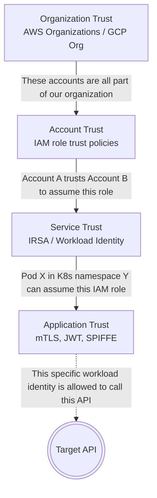
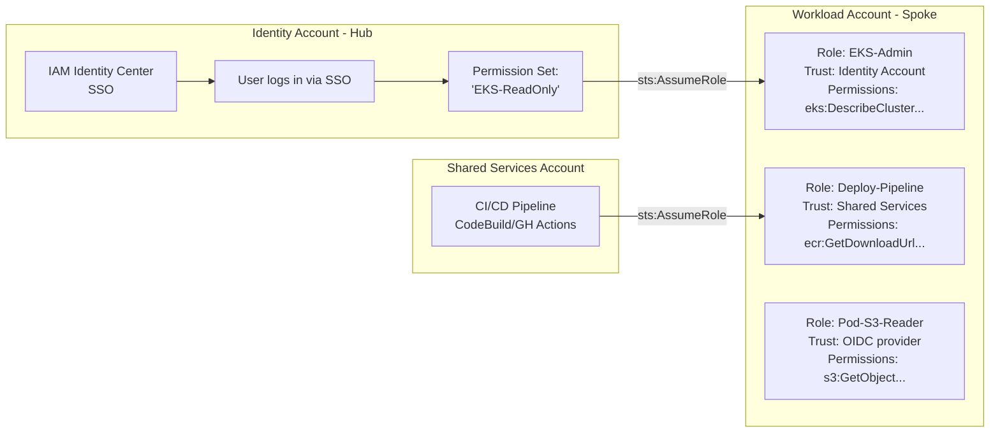
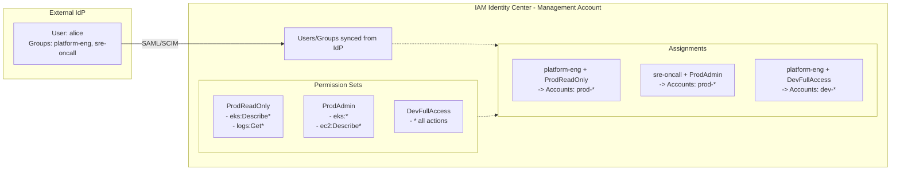
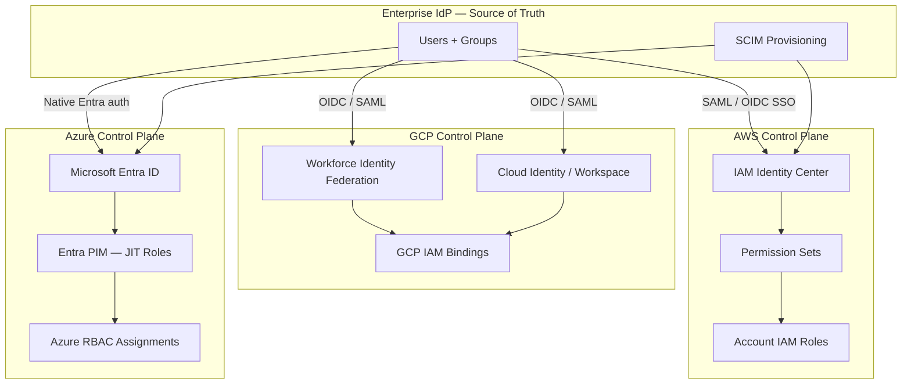
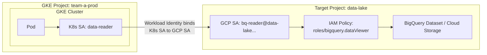
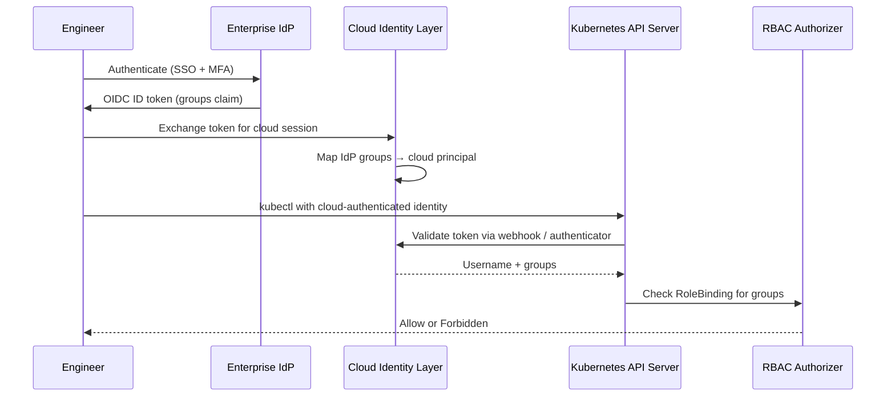
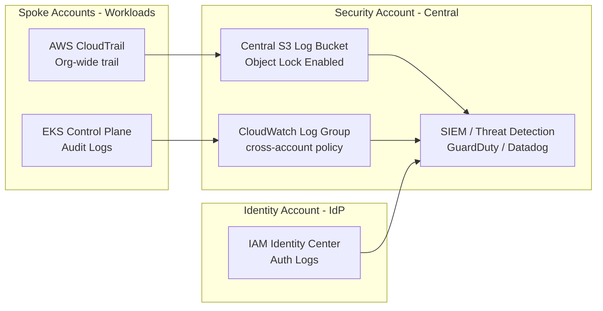
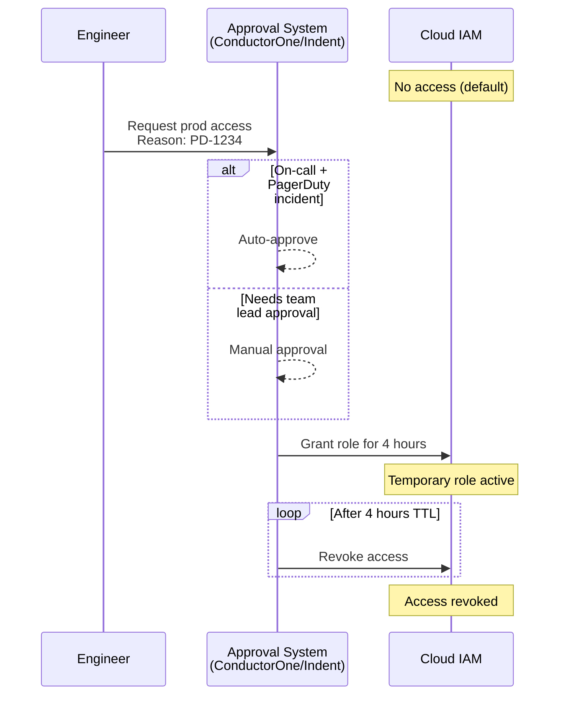
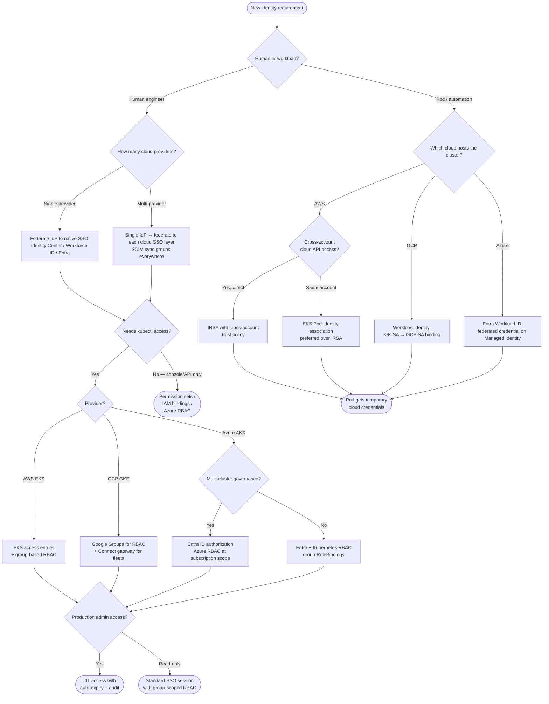

> **Complexity**: `[COMPLEX]`
>
> **Time to Complete**: 2.5 hours
>
> **Prerequisites**: [Module 8.1: Multi-Account Architecture](../module-8.1-multi-account/), basic understanding of IAM roles and policies in at least one cloud
>
> **Track**: Advanced Cloud Operations

## What You'll Be Able to Do

After completing this module, you will be able to:

- **Design** enterprise SSO integration with OIDC/SAML providers (Okta, Entra ID) for Kubernetes cluster access across multiple environments.
- **Implement** cross-account IAM role chaining and federation patterns for multi-cloud Kubernetes deployments.
- **Evaluate** RBAC hierarchies that map enterprise organizational structure to Kubernetes namespace-level permissions.
- **Diagnose** identity-related access failures across cross-account boundaries using centralized audit logging.

---

## Why This Module Matters

**A large-enterprise identity breach scenario.**

An engineer needed to debug a production issue in a Kubernetes cluster running in a different AWS account. The standard process: log into the management console, switch roles to the production account, navigate to EKS, download the kubeconfig, and authenticate with the cluster. The "role switch" used a long-lived IAM user with `AdministratorAccess` in the production account because the team had never gotten around to building proper cross-account role assumption chains.

Shared long-lived credentials in repositories can be abused after an unrelated account compromise, leading to unauthorized production access, data exposure, and major incident-response costs.

This catastrophic failure wasn't due to a complex zero-day vulnerability or an unpatched kernel. Every component of this failure was fundamentally an identity problem: long-lived credentials were used instead of temporary tokens, overly broad permissions existed instead of least privilege, there were no just-in-time access controls in place, and the architecture failed to enforce any separation between human and machine identities. 

In a multi-account, multi-cluster world, identity is the new perimeter. The traditional network perimeter is dead; your VPCs and firewalls are secondary defenses compared to your IAM configurations. This module teaches you how to build identity architectures that scale securely across accounts and clouds, ensuring that identity serves as your strongest security boundary without becoming an operational bottleneck.

---

## Trust Boundaries: The Foundation of Cross-Account Identity

A trust boundary is the conceptual line between "I trust you explicitly" and "you must prove who you are and what you are allowed to do." In a single AWS account or single GCP project, trust is largely implicit. IAM roles and service accounts inherently trust the account they reside in. However, in a multi-account enterprise world, you must explicitly and deliberately establish trust between different boundaries. 

Think of it like corporate building security: your employee badge (Identity) lets you into the lobby (Organization Trust), but it doesn't automatically let you into the server room (Account Trust). To get into the server room, the security desk must explicitly grant your specific badge access (Service Trust), and even then, you might only be allowed to touch specific racks (Application Trust).



### The Three Types of Identity

To secure an enterprise environment, you must distinguish between three fundamental types of identity, treating each with different tooling and risk management strategies.

| Identity Type | Examples | Lifetime | Risk Level |
|---|---|---|---|
| Human | Engineers, admins, auditors | Session-based (1-12 hours) | High (phishing, credential theft) |
| Machine (cloud) | EC2 instance roles, GCE service accounts | Instance lifetime | Medium (compromise requires host access) |
| Workload (K8s) | Pod service accounts with cloud IAM bindings | Pod lifetime (minutes to days) | Medium-High (compromised pod = compromised identity) |

The critical insight for platform engineers: in a Kubernetes world, **workload identity is the most important identity type**. Pods need cloud credentials to access databases, secret stores, message queues, and cloud storage. How you securely provision those credentials determines your overall security posture.

### Enterprise Identity Foundations: Humans, Machines, and Workloads

Enterprise identity architecture starts with a single question: who or what is making this request, and who vouches for them? At scale, the answer spans three distinct identity classes that must never be conflated. Human identities represent engineers, auditors, and on-call responders who authenticate through an enterprise Identity Provider (IdP) such as [Microsoft Entra ID](https://learn.microsoft.com/en-us/entra/fundamentals/whatis), Okta, or Ping Identity. Machine identities represent cloud compute principals—EC2 instance profiles, GCE default service accounts attached to VMs, and Azure managed identities on nodes—that inherit credentials from the host. Workload identities represent application-level principals inside Kubernetes: a pod's ServiceAccount token, exchanged for cloud credentials through federation.

The IdP is your organizational source of truth for human identity. It stores (or federates to) user records, group memberships, MFA enrollment, and lifecycle events such as hire, transfer, and termination. Cloud control planes and Kubernetes clusters should never maintain parallel user directories. Instead, they trust assertions from the IdP: SAML assertions for browser-based SSO, OIDC ID tokens for modern CLI and API flows, and SCIM (System for Cross-domain Identity Management) for automated provisioning and deprovisioning of users and groups into downstream systems.

SSO via SAML or OIDC eliminates password sprawl across dozens of cloud consoles and cluster endpoints. When an engineer authenticates to Okta, Okta issues a signed assertion that AWS IAM Identity Center, GCP Workforce Identity Federation, or Azure Entra ID validates before granting a short-lived cloud session. [SCIM provisioning](https://learn.microsoft.com/en-us/entra/identity/app-provisioning/use-scim-to-provision-users-and-groups) automates the mirror image: when HR offboards an employee in the IdP, SCIM deletes or disables their cloud accounts within minutes rather than waiting for a quarterly access review to discover orphaned access.

The trust chain for human access follows a predictable pattern across all three hyperscalers. The user authenticates to the IdP. The IdP issues a federation token to the cloud identity layer. The cloud layer maps IdP groups to cloud permissions. For Kubernetes access, a final hop maps cloud-authenticated principals to in-cluster RBAC groups. Each hop must be auditable, time-bounded, and scoped to least privilege. A break anywhere in this chain—stale group membership, a misconfigured attribute mapping, or a ClusterRoleBinding that references the wrong OIDC group—creates either an outage (legitimate users locked out) or a breach path (former employees retaining cluster-admin).

| Identity class | Primary authenticator | Typical lifetime | Federation protocol | Deprovisioning trigger |
|---|---|---|---|---|
| Human (workforce) | Enterprise IdP (Entra, Okta, Ping) | 1–12 hour SSO session | SAML 2.0 or OIDC | SCIM delete / IdP group removal |
| Machine (cloud host) | Cloud metadata service (IMDS) | Instance lifetime | Platform-native (no external IdP) | Instance termination |
| Workload (K8s pod) | Kubernetes ServiceAccount JWT | Pod lifetime (minutes to days) | OIDC token exchange (IRSA, Workload ID) | Pod deletion / SA rotation |

Hypothetical scenario: A platform team provisions AWS, GCP, and Azure access for a new hire by creating native cloud user accounts in each provider. Six months later, the employee transfers to a non-technical role, but only the AWS account is disabled because GCP and Azure accounts were created manually and never linked to the IdP. The employee retains GKE cluster-admin through a stale Google Group membership. This is identity sprawl—the operational and security tax of maintaining parallel identity stores instead of federating everything through a single IdP with SCIM-driven lifecycle automation.

---

## Cross-Account Role Assumption (AWS)

The fundamental mechanism for cross-account access in AWS is role assumption using the Security Token Service (STS). Account A creates a role with a trust policy that explicitly allows Account B's principals (users or roles) to assume it. When assumed, [STS returns temporary, time-bound credentials](https://docs.aws.amazon.com/cli/latest/reference/sts/assume-role.html).

### The Role Chain Pattern

In a well-architected environment, you generally do not have users directly inside your workload accounts. Instead, you utilize a Hub-and-Spoke model where all human and pipeline identities live in centralized accounts and *assume roles* into the spoke workload accounts.



**Pause and predict:** What would happen if the Workload Account role (`EKS-Admin`) omitted the `aws:PrincipalOrgID` condition in its trust policy? If an external attacker somehow discovers or guesses the target role ARN, could they assume it directly?

<details>
<summary>Check your prediction</summary>

Omitting the `aws:PrincipalOrgID` condition does **not** make guessing the role ARN sufficient to assume it. Cross-account role assumption still strictly requires a matching `Principal` block in the role's trust policy, as well as an identity-based policy in the calling account explicitly granting `sts:AssumeRole` on that role ARN. Without the `aws:PrincipalOrgID` condition, the role relies only on the specific principals named in the trust policy; adding the org condition provides an additional organization-level boundary fence around who can assume it to prevent accidental exposure if account identifiers are misconfigured.
</details>

Establishing defense-in-depth around cross-account delegation prevents unauthorized callers from exploiting ambiguous trust statements across organizational boundaries. Before deploying enterprise access patterns at scale, cloud platform teams must configure the foundational trust policies and identity permissions that govern cross-account assumption.

### Setting Up Cross-Account Roles

Below is the foundational setup for cross-account role assumption using the AWS CLI. Notice how the Workload account defines *what* can be done, while the Identity account defines *who* can do it.

```bash
# In the WORKLOAD account: Create a role that the Identity account can assume
aws iam create-role \
  --role-name EKS-Admin \
  --assume-role-policy-document '{
    "Version": "2012-10-17",
    "Statement": [
      {
        "Effect": "Allow",
        "Principal": {
          "AWS": "arn:aws:iam::111111111111:root"
        },
        "Action": "sts:AssumeRole",
        "Condition": {
          "StringEquals": {
            "aws:PrincipalOrgID": "o-abc1234567"
          },
          "Bool": {
            "aws:MultiFactorAuthPresent": "true"
          }
        }
      }
    ]
  }'

# Attach a policy that limits what this role can do
aws iam put-role-policy \
  --role-name EKS-Admin \
  --policy-name eks-admin-policy \
  --policy-document '{
    "Version": "2012-10-17",
    "Statement": [
      {
        "Effect": "Allow",
        "Action": [
          "eks:DescribeCluster",
          "eks:AccessKubernetesApi",
          "eks:ListNodegroups"
        ],
        "Resource": "arn:aws:eks:*:222222222222:cluster/*"
      },
      {
        "Effect": "Allow",
        "Action": "eks:ListClusters",
        "Resource": "*"
      },
      {
        "Effect": "Allow",
        "Action": "eks:DescribeNodegroup",
        "Resource": "arn:aws:eks:*:222222222222:nodegroup/*/*/*"
      }
    ]
  }'

# In the IDENTITY account: Allow a user/role to assume the cross-account role
aws iam put-user-policy \
  --user-name platform-engineer \
  --policy-name cross-account-assume \
  --policy-document '{
    "Version": "2012-10-17",
    "Statement": [
      {
        "Effect": "Allow",
        "Action": "sts:AssumeRole",
        "Resource": [
          "arn:aws:iam::222222222222:role/EKS-Admin",
          "arn:aws:iam::333333333333:role/EKS-Admin"
        ]
      }
    ]
  }'

# Assume the role and get temporary credentials
CREDS=$(aws sts assume-role \
  --role-arn arn:aws:iam::222222222222:role/EKS-Admin \
  --role-session-name "debug-session-$(date +%s)" \
  --duration-seconds 3600)

export AWS_ACCESS_KEY_ID=$(echo $CREDS | jq -r '.Credentials.AccessKeyId')
export AWS_SECRET_ACCESS_KEY=$(echo $CREDS | jq -r '.Credentials.SecretAccessKey')
export AWS_SESSION_TOKEN=$(echo $CREDS | jq -r '.Credentials.SessionToken')

# Now interact with EKS in the workload account
aws eks update-kubeconfig --name prod-cluster --region us-east-1
```

By heavily relying on `sts:AssumeRole`, we eliminate long-lived keys. If the developer's laptop is compromised, the credentials are only valid for a maximum of 3600 seconds.

### Cross-Account and Cross-Project Equivalents (GCP and Azure)

AWS popularized cross-account role assumption, but GCP and Azure solve the same organizational boundary problem with different primitives. Understanding all three prevents teams from building AWS-only runbooks that fail when a GKE or AKS cluster enters the portfolio.

On GCP, cross-project access uses [service account impersonation](https://cloud.google.com/iam/docs/service-account-impersonation) rather than STS AssumeRole. A principal in Project A receives the `roles/iam.serviceAccountTokenCreator` role on a service account in Project B, then calls `gcloud auth print-access-token --impersonate-service-account=...` to obtain a short-lived token. For human engineers, Workforce Identity Federation tokens map to IAM bindings at the organization, folder, or project level—there is no separate "switch project" step because GCP IAM evaluates permissions across the resource hierarchy in a single evaluation.

On Azure, cross-subscription access uses [Azure RBAC role assignments](https://learn.microsoft.com/en-us/azure/role-based-access-control/role-assignments) scoped to management groups, subscriptions, or resource groups. An Entra ID group receives `Azure Kubernetes Service Cluster Admin Role` at the management-group level, granting access to every AKS cluster beneath that scope without per-cluster configuration. [Azure Lighthouse](https://learn.microsoft.com/en-us/azure/lighthouse/overview) extends this model for managed service providers who administer customer tenants—delegated RBAC assignments that respect the customer's Entra ID policies while giving the MSP operational access.

The Kubernetes implication is identical across clouds: human access should never require long-lived credentials stored on a laptop. Whether the mechanism is STS AssumeRole, GCP impersonation, or Azure RBAC at management-group scope, the session must be time-bounded, MFA-protected where possible, and fully logged in a centralized audit trail.

---

## IAM Identity Center (AWS SSO)

Managing thousands of cross-account roles manually via the CLI or basic Terraform scripts quickly becomes an unmaintainable nightmare. [AWS IAM Identity Center (formerly AWS SSO) is the recommended way to manage human access to multiple AWS accounts.](https://docs.aws.amazon.com/prescriptive-guidance/latest/security-reference-architecture-identity-management/workforce-iam-identity-center.html) It provides a centralized single sign-on portal where users authenticate once (often against an external Identity Provider like Okta) and then can seamlessly switch between accounts and permission sets.



### Setting Up IAM Identity Center with Terraform

Instead of managing individual IAM roles per account, you manage `PermissionSets` centrally. When you assign a PermissionSet to a group for a specific account, [Identity Center automatically provisions and manages the necessary IAM roles in the target account.](https://docs.aws.amazon.com/singlesignon/latest/userguide/identity-center-and-iam-roles.html)

```hcl
# Configure the Identity Center instance
data "aws_ssoadmin_instances" "main" {}

locals {
  sso_instance_arn = tolist(data.aws_ssoadmin_instances.main.arns)[0]
  identity_store   = tolist(data.aws_ssoadmin_instances.main.identity_store_ids)[0]
}

# Create permission sets
resource "aws_ssoadmin_permission_set" "prod_readonly" {
  name             = "ProdReadOnly"
  instance_arn     = local.sso_instance_arn
  session_duration = "PT4H"
  description      = "Read-only access to production accounts"
}

resource "aws_ssoadmin_managed_policy_attachment" "prod_readonly_view" {
  instance_arn       = local.sso_instance_arn
  managed_policy_arn = "arn:aws:iam::aws:policy/ViewOnlyAccess"
  permission_set_arn = aws_ssoadmin_permission_set.prod_readonly.arn
}

# Custom inline policy for EKS access
resource "aws_ssoadmin_permission_set_inline_policy" "prod_readonly_eks" {
  instance_arn       = local.sso_instance_arn
  permission_set_arn = aws_ssoadmin_permission_set.prod_readonly.arn

  inline_policy = jsonencode({
    Version = "2012-10-17"
    Statement = [
      {
        Effect = "Allow"
        Action = ["eks:ListClusters"]
        Resource = "*"
      },
      {
        Effect = "Allow"
        Action = [
          "eks:DescribeCluster",
          "eks:AccessKubernetesApi"
        ]
        Resource = "*"
      }
    ]
  })
}

resource "aws_ssoadmin_permission_set" "prod_admin" {
  name             = "ProdAdmin"
  instance_arn     = local.sso_instance_arn
  session_duration = "PT1H"  # Short session for admin access
  description      = "Admin access to production (break-glass)"
}

# Assign permission set to group for specific accounts
resource "aws_ssoadmin_account_assignment" "sre_prod_admin" {
  instance_arn       = local.sso_instance_arn
  permission_set_arn = aws_ssoadmin_permission_set.prod_admin.arn

  principal_id   = data.aws_identitystore_group.sre_oncall.group_id
  principal_type = "GROUP"

  target_id   = "222222222222"  # prod account ID
  target_type = "AWS_ACCOUNT"
}
```

Notice how `prod_admin` uses a highly restricted session duration (`PT1H`). Administrative tasks in production should be fast, deliberate, and fully audited.

### Federating Your IdP into Every Cloud Control Plane

IAM Identity Center is AWS's answer to the "one front door" problem, but GCP and Azure solve the same problem with different primitives. Understanding all three side by side prevents teams from building AWS-only identity patterns that fail the moment a GKE or AKS cluster enters the portfolio.

On AWS, the federation path is: IdP (SAML/OIDC) → IAM Identity Center → Permission Sets → account-local IAM roles → (optional) EKS access entries. [Permission sets are templates](https://docs.aws.amazon.com/singlesignon/latest/userguide/permissionsetsconcept.html) that Identity Center materializes as IAM roles in each assigned account. SCIM sync from the IdP keeps users and groups current; when a user leaves the `platform-eng` group in Okta, their Identity Center assignments disappear on the next sync cycle.

GCP offers two workforce paths. [Cloud Identity / Google Workspace](https://cloud.google.com/iam/docs/user-identities) with directory sync creates managed Google accounts that authenticate through your IdP—useful when teams need Gmail-style identities. [Workforce Identity Federation](https://cloud.google.com/iam/docs/workforce-identity-federation) is the syncless alternative: users authenticate directly through OIDC or SAML without creating Google accounts at all. Workforce pools use attribute mapping (`google.subject=assertion.sub`, `google.groups=assertion.groups`) and attribute conditions to translate IdP claims into IAM bindings. A condition like `assertion.groups.contains('gke-admins')` can restrict console access to a specific Entra ID group without provisioning individual Google identities.

Azure centralizes human access through [Microsoft Entra ID](https://learn.microsoft.com/en-us/entra/fundamentals/whatis) groups mapped to [Azure RBAC role assignments](https://learn.microsoft.com/en-us/azure/role-based-access-control/role-assignments) at management group, subscription, or resource-group scope. Entra ID PIM (Privileged Identity Management) adds just-in-time activation for elevated roles—an engineer requests `Owner` on a production subscription, receives a time-limited assignment after approval, and the assignment auto-expires. For Kubernetes specifically, Entra groups become subjects in RoleBindings or feed the Entra ID authorization webhook for multi-cluster Azure RBAC governance.



The operational lesson across providers: never create standalone cloud-local user accounts for employees. Every human should enter through the IdP federation path, with SCIM or equivalent group sync driving provisioning and deprovisioning. Native cloud users should be reserved for break-glass emergencies and service automation—not daily engineering access.

---

## GCP Workload Identity Federation Across Projects

Google Cloud Platform's approach to cross-project identity elegantly leverages Workload Identity Federation. [This mechanism allows GKE workloads in one project to natively impersonate service accounts in an entirely different project without manually managing or rotating keys.](https://cloud.google.com/iam/docs/workload-identity-federation-with-other-providers)



**Pause and predict:** In the GCP Workload Identity binding below, we specify `serviceAccount:team-a-prod.svc.id.goog[analytics/data-reader]`. What happens if a developer in the same GKE cluster deploys a pod in the `default` namespace using a ServiceAccount also named `data-reader`?

<details>
<summary>Check your prediction</summary>

The pod in the `default` namespace is denied access because GCP Workload Identity bindings are strictly namespace-scoped. The canonical principal identifier format `serviceAccount:PROJECT.svc.id.goog[analytics/data-reader]` requires an exact match on both the namespace and the Kubernetes ServiceAccount name, so `default/data-reader` does **not** match. [The trust binding explicitly requires the `analytics` namespace.](https://cloud.google.com/iam/docs/workload-identity-federation-with-kubernetes) This namespace-level isolation prevents cross-tenant privilege escalation within a shared cluster.
</details>

Shared clusters still need a written contract for which identities may call which cloud APIs. Platform teams should review those bindings during tenant onboarding and after namespace moves, because a name collision across tenancies is an expected failure mode rather than a surprise.

To implement Workload Identity Federation, you create a direct binding between a specific Kubernetes ServiceAccount and a GCP IAM ServiceAccount.

```bash
# Step 1: Enable Workload Identity on the GKE cluster
gcloud container clusters update team-a-prod \
  --project=team-a-prod \
  --region=us-central1 \
  --workload-pool=team-a-prod.svc.id.goog

# Step 2: Create a GCP service account in the TARGET project
gcloud iam service-accounts create bq-reader \
  --project=data-lake \
  --display-name="BigQuery Reader for Team A"

# Step 3: Grant the GCP SA access to BigQuery
gcloud projects add-iam-policy-binding data-lake \
  --member="serviceAccount:bq-reader@data-lake.iam.gserviceaccount.com" \
  --role="roles/bigquery.dataViewer"

# Step 4: Allow the K8s SA to impersonate the GCP SA
# This is the cross-project trust binding
gcloud iam service-accounts add-iam-policy-binding \
  bq-reader@data-lake.iam.gserviceaccount.com \
  --role="roles/iam.workloadIdentityUser" \
  --member="serviceAccount:team-a-prod.svc.id.goog[analytics/data-reader]"
#                          ^^^^^^^^^^^^^^ GKE project
#                                         ^^^^^^^^^ K8s namespace
#                                                    ^^^^^^^^^^^ K8s SA name

# Step 5: Create the K8s ServiceAccount with the annotation
kubectl --context team-a-prod create namespace analytics

kubectl --context team-a-prod apply -f - <<'EOF'
apiVersion: v1
kind: ServiceAccount
metadata:
  name: data-reader
  namespace: analytics
  annotations:
    iam.gke.io/gcp-service-account: bq-reader@data-lake.iam.gserviceaccount.com
EOF

# Step 6: Deploy a pod using this service account
kubectl --context team-a-prod apply -f - <<'EOF'
apiVersion: apps/v1
kind: Deployment
metadata:
  name: analytics-worker
  namespace: analytics
spec:
  replicas: 2
  selector:
    matchLabels:
      app: analytics-worker
  template:
    metadata:
      labels:
        app: analytics-worker
    spec:
      serviceAccountName: data-reader
      containers:
        - name: worker
          image: gcr.io/team-a-prod/analytics-worker:v1.4.2
          # No GCP credentials needed - Workload Identity provides them
EOF
```

---

## Azure Entra ID and Workload Identity

Azure utilizes Entra ID (formerly known as Azure Active Directory) as the central identity provider. For Kubernetes workloads running on Azure Kubernetes Service (AKS), [Microsoft provides Workload Identity Federation via OIDC](https://learn.microsoft.com/en-us/azure/aks/workload-identity-overview), completely doing away with [the legacy AAD Pod Identity mechanism](https://learn.microsoft.com/en-us/azure/aks/use-azure-ad-pod-identity).

**Pause and predict:** When configuring a Federated Identity Credential in Microsoft Entra ID for an AKS workload, why must you specify `api://AzureADTokenExchange` as the token audience rather than leaving it blank or arbitrary?

<details>
<summary>Check your prediction</summary>

The audience `api://AzureADTokenExchange` is the recommended and required audience value that Microsoft Entra ID verifies during federated token exchange. [This audience restricts the token usage specifically to the Azure AD token exchange process.](https://learn.microsoft.com/en-us/entra/workload-id/workload-identities-set-up-flexible-federated-identity-credential) Microsoft Entra's token service strictly validates that the incoming projected Kubernetes ServiceAccount token declares this exact audience before exchanging it for an Azure access token, ensuring tokens minted for other OIDC relying parties cannot be used for Entra identity federation.
</details>

Federated credentials on managed identities let AKS workloads authenticate against Azure resources without storing static client secrets. Platform teams still need to pin issuer and subject to a specific service account, then rotate that mapping when workloads move namespaces.

The setup in Azure involves creating a Federated Credential that natively maps an OIDC token issued by the Kubernetes API server directly to an Azure Managed Identity.

```bash
# Step 1: Enable OIDC issuer and workload identity on AKS
az aks update \
  --resource-group prod-rg \
  --name team-a-prod \
  --enable-oidc-issuer \
  --enable-workload-identity

# Get the OIDC issuer URL
OIDC_ISSUER=$(az aks show \
  --resource-group prod-rg \
  --name team-a-prod \
  --query "oidcIssuerProfile.issuerUrl" -o tsv)

# Step 2: Create a Managed Identity (cross-subscription capable)
az identity create \
  --name "team-a-keyvault-reader" \
  --resource-group identity-rg \
  --subscription $IDENTITY_SUB_ID

CLIENT_ID=$(az identity show \
  --name "team-a-keyvault-reader" \
  --resource-group identity-rg \
  --query 'clientId' -o tsv)

# Step 3: Create federated credential (trust K8s SA)
az identity federated-credential create \
  --name "aks-team-a-prod" \
  --identity-name "team-a-keyvault-reader" \
  --resource-group identity-rg \
  --issuer "$OIDC_ISSUER" \
  --subject "system:serviceaccount:app:keyvault-reader" \
  --audience "api://AzureADTokenExchange"

# Step 4: Grant the Managed Identity access to Key Vault
# (in a DIFFERENT subscription)
az role assignment create \
  --assignee $CLIENT_ID \
  --role "Key Vault Secrets User" \
  --scope "/subscriptions/KEYVAULT_SUB_ID/resourceGroups/security-rg/providers/Microsoft.KeyVault/vaults/prod-secrets"

# Step 5: Create the K8s ServiceAccount with workload identity labels
kubectl apply -f - <<EOF
apiVersion: v1
kind: ServiceAccount
metadata:
  name: keyvault-reader
  namespace: app
  annotations:
    azure.workload.identity/client-id: "$CLIENT_ID"
  labels:
    azure.workload.identity/use: "true"
EOF
```

---

## Mapping Enterprise IdP Groups to Kubernetes RBAC

Cloud IAM gets an engineer to the cluster API server door. Kubernetes RBAC decides what they can do once inside. The mapping between enterprise groups and in-cluster permissions is where most multi-cloud identity architectures succeed or fail—and each provider offers a different integration point.

### The OIDC Token Flow and Trust Chain

Regardless of cloud provider, the Kubernetes authentication flow for human users follows the same abstract pattern. The user obtains an OIDC token from the enterprise IdP (directly or via a cloud federation layer). The cloud provider's identity bridge validates the token and maps it to a cloud principal. The Kubernetes API server receives the authenticated request with a username and group list. RBAC bindings match those groups to Roles or ClusterRoles. If any link in this chain is misconfigured, the user sees `Forbidden` errors that are painful to debug because the failure could be in the IdP, the cloud layer, or the cluster RBAC itself.



### EKS: Access Entries and IAM-to-RBAC Mapping

Amazon EKS has migrated from the legacy `aws-auth` ConfigMap to [EKS access entries](https://docs.aws.amazon.com/eks/latest/userguide/access-entries.html) as the recommended authentication mode. Access entries map IAM principals (users or roles created by IAM Identity Center permission sets) to Kubernetes permissions through either AWS-managed EKS access policies or explicit Kubernetes group membership. When you assign the `AmazonEKSViewPolicy` access policy to an IAM role at namespace scope, the engineer gets view-only access without manually editing ConfigMaps or creating ClusterRoleBindings.

For teams that need fine-grained, GitOps-managed RBAC, the Kubernetes groups approach remains available. You create an access entry with `--kubernetes-groups platform-eng` and then manage a `ClusterRoleBinding` that grants the `platform-eng` group a custom `ClusterRole`. [Access entries take precedence over ConfigMap entries](https://docs.aws.amazon.com/eks/latest/userguide/migrating-access-entries.html) for the same IAM principal, so migration requires creating access entries before removing ConfigMap mappings.

```bash
# Map an IAM Identity Center permission-set role to a Kubernetes RBAC group
aws eks create-access-entry \
  --cluster-name prod-cluster \
  --principal-arn arn:aws:iam::222222222222:role/aws-reserved/sso.amazonaws.com/us-east-1/AWSReservedSSO_ProdReadOnly_a1b2c3d4 \
  --type STANDARD \
  --kubernetes-groups platform-readonly

# The ClusterRoleBinding (managed via GitOps) completes the chain:
# Group "platform-readonly" → ClusterRole "view" (or custom role)
```

### GKE: Google Groups for RBAC

GKE integrates enterprise group membership through [Google Groups for RBAC](https://cloud.google.com/kubernetes-engine/docs/how-to/google-groups-rbac). You create a required umbrella group named `gke-security-groups@yourdomain.com`, nest team groups (such as `platform-eng@yourdomain.com`) as members, and enable the feature on the cluster with `--security-group=gke-security-groups@yourdomain.com`. ClusterRoleBindings then reference team group emails as `kind: Group` subjects. Google Workspace administrators manage membership entirely outside GKE—when someone joins the platform team in Entra ID (synced to Google Groups via cloud identity federation), they automatically gain the corresponding cluster permissions.

This pattern scales to multi-cluster fleets through the [Connect gateway](https://cloud.google.com/kubernetes-engine/enterprise/multicluster-management/gateway/setup-groups), which propagates group membership information across registered clusters. Instead of maintaining RBAC bindings per cluster per user, you maintain bindings per cluster per group—a reduction from O(users × clusters) to O(groups × clusters).

### AKS: Entra ID Integration with Kubernetes RBAC

AKS supports two complementary authorization models. [Kubernetes RBAC with Entra integration](https://learn.microsoft.com/en-us/azure/aks/azure-ad-rbac) authenticates users via Entra ID tokens and authorizes them through native Kubernetes RoleBindings where the subject is an Entra group object ID. [Entra ID authorization for the Kubernetes API](https://learn.microsoft.com/en-us/azure/aks/entra-id-authorization) delegates authorization to Azure RBAC at subscription or management-group scope—ideal when you need one role assignment to govern dozens of clusters without applying manifests to each one.

For the Kubernetes RBAC path, the setup mirrors EKS access entries conceptually: enable Entra integration on the cluster, create a `Role` scoped to a namespace, and bind it to an Entra group:

```yaml
apiVersion: rbac.authorization.k8s.io/v1
kind: RoleBinding
metadata:
  name: appdev-namespace-access
  namespace: development
subjects:
  - kind: Group
    apiGroup: rbac.authorization.k8s.io
    name: "aaaaaaaa-bbbb-cccc-dddd-eeeeeeeeeeee"  # Entra group object ID
roleRef:
  kind: Role
  name: namespace-developer
  apiGroup: rbac.authorization.k8s.io
```

Retrieve the group object ID with `az ad group show --group appdev --query id -o tsv`. Always use `--admin` sparingly: the cluster admin kubeconfig bypasses Entra authentication entirely, which defeats the purpose of enterprise identity integration.

---

## AWS Workload Identity: IRSA and EKS Pod Identity

The Azure and GCP sections above cover workload identity for those platforms. AWS offers two mechanisms—IRSA and EKS Pod Identity—and choosing between them affects trust policy complexity, cross-account access, and operational ownership.

[IRSA (IAM Roles for Service Accounts)](https://docs.aws.amazon.com/eks/latest/userguide/iam-roles-for-service-accounts.html) uses the cluster's OIDC issuer. Each IAM role's trust policy must reference the OIDC provider and constrain the `sub` claim to a specific `system:serviceaccount:namespace:name` combination. The pod annotation `eks.amazonaws.com/role-arn` tells the AWS SDK which role to assume via `AssumeRoleWithWebIdentity`. IRSA supports direct cross-account access: a pod in Account A can assume a role in Account B if the trust policy permits the OIDC `sub` claim from Account A's cluster.

[EKS Pod Identity](https://docs.aws.amazon.com/eks/latest/userguide/pod-identities.html) simplifies the model by eliminating per-cluster OIDC provider setup. Associations between Kubernetes service accounts and IAM roles are managed through the EKS API (`aws eks create-pod-identity-association`), and a node-level Pod Identity Agent delivers credentials to pods. AWS [recommends Pod Identity for most new deployments](https://docs.aws.amazon.com/eks/latest/best-practices/identity-and-access-management.html) because it separates duties cleanly: EKS administrators manage associations, IAM administrators manage role permissions, and no one needs to touch OIDC provider configuration in every account.

| Capability | IRSA | EKS Pod Identity |
|---|---|---|
| Requires OIDC provider per cluster | Yes | No |
| Cross-account role assumption | Direct via `AssumeRoleWithWebIdentity` | Indirect via role chaining |
| Trust policy management | Per-role, per-cluster OIDC conditions | Single EKS service principal |
| ABAC session tags | No | Yes |
| Annotation key | `eks.amazonaws.com/role-arn` | Association via EKS API (no annotation required) |

Both mechanisms eliminate long-lived static credentials. Neither replaces Kubernetes RBAC: a pod's cloud identity determines what AWS APIs it can call, while Kubernetes RBAC determines what cluster resources the pod's ServiceAccount can access. Defense in depth requires configuring both layers independently.

```bash
# EKS Pod Identity: create association (replaces IRSA trust policy per cluster)
aws eks create-pod-identity-association \
  --cluster-name prod-cluster \
  --namespace analytics \
  --service-account s3-reader \
  --role-arn arn:aws:iam::222222222222:role/pod-s3-reader
```

---

## Attribute-Based Access Control (ABAC)

As organizations scale to hundreds of clusters and accounts, standard RBAC creates operational bottlenecks. Attribute-Based Access Control (ABAC) extends traditional RBAC by making dynamic access decisions based on attributes (tags, metadata) of the requester, the resource, and the environment.

### RBAC vs ABAC

**RBAC**: *"Alice has the EKS-Admin role, which allows eks:\* on all clusters"*
- Static assignment
- Broad permissions
- No context awareness

**ABAC**: *"Alice can access EKS clusters IF: she is in the sre-oncall group AND the cluster has tag Environment=production AND the current time is during her on-call shift AND she has completed the security training this quarter AND the request originates from the corporate VPN"*
- Dynamic, context-aware
- Fine-grained
- Harder to reason about initially, but scales infinitely better

### AWS ABAC with Tags

With ABAC in AWS, you rely heavily on resource tagging. [Your IAM policies utilize condition keys like `aws:ResourceTag` to compare attributes on the fly.](https://docs.aws.amazon.com/IAM/latest/UserGuide/tutorial_attribute-based-access-control.html)

```json
{
  "Version": "2012-10-17",
  "Statement": [
    {
      "Effect": "Allow",
      "Action": [
        "eks:DescribeCluster",
        "eks:AccessKubernetesApi"
      ],
      "Resource": "*",
      "Condition": {
        "StringEquals": {
          "aws:ResourceTag/Team": "${aws:PrincipalTag/Team}",
          "aws:ResourceTag/Environment": "production"
        }
      }
    }
  ]
}
```

This policy says: "You can access EKS clusters only if the cluster's `Team` tag matches your own `Team` tag, and the cluster is in production." An engineer tagged `Team=payments` can access the payments production cluster but not the analytics production cluster. No explicit role assignment per cluster is needed -- the tags do the work.

```bash
# Tag the IAM user/role with their team
aws iam tag-user \
  --user-name alice \
  --tags Key=Team,Value=payments Key=CostCenter,Value=CC-1234

# Tag the EKS cluster
aws eks tag-resource \
  --resource-arn arn:aws:eks:us-east-1:222222222222:cluster/payments-prod \
  --tags Team=payments,Environment=production
```

### GCP ABAC with IAM Conditions

GCP allows for incredibly expressive ABAC using [Common Expression Language (CEL) conditions](https://cloud.google.com/iam/docs/conditions-overview) directly in the IAM bindings.

```bash
# Grant access to GKE cluster only during business hours
gcloud projects add-iam-policy-binding team-a-prod \
  --member="user:alice@company.com" \
  --role="roles/container.developer" \
  --condition='expression=request.time.getHours("America/New_York") >= 9 && request.time.getHours("America/New_York") <= 17,title=business-hours-only,description=Access only during EST business hours'
```

**Pause and predict:** Consider an AWS ABAC policy that grants instance management permissions using `StringEquals aws:ResourceTag/Environment: production`. What happens if an engineer with EC2 permissions removes the `Environment` tag from a production server?

<details>
<summary>Check your prediction</summary>

Removing the tag causes the authorization policy's `Allow` evaluation to fail to match, resulting in an immediate implicit deny. Removing the `Environment=production` tag does **not** grant unrestricted access; instead, without the tag, the resource no longer satisfies the ABAC condition, locking authorized operators out. Conversely, if an attacker possessed tag modification permissions (`ec2:CreateTags`), they could tag untrusted resources to match their own principal attributes and escalate access. You must strictly control the `iam:TagResource`, `ec2:CreateTags`, and `ec2:DeleteTags` permissions to protect your ABAC logic.
</details>

Governing resource tagging operations preserves attribute integrity and prevents unauthorized privilege escalation across dynamically authorized cloud resources. Beyond enforcing dynamic authorization policies during live API requests, enterprise security architectures require comprehensive visibility into identity transactions across all connected accounts.

---

## Centralized Audit Logging for Identity Events

When identities span multiple cloud accounts and Kubernetes clusters, distributed logging becomes a major blind spot. If an attacker assumes a role in Account A, pivoting to a cluster in Account B, you cannot piece together the attack timeline if logs are siloed in individual accounts. 

You must aggregate identity events into a centralized, immutable security account.

> **Stop and think**: Why is S3 Object Lock (WORM) critical for the central logging bucket, even if only security admins have access to it?
> *If an attacker manages to compromise a security admin's identity or assumes a role with broad permissions in the security account, they would typically try to delete the logs to cover their tracks. Object Lock enforces immutability at the storage layer, meaning that [even a root user or an administrator cannot delete or modify the logs until the retention period expires.](https://docs.aws.amazon.com/AmazonS3/latest/userguide/object-lock.html)*



### Key Configurations for Identity Auditing

1. **Organizational CloudTrail**: Do not rely solely on individual account trails. Deploy an Organization Trail from your management account that [automatically covers all existing and future member accounts.](https://docs.aws.amazon.com/awscloudtrail/latest/userguide/creating-trail-organization.html) This is intended to capture `AssumeRole`, `AssumeRoleWithWebIdentity` (IRSA), and `ConsoleLogin` events across the organization.
2. **Kubernetes Audit Logs**: Enable EKS/GKE/AKS control plane audit logging. In Kubernetes, [the `kube-apiserver` audit logs show *who* did *what* to *which* resource.](https://kubernetes.io/docs/tasks/debug/debug-cluster/audit/) Forward these to your central logging account.
3. **Log Immutability**: Store centralized logs in an S3 bucket configured with **S3 Object Lock** (WORM - Write Once Read Many). If an attacker gains admin access to a spoke account, they cannot delete their tracks in the central security bucket.

### Tracing a Cross-Account Kubernetes Event

When auditing an incident, you must stitch together cloud provider logs and Kubernetes logs. This is critical for post-incident reviews.

1. **CloudTrail**: Shows a human logging into SSO.
2. **CloudTrail**: Shows that SSO session assuming the `EKS-Admin` role via `AssumeRole`.
3. **EKS Audit Log**: Shows the `EKS-Admin` role calling `create pod`.

Here is an example of an EKS Audit log showing the mapped AWS identity. Notice how Kubernetes maps the cloud IAM ARN to a Kubernetes `User`:

```json
{
  "kind": "Event",
  "apiVersion": "audit.k8s.io/v1",
  "verb": "create",
  "user": {
    "username": "kubernetes-admin",
    "uid": "aws-iam-authenticator:111122223333:AROA1234567890EXAMPLE",
    "groups": ["system:masters", "system:authenticated"],
    "extra": {
      "accessKeyId": ["ASIA..."],
      "arn": ["arn:aws:sts::222222222222:assumed-role/EKS-Admin/alice-session"],
      "canonicalArn": ["arn:aws:iam::222222222222:role/EKS-Admin"],
      "sessionName": ["alice-session"]
    }
  },
  "objectRef": {
    "resource": "secrets",
    "namespace": "production",
    "name": "db-credentials"
  }
}
```

By querying your SIEM for `user.extra.sessionName = "alice-session"`, you can track Alice's actions across the cloud provider and inside the Kubernetes cluster seamlessly.

### Multi-Cloud Audit Correlation

Stitching identity events across AWS, GCP, and Azure requires a normalized schema in your SIEM because each provider uses different field names for the same concept. CloudTrail records `userIdentity.arn` and `userIdentity.sessionContext`; GCP Cloud Audit Logs record `authenticationInfo.principalEmail` and `authenticationInfo.serviceAccountKeyName`; Azure Activity Log records `caller` and `claims.appid`. Your correlation rule should map all three to a canonical `actor_id` field and join on timestamp windows when tracking cross-cloud pivot attacks.

For Kubernetes audit logs, the `user.extra` fields differ by cloud authenticator. EKS embeds the AWS STS assumed-role ARN; GKE embeds the Google account or group email; AKS embeds the Entra object ID or UPN. Forward all cluster audit logs to the same immutable storage tier as cloud provider logs—splitting them by provider defeats the purpose of centralized identity forensics. Set alerts on high-risk verbs (`create secrets`, `delete namespace`, `patch clusterrolebinding`) combined with off-hours timestamps and principals that lack an active JIT approval record.

Hypothetical scenario: An attacker compromises a CI/CD service account in a dev AWS account, assumes a cross-account role into production, and creates a privileged pod. Without correlated logging, the production CloudTrail entry shows a legitimate-looking `AssumeRole` from a known CI role—the dev-account compromise is invisible. With organization-wide CloudTrail, SIEM correlation on `sourceIPAddress`, `sessionName`, and the chain of `AssumeRole` events across accounts, the full attack path becomes reconstructable within minutes instead of days.

---

## Just-In-Time (JIT) Access

[Just-In-Time (JIT) access grants elevated permissions only when absolutely needed, for a limited duration, and usually requires an explicit approval workflow.](https://learn.microsoft.com/en-us/entra/id-governance/privileged-identity-management/pim-deployment-plan) It actively eliminates "standing privileges" -- the most dangerous security anti-pattern in cloud environments.



### Implementing JIT with AWS SSO Permission Sets

You can implement a basic JIT system using AWS SSO APIs combined with automation tools like ConductorOne or Indent.

### JIT Access Across GCP and Azure

AWS Identity Center permission set assignments are one JIT implementation, but GCP and Azure offer native equivalents that multi-cloud platform teams should configure in parallel rather than treating JIT as an AWS-only concern.

On GCP, [IAM Conditions](https://cloud.google.com/iam/docs/conditions-overview) provide time-bound access without a separate JIT product. A binding with `request.time.getHours("America/New_York") >= 9 && request.time.getHours("America/New_York") <= 17` restricts cluster developer access to business hours. For stronger controls, integrate with [Entra PIM](https://learn.microsoft.com/en-us/entra/id-governance/privileged-identity-management/pim-deployment-plan) or a third-party JIT platform that calls the GCP Resource Manager API to add and remove IAM bindings on a schedule. Privileged Access Manager (GCP's native JIT product, where available in your organization) provides approval workflows similar to Entra PIM with audit trails in Cloud Audit Logs.

On Azure, [Entra Privileged Identity Management](https://learn.microsoft.com/en-us/entra/id-governance/privileged-identity-management/pim-deployment-plan) is the primary JIT mechanism. Eligible role assignments require activation with MFA, justification, and optional approver consent before the assignment becomes active. For AKS specifically, PIM-eligible `Azure Kubernetes Service Cluster Admin Role` assignments at subscription scope mean an engineer requests elevation, activates for two hours, performs the kubectl operation, and the role deactivates automatically—no CronJob cleanup required because Azure RBAC handles the lifecycle.

The Kubernetes layer still needs its own JIT regardless of cloud provider. Even if cloud IAM access is time-bound, a stale ClusterRoleBinding with `cluster-admin` persists until something deletes it. Best practice: cloud JIT grants the cloud-authenticated identity; Kubernetes JIT (temporary RoleBinding with label-based expiry) grants the in-cluster permissions—both must expire together, orchestrated by the same approval ticket.

```bash
# GCP: time-bound IAM binding example (business-hours-only cluster access)
gcloud projects add-iam-policy-binding team-a-prod \
  --member="group:platform-eng@company.com" \
  --role="roles/container.developer" \
  --condition='expression=request.time.getHours("America/New_York") >= 9 && request.time.getHours("America/New_York") <= 17,title=business-hours-only'
```

```bash
# Create a "break-glass" permission set with short duration
aws sso-admin create-permission-set \
  --instance-arn $SSO_INSTANCE_ARN \
  --name "BreakGlass-ProdAdmin" \
  --session-duration "PT2H" \
  --description "Emergency production admin access - requires approval"

# The approval workflow lives in your JIT tool (ConductorOne, Indent, etc.)
# When approved, the tool makes this API call:

aws sso-admin create-account-assignment \
  --instance-arn $SSO_INSTANCE_ARN \
  --target-id 222222222222 \
  --target-type AWS_ACCOUNT \
  --permission-set-arn $BREAKGLASS_PS_ARN \
  --principal-type USER \
  --principal-id $USER_ID

# When the TTL expires, the tool removes the assignment:
aws sso-admin delete-account-assignment \
  --instance-arn $SSO_INSTANCE_ARN \
  --target-id 222222222222 \
  --target-type AWS_ACCOUNT \
  --permission-set-arn $BREAKGLASS_PS_ARN \
  --principal-type USER \
  --principal-id $USER_ID
```

### Kubernetes RBAC for JIT

You can also design JIT directly inside Kubernetes using a combination of strictly labeled RBAC bindings and an automated CronJob cleanup mechanism.

```yaml
# A ClusterRoleBinding that grants temporary admin access
# Created by your JIT tool when access is approved
apiVersion: rbac.authorization.k8s.io/v1
kind: ClusterRoleBinding
metadata:
  name: jit-alice-admin-20260324
  labels:
    jit.company.com/requester: alice
    jit.company.com/expires: "2026-03-24T14:00:00Z"
    jit.company.com/ticket: "PD-1234"
  annotations:
    jit.company.com/reason: "Investigating payment processing errors"
    jit.company.com/approver: "bob@company.com"
subjects:
  - kind: User
    name: alice@company.com
    apiGroup: rbac.authorization.k8s.io
roleRef:
  kind: ClusterRole
  name: cluster-admin
  apiGroup: rbac.authorization.k8s.io
```

```yaml
# CronJob to clean up expired JIT bindings
apiVersion: batch/v1
kind: CronJob
metadata:
  name: jit-cleanup
  namespace: kube-system
spec:
  schedule: "*/15 * * * *"
  jobTemplate:
    spec:
      template:
        spec:
          serviceAccountName: jit-cleanup-sa
          containers:
            - name: cleanup
              image: bitnami/kubectl:1.35
              command:
                - /bin/sh
                - -c
                - |
                  NOW=$(date -u +%Y-%m-%dT%H:%M:%SZ)
                  kubectl get clusterrolebindings -l jit.company.com/expires -o json | \
                    jq -r --arg now "$NOW" \
                    '.items[] | select(.metadata.labels["jit.company.com/expires"] < $now) | .metadata.name' | \
                    xargs -r kubectl delete clusterrolebinding
          restartPolicy: OnFailure
```

---

## Least Privilege at Enterprise Scale

Temporary credentials and federation solve the "how do identities authenticate" problem. Least privilege at enterprise scale solves "what are they allowed to do once authenticated"—and this is where most organizations accumulate dangerous standing access over years of incremental role grants.

**Permission boundaries** (AWS) and **organization policies** (GCP) / **Azure Policy** set guardrails that cap maximum permissions regardless of what individual role assignments grant. An AWS permissions boundary on a CI/CD role ensures that even if someone attaches `AdministratorAccess`, the effective permissions cannot exceed the boundary policy. This is essential when multiple teams can create IAM roles independently across dozens of accounts.

**Just-in-time (JIT) access** eliminates standing admin privileges—the pattern covered earlier in this module with ConductorOne, Entra PIM, and Kubernetes CronJob cleanup. At enterprise scale, JIT must cover all three layers: cloud console/API access (Identity Center permission set assignments), cluster RBAC (temporary ClusterRoleBindings), and break-glass accounts (pre-provisioned emergency access with mandatory post-use review).

**Break-glass accounts** are deliberately painful to use. They exist for scenarios where SSO, JIT tooling, or federation is unavailable—identity provider outage, network partition, or catastrophic misconfiguration. Store break-glass credentials in a physical safe or HSM-backed vault, require dual control to retrieve them, and alert the security team on every use. Break-glass accounts should never be the daily driver for platform engineers.

**Separation of duties** prevents any single identity from both deploying code and approving its deployment. In a multi-cloud Kubernetes context, this means: the CI/CD pipeline service account can push images and apply manifests, but it cannot modify IAM roles, RBAC bindings, or network policies. Human admins who can modify RBAC cannot modify the CI/CD pipeline's service account permissions without a second approver. CloudTrail, Azure Activity Log, and GCP Cloud Audit Logs provide the evidence trail for periodic access reviews.

**Audit of access** is not optional at enterprise scale. Every `AssumeRole`, every Entra PIM activation, every EKS access entry creation, and every Kubernetes RBAC binding change must flow to a centralized, immutable log store. Quarterly access reviews should compare IdP group membership against cloud role assignments and in-cluster RBAC bindings, flagging any principal that has access but no business justification. Orphaned service accounts—created for a decommissioned workload but never deleted—are a recurring finding in enterprise audits and represent both a security gap and an ongoing operational cost.

| Control | AWS | GCP | Azure | Kubernetes (vendor-neutral) |
|---|---|---|---|---|
| Maximum permission cap | IAM Permissions Boundaries | Organization Policy constraints | Azure Policy deny effects | Admission controllers (OPA/Gatekeeper) |
| JIT elevation | Identity Center + external JIT tool | IAM Conditions (time-based) | Entra PIM | Temporary ClusterRoleBinding + CronJob |
| Break-glass | Root account + emergency IAM user | Org admin break-glass | Global admin (limited use) | `system:masters` cert (disable in prod) |
| Separation of duties | SCPs blocking self-escalation | Deny policies on IAM admin actions | PIM approval workflows | OPA policies on RBAC mutations |
| Access review evidence | CloudTrail + Access Analyzer | Policy Analyzer + audit logs | Entra access reviews + Activity Log | K8s audit logs + RBAC inventory tools |

---

## Operational and Cost Impact of Identity Sprawl

Identity sprawl is the silent tax on multi-cloud operations. It does not appear on any single invoice line, but it inflates headcount, extends incident response times, and creates security liabilities that eventually surface as audit findings or breaches.

**Operational cost of identity sprawl** manifests in several ways. Platform teams spend engineering hours maintaining parallel user directories across AWS IAM users, GCP service account keys, Azure local accounts, and Kubernetes RBAC bindings that reference individual email addresses instead of groups. Every new hire triggers a multi-day provisioning ticket across three clouds and N clusters. Every departure requires a manual checklist because SCIM sync was never configured for one provider. Access review cycles that should take days stretch into weeks when reviewers must reconcile IdP groups against cloud-native accounts that have no automated linkage.

**Orphaned credentials** are both a security liability and a direct cost. An unused IAM user with access keys still counts against IAM quotas and generates CloudTrail events that your SIEM ingests and stores. A GCP service account key sitting in a forgotten Kubernetes Secret requires rotation workflows, vault licensing, and monitoring—even though no workload has mounted that Secret in months. Azure managed identities for decommissioned AKS node pools may retain role assignments on storage accounts and key vaults, creating invisible cross-subscription access paths. Each orphaned credential is a lottery ticket for an attacker and a recurring line item in your security tooling bill.

**Cost knobs that reduce identity overhead** include federation (eliminate parallel user stores), workload identity (eliminate key rotation and Secrets Manager entries for cloud credentials), group-based RBAC (reduce binding count from O(users) to O(groups)), and centralized audit logging with automated anomaly detection (reduce mean-time-to-detect for credential abuse). The inverse—what makes identity cost spike unexpectedly—includes per-user-per-cluster RBAC bindings (GitOps repos balloon, review cycles lengthen), IRSA trust policies that hit the [4096-character IAM trust policy limit](https://docs.aws.amazon.com/IAM/latest/UserGuide/reference_iam-quotas.html) across many clusters (forcing role proliferation), and SIEM ingestion of verbose authentication logs without sampling or filtering rules.

Hypothetical scenario: A 40-cluster fleet uses individual user email addresses in RoleBindings instead of IdP groups. The GitOps repository contains 800 RoleBinding manifests. A reorganization merges two product teams, requiring an engineer two weeks to find and update every binding. During the transition window, former team members retain namespace-admin access in clusters they no longer support. The fix—migrating to group-based RBAC with SCIM-driven group sync—costs one sprint upfront but eliminates an entire class of recurring access-review toil.

### Provider-Specific Cost Gotchas for Identity Infrastructure

Network costs intersect with identity architecture in ways that surprise teams during their first multi-region, multi-account rollout. On AWS, every cross-AZ STS call and every IRSA token exchange that routes through a NAT Gateway incurs data processing charges—the identity layer is not free even when IAM itself has no per-request fee. A fleet of 50 clusters with pods constantly refreshing IRSA tokens can generate measurable NAT Gateway egress if clusters span three availability zones without VPC endpoints for STS. Mitigate with [VPC interface endpoints for STS and EKS](https://docs.aws.amazon.com/vpc/latest/privatelink/create-interface-endpoint.html) so token exchanges stay on the AWS backbone.

On GCP, cross-project Workload Identity impersonation calls are free at the IAM layer, but logging every authentication event to Cloud Logging at full verbosity across 40 clusters can exceed the free tier quickly—especially when audit logs include token exchange metadata for thousands of pods. Apply log sinks with filters that route identity events to a dedicated, retention-tiered bucket rather than the default log bucket with short retention.

On Azure, Entra ID PIM and Conditional Access are licensed capabilities—the identity cost is a per-user-per-month subscription line, not a usage meter. Factor PIM licensing into your platform budget when moving from standing admin access to eligible assignments for hundreds of engineers. The ROI typically justifies the license cost within one avoided incident, but finance teams need the line item forecasted upfront rather than discovered during the first renewal cycle.

---

## Patterns & Anti-Patterns

| Pattern | When to Use | Why It Works | Scaling Note |
|---|---|---|---|
| Hub-and-spoke identity with IdP federation | Any org with 3+ cloud accounts | Single SSO front door; SCIM drives lifecycle | Identity Center / Workforce Identity Federation / Entra scale to thousands of accounts |
| Group-based Kubernetes RBAC | All production clusters | O(groups × clusters) instead of O(users × clusters) | Requires IdP group sync; test group removal promptly |
| Workload identity (IRSA / Pod Identity / Entra Workload ID) | Every pod that calls cloud APIs | Eliminates static credentials and rotation toil | Pod Identity reduces per-cluster OIDC setup on EKS |
| EKS access entries over aws-auth ConfigMap | EKS 1.23+ clusters | API-managed, auditable, integrates with Identity Center | Migrate ConfigMap entries before switching to API-only mode |
| Centralized immutable audit logging | All environments | Cross-account attack timeline reconstruction | S3 Object Lock / Azure immutable storage adds storage cost but prevents log tampering |

| Anti-Pattern | What Goes Wrong | Why Teams Fall Into It | Better Alternative |
|---|---|---|---|
| Native cloud user accounts for employees | Offboarding gaps; no unified MFA policy | "It's faster than setting up SSO" | Federate through IdP on day one; no exceptions |
| Shared Kubernetes ServiceAccount across microservices | One compromised pod exposes all cloud permissions | "One SA is easier in Helm charts" | Per-workload SA with dedicated cloud IAM binding |
| Permanent cluster-admin for senior engineers | Stolen laptop = full cluster compromise | "Admins need access quickly" | JIT ClusterRoleBinding with auto-expiry |
| IRSA trust policies per cluster per role at 50+ clusters | Hit IAM trust policy size limits; OIDC provider sprawl | "IRSA was the only option when we started" | Migrate to EKS Pod Identity associations |
| Manual RBAC with individual user emails | Reorganization breaks access; audit nightmare | "Groups are hard to set up in our IdP" | Map IdP groups to RBAC `kind: Group` subjects |
| Skipping SCIM deprovisioning | Former employees retain cloud access for months | "HR will tell us when someone leaves" | SCIM auto-delete with 24-hour max propagation SLA |

---

## Decision Framework: Choosing Your Identity Architecture

Use this framework when designing or refactoring enterprise identity for a multi-cloud Kubernetes fleet. The goal is to pick the minimum-complexity path that satisfies your security requirements without creating operational bottlenecks.



**Tradeoff summary**: Federation adds upfront configuration cost but eliminates perpetual user-management toil. Group-based RBAC requires IdP hygiene but scales linearly instead of exponentially. IRSA offers cross-account flexibility at the cost of OIDC complexity; Pod Identity inverts that tradeoff. JIT access adds latency to emergency response but dramatically shrinks the blast radius of credential theft.

---

## Did You Know?

1. **AWS IAM evaluates authorization for a massive volume of requests across AWS services.** IAM decisions are designed to be fast enough that authorization does not become a practical bottleneck for normal service operations.

2. **[GCP's Workload Identity Federation supports external identity providers beyond GCP.](https://cloud.google.com/iam/docs/workload-identity-federation)** You can configure a GKE workload in one cloud to authenticate to GCP services using an OIDC token issued by an AWS EKS cluster. This means an EKS pod can access BigQuery without any GCP service account keys -- the EKS OIDC issuer is registered as a trusted identity provider in GCP. This is how true multi-cloud workload identity works.

3. **The "confused deputy" problem** applies in cloud IAM when a more-privileged service or third party is tricked into acting for an unauthorized caller. In AWS, mitigations depend on the scenario: service principals commonly use `aws:SourceArn` or `aws:SourceAccount`, while third-party cross-account role assumption often relies on `sts:ExternalId`.

4. **Microsoft Entra ID operates at very large global scale.** When you federate AKS workload identity through Entra ID, your workloads rely on the same identity platform used across Microsoft's cloud and SaaS ecosystem.

---

## Common Mistakes

| Mistake | Why It Happens | How to Fix It |
|---|---|---|
| Using long-lived access keys for cross-account access | "AssumeRole is complicated" | Prefer STS temporary credentials for cross-account access. If your tool doesn't support AssumeRole, the tool is not ready for multi-account. |
| Granting `*` permissions on cross-account roles | "We'll tighten it later" | Define the minimum required permissions from day one. Use CloudTrail to identify which APIs are actually called, then scope down. |
| Not using MFA for human cross-account role assumption | "SSO handles authentication" | Even with SSO, require MFA via the `aws:MultiFactorAuthPresent` condition on trust policies for production account roles. |
| Sharing GCP service account keys between projects | "Workload Identity is too complex" | Workload Identity eliminates key management entirely. The setup complexity is a one-time cost; managing keys is a forever cost with ongoing risk. |
| No session duration limits on admin roles | [Default is 1 hour for SSO, 12 hours for IAM roles](https://docs.aws.amazon.com/singlesignon/latest/userguide/howtosessionduration.html) | Set aggressive session durations: 1h for admin, 4h for read-only, 15 minutes for break-glass. Force re-authentication. |
| Using the same K8s service account for multiple workloads | "It's easier to manage one SA" | Each workload should have its own service account with its own cloud IAM binding. Shared SAs mean shared blast radius. |
| Not logging cross-account role assumptions | "CloudTrail is enabled" | Verify that AssumeRole events are captured in your centralized log archive. Create alerts for role assumptions into production accounts outside business hours. |
| Forgetting to add `aws:SourceAccount` to trust policies | "The role ARN in the trust policy is enough" | Use source conditions such as `aws:SourceArn` or `aws:SourceAccount` for AWS service principals where supported; for third-party cross-account access, use controls such as `sts:ExternalId`, and use `aws:PrincipalOrgID` when you want to constrain access to your organization. |

---

## Quiz

<details>
<summary>1. **Scenario:** An engineer proposes creating a set of long-lived AWS IAM access keys in the production account and storing them securely in HashiCorp Vault for the CI/CD pipeline to use for cross-account deployments. What is the primary security flaw with this approach compared to using STS temporary credentials?</summary>

While Vault provides secure storage, long-lived access keys never expire unless manually rotated, meaning a leaked key provides permanent access until someone notices and revokes it. Temporary credentials (STS) have a built-in expiration (typically 1-12 hours), which inherently limits the window of exploitation if they are compromised. STS credentials also carry session metadata (who assumed the role, from which account, the session name) that appears in CloudTrail logs, making audit trails more useful. Furthermore, STS role assumption can enforce MFA, IP restrictions, and time-based conditions at the point of assumption, which static keys cannot.
</details>

<details>
<summary>2. **Scenario:** Your team is migrating a data processing application from on-premises to GKE. The app needs to read from BigQuery. The legacy documentation instructs developers to download a JSON service account key and mount it as a Kubernetes Secret. How would you redesign this authentication flow using GCP Workload Identity Federation to eliminate the need for the JSON key?</summary>

Workload Identity Federation creates a trust relationship directly between a Kubernetes service account and a GCP service account, completely eliminating the need to manage or store JSON keys. When a pod needs GCP credentials, the GKE metadata server intercepts the token request and exchanges the pod's Kubernetes service account token (a JWT signed by the cluster's OIDC issuer) for a short-lived GCP access token. No long-lived keys are stored anywhere—not in Kubernetes Secrets, not in environment variables, not in files. The trust is established by registering the GKE cluster's OIDC issuer URL with GCP IAM, and binding a specific K8s namespace/service-account combination to a specific GCP service account.
</details>

<details>
<summary>3. **Scenario:** Your organization has 50 EKS clusters, each owned by a different product team. Using standard RBAC, the platform team currently manages 50 separate IAM roles (e.g., `Payments-EKS-Admin`, `Analytics-EKS-Admin`). The team is overwhelmed with role management requests. How could switching to Attribute-Based Access Control (ABAC) solve this operational bottleneck?</summary>

RBAC assigns permissions based on static roles, meaning every new cluster requires a new role and explicit assignment. ABAC, on the other hand, assigns permissions based on dynamic attributes and context. By switching to ABAC, you could create a single IAM policy that states: "A user can manage an EKS cluster IF the cluster's `Team` tag matches the user's `Team` tag." When a new cluster is created, you simply tag it with `Team=Payments`, and the payments engineers automatically gain access without any IAM role updates. You choose ABAC when you have many similar resources that differ by a tag, enabling permissions to scale automatically and allowing for context-aware access decisions like time-of-day or source IP.
</details>

<details>
<summary>4. **Scenario:** A third-party SaaS monitoring tool asks you to create an IAM role in your AWS account that trusts their AWS account (`arn:aws:iam::999999999999:root`). You create the role and provide them the Role ARN. Six months later, another customer of that same SaaS tool successfully forces the SaaS platform to assume your role and read your S3 buckets. What attack just occurred, and how should you have prevented it?</summary>

This is a classic "confused deputy" attack, where a service with cross-account permissions (the SaaS tool) is tricked into acting on behalf of an unauthorized party (the malicious customer). Because the trust policy only verified the SaaS provider's account ID, it couldn't distinguish between legitimate requests made on your behalf and requests the provider was tricked into making. You should have prevented this by adding `sts:ExternalId` or `aws:SourceAccount` conditions to the trust policy. These conditions ensure that the SaaS provider must supply a unique identifier tied specifically to your tenant when assuming the role, effectively verifying the original caller's identity, not just the immediate caller's identity.
</details>

<details>
<summary>5. **Scenario:** A junior engineer creates a single Kubernetes ServiceAccount named `cloud-access-sa` in the `default` namespace, binds it to an IAM role with S3 and DynamoDB permissions, and configures all 15 microservices in the cluster to use this ServiceAccount. Explain why this design violates core security principles and what the blast radius implications are.</summary>

Sharing a single service account across multiple workloads fundamentally violates the principle of least privilege, as every microservice now possesses the combined permissions of all workloads (S3 and DynamoDB), regardless of whether they actually need them. If any one of those 15 microservices is compromised via an application vulnerability, the attacker can quickly gain access to the cloud resources permitted by the shared ServiceAccount. With individual, per-workload service accounts, a compromised pod can only access the specific cloud resources that particular workload requires. The operational overhead of creating per-workload SAs is minimal when automated through Infrastructure as Code, making the security benefits of a reduced blast radius highly worthwhile.
</details>

<details>
<summary>6. **Scenario:** An SRE's laptop is stolen while they are logged into their enterprise SSO portal. The attacker attempts to use the active SSO session to access the production EKS cluster and delete namespaces. However, the attacker finds they have only read-only permissions, despite the SRE being a senior admin. How did Just-In-Time (JIT) access architecture prevent this catastrophic breach?</summary>

JIT access prevented the breach by eliminating standing privileges, meaning that even senior admins do not possess permanent administrative access to production by default. In a JIT system, elevated permissions are granted only when a specific, justified need arises (such as an active PagerDuty incident), and only for a limited duration (e.g., 2 hours) following an approval workflow. Because the SRE had not requested and been approved for an active JIT session at the time the laptop was stolen, their baseline credentials only provided safe, read-only access. The attacker would have needed to compromise the separate JIT approval workflow—which typically requires MFA or peer approval—to elevate their privileges, drastically shrinking the attack surface.
</details>

<details>
<summary>7. **Scenario:** Your organization runs 30 EKS clusters across 10 AWS accounts. The platform team wants to migrate from the `aws-auth` ConfigMap to EKS access entries while integrating with IAM Identity Center. An engineer asks whether they can simply delete the ConfigMap after enabling access entries. What is the correct migration sequence, and why does order matter?</summary>

You cannot simply delete the `aws-auth` ConfigMap because access entries and ConfigMap entries can coexist during migration, but access entries take precedence only for IAM principals that have a corresponding access entry. The correct sequence is: switch the cluster authentication mode to `API_AND_CONFIGMAP`, create access entries for every ConfigMap-mapped IAM principal (preserving the same username and Kubernetes groups), verify that affected users can authenticate and authorize correctly, then remove the ConfigMap entries and finally switch to `API`-only mode. Deleting the ConfigMap before creating access entries would break authentication for node groups and Fargate profiles that rely on ConfigMap entries created by EKS itself. Order matters because a gap in coverage locks out legitimate users or, worse, leaves stale ConfigMap entries that override intended access entry permissions for principals not yet migrated.
</details>

<details>
<summary>8. **Scenario:** A cost review reveals your team spends $4,200/month on AWS Secrets Manager entries, most storing GCP service account JSON keys and Azure client secrets for Kubernetes workloads. Leadership asks why workload identity federation was not adopted earlier. Explain the security and cost case for migrating to IRSA, GKE Workload Identity, and Entra Workload ID, and identify one hidden operational cost of NOT migrating.</summary>

Long-lived keys in Secrets Manager incur per-secret monthly charges plus API call costs for rotation Lambdas and pod mount operations. Workload identity eliminates these secrets entirely: pods receive short-lived tokens from the platform metadata layer without any stored credential material. The security case is equally strong—a leaked Secret Manager entry provides indefinite access until rotation, while a workload identity token expires with the pod lifetime (minutes to hours). The hidden operational cost of not migrating is engineering time spent on rotation runbooks, break-glass key recovery during outages, and access-review cycles that must inventory every static credential across every namespace. At 30 clusters with hundreds of workloads, this toil often exceeds one full-time platform engineer equivalent—far more expensive than the Secrets Manager line item alone.
</details>

---

## Hands-On Exercise: Build Cross-Account Identity for EKS

In this exercise, you will set up cross-account IAM role assumption and workload identity for an EKS cluster securely without hardcoded credentials.

### Scenario

**Setup**: Two AWS accounts (simulated with IAM roles in a single account for this exercise).
- "Identity Account" role: manages who can access what
- "Workload Account" role: runs the EKS cluster
- A pod in EKS needs to read from an S3 bucket in a "Data Account"

### Task 1: Create the Cross-Account Trust Policy

Write an IAM role trust policy that allows the Identity Account to assume a role in the Workload Account, with MFA required and organization condition.

<details>
<summary>Solution</summary>

```json
{
  "Version": "2012-10-17",
  "Statement": [
    {
      "Sid": "AllowIdentityAccountAssumption",
      "Effect": "Allow",
      "Principal": {
        "AWS": "arn:aws:iam::111111111111:root"
      },
      "Action": "sts:AssumeRole",
      "Condition": {
        "StringEquals": {
          "aws:PrincipalOrgID": "o-abc1234567"
        },
        "Bool": {
          "aws:MultiFactorAuthPresent": "true"
        },
        "NumericLessThan": {
          "aws:MultiFactorAuthAge": "3600"
        }
      }
    }
  ]
}
```

The `MultiFactorAuthAge` condition ensures the MFA was verified within the last hour, preventing stale MFA sessions.
</details>

### Task 2: Configure EKS IRSA for Cross-Account S3 Access

Write the IAM role and Kubernetes ServiceAccount configuration for a pod that needs to read S3 objects from a different account.

<details>
<summary>Solution</summary>

```bash
# Step 1: Get the EKS OIDC provider URL
OIDC_PROVIDER=$(aws eks describe-cluster \
  --name prod-cluster \
  --query "cluster.identity.oidc.issuer" \
  --output text | sed 's|https://||')

# Step 2: Create the IAM role with trust policy for IRSA
cat <<EOF > irsa-trust-policy.json
{
  "Version": "2012-10-17",
  "Statement": [
    {
      "Effect": "Allow",
      "Principal": {
        "Federated": "arn:aws:iam::222222222222:oidc-provider/${OIDC_PROVIDER}"
      },
      "Action": "sts:AssumeRoleWithWebIdentity",
      "Condition": {
        "StringEquals": {
          "${OIDC_PROVIDER}:sub": "system:serviceaccount:analytics:s3-reader",
          "${OIDC_PROVIDER}:aud": "sts.amazonaws.com"
        }
      }
    }
  ]
}
EOF

aws iam create-role \
  --role-name pod-s3-reader \
  --assume-role-policy-document file://irsa-trust-policy.json

# Step 3: Grant the role cross-account S3 access
aws iam put-role-policy \
  --role-name pod-s3-reader \
  --policy-name s3-cross-account-read \
  --policy-document '{
    "Version": "2012-10-17",
    "Statement": [
      {
        "Effect": "Allow",
        "Action": [
          "s3:GetObject",
          "s3:ListBucket"
        ],
        "Resource": [
          "arn:aws:s3:::data-account-analytics-bucket",
          "arn:aws:s3:::data-account-analytics-bucket/*"
        ]
      }
    ]
  }'
```

```yaml
# Step 4: Create the Kubernetes ServiceAccount
apiVersion: v1
kind: ServiceAccount
metadata:
  name: s3-reader
  namespace: analytics
  annotations:
    eks.amazonaws.com/role-arn: arn:aws:iam::222222222222:role/pod-s3-reader
```

```yaml
# Step 5: Deploy a pod using the service account
apiVersion: apps/v1
kind: Deployment
metadata:
  name: data-processor
  namespace: analytics
spec:
  replicas: 2
  selector:
    matchLabels:
      app: data-processor
  template:
    metadata:
      labels:
        app: data-processor
    spec:
      serviceAccountName: s3-reader
      containers:
        - name: processor
          image: amazon/aws-cli:latest
          command: ["sh", "-c", "aws s3 ls s3://data-account-analytics-bucket/ && sleep 3600"]
```

Note: The S3 bucket in the Data Account also needs a bucket policy allowing the role from the Workload Account.
</details>

### Task 3: Write the S3 Bucket Policy (Data Account Side)

Write the bucket policy that allows the pod's IAM role to read objects securely.

<details>
<summary>Solution</summary>

```json
{
  "Version": "2012-10-17",
  "Statement": [
    {
      "Sid": "AllowCrossAccountRead",
      "Effect": "Allow",
      "Principal": {
        "AWS": "arn:aws:iam::222222222222:role/pod-s3-reader"
      },
      "Action": [
        "s3:GetObject",
        "s3:ListBucket"
      ],
      "Resource": [
        "arn:aws:s3:::data-account-analytics-bucket",
        "arn:aws:s3:::data-account-analytics-bucket/*"
      ],
      "Condition": {
        "StringEquals": {
          "aws:PrincipalOrgID": "o-abc1234567"
        }
      }
    }
  ]
}
```

The organization condition ensures only roles from your organization can access the bucket, even if the role ARN is known.
</details>

### Task 4: Design JIT Access for Production EKS

Design a JIT access flow that grants temporary kubectl admin access to a production EKS cluster, including the approval workflow, the RBAC objects, and the cleanup mechanism.

<details>
<summary>Solution</summary>

```
JIT Flow:
1. Engineer opens a request in JIT tool (e.g., ConductorOne)
   - Specifies: cluster name, namespace, duration, reason, PagerDuty incident
2. Auto-approval if: on-call + active incident
   Manual approval if: not on-call
3. Approved -> JIT tool executes:
   a. Creates temporary IAM Identity Center assignment (SSO access)
   b. Creates ClusterRoleBinding in EKS with TTL label
   c. Notifies #security-audit Slack channel
4. TTL expires -> JIT tool executes:
   a. Removes IAM Identity Center assignment
   b. CronJob deletes expired ClusterRoleBinding
   c. Logs access duration and actions taken
```

```yaml
# The ClusterRoleBinding created by the JIT tool
apiVersion: rbac.authorization.k8s.io/v1
kind: ClusterRoleBinding
metadata:
  name: jit-alice-20260324-pd5678
  labels:
    jit.company.com/requester: alice
    jit.company.com/expires: "2026-03-24T16:00:00Z"
    jit.company.com/incident: "PD-5678"
    jit.company.com/type: break-glass
  annotations:
    jit.company.com/approver: auto-approved-oncall
    jit.company.com/reason: "Payment processing errors in us-east-1"
subjects:
  - kind: Group
    name: sso-alice-prod-admin
    apiGroup: rbac.authorization.k8s.io
roleRef:
  kind: ClusterRole
  name: cluster-admin
  apiGroup: rbac.authorization.k8s.io
```

```yaml
# Scoped alternative: namespace-level admin instead of cluster-admin
apiVersion: rbac.authorization.k8s.io/v1
kind: RoleBinding
metadata:
  name: jit-alice-payments-admin
  namespace: payments
  labels:
    jit.company.com/requester: alice
    jit.company.com/expires: "2026-03-24T16:00:00Z"
subjects:
  - kind: Group
    name: sso-alice-prod-admin
    apiGroup: rbac.authorization.k8s.io
roleRef:
  kind: ClusterRole
  name: admin
  apiGroup: rbac.authorization.k8s.io
```
</details>

Before deploying cross-account trust boundaries and federated workload identity across enterprise cloud environments, platform architects must audit common operational misconceptions about role trust policies, namespace workload isolation, federated token exchange, and attribute-based access controls. Each scenario below states a claim that sounds plausible but masks critical identity vulnerabilities and authorization failures. Treat the claim as the hypothesis, then open the details only after you have a prediction.

**Card A: If an attacker guesses the EKS-Admin role ARN, they can AssumeRole as long as aws:PrincipalOrgID is missing.** A security engineer audits a cross-account IAM role used by CI/CD pipelines to administer Amazon EKS clusters across member accounts. The engineer notices that the trust policy specifies `Principal: {"AWS": "arn:aws:iam::111111111111:root"}` without an `aws:PrincipalOrgID` condition key. The engineer assumes that because the organization condition is absent, any external AWS account can assume the role simply by knowing or brute-forcing the target role ARN.

<details>
<summary>Check your prediction</summary>

Failure layer: Trust policy principal delegation and bidirectional STS authorization versus organization condition boundaries. Next action: understand that omitting `aws:PrincipalOrgID` does not allow arbitrary AWS accounts to assume the role; AWS STS cross-account assumption strictly requires bidirectional authorization, where the role's trust policy explicitly trusts the caller's principal or account, and the caller's identity possesses an IAM policy granting `sts:AssumeRole` on the target ARN; knowing or guessing the ARN alone confers zero access; adding `aws:PrincipalOrgID` provides an extra organization fence that prevents cross-account assumption if an administrator accidentally specifies an external account ID or overly permissive principal wildcard.
</details>

**Card B: A pod in the default namespace using a ServiceAccount also named data-reader inherits the analytics/data-reader Workload Identity binding.** A platform developer deploys a data processing container into the `default` namespace of a multi-tenant Google Kubernetes Engine cluster. To read telemetry datasets stored in Google Cloud BigQuery, the developer creates a local Kubernetes ServiceAccount named `data-reader`. Knowing that Team A already established a GCP Workload Identity binding for `data-reader`, the developer assumes their pod will automatically inherit BigQuery access without needing dedicated IAM bindings.

<details>
<summary>Check your prediction</summary>

Failure layer: Kubernetes namespace-scoped identity pools versus cluster-wide ServiceAccount credential inheritance. Next action: understand that GKE Workload Identity bindings are strictly namespace-scoped using the canonical subject format `serviceAccount:PROJECT.svc.id.goog[NAMESPACE/KSA_NAME]`; the IAM binding for Team A explicitly binds `analytics/data-reader`, which does not match a pod running with `default/data-reader`; the pod in the `default` namespace is denied by Google Cloud IAM; to grant access legitimately, provision a dedicated GCP IAM binding for `serviceAccount:PROJECT.svc.id.goog[default/data-reader]` or deploy the pod into the authorized `analytics` namespace.
</details>

**Card C: api://AzureADTokenExchange is an optional cosmetic field; Entra will exchange any AKS OIDC token regardless of audience.** A cloud architect creates an Azure Entra ID Federated Identity Credential for an Azure Kubernetes Service cluster to allow pods to access Azure Key Vault secrets. While authoring the Terraform configuration, the architect assumes that `api://AzureADTokenExchange` is merely a default descriptive label. Believing that Entra ID validates tokens purely based on issuer URL and subject identifier, the architect replaces the audience value with a custom string.

<details>
<summary>Check your prediction</summary>

Failure layer: OpenID Connect token audience claim validation during Secure Token Service credential exchange. Next action: recognize that `api://AzureADTokenExchange` is the recommended and required audience value that Microsoft Entra ID verifies during federated token exchange; the Entra STS strictly verifies the `aud` claim in incoming projected Kubernetes service account tokens, rejecting any token that does not specify `api://AzureADTokenExchange`; custom audience strings cause token exchange requests to fail because the `aud` claim does not match; maintain `api://AzureADTokenExchange` in all federated identity credentials to allow Entra ID to securely mint Azure access tokens.
</details>

**Card D: Removing the Environment=production tag from an EC2 instance grants the engineer unrestricted access because ABAC no longer applies.** A platform administrator implements an AWS Attribute-Based Access Control policy granting engineers management permissions on EC2 worker nodes only when `aws:ResourceTag/Environment` matches their principal tag `production`. An engineer attempting to troubleshoot an untagged legacy instance removes the `Environment=production` tag from a running server. The engineer assumes that eliminating the production tag removes the ABAC restriction and allows standard IAM permissions to manage the host.

<details>
<summary>Check your prediction</summary>

Failure layer: Attribute-Based Access Control condition matching and implicit deny evaluation versus control bypass. Next action: understand that in AWS IAM, permissions are evaluated under default implicit deny; when an ABAC policy statement uses `StringEquals aws:ResourceTag/Environment: production` to allow actions, removing the tag causes the condition to evaluate to false; because no Allow statement matches, the authorization engine implicitly denies the request, completely locking the engineer out rather than granting unrestricted access; protect ABAC architectures by strictly restricting tag modification actions like `ec2:CreateTags` and `ec2:DeleteTags` with Service Control Policies and permission boundaries.
</details>

**Success Criteria**:

- [ ] Trust policy includes organization condition AND MFA requirement
- [ ] IRSA configuration correctly binds K8s SA to IAM role with namespace+SA conditions
- [ ] S3 bucket policy uses organization condition (not just role ARN)
- [ ] JIT design includes approval workflow, temporary RBAC, and automated cleanup
- [ ] No long-lived credentials used anywhere in the solution

---

## Next Module

[Module 8.5: Disaster Recovery: RTO/RPO for Kubernetes](../module-8.5-disaster-recovery/) -- Your multi-account architecture is secure, your clusters can securely communicate, and your identity federation is solid. Now learn what happens when everything falls over. Dive deep into RTO, RPO, etcd snapshots, Velero, and the intricate art of recovering from the unthinkable.

## Sources

- [docs.aws.amazon.com: assume role.html](https://docs.aws.amazon.com/cli/latest/reference/sts/assume-role.html) — AWS STS documentation directly says AssumeRole returns temporary credentials and is typically used for cross-account access.
- [docs.aws.amazon.com: workforce iam identity center.html](https://docs.aws.amazon.com/prescriptive-guidance/latest/security-reference-architecture-identity-management/workforce-iam-identity-center.html) — AWS Prescriptive Guidance explicitly calls IAM Identity Center the recommended approach for centrally managed access to multiple AWS accounts.
- [docs.aws.amazon.com: identity center and iam roles.html](https://docs.aws.amazon.com/singlesignon/latest/userguide/identity-center-and-iam-roles.html) — The IAM Identity Center documentation directly describes creation and ongoing management of these account-local roles.
- [cloud.google.com: workload identity federation with other providers](https://cloud.google.com/iam/docs/workload-identity-federation-with-other-providers) — Google's federation guide explicitly covers short-lived credential exchange and service account impersonation where the service account is in a different project.
- [cloud.google.com: workload identity federation with kubernetes](https://cloud.google.com/iam/docs/workload-identity-federation-with-kubernetes) — Google's Kubernetes federation docs define the subject format as namespace plus ServiceAccount name.
- [learn.microsoft.com: workload identity overview](https://learn.microsoft.com/en-us/azure/aks/workload-identity-overview) — Microsoft's AKS overview explicitly describes OIDC federation using service account tokens.
- [learn.microsoft.com: use azure ad pod identity](https://learn.microsoft.com/en-us/azure/aks/use-azure-ad-pod-identity) — Microsoft's pod-managed identity page says Workload ID replaces pod-managed identity and records the deprecation.
- [learn.microsoft.com: workload identities set up flexible federated identity credential](https://learn.microsoft.com/en-us/entra/workload-id/workload-identities-set-up-flexible-federated-identity-credential) — Microsoft's federated credential documentation directly explains this audience value and its meaning.
- [docs.aws.amazon.com: tutorial attribute based access control.html](https://docs.aws.amazon.com/IAM/latest/UserGuide/tutorial_attribute-based-access-control.html) — The AWS ABAC tutorial directly shows policies that match principal tags and resource tags.
- [cloud.google.com: conditions overview](https://cloud.google.com/iam/docs/conditions-overview) — Google's IAM Conditions overview explicitly says conditions use a subset of CEL.
- [docs.aws.amazon.com: object lock.html](https://docs.aws.amazon.com/AmazonS3/latest/userguide/object-lock.html) — The S3 Object Lock documentation directly states this compliance-mode behavior.
- [docs.aws.amazon.com: creating trail organization.html](https://docs.aws.amazon.com/awscloudtrail/latest/userguide/creating-trail-organization.html) — CloudTrail's organization-trail docs directly describe member-account copies and automatic onboarding for newly added accounts.
- [kubernetes.io: audit](https://kubernetes.io/docs/tasks/debug/debug-cluster/audit/) — The Kubernetes auditing docs enumerate those exact questions that audit records help answer.
- [learn.microsoft.com: pim deployment plan](https://learn.microsoft.com/en-us/entra/id-governance/privileged-identity-management/pim-deployment-plan) — Microsoft's PIM guidance directly describes time-based and approval-based role activation for JIT access.
- [cloud.google.com: workload identity federation](https://cloud.google.com/iam/docs/workload-identity-federation) — Google's Workload Identity Federation overview explicitly lists AWS, Azure, and OIDC/SAML providers and positions federation as an alternative to service account keys.
- [docs.aws.amazon.com: howtosessionduration.html](https://docs.aws.amazon.com/singlesignon/latest/userguide/howtosessionduration.html) — AWS documents both the 1-hour default for new permission sets and the 12-hour maximum configured on the generated IAM roles.
- [Delegate access across AWS accounts using IAM roles](https://docs.aws.amazon.com/IAM/latest/UserGuide/tutorial_cross-account-with-roles.html) — Good primary reference for STS role assumption and temporary credentials in cross-account AWS setups.
- [About Workload Identity Federation for GKE](https://cloud.google.com/kubernetes-engine/docs/concepts/workload-identity) — Covers how GKE workload identity works, principal identifiers, and keyless access to Google Cloud APIs.
- [EKS access entries](https://docs.aws.amazon.com/eks/latest/userguide/access-entries.html) — Documents the recommended API for mapping IAM principals to Kubernetes cluster access.
- [Migrating aws-auth ConfigMap to access entries](https://docs.aws.amazon.com/eks/latest/userguide/migrating-access-entries.html) — Step-by-step migration path with precedence rules between ConfigMap and access entries.
- [EKS Pod Identity](https://docs.aws.amazon.com/eks/latest/userguide/pod-identities.html) — AWS-recommended workload credential mechanism without per-cluster OIDC providers.
- [GCP Workforce Identity Federation](https://cloud.google.com/iam/docs/workforce-identity-federation) — Syncless SSO from external IdPs to GCP using OIDC or SAML.
- [Configure Google Groups for GKE RBAC](https://cloud.google.com/kubernetes-engine/docs/how-to/google-groups-rbac) — Enterprise group-based cluster authorization for GKE.
- [AKS Entra ID authorization for Kubernetes API](https://learn.microsoft.com/en-us/azure/aks/entra-id-authorization) — Azure RBAC-based multi-cluster Kubernetes governance.
- [AKS Kubernetes RBAC with Entra integration](https://learn.microsoft.com/en-us/azure/aks/azure-ad-rbac) — Native RoleBindings with Entra group subjects.
- [Entra SCIM provisioning](https://learn.microsoft.com/en-us/entra/identity/app-provisioning/use-scim-to-provision-users-and-groups) — Automated user and group lifecycle sync from IdP to cloud applications.
- [AWS IAM permissions boundaries](https://docs.aws.amazon.com/IAM/latest/UserGuide/access_policies_boundaries.html) — Maximum-permission caps for IAM entities in multi-team organizations.
