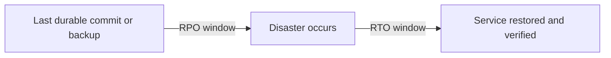
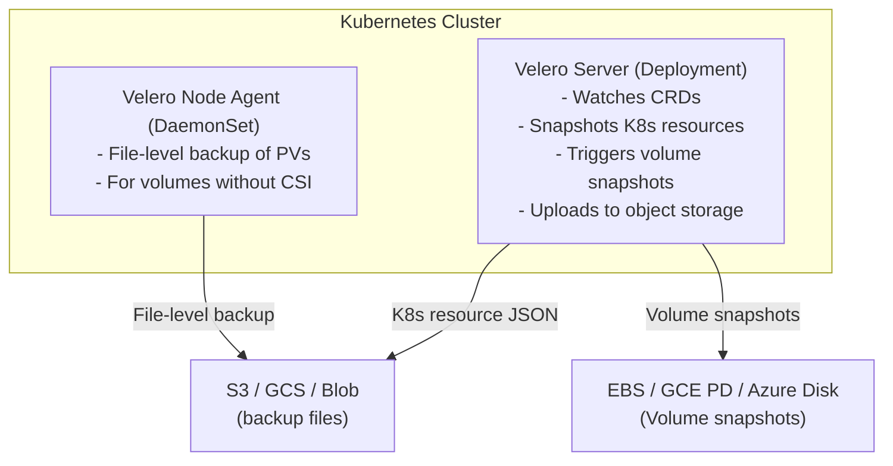
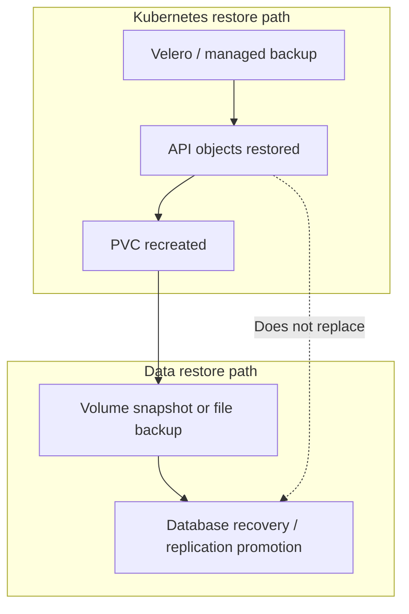
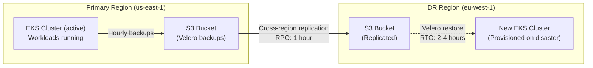
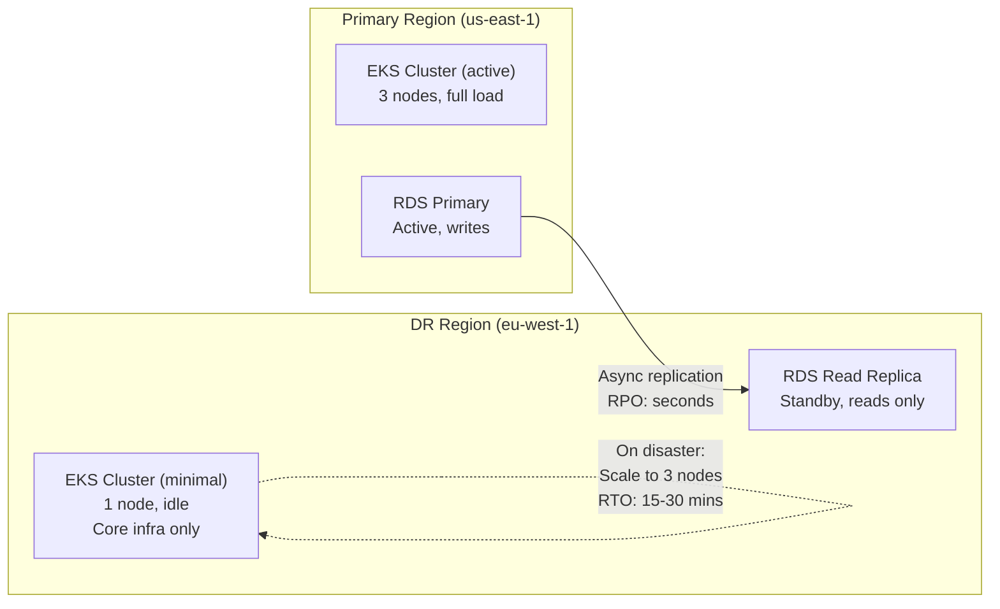
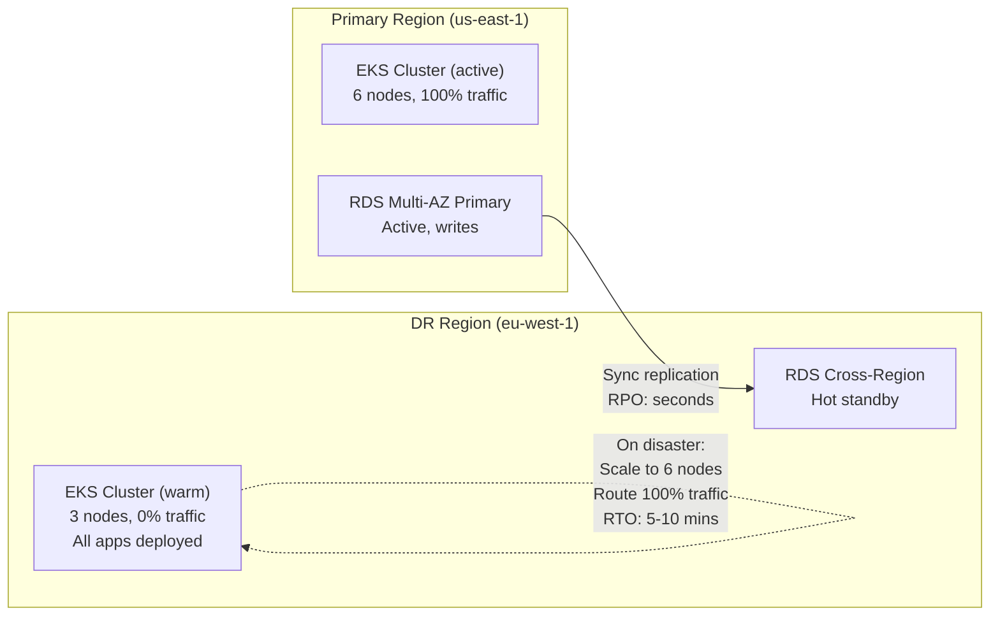
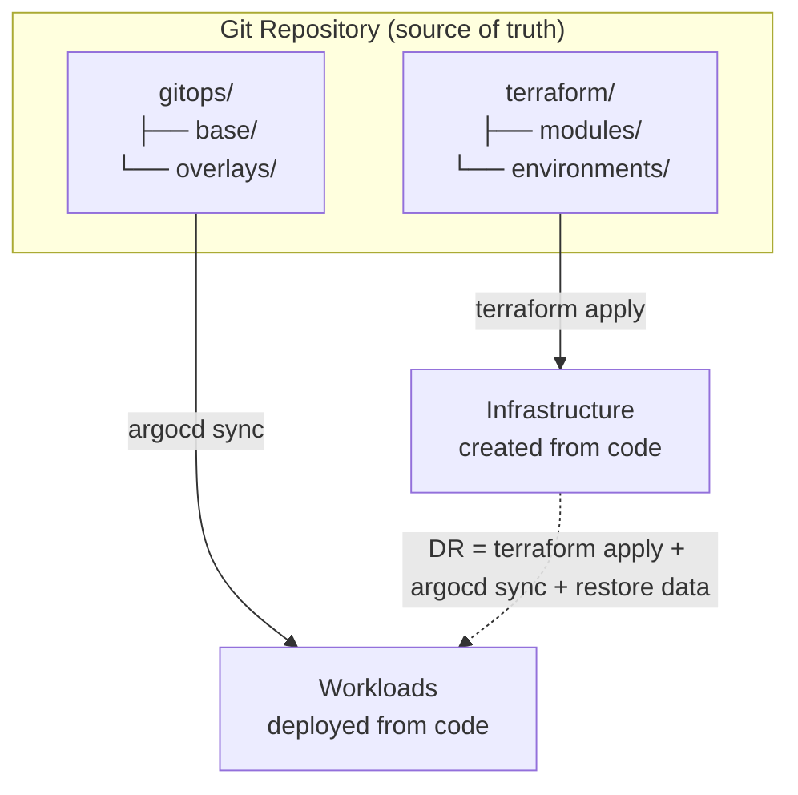

> **Complexity**: `[COMPLEX]`
>
> **Time to Complete**: 2.5 hours
>
> **Prerequisites**: [Module 8.1: Multi-Account Architecture](../module-8.1-multi-account/), experience operating at least one Kubernetes cluster in production
>
> **Track**: Advanced Cloud Operations

## What You'll Be Able to Do

After completing this module, you will be able to:

- **Design disaster recovery architectures for Kubernetes with defined RTO/RPO targets across cloud regions**
- **Implement Velero-based backup and restore strategies for cluster state, persistent volumes, and application data**
- **Configure cross-region replication for etcd snapshots, container images, and persistent storage volumes**
- **Deploy automated DR failover runbooks that validate recovery procedures through regular chaos testing**

---

## Why This Module Matters

Disaster recovery for Kubernetes is not a backup checkbox on a compliance spreadsheet. It is an engineering contract between the business and the platform team about how much downtime and data loss the organization will tolerate when an entire region, control plane, storage layer, or human process fails at the same time. Most teams discover the gap between that contract and reality during the first game day, not during architecture review, because backups that were never restored are indistinguishable from backups that never existed until someone tries to mount a volume in a secondary region at 3 a.m.

In multi-cloud operations, the complexity compounds quickly. Your cluster state may live in a managed control plane you cannot snapshot directly. Your application state may live in RDS, Cloud SQL, or Azure Database with cross-region replication semantics you did not design. Your configuration may live in Git, Helm, Argo CD, and External Secrets Operator resources that must be restored in a specific order. Your traffic may still be flowing to a region that is technically up but functionally unusable. A credible DR plan names two governing numbers—RTO and RPO—and then traces every backup, replication path, DNS record, and runbook step back to those numbers with evidence from tested restores rather than slide-deck optimism.

> **The Fireproof Safe Analogy**
>
> Backups are like documents in a fireproof safe in another city. Replication is like keeping a live duplicate ledger in that city. A DR strategy chooses how much of your business you keep running in the spare city before the fire, versus how fast you can rebuild after smoke clears. Kubernetes makes the safe heavier: you are protecting API objects, persistent data, secrets, ingress definitions, CRDs, and external dependencies that do not all fail or recover on the same timeline.

For the extreme case where both regions serve production traffic simultaneously with near-zero RTO and RPO, see [Module 8.6: Multi-Region Active-Active Deployments](../module-8.6-active-active/). This module stops one step below that cliff: pilot light, warm standby, and backup-and-restore patterns that trade cost for recovery time while still meeting serious production requirements.

---

## RTO and RPO: The Two Numbers That Define Your DR Strategy

Every disaster recovery plan starts with two numbers, and every downstream architectural argument should be traceable to them. If leadership says "we need five-nines availability" but finance approves only backup storage in a single region, the numbers were never aligned. Platform engineers translate business impact into measurable recovery targets, then choose replication, backup frequency, standby capacity, and DNS design to meet those targets with documented evidence from restore drills.



**Recovery Point Objective (RPO)** answers how much data the business can afford to lose, measured as maximum time or transaction volume between the last recoverable state and the failure event. An RPO of zero implies synchronous or quorum-acknowledged replication where a write is not considered committed until it exists in the DR location. An RPO of one hour implies you may lose up to one hour of writes if the primary disappears without warning. Backups alone do not set RPO; the backup schedule sets an upper bound, but replication lag, partial failures, and human detection delay determine what you actually lose.

**Recovery Time Objective (RTO)** answers how long the business can tolerate the service being unavailable or degraded before financial, regulatory, or reputational damage becomes unacceptable. RTO includes detection time, decision time, infrastructure provisioning, data promotion, Kubernetes reconciliation, DNS cutover, and verification—not merely the moment the first pod reaches Running. For near-zero RTO with simultaneous multi-region serving, you are in active-active territory documented in [Module 8.6](../module-8.6-active-active/); this module focuses on strategies where some downtime or controlled failover is expected.

### Worked example: deriving targets from business impact

Imagine a B2B payments API on EKS in `us-east-1` processing $12M per day, roughly $138 per second ($12M ÷ 86,400). Legal requires audit logs with no gaps, but the product owner accepts brief read-only mode during disasters if no captured payment is lost. Finance estimates $250K lost revenue and churn risk for each hour of hard outage during peak.

| Business statement | Engineering translation |
|---|---|
| "We cannot lose confirmed payments" | RPO ≈ 0 for ledger data: synchronous or quorum replication, not nightly Velero alone |
| "Thirty minutes of read-only is painful but survivable" | RTO ≈ 30 minutes for API availability if ledger integrity is preserved |
| "Audit logs must be reconstructable" | Separate RPO for observability data; may be 15 minutes if shipped to multi-region object storage |

The platform team maps workloads to tiers. Stateless API Deployments might target RTO 20 minutes via warm standby in `us-west-2`. PostgreSQL on RDS might use cross-region read replica with manual promotion for RPO near zero on committed transactions. Velero might capture cluster objects every four hours, which is insufficient for ledger RPO but still valuable for Kubernetes configuration recovery. The resulting architecture is hybrid by design, not a single DR pattern applied blindly.

### The DR strategy ladder and cost posture

AWS documents four classic patterns in [Disaster Recovery Options in the Cloud](https://docs.aws.amazon.com/whitepapers/latest/disaster-recovery-workloads-on-aws/disaster-recovery-options-in-the-cloud.html). The ladder below maps them to Kubernetes-heavy estates across AWS, GCP, and Azure. Costs are directional because they depend on data size, egress, instance families, and how much of the control plane you keep warm.

| Strategy | Typical RTO | Typical RPO | Steady-state cost posture | Kubernetes interpretation |
|---|---|---|---|---|
| Backup & restore | 4–24+ hours | Hours to days | Lowest: object storage, snapshots, minimal DR compute | DR cluster provisioned during incident; Velero restore + DB restore from backup |
| Pilot light | 30–90 minutes | Minutes to hours | Low–medium: small DR cluster, DB replica, replicated backups | DR EKS/GKE/AKS with core addons; apps scaled up during failover |
| Warm standby | 5–30 minutes | Seconds to minutes | High: partial production footprint always on | DR cluster runs reduced replicas; DB hot standby; DNS weighted or failover ready |
| Active/active | Near zero | Near zero | Highest: full multi-region traffic and data path | See Module 8.6; not duplicated here |

**Backup and restore** minimizes standing cost. You pay primarily for backup storage, snapshot storage, and cross-region replication of backup artifacts. Compute in the DR region is near zero until disaster. The RTO penalty is provisioning clusters, restoring volumes, rehydrating images, and waiting for controllers to reconcile thousands of objects under stress.

**Pilot light** keeps a skeleton DR environment alive: small node pools, GitOps controllers, monitoring, and a database replica receiving asynchronous replication. You pay continuously for that skeleton plus inter-region replication. Failover is scale-out plus promotion rather than cold start from zero.

**Warm standby** runs a meaningful fraction of production capacity in the DR region—often 30–50% of nodes and full application manifests at reduced replicas. You pay for duplicate compute and storage synchronization continuously. Failover is primarily traffic shift and scale-up, not application install from scratch.

**Pause and predict:** Your production database performs continuous asynchronous replication to a DR region with an average lag of five minutes, while secondary snapshots occur every twelve hours. If the primary region suffers an unrecoverable hardware failure and you promote the live replica, what is your effective RPO? If the replica is also corrupted and forces a restore from backup snapshot, how does the RPO change?

<details>
<summary>Check your prediction</summary>

Promoting the surviving asynchronous replica results in an effective RPO of approximately **5 minutes**, bounded strictly by the replication lag at the moment of primary failure. If the replica is also corrupted or unusable and you must perform a snapshot-only restore from object storage, your effective RPO degrades to up to **12 hours** of lost transactional state. Continuous streaming replication guarantees low recovery points for live data, whereas periodic snapshots protect against widespread corruption.
</details>

Platform teams must define these recovery boundaries with executive stakeholders before committing to formal service level agreements. DR runbooks should include automated pre-promotion sanity checks so operators never inadvertently promote a damaged database replica during a regional failover event.

---

## Who Owns the Control Plane: etcd on Managed vs Self-Managed Clusters

**Pause and predict:** An operations engineer wants to configure a Kubernetes CronJob that executes etcdctl snapshot save against the local control plane of an Amazon EKS cluster to capture state backups. Will this backup approach work as intended on a standard EKS deployment?

<details>
<summary>Check your prediction</summary>

On standard Amazon EKS, you **cannot** execute `etcdctl snapshot save` against managed etcd. AWS operates the control plane, including etcd instances and internal certificates, behind a strict shared-responsibility boundary without exposing SSH access or raw etcd endpoints. To protect cluster state on EKS, you must use Kubernetes API-aware solutions such as Velero or AWS Backup for EKS rather than low-level etcd administrative utilities.
</details>

DR designs for managed clusters start from the Kubernetes API and the data plane you actually operate. Treat control-plane internals as a provider contract, then inventory every object, volume, and dependency that still lives on your side of that contract.

The first DR design question on Kubernetes is whether you can snapshot etcd yourself. On **Amazon EKS**, **Google GKE**, and **Azure AKS**, the cloud provider operates the Kubernetes control plane, including etcd, API server availability, and control plane upgrades. AWS documents that it manages the etcd database as part of the EKS control plane under the shared responsibility model ([Security in Amazon EKS](https://docs.aws.amazon.com/eks/latest/userguide/security.html)). GKE and AKS follow the same split: you do not SSH to control plane nodes for etcd snapshots on standard managed offerings.

| Cluster type | etcd access | Primary cluster-state backup approach |
|---|---|---|
| Self-managed (kubeadm, kOps, Rancher) | You operate etcd | `etcdctl snapshot save` on control plane nodes |
| Amazon EKS | AWS managed | Velero and/or [AWS Backup for EKS](https://docs.aws.amazon.com/eks/latest/userguide/integration-backup.html) |
| Google GKE | Google managed | [Backup for GKE](https://cloud.google.com/kubernetes-engine/docs/add-on/backup-for-gke/concepts/backup-for-gke) and/or Velero |
| Azure AKS | Microsoft managed | [Azure Backup for AKS](https://learn.microsoft.com/en-us/azure/backup/azure-kubernetes-service-backup-overview) and/or Velero |

Velero remains the vendor-neutral lingua franca because it speaks the Kubernetes API: Deployments, Services, ConfigMaps, Ingresses, CRDs, and volume data via CSI snapshots or file-level node agents. Managed backup services integrate with cloud IAM, snapshot APIs, and policy engines at the expense of portability. Mature teams often run Velero for portability while enabling the managed service for compliance snapshots and centralized vault retention.

What you still own on managed clusters is everything **in** the cluster and everything **around** it: node pools, add-ons, PersistentVolumes, external databases, secrets material, container images, DNS names, and GitOps state. A managed control plane recovery does not magically recreate your StorageClasses, missing CRDs, or a promoted database connection string pointing at the old region.

---

## etcd Backup and Restore (Self-Managed Clusters)

For self-managed Kubernetes clusters (kubeadm, kOps, Rancher), etcd is the single point of truth for Kubernetes object state. Lose etcd without a durable snapshot and you lose the desired state of the entire fleet, even if worker nodes and container images still exist.

### etcd Snapshot Backup

```bash
# Take a snapshot of etcd (run on a control plane node)
ETCDCTL_API=3 etcdctl snapshot save /var/backups/etcd/snapshot-$(date +%Y%m%d-%H%M%S).db \
  --endpoints=https://127.0.0.1:2379 \
  --cacert=/etc/kubernetes/pki/etcd/ca.crt \
  --cert=/etc/kubernetes/pki/etcd/server.crt \
  --key=/etc/kubernetes/pki/etcd/server.key

# Verify the snapshot
ETCDCTL_API=3 etcdctl snapshot status /var/backups/etcd/snapshot-20260324-100000.db \
  --write-out=table

# Expected output:
# +----------+----------+------------+------------+
# |   HASH   | REVISION | TOTAL KEYS | TOTAL SIZE |
# +----------+----------+------------+------------+
# | 3e6d0a12 | 15284032 |      12847 |    42 MB   |
# +----------+----------+------------+------------+

# On etcd 3.6+ (newer Kubernetes), use `etcdutl snapshot restore` and
# `etcdutl snapshot status`; `snapshot save` remains in `etcdctl`.

# Upload to S3 for off-site storage
aws s3 cp /var/backups/etcd/snapshot-20260324-100000.db \
  s3://company-etcd-backups/prod-cluster/$(date +%Y/%m/%d)/ \
  --sse aws:kms \
  --sse-kms-key-id alias/etcd-backup-key
```

### Automated etcd Backup with CronJob

```yaml
# For self-managed clusters, run etcd backup as a CronJob
apiVersion: batch/v1
kind: CronJob
metadata:
  name: etcd-backup
  namespace: kube-system
spec:
  schedule: "0 */4 * * *"  # Every 4 hours
  concurrencyPolicy: Forbid
  successfulJobsHistoryLimit: 3
  failedJobsHistoryLimit: 3
  jobTemplate:
    spec:
      template:
        spec:
          nodeName: control-plane-1  # Pin to control plane
          hostNetwork: true
          tolerations:
            - key: node-role.kubernetes.io/control-plane
              effect: NoSchedule
          initContainers:
            - name: etcd-backup
              image: registry.k8s.io/etcd:3.5.16-0
              command:
                - /bin/sh
                - -c
                - |
                  set -e
                  BACKUP_FILE="/backups/snapshot-$(date +%Y%m%d-%H%M%S).db"
                  etcdctl snapshot save "$BACKUP_FILE" \
                    --endpoints=https://127.0.0.1:2379 \
                    --cacert=/etc/kubernetes/pki/etcd/ca.crt \
                    --cert=/etc/kubernetes/pki/etcd/server.crt \
                    --key=/etc/kubernetes/pki/etcd/server.key
                  etcdctl snapshot status "$BACKUP_FILE" --write-out=json
                  echo "Backup complete: $BACKUP_FILE"
              volumeMounts:
                - name: etcd-certs
                  mountPath: /etc/kubernetes/pki/etcd
                  readOnly: true
                - name: backup-dir
                  mountPath: /backups
          containers:
            - name: upload-backup
              image: amazon/aws-cli:2.15.0
              command:
                - /bin/sh
                - -c
                - |
                  set -e
                  BACKUP_FILE="$(ls -t /backups/snapshot-*.db | head -1)"
                  aws s3 cp "$BACKUP_FILE" \
                    "s3://etcd-backups/prod/$(date +%Y/%m/%d)/" \
                    --sse aws:kms
                  find /backups -name "*.db" -mtime +7 -delete
              volumeMounts:
                - name: backup-dir
                  mountPath: /backups
          volumes:
            - name: etcd-certs
              hostPath:
                path: /etc/kubernetes/pki/etcd
            - name: backup-dir
              hostPath:
                path: /var/backups/etcd
          restartPolicy: OnFailure
```

### etcd Restore Procedure

```bash
# Stop all control plane components
systemctl stop kubelet

# Restore from snapshot (etcd 3.6+: etcdutl snapshot restore / etcdutl snapshot status)
ETCDCTL_API=3 etcdctl snapshot restore /var/backups/etcd/snapshot-20260324-100000.db \
  --name etcd-member-1 \
  --data-dir=/var/lib/etcd-restored \
  --initial-cluster="etcd-member-1=https://10.0.1.10:2380" \
  --initial-cluster-token=etcd-cluster-restored \
  --initial-advertise-peer-urls=https://10.0.1.10:2380

# Replace the data directory
mv /var/lib/etcd /var/lib/etcd-old
mv /var/lib/etcd-restored /var/lib/etcd

# Restart kubelet (which starts etcd and other control plane components)
systemctl start kubelet

# Verify the cluster is healthy
kubectl get nodes
kubectl get pods -A
```

---

## Velero: Kubernetes-Native Backup and Restore

For managed Kubernetes (EKS, GKE, AKS) where you do not manage etcd directly, Velero is the standard tool for backing up and restoring Kubernetes resources and persistent volumes at the API layer. Velero watches backup schedules, serializes selected API objects to object storage, coordinates volume snapshots through cloud plugins, and replays objects during restore with configurable namespace mappings and resource filters. It does not understand business transactions inside PostgreSQL unless you integrate database hooks; treat Velero as the **configuration and volume skeleton** layer of DR, not the ledger of record.

Production Velero deployments separate concerns: a `BackupStorageLocation` for JSON manifests, a `VolumeSnapshotLocation` per cloud Region, IAM or Workload Identity with least privilege, encryption at rest on the bucket, and monitoring on `backup_failure_total` and `restore_failed_total` metrics. Version-pin the Velero server image and provider plugins together; upgrading Kubernetes to 1.35 without retesting plugins is a common source of partial backups that look successful in `velero backup describe` until restore time.



### Installing Velero

```bash
# Install Velero CLI
brew install velero

# Install Velero in the cluster (AWS example with EBS snapshots)
velero install \
  --provider aws \
  --plugins velero/velero-plugin-for-aws:v1.12.0 \
  --bucket velero-backups-prod \
  --backup-location-config region=us-east-1 \
  --snapshot-location-config region=us-east-1 \
  --secret-file ./velero-credentials \
  --use-node-agent \
  --default-volumes-to-fs-backup=false

# Verify installation
velero version
kubectl get pods -n velero
```

### Backup Strategies

```bash
# Full cluster backup
velero backup create full-backup-20260324 \
  --include-cluster-resources=true \
  --snapshot-volumes=true \
  --ttl 720h  # Retain for 30 days

# Namespace-level backup (for team-specific DR)
velero backup create payments-backup-20260324 \
  --include-namespaces payments \
  --snapshot-volumes=true \
  --ttl 2160h  # Retain for 90 days

# Scheduled backups
velero schedule create daily-full \
  --schedule="0 2 * * *" \
  --include-cluster-resources=true \
  --snapshot-volumes=true \
  --ttl 720h

velero schedule create hourly-critical \
  --schedule="0 * * * *" \
  --include-namespaces payments,orders,inventory \
  --snapshot-volumes=true \
  --ttl 168h  # Retain for 7 days

# Label-based backup (only backup PCI workloads)
velero backup create pci-backup-20260324 \
  --selector compliance=pci \
  --snapshot-volumes=true \
  --ttl 8760h  # Retain for 1 year (compliance)

# Check backup status
velero backup describe full-backup-20260324
velero backup logs full-backup-20260324
```

### Restore Procedures

```bash
# Restore entire cluster to a new cluster
velero restore create full-restore \
  --from-backup full-backup-20260324

# Restore specific namespace only
velero restore create payments-restore \
  --from-backup full-backup-20260324 \
  --include-namespaces payments

# Restore with namespace mapping (restore to different namespace)
velero restore create payments-dr-test \
  --from-backup full-backup-20260324 \
  --include-namespaces payments \
  --namespace-mappings payments:payments-dr-test

# Restore excluding certain resources (e.g., keep existing services)
velero restore create selective-restore \
  --from-backup full-backup-20260324 \
  --include-namespaces payments \
  --exclude-resources services,ingresses

# Monitor restore progress
velero restore describe full-restore
velero restore logs full-restore
```

**Pause and predict:** You just executed a Velero restore of an application namespace into a newly provisioned disaster recovery cluster. While deployments and pods are created, all pods remain stuck in Pending status and their PersistentVolumeClaims remain Unbound. What essential cluster-scoped resource is most likely missing from the target cluster?

<details>
<summary>Check your prediction</summary>

Unbound PVCs and Pending pods after a namespace restore typically indicate a missing or unusable **StorageClass** in the target cluster. Because Velero does not restore StorageClasses by default during namespace-scoped backups, the target cluster lacks the provisioner configuration needed to bind persistent volumes. If the StorageClass is absent or specifies a CSI provisioner that is not deployed in the DR region, volume creation stalls indefinitely until an administrator pre-provisions the matching StorageClass.
</details>

A green Velero restore of Deployments is not proof that stateful workloads can schedule. Walk the pending pods and claim events in the DR cluster before you declare the drill a success.

### Velero data movement: CSI snapshots vs node agent

Velero can capture PersistentVolume data two ways. **Volume snapshots** use the cloud CSI driver to create EBS, GCE PD, or Azure Disk snapshots referenced in the Backup object. Restore creates new volumes from those snapshots in the target region if snapshots were copied or recreated there. **File-system backup** uses the Velero node agent (formerly restic integration) to read mounted volume data and upload objects to S3, GCS, or Azure Blob. File-system backup is slower for large databases but works when CSI snapshot APIs are unavailable or when you need portability across storage classes.

Schedules should encode RPO intent explicitly. A `velero schedule` that runs every four hours with `--snapshot-volumes=true` implies you may lose up to four hours of volume data unless continuous replication also protects the database. Combine Velero for Kubernetes object recovery with database-native replication for low RPO on transactional data.

```bash
# Example: backup with CSI snapshots and labels for compliance scope
velero backup create nightly-platform \
  --include-cluster-resources=true \
  --snapshot-volumes=true \
  --selector disaster-recovery=included \
  --ttl 720h0m0s

# Copy Velero backup storage to DR region (AWS example — bucket replication)
aws s3api put-bucket-replication \
  --bucket velero-backups-prod-use1 \
  --replication-configuration file://replication.json
```

---

## Managed Kubernetes Backup Services (AWS, GCP, Azure)

Each hyperscaler now offers a first-party backup path that complements Velero. Treat them as orchestration layers over snapshot APIs and Kubernetes API access, not as replacements for database replication.

### AWS Backup for Amazon EKS

[AWS Backup for EKS](https://docs.aws.amazon.com/eks/latest/userguide/integration-backup.html) creates composite recovery points for cluster resources and persistent storage attached via PVCs (EBS and EFS where configured). The cluster authorization mode must allow API access for backup operators. Restore can target a new cluster in another Region after you replicate recovery points. Pair AWS Backup policies for compliance retention with Velero for day-to-day namespace mobility and GitOps-adjacent workflows.

### Backup for GKE

[Backup for GKE](https://cloud.google.com/kubernetes-engine/docs/add-on/backup-for-gke/concepts/backup-for-gke) installs a Google-managed agent and stores backup artifacts in a BackupPlan location you choose. Backup plans support smart scheduling against a **target RPO in minutes** (minimum 60 minutes per [backup plan documentation](https://cloud.google.com/kubernetes-engine/docs/add-on/backup-for-gke/how-to/backup-plan)) or cron schedules. Restores can target alternate clusters and regions; cross-location backup storage incurs outbound data transfer per GKE pricing. Backup for GKE captures Kubernetes resources and volume data but not node pool shape, container images, or external Cloud SQL state—those remain separate DR workstreams.

### Azure Backup for AKS

[Azure Backup for AKS](https://learn.microsoft.com/en-us/azure/backup/azure-kubernetes-service-backup-overview) requires the Backup extension in-cluster and a Backup vault with Trusted Access to the cluster. The **operational tier** supports RPO as low as four hours between backups with faster restores from snapshots and blob metadata in your tenant. The **vault tier** moves daily/weekly/monthly recovery points to vault-managed storage for longer retention and ransomware-resistant separation. Cross-region restore requires geo-redundant vault configuration documented in [AKS restore guidance](https://learn.microsoft.com/en-us/azure/backup/azure-kubernetes-service-cluster-restore).

| Capability | Velero | AWS Backup (EKS) | Backup for GKE | Azure Backup (AKS) |
|---|---|---|---|---|
| Portability across clouds | Strong | AWS only | GCP only | Azure only |
| Volume snapshots via CSI | Yes | Yes | Yes | Yes (Azure Disk/Files) |
| Namespace-scoped policies | Yes | Via backup plans | BackupPlan selectors | Backup instance filters |
| Central vault / compliance | DIY | AWS Backup vault | Google-managed storage | Azure Backup vault |

---

## Stateful Data DR: Cluster Objects vs Application Data

Restoring Kubernetes objects is not the same as restoring application truth. A Velero restore might recreate a `StatefulSet`, `Service`, and `PersistentVolumeClaim`, but the database inside the volume is only as current as the snapshot or file backup captured. Operators routinely confuse **crash-consistent** volume snapshots—taken mid-write—with **application-consistent** snapshots that quiesce databases first.

**Crash-consistent** snapshots are fast and default for CSI drivers. They are acceptable for many stateless caches and reproducible batch jobs. They are risky for busy OLTP databases unless the engine can recover from journal replay and you tolerate partial transactions.

**Application-consistent** snapshots require cooperation: `preStop` hooks, database-native backup tools (`pg_basebackup`, MySQL Enterprise Backup, MongoDB Ops Manager), or cloud features like AWS RDS snapshots and Azure SQL automated backups. For Kubernetes, the durable pattern is often **database replication out of the cluster** plus Velero for configuration, not Velero alone for ledger data.

Cross-region data paths differ by engine:

- **Amazon RDS / Aurora**: cross-Region read replicas or Aurora global databases; promotion changes DNS endpoints.
- **Google Cloud SQL**: read replicas in other regions; restore creates new instances from backups.
- **Azure Database**: geo-redundant backup storage and failover groups for SQL; flexible server geo-restore options per SKU.

PersistentVolumes follow storage replication rules. EBS snapshots copy to other Regions with [Amazon EBS snapshot copy](https://docs.aws.amazon.com/ebs/latest/userguide/ebs-copy-snapshot.html). GCE supports snapshot schedules and multi-region storage policies. Azure Disk snapshots copy across regions via resource groups you designate during backup policy setup. Align PV restore zones with node availability zones or PVCs remain unbound.



---

## Cross-Region Replication for DR

Backups are useless if they are destroyed in the same regional outage that took down your cluster. True disaster recovery requires replicating your state to a secondary region.

### Container Image Replication

During a disaster, you must pull container images to your new DR cluster. If your primary registry in the failed region is unreachable, restored Deployments will sit in `ImagePullBackOff` even when etcd and databases are healthy. Image DR is therefore part of RTO, not an optional packaging detail.

On AWS, configure [Amazon ECR replication](https://docs.aws.amazon.com/AmazonECR/latest/userguide/replication.html) to push images to a secondary Region automatically. On GCP, replicate images across [Artifact Registry](https://cloud.google.com/artifact-registry/docs/repositories/copy-images) locations (multi-region buckets or copy-on-push to a DR region)—remote repositories are pull-through caches of an upstream and do not substitute for a copy in another region if that upstream is unreachable. On Azure, [Azure Container Registry geo-replication](https://learn.microsoft.com/en-us/azure/container-registry/container-registry-geo-replication) keeps registries warm in paired regions. Pin image digests in manifests when possible so a restored Deployment does not pull a newer mutable tag that changed between backup and restore.

```bash
# AWS ECR Cross-Region Replication Example
aws ecr put-registry-scanning-configuration \
  --scan-type ENHANCED

aws ecr put-registry-policy \
  --policy-text file://registry-policy.json

aws ecr put-replication-configuration \
  --replication-configuration '{ "rules": [ { "destinations": [ { "region": "eu-west-1", "registryId": "123456789012" } ] } ] }'
```

### Persistent Volume Replication

While Velero can back up volume data to S3, this file-level copy is slow for large databases. For block-level asynchronous replication, use the **csi-addons** [Volume Replication](https://github.com/csi-addons/kubernetes-csi-addons) API with a driver that implements mirroring (for example Ceph-CSI RBD mirroring). The EBS CSI driver does not implement `VolumeReplication`; pair this CRD with mirroring-capable storage, not generic EBS snapshots alone.

```yaml
# Example: VolumeReplication (csi-addons; mirroring-capable driver, e.g. Ceph-CSI)
apiVersion: replication.storage.openshift.io/v1alpha1
kind: VolumeReplication
metadata:
  name: prod-db-replication
  namespace: data
spec:
  volumeReplicationClass: rbd-volumereplicationclass   # driver-specific (e.g. Ceph-CSI)
  replicationState: primary
  dataSource:
    kind: PersistentVolumeClaim
    name: prod-db-pvc
```

### Multi-region restore mechanics by provider

DR fails in details that diagrams hide: snapshot permissions, KMS keys, service quotas, and identity bindings do not travel with YAML.

**AWS:** Provision the DR EKS cluster and node IAM roles first. Replicate or copy Velero backup buckets with S3 Cross-Region Replication; consider S3 Replication Time Control if backup RPO must be bounded ([S3 replication](https://docs.aws.amazon.com/AmazonS3/latest/userguide/replication.html)). Copy EBS snapshots to the DR Region or use AWS Backup copy actions. Restore with Velero `BackupStorageLocation` pointing at the DR bucket prefix. Promote RDS cross-Region replicas. Update Route 53 failover or weighted records (see DNS section). Verify security groups and VPC endpoints exist in the DR VPC—restore tests often fail because `sts` or `ecr.api` endpoints were never created there.

**GCP:** Create the DR GKE cluster with Workload Identity pools and Backup for GKE `RestorePlan` targeting the alternate cluster ([restore guide](https://cloud.google.com/kubernetes-engine/docs/add-on/backup-for-gke/how-to/restore)). Copy disk snapshots or use Backup for GKE storage in a multi-region or alternate region backup plan location. Promote Cloud SQL replicas or restore instance backups. Shift DNS using Cloud DNS routing policies or global load balancing frontends. Remember image pulls: replicate Artifact Registry or configure remote pulls to avoid `ImagePullBackOff` during regional outages.

**Azure:** Install the Backup extension in the DR AKS cluster and enable Trusted Access from the geo-redundant Backup vault ([restore in secondary region](https://learn.microsoft.com/en-us/azure/backup/azure-kubernetes-service-cluster-restore)). Snapshot resource groups must exist in the target region. Promote Azure Database failover groups or restore flexible server backups. Use Azure Traffic Manager priority or weighted profiles, or Azure Front Door origin groups, for DNS/front-door cutover. Key Vault keys and managed identities must be replicated or recreated with identical names to avoid secret mount failures.

---

## DR Patterns for Kubernetes

Choosing a pattern is an economic and operational decision, not a badge of maturity. Teams sometimes implement warm standby for stateless APIs while keeping backup-and-restore for internal admin tools, because the revenue path justifies standing cost and the admin portal tolerates next-day recovery. Document the pattern per service tier in a service catalog so incident commanders do not debate architecture during outages.

When mixing patterns, align **data plane** and **control plane** tiers. A warm standby Kubernetes cluster pointing at a database still on backup-and-restore RPO will violate leadership expectations even if pods start quickly. Conversely, synchronous database replication with cold Kubernetes restore shifts RTO to cluster build time—users see no data loss but long UI outages.

### Pattern 1: Backup & Restore (Cold DR)



**Cost**: Lowest steady-state spend. You pay primarily for object storage, snapshot storage, and cross-region replication of backup artifacts while DR compute remains off.

**Risk**: Longest recovery time because humans or automation must provision clusters, restore volumes, re-establish identities, and warm caches during the incident. Runbooks and IaC modules must be pre-tested; otherwise theoretical four-hour RTO becomes eleven-hour reality.

### Pattern 2: Pilot Light

Pilot light keeps the minimum viable platform alive in the DR region while application replicas stay scaled down. Typical components always running include a small EKS/GKE/AKS node pool, CoreDNS, CNI, GitOps controller, observability agents, service mesh control plane, and a database read replica ingesting changes from primary. Application Deployments may exist at zero replicas or a single canary pod to validate manifests each week.

Failover steps are scale-out rather than greenfield: increase node groups, raise HPA minimums, promote database replica, flip DNS. RTO improves because you are not waiting for cluster creation APIs or addon installation during the incident. RPO is dominated by database replication lag plus any Kubernetes objects created since the last Velero backup if GitOps sync is disabled in DR.

Cost is the standby tax: NAT gateways, control plane hours, minimal nodes, and replication bandwidth run 24/7. Finance should compare pilot light steady cost against revenue at risk for one hour of outage; that breakeven math often justifies pilot light for customer-facing tiers only.



### Pattern 3: Warm Standby

Warm standby runs a meaningful fraction of production capacity in the DR region continuously—often thirty to fifty percent of CPU and memory for stateless tiers, with databases in hot standby or low-lag synchronous modes where budgets allow. Ingress or Gateway API objects may already receive synthetic traffic or dark-canary requests to keep caches warm. Failover becomes primarily traffic shift, scale-up, and database role change rather than manifest installation.

Operational complexity rises because you must prevent configuration drift between regions. GitOps with Kustomize overlays per region is the usual pattern: same base manifests, different replica counts, storage classes, and external URLs. Secrets and ConfigMaps must reference region-local endpoints even during normal operations, or failover introduces a thundering herd of manual edits.

Warm standby is the highest DR tier before active-active covered in Module 8.6. If leadership demands sub-five-minute RTO for reads and writes globally without maintenance windows, you have outgrown warm standby—do not pretend DNS failover to a warm cluster satisfies active-active consistency requirements.



> **Hypothetical scenario: The eleven-hour RTO surprise**
>
> A retail platform documented RTO of four hours for its Kubernetes estate. During the annual game day, engineers needed eleven hours to pass health checks. etcd restore on self-managed test clusters finished in twenty minutes, but managed production recovery was slower for different reasons: three CRDs installed by operators were missing from backups, PVCs could not bind because the DR StorageClass referenced a zone absent in the failover region, External Secrets Operator still referenced a primary-region Key Vault URL, and the database connection string in a ConfigMap still pointed at the failed region's endpoint. DNS with a 300-second TTL added thirty-five minutes of split-brain user traffic. The post-game-day rule: **RTO = 2 × measured game-day time** until two consecutive drills beat the target.

---

## DNS Failover Across AWS, GCP, and Azure

**Pause and predict:** An automated Route 53 health check detects a primary region outage and switches DNS routing to the standby cluster within thirty seconds. Will all external client traffic immediately begin arriving at the DR cluster endpoint?

<details>
<summary>Check your prediction</summary>

No, health-check failover does **not** flush resolver caches across public networks. External recursive resolvers and client operating systems cache earlier DNS query answers until the configured **TTL** expires. Even though the authoritative Route 53 nameserver begins serving the secondary IP immediately, clients with unexpired cached records will continue attempting to connect to the failed primary IP until their local TTL reaches zero.
</details>

Public ingress failover has two clocks: when your authoritative zone changes, and when the rest of the internet notices. Record both in the RTO budget instead of assuming the health-check interval is the user-visible cutover time.

DNS is the traffic director in any DR scenario, and it is also the hidden RTO line item teams forget. Multi-cloud Kubernetes DR therefore pairs **low TTL on user-facing records** with **health-checked failover or weighted routing** at the provider edge.

### Amazon Route 53 (failover and ARC)

Route 53 supports health-checked failover records between primary and secondary targets ([failover routing](https://docs.aws.amazon.com/Route53/latest/DeveloperGuide/routing-policy-failover.html)). For complex application recovery orchestration—scaling ASGs, invoking Lambda, updating records—**Route 53 Application Recovery Controller (ARC)** provides readiness checks and routing controls that integrate with cell-based architectures. ARC does not replace Velero; it coordinates traffic when your DR cluster is actually ready.

### Google Cloud DNS

Cloud DNS routing policies include weighted round robin and geo-based routing for steering users toward healthy regions. Pair DNS changes with [Cloud Load Balancing](https://cloud.google.com/load-balancing/docs) frontends that already health-check GKE Ingress or Gateway API backends. For global anycast-style entry, use external HTTP(S) load balancers with multi-region backend services rather than relying on DNS alone.

### Azure Traffic Manager and Front Door

[Azure Traffic Manager](https://learn.microsoft.com/en-us/azure/traffic-manager/traffic-manager-overview) offers priority, weighted, performance, and geographic routing methods with endpoint health probes. **Azure Front Door** adds CDN-like global entry with origin groups per region; you can disable an origin during failover while keeping TLS and WAF policies consistent. AKS clusters behind AGIC or NGINX Ingress still need in-cluster health endpoints that reflect database readiness, not only `/healthz` on static pods.

### Route 53 health check + failover (AWS reference implementation)

```bash
# Create health check for primary region
PRIMARY_HC=$(aws route53 create-health-check \
  --caller-reference "primary-$(date +%s)" \
  --health-check-config '{
    "Type": "HTTPS",
    "ResourcePath": "/healthz",
    "FullyQualifiedDomainName": "primary.api.example.com",
    "Port": 443,
    "RequestInterval": 10,
    "FailureThreshold": 3,
    "MeasureLatency": true,
    "Regions": ["us-east-1", "eu-west-1", "ap-southeast-1"]
  }' \
  --query 'HealthCheck.Id' --output text)

# Create failover routing policy
aws route53 change-resource-record-sets \
  --hosted-zone-id Z1234567890 \
  --change-batch '{
    "Changes": [
      {
        "Action": "CREATE",
        "ResourceRecordSet": {
          "Name": "api.example.com",
          "Type": "A",
          "SetIdentifier": "primary",
          "Failover": "PRIMARY",
          "AliasTarget": {
            "HostedZoneId": "Z26RNL4JYFTOTI",
            "DNSName": "primary-nlb.elb.us-east-1.amazonaws.com",
            "EvaluateTargetHealth": true
          },
          "HealthCheckId": "'$PRIMARY_HC'"
        }
      },
      {
        "Action": "CREATE",
        "ResourceRecordSet": {
          "Name": "api.example.com",
          "Type": "A",
          "SetIdentifier": "secondary",
          "Failover": "SECONDARY",
          "AliasTarget": {
            "HostedZoneId": "Z32O12XQLKSWN1",
            "DNSName": "dr-nlb.elb.eu-west-1.amazonaws.com",
            "EvaluateTargetHealth": true
          }
        }
      }
    ]
  }'
```

### DNS TTL Considerations

| Time | Event |
|---|---|
| **T+0s** | Health check fails (3 consecutive failures at 10s interval = 30s) |
| **T+30s** | Route53 marks primary unhealthy |
| **T+30s** | Route53 starts returning DR IP for new DNS queries |
| **T+30s** | Clients with EXPIRED DNS cache get DR IP immediately |
| **T+60-300s**| Clients with CACHED DNS still hit primary (depends on TTL) |

**With TTL=60s:** Most clients failover within 90 seconds.
**With TTL=300s:** Some clients stuck for up to 330 seconds.

**RECOMMENDATION:** Set TTL=60s for DR-critical records. Lower TTLs mean more DNS queries (more cost) but faster failover. TTL=30s is the practical minimum—below that, many resolvers ignore the TTL and cache for at least 30 seconds anyway.

Include DNS propagation in runbook time budgets. Mobile carrier resolvers and corporate proxies cache longer than spec TTL. During game days, measure client-side resolution from multiple networks, not only `dig` from a bastion in the DR VPC.

---

## Kubernetes 1.35 Considerations for Backup and Restore

Kubernetes 1.35 continues shifting storage and admission behavior in ways that affect DR. Container Storage Interface (CSI) snapshot APIs are the default path for volume backup in Velero and managed cloud backup services; in-tree volume plugins are legacy. Validate that `VolumeSnapshotClass` objects exist in every region where you might restore, and that snapshot classes reference the same driver names your DR cluster will use.

Admission controllers and validating webhooks installed by policy engines (OPA Gatekeeper, Kyverno, Pod Security admission) must be restored before workloads or restores will fail with policy violations that did not exist when backups were taken. Back up cluster-scoped webhook configurations or document their Helm chart versions in Git.

For service mesh and Gateway API resources, restore order matters: CRDs, GatewayClasses, Gateways, then HTTPRoutes. Velero hooks can annotate critical resources, but GitOps often replays them faster if repositories are authoritative.

Node labels for topology spread constraints and zone-aware PVCs must exist in DR zones. If primary used `topology.kubernetes.io/zone: us-east-1a` and DR nodes only exist in `eu-west-1b`, StatefulSets with strict spread may pend until you adjust PVCs or node labels deliberately in the runbook.

---

## GitOps, Secrets, and Configuration Continuity

Velero captures many in-cluster objects, but production platforms also depend on **Git repositories**, **Helm chart versions**, **Argo CD Application** sets, **Flux Kustomizations**, and secrets material from **External Secrets Operator**, **Secrets Store CSI Driver**, or cloud secret managers. DR plans must list which of these are authoritative and which are derivable.

Git is usually authoritative for Deployment manifests and Ingress rules. If Git is available during a regional outage, you can redeploy application shape faster than full Velero restore for stateless tiers. Secrets are not authoritative in Git; they require replicated Key Vault, Secrets Manager, or Parameter Store with multi-region keys and identities that exist in the DR cluster before pods start. Sealed Secrets and SOPS-encrypted files need the decryption keys available in the DR region, not only on the primary HSM.

Run a quarterly diff between a live cluster export (`kubectl get -A -o yaml` filtered) and GitOps desired state. Objects that exist only in the cluster—often CRDs installed by operators, validating webhook configurations, or storage classes created by hand—are restore surprises. Check them into Git or back them up with explicit Velero labels.

---

## IaC as Disaster Recovery

The most powerful DR strategy for Kubernetes is often the simplest: **your entire infrastructure is defined in code, tested regularly, and can be recreated from scratch.** Terraform, OpenTofu, Pulumi, and cloud Deployment Manager stacks recreate VPCs, node pools, IAM, and add-ons. GitOps recreates namespaces and workloads. Backups remain necessary for data that is not reconstructible from code: database files, uploaded user content, and volume snapshots.



### DR Terraform Module

```hcl
# environments/eu-west-1/main.tf (DR region)
# Same modules as production, different variables

module "networking" {
  source = "../../modules/networking"

  region     = "eu-west-1"
  cidr_block = "10.1.0.0/16"
  azs        = ["eu-west-1a", "eu-west-1b", "eu-west-1c"]

  # DR: same structure, different region
  enable_nat_gateway = var.dr_active  # Only create NAT GW when DR is active
}

module "eks" {
  source = "../../modules/eks-cluster"

  cluster_name    = "prod-dr"
  cluster_version = "1.35"
  vpc_id          = module.networking.vpc_id
  subnet_ids      = module.networking.private_subnet_ids

  # DR: start small, scale up during failover
  node_groups = {
    general = {
      desired_size = var.dr_active ? 6 : 1
      min_size     = var.dr_active ? 3 : 1
      max_size     = 12
      instance_types = ["m7i.xlarge"]
    }
  }
}

module "database" {
  source = "../../modules/databases"

  # DR: cross-region read replica that can be promoted
  create_primary       = false
  create_read_replica  = true
  source_db_arn        = var.primary_rds_arn
  promote_on_failover  = var.dr_active
}

variable "dr_active" {
  description = "Set to true during DR failover to scale up resources"
  type        = bool
  default     = false
}
```

```bash
# DR failover procedure
# Step 1: Activate DR infrastructure
cd terraform/environments/eu-west-1
terraform apply -var="dr_active=true" -auto-approve

# Step 2: Promote database replica
aws rds promote-read-replica \
  --db-instance-identifier prod-dr-replica

# Step 3: Update kubeconfig for DR cluster
aws eks update-kubeconfig --name prod-dr --region eu-west-1

# Step 4: Trigger ArgoCD sync (if not auto-syncing)
argocd app sync --all --prune

# Step 5: Verify workloads
kubectl get pods -A | grep -v Running | grep -v Completed

# Step 6: Switch DNS
aws route53 change-resource-record-sets \
  --hosted-zone-id Z1234567890 \
  --change-batch file://failover-dns.json

# Step 7: Monitor
kubectl top nodes
kubectl top pods -A --sort-by=cpu
```

---

## Implementing a Multi-Cloud DR Program End to End

A DR program is more than tooling installation; it is a closed loop from business impact analysis through testing and finance review. Start by inventorying workloads on Kubernetes with their data classifications, external dependencies, and current backup coverage. For each workload, record actual RPO and RTO from last game day, not policy documents. Gaps become epics: enable volume snapshots, add cross-region replica, lower DNS TTL, or accept risk with executive sign-off.

**Phase 1 — Discover and classify.** Export Velero schedules, managed backup policies, RDS/GCP/Azure database replication status, and registry replication rules. Flag namespaces without `snapshot-volumes` and databases without cross-region replicas. Identify operators that install cluster-scoped CRDs; these are frequent restore gaps.

**Phase 2 — Design tiers.** Tier 0 (revenue critical) might require warm standby and database promotion runbooks under thirty minutes. Tier 2 (internal tools) might use backup-and-restore with twenty-four-hour RTO. Document which Kubernetes pattern applies per tier and which cloud services implement the data plane.

**Phase 3 — Automate evidence.** Backup success metrics should page on failure, not on age alone. Track replication lag for databases and object storage. Store Terraform plans for DR regions in CI with periodic `terraform plan` to detect drift. Argo CD applications for DR should sync from the same Git revision policy as production.

**Phase 4 — Exercise and recalibrate.** Quarterly game days measure wall-clock duration per runbook step. Update RTO targets to twice the best recent measurement until two consecutive drills beat the target. After major Kubernetes upgrades (for example 1.35 admission or CSI changes), rerun restore drills because webhook and storage behavior may change fail modes.

**Phase 5 — Govern cost and risk.** Finance reviews DR spend quarterly: standby nodes, replication egress, snapshot storage, global load balancers. Engineering presents trade-offs explicitly: removing warm standby saves currency but adds RTO minutes; leadership must choose with data.

Multi-cloud estates add coordination overhead: identity federation must work in the DR region, KMS keys must be replicated or dual-homed, and observability stacks must ingest metrics from the failover cluster without relying on the primary region's Prometheus. Standardize on OpenTelemetry export to a region-independent SaaS or dual-write collectors when possible.

Compliance regimes (PCI, HIPAA, SOC 2) often mandate **immutable backups** and **restore testing evidence**. Managed vault tiers on Azure, AWS Backup Vault Lock, and GCS bucket retention policies satisfy immutability when configured deliberately. Auditors ask for restore logs, not backup job creation logs—game day artifacts are compliance deliverables.

Finally, align DR with incident management. Severities should trigger pre-written communication templates and decision trees about failover versus failback. A DR architecture that requires heroics from one engineer who "was there in 2023" is fragile; runbooks must stand alone. When failover completes, schedule failback planning: split-brain writes happen if both regions accept traffic without a single writer of truth for data.

Document dependencies outside Kubernetes explicitly: SaaS identity providers, payment gateways, certificate authorities, and artifact signing services must be reachable from the DR region or failover stops at the edge even when pods are healthy. These dependencies belong in the same service catalog tiering spreadsheet as RTO and RPO so incident commanders see the full blast radius before approving DNS cutover. Game-day scorecards should list each external dependency with pass or fail, not only Kubernetes API object counts restored by Velero into the secondary DR region target cluster.

---

## DR Runbooks, Game Days, and Restore Drills

Untested backups are inventory, not disaster recovery. A runbook is a chronological program with prerequisites, commands, expected outputs, decision branches, and rollback steps—written for the engineer who did not build the system and accessed from infrastructure that survives the outage.

Store runbooks **out of band** from the cluster they recover: a separate cloud object bucket with public-read blocked except via break-glass SSO, a printed binder for total cloud loss exercises, or a secondary provider static site. If the runbook lives only in Confluence backed by the same EKS cluster, you will repeat the classic failure mode where documentation and workloads disappear together.

A credible runbook section list:

1. **Declaration criteria** — when to fail over versus fail back, who approves, communication templates.
2. **Pre-flight checks** — backup age, replication lag, CRD inventory diff, available IP space, quota headroom in DR region.
3. **Infrastructure activation** — Terraform/Pulumi `dr_active=true`, node pool scale, Vault/Key replication status.
4. **Data promotion** — database replica promotion commands with verification queries.
5. **Kubernetes restore** — Velero or managed restore IDs, namespace order, storage class validation.
6. **Traffic cutover** — DNS/TM/Front Door change with TTL math spelled out.
7. **Verification** — synthetic transactions, error budget stop, observability dashboards.
8. **Failback** — how to return primary without splitting writes.

**Game days** exercise the runbook quarterly for tier-1 services. Tabletop the first hour, then execute a scoped restore into an isolated DR cluster or namespace. Measure wall-clock times per step; update RTO targets from measurements, not aspirations. Chaos experiments (node drains, zone failures) validate steady-state resilience but do not replace full restore drills—deleting a namespace locally does not prove cross-region database promotion works.

---

## Cost Lens: What Makes a DR Bill Spike

DR is a subscription you hope never to cash out. Finance sees it as duplicate infrastructure; engineering should translate patterns into line items leadership can compare.

| Cost driver | Backup & restore | Pilot light | Warm standby |
|---|---|---|---|
| DR compute (EKS/GKE/AKS nodes) | Near zero until event | Small always-on pool | Substantial always-on pool |
| Database replication | Replica + storage IO | Replica + storage IO | Often sync or low-lag async |
| Cross-region egress | Backup replication, snapshot copy | Continuous replication streams | Continuous + health-check traffic |
| Snapshot / backup storage | Grows with retention × data size | Same + more frequent | Same + more frequent |
| DNS / global load balancing | Low query volume at TTL 60s | Health check charges | Multi-region LB hourly fees |
| Operational toil | High during incident | Medium | Lower incident time, higher steady run |

**Cross-region replication egress** is the silent multiplier. Replicating 20 TiB of database changes and Velero object storage between `us-east-1` and `eu-west-1` can exceed compute cost during churn-heavy workloads. Use replication filters, compress backups, tier cold snapshots to archive storage classes, and avoid copying ephemeral cache data.

**Standby capacity cost** scales with pod count and GPU/SSD SKUs even when idle. Pilot light clusters still pay for control plane hours, one node pool, NAT gateways, and observability agents. Warm standby duplicates load balancer hours and managed Prometheus scrapes.

**Snapshot storage** accrues with CSI frequency. Hourly EBS snapshots of terabyte volumes without lifecycle policies have surprised finance teams when snapshots retained after workload deletion were never garbage-collected.

Right-size DR to tiered RTO/RPO per application. Not every microservice needs warm standby; only the revenue path and its dependencies do. Document the cost of each ladder rung when proposing active-active in Module 8.6—leadership approves budgets when engineers show the invoice impact of each minute of RTO removed.

Engineering leaders should publish a **DR balance sheet** annually: standby compute dollars, replication egress dollars, backup storage gigabytes, hours spent in game days, and minutes of customer outage avoided in the last drill. Without that balance sheet, teams either overspend on warm standby for low-value services or underspend until a regional outage converts theoretical RTO into career-defining weekends.

---

## Did You Know?

1. **Velero was originally called Heptio Ark** and was renamed from Heptio Ark to Velero under VMware, then donated to the CNCF Sandbox by Broadcom in 2026. The name change is not cosmetic: Ark backups are not compatible with modern Velero CRDs, so migration projects still encounter legacy objects in object storage buckets that were never lifecycle-expired.

2. **etcd restore speed is rarely the long pole** on self-managed clusters. Restoring a snapshot of 10,000–15,000 Kubernetes objects can finish quickly, but controllers may spend many minutes reconciling Deployments, StatefulSets, and admission webhooks before the API server reflects a steady state users can trust.

3. **S3 Cross-Region Replication is eventually consistent by default**, which means Velero backup objects may not exist in the DR bucket yet when the primary region fails seconds after `Backup` completion. For stricter backup RPO, AWS offers Replication Time Control with a documented 15-minute target for replicated objects ([S3 replication](https://docs.aws.amazon.com/AmazonS3/latest/userguide/replication.html)).

4. **Azure Backup for AKS operational tier advertises four-hour minimum RPO** between successful backups, while vault-tier copies support longer retention with ransomware-resistant separation ([AKS backup overview](https://learn.microsoft.com/en-us/azure/backup/azure-kubernetes-service-backup-overview)). That gap matters when leadership asks for "hourly backups" but only the operational policy is configured.

---

## Common Mistakes

| Mistake | Why It Happens | How to Fix It |
|---|---|---|
| Never testing restores | "We have backups, that's enough" | Schedule quarterly DR tests. Restore to a separate namespace or cluster. Verify data integrity. If you haven't tested it, it doesn't work. |
| Backing up K8s resources but not PersistentVolumes | Velero defaults to resource-only backup | Explicitly enable `--snapshot-volumes=true` or `--default-volumes-to-fs-backup=true`. Verify PV data after restore. |
| Setting unrealistic RTO/RPO without testing | Business says "4 hours" without engineering input | Run a DR test, measure actual recovery time, report to business. Then set RTO = tested_time x 2. |
| Storing backups in the same region as the cluster | "S3 is durable enough" | Enable cross-region replication. If the region fails, your backups are inaccessible. |
| Forgetting CRDs and cluster-scoped resources in backups | Velero includes them but some custom configs are missed | Use `--include-cluster-resources=true`. Also back up your Helm releases, ArgoCD applications, and external secrets separately. |
| No runbook for DR procedures | "We'll figure it out during the incident" | Write step-by-step runbooks. Include exact commands, expected outputs, and decision points. Store in a location accessible when your primary infra is down (not in a wiki hosted on the same cluster). |
| Ignoring DNS TTL in RTO calculations | "DNS is instant" | DNS propagation with a 300s TTL adds up to 5 minutes to your RTO. Set DR-critical records to 60s TTL. |
| Not backing up secrets and config maps separately | "They're in the cluster backup" | External Secrets Operator configs, sealed secrets keys, and TLS certificates need special handling. Verify they're included and restorable. |

---

## Quiz

<details>
<summary>1. You are meeting with the VP of Engineering to define the DR strategy for a new payment processing system. They state, "We cannot afford to lose a single transaction, but if the system goes down, we have 4 hours to bring it back online before we face compliance fines." How would you translate this into RTO and RPO metrics, and how do these two metrics influence your architectural choices for this system?</summary>

The VP's requirements translate to an RPO (Recovery Point Objective) of zero and an RTO (Recovery Time Objective) of 4 hours. RPO dictates how much data you can afford to lose; an RPO of zero means you cannot rely on periodic backups and must implement synchronous replication across regions so data is committed in both places simultaneously before acknowledging the transaction. RTO dictates how long the system can be unavailable; an RTO of 4 hours means you do not need the expense of an active-active or warm standby setup. You can use a 'Pilot Light' or even an automated 'Backup & Restore' infrastructure provisioning process, as long as the data itself is synchronously replicated and protected.
</details>

<details>
<summary>2. Your team manages three Kubernetes clusters: a self-hosted kubeadm cluster on bare metal, and two managed EKS clusters. You need to implement a backup strategy that captures the cluster state and persistent application data across all three. How would your approach differ between the bare-metal and managed clusters, and why?</summary>

For the self-hosted kubeadm cluster, you should utilize etcd snapshots to capture the entire cluster state at a specific point in time, as you have direct access to the control plane nodes. etcd snapshots are incredibly fast and ensure total consistency of the Kubernetes data store, though they do not back up persistent volume data on their own. For the EKS clusters, you do not have access to the underlying etcd instances, so you must use a tool like Velero. Velero operates at the Kubernetes API level, backing up resource manifests and coordinating with cloud provider APIs to trigger volume snapshots (like EBS snapshots) to capture persistent data. While Velero can be used on the bare-metal cluster as well, etcd snapshots provide a lower-level, highly reliable bare-metal recovery option.
</details>

<details>
<summary>3. Your startup has grown, and your single-region EKS cluster is now a single point of failure. The CFO has approved a DR budget, but balks at the cost of doubling the infrastructure for an "Active-Active" setup. The CTO, however, insists that a 4-hour recovery time (Cold DR) will destroy customer trust during an outage. Which DR pattern should you recommend to balance these competing concerns, and why does it work?</summary>

You should recommend the "Pilot Light" pattern. In this architecture, you maintain a minimal, scaled-down version of your infrastructure in the DR region—such as a single-node EKS cluster with core services (like ArgoCD and monitoring) running, and a database read replica synchronizing data. This addresses the CFO's concern because the steady-state cloud compute costs are a fraction of your primary region. It addresses the CTO's concern because the control plane and data are already present; during a disaster, recovery is simply a matter of scaling up the node groups and promoting the database replica, which typically takes 15 to 30 minutes. This provides a dramatic reduction in RTO compared to Cold DR without the prohibitive costs of Active-Active.
</details>

<details>
<summary>4. During your annual DR simulation, your team initiates a failover to the secondary region. According to the architecture document, the RTO is 4 hours. However, it takes the team 11 hours to fully restore service and pass all health checks. Based on common Kubernetes disaster recovery pitfalls, what are the most likely architectural or procedural reasons for this massive discrepancy?</summary>

The most common cause of extended recovery times in Kubernetes is discovering missing cluster-scoped resources, such as CustomResourceDefinitions (CRDs) or StorageClasses, which were not explicitly included in the backup scope. Another major factor is PersistentVolume binding failures, which occur when the DR region lacks the exact storage configurations or availability zones expected by the PVCs. Procedurally, extended RTO is often the result of manual interventions required to fix hardcoded configuration strings (like database endpoints or S3 bucket names) that still point to the failed primary region. Finally, if infrastructure provisioning limits, such as cloud provider API rate limits or quota exhaustion, were not verified in advance, the team may spend hours just waiting for nodes to provision. The solution is to mandate quarterly testing and automate these edge cases via infrastructure-as-code.
</details>

<details>
<summary>5. Your company is migrating from a legacy VM-based architecture to Kubernetes. In the old system, DR involved restoring entire VM snapshots from cold storage, which took over 12 hours. You propose implementing "Infrastructure as Code (IaC) as DR" for the new Kubernetes environment. How would you explain to the change management board why this approach is faster and more reliable than their legacy snapshot restores?</summary>

In the legacy system, VM snapshots contained everything: the OS, the application binaries, the configuration, and the data, making them massive and slow to transfer and restore. With "IaC as DR", we completely decouple the infrastructure and application state from the persistent data. When a disaster occurs, we execute our Terraform or Pulumi scripts to provision a fresh, identical Kubernetes cluster in minutes, and our GitOps tools (like ArgoCD) instantly pull and deploy the application manifests from version control. The only thing we actually need to restore from a backup is the persistent database state. This approach is significantly faster because infrastructure creation is parallelized by the cloud provider, and it is more reliable because the DR environment is guaranteed to be configurationally identical to production, eliminating the "configuration drift" that plagues traditional snapshot restores.
</details>

<details>
<summary>6. A massive regional cloud outage takes down your primary Kubernetes cluster. The SRE on call immediately tries to access the company's internal Confluence wiki to follow the disaster recovery runbook, but the wiki is hosted on that exact same Kubernetes cluster and is inaccessible. What structural change must you implement after the post-mortem to prevent this, and what characteristics should the new runbook have?</summary>

You must completely decouple your disaster recovery documentation from the infrastructure it is meant to recover. The runbook should be stored in a highly available, out-of-band location, such as a separate cloud provider's storage bucket, a static site hosted on an independent CDN, or even a physical binder. This ensures that a localized failure or targeted attack does not simultaneously eliminate both your systems and your ability to restore them. Furthermore, the runbook must be written under the assumption that the original author is unavailable. It must contain exact commands, expected terminal outputs, explicit decision trees, and hardcoded escalation contacts so that any on-call engineer can execute the recovery steps without hesitation.
</details>

---

## Hands-On Exercise: Build and Test a DR Plan

In this exercise, you will set up Velero backups against local object storage, deploy a sample payments namespace, simulate total namespace loss, restore from backup, and draft a runbook section with explicit timing estimates. The exercise uses kind or minikube so you can practice restore mechanics without cloud spend; translate the same steps to your organization's Velero `BackupStorageLocation` and managed snapshot classes in production.

Treat a successful local restore as necessary but not sufficient evidence of DR readiness. Production adds IAM boundaries, CRD admission webhooks, Pod Security admission, and storage classes that kind does not emulate. After this lab, schedule a game day in a non-production cloud region that exercises cross-region snapshot copy and database promotion, not only namespace delete in place.

### Prerequisites

- kind or minikube cluster
- Velero CLI installed
- MinIO (for local S3-compatible backup storage)

### Task 1: Set Up MinIO as Backup Storage

<details>
<summary>Solution</summary>

```bash
# Create a kind cluster
kind create cluster --name dr-test

# Deploy MinIO as backup storage
kubectl create namespace velero-storage

kubectl apply -f - <<'EOF'
apiVersion: apps/v1
kind: Deployment
metadata:
  name: minio
  namespace: velero-storage
spec:
  replicas: 1
  selector:
    matchLabels:
      app: minio
  template:
    metadata:
      labels:
        app: minio
    spec:
      containers:
        - name: minio
          image: minio/minio:latest
          command: ["minio", "server", "/data", "--console-address", ":9001"]
          env:
            - name: MINIO_ROOT_USER
              value: "minioadmin"
            - name: MINIO_ROOT_PASSWORD
              value: "minioadmin"
          ports:
            - containerPort: 9000
            - containerPort: 9001
          volumeMounts:
            - name: data
              mountPath: /data
      volumes:
        - name: data
          emptyDir: {}
---
apiVersion: v1
kind: Service
metadata:
  name: minio
  namespace: velero-storage
spec:
  selector:
    app: minio
  ports:
    - name: api
      port: 9000
    - name: console
      port: 9001
EOF

# Wait for MinIO to be ready
kubectl wait --for=condition=Ready pod -l app=minio -n velero-storage --timeout=120s

# Create the velero bucket
kubectl run minio-client --rm -i --restart=Never \
  --image=minio/mc:latest \
  --command -- sh -c '
    mc alias set myminio http://minio.velero-storage.svc:9000 minioadmin minioadmin
    mc mb myminio/velero-backups
    echo "Bucket created"
  '
```
</details>

### Task 2: Install Velero and Create a Sample Application

<details>
<summary>Solution</summary>

```bash
# Create Velero credentials file
cat <<'EOF' > /tmp/velero-creds
[default]
aws_access_key_id = minioadmin
aws_secret_access_key = minioadmin
EOF

# Install Velero
velero install \
  --provider aws \
  --plugins velero/velero-plugin-for-aws:v1.12.0 \
  --bucket velero-backups \
  --secret-file /tmp/velero-creds \
  --use-volume-snapshots=false \
  --backup-location-config \
    region=minio,s3ForcePathStyle=true,s3Url=http://minio.velero-storage.svc:9000 \
  --use-node-agent

# Wait for Velero to be ready
kubectl wait --for=condition=Ready pod -l app.kubernetes.io/name=velero -n velero --timeout=120s

# Deploy a sample application
kubectl create namespace payments

kubectl apply -f - <<'EOF'
apiVersion: apps/v1
kind: Deployment
metadata:
  name: payment-api
  namespace: payments
spec:
  replicas: 3
  selector:
    matchLabels:
      app: payment-api
  template:
    metadata:
      labels:
        app: payment-api
    spec:
      containers:
        - name: api
          image: nginx:stable
          ports:
            - containerPort: 80
---
apiVersion: v1
kind: Service
metadata:
  name: payment-api
  namespace: payments
spec:
  selector:
    app: payment-api
  ports:
    - port: 80
---
apiVersion: v1
kind: ConfigMap
metadata:
  name: payment-config
  namespace: payments
data:
  DATABASE_URL: "postgres://prod-db.us-east-1.rds.amazonaws.com:5432/payments"
  CACHE_URL: "redis://prod-cache.us-east-1.cache.amazonaws.com:6379"
  LOG_LEVEL: "info"
EOF

# Verify everything is running
kubectl get all -n payments
```
</details>

### Task 3: Create a Backup

<details>
<summary>Solution</summary>

```bash
# Create a backup of the payments namespace
velero backup create payments-dr-test \
  --include-namespaces payments \
  --include-cluster-resources=true \
  --wait

# Verify the backup succeeded
velero backup describe payments-dr-test
velero backup logs payments-dr-test

# List the backup contents
velero backup describe payments-dr-test --details
```
</details>

### Task 4: Simulate a Disaster and Restore

<details>
<summary>Solution</summary>

```bash
# DISASTER: Delete the entire payments namespace
kubectl delete namespace payments

# Verify it's gone
kubectl get namespace payments 2>&1 || echo "Namespace deleted - disaster simulated"

# RESTORE: Recover from backup
velero restore create payments-recovery \
  --from-backup payments-dr-test \
  --wait

# Verify the restore
velero restore describe payments-recovery

# Check that everything is back
kubectl get all -n payments
kubectl get configmap -n payments

# Verify the ConfigMap data is intact
kubectl get configmap payment-config -n payments -o yaml

# Verify pods are running
kubectl wait --for=condition=Ready pod -l app=payment-api -n payments --timeout=120s
echo "DR recovery complete!"
```
</details>

### Task 5: Write a DR Runbook

Document the exact steps for disaster recovery of the payments service, including pre-checks, recovery steps, and verification.

<details>
<summary>Solution</summary>

```markdown
# Payments Service DR Runbook

## Pre-Disaster Checklist (verify quarterly)
- [ ] Velero backup schedule is running (check: velero schedule get)
- [ ] Latest backup completed successfully (check: velero backup get)
- [ ] Cross-region replication is active (check: S3 replication metrics)
- [ ] DR cluster infrastructure exists (check: terraform plan on DR env)

## During Disaster

### Step 1: Confirm the disaster (5 min)
- Verify primary region is actually down (not a monitoring false positive)
- Check AWS Health Dashboard for the affected region
- Confirm with second team member before proceeding

### Step 2: Activate DR infrastructure (15 min)
- cd terraform/environments/eu-west-1
- terraform apply -var="dr_active=true" -auto-approve
- aws eks update-kubeconfig --name prod-dr --region eu-west-1

### Step 3: Restore from backup (10 min)
- velero restore create disaster-$(date +%Y%m%d) \
    --from-backup <latest-successful-backup> --wait
- kubectl get pods -n payments (verify all pods running)
- kubectl get configmap -n payments (verify configs present)

### Step 4: Promote database (5 min)
- aws rds promote-read-replica --db-instance-identifier prod-dr-replica
- Wait for DB status = "available"
- Update DATABASE_URL in payment-config ConfigMap if needed

### Step 5: Switch DNS (2 min)
- aws route53 change-resource-record-sets (use failover-dns.json)
- Verify: dig api.example.com (should return DR region IP)

### Step 6: Verify (10 min)
- curl https://api.example.com/healthz (should return 200)
- Run smoke tests: ./scripts/smoke-test.sh
- Check Grafana dashboards for error rates
- Notify #incident channel: "DR failover complete"

## Total expected time: 47 min (round up to 60 min)
```
</details>

### Clean Up

```bash
kind delete cluster --name dr-test
rm -f /tmp/velero-creds
```

Before deploying multi-region disaster recovery runbooks across enterprise cloud environments, platform architects must audit common operational misconceptions. Common misunderstandings involve replica promotion, managed control plane operations, Velero restore dynamics, and DNS failover propagation. Each scenario below states a claim that sounds plausible but masks critical distributed systems failures and recovery bottlenecks. Treat the claim as the hypothesis, then open the details only after you have a prediction.

**Card A: Promoting the replica after a primary failure gives you a 12-hour RPO because that is your snapshot interval.** A platform engineer designs disaster recovery for an e-commerce transactional database by configuring cross-region asynchronous replication alongside full database snapshots taken every twelve hours. When the primary region suffers a complete data center outage, the team initiates failover procedures to promote the surviving replica. The engineer reports that because full snapshots run every twelve hours, the organization has incurred an RPO data loss of twelve hours.

<details>
<summary>Check your prediction</summary>

Failure layer: Continuous asynchronous replication stream lag versus periodic snapshot recovery points. Next action: understand that promoting an active asynchronous database replica bounds your Recovery Point Objective to the actual replication lag at failure time, which typically averages five minutes; the twelve-hour snapshot interval applies only when both primary and replica data suffer catastrophic logical corruption requiring a cold restore from backup storage; document the distinct RPO characteristics of streaming replication versus point-in-time snapshots in operational runbooks to ensure accurate incident reporting.
</details>

**Card B: On Amazon EKS you should CronJob `etcdctl snapshot save` on the control-plane nodes the same way you do on kubeadm.** An infrastructure administrator migrating workloads from a self-managed bare-metal Kubernetes cluster to Amazon EKS plans to implement control-plane backups. Relying on their standard operational playbook, the administrator writes a Kubernetes CronJob to invoke `etcdctl snapshot save` against localhost with certificates mounted from host paths. The administrator assumes that managed cloud control planes allow direct administrative access to etcd instances and underlying node storage.

<details>
<summary>Check your prediction</summary>

Failure layer: Cloud provider managed control-plane shared responsibility model versus self-managed host administration. Next action: recognize that on Amazon EKS, AWS operates and maintains the control-plane nodes and etcd cluster behind a managed service abstraction; tenant workloads cannot SSH to control-plane instances, access etcd certificates, or execute etcdctl snapshot commands against managed control planes; use Kubernetes API-aware backup tools such as Velero or AWS Backup for EKS to capture cluster resources and persistent storage volumes.
</details>

**Card C: After a Velero restore, Pending pods and unbound PVCs mean you forgot to restore ConfigMaps.** A site reliability engineer performs a test restoration of an e-commerce namespace into a newly provisioned secondary cluster using Velero. After the restore finishes, the engineer observes that application pods remain stuck in Pending and PersistentVolumeClaims remain in Unbound status. The engineer concludes that pods are failing because environment configurations were missed, and begins searching backup archives for omitted ConfigMaps and Secrets.

<details>
<summary>Check your prediction</summary>

Failure layer: Cluster-scoped StorageClass provisioning and CSI driver availability versus namespace-scoped configuration resources. Next action: understand that Velero backs up namespace-scoped resources by default and omits cluster-scoped StorageClasses unless configured explicitly; unbound PVCs and Pending pods indicate that the target cluster lacks the matching StorageClass or lacks an appropriate CSI driver capable of fulfilling dynamic volume claims; inspect volume claims using `kubectl describe pvc`, ensure target storage classes are pre-provisioned in the recovery cluster, and configure storage class mappings during restore.
</details>

**Card D: When the Route 53 health check marks primary unhealthy, every client immediately uses the DR endpoint regardless of TTL.** A cloud network engineer configures Amazon Route 53 DNS failover with automated HTTPS health checks to reroute user traffic to a secondary standby cluster during regional outages. The public DNS record is configured with a standard TTL of 300 seconds. When a primary region incident causes Route 53 health checks to mark the primary endpoint unhealthy after thirty seconds, the engineer assumes that all production user requests immediately cut over to the DR endpoint.

<details>
<summary>Check your prediction</summary>

Failure layer: Client-side and recursive resolver DNS caching mechanics versus authoritative nameserver health status. Next action: understand that Route 53 health-check failover only changes the IP address returned to new authoritative DNS queries; intermediate recursive resolvers and client operating systems cache the primary IP until the 300-second TTL expires, continuing to route traffic to the failed cluster; reduce TTL to 60 seconds on failover-critical records and incorporate resolver caching delay into overall application RTO calculations.
</details>

**Success Criteria**:

- [ ] MinIO deployed as backup storage target
- [ ] Velero installed and connected to MinIO
- [ ] Sample application backed up successfully
- [ ] Namespace deleted (disaster simulated) and restored from backup
- [ ] All pods, services, and configmaps recovered with correct data
- [ ] DR runbook includes pre-checks, step-by-step recovery, and verification

---

## Next Module

[Module 8.6: Multi-Region Active-Active Deployments](../module-8.6-active-active/) -- Disaster recovery is about surviving failure. Active-active is about eliminating downtime entirely. Learn how to run your Kubernetes workloads in multiple regions simultaneously, handle global state management, and deal with the cost and complexity trade-offs.

## Sources

- [Operating etcd clusters for Kubernetes](https://kubernetes.io/docs/tasks/administer-cluster/configure-upgrade-etcd/) — Supported etcd backup and restore concepts for self-managed clusters.
- [Disaster Recovery Options in the Cloud (AWS)](https://docs.aws.amazon.com/whitepapers/latest/disaster-recovery-workloads-on-aws/disaster-recovery-options-in-the-cloud.html) — DR strategy ladder and RTO/RPO framing.
- [Backup your EKS Clusters with AWS Backup](https://docs.aws.amazon.com/eks/latest/userguide/integration-backup.html) — Managed EKS backup integration and scope.
- [Security in Amazon EKS (shared responsibility)](https://docs.aws.amazon.com/eks/latest/userguide/security.html) — AWS management of the control plane and etcd.
- [Amazon EBS snapshot copy](https://docs.aws.amazon.com/ebs/latest/userguide/ebs-copy-snapshot.html) — Cross-Region volume snapshot mechanics.
- [Amazon S3 replication](https://docs.aws.amazon.com/AmazonS3/latest/userguide/replication.html) — Cross-Region backup object replication and RTC.
- [Route 53 failover routing](https://docs.aws.amazon.com/Route53/latest/DeveloperGuide/routing-policy-failover.html) — DNS failover policies and health checks.
- [Backup for GKE concepts](https://cloud.google.com/kubernetes-engine/docs/add-on/backup-for-gke/concepts/backup-for-gke) — Managed GKE backup architecture.
- [Backup for GKE backup plans](https://cloud.google.com/kubernetes-engine/docs/add-on/backup-for-gke/how-to/backup-plan) — RPO scheduling and retention parameters.
- [Backup for GKE restore](https://cloud.google.com/kubernetes-engine/docs/add-on/backup-for-gke/how-to/restore) — Cross-cluster and cross-location restore behavior.
- [Azure Backup for AKS overview](https://learn.microsoft.com/en-us/azure/backup/azure-kubernetes-service-backup-overview) — Extension, vault tiers, and RPO characteristics.
- [Restore AKS using Azure Backup](https://learn.microsoft.com/en-us/azure/backup/azure-kubernetes-service-cluster-restore) — Cross-region restore prerequisites.
- [Azure Traffic Manager overview](https://learn.microsoft.com/en-us/azure/traffic-manager/traffic-manager-overview) — Multi-region DNS routing methods.
- [Velero documentation](https://velero.io/docs/) — Backup, restore, schedules, and volume snapshot providers.
