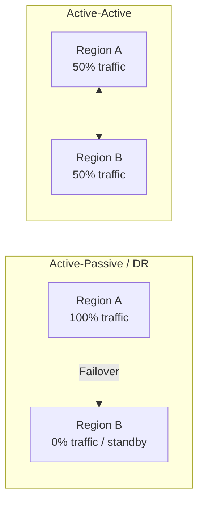
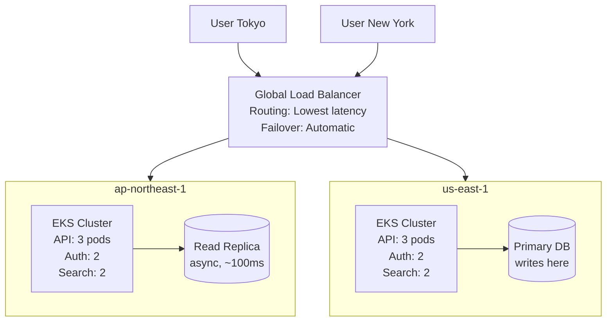
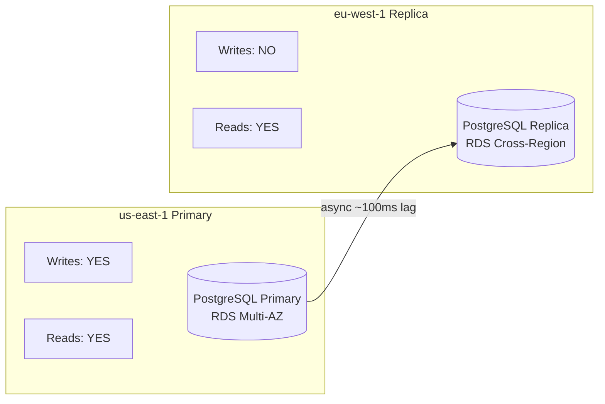
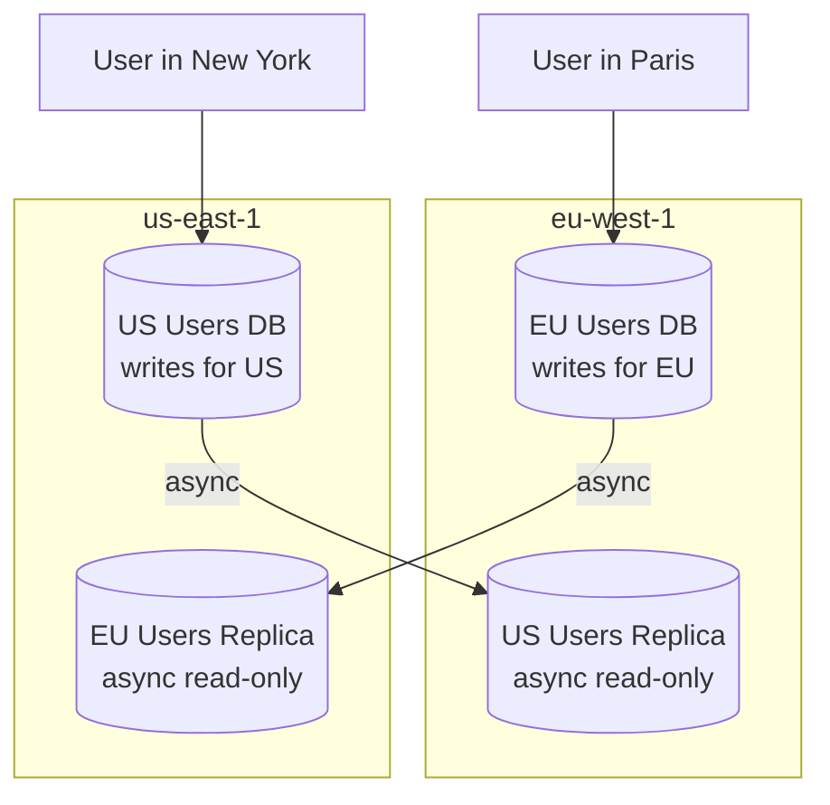
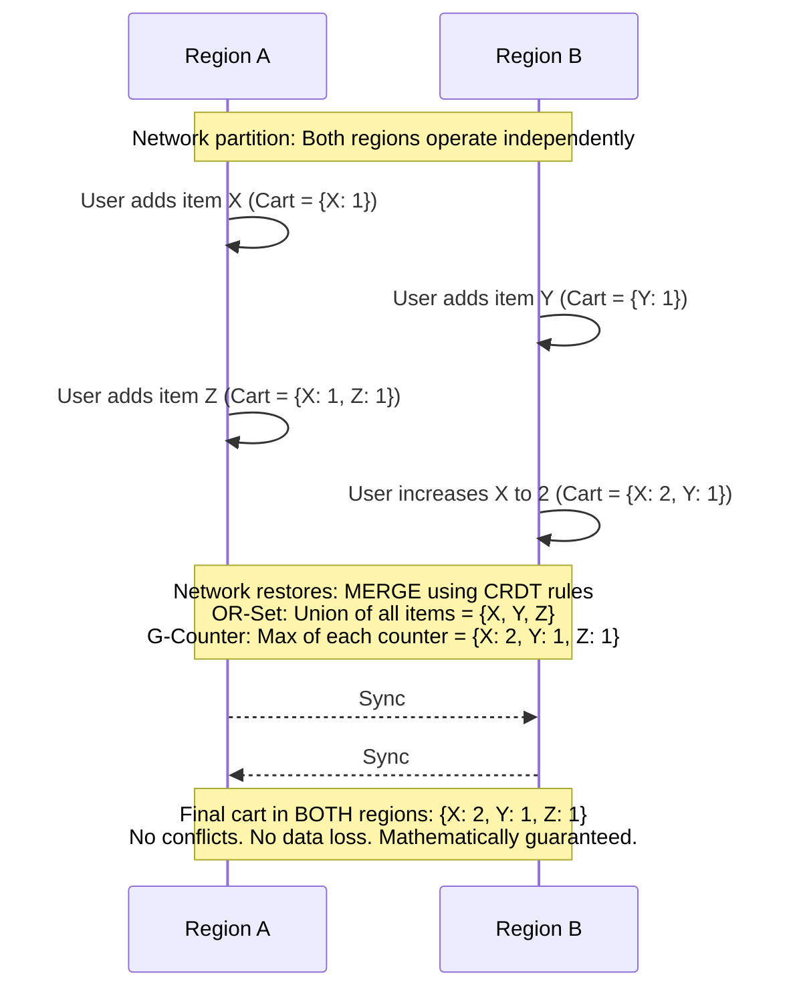
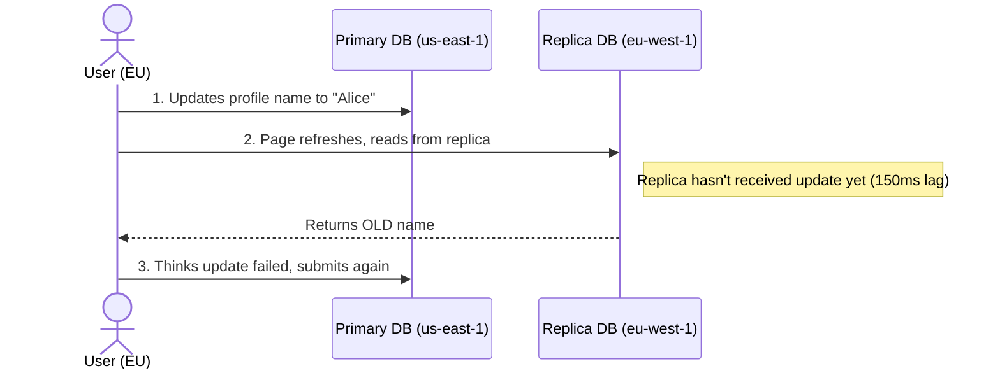
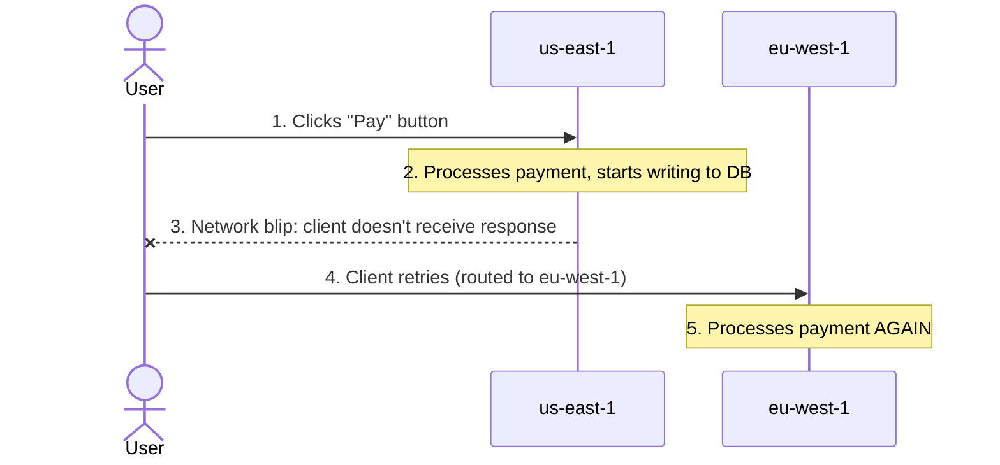
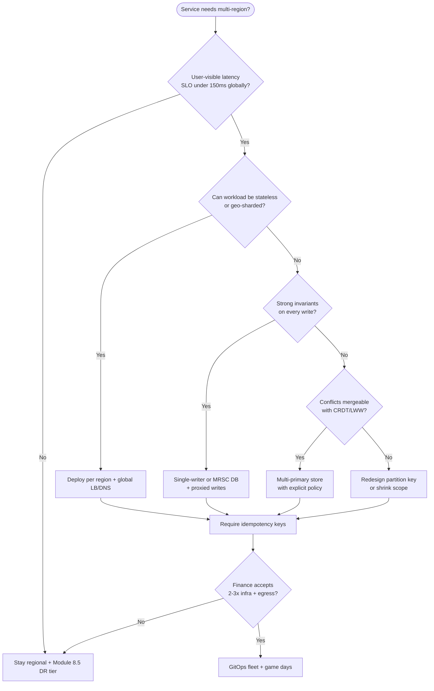

> **Complexity**: `[COMPLEX]`
>
> **Time to Complete**: 3 hours
>
> **Prerequisites**: [Module 8.5: Disaster Recovery](../module-8.5-disaster-recovery/), understanding of distributed systems basics (CAP theorem)
>
> **Track**: Advanced Cloud Operations

## What You'll Be Able to Do

When you finish this module, you will be able to design, route, replicate, and operate multi-region active-active Kubernetes platforms with explicit consistency tradeoffs rather than treating "deploy twice" as sufficient.

- **Design multi-region active-active Kubernetes deployments with global load balancing and data replication**
- **Implement traffic routing strategies (DNS-based, anycast, global LB) for active-active failover patterns**
- **Configure data replication and conflict resolution mechanisms for stateful workloads across regions**
- **Evaluate active-active vs active-passive tradeoffs including cost, complexity, and consistency guarantees**

---

## Why This Module Matters

Hypothetical scenario: A global food delivery platform processing tens of millions of daily orders runs primarily in one AWS region with a warm standby in another region for disaster recovery. During a regional networking event that causes elevated packet loss for roughly twenty minutes — not a full outage, but sustained degradation — the warm standby cannot help. The primary region is technically up, just slow, and health checks pass on reachability rather than latency. Order placement latency spikes, users abandon carts, and a competitor running active-active across three regions sees no user-visible impact from the same underlying cloud impairment. Users who switch during the degradation window often do not return.

That gap drives a long migration where the engineering team discovers that active-active is not "DR but better." It is a fundamentally different architecture for state, consistency, routing, and failure. [Module 8.5](../module-8.5-disaster-recovery/) maps RTO and RPO to backup, pilot light, warm standby, and active-active on the DR ladder. This module assumes you already chose near-zero RTO for user-facing paths. It teaches how to design, implement, and operate multi-region active-active Kubernetes deployments across AWS, GCP, and Azure — including the hard parts that architecture diagrams skip.

---

Before you read on, pause on this question: if both regions in an active-active setup can accept write requests simultaneously, what happens when two users try to buy the last remaining item in your inventory at the exact same millisecond from different regions? The answer depends entirely on which consistency strategy you chose, and that is why state management dominates active-active design. Keep that inventory question in mind as you read routing and idempotency sections — they are not separate topics, they are the same incident viewed from different layers.

## What Active-Active Actually Means

Active-active means every region serves production traffic simultaneously — there is no standby region waiting to be promoted and no single failover event that flips a boolean from "primary" to "secondary." Every region is a primary for the workloads you place there, which sounds simple until you remember that primaries usually imply exclusive write authority somewhere in the stack.



The difference from active-passive DR is not merely redundancy at rest; it is operational parallelism under normal conditions. In practice, active-active implies that both regions may write data (so state management becomes the hard problem), both regions must stay sufficiently in sync that users do not see arbitrary divergence (so replication lag is a design input, not an afterthought), routing must be intelligent rather than a blunt DNS failover, and every service must either tolerate multi-writer semantics or be explicitly partitioned so writers do not collide.

Engineering leaders often ask for "zero downtime" and hear "active-active." Clarify the promise: you are buying **continuous service during many failure modes**, not immunity from bugs, bad deploys, or schema migrations. Schema changes still need expand/contract patterns or dual-write windows. Feature flags still need per-region kill switches when a new build misbehaves in only one geography. Security incidents still require coordinated key rotation across regions, which is harder when each cluster holds cached secrets. Treat active-active as a **product and operations program**, not a one-time infrastructure ticket closed after the second cluster goes green.

### The Active-Active Spectrum

Not everything in a large platform needs to be active-active, and most organizations deliberately use a hybrid approach where only components with clear latency or availability ROI pay the coordination tax. The table below is a pragmatic starting point for classifying components before you commit engineering time to global write paths.

| Component | Active-Active? | Strategy |
|---|---|---|
| Stateless APIs | Yes | Deploy in all regions, route by latency |
| Static assets / CDN | Yes | Replicated at edge automatically |
| Session state | Yes (with care) | Sticky sessions or distributed cache (Redis Global) |
| User data (reads) | Yes | Read replicas in each region |
| User data (writes) | Depends | Single-writer or CRDT-based |
| Financial transactions | Rarely | Single-writer with async replication |
| Search index | Yes | Replicated index per region |
| Message queues | Regional | Each region has its own queue, cross-region for specific flows |

### Why Teams Choose Active-Active Over Warm Standby

Warm standby and pilot light from [Module 8.5](../module-8.5-disaster-recovery/) optimize for **failover events**: traffic shifts when a region is declared unhealthy. Active-active optimizes for **continuous partial failure** and **latency under normal load**. You pay full compute in every participating region. You gain three properties warm standby cannot buy cheaply.

First, **near-zero RTO for routing**: global load balancers and DNS health checks steer users away from a sick region without a manual promotion runbook. Second, **baseline latency**: European users hit European clusters instead of transatlantic round trips to a US-primary stack. Third, **no idle standby tax on revenue paths**: every region earns its keep during steady state, which helps finance teams accept duplicated infrastructure.

The tradeoff is explicit on the DR ladder from Module 8.5. Active-active sits at the top for both RTO and RPO targets, and for cost and complexity. You inherit CAP constraints, replication lag, idempotency requirements, and multi-cloud egress bills that backup-and-restore never touches. Mature teams adopt active-active **selectively** on the spectrum table above — not as a default for every CronJob and batch exporter.

---

## Stateless Active-Active: The Easy Part

Stateless services — APIs that do not maintain local session state between requests beyond what they read from shared stores — are the straightforward case for active-active. You deploy the same service in multiple regions, place a global load balancer in front, and route users to the nearest healthy endpoint by latency. The diagram below shows the common pattern: regional EKS clusters serving reads from local replicas while writes still funnel to a designated primary database, which is already a hint that "stateless" at the pod layer rarely means "stateless" for the whole system.

On **AWS**, the usual path is Route 53 or Global Accelerator in front of an Application Load Balancer attached to an EKS Ingress or Gateway API implementation. Pull container images from a registry replicated per region (ECR replication rules or pull-through cache) so a regional outage does not block pod starts. On **GCP**, publish a global external IP from a multi-cluster Gateway and let Cloud CDN cache static responses where possible. On **Azure**, terminate TLS at Front Door and forward to a regional Application Gateway ingress controller so you do not expose every AKS API server to the public internet. In all three clouds, **PodDisruptionBudgets**, **topology spread constraints**, and **HorizontalPodAutoscaler** objects should be identical in intent but tuned per region for local peak hours — European evening traffic is not US morning traffic.



### Deploying with ArgoCD ApplicationSets

```yaml
# ArgoCD ApplicationSet to deploy to multiple clusters
apiVersion: argoproj.io/v1alpha1
kind: ApplicationSet
metadata:
  name: payment-api
  namespace: argocd
spec:
  generators:
    - clusters:
        selector:
          matchLabels:
            environment: production
        values:
          region: '{{metadata.labels.region}}'
  template:
    metadata:
      name: 'payment-api-{{values.region}}'
    spec:
      project: default
      source:
        repoURL: https://github.com/company/k8s-manifests
        targetRevision: main
        path: 'apps/payment-api/overlays/{{values.region}}'
      destination:
        server: '{{server}}'
        namespace: payments
      syncPolicy:
        automated:
          prune: true
          selfHeal: true
        syncOptions:
          - CreateNamespace=true
```

### Regional Configuration with Kustomize

```yaml
# apps/payment-api/overlays/us-east-1/kustomization.yaml
apiVersion: kustomize.config.k8s.io/v1beta1
kind: Kustomization
resources:
  - ../../base
patches:
  - target:
      kind: Deployment
      name: payment-api
    patch: |
      - op: replace
        path: /spec/replicas
        value: 6
  - target:
      kind: ConfigMap
      name: payment-config
    patch: |
      - op: replace
        path: /data/DATABASE_URL
        value: "postgres://primary.us-east-1.rds.amazonaws.com:5432/payments"
      - op: replace
        path: /data/CACHE_URL
        value: "redis://global-cache.us-east-1.cache.amazonaws.com:6379"
      - op: replace
        path: /data/REGION
        value: "us-east-1"
```

### Multi-Region Kubernetes: Independent Clusters, Not One Stretched Cluster

Production active-active on Kubernetes means **one logically independent cluster per region** (or per availability zone stamp, depending on blast-radius goals), not a single control plane stretched across WAN links. EKS, GKE, and AKS all run regional control planes; etcd (managed by the cloud provider on these offerings) is not designed for cross-region quorum the way you might stretch VMware or bare-metal clusters.

**Why stretched clusters are an anti-pattern:** WAN partitions split worker nodes from apiservers or split etcd members. Kubernetes expects low-latency control-plane traffic. A partition can orphan nodes, duplicate controllers, or leave workloads scheduled where storage no longer exists. The [Kubernetes documentation on clusters](https://kubernetes.io/docs/concepts/cluster-administration/) treats a cluster as a failure domain bounded by network reliability you control.

**Preferred patterns:**

| Pattern | What it gives you | Tradeoff |
|---|---|---|
| **GitOps per fleet** (Argo CD ApplicationSet, Flux Cluster API) | Identical manifests with Kustomize/Helm overlays per region | Drift detection and promotion pipelines become mandatory |
| **Multi-cluster services / Gateway API** | Service discovery and LB across clusters (GKE multi-cluster Services, Submariner, Istio multi-cluster) | Mesh and gateway operational complexity |
| **Global service mesh** (optional) | mTLS, traffic splitting, observability tags per region | Control plane overhead; avoid mesh-before-need |
| **Regional data planes** | Postgres/Cosmos/Dynamo in-region; async replication between | Application must tolerate lag and conflicts |

On **EKS 1.35**, use IRSA or EKS Pod Identity for AWS API calls from pods. On **GKE**, enable Workload Identity Federation. On **AKS**, use Microsoft Entra Workload ID federated credentials — legacy AAD Pod Identity is retired; plan Entra-based federation for new clusters ([AKS workload identity overview](https://learn.microsoft.com/en-us/azure/aks/workload-identity-overview)).

ApplicationSet generators (shown above) should pin **image digests**, **resource requests**, and **topology spread** per region. Pair with external secrets managers replicated per landing zone from your multi-account architecture modules.

---

## Global State Management: The Hard Part

The moment your active-active deployment needs to write durable data, everything gets complicated because networks are not instantaneous and failures are not rare. The CAP theorem still applies: in the presence of a network partition, you must choose between consistency and availability. Most active-active designs bias toward availability for user-facing paths, which means you must engineer for inconsistency windows rather than pretending replication is synchronous everywhere. The three strategies below — single-writer, geo-sharding, and CRDTs — are the workhorses you will see in production, often combined in the same company for different data types.

CAP is not a license to ignore **PACELC** tradeoffs either. Even without a partition, extra latency appears when you choose consistency over latency on the write path. That is why Spanner commits wait on TrueTime uncertainty, and why DynamoDB MRSC rejects conflicting concurrent writers instead of merging silently. When you present architecture options to leadership, translate CAP into customer-visible behaviors: stale reads, duplicate charges, or slower checkouts — not academic vocabulary.

### Strategy 1: Single-Writer, Multi-Reader

The simplest mental model is single-writer, multi-reader: one region owns writes for each piece of data (or for the entire database), and other regions serve reads from replicas that trail the primary by replication lag. This pattern is easy to reason about and maps cleanly to managed databases with cross-region read replicas, but it introduces write latency for users who are far from the primary and requires a rehearsed promotion story when the primary region fails.



When a user reads from eu-west-1, they typically see data that is on the order of ~100ms old relative to the primary, because asynchronous replication has not yet caught up. When that same user writes from eu-west-1, the application proxies the write to us-east-1, which adds roughly ~80ms of round-trip latency on top of ordinary query time. If us-east-1 fails entirely, you promote the eu-west-1 replica to primary — a process measured in minutes, not seconds — and you accept that some recent writes may be lost, meaning your effective RPO equals the replication lag at failure time.

The same pattern appears on **Cloud SQL cross-region replicas**, **Azure Database for PostgreSQL read replicas**, and self-managed Postgres with logical replication on Kubernetes. Promotion runbooks must list DNS or connection string swaps, connection pool drains, and cache invalidation steps. Game-day scripts from Module 8.5 still apply, but active-active game days add **traffic weights** — you shift ten percent of real users, not only fail a cluster in isolation. Measure p95 checkout latency during the shift; if it spikes while error rates stay flat, your health checks are lying.

```yaml
# Application config: route writes to primary, reads to local replica
apiVersion: v1
kind: ConfigMap
metadata:
  name: db-config
  namespace: payments
data:
  # Application reads from the nearest replica
  DATABASE_READ_URL: "postgres://read.payments-db.local:5432/payments"
  # Application writes always go to the primary
  DATABASE_WRITE_URL: "postgres://primary.us-east-1.rds.amazonaws.com:5432/payments"
  # Connection pooling config
  READ_POOL_SIZE: "20"
  WRITE_POOL_SIZE: "5"
```

### Strategy 2: Partitioned Writes (Geo-Sharding)

Geo-sharding assigns write ownership by partition key so each region owns the data that "belongs" to it: a user in Europe writes to the European database, a user in the US writes to the US database, and cross-partition reads fan out or use regional replicas. This design avoids write conflicts because two regions never mutate the same primary row concurrently, at the cost of more complex routing and cross-region queries when users interact across partitions.



The partition key is usually the user's home region, set at registration and changed rarely. The advantage is crisp: no write conflicts, because each region owns its partition. The disadvantage is that cross-region queries are slower because you must fan out or accept stale replicas — for example, when a user in Paris reads a US friend's profile, you either read from a US data replica in eu-west-1 (~100ms stale) or read from us-east-1 directly (adding ~80ms latency but returning fresh data).

Geo-sharding interacts with **Kubernetes service discovery** when microservices assume colocated databases. If the `users` service in `eu-west-1` calls the `friends` service locally but the data lives in `us-east-1`, you have rebuilt a distributed monolith with extra network hops. Align **namespace per region**, **regional service DNS**, and **API gateway routing rules** so a regional request chain stays inside the same shard unless the use case explicitly requires cross-border reads. Document rare cross-shard operations as expensive APIs with rate limits, not as default GraphQL resolvers.

### Strategy 3: Conflict-Free Replicated Data Types (CRDTs)

CRDTs are data structures that allow concurrent modifications in different regions and merge automatically without manual conflict resolution, which makes them attractive for shopping carts, counters, and social graphs where last-write-wins would destroy user trust. The sequence diagram below shows the intuition: during a partition, both regions accept updates independently, and when the network heals, merge rules produce a single converged state without operator intervention.



CRDTs work well when your domain tolerates commutative merges: counters (likes, views, inventory decrements implemented with CRDT counter types), sets (shopping carts, friend lists, tags using OR-sets or similar), and simple registers where last-writer-wins is acceptable. They do not work when business rules require strong invariants — bank balances that must never diverge, inventory that cannot go negative without a central authority, or sequential workflows like order processing where step order is part of the contract. Treat CRDTs as a scalpel for specific data types, not a default for every table in your schema.

### Choosing Your Consistency Model

| Data Type | Consistency Need | Recommended Strategy |
|---|---|---|
| User profiles | Eventual (stale reads OK) | Single-writer + async replicas |
| Shopping cart | Eventual (merge conflicts OK) | CRDTs (OR-Set) |
| Inventory count | Strong (can't oversell) | Single-writer or distributed lock |
| Financial transactions | Strong (must not lose) | Single-writer, synchronous |
| Session tokens | Eventual (sticky routing helps) | Distributed cache (Redis Global) |
| Search results | Eventual (slightly stale OK) | Regional index, async update |
| Chat messages | Causal (order matters per conversation) | Causal broadcast or geo-shard by conversation |

### Multi-Primary Databases: What Each Cloud Actually Promises

When both regions must accept writes, you are shopping for a **conflict model**, not a marketing label. The table below summarizes managed options. Verify SKU limits and preview status in your account before production cutover.

| Platform | Multi-region write product | Conflict / consistency behavior | Kubernetes angle |
|---|---|---|---|
| **AWS** | DynamoDB global tables (MREC default; MRSC optional) | MREC: asynchronous replication, **last writer wins** per item using internal timestamps. MRSC: synchronous replication; concurrent writes can fail with `ReplicatedWriteConflictException` and retry. | Run apps on EKS; use IRSA or EKS Pod Identity for AWS API access. Data plane is DynamoDB, not etcd. |
| **GCP** | Cloud Spanner multi-region instances | **External consistency** via TrueTime commit timestamps and commit-wait; behaves like a single logical database across regions. Cross-region writes pay latency for coordination. | GKE workloads use Workload Identity Federation; Spanner is external to the cluster control plane. |
| **Azure** | Azure Cosmos DB accounts with multiple write regions | Container-level policy at **create time only**: Last-Writer-Wins on `_ts` or a custom numeric path, merge stored procedure (API for NoSQL), or manual conflict feed. | AKS apps use Microsoft Entra Workload ID; Cosmos is a separate regional service. |
| **Vendor-neutral** | CockroachDB, YugabyteDB on Kubernetes | Serializable distributed SQL with Raft ranges; tunable survival goals and region locality. You operate the database; the cloud provides nodes and networking. | Often deployed as a StatefulSet or operator-managed cluster per region or stretched per vendor guidance. |

**Precision matters.** DynamoDB global tables in multi-Region eventual consistency (MREC) do **not** give you cross-region strongly consistent reads. Spanner does **not** use last-writer-wins for financial-style invariants; it pays commit-wait latency instead. Cosmos DB conflict policies are **immutable after container creation** — wrong policy means rebuild, not a flag flip. None of these replace application idempotency for HTTP mutations; they only shrink the database conflict surface.

#### Synchronous vs Asynchronous Replication in Practice

**Synchronous** replication waits for a remote acknowledgment before acknowledging the client. RPO approaches zero for that write path, but write latency includes WAN RTT. Use it sparingly for ledgers, inventory locks, and entitlement tables where oversell is unacceptable.

**Asynchronous** replication returns quickly and propagates changes in the background. RPO equals lag at failure time. It is the default for RDS cross-region read replicas, many object-store replication rules, and DynamoDB MREC global tables. Active-active user experiences depend on **read-your-own-writes** and **idempotency** because async is the economic default.

#### CockroachDB and Other Self-Managed SQL

Teams on EKS, GKE, or AKS sometimes deploy CockroachDB or YugabyteDB when they need PostgreSQL-flavored SQL with multi-region survivability goals. You define **survival goals** (how many region failures the cluster tolerates) and **regional by table** locality rules so rows live near their writers. This is not "free active-active": you still design partition keys, follow-the-workload patterns, and test regional isolation failures. Treat operator upgrades and cross-region networking as first-class operational work, not a sidecar experiment.

---

**Pause and predict:** If network latency between the US and Europe is ~100ms, how long does it take for a database write in the US to become visible to a read request in Europe — is it just 100ms?

<details>
<summary>Check your prediction</summary>

Visibility is **not** just the ~100ms network RTT. Network round-trip time is only one component; write-ahead log (WAL) flush on the primary, network serialization and shipping across transatlantic transit, and transaction replay on the replica all add processing time. On managed relational engines like Amazon RDS, the `ReplicaLag` metric measures this cumulative apply and replay lag rather than a network ping, meaning cross-region reads often lag writes by hundreds of milliseconds or even seconds under heavy write bursts.
</details>

Cross-region architecture decisions must account for data propagation physics at every tier of the application stack. Engineering teams should establish explicit Service Level Objectives for cross-region read freshness and align product user experiences with eventual consistency realities before declaring multi-region readiness.

## Replication Lag: The Silent Killer

In any multi-region deployment, replication lag is the interval between a write committing in one region and that write becoming visible to readers in another region. It is not a bug you can "fix" with more engineers — it is a physics and systems constraint you design around in application code, UX copy, and consistency mode selection. Raw network latency gives you a floor: within the same AZ you often see under 1ms, cross-AZ roughly 1–2ms, cross-region within the US roughly 20–40ms, US to Europe roughly 70–120ms, and US to Asia roughly 150–250ms. Actual database replication lag adds write-to-primary WAL time (~1ms), WAL shipping across the network, and replay on the replica (~1–5ms), so realistic end-to-end lag is often 5–20ms same-region, 100–500ms cross-region, and seconds under load when replicas fall behind.

Managed services expose lag differently. **Amazon RDS** cross-region read replicas report `ReplicaLag` in CloudWatch — promotion RPO equals that lag at failover time per AWS guidance on read replica promotion. **Cloud Spanner** exposes replication metadata per instance configuration; cross-region instances trade higher write latency for tighter bounds. **Azure Cosmos DB** offers five consistency levels; session consistency gives read-your-own-writes within a session when clients honor region affinity, but not arbitrary cross-region strong reads without using the right consistency knob. Instrument lag at the application layer with write-then-read tests per region pair, not only cloud averages, because hot keys stall replication queues during sales events.

### The Read-Your-Own-Writes Problem



The standard mitigation is read-your-own-writes consistency: after a user performs a write, route that user's reads to the primary (or a synchronously updated source) for a short window — often on the order of five seconds — before reverting to the local replica. This pattern does not make global replication synchronous; it only guarantees that the writer does not immediately observe their own stale data, which prevents the "I clicked save and it disappeared" support tickets that destroy trust during regional deployments.

```python
# Read-your-own-writes implementation
import time
import redis

cache = redis.Redis(host="session-cache.local", port=6379)

def write_user_profile(user_id, data):
    """Write to primary and set a read-after-write flag."""
    primary_db.execute("UPDATE users SET name = %s WHERE id = %s",
                       (data["name"], user_id))

    # Set a flag: "this user wrote recently, read from primary"
    cache.setex(f"raw:{user_id}", 5, "1")  # Expires in 5 seconds

def read_user_profile(user_id):
    """Read from primary if user wrote recently, otherwise replica."""
    if cache.get(f"raw:{user_id}"):
        # User wrote recently -- read from primary to ensure consistency
        return primary_db.execute("SELECT * FROM users WHERE id = %s",
                                  (user_id,))
    else:
        # Safe to read from local replica
        return replica_db.execute("SELECT * FROM users WHERE id = %s",
                                  (user_id,))
```

---

## Session Affinity, Split-Brain, and Stateful Tiers

**Pause and predict:** If you configure cookie-based session affinity on an Application Load Balancer to optimize local cache hit rates, what happens to those sticky user sessions if that specific regional cluster begins experiencing severe performance degradation?

<details>
<summary>Check your prediction</summary>

Session stickiness can keep clients pinned to a **degraded** region until their affinity cookies expire. Because session affinity binds a client's browser or mobile client directly to a specific backend target group or region, client requests continue routing to the impaired endpoint as long as the load balancer considers the target group technically alive. Affinity fundamentally fights automatic failover, forcing operators to wait for cookie expiration or implement manual cache-invalidation interventions during partial regional brownouts.
</details>

Balancing local state caching against global resilience targets requires intentional design across application edge proxies and client libraries. Platform engineers must evaluate whether session stickiness provides sufficient operational advantages to justify the delayed failover behavior during localized service degradations.

Stateless pods are only half the story. Browsers, mobile SDKs, WebSocket gateways, and OAuth session stores introduce **affinity** requirements. If you pin users to a region without planning data placement, you recreate single-region behavior behind a global hostname.

**Session affinity** ties a client to an endpoint for a period. AWS Application Load Balancers support target group stickiness. GCP external Application Load Balancers support session affinity cookies. Azure Front Door can honor cookies or headers when routing rules allow. Affinity improves cache hit rates and simplifies debugging, but it fights active-active during failover: sticky users may keep hitting a degraded region until cookies expire. Document TTLs and force-refresh paths in runbooks.

**Idempotency** (covered later in depth) is the safety net when affinity breaks mid-request. **Split-brain** appears when two regions both believe they own writes for the same shard — often after a network partition plus overly aggressive failover. Mitigations include:

- **Quorum-based leadership** for stateful systems (etcd, ZooKeeper patterns, or database primaries with fencing).
- **Fencing tokens** passed to storage so stale leaders cannot commit.
- **Geo-sharding** so only one region owns a partition key at a time.
- **Outbox patterns** for cross-region workflows instead of dual cron writers.

For Kubernetes stateful tiers (StatefulSets, operators), prefer **one elected writer per shard** using coordination primitives (Lease API, external lock service) rather than distributed locks across WAN RTT on every request. Velero and managed backup APIs from Module 8.5 still matter for disaster rebuild, but they do not prevent split-brain during partial outages.

---

## Traffic Routing for Active-Active

Global traffic routing turns multiple healthy regions into one coherent service. The control plane differs by cloud, but the invariants hold: **health signals must reflect user-visible quality**, not just TCP reachability; **DNS TTL and resolver caching** delay shifts; **anycast and edge proxies** can steer faster than DNS alone for long-lived TCP flows.

### AWS: Route 53, Global Accelerator, and Regional Load Balancers

**Amazon Route 53** offers latency-based, geolocation, weighted, and failover routing policies. Latency routing selects the record set associated with the lowest-latency AWS Region for each resolver, using measurements that change as internet paths shift ([latency-based routing](https://docs.aws.amazon.com/Route53/latest/DeveloperGuide/routing-policy-latency.html)). Pair routing policies with **Route 53 health checks** so unhealthy regions stop receiving answers.

**AWS Global Accelerator** provides static anycast IPs that ingress traffic onto the AWS global network and forward to healthy endpoints in endpoint groups ([health checks for accelerators](https://docs.aws.amazon.com/global-accelerator/latest/dg/about-endpoint-groups-health-check-options.html)). Use Global Accelerator when you need fast regional failover for TCP/UDP workloads and consistent entry IPs. Use Route 53 when DNS-level steering and alias records to ALBs/NLBs are sufficient.

Typical EKS active-active shape: Global Accelerator or Route 53 → regional ALB/NLB → Ingress/Gateway → pods. Evaluate target health on alias records when pointing DNS at accelerators or load balancers.

### GCP: Cloud DNS and Global External Application Load Balancers

On GKE, **multi-cluster Gateways** use the Kubernetes Gateway API with GatewayClasses such as `gke-l7-global-external-managed-mc` to provision a **global external Application Load Balancer** fronting pods across a fleet ([multi-cluster Gateways](https://cloud.google.com/kubernetes-engine/docs/concepts/multi-cluster-gateways)). Cloud DNS publishes A/AAAA records to the global VIP. Health checks run at the load balancer layer; unhealthy backends drain per Google Cloud probe configuration.

Geo-distributed GKE fleets register clusters to a fleet, designate a **config cluster** for Gateway resources, and reference `ServiceImport` objects so HTTPRoutes reach backends in multiple regions. Anycast on global external load balancers attracts clients to the nearest Google edge PoP before forwarding to healthy regional backends.

### Azure: Front Door, Traffic Manager, and Regional Application Gateway

Microsoft documents multiple global load balancing options for AKS, including **Azure Front Door**, **Azure Traffic Manager**, cross-region load balancers, and Kubernetes Fleet Manager ([multi-region AKS models](https://learn.microsoft.com/en-us/azure/aks/reliability-multi-region-deployment-models)). The common enterprise pattern is **Front Door → regional Application Gateway → AKS ingress**, with Front Door performing Layer-7 routing, TLS termination at the edge, and origin health probes ([Front Door health probes](https://learn.microsoft.com/en-us/azure/frontdoor/health-probes)).

Traffic Manager remains useful for DNS-level weighted or performance routing to regional endpoints, but Microsoft cautions against stacking redundant health probing on the same origins without design intent. Pick one primary global steering layer per hostname to avoid probe storms.

### Health Checks That Survive Partial Degradation

The Module 8.5 DR ladder assumes you can declare a region unhealthy. In active-active, **degraded is worse than down** because DNS may keep sending traffic to a "healthy" region with high latency or elevated error rates. Supplement liveness with:

- Synthetic canaries that measure checkout latency end-to-end.
- **Latency SLO burn** alerts that trigger weighted routing shifts.
- Outlier detection on origin 5xx rates at the global load balancer.

Route 53 health checks, Global Accelerator probes, GCP load balancer health checks, and Front Door probes all need paths that fail when the **application** is unhealthy — not when a static file returns 200 from a sidecar.

### Latency-Based Routing

Latency-based routing answers the question "which region is fastest for this client right now?" by associating each regional endpoint with health checks and letting the DNS layer return the lowest-latency answer. Use it when your goal is steady-state performance rather than an intentional traffic split.

**Geolocation routing** answers a different question: "which region should this country use by policy?" Regulated data residency sometimes overrides pure latency — a German user might be required to hit `eu-central-1` even if `us-east-1` measures faster in a lab test. **Weighted routing** answers rollout questions: send ten percent of DNS answers to a new region while watching error budgets. Combine weighted and latency policies carefully; not every DNS provider composes policies the same way, so prototype in a sandbox hosted zone or Cloud DNS test project before changing production apex records during peak season.

```bash
# AWS Route53: Latency-based routing
aws route53 change-resource-record-sets \
  --hosted-zone-id Z1234567890 \
  --change-batch '{
    "Changes": [
      {
        "Action": "CREATE",
        "ResourceRecordSet": {
          "Name": "api.example.com",
          "Type": "A",
          "SetIdentifier": "us-east-1",
          "Region": "us-east-1",
          "TTL": 60,
          "ResourceRecords": [{"Value": "10.0.1.100"}],
          "HealthCheckId": "hc-us-east-1"
        }
      },
      {
        "Action": "CREATE",
        "ResourceRecordSet": {
          "Name": "api.example.com",
          "Type": "A",
          "SetIdentifier": "eu-west-1",
          "Region": "eu-west-1",
          "TTL": 60,
          "ResourceRecords": [{"Value": "10.1.1.100"}],
          "HealthCheckId": "hc-eu-west-1"
        }
      },
      {
        "Action": "CREATE",
        "ResourceRecordSet": {
          "Name": "api.example.com",
          "Type": "A",
          "SetIdentifier": "ap-northeast-1",
          "Region": "ap-northeast-1",
          "TTL": 60,
          "ResourceRecords": [{"Value": "10.2.1.100"}],
          "HealthCheckId": "hc-ap-northeast-1"
        }
      }
    ]
  }'
```

### Weighted Routing for Gradual Rollout

Weighted routing answers a different question: "what fraction of users should hit the new region while we validate it?" A 90/10 split lets you soak a secondary region with real traffic without betting the company on day one, which is especially valuable when replication, caches, and idempotency stores are not yet proven under production cardinality.

```bash
# Start with 90/10 split to canary new region
aws route53 change-resource-record-sets \
  --hosted-zone-id Z1234567890 \
  --change-batch '{
    "Changes": [
      {
        "Action": "CREATE",
        "ResourceRecordSet": {
          "Name": "api.example.com",
          "Type": "A",
          "SetIdentifier": "us-east-1-weighted",
          "Weight": 90,
          "TTL": 60,
          "ResourceRecords": [{"Value": "10.0.1.100"}],
          "HealthCheckId": "hc-us-east-1"
        }
      },
      {
        "Action": "CREATE",
        "ResourceRecordSet": {
          "Name": "api.example.com",
          "Type": "A",
          "SetIdentifier": "eu-west-1-weighted",
          "Weight": 10,
          "TTL": 60,
          "ResourceRecords": [{"Value": "10.1.1.100"}],
          "HealthCheckId": "hc-eu-west-1"
        }
      }
    ]
  }'
```

---

**Pause and predict:** If a customer clicks "Pay" and their network connection drops immediately before the server response arrives, mobile clients and proxies will retry the request. If that retry lands in a different geographic region because your global load balancer shifted traffic, how does your system prevent charging the customer twice?

<details>
<summary>Check your prediction</summary>

Without a client-supplied **idempotency key**, a Pay retry routed to another region can charge the customer twice. Because standard HTTP mutation methods such as POST are not inherently idempotent, the receiving regional backend cannot distinguish between an unintentional network retry and a distinct second payment request. To ensure safe retries across distributed regions, the client must transmit a unique idempotency key that all regional backends record in a globally accessible or replicated cache to return the original transaction result.
</details>

Designing financial and transactional APIs for multi-region topologies demands rigorous distributed state coordination before accepting live customer traffic. Application developers must treat network uncertainty as an expected runtime condition rather than an edge case when orchestrating operations across multiple geographic environments.

## Idempotency: The Active-Active Safety Net

In an active-active deployment, requests are retried, duplicated, and rerouted between regions far more often than in a single-region monolith, because health checks flap, TCP sessions reset mid-request, and failover paths change mid-flight. Every write operation must therefore be idempotent: applying it twice must produce the same durable outcome as applying it once, usually by tracking a client-supplied idempotency key in a low-latency store replicated or reachable from all regions.

The idempotency store itself becomes a multi-region design choice. A Redis cluster pinned to one region is fast but wrong during failover. **Amazon ElastiCache Global Datastore**, **GCP Memorystore cross-region**, or a Cosmos DB / DynamoDB table dedicated to idempotency metadata are common compromises. Keys should include tenant and operation type, expire after a business-safe window (24 hours for payments is typical), and return the **same HTTP status and body** on duplicates so clients stop retrying. Document that idempotency covers **at-least-once delivery**, not exactly-once side effects on downstream SaaS webhooks unless those partners also deduplicate.



Without idempotency, the sequence diagram above ends with a user charged twice for one intent. With idempotency, the second request is recognized as a duplicate of the first and returns the original result, which is why payment and booking APIs treat idempotency keys as mandatory headers rather than optional niceties.

Mobile clients and browser fetch retries amplify the problem. They do not know your regional failover story; they only know the TCP connection reset. Standardize header names (`Idempotency-Key` is common) and document TTL expectations in public API references. Backend frameworks should persist outcomes before returning `201 Created` so a crash after commit still yields a safe replay answer. Pair idempotency with **outbox tables** when you must emit Kafka or SNS events exactly once from the business perspective — the outbox row is the dedupe anchor, not the message broker alone.

### Implementing Idempotency Keys

```python
# Idempotency key pattern
import hashlib
import redis
import json

cache = redis.Redis(host="idempotency-cache.local", port=6379)

def process_payment(request):
    """Process a payment with idempotency protection."""
    # Client must send an idempotency key (UUID generated client-side)
    idempotency_key = request.headers.get("Idempotency-Key")
    if not idempotency_key:
        return {"error": "Idempotency-Key header required"}, 400

    # Check if we've seen this request before
    cached_result = cache.get(f"idempotent:{idempotency_key}")
    if cached_result:
        # We've already processed this request -- return the cached result
        return json.loads(cached_result), 200

    # Try to acquire a lock (prevent concurrent processing of same key)
    lock_acquired = cache.set(
        f"idempotent-lock:{idempotency_key}",
        "processing",
        nx=True,  # Only set if not exists
        ex=30     # Lock expires in 30 seconds
    )

    if not lock_acquired:
        # Another instance is processing this request right now
        return {"error": "Request is being processed"}, 409

    try:
        # Process the payment
        result = payment_gateway.charge(
            amount=request.json["amount"],
            currency=request.json["currency"],
            customer_id=request.json["customer_id"]
        )

        # Cache the result for 24 hours
        cache.setex(
            f"idempotent:{idempotency_key}",
            86400,  # 24 hours
            json.dumps(result)
        )

        return result, 200
    finally:
        cache.delete(f"idempotent-lock:{idempotency_key}")
```

```yaml
# Kubernetes deployment with idempotency cache
apiVersion: apps/v1
kind: Deployment
metadata:
  name: payment-api
  namespace: payments
spec:
  replicas: 4
  selector:
    matchLabels:
      app: payment-api
  template:
    metadata:
      labels:
        app: payment-api
    spec:
      containers:
        - name: api
          image: company/payment-api:v2.8.1
          env:
            - name: IDEMPOTENCY_CACHE_URL
              value: "redis://idempotency-redis.payments.svc:6379"
            - name: IDEMPOTENCY_TTL_SECONDS
              value: "86400"
            - name: REGION
              valueFrom:
                configMapKeyRef:
                  name: region-config
                  key: REGION
```

---

**Pause and predict:** When transitioning a single-region production environment to an active-active architecture across two regions, will your monthly infrastructure bill exactly double, or will the financial impact differ?

<details>
<summary>Check your prediction</summary>

Doubling regions does **not** exactly double the bill; the overall cost is typically **more than 2×** the single-region baseline. In addition to duplicating core compute nodes and database instances, multi-region architectures introduce net-new billing line items such as continuous inter-region data replication, global load balancing services, and multiplied monitoring ingestion. Crucially, cloud providers bill inter-region data transfer outbound from the source Region, meaning high-volume state synchronization and cross-region changefeeds add substantial variable costs on top of static compute.
</details>

Budget forecasts must capture both predictable fixed infrastructure allocations and dynamic network traffic variables across all regional boundaries. Platform leaders should build transparent total cost models to help stakeholders weigh continuous availability against the compounding expenses of multi-region deployment models.

## Cost Implications of Active-Active

Active-active is expensive in dollars and in cognitive load, and understanding the cost model helps you decide which components justify the investment versus staying regional with a strong DR story. The tables below compare a representative single-region footprint to a two-region active-active footprint using round numbers — your ratios will differ by traffic shape, but the line items are universal.

### Active-Active Cost Breakdown

Use the two tables below as a structured comparison: the first models a single-region baseline of roughly **$15,000/month**, and the second models an active-active footprint across two regions at roughly **$38,000/month (+153%)**.

| Component | Cost |
|-----------|------|
| EKS cluster (6 nodes) | $4,200 |
| RDS Primary (Multi-AZ) | $3,800 |
| ElastiCache | $1,200 |
| ALB + NAT Gateway | $800 |
| S3 + CloudFront | $600 |
| Other (monitoring, etc.) | $2,400 |
| Data transfer | $2,000 |

| Component | Cost | Notes |
|-----------|------|-------|
| 2x EKS clusters | $8,400 | (2x compute) |
| RDS Primary + Cross-Region | $6,200 | (+63% for replica) |
| 2x ElastiCache Global | $3,200 | (2.6x for global) |
| 2x ALB + NAT | $1,600 | (2x) |
| S3 + CloudFront (shared) | $800 | (+33%) |
| 2x Monitoring | $4,800 | (2x) |
| Cross-region replication | $3,500 | (NEW cost) |
| Data transfer (cross-region) | $5,500 | (+175%) |
| Global Load Balancer | $1,000 | (NEW cost) |
| Additional operational cost | $3,000 | (NEW: multi-region ops) |

Active-active is therefore not a clean 2× multiplier; it is commonly 2–3× because cross-region data replication, global load balancing, and increased operational complexity (monitoring, debugging, coordinated deploys) all add net-new spend on top of duplicated compute.

Finance reviews should separate **structural duplication** (second cluster, second NAT path) from **traffic-shaped variables** (egress grows with success). A viral launch in one region can replicate logs, metrics, and changefeeds to another region even when user traffic stays local — observability pipelines are a common hidden multiplier. Tag every Deployment with `region`, `tier`, and `cost-center` so chargeback dashboards from Kubecost or OpenCost align with the executive story you told when approving active-active.

### Cost Optimization Strategies

The list below is how teams keep active-active financially defensible without pretending the coordination tax disappears:

1. **Not everything needs active-active**
   - Stateless APIs: YES (easy, cheap)
   - Read-heavy services: YES (replicas are cheap)
   - Write-heavy services: MAYBE (consider geo-sharding)
   - Batch processing: NO (run in one region, failover)

2. **Right-size the secondary region**
   - Primary: 6 nodes (100% capacity)
   - Secondary: 4 nodes (70% capacity)
   - On failover: auto-scale secondary to 6 nodes
   - Saves: ~$1,400/month on compute

3. **Use reserved instances / savings plans**
   - Active-active GUARANTEES you'll use compute in both regions
   - Perfect candidate for 1-year commitments
   - Saves: 30-40% on compute

4. **Compress cross-region replication**
   - Database WAL compression: 60-70% reduction
   - Application-level compression for event streams
   - Saves: $1,000-$2,000/month on data transfer

### Multi-Cloud Cost Gotchas (AWS vs GCP vs Azure)

Duplicating clusters is only the visible line item. **Egress and NAT** often dominate active-active bills:

| Cost driver | AWS (typical pattern) | GCP (typical pattern) | Azure (typical pattern) |
|---|---|---|---|
| Internet egress | Data transfer out to internet per GB (verify current pricing in your region) | Premium tier egress from load balancers and VMs | Bandwidth meters on Front Door plus VM egress |
| Cross-region replication | Inter-region data transfer between RDS replicas, S3 CRR, DynamoDB global tables | Inter-region egress between Spanner regions or GCS dual regions | Cosmos multi-region replication throughput plus RU charges |
| NAT / outbound SNAT | NAT Gateway hourly plus per-GB processing for private subnet egress | Cloud NAT gateway and data processing charges | NAT Gateway or Azure Firewall SNAT paths for AKS outbound |
| Cross-AZ traffic | Charges for traffic between AZs in the same region | Inter-zone egress within a region | Intra-region bandwidth still billable on some SKUs |
| Global front door | Route 53 queries plus health checks; Global Accelerator hourly + DT premium | Global external ALB forwarding rules and egress | Front Door base fee plus per-GB outbound from edge |

**Knobs that reduce surprise spikes:** keep object storage and CDN caches regional; batch cross-region changefeeds; use VPC endpoints / Private Service Connect / Azure Private Link to avoid hairpinning through NAT for cloud API traffic; right-size global load balancers so idle regions do not run peak node counts 24/7; tag spend by `region` and `cost-center` labels in Kubecost or OpenCost for in-cluster visibility.

Hypothetical scenario: A team doubles EKS node counts for active-active but forgets cross-region Kafka mirroring. Their bill grows 2.4× instead of 2.0× because inter-region egress accrues on every message. FinOps reviews the NAT Gateway line item, not the cluster autoscaler.

---

## Patterns & Anti-Patterns

### Proven Patterns

| Pattern | When to use | Why it works | Scaling note |
|---|---|---|---|
| **Latency-first global routing** | User-facing APIs with regional clusters | Minimizes RTT for steady state; health checks remove bad regions | Combine DNS TTL reduction with accelerator/edge for TCP-heavy apps |
| **Geo-sharded writes** | Social, ride-share, logistics with local interaction | Eliminates cross-region write conflicts by ownership | Rebalance shards with dual-write windows during migrations |
| **Single-writer + regional read replicas** | Profiles, catalogs, read-heavy commerce | Simple semantics; predictable promotion runbooks | Add RYOW cache flags to hide replica lag for writers |
| **Idempotent mutation APIs** | Payments, bookings, inventory holds | Survives retries during routing churn | Store keys in a low-latency cache with cross-region replication |
| **GitOps ApplicationSet fleet** | EKS/GKE/AKS at 1.35 with identical baselines | One manifest pipeline, many clusters | Use progressive delivery per region, not big-bang sync |

### Anti-Patterns

| Anti-pattern | What goes wrong | Why teams fall into it | Better alternative |
|---|---|---|---|
| **Stretched Kubernetes across regions** | Split-brain scheduling; storage detach storms | Desire for "one cluster" simplicity | Independent regional clusters plus GitOps |
| **Global distributed locks on hot paths** | 100–300ms added to every transaction | Fear of duplicate writes | Partition ownership; database-native consensus |
| **Latency-blind health checks** | Traffic sticks to degraded region | Cheap `/healthz` without SLO tests | Synthetic transactions plus outlier routing |
| **Dual-primary Postgres without CRDT discipline** | Silent data loss or manual merges | Misread "active-active" as symmetric RDS writes | Managed global tables/Spanner/Cosmos policies |
| **Running cron in every region** | Triple reports, lock contention | Copy-paste manifests | Leader election or designated batch region |
| **Ignoring cross-cloud egress** | 4×+ transfer cost vs single-cloud multi-region | Multi-cloud strategy without data gravity plan | Keep hot data path single-cloud; DR in second cloud cold |

---

## Decision Framework

Use this flow when scoping a service for active-active. It complements the DR ladder in Module 8.5 — you should already know target RTO/RPO before arriving here.



| Decision | Choose A when | Choose B when | Tradeoff |
|---|---|---|---|
| **Routing** | DNS latency/weighted (Route 53, Cloud DNS, Traffic Manager) | Anycast edge (Global Accelerator, global external ALB, Front Door) | DNS cheaper; edge faster for TCP failover |
| **Data** | Single-writer + async replicas | Multi-primary managed DB | Latency vs conflict surface |
| **K8s topology** | 2–3 full regions at 70–100% capacity | 1 hot + 1 warm for noncritical tiers | Cost vs blast radius |
| **Consistency test** | Monthly regional traffic shift with real users | Quarterly tabletop only | Confidence vs operational load |

### Operating Active-Active in Production

Shipping multi-region Kubernetes is the beginning, not the end. **Observability** must be comparable across regions: same golden signals (latency, traffic, errors, saturation) tagged by `region` and `cluster`. Use exemplar traces that include idempotency key, shard id, and database role (primary vs replica) so incident commanders do not guess why payments duplicate. **Deploy pipelines** should support regional waves — canary in `eu-west-1` before `us-east-1`, or parallel only when manifest diffs are overlays without shared ConfigMap surprises.

**Configuration drift** is the silent killer. An ApplicationSet sync that updates image tags but leaves an old `DATABASE_WRITE_URL` in one overlay sends half of European traffic to a US primary unintentionally. Policy-as-code (OPA Gatekeeper, Kyverno, or cloud org policies) can require every Deployment to declare `REGION` and forbid public `LoadBalancer` Services on admin interfaces. **Backup scope** from Module 8.5 still includes etcd (managed by EKS/GKE/AKS control planes), Velero for namespace objects, and managed backup SKUs for databases — active-active does not remove backup; it raises the bar for restore drills because more regions mean more ways partial restores diverge.

**Chaos and game days** should include DNS TTL wait periods, partial region degradation (latency injection, not only hard down), and datastore promotion with observability dashboards open. Hypothetical scenario: A team practices failing `us-east-1` pods but never shifts Route 53 weights, then declares RTO met while users still hit the degraded region via stale resolver caches. Practice the full user path, not only kube-apiserver availability.

---

## Did You Know?

1. **Netflix runs active-active across three AWS regions** (us-east-1, us-west-2, eu-west-1) and has publicly described that architecture as part of its 2013 multi-region resiliency rollout. Its "Zuul" gateway is one of the routing layers that helps direct traffic across regions, making active-active a practical availability strategy rather than a purely theoretical pattern.

2. **CockroachDB was specifically designed for multi-region active-active writes.** It implements a distributed consensus protocol (a variant of Raft) that can commit writes across regions with serializable isolation. The trade-off is write latency: a cross-region write requires a round-trip to achieve consensus, adding 100-250ms. For read-heavy workloads (which most web applications are), this trade-off is excellent.

3. **The "read-your-own-writes" consistency problem** was formally defined by Doug Terry et al. at Xerox PARC (the Bayou project) in 1994. Thirty years later, it remains one of the most common bugs in distributed systems. Amazon's DynamoDB, Google's Spanner, and Azure's Cosmos DB all offer "session consistency" modes that guarantee read-your-own-writes, but only if the client maintains session affinity.

4. **Cross-region data transfer pricing differs by cloud and path** — inter-region replication within AWS, GCP, or Azure is usually far cheaper than hauling the same bytes over the public internet to another provider. Verify current rates in each vendor pricing page before modeling FinOps dashboards; list prices change and committed-use discounts reshape the story. Multi-cloud active-active for the same user-facing app is therefore uncommon unless regulatory or acquisition constraints force it; when required, keep authoritative data in one cloud and treat the other as DR or read-only analytics.

---

## Common Mistakes

Active-active failures rarely look like mysterious kernel panics. They look like duplicate charges, empty shopping carts, or dashboards that disagree across regions. The table below collects mistakes platform teams repeat even after reading CAP theorem slides — use it as a pre-launch review checklist with your data owners and SRE leads.

| Mistake | Why It Happens | How to Fix It |
|---|---|---|
| Treating active-active as "just deploy twice" | Underestimating state management complexity | Start with stateless services only. Add stateful active-active incrementally, service by service, with explicit consistency strategies. |
| Not handling replication lag in the application | "The database handles replication" | Build read-your-own-writes logic. Display "update pending" states. Use causal consistency where available. |
| Skipping idempotency for write operations | "Retries are rare" | In active-active, retries happen constantly due to routing changes. Every write must be idempotent. Add idempotency keys to all mutation APIs. |
| Global distributed locks | "We need consistency so let's lock across regions" | Cross-region locks add 100-300ms to every locked operation. Use geo-sharding instead: each region owns writes to its data partition. |
| Running the same batch jobs in every region | "Active-active means everything runs everywhere" | Batch jobs, cron jobs, and migrations should run in ONE region. Use leader election or a designated "batch region." |
| Not testing regional failover under load | "We tested failover in staging" | Production traffic patterns create cascading failures that staging can't replicate. Run monthly failover drills during peak traffic with real user traffic redirected. |
| Using synchronous cross-region replication for everything | "We need strong consistency" | Synchronous replication adds 100-300ms to every write. Only use it for data that truly needs it (financial transactions). Use async for everything else. |
| Ignoring clock skew between regions | "NTP handles it" | Clock skew between regions can be 10-50ms even with NTP. Use Hybrid Logical Clocks (HLC) or TrueTime-style APIs for ordering events across regions. |

---

## Quiz

The questions below mix architecture judgment with operational detail you will need in design reviews and game days. Read each scenario fully before opening the answer — the distractors are plausible mistakes teams make during their first active-active migration. At least four items are scenario-based; use them to rehearse explanations you would give a principal engineer or CFO.

<details>
<summary>1. Your team wants to expand your primary application from `us-east-1` to `eu-west-1` to serve European customers better. A junior engineer suggests just deploying the exact same stateless manifests and pointing a Route53 weighted record at both. Why will this approach likely cause a massive incident if user databases are involved?</summary>

Stateless services alone are insufficient because the underlying data stores (like databases) do not automatically synchronize writes globally. If you route writes to both regions without explicitly designing for multi-master replication, you can quickly create data conflicts and split-brain scenarios. Furthermore, replication lag between regions means a read in one region won't immediately see a write from another region. You must explicitly choose a strategy like single-writer or geo-sharding to manage this distributed state, otherwise user data will be corrupted or lost.
</details>

<details>
<summary>2. You are designing the backend for a global ride-sharing application. Drivers and riders interact continuously, but almost entirely within their own cities. European riders never match with US drivers. Which multi-region data strategy should you choose for the active rides database, and why?</summary>

Geo-sharding is the ideal choice here because the data naturally partitions by geography, meaning European users only interact with European data, and US users with US data. By explicitly sharding writes to the region where the entities reside, you completely avoid cross-region write latency and cross-region write conflicts. Single-writer would force most European rides to incur transatlantic latency on most status updates or location pings, severely degrading the real-time matching experience. Geo-sharding ensures optimal latency for the majority of operations while safely keeping the systems logically isolated.
</details>

<details>
<summary>3. A European customer just placed an item in their shopping cart and navigated to the checkout page. The checkout page, reading from the `eu-west-1` replica, claims their cart is empty. They immediately retry and accidentally order two items. What distributed systems reality caused this, and what architectural pattern prevents it?</summary>

This issue is caused by cross-region replication lag, which physically takes time to propagate the write from the primary database to the regional read replica. Because active-active architectures often rely on asynchronous replication to maintain availability and low latency, a read immediately following a write may hit a stale replica. To prevent this, implement the 'read-your-own-writes' pattern using a distributed cache flag. When a user modifies their cart, cache a session flag that temporarily forces all subsequent reads for that specific user to bypass the replica and read directly from the primary for a few seconds until replication catches up.
</details>

<details>
<summary>4. During a major AWS us-east-1 network event, your global load balancer successfully reroutes all new API traffic to your eu-west-1 cluster. However, your customer support queue immediately floods with users complaining they were charged twice for the same purchase. What critical active-active safety mechanism was missing from your payment endpoints, and why did the failover trigger this behavior?</summary>

The failover caused in-flight requests that didn't receive a response from the failed region to be automatically retried by clients or the load balancer against the healthy region. Because the original requests may have successfully committed to the database before the network connection dropped, the retried requests were processed again as brand new payments. Idempotency keys solve this by requiring the client to pass a unique identifier with every mutation, which the server uses to check if it has already processed the request. This mechanism guarantees that even if a request is submitted multiple times during a chaotic failover, the operation is only executed exactly once.
</details>

<details>
<summary>5. Your CFO is reviewing the Q3 cloud bill and notices your infrastructure costs have jumped 130% since migrating to an active-active architecture across two regions. They ask you to justify why you didn't just build a cheaper active-passive DR site. How do you financially and strategically justify the 2.3x cost multiplier?</summary>

To justify the 2.3x cost multiplier, you must translate infrastructure expense directly into business risk mitigation and revenue protection. A simple active-passive setup inherently carries recovery time objectives (RTO) measured in minutes or hours, and data loss (RPO) based on replication schedules. If your business loses $50,000 per hour of downtime, a single prolonged outage at a single region will vastly exceed the annual premium paid for active-active redundancy. Furthermore, an active-active architecture structurally improves baseline performance for global users by serving them from local regions, which increases conversion rates and competitive advantage.
</details>

<details>
<summary>6. You have successfully deployed your application to three regions globally. Everything is working perfectly until midnight UTC, when your finance team receives three identical daily revenue reports, and three separate database backup processes lock the primary database simultaneously. What architectural mistake led to this, and how should batch operations be handled in a multi-region setup?</summary>

Batch operations are inherently single-instance processes that require coordination rather than geographic replication. By deploying the cron jobs to all regions identically, each region independently triggered its own execution of the jobs against the same shared database or notification service. To fix this, you must explicitly designate one region as the 'batch leader' or implement distributed leader election (e.g., via a Redis lock or Kubernetes lease) so that only one region holds the authority to run scheduled tasks at any given time. If the leader region fails, the lock expires and a healthy region automatically promotes itself to take over the batch processing.
</details>

<details>
<summary>7. Your platform team proposes running a single GKE cluster with worker nodes in us-central1, europe-west1, and asia-southeast1 connected by a flat RFC1918 WAN to "simplify" active-active. What Kubernetes failure-domain guidance contradicts this design, and what should you recommend instead?</summary>

Kubernetes assumes control-plane and etcd traffic stay within a reliable, low-latency failure domain. Stretching workers across continents does not create one healthy cluster; it creates correlated partition risk and storage attachment problems. The recommended approach is independent regional GKE clusters registered to a fleet, with multi-cluster Gateways or DNS steering for global traffic, and data tiers that declare their own replication semantics. GitOps ApplicationSets keep manifests aligned without pretending a single apiserver spans oceans.
</details>

<details>
<summary>8. You enable DynamoDB global tables in multi-Region eventual consistency mode for a wallet balance table. Two regions concurrently debit the same item during a network partition. How does DynamoDB reconcile the item, and what application-level guardrail is still mandatory?</summary>

DynamoDB MREC resolves concurrent updates per item using a last-writer-wins policy based on internal timestamps; replicas eventually converge to the winning version. That does not preserve business invariants like non-negative balances if both writes are valid numerically. Optimistic locking with version attributes does not behave like single-region DynamoDB across Regions. You still need idempotent APIs, conditional writes designed for your conflict model, or a single-writer/strong consistency mode (MRSC) for balances that cannot tolerate silent merges.
</details>

---

## Hands-On Exercise: Design an Active-Active Architecture

In this exercise, you will design an active-active architecture for a realistic application and implement the key patterns — classification, replication, read-your-own-writes, idempotent booking, and cost estimation — using the same decision framework the narrative sections introduced.

Before you classify services, sketch three diagrams on paper: a **steady-state request path** from user to database per region, a **failover path** when health checks remove one region, and a **partition path** when networks split but both regions stay partially alive. If the partition diagram requires human judgment to avoid double charges, your design is not finished — add idempotency, shard ownership, or a stronger database mode before touching manifests.

Document which global steering layer you chose per cloud (Route 53 vs Global Accelerator, Cloud DNS vs global external Gateway, Front Door vs Traffic Manager) and which health signal gates traffic shifts. Reviewers should challenge any design that only tests failover by scaling pods to zero — that validates Kubernetes, not user-visible routing.

### Scenario

TravelBook is a travel booking platform with roughly 5 million monthly active users, about 60% of traffic from North America, 30% from Europe, and 10% from Asia. Core operations are search (read-heavy), booking (write-heavy), and user profiles (read/write). Today the platform runs single-region in us-east-1 with RTO≈30 minutes and RPO≈5 minutes; the target architecture is active-active across us-east-1 and eu-west-1 with near-zero user-visible RTO/RPO for the paths that matter commercially.

### Task 1: Classify Services by Consistency Need

For each TravelBook service below, determine the active-active strategy that matches its consistency needs and traffic shape, then compare your table to the solution.

<details>
<summary>Solution</summary>

| Service | Read/Write Ratio | Consistency Need | Strategy |
|---|---|---|---|
| Search API | 99% read | Eventual (stale results OK for seconds) | Active-active, regional search index |
| Booking Engine | 20% write | Strong (can't double-book) | Single-writer (us-east-1), proxied writes from EU |
| User Profiles | 95% read | Session (read-your-own-writes) | Single-writer + read replicas + RYOW cache |
| Payment Service | Mostly write | Strong + idempotent | Single-writer (us-east-1), idempotency keys |
| Notification Service | 90% write | Eventual (delayed delivery OK) | Regional queues, deduplicated delivery |
| Image/CDN Service | Mostly read | Eventual (cached at edge) | CloudFront/CDN, origin in both regions |
| Review System | 80% read | Eventual (new reviews appear within seconds) | Single-writer + async replication |

Key decisions:
- Booking and Payment stay single-writer because consistency > latency
- Search index is replicated per region for fastest reads
- User profiles use read-your-own-writes pattern
</details>

### Task 2: Design the Data Replication Strategy

For each database in TravelBook, specify the replication mechanism, expected lag, and failover behavior — promotion time and RPO — before opening the solution diagram.

<details>
<summary>Solution</summary>

```text
Database Replication Plan

1. Primary PostgreSQL (users, bookings, payments)
   Primary: us-east-1 (RDS Multi-AZ)
   Replica: eu-west-1 (RDS Cross-Region Read Replica)
   Replication: Async, expected lag 100-300ms
   Failover: Manual promotion (RPO = replication lag)

2. Elasticsearch (search index)
   us-east-1: Independent cluster, fed by CDC from PostgreSQL
   eu-west-1: Independent cluster, fed by CDC from PostgreSQL
   Not replicated between regions -- each rebuilds from source
   Lag: 1-5 seconds (CDC processing time)

3. Redis (session cache, idempotency keys, RYOW flags)
   us-east-1: ElastiCache Global Datastore (primary)
   eu-west-1: ElastiCache Global Datastore (replica, reads)
   Replication: Async, expected lag < 1ms (same continent)
   Special: Idempotency keys written to BOTH regions
            (using Global Datastore's cross-region replication)

4. S3 (images, documents)
   us-east-1: Primary bucket
   eu-west-1: Cross-Region Replication
   Replication: Async, typically < 15 minutes
   CloudFront caches in both regions (edge caching)
```
</details>

### Task 3: Implement Read-Your-Own-Writes Pattern

Write the application code and Kubernetes configuration for the read-your-own-writes pattern on user profiles, including how you set and expire the post-write flag in cache.

<details>
<summary>Solution</summary>

```python
# user_service.py - Read-your-own-writes implementation
import redis
import psycopg2
import os

REGION = os.environ["REGION"]
RYOW_TTL = int(os.environ.get("RYOW_TTL_SECONDS", "5"))

# Database connections
primary_db = psycopg2.connect(os.environ["DATABASE_WRITE_URL"])
replica_db = psycopg2.connect(os.environ["DATABASE_READ_URL"])
cache = redis.Redis.from_url(os.environ["CACHE_URL"])

def update_profile(user_id, data):
    """Update user profile with RYOW flag."""
    with primary_db.cursor() as cur:
        cur.execute(
            "UPDATE users SET name=%s, bio=%s, updated_at=NOW() WHERE id=%s RETURNING *",
            (data["name"], data["bio"], user_id)
        )
        updated = cur.fetchone()
        primary_db.commit()

    # Set RYOW flag: "this user wrote, read from primary for N seconds"
    cache.setex(f"ryow:{user_id}", RYOW_TTL, REGION)

    return updated

def get_profile(user_id):
    """Read profile from primary if RYOW, otherwise local replica."""
    ryow_flag = cache.get(f"ryow:{user_id}")

    if ryow_flag:
        # Recent write detected -- read from primary for consistency
        db = primary_db
        source = "primary"
    else:
        # No recent write -- safe to read from local replica
        db = replica_db
        source = "replica"

    with db.cursor() as cur:
        cur.execute("SELECT * FROM users WHERE id = %s", (user_id,))
        profile = cur.fetchone()

    return {"profile": profile, "_source": source}
```

```yaml
# Kubernetes deployment for us-east-1
apiVersion: apps/v1
kind: Deployment
metadata:
  name: user-service
  namespace: travelbook
spec:
  replicas: 4
  selector:
    matchLabels:
      app: user-service
  template:
    metadata:
      labels:
        app: user-service
    spec:
      containers:
        - name: api
          image: company/user-service:v3.1.0
          env:
            - name: REGION
              value: "us-east-1"
            - name: DATABASE_WRITE_URL
              value: "postgres://primary.rds.us-east-1.amazonaws.com:5432/travelbook"
            - name: DATABASE_READ_URL
              value: "postgres://replica.rds.us-east-1.amazonaws.com:5432/travelbook"
            - name: CACHE_URL
              value: "redis://global-cache.us-east-1.cache.amazonaws.com:6379"
            - name: RYOW_TTL_SECONDS
              value: "5"
          ports:
            - containerPort: 8080
          readinessProbe:
            httpGet:
              path: /healthz
              port: 8080
            initialDelaySeconds: 5
            periodSeconds: 10
```
</details>

### Task 4: Implement Idempotent Booking

Write the idempotency key pattern for the booking service so duplicate submits during regional failover return the original booking rather than creating a second reservation.

<details>
<summary>Solution</summary>

```python
# booking_service.py - Idempotent booking
import redis
import json
import os
import uuid
from datetime import datetime

cache = redis.Redis.from_url(os.environ["CACHE_URL"])
IDEMPOTENCY_TTL = 86400  # 24 hours

def create_booking(request):
    """Create a booking with idempotency protection."""
    idem_key = request.headers.get("Idempotency-Key")
    if not idem_key:
        return {"error": "Idempotency-Key header is required"}, 400

    # Check for cached result
    cached = cache.get(f"booking:idem:{idem_key}")
    if cached:
        result = json.loads(cached)
        result["_idempotent"] = True  # Flag that this is a cached response
        return result, 200

    # Acquire processing lock
    if not cache.set(f"booking:lock:{idem_key}", "1", nx=True, ex=60):
        return {"error": "Booking is being processed, please wait"}, 409

    try:
        # Check availability (read from primary for consistency)
        available = check_availability(
            request.json["hotel_id"],
            request.json["check_in"],
            request.json["check_out"]
        )
        if not available:
            result = {"error": "Room no longer available"}
            cache.setex(f"booking:idem:{idem_key}", IDEMPOTENCY_TTL,
                       json.dumps(result))
            return result, 409

        # Create the booking
        booking_id = str(uuid.uuid4())
        booking = {
            "booking_id": booking_id,
            "hotel_id": request.json["hotel_id"],
            "check_in": request.json["check_in"],
            "check_out": request.json["check_out"],
            "guest_id": request.json["guest_id"],
            "status": "confirmed",
            "created_at": datetime.utcnow().isoformat(),
            "region": os.environ["REGION"]
        }

        db.execute(
            "INSERT INTO bookings (id, hotel_id, check_in, check_out, guest_id, status) "
            "VALUES (%s, %s, %s, %s, %s, %s)",
            (booking_id, booking["hotel_id"], booking["check_in"],
             booking["check_out"], booking["guest_id"], "confirmed")
        )
        db.commit()

        # Cache the result
        cache.setex(f"booking:idem:{idem_key}", IDEMPOTENCY_TTL,
                   json.dumps(booking))

        return booking, 201

    finally:
        cache.delete(f"booking:lock:{idem_key}")
```
</details>

### Task 5: Calculate the Cost

Estimate the monthly cost difference between single-region and active-active for TravelBook, including cross-region transfer and the operational overhead line items that pure compute doubling omits.

<details>
<summary>Solution</summary>

```text
Single-Region (us-east-1):
  EKS (6x m7i.xlarge nodes)          $3,600
  RDS (db.r7g.xlarge, Multi-AZ)      $2,800
  ElastiCache (cache.r7g.large)        $900
  Elasticsearch (3x r7g.large)       $1,500
  ALB                                  $200
  NAT Gateway + data processing        $800
  S3 + CloudFront                      $500
  Data transfer (internet egress)    $1,800
  Monitoring (Datadog/Prometheus)    $1,200
  ─────────────────────────────────────────
  TOTAL:                            $13,300/month

Active-Active (us-east-1 + eu-west-1):
  2x EKS (5 nodes each, smaller sec) $5,800
  RDS Primary + Cross-Region Replica $4,100
  ElastiCache Global Datastore       $2,400
  2x Elasticsearch (independent)     $3,000
  2x ALB                               $400
  2x NAT Gateway                     $1,600
  S3 + CRR + CloudFront                $800
  Cross-region data transfer         $2,200
  Global Load Balancer (Route53/GA)    $400
  2x Monitoring                      $2,400
  Additional operational overhead    $1,500
  ─────────────────────────────────────────
  TOTAL:                            $24,600/month

Cost increase: $11,300/month (+85%)

Break-even analysis:
  If 1 hour of downtime = $15,000 in lost bookings
  Active-active prevents ~4 hours of downtime per year
  Prevented losses: $60,000/year
  Active-active cost: $135,600/year
  Pure financial ROI: negative

  BUT: Add customer trust, competitive positioning, and
  SLA penalty avoidance, and the case usually becomes positive
  for businesses above $50M annual revenue.
```
</details>

Before deploying multi-region active-active architectures across enterprise cloud environments, platform architects must audit common operational misconceptions. Common misunderstandings involve replication visibility lag, load balancer session affinity during partial degradations, request idempotency across regional failovers, and multi-region cost compounding. Each scenario below states a claim that sounds plausible but masks critical distributed systems failures and edge-routing realities. Treat the claim as the hypothesis, then open the details only after you have a prediction.

**Card A: A US write becomes visible in Europe in exactly the 100ms network RTT.** A platform engineer configures cross-region asynchronous replication between an Amazon RDS PostgreSQL primary in `us-east-1` and a read replica in `eu-west-1`. After measuring a stable 100ms round-trip ping time across transatlantic network links, the engineer sets client read-after-write timeouts under the assumption that database updates written in the US are guaranteed to become readable in Europe in exactly 100ms.

<details>
<summary>Check your prediction</summary>

Failure layer: Write-ahead log shipping and replay overhead versus raw network transport latency. Next action: understand that write visibility across regions is not determined solely by network round-trip time; the primary database must commit and flush transaction records to its local Write-Ahead Log, transmit log batches across the network, and the replica engine must replay those entries before updated rows become visible to readers; on Amazon RDS, the `ReplicaLag` CloudWatch metric measures cumulative apply and replay lag rather than network ping; incorporate database replay delay into cross-region read freshness assumptions.
</details>

**Card B: ALB/cookie session affinity immediately sends sticky users to the healthy region when the pinned region degrades.** An infrastructure administrator configures Application Load Balancer cookie-based session stickiness across multiple regions to ensure user sessions consistently hit local application caches. When a regional compute cluster experiences severe packet loss and application slowdowns while still responding to basic health checks, the administrator assumes that the ingress tier automatically reroutes sticky sessions to the alternate healthy region.

<details>
<summary>Check your prediction</summary>

Failure layer: Client-side session affinity persistence versus edge load balancing failover triggers. Next action: recognize that cookie-based session stickiness binds client browsers directly to a specific regional target group until the affinity cookie expires; because the degraded region remains partially reachable and continues passing coarse health checks, the load balancer preserves the affinity mapping, trapping users in the impaired region; configure short cookie expiration windows and implement explicit client-side retry or session reset mechanisms to prevent affinity from fighting regional failover.
</details>

**Card C: If the Pay click times out and the retry lands in another region, the processor will never charge twice because HTTP is naturally idempotent.** A backend engineer implements a payment checkout endpoint running in multiple Kubernetes clusters behind a global load balancer. During an intermittent network timeout, a customer's payment request drops right before the response arrives, causing the mobile client to retry the payment against an alternate region. The engineer assumes that the underlying HTTP protocol guarantees the duplicate submission will never execute a duplicate credit card charge.

<details>
<summary>Check your prediction</summary>

Failure layer: Protocol-level mutation semantics versus distributed application state deduplication. Next action: understand that standard HTTP POST mutation operations are inherently non-idempotent; without a client-supplied idempotency key shared across all active regions, the alternate regional backend treats the retried request as an entirely new transaction and charges the customer twice; implement an explicit `Idempotency-Key` header stored in a globally replicated cache or database to detect duplicate payment requests across regions and safely return the cached original response.
</details>

**Card D: Running active-active in two regions costs exactly 2× the single-region bill.** A platform architect prepares an executive business case proposing an active-active deployment across two AWS regions to achieve near-zero recovery time objectives. To estimate the financial investment, the architect calculates the complete monthly infrastructure bill for the existing single-region cluster and multiplies the total figure by two, assuming that running two concurrent regions doubles operating expenses.

<details>
<summary>Check your prediction</summary>

Failure layer: Inter-region data transfer egress billing and multi-region operational overhead versus static compute duplication. Next action: recognize that doubling regions does not result in a clean 2× multiplier, and total costs are typically more than 2× the single-region baseline; cloud providers charge for inter-region data transfer outbound from the source Region, making continuous database replication, object synchronization, and cross-region cache invalidation substantial variable cost drivers; budget for new operational line items including global load balancers, multi-cluster monitoring ingestion, and cross-region egress before proposing multi-region architectures.
</details>

**Success Criteria**:

- [ ] Each service classified with appropriate consistency strategy
- [ ] Data replication plan specifies mechanism, lag, and failover for each database
- [ ] RYOW implementation correctly routes reads to primary after writes
- [ ] Idempotency key pattern prevents duplicate bookings across regions
- [ ] Cost analysis includes cross-region transfer, replication, and operational overhead

---

## Next Module

[Module 8.7: Stateful Workload Migration & Data Gravity](../module-8.7-stateful-migration/) -- You know how to run workloads across regions. Now learn how to move them. Database migrations, the Strangler Fig pattern, CSI snapshots, and the art of zero-downtime migration for stateful workloads.

## Sources

- [Amazon Route 53 Latency-Based Routing](https://docs.aws.amazon.com/Route53/latest/DeveloperGuide/routing-policy-latency.html) — Latency routing policies and health-checked regional record sets.
- [AWS Global Accelerator endpoint health checks](https://docs.aws.amazon.com/global-accelerator/latest/dg/about-endpoint-groups-health-check-options.html) — Anycast entry, probe behavior, and unhealthy endpoint draining.
- [DynamoDB global tables — how it works](https://docs.aws.amazon.com/amazondynamodb/latest/developerguide/V2globaltables_HowItWorks.html) — MREC vs MRSC, last-writer-wins, and `ReplicatedWriteConflictException`.
- [Promoting a Read Replica to Be a Standalone DB Instance](https://docs.aws.amazon.com/AmazonRDS/latest/UserGuide/USER_ReadRepl.Promote.html) — Async replica promotion, RPO, and failover timing on RDS.
- [Cloud Spanner TrueTime and external consistency](https://cloud.google.com/spanner/docs/true-time-external-consistency) — Commit timestamps, external consistency, and cross-region reads.
- [GKE multi-cluster Gateways](https://cloud.google.com/kubernetes-engine/docs/concepts/multi-cluster-gateways) — Global external Application Load Balancers across fleet clusters.
- [AKS multi-region deployment models](https://learn.microsoft.com/en-us/azure/aks/reliability-multi-region-deployment-models) — Front Door, Traffic Manager, and active-active vs active-passive patterns.
- [Azure Front Door health probes](https://learn.microsoft.com/en-us/azure/frontdoor/health-probes) — Origin probing, sample sizes, and degraded-origin behavior.
- [Azure Cosmos DB conflict resolution policies](https://learn.microsoft.com/en-us/azure/cosmos-db/conflict-resolution-policies) — Last-writer-wins, custom merge procedures, and container immutability.
- [Azure Cosmos DB multi-region writes](https://learn.microsoft.com/en-us/azure/cosmos-db/multi-region-writes) — Hub-region confirmation, conflict feeds, and write routing guidance.
- [AKS workload identity overview](https://learn.microsoft.com/en-us/azure/aks/workload-identity-overview) — Microsoft Entra Workload ID for pod-to-Azure authentication.
- [Kubernetes cluster administration concepts](https://kubernetes.io/docs/concepts/cluster-administration/) — Failure domains and operational boundaries for regional clusters.
