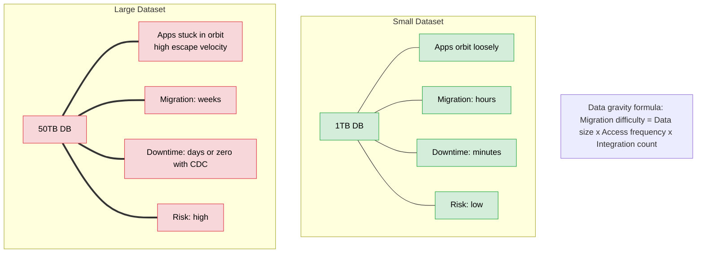
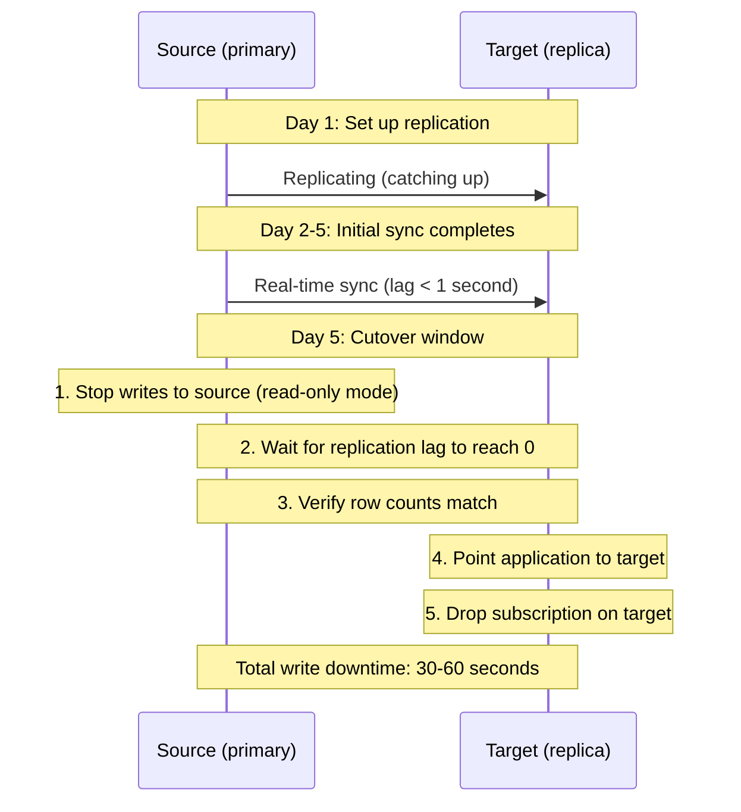
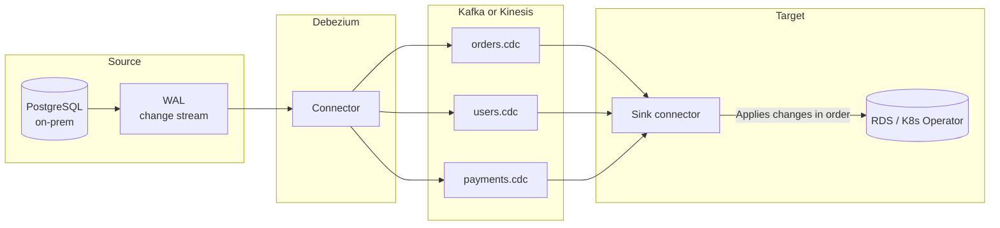
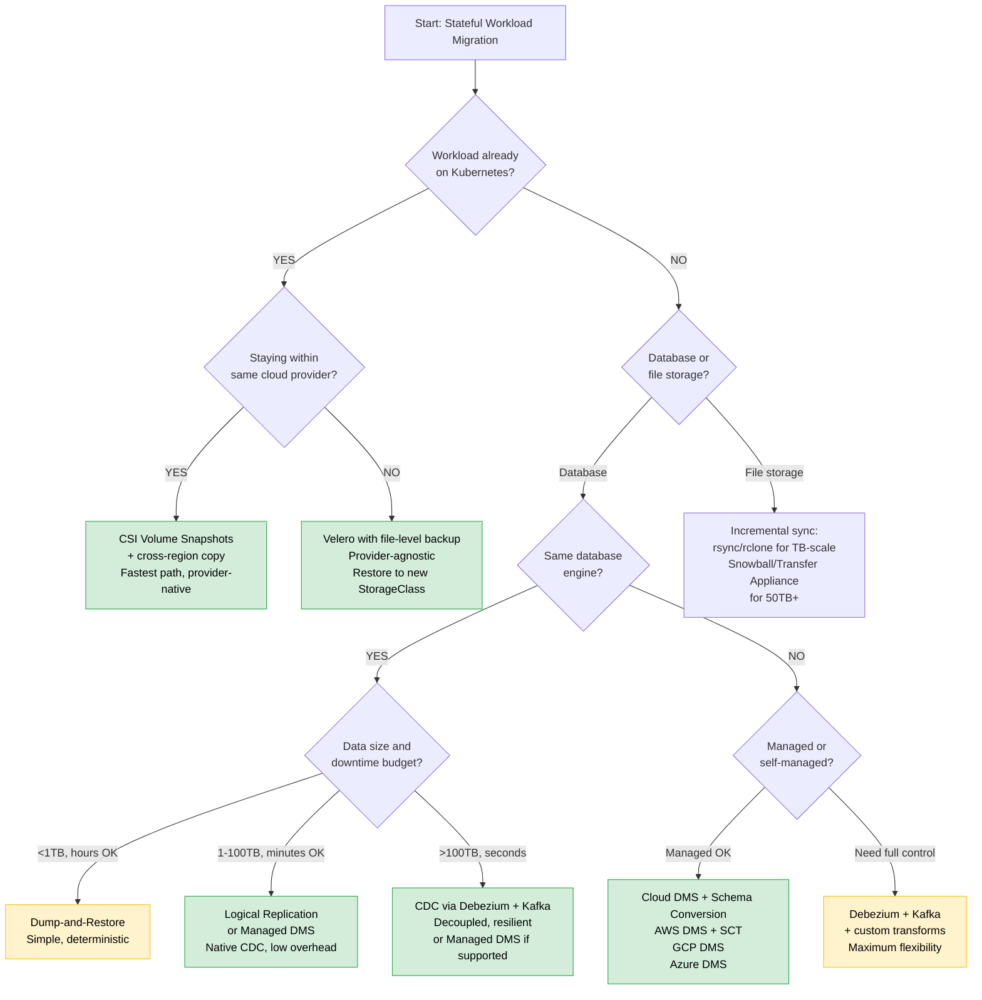

> **Complexity**: `[COMPLEX]`
>
> **Time to Complete**: 2.5 hours
>
> **Prerequisites**: [Module 8.5: Disaster Recovery](../module-8.5-disaster-recovery/), experience with PersistentVolumes and at least one database
>
> **Track**: Advanced Cloud Operations

## What You'll Be Able to Do

After completing this module, you will be able to:

- **Design** live migration strategies for stateful workloads between cloud regions to eliminate data gravity constraints.
- **Implement** data replication pipelines using Change Data Capture (CDC) and logical replication for zero-downtime database migrations.
- **Evaluate** migration approaches (lift-and-shift, re-platform, re-architect) based on workload state, access patterns, and data volume.
- **Diagnose** post-migration consistency issues, such as desynchronized sequences or row count mismatches, using robust verification scripts.

## Why This Module Matters

Stateful migration exposes a design fault line: if control planes diverge during topology shifts, consistency and write guarantees can become unreliable in minutes. This concept is further explored in [Advanced Merging](../../prerequisites/git-deep-dive/module-2-advanced-merging/).
<!-- incident-xref: github-2018-split-brain -->

Hypothetical scenario: An engineering team has successfully migrated their stateless microservices from on-premises virtual machines to Kubernetes. The remaining legacy footprint is a 12TB PostgreSQL database, a 3TB Elasticsearch cluster, a Redis cluster with 200GB of hot data, and a media processing service with 50TB of files on local network storage. Every migration attempt is estimated at two weeks of downtime, which the business flatly rejects. The database is simply too large for a standard dump-and-restore within the allowed maintenance window.

After months of delay, the engineers realize they were fighting "data gravity." Their 12TB database had grown to 16TB. Every day they waited, the mass of the data increased, pulling more dependencies into its orbit and making the eventual migration even more difficult. They eventually succeeded by combining Change Data Capture for the database, incremental synchronization for the media files, and the Strangler Fig pattern to route traffic incrementally. This module teaches you how to execute these exact patterns, allowing you to move massive stateful workloads without downtime while maintaining absolute data integrity.

## Understanding Data Gravity and Escape Velocity

Data gravity is a concept originally coined by Dave McCrory. The core insight relies on a physics analogy: data has mass. As data accumulates in one centralized location, it becomes progressively harder and more expensive to move. Applications, auxiliary services, reporting pipelines, and users are pulled toward the data, much like objects drawn toward a gravitational body. Attempting to move the data requires breaking these gravitational bonds, which demands significant engineering "escape velocity."

When a database is small, the applications connecting to it orbit loosely. You can take the database offline, move the files, update the connection strings, and bring the systems back online within a brief maintenance window. However, when a dataset grows into the tens or hundreds of terabytes, taking it offline is no longer feasible. The sheer physics of network transfer speeds means copying the data will take days or weeks. During that transfer window, the original database continues to receive new writes, creating a moving target that is extremely difficult to catch without specialized replication tooling.



To combat data gravity, engineers must decouple the applications from the data source before attempting the physical move. This often involves establishing replication bridges that synchronize state across geographic boundaries. By keeping the legacy system and the new target system in perfect sync, teams can eliminate the urgency of the transfer, allowing the bulk data copy to occur over weeks in the background while the business continues to operate normally.

| Data Size | Migration Method | Expected Duration | Downtime |
|---|---|---|---|
| < 1 TB | pg_dump / mysqldump | 1-4 hours | 1-4 hours |
| 1-10 TB | Logical replication + cutover | 1-3 days | Minutes |
| 10-100 TB | CDC (Debezium/DMS) + catchup | 1-4 weeks | Minutes |
| 100+ TB | Physical replication + CDC | 1-3 months | Minutes |
| Files (any size) | Incremental sync (rsync/rclone) | Days-weeks | Minutes |

**Pause and predict:** You need to migrate a 5TB database that is actively accessed by 30 independent microservices. What is the primary factor driving the workload's data gravity: the 5TB volume footprint, or the 30 application integrations? How does this dictate your cutover strategy?

<details>
<summary>Check your prediction</summary>

Application **integrations** usually dominate over raw data volume. While transferring 5TB of data across modern high-speed cloud networks takes only hours over dedicated links, managing 30 microservices that read and write against that database creates immense organizational and operational inertia. Coordinating deployment schedules, verifying backward compatibility for schemas, altering database connection strings across teams, and preventing transaction anomalies during cutover require significantly more engineering effort than transferring the disk blocks themselves. Consequently, attempting an offline dump-and-restore across 30 integrated services carries severe coordination risks; platform teams must instead prioritize change data capture, dual-write patterns, or progressive service decoupling.
</details>

Recognizing how distributed consumer dependencies govern architectural velocity enables platform teams to structure realistic cutover boundaries before executing data movements. Aligning data migration runbooks with application team schedules establishes the foundational boundaries that dictate business service level objectives.

### RPO, RTO, and the Cutover Window

Every stateful migration is governed by two constraints that originate from the business, not the technology: Recovery Point Objective (RPO) and Recovery Time Objective (RTO). In a migration context, RPO measures how much data you can afford to lose — the maximum acceptable gap between the last write on the source and the first confirmed write on the target. RTO measures how long the application can be unavailable during the cutover. These two numbers dictate which migration strategy is viable.

If the business says "RPO = 0 (no data loss) and RTO = 5 minutes," you cannot use a dump-and-restore approach, which requires locking the database for the entire extraction and restoration period. Instead, you need a replication-based strategy — logical replication, CDC, or managed DMS — that keeps the target synchronized within sub-second lag, reducing the cutover to a DNS switch. The replication lag at the moment of cutover is effectively your RPO: if the target is 2 seconds behind the source when you switch, you may lose up to 2 seconds of writes unless you implement a write-freeze window.

If the business says "RPO = 1 hour and RTO = 4 hours," a dump-and-restore becomes viable because you can accept up to 1 hour of data loss and have 4 hours to complete extraction, transfer, and restoration. This dramatically simplifies the migration engineering — no replication pipeline to build or monitor, no Kafka cluster to manage, no CDC connector health checks.

The distinction between stateless and stateful workloads sharpens here. A stateless Deployment can reschedule freely: terminate pods in one cluster, recreate them verbatim in another, and the application is immediately healthy because it carries no persistent data. A StatefulSet with a 10TB PersistentVolume reschedules with gravity — the data must physically move or be replicated before the pod can serve traffic in the new cluster. This is the fundamental asymmetry that makes stateful migration the hard case in any cloud migration program. The RPO/RTO conversation is the mechanism that translates business constraints into engineering decisions: tighter RPO means more sophisticated replication; tighter RTO means more automation in the cutover runbook and a more thoroughly tested rollback path.

## The Strangler Fig Pattern in Practice

Named after the strangler fig tree that germinates in the canopy of a host tree and grows downwards until it eventually replaces the host entirely, this architectural pattern allows you to migrate monolithic services incrementally. Rather than attempting a high-risk big-bang cutover, you place a proxy router in front of the legacy system and selectively redirect specific API paths to newly modernized microservices running in Kubernetes.

This approach drastically reduces risk. If a newly migrated service fails or exhibits poor performance under production load, you can instantly revert the routing rule at the Ingress tier, sending traffic back to the legacy system. The stateful data underlying the new service must be synchronized with the legacy data, ensuring that regardless of which system processes the request, the user experiences consistent behavior.

```mermaid
graph TD
    subgraph Phase 1: Proxy all traffic through a router
        U1[Users] --> R1[Router / Ingress]
        R1 --> L1[Legacy System / VM]
    end

    subgraph Phase 2: New system handles some routes
        U2[Users] --> R2[Router / Ingress]
        R2 -->|/api/users, /api/payments| L2[Legacy System]
        R2 -->|/api/search, /api/catalog| N2[New K8s Services]
    end

    subgraph Phase 3: Most routes migrated
        U3[Users] --> R3[Router / Ingress]
        R3 -->|/api/payments| L3[Legacy System]
        R3 -->|/api/search, /api/catalog, /api/users, /api/orders| N3[New K8s Services]
    end

    subgraph Phase 4: Legacy system decommissioned
        U4[Users] --> R4[Router / Ingress]
        R4 -->|all routes| N4[New K8s Services]
    end
```



Implementing this pattern in Kubernetes typically involves configuring an Ingress controller to act as the primary traffic gateway. You define explicit prefix paths for the endpoints you have migrated, directing them to native Kubernetes Service objects. For all unmatched traffic, you define a catch-all route that points to an `ExternalName` Service. This special type of Kubernetes Service acts as a DNS alias, seamlessly passing the traffic out of the cluster to the legacy virtual machine environment.

```yaml
# Phase 2: Route some paths to new service, rest to legacy
apiVersion: networking.k8s.io/v1
kind: Ingress
metadata:
  name: strangler-fig-router
  namespace: migration
  annotations:
    nginx.ingress.kubernetes.io/service-upstream: "true"
    nginx.ingress.kubernetes.io/upstream-vhost: "legacy.internal.company.com"
spec:
  rules:
    - host: api.example.com
      http:
        paths:
          # New services (migrated to K8s)
          - path: /api/search
            pathType: Prefix
            backend:
              service:
                name: search-service
                port:
                  number: 8080
          - path: /api/catalog
            pathType: Prefix
            backend:
              service:
                name: catalog-service
                port:
                  number: 8080
          # Everything else goes to the legacy system
          - path: /
            pathType: Prefix
            backend:
              service:
                name: legacy-proxy
                port:
                  number: 80
```

To resolve the backend reference for the catch-all legacy route, you define the `ExternalName` service:

```yaml
# ExternalName service pointing to legacy system
apiVersion: v1
kind: Service
metadata:
  name: legacy-proxy
  namespace: migration
spec:
  type: ExternalName
  externalName: legacy.internal.company.com
```

> **Controller support check**
>
> Verify this pattern against your exact Ingress controller before putting it in a migration runbook. `ExternalName` Services do not create normal `Endpoints`, so controllers that require endpoint objects may reject the backend, and ingress-nginx deployments commonly need explicit upstream and DNS resolver configuration in addition to the host-header annotation. If your controller cannot proxy `ExternalName` backends cleanly, use a small NGINX or Envoy proxy Service inside the cluster, a cloud-specific `BackendConfig`, or service-mesh egress for the legacy route.

Beyond simple path-based routing, advanced ingress controllers and service meshes like Istio allow for percentage-based traffic splitting. This is essential for canary deployments during the migration phase. By sending only a small fraction of real user traffic to the new database-backed microservice, you can validate your data replication strategies under realistic workloads without jeopardizing the entire user base.

```yaml
# Use traffic splitting to gradually shift traffic
# (Istio VirtualService example)
apiVersion: networking.istio.io/v1
kind: VirtualService
metadata:
  name: user-service-migration
  namespace: migration
spec:
  hosts:
    - api.example.com
  http:
    - match:
        - uri:
            prefix: /api/users
      route:
        - destination:
            host: legacy-user-service
            port:
              number: 80
          weight: 80    # 80% to legacy
        - destination:
            host: new-user-service
            port:
              number: 8080
          weight: 20    # 20% to new K8s service
```

**Pause and predict:** When executing a progressive Strangler Fig migration using a Kubernetes Ingress controller, what happens to client requests destined for legacy API paths that have not yet been explicitly declared in your routing rules? How do you ensure users do not receive HTTP 404 errors?

<details>
<summary>Check your prediction</summary>

Unmatched Ingress paths route directly to the **defaultBackend**. Standard Kubernetes Ingress controllers evaluate incoming HTTP requests against explicit host and path rules; if a client requests an unmapped path, the Ingress controller directs that request to its configured `defaultBackend`. By establishing the legacy monolith or the existing upstream router as this `defaultBackend`, all unmigrated API endpoints and legacy assets continue serving production traffic seamlessly. This ensures that users never encounter broken links or 404 errors as engineering teams progressively extract individual microservices into Kubernetes.
</details>

Configuring edge fallbacks provides operational safety nets that protect user journeys while modernization initiatives unfold across incremental release cycles. Once traffic routing controls guarantee system continuity, teams can evaluate whether legacy components warrant simple containerization or comprehensive cloud-native restructuring.

## Strategic Approaches: Lift, Platform, or Architect

Migration is not a one-size-fits-all endeavor. The strategy chosen for a stateful workload depends heavily on the application's lifecycle phase, the business value it generates, and the technical debt it carries. Teams must critically evaluate whether moving a system as-is will merely transfer legacy problems into a modern environment, or if rebuilding the system will consume resources without delivering corresponding business advantages.

The three primary strategies are Lift-and-Shift, Re-Platform, and Re-Architect. Each carries distinct cost, risk, and timeline profiles. A comprehensive migration program typically utilizes a mix of all three strategies across different components of the software portfolio.

```mermaid
graph TD
    Start[Start here] --> Active{Is the application<br/>actively developed?}
    
    Active -- NO --> Lift[LIFT-AND-SHIFT<br/>Containerize as-is<br/>Move VM contents into a container<br/>Cost: Low | Risk: Low | Benefit: Low]
    
    Active -- YES --> Arch{Does it need<br/>fundamental<br/>architecture changes?}
    
    Arch -- NO --> Platform[RE-PLATFORM<br/>Adapt for K8s<br/>Use managed services<br/>Cost: Medium | Risk: Medium | Benefit: Medium]
    
    Arch -- YES --> Architect[RE-ARCHITECT<br/>Rebuild for cloud-native<br/>Break into microservices<br/>Cost: High | Risk: High | Benefit: High]
```

Lift-and-shift involves wrapping the existing binary in a container and mounting a PersistentVolume that contains an exact copy of the legacy disk. This is fast and requires minimal code changes, making it ideal for frozen applications. Re-platforming introduces minor optimizations, such as migrating a self-managed database to a managed cloud service like RDS while keeping the core application logic intact. Re-architecting is the most intensive path, demanding a complete rewrite to utilize cloud-native primitives, break apart monoliths, and decouple shared data stores.

| Strategy | When to Use | Database Approach | Timeline |
|---|---|---|---|
| Lift-and-shift | Legacy app, no active development, just need it running | Same DB, just in cloud (EC2/GCE + disk) | Days-weeks |
| Re-platform | Active app, keep architecture, use managed services | Migrate to RDS/CloudSQL/Azure SQL | Weeks-months |
| Re-architect | Active app, want cloud-native benefits, willing to invest | New schema, potentially new DB engine | Months-quarters |

> **Stop and think**: You inherited a 10-year-old monolithic inventory application. The original developers left the company 5 years ago, and the business only requires it for compliance audits twice a year. Which migration strategy is most appropriate and why?

### Dual-Write and Backfill: The Gradual Cutover

When even minutes of downtime are unacceptable and the application architecture supports routing writes to two databases simultaneously, the dual-write pattern provides a migration path with effectively zero cutover window.

**Phase 1: Backfill**. Run a one-time bulk copy of the existing data from the source to the target using the fastest available method — a parallel `pg_dump` and `pg_restore`, or a storage-level snapshot copy. During this bulk phase, which may take hours or days, the application continues writing exclusively to the source. The target is structurally complete but stale by the time the bulk copy finishes.

**Phase 2: Dual-write with catch-up**. Modify the application's data-access layer to write every new transaction to both the source and target databases simultaneously. Simultaneously, run a backfill process that walks the source database row by row (ordered by primary key or timestamp) and inserts any rows that exist on the source but are missing on the target — these are the rows created during the bulk copy phase. The backfill is idempotent: it uses `INSERT ... ON CONFLICT DO NOTHING` (PostgreSQL) or `INSERT IGNORE` (MySQL) so that rows already written by the dual-write path are silently skipped.

Once the backfill completes and the dual-write path has been running without errors for a burn-in period (24–72 hours), the cutover is a single code change: remove the write path to the source. The application now writes exclusively to the target. Read traffic can be migrated independently using the Strangler Fig pattern — route a percentage of reads to the target, compare results, and increase the percentage until all reads hit the target.

**Cost and complexity**: Dual-write doubles the write load on the application and doubles the write throughput requirement on both database instances. Every write must handle partial failures: if the write to the target fails, should the source write be rolled back, or should the application log the discrepancy and continue? For most migrations, the pragmatic approach is to write to the source first, then to the target, and log any target failures for manual reconciliation. This tolerates transient target issues without impacting production availability.

## Infrastructure-Level Migration: CSI Volume Snapshots

When dealing with stateful workloads already running in Kubernetes that need to be migrated to a different cluster or region, the Container Storage Interface (CSI) provides a powerful mechanism: Volume Snapshots. Rather than copying data through the application layer, CSI allows you to leverage the cloud provider's native block-storage snapshot capabilities. 

This infrastructure-level approach is highly efficient. An AWS EBS snapshot, for example, is instantaneous from the perspective of the application because it captures the block states in the background and streams them to S3. This means you do not need to take the application offline for the duration of the data transfer. You simply trigger the snapshot, wait for the background copy to complete, and then use that snapshot as the data source for a new PersistentVolumeClaim in the destination cluster.

```yaml
# Step 1: Create a VolumeSnapshot of the source PV
apiVersion: snapshot.storage.k8s.io/v1
kind: VolumeSnapshot
metadata:
  name: postgres-data-snapshot
  namespace: databases
spec:
  volumeSnapshotClassName: ebs-csi-snapclass
  source:
    persistentVolumeClaimName: postgres-data
```

The cluster must have an appropriate `VolumeSnapshotClass` configured to instruct the CSI driver on how to handle the operation:

```yaml
# VolumeSnapshotClass (must exist in cluster)
apiVersion: snapshot.storage.k8s.io/v1
kind: VolumeSnapshotClass
metadata:
  name: ebs-csi-snapclass
driver: ebs.csi.aws.com
deletionPolicy: Retain
parameters:
  tagSpecification_1: "Name=migration-snapshot"
```

Once the snapshot object reports as ready, the actual data resides in the cloud provider's storage fabric. You can use standard cloud CLI tools to copy this snapshot across regional boundaries, preparing it for restoration in a disaster recovery or migration scenario.

```bash
# Check snapshot status
kubectl get volumesnapshot postgres-data-snapshot -n databases
# NAME                     READYTOUSE   RESTORESIZE   AGE
# postgres-data-snapshot   true         100Gi         2m

# The underlying cloud snapshot can be shared across accounts/regions
# AWS: Copy EBS snapshot to another region
SNAPSHOT_ID=$(kubectl get volumesnapshot postgres-data-snapshot -n databases \
  -o jsonpath='{.status.boundVolumeSnapshotContentName}')

# Get the actual EBS snapshot ID
EBS_SNAPSHOT=$(kubectl get volumesnapshotcontent $SNAPSHOT_ID \
  -o jsonpath='{.status.snapshotHandle}')

# Copy to DR region and capture the destination-region snapshot ID
DEST_EBS_SNAPSHOT=$(aws ec2 copy-snapshot \
  --source-region us-east-1 \
  --source-snapshot-id $EBS_SNAPSHOT \
  --destination-region eu-west-1 \
  --description "Migration snapshot for postgres-data" \
  --query SnapshotId \
  --output text)

aws ec2 wait snapshot-completed \
  --region eu-west-1 \
  --snapshot-ids "$DEST_EBS_SNAPSHOT"
```

The copy step above creates an EBS snapshot in `eu-west-1`; it does not automatically create a Kubernetes `VolumeSnapshot` object in the destination cluster. Import the copied provider snapshot first by binding a `VolumeSnapshotContent` to a new destination-cluster `VolumeSnapshot`, then reference that imported snapshot from the PVC. The CSI driver handles the allocation of the disk and the hydration of the block data prior to the pod starting.

```yaml
# Step 2: In the destination cluster, import the copied EBS snapshot
apiVersion: snapshot.storage.k8s.io/v1
kind: VolumeSnapshotContent
metadata:
  name: imported-postgres-data-snapshot-content
spec:
  deletionPolicy: Retain
  driver: ebs.csi.aws.com
  source:
    # Destination-region EBS snapshot ID returned by aws ec2 copy-snapshot.
    snapshotHandle: snap-0abc123def4567890
  volumeSnapshotClassName: ebs-csi-snapclass
  volumeSnapshotRef:
    name: postgres-data-snapshot-imported
    namespace: databases
---
apiVersion: snapshot.storage.k8s.io/v1
kind: VolumeSnapshot
metadata:
  name: postgres-data-snapshot-imported
  namespace: databases
spec:
  volumeSnapshotClassName: ebs-csi-snapclass
  source:
    volumeSnapshotContentName: imported-postgres-data-snapshot-content
---
# Step 3: Create a PVC from the imported destination snapshot
apiVersion: v1
kind: PersistentVolumeClaim
metadata:
  name: postgres-data-restored
  namespace: databases
spec:
  storageClassName: gp3
  dataSource:
    name: postgres-data-snapshot-imported
    kind: VolumeSnapshot
    apiGroup: snapshot.storage.k8s.io
  accessModes:
    - ReadWriteOnce
  resources:
    requests:
      storage: 100Gi
```

**Pause and predict:** You generate a CSI volume snapshot in AWS us-east-1 and complete a cross-region copy to eu-west-1. If the underlying PersistentVolume contains 500Gi of data, can the destination PVC provision and launch the database pod immediately, or must you wait for all 500Gi to fully copy into the new EBS volume before pod startup?

<details>
<summary>Check your prediction</summary>

After the snapshot **copy** to `eu-west-1` reaches the completed state, the destination PVC provisions and the pod starts **immediately**. You do **not** need to wait for all 500Gi of block storage data to copy into the new volume before beginning application operations. Amazon EBS volumes created from snapshots pull data blocks lazily from Amazon S3 in the background as requests arrive. However, read operations targeting blocks that have not yet been hydrated from S3 suffer elevated latency due to first-touch I/O penalties; enabling Amazon EBS Fast Snapshot Restore (FSR) on the snapshot or pre-warming the volume ensures baseline I/O performance immediately upon pod start.
</details>

Operating with lazy storage provisioning allows cluster administrators to achieve aggressive recovery time objectives during disaster recovery rehearsals and regional migrations. Evaluating initial read latencies and storage initialization behaviors across cloud hyperscalers reveals distinct operational trade-offs for enterprise stateful workloads.

### GCP and Azure CSI Snapshots

The CSI volume snapshot workflow demonstrated above uses AWS EBS, but the same pattern works across cloud providers with their respective CSI drivers.

On Google Cloud, Persistent Disk snapshots are handled by the `pd.csi.storage.gke.io` driver. Creating a `VolumeSnapshot` triggers a PD snapshot — an instantaneous, differential resource. To materialize that snapshot in a target region, create a new disk from the global snapshot, for example `gcloud compute disks create postgres-data-restored --region=europe-west1 --replica-zones=europe-west1-b,europe-west1-c --source-snapshot=projects/PROJECT_ID/global/snapshots/postgres-data-snapshot --type=pd-ssd`. In the destination cluster, the restored PVC references the snapshot or disk through the CSI driver's supported pre-provisioning path. GCP PD snapshots are differential, meaning subsequent snapshots of the same disk capture only changed blocks, which reduces both creation time and storage cost.

On Azure, Managed Disk snapshots are created through the `disk.csi.azure.com` driver. A `VolumeSnapshot` triggers a point-in-time snapshot of the underlying Azure Disk. Cross-region copy requires an incremental source snapshot and an explicit copy operation: `az snapshot create --resource-group target-rg --name migration-snap-westeurope --source /subscriptions/.../resourceGroups/source-rg/providers/Microsoft.Compute/snapshots/source-incremental-snap --location westeurope --incremental --copy-start`. The destination PVC references the snapshot through its ARM resource ID.

While the Kubernetes abstraction is identical across providers, cross-region behavior and cost differ materially. AWS EBS snapshots are incremental and billed for the changed blocks retained by each snapshot copy, not the full provisioned volume size; the cross-region copy can still incur transfer charges. GCP PD snapshots store only diff blocks and are billed per-GB-month of actual storage consumed in each region. Azure incremental snapshots are billed per-GB-month plus outbound data transfer at standard inter-region rates.

### Velero for Cross-Cluster and Cross-Provider PV Migration

CSI volume snapshots work well for same-provider migrations, but real-world advanced operations often demand movement between clusters, regions, or cloud providers. Velero is the de facto open-source Kubernetes tool for backing up and restoring cluster resources — including PersistentVolume data — across boundaries. It is a CNCF project actively maintained to support Kubernetes versions through 1.35 and beyond.

Velero handles volume data in two modes:

**File-level backup (Restic/Kopia node-agent integration)**: Velero deploys a DaemonSet that backs up filesystem contents of selected volumes to an object store (S3, GCS, Azure Blob). This mode is provider-agnostic — the same backup can be restored to a different cloud provider because data is stored as files, not block snapshots. The file-level approach is slower than block snapshots and may not produce crash-consistent backups for databases with active writes without first quiescing the workload. For database workloads, pair file-level Velero backups with a database-native dump (`pg_dump`, `mysqldump`) and use Velero for the Kubernetes resource definitions (StatefulSets, Services, ConfigMaps).

**Block-level backup (CSI snapshot integration)**: When the CSI driver supports snapshots, Velero delegates snapshot creation to the provider's storage API. This is faster and crash-consistent but provider-specific — an EBS snapshot cannot be restored as a GCP Persistent Disk. This mode is the best choice for same-provider DR and migration where performance matters most.

A cross-provider migration workflow with Velero:

```bash
# On the source cluster (e.g., EKS): install Velero with node-agent
velero install \
  --provider aws \
  --bucket velero-migrations \
  --secret-file ./credentials-velero \
  --use-node-agent \
  --default-volumes-to-fs-backup \
  --backup-location-config region=us-east-1

# Back up the namespace including all PV data as files
velero backup create migrate-payments \
  --include-namespaces payments \
  --default-volumes-to-fs-backup \
  --snapshot-volumes=false

# Verify backup completion
velero backup describe migrate-payments --details

# On the destination cluster (e.g., GKE): install Velero pointing to the same bucket,
# then map source StorageClasses before restore.
kubectl apply -f - <<'YAML'
apiVersion: v1
kind: ConfigMap
metadata:
  name: change-storage-class-config
  namespace: velero
  labels:
    velero.io/plugin-config: ""
    velero.io/change-storage-class: RestoreItemAction
data:
  gp3: premium-rwo
YAML

velero restore create migrate-payments-restore --from-backup migrate-payments
```

Velero does not infer cross-cloud `StorageClass` names automatically. Configure `change-storage-class-config` before the restore, or use `--storage-class-mappings` where your Velero version and plugins support it, so an EBS-backed source PVC such as `gp3` becomes a GKE PVC such as `premium-rwo` intentionally rather than depending on a default.

### Storage Class Differences Across Providers

When migrating stateful workloads between clouds, storage class mapping is a common trip hazard. Each provider uses different StorageClass names, provisioner drivers, and performance characteristics:

| Provider | StorageClass | Provisioner | fsType | Expand | Notes |
|---|---|---|---|---|---|
| AWS EKS | `gp3` | `ebs.csi.aws.com` | ext4 | Yes | 3000 IOPS / 125 MiB/s baseline; gp2 is legacy |
| AWS EKS | `io2` | `ebs.csi.aws.com` | ext4 | Yes | Provisioned IOPS; io2 Block Express for >64K IOPS |
| GCP GKE | `premium-rwo` | `pd.csi.storage.gke.io` | ext4 | Yes | SSD; regional PDs available for zonal HA |
| GCP GKE | `standard-rwo` | `pd.csi.storage.gke.io` | ext4 | Yes | HDD; lowest cost, lowest throughput |
| Azure AKS | `managed-csi-premium` | `disk.csi.azure.com` | ext4 | Yes | Premium SSD; low latency, high throughput |
| Azure AKS | `managed-csi` | `disk.csi.azure.com` | ext4 | Yes | Standard SSD; cost-optimized, burstable |

Key migration risks:

- **Reclaim policy mismatch**: If the source uses `Retain` and the destination uses `Delete`, an accidental PVC removal in the destination destroys the underlying disk. Standardize both clusters on `Retain` during the migration window so data survives operator error.

- **Access mode**: Most block storage (EBS, Persistent Disk, Azure Disk) supports only `ReadWriteOnce`. If your workload expects `ReadWriteMany`, you need a file-based storage class in the destination: EFS on AWS, Filestore on GCP, or Azure Files.

- **StatefulSet identity**: StatefulSets assign stable pod names like `pod-0` and stable PVC names like `data-pod-0`. When restoring via Velero, the pod-to-PVC binding is preserved only if the StatefulSet name and namespace match the source exactly. Renaming either requires manual PVC relabeling or recreating the StatefulSet with matching PVC conventions.

## Database Replication Patterns

While infrastructure snapshots are excellent for block storage, migrating active, high-transaction databases requires application-aware methodologies. You must ensure transactional consistency, meaning no half-written records are transferred, and no writes are dropped during the cutover window.

### Pattern 1: Dump and Restore (Small Databases)

For databases under a few terabytes where the business can tolerate a maintenance window, a traditional logical dump and restore is the most deterministic approach. It guarantees clean data schemas and avoids the complexities of active replication pipelines. The primary limitation is that the database must be entirely locked against new writes during the extraction, transfer, and restoration phases.

```bash
# PostgreSQL: Dump from source, restore to target
# Use pg_dump with parallel jobs for speed
pg_dump \
  --host=source-db.internal \
  --port=5432 \
  --username=migration_user \
  --format=directory \
  --jobs=4 \
  --file=/tmp/pg_backup \
  mydb

# Restore to the new database (managed service or K8s operator)
pg_restore \
  --host=target-db.rds.amazonaws.com \
  --port=5432 \
  --username=admin \
  --dbname=mydb \
  --jobs=4 \
  --no-owner \
  /tmp/pg_backup

# Downtime = dump time + restore time + DNS switch
# For 5GB database: ~15-30 minutes total
```

### Physical Replication (Supplemental)

While logical replication and CDC are the primary tools for cloud migrations, physical replication deserves mention for specific use cases. Physical replication operates at the disk-block level, shipping Write-Ahead Log (WAL) segments from source to target. Unlike logical replication — which parses WAL into SQL statements and replays them — physical replication copies the raw block changes, making it significantly faster and lower-overhead on the source database.

Physical replication is the default mechanism for PostgreSQL streaming replicas, MySQL group replication, and managed database read replicas (RDS read replicas, Cloud SQL read replicas). Its primary limitation for migration: it requires bit-for-bit identical database binaries and operating system architectures. You cannot use physical replication between PostgreSQL 14 and 16, between different operating systems, or between on-premises and a managed cloud service where the cloud provider abstracts the filesystem layer.

When physical replication is viable — typically same-version, same-platform migrations where the target is self-managed — it offers the lowest replication lag and simplest setup of any method. For most cloud migrations to managed services, however, logical replication or CDC is required because the cloud provider controls the filesystem and only exposes the logical SQL interface.

### Pattern 2: Logical Replication (Medium Databases)

Modern relational databases support logical replication, a mechanism where the database parses its own Write-Ahead Log (WAL) and streams discrete INSERT, UPDATE, and DELETE commands to a subscribed replica. Unlike physical replication, which requires bit-for-bit identical disk layouts, logical replication allows the target database to run on a different operating system, a different major version, or a managed cloud platform.

```bash
# PostgreSQL logical replication: continuous sync with near-zero downtime

# On the SOURCE database: enable logical replication
# (postgresql.conf)
# wal_level = logical
# max_replication_slots = 4

# Create a publication (what to replicate)
psql -h source-db.internal -U admin -d mydb <<'SQL'
CREATE PUBLICATION migration_pub FOR ALL TABLES;
SQL

# On the TARGET database: create subscription
psql -h target-db.rds.amazonaws.com -U admin -d mydb <<'SQL'
-- Schema must already exist on the target
-- Create the subscription to start replicating
CREATE SUBSCRIPTION migration_sub
  CONNECTION 'host=source-db.internal port=5432 dbname=mydb user=replication_user password=xxx'
  PUBLICATION migration_pub;
SQL

# On the SOURCE database: monitor publisher-side logical replication lag
psql -h source-db.internal -U admin -d mydb <<'SQL'
SELECT
  slot_name,
  pg_wal_lsn_diff(pg_current_wal_lsn(), confirmed_flush_lsn) AS lag_bytes
FROM pg_replication_slots
WHERE slot_name = 'migration_sub';
SQL
```

During this process, the target database performs an initial bulk synchronization of all existing rows, followed by a continuous streaming phase where it catches up to the live transaction log. The cutover is executed only when the lag between the source and target drops to nearly zero.



### Pattern 3: Change Data Capture (Large Databases)

For massive datasets or heterogeneous migrations (e.g., Oracle to PostgreSQL), direct database-to-database connections are often insufficient. Change Data Capture (CDC) architectures introduce an intermediate event streaming platform like Apache Kafka. A connector tool, such as Debezium, tails the source database's transaction log and publishes every mutation as a distinct event payload onto a Kafka topic. A sink connector then reads these topics and applies the mutations to the target database.

This architecture decouples the extraction phase from the loading phase, providing immense resilience against network partitions. If the target database goes offline during the migration, the source database is unaffected; the events simply buffer in the Kafka topic until the target returns and resumes consumption.



```yaml
# Debezium connector for PostgreSQL (running in K8s via Strimzi)
apiVersion: kafka.strimzi.io/v1beta2
kind: KafkaConnector
metadata:
  name: postgres-source-connector
  namespace: kafka
  labels:
    strimzi.io/cluster: kafka-connect
spec:
  class: io.debezium.connector.postgresql.PostgresConnector
  tasksMax: 1
  config:
    database.hostname: "source-db.internal"
    database.port: "5432"
    database.user: "debezium"
    database.password: "${file:/opt/kafka/external-configuration/db-credentials/password}"
    database.dbname: "mydb"
    database.server.name: "source"
    plugin.name: "pgoutput"
    publication.name: "debezium_pub"
    slot.name: "debezium_slot"
    snapshot.mode: "initial"
    transforms: "route"
    transforms.route.type: "org.apache.kafka.connect.transforms.RegexRouter"
    transforms.route.regex: "source\\.public\\.(.*)"
    transforms.route.replacement: "$1.cdc"
```

### Pattern 4: Kubernetes Operator Migration

When moving stateful workloads exclusively within the Kubernetes ecosystem, purpose-built controllers simplify the ingestion of external data. Operators like CloudNativePG are designed to handle bootstrapping by directly reading cloud-stored backups generated by tools like Barman or WAL-G. You can define a declarative specification that instructs the new cluster to construct itself using the history of a legacy external database.

```yaml
# CloudNativePG: Create a cluster from an external database backup
apiVersion: postgresql.cnpg.io/v1
kind: Cluster
metadata:
  name: payments-db
  namespace: databases
spec:
  instances: 3
  storage:
    size: 100Gi
    storageClass: gp3

  # Bootstrap from an external backup (S3)
  bootstrap:
    recovery:
      source: external-backup
      recoveryTarget:
        targetTime: "2026-03-24T10:00:00Z"

  externalClusters:
    - name: external-backup
      barmanObjectStore:
        destinationPath: "s3://pg-backups/source-db/"
        s3Credentials:
          accessKeyId:
            name: s3-creds
            key: ACCESS_KEY_ID
          secretAccessKey:
            name: s3-creds
            key: SECRET_ACCESS_KEY
        wal:
          compression: gzip
```

Alternatively, you can utilize built-in binary streaming mechanisms directly from the cluster, spinning up ephemeral migration pods that execute base backups securely over the internal network.

```bash
# Alternative: Use pg_basebackup to seed the operator
# Run from within the K8s cluster
kubectl run pg-migration --rm -it --restart=Never \
  --image=postgres:16 -- bash -c '
    pg_basebackup \
      --host=source-db.internal \
      --port=5432 \
      --username=replication_user \
      --pgdata=/var/lib/postgresql/data \
      --wal-method=stream \
      --progress \
      --verbose
  '
```

### Pattern 5: Managed Cloud Database Migration Services

When your migration target is a managed cloud database service, each major provider offers a purpose-built migration tool that handles the end-to-end pipeline (full load + ongoing CDC replication) without requiring you to deploy and operate a Kafka cluster or Debezium connectors.

**AWS Database Migration Service (DMS)** supports homogeneous migrations (PostgreSQL to RDS PostgreSQL, MySQL to Aurora MySQL) and heterogeneous migrations (Oracle to Aurora PostgreSQL, SQL Server to RDS MySQL) through its companion Schema Conversion Tool (SCT). For homogeneous migrations, DMS handles schema and data copy automatically — you configure source and target endpoints, select the tables, and DMS runs the full load followed by ongoing CDC. DMS runs on a replication instance priced per hour based on instance class; you also pay for instance storage and cross-AZ/cross-region data transfer. The replication instance size should match the source database's change rate — under-provisioning causes replication lag to grow unbounded. DMS supports ongoing replication, keeping the target in sync for days or weeks until you are ready to cut over.

**GCP Database Migration Service** provides serverless migrations for MySQL, PostgreSQL, Oracle (to Cloud SQL for PostgreSQL), and SQL Server. Unlike AWS DMS, there are no replication instances to manage — GCP DMS handles the initial snapshot, ongoing CDC, and cutover workflow through the GCP Console or `gcloud` CLI. For PostgreSQL homogeneous native paths, it uses logical replication under the hood, creating publications and subscriptions transparently, with no separate replication-instance hourly charge. Heterogeneous migrations are metered per GiB processed, and destination Cloud SQL resources plus any network egress still apply during the migration window. It supports source databases on-premises, on AWS RDS/Aurora, and on other Cloud SQL instances.

**Azure Database Migration Service** supports migrations to Azure Database for PostgreSQL (Flexible Server), Azure SQL Database, and Azure Database for MySQL. It offers two operational modes: offline (with planned downtime) and online (with CDC-based continuous sync for zero-downtime cutovers). The online mode keeps the target in sync until you initiate the cutover from the Azure Portal or CLI. Azure DMS pricing is based on the compute tier (Standard or Premium) and the duration of the migration. For PostgreSQL-to-PostgreSQL migrations, native logical replication is also available directly between Azure Database for PostgreSQL Flexible Server instances.

**When to use managed DMS vs. self-managed CDC**: Managed DMS reduces operational overhead — no Kafka cluster to run, no Debezium connectors to monitor, and built-in validation tooling. For standard migration paths (PostgreSQL → RDS PostgreSQL, MySQL → Cloud SQL MySQL), managed DMS is often the fastest path to a production cutover. The trade-off surfaces for complex migrations: managed DMS has limits on table count per task, maximum LOB column size, and transformation flexibility. For migrations involving custom data type mappings, complex filtering, or routing a single source to multiple heterogeneous targets, a self-managed CDC pipeline (Debezium + Kafka) provides the control that managed DMS abstracts away.

### Schema and Version Compatibility

Logical replication and CDC tools can replicate data between different database versions, but they cannot reconcile fundamentally incompatible data types or schema mismatches. Before starting any replication pipeline:

- **Version gap**: PostgreSQL logical replication supports replicating from an older publisher to a newer subscriber (e.g., PG 14 → PG 16), but not the reverse. The subscriber must be at an equal or higher major version than the publisher.

- **Data type mapping**: For heterogeneous migrations (Oracle → PostgreSQL, SQL Server → MySQL), the Schema Conversion Tool (AWS SCT) or an equivalent transformation layer must map every source type to a compatible target type. `NUMBER(38)` in Oracle maps to `NUMERIC(38)` in PostgreSQL; `DATETIME2` in SQL Server maps to `TIMESTAMP` in MySQL. An unmapped or incorrectly mapped type causes the CDC pipeline to fail silently or reject rows.

- **Extension and plugin parity**: Source extensions (PostGIS, pg_partman, pg_cron) must exist on the target with compatible versions. Managed cloud databases often restrict which extensions are available — verify the target's supported extension list before the migration.

- **Collation and encoding**: The source and target must use compatible collations and character encodings. A mismatch in `LC_COLLATE` or `LC_CTYPE` causes index corruption and incorrect sort order. Always set `ENCODING 'UTF8'` and matching `LC_COLLATE` on the target before starting replication.

**Pause and predict:** You must migrate an active 50TB PostgreSQL database to a new cloud cluster under a strict operational SLA permitting at most a 5-second write freeze during final cutover. Would you rely on native PostgreSQL logical replication or deploy a Change Data Capture (CDC) streaming pipeline with Debezium and a message buffer?

<details>
<summary>Check your prediction</summary>

For a 50TB workload with a 5-second write freeze, prefer **CDC with a durable buffer** over tightly coupled native logical replication across wide-area networks. Native PostgreSQL logical replication couples the source publisher directly to the destination subscriber; cross-region network flakiness, packet loss, or heavy subscriber indexing stalls the replication slot, causing write-ahead log (WAL) accumulation that threatens to exhaust source database disk capacity. In contrast, a CDC pipeline using Debezium streaming into a durable message queue like Apache Kafka decouples the source from the destination. The distributed streaming log safely buffers change events during network blips, prevents source storage exhaustion, and permits rapid final drain within the 5-second cutover constraint.
</details>

Decoupling transaction log extraction from consumer ingestion prevents production performance degradation and protects upstream storage capacity from subscriber bottlenecks. Adopting asynchronous stream-oriented migration architectures establishes predictable delivery baselines when coordinating high-volume database cutovers.

## Patterns & Anti-Patterns

Stateful workload migration rewards disciplined patterns and punishes shortcuts harshly. The difference between a smooth cutover and a multi-day outage often comes down to whether the team followed proven migration patterns or fell into well-known anti-pattern traps.

### Proven Patterns

**Pattern 1: CDC-buffered migration with a message queue**. Establish a CDC pipeline (Debezium + Kafka, or a managed equivalent) that tails the source database's transaction log and publishes change events to a durable message queue. Run the full-load copy independently, then let the CDC stream catch up. The message queue acts as a buffer: if the target database goes offline, no writes are lost — the events accumulate in Kafka. When the target recovers, it consumes the backlog and catches up. This pattern decouples the source from the target, eliminating the tight coupling that makes logical replication fragile over WAN links. Scaling note: Kafka topic partitioning must align with source table primary keys to preserve ordering within each entity.

**Pattern 2: Strangler Fig with dual-write and read verification**. Route a percentage of production read traffic to the new system while the legacy system still handles all writes. Configure the application layer to dual-write to both databases (legacy and new) for the duration of the migration, then compare query results between the two systems for a subset of requests. This pattern catches discrepancies — schema mismatches, encoding issues, missing rows — before they affect users, because the legacy system remains authoritative. Once the new system's read results match the legacy system's for a sustained period (typically 24–72 hours), switch writes to the new system, then decommission the dual-write path. Scaling note: dual-write doubles write load and requires a transaction-outbox or CDC-based approach to handle cases where one write succeeds and the other fails.

**Pattern 3: Velero-based PV migration for Kubernetes-native workloads**. For stateful workloads already on Kubernetes, use Velero with file-level backup (Restic/Kopia) to back up PV data to a provider-neutral object store. The backup captures both Kubernetes resources (StatefulSets, Services, ConfigMaps) and volume contents. Restore to the destination cluster with a single command. This works across cloud providers because the backup is stored as files, not provider-specific block snapshots. It is especially effective for CI/CD state, monitoring data, and application file stores where file-level crash consistency is acceptable. Scaling note: for databases with active writes, quiesce the workload or pair Velero with database-native backup tools (`pg_dump`, `mysqldump`).

**Pattern 4: Re-platform via managed DMS for low-touch migrations**. When migrating a database to a managed cloud service (RDS, Cloud SQL, Azure Database), use the cloud provider's managed DMS to handle the end-to-end pipeline. This minimizes operational burden: no self-managed replication infrastructure, no connector health monitoring, and built-in validation tooling. The trade-off is reduced flexibility — you are limited to the source/target combinations and CDC behaviors the managed service supports. For standard migration paths, this is often the fastest path to a production cutover.

### Anti-Patterns

| Anti-Pattern | Why It Happens | The Damage | Better Approach |
|---|---|---|---|
| Big-bang cutover without replication proving | "Let's just do it over the weekend" — teams underestimate data transfer time and post-cutover issues | If the migration fails, you face an unbounded rollback window. The database may be in an inconsistent state with no fallback. | Use replication-based migration: keep source and target in sync for days/weeks before cutover. The cutover should be a DNS switch, not a data move. |
| Running source + target long-term without a cost ceiling | "We'll keep the source running just in case" — then six months pass | Double infrastructure cost (compute, storage, backups, licensing). For a 16TB database cluster, this can exceed $15K/month in unnecessary spend. | Set a hard decommissioning deadline (14 days post-cutover). Tag resources with auto-shutdown policies. Take one final snapshot for archival, then terminate. |
| Skipping schema and sequence validation before cutover | "The data replicated, so it must be consistent" — teams focus on row counts only | Auto-increment collisions, missing constraints, different collation behavior, stale statistics causing bad query plans on the target. | Run a comprehensive validation script that checks row counts, sequence values, constraint presence, index presence, collation settings, and checksums on critical tables. |
| Using the same StorageClass name across providers without verifying behavior | "It's called 'standard' in both clusters, so it must be the same" | On EKS, `gp2` maps to SSD with burst credits; on GKE, `standard-rwo` is HDD. A workload tuned for SSD IOPS will degrade severely on HDD. | Explicitly map StorageClasses. Test the target PVC with `fio` or a database benchmark before cutting over. Override StorageClass in Velero restores or workload manifests. |
| Migrating without a tested rollback plan | "The migration will succeed" — overconfidence or deadline pressure | If the target has a latent issue (networking, I/O throttling, connection limits), you are stuck with a degraded system and no quick path back. | Keep the source in read-only mode for 48 hours post-cutover. Document (and rehearse) the reverse replication path. Practice the rollback in a staging environment. |

## Decision Framework

Choosing the right migration strategy depends on four primary factors: data size, acceptable downtime budget, database engine compatibility, and team operational expertise. Use the decision matrix below to narrow your options, then apply the flowchart to confirm your choice.

### Decision Matrix

| Migration Profile | Data Size | Downtime Budget | Engine Change | Recommended Approach | Typical Timeline |
|---|---|---|---|---|---|
| Small, downtime-acceptable | < 1 TB | Hours | No | pg_dump/pg_restore or mysqldump | 1–2 days |
| Medium, low-downtime | 1–10 TB | Minutes | No | Logical replication + cutover, or managed DMS | 1–2 weeks |
| Large, zero-downtime | 10–100 TB | Seconds | No | CDC (Debezium/Kafka) or managed DMS with CDC | 2–6 weeks |
| Massive, zero-downtime | 100+ TB | Seconds | No | Physical + CDC hybrid; consider offline data transfer appliance for bulk copy | 1–4 months |
| Cross-engine migration | Any size | Varies | Yes (Oracle→PG, SQL Server→MySQL) | Managed DMS with SCT, or Debezium with custom transforms | 1–3 months |
| K8s-native, same cloud | Any PV size | Minutes–hours | N/A | CSI snapshots + cross-region copy; fastest path | Hours–days |
| K8s-native, cross-cloud | Any PV size | Minutes–hours | N/A | Velero with file-level backup; provider-agnostic | Days–weeks |

### Decision Flowchart



**Key trade-offs to weigh**:

- **Cost vs. simplicity**: Managed DMS eliminates operational overhead but changes the cost model by provider: AWS DMS charges for the replication instance and related resources, while GCP DMS has no replication-instance hourly charge for homogeneous native migrations but meters heterogeneous processing per GiB. Self-managed Debezium + Kafka adds operational complexity but offers unlimited flexibility and no per-hour service charge.

- **Speed vs. safety**: CSI snapshots are the fastest path for same-cloud migrations, but they don't validate data integrity at the application level. A dump-and-restore is slower but inherently validates schema integrity during restore.

- **Provider lock-in**: Using CSI snapshots ties your DR/migration workflow to a specific cloud provider's storage API. Velero with file-level backup adds an abstraction layer that enables multi-cloud portability, at the cost of slower backup and restore performance.

## Zero-Downtime Cutover Runbooks and Verification

A migration is only as strong as its validation logic. Executing a switch without absolute proof that the target system mirrors the source is an invitation to silent data corruption. A rigorous runbook breaks the cutover into discrete, heavily validated steps. The first phase requires establishing a write freeze on the source database to ensure the final few transactions flow through the replication pipeline.

Once the replication lag registers as absolute zero, the validation scripts execute. These scripts must rapidly compare row counts across critical tables and ensure that sequence generators (the mechanisms that create auto-incrementing primary keys) are correctly synchronized. Because logical replication typically moves data rows but not the underlying generator state, a failure to advance the sequences on the target will result in catastrophic primary key collisions the moment the application begins writing to the new database.

```bash
#!/bin/bash
# Verification script: compare source and target
set -e

SOURCE_HOST="source-db.internal"
TARGET_HOST="target-db.rds.amazonaws.com"
DB_NAME="mydb"

echo "Comparing table row counts..."
TABLES=$(psql -h $SOURCE_HOST -U admin -d $DB_NAME -t -c \
  "SELECT tablename FROM pg_tables WHERE schemaname = 'public'")

MISMATCH=0
for TABLE in $TABLES; do
  SOURCE_COUNT=$(psql -h $SOURCE_HOST -U admin -d $DB_NAME -t -c \
    "SELECT COUNT(*) FROM $TABLE")
  TARGET_COUNT=$(psql -h $TARGET_HOST -U admin -d $DB_NAME -t -c \
    "SELECT COUNT(*) FROM $TABLE")

  if [ "$SOURCE_COUNT" != "$TARGET_COUNT" ]; then
    echo "MISMATCH: $TABLE - source=$SOURCE_COUNT target=$TARGET_COUNT"
    MISMATCH=1
  else
    echo "OK: $TABLE - $SOURCE_COUNT rows"
  fi
done

if [ "$MISMATCH" -eq 1 ]; then
  echo "VERIFICATION FAILED: Row count mismatches detected"
  exit 1
fi

echo "Inspecting target sequence state..."
psql -h $TARGET_HOST -U admin -d $DB_NAME -c \
  "SELECT sequencename, last_value FROM pg_sequences WHERE schemaname = 'public'"

echo "Aligning target sequences to replicated table maxima..."
psql -h $TARGET_HOST -U admin -d $DB_NAME -At -c "
SELECT format(
  'SELECT setval(%L, GREATEST(COALESCE((SELECT MAX(%I) FROM %I.%I), 0), 1), COALESCE((SELECT MAX(%I) FROM %I.%I), 0) > 0);',
  pg_get_serial_sequence(format('%I.%I', table_schema, table_name), column_name),
  column_name, table_schema, table_name,
  column_name, table_schema, table_name
)
FROM information_schema.columns
WHERE table_schema = 'public'
  AND column_default LIKE 'nextval(%'
  AND pg_get_serial_sequence(format('%I.%I', table_schema, table_name), column_name) IS NOT NULL;" | \
psql -h $TARGET_HOST -U admin -d $DB_NAME

echo "Verification complete."
```

### DNS Switch and Connection Pool Caching

After verification passes, the cutover itself is a connection-string change — updating a database endpoint from `source-db.internal` to `target-db.rds.amazonaws.com`. But in Kubernetes environments, this change is rarely instantaneous. Two caching layers delay the switch:

**DNS caching**: Even with a low TTL (60 seconds or less), application pods may cache DNS lookups beyond the TTL. Java's `InetAddress` caching defaults to indefinite caching of successful lookups unless `-Dsun.net.inetaddr.ttl=60` is set explicitly. Node.js's `dns.lookup()` uses the OS resolver, which may or may not respect TTL depending on the operating system and `nscd` configuration. Go's `net` package respects TTL by default, but a long-lived connection pool won't trigger a re-resolution.

**Connection pooling**: Database connection pools (HikariCP for Java, PgBouncer for PostgreSQL, `node-postgres` pool for Node.js) hold connections open for minutes or hours. Changing the DNS record doesn't migrate existing connections — they remain connected to the old database until the pool recycles them, which can take 30+ minutes for idle pools.

The fix: after updating the DNS record or ConfigMap, perform a rolling restart of all application pods that connect to the database. For deployments with 50+ pods, a controlled rollout with `maxUnavailable: 1` and readiness gates minimizes disruption:

```bash
# Update the configuration
kubectl create configmap db-config \
  --from-literal=DATABASE_URL=postgres://target-db.rds.amazonaws.com:5432/mydb \
  --dry-run=client -o yaml | kubectl apply -f -

# Rolling restart — respects PodDisruptionBudget and readiness probes
kubectl rollout restart deployment/payments-api deployment/orders-api deployment/inventory-api

# Monitor progress
kubectl rollout status deployment/payments-api --timeout=300s
```

### Rollback Planning

Every cutover runbook must include a documented, tested rollback plan. The simplest and most reliable rollback: keep the source database running in read-only mode for at least 48 hours after cutover. If the target exhibits issues — latency spikes, connection limit exhaustion, unexpected query plans due to different PostgreSQL statistics — the rollback requires only a configuration change:

1. Set the source database back to read-write mode: `ALTER DATABASE mydb SET default_transaction_read_only = false;`
2. Update the ConfigMap to point back to the source.
3. Rolling restart the application pods.
4. Investigate the target issue before re-attempting the cutover.

For zero-data-loss rollback — meaning any writes that landed on the target during the brief production window are preserved if you roll back — set up **reverse replication** before the final cutover. Create a publication on the target database and a subscription on the source. If a rollback is necessary, the target's writes flow back to the source. After the cutover is confirmed stable (48–72 hours with normal error rates and latency), drop both replication slots and decommission the source.

### Pre-Cutover Testing

A migration that hasn't been tested is a migration that will fail. Before production cutover:

1. **Dry-run in staging**: Execute every step of the runbook against a staging copy of the database. Time each phase (full-load duration, replication catch-up time, verification script runtime, DNS propagation delay). Multiply all times by 1.5× when planning the production cutover window to account for larger data volumes and network variability.

2. **Shadow traffic replay**: Use `pgbench` with production query logs, or a traffic mirroring setup (Envoy request mirroring, Istio traffic mirroring), to replay a sample of production reads and writes against the target database. Measure query latency, error rates, and connection pool behavior under realistic load.

3. **Canary traffic routing**: If using the Strangler Fig pattern, route 1% of real production traffic to the new database-backed service for 24 hours, then 10%, then 50%, before the full cutover. Monitor error rates, latency percentiles (p50, p95, p99), and database resource utilization at each step. Roll back immediately if any percentile degrades by more than 20% from the baseline.

4. **Cutover rehearsal**: Run the full cutover procedure at the same time of day and day of week as the planned production cutover (e.g., Sunday 02:00 UTC). Time every step precisely. Confirm the rollback procedure completes within your recovery time objective (RTO). The rehearsal should produce a timed runbook that the on-call team can follow during the actual cutover.

### Cost Lens: What Stateful Migration Actually Costs

Stateful migration is not free — and the costs are routinely underestimated. Understanding them upfront prevents budget surprises that can stall a migration mid-flight.

**Double-running infrastructure**: During the migration window (2–6 weeks for large databases), you run both source and target systems simultaneously. For a production-grade database cluster (3-node primary + replica, 16 vCPU, 128 GB RAM, 1 TB SSD storage), approximate double-running costs:
- AWS RDS for PostgreSQL (`db.r6g.4xlarge`, Multi-AZ): ~$1.50/hour per instance → ~$3,200/month for source + ~$3,200 for target = ~$6,400/month in compute alone.
- GCP Cloud SQL for PostgreSQL (`db-custom-16-131072`, HA): ~$1.20/hour → ~$2,600/month each.
- Azure Database for PostgreSQL Flexible Server (16 vCPU, 128 GB, HA): ~$1.40/hour → ~$3,000/month each.

Add storage costs (typically $0.10–$0.20/GB-month for SSD), backup storage, and data transfer charges. Tag resources with a decommission date and set budget alerts to prevent these costs from persisting beyond the migration window.

**Cross-region data transfer**: Copying a 10 TB database across regions for migration incurs egress charges that differ sharply by provider:
- AWS: inter-region data transfer is ~$0.02/GB → ~$200 for 10 TB. However, if traffic traverses a NAT Gateway or crosses Availability Zones within the source region first, add ~$0.045/GB for NAT processing and ~$0.01/GB for cross-AZ data.
- GCP: inter-region egress is ~$0.01–$0.12/GB, varying by source and destination region pair. A typical US-to-Europe transfer costs ~$0.08/GB → ~$800 for 10 TB.
- Azure: inter-region data transfer is ~$0.02–$0.087/GB depending on zone/region pairing → ~$200–$870 for 10 TB.

For 50+ TB datasets, data transfer charges alone can exceed $5,000 — which is why physical data transfer appliances (AWS Snowball Edge, GCP Transfer Appliance, Azure Data Box) become cost-competitive at this scale. These charge a flat per-device fee (~$200–$400) plus shipping, avoiding per-GB egress charges for the bulk data copy.

**Snapshot storage**: During an active migration, CSI snapshots and database dumps stored in object storage incur monthly charges. At ~$0.02–$0.03/GB-month, a 10 TB snapshot costs ~$200–$300/month per copy. If you retain multiple snapshots (pre-migration baseline, mid-migration checkpoint, post-migration archival), costs multiply. Delete snapshots after confirming migration stability unless they serve a specific compliance or rollback purpose.

**In-cluster cost visibility**: For teams running migration tooling inside Kubernetes (Velero, Debezium, Strimzi Kafka), tools like Kubecost or OpenCost provide real-time cost allocation by namespace, deployment, or custom label. Tag all migration resources with `migration=true` and `decommission-after=YYYY-MM-DD` to track the fully loaded migration cost separately from steady-state operations, and to prevent orphaned resources from accumulating charges after migration completes.

## Did You Know?

1. **AWS Database Migration Service (DMS) is a common path for complex database migrations** because it can combine full-load copy, schema conversion support through the Schema Conversion Tool, and ongoing CDC replication. For Kubernetes teams, DMS can replicate to an RDS instance that a K8s operator or application then connects to.
2. **The Strangler Fig pattern was coined by Martin Fowler in 2004**, inspired by the actual strangler fig trees he saw in Australia. These trees germinate in the canopy of a host tree, send roots down to the ground, and gradually envelop the host until the original tree dies. Fowler saw this as the perfect metaphor for gradually replacing a legacy system. The pattern has become the default migration strategy for monolith-to-microservices transitions.
3. **Data transfer over the internet at 1 Gbps takes about 2.5 hours for 1TB of data.** For a 50TB database, that's over 5 days of continuous transfer -- assuming the network link is fully saturated, which it won't be. In practice, with network overhead and shared bandwidth, it often takes much longer. AWS Snowball Edge devices transfer 80TB via physical shipping and typically take 4-6 business days door-to-door, making physical transfer competitive or faster for datasets above ~50TB. GCP has Transfer Appliance and Azure has Data Box for the same purpose.
4. **PostgreSQL's logical replication was introduced in version 10 (2017)** and significantly improved migration tooling. Before logical replication, the primary options for near-zero-downtime migration were: physical replication (requires same PG version and OS), third-party tools like Slony (complex, fragile), or CDC via trigger-based capture (high overhead). Logical replication made it possible to replicate between different PG versions, different platforms (on-prem to cloud), and even different schemas -- transforming database migration from a high-risk event to a routine operation.

## Common Mistakes

| Mistake | Why It Happens | How to Fix It |
|---|---|---|
| Attempting big-bang migration for large databases | "Let's just do it over the weekend" | Use CDC or logical replication for databases over 1TB. Big-bang migrations have unpredictable duration and high rollback cost. |
| Not testing the target database under production load | "It works with test data" | Before cutover, replay production traffic against the target using shadow traffic or load testing. Verify query performance, connection limits, and disk I/O. |
| Forgetting about sequences and auto-increment values | "The data replicated fine" | After replication, sequences on the target may not match. Explicitly advance sequences to match or exceed source values before cutover. |
| Skipping the rollback plan | "The migration will succeed" | Keep the source database running for at least 48 hours after cutover. If the target has issues, you can switch back. Without a rollback plan, you're stuck. |
| Migrating data and application simultaneously | "Let's do it all at once" | Migrate data first (with replication). Verify data. Then switch application. Two independent, reversible steps are safer than one combined step. |
| Ignoring timezone and charset differences | "UTF-8 is UTF-8" | Cloud-managed databases may have different default timezones, collations, or character sets. Verify these match before migration. Mismatches cause subtle data corruption. |
| Not accounting for DNS caching during cutover | "We changed the DNS, it should work immediately" | Application connection pools cache DNS. Even with low TTLs, a rolling restart of application pods may be needed to force new DNS resolution. |
| Using the same credentials for source and target during migration | "It's easier" | Use separate credentials for migration replication. This lets you revoke migration access independently and provides better audit trails. |

## Quiz

<details>
<summary>1. Your team is planning to migrate a legacy e-commerce system to Kubernetes. The database is relatively small (500GB) but is directly accessed by the web frontend, a reporting server, an inventory management cron job, and a third-party billing integration. Despite the small size, the migration has been delayed three times due to complexity. Describe what phenomenon is occurring here and how it affects your migration planning.</summary>

Data gravity is the observation that as data accumulates in one location, it becomes progressively harder and more expensive to move. Applications, services, and integrations develop dependencies on the data's location, acting like mass pulling objects into its orbit. In this scenario, the primary issue is the high integration count rather than the 500GB size, which could otherwise be migrated quickly. Because four distinct systems are directly coupled to the database, a simple lift-and-shift would require updating and restarting all four systems simultaneously, increasing risk and downtime. Migration planning must account for this by decoupling these integrations first, potentially using the Strangler Fig pattern to migrate the database and its consumers incrementally.
</details>

<details>
<summary>2. You have a monolith application handling 100,000 requests per minute. The business wants to modernize it into microservices but explicitly stated that any downtime longer than 15 minutes will result in unacceptable revenue loss. Your lead engineer suggests a big-bang cutover over a weekend. Explain why this might be risky and propose when you would choose the Strangler Fig pattern instead.</summary>

A big-bang cutover requires migrating the entire monolith and its data at once, meaning any unforeseen issues during the migration or post-cutover could result in extended downtime. Given the strict 15-minute downtime limit, rolling back a failed big-bang migration for a large dataset might exceed the allowable window, resulting in revenue loss. The Strangler Fig pattern is the better choice because it allows you to migrate individual microservices one at a time while proxying the rest of the traffic to the legacy monolith. This approach limits the blast radius of any single failure to a specific route, making rollbacks instantaneous via an ingress configuration change, and fully respects the zero-downtime requirement.
</details>

<details>
<summary>3. You are migrating an inventory database from an on-premises MySQL 5.7 instance to an Amazon Aurora MySQL cluster. Another team is simultaneously migrating an Oracle CRM database to PostgreSQL. Both teams need to synchronize data changes in near real-time during the migration window. Should both teams use logical replication, or is CDC required for one or both scenarios? Contrast the two approaches.</summary>

For the MySQL 5.7 to Aurora MySQL migration, logical replication is the simplest and most efficient choice. Logical replication is natively supported between compatible database engines, allowing the target to catch up and stay synced with near-zero downtime without requiring additional middleware. However, the Oracle to PostgreSQL migration involves different database engines, meaning native logical replication is impossible. In this cross-engine scenario, the team must use a CDC tool (like AWS DMS or Debezium) to read the Oracle transaction logs and translate those changes into compatible statements for the PostgreSQL target. CDC provides the necessary abstraction to bridge the gap between dissimilar platforms while still maintaining real-time synchronization.
</details>

<details>
<summary>4. Your company acquired a startup and needs to migrate their 15TB on-premises PostgreSQL database into your AWS environment (RDS) with a maximum allowable downtime of 5 minutes. Describe the end-to-end approach you would take to achieve this, from initial setup to final cutover.</summary>

First, you would provision the target RDS PostgreSQL instance and set up AWS Database Migration Service (DMS) or a CDC tool like Debezium. Since the dataset is large (15TB), the initial full-load replication will take several days or weeks, while normal operations continue on-premises. Once the full load completes, the CDC tool enters continuous replication mode to apply ongoing changes, reducing the replication lag to under a second. During the planned cutover window, you will place the on-premises database into read-only mode to prevent new writes, wait a few seconds for the final changes to replicate, and verify that the row counts and sequences match. Finally, you update the application's configuration to point to the RDS endpoint, completing the switch well within the 5-minute maximum downtime window while retaining the source as a rollback option.
</details>

<details>
<summary>5. You successfully completed a logical replication migration of a PostgreSQL database. The data synced perfectly, and you cut over to the new target database with zero downtime. However, exactly two minutes after cutover, the application starts throwing `duplicate key value violates unique constraint` errors whenever users try to create new accounts. Explain why this is happening and what crucial step was missed during the migration runbook.</summary>

When using logical replication or CDC tools, data rows are copied from the source to the target exactly as they appear, including their auto-incremented primary keys. However, the sequence generators themselves on the target database are not automatically advanced because the inserts are happening with explicit ID values rather than calling `nextval()`. Consequently, when the application connects to the target and attempts a normal insert, the sequence starts from its default value (or wherever it was last left), generating an ID that already exists in the replicated data. To prevent this, the migration runbook must include a crucial step to manually update all sequences on the target database to match or exceed the maximum ID values from the source before allowing the application to write new data.
</details>

<details>
<summary>6. Your Kubernetes cluster is running in a data center that is being decommissioned next month. You have 50 StatefulSets, each with its own PersistentVolume. A junior engineer suggests exporting the data from each pod using `tar` and `scp` to the new cluster. Explain why CSI volume snapshots provide a better alternative for this stateful workload migration and outline any limitations to this approach.</summary>

Exporting data via `tar` and `scp` requires shutting down the application to ensure data consistency, copying data over the network (which can take days for large datasets), and manually reconstructing the volume on the destination, resulting in significant downtime. CSI volume snapshots provide a better alternative by interacting directly with the underlying cloud provider's storage API to take an instantaneous, point-in-time snapshot of the disk at the block level without extended application downtime. This snapshot can then be easily transferred or referenced in the new location to provision a pre-populated volume immediately. However, the main limitation is that CSI snapshots are cloud-provider-specific; you cannot natively snapshot an AWS EBS volume and restore it as a Google Cloud Persistent Disk, which means this approach only works when staying within the same cloud provider or storage ecosystem.
</details>

## Hands-On Exercise: Migrate a Database to Kubernetes

In this exercise, you will migrate a PostgreSQL database from a standalone deployment to a managed cluster using logical replication, simulating a true zero-downtime cutover.

### Prerequisites

- kind cluster running locally
- kubectl installed and authenticated
- PostgreSQL client (`psql`) installed on your workstation

### Task 1: Deploy a "Legacy" PostgreSQL Instance

Establish your source environment by deploying a single-node PostgreSQL instance and populating it with sample schemas and seed data to represent the legacy system.

<details>
<summary>Solution</summary>

```bash
# Create the kind cluster
kind create cluster --name migration-lab

# Deploy a standalone PostgreSQL as the "legacy" database
kubectl create namespace legacy

kubectl apply -f - <<'EOF'
apiVersion: apps/v1
kind: StatefulSet
metadata:
  name: legacy-postgres
  namespace: legacy
spec:
  serviceName: legacy-postgres
  replicas: 1
  selector:
    matchLabels:
      app: legacy-postgres
  template:
    metadata:
      labels:
        app: legacy-postgres
    spec:
      containers:
        - name: postgres
          image: postgres:16
          env:
            - name: POSTGRES_DB
              value: myapp
            - name: POSTGRES_USER
              value: admin
            - name: POSTGRES_PASSWORD
              value: legacy-password
          args:
            - -c
            - wal_level=logical
            - -c
            - max_replication_slots=4
          ports:
            - containerPort: 5432
          volumeMounts:
            - name: data
              mountPath: /var/lib/postgresql/data
  volumeClaimTemplates:
    - metadata:
        name: data
      spec:
        accessModes: ["ReadWriteOnce"]
        resources:
          requests:
            storage: 1Gi
---
apiVersion: v1
kind: Service
metadata:
  name: legacy-postgres
  namespace: legacy
spec:
  selector:
    app: legacy-postgres
  ports:
    - port: 5432
EOF

# Wait for it to be ready
kubectl wait --for=condition=Ready pod legacy-postgres-0 -n legacy --timeout=120s

# Load sample data
kubectl exec -n legacy legacy-postgres-0 -- psql -U admin -d myapp -c "
CREATE TABLE users (
  id SERIAL PRIMARY KEY,
  name VARCHAR(100),
  email VARCHAR(100),
  created_at TIMESTAMP DEFAULT NOW()
);

INSERT INTO users (name, email) VALUES
  ('Alice Johnson', 'alice@example.com'),
  ('Bob Smith', 'bob@example.com'),
  ('Charlie Brown', 'charlie@example.com'),
  ('Diana Prince', 'diana@example.com'),
  ('Eve Torres', 'eve@example.com');

CREATE TABLE orders (
  id SERIAL PRIMARY KEY,
  user_id INTEGER REFERENCES users(id),
  total DECIMAL(10,2),
  status VARCHAR(20),
  created_at TIMESTAMP DEFAULT NOW()
);

INSERT INTO orders (user_id, total, status) VALUES
  (1, 99.99, 'completed'),
  (2, 149.50, 'completed'),
  (1, 75.00, 'pending'),
  (3, 200.00, 'completed'),
  (4, 50.25, 'shipped');
"

echo "Legacy database ready with sample data"
```
</details>

### Task 2: Set Up Logical Replication to a New Instance

Deploy the target cluster and construct a logical replication pipeline. You must migrate the schema independently before attaching the continuous replication subscription.

<details>
<summary>Solution</summary>

```bash
# Deploy a new PostgreSQL instance (simulating the migration target)
kubectl create namespace target

kubectl apply -f - <<'EOF'
apiVersion: apps/v1
kind: StatefulSet
metadata:
  name: target-postgres
  namespace: target
spec:
  serviceName: target-postgres
  replicas: 1
  selector:
    matchLabels:
      app: target-postgres
  template:
    metadata:
      labels:
        app: target-postgres
    spec:
      containers:
        - name: postgres
          image: postgres:16
          env:
            - name: POSTGRES_DB
              value: myapp
            - name: POSTGRES_USER
              value: admin
            - name: POSTGRES_PASSWORD
              value: target-password
          ports:
            - containerPort: 5432
          volumeMounts:
            - name: data
              mountPath: /var/lib/postgresql/data
  volumeClaimTemplates:
    - metadata:
        name: data
      spec:
        accessModes: ["ReadWriteOnce"]
        resources:
          requests:
            storage: 1Gi
---
apiVersion: v1
kind: Service
metadata:
  name: target-postgres
  namespace: target
spec:
  selector:
    app: target-postgres
  ports:
    - port: 5432
EOF

kubectl wait --for=condition=Ready pod target-postgres-0 -n target --timeout=120s

# Create the schema on the target (required for logical replication)
kubectl exec -n legacy legacy-postgres-0 -- pg_dump -U admin -d myapp --schema-only | \
  kubectl exec -i -n target target-postgres-0 -- psql -U admin -d myapp

# Set up publication on source
kubectl exec -n legacy legacy-postgres-0 -- psql -U admin -d myapp -c "
CREATE PUBLICATION migration_pub FOR ALL TABLES;
"

# Set up subscription on target
kubectl exec -n target target-postgres-0 -- psql -U admin -d myapp -c "
CREATE SUBSCRIPTION migration_sub
  CONNECTION 'host=legacy-postgres.legacy.svc.cluster.local port=5432 dbname=myapp user=admin password=legacy-password'
  PUBLICATION migration_pub;
"

# Verify replication is working
sleep 5
kubectl exec -n target target-postgres-0 -- psql -U admin -d myapp -c "SELECT COUNT(*) FROM users;"
kubectl exec -n target target-postgres-0 -- psql -U admin -d myapp -c "SELECT COUNT(*) FROM orders;"
```
</details>

### Task 3: Verify Data Consistency

Validate the synchronization pipeline by writing new data to the legacy system and confirming that it correctly traverses the publication boundary to arrive in the target system.

<details>
<summary>Solution</summary>

```bash
# Compare row counts
echo "=== Source ==="
kubectl exec -n legacy legacy-postgres-0 -- psql -U admin -d myapp -c "
SELECT 'users' as table_name, COUNT(*) FROM users
UNION ALL
SELECT 'orders', COUNT(*) FROM orders;"

echo "=== Target ==="
kubectl exec -n target target-postgres-0 -- psql -U admin -d myapp -c "
SELECT 'users' as table_name, COUNT(*) FROM users
UNION ALL
SELECT 'orders', COUNT(*) FROM orders;"

# Insert new data on source and verify it appears on target
kubectl exec -n legacy legacy-postgres-0 -- psql -U admin -d myapp -c "
INSERT INTO users (name, email) VALUES ('Frank Castle', 'frank@example.com');
INSERT INTO orders (user_id, total, status) VALUES (6, 175.00, 'pending');
"

# Wait for replication
sleep 3

# Verify on target
kubectl exec -n target target-postgres-0 -- psql -U admin -d myapp -c "
SELECT * FROM users WHERE name = 'Frank Castle';
SELECT * FROM orders WHERE user_id = 6;"
```
</details>

### Task 4: Perform the Cutover

Execute the final cutover steps: lock the source against new writes, await the final replication flush, forcefully align the sequences, and terminate the replication subscription to declare the target independent.

<details>
<summary>Solution</summary>

```bash
# Step 1: Verify replication is caught up
kubectl exec -n legacy legacy-postgres-0 -- psql -U admin -d myapp -c "
SELECT slot_name, confirmed_flush_lsn
FROM pg_replication_slots
WHERE slot_name = 'migration_sub';"

# Step 2: Set source to read-only (simulate stopping writes)
kubectl exec -n legacy legacy-postgres-0 -- psql -U admin -d myapp -c "
ALTER DATABASE myapp SET default_transaction_read_only = true;"

# Step 3: Final verification
echo "=== Final Source Count ==="
kubectl exec -n legacy legacy-postgres-0 -- psql -U admin -d myapp -c "
SELECT 'users' as t, COUNT(*) FROM users UNION ALL SELECT 'orders', COUNT(*) FROM orders;"

sleep 2

echo "=== Final Target Count ==="
kubectl exec -n target target-postgres-0 -- psql -U admin -d myapp -c "
SELECT 'users' as t, COUNT(*) FROM users UNION ALL SELECT 'orders', COUNT(*) FROM orders;"

# Step 4: Fix sequences on target
kubectl exec -n target target-postgres-0 -- psql -U admin -d myapp -c "
SELECT setval('users_id_seq', (SELECT MAX(id) FROM users));
SELECT setval('orders_id_seq', (SELECT MAX(id) FROM orders));"

# Step 5: Drop subscription (stop replication)
kubectl exec -n target target-postgres-0 -- psql -U admin -d myapp -c "
DROP SUBSCRIPTION migration_sub;"

# Step 6: Verify new inserts work on target
kubectl exec -n target target-postgres-0 -- psql -U admin -d myapp -c "
INSERT INTO users (name, email) VALUES ('Grace Hopper', 'grace@example.com');
SELECT * FROM users ORDER BY id DESC LIMIT 3;"

echo "Cutover complete! Target is now the primary database."
```
</details>

### Clean Up

After successfully completing the migration exercise, safely tear down your local kind cluster.

```bash
kind delete cluster --name migration-lab
```

Before executing stateful migrations across distributed Kubernetes environments, platform architects must audit common operational misconceptions regarding data gravity, traffic routing, block storage restoration, and replication pipelines. Common misunderstandings involve assuming raw byte size dominates migration complexity and fearing edge routing 404 failures during phased cutovers. Teams also misinterpret lazy block volume initialization and overestimate the safety of native logical replication across wide-area networks. Each scenario below states a claim that sounds plausible but masks critical distributed systems failures and cloud storage realities. Treat the claim as the hypothesis, then open the details only after you have a prediction.

**Card A: A 5TB database with 30 microservice integrations has high data gravity mainly because of the 5TB size, so dump-and-restore is the obvious path.** A platform engineering team plans to migrate a central PostgreSQL database supporting thirty distinct downstream microservices to an Amazon EKS cluster. Because the total disk footprint is 5TB, the migration lead assumes that the bulk data volume represents the primary operational hurdle. To keep the procedure conceptually simple, the lead schedules an offline database dump and restore over an extended weekend maintenance window. The team expects that once data copying completes, dependent microservices will reconnect without systemic coordination issues.

<details>
<summary>Check your prediction</summary>

Failure layer: Application dependency coupling and service integration friction versus raw byte volume. Next action: recognize that data gravity is primarily exerted by the web of consuming applications, reporting pipelines, and schema dependencies bound to the database, rather than raw disk volume; while transferring 5TB over modern network links takes only hours, coordinating connection strings, testing schema compatibility, and synchronizing deployments across 30 microservices makes offline dump-and-restore prohibitively risky; implement Change Data Capture (CDC) and the Strangler Fig pattern to decouple service migrations from physical database cutover.
</details>

**Card B: Strangler Fig Ingress returns 404 for any API path you have not yet listed, so users will see broken links until every route is migrated.** An application modernization team uses a Kubernetes Ingress controller to execute an incremental Strangler Fig migration away from an on-premises monolith. The team defines explicit routing rules for modernized customer endpoints, specifically directing user profile and catalog paths to new microservices. The lead engineer worries that end users navigating unmigrated sections of the platform will receive HTTP 404 Not Found errors until all legacy endpoints are mapped into the Ingress resource.

<details>
<summary>Check your prediction</summary>

Failure layer: Ingress default backend fallback semantics versus explicit path routing rules. Next action: understand that Kubernetes Ingress controllers evaluate incoming HTTP requests against explicit path rules and automatically route unmatched requests to the configured `defaultBackend`; by configuring the legacy application service or upstream router as the Ingress `defaultBackend`, all unmapped legacy paths route to the existing monolith without requiring individual route declarations; verify that migrated paths take precedence while non-migrated endpoints continue serving legacy traffic transparently.
</details>

**Card C: After copying a 500Gi EBS snapshot to eu-west-1, the pod cannot start until all 500Gi have been copied into the new volume.** A site reliability engineer prepares a cross-region database migration by copying a 500Gi Amazon EBS volume snapshot from us-east-1 to eu-west-1. Once the AWS control plane marks the cross-region snapshot copy as completed, the engineer prepares the destination PersistentVolumeClaim. The engineer delays launching the database pod for hours, assuming the underlying storage fabric must fully hydrate all 500Gi from object storage before filesystem mounting.

<details>
<summary>Check your prediction</summary>

Failure layer: Lazy block hydration in cloud block storage versus volume attachment readiness. Next action: understand that once an EBS snapshot copy reaches the completed status in the destination region, an EBS volume created from that snapshot is available immediately for attachment and mounting by the Kubernetes pod; the EBS volume hydrates blocks lazily from Amazon S3 in the background upon first access, meaning the pod can start serving traffic right away; note that first-touch read operations on un-hydrated blocks experience elevated I/O latency unless Amazon EBS Fast Snapshot Restore (FSR) is enabled on the snapshot or blocks are proactively warmed.
</details>

**Card D: For a 50TB PostgreSQL cutover with a 5-second write freeze, native logical replication is always the safer choice than CDC because it is built into Postgres.** A database administrator plans a zero-downtime cross-region migration for a 50TB production PostgreSQL cluster with an SLA allowing at most a 5-second write freeze during final cutover. The administrator selects native PostgreSQL logical replication over an external CDC streaming architecture. The administrator assumes that because logical replication is a built-in engine capability requiring no auxiliary message brokers, it is inherently safer and more reliable across wide-area network boundaries.

<details>
<summary>Check your prediction</summary>

Failure layer: Tight publisher-subscriber replication coupling across WAN links versus decoupled event-stream buffering. Next action: recognize that native PostgreSQL logical replication maintains a tightly coupled logical replication slot on the source publisher; cross-region network latency spikes, transient packet loss, or heavy subscriber apply lag can stall the publisher's replication slot, forcing WAL retention to balloon on the 50TB source and threatening production disk exhaustion; for large databases with aggressive write SLAs across WAN connections, deploy Change Data Capture (such as Debezium) paired with a durable message buffer (such as Kafka) to decouple change extraction from downstream apply, absorb network disruptions without penalizing the source database, and guarantee a deterministic sub-5-second final cutover window.
</details>

**Success Criteria**:

- [ ] Legacy PostgreSQL is successfully deployed and populated with sample rows.
- [ ] Logical replication pipeline is fully established, linking the source and target deployments.
- [ ] Any new data injected into the legacy system automatically traverses the replication log to the target.
- [ ] Row counts and structural integrity are empirically verified as matching before executing cutover.
- [ ] Database sequences are manually advanced on the target system to prevent primary key collision constraints.
- [ ] New inserts flow flawlessly into the target database following the termination of the replication subscription.

## Next Module

[Module 8.8: Cloud Cost Optimization (Advanced)](../module-8.8-cloud-cost/) — Your stateful workloads have been cleanly migrated, continuously replicated, and are currently running smoothly across multiple regions. Now, it is time to learn how to stop hemorrhaging money. You will explore advanced multi-tenant cost allocation techniques, spot instance arbitrage, strategic savings plans, and the observability tools that grant you visibility into where every compute dollar is directed.

## Sources

- [Kubernetes Volume Snapshots](https://kubernetes.io/docs/concepts/storage/volume-snapshots/) — Covers the CSI snapshot model, lifecycle objects, and restoration flow used in the infrastructure migration section.
- [AWS Prescriptive Guidance: PostgreSQL Logical Replication](https://docs.aws.amazon.com/prescriptive-guidance/latest/migration-databases-postgresql-ec2/logical-replication.html) — Summarizes logical replication behavior and migration limitations, including sequences and schema constraints.
- [Amazon EBS Snapshot Copy](https://docs.aws.amazon.com/ebs/latest/userguide/ebs-copy-snapshot.html) — Directly supports the cross-Region snapshot-copy workflow used in the CSI snapshot migration example.
- [Velero Documentation](https://velero.io/docs/main/) — Official documentation for Velero, covering backup and restore workflows for Kubernetes resources and PersistentVolumes, including file-level (Restic/Kopia) and CSI snapshot integration modes.
- [AWS Database Migration Service User Guide](https://docs.aws.amazon.com/dms/latest/userguide/Welcome.html) — Covers DMS architecture, supported source/target combinations, Schema Conversion Tool usage, and ongoing replication (CDC) configuration.
- [GCP Database Migration Service Documentation](https://cloud.google.com/database-migration/docs) — Details serverless migration workflows for MySQL, PostgreSQL, Oracle, and SQL Server to Cloud SQL, including CDC-based ongoing replication.
- [Azure Database Migration Service Overview](https://learn.microsoft.com/en-us/azure/dms/dms-overview) — Covers offline and online migration modes, supported source/target pairs, and pricing tiers.
- [GCP Persistent Disk Snapshots](https://cloud.google.com/compute/docs/disks/create-snapshots) — Documents PD snapshot creation, cross-region copy, and differential snapshot storage behavior.
- [Azure Managed Disk Snapshots](https://learn.microsoft.com/en-us/azure/virtual-machines/snapshot-copy-managed-disk) — Covers snapshot creation, incremental snapshots, and cross-region copy for Azure Managed Disks.
- [Kubernetes StatefulSets](https://kubernetes.io/docs/concepts/workloads/controllers/statefulset/) — Official Kubernetes documentation on StatefulSet identity (stable network IDs, ordered pod management, persistent storage) relevant to migration identity preservation.
- [AWS EBS Snapshots](https://docs.aws.amazon.com/ebs/latest/userguide/ebs-snapshots.html) — Documents EBS snapshot creation, incremental behavior, cross-region copy, and snapshot storage billing.
- [GKE Persistent Volumes and Storage Classes](https://cloud.google.com/kubernetes-engine/docs/concepts/persistent-volumes) — Covers GKE storage classes, CSI driver configuration, and persistent disk provisioning for stateful workloads.
- [AKS Storage Concepts](https://learn.microsoft.com/en-us/azure/aks/concepts-storage) — Documents AKS storage classes, CSI drivers for Azure Disk and Azure Files, and persistent volume provisioning.
