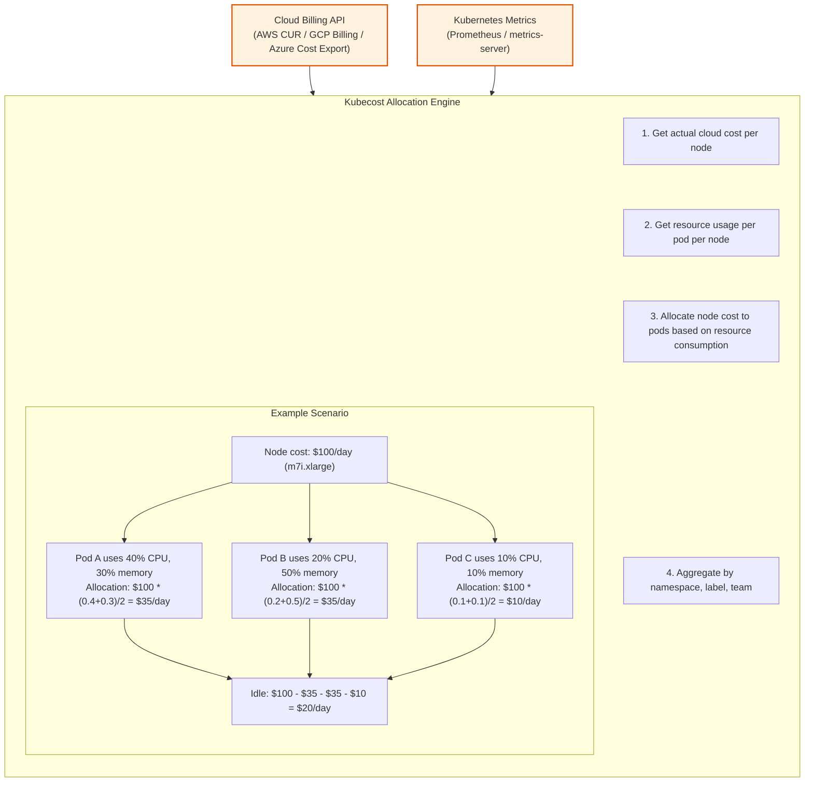
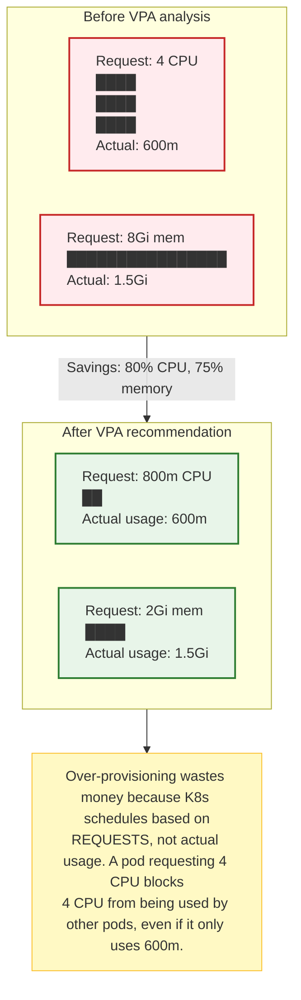
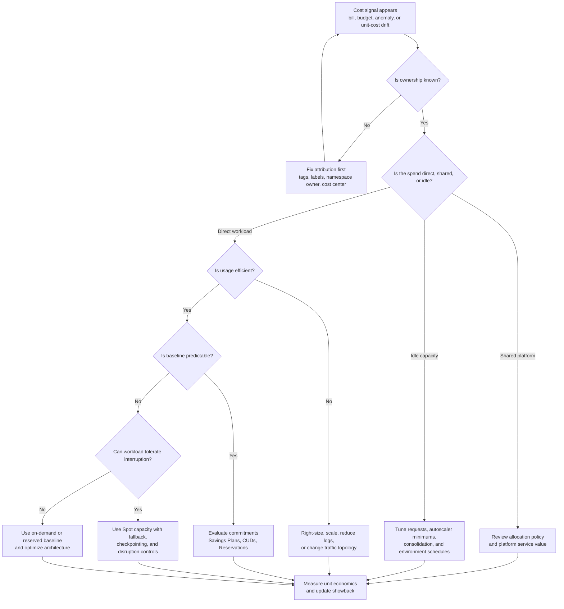

> **Complexity**: `[MEDIUM]`
>
> **Time to Complete**: 2 hours
>
> **Prerequisites**: Basic understanding of Kubernetes resource requests/limits and cloud billing concepts
>
> **Track**: Advanced Cloud Operations

## What You'll Be Able to Do

After completing this module, you will be able to:

- **Implement** the FinOps operating model so engineering, finance, and product teams can make cost decisions from the same data.
- **Enforce** cost allocation discipline with AWS tags, Google Cloud labels, Azure tags, and Kubernetes labels that survive multi-team platform scale.
- **Allocate** Kubernetes cluster cost with OpenCost or Kubecost, including shared overhead, idle capacity, and namespace-level showback.
- **Optimize** compute spend with rightsizing, bin-packing, node consolidation, commitments, and interruptible capacity across AWS, GCP, and Azure.
- **Detect** cost anomalies with budgets, provider alerts, and unit economics that connect infrastructure spend to product value.

---

## Why This Module Matters

Hypothetical scenario: a platform team receives a sharply higher cloud bill after a quarter of product growth. Finance can see the provider, service, account, subscription, and project totals, but engineering cannot explain which tenants, namespaces, or features caused the increase. Product leaders want to know whether the spend bought more customer value or simply hid idle capacity, network transfer, and over-requested Kubernetes pods.

That gap is why cloud cost optimization is an engineering concern, not a monthly finance report. Engineers choose resource requests, load-balancer topology, log volume, storage classes, replication patterns, node pools, and traffic paths. Those decisions become billable usage within minutes, and no finance dashboard can recover intent after workloads were deployed without ownership metadata or operational guardrails.

Detailed cost reviews often uncover underutilized compute, steady workloads still billed at on-demand rates, orphaned storage, long-lived temporary environments, and overlooked network-transfer charges. Applying right-sizing, commitment discounts, workload-level cost allocation, and carefully chosen interruptible capacity can materially reduce cloud spend without requiring application rewrites, but only when the team can tie every optimization to reliability and product impact.

The trap is treating "save money" as the goal. A healthy FinOps practice asks a better question: are we buying the right amount of capacity, resilience, telemetry, and availability for the business outcome? Sometimes the correct answer is to spend more on redundancy or observability because the unit economics still work. Sometimes the correct answer is to delete unused environments because the spend has no owner and no measurable value.

> **The Restaurant Kitchen Analogy**
>
> Cloud cost is like running a busy restaurant kitchen. Finance sees the supplier invoice, but the chefs decide how much food to prep, which dishes waste ingredients, when to keep extra staff on shift, and which stations share expensive equipment. A good kitchen does not merely yell "spend less"; it measures waste, assigns ownership, plans predictable demand, and keeps enough capacity for dinner rush without letting every prep table stay fully stocked overnight.

---

## The FinOps Operating Model

The [FinOps Foundation describes FinOps](https://www.finops.org/framework/) as an operating model and cultural practice that creates shared accountability across engineering, finance, and business teams. In practical platform terms, FinOps is the feedback loop that turns cloud usage into decisions. It gives engineers timely cost signals, gives finance explainable forecasts, and gives product teams a way to compare infrastructure spend with customer value.

The core loop is Inform, Optimize, and Operate. [The FinOps phases](https://www.finops.org/framework/phases/) are iterative, not a waterfall. A team may be mature in Inform for AWS compute, still immature for Kubernetes namespace allocation, and only beginning to operate anomaly response for AI inference spend. That uneven maturity is normal because different services expose different billing data, different owners, and different optimization levers.

In the Inform phase, the goal is cost visibility and accountability. On AWS this means activated cost allocation tags, Cost and Usage Reports, Cost Explorer views, and budgets. On Google Cloud it means billing exports, labels, project hierarchy discipline, reports, and budgets. On Azure it means scopes, tags, Cost Management, cost allocation rules, and exports. Inside Kubernetes it means labels, namespaces, requests, usage metrics, and OpenCost or Kubecost allocation.

In the Optimize phase, the team turns visibility into action. Optimization has two different layers that teams often confuse. Usage optimization reduces waste by right-sizing pod requests, scaling idle node pools down, removing orphaned volumes, cutting noisy logs, or keeping same-zone service traffic local. Rate optimization changes the price paid for unavoidable usage through AWS Savings Plans, Google Cloud Committed Use Discounts, Azure Reservations, and provider-specific spot capacity.

In the Operate phase, cost controls become part of normal engineering work. Budgets and anomaly alerts route to owners, pull requests include cost impact when infrastructure changes, platform dashboards show unit cost, and teams review spend during operational planning. The operating phase is where FinOps becomes more than a cleanup project. It changes defaults, policy, ownership, and incident response so cost surprises become observable events.

The reason this model matters in multi-cloud Kubernetes is that no single cloud bill knows your platform intent. AWS can tell you an EKS node, NAT Gateway, or load balancer cost money. Google Cloud can tell you a GKE cluster, Cloud NAT gateway, or logging bucket produced usage. Azure can show AKS, NAT Gateway, Load Balancer, and Log Analytics charges. None of them automatically knows that `tenant-a` owns the checkout namespace and `tenant-b` owns the recommendation workload unless you design that allocation path.

FinOps also makes cost changes safer. A blanket mandate to reduce spend by 20 percent encourages risky behavior, such as lowering memory limits blindly or moving stateful systems to interruptible nodes. A FinOps operating model asks which spend is idle, which spend is inefficient, which spend is a negotiated rate problem, and which spend is necessary for reliability. That distinction protects learners from confusing cost cutting with cost engineering.

---

## The Four Pillars of Cloud Cost Optimization

```mermaid
graph TD
    classDef pillar fill:#f9f9f9,stroke:#333,stroke-width:2px;
    classDef header fill:#e1f5fe,stroke:#0288d1,stroke-width:2px;

    title[COST OPTIMIZATION FRAMEWORK]:::header

    subgraph Optimization Process [ ]
        direction LR
        P1["1. VISIBILITY<br/>'Where does the money go?'<br/>- Cost allocation<br/>- Showback/chargeback<br/>- Kubecost/OpenCost"]:::pillar
        P2["2. RIGHT-SIZING<br/>'Are resources matched to actual usage?'<br/>- CPU/memory utilization<br/>- VPA recommendations<br/>- Node right-sizing"]:::pillar
        P3["3. RATE OPTIMIZATION<br/>'Are we paying the best price?'<br/>- Savings Plans/CUDs<br/>- Reserved Instances<br/>- Committed Use"]:::pillar
        P4["4. ARCHITECTURAL<br/>'Can we change HOW we run things?'<br/>- Spot/preemptible instances<br/>- Topology-aware routing<br/>- Ephemeral environments<br/>- Orphaned resource cleanup"]:::pillar

        P1 --> P2 --> P3 --> P4
    end
    
    note[Implementation order: 1 --> 2 --> 3 --> 4<br/>You can't optimize what you can't see.]
    Optimization Process --> note
```

---

## Cost Allocation and Attribution

Cost allocation answers "who caused this spend?" Cost attribution answers a slightly richer question: "which product, tenant, environment, feature, or platform service should be accountable for this spend?" A cloud bill without attribution is just a list of meters. A Kubernetes bill without attribution is even worse because many teams share the same nodes, load balancers, storage systems, logging pipelines, and network paths.

The first allocation rule is boring but non-negotiable: every resource needs an owner. On AWS the usual control point is tags, and [user-defined cost allocation tags](https://docs.aws.amazon.com/awsaccountbilling/latest/aboutv2/custom-tags.html) must be activated for Billing and Cost Management before they become useful in cost reports. A tag that exists only on an EC2 instance but is not active for cost allocation will help inventory searches, but it will not reliably answer finance questions.

On Google Cloud, labels are the familiar cost grouping mechanism for many resources, and billing reports can filter or group costs by labels after those labels exist on the usage. [Google Cloud's label documentation](https://cloud.google.com/resource-manager/docs/labels-overview) also makes an important distinction: labels are key-value metadata for organization and reporting, while tags serve different governance and policy use cases. FinOps teams should avoid mixing those terms because the wrong mechanism can make reports inconsistent.

On Azure, tags and scopes are central to cost visibility. [Azure Cost Management cost allocation rules](https://learn.microsoft.com/en-us/azure/cost-management-billing/costs/allocate-costs) can distribute shared service costs across subscriptions, resource groups, or tags for internal accountability, even though the underlying invoice responsibility does not change. Note: allocation requires Enterprise Agreement (EA) or Microsoft Customer Agreement (MCA) billing, reallocates Cost Management views only (not invoice responsibility), has processing delay, and excludes Reservation and Savings Plan purchases — see [current limitations](https://learn.microsoft.com/en-us/azure/cost-management-billing/costs/allocate-costs#limitations).

A practical tag taxonomy should be small, mandatory, and stable. Start with keys such as `owner`, `team`, `cost-center`, `application`, `environment`, `data-classification`, and `lifecycle`. Avoid keys with high-cardinality values such as build IDs, random ticket numbers, or temporary experiment names because they clutter reports and make aggregation hard. Use separate observability labels for high-cardinality debugging data.

The hardest problem is untagged spend. Untagged resources become the default bucket for "we cannot tell who spent this," and that bucket grows whenever teams create emergency resources, managed services create supporting infrastructure, or automation skips metadata. A mature FinOps program treats untagged spend as operational debt. It has an owner, a weekly review, a threshold, and eventually a policy that prevents new untagged production resources.

Showback and chargeback use the same allocation data but create different incentives. Showback reports spend to teams without directly moving budget, which makes it safer for early adoption because teams learn their cost shape before money is redistributed. Chargeback assigns the cost to the consuming team, which creates stronger incentives but also requires better data quality, exception handling, and executive agreement about shared platform costs.

Shared cost allocation is where simplistic tagging breaks down. A platform security scanner, central logging workspace, shared ingress gateway, NAT Gateway, or multi-tenant database may support every product. Splitting those costs evenly is easy but often unfair. Splitting by revenue, request volume, namespace usage, allocated CPU, stored bytes, or tenant count can be fairer, but only if the driver is explainable and stable enough that teams trust it.

The engineering pattern is to use a layered allocation model. Direct resource costs follow cloud tags, labels, projects, subscriptions, or accounts. Kubernetes workload costs follow namespace and workload labels. Shared cluster overhead is assigned by a documented rule, such as proportional requested CPU and memory, proportional actual usage, or a fixed platform tax. The rule will never be perfect, but it must be visible and consistently applied.

| Allocation Surface | AWS Pattern | Google Cloud Pattern | Azure Pattern | Kubernetes Pattern |
|---|---|---|---|---|
| Business owner | Activated cost allocation tags such as `team` and `cost-center` | Labels on projects and resources, plus billing export fields | Tags on subscriptions, resource groups, and resources | Namespace and workload labels such as `team` and `app.kubernetes.io/part-of` |
| Shared services | Cost categories, account structure, and tag-based reports | Billing export to BigQuery with allocation logic | Cost allocation rules and Cost Management exports | OpenCost or Kubecost shared cost policies |
| Enforcement | Tag policies, IaC checks, and SCP-backed guardrails where appropriate | Organization policy, CI checks, and project factory defaults | Azure Policy, management groups, and landing-zone defaults | Admission policy with Kyverno, Gatekeeper, or ValidatingAdmissionPolicy |
| Reporting cadence | Daily Cost Explorer or CUR-backed dashboards | Billing reports, BigQuery exports, and budgets | Cost Management views, exports, budgets, and workbooks | Namespace, controller, pod, label, and idle cost reports |

Cost ownership also needs lifecycle ownership. Temporary environments should carry an expiry date. Development clusters should identify who can approve after-hours runtime. Persistent volumes should identify data owner and retention class. Load balancers should identify application owner and ingress purpose. These fields are not accounting decoration; they are the metadata that lets automation safely clean up resources without creating an outage.

The best allocation systems are built into provisioning paths. Terraform modules, Crossplane compositions, project factories, account vending pipelines, and Helm charts should stamp required metadata by default. Admission controls should reject missing Kubernetes labels before the workload reaches production. Billing reviews should focus on exceptions and trends, not on asking humans to remember who created an unlabeled NAT gateway six weeks ago.

---

**Pause and predict:** If three independent engineering teams run workloads on the same Kubernetes worker node, how should a platform chargeback model split the underlying cloud compute bill? Should cost follow the node's provisioning owner, raw real-time CPU and memory usage, or scheduled resource requests?

<details>
<summary>Check your prediction</summary>

Allocate shared node compute costs using the **max(request, usage)** model implemented by OpenCost and Kubecost, rather than assigning costs to the node owner or relying strictly on raw usage. Kubernetes makes cost allocation complex because multiple workloads from different tenants share underlying instances. If allocation used only actual resource usage, a workload requesting 8 vCPUs but consuming only 500m would prevent other pods from scheduling onto that node while paying virtually nothing for the reserved capacity. Conversely, if a pod bursts past its request, it consumes actual physical node capacity that other workloads cannot use. Taking the maximum of requested and consumed resources ensures that tenants pay for both the capacity they tie up from the scheduler and any excess capacity they physically consume, while unallocated node capacity is exposed as shared idle cost.
</details>

## Pillar 1: Visibility with Kubecost and OpenCost

### Kubecost Architecture



### Installing Kubecost

```bash
# Install Kubecost via Helm
helm repo add kubecost https://kubecost.github.io/cost-analyzer/
helm repo update

helm install kubecost kubecost/cost-analyzer \
  --namespace kubecost \
  --create-namespace \
  --set kubecostToken="YOUR_TOKEN" \
  --set prometheus.server.retention="30d" \
  --set kubecostProductConfigs.clusterName="prod-us-east-1"

# For multi-cluster, install the agent on each cluster
# and point to a central Kubecost instance
helm install kubecost kubecost/cost-analyzer \
  --namespace kubecost \
  --create-namespace \
  --set agent.enabled=true \
  --set kubecostProductConfigs.clusterName="prod-eu-west-1" \
  --set federatedETL.primaryCluster="https://kubecost.prod-us-east-1.internal"

# Access the Kubecost UI
kubectl port-forward -n kubecost svc/kubecost-cost-analyzer 9090:9090
```

### OpenCost: The Open-Source Alternative

```bash
# OpenCost is CNCF-supported and free
helm repo add opencost https://opencost.github.io/opencost-helm-chart
helm repo update

helm install opencost opencost/opencost \
  --namespace opencost \
  --create-namespace \
  --set opencost.exporter.defaultClusterId="prod-us-east-1" \
  --set opencost.ui.enabled=true

# Query the API for cost allocation
# (assumes an existing port-forward — create one with:
#   kubectl port-forward -n opencost svc/opencost 9003:9003)
curl http://localhost:9003/allocation/compute \
  --data-urlencode "window=7d" \
  --data-urlencode "aggregate=namespace" \
  --data-urlencode "accumulate=true" | jq '.data[0]'
```

OpenCost and Kubecost solve a problem that the provider bill cannot solve by itself. The cloud provider knows the node, disk, load balancer, and network meters. Kubernetes knows pods, namespaces, controllers, requests, labels, and actual usage. Cost visibility becomes useful only when those two worlds are joined, because the application owner usually thinks in workloads while finance usually receives infrastructure line items.

[OpenCost's Allocation API](https://opencost.io/docs/integrations/api/) reports cost by Kubernetes concepts such as namespace, controller, pod, service, and label. That matters because Kubernetes scheduling is dynamic. A namespace that used 40 percent of one node yesterday might use 10 percent of three different nodes today. A static spreadsheet cannot follow that movement, but a cost model connected to metrics and billing data can attribute cost over time.

The most important OpenCost or Kubecost number is often not the team total. It is idle cost. Idle cost is the portion of cluster spend that exists because capacity was provisioned but not consumed by workloads. Some idle capacity is healthy because clusters need headroom for bursts, rolling deployments, daemonsets, and node failures. Excessive idle capacity is waste because the scheduler is reserving nodes that no team actually uses.

Idle cost should not be hidden inside a platform bucket forever. Early showback reports can place idle under the platform team so the platform group can tune autoscaling and node pool design. Mature reports often split idle proportionally across consuming teams, because over-requested pods and poor bin-packing create idle capacity even when the cluster autoscaler behaves correctly. The policy choice should be explicit because it changes incentives.

Shared overhead needs similar care. System namespaces, CNI daemons, CSI drivers, metrics collectors, ingress controllers, service meshes, and security agents consume real resources. If you allocate only application pod cost, platform services look free and application teams underestimate the cost of high-cardinality telemetry, sidecars, and cross-cutting controls. If you allocate every shared cost by a blunt percentage, teams may distrust the report.

A good in-cluster allocation model normally separates three buckets. Direct workload cost follows namespace, workload, and team labels. Shared cluster cost covers system components and platform add-ons, allocated by a policy such as proportional requested resources. Idle cost stays visible as its own line item so teams can see whether the waste came from oversized requests, autoscaler minimums, daemonset overhead, or deliberate resilience headroom.

For multi-cluster environments, cluster identity is part of cost allocation. A production EKS cluster in `us-east-1`, a GKE cluster in `europe-west1`, and an AKS cluster in `westeurope` may all run the same product, but their network, logging, control-plane, and discount profiles differ. OpenCost labels should include cluster, provider, region, environment, and ownership so teams can compare like with like.

The final allocation lesson is that cost visibility needs resource requests to be honest. Kubernetes schedules pods based on requested resources, and allocation engines often use requests, usage, or a blend of both. A team that requests 4 CPU for a pod that uses 400 millicores can create real node cost even if the workload looks idle in application metrics. FinOps and reliability share the same baseline data.

### Multi-Tenant Cost Allocation

```yaml
# Label-based cost allocation strategy
# Every workload MUST have these labels for cost tracking
apiVersion: apps/v1
kind: Deployment
metadata:
  name: recommendation-engine
  namespace: ml-platform
  labels:
    team: ml-engineering
    cost-center: CC-4200
    product: recommendations
    environment: production
spec:
  template:
    metadata:
      labels:
        team: ml-engineering
        cost-center: CC-4200
        product: recommendations
        environment: production
    spec:
      containers:
        - name: engine
          image: company/rec-engine:v2.1.0
          resources:
            requests:
              cpu: "2"
              memory: "4Gi"
            limits:
              cpu: "4"
              memory: "8Gi"
```

```bash
# Enforce required labels with Kyverno
kubectl apply -f - <<'EOF'
apiVersion: kyverno.io/v1
kind: ClusterPolicy
metadata:
  name: require-cost-labels
spec:
  validationFailureAction: Enforce
  rules:
    - name: check-cost-labels
      match:
        any:
          - resources:
              kinds:
                - Deployment
                - StatefulSet
                - Job
      validate:
        message: "All workloads must have 'team', 'cost-center', and 'environment' labels"
        pattern:
          metadata:
            labels:
              team: "?*"
              cost-center: "?*"
              environment: "production | staging | development"
          spec:
            template:
              metadata:
                labels:
                  team: "?*"
                  cost-center: "?*"
                  environment: "production | staging | development"
EOF
```

Admission control is the Kubernetes side of FinOps governance. It does not replace cloud tag policies, project factories, or landing-zone controls, because many costs are created outside the cluster. It does prevent the most common in-cluster failure: a deployment reaches production with no durable owner, then appears in OpenCost as unattributed namespace spend after the bill has already landed.

Use enforcement gradually. Start with audit mode in existing clusters so teams can see which workloads would fail. Move production namespaces to enforce mode once the platform has templates, examples, and a clear exception process. For brand-new clusters, enforce required labels from day one because retrofitting metadata after hundreds of workloads exist is slower and politically harder.

Provider and Kubernetes metadata should align without becoming identical. AWS might use `cost-center`, Google Cloud might use `cost_center` because of label conventions, and Azure might inherit tags from a resource group. Kubernetes can still standardize on labels such as `platform.kubedojo.io/team` and `platform.kubedojo.io/cost-center`. The reporting pipeline can map those fields into a common business dimension.

Showback should begin with education, not blame. A useful showback report says, "Your namespace spent roughly this much, this portion was idle, this portion came from shared overhead, and these three changes would reduce waste." A weak report says, "Your team is expensive." The first report creates engineering action. The second report creates arguments about accounting.

Chargeback should wait until the allocation model is stable enough to survive disputes. Once budget actually moves, teams will challenge shared cost formulas, missing labels, and noisy workloads owned by other groups. This is healthy if the process is transparent. It becomes toxic if the platform team cannot explain why a cost was assigned or how a team can reduce it.

---

**Pause and predict:** When sizing container resource specifications for a Kubernetes deployment, why does over-provisioning CPU requests inflate cloud infrastructure spend much more severely than over-provisioning CPU limits? What mechanism in the Kubernetes control plane directly drives this cost discrepancy?

<details>
<summary>Check your prediction</summary>

Over-provisioning **requests** directly inflates cloud bills because the Kubernetes scheduler **reserves** capacity based strictly on requests, not limits. The scheduler subtracts each container's CPU and memory requests from the node's allocatable capacity to decide whether a pod can be placed. If a pod requests 4 vCPUs but consumes only 200m, those 4 vCPUs are permanently locked and cannot be scheduled to any other workload, forcing the cluster autoscaler to provision additional cloud worker nodes to accommodate subsequent pods. In contrast, CPU limits act merely as kernel cgroup throttling caps during runtime and do not reserve node capacity during scheduling. The most common waste pattern in Kubernetes occurs when developers set requests based on speculative peak guesses and never adjust them, stranding expensive node capacity that sits idle yet fully billed.
</details>

## Pillar 2: Right-Sizing with VPA and HPA

### Vertical Pod Autoscaler (VPA) for Right-Sizing



```yaml
# VPA in recommendation mode (safe -- doesn't change anything)
apiVersion: autoscaling.k8s.io/v1
kind: VerticalPodAutoscaler
metadata:
  name: recommendation-engine-vpa
  namespace: ml-platform
spec:
  targetRef:
    apiVersion: apps/v1
    kind: Deployment
    name: recommendation-engine
  updatePolicy:
    updateMode: "Off"  # Only recommend, don't auto-apply
  resourcePolicy:
    containerPolicies:
      - containerName: engine
        minAllowed:
          cpu: "100m"
          memory: "256Mi"
        maxAllowed:
          cpu: "8"
          memory: "16Gi"
```

```bash
# Check VPA recommendations
kubectl get vpa recommendation-engine-vpa -n ml-platform -o yaml

# The recommendation section shows:
# - lowerBound: minimum safe resources
# - target: recommended resources
# - upperBound: maximum expected resources
# - uncappedTarget: ideal without min/max constraints

# Example output:
# recommendation:
#   containerRecommendations:
#     - containerName: engine
#       lowerBound:
#         cpu: 500m
#         memory: 1Gi
#       target:
#         cpu: 800m
#         memory: 2Gi
#       upperBound:
#         cpu: 1500m
#         memory: 4Gi
```

**A Note on VPA Auto-Update:** For bursty or unpredictable workloads, review VPA recommendations carefully before applying them automatically, and pair right-sizing with HPA when you need elastic horizontal scaling.

### HPA for Cost-Efficient Scaling

```yaml
# HPA with both CPU and custom metrics
apiVersion: autoscaling/v2
kind: HorizontalPodAutoscaler
metadata:
  name: api-server-hpa
  namespace: production
spec:
  scaleTargetRef:
    apiVersion: apps/v1
    kind: Deployment
    name: api-server
  minReplicas: 2
  maxReplicas: 20
  behavior:
    scaleDown:
      stabilizationWindowSeconds: 300  # Wait 5 min before scaling down
      policies:
        - type: Percent
          value: 25      # Scale down max 25% at a time
          periodSeconds: 60
    scaleUp:
      stabilizationWindowSeconds: 30
      policies:
        - type: Percent
          value: 100     # Can double immediately under load
          periodSeconds: 60
  metrics:
    - type: Resource
      resource:
        name: cpu
        target:
          type: Utilization
          averageUtilization: 70  # Target 70% CPU utilization
    - type: Resource
      resource:
        name: memory
        target:
          type: Utilization
          averageUtilization: 75
```

### Compute Cost Levers: Usage Before Rate

Compute optimization starts with usage, not discounts. A one-year commitment on waste makes the waste cheaper, but it also makes the organization less willing to remove it. The safer sequence is to right-size requests, improve bin-packing, reduce idle node pools, and then buy commitments only for the stable baseline that remains after engineering cleanup.

Kubernetes requests are the first lever because [the scheduler uses resource requests when placing pods](https://kubernetes.io/docs/concepts/configuration/manage-resources-containers/). If requests are inflated, the scheduler sees the cluster as full earlier than it should. Cluster autoscaler, Karpenter, and provider node provisioning then add nodes to satisfy artificial demand. The bill increases even when actual CPU and memory usage remain low.

VPA recommendations are a low-risk way to make that invisible waste visible. [Kubernetes VPA stores recommendations in the VerticalPodAutoscaler status](https://kubernetes.io/docs/concepts/workloads/autoscaling/vertical-pod-autoscale/), and recent Kubernetes documentation identifies `autoscaling.k8s.io/v1` as the stable API version. For production services, recommendation mode is often the right first step because it gives data without restarting pods or changing requests automatically.

Rightsizing should be tied to service behavior. For memory-heavy workloads, lowering limits without understanding garbage collection, caches, or startup spikes can create OOM kills. For CPU-bound workloads, lower requests may increase pod density but also change HPA behavior because CPU utilization is calculated against requests. The goal is not the smallest number; it is the smallest request that preserves predictable scheduling and scaling behavior.

Bin-packing is the second lever. A cluster with many oddly shaped pods can waste nodes even when individual requests look reasonable. One workload requests 3500 millicores and another requests 900 millicores, so two 4-vCPU nodes appear necessary even though actual usage might fit on one larger or different instance family. Node provisioning tools reduce this waste by choosing node shapes that better match pending pods.

On AWS, Karpenter is commonly used with EKS to provision instances directly from pod requirements, diversify instance types, and consolidate empty or underutilized nodes. [AWS EKS cost optimization guidance](https://docs.aws.amazon.com/eks/latest/best-practices/cost-opt-compute.html) discusses bin packing, Spot, Savings Plans, Reserved Instances, and mixed capacity types. The important design choice is to let workloads express constraints while the provisioner selects economically sensible capacity.

On Google Kubernetes Engine, cluster autoscaler and node auto-provisioning handle a similar shape of problem. [GKE cluster autoscaling documentation](https://cloud.google.com/kubernetes-engine/docs/concepts/cluster-autoscaler) describes autoscaler behavior and notes that Spot VM node pools can be preferred when workloads allow it. [GKE cost optimization guidance](https://cloud.google.com/architecture/best-practices-for-running-cost-effective-kubernetes-applications-on-gke) also frames node auto-provisioning as a way to add node pools that match workload requirements.

On Azure Kubernetes Service, [AKS cost optimization guidance](https://learn.microsoft.com/en-us/azure/aks/optimize-aks-costs) covers horizontal pod autoscaling, cluster right-sizing, cluster autoscaler, and node autoprovisioning. [AKS cluster autoscaler documentation](https://learn.microsoft.com/en-us/azure/aks/cluster-autoscaler-overview) emphasizes that the autoscaler watches for unschedulable pods and removes nodes without scheduled pods when scale-down conditions are met. That behavior turns honest requests into real cost control.

Rate optimization comes after the baseline is understood. AWS Savings Plans fit predictable compute usage across compatible services and regions depending on plan type. Google Cloud Committed Use Discounts fit stable vCPU, memory, or resource commitments. Azure Reservations fit predictable VM and other resource usage over one-year or three-year terms. These tools reward predictability, so they are dangerous when purchased before cleanup.

Interruptible capacity is different from a commitment. AWS Spot Instances, Google Cloud Spot VMs, and Azure Spot Virtual Machines can be much cheaper than on-demand capacity, but the provider can reclaim them. They fit stateless web replicas with enough redundancy, batch jobs with checkpoints, CI workers, render farms, and data processing that can restart. They do not fit single-replica stateful systems, quorum-critical databases, or workloads that cannot shut down inside the provider's notice window.

The best production clusters mix capacity types. Critical system and stateful workloads use on-demand or reserved baseline capacity. Stateless burst workloads can prefer interruptible capacity with fallback. Batch queues can use mostly interruptible capacity and absorb evictions through retries. Development clusters can combine scheduled scale-down, small baselines, and spot pools because the recovery objective is different from production.

The cost lever that surprises many teams is architecture. Moving a chatty service pair into the same zone, reducing verbose log fields, switching batch jobs to event-driven scale-to-zero patterns, or lowering cross-region replication frequency can save more than shaving a few percent from instance prices. FinOps engineers should therefore review topology, telemetry, and data movement before assuming compute commitments are the only meaningful lever.

---

**Pause and predict:** If your application traffic and corresponding compute footprint double every year, should you lock in 3-year Reserved Instances to secure the highest headline discount, or stick with 1-year commitments? How does rapid architectural and traffic growth alter the commitment calculation?

<details>
<summary>Check your prediction</summary>

Prefer **1-year commitments** or a layered 1-year strategy rather than locking your full footprint into 3-year commitments. When an application and its underlying infrastructure double yearly, instance families, container architectures, regions, and baseline node counts evolve rapidly. A 3-year commitment locks the organization into specific instance types, regions, or spend rates that often become suboptimal or wasted as architecture shifts or newer, more cost-effective processor generations launch. Furthermore, buying a 3-year commitment based on future projected growth risks prepaying for unutilized capacity early on, whereas sizing for current load leaves you under-covered in years two and three. Layering 1-year commitments periodically allows the platform team to match changing architectural baselines, preserve flexibility to adopt newer instance generations, and avoid stranded financial liability.
</details>

## Pillar 3: Rate Optimization

### Savings Plans and Committed Use Discounts

```mermaid
graph TD
    classDef provider fill:#eceff1,stroke:#607d8b,stroke-width:2px;
    classDef strategy fill:#e3f2fd,stroke:#1565c0,stroke-width:2px;

    subgraph AWS ["AWS (m7i.xlarge, representative)"]
        A1["On-Demand: ~$0.19/hr"]
        A2["1yr Savings Plan: lower hourly commitment rate"]
        A3["3yr Savings Plan: deeper commitment discount"]
        A4["Spot: variable, interruptible, verify current pricing"]
    end:::provider

    subgraph GCP ["GCP (n2-standard-4, representative)"]
        G1["On-Demand: ~$0.19/hr"]
        G2["1yr CUD: lower committed rate"]
        G3["3yr CUD: deeper committed rate"]
        G4["Spot: variable, preemptible"]
        G5["SUDs: automatic where eligible"]
    end:::provider

    subgraph Azure ["Azure (D4s v5, representative)"]
        Z1["On-Demand: ~$0.19/hr"]
        Z2["1yr Reserved VM: lower committed rate"]
        Z3["3yr Reserved VM: deeper committed rate"]
        Z4["Spot: variable, eviction risk"]
    end:::provider

    subgraph STRATEGY ["Optimization Strategy"]
        S1["Baseline (24/7 workloads) --> Savings Plan / CUD"]
        S2["Bursty (predictable peaks) --> On-demand"]
        S3["Fault-tolerant (batch, CI) --> Spot instances"]
        S4["Development --> Spot + auto-shutdown"]
    end:::strategy
```

### Calculating Your Savings Plan Commitment

```bash
# AWS: Analyze your usage to determine the right commitment
aws ce get-savings-plans-purchase-recommendation \
  --savings-plans-type COMPUTE_SAVINGS_PLANS \
  --term-in-years ONE_YEAR \
  --payment-option NO_UPFRONT \
  --lookback-period-in-days SIXTY_DAYS \
  --output json | jq '.SavingsPlansPurchaseRecommendation'

# The output tells you:
# - Recommended hourly commitment (e.g., $12.50/hr)
# - Estimated monthly savings (e.g., $2,800/month)
# - Coverage percentage (e.g., 72% of on-demand usage)

# GCP: Analyze committed use
gcloud billing accounts describe BILLING_ACCOUNT_ID --format=json
# Use the GCP Billing Console > Committed use discounts > Analysis
```

Commitment sizing should use amortized cost and coverage, not raw monthly totals. If a workload runs 24 hours a day with stable demand, a one-year commitment may be reasonable after rightsizing. If a product is being redesigned, migrating regions, or moving from nodes to serverless, shorter commitments or lower coverage are safer. The highest discount is not always the best financial decision.

[AWS Savings Plans](https://docs.aws.amazon.com/savingsplans/latest/userguide/what-is-savings-plans.html) commit to a consistent hourly spend in exchange for lower rates on eligible usage. Compute Savings Plans are flexible across services such as EC2, Fargate, and Lambda, while EC2 Instance Savings Plans are more specific. In EKS environments, the baseline node capacity is a candidate for commitments, while burst nodes and experimental workloads should usually remain on on-demand or Spot.

[Google Cloud Committed Use Discounts](https://cloud.google.com/docs/cuds) reduce costs for committed resource usage, and [Compute Engine pricing documentation](https://cloud.google.com/compute/vm-instance-pricing) explains how on-demand, committed, sustained-use, and Spot pricing interact. GKE Standard clusters commonly combine commitments for predictable node pools with Spot node pools for fault-tolerant workloads. GKE Autopilot changes the calculation because teams pay according to Autopilot's billing model rather than manually managed node pools.

[Azure Reservations](https://learn.microsoft.com/en-us/azure/cost-management-billing/reservations/) provide lower prices when you commit to one-year or three-year plans for eligible resources. [Azure Reserved VM Instance documentation](https://learn.microsoft.com/en-us/azure/cost-management-billing/manage/understand-vm-reservation-charges) explains that a reservation covers the compute portion of matching virtual machines. AKS node pools with predictable VM sizes are candidates, while workloads with uncertain region, SKU, or scale profiles need more flexibility.

Spot capacity should be planned as an availability pattern, not a discount line. [AWS Spot Instances](https://docs.aws.amazon.com/AWSEC2/latest/UserGuide/using-spot-instances.html), [Google Cloud Spot VMs](https://cloud.google.com/compute/docs/instances/spot), and [Azure Spot Virtual Machines](https://learn.microsoft.com/en-us/azure/virtual-machines/spot-vms) are all reclaimable capacity. The provider-specific semantics differ, but the engineering requirement is the same: graceful shutdown, retries, replicas, checkpoints, and fallback capacity.

For Kubernetes, the clean pattern is multiple node pools or provisioner classes. Critical services run on on-demand or committed baseline capacity. Batch, CI, test, rendering, and stateless burst workloads tolerate taints or prefer labels that select interruptible nodes. PodDisruptionBudgets, topology spread, termination hooks, queue visibility, and application-level idempotency matter more than the discount percentage because they determine whether eviction becomes a controlled retry or an incident.

Commitments also create a measurement problem. A team that buys a commitment and then right-sizes aggressively may show lower on-demand usage but still pay for the committed hourly baseline. FinOps dashboards should therefore report utilization, coverage, and effective savings together. A high coverage percentage with low utilization means the organization prepaid for capacity it no longer needs.

---

> **Stop and think**: If Spot instances can be terminated at any time, what types of applications are completely unsuitable for them? Interruptible capacity on the major clouds can be substantially cheaper than on-demand pricing, but the exact discount and interruption behavior vary by provider, region, and instance type. The **Spot Instance Golden Rules**: because eviction notice windows are short and provider-specific, use Spot only for workloads that tolerate interruption, recover cleanly on other nodes, and do not depend on a single local-stateful replica.

## Pillar 4: Spot Instance Lifecycle

### Spot-Friendly Node Groups

```yaml
# EKS managed node group with Spot instances
apiVersion: eksctl.io/v1alpha5
kind: ClusterConfig
metadata:
  name: prod-cluster
  region: us-east-1
nodeGroups:
  # On-demand for critical workloads
  - name: on-demand-critical
    instanceType: m7i.xlarge
    desiredCapacity: 3
    minSize: 3
    maxSize: 6
    labels:
      node-type: on-demand
      workload-class: critical
    taints:
      - key: workload-class
        value: critical
        effect: NoSchedule

  # Spot for non-critical workloads
  - name: spot-general
    instanceTypes:
      - m7i.xlarge
      - m6i.xlarge
      - m5.xlarge
      - c7i.xlarge    # Diversify instance types
    spot: true
    desiredCapacity: 5
    minSize: 2
    maxSize: 15
    labels:
      node-type: spot
      workload-class: general
```

### Pod Scheduling for Spot

```yaml
# Non-critical workload: prefers Spot, tolerates interruption
apiVersion: apps/v1
kind: Deployment
metadata:
  name: batch-processor
  namespace: data-pipeline
spec:
  replicas: 8
  selector:
    matchLabels:
      app: batch-processor
  template:
    metadata:
      labels:
        app: batch-processor
    spec:
      # Prefer Spot nodes
      affinity:
        nodeAffinity:
          preferredDuringSchedulingIgnoredDuringExecution:
            - weight: 90
              preference:
                matchExpressions:
                  - key: node-type
                    operator: In
                    values:
                      - spot
      # Tolerate per-provider Spot taints
      # EKS:  eks.amazonaws.com/capacityType=SPOT:NoSchedule
      # GKE:  cloud.google.com/gke-spot=true:NoSchedule
      # AKS:  kubernetes.azure.com/scalesetpriority=spot:NoSchedule
      # (this Deployment tolerates the EKS Spot taint — adjust for your provider)
      tolerations:
        - key: "eks.amazonaws.com/capacityType"
          operator: "Equal"
          value: "SPOT"
          effect: "NoSchedule"
      # Handle graceful shutdown on Spot interruption
      terminationGracePeriodSeconds: 120
      containers:
        - name: processor
          image: company/batch-processor:v1.8.0
          resources:
            requests:
              cpu: "1"
              memory: "2Gi"
          # Checkpoint progress periodically so interruption loses minimal work
          env:
            - name: CHECKPOINT_INTERVAL_SECONDS
              value: "30"
```

### Spot Interruption Handling

```yaml
# AWS Node Termination Handler (NTH)
# Detects Spot interruption notices and gracefully drains nodes
# Install via Helm:
# helm install aws-node-termination-handler \
#   eks/aws-node-termination-handler \
#   --namespace kube-system

# Karpenter: Automatically replaces interrupted Spot nodes
apiVersion: karpenter.sh/v1
kind: NodePool
metadata:
  name: spot-pool
spec:
  template:
    spec:
      requirements:
        - key: karpenter.sh/capacity-type
          operator: In
          values: ["spot"]
        - key: node.kubernetes.io/instance-type
          operator: In
          values:
            - m7i.xlarge
            - m7i.2xlarge
            - m6i.xlarge
            - m6i.2xlarge
            - c7i.xlarge
            - r7i.xlarge
      nodeClassRef:
        group: karpenter.k8s.aws
        kind: EC2NodeClass
        name: default
  disruption:
    consolidationPolicy: WhenEmpty
    consolidateAfter: 60s
  limits:
    cpu: "100"
    memory: "400Gi"
```

Spot scheduling is provider-specific at the node layer but portable at the workload layer. The workload should declare whether it tolerates interruption, how long it needs for graceful shutdown, whether it can restart from checkpoints, and whether it has enough replicas elsewhere. The platform should translate those declarations into AWS Karpenter requirements, GKE Spot node pool labels, or AKS Spot node pool taints without forcing every application team to learn each provider's syntax.

For GKE, Spot-backed nodes are labeled by GKE so pods can use affinity or tolerations to prefer them. For AKS, [Spot node pools](https://learn.microsoft.com/en-us/azure/aks/spot-node-pool) carry a Spot priority label and taint, and the cluster autoscaler should be enabled so capacity can return after evictions when it is still needed. For EKS, Karpenter or managed node groups can diversify instance types and capacity types so one unavailable Spot pool does not block every pending pod.

The multi-cloud principle is the same: never make interruptible capacity the only path for a critical request. Use topology spread constraints, multiple replicas, retry queues, and fallbacks to on-demand capacity. A service that can tolerate one interrupted pod is not automatically safe when an entire node pool evaporates during a regional capacity shift.

---

## Hidden Costs That Surprise Teams

The most painful cloud cost surprises rarely come from the biggest line item. Teams expect compute to cost money. They are less prepared for network processing, cross-zone transfer, logging ingestion, control-plane fees, and load balancer usage meters. These costs feel small in isolation, but they multiply quickly in Kubernetes because every replica, sidecar, retry, health check, and telemetry event can create billable traffic.

Treat the following rates as representative examples, not procurement advice. They vary by region, currency, contract, service tier, and date. The correct FinOps habit is to verify current pricing before making a business case, then attach the pricing page or SKU export to the decision record so future reviewers know what assumption was used.

| Hidden Cost | Representative Rate Shape | Why It Surprises Teams | Cost-Reduction Knob |
|---|---|---|---|
| NAT Gateway / Cloud NAT / Azure NAT Gateway | AWS and Google Cloud often have both hourly and per-GB processing components; Google Cloud Public NAT shows roughly `$0.045/GiB` data processing in common public examples, and AWS NAT Gateway examples often use roughly `$0.045/GB` plus hourly charges. | Private nodes pulling images, calling package mirrors, or reaching public APIs can send large traffic through NAT without application owners seeing it. | Keep egress same-AZ where possible, use VPC endpoints / Private Service Connect / Azure Private Link to bypass NAT for high-volume service traffic, deploy regional artifact mirrors and image caches, and apply egress allowlists. Note that per-AZ NAT (AWS HA pattern) is primarily a reliability and latency decision, not a cost reduction — it typically increases baseline NAT hourly charges. |
| Cross-AZ / inter-zone transfer | AWS cross-AZ traffic is commonly modeled around roughly `$0.01/GB` in each charged direction; Google Cloud inter-zone transfer in the same region is listed around `$0.01/GiB`; Azure pricing differs and should be verified by bandwidth SKU. | Multi-zone resilience can turn chatty service calls, database traffic, or load balancer flows into transfer charges. | Keep chatty services zone-local where safe, use topology-aware routing, reduce retries, and place data stores near consumers. |
| Cross-region replication | Often materially higher than same-zone transfer, with source, destination, and product-specific rates. | Backup, DR, analytics exports, and object replication can double data movement quietly. | Replicate only recovery-critical data, compress, deduplicate, tier retention, and test whether lower-frequency replication meets RPO. |
| Load balancers and processing units | AWS ALB has hourly and LCU-style meters; Google Cloud and Azure load balancers have their own forwarding, data, or rule dimensions. | A test namespace with many `LoadBalancer` services can create many hourly charges even at low traffic. | Share ingress gateways, delete stale services, prefer internal routing when possible, and monitor per-service load balancer count. |
| Managed Kubernetes control plane fees | EKS and GKE commonly publish roughly `$0.10/hour` cluster management examples; AKS has Free, Standard, and Premium management tiers. | Many small clusters can cost more in control-plane fees and shared overhead than teams expect. | Consolidate low-risk environments, use namespace tenancy where appropriate, and apply cluster lifecycle policies. |
| Logging and metrics ingestion | CloudWatch Logs and Google Cloud Logging commonly publish around `$0.50/GB` or `$0.50/GiB` ingestion examples; Azure Monitor pricing depends on plan and region. | Debug logs, access logs, high-cardinality labels, and verbose sidecars scale with traffic, not with engineer attention. | Sample, drop noisy fields, set retention, use cheaper log plans for low-value data, and budget telemetry by service. |

NAT cost is a classic Kubernetes surprise. Private clusters are a good security default, but private nodes still need outbound paths for image pulls, operating system updates, third-party APIs, and SaaS integrations. If every node in three zones uses one centralized NAT gateway, traffic can pay both NAT processing and avoidable cross-zone transfer. The engineering fix is not "avoid NAT"; it is to design outbound traffic intentionally.

On AWS, [NAT Gateway pricing documentation](https://docs.aws.amazon.com/vpc/latest/userguide/nat-gateway-pricing.html) explicitly calls out hourly and per-gigabyte processing charges and recommends same-AZ placement or VPC endpoints for high-volume AWS service traffic. That recommendation matters for EKS because nodes often pull images from ECR, write logs, call STS, access S3, or use other AWS APIs. PrivateLink and gateway endpoints can keep some traffic off NAT paths.

On Google Cloud, [Cloud NAT pricing](https://cloud.google.com/nat/pricing) includes hourly gateway cost, per-GiB processed traffic, IP address cost for Public NAT, and data transfer out costs when traffic leaves the network. GKE clusters that pull large images or send telemetry through public paths can therefore incur both NAT processing and egress costs. Private Google Access, artifact mirrors, and regional placement reduce the blast radius.

On Azure, [Azure NAT Gateway pricing](https://azure.microsoft.com/en-us/pricing/details/azure-nat-gateway/) notes data processing and bandwidth considerations, while [Azure NAT Gateway documentation](https://learn.microsoft.com/en-us/azure/nat-gateway/nat-overview) explains that NAT Gateway becomes the explicit outbound path for subnet resources. AKS teams should review whether container registries, package mirrors, and telemetry exporters are using private connectivity or unnecessary public egress.

Cross-zone traffic is the second common surprise because high availability can hide a metered data path. A service mesh retry, an internal load balancer, or a database client may send traffic from zone A to zone B even when a healthy local endpoint exists. [Kubernetes Topology Aware Routing](https://kubernetes.io/docs/concepts/services-networking/topology-aware-routing/) can prefer same-zone endpoints when conditions are suitable, which can improve latency and may reduce cost.

Topology-aware routing is not a universal cost switch. Kubernetes documents that it works best when traffic is reasonably balanced and there are enough endpoints per zone. If one zone sends most traffic or a service has too few replicas, forcing locality can overload local pods. The FinOps decision must therefore include reliability, latency, and failure-domain behavior, not only transfer pricing.

Load balancer cost grows through both count and traffic. A team that creates one public load balancer per preview environment may pay hourly charges even when nobody uses those environments. A team that sends large response bodies through an Application Load Balancer may increase processing-unit usage. The platform pattern is shared ingress for common HTTP services, explicit approval for public exposure, and automatic cleanup for preview environments.

Control-plane fees matter when teams create many clusters for isolation. One cluster per team can simplify ownership, but dozens of lightly used clusters multiply baseline fees, node overhead, monitoring agents, logging streams, and upgrade work. Namespace tenancy, virtual clusters, or scheduled development clusters can be cheaper, but they trade off blast-radius isolation. FinOps should make that tradeoff explicit instead of assuming either pattern is always cheaper.

Telemetry spend deserves the same engineering rigor as compute spend. A high-traffic service that logs every request body, every retry, and every health check can spend more on ingestion than on the pod running the code. Metrics can have the same problem when labels include tenant IDs, request IDs, or user IDs. The fix is not to stop observing systems; it is to define telemetry value, retention, sampling, and cardinality budgets.

The hidden-cost mindset changes architecture reviews. A design that looks cheap by instance price may be expensive after NAT processing, cross-region replication, load balancer meters, and log ingestion are included. Conversely, a slightly larger instance in the right zone, a shared ingress gateway, or a private endpoint can reduce total cost while improving reliability. FinOps is the discipline of seeing the whole cost path.

## Automated Budget Alerting and Anomaly Detection

Visibility is only useful if it drives action, because relying on humans to check dashboards guarantees that cost spikes will go unnoticed until the end of the month, so you must implement automated budget alerting and anomaly detection pipelines. Kubecost can send alerts directly to Slack or Microsoft Teams when a namespace exceeds its daily budget or when spending anomalies occur.

### Kubecost Alerts

```yaml
# Kubecost custom values.yaml for alerting
kubecostProductConfigs:
  currencyCode: "USD"
  slackWebhookUrl: "https://hooks.slack.com/services/T000/B000/XXX"
  
  # Alert if any namespace jumps more than 20% compared to a 3-day baseline
  spendChangeAlerts:
    enabled: true
    baselineWindow: "3d"
    spendChangePercentage: 20
    
  # Alert if the ml-platform namespace exceeds $50/day
  budgetAlerts:
    - name: "ml-platform-budget"
      namespace: "ml-platform"
      budget: 50
      window: "1d"
```

### Cloud Provider Anomaly Remediation

For cloud-native resources, you can use [AWS Budgets](https://docs.aws.amazon.com/awsaccountbilling/latest/aboutv2/budgets-controls.html) or [GCP Budgets](https://cloud.google.com/billing/docs/how-to/budgets) to trigger automated remediation (like shutting down a runaway dev environment) when a threshold is breached. Once the SNS topic receives the budget breach, it can trigger an AWS Lambda function that acts as a remediation pipeline — for example, automatically patching the cluster's node group `desiredCapacity` to `0` to halt further charges. The Crossplane Stack below defines the budget and SNS subscription only; the Lambda, IAM role, and EKS/ASG API integration are omitted for brevity (a full implementation would wire the SNS topic to a Lambda with permissions to call `EKS:UpdateNodegroupConfig` or `ASG:UpdateAutoScalingGroup`).

```yaml
# AWS Budget with an automated SNS action
apiVersion: cloudformation.aws.crossplane.io/v1alpha1
kind: Stack
metadata:
  name: dev-budget-alerter
spec:
  forProvider:
    templateBody: |
      Resources:
        DevBudget:
          Type: "AWS::Budgets::Budget"
          Properties:
            Budget:
              BudgetName: "DevCluster-Daily"
              BudgetLimit:
                Amount: 100
                Unit: USD
              TimeUnit: DAILY
              BudgetType: COST
            NotificationsWithSubscribers:
              - Notification:
                  NotificationType: ACTUAL
                  ComparisonOperator: GREATER_THAN
                  Threshold: 100
                Subscribers:
                  - SubscriptionType: SNS
                    Address: "arn:aws:sns:us-east-1:123456789012:CostAlerts"
```

Budgets are guardrails, not brakes. [AWS Budgets](https://docs.aws.amazon.com/awsaccountbilling/latest/aboutv2/budgets-managing-costs.html), [Google Cloud budgets](https://cloud.google.com/billing/docs/how-to/budgets), and [Azure Cost Management budgets](https://learn.microsoft.com/en-us/azure/cost-management-billing/costs/tutorial-acm-create-budgets) can alert when actual or forecasted spend crosses thresholds. They do not automatically make the architecture cheaper, and they may evaluate against delayed billing data, so they should trigger investigation and ownership workflows rather than replace runtime quotas.

Anomaly detection fills a different gap. [AWS Cost Anomaly Detection](https://docs.aws.amazon.com/cost-management/latest/userguide/manage-ad.html) uses monitors and alert subscriptions to detect unusual spend patterns. [Azure Cost Management anomaly guidance](https://learn.microsoft.com/en-us/azure/cost-management-billing/understand/analyze-unexpected-charges) helps teams investigate unexpected cost changes. Google Cloud budgets can publish programmatic notifications through Pub/Sub, which lets teams route cost events into automation, ticketing, or incident channels.

The alerting design should match the allocation design. A provider-level budget alert sent only to a central finance mailbox is too slow for engineering action. A namespace budget in Kubecost sent to the owning team's channel is actionable because the team can inspect recent deploys, workload scale, log volume, and traffic. The platform team still needs a central view, but the first responder should be the team that can change the workload.

Use multiple threshold types. A monthly budget alert at 50, 80, and 100 percent catches broad drift. A daily namespace or project budget catches runaway environments. A forecast threshold catches sustained growth before the end of the month. An anomaly alert catches sudden changes that do not fit historical patterns. These mechanisms overlap by design because billing data has delay and each signal catches a different failure mode.

Automated remediation should be narrow and reversible. Turning off an entire production subscription because a forecast crossed a threshold is dangerous. Scaling a known development node pool to zero after hours, disabling a preview environment with an expired owner, or pausing a batch queue after it exceeds its daily budget can be reasonable. The automation should leave an audit trail and notify the owner before or immediately after action.

Unit economics are the bridge between "cost went up" and "business got better." A platform that spends twice as much but handles four times as many paid requests may have improved. A platform that spends 20 percent less but doubles latency for premium tenants may have harmed the business. Useful units include dollars per request, dollars per tenant, dollars per successful workflow, dollars per training run, and dollars per gigabyte processed.

Choose units that product and engineering can both influence. Dollars per request is useful for an API platform with stable request value. Dollars per tenant is useful for SaaS products with clear account boundaries. Dollars per batch job is useful for data pipelines. Dollars per cluster is usually too coarse because it hides tenant mix, workload efficiency, and traffic shape.

Unit cost also prevents false optimization wins. Suppose a team cuts node cost by 25 percent but retry traffic doubles because pods throttle under peak load. The compute dashboard looks better, while dollars per successful request may get worse after load balancer, NAT, logging, and latency impact are counted. FinOps should therefore pair infrastructure metrics with service-level and product-level metrics.

The operating review should be routine and short. A weekly FinOps review can examine untagged spend, top cost anomalies, idle cluster cost, commitment coverage, unit cost trend, and the status of agreed actions. This is not a blame meeting. It is a reliability-style operations review where cost is one of the signals that tells the team whether the platform is behaving as intended.

---

**Pause and predict:** When an engineering team deletes a Kubernetes namespace containing services, deployments, and stateful workloads, does deleting the namespace automatically terminate every associated cloud infrastructure charge? Which provider resources are most commonly left behind to accrue silent costs?

<details>
<summary>Check your prediction</summary>

Deleting a Kubernetes namespace does **not** stop all cloud charges. External cloud resources provisioned via Kubernetes controllers frequently outlive the namespace if lifecycle protections, retention policies, or finalizer interruptions prevent provider cleanup. In particular, PersistentVolumes with a `persistentVolumeReclaimPolicy` set to `Retain` remain provisioned in AWS EBS, Azure Disk, or Google Cloud Persistent Disk after their PersistentVolumeClaims disappear, silently accruing storage and provisioned IOPS charges. Similarly, cloud LoadBalancers created by `LoadBalancer` services or Ingress controllers, static Elastic IPs, orphaned NAT gateways, and unattached snapshot volumes remain active if controllers fail to release them. Orphaned resources are cloud infrastructure components that are no longer attached to any active workload but continue accruing monthly charges, making them a silent budget drain.
</details>

## Orphaned Resource Cleanup

### Common Orphaned Resources

| Resource | How It Gets Orphaned | Monthly Cost (typical) |
|---|---|---|
| Unattached EBS volumes | PVC deleted, PV not reclaimed | Recurring storage charges that scale with size and volume type |
| Unused Elastic IPs | Service deleted, EIP not released | Ongoing hourly public IPv4 charges until released |
| Old EBS snapshots | Backup policy with no expiry | Recurring snapshot storage charges until deleted or archived |
| Idle load balancers | Service deleted, LB remains | Ongoing hourly and usage-based charges until deleted |
| Stopped EC2 instances | "Paused" but never terminated | EBS costs continue |
| Orphaned NAT Gateways | VPC deleted, NAT GW remains | Ongoing hourly and data-processing charges until deleted |
| Unused RDS snapshots | Manual snapshots accumulated | Recurring snapshot storage charges until deleted |

### Automated Cleanup

```bash
# Find unattached EBS volumes
aws ec2 describe-volumes \
  --filters Name=status,Values=available \
  --query 'Volumes[*].{ID:VolumeId,Size:Size,Created:CreateTime,AZ:AvailabilityZone}' \
  --output table

# Find unused Elastic IPs
aws ec2 describe-addresses \
  --query 'Addresses[?AssociationId==null].{IP:PublicIp,AllocID:AllocationId}' \
  --output table

# Illustrative orphaned-load-balancer scan (not exhaustive — orphaned LBs can
# still have target groups with no healthy targets; also check CloudWatch metrics)
for LB_ARN in $(aws elbv2 describe-load-balancers --query 'LoadBalancers[*].LoadBalancerArn' --output text); do
  TG_COUNT=$(aws elbv2 describe-target-groups \
    --load-balancer-arn $LB_ARN \
    --query 'length(TargetGroups)' --output text)
  if [ "$TG_COUNT" = "0" ]; then
    LB_NAME=$(aws elbv2 describe-load-balancers \
      --load-balancer-arns $LB_ARN \
      --query 'LoadBalancers[0].LoadBalancerName' --output text)
    echo "ORPHANED LB: $LB_NAME ($LB_ARN)"
  fi
done

# Find EBS snapshots older than 90 days
NINETY_DAYS_AGO=$(date -u -v-90d +%Y-%m-%dT%H:%M:%S 2>/dev/null || date -u -d '90 days ago' +%Y-%m-%dT%H:%M:%S)
aws ec2 describe-snapshots \
  --owner-ids self \
  --query "Snapshots[?StartTime<='${NINETY_DAYS_AGO}'].{ID:SnapshotId,Size:VolumeSize,Date:StartTime}" \
  --output table
```

```yaml
# CronJob to detect and report orphaned resources
apiVersion: batch/v1
kind: CronJob
metadata:
  name: orphan-detector
  namespace: finops
spec:
  schedule: "0 8 * * 1"  # Every Monday at 8 AM
  jobTemplate:
    spec:
      template:
        spec:
          serviceAccountName: orphan-detector
          containers:
            - name: detector
              image: company/orphan-detector:v1.2.0
              env:
                - name: SLACK_WEBHOOK
                  valueFrom:
                    secretKeyRef:
                      name: slack-webhook
                      key: url
                - name: STALE_THRESHOLD_DAYS
                  value: "30"
              command:
                - /bin/sh
                - -c
                - |
                  echo "Scanning for orphaned resources..."
                  # Detect unattached volumes
                  VOLUMES=$(aws ec2 describe-volumes --filters Name=status,Values=available \
                    --query 'length(Volumes)' --output text)
                  # Detect unused EIPs
                  EIPS=$(aws ec2 describe-addresses \
                    --query 'length(Addresses[?AssociationId==null])' --output text)
                  # Send report to Slack
                  curl -X POST "$SLACK_WEBHOOK" -H 'Content-type: application/json' \
                    --data "{\"text\":\"Orphan Report: $VOLUMES unattached volumes, $EIPS unused EIPs\"}"
          restartPolicy: OnFailure
```

---

## Patterns & Anti-Patterns

Cost optimization patterns work only when they preserve trust. If engineers believe cost reports are arbitrary, they will ignore them. If finance believes engineering optimizations are unverifiable, finance will keep using blunt budget cuts. The patterns below build a shared operating system for cost decisions, where ownership, measurement, and automation are visible enough to survive disagreement.

| Pattern | When to Use It | Why It Works | Scaling Note |
|---|---|---|---|
| Allocation-first platform defaults | Use this for every new account, project, subscription, cluster, namespace, and workload path. | Required tags, labels, namespaces, and cost centers make spend explainable before it appears on a bill. | Bake metadata into Terraform modules, project factories, Helm charts, and admission policies so teams do not hand-type it. |
| Usage optimization before commitments | Use this before buying Savings Plans, CUDs, or Reservations for a growing platform. | Rightsizing and consolidation reduce the baseline, so commitments cover real steady demand rather than waste. | Track coverage and utilization separately because a cheap unused commitment is still committed spend. |
| Shared cost policy with visible idle | Use this when multiple teams share clusters, gateways, telemetry, NAT, or platform services. | Direct, shared, and idle costs are separated, so teams can debate the rule without losing the signal. | Revisit the allocation formula quarterly because tenant mix, platform overhead, and product economics change. |
| Unit-cost SLOs | Use this when product usage is growing and absolute cloud spend is expected to rise. | Dollars per request, tenant, workflow, or gigabyte show whether spend is scaling better or worse than value. | Pair cost units with reliability units so teams do not reduce spend by harming latency or availability. |

The allocation-first pattern is the foundation. It is tempting to begin with the largest optimization, but without ownership metadata the team cannot tell who should approve a change. A platform team can delete an unused load balancer only when it knows whether that load balancer belongs to a retired preview environment, a forgotten production path, or a security exception.

The usage-before-commitments pattern protects future flexibility. A commitment should be the last mile of optimization for stable usage, not the first response to a large bill. This is especially important in Kubernetes because improved bin-packing can reduce node demand quickly. Buying a commitment before right-sizing can lock in the pre-optimization shape.

The shared-cost policy pattern keeps platform economics honest. Shared ingress, telemetry, security, and networking costs are real costs of running production systems, but they should not become a black box. Teams need to see both their direct workload costs and the platform tax created by shared services. That visibility helps product teams choose whether a shared capability is worth its cost.

Unit-cost SLOs keep optimization connected to value. A team serving more customers should not be punished for spending more in absolute terms if dollars per customer are improving. A team serving the same traffic at twice the logging cost should investigate even if total spend remains within budget. Unit economics turn cost into an engineering signal instead of a finance surprise.

| Anti-Pattern | What Goes Wrong | Why Teams Fall Into It | Better Alternative |
|---|---|---|---|
| "Finance owns the cloud bill" | Engineering changes create spend faster than finance can explain it. | Traditional procurement models trained teams to treat cost as a back-office concern. | Give engineers daily cost visibility and make cost impact part of operational review. |
| "Tag it later" | Untagged spend becomes impossible to allocate accurately after the fact. | Delivery pressure makes metadata look optional during incidents and launches. | Enforce required metadata in provisioning and admission paths, with explicit break-glass exceptions. |
| "Move everything to Spot" | Critical workloads get evicted, state is lost, and availability drops. | The headline discount is easier to understand than interruption engineering. | Use Spot for fault-tolerant workloads with fallback, checkpointing, and clear scheduling rules. |
| "Buy the biggest commitment" | The team pays for idle committed usage after migrations or rightsizing. | Discount percentages make aggressive commitments look like guaranteed savings. | Commit only to the stable baseline after usage optimization, then review coverage and utilization. |
| "One cost dashboard for everyone" | Finance, platform, and application teams argue because each needs a different lens. | A single dashboard feels efficient during setup. | Build role-specific views from the same source data: executive trend, team showback, platform waste, and anomaly queue. |

The "tag it later" anti-pattern is especially damaging because it compounds silently. A missing tag on one development VM is annoying. Missing metadata on a shared cluster, NAT gateway, or central logging workspace can obscure thousands of dollars and delay cleanup for months. Teams should treat tag coverage like test coverage for cost accountability.

The "move everything to Spot" anti-pattern confuses price with architecture. Interruptible capacity is powerful when applications can restart, retry, or shift to on-demand nodes. It is reckless when the workload needs a single local disk, long graceful shutdown, or quorum stability. A good platform makes the cheap path easy for suitable workloads and the safe path obvious for critical ones.

The "one dashboard" anti-pattern sounds harmless but often blocks adoption. Executives need trend and forecast. Finance needs amortization and budget. Platform engineers need idle cost, unallocated cost, and shared service spend. Application teams need namespace, workload, and unit-cost views. One source of truth does not mean one visualization.

---

## Decision Framework

Cost decisions should move from visibility to action in a predictable order. The following framework is intentionally conservative because cloud cost changes can affect availability. Use it during architecture reviews, monthly FinOps reviews, or incident follow-ups when a cost spike needs remediation.



Start with ownership because every other decision depends on it. If the spend cannot be assigned to a team, product, tenant, or platform service, optimization becomes guesswork. The first remediation may be a metadata fix, not a technical optimization. That can feel slow, but it prevents accidental deletion and makes future alerts actionable.

Classify the spend as direct, shared, or idle. Direct workload cost belongs to a namespace, service, database, queue, or product. Shared platform cost supports multiple teams and needs an allocation rule. Idle cost indicates capacity that exists without corresponding workload usage. Each class has different owners and different fixes, so mixing them in one bucket hides the real action.

For direct workload cost, ask whether usage is efficient before changing rate instruments. If a pod requests five times its observed memory need, a commitment does not solve the engineering problem. If traffic crosses zones unnecessarily, a cheaper instance does not fix the network bill. Rightsizing, topology, retention, and scaling are the first-order levers.

For efficient and predictable baseline usage, evaluate commitments. The decision should include planned migrations, traffic forecasts, seasonality, product launches, and existing commitment utilization. A one-year commitment often keeps more optionality than a three-year commitment, while still reducing rate for stable capacity. A three-year commitment needs stronger confidence and executive awareness of opportunity cost.

For variable and fault-tolerant workloads, evaluate interruptible capacity. The decision is not "Spot or no Spot"; it is "what percentage can be interrupted, how quickly can it recover, and what fallback exists?" A batch queue might run 90 percent on Spot and retry evictions. A customer-facing API might use Spot only for excess replicas above a reliable on-demand baseline.

For shared platform cost, avoid reflexive cuts. A central observability platform, ingress gateway, service mesh, or security scanner may look expensive because it carries cost for many teams. The right question is whether the platform service creates value proportional to its usage and whether allocation encourages responsible consumption. Sometimes the fix is better sampling or retention, not deleting the platform capability.

The final step is to measure unit economics after the change. If the cost action reduced total spend but increased error rate, latency, support tickets, or manual toil, it may not be a win. If total spend increased but dollars per tenant fell while reliability improved, the business may be healthier. FinOps decisions should close the loop with both cost and service outcomes.

| Situation | First Question | Likely Lever | Avoid |
|---|---|---|---|
| Large untagged line item | Who owns it and why is metadata missing? | Tag enforcement and provisioning defaults | Guessing ownership from resource names |
| High namespace cost | Is the cost direct, shared, or idle? | OpenCost/Kubecost allocation, request review, autoscaler tuning | Blaming the team without showing idle and overhead |
| Stable 24/7 node baseline | Has usage already been optimized? | AWS Savings Plans, GCP CUDs, Azure Reservations | Committing to pre-rightsizing waste |
| Bursty stateless workload | Can it tolerate eviction and retry? | Spot capacity with fallback and disruption controls | Running all replicas on interruptible nodes |
| Network transfer spike | Which path produced bytes? | Same-zone routing, private endpoints, replication tuning | Looking only at compute instance cost |
| Telemetry cost spike | Which logs or metrics create value? | Sampling, retention, field filtering, lower-cost plans | Disabling observability globally |

---

## Did You Know?

1. **Many Kubernetes environments run below their provisioned capacity.** Over-provisioned resource requests are a common source of waste, and recommendation tooling can help identify safer right-sizing opportunities before you change live workloads.

2. **AWS publishes rolling interruption-frequency data for Spot capacity.** Interruption rates vary by instance type and region, so check current Spot Advisor data and diversify across instance pools and Availability Zones instead of relying on fixed example percentages.

3. **Cross-zone or cross-AZ network traffic can become a meaningful Kubernetes cost driver.** Provider pricing differs, so verify your platform's current network charges before treating topology-aware routing as a cost-optimization lever.

4. [**OpenCost became a CNCF Sandbox project in 2022** and reached Incubation status in 2024](https://www.cncf.io/projects/opencost/). [It was originally developed by Kubecost as the open-source core of their commercial product](https://github.com/opencost/opencost). The CNCF adoption signaled that Kubernetes cost management was becoming a first-class concern alongside security and observability. OpenCost's APIs and data model are increasingly used across the Kubernetes cost-management ecosystem.

---

## Common Mistakes

| Mistake | Why It Happens | How to Fix It |
|---|---|---|
| Setting resource requests to match limits | "Same value means guaranteed QoS" | Requests should reflect typical usage, limits reflect peak. VPA recommendations help find the right values. Over-requesting wastes money. |
| Buying Savings Plans based on current usage | "We're using $10K/month now, commit to $10K" | Usage fluctuates. Commit conservatively to stable baseline usage and validate it with provider recommendation tools before buying long-term commitments. |
| Running dev/staging clusters 24/7 | "Someone might need them on weekends" | Implement auto-shutdown for non-production clusters and scale down idle capacity outside working hours to cut spend substantially. |
| Not diversifying Spot instance types | "We need m7i.xlarge specifically" | Single-type Spot pools are more fragile. Use multiple compatible instance types, and let provisioning tools such as Karpenter manage that diversity where appropriate. |
| Ignoring namespace-level resource quotas | "Trust developers to be reasonable" | Without quotas, one team can consume the entire cluster. Set ResourceQuotas per namespace based on team budgets. |
| No cost alerts or budgets | "We check the bill monthly" | By the time you see the monthly bill, the damage is done. Set budget alerts at 50%, 80%, and 100% thresholds for each account. |
| Deleting Spot nodes during business hours | "Karpenter consolidated idle nodes" | Configure consolidation windows to avoid Spot node replacement during peak hours. Use `disruption.consolidateAfter` to delay. |
| Not accounting for EBS costs separately from EC2 | "Compute is our biggest cost" | EBS volumes persist after pods are deleted. Monitor PVC lifecycle and implement `reclaimPolicy: Delete` for non-production volumes. |

---

## Quiz

<details>
<summary>1. Your CFO hands you the monthly AWS bill, pointing to a single $45,000 line item for EC2 instances in your production EKS cluster. She asks you to split this cost between the Data Science team and the Frontend team. Why is this impossible to do accurately using just the AWS Billing Console?</summary>

Cloud billing consoles only show costs per infrastructure resource (like EC2 instances or EBS volumes), not per Kubernetes workload. Because Kubernetes schedules pods from multiple teams onto the same shared nodes, a single $500/month EC2 instance might be running three Data Science jobs and two Frontend APIs simultaneously. To accurately split this cost, you need a tool like Kubecost or OpenCost that merges the billing data (the node's actual price) with Kubernetes metrics (how much CPU and memory each team's pods consumed on that specific node) and aggregates it via namespace or label. Without this workload-level correlation, any cost splitting is just a blind guess.
</details>

<details>
<summary>2. During a cost review, you notice the `recommendation-engine` deployment is consistently using only 15% of its requested CPU, while traffic patterns are highly unpredictable. Your junior engineer suggests implementing VPA in auto-update mode to fix the waste. Why might a combination of VPA (in recommendation mode) and HPA be a better financial and architectural decision?</summary>

If you use VPA in auto-update mode on an unpredictable workload, it will aggressively scale down the pod's CPU requests during quiet periods, which can lead to severe CPU throttling and performance degradation when traffic spikes suddenly. Instead, you should use VPA in "Off" (recommendation) mode to determine the optimal baseline size for a single pod based on historical data. Then, implement HPA to dynamically add or remove those correctly-sized pods based on real-time traffic demand. By right-sizing the individual pods with VPA insights and scaling their count horizontally with HPA, you eliminate the baseline waste of over-provisioning while maintaining the elasticity needed to handle sudden traffic peaks gracefully.
</details>

<details>
<summary>3. Your infrastructure currently incurs $10,000/month in on-demand EC2 usage for backend services that run 24/7. Your procurement manager suggests committing to a $10,000/month Compute Savings Plan to maximize discounts. Why is this a dangerous financial strategy?</summary>

Committing to the full $10,000 is a mistake because Savings Plans lock you into a minimum hourly spend regardless of your actual usage. If your usage drops due to future right-sizing, architectural changes, or migration, you will still be forced to pay the committed amount even when matching usage disappears. Instead, commit conservatively to the stable baseline after optimization and keep enough flexible usage for scaling, migration, and architectural change. The remaining infrastructure can run on on-demand pricing or carefully selected Spot capacity for fault-tolerant workloads.
</details>

<details>
<summary>4. Your team wants to migrate a legacy monolithic application to a Spot instance node group to chase a large compute discount. The application takes 5 minutes to gracefully shut down, requires persistent local disk state, and runs as a single replica. Why will this migration result in a catastrophic production outage?</summary>

Provider interruption semantics are short and provider-specific, and AWS EC2 Spot commonly uses an up-to-two-minute interruption notice. Since the legacy monolith takes 5 minutes to shut down, it can be terminated before it finishes its shutdown sequence, leading to data corruption or incomplete transactions. Furthermore, because it relies on local disk state and runs as a single replica, the entire application will go offline and lose its state when the underlying node disappears. Interruptible capacity is only safe for workloads that can recover cleanly, checkpoint progress, and maintain healthy replicas on other capacity.
</details>

<details>
<summary>5. Your engineering team maintains a dedicated development EKS cluster that costs $3,000/month and is only actively used by developers Monday through Friday from 9 AM to 6 PM. How much could you realistically save, and what mechanisms would you use to achieve this?</summary>

Because business hours represent roughly 45 hours out of a 168-hour week, leaving the cluster running 24/7 means you are paying for unused capacity 73% of the time. By implementing a scheduled auto-shutdown strategy that scales node groups down to zero outside of business hours, you can save approximately $2,190 per month. This can be achieved using tools like Karpenter with scheduled consolidation, custom CronJobs that manipulate node group sizes, or specialized downscaler controllers. NAT Gateways (AWS, GCP, Azure) bill hourly while provisioned and have no suspend/pause API — to eliminate residual charges outside business hours, tear down or avoid NAT for idle environments via ephemeral dev VPCs managed by IaC, delete unused `LoadBalancer` Services and orphaned LBs, and scale node pools to zero rather than trusting a non-existent suspend operation.
</details>

<details>
<summary>6. You recently deleted a large development namespace containing StatefulSets, LoadBalancer services, and hundreds of pods. A month later, your cloud bill shows an unexpected $800 charge associated with the deleted environment. What specific Kubernetes architectural mechanisms likely caused these resources to be orphaned and continue accruing charges?</summary>

When deleting Kubernetes resources, the underlying cloud infrastructure isn't always automatically cleaned up due to default retention policies. The most likely culprit for the $800 charge is unattached EBS volumes left behind by the StatefulSets, because the default `StorageClass` often uses `reclaimPolicy: Retain`, meaning the cloud disk persists even after the PersistentVolumeClaim is deleted. Additionally, if the LoadBalancer services were forcefully deleted or the namespace was abruptly terminated without allowing controllers to finalize cleanup, the cloud provider's Load Balancers and associated Elastic IPs would remain active. To prevent this, you must configure `reclaimPolicy: Delete` for non-critical storage and implement automated scanning tools to detect and alert on unattached cloud resources. This ensures cloud provider costs are stopped when cluster resources are removed.
</details>

---

## Hands-On Exercise: Cost Optimization Audit

In this exercise, you will perform a cost optimization audit on a Kubernetes cluster: deploy some intentionally over-provisioned workloads and use kubectl to identify waste, calculate the waste, apply right-sizing, and write a cost optimization report for a fictional team based on the audit findings.

### Prerequisites

- A running Kubernetes cluster (kind, minikube, or cloud)
- kubectl installed
- Metrics server installed (for VPA)

### Task 1: Identify Over-Provisioned Workloads

<details>
<summary>Solution</summary>

```bash
# Create a kind cluster with metrics server
kind create cluster --name cost-lab

# Install metrics server
kubectl apply -f https://github.com/kubernetes-sigs/metrics-server/releases/latest/download/components.yaml

# Patch for kind (insecure kubelet)
kubectl patch deployment metrics-server -n kube-system \
  --type='json' -p='[{"op": "add", "path": "/spec/template/spec/containers/0/args/-", "value": "--kubelet-insecure-tls"}]'

# Wait for metrics server
sleep 30
kubectl wait --for=condition=Ready pod -l k8s-app=metrics-server -n kube-system --timeout=120s

# Deploy over-provisioned workloads
kubectl create namespace cost-audit

kubectl apply -f - <<'EOF'
apiVersion: apps/v1
kind: Deployment
metadata:
  name: api-server-wasteful
  namespace: cost-audit
  labels:
    team: backend
    cost-center: CC-1000
spec:
  replicas: 5
  selector:
    matchLabels:
      app: api-server
  template:
    metadata:
      labels:
        app: api-server
        team: backend
    spec:
      containers:
        - name: api
          image: nginx:stable
          resources:
            requests:
              cpu: "2"
              memory: "4Gi"
            limits:
              cpu: "4"
              memory: "8Gi"
---
apiVersion: apps/v1
kind: Deployment
metadata:
  name: worker-wasteful
  namespace: cost-audit
  labels:
    team: data
    cost-center: CC-2000
spec:
  replicas: 3
  selector:
    matchLabels:
      app: worker
  template:
    metadata:
      labels:
        app: worker
        team: data
    spec:
      containers:
        - name: worker
          image: nginx:stable
          resources:
            requests:
              cpu: "1"
              memory: "2Gi"
            limits:
              cpu: "2"
              memory: "4Gi"
EOF

# Wait for pods (some will be Pending due to insufficient resources)
sleep 15

# Check actual usage vs requests
echo "=== Pod Resource Usage vs Requests ==="
kubectl top pods -n cost-audit 2>/dev/null || echo "Metrics not ready yet, wait 60s"

# Compare requests to actual usage
kubectl get pods -n cost-audit -o custom-columns=\
NAME:.metadata.name,\
CPU_REQ:.spec.containers[0].resources.requests.cpu,\
MEM_REQ:.spec.containers[0].resources.requests.memory,\
STATUS:.status.phase
```
</details>

### Task 2: Calculate the Waste

<details>
<summary>Solution</summary>

```bash
# Calculate total requested vs actual
echo "=== Requested Resources ==="
echo "api-server: 5 pods x 2 CPU = 10 CPU requested"
echo "api-server: 5 pods x 4Gi = 20Gi memory requested"
echo "worker: 3 pods x 1 CPU = 3 CPU requested"
echo "worker: 3 pods x 2Gi = 6Gi memory requested"
echo ""
echo "TOTAL REQUESTED: 13 CPU, 26Gi memory"
echo ""
echo "At representative m7i.xlarge pricing (~$0.192/hr, 4 CPU; verify current regional pricing):"
echo "13 CPU / 4 CPU per node = 4 nodes needed (by CPU)"
echo "26Gi / 16Gi per node = 2 nodes needed (by memory)"
echo "Limiting factor: CPU (4 nodes)"
echo ""
echo "Cost: 4 nodes x ~$0.192/hr x 730 hours = ~$561/month"
echo ""
echo "=== Actual Usage (nginx idle) ==="
echo "Each nginx pod uses ~5m CPU and ~5Mi memory"
echo "Total actual: ~40m CPU, ~40Mi memory"
echo "Actual need: 1 node (easily)"
echo ""
echo "WASTE: $561 - $140 (1 node) = $421/month (75% waste)"
echo ""
echo "=== VPA Recommendations ==="
echo "api-server: request 50m CPU, 64Mi memory (from 2 CPU, 4Gi)"
echo "worker: request 50m CPU, 64Mi memory (from 1 CPU, 2Gi)"
```
</details>

### Task 3: Apply Right-Sizing

<details>
<summary>Solution</summary>

```bash
# Right-size the deployments based on "VPA recommendations"
kubectl patch deployment api-server-wasteful -n cost-audit --type=json -p='[
  {"op": "replace", "path": "/spec/template/spec/containers/0/resources/requests/cpu", "value": "100m"},
  {"op": "replace", "path": "/spec/template/spec/containers/0/resources/requests/memory", "value": "128Mi"},
  {"op": "replace", "path": "/spec/template/spec/containers/0/resources/limits/cpu", "value": "500m"},
  {"op": "replace", "path": "/spec/template/spec/containers/0/resources/limits/memory", "value": "256Mi"}
]'

kubectl patch deployment worker-wasteful -n cost-audit --type=json -p='[
  {"op": "replace", "path": "/spec/template/spec/containers/0/resources/requests/cpu", "value": "100m"},
  {"op": "replace", "path": "/spec/template/spec/containers/0/resources/requests/memory", "value": "128Mi"},
  {"op": "replace", "path": "/spec/template/spec/containers/0/resources/limits/cpu", "value": "500m"},
  {"op": "replace", "path": "/spec/template/spec/containers/0/resources/limits/memory", "value": "256Mi"}
]'

# Verify all pods are now Running (they fit on fewer nodes)
kubectl get pods -n cost-audit

echo "=== After Right-Sizing ==="
echo "api-server: 5 pods x 100m CPU = 500m CPU requested"
echo "worker: 3 pods x 100m CPU = 300m CPU requested"
echo "TOTAL: 800m CPU, ~1Gi memory"
echo "Fits on 1 node easily. Savings: 75%"
```
</details>

### Task 4: Create a Cost Optimization Report

<details>
<summary>Solution</summary>

```markdown
# Cost Optimization Report: Cost-Audit Namespace

## Executive Summary
Current monthly spend: ~$561 (4 nodes at on-demand pricing)
Optimized monthly spend: ~$140 (1 node at on-demand pricing)
Potential savings: $421/month ($5,052/year) -- 75% reduction

## Findings

### 1. Over-Provisioned Resources (Impact: $421/month)
- api-server requests 2 CPU per pod but uses ~5m (0.25%)
- worker requests 1 CPU per pod but uses ~5m (0.5%)
- Total CPU requested: 13 cores. Total used: 40 millicores.
- Recommendation: Reduce requests to 100m CPU, 128Mi memory

### 2. No Horizontal Pod Autoscaler (Impact: TBD)
- api-server runs 5 replicas constantly
- Likely needs 2 replicas at baseline, scale to 5 during peak
- Recommendation: Add HPA with min=2, max=8, target CPU=70%
- Estimated additional savings: 40% during off-peak

### 3. On-Demand Pricing (Impact: ~$50/month)
- Workloads run 24/7, perfect for Savings Plans
- With a conservative 1-year Compute Savings Plan: estimate the post-commit monthly cost from the current AWS recommendation tool
- Savings: depends on current region, instance family, payment option, and commitment coverage

## Recommended Actions (priority order)
1. Apply right-sized resource requests (immediate, $421/month)
2. Add HPA for api-server (1 day, ~$30/month additional)
3. Purchase Savings Plan for baseline compute (1 week, ~$50/month)

## Total Estimated Savings: about $450-$500/month after validating current pricing
```
</details>

### Clean Up

```bash
kind delete cluster --name cost-lab
```

Before you close the lab, audit the four claims below. Each open card states a hypothesis that sounds operationally plausible during cloud financial optimization. Treat the claim as a prediction, then open the details only after you have an answer.

**Card A: If three teams share a node, the node owner's team should pay 100% of that node.** A platform engineering team operates a multi-tenant Kubernetes cluster where three distinct product teams deploy microservices onto shared node groups. To simplify monthly accounting and avoid showback disputes, the FinOps lead decides that whichever team initially provisioned or owns the underlying node pool must absorb the entirety of that node group's cloud invoice. The team assumes that ownership simplifies reporting lines and eliminates the need to measure granular pod consumption across namespaces.

<details>
<summary>Check your prediction</summary>

Failure layer: Multi-tenant cost attribution and fair-share resource accounting versus coarse infrastructure ownership. Next action: implement proportional cost allocation using the **max(request, usage)** model supported by OpenCost and Kubecost rather than penalizing the node pool owner; assigning 100% of node costs to the provisioning team creates perverse financial incentives where tenant teams consume unlimited compute without accountability, while the owning team bears an arbitrary budget penalty; allocate compute costs to each tenant namespace based on the higher of their scheduled requests or actual physical consumption, and distribute residual unallocated node capacity transparently as shared cluster idle overhead.
</details>

**Card B: Over-provisioning CPU limits wastes more money than over-provisioning CPU requests, because limits are what the scheduler reserves.** An infrastructure architect reviews a deployment manifest where a service specifies a CPU request of 250m and a CPU limit of 4000m. The architect flags the high limit as a critical financial waste risk. They assume that setting limits far above baseline needs forces Kubernetes to purchase and reserve excess node capacity. Consequently, the architect recommends slashing limits while leaving generous requests untouched to reduce cloud infrastructure spend.

<details>
<summary>Check your prediction</summary>

Failure layer: Kubernetes scheduling capacity reservation semantics versus runtime container cgroup enforcement. Next action: recognize that the Kubernetes scheduler reserves node capacity based strictly on resource **requests**, not limits; over-provisioning CPU requests directly causes cluster nodes to fill up and triggers the cluster autoscaler to add expensive cloud instances even when physical utilization remains near zero; in contrast, CPU limits merely establish CFS quota throttling ceilings during runtime without reserving node capacity; right-size requests down to actual baseline utilization to unlock real dollar savings, and set limits prudently to protect co-located workloads from runaway CPU starvation.
</details>

**Card C: If traffic doubles every year, a 3-year Reserved Instance is always cheaper than 1-year commitments.** A fast-growing software company experiences rapid traffic growth that doubles every calendar year, requiring continuous cluster expansion. Seeking to maximize cloud provider discounts, the procurement manager commits all projected compute capacity to 3-year Reserved Instances and Savings Plans. The manager assumes that because 3-year commitments offer higher headline percentage discounts than 1-year terms, they are mathematically guaranteed to yield lower total expenditures.

<details>
<summary>Check your prediction</summary>

Failure layer: Rapid architectural evolution and dynamic demand growth versus long-term fixed capacity lock-in. Next action: avoid locking high-growth workloads into rigid 3-year commitments, and adopt 1-year or rolling layered commitments instead; when workloads double annually, underlying instance families, CPU architectures, container topologies, and cloud pricing structures change dramatically over a three-year horizon; long-term commitments risk stranding capital on deprecated instance types or forcing the organization to pay for unused commitments if architectures pivot to Graviton, modern node auto-provisioning, or serverless; utilize 1-year commitments sized conservatively against stable baseline compute to preserve strategic agility.
</details>

**Card D: Deleting a Kubernetes namespace always stops every cloud charge for that team's LoadBalancers and disks.** A project team completes an ephemeral development phase and cleans up by issuing a namespace deletion command. The team assumes that removing the Kubernetes namespace immediately and cleanly terminates every associated cloud infrastructure cost. They expect that cloud load balancers, public IP addresses, and underlying storage volumes that supported the environment cease billing instantly once the namespace vanishes.

<details>
<summary>Check your prediction</summary>

Failure layer: Controller-managed cloud resource lifecycle decoupling and retention policies versus Kubernetes object deletion. Next action: audit external cloud provider resources explicitly after namespace deletion to identify and clean up orphaned infrastructure; PersistentVolumes with a `Retain` reclaim policy remain active as unattached cloud block storage volumes (such as Amazon EBS or Azure Managed Disks) that continue accruing storage and provisioned IOPS fees indefinitely; furthermore, cloud LoadBalancers, unreleased Elastic IPs, and NAT gateways can linger if namespace deletion encounters finalizer deadlocks or provider API race conditions; deploy automated orphaned-resource scanners to terminate abandoned disks and networking components.
</details>

**Success Criteria**:

- [ ] Over-provisioned workloads deployed and identified
- [ ] Waste quantified in dollar terms
- [ ] Right-sized resource requests applied
- [ ] All pods running after right-sizing (no OOM or throttling)
- [ ] Cost optimization report includes specific dollar savings

---

## Next Module

[Module 8.9: Large-Scale Observability & Telemetry](../module-8.9-observability-scale/) -- You can see where the money goes. Now learn how to see where the problems are. Multi-cluster Prometheus with Thanos, OpenTelemetry at scale, and the art of monitoring Kubernetes without drowning in data.

## Sources

- [FinOps Foundation: Framework overview](https://www.finops.org/framework/) — Defines FinOps as the operating model for cloud financial accountability.
- [FinOps Foundation: Phases](https://www.finops.org/framework/phases/) — Describes the Inform, Optimize, and Operate phases used in this module.
- [Microsoft Learn: FinOps Framework](https://learn.microsoft.com/en-us/cloud-computing/finops/framework/finops-framework) — Cross-checks the FinOps lifecycle and phase definitions.
- [CNCF: OpenCost](https://www.cncf.io/projects/opencost/) — Confirms OpenCost project status and Kubernetes cost visibility scope.
- [OpenCost API documentation](https://opencost.io/docs/integrations/api/) — Documents allocation reporting APIs for Kubernetes cost data.
- [AWS Billing: user-defined cost allocation tags](https://docs.aws.amazon.com/awsaccountbilling/latest/aboutv2/custom-tags.html) — Documents activated cost allocation tags and billing reports.
- [AWS EKS: compute and autoscaling cost optimization](https://docs.aws.amazon.com/eks/latest/best-practices/cost-opt-compute.html) — Documents EKS bin-packing, Spot, Savings Plans, and capacity-type guidance.
- [AWS Savings Plans](https://docs.aws.amazon.com/savingsplans/latest/userguide/what-is-savings-plans.html) — Documents Savings Plans commitment behavior.
- [AWS EC2 Spot Instances](https://docs.aws.amazon.com/AWSEC2/latest/UserGuide/using-spot-instances.html) — Documents EC2 Spot capacity and interruption model.
- [AWS Cost Explorer CLI recommendation](https://docs.aws.amazon.com/cli/latest/reference/ce/get-savings-plans-purchase-recommendation.html) — Documents the purchase recommendation command used in the lab.
- [AWS Budgets actions](https://docs.aws.amazon.com/awsaccountbilling/latest/aboutv2/budgets-controls.html) — Documents budget actions and automated responses.
- [AWS Budgets management](https://docs.aws.amazon.com/awsaccountbilling/latest/aboutv2/budgets-managing-costs.html) — Documents cost budget behavior and alerts.
- [AWS Cost Anomaly Detection](https://docs.aws.amazon.com/cost-management/latest/userguide/manage-ad.html) — Documents anomaly monitors and alert subscriptions.
- [AWS VPC NAT Gateway pricing](https://docs.aws.amazon.com/vpc/latest/userguide/nat-gateway-pricing.html) — Documents NAT Gateway hourly and data-processing cost dimensions.
- [AWS VPC pricing](https://aws.amazon.com/vpc/pricing/) — Provides representative NAT Gateway and VPC pricing examples.
- [AWS EKS pricing](https://aws.amazon.com/eks/pricing/) — Provides representative EKS cluster management pricing.
- [AWS Elastic Load Balancing pricing](https://aws.amazon.com/elasticloadbalancing/pricing/) — Provides representative ALB hourly and LCU pricing examples.
- [AWS CloudWatch pricing](https://aws.amazon.com/cloudwatch/pricing/) — Provides representative CloudWatch Logs ingestion pricing.
- [AWS EBS delete unattached volumes guidance](https://docs.aws.amazon.com/prescriptive-guidance/latest/optimize-costs-microsoft-workloads/ebs-delete-ebs-volumes.html) — Documents unattached EBS volume cleanup as a cost practice.
- [AWS EBS snapshots](https://docs.aws.amazon.com/ebs/latest/userguide/ebs-snapshots.html) — Documents snapshot behavior for orphaned-resource cleanup discussions.
- [Google Cloud labels overview](https://cloud.google.com/resource-manager/docs/labels-overview) — Documents labels as key-value metadata for organizing and reporting resources.
- [Google Cloud Billing reports](https://cloud.google.com/billing/docs/how-to/reports) — Documents cost reporting by labels and billing dimensions.
- [Google Cloud budgets](https://cloud.google.com/billing/docs/how-to/budgets) — Documents Cloud Billing budgets and alert behavior.
- [Google Cloud budget notifications](https://cloud.google.com/billing/docs/how-to/notify) — Documents Pub/Sub programmatic notifications for budgets.
- [Google Cloud committed use discounts](https://cloud.google.com/docs/cuds) — Documents one-year and three-year committed-use contracts.
- [Google Cloud Compute pricing](https://cloud.google.com/compute/vm-instance-pricing) — Provides representative on-demand, committed, and Spot pricing context.
- [Google Cloud Spot VMs](https://cloud.google.com/compute/docs/instances/spot) — Documents Spot VM preemption semantics.
- [GKE cluster autoscaler](https://cloud.google.com/kubernetes-engine/docs/concepts/cluster-autoscaler) — Documents GKE autoscaler behavior and Spot node preferences.
- [GKE cost optimization architecture guidance](https://cloud.google.com/architecture/best-practices-for-running-cost-effective-kubernetes-applications-on-gke) — Documents node auto-provisioning and cost-optimized GKE patterns.
- [GKE pricing](https://cloud.google.com/kubernetes-engine/pricing) — Provides representative GKE cluster management pricing.
- [Google Cloud NAT pricing](https://cloud.google.com/nat/pricing) — Documents Cloud NAT hourly, IP, data-processing, and transfer cost dimensions.
- [Google Cloud VPC network pricing](https://cloud.google.com/vpc/network-pricing) — Documents inter-zone transfer pricing examples.
- [Google Cloud Load Balancing pricing](https://cloud.google.com/load-balancing/pricing) — Documents load balancer pricing dimensions.
- [Google Cloud Observability pricing](https://cloud.google.com/products/operations) — Provides representative Cloud Logging ingestion pricing.
- [Azure Cost Management allocation](https://learn.microsoft.com/en-us/azure/cost-management-billing/costs/allocate-costs) — Documents Azure cost allocation rules across scopes and tags.
- [Azure Cost Management budgets](https://learn.microsoft.com/en-us/azure/cost-management-billing/costs/tutorial-acm-create-budgets) — Documents budget alerts and evaluation behavior.
- [Azure cost anomaly guidance](https://learn.microsoft.com/en-us/azure/cost-management-billing/understand/analyze-unexpected-charges) — Documents unexpected charge and anomaly investigation.
- [Azure Reservations](https://learn.microsoft.com/en-us/azure/cost-management-billing/reservations/) — Documents one-year and three-year Azure reservation plans.
- [Azure Reserved VM Instance charges](https://learn.microsoft.com/en-us/azure/cost-management-billing/manage/understand-vm-reservation-charges) — Documents how VM reservation discounts apply.
- [Azure Spot Virtual Machines](https://learn.microsoft.com/en-us/azure/virtual-machines/spot-vms) — Documents Azure Spot VM pricing and eviction behavior.
- [AKS cost optimization](https://learn.microsoft.com/en-us/azure/aks/optimize-aks-costs) — Documents AKS autoscaling, right-sizing, and cost guidance.
- [AKS cluster autoscaler](https://learn.microsoft.com/en-us/azure/aks/cluster-autoscaler-overview) — Documents AKS cluster autoscaler behavior.
- [AKS Spot node pools](https://learn.microsoft.com/en-us/azure/aks/spot-node-pool) — Documents Spot node pool labels, taints, and autoscaler considerations.
- [AKS cluster management tiers](https://learn.microsoft.com/en-us/azure/aks/free-standard-pricing-tiers) — Documents AKS Free, Standard, and Premium management tiers.
- [Azure NAT Gateway overview](https://learn.microsoft.com/en-us/azure/nat-gateway/nat-overview) — Documents explicit outbound NAT behavior for subnets.
- [Azure NAT Gateway pricing](https://azure.microsoft.com/en-us/pricing/details/azure-nat-gateway/) — Documents NAT Gateway data-processing and bandwidth pricing considerations.
- [Azure Bandwidth pricing](https://azure.microsoft.com/en-us/pricing/details/bandwidth/) — Documents Azure data transfer pricing dimensions.
- [Azure Load Balancer pricing](https://azure.microsoft.com/en-us/pricing/details/load-balancer/) — Documents Azure load balancer pricing dimensions.
- [Azure Monitor cost and usage](https://learn.microsoft.com/en-us/azure/azure-monitor/cost-usage) — Documents Azure Monitor ingestion, retention, and export cost drivers.
- [Azure Monitor pricing](https://azure.microsoft.com/en-us/pricing/details/monitor/) — Provides current Azure Monitor pricing dimensions.
- [Kubernetes resource management](https://kubernetes.io/docs/concepts/configuration/manage-resources-containers/) — Documents how requests guide scheduling and limits are enforced.
- [Kubernetes Vertical Pod Autoscaling](https://kubernetes.io/docs/concepts/workloads/autoscaling/vertical-pod-autoscale/) — Documents VPA recommendations and API behavior.
- [Kubernetes Topology Aware Routing](https://kubernetes.io/docs/concepts/services-networking/topology-aware-routing/) — Documents same-zone routing behavior and limitations.
