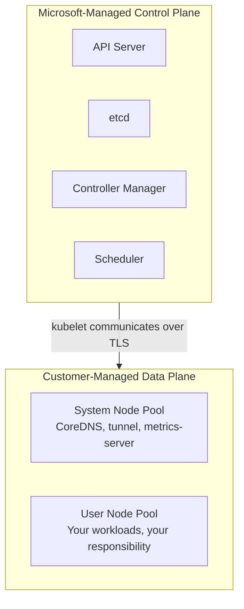
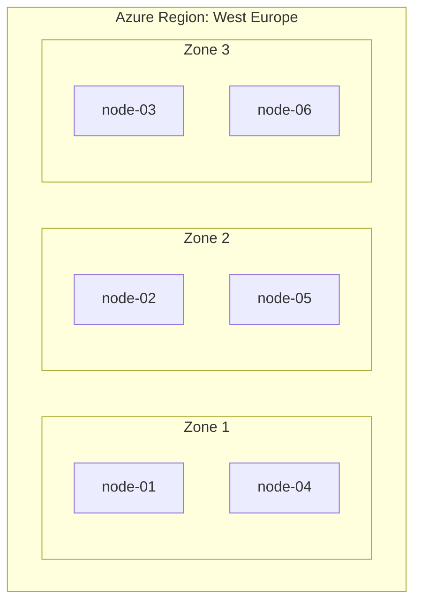
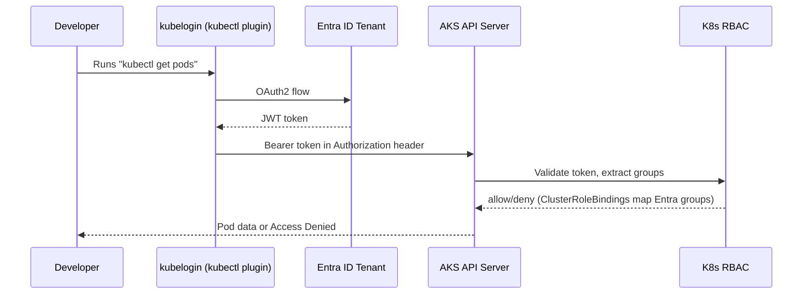
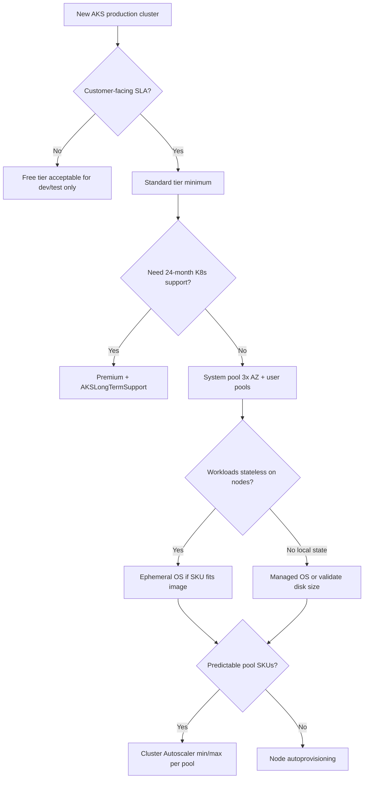

**Complexity**: `[MEDIUM]` | **Time to Complete**: 2h | **Prerequisites**: Azure Essentials and basic `kubectl` familiarity. [Cloud Architecture Patterns](../../architecture-patterns/) is a recommended companion, not required first.

## What You'll Be Able to Do

After completing this module, you will be able to design and operate production-shaped AKS clusters with the following capabilities:

- **Configure AKS clusters with system and user node pools, availability zones, and ephemeral OS disks**
- **Implement AKS auto-upgrade channels and planned maintenance windows for controlled Kubernetes version updates**
- **Deploy AKS with Entra ID RBAC integration to replace certificate-based kubeconfig with identity-driven access**
- **Design AKS node pool strategies with VM Scale Sets, taints, labels, and node selectors for workload isolation**

---

## Why This Module Matters

Hypothetical scenario: your platform team runs every microservice on the default system node pool to avoid "wasting" VMs on a separate user pool. During a marketing push, checkout pods spike to ninety percent memory on those nodes. CoreDNS begins OOM-killing, internal service names stop resolving, and unrelated teams declare a company-wide outage even though the Kubernetes API server still answers `kubectl get nodes`. The managed control plane was healthy; the data-plane architecture was not.

The lesson is brutal but simple: AKS gives you a managed Kubernetes control plane, but the architecture decisions around node pools, availability zones, upgrade strategies, and identity integration are entirely yours. Get them wrong and you build a house of cards. Get them right and you have a platform that can survive node failures, zone outages, and even botched upgrades without your customers noticing.

> **The Ship Analogy**
>
> Think of the AKS control plane as the bridge crew on a modern container ship: they navigate and coordinate, but they do not load cargo. Your node pools are the hull compartments—some must stay dry and powered (system pools), others hold variable cargo (user pools). Ephemeral OS disks are like disposable deck plating that gets replaced during port maintenance: fast, clean, and unsuitable for storing the ship's logbooks. Entra ID RBAC is the manifest that decides which crew member may enter which compartment.

In this module, you will learn how AKS is structured underneath the managed surface. You will understand the difference between system and user node pools, how Virtual Machine Scale Sets power your nodes, how availability zones protect you from datacenter failures, how upgrade channels keep your clusters current without surprises, how ephemeral OS disks dramatically improve node startup times, and how Entra ID integration replaces fragile kubeconfig certificates with proper identity management. By the end, you will deploy a production-grade AKS cluster using Bicep with Entra ID RBAC---the foundation for everything that follows in this deep dive.

---

## The AKS Control Plane: What Microsoft Manages (and What You Own)

When you create an AKS cluster, Microsoft provisions and manages the Kubernetes control plane: [the API server, etcd, the controller manager, and the scheduler](https://learn.microsoft.com/en-us/azure/aks/core-aks-concepts). You don't manage or SSH into these components directly; Microsoft operates them as part of the AKS service, and cluster-management pricing depends on the AKS tier you choose. This is the core value proposition of a managed Kubernetes service.

But "managed" does not mean "hands-off." You still make critical decisions that determine how the control plane behaves:



Architectural separation between the Microsoft-managed control plane and customer-operated agent nodes defines cluster reliability boundaries and operational responsibilities. Before provisioning node pools or deploying services, platform engineers configure cluster-management pricing tiers to align control-plane resilience with production workload availability targets.

```bash
# Create a cluster and set the cluster-management tier
az aks create \
  --resource-group rg-aks-prod \
  --name aks-prod-westeurope \
  --tier standard \
  --kubernetes-version 1.35.2 \
  --location westeurope \
  --generate-ssh-keys

# Check your cluster's current tier
az aks show --resource-group rg-aks-prod --name aks-prod-westeurope \
  --query "sku.{Name:name, Tier:tier}" -o table
```

### Control-plane tiers: Free, Standard, and Premium

**Pause and predict:** An engineering team deploys a mission-critical workload to an AKS cluster created on the default Free tier across three availability zones. During a control-plane degradation, what financial uptime SLA does Microsoft guarantee for the Kubernetes API server endpoint? How does upgrading to the Standard tier change that guarantee?

<details>
<summary>Check your prediction</summary>

[The Free tier charges no cluster-management fee and carries no API server uptime SLA](https://learn.microsoft.com/en-us/azure/aks/free-standard-pricing-tiers). Microsoft provides zero financially backed availability guarantee for the API server on Free clusters, regardless of whether agent nodes span multiple availability zones; it represents a best-effort service level objective only. Upgrading to the Standard tier establishes a contractual, financially backed SLA for the Kubernetes API server endpoint: [Microsoft guarantees 99.95% uptime when AKS is deployed across availability zones, and 99.9% uptime for regional clusters deployed without zone redundancy](https://learn.microsoft.com/en-us/azure/aks/free-standard-pricing-tiers). The Premium tier maintains the identical 99.95% (with zones) and 99.9% (without zones) SLA envelope while adding extended Long Term Support (LTS) for older Kubernetes minor versions. Standard and Premium both provide uptime coverage; Premium is not the only SLA tier.
</details>

Selecting an appropriate control-plane tier establishes financial accountability between cloud provider commitments and enterprise business requirements. While infrastructure compute charges dominate monthly billing statements, control-plane availability governs access. When unexpected regional disruptions occur, external traffic and deployment automation rely on the API server staying online.

Premium plus LTS is worth the extra cluster-management charge when upgrade cadence is constrained by compliance, when you need more than a year on a given minor version, or when operational teams cannot absorb quarterly minor-version migrations. For teams that can stay on the N-2 GA window and upgrade once or twice a year, Standard is usually sufficient. Treat Premium as a deliberate platform decision, not a default checkbox.

### What runs in the control plane, and who patches it

The managed control plane hosts the same components you would run yourself on kubeadm: the API server (your `kubectl` endpoint), etcd (cluster state), the scheduler (pod placement), and the controller-manager (ReplicaSet reconciliation, endpoints, and other controllers). Microsoft operates and patches these components as part of the AKS service; you do not SSH into control-plane nodes or rotate etcd certificates manually. Your responsibility is everything that executes on agent nodes: kubelet, container runtime, CNI plugins, DaemonSets, and application pods.

Control-plane autoscaling is opaque to cluster operators but still matters for capacity planning. AKS scales control-plane components behind the scenes as API load and object count grow. Large clusters with heavy `watch` traffic or thousands of CRDs can hit API latency limits before node pools run out of CPU; when that happens, the fix is often API design (fewer watches, smaller objects) rather than adding user nodes. [API Server VNet Integration](https://learn.microsoft.com/en-us/azure/aks/api-server-vnet-integration) is an optional architecture that projects the API server endpoint into a delegated subnet in your virtual network so node-to-API traffic stays on private networking without the legacy tunnel path. Enable it at create time with `--enable-apiserver-vnet-integration` when security architecture requires the API server ILB to live alongside your node subnets; converting an existing cluster is a one-way operation that changes the API server IP and requires an immediate cluster restart.

### The MC_* infrastructure boundary

Every AKS cluster creates a companion resource group named `MC_{your-rg}_{cluster-name}_{region}` that holds VMSS instances, NICs, load balancers, public IPs, and OS disks for your nodes. You own the subscription bill, but AKS owns the desired-state reconciliation loop. Editing a load balancer rule, resizing a VMSS by hand, or deleting a disk in the portal creates drift that the AKS resource provider corrects on the next sync—often undoing your change and leaving you with a mystery outage. The safe pattern is to express intent through `az aks`, ARM/Bicep, or supported add-ons, then read `$INFRA_RG` with `az aks show --query nodeResourceGroup` when you need forensic visibility. [If automation constructs MC_ names by string concatenation, remember the 80-character limit](https://learn.microsoft.com/en-us/troubleshoot/azure/azure-kubernetes/create-upgrade-delete/aks-common-issues-faq); truncated names break scripts that guess the infrastructure group name.

---

## System Pools vs User Pools: Separation of Concerns

[Every AKS cluster must have at least one system node pool. This pool runs the critical add-ons that keep Kubernetes functioning](https://learn.microsoft.com/en-us/azure/aks/use-system-pools): CoreDNS, the metrics server, the Azure cloud-provider integration, and the konnectivity-agent tunnel that connects your nodes to the managed control plane.

Think of system pools like the engine room on a ship. You do not put passenger luggage in the engine room, and you do not run your application workloads on system nodes. Why? Because if a misbehaving application pod consumes all CPU or memory on a system node, it can starve CoreDNS. When CoreDNS goes down, most pods in your cluster lose DNS resolution, and large parts of your platform can go dark.

```bash
# Create a cluster with a dedicated system pool (small, reliable VMs)
az aks create \
  --resource-group rg-aks-prod \
  --name aks-prod-westeurope \
  --nodepool-name system \
  --node-count 3 \
  --node-vm-size Standard_D2ds_v5 \
  --zones 1 2 3 \
  --max-pods 30 \
  --generate-ssh-keys

# Add a user pool for application workloads
az aks nodepool add \
  --resource-group rg-aks-prod \
  --cluster-name aks-prod-westeurope \
  --name apps \
  --node-count 3 \
  --node-vm-size Standard_D4ds_v5 \
  --zones 1 2 3 \
  --mode User \
  --max-pods 110 \
  --enable-cluster-autoscaler \
  --min-count 3 \
  --max-count 12 \
  --labels workload=general
```

### Taints and Tolerations: Enforcing the Boundary

**Pause and predict:** A developer creates a resource-intensive video processing deployment consisting of forty replica pods but omits node selectors and tolerations. The AKS cluster contains a dedicated System node pool and a general-purpose User node pool. On which node pool will the Kubernetes scheduler place these application pods, and why?

<details>
<summary>Check your prediction</summary>

The scheduler places the untolerated application pods exclusively onto the **User** node pool. Dedicated System pools in AKS carry the `CriticalAddonsOnly=true:NoSchedule` taint, which instructs the scheduler to reject any pod that lacks an explicit matching toleration. Because the video processing deployment specifies no tolerations, the scheduler filters out all system nodes during the scheduling predicates phase. This isolation guarantees that bursty or misbehaving application workloads cannot starve CoreDNS, the Konnectivity tunnel proxy, or metrics-server. Application manifests should never define tolerations for `CriticalAddonsOnly` unless they provide essential cluster infrastructure.
</details>

Explicit scheduling constraints protect cluster-critical services from resource starvation while allowing teams to reserve compute capacity for specialized workloads. Once baseline workload separation between system add-ons and business applications is established, operators can introduce custom taints. These taints partition user node pools according to hardware capability or cost profiles.

For user pools, you can add your own taints to create specialized pools such as GPU, Windows, or batch-only capacity:

```bash
# GPU pool with a taint so only GPU-requiring workloads land here
az aks nodepool add \
  --resource-group rg-aks-prod \
  --cluster-name aks-prod-westeurope \
  --name gpu \
  --node-count 1 \
  --node-vm-size Standard_NC6s_v3 \
  --node-taints "gpu=true:NoSchedule" \
  --labels accelerator=nvidia \
  --mode User

# Spot pool for fault-tolerant batch jobs (up to 90% cheaper)
az aks nodepool add \
  --resource-group rg-aks-prod \
  --cluster-name aks-prod-westeurope \
  --name spot \
  --node-count 0 \
  --node-vm-size Standard_D8s_v5 \
  --priority Spot \
  --eviction-policy Delete \
  --spot-max-price -1 \
  --enable-cluster-autoscaler \
  --min-count 0 \
  --max-count 20 \
  --mode User \
  --node-taints "kubernetes.azure.com/scalesetpriority=spot:NoSchedule"
```

AKS auto-applies the `kubernetes.azure.com/scalesetpriority=spot:NoSchedule` taint when you create a pool with `--priority Spot`; the explicit `--node-taints` above is shown for clarity, not because it is required.

| Pool Type | Purpose | Min Nodes | Taint Applied | When to Scale |
| :--- | :--- | :--- | :--- | :--- |
| **System** | CoreDNS, konnectivity, metrics-server | 3 (for HA across AZs) | `CriticalAddonsOnly` (auto) | Rarely---keep stable |
| **User (general)** | Standard application workloads | 3 (one per AZ) | None (or custom) | Autoscaler based on load |
| **User (GPU)** | ML inference, video processing | 0-1 | Custom GPU taint | Scale to zero when idle |
| **User (Spot)** | Batch jobs, CI runners, non-critical work | 0 | Spot taint (auto) | Aggressive autoscaling |

### Why system pools need protection and right-sizing

[System node pools host CoreDNS, metrics-server, konnectivity-agent, and other critical add-ons](https://learn.microsoft.com/en-us/azure/aks/use-system-pools). AKS applies the `CriticalAddonsOnly=true:NoSchedule` taint on dedicated system pools so arbitrary application pods cannot land there unless they declare a matching toleration—which you should reserve for platform components, not product microservices. Microsoft recommends at least three system nodes when you span availability zones so a single zone loss still leaves quorum for DNS and control-plane tunnel traffic. Undersizing system pools (for example three `Standard_B2s` nodes running a full monitoring stack) is a common source of control-plane-adjacent failures that look like application bugs.

Minimum practical sizing is workload-dependent, but a useful production starting point is three `Standard_D2ds_v5` (or equivalent) system nodes with `max-pods` around 30, separate from bursty application pools. Keep system pool autoscaling off unless Microsoft guidance for your add-on set explicitly recommends otherwise; stability beats elasticity for the engine room.

### Manual scaling, Cluster Autoscaler, and node autoprovisioning (NAP)

Node pool scaling has three distinct models. **Manual** `node-count` is predictable and cheap for flat workloads but leaves capacity on the table during spikes. **Cluster Autoscaler** (enabled per pool with `--enable-cluster-autoscaler --min-count --max-count`) watches for pods that cannot schedule and asks the backing VMSS to add nodes; scale-down waits until nodes are underutilized for a sustained period. **Node autoprovisioning (NAP)** deploys Karpenter on the cluster and provisions nodes from `NodePool` / `AKSNodeClass` CRDs based on pending pod shapes; [NAP cannot coexist on the same cluster as classic Cluster Autoscaler](https://learn.microsoft.com/en-us/azure/aks/node-auto-provisioning), so platform teams pick one strategy per cluster.

Use Cluster Autoscaler when you already think in fixed pool SKUs (GPU pool, spot pool, general apps pool). Use NAP when pod resource requests vary widely and you want right-sized VMs per workload without maintaining a SKU catalog. Both still require sensible `requests`/`limits` and PodDisruptionBudgets; autoscaler magic does not fix unschedulable pods caused by taints, affinity, or zone topology.

### VMSS orchestration, max pods, and spot vs on-demand pools

Most AKS node pools are Virtual Machine Scale Sets under the hood: scale-up adds instances, scale-down removes them, and zone placement is expressed in the scale set model. [Max pods per node is capped by your CNI choice and subnet IP inventory](https://learn.microsoft.com/en-us/azure/aks/concepts-network)—Azure CNI assigns per-pod IPs from the subnet, so a `/24` subnet cannot magically host 110 pods per node across dozens of nodes without planning. Kubenet and overlay modes change the math; copying `max-pods 30` from a system pool into a user pool is a frequent mistake that throttles density.

At the pool level, **spot** nodes (`--priority Spot`) trade eviction risk for steep discounts on the VM line item; pair them with the Kubernetes spot taint and tolerations on fault-tolerant jobs. **On-demand** pools carry the SLA expectation for stateless APIs and system components. Mixing spot into the system pool is unsupported in practice because evictions would take down CoreDNS. Keep spot in dedicated user pools with `min-count 0` so idle batch capacity does not burn budget overnight.

---

## Virtual Machine Scale Sets: The Engine Behind Node Pools

Many AKS node pools are backed by Azure Virtual Machine Scale Sets (VMSS), but AKS also supports Virtual Machines node pools. When the cluster autoscaler decides you need more nodes, it tells the VMSS to add instances. When it scales down, instances are removed from the VMSS. Understanding this relationship helps you troubleshoot node issues, because many problems that look like Kubernetes problems are actually VMSS problems.

```bash
# Find the VMSS backing your node pool
# AKS creates a separate resource group for infrastructure (MC_* prefix)
INFRA_RG=$(az aks show --resource-group rg-aks-prod --name aks-prod-westeurope \
  --query nodeResourceGroup -o tsv)

# List all VMSS in the infrastructure resource group
az vmss list --resource-group $INFRA_RG \
  --query "[].{Name:name, VMSize:sku.name, Capacity:sku.capacity}" -o table

# View instances in a specific VMSS
az vmss list-instances --resource-group $INFRA_RG \
  --name aks-apps-12345678-vmss \
  --query "[].{InstanceId:instanceId, Zone:zones[0], State:provisioningState}" -o table
```

### The Infrastructure Resource Group (MC_*)

When AKS creates your cluster, it also creates a second resource group with the naming convention `MC_{resource-group}_{cluster-name}_{region}`. This resource group contains all the infrastructure AKS manages on your behalf: the VMSS instances, load balancers, public IPs, managed disks, and virtual network interfaces.

A critical rule: **do not manually modify resources in the MC_ resource group unless AKS explicitly supports it**. AKS reconciles this resource group continuously. If you manually delete a load balancer rule or resize a VMSS, [AKS may revert your change on the next reconciliation cycle](https://learn.microsoft.com/en-us/azure/aks/resize-node-pool?tabs=azure-cli), creating confusing and hard-to-debug behavior. If you need to customize infrastructure, use the AKS API or supported extensions.

```bash
# View what AKS has created in the infrastructure resource group
az resource list --resource-group $INFRA_RG \
  --query "[].{Name:name, Type:type}" -o table
```

AKS also supports **Virtual Machines** node pools (individual VMs instead of uniform VMSS instances) for specialized placement scenarios; most fleets still standardize on VMSS because autoscaling integration and zone balancing are mature there. When troubleshooting "Kubernetes says NotReady but `kubectl` works," split the problem: `kubectl describe node` for kubelet/CNI signals, then `az vmss list-instances` (or VM instance views) for Azure provisioning state. A node stuck in `Creating` for many minutes is often a quota, subnet IP exhaustion, or VMSS extension failure—not an application bug.

---

## Availability Zones: Surviving Datacenter Failures

Many Azure regions offer multiple availability zones. Each zone is a physically separate datacenter (or group of datacenters) with independent power, cooling, and networking. When you deploy AKS nodes across all three zones, a complete datacenter failure takes out at most one-third of your capacity. [AKS zone-spanning node pools attempt to balance nodes across selected zones](https://learn.microsoft.com/en-us/azure/aks/availability-zones-overview), but you should still verify placement after scale-out events because transient skew can appear during failures or aggressive autoscaling.

Designing for zones is a two-layer problem. The Kubernetes layer needs `topologySpreadConstraints` or anti-affinity so application replicas actually use the zonal capacity you paid for. The storage layer must declare whether data is zonal (Azure Disk on a single zone), regional, or externalized to a service that hides zone boundaries. Platform teams that only zone the nodes but store PostgreSQL on zonal disks without spread constraints have not finished the architecture—they have only moved the blast radius from "all pods on one host" to "all pods that share one disk zone."



*Note: If Zone 1 fails, nodes 02, 03, 05, and 06 continue serving. The cluster autoscaler will add new nodes in zones 2 and 3 to recover capacity.*

Zone-spanning node pools aim to stay balanced across selected zones, typically within one node per zone, but temporary imbalances can still happen during failures or scaling events. Verify actual placement rather than assuming perfect spread.

**Pause and predict:** A stateful application pod runs on a worker node in Zone 1, mounting an Azure Disk PersistentVolume formatted with Locally Redundant Storage (LRS). When a physical server outage in Zone 1 terminates the host, the cluster autoscaler spins up a replacement node in Zone 2. When the Kubernetes scheduler attempts to reschedule the pod in Zone 2, what happens to the volume attachment and pod readiness?

<details>
<summary>Check your prediction</summary>

Standard Locally Redundant Storage (LRS) Azure Disks are zone-locked to the availability zone where the storage resource was originally created. An Azure Disk provisioned in Zone 1 cannot attach to a virtual machine in Zone 2. As documented in [Microsoft Azure troubleshooting guidance for disk mount failures](https://learn.microsoft.com/en-us/troubleshoot/azure/azure-kubernetes/storage/fail-to-mount-azure-disk-volume), the volume attachment operation fails with an `AttachVolume.Attach failed` error, preventing the pod from reaching a Ready state. Depending on whether scheduling was topology-aware or bound ahead of time, the pod will remain stuck in `ContainerCreating` during persistent volume mount attempts rather than simply staying in `Pending`. To enable resilient cross-zone mobility, platform engineers must implement topology-aware scheduling with `volumeBindingMode: WaitForFirstConsumer`, configure Zone-Redundant Storage (ZRS) managed disks, or use multi-zone shared storage classes like Azure Files.
</details>

Designing storage architecture for multi-zone clusters requires treating volume placement as a scheduling input, not a follow-on after compute recovers. Without that alignment, automated replacement nodes can come up healthy while stateful pods still cannot start.

```yaml
# Pod topology spread constraint to enforce even zone distribution
apiVersion: apps/v1
kind: Deployment
metadata:
  name: payment-api
spec:
  replicas: 6
  selector:
    matchLabels:
      app: payment-api
  template:
    metadata:
      labels:
        app: payment-api
    spec:
      topologySpreadConstraints:
        - maxSkew: 1
          topologyKey: topology.kubernetes.io/zone
          whenUnsatisfiable: DoNotSchedule
          labelSelector:
            matchLabels:
              app: payment-api
      containers:
        - name: payment-api
          image: myregistry.azurecr.io/payment-api:v3.2.1
          resources:
            requests:
              cpu: "500m"
              memory: "512Mi"
            limits:
              cpu: "1"
              memory: "1Gi"
```

### Zone-redundant storage vs zonal disks

Availability zones protect **compute** when you spread node pools across `--zones 1 2 3`, but storage classes behave differently. Zonal Azure Disks are pinned to the zone where they were created; zone-redundant or regional storage options (where supported for your workload) trade cost for survivability. StatefulSets without topology spread can pass health checks until a zone failure pins pods to nodes that cannot mount their disks. For databases that must stay zonal, combine `topologySpreadConstraints` with explicit volume affinity rather than hoping the scheduler guesses correctly.

Premium SSD v2 and ultra disks have their own zone rules; always read the storage SKU documentation before promising cross-zone failover for PVC-backed data. Stateless tiers should prefer ephemeral OS disks and externalize state to zone-redundant backing services when the business requires zone-level failure tolerance.

---

## Upgrade Channels: Keeping Current Without Breaking Things

[Kubernetes releases a new minor version roughly every four months. AKS supports three minor versions at any time](https://learn.microsoft.com/en-us/azure/aks/supported-kubernetes-versions), and you are responsible for upgrading before your version falls out of support. The upgrade channel feature automates this process, but choosing the right channel is critical.

| Channel | Behavior | Best For |
| :--- | :--- | :--- |
| **none** | No automatic upgrades. You upgrade manually. | Teams needing full control over upgrade timing |
| **patch** | Automatically applies the latest patch within your current minor version (e.g., 1.35.0 to 1.35.2) | Most production clusters |
| **stable** | Upgrades to the latest patch of the N-1 minor version (one behind latest) | Conservative production environments |
| **rapid** | Upgrades to the latest patch of the latest minor version | Dev/test environments, early adopters |
| **node-image** | [Only upgrades the node OS image, not the Kubernetes version](https://learn.microsoft.com/en-us/azure/aks/auto-upgrade-cluster) | When you want OS patches but not K8s version changes |

Pair `autoUpgradeProfile.upgradeChannel` with `nodeOSUpgradeChannel` in cluster config: Kubernetes channels move the control plane and kubelet minor/patch coordinates, while `NodeImage`, `SecurityPatch`, or `Unmanaged` channels govern how aggressively AKS refreshes node OS images. Production clusters commonly run `stable` or `patch` for Kubernetes plus `NodeImage` or `SecurityPatch` for OS hygiene, each bound to its own planned-maintenance configuration so security patching does not collide with minor-version migration windows.

```bash
# Set the upgrade channel
az aks update \
  --resource-group rg-aks-prod \
  --name aks-prod-westeurope \
  --auto-upgrade-channel stable

# Configure aksManagedAutoUpgradeSchedule for Kubernetes version auto-upgrade channels
az aks maintenanceconfiguration add \
  --resource-group rg-aks-prod \
  --cluster-name aks-prod-westeurope \
  --name aksManagedAutoUpgradeSchedule \
  --schedule-type Weekly \
  --day-of-week Saturday \
  --start-time 02:00 \
  --duration 4 \
  --utc-offset "+01:00"
```

[Planned maintenance supports three configuration types](https://learn.microsoft.com/en-us/azure/aks/planned-maintenance): `default` (AKS weekly control-plane and add-on releases), `aksManagedAutoUpgradeSchedule` (Kubernetes version moves driven by your auto-upgrade channel), and `aksManagedNodeOSUpgradeSchedule` (node OS image patching). Microsoft recommends four-hour windows for auto-upgrade scenarios and using `aksManagedAutoUpgradeSchedule` for cluster version upgrades rather than overloading `default`.

### N-2 support, platform support, and falling out of support

[AKS supports three GA minor versions at a time (N, N-1, N-2)](https://learn.microsoft.com/en-us/azure/aks/supported-kubernetes-versions). When a new minor ships, the oldest GA minor enters deprecation; you typically have 30 days to upgrade before creation of new node pools on that version is blocked. Clusters on N-3 enter **platform support**: Azure still helps with infrastructure, but Kubernetes component fixes and API guarantees are gone. Staying more than three minors behind can block cluster creation helpers and eventually trigger proactive upgrade outreach from Azure.

Minor versions cannot be skipped in one hop: moving from 1.33.x to 1.35.x requires stepping through 1.34.x on the control plane. Agent pools may lag the control plane by up to three minor versions on supported skew policies, but letting pools drift far behind control plane versions is a recipe for admission or kubelet feature mismatches. Calendar upgrades before version expiry, not after an audit finding.

### How AKS Upgrades Work Under the Hood

**Pause and predict:** A 10-node user pool is running production services at 90% aggregate resource utilization. You initiate a Kubernetes version upgrade on the pool. How does AKS sequence node provisioning, cordoning, and draining to prevent capacity collapse? Does it take down existing nodes before new ones are ready?

<details>
<summary>Check your prediction</summary>

AKS **surges first** to protect existing workloads from resource exhaustion. Rather than taking down three out of ten nodes upfront, AKS provisions replacement compute before evicting a single active pod. By default, AKS adds **one** extra surge node running the target Kubernetes version. The upgrade lifecycle for each node batch executes systematically:
1. AKS creates a new surge node with the target version.
2. The older node selected for upgrade is cordoned so no additional pods can schedule on it.
3. The cordoned node is drained, evicting pods while strictly honoring PodDisruptionBudgets (PDBs) so workloads safely migrate to the surge node.
4. Once the drained node is empty, AKS deletes the underlying virtual machine instance.
5. The upgrade loop repeats across the node pool until all instances match the target version.

[The max surge configuration controls how many extra nodes AKS creates concurrently during rolling upgrades; for production environments, configuring a max surge of 33% is standard](https://learn.microsoft.com/en-us/azure/aks/upgrade-aks-node-pools-rolling) because it rolls through one-third of the pool at a time without dropping baseline pool capacity.
</details>

Controlling node surge behavior protects latency-sensitive applications against cascading capacity shortages while worker machines undergo OS re-imaging and kubelet version updates. Setting explicit surge thresholds balances operational speed against subscription quota limits and downstream network address consumption during rolling maintenance cycles.

```bash
# Set max surge for a node pool
az aks nodepool update \
  --resource-group rg-aks-prod \
  --cluster-name aks-prod-westeurope \
  --name apps \
  --max-surge 33%

# Manually trigger a cluster upgrade
az aks upgrade \
  --resource-group rg-aks-prod \
  --name aks-prod-westeurope \
  --kubernetes-version 1.35.2 \
  --yes

# Check upgrade progress
az aks show --resource-group rg-aks-prod --name aks-prod-westeurope \
  --query "provisioningState" -o tsv

# Node-image-only upgrade (no Kubernetes minor bump)
az aks nodepool upgrade \
  --resource-group rg-aks-prod \
  --cluster-name aks-prod-westeurope \
  --name apps \
  --node-image-only
```

During rolling upgrades, AKS **cordons** each old node (marking it unschedulable), **drains** workloads respecting PodDisruptionBudgets, then deletes the empty node before advancing. Surge nodes (`--max-surge`, commonly `33%` in production) hold capacity so drains do not leave services starved. If PDBs are missing or `minAvailable` is zero, drains can evict entire Deployments at once—exactly the surprise outage teams blame on "AKS upgrades" when the root cause is application config.

Hypothetical scenario: a retail cluster runs Black Friday traffic on a twelve-node user pool with `max-surge 50%` and no PodDisruptionBudgets. The platform team triggers a patch upgrade at noon because "Kubernetes looked behind." AKS provisions six surge nodes, begins draining six old nodes simultaneously, and the checkout Deployment loses all ready endpoints for ninety seconds while pods reschedule. The API server stayed available; application availability did not. The fix is not postponing Kubernetes—it is setting PDBs with `minAvailable: 2`, lowering surge during peak hours via maintenance windows, and moving version bumps to the `aksManagedAutoUpgradeSchedule` window you already configured for Saturday morning.

Observe upgrades with cluster activity logs, `provisioningState`, and node pool version fields from `az aks show` / `az aks nodepool list`. [AKS emits upgrade-related Event Grid signals](https://learn.microsoft.com/en-us/azure/aks/planned-maintenance) you can route to incident channels so on-call engineers correlate user impact with an active node-image or Kubernetes upgrade, rather than guessing during unrelated application deploys.

---

## Ephemeral OS Disks: Faster Nodes, Lower Costs

AKS node pools can use **managed OS disks** (network-attached, persistent across deallocate/reallocate) or **ephemeral OS disks** (local to the hypervisor host). [When the VM SKU has enough local temp/cache/NVMe space for the OS image, AKS defaults to ephemeral unless you override `--os-disk-type Managed`](https://learn.microsoft.com/en-us/azure/aks/concepts-storage). Managed disks survive host maintenance moves that deallocate VMs; you pay per-gigabyte-month for OS storage in addition to the VM compute charge, and node boot must wait for disk attach/provision latency.

[Ephemeral OS disks place the OS on the VM's local storage](https://learn.microsoft.com/en-us/azure/virtual-machines/ephemeral-os-disks)—cache disk on older SKUs, temp/resource disk on many general-purpose families, or NVMe on newer v6 series. Placement is chosen automatically based on SKU capabilities; the OS image size must fit within the available local slot or deployment fails validation. This yields faster scale-out and rolling upgrades because AKS skips remote disk provisioning for every new node, and you do not pay a separate managed-disk line item for the OS volume.

Tradeoffs are explicit: ephemeral nodes are **stateless at the OS layer**. Deallocate/reallocate, reimage, or certain maintenance events wipe local OS state—which is desirable for immutable infrastructure but unacceptable if you mistakenly stored logs or temp files on the OS volume expecting durability. Features that require persistent OS snapshots or disk-level backup targets need managed disks instead.

### Placement, sizing, and when managed disks remain required

Sizing is the guardrail. [If you request a 100 GiB ephemeral OS on a SKU whose temp disk is only 75 GiB, validation fails; smaller images within the temp budget succeed](https://learn.microsoft.com/en-us/azure/aks/concepts-storage). Ephemeral OS requires a SKU whose cache **or** temp disk is large enough for the OS image—general-purpose `Dsv5` SKUs without a resource disk often cannot satisfy a 64–100 GiB request, which is why this lab uses temp-disk `Ddsv5` variants for the system and apps pools. Newer generations without separate cache disks evaluate temp space only; older generations may use cache for placement. Use `az vm list-skus` / VM size docs to confirm `EphemeralOSDiskSupported` before standardizing a pool SKU in Bicep.

Managed OS disks remain the right choice when regulatory policy mandates disk encryption models tied to managed disks, when OS persistence across deallocation is required (rare for Kubernetes workers), or when your chosen SKU cannot fit the container-optimized OS image locally. For typical stateless worker pools, ephemeral OS disks reduce cost and upgrade time; pair them with `--os-disk-size-gb` only as large as the image plus headroom requires, because oversized ephemeral requests can disqualify otherwise valid SKUs.

```bash
# Create a node pool with ephemeral OS disks
az aks nodepool add \
  --resource-group rg-aks-prod \
  --cluster-name aks-prod-westeurope \
  --name fastapps \
  --node-count 3 \
  --node-vm-size Standard_D4ds_v5 \
  --os-disk-type Ephemeral \
  --zones 1 2 3 \
  --mode User
```

Not all VM sizes support ephemeral OS disks. The VM's local cache, temp disk, or NVMe storage must be large enough for the OS image, so you should confirm support against the current VM-size documentation before choosing a SKU.

When autoscaling adds nodes during an incident, ephemeral pools shine because new workers join the fleet without waiting on managed disk attach throttling; when you deallocate dev clusters over weekends, remember ephemeral nodes lose local OS state—acceptable for Kubernetes workers, surprising if teammates stored debugging artifacts on the node filesystem instead of in persistent volumes or object storage.

---

## Entra ID Integration: Identity-First Cluster Access

For production, prefer Microsoft Entra integration for user authentication and consider disabling local accounts if you want to remove static `--admin` credentials. That gives you token-based user access with better central identity governance and auditing than relying on local cluster credentials.

Entra ID integration replaces certificates with OAuth 2.0 tokens. [When a user runs `kubectl get pods`, the kubeconfig triggers a browser-based login flow (or uses a cached token) against Entra ID. The API server validates the token, extracts the user's group memberships, and applies Kubernetes RBAC rules based on those groups.](https://learn.microsoft.com/en-us/azure/aks/azure-ad-rbac)



### Setting Up Entra ID Integration

[There are two modes: **AKS-managed Entra ID** (simpler, recommended) and **legacy Azure AD integration** (deprecated). Use AKS-managed for almost all new deployments.](https://learn.microsoft.com/en-us/azure/aks/azure-ad-integration-cli)

```bash
# Create the cluster with AKS-managed Entra ID
az aks create \
  --resource-group rg-aks-prod \
  --name aks-prod-westeurope \
  --enable-aad \
  --aad-admin-group-object-ids "$(az ad group show --group 'AKS-Admins' --query id -o tsv)" \
  --enable-azure-rbac \
  --generate-ssh-keys

# For existing clusters, enable Entra ID integration
az aks update \
  --resource-group rg-aks-prod \
  --name aks-prod-westeurope \
  --enable-aad \
  --aad-admin-group-object-ids "$(az ad group show --group 'AKS-Admins' --query id -o tsv)"
```

The `--enable-azure-rbac` flag is especially powerful. It lets you use Azure RBAC role assignments directly for Kubernetes authorization, without needing to create separate ClusterRoleBindings. [Azure provides four built-in roles:](https://learn.microsoft.com/en-us/azure/aks/manage-azure-rbac)

Operationally, treat cluster access like any other Azure resource ACL model: platform SREs receive **Azure Kubernetes Service RBAC Cluster Admin** at cluster scope, product teams receive Writer at namespace scope, and auditors receive Reader. Avoid distributing local clusterAdmin kubeconfig files when Entra integration is enabled; `kubelogin` converts `kubectl` into an OAuth device-code or browser flow so credential rotation happens in identity systems, not in shared dotfiles. Managed identities for the cluster and kubelet remain separate from human identities—workload access to Azure Key Vault or ACR should use workload identity federation rather than mounting service principal secrets into pods.

| Azure RBAC Role | Kubernetes Equivalent | Use Case |
| :--- | :--- | :--- |
| **Azure Kubernetes Service RBAC Cluster Admin** | cluster-admin | Platform team, break-glass access |
| **Azure Kubernetes Service RBAC Admin** | admin (namespaced) | Team leads, namespace owners |
| **Azure Kubernetes Service RBAC Writer** | edit (namespaced) | Developers who deploy workloads |
| **Azure Kubernetes Service RBAC Reader** | view (namespaced) | Read-only dashboards, auditors |

```bash
# Grant a developer group write access to the "payments" namespace
az role assignment create \
  --assignee-object-id "$(az ad group show --group 'Payments-Developers' --query id -o tsv)" \
  --role "Azure Kubernetes Service RBAC Writer" \
  --scope "$(az aks show -g rg-aks-prod -n aks-prod-westeurope --query id -o tsv)/namespaces/payments"
```

---

## Cost Lens: What Drives Your AKS Bill

AKS invoices blend **cluster-management tier fees**, **VM compute**, **storage**, **egress**, and **surrounding Azure services** (load balancers, public IPs, Log Analytics). The Free tier eliminates the management surcharge but provides no API SLA; Standard and Premium add predictable per-cluster management charges on top of worker VMs. Premium plus LTS is a line item you buy for calendar flexibility, not for raw CPU—budget it when compliance mandates extended minor-version life, not when Standard already covers your upgrade cadence.

Node pools dominate variable spend. Oversized system pools (GPU SKUs for CoreDNS, or eight nodes when three suffice) burn budget 24/7 because system pools rarely scale down. User pools with high `min-count` on Cluster Autoscaler keep idle nodes warm; lowering mins on non-production pools and using spot pools for batch work are the fastest savings levers. Ephemeral OS disks remove managed-disk charges for OS volumes and shorten upgrade windows, which indirectly reduces surge-node minutes during rollouts.

Cost spikes usually trace to architectural choices rather than mystery billing: premium SSD data disks on every replica, public LoadBalancer sprawl, surge upgrades set to 50% on large pools during business hours, and forgotten GPU pools left at `min-count 1`. Right-size SKUs to requested CPU/memory, enforce labels/taints so expensive pools only run expensive pods, and tag the MC_ resource group resources in Cost Management exports to attribute infra RG charges back to the owning cluster.

For FinOps review meetings, export a monthly breakdown with these labels: `tier` (Free/Standard/Premium management fee), `pool` (system/apps/gpu/spot), `disk` (managed OS vs ephemeral vs PVC premium), and `upgrade` (surge hours during rollouts). Clusters that look inexpensive on management fees but expensive on MC_ VMSS lines are usually autoscaling with too-high minimums or running oversized SKUs for tiny pod requests. The architecture choices in this module—separate pools, ephemeral OS, spot for batch, and maintenance-window-controlled upgrades—are also cost controls, not only reliability controls.

---

## Patterns and Anti-Patterns

| Pattern | When to use | Why it works | Scaling note |
| :--- | :--- | :--- | :--- |
| **Dedicated system + user pools** | Production clusters running customer workloads | Isolates CoreDNS and tunnel traffic from application CPU/memory spikes | Keep system pool small and stable; scale user pools |
| **Zone-spanning pools with topology spread** | Stateless APIs requiring zone failure tolerance | Limits blast radius to one zone worth of pods | Pair with PDBs so drains do not empty a Service |
| **Ephemeral OS on stateless workers** | General compute pools without local state | Cuts OS disk cost and speeds node readiness | Revalidate SKU temp/cache size when changing VM family |
| **Stable channel + aksManagedAutoUpgradeSchedule** | Regulated production needing auto-patches | Stays on N-1 minor automatically within maintenance windows | Use 4h+ windows; separate node OS schedule |

| Anti-pattern | What goes wrong | Why teams fall into it | Better alternative |
| :--- | :--- | :--- | :--- |
| **Single pool for everything** | App spikes starve CoreDNS | Default `az aks create` simplicity | Add user pool; keep system pool tainted |
| **Free tier in production** | No API SLA; reactive firefighting | Dev cluster copied to prod | `--tier standard` minimum |
| **Manual MC_ load balancer edits** | Drift reverted; mysterious outages | Portal "quick fix" during incident | Change via AKS APIs; open Azure support if blocked |
| **100% spot for APIs** | Evictions during price/ capacity events | Chasing lowest VM price | Spot for batch; on-demand for serving tier |
| **Ignoring PVC zones** | Stateful pods Pending after drain | Assuming Kubernetes "just moves" disks | Topology constraints or zone-redundant storage |
| **max-surge 50% on tight pools** | Temporary doubling of node bill | Want fastest upgrade at any cost | 33% surge unless load headroom proven |

The anti-pattern table is intentionally blunt: most entries are policy violations everyone agrees with in meetings but forgets during a Friday incident. Bake the fixes into templates—Bicep or Terraform modules with system pools, taints, maintenance objects, and PDB examples—so the happy path is also the compliant path. When a new service team onboards, point them to the user pool labels and taints instead of granting cluster-admin "just for debugging," because temporary admin access becomes permanent far more often than platform teams expect during quarterly access reviews, audits, and handoffs.

---

## Decision Framework

Use this matrix when standardizing a new AKS platform baseline. It complements the hands-on Bicep lab rather than replacing environment-specific sizing.

| Decision | Choose A | Choose B | Primary tradeoff |
| :--- | :--- | :--- | :--- |
| **Pool layout** | System + user pools | System-only (tiny clusters) | Isolation vs operational overhead |
| **Node scaling** | Cluster Autoscaler per pool | Node autoprovisioning (Karpenter) | Fixed SKUs vs dynamic VM selection; mutually exclusive |
| **OS disk** | Ephemeral (SKU supports image size) | Managed OS disk | Cost/speed vs OS persistence requirements |
| **Control-plane tier** | Standard + zones | Premium + LTS | Upgrade cadence vs extended Microsoft patch window |
| **Upgrade automation** | `patch` channel + maintenance window | `none` (manual only) | Security velocity vs change-control gates |

### Putting the framework into practice

When you evaluate an existing cluster, walk the decision tree in reverse as an audit checklist. Confirm the SKU tier is not Free, verify system and user pools are separated with taints intact, inspect `autoUpgradeProfile` plus maintenance configuration names, and ensure MC_ resources have no manual tags suggesting portal edits. Document chosen tradeoffs in your platform runbook so application teams understand why GPU workloads must tolerate a `gpu=true` taint, or why their CI jobs belong on the spot pool. Architecture reviews fail when only diagrams exist—this module's goal is to connect each Azure knob to a failure mode you have seen in production-shaped environments.

Capacity planning deserves explicit mention because architecture and cost intersect at the subnet: Azure CNI assigns real VNet IPs to pods, so max pods per node times maximum node count must fit inside the node subnet with headroom for upgrades and surge nodes. If you standardize on 110 max pods with a /24 node subnet, math breaks long before Kubernetes objects do. Overlay CNI modes change consumption patterns; the deep-dive networking module covers those paths. At this architecture layer, the actionable rule is to size subnets and max pods together, then revalidate whenever autoscaling `max-count` increases.



---

## Did You Know?

1. **AKS cluster-management pricing depends on the tier.** Free only charges for underlying resources, while Standard and Premium add cluster-management charges and SLA-backed features.

2. [**The MC_ resource group naming convention has a 80-character limit.**](https://learn.microsoft.com/en-us/troubleshoot/azure/azure-kubernetes/create-upgrade-delete/aks-common-issues-faq) If your resource group name, cluster name, and region combine to exceed 80 characters, AKS truncates the infrastructure resource group name. This has caused automation scripts to break when they construct the MC_ name programmatically. Use `az aks show --query nodeResourceGroup` instead of string concatenation.

3. **AKS supports Azure Linux for Linux node pools.** Azure Linux is Microsoft's container-focused Linux distribution for AKS, but Ubuntu remains the default Linux distro on AKS unless you choose the Azure Linux OS SKU.

4. [**The cluster autoscaler in AKS checks for pending pods every 10 seconds by default.** When it finds pods that cannot be scheduled due to insufficient resources, it calculates the minimum number of nodes needed across all configured node pools and issues a scale-up request to the VMSS. Scale-down is more conservative: nodes must be below 50% utilization for 10 minutes (by default) before they are candidates for removal.](https://learn.microsoft.com/en-us/training/modules/aks-cluster-autoscaling/)

---

## Architecture Review Checklist

Before you mark a cluster production-ready, walk this checklist aloud in a design review so gaps surface while changes are cheap. Confirm the management tier is Standard or Premium for customer-facing services, with Premium paired to LTS only when extended support is mandated. Verify at least one dedicated system pool spans the zones you expect, with application Deployments unable to schedule there without an explicit toleration. Validate autoscaling boundaries: Cluster Autoscaler min/max per pool or NAP NodePool limits, plus PodDisruptionBudgets on services that must survive drains.

Upgrade governance should be visible in Git: `autoUpgradeProfile` channel, node OS channel, `aksManagedAutoUpgradeSchedule`, and `aksManagedNodeOSUpgradeSchedule` resource names, plus documented surge settings per pool. Identity should flow through Entra ID groups mapped to Azure RBAC roles—never store shared kubeconfig files on team wiki pages. Storage expectations should be explicit for every StatefulSet: zonal disk, regional service, or replicated system. Finally, open the MC_ resource group read-only and confirm no manual resource mutations appear in activity logs; if they do, fix the automation path that encouraged portal edits. Capture the review outcome in your platform wiki with links to the chosen tier, pool map, and maintenance window IDs so future cluster upgrades are routine operations events, not archaeology exercises that rediscover why Saturday 02:00 was sacred two years later.

---

## Common Mistakes

Teams that skip architecture review often repeat the same AKS foot-guns: treating managed control planes as proof that the data plane is resilient, or assuming zone-redundant Kubernetes nodes automatically make zonal disks portable. The table below captures the highest-frequency issues platform engineers escalate from production clusters; use it as a pre-go-live gate before declaring a cluster "production ready."

| Mistake | Why It Happens | How to Fix It |
| :--- | :--- | :--- |
| Running workloads on system node pools | Default cluster creation puts everything in one pool | For most production clusters, create separate user pools; system pools should primarily run critical add-ons |
| Using Free tier for production | Cost savings temptation or oversight during initial setup | Use Standard tier minimum for production; Premium for mission-critical workloads |
| Deploying nodes in a single availability zone | Not specifying `--zones` during pool creation | In regions with three zones, pass `--zones 1 2 3` for production pools; size node counts to match your zone strategy |
| Ignoring PodDisruptionBudgets during upgrades | Teams deploy without PDBs, then upgrades drain all replicas simultaneously | Create PDBs for every production deployment with `minAvailable` or `maxUnavailable` |
| Manually modifying resources in the MC_ resource group | Trying to fix networking or disk issues directly | Use AKS APIs and `az aks` commands for supported changes; manual edits are usually overwritten |
| Using certificate-based auth in production | It is the default and "just works" for initial setup | Enable Entra ID integration and Azure RBAC before onboarding any team |
| Setting max-pods too low on user pools | Copying system pool settings (30 pods) to user pools | Use 110 (default) or higher for user pools; calculate based on CNI and subnet sizing |
| Not configuring maintenance windows | Auto-upgrades happen at random times, causing surprise disruptions | Set maintenance windows to off-peak hours for both node OS and Kubernetes version upgrades |

---

## Quiz

<details>
<summary>1. Your team is deploying a new microservice architecture and decides to place all workloads into the default system node pool to save costs. During a load test, the new services consume 99% of the node's memory. Suddenly, every other application in the cluster starts reporting DNS resolution failures. What architectural mistake caused this cascading failure?</summary>

You ran application workloads on the system node pool, which shares resources with critical infrastructure like CoreDNS and the metrics server. When your application consumed all the memory, it starved CoreDNS, causing it to crash or become unresponsive. Because CoreDNS is responsible for resolving internal Kubernetes services, its failure caused every pod in the cluster to lose DNS resolution, effectively bringing down the entire platform. System pools should generally be isolated using the `CriticalAddonsOnly` taint to prevent exactly this scenario.
</details>

<details>
<summary>2. During a routine maintenance event, a node in Zone 1 is drained, and its pods are evicted. One of the evicted pods is a PostgreSQL database using an Azure Disk for its PersistentVolumeClaim. The Kubernetes scheduler decides to place the replacement pod on a node in Zone 2. What will be the state of the PostgreSQL pod, and why?</summary>

The PostgreSQL pod will be stuck in a `Pending` state indefinitely. This happens because Azure Disks are zone-locked resources; a disk created in Zone 1 physically exists in Zone 1's datacenter and cannot be attached to a Virtual Machine in Zone 2. The Kubernetes scheduler cannot satisfy both the PVC requirement (which is bound to the Zone 1 disk) and the node placement in Zone 2 simultaneously. To prevent this, you must use topology-aware scheduling to force the pod into Zone 1, or use a zone-redundant storage solution like Azure Files.
</details>

<details>
<summary>3. Your company operates in a highly regulated financial industry where stability is prioritized above all else. However, you still need automated patching for security vulnerabilities. You are debating between the 'patch' and 'stable' auto-upgrade channels for your AKS clusters. Which should you choose to minimize the risk of introducing breaking changes from new Kubernetes features?</summary>

You should choose the 'stable' channel. While both channels provide automated updates, they behave fundamentally differently regarding minor versions. The 'patch' channel automatically upgrades to the latest patch release within your *current* minor version, but it requires you to manually bump the minor version before it falls out of support. The 'stable' channel automatically upgrades your cluster to the latest patch of the N-1 minor version (one version behind the latest General Availability release). This ensures you are always on a proven, community-tested version without bleeding-edge features that might introduce instability.
</details>

<details>
<summary>4. You are planning a Kubernetes version upgrade for a massive 30-node user pool that processes real-time telemetry data. You want the upgrade to finish as quickly as possible and are willing to pay for extra temporary infrastructure. You set the max surge to 50%. Describe exactly what AKS will do during the first wave of this upgrade.</summary>

Setting max surge to 50% on a 30-node pool means AKS will create 15 additional "surge" nodes simultaneously with the new Kubernetes version. Once these 15 new nodes are ready, AKS will cordon and drain 15 of the old nodes, moving their workloads to the surge nodes or other available capacity. After the old nodes are empty, they are deleted. This aggressive surge drastically reduces the total time required to upgrade the cluster, but it means you will temporarily pay for 45 nodes instead of 30.
</details>

<details>
<summary>5. Your e-commerce application experiences massive, unpredictable traffic spikes during flash sales. The cluster autoscaler successfully requests new nodes, but you notice it takes over 90 seconds for a new node to become `Ready`, which is too slow to handle the sudden influx of users. How can changing the OS disk type solve this problem, and what are the trade-offs?</summary>

You should switch the node pool to use Ephemeral OS disks instead of standard managed disks. Ephemeral OS disks use the virtual machine's local temporary storage (NVMe or SSD) rather than provisioning and attaching a remote network disk. This eliminates the storage provisioning overhead, allowing nodes to boot and become `Ready` in roughly 20-30 seconds instead of 60-90 seconds. The trade-off is that the disk is wiped clean if the node is deallocated, but for stateless Kubernetes nodes, this is actually a benefit as it ensures a pristine, known-good state upon reboot.
</details>

<details>
<summary>6. Your security compliance team requires a unified audit trail for all access grants and the ability to instantly revoke a user's access across all cloud resources, including Kubernetes clusters. They are frustrated by the current process of manually updating `ClusterRoleBindings` in each AKS cluster. How does integrating Entra ID and Azure RBAC solve their problem?</summary>

Integrating Entra ID with Azure RBAC allows you to manage Kubernetes authorization using the exact same Azure role assignment model used for storage accounts or virtual machines. Instead of maintaining disconnected `ClusterRoleBindings` inside each cluster, you assign built-in Azure roles (like 'Azure Kubernetes Service RBAC Writer') directly to Entra ID groups at the cluster or namespace scope. This provides the security team with a single pane of glass for auditing access via the Azure Activity Log, allows them to enforce access via Azure Policy, and means that removing a user from an Entra ID group revokes their Kubernetes access without running any `kubectl` commands once their token is refreshed. This centralized approach completely eliminates the operational overhead of managing lifecycle access per cluster.
</details>

<details>
<summary>7. A junior administrator notices that the AKS cluster is running out of public IP addresses for new LoadBalancer services. To fix this "quickly", they navigate to the `MC_rg-aks-prod_aks-prod-westeurope_westeurope` resource group in the Azure Portal and manually attach a new Public IP prefix to the cluster's load balancer. A few hours later, the new IPs mysteriously disappear. What went wrong?</summary>

The administrator violated a cardinal rule of AKS: do not manually modify resources inside the infrastructure (`MC_`) resource group. AKS uses a continuous reconciliation loop to ensure the actual state of the infrastructure matches the desired state defined in the AKS control plane. When the administrator manually added the IP prefix, they created configuration drift. During the next reconciliation cycle, the AKS resource provider detected this drift and reverted the load balancer back to its original, declared state, deleting the manual changes. All infrastructure changes must be made through the AKS API or `az aks` CLI commands.
</details>

---

## Hands-On Exercise: Production-Grade AKS Cluster with Bicep and Entra ID RBAC

In this exercise, you will deploy a production-ready AKS cluster using Bicep (Azure's infrastructure-as-code language) with Entra ID integration, multiple node pools, availability zones, and proper RBAC. The template encodes the same decisions captured in the Decision Framework: Standard tier for SLA coverage, isolated system and apps pools, ephemeral OS disks where SKUs allow, stable Kubernetes auto-upgrade channel, and separate maintenance schedules for control-plane weekly releases versus AKS-managed Kubernetes upgrades. Treat the lab as an architecture conformance test—after deployment, you should be able to point to each knob in the portal or ARM output and explain why it is set that way.

### Lab architecture snapshot

```text
┌─────────────────────────────────────────────────────────────┐
│  Microsoft-managed control plane (API server, etcd, etc.)   │
└───────────────────────────┬─────────────────────────────────┘
                            │ konnectivity / RBAC
        ┌───────────────────┴───────────────────┐
        │  rg-aks-prod (customer RG)              │
        │   └── AKS cluster resource              │
        └───────────────────┬───────────────────┘
                            │ owns
        ┌───────────────────▼───────────────────┐
        │  MC_* infrastructure RG               │
        │   ├── VMSS: system (3× zones)         │
        │   ├── VMSS: apps (3–12, autoscaler)   │
        │   ├── SLB, PIPs, NICs, OS disks       │
        └───────────────────────────────────────┘
```

When validation fails, compare your deployed `autoUpgradeProfile` and maintenance configurations against the module's upgrade-channel guidance before chasing network issues—misaligned schedules are a common reason teams believe auto-upgrade is "broken."

### Prerequisites

- Azure CLI installed and authenticated (`az login`)
- An Azure subscription with Owner access (required for role assignments) and permissions to create Entra ID groups
- Bicep CLI (bundled with Azure CLI 2.20+)
- `kubectl` CLI installed (`az aks install-cli` or via package manager)

### Task 1: Create the Entra ID Groups

Before deploying the cluster, create the Entra ID security groups that will map to Kubernetes roles through Azure RBAC, because the Bicep template references admin group object IDs at deployment time.

<details>
<summary>Solution</summary>

```bash
# Create an admin group for cluster-admin access
az ad group create \
  --display-name "AKS-Prod-Admins" \
  --mail-nickname "aks-prod-admins"

# Create a developer group for namespace-scoped write access
az ad group create \
  --display-name "AKS-Prod-Developers" \
  --mail-nickname "aks-prod-developers"

# Store the group object IDs for use in Bicep
ADMIN_GROUP_ID=$(az ad group show --group "AKS-Prod-Admins" --query id -o tsv)
DEV_GROUP_ID=$(az ad group show --group "AKS-Prod-Developers" --query id -o tsv)

echo "Admin Group ID: $ADMIN_GROUP_ID"
echo "Developer Group ID: $DEV_GROUP_ID"

# Add yourself to the admin group
MY_USER_ID=$(az ad signed-in-user show --query id -o tsv)
az ad group member add --group "AKS-Prod-Admins" --member-id "$MY_USER_ID"
```

</details>

### Task 2: Write the Bicep Template

Create a Bicep file that defines the AKS cluster with Standard tier, zonal system and user pools, ephemeral OS disks, Entra ID integration, and auto-upgrade profiles aligned to the architecture decisions in this module.

<details>
<summary>Solution</summary>

```bicep
// main.bicep
@description('Location for all resources')
param location string = resourceGroup().location

@description('Entra ID admin group object ID')
param adminGroupObjectId string

@description('Kubernetes version')
param kubernetesVersion string = '1.35.2'

var clusterName = 'aks-prod-${location}'
var systemPoolName = 'system'
var appsPoolName = 'apps'

resource aksCluster 'Microsoft.ContainerService/managedClusters@2024-09-01' = {
  name: clusterName
  location: location
  sku: {
    name: 'Base'
    tier: 'Standard'
  }
  identity: {
    type: 'SystemAssigned'
  }
  properties: {
    kubernetesVersion: kubernetesVersion
    dnsPrefix: clusterName
    enableRBAC: true

    aadProfile: {
      managed: true
      enableAzureRBAC: true
      adminGroupObjectIDs: [
        adminGroupObjectId
      ]
    }

    autoUpgradeProfile: {
      upgradeChannel: 'stable'
      nodeOSUpgradeChannel: 'NodeImage'
    }

    // CNI model selection (Azure CNI Overlay, Cilium data plane) is covered in Module 7.2.
    networkProfile: {
      networkPlugin: 'azure'
      networkPolicy: 'azure'
      loadBalancerSku: 'standard'
      serviceCidr: '10.0.0.0/16'
      dnsServiceIP: '10.0.0.10'
    }

    agentPoolProfiles: [
      {
        name: systemPoolName
        mode: 'System'
        count: 3
        vmSize: 'Standard_D2ds_v5'
        availabilityZones: [ '1', '2', '3' ]
        osDiskType: 'Ephemeral'
        osDiskSizeGB: 64
        osType: 'Linux'
        osSKU: 'AzureLinux'
        maxPods: 30
        enableAutoScaling: false
        upgradeSettings: {
          maxSurge: '33%'
        }
      }
      {
        name: appsPoolName
        mode: 'User'
        count: 3
        vmSize: 'Standard_D4ds_v5'
        availabilityZones: [ '1', '2', '3' ]
        osDiskType: 'Ephemeral'
        osDiskSizeGB: 100
        osType: 'Linux'
        osSKU: 'AzureLinux'
        maxPods: 110
        enableAutoScaling: true
        minCount: 3
        maxCount: 12
        upgradeSettings: {
          maxSurge: '33%'
        }
        nodeTaints: []
        nodeLabels: {
          workload: 'general'
        }
      }
    ]
  }
}

output clusterName string = aksCluster.name
output clusterFqdn string = aksCluster.properties.fqdn
output nodeResourceGroup string = aksCluster.properties.nodeResourceGroup
```

</details>

### Task 3: Deploy the Cluster

Deploy the Bicep template to Azure, fetch Entra-aware credentials with `az aks get-credentials`, and verify node zone spread plus control-plane reachability before proceeding to RBAC assignments.

<details>
<summary>Solution</summary>

```bash
# Create the resource group
az group create --name rg-aks-prod --location westeurope

# Deploy the Bicep template
az deployment group create \
  --resource-group rg-aks-prod \
  --template-file main.bicep \
  --parameters adminGroupObjectId="$ADMIN_GROUP_ID"

# Get cluster credentials (Entra ID mode)
az aks get-credentials \
  --resource-group rg-aks-prod \
  --name aks-prod-westeurope \
  --overwrite-existing

# Verify connectivity (this will trigger Entra ID login)
kubectl get nodes -o wide

# Verify node distribution across zones
kubectl get nodes -o custom-columns=NAME:.metadata.name,ZONE:.metadata.labels.'topology\.kubernetes\.io/zone',VERSION:.status.nodeInfo.kubeletVersion
```

</details>

### Task 4: Configure Azure RBAC Role Assignments

Grant the developer group namespace-scoped **Azure Kubernetes Service RBAC Writer** access so members can deploy to `payments` without cluster-admin rights on the entire fleet.

<details>
<summary>Solution</summary>

```bash
# Create the namespace
kubectl create namespace payments

# Get the cluster resource ID
CLUSTER_ID=$(az aks show -g rg-aks-prod -n aks-prod-westeurope --query id -o tsv)

# Assign the developer group "RBAC Writer" scoped to the payments namespace
az role assignment create \
  --assignee-object-id "$DEV_GROUP_ID" \
  --assignee-principal-type Group \
  --role "Azure Kubernetes Service RBAC Writer" \
  --scope "${CLUSTER_ID}/namespaces/payments"

# Verify the role assignment
az role assignment list \
  --scope "${CLUSTER_ID}/namespaces/payments" \
  --query "[].{Principal:principalName, Role:roleDefinitionName, Scope:scope}" -o table
```

</details>

### Task 5: Add a Maintenance Window and Verify Upgrade Channel

Configure separate planned-maintenance windows for Kubernetes auto-upgrade and node OS image refresh so platform changes occur during off-peak hours instead of during business traffic peaks.

<details>
<summary>Solution</summary>

```bash
# Add a weekly maintenance window for Kubernetes upgrades
az aks maintenanceconfiguration add \
  --resource-group rg-aks-prod \
  --cluster-name aks-prod-westeurope \
  --name aksManagedAutoUpgradeSchedule \
  --schedule-type Weekly \
  --day-of-week Saturday \
  --start-time 02:00 \
  --duration 4 \
  --utc-offset "+01:00"

# Add a separate window for node OS image upgrades
az aks maintenanceconfiguration add \
  --resource-group rg-aks-prod \
  --cluster-name aks-prod-westeurope \
  --name aksManagedNodeOSUpgradeSchedule \
  --schedule-type Weekly \
  --day-of-week Sunday \
  --start-time 02:00 \
  --duration 4 \
  --utc-offset "+01:00"

# Verify the configuration
az aks maintenanceconfiguration list \
  --resource-group rg-aks-prod \
  --cluster-name aks-prod-westeurope -o table

# Verify the upgrade channel
az aks show -g rg-aks-prod -n aks-prod-westeurope \
  --query "autoUpgradeProfile" -o json
```

</details>

Before deploying enterprise workloads and automated node management pipelines to production on AKS, platform architects must audit common operational misconceptions. Each scenario below states a claim that sounds operationally convenient. Treat the claim as the hypothesis, then open the details only after you have a prediction.

**Card A: Untolerated application pods will land on the System pool because that is where AKS runs everything by default.** An operations team provisions an AKS cluster with a default System node pool and an additional User node pool for applications. A developer deploys an internal processing service consisting of twelve high-memory pods without defining any node selectors, node affinity, or tolerations. The team assumes that the System pool is the default destination because it was created during initial cluster setup. They expect the Kubernetes scheduler to place all untolerated application workloads onto the System pool alongside CoreDNS and metrics-server.

<details>
<summary>Check your prediction</summary>

Failure layer: Node pool role designations versus admission taints and scheduler evaluation. Next action: understand that dedicated AKS system node pools carry the `CriticalAddonsOnly=true:NoSchedule` taint, which instructs the scheduler to filter out system nodes for any pod lacking an explicit toleration; because the developer's application deployment specifies no tolerations, the scheduler rejects the system nodes and places all pods exclusively onto the untainted User pool; verify that application workloads never define tolerations for `CriticalAddonsOnly`, preserving dedicated compute for CoreDNS, Konnectivity tunnels, and cluster-critical add-ons.
</details>

**Card B: After the Zone 1 node dies, the Azure Disk PVC will attach to the replacement node in Zone 2 and the pod will resume.** A stateful database deployment runs as a single-replica pod in Zone 1, mounting a PersistentVolume backed by an Azure Managed Disk with Locally Redundant Storage (LRS). An unexpected hardware fault brings down the physical host in Zone 1. The AKS cluster autoscaler detects the unfulfilled pod demand and provisions a new worker node in Zone 2. The database team assumes that the Kubernetes attach/detach controller will unmount the Azure Disk from the failed node. They expect it to attach to the replacement node in Zone 2 so the database pod can resume running.

<details>
<summary>Check your prediction</summary>

Failure layer: Physical storage replication scope versus cross-zonal compute scheduling. Next action: recognize that Azure Disks provisioned with standard Locally Redundant Storage (LRS) are physically tied to the specific availability zone where the storage hardware resides and cannot attach to virtual machines in another zone; when the pod is rescheduled to Zone 2, the volume attachment fails with documented `AttachVolume.Attach failed` errors, leaving the pod unable to become Ready and often stuck in `ContainerCreating`; to ensure resilience against zone failures, deploy Zone-Redundant Storage (ZRS) disks, configure topology-aware volume binding (`WaitForFirstConsumer`), or use multi-zone shared storage like Azure Files.
</details>

**Card C: AKS upgrades a 10-node pool at 90% utilization by taking down three old nodes first, then creating replacements.** A platform team initiates a rolling Kubernetes minor-version upgrade on a 10-node production user pool operating at 90% aggregate CPU and memory utilization. The node pool configuration defines `--max-surge 33%`. The team assumes that AKS accelerates the rolling upgrade by cordoning, draining, and terminating three existing nodes simultaneously. They expect the orchestrator to rely on temporary autoscaling to replace lost compute capacity.

<details>
<summary>Check your prediction</summary>

Failure layer: In-place node termination versus surge-first rolling upgrade mechanics. Next action: understand that AKS rolling upgrades always surge first rather than terminating active compute; with `max-surge 33%`, AKS creates up to three new virtual machine instances running the target Kubernetes version before cordoning or draining any active nodes; only after the new surge nodes reach a Ready status does AKS cordon and drain an equivalent number of older nodes while strictly respecting PodDisruptionBudgets; this surge-first lifecycle guarantees that total cluster capacity never falls below 100% of the pre-upgrade baseline during rolling maintenance.
</details>

**Card D: Deploying an AKS Free-tier cluster across availability zones gives you a financially backed 99.95% API-server SLA.** A cloud engineering team designs an architecture for an internal analytics platform across three availability zones using the default AKS Free tier to minimize operational control-plane overhead. Worker nodes and underlying VMSS instances are spread evenly across zones 1, 2, and 3. Because of this distribution, the team assumes that Microsoft backs the managed API server with a financially backed 99.95% uptime SLA.

<details>
<summary>Check your prediction</summary>

Failure layer: Cluster infrastructure availability zones versus control-plane pricing tier contractual commitments. Next action: recognize that the AKS Free tier carries no financially backed uptime SLA under any configuration, regardless of whether worker nodes span multiple availability zones; the Free tier provides only an unbacked service level objective (SLO); to obtain a financially backed 99.95% uptime SLA on the Kubernetes API server, the cluster must be upgraded to the Standard or Premium tier with availability zones enabled (or 99.9% without zones); remember that Premium tier pairs this exact same SLA with extended Long Term Support (LTS), but is not required simply to obtain an API server SLA.
</details>

**Success Criteria**:

- [ ] Entra ID groups created for admin and developer roles
- [ ] AKS cluster deployed via Bicep with Standard tier
- [ ] System pool: 3 nodes, Standard_D2ds_v5, across 3 availability zones, ephemeral OS disks
- [ ] Apps pool: 3-12 nodes (autoscaler enabled), Standard_D4ds_v5, across 3 AZs, ephemeral OS disks
- [ ] Entra ID integration enabled with Azure RBAC
- [ ] Developer group has scoped write access to the payments namespace only
- [ ] Maintenance windows configured for Saturday and Sunday off-peak hours
- [ ] Upgrade channel set to "stable"

---

## Next Module

[Module 7.2: AKS Advanced Networking](../module-7.2-aks-networking/) --- Dive into the networking layer: compare Azure CNI, Kubenet, CNI Overlay, and CNI Powered by Cilium. Learn when to use each, how to implement network policies, and how to expose services through AGIC and Private Link.

## Sources

- [learn.microsoft.com: core aks concepts](https://learn.microsoft.com/en-us/azure/aks/core-aks-concepts) — Microsoft's AKS core concepts documentation explicitly describes the managed control-plane components.
- [learn.microsoft.com: free standard pricing tiers](https://learn.microsoft.com/en-us/azure/aks/free-standard-pricing-tiers) — The AKS pricing-tier documentation gives these SLA conditions directly.
- [learn.microsoft.com: use system pools](https://learn.microsoft.com/en-us/azure/aks/use-system-pools) — The AKS system node pool guidance documents the required system-pool presence and the intended split between system and user pools.
- [learn.microsoft.com: resize node pool](https://learn.microsoft.com/en-us/azure/aks/resize-node-pool?tabs=azure-cli) — Microsoft's AKS guidance says agent nodes live in a custom MC_* resource group and direct IaaS customizations there do not persist.
- [learn.microsoft.com: fail to mount azure disk volume](https://learn.microsoft.com/en-us/troubleshoot/azure/azure-kubernetes/storage/fail-to-mount-azure-disk-volume) — Microsoft's AKS troubleshooting guidance explicitly documents disk/node zone mismatch as a cause of Pending or mount failures and recommends zone-aware placement.
- [learn.microsoft.com: supported kubernetes versions](https://learn.microsoft.com/en-us/azure/aks/supported-kubernetes-versions) — The AKS supported-versions page states both the upstream release cadence and AKS's three-GA-minor support window.
- [learn.microsoft.com: auto upgrade cluster](https://learn.microsoft.com/en-us/azure/aks/auto-upgrade-cluster) — AKS's automatic-upgrade documentation defines these channels and their version-selection behavior.
- [learn.microsoft.com: upgrade aks node pools rolling](https://learn.microsoft.com/en-us/azure/aks/upgrade-aks-node-pools-rolling) — The AKS rolling-upgrade documentation describes this flow and explicitly recommends 33% max surge for production pools.
- [learn.microsoft.com: concepts storage](https://learn.microsoft.com/en-us/azure/aks/concepts-storage) — AKS storage guidance explicitly documents these performance and operational benefits of ephemeral OS disks.
- [learn.microsoft.com: azure ad rbac](https://learn.microsoft.com/en-us/azure/aks/azure-ad-rbac) — Microsoft's AKS Entra/RBAC documentation explicitly describes token-based sign-in and authorization based on identity or group membership.
- [learn.microsoft.com: azure ad integration cli](https://learn.microsoft.com/en-us/azure/aks/azure-ad-integration-cli) — Microsoft's legacy integration page marks the old model deprecated and points users to the AKS-managed experience.
- [learn.microsoft.com: manage azure rbac](https://learn.microsoft.com/en-us/azure/aks/manage-azure-rbac) — The Azure RBAC for Kubernetes Authorization documentation lists these built-in AKS roles and their scope semantics.
- [learn.microsoft.com: aks common issues faq](https://learn.microsoft.com/en-us/troubleshoot/azure/azure-kubernetes/create-upgrade-delete/aks-common-issues-faq) — Microsoft's AKS naming FAQ explicitly documents the 80-character limit for autogenerated MC_ resource group names.
- [learn.microsoft.com: aks cluster autoscaling](https://learn.microsoft.com/en-us/training/modules/aks-cluster-autoscaling/) — Microsoft's AKS autoscaling training material documents these default cluster-autoscaler profile values.
- [Configure availability zones in Azure Kubernetes Service (AKS)](https://learn.microsoft.com/en-us/azure/aks/availability-zones-overview) — Explains zone-spanning versus regional behavior, zone resilience, and zone-aware workload placement in AKS.
- [Patch and upgrade Azure Kubernetes Service worker nodes and Kubernetes versions](https://learn.microsoft.com/en-us/azure/architecture/operator-guides/aks/aks-upgrade-practices) — Covers current Microsoft guidance for upgrade channels, node-image strategy, maintenance windows, and production-safe rollout patterns.
- [learn.microsoft.com: api server vnet integration](https://learn.microsoft.com/en-us/azure/aks/api-server-vnet-integration) — Documents private API server placement in a delegated subnet and one-way enablement requirements.
- [learn.microsoft.com: node auto-provisioning](https://learn.microsoft.com/en-us/azure/aks/node-auto-provisioning) — Explains Karpenter-based NAP, prerequisites, and incompatibility with Cluster Autoscaler on the same cluster.
- [learn.microsoft.com: planned maintenance](https://learn.microsoft.com/en-us/azure/aks/planned-maintenance) — Defines `default`, `aksManagedAutoUpgradeSchedule`, and `aksManagedNodeOSUpgradeSchedule` maintenance configuration types.
- [learn.microsoft.com: ephemeral os disks on VMs](https://learn.microsoft.com/en-us/azure/virtual-machines/ephemeral-os-disks) — Source for cache/temp/NVMe placement options and OS image size limits on local storage.
