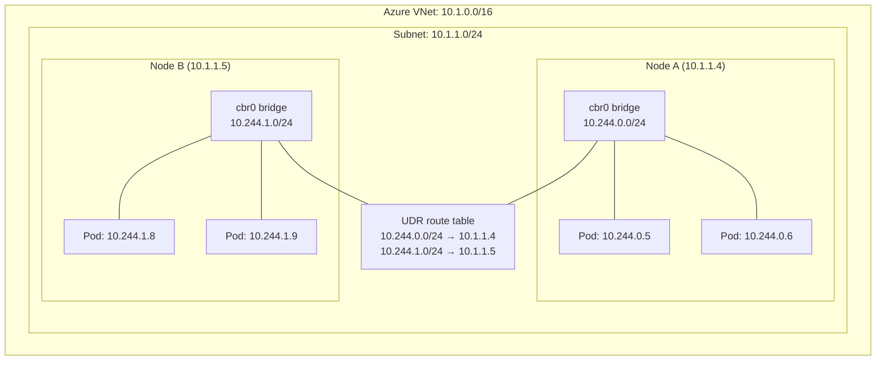
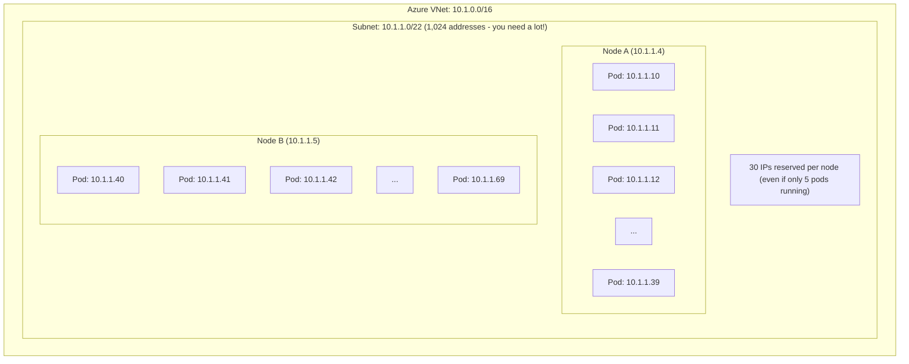
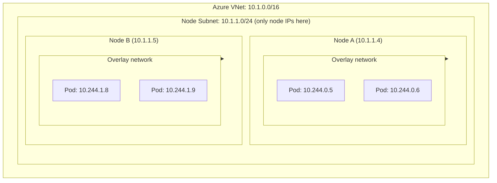
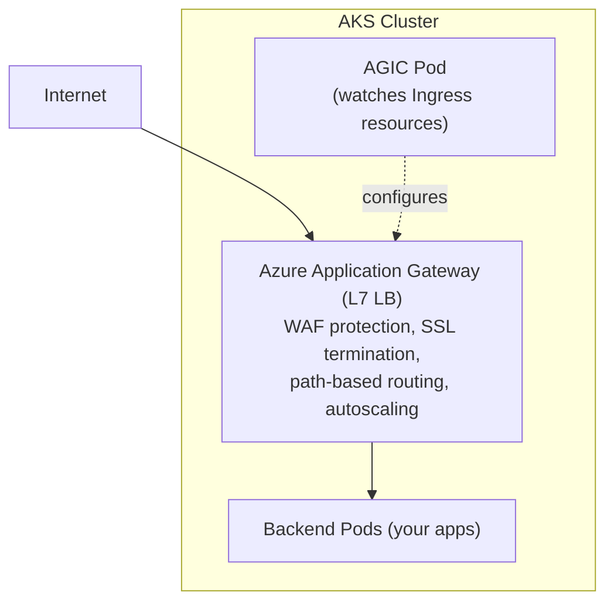
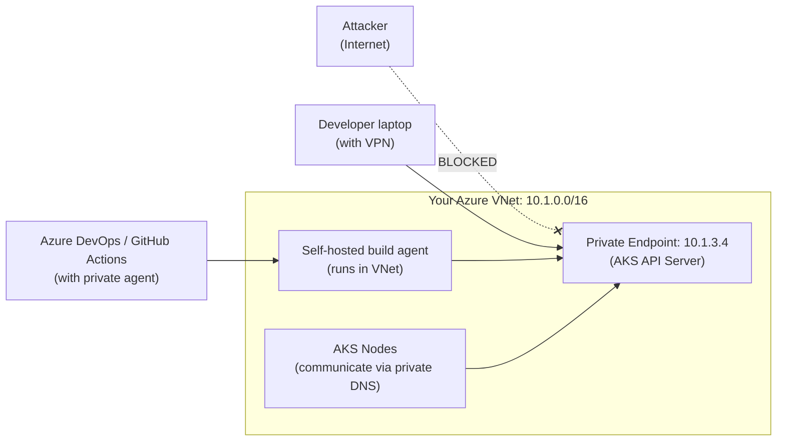

**Complexity**: `[COMPLEX]` | **Time to Complete**: 3.5h | **Prerequisites**: [Module 7.1: AKS Architecture & Node Management](../module-7.1-aks-architecture/)

## What You'll Be Able to Do

After completing this module, you will be able to:

- **Diagnose** IP exhaustion and routing constraints to select the appropriate AKS Container Network Interface (CNI) model for enterprise-scale workloads.
- **Design** zero-trust network policies at Layer 4 and Layer 7 using Cilium eBPF to secure east-west pod-to-pod communication.
- **Implement** scalable ingress architectures using Azure Application Gateway Ingress Controller (AGIC) with built-in WAF protection.
- **Evaluate** private cluster topologies and construct secure egress control planes using NAT Gateway and Azure Firewall.

## Why This Module Matters

> **Hypothetical scenario:** Consider a European e-commerce organization handling billions in transaction volume embarking on an ambitious migration. The organization is transitioning from a monolithic legacy system to a modern microservices architecture hosted entirely on Azure Kubernetes Service (AKS). Eager to get started and lacking deep Kubernetes networking expertise, the platform engineering team opted for the default Kubenet networking plugin. It seemed like the simplest choice, primarily because it required very few IP addresses from their meticulously guarded corporate Azure Virtual Network (VNet). During the staging phase, which consisted of roughly a dozen microservices, everything operated flawlessly. Network latency was virtually undetectable, and pod-to-pod communication was seamless.

However, the reality of production hit them violently three months later. The architecture had expanded to encompass 85 distinct microservices, all chattering constantly with one another. During a high-traffic promotional event, the platform began suffering from intermittent, seemingly inexplicable 5-second delays on inter-service API calls. The delays compounded, cascading into widespread transaction timeouts. The engineering team spent two frantic weeks investigating the application code, optimizing database queries, and scaling up pod replicas, but the latency persisted. Finally, an external network architect uncovered the catastrophic root cause: Kubenet relies on user-defined routes (UDRs) and a local bridge network on each node. Every time a pod communicated with a pod on a different node, the packet had to traverse the Azure route table. With 85 services generating tens of thousands of cross-node requests per second, the Azure UDR update limits and routing overhead became a massive bottleneck, resulting in those mysterious 5-second propagation delays.

The remediation was excruciating. Because the Container Network Interface (CNI) cannot be changed on a running cluster, the organization was forced to execute a complete cluster rebuild using Azure CNI Overlay. The migration consumed three weeks of engineering effort, caused numerous maintenance windows, and resulted in substantial lost revenue and weeks of engineering cost. This incident underscores a brutal truth about Kubernetes: networking is the architectural decision you make earliest and pay for latest. The choice between Kubenet, Azure CNI, CNI Overlay, and CNI Powered by Cilium directly dictates your scaling limitations, your network security posture, and your overall system resilience. In this module, we will dissect every facet of AKS networking, equipping you to make these critical decisions correctly from day one.

Notice what the team in that story did not do: they tested only application correctness before validating platform constraints under realistic scale. A healthy module can run dozens of microservices with near-zero latency, and still fail at enterprise scale because control-plane assumptions never held once node and service counts increased. That pattern is not an application bug; it is a platform architecture bug with predictable symptoms. When you build a networking strategy in AKS, you are choosing the rules that every packet must follow for the life of the cluster, so the strategy should be reviewed before workloads grow and before third-party integrations become coupled to unstable pathways.

## The Four Networking Models: How Pods Get Their IP Addresses

The most fundamental networking decision in any AKS cluster deployment is the selection of the Container Network Interface (CNI) plugin. That choice determines how pods are assigned IP addresses, how they communicate across nodes, and how they interact with external Azure resources. It also determines your capacity planning model because every CNI implementation creates different control planes for routing, troubleshooting, and blast radius. Before you onboard the first production workload, you need to understand all four options and map them to operational constraints and security requirements, because this decision is difficult to reverse later.

### Kubenet: The Simple (but Limited) Choice

Kubenet is the foundational, default networking model for many basic Kubernetes installations. Under Kubenet, pods do not receive IP addresses from the Azure VNet. Instead, they are assigned IPs from an entirely separate, logically isolated address space. Each node in the cluster is allocated a single IP address from the Azure VNet subnet. The node then runs a local bridge (`cbr0`), which manages a private `/24` subnet specifically for the pods residing on that node.

Consider the analogy of an apartment building. The building itself (the node) has a single street address (the VNet IP). The individual apartments (the pods) have internal room numbers (the private pod IPs). When a pod wants to talk to a pod on the same node, the local bridge routes the traffic internally. When a pod needs to communicate with a pod on a different node, the packet must leave the building, pass through translation, and follow the Azure User-Defined Route, or UDR. This simple shape sounds harmless at small scale, but routing pressure compounds as microservice interactions become dense.



**Pause and predict:** You deploy an AKS cluster using the Kubenet networking plugin with 5 worker nodes and schedule 100 application pods across them. How many IP addresses does this deployment consume from your Azure VNet subnet, and how does the cluster handle pod-to-pod and egress routing?

<details>
<summary>Check your prediction</summary>

Under Kubenet, 5 nodes running 100 pods consume only **5 VNet IPs** from your Azure VNet subnet. Pods use a separate CIDR block (typically assigned as a `/24` per node from an internal range like `10.244.0.0/16`) managed locally by the node's `cbr0` virtual bridge. When pods communicate with endpoints outside the host node or send egress traffic to the VNet, the Linux kernel performs Source Network Address Translation (SNAT) to NAT the packet to the node primary IP. Pod-to-pod traffic crossing between nodes relies on Azure User-Defined Routes (UDRs) in the subnet route table to direct each pod CIDR slice to its corresponding host node IP address.
</details>

This address conservation makes Kubenet appealing when enterprise cloud governance teams enforce strict limits on available Virtual Network IP space. However, relying on host routing tables and address translation introduces architectural boundaries that limit cluster expansion and integration with broader cloud services.

Kubenet is exceptionally conservative with IP addresses because only host nodes draw from the enterprise subnet allocation. However, the operational trade-offs are significant and often disqualifying for serious production workloads:
- **No Direct VNet Connectivity**: Because pods have non-routable private IPs, external Azure resources (like a legacy VM or a service endpoint) cannot reach them directly.
- **UDR Scaling Limits**: Azure enforces a hard limit of 400 routes per UDR table. In a massive cluster, you can easily collide with this ceiling, causing the cluster to fail to register new nodes.
- **Routing Latency overhead**: Every packet crossing a node boundary must be processed by the UDR layer, injecting measurable latency at scale.
- **Platform Limitations**: Kubenet strictly does not support Windows Server nodes.

### Azure CNI: Direct VNet Integration

Azure CNI represents the opposite end of the spectrum from Kubenet. In this model, the Kubernetes cluster networking is flattened directly into the Azure Virtual Network. Pods are typically assigned first-class, routable IP addresses directly from an Azure VNet subnet, which makes every pod appear as a normal network identity for integration use cases. This simplicity helps teams working with legacy Azure services, but it increases dependence on careful subnet capacity design before scaling out.

To continue our previous analogy, Azure CNI is like a sprawling suburban neighborhood where every single house (pod) gets its own unique, globally recognized street address. They do not share a building address; they exist independently on the city map. This eliminates the need for local bridges and UDRs entirely.



**Pause and predict:** You plan to provision an AKS cluster in a dedicated /24 Azure subnet providing 251 usable IP addresses after Azure reserves five network addresses. You select standard Azure CNI with the default 30 pods per node. Will your initial deployment of 5 nodes succeed, and what happens when you attempt to scale the cluster to 10 nodes?

<details>
<summary>Check your prediction</summary>

Azure CNI default 30 max-pods pre-allocates node and pod IPs upfront during node provisioning. On a /24 subnet with 251 usable addresses, **/24: 5 nodes succeed; 10 nodes fail.** Each node reserves 1 IP for the host, 30 IPs for pods, and 1 additional buffer IP for rolling upgrades, consuming 32 IP addresses per node. Provisioning 5 nodes consumes 160 IP addresses, which completes successfully within the available 251 addresses. However, scaling to 10 nodes requires 310 to 320 IP addresses. Because 310 exceeds the 251 usable addresses in a `/24` subnet, the Azure resource manager fails the scaling operation due to subnet IP exhaustion, even if the existing nodes are completely empty.
</details>

Capacity planning for standard Azure CNI requires treating IP allocation as a static upfront reservation rather than a dynamic consumption metric tied to real-time pod activity. Network administrators must coordinate closely with platform teams to size CIDR blocks against peak projected node counts before provisioning clusters in shared enterprise Virtual Networks.

The defining characteristic—and the greatest danger—of standard Azure CNI is its voracious appetite for IP addresses. By default, when a node spins up, Azure CNI pre-allocates an IP address for the maximum number of pods that node might theoretically host (defined by the `--max-pods` parameter, which defaults to 30 but is often set higher). If you deploy a 20-node cluster, Azure can reserve 600 pod addresses, plus 20 node addresses, even if you have not deployed any workloads yet. In enterprise environments where IP space is tightly controlled by networking teams, this often creates a hard stop during cluster expansions because there is no runway to grow without expanding subnet boundaries.

To address this severe limitation, Microsoft introduced **Azure CNI with dynamic IP allocation**. This modern variant preserves direct VNet routing while changing the allocation behavior. Instead of pre-allocating large blocks of IPs at node startup, it dynamically assigns addresses to pods only as they are actively scheduled. It also allows you to specify a dedicated, separate subnet just for pods, which physically decouples node IP exhaustion from pod IP exhaustion and gives operations teams cleaner scaling levers.

```bash
# Azure CNI with dynamic IP allocation
az aks create \
  --resource-group rg-aks-prod \
  --name aks-cni-dynamic \
  --network-plugin azure \
  --vnet-subnet-id "/subscriptions/{sub}/resourceGroups/rg-network/providers/Microsoft.Network/virtualNetworks/vnet-prod/subnets/aks-nodes" \
  --pod-subnet-id "/subscriptions/{sub}/resourceGroups/rg-network/providers/Microsoft.Network/virtualNetworks/vnet-prod/subnets/aks-pods" \
  --zones 1 2 3
```

### Azure CNI Overlay: Best of Both Worlds

For organizations that want the performance and feature set of Azure CNI but cannot afford to burn hundreds of VNet IP addresses, **Azure CNI Overlay** provides the optimal architectural compromise. In an overlay network, nodes receive IP addresses from the Azure VNet subnet, consuming very few addresses. Pods, however, receive IP addresses from a private internal CIDR block (typically `10.244.0.0/16`) that is separate from Azure VNet routing space. This lets teams keep direct node integration while avoiding the direct Pod-per-VNet-address tax.

Unlike Kubenet, which relies on Azure UDRs to route traffic between nodes, Azure CNI Overlay creates a separate routing domain in the Azure networking stack for the pod CIDR. Microsoft's overlay documentation states that you do not provision custom routes on the cluster subnet and you do not use an encapsulation method such as VXLAN to tunnel pod-to-pod traffic. Pod-to-pod connectivity therefore behaves like VM-to-VM traffic on the Azure fabric, while nodes still consume only node IPs from the VNet subnet.



**Pause and predict:** You configure an AKS cluster using Azure CNI Overlay with nodes on an Azure VNet and pods on an overlay CIDR. If an administrator provisions a standalone virtual machine in the same Azure VNet, can that VM establish a direct connection to a pod's IP address? How must external clients reach these workloads, and how does overlay pod egress communicate back out to the VNet?

<details>
<summary>Check your prediction</summary>

Overlay pods are **not directly reachable** from a same-VNet VM. Because pod IP addresses reside in a private overlay network space that is unrouted by the Azure VNet fabric, external Virtual Machines cannot route directly to individual pod IPs. To establish connectivity to the application, the external VM must send traffic through a Kubernetes **Service** (such as an internal `LoadBalancer`), an **Ingress** controller, or an Application Gateway deployed with a front-end IP on the VNet. For outbound traffic initiated by the pod toward external VNet endpoints, the host node uses Source Network Address Translation (SNAT) so the egress packet originates from the node's primary VNet IP.
</details>

Enforcing traffic ingestion through managed cluster entry points establishes clear governance boundaries between enterprise network topologies and ephemeral container workloads. Platform operators gain centralized inspection, rate limiting, and access logging without exposing transient internal pod endpoints across corporate routing tables.

The primary architectural trade-off is isolation. Overlay pod IPs live in a private CIDR that the surrounding Azure VNet does not advertise the way it advertises node addresses, so a database on a peered VNet cannot treat a pod as another VM. You must rely entirely on Kubernetes Services, Ingress Controllers, and Load Balancers to bridge the gap between the overlay network and the external VNet. In practice, that is usually the safer operating model because it keeps ingress paths explicit and auditable instead of relying on accidental layer-3 reachability.

```bash
# Create an AKS cluster with CNI Overlay
az aks create \
  --resource-group rg-aks-prod \
  --name aks-cni-overlay \
  --network-plugin azure \
  --network-plugin-mode overlay \
  --pod-cidr 10.244.0.0/16 \
  --zones 1 2 3
```

### Azure CNI Powered by Cilium: The Future

If CNI Overlay represents the baseline for IP conservation, **Azure CNI Powered by Cilium** is the strongest evolution for enterprise architectures requiring sustained throughput and low-latency packet routing. While it retains an IP-conserving overlay architecture, it fundamentally reimagines the underlying Kubernetes networking dataplane.

**Pause and predict:** In a cluster using traditional Kubernetes networking, kube-proxy manages Service routing and Network Policies via Netfilter iptables. As an application environment scales from 100 to 10,000 Services, how does packet forwarding performance behave under iptables? How does Azure CNI Powered by Cilium alter this mechanism, and what operating system constraint applies?

<details>
<summary>Check your prediction</summary>

Cilium **replaces kube-proxy** on Linux agent nodes and bypasses `iptables` entirely. Under traditional `kube-proxy` architectures, every inbound packet must be sequentially evaluated against thousands of sequential `iptables` rule entries, creating linear $O(n)$ latency penalties as Service counts expand. Cilium instead loads sandboxed eBPF (Extended Berkeley Packet Filter) programs directly into the Linux kernel and resolves Service destinations using in-kernel BPF hash maps in $O(1)$ constant time. Consequently, eBPF service routing does not walk long iptables chains as services grow 100 → 10,000. Note that this eBPF dataplane acceleration is Linux-only; Windows nodes in AKS do not run eBPF and rely on standard host networking mechanisms.
</details>

Dataplane choice is a reliability decision as much as a performance one: once production traffic is on the cluster, platform teams inherit kernel constraints, mixed-OS pool limits, and observability tooling that cannot be swapped during an incident.

Traditional AKS networking relies on `kube-proxy` using Linux `iptables` to implement Service load balancing and Network Policies. That approach is reliable but optimized for expressiveness, not for constant-scale path efficiency. When `kube-proxy` processes a packet, it must evaluate that packet against a sequential list of rules; at 5,000 services, the kernel can spend meaningful time walking those lists, creating linear O(n) routing overhead.

Cilium completely replaces `kube-proxy` and bypasses `iptables` entirely. It leverages **eBPF (Extended Berkeley Packet Filter)**, which runs compiled, sandboxed programs directly inside the Linux kernel. Instead of scanning long chains, Cilium uses hash-based eBPF maps for route decisions. These lookups occur in O(1) constant time, so routing latency remains much flatter as service count grows from 10 to 100,000.

```mermaid
graph TD
    subgraph Traditional ["Traditional Networking Stack"]
        App1["Application"] --> Sock1["Socket Layer"]
        Sock1 --> iptables["iptables rules (thousands!)"]
        iptables --> Netfilter["Netfilter conntrack"]
        Netfilter --> NIC1["Network Interface"]
        NIC1 -.-> Note1["O(n) rule evaluation"]
    end
    
    subgraph Cilium ["Cilium eBPF Stack"]
        App2["Application"] --> Sock2["Socket Layer"]
        Sock2 --> eBPF["eBPF programs (compiled, fast)"]
        eBPF --> NIC2["Direct to NIC (bypass iptables entirely)"]
        NIC2 -.-> Note2["O(1) hash lookups"]
    end
```



Beyond raw performance, the eBPF dataplane grants Cilium kernel-level flow visibility. Advanced Container Networking Services is the add-on that unlocks FQDN filtering, Layer 7 network policies, WireGuard, and the extra observability bundle; those features are not included by enabling `--network-dataplane cilium` alone. This shifts networking from “just forwarding packets” to a programmable control plane that can enforce intent and expose rich security signals once the right add-on is in place.

```bash
# Create an AKS cluster with CNI Powered by Cilium
az aks create \
  --resource-group rg-aks-prod \
  --name aks-cilium \
  --network-plugin azure \
  --network-plugin-mode overlay \
  --network-dataplane cilium \
  --pod-cidr 10.244.0.0/16 \
  --zones 1 2 3 \
  --tier standard
```

### The Decision Matrix

| Feature | Kubenet | Azure CNI | CNI Overlay | CNI + Cilium |
| :--- | :--- | :--- | :--- | :--- |
| **VNet IPs per pod** | No (bridge IPs) | Yes | No (overlay IPs) | No (overlay IPs) |
| **IP consumption** | Low (node IPs only) | High (node + pod IPs) | Low (node IPs only) | Low (node IPs only) |
| **Max pods/node** | 250 | 250 | 250 | 250 |
| **Network policy engine** | Calico only | Azure NPM, Calico, Cilium | Azure NPM, Calico, Cilium | Cilium (native) |
| **eBPF dataplane** | No | No | No | Yes |
| **L7 network policies** | No | No | No | ACNS |
| **Windows nodes** | No | Yes | Yes | No |
| **Direct pod VNet routing** | No (UDR) | Yes | No | No |
| **Recommended for new clusters** | No | Only if direct VNet routing needed | Good | Best |

### How to choose a CNI model without guessing

The table above is a starting point, not a final answer. In real platform design, you should evaluate your expected pod density, subnet ownership model, security posture maturity, and incident response expectations together. Start by estimating maximum sustainable node count over a planning horizon. If IP governance is strict and you cannot grow VNet subnets quickly, CNI Overlay or CNI + Cilium usually become non-optional choices regardless of convenience.

Next, map your policy requirements. If your team only needs basic network isolation and still plans to evolve toward richer identity-aware controls later, Azure NPM can be acceptable for smaller environments, especially where minimizing new tooling is a priority. If you need route-level visibility that aligns with API-level governance, then Cilium is the path that keeps pace as applications become more service-heavy. In this phase, many teams make a second mistake: choosing a model for immediate convenience and then retrofitting security requirements on top, which is always more expensive than selecting the right model at the start.

Finally, tie every choice to operational capacity. Ask who will own subnet planning, who will run troubleshooting during incidents, and whether your team can absorb future networking rearchitecture if scale curves shift. If your answer includes "not often" to any of these, prefer the model with stronger defaults and better operational observability even when direct VNet routing simplicity is attractive. Networking complexity is not an accidental tax; it is a design control that determines how expensive future growth will be.

## Network Policies: Controlling East-West Traffic

By default, Kubernetes implements a flat network topology, so any pod in any namespace can initiate a connection with any other pod. This accelerates early development because teams can move quickly without predefining traffic contracts. In production, however, that default can create catastrophic blast radius: a single compromised container can pivot from frontend to backend and then to internal APIs before detection. Network Policies were designed to reverse that default posture.

Network Policies implement zero-trust segmentation by acting as distributed firewalls. You define permitted ingress and egress explicitly at pod level using label selectors, which makes policies both scalable and explicit. For AKS specifically, this decision is constrained by cluster creation because the policy engine is bound at provisioning time, and changing it later typically requires a destructive rebuild and migration.

A practical way to think about this is: first choose the coarse boundary, then narrow to the service contract. Start by documenting what each namespace is allowed to talk to by default, and then refine with explicit allow-lists for known dependencies. This avoids writing large policy sets that appear correct on day one but accidentally permit dangerous lateral movement the next day as teams deploy additional namespaces.

### Azure Network Policy Manager (Azure NPM)

Azure NPM is Microsoft's native implementation of the standard Kubernetes NetworkPolicy API. On Linux nodes, it orchestrates `iptables` rules to enforce policies. It is straightforward, generally compatible with basic policy definitions, and useful for simple segmentation requirements early in a platform's lifecycle. However, it only operates at Layer 3 (IP addresses) and Layer 4 (Ports/Protocols), which means it cannot reason about request paths in the way modern application security models often require.

When teams start with Azure NPM, the most common design flaw is mixing expectations. Teams expect Layer 7 controls because they want to secure API calls, but they only get Layer 3 and Layer 4 semantics from that engine. The gap does not make Azure NPM incorrect; it makes the architecture contract incomplete unless you compensate with service-level safeguards such as strict service boundaries and explicit API ownership review.

```yaml
# Block all ingress to pods in the database namespace
apiVersion: networking.k8s.io/v1
kind: NetworkPolicy
metadata:
  name: deny-all-ingress
  namespace: database
spec:
  podSelector: {}
  policyTypes:
    - Ingress
```

```yaml
# Allow only the API namespace to reach the database
apiVersion: networking.k8s.io/v1
kind: NetworkPolicy
metadata:
  name: allow-api-to-db
  namespace: database
spec:
  podSelector:
    matchLabels:
      app: postgres
  policyTypes:
    - Ingress
  ingress:
    - from:
        - namespaceSelector:
            matchLabels:
              team: api
      ports:
        - protocol: TCP
          port: 5432
```

### Calico: The Ecosystem Standard

Calico is the most widely deployed third-party network policy engine in the Kubernetes ecosystem. It fully supports standard Kubernetes NetworkPolicies, and its real operational value is in its proprietary Custom Resource Definitions (CRDs). Calico introduces GlobalNetworkPolicies, allowing administrators to enforce cluster-wide rules—such as denying egress to known malicious IP ranges—without duplicating policy logic across hundreds of namespaces. This reduces drift and keeps security posture consistent across teams.

In day-to-day operations, Calico teams usually start by codifying a few baseline cluster-wide restrictions and then layering namespace-specific exceptions as services mature. That sequence is predictable because it scales with team growth: global safety properties remain stable while namespace teams move quickly on workload-specific refinements. The more policy that can be expressed once at the cluster level, the less likely it is that an individual team will accidentally omit a critical guardrail.

```yaml
# Calico GlobalNetworkPolicy: deny egress to the internet except DNS
apiVersion: projectcalico.org/v3
kind: GlobalNetworkPolicy
metadata:
  name: deny-egress-except-dns
spec:
  order: 100
  selector: "app != 'internet-proxy'"
  types:
    - Egress
  egress:
    - action: Allow
      protocol: UDP
      destination:
        ports:
          - 53
    - action: Allow
      protocol: TCP
      destination:
        ports:
          - 53
    - action: Allow
      destination:
        nets:
          - 10.0.0.0/8
    - action: Deny
```

### Cilium Network Policies: L7-Aware Security

Cilium elevates network security from the transport layer to the application layer. Standard Network Policies only comprehend IPs and ports, which is why they are often sufficient for broad segmentation but too coarse for API-driven systems. Cilium, powered by eBPF, understands HTTP paths, gRPC methods, and DNS queries. This allows you to allow a pod to run `HTTP GET /api/v1/read` while simultaneously blocking `HTTP POST /api/v1/write`, so policy aligns with business rules rather than only packet tuples.

Because Cilium works at Layer 7, the policy review process changes. You can now audit security rules by thinking in terms of application behavior, which is much easier for service teams to reason about than raw CIDR and port maps alone. This does add cognitive overhead at first, because rule authors must understand protocol semantics as well as Kubernetes objects, but the tradeoff is often fewer accidental over-permissions and clearer post-incident debugging.

```yaml
# CiliumNetworkPolicy: allow HTTP GET to /api/v1/products only
apiVersion: cilium.io/v2
kind: CiliumNetworkPolicy
metadata:
  name: allow-product-reads
  namespace: frontend
spec:
  endpointSelector:
    matchLabels:
      app: web-frontend
  egress:
    - toEndpoints:
        - matchLabels:
            app: product-api
      toPorts:
        - ports:
            - port: "8080"
              protocol: TCP
          rules:
            http:
              - method: GET
                path: "/api/v1/products.*"
```

Crucially, Cilium supports DNS-based egress filtering. In cloud environments, external services (like Stripe, GitHub, or AWS S3) frequently rotate their underlying IP addresses. A traditional Layer 3 policy attempting to whitelist external IPs will inevitably break when the remote provider updates their DNS records. Cilium resolves this by intercepting DNS queries locally, determining the returned IP address dynamically, and automatically updating the eBPF allowlist in real-time.

In practice, DNS-based policies are most useful when your threat model includes dependency drift, because provider infrastructure can change faster than your platform team can update static firewall data. With Cilium, the policy intent remains stable while the resolved destinations adapt, which is especially important for SaaS-heavy applications that depend on multiple CDN-backed endpoints.

```yaml
# CiliumNetworkPolicy: DNS-based egress filtering
apiVersion: cilium.io/v2
kind: CiliumNetworkPolicy
metadata:
  name: allow-specific-domains
  namespace: backend
spec:
  endpointSelector:
    matchLabels:
      app: payment-service
  egress:
    - toFQDNs:
        - matchName: "api.stripe.com"
        - matchName: "api.paypal.com"
      toPorts:
        - ports:
            - port: "443"
              protocol: TCP
    - toEndpoints:
        - matchLabels:
            "k8s:io.kubernetes.pod.namespace": kube-system
            "k8s:k8s-app": kube-dns
      toPorts:
        - ports:
            - port: "53"
              protocol: ANY
          rules:
            dns:
              - matchPattern: "*.stripe.com"
              - matchPattern: "*.paypal.com"
```

> **Stop and think**: You need to ensure your backend pods can only download updates from `github.com`. How would implementing this differ between Azure NPM (standard NetworkPolicy) and Cilium Network Policies? Which approach is more resilient to infrastructure changes?

## Ingress: Getting Traffic Into Your Cluster

Routing external traffic into your Kubernetes cluster requires an Ingress Controller, a specialized reverse proxy that reads Kubernetes Ingress objects and dynamically configures routing behavior. In many environments, this is the difference between predictable production rollout and manual DNS-and-rule drift across teams. AKS offers two robust managed add-ons for this purpose, and both drastically reduce the overhead of managing external load balancers at scale.

A useful design mindset is to treat ingress as a policy boundary, not just a forwarding utility. Every path through the ingress layer becomes an enforceable interface: path matching defines who gets access to what, and TLS termination points define where credentials are presented and validated. Once that boundary is explicit, platform teams can move from reactive rule changes to repeatable deployment models.

### Application Gateway Ingress Controller (AGIC)

AGIC fundamentally changes the traditional ingress architecture. Instead of deploying an NGINX proxy pod inside the cluster, AGIC delegates the control plane and data plane responsibilities to an external Azure Application Gateway. The AGIC pod watches the Kubernetes API and translates Ingress resources into Azure ARM API calls, where those resources are realized into gateway configuration. This gives teams a managed, Azure-native way to evolve ingress behavior without running custom ingress infrastructure inside worker nodes.



The primary driver for selecting AGIC is enterprise security architecture. Azure Application Gateway integrates with Azure Web Application Firewall (WAF), which continuously protects against OWASP Top 10 threats such as SQL injection and cross-site scripting (XSS). Since traffic is inspected and terminated outside the cluster, malicious payloads are blocked before they reach Kubernetes nodes, reducing both endpoint pressure and response blast radius.

This architecture is powerful when combined with zero-trust assumptions, because it moves the first policy checkpoint outside worker nodes. When a request cannot pass WAF policy at the ingress boundary, it never has a chance to consume cluster capacity, which makes attack windows smaller and failure modes easier to triage during incidents.

```bash
# Enable AGIC add-on with a new Application Gateway
az aks enable-addons \
  --resource-group rg-aks-prod \
  --name aks-prod-westeurope \
  --addons ingress-appgw \
  --appgw-name appgw-aks \
  --appgw-subnet-cidr "10.1.2.0/24"
```

### NGINX Ingress (Web Application Routing Add-on)

For architectures that do not mandate external WAF inspection, or where cost optimization is a top priority, the Web Application Routing add-on deploys a fully managed instance of NGINX Ingress Controller directly into your cluster. This keeps ingress control local to the cluster and avoids the additional managed gateway footprint of AGIC.

This trade is about control surface. If your team prefers deep per-route tuning and can absorb operational responsibility for secure TLS lifecycle, this option can be more flexible. If your priority is predictable platform defaults and enterprise-grade perimeter checks, then the AGIC path is usually clearer because those checks are part of the managed perimeter layer.

```bash
# Enable the web application routing add-on
az aks enable-addons \
  --resource-group rg-aks-prod \
  --name aks-prod-westeurope \
  --addons web_application_routing

# Verify the ingress controller is running
kubectl get pods -n app-routing-system
```

This add-on abstracts away much of the operational complexity of raw NGINX configuration management and integrates with Azure Key Vault. Instead of manually managing Kubernetes TLS Secret rotation, you can bind ingress directly to a Key Vault certificate URI, and the add-on automatically fetches, rotates, and mounts certificates for SSL offloading. In practice, this is especially valuable for teams that prefer avoiding certificate rotation runbooks at scale.

```yaml
# Ingress resource using the web application routing add-on
apiVersion: networking.k8s.io/v1
kind: Ingress
metadata:
  name: payment-api
  namespace: payments
  annotations:
    kubernetes.azure.com/tls-cert-keyvault-uri: "https://kv-aks-prod.vault.azure.net/certificates/payment-api-tls"
spec:
  ingressClassName: webapprouting.kubernetes.azure.com
  rules:
    - host: payments.example.com
      http:
        paths:
          - path: /api
            pathType: Prefix
            backend:
              service:
                name: payment-api
                port:
                  number: 8080
  tls:
    - hosts:
        - payments.example.com
      secretName: payment-api-tls
```

### When to Use Which

| Criteria | AGIC (App Gateway) | Web App Routing (NGINX) |
| :--- | :--- | :--- |
| **WAF protection** | Built-in (WAF v2) | Need external WAF or ModSecurity |
| **SSL termination scale** | Handles thousands of certs natively | Slower at high cert counts |
| **Custom NGINX config** | Not applicable | Full NGINX configuration available |
| **gRPC support** | Limited | Full support |
| **WebSocket support** | Yes | Yes |
| **Cost** | Application Gateway pricing (can be expensive) | Included in node cost |
| **Best for** | Enterprise apps with WAF requirements | General-purpose microservices |

## Private Clusters and Private Link: Hiding the API Server

Every Kubernetes cluster is controlled through its API server, so exposure at this plane matters as much as ingress and egress exposure. By default, AKS provisions a public IP for the API server. RBAC and Microsoft Entra ID prevent unauthorized commands, but the endpoint is still reachable from the internet, which is often unacceptable for finance, healthcare, and other regulated environments. To reduce that risk, you should use an AKS Private Cluster.

You can think of API server exposure as a governance boundary decision. A public control-plane endpoint does not automatically imply compromise if controls are strong, but it does increase the number of assumptions your security model must validate continuously. For teams that operate under strict audit requirements, shrinking that boundary early is usually cheaper than compensating later with many scattered controls.

With a private cluster enabled, Azure uses Private Link to inject a Private Endpoint directly into your VNet. The API server becomes an internal IP address, and it is reachable only from clients inside the VNet or through established VPN/ExpressRoute paths. This dramatically improves control while forcing teams to adapt how administrators, bots, and pipelines authenticate.

For many organizations, this also triggers a governance reset in runbook design. Incident response playbooks need to include how on-call engineers gain temporary cluster access, while platform teams must codify the approved build patterns for non-production and production runners. That is not overhead; it is the explicit implementation of trust boundaries that were previously implicit.



Architecting around a private cluster introduces profound operational shifts. CI/CD pipelines such as GitHub Actions or Azure DevOps can no longer execute `kubectl` with standard cloud-hosted runners, because those runners sit on the public internet and cannot reach or consistently resolve the private API endpoint. Practically, this means you must deploy self-hosted agents in your VNet and tighten their credential boundaries. You also need an Azure Private DNS Zone so every internal client resolves the cluster's internal FQDN consistently and avoids split-brain access.

In production operations, this is where process maturity differentiates stable platforms from temporary prototypes. The team that plans for DNS, runner topology, and private authentication flow before cutting over to private mode avoids prolonged rollout chaos and avoids hidden dependencies on public endpoints during change windows.

```bash
# Create a private AKS cluster
az aks create \
  --resource-group rg-aks-prod \
  --name aks-private \
  --enable-private-cluster \
  --private-dns-zone system \
  --network-plugin azure \
  --network-plugin-mode overlay \
  --network-dataplane cilium \
  --zones 1 2 3

# Verify the API server is private
az aks show -g rg-aks-prod -n aks-private \
  --query "apiServerAccessProfile" -o json
```

### API Management Integration

In mature enterprise topologies, exposing APIs directly to the internet through an Ingress Controller is often insufficient. Organizations often require rate limiting, JWT validation, caching, and developer portal governance as part of a single policy surface. By deploying Azure API Management (APIM) into the same VNet as your private AKS cluster, you establish a centralized API gateway pattern with enterprise controls. APIM becomes a front door that normalizes and enforces request policy before traffic enters internal AKS ingress.

For a modern platform team, this pattern is valuable because it centralizes API lifecycle concerns in one place. Instead of implementing policies separately in every service, you can version and govern them at the API gateway while still routing internally to Kubernetes via standardized ingress contracts. That separation reduces duplicate effort and makes security reviews easier to execute consistently.

```bash
# Create API Management instance in the same VNet
az apim create \
  --name apim-aks-prod \
  --resource-group rg-aks-prod \
  --publisher-name "Contoso" \
  --publisher-email "platform@contoso.com" \
  --sku-name Developer \
  --virtual-network Internal

# Import an API from your AKS service
az apim api import \
  --resource-group rg-aks-prod \
  --service-name apim-aks-prod \
  --path "/payments" \
  --api-id "payment-api" \
  --specification-format OpenApiJson \
  --specification-url "http://payment-api.payments.svc.cluster.local:8080/openapi.json"
```

## Egress Control: Managing Outbound Traffic

Ingress control manages how traffic enters the cluster, but egress management is equally critical for both security and uptime. By default, AKS nodes are provisioned with a standard Azure Load Balancer that dynamically allocates outbound SNAT ports across a pool of shared Microsoft IP addresses. This is fine for small clusters, but at scale it creates predictable production pain.

First, if your pods continuously call external APIs (for example, webhook polling or frequent integration checks), SNAT ports can be exhausted and connections begin failing with intermittent, hard-to-debug timeouts. Second, if partner APIs depend on IP allowlists, the default load balancer behavior is a poor fit because outbound source addresses can vary. The combination of these two failure modes is why teams planning serious partner integrations usually define explicit egress controls early.

The practical model is to start by defining whether outbound identity is a functional requirement. If your cluster will never need static egress, the default outbound pattern may be acceptable for a while. If partners require predictable source IPs, audit logs must prove intent, or internal policy requires strict web perimeter control, then an explicit egress stack should be part of your baseline architecture before onboarding the first external dependency.

### Azure NAT Gateway

The definitive architectural solution for predictable, high-volume egress is the Azure NAT Gateway. By attaching NAT Gateway to your AKS node subnet, you force outbound traffic through dedicated public IP resources that your platform team controls directly. This removes the default SNAT contention pattern and gives you a predictable outbound identity that external partners can rely on for long-lived integration flows.

```bash
# Create a NAT Gateway with a static public IP
az network public-ip create \
  --resource-group rg-aks-prod \
  --name pip-aks-egress \
  --sku Standard \
  --allocation-method Static

az network nat gateway create \
  --resource-group rg-aks-prod \
  --name natgw-aks \
  --public-ip-addresses pip-aks-egress \
  --idle-timeout 10

# Associate with the AKS subnet
az network vnet subnet update \
  --resource-group rg-aks-prod \
  --vnet-name vnet-prod \
  --name aks-nodes \
  --nat-gateway natgw-aks
```

### Azure Firewall for Centralized Egress

In highly regulated environments, simply controlling source IP is only the first step. Security teams often mandate logging, inspection, and explicit authorization for every outbound connection leaving the cluster. In a hub-and-spoke topology, you can override the default route on the AKS subnet and force internet-bound traffic through a centralized Azure Firewall appliance. That gives the organization one policy and logging control plane for egress instead of fragmented node-level assumptions.

```bash
# Route all egress through Azure Firewall
az network route-table create \
  --resource-group rg-aks-prod \
  --name rt-aks-egress

az network route-table route create \
  --resource-group rg-aks-prod \
  --route-table-name rt-aks-egress \
  --name default-route \
  --address-prefix 0.0.0.0/0 \
  --next-hop-type VirtualAppliance \
  --next-hop-ip-address 10.1.4.4  # Azure Firewall private IP
```

Using Azure Firewall allows your security operations center (SOC) to implement sophisticated FQDN filtering, so egress can be constrained to approved domains while still supporting modern name-based integrations. It also supports evidence-driven operations because blocked and allowed outbound attempts can be reviewed with consistent visibility.

Operationally, NAT Gateway and Azure Firewall are complementary rather than mutually exclusive. NAT Gateway stabilizes source identity and throughput characteristics, while Firewall injects policy enforcement where outbound destinations must be screened. A common migration path is to start with one or both as a shared service, verify observability coverage, and only then tighten controls from “allow needed” to "deny by default" patterns.

## Did You Know?

1. **Azure CNI Powered by Cilium replaces kube-proxy entirely.** In a traditional AKS cluster, kube-proxy maintains iptables rules on every node to implement Kubernetes Services. With Cilium, kube-proxy is not deployed at all. Cilium handles service routing using eBPF maps, which provide O(1) lookup performance compared to iptables' O(n) rule traversal. On clusters with thousands of services, this difference avoids walking long iptables chains rather than promising a specific millisecond or percent improvement.
2. **The maximum number of pods per node in AKS is 250, regardless of CNI plugin.** This is an Azure VMSS limitation, not a Kubernetes one. Default max-pods depends on the IPAM option: Azure CNI Node Subnet (legacy) defaults to 30, Azure CNI Pod Subnet defaults to 110, kubenet defaults to 110, and Azure CNI Overlay defaults to 250. Going higher on Node Subnet consumes more VNet IPs per node and adds kubelet overhead for pod lifecycle management.
3. **AKS Private Link costs nothing beyond the standard cluster pricing.** The Private Endpoint for the API server is included in the AKS service at no additional charge. However, the operational cost is significant—you need VPN or ExpressRoute connectivity for developer access, self-hosted CI/CD agents in the VNet, and proper DNS configuration. Many teams underestimate this operational overhead.
4. **Cilium's eBPF-based network policies are enforced at the kernel level before the packet reaches the application.** This means a compromised application cannot bypass network policies by manipulating its own network stack. Traditional iptables-based policies operate in the same kernel namespace, but eBPF programs are loaded and verified by the kernel itself, providing a stronger isolation boundary.

## Pre-Production Review Checklist

Before you certify an AKS networking design, review this sequence as a mandatory planning exercise. First, confirm subnet math and IP headroom at each layer: node subnets, pod address pools (or pod CIDRs), and firewall allowlist requirements. If any of these three lines are undefined, your architecture is likely to drift under growth and produce avoidable on-call incidents.

Second, validate policy engine decisions before workload migration. AKS forces this decision at cluster creation, so your team should have one written policy for each namespace family and one mapping of expected ingress/egress flows before adding non-critical services. This is where many designs fail silently: teams discover constraints only after a live traffic increase reveals an implicit dependency they never documented.

Third, create a concrete ingress target-state model. Define whether the environment will standardize on AGIC or NGINX Web Application Routing for the entire cluster family, and enforce that decision through module templates, policy guardrails, and team onboarding. A mixed approach can work, but only with explicit ownership boundaries and monitoring rules because mixed ingress models multiply troubleshooting complexity at exactly the wrong moment.

Fourth, design private endpoint and pipeline topology as a single story. If any namespace includes a private cluster, the on-call model, build system, and DNS publishing path must already be represented in runbooks before migration. This prevents “surprise architecture” during security approvals, especially when partners expect stable integration times and predictable incident response.

Finally, test egress and policy behavior against realistic external assumptions. Pick concrete example services, run both success and failure cases, and require proof that denied paths are enforced at the policy layer—not by chance from upstream application behavior. Only after this full exercise should you move from validation environment to production onboarding.

During the go-live review, assign each recurring failure mode to one network layer owner. If connectivity issues appear in ingress, route through the ingress-owner flow first; if east-west fails across namespaces, route through the policy-owner flow; if outbound calls fail intermittently, route through the egress-owner flow. This keeps incidents from becoming argument loops between teams. The outcome is a faster diagnosis path and better platform confidence because each owner knows exactly where to verify packet flow, expected policy, and expected DNS behavior.

For ongoing education, treat this module as a baseline standard that each team should revisit when their AKS architecture changes significantly. If your team changes from three nodes to 30, introduces new financial partners, or adopts a new API gateway strategy, re-run this checklist before the next release freeze. Networking decisions age quickly, so the design review should be treated as a recurring governance artifact, not a one-time migration task.

## Common Mistakes

| Mistake | Why It Happens | How to Fix It |
| :--- | :--- | :--- |
| Choosing Azure CNI without sizing subnets for pod IP consumption | Teams use existing small subnets from on-prem thinking | Calculate: (max_nodes x max_pods_per_node) + max_nodes. Use /20 or larger for production Azure CNI |
| Using Kubenet for production workloads with many services | It worked fine in dev with 5 services | Use CNI Overlay or CNI Powered by Cilium for production. Kubenet has inherent scaling limits |
| Not deploying network policies at all | "We'll add security later" | Deploy default-deny policies from day one. It is far easier to allowlist than to retroactively lock down |
| Mixing network policy engines (e.g., applying Calico CRDs on a Cilium cluster) | Confusion about which engine is active | Check your cluster's network policy setting; only use CRDs for the active engine |
| Creating a private cluster without planning for CI/CD access | Developers can kubectl from laptops, so CI/CD should work too | Private clusters block all public access. Deploy self-hosted agents in the VNet or use AKS command invoke |
| Deploying AGIC without understanding Application Gateway pricing | AGIC seems like the "enterprise" choice | Application Gateway WAF v2 costs $325+/month base. Use web application routing add-on unless you specifically need WAF |
| Not configuring egress control | Default load balancer outbound rules are "good enough" | Use NAT Gateway for static IPs. Use Azure Firewall for FQDN filtering. Pods should not have unrestricted internet access |
| Ignoring DNS resolution in private clusters | kubectl works from the VNet but not from CI/CD agents | Ensure all clients can resolve the private DNS zone. Use conditional DNS forwarding or Azure Private DNS resolver |

## Quiz

<details>
<summary>1. Your company is deploying a new microservices application to AKS. The networking team has allocated a small /24 subnet (254 IPs) for the cluster. The application requires 150 pods across 5 nodes, but also needs to be accessed by legacy Azure VMs on a peered VNet. Which CNI model (Azure CNI or CNI Overlay) should you choose, and what trade-offs must you manage?</summary>

You would usually choose CNI Overlay because Azure CNI would quickly exhaust or severely constrain the /24 subnet. With Azure CNI's default pre-allocation, 5 nodes would reserve 150 IPs just for pods, leaving little room for node IPs, upgrades, or scaling. CNI Overlay solves this by assigning pod IPs from a private, non-routable address space, consuming only 5 VNet IPs for the nodes. However, the trade-off is that the legacy Azure VMs cannot route directly to the pod IPs; you must expose the application using an internal LoadBalancer Service or an Ingress Controller to bridge the VNet and the overlay network.
</details>

<details>
<summary>2. During an architecture review for a massive cluster intended to run 8,000 distinct microservices, a senior engineer proposes using Azure CNI Powered by Cilium instead of traditional Azure CNI. They claim this will significantly reduce network latency between services. Why is this claim correct regarding kube-proxy?</summary>

The claim is correct because Cilium entirely replaces the traditional kube-proxy component with an eBPF-based dataplane. In a standard setup, kube-proxy translates Kubernetes Services into thousands of sequential iptables rules, meaning every packet must traverse a long list of rules to find its destination. This creates significant latency at scale due to the linear evaluation of these rules. Cilium, on the other hand, uses eBPF maps embedded directly in the Linux kernel to perform service routing. These maps use highly efficient, O(1) hash-based lookups, ensuring that routing performance remains consistently fast whether the cluster has 80 services or 8,000.
</details>

<details>
<summary>3. A compliance auditor requires that your payment processing pods only communicate with the external payment gateway at `api.stripe.com`, but the gateway's IP addresses change dynamically due to their CDN. Why would standard Kubernetes NetworkPolicies fail this audit, and how do Cilium L7 policies solve it?</summary>

Standard Kubernetes NetworkPolicies operate strictly at Layer 3 and Layer 4, meaning they can only filter traffic based on static IP CIDR blocks and ports. Because Stripe's IPs change dynamically, maintaining an accurate IP allowlist in a standard NetworkPolicy is operationally impractical and would lead to blocked legitimate traffic or overly permissive rules. Cilium L7 policies solve this by intercepting and evaluating DNS queries at the application layer. When a pod requests `api.stripe.com`, Cilium resolves the domain, dynamically allows the outbound connection to the returned IPs, and enforces that the traffic uses the correct protocol (like HTTPS), fully satisfying the compliance requirement.
</details>

<details>
<summary>4. Your security team mandates that a new production AKS cluster must have its API server endpoint completely removed from the public internet using the `--enable-private-cluster` flag. After deployment, your existing GitHub Actions pipeline, which uses Ubuntu-latest runners, suddenly fails to run `kubectl apply`. Why did this happen, and what architectural changes must you make to fix the pipeline?</summary>

This failure occurs because the `--enable-private-cluster` flag places the AKS API server behind an Azure Private Endpoint, giving it a private IP address and entirely disabling public routing. The GitHub Actions hosted runners operate outside your VNet on the public internet, so they can no longer reach or resolve the API server directly. To fix this, you must rethink your pipeline architecture by deploying self-hosted build agents directly inside the cluster's VNet or a peered VNet. Alternatively, you can use the `az aks command invoke` feature, which tunnels commands through the Azure Resource Manager management plane, bypassing the need for direct network line-of-sight to the API server.
</details>

<details>
<summary>5. Your team is launching a new public-facing customer portal on AKS. The security team requires strict OWASP vulnerability protection (like SQL injection blocking) at the edge, while the finance team wants to minimize infrastructure costs. You must choose an ingress controller. Which ingress solution—AGIC or the NGINX web application routing add-on—is the correct architectural choice for this scenario?</summary>

You must choose the Application Gateway Ingress Controller (AGIC) because of the strict security requirement for OWASP vulnerability protection. AGIC natively integrates with Azure Application Gateway, which provides a built-in Web Application Firewall (WAF) that actively inspects Layer 7 traffic and blocks threats like SQL injection before they ever reach the cluster. While the NGINX web application routing add-on is significantly cheaper and included in the node cost, it lacks native WAF capabilities. Relying on NGINX would require you to deploy and manage complex third-party security tools (like ModSecurity) manually, so in this scenario, the security mandate outweighs the desire to minimize base infrastructure costs.
</details>

<details>
<summary>6. Your AKS pods scrape financial data from a partner API that strictly enforces IP whitelisting. Currently, your cluster uses the default Azure Load Balancer for egress, and the partner frequently blocks your requests, claiming the traffic comes from unrecognized IPs. Why is the default Load Balancer causing this issue, and how does a NAT Gateway permanently resolve it?</summary>

The default Azure Load Balancer dynamically assigns outbound traffic to a pool of public IP addresses, meaning your pods' source IP can change unpredictably. This unpredictable behavior causes the partner's strict whitelist to reject the connections when they originate from an unrecognized pool IP. Additionally, the default setup can suffer from SNAT port exhaustion under heavy outbound load, leading to dropped connections. Implementing a NAT Gateway permanently resolves this because it attaches a dedicated, static Public IP address to your entire AKS subnet for all outbound traffic. This allows you to provide the partner with a single, unchanging IP address for their whitelist, while also providing a massive pool of SNAT ports (up to 64,512 per IP) to handle high-volume scraping without dropping connections.
</details>

<details>
<summary>7. Six months after deploying a production AKS cluster using Azure NPM, your security team demands you implement DNS-based egress filtering using Cilium Network Policies. You attempt to update the cluster configuration via the Azure CLI to switch the network policy engine to Cilium, but the command is rejected. Why does Azure prevent this change, and what is the required path forward?</summary>

Azure still rejects a live `--network-policy` plugin swap from Azure NPM to Cilium because that original policy-engine flag is bound at cluster creation. The supported in-place path is a **data-plane** update to Azure CNI Powered by Cilium (`--network-dataplane cilium`), which Microsoft documents as a separate operation from IPAM migration and requires node auto-provisioning to be disabled during the update. FQDN filtering is not included in that dataplane swap; it requires Advanced Container Networking Services on the Cilium cluster. If your cluster cannot take the dataplane update, the remaining path is to build a new Cilium cluster and migrate workloads.
</details>

## Hands-On Exercise: CNI Powered by Cilium with L7 Egress Domain Filtering

In this exercise, you will deploy an AKS cluster with CNI Powered by Cilium and implement L7-aware egress policies that restrict pods to specific external domains.

### Prerequisites

- Azure CLI with aks-preview extension (`az extension add --name aks-preview`)
- An Azure subscription with Contributor access
- kubectl and kubelogin installed

### Task 1: Deploy AKS with CNI Powered by Cilium

Create a cluster with the Cilium dataplane and verify it is operational. This starts with provisioning the environment, then confirming that Cilium components are present and kube-proxy is absent before you apply any policy logic. Establishing a healthy baseline first keeps the rest of the exercise reliable and prevents debugging policy failures as infrastructure issues.

<details>
<summary>Solution</summary>

```bash
# Create a resource group
az group create --name rg-aks-cilium --location westeurope

# Create the cluster with Cilium
az aks create \
  --resource-group rg-aks-cilium \
  --name aks-cilium-lab \
  --network-plugin azure \
  --network-plugin-mode overlay \
  --network-dataplane cilium \
  --pod-cidr 10.244.0.0/16 \
  --node-count 3 \
  --node-vm-size Standard_D4s_v5 \
  --zones 1 2 3 \
  --tier standard \
  --generate-ssh-keys

# Get credentials
az aks get-credentials -g rg-aks-cilium -n aks-cilium-lab --overwrite-existing

# Verify Cilium is running
kubectl get pods -n kube-system -l k8s-app=cilium -o wide

# Verify kube-proxy is NOT running (Cilium replaces it)
kubectl get pods -n kube-system -l component=kube-proxy
# Expected: No resources found

# Check Cilium status
kubectl exec -n kube-system -l k8s-app=cilium -- cilium status --brief
```

</details>

### Task 2: Deploy Test Workloads

Deploy a frontend and backend service with clearly defined communication requirements. The goal is not just to have workloads running; it is to create deterministic communication patterns you can harden through policy. Starting from minimal app containers makes it easy to observe what each policy line does when you progress through allowlists.

<details>
<summary>Solution</summary>

```bash
# Create namespaces
kubectl create namespace frontend
kubectl create namespace backend

# Deploy backend (payment service that needs to reach Stripe)
kubectl apply -f - <<'EOF'
apiVersion: apps/v1
kind: Deployment
metadata:
  name: payment-service
  namespace: backend
spec:
  replicas: 2
  selector:
    matchLabels:
      app: payment-service
  template:
    metadata:
      labels:
        app: payment-service
    spec:
      containers:
        - name: payment
          image: curlimages/curl:8.5.0
          command: ["sleep", "infinity"]
          resources:
            requests:
              cpu: "100m"
              memory: "128Mi"
---
apiVersion: v1
kind: Service
metadata:
  name: payment-service
  namespace: backend
spec:
  selector:
    app: payment-service
  ports:
    - port: 8080
      targetPort: 8080
EOF

# Deploy frontend (web app that calls the payment service)
kubectl apply -f - <<'EOF'
apiVersion: apps/v1
kind: Deployment
metadata:
  name: web-frontend
  namespace: frontend
spec:
  replicas: 2
  selector:
    matchLabels:
      app: web-frontend
  template:
    metadata:
      labels:
        app: web-frontend
    spec:
      containers:
        - name: web
          image: curlimages/curl:8.5.0
          command: ["sleep", "infinity"]
          resources:
            requests:
              cpu: "100m"
              memory: "128Mi"
EOF

# Verify pods are running
kubectl get pods -n backend
kubectl get pods -n frontend
```

</details>

### Task 3: Apply Default-Deny Network Policies

Lock down both namespaces with default-deny policies before adding allowlists. This follows the classic defense-in-depth sequence: deny first, then selectively permit only what each service actually needs. If you skip this order and start with permissive allowlists, you often spend much longer diagnosing why accidental paths still work.

<details>
<summary>Solution</summary>

```yaml
# Save as default-deny.yaml
apiVersion: cilium.io/v2
kind: CiliumNetworkPolicy
metadata:
  name: default-deny-all
  namespace: backend
spec:
  endpointSelector: {}
  ingress:
    - {}
  egress:
    - {}
```

```yaml
apiVersion: cilium.io/v2
kind: CiliumNetworkPolicy
metadata:
  name: default-deny-all
  namespace: frontend
spec:
  endpointSelector: {}
  ingress:
    - {}
  egress:
    - {}
```

```bash
# Apply the deny-all policies
kubectl apply -f default-deny.yaml

# Verify that the payment service can no longer reach the internet
PAYMENT_POD=$(kubectl get pod -n backend -l app=payment-service -o jsonpath='{.items[0].metadata.name}')
kubectl exec -n backend "$PAYMENT_POD" -- curl -s --max-time 5 https://httpbin.org/get
# Expected: timeout (connection blocked)
```

Note: The default-deny policy above uses empty ingress/egress rules, which blocks everything that is not explicitly allowed by another policy. This is the recommended starting point for any production namespace.

</details>

### Task 4: Implement L7 Egress Domain Filtering

Allow the payment service to reach only specific external domains (Stripe and the cluster's DNS). This step demonstrates why Layer 7 policy matters, because you are no longer writing brittle IP allowlists and are instead tying egress control to business-level identities. In a successful run, the service can reach approved domains and fails all non-approved destinations.

<details>
<summary>Solution</summary>

```yaml
# Save as payment-egress-policy.yaml
apiVersion: cilium.io/v2
kind: CiliumNetworkPolicy
metadata:
  name: payment-egress-domains
  namespace: backend
spec:
  endpointSelector:
    matchLabels:
      app: payment-service
  egress:
    # Allow DNS resolution for permitted domains only
    - toEndpoints:
        - matchLabels:
            "k8s:io.kubernetes.pod.namespace": kube-system
            "k8s:k8s-app": kube-dns
      toPorts:
        - ports:
            - port: "53"
              protocol: ANY
          rules:
            dns:
              - matchPattern: "*.stripe.com"
              - matchPattern: "api.stripe.com"
              - matchPattern: "httpbin.org"
    # Allow HTTPS to resolved Stripe IPs
    - toFQDNs:
        - matchName: "api.stripe.com"
        - matchName: "httpbin.org"
      toPorts:
        - ports:
            - port: "443"
              protocol: TCP
    # Allow communication within the cluster
    - toEndpoints:
        - matchLabels:
            "k8s:io.kubernetes.pod.namespace": frontend
```

```bash
kubectl apply -f payment-egress-policy.yaml

# Test: payment service can reach httpbin.org (our stand-in for Stripe)
kubectl exec -n backend "$PAYMENT_POD" -- curl -s --max-time 10 https://httpbin.org/get | head -5
# Expected: success (JSON response)

# Test: payment service CANNOT reach google.com
kubectl exec -n backend "$PAYMENT_POD" -- curl -s --max-time 5 https://www.google.com
# Expected: timeout (domain not in allowlist)

# Test: payment service CANNOT reach example.com
kubectl exec -n backend "$PAYMENT_POD" -- curl -s --max-time 5 https://example.com
# Expected: timeout (domain not in allowlist)
```

</details>

### Task 5: Allow Frontend-to-Backend Communication

Configure policies so the frontend can reach the payment service on port 8080 but nothing else. This closes the dependency graph into the narrowest possible path, where frontend can only call its single intended dependency. By constraining both egress and ingress here, you validate that policy boundaries match the service contract you intended at design time.

<details>
<summary>Solution</summary>

```yaml
# Save as frontend-to-backend.yaml
apiVersion: cilium.io/v2
kind: CiliumNetworkPolicy
metadata:
  name: frontend-to-payment
  namespace: frontend
spec:
  endpointSelector:
    matchLabels:
      app: web-frontend
  egress:
    # Allow DNS
    - toEndpoints:
        - matchLabels:
            "k8s:io.kubernetes.pod.namespace": kube-system
            "k8s:k8s-app": kube-dns
      toPorts:
        - ports:
            - port: "53"
              protocol: ANY
    # Allow reaching payment service in backend namespace
    - toEndpoints:
        - matchLabels:
            "k8s:io.kubernetes.pod.namespace": backend
            app: payment-service
      toPorts:
        - ports:
            - port: "8080"
              protocol: TCP
```

```yaml
# Update backend ingress to allow frontend traffic
apiVersion: cilium.io/v2
kind: CiliumNetworkPolicy
metadata:
  name: allow-frontend-ingress
  namespace: backend
spec:
  endpointSelector:
    matchLabels:
      app: payment-service
  ingress:
    - fromEndpoints:
        - matchLabels:
            "k8s:io.kubernetes.pod.namespace": frontend
            app: web-frontend
      toPorts:
        - ports:
            - port: "8080"
              protocol: TCP
```

```bash
kubectl apply -f frontend-to-backend.yaml

# Verify the Cilium policies are loaded
kubectl get ciliumnetworkpolicies -A

# Check Cilium's policy enforcement status
kubectl exec -n kube-system -l k8s-app=cilium -- cilium endpoint list
```

</details>

### Task 6: Verify the Complete Security Posture

Run a comprehensive test to confirm all policies are working as expected. Before you trust the policy set, you should execute both positive and negative checks, because both prove that your allowlist logic is not too permissive and not accidentally too restrictive. In this step you are validating the entire stack: DNS policy resolution, namespace boundaries, port restrictions, and policy verdict visibility.

<details>
<summary>Solution</summary>

```bash
PAYMENT_POD=$(kubectl get pod -n backend -l app=payment-service -o jsonpath='{.items[0].metadata.name}')
FRONTEND_POD=$(kubectl get pod -n frontend -l app=web-frontend -o jsonpath='{.items[0].metadata.name}')

echo "=== Test 1: Payment service -> httpbin.org (should SUCCEED) ==="
kubectl exec -n backend "$PAYMENT_POD" -- curl -s --max-time 10 -o /dev/null -w "%{http_code}" https://httpbin.org/get

echo ""
echo "=== Test 2: Payment service -> google.com (should FAIL) ==="
kubectl exec -n backend "$PAYMENT_POD" -- curl -s --max-time 5 -o /dev/null -w "%{http_code}" https://www.google.com || echo "BLOCKED"

echo ""
echo "=== Test 3: Frontend -> internet (should FAIL) ==="
kubectl exec -n frontend "$FRONTEND_POD" -- curl -s --max-time 5 -o /dev/null -w "%{http_code}" https://httpbin.org/get || echo "BLOCKED"

echo ""
echo "=== Test 4: Cilium policy verdict log ==="
kubectl exec -n kube-system -l k8s-app=cilium -- cilium monitor --type policy-verdict --last 10
```

</details>

Before deploying enterprise workloads and designing virtual network topologies on AKS, platform architects must audit common operational misconceptions about CNI models and traffic routing. Each scenario below states a claim that sounds operationally convenient. Treat the claim as the hypothesis, then open the details only after you have a prediction.

**Card A: Five Kubenet nodes running 100 pods consume 105 IP addresses from the Azure VNet subnet.** An enterprise infrastructure team plans an AKS cluster deployment using the Kubenet networking model. They size their network allocation for 5 worker nodes and anticipate running 100 microservice pods across the pool. The network administrator reserves 105 private IP addresses from the corporate Azure Virtual Network subnet. The team assumes every node and scheduled container requires its own routable VNet IP address to communicate.

<details>
<summary>Check your prediction</summary>

Failure layer: Network address space isolation versus node-level encapsulation. Next action: understand that Kubenet allocates Azure VNet IP addresses strictly to the worker nodes, not to individual pods; 5 nodes consume exactly 5 VNet IP addresses regardless of whether they host 10 pods or 100 pods; pods receive private, non-routable addresses from a separate internal CIDR block managed by each node's local `cbr0` Linux bridge, and node egress undergoes SNAT to the node's primary VNet IP; size Azure VNet subnets for Kubenet based solely on anticipated node count plus upgrade surge capacity, rather than pod density.
</details>

**Card B: A /24 subnet can host a 10-node Azure CNI cluster at the default 30 pods per node because 254 is larger than 10.** A platform engineer provisions an AKS cluster using standard Azure CNI in a dedicated /24 subnet. The subnet contains 251 usable IP addresses after Azure reserves five required management addresses. The engineer sets five initial nodes with thirty maximum pods per node for application workloads. The team expects the cluster can easily scale to ten nodes during peak operational demand. They assume 251 usable addresses provides ample headroom for ten worker machines.

<details>
<summary>Check your prediction</summary>

Failure layer: Pre-allocated pod IP reservations versus dynamic runtime consumption. Next action: recognize that standard Azure CNI pre-allocates IP addresses for the maximum theoretical pod capacity of each node at provision time; with the default 30 max-pods setting, each node reserves 31 to 32 IP addresses (1 node IP, 30 pod IPs, and an upgrade buffer IP); while 5 nodes consume 160 addresses and fit within a /24 subnet, scaling to 10 nodes requires 310 to 320 addresses, causing node provisioning to fail due to subnet IP exhaustion; implement Azure CNI Overlay or dynamic pod IP allocation to decouple node count from pod address consumption.
</details>

**Card C: An Azure VM in the same VNet can curl an Azure CNI Overlay pod IP directly, the same way it reaches another VM.** A developer deploys an internal microservice on an AKS cluster configured with Azure CNI Overlay. To troubleshoot an integration issue, an engineer logs into a standalone Azure virtual machine in the same VNet. The engineer executes curl directly against the pod's 10.244.1.15 overlay IP address. The team expects the packet to traverse the local VNet fabric without an intermediary Service.

<details>
<summary>Check your prediction</summary>

Failure layer: Overlay routing-domain isolation versus Azure VNet routing fabric. Next action: understand that pod IP addresses in Azure CNI Overlay belong to a private internal CIDR that is completely unrouted and unadvertised within the surrounding Azure Virtual Network; external Virtual Machines cannot route directly to private overlay pod IPs; to establish external connectivity from same-VNet VMs, access the service through an internal Kubernetes Service (such as `type: LoadBalancer` with an internal annotation), an Ingress Controller, or Azure Application Gateway; recognize that overlay pod traffic leaving the cluster is source-NATed to the host node's primary VNet IP.
</details>

**Card D: Azure CNI Powered by Cilium still uses kube-proxy iptables, so Service latency grows linearly from 100 to 10,000 services.** A performance engineer benchmarks an AKS cluster configured with Azure CNI Powered by Cilium under high microservice density. The cluster environment scales to host thousands of internal ClusterIP services across multiple namespaces. The engineer assumes Kubernetes always relies on Netfilter iptables chains for service routing. Consequently, the team expects packet forwarding latency to degrade linearly as service inventory expands.

<details>
<summary>Check your prediction</summary>

Failure layer: Kernel eBPF dataplane replacement versus legacy user-space kube-proxy iptables. Next action: understand that Azure CNI Powered by Cilium replaces `kube-proxy` entirely on Linux nodes and bypasses `iptables` rule evaluation; Cilium compiles eBPF bytecode programs directly into the Linux kernel and executes Service endpoint resolution using in-kernel BPF hash maps in $O(1)$ constant time; verify that Service lookup latency remains stable as cluster inventory expands from 100 to 10,000 Services; note that Cilium eBPF dataplane acceleration is Linux-only, while Windows node pools rely on standard host-process networking.
</details>

**Success Criteria**:

- [ ] AKS cluster running with CNI Powered by Cilium (kube-proxy absent)
- [ ] Cilium agent pods healthy on all nodes
- [ ] Default-deny CiliumNetworkPolicies applied in both namespaces
- [ ] Payment service can resolve and reach api.stripe.com / httpbin.org on port 443
- [ ] Payment service cannot reach any other external domain (google.com, example.com)
- [ ] Frontend can reach payment-service on port 8080
- [ ] Frontend cannot reach the internet directly
- [ ] Cilium policy verdict logs show allowed and denied connections

## Next Module

[Module 7.3: AKS Workload Identity & Security](../module-7.3-aks-identity/) — Learn how to eliminate hardcoded credentials entirely using Entra Workload Identity, federated identity credentials, and the Secrets Store CSI Driver with Azure Key Vault integration.

## Sources

- [AKS networking concepts](https://learn.microsoft.com/en-us/azure/aks/concepts-network) — Canonical overview of AKS CNI models, network policy engines, and outbound type selection, supporting the four-model comparison in Part 1.
- [Overview of Azure CNI Overlay networking in AKS](https://learn.microsoft.com/en-us/azure/aks/concepts-network-azure-cni-overlay) — Best current Microsoft reference for overlay architecture, scale limits, and the kubenet comparison.
- [Configure kubenet networking in AKS](https://learn.microsoft.com/en-us/azure/aks/configure-kubenet) — Documents kubenet UDR behavior, max-pod limits, and subnet sizing constraints referenced in the Kubenet section.
- [Configure Azure CNI in AKS](https://learn.microsoft.com/en-us/azure/aks/configure-azure-cni) — Covers standard Azure CNI dynamic IP allocation, pod subnet decoupling, and capacity planning for direct VNet integration.
- [Configure Azure CNI Powered by Cilium in AKS](https://learn.microsoft.com/en-us/azure/aks/azure-cni-powered-by-cilium) — Documents current Cilium support boundaries, kube-proxy behavior, and AKS-specific limitations.
- [Network policies in AKS](https://learn.microsoft.com/en-us/azure/aks/use-network-policies) — Microsoft guidance on Azure NPM, Calico, and Cilium policy engine selection and the irreversible creation-time decision.
- [Kubernetes Network Policies](https://kubernetes.io/docs/concepts/services-networking/network-policies/) — Upstream API reference for the NetworkPolicy resource used in the east-west traffic control examples.
- [Cilium Kubernetes network policy](https://docs.cilium.io/en/stable/network/kubernetes/policy/) — Cilium L7 policy, DNS-based egress filtering, and CiliumNetworkPolicy CRD documentation supporting the advanced policy section.
- [Application Gateway Ingress Controller overview](https://learn.microsoft.com/en-us/azure/application-gateway/ingress-controller-overview) — AGIC architecture, WAF integration, and managed ingress model referenced in the ingress comparison.
- [Web application routing add-on for AKS](https://learn.microsoft.com/en-us/azure/aks/web-app-routing) — Managed NGINX ingress with Key Vault TLS integration, supporting the Web Application Routing section.
- [Manage outbound traffic with NAT Gateway on AKS](https://learn.microsoft.com/en-us/azure/aks/nat-gateway) — Static egress IP, SNAT port sizing, and NAT Gateway association with AKS node subnets.
- [AKS outbound type and egress control](https://learn.microsoft.com/en-us/azure/aks/egress-outboundtype) — Outbound type comparison (load balancer, NAT Gateway, UDR) and Azure Firewall egress configuration.
- [Azure Private Link overview](https://learn.microsoft.com/en-us/azure/private-link/private-link-overview) — Private Endpoint architecture, private DNS, and hub-and-spoke integration for private AKS clusters.
- [Create a private AKS cluster](https://learn.microsoft.com/en-us/azure/aks/private-clusters) — Covers Private Link, private DNS behavior, and operational constraints for private control-plane access.
