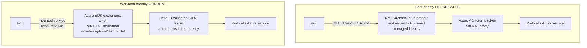
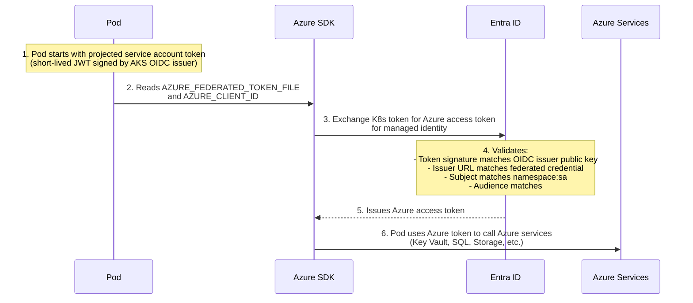
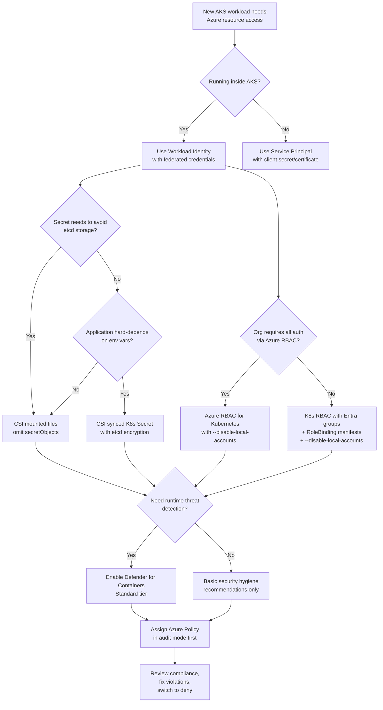

**Complexity**: `[ADVANCED]` | **Time to Complete**: 2.5h | **Prerequisites**: [Module 7.1: AKS Architecture & Node Management](../module-7.1-aks-architecture/). This is the practical security baseline module before you scale AKS identity and policy controls across teams.

## What You'll Be Able to Do

After completing this module, you will be able to:

Treat this list as a verification checklist so you can confirm each competency end-to-end before adding additional workloads and team velocity-dependent pressure. Work through outcomes in order, validate each step with commands, and only then move to the next module.

- **Configure AKS Workload Identity with Entra ID federated credentials for pod-level Azure resource access**
- **Implement Azure Key Vault Secrets Provider (CSI driver) to inject secrets into pods without application changes**
- **Deploy Microsoft Defender for Containers to monitor AKS runtime threats and enforce security baselines**
- **Design namespace-level RBAC with Entra ID groups mapped to Kubernetes ClusterRoles for team-based access control**

---

## Why This Module Matters

Storing long-lived database credentials in Kubernetes Secrets can lead to serious breaches if those values are exposed through logs, chat systems, manifests, or overly broad cluster access. The operational and regulatory fallout can be severe, especially for systems handling sensitive data.

This incident is depressingly common. [Kubernetes Secrets are base64-encoded, not encrypted](https://kubernetes.io/docs/concepts/security/secrets-good-practices), so anyone with read access can decode them quickly if process or credential hygiene is weak. If secrets move across manifests, logs, and ad hoc troubleshooting workflows, the exposure surface becomes much larger than a single service. The real solution is to avoid putting long-lived credentials in Kubernetes whenever possible.

Azure provides a complete credential-free architecture through three interlocking features that we will use together: Entra Workload Identity (pods get identities without passwords), the Secrets Store CSI Driver (secrets are mounted directly from Azure Key Vault), and Microsoft Defender for Containers (runtime behavior is monitored against known attack patterns). In this module, you will learn the full journey from the deprecated Pod Identity to the modern Workload Identity architecture, understand how federated identity credentials eliminate service-principal secrets, integrate the Secrets Store CSI Driver with Key Vault, and set up Azure Policy to enforce security guardrails across your cluster. By the end, your pods will authenticate to Azure services without a single credential stored anywhere in Kubernetes.

---

## From Pod Identity to Workload Identity: Why the Migration Matters

Azure AD Pod Identity (v1) was the original mechanism for giving AKS pods Azure identities. It used [a DaemonSet called the Node Managed Identity (NMI) that intercepted IMDS (Instance Metadata Service) requests from pods](https://learn.microsoft.com/en-us/azure/aks/use-azure-ad-pod-identity) and redirected them to the correct Azure Managed Identity. It worked, but it had serious problems:

> **Stop and think**: If Pod Identity intercepts all traffic to the IMDS endpoint (169.254.169.254), what happens if two pods on the same node need different identities? How does the DaemonSet distinguish them securely, and what are the risks if the interception mechanism fails?

- **NMI added operational dependency**: Pod Identity depended on the NMI component on each node to broker IMDS token requests for workloads.
- **IMDS interception added networking complexity**: Pod Identity relied on intercepting traffic to the IMDS endpoint rather than using direct OIDC federation.
- **Configuration overhead**: Pod Identity required AzureIdentity and AzureIdentityBinding resources, which added extra configuration to manage across namespaces.
- **Security concerns**: Pod Identity had documented network-path risks and required careful control of IMDS exposure in the cluster.

To understand why these problems were architectural rather than fixable, consider what the NMI DaemonSet actually did. Every IMDS request from every pod on a node --- whether for identity tokens or for instance metadata like VM name and resource group --- had to pass through iptables rules that redirected 169.254.169.254 traffic to the NMI process. That iptables rule was node-global. If the NMI process crashed, was misconfigured, or came into conflict with a CNI plugin manipulating the same iptables chains, every pod on that node lost its Azure identity path simultaneously. Even when the NMI was healthy, the interception model meant any pod on the node could craft a request to IMDS and the NMI had to decide which identity to return --- a decision made by matching the pod's HTTP request headers against `AzureIdentityBinding` selectors. A malformed or deliberately crafted request from a compromised container could attempt to exploit ambiguities in that matching logic to receive a token for a different identity than the one allocated to that namespace.

The deeper problem was the **node-identity blast radius**. Because the NMI ran once per node and its iptables interception was node-wide, every managed identity assigned to any pod on a given node was reachable through the same NMI process. If an attacker compromised a single container on that node --- through a library vulnerability or a misconfigured sidecar --- and managed to understand the NMI's request-routing logic, they could potentially request tokens for identities that belonged to entirely different pods and namespaces on the same host. Workload Identity eliminates this entire class of problem by removing the interception layer: there is no DaemonSet, no iptables rule, and no node-level identity proxy. The projected service account token is signed by the cluster's OIDC issuer and scoped to a specific service account before it ever leaves the pod's filesystem.

Pod Identity was [deprecated in October 2022](https://learn.microsoft.com/en-us/azure/aks/use-azure-ad-pod-identity) and replaced by Entra Workload Identity, which uses an entirely different mechanism based on OIDC federation. If you are still running Pod Identity, migrate now and use the published Microsoft migration guidance, because that code path relies on behavior the platform has signaled should be retired. In practice, the migration effort is typically straightforward for stateless and API-driven workloads, and it removes an entire interception class from the data path between pods and Azure identity.



If you skip migration, the long-standing operational burden of interception-based identity and the known isolation constraints remain in place for new releases. For teams already planning a security hardening cycle, this is exactly the kind of dependency you remove while you are still in control of manifests.

The migration from Pod Identity to Workload Identity is not merely a version upgrade --- it is a fundamental change in the trust model. Pod Identity trusted the node's network layer to correctly route identity requests. Workload Identity trusts only the Kubernetes API server's token-signing key and the Entra ID federation contract. This means the security boundary shifts from the node (a broad, multi-tenant boundary) to the individual pod's service account (a narrow, single-workload boundary). For platform teams managing clusters with dozens of tenant namespaces, this shift is the difference between hoping the NMI routes tokens correctly and knowing exactly which service account can request which Azure identity, with Entra ID cryptographically enforcing the contract on every exchange. For most teams, the move to Workload Identity is the foundation that simplifies the rest of AKS security.

---

## How Workload Identity Works: The Full Chain

[Entra Workload Identity uses a standards-based OIDC federation flow](https://learn.microsoft.com/en-us/azure/aks/workload-identity-overview). No secrets, no DaemonSets, no iptables interception. Here is the complete authentication chain:

Before walking through each step, it is worth pausing on why this architecture is so much stronger than what it replaced. OIDC federation is a standards-based protocol defined by the OpenID Connect specification, which builds on OAuth 2.0. The core idea is that a trusted identity provider --- in this case, the AKS cluster's control plane --- can issue signed JSON Web Tokens (JWTs) that assert the identity of a subject, and a second system (Entra ID) can verify those tokens against the issuer's public keys without ever sharing a secret with the issuer. There is no API key exchanged between AKS and Entra ID. There is no shared secret stored in a Kubernetes Secret that could leak. The trust is established once, declaratively, through the federated credential resource in Azure, and it is enforced cryptographically on every token exchange thereafter.

The entire chain depends on three critical pieces of metadata aligning: the **issuer** (who signed the token --- the AKS OIDC endpoint), the **subject** (which service account the token represents), and the **audience** (what the token is intended for, defaulting to `api://AzureADTokenExchange`). If any of these three do not match the federated credential registered in Entra ID, the token exchange fails with no fallback and no partial success. This design means that even a cluster administrator with full `kubectl` access cannot craft a valid token for an identity they are not authorized to use --- because the token must be signed by the cluster's OIDC issuer, scoped to the correct service account, and presented within its short lifetime (typically one hour, configurable through the ServiceAccount annotation `azure.workload.identity/service-account-token-expiration` in seconds, default 3600, range 3600–86400). With that foundation in place, here is how each step builds the chain.

### Step 1: AKS Exposes an OIDC Issuer

When you enable Workload Identity on an AKS cluster, [AKS publishes an OIDC discovery document at a public URL](https://learn.microsoft.com/en-us/azure/aks/workload-identity-overview). This document describes the cluster's signing keys and exposes signing endpoints. Entra ID uses this document to verify that tokens issued by the cluster are legitimate before accepting federation requests, and to keep trust anchored to the current AKS issuer keys.

```bash
# Enable OIDC issuer and Workload Identity on the cluster
az aks update \
  --resource-group rg-aks-prod \
  --name aks-prod-westeurope \
  --enable-oidc-issuer \
  --enable-workload-identity

# Get the OIDC issuer URL
OIDC_ISSUER=$(az aks show -g rg-aks-prod -n aks-prod-westeurope \
  --query "oidcIssuerProfile.issuerUrl" -o tsv)
echo "OIDC Issuer: $OIDC_ISSUER"
# Output: https://eastus.oic.prod-aks.azure.com/xxxxxxxx-xxxx-xxxx-xxxx-xxxxxxxxxxxx/
```

The OIDC issuer URL is more than a configuration value — it points to a standard OIDC discovery document at `{issuer-url}/.well-known/openid-configuration`. This document contains the cluster's public signing keys (in JWKS format), supported token signing algorithms, and the token endpoint. When Entra ID receives a token exchange request, it fetches this discovery document to validate the token's signature against the cluster's current public keys. The AKS control plane automatically rotates these signing keys, and the discovery document always reflects the active keys. This means the federation contract survives key rotation without any manual intervention — there is no certificate renewal process for you to manage.

### Step 2: Create a Managed Identity in Azure

This is the identity your pod will assume. Unlike a service principal, a Managed Identity has no password or certificate to manage---Azure handles the credential lifecycle entirely. That means you reduce secret rotation burden significantly because nothing user-managed is attached directly to the workload. In practice, this is also a cleaner match for multi-operator environments where security teams own identity policy but application teams own deployment cadence.

```bash
# Create a user-assigned managed identity
az identity create \
  --resource-group rg-aks-prod \
  --name id-payment-service \
  --location westeurope

# Get the identity's client ID (you will need this)
CLIENT_ID=$(az identity show -g rg-aks-prod -n id-payment-service \
  --query clientId -o tsv)
echo "Client ID: $CLIENT_ID"
```

### Step 3: Create the Federated Identity Credential

This is the key step that connects your Kubernetes service account to the Azure Managed Identity. It tells Entra ID: "When a token comes from this specific OIDC issuer, for this specific Kubernetes service account in this specific namespace, trust it and issue an Azure token for this Managed Identity."

```bash
# Create the federation between the K8s service account and the managed identity
az identity federated-credential create \
  --name fed-payment-service \
  --identity-name id-payment-service \
  --resource-group rg-aks-prod \
  --issuer "$OIDC_ISSUER" \
  --subject "system:serviceaccount:payments:payment-service-sa" \
  --audiences "api://AzureADTokenExchange"
```

The `--subject` field is critically important. It follows the format [`system:serviceaccount:{namespace}:{service-account-name}`](https://learn.microsoft.com/en-us/azure/aks/csi-secrets-store-identity-access). If a pod in a different namespace or using a different service account tries to use this federation, Entra ID will reject the token. This provides namespace-level isolation without any network-based interception.

**Multi-tenant and cross-subscription federation.** A single managed identity can have up to 20 federated credentials, each with a different subject. This allows you to federate the same Azure identity across multiple service accounts in different namespaces, or even across different AKS clusters, as long as each federated credential specifies the correct issuer URL for its cluster. For organizations with hub-and-spoke Azure topologies where the managed identity lives in a central identity subscription but AKS clusters run in spoke subscriptions, [federated credentials are a cross-subscription resource](https://learn.microsoft.com/en-us/azure/aks/workload-identity-overview): the managed identity and its federated credentials should reside in the same subscription, but the cluster and its workloads can be in different subscriptions. The key constraint is that the OIDC issuer URL must be reachable from Entra ID's public endpoints — which AKS OIDC issuers always are by design, since they are hosted on the public `oic.prod-aks.azure.com` domain.

**Pause and predict:** A security administrator identifies that an active workload should no longer access Azure resources and deletes its federated identity credential in Microsoft Entra ID. How quickly will the running pod actually lose access to downstream Azure services? Does the next SDK call fail immediately, or does access persist?

<details>
<summary>Check your prediction</summary>

Deleting a federated identity credential (FIC) is **not immediate**. When the pod starts, Kubernetes projects a signed service account token into the container filesystem with a default expiration of **3600s** (one hour). When the Azure SDK exchanges this projected token against the Microsoft Entra token exchange endpoint, **Microsoft Entra tokens expire 24 hours after they are issued**. The Azure SDK in-memory credential cache preserves the valid Azure access token until its natural expiration. Consequently, the running application maintains residual cached Entra access for up to **24h**, not 1h. Deleting the federated credential only prevents future token exchanges once the current token expires; it does not invalidate tokens that have already been issued and cached in the pod's application process. If an incident response requires immediate access revocation, deleting the federated credential must be accompanied by an immediate pod restart or by revoking data-plane RBAC permissions directly on the target Azure resources.
</details>

Managing token lifecycles requires coordinating cluster-side service account rotation windows with cloud-side identity revocation procedures to maintain zero-trust boundaries across ephemeral workloads. Platform teams must structure security playbooks around dual-plane revocation so that emergency credential changes take effect immediately across all active application replicas.

Establishing identity federation in the cloud control plane represents only half of the integration workflow. Workloads still require corresponding Kubernetes primitives configured within cluster namespaces to establish the trust handshake before pod scheduling occurs.

### Step 4: Create the Kubernetes Service Account with Annotations

```yaml
apiVersion: v1
kind: ServiceAccount
metadata:
  name: payment-service-sa
  namespace: payments
  annotations:
    azure.workload.identity/client-id: "<CLIENT_ID>"
```

```bash
k apply -f - <<EOF
apiVersion: v1
kind: ServiceAccount
metadata:
  name: payment-service-sa
  namespace: payments
  annotations:
    azure.workload.identity/client-id: "$CLIENT_ID"
EOF
```

### Step 5: Deploy the Pod with the Service Account

When you reference this service account in a pod, the Workload Identity webhook (running in AKS) automatically injects the following into the pod spec:

- A projected service account token volume mounted at `/var/run/secrets/azure/tokens/azure-identity-token`
- Environment variables: [`AZURE_CLIENT_ID`, `AZURE_TENANT_ID`, `AZURE_FEDERATED_TOKEN_FILE`, `AZURE_AUTHORITY_HOST`](https://github.com/Azure-Samples/azure-ad-workload-identity)

Your application code uses the Azure SDK's `DefaultAzureCredential`, which automatically picks up these environment variables and performs the token exchange. If the service account, identity, and issuer metadata all align, the same code path works for Key Vault, storage, and SQL without extra token plumbing. This is the point where application-level simplicity and platform-level identity governance reinforce each other.

**Audience defaults and alternatives.** The default audience for the federated token exchange is `api://AzureADTokenExchange`. This audience is hardcoded into the Azure SDK's workload identity credential and works for all Azure service endpoints. You do not normally need to change it, but the `--audiences` parameter on `az identity federated-credential create` accepts custom values if your token exchange targets a non-Azure OIDC-compliant service. Changing the audience without also configuring the Azure SDK to request a matching audience will cause token exchange failures — the default SDK behavior expects `api://AzureADTokenExchange`.

**What happens when federation breaks.** If the federated credential is deleted, the issuer URL changes (for example, after a cluster rebuild without preserving the original OIDC issuer), or the service account is removed, subsequent token exchange requests fail Microsoft Entra ID authentication. The Azure SDK surfaces this as an authentication exception. The pod remains running — it does not crash — but any attempt to acquire a new Azure token fails once cached credentials expire. If your application uses `DefaultAzureCredential` with a chained fallback (for example, trying Managed Identity credentials after Workload Identity), the SDK silently moves to the next credential source, which may produce confusing behavior if the fallback succeeds with a different identity than intended. Always explicitly configure the credential chain in production workloads to avoid silent identity switches during federation outages.

**Pause and predict:** A developer configures an AKS ServiceAccount with the required azure.workload.identity/client-id annotation pointing to an Azure Managed Identity. The developer then deploys a pod that specifies this ServiceAccount. Will the AKS Workload Identity mutating webhook automatically inject the projected token and Azure environment variables into the pod?

<details>
<summary>Check your prediction</summary>

The AKS Workload Identity mutating admission webhook mutates **only** pods that explicitly include the `azure.workload.identity/use: "true"` label in their pod metadata. Configuring the `azure.workload.identity/client-id` annotation on the ServiceAccount is **not enough**. The mutating webhook operates under strict Fail Close design principles: if the pod template lacks the `use: "true"` label, the webhook completely ignores the pod at admission time. Consequently, the pod starts without the projected service account token volume mount and without injected environment variables (`AZURE_CLIENT_ID`, `AZURE_TENANT_ID`, `AZURE_FEDERATED_TOKEN_FILE`, `AZURE_AUTHORITY_HOST`). The contrast between labeled and unlabeled pods ensures that cluster operators control exactly which workloads participate in identity federation. The ServiceAccount annotation identifies which Azure Managed Identity to federate, while the pod label explicitly authorizes the webhook mutation on that specific pod workload.
</details>

Explicit opt-in labeling prevents unintended token projection across batch jobs, sidecar proxies, and third-party containers that share common service accounts within the same namespace. Requiring pod-level activation ensures that security boundaries remain intentional and minimizes admission webhook processing overhead during rapid deployment rollouts.

The deployment manifest below demonstrates the exact configuration syntax, pairing the ServiceAccount reference with the required pod template label:

```yaml
apiVersion: apps/v1
kind: Deployment
metadata:
  name: payment-service
  namespace: payments
spec:
  replicas: 3
  selector:
    matchLabels:
      app: payment-service
  template:
    metadata:
      labels:
        app: payment-service
        azure.workload.identity/use: "true"
    spec:
      serviceAccountName: payment-service-sa
      containers:
        - name: payment
          image: myregistry.azurecr.io/payment-service:v2.1.0
          env:
            # These are injected automatically by the webhook,
            # but listing them here for clarity:
            # AZURE_CLIENT_ID
            # AZURE_TENANT_ID
            # AZURE_FEDERATED_TOKEN_FILE
          resources:
            requests:
              cpu: "250m"
              memory: "256Mi"
            limits:
              cpu: "500m"
              memory: "512Mi"
```



---

## Secrets Store CSI Driver with Azure Key Vault

Even with Workload Identity, you still need a way to get secrets (connection strings, API keys, certificates) into your pods. The Secrets Store CSI Driver mounts secrets from Azure Key Vault directly into your pod's filesystem as files, without them ever touching a Kubernetes Secret. This is useful in practice because secret retrieval is delegated to Azure for storage and policy, while your application keeps running against mounted values as part of its normal filesystem view.

### How It Works

The CSI driver runs as a DaemonSet on every node. When a pod with a `SecretProviderClass` volume mounts, the driver:

1. Authenticates to Key Vault using the pod's Workload Identity
2. Retrieves the specified secrets, keys, or certificates
3. Mounts them as files in the pod's volume
4. [Optionally syncs them to a Kubernetes Secret](https://learn.microsoft.com/en-us/azure/aks/csi-secrets-store-driver) (for environment variable consumption)

```bash
# Enable the Secrets Store CSI Driver add-on
az aks enable-addons \
  --resource-group rg-aks-prod \
  --name aks-prod-westeurope \
  --addons azure-keyvault-secrets-provider

# Verify the driver pods are running
k get pods -n kube-system -l app=secrets-store-csi-driver
k get pods -n kube-system -l app=secrets-store-provider-azure
```

### Creating the Key Vault and Granting Access

```bash
# Create a Key Vault
az keyvault create \
  --resource-group rg-aks-prod \
  --name kv-aks-prod-we \
  --location westeurope \
  --enable-rbac-authorization

# RBAC-mode vaults grant no data-plane access until you assign a role
az role assignment create \
  --role "Key Vault Secrets Officer" \
  --assignee "$(az ad signed-in-user show --query id -o tsv)" \
  --scope "$(az keyvault show --name kv-aks-prod-we --query id -o tsv)"

# Store a secret
az keyvault secret set \
  --vault-name kv-aks-prod-we \
  --name "db-connection-string" \
  --value "Server=tcp:sql-prod.database.windows.net,1433;Database=payments;Authentication=Active Directory Managed Identity"

# Store a TLS certificate
az keyvault certificate import \
  --vault-name kv-aks-prod-we \
  --name "payment-api-tls" \
  --file payment-api-tls.pfx

# Grant the managed identity access to Key Vault secrets
IDENTITY_PRINCIPAL_ID=$(az identity show -g rg-aks-prod -n id-payment-service \
  --query principalId -o tsv)

az role assignment create \
  --assignee-object-id "$IDENTITY_PRINCIPAL_ID" \
  --assignee-principal-type ServicePrincipal \
  --role "Key Vault Secrets User" \
  --scope "$(az keyvault show --name kv-aks-prod-we --query id -o tsv)"
```

### Defining the SecretProviderClass

```yaml
apiVersion: secrets-store.csi.x-k8s.io/v1
kind: SecretProviderClass
metadata:
  name: kv-payment-secrets
  namespace: payments
spec:
  provider: azure
  parameters:
    usePodIdentity: "false"
    useVMManagedIdentity: "false"
    clientID: "<CLIENT_ID_OF_MANAGED_IDENTITY>"
    keyvaultName: "kv-aks-prod-we"
    tenantId: "<TENANT_ID>"
    objects: |
      array:
        - |
          objectName: db-connection-string
          objectType: secret
          objectVersion: ""
        - |
          objectName: payment-api-tls
          objectType: secret
          objectVersion: ""
  # Optional: sync to a K8s Secret for env var consumption
  secretObjects:
    - secretName: payment-secrets-k8s
      type: Opaque
      data:
        - objectName: db-connection-string
          key: DB_CONNECTION_STRING
```

### Mounting Secrets in a Pod

```yaml
apiVersion: apps/v1
kind: Deployment
metadata:
  name: payment-service
  namespace: payments
spec:
  replicas: 3
  selector:
    matchLabels:
      app: payment-service
  template:
    metadata:
      labels:
        app: payment-service
        azure.workload.identity/use: "true"
    spec:
      serviceAccountName: payment-service-sa
      containers:
        - name: payment
          image: myregistry.azurecr.io/payment-service:v2.1.0
          # Option A: Read from mounted file
          volumeMounts:
            - name: secrets-store
              mountPath: "/mnt/secrets"
              readOnly: true
          # Option B: Read from synced K8s Secret as env var
          env:
            - name: DB_CONNECTION_STRING
              valueFrom:
                secretKeyRef:
                  name: payment-secrets-k8s
                  key: DB_CONNECTION_STRING
          resources:
            requests:
              cpu: "250m"
              memory: "256Mi"
      volumes:
        - name: secrets-store
          csi:
            driver: secrets-store.csi.k8s.io
            readOnly: true
            volumeAttributes:
              secretProviderClass: "kv-payment-secrets"
```

When the pod starts, the file `/mnt/secrets/db-connection-string` will contain the secret value. The secret is fetched fresh from Key Vault at pod startup. If you enable auto-rotation with [`--enable-secret-rotation`](https://learn.microsoft.com/en-us/azure/aks/csi-secrets-store-configuration-options) on the add-on (and optionally tune cadence with `--rotation-poll-interval`), the CSI driver periodically checks Key Vault for updated values and refreshes the mounted files. This keeps rotating secrets available to workloads without changing container images or introducing config-management churn in the same pipeline.

#### The Rotation Story in Detail

**Pause and predict:** You configure the Secrets Store CSI Driver with auto-rotation enabled and update a secret value in Azure Key Vault. When the CSI driver detects the new version, does it restart the application pod so runtime memory and environment variables receive the rotated value? What happens to mounted files versus synced Kubernetes Secrets?

<details>
<summary>Check your prediction</summary>

CSI secret autorotation updates the **mounted file in place without restarting the pod**. Auto-rotation is enabled cluster-wide when you configure the add-on with `--enable-secret-rotation` (for example, `az aks addon update ... --addon azure-keyvault-secrets-provider --enable-secret-rotation --rotation-poll-interval 2m`). The default poll interval is **2m**; specifying `--rotation-poll-interval` only tunes cadence after rotation is enabled and does not enable rotation by itself. When the driver detects a newer secret version in Key Vault, it replaces the bytes on disk while preserving the filesystem inode. Because the pod does not restart, the application must actively **re-read/watch** the file (such as via Linux `inotify` or a periodic refresh loop) to consume the rotated credentials. If the application instead consumes secrets as environment variables from synced Kubernetes Secrets via `secretObjects`, the synced Secret object in etcd is updated, but environment variables in active container processes never update dynamically. Consuming updated values from environment variables **requires pod restart**. Environment-variable consumption and zero-downtime rotation are fundamentally incompatible without workload restarts.
</details>

Decoupling secret synchronization from pod lifecycle management allows microservices to maintain continuous availability during regular credential rollouts. Platform engineers must ensure software libraries implement dynamic file reload handlers rather than caching static strings at initial boot.

The rotation poll interval is a cluster-wide setting. You cannot set different intervals per `SecretProviderClass`. At scale — say, 200 pods each with 10 secrets — a short poll such as 2m still generates substantial Key Vault read volume (2,000 reads per poll cycle in that example), which can incur significant transaction costs and potentially hit Key Vault service limits. A two-minute or five-minute poll is usually sufficient for most credential rotation policies.

#### The `secretObjects` Tradeoff: Kubernetes Secrets vs etcd Exposure

The `secretObjects` field in a `SecretProviderClass` creates a real Kubernetes Secret resource populated with the values retrieved from Key Vault. This is convenient when your application already reads configuration from Kubernetes Secrets and you want to switch the source of truth to Key Vault without changing the application's secret consumption pattern. However, the Kubernetes Secret is stored in etcd, the cluster's distributed key-value store. By default, [Kubernetes Secrets are stored unencrypted in etcd](https://kubernetes.io/docs/concepts/security/secrets-good-practices/) — only base64-encoded. Anyone with `get` or `list` permissions on Secrets in that namespace can retrieve and decode the value. If your compliance requirement prohibits ever persisting credentials in the cluster's control plane, omit `secretObjects` entirely and use the CSI-mounted files exclusively. The mounted files exist only in the pod's memory-backed `tmpfs` volume and vanish when the pod terminates — they never touch etcd.

#### Key Vault RBAC vs Access Policies

The CSI driver authenticates to Key Vault using the pod's Workload Identity. How you grant that identity access to Key Vault depends on your vault's permission model. Azure Key Vault supports two models: **RBAC** (role-based access control, using Azure RBAC roles like `Key Vault Secrets User`) and **access policies** (the older, vault-specific permission model). Microsoft recommends RBAC for new deployments because it integrates with Azure's unified role assignment system, supports Privileged Identity Management (PIM) for just-in-time access, and provides consistent audit logging through Azure Activity Logs. The older access policy model works but is vault-specific — you manage permissions per vault rather than through Azure RBAC scopes, and it lacks PIM integration.

When you create a Key Vault with `--enable-rbac-authorization` (as shown in the example above), access policies are disabled entirely and all access is governed through Azure RBAC. The `Key Vault Secrets User` role grants `get` and `list` on secrets — exactly what the CSI driver needs to retrieve and rotate secrets. Do not assign `Key Vault Secrets Officer` (which can create and delete secrets) or `Key Vault Administrator` (which can manage access policies and RBAC assignments) to a workload identity unless the workload genuinely needs to write secrets back to the vault. Following least privilege means each managed identity should have exactly the data-plane permissions its workload requires, scoped to the specific vault.

**Why workload-identity-scoped access matters.** Before Workload Identity, a common but dangerous pattern was to assign a single user-assigned managed identity to the entire cluster's node pool (the kubelet identity) and grant that identity broad Key Vault access. Every pod on every node in that pool could then potentially access all secrets in the vault. Workload Identity ties each identity to a specific Kubernetes service account, so the access boundary is the namespace-service-account pair, not the node or node pool. This makes it practical to give each microservice its own managed identity with access only to its own secrets — a pattern that is impossible or dangerously complex with node-scoped identities.

> **Cost note:** Key Vault charges per transaction — approximately $0.03 per 10,000 secret operations for read-heavy workloads. Each secret rotation poll triggers a `get` operation per secret per `SecretProviderClass`. At scale, the combined cost of rotation polling plus the Key Vault secret version storage (each new version of a secret counts as a separate billable secret) should be factored into the operational budget. The cost of centralized secret management in Key Vault is almost always lower than the operational cost of managing secret sprawl across Kubernetes Secrets in multiple clusters, where a single leaked etcd backup can expose every secret in every namespace.

---

## Kubernetes RBAC with Entra ID Groups

To secure developer access to the AKS cluster API, you should integrate Kubernetes RBAC with Entra ID. Instead of distributing individual client certificates, you map Entra ID groups directly to Kubernetes `ClusterRole` or `Role` resources using a `RoleBinding`.

When you enable AKS Entra ID integration, you bind native RBAC roles to the [Entra ID group's Object ID](https://learn.microsoft.com/en-us/azure/aks/azure-ad-rbac): this means cluster authorization follows enterprise identity directly. In practice, you maintain the same team boundaries in Azure AD and enforce those boundaries against Kubernetes permissions in each namespace. Teams no longer need dedicated client certificates per person; they authenticate using their normal identity lifecycle and inherit the right group membership.

```yaml
kind: RoleBinding
apiVersion: rbac.authorization.k8s.io/v1
metadata:
  name: dev-team-binding
  namespace: payments
subjects:
  - kind: Group
    name: "xxxxxxxx-xxxx-xxxx-xxxx-xxxxxxxxxxxx" # Entra ID Group Object ID
    apiGroup: rbac.authorization.k8s.io
roleRef:
  kind: ClusterRole
  name: edit
  apiGroup: rbac.authorization.k8s.io
```

This grants every member of the Entra ID group `edit` privileges within the `payments` namespace. When developers run `az aks get-credentials`, they authenticate through Microsoft Entra and use token-based access to the cluster, which scales better than distributing client certificates. The result is fewer one-off onboarding tickets and clearer teardown boundaries when team composition changes.

### Two Authorization Modes: K8s RBAC with Entra vs Azure RBAC for Kubernetes

AKS supports two distinct authorization modes for Entra ID-authenticated users and groups. Understanding the difference is essential because they solve different organizational problems and cannot be used simultaneously on the same cluster.

**Kubernetes RBAC with Entra ID groups** (the default mode, shown above) uses standard Kubernetes `RoleBinding` and `ClusterRoleBinding` resources. You manage these bindings through `kubectl` or GitOps, referencing Entra ID group Object IDs in the `subjects` field. The Kubernetes RBAC verbs (`get`, `list`, `create`, `delete`, etc.) are enforced by the Kubernetes API server's RBAC authorizer. This mode works well when your platform team is comfortable managing Kubernetes RBAC manifests and you want authorization rules versioned alongside application deployments in Git. It is also the mode that most existing Kubernetes tooling and dashboards expect.

**Azure RBAC for Kubernetes** (enabled with [`--enable-azure-rbac`](https://learn.microsoft.com/en-us/azure/aks/manage-azure-rbac)) replaces Kubernetes-native RBAC with Azure role assignments. Instead of creating `RoleBinding` YAML files, you run `az role assignment create` to assign built-in Azure roles to Entra ID users or groups at the cluster scope. Azure provides four built-in roles purpose-built for AKS:

- **Azure Kubernetes Service RBAC Reader** — read-only access to most cluster resources
- **Azure Kubernetes Service RBAC Writer** — read and write access to namespaced resources (pods, deployments, services)
- **Azure Kubernetes Service RBAC Admin** — read and write access to namespaced resources plus limited cluster-scoped reads
- **Azure Kubernetes Service RBAC Cluster Admin** — full administrative access to the entire cluster

When Azure RBAC is enabled, Kubernetes `RoleBinding` and `ClusterRoleBinding` resources are ignored — all authorization decisions flow through Azure RBAC. This mode is valuable when your organization already manages all Azure permissions through Azure RBAC and Privileged Identity Management, and you want cluster access to appear in the same Azure Policy compliance dashboards as your other Azure resources. It is also the right choice when your security team insists on managing all access assignments through Azure rather than trusting Kubernetes RBAC manifests.

**When to pick which.** Use Kubernetes RBAC with Entra ID if your team already manages cluster configuration through GitOps, you need fine-grained per-namespace role definitions that map to your application topology, or you rely on Kubernetes-native tooling that reads `RoleBinding` resources. Use Azure RBAC for Kubernetes if your organization mandates Azure RBAC as the single authorization plane, you need just-in-time cluster admin access through Entra Privileged Identity Management, or your compliance framework requires all access assignments to be auditable through Azure Activity Logs without translating Kubernetes RBAC events.

**Closing the local-account backdoor.** By default, AKS clusters have a local `cluster-admin` certificate-based account that bypasses Entra ID entirely. Anyone with access to that certificate has unrestricted cluster access regardless of Entra group memberships or Azure role assignments. Enable [`--disable-local-accounts`](https://learn.microsoft.com/en-us/azure/aks/managed-aad) to remove this backdoor. After disabling local accounts, all cluster access — including emergency administrative access — must go through Entra ID authentication. Before disabling local accounts, ensure at least one Entra ID group has the `ClusterRoleBinding` to `cluster-admin` or the Azure RBAC equivalent, or you will lock yourself out of the cluster with no recovery path except an Azure support ticket.

```bash
# Enable Azure RBAC for Kubernetes and disable local accounts
az aks update \
  --resource-group rg-aks-prod \
  --name aks-prod-westeurope \
  --enable-azure-rbac \
  --disable-local-accounts

# Assign a group the Cluster Admin role via Azure RBAC
az role assignment create \
  --assignee "<entra-group-object-id>" \
  --role "Azure Kubernetes Service RBAC Cluster Admin" \
  --scope "$(az aks show -g rg-aks-prod -n aks-prod-westeurope --query id -o tsv)"
```

---

## Microsoft Defender for Containers

Defender for Containers provides [runtime threat protection for AKS clusters](https://learn.microsoft.com/en-us/azure/defender-for-cloud/defender-for-containers-azure-overview). It monitors container behavior using an agent (deployed as a DaemonSet) and compares activity against known attack patterns.

### What It Detects

| Threat Category | Examples |
| :--- | :--- |
| **Crypto mining** | Processes connecting to known mining pool domains, high CPU usage patterns |
| **Container escapes** | Attempts to access host filesystem, mount Docker socket, exploit kernel vulnerabilities |
| **Suspicious binaries** | Execution of netcat, nmap, or other reconnaissance tools inside containers |
| **Privilege escalation** | Containers running as root, capabilities added at runtime, setuid binaries |
| **Anomalous network** | Connections to known C2 servers, unusual port scanning activity |
| **Supply chain** | Images pulled from untrusted registries, modified system binaries |

```bash
# Enable Defender for Containers
az security pricing create \
  --name Containers \
  --tier Standard

# Enable the Defender sensor on the AKS cluster
az aks update \
  --resource-group rg-aks-prod \
  --name aks-prod-westeurope \
  --enable-defender

# Verify the Defender agent is running
k get pods -n kube-system -l app=microsoft-defender
```

### Detection Depth: Runtime, Registry, and Control Plane

Defender for Containers operates across three layers, not just the runtime DaemonSet visible in the cluster. Understanding the full detection surface helps you interpret the alerts you receive in Microsoft Defender for Cloud.

**Runtime detection** (the DaemonSet component) monitors system calls, process creation, network connections, and filesystem activity inside containers and on the underlying node. It compares this telemetry against Microsoft's threat intelligence feed, which is continuously updated with new indicators of compromise, mining pool domains, and known C2 infrastructure. Alerts include the specific process name, command line arguments, parent process tree, and the container image digest — enough forensic detail to trace an alert back to a specific deployment within minutes.

**Registry scanning** integrates with Azure Container Registry (ACR) to scan container images for vulnerabilities before they are deployed. When you push an image to ACR, Defender automatically scans it against a database of known CVEs, updated regularly from public vulnerability databases and Microsoft's own research. The scan results appear in Defender for Cloud under the "Container registry images should have vulnerability findings resolved" recommendation. You can configure the scan trigger to run on push, on a schedule, or continuously. This means a vulnerable base image is flagged before any pod pulls it — a critical control given how many production incidents originate from unpatched CVEs in public base images like `node`, `python`, or `nginx`.

**Control-plane audit** monitors Kubernetes audit logs for anomalous API server activity — for example, a service account suddenly listing all Secrets across all namespaces, or a `kubectl exec` into a container that has never been accessed interactively before. These alerts use machine learning models trained on typical cluster behavior patterns, so they improve as your cluster's baseline stabilizes over time.

### Cost Model

Defender for Containers is priced per vCPU-hour of protected container workload. The list price is approximately $0.0095 per vCPU per hour, which at a cluster running 100 vCPUs across workloads translates to roughly $0.95 per hour or about $684 per month for runtime protection. This is the per-workload-vCPU count (the sum of `requests` or actual usage across all pods), not the node vCPU count. Clusters that overprovision CPU requests pay for the requested vCPUs, not just the utilized ones — making resource right-sizing a cost optimization lever for Defender as well as for your compute bill.

Key cost drivers to watch: large node pools with many small pods (each pod's CPU request counts toward the protected vCPU total), clusters with generous default resource requests, and development clusters that run 24/7 without scaling down overnight. The cost is per-cluster, per-hour, and there is no free tier for runtime protection — the Standard tier is required for any detection beyond basic container security hygiene recommendations.

The Defender agent's own resource consumption on each node is minimal — typically under 50m CPU and 100Mi memory — but this overhead should be included in your node capacity planning, especially on clusters with many small nodes where the agent-per-node overhead adds up.

### Defender Integration with Azure Policy

Defender works hand-in-hand with Azure Policy for Kubernetes. While Defender monitors runtime behavior (what containers actually do), Azure Policy prevents misconfigurations before they are deployed (what containers are allowed to do). Thinking about the two together is useful because one control layer catches execution-time behavior and the other blocks risky manifests at admission time.

---

## Azure Policy for Kubernetes: Guardrails at Scale

Azure Policy for AKS uses [Gatekeeper (OPA-based admission controller)](https://learn.microsoft.com/en-us/azure/governance/policy/concepts/policy-for-kubernetes) to enforce policies on Kubernetes resource creation. When a developer runs `kubectl apply`, the API server sends the request to Gatekeeper, which evaluates it against your active policies and either allows or denies the operation.

```bash
# Enable Azure Policy add-on
az aks enable-addons \
  --resource-group rg-aks-prod \
  --name aks-prod-westeurope \
  --addons azure-policy

# Verify Gatekeeper pods are running
k get pods -n gatekeeper-system
```

### Essential Policies for Production AKS

Azure provides dozens of built-in policies. Here are the critical ones every production cluster should enforce, and they are useful because they encode common defensive defaults without requiring custom policy authoring for every microservice. When you combine policy with webhook enforcement, you keep teams moving fast while still preventing known risky patterns.

| Policy | Effect | Why It Matters |
| :--- | :--- | :--- |
| **Do not allow privileged containers** | Deny | Privileged containers have full host access---effectively a container escape |
| **Containers should only use allowed images** | Deny | Prevent pulling from untrusted registries |
| **Containers should not run as root** | Deny | Root in a container can exploit kernel vulnerabilities |
| **Pods should use Workload Identity** | Audit | Detect pods still using deprecated auth methods |
| **Enforce resource limits** | Deny | Pods without limits can starve other workloads |
| **Do not allow hostPath volumes** | Deny | hostPath mounts expose the node filesystem to the container |

```bash
# Assign a built-in policy: do not allow privileged containers
az policy assignment create \
  --name "deny-privileged-containers" \
  --policy "95edb821-ddaf-4404-9732-666045e056b4" \
  --scope "$(az aks show -g rg-aks-prod -n aks-prod-westeurope --query id -o tsv)" \
  --params '{"effect": {"value": "deny"}}'

# Assign a policy initiative (group of related policies)
az policy assignment create \
  --name "aks-security-baseline" \
  --policy-set-definition "a8640138-9b0a-4a28-b8cb-1666c838647d" \
  --scope "$(az aks show -g rg-aks-prod -n aks-prod-westeurope --query id -o tsv)"

# Check compliance status
az policy state summarize \
  --resource "$(az aks show -g rg-aks-prod -n aks-prod-westeurope --query id -o tsv)"
```

When a developer tries to deploy a privileged container, the request is denied by Azure Policy before admission, which protects the cluster from unsafe runtime exposure. This is especially useful when legacy manifests still use broad capabilities and need coordinated remediation.

#### Audit vs Deny: The Safe Rollout Path

**Pause and predict:** A security team assigns a new Azure Policy with a "deny" effect to prevent privileged containers across an active production cluster where several privileged pods are already running. Will Gatekeeper immediately terminate the running non-compliant pods, or what happens to their execution?

<details>
<summary>Check your prediction</summary>

When an Azure Policy assignment is configured with a "deny" effect, **preexisting non-compliant resources continue to run** without interruption; Gatekeeper does not evict or terminate existing pods. Admission controllers operate strictly as admission webhooks on the Kubernetes API server path, evaluating resources during incoming requests before persistence in etcd. Consequently, the deny effect blocks only new **CREATE** and **reschedule** operations (as well as manifest updates). The non-compliant running pods are flagged in Azure Policy compliance reporting dashboards, but they remain active until terminated by an operator, a rolling deployment, or a node disruption. If a node fails or a deployment rolls out, any attempt to recreate the privileged pod will be rejected at admission, preventing rescheduling and potentially causing application outages if manifests remain uncorrected.
</details>

Phased policy rollout frameworks prevent unexpected operational downtime by isolating compliance discovery from deployment admission enforcement. Validating cluster telemetry against compliance baselines gives engineering teams sufficient runway to remediate legacy workload configurations prior to hard enforcement.

The safe rollout sequence is: assign policies in `audit` mode, review the compliance dashboard for existing violations, fix all non-compliant manifests, verify the compliance dashboard shows zero violations, then switch to `deny` mode. Skipping the audit phase and going directly to deny is the most common cause of production deployment pipeline failures when introducing Azure Policy to an existing cluster.

#### Policy Exclusions and the Built-in Initiative

Not every policy applies to every namespace. System namespaces (`kube-system`, `gatekeeper-system`, `kube-node-lease`) often run privileged containers by design — the CSI driver, the Defender agent, and CNI plugins all require elevated privileges that a blanket "no privileged containers" policy would block. Azure Policy supports **exclusions** at assignment time through the `--not-scopes` parameter or by configuring the policy assignment's `overrides` to exclude specific namespaces. Always exclude system namespaces from deny-mode policies that would block their required behavior.

The built-in AKS security baseline initiative (`a8640138-9b0a-4a28-b8cb-1666c838647d`) bundles approximately 20 policies covering privileged containers, hostPath volumes, allowed registries, resource limits, read-only root filesystems, and more. Assigning the initiative is faster than assigning individual policies and ensures consistent coverage. However, the initiative includes policies that may be too strict for your environment. Review each policy in the initiative definition before assigning it and exclude namespaces where specific policies would break legitimate system workloads.

The Gatekeeper component that enforces these policies runs as three pods in the `gatekeeper-system` namespace: the audit controller (periodically checks existing resources), the webhook controller (handles admission requests), and the controller manager (reconciles policy definitions). Each policy is translated from Azure Policy's declarative format into an OPA Rego rule. Gatekeeper evaluates all matching policies against each admission request and returns an `allow` or `deny` decision. The latency added by policy evaluation is typically under 50ms per request, but in clusters with dozens of active policies and high API request rates, Gatekeeper can become a bottleneck. Monitor the `gatekeeper-system` pods' CPU and memory usage, especially during deployment storms.

```bash
# This will be DENIED by Azure Policy
k apply -f - <<'EOF'
apiVersion: v1
kind: Pod
metadata:
  name: bad-pod
  namespace: default
spec:
  containers:
    - name: bad
      image: ubuntu:22.04
      securityContext:
        privileged: true
EOF
# Error from server (Forbidden): admission webhook "validation.gatekeeper.sh"
# denied the request: Privileged containers are not allowed
```

---

## Did You Know?

1. **The projected Kubernetes service account token used by Workload Identity is short-lived by default and rotated automatically.** Kubernetes refreshes projected tokens before expiry, and AKS Workload Identity exposes configuration for that token lifetime. This reduces exposure compared with long-lived static credentials.

2. **The Secrets Store CSI Driver can auto-rotate secrets without restarting pods.** When you enable rotation with [`--enable-secret-rotation`](https://learn.microsoft.com/en-us/azure/aks/csi-secrets-store-configuration-options) (default poll interval 2m, customizable via `--rotation-poll-interval`), the driver checks Key Vault for updated secret versions on that cadence and updates the mounted files in place. Your application can watch for file changes (using inotify on Linux) and reload secrets without a deployment rollout.

3. **Azure Policy for AKS evaluates existing resources, not just new ones.** When you assign a policy in "audit" mode, Azure scans all existing resources in the cluster and [reports non-compliant ones in the Azure Policy compliance dashboard](https://learn.microsoft.com/en-us/azure/governance/policy/concepts/policy-for-kubernetes). This gives you visibility into your current security posture before switching policies to "deny" mode.

4. **Federated identity credentials [support a maximum of 20 federations per managed identity](https://learn.microsoft.com/en-us/azure/aks/workload-identity-overview).** If you have 20 different service accounts across namespaces that all need the same Azure permissions, you need to either share a service account (not recommended across namespaces) or create multiple managed identities. Plan your identity architecture before hitting this limit.

---

## Patterns & Anti-Patterns

### Proven Patterns

**Pattern 1: One managed identity per microservice, scoped to its own Key Vault prefix.**

Assign each microservice its own user-assigned managed identity and grant it access only to the Key Vault secrets that microservice needs — typically by using a naming convention that maps service names to secret name prefixes. This limits the blast radius of a compromised pod to exactly the secrets that pod was already authorized to read. It also makes audit logs unambiguous: every Key Vault access maps to a specific workload identity rather than a shared cluster-level identity. Scaling note: at 20 federated credentials per managed identity, you can support one identity across up to 20 service accounts in different namespaces or clusters — but for true per-service isolation, create separate managed identities.

**Pattern 2: Audit-first policy rollout for every new Azure Policy assignment.**

Assign every policy in `audit` mode for at least one full deployment cycle before switching to `deny`. During the audit period, monitor the Azure Policy compliance dashboard and fix every non-compliant resource. Only switch to `deny` when the dashboard shows zero violations for the target namespaces. This pattern prevents the most common production outage scenario for AKS policy enforcement: a deny-mode policy blocking a previously compliant deployment that only violates the new policy in a rarely exercised edge case.

**Pattern 3: Workload Identity everywhere, service principals only for cluster provisioning.**

Use managed identities federated through Workload Identity for all runtime workload authentication. Reserve service principals (with client secrets or certificates) for cluster provisioning pipelines, Terraform, and CI/CD tooling that runs outside the cluster. Service principal secrets must be rotated manually or through automation; managed identities have no user-managed secrets at all. Every workload you move from a service principal to Workload Identity removes one credential rotation burden from your operational calendar.

### Anti-Patterns

| Anti-Pattern | Why Teams Fall Into It | Better Alternative |
|:---|:---|:---|
| Assigning Key Vault Administrator to workload identities | "It's easier to give broad permissions than figure out exactly which secrets the pod needs" | Grant `Key Vault Secrets User` scoped to the specific vault. If the pod needs to write secrets, use `Key Vault Secrets Officer` on a dedicated secrets-management service account, not the application's own identity |
| Using `secretObjects` for every secret without understanding etcd exposure | "We want env vars, and the K8s Secret is auto-created for us" | Use CSI-mounted files for compliance-sensitive secrets that must avoid etcd. Reserve `secretObjects` only for secrets where environment variable consumption is a hard application requirement and etcd encryption at rest is enabled |
| Running Pod Identity (v1) alongside Workload Identity "just in case" | Fear of migration, or following a tutorial that enabled both | Migrate fully to Workload Identity and remove the NMI DaemonSet. Running both architectures simultaneously creates confusion about which identity path a given pod uses and doubles the security surface area |
| Assigning Azure Policy in `deny` mode during initial rollout | "We want security, and audit mode doesn't actually block anything" | Start with `audit` for at least one deployment cycle. Skipping the audit phase has caused production outages when previously compliant deployments are denied on their next rollout |
| Sharing a single federated managed identity across all namespaces | "One identity is simpler than twenty" | Create per-namespace or per-microservice managed identities. A shared identity means every pod can access every secret the identity is authorized for — the opposite of least privilege |

---

## Decision Framework

Choosing between the identity, secret management, and authorization options covered in this module depends on your organization's operational maturity and compliance requirements. The following decision matrix captures the primary tradeoffs.

### Identity: Workload Identity vs Managed Identity (Pod Identity) vs Service Principal

| Criterion | Workload Identity (WI) | Pod Identity (v1) | Service Principal |
|:---|:---|:---|:---|
| Secret management | None — OIDC federation | Managed by Azure (no user secret), but NMI DaemonSet required | Client secret or certificate must be stored and rotated |
| Security boundary | Pod service account | Node (NMI intercepts IMDS, node-identity blast radius) | Cluster or namespace (wherever the Secret is stored) |
| AKS support | GA, actively maintained | Deprecated October 2022 | Supported but not recommended for in-cluster workloads |
| Multi-cluster | Yes, via federated credential per cluster | Yes, per-cluster identity assignments | Yes, same service principal in multiple Secrets |
| Use case | All in-cluster workloads accessing Azure services | Legacy clusters awaiting migration | Cluster provisioning pipelines and CI/CD tooling running outside AKS |

**Decision rule:** If the workload runs inside AKS, use Workload Identity. There is no reason to deploy a new workload with Pod Identity, and service principals should only be used for automation that authenticates from outside the cluster.

### Secret Delivery: Secrets Store CSI (mounted files) vs CSI (synced K8s Secret) vs External Secrets vs Sealed Secrets

| Criterion | CSI Mounted Files | CSI synced K8s Secret | External Secrets Operator | Sealed Secrets |
|:---|:---|:---|:---|:---|
| Secret stored in etcd | No | Yes | Yes (creates K8s Secret) | Yes (SealedSecret decrypted to K8s Secret) |
| Auto-rotation | Yes, with application re-read | Yes, but requires pod restart for env vars | Yes, via sync interval | No (re-encrypt and re-apply) |
| Azure-native integration | Yes (Key Vault provider) | Yes (Key Vault provider) | Yes (Key Vault provider available) | No (Kubernetes-native encryption) |
| Application changes needed | Read from file instead of env var | None (env var from Secret) | None (env var from Secret) | None (SealedSecret unwrapped to Secret) |
| Compliance simplicity | Highest — never in cluster state | Medium — Secret exists, must enable etcd encryption | Medium — Secret exists | Lower — Secret exists, rotation is manual |

**Decision rule:** Use CSI mounted files for all secrets where compliance prohibits etcd storage or where auto-rotation is required. Use CSI synced Secrets or External Secrets only when the application hard-depends on environment variables and cannot be modified to read files. Reserve Sealed Secrets for GitOps workflows in non-Azure environments or where the GitOps pipeline is the only deployment path and Azure-native tooling is not available.

### Cluster Authorization: Kubernetes RBAC with Entra vs Azure RBAC for Kubernetes

| Criterion | K8s RBAC with Entra | Azure RBAC for Kubernetes |
|:---|:---|:---|
| Authorization location | Kubernetes API server (RoleBinding, ClusterRoleBinding) | Azure Resource Manager (role assignments) |
| GitOps friendliness | High — YAML alongside application manifests | Lower — Azure role assignments must be managed through Azure CLI/Terraform |
| Just-in-time access | No native PIM support (requires workaround) | Yes, through Entra Privileged Identity Management |
| Unified Azure audit | Partial — K8s audit logs separate from Azure Activity Logs | Full — all access decisions in Azure Activity Logs |
| Fine-grained RBAC | Full K8s RBAC verb control | Limited to four built-in roles |
| Local account backdoor | Must separately disable with `--disable-local-accounts` | Must separately disable with `--disable-local-accounts` |

**Decision rule:** Use Kubernetes RBAC with Entra ID groups if you manage cluster configuration through GitOps and need fine-grained per-namespace permissions. Use Azure RBAC for Kubernetes if your organization mandates all access assignments through Azure RBAC, requires just-in-time cluster admin access through PIM, or needs cluster access events in the same audit stream as Azure resource management operations. These modes are mutually exclusive — choose one per cluster.



---

## Common Mistakes

| Mistake | Why It Happens | How to Fix It |
| :--- | :--- | :--- |
| Storing secrets as base64 in Kubernetes Secrets | "It is encrypted, right?" (No, base64 is encoding, not encryption) | Use Secrets Store CSI Driver with Key Vault. Never store real credentials in K8s Secrets |
| Using Pod Identity (v1) on new clusters | Following outdated tutorials or blog posts | Always use Workload Identity (v2). Pod Identity is deprecated and has known security issues |
| Missing the `azure.workload.identity/use: "true"` label on the pod spec | AKS only mutates labeled pods for Workload Identity | Put the client ID annotation on the ServiceAccount and the `use: "true"` label on the pod template spec |
| Granting overly broad Key Vault access | Using "Key Vault Administrator" when only "Key Vault Secrets User" is needed | Follow least privilege. [Use "Key Vault Secrets User" for reading secrets](https://learn.microsoft.com/en-us/azure/key-vault/general/rbac-guide), "Key Vault Certificates User" for certificates |
| Not testing federated credential subject matching | Typo in namespace or service account name causes silent authentication failures | Double-check the subject format: `system:serviceaccount:{namespace}:{sa-name}`. Test with `az identity federated-credential show` |
| Setting Azure Policy to "deny" without first running "audit" | Existing non-compliant resources are reported, and future creates or recreations can be blocked by policy enforcement | Roll out policies in "audit" mode first, review compliance, fix violations, then switch to "deny" |
| Forgetting to enable OIDC issuer before Workload Identity | The OIDC issuer is a separate feature flag from Workload Identity | Enable both: [`--enable-oidc-issuer` AND `--enable-workload-identity`](https://learn.microsoft.com/en-us/azure/aks/csi-secrets-store-driver) |
| Not rotating Key Vault secrets after initial setup | "Set and forget" mentality for credentials | Enable auto-rotation on the CSI driver and implement secret rotation policies in Key Vault |

---

## Quiz

<details>
<summary>1. Your organization is planning to upgrade an older AKS cluster. A senior developer argues against migrating from Pod Identity (v1) to Workload Identity, stating "Pod Identity works fine, why change?" What architectural risks is the developer ignoring by keeping Pod Identity?</summary>

The developer is ignoring the inherent fragility and security risks of the Pod Identity architecture. Pod Identity relies on an NMI DaemonSet that intercepts IMDS requests using iptables rules, creating a single point of failure and potential conflicts with CNI plugins. Furthermore, it lacks strong namespace-level isolation, meaning any compromised pod on a node might potentially access any identity assigned to that node. Workload Identity eliminates these risks by using direct OIDC federation without interception or DaemonSets, securely tying identity to specific Kubernetes service accounts.
</details>

<details>
<summary>2. You have deployed a new payment processing pod with Workload Identity configured. However, the pod's logs show `AADSTS70021: No matching federated identity record found for presented assertion subject` when trying to access Azure SQL. You verified the Managed Identity has the correct SQL permissions. What configuration mistake likely caused this failure?</summary>

This failure is almost certainly caused by a mismatch in the federated identity credential's subject string. When the Azure SDK attempts to exchange the Kubernetes service account token for an Azure access token, Entra ID strictly validates the token's subject claim against the configured federation. If there is even a minor typo in the namespace or service account name (e.g., using `default` instead of `payments`), Entra ID rejects the exchange. You must ensure the subject format exactly matches `system:serviceaccount:{namespace}:{service-account-name}`.
</details>

<details>
<summary>3. Your security team mandates that no database credentials can ever be stored in the etcd database of your AKS cluster. How can you configure your application pods to access a Key Vault connection string while strictly adhering to this compliance requirement?</summary>

You can achieve this compliance requirement by utilizing the Secrets Store CSI Driver configured without Kubernetes Secret synchronization. The CSI driver authenticates to Key Vault using the pod's Workload Identity and mounts the retrieved secret directly into the pod's filesystem via an in-memory CSI volume. Because the secret is delivered as a file (e.g., at `/mnt/secrets/db-connection-string`), it exists only in the pod's transient filesystem and Key Vault itself. This avoids storing the credential in the Kubernetes API server and etcd, so it is not persisted within the cluster's state.
</details>

<details>
<summary>4. Your platform team is introducing a new Azure Policy that restricts pods from running as root. You apply the policy directly in "deny" mode to a production cluster. Moments later, the CI/CD pipeline starts failing for three legacy microservices, causing an incident. What deployment methodology should you have used to prevent this outage?</summary>

You should have initially deployed the policy in "audit" mode rather than "deny" mode. In "audit" mode, Azure Policy evaluates all existing resources against the new rules and reports violations to the compliance dashboard without blocking any API requests. This approach would have allowed you to identify the three legacy microservices running as root and remediate their deployment manifests before enforcement. By going straight to "deny" mode, the Gatekeeper admission webhook immediately started rejecting any updates or pod recreations for those services, causing the pipeline failures.
</details>

<details>
<summary>5. A junior engineer creates a Managed Identity for a web application pod and grants it the "Key Vault Administrator" role on the production Key Vault to ensure it can read an API key. Why is this role assignment a critical security vulnerability?</summary>

This assignment violates the principle of least privilege and significantly expands the blast radius if the pod is compromised. The "Key Vault Administrator" role allows the identity to create, update, delete, and manage access policies for all secrets, keys, and certificates in the vault. If an attacker gains remote code execution on the web pod, they could delete production certificates, alter access policies to lock out administrators, or create persistent backdoor credentials. The engineer should have used "Key Vault Secrets User", which strictly limits permissions to `Get` and `List` operations on secrets.
</details>

<details>
<summary>6. You deploy a pod that references a ServiceAccount configured with the `azure.workload.identity/client-id` annotation. However, the pod fails to authenticate, and you notice that the `AZURE_CLIENT_ID` environment variable and the token volume mount are entirely missing from the running pod spec. What missing configuration caused this silent failure?</summary>

The silent failure occurred because the **pod template is missing the required `azure.workload.identity/use: "true"` label**. The two pieces of configuration live in different places: the `azure.workload.identity/client-id` annotation belongs on the **ServiceAccount** (it tells Entra *which* Managed Identity to federate to), while the `use: "true"` label must be on the **pod spec** (under `spec.template.metadata.labels` for a Deployment). That label is the specific trigger that tells the AKS Workload Identity mutating webhook to inject `AZURE_CLIENT_ID`, `AZURE_TENANT_ID`, and the projected token volume into the pod at admission time. Without the label on the pod, the webhook ignores it entirely — no env vars, no token mount, hence the silent failure. The fix is to keep the client-id annotation on the ServiceAccount and add the `use: "true"` label to the pod template.
</details>

---

## Hands-On Exercise: Secrets Store CSI + Key Vault + Entra Workload Identity

In this exercise, you will set up a complete zero-credential architecture where a pod reads secrets from Azure Key Vault using Workload Identity, with no passwords or service principal secrets anywhere in the cluster.

### Prerequisites

- AKS cluster with OIDC issuer and Workload Identity enabled (from Module 7.1)
- Azure CLI authenticated with Contributor access
- kubectl configured for the cluster

```bash
# shorthand used throughout the exercise
alias k=kubectl
```

### Task 1: Enable the Required Add-ons

Ensure your cluster has the OIDC issuer, Workload Identity, and Secrets Store CSI Driver enabled before moving to identity and secret wiring. This prerequisite check prevents confusing runtime failures where pods or SDK calls fail later for infrastructure reasons, which makes the exercise debugging loop much harder.

<details>
<summary>Solution</summary>

```bash
# Enable all required features
az aks update \
  --resource-group rg-aks-prod \
  --name aks-prod-westeurope \
  --enable-oidc-issuer \
  --enable-workload-identity

az aks enable-addons \
  --resource-group rg-aks-prod \
  --name aks-prod-westeurope \
  --addons azure-keyvault-secrets-provider

# Store the OIDC issuer URL
OIDC_ISSUER=$(az aks show -g rg-aks-prod -n aks-prod-westeurope \
  --query "oidcIssuerProfile.issuerUrl" -o tsv)

# Verify everything is enabled
az aks show -g rg-aks-prod -n aks-prod-westeurope \
  --query "{OIDC:oidcIssuerProfile.issuerUrl, WorkloadIdentity:securityProfile.workloadIdentity.enabled, CSIDriver:addonProfiles.azureKeyvaultSecretsProvider.enabled}" -o json
```

</details>

### Task 2: Create the Key Vault and Populate Secrets

Set up a Key Vault with test secrets that you can use throughout the exercise for controlled validation. Keep the resource name deterministic enough for auditability, and avoid using production-like credentials because this module is meant to prove the identity path, not create secrets production-wide.

<details>
<summary>Solution</summary>

```bash
KV_NAME="kv-aks-lab-$(openssl rand -hex 4)"

# Create the Key Vault
az keyvault create \
  --resource-group rg-aks-prod \
  --name "$KV_NAME" \
  --location westeurope \
  --enable-rbac-authorization

# RBAC-mode vaults grant no data-plane access until you assign a role
az role assignment create \
  --role "Key Vault Secrets Officer" \
  --assignee "$(az ad signed-in-user show --query id -o tsv)" \
  --scope "$(az keyvault show --name "$KV_NAME" --query id -o tsv)"

# Add test secrets
az keyvault secret set --vault-name "$KV_NAME" \
  --name "api-key" --value "sk-live-test-key-for-lab-exercise"

az keyvault secret set --vault-name "$KV_NAME" \
  --name "db-password" --value "S3cure-P@ssw0rd-2025!"

az keyvault secret set --vault-name "$KV_NAME" \
  --name "smtp-credentials" --value "user:mailgun-api-key-12345"

echo "Key Vault created: $KV_NAME"
```

</details>

### Task 3: Create the Managed Identity and Federated Credential

Set up the Workload Identity chain by creating a managed identity, reading the tenant identity context, and wiring a federated credential for the lab service account. This sequence is the core of why no client secrets are needed inside the pod and why access remains bound to the intended namespace-service account pair.

<details>
<summary>Solution</summary>

```bash
# Create the managed identity
az identity create \
  --resource-group rg-aks-prod \
  --name id-secret-reader \
  --location westeurope

CLIENT_ID=$(az identity show -g rg-aks-prod -n id-secret-reader --query clientId -o tsv)
PRINCIPAL_ID=$(az identity show -g rg-aks-prod -n id-secret-reader --query principalId -o tsv)
TENANT_ID=$(az account show --query tenantId -o tsv)

# Grant Key Vault Secrets User role
az role assignment create \
  --assignee-object-id "$PRINCIPAL_ID" \
  --assignee-principal-type ServicePrincipal \
  --role "Key Vault Secrets User" \
  --scope "$(az keyvault show --name $KV_NAME --query id -o tsv)"

# Create the federated credential for the K8s service account
az identity federated-credential create \
  --name fed-secret-reader \
  --identity-name id-secret-reader \
  --resource-group rg-aks-prod \
  --issuer "$OIDC_ISSUER" \
  --subject "system:serviceaccount:demo-secrets:secret-reader-sa" \
  --audiences "api://AzureADTokenExchange"

echo "Client ID: $CLIENT_ID"
echo "Tenant ID: $TENANT_ID"
```

</details>

### Task 4: Deploy the Kubernetes Resources

Create the namespace, service account, SecretProviderClass, and a test pod in that order, because each object depends on the one before it for predictable behavior. In particular, the namespace gives isolation, the service account exposes identity metadata, and the SecretProviderClass defines exactly what Azure Key Vault material each pod can mount.

<details>
<summary>Solution</summary>

```bash
# Create namespace
k create namespace demo-secrets

# Create the service account with Workload Identity annotations
k apply -f - <<EOF
apiVersion: v1
kind: ServiceAccount
metadata:
  name: secret-reader-sa
  namespace: demo-secrets
  annotations:
    azure.workload.identity/client-id: "$CLIENT_ID"
EOF

# Create the SecretProviderClass
k apply -f - <<EOF
apiVersion: secrets-store.csi.x-k8s.io/v1
kind: SecretProviderClass
metadata:
  name: kv-secrets
  namespace: demo-secrets
spec:
  provider: azure
  parameters:
    usePodIdentity: "false"
    clientID: "$CLIENT_ID"
    keyvaultName: "$KV_NAME"
    tenantId: "$TENANT_ID"
    objects: |
      array:
        - |
          objectName: api-key
          objectType: secret
        - |
          objectName: db-password
          objectType: secret
        - |
          objectName: smtp-credentials
          objectType: secret
  secretObjects:
    - secretName: app-secrets-synced
      type: Opaque
      data:
        - objectName: api-key
          key: API_KEY
        - objectName: db-password
          key: DB_PASSWORD
EOF

# Deploy a test pod
k apply -f - <<'EOF'
apiVersion: v1
kind: Pod
metadata:
  name: secret-test
  namespace: demo-secrets
  labels:
    azure.workload.identity/use: "true"
spec:
  serviceAccountName: secret-reader-sa
  containers:
    - name: test
      image: busybox:1.36
      command: ["sleep", "infinity"]
      volumeMounts:
        - name: secrets
          mountPath: "/mnt/secrets"
          readOnly: true
      env:
        - name: API_KEY
          valueFrom:
            secretKeyRef:
              name: app-secrets-synced
              key: API_KEY
      resources:
        requests:
          cpu: "50m"
          memory: "64Mi"
  volumes:
    - name: secrets
      csi:
        driver: secrets-store.csi.k8s.io
        readOnly: true
        volumeAttributes:
          secretProviderClass: "kv-secrets"
EOF
```

</details>

### Task 5: Verify Secrets Are Accessible

Confirm that secrets are mounted as files and available as environment variables, then verify the pod identity context in the same command sequence. This end-to-end check proves that both runtime retrieval and token projection are working together before you compare this pattern against a real workload deployment.

<details>
<summary>Solution</summary>

```bash
# Wait for the pod to be running
k wait --for=condition=Ready pod/secret-test -n demo-secrets --timeout=120s

# Verify secrets are mounted as files
echo "=== Mounted files ==="
k exec -n demo-secrets secret-test -- ls -la /mnt/secrets/

echo "=== API Key (file) ==="
k exec -n demo-secrets secret-test -- cat /mnt/secrets/api-key

echo "=== DB Password (file) ==="
k exec -n demo-secrets secret-test -- cat /mnt/secrets/db-password

echo "=== SMTP Credentials (file) ==="
k exec -n demo-secrets secret-test -- cat /mnt/secrets/smtp-credentials

# Verify environment variable from synced K8s Secret
echo "=== API Key (env var) ==="
k exec -n demo-secrets secret-test -- printenv API_KEY

# Verify the Workload Identity environment variables were injected
echo "=== Workload Identity env vars ==="
k exec -n demo-secrets secret-test -- printenv AZURE_CLIENT_ID
k exec -n demo-secrets secret-test -- printenv AZURE_TENANT_ID
k exec -n demo-secrets secret-test -- printenv AZURE_FEDERATED_TOKEN_FILE

# Verify the projected token exists
k exec -n demo-secrets secret-test -- cat /var/run/secrets/azure/tokens/azure-identity-token | head -c 50
echo "..."
```

</details>

### Task 6: Test the Security Boundary

Verify that a pod in a different namespace or with a different service account cannot access the secrets.

<details>
<summary>Solution</summary>

```bash
# Create a pod in default namespace (wrong namespace for the federated credential)
k run unauthorized-pod --image=busybox:1.36 -n default \
  --command -- sleep infinity

k wait --for=condition=Ready pod/unauthorized-pod -n default --timeout=60s

# This pod has NO Workload Identity configured
# It cannot authenticate to Key Vault
k exec -n default unauthorized-pod -- printenv AZURE_CLIENT_ID
# Expected: empty (no Workload Identity injection)

# Even if someone tries to use the Azure SDK from this pod,
# they will get an authentication error because:
# 1. No AZURE_CLIENT_ID env var
# 2. No federated token file
# 3. Even if they crafted a request, the OIDC subject would not match

# Clean up
k delete pod unauthorized-pod -n default

echo "Security boundary verified: pods without proper service account cannot access Key Vault"
```

</details>

Before deploying enterprise workloads and configuring identity federation on AKS, platform architects must audit common operational misconceptions about workload identity, secret rotation, and policy enforcement. Each scenario below states a claim that sounds operationally convenient. Treat the claim as the hypothesis, then open the details only after you have a prediction.

**Card A: Deleting the Entra federated credential immediately revokes the pod's Azure access because the next SDK call has no credential.** An incident response team detects anomalous database queries originating from an application pod that accesses Azure SQL via AKS Workload Identity. A security engineer deletes the corresponding federated identity credential from Microsoft Entra ID to sever access immediately. The team assumes that the next database query from the pod will fail instantly because the trust relationship no longer exists in Entra ID.

<details>
<summary>Check your prediction</summary>

Failure layer: In-memory token caching versus cloud-side federation credential revocation. Next action: understand that deleting a federated identity credential in Entra ID is not immediate because it does not invalidate previously issued Azure access tokens already cached by the Azure SDK inside the running application; while the Kubernetes projected service account token has a default lifetime of 3600 seconds, Microsoft Entra tokens remain valid for up to 24 hours after issuance; the pod retains residual cached access until the active Entra token expires; to achieve instantaneous revocation during an active security incident, combine federation deletion with terminating the pod replicas or revoking Azure data-plane RBAC permissions directly.
</details>

**Card B: CSI secret autorotation restarts the pod so startup-cached files and environment variables both pick up the new Key Vault value.** A platform team enables auto-rotation on the Azure Key Vault Secrets Store CSI Driver add-on with a two-minute polling interval. A developer updates an existing database password in Azure Key Vault and configures the SecretProviderClass to sync the value into a Kubernetes Secret consumed as an environment variable. The team assumes the CSI driver automatically triggers a rolling restart of the application pod so that both mounted volume files and container environment variables update simultaneously.

<details>
<summary>Check your prediction</summary>

Failure layer: In-place filesystem volume mutation versus container process environment variable persistence. Next action: understand that Secrets Store CSI Driver autorotation updates mounted secret files in place without restarting the application pod; the underlying file contents change on disk while preserving the file inode, requiring application code to actively watch or re-read the file rather than caching it once at startup; although the CSI driver updates the synced Kubernetes Secret in etcd, Kubernetes never dynamically injects modified Secret values into existing container environment variables; to consume rotated secrets via environment variables, workloads must undergo a manual pod restart or deployment rollout.
</details>

**Card C: Assigning Azure Policy in deny mode terminates existing privileged pods that already run in the cluster.** A compliance audit mandates that no workloads run with container privilege escalation across an AKS production cluster. A cluster administrator assigns the built-in "Do not allow privileged containers" Azure Policy definition scoped to the cluster with the enforcement effect set to "deny". The administrator assumes that Gatekeeper will actively scan the cluster and terminate or evict all non-compliant privileged pods currently executing on worker nodes.

<details>
<summary>Check your prediction</summary>

Failure layer: Admission controller request interception versus runtime pod eviction lifecycle. Next action: understand that Azure Policy for Kubernetes enforces constraints exclusively at the API server admission webhook layer during CREATE and UPDATE operations; preexisting non-compliant pods continue running indefinitely and are not terminated or evicted by applying a deny-mode policy; Gatekeeper flags existing non-compliant pods in Azure Policy compliance reporting dashboards, but hard enforcement only blocks future admission requests; if a non-compliant pod is restarted, scaled, or evicted by node maintenance, the admission webhook blocks recreation, causing rescheduling to fail until manifests comply.
</details>

**Card D: The service account `azure.workload.identity/client-id` annotation is enough; the pod does not need `azure.workload.identity/use: "true"`.** A developer configures AKS Workload Identity for a microservice deployment. The developer annotates the Kubernetes ServiceAccount with the Azure Managed Identity client ID and sets the deployment spec to reference that ServiceAccount. The developer assumes the pod automatically receives the projected service account token and Azure environment variables because the identity mapping is fully declared on the ServiceAccount.

<details>
<summary>Check your prediction</summary>

Failure layer: Service account metadata annotation versus pod admission mutating webhook selector labels. Next action: recognize that the AKS Workload Identity mutating admission webhook mutates only pods that explicitly define the `azure.workload.identity/use: "true"` label in the pod template metadata; annotating the ServiceAccount is necessary for Entra ID token exchange but is not sufficient for Kubernetes webhook injection; without the pod label, the admission webhook ignores the pod under fail-close semantics, causing the container to start without the projected token volume or Azure environment variables (`AZURE_CLIENT_ID`, `AZURE_TENANT_ID`, `AZURE_FEDERATED_TOKEN_FILE`), resulting in immediate Azure SDK authentication failures.
</details>

**Success Criteria**:

- [ ] AKS cluster has OIDC issuer, Workload Identity, and Secrets Store CSI Driver enabled
- [ ] Key Vault created with RBAC authorization and three test secrets
- [ ] Managed Identity created with "Key Vault Secrets User" role (not Administrator)
- [ ] Federated credential links the correct namespace and service account
- [ ] Service account has the `client-id` annotation; pod template has the `use: "true"` label
- [ ] Pod successfully mounts all three secrets as files at `/mnt/secrets/`
- [ ] Environment variable API_KEY is populated from the synced Kubernetes Secret
- [ ] Workload Identity environment variables (AZURE_CLIENT_ID, AZURE_TENANT_ID, AZURE_FEDERATED_TOKEN_FILE) are present
- [ ] Pod in a different namespace cannot access Key Vault secrets

---

## Next Module

[Module 7.4: AKS Storage, Observability & Scaling](../module-7.4-aks-production/) --- Learn how to choose between Azure Disks and Azure Files for persistent storage, set up Container Insights with Managed Prometheus and Grafana, and implement event-driven autoscaling with the KEDA add-on.

## Sources

- [kubernetes.io: secrets good practices](https://kubernetes.io/docs/concepts/security/secrets-good-practices) — Kubernetes documents that Secret values are base64-encoded, stored unencrypted by default unless configured otherwise, and that list/get access exposes secret contents.
- [learn.microsoft.com: use azure ad pod identity](https://learn.microsoft.com/en-us/azure/aks/use-azure-ad-pod-identity) — Microsoft Learn explicitly describes NMI as a DaemonSet that intercepts token requests to IMDS.
- [learn.microsoft.com: workload identity overview](https://learn.microsoft.com/en-us/azure/aks/workload-identity-overview) — Microsoft documents Service Account Token Volume Projection and OIDC federation as the AKS Workload Identity model.
- [learn.microsoft.com: csi secrets store identity access](https://learn.microsoft.com/en-us/azure/aks/csi-secrets-store-identity-access) — Microsoft Learn shows the required subject format for AKS workload identity federation and ties the exchange to that specific issuer and subject.
- [github.com: azure ad workload identity](https://github.com/Azure-Samples/azure-ad-workload-identity) — The official Azure sample repository README explicitly lists the injected environment variables, projected volume, and token path.
- [learn.microsoft.com: csi secrets store driver](https://learn.microsoft.com/en-us/azure/aks/csi-secrets-store-driver) — The AKS CSI driver documentation lists mounting secrets/keys/certificates and syncing with Kubernetes Secrets as built-in features.
- [learn.microsoft.com: csi secrets store configuration options](https://learn.microsoft.com/en-us/azure/aks/csi-secrets-store-configuration-options) — Microsoft’s configuration guidance states that autorotation updates pod mounts and synced secrets and that the default rotation poll interval is two minutes.
- [learn.microsoft.com: azure ad rbac](https://learn.microsoft.com/en-us/azure/aks/azure-ad-rbac) — Microsoft’s AKS RBAC guidance describes Microsoft Entra authentication, RBAC based on group membership, and RoleBinding examples that use the group object ID.
- [learn.microsoft.com: defender for containers azure overview](https://learn.microsoft.com/en-us/azure/defender-for-cloud/defender-for-containers-azure-overview) — Microsoft describes runtime threat detection for AKS and documents the Defender DaemonSet/sensor components in Defender for Containers on Azure.
- [learn.microsoft.com: policy for kubernetes](https://learn.microsoft.com/en-us/azure/governance/policy/concepts/policy-for-kubernetes) — The Azure Policy for Kubernetes concept page explicitly says Azure Policy extends Gatekeeper v3 and reports auditing and compliance details back to Azure Policy.
- [learn.microsoft.com: rbac guide](https://learn.microsoft.com/en-us/azure/key-vault/general/rbac-guide) — Microsoft's Key Vault RBAC guide distinguishes the full data-plane permissions of Key Vault Administrator from the read-only secret-content scope of Key Vault Secrets User.
- [learn.microsoft.com: manage azure rbac](https://learn.microsoft.com/en-us/azure/aks/manage-azure-rbac) — Microsoft documents Azure RBAC for Kubernetes, the four built-in AKS RBAC roles, and how role assignments replace Kubernetes-native RoleBinding resources when enabled.
- [learn.microsoft.com: managed aad](https://learn.microsoft.com/en-us/azure/aks/managed-aad) — Microsoft describes AKS-managed Entra ID integration, including the `--disable-local-accounts` flag and the local-account backdoor removal.
- [azure.microsoft.com: defender for cloud pricing](https://azure.microsoft.com/en-us/pricing/details/defender-for-cloud/) — Azure pricing page documents the per-vCPU-hour pricing model for Defender for Containers and the Standard tier requirement for runtime threat detection.
- [azure.microsoft.com: key vault pricing](https://azure.microsoft.com/en-us/pricing/details/key-vault/) — Azure pricing page documents per-transaction costs for Key Vault secret operations and secret version storage pricing.
