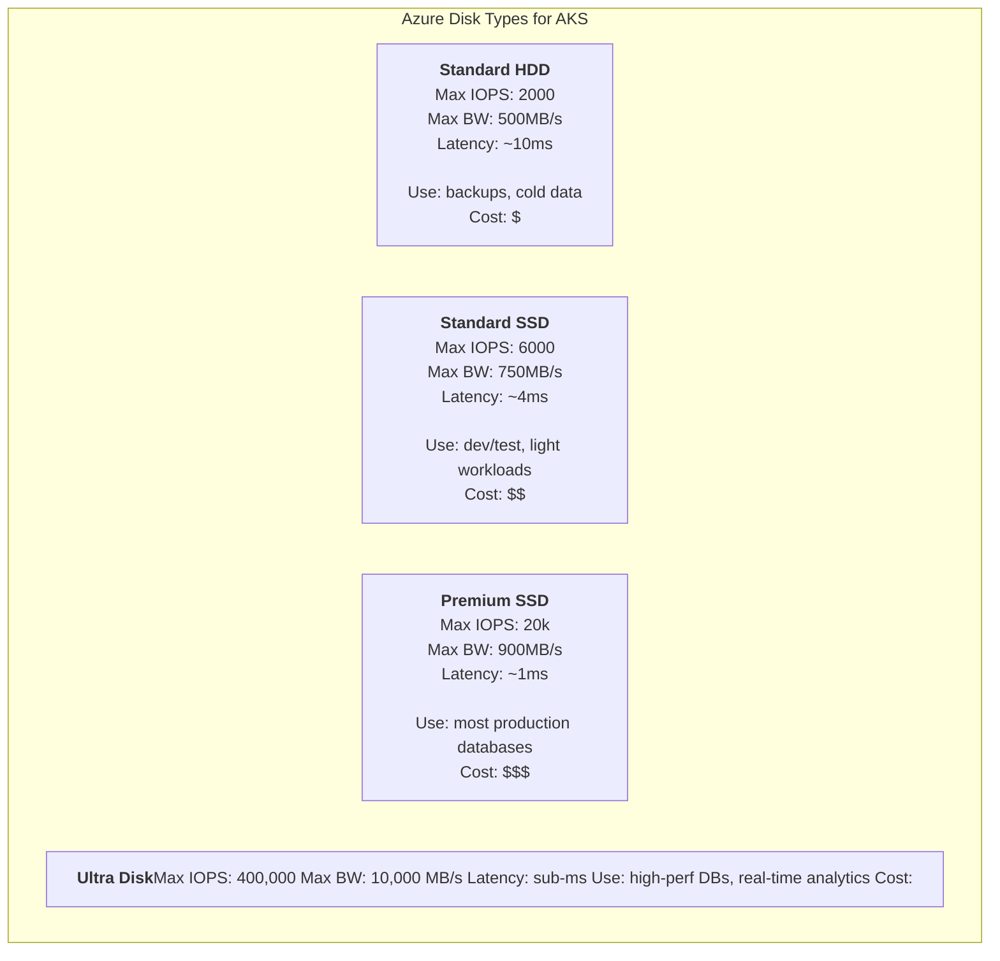
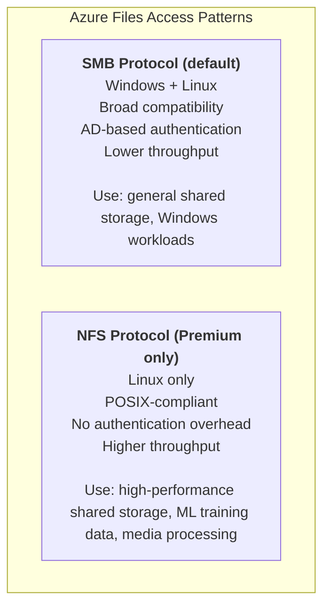
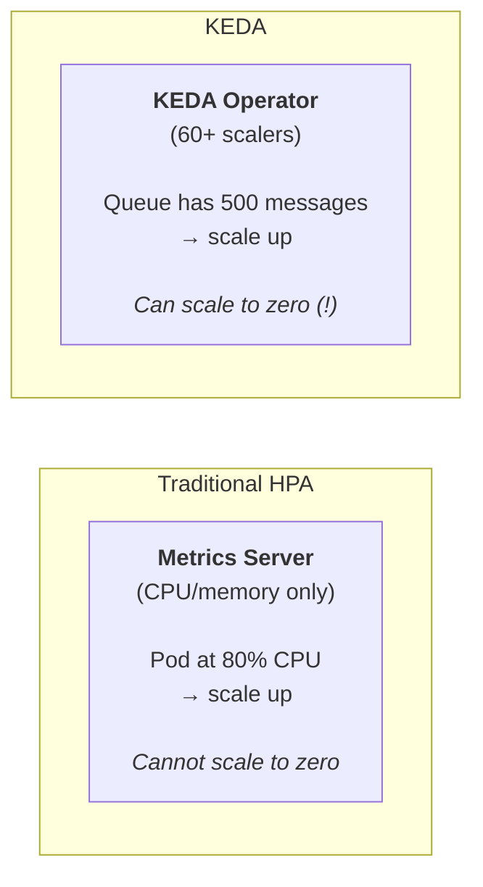
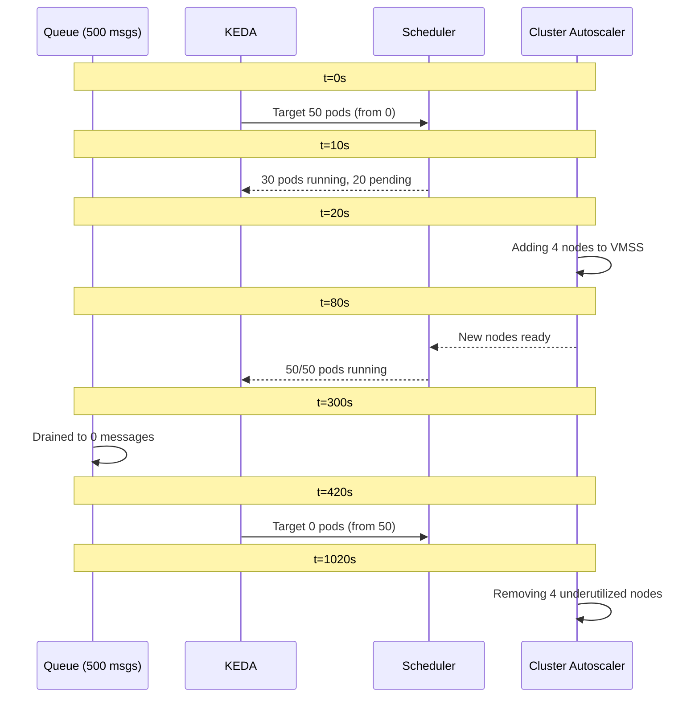
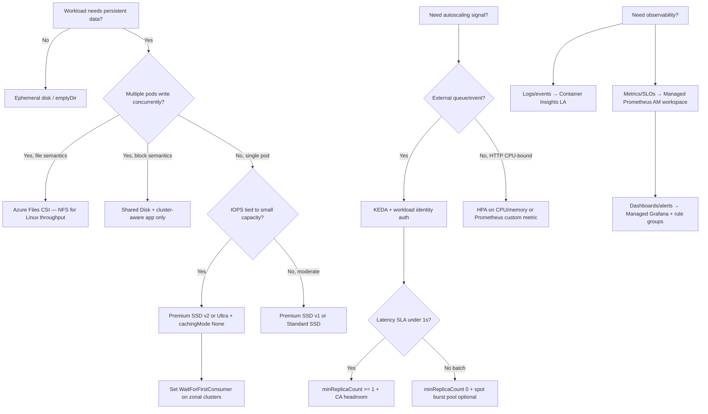

**Complexity**: `[MEDIUM]` | **Time to Complete**: 2.5h | **Prerequisites**: [Module 7.1: AKS Architecture & Node Management](../module-7.1-aks-architecture/).
This module is focused on production-ready AKS operations where storage reliability, observability signal quality, and scaling behavior must be treated as one coupled reliability system rather than independent checkboxes.

## What You'll Be Able to Do

After completing this module, you will be able to evaluate which storage, monitoring, and scaling choices map to real workload behavior. You will also be able to implement those choices with explicit controls, then confirm the cluster responds correctly under pressure instead of only by design intent. In short, each outcome below is framed around decisions you can execute during a live production incident.

- **Debug** event-driven autoscaling configurations using KEDA on AKS.
- **Implement** AKS observability with Azure Monitor Container Insights, Managed Prometheus, and Managed Grafana.
- **Compare** and evaluate Azure Disk and Azure Files CSI drivers with storage classes optimized for performance and cost on AKS.
- **Design** AKS cost optimization strategies using Spot node pools, cluster autoscaler tuning, and workload right-sizing.
- **Diagnose** performance bottlenecks related to I/O constraints in persistent volume claims.

---

## Why This Module Matters

Hypothetical scenario: an online retailer running on AKS experiences a catastrophic failure during a peak sale. Their order processing service uses Azure Premium SSD disks for a write-ahead log. When traffic spikes to 15x normal levels, the disk IOPS ceiling is hit and writes start queuing. The application has no metrics on disk I/O latency—their observability stack only monitors CPU and memory. Without visibility into the real bottleneck, the on-call engineer scales the deployment from 6 to 30 replicas, which makes things dramatically worse: 30 pods now compete for the same disk's IOPS budget. The queue grows, timeouts cascade, and the entire order pipeline freezes for 90 minutes during peak sales hours, creating a material revenue hit without revealing the storage bottleneck until after the incident.

This story illustrates a pattern that repeats across organizations: storage, observability, and scaling are treated as afterthoughts during initial cluster setup, then become the root cause of the most painful production incidents. The three topics are deeply interconnected. Without proper observability, you cannot make informed scaling decisions. Without proper scaling, your storage layer gets overwhelmed. Without proper storage, your observability pipeline loses data during the exact moments you need it most. When systems fail, they rarely fail in isolation; a bottleneck in one subsystem masks the symptoms of another, leading responders down the wrong diagnostic path.

In this module, grounded in Kubernetes v1.35 best practices, you will learn how to choose between Azure Disks and Azure Files for different workload patterns, configure Container Insights with Managed Prometheus and Grafana for full-stack observability, and implement event-driven autoscaling with the KEDA add-on. The fix in the scenario is straightforward: migrate to Ultra Disks with provisioned IOPS, add disk I/O metrics to the Grafana dashboards, and implement KEDA-based scaling that responds to queue depth rather than CPU utilization. By the end of this module, you will have a cluster that monitors itself, scales based on real business signals, and stores data on the right tier for each workload.

---

## Azure Storage for Kubernetes: Disks vs Files

In modern Kubernetes environments (v1.35+), out-of-tree Container Storage Interface (CSI) drivers are the absolute standard for handling persistent storage. AKS integrates natively with Azure's storage fabric via two primary drivers: `disk.csi.azure.com` for block storage and `file.csi.azure.com` for file-level storage. Understanding when to use which is the foundation of stateful workload reliability.

### Azure Disks: Block Storage for Single-Pod Workloads

Azure Disks provide high-performance block-level storage that attaches directly to a virtual machine. Because it is block storage, it is natively bound to a single node at any given time. In Kubernetes terms, this maps to the `ReadWriteOnce` (RWO) access mode—meaning only one pod on one specific node can mount the disk for read-write access. If a pod crashes and is rescheduled to a new node, the CSI driver must detach the disk from the old node and attach it to the new one.



When defining a StorageClass for Azure Disks, you map the `skuName` to the tier you need. For example, moving from Standard HDD to Premium SSD changes not only latency, but also the operational envelope for failures, rebuild time, and sustained write throughput. Because this choice is persistent for every claim using that class, it is the most visible lever for shaping workload economics and reliability from the outset.

```yaml
# StorageClass for Premium SSD v2 with provisioned IOPS
apiVersion: storage.k8s.io/v1
kind: StorageClass
metadata:
  name: premium-ssd-v2
provisioner: disk.csi.azure.com
parameters:
  skuName: PremiumV2_LRS
  DiskIOPSReadWrite: "5000"
  DiskMBpsReadWrite: "200"
  cachingMode: None
reclaimPolicy: Retain
volumeBindingMode: WaitForFirstConsumer
allowVolumeExpansion: true
```

And then you can safely request the volume using a PersistentVolumeClaim (PVC): this maps the chosen class into pod-level scheduling, so Kubernetes can only place the workload with storage behavior that you intentionally encoded.

```yaml
# PVC using the StorageClass
apiVersion: v1
kind: PersistentVolumeClaim
metadata:
  name: postgres-data
  namespace: database
spec:
  accessModes:
    - ReadWriteOnce
  storageClassName: premium-ssd-v2
  resources:
    requests:
      storage: 256Gi
```

The `volumeBindingMode: WaitForFirstConsumer` setting is critical for AKS clusters deployed across multiple availability zones. Because a managed disk is a physical resource located in a specific data center, it cannot cross availability zones. If the volume binding mode was set to `Immediate`, the control plane might create the disk in Zone 1. If the Kubernetes scheduler later places the pod on a node in Zone 2, the pod will be permanently stuck in `Pending` state because the disk cannot be attached. `WaitForFirstConsumer` delays the disk provisioning API call until the scheduler has chosen a node, ensuring the disk is created in the matching zone.

### Ultra Disks: When Premium SSD Is Not Enough

For standard Premium SSDs, your IOPS and throughput caps are rigidly tied to the size of the disk you provision. If you need 10,000 IOPS, you must provision a massive disk, even if your database is only 50 GB. Ultra Disks and Premium SSD v2 solve this problem by decoupling storage capacity from performance metrics. You can provision a small disk while independently dialing the IOPS up to massive numbers, which is perfect for latency-sensitive databases.

```bash
# Enable Ultra Disk support on a node pool
az aks nodepool add \
  --resource-group rg-aks-prod \
  --cluster-name aks-prod-westeurope \
  --name dbpool \
  --node-count 3 \
  --node-vm-size Standard_D8s_v5 \
  --zones 1 2 3 \
  --enable-ultra-ssd \
  --mode User \
  --node-taints "workload=database:NoSchedule" \
  --labels workload=database
```

```yaml
# StorageClass for Ultra Disk
apiVersion: storage.k8s.io/v1
kind: StorageClass
metadata:
  name: ultra-disk
provisioner: disk.csi.azure.com
parameters:
  skuName: UltraSSD_LRS
  DiskIOPSReadWrite: "50000"
  DiskMBpsReadWrite: "1000"
  cachingMode: None
reclaimPolicy: Retain
volumeBindingMode: WaitForFirstConsumer
allowVolumeExpansion: true
```

### Azure Files: Shared Storage for Multi-Pod Access

**Pause and predict:** If you have a legacy CMS that writes user uploads to a local filesystem and you want to scale it to 3 replicas across different nodes, which Azure storage solution must you use and why?

<details>
<summary>Check your prediction</summary>

You must use **Azure Files** via the Azure Files CSI driver (`file.csi.azure.com`) because it provides fully managed file shares via SMB or NFS supporting the `ReadWriteMany` (RWX) access mode. This allows all three CMS replicas running across distinct nodes to mount and write to the same shared directory concurrently. In contrast, standard **Azure Disks** (`disk.csi.azure.com`) provides block storage supporting only `ReadWriteOnce` (RWO), which restricts attachment to a single node at any given time. Attempting to attach an Azure Disk PVC to multiple pods distributed across different nodes results in volume attachment conflicts and scheduling failures.
</details>

Decoupling distributed storage protocols from local container runtimes requires balancing network throughput overhead against concurrency guarantees. Shared network storage architectures introduce POSIX locking semantics and network latency profiles that differ significantly from direct block device serialization.

Distributed storage abstractions provide essential persistence for machine learning training pipelines where distributed worker engines consume identical dataset caches, cross-pod report rendering engines, and centralized application configuration directories.



When performance matters for Linux-based workloads, you should usually prefer NFS over SMB to reduce the authentication and protocol overhead often associated with Windows file sharing.

```yaml
# StorageClass for Azure Files NFS (Premium tier)
apiVersion: storage.k8s.io/v1
kind: StorageClass
metadata:
  name: azure-files-nfs-premium
provisioner: file.csi.azure.com
parameters:
  protocol: nfs
  skuName: Premium_LRS
mountOptions:
  - nconnect=4
  - noresvport
reclaimPolicy: Retain
volumeBindingMode: Immediate
allowVolumeExpansion: true
```

```yaml
# PVC for shared ML training data
apiVersion: v1
kind: PersistentVolumeClaim
metadata:
  name: training-data
  namespace: ml-pipeline
spec:
  accessModes:
    - ReadWriteMany
  storageClassName: azure-files-nfs-premium
  resources:
    requests:
      storage: 1Ti
```

### Azure Blob storage CSI: when object storage beats disks

The blob CSI driver (`blob.csi.azure.com`) mounts Azure Blob containers through BlobFuse or NFS 3.0. It fits read-heavy, sequentially accessed datasets — log archives, model checkpoints, rendered media — where POSIX semantics matter less than cost per terabyte. Blob-backed volumes support expansion without remounting in many configurations and avoid provisioning premium block IOPS you will not consume.

Blob is not a drop-in replacement for PostgreSQL data directories or low-latency transactional stores. Latency and consistency models differ from Azure Disks; treat blob mounts as shared read-mostly filesystems, not as HA database storage. Enable the driver with `az aks update --enable-blob-driver` when ML or analytics pods need multi-terabyte shared paths without NFS share limits.

### Shared Disks for High Availability

In extremely specific edge cases, you may need multiple pods to write to the same block storage device concurrently. Azure Shared Disks allow a single Premium SSD or Ultra Disk to be attached to multiple nodes simultaneously. This is designed for cluster-aware applications, like SQL Server Failover Cluster Instances, that implement their own SCSI persistent reservation commands to coordinate writes.

```yaml
# StorageClass for shared disks
apiVersion: storage.k8s.io/v1
kind: StorageClass
metadata:
  name: shared-premium-disk
provisioner: disk.csi.azure.com
parameters:
  skuName: Premium_LRS
  maxShares: "3"
  cachingMode: None
reclaimPolicy: Retain
volumeBindingMode: WaitForFirstConsumer
```

**Warning**: Shared Disks do not natively provide a managed filesystem. The application itself must coordinate concurrent block-level access. If you merely mount a shared disk using `ext4` or `xfs` from multiple Linux nodes, you risk data corruption because the kernel's in-memory caching is not coordinated across nodes. 

### The Storage Decision Matrix

| Criteria | Azure Disk (Premium) | Azure Disk (Ultra) | Azure Files (SMB) | Azure Files (NFS) |
| :--- | :--- | :--- | :--- | :--- |
| **Access mode** | RWO | RWO | RWX | RWX |
| **Max IOPS** | 20,000 | 400,000 | Premium share tier/size-driven | Premium share tier/size-driven |
| **Cross-zone** | No (zone-locked) | No (zone-locked) | Yes (ZRS available) | Yes (ZRS available) |
| **Latency** | ~1ms | Sub-ms | ~5-10ms | ~2-5ms |
| **Windows support** | Yes | Yes | Yes | No |
| **Best for** | Databases, stateful apps | High-IOPS databases | Shared config, CMS | ML data, media |
| **Cost** | $$$ | $$$$ | $$ | $$$ |

### The CSI driver model on AKS

AKS exposes Azure storage through three out-of-tree CSI drivers registered with the Kubernetes API. The disk driver (`disk.csi.azure.com`, historically called azuredisk-csi) provisions block volumes for `ReadWriteOnce` workloads. The file driver (`file.csi.azure.com`, azurefile-csi) provisions SMB or NFS shares for `ReadWriteMany`. The blob driver (`blob.csi.azure.com`) mounts object storage through BlobFuse or NFS 3.0 when you need massive unstructured datasets without paying for block-tier IOPS you will never use.

Choosing the wrong driver is expensive in two ways at once. A team that mounts a 2 TiB Premium SSD just to share static assets pays block prices for file semantics. A team that puts a PostgreSQL data directory on Azure Files NFS pays latency and protocol overhead for access patterns that require local block I/O. The decision is not “which Azure product sounds best” but which Kubernetes access mode your pod spec actually requires.

| Driver | Provisioner | Access modes | Caching on data disks | Typical mistake |
| :--- | :--- | :--- | :--- | :--- |
| Azure Disk CSI | `disk.csi.azure.com` | RWO (RWX only via shared disks + cluster-aware app) | Premium SSD v1/v2: host cache options; Ultra and PremiumV2_LRS: `None` only | Using `Immediate` binding on multi-zone clusters |
| Azure Files CSI | `file.csi.azure.com` | RWX | N/A (network file protocol) | Picking SMB for Linux-only high-throughput ML reads |
| Azure Blob CSI | `blob.csi.azure.com` | RWX (fuse or NFS mount) | N/A | Expecting database-grade latency from object-backed mounts |

### StorageClass parameters that shape performance and placement

Your StorageClass `parameters` block is the contract between Kubernetes scheduling and Azure billing. For disks, `skuName` selects the managed disk SKU (`Premium_LRS`, `StandardSSD_LRS`, `PremiumV2_LRS`, `UltraSSD_LRS`, or zone-redundant variants like `Premium_ZRS`). Premium SSD v2 and Ultra disks must use `cachingMode: None` because host caching would fight independently tuned IOPS and sub-millisecond latency targets.

`volumeBindingMode: WaitForFirstConsumer` delays Azure disk creation until the scheduler picks a node, which is why it is the default recommendation for zonal AKS node pools. `allowVolumeExpansion: true` lets you grow PVC capacity online; for Premium SSD v1, expanding disk size can also raise the IOPS tier because performance is capacity-coupled. Premium SSD v2 and Ultra disks let you change IOPS and throughput independently (with limits on how often you can resize performance per day), so expansion and performance tuning are separate operational levers.

```yaml
# Premium SSD v1 — IOPS still tied to provisioned GiB (P30 = 5,000 base IOPS at 1 TiB)
apiVersion: storage.k8s.io/v1
kind: StorageClass
metadata:
  name: premium-ssd-v1-sized
provisioner: disk.csi.azure.com
parameters:
  skuName: Premium_LRS
  cachingMode: ReadOnly
reclaimPolicy: Retain
volumeBindingMode: WaitForFirstConsumer
allowVolumeExpansion: true
```

### Premium SSD v2 versus Ultra Disk in production

Both tiers decouple capacity from performance, but they target different economics. Premium SSD v2 offers up to 80,000 IOPS and 2,000 MB/s throughput with a 3,000 IOPS baseline included on every disk; additional IOPS scale at 500 per GiB above 6 GiB. Ultra Disk scales to 400,000 IOPS and 10,000 MB/s on large disks, with performance adjustable at runtime up to four times per 24-hour window. Ultra also carries a VM reservation fee when Ultra capability is enabled on a node without an attached Ultra disk, which surprises teams during cost reviews.

For a 50 GiB database needing 15,000 sustained IOPS, Premium SSD v1 fails without massively over-provisioning capacity (a 64 GiB P6 disk delivers only 240 base IOPS). Premium SSD v2 or Ultra is required. Ultra wins when you need the highest ceilings or sub-millisecond latency guarantees at scale; Premium SSD v2 often wins on price-performance for general production databases that still need tunable IOPS without Ultra’s regional and VM SKU constraints.

### Volume expansion, snapshots, and reclaim policy

Enable the AKS snapshot controller alongside CSI drivers so you can take `VolumeSnapshot` objects for backup and clone workflows. Snapshots bill for used data size, not the full provisioned disk, which matters when you snapshot thick databases that only partially fill their PVCs. Pair `reclaimPolicy: Retain` on production StorageClasses so accidental PVC deletion does not destroy the underlying Azure disk; use `Delete` only in lab namespaces where automation should tear down storage with the workload.

When expanding a PVC, verify the filesystem inside the pod grows after the volume resize completes. The CSI driver expands the Azure disk, but ext4/xfs growth still requires node-level steps unless your container image runs a resize utility on restart. Document this in runbooks so on-call engineers do not assume “PVC says Bound at 512 GiB” means the database file already uses the space.

---

## Container Insights and Azure Monitor

Observability is the nervous system of your cluster. Container Insights is Azure's first-party observability solution for AKS. It automatically deploys the Azure Monitor Agent (AMA) as a DaemonSet across your cluster to aggregate node metrics, pod metrics, container logs, and Kubernetes events into a central Log Analytics workspace. 

### Enabling Container Insights

You can enable this integration at cluster creation or dynamically attach it to an existing environment. In both cases, the operational workflow is the same: enable the addon, point it at a purpose-built Log Analytics workspace, and verify the agent is actively collecting the expected telemetry streams before you build dashboards.

```bash
# Create a Log Analytics workspace
az monitor log-analytics workspace create \
  --resource-group rg-aks-prod \
  --workspace-name law-aks-prod \
  --location westeurope \
  --retention-time 90

WORKSPACE_ID=$(az monitor log-analytics workspace show \
  -g rg-aks-prod -n law-aks-prod --query id -o tsv)

# Enable Container Insights
az aks enable-addons \
  --resource-group rg-aks-prod \
  --name aks-prod-westeurope \
  --addons monitoring \
  --workspace-resource-id "$WORKSPACE_ID"

# Verify the monitoring agent is running
k get pods -n kube-system -l component=ama-logs
```

### What Container Insights Collects

Once the AMA is deployed, it begins scraping extensive data streams shortly afterward:
- node and pod metrics for capacity and pressure,
- container logs for error signals and behavior changes,
- and Kubernetes events for scheduling or health anomalies.
Because all three streams are correlated to a single Log Analytics workspace, you can identify causality much faster than if each layer is investigated in isolation.
- **Node metrics**: Deep hardware utilization metrics like disk I/O, network throughput, and CPU load.
- **Pod metrics**: Actual resource consumption contrasted against Kubernetes requested boundaries.
- **Container logs**: Every line of `stdout` and `stderr` emitted by the container runtime.
- **Inventory data**: A live map of running pods, healthy nodes, and active services.

```bash
# Query container logs in Log Analytics
az monitor log-analytics query \
  --workspace "$WORKSPACE_ID" \
  --analytics-query "ContainerLogV2 | where ContainerName == 'payment-service' | where LogMessage contains 'error' | top 20 by TimeGenerated desc" \
  --timespan "PT6H"
```

### Cost Control for Container Insights

**Pause and predict:** You just deployed Container Insights on a busy cluster and your Log Analytics bill spiked by $500 in one day. What is the most likely culprit, and what configuration component will fix it?

<details>
<summary>Check your prediction</summary>

The cost spike is almost always driven by high-volume stdout/stderr streams from noisy application workloads (such as ingress proxies or verbose debug containers) ingesting gigabytes of telemetry into the `ContainerLogV2` table. Live Container Insights defaults already exclude `kube-system` and `gatekeeper-system` from stdout/stderr collection, so platform system pods are rarely the primary ingestion culprit. To stop the cost runaway, you apply the `container-azm-ms-agentconfig` ConfigMap in the `kube-system` namespace and configure `exclude_namespaces` to filter out chatty application namespaces, or disable stdout/stderr for specific namespaces entirely. Remember that this ConfigMap manages container log collection only; infrastructure inventory, Kubernetes events, and node performance tables are controlled separately through the Azure Monitor Data Collection Rule (DCR).
</details>

Establishing automated ingestion boundaries protects enterprise budgets against unbudgeted log volume expansion during unexpected application traffic surges. Deploying declarative filtering manifests alongside cluster provisioning ensures that logging agents ingest only actionable diagnostics before telemetry crosses network boundaries into paid analytical storage tiers.

```yaml
# Save as container-insights-config.yaml
apiVersion: v1
kind: ConfigMap
metadata:
  name: container-azm-ms-agentconfig
  namespace: kube-system
data:
  schema-version: v1
  config-version: v1
  log-data-collection-settings: |
    [log_collection_settings]
      [log_collection_settings.stdout]
        enabled = true
        exclude_namespaces = ["kube-system", "gatekeeper-system"]
      [log_collection_settings.stderr]
        enabled = true
        exclude_namespaces = ["kube-system"]
      [log_collection_settings.env_var]
        enabled = false
  prometheus-data-collection-settings: |
    [prometheus_data_collection_settings.cluster]
      interval = "60s"
      monitor_kubernetes_pods = true
```

```bash
k apply -f container-insights-config.yaml
```

### Container Insights versus Managed Prometheus: who owns which signal

Production AKS observability is intentionally split across two cost models and two query languages. Container Insights is the log-and-inventory plane: it ships container stdout/stderr, Kubernetes events, and selected performance tables into Log Analytics, where you pay primarily for ingestion gigabytes and retention days. Managed Prometheus is the metrics plane: it scrapes Prometheus endpoints (including kube-state and your app `/metrics`) into an Azure Monitor workspace, where you pay for metric samples ingested and PromQL queries executed, with eighteen months of retention included at no separate storage charge.

Neither replaces the other during an incident. Disk I/O saturation often appears first in Container Insights `InsightsMetrics` or platform metrics, while queue-depth-driven scaling decisions belong in Prometheus or KEDA triggers. Teams that disable Container Insights “because we have Grafana” still lack correlated container logs unless they route logs elsewhere deliberately.

| Layer | Primary store | Best for | Cost spike trigger |
| :--- | :--- | :--- | :--- |
| Container Insights | Log Analytics workspace | Log triage, KubeEvents, inventory views | Unfiltered stdout from noisy namespaces |
| Managed Prometheus | Azure Monitor workspace | SLO metrics, custom app metrics, recording rules | High-cardinality labels on high-frequency scrapes |
| Managed Grafana | Linked to AM workspace | Dashboards combining AM metrics + optional LA queries | Seat/licensing (service) plus underlying data costs |
| Platform metrics | Azure Monitor metrics DB | Node/pod CPU memory at no extra collection cost | Usually low unless you export everything to LA |

### Log Analytics cost control: caps, tiers, and DCR grouping

Beyond namespace exclusions in the agent ConfigMap, use workspace-level daily cap (`--quota` on workspace create) as a circuit breaker so a logging storm cannot consume an entire month's observability budget in hours. For AKS control plane resource logs, Microsoft recommends resource-specific diagnostic mode so audit data lands in dedicated tables (`AKSAudit`, `AKSAuditAdmin`, `AKSControlPlane`) instead of the monolithic `AzureDiagnostics` table, and configure high-volume audit tables as **Basic logs** where policy allows — Basic logs trade reduced query features for materially lower ingestion cost on verbose audit streams.

Container insights also supports Data Collection Rule (DCR) groupings that limit which tables ingest (for example, **Performance** only without full **Logs and events**). Selecting a reduced grouping disables some default Container insights portal blades, which is an acceptable trade when Managed Prometheus already covers golden signals and you only need selective log capture for application namespaces.

```bash
# Set a daily ingestion cap on the workspace (example: 5 GB/day)
az monitor log-analytics workspace create \
  --resource-group rg-aks-prod \
  --workspace-name law-aks-prod \
  --location westeurope \
  --retention-time 90 \
  --quota 5
```

---

## Managed Prometheus and Grafana: Cloud-Native Monitoring

Container Insights is fantastic for log aggregation and infrastructural health, but it struggles with application-specific custom metrics. For application teams, this means you get excellent infrastructure visibility first, then still need a dedicated path for domain metrics such as checkout conversion rate, queue depth, or user session concurrency.

**Pause and predict:** If you rely strictly on Container Insights for everything, what happens when your application needs to expose a custom business metric like "active_user_sessions"? Why is Managed Prometheus a better fit for this?

<details>
<summary>Check your prediction</summary>

Container Insights is optimized for log analytics and cluster inventory rather than high-frequency application metrics; attempting to ingest custom domain metrics like `active_user_sessions` as log strings requires parsing text with costly KQL queries, which delays alert evaluation and inflates ingestion expenses. In contrast, **Azure Managed Prometheus** natively scrapes standard `/metrics` endpoints using Prometheus pull semantics and stores numeric time-series directly into an Azure Monitor workspace. On AKS, enabling Managed Prometheus deploys the `ama-metrics` agent via a data collection rule and includes eighteen months of metric retention without additional storage fees. Prebuilt recording rules reduce dashboard query overhead, and scrape targets can be customized using ConfigMaps without the operational burden of maintaining self-hosted Prometheus or Thanos infrastructure.
</details>

Separating application business telemetry from infrastructure diagnostic pipelines enables independent scaling of metrics collection cadences. Platform engineering teams establish standardized scraping topologies across diverse development clusters without forcing individual microservices to adopt proprietary cloud provider logging SDKs.

Prometheus operates on a standardized pull model that decodes OpenMetrics formats across heterogeneous services. Managed collection infrastructure eliminates the operational overhead of running dedicated persistent volumes, remote write gateways, and distributed storage engines for long-term retention. Consequently, engineering teams can focus on defining actionable service level objectives and alert thresholds.

### Setting Up Managed Prometheus

```bash
# Create an Azure Monitor workspace (for Prometheus)
az monitor account create \
  --resource-group rg-aks-prod \
  --name amw-aks-prod \
  --location westeurope

MONITOR_WORKSPACE_ID=$(az monitor account show \
  -g rg-aks-prod -n amw-aks-prod --query id -o tsv)

# Enable Managed Prometheus on the cluster
az aks update \
  --resource-group rg-aks-prod \
  --name aks-prod-westeurope \
  --enable-azure-monitor-metrics \
  --azure-monitor-workspace-resource-id "$MONITOR_WORKSPACE_ID"

# Verify the Prometheus agent is running
k get pods -n kube-system -l rsName=ama-metrics
```

### Setting Up Managed Grafana

Grafana is the industry-standard visualization layer for Prometheus. Azure Managed Grafana natively integrates with Azure AD for robust RBAC and automatically discovers your Managed Prometheus workspaces.

```bash
# Create a Managed Grafana instance
az grafana create \
  --resource-group rg-aks-prod \
  --name grafana-aks-prod \
  --location westeurope

# Link Grafana to the Azure Monitor workspace
GRAFANA_ID=$(az grafana show -g rg-aks-prod -n grafana-aks-prod --query id -o tsv)

az monitor account update \
  --resource-group rg-aks-prod \
  --name amw-aks-prod \
  --linked-grafana "$GRAFANA_ID"

# Get the Grafana URL
az grafana show -g rg-aks-prod -n grafana-aks-prod --query "properties.endpoint" -o tsv
```

### Custom Prometheus Metrics from Your Application

Once your ecosystem is established, getting your custom metrics ingested requires two steps: enable pod-annotation scraping for the namespace in `ama-metrics-settings-configmap`, then add standard Prometheus annotations to the Pod specification. The Managed Prometheus agent discovers annotated endpoints only after `podannotationnamespaceregex` includes the namespace, which prevents accidental scraping from every annotated pod in a large cluster.

```yaml
# ama-metrics-settings-configmap data fragment
prometheus-collector-settings: |-
  cluster-metrics: |-
    pod-annotation-based-scraping: |-
      podannotationnamespaceregex = "payments"
```

```yaml
apiVersion: apps/v1
kind: Deployment
metadata:
  name: payment-service
  namespace: payments
spec:
  replicas: 3
  selector:
    matchLabels:
      app: payment-service
  template:
    metadata:
      labels:
        app: payment-service
      annotations:
        prometheus.io/scrape: "true"
        prometheus.io/port: "8080"
        prometheus.io/path: "/metrics"
    spec:
      containers:
        - name: payment
          image: myregistry.azurecr.io/payment-service:v2.1.0
          ports:
            - containerPort: 8080
              name: http
          resources:
            requests:
              cpu: "250m"
              memory: "256Mi"
            limits:
              cpu: "1"
              memory: "512Mi"
```

### Creating Alert Rules

Dashboards are meaningless if nobody is looking at them during an incident. Alerting ensures that operational boundaries trigger actionable notifications.

PromQL alerts for Managed Prometheus are Azure ARM resources, not `kubectl apply` resources and not Azure metric-alert mini-language rules. Keep these rule groups in Bicep, ARM JSON, Terraform, or Azure Service Operator if your platform supports that CRD path; then let GitOps promote the IaC artifact rather than pretending the rule group is a native Kubernetes object.

```bicep
param azureMonitorWorkspaceName string = 'amw-aks-prod'
param location string = resourceGroup().location

resource workspace 'Microsoft.Monitor/accounts@2023-04-03' existing = {
  name: azureMonitorWorkspaceName
}

resource paymentAlerts 'Microsoft.AlertsManagement/prometheusRuleGroups@2023-03-01' = {
  name: 'payment-alerts'
  location: location
  properties: {
    description: 'Payment service Prometheus alert rules'
    enabled: true
    interval: 'PT1M'
    scopes: [
      workspace.id
    ]
    rules: [
      {
        alert: 'PaymentServiceHighErrorRate'
        enabled: true
        expression: 'sum(rate(http_requests_total{status=~"5..",service="payment-service"}[5m])) by (service) / sum(rate(http_requests_total{service="payment-service"}[5m])) by (service) > 0.05'
        for: 'PT5M'
        severity: 1
        labels: {
          team: 'payments'
        }
        annotations: {
          summary: 'Payment service error rate exceeds 5%'
        }
      }
      {
        alert: 'PaymentServiceHighLatency'
        enabled: true
        expression: 'histogram_quantile(0.99, sum(rate(http_request_duration_seconds_bucket{service="payment-service"}[5m])) by (le, service)) > 2'
        for: 'PT3M'
        severity: 2
        annotations: {
          summary: 'Payment service p99 latency exceeds 2 seconds'
        }
      }
    ]
  }
}
```

Use `az monitor metrics alert create` for platform or ARM metrics, such as the Service Bus `ActiveMessages` alerts in the hands-on exercise. That command's `--condition` language understands metric names and aggregations, not raw PromQL expressions.

### Remote write, recording rules, and three alert pathways

Managed Prometheus stores recording and alert rule groups in the Azure Monitor workspace itself, not on cluster-local Prometheus PVCs. Recording rules pre-aggregate expensive PromQL (for example, per-pod rates rolled up to deployment-level series) so dashboards and alerts query smaller cardinalities at lower cost. You can still use **remote_write** from a self-managed Prometheus scraper during migration, sending duplicate series into the same workspace until you decommission in-cluster Prometheus HA pairs.

Choose the alert pathway based on what question you are answering:

| Alert type | Data source | Fires when | Good fit |
| :--- | :--- | :--- | :--- |
| Prometheus alert rules (`PrometheusRuleGroup`) | Azure Monitor workspace metrics | PromQL threshold breached for `for:` duration | SLO latency, error rate, `up==0` |
| Metric alerts (Azure Monitor) | Platform or custom metrics in AM | ARM metric condition on resource ID | Service Bus depth, node NotReady counts |
| Log query alerts | Log Analytics KQL | Scheduled KQL returns rows | Rare stderr patterns, audit anomalies |

Metric alerts on Azure resources (like Service Bus `ActiveMessages`) do not require Prometheus instrumentation and complement KEDA-driven scaling: KEDA reacts continuously, while alerts wake humans when automation hits `maxReplicaCount` or queue depth exceeds business thresholds. Log query alerts remain the right tool when the signal only exists in Container Insights tables (for example, stack traces in `ContainerLogV2` that you never exported as Prometheus counters).

---

## KEDA: Event-Driven Autoscaling

The standard Kubernetes Horizontal Pod Autoscaler (HPA) works brilliantly for web servers reacting to CPU load. However, it fails catastrophically for asynchronous or event-driven workers. If your messaging queue instantly receives a burst of 10,000 tasks, your consumer pods might process them very efficiently, keeping CPU usage extremely low. Because the CPU usage may stay relatively flat, the standard HPA may fail to scale out in time, resulting in a monumental processing backlog. 

KEDA (Kubernetes Event-Driven Autoscaling) intercepts the metrics pipeline. It provides over 60 custom scalers that allow your deployments to scale dynamically based on external business metrics rather than lagging infrastructure indicators.



### Enabling the KEDA Add-on

```bash
# Enable KEDA as an AKS add-on
az aks update \
  --resource-group rg-aks-prod \
  --name aks-prod-westeurope \
  --enable-keda

# Verify KEDA pods are running
k get pods -n kube-system -l app.kubernetes.io/name=keda-operator
```

### Scaling Based on Azure Service Bus Queue Depth

The most powerful pattern for KEDA on Azure is connecting it to Azure Service Bus. Instead of waiting for CPU to spike, KEDA constantly queries the queue API to determine exactly how many messages are waiting, then preemptively scales the deployment out. 

```yaml
# ScaledObject: scale order-processor based on Service Bus queue depth
apiVersion: keda.sh/v1alpha1
kind: ScaledObject
metadata:
  name: order-processor-scaler
  namespace: orders
spec:
  scaleTargetRef:
    name: order-processor
  pollingInterval: 15
  cooldownPeriod: 120
  minReplicaCount: 0      # Scale to zero when queue is empty!
  maxReplicaCount: 50
  triggers:
    - type: azure-servicebus
      metadata:
        queueName: incoming-orders
        namespace: sb-prod-westeurope
        messageCount: "10"  # 1 pod per 10 messages
      authenticationRef:
        name: servicebus-auth
```

In this example, KEDA ensures there is 1 pod running for every 10 messages. A massive queue will quickly trigger a massive scale-out event. Even better, when the queue is entirely drained, KEDA will scale the deployment to 0, completely removing compute costs during idle periods. 

### KEDA Authentication with Workload Identity

For KEDA to interrogate the Service Bus API, it needs secure authorization. Avoid storing connection strings in secrets; instead, utilize Workload Identity natively.

```yaml
# TriggerAuthentication using Workload Identity
apiVersion: keda.sh/v1alpha1
kind: TriggerAuthentication
metadata:
  name: servicebus-auth
  namespace: orders
spec:
  podIdentity:
    provider: azure-workload
    identityId: "<CLIENT_ID_OF_MANAGED_IDENTITY>"
```

### Scaling Based on Prometheus Metrics

If you want to orchestrate scaling based on a specialized metric inside your codebase (e.g., requests per second processed, or active user sessions), KEDA can natively scale based on any query executed against your Prometheus server.

```yaml
# Scale based on a custom Prometheus metric
apiVersion: keda.sh/v1alpha1
kind: ScaledObject
metadata:
  name: api-gateway-scaler
  namespace: gateway
spec:
  scaleTargetRef:
    name: api-gateway
  pollingInterval: 30
  cooldownPeriod: 180
  minReplicaCount: 2
  maxReplicaCount: 30
  triggers:
    - type: prometheus
      metadata:
        serverAddress: "http://prometheus-server.monitoring:9090"
        metricName: http_requests_per_second
        query: "sum(rate(http_requests_total{service='api-gateway'}[2m]))"
        threshold: "100"  # 1 pod per 100 requests/sec
```

### KEDA Scaling Strategies Compared

| Scaler | Trigger Source | Scale to Zero | Typical Use Case |
| :--- | :--- | :--- | :--- |
| **azure-servicebus** | Queue message count | Yes | Order processing, async tasks |
| **azure-eventhub** | Consumer group lag | Yes | Event streaming, IoT data |
| **azure-queue** | Storage queue length | Yes | Background jobs, batch processing |
| **prometheus** | Any Prometheus metric | No (min 1) | RPS-based scaling, custom metrics |
| **cron** | Time schedule | Yes | Predictable traffic patterns |
| **azure-monitor** | Azure Monitor metrics | Yes | Infrastructure-based triggers |

### Combining KEDA with Cluster Autoscaler

While KEDA rapidly orchestrates the scaling of Pods, the underlying hardware must expand to accommodate them. KEDA and the Azure Cluster Autoscaler work in perfect tandem to resolve this layer constraint. 



### How KEDA, HPA, VPA, and Cluster Autoscaler layer

Think in four planes: **metrics source**, **pod count**, **pod size**, and **node count**. KEDA watches external signals (queues, Prometheus queries, Azure Monitor metrics) and writes desired replica counts into an HPA object it manages. Standard HPA without KEDA only sees CPU/memory/custom metrics from the metrics server. Vertical Pod Autoscaler (VPA) recommends or mutates container requests/limits based on historical usage — it does not replace KEDA for queue depth. Cluster Autoscaler (or node autoprovisioning / Karpenter on AKS) adds/removes VMs when pending pods cannot schedule.

Microsoft documents that you should not attach a separate HPA to the same workload KEDA already scales; they compete because KEDA already owns an HPA under the hood. Operational order during a spike: KEDA raises replicas → scheduler places what fits → pending pods trigger CA → new nodes accept backlog consumers.

| Component | Scales | Scale-to-zero | Typical coupling |
| :--- | :--- | :--- | :--- |
| KEDA | Deployment/StatefulSet replicas via external metrics | Yes (`minReplicaCount: 0`) | Service Bus, Event Hubs, Prometheus |
| HPA (alone) | Replicas on CPU/memory/custom metrics | No (minimum 1) | Web APIs with steady baseline |
| VPA | CPU/memory requests (and limits in Auto mode) | N/A | Right-sizing before CA over-provisions nodes |
| Cluster Autoscaler | Node pool VM count | N/A | Reacts to unschedulable pods |

### Activation threshold, polling interval, and cooldown

KEDA scalers distinguish **activation** from **scaling**. Activation is the gate that wakes a scaled-to-zero deployment: until the metric crosses `activation*` metadata (for example, `activationMessageCount` on Service Bus), KEDA keeps replicas at zero even if scaling thresholds would otherwise demand pods. Scaling thresholds (`messageCount`, Prometheus `threshold`, etc.) determine how many replicas to run once active.

`pollingInterval` controls how often KEDA queries Azure APIs or Prometheus (your lab uses 10–15 seconds). Shorter intervals react faster but increase API call volume and cost on large fleets. `cooldownPeriod` prevents flapping: after the metric drops, KEDA waits before scaling in, which is why scale-to-zero in Task 7 takes roughly sixty to ninety seconds even after the queue is empty.

### Combining multiple KEDA triggers safely

When a `ScaledObject` lists multiple triggers without `scalingModifiers`, KEDA exposes the trigger metrics to the HPA and the HPA chooses the highest desired replica count across those metrics. That default is already the safe "scale out if any signal is saturated" behavior; KEDA does not provide a strategy enum for selecting a combiner. Use `spec.advanced.scalingModifiers` only when you intentionally want one composite metric, and then provide named triggers, a `formula`, and a `target`.

```yaml
apiVersion: keda.sh/v1alpha1
kind: ScaledObject
metadata:
  name: order-processor-multi
  namespace: orders
spec:
  scaleTargetRef:
    name: order-processor
  pollingInterval: 15
  cooldownPeriod: 120
  minReplicaCount: 0
  maxReplicaCount: 50
  advanced:
    scalingModifiers:
      formula: "queue_depth > lag_pressure ? queue_depth : lag_pressure"
      target: "10"
      activationTarget: "1"
      metricType: "AverageValue"
  triggers:
    - type: azure-servicebus
      name: queue_depth
      metadata:
        queueName: incoming-orders
        namespace: sb-prod-westeurope
        messageCount: "10"
        activationMessageCount: "1"
      authenticationRef:
        name: servicebus-auth
    - type: prometheus
      name: lag_pressure
      metadata:
        serverAddress: "https://prometheus-prod-xxx.prometheus.monitor.azure.com"
        metricName: order_processing_lag_seconds
        query: "max(order_processing_lag_seconds) / 3"
        threshold: "10"
```

`TriggerAuthentication` with `podIdentity.provider: azure-workload` (as in your lab) keeps queue credentials off etcd; enable the workload identity add-on before KEDA so operator pods receive `AZURE_FEDERATED_TOKEN_FILE` and related environment variables.

### Scale-to-zero and cold-start tradeoffs

Scale-to-zero eliminates compute charges for idle queue consumers, but the first message after idle pays a **cold-start tax**: KEDA poll interval, image pull, init containers, Service Bus session establishment, and possibly Cluster Autoscaler node boot time stack serially. For latency-sensitive APIs, set `minReplicaCount: 1` (or higher) and use KEDA only for burst scaling above that floor. For batch ETL and order processors, scale-to-zero is often the highest ROI cost lever in the cluster when paired with spot burst pools.

---

## Cost Optimization: Spot Instances and Right-Sizing

The flexibility of Kubernetes inevitably leads to spiraling cloud compute costs if discipline is not applied. While auto-scaling ensures you only pay for what you actively require, your node provisioning strategy ensures you pay the absolute lowest price for those compute resources.

### Spot Node Pools

Azure Spot Virtual Machines offer the ability to consume unutilized Azure data center capacity at discounts approaching 90%. However, Azure can evict these machines with only a 30-second warning (`SIGTERM`) if a full-price customer demands the compute space.

```bash
# Add a Spot node pool to an existing cluster
az aks nodepool add \
  --resource-group rg-aks-prod \
  --cluster-name aks-prod-westeurope \
  --name spotpool \
  --priority Spot \
  --eviction-policy Delete \
  --spot-max-price -1 \
  --enable-cluster-autoscaler \
  --min-count 1 \
  --max-count 10 \
  --node-vm-size Standard_D4s_v5
```

Because of their volatile nature, Spot nodes are deeply integrated with Kubernetes taints and tolerations. AKS will automatically taint Spot nodes so that normal critical workloads are completely shielded from them. You must explicitly configure your deployment to tolerate the `spot` designation.

```yaml
# Pod configured to run on Spot nodes
apiVersion: apps/v1
kind: Deployment
metadata:
  name: batch-worker
spec:
  template:
    spec:
      tolerations:
      - key: "kubernetes.azure.com/scalesetpriority"
        operator: "Equal"
        value: "spot"
        effect: "NoSchedule"
      affinity:
        nodeAffinity:
          preferredDuringSchedulingIgnoredDuringExecution:
          - weight: 100
            preference:
              matchExpressions:
              - key: kubernetes.azure.com/scalesetpriority
                operator: In
                values:
                - spot
```

**Pause and predict:** If your entire web frontend is running on a Spot node pool and Azure experiences a sudden surge in demand for that VM size in your region, what happens to your application? How should you architect a production deployment to utilize Spot savings without risking downtime?

<details>
<summary>Check your prediction</summary>

Azure Spot node pools carry **no SLA**; Azure can and will **evict** Spot virtual machines with only a 30-second preemption notice whenever the cloud provider needs capacity for pay-as-you-go workloads or when Spot prices exceed your configured ceiling. If your entire web frontend runs on Spot, a sudden regional capacity reclamation can evict all replicas simultaneously, resulting in a total application outage. Spot node pools cannot be the cluster's default system pool. AKS automatically taints Spot nodes with `kubernetes.azure.com/scalesetpriority=spot:NoSchedule`. To safely capture Spot cost savings in production, architect workloads with split tiers: deploy your baseline required replicas onto standard Regular (on-demand) node pools, and tolerate the Spot taint only on burst replicas or asynchronous batch workers that can handle sudden evictions without violating user availability SLAs.
</details>

Capacity management strategies must incorporate eviction-handling primitives into deployment definitions to survive asynchronous VM terminations. Configuring `spot-max-price` to `-1` prevents evictions driven by price changes while capacity exists, whereas positive price ceilings enforce strict unit economic limits. Pairing `eviction-policy Delete` ensures decommissioned instances release storage attachments cleanly without stranding stopped virtual machine allocations against cloud subscription quotas.

### Workload Right-Sizing

The Cluster Autoscaler looks strictly at the requested resources of your Pods, not their actual usage. If you deploy a Pod requesting 4 CPU cores but it only consumes 0.1 cores, the autoscaler will aggressively spin up new expensive nodes to satisfy the massive request, leaving you paying for massive amounts of unused "slack" capacity.

To solve this, you must apply workload right-sizing logic. Establish robust memory requests equal to your limits to protect against Out-of-Memory (OOM) killings, while keeping your CPU requests honest to your baseline average usage.

```yaml
# A well-sized container specification
resources:
  requests:
    memory: "256Mi"
    cpu: "100m"     # 1/10th of a core for baseline
  limits:
    memory: "256Mi" # Equal to request to prevent OOM
    cpu: "500m"     # Allowed to burst up to half a core
```

### Vertical Pod Autoscaler: recommend versus auto

Install VPA when Cluster Autoscaler keeps adding nodes while actual CPU usage stays flat — that pattern almost always means requests are inflated, not that you need more hardware. VPA's **Off** mode only recommends changes (safe for learning). **Initial** applies recommendations on pod creation. **Auto** evicts and recreates pods to apply new requests, which can disrupt stateful workloads if you do not coordinate with PodDisruptionBudgets.

Run VPA in recommend mode first, feed results into your GitOps requests, and only enable Auto on stateless Deployments after you validate eviction behavior during a maintenance window. VPA does not shrink Azure disks attached to StatefulSets; it only adjusts CPU/memory requests that influence scheduling and CA math.

```bash
# Prefer the managed AKS VPA add-on for production clusters
az aks update \
  --resource-group rg-aks-prod \
  --name aks-prod-westeurope \
  --enable-vpa

# Upstream fallback for non-AKS labs — verify compatibility with your Kubernetes version
kubectl apply -f https://github.com/kubernetes/autoscaler/releases/latest/download/vertical-pod-autoscaler.yaml

# Example VPA in recommendation-only mode
kubectl apply -f - <<EOF
apiVersion: autoscaling.k8s.io/v1
kind: VerticalPodAutoscaler
metadata:
  name: order-processor-vpa
  namespace: orders
spec:
  targetRef:
    apiVersion: apps/v1
    kind: Deployment
    name: order-processor
  updatePolicy:
    updateMode: "Off"
EOF
```

### AKS cost analysis add-on (OpenCost-based showback)

AKS cost analysis maps Azure invoice lines to Kubernetes namespaces and assets using an OpenCost-based agent. Enable it on Standard or Premium tier clusters with managed identity; it cannot run on Free tier without upgrading. The agent consumes roughly 200 MB plus about 0.5 MB per container (Microsoft documents support for on the order of seven thousand containers per cluster at the current memory limit).

```bash
az aks update \
  --resource-group rg-aks-prod \
  --name aks-prod-westeurope \
  --enable-cost-analysis
```

Portal views expose **idle** charges (capacity no workload uses), **system** charges (AKS reserved kubelet/runtime overhead), and **unallocated** charges (resources not attributed to a namespace). Use this for showback conversations: a namespace with tiny CPU usage but huge persistent volumes often drives cost through Premium disks, not through pod requests.

---

## Production Cost Lens

Hypothetical scenario: a platform team budgets $18,000/month for a three-node production AKS footprint and discovers a $31,000 invoice. The overrun is rarely one line item — it is stacked leaks across storage, logs, metrics, and scheduler behavior.

**Disk and PVC economics.** Managed disks bill for provisioned GiB whether the filesystem fills them or not. Premium SSD v1 forces larger disks when you need IOPS, so a 50 GiB database on P30-sized storage pays for 1 TiB of provisioned capacity. Premium SSD v2 and Ultra let you pay for performance dimensions directly, but Ultra VM reservation fees apply when nodes enable Ultra capability without attached Ultra volumes. Orphan PVCs with `Retain` policies leave premium disks billing after the workload namespace was deleted.

**Log Analytics ingestion and retention.** Container Insights defaults can ingest hundreds of gigabytes per day on chatty clusters. Ingestion is priced per GB with retention multiplying storage cost; workspace daily caps and namespace exclusions are mandatory guardrails, not optimizations. Control plane audit logs (`kube-audit`) are another spike source — prefer `kube-audit-admin` and Basic log tier where appropriate.

**Managed Prometheus samples.** Pricing follows ingestion and query volume, not workspace storage (eighteen-month retention is included). High-cardinality labels (`pod`, `url_path`, `user_id`) on metrics scraped every fifteen seconds explode sample counts. Use recording rules to drop cardinality before dashboards and alerts query the data.

**Spot versus on-demand mix.** Spot VMs commonly discount up to roughly ninety percent versus pay-as-you-go for the same SKU, balanced against thirty-second eviction notices. Safe spot candidates: batch workers, KEDA-driven burst consumers with checkpointing, CI jobs. Unsafe: synchronous API gateways without on-demand baseline replicas, StatefulSets without graceful shutdown, or workloads that cannot tolerate `kubernetes.azure.com/scalesetpriority=spot` taints.

**Over-provisioned requests and idle premium disks.** Cluster Autoscaler provisions nodes to satisfy **requests**, not actual usage. Inflated CPU requests cause extra D8s nodes while metrics show ten percent utilization. KEDA scale-to-zero removes pod compute but not PVCs — verify unused Premium disks monthly.

| Knob | What it reduces | Watch-out |
| :--- | :--- | :--- |
| `WaitForFirstConsumer` + right SKU | Failed scheduling retries, wrong-zone disks | Still pay for provisioned IOPS tier |
| Log exclusions + DCR table groups | Log Analytics GB/day | Some Container insights blades disappear |
| Prometheus recording rules + scrape interval | Sample ingestion charges | Coarser alerts if you over-aggregate |
| Spot pool + on-demand baseline | Compute $/core-hour | Evictions during regional capacity crunches |
| VPA recommend → GitOps requests | CA node count | Auto mode evicts pods during rightsizing |

---

## Patterns and Anti-Patterns

| Pattern | When to use | Why it works | Scaling note |
| :--- | :--- | :--- | :--- |
| Zone-aware disk + `WaitForFirstConsumer` | StatefulSets on multi-AZ AKS | Disk and pod stay collocated in the same zone | Survives node loss; disk does not follow pod across zones |
| Metrics/logs split (AM workspace + LA workspace) | Any production cluster | Right tool per signal; avoids shipping all metrics as logs | Managed Prometheus handles high-cardinality time series cheaper than log conversion |
| KEDA queue scaler + on-demand floor + spot burst | Async order pipelines | Business metric drives scale; spot absorbs peaks | Set `maxReplicaCount` and metric alerts above KEDA ceiling |
| Premium SSD v2 for right-sized DB IOPS | Databases under 200 GiB needing tunable IOPS | Avoids terabyte-sized Premium v1 disks | Expand IOPS without dummy capacity |
| Cost analysis + Retain disks audit | FinOps monthly review | Namespaces reveal who owns orphaned premium disks | Agent memory scales with container count |

| Anti-pattern | What goes wrong | Why teams fall into it | Better alternative |
| :--- | :--- | :--- | :--- |
| CPU-only HPA on queue workers | Backlog grows while CPU stays low | HPA is familiar from web tiers | KEDA on queue depth with sensible `messageCount` |
| Container Insights alone for SLOs | No `/metrics` golden signals | Enabled at cluster create by default | Add Managed Prometheus + Grafana dashboards |
| Shared disk + ext4 for static assets | Filesystem corruption | Mistaking block sharing for NFS | Azure Files RWX or blob CSI for read-heavy assets |
| Scale-to-zero on user-facing APIs | Multi-second cold starts after idle | Chasing empty-queue savings | `minReplicaCount >= 1` with KEDA for bursts only |
| Giant PVC requests “just in case” | CA adds nodes; disk GB billed unused | Fear of OOM or disk full | VPA recommend + volume expansion alerts |
| Dual HPA + KEDA on same Deployment | Flapping replicas, conflicting targets | Different teams own different YAML | Single ScaledObject owner per workload |

---

## Decision Framework

Use this flow when multiple valid Azure options exist; it complements the storage table earlier and ties observability and scaling choices together.



| Decision | Choose A when | Choose B when | Cost tradeoff |
| :--- | :--- | :--- | :--- |
| Disk vs Files vs Blob | Single RWO database pod | Many RWX readers | Blob cheapest GB; disk highest IOPS |
| Premium SSD v2 vs Ultra | <80k IOPS, cost-sensitive DB | >80k IOPS or sub-ms latency SLA | Ultra adds VM reservation if enabled without disk |
| Container Insights vs Managed Prometheus only | Need stdout/KubeEvents correlation | Metrics-only microservices | Logs GB ingestion vs metric samples |
| HPA vs KEDA | CPU/memory tracks demand | Queue/event lag drives work | KEDA enables scale-to-zero savings |
| Spot vs on-demand | Fault-tolerant batch/burst | APIs / StatefulSets with SLA | Spot discount vs eviction risk |
| VPA Auto vs recommend | Stateless, PDB-tested | Stateful / unsure blast radius | Auto evictions vs manual GitOps tuning |

During incident response, walk the framework top to bottom: confirm storage metrics (disk saturation before replica adds), confirm observability path (logs in LA, SLO metrics in AM workspace), then confirm scaling layer (KEDA desired replicas, pending pods, CA node group limits). Skipping a layer reproduces the failure mode from the module opener — scaling compute while the bottleneck remains I/O or while dashboards lack the metric that proves it.

---

## Did You Know?

1. **Azure Disk IOPS scale with disk size on Premium SSD, but Ultra Disk decouples them.** A 256 GB Premium SSD v1 gets 1,100 IOPS. To get 5,000 IOPS you need a 1 TB disk, even if you only store 50 GB of data. Ultra Disk lets you provision 50,000 IOPS on a 64 GB disk. This decoupling can save thousands of dollars per month for I/O-intensive databases that do not need large storage volumes.
2. **KEDA can scale to zero replicas, which the standard HPA cannot do.** The HPA requires a minimum of 1 replica. KEDA's ability to scale to zero is transformative for cost optimization on batch processing workloads. A cluster with 200 different queue consumers that are each idle 95% of the time can run zero pods for most of those consumers, only spinning them up when messages arrive. Combined with the cluster autoscaler, this means you can run a multi-tenant batch processing platform where idle tenants cost nothing.
3. **Azure Managed Prometheus stores metrics for 18 months at no additional retention cost.** Self-hosted Prometheus typically requires careful capacity planning for long-term storage (using Thanos or Cortex). Azure Monitor workspace handles this natively, making it possible to query 18 months of historical metrics for capacity planning and trend analysis without managing any storage infrastructure.
4. **The `nconnect` mount option for Azure Files NFS multiplies throughput by opening multiple TCP connections.** A single NFS connection typically tops out at 300-400 MB/s due to TCP window limitations. Setting `nconnect=4` in your StorageClass mount options opens 4 parallel TCP connections per mount, effectively quadrupling throughput. This is essential for ML training workloads that read large datasets from shared storage.

---

## Common Mistakes

| Mistake | Why It Happens | How to Fix It |
| :--- | :--- | :--- |
| Using Premium SSD when IOPS requirement exceeds the disk-size-to-IOPS ratio | Not understanding that Premium SSD IOPS are tied to disk size | Calculate required IOPS first. If you need high IOPS on small storage, use Ultra Disk or Premium SSD v2 |
| Mounting Azure Disks without `WaitForFirstConsumer` binding mode | Copying StorageClass examples that use `Immediate` binding | Always use `volumeBindingMode: WaitForFirstConsumer` on zone-aware clusters to prevent zone mismatches |
| Sending all container logs to Log Analytics without filtering | Default Container Insights config scrapes all user namespaces | Use the ConfigMap to exclude noisy application namespaces and disable env_var collection |
| Setting KEDA minReplicaCount to 0 for latency-sensitive services | Attracted by cost savings of scale-to-zero | Only scale to zero for batch/queue consumers. Latency-sensitive services need minReplicaCount >= 1 to avoid cold start delays |
| Not configuring PodDisruptionBudgets for KEDA-scaled workloads | PDBs seem unnecessary for "elastic" workloads | KEDA scales pods, but node upgrades drain them. Without PDBs, all replicas can be evicted simultaneously during cluster upgrades |
| Mounting Azure Files SMB when NFS would perform better | SMB is the default and works on both Windows and Linux | For Linux-only workloads needing high throughput, prefer NFS with the `nconnect` mount option in most cases |
| Creating Grafana dashboards without alert rules | "We will check the dashboards when something is wrong" | If nobody is watching the dashboard when the incident starts, it has zero value. Pair dashboards with alert rules for production-critical signals |
| Ignoring disk I/O metrics in observability setup | CPU and memory are the default metrics; disk I/O requires explicit configuration | Add disk IOPS, throughput, and latency to your monitoring ConfigMap and Grafana dashboards |

---

## Quiz

<details>
<summary>1. Scenario: You deployed a StatefulSet using a Premium SSD StorageClass with `Immediate` binding mode across a 3-zone AKS cluster. The first pod comes up fine, but the second pod is permanently stuck in `Pending` state. What architectural constraint caused this, and how does `WaitForFirstConsumer` solve it?</summary>

Azure Disks are zone-locked resources, meaning a disk created in Availability Zone 1 can only be attached to a virtual machine physically located in Zone 1. When you use `Immediate` binding mode, the Kubernetes control plane creates the disk immediately upon seeing the PersistentVolumeClaim, without knowing which node the scheduler will eventually choose for the pod. If the disk happens to be created in Zone 1, but the pod is scheduled onto a node in Zone 2, the pod cannot mount the volume and remains stuck in `Pending`. Using `WaitForFirstConsumer` solves this by delaying the disk creation API call until the exact moment the scheduler places the pod on a specific node, ensuring the disk is provisioned in the correct matching zone.
</details>

<details>
<summary>2. Scenario: Your DBA team needs to migrate a high-transaction PostgreSQL database to AKS. The database is only 50 GB in size, but requires a guaranteed 15,000 IOPS to handle peak loads. Why would provisioning a 50 GB Premium SSD fail to meet this requirement, and what storage tier is mathematically required instead?</summary>

Standard Premium SSDs tie their IOPS and throughput performance directly to the provisioned capacity of the disk. A 64 GB Premium SSD (P6) provides only 240 IOPS, meaning you would have to provision and pay for a 1 TB disk just to achieve the 5,000 IOPS tier, and even larger to hit 15,000. Ultra Disks and Premium SSD v2 solve this by decoupling capacity from performance, allowing you to independently dial in exact IOPS and throughput metrics. By using Ultra Disk, you can provision a 50 GB disk but explicitly set the `DiskIOPSReadWrite` parameter to 15,000, paying only for the performance you need without wasting money on empty terabytes of storage.
</details>

<details>
<summary>3. Scenario: A machine learning pipeline needs to train a model using 5 TB of image data shared across 20 GPU pods simultaneously. The data scientists initially used Azure Files SMB but are complaining that the data loading phase takes hours due to network bottlenecking. Which Azure Files protocol should they switch to, and what specific mount option will drastically reduce their load times?</summary>

The data scientists should switch their StorageClass to use Azure Files with the NFS protocol, which avoids the authentication overhead and Windows-centric design of SMB. NFS on Azure Files Premium provides significantly higher throughput for Linux-based workloads like machine learning containers. Furthermore, they must add the `nconnect=4` (or up to 16) setting in their StorageClass mount options. By default, an NFS mount uses a single TCP connection that tops out at around 300-400 MB/s due to TCP window limits; `nconnect` opens multiple parallel TCP connections to the storage account, multiplying the throughput and drastically reducing data load times.
</details>

<details>
<summary>4. Scenario: An e-commerce backend uses standard HPA (CPU/Memory) to scale its order processing workers. During a flash sale, 10,000 orders hit the Azure Service Bus queue in seconds. The workers process them so efficiently that their CPU stays below the HPA threshold, so the HPA does not scale them up fast enough, resulting in a 2-hour processing backlog. How would KEDA fundamentally change how this scaling decision is made?</summary>

The standard HPA is entirely blind to external business metrics like queue depth, relying solely on lagging infrastructure metrics like CPU utilization which may not correlate with the actual backlog. KEDA replaces this paradigm by connecting directly to the Azure Service Bus API and reading the exact number of pending messages waiting to be processed. Instead of waiting for CPU to spike, KEDA can be configured to instantly provision one worker pod for every 50 messages in the queue. This event-driven approach ensures the deployment scales out preemptively the moment the queue begins to fill, processing the 10,000 orders in minutes rather than hours, and then safely scaling back down to zero when the queue is empty.
</details>

<details>
<summary>5. Scenario: You configure KEDA to scale a consumer deployment to 100 replicas based on queue depth, but your AKS cluster currently only has 3 nodes which can fit 30 pods total. Walk through the exact sequence of events that occurs between KEDA and the Cluster Autoscaler when 1,000 messages suddenly arrive in the queue.</summary>

When the messages arrive, the KEDA operator detects the queue depth and quickly updates the deployment's target replica count to 100. The Kubernetes scheduler successfully places 30 pods on the existing 3 nodes, but the remaining 70 pods transition into a `Pending` state due to insufficient CPU or memory resources on the cluster. The Cluster Autoscaler constantly watches for `Pending` pods; upon detecting them, it calculates how many new nodes are required and makes an API call to Azure to expand the Virtual Machine Scale Set. Once the new VMs boot up and join the AKS cluster as Ready nodes, the scheduler automatically places the remaining 70 pods onto them, allowing all 100 consumers to process the queue in parallel.
</details>

<details>
<summary>6. Scenario: A junior engineer enables Container Insights on a production cluster with default settings to troubleshoot a specific microservice. A week later, the Azure Log Analytics bill arrives at $2,000. Why did this happen by default, and what specific configuration changes in the `container-azm-ms-agentconfig` ConfigMap are required to stop the bleeding while still monitoring the application?</summary>

The cost spike occurred because Container Insights captures stdout and stderr from all non-system application containers across the cluster into `ContainerLogV2`, where verbose application logging and high request volumes ingest gigabytes of billable data. While Container Insights defaults already exclude `kube-system` and `gatekeeper-system`, all user application namespaces are scraped by default. To remediate this without disabling monitoring for the microservice in question, the engineer must deploy the `container-azm-ms-agentconfig` ConfigMap in the `kube-system` namespace. In this ConfigMap, they must add noisy non-target application namespaces to the `exclude_namespaces` array under both `[log_collection_settings.stdout]` and `[log_collection_settings.stderr]`, and set `env_var.enabled = false`. This restricts log ingestion strictly to the targeted microservice namespace while allowing the Data Collection Rule to continue gathering cluster-wide performance metrics.
</details>

<details>
<summary>7. Scenario: To save money, a team creates a single 1 TB Premium SSD with `maxShares: 3` and mounts it to three different web server pods using the default `ext4` filesystem so they can share static assets. Within an hour, the filesystem is completely corrupted and the data is lost. What architectural rule of Shared Disks did they violate, and what is required to share block storage safely?</summary>

The team misunderstood the difference between block storage and file storage; Azure Shared Disks provide concurrent block-level access to the underlying storage device, not a managed filesystem. Standard Linux filesystems like `ext4` or `xfs` cache data in memory and are completely unaware that other operating systems might be modifying the same underlying disk blocks simultaneously, inevitably leading to catastrophic data corruption. To share a disk safely, the pods must either utilize a specialized cluster-aware filesystem (like GFS2) that coordinates locks across nodes, or the application itself must be explicitly designed to manage concurrent block-level arbitration, such as SQL Server Failover Cluster Instances. For simple shared static assets, the team should have used Azure Files (NFS or SMB) instead.
</details>

---

## Hands-On Exercise: KEDA + Azure Service Bus Queue Scaling + Monitor Alerts

In this exercise, you will set up event-driven autoscaling where a consumer deployment scales from zero to many replicas based on Azure Service Bus queue depth, with monitoring alerts that fire when the queue exceeds a threshold. You will also create a zone-aware StorageClass to properly deploy stateful workloads.

The lab intentionally chains all three production pillars from this module. Task 1 exercises disk topology and performance parameters (`PremiumV2_LRS`, `WaitForFirstConsumer`) so you feel why PVCs stay Pending until a consumer exists. Tasks 2–5 wire the event-driven scaling path Microsoft documents for AKS KEDA: managed identity to Service Bus, `ScaledObject` thresholds, and observable HPA objects KEDA creates. Task 6 adds an Azure Monitor metric alert on `ActiveMessages`, which is the operational backstop when KEDA hits `maxReplicaCount` but the business queue is still growing. Task 7 validates scale-to-zero economics and cooldown behavior — the same knobs that save money in batch clusters but would violate an API latency SLO if copied blindly to synchronous services.

Treat the exercise namespace (`orders`) as a template for platform teams: isolate identities per workload, keep TriggerAuthentication beside ScaledObjects, and document expected replica counts for given queue depths so on-call engineers can tell “KEDA broken” from “consumers too slow.”

### Prerequisites

- AKS cluster with KEDA add-on enabled
- Azure CLI authenticated
- Workload Identity configured (from Module 7.3)

```bash
# shorthand used throughout
alias k=kubectl
```

### Task 1: Create a Zone-Aware StorageClass and PVC

Before setting up scaling, provision a Premium SSD v2 StorageClass that correctly handles availability zones, and create a PersistentVolumeClaim.

<details>
<summary>Solution</summary>

```bash
# Create a zone-aware StorageClass
k apply -f - <<EOF
apiVersion: storage.k8s.io/v1
kind: StorageClass
metadata:
  name: premium-ssd-v2-zone-aware
provisioner: disk.csi.azure.com
parameters:
  skuName: PremiumV2_LRS
  DiskIOPSReadWrite: "3000"
  DiskMBpsReadWrite: "125"
  cachingMode: None
reclaimPolicy: Delete
volumeBindingMode: WaitForFirstConsumer
allowVolumeExpansion: true
EOF

# Create a PersistentVolumeClaim
k apply -f - <<EOF
apiVersion: v1
kind: PersistentVolumeClaim
metadata:
  name: order-db-pvc
  namespace: default
spec:
  accessModes:
    - ReadWriteOnce
  storageClassName: premium-ssd-v2-zone-aware
  resources:
    requests:
      storage: 100Gi
EOF

# Verify the PVC stays in Pending state (because WaitForFirstConsumer delays provisioning until a Pod uses it)
k get pvc order-db-pvc
```

</details>

### Task 2: Create the Azure Service Bus Namespace and Queue

<details>
<summary>Solution</summary>

```bash
# Create the Service Bus namespace
az servicebus namespace create \
  --resource-group rg-aks-prod \
  --name sb-aks-lab-$(openssl rand -hex 4) \
  --location westeurope \
  --sku Standard

SB_NAMESPACE=$(az servicebus namespace list -g rg-aks-prod \
  --query "[0].name" -o tsv)

# Create the queue
az servicebus queue create \
  --resource-group rg-aks-prod \
  --namespace-name "$SB_NAMESPACE" \
  --name incoming-orders \
  --max-size 1024 \
  --default-message-time-to-live "PT1H"

echo "Service Bus Namespace: $SB_NAMESPACE"
```

</details>

### Task 3: Set Up Workload Identity for KEDA and the Consumer

Create a managed identity that KEDA and the consumer pods will use to read from the queue. Workload Identity is the recommended pattern here because it avoids embedding shared access keys in Secrets and gives you auditable, Kubernetes-native trust boundaries between identities, queue resources, and consumers.

<details>
<summary>Solution</summary>

```bash
# Get the OIDC issuer
OIDC_ISSUER=$(az aks show -g rg-aks-prod -n aks-prod-westeurope \
  --query "oidcIssuerProfile.issuerUrl" -o tsv)

# Create the managed identity
az identity create \
  --resource-group rg-aks-prod \
  --name id-order-processor \
  --location westeurope

SB_CLIENT_ID=$(az identity show -g rg-aks-prod -n id-order-processor \
  --query clientId -o tsv)
SB_PRINCIPAL_ID=$(az identity show -g rg-aks-prod -n id-order-processor \
  --query principalId -o tsv)

# Grant Service Bus Data Receiver role
SB_ID=$(az servicebus namespace show -g rg-aks-prod -n "$SB_NAMESPACE" --query id -o tsv)

az role assignment create \
  --assignee-object-id "$SB_PRINCIPAL_ID" \
  --assignee-principal-type ServicePrincipal \
  --role "Azure Service Bus Data Receiver" \
  --scope "$SB_ID"

# Grant sender rights only for the temporary lab producer Job.
# In production, use a separate producer identity instead of broadening the consumer identity.
az role assignment create \
  --assignee-object-id "$SB_PRINCIPAL_ID" \
  --assignee-principal-type ServicePrincipal \
  --role "Azure Service Bus Data Sender" \
  --scope "$SB_ID"

# Create federated credential
az identity federated-credential create \
  --name fed-order-processor \
  --identity-name id-order-processor \
  --resource-group rg-aks-prod \
  --issuer "$OIDC_ISSUER" \
  --subject "system:serviceaccount:orders:order-processor-sa" \
  --audiences "api://AzureADTokenExchange"

# Create the namespace and service account
k create namespace orders

k apply -f - <<EOF
apiVersion: v1
kind: ServiceAccount
metadata:
  name: order-processor-sa
  namespace: orders
  annotations:
    azure.workload.identity/client-id: "$SB_CLIENT_ID"
  labels:
    azure.workload.identity/use: "true"
EOF
```

</details>

### Task 4: Deploy the Consumer Application and KEDA ScaledObject

Deploy the consumer and configure KEDA to scale it based on queue depth. This pattern preserves cost efficiency, because replicas only exist when real work is waiting, while still guaranteeing there is enough consumer capacity to process spikes before the backlog grows uncontrollably.

<details>
<summary>Solution</summary>

```bash
# Deploy the order processor (a simple consumer simulator)
k apply -f - <<'EOF'
apiVersion: apps/v1
kind: Deployment
metadata:
  name: order-processor
  namespace: orders
spec:
  replicas: 0
  selector:
    matchLabels:
      app: order-processor
  template:
    metadata:
      labels:
        app: order-processor
    spec:
      serviceAccountName: order-processor-sa
      containers:
        - name: processor
          image: busybox:1.36
          command:
            - /bin/sh
            - -c
            - |
              echo "Order processor started. Processing messages..."
              while true; do
                echo "$(date): Processing order batch..."
                sleep 5
              done
          resources:
            requests:
              cpu: "100m"
              memory: "128Mi"
            limits:
              cpu: "250m"
              memory: "256Mi"
EOF

# Create the KEDA TriggerAuthentication
TENANT_ID=$(az account show --query tenantId -o tsv)

k apply -f - <<EOF
apiVersion: keda.sh/v1alpha1
kind: TriggerAuthentication
metadata:
  name: servicebus-workload-auth
  namespace: orders
spec:
  podIdentity:
    provider: azure-workload
    identityId: "$SB_CLIENT_ID"
EOF

# Create the ScaledObject
k apply -f - <<EOF
apiVersion: keda.sh/v1alpha1
kind: ScaledObject
metadata:
  name: order-processor-scaler
  namespace: orders
spec:
  scaleTargetRef:
    name: order-processor
  pollingInterval: 10
  cooldownPeriod: 60
  minReplicaCount: 0
  maxReplicaCount: 20
  triggers:
    - type: azure-servicebus
      metadata:
        queueName: incoming-orders
        namespace: $SB_NAMESPACE
        messageCount: "5"
      authenticationRef:
        name: servicebus-workload-auth
EOF

# Verify KEDA is watching the queue
k get scaledobject -n orders
k get hpa -n orders
```

</details>

### Task 5: Send Messages and Observe Scaling

Flood the queue with messages and watch KEDA scale the consumer. You should see the deployment move from `0` to higher replica counts as backlog rises. In a real consumer application the pods would receive and complete messages; this lab keeps the consumer simple, then clears the queue explicitly in Task 7 so you can observe scale-in without relying on a fake receiver.

<details>
<summary>Solution</summary>

```bash
# Verify current state: 0 replicas
k get deployment order-processor -n orders

# Send 100 messages from an in-cluster Python Job using Workload Identity.
# This uses the SDK because Azure CLI has no Service Bus data-plane send command and avoids shared keys.
k delete job servicebus-order-producer -n orders --ignore-not-found

k apply -f - <<EOF
apiVersion: batch/v1
kind: Job
metadata:
  name: servicebus-order-producer
  namespace: orders
spec:
  ttlSecondsAfterFinished: 300
  template:
    metadata:
      labels:
        azure.workload.identity/use: "true"
    spec:
      serviceAccountName: order-processor-sa
      restartPolicy: Never
      containers:
        - name: sender
          image: python:3.12-slim
          env:
            - name: SERVICEBUS_FQDN
              value: "${SB_NAMESPACE}.servicebus.windows.net"
            - name: SERVICEBUS_QUEUE
              value: incoming-orders
            - name: MESSAGE_COUNT
              value: "100"
          command:
            - bash
            - -lc
          args:
            - |
              pip install --no-cache-dir --quiet azure-servicebus azure-identity
              python - <<'PY'
              import json
              import os
              import random

              from azure.identity import DefaultAzureCredential
              from azure.servicebus import ServiceBusClient, ServiceBusMessage

              count = int(os.environ["MESSAGE_COUNT"])
              queue_name = os.environ["SERVICEBUS_QUEUE"]
              namespace = os.environ["SERVICEBUS_FQDN"]

              messages = [
                  ServiceBusMessage(
                      json.dumps({"orderId": f"ORD-{i}", "amount": random.randint(1, 1000)})
                  )
                  for i in range(1, count + 1)
              ]

              credential = DefaultAzureCredential()
              with ServiceBusClient(namespace, credential=credential) as client:
                  sender = client.get_queue_sender(queue_name=queue_name)
                  with sender:
                      for start in range(0, count, 20):
                          sender.send_messages(messages[start:start + 20])

              print(f"Sent {count} messages to {queue_name}")
              PY
EOF

k wait --for=condition=complete job/servicebus-order-producer -n orders --timeout=180s
k logs job/servicebus-order-producer -n orders

echo "Sent 100 messages. Watching KEDA scale..."

# Watch the scaling happen (KEDA polls every 10 seconds)
# Run this in a loop or use watch
k get deployment order-processor -n orders -w

# After a few moments, you should see replicas increasing:
# order-processor   0/20   0  0  0s
# order-processor   20/20  20 0  15s
# (KEDA targets 1 pod per 5 messages: 100/5 = 20 pods)

# Check the HPA that KEDA created
k describe hpa -n orders

# Check queue depth. In this lab it remains high until Task 7 clears the queue.
az servicebus queue show \
  --resource-group rg-aks-prod \
  --namespace-name "$SB_NAMESPACE" \
  --name incoming-orders \
  --query "countDetails.activeMessageCount" -o tsv
```

</details>

### Task 6: Set Up Azure Monitor Alert for Queue Backlog

Create an alert that fires when the queue depth exceeds a threshold, indicating consumers cannot keep up. Use two thresholds to separate warning and critical conditions so responders get a practical runbook: first for early intervention, and second for immediate scaling or incident escalation.

<details>
<summary>Solution</summary>

```bash
# Create an action group for notifications
az monitor action-group create \
  --resource-group rg-aks-prod \
  --name ag-aks-oncall \
  --short-name aks-oncall \
  --email-receiver name="Platform Team" address="platform-oncall@contoso.com"

ACTION_GROUP_ID=$(az monitor action-group show \
  -g rg-aks-prod -n ag-aks-oncall --query id -o tsv)

# Create metric alert on Service Bus queue depth
az monitor metrics alert create \
  --resource-group rg-aks-prod \
  --name "high-order-queue-depth" \
  --scopes "$SB_ID" \
  --condition "avg ActiveMessages > 200" \
  --window-size 5m \
  --evaluation-frequency 1m \
  --severity 2 \
  --description "Order queue has more than 200 active messages for 5 minutes. Consumers may not be keeping up." \
  --action "$ACTION_GROUP_ID"

# Verify the alert rule
az monitor metrics alert show \
  -g rg-aks-prod -n "high-order-queue-depth" -o table

# Create a second alert for KEDA scaling failures
# (when KEDA hits maxReplicaCount but queue is still growing)
az monitor metrics alert create \
  --resource-group rg-aks-prod \
  --name "order-queue-critical" \
  --scopes "$SB_ID" \
  --condition "avg ActiveMessages > 1000" \
  --window-size 5m \
  --evaluation-frequency 1m \
  --severity 1 \
  --description "CRITICAL: Order queue exceeds 1000 messages. KEDA may have hit maxReplicaCount. Investigate immediately." \
  --action "$ACTION_GROUP_ID"
```

</details>

### Task 7: Verify Scale-to-Zero

Drain the queue and confirm KEDA scales the deployment back to zero. This final verification is important because it proves scale-to-zero safety for idle periods, and confirms no lingering Pod churn or stale alerts are triggered after normal completion.

<details>
<summary>Solution</summary>

```bash
# In a real scenario, consumers process messages.
# For this lab, delete and recreate the queue to clear active messages with supported Azure CLI commands.
az servicebus queue delete \
  --resource-group rg-aks-prod \
  --namespace-name "$SB_NAMESPACE" \
  --name incoming-orders

az servicebus queue create \
  --resource-group rg-aks-prod \
  --namespace-name "$SB_NAMESPACE" \
  --name incoming-orders \
  --max-size 1024 \
  --default-message-time-to-live "PT1H"

az servicebus queue show \
  --resource-group rg-aks-prod \
  --namespace-name "$SB_NAMESPACE" \
  --name incoming-orders \
  --query "countDetails.activeMessageCount" -o tsv

# Watch the deployment scale down (takes cooldownPeriod seconds: 60s in our config)
echo "Waiting for KEDA cooldown (60 seconds)..."
k get deployment order-processor -n orders -w

# After ~60-90 seconds:
# order-processor   20/0   20  20  2m
# order-processor   0/0    0   0   3m

# Verify final state
k get pods -n orders
# Expected: No resources found in orders namespace

# Verify the ScaledObject status
k describe scaledobject order-processor-scaler -n orders | grep -A5 "Status:"

echo "Scale-to-zero verified. Clean up when ready:"
echo "az group delete --name rg-aks-prod --yes --no-wait"
```

</details>

Before deploying enterprise workloads and configuring production infrastructure on AKS, platform architects must audit common operational misconceptions about storage access modes, telemetry ingestion costs, compute spot SLAs, and autoscaling paradigms. Each scenario below states a claim that sounds operationally convenient but masks subtle distributed systems failures. Treat the claim as the hypothesis, then open the details only after you have a prediction.

**Card A: An Azure Disk PVC in ReadWriteOnce can serve a 3-replica CMS across different nodes because the CSI driver will attach the disk to every replica.** An operations team migrates an existing content management system to an AKS cluster spanning three worker nodes. To host uploaded media files, the team creates a PersistentVolumeClaim using an Azure Disk StorageClass with ReadWriteOnce access mode. The team configures the CMS deployment with three replicas to handle incoming web traffic. They expect the Azure Disk CSI driver to attach the underlying managed disk to all three worker nodes simultaneously so each pod can serve uploaded files directly.

<details>
<summary>Check your prediction</summary>

Failure layer: Block device attachment constraints versus distributed multi-node filesystem concurrency. Next action: understand that standard Azure Managed Disks are block storage devices supporting strictly `ReadWriteOnce` (RWO) access, meaning an individual disk can attach to only a single virtual machine node at any given moment; when the Kubernetes scheduler distributes the three CMS replica pods across separate worker nodes, the CSI attach/detach controller fails with `Multi-Attach error for volume` on all nodes except the first, leaving the remaining pods stuck in `ContainerCreating`; to share a common filesystem across multiple replicas on distinct nodes, provision an Azure Files PersistentVolumeClaim using the `file.csi.azure.com` driver with `ReadWriteMany` (RWX) access over SMB or NFS.
</details>

**Card B: Container Insights by default ships kube-system stdout into Log Analytics, so the only cost fix is excluding kube-system.** A platform team observes an unexpected billing increase in their Azure Log Analytics workspace shortly after enabling Azure Monitor Container Insights. An engineer assumes that verbose system components in the `kube-system` namespace are the primary culprit flooding the workspace with stdout logs. The team plans their entire cost-reduction strategy around deploying a ConfigMap to exclude `kube-system`, assuming this single change will remediate their logging cost runaway.

<details>
<summary>Check your prediction</summary>

Failure layer: Default telemetry collection profiles versus application log volume attribution. Next action: recognize that the Azure Monitor Agent for Container Insights already excludes `kube-system` and `gatekeeper-system` stdout and stderr collection by default; the primary driver of log ingestion spikes is almost always chatty, unoptimized application namespaces streaming verbose diagnostics into the `ContainerLogV2` table; to effectively control ingestion expenses, inspect table ingestion volume by namespace using KQL queries on `ContainerLogV2`, configure `exclude_namespaces` in the `container-azm-ms-agentconfig` ConfigMap for high-volume application namespaces, and manage performance and inventory data via Azure Monitor Data Collection Rules (DCRs) rather than container logging filters.
</details>

**Card C: AKS Spot node pools have a financially backed VM SLA, so you can run the entire production frontend on Spot.** A startup infrastructure lead seeks to reduce monthly cloud compute expenses by moving their entire production web frontend to an AKS Spot node pool. The lead assumes that because AKS worker nodes run in an enterprise scale set, Microsoft provides a financially backed service level agreement for VM uptime. The team configures all frontend deployments to schedule exclusively on Spot nodes without provisioning on-demand fallback capacity.

<details>
<summary>Check your prediction</summary>

Failure layer: Unbacked spare compute capacity models versus contractual enterprise availability guarantees. Next action: understand that Azure Spot virtual machines carry zero financially backed SLA and can be evicted by Azure at any time with only a 30-second warning whenever the cloud platform requires capacity for regular pay-as-you-go workloads or spot prices exceed bids; running an entire user-facing frontend on Spot exposes the service to complete outages during regional compute surges; maintain your baseline required service capacity on standard on-demand node pools, and utilize Spot node pools only for burst capacity, stateless batch workloads, or asynchronous processing queues that tolerate unexpected pod preemption and node reclamation.
</details>

**Card D: Horizontal Pod Autoscaler can scale a Deployment to zero replicas the same way KEDA does.** A developer builds an asynchronous batch processing worker that pulls jobs from an Azure Service Bus queue. To avoid paying for idle compute during periods with no incoming messages, the developer configures a native Kubernetes Horizontal Pod Autoscaler resource targeting custom metrics. The developer sets `minReplicas: 0` in the manifest, expecting standard Kubernetes controllers to terminate all pods when the queue is empty. Furthermore, they expect the autoscaler to recreate pods automatically when new messages arrive.

<details>
<summary>Check your prediction</summary>

Failure layer: Core Kubernetes autoscaling controller minimum boundaries versus event-driven external activation. Next action: understand that the standard Kubernetes Horizontal Pod Autoscaler (HPA) cannot natively scale workloads down to zero replicas or activate them from zero; the core HPA controller requires active pod metrics to evaluate scaling algorithms and enforces a hard operational floor of at least one replica; to achieve true scale-to-zero capabilities for event-driven workloads, deploy the AKS KEDA add-on; KEDA monitors external event sources like Azure Service Bus queues directly, scales deployments to zero when queues drain, and activates the first replica when new messages appear before handing intermediate scaling back to HPA.
</details>

**Success Criteria**:

- [ ] Premium SSD v2 zone-aware StorageClass and PVC created
- [ ] Azure Service Bus namespace and queue created
- [ ] Workload Identity configured for the consumer (managed identity + federated credential + service account)
- [ ] Consumer deployment starts at 0 replicas
- [ ] KEDA ScaledObject and TriggerAuthentication deployed
- [ ] Producer Job sends 100 Service Bus messages with Workload Identity, causing KEDA to scale to 20 replicas (100 messages / 5 per pod)
- [ ] HPA created by KEDA is visible with `kubectl get hpa`
- [ ] Azure Monitor alert configured for queue depth > 200 (warning) and > 1000 (critical)
- [ ] After the queue is cleared by delete/recreate, deployment scales back to 0 replicas within the cooldown period
- [ ] No credentials stored in Kubernetes Secrets (Workload Identity used throughout)

---

## Next Module

Continue to [AKS Fleet Manager](../module-7.5-aks-fleet-manager/) to manage multiple AKS clusters as a fleet. You now have the knowledge to architect, secure, network, observe, and scale production AKS clusters using industry-standard features from Kubernetes v1.35. Carry forward the habit of validating storage IOPS, log ingestion, and scaler thresholds in staging with the same observability stack you run in production — gates pass in CI only when those signals exist before traffic arrives. 

For further learning, explore the [Platform Engineering Track](/platform/) to deepen your understanding of continuous deployment configurations, advanced SRE resilience strategies, and cutting-edge DevSecOps pipelines that continue to build on this powerful infrastructure foundation.

## Sources

- [Use CSI drivers on AKS](https://learn.microsoft.com/en-us/azure/aks/azure-disk-csi) — Azure Disk, Files, and Blob CSI drivers, migration from in-tree plugins, and enablement flags.
- [Create a PV with Azure Disks on AKS](https://learn.microsoft.com/en-us/azure/aks/azure-disk-volume) — StorageClasses, `WaitForFirstConsumer`, and PVC patterns for block storage.
- [Azure managed disk types](https://learn.microsoft.com/en-us/azure/virtual-machines/disks-types) — Premium SSD v1/v2, Ultra Disk IOPS/throughput limits and SKU behavior.
- [Monitor Azure Kubernetes Service (AKS)](https://learn.microsoft.com/en-us/azure/aks/monitor-aks) — Observability stack split: platform metrics, Container insights, Managed Prometheus, Grafana.
- [az monitor log-analytics workspace](https://learn.microsoft.com/en-us/cli/azure/monitor/log-analytics/workspace) — Log Analytics workspace creation flags, including `--retention-time` and `--quota`.
- [Azure Monitor managed service for Prometheus overview](https://learn.microsoft.com/en-us/azure/azure-monitor/essentials/prometheus-metrics-overview) — Ingestion/query pricing model, eighteen-month retention, recording and alert rules.
- [Collect Prometheus metrics from an AKS cluster](https://learn.microsoft.com/en-us/azure/azure-monitor/containers/prometheus-metrics-enable) — Enabling `--enable-azure-monitor-metrics` and Azure Monitor workspace linkage.
- [Customize scraping of Prometheus metrics in Azure Monitor](https://learn.microsoft.com/en-us/azure/azure-monitor/containers/prometheus-metrics-scrape-configuration) — Pod annotation scraping with `podannotationnamespaceregex` in `ama-metrics-settings-configmap`.
- [Microsoft.AlertsManagement/prometheusRuleGroups](https://learn.microsoft.com/en-us/azure/templates/microsoft.alertsmanagement/prometheusrulegroups) — ARM/Bicep resource schema for Managed Prometheus rule groups.
- [Kubernetes Event-driven Autoscaling (KEDA) add-on](https://learn.microsoft.com/en-us/azure/aks/keda-about) — Architecture, workload identity auth, and HPA interaction constraints.
- [Deploy and manage KEDA on AKS](https://learn.microsoft.com/en-us/azure/aks/keda-deploy) — Enable add-on via Azure CLI and operational guidance.
- [ScaledObject specification](https://keda.sh/docs/latest/reference/scaledobject-spec/) — KEDA `scalingModifiers.formula`, `target`, `activationTarget`, and trigger naming requirements.
- [Use the Vertical Pod Autoscaler in AKS](https://learn.microsoft.com/en-us/azure/aks/use-vertical-pod-autoscaler) — Managed AKS VPA add-on and `az aks update --enable-vpa`.
- [AKS cost analysis](https://learn.microsoft.com/en-us/azure/aks/cost-analysis) — OpenCost-based add-on, namespace showback, and `--enable-cost-analysis`.
- [Understand AKS usage and costs](https://learn.microsoft.com/en-us/azure/aks/understand-aks-costs) — Idle/system/unallocated charge definitions and Cost Management integration.
- [Use spot VMs on AKS](https://learn.microsoft.com/en-us/azure/aks/spot-node-pool) — Spot node pools, eviction policy, taints, and workload suitability.
- [Scale application workloads with KEDA (tutorial)](https://learn.microsoft.com/en-us/azure/aks/tutorial-keda-scaling) — Service Bus scaler with managed identity patterns aligned to this module's lab.
