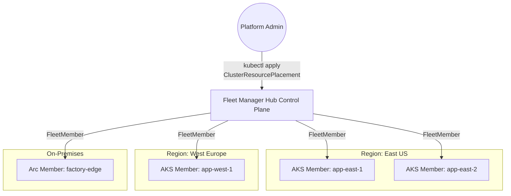

**Complexity**: `[COMPLEX]` | **Time to Complete**: 2.5h | **Prerequisites**: [Module 7.1: AKS Architecture & Node Management](../module-7.1-aks-architecture/)

## What You'll Be Able to Do

- Configure a Fleet hub and member clusters with `az fleet create`, `az fleet member create`, and hub credentials.
- Choose between hubless and hub-enabled Fleet Manager using the adoption and cost decision framework.
- Choose `PickAll`, `PickFixed`, and `PickN` placement policies for label, fixed, and topology-aware workload placement.
- Configure staged multi-cluster updates with update groups, bake times, and `FleetUpdateStrategy`.
- Diagnose GitOps, policy, observability, and member RBAC conflicts by identifying the controller and API object that owns desired state.

## Why This Module Matters

As organizations scale their Kubernetes footprints, managing a single sprawling cluster often becomes untenable because blast radius, hard scalability limits, or multi-region requirements push teams toward many smaller clusters instead of one giant control plane. That shift solves one class of problems but introduces another: how do you coordinate upgrades, enforce policies, and distribute workloads consistently when every cluster has its own API server, credentials, and operational lifecycle? **Azure Kubernetes Fleet Manager (Fleet)** answers that question with a centralized control plane that treats multiple AKS clusters and Azure Arc-enabled Kubernetes clusters as members of one logical fleet. Fleet solves the "n-cluster problem" by introducing fleet-level workload placement, coordinated multi-cluster upgrades, and unified governance so platform teams can reason about dozens of clusters the way they once reasoned about namespaces inside a single cluster.

The operational cost of not having fleet-level coordination shows up in quiet, expensive ways before it becomes an obvious outage. Upgrade scripts grow special cases for every region. GitOps repositories fork into near-duplicates because one cluster needs a tiny value change. Policy exceptions spread through subscriptions because nobody can tell whether a missing control is intentional or drift. Observability also becomes harder, because each cluster may look healthy on its own while the service as a whole is missing capacity in one geography. Fleet Manager does not remove the need for good release engineering, identity design, or cluster governance. It gives those practices a native Azure control plane that can hold shared intent, schedule work across member clusters, and make multi-cluster operations auditable instead of tribal.

## When to Adopt Fleet Manager

Before diving into the mechanics, it is crucial to understand *when* you actually need Fleet Manager, because multi-cluster architectures introduce operational complexity that you should not take on until a single-cluster model genuinely stops working. A small team in one region with modest node counts can usually satisfy blast-radius and tenancy needs with namespaces, RBAC, and network policies, especially if an external GitOps controller already coordinates releases across a handful of independent clusters. Fleet Manager becomes valuable when the coordination problem is bigger than the deployment tool. It is not just another way to run `kubectl apply`; it is a way to represent clusters, placement choices, update waves, and member state as first-class fleet objects.

The usual single-cluster ceiling is not only the documented node limit. AKS Standard and Premium tiers support production-scale clusters with a 5,000-node cluster limit, while the Free tier supports up to 1,000 nodes but carries no financially-backed SLA, and Standard and Premium tiers support up to 5,000 nodes with an SLA. In practice, most teams split clusters long before they hit a numeric maximum. They split because regional latency matters, because one tenant should not share control-plane risk with another, because a regulated workload needs different network boundaries, or because upgrade coordination becomes too risky when every workload depends on one API server. Fleet Manager is useful when the split is intentional and repeated. If the team merely created many clusters because provisioning was easy, Fleet will expose that fragmentation rather than fix the underlying ownership problem.

### When a Single Cluster or Independent Clusters Are Enough

You do not need Fleet Manager when one AKS cluster in one region is still the simplest reliable architecture. Namespaces, Azure RBAC for Kubernetes authorization, Kubernetes NetworkPolicy, node pools, and workload identity can provide clean isolation for many teams. If your only multi-cluster requirement is a release pipeline that deploys the same Helm chart to two clusters, Argo CD ApplicationSets or Flux automation may be enough. Fleet is strongest when the Azure platform must understand the fleet, such as coordinated AKS upgrades, managed hub placement, Azure portal placement status, or a consistent membership model across AKS and supported Arc-enabled Kubernetes clusters.

Independent clusters are also sensible when clusters have intentionally different lifecycles. A research cluster using preview GPU images, a regulated production cluster with strict change windows, and a lab cluster rebuilt weekly may not benefit from one placement plane. Fleet Manager can represent them, but placing all of them in one fleet may create confusing labels and exceptions. Good fleet design starts by grouping clusters that share operational intent. If the clusters do not share release policy, governance requirements, or support ownership, they may belong in separate fleets or outside Fleet Manager entirely.

### When to Adopt Azure Kubernetes Fleet Manager

Adopt Fleet Manager when **high availability and disaster recovery** require workloads to run across regions with a shared placement model. A regional active-active application needs more than a deployment loop. It needs labels that express where capacity exists, a reconciliation loop that notices when placed resources drift, and operational views that show whether every target cluster received the intended objects. Fleet Manager with a hub cluster gives you a Kubernetes API surface for that intent, and member labels such as location can become scheduling inputs rather than comments in a spreadsheet.

Adopt Fleet Manager when **blast-radius reduction** is a deliberate architecture choice. Many smaller clusters can be safer than one giant cluster because a failed upgrade, broken admission policy, or overloaded API server affects fewer workloads. The tradeoff is that every cluster adds baseline operational cost. More clusters mean more node pools, more Azure Monitor ingestion streams, more policy assignments, more identities, more release targets, and more control-plane decisions. Fleet Manager is a coordination layer for that world. It helps the team keep the benefits of smaller clusters without accepting a manually operated maze.

Adopt Fleet Manager when **lifecycle management at scale** is the hard part. Azure Kubernetes Fleet Manager supports update runs, update stages, update groups, and reusable update strategies for Kubernetes and node image updates across AKS member clusters. That matters because a safe upgrade plan is not just a target version. It is a sequence, a canary decision, a bake time, an answer for maintenance windows, and a stop condition when a member fails. If a pipeline loops over forty clusters without a fleet-level state object, the upgrade state often lives only in CI logs. Fleet moves that state into Azure.

Adopt Fleet Manager when **hybrid or edge membership** must be visible alongside AKS. Fleet Manager supports AKS member clusters and Arc-enabled Kubernetes member clusters, with capability differences that must be respected. Current Microsoft documentation shows workload placement as generally available for both AKS and Arc-enabled Kubernetes members, while Kubernetes and node image update orchestration applies to AKS members and is unsupported for Arc-enabled members. That distinction is important. Fleet can give a unified placement and governance model across supported hybrid clusters, but it does not magically make non-AKS clusters participate in AKS upgrade orchestration.

### Decision Framework: Fleet, Argo CD, Cluster API, or Independent Clusters

The first decision is ownership of the control plane. Fleet Manager is an Azure-managed fleet operations plane. Argo CD ApplicationSets are a GitOps application distribution pattern. Cluster API is a Kubernetes-style cluster lifecycle pattern. Independent clusters are a governance choice where each cluster keeps its own release and lifecycle decisions. These tools can coexist, but they should not own the same exact object on the same cluster. The most common failure mode is not that one tool is bad. It is that two tools both believe they are the source of truth for the same namespace, deployment, or policy.

**Pause and predict:** Suppose a platform engineering team manages roughly forty production AKS clusters across multiple regions. The team needs to coordinate staged Kubernetes minor upgrades and weekly node-image rollouts across the fleet, but has no requirement for centralized workload placement or multi-cluster networking. Should the team provision a hub-enabled Fleet Manager or a hubless fleet, and can they convert between these configurations later if requirements change?

<details>
<summary>Check your prediction</summary>

A **hubless** Fleet Manager is entirely sufficient for coordinated Kubernetes version upgrades and node-image updates across AKS member clusters. Workload placement (`ClusterResourcePlacement`), managed Fleet namespaces, and cross-cluster Layer-4 DNS load balancing strictly **require a hub** cluster. Choosing a hubless fleet incurs **no hub-cluster cost**, whereas enabling a hub provisions and bills for an underlying **single-node Standard-tier AKS** cluster. In terms of lifecycle migration, a hubless fleet **can upgrade** to a hub-enabled fleet by updating the resource (`az fleet create --enable-hub` or via update commands), but a hub-enabled fleet **cannot downgrade** to hubless once provisioned. If an operator attempts to apply a `ClusterResourcePlacement` or hub API operation against a hubless fleet, Azure rejects the request with an `InvalidHubOperation` error.
</details>

Selecting between a centralized coordination control plane and lightweight lifecycle automation dictates your long-term infrastructure operating budget and API surface. The following comparison maps architectural choices to real-world operational constraints before you commit to provisioning.

| Choice | Use It When | Avoid It When | Primary Tradeoff |
|---|---|---|---|
| Fleet Manager with hub cluster | You need Azure-native placement, hub Kubernetes APIs, DNS load balancing, managed namespaces, or fleet-aware workload rollout. | You only need grouped upgrade orchestration and do not want hub-cluster cost or hub API access. | More capability, but the hub creates a managed AKS footprint that must be secured and paid for. |
| Fleet Manager without hub cluster | You only need safe AKS Kubernetes or node image update orchestration across member clusters. | You need `ClusterResourcePlacement`, `ResourcePlacement`, or Fleet-managed multi-cluster networking. | Lower cost and simpler surface, but no Kubernetes placement API exists. |
| Argo CD ApplicationSets | Git is the application source of truth and cluster selection is application-release logic. | Azure should orchestrate AKS version waves or Fleet placement should own the same resources. | Strong app delivery model, but upgrade orchestration and Azure membership semantics stay elsewhere. |
| Cluster API-style management | You want declarative cluster creation and lifecycle as Kubernetes objects across providers. | Your immediate problem is workload propagation or AKS managed update waves. | Good cluster factory pattern, but it does not replace fleet placement policy. |
| Independent clusters | Teams have intentionally different lifecycles, risk levels, or compliance boundaries. | Repeated manual work and inconsistent policy are already slowing operations. | Clear autonomy, but coordination costs grow nonlinearly with cluster count. |

Use this rule of thumb: if the question is "which clusters should receive these Kubernetes resources?", Fleet Manager with a hub cluster is a candidate. If the question is "which Git revision should each cluster run?", ApplicationSets may be a better fit. If the question is "how do we create and upgrade clusters as infrastructure?", Cluster API or Azure-native provisioning is the relevant layer. If the question is "can these teams safely share operational policy?", Fleet design should happen before tool selection.

### Cost Lens: Hub Cost, Cluster Count, and Telemetry Egress

Fleet Manager itself is not priced like a separate application platform, but the hub-enabled option creates infrastructure. Microsoft documents that a Fleet Manager resource with a hub cluster uses a single-node Standard-tier AKS hub cluster, while a hubless fleet has no hub-cluster cost. The Azure product page also states that there is no charge for the Fleet Manager resource itself and that charges come from the AKS cluster created on your behalf, including virtual machines, storage, and networking. That means a hub-enabled fleet should be treated as a small managed control-plane workload in your cost model, not as a free metadata tag.

Over-splitting workloads into many tiny AKS clusters can also raise baseline cost. Every production cluster may need system node capacity, monitoring agents, policy components, load balancers, managed identities, private endpoints, and backup or security tooling before the first application pod is scheduled. Fleet Manager can reduce coordination toil, but it does not make those per-cluster baselines disappear. A good cost review asks whether a new cluster reduces blast radius enough to justify the baseline overhead, and whether a namespace, node pool, or separate fleet would achieve the same control boundary with less fixed cost.

Observability can create an unexpected cost spike in multi-region fleets. Sending metrics and logs from many clusters to a central workspace improves analysis, but data movement, ingestion, retention, and export are billable dimensions. Azure Monitor documentation describes charges for Log Analytics ingestion and retention, while Azure bandwidth pricing applies to data moving between Azure regions and out of Azure datacenters. The practical design rule is to aggregate what must be queried centrally, keep high-cardinality debug data close to the producing region when possible, and use labels such as cluster, region, and workload owner so fleet dashboards do not require copying every raw signal everywhere.

## Architecture and Topology

Fleet Manager operates on a **hub-and-spoke** topology in which a Fleet resource with an enabled hub cluster becomes the centralized control plane, while standard AKS or Arc-enabled clusters join as spokes. The hub is not a place for application workloads. When you enable the hub cluster feature, Azure provisions a managed AKS hub cluster that stores fleet-level custom resources such as placements and update runs, and member clusters receive synchronized objects through Fleet controllers rather than through ad hoc scripting from your laptop.

The hubful option is deliberately different from a normal AKS application cluster. Microsoft documents that the hub cluster is named `hub`, is created in the Fleet Manager region, uses managed resource groups with `FL_` and `MC_FL_` naming, and has a single Azure Linux node that does not run applied application resources. Local admin kubeconfig access is disabled, Azure deny assignments protect the hub resources from user-initiated mutation, and `az aks command invoke` is disabled for the hub. You access the hub Kubernetes API through Fleet-specific credentials and treat it as a staging and coordination plane. That is why running workloads on the hub is a mistake: the hub exists to hold desired state, not to serve traffic.

1.  **The Fleet (Hub):** An Azure resource that acts as the centralized control plane. Under the hood, a Fleet resource with the "Hub cluster" feature enabled provisions a managed, headless Kubernetes control plane. You do not run user workloads directly on the Hub; it exists solely to store fleet-level custom resources (like placements and update runs) and API objects.
2.  **Member Clusters (Spokes):** Standard AKS clusters or Azure Arc-enabled clusters that are joined to the Fleet.



The most important hub objects are not Deployments or Services; they are Fleet APIs. A `MemberCluster` resource represents each joined cluster on the hub. A `ClusterResourcePlacement` chooses cluster-scoped resources or entire namespaces and places them on selected members. A `ResourcePlacement` provides finer-grained namespace-scoped placement for selected resources, with current Microsoft documentation marking the namespace-scoped API as preview. A `ClusterResourceOverride` changes selected cluster-scoped resources before propagation, while `ResourceOverride` changes namespace-scoped resources. A `ClusterStagedUpdateRun` is used for staged rollout of placed resources, separate from Azure Fleet update runs for AKS cluster and node image upgrades.

The current API-version rule is simple enough to remember, but important enough to check before writing manifests. For the common GA path that places a namespace and its child resources, use `apiVersion: placement.kubernetes-fleet.io/v1` for `ClusterResourcePlacement`. Microsoft Learn examples for `PickAll`, `PickFixed`, `PickN`, rolling update strategy, and overrides all use `v1` for the GA placement fields shown in this module. Preview-only fields (verify against the current API reference) use `placement.kubernetes-fleet.io/v1beta1`. Namespace-scoped `ResourcePlacement` is documented as preview in current Microsoft Learn text, even though some examples on the same page show `v1`; when you use preview-specific `ResourcePlacement` examples, verify the version against the current page and your installed Fleet extension before applying it.

### Joining a Cluster to a Fleet

Clusters are joined to the Fleet by creating a `FleetMember` resource through the Azure CLI, ARM templates, Bicep, Terraform, or the portal. Once that relationship exists, the hub receives the membership and network path it needs to push placement decisions to each spoke. The join operation is intentionally boring infrastructure work. What matters is that every member cluster becomes addressable from the hub API so propagation and upgrade orchestration can run without per-cluster kubeconfig juggling.

```bash
# Create the Fleet resource (with a hub cluster)
az fleet create \
    --resource-group my-fleet-rg \
    --name global-app-fleet \
    --enable-hub

# Join an existing AKS cluster as a member
az fleet member create \
    --resource-group my-fleet-rg \
    --fleet-name global-app-fleet \
    --name east-member-1 \
    --member-cluster-id /subscriptions/.../managedClusters/app-east-1
```

After the member record exists, the Fleet Hub maintains line-of-sight to the member API server and can reconcile placed resources whenever the hub desired state changes. For AKS members, the cluster can be in a different Azure subscription or region as long as it is associated with the same Microsoft Entra tenant as the Fleet Manager. For Arc-enabled Kubernetes members, the Fleet Arc extension installs member agents on the underlying cluster, and those agents communicate with the hub. That is the identity and networking path you troubleshoot when placement works for AKS members but not for an on-premises or edge member.

### Patterns and Anti-Patterns: Topology Design

| Pattern or Anti-Pattern | When It Appears | Why It Works or Fails | Scaling Note |
|---|---|---|---|
| Pattern: one fleet per shared operational lifecycle | Clusters share upgrade cadence, ownership, policy, and release risk. | Labels and update groups stay meaningful because members are comparable. | Add clusters by lifecycle, not only by geography. |
| Pattern: hubless fleet for update-only estates | A platform team wants coordinated AKS version and node-image waves but no workload placement. | It avoids hub-cluster cost while keeping update orchestration in Azure. | Upgrade to hubful later if placement becomes necessary; downgrade is not supported. |
| Pattern: hubful fleet for platform-owned shared resources | Monitoring, ingress primitives, namespaces, or RBAC must be distributed consistently. | The hub Kubernetes API gives a single staging point and placement status. | Use labels and taints to prevent accidental placement to sensitive members. |
| Anti-pattern: one fleet for every cluster in the company | Leaders want one dashboard, but clusters have unrelated lifecycles. | Exceptions overwhelm the placement model and make labels untrustworthy. | Split fleets by operating model before adding more labels. |
| Anti-pattern: workloads on the hub | Teams see a kubeconfig and treat the hub like a small AKS cluster. | Applied resources are not meant to run there, and hub mutations are restricted. | Keep app deployment out of the hub except as staged desired state for placement. |
| Anti-pattern: public hub by default in production | Development convenience carries into regulated or high-risk environments. | A public API endpoint increases exposure even when credentials are required. | Choose private hub mode at creation if production connectivity requires it, because hub access mode cannot be changed later. |

## Fleet-Level Workload Placement

The most powerful feature of Fleet Manager is the ability to deploy Kubernetes resources to the Hub and have the Hub intelligently distribute them to member clusters based on rules defined in a `ClusterResourcePlacement` Custom Resource Definition (CRD). Instead of running `kubectl apply` against ten different clusters, you authenticate to the *Fleet Hub*, apply the same Deployments, Services, and ConfigMaps you would use in a single cluster, and let Fleet decide which members should receive each object based on labels, counts, or explicit names.

Placement is a scheduling decision at fleet scope. A `ClusterResourcePlacement` can select a namespace, and by default that means the namespace and the namespace-scoped resources inside it are propagated together. It can also select cluster-scoped resources by group, version, kind, and name. The hub stages the desired resource set, the scheduler chooses target members based on the policy, Fleet creates snapshots of selected resources, and the member-side controllers apply the work to the selected clusters. That distinction matters for troubleshooting. If the hub says a resource was selected but no member was picked, inspect policy labels and taints. If a member was picked but apply failed, inspect overrides, member RBAC, and the applied resource status.

### Placement Strategies

**Pause and predict:** You need to distribute a mission-critical service to exactly 3 production member clusters spread across distinct geographical locations from a pool of twelve registered clusters. Which placement policy and constraints must you configure in your `ClusterResourcePlacement`, and why would alternative strategies fail this design requirement?

<details>
<summary>Check your prediction</summary>

You must use the **`PickN`** placement strategy with `numberOfClusters: 3` combined with `topologySpreadConstraints` (such as `topologyKey: fleet.azure.com/location` and `whenUnsatisfiable: DoNotSchedule`). In contrast, **`PickAll`** would over-deploy the workload across all matching member clusters in the fleet, violating the exact three-cluster capacity budget. Meanwhile, **`PickFixed`** requires hardcoding static member cluster names, breaking automated member discovery, resilience, and dynamic cluster lifecycle replacement. Remember also that `ClusterResourcePlacement` (CRP) is strictly a **hub-only** capability that cannot run on a hubless Fleet Manager.
</details>

Evaluating scheduling rules requires understanding how the Fleet control plane interprets cluster labels, spread constraints, and blast-radius thresholds when matching workloads to infrastructure. The platform provides three core strategies to balance automated distribution against strict cluster targeting.

Fleet supports several placement policies, and choosing among them is how you express blast-radius and capacity intent without rewriting manifests for every member cluster in the fleet:

1.  **`PickAll`:** Distribute the resources to *all* member clusters, optionally filtering by cluster labels.
2.  **`PickFixed`:** Distribute the resources to a specific, hardcoded list of member cluster names.
3.  **`PickN`:** Distribute the resources to a specific *number* of clusters, such as "put this workload on exactly 3 clusters that have the label `env=prod`."

Use `PickAll` for platform-wide infrastructure that should exist everywhere in a target class of clusters. Monitoring agents, common namespaces, shared RBAC, baseline admission resources, and emergency security patches often fit this model. The risk is that `PickAll` can spread mistakes widely. A bad selector or an overly broad namespace placement can propagate to every matching member. The fix is to combine `PickAll` with labels that mean something operational, such as `environment=production`, `fleet.azure.com/location=eastus`, or `platform.example.com/tier=shared`, and to use a rolling update strategy when the resource change could disrupt workloads.

Use `PickFixed` when the target cluster names are intentionally stable and human-reviewed. A pilot workload that must land only on `member-east-canary` and `member-west-canary` is clearer with explicit names than with a vague label. The downside is that fixed names turn cluster replacement into manifest maintenance. If the east canary cluster is rebuilt under a new member name, the placement will not magically follow it. `PickFixed` is therefore best for canaries, migrations, and exceptional placements, not for the normal production path.

Use `PickN` when you need a number of clusters selected from an eligible pool. This is the most scheduler-like policy. You can require labels, prefer clusters based on labels or properties, and use topology spread constraints such as `fleet.azure.com/location` so the selected members are not all in one region. `PickN` is useful for active-active workloads where you need three production clusters from a larger pool, batch workloads that should run where capacity is available, or cost-aware scheduling that prefers clusters with cheaper available compute. The operational risk is ambiguity. If teams do not understand why Fleet picked a cluster, they will treat the scheduler as random. Document the required and preferred rules near the placement manifest.

### Example: Propagating a Frontend App

Suppose a frontend application lives in the `frontend-app` namespace on the Hub and you want that namespace and every namespaced object inside it on all member clusters labeled `region: westeurope`. The placement object below selects the namespace and applies a `PickAll` policy filtered by cluster labels, which is the usual pattern for regional active-active footprints. The `ClusterResourcePlacement` uses `placement.kubernetes-fleet.io/v1`, because this example uses GA namespace placement behavior rather than preview-only field behavior.

```yaml
apiVersion: placement.kubernetes-fleet.io/v1
kind: ClusterResourcePlacement
metadata:
  name: frontend-europe-placement
spec:
  resourceSelectors:
    - group: ""
      version: v1
      kind: Namespace
      name: frontend-app
  policy:
    placementType: PickAll
    affinity:
      clusterAffinity:
        requiredDuringSchedulingIgnoredDuringExecution:
          clusterSelectorTerms:
            - labelSelector:
                matchLabels:
                  region: westeurope
```

When you apply this manifest to the Hub, the Fleet controller packages the `frontend-app` namespace together with its Deployments, Services, and ConfigMaps, pushes the bundle to matching members, and continues to watch those clusters so drift against the hub desired state is corrected automatically. This is stronger than a one-time fan-out script because it gives the hub a continuing opinion. It is also why ownership boundaries must be explicit. A cluster-local controller that also owns `frontend-app` can undo Fleet's work within seconds.

For a canary deployment, `PickFixed` makes intent unambiguous. The following placement sends the namespace only to two named members. That can be a clean first step before widening to a label-based `PickAll` policy.

```yaml
apiVersion: placement.kubernetes-fleet.io/v1
kind: ClusterResourcePlacement
metadata:
  name: frontend-canary-fixed
spec:
  resourceSelectors:
    - group: ""
      version: v1
      kind: Namespace
      name: frontend-app
  policy:
    placementType: PickFixed
    clusterNames:
      - member-east-canary
      - member-west-canary
```

For a topology-aware active-active workload, `PickN` gives the scheduler room to choose. The next example asks Fleet to pick three production clusters, spread them across member locations, and avoid scheduling if the spread rule cannot be satisfied. That policy is useful when production has more eligible clusters than the workload needs, but you still want regional diversity.

```yaml
apiVersion: placement.kubernetes-fleet.io/v1
kind: ClusterResourcePlacement
metadata:
  name: frontend-prod-three-regions
spec:
  resourceSelectors:
    - group: ""
      version: v1
      kind: Namespace
      name: frontend-app
  policy:
    placementType: PickN
    numberOfClusters: 3
    affinity:
      clusterAffinity:
        requiredDuringSchedulingIgnoredDuringExecution:
          clusterSelectorTerms:
            - labelSelector:
                matchLabels:
                  environment: production
    topologySpreadConstraints:
      - maxSkew: 1
        topologyKey: fleet.azure.com/location
        whenUnsatisfiable: DoNotSchedule
```

**Pause and predict:** An engineer connects directly to one of the AKS member clusters using cluster-admin credentials. They run `kubectl delete deployment web -n frontend-app` to remove a workload that was placed by the Fleet Hub. What happens on the member cluster when this deletion occurs, and why?

<details>
<summary>Check your prediction</summary>

The Fleet Hub is the authoritative source of truth for all placed resources. When a local operator deletes or alters a placed object directly on a member cluster, the member-side Fleet agent controller detects the state drift against the active snapshot and automatically **recreates** the Deployment on the member cluster to match the Hub's desired state. Deleting or modifying a placed workload must be performed on the Fleet Hub itself by updating or removing the corresponding manifest or adjusting the `ClusterResourcePlacement` resource.
</details>

This continuous reconciliation model protects multi-cluster consistency by treating member clusters as downstream projection targets rather than independent configuration authorities. Once the control plane establishes reliable drift enforcement across registered clusters, teams must decide how rapidly updates should propagate across target clusters when a manifest changes.

### Rollout Strategy and Overrides

Placement is not only "where." It is also "how fast." Fleet Manager resource placement uses a `RollingUpdate` strategy by default for examples in current Microsoft Learn, and you can configure `maxUnavailable`, `maxSurge`, and `unavailablePeriodSeconds` for staged propagation of resource changes. This does not replace application readiness checks. Placement status tells you whether Fleet applied the selected resources to the target clusters; it does not prove that every pod behind a Deployment became healthy. You still need workload-level health checks, alerts, and rollout policies inside the target clusters.

```yaml
apiVersion: placement.kubernetes-fleet.io/v1
kind: ClusterResourcePlacement
metadata:
  name: frontend-prod-rolling
spec:
  resourceSelectors:
    - group: ""
      version: v1
      kind: Namespace
      name: frontend-app
  policy:
    placementType: PickAll
  strategy:
    type: RollingUpdate
    rollingUpdate:
      maxUnavailable: 25%
      maxSurge: 25%
      unavailablePeriodSeconds: 60
```

Overrides solve the "same manifest, tiny cluster-specific difference" problem. A `ClusterResourceOverride` works with cluster-scoped placement and is normally owned by platform administrators. A `ResourceOverride` works with namespace-scoped resources and is better suited to application teams, especially when a Deployment image, environment variable, Service annotation, or resource request must differ by member label. Overrides should be used for bounded substitutions, not for turning one manifest into many unrelated workloads. If the override file is longer than the base manifest, separate workload definitions may be clearer.

```yaml
apiVersion: placement.kubernetes-fleet.io/v1
kind: ResourceOverride
metadata:
  name: web-region-hostname
  namespace: frontend-app
spec:
  placement:
    name: frontend-europe-placement
  resourceSelectors:
    - group: ""
      kind: Service
      version: v1
      name: web
  policy:
    overrideRules:
      - clusterSelector:
          clusterSelectorTerms:
            - labelSelector:
                matchLabels:
                  fleet.azure.com/location: westeurope
        jsonPatchOverrides:
          - op: add
            path: /metadata/annotations
            value:
              service.beta.kubernetes.io/azure-dns-label-name: "web-${MEMBER-CLUSTER-NAME}-westeurope"
```

This example uses the reserved `${MEMBER-CLUSTER-NAME}` value documented for resource overrides. The key design point is that the base Service remains portable, while the override adds a cluster-specific DNS label only for members in a target location. The same pattern can replace a container image for a canary region, adjust resource requests for GPU clusters, or remove an RBAC verb from production. Keep these patches small and reviewable. JSON Patch is powerful, but a wrong path can fail placement or change a field that an application owner did not expect.

### Decision Framework: PickAll, PickFixed, or PickN

| Placement Choice | Best Fit | Failure Mode | Safer Habit |
|---|---|---|---|
| `PickAll` | Baseline platform resources, regional active-active services, emergency policy distribution. | A broad selector spreads a mistake to every matching member. | Use meaningful labels and a rolling strategy for disruptive changes. |
| `PickFixed` | Canary clusters, migrations, temporary exceptions, named disaster-recovery targets. | Cluster replacement silently invalidates the target list. | Treat member names as lifecycle-managed inventory and review them during rebuilds. |
| `PickN` | Capacity pools, topology-aware active-active placement, cost-aware or resource-aware scheduling. | Operators cannot explain why a cluster was selected. | Document required labels, preferred labels, and topology keys next to the manifest. |
| `ClusterResourceOverride` | Platform-owned cluster-scoped changes such as RBAC or namespace-level policy. | A patch changes security behavior differently than reviewers expect. | Keep each override focused and verify `ClusterResourcePlacementOverridden` status. |
| `ResourceOverride` | Application-owned per-cluster values such as image, annotation, or resource-request changes. | Local GitOps or app teams make conflicting edits on members. | Make the hub source of truth and prevent local controllers from owning placed resources. |

## Coordinated Multi-Cluster Upgrades

Upgrading Kubernetes versions, for example from v1.34 to v1.35, is stressful on one cluster and operationally hazardous across fifty. Fleet Manager exposes an orchestration engine built from **Update Runs**, **Stages**, and **Groups** instead of leaving every team to script its own wave logic. Rather than upgrading clusters randomly or relying on external CI/CD loops that are hard to audit, you model rollout intent natively in Azure and let Fleet enforce ordering, bake times, and halt conditions when health checks fail mid-stage.

**Pause and predict:** You add both AKS clusters and Azure Arc-enabled Kubernetes clusters running on-premises to a single Fleet Manager. When you execute an `az fleet updaterun` command to roll out control-plane and node-image upgrades, will the Arc-enabled member clusters participate in that automated run?

<details>
<summary>Check your prediction</summary>

Automated Kubernetes version and node image upgrade orchestration via `az fleet updaterun` is **unsupported** for Azure Arc-enabled member clusters; update orchestration applies strictly to native AKS clusters. While workload placement (`ClusterResourcePlacement`) is **GA** for both AKS and Arc-enabled members, operational lifecycle features differ: AKS update orchestration is **GA** whereas Arc update orchestration is unsupported, and Fleet-managed namespaces are **GA** for AKS members but **unsupported** for Arc-enabled clusters. Non-AKS Arc clusters must continue managing control plane and operating system lifecycle through their local distribution tools.
</details>

Understanding capability boundaries across diverse infrastructure targets prevents operators from assuming uniform control plane behaviors across hybrid environments. Multi-cluster upgrade orchestration relies on native Azure Resource Manager controls that interact directly with the underlying cloud-managed control plane.

Fleet update orchestration applies to AKS member clusters. That scope matters because Arc-enabled Kubernetes members can participate in placement but not in AKS Kubernetes or node image update orchestration. A fleet that mixes AKS and Arc members may still be the right design for governance and placement, but the upgrade plan must separate AKS-managed updates from the lifecycle process used by non-AKS clusters. Treat that as a feature boundary, not as a surprise during an upgrade window.

1.  **Update Groups:** Logical groupings of clusters, such as `dev-clusters`, `canary-clusters`, `prod-westeurope`, and `prod-eastus`.
2.  **Update Stages:** Ordered sequences of Update Groups. A stage waits for the previous stage to complete successfully before starting. You can also configure bake times between stages.
3.  **Update Runs:** The actual execution of an upgrade, targeting a specific Kubernetes version or node image update behavior.

Update groups are member metadata, not merely labels in a spreadsheet. You can assign a member to an update group when adding it to the fleet, or update an existing member later with the Azure CLI. This is where many unsafe upgrade plans fail. If every member sits in the default or blank group, a staged strategy cannot distinguish canary from production. Good fleet hygiene requires every production member to have an explicit update group, and the group name should match the blast-radius boundary the business actually cares about.

### Defining an Update Strategy

A reusable `FleetUpdateStrategy` captures the wave pattern so every Kubernetes minor bump follows the same safety rails instead of retyping stage JSON under pressure.

```bash
cat <<'EOF' > safe-rollout-stages.json
{
  "stages": [
    { "name": "Stage1-Dev",    "groups": [{"name": "dev-group"}],    "afterStageWaitInSeconds": 3600 },
    { "name": "Stage2-Canary", "groups": [{"name": "canary-group"}], "afterStageWaitInSeconds": 86400 },
    { "name": "Stage3-Prod",   "groups": [{"name": "prod-east"}, {"name": "prod-west"}] }
  ]
}
EOF

az fleet updatestrategy create \
    --resource-group my-fleet-rg \
    --fleet-name global-app-fleet \
    --name safe-rollout-strategy \
    --stages safe-rollout-stages.json
```

In the strategy above, the `dev-group` upgrades first, the platform waits one hour so automated alerts can surface regressions, the `canary-group` upgrades next, a twenty-four-hour bake window runs, and only then do the `prod-east` and `prod-west` groups upgrade concurrently. You start the real version change by creating an Update Run that references the strategy and target Kubernetes version:

```bash
az fleet updaterun create \
    --resource-group my-fleet-rg \
    --fleet-name global-app-fleet \
    --name upgrade-to-1-35 \
    --upgrade-type Full \
    --kubernetes-version 1.35.2 \
    --update-strategy-name safe-rollout-strategy
```

Current Azure CLI documentation for `az fleet updaterun create` shows three upgrade types. `Full` upgrades the Kubernetes control plane and node pools along with node images. `ControlPlaneOnly` upgrades only the Kubernetes control plane. `NodeImageOnly` upgrades node images without a Kubernetes version change, and the command also supports node image selection behavior such as `Latest` or `Consistent` when node image choice matters across regions. In the lab later, you define the update strategy but do not start a real production upgrade, because a version run should be tied to the versions available in each target region at the time you execute it.

If a stage fails because a cluster upgrade errors, a maintenance window blocks progress, or a member cannot reach the requested version in its region, the safe response is to halt rather than push the same change into the next stage. Fleet documentation describes update runs that can pause, fail, be skipped at a stage, group, or cluster level, and be started again from a failed state after remediation. The operational habit is to treat a halted run as useful information. The fleet found a problem while the blast radius was still bounded. Fix the member, confirm workload health, and then resume or recreate the run deliberately.

Auto-upgrade profiles integrate with this model by generating update runs when AKS publishes new Kubernetes or node image versions for the selected channel. The useful part is not "automatic" in isolation; the useful part is that auto-generated runs can still honor an update strategy. If no strategy is supplied, clusters can update sequentially one by one, but production fleets usually deserve explicit stages. Auto-upgrade should therefore be paired with clear update groups, maintenance windows, alerting, and a documented decision for when to skip a member that is out of compliance.

### Decision Framework: Staged or All-at-Once Upgrades

| Upgrade Pattern | Use It When | Avoid It When | Operational Check |
|---|---|---|---|
| One-by-one sequence | You need simple serial safety across a small fleet and all members have similar risk. | Cluster order matters because dev, canary, and production have different blast radius. | Confirm the default order is acceptable before the run starts. |
| Staged update strategy | You have clear environments, regions, or tenant groups that should upgrade in waves. | Group membership is stale or missing, because the strategy cannot protect clusters it cannot classify. | Audit update groups before every minor-version wave. |
| Long bake before production | You need real workload observation time after canary or staging. | The bake window is a substitute for missing alerts or synthetic checks. | Define the signals that must stay green during the wait. |
| Node-image-only run | Security or base-image updates are needed without changing Kubernetes minor version. | The underlying issue requires API server or kubelet version changes. | Check regional node image availability and choose `Latest` or `Consistent` intentionally. |
| All-at-once upgrade | A disposable or very small nonproduction fleet can tolerate simultaneous risk. | Any member serves production traffic, regulated workloads, or shared platform services. | Prefer staged unless the blast radius is explicitly acceptable. |

## GitOps, Policy & Observability at Scale

Fleet Manager integrates with the broader Azure management stack so hub state, policy, and telemetry can be governed consistently even when member clusters span regions and tenancy models. The integration points below are not mandatory on day one, but they are the patterns teams converge on once fleet size makes manual hub edits unsustainable. The design question is always the same: which system owns the desired state, and how do you prove it did what it was supposed to do?

### GitOps with Flux and Argo CD

While you *can* manually `kubectl apply` resources to the Fleet Hub, best practice is to manage the Hub's desired state with GitOps: install the Flux v2 extension on the Fleet Hub, commit Kubernetes manifests plus `ClusterResourcePlacement` YAML to a repository, and let Flux reconcile the hub while Fleet propagates the same objects to members. That workflow gives you one Git-driven pipeline for a multi-cluster fleet instead of installing and configuring Flux independently on every spoke cluster, which is how you avoid conflicting sources of truth between hub placement and local controllers.

The failure mode is subtle because every tool can report success. Flux on the hub can successfully apply a namespace and placement. Fleet can successfully place it on twelve members. Then Argo CD or Flux on nine member clusters can immediately delete those same objects because its local Git source does not include them. From the hub, the placement may still look correct until the next status detail or workload check reveals drift. The fix is not to abandon GitOps. The fix is to draw ownership boundaries. Either GitOps owns the hub and Fleet owns the members for placed resources, or cluster-local GitOps owns a different set of namespaces and resources.

Argo CD ApplicationSets remain valuable when application teams need Git-driven per-cluster differences, especially when Azure-native update orchestration is not part of the problem. A clean pattern is to let ApplicationSets manage application releases directly to clusters and use Fleet Manager only for AKS update orchestration. Another clean pattern is to let Flux manage the Fleet hub repository and let Fleet propagate platform-owned resources. A messy pattern is to let ApplicationSets, local Flux, and Fleet all manage the same namespace. If you cannot explain which controller should repair a deleted Deployment, your ownership model is not ready.

### Azure Policy and RBAC

Azure Policy can target management groups, subscriptions, resource groups, and Kubernetes-capable resources such as AKS and Azure Arc-enabled Kubernetes through the appropriate add-on or extension. In a Fleet deployment, you typically use Azure Policy to enforce cluster enrollment requirements, diagnostic settings, allowed capabilities, and Kubernetes admission constraints across the clusters that should share governance. Fleet membership does not replace Policy. It gives you a natural inventory boundary and a set of member labels that should align with policy assignment scope.

RBAC needs the same care. There are Azure RBAC permissions for creating fleets, joining members, and accessing the hub Kubernetes API. There are Kubernetes permissions on the hub for creating placement and override objects. There are also permissions on member clusters, because placed resources still have to be applied into real Kubernetes API servers. A platform engineer who can create a `ClusterResourcePlacement` but cannot inspect member failures will have a frustrating day. Build roles around the operational workflow: hub authors need placement rights, responders need read access to member status, and cluster owners need a path to approve or reject resources that affect their blast radius.

### Multi-Cluster Observability

To monitor a fleet effectively, you aggregate telemetry from every member into shared backends: configure member AKS clusters to send metrics and logs to a centralized **Azure Monitor Workspace** for Managed Prometheus and a centralized **Log Analytics Workspace**, then connect **Azure Managed Grafana** to that workspace so dashboards can query across the fleet using cluster name or region labels. Without that aggregation step, each cluster looks healthy in isolation while regional or placement-level incidents remain invisible until customers complain.

Central aggregation should be selective. Low-cardinality service metrics, SLO burn rates, node capacity, placement status, and upgrade status belong in a fleet dashboard. High-cardinality pod labels, verbose debug logs, and per-request traces can become expensive when multiplied by cluster count and copied across regions. Azure Monitor supports ingestion, retention, export, and workspace options that should be chosen deliberately. For a fleet, the better default is to standardize metric names and labels first, then centralize the signals that drive fleet decisions. Copying every log line into one global workspace is easy to query, but it can hide cost and regional data-residency concerns.

### Patterns and Anti-Patterns: Governance and Operations

| Pattern or Anti-Pattern | When It Appears | Why It Works or Fails | Better Alternative |
|---|---|---|---|
| Pattern: GitOps owns the hub, Fleet owns placed resources | Platform resources need Git review and fleet propagation. | The source of truth is clear, and member drift is reconciled by Fleet. | Keep member-local GitOps out of Fleet-managed namespaces. |
| Pattern: labels encode operational meaning | Placement and update groups use region, environment, owner, and risk labels. | Scheduling and reporting become explainable. | Maintain labels through CLI or API rather than editing hub `MemberCluster` objects directly. |
| Pattern: staged upgrades with explicit bake signals | Production changes follow dev, staging, and canary evidence. | A failed wave halts before production impact grows. | Define success metrics before the update run starts. |
| Anti-pattern: local GitOps fights Fleet | Each member has a controller that owns the same resources Fleet places. | Both systems repair "drift" in opposite directions. | Assign ownership by namespace or resource kind and enforce it in repositories. |
| Anti-pattern: policy scope ignores fleet membership | Policies target broad subscriptions while fleet labels imply narrower intent. | Exceptions accumulate and nobody knows which clusters are governed. | Align Azure Policy assignments, fleet membership, and member labels. |
| Anti-pattern: observability without cost boundaries | Every cluster sends all logs and metrics to one remote workspace. | Ingestion, retention, and data transfer costs grow faster than operational value. | Centralize fleet decision signals and keep noisy debug data regional or short-lived. |

## Did You Know?

- **Fleet Manager can run without a hub cluster for update orchestration.** Microsoft documents that hubless fleets support Kubernetes and node image updates, while workload placement, managed Fleet namespaces, and DNS load balancing require the hub-enabled option.
- **The hub cluster is a managed AKS cluster, but it is not a workload cluster.** Current hub documentation states that the single hub node does not run applied Kubernetes resources, local admin kubeconfig access is disabled, and users should use `az fleet get-credentials` for hub API access.
- **Fleet Manager supports both AKS and Arc-enabled Kubernetes member clusters, with capability differences.** Current member-type documentation shows workload placement as supported for both AKS and Arc-enabled members, while Kubernetes and node image updates are supported for AKS members and unsupported for Arc-enabled members.
- **Fleet placement is built on the open-source KubeFleet project.** Microsoft Learn points to KubeFleet as the basis for Fleet Manager's resource placement capability, and the upstream API reference documents `placement.kubernetes-fleet.io/v1` resources such as `ClusterResourcePlacement`.

## Common Mistakes

| Mistake | Why it happens | Fix |
|---|---|---|
| Running workloads on the Fleet hub | The hub exposes a Kubernetes API, so it feels like a small AKS cluster. | Treat the hub as a staging and control plane only; place workloads onto member clusters through Fleet APIs. |
| Letting per-cluster GitOps own Fleet-managed namespaces | Teams already had Argo CD or Flux on each member before adopting Fleet. | Move ownership to hub GitOps for placed resources, or exclude Fleet-managed namespaces from cluster-local controllers. |
| Forgetting update groups | Members are joined quickly, and update metadata is treated as optional. | Assign every production member to a meaningful update group during onboarding and audit groups before update runs. |
| Mixing `v1` and `v1beta1` placement manifests without intent | Examples across preview and GA docs look similar, so versions get copied blindly. | Use `placement.kubernetes-fleet.io/v1` for GA `ClusterResourcePlacement` examples and reserve `v1beta1` for documented preview fields. |
| Using no bake time before production | The team wants upgrades to finish quickly after staging succeeds. | Add bake windows that match the time needed for alerts, synthetic checks, and workload owners to observe canaries. |
| Ignoring member-cluster RBAC and identity paths | The hub object exists, so operators assume member apply permissions are fine. | Verify hub access, member connectivity, role assignments, and placement status per member when diagnosing apply failures. |
| Centralizing all telemetry without a cost model | A single workspace is easier to query during early adoption. | Centralize fleet-level metrics and essential logs, but manage retention, high-cardinality data, and cross-region transfer deliberately. |

## Quiz

### Scenario 1

You are the platform engineer for an e-commerce company running 12 AKS clusters across 4 regions. You have defined a `ClusterResourcePlacement` on your Fleet Hub to deploy a new microservice to all 12 clusters. You commit the YAML to your Git repository, Flux syncs it to the Hub, but the microservice only appears on 3 of the clusters. You check the Hub, and the `ClusterResourcePlacement` status shows it successfully matched and applied to all 12 clusters. Given that the hub believes placement succeeded everywhere, which explanation best accounts for workloads missing on nine members despite a successful Fleet status?

- [ ] A) The Fleet Manager controller is experiencing high latency and the rollout to the remaining 9 clusters is just delayed.
- [ ] B) The `pickN` placement strategy was accidentally configured to limit the deployment to 3 clusters.
- [ ] C) The workloads on the 9 missing clusters were deployed, but a local GitOps agent (like ArgoCD or Flux) installed directly on those member clusters immediately deleted or overwrote the Fleet-managed resources because they drifted from the local agent's Git source.
- [ ] D) The Azure region hosting the 9 missing clusters does not support Fleet Manager.

<details>
<summary><strong>Explanation</strong></summary>

**Correct Answer: C**

If the Hub reports successful placement to all 12 clusters, it means the Fleet controller successfully communicated with the API servers of those member clusters and applied the manifests. However, if a member cluster has its own local GitOps controller, and that controller is configured to manage the same namespaces or resources, it will view the Fleet's changes as drift. The local GitOps agent will immediately reconcile the cluster state back to its Git source, effectively deleting or undoing the resources placed by Fleet Manager. Answer B is incorrect because the scenario states the status showed it matched all 12 clusters, and Answer D is incorrect because Fleet member clusters can span Azure regions.
</details>

### Scenario 2

Your organization is preparing to upgrade its entire fleet of 40 AKS clusters from Kubernetes v1.34 to v1.35. You have created a `FleetUpdateStrategy` with three stages: `Dev`, `Staging`, and `Production`, with a 12-hour wait time between Staging and Production. During the `Staging` stage upgrade, one of the 5 clusters in the staging group fails its node image upgrade because a custom daemonset blocks node drains. When that failure happens inside a staged Fleet Update Run, how should you expect Fleet Manager to behave before any production clusters are touched?

- [ ] A) It will immediately rollback the failed staging cluster to v1.34, continue upgrading the other 4 staging clusters, and then proceed to the Production stage.
- [ ] B) It will halt the entire Update Run at the `Staging` stage. The `Production` stage will not begin until the failed cluster is remediated and the run is resumed.
- [ ] C) It will skip the failed cluster, mark the `Staging` stage as partially complete, wait the 12 hours, and then automatically start the `Production` stage.
- [ ] D) It will force-delete the blocking daemonset, retry the upgrade on the failed cluster, and proceed to Production.

<details>
<summary><strong>Explanation</strong></summary>

**Correct Answer: B**

Azure Kubernetes Fleet Manager's update orchestration is designed for safety. If a cluster upgrade fails within a stage, the expected safe behavior is for the Update Run to halt rather than proceed to the next stage. This is the primary value of stages: preventing a bad upgrade or systemic issue from cascading to your most critical environments. An administrator must investigate the failed staging cluster, resolve the drain or workload issue, and then resume or recreate the run deliberately.
</details>

### Question 3

A team wants to use Fleet Manager only to coordinate AKS Kubernetes and node image update waves. They do not need workload placement, managed Fleet namespaces, DNS load balancing, or hub Kubernetes API access. Which Fleet type should they start with?

- [ ] A) A hub-enabled Fleet Manager resource, because all Fleet features require a hub.
- [ ] B) A Fleet Manager resource without a hub cluster, because update orchestration does not require the hub Kubernetes API.
- [ ] C) A separate Fleet Manager hub for every member cluster, because update groups are one-to-one with hubs.
- [ ] D) No Fleet Manager resource, because AKS updates cannot be coordinated through Azure.

<details>
<summary><strong>Explanation</strong></summary>

**Correct Answer: B**

Microsoft documents that Fleet Manager without a hub cluster supports Kubernetes and node image updates. The hub-enabled option is required for workload placement, managed Fleet namespaces, and DNS load balancing, but those features are outside this scenario. Starting hubless keeps the surface smaller and avoids hub-cluster cost. The team can later upgrade to a hub-enabled fleet if placement becomes necessary, but they cannot downgrade a hub-enabled fleet back to hubless.
</details>

### Scenario 4

You are designing placement for a production service that should run in exactly three clusters from a larger pool of production members. The service should prefer clusters with available capacity and must not place all three replicas in the same Azure region. Which placement policy is the best starting point?

- [ ] A) `PickAll`, because every production cluster should receive every application.
- [ ] B) `PickFixed`, because explicit cluster names always handle capacity changes automatically.
- [ ] C) `PickN` with required production affinity and topology spread constraints.
- [ ] D) A hubless fleet, because placement decisions do not require a hub.

<details>
<summary><strong>Explanation</strong></summary>

**Correct Answer: C**

`PickN` is designed for selecting a configurable number of clusters from an eligible pool. Required affinity can restrict the pool to production members, while topology spread constraints can spread selections across a key such as `fleet.azure.com/location`. `PickAll` would overdeploy the service, and `PickFixed` would ignore capacity and replacement concerns unless someone maintained the exact names. A hubless fleet cannot perform Kubernetes resource placement.
</details>

### Question 5

Which statement best describes the current API-version guidance for the placement examples in this module?

- [ ] A) All Fleet placement resources should use `placement.kubernetes-fleet.io/v1alpha1`.
- [ ] B) GA `ClusterResourcePlacement` examples that place namespaces should use `placement.kubernetes-fleet.io/v1`, while preview-only fields (verify against the current API reference) require `v1beta1`.
- [ ] C) `ClusterResourcePlacement` is only available through the Azure Resource Manager API and has no Kubernetes API version.
- [ ] D) The API version is irrelevant because Fleet rewrites every manifest before applying it.

<details>
<summary><strong>Explanation</strong></summary>

**Correct Answer: B**

Current Microsoft Learn placement examples use `placement.kubernetes-fleet.io/v1` for common `ClusterResourcePlacement` policies such as `PickAll`, `PickFixed`, `PickN`, and rolling update strategy. The docs call out preview-only fields (verify against the current API reference) as requiring `v1beta1`. Mixing those versions without understanding the field being used can create confusing apply failures. Always check the current Learn page and your Fleet extension version before using preview fields.
</details>

### Scenario 6

A platform team wants one base Service manifest in Git, but each member cluster needs a unique Azure DNS label that includes the member cluster name. They do not want separate Service YAML files for every cluster. Which Fleet feature is designed for this kind of substitution?

- [ ] A) `ResourceOverride` with a JSON Patch value using `${MEMBER-CLUSTER-NAME}`.
- [ ] B) `FleetUpdateStrategy`, because update stages can rewrite Service annotations.
- [ ] C) Azure Policy, because all per-cluster values should be admission policies.
- [ ] D) `PickFixed`, because fixed cluster names automatically rewrite manifests.

<details>
<summary><strong>Explanation</strong></summary>

**Correct Answer: A**

`ResourceOverride` and `ClusterResourceOverride` exist to customize resources before they are propagated to target clusters. Current Microsoft Learn documentation shows `${MEMBER-CLUSTER-NAME}` as a reserved variable for JSON Patch override values. That makes it suitable for small per-cluster substitutions such as annotations, images, or resource values. Update strategies coordinate cluster upgrades, while `PickFixed` selects target members but does not rewrite resource fields.
</details>

### Scenario 7

Your fleet dashboard aggregates Managed Prometheus metrics and Log Analytics data from clusters in three regions. The dashboards are useful, but the monthly bill rises sharply after teams enable verbose pod logs and long retention everywhere. What is the best fleet-level response?

- [ ] A) Disable all centralized monitoring, because multi-cluster telemetry is always too expensive.
- [ ] B) Keep central SLO, capacity, placement, and upgrade signals, then reduce high-cardinality logs, regionalize noisy data, and tune retention.
- [ ] C) Move every cluster into one region so data transfer is the only cost dimension.
- [ ] D) Replace labels with cluster names so the query engine scans fewer fields.

<details>
<summary><strong>Explanation</strong></summary>

**Correct Answer: B**

Fleet operations need centralized visibility, but not every raw signal deserves global retention. The right response is to preserve the telemetry that drives fleet decisions, such as SLOs, capacity, placement state, and update state, while controlling verbose logs and high-cardinality metrics. Azure Monitor costs include ingestion, retention, and export dimensions, and Azure bandwidth pricing can matter when data moves across regions. Better labeling and retention policy usually reduce cost without blinding responders.
</details>

## Hands-On Exercise

Goal: Build a two-cluster AKS Fleet, propagate an application from the Fleet hub to both member clusters, observe reconciliation after drift, and define a staged multi-cluster upgrade strategy.

- [ ] Set the lab variables and install the Fleet CLI extension.

  ```bash
  export SUBSCRIPTION_ID=$(az account show --query id -o tsv)
  export GROUP=rg-aks-fleet-lab
  export FLEET=aks-fleet-lab
  export CLUSTER_EAST=aks-fleet-east
  export CLUSTER_WEST=aks-fleet-west
  export EAST_MEMBER=member-east
  export WEST_MEMBER=member-west
  export EAST_LOCATION=eastus
  export WEST_LOCATION=westus2
  export STRATEGY=safe-rollout

  az account set --subscription "${SUBSCRIPTION_ID}"
  az extension add --name fleet
  az extension update --name fleet
  ```

  Before creating Azure resources, confirm the active subscription, signed-in user, and installed Fleet extension version match the lab variables you exported:

  ```bash
  az account show --query "{subscription:id,user:user.name}" -o table
  az extension show --name fleet --query version -o tsv
  ```

- [ ] Create a resource group and deploy two AKS clusters in different regions.

  ```bash
  az group create --name "${GROUP}" --location "${EAST_LOCATION}"

  az aks create \
    --resource-group "${GROUP}" \
    --name "${CLUSTER_EAST}" \
    --location "${EAST_LOCATION}" \
    --node-count 1 \
    --generate-ssh-keys

  az aks create \
    --resource-group "${GROUP}" \
    --name "${CLUSTER_WEST}" \
    --location "${WEST_LOCATION}" \
    --node-count 1 \
    --generate-ssh-keys
  ```

  List both AKS clusters in the lab resource group and confirm each reports a healthy power state in the expected east and west regions:

  ```bash
  az aks list --resource-group "${GROUP}" --query "[].{name:name,location:location,power:powerState.code}" -o table
  ```

- [ ] Create a Fleet hub and join both AKS clusters as Fleet members with separate update groups.

  ```bash
  az fleet create \
    --resource-group "${GROUP}" \
    --name "${FLEET}" \
    --location "${EAST_LOCATION}" \
    --enable-hub

  export EAST_ID=$(az aks show --resource-group "${GROUP}" --name "${CLUSTER_EAST}" --query id -o tsv)
  export WEST_ID=$(az aks show --resource-group "${GROUP}" --name "${CLUSTER_WEST}" --query id -o tsv)

  az fleet member create \
    --resource-group "${GROUP}" \
    --fleet-name "${FLEET}" \
    --name "${EAST_MEMBER}" \
    --member-cluster-id "${EAST_ID}" \
    --update-group stage1

  az fleet member create \
    --resource-group "${GROUP}" \
    --fleet-name "${FLEET}" \
    --name "${WEST_MEMBER}" \
    --member-cluster-id "${WEST_ID}" \
    --update-group stage2
  ```

  List Fleet members from the hub subscription and confirm the east and west clusters appear as members with distinct update groups:

  ```bash
  az fleet member list --resource-group "${GROUP}" --fleet-name "${FLEET}" -o table
  ```

- [ ] Authorize hub-cluster access and pull kubeconfig contexts for the hub and both members.

  ```bash
  export FLEET_ID="/subscriptions/${SUBSCRIPTION_ID}/resourceGroups/${GROUP}/providers/Microsoft.ContainerService/fleets/${FLEET}"
  export IDENTITY=$(az ad signed-in-user show --query id -o tsv)

  az role assignment create \
    --role "Azure Kubernetes Fleet Manager RBAC Cluster Admin" \
    --assignee "${IDENTITY}" \
    --scope "${FLEET_ID}"

  az fleet get-credentials --resource-group "${GROUP}" --name "${FLEET}" --context "${FLEET}-hub" --overwrite-existing
  az fleet get-credentials --resource-group "${GROUP}" --name "${FLEET}" --member "${EAST_MEMBER}" --context "${EAST_MEMBER}-ctx" --overwrite-existing
  az fleet get-credentials --resource-group "${GROUP}" --name "${FLEET}" --member "${WEST_MEMBER}" --context "${WEST_MEMBER}-ctx" --overwrite-existing
  ```

  From the hub kube context, list member clusters and confirm Fleet-applied location labels match the east and west regions you used during cluster creation:

  ```bash
  kubectl --context "${FLEET}-hub" get memberclusters
  kubectl --context "${FLEET}-hub" get memberclusters -o jsonpath='{range .items[*]}{.metadata.name}{"\t"}{.metadata.labels.fleet\.azure\.com/location}{"\n"}{end}'
  ```

- [ ] Deploy a sample namespace and application to the Fleet hub cluster.

  ```bash
  cat <<'EOF' | kubectl --context "${FLEET}-hub" apply -f -
  apiVersion: v1
  kind: Namespace
  metadata:
    name: fleet-demo
  ---
  apiVersion: apps/v1
  kind: Deployment
  metadata:
    name: web
    namespace: fleet-demo
  spec:
    replicas: 1
    selector:
      matchLabels:
        app: web
    template:
      metadata:
        labels:
          app: web
      spec:
        containers:
        - name: web
          image: mcr.microsoft.com/oss/nginx/nginx:1.25.5
          ports:
          - containerPort: 80
  ---
  apiVersion: v1
  kind: Service
  metadata:
    name: web
    namespace: fleet-demo
  spec:
    selector:
      app: web
    ports:
    - port: 80
      targetPort: 80
  EOF
  ```

  Confirm the sample deployment, service, and pod are running on the Fleet hub before you create the cluster-wide placement object:

  ```bash
  kubectl --context "${FLEET}-hub" -n fleet-demo get deploy,svc,pods
  ```

- [ ] Create a `ClusterResourcePlacement` that propagates the namespace and its child resources to all Fleet members.

  ```bash
  cat <<'EOF' | kubectl --context "${FLEET}-hub" apply -f -
  apiVersion: placement.kubernetes-fleet.io/v1
  kind: ClusterResourcePlacement
  metadata:
    name: fleet-demo-all
  spec:
    resourceSelectors:
    - group: ""
      version: v1
      kind: Namespace
      name: fleet-demo
    policy:
      placementType: PickAll
  EOF
  ```

  Describe the placement object on the hub and confirm Fleet reports the `fleet-demo` namespace as scheduled and applied to every member cluster:

  ```bash
  kubectl --context "${FLEET}-hub" get clusterresourceplacement fleet-demo-all
  kubectl --context "${FLEET}-hub" describe clusterresourceplacement fleet-demo-all
  ```

- [ ] Confirm the workload exists on both member clusters, then create drift on one member and watch Fleet reconcile it.

  ```bash
  kubectl --context "${EAST_MEMBER}-ctx" -n fleet-demo get deploy,svc,pods
  kubectl --context "${WEST_MEMBER}-ctx" -n fleet-demo get deploy,svc,pods

  kubectl --context "${WEST_MEMBER}-ctx" -n fleet-demo delete deployment web
  sleep 20
  kubectl --context "${WEST_MEMBER}-ctx" -n fleet-demo get deployment web
  ```

  After deleting the deployment on the west member, confirm Fleet recreates the workload and the placement status still shows a healthy apply:

  ```bash
  kubectl --context "${WEST_MEMBER}-ctx" -n fleet-demo get pods
  kubectl --context "${FLEET}-hub" describe clusterresourceplacement fleet-demo-all
  ```

- [ ] Define a staged Fleet update strategy so one member upgrades before the other.

  ```bash
  cat <<'EOF' > example-stages.json
  {
    "stages": [
      {
        "name": "stage-1-canary",
        "groups": [
          {
            "name": "stage1"
          }
        ],
        "afterStageWaitInSeconds": 900
      },
      {
        "name": "stage-2-production",
        "groups": [
          {
            "name": "stage2"
          }
        ]
      }
    ]
  }
  EOF

  az fleet updatestrategy create \
    --resource-group "${GROUP}" \
    --fleet-name "${FLEET}" \
    --name "${STRATEGY}" \
    --stages example-stages.json
  ```

  Show the update strategy YAML and list available upgrades on the east cluster to confirm staged rollout metadata:

  ```bash
  az fleet updatestrategy show --resource-group "${GROUP}" --fleet-name "${FLEET}" --name "${STRATEGY}" -o yaml
  az aks get-upgrades --resource-group "${GROUP}" --name "${CLUSTER_EAST}" -o table
```

- [ ] Tear down the lab to stop billing. Deleting the resource group removes the Fleet hub, both member clusters, and the `FL_`/`MC_FL_` managed resource groups.

  ```bash
  az group delete --name "${GROUP}" --yes --no-wait
  ```

Before deploying multi-cluster architectures and orchestrating fleet operations across AKS, platform architects must audit common operational misconceptions about hub topologies, drift reconciliation, hybrid member capabilities, and control-plane hosting boundaries. Each scenario below states a claim that sounds operationally convenient but masks subtle distributed systems failures. Treat the claim as the hypothesis, then open the details only after you have a prediction.

**Card A: A hubless Fleet Manager can apply ClusterResourcePlacement because update orchestration and placement share the same ARM API.** A platform team provisions a hubless Azure Kubernetes Fleet Manager to minimize ongoing cloud infrastructure costs across thirty clusters. An engineer notices that the Azure CLI and ARM templates manage both cluster membership and update runs under the `Microsoft.ContainerService/fleets` resource provider. The engineer writes a `ClusterResourcePlacement` manifest and attempts to apply it against the fleet. They assume that because update orchestration functions through ARM APIs, workload placement policies will also propagate without provisioning a dedicated hub cluster.

<details>
<summary>Check your prediction</summary>

Failure layer: ARM control-plane orchestration versus Kubernetes Custom Resource Definition placement engines. Next action: understand that a hubless Fleet Manager provides strictly ARM-level orchestration for coordinated AKS Kubernetes version and node-image upgrades across member clusters without provisioning an underlying Kubernetes API server; workload placement relies on `ClusterResourcePlacement` CRDs that require an active Kubernetes control plane on a Fleet hub cluster; attempting placement operations on a hubless fleet returns an `InvalidHubOperation` error; to use workload propagation, managed namespaces, or multi-cluster L4 DNS load balancing, provision the fleet with `--enable-hub` (or upgrade an existing hubless fleet using `az fleet create --enable-hub`), which provisions a managed single-node Standard-tier AKS hub cluster hosting the required KubeFleet placement controllers.
</details>

**Card B: If you kubectl delete a Fleet-placed Deployment on a member, it stays gone because members own local state.** During an incident investigation on a regional member cluster, an on-call site reliability engineer discovers an unhealthy web Deployment that was originally propagated by Fleet Manager. To quickly stop crashing pods from generating alerts, the engineer executes `kubectl delete deployment web -n frontend-app` directly against the member cluster API server. The engineer assumes that because member clusters maintain autonomous local etcd stores, the deleted deployment will remain permanently removed until someone runs another manual deployment command.

<details>
<summary>Check your prediction</summary>

Failure layer: Member-level state mutation versus continuous centralized GitOps drift reconciliation. Next action: recognize that the Fleet Hub is the authoritative source of truth for all placed Kubernetes objects; member clusters run a localized Fleet member agent that continuously reconciles local cluster state against the active resource snapshot published by the hub; when a local operator deletes or modifies a placed Deployment on a member cluster, the member controller detects the drift and immediately recreates the Deployment to match the hub's declared specification; to permanently remove or update a placed workload, modify or delete the source resource or adjust the `ClusterResourcePlacement` object directly on the Fleet Hub.
</details>

**Card C: Adding an Arc-enabled Kubernetes cluster to the fleet lets az fleet updaterun upgrade its Kubernetes version and node images.** An enterprise operations group connects several on-premises bare-metal Kubernetes clusters to Azure Kubernetes Fleet Manager using Azure Arc. The group aims to standardize operational maintenance across public cloud and edge environments. An administrator configures a `FleetUpdateStrategy` and schedules an `az fleet updaterun` targeting Kubernetes version 1.35.2. They expect the Fleet orchestration engine to upgrade both the Azure-hosted AKS clusters and the Arc-connected on-premises clusters across designated update stages.

<details>
<summary>Check your prediction</summary>

Failure layer: Managed cloud infrastructure lifecycles versus heterogenous external Kubernetes distributions. Next action: recognize that while Azure Arc-enabled Kubernetes clusters can participate in multi-cluster workload placement (`ClusterResourcePlacement` is GA across AKS and Arc), update orchestration via `az fleet updaterun` is strictly unsupported for Arc members; Azure Fleet Manager cannot manage control planes, operating systems, or node images on non-AKS infrastructure because it lacks provider-specific hypervisor and bootstrap hooks; maintain separate lifecycle automation (such as Cluster API, Ansible, or vendor-specific upgrade scripts) for Arc-connected environments, and restrict Fleet Update Runs exclusively to native AKS member clusters.
</details>

**Card D: The Fleet hub is a normal Standard-tier AKS cluster, so you should run the production frontend there to save a member.** A startup platform team enables the hub cluster feature on their Fleet Manager resource to support workload placement. Looking at their cloud billing statement, the team notices a line item for an underlying single-node Standard-tier AKS cluster running in a managed resource group. The team decides to optimize resource utilization and avoid provisioning an extra spoke cluster in that primary region. An engineer attempts to deploy the production user-facing frontend pods directly to the hub cluster default namespace alongside the Fleet controllers.

<details>
<summary>Check your prediction</summary>

Failure layer: Centralized control-plane coordination boundaries versus tenant workload execution. Next action: understand that the Fleet hub cluster is an isolated, headless control plane engineered exclusively to store custom resource definitions, placement snapshots, and update run configurations; Microsoft documentation explicitly notes that applied resources are not intended to run on the hub, and the single Azure Linux node is reserved for Fleet management controllers; the hub enforces Azure deny assignments restricting administrative modification, disables local admin kubeconfig generation, and disables `az aks command invoke`; running application workloads on the hub violates isolation boundaries, risks exhausting control-plane node resources, and can destabilize propagation across all member clusters; deploy all application workloads exclusively to registered member clusters.
</details>

**Success Criteria**:

- The Fleet hub shows both member clusters as joined.
- `fleet-demo-all` reports as scheduled and applied from the hub.
- The `fleet-demo` namespace and `web` workload exist on both member clusters.
- Deleting the deployment from one member cluster results in Fleet recreating it.
- The Fleet update strategy exists and shows two ordered stages mapped to different update groups.

## Next Module

AKS Deep Dive ends here; continue into architecture tradeoffs with [Module 4.1: Managed vs Self-Managed Kubernetes](/cloud/architecture-patterns/module-4.1-managed-vs-selfmanaged/).

## Sources

- [Azure Kubernetes Fleet Manager overview](https://learn.microsoft.com/en-us/azure/kubernetes-fleet/overview) — Microsoft's canonical reference for the Fleet hub and member-cluster model, supported topologies, and the "n-cluster problem" this module frames.
- [Choosing an Azure Kubernetes Fleet Manager option](https://learn.microsoft.com/en-us/azure/kubernetes-fleet/concepts-choosing-fleet) — Explains hubless versus hub-enabled fleet capabilities, hub billing considerations, and conversion limits between fleet types.
- [Fleet Manager hub cluster overview](https://learn.microsoft.com/en-us/azure/kubernetes-fleet/concepts-lifecycle) — Documents the managed hub cluster, hub agents, hub restrictions, deny assignments, and the rule that applied resources do not run on the hub.
- [Fleet Manager fleets and member clusters](https://learn.microsoft.com/en-us/azure/kubernetes-fleet/concepts-fleet) — Describes `MemberCluster` resources, member labels, taints, and same-tenant membership rules across regions and subscriptions.
- [Azure Kubernetes Fleet Manager member cluster types](https://learn.microsoft.com/en-us/azure/kubernetes-fleet/concepts-member-cluster-types) — Current support matrix for AKS and Arc-enabled member capabilities, including workload placement and update orchestration differences.
- [Azure Kubernetes Fleet Manager with Arc-enabled Kubernetes clusters](https://learn.microsoft.com/en-us/azure/kubernetes-fleet/concepts-fleet-arc-integration) — Explains the Arc extension, member agents, and hub-and-spoke integration path for hybrid and multicloud members.
- [Quickstart: Create an Azure Kubernetes Fleet Manager and join member clusters using Azure CLI](https://learn.microsoft.com/en-us/azure/kubernetes-fleet/quickstart-create-fleet-and-members?pivots=public-hub) — Verifies current `az fleet create`, `--enable-hub`, `az fleet member create`, and Fleet extension prerequisites.
- [Resource placement in Azure Kubernetes Fleet Manager](https://learn.microsoft.com/en-us/azure/kubernetes-fleet/concepts-resource-placement) — Reference for `ClusterResourcePlacement`, `ResourcePlacement`, `PickAll`, `PickFixed`, `PickN`, topology spread, rollout strategy, and GA versus preview API guidance.
- [Propagate resources from a Fleet Manager hub cluster to member clusters](https://learn.microsoft.com/en-us/azure/kubernetes-fleet/resource-propagation) — Describes `ClusterResourcePlacement` semantics and how the hub reconciles workload placement to members.
- [Use Resource Overrides to customize resources deployed by Fleet Manager placement](https://learn.microsoft.com/en-us/azure/kubernetes-fleet/resource-override) — Documents `ClusterResourceOverride`, `ResourceOverride`, JSON Patch rules, label selectors, and `${MEMBER-CLUSTER-NAME}` substitution.
- [Control cluster order for resource placement](https://learn.microsoft.com/en-us/azure/kubernetes-fleet/howto-staged-update-run) — Reference for `ClusterStagedUpdateRun`, staged resource rollouts, and rollback-oriented progressive placement flows.
- [Orchestrate cluster updates across clusters with Azure Kubernetes Fleet Manager](https://learn.microsoft.com/en-us/azure/kubernetes-fleet/update-orchestration) — Authoritative source for staged update runs, `az fleet updaterun create`, upgrade types, node image selection, and halt or resume behavior.
- [Create reusable update strategies for multi-cluster updates](https://learn.microsoft.com/en-us/azure/kubernetes-fleet/update-create-update-strategy) — Verifies `az fleet updatestrategy create`, update groups, update stages, and strategy reuse for manual or automated runs.
- [Multi-cluster layer-4 load balancing with Fleet Manager](https://learn.microsoft.com/en-us/azure/kubernetes-fleet/concepts-l4-load-balancing) — Current preview reference for cross-cluster L4 load balancing, `ServiceExport`, `ServiceImport`, and `MultiClusterService`.
- [Cross-cluster networking for Azure Kubernetes Fleet Manager](https://learn.microsoft.com/en-us/azure/kubernetes-fleet/concepts-cross-cluster-networking) — Documents Fleet-managed Cilium multi-cluster networking, member limits for a cross-cluster network, and explicit global-service annotations.
- [Azure Policy for Kubernetes clusters](https://learn.microsoft.com/en-us/azure/governance/policy/concepts/policy-for-kubernetes) — Background for Azure Policy's AKS add-on, Arc extension, Gatekeeper integration, evaluation cadence, and compliance reporting.
- [Azure Monitor Logs cost calculations and options](https://learn.microsoft.com/en-us/azure/azure-monitor/logs/cost-logs) — Cost reference for Log Analytics ingestion, retention, commitment tiers, and data export charges.
- [Azure Bandwidth pricing](https://azure.microsoft.com/en-us/pricing/details/bandwidth/) — Official Azure pricing reference for data transfer across regions and out of Azure datacenters.
- [Azure Kubernetes Service pricing](https://azure.microsoft.com/en-us/pricing/details/kubernetes-service/) — Pricing reference for AKS Free, Standard, and Premium tiers, including cluster node limits and control-plane SLA options.
- [Azure Kubernetes Fleet Manager product page](https://azure.microsoft.com/en-us/products/kubernetes-fleet-manager/) — Azure product reference stating that the Fleet Manager resource itself has no separate charge and hub costs come from the AKS resources created on your behalf.
- [KubeFleet ClusterResourcePlacement concept](https://kubefleet.dev/docs/concepts/crp/) — Upstream KubeFleet reference for the `placement.kubernetes-fleet.io/v1` API group, placement workflow, policy types, and rolling update strategy.
