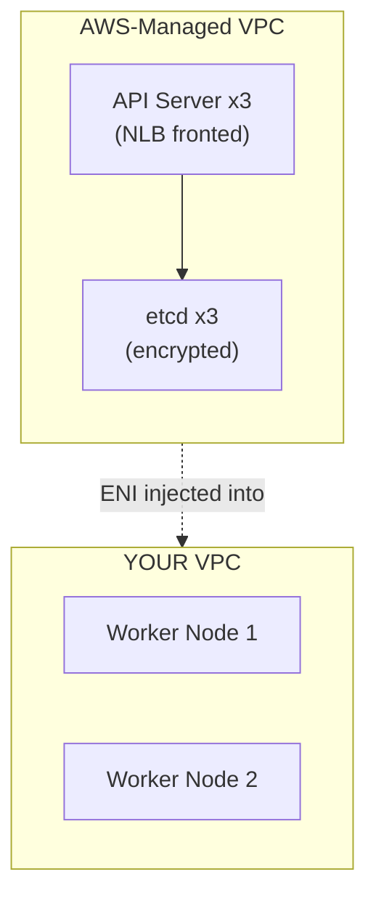
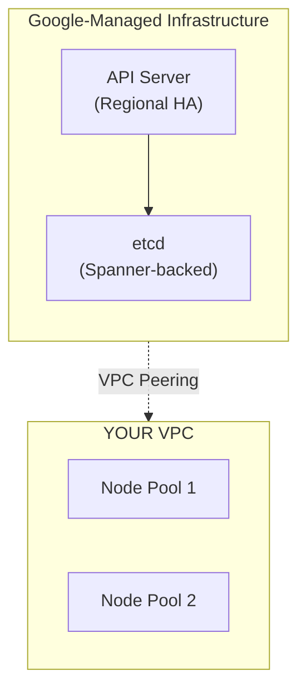
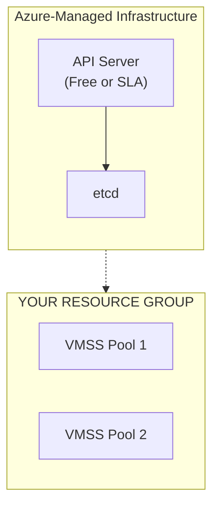
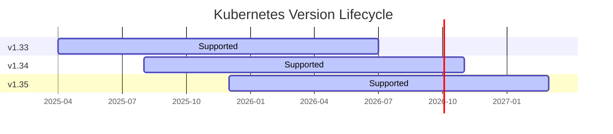
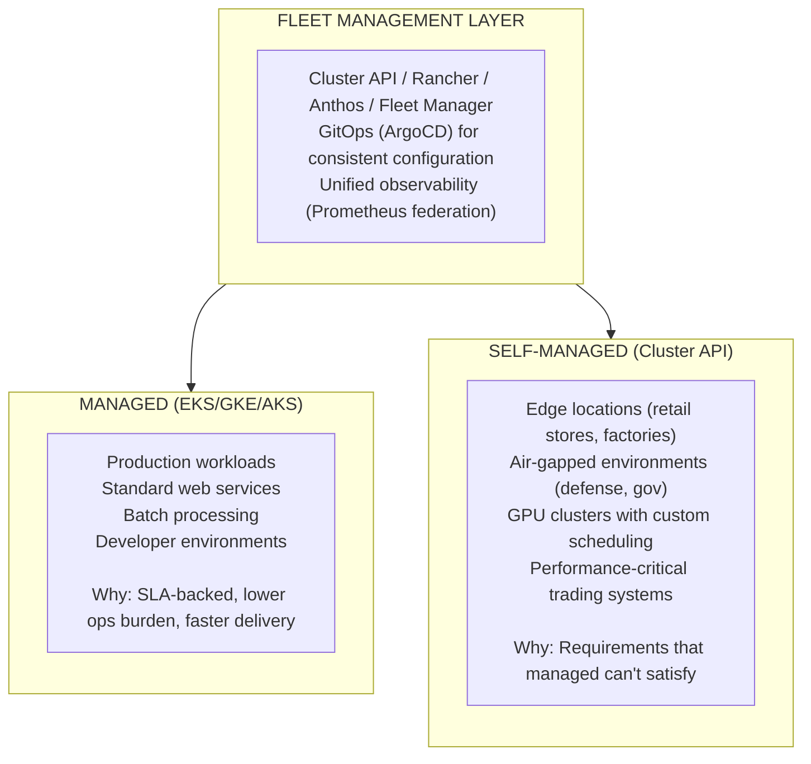
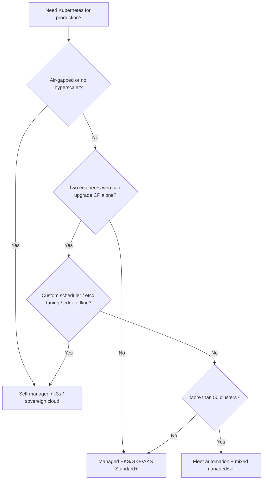

> **Complexity**: `[MEDIUM]`
>
> **Time to Complete**: 2 hours
>
> **Prerequisites**: Basic Kubernetes knowledge (Pods, Deployments, Services)
>
> **Track**: Cloud Architecture Patterns

## What You'll Be Able to Do

- **Evaluate** managed Kubernetes services (EKS, GKE, AKS) against self-managed clusters for specific workload requirements and constraints.
- **Design** comprehensive decision frameworks that weigh control plane responsibility, upgrade lifecycle velocity, and team capability.
- **Compare** the total cost of ownership between managed and self-managed Kubernetes infrastructures, explicitly accounting for hidden operational and labor costs.
- **Implement** bulletproof migration strategies from legacy self-managed Kubernetes environments to modern managed services with minimal workload disruption.
- **Diagnose** structural and operational risks in existing self-managed Kubernetes cluster configurations to preempt catastrophic failures.

---

## Why This Module Matters

**Hypothetical scenario:** A mid-sized fintech platform team runs self-managed Kubernetes on colocation hardware. They built custom etcd tuning, certificate rotation, and monitoring over three years. When two senior engineers leave within a month, nobody on the remaining team can execute a minor control-plane upgrade without the departed experts. A critical kube-apiserver CVE is public, but the team delays patching for days because a failed upgrade could freeze scheduling and block all deployments. Compliance and security stakeholders escalate while product releases stall. Six months later the organization migrates to a managed hyperscaler control plane so engineers return to application work instead of quorum math.

The mirror case is equally common. **Hypothetical scenario:** A logistics company on managed EKS needs custom scheduler plugins, aggressive API-server failover targets, and admission hooks that conflict with provider-managed add-on lifecycles. They move control plane components onto self-managed EC2, right-size etcd and API servers for their latency profile, and accept the operational tax because the business value of those controls exceeds the predictable per-cluster management fee.

Neither path is universally correct. Managed versus self-managed is a portfolio decision shaped by team depth, compliance boundaries, workload latency, and how many clusters you operate. In this module you will learn what "managed" actually patches, how EKS, GKE, and AKS differ on SLA and pricing tiers, how to model TCO including labor and outage risk, and when escape hatches to self-managed or edge distributions are justified.

---

## Section 1: The Shared Responsibility Model

The most pervasive and dangerous assumption in cloud native engineering is that adopting a managed Kubernetes service absolves the platform team of all operational responsibility. This is categorically false. Every single managed Kubernetes offering operates on a strict shared responsibility model, and the demarcation line—the exact point where the provider's pager stops ringing and yours starts—varies wildly between Amazon EKS, Google GKE, and Azure AKS.

Think of infrastructure like housing. Running self-managed Kubernetes on bare metal is like building and maintaining your own house from the foundation up. You pour the concrete, fix the plumbing, repair the roof, and furnish the interior. If the pipes burst, you are the one holding the wrench at midnight. 

Managed Kubernetes is like renting a high-end apartment. The landlord (the cloud provider) is responsible for the building's structural integrity, the main water lines, and the central heating system. However, you are still entirely responsible for your own furniture, securing your front door, and ensuring you do not start a fire in the kitchen. The provider maintains the control plane (the plumbing), but you still own and must secure your workloads (the furniture).

The analogy breaks if you treat "managed" as "no nodes to think about." Unless you adopt a **nodeless** mode (EKS Fargate profiles, GKE Autopilot, AKS [virtual nodes with Azure Container Instances](https://learn.microsoft.com/en-us/azure/aks/virtual-nodes)), you still choose instance types, disk types, autoscaling bounds, and maintenance windows. Managed control plane ≠ managed application reliability: you still design PodDisruptionBudgets, probes, and graceful shutdown. Cross-cloud architects document these boundaries in onboarding decks so application teams do not assume the provider will restart their stateful Pods safely during node drains.

### Shared Responsibility: Who Owns What?

| Component | Self-Managed | Managed (EKS/GKE/AKS) | Serverless (Fargate/Cloud Run) |
|-----------|-------------|----------------------|------------------------------|
| Application Code | YOU | YOU | YOU |
| Container Images | YOU | YOU | YOU |
| Pod Security | YOU | YOU | YOU |
| Network Policies | YOU | YOU | SHARED |
| Ingress / LB | YOU | YOU | PROVIDER |
| Worker Nodes | YOU | YOU * | PROVIDER |
| Node OS Patching | YOU | YOU * | PROVIDER |
| kubelet | YOU | YOU * | PROVIDER |
| Control Plane | YOU | PROVIDER | PROVIDER |
| etcd | YOU | PROVIDER | PROVIDER |
| API Server HA | YOU | PROVIDER | PROVIDER |
| Certificate Mgmt | YOU | PROVIDER | PROVIDER |
| Cloud Infra | YOU ** | PROVIDER | PROVIDER |
| Physical Security | YOU ** | PROVIDER | PROVIDER |

Notice that even with a fully managed Kubernetes cluster, you are still actively responsible for a massive portion of the operational stack. Network policies, pod security admission, and ingress controller configuration remain customer-owned. The bare-metal column in the table applies only when you run Kubernetes on premises without a hyperscaler control plane.

**Pause and predict:** If a critical vulnerability is discovered in the Linux kernel's networking stack, and you are using EKS with managed node groups, who is responsible for initiating the patching process, and why might the cloud provider intentionally wait for you to trigger it rather than auto-updating your nodes immediately?

<details>
<summary>Check your prediction</summary>

Amazon EKS **builds** patched EKS-optimized AMIs; **you deploy** those AMI versions. The provider does not silently auto-replace production nodes. While AWS manages the underlying hypervisors and publishes updated machine images containing kernel patches, replacing or rolling worker nodes forces workload eviction. An uncoordinated reboot or automated rolling update by the cloud provider could violate PodDisruptionBudgets, evict stateful pods without graceful flushing, or trigger sudden capacity degradation during peak production traffic. As documented in [EKS managed node groups](https://docs.aws.amazon.com/eks/latest/userguide/managed-node-groups.html), AWS automates the orchestration of node creation and draining once triggered, but you configure `updateConfig` and initiate or schedule the node group AMI rollout according to your change management windows.
</details>

Understanding this operational division between host operating system lifecycles and cluster orchestration establishes where infrastructure responsibility begins. Before evaluating how worker instances handle rollouts, platform architects must examine the underlying control plane components that hyperscalers isolate and run behind proprietary networking layers.

### The Control Plane: What Managed Really Manages

The Kubernetes control plane is the brain of your cluster. When you opt for a managed service, the provider takes over the heavy lifting of running these specific components:

| Component | What It Does | Self-Managed Burden |
|-----------|-------------|---------------------|
| kube-apiserver | All cluster communication flows through here | Must configure HA, TLS, audit logging, OIDC |
| etcd | Stores all cluster state | Must manage backups, compaction, defragmentation, quorum |
| kube-scheduler | Decides where pods run | Must configure profiles, custom scorers |
| kube-controller-manager | Runs reconciliation loops | Must manage leader election, garbage collection tuning |
| cloud-controller-manager | Integrates with cloud APIs | Must build/maintain if not on a major cloud |

When you use EKS, GKE, or AKS, the provider runs these complex, stateful components for you. But the exact definition of "runs" means very different things depending on which hyperscaler you choose.

### Patching, CVE response, and node OS ownership

The control-plane boundary is only half the story. Production risk usually concentrates on **nodes and workloads**: kernel CVEs, container runtime updates, kubelet skew, and image supply chain. Each hyperscaler patches the Kubernetes control plane (API server, scheduler, controller-manager, etcd) on its own cadence, but production still has a node change window that must be planned like any other fleet rollout.

**Amazon EKS** patches the managed control plane without customer SSH access. For workers, [Bottlerocket](https://docs.aws.amazon.com/eks/latest/userguide/bottlerocket.html) narrows the node attack surface with an immutable root filesystem designed specifically for hosting containers, replacing standard package managers with transactional image-based updates. Platform teams establish automated staging pipelines to validate image compatibility across representative synthetic workloads before approving rollouts across production clusters.

**Google GKE** offers [node auto-upgrade](https://cloud.google.com/kubernetes-engine/docs/how-to/node-auto-upgrades) and [auto-repair](https://cloud.google.com/kubernetes-engine/docs/how-to/node-auto-repair) on Standard node pools, often on [Container-Optimized OS](https://cloud.google.com/container-optimized-os/docs) images. Release channels (Rapid, Regular, Stable, Extended) govern how aggressively the **control plane** moves forward; node upgrades can track or lag depending on maintenance windows. Autopilot shifts operational node provisioning and management entirely to Google, allowing engineering teams to focus purely on Pod specifications and service definitions.

**Azure AKS** documents [node image upgrades](https://learn.microsoft.com/en-us/azure/aks/node-image-upgrade) and cluster [auto-upgrade channels](https://learn.microsoft.com/en-us/azure/aks/auto-upgrade-cluster) for Kubernetes minor versions. Node OS and kubelet updates still land in your change window for stateful systems. The Free tier does not buy you an API-server SLA—production patching discipline should assume Standard or Premium when uptime commitments exist.

| Layer | EKS | GKE | AKS | Self-managed |
|-------|-----|-----|-----|--------------|
| Control-plane CVEs | AWS patches; you schedule upgrades | Google patches; channels + maintenance windows | Microsoft patches; tier defines SLA | You patch API/etcd/scheduler |
| Node OS / kubelet | Managed node groups / Bottlerocket; change windows still exist | Auto-upgrade/repair optional | Node image upgrade + surge settings | You own images and rollouts |
| Workload & image CVEs | You (scanning, admission, rollouts) | You | You | You |
| etcd backups | Provider-managed HA | Provider-managed HA | Provider-managed HA | You design snapshots & restore drills |

### etcd backups and the access boundary

State management represents the most critical operational liability in production Kubernetes clusters. In traditional self-managed environments, operators bear full responsibility for etcd maintenance, including automated snapshot schedules, disk write latency optimization, database compaction routines, and quorum recovery protocols during split-brain events. Because data loss in etcd destroys cluster declarative history, enterprise audit policies mandate regular disaster recovery simulations to verify Recovery Point Objectives (RPO) and Recovery Time Objectives (RTO).

Self-managed operators must implement snapshot schedules, test restores quarterly, and document who may run `etcdctl` during incidents. A failed restore drill is more expensive than a year of EKS cluster fees at moderate scale because it can mean rebuilding every Deployment, Secret, and CustomResource from Git—a multi-week program if backups were never validated.

**Pause and predict:** Your security team asks for quarterly etcd restore tests. On EKS, GKE, and AKS, what evidence can you provide instead of a snapshot file, and why does that evidence still satisfy auditors who care about RPO/RTO?

<details>
<summary>Check your prediction</summary>

Customers **cannot** download provider etcd snapshots on EKS, GKE, or AKS, nor can you open an etcd shell or take ad hoc `etcdctl` snapshots of the provider's datastore. Because the control plane datastore is managed entirely by the cloud provider behind multi-tenant isolation boundaries, backup schedules, compaction, and quorum maintenance are internal platform responsibilities covered by vendor compliance certifications and control plane SLAs. Valid compliance evidence consists of **application-level restore drills** (such as Velero backups of custom resources, secrets, and workload specifications restored into a staging cluster), declarative GitOps drift remediation logs, and vendor SOC 2 or ISO/IEC 27001 audit packages demonstrating control plane high-availability guarantees.
</details>

Quarterly drills still need a named restore target, a named identity that can run it, and a network path that works when the production API is busy. That is why the next comparison is how each hyperscaler actually places the API server relative to your VPC, not how the portal labels the SKU.

---

## Section 2: Provider Comparison: Control Plane Architectures

It is critical to understand how the major cloud providers physically architect their managed Kubernetes offerings. They do not simply run `kubeadm` behind a curtain. They have engineered massive, multi-tenant architectures to achieve economies of scale.

### Amazon EKS Architecture

In AWS, the control plane lives in a Virtual Private Cloud (VPC) that AWS owns and keeps invisible to your account. The diagram below shows how that managed plane connects to worker nodes in your VPC.



The control plane runs entirely in an AWS-managed account, so you never see the underlying EC2 instances. To reach kubelets on your worker nodes, AWS injects Elastic Network Interfaces (ENIs) into subnets you designate; those ENIs are the network bridge between the hidden control plane and your VPC. You also never operate etcd directly—AWS backs up and encrypts it on your behalf.

### Google GKE Architecture

Google builds on years of internal Borg-era orchestration experience, so GKE’s control plane feels more native to the VPC model than a bolt-on service.



GKE Autopilot pushes management further: Google operates worker nodes while you declare pod resource requests and pay for what workloads consume. Some GKE fleets back etcd with Spanner for globally distributed durability instead of classic local etcd processes, and connectivity into your VPC often uses automated VPC peering or Private Service Connect.

### Azure AKS Architecture

Microsoft blends managed abstraction with resources you can still see in your subscription—especially the auto-generated `MC_` resource group that holds node pools and supporting network objects.



AKS Free tier carries no control-plane SLA and suits development only. Standard tier adds cluster management pricing documented on Azure's pricing pages plus a financially backed uptime SLA when enabled. Expect load balancers and network security groups in an auto-generated managed resource group (typically prefixed with `MC_`) inside your subscription even though the control plane itself stays provider-operated.

### Comparing control-plane isolation models

Understanding **where** the API server runs explains latency, compliance narratives, and debugging limits:

**EKS** keeps the plane in an AWS-owned account and bridges into your VPC with ENIs. You troubleshoot via CloudTrail, EKS audit logs, and AWS Support—not SSH to `kube-apiserver`. Custom admission webhooks and API aggregation layers still run as workloads **you** deploy; AWS does not inject your OPA or Kyverno policies into their plane.

**GKE** regional clusters replicate control-plane components across zones; Autopilot further separates node provisioning from your node-pool YAML. Google's automation can feel opaque when something fails during maintenance windows—your response is GCP support and cluster events, not shell access to etcd members.

**AKS** surfaces more adjacent resources in your subscription (VMSS, NSG, load balancers in the `MC_` group), which helps Azure-native operators reason about blast radius but blurs "what is control plane" versus "what is node" in cost allocation dashboards.

Across all three hyperscalers, customer administrative access to the control plane terminates at the Kubernetes API layer. You still choose how much of the worker OS you can see: Standard node pools and managed node groups leave kubelet, runtime, and host agents in your change window, while nodeless modes trade that access for a tighter pod contract.

**Pause and predict:** GKE Autopilot completely abstracts away worker nodes, billing you only for requested pod resources. If your security team mandates a third-party intrusion detection agent that runs as a highly privileged DaemonSet to inspect host-level syscalls, how will Autopilot's architecture conflict with this requirement?

<details>
<summary>Check your prediction</summary>

GKE Autopilot **blocks privileged containers by default** (allowing verified partner integrations only for select security and monitoring tooling) to enforce strict multi-tenant node isolation and platform security baselines. Autopilot enforces strict admission controls with **no hostNetwork**, **no hostPath write** volumes, and no host namespaces (such as `hostPID` or `hostIPC`). Security agents requiring direct host-level syscall inspection or arbitrary Linux capabilities cannot deploy as traditional privileged DaemonSets unless certified through approved vendor channels, requiring platform teams to run standard node pools where host access can be granted.
</details>

Security constraints and host abstraction layers profoundly influence operational visibility across managed container environments. Once platform teams determine workload compatibility with hardened node architectures, they must establish telemetry pipelines and evaluate vendor support models to maintain end-to-end observability across the fleet.

### Monitoring and support: what "managed" includes

Managed control planes ship baseline control-plane monitoring, but **your** SLOs still depend on kubelet/node metrics, ingress health, and application traces. EKS integrates with CloudWatch; GKE with Google Cloud Monitoring; AKS with Azure Monitor—each bills separately from the cluster management fee. Self-managed teams must additionally alert on etcd fsync latency, apiserver `429` rates, and certificate expiry—signals hyperscaler SREs watch internally while you sleep.

Support tickets differ by cloud: providers remediate **their** plane outages documented in SLAs; they will not fix your Helm chart after you upgrade into a removed API. Game days should assume SLA covers Kubernetes API availability while **you** own recovery from bad rollouts—Pod restart storms after node drains remain customer runbooks on every provider.

Control-plane request throttling introduces subtle operational challenges in managed clusters where operators cannot adjust underlying API server command-line flags. In self-managed environments, engineers can tune request concurrency limits and timeout settings directly. In managed environments, platform teams must configure Kubernetes API Priority and Fairness flow schemas and priority levels to prevent aggressive continuous integration controllers or metric collectors from consuming request queues and starving critical scheduler operations.

### The Critical Differences

| Feature | EKS | GKE | AKS |
|---------|-----|-----|-----|
| Control Plane Cost | $0.10/hr ($73/mo) | $0.10/hr (all modes); 1 free zonal/Autopilot cluster/mo via $74.40 credit | Free (no SLA) or $0.10/hr (SLA) |
| Control Plane SLA | 99.95% | 99.95% (Regional) | 99.95% (Standard tier) |
| Max Pods per Node | 110 (default ENI limits) | 110 (default), 256 (GKE) | 250 |
| K8s Version Lag | ~2-3 months behind upstream | ~1-2 months behind upstream | ~2-3 months behind upstream |
| etcd Access | None | None | None |
| Autopilot Mode | EKS Auto Mode (full-cluster node automation); Fargate for serverless pods | GKE Autopilot (full cluster) | Virtual nodes via ACI |
| Private Cluster | Yes (API endpoint in VPC) | Yes (Private cluster) | Yes (Private AKS) |
| Workload → cloud IAM | IRSA / EKS Pod Identity | Workload Identity Federation | Entra Workload ID |

When comparing max Pods per node, remember ENI/IP limits on AWS VPC CNI, GKE alias ranges, and Azure networking choices can all force smaller practical limits than the table maximum—subnet design is a managed-cluster skill, not only a self-managed concern.

### Control plane SLA, pricing tiers, and what you are buying

Managed Kubernetes is not one SKU—it is a **tier ladder** plus worker spend. Compare tiers before you compare instance types.

**EKS** charges **$0.10 per cluster per hour** for Kubernetes versions in [standard support](https://aws.amazon.com/eks/pricing/) (roughly $73/month per cluster). After standard support ends, [extended support](https://docs.aws.amazon.com/eks/latest/userguide/kubernetes-versions.html) raises the control-plane rate to **$0.60 per cluster per hour** until you upgrade—an easy budget spike when many clusters linger on old minors. [EKS Provisioned Control Plane](https://aws.amazon.com/eks/pricing/) adds XL–8XL tiers ($1.65–$13.90/hr and above) when API-server throughput or large-scale etcd performance needs predictable headroom beyond the default plane.

**GKE** applies a **$0.10 per cluster per hour** [cluster management fee](https://cloud.google.com/kubernetes-engine/pricing) to every cluster mode (zonal, regional, Autopilot). The [free tier](https://cloud.google.com/kubernetes-engine/pricing) credits **$74.40 per billing account per month**, equivalent to one zonal Standard or Autopilot cluster hour-bank—regional clusters still pay the full management fee. Extended channel clusters past standard support pay an additional **$0.50/hr** management surcharge (total **$0.60/hr**) until upgraded. SLAs: **99.95%** regional Standard/Autopilot control planes, **99.5%** zonal Standard control planes per the same pricing page.

**AKS** splits [Free, Standard, and Premium tiers](https://learn.microsoft.com/en-us/azure/aks/free-standard-pricing-tiers). **Free** has no financially backed API-server SLA—fine for labs, hazardous for revenue workloads. **Standard** enables the [uptime SLA](https://learn.microsoft.com/en-us/azure/aks/uptime-sla) (**99.95%** with availability zones, **99.9%** without). **Premium** pairs with Long-Term Support (`AKSLongTermSupport`) for regulated fleets that must stay on a minor longer than community support. Cluster management fees for Standard/Premium are documented on Azure's AKS pricing pages; worker VMs, load balancers, and egress remain pay-as-you-go.

| Provider | Production-oriented control plane | SLA (API server) | Cost spike triggers |
|----------|-----------------------------------|------------------|---------------------|
| EKS | Standard + optional Provisioned CP | 99.95% (documented SLA) | Extended support $0.60/hr; many clusters × $0.10/hr; cross-AZ ENI traffic |
| GKE | Regional Standard or Autopilot | 99.95% regional / 99.5% zonal | Extended channel surcharge; exceeding free-tier credit; Autopilot pod requests vs actual need |
| AKS | Standard or Premium (LTS) | 99.9–99.95% by AZ layout | Running Free in prod; Premium + LTS; outbound data from Azure Load Balancer |

### Private API endpoints and control-plane networking

Exposing the Kubernetes API to `0.0.0.0/0` is the default on many clusters; tightening endpoint access is a cross-cloud pattern with different knobs.

**EKS** lets you disable public [cluster endpoint](https://docs.aws.amazon.com/eks/latest/userguide/cluster-endpoint.html) access so the API server is reachable only inside the VPC (private hosted zone managed by AWS). Operators reach it via bastion, VPN, Transit Gateway, or [EKS access entries](https://docs.aws.amazon.com/eks/latest/userguide/access-entries.html) combined with IAM and RBAC. Private-only endpoints do not remove ENI consumption in your subnets—they change **who can route to the API**, not pod IP planning.

**GKE** [private clusters](https://cloud.google.com/kubernetes-engine/docs/concepts/private-cluster-concept) restrict control-plane endpoints using private RFC1918 addresses and authorized networks or Cloud VPN/Interconnect. [Private Service Connect](https://cloud.google.com/vpc/docs/private-service-connect) variants appear in enterprise designs that need controlled egress to Google APIs. Autopilot still honors private endpoint constraints but may limit host-level agents.

**AKS** supports [private clusters](https://learn.microsoft.com/en-us/azure/aks/private-clusters) where the API server has a private IP in your VNet; access requires jump hosts or Azure Private Link patterns. API server VNet integration (where available in your region) further aligns DNS and routing with corporate network policy.

Across clouds, private API access adds **engineering time** (CI runners inside the VPC, VPN maintenance) but reduces credential theft blast radius—a trade enterprises accept when compliance mandates no public Kubernetes API.

### Control-plane scale and components recap

Regardless of vendor, the managed plane runs **kube-apiserver**, **etcd**, **kube-scheduler**, and **kube-controller-manager** (plus cloud-controller-manager integrations). You do not resize etcd on EKS; on self-managed you might run five dedicated SSD nodes. Managed planes autoscale internally within provider limits; Provisioned Control Plane on EKS is the explicit knob when default throughput saturates during admission storms or massive `LIST` operations from controllers.

---

## Section 3: Total Cost of Ownership: The Numbers Nobody Talks About

The most devastating mistake engineering teams make is comparing only the raw infrastructure sticker price. "EKS costs seventy-three dollars a month for the control plane, but running `kubeadm` on our own VMs is free!" This is a deeply flawed premise—like calling a house "free" because you ignore labor, materials, permits, and years of maintenance. The tables below model a medium-complexity production deployment with infrastructure, labor, and risk priced explicitly so you can compare apples to apples.

### Self-Managed Kubernetes: True Annual Cost

#### Infrastructure

| Component | Cost |
|-----------|------|
| Control plane VMs (3x HA) | $3,600/yr |
| etcd dedicated nodes (3x SSD) | $5,400/yr |
| Load balancer for API server | $1,200/yr |
| Backup storage (etcd snapshots) | $360/yr |
| **Infrastructure subtotal:** | **$10,560/yr** |

#### Operational labor (two senior engineers, partial allocation)

| Component | Cost |
|-----------|------|
| Kubernetes upgrades (4x/yr) | $12,000 |
| etcd maintenance + monitoring | $8,000 |
| Certificate rotation | $4,000 |
| Security patching (CVEs) | $6,000 |
| Incident response (control plane) | $10,000 |
| Documentation & runbooks | $3,000 |
| **Labor subtotal:** | **$43,000/yr** |

#### Risk (annualized)

| Component | Cost |
|-----------|------|
| Extended outage (control plane) | $8,000 |
| Failed upgrade rollback | $5,000 |
| Key person dependency | $7,000 |
| **Risk subtotal:** | **$20,000/yr** |

Self-managed total for this profile: **$73,560/yr** (infrastructure $10,560 + labor $43,000 + risk $20,000).

---

### Managed Kubernetes (EKS): True Annual Cost

#### Managed service fees

| Component | Cost |
|-----------|------|
| EKS control plane | $876/yr |
| NAT Gateway (2 AZs) | $7,200/yr * |
| VPC endpoints (ECR, S3, etc.) | $1,800/yr * |
| CloudWatch / logging | $2,400/yr |
| **Service subtotal:** | **$12,276/yr** |

#### Operational labor (one senior engineer, partial allocation)

| Component | Cost |
|-----------|------|
| Managed upgrades (4x/yr) | $4,000 |
| Node group management | $3,000 |
| Add-on management | $2,000 |
| Incident response (node-level) | $4,000 |
| **Labor subtotal:** | **$13,000/yr** |

#### Risk (annualized)

| Component | Cost |
|-----------|------|
| Provider outage impact | $3,000 |
| Upgrade compatibility issues | $2,000 |
| **Risk subtotal:** | **$5,000/yr** |

Managed total for this profile: **$30,276/yr** (service $12,276 + labor $13,000 + risk $5,000). NAT Gateway and VPC endpoint line items marked with * exist in both models but disappear from napkin math when teams compare "free kubeadm" to a monthly EKS fee.

The managed option is roughly sixty percent cheaper when you accurately account for labor and enterprise risk. That advantage shrinks at fleet scale: organizations running dozens or hundreds of clusters sometimes fund a dedicated platform team and Cluster API automation so per-cluster control-plane fees stop dominating the budget.

### Building your own TCO worksheet (multi-cloud)

Use the same spreadsheet schema for EKS, GKE, and AKS proposals so finance compares fairly:

1. **Control plane**: clusters × hourly tier × 730; add extended-support rows if you lag minors.
2. **Workers**: instance hours × price sheet; separate GPU, spot, and on-demand tabs.
3. **Network**: NAT gateway hours + processed GB; inter-AZ GB; load balancer fixed + LCU charges (Azure) or NLB/LCU (AWS/GCP equivalents).
4. **Observability**: log ingest GB, metric cardinality charges, APM per host.
5. **Labor**: FTE fraction × loaded salary for upgrades, incidents, and migration.
6. **Risk reserve**: annualized outage $ (revenue/hour × expected hours) for self-managed etcd scenarios.

Hyperscaler calculators ([AWS Pricing Calculator](https://calculator.aws/), Google Cloud Pricing Calculator, Azure pricing tools) help with infrastructure rows; you must still type labor and risk manually or the business case will lie by omission. When leadership asks "why not self-managed if EC2 is cheap," show row 5 and 6 side by side for each cloud—identical logic, different NAT and management-fee cells.

> **Stop and think**: The TCO models assume a static baseline of infrastructure. If your workloads are highly bursty and you run across three Availability Zones to ensure high availability, how does the managed control plane architecture of EKS invisibly multiply your cross-AZ data transfer costs compared to a self-managed cluster?

### The Costs People Forget

Budget conversations often stop at control-plane line items, yet the rows below quietly dominate both models—especially cross-AZ data transfer, NAT processing, and the human cost of patching.

Cross-availability-zone networking charges represent one of the most frequently underestimated operational expenses in multi-zone Kubernetes deployments. When worker nodes in one availability zone communicate with pods, control-plane endpoints, or database replicas located in another availability zone, hyperscalers bill both egress from the source zone and ingress into the destination zone. Without topology-aware routing, service traffic spreads uniformly across all available endpoints regardless of zonal locality, multiplying inter-zone data transfer fees as cluster transaction volume scales.

| Hidden Cost | Self-Managed | Managed |
|-------------|-------------|---------|
| Data transfer between AZs | You pay | You pay |
| NAT Gateway data processing | You pay | You pay |
| Load balancer idle hours | You configure + pay | Auto-provisioned, you pay |
| etcd backup storage | You build + pay | Included |
| Control plane monitoring | You instrument | Included (basic) |
| Kubernetes CVE patching | You triage + patch | Provider patches, you schedule |
| On-call rotation (control plane) | You staff 24/7 | Provider staffs |
| Compliance auditing | You document | Shared (SOC2, HIPAA certs available) |

### Engineer-hours, botched upgrades, and control-plane HA you build yourself

Labor is the line item spreadsheets hide. A conservative model for self-managed production assumes **two senior engineers** spending partial quarters on: reading [Kubernetes release notes](https://kubernetes.io/releases/), running deprecated API discovery, etcd backup/restore drills, certificate rotation, and post-upgrade soak tests. At fully loaded $150–$200/hr, four upgrade cycles plus CVE firefighting easily exceed **$40k/year** before anyone touches application features—matching the labor subtotal in the tables above.

A **botched minor upgrade** costs more than the successful upgrade would have saved. Symptoms include: etcd quorum loss (cluster read-only), a control plane that cannot take the next minor because kubelets already sit at the skew ceiling, or admission webhooks rejecting workloads on new defaults. Recovery often means emergency consultants, weekend war rooms, and revenue loss while Deployments cannot roll forward. Managed providers absorb etcd and API-server choreography, but **you still pay** if worker groups lag and pods crash on deprecated APIs—managed is not immunity, it is narrower blast radius.

Self-managed **control-plane HA** means three (or five) API servers, etcd on low-latency SSD, load balancers, and monitoring—roughly the **$10k+/year infrastructure** slice in the self-managed table. Managed bundles that HA into the per-cluster fee. At **ten clusters**, EKS control-plane fees alone are ~$8,760/year at standard pricing—still often cheaper than one engineer-week per cluster per upgrade.

### Node pool levers: spot, sizing, and autoscaler bounds

Worker spend dominates most bills. Cross-cloud levers:

- **Spot / preemptible / Azure Spot** node pools cut compute 60–90% for fault-tolerant batch and stateless tiers; keep on-demand baselines for latency-sensitive services.
- **Right-sized machine types**: GKE Autopilot bills on [pod resource requests](https://cloud.google.com/kubernetes-engine/pricing); over-requesting CPU/memory inflates Autopilot cost. EKS and AKS on EC2/VMSS reward rightsizing instance families (ARM Graviton, Azure Ddsv5) when workloads fit.
- **Cluster autoscaler min/max**: A max set to "headroom for Black Friday" becomes **always-on** cost; min too low causes cold-start latency. Tune per pool—GPU pools need different bounds than web frontends.
- **NAT and egress**: EKS and AKS in private subnets often need NAT gateways or managed egress appliances; GKE may use Cloud NAT. Cross-AZ traffic between nodes and multi-AZ control planes shows up as "**mystery**" data transfer—model it explicitly in TCO workshops.

### When the managed bill spikes unexpectedly

| Spike driver | EKS | GKE | AKS |
|--------------|-----|-----|-----|
| Control-plane tier | Extended support $0.60/hr; Provisioned CP XL+ | Extended channel +$0.50/hr; many regional clusters bypass free tier | Premium + LTS; Standard fee on large fleets |
| Networking | NAT + cross-AZ ENI traffic to managed plane | Cloud NAT + multi-cluster egress | Azure LB outbound rules + inter-region replication |
| Operations | Forgotten node groups on old AMIs during forced CP upgrade | Autopilot over-provisioned requests | Free tier in production until incident forces Standard |

> **Stop and think**: Finance approves "move to managed to save money." Six months later spend rises 20%. Which three line items from the tables above would you audit first, and which provider-specific fee is the most likely surprise?

---

## Section 4: Version Lifecycle: The Upgrade Treadmill

Kubernetes ships three minor versions per year—roughly every fifteen weeks—and each minor release is supported for about fourteen months. That cadence puts you on a permanent upgrade treadmill: fall behind and you run unsupported software with known CVEs, while staying current demands repeatable engineering discipline.



Provider policies differ in how aggressively they pull you forward. **EKS** adds versions two to three months after upstream, warns before forced upgrades, and sells extended support for another twelve months at a premium. **GKE** ships versions quickly and auto-upgrades according to your release channel (Rapid, Regular, or Stable). **AKS** supports an N-2 window—the latest minor plus the two previous—and exposes preview builds earlier for testing.

### Multi-cloud upgrade ownership (who clicks, who tests)

The upgrade **mechanism** is easy on managed clusters; the **risk** is identical across clouds because application manifests break on deprecated APIs regardless of who patches etcd.

| Phase | Self-managed | EKS | GKE | AKS |
|-------|--------------|-----|-----|-----|
| Pre-flight API audit | You run conformance/deprecated API checks | You (same kubectl checks) | You + channel preview clusters | You + AKS preview version |
| Control plane bump | You orchestrate kubeadm/etcd | `aws eks update-cluster-version` | `gcloud container clusters upgrade --master` | `az aks upgrade` |
| Worker bump | Drain/uncordon each node | Managed node group version API | Node pool upgrade or auto-upgrade window | Node image upgrade / surge |
| Rollback story | etcd restore / backup | Cannot downgrade CP—plan forward | Forward-only on CP—test in staging | Forward-only—maintain parallel cluster |
| Cost of delay | CVE exposure + compliance findings | Extended support surcharge accrues | Extended channel surcharge | Unsupported minor blocks support tickets |

Platform teams should maintain a **single internal runbook** with provider-specific CLI appendices so engineers do not confuse "GKE did the control plane" with "our Helm charts are compatible." Budget one full sprint per year per production cluster family for integration testing—even when CLIs look trivial.

### Self-Managed Upgrade Reality

A self-managed minor upgrade is a high-stakes, multi-day project. The command sequence below is representative of the mechanical work—not the meetings, rollback drills, or application compatibility testing that surround it:

```bash
# Step 1: Read the changelog (yes, all of it)
# https://github.com/kubernetes/kubernetes/blob/master/CHANGELOG/

# Step 2: Check for API deprecations that affect your workloads
# This command lists resources using deprecated APIs
kubectl get --raw /metrics | grep apiserver_requested_deprecated_apis

# Step 3: Upgrade etcd first (if required by version compatibility matrix)
# Back up etcd BEFORE touching anything
ETCDCTL_API=3 etcdctl snapshot save /backup/etcd-pre-upgrade-$(date +%Y%m%d).db \
  --endpoints=https://127.0.0.1:2379 \
  --cacert=/etc/kubernetes/pki/etcd/ca.crt \
  --cert=/etc/kubernetes/pki/etcd/server.crt \
  --key=/etc/kubernetes/pki/etcd/server.key

# Step 4: Upgrade control plane nodes one at a time
# On each control plane node:
sudo apt-get update && sudo apt-get install -y kubeadm=1.35.0-1.1
sudo kubeadm upgrade apply v1.35.0
sudo apt-get install -y kubelet=1.35.0-1.1 kubectl=1.35.0-1.1
sudo systemctl daemon-reload && sudo systemctl restart kubelet

# Step 5: Upgrade worker nodes (drain, upgrade, uncordon)
# For EACH worker node:
kubectl drain node-1 --ignore-daemonsets --delete-emptydir-data
# SSH to node-1:
sudo apt-get update && sudo apt-get install -y kubeadm=1.35.0-1.1
sudo kubeadm upgrade node
sudo apt-get install -y kubelet=1.35.0-1.1
sudo systemctl daemon-reload && sudo systemctl restart kubelet
# Back on control plane:
kubectl uncordon node-1

# Step 6: Verify everything works
kubectl get nodes  # All should show v1.35.0
kubectl get pods --all-namespaces  # No CrashLoopBackOffs
```

Expect hours of careful execution on a typical cluster, plus calendar time for soak tests. One etcd compaction mistake can leave the datastore read-only and block all control-plane writes.

### Managed Upgrade Reality

Managed upgrades surface as cloud API calls, which looks deceptively easy compared to SSHing into control-plane nodes:

```bash
# EKS: Update control plane (takes ~25 minutes)
aws eks update-cluster-version \
  --name production \
  --kubernetes-version 1.35

# Then update each managed node group
aws eks update-nodegroup-version \
  --cluster-name production \
  --nodegroup-name standard-workers

# GKE: If using release channels, it's automatic
# For manual control:
gcloud container clusters upgrade production \
  --master \
  --cluster-version 1.35.0-gke.100 \
  --region us-central1

# AKS:
az aks upgrade \
  --resource-group production-rg \
  --name production \
  --kubernetes-version 1.35.0
```

Simple CLIs do not imply safe upgrades. Managed control-plane bumps still break workloads that depend on removed APIs, beta features, or version-skewed kubelets, so you need the same integration testing discipline as self-managed—only the etcd and API-server choreography is outsourced.

Workload eviction safety during rolling node upgrades represents a shared coordination challenge across all managed platforms. Even when cloud APIs automate instance termination and replacement, aggressive PodDisruptionBudgets or missing replica counts will block node draining indefinitely. Platform operators must audit disruption policies, establish pre-stop termination hooks, and tune drain timeout thresholds to prevent rolling node pool upgrades from stalling midway through production clusters.

### Serverless Kubernetes modes: less node toil, new constraints

Teams chasing "fully managed" often jump to **nodeless** execution models. Compare them before assuming they replace Standard clusters:

| Mode | Provider | What disappears | What remains your problem | Cost shape |
|------|----------|-----------------|---------------------------|------------|
| **Fargate profiles** | EKS | EC2 node pools for matched namespaces | VPC CNI planning, Fargate surcharges, sidecar/hostPort limits | Per-vCPU/memory pod-second + cluster $0.10/hr |
| **GKE Autopilot** | GCP | Node pool YAML for many workloads | Pod requests/limits accuracy, DaemonSet restrictions | Per-pod vCPU/GiB/ephemeral + $0.10/hr management |
| **Virtual nodes (ACI)** | AKS | VMSS for burst capacity | ACI subnet integration, scale latency | ACI consumption + cluster management tier |

Autopilot and Fargate excel when workloads are stateless, bursty, and free of host-level extras that assume a node you can tune. They frustrate teams that need GPU bare-metal tuning or custom kernel modules—exactly the escape-hatch scenarios in Section 5. Many enterprises run **Standard clusters with managed node pools** for the majority estate and isolate Autopilot/Fargate to greenfield microservices after a checklist review.

**Pause and predict:** Your EKS control plane is automatically upgraded by AWS because the old version reached its end of support. However, you forgot to upgrade your worker node groups, leaving the kubelets three minor versions behind the new control plane. Based on Kubernetes version skew policies, what is the immediate impact on your currently running workloads, and what operational constraint blocks the next control-plane upgrade?

<details>
<summary>Check your prediction</summary>

Under the official Kubernetes version skew policy, a kubelet **may be up to three minor versions older** than kube-apiserver (supported ceiling as of kubernetes.io/releases/version-skew-policy). Running workloads **continue** serving traffic without immediate interruption. However, critical hidden operational risks emerge. The hidden danger is that you **cannot upgrade the control plane again** until kubelets catch up to a compliant version window. Furthermore, in-place kubelet minor upgrades are **not** supported (nodes must be cordoned, drained, and replaced with updated AMIs). While the kubelet will successfully start and reconnect to the API server after a standard reboot, you cannot allow the control plane to advance any further, and newly introduced control-plane features or deprecated API removals may cause subsequent scheduling failures if node replacement is triggered unexpectedly.
</details>

Version lifecycle synchronization highlights why managed control planes require disciplined operational management rather than complete administrative detachment. When specialized workload requirements or extreme low-latency architectural patterns exceed what provider abstractions accommodate, platform engineers must identify when departing from managed offerings becomes technically and financially justifiable.

---

## Section 5: Escape Hatches: When Managed Isn't Enough

Managed Kubernetes fits most enterprise footprints, yet legitimate technical requirements still push teams toward self-managed control planes or lightweight distributions at the edge.

### When to Leave Managed

| Scenario | Why Managed Falls Short | Self-Managed Solution |
|----------|------------------------|----------------------|
| Custom schedulers | Managed platforms limit scheduler plugins | Run your own kube-scheduler with custom scoring |
| Extreme low-latency | Shared control planes add ~10-50ms to API calls | Dedicated control plane, tuned etcd, local SSDs |
| Air-gapped / classified | No internet connectivity allowed | Fully offline cluster with private registry |
| Custom etcd tuning | Cannot access etcd configuration | Tune heartbeat intervals, snapshot schedules, compaction |
| Edge / IoT | Clusters on resource-constrained hardware | k3s, k0s, MicroK8s with 512MB RAM |
| Multi-cloud consistency | Want identical control planes everywhere | Cluster API or Rancher across all environments |
| Regulatory sovereignty | Data must stay in specific jurisdiction without cloud provider access | On-prem or sovereign cloud with full control |

### When to Stay Managed

Before you exit managed services, pressure-test the rationale. **"It will be cheaper"** rarely survives the TCO tables above once labor and risk are included.

Document the escape hatch in an architecture decision record with: measurable latency targets, compliance clause citations, and a headcount plan for etcd/API on-call. Without those three, "self-managed for control" usually means "self-managed because the decision meeting ended early." Hybrid fleets should tag each cluster with `management-model: managed|self` and `reason-code` in GitOps labels so cost allocation and upgrade policies do not drift silently over two years. **"We want more control"** needs a concrete control-plane requirement—managed node groups plus admission webhooks satisfy most requests. **"We do not trust the cloud provider"** does not shrink your blast radius when compute, storage, and networking already live on their platform. **"Our team wants to learn Kubernetes deeply"** belongs in lab clusters, not production customer paths.

> **Stop and think**: A maritime logistics company wants to run Kubernetes on cargo ships to process telemetry data locally. The ships have intermittent, high-latency satellite internet. If they attempt to use EKS or GKE for these onboard clusters by connecting back to a cloud region, what fundamental distributed systems failure will occur every time a ship loses its satellite link?

### Workload identity: the managed-cluster contract you still must design

Even when the control plane is fully managed, **cloud IAM binding** is yours to get right. Long-lived cloud credentials inside Secrets are an anti-pattern on every hyperscaler; each cloud pushes federated identity:

- **AWS**: [IAM Roles for Service Accounts (IRSA)](https://docs.aws.amazon.com/eks/latest/userguide/iam-roles-for-service-accounts.html) via OIDC, plus [EKS Pod Identity](https://docs.aws.amazon.com/eks/latest/userguide/pod-identities.html) for simpler application of roles at scale.
- **GCP**: [Workload Identity Federation for GKE](https://cloud.google.com/kubernetes-engine/docs/how-to/workload-identity) maps Kubernetes service accounts to Google service accounts.
- **Azure**: [Microsoft Entra Workload ID](https://learn.microsoft.com/en-us/azure/aks/workload-identity-overview) with federated credentials; legacy AAD Pod Identity is retired—migrate during any AKS modernization.

These features do not reduce Kubernetes operational work—they reduce **credential rotation** incidents. Architecture reviews should treat identity wiring as part of the managed-vs-self-managed decision because self-managed clusters on the same clouds need the same patterns.

### The Hybrid Approach

Mature platform teams rarely pick a single global answer. They standardize fleet management—Cluster API, Rancher, Anthos, or GitOps controllers—while letting individual clusters land on managed hyperscaler services or self-managed footprints when latency, sovereignty, or hardware constraints demand it.



### Compliance and audit framing (managed vs self-managed)

Auditors ask who patches what and who can access cluster state. Managed offerings let you cite provider SOC/ISO reports for **control-plane physical and hypervisor controls**, while you still attest to RBAC, Namespaces, NetworkPolicies, and Secrets encryption at the application layer. Self-managed shifts more controls to your evidence packet: etcd encryption configuration, backup restore tests, and API server audit log retention.

Multi-cloud programs should harmonize evidence: same OPA/Gatekeeper policy bundles on EKS, GKE, and AKS where possible; same admission standards for privileged Pods; same requirement that production clusters never use AKS Free tier or EKS extended-support versions without CFO approval. Harmonization reduces audit cost even when management models differ (managed hub cluster plus self-managed edge).

---

## Patterns & Anti-Patterns

### Proven patterns

| Pattern | When to use | Why it works | Scaling note |
|---------|-------------|--------------|--------------|
| **Managed control plane + managed node pools** | Default production on EKS/GKE/AKS | Provider owns etcd/API HA; you automate node AMI/image cycles | Replicate per environment; use IaC (Terraform/OpenTofu) to avoid drift |
| **Regional HA + private API** | Regulated or internet-facing prod | 99.9–99.95% API SLAs with reduced credential exposure | Add CI runners/VPN early—private APIs do not simplify CI by themselves |
| **Release channels / planned upgrades** | GKE Stable, EKS version policy, AKS auto-upgrade channels | Battle-tested versions before they hit your fleet | Document exceptions for CRDs/webhooks before auto-upgrade windows |
| **Fleet GitOps over homogeneous kubeadm** | 20+ clusters | One promotion pipeline; managed clusters reduce per-site etcd heroes | Cluster API or fleet tools still help for edge/self-managed islands |
| **Workload identity instead of long-lived keys** | Any cloud-managed cluster | [EKS Pod Identity / IRSA](https://docs.aws.amazon.com/eks/latest/userguide/pod-identities.html), [GKE Workload Identity](https://cloud.google.com/kubernetes-engine/docs/how-to/workload-identity), [AKS workload identity](https://learn.microsoft.com/en-us/azure/aks/workload-identity-overview) shrink secret sprawl | Standardize identity contracts even when clusters span clouds |

### Anti-patterns

| Anti-pattern | What goes wrong | Why teams fall into it | Better alternative |
|--------------|-----------------|------------------------|-------------------|
| **Sticker-price TCO** | "EKS is $73/mo" ignores NAT, labor, extended support | Finance asks for infra-only numbers | Model labor + risk + egress; revisit quarterly |
| **Free-tier AKS in production** | No API SLA; best-effort repairs | Cost cap during POC becomes prod | Standard tier minimum; Premium when LTS required |
| **Skipping node upgrades after CP upgrade** | Next CP minor is blocked at the kubelet skew ceiling | CP upgrade feels "done" at the API | Upgrade node pools in same change; follow [version skew policy](https://kubernetes.io/releases/version-skew-policy) |
| **Autopilot + mandatory host agents** | DaemonSets denied or ineffective | Security mandates unreviewed against Autopilot constraints | GKE Standard with hardened node images, or refactor agents to sidecars |
| **Self-managed "to learn" on customer paths** | CVE debt and key-person risk | Engineers want deep skills | Lab clusters on kind/k3s; production stays managed |
| **150 clusters all on managed without automation** | Control-plane fees + toil per cluster | Fear of etcd | Dedicated platform team + Cluster API; managed only where SLA fits |

---

## Section 6: Decision Framework: Making the Right Choice

Treat managed versus self-managed as a portfolio decision, not a loyalty test. Score constraints honestly, multiply by weights, and let the total point you toward the option that matches staffing reality—not the option that sounds more impressive in a roadmap deck.

### Step 1: Score Your Requirements

Assign each row a weight from one to five based on how critical that factor is this quarter, then multiply by the managed or self-managed score in the table:

| Factor | Weight | Managed | Self-Managed |
|--------|--------|---------|-------------|
| Time to production | ___ | +3 | -2 |
| Operational simplicity | ___ | +3 | -3 |
| Cost at current scale (<10 clusters) | ___ | +2 | -1 |
| Cost at large scale (50+ clusters) | ___ | -1 | +2 |
| Control plane customization | ___ | -2 | +3 |
| Air-gap / sovereignty requirements | ___ | -3 | +3 |
| Team Kubernetes expertise (deep) | ___ | 0 | +2 |
| Team Kubernetes expertise (shallow) | ___ | +3 | -3 |
| Multi-cloud portability | ___ | -1 | +2 |
| Compliance / audit requirements | ___ | +1 | +1 |

Sum the weighted columns; the higher total is your default architectural path until a hard requirement in the escape-hatch table overrides it.

### Step 2: Decision matrix by workload and team profile

Use this matrix after scoring when stakeholders argue from anecdotes instead of constraints:

| Profile | Team size / K8s depth | Compliance | Workload shape | Recommended default | Control needs |
|---------|----------------------|------------|----------------|-------------------|---------------|
| **Startup shipping MVP** | <10 engineers, shallow K8s | SOC2 in progress | Stateless web + workers | GKE Autopilot or EKS + Fargate/ managed nodes | IRSA/WI for cloud APIs; no custom scheduler |
| **Enterprise multi-region** | Platform team 5+, some K8s experts | HIPAA/PCI, private API | Mixed stateless + managed data stores | Regional GKE/EKS/AKS Standard, private endpoints | Standard tier AKS; avoid Free tier |
| **Regulated long-lived versions** | SRE + change advisory board | LTS mandates | Batch + APIs on stable minors | AKS Premium + LTS or GKE Extended channel with budget | Document extended-support surcharges |
| **Edge / factory / vessel** | Small ops, intermittent network | Data residency | Telemetry at edge | k3s/k0s self-managed or [EKS Hybrid Nodes](https://aws.amazon.com/eks/pricing/) | Managed cloud hub + offline workers |
| **High-frequency trading / custom scheduler** | Deep K8s + performance SRE | Strict latency | Custom schedulers, sub-second failover | Self-managed or EKS Provisioned CP + tuned node pools | Only if escape-hatch table row is filled with evidence |



### Step 3: The Three Questions

If the spreadsheet feels ambiguous, answer three staffing and requirements questions before you sign contracts or provision infrastructure:

1. **"Can we reliably staff a true 24/7 on-call rotation exclusively for the control plane?"** If the answer is no, go managed. An etcd quorum loss does not care that it is a national holiday.
2. **"Do we currently have at least two engineers who can perform a Kubernetes minor version upgrade completely unsupervised?"** If the answer is no, go managed. Key person dependency on core infrastructure is a catastrophic company-level risk.
3. **"Is there a concrete, highly specific technical requirement that the managed platform cannot fulfill?"** If you cannot articulate it in one sentence, go managed. Vague desires for architectural purity do not justify grueling operational overhead.

### Step 4: Provider selection when managed wins

If managed is the answer but the cloud is not locked yet, bias as follows: choose **GKE** when you want the fastest release-channel ergonomics and Autopilot for request-based billing; choose **EKS** when the organization is AWS-native (IAM, VPC, Outposts) and needs Provisioned Control Plane headroom; choose **AKS** when Microsoft Entra, Azure Policy, and Windows node pools dominate the estate. All three run **Kubernetes 1.35** in current curriculum targets—validate SKU availability in your region before promising dates to application teams.

### Procurement and architecture review checklist

Before finalizing managed vs self-managed in a formal ADR, walk this checklist with security, finance, and platform leads: confirm private API exposure and CI/VPN paths; verify workload federation (IRSA/Pod Identity, GKE Workload Identity, Entra Workload ID) with no long-lived cloud keys in Secrets; document version policy and extended-support budget caps; choose node strategy (managed node groups, Autopilot, Fargate, ACI virtual nodes) against host-access requirements; prove Velero plus external database RPO/RTO without customer etcd snapshots; populate TCO labor and risk rows; and if self-managed wins, record the single technical escape-hatch requirement plus on-call roster in the ADR.

---

## Did You Know?

- **GKE was the very first managed Kubernetes service**, officially launched in 2015—just a single year after Kubernetes itself was open-sourced by Google. Google had already been orchestrating massive container workloads internally via Borg since 2003, giving them a monumental head start that is still evident in GKE's rapid feature velocity today.
- **The EKS control plane physically executes on EC2 instances inside a completely locked-down, AWS-owned account.** To bridge the network, AWS seamlessly injects Elastic Network Interfaces (ENIs) from their account directly into your VPC. This hidden architecture is the primary reason EKS clusters silently consume IP addresses in your subnets—a frequent source of unexpected IP exhaustion in tightly planned networks.
- **AKS is one of the few major managed Kubernetes services that offers a genuinely free tier without a built-in expiration window.** The significant caveat: the free tier provides zero SLA. If your control plane fails, Azure's default response is to suggest upgrading to the Standard tier. Running mission-critical production workloads on a free-tier AKS cluster is professional negligence.
- **etcd, the highly sensitive database underlying all Kubernetes clusters, was originally created by CoreOS in 2013**—long before Kubernetes itself existed. It utilizes the complex Raft consensus algorithm and rigorously requires a majority quorum (two out of three nodes, or three out of five) to accept any writes. Losing quorum means your entire cluster instantaneously becomes read-only.

---

## Common Mistakes

Managed-vs-self-managed decisions fail in predictable ways because stakeholders optimize for the metric they can see (monthly cloud bill) instead of the metrics they fear (weekend outages, audit findings, engineer attrition). The table below captures cross-cloud mistakes seen on EKS, GKE, and AKS estates; use it as a review checklist before board presentations or architecture decision records.

When you facilitate the review, ask teams to cite **provider documentation** for any numeric claim—extended-support surcharges, free-tier credits, and SLA percentages change; spreadsheets from last year may be wrong. Also verify that "we are managed" statements include node upgrade ownership: a cluster with a current API server and three-minor-behind kubelets is still carrying skew risk per the Kubernetes version skew policy.

| Mistake | Why It Happens | How to Fix It |
|---------|---------------|---------------|
| Comparing only control plane costs | EKS "$73/mo" vs kubeadm "$0" seems obvious | Calculate full TCO including labor, risk, and data transfer |
| Running self-managed without etcd expertise | "How hard can a database be?" | Very hard. etcd quorum loss = total cluster outage. Get trained or go managed |
| Ignoring managed node groups | Teams manage nodes manually on EKS/GKE | Use managed node groups (EKS) or node auto-provisioning (GKE) to reduce toil |
| Skipping upgrade testing | "It worked in staging" (staging was 3 versions behind) | Maintain version parity across environments; test upgrades in a disposable cluster first |
| Choosing self-managed for "learning" in production | Curiosity-driven architecture decisions | Learn in lab environments. Production exists to serve customers, not educate engineers |
| Not planning for provider lock-in | "We'll just migrate later" | Abstract provider-specific features behind interfaces from day one (Cluster API, Crossplane) |
| Assuming managed means zero ops | "GKE handles everything" | You still own nodes, networking, security, and workload configuration |
| Running free-tier AKS in production | Cost optimization taken too far | The $0.10/hr for Standard tier buys an SLA. Production without an SLA is gambling |

---

## Quiz

The questions below mix scenario judgment with multi-cloud mechanics. Answers should reference **why** a provider behavior exists (SLA tiers, ENI injection, release channels), not just name a brand.

<details>
<summary>1. A startup has 3 engineers, no Kubernetes experience, and needs to ship a product in 6 weeks. Should they use managed or self-managed Kubernetes? Why?</summary>

Managed, without question. With only 3 engineers and no Kubernetes experience, the operational burden of self-managed Kubernetes would consume their entire capacity. Setting up HA control planes, etcd backups, certificate management, and upgrade procedures would take weeks before they could deploy a single workload. Managed services like GKE Autopilot or EKS with Fargate let them focus on application code from day one. The $73/month for a managed control plane is trivial compared to weeks of engineering time.
</details>

<details>
<summary>2. Your self-managed Kubernetes cluster suddenly prevents any new pods from scheduling, and existing deployments cannot be updated. The worker nodes are perfectly healthy and have plenty of CPU and memory capacity. What control plane component has likely suffered a catastrophic failure, and why does this specific failure mode freeze the cluster state rather than crash the running workloads?</summary>

The etcd database has likely lost quorum. etcd stores all cluster state -- every pod definition, every secret, every configmap, every custom resource. If etcd loses quorum (majority of nodes become unavailable), the entire cluster becomes read-only. Running pods continue to execute normally because they are managed locally by the kubelet on each node, which already has its running instructions. However, the API server cannot accept or persist any new state changes (like scheduling new pods, updating deployments, or scaling), effectively freezing the cluster's state. Managed services handle etcd replication, backups, and quorum management, removing this single highest-risk operational burden.
</details>

<details>
<summary>3. A global enterprise runs 150 Kubernetes clusters across various regions. The CFO suggests moving all of them to managed services (like EKS or GKE) to reduce the burden on the platform team. As the lead architect, you argue that staying self-managed is actually more cost-effective at this massive scale. What specific operational economies of scale support your argument?</summary>

At 150 clusters, managed control plane fees alone cost roughly $131,400/year (150 x $876). But the real savings come from economies of scale in operations: a dedicated platform team of 4-5 engineers can automate upgrades, monitoring, and incident response across all 150 clusters using tools like Cluster API. The per-cluster operational cost drops dramatically. Additionally, at this scale, the team can optimize control plane sizing (using smaller VMs for non-critical clusters), share etcd infrastructure where appropriate, and negotiate better raw compute pricing. The fixed cost of a highly skilled platform team is amortized across many clusters, making the per-cluster cost lower than the managed fee plus the inevitable per-cluster managed operations overhead.
</details>

<details>
<summary>4. Your compliance officer mandates moving off managed EKS to self-managed Kubernetes running on EC2 instances because they "do not trust AWS with access to the control plane data." Explain why this architectural decision fails to meaningfully improve the security posture against the cloud provider.</summary>

If you're running self-managed Kubernetes on EC2 instances, you already fundamentally trust the provider with compute, storage, networking, hypervisor security, physical security, and the API you use to provision everything. The provider can theoretically access your data at rest (if they control the KMS keys), your network traffic, and your VM memory. Running your own control plane on their infrastructure doesn't reduce this underlying trust dependency -- it just means you are now also responsible for securing the control plane applications yourself, while still depending on the exact same provider for everything underneath it. True sovereignty requires running on hardware you physically control, not just managing your own kube-apiserver on someone else's machines.
</details>

<details>
<summary>5. You've provisioned an EKS cluster in a tightly scoped /24 private subnet. You deploy only 10 small pods, yet your cloud console shows you are out of available IP addresses. Explain the architectural quirk of EKS that consumes these invisible IP addresses in your VPC, and why the managed control plane requires them.</summary>

EKS injects Elastic Network Interfaces (ENIs) from an AWS-managed account directly into your VPC subnets. These ENIs act as a secure bridge, allowing the managed control plane (which runs in an invisible AWS-owned VPC) to communicate directly with the kubelets running on your worker nodes. Each ENI consumes IP addresses from your subnet CIDR range. The surprise comes because these ENIs are invisible in your normal EC2 console view since they are owned by AWS. Combined with the default VPC CNI behavior where each pod gets a native VPC IP, this architecture can exhaust tightly planned subnets much faster than expected, forcing you to use larger subnets or prefix delegation.
</details>

<details>
<summary>6. Your team runs GKE with release channels set to "Stable." During an audit, the security team flags that your production clusters are consistently 3-4 months behind the latest upstream Kubernetes version and demands you switch to self-managed to upgrade faster. Why is their demand architecturally misguided, and what purpose does this version lag serve?</summary>

The demand is misguided because the "Stable" channel intentionally lags behind to ensure proven reliability, not because of provider negligence. Being 3-4 months behind means you are running versions that have been thoroughly battle-tested by users in the Rapid and Regular channels first, catching edge-case bugs before they hit your production workloads. Switching to self-managed to run the bleeding-edge version would massively increase operational risk and the burden of patching. Furthermore, managed providers actively backport critical security CVE patches to the Stable channel versions, meaning your cluster remains secure even if you aren't on the latest feature release.
</details>

<details>
<summary>7. Your company has two senior infrastructure engineers who built and maintain your custom self-managed Kubernetes clusters. They both leave the company on the same day. Detail the specific, immediate operational risks the company faces during the next Kubernetes minor release, and explain how this "key person dependency" justifies the cost of a managed service.</summary>

The immediate risk is a paralyzed infrastructure. A Kubernetes minor upgrade in a self-managed environment involves complex, sequential steps: backing up etcd, upgrading the control plane components carefully to maintain quorum, draining nodes, and upgrading kubelets. Without the engineers who understand the custom certificate rotation, backup mechanisms, and undocumented quirks of your specific clusters, attempting this upgrade risks a total, unrecoverable cluster outage. If you don't upgrade, you eventually fall out of support and face unpatched CVEs. This key person dependency is a massive, unquantified financial risk (potential extended downtime, emergency contractor fees, security breaches) that often dwarfs the predictable $73/month fee of a managed control plane.
</details>

---

## Hands-On Exercise: Managed Migration Analysis

You are the lead platform engineer at a company running legacy self-managed Kubernetes. Leadership wants a data-driven recommendation on migrating production to a managed service. Work through the manifest, TCO comparison, migration timeline, and executive summary using only the artifacts below—no live cluster required.

### Setup

This exercise is analytical: you will read YAML, estimate costs, and draft migration steps from realistic configuration and financial assumptions rather than applying changes to a running control plane.

Before touching numbers, write one paragraph comparing **EKS vs GKE vs AKS** for this fictional company assuming they are already AWS-heavy (RDS, IAM Identity Center) but open to multi-cloud. Note which managed offering minimizes migration friction (IAM, VPC peering patterns, existing Terraform modules) and which hidden costs (NAT, extended support, AKS tier) you would flag in a steering committee. That narrative becomes the "cloud choice" appendix in your executive summary even when the math points to EKS.

When estimating TCO, separate **one-time migration** from **steady-state operations**. One-time costs include: parallel cluster stand-up, CI/CD kubeconfig changes, Velero installs, security re-certification, and training for engineers who only knew kubeadm. Steady-state costs include: per-cluster management fees, node pools, observability ingest, and on-call rotations (even managed clusters need platform on-call for nodes and workloads). A common executive mistake is approving migration budget but not increasing platform headcount—model 0.25–0.5 FTE platform engineer per 3–5 managed production clusters until automation matures.

### Task 1: Analyze the Current Cluster Manifest

Study the cluster specification below and document severe operational risks—version drift, etcd placement, backup gaps, and staffing—before proposing any target architecture.

```yaml
# cluster-manifest.yaml -- Current self-managed production cluster
apiVersion: kubeadm.k8s.io/v1beta4
kind: ClusterConfiguration
kubernetesVersion: v1.32.6
controlPlaneEndpoint: "k8s-api.internal.company.com:6443"
networking:
  podSubnet: "10.244.0.0/16"
  serviceSubnet: "10.96.0.0/12"
etcd:
  local:
    dataDir: /var/lib/etcd
    # NOTE: No extra backup configuration
    # NOTE: Running on same nodes as control plane
controllerManager:
  extraArgs:
    - name: terminated-pod-gc-threshold
      value: "100"
apiServer:
  certSANs:
    - "k8s-api.internal.company.com"
    - "10.0.1.10"
    - "10.0.1.11"
    - "10.0.1.12"
  extraArgs:
    - name: audit-log-path
      value: /var/log/kubernetes/audit.log
    - name: audit-log-maxage
      value: "30"
# ---
# Node inventory
# Control plane: 3x t3.large (2 vCPU, 8GB RAM)
# Workers: 12x m5.2xlarge (8 vCPU, 32GB RAM)
# etcd: co-located on control plane nodes (no dedicated disks)
# OS: Ubuntu 20.04 LTS (EOL April 2025 -- ALREADY EOL)
# Last upgrade: 8 months ago
# Kubernetes version: v1.32.6 (3 versions behind current)
# Team: 2 senior engineers (one leaving in 3 months)
```

<details>
<summary>Solution: Risk Analysis</summary>

**Critical Risks Identified:**

1. **Kubernetes version 2 minor versions behind** -- v1.32 while current is v1.35. May already be out of official support. Security patches not being applied.

2. **OS is past EOL** -- Ubuntu 20.04 LTS reached EOL in April 2025. No security patches for the host OS. This is a compliance failure in most frameworks.

3. **etcd co-located with control plane, no dedicated storage** -- etcd on shared disks with other control plane components means I/O contention. etcd is extremely sensitive to disk latency; >10ms fsync can cause leader elections and cluster instability.

4. **No visible etcd backup configuration** -- If etcd data is lost, the entire cluster state is lost. No snapshots, no off-site backup.

5. **Key person dependency** -- Only 2 senior engineers, one leaving in 3 months. After departure, single point of failure for all cluster operations.

6. **8 months since last upgrade** -- Indicates the team is already struggling with upgrade cadence. They'll need to skip-upgrade, which is riskier than sequential upgrades.

7. **No encryption at rest mentioned** -- etcd data (which contains all Secrets) is likely stored unencrypted on disk.
</details>

### Task 2: Calculate TCO for Both Options

Using the Task 1 inventory, build annual totals for staying self-managed versus moving to EKS. Option A should include control-plane VMs, etcd storage, monitoring, shrinking engineering capacity (one engineer departing), catch-up upgrades, and a risk premium for single-threaded expertise. Option B should add the EKS control-plane fee, managed node groups preserving the twelve `m5.2xlarge` workers, one-time migration labor, and reduced ongoing operations once the provider owns the control plane.

<details>
<summary>Solution: TCO Comparison</summary>

**Option A: Continue Self-Managed (Annual)**

| Item | Cost |
|------|------|
| Control plane VMs (3x t3.large) | $2,880 |
| etcd storage (if fixed with dedicated gp3) | $720 |
| OS upgrade project (Ubuntu 20.04 -> 24.04) | $8,000 (one-time) |
| Kubernetes catch-up upgrade (v1.32 -> v1.35) | $6,000 (one-time) |
| Engineer backfill (replacing departing) | $15,000 (recruiting) |
| Ongoing operations (1.5 FTE equivalent) | $52,500 |
| Risk premium (single engineer, version debt) | $25,000 |
| **Total Year 1** | **$110,100** |

**Option B: Migrate to EKS (Annual)**

| Item | Cost |
|------|------|
| EKS control plane | $876 |
| Migration project (one-time) | $20,000 |
| NAT Gateway + VPC endpoints | $9,000 |
| Managed node group operations (0.5 FTE) | $17,500 |
| CloudWatch + logging | $3,600 |
| Risk (reduced, SLA-backed) | $5,000 |
| **Total Year 1** | **$55,976** |
| **Total Year 2+** | **$35,976** |

Recommendation: Migrate to EKS. The one-time migration cost is recovered within 6 months through reduced operational burden, and the departing engineer's knowledge is less critical when the control plane is managed.
</details>

### Task 3: Design the Migration Strategy

Draft a six-week migration timeline that provisions EKS in parallel, shifts stateless workloads first, treats databases as external managed services or Velero-restored volumes, and keeps the legacy cluster available for rollback until decommission. The template below is a starting point—extend it with CI/CD auth changes and explicit rollback triggers.

Document provider-agnostic migration guardrails even if you choose EKS in Task 2: **never** lift-and-shift etcd into a managed cluster; **always** externalize databases to RDS/Cloud SQL/Azure Database or equivalent; **always** rehearse DNS/traffic rollback. If you sketch a GKE or AKS path instead, swap CLI names but keep the parallel-cluster pattern—managed migrations fail when teams big-bang cut DNS without a week of error-budget burn on the new plane. List which cloud-specific items change (IRSA vs Workload Identity vs Entra federated credentials, AWS Load Balancer Controller vs GKE Ingress vs AGIC) so security reviewers see identity and ingress rebuilt deliberately, not copied from kubeadm-era Secrets.

```
MIGRATION TIMELINE (6 weeks)
═══════════════════════════════════════════════════════════════

Week 1-2: Foundation
  - Provision EKS cluster (Terraform/OpenTofu)
  - Configure VPC peering between old and new clusters
  - Set up ArgoCD on EKS pointing to same Git repos
  - Deploy monitoring stack (Prometheus, Grafana)
  - Configure IAM roles for service accounts (IRSA)

Week 3: Stateless Migration
  - Migrate stateless workloads (APIs, workers) to EKS
  - Split traffic 50/50 using weighted DNS (Route 53)
  - Monitor error rates, latency, resource usage
  - If stable: shift to 90/10 (EKS/old)

Week 4: Stateful Migration
  - For databases: DO NOT migrate. Use managed services
    (RDS, ElastiCache) or keep external to both clusters
  - For PVs: Use Velero to snapshot and restore
  - For in-cluster state (Redis, Kafka): Deploy fresh
    on EKS, migrate data during maintenance window

Week 5: Cutover
  - Route 100% of traffic to EKS
  - Keep old cluster running (read-only) for 1 week
  - Validate all workloads, monitoring, alerting

Week 6: Decommission
  - Export final etcd backup from old cluster (archive)
  - Terminate old control plane and worker nodes
  - Update DNS records, remove VPC peering
  - Update runbooks and documentation
```

<details>
<summary>Solution: Migration Strategy</summary>

**Approach: Parallel Cluster with Gradual Workload Migration**

```
MIGRATION TIMELINE (6 weeks)
═══════════════════════════════════════════════════════════════

Week 1-2: Foundation
  - Provision EKS cluster (Terraform/OpenTofu)
  - Configure VPC peering between old and new clusters
  - Set up ArgoCD on EKS pointing to same Git repos
  - Deploy monitoring stack (Prometheus, Grafana)
  - Configure IAM roles for service accounts (IRSA)

Week 3: Stateless Migration
  - Migrate stateless workloads (APIs, workers) to EKS
  - Split traffic 50/50 using weighted DNS (Route 53)
  - Monitor error rates, latency, resource usage
  - If stable: shift to 90/10 (EKS/old)

Week 4: Stateful Migration
  - For databases: DO NOT migrate. Use managed services
    (RDS, ElastiCache) or keep external to both clusters
  - For PVs: Use Velero to snapshot and restore
  - For in-cluster state (Redis, Kafka): Deploy fresh
    on EKS, migrate data during maintenance window

Week 5: Cutover
  - Route 100% of traffic to EKS
  - Keep old cluster running (read-only) for 1 week
  - Validate all workloads, monitoring, alerting

Week 6: Decommission
  - Export final etcd backup from old cluster (archive)
  - Terminate old control plane and worker nodes
  - Update DNS records, remove VPC peering
  - Update runbooks and documentation
```

**CI/CD Changes Required:**
- Update kubeconfig in CI/CD secrets (new EKS endpoint)
- Replace `kubectl` auth with `aws eks get-token` or IRSA
- Update container registry references if moving to ECR
- Test all deployment pipelines in staging-EKS first

**Rollback Plan:**
- Old cluster remains running until Week 6
- DNS can be flipped back in <5 minutes
- All workload definitions exist in Git (GitOps)
- etcd backup from old cluster available for restore
</details>

### Task 4: Write the Executive Summary

Condense Tasks 1–3 into a one-page brief for the CTO: current risk posture, Year 1 and steady-state cost comparison, recommended managed path, and a six-week timeline with explicit rollback language.

The summary should explicitly state which **shared responsibility** items move to the provider (control plane, etcd backups) and which remain internal (node upgrades, workload CVEs, ingress, identity). Executives often believe "managed" eliminates infrastructure headcount entirely—clarify that you still need platform engineers, just fewer etcd experts. Include one sentence per hyperscaler alternative (GKE, AKS) explaining why the primary recommendation won (existing AWS spend, IAM maturity, or regional service availability) so the document reads as architecture, not vendor cheerleading.

Add a **risk thermometer** (Low/Medium/High) for: version debt, OS EOL, etcd backup maturity, and staffing. Tie each High rating to a managed-service control that mitigates it (provider-patched API server, managed node AMIs, SLA-backed API). Close with approval gates: security sign-off on private API + workload identity design, finance sign-off on Year-2 steady state, and operations sign-off on rollback DNS steps.

<details>
<summary>Solution: Executive Summary</summary>

**Recommendation: Migrate Production Kubernetes to Amazon EKS**

**Current State Risk Assessment: HIGH**

Our self-managed Kubernetes cluster has four critical issues:
1. Running Kubernetes v1.32 (3 versions behind, potentially out of support)
2. Host OS (Ubuntu 20.04) is past end-of-life with no security patches
3. etcd (cluster database) has no backup configuration or dedicated storage
4. One of our two infrastructure engineers is departing in 3 months

Any of these alone is concerning. Together, they represent a material risk to service availability and data security.

**Cost Comparison (Annual)**

| | Self-Managed (Current) | EKS (Proposed) |
|---|---|---|
| Year 1 | $110,100 | $55,976 |
| Year 2+ | $73,560 | $35,976 |

The managed path saves approximately $50,000 in Year 1 and $38,000 annually thereafter, primarily through reduced engineering labor and risk.

**Recommendation**

Migrate to Amazon EKS over a 6-week period using parallel clusters with gradual traffic shifting. This eliminates the control plane operational burden, resolves the version and OS debt, and reduces dependency on specialized infrastructure knowledge.

**Timeline**: 6 weeks from approval to full migration. Old cluster decommissioned by end of Week 6.
</details>

Before finalizing a migration or architecture decision between managed and self-managed Kubernetes, platform engineers must systematically audit common cognitive traps regarding operational boundaries, version skew, and provider automation. Reviewing these failure layers ensures teams do not make dangerous assumptions about what cloud providers execute autonomously versus what requires active customer initiation.

**Card A: Amazon patches EKS managed-node-group kernel CVEs without you initiating a node-group update.** An operations team assumes that migrating from self-managed EC2 instances to Amazon EKS managed node groups relieves them of all operating system vulnerability patching. When a high-severity Linux kernel vulnerability is announced, the team leaves their production node groups untouched, expecting AWS to automatically replace the underlying instances overnight.

<details>
<summary>Check your prediction</summary>

Failure layer: Shared responsibility model between provider AMI publishing and customer workload orchestration boundaries. Next action: configure automated change-management alerts for new AWS-published EKS-optimized AMIs, and execute a controlled rolling update of the managed node group using `aws eks update-nodegroup-version` with an appropriate `updateConfig` to respect PodDisruptionBudgets.
</details>

**Card B: A privileged host-syscall IDS DaemonSet deploys unchanged on GKE Autopilot.** An enterprise security compliance lead requires installing a third-party intrusion detection agent across all production clusters to intercept raw Linux kernel syscalls via eBPF. The team attempts to apply an existing DaemonSet manifest containing privileged security contexts and hostPath volume mounts directly into a newly provisioned GKE Autopilot cluster.

<details>
<summary>Check your prediction</summary>

Failure layer: Hardened multi-tenant host isolation and managed pod security admission boundaries. Next action: audit the security agent against Google Cloud Autopilot partner integrations, verify whether a certified unprivileged integration is supported, or provision a GKE Standard node pool with custom node configurations where privileged host-level DaemonSets are permitted.
</details>

**Card C: Kubelets three minor versions behind the API server immediately terminate running Pods.** A platform engineer notices that an EKS cluster control plane was automatically upgraded across two minor versions by the cloud provider while the worker nodes remained unpatched, creating an n-3 version skew. Panicking, the engineer prepares an emergency maintenance window assuming that all running customer workloads will be terminated by the kubelet within minutes.

<details>
<summary>Check your prediction</summary>

Failure layer: Kubernetes version skew policy compatibility windows versus active workload runtime lifecycles. Next action: keep workloads running peacefully while auditing node groups against pending API deprecations, drain worker nodes sequentially, and roll out updated AMI versions across node groups before attempting any subsequent control-plane minor version upgrades.
</details>

**Card D: Quarterly etcd restore tests on EKS require downloading a snapshot file from the control plane.** An internal IT audit team mandates that the Kubernetes platform team produce a binary etcd snapshot file from their production EKS cluster every quarter to prove disaster recovery readiness. The on-call engineer spends several hours trying to discover the private API endpoint or SSH bastion needed to run `etcdctl snapshot save` against the managed control plane.

<details>
<summary>Check your prediction</summary>

Failure layer: Provider-managed control-plane encapsulation versus customer application-level disaster recovery boundaries. Next action: inform auditors that direct etcd access is blocked by design across hyperscaler managed services, and provide evidence from automated application-level backup tools (such as Velero or GitOps reconciliation drills) combined with vendor SOC 2 compliance reports certifying control-plane durability and quorum management.
</details>

**Success Criteria**:

- [ ] Identified at least 5 catastrophic operational risks in the provided cluster manifest.
- [ ] Calculated realistic TCO for both options, proving managed is highly cost-effective here.
- [ ] Designed a migration timeline and defended the parallel cluster approach.
- [ ] Addressed the extreme danger of stateful workload migration properly.
- [ ] Secured a highly resilient rollback plan ensuring immediate failback capability.
- [ ] Drafted a decisive, numbers-driven executive summary optimized for leadership review.

---

## Key Takeaways

Managed Kubernetes from EKS, GKE, or AKS trades control-plane toil for ongoing node, network, and workload responsibility—you still patch nodes, design ingress, and test upgrades. Self-managed clusters only win when escape-hatch requirements are documented and staffed, not when control-plane fees look expensive in isolation. Model TCO with labor, extended-support surcharges, NAT/egress, and outage risk; compare clouds with the same spreadsheet rows. Use private API endpoints and workload identity on every production tier that offers SLA-backed management (AKS Standard+, EKS/GKE regional). Tag clusters with their management model in GitOps so hybrid fleets do not drift.

When you present recommendations to leadership, lead with **risk reduction** (CVE exposure, etcd quorum, staffing) and support the narrative with TCO—not the reverse. A CFO hears dollars; a CISO hears audit evidence; platform engineers hear on-call load. The same architecture decision should speak to all three with provider-specific footnotes instead of a single generic "go managed" slide.

## Next Module

[Module 4.2: Multi-Cluster and Multi-Region Architectures](../module-4.2-multi-cluster/) -- Now that you fully grasp the managed versus self-managed dynamic and have right-sized your control plane architecture, we will drastically expand the blast radius. In the next module, you will learn to orchestrate advanced architectures that securely span discrete failure domains, cross geographical regions, and navigate the complexities of unified multi-cloud deployments.

## Sources

- [Kubernetes Version Skew Policy](https://kubernetes.io/releases/version-skew-policy) — Supported version window and kubelet/control-plane compatibility that drives upgrade sequencing.
- [Kubernetes Patch Releases](https://kubernetes.io/releases/patch-releases/) — CVE and patch cadence context for planning node and control-plane upgrades.
- [Amazon EKS Pricing](https://aws.amazon.com/eks/pricing/) — Standard ($0.10/hr) and extended ($0.60/hr) cluster fees, Provisioned Control Plane tiers, Hybrid Nodes.
- [Amazon EKS Cluster Endpoint Access](https://docs.aws.amazon.com/eks/latest/userguide/cluster-endpoint.html) — Public vs private API server endpoints and VPC DNS requirements.
- [Amazon EKS Managed Node Groups](https://docs.aws.amazon.com/eks/latest/userguide/managed-node-groups.html) — Node AMI lifecycle and update configuration for worker patching.
- [Amazon EKS VPC and Subnet Considerations](https://docs.aws.amazon.com/eks/latest/best-practices/subnets.html) — ENI injection and subnet IP planning for EKS clusters.
- [GKE Pricing and Free Tier](https://cloud.google.com/kubernetes-engine/pricing) — $0.10/hr management fee, $74.40 monthly credit, Autopilot billing, SLA percentages.
- [GKE Release Channels](https://cloud.google.com/kubernetes-engine/docs/concepts/release-channels) — Rapid, Regular, Stable, Extended channel behavior for version lifecycle.
- [GKE Private Clusters](https://cloud.google.com/kubernetes-engine/docs/concepts/private-cluster-concept) — Private control-plane endpoints and connectivity patterns.
- [AKS Free, Standard, and Premium Pricing Tiers](https://learn.microsoft.com/en-us/azure/aks/free-standard-pricing-tiers) — Tier capabilities, LTS on Premium, and when Free is inappropriate for production.
- [AKS Uptime SLA](https://learn.microsoft.com/en-us/azure/aks/uptime-sla) — 99.9% vs 99.95% API availability commitments by availability-zone layout.
- [AKS Private Clusters](https://learn.microsoft.com/en-us/azure/aks/private-clusters) — Private API server IP and VNet integration considerations.
