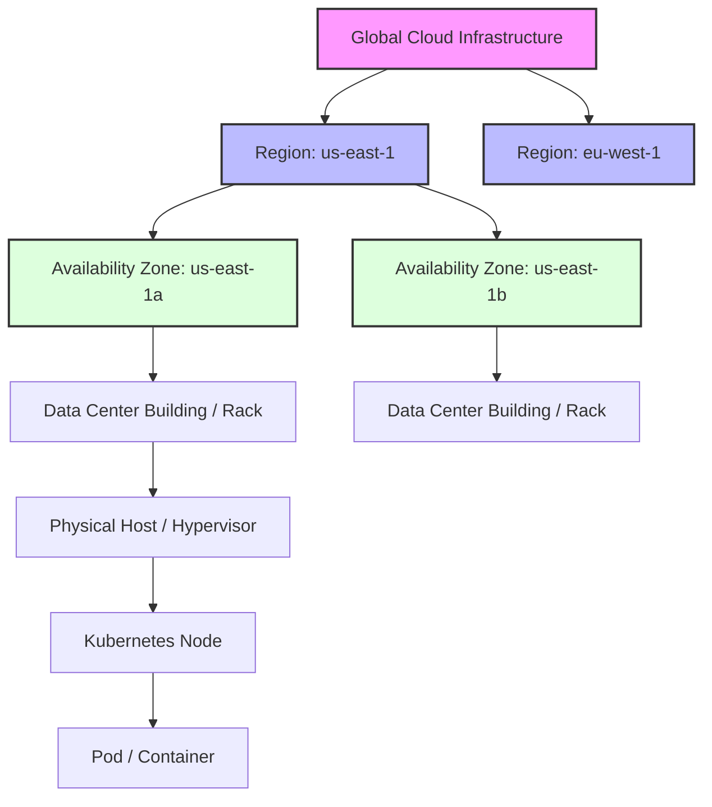
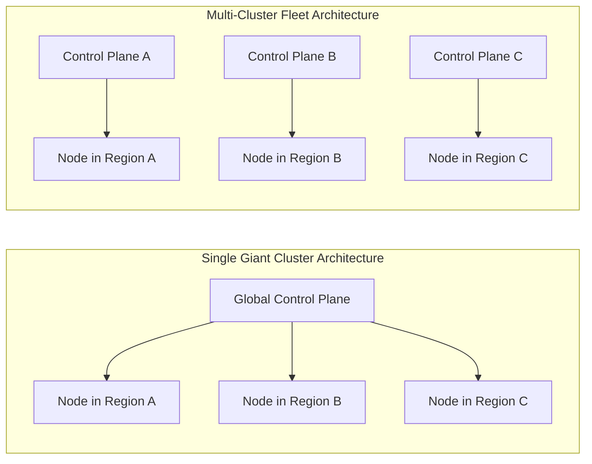
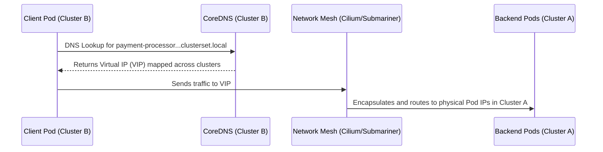
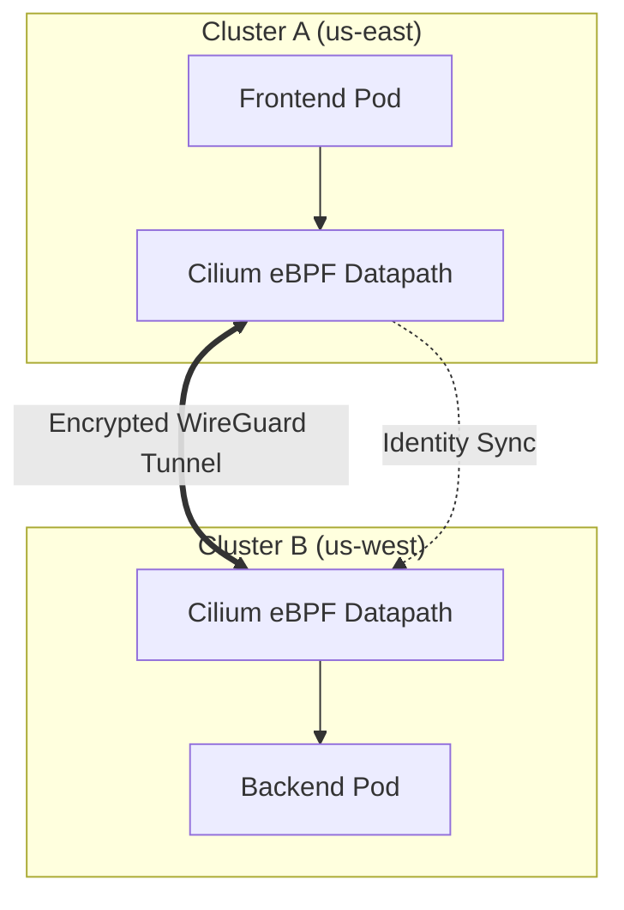
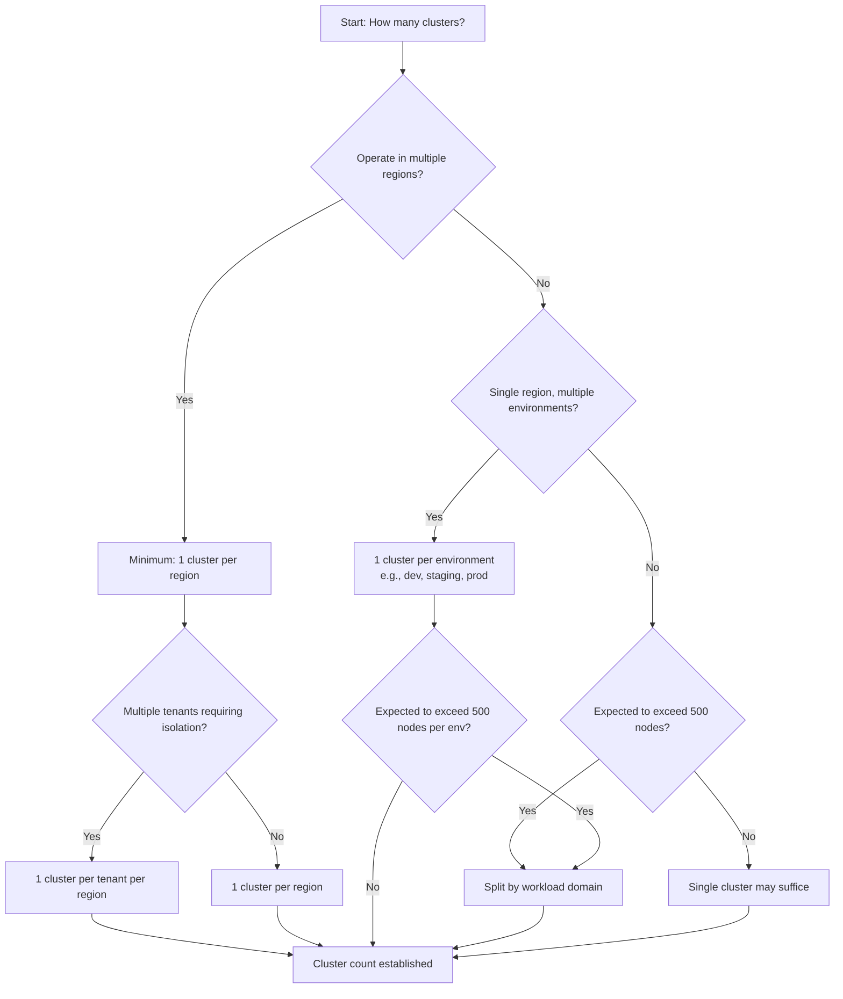

> **Complexity**: `[COMPLEX]`
>
> **Time to Complete**: 3 hours
>
> **Prerequisites**: [Module 4.1: Managed vs Self-Managed Kubernetes](../module-4.1-managed-vs-selfmanaged/)
>
> **Track**: Cloud Architecture Patterns

## What You'll Be Able to Do

After completing this module, you will be able to:

- **Design multi-cluster architectures for fault isolation, regulatory compliance, and team autonomy across regions**
- **Implement cross-cluster service discovery and traffic routing using service mesh or DNS-based approaches**
- **Configure cluster federation patterns for workload placement, failover, and capacity management**
- **Evaluate single-cluster vs multi-cluster tradeoffs for latency, blast radius, and operational complexity**
- **Diagnose network partitions and state synchronization issues in geographically distributed Kubernetes fleets**

---

## Why This Module Matters

Hypothetical scenario: a platform team pushes a bad routing-control change that removes reachability for every region at once because the fleet shares one global network dependency. The teaching point is simple: a multi-region design should contain that mistake to one region or cell, not let it erase connectivity everywhere.

This module teaches you how to design architectures where that can't happen. You'll learn to think in failure domains, route traffic across regions, manage state across distance, and build systems where the worst-case scenario is a regional degradation -- not a global outage.

---

## Failure Domains: The Foundation of Multi-Cluster Design

Before you can design a multi-cluster architecture, you need to understand failure domains -- the boundaries within which a failure is contained.

Think of failure domains like bulkheads on a ship. A breach in one compartment doesn't sink the ship because the bulkheads contain the flooding. In cloud infrastructure, failure domains work the same way: a failure within one domain shouldn't propagate to others. 

In a Kubernetes environment, failure domains exist at multiple overlapping layers, spanning physical infrastructure, network topology, and logical control planes. To build truly resilient systems, an architect must ensure that no single point of failure can bridge multiple failure domains.

### The Cloud Failure Domain Hierarchy



When deploying a Kubernetes cluster, the control plane components (API server, controller manager, scheduler, and most importantly, etcd) dictate your logical failure domain. If the control plane fails, the entire cluster -- regardless of how many physical availability zones it spans -- becomes unmanageable. 

This introduces the concept of the **Blast Radius**. The blast radius defines the total number of systems, services, and users impacted if a specific failure domain goes offline. A single massive Kubernetes cluster spanning an entire organization has an organizational-level blast radius. A rogue controller, a malicious deployment, or a catastrophic etcd corruption will take down every workload.

### How Each Cloud Provider Defines Failure Domains

The failure-domain hierarchy takes different shapes on each major cloud provider, and understanding these differences is central to designing reliable multi-cluster architectures.

**AWS** structures its infrastructure into Regions (geographically isolated areas, e.g., `us-east-1`) and Availability Zones (distinct data centers within a region, e.g., `us-east-1a` through `us-east-1f`). An EKS control plane runs across multiple AZs within a single region, providing built-in control-plane redundancy at the regional level. AWS also offers Local Zones -- extensions of a region that place compute closer to end-users in metropolitan areas -- and these can run worker nodes for ultra-low-latency workloads, but their failure-domain relationship to the parent region is tighter than a full AZ. An EKS control plane always lives within the region proper; it cannot be stretched across regions.

**GCP** organizes its global cloud infrastructure around Regions and Zones, offering operators a foundational architectural choice between zonal and regional GKE cluster configurations. Engineering teams frequently evaluate these deployment options based on availability requirements, operational blast radius, and resource footprints across staging and production fleets. The architectural distinction also intersects with Google Cloud's cluster management fee and free-tier credits, prompting teams to weigh cost controls against resilience requirements before provisioning managed control planes.

**Pause and predict:** Does a GKE zonal control plane survive a single-zone outage the same way a regional control plane does? How do their underlying control-plane architectures differ during a localized data center failure?

<details>
<summary>Check your prediction</summary>

A GKE zonal control plane runs entirely within a single zone and becomes completely unavailable if that specific zone experiences an outage. In contrast, a regional control plane replicates the Kubernetes API server and etcd quorum across three distinct zones within the region, ensuring the control plane survives a single-zone outage and remains fully operational. Furthermore, GKE Autopilot clusters are always provisioned as regional control planes to enforce high availability by default. While every GKE cluster incurs a standard $0.10/hour management fee, Google provides a monthly billing credit ($74.40) that offsets one zonal Standard or Autopilot cluster per billing account, but this credit does not cover regional Standard clusters.
</details>

Evaluating control plane survivability within a single cloud provider demonstrates how blast radius boundaries depend heavily on underlying topological configurations. This architectural divergence between single-zone and multi-zone control plane placements becomes equally critical when examining Microsoft Azure's deployment tiers and regional availability guarantees.

**Azure** operates with Regions and Availability Zones across its global footprint, incorporating specialized constructs such as region pairs for cross-geography disaster recovery prioritization. Platform teams architecting on Azure Kubernetes Service must navigate distinct commercial tiers, availability zone settings, and workload scaling thresholds when establishing cluster baselines across enterprise subscriptions. Selecting the appropriate tier and zone configuration directly governs whether a control plane can withstand infrastructure disruptions.

**Pause and predict:** Does the AKS Free tier provide the same financially backed SLA as the Standard tier? Furthermore, does a default AKS cluster deployment automatically distribute its control plane across multiple availability zones?

<details>
<summary>Check your prediction</summary>

The AKS Free tier does not provide a financially backed uptime SLA, whereas the Standard tier includes a financially backed 99.95% uptime SLA (or 99.9% without availability zones) for the control plane. In addition, a default AKS deployment without explicit availability zone configuration provisions a single-zone control plane, leaving it vulnerable to zonal outages. The Free tier is restricted to experimentation and lightweight environments with a recommended maximum of 10 nodes, whereas production enterprise workloads require the Standard or Premium tier with explicit availability zone distribution.
</details>

Understanding how cloud providers structure their managed control plane guarantees highlights the distinction between physical infrastructure isolation and logical cluster resilience. Even when an infrastructure team deploys worker compute instances across multiple physical failure domains, underlying state storage placement can still dictate the true operational survival of the environment.

**Pause and predict:** An Availability Zone suffers an unexpected catastrophic failure in a multi-zone environment. If a Kubernetes cluster has worker nodes distributed across three AZs, but its entire etcd quorum resides within the failed AZ, what happens to ongoing operations?

<details>
<summary>Check your prediction</summary>

Because the entire etcd quorum resides in the failed Availability Zone, etcd immediately loses quorum and the Kubernetes control plane transitions into an unmanageable, non-writable state. While existing pods on surviving worker nodes across the other two AZs may keep running and serving existing connections for a time, all operations requiring control plane writes—such as scheduling new pods, replacing crashed pods, updating service endpoints, and executing rolling deployments—stall completely until etcd quorum is restored.
</details>

This architectural failure mode illustrates why a single Kubernetes control plane represents a unified logical failure domain regardless of physical worker node distribution. While regional managed offerings automate control plane distribution across multiple availability zones, a single cluster remains vulnerable to shared logical failure modes. Misconfigured admission webhooks, broken cluster-wide NetworkPolicies, and runaway operators can still degrade workloads across every zone simultaneously.

Failure domains compound in ways that are not always intuitive. A pod running in `us-east-1a` with its PersistentVolume in `us-east-1b` has a failure domain that is the intersection of two zones: either zone failing can break the workload, even though the cluster itself spans three zones. Similarly, a deployment whose PodDisruptionBudget permits only one unavailable replica, spread across two zones, becomes fully unavailable when both zones experience even a brief blip simultaneously. Designing for failure domains means ensuring that every dependency chain -- from the pod, to its volume, to its service endpoint, to its external API dependency -- can survive the loss of any single domain in the hierarchy without cascading into an outage. The discipline is to draw the dependency graph for each critical workload, highlight every node that lives in a specific failure domain, and verify that no single domain's failure can sever all paths through the graph.

---

## Evaluating Tradeoffs: Single Giant Cluster vs. Many Smaller Clusters

The most fundamental architectural decision you will make in modern platform engineering is selecting your cluster scaling strategy. Should you build one massive, multi-tenant cluster, or should you provision dozens (or hundreds) of smaller, purpose-built clusters?

### The Single Giant Cluster

In the early days of Kubernetes, organizations defaulted to building a single, monolithic cluster. The logic was sound: managing one control plane is easier than managing twenty. You pay the cloud provider fee once. You install your monitoring agents, logging sidecars, and ingress controllers exactly once. 

However, as usage scales, the "Single Giant Cluster" anti-pattern emerges, revealing severe limitations:

1. **Scalability Ceilings**: [Kubernetes v1.35 officially supports up to 5,000 nodes and 150,000 pods](https://kubernetes.io/docs/setup/best-practices/cluster-large/). While these numbers seem massive, large enterprises hit these limits through microservice sprawl and aggressive auto-scaling.
2. **The "Noisy Neighbor" Problem**: A misconfigured deployment in one namespace can exhaust the API server's rate limits, starving other namespaces of control plane resources.
3. **Hard Multi-Tenancy is Difficult**: Kubernetes provides isolation controls, but strong tenant isolation in a shared cluster often still requires stronger boundaries than namespaces alone, and some use cases are better served by separate clusters.

### The Fleet Architecture (Multi-Cluster)

Modern architectures favor "Fleet Management" -- deploying many isolated clusters. This approach aligns with the **Cell-Based Architecture** pattern, where infrastructure is divided into self-contained, independent cells. 



#### Hypothetical scenario: A stretched control plane over a WAN

A platform team is tempted to stretch a single Kubernetes control plane across regions to chase global high availability, but that approach misunderstands how tightly the control plane depends on low-latency coordination.

A stretched control plane may appear to start correctly and then fail under real workload once etcd and the API server must coordinate across high-latency links.

etcd relies on the Raft consensus algorithm, requiring a strict quorum for every write operation. Raft requires extremely low-latency network connections (typically under 10 milliseconds) to maintain heartbeats and elect leaders. A transatlantic path between regions such as us-east-1 and eu-central-1 can exceed 90 milliseconds of round-trip latency. The etcd nodes miss heartbeats, assume the leader is dead, and initiate repeated leader elections. The cluster spends nearly all of its time trying to elect a leader and almost none of its time serving API requests.

**The Lesson:** In practice, you should not stretch a single Kubernetes control plane across a high-latency Wide Area Network (WAN). Multi-region deployments require multi-cluster architectures.

### Provider-Specific Scaling Ceilings and Practical Limits

While Kubernetes upstream tests to 5,000 nodes and 150,000 pods, each managed provider imposes its own constraints that shape how large a single cluster can practically grow before the fleet model becomes mandatory.

**EKS** does not publish a hard per-cluster node limit that differs from upstream Kubernetes, but practical ceilings emerge from the AWS VPC CNI architecture. Each pod receives a native VPC IP address, and each EC2 instance type has a fixed limit on Elastic Network Interfaces (ENIs) and IP addresses per ENI. For example, an `m5.large` supports 3 ENIs with 10 IPs each, capping the node at 29 pods (subtracting one for the ENI itself). Larger instances like `m5.16xlarge` support up to 737 pods. At cluster scale, you also face VPC CIDR exhaustion: a `/16` VPC provides 65,536 IP addresses, and with thousands of pods each consuming one, you can exhaust the entire subnet. EKS supports IPv6 and prefix delegation modes to mitigate this, but teams approaching 1,000+ nodes typically split into multiple clusters for operational manageability well before hitting the hard ceiling.

**GKE** sets a default node quota of 5,000 nodes per cluster, with GKE Dataplane V2 and Private Service Connect on regional clusters automatically supporting that scale. GKE can support up to 65,000 nodes with a quota increase through Google Cloud Support, but several constraints tighten the practical limit: the GKE API server has a finite API-server throughput ceiling, etcd storage grows with every object, and the kube-scheduler must evaluate every pod against every node. GKE Autopilot clusters abstract node management entirely and scale pods directly, but the control plane's API throughput ceiling still applies. Google's own guidance: if you plan to run more than 2,000 nodes, use a regional cluster.

**AKS** caps clusters at 5,000 nodes across all node pools, with a maximum of 1,000 nodes per individual node pool and up to 100 node pools per cluster. The Free tier is explicitly limited: a recommended maximum of 10 nodes, no SLA, and restricted API server inflight requests, making it categorically unsuitable for production. The Standard tier lifts these limits and provides the 99.95% SLA. Teams approaching the 5,000-node ceiling often face Azure API throttling and VM quota constraints across a subscription, which can be raised through support requests but require regional capacity planning. Notably, AKS supports both Kubenet and Azure CNI networking, with Azure CNI assigning VNet IP addresses directly to pods; running thousands of pods can exhaust VNet address space faster than anticipated, driving teams toward the fleet model for IP management alone.

### Tradeoff Comparison

| Architectural Dimension | Single Giant Cluster | Multi-Cluster Fleet |
| :--- | :--- | :--- |
| **Blast Radius** | Massive. One catastrophic failure takes down the entire organization. | Small. Failures are contained to specific regions, tenants, or environments. |
| **Operational Overhead** | Low initially, but becomes increasingly complex due to RBAC and policy conflicts. | High. Requires advanced GitOps tooling to manage fleet state consistently. |
| **Cost Efficiency** | High. Compute resources are shared and bin-packed efficiently. | Lower. Multiple control plane fees and duplicated system overhead (logging agents). |
| **Security/Compliance** | Soft isolation via Namespaces and NetworkPolicies. Fails strict PCI-DSS physical isolation requirements. | Hard isolation. Distinct control planes and separate physical nodes per tenant. |

---

## Cross-Cluster Service Discovery and Traffic Routing

When you adopt a multi-cluster architecture, a new challenge immediately arises: How does a microservice in Cluster A talk to a microservice in Cluster B?

In a single cluster, the internal DNS (CoreDNS) resolves `my-service.my-namespace.svc.cluster.local` seamlessly. When workloads span multiple clusters, that local DNS resolution boundary is broken. 

### Pattern 1: API Gateway and Ingress Chaining

The simplest approach is to treat external clusters as standard internet clients. Cluster A routes traffic out of its network, through the public internet or transit gateway, and into Cluster B's public Ingress Controller. 

While easy to implement, this pattern suffers from high latency, complex TLS certificate management, and a massive security footprint, as internal microservices are exposed via external ingress points.

### Pattern 2: Multi-Cluster Services (MCS) API

The Kubernetes Multi-Cluster Services (MCS) API is the modern, native standard for cross-cluster service discovery. It introduces two custom resources: [`ServiceExport` and `ServiceImport`](https://github.com/kubernetes/enhancements/tree/master/keps/sig-multicluster/1645-multi-cluster-services-api).

When you create a `ServiceExport` in Cluster A, a fleet controller automatically generates a corresponding `ServiceImport` in Cluster B. CoreDNS is then configured to resolve a new domain topology: `clusterset.local`.

```yaml
# Deployed in Cluster A (us-east)
apiVersion: multicluster.x-k8s.io/v1alpha1
kind: ServiceExport
metadata:
  name: payment-processor
  namespace: finance
---
# Automatically generated in Cluster B (us-west) by the MCS controller
apiVersion: multicluster.x-k8s.io/v1alpha1
kind: ServiceImport
metadata:
  name: payment-processor
  namespace: finance
spec:
  type: ClusterSetIP
  ports:
  - port: 8443
    protocol: TCP
```

A pod in Cluster B can now resolve `payment-processor.finance.svc.clusterset.local`. The MCS implementation (like GKE Multi-cluster Services or open-source Submariner) programs the underlying network to route the packets directly to the pod IPs in Cluster A, completely bypassing external ingress controllers.



**Pause and predict:** Suppose you export a service from Cluster A to Cluster B using the Multi-Cluster Services (MCS) API. If the physical WAN link connecting the two clusters drops completely, what will the endpoints in Cluster B resolve to, and what happens when client workloads attempt to communicate?

<details>
<summary>Check your prediction</summary>

Because the Multi-Cluster Services controller in Cluster B caches the `ServiceImport` resource, DNS resolution for `*.clusterset.local` continues to succeed and may still look completely healthy. However, because the underlying WAN link is down, network packets cannot reach the backend pods in Cluster A, causing client connection attempts to hang and fail with transport timeouts. Successful name resolution does not equal network reachability, making aggressive client timeouts, retry budgets, and circuit breakers strictly required in multi-cluster environments.
</details>

Relying exclusively on DNS-based discovery mechanisms leaves network failure handling and traffic failover entirely to individual application client implementations. To overcome these limitations and enforce uniform resilience policies, enterprise platform teams frequently adopt dedicated service mesh solutions that decouple routing logic from application code.

### Pattern 3: Multi-Cluster Service Mesh (Istio)

For advanced traffic routing (e.g., "route 80 percent of traffic locally, and 20 percent to the remote cluster"), architects rely on a Service Mesh like Istio. 

[In an Istio Multi-Primary architecture, each cluster runs its own Istio control plane. The control planes exchange endpoint discovery information securely. Envoy proxies inject themselves into every pod, intercepting outbound traffic and securely tunneling it via mutual TLS (mTLS) directly to the destination pod in the remote cluster.](https://istio.io/latest/docs/setup/install/multicluster/multi-primary/) 

This approach provides deep observability, zero-trust security, and advanced failure routing, but comes with significant operational complexity and resource overhead.

---

## Multi-Region Data and State Management

Stateless applications are easy to distribute across clusters. You simply deploy identical ReplicaSets to every region and let global DNS handle the load balancing. 

Stateful applications (databases, message queues, consensus stores) are incredibly difficult to distribute. The speed of light imposes a hard floor on latency. Synchronous data replication across regions requires waiting for the data to travel, be written, and be acknowledged before confirming the transaction to the user.

### Why Stateful Multi-Region Is Fundamentally Hard

To understand why distributing state across regions is so difficult, you need to understand the CAP theorem in practice. The CAP theorem states that a distributed data store can provide at most two of three guarantees: **C**onsistency (every read receives the most recent write), **A**vailability (every request receives a non-error response), and **P**artition tolerance (the system continues operating despite network partitions). In a multi-region deployment, network partitions are not hypothetical edge cases -- they are the expected operating condition. WAN links are inherently unreliable and high-latency. This means any multi-region stateful system must sacrifice either consistency or availability during a partition.

When teams choose synchronous replication (RPO = 0, zero data loss on failover), they are choosing consistency over availability during a partition: if the remote region cannot acknowledge the write, the local write is blocked. Application latency spikes to the round-trip time between regions -- typically 70 to 90 milliseconds between North America and Europe, and 120 to 180 milliseconds between either continent and Asia-Pacific. When teams choose asynchronous replication, they are choosing availability over strict consistency: local writes proceed instantly, but the remote copy may lag behind by seconds to minutes, meaning a failover can lose those un-replicated writes.

This latency penalty is why most organizations start with an active-passive architecture even when they aspire to active-active. The engineering effort required to make active-active work correctly -- handling write conflicts, managing distributed consensus, and tuning application code for high-latency writes -- is orders of magnitude larger than designing a reliable failover mechanism with asynchronous replication. Very few applications genuinely need active-active writes; most can tolerate a brief replication lag in exchange for dramatically simpler architecture and better write performance.

### Active-Active vs Active-Passive Architectures

1. **Active-Active (Synchronous)**: Writes can occur in any region and are immediately synchronized globally. This requires specialized, distributed SQL databases such as Google Cloud Spanner or CockroachDB, but they achieve coordination differently. Spanner uses TrueTime with atomic and GPS clocks to provide externally consistent global transactions, while CockroachDB uses Raft plus hybrid logical clocks (HLC) with ordinary clock synchronization rather than specialized hardware clocks. Both designs are highly resilient, but they still pay write-latency penalties when consensus spans distant regions.
2. **Active-Passive (Asynchronous)**: All writes are directed to a primary cluster (e.g., us-east). Data is asynchronously replicated to a standby cluster (e.g., eu-west). If the primary fails, the standby is promoted. This is vastly simpler to implement but introduces data loss risk (Recovery Point Objective > 0) during a hard failover.

### Cross-Cloud Replication: How Each Provider Handles State Durability

The specific mechanics of cross-region state replication differ substantially across cloud providers, and understanding these mechanics is essential for designing a multi-cluster data strategy.

**AWS** provides several building blocks for state durability across regions. Amazon RDS supports cross-region read replicas with asynchronous replication; you can promote a read replica to a standalone primary during a failover, accepting the replication lag as data loss. Amazon Aurora Global Database extends this with dedicated storage-layer replication that typically achieves under one second of lag and allows a cross-region failover in under one minute. For S3, Cross-Region Replication (CRR) asynchronously copies objects to a destination bucket in a different region, providing object-level durability. DynamoDB Global Tables offer active-active key-value storage with last-writer-wins conflict resolution across any number of regions, ideal for session stores and configuration data where eventual consistency is acceptable.

**GCP** leans on its global network backbone and Spanner for multi-region state. Cloud Spanner is a globally distributed, strongly consistent relational database that combines synchronous replication across regions with external-consistency guarantees using TrueTime atomic clocks. It is the only managed relational database that can provide active-active writes across continents without sacrificing consistency, but the per-node pricing reflects that capability. Cloud SQL supports cross-region read replicas with asynchronous replication, similar to RDS. For object storage, Cloud Storage offers dual-region and multi-region bucket locations that automatically replicate data across geographically dispersed data centers, providing a 99.95% availability SLA for Standard storage in those locations without requiring the user to configure replication policies.

**Azure** provides geo-redundant storage and database replication through several services. Azure SQL Database supports active geo-replication, which creates readable secondary databases in any Azure region with asynchronous replication. You can configure up to four secondaries and initiate a planned or unplanned failover. Cosmos DB, Azure's globally distributed multi-model database, can be configured for multi-region writes with configurable consistency levels ranging from strong to eventual -- a rare capability that lets you tune the CAP tradeoff per workload. Azure Storage offers geo-redundant storage (GRS) and read-access geo-redundant storage (RA-GRS) that asynchronously replicate data to a paired region hundreds of miles away, with Microsoft managing the failover process.

When deploying StatefulSets in a multi-cluster environment, they must be localized. Never attempt to stretch a single StatefulSet (like a Kafka cluster or a MongoDB replica set) across multiple Kubernetes clusters using cross-cluster networking unless the database engine explicitly supports high-latency WAN clustering. Instead, deploy separate StatefulSets in each cluster and utilize the database's native asynchronous replication tools to sync the state.

### Data Residency and Sovereignty

A dimension of multi-region data management that often overrides pure technical considerations is data residency and sovereignty. Regulations like GDPR (European Union), the Personal Data Protection Act (Singapore), and LGPD (Brazil) require that certain categories of data -- particularly personally identifiable information -- remain within specific geographic boundaries. This creates a hard architectural constraint: you cannot simply replicate all data to all regions.

Each cloud provider addresses this differently. AWS allows you to control which regions a resource replicates to through S3 bucket policies, RDS replica placement, and DynamoDB global table region selection, but the responsibility for compliance lies entirely with you -- AWS will replicate data wherever you instruct it to. GCP similarly provides region-pinning controls through organization policies and VPC Service Controls that can restrict data movement across perimeters. Azure offers Azure Policy with built-in definitions for allowed regions and data residency requirements, enforced through Azure Resource Manager.

In a multi-cluster Kubernetes architecture, data residency means you must treat each region's stateful workloads as sovereign. A database in `eu-west-1` may not replicate its contents to `us-east-1` if those contents contain European user data subject to GDPR. This constraint pushes architects toward a design where each region operates autonomously for stateful systems, with cross-region traffic limited to stateless services and aggregate telemetry.

---

## Fleet Management and GitOps

Managing one Kubernetes cluster via manual `kubectl apply` commands is risky. Managing fifty clusters manually is operational suicide. 

To maintain consistency, security, and predictability across a fleet, architects must adopt GitOps. The entire desired state of the fleet -- infrastructure, base configurations, and applications -- is defined declaratively in a Git repository. 

A GitOps controller, such as ArgoCD or Flux, runs in a dedicated management cluster (or locally within each cluster). It constantly monitors the Git repository. If the live state of a cluster diverges from the Git state, the controller automatically remediates the drift.

### The ArgoCD ApplicationSet Pattern

To deploy an application to multiple clusters simultaneously, modern GitOps relies on generators. [The ArgoCD `ApplicationSet` custom resource can dynamically generate deployment manifests for every cluster that matches a specific label constraint.](https://argo-cd.readthedocs.io/en/latest/operator-manual/applicationset/Generators-Cluster/)

```yaml
# Deployed in the Management Cluster (v1.35 compliant API usage)
apiVersion: argoproj.io/v1alpha1
kind: ApplicationSet
metadata:
  name: global-frontend-deployment
  namespace: argocd
spec:
  generators:
  - clusters:
      selector:
        matchLabels:
          environment: production
          region: us-east
  template:
    metadata:
      name: '{{name}}-frontend'
    spec:
      project: default
      source:
        repoURL: https://github.com/kubedojo/frontend-app.git
        targetRevision: HEAD
        path: manifests/base
      destination:
        server: '{{server}}'
        namespace: frontend-prod
      syncPolicy:
        automated:
          prune: true
          selfHeal: true
```

In this architecture, scaling to a new region is trivial. You provision a new Kubernetes cluster, register it with the ArgoCD management plane, and assign the label `region: us-east`. The ApplicationSet controller detects the new cluster and then synchronizes the frontend application to it. Zero manual intervention required.

### Fleet-Wide Observability and the Cardinality Problem

A hidden cost of the fleet model is observability cardinality. In a single cluster, your Prometheus instance scrapes metrics from every pod and node in one place. With 50 clusters, you have 50 separate Prometheus instances generating metrics, and the total number of unique time series multiplies by at least the number of clusters.

This creates two related problems. First, the total volume of metrics data can overwhelm a centralized observability platform. Second, and more insidiously, the cardinality of label combinations can explode: if every cluster adds a `cluster="prod-us-east-1"` label to every metric, and you have 50 such clusters, queries that aggregate across all clusters must process 50 times the label combinations. Thanos and Grafana Mimir address this with deduplication, downsampling, and global query views that federate across per-cluster Prometheus instances without ingesting every raw data point into a single store. Cortex offers a similar horizontally scalable architecture. The operational rule is straightforward: never send raw, high-cardinality metrics from every cluster to a single, unscaled Prometheus instance -- you will exceed its memory and disk capacity quickly.

### Fleet-Wide Upgrade Strategy: The Rolling Wave

A fleet of clusters creates a new operational challenge that does not exist in a single-cluster world: orchestrating Kubernetes version upgrades across dozens or hundreds of clusters without disrupting workloads and without requiring an army of engineers to shepherd each upgrade manually. The standard approach is a rolling-wave upgrade, where clusters are divided into cohorts that upgrade at staggered intervals.

The first cohort -- often labeled "canary" or "early-adopter" -- contains non-production clusters such as development and staging environments. These clusters upgrade first, typically within days of a new Kubernetes minor version becoming available on the managed provider. The platform team monitors these clusters for API deprecation warnings, controller compatibility issues, and workload regressions. The second cohort contains low-risk production clusters: internal tools, batch processing, and non-customer-facing services. These upgrade one to two weeks after the canary cohort, once the platform team has confirmed that the new version does not introduce breaking changes. The third and final cohort contains customer-facing production clusters, which upgrade two to four weeks after the initial release, after both the canary and low-risk cohorts have demonstrated stability.

This rolling-wave pattern is implemented through GitOps. The desired Kubernetes version for each cluster is declared in its cluster definition in Git, and the fleet management controller reconciles that version against the cloud provider API. Upgrading a cohort is a single pull request that bumps the version number for every cluster in that cohort's directory. The controller handles the upgrade sequencing -- control plane first, then node pools -- and the platform team monitors the fleet's health through centralized dashboards rather than logging into individual clusters. Without this automation, a 50-cluster fleet would require an engineer to run 50 separate upgrade commands, each with a 30-minute control-plane upgrade window, totaling over 25 hours of sequential manual work for a single minor version bump.

---

## Network Architecture: Connecting Clusters

To enable native pod-to-pod communication across clusters (bypassing ingress gateways), the underlying cluster networks must be peered. 

### IP Address Management (IPAM) Collisions

The most frequent architectural failure in multi-cluster networking is overlapping CIDR blocks. When provisioning a cluster, you must define the Pod CIDR (the IP range assigned to containers) and the Service CIDR (the IP range assigned to ClusterIP services).

If Cluster A uses `10.0.0.0/16` for pods, and Cluster B uses `10.0.0.0/16` for pods, they can never be peered. A router receiving a packet destined for `10.0.5.5` will not know which cluster holds the destination pod.

Before deploying a fleet, you must establish an enterprise IPAM registry, ensuring every cluster receives a globally unique, non-overlapping subnet. The three major cloud providers each offer tools to help with this. AWS provides VPC IP Address Manager (IPAM), which can automatically allocate non-overlapping CIDR blocks across multiple VPCs in an organization, tracking usage and preventing collisions. GCP offers Shared VPC, which lets you create a single VPC with subnets used by multiple projects, ensuring globally unique subnet assignment from a central network administration point. Azure provides Virtual Network Manager, which can manage IP address allocation across multiple VNets in a hub-and-spoke topology, though IPAM itself is less centralized than the AWS and GCP equivalents -- careful manual planning or Infrastructure as Code validation step is still typically required.

### Cilium Cluster Mesh

Multi-cluster networking support varies by CNI implementation; some deployments rely on separate tooling, while products such as Cilium provide explicit cluster-mesh features.

Cilium Cluster Mesh securely connects multiple Kubernetes clusters into a single unified network routing plane. By exchanging endpoint identity data securely between control planes, a pod in Cluster A can address a pod in Cluster B by its direct IP address, and Cilium will handle the cross-cluster routing, network policy enforcement, and encryption transparently via IPsec or WireGuard tunnels.



Cilium Cluster Mesh requires that every cluster in the mesh has non-overlapping Pod CIDRs -- the IPAM planning step is therefore a hard prerequisite, not a nice-to-have. The mesh also exchanges Kubernetes Services identities, allowing a `ClusterIP` service in one cluster to be reachable by its IP from another cluster without any additional service-export configuration. Cilium enforces network policies across clusters: a `CiliumNetworkPolicy` can restrict which remote-cluster pods are allowed to communicate, extending zero-trust security to cross-cluster traffic.

---

## Cost Lens: The Financial Reality of Multi-Cluster Architectures

Architectural decisions have direct financial consequences that are easy to underestimate during the design phase. A multi-cluster fleet multiplies several cost dimensions that are negligible in a single-cluster deployment.

### Per-Cluster Control Plane Fees

The most visible cost is the per-cluster control plane fee, which varies by provider and tier.

| Provider | Tier | Cost per Hour | Approximate Annual (per cluster) |
| :--- | :--- | :--- | :--- |
| EKS | Standard | $0.10 | $876 |
| GKE | Zonal Standard | $0.10 (one free-tier credit can offset one zonal or Autopilot cluster per billing account) | $876 before credit |
| GKE | Regional Standard | $0.10 | $876 |
| GKE | Autopilot | $0.10 (one free-tier credit can offset one zonal or Autopilot cluster per billing account) | $876 before credit |
| AKS | Free tier | $0.00 | $0 |
| AKS | Standard tier | $0.10 | $876 |
| AKS | Premium (LTS) | $0.60 | $5,256 |

At 10 clusters, these fees alone range from $0 for AKS Free development clusters to $52,560 for AKS Premium LTS, with GKE/EKS/AKS Standard fleets landing around $7,884 to $8,760 after any single GKE free-tier credit is applied. At 50 clusters -- not unusual for a large enterprise with per-region, per-environment, and per-tenant clusters -- there is no $0 GKE fleet option: GKE, EKS, and AKS Standard are roughly $43,800 annually before credits, while one GKE credit reduces only one zonal or Autopilot cluster's monthly management fee. These numbers highlight why many large organizations invest in Cluster API to self-manage control planes when fleet size makes managed fees the dominant budget line.

### Cross-Region Data Transfer (Egress)

A cost that surprises nearly every team transitioning to multi-region architectures is cross-region data transfer -- money charged for data leaving one region and arriving in another.

**AWS** charges data transfer out to the internet and between regions. Inter-region data transfer within the same continent (e.g., `us-east-1` to `us-east-2`) is typically $0.01 to $0.02 per GB. Transfer between continents (e.g., `us-east-1` to `eu-west-1`) can reach $0.02 to $0.05 per GB or higher. A chatty logging pipeline shipping 500 GB of telemetry per day from `us-east-1` to `eu-west-1` costs roughly $450 to $750 per month in data transfer alone. The architectural fix: aggregate and compress telemetry locally, ship only aggregates across regions, or use a SaaS observability platform that handles cross-region data transfer within its own pricing.

**GCP** charges for data transfer between zones and regions, with rates varying by source and destination. Inter-region egress within North America is $0.01 per GB. Egress from North America to Europe is $0.02 per GB. GCP's network pricing is typically lower than AWS for equivalent paths, but the same architectural principle applies: minimize cross-region chatter to control costs. GKE clusters in different regions connected via Cloud Interconnect or VPN incur those tunnel costs in addition to per-GB transfer fees.

**Azure** charges for outbound data transfer (egress) from Azure regions, with inter-region rates within the same continent around $0.02 per GB. Transfer between continents varies by specific regions. Azure also charges for VNet peering traffic across regions, which applies to multi-cluster networking designs using Azure CNI and cross-region VNet peering -- unlike intra-region VNet peering, which charges only for ingress and egress within the peered networks. For an AKS multi-cluster mesh, both the cross-region VNet peering cost and the data transfer cost apply, making cross-region pod-to-pod traffic on Azure one of the most expensive multi-cluster networking options.

### Observability and Logging Costs

Each additional cluster generates its own stream of logs, metrics, and traces. CloudWatch (AWS) charges per GB ingested and stored; Cloud Logging (GCP) charges per GiB ingested after the free monthly allocation; Azure Monitor charges per GB ingested and per metric time series. With 20 clusters, you are paying for 20 independent streams of control plane audit logs, kubelet logs, container stdout/stderr, and Prometheus metrics. The monthly observability bill for a multi-cluster fleet can easily exceed the control plane fees. Architecturally, this means you must treat observability data as a cost center and invest in sampling, aggregation, retention tiering, and log reduction before the fleet scales beyond three to five clusters.

A practical observability architecture for multi-cluster fleets separates signals by retention value and query latency requirements. Control plane audit logs and security-relevant events route to a centralized, long-retention store with strict access controls. Application logs stay local to each cluster for fast debugging but stream aggregated error rates and anomaly signals to a fleet-wide dashboard rather than shipping every raw log line. Prometheus metrics follow a hierarchical federation model: each cluster runs a local Prometheus scraping its own workloads, a fleet-level Prometheus (or Thanos querier) pulls aggregated series from each cluster at a coarser resolution, and only incident-response drill-downs query the full-resolution per-cluster data. This tiered approach keeps the observability budget predictable while preserving the ability to answer detailed questions when latency and cost are less critical than precision.

---

## Patterns and Anti-Patterns

Multi-cluster architecture decisions shape your operational reality for years. These patterns represent proven approaches; the anti-patterns represent traps that teams repeatedly fall into.

### Proven Patterns

| Pattern | Description | When to Use | Scaling Note |
| :--- | :--- | :--- | :--- |
| **Cell-Based Architecture** | Divide infrastructure into self-contained cells, each running a dedicated Kubernetes cluster with its own control plane, networking, and state. A cell typically maps to a failure domain such as an AWS AZ or GCP zone. | Any multi-tenant platform where blast-radius isolation is a hard requirement. | Cell size should be determined by the maximum acceptable blast radius, not by cluster capacity limits. A cell might hold 50 nodes serving 5 teams, or 500 nodes serving one massive workload. |
| **Hub-and-Spoke Fleet Management** | A dedicated management cluster (hub) runs GitOps controllers, observability aggregation, and policy engines. Workload clusters (spokes) run customer applications and register with the hub for lifecycle management. | Fleets of 5 or more clusters where centralized visibility and policy enforcement matter. | The hub cluster must be highly available -- a hub failure doesn't stop running workloads but blocks deployments and drift remediation across the fleet. Run the hub as a regional cluster on a managed service. |
| **Regional Sharding** | Deploy one cluster per cloud region, with all workloads in that region running on the regional cluster. Cross-region failover happens at the DNS or global load-balancer layer, not at the Kubernetes layer. | Workloads that are regionally scoped with clear data-residency boundaries. | This pattern naturally aligns with data-sovereignty requirements and avoids the latency penalties of stretched clusters. It forces you to design stateless, horizontally scalable services. |

### Common Anti-Patterns

| Anti-Pattern | What Goes Wrong | Why Teams Fall Into It | Better Approach |
| :--- | :--- | :--- | :--- |
| **One Cluster Spanning Multiple Regions** | etcd quorum fails under WAN latency, API server becomes unresponsive, and the cluster is effectively dead. | The appeal of a single management surface is strong, and "Kubernetes is distributed, so it should handle distance" is a seductive fallacy. | One cluster per region, with global DNS or a multi-cluster ingress controller directing traffic. |
| **Manual Kubeconfig Sprawl** | Engineers maintain dozens of kubeconfig files on their laptops, context-switch manually, and accidentally apply manifests to the wrong cluster. | The first two or three clusters feel manageable with `kubectl config use-context`. By cluster ten, nobody knows which context is current. | ArgoCD or Flux with cluster-registration automation. Engineers interact with Git, not with `kubectl`. |
| **No IPAM Plan Before Fleet Growth** | Clusters are provisioned with default or auto-assigned CIDRs that overlap, blocking any attempt to peer networks later. | CIDR planning feels like premature optimization when you only have two clusters. | Establish an IPAM registry from cluster one. Assign each cluster a globally unique `/16` or `/14` for pods and a unique `/16` for services, even if the first cluster only uses a fraction of that space. |
| **Treating Every Cluster as Identical** | A fleet of "cookie-cutter" clusters ignores that edge clusters, GPU clusters, and compliance-scoped clusters have fundamentally different node profiles, security postures, and upgrade cadences. | Standardization is genuinely valuable, but it is applied without variance. | Define a small set of cluster profiles (e.g., `production-standard`, `production-gpu`, `edge-lightweight`, `compliance-restricted`) and enforce each profile through Cluster API templates or GitOps overlays. |
| **Synchronous Replication for All State** | Every database is configured for synchronous cross-region replication, crushing write performance under transcontinental latency. | "Zero data loss" sounds non-negotiable during design reviews. | Reserve synchronous replication for the tiny subset of state that genuinely cannot tolerate any data loss during failover. Everything else uses asynchronous replication with a measured, accepted RPO. |

---

## Decision Framework: Choosing Your Multi-Cluster Strategy

Architectural decisions in multi-cluster design are multidimensional. The framework below guides you through the key decisions in a structured order, from the most fundamental (single vs multi) to the operational (control plane placement and cluster count).

### Decision 1: Single Cluster vs. Multi-Cluster

Answer these four questions. If you answer "yes" to any of them, you need a multi-cluster architecture.

1. **Do you operate in multiple geographic regions?** Stretching a single Kubernetes control plane across regions fails under WAN latency. You need at least one cluster per region.
2. **Does your compliance framework require physical workload isolation?** Standards like PCI-DSS, HIPAA, and FedRAMP interpret "physical separation" as separate infrastructure, not just separate namespaces.
3. **Do multiple teams need strong autonomy over their own cluster lifecycle?** If Team A's upgrade testing blocks Team B's deployment schedule, separate clusters eliminate that coupling.
4. **Does your organization exceed the practical scaling limits of a single cluster?** The upstream Kubernetes ceiling is 5,000 nodes and 150,000 pods, but API server throughput, etcd write pressure, and operational toil typically become painful well before those limits.

### Decision 2: How Many Clusters and What Scope?



A practical rule of thumb: start with one production cluster per region and one non-production cluster per region, for a total of `2N` clusters where `N` is the number of regions. Add tenant-scoped clusters only when compliance or blast-radius requirements demand them. Add edge or specialized clusters when hardware or latency profiles diverge meaningfully from the standard.

### Decision 3: Regional vs. Zonal Control Plane

| Factor | Regional Control Plane (GKE, EKS, AKS Standard) | Zonal Control Plane (GKE) |
| :--- | :--- | :--- |
| **Single-zone failure tolerance** | Full -- control plane survives zone loss | None -- control plane unavailable until zone recovers |
| **Cost** | $0.10/hr (GKE Regional, EKS, AKS Standard) | $0.10/hr, with one GKE free-tier credit that can offset one zonal or Autopilot cluster per billing account |
| **API server latency** | Slightly higher (cross-zone coordination) | Lower (single-zone) |
| **Recommended for** | Production workloads, any SLA-backed service | Development, staging, batch processing, CI/CD |

If the workload requires an uptime SLA, use a regional control plane. If the workload is stateless, restartable, and tolerant of control-plane downtime (e.g., a CI/CD runner fleet, a batch processing cluster, a development sandbox), a zonal control plane can be a legitimate availability tradeoff, and the GKE free-tier credit may offset one such cluster's management fee per billing account. On EKS and AKS Standard tier, the control plane is always regional and priced accordingly.

---

## Did You Know?

- A single global edge configuration push can remove a large share of serving capacity when every point of presence accepts the same bad state at once, underscoring why mature edge and multi-cluster platforms stage rollouts by cell or region.
- The Multi-Cluster Services (MCS) API defines `ServiceExport`, `ServiceImport`, and the `clusterset.local` DNS model for cross-cluster service discovery.
- Operating a multi-cluster fleet increases baseline infrastructure costs significantly; managing redundant control planes on cloud providers like EKS or GKE can add [approximately $850 per cluster annually in baseline fees alone](https://cloud.google.com/kubernetes-engine/pricing), before computing resources are consumed.
- Kubernetes scalability limits officially test up to 5,000 nodes and 150,000 pods per cluster. However, organizations with massive scale adopt multi-cluster architectures long before hitting physical compute limits to mitigate configuration sprawl and strict network policy constraints.

---

## Common Mistakes

| Mistake | Why | Fix |
| :--- | :--- | :--- |
| Stretching a single cluster across a WAN | etcd consensus is sensitive to inter-member latency. WAN links can trigger repeated elections and make the control plane unstable or unusable. | Provision dedicated, autonomous control planes for each physical region and utilize federation logic for higher-level orchestration. |
| Overlapping Pod/Service CIDRs | If you later decide to peer cluster networks using a CNI mesh or VPC peering, overlapping IP ranges cause unresolvable network collisions. | Implement a strict IP Address Management (IPAM) registry to assign globally unique CIDRs per cluster during infrastructure provisioning. |
| Hardcoding external IPs for cluster-to-cluster traffic | Ephemeral external IPs change upon service recreation, leading to brittle cross-cluster dependencies that break silently. | Utilize the Multi-Cluster Services (MCS) API or a dedicated Service Mesh to manage dynamic service discovery and virtual IPs. |
| Manual application deployments across the fleet | Humans making manual `kubectl apply` calls across dozens of clusters inevitably make typos, resulting in configuration drift and unpredictable failover. | Implement a GitOps control plane (like ArgoCD ApplicationSets or Flux) to enforce consistent state across the entire fleet declaratively. |
| Synchronous database replication across regions | The speed of light imposes rigid latency floors. Synchronous writes across oceans will destroy application performance and throughput. | Architect applications for asynchronous multi-region replication, or design regional active-passive data silos. |
| Ignoring cross-region data transfer egress costs | [Cloud providers charge heavily for data leaving a region. Chatty microservices spanning regions will generate massive, unexpected cloud bills.](https://aws.amazon.com/blogs/architecture/overview-of-data-transfer-costs-for-common-architectures/) | Constrain highly communicative microservices to the same cluster/region. Only send aggregated telemetry or critical state updates across the WAN. |
| Failing to test regional failover capacity | Assuming a secondary region can handle failover traffic without load testing often results in cascading failures when the secondary cluster is overwhelmed. | Implement routine chaos engineering; proactively drain production clusters to validate failover capacity and load balancing logic. |
| Neglecting data residency constraints | Replicating user data across regions can violate GDPR, LGPD, or other data-sovereignty regulations that mandate data stays within a specific geographic boundary. | Map data residency requirements before designing replication topologies. Use cloud-provider policy controls (AWS Organizations SCPs, GCP VPC Service Controls, Azure Policy) to enforce allowed regions. |

---

## Knowledge Check

Test your understanding of multi-cluster architectures with these scenario-based questions.

<details>
<summary><strong>Question 1: The Multi-Cluster Latency Dilemma</strong></summary>

**Scenario:**
You are designing a high-frequency trading application that spans AWS `us-east-1` and `eu-west-1`. You decide to deploy a single Kubernetes v1.35 cluster with control plane nodes distributed evenly across both regions to ensure the control plane survives if one region goes offline. After deployment, your API server continuously times out, and no pods can be scheduled.

**What is the architectural flaw in this design?**

A. The Kubernetes scheduler cannot assign pods across regions without the `multicluster.kubernetes.io/topology` flag enabled.
B. etcd relies on the Raft consensus algorithm which requires strict, low-latency network connections; the transatlantic latency prevents quorum.
C. The kubelet in `eu-west-1` requires a dedicated NAT gateway to communicate with the API server in `us-east-1`.
D. Cross-region clusters require the Multi-Cluster Services API to be installed before the control plane can initialize.

**Answer:**
B. etcd relies on the Raft consensus algorithm which requires strict, low-latency network connections; the transatlantic latency prevents quorum.

**Explanation:**
The foundation of a Kubernetes cluster is the etcd key-value store, which uses the Raft algorithm to maintain state consistency. Raft requires constant heartbeat messages between nodes to maintain leadership and commit writes. If network latency exceeds a few milliseconds (which is physically unavoidable across oceans), etcd nodes will miss heartbeats, assume the leader has failed, and trigger endless leader elections. This renders the entire control plane unresponsive. You should not stretch a single etcd quorum across a high-latency WAN.
</details>

<details>
<summary><strong>Question 2: Network Peering Collisions</strong></summary>

**Scenario:**
Your organization operates two autonomous Kubernetes clusters, `cluster-prod` and `cluster-analytics`. Both were provisioned with the default kubeadm Pod CIDR of `10.244.0.0/16`. You are now tasked with implementing Cilium Cluster Mesh to allow pods in `cluster-prod` to directly query database pods in `cluster-analytics`. You establish a VPN tunnel between the physical networks, but traffic between the pods fails to route.

**What is the root cause of the routing failure?**

A. Cilium Cluster Mesh requires IPSec encryption, which is blocked by default on most cloud provider VPNs.
B. The CoreDNS configuration in `cluster-prod` lacks the `clusterset.local` forwarding stub domain.
C. The overlapping Pod CIDRs cause unresolvable routing collisions, as the network cannot distinguish destination subnets.
D. The API server in `cluster-analytics` has not exposed a `ServiceExport` resource for the database.

**Answer:**
C. The overlapping Pod CIDRs cause unresolvable routing collisions, as the network cannot distinguish destination subnets.

**Explanation:**
For any two networks to exchange direct IP traffic, their subnet ranges must be distinct. When `cluster-prod` attempts to route a packet to a pod IP like `10.244.5.15` in `cluster-analytics`, the local networking stack in `cluster-prod` assumes the IP belongs to its own local network because the CIDR blocks overlap. In this setup, the packet is not forwarded across the VPN tunnel. Strict IP Address Management (IPAM) is a prerequisite for any multi-cluster networking implementation.
</details>

<details>
<summary><strong>Question 3: Managing Configuration Drift</strong></summary>

**Scenario:**
You manage a fleet of 50 edge Kubernetes clusters located in retail stores. An engineer manually runs `kubectl edit deployment/payment-gateway` on cluster #32 to hot-fix a critical bug, bypassing the standard deployment pipeline. A week later, a global failover event routes traffic from cluster #31 to cluster #32, and the application crashes due to a schema mismatch introduced by the hot-fix.

**Which architectural pattern would have proactively prevented this configuration drift?**

A. Implementing the Multi-Cluster Services (MCS) API.
B. Deploying a GitOps controller like ArgoCD configured with automated drift remediation and self-healing.
C. Configuring ExternalDNS to strictly weight traffic away from degraded clusters.
D. Using StatefulSets instead of Deployments for the payment gateway.

**Answer:**
B. Deploying a GitOps controller like ArgoCD configured with automated drift remediation and self-healing.

**Explanation:**
GitOps treats a Git repository as the single source of truth for the entire cluster fleet. When an engineer makes a manual out-of-band change via `kubectl edit`, the live state of the cluster diverges from the declared state in Git. A GitOps controller configured with self-healing continuously monitors for this drift. Within seconds of the manual edit, ArgoCD would detect the discrepancy, overwrite the manual changes, and force the cluster back into compliance with the Git repository, entirely eliminating configuration drift.
</details>

<details>
<summary><strong>Question 4: Service Discovery Boundaries</strong></summary>

**Scenario:**
You have deployed a frontend application in Cluster A and a backend API in Cluster B. The frontend application is configured to reach the backend by querying the DNS name `backend-api.finance.svc.cluster.local`. Both clusters are fully functional, but the frontend application repeatedly logs `NXDOMAIN` (Non-Existent Domain) errors.

**Why is the DNS resolution failing?**

A. The `.local` top-level domain is strictly reserved for physical node resolution, not pod resolution.
B. The backend application in Cluster B has not properly configured its readiness probes.
C. The `cluster.local` DNS suffix is bounded exclusively to the internal CoreDNS instance of the local cluster; it cannot resolve across failure domains.
D. The frontend pods lack the required RBAC permissions to query the Kubernetes API server in Cluster B.

**Answer:**
C. The `cluster.local` DNS suffix is bounded exclusively to the internal CoreDNS instance of the local cluster; it cannot resolve across failure domains.

**Explanation:**
By design, the CoreDNS instance running within a Kubernetes cluster is authoritative only for services existing within that specific cluster. The suffix `svc.cluster.local` represents a hard logical boundary. To resolve services across clusters, you must implement a cross-cluster discovery mechanism, such as the Multi-Cluster Services (MCS) API, which provisions a new, distinct top-level domain (typically `clusterset.local`) designed specifically for global resolution.
</details>

<details>
<summary><strong>Question 5: Active-Passive Stateful Constraints</strong></summary>

**Scenario:**
You are migrating a monolithic Postgres database to a multi-cluster Kubernetes architecture spanning New York and London. Business requirements dictate zero data loss (RPO = 0) during a regional failure. You configure synchronous replication between the primary database in New York and the replica in London. Immediately after deployment, application latency spikes, and users complain about extreme sluggishness during checkout operations.

**Evaluate the tradeoff made in this architecture.**

A. The system traded network bandwidth for high availability, overwhelming the CNI overlay.
B. The system traded write performance (latency) for strict data consistency across a massive geographic distance.
C. The system traded pod density for compute isolation, starving the database of memory.
D. The system traded DNS resolution speed for cross-cluster security encapsulation.

**Answer:**
B. The system traded write performance (latency) for strict data consistency across a massive geographic distance.

**Explanation:**
Synchronous replication requires that every transaction committed to the primary database must travel across the network to the secondary database, be written to disk, and send an acknowledgment back before the application considers the transaction complete. The speed of light dictates that a round-trip packet between New York and London takes roughly 70 to 90 milliseconds. By enforcing synchronous replication (RPO = 0) across a high-latency WAN, you have injected severe delay into most latency-sensitive database writes, seriously degrading application performance.
</details>

<details>
<summary><strong>Question 6: Managing Egress Costs</strong></summary>

**Scenario:**
You deploy a highly communicative microservices architecture across two distinct cloud regions, connected via a managed transit gateway. Microservice Alpha (us-east) makes hundreds of API calls per second to Microservice Beta (us-west) to validate session tokens. At the end of the month, your cloud provider bill has skyrocketed by several thousand dollars, specifically under the line item "Data Transfer Out."

**What architectural principle was violated in this design?**

A. Stateful workloads were placed on ephemeral spot instances.
B. The blast radius of the architecture was contained too tightly.
C. Chatty, high-bandwidth communication paths were allowed to cross regional WAN boundaries, incurring massive egress costs.
D. The system failed to utilize ebpf-based load balancing for internal API calls.

**Answer:**
C. Chatty, high-bandwidth communication paths were allowed to cross regional WAN boundaries, incurring massive egress costs.

**Explanation:**
Cloud providers typically do not charge for data transfer between pods within the same Availability Zone. However, data leaving an Availability Zone -- and especially data leaving a Region (Data Transfer Out / Egress) -- is billed at a premium rate. Architecting a system where chatty microservices frequently communicate across regional boundaries is a major financial anti-pattern. Workloads with heavy interdependencies must be scheduled within the same cluster and region to avoid catastrophic billing surprises.
</details>

<details>
<summary><strong>Question 7: Data Residency and Multi-Cluster Design</strong></summary>

**Scenario:**
Your platform processes European user data subject to GDPR. You operate Kubernetes clusters in `eu-west-1` (Ireland) and `us-east-1` (Virginia). Your team proposes deploying a global CockroachDB cluster spanning both regions so that European and American users see the same application state in real time. The compliance team flags this as a GDPR violation.

**What specific architectural constraint does this design violate, and how should you restructure the architecture to comply?**

A. CockroachDB cannot run on Kubernetes; it must use dedicated VMs.
B. GDPR requires that personal data of European residents remain within the EU or an adequacy-approved jurisdiction unless specific safeguards are in place. A globally distributed database that replicates European user data to US nodes may violate data sovereignty requirements.
C. CockroachDB requires at least three regions for quorum; a two-region deployment is unsafe.
D. The `us-east-1` region does not support the encryption standards required by GDPR.

**Answer:**
B. GDPR requires that personal data of European residents remain within the EU or an adequacy-approved jurisdiction unless specific safeguards are in place. A globally distributed database that replicates European user data to US nodes may violate data sovereignty requirements.

**Explanation:**
Data residency and sovereignty regulations override purely technical replication designs. The correct architecture keeps European user data on clusters and databases within EU regions (e.g., `eu-west-1`) and American user data on clusters within US regions. The application tier can be stateless and globally distributed, but the state tier must be regionally scoped. If global application state is genuinely required, the data that crosses regions must be anonymized, aggregated, or pseudonymized so that it no longer qualifies as personal data under the regulation.
</details>

<details>
<summary><strong>Question 8: Zonal vs Regional Control Plane</strong></summary>

**Scenario:**
You run a GKE Autopilot cluster for a production customer-facing application with a strict 99.95% uptime SLA. Your cost optimization team suggests switching from Autopilot (regional control plane) to a zonal GKE Standard cluster to chase a lower-cost control-plane posture. You push back.

**What is the strongest architectural argument against using a zonal control plane for this workload?**

A. Zonal clusters cannot run more than 100 pods.
B. A zonal GKE control plane runs the API server and etcd within a single zone. If that zone fails, the control plane becomes unavailable, and while existing workloads may continue running, no new scheduling, scaling, or API operations can occur until the zone recovers -- which may take hours.
C. Zonal clusters cannot use Cloud CDN for ingress traffic.
D. Zonal clusters do not support GKE Dataplane V2.

**Answer:**
B. A zonal GKE control plane runs the API server and etcd within a single zone. If that zone fails, the control plane becomes unavailable, and while existing workloads may continue running, no new scheduling, scaling, or API operations can occur until the zone recovers -- which may take hours.

**Explanation:**
The fundamental architectural difference between zonal and regional GKE clusters is the control plane's failure domain. A zonal control plane lives in one zone and is vulnerable to that zone's failure. In a zone outage, the cluster continues running existing workloads because kubelets operate independently, but all control-plane operations -- deploying new pods, scaling, updating configurations, initiating rollbacks -- are blocked. A regional control plane replicates the API server and etcd across three zones, making it resilient to any single-zone failure. For any production workload with an uptime SLA, this resilience justifies paying for the regional control-plane posture instead of relying on zonal free-tier eligibility.
</details>

---

## Hands-On Exercise: Building a Multi-Cluster Fleet

In this exercise, you will deploy two isolated Kubernetes clusters locally, configure non-overlapping CIDR blocks, and deploy an application across both using GitOps principles.

<details>
<summary><strong>Task 1: Bootstrap Two Independent Clusters</strong></summary>

**Goal:** Create two distinct clusters using `kind` (Kubernetes IN Docker) with strict, non-overlapping Pod and Service CIDR ranges. Target version v1.35.

**Solution:**
Create a configuration file for Cluster 1 (us-east):
```yaml
# cluster1-config.yaml
kind: Cluster
apiVersion: kind.x-k8s.io/v1alpha4
name: us-east-cluster
networking:
  podSubnet: "10.10.0.0/16"
  serviceSubnet: "10.11.0.0/16"
```

Create a configuration file for Cluster 2 (us-west):
```yaml
# cluster2-config.yaml
kind: Cluster
apiVersion: kind.x-k8s.io/v1alpha4
name: us-west-cluster
networking:
  podSubnet: "10.20.0.0/16"
  serviceSubnet: "10.21.0.0/16"
```

Bootstrap the clusters:
```bash
kind create cluster --config cluster1-config.yaml --image kindest/node:v1.35.0
kind create cluster --config cluster2-config.yaml --image kindest/node:v1.35.0
```
Verify both contexts are available: `kubectl config get-contexts`
</details>

<details>
<summary><strong>Task 2: Configure Cross-Cluster Contexts</strong></summary>

**Goal:** Validate that you can issue commands seamlessly to both failure domains without mixing configurations.

**Solution:**
Set aliases for rapid context switching:
```bash
alias k-east="kubectl --context kind-us-east-cluster"
alias k-west="kubectl --context kind-us-west-cluster"
```
Verify the nodes and IP allocations:
```bash
k-east get nodes -o wide
k-west get nodes -o wide
```
Confirm that the internal IPs for the nodes fall into completely separate subnets, ensuring no collisions exist if a mesh were applied.
</details>

<details>
<summary><strong>Task 3: Install a GitOps Controller (ArgoCD)</strong></summary>

**Goal:** Transform the `us-east` cluster into a management plane by installing ArgoCD.

**Solution:**
```bash
k-east create namespace argocd
k-east apply -n argocd -f https://raw.githubusercontent.com/argoproj/argo-cd/stable/manifests/install.yaml
```
Wait for the pods to initialize:
```bash
k-east wait --for=condition=Ready pods --all -n argocd --timeout=300s
```
</details>

<details>
<summary><strong>Task 4: Register the Remote Cluster</strong></summary>

**Goal:** Add the `us-west` cluster to ArgoCD's management scope so it can deploy applications remotely.

**Solution:**
Extract the ArgoCD initial admin password:
```bash
k-east -n argocd get secret argocd-initial-admin-secret -o jsonpath="{.data.password}" | base64 -d
```
Port-forward the ArgoCD server (in a separate terminal):
```bash
k-east port-forward svc/argocd-server -n argocd 8080:443
```
Login using the ArgoCD CLI (assuming it is installed locally):
```bash
argocd login localhost:8080 --username admin --insecure
```
Add the `us-west` cluster context to ArgoCD. For kind, make sure both clusters share a Docker network and do not register the default host-only `https://127.0.0.1:<port>` endpoint from your local kubeconfig; the ArgoCD controller runs inside `us-east`, where that loopback address points back to itself. Register `us-west` with an address reachable from inside the management cluster, such as the west control-plane container IP or `host.docker.internal`:
```bash
argocd cluster add kind-us-west-cluster --server https://<west-control-plane-container-ip>:6443 --yes
```
</details>

<details>
<summary><strong>Task 5: Deploy a Cross-Cluster Application</strong></summary>

**Goal:** Use ArgoCD to deploy a basic Nginx web server simultaneously to both clusters.

**Solution:**
Create an application manifest that targets both clusters iteratively (simulating an ApplicationSet for simplicity in this lab):

```yaml
# multi-deploy.yaml
apiVersion: argoproj.io/v1alpha1
kind: Application
metadata:
  name: nginx-east
  namespace: argocd
spec:
  project: default
  source:
    repoURL: https://github.com/argoproj/argocd-example-apps.git
    targetRevision: HEAD
    path: guestbook
  destination:
    server: https://kubernetes.default.svc
    namespace: default
  syncPolicy:
    automated: {}
---
apiVersion: argoproj.io/v1alpha1
kind: Application
metadata:
  name: nginx-west
  namespace: argocd
spec:
  project: default
  source:
    repoURL: https://github.com/argoproj/argocd-example-apps.git
    targetRevision: HEAD
    path: guestbook
  destination:
    name: kind-us-west-cluster
    namespace: default
  syncPolicy:
    automated: {}
```
Apply the declarative configuration to the management cluster:
```bash
k-east apply -f multi-deploy.yaml
```
</details>

<details>
<summary><strong>Task 6: Validate and Test Failure Isolation</strong></summary>

**Goal:** Prove that the application is running in both clusters and test the blast radius containment by simulating a critical failure in `us-east`.

**Solution:**
Verify the pods are running in both clusters:
```bash
k-east get pods
k-west get pods
```
Simulate a catastrophic control plane failure in the primary region by stopping the Docker container running the `us-east` cluster:
```bash
docker stop us-east-cluster-control-plane
```
Attempt to query the `us-east` cluster:
```bash
k-east get pods # This will time out and fail.
```
Query the `us-west` cluster:
```bash
k-west get pods # The workloads continue running perfectly.
```
You have successfully demonstrated blast radius isolation. The failure domain was contained entirely to `us-east`.
</details>

Before finalizing a multi-cluster deployment topology or failover strategy, platform architects must systematically evaluate common cognitive traps regarding failure domains, cross-cluster service discovery, and cloud provider control-plane resilience. Auditing these failure layers ensures engineering teams avoid dangerous assumptions about cross-cluster availability, WAN partitions, and control-plane recovery mechanisms.

**Card A: A cluster with workers in three AZs stays writable if etcd was entirely in the failed AZ.** An infrastructure team provisions worker nodes across three availability zones to achieve high availability for their application tier. However, they deploy control plane nodes without anti-affinity, co-locating the entire etcd quorum within a single availability zone. When that specific data center suffers an abrupt power loss, the team assumes that surviving worker nodes will keep the cluster writable. They expect the API server to accept new deployments and schedule replacement pods normally.

<details>
<summary>Check your prediction</summary>

Failure layer: Control plane state consensus and etcd quorum boundaries during physical availability zone failures. Next action: configure strict pod anti-affinity and multi-zone topology spread constraints for control plane nodes, or utilize regional managed Kubernetes control planes that automatically distribute etcd members across three distinct availability zones.
</details>

**Card B: After MCS ServiceImport, clients keep succeeding when the WAN between clusters drops.** A platform team implements the Kubernetes Multi-Cluster Services (MCS) API to enable cross-cluster communication. They successfully export a backend payment service from Cluster A and import it into Cluster B. When an undersea fiber cut severs the wide-area network connection between the two cluster VPCs, the operations team assumes that client pods in Cluster B will continue communicating without request failures. They assume this because DNS resolution for the imported service continues to return valid virtual IP addresses.

<details>
<summary>Check your prediction</summary>

Failure layer: Separation of service discovery caching from physical network transit reachability across wide-area networks. Next action: implement application-level client timeouts, retries with exponential backoff, and circuit breakers, while configuring local fallback endpoints or multi-cluster service mesh egress policies that detect transport-level connection failures rather than relying solely on DNS availability.
</details>

**Card C: A GKE zonal control plane survives a single-zone outage the same way a regional control plane does.** A startup deploying on Google Kubernetes Engine selects zonal clusters to maximize the monthly free-tier billing credit. They assume that Google Cloud's underlying virtualization will automatically keep the Kubernetes API operational during a localized data center incident. When Google Cloud announces an infrastructure degradation affecting their chosen zone, the team is surprised to discover that `kubectl` commands time out and automated scaling events halt across all surviving nodes.

<details>
<summary>Check your prediction</summary>

Failure layer: Cloud provider control plane deployment models and failure domain boundaries between zonal and regional clusters. Next action: migrate production workloads to GKE regional clusters or GKE Autopilot, where the API server and etcd quorum are automatically replicated across three separate availability zones within the region to provide continuous control-plane availability during single-zone outages.
</details>

**Card D: AKS Free has the same financially backed SLA as Standard.** A financial services enterprise configures their primary production Kubernetes infrastructure on Azure Kubernetes Service using the default Free pricing tier to eliminate cluster management surcharges. When an unexpected control plane disruption occurs during high-volume trading hours, the leadership team files a high-priority support ticket. They request contractual service level agreement credits for business revenue lost during the operational downtime.

<details>
<summary>Check your prediction</summary>

Failure layer: Cloud provider commercial pricing tiers, contractual uptime guarantees, and control plane high availability commitments. Next action: upgrade production clusters to the AKS Standard or Premium pricing tier to secure a financially backed 99.95% control plane uptime SLA with availability zones, ensuring cluster management meets enterprise operational resilience standards.
</details>

**Success Criteria**:
- [ ] Two independent clusters deployed via `kind`.
- [ ] Non-overlapping Pod and Service CIDRs validated.
- [ ] ArgoCD management plane initialized.
- [ ] Remote cluster registered successfully with GitOps controller.
- [ ] Workloads deployed simultaneously to multiple clusters declaratively.
- [ ] Blast radius containment verified through simulated node failure.

---

## Next Module

Now that you understand how to design and distribute workloads across multiple failure domains safely, it is time to explore how we secure the perimeters of those domains. In the next module, you will learn how to implement zero-trust architectures, enforce stringent network policies, and protect your clusters from lateral movement.

**Continue to [Module 4.3: Cloud IAM](../module-4.3-cloud-iam/)**

## Sources

- [kubernetes.io: cluster large](https://kubernetes.io/docs/setup/best-practices/cluster-large/) — The official Kubernetes scalability guidance directly lists the v1.35 supported thresholds.
- [github.com: 1645 multi cluster services api](https://github.com/kubernetes/enhancements/tree/master/keps/sig-multicluster/1645-multi-cluster-services-api) — The KEP specification directly defines `ServiceExport`, `ServiceImport`, and the `svc.clusterset.local` DNS model.
- [istio.io: multi primary](https://istio.io/latest/docs/setup/install/multicluster/multi-primary/) — Istio's multi-primary documentation directly states that each cluster is primary and that workloads communicate pod-to-pod across clusters.
- [argo-cd.readthedocs.io: Generators Cluster](https://argo-cd.readthedocs.io/en/latest/operator-manual/applicationset/Generators-Cluster/) — The Argo CD cluster generator docs directly describe label selectors and templated app generation per matching cluster.
- [cloud.google.com: pricing](https://cloud.google.com/kubernetes-engine/pricing) — GKE's official pricing page directly lists a flat $0.10 per cluster-hour management fee, which annualizes to approximately the stated yearly baseline.
- [cloud.google.com: Cloud Storage classes](https://cloud.google.com/storage/docs/storage-classes) — Cloud Storage availability documentation lists a 99.95% SLA for Standard storage in multi-region and dual-region locations.
- [aws.amazon.com: overview of data transfer costs for common architectures](https://aws.amazon.com/blogs/architecture/overview-of-data-transfer-costs-for-common-architectures/) — AWS's architecture guidance explicitly warns that data-transfer charges are easy to overlook and should influence architecture decisions.
- [docs.aws.amazon.com: EKS service quotas](https://docs.aws.amazon.com/eks/latest/userguide/service-quotas.html) — Official EKS service quotas, including the VPC CNI pod-per-node limits driven by ENI and IP allocation per instance type.
- [cloud.google.com: GKE quotas](https://cloud.google.com/kubernetes-engine/quotas) — GKE quota documentation, including per-cluster node limits and the conditions under which clusters scale to 5,000 and beyond.
- [learn.microsoft.com: AKS pricing tiers](https://learn.microsoft.com/en-us/azure/aks/free-standard-pricing-tiers) — Microsoft Learn describes the AKS Free, Standard, and Premium tiers and the LTS requirement for Premium.
- [azure.microsoft.com: AKS pricing](https://azure.microsoft.com/en-us/pricing/details/kubernetes-service/) — Azure's AKS pricing page is the product pricing reference for the Free, Standard, and Premium cluster-management tiers.
- [learn.microsoft.com: AKS quotas, SKUs, and regions](https://learn.microsoft.com/en-us/azure/aks/quotas-skus-regions) — AKS resource limits, including maximum nodes per cluster, per node pool, and Free-tier constraints.
- [docs.cilium.io: Cluster Mesh](https://docs.cilium.io/en/stable/network/clustermesh/clustermesh/) — Cilium Cluster Mesh documentation describing cross-cluster pod connectivity, identity synchronization, and network policy enforcement.
- [cloud.google.com: VPC network pricing](https://cloud.google.com/vpc/network-pricing) — GCP inter-region and internet egress pricing, critical for modeling cross-region data transfer costs.
- [azure.microsoft.com: bandwidth pricing](https://azure.microsoft.com/en-us/pricing/details/bandwidth/) — Azure data transfer pricing, including inter-region egress and VNet peering costs that apply to multi-cluster AKS architectures.
