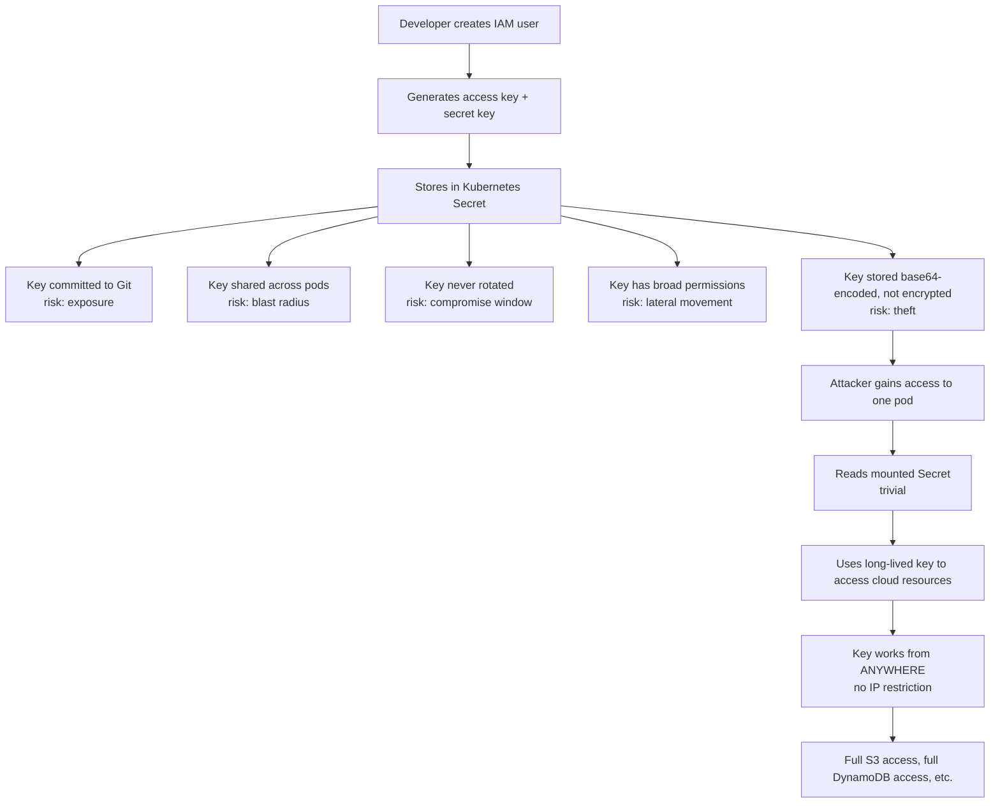
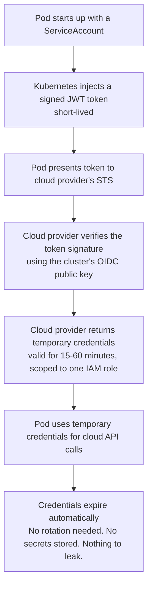
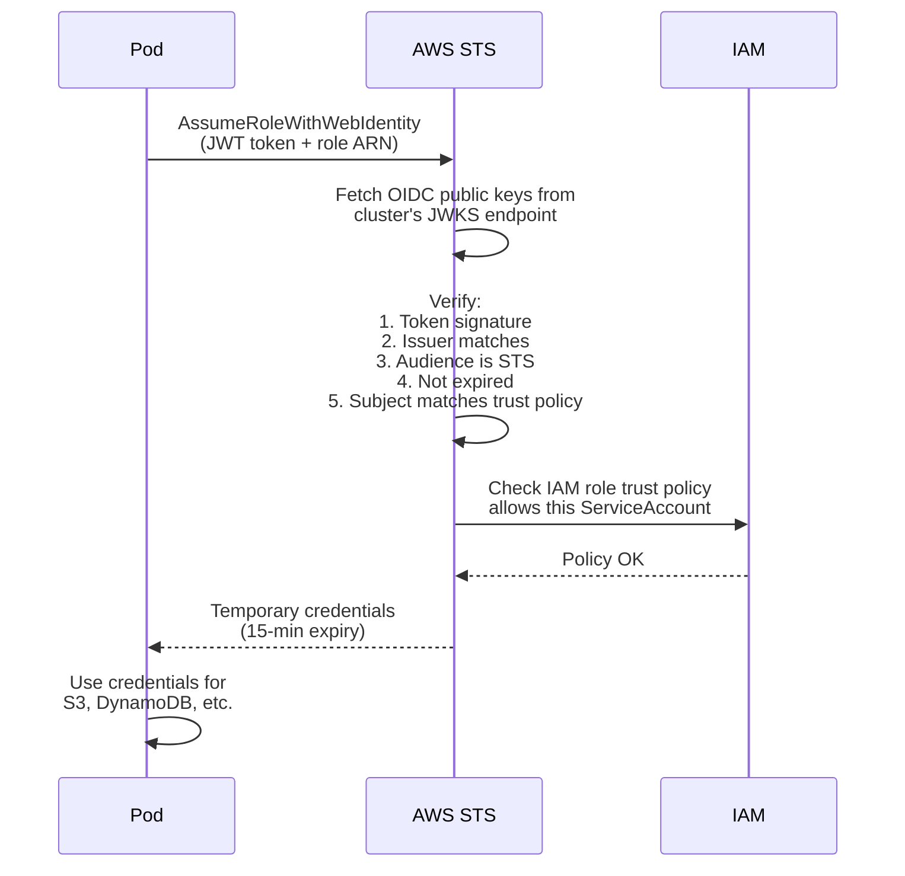
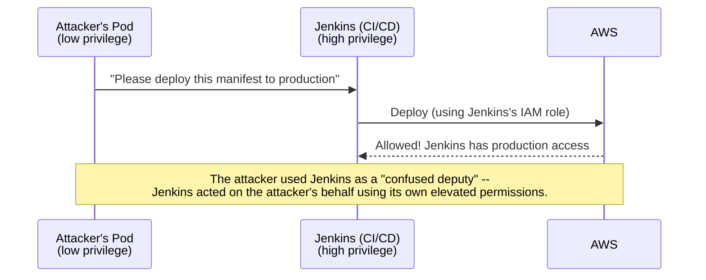
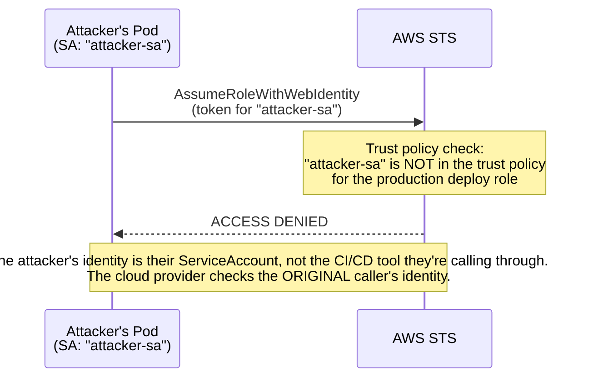
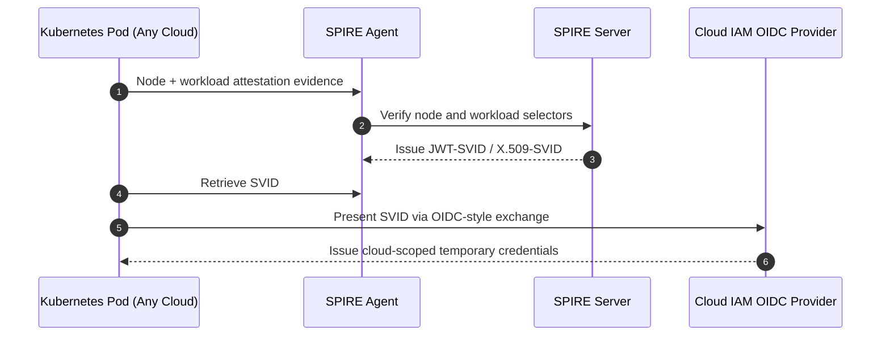
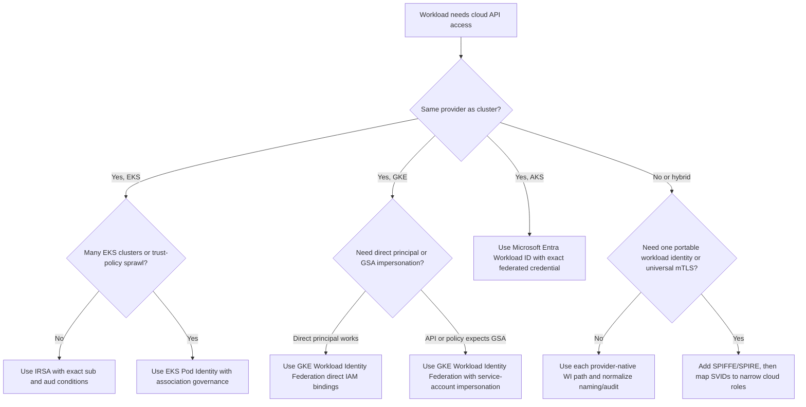

> **Complexity**: `[MEDIUM]`
>
> **Time to Complete**: 2.5 hours
>
> **Prerequisites**: [Module 4.1: Managed vs Self-Managed Kubernetes](../module-4.1-managed-vs-selfmanaged/)
>
> **Track**: Cloud Architecture Patterns

## What You'll Be Able to Do

After completing this module, you will be able to:

- **Design** pod-level identity architectures that map Kubernetes service accounts to cloud IAM roles accurately and securely.
- **Implement** least-privilege access for workloads accessing cloud services, such as object storage and databases, directly from ephemeral pods.
- **Diagnose** IAM-to-Kubernetes authentication failures across trust policy boundaries, OIDC provider configurations, and annotation misconfigurations.
- **Evaluate** the security posture of existing cluster credential management systems and migrate static secrets to ephemeral federated identities without workload downtime.
- **Compare** AWS, GCP, and Azure workload-identity mechanisms and **choose** when a SPIFFE/SPIRE bridge is warranted for multi-cloud identity.

## Why This Module Matters

A team under delivery pressure might take the fast path: create an IAM user, store the access key in a Kubernetes Secret, and mount it into a pod. That approach can get a feature running quickly, but it also embeds a long-lived cloud credential directly into the workload.

If a static access key ends up in source control and carries broad permissions, it can expose far more cloud data than the workload actually needs, especially when the credential does not expire on its own. 

Revoking an embedded access key can break dependent workloads, and a review often reveals that the same static-secret pattern has spread to many services. Cleanup then turns into a costly security and operations exercise.

The hidden cost is not only the breach risk. Static-secret sprawl creates recurring toil: inventory jobs to find mounted credentials, emergency rotations when one application leaks a key, permission reviews that cannot prove which pod actually used the credential, and rollout coordination when hundreds of replicas cache the old value. A key can be cheap to create and expensive to retire, especially when the same credential appears in Helm values, external secret stores, CI variables, and application logs.

This is the exact problem that cloud IAM integration solves. Instead of passing static secrets around -- creating them, storing them, rotating them, and praying nobody commits them to version control -- you pass identity. The pod mathematically proves "I am the payment processor" and the cloud provider verifies the claim, returning short-lived credentials good for the next fifteen minutes. No long-lived keys. No secrets to rotate. No credentials to leak. In this module, running on modern Kubernetes v1.35+, you will learn exactly how this works, from the OpenID Connect mechanics underneath to the practical implementation on each major cloud provider.

## The Fundamental Problem: Pods Need Cloud Access

> **Stop and think**: If a pod needs to read from an S3 bucket, what's the simplest, most naïve way to give it access? What could go wrong if that access method is shared across multiple pods or committed to version control?

Almost every real-world Kubernetes workload needs to talk to managed cloud services outside the cluster. Reading from S3, publishing messages to SNS, querying DynamoDB, pulling container images from private registries, or encrypting payload data with KMS. Each of these external API calls requires rigorous authentication. The cluster boundary is not an isolation boundary; your workloads are active participants in the broader cloud ecosystem.

### The Old Way: Static Credentials

Historically, engineers treated pods like virtual machines, assigning them static identities in the form of long-lived API keys. This approach introduces massive operational and security overhead.



To understand the anti-pattern fully, examine the following configuration. This is what you should aggressively hunt down and eliminate in your clusters. Notice how the secret data is merely [base64-encoded](https://kubernetes.io/docs/concepts/configuration/secret/), offering no cryptographic protection at rest within the pod.

```yaml
# DO NOT DO THIS -- the anti-pattern
apiVersion: v1
kind: Secret
metadata:
  name: aws-credentials
  namespace: production
type: Opaque
data:
  # These are base64-encoded, NOT encrypted
  # Anyone with namespace read access can decode them
  AWS_ACCESS_KEY_ID: QUtJQVhYWFhYWFhYWFhYWA==
  AWS_SECRET_ACCESS_KEY: d0phbGpkaGZranNoZGtqZmhza2RqaGZrc2Q=
```

```yaml
apiVersion: apps/v1
kind: Deployment
metadata:
  name: data-processor
spec:
  template:
    spec:
      containers:
        - name: processor
          image: company/data-processor:v1.2
          envFrom:
            - secretRef:
                name: aws-credentials
          # This pod now has permanent cloud access
          # The key works forever, from any network
          # If this pod is compromised, so is the key
```

In the configuration above, the pod mounts the credentials directly into its environment. If the application is vulnerable to remote code execution or even a simple directory traversal attack, the attacker can quickly obtain long-lived cloud access. 

## The Evolution to Federated Identity

The industry shifted away from static credentials toward federated identity. Federated identity means the cloud provider trusts the Kubernetes cluster to authenticate its own workloads. The cluster issues a time-bound mathematical proof of identity, and the cloud provider exchanges that proof for temporary access tokens.

That wording matters: the cloud provider is not trusting the pod because the pod says a convincing name. It is trusting a signed, audience-bound statement issued by a configured authority. Kubernetes owns the first half of the problem, which is proving that a running workload is bound to a particular ServiceAccount. AWS, Google Cloud, and Azure own the second half, which is deciding whether that Kubernetes identity may become a cloud identity for a narrow set of cloud APIs.

### The New Way: Federated Identity



This architecture brings powerful security properties:
- **Ephemeral Credentials**: Tokens are valid for a short window and expire automatically. If intercepted after expiration, they are mathematically useless.
- **Scoped Permissions**: Each pod receives access tailored explicitly to its role, severely limiting the blast radius of a compromise.
- **Stateless Operation**: No secrets exist in the cluster state or etcd. There is nothing to steal at rest.
- **Audience Restriction**: The token specifies exactly which cloud provider it is intended for, preventing replay attacks across different infrastructure boundaries.
- **Deep Auditability**: Cloud audit logs record the exact pod identity that assumed the role, providing unparalleled incident response capabilities.

## How OIDC Federation Actually Works Under the Hood

**Pause and predict:** Without a static password or persistent cloud secret mounted in a container, how does the cloud provider verify that an ephemeral pod is who it claims to be when requesting access?

<details>
<summary>Check your prediction</summary>

The cluster issuer signs a projected ServiceAccount JWT; the cloud fetches JWKS from OIDC discovery; it verifies signature, issuer, audience, expiry, and `sub`; then it issues short-lived credentials. IRSA uses STS `AssumeRoleWithWebIdentity`. There is no static password.
</details>

Teams that stop mounting long-lived cloud keys still need a repeatable way to grant each workload only the APIs it needs, and to prove later which deployment performed a given cloud call. The rest of this section walks through that contract in the order an incident responder actually traces it.

### Step 1: The Cluster Publishes Its Public Keys

Every Kubernetes cluster operates a Service Account Token Issuer. This issuer maintains a secure key pair. The private key signs the tokens, while the public key is hosted at a [publicly accessible OIDC discovery endpoint](https://docs.aws.amazon.com/eks/latest/userguide/iam-roles-for-service-accounts.html). The cloud provider uses this endpoint to fetch the public key and verify incoming tokens.

```bash
# Every EKS cluster has an OIDC issuer URL
aws eks describe-cluster --name production --query "cluster.identity.oidc.issuer"
# Output: "https://oidc.eks.us-east-1.amazonaws.com/id/ABCDEF1234567890"

# The OIDC discovery document is publicly accessible
curl -s https://oidc.eks.us-east-1.amazonaws.com/id/ABCDEF1234567890/.well-known/openid-configuration | jq .
# {
#   "issuer": "https://oidc.eks.us-east-1.amazonaws.com/id/ABCDEF1234567890",
#   "jwks_uri": "https://oidc.eks.us-east-1.amazonaws.com/id/ABCDEF1234567890/keys",
#   "authorization_endpoint": "...",
#   "response_types_supported": ["id_token"],
#   "subject_types_supported": ["public"],
#   "id_token_signing_alg_values_supported": ["RS256"]
# }

# The public keys (JWKS) used to verify tokens
curl -s https://oidc.eks.us-east-1.amazonaws.com/id/ABCDEF1234567890/keys | jq .
# Returns RSA public keys that can verify ServiceAccount tokens
```

When you examine the JWKS (JSON Web Key Set) endpoint, you will find the precise RSA parameters required to construct the public key. If the cluster rotates its signing keys, the JWKS document updates dynamically.

OIDC discovery is the reason this design scales beyond one vendor. AWS IAM can fetch the EKS issuer keys from the cluster-specific discovery endpoint, Google Cloud can trust a workload identity pool/provider mapping for GKE or external Kubernetes, and Microsoft Entra can validate an AKS OIDC issuer when a federated credential names that issuer. The cloud side does not need Kubernetes admin credentials; it only needs the issuer URL, the public signing keys, and a policy that says which token claims are acceptable.

This is also why public key reachability is an operational requirement, not just a setup detail. If a provider cannot reach the issuer metadata or the JWKS URI at validation time, it cannot safely distinguish a real projected token from a forged one. In private clusters, that often means platform teams must deliberately solve issuer discovery and DNS rather than assuming that every control-plane endpoint is reachable from every verifier.

### Step 2: Kubernetes Injects a Signed Token into the Pod

When a pod is scheduled, the kubelet provisions its volume mounts. If the pod uses a ServiceAccount associated with a cloud identity, [Kubernetes projects a highly specific JSON Web Token (JWT) into the pod's filesystem](https://kubernetes.io/docs/reference/access-authn-authz/service-accounts-admin/). This JWT is cryptographically signed by the cluster's private key.

The projected token is created through Kubernetes, not pre-baked into a Secret. The kubelet asks the API server for a time-bound token using the [TokenRequest flow](https://kubernetes.io/docs/reference/access-authn-authz/service-accounts-admin/), then writes that token into a projected volume for the pod. A projected `serviceAccountToken` volume has an `audience`, an `expirationSeconds`, and a `path`; Kubernetes documents the default token lifetime as one hour and the minimum requested lifetime as ten minutes for this projected-volume mechanism.

The kubelet also refreshes the token before it expires, which is what makes this pattern operationally different from a static key rotation calendar. Your application or cloud SDK still has to tolerate credential refresh, but the identity proof itself is designed to rotate underneath the pod. If a token is copied out of the container, the attacker gets a short-lived artifact with a specific `iss`, `sub`, `aud`, and expiry, not a reusable cloud password that can live for years.

Do not infer every provider's runtime behavior from one decoded token sample. Kubernetes supplies the common primitives, while the managed provider integration chooses the audience and exchange path it needs. AWS IRSA uses an audience of `sts.amazonaws.com`; EKS Pod Identity projects a token for `pods.eks.amazonaws.com`; Azure commonly uses `api://AzureADTokenExchange` in the federated credential; and GKE Workload Identity Federation maps Kubernetes identity into Google IAM principals through a Google-managed pool and provider.

```yaml
# The ServiceAccount references an IAM role
apiVersion: v1
kind: ServiceAccount
metadata:
  name: data-processor
  namespace: production
  annotations:
    # EKS
    eks.amazonaws.com/role-arn: arn:aws:iam::123456789012:role/data-processor-role
    # GKE
    # iam.gke.io/gcp-service-account: data-processor@project.iam.gserviceaccount.com
    # AKS
    # azure.workload.identity/client-id: "12345678-abcd-efgh-ijkl-123456789012"
```

Inside the pod, the application code or the cloud SDK reads this file. The payload of this JWT contains crucial metadata asserting the pod's identity, its namespace, and its exact lifespan.

```bash
# Inside the pod, the token is mounted at a well-known path
# Let's decode it to see what's inside (requires jwt-cli, or paste into jwt.io)
cat /var/run/secrets/eks.amazonaws.com/serviceaccount/token | jwt decode -

# Decoded JWT payload (IRSA — NOT EKS Pod Identity):
# {
#   "aud": ["sts.amazonaws.com"],           # Audience: only valid for AWS STS
#   "exp": 1711213200,                       # Expires in ~1 hour (3600s default)
#   "iat": 1711209600,                       # Issued at
#   "iss": "https://oidc.eks...ABCDEF",     # Issuer: this cluster's OIDC endpoint
#   "kubernetes.io": {
#     "namespace": "production",
#     "pod": {
#       "name": "data-processor-7d4b8c9f-x2k4",
#       "uid": "a1b2c3d4-..."
#     },
#     "serviceaccount": {
#       "name": "data-processor",
#       "uid": "e5f6g7h8-..."
#     }
#   },
#   "sub": "system:serviceaccount:production:data-processor"
# }
```

### Step 3: The Pod Exchanges the Token for Cloud Credentials

The cloud provider SDKs (such as boto3 for AWS) are inherently aware of these projected tokens. When the application attempts to initialize a client for a service like S3, [the SDK discovers the token file, reads the OIDC identity, and invokes the Security Token Service (STS) to request an exchange](https://docs.aws.amazon.com/eks/latest/eksctl/iamserviceaccounts.html).



AWS has two different EKS paths that produce similar runtime behavior but different control-plane mechanics. With IRSA, the AWS SDK reads `AWS_ROLE_ARN` and `AWS_WEB_IDENTITY_TOKEN_FILE`, then calls STS `AssumeRoleWithWebIdentity` using the projected web identity token. With EKS Pod Identity, the SDK uses the container credentials provider, talks to the node-local Pod Identity Agent, and the agent calls the EKS Auth API action `AssumeRoleForPodIdentity` to retrieve temporary credentials.

Google Cloud and Azure also split the same responsibility across their own identity systems. GKE Workload Identity Federation deploys the GKE metadata server on nodes and uses IAM policy to grant Kubernetes principals direct access or service-account impersonation. Microsoft Entra Workload ID uses a Kubernetes projected service account token plus a federated credential on an Entra application or user-assigned managed identity, then Azure Identity or MSAL libraries exchange that proof for a Microsoft Entra access token.

The practical lesson is that "OIDC federation" is not one command you can memorize. It is a contract: the pod presents a signed assertion, the provider validates the issuer and public keys, and the provider applies claim-level policy before issuing temporary cloud credentials. Troubleshooting should follow that same contract order, because a missing annotation, wrong audience, unreachable issuer, or broad trust rule each fails at a different layer.

### Step 4: IAM Trust Policy Controls Which Pods Get Which Roles

The final layer of security resides in the cloud provider's IAM trust policy. The cloud provider will not blindly issue credentials to any valid token; [the token's specific claims must match the conditions defined on the role](https://docs.aws.amazon.com/eks/latest/userguide/associate-service-account-role.html).

```json
{
  "Version": "2012-10-17",
  "Statement": [
    {
      "Effect": "Allow",
      "Principal": {
        "Federated": "arn:aws:iam::123456789012:oidc-provider/oidc.eks.us-east-1.amazonaws.com/id/ABCDEF1234567890"
      },
      "Action": "sts:AssumeRoleWithWebIdentity",
      "Condition": {
        "StringEquals": {
          "oidc.eks.us-east-1.amazonaws.com/id/ABCDEF1234567890:sub": "system:serviceaccount:production:data-processor",
          "oidc.eks.us-east-1.amazonaws.com/id/ABCDEF1234567890:aud": "sts.amazonaws.com"
        }
      }
    }
  ]
}
```

This trust policy forms an unbreakable access control boundary. It explicitly states: "Only the `data-processor` ServiceAccount residing in the `production` namespace of the cluster associated with this specific OIDC issuer is authorized to assume this role." No other pod, no other namespace, and no other cluster can satisfy these conditions.

The important AWS fields are the issuer-prefixed `sub` and `aud` condition keys. The subject should normally be the exact Kubernetes ServiceAccount identity, such as `system:serviceaccount:production:data-processor`, and the audience for IRSA should be `sts.amazonaws.com`. Replacing `StringEquals` with a wildcard `StringLike` is sometimes documented for namespace-wide sharing, but it should be treated as a deliberate exception because it makes the trust policy authorize a class of workloads instead of one workload.

GKE expresses the same boundary through Google IAM principals and, when service-account impersonation is used, an IAM binding that names the Kubernetes namespace and ServiceAccount, such as `serviceAccount:PROJECT_ID.svc.id.goog[NAMESPACE/KSA_NAME]`. For direct Workload Identity Federation access, Google documents principal identifiers under the workload identity pool, including forms that select a ServiceAccount by UID or by namespace/name. For external federation, attribute mappings and attribute conditions let you reject credentials whose mapped subject, group, or custom attributes do not match the environment you intended to trust.

Azure stores the equivalent boundary in the federated identity credential. The credential names the issuer, the subject, and the accepted audience, and the incoming Kubernetes token must match those values before Microsoft Entra issues an access token. The common AKS subject is still `system:serviceaccount:<namespace>:<serviceAccount>`, while the Kubernetes ServiceAccount carries the `azure.workload.identity/client-id` annotation that points the workload toward the intended Entra identity.

## The Confused Deputy Problem

> **Stop and think**: Imagine a CI/CD tool that has permissions to deploy anything to the cluster and access any cloud resource. If an attacker compromises a low-privilege pod, how might they abuse the CI/CD tool's permissions to bypass their own restrictions?

The confused deputy problem is arguably the most critical security concept in IAM federation architecture. Failing to understand it leads directly to catastrophic privilege escalation attacks. Think of it like valet parking: you hand your keys to the valet (the deputy) to park your car. If an attacker tricks the valet into retrieving your car by faking a ticket, the valet unwittingly assists in stealing the vehicle because the valet has the authorized keys.

**WITHOUT proper scoping:**

If a cluster utilizes node-level identity or shared high-privilege roles, a low-privilege workload can leverage a higher-privilege service to act on its behalf.



**WITH pod-level identity:**

Pod-level identity neutralizes this threat by enforcing identity verification at the workload level. The cloud provider evaluates the original caller's specific token, not the intermediate deputy's inherent permissions.



The remediation is structural and straightforward: every discrete workload requires its own dedicated ServiceAccount, and each IAM role's trust policy must rigidly define which ServiceAccounts are permitted to assume it. A pod operating in the `staging` namespace will fundamentally fail to assume a role that demands the `production:data-processor` subject claim.

Across providers, the confused-deputy defense is the same idea expressed with different knobs. AWS IRSA uses `StringEquals` conditions on the issuer-prefixed `:sub` and `:aud` claims, so a token for `system:serviceaccount:staging:debug-shell` cannot become the production role even if it is signed by the same cluster issuer. EKS Pod Identity moves the binding into an EKS association and a role trust that allows the `pods.eks.amazonaws.com` service principal, then adds session tags that can include cluster, namespace, and service-account context for policy decisions.

Google Cloud's defense appears in both principal selection and conditions. If a role binding grants access to every identity in a workload identity pool, the pool itself becomes the deputy, and a workload from another cluster or namespace can gain surprising access when identity sameness is not considered. Narrow principal identifiers, service-account impersonation bindings for a single Kubernetes namespace/name, and conditional IAM expressions prevent a low-trust identity from borrowing permissions meant for a different workload.

Azure's defense is strict federated-credential matching. A managed identity or app registration should have a federated credential whose issuer is the AKS issuer and whose subject is the exact ServiceAccount that needs access. If several namespaces share one managed identity, Azure RBAC sees one identity at the resource boundary; the blast radius then depends on every workload that can cause a token exchange for that identity, so the better default is one federated credential and role assignment per workload access boundary.

Too-broad conditions are attractive because they reduce onboarding friction, but they convert a security rule into a naming convention. A wildcard AWS trust policy, a Google principalSet binding for an entire project pool, or a many-to-one Azure federated credential can all appear to "work" until a new team creates a ServiceAccount with a similar name or a staging cluster shares the same identity pool. The safer migration pattern is to start narrow, automate the narrow object creation, and only widen when you can prove that the wider set is an intentional security domain.

## Implementation: AWS (IRSA and Pod Identity)

Amazon Web Services provides two primary mechanisms for integrating Kubernetes identity. IAM Roles for Service Accounts (IRSA) is the foundational, heavily established approach. EKS Pod Identity is the more modern, significantly streamlined alternative introduced to simplify large-scale cluster management.

Choose IRSA when you need the explicit OIDC trust-policy model, compatibility with older automation, or a pattern that is already standardized across your Terraform and `eksctl` pipelines. Choose EKS Pod Identity when the main pain is operating many clusters and repeated OIDC trust statements; AWS documents that Pod Identity does not require a separate IAM OIDC provider per cluster and uses a reusable `pods.eks.amazonaws.com` trust principal instead. The security bar is still the same: the IAM permissions attached to the target role must be least privilege, and the namespace/ServiceAccount association must be treated as a production access-control object.

### IRSA Setup

Configuring IRSA involves creating the OIDC provider association and explicitly mapping the Kubernetes annotations to the IAM role.

```bash
# Step 1: Associate OIDC provider with your AWS account
eksctl utils associate-iam-oidc-provider \
  --cluster production \
  --approve

# Step 2: Create IAM role with trust policy for the ServiceAccount
aws iam create-role \
  --role-name data-processor-role \
  --assume-role-policy-document '{
    "Version": "2012-10-17",
    "Statement": [{
      "Effect": "Allow",
      "Principal": {
        "Federated": "arn:aws:iam::123456789012:oidc-provider/oidc.eks.us-east-1.amazonaws.com/id/ABCDEF1234567890"
      },
      "Action": "sts:AssumeRoleWithWebIdentity",
      "Condition": {
        "StringEquals": {
          "oidc.eks.us-east-1.amazonaws.com/id/ABCDEF1234567890:sub": "system:serviceaccount:production:data-processor",
          "oidc.eks.us-east-1.amazonaws.com/id/ABCDEF1234567890:aud": "sts.amazonaws.com"
        }
      }
    }]
  }'

# Step 3: Attach a permission policy (least privilege!)
aws iam put-role-policy \
  --role-name data-processor-role \
  --policy-name s3-read-patient-data \
  --policy-document '{
    "Version": "2012-10-17",
    "Statement": [{
      "Effect": "Allow",
      "Action": [
        "s3:GetObject",
        "s3:ListBucket"
      ],
      "Resource": [
        "arn:aws:s3:::patient-data-bucket",
        "arn:aws:s3:::patient-data-bucket/*"
      ]
    }]
  }'
```

Once the IAM side is established, you apply the annotation to your Kubernetes ServiceAccount and assign it to the pod template. Notice that the deployment specification completely lacks environment variables for access keys.

```yaml
# Step 4: Create ServiceAccount with role annotation
apiVersion: v1
kind: ServiceAccount
metadata:
  name: data-processor
  namespace: production
  annotations:
    eks.amazonaws.com/role-arn: arn:aws:iam::123456789012:role/data-processor-role
```

```yaml
# Step 5: Use the ServiceAccount in your Deployment
apiVersion: apps/v1
kind: Deployment
metadata:
  name: data-processor
  namespace: production
spec:
  replicas: 3
  selector:
    matchLabels:
      app: data-processor
  template:
    metadata:
      labels:
        app: data-processor
    spec:
      serviceAccountName: data-processor  # This is the key line
      containers:
        - name: processor
          image: company/data-processor:v1.2
          # No AWS_ACCESS_KEY_ID needed!
          # No AWS_SECRET_ACCESS_KEY needed!
          # The AWS SDK automatically uses the projected token
```

### EKS Pod Identity (Newer, Simpler)

EKS Pod Identity simplifies the trust relationship profoundly. You no longer need to manage OIDC provider setup or complex trust policies per cluster. The association is handled directly by the EKS control plane API.

The target IAM role still needs a trust policy that allows EKS Pod Identity to assume it. AWS documents the service principal as `pods.eks.amazonaws.com` and the actions as `sts:AssumeRole` and `sts:TagSession`, with the association carrying the cluster, namespace, ServiceAccount, and role mapping. That difference matters during reviews: an IRSA review inspects issuer-prefixed `sub` and `aud` conditions, while a Pod Identity review inspects the EKS association plus any tag-based restrictions on the role.

```bash
# Pod Identity simplifies the trust relationship
# No OIDC provider setup needed per cluster

# Step 1: Install the Pod Identity Agent add-on
aws eks create-addon \
  --cluster-name production \
  --addon-name eks-pod-identity-agent

# Step 2: Create the association directly
aws eks create-pod-identity-association \
  --cluster-name production \
  --namespace production \
  --service-account data-processor \
  --role-arn arn:aws:iam::123456789012:role/data-processor-role
```

EKS Pod Identity does **not** use the `eks.amazonaws.com/role-arn` annotation on the ServiceAccount. The only binding is the association you create with `aws eks create-pod-identity-association` (cluster, namespace, ServiceAccount name, IAM role ARN). A ServiceAccount with no IRSA annotation and a Deployment that references it is the normal Pod Identity shape:

```yaml
apiVersion: v1
kind: ServiceAccount
metadata:
  name: data-processor
  namespace: production
  # No eks.amazonaws.com/role-arn — Pod Identity ignores this annotation
---
apiVersion: apps/v1
kind: Deployment
metadata:
  name: data-processor
  namespace: production
spec:
  template:
    spec:
      serviceAccountName: data-processor
      containers:
        - name: processor
          image: company/data-processor:v1.2
```

Because the Pod Identity Agent returns credentials through the container credentials provider, static credentials earlier in the AWS default provider chain can still win if you leave old environment variables mounted. That is useful for staged migration, but dangerous after cutover. A clean migration removes `AWS_ACCESS_KEY_ID`, `AWS_SECRET_ACCESS_KEY`, and old projected Secret references after the workload has proven it can refresh Pod Identity credentials during a long-running test.

## Implementation: GCP (Workload Identity)

Google Cloud Platform relies on Workload Identity, which maps Kubernetes ServiceAccounts directly to Google Cloud Service Accounts (GSA). The architecture [intercepts metadata server calls](https://cloud.google.com/kubernetes-engine/docs/concepts/workload-identity) to inject the correct identity tokens.

GKE Workload Identity Federation has two common authorization styles. Direct access grants IAM roles to the Kubernetes workload principal itself, which keeps the Kubernetes identity visible at the IAM boundary. Service-account impersonation grants `roles/iam.workloadIdentityUser` on a Google service account to the Kubernetes ServiceAccount, which is useful when a Google API expects a service account identity or when your organization already centralizes permissions on service accounts.

```bash
# Step 1: Enable Workload Identity on the cluster (if not already)
gcloud container clusters update production \
  --region us-central1 \
  --workload-pool=my-project.svc.id.goog

# Step 2: Create a GCP service account
gcloud iam service-accounts create data-processor \
  --display-name="Data Processor K8s Workload"

# Step 3: Grant the GCP SA access to resources
gcloud projects add-iam-policy-binding my-project \
  --member="serviceAccount:data-processor@my-project.iam.gserviceaccount.com" \
  --role="roles/storage.objectViewer" \
  --condition="expression=resource.name.startsWith('projects/_/buckets/patient-data'),title=patient-data-only"

# Step 4: Bind K8s SA to GCP SA
gcloud iam service-accounts add-iam-policy-binding \
  data-processor@my-project.iam.gserviceaccount.com \
  --role roles/iam.workloadIdentityUser \
  --member "serviceAccount:my-project.svc.id.goog[production/data-processor]"
```

The Kubernetes ServiceAccount configuration in GCP relies on [the specific `iam.gke.io` annotation](https://cloud.google.com/kubernetes-engine/docs/how-to/workload-identity?hl=en) to forge the link between the cluster entity and the GSA.

```yaml
# Step 5: Annotate the Kubernetes ServiceAccount
apiVersion: v1
kind: ServiceAccount
metadata:
  name: data-processor
  namespace: production
  annotations:
    iam.gke.io/gcp-service-account: data-processor@my-project.iam.gserviceaccount.com
```

The multi-cluster gotcha is identity sameness. GKE's workload identity pool is tied to the Google Cloud project, so two clusters in the same project can produce principals that look the same when namespace and ServiceAccount metadata match. If you need cluster-specific separation, design the IAM principal or condition strategy before you stamp out many clusters, rather than discovering later that `production/report-reader` in two clusters has become one authorization subject.

## Implementation: Azure (Workload Identity)

Microsoft Azure utilizes Microsoft Entra Workload ID, integrating Kubernetes OIDC with Microsoft Entra federated credentials. Microsoft Entra Workload ID supersedes the deprecated [AAD Pod Identity project](https://learn.microsoft.com/en-us/azure/aks/use-azure-ad-pod-identity).

```bash
# Step 1: Enable Workload Identity on the cluster
az aks update \
  --resource-group production-rg \
  --name production \
  --enable-oidc-issuer \
  --enable-workload-identity

# Step 2: Get the OIDC issuer URL
OIDC_ISSUER=$(az aks show \
  --resource-group production-rg \
  --name production \
  --query "oidcIssuerProfile.issuerUrl" -o tsv)

# Step 3: Create a managed identity
az identity create \
  --name data-processor-identity \
  --resource-group production-rg

CLIENT_ID=$(az identity show \
  --name data-processor-identity \
  --resource-group production-rg \
  --query "clientId" -o tsv)

# Step 4: Create federated credential
az identity federated-credential create \
  --name data-processor-fed \
  --identity-name data-processor-identity \
  --resource-group production-rg \
  --issuer "$OIDC_ISSUER" \
  --subject "system:serviceaccount:production:data-processor" \
  --audiences "api://AzureADTokenExchange"

# Step 5: Grant access to Azure resources
az role assignment create \
  --assignee "$CLIENT_ID" \
  --role "Storage Blob Data Reader" \
  --scope "/subscriptions/.../resourceGroups/.../providers/Microsoft.Storage/storageAccounts/patientdata"
```

**Pause and predict:** When configuring an Azure Kubernetes Service workload to use Microsoft Entra Workload ID, is applying the `azure.workload.identity/client-id` annotation to the ServiceAccount enough?

<details>
<summary>Check your prediction</summary>

The pod label `azure.workload.identity/use: "true"` is **required**. Only labeled pods are mutated by the azure-workload-identity webhook. Otherwise participating pods fail after restart (fail-close).
</details>

Federated credentials in Microsoft Entra are only half of the rollout. The Kubernetes objects that name the workload still have to carry the metadata the cluster uses when the pod is created, and the two sides must stay in sync as you promote the same service through environments.

```yaml
apiVersion: v1
kind: ServiceAccount
metadata:
  name: data-processor
  namespace: production
  annotations:
    azure.workload.identity/client-id: "12345678-abcd-efgh-ijkl-123456789012"
```

```yaml
apiVersion: apps/v1
kind: Deployment
metadata:
  name: data-processor
  namespace: production
spec:
  template:
    metadata:
      labels:
        azure.workload.identity/use: "true"
    spec:
      serviceAccountName: data-processor
      containers:
        - name: processor
          image: company/data-processor:v1.2
```

The Azure federated credential is a three-part trust rule: issuer, subject, and audience. The Azure CLI parameter is `--audiences`, and the configured audience must match the `aud` value in the incoming token. When a token exchange fails, check those three values first, then check Azure RBAC on the target resource; a correct token exchange only proves identity, while the role assignment decides authorization.

## The Cross-Cloud Rosetta: One Trust Chain, Three Clouds

Across the three vendor implementations you just learned, the shape is the same even when the configuration surface looks different:

1. A pod is bound to a Kubernetes ServiceAccount.
2. That ServiceAccount gets a projected service-account JWT (`sub`, `iss`, `aud`, expiry) at startup.
3. The cloud provider verifies the workload's identity — for IRSA and the OIDC-federated WI models (GCP, Azure) against a trusted cluster-issued OIDC path; for EKS Pod Identity, via the EKS Pod Identity association rather than a cluster OIDC provider.
4. A short-lived workload-scoped cloud identity is issued.
5. The workload uses that identity to call cloud APIs, then repeats the exchange when credentials rotate.

In other words, each provider implements the same trust choreography but with different operational APIs. The only useful comparison is where policy lives and how many moving parts you must maintain.

### The Cross-Cloud Rosetta Table

| Mechanism | AWS IRSA | AWS EKS Pod Identity | GCP Workload Identity | Azure Workload Identity |
|---|---|---|---|---|
| **Trust anchor** | Per-cluster OIDC provider object in AWS IAM | EKS control-plane trust via Pod Identity associations | GKE-managed identity pool issuer and provider binding to Google IAM | Microsoft Entra token exchange trust with AKS OIDC issuer + Entra app identity |
| **SA→identity binding declaration** | ServiceAccount annotation (`eks.amazonaws.com/role-arn`) + IAM trust policy on the role | API-managed association (`aws eks create-pod-identity-association`) linking namespace + ServiceAccount | ServiceAccount annotation (`iam.gke.io/gcp-service-account`) + IAM binding of `roles/iam.workloadIdentityUser` | ServiceAccount annotation (`azure.workload.identity/client-id`) + Entra `federatedIdentityCredential` for subject binding |
| **Token audience** | `sts.amazonaws.com` (validated in IAM role trust policy) | `pods.eks.amazonaws.com` (projected SA token; **not** `sts.amazonaws.com`). Trust is enforced by EKS Pod Identity associations + IAM role trust to `pods.eks.amazonaws.com`, not per-cluster OIDC `aud` conditions | GKE cluster issuer audience for native WI; `sts.googleapis.com` / workload-identity-pool audience for external WIF | `api://AzureADTokenExchange` as commonly defined in federated credential |
| **Where creds are exchanged** | AWS STS `AssumeRoleWithWebIdentity` | EKS Auth API `AssumeRoleForPodIdentity`, delivered by the node-local Pod Identity Agent — **not** STS `AssumeRoleWithWebIdentity` | Google Security Token Service and Workload Identity Federation with Google IAM credentials | Azure STS/OAuth token exchange to obtain Entra access token for the target scope |
| **Credential lifetime & rotation** | Temporary AWS credentials (often minutes-to-hour, automatically rotated by workload refresh logic) | Same short-lived model with central EKS agent handling association and refresh patterns | Temporary Google access credentials/impersonation token with frequent refresh via token exchange | Short-lived Entra tokens, rotated through workload identity token exchange on demand |
| **Audit signal** | CloudTrail shows assumed-role activity and STS web-identity exchange context | CloudTrail shows the assumed role and Pod Identity session tags when enabled | Cloud Audit Logs can show workload identity pool subjects and service-account impersonation events | Azure Monitor, Entra sign-in logs, and resource logs show managed identity and resource access context |
| **Scale friction** | OIDC provider trust and trust-policy statements must scale per cluster/application shape | Better operational scaling due to API associations managed separately from role trust text | Requires mapping discipline between Kubernetes subjects and service accounts across projects/pools | Scales via workload identity settings and federated credentials, but object sprawl can grow across many teams/clusters |

### How to read the table under pressure

When onboarding a new environment, this table helps you compare three immediate outcomes:

- **Ownership surface**: who maintains trust definitions and who can change them.
- **Binding mechanism**: whether policy is annotation-first, association-first, or federated-credential-first.
- **Scale burden**: whether adding a new workload mostly changes Kubernetes manifests, IAM metadata, or both.

In other words, this is less about which vendor has the best feature and more about which operational system your team can run without identity debt in six months.

The most useful comparison is where the reviewer can prove intent. In AWS IRSA, intent is visible in the role trust policy because `sub` and `aud` are right there. In EKS Pod Identity, intent is split between the target role trust and the Pod Identity association, so review automation must inspect EKS association state as well as IAM. In GKE, intent might live in a direct IAM principal binding or in a service-account impersonation binding. In Azure, intent lives in the federated credential and in Azure RBAC role assignments on the target resource.

That split changes how you design platform workflows. If the Kubernetes team can edit ServiceAccounts but cannot edit cloud IAM, annotation-only workflows will stall or drift. If the IAM team can create roles but cannot see Kubernetes namespaces, broad wildcard trusts will appear as an onboarding shortcut. The platform pattern that holds up is a single request path that creates the Kubernetes ServiceAccount, cloud identity object, trust binding, permission policy, and audit label together.

A practical way to consume this table is to ask three questions every time you add a new workload:

1. **How will the identity-binding statement be added** (annotation, association, or external object)?
2. **Where does trust logic live** (inside IAM policy files, per-cluster controllers, or identity platform metadata)?
3. **What grows first**: role statements, service bindings, or federation objects?

If the answer to the third question is "everything grows everywhere", you likely need a stronger ownership model before adding more workloads.

For AWS-heavy platforms, this often means moving high-churn EKS fleets toward Pod Identity while keeping IRSA for workloads that need exact OIDC trust semantics or cross-account patterns that are already stable. For GCP-heavy platforms, it means deciding early whether Kubernetes principals get direct IAM roles or impersonate GSAs, because mixing both without naming rules makes audit trails harder to read. For Azure-heavy platforms, it means managing user-assigned managed identities and federated credentials as first-class objects, not as one-off commands pasted into deployment notes.

**Pause and predict:** In an infrastructure platform running a large Amazon EKS production cluster alongside test clusters on AKS and GKE, should you default to an IRSA pattern everywhere across all environments?

<details>
<summary>Check your prediction</summary>

Use the native mechanism per environment: IRSA or EKS Pod Identity on EKS, GKE Workload Identity on GKE, and Microsoft Entra Workload ID on AKS. One IRSA annotation shape does not bind AKS or GKE. Unique per-service boundaries mean one SA + one cloud identity + one trust object per workload, which sprawls unless a single request path creates them together.
</details>

Once each provider binding is in place, the next design question is whether workloads must present one identity across clouds and on-prem, or whether staying inside each provider's IAM is enough. That choice is about the security requirement, not about collecting extra identity products.

## Beyond One Cloud: The SPIFFE/SPIRE Bridge

Native workload identity is excellent inside a single cloud provider, but it usually ends at that cloud boundary. When workloads must act across AWS, GCP, Azure, and on-prem together, you often need a common identity abstraction.

The key word is "must." SPIFFE/SPIRE is not a prize for being multi-cloud; it is a serious identity control plane that earns its keep only when native provider identity cannot express the security requirement cleanly. If a workload only needs S3 from EKS, Pub/Sub from GKE, or Key Vault from AKS, the native workload identity path is simpler, cheaper to operate, and easier for provider support teams to reason about. If the same workload must prove the same identity across cloud-to-cloud service calls, on-prem services, and service-mesh mTLS, then a portable identity layer starts to justify its operational weight.

SPIFFE/SPIRE provides that abstraction through a vocabulary that separates workload names, identity documents, node trust, and federation boundaries:

- **SPIFFE ID**: a stable workload identity URI, e.g. `spiffe://platform.example/ns/order-api/sa/api`.
- **SVID**: a workload proof of identity, emitted as either:
  - **X.509-SVID** for mTLS identities between workloads.
  - **JWT-SVID** for assertion-style flows and federated token exchange.
- **SPIRE server + SPIRE agent**: the server stores trust policy and root CA material, agents run on nodes, attest identities, and hand out SVIDs.
- **Node attestation**: validates node identity before workloads are trusted.
- **Workload attestation**: validates workload identity selectors (`sa`, `namespace`, image, label) before issuing SVIDs.
- **Trust domains + federation**: lets multiple SPIFFE domains trust each other so workloads keep identity semantics while moving across environments.



SPIRE becomes the bridge when cloud identity and workload identity must be one source of truth across environments that do not share one managed Kubernetes provider:

- Workload-to-workload traffic in a service mesh can use SPIFFE X.509-SVID-based mTLS.
- Workload-to-cloud calls can exchange SPIFFE JWT-SVIDs into each cloud's OIDC trust path to assume native cloud roles.

That gives you a useful split between identity proof and cloud authorization, which keeps the portable identity layer from becoming an all-powerful permission engine:

- **SPIFFE/SPIRE** defines **who** a workload is across any cluster.
- **Cloud IAM** still decides **what** that workload is allowed to do.

This exchange is not automatic. SPIRE must run its **OIDC Discovery Provider** (publishing a public JWKS endpoint), and you must register that endpoint as an **IAM OIDC identity provider** in the target cloud. Only then can a workload present its JWT-SVID to `AssumeRoleWithWebIdentity` (or the cloud equivalent) and receive cloud credentials.

This separation is subtle but powerful. If you force one layer to do both, you often leak assumptions between architecture layers.

In practice, a SPIRE bridge should have a smaller blast radius than your cloud identities, not a larger one. A SPIFFE ID such as `spiffe://platform.example/ns/payments/sa/settlement-worker` can be mapped to one AWS role, one Google principal, and one Azure federated credential, but that mapping still needs least-privilege resource permissions in each provider. The bridge is successful when it reduces duplicated identity proof while leaving authorization decisions close to the resource owner.

The over-engineering smell is different. If SPIRE is introduced before the team can rotate its trust root, monitor agent health, explain workload selectors, or document what happens when the OIDC Discovery Provider is unavailable, it becomes another critical dependency rather than a simplification. Native workload identity should remain the default until you can name the exact cross-environment identity problem SPIRE solves and the exact team that will operate the new trust domain.

### What SPIFFE/SPIRE does *not* solve by itself

- **Downstream IAM policy quality**: SPIRE can only carry identity; it cannot prevent you from attaching overly broad cloud roles.
- **Kubernetes namespace hardening**: compromised namespaces and overly permissive RBAC are still real risks.
- **Operational burden elimination**: SPIRE creates its own trust root, upgrade lifecycle, and incident workflows.

Many teams therefore start with a strict "single cluster trust boundary" proof and expand only when business need appears.

Hypothetical scenario: a payments platform runs one settlement worker in EKS and a fraud-scoring service in GKE, and both must mutually authenticate during a regulated batch window while also accessing provider-native storage. Native workload identity can solve the storage calls, but it does not create one portable workload identity for service-to-service trust. SPIFFE/SPIRE becomes reasonable when that shared identity has to survive across providers, logs, and mTLS policy without inventing a custom token broker.

### Practical rollout pattern

1. Keep native cloud WI as the baseline for each individual cloud.
2. Introduce SPIRE only where a service requires:
   - workload-to-workload mTLS across runtimes, or
   - identical identity semantics between cloud + cloud/on-prem.
3. Add a narrow set of federated audiences and restrict where JWT-SVIDs can be exchanged.
4. Enforce policy that maps SPIFFE SVID claims to least-privilege cloud roles.

**Trade-off paragraph**: SPIFFE/SPIRE lowers cross-environment identity fragmentation, but you pay for another critical control plane. You need agent rollout, key rotation hygiene, attestation hardening, and policy governance that spans environments. If your platform has only one cloud and simple cloud API needs, native WI stays simpler and often lower risk.

**Mini decision guide**:
- Use native cloud WI when workload identity is single-cloud and you mainly need cloud API federation.
- Add SPIFFE/SPIRE when you need consistent identity semantics across cloud boundaries or workload-to-workload mTLS everywhere.

> **Which would you choose here?** If your organization adds five new clusters across two cloud providers plus on-prem within a quarter, would you ship SPIFFE/SPIRE first or keep native WI and add a sidecar identity layer later? Explain the failure mode you fear most from each choice.

## Auditing Cloud API Calls Back to Pods

One of the most powerful and often overlooked benefits of federated identity is forensic auditability. Cloud audit logs record the assumed role used by a workload, and some platforms can attach extra session context that helps correlate activity back to Kubernetes identities.

```bash
# AWS CloudTrail lookup-events returns MANAGEMENT events only.
# AssumeRoleWithWebIdentity / AssumeRole are management events — use this to
# correlate a Kubernetes workload to the IAM role session it opened.

aws cloudtrail lookup-events \
  --lookup-attributes AttributeKey=EventName,AttributeValue=AssumeRoleWithWebIdentity \
  --start-time "2026-03-24T00:00:00Z" \
  --end-time "2026-03-24T23:59:59Z" \
  --query 'Events[].CloudTrailEvent' \
  --output text | jq -r '
    select(.userIdentity.type == "AssumedRole") |
    select(.userIdentity.arn | test("data-processor-role")) |
    {
      time: .eventTime,
      action: .eventName,
      role: .userIdentity.arn,
      sourceIP: .sourceIPAddress,
      sessionIssuer: .userIdentity.sessionContext.sessionIssuer.userName
    }
  '

# S3 GetObject / PutObject are DATA events — NOT returned by lookup-events.
# Prerequisite: a trail (or organization trail) with S3 data-event selectors
# (read/write or all) on the buckets you care about. Then query with Athena
# or CloudTrail Lake, for example:
#
#   SELECT eventtime, eventname, useridentity.arn, requestparameters
#   FROM cloudtrail_logs
#   WHERE eventname IN ('GetObject','PutObject')
#     AND useridentity.arn LIKE '%data-processor-role%'
#     AND eventtime > '2026-03-24 00:00:00'
#
# (Table name and column casing depend on your Athena/Glue setup.)
```

Combining cloud audit logs with Kubernetes audit and event data can give you a detailed investigation trail from workload identity to cloud API activity. Compare this forensic depth to the archaic static key approach, where the audit log cryptically shows "IAM user data-processor-user" with zero context regarding which cluster, namespace, or pod actually initiated the request.

Each provider exposes a different amount of correlation detail, so design your naming and labels before the first incident. AWS IRSA gives CloudTrail assumed-role events and the IAM role session context; EKS Pod Identity can add session tags such as cluster, namespace, and ServiceAccount context. Google Cloud audit logs for Workload Identity Federation can include the federated principal subject and mapped principal when audit logging is enabled for the relevant IAM and Security Token Service activity. Azure investigations often combine Entra sign-in data, managed identity or service principal identifiers, Azure Activity Logs for control-plane changes, and resource logs for data-plane access.

Good auditability is not automatic. If twenty workloads impersonate the same Google service account, use the same Azure managed identity, or share one AWS role, the cloud log will faithfully show that shared identity and still leave you guessing which pod was responsible. The fix is boring and powerful: encode namespace, ServiceAccount, and application name into the cloud identity name, require one workload per access boundary, and keep Kubernetes deployment events long enough to correlate pod UID and rollout time with provider logs.

### Cross-Referencing with Kubernetes Audit Logs

To build an end-to-end incident timeline, you can cross-reference the cloud provider logs with the Kubernetes cluster audit logs.

```bash
# Kubernetes audit log shows which user/SA created the pod
# Combined with CloudTrail, you get end-to-end traceability:
#
# 1. Developer "alice@company.com" deploys data-processor (K8s audit)
# 2. Pod "data-processor-7d4b8c9f" starts (K8s events)
# 3. Pod assumes role "data-processor-role" (CloudTrail — management event)
# 4. Pod reads "patient-data-bucket/file.json" (CloudTrail — requires S3
#    data-event logging on the trail; not visible from lookup-events alone)
#
# Full chain: Human → Deployment → Pod → Cloud Resource
```

## Least Privilege at the Pod Level

**Pause and predict:** If an attacker extracts a projected ServiceAccount token file from a compromised pod filesystem, can they use that token from a laptop outside the cloud environment?

<details>
<summary>Check your prediction</summary>

Yes until expiry if the trust policy only checks `sub`/`aud`. `aws:SourceVpc` / `aws:SourceIp` only help when the STS request actually carries that context (for example STS via a VPC endpoint).
</details>

The principle of least privilege mandates that each pod must possess only the permissions strictly necessary to execute its function, and absolutely nothing more. The following practices are non-negotiable for production environments.

Least privilege should be expressed in two places at once. First, the trust side should answer "which Kubernetes identity may become this cloud identity?" Second, the permission side should answer "what can that cloud identity do after it is assumed?" A precise trust policy attached to a role with broad `AdministratorAccess` still fails the design, while a narrow permission policy attached to a role that any namespace can assume also fails the design.

### One ServiceAccount Per Workload

Never share ServiceAccounts. Sharing identities defeats the purpose of granular access control and expands the blast radius of a breach. Additionally, always disable automatic token mounting on the default namespace account to prevent accidental token leakage to non-participating pods.

The one-ServiceAccount-per-workload rule is also an audit rule. When `order-api`, `payment-processor`, and `analytics-pipeline` each use distinct Kubernetes and cloud identities, a cloud audit event can be mapped back to a narrow deployment owner. When they share the namespace's default ServiceAccount, incident response has to reconstruct intent from pod schedules, logs, and luck.

```yaml
# BAD: Shared ServiceAccount with broad permissions
# Every pod in the namespace uses "default" SA
# with a role that has S3 + DynamoDB + SQS + SNS access

# GOOD: Dedicated ServiceAccounts with minimal permissions
apiVersion: v1
kind: ServiceAccount
metadata:
  name: order-processor     # Can only write to orders DynamoDB table
  namespace: production
  annotations:
    eks.amazonaws.com/role-arn: arn:aws:iam::123456789012:role/order-processor
```

```yaml
apiVersion: v1
kind: ServiceAccount
metadata:
  name: notification-sender  # Can only publish to notifications SNS topic
  namespace: production
  annotations:
    eks.amazonaws.com/role-arn: arn:aws:iam::123456789012:role/notification-sender
```

```yaml
apiVersion: v1
kind: ServiceAccount
metadata:
  name: report-generator     # Can only read from S3 analytics bucket
  namespace: production
  annotations:
    eks.amazonaws.com/role-arn: arn:aws:iam::123456789012:role/report-generator
```

### Preventing ServiceAccount Token Theft

Incident response still has to assume a compromised pod can copy whatever was mounted. Rotation, short TTL, and least-privilege roles limit how far that copy can go even before extra network conditions are added.

```json
{
  "Version": "2012-10-17",
  "Statement": [
    {
      "Effect": "Allow",
      "Principal": {
        "Federated": "arn:aws:iam::123456789012:oidc-provider/oidc.eks.us-east-1.amazonaws.com/id/ABCDEF1234567890"
      },
      "Action": "sts:AssumeRoleWithWebIdentity",
      "Condition": {
        "StringEquals": {
          "oidc.eks.us-east-1.amazonaws.com/id/ABCDEF1234567890:sub": "system:serviceaccount:production:data-processor",
          "oidc.eks.us-east-1.amazonaws.com/id/ABCDEF1234567890:aud": "sts.amazonaws.com",
          "aws:SourceVpc": "vpc-0abc123def456"
        }
      }
    }
  ]
}
```

Additional network-based conditions can narrow where temporary credentials are usable, but you need to validate the exact AWS condition keys and request paths that apply in your environment. For GCP and Azure, the equivalent control is usually less about a trust-policy network key and more about private egress paths, conditional IAM where supported, workload-level network policy, and alerting on token exchanges from unexpected locations.

## Cost and Operations Lens

Static secrets look cheap because the first key is free to create. The cost appears later in rotation labor, emergency revocation, leaked-key investigation, duplicated secret stores, and audit gaps. At moderate scale, the expensive part is not one pod reading one cloud API; it is hundreds of workloads sharing unclear credentials, many teams needing exceptions, and security reviewers being unable to prove which workload touched which resource.

Federated identity shifts that cost into platform automation and observability. You must provision identities, bind trust rules, keep SDKs current enough to refresh temporary credentials, and retain logs that let incident responders correlate cloud API calls with Kubernetes deployments. That is usually a better cost shape because it turns emergency manual rotation into repeatable identity lifecycle management, but it is still a cost shape that needs owners, runbooks, and tests.

Provider pricing also changes the operations calculation. AWS EKS charges a per-cluster management fee, with the public EKS pricing page listing standard Kubernetes version support at [$0.10 per cluster-hour and extended support at $0.60 per cluster-hour](https://aws.amazon.com/eks/pricing/). Google Kubernetes Engine lists a flat [$0.10 per cluster-hour management fee](https://cloud.google.com/kubernetes-engine/pricing?hl=en), with a monthly free-tier credit that can offset one Autopilot or zonal Standard cluster. Azure's [AKS pricing-tier documentation](https://learn.microsoft.com/en-us/azure/aks/free-standard-pricing-tiers) describes Free, Standard, and Premium cluster-management tiers, and the official [Azure Retail Prices API](https://prices.azure.com/api/retail/prices?api-version=2023-01-01-preview&currencyCode=USD&%24filter=serviceName%20eq%20%27Azure%20Kubernetes%20Service%27%20and%20meterName%20eq%20%27Standard%20Uptime%20SLA%27) lists AKS Standard Uptime SLA meters at $0.10 per hour in the retail USD catalog, while [Standard Long Term Support meter entries](https://prices.azure.com/api/retail/prices?api-version=2023-01-01-preview&currencyCode=USD&%24filter=serviceName%20eq%20%27Azure%20Kubernetes%20Service%27%20and%20meterName%20eq%20%27Standard%20Long%20Term%20Support%27) appear at $0.60 per hour.

Those management fees are not caused by pod identity, but identity architecture influences how many clusters, private endpoints, log pipelines, and support tiers you need. A team that creates a new cluster for every application might pay more in cluster management and logging than a team that creates separate identities inside a shared platform cluster. A team that sends every token exchange and every storage read into high-retention logging also needs to budget for ingestion and retention, because auditability is only useful when the logs survive long enough to support an investigation.

Cost spikes usually come from indirect knobs. AWS can surprise teams when IRSA trust policies are copied across many clusters and the fleet drifts into extended support. GKE can surprise teams when identity sameness pushes them to split projects or clusters for separation they did not design early. AKS can surprise teams when production clusters move from Free to Standard or Premium management tiers for SLA or LTS requirements. Across all three providers, NAT, private endpoints, service-mesh sidecars, and verbose audit retention can become larger recurring costs than the identity binding itself.

The cost-control answer is not "use fewer identities." Fewer identities usually means larger blast radius and weaker audit evidence. The better answer is to automate narrow identities, keep cluster count intentional, choose support tiers deliberately, expire or archive high-volume logs by risk, and review unused cloud identities the same way you review unused Kubernetes ServiceAccounts.

## Patterns & Anti-Patterns

Good workload identity architectures are repetitive by design. The goal is not to invent a new trust pattern for every service; the goal is to make the secure path easy enough that teams stop asking for static keys. The following patterns are proven because they reduce blast radius, make audit trails readable, and scale through automation rather than through human memory.

| Pattern | When to Use | Why It Works | Scaling Note |
|---------|-------------|--------------|--------------|
| One ServiceAccount per workload | Any workload with distinct cloud permissions | The Kubernetes `sub` claim becomes a precise workload boundary instead of a namespace-level guess | Generate ServiceAccount, cloud role, trust binding, and audit label together from one platform request |
| Exact trust conditions | Any federated identity binding | Exact `sub`, issuer, and audience checks prevent a valid token for one workload from being replayed as another workload | Prefer exact match by default; require security review for wildcard or namespace-wide bindings |
| Disable default token automount | Namespaces with mixed workload types | Pods that do not need Kubernetes or cloud identity should not receive an unnecessary token file | Set `automountServiceAccountToken: false` on the default ServiceAccount and override only where required |
| Native workload identity first | Single-cloud cloud API access | AWS, GCP, and Azure support provider-native flows that integrate with their SDKs and audit systems | Add SPIFFE/SPIRE only when cross-environment workload identity or mTLS semantics demand it |

The one-ServiceAccount pattern sounds tedious until you compare it with post-incident reconstruction. If one shared ServiceAccount accesses ten buckets, the incident team has to infer intent from timing and application logs. If each workload has its own ServiceAccount and cloud identity, the cloud log itself narrows the investigation before anyone opens a pod log.

Exact trust conditions also make platform automation safer. A template that emits `system:serviceaccount:${namespace}:${serviceAccount}` for AWS, the corresponding GKE principal or impersonation member, and the Azure federated credential subject can be reviewed mechanically. A template that emits `system:serviceaccount:${namespace}:*` cannot be reviewed the same way because future workloads inherit today's trust decision.

| Anti-Pattern | What Goes Wrong | Why Teams Fall Into It | Better Alternative |
|--------------|-----------------|------------------------|--------------------|
| Shared broad-permission ServiceAccounts | One compromised pod can use permissions intended for unrelated services | It reduces early IAM requests and hides ownership decisions | Create one ServiceAccount and cloud role per workload access boundary |
| Wildcard trust policies | A new or renamed ServiceAccount can unexpectedly assume a powerful role | Wildcards seem convenient when many services onboard at once | Automate exact bindings and create explicit group-level roles only for true shared platforms |
| Long-lived static keys in Secrets | Stolen credentials remain usable until manual revocation and often work outside the cluster | Static keys are familiar and work before federation plumbing exists | Migrate through parallel auth, then remove key env vars and delete legacy Secrets |
| Many workloads impersonating one cloud identity | Audit logs show the shared identity but not the original pod with enough confidence | Teams centralize permissions on one GSA, IAM role, or managed identity | Preserve workload identity in names, bindings, and logs; use shared identities only for shared platform components |

The anti-patterns have a common theme: they optimize for the first deployment instead of the hundredth deployment. A wildcard or shared identity removes one ticket today and creates uncertainty for every future audit. Treat identity objects as production interfaces, version them, review them, and remove them when the workload is retired.

## Decision Framework

Use this flow when choosing between provider-native identity and a portable identity layer. The first decision is the cloud boundary, not the tool. If the workload only calls APIs in the same provider where it runs, start with the provider-native mechanism. If the workload identity must be portable across providers or drive workload-to-workload mTLS, then evaluate SPIFFE/SPIRE as an additional control plane rather than as a replacement for cloud IAM.



| Choice | Prefer It When | Tradeoff |
|--------|----------------|----------|
| AWS IRSA | You need explicit OIDC trust policies, mature Terraform patterns, or cross-account role assumptions already designed around web identity | Trust policies grow with cluster count, and each cluster needs IAM OIDC provider handling |
| EKS Pod Identity | You operate many EKS clusters and want associations managed through the EKS API instead of per-cluster OIDC provider statements | Reviewers must inspect associations and role trust, not just ServiceAccount annotations |
| GKE Workload Identity Federation | You want Google IAM to authorize Kubernetes principals directly or through GSA impersonation without service account keys | Project-level identity sameness requires careful namespace, cluster, and condition design |
| Microsoft Entra Workload ID | AKS workloads need Azure resources through managed identities or app registrations without secrets | Federated credentials and Azure RBAC assignments can sprawl unless ownership is automated |
| SPIFFE/SPIRE bridge | You need consistent workload identity across clouds, on-prem, and service-to-service mTLS | You operate another critical trust root, agent fleet, discovery endpoint, and policy lifecycle |

The decision matrix should not be used once and forgotten. Revisit it when the platform crosses new thresholds: more clusters, more regulated workloads, more providers, or more incident-response requirements. Identity designs that were excellent for three services in one cluster can become fragile when a central platform team onboards fifty teams across three providers.

## Did You Know?

- **Older Kubernetes releases relied on long-lived ServiceAccount token Secrets.** Modern clusters use projected, time-bound tokens obtained through the TokenRequest flow instead, which reduces the operational risk of permanently mounted credentials.
- **AWS STS web identity federation is heavily used by EKS workloads.** Each request requires token validation before temporary credentials are issued.
- **The "confused deputy problem" was first described in a 1988 paper** by Norm Hardy. He used the example of a system compiler that could write to any file because it ran with elevated privileges. A malicious user tricked the compiler into overwriting the system's billing file instead of the intended output file. The same architectural flaw exists today when high-privilege services act on behalf of low-privilege callers.
- **Google's Workload Identity Federation supports many external identity providers** outside GKE (AWS, Azure, GitHub Actions, GitLab CI, and other OIDC- or SAML-compatible issuers). That is distinct from GKE-native Workload Identity, which maps Kubernetes ServiceAccounts to Google IAM through the cluster's workload pool. Both avoid long-lived service account keys, but the setup paths differ.

## Common Mistakes

| Mistake | Why It Happens | How to Fix It |
|---------|---------------|---------------|
| Using the default ServiceAccount | Pods use "default" SA unless explicitly configured | Always create and assign dedicated ServiceAccounts. Set `automountServiceAccountToken: false` on the default SA |
| Overly broad IAM policies | Developer uses managed policy like `AmazonS3FullAccess` for convenience | Write custom policies scoped to specific resources (bucket ARN, table name) |
| Not restricting trust policy audience | Trust policy missing `aud` condition | Always include audience condition (`sts.amazonaws.com` for AWS) to prevent token reuse |
| Forgetting to test token refresh | Works initially but breaks after token expiry | Run long-lived load tests to verify the SDK refreshes tokens automatically |
| One IAM role for entire namespace | "All services in production share one role" | One role per ServiceAccount. Blast radius of a compromise is one service, not the whole namespace |
| Not auditing AssumeRole calls | CloudTrail configured but nobody reviews it | Set up alerts for unexpected AssumeRoleWithWebIdentity calls (wrong source IP, unusual time) |
| Leaving legacy token Secrets | Old non-expiring SA token Secrets still exist in cluster | Audit and delete Secrets of type `kubernetes.io/service-account-token`. Use projected tokens only |
| Skipping IP condition on trust policy | Trusting any source that presents a valid token | Add documented trust-policy conditions that match the STS request context you actually use, and test them before relying on them in production |

## Quiz

<details>
<summary>1. You've restricted RBAC access to a Kubernetes Secret containing AWS credentials so that only the cluster admin can read it via the API. However, a developer's pod still mounts this Secret to access an S3 bucket. If an attacker finds an RCE vulnerability in the developer's application, can they access the AWS credentials? Why or why not?</summary>

Yes, the attacker can access the AWS credentials. While RBAC prevents unauthorized API users from reading the Secret, the Secret is mounted as plaintext files inside the pod's filesystem. An attacker with Remote Code Execution (RCE) inside the container can simply read the mounted file contents directly from the filesystem. Because these are long-lived static credentials, the attacker can then exfiltrate them and use them from anywhere on the internet until they are manually revoked. This bypasses the API-level RBAC completely because the vulnerability exists at the workload runtime level.
</details>

<details>
<summary>2. A new pod named `payment-worker` starts up and immediately tries to read from an encrypted SQS queue. It doesn't have any AWS access keys in its environment variables. Walk through the exact cryptographic and API steps that happen behind the scenes for this pod to successfully read the queue.</summary>

First, Kubernetes injects a projected service account token (a signed JWT) into the `payment-worker` pod's filesystem, containing the pod's identity and signed by the cluster's OIDC issuer. When the pod attempts to access SQS, the AWS SDK automatically reads this token and calls the AWS STS `AssumeRoleWithWebIdentity` API. STS fetches the cluster's public keys from the OIDC discovery endpoint and cryptographically verifies the token's signature. It then checks the IAM role's trust policy to ensure the token's subject (the specific pod/service account) is authorized. Once validated, STS returns short-lived, temporary credentials that the SDK uses to complete the SQS request.
</details>

<details>
<summary>3. Your company uses a centralized backup service running in the cluster that has IAM permissions to read all S3 buckets. A developer writes a pod that asks the backup service to restore a file from a highly sensitive HR bucket, which the developer's pod normally cannot access. What security vulnerability is this, and how would configuring pod-level identity for the developer's pod change the outcome?</summary>

This scenario describes the "confused deputy" problem, where a privileged entity (the backup service) is tricked into acting on behalf of a less-privileged entity (the developer's pod). Because the backup service uses its own elevated IAM role to perform the action, the cloud provider cannot distinguish between a legitimate backup request and a malicious exploit. If the developer's pod used its own pod-level identity to interact with the cloud provider directly, its individual ServiceAccount would be evaluated against the HR bucket's IAM policies. The cloud provider would see that the developer's specific identity lacks access to the sensitive HR bucket and deny the request, effectively neutralizing the confused deputy exploit.
</details>

<details>
<summary>4. An attacker manages to exploit a directory traversal flaw in your web app and downloads the `/var/run/secrets/eks.amazonaws.com/serviceaccount/token` file. They copy this JWT to their laptop at a coffee shop and try to call `AssumeRoleWithWebIdentity`. Assuming the IAM trust policy only checks the OIDC subject and audience, will the attacker get AWS credentials? How would you modify the IAM policy to block this?</summary>

Yes, the attacker will successfully get AWS credentials in this scenario. The token is cryptographically valid and signed by the cluster, and since the trust policy only checks the subject and audience, AWS STS will accept it from any IP address. To reduce exfiltration risk, tighten trust with exact `sub` and `aud`, keep token TTL short, and add egress controls so compromised pods cannot reach STS from arbitrary networks. You can also add `aws:SourceVpc` or `aws:SourceIp` to the trust policy, but `aws:SourceVpc` only blocks exfiltrated tokens when the `AssumeRoleWithWebIdentity` request carries VPC context (for example, STS traffic routed through a VPC endpoint). If that context is missing, the condition may not apply or may deny legitimate in-cluster traffic — test the path before relying on it. Without VPC-aware STS routing, stolen tokens remain usable off-network until they expire.
</details>

<details>
<summary>5. To save time, a platform engineer creates a single `ProdClusterRole` in AWS with access to S3, DynamoDB, and SQS. They map this role to every ServiceAccount in the `production` namespace. Months later, a vulnerability in the image resizing service is exploited. Explain the blast radius of this breach and how the incident response team will struggle to investigate it using CloudTrail.</summary>

The blast radius of this breach is massive because the compromised image resizing service now has full access to S3, DynamoDB, and SQS, even if it only legitimately needed S3. The attacker can use the shared role to laterally move and exfiltrate data from databases or manipulate message queues that have nothing to do with image processing. Furthermore, incident response will be much harder because CloudTrail logs will often show the same `ProdClusterRole` identity across many cloud API calls from the namespace. The security team will be unable to definitively distinguish which actions were performed by the compromised pod versus legitimate traffic from other services, delaying containment efforts and root cause analysis.
</details>

<details>
<summary>6. Your organization is scaling from 2 EKS clusters to 50 EKS clusters across different regions. You currently use IRSA (IAM Roles for Service Accounts). As you automate the cluster provisioning, the IAM team complains that the trust policies for your application roles are hitting size limits and becoming unmanageable. Why is this happening with IRSA, and how would migrating to EKS Pod Identity resolve this friction?</summary>

With IRSA, each EKS cluster registers a unique IAM OIDC provider ARN for its issuer. A role that workloads in many clusters must assume needs additional federated principal statements (or equivalent trust conditions) per cluster — not the same issuer URL pasted fifty times, but one provider ARN and matching `sub`/`aud` conditions per cluster, which drives IAM policy size and review overhead. EKS Pod Identity centralizes trust on the `pods.eks.amazonaws.com` service principal in the role trust policy and moves per-workload bindings to `aws eks create-pod-identity-association` in each cluster, so IAM policy growth scales with associations in the EKS API rather than with duplicating OIDC provider blocks in every shared role.
</details>

## Hands-On Exercise: Build a Zero-Trust Pod Identity Model

You are tasked with securing a critical microservices application that currently relies entirely on static AWS credentials. You will design and implement a zero-trust identity model using OIDC federation.

### Context

The application consists of four distinct microservices:

| Service | Cloud Resources Needed | Current Auth |
|---------|----------------------|-------------|
| `order-api` | DynamoDB (orders table, read/write) | Shared IAM user key |
| `payment-processor` | SQS (payment queue, send/receive), KMS (encrypt/decrypt) | Shared IAM user key |
| `notification-service` | SNS (notifications topic, publish only) | Shared IAM user key |
| `analytics-pipeline` | S3 (analytics bucket, read only), Athena (query) | Shared IAM user key |

All four services currently share one monolithic IAM user (`app-user`) provisioned with `AdministratorAccess`. You must dismantle this architecture securely.

### Task 1: Design the IAM Role Architecture

For each microservice, define the IAM role name, construct the trust policy, and formulate the permission policy. Strictly enforce the principle of least privilege.

<details>
<summary>Solution</summary>

```jsonc
// Role 1: order-api-role
// Trust: system:serviceaccount:production:order-api
// Permissions:
{
  "Version": "2012-10-17",
  "Statement": [{
    "Effect": "Allow",
    "Action": [
      "dynamodb:GetItem",
      "dynamodb:PutItem",
      "dynamodb:UpdateItem",
      "dynamodb:Query",
      "dynamodb:Scan"
    ],
    "Resource": [
      "arn:aws:dynamodb:us-east-1:123456789012:table/orders",
      "arn:aws:dynamodb:us-east-1:123456789012:table/orders/index/*"
    ]
  }]
}

// Role 2: payment-processor-role
// Trust: system:serviceaccount:production:payment-processor
// Permissions:
{
  "Version": "2012-10-17",
  "Statement": [
    {
      "Effect": "Allow",
      "Action": [
        "sqs:SendMessage",
        "sqs:ReceiveMessage",
        "sqs:DeleteMessage",
        "sqs:GetQueueAttributes"
      ],
      "Resource": "arn:aws:sqs:us-east-1:123456789012:payment-queue"
    },
    {
      "Effect": "Allow",
      "Action": [
        "kms:Encrypt",
        "kms:Decrypt",
        "kms:GenerateDataKey"
      ],
      "Resource": "arn:aws:kms:us-east-1:123456789012:key/payment-key-id"
    }
  ]
}

// Role 3: notification-service-role
// Trust: system:serviceaccount:production:notification-service
// Permissions:
{
  "Version": "2012-10-17",
  "Statement": [{
    "Effect": "Allow",
    "Action": "sns:Publish",
    "Resource": "arn:aws:sns:us-east-1:123456789012:notifications"
  }]
}

// Role 4: analytics-pipeline-role
// Trust: system:serviceaccount:production:analytics-pipeline
// Permissions:
{
  "Version": "2012-10-17",
  "Statement": [
    {
      "Effect": "Allow",
      "Action": ["s3:GetObject", "s3:ListBucket"],
      "Resource": [
        "arn:aws:s3:::analytics-data",
        "arn:aws:s3:::analytics-data/*"
      ]
    },
    {
      "Effect": "Allow",
      "Action": [
        "athena:StartQueryExecution",
        "athena:GetQueryResults",
        "athena:GetQueryExecution"
      ],
      "Resource": "*",
      "Condition": {
        "StringEquals": {
          "athena:workGroup": "analytics"
        }
      }
    }
  ]
}
```
</details>

### Task 2: Write the Kubernetes Manifests

Draft the Kubernetes ServiceAccount and Deployment specifications for each service to utilize your newly constructed IRSA mapping.

<details>
<summary>Solution</summary>

```yaml
# serviceaccounts.yaml
apiVersion: v1
kind: ServiceAccount
metadata:
  name: order-api
  namespace: production
  annotations:
    eks.amazonaws.com/role-arn: arn:aws:iam::123456789012:role/order-api-role
```

```yaml
apiVersion: v1
kind: ServiceAccount
metadata:
  name: payment-processor
  namespace: production
  annotations:
    eks.amazonaws.com/role-arn: arn:aws:iam::123456789012:role/payment-processor-role
```

```yaml
apiVersion: v1
kind: ServiceAccount
metadata:
  name: notification-service
  namespace: production
  annotations:
    eks.amazonaws.com/role-arn: arn:aws:iam::123456789012:role/notification-service-role
```

```yaml
apiVersion: v1
kind: ServiceAccount
metadata:
  name: analytics-pipeline
  namespace: production
  annotations:
    eks.amazonaws.com/role-arn: arn:aws:iam::123456789012:role/analytics-pipeline-role
```

```yaml
# Disable auto-mount on the default SA
apiVersion: v1
kind: ServiceAccount
metadata:
  name: default
  namespace: production
automountServiceAccountToken: false
```

```yaml
# deployments.yaml (showing order-api as example)
apiVersion: apps/v1
kind: Deployment
metadata:
  name: order-api
  namespace: production
spec:
  replicas: 3
  selector:
    matchLabels:
      app: order-api
  template:
    metadata:
      labels:
        app: order-api
    spec:
      serviceAccountName: order-api
      containers:
        - name: order-api
          image: company/order-api:v2.1
          ports:
            - containerPort: 8080
          env:
            - name: AWS_REGION
              value: "us-east-1"
            - name: DYNAMODB_TABLE
              value: "orders"
            # NO AWS_ACCESS_KEY_ID
            # NO AWS_SECRET_ACCESS_KEY
          resources:
            requests:
              cpu: 250m
              memory: 512Mi
            limits:
              cpu: "1"
              memory: 1Gi
```
</details>

### Task 3: Design the Migration Plan

You need to execute the migration from static credentials to IRSA strictly without triggering workload downtime. Document a bulletproof, phased rollout plan.

<details>
<summary>Solution</summary>

**Migration Plan: Static Credentials to IRSA (Zero Downtime)**

```text
Phase 1: Parallel Permissions (Week 1)
  - Create all 4 IAM roles with IRSA trust policies
  - Attach permission policies to each role
  - DO NOT remove the existing IAM user yet
  - Both auth methods work simultaneously

Phase 2: Rolling Migration (Week 2)
  For each service, one at a time:
  1. Create the new ServiceAccount with IRSA annotation
  2. Update the Deployment to use the new ServiceAccount
  3. Remove the envFrom referencing aws-credentials Secret
  4. Deploy with rolling update (zero downtime)
  5. Verify cloud API calls succeed (check CloudTrail)
  6. Monitor for 24 hours before moving to next service

Phase 3: Cleanup (Week 3)
  - Verify no pods still reference the old Secret
  - Delete the aws-credentials Kubernetes Secret
  - Disable the IAM user's access key (don't delete yet)
  - Wait 1 week for any stragglers

Phase 4: Decommission (Week 4)
  - Delete the IAM user's access key
  - Delete the IAM user
  - Remove AdministratorAccess policy (was attached to user)
  - Document the new architecture in runbooks
```

Key risk mitigation strategies:
- Running parallel authentication during the transition guarantees rollback is instant if issues arise (simply re-add the Secret reference to the deployment).
- Upgrading one service at a time systematically limits the potential blast radius of configuration errors.
- Enforcing a strict 24-hour monitoring window consistently catches intermittent issues before proceeding to the next target.
- Ensuring the legacy IAM user is not fully deleted until all services are confirmed functional prevents catastrophic lockouts.
</details>

### Task 4: Write an Audit Query

Engineer a CloudTrail parsing query capable of detecting anomalous cloud API access, hunting specifically for calls that might indicate a pod compromise.

<details>
<summary>Solution</summary>

```bash
# CloudTrail Insights: Detect anomalous AssumeRoleWithWebIdentity calls

# Query 1: Calls from unexpected source IPs (outside VPC)
aws cloudtrail lookup-events \
  --lookup-attributes AttributeKey=EventName,AttributeValue=AssumeRoleWithWebIdentity \
  --start-time "2026-03-23T00:00:00Z" \
  --end-time "2026-03-24T23:59:59Z" \
  --query 'Events[].CloudTrailEvent' \
  --output text | jq -r '
    select(.sourceIPAddress != null) |
    select(.sourceIPAddress | test("^10\\.") | not) |
    {
      time: .eventTime,
      sourceIP: .sourceIPAddress,
      role: .requestParameters.roleArn,
      subject: .requestParameters.roleSessionName,
      error: .errorCode
    }
  '

# Query 2: Failed AssumeRole attempts (potential probing)
aws cloudtrail lookup-events \
  --lookup-attributes AttributeKey=EventName,AttributeValue=AssumeRoleWithWebIdentity \
  --query 'Events[?contains(CloudTrailEvent, `AccessDenied`)].CloudTrailEvent' \
  --output text | jq -r '{
    time: .eventTime,
    source: .sourceIPAddress,
    attemptedRole: .requestParameters.roleArn,
    error: .errorMessage
  }'

# Query 3: Unusual S3 data-plane calls for a specific assumed role
# (e.g., the order-api role calling S3 — it shouldn't)
# Prerequisite: trail with S3 data events enabled. lookup-events does not
# return GetObject/PutObject; use Athena/CloudTrail Lake or Event History
# with data logging. For assumed-role sessions, CloudTrail Username is
# RoleName:role-session-name, not the bare role name — filter on ARN instead.
#
# Example Athena predicate (adjust table/columns to your setup):
#   useridentity.arn LIKE '%assumed-role/order-api-role/%'
#     AND eventname IN ('GetObject','PutObject','ListBucket')
#
# Illustrative jq on exported management/data events (if present in your export):
aws cloudtrail lookup-events \
  --lookup-attributes AttributeKey=EventName,AttributeValue=GetObject \
  --query 'Events[].CloudTrailEvent' \
  --output text | jq -r '
    select(.userIdentity.arn? | test("assumed-role/order-api-role/")) |
    {
      alert: "ORDER-API ROLE ACCESSING S3 - UNEXPECTED",
      time: .eventTime,
      action: .eventName,
      roleArn: .userIdentity.arn,
      resource: .requestParameters.bucketName
    }
  '
```
</details>

### Task 5 (Optional): Trace the Same Trust Chain Across Clouds (Pen and Paper)

Using the rosetta table above, trace one workload through AWS IRSA, GCP Workload Identity, and Azure Workload Identity.

1. What identity artifact starts inside the pod?
2. Which trust component validates it?
3. Which exchange endpoint returns temporary credentials?
4. Which part gets hardest to operate at scale?

<details>
<summary>Solution</summary>

- The starting artifact is still the projected Kubernetes ServiceAccount JWT in all three vendors, but the binding model differs:
  - IRSA: SA annotation + IAM trust policy.
  - GCP: `iam.gke.io/gcp-service-account` with IAM `roles/iam.workloadIdentityUser` binding.
  - Azure: `azure.workload.identity/client-id` annotation plus Entra federated credential subject mapping.
- Validation happens through different trust components, with OIDC-based claims checks for IRSA, GCP WI, and Azure WI (EKS Pod Identity is the exception — it validates via the EKS Pod Identity association and `pods.eks.amazonaws.com`, not a cluster OIDC provider):
  - IRSA uses IAM role trust policy checks.
  - GCP and Azure use Workload Identity pool/provider and federated credential validation flows.
- Exchanges are cloud-specific but equivalent in outcome:
  - AWS: STS token exchange.
  - GCP: Google STS / IAM token exchange.
  - Azure: Entra token exchange for API-scoped credentials.
- Scale risk usually appears in binding sprawl and audit correlation, which is why a normalized comparison and strict selector governance are important before multi-cloud expansion.
</details>

Before rolling out pod identity architectures across cloud providers, platform architects must audit common cognitive traps regarding token projection, cross-cloud federation mechanics, admission webhooks, and token transport security. Auditing these failure layers ensures engineering teams establish robust identity lifecycle automation while avoiding risky assumptions about token isolation, cross-platform compatibility, and admission mutation behaviors.

**Card A: Without a static password, the cloud cannot verify which pod is calling.** A security engineering team designs a microservices platform on Kubernetes that communicates directly with cloud storage buckets and relational databases. Because security policy strictly prohibits embedding long-lived API keys or static credentials inside container images and Secrets, engineers worry that removing passwords strips the cloud provider of any cryptographic mechanism to identify individual callers. They propose writing a custom authentication proxy that injects a shared master secret into every outbound HTTPS request so the cloud identity provider can confirm the pod's origin.

<details>
<summary>Check your prediction</summary>

Failure layer: Cryptographic token validation via OIDC discovery endpoints and asymmetric key pairs versus static secret transmission. Next action: configure Kubernetes projected ServiceAccount tokens signed by the cluster issuer, register the cluster OIDC discovery document and JWKS with the cloud IAM provider, and establish trust policies that validate the token subject, issuer, audience, and expiration.
</details>

**Card B: Default IRSA (or one OIDC annotation shape) on EKS, AKS, and GKE because federation is the same.** A platform engineering team operates a multi-cloud fleet consisting of a large Amazon EKS deployment alongside exploratory clusters running in Google Kubernetes Engine and Azure Kubernetes Service. Because all three cloud vendors support OpenID Connect federation with Kubernetes, the team standardizes on a single unified deployment Helm chart. They apply the AWS IRSA annotation `eks.amazonaws.com/role-arn` across all ServiceAccount manifests in all clusters, expecting AKS and GKE control planes to federate seamlessly with their respective cloud identity providers using the identical annotation contract.

<details>
<summary>Check your prediction</summary>

Failure layer: Heterogeneous cloud provider workload identity APIs, binding mechanisms, and annotation schemas. Next action: configure cloud-native workload identity mechanisms for each specific platform, using AWS IRSA or EKS Pod Identity associations for EKS, GCP Workload Identity annotations (`iam.gke.io/gcp-service-account`) with Google IAM user bindings for GKE, and Microsoft Entra Workload ID annotations (`azure.workload.identity/client-id`) paired with Entra federated credentials and pod labels for AKS.
</details>

**Card C: Annotating `azure.workload.identity/client-id` is enough; `azure.workload.identity/use: "true"` is optional cosmetics.** A cloud operations group deploys a data processing microservice onto an Azure Kubernetes Service cluster configured with Microsoft Entra Workload ID. The engineer adds the `azure.workload.identity/client-id` annotation to the application ServiceAccount and creates the corresponding Entra federated identity credential. Believing that pod labels are purely metadata for organization and metric grouping, the engineer omits the `azure.workload.identity/use: "true"` label from the Deployment pod template.

<details>
<summary>Check your prediction</summary>

Failure layer: Mutating admission webhook targeting filters and fail-close execution requirements in Microsoft Entra Workload ID. Next action: add the required label `azure.workload.identity/use: "true"` to the pod template metadata in the Deployment spec, ensuring the Azure Workload Identity webhook selects the pod to inject `AZURE_CLIENT_ID`, `AZURE_TENANT_ID`, `AZURE_FEDERATED_TOKEN_FILE`, and the projected token volume.
</details>

**Card D: A stolen projected ServiceAccount token is useless from a laptop because STS only accepts in-cluster callers.** An application developer accidentally commits a pod file dump containing an ephemeral projected ServiceAccount token to an internal corporate repository. The operations lead reviews the incident and reassures the security team that because the token was generated inside the VPC by the Kubernetes cluster token issuer, the cloud provider's Security Token Service will inherently reject any request originating from an external network connection such as an engineer's laptop, even if the role trust policy only specifies standard `sub` and `aud` conditions.

<details>
<summary>Check your prediction</summary>

Failure layer: Bearer token transport independence and missing network context constraints in cloud IAM role trust policies. Next action: enforce transport-level condition keys such as `aws:SourceVpc` or `aws:SourceIp` within the IAM trust policy where supported (ensuring STS calls route through a private VPC endpoint), ensure ephemeral token lifespans are minimized, and treat all projected ServiceAccount JWTs as sensitive bearer credentials that must never be exposed outside the pod boundary.
</details>

**Success Criteria**:

- [ ] Designed one granular IAM role per service with enforced least-privilege permissions.
- [ ] Confirmed trust policies specify the exact ServiceAccount boundaries and explicitly require the correct audience parameters.
- [ ] Verified Kubernetes manifests natively consume projected tokens and definitively lack static credential environment configurations.
- [ ] Validated the `default` ServiceAccount in the target namespace has `automountServiceAccountToken` completely disabled.
- [ ] Constructed a zero-downtime migration plan utilizing parallel identity architectures.
- [ ] Deployed forensic audit queries explicitly tailored to detect anomalous token exchanges or unauthorized resource manipulation.

## Next Module

[Module 4.4: Cloud-Native Networking and VPC Topologies](../module-4.4-vpc-topologies/) -- Identity establishes *who* is allowed to access your sensitive resources. Networking dictates exactly *how* that raw traffic flows between those distinct entities. We will systematically design sophisticated VPC architectures that ensure your Kubernetes clusters remain highly connected, intrinsically secure, and deeply protected from the pervasive threat of IP exhaustion.

## Sources

- [kubernetes.io: secret](https://kubernetes.io/docs/concepts/configuration/secret/) — The Kubernetes Secrets documentation explicitly distinguishes Secret storage from simple base64 encoding and recommends stronger handling for sensitive data.
- [SPIFFE specification](https://spiffe.io/docs/latest/spiffe-specs/spiffe/) — Defines SPIFFE ID and SPIFFE specification building blocks used for portable workload identity.
- [SPIRE about](https://spiffe.io/docs/latest/spire-about/) — Explains SPIRE components, agent/server workflow, and workload attestation for practical deployment.
- [SPIFFE Federation spec](https://spiffe.io/docs/latest/spiffe-specs/spiffe_federation/) — Describes trust-domain federation and interoperability between SPIFFE trust domains.
- [SPIFFE keyless OIDC federation (AWS)](https://spiffe.io/docs/latest/keyless/oidc-federation-aws/) — Documents OIDC token flow patterns for workload identity federation.
- [docs.aws.amazon.com: iam roles for service accounts.html](https://docs.aws.amazon.com/eks/latest/userguide/iam-roles-for-service-accounts.html) — The EKS IRSA documentation states that each cluster has a public OIDC discovery endpoint with signing keys for projected service account tokens.
- [kubernetes.io: service accounts admin](https://kubernetes.io/docs/reference/access-authn-authz/service-accounts-admin/) — The Kubernetes service account administration docs describe bound projected tokens, TokenRequest, default lifetimes, and pod-scoped claims.
- [kubernetes.io: projected volumes](https://kubernetes.io/docs/concepts/storage/projected-volumes/) — Documents `serviceAccountToken` projected volume fields including `audience`, `expirationSeconds`, `path`, and token validity behavior.
- [kubernetes.io: configure service accounts for pods](https://kubernetes.io/docs/tasks/configure-pod-container/configure-service-account/) — Shows how to disable ServiceAccount token automounting at the ServiceAccount or Pod level.
- [docs.aws.amazon.com: service accounts](https://docs.aws.amazon.com/eks/latest/userguide/service-accounts.html) — Compares IRSA and EKS Pod Identity and documents Pod Identity scaling and session-tag characteristics.
- [docs.aws.amazon.com: pod identity how it works](https://docs.aws.amazon.com/eks/latest/userguide/pod-id-how-it-works.html) — Explains the EKS Pod Identity Agent, container credential provider, `pods.eks.amazonaws.com` audience, and `AssumeRoleForPodIdentity` flow.
- [docs.aws.amazon.com: pod identity association](https://docs.aws.amazon.com/eks/latest/userguide/pod-id-association.html) — Documents the `pods.eks.amazonaws.com` role trust principal, `sts:AssumeRole`/`sts:TagSession`, and `create-pod-identity-association` command.
- [docs.aws.amazon.com: pod identity agent setup](https://docs.aws.amazon.com/eks/latest/userguide/pod-id-agent-setup.html) — Documents installation and node prerequisites for the EKS Pod Identity Agent add-on.
- [docs.aws.amazon.com: IAM condition context keys](https://docs.aws.amazon.com/IAM/latest/UserGuide/reference_policies_condition-keys.html) — Defines AWS global condition keys used for network-scoped policy design.
- [docs.aws.amazon.com: iamserviceaccounts.html](https://docs.aws.amazon.com/eks/latest/eksctl/iamserviceaccounts.html) — The eksctl IRSA guide documents injection of `AWS_ROLE_ARN` and `AWS_WEB_IDENTITY_TOKEN_FILE` and notes that recent SDKs use them.
- [docs.aws.amazon.com: associate service account role.html](https://docs.aws.amazon.com/eks/latest/userguide/associate-service-account-role.html) — The EKS IRSA documentation shows trust policy examples with `sub` and `aud` conditions and explains their least-privilege role.
- [docs.aws.amazon.com: CloudTrail userIdentity](https://docs.aws.amazon.com/awscloudtrail/latest/userguide/cloudtrail-event-reference-user-identity.html) — Documents how assumed-role and web-identity sessions appear in CloudTrail `userIdentity` fields.
- [Amazon EKS pricing](https://aws.amazon.com/eks/pricing/) — Lists EKS standard and extended Kubernetes version support cluster management pricing.
- [cloud.google.com: workload identity](https://cloud.google.com/kubernetes-engine/docs/concepts/workload-identity) — Google's GKE Workload Identity documentation describes the GKE metadata server and its interception of metadata requests.
- [cloud.google.com: workload identity](https://cloud.google.com/kubernetes-engine/docs/how-to/workload-identity?hl=en) — The GKE how-to guide documents both the `roles/iam.workloadIdentityUser` binding and the `iam.gke.io/gcp-service-account` annotation.
- [cloud.google.com: Workload Identity Federation](https://cloud.google.com/iam/docs/workload-identity-federation?hl=en) — Describes Google Security Token Service exchange, attribute mappings, attribute conditions, and principal identifiers for workload identity pools.
- [cloud.google.com: Workload Identity Federation audit log examples](https://docs.cloud.google.com/iam/docs/audit-logging/examples-workload-identity) — Shows audit log fields for token exchange and short-lived service account credential creation.
- [Google Kubernetes Engine pricing](https://cloud.google.com/kubernetes-engine/pricing?hl=en) — Lists the GKE cluster management fee and free-tier credit behavior.
- [learn.microsoft.com: use azure ad pod identity](https://learn.microsoft.com/en-us/azure/aks/use-azure-ad-pod-identity) — The AKS pod-managed identity documentation recommends Microsoft Entra Workload ID and states the older model was deprecated.
- [learn.microsoft.com: workload identity overview](https://learn.microsoft.com/en-us/azure/aks/workload-identity-overview) — The AKS workload identity overview documents the `azure.workload.identity/client-id` annotation, required `use: true` label, and webhook mutation behavior.
- [learn.microsoft.com: AKS workload identity deploy cluster](https://learn.microsoft.com/en-us/azure/aks/workload-identity-deploy-cluster) — Documents `--enable-oidc-issuer`, `--enable-workload-identity`, federated credential creation, and `api://AzureADTokenExchange`.
- [learn.microsoft.com: az identity federated-credential](https://learn.microsoft.com/en-us/cli/azure/identity/federated-credential?view=azure-cli-lts) — Documents the `az identity federated-credential create` command and `--audiences` parameter behavior.
- [learn.microsoft.com: AKS pricing tiers](https://learn.microsoft.com/en-us/azure/aks/free-standard-pricing-tiers) — Describes AKS Free, Standard, and Premium cluster-management tiers, including SLA and LTS positioning.
- [Azure Retail Prices API: AKS Standard Uptime SLA](https://prices.azure.com/api/retail/prices?api-version=2023-01-01-preview&currencyCode=USD&%24filter=serviceName%20eq%20%27Azure%20Kubernetes%20Service%27%20and%20meterName%20eq%20%27Standard%20Uptime%20SLA%27) — Official retail price API result for AKS Standard Uptime SLA hourly meters.
- [Azure Retail Prices API: AKS Standard Long Term Support](https://prices.azure.com/api/retail/prices?api-version=2023-01-01-preview&currencyCode=USD&%24filter=serviceName%20eq%20%27Azure%20Kubernetes%20Service%27%20and%20meterName%20eq%20%27Standard%20Long%20Term%20Support%27) — Official retail price API result for AKS long-term support hourly meters.
