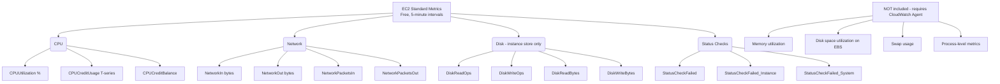
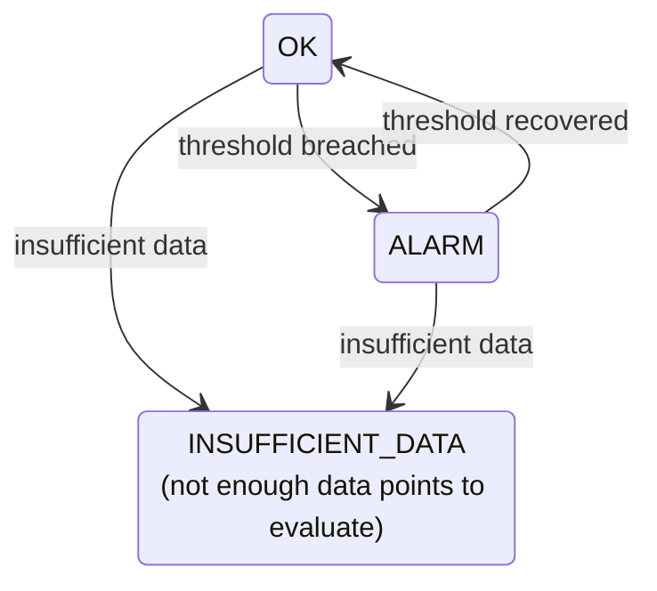
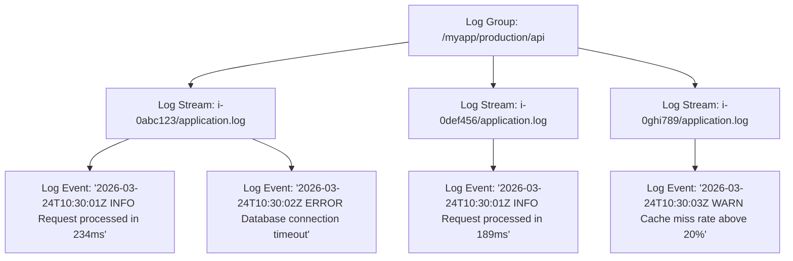
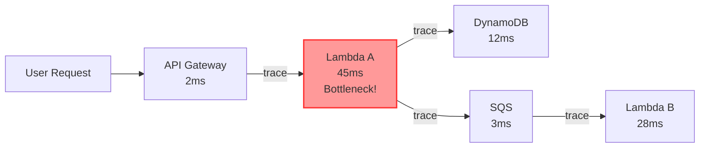
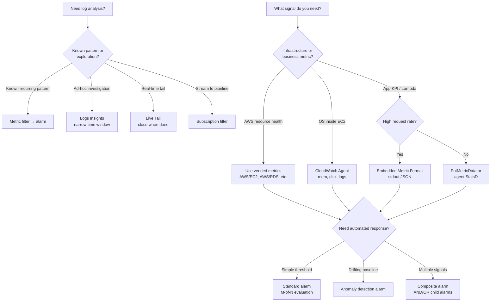

**Complexity**: `[MEDIUM]` | **Time to Complete**: 2 hours | **Prerequisites**: Module 1.3 EC2, an AWS account with admin or scoped CloudWatch/EC2/IAM permissions, AWS CLI v2, and a running EC2 instance to instrument.

## Prerequisites

Before starting this module, ensure you have the following environment and background in place so the hands-on labs and CLI examples run without rework:
- Completed [Module 1.3: EC2 & Compute Fundamentals](../module-1.3-ec2/) (launching instances, security groups, IAM instance profiles)
- An AWS account with admin access (or scoped permissions for CloudWatch, EC2, IAM)
- AWS CLI v2 installed and configured locally
- At least one running EC2 instance to instrument (or willingness to launch one)
- Basic understanding of metrics, logs, and alerting concepts in distributed systems

## What You'll Be Able to Do

After completing this module, you will be able to design and operate a production-grade observability baseline on AWS using the native CloudWatch stack rather than treating monitoring as an afterthought:

- **Implement** the CloudWatch Agent to collect custom OS-level metrics (memory, disk) and application logs from EC2 instances.
- **Design** CloudWatch Alarms combining multiple metrics with composite logic and automated EventBridge remediations.
- **Diagnose** complex application failures by writing efficient Logs Insights queries to filter and parse distributed system logs.
- **Evaluate** the financial impact of your architecture by designing CloudWatch Dashboards that utilize metric math to visualize real-time cost trends.

---

## Why This Module Matters

**Hypothetical scenario:** A payment platform runs a Java microservice on EC2 with a slow-burn memory leak. Over several hours, heap usage climbs while CPU stays flat. The team monitors only the default EC2 CPU metric, so memory pressure, application errors, and garbage-collection pauses stay invisible until `OutOfMemoryError` exceptions appear. Customer complaints finally trigger investigation, but by then cascading failures have spread to downstream services. Engineers SSH into instances and grep raw log files because nothing was centralized in CloudWatch Logs. The post-incident review rarely blames "lack of monitoring tools" — AWS already emitted free CPU and status-check metrics — but rather the absence of OS-level memory telemetry, structured log centralization, and alarms tied to JVM heap or disk pressure that would have fired long before user-visible failure.

Had they installed the CloudWatch Agent to collect memory and disk metrics, configured a custom metric for JVM heap usage, and set an alarm at 80% memory utilization, they would have received an automated alert 6 hours before the outage occurred. A simple auto-scaling policy tied to memory pressure could have launched fresh instances automatically to mitigate the leak. The total cost of prevention would have been roughly $3 per month in CloudWatch custom metrics. In this module, you will learn the full CloudWatch observability stack to prevent these exact scenarios.

---

## Standard Metrics: What AWS Gives You for Free

Every AWS service automatically publishes metrics to CloudWatch at no cost. These are called **standard metrics** (sometimes referred to as basic monitoring or vended metrics). Understanding what is free versus paid prevents surprise billing spikes.

### EC2 Standard Metrics



The architectural boundary of standard EC2 telemetry is determined by the hypervisor layer separating virtualization hosts from guest operating systems. The hypervisor directly observes physical hardware metrics, tracking CPU execution cycles, hypervisor-level network packet counts, and instance-store disk storage transactions without inspecting guest kernel data structures. Operating system page allocations, buffer caches, memory maps, and kernel data structures remain strictly isolated within the guest environment where the external hypervisor cannot observe them.

**Pause and predict:** If an EC2 instance exhausts its memory and crashes, which of the standard free metrics might hint that something went wrong given that `MemoryUtilization` is not tracked, and why are those clues insufficient?

<details>
<summary>Check your prediction</summary>

Standard free metrics provide only weak, circumstantial clues that fail to prove memory exhaustion:
- **Status checks (`StatusCheckFailed_Instance`)**: An out-of-memory kernel panic may eventually cause instance reachability checks to fail, but this indicates only that the operating system is unresponsive without distinguishing an OOM event from driver crashes, disk corruption, or kernel deadlocks.
- **CPU credit balance**: On burstable T-series instances, memory thrashing and aggressive page swapping immediately before a crash can drive high CPU utilization and exhaust credit balances, but normal batch compute spikes produce identical credit burn.
- **Network throughput**: A sudden drop in network traffic confirms the application stopped serving traffic, but reveals nothing about whether the root cause was memory exhaustion or a network partition.

Because hypervisor metrics cannot inspect internal guest state, installing the CloudWatch Agent to capture true OS-level memory metrics remains mandatory.

</details>

### Viewing Standard Metrics

You can retrieve standard metrics through the CloudWatch console graphs, but the AWS CLI examples below are the fastest way to confirm which dimensions exist for a given instance and to script dashboards or alarms in infrastructure-as-code. The `list-metrics` call reveals the exact dimension names your alarms must reference; the `get-metric-statistics` call validates that data is flowing before you attach SNS actions.

```bash
# List all available metrics for an instance
aws cloudwatch list-metrics \
  --namespace "AWS/EC2" \
  --dimensions "Name=InstanceId,Value=i-0abc123def456789"

# Get CPU utilization for the last hour (5-minute periods)
aws cloudwatch get-metric-statistics \
  --namespace "AWS/EC2" \
  --metric-name CPUUtilization \
  --dimensions Name=InstanceId,Value=i-0abc123def456789 \
  --start-time "$(date -u -v-1H '+%Y-%m-%dT%H:%M:%S')" \
  --end-time "$(date -u '+%Y-%m-%dT%H:%M:%S')" \
  --period 300 \
  --statistics Average Maximum

# On Linux, use date -d instead of -v:
# --start-time "$(date -u -d '1 hour ago' '+%Y-%m-%dT%H:%M:%S')"
```

### Other Services' Free Metrics

| Service | Key Free Metrics | Default Resolution |
|---------|-----------------|-------------------|
| RDS | CPUUtilization, FreeStorageSpace, ReadIOPS, WriteIOPS, DatabaseConnections | 1 minute |
| ALB | RequestCount, TargetResponseTime, HTTPCode_Target_4XX_Count, HealthyHostCount | 1 minute |
| ECS | CPUUtilization, MemoryUtilization (per service) | 1 minute |
| Lambda | Invocations, Duration, Errors, Throttles, ConcurrentExecutions | 1 minute |
| SQS | NumberOfMessagesSent, ApproximateNumberOfMessagesVisible, ApproximateAgeOfOldestMessage | 5 minutes |
| DynamoDB | ConsumedReadCapacityUnits, ConsumedWriteCapacityUnits, ThrottledRequests | 1 minute |

Notice that ECS gives you memory utilization for free because it can observe container-level memory from the task metadata. EC2, operating at the virtual machine level, does not.

### Namespaces, Dimensions, and Metric Identity

Every CloudWatch metric is uniquely identified by its **namespace**, **metric name**, and zero to thirty **dimensions** (name/value pairs). A namespace is simply a container that isolates metrics from different applications so that `CPUUtilization` from your payment service never aggregates with `CPUUtilization` from your auth service. AWS service metrics follow the convention `AWS/<Service>` — for example `AWS/EC2`, `AWS/RDS`, and `AWS/ApplicationELB`. When you publish application metrics, choose a namespace that reflects ownership, such as `MyApp/Production` or `OrderService/Checkout`, and keep it stable across deploys so dashboards and alarms do not break when code changes.

Dimensions are the most common source of both power and billing accidents. Each unique combination of namespace + metric name + dimension values is a **separate billable metric** when you publish custom data. If you publish `OrdersProcessed` with `Environment=production` and again with `Environment=staging`, that is two metrics. If you add `InstanceId` as a dimension on a fleet of five hundred EC2 hosts, you have multiplied your metric count by five hundred. CloudWatch does not aggregate across dimensions for custom metrics the way it can for some AWS service metrics, so you must publish the exact dimension set you intend to query later. The operational rule is simple: dimensions should represent low-cardinality categories (environment, service, region, Auto Scaling group), while high-cardinality identifiers (request ID, user ID, session token) belong in logs, not in metric dimensions.

### Resolution: Standard, Detailed, and High-Resolution Custom Metrics

**Resolution** defines how granular the data points are. AWS service metrics are standard resolution by default (one data point per minute for most services, five minutes for EC2 basic monitoring). EC2 **detailed monitoring** changes the collection interval to one minute and is billed as custom metrics — AWS documents an example of seven detailed EC2 metrics at $0.30 each, roughly $2.10 per instance per month in US East. That cost is usually worth it for production instances where a five-minute average can hide a sixty-second CPU spike that triggers autoscaling too late.

When **you** publish custom metrics, you choose standard resolution (stored at one-minute granularity, retained fifteen days at full resolution) or **high resolution** (one-second granularity, retained three hours at full resolution). High-resolution metrics support alarm periods of 10 or 30 seconds for faster detection, but each `PutMetricData` call is billed and high-resolution alarms carry a higher charge than standard alarms. Use high resolution only for metrics where sub-minute reaction time justifies the cost — queue depth on a trading system, perhaps; daily batch job counters, almost never.

### Metric Retention and Rollup Tiers

CloudWatch automatically rolls up older data to coarser periods so you can still graph long trends without storing every second forever. Per the [metrics concepts documentation](https://docs.aws.amazon.com/AmazonCloudWatch/latest/monitoring/cloudwatch_concepts.html), data published at sub-minute periods is available at full resolution for about three hours, one-minute data for fifteen days, five-minute aggregates for sixty-three days, and one-hour aggregates for roughly fifteen months. After those windows, you cannot retrieve the finer granularity again — planning alarm evaluation periods and dashboard ranges around these tiers prevents false assumptions that you can zoom into per-second CPU from six months ago.

Metrics also expire if you stop publishing: after fifteen months without new data points, the metric is dropped. Metrics that have had no new data for two weeks may not appear in the console search UI even though `get-metric-data` can still retrieve them via CLI. For operational hygiene, document which namespaces and dimensions your team owns, and delete or stop publishing experimental metrics before they accumulate in billing reports.

---

## Custom Metrics: Measuring What Matters

Standard metrics tell you about the health of your infrastructure. Custom metrics tell you about the health of your business. Business-critical values—like requests per second, payment processing latency, queue depth, and cache hit ratio—must be emitted as custom metrics.

### Publishing Custom Metrics

You can publish data points directly to the CloudWatch API with `put-metric-data`, which accepts one or many datums per call and is the right fit for batch jobs, on-prem gateways, or low-volume control-plane metrics. Each datum needs a namespace, metric name, value, optional unit, optional timestamp within the allowed skew window, and optional dimensions that must match every future `GetMetricData` query.

```bash
# Publish a single metric data point
aws cloudwatch put-metric-data \
  --namespace "MyApp/Production" \
  --metric-name "OrdersProcessed" \
  --value 142 \
  --unit Count \
  --dimensions Environment=production,Service=order-processor

# Publish with a timestamp (useful for backfilling)
aws cloudwatch put-metric-data \
  --namespace "MyApp/Production" \
  --metric-name "PaymentLatencyMs" \
  --value 238 \
  --unit Milliseconds \
  --timestamp "2026-03-24T10:30:00Z"

# Publish multiple metrics in one call (more efficient)
aws cloudwatch put-metric-data \
  --namespace "MyApp/Production" \
  --metric-data '[
    {"MetricName": "ActiveUsers", "Value": 1834, "Unit": "Count"},
    {"MetricName": "ErrorRate", "Value": 0.023, "Unit": "Percent"},
    {"MetricName": "CacheHitRatio", "Value": 94.6, "Unit": "Percent"}
  ]'
```

### Pricing Reality Check

Custom metrics cost **$0.30 per metric per month** for the first 10,000 metrics, dropping to $0.10 at scale. A "metric" is uniquely defined by its combination of namespace, metric name, and dimensions.

Billing treats each unique namespace + metric name + dimension set as its own time series. For instance, the following represent three separate billable metrics even though the human-readable metric name repeats:

```
MyApp/Production + OrdersProcessed + Environment=production,Service=orders
MyApp/Production + OrdersProcessed + Environment=staging,Service=orders
MyApp/Production + OrdersProcessed + Environment=production,Service=payments
```

Teams that over-use dimensions (e.g., adding an instance ID, request ID, or user IP address as dimensions) can accidentally create millions of unique metrics and face bills in the tens of thousands of dollars. A firm rule: dimensions should have low cardinality. Store high-cardinality data in log files, not metric dimensions.

### Embedded Metric Format (EMF)

If your application writes structured JSON logs, CloudWatch can automatically extract metrics from them. This is the Embedded Metric Format (EMF), and it is the most scalable way to publish custom metrics from Lambda functions and ECS tasks without blocking application threads.

```python
import json
import sys
import time

def emit_metric(metric_name, value, unit="Count", dimensions=None):
    """Emit a CloudWatch metric via Embedded Metric Format."""
    emf = {
        "_aws": {
            # Use current time in epoch ms; CloudWatch rejects datapoints more than
            # ~2 weeks in the past or ~2 hours in the future.
            "Timestamp": int(time.time() * 1000),
            "CloudWatchMetrics": [
                {
                    "Namespace": "MyApp/Production",
                    "Dimensions": [list(dimensions.keys())] if dimensions else [[]],
                    "Metrics": [
                        {"Name": metric_name, "Unit": unit}
                    ]
                }
            ]
        },
        metric_name: value
    }
    if dimensions:
        emf.update(dimensions)
    # Print to stdout -- CloudWatch Logs automatically extracts the metric
    print(json.dumps(emf))
    sys.stdout.flush()

# Usage
emit_metric("CheckoutLatency", 234, "Milliseconds",
            {"Environment": "production", "Region": "us-east-1"})
```

With EMF, you get both a searchable log entry AND a CloudWatch metric from a single stdout print statement, entirely bypassing the network latency of the `put-metric-data` API. The EMF specification requires a `_aws.CloudWatchMetrics` object naming the namespace, dimension keys, and metric definitions; the metric values themselves appear as top-level JSON fields alongside optional dimensions. Lambda and container runtimes ship stdout to CloudWatch Logs automatically, so EMF is the idiomatic path for serverless business metrics. Validate EMF output in a staging log group first — malformed JSON lines are logged but do not create metrics, which can leave dashboards empty while the application appears healthy.

Teams sometimes publish custom metrics on a one-minute cron from aggregated database tables instead of per-request emission. That batch pattern keeps cardinality flat and API volume low, which is appropriate for daily revenue totals or inventory snapshots. The tradeoff is up to one period of lag before CloudWatch sees a spike; pair batch metrics with real-time log-based filters when you need both cheap aggregates and fast error detection on the same event stream.

**Pause and predict:** If you use `put-metric-data` synchronously in a Lambda function that processes 10,000 requests per second, what two major operational bottlenecks or failures will you encounter?

<details>
<summary>Check your prediction</summary>

Synchronous `put-metric-data` invocations at 10,000 requests per second introduce two critical operational bottlenecks:
1. **API rate limiting and throttling**: The CloudWatch `PutMetricData` API enforces regional TPS quotas (typically 500 transactions per second by default). Attempting 10,000 synchronous API calls per second will immediately overwhelm the quota, triggering pervasive HTTP 429 throttling errors and dropping metrics or failing invocations.
2. **Latency inflation and compute costs**: Each synchronous HTTPS call to CloudWatch adds 10 to 50 milliseconds of network round-trip latency to the Lambda function's critical path. Across 10,000 requests per second, this synchronous wait time significantly inflates billed execution duration and drives up AWS compute charges, while creating severe risk of dimension cardinality explosions if request-level metadata is attached.

The Embedded Metric Format (EMF) solves this entirely by logging metric payloads to stdout asynchronously, allowing the CloudWatch Logs service to extract metrics without synchronous API calls or latency penalties.

</details>

---

## CloudWatch Alarms: Intelligent Alerting

Metrics without alarms are simply graphs that no one watches at 3:00 AM. Alarms bridge the gap between telemetry collection and incident response, waking up engineers only when action is required. A well-designed alarm set answers three questions for every signal you care about: what threshold defines "bad," how many consecutive or recent periods must be bad before we act, and what should happen automatically versus what requires human judgment. Skipping any of those questions is how teams end up with either silent failures (alarms never created) or pager burnout (every blip pages the on-call). The sections below walk through anatomy, threshold models, composite logic, and the automation hooks that turn metrics into runbooks.

### Alarm Anatomy

Every CloudWatch alarm watches a single metric or a Metrics Insights / metric math expression, evaluates samples over a configured period, and maintains one of three states that operators and automations can act on. Understanding those states prevents misconfigured runbooks that assume an alarm fires on every threshold crossing rather than on sustained breaches.



### Creating Alarms

Alarms can perform automated actions when they enter `ALARM` or return to `OK`, including SNS notifications, Auto Scaling policy adjustments, and EC2 recovery actions referenced by special automate ARNs in the alarm action list.

```bash
# CPU alarm: trigger if average CPU > 80% for 3 consecutive 5-minute periods
aws cloudwatch put-metric-alarm \
  --alarm-name "high-cpu-i-0abc123" \
  --alarm-description "CPU utilization exceeds 80% for 15 minutes" \
  --metric-name CPUUtilization \
  --namespace AWS/EC2 \
  --statistic Average \
  --period 300 \
  --threshold 80 \
  --comparison-operator GreaterThanThreshold \
  --evaluation-periods 3 \
  --dimensions Name=InstanceId,Value=i-0abc123def456789 \
  --alarm-actions arn:aws:sns:us-east-1:123456789012:ops-alerts \
  --ok-actions arn:aws:sns:us-east-1:123456789012:ops-alerts \
  --treat-missing-data missing

# Status check alarm (recover the instance automatically)
aws cloudwatch put-metric-alarm \
  --alarm-name "status-check-i-0abc123" \
  --alarm-description "Recover instance on status check failure" \
  --metric-name StatusCheckFailed_System \
  --namespace AWS/EC2 \
  --statistic Maximum \
  --period 60 \
  --threshold 1 \
  --comparison-operator GreaterThanOrEqualToThreshold \
  --evaluation-periods 2 \
  --dimensions Name=InstanceId,Value=i-0abc123def456789 \
  --alarm-actions arn:aws:automate:us-east-1:ec2:recover

# Custom metric alarm: order processing errors
aws cloudwatch put-metric-alarm \
  --alarm-name "order-errors-high" \
  --metric-name "OrderErrors" \
  --namespace "MyApp/Production" \
  --statistic Sum \
  --period 300 \
  --threshold 10 \
  --comparison-operator GreaterThanThreshold \
  --evaluation-periods 1 \
  --dimensions Name=Environment,Value=production \
  --alarm-actions arn:aws:sns:us-east-1:123456789012:ops-alerts
```

### The `treat-missing-data` Gotcha

The `TreatMissingData` parameter (CLI: `--treat-missing-data`) determines whether missing samples count as healthy, unhealthy, or neutral during an evaluation window, which matters enormously for batch jobs, sparse Lambda invocations, and agents that stop reporting during deploys.

| Setting | Behavior | Best For |
|---------|----------|----------|
| `missing` | Maintains current state | Most alarms (conservative) |
| `notBreaching` | Treats missing data as OK | Sporadic metrics (batch jobs) |
| `breaching` | Treats missing data as ALARM | Critical systems where silence is bad |
| `ignore` | Skips the period entirely | Alarms with naturally gappy data |

The default is `missing`, which is generally safe. But for critical continuous health checks, consider `breaching`—if your application completely stops reporting metrics, silence is itself an emergency worth alerting on.

**Pause and predict:** You have an alarm monitoring a batch job that runs once an hour. If `treat-missing-data` is set to `missing`, what state will the alarm maintain during the 59 minutes the job is not running, and how might that affect your incident response?

<details>
<summary>Check your prediction</summary>

When `treat-missing-data` is set to `missing`, CloudWatch treats missing periods as neutral and preserves the existing state:
- **Idle state persistence**: During the 59 minutes between scheduled runs when no metrics are reported, the alarm simply maintains whatever state it held when the last datapoint arrived. If the previous run completed normally and left the alarm in `OK`, it remains `OK` throughout the entire idle window.
- **Incident response risk**: If a scheduled batch worker completely fails to execute (such as from an EventBridge rule misconfiguration, IAM permission error, or container pull failure) and emits zero metric points, the alarm will never transition to `ALARM`. It remains silently in `OK`, masking a total pipeline blackout.
- **Recommended batch design**: For sparse batch pipelines, compare `notBreaching` (which resets the alarm to `OK` during expected gaps) against `breaching` paired with an inverted metric or dedicated heartbeat. Alternatively, configure a separate dead-man's-snitch alarm where silence itself breaches the threshold to guarantee that non-executing jobs wake on-call operators.

</details>

### Composite Alarms

When a single metric alarm produces too much noise, combine multiple alarms with boolean logic to create high-signal composite alarms.

```bash
# Only alert if BOTH CPU is high AND memory is high
aws cloudwatch put-composite-alarm \
  --alarm-name "instance-stressed" \
  --alarm-rule 'ALARM("high-cpu-i-0abc123") AND ALARM("high-memory-i-0abc123")' \
  --alarm-actions arn:aws:sns:us-east-1:123456789012:ops-alerts
```

This drastically reduces alert fatigue. A transient CPU spike alone is often harmless. A CPU spike combined with exhausted memory and an elevated 5xx error rate is an active incident.

### M-of-N Evaluation and Datapoints to Alarm

Static thresholds work when "bad" has a clear numeric definition, but production traffic is noisy. CloudWatch alarms support **M out of N** evaluation: you can require that at least M of the last N evaluation periods breach the threshold before transitioning to `ALARM`. In the CLI this appears as `DatapointsToAlarm` paired with `EvaluationPeriods`. For example, `EvaluationPeriods=5` and `DatapointsToAlarm=3` means three of the last five periods must breach — catching sustained problems while ignoring a single flaky period. This is the correct fix for the quiz scenario where CPU spiked, cooled, and spiked again: a strict "all periods must breach" alarm never fired because one period recovered.

When you design M-of-N rules, align the period length with how the underlying metric is stored. An EC2 basic-monitoring CPU metric has five-minute periods; evaluating it with a sixty-second alarm period produces `INSUFFICIENT_DATA` or misleading results. Detailed monitoring or agent-collected metrics at sixty-second intervals support tighter periods.

### Anomaly Detection Alarms

For metrics with seasonal or drifting baselines — request rate that grows every Monday, error rate that creeps up after deploys — **anomaly detection** trains a band of expected values and alarms when live data falls outside that band. AWS bills anomaly detection alarms based on the number of metrics involved in the model (the watched metric plus upper and lower bound series). The [CloudWatch pricing page](https://aws.amazon.com/cloudwatch/pricing/) documents an example of five standard-resolution anomaly alarms at three metrics each costing about $1.50 per month total. Anomaly detection shines when you cannot pick a static threshold that works across day and night traffic; it fails when your metric is mostly zero with rare spikes, because the model needs enough history to learn a pattern.

### Alarm Actions Beyond SNS

Alarm state changes can invoke **Amazon SNS** topics (email, SMS, chat integrations), **Auto Scaling** policies (scale out on high CPU, scale in on low), and **EC2 actions** such as `recover`, `reboot`, or `stop` via the special `arn:aws:automate:region:ec2:recover` ARN format. Composite alarms can trigger the same actions when boolean logic across child alarms fires. For richer workflows — opening tickets, running Step Functions, invoking Lambda with custom logic — publish alarm state change events to **EventBridge** (covered later) rather than stretching SNS beyond notification. Keep SNS for human paging and EventBridge for automation so you can evolve runbooks without redeploying every alarm.

---

## CloudWatch Logs: Centralized Log Management

Every application produces logs, but accessing them across hundreds of instances via SSH becomes impractical at scale. CloudWatch Logs gives you a centralized data store to securely hold, search, and parse those logs. The mental model mirrors metrics: a **log group** is the bucket, **log streams** partition events by source (instance, container, Lambda invocation), and **log events** are the individual lines or JSON objects. Permissions are IAM-based on `logs:PutLogEvents`, `logs:FilterLogEvents`, and `logs:StartQuery`; the instance role or task role must allow the principal that writes logs. Encryption at rest uses KMS optionally per log group; ingestion and scanning costs are unchanged, but regulated workloads often require customer-managed keys for audit trails.

Operational maturity for logs usually progresses in three stages. Stage one is centralization — get every instance and Lambda function writing to named groups with enforced retention. Stage two is structured JSON logging so Insights queries can parse fields without fragile regular expressions. Stage three is deriving metrics and streams from logs (metric filters, subscription filters, EMF) so dashboards and alarms treat logs as a first-class metrics source instead of a forensic afterthought. Trying to skip straight to stage three without retention and structure produces expensive, unreadable log lakes.

### Core Concepts



- **Log Group**: A massive container for log streams, typically one per application/environment.
- **Log Stream**: A continuous sequence of log events from a specific source (like one EC2 instance or one Lambda invocation).
- **Log Event**: A single timestamped string of text or JSON.

### Setting Retention (Cost Control)

By default, CloudWatch Logs retains data **forever**. This is the single biggest cause of billing shock for CloudWatch newcomers.

```bash
# Set retention to 30 days (common for production)
aws logs put-retention-policy \
  --log-group-name "/myapp/production/api" \
  --retention-in-days 30

# Common retention periods:
# 1, 3, 5, 7, 14, 30, 60, 90, 120, 150, 180, 365, 400, 545, 731, 1096, 1827, 2192, 2557, 2922, 3288, 3653

# Check current retention for all log groups
aws logs describe-log-groups \
  --query 'logGroups[*].[logGroupName,retentionInDays,storedBytes]' \
  --output table
```

### CloudWatch Logs Insights

Logs Insights provides a purpose-built query language to scan terabytes of log events asynchronously, charging per gigabyte scanned rather than per log line returned, which means narrowing the time range and filtering early are cost decisions as much as performance decisions.

```bash
# Find the 20 slowest requests in the last hour
# macOS: date -u -v-1H '+%s'  |  Linux: date -u -d '1 hour ago' '+%s'
aws logs start-query \
  --log-group-name "/myapp/production/api" \
  --start-time $(date -u -d '1 hour ago' '+%s' 2>/dev/null || date -u -v-1H '+%s') \
  --end-time $(date -u '+%s') \
  --query-string '
    fields @timestamp, @message
    | filter @message like /processed in/
    | parse @message "processed in *ms" as latency
    | sort latency desc
    | limit 20
  '

# Count errors by type in the last 24 hours
# macOS: date -u -v-24H '+%s'  |  Linux: date -u -d '24 hours ago' '+%s'
aws logs start-query \
  --log-group-name "/myapp/production/api" \
  --start-time $(date -u -d '24 hours ago' '+%s' 2>/dev/null || date -u -v-24H '+%s') \
  --end-time $(date -u '+%s') \
  --query-string '
    fields @timestamp, @message
    | filter @message like /ERROR/
    | parse @message "ERROR * - *" as errorType, errorMessage
    | stats count(*) as errorCount by errorType
    | sort errorCount desc
  '

# Get the query results (use the queryId from start-query response)
aws logs get-query-results --query-id "a1b2c3d4-5678-90ab-cdef-example"
```

The table below lists the most common Logs Insights query clauses teams combine during incident response; mastering them is usually a better investment than exporting logs to a second search cluster for ad-hoc questions.

| Pattern | Example | Use Case |
|---------|---------|----------|
| `filter` | `filter @message like /ERROR/` | Narrow to relevant logs |
| `parse` | `parse @message "status=*" as code` | Extract fields from unstructured logs |
| `stats` | `stats count(*) by code` | Aggregate and group |
| `sort` | `sort @timestamp desc` | Order results |
| `limit` | `limit 50` | Cap result size |
| `fields` | `fields @timestamp, @message` | Select columns |

**Pause and predict:** You run a Logs Insights query searching for an error over a 30-day window on a high-traffic API, costing $15 to execute. If you add a `limit 10` clause to the exact same query and run it again, will the cost decrease, and why?

<details>
<summary>Check your prediction</summary>

No, the query cost will remain exactly $15. CloudWatch Logs Insights pricing is determined entirely by the volume of data scanned ($0.005 per GB scanned in standard regions), completely independent of the number of log events returned to your console or client.
- **Scan semantics**: A `limit 10` clause only restricts the number of matching records displayed after the query engine reads and evaluates the target log data. Because the engine must still decompress and scan through the entire 30-day log history to locate matching lines, the scanned byte count remains identical.
- **Cost reduction strategy**: To reduce query costs, you must decrease the volume of scanned data by narrowing the `@timestamp` range (for example, searching 2 hours instead of 30 days) or scoping the query to specific log streams rather than the entire log group.

</details>

### Metric Filters: Turning Logs Into Metrics

You can define CloudWatch Metrics from continuous log patterns without altering application code. Crucially, evaluating logs with metric filters is completely free; you are not charged for the compute required to scan the incoming log streams. You only pay standard rates for the resulting custom metrics that the filter generates.

```bash
# Create a metric filter that counts ERROR lines
aws logs put-metric-filter \
  --log-group-name "/myapp/production/api" \
  --filter-name "ErrorCount" \
  --filter-pattern "ERROR" \
  --metric-transformations \
    metricName=ApplicationErrors,metricNamespace=MyApp/Production,metricValue=1,defaultValue=0

# More specific: count 5xx responses in JSON logs
aws logs put-metric-filter \
  --log-group-name "/myapp/production/api" \
  --filter-name "5xxResponses" \
  --filter-pattern '{ $.statusCode >= 500 }' \
  --metric-transformations \
    metricName=Server5xxErrors,metricNamespace=MyApp/Production,metricValue=1,defaultValue=0
```

Metric filters scan incoming log events in real time and increment a custom metric when a pattern matches. The filter evaluation itself is not charged per scan; you pay only for the custom metrics the filter emits and for log ingestion/storage underneath. That cost model makes metric filters the economical choice for **known** error signatures you will monitor continuously, as opposed to re-running an expensive Logs Insights query across hundreds of gigabytes during every incident.

### Subscription Filters: Streaming Logs to Destinations

**Subscription filters** near-real-time forward matching log events to **Lambda**, **Kinesis Data Streams**, **Kinesis Data Firehose**, or another account's log destination. Typical uses include transforming logs before indexing in OpenSearch, fan-out to a security SIEM, or custom enrichment pipelines. Subscription filters complement metric filters: metric filters answer "how many errors per minute?" while subscription filters answer "give me every error event right now for processing." Each subscription filter incurs charges on the destination service (Lambda invocations, Firehose delivery, etc.), so size the filter pattern narrowly and monitor downstream costs when log volume spikes.

```bash
# Stream ERROR lines to a Lambda function for enrichment
aws logs put-subscription-filter \
  --log-group-name "/myapp/production/api" \
  --filter-name "ErrorsToLambda" \
  --filter-pattern "ERROR" \
  --destination-arn "arn:aws:lambda:us-east-1:123456789012:function:LogEnricher"
```

### Live Tail: Real-Time Log Tailing in the Console

**CloudWatch Logs Live Tail** streams matching log events to the console or CLI in real time, similar to `tail -f` but without SSH access to instances. The [pricing page](https://aws.amazon.com/cloudwatch/pricing/) includes 1,800 minutes per month in the free tier; beyond that, Live Tail costs $0.01 per minute in US East. Live Tail is ideal for debugging a deploy during the first ten minutes, not for leaving a session open all day — a twenty-thousand-minute month would cost on the order of $180 in Live Tail charges alone. Use narrow filter patterns and close sessions when triage ends.

---

## The CloudWatch Agent: Unlocking OS-Level Metrics

The CloudWatch Agent is a lightweight daemon that resides inside your EC2 instances. It captures the operating system metrics the hypervisor misses and streams text logs directly to CloudWatch Logs.

### Unified Agent vs Legacy Collectors

Before the unified agent, teams stitched together three separate tools: Perl-based **Monitoring Scripts** (`mon-put-instance-data.pl`) for custom metrics, the **CloudWatch Logs Agent** (`awslogs`) for log shipping, and an SSM plugin on Windows. Those paths are deprecated. The [CloudWatch agent installation guide](https://docs.aws.amazon.com/AmazonCloudWatch/latest/monitoring/Install-CloudWatch-Agent.html) documents a single JSON configuration for OS metrics (CPU, memory, disk, swap, process counts), log files, and optional StatsD collection. On containers and Lambda, prefer **Embedded Metric Format** in application logs rather than running the agent inside the task — the agent is the right default for EC2 and hybrid servers, not for every compute model.

### Installation

```bash
# Amazon Linux 2 / Amazon Linux 2023
sudo yum install -y amazon-cloudwatch-agent

# Ubuntu/Debian
wget https://amazoncloudwatch-agent.s3.amazonaws.com/ubuntu/amd64/latest/amazon-cloudwatch-agent.deb
sudo dpkg -i amazon-cloudwatch-agent.deb

# Verify installation (binary is not on PATH by default after yum install)
/opt/aws/amazon-cloudwatch-agent/bin/amazon-cloudwatch-agent-ctl -a status
```

### Configuration

The agent is governed by a JSON file that explicitly declares which metrics to scrape and which file paths to tail.

```json
{
  "agent": {
    "metrics_collection_interval": 60,
    "run_as_user": "cwagent"
  },
  "metrics": {
    "namespace": "CWAgent",
    "append_dimensions": {
      "InstanceId": "${aws:InstanceId}",
      "AutoScalingGroupName": "${aws:AutoScalingGroupName}"
    },
    "aggregation_dimensions": [
      ["InstanceId"],
      ["AutoScalingGroupName"]
    ],
    "metrics_collected": {
      "mem": {
        "measurement": [
          "mem_used_percent",
          "mem_available_percent",
          "mem_total"
        ],
        "metrics_collection_interval": 60
      },
      "disk": {
        "measurement": [
          "disk_used_percent",
          "disk_free"
        ],
        "resources": ["/", "/data"],
        "metrics_collection_interval": 60
      },
      "swap": {
        "measurement": ["swap_used_percent"]
      },
      "cpu": {
        "measurement": [
          "cpu_usage_idle",
          "cpu_usage_user",
          "cpu_usage_system",
          "cpu_usage_iowait"
        ],
        "totalcpu": true,
        "metrics_collection_interval": 60
      }
    }
  },
  "logs": {
    "logs_collected": {
      "files": {
        "collect_list": [
          {
            "file_path": "/var/log/myapp/application.log",
            "log_group_name": "/myapp/production/api",
            "log_stream_name": "{instance_id}/application.log",
            "retention_in_days": 30,
            "timestamp_format": "%Y-%m-%dT%H:%M:%S"
          },
          {
            "file_path": "/var/log/syslog",
            "log_group_name": "/myapp/production/system",
            "log_stream_name": "{instance_id}/syslog",
            "retention_in_days": 14
          }
        ]
      }
    }
  }
}
```

### Storing Config in SSM and Starting the Agent

Do not bake this config file directly into your AMI. Instead, store it centrally in Systems Manager (SSM).

```bash
# Write the agent config (same JSON as above) before uploading to SSM
cat <<'EOF' > cw-config.json
{
  "agent": {
    "metrics_collection_interval": 60,
    "run_as_user": "cwagent"
  },
  "metrics": {
    "namespace": "CWAgent",
    "append_dimensions": {
      "InstanceId": "${aws:InstanceId}",
      "AutoScalingGroupName": "${aws:AutoScalingGroupName}"
    },
    "aggregation_dimensions": [
      ["InstanceId"],
      ["AutoScalingGroupName"]
    ],
    "metrics_collected": {
      "mem": {
        "measurement": [
          "mem_used_percent",
          "mem_available_percent",
          "mem_total"
        ],
        "metrics_collection_interval": 60
      },
      "disk": {
        "measurement": [
          "disk_used_percent",
          "disk_free"
        ],
        "resources": ["/", "/data"],
        "metrics_collection_interval": 60
      },
      "swap": {
        "measurement": ["swap_used_percent"]
      },
      "cpu": {
        "measurement": [
          "cpu_usage_idle",
          "cpu_usage_user",
          "cpu_usage_system",
          "cpu_usage_iowait"
        ],
        "totalcpu": true,
        "metrics_collection_interval": 60
      }
    }
  },
  "logs": {
    "logs_collected": {
      "files": {
        "collect_list": [
          {
            "file_path": "/var/log/myapp/application.log",
            "log_group_name": "/myapp/production/api",
            "log_stream_name": "{instance_id}/application.log",
            "retention_in_days": 30,
            "timestamp_format": "%Y-%m-%dT%H:%M:%S"
          },
          {
            "file_path": "/var/log/syslog",
            "log_group_name": "/myapp/production/system",
            "log_stream_name": "{instance_id}/syslog",
            "retention_in_days": 14
          }
        ]
      }
    }
  }
}
EOF

# Store the config in SSM Parameter Store
aws ssm put-parameter \
  --name "AmazonCloudWatch-linux-config" \
  --type String \
  --value "file://cw-config.json"

# Fetch config from SSM and start the agent
sudo /opt/aws/amazon-cloudwatch-agent/bin/amazon-cloudwatch-agent-ctl \
  -a fetch-config \
  -m ec2 \
  -s \
  -c ssm:AmazonCloudWatch-linux-config

# Check agent status
/opt/aws/amazon-cloudwatch-agent/bin/amazon-cloudwatch-agent-ctl -a status
```

### Required IAM Policy

The EC2 instance role requires permission to write metrics with `cloudwatch:PutMetricData`, create and write log streams, and read the SSM parameter that stores agent configuration; missing any one of those actions produces a running agent that silently fails to ship telemetry.

```json
{
  "Version": "2012-10-17",
  "Statement": [
    {
      "Effect": "Allow",
      "Action": [
        "cloudwatch:PutMetricData",
        "logs:CreateLogGroup",
        "logs:CreateLogStream",
        "logs:PutLogEvents",
        "logs:DescribeLogStreams",
        "ssm:GetParameter"
      ],
      "Resource": "*"
    },
    {
      "Effect": "Allow",
      "Action": "ec2:DescribeTags",
      "Resource": "*"
    }
  ]
}
```

For most labs and production fleets, attaching the AWS managed `CloudWatchAgentServerPolicy` to the instance role is simpler than hand-maintaining the JSON policy above, provided your security reviewers accept AWS-managed policy scope.

```bash
aws iam attach-role-policy \
  --role-name my-ec2-role \
  --policy-arn arn:aws:iam::aws:policy/CloudWatchAgentServerPolicy
```

---

## CloudWatch Dashboards and Metric Math

While alarms handle proactive response, dashboards provide the unified situational awareness required during live incident triage. The AWS console offers automatic dashboards for many services; custom dashboards let you overlay ALB request counts, RDS connections, Lambda errors, and agent memory on a single pane during an outage. Dashboards cost $3 per dashboard per month beyond the three free custom dashboards (fifty metrics each, per current pricing), so consolidate team views instead of creating one dashboard per microservice. During incidents, prefer a small set of curated graphs with metric math derivations over ad-hoc console clicking — muscle memory matters when latency is measured in customer impact.

### Metric Math

Metric Math enables you to mathematically manipulate multiple CloudWatch metrics to derive entirely new operational insights without writing custom publisher code.

Metric math expressions reference other metrics by `Id` and can combine AWS service metrics without pre-computing ratios in application code — for example, calculating a live 5xx error rate percentage directly from raw Application Load Balancer request and error counters:

```json
[
  { "Id": "requests", "MetricStat": { "Metric": { "Namespace": "AWS/ApplicationELB", "MetricName": "RequestCount", "Dimensions": [ { "Name": "LoadBalancer", "Value": "app/my-alb/123" } ] }, "Period": 300, "Stat": "Sum" }, "ReturnData": false },
  { "Id": "errors", "MetricStat": { "Metric": { "Namespace": "AWS/ApplicationELB", "MetricName": "HTTPCode_Target_5XX_Count", "Dimensions": [ { "Name": "LoadBalancer", "Value": "app/my-alb/123" } ] }, "Period": 300, "Stat": "Sum" }, "ReturnData": false },
  { "Id": "error_rate", "Expression": "(errors / requests) * 100", "Label": "5xx Error Rate (%)", "ReturnData": true }
]
```

### Visualizing Cost Trends

A highly effective, yet often overlooked, use of metric math is tracking **cost trends**. By querying the `EstimatedCharges` metric in the `AWS/Billing` namespace and comparing it mathematically against your application's `RequestCount`, you can use metric math to graph your real-time cost-per-request. This powerful technique transforms a standard operational dashboard into an immediate FinOps visibility tool, allowing engineers to evaluate the financial efficiency of a new code deployment within minutes. Billing metrics update daily, not per request, so cost-per-request graphs are trend indicators rather than real-time autoscaling signals — pair them with CUR exports or Cost Explorer for accounting-grade accuracy while keeping operational dashboards lightweight.

**GetMetricData** powers dashboards and many third-party tools; it is billed separately from the million free CloudWatch API requests and scales with the number of metrics and time range requested. If a dashboard refresh interval polls hundreds of metrics every minute, API charges can exceed dashboard monthly fees. Metric math inside a single dashboard widget reduces duplicate fetches by computing derived series server-side. For external monitoring systems, consider **metric streams** to Kinesis or Firehose ($0.003 per thousand metric updates plus destination costs) instead of polling GetMetricData on a tight loop — streams push deltas to you rather than forcing pull-based polling across the entire metric namespace.

---

## EventBridge and X-Ray: Automation and Tracing

### EventBridge: Event-Driven Automation

EventBridge is the high-throughput nervous system connecting AWS services. When infrastructure state changes—an instance terminates, a pipeline completes, or an alarm breaches—EventBridge routes that payload to a designated target for remediation. CloudWatch Alarms automatically emit events on the default event bus when their state changes (`OK`, `ALARM`, `INSUFFICIENT_DATA`), which means you can decouple **detection** (the alarm) from **response** (Lambda, Step Functions, SSM Automation, or third-party integrations via API destinations). Scheduled rules use cron or rate expressions for periodic hygiene jobs — certificate checks, stale resource reports, or synthetic test triggers — without maintaining cron inside EC2 instances.

Event patterns are JSON filters on `source`, `detail-type`, and fields inside `detail`. The EC2 state-change example below reacts only when instances enter `stopped` or `terminated`, ignoring benign reboot cycles. When designing rules, prefer the narrowest pattern that still catches the failure mode; broad `aws.ec2` rules fan out noise to Lambdas that cost money per invocation and can hit concurrency limits during large Auto Scaling events.

```bash
# React when an EC2 instance stops unexpectedly
aws events put-rule \
  --name "ec2-instance-stopped" \
  --event-pattern '{
    "source": ["aws.ec2"],
    "detail-type": ["EC2 Instance State-change Notification"],
    "detail": {
      "state": ["stopped", "terminated"]
    }
  }' \
  --state ENABLED

# Send to SNS topic
aws events put-targets \
  --rule "ec2-instance-stopped" \
  --targets '[{"Id":"notify-ops","Arn":"arn:aws:sns:us-east-1:123456789012:ops-alerts"}]'

# Schedule-based rule (cron): run a Lambda every day at 6 AM UTC
aws events put-rule \
  --name "daily-health-check" \
  --schedule-expression "cron(0 6 * * ? *)" \
  --state ENABLED
```

### X-Ray: Distributed Tracing

In modern microservices architectures, an API request might flow through ten different distributed services. When the request is slow, logs alone cannot quickly pinpoint the exact bottleneck. AWS X-Ray solves this by passing a trace ID through every hop.



### AWS Distro for OpenTelemetry (ADOT) and the OTLP Path

**AWS Distro for OpenTelemetry (ADOT)** collects traces and metrics using the OpenTelemetry Protocol and sends them to CloudWatch and X-Ray. Traditional X-Ray SDKs required language-specific instrumentation; ADOT aligns with the industry-standard OTLP exporters so the same collector sidecar on EKS or daemon on EC2 can feed multiple backends. CloudWatch now also accepts **OpenTelemetry metrics** with PromQL-based alarms in Query Studio — a different data model from namespace/dimension metrics (labels instead of dimensions, shorter default retention in preview). For greenfield services on Kubernetes, ADOT is the forward-looking path; for brownfield EC2 with file-based logs, the unified agent plus X-Ray daemon remains common.

### CloudWatch Synthetics and RUM (Brief)

**CloudWatch Synthetics** runs **canaries** — scheduled headless browsers or HTTP checks that probe endpoints from AWS-managed locations and publish success, duration, and screenshot metrics. The free tier includes 100 canary runs per month; beyond that you pay per run. Canaries catch problems no internal metric sees: DNS failures, TLS expiry, broken login flows, and third-party CDN outages.

**CloudWatch RUM** (Real User Monitoring) collects performance and JavaScript errors from real browsers. The free trial includes one million RUM events per account; paid pricing is on the order of **$1 per 100,000 data events** in US East per the [pricing page](https://aws.amazon.com/cloudwatch/pricing/). Use Synthetics for proactive uptime checks and RUM for what customers actually experience; together they bracket "works in the lab" versus "works on a phone on a slow network."

---

## Patterns & Anti-Patterns

The patterns below reflect designs that mature AWS operations teams converge on after learning CloudWatch billing and signal-to-noise lessons the hard way. Each pattern states when to apply it, why it works, and how it behaves as scale grows.

### Proven Patterns

**Pattern 1: Agent plus SSM-stored config on day one for every EC2 fleet.** Install the unified CloudWatch Agent during instance bootstrap, store JSON config in SSM Parameter Store, and fetch at boot with `amazon-cloudwatch-agent-ctl`. This pattern closes the memory and disk visibility gap before the first production incident. It scales because you change metrics and log paths by updating SSM and rolling instances or using Run Command — not by rebuilding AMIs. Cost stays predictable: a handful of custom metrics per instance, not thousands of dimensions.

**Pattern 2: Known-error metric filters, unknown-error Logs Insights.** Define metric filters for stable patterns (`ERROR`, JSON `statusCode >= 500`, payment decline codes) and alarm on the resulting custom metrics. Reserve Logs Insights for exploratory questions during incidents with deliberately narrow time windows. At scale, scanning terabytes repeatedly dominates CloudWatch bills; metric filters turn recurring questions into flat monthly metric charges.

**Pattern 3: Composite alarms for paging, simple alarms for automation.** Use per-metric alarms to drive Auto Scaling or EC2 recovery actions, and a composite `AND`/`OR` alarm to page humans only when multiple signals agree. This reduces alert fatigue without losing automation speed on single-metric triggers that are safe to act on alone.

**Pattern 4: EMF from Lambda and containers, PutMetricData only when necessary.** Emit business metrics via Embedded Metric Format to stdout so ingestion piggybacks on log delivery and avoids synchronous API calls in the request path. At thousands of invocations per second, removing `PutMetricData` from the hot path prevents API throttling and latency inflation.

**Pattern 5: EventBridge for alarm and health events, SNS for notification.** Route `CloudWatch Alarm State Change`, EC2 state change, and Health events to EventBridge rules that target Lambda, Step Functions, or ticketing integrations. SNS remains the simple email/SMS/chat layer. This separation keeps remediation workflows versioned in code instead of buried in alarm ARNs.

### Anti-Patterns

| Anti-Pattern | Why Teams Fall Into It | What Goes Wrong | Better Approach |
|---|---|---|---|
| High-cardinality dimensions on custom metrics | Easy to add `UserId` or `RequestId` for debugging | Millions of unique metric time series; bills jump from tens to thousands of dollars | Low-cardinality dimensions only; log the request ID in structured JSON |
| Default infinite log retention | Retention is optional at creation | Storage charges compound silently for years | Set retention at log group creation; audit with `describe-log-groups` monthly |
| Static CPU-only EC2 monitoring | CPU is free and familiar | Memory leaks and disk full events invisible until outage | CloudWatch Agent for `mem_used_percent` and `disk_used_percent` on every instance |
| Re-running the same Logs Insights query all incident | Urgency overrides cost awareness | Hundreds of dollars in scan charges during one outage | Metric filter for the pattern; narrow time range; use Live Tail briefly |
| One-threshold-fits-all anomaly detection on sparse metrics | Anomaly detection sounds "smart" | Model never stabilizes; false positives or missed alerts | Static thresholds or M-of-N for sparse/batch metrics; anomaly on steady traffic |
| Third-party APM before baseline CloudWatch | Vendor dashboards are polished | Paying twice while missing free AWS metrics and native alarms | Start with vended metrics, agent, logs, alarms; add APM when traces span many teams |

Hypothetical scenario: A team adds `CustomerId` as a custom metric dimension on every API request to debug a billing dispute. Within a week they have two million unique metric series at $0.30 each for the first ten thousand and tiered pricing beyond — the finance team receives a five-figure CloudWatch invoice before engineering finds the dimension in a single microservice's metric publisher. Removing the dimension and moving customer identifiers into structured logs fixes the leak in one deploy, but the month’s bill is already committed.

---

## Decision Framework: Metrics, Alarms, and Logs

When you onboard a new service, walk the decision flowchart below first to pick metrics versus logs versus traces, then use the comparison matrix to sanity-check cost and operational tradeoffs before you commit to third-party tooling.



| Decision | Choose standard/vended metrics | Choose custom metrics | Static threshold alarm | Anomaly detection | Metric filter | Logs Insights | Third-party APM |
|---|---|---|---|---|---|---|---|
| **Best when** | AWS resource health | Business KPIs, OS metrics | Clear numeric SLO | Seasonal traffic | Stable log error pattern | Unknown root cause | Multi-service traces at scale |
| **Cost driver** | Often free | $/metric/month + API | $0.10/alarm/month | 3× metric series/alarm | Custom metric emitted | $/GB scanned | Vendor $ + duplicate ingest |
| **Latency to signal** | 1–5 min (service dependent) | Your publish interval | Evaluation periods | Model training window | Real-time on ingest | Query runtime | Agent overhead |
| **Main risk** | Wrong period/resolution | Cardinality explosion | Noise or missed spikes | Bad model fit | Pattern too broad | Scan cost | Complexity, lock-in |

---

## Cost Considerations and Best Practices

CloudWatch pricing is pay-per-use with no upfront commitment; rates vary by Region, so treat the figures below as US East (N. Virginia) examples and verify on the [Amazon CloudWatch Pricing](https://aws.amazon.com/cloudwatch/pricing/) page before budgeting.

| Component | Free Tier (typical) | Paid Rate (US East example) |
|-----------|---------------------|-------------------------------|
| Vended service metrics | Included for AWS resources | Free |
| Custom / detailed metrics | 10 metrics | $0.30/metric/month (first 10K), then volume tiers |
| `PutMetricData` API | 1M requests/month | $0.01 per 1,000 requests above free tier |
| `GetMetricData` API | Not in the 1M free API bucket | Charged per metric requested — dashboards and automation add up |
| Standard alarms | 10 alarm metrics/month | $0.10/alarm/month |
| Anomaly detection alarms | — | Billed per metric in the model (see pricing examples) |
| Logs ingestion | 5 GB/month | $0.50/GB (tiered down at volume) |
| Logs storage | 5 GB/month | $0.03/GB/month |
| Logs Insights | — | $0.005/GB scanned |
| Live Tail | 1,800 minutes/month | $0.01/minute after free tier |
| Dashboards | 3 dashboards, 50 metrics each | $3.00/dashboard/month beyond free tier |
| Metric Streams | — | $0.003 per 1,000 metric updates (plus Firehose/destination costs) |
| Synthetics canaries | 100 runs/month | Per-run charge after free tier |
| RUM | 1M events trial | ~$1 / 100K events (see pricing page) |

### Cost Lens: What Scales Quietly vs What Spikes

At moderate scale — dozens of EC2 instances, a few Lambda services, central log groups — expect **custom metrics** and **logs** to dominate. Ten application metrics across five environments might cost roughly $15/month in metrics alone before any instances. Fifty instances with seven detailed EC2 metrics each land near **$105/month** just for EC2 detailed monitoring (50 × 7 × $0.30). That is predictable and budgetable.

**Surprise spikes** usually come from four knobs turned the wrong way, and finance often notices them before engineering does because CloudWatch line items are fragmented across metrics, logs, and API usage rather than a single "monitoring" SKU.

1. **Cardinality** — A dimension that multiplies metrics per user, request, or host creates linear or worse cost growth. Fixing it is a code change, not a support ticket.
2. **Log volume without retention** — Ingestion at $0.50/GB plus storage at $0.03/GB/month with default forever retention. Doubling traffic doubles ingestion; retention multiplies storage indefinitely.
3. **GetMetricData-heavy tooling** — Third-party dashboards and misconfigured autoscaling can poll huge metric sets. Prefer metric streams or embedded dashboards with bounded metric counts.
4. **Incident querying** — Logs Insights during a multi-hour war room across hundreds of gigabytes. The $0.005/GB rate sounds small until you scan 500 GB forty times.

**Knobs that reduce cost without blind spots:** set log retention on creation; use metric filters and S3 export for long-term log archives if compliance allows; sample or aggregate before `PutMetricData`; use EMF in high-throughput Lambda; reserve Live Tail for short sessions; use composite alarms to cut duplicate pages; enable only the detailed monitoring and canaries you will actually alert on.

---

## Did You Know?

- **CloudWatch ingests an enormous volume of metrics globally** across all AWS customers (AWS does not publish a precise daily rate). Launched in May 2009 — about three years after EC2 (2006) — it has grown from a simple CPU-monitoring tool into a massive, globally distributed observability platform.
- **EC2 standard metrics have a 5-minute resolution** by default and are completely free. Enabling "detailed monitoring" bumps this to 1-minute resolution but costs approximately $2.10 per instance per month (7 metrics at $0.30 each). Most production workloads strictly require 1-minute resolution to catch transient spikes.
- **CloudWatch Logs Insights can query terabytes of logs in seconds** using a purpose-built query language. It was released in November 2018 and has largely eliminated the need for teams to ship logs to complex external search clusters just for ad-hoc querying. You only pay $0.005 per GB of data scanned.
- **The CloudWatch Agent replaced three older tools**: the CloudWatch Monitoring Scripts (Perl-based `mon-put-instance-data.pl`), the SSM CloudWatch Plugin (on Windows), and the older CloudWatch Logs Agent (`awslogs`). If you encounter legacy tutorials referencing these components, they are outdated.

---

## Common Mistakes

| Mistake | Why It Happens | How to Fix It |
|---------|---------------|---------------|
| Not setting log group retention | Default is "never expire" and it accumulates silently | Set retention on every log group at creation time; audit with `describe-log-groups` regularly |
| Monitoring only CPU on EC2 | It is often the primary metric teams focus on before agent setup, while several other basic EC2 metrics are also available | Install CloudWatch Agent on day one; memory and disk are essential signals |
| High-cardinality custom metric dimensions | Adding request ID, user ID, or IP as dimensions | Dimensions should have low cardinality (environment, service, region); put high-cardinality data in logs |
| Setting alarm evaluation period too short | Wanting to catch issues fast | A single 1-minute breach is often noise; use 3+ evaluation periods to reduce false alarms |
| Using `treat-missing-data` = `breaching` on metrics that naturally gap | Sporadic batch jobs or infrequent Lambda invocations | Use `notBreaching` or `ignore` for intermittent data sources |
| Not using Logs Insights, querying raw streams instead | Habit from grep/tail workflows | Logs Insights is faster, supports aggregation, and works across streams; invest 30 minutes learning the query syntax |
| Forgetting IAM permissions for CloudWatch Agent | Agent installed but fails silently | Attach `CloudWatchAgentServerPolicy` managed policy to the instance role; check agent logs at `/opt/aws/amazon-cloudwatch-agent/logs/` |
| Creating dashboards instead of alarms | Dashboards feel productive | Dashboards require someone watching; alarms notify you proactively; build alarms first, dashboards second |

---

## Quiz

<details>
<summary>1. You are migrating a Java application from ECS to EC2. On ECS, you had a CloudWatch dashboard showing memory utilization without installing any agents. On EC2, the dashboard is blank. Why is this happening, and how do you fix it?</summary>

EC2 standard metrics are collected by the hypervisor, which sits outside the instance's operating system and only sees hardware-level data like CPU cycles and network I/O. It cannot see inside the guest OS to measure memory allocation or process-level metrics. ECS, however, collects container metrics through the ECS agent running inside the instance, which has direct access to container resource usage via the container runtime API. To fix the blank dashboard on EC2, you must install and configure the CloudWatch Agent inside the OS to explicitly collect and publish memory metrics.
</details>

<details>
<summary>2. You configure a CloudWatch Alarm on CPUUtilization with a period of 300 seconds, an evaluation period of 3, and a threshold of 80%. A bug causes CPU to spike to 100% for 10 minutes, drop to 50% for 5 minutes, and spike back to 100% for 5 minutes. Does the alarm trigger? Why or why not?</summary>

The alarm does not trigger under these specific conditions. For an alarm to trigger with the default settings, the metric must breach the threshold for all consecutive evaluation periods—in this case, three consecutive 5-minute periods (15 minutes total). Since the CPU dropped below the 80% threshold during the third 5-minute period, the consecutive breach chain was broken, effectively resetting the evaluation timer. To catch intermittent spikes like this, you would need to use the "M out of N" evaluation model, such as requiring 2 out of 3 periods to breach the threshold.
</details>

<details>
<summary>3. Your team is writing a high-throughput Lambda function that processes thousands of payment events per second. A developer suggests using the boto3 SDK to call `put_metric_data` for every payment to track custom business metrics. Why is this a poor architectural choice, and what should be used instead?</summary>

Calling the `put-metric-data` API directly within a high-throughput Lambda function introduces significant latency and cost, as every invocation must wait for a synchronous HTTP network call to CloudWatch to complete. At thousands of requests per second, this synchronous bottleneck could lead to API throttling limits and artificially inflate your Lambda duration billing. Furthermore, standard API calls do not automatically capture log correlation data, making debugging harder. Instead, you should use the Embedded Metric Format (EMF) to write the metric data as structured JSON to stdout. CloudWatch Logs will asynchronously parse the EMF logs and publish the metrics behind the scenes, eliminating the API latency and cost from your function's execution path.
</details>

<details>
<summary>4. You inherit an AWS environment where the monthly CloudWatch bill has inexplicably jumped from $50 to $800. The application architecture has not changed, but traffic has doubled. What are the first three areas you should investigate to identify the root cause?</summary>

First, you should investigate log ingestion volume, as doubled traffic often means doubled logs, and verbose logging quickly consumes terabytes of expensive ingestion data. Second, you must check the log group retention policies; if the default "Never expire" is set, storage costs will continue growing over time as old logs are not deleted automatically. Third, review the custom metrics for high-cardinality dimensions, such as a developer accidentally adding a unique Request ID or User ID as a dimension. This mistake generates millions of unique billable metrics, which is one of the most common causes of massive CloudWatch billing spikes. Checking these three areas will quickly isolate the source of the unexpected charges.
</details>

<details>
<summary>5. You need to automatically reboot an EC2 instance when it fails a system status check, and you also need to trigger a complex Step Functions workflow that opens a Jira ticket and pages the on-call engineer. Should you use a CloudWatch Alarm action, an EventBridge rule, or both? Why?</summary>

You should use a combination of both a CloudWatch Alarm action and an EventBridge rule for this scenario. CloudWatch Alarm actions are threshold-based and have built-in, native support for simple EC2 recovery actions (like rebooting or recovering an instance) when a status check fails. However, Alarm actions cannot directly trigger complex workflows like Step Functions, as their targets are limited to specific automated actions or SNS topics. To achieve the second requirement, you would create an EventBridge rule configured to listen for the specific CloudWatch Alarm state change event. EventBridge can then flexibly route that event payload directly to the Step Functions state machine to handle the ticketing and paging.
</details>

<details>
<summary>6. During a major production incident, your team ran the same complex Logs Insights query across 500 GB of log data dozens of times, resulting in hundreds of dollars in query fees. How can you architect the system to reduce the cost of tracking this specific error pattern in the future?</summary>

To prevent repeated query fees for known error patterns, you should create a CloudWatch Metric Filter on the log group that matches the specific error syntax. Evaluating logs with metric filters is completely free; it continuously evaluates incoming logs in real-time and increments a custom CloudWatch metric whenever the pattern is found. You can then build dashboards and alarms based on this custom metric, which costs a flat, predictable monthly rate rather than incurring per-query scan charges. For ad-hoc querying during an incident, you can also reduce costs by narrowing the Logs Insights time range to just the last few minutes, drastically reducing the gigabytes of data scanned. Using these strategies ensures that operational visibility does not result in unpredictable billing spikes.
</details>

<details>
<summary>7. Your infrastructure team is deploying 50 EC2 instances via Auto Scaling. A junior engineer suggests baking the CloudWatch Agent JSON configuration file directly into the Golden AMI. Why might this lead to operational headaches, and what service should you use instead?</summary>

Baking the configuration file directly into the AMI creates a tight coupling that requires you to rebuild and redeploy the entire Golden AMI across all 50 instances just to change a single metric interval or add a new log path. This turns a trivial configuration change into a time-consuming infrastructure deployment that increases the risk of operational drift if some instances fail to update. Instead, you should store the JSON configuration in Systems Manager (SSM) Parameter Store. This centralized approach allows instances to fetch the latest configuration dynamically at startup. Furthermore, you can push updates to running instances using SSM Run Command without ever needing to touch the base AMI.
</details>

<details>
<summary>8. Your platform team debates whether to standardize on CloudWatch alone or mandate a third-party APM suite for all microservices. The APM vendor offers richer service maps and longer trace retention, but every service already emits ALB, Lambda, and RDS metrics to CloudWatch for free. What decision framework should you use, and what is a sensible default for a team under 50 services?</summary>

Start from what CloudWatch already provides at no marginal metric cost: vended AWS metrics, agent-based OS visibility, logs, alarms, EventBridge integration, and optional X-Ray or ADOT traces. Mandate that baseline first — retention policies, low-cardinality custom metrics, composite alarms, and EMF in Lambda — because it covers infrastructure and cost control without new vendors. Add third-party APM when you have concrete gaps: cross-service trace sampling at high volume, long trace retention for compliance, or unified views across multi-cloud workloads CloudWatch cannot see. For under fifty services, CloudWatch plus disciplined ADOT instrumentation is usually sufficient; pilot APM on the two or three noisiest services and measure whether incident mean-time-to-resolution improves enough to justify duplicate ingestion costs and agent overhead before mandating it fleet-wide.
</details>

---

## Hands-On Exercise: CloudWatch Agent on EC2 with Custom Logs and CPU Alarm

### Objective

Install the CloudWatch Agent on an EC2 instance, configure it to collect memory metrics and ship application logs, then create an alarm that fires when CPU exceeds a threshold.

### Setup

This lab assumes you have an EC2 instance running Amazon Linux 2023 (or compatible) with an instance profile that includes `CloudWatchAgentServerPolicy` and `AmazonSSMManagedInstanceCore`, SSH access from your workstation using a key pair, and the AWS CLI configured for the same account and Region as the instance. The exercises use tag `Name=cw-lab` to discover the instance ID and public IP programmatically so you do not hard-code identifiers that change every run.

If you do not already have a suitable instance, run the following from your local terminal to create an isolated lab role, instance profile, and `t3.micro` with detailed monitoring enabled:

```bash
# Create an IAM role for the instance (if you don't have one)
aws iam create-role \
  --role-name cw-lab-ec2-role \
  --assume-role-policy-document '{
    "Version": "2012-10-17",
    "Statement": [{
      "Effect": "Allow",
      "Principal": {"Service": "ec2.amazonaws.com"},
      "Action": "sts:AssumeRole"
    }]
  }'

aws iam attach-role-policy \
  --role-name cw-lab-ec2-role \
  --policy-arn arn:aws:iam::aws:policy/CloudWatchAgentServerPolicy

aws iam attach-role-policy \
  --role-name cw-lab-ec2-role \
  --policy-arn arn:aws:iam::aws:policy/AmazonSSMManagedInstanceCore

aws iam create-instance-profile --instance-profile-name cw-lab-profile
aws iam add-role-to-instance-profile \
  --instance-profile-name cw-lab-profile \
  --role-name cw-lab-ec2-role

# Launch an instance (use your key pair and security group)
aws ec2 run-instances \
  --image-id resolve:ssm:/aws/service/ami-amazon-linux-latest/al2023-ami-kernel-default-x86_64 \
  --instance-type t3.micro \
  --monitoring Enabled=true \
  --iam-instance-profile Name=cw-lab-profile \
  --key-name YOUR_KEY_PAIR \
  --security-group-ids sg-YOUR_SG \
  --tag-specifications 'ResourceType=instance,Tags=[{Key=Name,Value=cw-lab}]'
```

### Task 1: Install the CloudWatch Agent

The first task validates package installation and proves the agent binary responds to `amazon-cloudwatch-agent-ctl` before you invest time in configuration, because a missing or wrong-architecture package is easier to fix before log paths and IAM policies enter the picture.

<details>
<summary>Solution</summary>

```bash
# Run from your local machine (AWS CLI):
INSTANCE_PUBLIC_IP=$(aws ec2 describe-instances --filters "Name=tag:Name,Values=cw-lab" --query "Reservations[0].Instances[0].PublicIpAddress" --output text)
ssh -i your-key.pem ec2-user@$INSTANCE_PUBLIC_IP
```

```bash
# Run on the EC2 instance (after the ssh prompt opens):
# Install the CloudWatch Agent
sudo yum install -y amazon-cloudwatch-agent
export PATH=$PATH:/opt/aws/amazon-cloudwatch-agent/bin

# Verify installation
amazon-cloudwatch-agent-ctl -a status
# Should show: "status": "stopped"
```
</details>

### Task 2: Create a Sample Application Log

Real applications write semi-structured lines to rotating files; this task generates a synthetic HTTP-style access log on disk so the agent's file tailer has continuous traffic to ship into CloudWatch Logs and later query with Insights.

<details>
<summary>Solution</summary>

```bash
# Create the log directory
sudo mkdir -p /var/log/myapp
sudo chown ec2-user:ec2-user /var/log/myapp

# Generate some fake log entries
cat > /tmp/generate-logs.sh <<'SCRIPT'
#!/bin/bash
while true; do
  TIMESTAMP=$(date -u '+%Y-%m-%dT%H:%M:%SZ')
  LATENCY=$((RANDOM % 500 + 10))
  STATUS_CODES=(200 200 200 200 200 201 301 400 404 500)
  STATUS=${STATUS_CODES[$RANDOM % ${#STATUS_CODES[@]}]}
  echo "${TIMESTAMP} INFO request_id=$(uuidgen | cut -c1-8) status=${STATUS} latency=${LATENCY}ms path=/api/orders"
  sleep 2
done >> /var/log/myapp/application.log
SCRIPT

chmod +x /tmp/generate-logs.sh
nohup /tmp/generate-logs.sh &
```
</details>

### Task 3: Configure and Start the CloudWatch Agent

The JSON configuration binds OS metric scraping to the `CWAgentLab` namespace and declares a log group `/cw-lab/application` with seven-day retention so storage charges remain bounded after the lab ends.

<details>
<summary>Solution</summary>

```bash
# Write the agent config
sudo tee /opt/aws/amazon-cloudwatch-agent/etc/custom-config.json <<'EOF'
{
  "agent": {
    "metrics_collection_interval": 60,
    "run_as_user": "root"
  },
  "metrics": {
    "namespace": "CWAgentLab",
    "append_dimensions": {
      "InstanceId": "${aws:InstanceId}"
    },
    "metrics_collected": {
      "mem": {
        "measurement": ["mem_used_percent"],
        "metrics_collection_interval": 60
      },
      "disk": {
        "measurement": ["disk_used_percent"],
        "resources": ["/"],
        "metrics_collection_interval": 60
      },
      "cpu": {
        "measurement": ["cpu_usage_idle", "cpu_usage_user"],
        "totalcpu": true,
        "metrics_collection_interval": 60
      }
    }
  },
  "logs": {
    "logs_collected": {
      "files": {
        "collect_list": [
          {
            "file_path": "/var/log/myapp/application.log",
            "log_group_name": "/cw-lab/application",
            "log_stream_name": "{instance_id}",
            "retention_in_days": 7
          }
        ]
      }
    }
  }
}
EOF

# Start the agent with the config
sudo /opt/aws/amazon-cloudwatch-agent/bin/amazon-cloudwatch-agent-ctl \
  -a fetch-config \
  -m ec2 \
  -s \
  -c file:/opt/aws/amazon-cloudwatch-agent/etc/custom-config.json

# Verify it is running
/opt/aws/amazon-cloudwatch-agent/bin/amazon-cloudwatch-agent-ctl -a status
# Should show: "status": "running"
```
</details>

### Task 4: Verify Metrics and Logs Appear in CloudWatch

Wait a few minutes for the telemetry payload to reach AWS, then execute these commands from your local machine.

<details>
<summary>Solution</summary>

```bash
# Check that custom metrics are appearing (from your local machine)
aws cloudwatch list-metrics \
  --namespace "CWAgentLab" \
  --query 'Metrics[*].[MetricName,Dimensions]' \
  --output table

# Get the latest memory metric
INSTANCE_ID=$(aws ec2 describe-instances --filters "Name=tag:Name,Values=cw-lab" --query "Reservations[0].Instances[0].InstanceId" --output text)

aws cloudwatch get-metric-statistics \
  --namespace "CWAgentLab" \
  --metric-name "mem_used_percent" \
  --dimensions Name=InstanceId,Value=$INSTANCE_ID \
  --start-time "$(date -u -v-10M '+%Y-%m-%dT%H:%M:%S')" \
  --end-time "$(date -u '+%Y-%m-%dT%H:%M:%S')" \
  --period 60 \
  --statistics Average

# Check logs are flowing
aws logs describe-log-streams \
  --log-group-name "/cw-lab/application" \
  --query 'logStreams[*].[logStreamName,lastEventTimestamp]' \
  --output table

# Read recent log entries
aws logs get-log-events \
  --log-group-name "/cw-lab/application" \
  --log-stream-name "$INSTANCE_ID" \
  --limit 10 \
  --query 'events[*].message' \
  --output text
```
</details>

### Task 5: Create a CPU Alarm

Create a proactive alarm that triggers an SNS notification when CPU load exceeds a designated threshold, then stress-test the environment.

<details>
<summary>Solution</summary>

```bash
# Run from your local machine (AWS CLI):
INSTANCE_ID=$(aws ec2 describe-instances --filters "Name=tag:Name,Values=cw-lab" --query "Reservations[0].Instances[0].InstanceId" --output text)
INSTANCE_PUBLIC_IP=$(aws ec2 describe-instances --filters "Name=tag:Name,Values=cw-lab" --query "Reservations[0].Instances[0].PublicIpAddress" --output text)

# Create an SNS topic for notifications (or use an existing one)
TOPIC_ARN=$(aws sns create-topic --name cw-lab-alerts --query 'TopicArn' --output text)

# Subscribe your email
aws sns subscribe \
  --topic-arn $TOPIC_ARN \
  --protocol email \
  --notification-endpoint your-email@example.com
# Confirm the subscription via the email you receive

# Create the CPU alarm
aws cloudwatch put-metric-alarm \
  --alarm-name "cw-lab-high-cpu" \
  --alarm-description "CPU exceeds 70% for 2 minutes" \
  --metric-name CPUUtilization \
  --namespace AWS/EC2 \
  --statistic Average \
  --period 60 \
  --threshold 70 \
  --comparison-operator GreaterThanThreshold \
  --evaluation-periods 2 \
  --dimensions Name=InstanceId,Value=$INSTANCE_ID \
  --alarm-actions $TOPIC_ARN \
  --ok-actions $TOPIC_ARN \
  --treat-missing-data missing
```

```bash
# Run from your local machine to open an SSH session to the EC2 instance:
ssh -i your-key.pem ec2-user@$INSTANCE_PUBLIC_IP
```

```bash
# Run on the EC2 instance (after the ssh prompt opens):
sudo yum install -y stress-ng
stress-ng --cpu 2 --timeout 300
```

```bash
# Run from your local machine (AWS CLI):
# After 2-3 minutes, check alarm state
aws cloudwatch describe-alarms \
  --alarm-names "cw-lab-high-cpu" \
  --query 'MetricAlarms[0].[AlarmName,StateValue,StateReason]' \
  --output text
```
</details>

### Task 6: Clean Up

CloudWatch charges continue for log storage, custom metrics, and idle alarms even when the EC2 instance is stopped, so delete alarms, log groups, SNS topics, and IAM artifacts explicitly once validation finishes.

<details>
<summary>Solution</summary>

```bash
INSTANCE_ID=$(aws ec2 describe-instances --filters "Name=tag:Name,Values=cw-lab" --query "Reservations[0].Instances[0].InstanceId" --output text)

# Delete the alarm
aws cloudwatch delete-alarms --alarm-names "cw-lab-high-cpu"

# Delete SNS topic and subscription
TOPIC_ARN=$(aws sns create-topic --name cw-lab-alerts --query 'TopicArn' --output text)
aws sns delete-topic --topic-arn $TOPIC_ARN

# Delete log group
aws logs delete-log-group --log-group-name "/cw-lab/application"

# Terminate the EC2 instance
aws ec2 terminate-instances --instance-ids $INSTANCE_ID

# Clean up IAM (after instance is terminated)
aws iam remove-role-from-instance-profile \
  --instance-profile-name cw-lab-profile \
  --role-name cw-lab-ec2-role
aws iam delete-instance-profile --instance-profile-name cw-lab-profile
aws iam detach-role-policy \
  --role-name cw-lab-ec2-role \
  --policy-arn arn:aws:iam::aws:policy/CloudWatchAgentServerPolicy
aws iam detach-role-policy \
  --role-name cw-lab-ec2-role \
  --policy-arn arn:aws:iam::aws:policy/AmazonSSMManagedInstanceCore
aws iam delete-role --role-name cw-lab-ec2-role
```
</details>

**Card A: Standard EC2 CPU metrics are enough to catch an OOM.** An infrastructure engineer monitors a production EC2 fleet using only the default CloudWatch hypervisor metrics and configures high-priority alerts on `CPUUtilization` at eighty percent. Because the instances host containerized web services that rarely exceed sixty percent processor load during normal operations, the team assumes any impending node failure will inevitably manifest as a sustained processor spike. When service availability degrades without triggering the CPU threshold, the team concludes the underlying virtual machine host must be functioning perfectly and begins debugging upstream network firewalls.

<details>
<summary>Check your prediction</summary>

Failure layer: conflating hypervisor-level compute utilization with internal operating system memory exhaustion. Next action: deploy the CloudWatch Agent to capture in-guest `mem_used_percent` and JVM heap metrics, and establish proactive alarms on memory saturation rather than relying on hypervisor signals.

</details>

**Card B: Synchronous `put-metric-data` in a 10k RPS Lambda is fine.** A developer building an event-driven payment service instruments high-throughput Lambda handlers by calling the `put_metric_data` API synchronously on every processed invoice. Because load testing at moderate concurrency succeeded without reporting errors, the team assumes the regional CloudWatch API endpoint will effortlessly scale to accommodate ten thousand invocations per second. They deploy the instrumentation directly to production and expect real-time metric graphs to mirror incoming transaction velocity without altering function execution duration or reliability.

<details>
<summary>Check your prediction</summary>

Failure layer: ignoring CloudWatch API transaction quotas and introducing synchronous network latency into serverless function invocations. Next action: replace synchronous `PutMetricData` calls with Embedded Metric Format (EMF) written to stdout, allowing asynchronous ingestion without API throttling or duration inflation.

</details>

**Card C: `treat-missing-data=missing` on an hourly batch alarm will page you if the job vanishes.** A site reliability engineer configures an alarm to monitor an hourly data warehouse synchronization pipeline, leaving `treat-missing-data` set to the default `missing` value. Because the job runs periodically rather than continuously, the engineer reasons that keeping the default setting represents the safest configuration for handling scheduled metric gaps. They assume that if an upstream scheduler failure prevents the pipeline worker from launching altogether, the absence of incoming metrics will naturally trigger the alarm and page the on-call engineer.

<details>
<summary>Check your prediction</summary>

Failure layer: misunderstanding the `missing` evaluation policy, which preserves the previous state instead of breaching during silence. Next action: configure `treat-missing-data` as `breaching` on an inverted heartbeat metric or implement a dedicated dead-man's-snitch alarm to catch non-executing batch workloads.

</details>

**Card D: Adding `limit 10` makes a 30-day Logs Insights query cheaper.** During an expensive post-incident retrospective, an engineer reviews an ad-hoc CloudWatch Logs Insights query that scanned five terabytes of log data over a thirty-day window. To prevent similar scan costs when running future exploratory searches, the engineer appends a `limit 10` clause to the end of the query string. Believing that capping the returned output to ten records constrains the backend database engine to scan only a tiny fraction of storage, they recommend this clause across the department as a standard cost-reduction practice.

<details>
<summary>Check your prediction</summary>

Failure layer: confusing presentation-tier result limits with storage-tier data scanning volume. Next action: constrain query cost by narrowing the `@timestamp` range or targeting specific log streams, because Logs Insights bills purely on bytes scanned regardless of `limit` clauses.

</details>

**Success Criteria**:

- [ ] CloudWatch Agent installed and running successfully on the provisioned EC2 instance.
- [ ] Memory metrics (`mem_used_percent`) successfully emitted and visible under the custom `CWAgentLab` namespace.
- [ ] Simulated application logs securely flowing into CloudWatch Logs under the `/cw-lab/application` log group.
- [ ] Proactive CPU alarm correctly provisioned and initiating in an `OK` state.
- [ ] `stress-ng` test predictably forces the CPU threshold limit, pushing the alarm into the `ALARM` state.
- [ ] Event-driven SNS notification dispatched and validated by email receipt.
- [ ] Complete teardown and removal of all lab infrastructure elements.

---

## Next Module

Continue to [Module 1.11: CI/CD on AWS](../module-1.11-cicd/) — where you will progress from observing operations to automating them, leveraging AWS CodeBuild, CodeDeploy, and CodePipeline to safely deploy applications into the very infrastructure you have now successfully instrumented.

## Sources

- [Collect metrics, logs, and traces using the CloudWatch agent](https://docs.aws.amazon.com/AmazonCloudWatch/latest/monitoring/Install-CloudWatch-Agent.html) — Primary guide for unified agent installation, configuration, and supported platforms.
- [Metrics concepts](https://docs.aws.amazon.com/AmazonCloudWatch/latest/monitoring/cloudwatch_concepts.html) — Namespaces, dimensions, resolution, retention tiers, and statistics definitions.
- [Publish custom metrics](https://docs.aws.amazon.com/AmazonCloudWatch/latest/monitoring/publishingMetrics.html) — PutMetricData, high-resolution metrics, and storage resolution behavior.
- [Using Amazon CloudWatch alarms](https://docs.aws.amazon.com/AmazonCloudWatch/latest/monitoring/AlarmThatSendsEmail.html) — Alarm states, evaluation periods, M-of-N, and alarm actions.
- [Create a composite alarm](https://docs.aws.amazon.com/AmazonCloudWatch/latest/monitoring/Create_Composite_Alarm.html) — Boolean alarm rules and composite alarm pricing behavior.
- [Analyzing log data with CloudWatch Logs Insights](https://docs.aws.amazon.com/AmazonCloudWatch/latest/logs/AnalyzingLogData.html) — Query language, scan charges, and result limits.
- [Embedded Metric Format specification](https://docs.aws.amazon.com/AmazonCloudWatch/latest/monitoring/CloudWatch_Embedded_Metric_Format_Specification.html) — EMF JSON structure for extracting metrics from logs.
- [Real-time processing of log data with subscriptions](https://docs.aws.amazon.com/AmazonCloudWatch/latest/logs/Subscriptions.html) — Subscription filter destinations and permissions.
- [What is Amazon EventBridge?](https://docs.aws.amazon.com/eventbridge/latest/userguide/eb-what-is.html) — Event buses, rules, and integration with AWS service events including alarms.
- [What is AWS X-Ray?](https://docs.aws.amazon.com/xray/latest/devguide/aws-xray.html) — Trace segments, service maps, and sampling concepts.
- [CloudWatch Synthetics canaries](https://docs.aws.amazon.com/AmazonCloudWatch/latest/monitoring/CloudWatch_Synthetics_Canaries.html) — Scheduled synthetic monitoring and canary metrics.
- [Amazon CloudWatch Pricing](https://aws.amazon.com/cloudwatch/pricing/) — Current rates for metrics, logs, alarms, Live Tail, Insights, Synthetics, and RUM.
