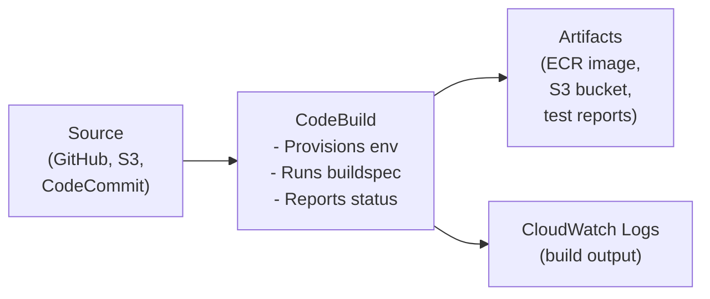
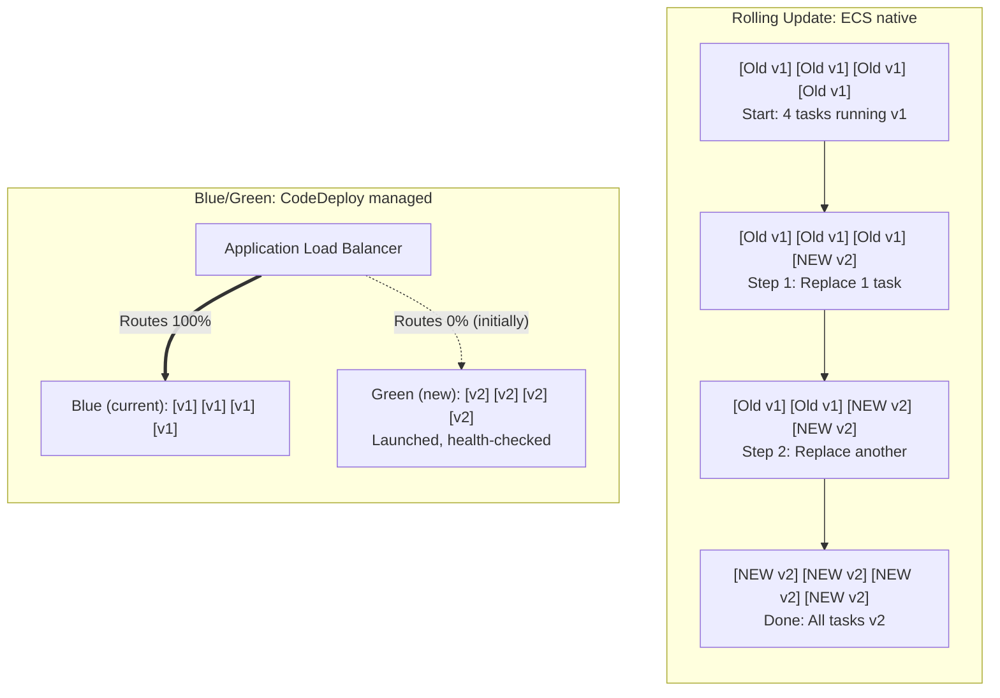
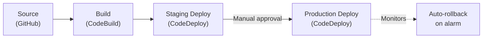
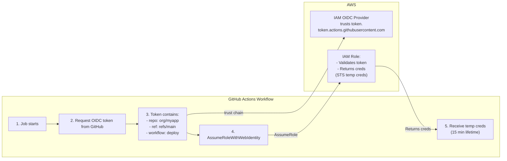
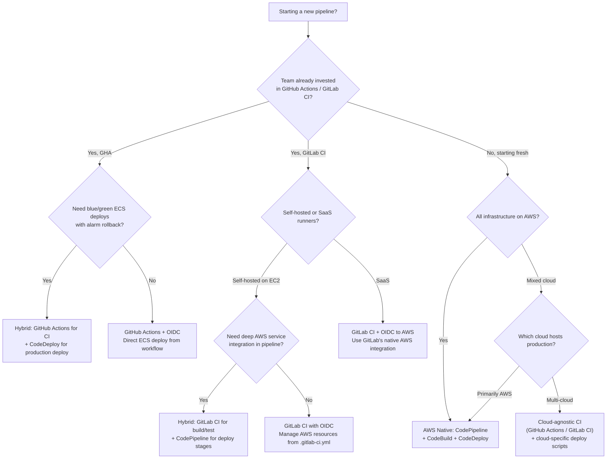

**Complexity**: `[MEDIUM]` | **Time to Complete**: 2 hours | **Prerequisites**: Modules 1.6 ECR and 1.7 ECS, CI/CD familiarity, a GitHub account, AWS CLI v2, and basic Docker knowledge. This module assumes hands-on familiarity with basic Linux workflows and version control so the emphasis stays on deployment mechanics, not introductory Git or shell setup.

## Prerequisites

Before starting this module, ensure you have the operational readiness to move into pipeline work; this avoids confusing AWS service calls with missing prerequisites and keeps your first run deterministic:
- Completed [Module 1.6: ECR (Container Registry)](../module-1.6-ecr/) (pushing/pulling container images)
- Completed [Module 1.7: ECS (Container Orchestration)](../module-1.7-ecs-fargate/) (ECS services, task definitions, Fargate)
- Familiarity with CI/CD concepts (build, test, deploy pipeline stages)
- A GitHub account and a repository to use for pipeline integration
- AWS CLI v2 installed and configured
- Basic knowledge of Docker and Dockerfiles

## What You'll Be Able to Do

After completing this module, you will be able to design, reason about, and operate an end-to-end delivery pipeline across source, build, and deployment stages.

- **Deploy end-to-end CI/CD pipelines using CodePipeline, CodeBuild, and CodeDeploy for containerized applications**
- **Configure CodeBuild projects with buildspec files that run tests, build images, and push to ECR**
- **Implement blue/green and canary deployment strategies using CodeDeploy with ECS**
- **Design pipeline stages with manual approval gates and automated rollbacks**

---

## Why This Module Matters

Manual production deployments and unreviewed database migrations can cause severe customer-facing failures, data inconsistencies, and expensive cleanup work because checks that should happen before release are deferred until users become part of the test loop. CI/CD pipelines reduce that risk by making deployments repeatable, testable, and easier to roll back, which turns incident response from “recovery by instinct” into response by process. In practice, this gives teams a reliable mechanism for catching failures earlier and for narrowing blast radius when failures still occur.

**Hypothetical scenario:** A schema migration reaches production without automated validation against staging. The change corrupts rows that downstream services depend on, and engineers spend hours tracing the failure while debating whether to roll forward or back. A CI/CD pipeline would have caught the mismatch in minutes: automated tests against a staging clone, a blue/green rollout limiting blast radius, code review enforced before merge, and deployment guardrails that block promotion when quality gates fail — instead of relying on risky manual hotfixes under time pressure.

In this module, you will learn the AWS Code Suite -- CodeBuild for building and testing code, CodeDeploy for deployment strategies, and CodePipeline for orchestrating the full workflow. You will also learn how to connect GitHub and GitLab repositories to AWS using [OIDC federation, which is the modern, secure alternative to storing long-lived access keys](https://docs.aws.amazon.com/IAM/latest/UserGuide/id_roles_providers_oidc.html), and how to decide when this integration model is the right fit for your team.

---

## CodeBuild: Building and Testing Code

CodeBuild is a fully managed build service. You give it source code, a build specification file (`buildspec.yml`), and a compute environment. It runs your build, publishes artifacts, and reports success or failure.

### How CodeBuild Works



### The buildspec.yml File

This is the heart of CodeBuild, because it becomes the shared contract for every build run. It defines what happens during each build phase, making the behavior consistent even as team members and commits change.

```yaml
version: 0.2

env:
  variables:
    APP_NAME: "myapp"
    AWS_DEFAULT_REGION: "us-east-1"
  parameter-store:
    DB_PASSWORD: "/myapp/production/database/password"
  secrets-manager:
    DOCKER_HUB_TOKEN: "dockerhub-credentials:token"

phases:
  install:
    runtime-versions:
      docker: 20
      python: 3.12
    commands:
      - echo "Installing dependencies..."
      - pip install -r requirements.txt
      - pip install pytest flake8

  pre_build:
    commands:
      - echo "Running linting and unit tests..."
      - flake8 src/ --max-line-length 120
      - pytest tests/unit/ --junitxml=reports/unit-tests.xml
      - echo "Logging into ECR..."
      - ACCOUNT_ID=$(aws sts get-caller-identity --query Account --output text)
      - ECR_URI="${ACCOUNT_ID}.dkr.ecr.${AWS_DEFAULT_REGION}.amazonaws.com"
      - aws ecr get-login-password | docker login --username AWS --password-stdin ${ECR_URI}

  build:
    commands:
      - echo "Building Docker image..."
      - COMMIT_HASH=$(echo $CODEBUILD_RESOLVED_SOURCE_VERSION | cut -c 1-8)
      - IMAGE_TAG="${COMMIT_HASH:-latest}"
      - docker build -t ${ECR_URI}/${APP_NAME}:${IMAGE_TAG} .
      - docker build -t ${ECR_URI}/${APP_NAME}:latest .

  post_build:
    commands:
      - echo "Pushing Docker image to ECR..."
      - docker push ${ECR_URI}/${APP_NAME}:${IMAGE_TAG}
      - docker push ${ECR_URI}/${APP_NAME}:latest
      - echo "Writing image definitions for ECS..."
      - printf '[{"name":"myapp","imageUri":"%s"}]' ${ECR_URI}/${APP_NAME}:${IMAGE_TAG} > imagedefinitions.json

reports:
  unit-tests:
    files:
      - "reports/unit-tests.xml"
    file-format: JUNITXML

artifacts:
  files:
    - imagedefinitions.json
    - appspec.yml
  discard-paths: yes

cache:
  paths:
    - "/root/.cache/pip/**/*"
    - "/var/lib/docker/**/*"
```

Let's break down the important parts: each section maps to a phase responsibility, and each phase keeps build behavior observable and recoverable.

**Phases** execute in order: `install` -> `pre_build` -> `build` -> `post_build`. If a command fails, that phase fails, so later steps that must not run after a failure should be guarded explicitly. This deterministic order is what makes build behavior reproducible and debuggable.

**Environment variables** can come from three sources: [inline values, SSM Parameter Store, and Secrets Manager](https://docs.aws.amazon.com/codebuild/latest/APIReference/API_EnvironmentVariable.html). CodeBuild resolves them before the build starts, so secrets can remain externalized while configuration is still explicit in code and role context.

**Artifacts** are files preserved after the build completes. [The `imagedefinitions.json` file is a special format that ECS deployments use to know which container image to pull](https://docs.aws.amazon.com/codepipeline/latest/userguide/file-reference.html), and it is a required bridge between build output and deploy input.

**Cache** speeds up subsequent builds by [preserving directories like pip's download cache or Docker layers](https://docs.aws.amazon.com/codebuild/latest/userguide/build-caching.html). This can significantly reduce turnaround time, but cache lifecycle choices still matter when dependencies or base images change.

**Pause and predict:** The buildspec example caches `/root/.cache/pip/**/*` and `/var/lib/docker/**/*` to accelerate execution. What architectural and security risks emerge if a CI pipeline relies on an uninvalidated Docker layer cache across several months, particularly regarding base operating system dependencies and vulnerability scanners?

<details>
<summary>Check your prediction</summary>

Unpatched base image layers and critical vulnerabilities (CVEs) persist indefinitely because Docker reuses cached filesystem snapshots instead of pulling refreshed upstream base layers. CI pipeline runs continue to report green status because builds succeed rapidly, masking critical unpatched vulnerabilities from downstream production workloads until the cache is explicitly invalidated or rebuilt from scratch.

</details>

Balancing build turnaround speed against artifact reproducibility requires establishing deliberate cache eviction policies alongside robust project provisioning. Setting up a dedicated CodeBuild project with fine-grained service permissions ensures the build runtime operates with strictly controlled access to external resources.

### Creating a CodeBuild Project

```bash
# Create the CodeBuild service role first
aws iam create-role \
  --role-name codebuild-myapp-role \
  --assume-role-policy-document '{
    "Version": "2012-10-17",
    "Statement": [{
      "Effect": "Allow",
      "Principal": {"Service": "codebuild.amazonaws.com"},
      "Action": "sts:AssumeRole"
    }]
  }'

# Attach policies for ECR, logs, S3, and secrets
aws iam attach-role-policy \
  --role-name codebuild-myapp-role \
  --policy-arn arn:aws:iam::aws:policy/AmazonEC2ContainerRegistryPowerUser

ACCOUNT_ID=$(aws sts get-caller-identity --query Account --output text)

aws iam put-role-policy \
  --role-name codebuild-myapp-role \
  --policy-name CodeBuildBasePolicy \
  --policy-document "{
    \"Version\": \"2012-10-17\",
    \"Statement\": [
      {
        \"Effect\": \"Allow\",
        \"Action\": [
          \"logs:CreateLogGroup\",
          \"logs:CreateLogStream\",
          \"logs:PutLogEvents\"
        ],
        \"Resource\": \"arn:aws:logs:*:${ACCOUNT_ID}:log-group:/aws/codebuild/*\"
      },
      {
        \"Effect\": \"Allow\",
        \"Action\": [
          \"s3:PutObject\",
          \"s3:GetObject\",
          \"s3:GetBucketAcl\",
          \"s3:GetBucketLocation\"
        ],
        \"Resource\": \"*\"
      },
      {
        \"Effect\": \"Allow\",
        \"Action\": [
          \"ssm:GetParameters\",
          \"secretsmanager:GetSecretValue\"
        ],
        \"Resource\": \"*\"
      }
    ]
  }"

# Create the CodeBuild project
aws codebuild create-project \
  --name myapp-build \
  --source '{
    "type": "GITHUB",
    "location": "https://github.com/YOUR_ORG/myapp.git",
    "buildspec": "buildspec.yml"
  }' \
  --artifacts '{"type": "NO_ARTIFACTS"}' \
  --environment '{
    "type": "LINUX_CONTAINER",
    "image": "aws/codebuild/amazonlinux2-x86_64-standard:5.0",
    "computeType": "BUILD_GENERAL1_SMALL",
    "privilegedMode": true
  }' \
  --service-role "arn:aws:iam::${ACCOUNT_ID}:role/codebuild-myapp-role"
```

The [`privilegedMode: true` flag is required when building Docker images inside CodeBuild](https://docs.aws.amazon.com/codebuild/latest/userguide/create-project.html). Without it, the Docker daemon cannot start, so Docker-based stages fail at the container-build step. Treat this flag as a functional prerequisite for container workloads, and keep it aligned with your image build security controls.

### Build Compute Types

| Compute Type | vCPU | Memory | Cost/min (US East) |
|-------------|------|--------|-------------------|
| BUILD_GENERAL1_SMALL | 2 | 4 GiB | See current AWS pricing |
| BUILD_GENERAL1_MEDIUM | 4 | 8 GiB | See current AWS pricing |
| BUILD_GENERAL1_LARGE | 8 | 16 GiB | See current AWS pricing |
| BUILD_GENERAL1_2XLARGE | 72 | 144 GiB | See current AWS pricing |

Most application builds work fine on SMALL. Use MEDIUM or LARGE for heavy compilation (C++, Rust) or large test suites.
### Local Caching vs S3 Caching

CodeBuild offers two caching modes that trade off speed against consistency. **Local caching** stores the cache on the build host itself, which means it is only reusable when your next build lands on the same host. This works well for Docker layer caching (the `docker` cache mode) and for dependency directories like `node_modules` that you rebuild infrequently. Because local cache access is essentially disk-speed, it adds negligible latency to the build.

**S3 caching** writes the cache tarball to an S3 bucket at the end of a successful build and downloads it at the start of the next one. This guarantees cache availability across different build hosts, which matters when your build fleet scales up or down between runs. The trade-off is time: uploading and downloading a cache tarball adds latency to every build cycle. S3 caching is the right default for teams running fewer than 20 builds per day on a stable dependency graph, and for any build that uses the ARM compute type (since ARM and x86 hosts are drawn from separate pools, making local cache reuse less predictable).

**Pause and predict:** If a CodeBuild project configures S3 caching for `/root/.cache/pip/**/*` and a developer subsequently updates `requirements.txt` to pin a newer library version, will the remote S3 cache automatically invalidate, and how does pip handle package resolution against existing cached wheels?

<details>
<summary>Check your prediction</summary>

The remote S3 cache does not automatically invalidate when source files change, because CodeBuild does not compute content hashes of dependency manifests. If a specific wheel is already present in the cache directory, pip may reuse the stale artifact unless the cache location changes, cache busting is triggered, or the updated version constraint forces a fresh download.

</details>

Managing package cache invalidation strategies becomes especially critical as project scopes expand and build architectures grow more complex. When monolithic pipelines begin executing multiple independent test and compilation phases, decomposing work into parallel execution units shortens feedback loops considerably.

### Batch Builds

When a single commit touches multiple modules that can be built independently, running them sequentially wastes time. **Batch builds** let you define a `batch` section in `buildspec.yml` that splits the build into parallel tasks. Each task runs in its own compute environment with its own phase sequence, so they execute concurrently without interfering with each other.

```yaml
batch:
  fast-fail: false
  build-list:
    - identifier: frontend
      buildspec: frontend/buildspec.yml
    - identifier: backend
      buildspec: backend/buildspec.yml
    - identifier: e2e_tests
      buildspec: tests/buildspec.yml
      depend-on:
        - frontend
        - backend
```

The `depend-on` field controls task ordering: a task only starts after its dependencies complete successfully. Set `fast-fail: true` to abort all remaining tasks the moment any one fails. Batch builds multiply your per-minute cost because each task runs on a separate compute environment, so verify that the wall-clock savings justify the parallel spend before enabling batch mode on every pipeline run.

### Build Reports

CodeBuild can surface test results directly in the AWS Console without you needing to parse XML files in CloudWatch Logs. The `reports` section in `buildspec.yml` tells CodeBuild where to find test output files and what format they use:

```yaml
reports:
  unit-tests:
    files:
      - "reports/unit-tests.xml"
    file-format: JUNITXML
  coverage:
    files:
      - "coverage/cobertura.xml"
    file-format: COBERTURAXML
```

Supported formats include JUnit XML, Cucumber JSON, and Cobertura XML. When a build completes, the CodeBuild console shows pass/fail counts, trend lines across recent builds, and per-test-case details. These reports are retained for 30 days by default and can be exported to S3 for longer archival. Because reports are generated from the build output artifacts, they require that your test runner writes results to the expected file path inside the build container.

### VPC Builds

By default, CodeBuild runs in an AWS-managed VPC with internet access. When your build needs to reach resources inside your own VPC — an RDS database for integration tests, an internal package registry, or an ElastiCache cluster — you must configure the CodeBuild project to run inside that VPC.

```bash
aws codebuild create-project \
  --name myapp-build \
  --vpc-config '{
    "vpcId": "vpc-0abc123def456",
    "subnets": ["subnet-0a1b2c3d4e5f6", "subnet-0a1b2c3d4e5f7"],
    "securityGroupIds": ["sg-0a1b2c3d4e5f6"]
  }' \
  # ... other parameters
```

Three constraints matter here. First, the build loses internet access unless the VPC has a NAT gateway or VPC endpoint for the AWS services it calls (ECR, S3, CloudWatch Logs). Second, the subnets you choose must have enough available IP addresses for the build fleet; a /28 subnet with only 11 usable IPs can throttle build concurrency during peak CI load. Third, the security group must allow outbound traffic on the ports your build needs — ECR requires 443, a database might need 5432 or 3306, and package registries vary.


---

## CodeDeploy: Deployment Strategies

CodeDeploy handles the "how" of getting new code onto your compute targets, and it exists to make rollout behavior explicit. [It supports EC2 instances, on-premises servers, Lambda functions, and ECS services](https://docs.aws.amazon.com/codedeploy/latest/userguide/welcome.html), each with different deployment strategies and operational trade-offs. In practice, this means you can choose a safer rollout pattern without changing your application packaging.

### Deployment Types for ECS



**Traffic shift strategies** (ECS deployment configs use the `CodeDeployDefault.ECS*` prefix) control how quickly customer traffic follows the new ECS task set, so choose them based on blast radius tolerance rather than migration speed alone:
- **`CodeDeployDefault.ECSAllAtOnce`**: 0% --> 100% instantly
- **`CodeDeployDefault.ECSCanary10Percent5Minutes`**: 10% for 5 min, then 100%
- **`CodeDeployDefault.ECSLinear10PercentEvery1Minute`**: 10%, 20%, 30%... every minute

Blue/green is the gold standard for production ECS deployments because it provides explicit separation between the canary and stable fleets, which makes rollback behavior easy to reason about:
1. **Instant rollback** -- just shift traffic back to the blue target group
2. **Zero downtime** -- the old tasks keep running until traffic fully shifts
3. **Validation window** -- test the green environment with real traffic before committing

### The appspec.yml File

For ECS deployments, CodeDeploy uses an `appspec.yml` that defines the task definition and optional lifecycle hooks so each deployment stage has a repeatable contract:

```yaml
version: 0.0
Resources:
  - TargetService:
      Type: AWS::ECS::Service
      Properties:
        TaskDefinition: "arn:aws:ecs:us-east-1:123456789012:task-definition/myapp:42"
        LoadBalancerInfo:
          ContainerName: "myapp"
          ContainerPort: 8080
        PlatformVersion: "LATEST"

Hooks:
  - BeforeInstall: "LambdaFunctionToValidateBeforeInstall"
  - AfterInstall: "LambdaFunctionToValidateAfterInstall"
  - AfterAllowTestTraffic: "LambdaFunctionToRunIntegrationTests"
  - BeforeAllowTraffic: "LambdaFunctionToValidateBeforeTraffic"
  - AfterAllowTraffic: "LambdaFunctionToRunSmokeTests"
```

Each hook references a dedicated Lambda function that CodeDeploy invokes sequentially at designated execution gates during the deployment lifecycle. These programmatic hooks allow systems to execute validation scripts, verify service prerequisites, or trigger notifications across external monitoring platforms before proceeding to subsequent deployment phases.

**Pause and predict:** In a CodeDeploy Blue/Green deployment, traffic shifts between target groups according to configured routing rules. If a `BeforeAllowTraffic` lifecycle hook Lambda function fails or times out due to a missing IAM permission, how will CodeDeploy handle the active ALB listener rules, and will any customer traffic reach the Green tasks?

<details>
<summary>Check your prediction</summary>

Customer traffic is not shifted to the Green target group. The Application Load Balancer production listener rule remains pointed exclusively at the Blue target group, ensuring Green receives zero customer traffic. CodeDeploy halts the deployment immediately, marks the lifecycle event as failed, and initiates deployment cleanup or rollback based on deployment group configuration.

</details>

Safeguarding routing transitions during progressive deployments requires clear visibility into lifecycle failures before production listeners are touched. When automated verification scripts fail or external systems encounter transient issues, configuring declarative rollback rules ensures clusters return to known-good baselines cleanly.

### Automatic Rollback

CodeDeploy can monitor CloudWatch Alarms during deployment and roll back if things go wrong, which converts signal from your runtime into automated safety actions during rollout stages:

```bash
# Create a deployment group with alarm-based rollback
aws deploy create-deployment-group \
  --application-name myapp \
  --deployment-group-name production \
  --deployment-config-name CodeDeployDefault.ECSCanary10Percent5Minutes \
  --ecs-services '[{
    "serviceName": "myapp-service",
    "clusterName": "production"
  }]' \
  --load-balancer-info '{
    "targetGroupPairInfoList": [{
      "targetGroups": [
        {"name": "myapp-blue-tg"},
        {"name": "myapp-green-tg"}
      ],
      "prodTrafficRoute": {
        "listenerArns": ["arn:aws:elasticloadbalancing:us-east-1:123456789012:listener/app/myapp-alb/abc123/def456"]
      }
    }]
  }' \
  --auto-rollback-configuration '{
    "enabled": true,
    "events": ["DEPLOYMENT_FAILURE", "DEPLOYMENT_STOP_ON_ALARM"]
  }' \
  --alarm-configuration '{
    "enabled": true,
    "alarms": [
      {"name": "myapp-5xx-errors-high"},
      {"name": "myapp-latency-p99-high"}
    ]
  }' \
  --service-role-arn arn:aws:iam::123456789012:role/codedeploy-ecs-role
```

This is powerful: deploy with canary at 10%, wait 5 minutes, and if the `5xx-errors-high` alarm fires during that window, automatically roll back. No human intervention is needed for the first layer of response, which reduces mean-time-to-recover during peak-hours events.

---
### In-Place vs Blue/Green: When Each Makes Sense

CodeDeploy supports two fundamentally different deployment models, and choosing the wrong one for your workload is a common source of production incidents.

**In-place deployments** stop the existing application on each instance, install the new version, and restart it. This preserves the instance's IP address, EBS volume attachments, and any local state, which matters for legacy applications that depend on instance identity. The downside is downtime: each instance stops serving traffic during the update window. For EC2 auto-scaling groups, CodeDeploy can perform a rolling in-place update that takes instances out of the load balancer, updates them, and returns them one batch at a time. In-place is the right choice when your application requires local instance state to persist across deployments, when you cannot afford the additional infrastructure cost of a parallel fleet, or when you are deploying to on-premises servers that lack the load balancer integration required for blue/green.

**Blue/green deployments** provision an entirely new, identical environment (the "green" fleet) alongside the existing one (the "blue" fleet). Traffic shifts from blue to green through the load balancer, which means the old fleet stays healthy and untouched until traffic has fully migrated. If the green fleet shows problems, traffic shifts back immediately — a rollback that takes seconds rather than the minutes required to re-deploy the old version in-place. Blue/green is the right choice for production workloads where downtime is unacceptable, for deployments that need a validation window with real traffic before full cutover, and for any application that runs on ECS or Lambda (where replacing the entire compute surface is the natural deployment pattern).

The infrastructure cost of blue/green — essentially doubling your fleet size during the deployment window — is its main drawback. For teams running 2-4 production tasks on ECS Fargate, this cost is negligible. For teams running hundreds of EC2 instances, the temporary fleet duplication can be significant, though it lasts only as long as the deployment plus the configured termination wait period on the original tasks.

### Deployment Configurations Deep-Dive

CodeDeploy's deployment configs control the pace and shape of traffic shifting. Choosing a config means deciding how much risk your team can absorb per unit time and how quickly you need new code to reach all users. Config names are **platform-specific** — do not mix EC2/on-premises names with ECS names.

**EC2 and on-premises (in-place deployments):**

| Config | Behavior | Risk Profile | Best For |
|--------|----------|--------------|----------|
| `CodeDeployDefault.AllAtOnce` | Update all instances at once | Highest risk, fastest delivery | Dev/staging environments only |
| `CodeDeployDefault.OneAtATime` | Deploy to one instance at a time | Moderate, per-instance validation | EC2 in-place, small fleets |
| `CodeDeployDefault.HalfAtATime` | Deploy to half the fleet, then the other half | Balanced speed and safety | EC2 in-place, medium fleets |

**ECS (blue/green traffic shifting):**

| Config | Behavior | Risk Profile | Best For |
|--------|----------|--------------|----------|
| `CodeDeployDefault.ECSAllAtOnce` | Shift 100% traffic instantly | Highest risk, fastest delivery | Dev/staging ECS only |
| `CodeDeployDefault.ECSCanary10Percent5Minutes` | 10% traffic for 5 min, then 100% | Low — blast radius is 10% | Production ECS with alarm monitoring |
| `CodeDeployDefault.ECSCanary10Percent15Minutes` | 10% traffic for 15 min, then 100% | Very low — extended canary window | High-value production workloads |
| `CodeDeployDefault.ECSLinear10PercentEvery1Minute` | 10% increments every minute | Low — gradual shift with observation | Teams wanting progressive cutover |
| `CodeDeployDefault.ECSLinear10PercentEvery3Minutes` | 10% increments every 3 minutes | Very low — extended observation per step | Regulated industries, critical paths |

The key design principle: **canary configs expose a small subset of users to the new version and hold there**, which limits blast radius to the canary group if a latent bug surfaces. **Linear configs never hold — they keep stepping forward**, which is better for teams that trust their pre-deployment validation and want the deployment to complete within a predictable window. Canary is the safer default when you are unsure about the release quality. Linear is appropriate when you have strong confidence from staging but still want progressive traffic shift to observe system behavior under increasing load.

### Compute Platforms

CodeDeploy operates across three compute platforms, each with different deployment primitives and operational trade-offs. Understanding which platform your application runs on determines which deployment strategies are available.

**EC2/On-Premises** deployments use the CodeDeploy agent running on each instance. The agent polls CodeDeploy for commands, downloads the revision from S3 or GitHub, and executes the deployment lifecycle hooks defined in `appspec.yml`. This platform supports in-place and blue/green (with an Auto Scaling Group). The agent model means instances need outbound internet access or a VPC endpoint for `codedeploy` commands, and the agent version must stay current to receive lifecycle hook updates.

**ECS** deployments work at the task level rather than the instance level. CodeDeploy manages the ECS service's task definition, target groups, and traffic shifting through the Application Load Balancer. You get blue/green with configurable traffic shifting and CloudWatch alarm integration. CodeDeploy creates a replacement task set for the green fleet, shifts a test listener to it, runs validation hooks, then shifts production traffic. No agent runs inside the tasks themselves — the ECS control plane handles orchestration.

**Lambda** deployments shift traffic between function versions using the Lambda traffic-shifting API. CodeDeploy can canary-deploy a new Lambda version with a configurable percentage and interval, and the deployment hooks include `BeforeAllowTraffic` and `AfterAllowTraffic` that let you run pre-traffic and post-traffic validation functions. The same CloudWatch alarm rollback applies: if the new version of your Lambda function starts erroring during the canary window, the deployment rolls back automatically.

### Lifecycle Hooks in Detail

The `appspec.yml` hooks define a deployment's execution contract. Each hook fires at a precise point in the deployment lifecycle, and if a hook function fails (returns a failure status to CodeDeploy), the deployment fails at that stage. Here is when each hook fires during a blue/green ECS deployment:

```
DEPLOYMENT START
  │
  ├─ BeforeInstall          ← Runs before anything is deployed.
  │                           Use: pre-flight checks, database state validation
  │
  ├─ Install                ← (Managed by CodeDeploy) Creates green task set
  │
  ├─ AfterInstall           ← Green tasks exist but receive no traffic.
  │                           Use: warm-up requests, cache hydration
  │
  ├─ AfterAllowTestTraffic  ← Test listener routes to green tasks.
  │                           Use: integration tests, synthetic checks
  │
  ├─ BeforeAllowTraffic     ← Production traffic still 100% blue.
  │                           Use: final validation gate, manual sign-off
  │
  ├─ AllowTraffic           ← (Managed by CodeDeploy) Shifts production traffic
  │
  └─ AfterAllowTraffic      ← Production traffic now flowing to green.
      (DELAY configured)      Use: smoke tests against live traffic, metrics check
                              If alarm fires → rollback begins
```

Each hook references a Lambda function that CodeDeploy invokes synchronously. The function must return a success/failure payload within the Lambda invocation timeout. If a hook times out, CodeDeploy treats it as a deployment failure, and whether automatic rollback triggers depends on the deployment group's rollback configuration. A common pitfall is setting Lambda timeouts too short for hooks that perform real validation work — a `BeforeAllowTraffic` hook that runs a full integration suite needs a timeout measured in minutes, not seconds.


## CodePipeline: Orchestrating the Full Workflow

CodePipeline connects source, build, and deploy stages into an automated workflow that turns each commit into a predictable release event. When you push code to GitHub, the pipeline triggers automatically and progresses through each stage, with explicit gates and artifacts passed between services. In this model, “done” means the stage outputs are correct, not just that a command returned exit code zero once.

### Pipeline Architecture



### Creating a Pipeline with CLI

```bash
# Resolve account and connection identifiers before templating the pipeline JSON
ACCOUNT_ID=$(aws sts get-caller-identity --query Account --output text)
CONNECTION_ARN="arn:aws:codestar-connections:us-east-1:${ACCOUNT_ID}:connection/YOUR_CONNECTION_ID"

# Create the artifact bucket
aws s3 mb s3://myapp-pipeline-artifacts-${ACCOUNT_ID}

# Create the pipeline role
aws iam create-role \
  --role-name codepipeline-myapp-role \
  --assume-role-policy-document '{
    "Version": "2012-10-17",
    "Statement": [{
      "Effect": "Allow",
      "Principal": {"Service": "codepipeline.amazonaws.com"},
      "Action": "sts:AssumeRole"
    }]
  }'

# The pipeline definition — shell variables are expanded in the heredoc below
cat > /tmp/pipeline.json <<EOF
{
  "pipeline": {
    "name": "myapp-pipeline",
    "roleArn": "arn:aws:iam::${ACCOUNT_ID}:role/codepipeline-myapp-role",
    "artifactStore": {
      "type": "S3",
      "location": "myapp-pipeline-artifacts-${ACCOUNT_ID}"
    },
    "stages": [
      {
        "name": "Source",
        "actions": [
          {
            "name": "GitHub-Source",
            "actionTypeId": {
              "category": "Source",
              "owner": "AWS",
              "provider": "CodeStarSourceConnection",
              "version": "1"
            },
            "configuration": {
              "ConnectionArn": "${CONNECTION_ARN}",
              "FullRepositoryId": "YOUR_ORG/myapp",
              "BranchName": "main",
              "OutputArtifactFormat": "CODE_ZIP"
            },
            "outputArtifacts": [{"name": "SourceOutput"}]
          }
        ]
      },
      {
        "name": "Build",
        "actions": [
          {
            "name": "Docker-Build",
            "actionTypeId": {
              "category": "Build",
              "owner": "AWS",
              "provider": "CodeBuild",
              "version": "1"
            },
            "configuration": {
              "ProjectName": "myapp-build"
            },
            "inputArtifacts": [{"name": "SourceOutput"}],
            "outputArtifacts": [{"name": "BuildOutput"}]
          }
        ]
      },
      {
        "name": "Deploy-Staging",
        "actions": [
          {
            "name": "ECS-Deploy-Staging",
            "actionTypeId": {
              "category": "Deploy",
              "owner": "AWS",
              "provider": "ECS",
              "version": "1"
            },
            "configuration": {
              "ClusterName": "staging",
              "ServiceName": "myapp-service",
              "FileName": "imagedefinitions.json"
            },
            "inputArtifacts": [{"name": "BuildOutput"}]
          }
        ]
      },
      {
        "name": "Approval",
        "actions": [
          {
            "name": "Manual-Approval",
            "actionTypeId": {
              "category": "Approval",
              "owner": "AWS",
              "provider": "Manual",
              "version": "1"
            },
            "configuration": {
              "NotificationArn": "arn:aws:sns:us-east-1:${ACCOUNT_ID}:pipeline-approvals",
              "CustomData": "Review staging deployment before promoting to production"
            }
          }
        ]
      },
      {
        "name": "Deploy-Production",
        "actions": [
          {
            "name": "ECS-Deploy-Production",
            "actionTypeId": {
              "category": "Deploy",
              "owner": "AWS",
              "provider": "CodeDeployToECS",
              "version": "1"
            },
            "configuration": {
              "ApplicationName": "myapp",
              "DeploymentGroupName": "production",
              "TaskDefinitionTemplateArtifact": "BuildOutput",
              "AppSpecTemplateArtifact": "BuildOutput"
            },
            "inputArtifacts": [{"name": "BuildOutput"}]
          }
        ]
      }
    ]
  }
}
EOF

# Create the pipeline
aws codepipeline create-pipeline --cli-input-json file:///tmp/pipeline.json
```

### Source Providers: CodeStar Connections vs Webhooks

The modern way to connect GitHub to CodePipeline is through [**CodeStar Connections** (also called CodeConnections)](https://docs.aws.amazon.com/codepipeline/latest/userguide/update-github-action-connections.html), which replaces the older OAuth token and webhook approach in teams that need stronger governance. It shifts where trust is managed while preserving the source-of-truth flow from repo to deploy.

```bash
# Create a connection (must be completed in the AWS Console)
aws codestar-connections create-connection \
  --provider-type GitHub \
  --connection-name myapp-github

# The connection starts in PENDING status
# Complete it via: AWS Console -> CodePipeline -> Settings -> Connections
# You'll authorize the AWS Connector for GitHub app
```

Why CodeStar Connections over webhook-based integrations matters because it centralizes trust in managed AWS-GitHub identity flow, reduces token rotation burden, and gives you an easier audit trail for approval and governance reviews:
- No long-lived OAuth token to manage or rotate
- GitHub App-based authentication (more secure, fine-grained permissions)
- Supports both clone and webhook trigger in one configuration
- Works with GitHub Organizations access controls

---


### V2 Pipelines

CodePipeline introduced the V2 pipeline type with several improvements over the original V1 model. V2 pipelines are the current default in the AWS Console and offer features that matter for production-grade delivery workflows:

- **Trigger filters**: V2 pipelines can filter source triggers by branch name, tag pattern, or file path glob. A single repository can now have separate pipelines for different branch patterns — `main` triggers the production pipeline, `feature/*` triggers a lighter CI-only pipeline, and `release/*` triggers the full promotion pipeline with approval gates.
- **Pipeline execution modes**: V2 supports `QUEUED` and `SUPERSEDED` execution modes. QUEUED (the default) processes every trigger sequentially, which is appropriate when every commit must be built. SUPERSEDED cancels any in-progress execution when a new trigger arrives and starts fresh — this saves compute cost in fast-commit workflows where only the latest revision matters.
- **GitHub source trigger via webhook**: V2 pipelines can receive push events directly from GitHub via webhook rather than polling, reducing the latency between a push and pipeline start from roughly 60 seconds (polling interval) to under 5 seconds.
- **Pipeline variables**: V2 allows namespace-level variables that propagate across all actions in a stage, reducing the need to pass output artifact references through JSON configuration.

To create a V2 pipeline, set `"pipelineType": "V2"` in the pipeline definition or select "V2" in the Console wizard. Existing V1 pipelines continue to work, but new pipelines should default to V2 unless you need a specific V1-only feature that has not yet been migrated.

### Artifact Handling and Stage Transitions

Pipeline artifacts are the mechanism that passes data between stages. When the Source stage completes, it produces an output artifact — a zip archive of the repository contents stored in the pipeline's S3 artifact bucket. The Build stage consumes that artifact as input, runs the build, and produces a new output artifact containing the build's outputs (the `imagedefinitions.json`, `appspec.yml`, and any other files listed in the buildspec's `artifacts` section). The Deploy stage then consumes the Build output artifact.

This artifact chain has two important properties. First, artifacts are immutable once produced — the Deploy stage always receives exactly the artifact that the Build stage produced, which means the deployment cannot drift between build and deploy. Second, the default S3 artifact encryption uses SSE-S3, but you can enable KMS encryption on the artifact bucket for compliance scenarios where build outputs must be encrypted at rest with a customer-managed key.

Artifact size matters for pipeline performance. Large artifacts (over 100 MB) slow down stage transitions because CodePipeline must upload and download them from S3 between each stage. If your repository includes large binary files that are not needed for the build, exclude them in the source action configuration or use a `.gitignore`-style exclusion file so the source artifact stays lean.

### Pipeline Triggers and Execution Modes

Beyond the source-driven trigger (push to branch), V2 pipelines support additional trigger types. A **schedule trigger** runs the pipeline on a cron expression — useful for nightly integration tests that build and deploy to a long-running staging environment. A **CloudWatch Event trigger** starts the pipeline when a specific AWS event occurs, such as a new ECR image being pushed or a parameter change in SSM. A **manual trigger** lets you start the pipeline from the CLI or Console without a source change, which is useful for re-running a deployment that failed because of a transient service error rather than a code problem.

```bash
# Start a pipeline execution manually (V2)
aws codepipeline start-pipeline-execution \
  --name myapp-pipeline \
  --source-revisions '[{"actionName":"GitHub-Source","revisionType":"COMMIT_ID","revisionValue":"abc123def456"}]'
```

Execution modes interact with concurrency. A pipeline set to QUEUED mode that sees a burst of 10 commits will process all 10 sequentially — the earlier executions run first, and later ones queue up. This ensures every commit gets built but can create a backlog. SUPERSEDED mode would process only the latest commit and discard the intermediate ones, keeping the pipeline queue empty at the cost of skipping some revisions.

## OIDC Federation for GitHub Actions

If your team already uses GitHub Actions for CI and only needs AWS for deployment, you can simplify the control plane by configuring OIDC federation so GitHub Actions can assume an IAM role directly. This still lets you keep your existing CI patterns, but it shifts artifact handling and runtime credentials into AWS-native service boundaries.

### How OIDC Federation Works



### Setting Up OIDC Federation

```bash
# Step 1: Create the OIDC identity provider in IAM
# AWS has ignored the thumbprint for token.actions.githubusercontent.com since 2023;
# the value below is optional and retained only for older CLI examples.
aws iam create-open-id-connect-provider \
  --url "https://token.actions.githubusercontent.com" \
  --client-id-list "sts.amazonaws.com" \
  --thumbprint-list "6938fd4d98bab03faadb97b34396831e3780aea1"

# Step 2: Create the IAM role that GitHub Actions will assume
ACCOUNT_ID=$(aws sts get-caller-identity --query Account --output text)

cat > /tmp/github-actions-trust.json <<EOF
{
  "Version": "2012-10-17",
  "Statement": [
    {
      "Effect": "Allow",
      "Principal": {
        "Federated": "arn:aws:iam::${ACCOUNT_ID}:oidc-provider/token.actions.githubusercontent.com"
      },
      "Action": "sts:AssumeRoleWithWebIdentity",
      "Condition": {
        "StringEquals": {
          "token.actions.githubusercontent.com:aud": "sts.amazonaws.com"
        },
        "StringLike": {
          "token.actions.githubusercontent.com:sub": "repo:YOUR_ORG/myapp:ref:refs/heads/main"
        }
      }
    }
  ]
}
EOF

aws iam create-role \
  --role-name github-actions-deploy \
  --assume-role-policy-document file:///tmp/github-actions-trust.json

# Step 3: Attach permissions (e.g., ECR push + ECS deploy)
aws iam attach-role-policy \
  --role-name github-actions-deploy \
  --policy-arn arn:aws:iam::aws:policy/AmazonEC2ContainerRegistryPowerUser

aws iam put-role-policy \
  --role-name github-actions-deploy \
  --policy-name ECSDeployPolicy \
  --policy-document '{
    "Version": "2012-10-17",
    "Statement": [{
      "Effect": "Allow",
      "Action": [
        "ecs:UpdateService",
        "ecs:DescribeServices",
        "ecs:RegisterTaskDefinition",
        "ecs:DescribeTaskDefinition",
        "iam:PassRole"
      ],
      "Resource": "*"
    }]
  }'
```

### GitHub Actions Workflow

```yaml
name: Deploy to ECS

on:
  push:
    branches: [main]

permissions:
  id-token: write   # Required for OIDC
  contents: read

jobs:
  deploy:
    runs-on: ubuntu-latest
    steps:
      - uses: actions/checkout@v4

      - name: Configure AWS Credentials
        uses: aws-actions/configure-aws-credentials@v4
        with:
          role-to-assume: arn:aws:iam::123456789012:role/github-actions-deploy
          aws-region: us-east-1

      - name: Login to ECR
        id: ecr-login
        uses: aws-actions/amazon-ecr-login@v2

      - name: Build and push Docker image
        env:
          ECR_REGISTRY: ${{ steps.ecr-login.outputs.registry }}
          IMAGE_TAG: ${{ github.sha }}
        run: |
          docker build -t $ECR_REGISTRY/myapp:$IMAGE_TAG .
          docker push $ECR_REGISTRY/myapp:$IMAGE_TAG

      - name: Update ECS service
        env:
          ECR_REGISTRY: ${{ steps.ecr-login.outputs.registry }}
          IMAGE_TAG: ${{ github.sha }}
        run: |
          # Get current task definition
          TASK_DEF=$(aws ecs describe-task-definition \
            --task-definition myapp \
            --query 'taskDefinition' --output json)

          # Update image in task definition
          NEW_TASK_DEF=$(echo $TASK_DEF | jq \
            --arg IMAGE "$ECR_REGISTRY/myapp:$IMAGE_TAG" \
            '.containerDefinitions[0].image = $IMAGE |
             del(.taskDefinitionArn, .revision, .status,
                 .requiresAttributes, .compatibilities,
                 .registeredAt, .registeredBy)')

          # Register new task definition
          NEW_REVISION=$(aws ecs register-task-definition \
            --cli-input-json "$NEW_TASK_DEF" \
            --query 'taskDefinition.taskDefinitionArn' --output text)

          # Update the service
          aws ecs update-service \
            --cluster production \
            --service myapp-service \
            --task-definition $NEW_REVISION \
            --force-new-deployment
```

The critical trust policy condition is `StringLike` on the `sub` claim. [This restricts which repository and branch can assume the role.](https://github.com/aws-actions/configure-aws-credentials) Without it, any GitHub repository could assume your role, so the trust statement is doing the authorization work at the identity boundary before temporary credentials are issued.

| Condition Pattern | What It Allows |
|-------------------|----------------|
| `repo:org/myapp:ref:refs/heads/main` | Only main branch pushes |
| `repo:org/myapp:*` | Any branch, any event in that repo |
| `repo:org/*:ref:refs/heads/main` | Main branch of any repo in the org |
| `repo:org/myapp:environment:production` | Only the "production" environment |

**Pause and predict:** The OIDC trust policy matches the `sub` claim to a specific repository and branch (`repo:YOUR_ORG/myapp:ref:refs/heads/main`). If you omitted the branch restriction and configured `repo:YOUR_ORG/myapp:*`, what specific attack vector would this open regarding untrusted code execution inside your AWS environment?

<details>
<summary>Check your prediction</summary>

Any Git reference within the repository—including unreviewed feature branches, pull requests, or forks depending on subject claim configuration—can assume the privileged IAM role. An attacker or collaborator with push access to a non-production branch could run untrusted workflow actions that assume the role and execute malicious commands directly against AWS infrastructure.

</details>

Enforcing narrow subject claim conditions establishes strong identity boundaries across CI/CD runners before jobs interact with cloud infrastructure. Beyond identity federation and credential lifecycle management, enterprise pipelines frequently require centralized repositories to govern package provenance and protect build dependencies from tampering.

---


## Source Integration: CodeArtifact

While CodePipeline and CodeBuild handle the CI/CD orchestration, **AWS CodeArtifact** addresses a related problem: dependency management at scale. CodeArtifact is a fully managed artifact repository that stores and serves software packages — Python packages from PyPI, npm packages from the npm registry, Maven artifacts from Maven Central, and generic artifacts — inside your AWS account.

In a CI/CD pipeline context, CodeArtifact serves three roles. First, it acts as a **caching proxy** for upstream public registries: your CodeBuild projects pull dependencies from CodeArtifact instead of directly from PyPI or npm, which reduces external network dependency during builds and speeds up repeated fetches. Second, it acts as a **private package registry** where your team can publish internal libraries that are consumed by multiple microservices — the pipeline builds the library, publishes it to CodeArtifact, and downstream service builds pull the latest version. Third, it provides an **audit trail** through CloudTrail that records every package download and publish event, which satisfies compliance requirements for software supply chain tracking.

Connecting CodeArtifact to your pipeline involves adding a login step in the `install` phase of `buildspec.yml`:

```bash
aws codeartifact login \
  --tool pip \
  --domain my-domain \
  --domain-owner $(aws sts get-caller-identity --query Account --output text) \
  --repository my-repo
```

This configures pip (or npm, or twine) to resolve packages through CodeArtifact for the remainder of the build. The IAM role used by CodeBuild needs `codeartifact:GetAuthorizationToken`, `codeartifact:GetRepositoryEndpoint`, and `codeartifact:ReadFromRepository` permissions. For teams using the same build role across multiple CodeBuild projects, CodeArtifact provides a single point of policy control over which package versions are approved for use in builds.


## Decision Framework: Choosing Your CI/CD Model on AWS

When you are starting a new project or evaluating an existing pipeline, the tooling choice shapes your team's delivery cadence and operational overhead for years. The decision is rarely one-dimensional — it involves trade-offs across team familiarity, AWS integration depth, compliance requirements, and cost structure.

### Decision Flowchart



### Comparison Matrix

| Factor | CodePipeline + CodeBuild + CodeDeploy | GitHub Actions + OIDC | GitLab CI + OIDC |
|--------|--------------------------------------|----------------------|-------------------|
| **AWS integration depth** | Deepest — native IAM role chaining, CloudWatch alarm rollback, SSM/Secrets Manager in build phases | Good — OIDC federation, aws-actions suite, but no native deployment orchestration | Good — OIDC support, but fewer prebuilt AWS deployment primitives |
| **Deployment strategies** | Blue/green with canary/linear traffic shifting, automated alarm rollback, lifecycle hooks | Rolling update via aws-actions/ecs-deploy; blue/green requires custom scripting | Same as GHA — rolling update native, blue/green needs custom logic |
| **Approval gates** | Built-in Manual Approval action, SNS notification | Environment protection rules, required reviewers | Manual job per environment, protected branches |
| **Build compute** | Managed (2-72 vCPU, x86 or ARM), VPC-capable | GitHub-hosted (2-4 vCPU) or self-hosted runners | SaaS runners (2-4 vCPU) or self-hosted on EC2/K8s |
| **Secrets management** | SSM Parameter Store + Secrets Manager natively | GitHub Secrets + OIDC for AWS access | GitLab CI Variables + OIDC for AWS access |
| **Cost (small team)** | ~$1/pipeline/month + ~$0.005/build-minute (SMALL) | 2,000 min/month free, then $0.008/min (Linux) | 400 min/month free, then $0.01/min |
| **Cost (large team)** | Scales linearly with build minutes; pipelines are flat $1/mo each | Can get expensive on private repos beyond free tier | Requires paid tier for advanced features; runner cost extra |
| **Visibility** | AWS Console only | Native GitHub PR integration, status checks | Native GitLab MR integration, merge train support |
| **Compliance boundary** | All within AWS account — CloudTrail everywhere | GitHub side audited via GitHub audit log; AWS side via CloudTrail | GitLab audit events; AWS side via CloudTrail |

### Deployment Strategy Decision

Once you have chosen your pipeline platform, the next decision is the deployment strategy. The choice depends on your tolerance for user-facing errors and how much infrastructure overhead you can accept:

| Factor | Rolling Update (ECS) | In-Place (EC2) | Blue/Green (CodeDeploy) |
|--------|---------------------|----------------|------------------------|
| **Downtime** | None (tasks replaced one at a time) | Per-batch during update | None |
| **Rollback speed** | Slow — re-deploy previous task definition | Slow — re-deploy to each instance | Instant — shift traffic back to blue |
| **Infrastructure cost** | No additional cost | No additional cost | Double fleet during deployment |
| **Validation window** | None — tasks enter service immediately | None — instances come back into LB | Test traffic → canary traffic → full traffic |
| **Alarm-based rollback** | ECS deployment circuit breaker can roll back to the last completed deployment when `deploymentCircuitBreaker = { enable: true, rollback: true }` (stops failed rollouts; does not shift ALB traffic like CodeDeploy) | Not available | Native CloudWatch alarm integration during canary/linear traffic shifts |
| **Best for** | Frequent, low-risk updates; dev/staging | Legacy EC2 apps with instance state | Production, regulated workloads, high-value services |

The **canary vs linear** choice within blue/green deployments is primarily about risk posture. A canary strategy says: "Shift a small amount, hold, observe, then go to 100%." This limits blast radius to the canary group if an error occurs during the hold window but extends the total deployment time. A linear strategy says: "Shift in equal steps at fixed intervals and do not stop until complete." This completes faster but exposes an increasing percentage of users to a bad deployment at each step. Choose canary when the cost of a production error is high and the deployment window is generous. Choose linear when you trust your staging validation and want the deployment to finish within a known time bound.


## Patterns & Anti-Patterns

Patterns are proven approaches that work repeatedly across teams and codebases. Anti-patterns are approaches that feel natural in the moment but create durable problems. Recognizing both is how experienced teams avoid re-learning lessons that are already well understood.

### Proven Patterns

**1. Separate build and deploy stages with artifact promotion**
Build once, store the artifact, and promote that same artifact through environments. Your staging deployment and production deployment run the exact same container image, built from the exact same commit. This eliminates the "it worked in staging" class of incident where a re-build introduces a dependency drift between environments. CodePipeline enforces this by design — the output artifact from the Build stage is the same object consumed by every subsequent Deploy stage. If you use GitHub Actions or GitLab CI, implement this by pushing the built image to ECR with a unique tag (the commit SHA) and deploying by referencing that tag, never by re-building.

**2. Alarm-gated production deployments**
Every production deployment group in CodeDeploy should have at least two CloudWatch alarms attached: one for application errors (HTTP 5xx rate) and one for latency (p99 or p95 response time). The alarms create an automated safety net that does not depend on a human watching a dashboard during the deployment. If the new code starts erroring or slowing down during the canary window, the deployment rolls back before most users are affected. This pattern works because it closes the gap between deployment and observation — the same mechanism that deploys the code also watches it.

**3. Branch-per-environment pipeline topology**
Map pipeline stages to Git branches, not to manual parameters. A push to `main` triggers the full pipeline: build → staging deploy → approval → production deploy. A push to `feature/*` triggers only build + test (optionally deploy to a per-branch ephemeral environment). This pattern scales because the branch name carries the deployment intent, and developers cannot accidentally deploy a feature branch to production. In V2 pipelines, trigger filters on the source action implement this pattern natively.

**4. Immutable pipeline configuration**
Define your pipeline — CodeBuild projects, CodeDeploy applications, CodePipeline definitions — as CloudFormation or CDK templates, not as CLI commands. When the pipeline itself is infrastructure-as-code, recovering from a misconfiguration is a `git revert` away, and the pipeline definition is peer-reviewed before it changes. This also means you can clone the entire pipeline for a new environment by changing a CloudFormation parameter rather than re-running 15 CLI commands.

**5. Pre-traffic validation hooks as quality gate**
Use the `AfterAllowTestTraffic` lifecycle hook to run a full integration test suite against the green fleet before any production traffic reaches it. The test traffic listener routes synthetic requests to the new tasks, and the hook function validates that every critical endpoint returns a successful response. If the hook fails, production traffic never shifts. This pattern moves the quality gate from "hope staging caught it" to "prove it with real infrastructure before users see it."

### Anti-Patterns

**1. Builds that push to production directly without an approval gate**
A pipeline that goes Source → Build → Production Deploy with no pause or manual approval is a pipeline that deploys every commit — including broken ones — to production. The absence of a gate means that a developer pushing on Friday at 5 PM can cause a production outage with no opportunity for anyone to intercept it. Always insert at least one approval stage between staging and production, and consider requiring two approvers for business-critical services.

**2. Hardcoding account IDs, regions, and resource ARNs in buildspec.yml**
Copy-pasting account IDs from documentation examples into your buildspec creates a pipeline that fails silently when cloned to another account or region. The build succeeds in one context and breaks in another with no indication of why. Use `aws sts get-caller-identity` at runtime to discover the account ID, use `$AWS_DEFAULT_REGION` or `$AWS_REGION` instead of hardcoded region strings, and reference resources through SSM parameters or pipeline variables that are environment-scoped.

**3. Running one CodePipeline per microservice per environment without a module strategy**
A team with 20 microservices across 3 environments (dev, staging, prod) would need 60 separate pipelines if each service-environment pair gets its own. This creates a configuration management nightmare where a small change to the pipeline pattern must be applied 60 times. Instead, use a parameterized pipeline definition deployed by CloudFormation or CDK, where the pipeline structure is a module and the service name and environment are parameters. Better yet, consider a single pipeline per service with promotion through environments, reducing the pipeline count from 60 to 20.

**4. Omitting the branch restriction on the OIDC trust policy**
An OIDC trust policy that trusts `repo:myorg/*` allows any repository in the organization to assume the production deployment role. A compromised internal tool repo, a disgruntled former employee's fork, or a misconfigured third-party integration can all assume the role and deploy arbitrary code to production. The fix is a specific `sub` claim condition: `repo:myorg/myapp:ref:refs/heads/main`. Never use wildcard repo patterns in a trust policy that grants production access.

**5. Using `post_build` for artifact publishing without checking build success**
CodeBuild always runs the `post_build` phase, even when `build` fails. If your `post_build` phase pushes a Docker image to ECR unconditionally, a failed test suite still produces and pushes an image — and downstream stages may deploy it. Guard every publish step in `post_build` with a check on `$CODEBUILD_BUILD_SUCCEEDING` (which is `1` on success, `0` on failure). Alternatively, move publish commands to the end of the `build` phase, which halts on the first non-zero exit code.

**6. Running blue/green deployments without CloudWatch alarms**
A blue/green deployment without alarm monitoring is a traffic shift without a safety net. If the green tasks start returning 500 errors the moment production traffic hits them, the deployment continues shifting traffic because nothing tells it to stop. The deployment "succeeds" from a pipeline perspective but the application is down. Always pair blue/green production deployments with alarm configuration, and test the alarms periodically by triggering them in staging to verify the rollback behavior.


## Cost Lens

CI/CD costs on AWS are driven primarily by build minutes and pipeline count. Understanding the cost structure helps you make deliberate trade-offs between speed, safety, and spend — and prevents the unpleasant surprise of a monthly bill that exceeds your expectations.

### Service Pricing (2026, US East)

**CodeBuild** charges per build-minute, with the rate determined by the compute type you select. There is no charge for idle time — you pay only for the minutes your builds actively run.

| Compute Type | vCPU | Memory | Cost per Build-Minute |
|-------------|------|--------|----------------------|
| `BUILD_GENERAL1_SMALL` | 2 | 4 GiB | $0.005 |
| `BUILD_GENERAL1_MEDIUM` | 4 | 8 GiB | $0.010 |
| `BUILD_GENERAL1_LARGE` | 8 | 16 GiB | $0.020 |
| `BUILD_GENERAL1_2XLARGE` | 72 | 144 GiB | $0.120 |
| `BUILD_GENERAL1_SMALL` (ARM) | 2 | 4 GiB | $0.0034 |

ARM-based compute types are roughly 32% cheaper per minute than equivalent x86 types. If your application builds on ARM (increasingly common with Graviton-based ECS tasks), switching your CodeBuild environment to ARM reduces your build spend by nearly a third with no change to your pipeline logic.

A team running 200 builds per month, each averaging 4 minutes on SMALL x86: 200 x 4 x $0.005 = $4.00/month on CodeBuild. The same team on MEDIUM: 200 x 4 x $0.010 = $8.00/month. Batch builds multiply this by the number of parallel tasks; a 3-task batch build on SMALL for 4 minutes costs 3 x 4 x $0.005 = $0.06 per push.

**CodePipeline (V1)** charges $1.00 per **active** pipeline per month. A pipeline is active when it has existed for more than 30 days **and** had at least one source change or manual execution during that calendar month — merely creating a pipeline or running it once in its first month does not automatically make it billable under this definition. Pipelines that exist but have never qualified as active incur no V1 charge.

**CodePipeline (V2)** — the recommended default for new pipelines — bills per **action execution minute** at approximately **$0.002/minute**, with a free tier that covers a baseline of action minutes each month (see [CodePipeline pricing](https://aws.amazon.com/codepipeline/pricing/) for current free-tier limits). V2 cost scales with how many stage actions run and how long they take, not with a flat per-pipeline fee. A team with 15 V2 pipelines pays primarily for build/deploy action minutes across those pipelines, not $15/month flat regardless of activity.

**CodeDeploy** is free for deployments to EC2, on-premises instances, and Lambda. There is no per-deployment charge for these compute platforms. For ECS blue/green deployments, there is also no additional charge beyond the underlying ECS and ALB costs. The compute resources for the green fleet during the deployment window are the primary cost driver — you temporarily double your task count, which doubles your Fargate or EC2 cost for the duration of the deployment plus the termination wait period.

### Cost Drivers and Optimization

The two biggest cost drivers in a typical CI/CD setup are **build minutes** (CodeBuild) and **idle resource time** (ECS tasks during blue/green deployment windows).

**Build minute optimization**: The most impactful change is reducing build duration. S3 caching saves minutes on dependency installation by avoiding repeated downloads. Docker layer caching (local cache mode) saves time on image rebuilds when only application code changes. Using a larger compute type to finish builds faster sounds counterintuitive for cost, but if MEDIUM (2x the per-minute rate) finishes a build in half the time of SMALL, the total cost per build is identical — and your developers get feedback twice as fast.

**Pipeline count optimization**: V1's flat $1/active-pipeline/month model makes pipeline count itself rarely the cost problem, but each pipeline carries IAM role complexity, connection management overhead, and monitoring surface area. V2 shifts cost to action execution minutes — consolidating stages or using SUPERSEDED execution mode on fast-commit repos can matter more than reducing pipeline count. Consolidating pipelines where possible — for example, one pipeline that builds and deploys multiple services from a monorepo — reduces operational overhead more than it reduces cost.

**Blue/green fleet cost**: The green fleet doubles your task count for the deployment window. On ECS Fargate with 4 tasks using a `Linear10PercentEvery3Minutes` config plus a 5-minute termination wait, this means roughly 35 minutes of doubled capacity. For a 1 vCPU / 2 GB task, that is approximately $0.10 per deployment in additional Fargate cost. This is almost always justified by the zero-downtime and instant-rollback benefits, but it is worth knowing the number so you can explain it to a cost-conscious finance team.

**Unexpected cost spikes** come from three common sources. First, a misconfigured poll-based source action in V1 pipelines that triggers a build on every branch push — including feature branches — can drive build volume 10x beyond expectations. Use V2 trigger filters to scope builds to specific branches. Second, a long-running build that hangs (due to a network timeout or a test that never terminates) consumes build minutes until the CodeBuild timeout (default 60 minutes) kills it. Set a per-project build timeout that reflects your actual build duration plus a reasonable buffer. Third, a pipeline loop where a deployment updates a resource that triggers another pipeline execution can cause cascading builds. Avoid self-referential triggers by excluding pipeline-managed resources from source action monitoring.


## Did You Know?

- **AWS CodePipeline became generally available in July 2015.** Before AWS-native managed CI/CD services were widely used, many teams ran tools such as Jenkins on EC2 instances and managed their own build-fleet scaling, plugin upgrades, and credential rotation.

- **CodeBuild runs on managed compute** and charges per build-minute rather than requiring you to keep a dedicated build server running. The ARM compute type (Graviton) is approximately 32% cheaper per minute than the equivalent x86 type, which adds up to meaningful savings when build volumes cross 1,000 minutes per month.

- **OIDC federation for GitHub Actions avoids storing long-lived IAM access keys in GitHub.** GitHub Actions requests short-lived identity tokens, AWS validates them cryptographically against the configured OIDC provider, and STS issues temporary credentials scoped to a tightly defined IAM role. There is no static secret to leak, rotate, or accidentally commit.

- **CodeDeploy integrates with CloudWatch Alarms for automatic rollback.** If a canary deployment triggers an alarm during the observation window — such as a spike in HTTP 5xx errors or a latency threshold breach — CodeDeploy stops the deployment and shifts traffic back to the original fleet without human intervention. This automated response turns minutes of incident detection time into seconds.

## Common Mistakes

| Mistake | Why It Happens | How to Fix It |
|---------|---------------|---------------|
| Storing AWS access keys as GitHub Secrets | Older tutorials still recommend this | Use OIDC federation -- no long-lived credentials to leak or rotate |
| Not setting `privilegedMode: true` in CodeBuild | Seems like a security flag to leave off | Required for Docker builds; without it, Docker daemon fails to start inside the build container |
| Buildspec `post_build` failing silently | Assuming post_build only runs on success | `post_build` runs even when `build` fails; check `$CODEBUILD_BUILD_SUCCEEDING` before push commands |
| Over-scoping the OIDC trust policy with `repo:org/*` | "It's easier to manage one role" | Create per-repo or per-team roles; a compromised repo should not access all your AWS resources |
| Using rolling updates instead of blue/green for production | "It's simpler" and the default | Blue/green gives instant rollback; rolling updates cannot undo a bad deployment without redeploying |
| Not adding CloudWatch Alarms to CodeDeploy | Not knowing about alarm-based rollback | Configure deployment group with alarm monitoring; automated rollback catches issues humans miss at 3 AM |
| Hardcoding account IDs in buildspec.yml | Copy-paste from examples | Use `aws sts get-caller-identity --query Account --output text`, parse `CODEBUILD_BUILD_ARN`, or set an explicit `env.variables` entry in buildspec |
| Forgetting `imagedefinitions.json` format for ECS | Subtle format differences | ECS standard deploy needs `[{"name":"container","imageUri":"..."}]`; CodeDeploy ECS needs `appspec.yml` + `taskdef.json` |

---

## Quiz

<details>
<summary>1. Your team wants to deploy a new microservice. You need the ability to roll back instantly if error rates spike. Should you use the CodePipeline ECS deploy action or the CodeDeployToECS deploy action?</summary>

The **ECS deploy action** performs a standard rolling update, which replaces tasks gradually but does not provide an instant, traffic-shifting rollback mechanism if errors occur. In your scenario, you should use the **CodeDeployToECS action**, which provisions a completely new set of "green" tasks and shifts traffic away from the "blue" tasks at the ALB level. This strategy gives you the ability to monitor error rates during the shift and quickly route traffic back to the blue tasks if a spike occurs. Furthermore, CodeDeploy integrates directly with CloudWatch Alarms to automate this rollback, completely removing human reaction time from the incident response. Using the standard ECS action would require a full re-deployment to roll back, causing prolonged downtime.
</details>

<details>
<summary>2. A security audit flags your GitHub repository for storing AWS IAM access keys as long-lived secrets to deploy your application. You propose migrating to OIDC federation. How does this architectural shift resolve the auditor's security concerns?</summary>

With OIDC federation, GitHub's identity provider issues a short-lived JSON Web Token (JWT) that contains claims about the workflow executing the deployment. AWS IAM is configured to mathematically verify this token's signature and check its claims against the role's trust policy before returning temporary STS credentials. Because these credentials are generated dynamically and expire automatically after a short period (typically 15 to 60 minutes), there is no static key file that can be committed to source control or leaked in build logs. This architectural shift resolves the auditor's concerns by eliminating long-lived secrets entirely, removing both the risk of permanent credential theft and the operational overhead of rotating keys.
</details>

<details>
<summary>3. During a critical hotfix, your CodeBuild logs show that the unit tests in the `build` phase failed. However, the `post_build` phase still attempted to push an image to ECR, causing confusion. Why did the pipeline attempt to push the image despite test failures, and how can you prevent this?</summary>

By design, CodeBuild executes the `post_build` phase regardless of whether the `build` phase succeeded or failed. Because your `build` phase failed, the Docker image may not have been successfully constructed, but the `post_build` commands still attempted to execute the `docker push` operation. This behavior ensures that cleanup tasks or failure notifications can always run, but it can lead to confusing logs if you assume execution stops immediately upon failure. To prevent this, you must explicitly check the `$CODEBUILD_BUILD_SUCCEEDING` environment variable at the beginning of the `post_build` phase and conditionally skip the push command if the value is `0`. Alternatively, the push command can be moved to the end of the `build` phase, which does halt on failure.
</details>

<details>
<summary>4. You are reviewing a pull request for an OIDC trust policy that uses `"StringLike": "repo:myorg/*"`. The developer argues this is efficient because it allows all 50 of the organization's repositories to use the same IAM deployment role. Why should you reject this PR from a security standpoint?</summary>

From a security standpoint, using a wildcard for the repository in the `sub` claim violates the principle of least privilege by allowing any repository in the organization to assume the production deployment role. If an attacker or a disgruntled employee compromises a low-security internal tool repository, they can modify its GitHub Actions workflow to assume this shared IAM role. Once assumed, the attacker gains full access to the AWS resources permitted by that role, potentially allowing them to modify production infrastructure or exfiltrate data. To secure the federation, the trust policy must explicitly scope access to the specific repository and branch (e.g., `repo:myorg/myapp:ref:refs/heads/main`) that legitimately requires the permissions.
</details>

<details>
<summary>5. You have configured a CodePipeline with a standard ECS deploy action, but the pipeline is failing with an error about missing artifact configurations. You are currently passing the raw Docker image URI as an output variable from CodeBuild. What missing file is preventing the ECS deploy action from knowing which image to deploy, and what is its purpose?</summary>

The `imagedefinitions.json` file is a required artifact for the standard CodePipeline ECS deploy action because the action cannot parse raw string outputs to know which container image to update in the task definition. This JSON file must contain an array of objects specifying the exact container name (as defined in your ECS task definition) and the newly built image URI (e.g., `[{"name":"my-container","imageUri":".../myapp:abc123"}]`). Without this file mapping the logical container name to the physical image artifact, the deployment stage fails because it does not know how to generate the new task definition revision. It serves as the critical translation layer between the build phase's output and the deployment phase's input requirements.
</details>

<details>
<summary>6. Your e-commerce site is launching a major checkout page redesign. Management is terrified of a bug preventing all users from checking out, but they want to deploy during business hours. How does choosing a `CodeDeployDefault.ECSCanary10Percent5Minutes` strategy over `CodeDeployDefault.ECSAllAtOnce` specifically mitigate their concerns?</summary>

A canary deployment reduces the blast radius by initially routing only a small fraction of customer traffic (e.g., 10%) to the new checkout page, rather than exposing all users simultaneously. During the 5-minute canary window, CodeDeploy actively monitors predefined CloudWatch Alarms for issues like HTTP 500 errors or elevated latency. If a critical bug is present, only the 10% of users in the canary group will experience the failure, and CodeDeploy will automatically halt the deployment and roll traffic back to the stable version. In contrast, `CodeDeployDefault.ECSAllAtOnce` would immediately subject 100% of your business traffic to the bug, maximizing the financial impact and customer frustration before a manual rollback could be initiated.
</details>

---

## Hands-On Exercise: CodePipeline from GitHub Push to ECS Deploy

### Objective

Build a complete CI/CD pipeline: push code to GitHub, CodeBuild builds a Docker image and pushes to ECR, then ECS deploys the new image.

> **Note**: This exercise requires a GitHub repository and AWS resources. It will incur minor AWS charges (typically under $1 for the exercise duration).

### Setup

You need these prerequisites available before beginning lab execution so the service wiring and task definitions stay deterministic:
- A GitHub repository with a simple Dockerfile (a basic Nginx or Python Flask app)
- An ECR repository created (`aws ecr create-repository --repository-name cicd-lab`)
- An ECS cluster and service running (from Module 1.7, or create a simple one)

### Task 1: Create a Simple Application Repository

Set up a minimal application with a Dockerfile and buildspec so you can observe end-to-end code promotion from a known-good baseline image and a predictable source tree.

<details>
<summary>Solution</summary>

Create these files in your GitHub repository:

**Dockerfile**:
```dockerfile
FROM nginx:alpine
COPY index.html /usr/share/nginx/html/index.html
EXPOSE 80
```

**index.html**:
```html
<!DOCTYPE html>
<html>
<body><h1>CICD Lab - Version 1</h1></body>
</html>
```

**buildspec.yml**:
```yaml
version: 0.2

phases:
  pre_build:
    commands:
      - ACCOUNT_ID=$(aws sts get-caller-identity --query Account --output text)
      - ECR_URI="${ACCOUNT_ID}.dkr.ecr.${AWS_DEFAULT_REGION}.amazonaws.com"
      - aws ecr get-login-password | docker login --username AWS --password-stdin ${ECR_URI}
      - COMMIT_HASH=$(echo $CODEBUILD_RESOLVED_SOURCE_VERSION | cut -c 1-8)
      - IMAGE_TAG="${COMMIT_HASH:-latest}"
  build:
    commands:
      - docker build -t ${ECR_URI}/cicd-lab:${IMAGE_TAG} .
      - docker tag ${ECR_URI}/cicd-lab:${IMAGE_TAG} ${ECR_URI}/cicd-lab:latest
  post_build:
    commands:
      - |
        if [ "$CODEBUILD_BUILD_SUCCEEDING" -eq 1 ]; then
          docker push ${ECR_URI}/cicd-lab:${IMAGE_TAG}
          docker push ${ECR_URI}/cicd-lab:latest
          # NOTE: The name "cicd-lab" below must EXACTLY match the container name in your ECS task definition
          printf '[{"name":"cicd-lab","imageUri":"%s"}]' ${ECR_URI}/cicd-lab:${IMAGE_TAG} > imagedefinitions.json
        else
          echo "Build failed — skipping ECR push and imagedefinitions.json"
          exit 1
        fi

artifacts:
  files:
    - imagedefinitions.json
```

Push these files to the `main` branch.
</details>

### Task 2: Set Up CodeStar Connection to GitHub

Connect your GitHub account to AWS for pipeline source access, including completing the CodeStar connection trust flow and validating that source trigger permissions can reach this repository.

<details>
<summary>Solution</summary>

```bash
# Create the connection
aws codestar-connections create-connection \
  --provider-type GitHub \
  --connection-name cicd-lab-github

# Note the ConnectionArn from the output
# The connection is in PENDING status -- you must complete it in the console:
# 1. Go to AWS Console -> CodePipeline -> Settings -> Connections
# 2. Click "Update pending connection" for cicd-lab-github
# 3. Authorize the AWS Connector GitHub App
# 4. Select your GitHub account/organization
# 5. The status changes to "Available"

# Verify
aws codestar-connections list-connections \
  --query 'Connections[?ConnectionName==`cicd-lab-github`].[ConnectionArn,ConnectionStatus]' \
  --output table
```
</details>

### Task 3: Create the CodeBuild Project

<details>
<summary>Solution</summary>

```bash
ACCOUNT_ID=$(aws sts get-caller-identity --query Account --output text)

# Create CodeBuild service role
aws iam create-role \
  --role-name cicd-lab-codebuild-role \
  --assume-role-policy-document '{
    "Version": "2012-10-17",
    "Statement": [{
      "Effect": "Allow",
      "Principal": {"Service": "codebuild.amazonaws.com"},
      "Action": "sts:AssumeRole"
    }]
  }'

aws iam attach-role-policy \
  --role-name cicd-lab-codebuild-role \
  --policy-arn arn:aws:iam::aws:policy/AmazonEC2ContainerRegistryPowerUser

aws iam put-role-policy \
  --role-name cicd-lab-codebuild-role \
  --policy-name CodeBuildLogs \
  --policy-document "{
    \"Version\": \"2012-10-17\",
    \"Statement\": [{
      \"Effect\": \"Allow\",
      \"Action\": [\"logs:CreateLogGroup\",\"logs:CreateLogStream\",\"logs:PutLogEvents\"],
      \"Resource\": \"arn:aws:logs:*:${ACCOUNT_ID}:log-group:/aws/codebuild/*\"
    },{
      \"Effect\": \"Allow\",
      \"Action\": [\"s3:PutObject\",\"s3:GetObject\",\"s3:GetBucketAcl\",\"s3:GetBucketLocation\"],
      \"Resource\": \"*\"
    }]
  }"

# Create the project
aws codebuild create-project \
  --name cicd-lab-build \
  --source '{"type":"CODEPIPELINE","buildspec":"buildspec.yml"}' \
  --artifacts '{"type":"CODEPIPELINE"}' \
  --environment '{
    "type":"LINUX_CONTAINER",
    "image":"aws/codebuild/amazonlinux2-x86_64-standard:5.0",
    "computeType":"BUILD_GENERAL1_SMALL",
    "privilegedMode":true
  }' \
  --service-role "arn:aws:iam::${ACCOUNT_ID}:role/cicd-lab-codebuild-role"
```
</details>

### Task 4: Create and Run the Pipeline

<details>
<summary>Solution</summary>

```bash
ACCOUNT_ID=$(aws sts get-caller-identity --query Account --output text)
CONNECTION_ARN=$(aws codestar-connections list-connections \
  --query 'Connections[?ConnectionName==`cicd-lab-github`].ConnectionArn' --output text)

# Create artifact bucket
aws s3 mb s3://cicd-lab-artifacts-${ACCOUNT_ID}

# Create pipeline role (needs broad permissions)
aws iam create-role \
  --role-name cicd-lab-pipeline-role \
  --assume-role-policy-document '{
    "Version": "2012-10-17",
    "Statement": [{
      "Effect": "Allow",
      "Principal": {"Service": "codepipeline.amazonaws.com"},
      "Action": "sts:AssumeRole"
    }]
  }'

aws iam put-role-policy \
  --role-name cicd-lab-pipeline-role \
  --policy-name PipelinePolicy \
  --policy-document "{
    \"Version\": \"2012-10-17\",
    \"Statement\": [
      {\"Effect\":\"Allow\",\"Action\":[\"s3:*\"],\"Resource\":[\"arn:aws:s3:::cicd-lab-artifacts-${ACCOUNT_ID}\",\"arn:aws:s3:::cicd-lab-artifacts-${ACCOUNT_ID}/*\"]},
      {\"Effect\":\"Allow\",\"Action\":[\"codebuild:StartBuild\",\"codebuild:BatchGetBuilds\"],\"Resource\":\"*\"},
      {\"Effect\":\"Allow\",\"Action\":[\"ecs:*\"],\"Resource\":\"*\"},
      {\"Effect\":\"Allow\",\"Action\":[\"iam:PassRole\"],\"Resource\":\"*\"},
      {\"Effect\":\"Allow\",\"Action\":[\"codestar-connections:UseConnection\"],\"Resource\":\"${CONNECTION_ARN}\"}
    ]
  }"

# Set these variables to match your environment
GITHUB_REPO="YOUR_ORG/YOUR_REPO"  # e.g., octocat/my-app
ECS_CLUSTER="YOUR_CLUSTER"        # e.g., ecs-lab-cluster
ECS_SERVICE="YOUR_SERVICE"        # e.g., ecs-lab-service

# Create the pipeline
cat > /tmp/cicd-pipeline.json <<EOF
{
  "pipeline": {
    "name": "cicd-lab-pipeline",
    "roleArn": "arn:aws:iam::${ACCOUNT_ID}:role/cicd-lab-pipeline-role",
    "artifactStore": {
      "type": "S3",
      "location": "cicd-lab-artifacts-${ACCOUNT_ID}"
    },
    "stages": [
      {
        "name": "Source",
        "actions": [{
          "name": "GitHub",
          "actionTypeId": {"category":"Source","owner":"AWS","provider":"CodeStarSourceConnection","version":"1"},
          "configuration": {
            "ConnectionArn": "${CONNECTION_ARN}",
            "FullRepositoryId": "${GITHUB_REPO}",
            "BranchName": "main",
            "OutputArtifactFormat": "CODE_ZIP"
          },
          "outputArtifacts": [{"name": "SourceOutput"}]
        }]
      },
      {
        "name": "Build",
        "actions": [{
          "name": "DockerBuild",
          "actionTypeId": {"category":"Build","owner":"AWS","provider":"CodeBuild","version":"1"},
          "configuration": {"ProjectName": "cicd-lab-build"},
          "inputArtifacts": [{"name": "SourceOutput"}],
          "outputArtifacts": [{"name": "BuildOutput"}]
        }]
      },
      {
        "name": "Deploy",
        "actions": [{
          "name": "ECS-Deploy",
          "actionTypeId": {"category":"Deploy","owner":"AWS","provider":"ECS","version":"1"},
          "configuration": {
            "ClusterName": "${ECS_CLUSTER}",
            "ServiceName": "${ECS_SERVICE}",
            "FileName": "imagedefinitions.json"
          },
          "inputArtifacts": [{"name": "BuildOutput"}]
        }]
      }
    ]
  }
}
EOF

aws codepipeline create-pipeline --cli-input-json file:///tmp/cicd-pipeline.json

# Watch the pipeline execute
aws codepipeline get-pipeline-state \
  --name cicd-lab-pipeline \
  --query 'stageStates[*].[stageName,actionStates[0].latestExecution.status]' \
  --output table
```
</details>

### Task 5: Trigger the Pipeline with a Code Change

Update `index.html`, push to main, and verify the new version deploys so you have concrete evidence that each commit results in an observable service rollout through the full pipeline.

<details>
<summary>Solution</summary>

```bash
# In your local repo clone
echo '<!DOCTYPE html><html><body><h1>CICD Lab - Version 2</h1><p>Deployed via pipeline!</p></body></html>' > index.html

git add index.html
git commit -m "feat: update to version 2"
git push origin main

# Monitor the pipeline
watch -n 10 'aws codepipeline get-pipeline-state \
  --name cicd-lab-pipeline \
  --query "stageStates[*].[stageName,actionStates[0].latestExecution.status]" \
  --output table'

# After Deploy stage shows "Succeeded", verify the ECS service updated
aws ecs describe-services \
  --cluster ${ECS_CLUSTER:-YOUR_CLUSTER} \
  --services ${ECS_SERVICE:-YOUR_SERVICE} \
  --query 'services[0].deployments[*].[status,runningCount,taskDefinition]' \
  --output table
```
</details>

### Task 6: Clean Up

<details>
<summary>Solution</summary>

```bash
# Delete pipeline
aws codepipeline delete-pipeline --name cicd-lab-pipeline

# Delete CodeBuild project
aws codebuild delete-project --name cicd-lab-build

# Delete artifact bucket
aws s3 rb s3://cicd-lab-artifacts-${ACCOUNT_ID} --force

# Delete CodeStar connection
aws codestar-connections delete-connection --connection-arn $CONNECTION_ARN

# Delete IAM roles
aws iam delete-role-policy --role-name cicd-lab-codebuild-role --policy-name CodeBuildLogs
aws iam detach-role-policy --role-name cicd-lab-codebuild-role \
  --policy-arn arn:aws:iam::aws:policy/AmazonEC2ContainerRegistryPowerUser
aws iam delete-role --role-name cicd-lab-codebuild-role

aws iam delete-role-policy --role-name cicd-lab-pipeline-role --policy-name PipelinePolicy
aws iam delete-role --role-name cicd-lab-pipeline-role

# Delete ECR repository (if created for this lab)
aws ecr delete-repository --repository-name cicd-lab --force
```
</details>

**Card A: A months-old Docker layer cache is always safe because the build still passes.** A release engineer maintains a containerized deployment pipeline where CodeBuild preserves Docker cache layers across consecutive runs to keep workflow duration under two minutes. Observing that automated integration suites consistently pass and container build steps exit with zero errors, the engineer assumes that an uninvalidated cache creates no architectural or operational risk for the organization. The team continues deploying these fast-building container artifacts into production environments for three quarters without ever forcing a fresh base image pull or rebuilding underlying layers.

<details>
<summary>Check your prediction</summary>

Failure layer: equating green build completion and fast execution with runtime container supply chain hygiene. Next action: configure periodic cache invalidation or schedule weekly builds using `--no-cache` and automated ECR container image vulnerability scanning to ensure underlying operating system dependencies receive upstream security patches.

</details>

**Card B: Editing `requirements.txt` automatically invalidates the S3 pip cache.** A software team modifies their Python service dependencies by bumping a critical library version inside `requirements.txt` and committing the change directly to the main development branch. Because CodeBuild downloads a remote S3 cache tarball containing previous wheel installations at the start of each execution, the developer assumes the managed build agent automatically computes file hashes of local dependency manifests to prune obsolete cache entries. Expecting the updated library release to install cleanly on the remote runner, the team skips manual cache eviction or cache key reconfiguration before triggering their next staging deployment.

<details>
<summary>Check your prediction</summary>

Failure layer: assuming managed cloud build systems implement automated content-addressable cache invalidation for language-specific package manifests. Next action: implement deterministic cache keys based on dependency file checksums or explicitly pass `--no-cache-dir` to pip when dependency lockfiles change, ensuring stale wheel artifacts are purged from the cache directory.

</details>

**Card C: A failed `BeforeAllowTraffic` hook still shifts ALB traffic onto Green.** During a major microservice migration, an operations engineer reviews an automated CodeDeploy deployment where the `BeforeAllowTraffic` lifecycle validation hook times out due to missing IAM permissions on its invocation role. Believing that lifecycle hooks function purely as non-blocking telemetry triggers rather than mandatory traffic gates, the engineer assumes the Application Load Balancer proceeds to route customer requests into the newly provisioned Green task set regardless. The engineer alerts the on-call team that users have already begun interacting with the new application revision and starts inspecting frontend production telemetry to evaluate user response.

<details>
<summary>Check your prediction</summary>

Failure layer: misunderstanding lifecycle hook gating mechanisms and load balancer target group routing rules during blue/green deployments. Next action: verify IAM invocation permissions for the Lambda lifecycle hook before initiating deployments, recognizing that a failed pre-traffic hook halts deployment progression entirely and keeps customer traffic locked to the Blue target group.

</details>

**Card D: Omitting the OIDC branch restriction is fine if the GitHub repo is private.** A security team configures an OpenID Connect identity provider for GitHub Actions and sets the IAM trust policy subject condition to match the organization's private repository using a wildcard suffix (`repo:org/private-app:*`). Because the source repository requires enterprise single sign-on and is inaccessible to anonymous internet users, the engineers assume that omitting branch-specific claim constraints introduces zero security risk to their AWS cloud infrastructure. They reason that internal team boundaries eliminate the need for restrictive branch patterns and approve the wildcard role configuration across all administrative automation workflows.

<details>
<summary>Check your prediction</summary>

Failure layer: conflating source repository read privacy with least-privilege role assumption boundaries across unreviewed feature branches and pull requests. Next action: restrict the OIDC trust policy subject claim strictly to production branch references or trusted GitHub deployment environments (`:ref:refs/heads/main` or `:environment:production`) to prevent unmerged branch workflows from assuming elevated IAM credentials.

</details>

**Success Criteria**:

- [ ] buildspec.yml builds Docker image and pushes to ECR
- [ ] CodeBuild project runs successfully with privileged mode enabled
- [ ] Pipeline triggers automatically on GitHub push
- [ ] imagedefinitions.json correctly maps container name to ECR URI
- [ ] ECS service updates with new task definition after pipeline completes
- [ ] Version 2 content is served by the updated service
- [ ] All resources cleaned up

---

## Next Module

Continue to [Module 1.12: Infrastructure as Code on AWS](../module-1.12-cloudformation/) -- where you will learn to define all of the infrastructure you have been creating manually as declarative templates. Every resource from this CI/CD pipeline -- the IAM roles, CodeBuild project, pipeline definition, and ECS cluster -- can be managed as code so your delivery process becomes versioned, peer-reviewed, and repeatable.

## Sources

- [docs.aws.amazon.com: id roles providers oidc.html](https://docs.aws.amazon.com/IAM/latest/UserGuide/id_roles_providers_oidc.html) — AWS IAM documentation directly recommends OIDC federation instead of storing long-term credentials in external applications.
- [aws.amazon.com: pricing](https://aws.amazon.com/codebuild/pricing/) — General lesson point for an illustrative rewrite.
- [docs.aws.amazon.com: API EnvironmentVariable.html](https://docs.aws.amazon.com/codebuild/latest/APIReference/API_EnvironmentVariable.html) — The CodeBuild API reference directly documents PLAINTEXT, PARAMETER_STORE, and SECRETS_MANAGER environment variable types.
- [docs.aws.amazon.com: file reference.html](https://docs.aws.amazon.com/codepipeline/latest/userguide/file-reference.html) — AWS CodePipeline documentation directly describes imagedefinitions.json as the input for ECS standard deployment actions.
- [docs.aws.amazon.com: build caching.html](https://docs.aws.amazon.com/codebuild/latest/userguide/build-caching.html) — AWS documentation explicitly states that caching stores reusable build components and saves build time across builds.
- [docs.aws.amazon.com: create project.html](https://docs.aws.amazon.com/codebuild/latest/userguide/create-project.html) — The CodeBuild project documentation states that privileged mode must be enabled for builds that need Docker daemon access.
- [docs.aws.amazon.com: welcome.html](https://docs.aws.amazon.com/codedeploy/latest/userguide/welcome.html) — The CodeDeploy overview page directly lists these supported deployment targets.
- [docs.aws.amazon.com: update github action connections.html](https://docs.aws.amazon.com/codepipeline/latest/userguide/update-github-action-connections.html) — AWS explicitly documents the GitHub App action as recommended and the OAuth app action as not recommended.
- [github.com: configure aws credentials](https://github.com/aws-actions/configure-aws-credentials) — The official aws-actions repository shows the AWS trust-policy pattern that restricts the token.actions.githubusercontent.com sub claim to a specific repo and branch.
- [AWS CodeBuild buildspec reference](https://docs.aws.amazon.com/codebuild/latest/userguide/build-spec-ref.html) — Authoritative reference for phases, artifacts, caching syntax, reports, and buildspec behavior.
- [Amazon ECS blue/green deployments](https://docs.aws.amazon.com/AmazonECS/latest/developerguide/deployment-type-blue-green.html) — Current ECS deployment guidance, including modern blue/green terminology and lifecycle behavior.
