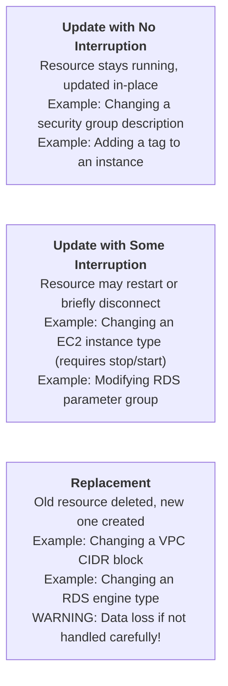
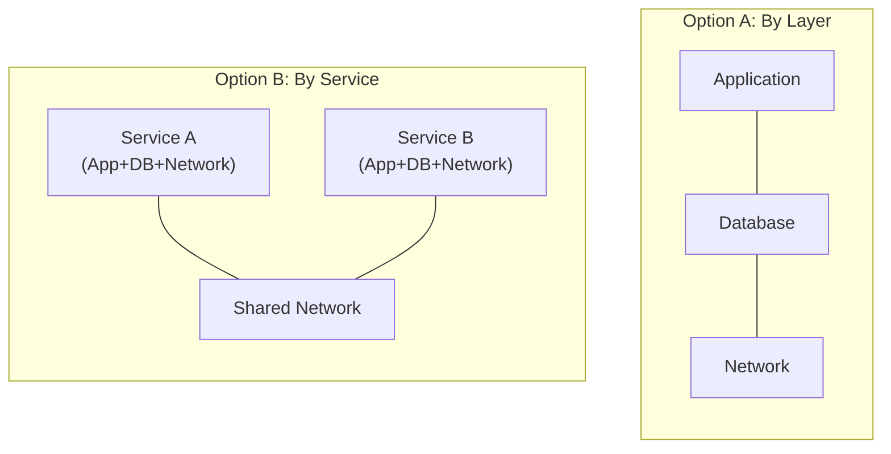
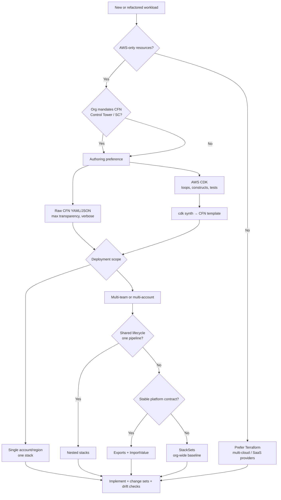

**Complexity**: `[MEDIUM]` | **Time to Complete**: ~1.5h | **Prerequisites**: Infrastructure as Code concepts, AWS CLI v2 configured, and an AWS account with administrator permissions.

## Prerequisites

This module belongs to the **AWS DevOps Essentials** track. Before you begin, ensure you have the following prerequisites in place, because CloudFormation templates only stay maintainable when you already understand the underlying AWS networking and security primitives they declare:
- Familiarity with Infrastructure as Code concepts, specifically understanding the difference between declarative and imperative provisioning paradigms.
- Experience creating AWS resources via the Command Line Interface, which establishes the baseline knowledge of the API calls that CloudFormation automates.
- The AWS CLI version 2 installed and configured with appropriate credentials on your local workstation.
- An AWS account with administrator-level permissions to create Virtual Private Clouds, subnets, security groups, and CloudFormation stacks.
- Comfort reading and analyzing configuration files, as this module relies heavily on declarative data serialization.

## What You'll Be Able to Do

After completing this rigorous module, you should be able to apply each capability below in a realistic AWS account, not merely recognize the terminology on paper:

- **Design** multi-resource CloudFormation templates integrating parameters, mappings, and complex conditional logic to support multi-environment deployments.
- **Implement** CloudFormation change sets and apply restrictive stack policies to prevent the accidental deletion or modification of stateful data resources.
- **Evaluate** stack architecture to modularize infrastructure templates using nested stacks and cross-stack references, scaling up to enterprise-level environments.
- **Diagnose** CloudFormation rollback failures and resolve difficult dependency conflicts during in-place stack updates and replacements.
- **Compare** the resource lifecycle behaviors of CloudFormation with third-party tools like Terraform to make informed architectural decisions.

---

## Why This Module Matters

**Hypothetical scenario:** An on-call engineer runs a routine operational playbook to remove a small number of servers from a capacity pool. A mistyped command removes far more capacity than intended, triggering a cascading failure that takes down dependent services for several hours. The post-incident review rarely blames a single person — it blames imperative, manual operations against production infrastructure without guardrails. One critical safeguard teams adopt afterward is robust tooling around infrastructure changes, ensuring that a single mistyped command cannot immediately cause region-wide catastrophic impact. The industry learned a hard lesson: imperative, manual operations performed directly against production infrastructure are an unacceptable risk profile for modern systems.

This is precisely what Infrastructure as Code solves at its foundational core. When your infrastructure is defined explicitly in a text-based template file, changes are forced to go through version control, peer code review, and automated pre-flight validation before they ever touch a production environment. A syntax typo in a CloudFormation template fails safely at validation time, rather than crashing an active system during execution. A dangerous architectural change is caught in a pull request diff, rather than discovered during a multi-hour outage post-mortem. Furthermore, rollback is fully automatic—CloudFormation undoes applied changes if a stack update fails halfway through, systematically returning the environment to the last known good configuration state.

On AWS specifically, CloudFormation is the **native** IaC engine: IAM policies, Service Catalog portfolios, Control Tower controls, and numerous service features assume stacks exist with identifiable IDs. That integration is why many enterprises standardize on CloudFormation for landing zones even when application teams prefer Terraform for multi-cloud application dependencies — the platform boundary and the application boundary pick different tools intentionally. Your job as an architect is to place contracts (exports, Parameter Store paths, shared tags) at the boundary so neither side hardcodes the other’s physical IDs.

---

## Declarative Templates and Architecture

CloudFormation fundamentally shifts your perspective from imperative commands (telling AWS *how* to build something) to a declarative model (telling AWS *what* you want the final state to be). Think of CloudFormation like an architect's blueprint for a skyscraper. The architect does not write instructions for the construction workers on how to mix concrete or operate cranes; they simply draw the final layout of the building. The CloudFormation service acts as the general contractor, interpreting your blueprint and determining the correct order of operations to construct it.

That contractor mental model extends to **dependencies**. When you declare an EC2 instance in subnet A that references a security group and an IAM instance profile, CloudFormation builds a directed acyclic graph of resources and creates or updates them in an order that respects `DependsOn` edges and implicit references from `!Ref` / `!GetAtt`. You do not script “create subnet, wait, create instance” — the engine schedules work. When two resources can proceed in parallel, CloudFormation may do so, but many AWS APIs still serialize sensitive replacements; that is why large updates feel slower than Terraform’s parallel provider graph even though both are declarative.

Templates ship as YAML or JSON. YAML is the human authoring format most teams store in Git; JSON is common for generated artifacts (including CDK synth output). The maximum template body size for inline `CreateStack` requests is **51,200 bytes**; larger templates must live in S3 (up to **1 MB** per object per [quotas](https://docs.aws.amazon.com/AWSCloudFormation/latest/UserGuide/cloudformation-limits.html)). CI pipelines therefore almost always upload templates to a versioned bucket and pass `TemplateURL`, which also becomes the delivery mechanism for nested stack children.

### Template Anatomy

A CloudFormation template is a structured file that declares the desired state of your entire infrastructure. Let us examine the full hierarchical structure of a standard template:

```yaml
AWSTemplateFormatVersion: "2010-09-09"
Description: "What this template creates and why"

# Parameters: User-provided values at deploy time
Parameters:
  EnvironmentName:
    Type: String
    Default: production
    AllowedValues: [development, staging, production]

# Mappings: Static lookup tables
Mappings:
  RegionAMI:
    us-east-1:
      HVM64: ami-0abc123def456789
    eu-west-1:
      HVM64: ami-0def456abc789012

# Conditions: Conditional resource creation
Conditions:
  IsProduction: !Equals [!Ref EnvironmentName, production]

# Resources: The actual AWS resources (REQUIRED - only mandatory section)
Resources:
  MyVPC:
    Type: AWS::EC2::VPC
    Properties:
      CidrBlock: "10.0.0.0/16"

# Outputs: Values to export or display
Outputs:
  VPCId:
    Value: !Ref MyVPC
    Export:
      Name: !Sub "${EnvironmentName}-VPCId"
```

Only the `Resources` section is strictly required by the CloudFormation engine. Everything else is technically optional but strongly recommended for professional, production-grade templates. Each top-level section serves a distinct purpose in making the template robust, reusable, and dynamic across multiple environments.

#### Mappings: Environment-Specific Constants Without Parameters

Mappings hold static lookup tables that do not change at deploy time the way parameters do. They are ideal for region-specific AMI IDs, instance size ladders, or feature flags that are fixed per environment tier rather than supplied by an operator at the console. Because mapping keys are resolved with `Fn::FindInMap`, you can keep a single template artifact for every region while still baking in values that would be awkward as parameters (for example, a curated AMI list per AWS Region). The [CloudFormation quotas](https://docs.aws.amazon.com/AWSCloudFormation/latest/UserGuide/cloudformation-limits.html) document caps mappings at 200 per template with 200 attributes each, which is generous for most designs but worth remembering when platform teams centralize large configuration matrices.

#### Conditions: Gating Resources and Property Values

Conditions evaluate to true or false at stack creation or update time. You attach a `Condition` key on a resource to skip creation entirely, or you use `Fn::If` on individual properties to vary configuration without maintaining separate template files. Combining `Fn::And`, `Fn::Or`, and `Fn::Not` lets you express policies such as “create NAT only when both production and explicit opt-in are true,” which is how teams keep development stacks cheap while production stays highly available. Conditions never run arbitrary code; they only compare parameters, mappings, and other conditions, which keeps templates auditable in code review.

#### Metadata: Operator Hints and Interface Generation

The `Metadata` section does not affect runtime infrastructure. It carries annotations for tools and humans: interface definitions for the CloudFormation Designer, parameter grouping labels in the console create-stack wizard, and custom keys your pipeline can read. AWS SAM and other transforms also rely on metadata conventions so higher-level frameworks can attach deployment hints without polluting resource properties.

#### Transform: Macros and the AWS::Serverless Transform

The optional `Transform` section declares macros CloudFormation applies to the template before provisioning. The most common transform is `AWS::Serverless-2016-10-31`, which expands concise SAM syntax into the larger set of resources API Gateway, Lambda, and IAM roles require. Transforms are macros hosted by CloudFormation itself; third-party macros register in the CloudFormation registry. Remember that [StackSets with service-managed permissions do not support templates containing transforms](https://docs.aws.amazon.com/AWSCloudFormation/latest/UserGuide/cloudformation-limits.html) — a constraint that pushes large multi-account SAM deployments toward self-managed StackSets or synthesized vanilla templates.

### Parameters: Types, Constraints, and Secrets

Hardcoding values is a severe anti-pattern in Infrastructure as Code. Parameters allow you to customize a template dynamically at deployment time without ever editing the underlying file. This is what enables you to use the exact same template for both testing and production environments.

Beyond `String` and `Number`, production templates routinely use AWS-specific types (`AWS::EC2::VPC::Id`, `AWS::SSM::Parameter::Value<String>`, `CommaDelimitedList`) so the console and CLI validate inputs against live inventory. Constraint keys matter as much as types:

| Mechanism | Purpose | Example use |
|-----------|---------|-------------|
| `AllowedValues` | Closed set of choices | Environment name `dev` / `staging` / `prod` |
| `AllowedPattern` | Regex validation | CIDR blocks, DNS-compatible labels |
| `MinLength` / `MaxLength` | String bounds | Application name length |
| `MinValue` / `MaxValue` | Numeric bounds | Autoscaling capacity |
| `NoEcho: true` | Mask secrets in console/API responses | Database passwords, API tokens |

Setting `NoEcho: true` on a parameter prevents the value from appearing in stack event history or the console after submission. It does **not** encrypt the value at rest in the stack — for secrets you should prefer [dynamic references to Secrets Manager or SSM Parameter Store](https://docs.aws.amazon.com/AWSCloudFormation/latest/UserGuide/dynamic-references.html) so plaintext never lives in the template body or parameter store longer than necessary.

```yaml
Parameters:
  DatabasePassword:
    Type: String
    NoEcho: true
    MinLength: 12
    Description: "Master password (masked in console; prefer Secrets Manager for production)"

  VpcId:
    Type: AWS::EC2::VPC::Id
    Description: "Existing VPC to attach workloads into"
```

AWS-specific parameter types, such as `AWS::EC2::KeyPair::KeyName`, are particularly powerful. When deploying a stack through the AWS Management Console, these types provide automatic dropdown validation, fetching valid keys from your account and actively catching errors long before the deployment process even begins. Furthermore, using `AllowedPattern` with regular expressions guarantees that input data conforms exactly to expected formats, such as validating a networking CIDR block.

### Resources: The Core of Every Template

Resources form the absolute center of gravity for your template. Each resource entry must have a logical name (which acts as your internal label), a resource type (dictating the AWS service), and a properties block (providing the specific configuration details).

```yaml
Resources:
  # Logical name: WebServerSecurityGroup
  WebServerSecurityGroup:
    Type: AWS::EC2::SecurityGroup
    Properties:
      GroupDescription: "Allow HTTP and SSH"
      VpcId: !Ref MyVPC
      SecurityGroupIngress:
        - IpProtocol: tcp
          FromPort: 80
          ToPort: 80
          CidrIp: 0.0.0.0/0
        - IpProtocol: tcp
          FromPort: 22
          ToPort: 22
          CidrIp: 10.0.0.0/8
```

The logical name (`WebServerSecurityGroup`) is how you reference this specific resource elsewhere inside the same template. In contrast, the physical name (the actual AWS resource ID generated in the cloud) is generated autonomously by CloudFormation unless you explicitly define it. You should almost never hardcode physical names, because doing so can prevent some replacement updates from functioning correctly.

**Pause and predict:** CloudFormation automatically appends random alphanumeric suffixes to physical resource IDs to prevent naming collisions and support zero-downtime replacements. When operating in an account hosting dozens of microservices, how can platform engineers and operators locate a specific provisioned DynamoDB table or S3 bucket without guessing generated suffixes in the management console?

<details>
<summary>Check your prediction</summary>

Inspect the stack's Outputs tab in the CloudFormation console or query the AWS Resource Groups Tagging API using standardized resource tags such as `Environment` and `Project`. Exposing generated physical IDs as stack outputs provides a predictable entry point, while centralized tag indexing allows operators to locate dynamically named resources across multiple stacks without browsing through unsorted service listings.

</details>

Shared accounts still need a way to vary CIDR blocks, instance sizes, and optional NAT cost across environments without copying whole templates. Establishing consistent input validation mechanisms ensures that those upstream properties and operational constraints conform to regional architectural requirements across every deployment target.

### Parameter Examples for Multi-Environment Templates

```yaml
Parameters:
  VPCCidr:
    Type: String
    Default: "10.0.0.0/16"
    Description: "CIDR block for the VPC"
    AllowedPattern: "^(\\d{1,3}\\.){3}\\d{1,3}/\\d{1,2}$"
    ConstraintDescription: "Must be a valid CIDR (e.g., 10.0.0.0/16)"

  InstanceType:
    Type: String
    Default: t3.micro
    AllowedValues:
      - t3.micro
      - t3.small
      - t3.medium
    Description: "EC2 instance type"

  KeyPairName:
    Type: AWS::EC2::KeyPair::KeyName
    Description: "Name of an existing EC2 key pair"

  EnableNATGateway:
    Type: String
    Default: "false"
    AllowedValues: ["true", "false"]
    Description: "Whether to create a NAT Gateway (adds cost)"
```

### Outputs: Sharing Information Between Stacks

Outputs serve as the public API of your CloudFormation stack. They expose critical values from your deployed resources, either for direct human consumption in the console or to enable cross-stack references across the broader architecture.

```yaml
Outputs:
  VPCId:
    Description: "The VPC ID"
    Value: !Ref VPC
    Export:
      Name: !Sub "${AWS::StackName}-VPCId"

  PublicSubnet1Id:
    Description: "Public subnet in AZ1"
    Value: !Ref PublicSubnet1
    Export:
      Name: !Sub "${AWS::StackName}-PublicSubnet1Id"

  ALBDNSName:
    Description: "Application Load Balancer DNS name"
    Value: !GetAtt ApplicationLoadBalancer.DNSName
```

The `Export` block is what makes the value globally available to other stacks in the same region via the `Fn::ImportValue` intrinsic function. This precise mechanism is how you securely share a foundational VPC ID generated by a core networking stack with multiple independent application stacks.

**Pause and predict:** When Stack B uses `!ImportValue` to consume a foundational VPC subnet identifier explicitly exported by Stack A, what exact behavior does the AWS CloudFormation engine exhibit at the API level if an administrator attempts to delete Stack A directly?

<details>
<summary>Check your prediction</summary>

CloudFormation rejects the deletion request immediately and returns a dependency validation error stating that the exported output is currently in use by another stack. The engine blocks the operation entirely, ensuring that foundational resources cannot be torn down while downstream consumers maintain active cross-stack references to them.

</details>

Wiring an export is only half of the authoring job; templates still have to compute names, attributes, and conditions at deploy time. Managing those values effectively requires the computational mechanisms and functional expressions that resolve resource identifiers dynamically during evaluation phases.

---

## Intrinsic Functions: The Template Programming Language

While CloudFormation templates are strictly declarative, intrinsic functions add the dynamic behavior and runtime logic necessary for professional deployments. These functions are evaluated securely by the CloudFormation engine during the stack creation or update lifecycle.

### Ref and GetAtt

The two most common intrinsic functions—`!Ref` and `!GetAtt`—deal with extracting identifiers and attributes from resources you have already declared, and you will use them in almost every non-trivial template.

What `!Ref` returns is **resource-type-specific**, not “always the ARN.” For many resources it is the resource ID; for an SSM parameter reference it is the value; for a pseudo-parameter it resolves to the stack or Region string. Guessing causes subtle bugs — for example, passing `!Ref` of an EC2 instance into a user-data script when you needed `!GetAtt MyInstance.PrivateIp`. The [documentation for each `AWS::` resource type](https://docs.aws.amazon.com/AWSCloudFormation/latest/TemplateReference/aws-template-resource-type-ref.html) lists the `Ref` return value and the attributes available to `Fn::GetAtt`. Senior engineers keep that page open while reviewing templates because it is faster than inferring from failed deploy events.

```yaml
# !Ref returns the resource's primary identifier
# For an EC2 instance: the instance ID
# For a parameter: the parameter value
SecurityGroupId: !Ref WebServerSecurityGroup

# !GetAtt returns a specific attribute of a resource
# Different from !Ref -- GetAtt accesses secondary attributes
LoadBalancerDNS: !GetAtt ApplicationLoadBalancer.DNSName
SecurityGroupId: !GetAtt WebServerSecurityGroup.GroupId
```

### Sub (String Substitution)

Constructing dynamic strings is necessary for naming conventions, resource tagging, and injection into configuration scripts like EC2 User Data.

```yaml
# Variable substitution in strings
# ${AWS::StackName} and ${AWS::Region} are pseudo-parameters
BucketName: !Sub "${AWS::StackName}-artifacts-${AWS::Region}"

# Reference resource attributes
UserData:
  Fn::Base64: !Sub |
    #!/bin/bash
    echo "VPC ID is ${VPC}" >> /var/log/setup.log
    echo "Region is ${AWS::Region}" >> /var/log/setup.log
    aws s3 cp s3://${ArtifactBucket}/config.yml /opt/app/config.yml
```

### Select, Split, and Join

Manipulating lists and arrays is a common requirement when dealing with availability zones, subnets, and routing configurations, so CloudFormation provides `!Select`, `!Split`, and `!Join` to compose CIDR math and subnet wiring without hardcoding every value.

```yaml
# Pick an item from a list
AZ: !Select [0, !GetAZs ""]   # First AZ in the region

# Split a string into a list
# If "10.0.0.0/16" --> ["10.0.0.0", "16"]
CidrParts: !Split ["/", !Ref VPCCidr]

# Join list items into a string
SubnetIds: !Join [",", [!Ref Subnet1, !Ref Subnet2, !Ref Subnet3]]
```

### Conditionals

Real-world infrastructure templates must adapt based on the deployment environment. You might want highly available NAT Gateways in production, but completely omit them in development to save extensive costs. Conditionals make this possible without duplicating code.

```yaml
Conditions:
  IsProduction: !Equals [!Ref EnvironmentName, production]
  CreateNAT: !Equals [!Ref EnableNATGateway, "true"]
  ProdWithNAT: !And [!Condition IsProduction, !Condition CreateNAT]

Resources:
  NATGateway:
    Type: AWS::EC2::NatGateway
    Condition: CreateNAT    # Only created if condition is true
    Properties:
      SubnetId: !Ref PublicSubnet1
      AllocationId: !GetAtt NATElasticIP.AllocationId

  NATElasticIP:
    Type: AWS::EC2::EIP
    Condition: CreateNAT
    Properties:
      Domain: vpc

  # Use If to set property values conditionally
  WebServer:
    Type: AWS::EC2::Instance
    Properties:
      InstanceType: !If [IsProduction, t3.medium, t3.micro]
      Monitoring: !If [IsProduction, true, false]
```

### Quick Reference Table

Understanding these functions is critical when you read production templates or debug stack events, so study this reference table detailing their syntax and the situations where each one is the right tool:

| Function | Purpose | Example |
|----------|---------|---------|
| `!Ref` | Resource ID or parameter value | `!Ref MyVPC` |
| `!GetAtt` | Resource attribute | `!GetAtt ALB.DNSName` |
| `!Sub` | String interpolation | `!Sub "${AWS::StackName}-bucket"` |
| `!Select` | Pick from list | `!Select [0, !GetAZs ""]` |
| `!Split` | String to list | `!Split [",", "a,b,c"]` |
| `!Join` | List to string | `!Join ["-", ["my", "stack"]]` |
| `!If` | Conditional value | `!If [IsProd, t3.large, t3.micro]` |
| `!Equals` | Compare values | `!Equals [!Ref Env, prod]` |
| `!FindInMap` | Lookup in Mappings | `!FindInMap [RegionAMI, !Ref "AWS::Region", HVM64]` |
| `!ImportValue` | Cross-stack reference | `!ImportValue "network-stack-VPCId"` |
| `!GetAZs` | List AZs in region | `!GetAZs ""` (current region) |
| `!Cidr` | Generate CIDR blocks | `!Cidr [!Ref VPCCidr, 6, 8]` |

### Pseudo-Parameters and Cross-Stack Wiring

CloudFormation injects **pseudo-parameters** that always resolve in the deployment context: `AWS::Region`, `AWS::AccountId`, `AWS::StackName`, `AWS::StackId`, `AWS::NotificationARNs`, and `AWS::NoValue` (used with `Fn::If` to omit optional properties). They are not declared in your template; you reference them inside `Fn::Sub` or `Fn::Join` exactly like parameters. Naming resources with `!Sub "${AWS::StackName}-bucket-${AWS::Region}"` avoids collisions across accounts and Regions without hardcoding IDs.

`Fn::ImportValue` consumes an export name published by another stack's output. Export names are regional and account-scoped; the import creates a hard dependency that blocks deletion of the exporting stack until consumers release the import. For loosely coupled platform/application boundaries, exports are preferable to copying IDs into parameter files. For tightly coupled parent/child deployments that share one lifecycle, nested stacks pass outputs through `Fn::GetAtt ChildStack.Outputs.OutputName` instead.

```yaml
  AppSubnet:
    Type: AWS::EC2::Subnet
    Properties:
      VpcId: !ImportValue
        Fn::Sub: "${NetworkStackName}-VPCId"
      AvailabilityZone: !Select [0, !GetAZs ""]
      CidrBlock: !Select [0, !Cidr [!ImportValue CoreVpcCidr, 4, 8]]
```

`Fn::FindInMap` reads the `Mappings` section; `Fn::Join` and `Fn::Split` compose and decompose lists for availability zones, comma-separated security group lists, and user-data scripts. Long-form YAML also supports `Fn::Base64` wrapping `Fn::Sub` for EC2 bootstrap documents. The [intrinsic function reference](https://docs.aws.amazon.com/AWSCloudFormation/latest/UserGuide/intrinsic-function-reference.html) is the authoritative list of which functions apply to which attributes.

---

## Stack Lifecycle: Create, Update, Delete

A **stack** is an instantiated runtime environment derived directly from a template. When you create a stack, CloudFormation parses the template, resolves the dependency graph, and provisions all the resources in the exact correct order. When you update a stack, it intelligently calculates the diff and applies only the required changes. When you finally delete a stack, it systematically tears down all resources in the reverse order of their dependencies.

### Creating a Stack

Creating a stack involves submitting your template file along with the necessary runtime parameters to the CloudFormation API. The service first validates template syntax and resource property shapes against the published resource specification, then allocates a stack ID and walks the dependency graph. Stack events stream to the console and `describe-stack-events` API in chronological order — your first debugging skill when a resource fails is to read the **status reason** on the failing event, not to re-run the CLI blindly.

IAM capabilities flags exist because templates can create roles and policies that escalate privilege. `CAPABILITY_IAM` acknowledges generic IAM resources; `CAPABILITY_NAMED_IAM` is required when logical IDs or role names are explicit. `CAPABILITY_AUTO_EXPAND` acknowledges macros/transforms such as SAM that expand into additional resources. Omitting the correct capability produces a fast failure at create time rather than a partial deploy.

Enable **termination protection** on production stacks you never want deleted from a script typo. Pair it with `DeletionPolicy` on data resources so that even if protection is disabled during an emergency, stateful assets survive. For CI, many teams use separate AWS accounts for integration tests so `delete-stack` in a pipeline cannot touch production names.

```bash
# Create a stack from a local template
aws cloudformation create-stack \
  --stack-name my-network \
  --template-body file://network.yaml \
  --parameters \
    ParameterKey=EnvironmentName,ParameterValue=production \
    ParameterKey=VPCCidr,ParameterValue=10.0.0.0/16

# Create a stack that creates IAM resources (requires explicit capability)
aws cloudformation create-stack \
  --stack-name my-app \
  --template-body file://app.yaml \
  --capabilities CAPABILITY_NAMED_IAM

# Wait for completion
aws cloudformation wait stack-create-complete --stack-name my-network

# Check stack status
aws cloudformation describe-stacks \
  --stack-name my-network \
  --query 'Stacks[0].[StackName,StackStatus]' \
  --output text
```

### Update Behavior: The Three Types of Resource Changes

When you submit an updated template to a running stack, CloudFormation analyzes the altered properties and categorizes the necessary changes into one of three distinct behavioral buckets:



It is imperative that you verify the official AWS documentation for a specific resource type to understand which property changes trigger a destructive replacement. The CloudFormation documentation prominently marks each property with "Update requires: No interruption," "Some interruption," or "Replacement."

**Pause and predict:** During a stack update, CloudFormation detects a property modification that requires an EC2 instance to undergo a replacement cycle. By default, the engine initiates a create-before-delete sequence. If the template directly attaches an Elastic IP address to this instance, why does this update workflow fail during execution?

<details>
<summary>Check your prediction</summary>

An Elastic IP address is an exclusive network resource that can be associated with only one network interface or instance at any given moment. During create-before-delete replacement, the engine launches the new virtual machine and attempts to bind the Elastic IP while the original running instance still holds the active allocation, causing an immediate API attachment conflict that triggers an automatic stack rollback.

</details>

Replacement classification on paper is not the same as seeing the exact Action and Replacement flags CloudFormation will send. Analyzing proposed configuration diffs prior to runtime execution lets platform engineers catch unexpected replacement actions before those modifications reach a production stack.

### Change Sets: Preview Before You Apply

You must never update a production stack blindly. The concept of a Change Set acts as your primary safety mechanism, allowing you to preview exactly what modifications CloudFormation intends to execute before committing to them.

```bash
# Create a change set (does NOT apply changes)
aws cloudformation create-change-set \
  --stack-name my-network \
  --change-set-name update-subnets \
  --template-body file://network-v2.yaml \
  --parameters \
    ParameterKey=EnvironmentName,ParameterValue=production

# Review what will change
aws cloudformation describe-change-set \
  --stack-name my-network \
  --change-set-name update-subnets \
  --query 'Changes[*].ResourceChange.{Action:Action,Resource:LogicalResourceId,Type:ResourceType,Replacement:Replacement}' \
  --output table

# If changes look safe, execute
aws cloudformation execute-change-set \
  --stack-name my-network \
  --change-set-name update-subnets

# If changes are wrong, delete the change set (no effect on stack)
aws cloudformation delete-change-set \
  --stack-name my-network \
  --change-set-name update-subnets
```

The output of a change set is invaluable. It clearly informs you whether each resource will be Added, Modified, or Removed, and whether a modification will mandate a Replacement. Neglecting to review change sets has caused massive enterprise outages when engineers mistakenly assumed a parameter tweak was a safe in-place update.

Change sets are also the integration point for **CI governance**. Pipelines can create a change set on a staging stack, parse the JSON for any `Replacement: "True"` on `AWS::RDS::DBInstance` or `AWS::EC2::VPC`, and fail the build before `execute-change-set` is allowed. Human approval steps attach to the change set ARN, not to a vague “please review the template diff in Git.” Git diffs show intent; change sets show **what CloudFormation will actually do** given the live stack’s current physical IDs and dependencies — a distinction that matters when properties have side effects not obvious in YAML.

For destructive changes you intend to apply, some teams pair change sets with **stack policy updates** that temporarily allow replacement on specific logical IDs, then restore deny policies after success. That pattern is rare but illustrates how policy, change sets, and IAM capabilities together form a defense-in-depth story rather than a single gate.

### Rollback Behavior and Resilience

If a stack creation or update experiences a critical failure halfway through, CloudFormation exhibits its greatest strength: automatic rollback.

- **Create failure**: All resources created successfully so far are systematically deleted, leaving the environment clean.
- **Update failure**: All modifications are reverted meticulously to the previous state, maintaining system stability.
- **Delete failure**: The stack enters a `DELETE_FAILED` state. This usually occurs due to resources that physically cannot be deleted automatically, such as S3 buckets that still contain user data.

While you possess the ability to disable rollbacks during initial development for debugging purposes (via `--disable-rollback`), performing this action in a production environment is an immense risk and is strongly prohibited by DevOps standards.

### Rollback Triggers and Controlled Failure

Beyond default rollback-on-error, you can attach **rollback triggers** — CloudWatch alarms that cause CloudFormation to roll back an in-progress update if operational metrics breach thresholds (for example, elevated 5xx rates on a load balancer during a deployment). This bridges infrastructure change with runtime signals so a bad release does not wait for a human to notice. Rollback triggers are optional guardrails; they do not replace change sets or integration tests, but they reduce the window where a partially applied template leaves production unhealthy.

### Drift Detection and Reconciliation

[Drift detection](https://docs.aws.amazon.com/AWSCloudFormation/latest/UserGuide/using-cfn-stack-drift.html) compares the template's last-applied properties to the live resource configuration. When someone edits a security group in the console, drift status becomes `MODIFIED` for that logical resource. Drift answers “what changed outside IaC?” — not “what would a template update do?” — so the remediation path is either import the change into the template, remove the manual edit, or run a targeted stack update. Scheduled drift detection (where supported in your workflow) turns reconciliation into a routine platform audit rather than an incident-driven discovery.

```bash
# Detect drift on a running stack
DRIFT_ID=$(aws cloudformation detect-stack-drift \
  --stack-name my-network \
  --query StackDriftDetectionId --output text)

while [ "$(aws cloudformation describe-stack-drift-detection-status \
  --stack-drift-detection-id "$DRIFT_ID" \
  --query DetectionStatus --output text)" = "DETECTION_IN_PROGRESS" ]; do
  sleep 5
done

aws cloudformation describe-stack-resource-drifts \
  --stack-name my-network \
  --stack-resource-drift-status-filters MODIFIED \
  --query 'StackResourceDrifts[*].[LogicalResourceId,PropertyDifferences]' \
  --output table
```

Unlike stack create or update operations, drift detection is asynchronous and **does not expose a `aws cloudformation wait` subcommand** — the supported waiters cover change-set creation, stack create/delete/update, import, rollback, and type registration only. Scripts must poll `describe-stack-drift-detection-status` until `DetectionStatus` leaves `DETECTION_IN_PROGRESS`, then call `describe-stack-resource-drifts` to list logical IDs with `MODIFIED`, `DELETED`, or `NOT_CHECKED` status. In automation, wrap the poll loop with a timeout so a stuck detection does not hang a CI job indefinitely; the lab exercise uses the same pattern with a short initial sleep before the first status read.

### Stack Policies, Termination Protection, and Data Retention

**Stack policies** are JSON documents attached to a stack that deny specific update or delete actions on selected resources during stack operations. They are useful when you must allow application template updates but forbid accidental replacement of a stateful database in the same stack. Policies filter by resource type and logical ID; they do not stop manual console changes, which is why drift detection remains necessary.

A minimal policy denying updates to a production database logical ID while allowing other resources to change might look like this (illustrative structure — adjust logical IDs to your template):

```json
{
  "Statement": [
    {
      "Effect": "Deny",
      "Principal": "*",
      "Action": "Update:*",
      "Resource": "LogicalResourceId/ProductionDatabase"
    },
    {
      "Effect": "Allow",
      "Principal": "*",
      "Action": "Update:*",
      "Resource": "*"
    }
  ]
}
```

Stack policies evaluate on stack operations initiated through CloudFormation, not on direct service API calls. Operators can still modify the RDS instance class from the RDS console unless IAM denies it — another reason drift detection and IAM guardrails complement template-level protections.

**Termination protection** (`EnableTerminationProtection`) blocks `DeleteStack` until an operator disables the flag. It is account-wide insurance against scripted cleanup mistakes, not a substitute for `DeletionPolicy`.

**Pause and predict:** An operator disables termination protection on a production database stack to execute a maintenance workflow, and an automated decommission script subsequently issues an unprompted `delete-stack` command against the stack. If the underlying `AWS::RDS::DBInstance` resource definition does not declare an explicit `DeletionPolicy` attribute, what happens to the database and its stored data records?

<details>
<summary>Check your prediction</summary>

CloudFormation destroys the database instance immediately because the default DeletionPolicy for resources without an explicit attribute is `Delete`. The engine terminates the RDS instance and removes its underlying storage volumes alongside the stack tear-down, resulting in unrecoverable data loss unless an explicit `Retain` or `Snapshot` policy was defined in the template beforehand.

</details>

The attribute table below is the menu of per-resource policies teams actually ship on data stores. Pair the policy you choose with a runbook for what operators should do after a stack is gone:

| Policy | On stack delete | On replacement update |
|--------|-----------------|------------------------|
| `Delete` (default) | Resource deleted | Old resource deleted after create (per CFN rules) |
| `Retain` | Resource kept, removed from stack | Old resource kept |
| `Snapshot` (supported types) | Snapshot created, then delete | Snapshot on replacement where applicable |

Pair `DeletionPolicy: Retain` on RDS instances, DynamoDB tables, and S3 buckets that hold customer data with runbooks for [re-importing retained resources](https://docs.aws.amazon.com/AWSCloudFormation/latest/UserGuide/resource-import.html) into a new stack if you rebuild automation around them.

```yaml
  ProductionDatabase:
    Type: AWS::RDS::DBInstance
    DeletionPolicy: Retain
    UpdateReplacePolicy: Snapshot
    Properties:
      Engine: postgres
      # ...
```

---

## Nested Stacks: Managing Architectural Complexity

When an infrastructure footprint grows beyond a few hundred resources, attempting to maintain a single monolithic template file becomes an agonizing operational burden. Nested stacks allow you to break down your architecture, composing multiple independent templates into a cohesive deployment hierarchy.

```yaml
# Parent template: main.yaml
Resources:
  NetworkStack:
    Type: AWS::CloudFormation::Stack
    Properties:
      TemplateURL: https://s3.amazonaws.com/my-templates/network.yaml
      Parameters:
        EnvironmentName: !Ref EnvironmentName
        VPCCidr: !Ref VPCCidr

  DatabaseStack:
    Type: AWS::CloudFormation::Stack
    DependsOn: NetworkStack
    Properties:
      TemplateURL: https://s3.amazonaws.com/my-templates/database.yaml
      Parameters:
        VPCId: !GetAtt NetworkStack.Outputs.VPCId
        PrivateSubnetIds: !GetAtt NetworkStack.Outputs.PrivateSubnetIds

  ApplicationStack:
    Type: AWS::CloudFormation::Stack
    DependsOn: [NetworkStack, DatabaseStack]
    Properties:
      TemplateURL: https://s3.amazonaws.com/my-templates/application.yaml
      Parameters:
        VPCId: !GetAtt NetworkStack.Outputs.VPCId
        DatabaseEndpoint: !GetAtt DatabaseStack.Outputs.DatabaseEndpoint
```

Establishing strong architectural boundaries is vital when utilizing nested stacks. Engineering teams traditionally rely on two common abstraction patterns for stack division:



Option A (layer-based architecture) functions superbly for highly centralized monolithic applications governed by a single platform team. Option B (service-based architecture) is significantly more effective for dynamic microservices environments where cross-functional product teams own and deploy their complete stack autonomously.

### Cross-Stack References vs Nested Stacks

Nested stacks share a parent stack's lifecycle: updating the parent can update children in one operation, and deleting the parent deletes children (subject to retention policies). **Exports and `Fn::ImportValue`** couple stacks loosely — different teams, pipelines, and schedules — while still enforcing dependency locks at delete time. Use nested stacks when one team owns the full hierarchy and templates are versioned together. Use exports when a platform stack publishes stable contracts (VPC IDs, subnet lists, shared KMS keys) and application stacks evolve independently.

Per [CloudFormation quotas](https://docs.aws.amazon.com/AWSCloudFormation/latest/UserGuide/cloudformation-limits.html), a single template may declare up to **500 resources**, while a nested stack **operation** may create, update, or delete at most **2500 resources** in one deployment. Planning boundaries early avoids painful splits when you approach limits.

### CloudFormation StackSets for Multi-Account and Multi-Region

[StackSets](https://docs.aws.amazon.com/AWSCloudFormation/latest/UserGuide/stacksets-concepts.html) extend stacks across many accounts and Regions from an administrator (management) account. A stack set template plus target OU or account list provisions identical baseline resources — logging buckets, IAM guardrails, VPC IPAM attachments — everywhere new accounts land. Service-managed permissions integrate with AWS Organizations; self-managed permissions offer flexibility when transforms or macros are required (service-managed StackSets currently reject templates with transforms).

Default quotas allow **1000 stack sets** per administrator account, **100,000 stack instances** per stack set, and **10,000 concurrent stack instance operations** per Region — large enough for enterprise landing zones but still worth monitoring during bulk updates. StackSet operations are eventually consistent across accounts; failed instances surface per-account events that platform teams must remediate without assuming a single stack status represents the whole estate.

```bash
# Example: create a stack set (administrator account, self-managed illustration)
aws cloudformation create-stack-set \
  --stack-set-name org-baseline-logging \
  --template-body file://baseline.yaml \
  --permission-model SELF_MANAGED \
  --capabilities CAPABILITY_NAMED_IAM
```

---

## Patterns & Anti-Patterns

The patterns below reflect what mature AWS platform teams converge on after operating CloudFormation at scale. Each addresses a failure mode the matching anti-pattern enables.

### Proven Patterns

**Pattern 1: Change sets on every production update.** Treat `create-change-set` + human or automated review as mandatory for stacks touching customer data or shared networking. Change sets surface `Replacement: True` before an update attempts to recreate a VPC or database. At moderate scale (dozens of stacks), the extra minutes per change are negligible compared to rollback time during an incident.

**Pattern 2: Layered stacks with explicit contracts.** Publish VPC and shared security primitives from a platform stack via `Export` names documented in an internal catalog; application stacks import by name. Version export names when contracts break (`network-v2-VPCId`) instead of silently changing semantics. This scales organizationally because product teams ship without copying opaque resource IDs into parameter files.

**Pattern 3: Retain and snapshot policies on stateful resources.** Apply `DeletionPolicy: Retain` (and `UpdateReplacePolicy: Snapshot` where supported) to data stores before enabling CI delete paths. Stack deletion then removes automation tracking without wiping data — the intended safety net when someone runs `delete-stack` on the wrong name.

**Pattern 4: Drift detection on shared infrastructure stacks.** Schedule weekly drift checks on network, identity, and security baseline stacks. MODIFIED resources trigger tickets to either revert console edits or codify them in Git. This pattern prevents “template says X, reality is X plus mystery rules” from compounding for months.

**Pattern 5: Conditional cost guards in templates.** Use parameters and conditions to omit NAT Gateways, extra AZ replicas, or expensive instance types in non-production environments. The template stays one artifact; cost differences are explicit in parameter defaults and mapping tables rather than hidden in forked files nobody merges.

### Anti-Patterns

| Anti-Pattern | Why Teams Fall Into It | What Goes Wrong | Better Approach |
|--------------|----------------------|-----------------|-----------------|
| Monolithic 400+ resource template | Faster initial velocity | Hits 500-resource limit; blast radius spans entire platform; updates serialize slowly | Nested stacks or service-scoped stacks with documented export contracts |
| Skipping change sets in “small” updates | Urgency during incidents | Property tweak triggers replacement; outage extends rollback window | Always preview; automate change-set parsing in CI for allowed actions |
| Hardcoded physical names on replaceable resources | Predictable console browsing | Create-before-delete fails; stack stuck in `UPDATE_ROLLBACK_FAILED` | Let CloudFormation name resources; use tags and outputs for discovery |
| Console hotfixes without template follow-up | Faster than opening a PR | Drift accumulates; next template update surprises with deletes | Drift detection + ticket to merge or revert |
| `Fn::ImportValue` without export versioning | Shorter export names | Breaking change in platform stack blocks all consumers on update | Version export names; document deprecation windows |
| Disabling rollback in production to “see errors” | Debugging habit from dev | Failed update leaves stack in inconsistent partial state | Keep rollback enabled; use change sets and staged accounts |
| StackSets without per-account failure runbooks | Assume uniform accounts | One OU member fails SCP check; entire rollout pauses unclearly | Test on canary accounts; monitor StackInstance status per target |

Hypothetical scenario: A team deploys a single stack containing networking, databases, and application tiers for three microservices. After eighteen months the template holds 480 resources. Adding a shared WAF requires two more resources, but the update also replaces a subnet property that mandates replacement. CloudFormation begins create-before-delete on the subnet while dependent resources still reference the old subnet ID. The update fails, rolls back for forty minutes, and blocks other pipeline stages because the stack name is globally locked. The remediation — splitting into network, data, and per-service stacks — was cheaper at month two than at month eighteen.

---

## Decision Framework: CloudFormation, Terraform, CDK, and Modularization

Choosing how to express and ship infrastructure is not a single vendor decision; it is a matrix of **engine** (CloudFormation vs Terraform), **authoring layer** (YAML vs CDK vs HCL), and **deployment scope** (single stack vs nested vs exports vs StackSets). Use the flowchart when onboarding a new workload or refactoring a painful monolith.



### Engine Comparison: CloudFormation vs Terraform

This comparison represents one of the most vigorously debated topics in modern DevOps culture. Understanding the fundamental philosophical differences between CloudFormation and HashiCorp's Terraform is crucial for a senior cloud engineer.

| Factor | CloudFormation | Terraform |
|--------|---------------|-----------|
| **AWS-only** | Native, first-class | Excellent support via AWS provider |
| **Multi-cloud** | AWS only | Multi-cloud, multi-provider |
| **State management** | Managed by AWS (no state file) | State file (local or remote, you manage) |
| **Drift detection** | Built-in | `terraform plan` shows drift |
| **Rollback** | Automatic on failure | Manual (apply previous state) |
| **Language** | YAML/JSON (declarative) | HCL (declarative with loops, modules) |
| **Modularity** | Nested stacks, StackSets | Modules (more flexible) |
| **Learning curve** | Moderate (verbose but predictable) | Moderate (more features to learn) |
| **Cost** | Free | Free (OSS), paid for Terraform Cloud |
| **Community modules** | Limited (AWS Samples) | Vast (Terraform Registry) |
| **Speed** | Slower (sequential by default) | Faster (parallel by default) |

**Use CloudFormation exclusively when** your enterprise organization is strictly AWS-only and wants native rollback, drift detection, and governance integration without operating a separate state backend, including situations such as these:
- You desire absolutely zero operational overhead regarding state file management and remote locking architectures.
- You demand strict, native, automatic rollback guarantees for mission-critical infrastructure changes.
- You heavily rely upon native AWS governance services that mandate CloudFormation integration, such as AWS Service Catalog or AWS Control Tower.

**Use Terraform decisively when** your architecture spans multiple clouds, SaaS APIs, or teams that already standardized on HashiCorp tooling and need richer module composition than nested stacks comfortably provide:
- Your system integrates multiple disparate cloud providers, SaaS products, or external APIs concurrently.
- You require advanced HashiCorp Configuration Language (HCL) features, including programmatic loops and dynamic block generation.
- Your engineering department already possesses deep institutional knowledge and extensive tooling built around Terraform.
- You wish to rapidly bootstrap environments utilizing a vast ecosystem of standardized community modules.

In highly mature engineering organizations, utilizing both platforms is common. Platform teams often use CloudFormation for fundamental AWS landing zones and strict governance controls, while product teams leverage Terraform to rapidly iterate on complex application infrastructure.

### Modularization: Nested Stacks, Exports, and StackSets

| Approach | Coupling | Best when | Watch-outs |
|----------|----------|-----------|------------|
| **Nested stacks** | Tight — parent owns child lifecycle | Single pipeline deploys network + app together; templates versioned as a unit | Parent template must host child `TemplateURL` in S3; debugging spans multiple stack events |
| **Exports / `Fn::ImportValue`** | Medium — delete protection on exports | Platform publishes stable IDs; apps deploy independently | Export names are global per Region; breaking rename blocks consumers |
| **StackSets** | Loose across accounts/Regions | Org-wide baselines, guardrails, logging | Failed instances per account; service-managed vs transform limitations |
| **CDK constructs** | Author-time only — still CFN at deploy | Reuse L2/L3 patterns with tests | Synth output must be reviewed; still subject to CFN limits |

---

## AWS CDK: Brief Mention

The AWS Cloud Development Kit (CDK) fundamentally revolutionizes IaC by permitting developers to define infrastructure utilizing expressive, imperative programming languages such as TypeScript, Python, Java, C#, and Go. However, it is vital to remember that CDK operates strictly as a synthesizer; under the hood, the kit generates pure CloudFormation templates before initiating deployment.

```python
# CDK Python example -- this generates a CloudFormation template
from aws_cdk import Stack, aws_ec2 as ec2
from constructs import Construct

class NetworkStack(Stack):
    def __init__(self, scope: Construct, id: str, **kwargs):
        super().__init__(scope, id, **kwargs)

        self.vpc = ec2.Vpc(self, "MainVPC",
            max_azs=3,
            nat_gateways=1,
            subnet_configuration=[
                ec2.SubnetConfiguration(
                    name="Public",
                    subnet_type=ec2.SubnetType.PUBLIC,
                    cidr_mask=24
                ),
                ec2.SubnetConfiguration(
                    name="Private",
                    subnet_type=ec2.SubnetType.PRIVATE_WITH_EGRESS,
                    cidr_mask=24
                )
            ]
        )
```

This remarkably concise 20-line Python class effectively generates an extensive CloudFormation template containing an entire VPC, six independent subnets correctly distributed across three availability zones, associated route tables, a managed NAT Gateway, and an Internet Gateway. Manually writing this would easily exceed 200 lines of verbose YAML. While the CDK is an incredibly powerful tool for reducing boilerplate code, deeply understanding raw CloudFormation is absolutely non-negotiable. When a CDK deployment inevitably fails, the resulting stack trace and error logs exclusively reference the underlying CloudFormation engine, its logical IDs, and its rigid declarative rules.

The CDK CLI workflow — `cdk synth` to emit templates, `cdk diff` to compare against deployed stacks, `cdk deploy` to invoke CloudFormation — mirrors the safety practices in this module: change sets still apply when you deploy synthesized templates through the service directly. Teams often check synthesized YAML into CI artifacts so reviewers see the exact resources IAM and security tools will evaluate, not only the high-level construct code.

---

## Cost Lens: What CloudFormation Costs (and What Actually Bills You)

Per the [AWS CloudFormation pricing page](https://aws.amazon.com/cloudformation/pricing/), there is **no additional charge** for creating, updating, or deleting stacks when you use resource types in the `AWS::*` and `Alexa::*` namespaces (and `Custom::*` resources you operate yourself). You pay the same prices for EC2, RDS, NAT Gateways, and data transfer as if you had clicked through the console — CloudFormation is the orchestration plane, not a metered provisioning tax.

| Cost category | Who charges | What drives spend up | Control knobs |
|---------------|-------------|----------------------|---------------|
| **Provisioned resources** | Each AWS service (EC2, RDS, S3, …) | Large instance types, always-on NAT Gateways, unused retained resources | Conditions/parameters to strip expensive resources from dev; right-sizing; lifecycle policies on data stores |
| **Failed delete cleanup** | Underlying services | `DeletionPolicy: Retain` + forgotten orphans; S3 buckets with objects block delete → `DELETE_FAILED` stacks | Retain only where intended; empty buckets before delete; tag retained resources for cost allocation |
| **Third-party registry types & hooks** | CloudFormation | Private registry resource providers and custom hooks beyond free tier | Stay on native `AWS::*` types when possible; monitor handler operation counts |
| **Handler duration overage** | CloudFormation | Custom resources/hooks running >30s per operation (billed per second above threshold per pricing page) | Optimize Lambda-backed custom resources; avoid synchronous long polls |
| **StackSets at scale** | Target accounts' resources | Baseline stacks × accounts × Regions (e.g., VPC endpoints everywhere) | Canary OUs; parameterize smaller baselines for sandbox accounts |
| **Operational time** | Your engineers | Wide blast-radius monoliths lengthen rollbacks | Smaller stacks; change sets; drift audits |

Hypothetical scenario: A development stack enables three NAT Gateways across AZs for “parity with production.” CloudFormation deploys them successfully and bills nothing for the service itself, but NAT Gateway hourly and data processing charges add roughly $100 per month per gateway in US Regions. The cost spike is not visible in a “CloudFormation line item” on the bill — it appears under VPC/NAT — which is why cost-aware templates use conditions to deploy a single NAT (or none) outside production.

Template authors should also budget **engineering time** as a cost: failed `DELETE_FAILED` stacks, manual cleanup of retained RDS instances, and org-wide StackSet partial failures consume operator hours even when AWS service fees stay flat. Investing once in smaller stacks, automated change-set checks, and documented export contracts reduces recurring toil — the same way right-sizing instances reduces recurring infrastructure dollars. **Wait conditions and `cfn-signal`** add no direct CloudFormation metered charge, but they influence how long stack operations block (and therefore how long your CI job holds a lease); keep signal payloads within the documented 4,096-byte wait-condition limit and post large bootstrap logs to S3 instead of embedding them in signals.

---

## Did You Know?

- **CloudFormation manages hundreds of distinct AWS resource types**, with new services typically gaining CloudFormation coverage at launch. The machine-readable [resource and property types specification](https://docs.aws.amazon.com/AWSCloudFormation/latest/TemplateReference/cfn-resource-specification.html) is the authoritative schema generators and IDE plugins consume.
- **A single template may declare at most 500 resources**, while one nested stack operation can touch up to 2500 resources in a single create/update/delete. Teams that outgrow a monolith split by layer or service boundary before hitting limits, not after a failed production update.
- **CloudFormation drift detection** compares live resources to the last successful template application, surfacing console edits that bypass Git. Drift status is per logical resource; fixing drift means updating the template, importing changes, or reverting manual edits — not running a change set preview alone.
- **The AWS Cloud Development Kit synthesizes to CloudFormation** — `cdk deploy` still creates stacks, change sets, and rollbacks governed by the same engine described in this module. Debugging CDK without reading CloudFormation events is like debugging TypeScript without reading the emitted JavaScript when production breaks.

---

## Common Mistakes

Navigating infrastructure as code requires immense discipline, because a template that deploys cleanly once can still destroy production if operators skip previews, hardcode names, or let console drift accumulate without reconciliation. Be highly vigilant against these ubiquitous pitfalls.

| Mistake | Why It Happens | How to Fix It |
|---------|---------------|---------------|
| Hardcoding resource names | Wanting predictable names | Let CloudFormation generate names; hardcoded names prevent replacement updates and cause conflicts across environments |
| Updating production without change sets | Rushing live stack updates | Create and review a change set for production updates; the brief extra step has prevented countless outages |
| Monolithic templates with 400+ resources | Starting small and never splitting | Plan stack boundaries early; split by layer (network/app/data) or by service boundary |
| Forgetting `--capabilities CAPABILITY_NAMED_IAM` | Template creates IAM roles but deploy command omits the flag | Add `CAPABILITY_NAMED_IAM` (or `CAPABILITY_IAM`) whenever your template creates IAM resources |
| Not setting `DeletionPolicy: Retain` on databases | Assuming delete protection is enough | Set `DeletionPolicy: Retain` on RDS instances, S3 buckets with data, and DynamoDB tables so accidental stack deletion does not destroy data |
| Manual console changes to CloudFormation-managed resources | "Just this one quick fix" | Run drift detection regularly; treat manual changes as tech debt that must be reconciled with the template |
| Not exporting outputs from shared stacks | Copy-pasting resource IDs between templates | Use `Export` on outputs and `Fn::ImportValue` in consuming stacks; this creates explicit dependencies and prevents accidental deletion |
| Ignoring `DELETE_FAILED` stack cleanup | Stack delete stops when S3 or retained resources block removal | Empty versioned buckets, remove retain policies intentionally, use `RetainResources` on delete API when abandoning automation but keeping data |

When a stack lands in `UPDATE_ROLLBACK_FAILED`, the console shows a stuck state that **cannot** accept another update until you run `continue-update-rollback` or skip specific resources. Teams that treat rollback as “always automatic” are surprised here: automatic rollback covers failed forward updates, but recovering from a failed rollback itself is a documented operational procedure requiring runbooks and sometimes AWS Support guidance for circular dependencies.

---

## Quiz

<details>
<summary>1. You are deploying a massive infrastructure update involving 50 new resources. During the deployment, the 45th resource fails to create due to an insufficient permissions error. What state will the first 44 resources be in after the deployment process fully concludes?</summary>

CloudFormation will automatically roll back the entire deployment, meaning the first 44 resources will be completely deleted if this was a new stack, or reverted to their previous state if this was an update. This "all-or-nothing" transaction model usually prevents your infrastructure from getting stuck in an inconsistent, partially deployed state. Once the rollback finishes, the stack will reach the `UPDATE_ROLLBACK_COMPLETE` or `ROLLBACK_COMPLETE` state, representing the last known good configuration. This automatic safety mechanism is a key differentiator from tools like Terraform, where a failed apply often leaves resources in a partial state that requires manual cleanup.
</details>

<details>
<summary>2. Your company is expanding its network and you need to increase the size of an existing production VPC. You update the `CidrBlock` property in your CloudFormation template from `10.0.0.0/16` to `10.0.0.0/15` and execute the update. What is the immediate impact on the resources currently running inside this VPC?</summary>

Updating the CIDR block of an existing VPC is a change that strictly requires replacement, meaning CloudFormation will attempt to create a brand new VPC and delete the old one. Because a VPC cannot be deleted while it still contains active subnets, instances, and network interfaces, the update will almost certainly fail and roll back unless you have orchestrated a complex migration strategy. This destructive behavior occurs because the fundamental networking boundary of the resources is changing, preventing an in-place modification. You should use change sets to catch `Replacement: True` actions on foundational resources before they cause widespread outages or failed updates.
</details>

<details>
<summary>3. You are writing a CloudFormation template that deploys an EC2 instance and a configuration script. You need to pass the instance's private IP address to the script as an environment variable, but using `!Ref MyInstance` is causing the script to fail. Why is this happening, and how do you resolve it?</summary>

The script is failing because `!Ref` applied to an EC2 instance returns the instance's primary identifier, which is its Instance ID (e.g., `i-0abc123def456789`), not its IP address. To retrieve secondary attributes like IP addresses or DNS names, you must use the `!GetAtt` intrinsic function instead. By changing your template to use `!GetAtt MyInstance.PrivateIp`, CloudFormation will correctly resolve and inject the private IP address into your configuration script. Consult the CloudFormation resource reference documentation, as each resource type defines exactly what `!Ref` returns and which specific attributes are exposed via `!GetAtt`.
</details>

<details>
<summary>4. You have explicitly named a production S3 bucket `my-app-data-bucket` in your CloudFormation template. Months later, you modify the template to change the bucket's physical location (a property requiring replacement) and execute the update. Why does the update immediately fail and roll back?</summary>

The update fails because explicitly hardcoded names prevent CloudFormation from performing its standard "create-before-delete" replacement process. When CloudFormation attempts to create the new replacement bucket, it tries to use the exact same name (`my-app-data-bucket`), which collides with the existing bucket that has not been deleted yet. Because S3 bucket names must be globally unique, AWS rejects the creation request, causing the entire stack update to abort and roll back. To avoid this lifecycle deadlock, you should allow CloudFormation to auto-generate physical names or use dynamic names incorporating the stack name, ensuring replacement resources get a unique identifier before the old resource is destroyed.
</details>

<details>
<summary>5. Your platform team manages the core VPC network, while three independent product teams manage their own application stacks that need to deploy resources into that VPC. Should you use nested stacks to connect the applications to the network, or cross-stack references (Exports/ImportValue)? Why?</summary>

You should use cross-stack references (Outputs with `Export` and `!ImportValue`) because the network and the applications have completely independent lifecycles and are managed by different teams. Nested stacks are designed for tightly coupled resources that share a single lifecycle and are deployed together by a single owner as a monolithic unit. By using cross-stack references, you establish a hard dependency graph at the AWS level, ensuring the platform team cannot accidentally delete the core VPC while the product teams' applications are still actively relying on its exported subnets. This loosely coupled approach perfectly aligns with the organizational boundary between the platform and product teams.
</details>

<details>
<summary>6. Your team is adopting AWS CDK to replace raw YAML templates. A developer argues that since CDK uses TypeScript, they no longer need to understand CloudFormation concepts like logical IDs, stack rollbacks, or change sets. How would you correct this architectural misunderstanding?</summary>

You must correct this misunderstanding by explaining that CDK is not an alternative infrastructure engine, but rather a higher-level abstraction layer that compiles directly down into standard CloudFormation templates. When you run `cdk deploy`, AWS is still executing a CloudFormation stack under the hood. This means all the fundamental rules of CloudFormation—including resource replacement behaviors, stack state machines, and drift detection—still entirely govern your deployment. Furthermore, when deployments fail, AWS returns errors referencing the generated CloudFormation logical IDs and property structures, making it much harder to effectively debug CDK applications without a solid understanding of the underlying CloudFormation engine.
</details>

<details>
<summary>7. A junior engineer accidentally deletes the CloudFormation stack that manages your production RDS database. After the stack deletion successfully completes, you find that the database instance is still running normally and the data is completely intact. What specific template configuration prevented a catastrophic data loss, and how does it alter the standard stack lifecycle?</summary>

The template utilized the `DeletionPolicy: Retain` attribute on the RDS database resource, which explicitly overrides CloudFormation's default behavior of destroying managed resources during stack deletion. When the stack was deleted, CloudFormation simply removed the database from its internal tracking state, leaving the physical AWS resource abandoned but completely operational. This safeguard is critical for any stateful resource containing persistent data, as it decouples the lifecycle of the data from the lifecycle of the infrastructure automation code. To resume managing the database with IaC, you would need to import the retained resource back into a new CloudFormation stack.
</details>

<details>
<summary>8. Your organization uses StackSets to deploy a logging bucket baseline to 200 member accounts. In one account the stack instance shows `FAILED` because a Service Control Policy denies `s3:CreateBucket` in that OU. The other 199 instances are `CURRENT`. What is the correct remediation mindset, and why does deleting the entire stack set not fix the underlying governance conflict?</summary>

StackSets orchestrate independent stack instances per account and Region; a failure is local to the target that violated policy, not a global template syntax error. The correct response is to remediate the SCP exception or move the account to an OU where the baseline is allowed, then retry the failed instance operation — not to assume the template is wrong. Deleting the stack set would remove buckets from accounts where deployment succeeded, widening blast radius, while the SCP would still block redeployment in the restricted account until governance changes. Treat StackSets like a distributed system: monitor per-instance status, canary new baselines, and document account-level prerequisites before org-wide rollouts.
</details>

---

## Hands-On Exercise: Deploy a VPC Architecture from CloudFormation

### Objective

To solidify your understanding of declarative orchestration, you will create a production-ready VPC encompassing public and private subnets distributed securely across two availability zones. Your configuration will integrate an Internet Gateway and a managed NAT Gateway, defined seamlessly within a single comprehensive CloudFormation template. Following stack creation, you will execute controlled infrastructure modifications utilizing the change set workflow.

The exercise intentionally mirrors how platform teams ship networking: one parameterized template, deploy to a non-production account first, validate outputs and routing, then promote the same artifact to staging and production with different parameter values. You will also experience **cost-aware deployment** by creating the stack without a NAT Gateway first (avoiding hourly NAT charges during initial testing), then enabling NAT through a reviewed change set — the same operational pattern enterprises use when separating “cheap dev topology” from “HA prod topology” inside one template via conditions and parameters.

### Task 1: Write the CloudFormation Template

Develop a robust architectural template that properly declares a VPC alongside fully defined public and private networking subnets.

<details>
<summary>Solution</summary>

Save this as `vpc-stack.yaml`:

```yaml
AWSTemplateFormatVersion: "2010-09-09"
Description: "Production VPC with public and private subnets in 2 AZs"

Parameters:
  EnvironmentName:
    Type: String
    Default: cfn-lab
    Description: "Environment name prefixed to resources"

  VPCCidr:
    Type: String
    Default: "10.100.0.0/16"
    Description: "CIDR block for the VPC"

  PublicSubnet1Cidr:
    Type: String
    Default: "10.100.1.0/24"

  PublicSubnet2Cidr:
    Type: String
    Default: "10.100.2.0/24"

  PrivateSubnet1Cidr:
    Type: String
    Default: "10.100.10.0/24"

  PrivateSubnet2Cidr:
    Type: String
    Default: "10.100.20.0/24"

  EnableNATGateway:
    Type: String
    Default: "true"
    AllowedValues: ["true", "false"]
    Description: "Create a NAT Gateway for private subnet internet access"

Conditions:
  CreateNAT: !Equals [!Ref EnableNATGateway, "true"]

Resources:
  # ============ VPC ============
  VPC:
    Type: AWS::EC2::VPC
    Properties:
      CidrBlock: !Ref VPCCidr
      EnableDnsSupport: true
      EnableDnsHostnames: true
      Tags:
        - Key: Name
          Value: !Sub "${EnvironmentName}-vpc"

  # ============ Internet Gateway ============
  InternetGateway:
    Type: AWS::EC2::InternetGateway
    Properties:
      Tags:
        - Key: Name
          Value: !Sub "${EnvironmentName}-igw"

  InternetGatewayAttachment:
    Type: AWS::EC2::VPCGatewayAttachment
    Properties:
      InternetGatewayId: !Ref InternetGateway
      VpcId: !Ref VPC

  # ============ Public Subnets ============
  PublicSubnet1:
    Type: AWS::EC2::Subnet
    Properties:
      VpcId: !Ref VPC
      AvailabilityZone: !Select [0, !GetAZs ""]
      CidrBlock: !Ref PublicSubnet1Cidr
      MapPublicIpOnLaunch: true
      Tags:
        - Key: Name
          Value: !Sub "${EnvironmentName}-public-1"

  PublicSubnet2:
    Type: AWS::EC2::Subnet
    Properties:
      VpcId: !Ref VPC
      AvailabilityZone: !Select [1, !GetAZs ""]
      CidrBlock: !Ref PublicSubnet2Cidr
      MapPublicIpOnLaunch: true
      Tags:
        - Key: Name
          Value: !Sub "${EnvironmentName}-public-2"

  # ============ Private Subnets ============
  PrivateSubnet1:
    Type: AWS::EC2::Subnet
    Properties:
      VpcId: !Ref VPC
      AvailabilityZone: !Select [0, !GetAZs ""]
      CidrBlock: !Ref PrivateSubnet1Cidr
      Tags:
        - Key: Name
          Value: !Sub "${EnvironmentName}-private-1"

  PrivateSubnet2:
    Type: AWS::EC2::Subnet
    Properties:
      VpcId: !Ref VPC
      AvailabilityZone: !Select [1, !GetAZs ""]
      CidrBlock: !Ref PrivateSubnet2Cidr
      Tags:
        - Key: Name
          Value: !Sub "${EnvironmentName}-private-2"

  # ============ Public Route Table ============
  PublicRouteTable:
    Type: AWS::EC2::RouteTable
    Properties:
      VpcId: !Ref VPC
      Tags:
        - Key: Name
          Value: !Sub "${EnvironmentName}-public-rt"

  DefaultPublicRoute:
    Type: AWS::EC2::Route
    DependsOn: InternetGatewayAttachment
    Properties:
      RouteTableId: !Ref PublicRouteTable
      DestinationCidrBlock: 0.0.0.0/0
      GatewayId: !Ref InternetGateway

  PublicSubnet1RouteTableAssoc:
    Type: AWS::EC2::SubnetRouteTableAssociation
    Properties:
      SubnetId: !Ref PublicSubnet1
      RouteTableId: !Ref PublicRouteTable

  PublicSubnet2RouteTableAssoc:
    Type: AWS::EC2::SubnetRouteTableAssociation
    Properties:
      SubnetId: !Ref PublicSubnet2
      RouteTableId: !Ref PublicRouteTable

  # ============ NAT Gateway (Conditional) ============
  NATElasticIP:
    Type: AWS::EC2::EIP
    Condition: CreateNAT
    DependsOn: InternetGatewayAttachment
    Properties:
      Domain: vpc
      Tags:
        - Key: Name
          Value: !Sub "${EnvironmentName}-nat-eip"

  NATGateway:
    Type: AWS::EC2::NatGateway
    Condition: CreateNAT
    Properties:
      AllocationId: !GetAtt NATElasticIP.AllocationId
      SubnetId: !Ref PublicSubnet1
      Tags:
        - Key: Name
          Value: !Sub "${EnvironmentName}-nat"

  # ============ Private Route Table ============
  PrivateRouteTable:
    Type: AWS::EC2::RouteTable
    Properties:
      VpcId: !Ref VPC
      Tags:
        - Key: Name
          Value: !Sub "${EnvironmentName}-private-rt"

  DefaultPrivateRoute:
    Type: AWS::EC2::Route
    Condition: CreateNAT
    Properties:
      RouteTableId: !Ref PrivateRouteTable
      DestinationCidrBlock: 0.0.0.0/0
      NatGatewayId: !Ref NATGateway

  PrivateSubnet1RouteTableAssoc:
    Type: AWS::EC2::SubnetRouteTableAssociation
    Properties:
      SubnetId: !Ref PrivateSubnet1
      RouteTableId: !Ref PrivateRouteTable

  PrivateSubnet2RouteTableAssoc:
    Type: AWS::EC2::SubnetRouteTableAssociation
    Properties:
      SubnetId: !Ref PrivateSubnet2
      RouteTableId: !Ref PrivateRouteTable

Outputs:
  VPCId:
    Description: "VPC ID"
    Value: !Ref VPC
    Export:
      Name: !Sub "${EnvironmentName}-VPCId"

  PublicSubnet1Id:
    Description: "Public Subnet 1 ID"
    Value: !Ref PublicSubnet1
    Export:
      Name: !Sub "${EnvironmentName}-PublicSubnet1Id"

  PublicSubnet2Id:
    Description: "Public Subnet 2 ID"
    Value: !Ref PublicSubnet2
    Export:
      Name: !Sub "${EnvironmentName}-PublicSubnet2Id"

  PrivateSubnet1Id:
    Description: "Private Subnet 1 ID"
    Value: !Ref PrivateSubnet1
    Export:
      Name: !Sub "${EnvironmentName}-PrivateSubnet1Id"

  PrivateSubnet2Id:
    Description: "Private Subnet 2 ID"
    Value: !Ref PrivateSubnet2
    Export:
      Name: !Sub "${EnvironmentName}-PrivateSubnet2Id"

  PublicSubnetIds:
    Description: "Comma-separated public subnet IDs"
    Value: !Join [",", [!Ref PublicSubnet1, !Ref PublicSubnet2]]

  PrivateSubnetIds:
    Description: "Comma-separated private subnet IDs"
    Value: !Join [",", [!Ref PrivateSubnet1, !Ref PrivateSubnet2]]
```
</details>

### Task 2: Validate and Deploy the Stack

Strictly validate the template syntax through the AWS CLI prior to deploying the operational stack, because `validate-template` catches YAML errors and unsupported resource types before CloudFormation spends minutes creating resources that will never succeed.

<details>
<summary>Solution</summary>

```bash
# Validate the template (catches syntax errors)
aws cloudformation validate-template \
  --template-body file://vpc-stack.yaml

# Create the stack (without NAT Gateway to save cost)
aws cloudformation create-stack \
  --stack-name cfn-lab-network \
  --template-body file://vpc-stack.yaml \
  --parameters \
    ParameterKey=EnvironmentName,ParameterValue=cfn-lab \
    ParameterKey=EnableNATGateway,ParameterValue=false

# Wait for creation to complete
aws cloudformation wait stack-create-complete --stack-name cfn-lab-network

# Check status
aws cloudformation describe-stacks \
  --stack-name cfn-lab-network \
  --query 'Stacks[0].[StackName,StackStatus,CreationTime]' \
  --output table

# View the outputs
aws cloudformation describe-stacks \
  --stack-name cfn-lab-network \
  --query 'Stacks[0].Outputs[*].[OutputKey,OutputValue]' \
  --output table
```
</details>

### Task 3: Update the Stack Using a Change Set

Securely implement the NAT Gateway by updating the respective template parameter, guaranteeing safe review via a generated change set.

<details>
<summary>Solution</summary>

```bash
# Create a change set to preview the update
aws cloudformation create-change-set \
  --stack-name cfn-lab-network \
  --change-set-name enable-nat-gateway \
  --template-body file://vpc-stack.yaml \
  --parameters \
    ParameterKey=EnvironmentName,ParameterValue=cfn-lab \
    ParameterKey=EnableNATGateway,ParameterValue=true

# Wait for change set to be created
aws cloudformation wait change-set-create-complete \
  --stack-name cfn-lab-network \
  --change-set-name enable-nat-gateway

# Review what will change
aws cloudformation describe-change-set \
  --stack-name cfn-lab-network \
  --change-set-name enable-nat-gateway \
  --query 'Changes[*].ResourceChange.{Action:Action,LogicalId:LogicalResourceId,Type:ResourceType}' \
  --output table

# You should see: Add NATElasticIP, Add NATGateway, Add DefaultPrivateRoute

# Execute the change set
aws cloudformation execute-change-set \
  --stack-name cfn-lab-network \
  --change-set-name enable-nat-gateway

# Wait for update to complete
aws cloudformation wait stack-update-complete --stack-name cfn-lab-network

# Verify NAT Gateway was created
aws ec2 describe-nat-gateways \
  --filter "Name=tag:Name,Values=cfn-lab-nat" \
  --query 'NatGateways[*].[NatGatewayId,State,SubnetId]' \
  --output table
```
</details>

### Task 4: Run Drift Detection

Simulate a damaging manual intervention via the AWS CLI and correctly diagnose the divergence utilizing the native Drift Detection capability.

<details>
<summary>Solution</summary>

```bash
# Get the VPC ID from the stack outputs
VPC_ID=$(aws cloudformation describe-stacks \
  --stack-name cfn-lab-network \
  --query 'Stacks[0].Outputs[?OutputKey==`VPCId`].OutputValue' --output text)

# Make a manual change (add a tag via console or CLI)
aws ec2 create-tags \
  --resources $VPC_ID \
  --tags Key=ManualChange,Value=SomeoneUsedTheConsole

# Detect drift
DRIFT_ID=$(aws cloudformation detect-stack-drift \
  --stack-name cfn-lab-network \
  --query 'StackDriftDetectionId' --output text)

# Wait a moment for detection to complete
sleep 15

# Check drift status
aws cloudformation describe-stack-drift-detection-status \
  --stack-drift-detection-id $DRIFT_ID \
  --query '[StackDriftStatus,DetectionStatus]' --output text

# See which resources drifted
aws cloudformation describe-stack-resource-drifts \
  --stack-name cfn-lab-network \
  --stack-resource-drift-status-filters MODIFIED \
  --query 'StackResourceDrifts[*].[LogicalResourceId,StackResourceDriftStatus]' \
  --output table
```
</details>

### Task 5: Clean Up

Decommission the entire isolated laboratory architecture by deleting the stack, which tears down every resource CloudFormation created and returns your AWS account to its original state once `stack-delete-complete` finishes.

<details>
<summary>Solution</summary>

```bash
# Delete the stack (this removes all resources)
aws cloudformation delete-stack --stack-name cfn-lab-network

# Wait for deletion
aws cloudformation wait stack-delete-complete --stack-name cfn-lab-network

# Verify the stack is gone
aws cloudformation list-stacks \
  --stack-status-filter DELETE_COMPLETE \
  --query 'StackSummaries[?StackName==`cfn-lab-network`].[StackName,StackStatus,DeletionTime]' \
  --output table
```
</details>

**Card A: Dynamically suffixed physical names can only be found by scrolling the console resource list.** An operations engineer provisions hundreds of microservice resources across several environments using standard CloudFormation templates that omit explicit physical naming attributes. Believing that dynamic alphanumeric suffixes make resources impossible to identify programmatically, the engineer navigates through the management console and manually scrolls through dozens of similarly named S3 buckets and DynamoDB tables whenever a service requires maintenance. To investigate operational discrepancies, the engineer continues paging through unsorted resource listings in search of matching resources.

<details>
<summary>Check your prediction</summary>

Failure layer: relying on manual console navigation instead of structured stack outputs and tag-based discovery mechanisms. Next action: configure explicit Outputs in CloudFormation templates and apply standardized organizational tags to locate provisioned assets via the AWS Resource Groups Tagging API.

</details>

**Card B: You can delete an exporting stack while another stack still `!ImportValue`s its export; CloudFormation just orphans the name.** A cloud administrator manages a foundational networking stack exporting a shared VPC identifier and several application stacks that import this value. Intending to decommission the foundational network during a scheduled platform overhaul, the administrator assumes that CloudFormation will permit deleting the parent stack immediately while leaving the exported references orphaned in downstream consumer templates. The administrator prepares to execute a stack deletion command against the core network stack without first inspecting or decommissioning the dependent application workloads.

<details>
<summary>Check your prediction</summary>

Failure layer: assuming cross-stack references permit out-of-order parent stack deletion without breaking consumer dependencies. Next action: identify and tear down or update all downstream consumer stacks that import the exported value before attempting to delete the exporting stack.

</details>

**Card C: Create-before-delete replacement of an instance with a dedicated EIP always succeeds because the new instance is created first.** A platform engineer initiates a CloudFormation stack update that modifies the AMI ID of an EC2 instance associated with a dedicated Elastic IP address. Because CloudFormation's default replacement strategy provisions the new virtual machine before terminating the old instance, the engineer assumes the rollout will proceed without interruption or errors. Convinced that launching the replacement instance first guarantees seamless availability, the engineer triggers the stack update without configuring decoupling mechanisms or reassociation hooks.

<details>
<summary>Check your prediction</summary>

Failure layer: overlooking that Elastic IP allocations are mutually exclusive and cannot attach to two running instances simultaneously. Next action: disassociate the Elastic IP prior to replacement, manage the IP assignment outside the instance lifecycle, or switch to a delete-before-create replacement pattern with a custom update policy.

</details>

**Card D: Default DeletionPolicy on RDS is Retain, so `delete-stack` cannot destroy customer data.** A junior DevOps engineer provisions a relational database using an `AWS::RDS::DBInstance` resource inside a CloudFormation template without declaring a `DeletionPolicy` attribute. Believing that AWS automatically defaults to preserving critical stateful storage engines whenever a parent stack is removed, the engineer assumes database storage volumes remain protected against inadvertent removal. Relying on this assumed safety behavior, the engineer tests stack decommissioning workflows in a staging account without specifying an explicit retention policy.

<details>
<summary>Check your prediction</summary>

Failure layer: assuming CloudFormation defaults to state preservation rather than resource destruction upon stack deletion. Next action: explicitly define `DeletionPolicy: Retain` or `DeletionPolicy: Snapshot` on all stateful resources to prevent permanent data loss during stack tear-down operations.

</details>

**Success Criteria**:

- [ ] Template validation concludes successfully without syntactic discrepancies (`validate-template` passes securely).
- [ ] The stack bootstraps accurately, yielding the VPC, four discrete subnets, an active Internet Gateway, and highly resilient route tables.
- [ ] Exported stack outputs present correctly parameterized VPC IDs alongside verifiable subnet identities.
- [ ] Your change set definitively previews the introduction of the NAT Gateway architecture across three newly defined AWS resources.
- [ ] Executed stack updates introduce the NAT Gateway and private associative route effectively without impacting prevailing systems.
- [ ] Executed drift detection meticulously flags the externally managed manual tag divergence upon the core VPC.
- [ ] Deep stack deletion removes all experimental network assets cohesively, preserving account compliance boundaries.

---

## Next Module

You have wired declarative infrastructure on AWS — the foundation for everything that follows in this track. Continue to **[Module 1.13: AWS Data Ingestion + Transformation](../module-1.13-data-ingestion/)**, where you move from provisioning networks and compute to moving and transforming data with Kinesis, Firehose, Glue, and Athena.

## Sources

- [CloudFormation Template Sections](https://docs.aws.amazon.com/AWSCloudFormation/latest/UserGuide/template-anatomy.html) — Canonical reference for template anatomy and required sections.
- [Intrinsic Function Reference](https://docs.aws.amazon.com/AWSCloudFormation/latest/UserGuide/intrinsic-function-reference.html) — `Ref`, `GetAtt`, `Sub`, `ImportValue`, conditions, and pseudo-parameters.
- [CloudFormation Quotas](https://docs.aws.amazon.com/AWSCloudFormation/latest/UserGuide/cloudformation-limits.html) — Stack, resource, StackSet, and template size limits.
- [Update Stacks Using Change Sets](https://docs.aws.amazon.com/AWSCloudFormation/latest/UserGuide/using-cfn-updating-stacks-changesets.html) — Preview updates before execution.
- [Detect Drift on a Stack](https://docs.aws.amazon.com/AWSCloudFormation/latest/UserGuide/using-cfn-stack-drift.html) — Drift detection workflow and reconciliation concepts.
- [Protecting CloudFormation Stacks](https://docs.aws.amazon.com/AWSCloudFormation/latest/UserGuide/protect-stack-resources.html) — Stack policies and termination protection.
- [DeletionPolicy Attribute](https://docs.aws.amazon.com/AWSCloudFormation/latest/UserGuide/aws-attribute-deletionpolicy.html) — Retain, snapshot, and delete behaviors.
- [Split Templates with Nested Stacks](https://docs.aws.amazon.com/AWSCloudFormation/latest/UserGuide/using-cfn-nested-stacks.html) — Parent/child stack composition.
- [CloudFormation StackSets Concepts](https://docs.aws.amazon.com/AWSCloudFormation/latest/UserGuide/stacksets-concepts.html) — Multi-account and multi-Region deployments.
- [Dynamic References](https://docs.aws.amazon.com/AWSCloudFormation/latest/UserGuide/dynamic-references.html) — Secrets Manager and SSM Parameter Store integration.
- [Resource Import](https://docs.aws.amazon.com/AWSCloudFormation/latest/UserGuide/resource-import.html) — Bringing existing resources under stack management.
- [AWS CloudFormation Pricing](https://aws.amazon.com/cloudformation/pricing/) — Free native resources; third-party handler and hook charges.
