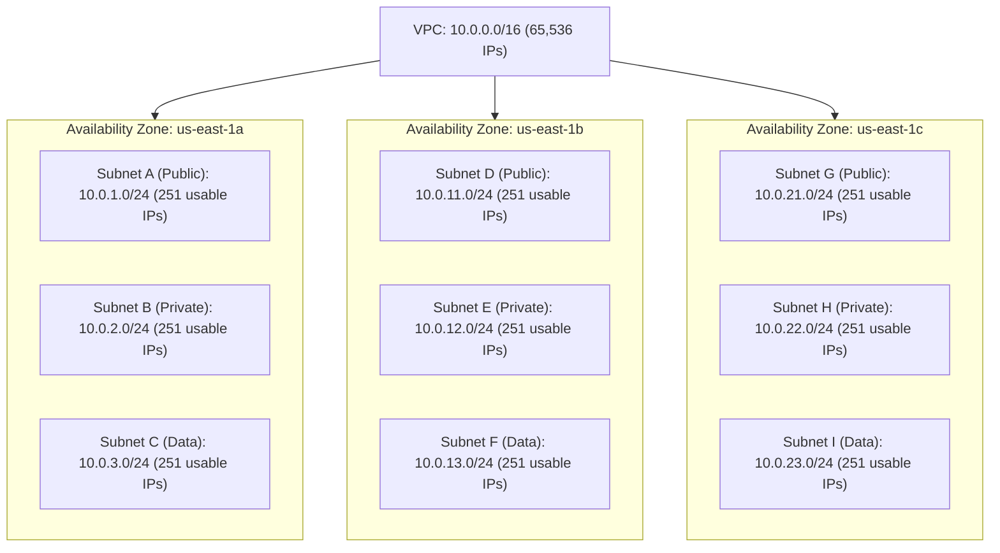
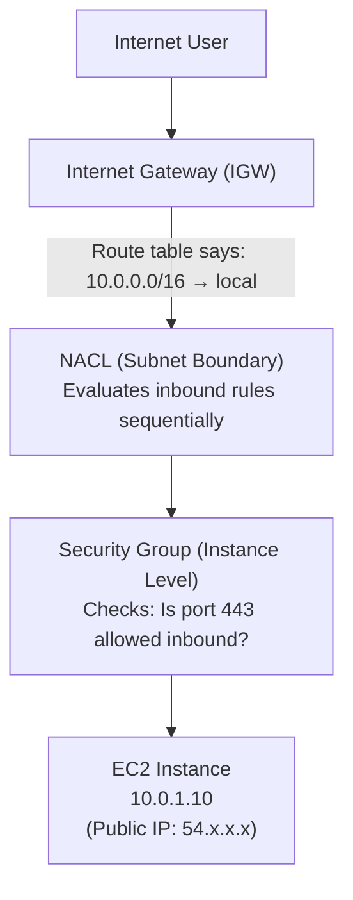
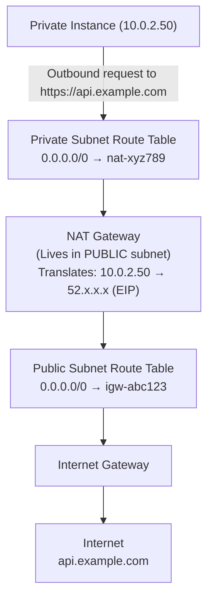
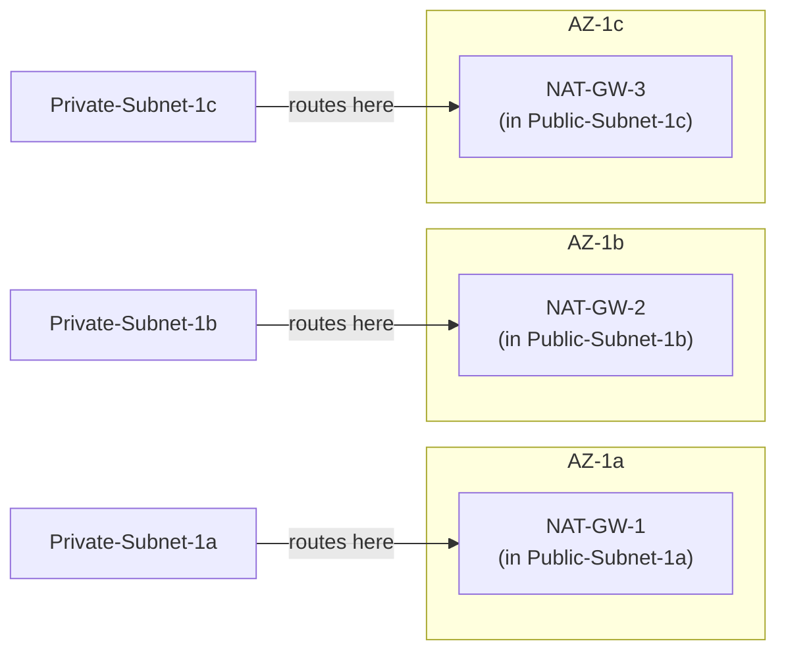
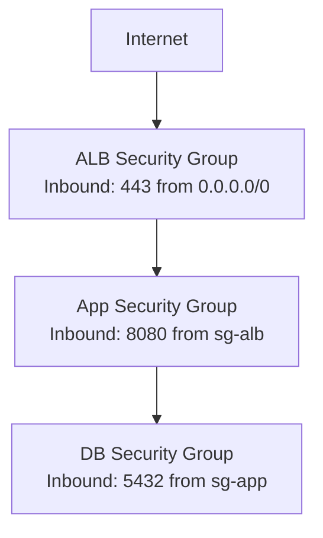
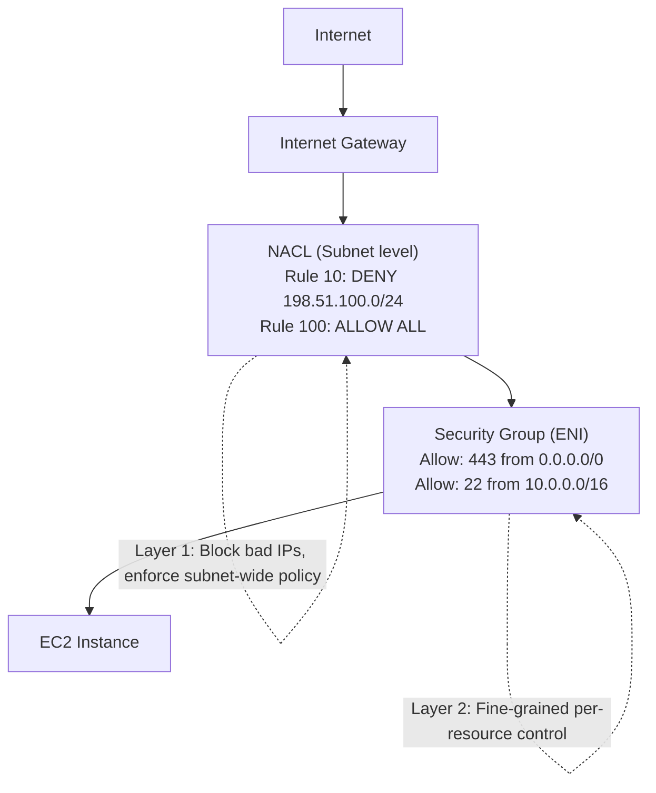
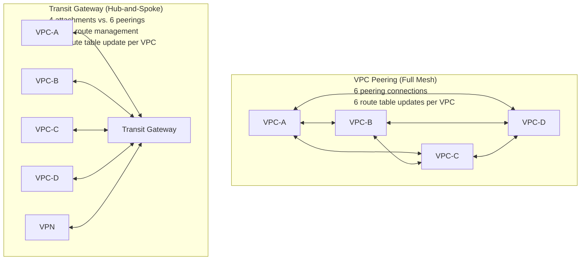
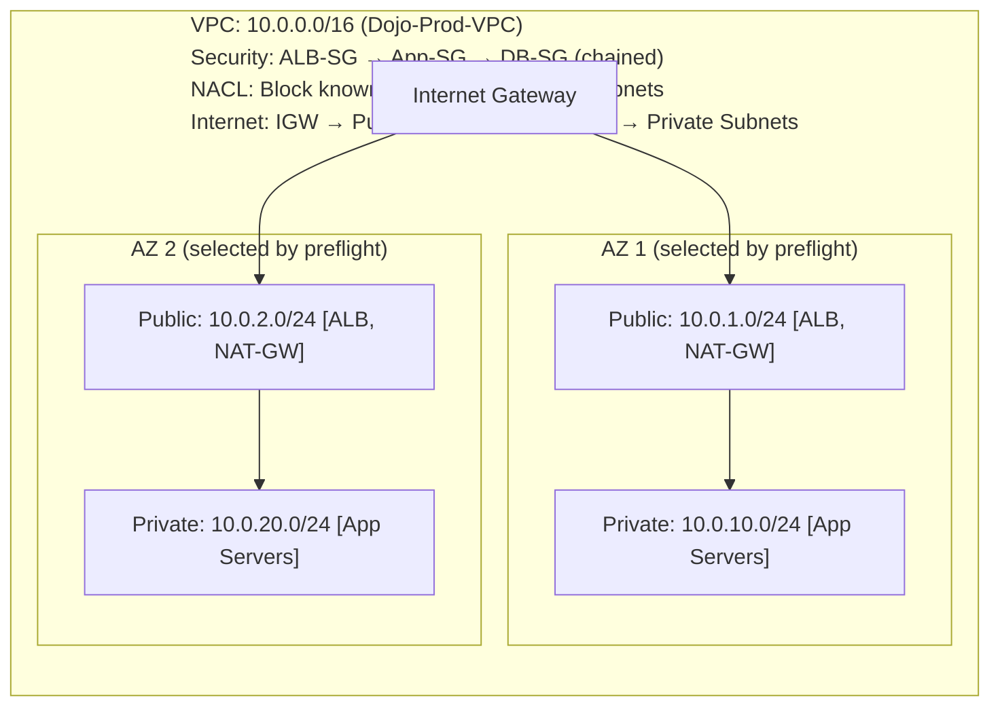

**Complexity**: `[COMPLEX]` | **Time to Complete**: 3h | **Prerequisites**: Module 1.1, Linux Networking

This module is labeled **[COMPLEX]** because VPC networking stacks several independent control planes—CIDR planning, subnet placement, route tables, NAT, security groups, NACLs, and cross-VPC connectivity—into one design surface where a single mistake can silently break production traffic. Budget about three hours if you work through the hands-on CLI exercise and pause on the prediction prompts; you should already be comfortable with Linux networking fundamentals from Module 1.1 and with IAM concepts from the prior AWS Essentials module, because you will attach policies to VPC endpoints and flow-log delivery roles later in the track.

## What You'll Be Able to Do

When you finish the readings and exercises below, you will be able to:

- **Design multi-AZ VPC architectures with public and private subnets that support high-availability workloads**
- **Configure Security Groups and Network ACLs to implement defense-in-depth network segmentation**
- **Explain VPC peering and Transit Gateway architectures for connecting multiple VPCs at scale**
- **Diagnose routing table misconfigurations and connectivity failures between subnets, NAT Gateways, and internet gateways**

---

## Why This Module Matters

Picture a temporary EC2 instance in a public subnet with SSH open to `0.0.0.0/0`: an attacker who harvests those credentials does not stop at one host, because the instance sits on a routable path into the rest of your VPC. That scenario is not theoretical theater—it is the unforgiving reality of cloud networking, where **Amazon Virtual Private Cloud (VPC)** is the logical isolation boundary for everything you launch. The VPC is your private slice of AWS; without deliberate subnet tiers, route tables, and firewalls, a database can end up one misconfiguration away from the public internet while lateral movement between application tiers stays wide open.

In this module you will design a resilient, multi-AZ topology instead of treating networking as a checkbox after the fact. You will learn why **public versus private** is defined by routes—not by a subnet flag—and how NAT Gateways, Internet Gateways, and VPC Endpoints change outbound and inbound behavior. You will practice defense-in-depth with **Security Groups** and **Network ACLs**, read **VPC Flow Logs** when connectivity fails, and compare **VPC peering** with **Transit Gateway** when environments multiply. Mastering VPC is less about memorizing service names and more about building the moats, walls, and bridges that keep your entire cloud footprint defensible.

---

## Anatomy of a VPC: CIDR Blocks and Subnets

A VPC is a logically isolated virtual network defined by a primary IPv4 **Classless Inter-Domain Routing (CIDR)** block such as `10.0.0.0/16`. That block is the master address pool: every subnet you carve later must fit inside it, and every ENI you attach ultimately draws from some slice of that space. Think of CIDR notation as choosing how large your plot of land is before you pour foundations—the number after the slash tells you how many bits are fixed for the network portion, and the remaining bits are available for hosts. A `/16` therefore offers far more assignable space than a `/24`, which matters when you plan for three AZs, multiple tiers per AZ, and room for growth without renumbering.

### Quick CIDR Reference

| CIDR | Total IPs | Usable IPs (AWS) | Typical Use |
| :--- | :--- | :--- | :--- |
| `/16` | 65,536 | Varies* | Large production VPC |
| `/20` | 4,096 | 4,091 | Medium VPC or large subnet |
| `/24` | 256 | 251 | Standard subnet |
| `/28` | 16 | 11 | Minimal subnet (smallest AWS allows) |

\*For a `/16` VPC the usable host count depends on how many subnets you carve and how AWS reserves addresses per subnet; the important planning exercise is to multiply expected ENIs per tier by headroom factor, not to memorize a single integer.

AWS allows [VPC CIDR blocks between `/16` (largest) and `/28` (smallest)](https://docs.aws.amazon.com/vpc/latest/userguide/vpc-cidr-blocks.html). You can also add secondary CIDR blocks to an existing VPC if you run out of address space, but planning upfront is always better than retrofitting later. Secondary CIDR association is useful when a `/16` was generous for EC2 but you later need contiguous space for thousands of pods or Lambda ENIs; the trade-off is operational complexity, because every subnet and route table must remain consistent with the expanded aggregate range.

**IP planning matters more than you think.** If you plan to peer VPCs together or connect them via Transit Gateway, their CIDR blocks must not overlap. The most common regret teams have at scale is copying the same `10.0.0.0/16` template into every account, discovering during an acquisition integration that none of the estates can be linked without renumbering. Document an address plan with ownership, environment, and region dimensions before the second VPC ships; future you will treat that spreadsheet as infrastructure-as-code even if it lives in a wiki today.

Plan a non-overlapping scheme from day one:

```text
Production VPC:   10.1.0.0/16
Staging VPC:      10.2.0.0/16
Development VPC:  10.3.0.0/16
Shared Services:  10.10.0.0/16
```

### Subnets: Slicing the Network

You cannot launch an EC2 instance directly into a VPC; AWS requires a **subnet**, which is a contiguous CIDR slice taken from the VPC range (for example `10.0.1.0/24` inside `10.0.0.0/16`). Subnets are where AZ locality becomes concrete: **[a subnet must reside entirely within one Availability Zone](https://docs.aws.amazon.com/vpc/latest/userguide/configure-subnets.html)** and cannot span AZ boundaries, so high availability always means repeating your tiers—public, private, data—across multiple subnets in different AZs rather than stretching one subnet across the region.



Production architectures usually separate workloads into **three network tiers** so blast radius stays bounded. **Public subnets** host edge-facing components such as load balancers, bastion hosts, and NAT Gateways; **private subnets** run application servers, containers, and other compute that should never accept arbitrary inbound internet traffic; **data subnets** hold databases (RDS, ElastiCache) and other sensitive storage with the tightest routes. That layering enforces least privilege at the network level—the internet can reach only the public tier, the public tier can initiate toward the private tier, and only the private tier should reach the data tier—so a compromised web instance does not automatically sit next to your primary datastore.

Subnet sizing mistakes show up late: a `/28` looks ample on paper until you account for reserved addresses, a handful of static interfaces, an autoscaling burst, and Lambda ENIs sharing the same slice. When in doubt, standardize on `/24` subnets for workload tiers and reserve `/28` slices only for purpose-built appliances that will never scale horizontally.

> **AWS Reserved IPs**: [AWS reserves the first 4 and the last 1 IP address in every subnet](https://docs.aws.amazon.com/vpc/latest/userguide/subnet-sizing.html) for internal networking purposes. In a `/24` (256 IPs), the reserved addresses are:
>
> - `.0` -- Network address
> - `.1` -- VPC router
> - `.2` -- Reserved (DNS server is at VPC base CIDR + 2, e.g. `10.0.0.2`)
> - `.3` -- Reserved for future use
> - `.255` -- Broadcast address (AWS does not support broadcast, but reserves it)
>
> This gives you **251 usable IPs**, not 256.

---

## Routing: How Traffic Finds Its Way

Every subnet in a VPC is associated with exactly one **route table**, which is simply an ordered set of routes that tell the VPC router where to send packets. If you never create a custom association, the subnet inherits the VPC **Main Route Table**, which is why "mystery connectivity" often traces back to an unintended main-table association rather than a broken security group.

### The Default Route Table

When you create a VPC, AWS provisions a Main Route Table that already contains a **`local`** route for the VPC CIDR (for example `10.0.0.0/16 → local`). That route is automatic and non-removable: it ensures intra-VPC communication works without you publishing static routes between subnets, although security groups and NACLs still filter what is actually permitted.

| Destination | Target | Purpose |
| :--- | :--- | :--- |
| `10.0.0.0/16` | `local` | All traffic within the VPC stays internal |

### Public vs. Private Subnets: The Route Table Distinction

Whether a subnet is **public** or **private** is not a subnet attribute you toggle in the console—there is no "make public" checkbox. The label comes entirely from the **route table** bound to that subnet. A **public** subnet is one whose table sends `0.0.0.0/0` to an **Internet Gateway (IGW)**, the highly available edge component that bridges your VPC to the public internet. A **private** subnet lacks a default route to an IGW; instances there should not be directly reachable from the internet even if someone assigns a public IP, because without the IGW route inbound packets never find a return path through the VPC edge.

Compare the three tier patterns side by side. A **public** table keeps the mandatory `local` route and adds internet egress via the IGW; a **private** table still needs outbound internet for patches and APIs, so it points `0.0.0.0/0` at a NAT Gateway instead; a **data** table intentionally stops at `local` so databases never gain a default path to the internet.

| Destination | Target | Tier |
| :--- | :--- | :--- |
| `10.0.0.0/16` | `local` | All tiers |
| `0.0.0.0/0` | `igw-abc123` | Public only |
| `0.0.0.0/0` | `nat-xyz789` | Private (outbound via NAT) |

For data subnets you typically publish only the `local` row—no IGW, no NAT—so outbound initiation to the public internet is impossible unless you later add an explicit exception, which is exactly the isolation model you want for RDS and similar services.

### Traffic Flow: Public Subnet

When a user on the internet connects to an application in a public subnet, traffic crosses the IGW, hits subnet NACL rules, then instance security groups before it reaches the ENI. Load balancers complicate the picture slightly: clients talk to the load balancer nodes in public subnets, and the load balancer opens a separate connection to targets that may live in private subnets. That is why chained security groups reference upstream group IDs rather than client CIDR blocks—the client IP you see on the instance is often the load balancer, not the browser.

The diagram below shows the simplest path—direct internet to instance—in order:



Return traffic walks the same chain in reverse. **Security Groups** are **stateful**, so legitimate responses to allowed inbound flows are permitted automatically. **NACLs** are **stateless**, which means you must engineer explicit outbound rules (often covering ephemeral ports) or responses will be dropped even when the security group looks correct.

### The Internet Gateway (IGW)

The IGW is frequently mistaken for a single hardware appliance, but it behaves like a regional edge service instead. It performs **1:1 NAT** between an instance's private address and its associated public or Elastic IP, and [AWS documents it as horizontally scaled and redundant](https://docs.aws.amazon.com/vpc/latest/userguide/VPC_Internet_Gateway.html) without you sizing throughput on the gateway itself—effective bandwidth still follows instance type and path characteristics. Operationally you may attach only **[one IGW per VPC](https://docs.aws.amazon.com/vpc/latest/userguide/amazon-vpc-limits.html)**, and creating the object alone changes nothing until you attach it to the VPC **and** add a `0.0.0.0/0 → igw-...` route in the relevant route table.

---

## NAT Gateways: Outbound Access for Private Resources

Private subnets exist precisely so workloads are not directly exposed, yet real software still needs outbound reachability—for Ubuntu security updates, container image pulls, or HTTPS calls to SaaS APIs. Because those subnets intentionally lack an IGW route, you need a controlled egress path that preserves the "no unsolicited inbound from the internet" guarantee. That role belongs to a managed **Network Address Translation (NAT) Gateway**.

### How NAT Gateway Works

Operationally you place the NAT Gateway in a **public subnet** so it can use the IGW, allocate an **Elastic IP** to the NAT resource, and point the **private subnet route table** so `0.0.0.0/0` targets the NAT instead of the IGW. When a private instance opens a connection, the NAT rewrites the source address to its Elastic IP, forwards the packet through the public subnet's IGW route, and on the return path performs the inverse translation so the response lands on the correct private address. AWS documents this pattern as letting [private instances initiate outbound connections while remaining unreachable for inbound connections that originate on the public internet](https://docs.aws.amazon.com/AmazonVPC/latest/UserGuide/vpc-nat-gateway.html). Remember that security groups on the private instances still matter: NAT solves routing to the internet, not authorization of who may call your APIs once traffic is inside the VPC.

### NAT Gateway Traffic Flow



The response follows the exact reverse path: the IGW delivers to the NAT Gateway's Elastic IP, the NAT Gateway rewrites the destination back to `10.0.2.50`, and the packet enters the private subnet where NACL and security group rules must still permit the return flow. That asymmetry—outbound initiation allowed, inbound initiation blocked—is the property teams rely on when they place databases and internal APIs in private subnets while still permitting patch and telemetry egress.

> **Stop and think**: You have a database in a private subnet and a NAT Gateway in a public subnet. The database needs to download patches from `archive.ubuntu.com`. Which component performs the actual translation of the database's private IP to a public IP that the internet can route back to?
>
> <details>
> <summary>View Answer</summary>
> The <strong>NAT Gateway</strong> performs the translation. It takes the outbound request from the database, replaces the database's private IP with its own Elastic IP, and forwards the traffic to the Internet Gateway. When the response comes back from the internet, the NAT Gateway translates the destination IP back to the database's private IP and forwards it into the private subnet. The Internet Gateway only performs 1:1 NAT for instances that already have their own public IPs.
> </details>

### NAT Gateway: High Availability Pattern

A standard zonal NAT Gateway resides in one AZ; if you use zonal NAT Gateways, deploy one per AZ for resilience, or consider a regional NAT Gateway for automatic multi-AZ expansion:



Each private subnet's route table points to the NAT Gateway in its own AZ, which means each AZ is self-contained for outbound internet access. If `us-east-1a` suffers a power event, only private subnets that depended exclusively on a NAT in that AZ lose egress; subnets in `1b` and `1c` keep working as long as their local NAT and public subnet IGW path remain healthy. AWS also documents [regional NAT Gateways](https://docs.aws.amazon.com/vpc/latest/userguide/nat-gateways-regional.html) that expand automatically across AZs—worth evaluating on new designs because they change the "one NAT per AZ" operational recipe while preserving isolation goals.

> **Pause and predict**: If you delete a NAT Gateway to save costs but forget to update the private subnet's route table, what happens to traffic destined for `0.0.0.0/0`?
>
> <details>
> <summary>View Answer</summary>
> The traffic will be dropped into a "black hole." The route table will still have a rule pointing <code>0.0.0.0/0</code> to the deleted NAT Gateway's ID, but [the status of that route will become <code>blackhole</code>](https://docs.aws.amazon.com/vpc/latest/userguide/nat-gateway-working-with.html). Any traffic matching that route is simply discarded until you either remove the route entirely or update it to point to a valid, active target.
> </details>

### NAT Gateway vs. NAT Instance

Before managed NAT Gateways, teams routinely ran NAT on bespoke EC2 instances with scripts and failover glue. You may still encounter that pattern in long-lived estates, but new designs should default to the managed service unless you have a rare requirement such as attaching security groups directly to the NAT path. The comparison table captures the headline differences; in migration programs the winning argument is usually operational—patch cadence, failover testing, and on-call pages—not raw bandwidth, because modern instance families already exceed what most NAT instances provided.

| Feature | NAT Gateway | NAT Instance |
| :--- | :--- | :--- |
| **Managed by** | AWS | You |
| **Availability** | Redundant within AZ | Single instance (you manage failover) |
| **Bandwidth** | Up to 100 Gbps | Depends on instance type |
| **Maintenance** | None | You patch the OS and software |
| **Security Groups** | Cannot associate | Can associate |
| **Cost** | Hourly + per-GB processed; regional. The [VPC pricing](https://aws.amazon.com/vpc/pricing/) Ohio examples are not a universal lab quote; each partial NAT hour bills as a full hour | Instance hours + data |
| **Use today?** | Yes (recommended) | Only for very specific edge cases |

### VPC Endpoints: Bypassing NAT Entirely

For traffic destined to AWS APIs—S3, DynamoDB, SQS, Systems Manager, and dozens of others—you can often skip NAT entirely. **VPC Endpoints** keep packets on the AWS backbone by adding either a gateway route or an interface ENI inside your VPC. A [**Gateway Endpoint** for S3 and DynamoDB is free and injects a prefix-list route into your route table](https://docs.aws.amazon.com/vpc/latest/privatelink/gateway-endpoints.html) without placing an ENI in your subnet, whereas an **Interface Endpoint** (PrivateLink) creates ENIs with private DNS names and bills hourly plus data-processing fees. Teams that move large S3 or DynamoDB volumes off NAT frequently report meaningful savings because NAT charges per gigabyte processed in addition to hourly fees.

---

## Network Security: Security Groups vs. NACLs

AWS provides two complementary firewall layers inside every VPC, and conflating them is one of the fastest ways to waste hours on a connectivity incident. **Security Groups** enforce intent at the ENI; **Network ACLs** enforce coarse policy at the subnet edge. Certification exams love this distinction because it mirrors how you should troubleshoot in production: check routes first, then security groups, then NACLs, then host firewalls.

### Security Groups (SGs)

**Security Groups** are **stateful** firewalls attached to ENIs—EC2 instances, RDS, Lambda in VPC mode, load balancer nodes, and more. When an instance initiates traffic, return traffic for that flow is automatically permitted inbound even if you never wrote an explicit inbound rule for the ephemeral port, which is why security groups feel "easier" than NACLs day to day. You publish **Allow** rules only; anything unmatched is denied, and there is no deny statement syntax. AWS evaluates the full rule set collectively (order is irrelevant), and critically you can [reference another security group as a source](https://docs.aws.amazon.com/vpc/latest/userguide/security-group-rules.html) so a database tier allows `5432` from `sg-app` instead of from a CIDR that goes stale every time autoscaling replaces nodes. Default quotas allow [up to five security groups per ENI with 60 inbound and 60 outbound rules each](https://docs.aws.amazon.com/general/latest/gr/vpc-service.html), which is ample when you chain tiers instead of flattening `0.0.0.0/0`.

> **Pause and predict**: Web Server A needs to communicate with Database B on port 5432. Both are in the same VPC but different subnets. What is the most secure way to configure the Security Group attached to Database B to allow this traffic?
>
> <details>
> <summary>View Answer</summary>
> Add an inbound rule to Database B's Security Group that allows TCP port 5432, with the <strong>source set to the Security Group ID</strong> attached to Web Server A (e.g., <code>sg-0abcd1234</code>). This ensures that only resources possessing Web Server A's Security Group can connect, regardless of what subnet they are in. It automatically scales as Web Servers are added or removed, without ever needing to manage individual IP addresses. Do not use <code>0.0.0.0/0</code> or even the VPC CIDR as the source for database access in normal designs, as this violates the principle of least privilege.
> </details>

The diagram below shows a **chained security group architecture**—each hop trusts only the SG ID immediately upstream:



Each layer only trusts the layer directly above it. If an attacker compromises the ALB, they still cannot reach the database directly because the DB security group only allows connections from `sg-app`, not `sg-alb`. When you implement this in Terraform or CloudFormation, encode the dependency order explicitly—create ALB SG, pass its ID into the app SG ingress, pass app SG into db SG—so a drift detection job can prove the chain never reverted to CIDR-based rules during an emergency change.

### Network Access Control Lists (NACLs)

**Network ACLs** sit at the **subnet boundary** and evaluate every packet entering or leaving the subnet before security groups see it. They are **stateless**: if you permit outbound TCP/443 to the internet, you must also permit inbound ephemeral ports (commonly `1024-65535`) or return traffic dies silently at the subnet edge. NACLs support explicit [**Allow** and **Deny** rules evaluated in ascending rule-number order](https://docs.aws.amazon.com/vpc/latest/userguide/infrastructure-security.html)—first match wins—so a deny at rule `50` beats a broad allow at rule `100`. Every VPC ships with a default NACL that allows all traffic; custom NACLs begin fully closed until you add rules. Teams typically reach for NACLs when they need subnet-wide IP blocking (for example denying a known-bad `/24`) rather than per-instance tuning.

### Security Groups vs. NACLs: Complete Comparison

| Feature | Security Group | Network ACL |
| :--- | :--- | :--- |
| **Operates at** | Instance (ENI) level | Subnet level |
| **State** | Stateful | Stateless |
| **Rule type** | Allow only | Allow AND Deny |
| **Rule evaluation** | All rules evaluated together | Rules evaluated in order (lowest number first) |
| **Default behavior** | Denies all inbound, allows all outbound | Default NACL allows all; custom NACLs deny all |
| **Return traffic** | Automatically allowed | Must be explicitly allowed (ephemeral ports!) |
| **Applies to** | Only resources assigned to the SG | All resources in the subnet |
| **SG references** | Can reference other SGs | Cannot reference SGs (IP/CIDR only) |
| **Rule limit** | 60 inbound + 60 outbound per SG | 20 inbound + 20 outbound (adjustable) |
| **Typical use** | Primary firewall for every resource | Subnet-wide IP blocking, compliance |

In incident response drills, assign one engineer to security groups and another to NACLs so you do not thrash the same rule set twice. Security group changes propagate quickly and are easy to audit in the API; NACL edits affect every ENI in the subnet and deserve change windows because a misnumbered deny rule can look like an application outage. Document the rule-number plan for custom NACLs the same way you document CIDR allocations.

> **Stop and think**: A junior engineer configures a NACL with Rule #100 allowing all traffic from 0.0.0.0/0 and Rule #50 denying all traffic from 10.0.0.5/32. An instance at 10.0.0.5 attempts to send traffic into the subnet. What happens and why?
>
> <details>
> <summary>View Answer</summary>
> The traffic is <strong>denied</strong>. NACL rules are evaluated sequentially starting from the lowest rule number. Rule #50 explicitly denies the traffic from <code>10.0.0.5</code>. Once a matching rule is found, the evaluation stops immediately, so the Allow rule at #100 is never processed for this specific traffic. This is why rule numbering matters — generally place Deny rules at lower numbers than Allow rules when you want them to take precedence.
> </details>

### Defense in Depth: Both Layers Working Together



*Operational lesson: Because NACLs are stateless, missing return-path rules for ephemeral ports can break database traffic even when the related Security Groups are correct.*

When you troubleshoot a "security group looks fine" ticket, draw the path on paper: internet to IGW to NACL to SG to instance, then mirror it for return traffic. If the symptom is outbound works but inbound callbacks fail, suspect NACL ephemeral rules first; if neither direction works, verify routes and that the ENI is in the subnet you think it is. Security groups scale with automation because they reference other groups; NACLs scale with emergency blocks because a single deny rule can drop an attacker's `/24` for every resource in the subnet simultaneously.

---

## VPC Flow Logs: Seeing Your Traffic

You cannot troubleshoot what you cannot see, and in VPC land that visibility usually starts with **VPC Flow Logs**. Flow logs record metadata about IP traffic to and from ENIs—they do not store packet payloads (use host capture or mirrored traffic for that)—but each record still answers the questions that matter during an outage: source and destination IPs, ports, protocol, packet and byte counts, and whether the traffic was **ACCEPT**ed or **REJECT**ed. An `ACCEPT` tells you the packet passed security-group and NACL evaluation for that direction; `REJECT` means something in the path dropped it before delivery.

Enable flow logs at the scope that matches your investigation: **VPC-wide** for fleet-wide hunts, **subnet** when you suspect a tier-specific NACL change, or **ENI** when one instance misbehaves. Destinations include **CloudWatch Logs** for near-real-time queries, **S3** for cheap long-term retention, or **Kinesis Data Firehose** when you already stream security telemetry elsewhere. Turn them on before you need them—flow logs are not retroactive. In regulated environments, pair flow logs with centralized retention policies so investigators can reconstruct cross-VPC conversations during an incident without begging each service team for exports.

### Reading a Flow Log Entry

```text
2 123456789012 eni-abc123 10.0.1.50 203.0.113.25 49152 443 6 25 5000 1620140761 1620140821 ACCEPT OK
```

| Field | Value | Meaning |
| :--- | :--- | :--- |
| Version | `2` | Flow log version |
| Account ID | `123456789012` | AWS account |
| ENI | `eni-abc123` | Network interface |
| Source IP | `10.0.1.50` | Where the traffic came from |
| Dest IP | `203.0.113.25` | Where it was going |
| Source Port | `49152` | Ephemeral port (client) |
| Dest Port | `443` | HTTPS |
| Protocol | `6` | TCP |
| Packets | `25` | Number of packets |
| Bytes | `5000` | Total bytes |
| Start | `1620140761` | Unix timestamp |
| End | `1620140821` | Unix timestamp |
| Action | `ACCEPT` | Traffic was allowed |
| Status | `OK` | Logging is working |

The `Status` field deserves attention during incidents: values other than `OK` can indicate logging configuration problems rather than network drops, so correlate with CloudWatch delivery metrics before you chase phantom packet loss.

If you see `REJECT`, walk security groups and NACLs first, then revisit route tables and whether the target ENI still exists. Flow logs will not replace application logs, but they narrow "packets never arrived" versus "packets arrived and the app refused them," which saves enormous time when someone says they cannot connect to a database on port `5432`.

---

## Connecting VPCs: Peering and Transit Gateway

As organizations mature, a single VPC per environment stops scaling: security boundaries, billing chargeback, and blast-radius isolation push teams toward many VPCs across accounts and regions. The question becomes how to stitch them together without turning your network into an unmaintainable mesh of static routes.

### VPC Peering

[VPC Peering](https://docs.aws.amazon.com/whitepapers/latest/aws-vpc-connectivity-options/vpc-peering.html) is a one-to-one private connection between two VPCs. Traffic stays on the AWS backbone—never hairpinning through the public internet—and peering works **cross-account** and **cross-region** when you accept the operational overhead of managing peering accepters and route propagation in both directions. Two constraints bite every design review: peering is **non-transitive** (if A is peered with B and B is peered with C, A still cannot reach C through B), and **overlapping CIDR blocks cannot peer**, which is why the non-overlapping plan you drafted earlier in this module's CIDR section pays dividends years later.

> **Stop and think**: You have three VPCs: Dev, Test, and Prod. The Dev VPC is peered with the Test VPC, and the Test VPC is peered with the Prod VPC. An engineer tries to ping an EC2 instance in Prod directly from an EC2 instance in Dev. Does the ping succeed? Why or why not?
>
> <details>
> <summary>View Answer</summary>
> <strong>No, the ping will fail.</strong> VPC Peering is strictly non-transitive. The connection from Dev to Test does not carry over or route through to Prod. To allow the Dev VPC to communicate with the Prod VPC, you must establish an explicit, direct peering connection between them. Alternatively, if managing many connections, you could use a Transit Gateway as a central hub, which does support transitive routing between attached VPCs.
> </details>

Count the math before you commit to full mesh peering: with **N** VPCs you need **N×(N−1)/2** peering relationships and you must update route tables in every participant whenever a new VPC joins. Five VPCs means ten peerings; twenty VPCs means 190—fine for a lab, painful at production velocity. Each peering also consumes a unique relationship in your runbooks: who owns accepter workflows, how do you test connectivity after a CIDR expansion, and how do you roll back if a route leak exposes prod to dev? That combinatorics is the inflection point where hub-and-spoke wins, because the hub centralizes those answers instead of multiplying them across every pair.

### AWS Transit Gateway (TGW)

**AWS Transit Gateway** is the managed hub that replaces full mesh sprawl. You attach VPCs, Site-to-Site VPN, and Direct Connect into a central router with its own route domains, so adding a spoke means one attachment and a controlled route propagation instead of renegotiating dozens of peering relationships. Operations teams get segmentation knobs—separate route tables for prod and nonprod, for example—without rebuilding the underlying VPCs.



At scale, Transit Gateway advertises support for thousands of attachments per gateway, multiple route tables for segmentation (so prod spokes never learn dev routes), inter-region peering between gateways, and high per-attachment bandwidth—details you should verify against current quotas before signing a multi-year network design. When you attach a new VPC, think in terms of **propagation direction**: which TGW route table learns the VPC CIDR, and which VPC route tables learn which summarized prefixes from the hub. Hub-and-spoke only stays simple if those updates are automated; otherwise you recreate the peering mesh problem with extra steps.

---

## DNS in a VPC: Route 53 Resolver

Every VPC includes [Amazon-provided DNS at the VPC network address plus two—`10.0.0.2` in a `10.0.0.0/16` VPC, for example](https://docs.aws.amazon.com/vpc/latest/userguide/AmazonDNS-concepts.html). With `enableDnsSupport` and `enableDnsHostnames` turned on, that resolver answers public names, private hosted zone records, and the default `ec2.internal` hostnames for instances. Hybrid designs that must resolve on-premises Active Directory names from EC2—or expose private zone records to a data center—use **Route 53 Resolver**: [**inbound endpoints** let corporate DNS query your VPC private zones](https://docs.aws.amazon.com/Route53/latest/DeveloperGuide/resolver-overview-DSN-queries-to-vpc.html), while **outbound endpoints** forward selected suffixes from the VPC to on-premises resolvers. DNS is easy to overlook during VPC build-out, yet it is the layer that breaks migrations long after routing looks perfect. When hybrid resolver endpoints are in play, test both directions: a VPC instance resolving an on-premises service name, and a laptop on corp Wi-Fi resolving a name in your private hosted zone. Failures there look like application bugs even though TCP routes and security groups are green.

---

## Did You Know?

The four bullets below are worth revisiting after the hands-on lab, because they connect pricing, architecture, and troubleshooting threads that otherwise feel unrelated during the first read-through.

- **NAT Gateway economics surprise finance teams.** AWS bills an hourly charge plus per-gigabyte data processing for each NAT Gateway, so steady-state patch traffic and bursty S3 uploads that hairpin through NAT can dominate a monthly bill. Gateway Endpoints for S3 and DynamoDB (and Interface Endpoints for other services) keep that traffic off NAT entirely.

- **Internet Gateways are not appliances you rack and stack.** An IGW is a horizontally scaled, redundant managed component without its own bandwidth SKU; you still size instance types and connections, but you do not pick "small/medium/large IGW" the way you once picked hardware firewalls.

- **Flow Logs are the fastest way to settle "is it the network?"** A single record showing `REJECT` on port `5432` tells you the packet never reached the database process, which immediately focuses the investigation on routes, NACLs, and security groups instead of PostgreSQL configuration.

- **VPC subnet sharing via RAM changes org topology.** You can [share subnets across accounts in an AWS Organization](https://docs.aws.amazon.com/vpc/latest/userguide/vpc-sharing.html) so a central networking account owns the VPC while application teams launch ENIs into delegated subnets—reducing duplicate VPCs and avoiding peering sprawl between sibling teams. Governance teams like the pattern because security baselines and flow logs can be standardized once instead of reimplemented per account.

Together these facts reinforce a single theme: VPC design is as much about cost and operability as it is about drawing boxes on a whiteboard. When you review an architecture diagram, ask where each arrow would show up in a flow log, which route table entry makes that arrow possible, and which security group or NACL rule would be the first to reject it.

---

## Common Mistakes

The table below collects failure modes that show up repeatedly in incidents and certification scenarios. None of them are subtle once you know what to look for, but they are easy to introduce when speed pressure encourages "open the security group for now" shortcuts.

| Mistake | Why It Happens | How to Fix It |
| :--- | :--- | :--- |
| **Overlapping CIDR blocks** | Creating every VPC with the default `172.31.0.0/16` or always using `10.0.0.0/16`. | Plan your IP addressing strategy carefully before creating any VPCs. Document CIDR assignments. You cannot peer two VPCs if their CIDR blocks overlap. |
| **Databases in public subnets** | "I need to connect to it from my laptop using DBeaver." | Deploy databases in private subnets. Use AWS Systems Manager Session Manager (SSM) or a Bastion host in a public subnet to securely tunnel traffic to the database. |
| **Security Groups allowing `0.0.0.0/0` indiscriminately** | Trying to get an application working quickly by turning off the firewall. | Practice least privilege. Restrict inbound traffic to specific IP ranges or, better yet, reference specific upstream Security Groups (like an ALB SG). |
| **NAT Gateways in private subnets** | Assuming the NAT goes "with" the private instances it serves. | The NAT Gateway must sit in a **public** subnet so it has a route to the Internet Gateway. The private subnet route table points to the NAT Gateway. |
| **Forgetting ephemeral ports in NACLs** | Thinking stateless NACLs work like stateful Security Groups. | If you implement strict NACLs, you will typically need rules allowing inbound return traffic on ports `1024-65535`. Without these, response packets are silently dropped. |
| **Using peering for full-mesh topologies** | It works fine for 3 VPCs, but becomes unmanageable at 15. | Transition to AWS Transit Gateway when connecting more than a handful of VPCs to simplify routing and management. |
| **Single-AZ NAT Gateway** | Deploying one NAT Gateway and routing all private subnets through it. | Deploy one NAT Gateway per AZ for production workloads. If the AZ hosting a single NAT Gateway fails, all private subnets lose internet access. |
| **Not enabling VPC Flow Logs** | "We will enable them when something goes wrong." | Enable Flow Logs from day one. You cannot retroactively capture traffic that already happened. When an incident occurs, you need the historical data. Send them to S3 for cost-effective long-term storage. |

---

## Quiz

Use these questions as retrieval practice after the hands-on lab. Each answer ties back to a concrete design rule—routing before firewalls, stateless before stateful at the subnet edge, endpoints before NAT for AWS APIs.

<details>
<summary>Question 1: You launch an EC2 instance into a subnet, attach an Elastic IP (public IP), and ensure the Security Group allows inbound SSH (port 22). However, your SSH connection times out. What is the most likely architectural cause?</summary>

The subnet the EC2 instance resides in is a **Private Subnet**. Even though the instance has a public IP address, the Subnet's Route Table does not have a route to an Internet Gateway (IGW). Without a route to the IGW, internet traffic cannot enter or leave the subnet. The fix is to add a route `0.0.0.0/0 → igw-abc123` to the subnet's route table, or move the instance to a subnet that already has this route. This demonstrates that public IPs are useless without the underlying routing infrastructure to support them.
</details>

<details>
<summary>Question 2: An application in a private subnet needs to upload logs to Amazon S3. You want to accomplish this securely without the traffic traversing the public internet and without incurring NAT Gateway data processing charges. What should you configure?</summary>

You should configure a **VPC Gateway Endpoint** for Amazon S3. This creates a private connection from your VPC to the S3 service, keeping all traffic on the internal AWS network. Gateway endpoints are free and require a route table update, unlike Interface endpoints (PrivateLink) which use an ENI and incur hourly charges. By adding a specific route for the S3 prefix list to point to the Gateway Endpoint, traffic destined for S3 bypasses the NAT Gateway entirely. This eliminates the data processing charges associated with NAT Gateways while ensuring the data never leaves the AWS backbone.
</details>

<details>
<summary>Question 3: Your company's primary application is hosted entirely within a single Availability Zone (us-east-1a) when a massive power failure takes the data center offline. What architectural pattern would have prevented the resulting total application outage, and how does it work?</summary>

To prevent a total outage, you should design a **multi-AZ architecture** by spanning your VPC and deploying redundant resources across multiple Availability Zones. An Availability Zone represents one or more discrete data centers with redundant power, networking, and connectivity. If an entire AZ goes offline due to a massive infrastructure failure, resources deployed in the other AZs within the same VPC will continue to operate. This ensures the application remains highly available and fault-tolerant. Best practice dictates using at least two AZs, with three AZs recommended for production workloads.
</details>

<details>
<summary>Question 4: You have a private subnet with a NAT Gateway providing internet access. You check VPC Flow Logs and see traffic from your instance to an external API being ACCEPTED, but the application reports connection timeouts. What should you investigate?</summary>

The Flow Log `ACCEPT` means the **Security Group and NACL** allowed the traffic — but it does not mean the traffic actually reached the destination. First, verify the route tables to ensure the private subnet routes `0.0.0.0/0` to the NAT Gateway, and the public subnet routes it to the IGW. Second, check if the NAT Gateway is in the `available` state with an attached Elastic IP. Third, ensure the NACL on the private subnet explicitly allows inbound return traffic on ephemeral ports (1024-65535). Because NACLs are stateless, they will allow outbound requests but silently drop the returning responses if ephemeral ports aren't opened, leading directly to application timeouts despite the outbound ACCEPT log.
</details>

<details>
<summary>Question 5: Your engineering team needs to connect private subnets to both Amazon S3 and AWS Systems Manager (SSM) without using the public internet. They are confused about which endpoint types to deploy to optimize for cost and compatibility. How should they choose between a VPC Gateway Endpoint and a VPC Interface Endpoint for these services?</summary>

The team should use a **Gateway Endpoint** for Amazon S3 and an **Interface Endpoint** for AWS Systems Manager. Gateway Endpoints are available exclusively for S3 and DynamoDB, adding a route directly to your route table without incurring any hourly or data charges. Interface Endpoints (PrivateLink) must be used for most other AWS services, including SSM, as they create an Elastic Network Interface (ENI) with a private IP in your subnet. Interface Endpoints bill hourly per provisioned AZ/ENI plus per-GB data processing; confirm the current regional rates on [AWS PrivateLink pricing](https://aws.amazon.com/privatelink/pricing/) rather than treating any single hourly figure as universal. They support Security Groups and provide a resolvable DNS hostname. Using Gateway Endpoints whenever possible optimizes costs, while Interface Endpoints provide the necessary connectivity for the rest of the AWS ecosystem.
</details>

<details>
<summary>Question 6: You enabled VPC Flow Logs and see ACCEPT for outbound HTTPS from a private instance, but the application still times out. The private route table points to an active NAT Gateway and the NAT Gateway status is available. What additional checks align with the stateless nature of NACLs?</summary>

Start with the **private subnet NACL inbound rules** for ephemeral ports (typically TCP `1024-65535`). An outbound ACCEPT in flow logs only proves the packet left the ENI past security groups and NACLs for that direction; return traffic is a separate evaluation. Confirm the **public subnet NACL** on the NAT path if custom NACLs are in play, then verify the NAT Gateway subnet route still has `0.0.0.0/0` to the IGW. Finally, validate application-layer proxies or TLS inspection appliances that are not visible in flow logs but still break the session after TCP succeeds.
</details>

---

## Hands-On Exercise: Production-Grade VPC Architecture

In this exercise you will use the AWS CLI to build a production-style VPC: multiple Availability Zones, public subnets for edge components, private subnets for compute, per-AZ NAT Gateways for resilient outbound access, chained security groups, and a restrictive NACL on the private tier. The diagram summarizes the target topology you will create with the commands that follow:

### Preflight: Account, Region, Cost, and Cleanup

Run this preflight in a Bash shell before creating anything. Read **Clean Up** and **Task 9** first; stopping the terminal does not delete billable resources. Use AWS CLI v2 with an isolated AWS account and a role authorized to create and delete the lab resources. Confirm that the role permits the EC2 networking create/describe/delete operations used below, plus `ec2:RunInstances`, `ec2:TerminateInstances`, `ec2:DescribeInstances`, `ec2:GetConsoleOutput`, `ec2:RevokeSecurityGroupEgress`, `ssm:GetParameter` (AL2023 public AMI parameter), `iam:CreateRole`, `iam:CreatePolicy`, `iam:AttachRolePolicy`, `iam:DetachRolePolicy`, `iam:DeletePolicy`, `iam:DeleteRole`, and `iam:PassRole` for the flow-log and probe tasks. It also needs CloudWatch Logs create, retention, describe, filter, and delete operations. Review your VPC/NAT/EIP/EC2 quotas and confirm that `10.0.0.0/16` does not overlap with connected networks you need to keep reachable. Check command exit status and returned data: stop on any non-zero result, and record every resource ID as soon as it is returned so a partial run can be cleaned up.

Read the cleanup section before starting. Keep an inventory of resources actually created, including resources left by a failed step; only delete this exercise's resources. Before provisioning, confirm that you can create the same-account [flow-log IAM role](https://docs.aws.amazon.com/vpc/latest/userguide/flow-logs-iam-role.html) in Task 8 — a missing role is a failed logging outcome, not an optional skip. The identity check below does not prove all these permissions are available.

Two NAT Gateways and two Elastic IPs are billable for the whole lab. Task 9 adds at most one `t3.micro` (or another current-generation x86_64 type available in AZ1) for ≤20 minutes in a private subnet with no public IPv4, plus CloudWatch [vended-log](https://docs.aws.amazon.com/vpc/latest/userguide/flow-logs.html) ingestion for that window. Choose a spending limit and cleanup deadline that cover NAT hours, processed data, transfer, public IPv4/EIP usage (the VPC pricing page examples billed in-use and idle public IPv4 hourly), the optional probe instance, and log ingestion/storage. Check current regional rates on [AWS VPC pricing](https://aws.amazon.com/vpc/pricing/) and [NAT Gateway pricing](https://docs.aws.amazon.com/vpc/latest/userguide/nat-gateway-pricing.html) before provisioning; this page supplies no default budget and does not treat the Ohio NAT examples as a universal hourly quote. If you cannot accept the Task 9 instance, skip only that probe and record `probe not executed` — do not treat a skip as a traffic receipt.

Set your chosen region first, for example `export AWS_REGION=us-east-1`, and keep the AWS CLI variables consistent. The function discovers two available standard zones using [`describe-availability-zones`](https://docs.aws.amazon.com/cli/latest/reference/ec2/describe-availability-zones.html). It returns a failure instead of closing an interactive shell; do not continue after a failure message.

```bash
vpc_preflight() {
  if [[ -z "${AWS_REGION:-}" && -z "${AWS_DEFAULT_REGION:-}" ]]; then
    printf '%s\n' 'Set AWS_REGION (or AWS_DEFAULT_REGION) before continuing.' >&2
    return 1
  fi
  if [[ -n "${AWS_REGION:-}" && -n "${AWS_DEFAULT_REGION:-}" && "$AWS_REGION" != "$AWS_DEFAULT_REGION" ]]; then
    printf 'AWS_REGION (%s) and AWS_DEFAULT_REGION (%s) differ; choose one region.\n' "$AWS_REGION" "$AWS_DEFAULT_REGION" >&2
    return 1
  fi
  export AWS_REGION="${AWS_REGION:-$AWS_DEFAULT_REGION}"
  export AWS_DEFAULT_REGION="$AWS_REGION"
  export AWS_PAGER=""

  AWS_VERSION=$(aws --version 2>&1) || return 1
  if [[ "$AWS_VERSION" != aws-cli/2.* ]]; then
    printf 'AWS CLI v2 is required; found %s.\n' "$AWS_VERSION" >&2
    return 1
  fi
  printf '%s\n' "$AWS_VERSION"
  aws sts get-caller-identity --query '{Account:Account,Arn:Arn,UserId:UserId}' --output table || return 1

  AZ_LIST=$(aws ec2 describe-availability-zones \
    --region "$AWS_REGION" \
    --filters "Name=state,Values=available" "Name=zone-type,Values=availability-zone" \
    --query 'sort_by(AvailabilityZones,&ZoneName)[].ZoneName' --output text) || return 1
  AZ_NAMES=$(printf '%s\n' "$AZ_LIST" | awk '{for (i = 1; i <= NF; i++) print $i}')
  AZ1=$(printf '%s\n' "$AZ_NAMES" | sed -n '1p')
  AZ2=$(printf '%s\n' "$AZ_NAMES" | sed -n '2p')
  if [[ -z "$AZ1" || -z "$AZ2" ]]; then
    printf 'Region %s has fewer than two available standard Availability Zones; stop here.\n' "$AWS_REGION" >&2
    return 1
  fi
  printf 'Using %s and %s in %s.\n' "$AZ1" "$AZ2" "$AWS_REGION"
}
vpc_preflight
```



### Task 1: Create the VPC and Enable DNS

Start by creating the VPC object, tagging it for visibility, and enabling DNS support so later resources (including Interface Endpoints and private hosted zones) resolve names correctly inside the network.

```bash
# 1. Create the VPC (10.0.0.0/16)
VPC_ID=$(aws ec2 create-vpc \
  --cidr-block 10.0.0.0/16 \
  --query 'Vpc.VpcId' \
  --output text)

# 2. Name the VPC
aws ec2 create-tags --resources $VPC_ID --tags Key=Name,Value=Dojo-Prod-VPC

# 3. Enable DNS hostnames (required for VPC Endpoints and private DNS)
aws ec2 modify-vpc-attribute --vpc-id $VPC_ID --enable-dns-hostnames '{"Value":true}'
aws ec2 modify-vpc-attribute --vpc-id $VPC_ID --enable-dns-support '{"Value":true}'

# 4. Verify
aws ec2 describe-vpcs --vpc-ids $VPC_ID \
  --query 'Vpcs[0].{VpcId:VpcId, CIDR:CidrBlock, State:State}' \
  --output table
```

### Task 2: Create and Attach the Internet Gateway

An Internet Gateway is a separate object from the VPC. You create it, attach it to the VPC, and only then can a route table send `0.0.0.0/0` to `igw-...`. Skipping the attach step is a common lab mistake that produces a route in `blackhole` state.

```bash
# 1. Create the Internet Gateway
IGW_ID=$(aws ec2 create-internet-gateway \
  --query 'InternetGateway.InternetGatewayId' \
  --output text)

# 2. Attach it to the VPC
aws ec2 attach-internet-gateway --vpc-id $VPC_ID --internet-gateway-id $IGW_ID

# 3. Tag it
aws ec2 create-tags --resources $IGW_ID --tags Key=Name,Value=Dojo-Prod-IGW

echo "IGW $IGW_ID attached to VPC $VPC_ID"
```

### Task 3: Create the Subnets Across Two AZs

Next carve four `/24` subnets—two public and two private—across the two Availability Zones selected by the preflight. The `AZ1` and `AZ2` variables below come from that gate; do not replace them with hardcoded names.

```bash
# AZ1 and AZ2 were selected by the preflight in the explicit AWS_REGION.

# --- Public Subnets ---

PUB_SUB1_ID=$(aws ec2 create-subnet \
  --vpc-id $VPC_ID \
  --cidr-block 10.0.1.0/24 \
  --availability-zone $AZ1 \
  --query 'Subnet.SubnetId' --output text)
aws ec2 create-tags --resources $PUB_SUB1_ID --tags Key=Name,Value=Public-Subnet-AZ1

PUB_SUB2_ID=$(aws ec2 create-subnet \
  --vpc-id $VPC_ID \
  --cidr-block 10.0.2.0/24 \
  --availability-zone $AZ2 \
  --query 'Subnet.SubnetId' --output text)
aws ec2 create-tags --resources $PUB_SUB2_ID --tags Key=Name,Value=Public-Subnet-AZ2

# --- Private Subnets ---

PRIV_SUB1_ID=$(aws ec2 create-subnet \
  --vpc-id $VPC_ID \
  --cidr-block 10.0.10.0/24 \
  --availability-zone $AZ1 \
  --query 'Subnet.SubnetId' --output text)
aws ec2 create-tags --resources $PRIV_SUB1_ID --tags Key=Name,Value=Private-Subnet-AZ1

PRIV_SUB2_ID=$(aws ec2 create-subnet \
  --vpc-id $VPC_ID \
  --cidr-block 10.0.20.0/24 \
  --availability-zone $AZ2 \
  --query 'Subnet.SubnetId' --output text)
aws ec2 create-tags --resources $PRIV_SUB2_ID --tags Key=Name,Value=Private-Subnet-AZ2

# Verify all subnets
aws ec2 describe-subnets --filters "Name=vpc-id,Values=$VPC_ID" \
  --query 'Subnets[*].{SubnetId:SubnetId, AZ:AvailabilityZone, CIDR:CidrBlock, Name:Tags[?Key==`Name`].Value|[0]}' \
  --output table
```

### Task 4: Configure Public Routing

Remember that subnets inherit the Main Route Table until you associate a custom table. Here you create a dedicated public route table, add the `0.0.0.0/0 → IGW` route, associate both public subnets, and enable auto-assign public IPv4 so instances launched there receive internet-routable addresses.

```bash
# 1. Create a Public Route Table
PUB_RT_ID=$(aws ec2 create-route-table \
  --vpc-id $VPC_ID \
  --query 'RouteTable.RouteTableId' --output text)
aws ec2 create-tags --resources $PUB_RT_ID --tags Key=Name,Value=Public-Route-Table

# 2. Add a route to the Internet Gateway for all internet-bound traffic
aws ec2 create-route \
  --route-table-id $PUB_RT_ID \
  --destination-cidr-block 0.0.0.0/0 \
  --gateway-id $IGW_ID

# 3. Associate the Public Route Table with both Public Subnets
aws ec2 associate-route-table --subnet-id $PUB_SUB1_ID --route-table-id $PUB_RT_ID
aws ec2 associate-route-table --subnet-id $PUB_SUB2_ID --route-table-id $PUB_RT_ID

# 4. Enable auto-assign public IPs for the public subnets
aws ec2 modify-subnet-attribute --subnet-id $PUB_SUB1_ID --map-public-ip-on-launch
aws ec2 modify-subnet-attribute --subnet-id $PUB_SUB2_ID --map-public-ip-on-launch

# 5. Verify the route table
aws ec2 describe-route-tables --route-table-ids $PUB_RT_ID \
  --query 'RouteTables[0].Routes[*].{Destination:DestinationCidrBlock, Target:GatewayId||NatGatewayId}' \
  --output table
```

### Task 5: Configure NAT Gateways for Private Subnets

Production estates should place one NAT Gateway in each public subnet/AZ pair and point the matching private route table at the local NAT so an AZ outage does not strand every private subnet behind a single gateway in another zone.

```bash
# 1. Allocate Elastic IPs for the NAT Gateways
EIP1_ALLOC=$(aws ec2 allocate-address --domain vpc --query 'AllocationId' --output text)
EIP2_ALLOC=$(aws ec2 allocate-address --domain vpc --query 'AllocationId' --output text)

# 2. Create NAT Gateway in Public Subnet AZ1
NAT1_ID=$(aws ec2 create-nat-gateway \
  --subnet-id $PUB_SUB1_ID \
  --allocation-id $EIP1_ALLOC \
  --query 'NatGateway.NatGatewayId' --output text)
aws ec2 create-tags --resources $NAT1_ID --tags Key=Name,Value=NAT-GW-AZ1

# 3. Create NAT Gateway in Public Subnet AZ2
NAT2_ID=$(aws ec2 create-nat-gateway \
  --subnet-id $PUB_SUB2_ID \
  --allocation-id $EIP2_ALLOC \
  --query 'NatGateway.NatGatewayId' --output text)
aws ec2 create-tags --resources $NAT2_ID --tags Key=Name,Value=NAT-GW-AZ2

echo "Waiting for NAT Gateways to become available (~60 seconds)..."
aws ec2 wait nat-gateway-available --nat-gateway-ids $NAT1_ID $NAT2_ID
echo "NAT Gateways are ready."

# 4. Create Private Route Table for AZ1
PRIV_RT1_ID=$(aws ec2 create-route-table \
  --vpc-id $VPC_ID \
  --query 'RouteTable.RouteTableId' --output text)
aws ec2 create-tags --resources $PRIV_RT1_ID --tags Key=Name,Value=Private-Route-Table-AZ1
aws ec2 create-route --route-table-id $PRIV_RT1_ID --destination-cidr-block 0.0.0.0/0 --nat-gateway-id $NAT1_ID
aws ec2 associate-route-table --subnet-id $PRIV_SUB1_ID --route-table-id $PRIV_RT1_ID

# 5. Create Private Route Table for AZ2
PRIV_RT2_ID=$(aws ec2 create-route-table \
  --vpc-id $VPC_ID \
  --query 'RouteTable.RouteTableId' --output text)
aws ec2 create-tags --resources $PRIV_RT2_ID --tags Key=Name,Value=Private-Route-Table-AZ2
aws ec2 create-route --route-table-id $PRIV_RT2_ID --destination-cidr-block 0.0.0.0/0 --nat-gateway-id $NAT2_ID
aws ec2 associate-route-table --subnet-id $PRIV_SUB2_ID --route-table-id $PRIV_RT2_ID
```

### Task 6: Configure Layered Security Groups

Implement the chained SG pattern from the theory section: the ALB accepts web traffic from the internet, the application tier accepts only from the ALB security group, and the database tier accepts PostgreSQL only from the application security group.

```bash
# --- ALB Security Group (public-facing) ---
ALB_SG_ID=$(aws ec2 create-security-group \
  --group-name Dojo-ALB-SG \
  --description "Allow HTTP/HTTPS from internet" \
  --vpc-id $VPC_ID \
  --query 'GroupId' --output text)
aws ec2 authorize-security-group-ingress --group-id $ALB_SG_ID --protocol tcp --port 80 --cidr 0.0.0.0/0
aws ec2 authorize-security-group-ingress --group-id $ALB_SG_ID --protocol tcp --port 443 --cidr 0.0.0.0/0
aws ec2 create-tags --resources $ALB_SG_ID --tags Key=Name,Value=Dojo-ALB-SG

# --- App Security Group (only accepts from ALB) ---
APP_SG_ID=$(aws ec2 create-security-group \
  --group-name Dojo-App-SG \
  --description "Allow port 8080 from ALB only" \
  --vpc-id $VPC_ID \
  --query 'GroupId' --output text)
aws ec2 authorize-security-group-ingress --group-id $APP_SG_ID --protocol tcp --port 8080 --source-group $ALB_SG_ID
aws ec2 create-tags --resources $APP_SG_ID --tags Key=Name,Value=Dojo-App-SG

# --- DB Security Group (only accepts from App tier) ---
DB_SG_ID=$(aws ec2 create-security-group \
  --group-name Dojo-DB-SG \
  --description "Allow port 5432 from App only" \
  --vpc-id $VPC_ID \
  --query 'GroupId' --output text)
aws ec2 authorize-security-group-ingress --group-id $DB_SG_ID --protocol tcp --port 5432 --source-group $APP_SG_ID
aws ec2 create-tags --resources $DB_SG_ID --tags Key=Name,Value=Dojo-DB-SG

# Verify the chain
echo "=== ALB SG ==="
aws ec2 describe-security-groups --group-ids $ALB_SG_ID \
  --query 'SecurityGroups[0].IpPermissions[*].{Port:FromPort, Source:IpRanges[0].CidrIp||UserIdGroupPairs[0].GroupId}' \
  --output table
echo "=== App SG ==="
aws ec2 describe-security-groups --group-ids $APP_SG_ID \
  --query 'SecurityGroups[0].IpPermissions[*].{Port:FromPort, Source:UserIdGroupPairs[0].GroupId}' \
  --output table
echo "=== DB SG ==="
aws ec2 describe-security-groups --group-ids $DB_SG_ID \
  --query 'SecurityGroups[0].IpPermissions[*].{Port:FromPort, Source:UserIdGroupPairs[0].GroupId}' \
  --output table
```

### Task 7: Create a Custom NACL for the Private Subnets

Finish the defense-in-depth story by replacing the default NACL on the private subnets with a custom list that denies a known-bad CIDR at a low rule number while still permitting general traffic—mirroring the ordered-evaluation examples earlier in the module.

```bash
# 1. Create a custom NACL
NACL_ID=$(aws ec2 create-network-acl \
  --vpc-id $VPC_ID \
  --query 'NetworkAcl.NetworkAclId' --output text)
aws ec2 create-tags --resources $NACL_ID --tags Key=Name,Value=Private-Subnet-NACL

# 2. Add Deny rule for a known-bad CIDR (evaluated first due to low rule number)
aws ec2 create-network-acl-entry --network-acl-id $NACL_ID \
  --rule-number 50 --protocol -1 --rule-action deny \
  --ingress --cidr-block 198.51.100.0/24

# 3. Add Allow rule for all other inbound traffic
aws ec2 create-network-acl-entry --network-acl-id $NACL_ID \
  --rule-number 100 --protocol -1 --rule-action allow \
  --ingress --cidr-block 0.0.0.0/0

# 4. Add Allow rule for all outbound traffic
aws ec2 create-network-acl-entry --network-acl-id $NACL_ID \
  --rule-number 100 --protocol -1 --rule-action allow \
  --egress --cidr-block 0.0.0.0/0

# 5. Associate with private subnets
aws ec2 replace-network-acl-association \
  --association-id $(aws ec2 describe-network-acls \
    --filters "Name=association.subnet-id,Values=$PRIV_SUB1_ID" \
    --query 'NetworkAcls[0].Associations[?SubnetId==`'$PRIV_SUB1_ID'`].NetworkAclAssociationId' \
    --output text) \
  --network-acl-id $NACL_ID

aws ec2 replace-network-acl-association \
  --association-id $(aws ec2 describe-network-acls \
    --filters "Name=association.subnet-id,Values=$PRIV_SUB2_ID" \
    --query 'NetworkAcls[0].Associations[?SubnetId==`'$PRIV_SUB2_ID'`].NetworkAclAssociationId' \
    --output text) \
  --network-acl-id $NACL_ID

echo "Custom NACL $NACL_ID associated with private subnets"
```

### Task 8: Enable VPC Flow Logs

This task uses a new CloudWatch Log Group, customer-managed policy, and role tied to the lab VPC ID. It is scoped to the commercial AWS partition (`arn:aws`) covered by the examples below; it refuses other partitions before mutating anything. If any name already exists, stop and finish the prior run's cleanup or choose a new lab VPC; this setup never adopts or overwrites an existing resource. `jq` is required to inspect the JSON response from `create-flow-logs`.

```bash
vpc_flowlog_setup() {
  command -v jq >/dev/null || { printf '%s\n' 'Install jq before Task 8; it is required to inspect create-flow-logs JSON.' >&2; return 1; }
  : "${FLOW_LOG_GROUP_CREATED:=0}"
  : "${FLOW_LOG_ROLE_CREATED:=0}"
  : "${FLOW_LOG_POLICY_CREATED:=0}"
  : "${FLOW_LOG_POLICY_ATTACHED:=0}"
  : "${FLOW_LOG_CREATED:=0}"
  if [[ "$FLOW_LOG_CREATED" != 0 ]]; then
    printf 'Flow-log ownership state is %s; inspect status and cleanup before retrying.\n' "$FLOW_LOG_CREATED" >&2
    return 1
  fi

  IDENTITY=$(aws sts get-caller-identity --query '[Account,Arn]' --output text) || { printf '%s\n' 'Could not read the caller identity; no flow-log resources were changed.' >&2; return 1; }
  read -r ACCOUNT_ID CALLER_ARN <<< "$IDENTITY"
  if [[ -z "$ACCOUNT_ID" || -z "$CALLER_ARN" ]]; then
    printf '%s\n' 'Could not determine the caller account; no flow-log resources were changed.' >&2
    return 1
  fi
  case "$CALLER_ARN" in
    arn:aws:*) AWS_PARTITION=aws ;;
    *) printf '%s\n' 'This example is limited to commercial AWS (arn:aws); no resources were changed.' >&2; return 1 ;;
  esac

  CURRENT_FLOW_LOG_CONTEXT="${VPC_ID}|${ACCOUNT_ID}|${AWS_REGION}"
  if [[ -z "${FLOW_LOG_CONTEXT:-}" ]]; then
    FLOW_LOG_CONTEXT="$CURRENT_FLOW_LOG_CONTEXT"; FLOW_LOG_VPC_ID="$VPC_ID"; FLOW_LOG_ACCOUNT_ID="$ACCOUNT_ID"; FLOW_LOG_REGION="$AWS_REGION"
    FLOW_LOG_GROUP_NAME="/vpc/dojo-prod-${VPC_ID}-flow-logs"; FLOW_LOG_ROLE_NAME="Dojo-Prod-${VPC_ID}-FlowLogRole"; FLOW_LOG_POLICY_NAME="Dojo-Prod-${VPC_ID}-FlowLogPolicy"
  elif [[ "$FLOW_LOG_CONTEXT" != "$CURRENT_FLOW_LOG_CONTEXT" || -z "${FLOW_LOG_GROUP_NAME:-}" || -z "${FLOW_LOG_ROLE_NAME:-}" || -z "${FLOW_LOG_POLICY_NAME:-}" ]]; then
    printf '%s\n' 'Flow-log context or saved names changed; restore the prior context before retrying or cleaning up.' >&2
    return 1
  fi
  FLOW_LOG_GROUP_ARN="arn:${AWS_PARTITION}:logs:${AWS_REGION}:${ACCOUNT_ID}:log-group:${FLOW_LOG_GROUP_NAME}"
  FLOW_LOG_STREAM_ARN="${FLOW_LOG_GROUP_ARN}:log-stream:*"
  [[ "$FLOW_LOG_ROLE_CREATED" != 1 || -n "${FLOW_LOG_ROLE_ARN:-}" ]] || { printf '%s\n' 'Flow-log role ownership flag has no ARN; stop and inspect the saved IDs.' >&2; return 1; }
  [[ "$FLOW_LOG_POLICY_CREATED" != 1 || -n "${FLOW_LOG_POLICY_ARN:-}" ]] || { printf '%s\n' 'Flow-log policy ownership flag has no ARN; stop and inspect the saved IDs.' >&2; return 1; }

  if [[ "$FLOW_LOG_GROUP_CREATED" != 1 ]]; then
    if ! aws logs create-log-group --region "$AWS_REGION" --log-group-name "$FLOW_LOG_GROUP_NAME"; then
      printf 'Could not create %s; a collision is not adopted.\n' "$FLOW_LOG_GROUP_NAME" >&2
      return 1
    fi
    FLOW_LOG_GROUP_CREATED=1
  fi
  aws logs put-retention-policy --region "$AWS_REGION" --log-group-name "$FLOW_LOG_GROUP_NAME" --retention-in-days 7 || { printf '%s\n' 'Retention setup failed; keep the group ID and clean it up only if this run created it.' >&2; return 1; }

  FLOW_LOG_TRUST=$(cat <<JSON
{
  "Version": "2012-10-17",
  "Statement": [{
    "Sid": "VpcFlowLogsAssumeRole",
    "Effect": "Allow",
    "Principal": {"Service": "vpc-flow-logs.amazonaws.com"},
    "Action": "sts:AssumeRole",
    "Condition": {
      "StringEquals": {"aws:SourceAccount": "$ACCOUNT_ID"},
      "ArnLike": {"aws:SourceArn": "arn:${AWS_PARTITION}:ec2:${AWS_REGION}:${ACCOUNT_ID}:vpc-flow-log/*"}
    }
  }]
}
JSON
)
  if [[ "$FLOW_LOG_ROLE_CREATED" != 1 ]]; then
    if ! FLOW_LOG_ROLE_ARN=$(aws iam create-role --role-name "$FLOW_LOG_ROLE_NAME" --assume-role-policy-document "$FLOW_LOG_TRUST" --query 'Role.Arn' --output text); then
      printf 'Could not create %s; a collision is not adopted.\n' "$FLOW_LOG_ROLE_NAME" >&2
      return 1
    fi
    FLOW_LOG_ROLE_CREATED=1
  fi

  FLOW_LOG_PERMISSIONS=$(cat <<JSON
{
  "Version": "2012-10-17",
  "Statement": [
    {
      "Sid": "FlowLogGroup",
      "Effect": "Allow",
      "Action": ["logs:CreateLogGroup", "logs:DescribeLogStreams"],
      "Resource": "$FLOW_LOG_GROUP_ARN"
    },
    {
      "Sid": "FlowLogStreams",
      "Effect": "Allow",
      "Action": ["logs:CreateLogStream", "logs:PutLogEvents"],
      "Resource": "$FLOW_LOG_STREAM_ARN"
    },
    {
      "Sid": "FindFlowLogGroup",
      "Effect": "Allow",
      "Action": "logs:DescribeLogGroups",
      "Resource": "*"
    }
  ]
}
JSON
)
  if [[ "$FLOW_LOG_POLICY_CREATED" != 1 ]]; then
    if ! FLOW_LOG_POLICY_ARN=$(aws iam create-policy --policy-name "$FLOW_LOG_POLICY_NAME" --policy-document "$FLOW_LOG_PERMISSIONS" --query 'Policy.Arn' --output text); then
      printf 'Could not create %s; a collision is not adopted.\n' "$FLOW_LOG_POLICY_NAME" >&2
      return 1
    fi
    FLOW_LOG_POLICY_CREATED=1
  fi
  if [[ "$FLOW_LOG_POLICY_ATTACHED" != 1 ]]; then
    aws iam attach-role-policy --role-name "$FLOW_LOG_ROLE_NAME" --policy-arn "$FLOW_LOG_POLICY_ARN" || { printf '%s\n' 'Policy attachment failed; inspect the IAM error and retain the ownership flags.' >&2; return 1; }
    FLOW_LOG_POLICY_ATTACHED=1
  fi

  FLOW_LOG_RESPONSE=$(aws ec2 create-flow-logs --region "$AWS_REGION" --resource-type VPC --resource-ids "$VPC_ID" --traffic-type ALL --log-destination-type cloud-watch-logs --log-group-name "$FLOW_LOG_GROUP_NAME" --deliver-logs-permission-arn "$FLOW_LOG_ROLE_ARN" --max-aggregation-interval 60 --output json 2>&1)
  FLOW_LOG_EXIT=$?
  if (( FLOW_LOG_EXIT != 0 )); then
    FLOW_LOG_CREATED=unknown
    printf 'create-flow-logs failed (including possible IAM propagation):\n%s\n' "$FLOW_LOG_RESPONSE" >&2
    return 1
  fi
  FLOW_LOG_UNSUCCESSFUL=$(printf '%s' "$FLOW_LOG_RESPONSE" | jq -c '.Unsuccessful // []') || { FLOW_LOG_CREATED=unknown; printf '%s\n' 'Could not parse the create-flow-logs response; retain all IDs and flags.' >&2; return 1; }
  FLOW_LOG_IDS=$(printf '%s' "$FLOW_LOG_RESPONSE" | jq -r '.FlowLogIds // [] | join(" ")') || { FLOW_LOG_CREATED=unknown; return 1; }
  [[ -n "$FLOW_LOG_IDS" ]] && FLOW_LOG_CREATED=1
  if [[ "$FLOW_LOG_UNSUCCESSFUL" != '[]' ]]; then
    FLOW_LOG_CREATED=unknown
    printf 'create-flow-logs reported Unsuccessful: %s\n' "$FLOW_LOG_UNSUCCESSFUL" >&2
    return 1
  fi
  [[ -n "$FLOW_LOG_IDS" ]] || { FLOW_LOG_CREATED=unknown; printf '%s\n' 'create-flow-logs returned no actual FlowLogIds; do not claim success.' >&2; return 1; }
  printf 'Created FlowLogIds: %s\n' "$FLOW_LOG_IDS"
  aws ec2 describe-flow-logs --region "$AWS_REGION" --flow-log-ids $FLOW_LOG_IDS --query 'FlowLogs[].{ResourceId:ResourceId,LogGroupName:LogGroupName,FlowLogStatus:FlowLogStatus,DeliverLogsStatus:DeliverLogsStatus,DeliverLogsErrorMessage:DeliverLogsErrorMessage}' --output table || { printf '%s\n' 'Flow-log status lookup failed; retain IDs and flags.' >&2; return 1; }
}
vpc_flowlog_setup
```

`ACTIVE` and a successful delivery status show configuration and delivery readiness only; they are not evidence that a packet was generated or a log event was received. IAM propagation failures, `Unsuccessful` entries, pending delivery, and non-empty delivery errors remain actionable failures for this task. Task 8 now requests a 60-second maximum aggregation interval so Task 9 can poll on the documented one-minute window instead of the ten-minute default.

### Task 9: Traffic, security, and flow-log receipt

Task 8 only proves that publication is configured. This task generates two outbound flows from one short-lived Amazon Linux 2023 instance in a **private** subnet: HTTPS (TCP/443) that the probe security group allows, and HTTP (TCP/80) that it denies. The instance has no public IPv4 address; allowed egress uses the NAT Gateway already created in Task 5. AWS documents that [security groups are stateful, that a new group starts with an allow-all outbound rule you can replace, and that Amazon DNS is not filtered by security groups](https://docs.aws.amazon.com/vpc/latest/userguide/vpc-security-groups.html). [Flow-log records are aggregated (optional 1-minute maximum) and typically reach CloudWatch Logs in about five minutes on a best-effort basis](https://docs.aws.amazon.com/vpc/latest/userguide/flow-log-records.html).

**Bounded extra budget (accept before running):** one current-generation x86_64 instance (this example uses `t3.micro`) for at most 20 minutes, plus CloudWatch vended-log ingestion for the probe window. Do not add a second NAT, extra Elastic IP, or Traffic Mirroring. If you lack authorization, quota, or budget, do **not** run `vpc_behavior_probe`; record `probe not executed` and leave the traffic-receipt checkbox unchecked. A skipped probe is not a silent logging success.

The AMI is resolved through the official [AL2023 SSM public parameter](https://docs.aws.amazon.com/linux/al2023/ug/ec2.html). User-data writes probe markers to the instance console; retrieve them with `get-console-output` after the instance is running. Then poll the Task 8 log group for records that contain this instance's ENI and the `ACCEPT`/`REJECT` actions. Print only events AWS actually returns. If the 12-minute poll deadline expires with no matching events, record that timeout — do not invent a receipt.

**Execution record (2026-09-09):** The environment that prepared this revision had no AWS CLI and no AWS credentials, so it did not provision billable lab resources and did not observe a flow-log receipt. Treat the commands below as a reproducible procedure, not as a completed run.

```bash
vpc_behavior_probe() {
  command -v jq >/dev/null || { printf '%s\n' 'Install jq before Task 9; it is required to inspect filter-log-events JSON.' >&2; return 1; }
  : "${PROBE_SG_CREATED:=0}"
  : "${PROBE_INSTANCE_CREATED:=0}"
  : "${PROBE_RECEIPT:=none}"
  if [[ "${FLOW_LOG_CREATED:-0}" != 1 || -z "${FLOW_LOG_GROUP_NAME:-}" || -z "${PRIV_SUB1_ID:-}" || -z "${VPC_ID:-}" || -z "${AWS_REGION:-}" ]]; then
    printf '%s\n' 'Task 9 needs a completed Task 8 flow log plus PRIV_SUB1_ID, VPC_ID, and AWS_REGION; no probe resources were changed.' >&2
    return 1
  fi
  if [[ "$PROBE_INSTANCE_CREATED" != 0 ]]; then
    printf 'Probe ownership state is %s; inspect and clean up before retrying.\n' "$PROBE_INSTANCE_CREATED" >&2
    return 1
  fi

  if [[ "$PROBE_SG_CREATED" != 1 ]]; then
    PROBE_SG_ID=$(aws ec2 create-security-group \
      --region "$AWS_REGION" \
      --group-name "Dojo-Probe-${VPC_ID}-SG" \
      --description "Task9 probe: TCP/443 egress only" \
      --vpc-id "$VPC_ID" \
      --query 'GroupId' --output text) || { printf '%s\n' 'Could not create the probe security group; a name collision is not adopted.' >&2; return 1; }
    PROBE_SG_CREATED=1
    aws ec2 revoke-security-group-egress --region "$AWS_REGION" --group-id "$PROBE_SG_ID" --protocol -1 --cidr 0.0.0.0/0 || { printf '%s\n' 'Could not remove the default allow-all egress rule; retain PROBE_SG_ID.' >&2; return 1; }
    aws ec2 authorize-security-group-egress --region "$AWS_REGION" --group-id "$PROBE_SG_ID" --protocol tcp --port 443 --cidr 0.0.0.0/0 || { printf '%s\n' 'Could not authorize TCP/443 egress; retain PROBE_SG_ID.' >&2; return 1; }
  fi
  aws ec2 describe-security-groups --region "$AWS_REGION" --group-ids "$PROBE_SG_ID" \
    --query 'SecurityGroups[0].{GroupId:GroupId,Egress:IpPermissionsEgress}' --output json || { printf '%s\n' 'Could not describe the probe security group.' >&2; return 1; }

  PROBE_USER_DATA=$(printf '%s\n' \
    '#!/bin/bash' \
    'echo PROBE_START "$(date -u +%Y-%m-%dT%H:%M:%SZ)"' \
    'echo PROBE_HTTPS "$(curl -sS -o /dev/null -w "%{http_code}" --connect-timeout 10 --max-time 20 https://example.com || echo curl_failed:$?)"' \
    'echo PROBE_HTTP "$(curl -sS -o /dev/null -w "%{http_code}" --connect-timeout 10 --max-time 20 http://example.com || echo curl_failed:$?)"' \
    'echo PROBE_END "$(date -u +%Y-%m-%dT%H:%M:%SZ)"')

  PROBE_INSTANCE_ID=$(aws ec2 run-instances \
    --region "$AWS_REGION" \
    --image-id resolve:ssm:/aws/service/ami-amazon-linux-latest/al2023-ami-kernel-default-x86_64 \
    --instance-type t3.micro \
    --subnet-id "$PRIV_SUB1_ID" \
    --security-group-ids "$PROBE_SG_ID" \
    --no-associate-public-ip-address \
    --user-data "$PROBE_USER_DATA" \
    --tag-specifications "ResourceType=instance,Tags=[{Key=Name,Value=Dojo-Probe-${VPC_ID}}]" \
    --query 'Instances[0].InstanceId' --output text) || { printf '%s\n' 'run-instances failed; no instance ID was recorded.' >&2; return 1; }
  PROBE_INSTANCE_CREATED=1
  aws ec2 wait instance-running --region "$AWS_REGION" --instance-ids "$PROBE_INSTANCE_ID" || { printf '%s\n' 'Instance did not reach running; retain PROBE_INSTANCE_ID for cleanup.' >&2; return 1; }
  PROBE_ENI=$(aws ec2 describe-instances --region "$AWS_REGION" --instance-ids "$PROBE_INSTANCE_ID" \
    --query 'Reservations[0].Instances[0].NetworkInterfaces[0].NetworkInterfaceId' --output text) || return 1
  if [[ -z "$PROBE_ENI" || "$PROBE_ENI" == None ]]; then
    printf '%s\n' 'Could not read the probe ENI; retain the instance ID for cleanup.' >&2
    return 1
  fi
  printf 'Probe InstanceId=%s ENI=%s\n' "$PROBE_INSTANCE_ID" "$PROBE_ENI"
  aws ec2 get-console-output --region "$AWS_REGION" --instance-id "$PROBE_INSTANCE_ID" --query 'Output' --output text || printf '%s\n' 'Console output was not available yet; that is not a flow-log receipt.'

  PROBE_ACCEPT=0
  PROBE_REJECT=0
  PROBE_DEADLINE=$((SECONDS + 720))
  while (( SECONDS < PROBE_DEADLINE )); do
    PROBE_EVENTS=$(aws logs filter-log-events --region "$AWS_REGION" --log-group-name "$FLOW_LOG_GROUP_NAME" --filter-pattern "$PROBE_ENI" --output json) || { printf '%s\n' 'filter-log-events failed; retain probe IDs.' >&2; return 1; }
    PROBE_COUNT=$(printf '%s' "$PROBE_EVENTS" | jq -e -r 'if (type == "object" and (.events | type) == "array") then (.events | length) else error("events must be an array") end') || { printf '%s\n' 'Unexpected filter-log-events JSON; retain probe IDs.' >&2; return 1; }
    if (( PROBE_COUNT > 0 )); then
      printf '%s\n' "$PROBE_EVENTS" | jq -r '.events[]?.message // empty'
      printf '%s' "$PROBE_EVENTS" | jq -e --arg eni "$PROBE_ENI" '[.events[]?.message | select(test($eni) and test("ACCEPT"))] | length > 0' >/dev/null && PROBE_ACCEPT=1
      printf '%s' "$PROBE_EVENTS" | jq -e --arg eni "$PROBE_ENI" '[.events[]?.message | select(test($eni) and test("REJECT"))] | length > 0' >/dev/null && PROBE_REJECT=1
      if [[ "$PROBE_ACCEPT" == 1 && "$PROBE_REJECT" == 1 ]]; then
        PROBE_RECEIPT=accept_and_reject
        printf '%s\n' 'Observed flow-log messages include both ACCEPT and REJECT for this ENI.'
        return 0
      fi
    fi
    sleep 30
  done
  if [[ "$PROBE_ACCEPT" == 1 || "$PROBE_REJECT" == 1 ]]; then
    PROBE_RECEIPT=partial
    printf 'Poll deadline reached with partial receipt (ACCEPT=%s REJECT=%s). Do not invent the missing action.\n' "$PROBE_ACCEPT" "$PROBE_REJECT" >&2
    return 1
  fi
  PROBE_RECEIPT=timeout
  printf '%s\n' 'No matching flow-log events within 12 minutes (1-minute aggregation plus typical CloudWatch delivery, best-effort). Record timeout; do not invent a receipt.' >&2
  return 1
}
vpc_behavior_probe
```

### Clean Up

Tear-down is where labs earn their keep: AWS bills NAT Gateways, Elastic IPs, and any Task 9 instance until you release them, and dependency order matters because you cannot delete a VPC that still owns subnets, gateways, or ENIs. Work backward from the probe instance through flow logs, NAT, security groups, route tables, subnets, the detached IGW, and finally the VPC itself.

**Important**: Delete resources in reverse order of dependency to avoid errors. NAT Gateways take 1-2 minutes to delete. Terminate the probe instance before deleting its security group or the private subnet.

```bash
vpc_lab_cleanup() {
# 0. Terminate only the Task 9 probe instance created by this run.
if [[ "${PROBE_INSTANCE_CREATED:-0}" == 1 && -n "${PROBE_INSTANCE_ID:-}" ]]; then
  if aws ec2 terminate-instances --region "$AWS_REGION" --instance-ids "$PROBE_INSTANCE_ID" \
    && aws ec2 wait instance-terminated --region "$AWS_REGION" --instance-ids "$PROBE_INSTANCE_ID"; then
    PROBE_INSTANCE_CREATED=0
  else
    printf '%s\n' 'Probe instance terminate failed; retain PROBE_INSTANCE_CREATED and stop before deleting its subnet or security group.' >&2
    return 1
  fi
fi

# 1. Delete only flow-log resources created by this run.
if [[ -z "${FLOW_LOG_CONTEXT:-}" && ( "${FLOW_LOG_CREATED:-0}" != 0 || "${FLOW_LOG_GROUP_CREATED:-0}" != 0 || "${FLOW_LOG_ROLE_CREATED:-0}" != 0 || "${FLOW_LOG_POLICY_CREATED:-0}" != 0 || "${FLOW_LOG_POLICY_ATTACHED:-0}" != 0 ) ]]; then
  printf '%s\n' 'Flow-log ownership flags exist without a saved context; cleanup is stopped.' >&2
  return 1
fi
if [[ -n "${FLOW_LOG_CONTEXT:-}" ]]; then
  FLOW_LOG_CLEANUP_IDENTITY=$(aws sts get-caller-identity --query '[Account,Arn]' --output text) || {
    printf '%s\n' 'Could not verify the current caller identity; flow-log cleanup is stopped.' >&2
    return 1
  }
  read -r FLOW_LOG_CLEANUP_ACCOUNT FLOW_LOG_CLEANUP_ARN <<< "$FLOW_LOG_CLEANUP_IDENTITY"
  if [[ "${VPC_ID}|${FLOW_LOG_CLEANUP_ACCOUNT}|${AWS_REGION}" != "$FLOW_LOG_CONTEXT" ]]; then
    printf '%s\n' 'Flow-log VPC/account/region changed; restore the saved context before cleanup.' >&2
    return 1
  fi
  case "$FLOW_LOG_CLEANUP_ARN" in
    arn:aws:*) ;;
    *) printf '%s\n' 'This cleanup example is limited to commercial AWS (arn:aws); no resources were changed.' >&2; return 1 ;;
  esac
fi
if [[ "${FLOW_LOG_CREATED:-0}" == 1 && -n "${FLOW_LOG_IDS:-}" ]]; then
  FLOW_LOG_DELETE_RESPONSE=$(aws ec2 delete-flow-logs --region "$AWS_REGION" --flow-log-ids $FLOW_LOG_IDS --output json 2>&1)
  FLOW_LOG_DELETE_EXIT=$?
  FLOW_LOG_DELETE_UNSUCCESSFUL=$(printf '%s' "$FLOW_LOG_DELETE_RESPONSE" | jq -c '.Unsuccessful // []') || FLOW_LOG_DELETE_UNSUCCESSFUL=unknown
  if (( FLOW_LOG_DELETE_EXIT != 0 )) || [[ "$FLOW_LOG_DELETE_UNSUCCESSFUL" != '[]' ]]; then
    printf 'Flow-log deletion failed (exit=%s, Unsuccessful=%s); retain IDs and flags.\n' "$FLOW_LOG_DELETE_EXIT" "$FLOW_LOG_DELETE_UNSUCCESSFUL" >&2
  else
    FLOW_LOG_REMAINING=$(aws ec2 describe-flow-logs --region "$AWS_REGION" --filter "Name=flow-log-id,Values=${FLOW_LOG_IDS// /,}" --output json 2>&1)
    FLOW_LOG_REMAINING_EXIT=$?
    FLOW_LOG_REMAINING_COUNT=$(printf '%s' "$FLOW_LOG_REMAINING" | jq -e -r 'if (type == "object" and (.FlowLogs | type) == "array") then (.FlowLogs | length) else error("FlowLogs must be an array") end') || FLOW_LOG_REMAINING_COUNT=unknown
    if (( FLOW_LOG_REMAINING_EXIT == 0 )) && [[ "$FLOW_LOG_REMAINING_COUNT" == 0 ]]; then
      FLOW_LOG_CREATED=0
      printf '%s\n' 'Flow-log deletion confirmed: no requested FlowLogIds remain.'
    else
      printf '%s\n' 'Flow-log deletion is not confirmed; retain IDs and flags for retry.' >&2
    fi
  fi
fi
if [[ "${FLOW_LOG_CREATED:-0}" == 0 && "${FLOW_LOG_POLICY_ATTACHED:-0}" == 1 ]]; then
  if aws iam detach-role-policy --role-name "$FLOW_LOG_ROLE_NAME" --policy-arn "$FLOW_LOG_POLICY_ARN"; then
    FLOW_LOG_POLICY_ATTACHED=0
  else
    printf '%s\n' 'Flow-log policy detach failed; retain FLOW_LOG_POLICY_ATTACHED for retry.' >&2
  fi
fi
if [[ "${FLOW_LOG_CREATED:-0}" == 0 && "${FLOW_LOG_POLICY_ATTACHED:-0}" == 0 && "${FLOW_LOG_POLICY_CREATED:-0}" == 1 ]]; then
  if aws iam delete-policy --policy-arn "$FLOW_LOG_POLICY_ARN"; then
    FLOW_LOG_POLICY_CREATED=0
  else
    printf '%s\n' 'Flow-log policy deletion failed; retain FLOW_LOG_POLICY_CREATED for retry.' >&2
  fi
fi
if [[ "${FLOW_LOG_CREATED:-0}" == 0 && "${FLOW_LOG_POLICY_ATTACHED:-0}" == 0 && "${FLOW_LOG_ROLE_CREATED:-0}" == 1 ]]; then
  if aws iam delete-role --role-name "$FLOW_LOG_ROLE_NAME"; then
    FLOW_LOG_ROLE_CREATED=0
  else
    printf '%s\n' 'Flow-log role deletion failed; retain FLOW_LOG_ROLE_CREATED for retry.' >&2
  fi
fi
if [[ "${FLOW_LOG_CREATED:-0}" == 0 && "${FLOW_LOG_GROUP_CREATED:-0}" == 1 ]]; then
  if aws logs delete-log-group --region "$AWS_REGION" --log-group-name "$FLOW_LOG_GROUP_NAME"; then
    FLOW_LOG_GROUP_CREATED=0
  else
    printf '%s\n' 'Flow-log group deletion failed; retain FLOW_LOG_GROUP_CREATED for retry.' >&2
  fi
fi
if [[ "${FLOW_LOG_CREATED:-0}" != 0 || "${FLOW_LOG_GROUP_CREATED:-0}" != 0 || "${FLOW_LOG_ROLE_CREATED:-0}" != 0 || "${FLOW_LOG_POLICY_CREATED:-0}" != 0 || "${FLOW_LOG_POLICY_ATTACHED:-0}" != 0 ]]; then
  printf '%s\n' 'Flow-log cleanup remains incomplete; inspect and retry before continuing dependent cleanup.' >&2
  return 1
fi
if [[ "${PROBE_INSTANCE_CREATED:-0}" == 0 && "${PROBE_SG_CREATED:-0}" == 1 && -n "${PROBE_SG_ID:-}" ]]; then
  if aws ec2 delete-security-group --region "$AWS_REGION" --group-id "$PROBE_SG_ID"; then
    PROBE_SG_CREATED=0
  else
    printf '%s\n' 'Probe security-group deletion failed; retain PROBE_SG_CREATED.' >&2
    return 1
  fi
fi
if [[ "${PROBE_INSTANCE_CREATED:-0}" != 0 || "${PROBE_SG_CREATED:-0}" != 0 ]]; then
  printf '%s\n' 'Probe cleanup remains incomplete; inspect and retry before deleting NAT or other networking.' >&2
  return 1
fi

# 2. Delete NAT Gateways (they take ~60s to fully delete)
if [[ -z "${NAT1_ID:-}" || -z "${NAT2_ID:-}" || -z "${EIP1_ALLOC:-}" || -z "${EIP2_ALLOC:-}" ]]; then
  printf '%s\n' 'NAT or EIP IDs are missing; stop and inventory remaining lab resources before continuing.' >&2
  return 1
fi
aws ec2 delete-nat-gateway --nat-gateway-id $NAT1_ID
aws ec2 delete-nat-gateway --nat-gateway-id $NAT2_ID
echo "Waiting for NAT Gateways to delete..."
aws ec2 wait nat-gateway-deleted --nat-gateway-ids $NAT1_ID $NAT2_ID

# 3. Release Elastic IPs
aws ec2 release-address --allocation-id $EIP1_ALLOC
aws ec2 release-address --allocation-id $EIP2_ALLOC

# 4. Delete Security Groups (order does not matter since they reference each other by ID)
aws ec2 delete-security-group --group-id $DB_SG_ID
aws ec2 delete-security-group --group-id $APP_SG_ID
aws ec2 delete-security-group --group-id $ALB_SG_ID

# 5. Delete routes from private route tables, then delete them
aws ec2 delete-route --route-table-id $PRIV_RT1_ID --destination-cidr-block 0.0.0.0/0
aws ec2 delete-route --route-table-id $PRIV_RT2_ID --destination-cidr-block 0.0.0.0/0
aws ec2 delete-route --route-table-id $PUB_RT_ID --destination-cidr-block 0.0.0.0/0

# 6. Delete subnets (this frees their custom-NACL association automatically)
aws ec2 delete-subnet --subnet-id $PUB_SUB1_ID
aws ec2 delete-subnet --subnet-id $PUB_SUB2_ID
aws ec2 delete-subnet --subnet-id $PRIV_SUB1_ID
aws ec2 delete-subnet --subnet-id $PRIV_SUB2_ID

# 7. Delete custom NACL (now unassociated; a NACL still bound to a subnet cannot be deleted)
aws ec2 delete-network-acl --network-acl-id $NACL_ID

# 8. Delete route tables
aws ec2 delete-route-table --route-table-id $PUB_RT_ID
aws ec2 delete-route-table --route-table-id $PRIV_RT1_ID
aws ec2 delete-route-table --route-table-id $PRIV_RT2_ID

# 9. Detach and delete IGW, then VPC
aws ec2 detach-internet-gateway --internet-gateway-id $IGW_ID --vpc-id $VPC_ID
aws ec2 delete-internet-gateway --internet-gateway-id $IGW_ID
aws ec2 delete-vpc --vpc-id $VPC_ID

printf '%s\n' 'Cleanup commands were attempted. Inspect command output and remaining resource IDs before declaring the lab clean.'
}
vpc_lab_cleanup
```

### Success Criteria

If every checkbox below is true after cleanup, you have reproduced the core production patterns this module teaches: tiered subnets, routed internet edge, per-AZ NAT egress, chained security groups, subnet NACL policy, flow-log configuration, and a behavioral receipt. Capture the VPC ID, route table IDs, probe InstanceId/ENI, and any CloudWatch event timestamps in your notes so you can compare them when Module 1.3 launches EC2 instances into the same address plan.

- [ ] I created a VPC with a `/16` CIDR block and enabled DNS hostnames
- [ ] I carved the VPC into 4 subnets spread across 2 Availability Zones
- [ ] I created an Internet Gateway and a custom route table to make two subnets public
- [ ] I deployed NAT Gateways in each public subnet for HA outbound access from private subnets
- [ ] I created separate private route tables per AZ, each pointing to its own NAT Gateway
- [ ] I implemented a three-tier chained Security Group architecture (ALB -> App -> DB)
- [ ] I created a custom NACL that blocks a specific CIDR range on the private subnets
- [ ] I created VPC Flow Logs with a recorded FlowLogIds value and inspected delivery status; that step is not a traffic receipt
- [ ] I ran Task 9 and recorded an observed ACCEPT and REJECT flow-log message for the probe ENI, or I recorded `probe not executed` / timeout honestly
- [ ] I successfully cleaned up all resources, including the probe instance and its security group, to avoid ongoing charges

## Learner check

> VPC lab success is not "objects exist." Before you create anything, you accept account, region, permissions, billable NAT/EIP/instance/log costs, and the cleanup path. Flow-log IAM is created or the task fails in the open. Traffic, security-group, and log behavior count only when you have a reproducible probe and an observed flow-log receipt — or an honest record that the authorized environment was unavailable.

---

## Next Module

With routing, NAT, layered firewalls, and observability in place, you have the substrate on which everything else in AWS Essentials runs. The next module moves up the stack to compute: launching EC2 instances into the subnets you designed here, associating security groups you practiced chaining, and understanding how instance metadata and IAM instance profiles interact with VPC placement. Continue to [Module 1.3: EC2 & Compute](../module-1.3-ec2/).

## Sources

- [docs.aws.amazon.com: vpc cidr blocks.html](https://docs.aws.amazon.com/vpc/latest/userguide/vpc-cidr-blocks.html) — AWS VPC documentation explicitly defines the allowed IPv4 CIDR range and secondary CIDR association behavior.
- [docs.aws.amazon.com: configure subnets.html](https://docs.aws.amazon.com/vpc/latest/userguide/configure-subnets.html) — AWS documents subnet scope as AZ-local and non-spanning.
- [docs.aws.amazon.com: subnet sizing.html](https://docs.aws.amazon.com/vpc/latest/userguide/subnet-sizing.html) — AWS subnet sizing documentation lists the reserved addresses and explains the base-plus-two DNS reservation.
- [docs.aws.amazon.com: VPC Internet Gateway.html](https://docs.aws.amazon.com/vpc/latest/userguide/VPC_Internet_Gateway.html) — AWS internet-gateway documentation explicitly states these characteristics.
- [docs.aws.amazon.com: amazon vpc limits.html](https://docs.aws.amazon.com/vpc/latest/userguide/amazon-vpc-limits.html) — AWS VPC quotas documentation states that only one internet gateway can be attached to a VPC at a time.
- [docs.aws.amazon.com: vpc nat gateway.html](https://docs.aws.amazon.com/AmazonVPC/latest/UserGuide/vpc-nat-gateway.html) — AWS NAT gateway documentation directly describes public NAT gateway placement, EIP requirements, and connection behavior.
- [docs.aws.amazon.com: nat gateway working with.html](https://docs.aws.amazon.com/vpc/latest/userguide/nat-gateway-working-with.html) — AWS NAT gateway lifecycle documentation explicitly describes blackhole status for leftover routes.
- [docs.aws.amazon.com: gateway endpoints.html](https://docs.aws.amazon.com/vpc/latest/privatelink/gateway-endpoints.html) — AWS gateway-endpoint documentation directly states the supported services and pricing model.
- [docs.aws.amazon.com: privatelink access aws services.html](https://docs.aws.amazon.com/vpc/latest/privatelink/privatelink-access-aws-services.html) — AWS PrivateLink documentation describes reaching AWS services privately through interface endpoints without an internet or NAT path.
- [docs.aws.amazon.com: infrastructure security.html](https://docs.aws.amazon.com/vpc/latest/userguide/infrastructure-security.html) — AWS VPC infrastructure-security documentation includes this comparison explicitly.
- [docs.aws.amazon.com: security group rules.html](https://docs.aws.amazon.com/vpc/latest/userguide/security-group-rules.html) — AWS security-group rules documentation explicitly covers security-group referencing.
- [docs.aws.amazon.com: vpc service.html](https://docs.aws.amazon.com/general/latest/gr/vpc-service.html) — AWS quota references publish these default numeric limits.
- [docs.aws.amazon.com: vpc peering.html](https://docs.aws.amazon.com/whitepapers/latest/aws-vpc-connectivity-options/vpc-peering.html) — The AWS VPC connectivity whitepaper covers these peering characteristics together.
- [docs.aws.amazon.com: AmazonDNS concepts.html](https://docs.aws.amazon.com/vpc/latest/userguide/AmazonDNS-concepts.html) — AWS Amazon DNS documentation explicitly describes the base-plus-two address and the DNS attributes.
- [docs.aws.amazon.com: resolver overview DSN queries to vpc.html](https://docs.aws.amazon.com/Route53/latest/DeveloperGuide/resolver-overview-DSN-queries-to-vpc.html) — Route 53 Resolver documentation directly defines inbound and outbound endpoint behavior for hybrid DNS.
- [docs.aws.amazon.com: nat gateway pricing.html](https://docs.aws.amazon.com/vpc/latest/userguide/nat-gateway-pricing.html) — AWS NAT gateway pricing documentation details the hourly charge plus the per-GB data-processing fee referenced in the cost discussion.
- [docs.aws.amazon.com: vpc sharing.html](https://docs.aws.amazon.com/vpc/latest/userguide/vpc-sharing.html) — AWS VPC sharing documentation explicitly describes subnet sharing within an Organization and its management benefits.
- [VPC Basics](https://docs.aws.amazon.com/vpc/latest/userguide/vpc-subnet-basics.html) — Good canonical reference for VPC, subnet, and built-in component behavior.
- [Regional NAT Gateways for Automatic Multi-AZ Expansion](https://docs.aws.amazon.com/vpc/latest/userguide/nat-gateways-regional.html) — Covers the newer regional NAT option that changes the HA guidance in this module.
- [Logging IP Traffic Using VPC Flow Logs](https://docs.aws.amazon.com/vpc/latest/userguide/flow-logs.html) — Deepens the troubleshooting section with official record, destination, and limitation details.
- [VPC Flow Logs IAM role](https://docs.aws.amazon.com/vpc/latest/userguide/flow-logs-iam-role.html) — Documents the service trust relationship and CloudWatch Logs permissions used by Task 8.
- [CloudWatch Logs service authorization](https://docs.aws.amazon.com/service-authorization/latest/reference/list_logs.html) — Defines resource scoping for the log-group and log-stream actions used here.
- [AWS CLI create-flow-logs](https://docs.aws.amazon.com/cli/latest/reference/ec2/create-flow-logs.html) — Defines `FlowLogIds` and `Unsuccessful` response fields.
- [AWS CLI describe-flow-logs](https://docs.aws.amazon.com/cli/latest/reference/ec2/describe-flow-logs.html) — Defines flow-log status and delivery error fields used for setup verification.
- [AWS VPC pricing](https://aws.amazon.com/vpc/pricing/) — Inspected 2026-09-09: NAT hourly plus per-GB processing; partial NAT hours bill as a full hour; Ohio `$0.045` figures are regional examples; public IPv4 examples billed in-use and idle addresses hourly.
- [AWS PrivateLink pricing](https://aws.amazon.com/privatelink/pricing/) — Inspected 2026-09-09: interface endpoints bill hourly per provisioned AZ/ENI plus tiered per-GB processing; no universal lab hourly quote.
- [Flow log records](https://docs.aws.amazon.com/vpc/latest/userguide/flow-log-records.html) — Inspected 2026-09-09: default maximum aggregation interval is 10 minutes, optional 1 minute; typical CloudWatch delivery about 5 minutes, best-effort.
- [AWS CLI create-flow-logs `--max-aggregation-interval`](https://docs.aws.amazon.com/cli/latest/reference/ec2/create-flow-logs.html) — Inspected 2026-09-09: allowed values 60 or 600 seconds; default 600.
- [Security groups](https://docs.aws.amazon.com/vpc/latest/userguide/vpc-security-groups.html) — Inspected 2026-09-09: new groups start with allow-all egress; Amazon DNS is not filtered by security groups.
- [AL2023 on EC2 (SSM parameter)](https://docs.aws.amazon.com/linux/al2023/ug/ec2.html) — Inspected 2026-09-09: `resolve:ssm:/aws/service/ami-amazon-linux-latest/al2023-ami-kernel-default-x86_64`.
- [AWS CLI filter-log-events](https://docs.aws.amazon.com/cli/latest/reference/logs/filter-log-events.html) — Defines the Task 9 poll against the CloudWatch log group.
