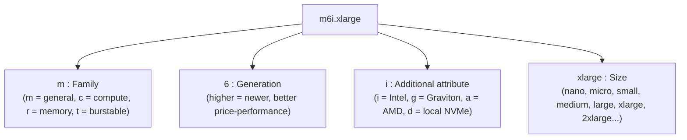
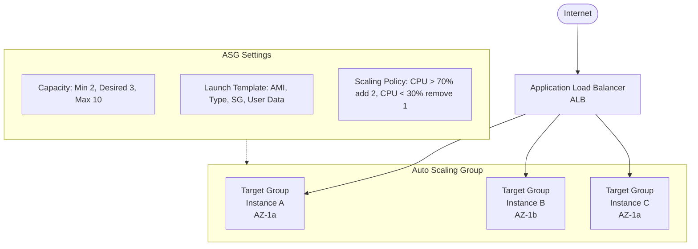
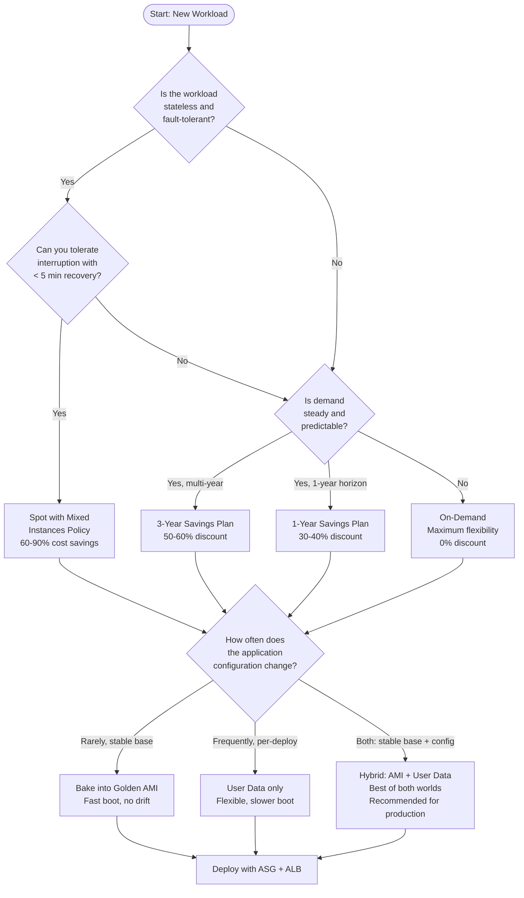

**Complexity**: `[MEDIUM]` | **Time to Complete**: 2.5h | **Prerequisites**: Module 1.2. After completing this module, you will be able to:

## What You'll Be Able to Do

- **Configure Auto Scaling Groups with launch templates to build self-healing, elastic compute clusters**
- **Implement Application Load Balancers with health checks and target groups for zero-downtime deployments**
- **Evaluate EC2 instance families and purchasing options (On-Demand, Spot, Reserved) to optimize cost and performance**
- **Deploy EC2 instances with User Data scripts and custom AMIs to automate application bootstrapping**

---

## Why This Module Matters

A team that manually provisions EC2 capacity ahead of a major traffic event can still be overwhelmed if demand exceeds forecasts and new instances take too long to come online. In that mode, manual workflows create delay because every replacement decision depends on an engineer being present and accurate. This disaster is usually avoidable, because the core promise of EC2 is elastic capacity rather than static infrastructure. Amazon EC2 is not just virtual machines in the cloud; it is a programmable compute fabric. When used correctly, it scales automatically with demand so you can absorb spikes and avoid paying for idle servers during quiet periods. In this module, you will automate provisioning with AMIs and User Data, understand EBS storage mechanics, and combine Auto Scaling Groups with Application Load Balancers to build self-healing clusters that recover without human intervention. The most useful mindset shift is to treat servers as ephemeral cattle, not permanent pets.

## The Building Blocks of Compute

To launch an EC2 instance, you must make a series of configuration choices that define its performance profile, cost, and lifecycle. Each choice has trade-offs, and those trade-offs usually become visible in production first, not in planning docs. Understanding them is what separates someone who "uses EC2" from someone who can architect with it, because architecture quality is mostly about knowing where to spend and where to save across changing workload profiles.

### Instance Types and Families

AWS offers many instance types optimized for different use cases. They are [categorized by family](https://docs.aws.amazon.com/ec2/latest/instancetypes/ec2-instance-type-specifications.html): this is the first decision point because the family often determines whether an application will be CPU-limited, memory-limited, storage-limited, or network-bound, before you optimize cost at the size level.
*   **General Purpose (e.g., t3, m6i)**: Balanced compute, memory, and network resources. Good for web servers, code repositories, and small to medium databases. [T-series instances are "burstable"—they accumulate CPU credits during idle time and spend them during bursts.](https://docs.aws.amazon.com/AWSEC2/latest/UserGuide/burstable-credits-baseline-concepts.html) If your application has steady moderate usage with occasional spikes, T-series can be significantly cheaper than fixed-performance instances.
*   **Compute Optimized (e.g., c6i, c6g)**: High ratio of vCPUs to memory. Ideal for batch processing, media transcoding, scientific modeling, machine learning inference, and high-performance web servers that need raw CPU horsepower.
*   **Memory Optimized (e.g., r6i, x2idn)**: Designed for workloads that process large data sets in memory, such as relational databases, Redis/Memcached caches, in-memory analytics, and real-time big data processing with Apache Spark.
*   **Storage Optimized (e.g., i3, d3)**: High sequential read/write access to very large data sets on local storage. Designed for data warehousing, distributed file systems (HDFS), and log processing systems.
*   **Accelerated Computing (e.g., p4d, g5)**: Use hardware accelerators (GPUs or custom chips) for floating-point calculations, graphics processing, or machine learning model training.

#### Decoding the Instance Name

An [instance name like `m6i.xlarge` follows a consistent naming scheme](https://docs.aws.amazon.com/ec2/latest/instancetypes/instance-type-names.html): it immediately tells you the intended workload class, whether the CPU generation is newer, and whether the platform is Intel, Graviton, AMD, or local NVMe, which helps when choosing an instance before looking at price pages.



Understanding the naming convention lets you interpret most instance types at a glance, even ones you have not encountered before. Once you can decode family, generation, architecture marker, and size quickly, you can make fast first-pass decisions before you consult benchmarking tools or full cost modeling.

### Instance Type Comparison Table

The table below compares commonly used instance types across the four most popular families. The table below uses representative `us-east-1` Linux On-Demand prices for a few common instance types; always verify current pricing before making production cost decisions.

| Instance Type | Family | vCPUs | Memory (GiB) | Network (Gbps) | On-Demand $/hr | Best Use Cases |
| :--- | :--- | :---: | :---: | :---: | :---: | :--- |
| `t3.micro` | Burstable GP | 2 | 1 | Up to 5 | ~$0.0104 | Dev/test, microservices, low-traffic sites |
| `t3.medium` | Burstable GP | 2 | 4 | Up to 5 | ~$0.0416 | Small web apps, CI/CD agents, staging environments |
| `t3.xlarge` | Burstable GP | 4 | 16 | Up to 5 | ~$0.1664 | Medium web apps, small databases, application servers |
| `m6i.large` | General Purpose | 2 | 8 | Up to 12.5 | ~$0.096 | Production web servers, mid-size databases, backend APIs |
| `m6i.xlarge` | General Purpose | 4 | 16 | Up to 12.5 | ~$0.192 | App servers, enterprise applications, container hosts |
| `m6i.2xlarge` | General Purpose | 8 | 32 | Up to 12.5 | ~$0.384 | Large application servers, medium databases, EKS nodes |
| `c6i.large` | Compute Optimized | 2 | 4 | Up to 12.5 | ~$0.085 | Batch processing, build servers, game servers |
| `c6i.xlarge` | Compute Optimized | 4 | 8 | Up to 12.5 | ~$0.170 | Video encoding, scientific computing, ML inference |
| `c6i.2xlarge` | Compute Optimized | 8 | 16 | Up to 12.5 | ~$0.340 | High-perf computing, ad serving, real-time analytics |
| `r6i.large` | Memory Optimized | 2 | 16 | Up to 12.5 | ~$0.126 | Redis/Memcached, small in-memory DBs |
| `r6i.xlarge` | Memory Optimized | 4 | 32 | Up to 12.5 | ~$0.252 | PostgreSQL/MySQL, medium caches, real-time analytics |
| `r6i.2xlarge` | Memory Optimized | 8 | 64 | Up to 12.5 | ~$0.504 | Large relational databases, Elasticsearch, SAP HANA |

**Key insight**: Notice how `t3.medium` and `m6i.large` both offer 2 vCPUs—but the `m6i.large` provides 8 GiB of memory (double the `t3.medium`'s 4 GiB at the same vCPU count) and consistent performance without credit-based throttling. For production workloads that need reliable, steady CPU performance, fixed-performance instance families are often a better fit than burstable T-series instances.

> **Stop and think**: You are migrating a legacy, monolithic application that requires 32 GiB of memory. It idles at 15% CPU utilization 95% of the time, but during monthly reporting runs, it hits 100% CPU for several hours. Which instance family and size provides the most cost-effective baseline without risking CPU throttling during the reporting runs?

*Note on Graviton: Instance families ending in 'g' (like m6g, c6g, r6g) use AWS Graviton processors (ARM architecture) rather than x86. They can often offer better price-performance than comparable x86-based instances, depending on workload, generation, and region. If your application stack supports ARM (most Linux workloads, containers, and interpreted languages do), Graviton instances are almost always the smarter choice.*

In teams that standardize on Linux containers or common scripting stacks, Graviton adoption often yields meaningful savings with only modest image and dependency validation once architecture support is confirmed.

### Placement Groups

When you launch instances without special placement instructions, AWS spreads them across the underlying hardware in a way that maximizes availability for general-purpose workloads. For certain workloads, this default distribution creates performance problems. When you have a cluster of instances that communicate intensively with each other, network latency between them can become the bottleneck that caps throughput. [Placement groups let you control exactly how instances are placed on the physical hardware](https://docs.aws.amazon.com/AWSEC2/latest/UserGuide/placement-groups.html) relative to each other, trading off between performance, availability, and scale.

AWS offers three placement group strategies, and each one optimizes a different dimension of the placement problem. Choosing the wrong strategy for your workload typically creates a slow failure: things work in development but degrade unpredictably as you scale.

**Cluster placement groups**: Instances are packed into a single Availability Zone on hardware with high-bisection-bandwidth, low-latency networking. The result is up to 10 Gbps of single-flow bandwidth and consistent microsecond-level latency between instances. This is the right choice for high-performance computing, computational fluid dynamics, seismic analysis, and tightly coupled machine learning training runs that use message-passing interfaces. The trade-off is availability: all instances share a single AZ, and if that AZ has a capacity event, your entire group can fail simultaneously. Most HPC teams mitigate this by building checkpoint-restart into their application layer and accepting that a cluster-wide outage is a restart event, not a disaster.

**Spread placement groups**: Each instance is placed on distinct underlying hardware, within or across Availability Zones, with a hard limit of seven running instances per group per AZ. This is the placement equivalent of "defense in depth" — even if a rack-level failure takes out one instance, the other six in that AZ keep running on physically separate hardware. Spread groups are designed for workloads with a small number of critical instances — think domain controllers, Zookeeper or etcd quorum nodes, or a small set of application servers where losing more than one at a time breaches your availability SLO. The trade-off is scale: you cannot place more than seven instances per AZ in a spread group, so this strategy does not work for large fleets.

**Partition placement groups**: Instances are divided into logical partitions, each representing a set of racks that share a common failure domain (power and networking). A large distributed application can then spread its replicas across partitions so that no single partition failure takes down more than one replica. This is purpose-built for distributed data systems like HDFS, Apache Kafka, Apache Cassandra, and Elasticsearch, where data replication already exists at the application layer and you want the replication topology to match the physical fault domains. Large partition groups can span hundreds of instances across up to seven partitions per AZ, and the application can query instance metadata to discover which partition an instance belongs to, enabling topology-aware replica placement.

> **Pause and predict**: You are deploying a 9-node Apache Cassandra cluster. The application-level replication factor is 3, and each node handles roughly equal query load. Which placement group strategy protects you from a single-rack failure without exceeding placement group limits, and why?

Choosing the right placement group strategy is easy to get wrong in the planning phase because the trade-offs are invisible until you hit a production event. Cluster groups fail fast but are simple to reason about; spread groups give you the highest assurance for small counts; partition groups require application-level topology awareness but scale to large distributed systems. The common mistake is deploying without any placement strategy and discovering the performance or availability gap months later when the workload size changes.

### Nitro System and Graviton: The Platform Beneath the Instance

The value of an EC2 instance is not just the vCPU count and memory size printed on the spec sheet. The hardware platform underneath — the Nitro System for virtualization and Graviton for the processor architecture — directly determines price, performance, and the boundary between what you manage and what AWS manages.

The AWS Nitro System replaces traditional virtualization hypervisors with a combination of dedicated hardware cards and a purpose-built lightweight hypervisor. [Instead of running a general-purpose software hypervisor that consumes host CPU and memory for virtualization overhead, Nitro offloads networking, storage, and security management to dedicated hardware components](https://aws.amazon.com/ec2/nitro/), leaving nearly all of the host's physical resources available to your instances. The practical effect is that you get faster, more predictable performance because your vCPUs are not competing with hypervisor overhead, and you get bare-metal-capable instance types that allow workloads requiring direct hardware access.

Three Nitro subsystems matter most for day-to-day operations. The Nitro Card for VPC handles all network packet processing, enabling Elastic Network Adapter (ENA) and Elastic Fabric Adapter (EFA) for enhanced networking. ENA delivers up to 100 Gbps of standard TCP/IP networking with lower latency and lower CPU utilization than the older Intel 82599 VF interface. EFA goes further: it implements an OS-bypass mechanism that lets HPC and ML applications (using MPI or NCCL) communicate directly with the network card without kernel involvement, reducing latency to single-digit microseconds. The Nitro Card for EBS handles all block storage I/O, giving you consistent EBS throughput without the instance's CPU budget being consumed by disk I/O. The Nitro Security Chip provides a hardware root of trust and handles instance identity, preventing even AWS operators from accessing data on your Nitro-based instances.

Graviton processors are ARM-based chips designed by AWS specifically for cloud workloads, and they have moved from "interesting experiment" to "default choice" for cost-conscious production teams. [AWS Graviton-based instances cost up to 20% less than comparable x86-based EC2 instances (workload-dependent)](https://aws.amazon.com/ec2/graviton/) for a broad range of workloads, including web servers, containerized microservices, real-time analytics, and open-source databases like MySQL and PostgreSQL. The migration story is simpler than many teams expect. If your stack runs on Linux and your applications are written in interpreted languages (Python, Node.js, Ruby, PHP, Java) or compiled for ARM, the transition is typically a recompile or a container image rebuild with an ARM base image. Most Docker-based build pipelines can produce multi-architecture images that run on both x86 and Graviton with a single `docker buildx` command. The gotchas are third-party binaries distributed only as x86, which need emulation via qemu-user-static during the migration window, and a handful of older Java or Go applications that need library updates. In practice, the KubeDojo recommendation for new AWS workloads in 2026 is: start on Graviton by default, and fall back to x86 only when a specific dependency blocks you.

### Purchasing Options

How you pay for compute dramatically impacts your architecture and your monthly bill, because cost and interruption behavior are tied together through capacity strategy. Choosing the wrong purchasing model for a workload is one of the easiest ways to burn money in AWS, even when your operational design is sound. In practice, you should revisit model choice as the workload pattern changes across quarter, region, and risk appetite.

*   **On-Demand**: [Pay for compute capacity by the second with no long-term commitments.](https://aws.amazon.com/ec2/pricing/on-demand/) Most expensive, but maximum flexibility. Use for spiky, unpredictable workloads and applications that cannot be interrupted.
*   **Reserved Instances (RIs)**: Commit to a specific instance type in a specific region for a 1-year or 3-year term. Offers significant discounts compared to On-Demand. [Standard RIs can be sold in the Reserved Instance Marketplace](https://docs.aws.amazon.com/AWSEC2/latest/UserGuide/reserved-instances-types.html) if your needs change.
*   **Savings Plans**: A more flexible alternative to RIs. Instead of committing to a specific instance type, [you commit to a consistent amount of usage measured in dollars per hour (e.g., "$10/hour of compute for 1 year"). This commitment applies across any instance family, size, OS, or region.](https://aws.amazon.com/savingsplans/faq//) Typically the best default choice for steady-state workloads.
*   **Spot Instances**: Request spare Amazon EC2 computing capacity at steep discounts. The catch? [AWS can reclaim the instance with a 2-minute warning if capacity is needed elsewhere.](https://docs.aws.amazon.com/AWSEC2/latest/UserGuide/spot-instance-termination-notices.html) Use for stateless, fault-tolerant, flexible workloads (e.g., image processing queues, CI/CD runners, big data analytics).
*   **Dedicated Hosts**: [A physical EC2 server dedicated for your use.](https://aws.amazon.com/ec2/pricing/) Required for licensing models that require per-socket or per-core visibility (e.g., Windows Server, Oracle Database), or for compliance requirements that prohibit multi-tenant hardware.

#### Purchasing Options Comparison Table

| Option | Discount vs On-Demand | Commitment | Interruption Risk | Best For |
| :--- | :---: | :--- | :---: | :--- |
| **On-Demand** | 0% (baseline) | None | None | Unpredictable workloads, short-term projects |
| **Savings Plan (1yr)** | ~30-40% | $/hr for 1 year | None | Steady-state production workloads |
| **Savings Plan (3yr)** | ~50-60% | $/hr for 3 years | None | Long-running stable infrastructure |
| **Reserved Instance (1yr, All Upfront)** | ~40% | Specific instance, 1 year | None | Known, fixed-size workloads |
| **Reserved Instance (3yr, All Upfront)** | ~60-72% | Specific instance, 3 years | None | Databases, core infrastructure |
| **Spot Instances** | ~60-90% | None | **Yes** (2-min warning) | Batch jobs, CI/CD, data processing |
| **Dedicated Hosts** | Varies | 1 or 3 years (or On-Demand) | None | License compliance, regulatory isolation |

**Cost example**: A continuously running `m6i.xlarge` can cost well over a thousand dollars per year on On-Demand pricing, while commitment-based discounts and Spot pricing can lower costs substantially depending on the workload design and plan you choose.

> **Pause and predict**: A data science team runs a massive, parallel data processing job every night. The job takes 4 hours to complete, but it is heavily checkpointed—if a server shuts down, the job simply resumes from the last checkpoint with a 5-minute penalty. If they switch from On-Demand to Spot instances and experience 3 interruptions per night, will this architectural change save money?

*The golden rule of EC2 cost optimization: use Savings Plans for your baseline, On-Demand for unpredictable burst, and Spot for anything that can tolerate interruption. For a stable production workload, avoid staying on pure On-Demand for more than a few weeks without evaluating a commitment.*

### Storage: Elastic Block Store (EBS)

While instances have temporary local storage (Instance Store), persistent storage requires Amazon EBS. EBS volumes are network-attached block storage drives that persist independently from the life of an instance. Think of them as USB drives you can plug into any server in the same Availability Zone.

*   **gp3 (General Purpose SSD)**: The default for most workloads. Every gp3 volume includes a baseline of 3,000 IOPS and 125 MiB/s of throughput at no extra charge, regardless of volume size. If your workload needs more performance, you can provision additional IOPS (up to 80,000) and throughput (up to 2,000 MiB/s) independently of the volume's storage capacity in standard AWS regions, with volume size up to 64 TiB (AWS Outposts still caps gp3 at 16,000 IOPS, 1,000 MiB/s, and 16 TiB), paying separately for each performance dimension. This decoupling is the essential improvement over gp2: under gp2, getting more IOPS meant buying more storage whether you needed it or not. A workload that needs 10,000 IOPS but only 50 GiB of data would waste storage spend under gp2; under gp3, you provision exactly the performance you need without the storage tax.
*   **gp2 (General Purpose SSD, Legacy)**: The previous generation, where IOPS scale linearly with volume size at a fixed ratio of 3 IOPS per GiB, with a minimum of 100 IOPS and a short-duration burst capability up to 3,000 IOPS. This coupling means that to get 3,000 sustained IOPS, you must provision a 1,000 GiB volume regardless of your actual data size. gp3 is almost always cheaper and more flexible for new deployments, but gp2 remains common in accounts that have not yet migrated and in CloudFormation templates that predate gp3 availability.
*   **io2 Block Express (Provisioned IOPS SSD)**: Designed for mission-critical, high-performance databases requiring sub-millisecond latency and the ability to scale IOPS independently of volume size up to 256,000 IOPS with throughput up to 4,000 MiB/s. io2 volumes also support multi-attach (mounting a single volume to multiple Nitro-based instances within the same AZ), which is useful for clustered database filesystems. The cost per provisioned IOPS and per GiB is substantially higher than gp3, and these volumes should be reserved for I/O-intensive transactional workloads where the storage layer is the performance bottleneck—typically large relational databases with heavy concurrent write loads, not general-purpose application servers.
*   **st1 (Throughput Optimized HDD)**: Low-cost magnetic storage optimized for large sequential I/O workloads such as log processing, data warehousing, ETL pipelines, and streaming data ingestion. st1 volumes deliver a baseline throughput of 40 MiB/s per TiB of storage, burst capability up to 500 MiB/s per volume, and a maximum volume size of 16 TiB. Cannot be a boot volume. At roughly $0.045 per GiB-month, st1 is approximately half the cost of gp3 per GiB but delivers an order of magnitude less random I/O performance, so the workload pattern must be genuinely sequential for this trade-off to make sense.
*   **sc1 (Cold HDD)**: The lowest-cost EBS option at roughly $0.015 per GiB-month, designed for infrequently accessed data where throughput matters more than IOPS—think archival storage, periodic log scans, or compliance data that is read occasionally but must remain queryable. Baseline throughput is 12 MiB/s per TiB with a burst ceiling of 250 MiB/s per volume. Cannot be a boot volume. Access frequency should be measured in times per week, not per second.

The following decision table summarizes when each volume type is the right choice in real production environments. The most common mistake teams make is defaulting everything to gp3 without checking whether their workload is actually throughput-limited (where st1 would be cheaper) or latency-sensitive (where io2 Block Express would prevent application-level timeouts).

| Volume Type | Relative Cost | Max IOPS | Max Throughput | Latency | Boot Volume | Best For |
| :--- | :---: | :---: | :---: | :---: | :---: | :--- |
| **gp3** | $$ (base) | 80,000 (16,000 on Outposts) | 2,000 MiB/s (1,000 on Outposts) | Single-digit ms | Yes | Default for general workloads; web servers, app servers, dev/test |
| **gp2** | $$ | 16,000 (at 5,334 GiB) | 250 MiB/s | Single-digit ms | Yes | Legacy deployments not yet migrated; predictable performance at low volume sizes |
| **io2** | $$$$ | 256,000 | 4,000 MiB/s | Sub-ms | Yes | High-throughput OLTP databases, latency-sensitive transactional systems |
| **st1** | $ | 500 | 500 MiB/s | Double-digit ms | No | Big data, data warehouses, log processing, sequential throughput workloads |
| **sc1** | ¢ | 250 | 250 MiB/s | High | No | Infrequent access, archival data that must remain queryable |

> **Stop and think**: Your team runs a PostgreSQL database that handles 8,000 write IOPS at peak and stores 400 GiB of data. Under gp2, you needed a 2,700 GiB volume (8,000 / 3 = 2,667 GiB) to sustain that IOPS, wasting storage spend. Under gp3, you can size the volume at 400 GiB and provision 8,000 IOPS separately. What is the monthly savings at ~$0.08/GiB-month, ignoring provisioned IOPS cost? (Answer: ~$184/month just from decoupling storage from IOPS.)

#### EBS Snapshots

[You can create point-in-time backups of EBS volumes, which are stored incrementally in Amazon S3. The first snapshot captures the entire volume; subsequent snapshots only capture changed blocks, making them storage-efficient.](https://docs.aws.amazon.com/AWSEC2/latest/UserGuide/EBSSnapshots.html) This model is useful because snapshots are immutable enough for restore and flexible enough to feed disaster recovery or replacement workflows.

Key capabilities include cross-zone recovery, rapid bootstrapping into new fleets, secure sharing, and fast recovery acceleration options when you need consistent application startup times after restore.
*   **Cross-AZ**: Use a snapshot to create a new volume in any AZ within the same region.
*   **Cross-Region**: Copy a snapshot to another region for disaster recovery.
*   **Sharing**: Share snapshots with other AWS accounts.
*   **Fast Snapshot Restore (FSR)**: [Pre-warm a snapshot so that volumes created from it deliver full performance immediately, without the usual first-access latency penalty.](https://docs.aws.amazon.com/ebs/latest/userguide/ebs-fast-snapshot-restore.html)

```bash
# Create a snapshot of an EBS volume
aws ec2 create-snapshot \
    --volume-id vol-0123456789abcdef0 \
    --description "Daily backup - production DB" \
    --tag-specifications 'ResourceType=snapshot,Tags=[{Key=Name,Value=prod-db-daily}]'

# List snapshots you own
aws ec2 describe-snapshots --owner-ids self \
    --query 'Snapshots[*].[SnapshotId,VolumeId,StartTime,State]' \
    --output table

# Create a volume from a snapshot in a different AZ
aws ec2 create-volume \
    --snapshot-id snap-0123456789abcdef0 \
    --availability-zone us-east-1b \
    --volume-type gp3
```

## Automating the Boot Process: AMIs and User Data

If you are logging into a server to run `apt-get install` or modify configuration files manually, you are creating a "pet." In cloud architecture, we want "cattle"—servers that are easily replaceable and identical. The distinction matters enormously: when a pet gets sick, you nurse it back to health; when cattle gets sick, you replace it with a healthy one. Auto Scaling only works if every instance is interchangeable.

### Amazon Machine Images (AMIs)

An AMI provides the information required to launch an instance. It includes the operating system, the architecture type (x86 or ARM), and a snapshot of the root volume. The main advantage is that every launch starts from the same known baseline, which prevents drift and makes troubleshooting significantly easier.

Because reproducibility is so important in cloud operations, a common pattern is "Golden Image" baking: build your base once, lock it down with standard checks, and then scale the same baseline image across every replacement node.
1. Launch a base Linux AMI.
2. Install your application, security agents, and dependencies.
3. Create a custom AMI from that instance.
4. Launch all future instances directly from your custom AMI—they boot in seconds, fully configured.

```bash
# Find the latest Amazon Linux 2023 AMI
aws ssm get-parameters \
    --names /aws/service/ami-amazon-linux-latest/al2023-ami-kernel-default-x86_64 \
    --query 'Parameters[0].Value' --output text

# Find the latest Ubuntu 22.04 AMI
aws ec2 describe-images \
    --owners 099720109477 \
    --filters "Name=name,Values=ubuntu/images/hvm-ssd/ubuntu-jammy-22.04-amd64-server-*" \
    --query 'sort_by(Images, &CreationDate)[-1].ImageId' \
    --output text

# Create a custom AMI from a running instance
aws ec2 create-image \
    --instance-id i-0123456789abcdef0 \
    --name "MyApp-GoldenImage-$(date +%Y%m%d)" \
    --description "App v2.3 with security agents" \
    --no-reboot

# List your custom AMIs
aws ec2 describe-images --owners self \
    --query 'Images[*].[ImageId,Name,CreationDate]' \
    --output table
```

**Golden Image pipeline in practice**: Production teams typically automate this with HashiCorp Packer or EC2 Image Builder. A CI/CD pipeline builds a new AMI nightly (or on every application release), tests it, and updates the Launch Template. The ASG then gradually rolls out instances using the new AMI.

### User Data and Cloud-Init

If you don't want to bake a custom AMI for every minor configuration change, use **User Data**. Think of it as the runtime configuration layer: AMIs provide the fixed base image, and User Data handles per-launch adaptation for environment, region, and deployment-specific state.

When launching an instance, you can pass a shell script in the User Data field. [The `cloud-init` service running on the EC2 instance executes this script with root privileges during the final stages of the initial boot process.](https://docs.aws.amazon.com/AWSEC2/latest/UserGuide/user-data.html) It is the perfect place to fetch the latest application code from S3, start services, or register the instance with a configuration management tool.

```bash
#!/bin/bash
# Example User Data script
yum update -y
yum install -y httpd
systemctl start httpd
systemctl enable httpd
echo "<h1>Deployed via User Data</h1>" > /var/www/html/index.html
```

A more production-ready User Data script that fetches configuration from Parameter Store and signals success gives you reproducible startup behavior and transparent failure visibility in one flow.

```bash
#!/bin/bash
set -euo pipefail

# Log everything for debugging
exec > >(tee /var/log/user-data.log) 2>&1
echo "User Data script started at $(date)"

# Install application
yum update -y
yum install -y httpd aws-cli jq

# Fetch configuration from Parameter Store
APP_VERSION=$(aws ssm get-parameter --name /myapp/version --query 'Parameter.Value' --output text --region us-east-1)
DB_ENDPOINT=$(aws ssm get-parameter --name /myapp/db-endpoint --query 'Parameter.Value' --output text --region us-east-1)

# Download application from S3
aws s3 cp "s3://my-deploy-bucket/releases/${APP_VERSION}/app.tar.gz" /tmp/
tar -xzf /tmp/app.tar.gz -C /var/www/html/

# Write config file
cat << CONF > /var/www/html/config.json
{
    "db_endpoint": "$DB_ENDPOINT",
    "app_version": "$APP_VERSION"
}
CONF

# Start web server
systemctl start httpd
systemctl enable httpd

echo "User Data script completed at $(date)"
```

**Debugging tip**: If your User Data script fails silently, SSH into the instance and check `/var/log/cloud-init-output.log`. This file contains the stdout and stderr of your script. Alternatively, add explicit logging as shown above.

### Golden Image vs. User Data: When to Use Which

| Approach | Boot Time | Flexibility | Maintenance | Best For |
| :--- | :--- | :--- | :--- | :--- |
| **Golden AMI** | Fast (seconds) | Low — rebuild to change | AMI pipeline needed | Stable base, infrequent changes |
| **User Data only** | Slow (minutes) | High — change at launch | Simple script | Rapid iteration, dev/test |
| **Hybrid (recommended)** | Medium | Balanced | Both pipelines | Production: AMI for base + User Data for config |

> **Stop and think**: If a critical zero-day vulnerability is discovered in the OpenSSL library, how does your patching strategy differ if you rely entirely on a Golden AMI versus relying entirely on User Data for OS configuration? Which approach allows for faster emergency remediation across a fleet of 1,000 instances?

A hybrid approach is a common production pattern because it balances fast boot times with runtime flexibility. Bake the OS, security agents, and application runtime into the AMI (things that rarely change). Use User Data to pull the latest application version and environment-specific configuration at boot time (things that change frequently).

## Scaling the Fleet: ASG and ALB

A single EC2 instance is a single point of failure. Modern architectures distribute load across a fleet of instances. The combination of an Application Load Balancer and an Auto Scaling Group is the fundamental pattern for highly available compute in AWS.

### Architecture Overview



### Application Load Balancer (ALB)

[An ALB operates at Layer 7 (HTTP/HTTPS). It receives incoming traffic and distributes it across multiple targets (like EC2 instances) in multiple Availability Zones.](https://docs.aws.amazon.com/elasticloadbalancing/latest/application/introduction.html) ALBs are themselves highly available—AWS runs them across multiple AZs behind the scenes.

Key features include health checks, path-based routing, host-based routing, sticky sessions, and deregistration delay for safer scale-in and deployment events.

*   **Health Checks**: The ALB constantly polls a specific endpoint (e.g., `/health`) on your instances. If an instance fails the check, the ALB stops sending traffic to it until it recovers. [You configure the path, port, protocol, healthy/unhealthy thresholds, and check interval.](https://docs.aws.amazon.com/elasticloadbalancing/latest/application/target-group-health-checks.html)
*   **Path-Based Routing**: ALBs can inspect the URL path to route traffic to different target groups. For example, `/api/*` goes to backend instances while `/images/*` goes to a separate rendering fleet.
*   **Host-Based Routing**: [Route traffic based on the `Host` header.](https://docs.aws.amazon.com/elasticloadbalancing/latest/application/rule-condition-types.html) A single ALB can serve `api.example.com`, `app.example.com`, and `admin.example.com`, each routing to a different target group.
*   **Sticky Sessions**: When enabled, the ALB uses a cookie to route a user's requests to the same target for the duration of their session. Useful for stateful applications, but consider externalizing session state to ElastiCache or DynamoDB instead.
*   **Deregistration delay**: When a target is deregistered (e.g., during scale-in or deployment), the ALB waits for in-flight requests to complete before fully removing it. [The default deregistration delay is 300 seconds.](https://docs.aws.amazon.com/elasticloadbalancing/latest/application/modify-target-group-health-settings.html)

```bash
# Create a target group with custom health check settings
aws elbv2 create-target-group \
    --name MyApp-TG \
    --protocol HTTP --port 80 \
    --vpc-id vpc-0123456789abcdef0 \
    --health-check-path /health \
    --health-check-interval-seconds 15 \
    --health-check-timeout-seconds 5 \
    --healthy-threshold-count 2 \
    --unhealthy-threshold-count 3 \
    --query 'TargetGroups[0].TargetGroupArn' --output text

# Check the health of targets in a target group
aws elbv2 describe-target-health \
    --target-group-arn arn:aws:elasticloadbalancing:us-east-1:123456789012:targetgroup/MyApp-TG/abc123 \
    --query 'TargetHealthDescriptions[*].[Target.Id,TargetHealth.State,TargetHealth.Description]' \
    --output table
```

### Auto Scaling Groups (ASG)

An ASG contains a collection of EC2 instances that are treated as a logical grouping for automatic scaling and management. You define a **Launch Template** (specifying the AMI, instance type, security groups, and user data) and attach it to the ASG so replacement nodes are interchangeable. The ASG monitors the health of its instances and ensures the group maintains a specified state:
*   **Self-Healing (Desired Capacity)**: [If you set Desired Capacity to 3, and an instance crashes or is terminated, the ASG automatically launches a replacement using the Launch Template to bring the count back to 3.](https://docs.aws.amazon.com/en_us/autoscaling/ec2/userguide/ec2-auto-scaling-health-checks.html)
*   **Dynamic Scaling**: You can configure scaling policies tied to CloudWatch metrics. For example: "If average CPU utilization exceeds 70% for 3 minutes, launch 2 more instances. If it drops below 30%, terminate 1 instance."
*   **Predictive Scaling**: AWS can analyze historical traffic patterns and proactively scale the fleet before a predicted traffic surge, rather than reacting after the fact. Useful for workloads with predictable daily or weekly patterns.
*   **Scheduled Scaling**: If you know traffic spikes every weekday at 9 AM, you can pre-schedule scale-out actions. Cheaper and more responsive than reactive scaling.

When an ASG is linked to an ALB, newly launched instances are automatically registered with the load balancer and begin receiving traffic as soon as they pass health checks. This lets you scale into healthy capacity without manual DNS updates or drift in routing rules.

#### Scaling Policies in Depth

```bash
# Create a Target Tracking scaling policy (the simplest and most common)
# This policy keeps average CPU at ~60% by adding/removing instances automatically
aws autoscaling put-scaling-policy \
    --auto-scaling-group-name DojoWebASG \
    --policy-name TargetCPU60 \
    --policy-type TargetTrackingScaling \
    --target-tracking-configuration '{
        "PredefinedMetricSpecification": {
            "PredefinedMetricType": "ASGAverageCPUUtilization"
        },
        "TargetValue": 60.0,
        "ScaleInCooldown": 300,
        "ScaleOutCooldown": 60
    }'

# Create a scaling policy based on ALB request count per target
aws autoscaling put-scaling-policy \
    --auto-scaling-group-name DojoWebASG \
    --policy-name TargetRequestCount \
    --policy-type TargetTrackingScaling \
    --target-tracking-configuration '{
        "PredefinedMetricSpecification": {
            "PredefinedMetricType": "ALBRequestCountPerTarget",
            "ResourceLabel": "app/DojoWebALB/abc123/targetgroup/DojoWebTG/def456"
        },
        "TargetValue": 1000.0
    }'

# View current scaling activities
aws autoscaling describe-scaling-activities \
    --auto-scaling-group-name DojoWebASG \
    --query 'Activities[*].[StartTime,StatusCode,Description]' \
    --output table --max-items 5
```

**Warmup and scaling timing matter**: if you scale too aggressively you can thrash, and if you scale too slowly you can respond sluggishly. Tune warmup and scaling timing to match how long your instances actually take to become useful.

#### Advanced ASG Features: Instance Refresh, Warm Pools, and Lifecycle Hooks

Beyond basic scaling, ASGs provide a set of operational primitives that determine how safely and quickly your fleet can evolve. These features often distinguish a mature, low-drama production setup from one where every AMI update or deployment involves a manual outage window. Understanding them lets you automate fleet maintenance without sacrificing capacity or availability.

**Instance Refresh** performs a rolling replacement of all instances in the ASG, [using either a new AMI or a new version of your Launch Template](https://docs.aws.amazon.com/autoscaling/ec2/userguide/asg-instance-refresh.html). You control the pace with a minimum healthy percentage: setting 90% means the ASG replaces instances one at a time, ensuring at least 90% of the desired count remains in service throughout the rollout. A warm-up time (typically 60-300 seconds) tells the ASG how long to wait after launching a replacement before considering it healthy, giving your User Data script and health checks time to complete. You can set the refresh to skip instances that already match the target configuration, which is useful when re-running a refresh after a partial failure. You can also configure rollback behavior so a failed refresh automatically reverts to the previous working launch template version. Instance Refresh is the modern, built-in way to roll out AMI changes across an ASG without external tooling — it replaces the old pattern of running a script that terminated instances one at a time and hoped the ASG replaced them.

**Warm Pools** maintain a pool of pre-initialized, stopped instances that the ASG can draw from when it needs to scale out quickly. [When a scale-out event occurs, the ASG moves instances from the warm pool into the active ASG, changing their state from `Stopped` to `Running`](https://docs.aws.amazon.com/autoscaling/ec2/userguide/ec2-auto-scaling-warm-pools.html) rather than launching from scratch. Because the instances have already completed the full boot cycle, the time to become in-service drops from minutes to seconds. The instance only needs to transition from stopped to running, which typically takes under 30 seconds. The trade-off is cost: stopped instances still incur EBS charges, and if you configure the warm pool to keep instances in a `Running` state (for even faster scale-out), you pay the full EC2 instance price. Warm pools are most valuable for latency-sensitive applications that cannot afford the 2-4 minute cold-start time of a fresh EC2 launch, such as ad-serving platforms, real-time bidding systems, and latency-critical API fleets.

**Capacity Rebalancing** is a Spot-specific feature that proactively replaces instances before they are interrupted. [When AWS emits a rebalance recommendation — a signal that a Spot instance has an elevated risk of interruption in the near future — the ASG launches a replacement Spot instance first, waits for it to pass health checks, and then terminates the at-risk instance](https://docs.aws.amazon.com/autoscaling/ec2/userguide/ec2-auto-scaling-capacity-rebalancing.html). This is a significant improvement over the default Spot behavior, where your instance receives a 2-minute termination notice and you must handle the replacement yourself. With capacity rebalancing enabled, the ASG minimizes interruption risk and reduces unplanned capacity gaps by replacing instances proactively before the interruption arrives (replacement is not instantaneous). The cost is that you briefly run at N+1 instances during the replacement window, but this is almost always cheaper than the operational complexity of handling Spot interruptions manually.

**Lifecycle Hooks** pause an instance during launch or termination so you can run custom actions before the instance enters service or before it is destroyed. [When a lifecycle hook fires, the instance enters a `Wait` state and the ASG holds it there until the hook completes, times out, or is explicitly abandoned](https://docs.aws.amazon.com/autoscaling/ec2/userguide/lifecycle-hooks.html). For launch hooks, common use cases include: registering the instance with an external monitoring system, pulling secrets that are too large or sensitive to embed in User Data, or running a smoke test before allowing the ALB to route traffic. For termination hooks, use cases include: draining in-flight connections gracefully (beyond what the ALB's deregistration delay provides), flushing application logs to S3, or deregistering the instance from a service discovery system. The default heartbeat timeout for a lifecycle hook is one hour, so you must configure a shorter timeout (typically 300-600 seconds) and ensure your hook scripts signal completion promptly to avoid hanging instance transitions.

These four features together form the operational toolkit for running production ASGs. Instance Refresh handles planned fleet changes without downtime. Warm Pools reduce scale-out latency for latency-sensitive workloads. Capacity Rebalancing eliminates the operational burden of Spot interruption handling. And Lifecycle Hooks provide extension points for custom integration with your existing operational tooling.

## EC2 Lifecycle Management with the CLI

Beyond launching and terminating instances, the AWS CLI gives you full lifecycle control. In real operations, this matters because reproducible workflows are created by composing these commands into scripts and pipelines rather than one-off ad hoc actions. Here are operations you will use regularly.

```bash
# Launch a single instance with detailed configuration
aws ec2 run-instances \
    --image-id ami-0123456789abcdef0 \
    --instance-type t3.medium \
    --key-name my-keypair \
    --security-group-ids sg-0123456789abcdef0 \
    --subnet-id subnet-0123456789abcdef0 \
    --tag-specifications 'ResourceType=instance,Tags=[{Key=Name,Value=WebServer-01},{Key=Environment,Value=Production}]' \
    --user-data file://userdata.sh \
    --iam-instance-profile Name=WebServerRole \
    --query 'Instances[0].InstanceId' --output text

# List running instances with useful details
aws ec2 describe-instances \
    --filters "Name=instance-state-name,Values=running" \
    --query 'Reservations[*].Instances[*].[InstanceId,InstanceType,PrivateIpAddress,PublicIpAddress,Tags[?Key==`Name`].Value|[0]]' \
    --output table

# Stop an instance (EBS data preserved, public IP released unless Elastic IP)
aws ec2 stop-instances --instance-ids i-0123456789abcdef0

# Start a stopped instance
aws ec2 start-instances --instance-ids i-0123456789abcdef0

# Resize an instance (must be stopped first)
aws ec2 stop-instances --instance-ids i-0123456789abcdef0
aws ec2 wait instance-stopped --instance-ids i-0123456789abcdef0
aws ec2 modify-instance-attribute \
    --instance-id i-0123456789abcdef0 \
    --instance-type '{"Value": "m6i.xlarge"}'
aws ec2 start-instances --instance-ids i-0123456789abcdef0

# Terminate an instance (permanent — EBS root volume deleted by default)
aws ec2 terminate-instances --instance-ids i-0123456789abcdef0

# Connect to an instance via SSM (no SSH key or open port 22 required)
aws ssm start-session --target i-0123456789abcdef0
```

## Instance Metadata Service (IMDS)

Every EC2 instance has access to a [special HTTP endpoint at `169.254.169.254`](https://docs.aws.amazon.com/AWSEC2/latest/UserGuide/configuring-instance-metadata-service.html) that provides information about the instance itself. This metadata is invaluable for bootstrapping scripts that need to know "who am I?" and "where am I?"

```bash
# IMDSv2 (token-based, more secure — always use this)
TOKEN=$(curl -s -X PUT "http://169.254.169.254/latest/api/token" \
    -H "X-aws-ec2-metadata-token-ttl-seconds: 21600")

# Get basic instance identity
curl -s -H "X-aws-ec2-metadata-token: $TOKEN" http://169.254.169.254/latest/meta-data/instance-id
curl -s -H "X-aws-ec2-metadata-token: $TOKEN" http://169.254.169.254/latest/meta-data/instance-type
curl -s -H "X-aws-ec2-metadata-token: $TOKEN" http://169.254.169.254/latest/meta-data/placement/availability-zone
curl -s -H "X-aws-ec2-metadata-token: $TOKEN" http://169.254.169.254/latest/meta-data/local-ipv4
curl -s -H "X-aws-ec2-metadata-token: $TOKEN" http://169.254.169.254/latest/meta-data/public-ipv4

# Get the IAM role credentials (never hardcode creds — use this instead)
curl -s -H "X-aws-ec2-metadata-token: $TOKEN" http://169.254.169.254/latest/meta-data/iam/security-credentials/MyInstanceRole
```

**Security note**: The 2019 Capital One metadata-service breach (see *Node Metadata Security*) <!-- incident-xref: capital-one-2019 --> shows how SSRF protections and scoped IAM permissions around metadata are inseparable controls on any production AWS account.

```bash
# Enforce IMDSv2 on an existing instance
aws ec2 modify-instance-metadata-options \
    --instance-id i-0123456789abcdef0 \
    --http-tokens required \
    --http-endpoint enabled

# Enforce IMDSv2 in a Launch Template
aws ec2 create-launch-template \
    --launch-template-name SecureTemplate \
    --launch-template-data '{
        "MetadataOptions": {
            "HttpTokens": "required",
            "HttpEndpoint": "enabled",
            "HttpPutResponseHopLimit": 1
        }
    }'
```

## Patterns and Anti-Patterns

Patterns and anti-patterns are not just style preferences. They represent the accumulated operational experience of thousands of teams running EC2 workloads at scale. A pattern is a design choice that repeatedly succeeds across organizations and workload types, while an anti-pattern is a choice that repeatedly fails in predictable, preventable ways. In this section, we name the most important ones directly so you can recognize them before they appear in your AWS bill or your pager alerts.

### Proven Patterns

**Immutable Golden Image with ASG Rollout**: Bake your application, runtime, and security agents into an AMI using a CI/CD pipeline that produces a new image version for every application release. The ASG uses Instance Refresh to replace instances with the new AMI automatically, ensuring every instance in the fleet runs the same configuration and no instance drifts over time. This pattern eliminates configuration drift — the most common source of "it works on my instance" production incidents — and makes rollback a one-click operation (set the launch template back to the previous AMI version and trigger another refresh). Scaling note: AMI build pipelines must run in under 30 minutes for this pattern to be practical in a deployment workflow; if your image build takes hours, consider a User Data layer for the most frequently changing components.

**Mixed Instances Policy for Spot Diversification**: Instead of using a single instance type with Spot, configure the ASG with a mixed instances policy that spans multiple families and sizes. Include diverse families like c6i, c6g, c5, and c5a, with multiple sizes within each family. Set the allocation strategy to `lowest-price`. The ASG automatically chooses the cheapest available Spot pool at launch time, dramatically reducing the chance that a single pool's interruption affects your entire fleet. This pattern converts Spot from "risky for narrow instance types" to "reliable for diversified fleets," and is the reason many production teams run 60-80% of their stateless workloads on Spot without frequent interruption incidents.

**Target Tracking with Scheduled Scaling Layered**: Do not choose between reactive and proactive scaling; combine both. Use a scheduled scaling action to pre-scale the fleet ahead of known traffic events (daily 8 AM ramp, weekly batch job, seasonal peak) and layer a target tracking policy on top to handle variance within those windows. The scheduled action sets a higher minimum floor of capacity so the reactive policy never starts from zero during a surge, while the target tracking policy absorbs unexpected spikes above the scheduled capacity. This combination is the most cost-efficient scaling strategy for workloads with both predictable patterns and unpredictable variance, which describes nearly every real-world production workload.

**SSM Session Manager Instead of SSH**: Eliminate SSH access entirely by using AWS Systems Manager Session Manager to connect to instances. Session Manager tunnels traffic through the SSM agent over HTTPS, requiring no open inbound ports, no bastion hosts, and no SSH key management on the instance. Combined with IMDSv2 enforcement and IAM role-based access, this pattern removes the entire surface area of SSH brute-force attacks and eliminates the operational overhead of managing SSH key rotation across a fleet. Session Manager also logs all session activity to CloudWatch or S3, which satisfies audit requirements without additional tooling.

**Stateless Cattle, No Pets**: Design every application component so that any instance can be terminated and replaced without data loss or manual recovery steps. Store persistent state in managed services (RDS, ElastiCache, DynamoDB, S3, EFS), never on the instance's root EBS volume. Bake application configuration into the AMI or inject it through User Data and Parameter Store. This pattern is the foundational prerequisite for every other ASG pattern: if your instances are not stateless, automatic scaling, self-healing, and instance refresh all become dangerous rather than safe because they destroy state you cannot recover.

### Anti-Patterns

| Anti-Pattern | Why It Happens | The Damage | Better Approach |
| :--- | :--- | :--- | :--- |
| **Manual provisioning ("pet" management)** | Teams migrate from on-premises infrastructure and carry forward the workflow of SSH + manual configuration. | Instance drift accumulates within days. When an instance fails at 3 AM, nobody knows its exact configuration, and recovery requires tribal knowledge. Auto Scaling cannot help because no two instances are identical. | Adopt Launch Templates with User Data and golden AMIs. Every instance is disposable and reproducible from version-controlled configuration. |
| **Launch Configurations instead of Launch Templates** | Launch Configurations predate Launch Templates and remain in older CloudFormation templates, tutorials, and blog posts. Teams reuse what they find. | Launch Configurations are deprecated and immutable. Updating an AMI requires creating a new Launch Configuration, updating the ASG, and deleting the old one — a multi-step manual process. They also do not support mixed instances policies, IMDSv2 enforcement, multiple network interfaces, or dedicated hosts. | Migrate to Launch Templates with versioning. You get a single mutable object with immutable snapshots, and full access to all modern EC2 features. |
| **Pure On-Demand for interruptible workloads** | "Spot sounds unreliable" is the surface-level objection. Teams assume Spot is only for low-priority batch jobs and avoid the perceived complexity. | For stateless, fault-tolerant workloads (CI/CD runners, data processing, queue-driven workers), staying on On-Demand burns 60-90% more compute cost with zero reliability benefit. The cost difference at scale — a fleet of 50 instances — often exceeds $50,000 per year. | Start with a 20% Spot allocation using mixed instances policies. Monitor interruption rates. Increase Spot share gradually as confidence grows. Many teams reach 80% Spot for non-critical fleets within a quarter. |
| **Secrets baked into AMIs** | A developer needs an API key during image build and hardcodes it. The AMI works in staging, gets promoted to production, and the secret spreads to every instance launched from it. | The secret is permanently embedded in the AMI. Anyone who can launch the AMI — including in other accounts if the AMI is shared — has the secret. Rotation requires rebuilding and redeploying the entire AMI, which is slow enough that teams postpone it. | Store secrets in AWS Secrets Manager or SSM Parameter Store (SecureString). Fetch them at boot time via User Data (the AMI only contains the IAM role permission to access the secret, not the secret itself). Rotation becomes a zero-touch operation: update the secret value, restart the instances. |
| **EC2 status checks instead of ELB health checks** | The ASG defaults to EC2 status checks, which only verify that the hypervisor sees the instance as running. Teams either do not know the setting exists or assume the default is sufficient. | An instance can pass EC2 status checks while the application returns HTTP 500s on real routes—but the ALB only marks a target unhealthy when the configured **health-check path** fails its success matcher (default HTTP 200). A shallow `/health` that returns OK while application routes fail 500 will not trigger replacement; the ASG also misses this if it uses EC2 checks only. Result: a zombie instance billing you with no useful traffic. | Set ASG health check type to `ELB` and use a **deep/readiness** health check that exercises real dependencies (or add route-level synthetic checks/alarms). Configure health check grace period (typically 180-300 seconds) for boot time. |
| **No health check grace period** | The ASG starts health checking instances immediately after launch, without accounting for the time User Data and application startup take. | The ASG sees a healthy instance that has not yet finished booting, marks it unhealthy, terminates it, launches a replacement, and repeats. This creates a perpetual launch-termination loop that consumes EC2 capacity and generates costs without ever reaching a stable fleet. | Set `--health-check-grace-period` to at least 120-300 seconds — longer than your User Data script's maximum execution time. Monitor the actual boot time of your instances over a week to calibrate this value accurately. |

## Decision Framework: Choosing EC2 Strategies

The breadth of EC2 configuration options can feel overwhelming, but the decision process becomes manageable when you separate it into two independent dimensions: how you buy compute capacity, and how you configure the runtime environment. The flowchart below captures the primary decision paths, followed by a structured comparison of the purchasing options.



The decision matrix below provides the detailed trade-off data behind the flowchart, organized by the purchasing commitment level and the operational characteristics of each option.

### Purchasing Option Decision Matrix

| Dimension | On-Demand | Savings Plan (1yr) | Savings Plan (3yr) | Reserved Instance | Spot | Dedicated Host |
| :--- | :--- | :--- | :--- | :--- | :--- | :--- |
| **Discount vs On-Demand** | 0% | 30-40% | 50-60% | 40-72% | 60-90% | Varies |
| **Commitment flexibility** | None | $/hr spend, any instance | $/hr spend, any instance | Specific instance type and region | None | Physical server |
| **Interruption risk** | None | None | None | None | Yes (2-min notice) | None |
| **Capacity reservation** | None | None | None | Yes (if AZ-scoped) | None | Full physical server |
| **Best for** | Unpredictable, short-term, burst | Steady production workloads, 1-year planning | Long-running stable infrastructure | Known fixed-size workloads needing capacity assurance | Stateless, fault-tolerant, batch, CI/CD | License compliance, regulatory isolation |
| **Worst for** | Steady long-running workloads (cost) | Highly variable or short-term workloads | Workloads likely to change within 3 years | Evolving workloads; Spot-friendly jobs | Stateful, latency-sensitive, or licensed workloads | General-purpose cost optimization |
| **Commitment minimum** | None | $0.001/hr increments (no enforced minimum) | $0.001/hr increments (no enforced minimum) | 1 instance, 1 year | None | 1 host, 3 years (or On-Demand) |

### Hybrid Purchasing Strategy (KubeDojo Recommendation)

The most cost-effective production strategy for 2026 is rarely a single purchasing option applied uniformly. Instead, use a three-tier model that allocates workload segments to the cheapest option they can safely use. This approach typically reduces total EC2 spend by 40-55% compared to pure On-Demand for the same workload, without increasing operational risk. The exact split depends on your workload portfolio, but a typical three-tier distribution for a web application fleet handling 1,000 requests per second at peak looks like this:

| Tier | Purchasing Option | Fleet Share | Rationale |
| :--- | :--- | :---: | :--- |
| **Base layer** | 3-Year Savings Plan or RI | 40-50% | Covers the minimum capacity the fleet needs 24/7/365. This capacity never drops to zero, so the commitment is safe. |
| **Scale-out layer** | 1-Year Savings Plan or On-Demand | 20-30% | Covers predictable diurnal scaling (the capacity you add every morning and remove every night). The 1-year commitment captures most of the discount while preserving flexibility to change instance families. |
| **Burst/elastic layer** | Spot with mixed instances policy | 20-40% | Covers unpredictable spikes above the scheduled scale-out capacity. Tolerates interruption because the base and scale-out layers maintain SLO capacity. The diversified instance pool keeps interruption rates below 5% in most regions. |

> **Hypothetical scenario**: A SaaS platform runs 60 `m6i.xlarge` instances continuously (8,760 h/yr each) on pure On-Demand at ~$0.192/hr (~$101,000/year total compute). All instances run 24/7; the team segments them by **workload role** for purchasing only: 30 baseline instances → 3-year Savings Plan (~55% discount), 15 steady application tiers → 1-year Savings Plan (~35% discount), 15 interruption-tolerant workers → Spot (~70% discount, assuming similar availability). Annual compute drops to approximately $48,000—a ~52% reduction. The operational setup (ASG with mixed instances policies, proper health checks, and Instance Refresh) is identical; only the purchasing allocation changes.

### Golden AMI vs User Data vs Hybrid: Runtime Configuration Decision

| Factor | Golden AMI Only | User Data Only | Hybrid (Recommended) |
| :--- | :--- | :--- | :--- |
| **Boot time** | 30-90 seconds | 3-8 minutes | 60-180 seconds |
| **Configuration drift risk** | Low (immutable image) | Moderate (script can drift) | Low (image is immutable, script is version-controlled) |
| **AMI rebuild frequency** | Every application or dependency change | Rarely (OS patches only) | Every OS/dependency change (app deployed via User Data) |
| **Zero-day patch speed** | Slow (must rebuild, test, roll AMI) | Fast (update script, relaunch instances) | Fast for app; slower for OS (AMI rebuild needed) |
| **Cost of maintaining pipeline** | Higher (AMI pipeline is production-critical) | Lower (simple script) | Medium (AMI pipeline for OS + simple script for app) |
| **Best for** | Highly regulated environments requiring bit-identical deployments | Rapid iteration, dev/test, small teams | Production environments balancing speed and stability |

## Cost Lens: What Makes EC2 Expensive (and How to Avoid It)

Understanding EC2 cost requires looking beyond the hourly instance price listed on the pricing page. Several indirect charges routinely surprise teams and can double the effective cost of a fleet if not actively managed. The most important ones to monitor are:

**Public IPv4 Address Charge**: As of February 2024, AWS charges $0.005 per hour for every public IPv4 address attached to a running EC2 instance, including addresses auto-assigned at launch. For a fleet of 20 instances, this adds ~$72/month. The fix is straightforward: use private subnets with NAT Gateways or VPC endpoints for outbound internet access. Frontend traffic through an ALB — it absorbs the IPv4 cost into its own pricing. Only assign public IPs to instances that genuinely require direct inbound internet connectivity. Elastic IP addresses incur the same $0.005/hr charge when attached to a running instance, and an additional $0.005/hr charge when reserved but not attached to any instance — an idle EIP costs you money, so release EIPs you are not actively using.

**Cross-AZ Data Transfer**: EC2 instances in different Availability Zones within the same region pay $0.01 per GiB for data transferred between them, charged in both directions. This charge is invisible until you scale — a single instance's traffic looks negligible. At scale, cross-AZ transfer can become the second-largest line item on your bill after the instances themselves. Typical offenders include a distributed database cluster with 10 nodes replicating 500 GiB per day across AZs, or an application tier making 20,000 requests per minute to a cache tier in a different AZ. The mitigation is architectural: colocate tightly coupled services in the same AZ where possible, use VPC endpoints to avoid cross-AZ traffic to AWS services, and monitor the `DataTransfer-Out-Bytes` CloudWatch metric grouped by source and destination AZ to catch the problem before the bill arrives. This is not a reason to avoid multi-AZ deployments — the availability benefit almost always justifies the cost — but it is a reason to know where your data flows cross AZ boundaries.

**Idle and Over-Provisioned Instances**: The single largest source of EC2 waste is instances that run 24/7 but serve traffic only during business hours. An `m6i.2xlarge` at $0.384/hr costs ~$3,360/year, and a common pattern is development and staging environments running at full capacity overnight and on weekends. Use scheduled scaling actions on the ASG to reduce desired capacity during known low-traffic periods (e.g., scale dev/staging to zero overnight), and use AWS Instance Scheduler or a simple Lambda function to stop non-production instances outside working hours. A team that implements this for 15 non-production instances often recovers $15,000-25,000 per year with a few hours of configuration work.

**Savings Plan vs Spot Baseline Strategy**: The most cost-effective approach for any EC2 fleet follows a simple sequence. First, determine the minimum steady-state capacity: the lowest number of instances your fleet runs at the quietest hour of the week. Cover that baseline with the longest commitment you can justify — typically a 3-year Savings Plan. Then layer shorter commitments or Spot for the variable portion above the baseline. This captures the steepest discounts on unavoidable spend and avoids locking you into commitments for demand that might shift. Revisit the split quarterly: workload patterns change, new instance generations offer better price-performance, and Savings Plan commitments can be stacked to follow the baseline as it evolves.

## Did You Know?

1.  [Amazon EC2 Mac instances actually utilize physically unmodified Apple Mac mini computers integrated directly into the AWS Nitro System, allowing developers to natively run macOS workloads in the cloud for iOS application compilation. You rent the entire physical Mac mini for a minimum of 24 hours.](https://aws.amazon.com/about-aws/whats-new/2020/11/announcing-amazon-ec2-mac-instances-for-macos/)
2.  Before February 2024, an Elastic IP (EIP) attached to a running instance had no hourly charge. [Since February 1, 2024, every in-use public IPv4 address—auto-assigned at launch or an EIP attached to a running instance—costs $0.005/hr; an idle/unattached EIP also incurs $0.005/hr](https://aws.amazon.com/blogs/aws/new-aws-public-ipv4-address-charge-public-ip-insights/)—a change that caught many teams off guard.
3.  The AWS Nitro System is a combination of dedicated hardware and a lightweight hypervisor. It offloads networking, storage, and security functions, reducing virtualization overhead and leaving more host resources available to instances.
4.  [A single Auto Scaling Group can use mixed instance types and mixed purchasing options simultaneously.](https://docs.aws.amazon.com/AWSCloudFormation/latest/TemplateReference/aws-properties-autoscaling-autoscalinggroup-mixedinstancespolicy.html) You can configure an ASG to run 60% On-Demand (for baseline capacity) and 40% Spot (for cost-optimized burst capacity) across multiple instance families, letting AWS pick the cheapest available Spot option at any given moment. This "instance diversification" strategy dramatically reduces the chance of Spot interruptions.

## Common Mistakes

| Mistake | Why It Happens | How to Fix It |
| :--- | :--- | :--- |
| **Losing data on termination** | By default, the root EBS volume is set to "Delete on Termination". Engineers assume stopping is the same as terminating. | Store critical, persistent data on a secondary EBS volume with `DeleteOnTermination=false`, or design applications to be stateless and store data in RDS or S3. |
| **Hardcoding IP addresses** | Legacy applications expect static IPs for internal communication, or developers note down instance IPs in config files. | In an Auto Scaling environment, IPs change constantly. Use internal load balancers, service discovery (Cloud Map), or Route 53 private hosted zones. |
| **Storing AWS credentials on EC2** | Developers put `~/.aws/credentials` on the server so their scripts work, or bake access keys into AMIs. | This is a massive security risk. Always attach an IAM Role (Instance Profile) to the EC2 instance to provide secure, temporary credentials that rotate automatically. |
| **Ignoring Spot Instances for stateless workloads** | "We just use On-Demand for everything because it is simpler." | CI/CD build agents, batch processing jobs, and worker queues are inherently interruptible. Using Spot instances for these workloads can slash compute costs by 60-90%. |
| **Baking secrets into AMIs** | Setting passwords or API keys during the image build process because it "keeps things simple." | Anyone who can launch the AMI has the secrets. Inject secrets at runtime using User Data scripts that fetch them from AWS Secrets Manager or Systems Manager Parameter Store. |
| **Failing to configure ASG health checks** | The ASG relies on standard EC2 status checks, which only verify if the VM is running, not if the application is healthy. | Configure the ASG to use ELB Health Checks. If the web server crashes but the VM stays up, the ASG will terminate and replace the zombie instance. |
| **Using IMDSv1 instead of IMDSv2** | IMDSv1 is the legacy default and "just works" without tokens. Teams often leave the setting unchanged. | Enforce IMDSv2 (`http-tokens required`) on all instances and in all Launch Templates. IMDSv1 is vulnerable to SSRF attacks that can leak IAM credentials. |
| **Not setting a Health Check Grace Period** | The ASG can start health checking soon after launch, before the application has finished bootstrapping. | Set `--health-check-grace-period` to at least the time your User Data script takes to complete (typically 120-300 seconds). Without this, the ASG terminates healthy instances that are still booting. |

## Quiz

<details>
<summary>Question 1: You need to design an architecture for a video rendering application. The rendering jobs are pulled from an SQS queue. If a server goes offline mid-render, the job simply returns to the queue to be picked up by another server. The rendering requires significant CPU power but has a tight budget. What EC2 purchasing option is best?</summary>
Spot Instances are the correct choice because the workload is completely stateless, fault-tolerant, and driven by a queue. When an instance is interrupted with the 2-minute warning, the job simply fails and returns to the SQS queue, where another server will pick it up without data corruption. This architecture perfectly handles the volatility of Spot instances, providing access to powerful compute resources (like c6i instances) at a 70-90% discount compared to On-Demand. To further reduce interruption risk and maintain throughput, you should configure the fleet to diversify across multiple instance types (e.g., c6i, c5, c5a, c6g) and multiple Availability Zones.
</details>

<details>
<summary>Question 2: You launch an EC2 instance with a User Data script that updates the OS packages and installs Node.js. An hour later, you stop the instance and start it again. Will the User Data script run a second time?</summary>
No, the User Data script will not run a second time. By default, the `cloud-init` service that processes User Data scripts only executes during the very first boot lifecycle of the instance. Stopping and starting the instance simply reboots the operating system; it does not trigger the initialization phase again. If you require a script to run on every boot (such as pulling the latest configuration from Parameter Store), you should explicitly configure it using a `cloud-init` `#cloud-boothook` directive, place the script in the `/var/lib/cloud/scripts/per-boot/` directory on the instance, or use another boot-time mechanism such as `systemd`.
</details>

<details>
<summary>Question 3: Your Auto Scaling Group has a Minimum capacity of 2, a Maximum of 10, and a Desired capacity of 4. An Availability Zone experiences a localized failure, bringing down two of your instances. What will the Auto Scaling Group do?</summary>
The Auto Scaling Group will automatically launch two new instances to replace the failed ones. First, the ASG's health checks (or ELB health checks, if configured) will detect that the two instances in the failed AZ are no longer responding. Because the Desired capacity is explicitly set to 4, the ASG detects a drift in state and initiates a scale-out action in the remaining healthy Availability Zones to restore the fleet count. Once the failed AZ eventually recovers, the ASG will perform an AZ rebalancing operation during subsequent scaling activities, ensuring the instances are evenly distributed across all configured zones once again.
</details>

<details>
<summary>Question 4: You attach an EBS volume to an EC2 instance in `us-east-1a`. You take a snapshot of the volume. A few days later, the instance is terminated. Can you use the snapshot to create a new volume for an instance in `us-east-1b`?</summary>
Yes, you can absolutely use the snapshot to create a volume in a different Availability Zone. While EBS volumes themselves are inherently tied to a specific Availability Zone and cannot be moved, EBS snapshots are stored regionally within Amazon S3. Because the snapshot exists at the region level, it can be referenced to instantly provision a new, fully populated volume in `us-east-1b`, `us-east-1c`, or any other AZ within that same region. Furthermore, if you need to migrate the data to a completely different geographic region for disaster recovery, you can copy the snapshot across regions and restore it there.
</details>

<details>
<summary>Question 5: Your team manages an Auto Scaling Group using a legacy Launch Configuration. A critical security patch requires you to update the AMI across the entire fleet. You also want to start mixing On-Demand and Spot instances to save costs. What is the most efficient architectural path forward, and why?</summary>
You must migrate from a Launch Configuration to a Launch Template. Legacy Launch Configurations are strictly immutable; updating an AMI requires creating a completely new configuration object, updating the ASG to point to it, and deleting the old one. More importantly, Launch Configurations are deprecated and do not support modern EC2 features, such as combining Spot and On-Demand instances in the same ASG. Launch Templates solve both problems by supporting versioning—allowing you to simply draft a v2 of the template with the new AMI—and unlocking advanced features like mixed instance policies and IMDSv2 enforcement.
</details>

<details>
<summary>Question 6: An Application Load Balancer is routing traffic to a target group of EC2 instances. One instance suddenly starts returning HTTP 500 errors on application routes due to a memory leak, but its shallow `/health` endpoint still returns HTTP 200. How does the ALB—and an ASG using ELB health checks—handle this?</summary>
The ALB marks a target unhealthy only when the configured **health-check path** fails the success matcher (default HTTP 200)—not when arbitrary application routes return 500. If `/health` stays OK while real routes fail, the ALB keeps routing traffic and the ASG will not replace the instance. Fix this with a **deep/readiness** health check that exercises real dependencies (database, cache, queue), or add route-level synthetic monitoring and alarms. When the health-check path itself returns failures past the unhealthy threshold, the ALB stops routing new requests; with ASG `ELB` health checks, the ASG terminates the bad instance and launches a replacement.
</details>

<details>
<summary>Question 7: You have a production web application running on m6i.large instances. Traffic is very predictable: low overnight, ramps up at 8 AM, peaks at noon, and drops off at 6 PM. What scaling strategy should you use?</summary>
You should implement a hybrid strategy using both Scheduled Scaling and Target Tracking policies. Because the traffic pattern is highly predictable, you can configure a Scheduled Action to proactively scale out the fleet before 8 AM (e.g., increasing desired capacity from 2 to 6) and scale it back in at 6 PM, ensuring capacity is ready before the load hits. However, you should also layer a Target Tracking policy on top of this (e.g., targeting 60% CPU utilization). The scheduled scaling handles the known daily baseline efficiently, while the target tracking policy acts as a safety net to dynamically handle unpredictable spikes or sustained surges that exceed the daily norm.
</details>

<details>
<summary>Question 8: A developer creates a custom AMI that includes their application and all dependencies. They share this AMI with another AWS account. The second account launches an instance from this AMI, but it fails with a "snapshot not found" error. What went wrong?</summary>
The launch failure is caused by permissions on the underlying EBS snapshots associated with the AMI. An AMI is essentially a metadata pointer to one or more EBS snapshots stored in S3. When you share an AMI across AWS accounts, you must explicitly share the referenced EBS snapshots as well; otherwise, the target account lacks permission to read the data to create the root volume. Furthermore, if those snapshots are encrypted, you must also share the KMS key used for encryption and ensure the target account has IAM permissions to use that specific key for decryption during the instance launch.
</details>

## Hands-On Exercise: Auto-Scaling Web Fleet

In this exercise, we will create a Launch Template with a bootstrapping script, and deploy it behind an Application Load Balancer using an Auto Scaling Group. You will then generate load to trigger scaling and observe the ASG in action so this control plane becomes tangible.

**Prerequisite (hard requirement):** This lab runs against your account's default VPC in the region you choose, and that VPC must have default subnets in at least two Availability Zones. Task 1 obtains the VPC ID with `aws ec2 describe-vpcs --filter "Name=isDefault,Values=true"` and Task 3 obtains two default subnet IDs with `aws ec2 describe-subnets --filters "Name=vpc-id,Values=$VPC_ID" "Name=default-for-az,Values=true"`. The preflight below validates this exact path before you create anything. If your account has no default VPC in the chosen region, create one with `aws ec2 create-default-vpc` (and `aws ec2 create-default-subnet` where an AZ lacks one) or pick a region that has them; a leftover `VPC_ID` from Module 1.2 is not used by these tasks.

### Preflight: Account, Region, Cost, and Cleanup

Run this preflight in a Bash shell before creating anything. Read **Clean Up** below first; stopping the terminal does not delete billable resources. Use AWS CLI v2 with an isolated AWS account and a role authorized to create and delete the lab resources. Confirm that the role permits the operations used below: `ec2:DescribeVpcs`, `ec2:DescribeSubnets`, `ec2:CreateSecurityGroup`, `ec2:AuthorizeSecurityGroupIngress`, `ec2:DeleteSecurityGroup`, `ec2:CreateLaunchTemplate`, `ec2:DeleteLaunchTemplate`, `ec2:DescribeInstances`, and `ec2:TerminateInstances`; `ssm:GetParameters` (AL2023 public AMI parameter); `iam:CreateRole`, `iam:AttachRolePolicy`, `iam:DetachRolePolicy`, `iam:DeleteRole`, `iam:CreateInstanceProfile`, `iam:DeleteInstanceProfile`, `iam:AddRoleToInstanceProfile`, `iam:RemoveRoleFromInstanceProfile`, and `iam:PassRole` (the Launch Template passes the SSM instance profile to every instance the ASG launches); `elbv2:CreateLoadBalancer`, `elbv2:CreateTargetGroup`, `elbv2:CreateListener`, and the matching `elbv2:Describe*` and `elbv2:Delete*` actions; and `autoscaling:CreateAutoScalingGroup`, `autoscaling:CreateOrUpdateTags` (Task 4 passes `--tags`), `autoscaling:PutScalingPolicy`, `autoscaling:DeleteAutoScalingGroup`, plus the `autoscaling:Describe*` read actions. Check command exit status and returned data: stop on any non-zero result, and record every resource ID as soon as it is returned so a partial run can be cleaned up. The identity check below does not prove all these permissions are available.

Read the cleanup section before starting. Keep an inventory of resources actually created, including resources left by a failed step, and delete only this exercise's resources. In this lab the inventory is the Auto Scaling Group and its scaling policy (deleted with the ASG), the ALB and its listener (deleted with the ALB), the target group, the Launch Template, both security groups, the IAM role and instance profile, and any instances the ASG launched. A run abandoned after Task 3 leaves an ALB billing hourly with nothing behind it; a cleanup that skips Step 1 leaves the ASG replacing any instance you terminate, so deleting instances alone never ends the spend.

The billable drivers are ALB hours plus Load Balancer Capacity Units for the entire window (ALB billing starts at creation, not at the first request), the public IPv4 addresses an internet-facing ALB occupies (typically one in-use address per subnet across its Availability Zones), EC2 On-Demand for two to six `t3.micro` instances across the exercise window, their AMI-default gp3 root volumes while they run, and — because default subnets auto-assign public IPv4 addresses — the per-hour public IPv4 charge for each instance address. Choose a spending limit and a cleanup deadline that cover all of these. Check current regional rates on [EC2 On-Demand pricing](https://aws.amazon.com/ec2/pricing/on-demand/), [Elastic Load Balancing pricing](https://aws.amazon.com/elasticloadbalancing/pricing/), and the public IPv4 section of [Amazon VPC pricing](https://aws.amazon.com/vpc/pricing/) before provisioning; this page supplies no default budget and no universal hourly quote.

Set your chosen region first, for example `export AWS_REGION=us-east-1`, and keep the AWS CLI variables consistent. The function verifies CLI v2 and your caller identity, then validates the network prerequisite the tasks actually use: a default VPC with at least two `default-for-az` subnets in this region, both confirmed by live `describe` calls. It returns a failure instead of closing an interactive shell; do not continue after a failure message.

```bash
ec2_fleet_preflight() {
  if [[ -z "${AWS_REGION:-}" && -z "${AWS_DEFAULT_REGION:-}" ]]; then
    printf '%s\n' 'Set AWS_REGION (or AWS_DEFAULT_REGION) before continuing.' >&2
    return 1
  fi
  if [[ -n "${AWS_REGION:-}" && -n "${AWS_DEFAULT_REGION:-}" && "$AWS_REGION" != "$AWS_DEFAULT_REGION" ]]; then
    printf 'AWS_REGION (%s) and AWS_DEFAULT_REGION (%s) differ; choose one region.\n' "$AWS_REGION" "$AWS_DEFAULT_REGION" >&2
    return 1
  fi
  export AWS_REGION="${AWS_REGION:-$AWS_DEFAULT_REGION}"
  export AWS_DEFAULT_REGION="$AWS_REGION"
  export AWS_PAGER=""

  AWS_VERSION=$(aws --version 2>&1) || return 1
  if [[ "$AWS_VERSION" != aws-cli/2.* ]]; then
    printf 'AWS CLI v2 is required; found %s.\n' "$AWS_VERSION" >&2
    return 1
  fi
  printf '%s\n' "$AWS_VERSION"
  aws sts get-caller-identity --query '{Account:Account,Arn:Arn,UserId:UserId}' --output table || return 1

  VPC_ID=$(aws ec2 describe-vpcs --filters "Name=isDefault,Values=true" \
    --query 'Vpcs[0].VpcId' --output text) || return 1
  if [[ -z "$VPC_ID" || "$VPC_ID" == "None" ]]; then
    printf 'No default VPC in %s; create one with `aws ec2 create-default-vpc` or choose another region.\n' "$AWS_REGION" >&2
    return 1
  fi
  DEFAULT_SUBNET_COUNT=$(aws ec2 describe-subnets \
    --filters "Name=vpc-id,Values=$VPC_ID" "Name=default-for-az,Values=true" \
    --query 'length(Subnets)' --output text) || return 1
  if [[ "$DEFAULT_SUBNET_COUNT" -lt 2 ]]; then
    printf 'Default VPC %s has fewer than two default subnets; create them with `aws ec2 create-default-subnet` before continuing.\n' "$VPC_ID" >&2
    return 1
  fi
  printf 'Default VPC %s has %s default subnets; Task 1 and Task 3 will discover their IDs.\n' "$VPC_ID" "$DEFAULT_SUBNET_COUNT"
}
ec2_fleet_preflight
```

### Task 1: Create the User Data Script and Security Group
First, define what the instance will look like and how it behaves on boot. A stable bootstrap script is the foundation for deterministic autoscaled infrastructure, because inconsistent startup logic amplifies quickly across a fleet.

```bash
# Get Default VPC
VPC_ID=$(aws ec2 describe-vpcs --filter "Name=isDefault,Values=true" --query 'Vpcs[0].VpcId' --output text)
echo "VPC: $VPC_ID"

# Create a Security Group for the ALB (allow port 80 from the internet)
ALB_SG=$(aws ec2 create-security-group \
    --group-name DojoALB-SG \
    --description "Allow HTTP to ALB" \
    --vpc-id $VPC_ID \
    --query 'GroupId' --output text)
aws ec2 authorize-security-group-ingress \
    --group-id $ALB_SG --protocol tcp --port 80 --cidr 0.0.0.0/0

# Create a Security Group for web servers (allow port 80 ONLY from the ALB SG)
WEB_SG=$(aws ec2 create-security-group \
    --group-name DojoWeb-SG \
    --description "Allow HTTP from ALB only" \
    --vpc-id $VPC_ID \
    --query 'GroupId' --output text)
aws ec2 authorize-security-group-ingress \
    --group-id $WEB_SG --protocol tcp --port 80 --source-group $ALB_SG

# Create IAM Role for SSM Access
aws iam create-role --role-name DojoWebSSMRole --assume-role-policy-document '{"Version":"2012-10-17","Statement":[{"Effect":"Allow","Principal":{"Service":"ec2.amazonaws.com"},"Action":"sts:AssumeRole"}]}'
aws iam attach-role-policy --role-name DojoWebSSMRole --policy-arn arn:aws:iam::aws:policy/AmazonSSMManagedInstanceCore
aws iam create-instance-profile --instance-profile-name DojoWebSSMRole
aws iam add-role-to-instance-profile --instance-profile-name DojoWebSSMRole --role-name DojoWebSSMRole

sleep 10 # Wait for IAM instance profile to propagate

echo "ALB SG: $ALB_SG"
echo "Web SG: $WEB_SG"

# Create the bootstrap script
cat << 'USERDATA' > userdata.sh
#!/bin/bash
set -euo pipefail
exec > >(tee /var/log/user-data.log) 2>&1

yum update -y
yum install -y httpd stress-ng

# Enable and start Apache
systemctl start httpd
systemctl enable httpd

# Get instance metadata (IMDSv2)
TOKEN=$(curl -s -X PUT "http://169.254.169.254/latest/api/token" \
    -H "X-aws-ec2-metadata-token-ttl-seconds: 21600")
INSTANCE_ID=$(curl -s -H "X-aws-ec2-metadata-token: $TOKEN" \
    http://169.254.169.254/latest/meta-data/instance-id)
AZ=$(curl -s -H "X-aws-ec2-metadata-token: $TOKEN" \
    http://169.254.169.254/latest/meta-data/placement/availability-zone)
INSTANCE_TYPE=$(curl -s -H "X-aws-ec2-metadata-token: $TOKEN" \
    http://169.254.169.254/latest/meta-data/instance-type)

# Create a web page that identifies this specific instance
cat << HTML > /var/www/html/index.html
<!DOCTYPE html>
<html>
<head><title>KubeDojo EC2 Lab</title></head>
<body style="font-family: Arial; padding: 40px; text-align: center;">
    <h1>Hello from EC2!</h1>
    <table style="margin: auto; text-align: left;">
        <tr><td><strong>Instance ID:</strong></td><td>$INSTANCE_ID</td></tr>
        <tr><td><strong>Availability Zone:</strong></td><td>$AZ</td></tr>
        <tr><td><strong>Instance Type:</strong></td><td>$INSTANCE_TYPE</td></tr>
        <tr><td><strong>Boot Time:</strong></td><td>$(date)</td></tr>
    </table>
</body>
</html>
HTML

# Create a health check endpoint
echo "OK" > /var/www/html/health

echo "User Data completed successfully at $(date)"
USERDATA
```

### Task 2: Create the Launch Template
A Launch Template defines the blueprint for the ASG, and becomes your operational contract for what every new node receives at launch. If this template is complete and versioned, replacement capacity stays predictable even when demand spikes.

```bash
# Find the latest Amazon Linux 2023 AMI
AMI_ID=$(aws ssm get-parameters \
    --names /aws/service/ami-amazon-linux-latest/al2023-ami-kernel-default-x86_64 \
    --query 'Parameters[0].Value' --output text)
echo "AMI: $AMI_ID"

# Create Launch Template data (base64 encode the userdata)
cat << EOF > template-data.json
{
    "ImageId": "$AMI_ID",
    "InstanceType": "t3.micro",
    "SecurityGroupIds": ["$WEB_SG"],
    "UserData": "$(cat userdata.sh | base64 | tr -d '\n')",
    "IamInstanceProfile": {
        "Name": "DojoWebSSMRole"
    },
    "MetadataOptions": {
        "HttpTokens": "required",
        "HttpEndpoint": "enabled"
    },
    "TagSpecifications": [
        {
            "ResourceType": "instance",
            "Tags": [
                {"Key": "Name", "Value": "DojoWeb"},
                {"Key": "Project", "Value": "KubeDojo-EC2-Lab"}
            ]
        }
    ]
}
EOF

# Create the Launch Template
aws ec2 create-launch-template \
    --launch-template-name DojoWebTemplate \
    --version-description "v1-initial" \
    --launch-template-data file://template-data.json
```

### Task 3: Create the Load Balancer Infrastructure
Before creating the ASG, we need a target group and the ALB itself, because instances must have both placement and routing surfaces configured before scale events can be observed safely.

```bash
# Get Subnet IDs for the Default VPC (need at least 2 AZs)
SUBNETS=$(aws ec2 describe-subnets \
    --filters "Name=vpc-id,Values=$VPC_ID" "Name=default-for-az,Values=true" \
    --query 'Subnets[0:2].SubnetId' --output text)
SUBNET_1=$(echo $SUBNETS | awk '{print $1}')
SUBNET_2=$(echo $SUBNETS | awk '{print $2}')
echo "Subnet 1: $SUBNET_1"
echo "Subnet 2: $SUBNET_2"

# Create Target Group with custom health check
TG_ARN=$(aws elbv2 create-target-group \
    --name DojoWebTG \
    --protocol HTTP --port 80 \
    --vpc-id $VPC_ID \
    --health-check-path /health \
    --health-check-interval-seconds 15 \
    --healthy-threshold-count 2 \
    --unhealthy-threshold-count 3 \
    --query 'TargetGroups[0].TargetGroupArn' --output text)
echo "Target Group: $TG_ARN"

# Create ALB (Internet-facing)
ALB_ARN=$(aws elbv2 create-load-balancer \
    --name DojoWebALB \
    --subnets $SUBNET_1 $SUBNET_2 \
    --security-groups $ALB_SG \
    --query 'LoadBalancers[0].LoadBalancerArn' --output text)
echo "ALB: $ALB_ARN"

# Wait for ALB to provision (takes ~2 mins)
echo "Waiting for ALB to become active..."
aws elbv2 wait load-balancer-available --load-balancer-arns $ALB_ARN
```

**Challenge: Create the Listener**
The ALB is running, but it is not listening for traffic yet. Construct a command using the AWS CLI to create a listener on HTTP port 80 that forwards traffic to your Target Group (`$TG_ARN`).

<details>
<summary>Stuck? Click here for the solution</summary>

```bash
aws elbv2 create-listener \
    --load-balancer-arn $ALB_ARN \
    --protocol HTTP --port 80 \
    --default-actions Type=forward,TargetGroupArn=$TG_ARN

# Get ALB DNS Name
ALB_DNS=$(aws elbv2 describe-load-balancers \
    --load-balancer-arns $ALB_ARN \
    --query 'LoadBalancers[0].DNSName' --output text)
echo "ALB DNS: http://$ALB_DNS"
```
</details>

### Task 4: Challenge - Create the Auto Scaling Group
Instead of blind copy-pasting, construct the AWS CLI command to create the Auto Scaling Group yourself. Use these requirements to ensure your fleet matches the intended operating envelope for this lab:
- **Name**: `DojoWebASG`
- **Template**: Use `LaunchTemplateName=DojoWebTemplate,Version='$Latest'`
- **Capacity**: Minimum `2`, Maximum `6`, Desired `2`
- **Network**: Place instances in both `$SUBNET_1` and `$SUBNET_2`
- **Routing**: Attach it to your Target Group (`$TG_ARN`)
- **Health**: Set the health check type to `ELB` with a grace period of `180` seconds. *(Critical: If you use the default EC2 health check, the ASG will not replace instances that fail ALB health checks!)*

<details>
<summary>Stuck? Click here for the solution</summary>

```bash
# Create ASG spanning two subnets, desired capacity 2
aws autoscaling create-auto-scaling-group \
    --auto-scaling-group-name DojoWebASG \
    --launch-template LaunchTemplateName=DojoWebTemplate,Version='$Latest' \
    --min-size 2 --max-size 6 --desired-capacity 2 \
    --vpc-zone-identifier "$SUBNET_1,$SUBNET_2" \
    --target-group-arns $TG_ARN \
    --health-check-type ELB \
    --health-check-grace-period 180 \
    --tags Key=Name,Value=DojoWeb-ASG,PropagateAtLaunch=false
```
</details>

Once the ASG is created, apply the scaling policy to allow it to react to CPU spikes and confirm the fleet can rebalance without manual intervention:

```bash
# Add a Target Tracking scaling policy (scale based on CPU)
aws autoscaling put-scaling-policy \
    --auto-scaling-group-name DojoWebASG \
    --policy-name DojoTargetCPU50 \
    --policy-type TargetTrackingScaling \
    --target-tracking-configuration '{
        "PredefinedMetricSpecification": {
            "PredefinedMetricType": "ASGAverageCPUUtilization"
        },
        "TargetValue": 50.0,
        "ScaleInCooldown": 300,
        "ScaleOutCooldown": 60
    }'

echo "ASG created with scaling policy. Waiting for instances to launch..."
```

### Task 5: Verify and Test

Use this phase to validate that your ALB, ASG, and launch workflow are all connected, not just that the commands execute.

```bash
# Check instance status (wait ~2 minutes for instances to boot)
aws autoscaling describe-auto-scaling-groups \
    --auto-scaling-group-names DojoWebASG \
    --query 'AutoScalingGroups[0].[DesiredCapacity,Instances[*].[InstanceId,HealthStatus,AvailabilityZone]]' \
    --output table

# Check target health in the ALB
aws elbv2 describe-target-health \
    --target-group-arn $TG_ARN \
    --query 'TargetHealthDescriptions[*].[Target.Id,TargetHealth.State]' \
    --output table

# Test the ALB endpoint (run multiple times to see different instance IDs)
curl http://$ALB_DNS
curl http://$ALB_DNS
curl http://$ALB_DNS
```

Open the DNS name in a browser. Refresh a few times to see the traffic balancing between different instances—you should see different Instance IDs and Availability Zones in the response.

### Task 6: Trigger Auto Scaling (Optional)

To observe scaling in action, SSH into one of the instances (or use SSM Session Manager) and generate CPU load so the threshold-based policy produces observable changes.

```bash
# From inside an EC2 instance, generate CPU stress for 5 minutes
stress-ng --cpu 2 --timeout 300s

# From your local machine, watch the ASG react (run every 30 seconds)
watch -n 30 "aws autoscaling describe-auto-scaling-groups \
    --auto-scaling-group-names DojoWebASG \
    --query 'AutoScalingGroups[0].[DesiredCapacity,Instances[*].[InstanceId,HealthStatus]]' \
    --output table"

# Check scaling activity log
aws autoscaling describe-scaling-activities \
    --auto-scaling-group-name DojoWebASG \
    --query 'Activities[*].[StartTime,StatusCode,Description]' \
    --output table --max-items 5
```

Within a few minutes of the CPU load exceeding the 50% target, you should see the ASG launch additional instances automatically.

### Task 7: Test Self-Healing

Manually terminate one of the instances and watch the ASG replace it, because this is the quickest way to validate whether your health-check flow and replacement policy actually protect availability.

```bash
# Get an instance ID from the ASG
INSTANCE_TO_KILL=$(aws autoscaling describe-auto-scaling-groups \
    --auto-scaling-group-names DojoWebASG \
    --query 'AutoScalingGroups[0].Instances[0].InstanceId' --output text)

echo "Terminating $INSTANCE_TO_KILL to test self-healing..."
aws ec2 terminate-instances --instance-ids $INSTANCE_TO_KILL

# Watch the ASG detect the failure and launch a replacement
watch -n 15 "aws autoscaling describe-auto-scaling-groups \
    --auto-scaling-group-names DojoWebASG \
    --query 'AutoScalingGroups[0].Instances[*].[InstanceId,HealthStatus,LifecycleState]' \
    --output table"
```

The ASG should detect the terminated instance within 1-2 health check cycles and automatically launch a replacement to maintain the desired capacity of 2.

### Clean Up

**Important**: Always clean up to avoid ongoing charges, and leave no dangling resources after hands-on labs. Neglected cleanup is a common source of unexpected spend and confusing state in later experiments.

```bash
# Step 1: Delete ASG (force-delete terminates all instances)
aws autoscaling delete-auto-scaling-group \
    --auto-scaling-group-name DojoWebASG --force-delete
echo "ASG deletion initiated. Waiting for instances to terminate..."
sleep 30

# Step 2: Delete ALB and Listener (listener is deleted with the ALB)
aws elbv2 delete-load-balancer --load-balancer-arn $ALB_ARN
echo "Waiting for ALB to be deleted..."
sleep 30

# Step 3: Delete Target Group (must wait for ALB to be fully gone)
aws elbv2 delete-target-group --target-group-arn $TG_ARN

# Step 4: Delete Launch Template
aws ec2 delete-launch-template --launch-template-name DojoWebTemplate

# Step 5: Delete Security Groups (must wait for instances to fully terminate)
echo "Waiting for instances to fully terminate before deleting security groups..."
sleep 60
aws ec2 delete-security-group --group-id $WEB_SG
aws ec2 delete-security-group --group-id $ALB_SG

# Step 6: Clean up IAM Role
aws iam remove-role-from-instance-profile --instance-profile-name DojoWebSSMRole --role-name DojoWebSSMRole
aws iam delete-instance-profile --instance-profile-name DojoWebSSMRole
aws iam detach-role-policy --role-name DojoWebSSMRole --policy-arn arn:aws:iam::aws:policy/AmazonSSMManagedInstanceCore
aws iam delete-role --role-name DojoWebSSMRole

# Step 7: Clean up local files
rm -f userdata.sh template-data.json

echo "Cleanup complete!"
```

### Success Criteria

- [ ] I successfully created separate Security Groups for the ALB and web servers (defense in depth).
- [ ] I created a Launch Template with User Data, IMDSv2 enforcement, and proper tagging.
- [ ] I created an ALB with a Target Group using a custom health check path (`/health`).
- [ ] I successfully constructed the commands to create the ALB listener and Auto Scaling Group from raw requirements.
- [ ] I hit the ALB DNS name in a browser and verified that my User Data script successfully configured the web servers, showing different Instance IDs on refresh.
- [ ] I observed the ASG self-heal by terminating an instance and watching a replacement launch automatically.

## Next Module

Now that you have stateless compute, you need a place to store massive amounts of unstructured data. Head to [Module 1.4: S3 & Object Storage](../module-1.4-s3/).

## Sources

- [docs.aws.amazon.com: ec2 instance type specifications.html](https://docs.aws.amazon.com/ec2/latest/instancetypes/ec2-instance-type-specifications.html) — AWS instance-type documentation explicitly defines these categories and their intended workload profiles.
- [docs.aws.amazon.com: burstable credits baseline concepts.html](https://docs.aws.amazon.com/AWSEC2/latest/UserGuide/burstable-credits-baseline-concepts.html) — AWS burstable-instance documentation directly explains CPU credit accrual and spending.
- [docs.aws.amazon.com: instance type names.html](https://docs.aws.amazon.com/ec2/latest/instancetypes/instance-type-names.html) — AWS documents the instance naming convention and each component of the identifier.
- [aws.amazon.com: on demand](https://aws.amazon.com/ec2/pricing/on-demand/) — General lesson point for an illustrative rewrite.
- [docs.aws.amazon.com: what is aws graviton.html](https://docs.aws.amazon.com/id_id/whitepapers/latest/aws-graviton-performance-testing/what-is-aws-graviton.html) — General lesson point for an illustrative rewrite.
- [docs.aws.amazon.com: reserved instances types.html](https://docs.aws.amazon.com/AWSEC2/latest/UserGuide/reserved-instances-types.html) — AWS's RI documentation explicitly distinguishes marketplace eligibility for Standard versus Convertible RIs.
- [aws.amazon.com: faq](https://aws.amazon.com/savingsplans/faq//) — AWS Savings Plans documentation directly describes the commitment model and flexibility scope.
- [docs.aws.amazon.com: spot instance termination notices.html](https://docs.aws.amazon.com/AWSEC2/latest/UserGuide/spot-instance-termination-notices.html) — AWS Spot interruption documentation directly states the two-minute notice behavior.
- [aws.amazon.com: pricing](https://aws.amazon.com/ec2/pricing/) — AWS's EC2 pricing page directly describes Dedicated Hosts as fully dedicated physical servers for your use.
- [docs.aws.amazon.com: EBSSnapshots.html](https://docs.aws.amazon.com/AWSEC2/latest/UserGuide/EBSSnapshots.html) — AWS snapshot documentation directly states that EBS snapshots are point-in-time, incremental backups stored in S3.
- [docs.aws.amazon.com: ebs fast snapshot restore.html](https://docs.aws.amazon.com/ebs/latest/userguide/ebs-fast-snapshot-restore.html) — AWS FSR documentation directly describes these behaviors.
- [docs.aws.amazon.com: user data.html](https://docs.aws.amazon.com/AWSEC2/latest/UserGuide/user-data.html) — The EC2 user-data guide directly covers these execution and debugging details.
- [docs.aws.amazon.com: introduction.html](https://docs.aws.amazon.com/elasticloadbalancing/latest/application/introduction.html) — AWS ALB documentation directly describes the OSI layer, multi-AZ targeting, and health-based routing.
- [docs.aws.amazon.com: target group health checks.html](https://docs.aws.amazon.com/elasticloadbalancing/latest/application/target-group-health-checks.html) — The target-group health-check guide documents these exact settings.
- [docs.aws.amazon.com: rule condition types.html](https://docs.aws.amazon.com/elasticloadbalancing/latest/application/rule-condition-types.html) — AWS listener-rule condition documentation explicitly covers host-header and path-pattern routing.
- [docs.aws.amazon.com: modify target group health settings.html](https://docs.aws.amazon.com/elasticloadbalancing/latest/application/modify-target-group-health-settings.html) — AWS target-group attribute documentation directly states both capabilities.
- [docs.aws.amazon.com: ec2 auto scaling health checks.html](https://docs.aws.amazon.com/en_us/autoscaling/ec2/userguide/ec2-auto-scaling-health-checks.html) — AWS Auto Scaling health-check documentation directly describes replacement behavior for unhealthy instances.
- [docs.aws.amazon.com: configuring instance metadata service.html](https://docs.aws.amazon.com/AWSEC2/latest/UserGuide/configuring-instance-metadata-service.html) — AWS's IMDS documentation directly covers the endpoint, token flow, and enforcement behavior.
- [aws.amazon.com: announcing amazon ec2 mac instances for macos](https://aws.amazon.com/about-aws/whats-new/2020/11/announcing-amazon-ec2-mac-instances-for-macos/) — AWS's launch announcement directly states the Mac mini/Nitro integration and the 24-hour minimum host allocation.
- [aws.amazon.com: new aws public ipv4 address charge public ip insights](https://aws.amazon.com/blogs/aws/new-aws-public-ipv4-address-charge-public-ip-insights/) — AWS's announcement directly states the February 1, 2024 pricing change and rate.
- [docs.aws.amazon.com: aws properties autoscaling autoscalinggroup mixedinstancespolicy.html](https://docs.aws.amazon.com/AWSCloudFormation/latest/TemplateReference/aws-properties-autoscaling-autoscalinggroup-mixedinstancespolicy.html) — AWS mixed-instances-policy documentation directly supports this capability and its launch-template requirement.
- [docs.aws.amazon.com: placement groups.html](https://docs.aws.amazon.com/AWSEC2/latest/UserGuide/placement-groups.html) — AWS placement-group documentation explicitly defines cluster, spread, and partition placement strategies and their use cases.
- [aws.amazon.com: ec2 nitro](https://aws.amazon.com/ec2/nitro/) — AWS Nitro System page directly describes the dedicated hardware cards and lightweight hypervisor that offload networking, storage, and security.
- [aws.amazon.com: ec2 graviton](https://aws.amazon.com/ec2/graviton/) — AWS Graviton processor page directly states the price-performance advantage and workload compatibility for ARM-based instances.
- [docs.aws.amazon.com: asg instance refresh.html](https://docs.aws.amazon.com/autoscaling/ec2/userguide/asg-instance-refresh.html) — AWS instance-refresh documentation directly describes rolling AMI updates, minimum healthy percentage, and rollback behavior.
- [docs.aws.amazon.com: ec2 auto scaling warm pools.html](https://docs.aws.amazon.com/autoscaling/ec2/userguide/ec2-auto-scaling-warm-pools.html) — AWS warm-pools documentation directly describes pre-initialized stopped instances and the scale-out transition behavior.
- [docs.aws.amazon.com: ec2 auto scaling capacity rebalancing.html](https://docs.aws.amazon.com/autoscaling/ec2/userguide/ec2-auto-scaling-capacity-rebalancing.html) — AWS capacity-rebalancing documentation directly describes proactive Spot instance replacement on rebalance recommendations.
- [docs.aws.amazon.com: lifecycle hooks.html](https://docs.aws.amazon.com/autoscaling/ec2/userguide/lifecycle-hooks.html) — AWS lifecycle-hooks documentation directly describes the Wait state, heartbeat timeout, and common use cases for launch and termination hooks.
