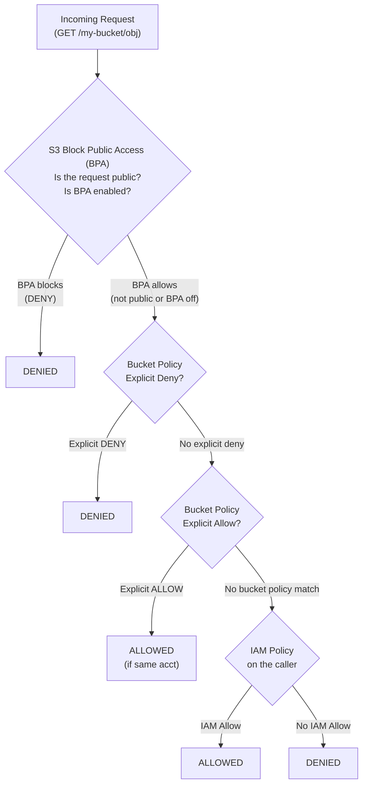
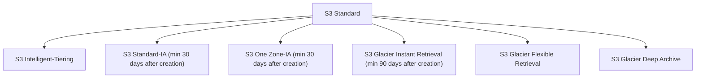
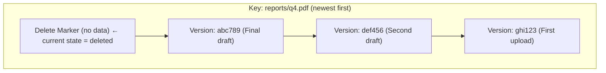
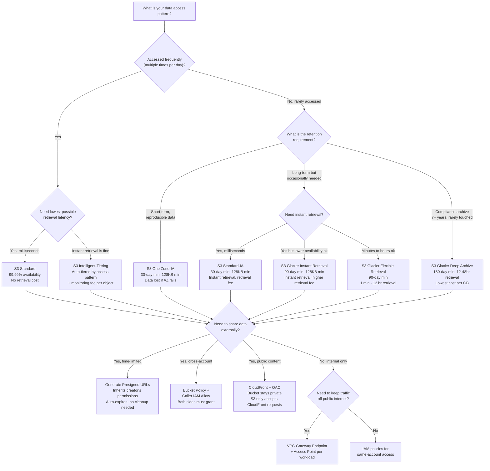

**Complexity**: `[MEDIUM]` | **Time to Complete**: 2.5h | **Prerequisites**: Module 1.1. This module assumes you already know object-level IAM basics and now focuses on secure storage design, lifecycle discipline, and controlled data sharing patterns.

## What You'll Be Able to Do

After completing this module, you will be able to configure secure access boundaries, automate lifecycle cost controls, and safely share objects using encryption-aware, time-bound mechanisms:

- **Configure S3 bucket policies, Block Public Access, and Object Ownership (ACLs disabled) to enforce least-privilege access on object storage**
- **Implement lifecycle policies to automate data tiering across S3 storage classes and reduce storage costs**
- **Deploy server-side encryption with KMS customer-managed keys and enforce encryption in transit**
- **Design presigned URL strategies and cross-account access patterns for secure, time-limited object sharing**

---

## Why This Module Matters

Hypothetical scenario: publicly accessible S3 buckets have repeatedly exposed sensitive data when administrators or applications granted overly broad access. In practice, a single misconfigured bucket policy or ACL can turn private data into an internet-readable exposure until someone detects and fixes it.

Amazon Simple Storage Service (S3) is the foundational storage layer of the cloud. It is infinitely scalable, [highly durable, and handles trillions of objects globally](https://aws.amazon.com/s3). Because it is so accessible and easy to use, it is the standard destination for application assets, database backups, massive data lakes, and static website hosting.

However, this accessibility is a double-edged sword. S3 sits squarely on the public internet by default (in terms of network routing, not permissions). A single misconfigured bucket policy can turn a private data repository into a public data breach instantly. In this module, you will learn the mechanics of object storage versus traditional file storage. You will master the security layers that protect S3 data, implement lifecycle rules to automate cost-saving archiving strategies, and learn how to generate secure, time-limited access mechanisms to share objects without exposing your buckets.

---

## Object Storage vs. File Storage

If you have used a traditional operating system or a network attached storage (NAS) drive, you are familiar with **File Storage**. It is organized as a hierarchical tree of nested directories and folders, so people think in terms of pathnames, parents, and subfolders. In that model, modifying a large file usually means changing only the affected blocks on disk instead of replacing the whole object.

S3 is **Object Storage**, and this is a bigger shift in how data is managed than many learners expect. It operates on a flat namespace where everything is an object stored under a key inside a bucket, not in nested folders. S3 scales horizontally by design because it avoids the directory locking and block-level write semantics that file systems carry.

*   **Flat Structure**: There are no real directories or folders in S3. Everything is stored in a massive, flat container called a **Bucket**.
*   **Keys and Objects**: Data is stored as an Object, consisting of the file data and its metadata. Every object is identified by a unique **Key** (the file path/name). When you see a path like `images/2023/photo.jpg` in S3, `images/2023/` is not a folder; the entire string `images/2023/photo.jpg` is just a long key name. The console visually simulates folders for your convenience.
*   **Immutability**: Objects in S3 are immutable. You cannot open a 10GB video file in S3, edit the metadata, and save just the changes. If you modify an object, S3 completely overwrites the existing object with the new version.

### Quick Comparison

| Feature | File Storage (EFS/NFS) | Block Storage (EBS) | Object Storage (S3) |
| :--- | :--- | :--- | :--- |
| **Structure** | Hierarchical (dirs/files) | Raw blocks on a disk | Flat namespace (keys) |
| **Access** | NFS/SMB protocol | Mounted to one EC2 | HTTP REST API |
| **Modify in place** | Yes | Yes | No (full overwrite) |
| **Max object size** | Limited by disk | Limited by volume | Up to 50 TB per object |
| **Metadata** | Basic (permissions, timestamps) | None (raw blocks) | Rich, custom key-value pairs |
| **Typical use** | Shared home dirs, CMS | Database volumes, OS disks | Backups, data lakes, static assets |
| **Durability** | Depends on config | 99.999% (within AZ) | 99.999999999% (11 nines) |

Think of it this way: EBS is a hard drive bolted to one server, EFS is a network file share everyone mounts, and S3 is a massive warehouse where you hand parcels to a clerk and get a receipt (the key) to retrieve them later.

---

## Durability, Availability & Data Protection

S3 is designed for 99.999999999% (eleven nines) of object durability over a given year, which translates to an expected loss of at most one object per ten billion objects stored annually. To put this figure in perspective, if you stored ten billion objects in S3, the design target means you would statistically expect to lose at most one of those objects across an entire year. This is not a service-level agreement with a refund clause attached; it is an architectural property that flows directly from how S3 stores data under the hood.

S3 achieves eleven nines by combining erasure coding with automated cross-AZ replication. When you upload an object, S3 breaks it into data shards and parity shards using erasure-coding algorithms, distributes those shards across multiple Availability Zones within the chosen region, and continuously monitors for bit rot, drive failures, and AZ-level degradation. If any shard becomes unavailable or corrupted, S3 reconstructs it from the surviving shards without any action on your part and without interrupting access to the object. This reconstruction happens transparently and automatically, which is why you never receive a notification that "S3 repaired your data" -- the system is designed to keep that entire process invisible to you.

Availability, by contrast, measures whether the service itself is reachable and able to serve requests. S3 Standard offers a 99.99% availability SLA, which is roughly 52 minutes of potential unavailability per year. This is why the eleven-nines durability figure and the four-nines availability figure address fundamentally different concerns: durability is about whether your data will still exist next year, and availability is about whether you can reach it at any particular moment. Production systems that depend on S3 for critical data should account for both dimensions independently when designing resilience strategies.

### Multipart Upload for Large Objects

When you need to upload a file larger than 100 MB to S3, using a single PUT operation becomes a reliability risk. A single network interruption during a 50 GB upload means starting the entire transfer over from the beginning, wasting bandwidth and time. S3 multipart upload solves this by splitting the object into parts (each between 5 MB and 5 GB, up to a maximum of 10,000 parts) and uploading each part independently. If any individual part fails to upload, only that part needs to be retried, not the entire object. Parts can even be uploaded in parallel across multiple threads, which dramatically accelerates transfer speeds for large datasets.

Multipart upload also enables a workflow that single PUT cannot: you can begin uploading an object before you have all the data. For example, a video encoding pipeline can start uploading the first segments of a rendered file while later segments are still being processed, and S3 will assemble the complete object only after all parts have been successfully uploaded. After all parts arrive, you issue a Complete Multipart Upload API call, and S3 reconstructs the full object from the individual parts. If you never issue that completion call -- perhaps because a long-running process crashed midway -- the partial upload fragments remain stored in S3 and continue to incur storage charges indefinitely. This is a common source of invisible cost creep. Every production bucket that accepts large uploads should include a lifecycle rule to abort incomplete multipart uploads after a set number of days, typically seven.

### S3 Object Lock: Write Once, Read Many

Some regulatory frameworks and security policies require genuinely immutable storage for a fixed period. S3 Object Lock provides this capability through two distinct modes that operate on individual object versions at the bucket level. Object Lock is only available on versioned buckets, so enabling versioning is a prerequisite. You can enable Object Lock at bucket creation or on an existing versioning-enabled bucket via the S3 API; objects already in the bucket are not retroactively locked — use S3 Batch Operations to apply retention to them.

Governance mode prevents most users from overwriting or deleting a locked object version, but it includes an escape hatch: users with the `s3:BypassGovernanceRetention` permission can delete the object when they also send the `x-amz-bypass-governance-retention: true` header. This makes governance mode suitable for internal audit trails, test data retention policies, and scenarios where an authorized administrator needs the ability to override the lock in an emergency. It provides protection against accidental or unauthorized deletion while preserving administrative control.

Compliance mode is stricter. Once a retention period is set in compliance mode, no user — including the root account holder and AWS support — can delete or overwrite the object until the retention period expires; that absolute immutability applies only in compliance mode, not governance mode. The retention period can be extended but never shortened, and the compliance mode itself cannot be removed from the object. This mode is designed for legal holds, regulatory archives, and scenarios governed by SEC Rule 17a-4 or similar financial services regulations that demand absolute immutability. Before enabling compliance mode on a bucket, you must carefully consider whether your organization can tolerate the inability to delete data even if a court order or policy change demands it, because the answer is a definitive no until the clock runs out.

Object Lock also supports Legal Hold, which is an on-off flag independent of any retention period. Placing a legal hold on an object version prevents deletion regardless of retention settings, and the hold remains in effect until someone with the `s3:PutObjectLegalHold` permission explicitly removes it. Hypothetical scenario: a company facing litigation discovers that relevant documents stored in S3 have retention policies expiring in two weeks. They apply legal holds to all implicated object versions, ensuring those objects cannot be deleted even after the automated lifecycle expiration rules would normally purge them, and they remove the holds only after the legal matter concludes.


## S3 Security: Layers of Defense

Because S3 buckets exist in a global namespace and are addressable via HTTP endpoints, securing them requires overlapping layers of authorization. A request can move from endpoint to data plane quickly, so permission checks have to be explicit, deterministic, and fail-safe. S3 evaluates each request using IAM policies, resource-based policies, and guardrails, and it combines all of those checks before granting access. If any layer denies the request, it is blocked immediately and no object data is returned.

Here is how the full access evaluation flow works when a request hits S3, and keep this order in mind for troubleshooting: first, Block Public Access is checked, then bucket policy deny/allow decisions are evaluated, and finally IAM must still allow the operation.



BPA has four independent settings and is controlled by these practical guardrails:
- Explicit DENY always wins, anywhere in the chain
- [Cross-account: BOTH bucket policy AND caller IAM must Allow](https://docs.aws.amazon.com/AmazonS3/latest/userguide/how-s3-evaluates-access-control.html)
- Same account: Either bucket policy OR IAM Allow is sufficient
- BPA is the master override for public access attempts

### 1. S3 Block Public Access (BPA)

This is your master switch. BPA operates at the account or bucket level to override any policy that attempts to make data public. [If BPA is turned on (and it is by default for all new buckets), even if an administrator writes a bucket policy explicitly granting `s3:GetObject` to `*` (everyone), S3 will block the request.](https://docs.aws.amazon.com/AmazonS3/latest/userguide/access-control-block-public-access.html) In secure architectures, BPA is usually enabled at the account level first so one careless bucket cannot become the weak link, and each exception should be short-lived, auditable, and explicitly rolled back once the business need ends. To enforce this, use all four settings together: `BlockPublicAcls`, `IgnorePublicAcls`, `BlockPublicPolicy`, and `RestrictPublicBuckets`.

| Setting | What It Blocks |
| :--- | :--- |
| `BlockPublicAcls` | Rejects PUT requests that include a public ACL |
| `IgnorePublicAcls` | Ignores any existing public ACLs on the bucket/objects |
| `BlockPublicPolicy` | Rejects bucket policies that grant public access |
| `RestrictPublicBuckets` | Restricts access to buckets with public policies to only AWS services and authorized users |

Best practice: enable all four at the **account** level so no bucket in the entire account can ever go public accidentally.

```bash
# Enable BPA at the ACCOUNT level (recommended)
aws s3control put-public-access-block \
    --account-id $(aws sts get-caller-identity --query Account --output text) \
    --public-access-block-configuration \
    "BlockPublicAcls=true,IgnorePublicAcls=true,BlockPublicPolicy=true,RestrictPublicBuckets=true"
```

**Pause and predict:** an S3 bucket has Block Public Access enabled at the account level, but an engineer writes a Bucket Policy granting `s3:GetObject` to `*` (everyone). When an anonymous user attempts to download an object from that bucket, which rule wins, and why?

<details>
<summary>Check your prediction</summary>

Account-level Block Public Access wins, and the request is denied with HTTP 403 Forbidden. Block Public Access acts as a centralized security guardrail across the entire AWS account. When `BlockPublicPolicy` or `RestrictPublicBuckets` is enabled, AWS S3 evaluates the public access block before evaluating bucket policies, effectively overriding any permissive wildcards granting public access.

</details>

### 2. IAM Policies

As covered in Module 1.1, IAM policies are attached to the *identity* making the request (a User or a Role), so they encode "who can do what" at the identity layer. If an EC2 instance has an IAM Role that allows `s3:PutObject` to a specific bucket, the instance can upload files as that role. In practice, this means security reviews should trace every S3 action in terms of role trust and permission boundaries first, then verify resource-level constraints second. For example, this policy allows a role to read only from one specific prefix, and it shows why both bucket ARN and object ARN permissions are usually necessary for correct access design.

```json
{
    "Version": "2012-10-17",
    "Statement": [
        {
            "Effect": "Allow",
            "Action": [
                "s3:GetObject",
                "s3:ListBucket"
            ],
            "Resource": [
                "arn:aws:s3:::my-data-bucket",
                "arn:aws:s3:::my-data-bucket/reports/*"
            ],
            "Condition": {
                "StringEquals": {
                    "s3:prefix": "reports/"
                }
            }
        }
    ]
}
```

Notice the two ARN entries: one for the bucket itself (needed for `ListBucket`) and one for the objects inside it (needed for `GetObject`). Forgetting the bucket-level ARN is one of the most common IAM debugging headaches.

### 3. Bucket Policies

A Bucket Policy is attached directly to the *resource* (the bucket itself), and it acts like a bouncer at the door of the bucket. In practice, bucket policies are often the best place to enforce cross-account constraints, because they define permissions for whoever is trying to reach that specific bucket. They can also enforce conditional rules, such as requiring server-side encryption for all writes or limiting requests to a corporate network. For example, bucket policies are essential for allowing users from *other* AWS accounts to access your bucket, and a common pattern is to deny unencrypted uploads unless the request explicitly includes the required encryption header.

```json
{
    "Version": "2012-10-17",
    "Statement": [
        {
            "Sid": "DenyUnencryptedUploads",
            "Effect": "Deny",
            "Principal": "*",
            "Action": "s3:PutObject",
            "Resource": "arn:aws:s3:::my-secure-bucket/*",
            "Condition": {
                "StringNotEquals": {
                    "s3:x-amz-server-side-encryption": "aws:kms"
                }
            }
        }
    ]
}
```

### 4. Access Control Lists (ACLs)

ACLs are a legacy access control mechanism from before IAM existed. They apply to individual objects or the bucket, which made sense in early S3 patterns but now creates duplicated policy surfaces. [AWS strongly recommends disabling ACLs entirely (setting the bucket to "Bucket Owner Enforced")](https://docs.aws.amazon.com/AmazonS3/latest/userguide/about-object-ownership.html) and relying exclusively on IAM and Bucket Policies, which gives cleaner auditability and easier incident response.

### Bucket Policy vs. ACL vs. IAM — When to Use What

| Aspect | IAM Policy | Bucket Policy | ACL |
| :--- | :--- | :--- | :--- |
| **Attached to** | Identity (user/role) | Resource (bucket) | Bucket or object |
| **Cross-account** | Only the caller side | Can grant to external principals | Can grant to other accounts |
| **Max size** | 6,144 chars (inline) | 20 KB | Fixed grantee list |
| **Granularity** | Any AWS action | S3 actions only | Read/Write/Full Control only |
| **Conditional logic** | Full Condition block | Full Condition block | None |
| **AWS recommendation** | Primary mechanism | Use for cross-account + resource constraints | **Disable (legacy)** |
| **When to use** | Controlling what *your* users can do | Controlling who can access *your* bucket | Almost never—only for S3 access logs |

**Rule of thumb**: Use IAM policies for same-account access control. Use bucket policies for cross-account access, IP restrictions, and encryption enforcement. Disable ACLs.

---

## S3 Access Points & VPC Endpoints

As organizations scale beyond a handful of buckets, managing access policies for dozens or hundreds of applications across multiple teams becomes operationally painful. Each application needs a distinct set of permissions, often with different network constraints, and cramming all of those rules into a single bucket policy turns access management into a fragile, hard-to-audit monolith. S3 Access Points solve this problem by giving you named network endpoints, each with its own dedicated access policy, that all route to the same underlying bucket.

An S3 Access Point is a hostname like `my-access-point-<account-id>.s3-accesspoint.<region>.amazonaws.com` that you create and attach to a bucket. You then write an IAM-style resource policy on the access point itself, and any request that arrives through that access point is evaluated against the access point's policy in addition to the underlying bucket policy. This lets you create separate access points for separate workloads -- one for your analytics pipeline with read-only access to the `analytics/` prefix, another for your content management system with read-write access to `uploads/` -- without polluting the bucket policy or creating duplicate buckets. Each access point can also enforce its own Block Public Access settings, its own VPC restrictions, and its own encryption requirements, all independently of other access points on the same bucket.

For network-level security, an S3 VPC Gateway Endpoint allows EC2 instances and other resources inside a VPC to reach S3 without routing traffic over the public internet. Instead, the gateway endpoint creates a private path through the AWS network fabric, so data moving between your VPC and S3 never traverses the open internet and never requires a NAT gateway or internet gateway. This is especially valuable for workloads that process sensitive data: your EC2 instance can upload log archives or retrieve database backups without its traffic ever leaving the AWS network. The VPC module covers gateway endpoints in depth, but the S3-specific takeaway is that you attach an endpoint policy to the gateway endpoint to control which buckets and actions are permitted through that VPC's private path. Combining VPC endpoints with access points gives you layered access control: the network layer ensures traffic stays off the public internet, the access point policy scopes permissions to a specific workload, and the bucket policy enforces organization-wide guardrails like encryption requirements.


## Pre-Signed URLs: Secure Temporary Access

Imagine you are building a photo-sharing application where users upload private photos and the app displays them. The bad approach is to route each image through your web server, because every request then downloads from S3 and re-sends bytes to the client, which consumes network and memory exactly where you usually need headroom. The insecure approach is to make the bucket public so the browser can fetch directly from S3, but that moves security away from IAM and into a permanent public URL surface. The safer and scalable pattern is the S3 way: generate pre-signed URLs.

Your backend application (which has an IAM Role with access to S3) uses the AWS SDK to generate a temporary, cryptographically signed URL. That URL grants access to a *single object* for a *specific period* (for example, 5 minutes), so you get controlled sharing without changing bucket policy state. The backend sends this URL to the frontend, and the user's browser downloads the object directly from S3. Once the expiry time passes, the URL becomes invalid without further cleanup work.

### Generating Pre-Signed URLs

```bash
# Generate a pre-signed GET URL valid for 300 seconds (5 minutes)
# aws s3 presign supports GET (download) URLs only — not PUT uploads
aws s3 presign s3://my-bucket/private/report.pdf --expires-in 300

# Output (example):
# https://my-bucket.s3.amazonaws.com/private/report.pdf?X-Amz-Algorithm=AWS4-HMAC-SHA256&X-Amz-Credential=...&X-Amz-Expires=300&X-Amz-Signature=abc123...
```

For **upload** URLs, use the AWS SDK (the CLI `presign` command cannot sign PUT requests):

```python
# boto3: pre-signed PUT for a browser or mobile client upload
import boto3
s3 = boto3.client("s3")
upload_url = s3.generate_presigned_url(
    "put_object",
    Params={"Bucket": "my-bucket", "Key": "uploads/user-photo.jpg"},
    ExpiresIn=3600,
)
# Anyone with upload_url can PUT to that exact key for one hour
# For HTML form uploads, use generate_presigned_post() instead
```

Pre-signed URLs allow applications to delegate time-bound access to third parties without distributing long-lived AWS security credentials. Managing these URLs requires understanding how expiration parameters interact with the underlying identity that signed the request.

- [Pre-signed URLs authenticate requests against AWS using cryptographic signature parameters derived from the creator's credentials.](https://docs.aws.amazon.com/AmazonS3/latest/userguide/using-presigned-url.html)
- Maximum expiration can be configured up to seven days when generated with the AWS CLI or SDKs using long-term IAM user credentials, whereas URLs signed with temporary STS credentials expire when those session credentials expire.
- The AWS CLI `aws s3 presign` command generates GET URLs only; use the SDK (`generate_presigned_url` or `generate_presigned_post`) for PUT uploads.

**Pause and predict:** you generate a pre-signed URL configured with a 7-day expiration using your long-term IAM user credentials. Two days later, an administrator deletes that IAM user from the account. When a client attempts to download the object using the pre-signed URL on day 3, what happens, and why?

<details>
<summary>Check your prediction</summary>

The request fails with an HTTP 403 Forbidden error. A pre-signed URL does not contain an independent authorization grant or snapshot of rights; instead, S3 evaluates the signing identity's active permissions in real time at the moment of request arrival. Because the IAM user was deleted, AWS cannot authenticate or authorize the signature, rendering the URL immediately invalid regardless of the remaining expiration window.

</details>

---

## Storage Classes and Lifecycle Rules

S3 offers different storage classes designed for different data access patterns, and that distinction directly drives monthly spend. If you pay the same rate for frequently and infrequently used objects, you are buying latency and availability characteristics you may not need. In practice, cost optimization starts with classifying data by access patterns and retention expectations, then automating movement across tiers so humans do not manage it one object at a time.

Why pay premium rates for data you rarely access? A hot tier for cold data usually means unnecessary cost, so the key decision is always first to classify access patterns and set a lifecycle strategy before choosing the default class.

### Storage Class Comparison

| Storage Class | Availability | Min Storage Duration | Min Object Size | Retrieval Time | Storage Cost (us-east-1) | Retrieval Cost | Best For |
| :--- | :--- | :--- | :--- | :--- | :--- | :--- | :--- |
| **S3 Standard** | 99.99% | None | None | Instant | ~$0.023/GB/mo | None | Active data, websites |
| **S3 Intelligent-Tiering** | 99.9% | None | None | Instant* | ~$0.023/GB/mo + monitoring fee | None | Unknown access patterns |
| **S3 Standard-IA** | 99.9% | 30 days | 128 KB | Instant | ~$0.0125/GB/mo | $0.01/GB | Backups, DR copies |
| **S3 One Zone-IA** | 99.5% | 30 days | 128 KB | Instant | ~$0.01/GB/mo | $0.01/GB | Reproducible infrequent data |
| **S3 Glacier Instant** | 99.9% | 90 days | 128 KB | Instant | ~$0.004/GB/mo | $0.03/GB | Archive with instant access |
| **S3 Glacier Flexible** | 99.99% (after restore) | 90 days | None | 1-5 min to 12 hrs | ~$0.0036/GB/mo | $0.01-0.03/GB | Long-term archives |
| **S3 Glacier Deep Archive** | 99.99% (after restore) | 180 days | None | 12-48 hours | ~$0.00099/GB/mo | $0.02/GB | Compliance, 7-10yr retention |

The table above uses illustrative pricing values only; always check the [AWS S3 Pricing page](https://aws.amazon.com/s3/pricing/) because rates are region-specific and can move over time.

**S3 Intelligent-Tiering** deserves special attention. It automatically moves objects between an infrequent-access tier and a frequent-access tier based on usage patterns. [It charges a small monthly monitoring fee per object (~$0.0025 per 1,000 objects) but can save significantly on large datasets with unpredictable access patterns. There is no retrieval fee.](https://aws.amazon.com/pricing/s3/)

**Pause and predict:** if you configure S3 Intelligent-Tiering for a dataset consisting of only 50 objects that clients access constantly every single day, will your overall AWS bill decrease compared to keeping them in S3 Standard?

<details>
<summary>Check your prediction</summary>

No, you will pay more with Intelligent-Tiering. Intelligent-Tiering charges the exact same base storage rate as S3 Standard for objects residing in its Frequent Access tier. Because your 50 objects are accessed constantly, they never qualify for transition into the Infrequent or Archive tiers. In addition to standard storage pricing, AWS levies a per-object monthly monitoring and automation charge (~$0.0025 per 1,000 objects), resulting in a higher total bill with zero offsetting storage discounts.

</details>

### Cost Example

Suppose you store 10 TB of application logs. The right strategy is usually not a single class choice, but a staged policy: keep fresh data in Standard for quick access, transition to IA as it cools, and move to archival tiers based on both retention and recovery time objectives.

| Strategy | Monthly Cost (approx) |
| :--- | :--- |
| All in S3 Standard | See current AWS pricing for an exact monthly total |
| All in S3 Standard-IA | See current AWS pricing for an exact monthly total |
| All in Glacier Deep Archive | See current AWS pricing for an exact monthly total |
| Smart tiering with lifecycle (30/90/365 day transitions) | Depends heavily on object size, access, and request patterns |

Lifecycle rules can materially reduce storage costs when access patterns and retention windows fit colder tiers.

### Lifecycle Rules

You don't want to manually move data between these tiers because operational drift and forgotten objects are common at scale, so S3 **Lifecycle Rules** automate the process. A typical transition policy can be written as:
1. When log files are created, store them in **S3 Standard**.
2. After 30 days, transition them to **S3 Standard-IA**.
3. After 90 days, transition them to **S3 Glacier Flexible Retrieval**.
4. After 365 days, permanently **Delete** the objects.

This staged automation drastically reduces storage costs for historical data while preserving operational access for the most recent retention period.

```bash
# View existing lifecycle rules on a bucket
aws s3api get-bucket-lifecycle-configuration --bucket my-bucket

# Delete all lifecycle rules (careful!)
aws s3api delete-bucket-lifecycle --bucket my-bucket
```

### Lifecycle Rule Constraints

There are ordering rules you must follow when transitioning between storage classes. [S3 enforces a "waterfall" — you can only transition downward](https://docs.aws.amazon.com/AmazonS3/latest/userguide/lifecycle-transition-general-considerations.html):



You cannot transition from Glacier back to Standard-IA via a lifecycle rule. To move data "upward," you must restore and copy it manually.

**Pause and predict:** consider the 128 KB minimum billable object size for S3 Standard-IA. If you configure a lifecycle policy to transition 10 million small 5 KB log files from Standard to Standard-IA, how will your overall monthly storage invoice change?

<details>
<summary>Check your prediction</summary>

Your monthly storage bill will increase substantially rather than decrease. Although the per-gigabyte storage rate of Standard-IA is roughly half that of S3 Standard, S3 bills every object transitioned to Standard-IA as if it were at least 128 KB. Storing 10 million 5 KB objects requires only 50 GB of physical space in S3 Standard (~$1.15/month), but Standard-IA charges you for 1.28 TB (128 KB × 10 million) of capacity (~$16.00/month), plus lifecycle transition request fees ($10.00 for 10 million PUT/lifecycle requests).

</details>

---

## S3 Replication: CRR and SRR

S3 replication automatically and asynchronously copies objects from a source bucket to a destination bucket, and it operates at the object level with configurable rules for which objects to replicate. There are two primary replication modes, and choosing between them is not about whether replication works but about what operational problem you are solving with the replica.

Cross-Region Replication (CRR) copies objects to a bucket in a different AWS region. The canonical use case is disaster recovery: if a regional outage makes your primary bucket unreachable, your application can fail over to the replica in another region and continue serving data. CRR is also used for compliance requirements that mandate geographic separation of data copies, and for latency reduction when a globally distributed user base needs to read from a closer region. CRR incurs inter-region data transfer costs on every replicated object, so the cost of maintaining a DR replica scales linearly with your write volume. You should calculate whether the business cost of regional unavailability exceeds the inter-region transfer cost before committing to CRR for an entire bucket; for many workloads, replicating only critical prefixes rather than the entire bucket strikes a workable balance between resilience and expense.

Same-Region Replication (SRR) copies objects to a bucket in the same region, which eliminates the inter-region transfer cost that makes CRR expensive. SRR is used when you need a separate copy of data within the same region for operational reasons: feeding a separate analytics pipeline that runs against a read-only copy without impacting production performance, maintaining a separate bucket for a different AWS account that owns its own lifecycle and encryption policies, or creating a staging replica that mirrors production data for testing. Because SRR stays within the region, it is significantly cheaper than CRR and is often the right first choice when you need a data copy but do not require geographic separation.

Replication rules are defined per-bucket and can target all objects or a subset filtered by prefix or object tags. You can also configure whether delete markers are replicated to the destination bucket -- by default they are not, which means deleting an object in the source does not delete the replica. This is intentional: if the whole point of replication is to maintain a resilient copy, replicating accidental deletions would defeat that purpose. S3 also offers Replication Time Control (RTC), a feature that provides a predictable replication latency SLA of 15 minutes for 99.99% of objects. RTC is useful when your failover workflow depends on the replica being no more than a few minutes behind the source, but it adds a per-object replication fee.

One important operational detail: replication requires versioning to be enabled on both the source and destination buckets. This is a hard prerequisite, not an optional recommendation. S3 tracks which objects need to be replicated using version IDs, and without versioning there is no reliable way to determine what has changed since the last replication scan. If you are planning to enable replication on an existing bucket, enable versioning first, verify that it is active, and only then configure the replication rules. Attempting to enable replication on a non-versioned bucket will fail at the API level with a clear error, not with silent data loss -- but detecting that failure in a Terraform plan or CloudFormation stack update and understanding why it occurred saves troubleshooting time during deployment.


## Essential S3 CLI Commands

The AWS CLI provides two command families for S3, and choosing between them is mostly about control versus convenience: `aws s3` is optimized for day-to-day workflows and operational simplicity, while `aws s3api` gives explicit low-level control for policy, lifecycle, and encryption operations.

- **`aws s3`** — High-level commands (cp, sync, ls, mv, rm). These handle multipart uploads, retries, and parallelism automatically.
- **`aws s3api`** — Low-level API calls (put-object, get-object, put-bucket-policy). Full control, JSON input/output.

### Copying Files

```bash
# Upload a single file
aws s3 cp backup.tar.gz s3://my-bucket/backups/backup.tar.gz

# Download a file
aws s3 cp s3://my-bucket/backups/backup.tar.gz ./backup.tar.gz

# Copy between buckets
aws s3 cp s3://source-bucket/data.csv s3://dest-bucket/archive/data.csv

# Upload with a specific storage class
aws s3 cp large-archive.tar.gz s3://my-bucket/archives/ \
    --storage-class GLACIER

# Upload with server-side encryption (KMS)
aws s3 cp secret-report.pdf s3://my-bucket/confidential/ \
    --sse aws:kms \
    --sse-kms-key-id alias/my-key

# Copy an entire directory (recursive)
aws s3 cp ./logs/ s3://my-bucket/logs/ --recursive

# Copy with a filter — only .log files
aws s3 cp ./logs/ s3://my-bucket/logs/ --recursive \
    --exclude "*" --include "*.log"
```

### Syncing Directories

`aws s3 sync` is the workhorse for backups. It only copies files that are new or modified (based on size and timestamp), similar to `rsync`.

```bash
# Sync a local directory to S3
aws s3 sync ./website/ s3://my-website-bucket/

# Sync from S3 to local
aws s3 sync s3://my-bucket/data/ ./local-data/

# Sync and DELETE files in the destination that don't exist in source
# (makes destination an exact mirror — use with caution!)
aws s3 sync ./website/ s3://my-website-bucket/ --delete

# Dry run — see what WOULD happen without actually doing it
aws s3 sync ./website/ s3://my-website-bucket/ --dryrun

# Sync only certain file types
aws s3 sync ./assets/ s3://my-bucket/assets/ \
    --exclude "*" --include "*.jpg" --include "*.png"
```

### Listing and Inspecting

```bash
# List all buckets in the account
aws s3 ls

# List objects in a bucket (top-level "folders")
aws s3 ls s3://my-bucket/

# List objects recursively with sizes
aws s3 ls s3://my-bucket/ --recursive --human-readable --summarize

# Get detailed metadata for a specific object
aws s3api head-object --bucket my-bucket --key reports/q4-summary.pdf
```

### Managing Buckets

```bash
# Create a bucket
aws s3 mb s3://my-new-bucket --region us-west-2

# Remove an EMPTY bucket
aws s3 rb s3://my-empty-bucket

# Remove a bucket AND all its contents (destructive!)
aws s3 rb s3://my-bucket --force

# Enable versioning
aws s3api put-bucket-versioning \
    --bucket my-bucket \
    --versioning-configuration Status=Enabled

# Check versioning status
aws s3api get-bucket-versioning --bucket my-bucket

# Enable default encryption (SSE-S3)
aws s3api put-bucket-encryption \
    --bucket my-bucket \
    --server-side-encryption-configuration '{
        "Rules": [{"ApplyServerSideEncryptionByDefault": {"SSEAlgorithm": "AES256"}}]
    }'
```

### Restoring from Glacier

Objects in Glacier classes are not immediately downloadable, which is why every archival retrieval plan should include restore operations and expected latency. You must initiate a restore first, and only after restore completion will the object be available for download.

```bash
# Initiate a restore (Expedited = 1-5 min, Standard = 3-5 hrs, Bulk = 5-12 hrs)
aws s3api restore-object \
    --bucket my-archive-bucket \
    --key old-logs/app-2023.tar.gz \
    --restore-request '{"Days": 7, "GlacierJobParameters": {"Tier": "Standard"}}'

# Check restore status
aws s3api head-object \
    --bucket my-archive-bucket \
    --key old-logs/app-2023.tar.gz

# The "Restore" header will show:
#   ongoing-request="true"   → still restoring
#   ongoing-request="false", expiry-date="..."  → ready to download
```

---

## S3 Encryption

S3 offers multiple encryption options. Since January 2023, **[all new objects are encrypted by default](https://docs.aws.amazon.com/AmazonS3/latest/userguide/default-encryption-faq.html)** with SSE-S3 (AES-256), even if you do not specify encryption settings.

| Encryption Type | Key Managed By | When to Use |
| :--- | :--- | :--- |
| **SSE-S3** (AES-256) | AWS (fully managed) | Default, simplest option |
| **SSE-KMS** | AWS KMS (you control key policies) | Audit trail, key rotation, cross-account |
| **SSE-C** | You (provide key in every request) | Regulatory requirement to hold keys |
| **Client-side** | You (encrypt before upload) | Zero-trust, end-to-end encryption |

**SSE-KMS** is a common enterprise choice because it integrates with AWS KMS and CloudTrail for auditability, and customer-managed KMS keys can use optional automatic rotation.

---

## S3 Versioning Deep Dive

When versioning is enabled, every overwrite or delete creates a new version rather than destroying data; this behavior is deliberate because versioning is designed to support recovery and auditability. In practice, once you understand that version history exists for every mutation, recoverability becomes a normal operational assumption instead of a manual backup shortcut.



A standard GET returns 404 (delete marker).
GET with `?versionId=abc789` returns the Final draft.
DELETE the delete marker → restores abc789 as current.

Important versioning behaviors to remember:
- [Versioning cannot be disabled once enabled. You can only **suspend** it](https://docs.aws.amazon.com/AmazonS3/latest/userguide/Versioning.html) (new objects get a null version ID, but existing versions remain).
- Suspended versioning still preserves previously created versions — it does not delete them.
- You pay for **every** stored version, so frequent overwrites can multiply storage costs quickly.
- MFA Delete can require multi-factor authentication to delete versions or change versioning state.

**Pause and predict:** you manage a bucket containing 1 million objects and enable S3 versioning, but your workload never overwrites or deletes any existing object keys. How does turning on versioning affect your monthly storage bill?

<details>
<summary>Check your prediction</summary>

Your storage bill stays exactly the same. Versioning does not add extra base fees or overhead merely for being enabled on a bucket. Cost increases occur only when objects are overwritten (creating new noncurrent versions that consume additional gigabytes) or deleted (creating delete markers while retaining previous versions). If your workload performs only initial uploads without overwrites or deletions, exactly one version exists per object, incurring no additional storage charges.

</details>

---

## Cost Lens: What Drives Your S3 Bill

Understanding S3 pricing requires thinking about three independent cost dimensions simultaneously: storage volume, request volume, and data transfer. Most engineers focus only on the storage dimension because dollars-per-gigabyte is the number printed most prominently on the pricing page, but in practice, request and transfer costs frequently dominate the bill in ways that catch teams off guard.

Storage cost is the most intuitive dimension: you pay for the gigabytes you store each month, and the per-GB rate varies dramatically by storage class. S3 Standard is the most expensive per gigabyte because it provides the lowest latency and highest availability. As you move down the tiering ladder through Standard-IA, One Zone-IA, Glacier Instant Retrieval, Glacier Flexible Retrieval, and finally Glacier Deep Archive, the per-GB storage cost drops by roughly an order of magnitude at each major step. A terabyte in Glacier Deep Archive costs roughly one-twentieth of what the same terabyte costs in S3 Standard, which is why lifecycle policies that move cold data to archival tiers produce such dramatic cost savings.

Request costs are the dimension that most often catches teams by surprise. Every PUT, COPY, POST, or LIST request to S3 incurs a charge, typically fractions of a cent per thousand requests. For a bucket storing a few hundred large database backups, request costs are negligible. For a bucket storing billions of small JSON files produced by a microservice logging pipeline, request costs can exceed storage costs by a wide margin. Each individual object write or read is a billable request, so an architecture that generates one million tiny objects per day will generate one million PUT requests daily, plus potentially millions more GET and LIST requests from downstream consumers. The cost optimization move here is not to switch storage classes but to batch writes: aggregate many small records into fewer larger objects before uploading, and use S3 Select or Athena to query within those objects at read time rather than fetching thousands of individual files.

Data transfer costs apply whenever data leaves an AWS region. Transferring data from S3 to the public internet is charged at a per-GB rate that starts around nine cents per gigabyte and decreases at higher volume tiers. Transferring data between S3 and other AWS services in the same region -- for example, an EC2 instance reading from S3 in us-west-2 -- is generally free. Transferring data to CloudFront is also free for the S3-to-CloudFront leg, though CloudFront itself charges for egress. Cross-region replication is a significant transfer cost driver because every object written to the source bucket is transferred across regions to the destination bucket, paying the inter-region transfer rate every time. If you replicate a terabyte of new data per month from us-east-1 to eu-west-1, you will pay for a terabyte of inter-region data transfer each month, which can easily exceed the storage cost of the data itself.

Incomplete multipart uploads are a stealth cost that accumulates silently. When an upload process starts a multipart upload but never completes it -- because the uploading process crashed, the network dropped, or a timeout fired -- the uploaded parts remain stored in S3 and continue to incur storage charges at the S3 Standard rate. There is no automatic cleanup, and these fragments are invisible in the S3 console because they are not complete objects. Over months of operation, a bucket that receives many large uploads from unreliable clients can accumulate significant hidden storage cost from abandoned parts. The fix is a one-line lifecycle rule that aborts incomplete multipart uploads after a set number of days, which costs nothing to configure and immediately stops the accumulation.

Finally, versioning multiplies storage costs for buckets that receive frequent overwrites. Every new version of an object is a full copy stored at the full per-GB rate. If you have a 100 MB dataset that gets updated hourly and you keep every version forever, you will add 2.4 GB of storage per day -- or roughly 876 GB per year -- for what is effectively 100 MB of current data. Lifecycle rules that expire noncurrent versions after a reasonable retention window solve this directly, but only if someone remembers to configure them before the version history accumulates into a six-figure surprise on the monthly bill.

---

## Patterns & Anti-Patterns

The patterns below represent proven, repeatable designs that experienced S3 operators reach for when solving common storage problems. Each pattern includes a clear signal for when to apply it and a scaling consideration that becomes relevant as data volume grows. The anti-patterns are failure modes observed across real-world S3 deployments, and each one includes the root cause that makes it appealing in the moment plus the better alternative.

### Patterns

**Lifecycle tiering to Glacier for cost-optimized archival.** When you have data that follows a predictable cooling curve -- accessed frequently for the first few weeks, occasionally for a few months, and rarely after that -- configure lifecycle rules that transition objects from Standard to Standard-IA to Glacier tiers at fixed age thresholds. This pattern works because it automates the cost-versus-access tradeoff: the data is available instantly while it is hot, slightly slower while warm, and cheap while cold. The scaling consideration is the minimum storage duration charge on IA and Glacier classes: objects deleted before the minimum duration are billed for the full minimum period, so lifecycle policies must not transition objects that will be deleted shortly afterward. For example, if you transition an object to Glacier Deep Archive and delete it three days later, you are still billed for 180 days of Deep Archive storage for that object, completely negating the cost benefit of the archival tier.

**Cross-Region Replication for disaster recovery.** When a regional outage would cause unacceptable business impact, configure CRR to maintain a read-only replica of critical data in a separate region. During normal operation, the replica sits idle and accumulates replication costs. During a regional outage, your failover procedure points your application at the replica bucket and resumes serving data. The scaling consideration is replication lag: S3 replication is asynchronous, so the replica may be several seconds to several minutes behind the source depending on object size and write rate. Your failover runbook must account for the possibility that the most recently written objects have not yet arrived at the destination, and your application should handle partial-data windows gracefully.

**S3 Object Lock for compliance and ransomware protection.** When regulatory requirements demand immutable storage or when you need a defense against ransomware that attempts to encrypt or delete your data, enable Object Lock on a versioned bucket (at creation or on an existing bucket via the API) and apply retention periods in governance or compliance mode. In **compliance** mode, locked versions cannot be deleted or overwritten even by the root user until retention expires; governance mode allows authorized bypass with `s3:BypassGovernanceRetention` and `x-amz-bypass-governance-retention: true`. The scaling consideration is storage cost: locked objects cannot be deleted until their retention period expires, so a bucket with Object Lock enabled will grow monotonically during the retention window. Before enabling Object Lock, model the monthly storage growth rate against the retention period to confirm the ongoing cost is sustainable.

**Presigned URLs for time-limited object sharing.** When you need to grant temporary access to a specific object without changing bucket permissions, generate a presigned URL from a trusted backend service and hand it to the consumer. The consumer accesses the object directly from S3 without your backend acting as a proxy, and the URL expires automatically. This pattern is the secure alternative to making buckets public or routing all traffic through an application server. The scaling consideration is credential lifetime: presigned URLs created with temporary credentials from an IAM role expire when the underlying credentials expire, which may be shorter than the URL's own expiration parameter. For long-lived sharing periods, use IAM user credentials to generate the presigned URL or implement a refresh mechanism.

**Static sites with CloudFront OAC.** When you need to serve a static website or single-page application, store assets in S3 with Block Public Access enabled, use the S3 REST endpoint (`bucket.s3.<region>.amazonaws.com`) as the CloudFront origin, and attach Origin Access Control (OAC) so only your distribution can read objects. Do not enable S3 static website hosting for this pattern — OAC is designed for the REST API endpoint, not the website endpoint. CloudFront provides edge caching, HTTPS termination, and custom domain support without provisioning compute. The scaling consideration is cache invalidation: when you update assets in S3, CloudFront edge caches may continue serving stale content until the TTL expires or you issue an invalidation. For production deployments, use content-hashed filenames so each deploy naturally bypasses the cache without manual invalidation.

### Anti-Patterns

**Making buckets public instead of designing proper access controls.** The root cause is almost always time pressure: an application is returning 403 errors in production, the team does not understand why IAM or bucket policies are blocking access, and turning off Block Public Access and adding a `Principal: "*"` policy makes the errors go away immediately. The problem is that a public bucket exposes every object in that bucket to anyone on the internet who knows or guesses the bucket name, potentially including objects that were not intended to be public. The data breach that follows is usually discovered by a third party, not by the team that made the bucket public. The better approach is to trace the 403 error to its root cause -- typically a missing IAM permission, a missing bucket policy statement, or an overly restrictive condition -- and fix the specific authorization failure rather than removing all authorization.

**Using ACLs for access control.** ACLs predate IAM and bucket policies, and they operate at the individual object level with only three permission levels (READ, WRITE, FULL_CONTROL). AWS has made Object Ownership set to Bucket Owner Enforced the default for new buckets since 2023, which disables ACLs entirely. Teams that still use ACLs typically inherited them from older deployments and are reluctant to migrate because the access patterns work. The problem is that ACLs create a second, parallel permission surface that security reviews must audit separately, and they lack the conditional logic and fine-grained action control that IAM and bucket policies provide. The better approach is to disable ACLs, audit the permissions they were providing, and reimplement those permissions in bucket policies or IAM policies where they can be centrally reviewed and tested.

**No lifecycle rules on versioned buckets with frequent writes.** The root cause is that enabling versioning feels like a one-time safety-net configuration, not an ongoing cost driver. A team enables versioning to protect against accidental deletions, writes data to the bucket for months, and only notices the cost problem when the monthly bill arrives and storage spend has multiplied. The problem is that every version is a full copy stored at full price, and without lifecycle rules to expire noncurrent versions, the storage volume grows without bound. The better approach is to configure a noncurrent version expiration rule at the same time you enable versioning, with a retention period that matches your recovery point objective. If you need to recover a version from 90 days ago, expire noncurrent versions after 90 days.

**Storing millions of tiny objects without accounting for request costs.** The root cause is treating S3 like a filesystem where individual file overhead is free. When a data pipeline writes one small JSON object per event, the storage cost for the raw bytes is trivial, but the PUT request cost for millions of individual uploads can exceed the storage cost by an order of magnitude. The problem compounds if downstream consumers issue individual GET requests for each object rather than using S3 Select or Athena to query across objects. The better approach is to batch small records into larger objects -- for example, aggregating one minute of log events into a single Parquet or JSON Lines file -- and query within those objects at read time. This converts millions of tiny request-charge events into a manageable number of larger operations with minimal request overhead.

**No versioning on buckets containing irreplaceable data.** The root cause is usually a misunderstanding of what versioning protects against. A team reasons that they have backups, that their application never deletes data, or that only trusted administrators have write access, so versioning is unnecessary overhead. The problem is that versioning protects against classes of data loss that backups do not: an application bug that issues a destructive update against the wrong key, a misconfigured automation script that deletes objects matching a pattern, or a malicious insider with valid credentials who attempts to cover their tracks. Backups protect against infrastructure failure; versioning protects against logical corruption and human error. The better approach is to enable versioning on any bucket containing data that cannot be regenerated from upstream sources, and pair it with MFA Delete if the data is genuinely irreplaceable.

**Using S3 as a transactional database.** The root cause is that S3 has an API, stores data durably, and is easier to set up than a managed database, so teams reach for it as a general-purpose data store for workloads that involve frequent reads and writes against individual records. The problem is that S3 is an object store, not a database: it does not support atomic transactions across multiple objects, it does not provide row-level locking, and its consistency model for list operations means that concurrent modifications to the same object key can produce unpredictable results. The better approach is to use a purpose-built data store for transactional workloads -- DynamoDB for key-value access patterns, RDS for relational queries -- and reserve S3 for the object storage patterns it was designed for: large immutable blobs, infrequent access, and append-only datasets.

---

## Decision Framework: Choosing the Right Storage and Access Pattern

The flowchart below walks through the key decisions you face when designing an S3-based storage solution. Start at the top with your data's access pattern and work downward through retrieval latency requirements, durability needs, and sharing constraints. Each branch leads to a concrete recommendation.



The decision matrix below summarizes the tradeoffs across all storage classes as a quick reference. Use it when you already understand your access pattern and just need to confirm which class maps to your requirements.

| Decision Factor | S3 Standard | Intelligent-Tiering | Standard-IA | One Zone-IA | Glacier Instant | Glacier Flexible | Glacier Deep Archive |
| :--- | :--- | :--- | :--- | :--- | :--- | :--- | :--- |
| **Access frequency** | Multiple times/day | Unpredictable | Once/month | Once/month | Once/quarter | Once/year | Almost never |
| **Retrieval speed** | Milliseconds | Milliseconds | Milliseconds | Milliseconds | Milliseconds | 1 min – 12 hrs | 12 – 48 hrs |
| **Durability** | 11 nines | 11 nines | 11 nines | 11 nines (single AZ) | 11 nines | 11 nines | 11 nines |
| **Availability SLA** | 99.99% | 99.9% | 99.9% | 99.5% | 99.9% | 99.99% (after restore) | 99.99% (after restore) |
| **Min storage duration** | None | None | 30 days | 30 days | 90 days | 90 days | 180 days |
| **Min billable object size** | None | None | 128 KB | 128 KB | 128 KB | None | None |
| **Retrieval fee** | None | None | Per GB | Per GB | Per GB | Per GB | Per GB |
| **Cost per GB (relative)** | Highest | Standard rate + monitoring | ~50% of Standard | ~40% of Standard | ~17% of Standard | ~15% of Standard | ~4% of Standard |
| **Best when...** | Data is active and latency-sensitive | Access pattern is unknown or variable | Infrequent access, still need instant retrieval | Data is reproducible from other sources | Archive data, quarterly access pattern | Long-term archive with occasional bulk retrieval | Compliance data, retention measured in years |

When you find yourself debating between two adjacent storage classes, the tiebreaker is usually the retrieval fee structure. Standard-IA and One Zone-IA both charge per-GB retrieval fees, so if your infrequently accessed data is also frequently read -- for example, monthly reports that someone re-downloads multiple times per month -- those retrieval fees can push the effective cost closer to or above S3 Standard. Run the math with your actual access patterns, not with assumptions about "infrequent."


## Did You Know?

1.  [S3 provides "read-after-write" consistency for all PUTs and DELETEs. If you write a new object and immediately attempt to read it, S3 will return the new data. (Prior to December 2020, S3 was only eventually consistent, meaning immediate reads might return a 404 or an older version).](https://aws.amazon.com/about-aws/whats-new/2020/12/amazon-s3-now-delivers-strong-read-after-write-consistency-automatically-for-all-applications/)

2.  Historically (not recommended today), teams served static sites by placing an `index.html` in a bucket, turning off Block Public Access, and adding a public-read bucket policy so S3 acted as a simple web server. The current pattern is private buckets with Block Public Access on, CloudFront in front, and Origin Access Control (OAC) using the S3 REST endpoint.

3.  S3 has offered ways to reduce data movement by filtering or transforming data closer to storage. For example, S3 Select can return only matching rows from supported object formats, but it is no longer available to new customers; check current AWS guidance before designing around older S3 query features.

4.  S3 is designed for [99.999999999% (11 nines) durability](https://docs.aws.amazon.com/AmazonS3/latest/userguide/s3-data-inventory.html). To put that in perspective: S3 is designed for extremely high durability, with data stored redundantly across multiple Availability Zones by default. S3 achieves this by automatically replicating every object across a minimum of 3 Availability Zones within a region.

---

## Common Mistakes

| Mistake | Why It Happens | How to Fix It |
| :--- | :--- | :--- |
| **Leaking data via public buckets** | Turning off Block Public Access because "the application is throwing a 403 error and this makes it work." | Never turn off BPA for private data. Fix the IAM policies or generate Pre-Signed URLs for the application. |
| **Paying for millions of tiny files in IA** | Moving massive amounts of 5KB log files to Standard-IA to save money. | Standard-IA has a minimum billable object size of 128KB. Moving a 5KB file charges you for 128KB, completely destroying the cost savings. Bundle tiny files before tiering. |
| **Using S3 as a database** | Because it has an API and stores JSON, developers try to use it for high-frequency transactional updates. | S3 is not optimized for rapid, sub-millisecond, concurrent transactional reads/writes. Use DynamoDB or RDS for transactional data. |
| **Failing to manage versioning costs** | Enabling versioning on a bucket that receives constant updates, keeping thousands of old versions forever. | S3 charges for *every* stored version. If you enable versioning, you MUST configure a Lifecycle Rule to expire noncurrent versions after a set period. |
| **Bucket name collisions** | Trying to create a bucket named `test-bucket`. | S3 bucket names must be globally unique across all AWS accounts in all regions. Use a naming convention involving your company name and account ID (e.g., `acme-corp-123456789012-prod-backups`). |
| **Ignoring server-side encryption** | Forgetting to check the encryption box. | Always enable default S3 Server-Side Encryption (SSE-S3 or SSE-KMS) to ensure data is encrypted at rest automatically. As of 2023, SSE-S3 is applied by default, but SSE-KMS is recommended for audit trails. |
| **Forgetting both ARN forms in IAM policies** | Writing an IAM policy with only the bucket ARN (`arn:aws:s3:::my-bucket`) or only the object ARN (`arn:aws:s3:::my-bucket/*`). | `ListBucket` requires the bucket ARN. `GetObject`/`PutObject` require the object ARN with `/*`. Always include **both** when granting read/write access. |
| **Not setting lifecycle rules on incomplete multipart uploads** | Large uploads that fail midway leave invisible fragments that cost money indefinitely. | Add a lifecycle rule to abort incomplete multipart uploads after 7 days: this is free storage savings that every bucket should have. |

---

## Quiz

<details>
<summary>Question 1: An auditor requires that your company keep application logs for exactly 7 years to meet compliance regulations. The logs are never accessed unless an audit occurs, at which point a 24-hour retrieval delay is perfectly acceptable. How should you store these logs most cost-effectively?</summary>

You should upload the logs directly to the S3 bucket and use a Lifecycle Rule to transition them to the S3 Glacier Deep Archive storage class as soon as practical. Glacier Deep Archive offers the lowest possible storage cost, designed exactly for data that is rarely accessed but must be retained for compliance. Since the auditor accepts a 24-hour retrieval delay, the 12-48 hour retrieval time of Deep Archive perfectly fits the requirement. Finally, you would configure the lifecycle rule to permanently delete the objects after 2,555 days (7 years) to prevent paying for data you no longer legally need to keep.
</details>

<details>
<summary>Question 2: You attempt to attach a Bucket Policy to an S3 bucket granting public read access to a specific prefix (`images/`). The AWS Console throws an error and refuses to save the policy. What is the most likely cause?</summary>

The most likely cause is that S3 Block Public Access (BPA) is enabled on the bucket or at the account level. BPA acts as a master security override that actively prevents you from applying any bucket policy or ACL that grants public access. Even if you have full administrative privileges, S3 will reject the policy save attempt to protect you from accidental exposure. You would need to intentionally disable the specific BPA settings before the public policy could be successfully attached.
</details>

<details>
<summary>Question 3: A third-party data analytics company needs to upload a daily CSV file to a bucket in your AWS account. They provide you with their IAM Role ARN. How do you grant them access without creating an IAM user for them in your account?</summary>

You should create a Resource-Based Policy (a Bucket Policy) on your S3 bucket that grants them access. The policy will specify an `Effect` of `Allow`, the `Action` as `s3:PutObject`, and the `Resource` as your bucket ARN. Crucially, the `Principal` in the policy must be set to the AWS account ID or the specific IAM Role ARN provided by the third-party company. Keep in mind that for cross-account access to work, the permissions must be explicitly granted on both sides: your bucket policy must allow their role, and their account's IAM policy must allow the role to upload to your bucket.
</details>

<details>
<summary>Question 4: You delete a 1GB video file from an S3 bucket that has Object Versioning enabled. You realize it was a mistake. Is the file gone permanently, and how do you recover it?</summary>

No, the file is not permanently deleted. Because Object Versioning is enabled on the bucket, a standard delete operation does not destroy the data; instead, it simply inserts a "Delete Marker" over the object. This marker becomes the current version, effectively hiding the object from standard list or download commands. To recover the file, you simply query the object's version history and delete the "Delete Marker," which immediately restores the previous version of the video file to the active state.
</details>

<details>
<summary>Question 5: Your team stores 50 million small JSON files (average 2 KB each) in S3 Standard. A cost optimization review suggests moving them to S3 Standard-IA. Will this save money?</summary>

No, implementing this change will likely increase your monthly storage costs significantly. S3 Standard-IA has a minimum billable object size constraint of 128 KB per object. Since your files average only 2 KB, AWS will bill each file as if it were 128 KB, effectively charging you for over 6 TB of storage instead of the actual 100 GB. Additionally, Standard-IA charges a per-GB retrieval fee, meaning you would pay every time a log is accessed. The correct cost-optimization approach would be to bundle these small JSON files into larger archives before moving them to an infrequent access tier.
</details>

<details>
<summary>Question 6: A user uploads an object to S3 via the console. At the exact same millisecond, a developer attempts to download that specific object via the AWS CLI. Will the developer get a 404 Not Found error, partial data, or the full object?</summary>

The developer will receive the full object without any corruption or partial data. S3 provides strong read-after-write consistency for all PUT operations, meaning that once S3 returns a success response for the upload, the data is immediately and fully available to all readers. If the developer's request hits S3 the exact millisecond before the upload definitively completes, they will simply receive a 404 Not Found error. In neither case will S3 return partial data during an ongoing write operation, ensuring strict data integrity.
</details>

<details>
<summary>Question 7: Your development team needs to grant a third-party auditor 24-hour read access to a specific confidential report stored in S3. One engineer suggests temporarily modifying the bucket policy to allow their IP address, while another suggests generating a Pre-Signed URL. Why is the Pre-Signed URL the more secure approach for this scenario?</summary>

A Pre-Signed URL is significantly more secure because it uses programmatic cryptography to generate a specific, time-bound signature for a single object operation. Modifying a bucket policy affects the permissions of the bucket broadly and relies entirely on an administrator remembering to manually revert the change later, which often leads to accidental exposure if forgotten. Once the expiration time on a Pre-Signed URL passes, the signature becomes mathematically invalid, requiring no cleanup or state changes to the bucket itself. Furthermore, Pre-Signed URLs operate with the permissions of the identity that created them and apply only to the precise object specified, meaning they are less likely to grant broader access than intended.
</details>

<details>
<summary>Question 8: You enable versioning on a bucket and then later decide you no longer want it. You call `put-bucket-versioning` with `Status=Suspended`. What happens to the existing object versions?</summary>

All existing object versions will remain in the bucket exactly as they were, and they will continue to incur standard storage costs. Suspending versioning does not delete any previous versions; it only affects how new write operations are handled. Any new objects or overwrites will receive a `null` version ID instead of a unique cryptographic version ID. If you actually want to free up storage space and stop paying for the old data, you must explicitly delete the old versions or configure a lifecycle rule to automatically expire noncurrent versions.
</details>

---

## Hands-On Exercise: Production Backup Bucket with Lifecycle Management

In this exercise, you will build a production-grade backup bucket with security hardening, versioning, lifecycle automation, and practice essential CLI operations. This mirrors what a real platform team configures for application backups.

### Task 1: Create and Secure the Bucket

```bash
# Generate a unique bucket name
export MY_BUCKET="dojo-backup-$(openssl rand -hex 6)"
echo "Bucket name: $MY_BUCKET"

# Create the bucket (default region)
aws s3 mb s3://$MY_BUCKET

# Create a customer-managed KMS key
export KMS_KEY_ID=$(aws kms create-key \
    --description "KMS key for Dojo Backup Bucket" \
    --query 'KeyMetadata.KeyId' --output text)
echo "Created KMS Key: $KMS_KEY_ID"

# Enforce Block Public Access (all four settings)
aws s3api put-public-access-block \
    --bucket $MY_BUCKET \
    --public-access-block-configuration \
    "BlockPublicAcls=true,IgnorePublicAcls=true,BlockPublicPolicy=true,RestrictPublicBuckets=true"

# Enable default encryption (SSE-KMS)
aws s3api put-bucket-encryption \
    --bucket $MY_BUCKET \
    --server-side-encryption-configuration '{
        "Rules": [
            {
                "ApplyServerSideEncryptionByDefault": {
                    "SSEAlgorithm": "aws:kms",
                    "KMSMasterKeyID": "'$KMS_KEY_ID'"
                },
                "BucketKeyEnabled": true
            }
        ]
    }'

# Enable Object Versioning
aws s3api put-bucket-versioning \
    --bucket $MY_BUCKET \
    --versioning-configuration Status=Enabled

# Verify all settings
echo "=== Block Public Access ==="
aws s3api get-public-access-block --bucket $MY_BUCKET
echo "=== Encryption ==="
aws s3api get-bucket-encryption --bucket $MY_BUCKET
echo "=== Versioning ==="
aws s3api get-bucket-versioning --bucket $MY_BUCKET
```

### Task 2: Upload Backups and Observe Versioning

Simulate a real backup workflow: daily database dumps overwrite the same key on purpose, which is where versioning and lifecycle retention become materially visible because you can observe retention mechanics and accidental regression recovery in one controlled exercise.

```bash
# Create a simulated "daily backup" directory
mkdir -p ./backup-exercise

# Day 1 backup
echo '{"date": "2025-01-01", "records": 1000, "status": "healthy"}' > ./backup-exercise/db-dump.json
aws s3 cp ./backup-exercise/db-dump.json s3://$MY_BUCKET/backups/daily/db-dump.json
echo "Uploaded Day 1 backup"

# Day 2 backup (overwrites same key — versioning keeps Day 1)
echo '{"date": "2025-01-02", "records": 1042, "status": "healthy"}' > ./backup-exercise/db-dump.json
aws s3 cp ./backup-exercise/db-dump.json s3://$MY_BUCKET/backups/daily/db-dump.json
echo "Uploaded Day 2 backup"

# Day 3 backup (corrupted!)
echo '{"date": "2025-01-03", "records": -1, "status": "CORRUPTED"}' > ./backup-exercise/db-dump.json
aws s3 cp ./backup-exercise/db-dump.json s3://$MY_BUCKET/backups/daily/db-dump.json
echo "Uploaded Day 3 backup (corrupted)"

# View the current (corrupted) version
echo "=== Current version ==="
aws s3 cp s3://$MY_BUCKET/backups/daily/db-dump.json -

# List ALL versions — note the VersionIds
echo "=== All versions ==="
aws s3api list-object-versions \
    --bucket $MY_BUCKET \
    --prefix backups/daily/db-dump.json \
    --query 'Versions[].{Key:Key,VersionId:VersionId,LastModified:LastModified,Size:Size}'
```

### Task 3: Recover from the Corrupted Backup

Roll back to the healthy Day 2 backup by downloading a specific version, and then re-upload the recovered object as the active current version to complete the recovery path in a realistic failure-rehearsal scenario.

```bash
# Get the version ID of Day 2 (the second entry, index [1])
DAY2_VERSION=$(aws s3api list-object-versions \
    --bucket $MY_BUCKET \
    --prefix backups/daily/db-dump.json \
    --query 'Versions[1].VersionId' --output text)
echo "Day 2 version ID: $DAY2_VERSION"

# Download the Day 2 version specifically
aws s3api get-object \
    --bucket $MY_BUCKET \
    --key backups/daily/db-dump.json \
    --version-id $DAY2_VERSION \
    ./backup-exercise/db-dump-day2-restored.json

echo "=== Restored Day 2 backup ==="
cat ./backup-exercise/db-dump-day2-restored.json

# Re-upload the healthy version as the current version
aws s3 cp ./backup-exercise/db-dump-day2-restored.json \
    s3://$MY_BUCKET/backups/daily/db-dump.json
echo "Day 2 backup restored as current version"

# Verify
aws s3 cp s3://$MY_BUCKET/backups/daily/db-dump.json -
```

### Task 4: Sync a Local Directory and Generate a Pre-Signed URL

```bash
# Create some additional "application logs"
for i in 1 2 3 4 5; do
    echo "Log entry $i: $(date -u +%Y-%m-%dT%H:%M:%SZ) - Application started" \
        > ./backup-exercise/app-log-day$i.txt
done

# Sync the entire directory to S3 (only new/changed files are uploaded)
aws s3 sync ./backup-exercise/ s3://$MY_BUCKET/logs/ \
    --exclude "*.json"

# Verify with a recursive listing
aws s3 ls s3://$MY_BUCKET/ --recursive --human-readable

# Generate a pre-signed URL to share one log file (valid 10 minutes)
SIGNED_URL=$(aws s3 presign s3://$MY_BUCKET/logs/app-log-day1.txt --expires-in 600)
echo "=== Pre-Signed URL (valid 10 min) ==="
echo "$SIGNED_URL"

# Test the URL (should return the log content)
curl -s "$SIGNED_URL"
```

### Task 5: Configure Production Lifecycle Rules

Set up a comprehensive lifecycle policy with multiple rules so you can compare current-object transitions, noncurrent version transitions, and cleanup behavior in one end-to-end configuration.

```bash
cat << 'EOF' > lifecycle.json
{
    "Rules": [
        {
            "ID": "TransitionDailyBackups",
            "Filter": {
                "Prefix": "backups/daily/"
            },
            "Status": "Enabled",
            "Transitions": [
                {
                    "Days": 30,
                    "StorageClass": "STANDARD_IA"
                },
                {
                    "Days": 90,
                    "StorageClass": "GLACIER"
                }
            ],
            "NoncurrentVersionTransitions": [
                {
                    "NoncurrentDays": 30,
                    "StorageClass": "GLACIER"
                }
            ],
            "NoncurrentVersionExpiration": {
                "NoncurrentDays": 365
            }
        },
        {
            "ID": "ExpireOldLogs",
            "Filter": {
                "Prefix": "logs/"
            },
            "Status": "Enabled",
            "Transitions": [
                {
                    "Days": 31,
                    "StorageClass": "STANDARD_IA"
                },
                {
                    "Days": 60,
                    "StorageClass": "GLACIER"
                }
            ],
            "Expiration": {
                "Days": 180
            }
        },
        {
            "ID": "CleanupIncompleteUploads",
            "Filter": {
                "Prefix": ""
            },
            "Status": "Enabled",
            "AbortIncompleteMultipartUpload": {
                "DaysAfterInitiation": 7
            }
        }
    ]
}
EOF

# Apply the lifecycle configuration
aws s3api put-bucket-lifecycle-configuration \
    --bucket $MY_BUCKET \
    --lifecycle-configuration file://lifecycle.json

# Verify — inspect each rule
aws s3api get-bucket-lifecycle-configuration --bucket $MY_BUCKET
```

This rule set accomplishes three operational goals:

| Rule | What It Does |
| :--- | :--- |
| **TransitionDailyBackups** | Current backups: Standard -> IA at 30 days -> Glacier at 90 days. Old versions: Glacier at 30 days, deleted at 365 days. |
| **ExpireOldLogs** | Logs: Standard -> IA at 31 days -> Glacier at 60 days -> Deleted at 180 days. |
| **CleanupIncompleteUploads** | Aborts any multipart upload that has been in progress for more than 7 days (prevents hidden storage costs). |

### Task 6: Apply a Bucket Policy (Enforce Encryption)

```bash
# Create a bucket policy that denies unencrypted uploads
cat << EOF > bucket-policy.json
{
    "Version": "2012-10-17",
    "Statement": [
        {
            "Sid": "DenyUnencryptedObjectUploads",
            "Effect": "Deny",
            "Principal": "*",
            "Action": "s3:PutObject",
            "Resource": "arn:aws:s3:::${MY_BUCKET}/*",
            "Condition": {
                "StringNotEquals": {
                    "s3:x-amz-server-side-encryption": "aws:kms"
                }
            }
        },
        {
            "Sid": "DenyInsecureTransport",
            "Effect": "Deny",
            "Principal": "*",
            "Action": "s3:*",
            "Resource": [
                "arn:aws:s3:::${MY_BUCKET}",
                "arn:aws:s3:::${MY_BUCKET}/*"
            ],
            "Condition": {
                "Bool": {
                    "aws:SecureTransport": "false"
                }
            }
        }
    ]
}
EOF

# Apply the bucket policy
aws s3api put-bucket-policy \
    --bucket $MY_BUCKET \
    --policy file://bucket-policy.json

# Verify
aws s3api get-bucket-policy --bucket $MY_BUCKET --output text | python3 -m json.tool
```

### Clean Up

Because a versioned bucket contains hidden data, a simple `rm --recursive` won't work easily from the standard CLI. We have to use the API to delete all versions.

```bash
# Python script to delete all versions and markers
cat << EOF > empty_bucket.py
import boto3
import sys

bucket_name = sys.argv[1]
s3 = boto3.resource('s3')
bucket = s3.Bucket(bucket_name)
print(f"Deleting all versions in {bucket_name}...")
bucket.object_versions.delete()
print(f"Deleting bucket {bucket_name}...")
bucket.delete()
print("Done!")
EOF

# Install required dependency
python3 -m pip install boto3

# Run script to delete bucket and contents
python3 empty_bucket.py $MY_BUCKET

# Schedule KMS key deletion (minimum 7 days)
aws kms schedule-key-deletion \
    --key-id $KMS_KEY_ID \
    --pending-window-in-days 7

# Clean up local files
rm -rf ./backup-exercise lifecycle.json bucket-policy.json empty_bucket.py
```

**Card A: A bucket policy granting `s3:GetObject` to `*` overrides account Block Public Access.** An administrator attaches a resource-based policy to an S3 bucket explicitly granting `s3:GetObject` permissions to all principals (`*`). The engineer assumes that because resource policies are evaluated directly on the bucket, this explicit allow statement overrides account-wide security configurations. They believe that anonymous internet users will be able to download objects immediately despite organizational restrictions. Consequently, the team skips reviewing account-level Block Public Access settings and assumes the bucket is fully public.

<details>
<summary>Check your prediction</summary>

Failure layer: misunderstanding authorization precedence between account-level Block Public Access guardrails and resource-based bucket policies. Next action: enable account-level Block Public Access to enforce central protection, or explicitly disable Block Public Access settings only when public object distribution is genuinely required.

</details>

**Card B: A 7-day pre-signed URL keeps working after the signing IAM user is deleted.** A developer generates a pre-signed S3 download URL configured with a maximum seven-day expiration period using their long-term IAM credentials. When the developer departs the company two days later and their IAM user account is deleted, the operations team assumes the shared URL remains active for its full remaining duration. They believe the pre-signed URL acts as an autonomous token that embeds immutable access rights at the time of creation. As a result, the team expects external partners to download shared files until the expiration timestamp elapses.

<details>
<summary>Check your prediction</summary>

Failure layer: assuming pre-signed URLs are self-contained bearer tokens rather than dynamically verified signatures tied to an active IAM principal. Next action: generate production pre-signed URLs using dedicated IAM roles or service accounts whose lifecycles are independent of individual employee credentials.

</details>

**Card C: Intelligent-Tiering always saves money versus Standard.** A cloud architect migrates an application bucket containing 50 frequently updated assets to S3 Intelligent-Tiering to minimize ongoing expenditure. The engineer assumes that automated storage tiering consistently reduces AWS costs regardless of object counts or access patterns. They believe that Intelligent-Tiering provides free automatic savings while maintaining identical baseline storage rates. Based on this assumption, they enable Intelligent-Tiering across all production buckets without analyzing monthly monitoring charges or access frequency.

<details>
<summary>Check your prediction</summary>

Failure layer: ignoring per-object monitoring fees and the requirement for extended idle periods before tiering discounts apply. Next action: retain actively accessed objects in S3 Standard, reserving Intelligent-Tiering for large datasets with unpredictable or variable access frequencies.

</details>

**Card D: Lifecycle to Standard-IA always cuts the bill for millions of tiny logs.** A DevOps team creates a lifecycle rule that moves ten million small 5 KB application log files into S3 Standard-IA after thirty days. Because Standard-IA offers a lower per-gigabyte storage rate than S3 Standard, the team expects their monthly storage charges to drop by roughly half. They assume that storage billing is calculated strictly from raw file sizes without minimum capacity thresholds. Relying on this belief, they apply the transition rule across the entire logging repository without calculating minimum object billing boundaries.

<details>
<summary>Check your prediction</summary>

Failure layer: overlooking the 128 KB minimum billable object size and per-request lifecycle transition costs enforced by S3 Standard-IA. Next action: batch small log events into larger archive objects before uploading, or keep small objects in S3 Standard until expiration rather than tiering them to Standard-IA.

</details>

**Success Criteria**:

- [ ] I created a bucket with Block Public Access, a customer-managed KMS key for default encryption, and versioning enabled.
- [ ] I uploaded multiple versions of the same file and listed the version history.
- [ ] I recovered a specific previous version after a simulated data corruption.
- [ ] I synced a local directory to S3 and generated a working pre-signed URL.
- [ ] I applied a lifecycle configuration with multiple rules (transition, expiration, incomplete upload cleanup).
- [ ] I applied a bucket policy that enforces encryption and denies insecure (non-HTTPS) transport.
- [ ] I cleaned up all resources (bucket, local files, and KMS key).

---

## Next Module

Now that you have mastery over compute and storage, it is time to route users to your applications globally. Head to [Module 1.5: Route 53 & DNS](../module-1.5-route53/).

## Sources

- [aws.amazon.com: s3](https://aws.amazon.com/s3) — AWS's current S3 product page directly states S3 stores hundreds of exabytes and more than 500 trillion objects and emphasizes durability at scale.
- [docs.aws.amazon.com: access control block public access.html](https://docs.aws.amazon.com/AmazonS3/latest/userguide/access-control-block-public-access.html) — AWS documents that Block Public Access settings override public policies and permissions, and new buckets do not allow public access by default.
- [docs.aws.amazon.com: how s3 evaluates access control.html](https://docs.aws.amazon.com/AmazonS3/latest/userguide/how-s3-evaluates-access-control.html) — AWS's authorization workflow docs directly describe same-account versus cross-account evaluation and explicit deny behavior.
- [docs.aws.amazon.com: about object ownership.html](https://docs.aws.amazon.com/AmazonS3/latest/userguide/about-object-ownership.html) — AWS explicitly documents Bucket owner enforced as the default and recommends keeping ACLs disabled for most modern S3 use cases.
- [docs.aws.amazon.com: using presigned url.html](https://docs.aws.amazon.com/AmazonS3/latest/userguide/using-presigned-url.html) — The S3 presigned URL guide states that presigned URLs expire when the underlying credential expires or is revoked, deleted, or deactivated.
- [docs.aws.amazon.com: storage class intro.html](https://docs.aws.amazon.com/AmazonS3/latest/userguide/storage-class-intro.html) — AWS's storage class guide directly covers minimum duration rules, 128 KB billing constraints, and retrieval characteristics for the S3 storage classes discussed.
- [aws.amazon.com: s3](https://aws.amazon.com/pricing/s3/) — Current S3 pricing is published on AWS's official pricing page and is the correct primary source for region-specific storage and retrieval prices.
- [docs.aws.amazon.com: lifecycle transition general considerations.html](https://docs.aws.amazon.com/AmazonS3/latest/userguide/lifecycle-transition-general-considerations.html) — AWS documents the supported lifecycle transition matrix as a waterfall model with explicit allowed transitions.
- [docs.aws.amazon.com: default encryption faq.html](https://docs.aws.amazon.com/AmazonS3/latest/userguide/default-encryption-faq.html) — AWS's default encryption FAQ states that starting January 5, 2023, all new object uploads are automatically encrypted with SSE-S3.
- [docs.aws.amazon.com: Versioning.html](https://docs.aws.amazon.com/AmazonS3/latest/userguide/Versioning.html) — AWS's versioning documentation directly covers versioning-enabled versus suspended states, delete markers, and full-object billing for each version.
- [aws.amazon.com: amazon s3 now delivers strong read after write consistency automatically for all applications](https://aws.amazon.com/about-aws/whats-new/2020/12/amazon-s3-now-delivers-strong-read-after-write-consistency-automatically-for-all-applications/) — AWS's December 1, 2020 announcement directly documents the shift to strong read-after-write consistency.
- [docs.aws.amazon.com: s3 data inventory.html](https://docs.aws.amazon.com/AmazonS3/latest/userguide/s3-data-inventory.html) — AWS documentation directly states 11 nines durability and redundant storage across a minimum of three Availability Zones by default.
- [docs.aws.amazon.com: bucket naming](https://docs.aws.amazon.com/console/s3/bucket-naming) — AWS's bucket naming rules explicitly document shared global namespace uniqueness within a partition.
- [docs.aws.amazon.com: abort mpu.html](https://docs.aws.amazon.com/AmazonS3/latest/userguide/abort-mpu.html) — AWS explicitly states that uploaded multipart parts are billed and recommends aborting incomplete uploads, including via lifecycle configuration.
