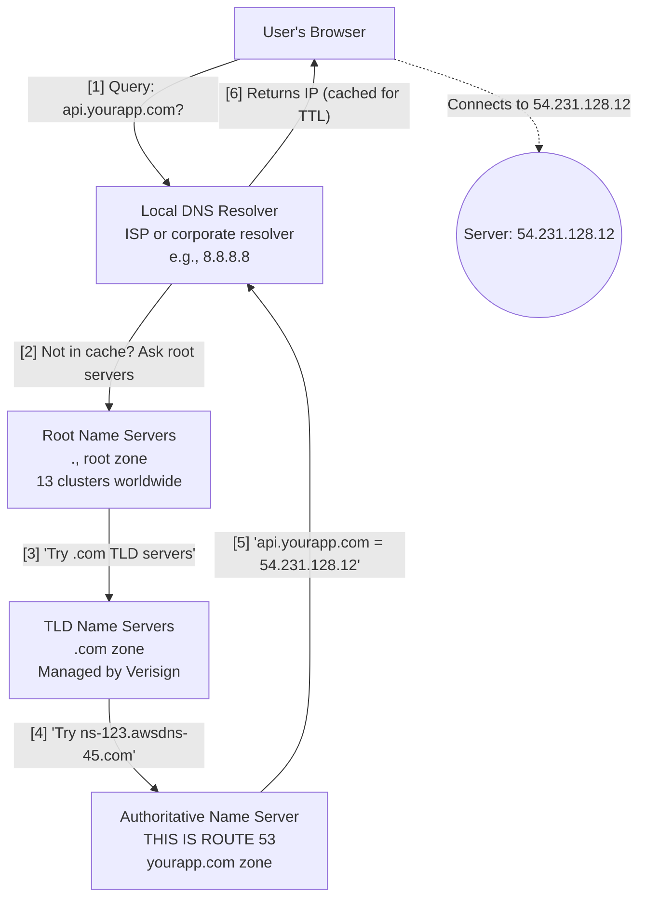
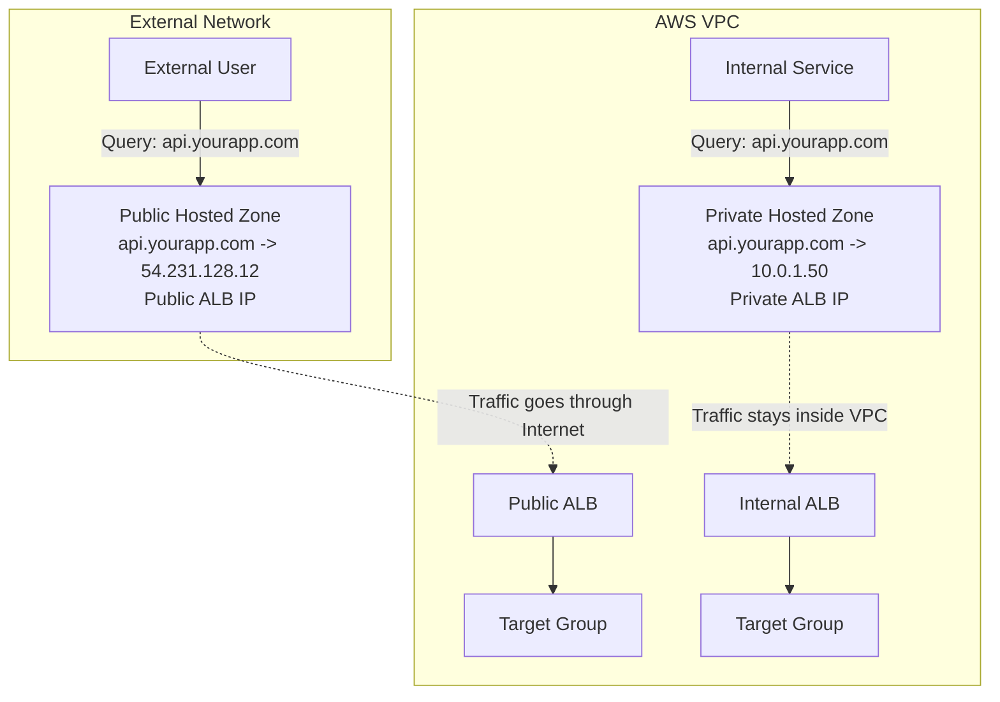
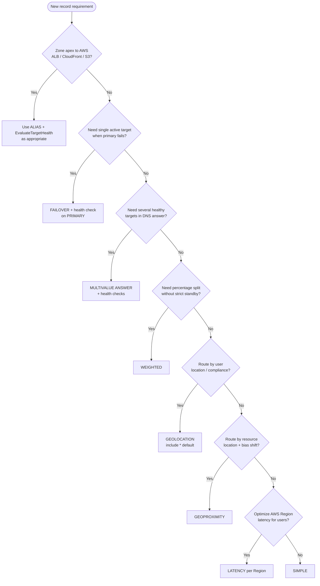
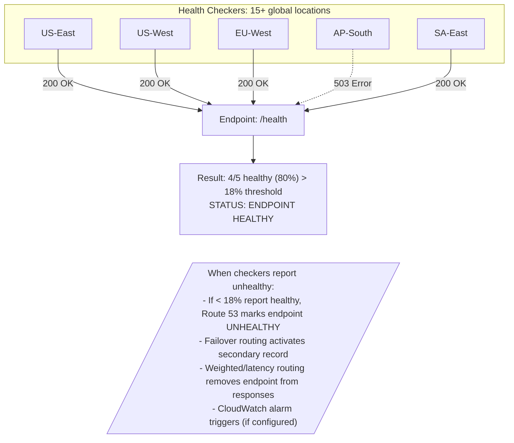

**Complexity**: `[MEDIUM]` | **Time to Complete**: 1.5 hours | **Prerequisites**: Module 1.2 VPC, basic understanding of domain names and URL resolution, an AWS account with a registered domain, and a configured AWS CLI.

## Prerequisites

Before starting this module, you should have completed the prerequisite networking material and ensured your environment is set for DNS experimentation. The prerequisite check matters because unresolved setup gaps cause teams to focus on tooling errors while trying to learn traffic policy behavior, so please confirm you are fully ready before continuing.
- [Module 1.2: VPC & Networking Foundations](../module-1.2-vpc/)
- Basic understanding of domain names and how browsers resolve URLs
- AWS account with at least one registered domain (or willingness to register one; domain pricing varies by TLD)
- AWS CLI configured with appropriate permissions

## What You'll Be Able to Do

After completing this module, you will be able to configure Route 53 with confidence: moving from hosted zones and record sets to routing policies and health-checked failover, while designing DNS behavior that supports reliable public and private resolution in production.

- **Configure Route 53 hosted zones with multiple routing policies (weighted, latency, failover, geolocation)**
- **Implement DNS-based health checks and failover routing to achieve automated disaster recovery**
- **Design split-horizon DNS architectures that separate public and private name resolution**
- **Deploy alias records and integrate Route 53 with ALB, CloudFront, and S3 static websites**

---

## Why This Module Matters

In October 2021, Facebook disappeared from the internet. Not figuratively -- literally. For six hours, the company's DNS records were unreachable because a routine BGP configuration change accidentally withdrew the routes to Facebook's DNS servers. The result was a major global outage that disrupted users, affected the business, and complicated internal recovery work ([Cloudflare's analysis of the October 2021 Facebook outage](https://blog.cloudflare.com/october-2021-facebook-outage/)).

DNS is the invisible foundation of every internet application. When it works, nobody thinks about it. When it fails, nothing else matters -- your beautifully architected microservices, your multi-region deployment, your zero-downtime release strategy -- all of it becomes unreachable if users cannot resolve your domain name.

AWS Route 53 is Amazon's managed DNS service, [named after the port that DNS traffic runs on (port 53)](https://aws.amazon.com/route53/features/). It is designed to handle very large query volumes across AWS's global DNS network. In this module, you will learn how Route 53 works, how to configure hosted zones and records, how to implement sophisticated routing policies for multi-region architectures, and how to keep your DNS infrastructure healthy with automated health checks. By the end, you will have built a multi-region active-passive failover configuration -- the kind of setup that would have saved Facebook's engineers a very bad day.

---

## How DNS Actually Works

Before we touch Route 53, let us make sure the foundation is solid. DNS is often described as "the phone book of the internet," but that analogy undersells it. A better analogy: DNS is the postal system of the internet -- it translates human-friendly addresses (like `api.yourapp.com`) into machine-routable IP addresses (like `54.231.128.12`).

Here is what happens when a user types your domain into their browser: follow this chain step by step, because it shows exactly where caching, delegation, and authority come together to decide how quickly a query reaches your service endpoint.



Route 53 lives at step 4-5 in this chain. It is the **authoritative name server** for your domains. When any resolver in the world asks "where is api.yourapp.com?", Route 53 answers.

Understanding **authority vs recursion** prevents weeks of confusion. Your laptop's resolver (or `8.8.8.8`) is a **recursive resolver**: it chases the chain on the user's behalf and caches answers. Route 53, when hosting `yourapp.com`, is **authoritative** for that zone: it owns the truth for names under the zone and returns answers with the TTL you configured. Registrars point the TLD servers to Route 53's four NS names via delegation; until that delegation is correct, Route 53 records exist but the world never asks Route 53 for them.

**Negative answers matter operationally.** If a record does not exist, Route 53 returns NXDOMAIN or NODATA depending on the query type — and resolvers cache those failures too. During cutovers, a typo in record name or wrong hosted zone ID in automation creates a cached "does not exist" answer that outlives the deploy window. Pairs with TTL planning: fix the name, lower TTL if needed, and wait for negative cache to expire before declaring the migration done.

**EDNS0 client subnet** (used internally by Route 53 routing policies) is why latency and geolocation policies do not always match your laptop's traceroute intuition. Route 53 estimates user location and network path from resolver hints and its latency tables — not from GPS. That is why São Paulo might hit `us-east-1` even though Ireland looks closer on a map, and why testing routing policies from a single corporate resolver can mislead unless you use `test-dns-answer` or diverse vantage points.

### DNS Record Types You Need to Know

| Record Type | Purpose | Example | When to Use |
|-------------|---------|---------|-------------|
| A | Maps name to IPv4 address | `api.example.com -> 54.231.128.12` | Direct IP mapping |
| AAAA | Maps name to IPv6 address | `api.example.com -> 2600:1f18:...` | IPv6 endpoints |
| CNAME | Maps name to another name | `www.example.com -> example.com` | Aliases (cannot be used at zone apex) |
| ALIAS | Route 53 extension of A/AAAA | `example.com -> d1234.cloudfront.net` | AWS resources at zone apex |
| MX | Mail exchange servers | `example.com -> mail.example.com (priority 10)` | Email routing |
| TXT | Arbitrary text | `example.com -> "v=spf1 include:_spf.google.com"` | SPF, DKIM, domain verification |
| NS | Name server delegation | `example.com -> ns-123.awsdns-45.com` | Zone delegation |
| SOA | Start of Authority | Zone metadata | Automatically managed by Route 53 |
| SRV | Service locator | `_sip._tcp.example.com -> sip.example.com:5060` | Service discovery |
| CAA | Certificate Authority Authorization | `example.com -> 0 issue "letsencrypt.org"` | Restrict who can issue TLS certs |

The **ALIAS record** deserves special attention. Standard DNS does not allow a CNAME at the zone apex (the naked domain like `example.com`). But you often want your naked domain pointing to a load balancer or CloudFront distribution. [Route 53's ALIAS record solves this -- it functions like a CNAME but returns an A/AAAA record, so it works at the zone apex. And queries against ALIAS records pointing to AWS resources are free.](https://docs.aws.amazon.com/Route53/latest/DeveloperGuide/resource-record-sets-choosing-alias-non-alias.html)

### ALIAS vs CNAME: Why This Shows Up on Every Exam

The confusion between CNAME and ALIAS is not academic — it blocks real deployments on day one. A **CNAME** tells the resolver "the real name is somewhere else; go look it up." That extra lookup adds latency, and the DNS standard forbids a CNAME at the zone apex because apex records must coexist with mandatory NS and SOA records. If you try `example.com` as a CNAME to your ALB hostname, authoritative servers and registrars reject or break the zone.

An **ALIAS** is a Route 53 extension, not a standard DNS type clients see on the wire. When a resolver asks Route 53 for `example.com`, Route 53 **answers with A or AAAA addresses** by resolving the target (ALB, CloudFront, API Gateway, S3 website endpoint, and other [supported AWS targets](https://docs.aws.amazon.com/Route53/latest/DeveloperGuide/resource-record-sets-choosing-alias-non-alias.html)) on your behalf. The client never chases a CNAME chain for that hop, which is why apex aliasing works and why failover integrations can use **Evaluate target health** on the alias itself.

| Dimension | CNAME | ALIAS (Route 53) |
|-----------|-------|------------------|
| Zone apex (`example.com`) | Not allowed per DNS RFC | Supported |
| Response on the wire | Another hostname (client does second lookup) | A/AAAA for target (server-side resolution) |
| Query billing | Standard per-million query rate | **Free** when target is a supported AWS resource (not another Route 53 record in the same zone) |
| Target types | Any DNS name | AWS resources + limited record-to-record alias chains per AWS rules |
| Health-aware routing | Attach health checks to the record set | Can set `EvaluateTargetHealth: true` so Route 53 checks ELB/CloudFront health before returning the alias answer |
| TTL | You set TTL; resolvers cache | You cannot set TTL on an alias to an AWS resource; Route 53 uses a TTL determined by the target (often 60s for ELB; for an alias to another record in the same zone, the target record's TTL applies) |

**Evaluate target health** on an alias is easy to miss: for an ALIAS to an Application Load Balancer, enabling it tells Route 53 to consider the load balancer's health when answering, which pairs with failover or weighted alias designs without maintaining a separate health check on a bare IP. For CloudFront, AWS documentation often shows `EvaluateTargetHealth: false` because the distribution edge is the stability boundary — match the pattern in your architecture docs rather than copying one JSON block blindly.

When you cannot use ALIAS (target is a non-AWS SaaS hostname), CNAME on a **subdomain** (`www.example.com`) remains correct. Reserve ALIAS for apex and for AWS-native front doors where free queries and integrated health matter at scale.

---

## Hosted Zones: Public and Private

A **hosted zone** is a container for DNS records for a single domain. Think of it as a DNS configuration file for one domain and its subdomains.

### Public Hosted Zones

Public hosted zones answer DNS queries from the entire internet. When you register a domain or transfer DNS management to Route 53, you create a public hosted zone.

```bash
# Create a public hosted zone
aws route53 create-hosted-zone \
  --name example.com \
  --caller-reference "$(date +%s)" \
  --hosted-zone-config Comment="Production domain"

# List all hosted zones
aws route53 list-hosted-zones

# Get details of a specific zone (replace with your zone ID)
aws route53 get-hosted-zone --id Z0123456789ABCDEFGHIJ
```

When Route 53 creates a public hosted zone, [it automatically assigns four name servers from different TLD domains](https://docs.aws.amazon.com/Route53/latest/DeveloperGuide/GetInfoAboutHostedZone.html) (e.g., `ns-123.awsdns-45.com`, `ns-456.awsdns-78.net`, `ns-789.awsdns-12.org`, `ns-1012.awsdns-34.co.uk`). This four-TLD spread is designed to improve availability.

**Delegation is the handoff you own:** buying a domain does not automatically use Route 53 unless registrar name servers point to those four NS records (or you register the domain with Route 53 and accept its delegation). Until delegation propagates, your meticulously crafted A and ALIAS records are invisible to the internet. Cutover runbooks should list: create zone → copy NS to registrar → wait for parent TTL → verify with `dig NS example.com` → only then create customer-facing records.

**Hosted zone limits and hygiene:** the first 25 public zones cost $0.50/month each; beyond that, $0.10/month applies per [AWS pricing](https://aws.amazon.com/route53/pricing/). Sandbox environments accumulate orphaned zones from automated tests — FinOps reviews often find dozens of `$0.50` leaks. AWS waives the monthly hosted-zone charge if you delete a zone within 12 hours of creation (queries during that window still bill), which helps CI pipelines that create ephemeral zones.

**SOA and NS records** at the zone apex are managed for you in Route 53; do not delete them to "clean up" the console. The SOA serial influences secondary DNS semantics if you ever export zones; NS records must match what the registrar publishes.

### Private Hosted Zones

Private hosted zones answer queries only from within one or more associated VPCs. They are essential for internal service discovery -- giving friendly names to internal resources without exposing them to the internet.

```bash
# Create a private hosted zone associated with a VPC
aws route53 create-hosted-zone \
  --name internal.yourcompany.com \
  --caller-reference "$(date +%s)" \
  --vpc VPCRegion=us-east-1,VPCId=vpc-0abc123def456 \
  --hosted-zone-config Comment="Internal services",PrivateZone=true

# Associate additional VPCs with the private hosted zone
aws route53 associate-vpc-with-hosted-zone \
  --hosted-zone-id Z0123456789ABCDEFGHIJ \
  --vpc VPCRegion=us-west-2,VPCId=vpc-0xyz789ghi012
```

> **Pause and predict:** You have a public hosted zone for `example.com` and a private hosted zone for `example.com` associated with your VPC. If an EC2 instance inside that VPC queries `api.example.com`, which zone answers the query, and why?

<details>
<summary>Check your prediction</summary>

The private hosted zone answers the query. When an EC2 instance queries the VPC DNS resolver (`AmazonProvidedDNS`), Route 53 inspects associated private hosted zones before forwarding requests outward or checking public authoritative zones. Because `example.com` exists as an associated private zone, the resolver evaluates queries strictly against that private zone; if the specific record exists, its private value is returned, and if it is missing, the resolver returns `NXDOMAIN` without falling back to the public zone.

</details>

Architectural isolation in modern cloud networks relies heavily on [split-horizon DNS configurations to segment internal service routing from public access paths](https://docs.aws.amazon.com/Route53/latest/DeveloperGuide/hosted-zone-private-considerations.html). For instance, an engineering team might publish an endpoint such as `api.yourapp.com` that points external clients toward an internet-facing application load balancer, while provisioning matching service records to steer internal VPC components toward private IP addresses. This topology optimizes network pathing by keeping East-West microservice communication bounded within VPC boundaries, cutting internet egress bandwidth costs and reinforcing security perimeters without altering application connection strings.

**How split-horizon behaves in practice:** overlapping names on public and private zones are a design contract, not a convenience alias. Internet resolvers never see private zone data — they only see the public zone. That separation is powerful for security (internal service names never leak) but demands discipline: if you create `db.internal.example.com` only in a private zone, laptops on VPN need Resolver or VPN DNS paths that reach that zone, not your laptop's ISP cache.

**Hybrid and cross-VPC DNS** extend the model. When on-premises Active Directory must resolve names in your VPC private zones — or when a VPC must forward `corp.example.com` to data-center resolvers — you use **Route 53 Resolver** inbound and outbound endpoints. That machinery lives in [Module 1.2: VPC & Networking Foundations](../module-1.2-vpc/) (DNS in a VPC section); this module stays focused on authoritative records, while Resolver handles **conditional forwarding** and cross-network resolution paths.

Operational checklist for private zones: associate every VPC Region pair that needs the name, confirm `enableDnsSupport` / `enableDnsHostnames` on those VPCs, and avoid assuming health checks can probe private IPs directly (see Health Checks — CloudWatch path below). Private hosted zone queries themselves are **not billed** per Route 53 query pricing; you still pay for Resolver endpoints, hybrid forwarding volume, and any health-check or alarm infrastructure you attach.



### Hosted Zone Costs and the Cost Lens

Route 53 pricing is straightforward at small scale but compounds quietly: hosted zones are predictable rent, while **routing policy choice**, **TTL**, and **health-check options** move the needle on variable spend. Before you optimize records, model monthly queries × price tier + health-check count + any Resolver endpoints from hybrid DNS.

| Component | Cost (US Regions, per [AWS Route 53 pricing](https://aws.amazon.com/route53/pricing/)) |
|-----------|------|
| Public hosted zone | $0.50/month each for the first 25 zones; $0.10/month for additional zones |
| Private hosted zone | Same hosted-zone fee; **queries against private zones are not charged** |
| Records beyond 10,000 per zone | $0.0015/month per extra record |
| Standard queries (Simple, Weighted, Failover, Multivalue) | $0.40 per million queries (first 1B/month) |
| Latency-based routing queries | $0.60 per million |
| Geolocation / Geoproximity queries | $0.70 per million |
| ALIAS to supported AWS targets (ALB, CloudFront, S3 website, API GW, etc.) | **$0** query charge |
| Basic health check (AWS or non-AWS endpoint) | $0.50/month (AWS) / $0.75/month (non-AWS) |
| Optional features (HTTPS, string match, fast interval, latency measurement) | +$1.00/month per feature (AWS) / +$2.00/month (non-AWS) |
| First 50 health checks on AWS endpoints (same account) | Often $0 under AWS's published DNS failover offer — verify current terms on the pricing page |

**What spikes cost unexpectedly:** (1) **TTL set to 60 seconds globally** on high-traffic names — every resolver refresh becomes a billable query at the standard or geo/latency tier. (2) **Geolocation or geoproximity** on hot domains — $0.70/M vs $0.40/M adds up at billions of queries. (3) **Health checks with fast interval + HTTPS + string matching** — each optional feature is a separate monthly line item per check. (4) **Chains of non-alias CNAMEs** to AWS resources — you pay standard queries and add resolver round trips. (5) **Orphan hosted zones** after environment teardown — $0.50 each adds up across dozens of sandboxes.

**Knobs that reduce cost:** prefer **ALIAS** to ELB/CloudFront/S3 website endpoints; use **private zones** for internal names (no query charge); raise TTL on stable records after migrations complete; delete unused zones; right-size health-check features (30-second interval is enough for many DR plans); use **calculated health checks** to combine signals instead of duplicating twelve overlapping endpoint checks.

Domain registration is separate from DNS hosting — annual TLD fees appear on the registrar line, not the per-query table above.

**Capacity planning sketch:** one million standard queries per month costs about $0.40 — modest. One billion standard queries costs about $400 before volume discounts on the second billion. Alias-heavy architectures fronting CloudFront or ALB often erase the query line entirely for apex traffic while health checks and hosted zones remain the steady-state bill. Model both steady and failover-state costs: during an incident you might lower TTL (more queries) and run extra calculated checks until stability returns.

---

## Creating and Managing DNS Records

Let us create some records. Route 53 uses a **change-batch** system where you submit JSON describing CREATE, DELETE, or UPSERT actions against a hosted zone ID. Changes propagate to Route 53's authoritative fleet quickly, but **the internet's view** still depends on TTL and resolver caches — a successful `change-resource-record-sets` API call is not the same as "every user sees the new IP."

**Change IDs and status polling:** each batch returns a `ChangeInfo` ID; use `get-change` until status is `INSYNC` before running verification scripts in CI. Pipelines that fire application deploys immediately after the API returns without waiting for INSYNC race the same failure mode as ignoring TTL — automation thinks DNS is done while resolvers still serve stale data.

**SetIdentifier discipline:** weighted, latency, failover, geolocation, geoproximity, and multivalue records that share the same name and type must differ by `SetIdentifier` strings you choose. Duplicate identifiers in the same batch fail; missing identifiers when adding a second latency record silently overwrite in the console if you are not careful. Treat identifiers as immutable infrastructure names (`us-east-1-prod`, `eu-west-1-prod`) in Terraform or CloudFormation, not display labels you rename casually.

**Routing policy is per record set:** you cannot weight one IP and failover another in the same record set — you create separate record sets with the same name, different policies, and different identifiers. Console wizards hide some of this; API and IaC expose it, which is why exam questions often describe two record sets with the same `app.example.com` name.

### Basic Record Creation

```bash
# Create an A record pointing to an EC2 instance
aws route53 change-resource-record-sets \
  --hosted-zone-id Z0123456789ABCDEFGHIJ \
  --change-batch '{
    "Changes": [
      {
        "Action": "CREATE",
        "ResourceRecordSet": {
          "Name": "app.example.com",
          "Type": "A",
          "TTL": 300,
          "ResourceRecords": [
            {"Value": "54.231.128.12"}
          ]
        }
      }
    ]
  }'

# Create an ALIAS record pointing to an ALB
aws route53 change-resource-record-sets \
  --hosted-zone-id Z0123456789ABCDEFGHIJ \
  --change-batch '{
    "Changes": [
      {
        "Action": "UPSERT",
        "ResourceRecordSet": {
          "Name": "example.com",
          "Type": "A",
          "AliasTarget": {
            "HostedZoneId": "Z35SXDOTRQ7X7K",
            "DNSName": "my-alb-123456789.us-east-1.elb.amazonaws.com",
            "EvaluateTargetHealth": true
          }
        }
      }
    ]
  }'

# Create an ALIAS record pointing to a CloudFront Distribution
# Note: CloudFront always uses the fixed HostedZoneId Z2FDTNDATAQYW2
aws route53 change-resource-record-sets \
  --hosted-zone-id Z0123456789ABCDEFGHIJ \
  --change-batch '{
    "Changes": [
      {
        "Action": "UPSERT",
        "ResourceRecordSet": {
          "Name": "example.com",
          "Type": "A",
          "AliasTarget": {
            "HostedZoneId": "Z2FDTNDATAQYW2",
            "DNSName": "d111111abcdef8.cloudfront.net",
            "EvaluateTargetHealth": false
          }
        }
      }
    ]
  }'

# Create an ALIAS record pointing to an S3 Static Website
# Note: S3 HostedZoneId depends on the region of the bucket
aws route53 change-resource-record-sets \
  --hosted-zone-id Z0123456789ABCDEFGHIJ \
  --change-batch '{
    "Changes": [
      {
        "Action": "UPSERT",
        "ResourceRecordSet": {
          "Name": "www.example.com",
          "Type": "A",
          "AliasTarget": {
            "HostedZoneId": "Z3AQBSTGFYJSTF",
            "DNSName": "s3-website-us-east-1.amazonaws.com",
            "EvaluateTargetHealth": false
          }
        }
      }
    ]
  }'
```

Notice the `UPSERT` action in the second example. This is idempotent -- [it creates the record if it does not exist, or updates it if it does](https://docs.aws.amazon.com/Route53/latest/APIReference/API_ChangeResourceRecordSets.html). Production automation should usually prefer `UPSERT` over `CREATE` to avoid failures when re-running scripts.

### TTL: The Caching Knob You Must Understand

> **Pause and predict:** You need to migrate a database to a new IP address on Friday at midnight. Your current DNS record has a TTL of 86400 seconds (24 hours). If you change the IP address in Route 53 at exactly midnight on Friday, when will all your global users finally connect to the new database, and how could you have prevented this delay?

<details>
<summary>Check your prediction</summary>

All global users will not fully switch until Saturday at midnight (24 hours later) because intermediate recursive resolvers cache the old IP record for the full 86,400-second duration. To prevent this cutover delay, you should reduce the record's TTL to 60 or 300 seconds at least 24 hours in advance of the planned change. Once the previous 24-hour cache entries expire across public resolvers, subsequent IP updates propagate almost instantaneously to incoming clients.

</details>

Time to Live (TTL) establishes an authoritative caching contract that governs how downstream recursive resolvers and client operating systems cache DNS resource record sets locally. Choosing appropriate TTL durations involves balancing DNS query costs and network latency against operational flexibility and disaster-recovery reaction speed across infrastructure components:

| TTL Value | Use Case | Trade-off |
|-----------|----------|-----------|
| 60 seconds | Active failover, during migrations | High query volume, higher cost |
| 300 seconds (5 min) | Standard production records | Good balance for most apps |
| 3600 seconds (1 hour) | Stable records (MX, TXT) | Lower cost, slower changes |
| 86400 seconds (24 hours) | Records that rarely change | Lowest cost, very slow propagation |

A critical lesson: **lower your TTL before making changes.** If your TTL is 24 hours and you need to migrate to a new IP, some resolvers will not see the change for a full day. The standard playbook:

1. 48 hours before change: Lower TTL to 60 seconds
2. Wait for old TTL to expire (24 hours)
3. Make the IP change
4. Verify the change has propagated
5. Raise TTL back to the normal value

```bash
# Step 1: Lower TTL before migration
aws route53 change-resource-record-sets \
  --hosted-zone-id Z0123456789ABCDEFGHIJ \
  --change-batch '{
    "Changes": [{
      "Action": "UPSERT",
      "ResourceRecordSet": {
        "Name": "app.example.com",
        "Type": "A",
        "TTL": 60,
        "ResourceRecords": [{"Value": "54.231.128.12"}]
      }
    }]
  }'

# Step 2 (after old TTL expires): Change the IP
aws route53 change-resource-record-sets \
  --hosted-zone-id Z0123456789ABCDEFGHIJ \
  --change-batch '{
    "Changes": [{
      "Action": "UPSERT",
      "ResourceRecordSet": {
        "Name": "app.example.com",
        "Type": "A",
        "TTL": 60,
        "ResourceRecords": [{"Value": "52.86.200.34"}]
      }
    }]
  }'
```

---

## Routing Policies

This is where Route 53 goes from "managed DNS" to "intelligent traffic management." [Each record set has exactly one routing policy](https://docs.aws.amazon.com/Route53/latest/DeveloperGuide/routing-policy.html) that defines how Route 53 answers when the record name and type match a query. Policies are not mix-and-match per answer — you choose the policy that matches the traffic goal, then attach health checks, weights, or regions as that policy allows.

### Complete Routing Policy Reference

The table below is the map exam writers expect you to carry: what each policy optimizes, and a concrete use case. All policies except IP-based routing (a separate advanced topic) are in scope for AWS Essentials.

| Policy | What it optimizes | Concrete use case | Query pricing tier (public zones) |
|--------|-------------------|-------------------|-----------------------------------|
| **Simple** | Lowest complexity; multi-value round robin if several RRs exist | Single web server; dev `app.example.com` → one IP | Standard ($0.40/M) |
| **Weighted** | Proportional traffic split (not health-aware by itself) | Canary 10% / prod 90%; blue-green DNS shift before cutover | Standard |
| **Latency** | Best **network latency** from user to AWS Region | Global API with ALBs in `us-east-1` and `eu-west-1` | Latency ($0.60/M) |
| **Failover** | **Active-passive** availability (one primary, one standby) | DR: primary Region ALB, secondary only when health fails | Standard |
| **Geolocation** | Traffic by **user location** (continent/country/US state) | GDPR: EU users to EU stack; default `*` catch-all | Geo ($0.70/M) |
| **Geoproximity** | Traffic by **resource location** with geographic bias (-99..+99) | Expand or shrink the region a resource serves during maintenance (bias is not a traffic-percentage knob) | Geo ($0.70/M) |
| **Multivalue answer** | Up to **eight healthy** answers per query (random subset) | Simple HA: multiple healthy web heads without client-side pick | Standard |

### Simple Routing

One record name and type; you may list multiple values in the same record set. Route 53 returns **all** values in the record set in random order (bounded by DNS response size), and the **client** chooses which to try — Route 53 does not health-check simple records unless you combine other features. Use simple routing when you have one obvious target or when client-side retry across a small static pool is acceptable.

```bash
# Simple routing: single value
aws route53 change-resource-record-sets \
  --hosted-zone-id Z0123456789ABCDEFGHIJ \
  --change-batch '{
    "Changes": [{
      "Action": "UPSERT",
      "ResourceRecordSet": {
        "Name": "app.example.com",
        "Type": "A",
        "TTL": 300,
        "ResourceRecords": [
          {"Value": "54.231.128.12"},
          {"Value": "54.231.128.13"},
          {"Value": "54.231.128.14"}
        ]
      }
    }]
  }'
```

### Weighted Routing

Distribute traffic across resources in proportions you control. Ideal for blue-green deployments, A/B testing, and gradual migrations, because you can move capacity by percentage and evaluate risk before making irreversible changes.

```bash
# 90% of traffic to production, 10% to canary
aws route53 change-resource-record-sets \
  --hosted-zone-id Z0123456789ABCDEFGHIJ \
  --change-batch '{
    "Changes": [
      {
        "Action": "UPSERT",
        "ResourceRecordSet": {
          "Name": "app.example.com",
          "Type": "A",
          "SetIdentifier": "production",
          "Weight": 90,
          "TTL": 60,
          "ResourceRecords": [{"Value": "54.231.128.12"}]
        }
      },
      {
        "Action": "UPSERT",
        "ResourceRecordSet": {
          "Name": "app.example.com",
          "Type": "A",
          "SetIdentifier": "canary",
          "Weight": 10,
          "TTL": 60,
          "ResourceRecords": [{"Value": "52.86.200.34"}]
        }
      }
    ]
  }'
```

[A weight of 0 means the record is never returned unless all other records also have weight 0](https://docs.aws.amazon.com/Route53/latest/DeveloperGuide/resource-record-sets-values-weighted.html). This is useful for "dark launching" -- creating a record you can activate later by changing its weight.

Weighted routing does **not** observe endpoint health unless you attach health checks to each weighted record set. A canary at weight 10 with a failing health check is removed from the answer pool while unhealthy; a canary without a check still receives its share of queries even when the stack is down — teams learn this during the first bad deploy. For blue-green at the DNS layer, common choreography is: start canary at weight 0, validate, ramp to 10/20/50, then flip primary weights or delete old record sets after observability clears.

Because weights are **relative**, changing one record's weight changes everyone else's percentage without touching their numbers. If production is 90 and canary 10, deleting the canary does not leave "10% orphaned" — production becomes 100% of the active weight sum. Document weight math in runbooks so on-call engineers do not panic-calculator at 3 a.m.

### Latency-Based Routing

Route 53 routes traffic to the region with the lowest latency for the requester. [AWS maintains a database of latency measurements between internet networks and AWS regions](https://docs.aws.amazon.com/Route53/latest/DeveloperGuide/routing-policy-latency.html).

```bash
# Latency-based: US East endpoint
aws route53 change-resource-record-sets \
  --hosted-zone-id Z0123456789ABCDEFGHIJ \
  --change-batch '{
    "Changes": [{
      "Action": "UPSERT",
      "ResourceRecordSet": {
        "Name": "api.example.com",
        "Type": "A",
        "SetIdentifier": "us-east-1",
        "Region": "us-east-1",
        "TTL": 60,
        "ResourceRecords": [{"Value": "54.231.128.12"}]
      }
    }]
  }'

# Latency-based: EU West endpoint
aws route53 change-resource-record-sets \
  --hosted-zone-id Z0123456789ABCDEFGHIJ \
  --change-batch '{
    "Changes": [{
      "Action": "UPSERT",
      "ResourceRecordSet": {
        "Name": "api.example.com",
        "Type": "A",
        "SetIdentifier": "eu-west-1",
        "Region": "eu-west-1",
        "TTL": 60,
        "ResourceRecords": [{"Value": "52.17.200.45"}]
      }
    }]
  }'
```

Users in New York get routed to `us-east-1`. Users in London get `eu-west-1`. Users in Tokyo might get either, depending on which has lower measured latency from their ISP.

Latency routing is **active-active** at the DNS layer: both Regions answer when healthy. It does not replace application data replication or session affinity requirements — users can land in a Region whose database replica is stale if you have not engineered multi-Region consistency. Pair latency with health checks on each Regional record so a degraded Region drops out of rotation. Remember billing: latency queries cost more per million than simple weighted answers; at extreme QPS, that delta belongs in FinOps review alongside CloudFront vs direct ALB designs.

**Latency vs geolocation vs geoproximity:** choose latency when the goal is **performance** without legal constraint. Choose geolocation when **policy** requires users in country X to never receive an IP in country Y. Choose geoproximity when you need to **drain or fill** a Region based on where resources live, especially during partial Region maintenance. Mixing policies on the same name is invalid (without Traffic Flow) — solve composite requirements with separate subdomains (`api.example.com` latency, `www.example.com` geolocation) or front with CloudFront and a single origin policy.

### Failover Routing

Active-passive failover. Route 53 returns the primary record unless its health check fails, then switches to secondary. This is the deterministic behavior you want for regional DR tests because it preserves one preferred target while still guaranteeing continuity when the primary degrades. [AWS failover documentation](https://docs.aws.amazon.com/Route53/latest/DeveloperGuide/resource-record-sets-values-failover.html) requires exactly one PRIMARY and one SECONDARY record set per failover group (same name and type, different SetIdentifiers). You may attach a health check to the primary, secondary, or both; primary without a check still fails over if you associate a check later — but until then, secondary never activates automatically.

**Failover vs multivalue vs latency:** failover picks **one** answer (primary if healthy, else secondary). Multivalue returns **up to eight** healthy answers simultaneously. Latency picks the best Region per user but can return multiple records only when you configure multiple latency record sets — still not the same as multivalue's random healthy subset. Exams love tripping people who say "failover load balances" — it does not; it cold-stands the secondary.

Hypothetical scenario: a team runs PRIMARY in `us-east-1` with a health check on the public ALB, SECONDARY in `us-west-2` without a check. When primary fails, traffic moves west. If west also fails later, Route 53 may still return the secondary IP because absence of a check means "always healthy" for that record — design both sides with checks or accept that DR stops at one hop.

```bash
# Primary record with health check
aws route53 change-resource-record-sets \
  --hosted-zone-id Z0123456789ABCDEFGHIJ \
  --change-batch '{
    "Changes": [{
      "Action": "UPSERT",
      "ResourceRecordSet": {
        "Name": "app.example.com",
        "Type": "A",
        "SetIdentifier": "primary",
        "Failover": "PRIMARY",
        "TTL": 60,
        "HealthCheckId": "abcdef12-3456-7890-abcd-ef1234567890",
        "ResourceRecords": [{"Value": "54.231.128.12"}]
      }
    }]
  }'

# Secondary record (failover target)
aws route53 change-resource-record-sets \
  --hosted-zone-id Z0123456789ABCDEFGHIJ \
  --change-batch '{
    "Changes": [{
      "Action": "UPSERT",
      "ResourceRecordSet": {
        "Name": "app.example.com",
        "Type": "A",
        "SetIdentifier": "secondary",
        "Failover": "SECONDARY",
        "TTL": 60,
        "ResourceRecords": [{"Value": "52.86.200.34"}]
      }
    }]
  }'
```

### Geolocation Routing

Route traffic based on the geographic location of your users (continent, country, or US state). This is critical for compliance with data residency laws or delivering localized content. Geolocation is **not** latency optimization: you might send all European users to `eu-west-1` even when `us-east-1` would be faster for a subset, because the requirement is jurisdiction, not milliseconds.

**Overlap rules** matter when multiple geolocation record sets exist. Route 53 picks the most specific match (for example, a US state record beats a US country record beats a continent record). You must still provide a **default** record with `CountryCode: *` (or equivalent default) so locations you did not explicitly map receive an answer — otherwise some resolvers get no useful A record for your name. Geolocation queries bill at the geo tier ($0.70 per million in US Regions), so applying geolocation to a high-traffic apex name without need is a real invoice line.

**Testing geolocation** from your desk is unreliable: your resolver's location hint may not match the user population you think you are simulating. Use `aws route53 test-dns-answer` with the hosted zone ID and record name, and treat production validation as observability on Regional request rates, not a single `dig` from a VPN exit node.

```bash
# Geolocation routing: Default record (catch-all)
aws route53 change-resource-record-sets \
  --hosted-zone-id Z0123456789ABCDEFGHIJ \
  --change-batch '{
    "Changes": [{
      "Action": "UPSERT",
      "ResourceRecordSet": {
        "Name": "app.example.com",
        "Type": "A",
        "SetIdentifier": "default",
        "GeoLocation": {
          "CountryCode": "*"
        },
        "TTL": 60,
        "ResourceRecords": [{"Value": "54.231.128.12"}]
      }
    }]
  }'

# Geolocation routing: Europe-specific record
aws route53 change-resource-record-sets \
  --hosted-zone-id Z0123456789ABCDEFGHIJ \
  --change-batch '{
    "Changes": [{
      "Action": "UPSERT",
      "ResourceRecordSet": {
        "Name": "app.example.com",
        "Type": "A",
        "SetIdentifier": "europe",
        "GeoLocation": {
          "ContinentCode": "EU"
        },
        "TTL": 60,
        "ResourceRecords": [{"Value": "52.17.200.45"}]
      }
    }]
  }'
```

### Geoproximity Routing

Geoproximity answers a different question than geolocation. **Geolocation** routes based on where the **user** is. **Geoproximity** routes based on where your **resources** are, using AWS's map of resource locations, and lets you apply a **bias** to expand or shrink the geographic footprint each resource serves. [AWS documents geoproximity for shifting traffic between Regions during capacity events](https://docs.aws.amazon.com/Route53/latest/DeveloperGuide/routing-policy-geoproximity.html) — for example, nudging European users toward `eu-west-1` while `eu-central-1` undergoes maintenance without rewriting every latency record by hand.

Since January 2024, geoproximity is a first-class routing policy you can create via the Route 53 console, API, CLI, or SDK in public and private hosted zones — Traffic Flow is not required. The **bias** value (-99 to +99) expands or shrinks the geographic region each resource serves; it is not a direct traffic-percentage control (use **weighted** routing for proportional splits). Pair with health checks when you need unhealthy resources removed from the answer set, and remember geoproximity queries bill at the **geo** rate ($0.70 per million in US Regions), not the standard tier.

### Multivalue Answer Routing

Multivalue answer looks like simple multi-value routing but behaves differently under failure. Route 53 returns up to **eight healthy records** selected at random from the set you configured — unhealthy records (per attached health checks) are omitted. [AWS positions multivalue answer for simple load balancing with health checking](https://docs.aws.amazon.com/Route53/latest/DeveloperGuide/routing-policy-multivalue.html), not as a replacement for an Application Load Balancer. It shines when you have a handful of static IPs or small EC2 pools and want DNS-level HA without weighted percentage math.

Multivalue is **not** a substitute for failover's strict primary/secondary semantics: you get multiple healthy answers, not a single active target. Clients must handle multiple A records (most HTTP stacks do). Combine with modest TTL when you need faster eviction of failed nodes.

---

## Decision Framework: Choosing a Routing Policy

Use this flow when requirements arrive as prose ("users in EU need EU data," "10% canary," "standby Region"). It complements the policy table above and assumes you have already decided **public vs private** zone and **ALIAS vs A** at the apex.



| Requirement signal | Prefer | Avoid |
|--------------------|--------|-------|
| "Only secondary Region if primary is down" | Failover + health check on primary | Weighted alone (no automatic standby) |
| "EU users never hit US stack" | Geolocation with EU record + `*` default | Latency (optimizes RTT, not legal boundary) |
| "Shift 30% traffic to canary, 70% to prod" | Weighted | Geoproximity bias (geographic region knob, not percentage) |
| "Return only healthy web servers, up to eight" | Multivalue answer | Simple with multiple A records (no health filter) |
| "10% canary, 90% prod" | Weighted | Failover (binary, not proportional) |
| "Fastest AWS Region for each user" | Latency | Geolocation (country ≠ lowest RTT) |

---

## Health Checks

> **Pause and predict:** You configure a failover routing policy with a primary and secondary record. If the primary application server process crashes but the underlying EC2 instance remains running, what specific mechanism is required for Route 53 to detect this application-level failure and trigger the failover?

<details>
<summary>Check your prediction</summary>

An application-layer Route 53 health check (such as an HTTP or HTTPS check targeting `/health`, or a CloudWatch alarm-based health check) is required. Authoritative Route 53 DNS servers operate entirely outside your virtual machine and have no visibility into guest operating system processes or socket listeners. Without an explicit health check probing application response codes or metric thresholds, Route 53 continues returning the primary IP indefinitely.

</details>

DNS authoritative name servers operate independently from server operating systems and lack visibility into internal daemon lifecycles, memory pressure, and socket bindings. Providing automated fault isolation requires establishing an external telemetry feedback loop that tests reachability and injects endpoint health status directly into Route 53's global resolution infrastructure. Dynamic routing strategies across weighted, latency, geolocation, geoproximity, and multivalue record sets depend entirely on these active validation signals to remove degraded targets from resolver responses.

### Creating Health Checks

```bash
# HTTP health check against an endpoint
aws route53 create-health-check \
  --caller-reference "app-health-$(date +%s)" \
  --health-check-config '{
    "Type": "HTTP",
    "FullyQualifiedDomainName": "app.example.com",
    "Port": 80,
    "ResourcePath": "/health",
    "RequestInterval": 30,
    "FailureThreshold": 3
  }'

# HTTPS health check with string matching
aws route53 create-health-check \
  --caller-reference "api-health-$(date +%s)" \
  --health-check-config '{
    "Type": "HTTPS_STR_MATCH",
    "FullyQualifiedDomainName": "api.example.com",
    "Port": 443,
    "ResourcePath": "/health",
    "SearchString": "\"status\":\"healthy\"",
    "RequestInterval": 10,
    "FailureThreshold": 2
  }'

# Calculated health check (combines multiple checks)
aws route53 create-health-check \
  --caller-reference "combined-health-$(date +%s)" \
  --health-check-config '{
    "Type": "CALCULATED",
    "ChildHealthChecks": [
      "abcdef12-3456-7890-abcd-ef1234567890",
      "12345678-abcd-ef12-3456-7890abcdef12"
    ],
    "HealthThreshold": 1
  }'
```

### How Health Checks Work

Route 53 health checkers run from data centers in multiple AWS regions. By default, health checkers run from multiple locations worldwide and can check every 30 seconds. [The endpoint is considered healthy if at least 18% of health checkers (roughly 3 out of 15) report it as healthy](https://docs.aws.amazon.com/Route53/latest/DeveloperGuide/dns-failover-determining-health-of-endpoints.html).

That quorum design avoids a single flaky vantage point marking your entire continent offline, but it also means **brief blips** might not fail the check if most locations still see HTTP 200. Conversely, widespread ISP issues near your endpoint can look like an outage to Route 53 even when your Region is fine — rare, but worth correlating with CloudWatch `HealthCheckStatus` metrics and application SLOs before triggering a DNS failover that shifts database writes to a secondary Region.

**RequestInterval and FailureThreshold** trade money for speed: faster intervals and lower thresholds detect failure sooner but increase health-check optional-feature charges when you enable HTTPS or string matching ([pricing page](https://aws.amazon.com/route53/pricing/)). A 10-second interval with threshold 2 fails in roughly twenty seconds plus application timeout — add that to DNS TTL when writing executive RTO numbers.

**Health checkers need a meaningful path:** pointing checks at `/` when `/` always returns 200 from a CDN edge, while `/api` is broken, hides application failure — mirror the quiz scenario about deep health. Rotate shared secrets in health-check paths if you embed tokens in URLs; Route 53 stores check configuration in your account and IAM controls who can update checks.

**CloudWatch integration:** Route 53 publishes `HealthCheckStatus` and `ConnectionTime` metrics per check. Alarms on those metrics are how you notify humans when DNS has already rerouted — DNS failover is not a substitute for paging on-call when the secondary Region was cold and databases need promotion.



### Health Check Types

| Type | What It Checks | Best For |
|------|---------------|----------|
| HTTP/HTTPS | Endpoint returns 2xx/3xx | Web applications |
| HTTP_STR_MATCH / HTTPS_STR_MATCH | Response body contains a string | APIs returning JSON status |
| TCP | TCP connection succeeds | Databases, non-HTTP services |
| CALCULATED | Aggregates child health checks | Complex multi-component systems |
| CLOUDWATCH_METRIC | Based on CloudWatch alarm state | Internal resources not reachable from internet |

The `CLOUDWATCH_METRIC` type is crucial for private resources. [Health checkers run from the public internet and cannot reach resources inside your VPC. For those, you create a CloudWatch alarm that monitors the resource, then create a health check that watches that alarm.](https://docs.aws.amazon.com/Route53/latest/DeveloperGuide/dns-failover-private-hosted-zones.html)

### Endpoint, Calculated, and CloudWatch Health Checks in Depth

**Endpoint health checks** probe from Route 53's global checker network to a public IP or hostname. HTTP/HTTPS checks validate status codes; `HTTPS_STR_MATCH` (and HTTP string match) require a substring in the body — the right tool when `/health` must prove database connectivity, not return a static `200`. TCP checks suit non-HTTP ports. Endpoint checks must be reachable from the internet: security groups and NACLs need the [published `ROUTE53_HEALTHCHECKS` ranges](https://docs.aws.amazon.com/Route53/latest/DeveloperGuide/route-53-ip-addresses.html) allowed inbound on the health path.

**Calculated health checks** aggregate child checks with a **HealthThreshold** — for example, "at least two of three API shards must pass." This reduces alert noise and matches how operators think about partial degradation. Calculated checks bill as AWS-endpoint health checks; design children so they reflect independent failure domains (not three URLs to the same broken database).

**CloudWatch alarm-based health checks** bridge private or non-HTTP signals: a Lambda in the VPC publishes a custom metric, an RDS CPU alarm fires, or an internal probe fails — the alarm state drives Route 53 health without exposing the database port to the public checker network. [AWS documents this pattern for private hosted zones and failover](https://docs.aws.amazon.com/Route53/latest/DeveloperGuide/dns-failover-private-hosted-zones.html). The alarm must live in the same account linkage Route 53 expects when you associate the health check with the alarm ARN.

**How failover consumes health:** when a PRIMARY failover record's check is unhealthy, Route 53 stops returning that record and answers with the SECONDARY. Detection time is roughly `(RequestInterval × FailureThreshold)` plus any string-match timeouts — then client resolvers still honor **TTL** before everyone moves. For alias-based primary targets, **EvaluateTargetHealth** on the alias asks Route 53 to factor ELB target health into whether the alias is considered healthy, which can failover DNS before a bare instance check would notice application failure.

| Mechanism | Inspects | Typical pairing |
|-----------|----------|-----------------|
| HTTP/HTTPS endpoint | Public URL or IP:port/path | Failover PRIMARY, multivalue members |
| String match | Body contains expected token | Deep app health on APIs |
| Calculated | AND/OR of child checks | Sharded services, multi-AZ gates |
| CloudWatch metric | Alarm state | Private RDS, internal queues |
| EvaluateTargetHealth on ALIAS | AWS target health (e.g., ALB) | Apex `example.com` → ALB failover |

---

## Patterns & Anti-Patterns

Production teams converge on a small set of DNS designs. The patterns below are proven; the anti-patterns are frequent outage contributors seen in reviews.

### Patterns

| Pattern | When to use | Why it works | Scaling note |
|---------|-------------|--------------|--------------|
| **Active-passive failover with health checks** | Regional DR with one hot stack | Deterministic PRIMARY/SECONDARY semantics; clear runbooks | Lower TTL + faster check interval during incidents; watch health-check monthly cost |
| **Latency routing for multi-Region active-active** | Global user base on symmetric Regional stacks | Routes on measured RTT, not map distance | Bills latency query tier; ensure each Region is actually healthy |
| **Weighted routing for canary / blue-green DNS** | Gradual release without new hostnames | Percentages adjustable without code deploy | Not health-aware alone — add checks on canary records or monitor out-of-band |
| **ALIAS at apex to ALB / CloudFront** | Public web entry on naked domain | Apex-safe, free queries to supported AWS targets, optional target health | CloudFront vs ALB choice affects EvaluateTargetHealth defaults |
| **Split-horizon public + private zones** | Same brand, different paths inside VPC | Keeps internal traffic off IGW; pairs with private ALBs | Requires Resolver/VPN planning for corporate clients — see VPC module |
| **Multivalue answer for small static pools** | Few healthy nodes, client handles multiple A records | DNS-layer HA simpler than full LB for tiny footprints | Cap eight records; not a replacement for ELB at high scale |

### Anti-Patterns

| Anti-pattern | What goes wrong | Why teams fall into it | Better alternative |
|--------------|-----------------|------------------------|-------------------|
| **TTL=60 everywhere "for agility"** | Query costs spike; resolver load increases globally | Fear of slow migrations | TTL 300 default; lower only on records you will change; restore after |
| **CNAME at zone apex** | Zone or registrar errors; extra lookup latency | Copying subdomain patterns to root | ALIAS to AWS target |
| **DNS as the only HA layer** | Long TTL + cache hides failover; no connection draining | DNS feels simpler than LB/autoscaling | ELB + health checks + DNS as steering layer, not sole safety net |
| **Failover without health check on PRIMARY** | Secondary never activates automatically | Assuming "failover type" implies magic | Attach check or CloudWatch alarm check |
| **Health check to private IP / blocked SG** | Always unhealthy or flapping | Treating VPC resources like public endpoints | CloudWatch metric check or public health proxy |
| **Geolocation without `*` default** | Some countries get NXDOMAIN | Forgetting catch-all record | Always define default geolocation record |
| **Weighted 0 on all records "to pause traffic"** | Route 53 returns all records equally | Misread of zero-weight docs | Remove records or use health check failure |

---

## DNSSEC: Signing Your Zone

DNSSEC (Domain Name System Security Extensions) protects against DNS spoofing by cryptographically signing records. Without DNSSEC, an attacker performing a man-in-the-middle attack could return false DNS records, redirecting your users to malicious servers.

[Route 53 supports DNSSEC for public hosted zones](https://docs.aws.amazon.com/Route53/latest/DeveloperGuide/dns-configuring-dnssec.html). Enabling it involves creating a Key Signing Key (KSK) backed by AWS KMS:

```bash
# Step 1: Create a KMS key for DNSSEC (must be in us-east-1)
aws kms create-key \
  --region us-east-1 \
  --description "DNSSEC KSK for example.com" \
  --key-usage SIGN_VERIFY \
  --key-spec ECC_NIST_P256 \
  --policy '{
    "Version": "2012-10-17",
    "Statement": [
      {
        "Sid": "Allow Route 53 DNSSEC",
        "Effect": "Allow",
        "Principal": {"Service": "dnssec-route53.amazonaws.com"},
        "Action": ["kms:DescribeKey", "kms:GetPublicKey", "kms:Sign"],
        "Resource": "*"
      },
      {
        "Sid": "Allow key administration",
        "Effect": "Allow",
        "Principal": {"AWS": "arn:aws:iam::123456789012:root"},
        "Action": "kms:*",
        "Resource": "*"
      }
    ]
  }'

# Step 2: Enable DNSSEC signing
aws route53 create-key-signing-key \
  --hosted-zone-id Z0123456789ABCDEFGHIJ \
  --name example-com-ksk \
  --key-management-service-arn arn:aws:kms:us-east-1:123456789012:key/abcd1234-ef56-7890-abcd-ef1234567890 \
  --status ACTIVE

# Step 3: Enable DNSSEC for the zone
aws route53 enable-hosted-zone-dnssec \
  --hosted-zone-id Z0123456789ABCDEFGHIJ
```

After enabling DNSSEC, [you must establish a chain of trust by adding a DS (Delegation Signer) record to the parent zone (your domain registrar)](https://docs.aws.amazon.com/Route53/latest/DeveloperGuide/dns-configuring-dnssec-enable-signing.html). If your domain is registered with Route 53, this is straightforward. If it is registered elsewhere, you will need to add the DS record manually through your registrar's interface.

A warning: enabling DNSSEC is easy, but getting it wrong can make your domain unreachable. Always test with a staging domain first.

**Operational note:** DNSSEC signing incurs **KMS charges** for the key material Route 53 uses to sign records — Route 53 does not charge for enabling DNSSEC itself, but KMS sign operations and key storage appear on the KMS bill ([Route 53 pricing — DNSSEC](https://aws.amazon.com/route53/pricing/)). Rotating KSK requires planning parallel keys and registrar DS updates, similar to TLS certificate rotation but at the delegation layer. Resolver validation (Route 53 Resolver DNSSEC validation) is a separate toggle from zone signing; this module focuses on **authoritative signing** for public zones you host.

---

## Did You Know?

1. **Route 53 health checks for Elastic Load Balancing and S3 website endpoints are provisioned automatically by AWS at no additional health-check charge**, which is why many ALIAS-to-ALB designs do not line-item a separate checker for the load balancer itself — you still pay for optional features if you add custom checks on top ([AWS Route 53 pricing — Health Checks](https://aws.amazon.com/route53/pricing/)).

2. **The name "Route 53" is a double reference.** DNS runs on port 53, and the service's routing policies steer users to healthy endpoints — naming that reflects both protocol and traffic engineering ([AWS Route 53 features](https://aws.amazon.com/route53/features/)).

3. **Geoproximity and geolocation queries are billed at a higher per-million rate than simple or weighted records** ($0.70 vs $0.40 per million in standard US Regions), which matters when a high-QPS domain uses country-based steering for every lookup ([AWS Route 53 pricing](https://aws.amazon.com/route53/pricing/)).

4. **Multivalue answer routing returns up to eight healthy records per query**, unlike simple routing which may return multiple values without health filtering — a subtle distinction that changes how clients experience partial outages ([AWS multivalue routing policy](https://docs.aws.amazon.com/Route53/latest/DeveloperGuide/routing-policy-multivalue.html)).

---

## Common Mistakes

| Mistake | Why It Happens | How to Fix It |
|---------|---------------|---------------|
| Forgetting to lower TTL before migrations | TTL is set-and-forget for most teams | Create a migration runbook that starts with TTL reduction 48 hours before any DNS change |
| Using CNAME at zone apex | CNAME seems like the right record type for aliasing | Use Route 53 ALIAS records for zone apex. They function like CNAMEs but return A/AAAA records |
| No health checks on failover records | Health checks cost extra and seem optional | Failover routing without health checks usually will not trigger failover as intended. Always attach health checks to primary records |
| Health check endpoint behind security group | Health checkers come from AWS public IPs that are blocked | Add Route 53 health checker IP ranges to your security group. AWS publishes these in their ip-ranges.json |
| DNSSEC enabled without DS record at registrar | You enable signing but forget the chain of trust | Incomplete DNSSEC is worse than no DNSSEC -- DNSSEC-validating resolvers will refuse to resolve your domain. Always complete the DS record step |
| Private hosted zone not associated with VPC | Zone created but queries return NXDOMAIN | Associate the private hosted zone with every VPC that needs to resolve those records |
| Setting all weights to 0 in weighted routing | Trying to disable traffic to all endpoints | When all weights are 0, Route 53 returns all records equally. To truly stop traffic, delete the records or use a health check |
| Expecting instant global failover at TTL 3600 | DNS caches outside Route 53 — Route 53 is updated but ISPs serve the old IP until TTL expires | Lower TTL before DR tests; plan RTO as TTL + health-check detection time |

---

## Quiz

<details>
<summary>1. Your development team is trying to map the root domain (`example.com`) to an Application Load Balancer, but they keep getting an error when using a CNAME record. Why is this happening, and what Route 53 feature should they use instead?</summary>

A CNAME record creates an alias from one domain name to another, but the DNS protocol strictly forbids using a CNAME at the zone apex (e.g., `example.com` without a subdomain). If you attempt this, it conflicts with mandatory apex records like SOA and NS. To solve this, AWS invented the ALIAS record, which is a Route 53 extension that functions similarly to a CNAME but returns an A or AAAA record in the response. This means it works perfectly at the zone apex without violating DNS protocols. Furthermore, when ALIAS records point to AWS resources like an ALB, Route 53 does not charge for the DNS queries.
</details>

<details>
<summary>2. You have deployed a global web application using latency-based routing, with Application Load Balancers in `us-east-1` (Virginia) and `eu-west-1` (Ireland). A user sitting in a cafe in Sao Paulo, Brazil, opens your website. Which regional endpoint will Route 53 direct them to, and how is this decision made?</summary>

The user in Brazil will be directed to whichever endpoint has the lowest measured network latency from their specific network location, which is typically `us-east-1` (Virginia) in this scenario. Route 53 does not make decisions based on physical geographic distance; instead, it relies on a constantly updated database of actual network latency measurements between internet providers worldwide and AWS regions. This approach ensures optimal performance rather than just geographical proximity. If the user's local ISP in Sao Paulo happens to have superior peering and routing agreements with European backbone networks, they could technically be routed to `eu-west-1`, despite it being further away geographically. Ultimately, the latency telemetry collected by AWS dictates the routing outcome.
</details>

<details>
<summary>3. Your Route 53 HTTP health check for `api.example.com` shows the endpoint as 100% healthy, but your monitoring tools indicate that the backend database is down and users are receiving 500 Internal Server Error responses. Why didn't Route 53 detect this outage, and how should you reconfigure the health check?</summary>

The standard HTTP health check only verifies that the server responds with a successful HTTP status code (2xx or 3xx) at the specific `/health` path. If your `/health` endpoint is simply a static page or a basic function that doesn't check backend dependencies, it will continue returning `200 OK` even if the database is completely offline. To fix this, you should update your application's health endpoint to perform deep checks of critical dependencies, and ideally use a Route 53 `HTTPS_STR_MATCH` health check. This ensures Route 53 only marks the endpoint as healthy if the application explicitly returns a specific confirmation string like `"status":"healthy"` after validating its own dependencies. Implementing this strategy prevents false positives and ensures traffic is only sent to fully operational instances.
</details>

<details>
<summary>4. Your security team mandates DNSSEC for all public zones. A junior engineer creates the required KMS Key Signing Key in `eu-west-1` because that is where your application is hosted, but the Route 53 console rejects it. Why did this fail, and how must it be fixed?</summary>

The failure occurred because Route 53's DNSSEC signing infrastructure is physically centralized in the `us-east-1` (N. Virginia) region, regardless of where your application traffic originates. The KMS key used for the Key Signing Key (KSK) must be accessible to these specific Route 53 signing operations. Therefore, the architectural requirement dictates that the KMS key must be created in `us-east-1`. This regional requirement only applies to the signing process when records are updated; it does not affect the performance or latency for end users, as the signed records are still distributed globally through Route 53's anycast network. It is a crucial detail to remember when configuring DNSSEC, as failing to adhere to this restriction will block the entire setup process.
</details>

<details>
<summary>5. Your team is performing a canary deployment using Route 53 weighted routing. You have three records for `api.example.com`: the existing production environment (weight 70), a new canary environment (weight 20), and a legacy fallback environment (weight 10). Out of 10,000 incoming DNS queries, approximately how many will be routed to the canary environment, and why?</summary>

Approximately 2,000 queries will be routed to the canary environment. Route 53 calculates the probability of selecting a specific record by dividing its individual weight by the sum of all weights in the routing group. In this scenario, the total sum of weights is 100 (70 + 20 + 10), and the canary weight is 20, resulting in a 20% probability (20/100) for each query. Because Route 53 evaluates these probabilities dynamically on every single query rather than tracking state, the distribution is statistical and will align closely with 20% over a large volume of requests. This mechanism allows teams to precisely control traffic flow and gradually expose new features with minimal risk.
</details>

<details>
<summary>6. You have deployed an internal RDS database inside a private VPC. The security team wants Route 53 to automatically failover to a standby database if the primary becomes unresponsive, but Route 53 health checkers cannot reach private IPs. How can you implement this health check?</summary>

Because Route 53 health checkers operate from the public internet, they inherently cannot route traffic into your private VPC to check the database directly. To solve this, you must bridge the gap using CloudWatch. First, create a CloudWatch alarm that monitors an internal metric indicating database health, such as CPU utilization or a custom metric published by a Lambda function inside the VPC. Then, create a Route 53 health check of type `CLOUDWATCH_METRIC` that watches the state of this specific alarm. When the internal metric degrades, the CloudWatch alarm triggers, which in turn causes the Route 53 health check to fail, initiating your DNS failover.
</details>

<details>
<summary>7. Your disaster recovery plan relies on Route 53 failover routing with a primary record in `us-east-1` and a secondary record in `us-west-2`. Both records have a TTL of 300 seconds. A catastrophic power failure takes the `us-east-1` region offline. Realistically, what is the maximum amount of time it will take for all global users to be redirected to the secondary region?</summary>

It will take approximately 6.5 minutes for all global traffic to completely shift to the secondary region. This timeline is the sum of two distinct phases: health check failure detection and DNS cache expiration. First, with default health check settings (30-second interval, failure threshold of 3), Route 53 takes about 90 seconds to officially declare the primary endpoint unhealthy and update its internal routing tables. Second, downstream DNS resolvers (like ISPs and corporate networks) will continue serving the cached primary IP address until the 300-second (5-minute) TTL expires. To reduce this recovery time, you must lower the TTL on the DNS records and configure a faster health check interval.
</details>

<details>
<summary>8. Your platform team runs an internal API reachable only at a private IP inside a VPC. They attached a standard HTTP Route 53 health check to the private address and wired failover routing, but the primary record never flips to secondary during tests. What architectural mistake did they make, and what two AWS-supported paths fix it?</summary>

Route 53 endpoint health checkers originate from the public AWS health-check network, so they cannot open TCP connections to RFC1918 addresses inside your VPC. The check stays unhealthy or misleading, and failover behavior will not match your DR runbook. The fix is never "punch a hole to the internet for the database." Instead, use a **CloudWatch metric health check**: monitor an alarm tied to RDS connectivity, synthetic canary, or a custom metric published from inside the VPC, and associate that health check with the failover PRIMARY record. Alternatively, expose a **public** health endpoint (often a tiny reverse proxy or ALB) whose only job is deep health, while keeping the workload private — still requiring correct security group ranges for health checkers. For apex traffic to an internal-facing ALB, combine **private hosted zones** with split-horizon rather than exposing private IPs to public DNS answers.
</details>

---

## Hands-On Exercise: Multi-Region Active-Passive Failover

In this exercise, you will build a production-grade DNS failover configuration. We will simulate two regional endpoints and configure Route 53 to automatically fail over when the primary becomes unhealthy.

The exercise intentionally walks **health check → failover records → verification → simulated failure → observability → cleanup** because that is the order production runbooks use. Skipping cleanup leaves health checks billing monthly and stale failover records surprising the next engineer who queries the zone. If you use a shared sandbox domain, coordinate hosted zone IDs with teammates — UPSERT is idempotent, but duplicate health checks with the same caller-reference still create parallel resources when scripts rerun without teardown.

Before Task 4, note the difference between **making the endpoint unhealthy** (simulated unreachable IP) and **deleting the primary record** — only the former tests failover routing behavior. After failover, `dig` from your laptop may still show the primary until TTL expires; compare `test-dns-answer` (asks Route 53 directly) with recursive resolver results to see cache effects in real time.

### Setup

You will need an AWS account and a registered domain (or a hosted zone you can experiment with). We will use placeholder values that you should replace with your actual resources.

```bash
# Set your variables
export DOMAIN="example.com"
export HOSTED_ZONE_ID="Z0123456789ABCDEFGHIJ"
export PRIMARY_IP="54.231.128.12"    # Replace with your us-east-1 resource IP
export SECONDARY_IP="52.86.200.34"   # Replace with your us-west-2 resource IP
```

### Task 1: Create Health Checks for Both Regions

Create HTTP health checks for the primary and secondary endpoints. Capture both health check IDs because the next step in this exercise attaches each ID to a distinct failover record, which is how Route 53 knows which endpoint to prioritize.

<details>
<summary>Solution</summary>

```bash
# Create health check for primary (us-east-1)
PRIMARY_HC=$(aws route53 create-health-check \
  --caller-reference "primary-hc-$(date +%s)" \
  --health-check-config '{
    "Type": "HTTP",
    "IPAddress": "'"${PRIMARY_IP}"'",
    "Port": 80,
    "ResourcePath": "/health",
    "RequestInterval": 10,
    "FailureThreshold": 2
  }' \
  --query 'HealthCheck.Id' --output text)

echo "Primary health check ID: ${PRIMARY_HC}"

# Create health check for secondary (us-west-2)
SECONDARY_HC=$(aws route53 create-health-check \
  --caller-reference "secondary-hc-$(date +%s)" \
  --health-check-config '{
    "Type": "HTTP",
    "IPAddress": "'"${SECONDARY_IP}"'",
    "Port": 80,
    "ResourcePath": "/health",
    "RequestInterval": 10,
    "FailureThreshold": 2
  }' \
  --query 'HealthCheck.Id' --output text)

echo "Secondary health check ID: ${SECONDARY_HC}"
```
</details>

### Task 2: Configure Failover Routing Records

Create the primary and secondary failover records, associating each with its health check. Keep this as a single, repeatable workflow so that automation can safely reapply your policy without manual drift.

<details>
<summary>Solution</summary>

```bash
aws route53 change-resource-record-sets \
  --hosted-zone-id ${HOSTED_ZONE_ID} \
  --change-batch '{
    "Changes": [
      {
        "Action": "UPSERT",
        "ResourceRecordSet": {
          "Name": "failover-demo.'"${DOMAIN}"'",
          "Type": "A",
          "SetIdentifier": "primary-us-east-1",
          "Failover": "PRIMARY",
          "TTL": 60,
          "HealthCheckId": "'"${PRIMARY_HC}"'",
          "ResourceRecords": [{"Value": "'"${PRIMARY_IP}"'"}]
        }
      },
      {
        "Action": "UPSERT",
        "ResourceRecordSet": {
          "Name": "failover-demo.'"${DOMAIN}"'",
          "Type": "A",
          "SetIdentifier": "secondary-us-west-2",
          "Failover": "SECONDARY",
          "TTL": 60,
          "HealthCheckId": "'"${SECONDARY_HC}"'",
          "ResourceRecords": [{"Value": "'"${SECONDARY_IP}"'"}]
        }
      }
    ]
  }'
```
</details>

### Task 3: Verify the Configuration

Query your DNS record and confirm it resolves to the primary IP. Do this first while everything is healthy so you have a baseline before you trigger failure simulation.

<details>
<summary>Solution</summary>

```bash
# Query the record using dig
dig failover-demo.${DOMAIN} +short

# Expected output: primary IP (54.231.128.12)

# Test with Route 53's built-in DNS test
aws route53 test-dns-answer \
  --hosted-zone-id ${HOSTED_ZONE_ID} \
  --record-name failover-demo.${DOMAIN} \
  --record-type A

# Verify health check status
aws route53 get-health-check-status --health-check-id ${PRIMARY_HC}
aws route53 get-health-check-status --health-check-id ${SECONDARY_HC}
```
</details>

### Task 4: Simulate a Failover

Stop the primary endpoint's health check path and observe Route 53 failing over. Since you may not have actual servers, you can update the health check to point to an unreachable IP.

<details>
<summary>Solution</summary>

```bash
# Simulate primary failure by updating health check to an unreachable IP
aws route53 update-health-check \
  --health-check-id ${PRIMARY_HC} \
  --ip-address 192.0.2.1  # TEST-NET address, guaranteed unreachable

# Wait for health check to fail (about 30 seconds with 10s interval + threshold of 2)
echo "Waiting 45 seconds for health check to fail..."
sleep 45

# Check health status
aws route53 get-health-check-status --health-check-id ${PRIMARY_HC}

# Query DNS again -- should now return secondary IP
dig failover-demo.${DOMAIN} +short

# Expected output: secondary IP (52.86.200.34)
```
</details>

### Task 5: Add CloudWatch Alarm for Health Check Monitoring

Create a CloudWatch alarm that notifies you when a failover occurs. A clear alarm path helps the on-call team spot the failover trigger quickly instead of discovering traffic behavior changes only after user impact is visible.

<details>
<summary>Solution</summary>

```bash
# Create an SNS topic for alerts
TOPIC_ARN=$(aws sns create-topic --name dns-failover-alerts \
  --query 'TopicArn' --output text)

# Subscribe your email
aws sns subscribe \
  --topic-arn ${TOPIC_ARN} \
  --protocol email \
  --notification-endpoint your-email@example.com

# Create CloudWatch alarm on the primary health check
aws cloudwatch put-metric-alarm \
  --alarm-name "Route53-Primary-Unhealthy" \
  --alarm-description "Primary endpoint health check failed - failover active" \
  --namespace "AWS/Route53" \
  --metric-name "HealthCheckStatus" \
  --dimensions Name=HealthCheckId,Value=${PRIMARY_HC} \
  --statistic Minimum \
  --period 60 \
  --evaluation-periods 1 \
  --threshold 1 \
  --comparison-operator LessThanThreshold \
  --alarm-actions ${TOPIC_ARN}
```
</details>

### Task 6: Clean Up

Remove all the resources you created to avoid ongoing costs. Run cleanup deliberately and in order, because stale failover records and lingering health checks can keep affecting routing behavior even after your exercise finishes.

<details>
<summary>Solution</summary>

```bash
# Delete the DNS records
aws route53 change-resource-record-sets \
  --hosted-zone-id ${HOSTED_ZONE_ID} \
  --change-batch '{
    "Changes": [
      {
        "Action": "DELETE",
        "ResourceRecordSet": {
          "Name": "failover-demo.'"${DOMAIN}"'",
          "Type": "A",
          "SetIdentifier": "primary-us-east-1",
          "Failover": "PRIMARY",
          "TTL": 60,
          "HealthCheckId": "'"${PRIMARY_HC}"'",
          "ResourceRecords": [{"Value": "'"${PRIMARY_IP}"'"}]
        }
      },
      {
        "Action": "DELETE",
        "ResourceRecordSet": {
          "Name": "failover-demo.'"${DOMAIN}"'",
          "Type": "A",
          "SetIdentifier": "secondary-us-west-2",
          "Failover": "SECONDARY",
          "TTL": 60,
          "HealthCheckId": "'"${SECONDARY_HC}"'",
          "ResourceRecords": [{"Value": "'"${SECONDARY_IP}"'"}]
        }
      }
    ]
  }'

# Delete health checks
aws route53 delete-health-check --health-check-id ${PRIMARY_HC}
aws route53 delete-health-check --health-check-id ${SECONDARY_HC}

# Delete CloudWatch alarm
aws cloudwatch delete-alarms --alarm-names "Route53-Primary-Unhealthy"

# Delete SNS topic
aws sns delete-topic --topic-arn ${TOPIC_ARN}
```
</details>

**Card A: The public hosted zone always answers VPC queries for the same name.** A network administrator configures an identical domain name `example.com` in both an authoritative public hosted zone and an internal private hosted zone associated with the production VPC. When an EC2 workload residing inside that private VPC resolves `api.example.com`, the team assumes that internet-routable public name servers take precedence because public DNS is globally distributed. They believe internal client requests must cross the internet gateway to query the public record set unless the public zone is deleted.

<details>
<summary>Check your prediction</summary>

Failure layer: misunderstanding Route 53 split-horizon resolution precedence inside VPC boundaries. Next action: configure the necessary private records within the VPC-associated private hosted zone and rely on the VPC DNS Resolver (AmazonProvidedDNS), which prioritizes private hosted zones over public zones for matching domain namespaces.

</details>

**Card B: Changing the A record at midnight with TTL 86400 is enough for a cutover.** A systems engineer schedules a midnight production database cutover by updating the authoritative Route 53 A record to a newly provisioned endpoint exactly at 00:00. Because the current DNS record was originally published with an 86,400-second Time to Live (TTL), the engineer expects all global client traffic to instantly switch over once the API call returns successfully. When external client traffic continues bombarding the decommissioned database throughout Saturday morning, the operations team suspects a silent Route 53 API propagation outage.

<details>
<summary>Check your prediction</summary>

Failure layer: neglecting intermediate recursive resolver caching behavior enforced by DNS TTL contracts. Next action: lower the record's TTL to 60 or 300 seconds at least 24 hours prior to scheduled maintenance, wait for the old 86,400-second cache window to expire globally, execute the record change during the maintenance window, and restore standard TTL values once traffic stabilizes.

</details>

**Card C: Failover routing detects an application crash without a health check.** An architect deploys an active-passive failover configuration across two AWS Regions, designating us-east-1 as PRIMARY and us-west-2 as SECONDARY. When the backend Node.js application process inside the primary EC2 instance crashes while leaving the virtual machine running, the engineer assumes Route 53 will detect the service interruption and redirect incoming DNS queries automatically. Because no dedicated Route 53 health check was attached to the primary record, queries continue resolving to the dead application port while standby resources sit idle.

<details>
<summary>Check your prediction</summary>

Failure layer: assuming DNS authoritative name servers have visibility into guest OS application process states without external monitoring probes. Next action: create a Route 53 HTTP, HTTPS, or CloudWatch alarm-based health check that targets the application's `/health` endpoint, link the health check ID directly to the PRIMARY failover record, and test automated failover triggers before production cutover.

</details>

**Card D: Setting every weighted record to 0 pauses all DNS traffic.** During an emergency maintenance event, an operator intends to suspend all traffic to an API service by assigning a weight of 0 to every record in a weighted routing set. The operator believes that setting all weights to zero causes Route 53 to stop answering queries, effectively creating a maintenance blackout. They treat the change as equivalent to withdrawing the name from DNS until the window ends.

<details>
<summary>Check your prediction</summary>

Failure layer: overlooking Route 53's fallback behavior when all weights in a weighted resource record set equal zero. Next action: disable or delete the records, point the routing targets to a static maintenance page or holding endpoint, or assign non-zero weights strictly to dedicated maintenance servers rather than setting all weights to 0.

</details>

**Success Criteria**:

- [ ] Two health checks created (primary and secondary)
- [ ] Failover routing records created and pointing to correct IPs
- [ ] DNS resolves to primary IP when primary is healthy
- [ ] DNS resolves to secondary IP when primary health check fails
- [ ] CloudWatch alarm configured to alert on failover events
- [ ] All resources cleaned up after exercise

---

## Next Module

Next up: **[Module 1.6: Elastic Container Registry (ECR)](../module-1.6-ecr/)** -- Learn to store, manage, and secure your container images with AWS's native registry. You will set up lifecycle policies, vulnerability scanning, and cross-account sharing -- essential foundations before deploying containers to ECS or EKS.

## Sources

- [aws.amazon.com: features](https://aws.amazon.com/route53/features/) — AWS's Route 53 features page explicitly explains the product name as a reference to DNS port 53.
- [docs.aws.amazon.com: resource record sets choosing alias non alias.html](https://docs.aws.amazon.com/Route53/latest/DeveloperGuide/resource-record-sets-choosing-alias-non-alias.html) — AWS docs directly compare alias and CNAME behavior, including zone-apex support and free alias queries to supported AWS resources.
- [aws.amazon.com: route53](https://aws.amazon.com/documentation-overview/route53/) — AWS documentation overview states that Route 53 populates hosted zones with four name servers across four different top-level domains.
- [docs.aws.amazon.com: hosted zone private considerations.html](https://docs.aws.amazon.com/Route53/latest/DeveloperGuide/hosted-zone-private-considerations.html) — AWS docs explicitly describe split-view DNS with public and private hosted zones of the same name.
- [aws.amazon.com: pricing](https://aws.amazon.com/route53/pricing/) — AWS pricing lists these current hosted-zone, query, and alias-query charges directly.
- [docs.aws.amazon.com: API ChangeResourceRecordSets.html](https://docs.aws.amazon.com/Route53/latest/APIReference/API_ChangeResourceRecordSets.html) — The Route 53 API reference explicitly defines UPSERT with this create-or-update behavior.
- [docs.aws.amazon.com: resource record sets values weighted.html](https://docs.aws.amazon.com/Route53/latest/DeveloperGuide/resource-record-sets-values-weighted.html) — AWS weighted-record docs directly describe both zero-weight behaviors.
- [docs.aws.amazon.com: routing policy latency.html](https://docs.aws.amazon.com/Route53/latest/DeveloperGuide/routing-policy-latency.html) — AWS docs explain that latency-based routing relies on latency measurements to Regions and can differ from geography.
- [docs.aws.amazon.com: dns failover determining health of endpoints.html](https://docs.aws.amazon.com/Route53/latest/DeveloperGuide/dns-failover-determining-health-of-endpoints.html) — AWS health-check docs state the 18% threshold directly.
- [docs.aws.amazon.com: dns failover private hosted zones.html](https://docs.aws.amazon.com/Route53/latest/DeveloperGuide/dns-failover-private-hosted-zones.html) — AWS docs explicitly say health checkers are outside the VPC and recommend CloudWatch-alarm-based checks for private endpoints.
- [docs.aws.amazon.com: dns configuring dnssec.html](https://docs.aws.amazon.com/Route53/latest/DeveloperGuide/dns-configuring-dnssec.html) — AWS DNSSEC docs describe signed responses and document DNSSEC signing support for public hosted zones.
- [docs.aws.amazon.com: dns configuring dnssec enable signing.html](https://docs.aws.amazon.com/Route53/latest/DeveloperGuide/dns-configuring-dnssec-enable-signing.html) — AWS's DNSSEC enablement docs explicitly require establishing the chain of trust with DS records.
- [docs.aws.amazon.com: resource record sets values failover.html](https://docs.aws.amazon.com/Route53/latest/DeveloperGuide/resource-record-sets-values-failover.html) — AWS failover docs explain that health checks are the mechanism Route 53 uses when choosing among failover records.
- [docs.aws.amazon.com: route 53 ip addresses.html](https://docs.aws.amazon.com/Route53/latest/DeveloperGuide/route-53-ip-addresses.html) — AWS docs explicitly direct users to ip-ranges.json for ROUTE53_HEALTHCHECKS ranges.
- [docs.aws.amazon.com: routing policy.html](https://docs.aws.amazon.com/Route53/latest/DeveloperGuide/routing-policy.html) — AWS routing policy overview listing simple, failover, geolocation, geoproximity, latency, IP-based, multivalue, and weighted policies.
- [docs.aws.amazon.com: routing policy geoproximity.html](https://docs.aws.amazon.com/Route53/latest/DeveloperGuide/routing-policy-geoproximity.html) — Geoproximity routing based on resource location and bias.
- [docs.aws.amazon.com: routing policy multivalue.html](https://docs.aws.amazon.com/Route53/latest/DeveloperGuide/routing-policy-multivalue.html) — Multivalue answer returns up to eight healthy records.
- [docs.aws.amazon.com: resource record sets values alias.html](https://docs.aws.amazon.com/Route53/latest/DeveloperGuide/resource-record-sets-values-alias.html) — Alias record values including EvaluateTargetHealth for ELB and other targets.
