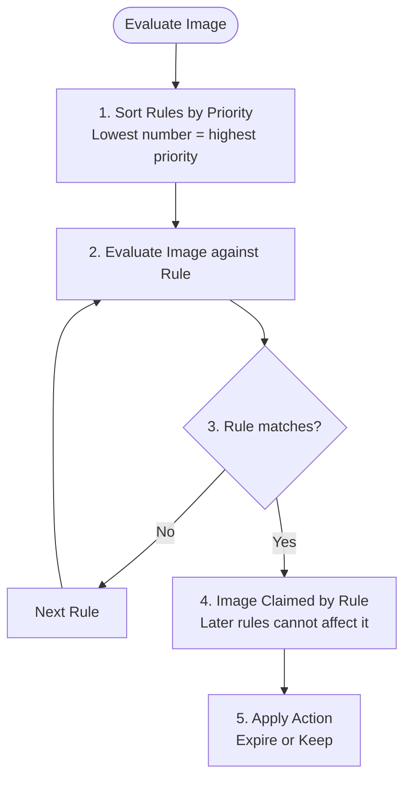

**Complexity**: `[MEDIUM]` | **Time to Complete**: 1 hour | **Prerequisites**: Module 1.1 IAM, Docker fundamentals, local Docker installation, and a configured AWS CLI.

## Prerequisites

Before starting this module, you should have completed [Module 1.1: IAM & Security Foundations](../module-1.1-iam/), be comfortable building and tagging container images locally, run Docker on your workstation, and have the AWS CLI configured with IAM permissions that allow ECR repository and image operations in the account and region you will use for the hands-on tasks below.

- [Module 1.1: IAM & Security Foundations](../module-1.1-iam/)
- Docker fundamentals (building and tagging images)
- Docker installed locally and running
- AWS CLI configured with appropriate permissions

## What You'll Be Able to Do

After completing this module, you will be able to operate ECR as a production registry: configure immutable tagging and lifecycle policies, replicate images across accounts and regions, enforce vulnerability scanning at push time, and keep pulls on the private AWS network using IAM and VPC endpoints. The bullet list below states those outcomes in review-ready form:

- **Configure ECR repositories with immutable tagging and lifecycle policies to manage container image sprawl**
- **Implement cross-account and cross-region image replication for multi-region deployment pipelines**
- **Deploy ECR image scanning with vulnerability reporting and enforce scan-on-push policies**
- **Secure ECR access with IAM policies and VPC endpoints to keep image pulls off the public internet**

---

## Why This Module Matters

Hypothetical scenario: In January 2024, a mid-stage fintech startup pushed a routine update to their payment processing service. The deployment succeeded. Five minutes later, their monitoring exploded. The application was crashing on startup, throwing cryptic "exec format error" messages. The previous container image -- the one that worked -- had been overwritten because they were using the `latest` tag with mutable tagging enabled. Their CI pipeline had pushed an ARM64 image over the existing AMD64 image. No versioning. No immutability. No way to roll back except to rebuild from source, which took 22 minutes while their payment pipeline was down. Twenty-two minutes of lost transactions for a fintech company is the kind of thing that ends up in board meeting slides.

Container registries are one of those infrastructure components that seem boring until they break. They sit between your CI pipeline and your runtime environment, holding every version of every service your company runs. A misconfigured registry means you cannot deploy, cannot roll back, and cannot verify that what is running in production is what you think is running. AWS Elastic Container Registry (ECR) is Amazon's managed container registry, deeply integrated with ECS, EKS, Lambda, and the rest of the AWS ecosystem.

In this module, you will learn how ECR works, how to configure it properly for production workloads, and how to avoid the mistakes that turn a routine deployment into a production incident. By the end, you will have built a complete image lifecycle -- from building and pushing images with proper tagging, to configuring lifecycle policies that keep your registry clean and your costs under control.

---

## ECR Architecture and Concepts

ECR is a fully managed Docker container registry. Unlike running your own registry (Docker Registry, Harbor, or Nexus), ECR handles storage, availability, encryption, and access control for you. Let us break down the key concepts.

### Registries, Repositories, and Images

```mermaid
graph TD
    Acc[AWS Account 123456789012] --> Reg[ECR Registry: 123456789012.dkr.ecr.us-east-1.amazonaws.com]
    
    Reg --> Repo1[Repository: myapp/api]
    Reg --> Repo2[Repository: myapp/worker]
    Reg --> Repo3[Repository: shared/nginx-base]
    
    Repo1 --> Img1[Image: sha256:abc123... | tag: v1.2.0]
    Repo1 --> Img2[Image: sha256:def456... | tag: v1.2.1]
    Repo1 --> Img3[Image: sha256:ghi789... | tag: v1.3.0, latest]
    
    Repo2 --> Img4[Image: sha256:jkl012... | tag: v2.0.0]
    Repo2 --> Img5[Image: sha256:mno345... | tag: v2.1.0]
    
    Repo3 --> Img6[Image: sha256:pqr678... | tag: 1.25-custom]
```

An ECR **registry** exists once per AWS account per region; for private registries in standard commercial regions the URI is `{account_id}.dkr.ecr.{region}.amazonaws.com`, and you cannot rename that endpoint after creation. Within the registry, a **repository** groups related images the way a Git repository groups commits — teams usually adopt slash-separated names such as `team/service` or `app/component` so dozens of microservices stay navigable. Each **image** is an immutable manifest addressed by its SHA256 digest and optionally by one or more tags, which means the same digest can simultaneously carry a semantic version and a Git SHA for auditability without duplicating storage.

### Public vs Private Repositories

ECR offers private and public repository types, and the choice affects authentication, cost, and where your workloads pull images from; the table below summarizes the differences you will weigh when designing a registry layout:

| Feature | ECR Private | ECR Public |
|---------|------------|------------|
| URL format | `{account_id}.dkr.ecr.{region}.amazonaws.com` | `public.ecr.aws/{alias}` |
| Authentication | Required for pull and push | Required for push; pull is anonymous |
| Cost | $0.10/GB/month storage + data transfer | Free (up to limits) |
| Use case | Internal services, proprietary code | Open source projects, shared base images |
| Regions | All commercial regions | us-east-1 only (content delivered globally via CloudFront) |
| Vulnerability scanning | Basic + Enhanced (Inspector) | Not supported |
| Lifecycle policies | Yes | No |

For most internal application pipelines you will use private repositories because they integrate with IAM, support lifecycle policies, and keep proprietary layers off the public internet. Public ECR is the better fit when you distribute open-source tools or shared base images that external teams or customers must pull without AWS credentials, because anonymous pulls are allowed even though pushes still require authentication.

```bash
# Create a private repository
aws ecr create-repository \
  --repository-name myapp/api \
  --image-scanning-configuration scanOnPush=true \
  --image-tag-mutability IMMUTABLE \
  --encryption-configuration encryptionType=KMS

# Create a public repository
aws ecr-public create-repository \
  --repository-name my-oss-tool \
  --catalog-data '{
    "description": "My open source container tool",
    "architectures": ["x86-64", "ARM 64"],
    "operatingSystems": ["Linux"]
  }' \
  --region us-east-1
```


### Encryption at Rest

ECR encrypts every image layer automatically using AES-256 server-side encryption with an S3-managed key, which requires no action from you and satisfies the encryption-at-rest requirement that most compliance frameworks mandate. For organizations that need to control the encryption key lifecycle — rotating keys on a schedule, auditing key usage through CloudTrail, or revoking access to specific images — ECR also supports AWS KMS customer-managed keys (CMKs). When you specify a KMS key at repository creation, ECR wraps the S3 encryption key with your CMK, which means that even if an attacker gained access to the S3 bucket, they could not decrypt the layers without also having permission to use your KMS key.

```bash
# Create a repository with a customer-managed KMS key
aws ecr create-repository \
  --repository-name myapp/api \
  --encryption-configuration encryptionType=KMS,kmsKey=arn:aws:kms:us-east-1:123456789012:key/abcd1234-... \
  --region us-east-1
```

KMS encryption does introduce a cost and latency trade-off. High pull rates against KMS-encrypted repositories can generate substantial KMS request volume (each layer fetch may invoke `kms:Decrypt`), which counts against your quota and incurs per-request charges. For repositories that serve thousands of pulls per hour, KMS API costs can meaningfully exceed the ECR storage costs. Teams that need KMS for compliance but want to keep the cost predictable typically apply KMS encryption only to repositories holding production images and use AES-256 for development and CI repositories.

A common misconception is that ECR Public (`public.ecr.aws`) supports KMS encryption or private VPC endpoints. ECR Public is a fundamentally different service: it stores images in a global CloudFront-backed distribution, does not support encryption configuration (AES-256 is applied automatically and transparently), and does not integrate with IAM for pull access because anonymous pulls are the defining feature. If your images contain proprietary code or configuration secrets, ECR Public is the wrong destination regardless of encryption — use private ECR with repository policies to share access with specific external accounts.

---

## Authentication and Pushing Images

ECR uses IAM for authentication, but the Docker CLI does not speak IAM natively, so every workstation and CI runner must exchange AWS credentials for a short-lived registry password before `docker push` or `docker pull` will succeed. The commands in the next section show that one-time login pattern; once authenticated, the same tagging workflow applies whether you build on a laptop or in a pipeline.

### Getting Authenticated

```bash
# The standard way: pipe ECR token directly to docker login
aws ecr get-login-password --region us-east-1 | \
  docker login --username AWS --password-stdin \
  123456789012.dkr.ecr.us-east-1.amazonaws.com

# The token is valid for 12 hours
# For CI/CD pipelines, refresh it at the start of each pipeline run
```

For ECS and EKS workloads running inside AWS you usually skip manual `docker login` altogether: ECS task execution roles and EKS node instance profiles (or IRSA for pod-level identity) obtain registry tokens on your behalf, which is why platform teams focus IAM policy design on those roles instead of long-lived access keys on nodes.

### Building and Pushing Images

The workflow from a local Dockerfile to a versioned image in ECR is intentionally boring — build, retag with the registry hostname, push, and verify with `describe-images` — because predictable steps are what let you automate the same path in CI. The commands below walk through that minimal path; the shell script after them adds layer caching and dual tagging patterns you will want in production pipelines.

```bash
# Step 1: Build your image locally
docker build -t myapp/api:v1.3.0 .

# Step 2: Tag it for ECR
docker tag myapp/api:v1.3.0 \
  123456789012.dkr.ecr.us-east-1.amazonaws.com/myapp/api:v1.3.0

# Step 3: Push to ECR
docker push 123456789012.dkr.ecr.us-east-1.amazonaws.com/myapp/api:v1.3.0

# Verify the push
aws ecr describe-images \
  --repository-name myapp/api \
  --image-ids imageTag=v1.3.0
```

When you move this workflow into CI/CD, add deterministic tags derived from the Git commit, reuse remote layers with `--cache-from`, and fail fast if `docker push` cannot refresh an immutable tag — the script below demonstrates those habits without hiding the underlying ECR calls.

```bash
#!/bin/bash
set -euo pipefail

ACCOUNT_ID=$(aws sts get-caller-identity --query Account --output text)
REGION="us-east-1"
REPO_NAME="myapp/api"
REGISTRY="${ACCOUNT_ID}.dkr.ecr.${REGION}.amazonaws.com"
IMAGE_TAG="${GIT_SHA:-$(git rev-parse --short HEAD)}"

# Authenticate
aws ecr get-login-password --region ${REGION} | \
  docker login --username AWS --password-stdin ${REGISTRY}

# Build with cache from previous image (speeds up CI builds significantly)
docker build \
  --cache-from ${REGISTRY}/${REPO_NAME}:latest \
  --build-arg BUILDKIT_INLINE_CACHE=1 \
  -t ${REGISTRY}/${REPO_NAME}:${IMAGE_TAG} \
  -t ${REGISTRY}/${REPO_NAME}:latest \
  .

# Push both tags
docker push ${REGISTRY}/${REPO_NAME}:${IMAGE_TAG}
docker push ${REGISTRY}/${REPO_NAME}:latest

echo "Pushed ${REGISTRY}/${REPO_NAME}:${IMAGE_TAG}"
```

---

## Image Tagging Strategies and Immutability

Tagging looks deceptively simple because Docker defaults to `latest`, yet tagging policy is where rollbacks, compliance audits, and multi-architecture incidents are won or lost — so the rest of this section pairs immutability settings with naming strategies you can defend in a production review.

### Tag Immutability

When tag immutability is enabled, once you push an image with a specific tag, that tag cannot be overwritten. This is critical for production safety.

```bash
# Enable immutability on an existing repository
aws ecr put-image-tag-mutability \
  --repository-name myapp/api \
  --image-tag-mutability IMMUTABLE

# Now this will FAIL if v1.3.0 already exists:
docker push 123456789012.dkr.ecr.us-east-1.amazonaws.com/myapp/api:v1.3.0
# Error: tag invalid: The image tag 'v1.3.0' already exists
```

### Digest Pinning and Supply-Chain Integrity

Immutable tags address one part of the supply-chain integrity problem, but digest pinning closes the remaining gap. A tag is a human-readable alias that resolves to an image digest — the cryptographic SHA256 hash of the image manifest. When your Kubernetes Deployment or ECS task definition references `myapp/api:v1.3.0`, the container runtime resolves that tag to a digest at pull time. If tags are mutable and an attacker or a misconfigured CI job overwrites `v1.3.0` with a different image, the runtime pulls the replacement and deploys it without any warning. Immutable tags prevent tag overwrites at the registry level, which stops accidental or malicious CI-side injection. But tag resolution itself is still an indirection: the runtime trusts the registry to map the tag to the correct digest.

Digest pinning removes that indirection entirely. When you reference an image by its SHA256 digest directly — `myapp/api@sha256:abc123...` — the container runtime fetches the exact content hash you specified, and ECR will never serve a different image for the same digest because digests are content-addressable and immutable by definition. A digest-pinned deployment is immune to tag manipulation of any kind. If a tag is accidentally deleted, moved, or (in a mutable repository) overwritten, the digest reference remains valid as long as the underlying image layers exist in the registry.

```yaml
# Kubernetes Deployment with digest pinning — immune to tag overwrites
spec:
  containers:
  - name: api
    image: 123456789012.dkr.ecr.us-east-1.amazonaws.com/myapp/api@sha256:abc123def456789...
```

The two-layer defense — immutable tags in CI plus digest pinning in deployment manifests — creates a cryptographic chain of custody. In regulated environments where you must prove that the image running in production matches the image that passed your vulnerability scanner and change approval process, digest references serve as the verifiable link between the CI attestation and the runtime. An auditor can compare the digest logged by your CI system against the digest in your deployment spec and confirm they are identical without trusting the tag system at all.

Digest pinning does add a workflow friction: you need a mechanism to update deployment manifests with the digest of each new build. Most CI systems handle this automatically: after `docker push`, capture the digest with `docker inspect --format='{{index .RepoDigests 0}}'` or read it from the push output, then update your Kubernetes manifest or ECS task definition before applying. The extra CI step is minor compared to the guarantee that your production deployment references an exact, verifiable artifact.

With immutability enabled, you are guaranteed that `v1.3.0` always refers to the exact same image. This makes rollbacks reliable and audit trails meaningful.

### Tagging Strategy Comparison

| Strategy | Example | Pros | Cons |
|----------|---------|------|------|
| Semantic version | `v1.3.0` | Human readable, clear progression | Requires version discipline |
| Git SHA | `abc1234` | Ties image to exact source code | Not human readable |
| Both (recommended) | `v1.3.0` + `abc1234` | Best of both worlds | Slightly more complex CI |
| `latest` only | `latest` | Simple | No versioning, cannot roll back, dangerous |
| Date-based | `2026-03-24-1432` | Chronological ordering | No semantic meaning |

**Pause and predict:** Your CI pipeline successfully builds and pushes `myapp:latest` to a mutable ECR repository, overwriting the previous image. Five minutes later, the new code triggers a critical bug in production. You try to roll back by updating your ECS service to restart its tasks, hoping it pulls the old image. What will actually happen, and why is this an incident-response nightmare?

<details>
<summary>Check your prediction</summary>

Restarting the ECS service re-pulls the broken new image because `:latest` now points to the newly pushed digest. The previous container digest is untagged and permanently unreachable by tag unless operators still hold its raw SHA256 digest, forcing a slow emergency rebuild from source while the outage continues.

</details>

The recommended approach for production: **tag every image with both the semantic version and the Git SHA.** Use `latest` only as a convenience pointer that also gets applied alongside the versioned tag.

```bash
# Recommended: apply multiple tags
docker tag myapp/api:local \
  ${REGISTRY}/${REPO_NAME}:v1.3.0
docker tag myapp/api:local \
  ${REGISTRY}/${REPO_NAME}:${GIT_SHA}
docker tag myapp/api:local \
  ${REGISTRY}/${REPO_NAME}:latest

# With immutability ON:
# - v1.3.0 and ${GIT_SHA} are permanent, cannot be overwritten
# - latest is NOT allowed with IMMUTABLE (it needs to change each push)
# Solution: use IMMUTABLE repos without the 'latest' tag,
# or use a separate mutable repo for 'latest'
```

A practical note on immutability and `latest`: they are fundamentally incompatible because `latest` is meant to move while immutable tags are meant to stay fixed, so you cannot push `latest` repeatedly in an immutable repository. Most teams therefore choose one of two patterns: enable immutability and deploy only explicit version or Git SHA tags (safer, slower to misuse), or keep mutability but enforce version tags through CI policy linting (more convenient, requires discipline). Pick the pattern that matches how strictly your release managers want to block overwrites, not whichever default happened to be checked when the repository was created.

---

## Vulnerability Scanning

ECR provides two levels of vulnerability scanning — Basic and Enhanced — and the difference is not cosmetic: Basic scanning is included at no extra charge but only inspects OS packages, while Enhanced scanning delegates to Amazon Inspector and surfaces application dependency issues that Basic scans miss entirely.

### Basic Scanning

Basic scanning uses the open-source Clair engine to check for known CVEs in operating system packages installed through apt, yum, or similar package managers, which makes it a useful baseline gate even though it will not read your `package.json` or `requirements.txt`.

```bash
# Enable scan-on-push for a repository
aws ecr put-image-scanning-configuration \
  --repository-name myapp/api \
  --image-scanning-configuration scanOnPush=true

# Manually trigger a scan on an existing image
aws ecr start-image-scan \
  --repository-name myapp/api \
  --image-id imageTag=v1.3.0

# Get scan results
aws ecr describe-image-scan-findings \
  --repository-name myapp/api \
  --image-id imageTag=v1.3.0
```

### Enhanced Scanning

Enhanced scanning uses Amazon Inspector to analyze application dependencies in addition to OS packages, which costs extra per image but routinely surfaces far more findings — especially in language runtimes where OS images look clean while application manifests carry the real risk.

```bash
# Enable enhanced scanning at the registry level
aws ecr put-registry-scanning-configuration \
  --scan-type ENHANCED \
  --rules '[
    {
      "scanFrequency": "CONTINUOUS_SCAN",
      "repositoryFilters": [
        {"filter": "myapp/*", "filterType": "WILDCARD"}
      ]
    },
    {
      "scanFrequency": "SCAN_ON_PUSH",
      "repositoryFilters": [
        {"filter": "*", "filterType": "WILDCARD"}
      ]
    }
  ]'
```

#### Basic vs Enhanced: When the Difference Matters

A concrete example makes the distinction clearer. Consider a Python application image built `FROM python:3.12-slim` with a `requirements.txt` that pins `flask==2.3.0` and `requests==2.31.0`. Basic scanning (Clair) inspects the Debian package database inside the `python:3.12-slim` base layer and reports CVEs against `libssl3`, `libc6`, and other system libraries. It might find three HIGH findings for outdated OpenSSL packages. Enhanced scanning (Amazon Inspector) inspects those same OS packages but also parses the `requirements.txt` embedded in the image layer, cross-references `flask` and `requests` against the Inspector vulnerability database, and reports application-level CVEs. If Flask 2.3.0 has a known cross-site scripting vulnerability and requests 2.31.0 has a certificate validation bypass, Enhanced scanning reports both while Basic scanning reports zero application findings.

The operational consequence: teams that rely on Basic scanning alone ship images that look clean on the OS scan but carry known application vulnerabilities. This is not a theoretical edge case — it is the default state for any image that includes application dependencies, which is nearly every production image. Enhanced scanning is not free (Inspector charges per image scan), but the cost of deploying a vulnerable application almost always exceeds the scanning charges.

Enhanced scanning in `CONTINUOUS_SCAN` mode provides an additional safeguard that `SCAN_ON_PUSH` cannot match. When a new CVE is published — for example, a critical vulnerability in the `requests` library disclosed six months after you built your image — CONTINUOUS_SCAN re-scans every affected image in your registry within 24 hours and surfaces the finding without any action on your part. With SCAN_ON_PUSH, images that passed their initial scan remain marked as clean indefinitely, creating a "drift window" where production images carry vulnerabilities that were unknown at build time but are now public and exploitable. For any repository that feeds a production deployment, CONTINUOUS_SCAN is the safer default.

Findings from Enhanced scanning flow into Amazon Inspector's centralized dashboard and can be forwarded to AWS Security Hub, where they appear alongside findings from GuardDuty, Macie, and IAM Access Analyzer. This integration matters operationally because it lets you apply the same remediation workflows — Jira tickets, Slack notifications, escalation policies — to container CVEs that you already use for EC2 patching and S3 bucket exposure alerts.

### Interpreting Scan Results

```bash
# Get findings summary
aws ecr describe-image-scan-findings \
  --repository-name myapp/api \
  --image-id imageTag=v1.3.0 \
  --query 'imageScanFindings.findingSeverityCounts'

# Example output:
# {
#     "CRITICAL": 0,
#     "HIGH": 2,
#     "MEDIUM": 8,
#     "LOW": 15,
#     "INFORMATIONAL": 3
# }

# Get detailed findings for critical and high severity
aws ecr describe-image-scan-findings \
  --repository-name myapp/api \
  --image-id imageTag=v1.3.0 \
  --query 'imageScanFindings.findings[?severity==`HIGH` || severity==`CRITICAL`]'
```

Once scans finish, wire the counts into your deployment pipeline so a single critical CVE blocks promotion automatically — the shell gate below reads severity totals from `describe-image-scan-findings` and exits non-zero when your thresholds are exceeded, which turns scanning from a dashboard nicety into an enforceable control.

```bash
#!/bin/bash
# Gate deployment based on scan findings
CRITICAL=$(aws ecr describe-image-scan-findings \
  --repository-name myapp/api \
  --image-id imageTag=${IMAGE_TAG} \
  --query 'imageScanFindings.findingSeverityCounts.CRITICAL // `0`' \
  --output text)

HIGH=$(aws ecr describe-image-scan-findings \
  --repository-name myapp/api \
  --image-id imageTag=${IMAGE_TAG} \
  --query 'imageScanFindings.findingSeverityCounts.HIGH // `0`' \
  --output text)

if [ "${CRITICAL}" -gt 0 ]; then
  echo "BLOCKED: ${CRITICAL} critical vulnerabilities found"
  exit 1
fi

if [ "${HIGH}" -gt 5 ]; then
  echo "WARNING: ${HIGH} high-severity vulnerabilities found (threshold: 5)"
  exit 1
fi

echo "Scan passed: ${CRITICAL} critical, ${HIGH} high"
```

---

## Lifecycle Policies

Without lifecycle policies, your ECR storage grows indefinitely because every CI build pushes a new image digest while older tags linger as rollback candidates — a team pushing ten builds per day can accumulate three hundred images per repository per month, and at roughly $0.10 per GB-month those forgotten layers show up on finance slides long after the feature branch merged. Lifecycle policies let you expire images automatically using rule priorities you define once and preview before anything is deleted.

### Understanding Lifecycle Policy Rules

```bash
# Set a lifecycle policy that retains the last 10 tagged images
aws ecr put-lifecycle-policy \
  --repository-name myapp/api \
  --lifecycle-policy-text '{
    "rules": [
      {
        "rulePriority": 1,
        "description": "Keep last 10 tagged images",
        "selection": {
          "tagStatus": "tagged",
          "tagPrefixList": ["v"],
          "countType": "imageCountMoreThan",
          "countNumber": 10
        },
        "action": {
          "type": "expire"
        }
      },
      {
        "rulePriority": 2,
        "description": "Remove untagged images older than 3 days",
        "selection": {
          "tagStatus": "untagged",
          "countType": "sinceImagePushed",
          "countUnit": "days",
          "countNumber": 3
        },
        "action": {
          "type": "expire"
        }
      }
    ]
  }'
```

### Production-Grade Lifecycle Policy

The policy below combines release retention, short-lived feature branch pruning, and aggressive untagged cleanup — a pattern that keeps rollback windows for semver tags without letting experimental prefixes or dangling digests accumulate forever:

```bash
aws ecr put-lifecycle-policy \
  --repository-name myapp/api \
  --lifecycle-policy-text '{
    "rules": [
      {
        "rulePriority": 1,
        "description": "Keep release images (v-prefixed) for 180 days",
        "selection": {
          "tagStatus": "tagged",
          "tagPrefixList": ["v"],
          "countType": "sinceImagePushed",
          "countUnit": "days",
          "countNumber": 180
        },
        "action": {"type": "expire"}
      },
      {
        "rulePriority": 2,
        "description": "Keep only last 5 feature branch images",
        "selection": {
          "tagStatus": "tagged",
          "tagPrefixList": ["feature-", "fix-", "dev-"],
          "countType": "imageCountMoreThan",
          "countNumber": 5
        },
        "action": {"type": "expire"}
      },
      {
        "rulePriority": 10,
        "description": "Remove untagged images after 1 day",
        "selection": {
          "tagStatus": "untagged",
          "countType": "sinceImagePushed",
          "countUnit": "days",
          "countNumber": 1
        },
        "action": {"type": "expire"}
      }
    ]
  }'
```

**Pause and predict:** You have a policy with two rules. Rule 1 (Priority 1) keeps 5 images with the prefix `prod-`. Rule 2 (Priority 2) expires all untagged images older than 7 days. You push an image with the tag `prod-v2.0` and immediately remove the tag because it was a mistake. 10 days later, will this image be deleted? Consider how ECR evaluates rules against image digests and tags.

<details>
<summary>Check your prediction</summary>

Yes, the image is deleted after 10 days. Once the tag is removed, the digest becomes untagged, so Rule 1 no longer evaluates it because Rule 1 only filters for tagged images with the `prod-` prefix. Rule 2 then processes the untagged digest and expires it because its push timestamp exceeds the 7-day retention limit.

</details>

### Preview Before You Apply

Lifecycle policies are destructive once AWS applies them, so treat `put-lifecycle-policy` like a production change: run `start-lifecycle-policy-preview` and read `get-lifecycle-policy-preview` before you rely on a new rule set, because the dry-run output is the cheapest place to discover that your `v` prefix rule would have deleted last week's hotfix tag.

```bash
# Preview what a lifecycle policy WOULD delete (dry run)
aws ecr get-lifecycle-policy-preview \
  --repository-name myapp/api

# Start a preview (if no preview exists)
aws ecr start-lifecycle-policy-preview \
  --repository-name myapp/api
```

### Lifecycle Policy Rule Evaluation Order

ECR evaluates lifecycle rules in priority order — lowest rule number wins first match — and an image claimed by one rule is never reconsidered by later rules, which is why mis-ordered priorities cause surprises that no amount of tagging discipline can fix after the fact. The flowchart below shows that evaluation path, and the worked examples after it map each rule in the production policy to a concrete keep-or-expire decision:



Walk through the production policy with four representative images and the evaluation order becomes intuitive: a `v1.3.0` image pushed ninety days ago matches Rule 1's `v` prefix and stays inside the 180-day window, so it is **kept**; a `v1.0.0` image pushed two hundred days ago matches the same prefix but exceeds the age threshold, so it is **expired**; a sixth image tagged `feature-auth-fix` exceeds the feature-branch count cap in Rule 2 and is **expired** even though it is young; and an untagged digest pushed two days ago is **expired** by Rule 10 because untagged manifests are treated as build debris rather than rollback candidates.

---

## Cross-Account and Cross-Region Sharing

In multi-account AWS environments (which is the standard for any serious organization), you often need to share images between accounts. The typical pattern: a CI/CD account builds and pushes images, and deployment accounts pull them.

### Cross-Account Access via Repository Policy

```bash
# Allow another AWS account to pull images
aws ecr set-repository-policy \
  --repository-name myapp/api \
  --policy-text '{
    "Version": "2012-10-17",
    "Statement": [
      {
        "Sid": "AllowCrossAccountPull",
        "Effect": "Allow",
        "Principal": {
          "AWS": [
            "arn:aws:iam::987654321098:root",
            "arn:aws:iam::111222333444:root"
          ]
        },
        "Action": [
          "ecr:GetDownloadUrlForLayer",
          "ecr:BatchGetImage",
          "ecr:BatchCheckLayerAvailability"
        ]
      }
    ]
  }'
```

### Cross-Region Replication

ECR supports automatic replication of images to other regions. This is essential for multi-region deployments to avoid cross-region image pulls during container startup (which add latency and data transfer costs).

```bash
# Configure replication to eu-west-1 and ap-southeast-1
aws ecr put-replication-configuration \
  --replication-configuration '{
    "rules": [
      {
        "destinations": [
          {
            "region": "eu-west-1",
            "registryId": "123456789012"
          },
          {
            "region": "ap-southeast-1",
            "registryId": "123456789012"
          }
        ],
        "repositoryFilters": [
          {
            "filter": "myapp/",
            "filterType": "PREFIX_MATCH"
          }
        ]
      }
    ]
  }'
```

### Cross-Account and Cross-Region Together

Organizations that split CI, staging, and production across accounts and regions usually combine replication with explicit registry policies so images flow automatically while humans never share long-lived access keys across account boundaries — the replication configuration below shows a CI account publishing into a production account in two regions:

```bash
# Replicate from CI account (123456789012) to:
# - Production account (987654321098) in us-east-1 and eu-west-1
aws ecr put-replication-configuration \
  --replication-configuration '{
    "rules": [
      {
        "destinations": [
          {
            "region": "us-east-1",
            "registryId": "987654321098"
          },
          {
            "region": "eu-west-1",
            "registryId": "987654321098"
          }
        ]
      }
    ]
  }'
```

Replication is not unidirectional magic: the destination account must publish a registry policy that trusts the source account to call `ecr:ReplicateImage` and create repositories on its behalf, which is why the command below is run in the **destination** account even though engineers think of CI as "owning" the images:

```bash
# Run this in the DESTINATION account
aws ecr put-registry-policy \
  --policy-text '{
    "Version": "2012-10-17",
    "Statement": [
      {
        "Sid": "AllowReplicationFrom",
        "Effect": "Allow",
        "Principal": {
          "AWS": "arn:aws:iam::123456789012:root"
        },
        "Action": [
          "ecr:CreateRepository",
          "ecr:ReplicateImage"
        ],
        "Resource": "arn:aws:ecr:*:987654321098:repository/*"
      }
    ]
  }'
```

---

## Securing ECR with VPC Endpoints (AWS PrivateLink)

By default, when your ECS tasks, EKS worker nodes, or EC2 instances pull images from ECR, the traffic travels over the public internet. This requires your subnets to have a NAT Gateway (which incurs data processing charges) or an Internet Gateway (which requires public IP addresses).

For enhanced security and to reduce NAT Gateway costs, you can configure VPC Endpoints (AWS PrivateLink) for ECR so authentication and layer downloads stay on the AWS backbone instead of traversing the public internet through a NAT gateway. Private ECR access requires **two** interface endpoints in each VPC where tasks pull images: `com.amazonaws.region.ecr.api` for control-plane calls such as `DescribeRepositories`, and `com.amazonaws.region.ecr.dkr` for the Docker registry protocol that actually moves layers during `pull` and `push`.

**Pause and predict:** You configured both the ECR API and DKR VPC endpoints in your private subnet, routing all ECR traffic locally. However, when your ECS task attempts to start, it authenticates successfully but hangs while downloading the image layers. What crucial network path is missing?

<details>
<summary>Check your prediction</summary>

An S3 Gateway Endpoint (`com.amazonaws.region.s3`) is missing from the subnet route table. Although authentication and manifest lookups route through the interface endpoints, ECR stores actual layer blobs in Amazon S3 buckets; container clients retrieve layers using pre-signed S3 URLs that require either public internet access or an in-VPC S3 Gateway Endpoint to complete downloads.

</details>

Provisioning PrivateLink interface endpoints requires binding dedicated elastic network interfaces directly to isolated subnets. Security groups must explicitly permit inbound HTTPS traffic on port 443 from container compute instances. Each interface endpoint assigns private IP addresses that route Docker daemon control requests across internal network backbones. Platform teams typically automate these endpoint associations with infrastructure code before launching private production workloads.

```bash
# Example: Creating the ECR Docker endpoint (requires a security group that allows inbound HTTPS from your compute nodes)
aws ec2 create-vpc-endpoint \
  --vpc-id vpc-12345678 \
  --vpc-endpoint-type Interface \
  --service-name com.amazonaws.us-east-1.ecr.dkr \
  --subnet-ids subnet-11112222 subnet-33334444 \
  --security-group-ids sg-55556666
```

If you block public internet access in your private subnets and forget the S3 Gateway Endpoint, your ECS tasks will authenticate successfully but hang indefinitely in the "PENDING" state while trying to download the image layers.

---

## Pull-Through Cache Repositories

When your ECS tasks or EKS pods reference public container images — a base image from Docker Hub, a sidecar from Quay.io, or a Kubernetes component from `registry.k8s.io` — every `docker pull` crosses the public internet to the upstream registry. That external dependency introduces two operational risks: rate limits and availability. Docker Hub enforces pull rate limits based on the requesting IP address or authenticated user: 100 pulls per 6 hours for anonymous access and 200 pulls per 6 hours for authenticated free-tier accounts. When your cluster scales from 10 to 100 pods simultaneously during a traffic spike, every pod attempts to pull the same public image, Docker Hub throttles the excess requests, and the pods that hit the rate limit fail to start. The autoscaling event that was supposed to absorb the traffic spike instead creates a cascading failure because your infrastructure cannot retrieve the images it needs to run.

ECR pull-through cache eliminates both problems by creating a caching proxy inside your private ECR registry. You define a pull-through cache rule that maps an upstream registry to a namespace prefix in your private registry. When your workloads pull an image through the cache URL, ECR checks its local store first. If the image exists and is fresh, ECR serves it directly with no external call. If the image is missing or stale, ECR fetches it from the upstream registry exactly once, caches it, and serves all subsequent requests from the cache. A 100-pod scale-out event generates one external pull to Docker Hub regardless of how many pods need the image.

```bash
# Create a pull-through cache rule for Docker Hub (requires upstream credentials)
aws ecr create-pull-through-cache-rule \
  --ecr-repository-prefix docker-hub \
  --upstream-registry-url registry-1.docker.io \
  --credential-arn arn:aws:secretsmanager:us-east-1:123456789012:secret:ecr-pullthroughcache/dockerhub-AbCdEf \
  --region us-east-1

# Kubernetes community registry (anonymous — no credential-arn)
aws ecr create-pull-through-cache-rule \
  --ecr-repository-prefix k8s \
  --upstream-registry-url registry.k8s.io \
  --region us-east-1

# GitHub Container Registry (requires upstream credentials)
aws ecr create-pull-through-cache-rule \
  --ecr-repository-prefix ghcr \
  --upstream-registry-url ghcr.io \
  --credential-arn arn:aws:secretsmanager:us-east-1:123456789012:secret:ecr-pullthroughcache/ghcr-XyZ123 \
  --region us-east-1
```

The pull URL scheme follows a fixed pattern. An image you would normally pull with `docker pull nginx:1.25` (which implicitly resolves to `docker.io/library/nginx:1.25`) becomes `{registry}/docker-hub/library/nginx:1.25` through the cache. ECR creates the target repository automatically on the first pull — you do not need to pre-create repositories for cached images, and the repository inherits the registry-level scanning and encryption defaults you have configured.

Supported upstream registries include Docker Hub (`registry-1.docker.io`), Quay (`quay.io`), GitHub Container Registry (`ghcr.io`), `registry.k8s.io`, and ECR Public (`public.ecr.aws`). Pass the **hostname** as `--upstream-registry-url`, not the console enum name. Only ECR Public, Quay, and `registry.k8s.io` allow anonymous pulls; Docker Hub, GHCR, GitLab, Azure Container Registry, and Chainguard require a Secrets Manager secret whose name **must** start with `ecr-pullthroughcache/`, referenced via `--credential-arn`. Store upstream registry credentials in that secret (username and password or token JSON) before creating the rule — otherwise the first pull fails with an authentication error even though the rule exists.

ECR uses a fixed **24-hour** cache window for pull-through cache (not user-configurable). While an image is within that window, ECR serves it from the local cache without contacting upstream. After 24 hours, the next pull checks upstream for a newer version and updates the cache if one exists. You cannot shorten that window or force an immediate refresh through ECR settings — plan tag immutability and promotion pipelines accordingly when you need deterministic upstream freshness.

A secondary benefit of pull-through cache is resilience when upstream registries throttle or rate-limit pulls. In November 2020, Docker Hub's introduction of pull rate limits (100 pulls per 6 hours anonymous, 200 per 6 hours for authenticated free accounts) caused CI pipelines that pulled directly from Docker Hub to fail under burst load. With pull-through cache, images already cached in your private ECR registry remain available in-region regardless of upstream throttling. The cache does not help for brand-new images that have never been pulled — the first pull still needs a reachable upstream — but it protects the common case where production base images were cached during normal operations.

Cached images are subject to the same scanning policies as any other image in your private registry, including Enhanced scanning when enabled at the registry level. Findings appear in the ECR console and Inspector dashboard like any pushed image. If you have Enhanced scanning enabled, every cached image is scanned automatically when it enters the cache, which means public images you do not control get vulnerability visibility before they run in your environment. The scan results appear alongside your own application images in the ECR console and the Inspector dashboard.

---

## OCI Artifact Support

ECR is a Docker container registry, but it is more precisely an OCI-compliant artifact store. The Open Container Initiative (OCI) defines specifications for container images and distribution, and the OCI Artifacts extension allows registries to store and distribute arbitrary content types alongside container images. ECR supports pushing and pulling OCI artifacts directly through standard OCI-compatible tools, which means you can store Helm charts, OPA (Open Policy Agent) policies, WebAssembly modules, Cosign signatures, and any other OCI-compatible artifact in the same registry that holds your container images.

The practical benefit is consolidation. Instead of running a separate Helm chart repository (ChartMuseum, Harbor, or a self-hosted OCI registry), you push everything to ECR and use IAM to control access uniformly. Helm 3.8+ includes native OCI support, so `helm push` and `helm pull` work against ECR repositories using the same authentication flow you already have configured for container images. The command below demonstrates the workflow — note that it uses the same registry URI and the same `aws ecr get-login-password` token you would use for `docker push`:

```bash
# Package and push a Helm chart to ECR as an OCI artifact
helm package ./my-chart/
helm registry login ${REGISTRY} \
  --username AWS \
  --password $(aws ecr get-login-password --region us-east-1)
# Create the OCI repository first (unlike Docker Hub, ECR does not auto-create on helm push)
aws ecr create-repository --repository-name my-chart --region us-east-1
helm push my-chart-0.1.0.tgz oci://${REGISTRY}/my-chart

# Pull the chart from any environment with ECR access
helm pull oci://${REGISTRY}/my-chart --version 0.1.0
```

The same lifecycle policies, tag immutability settings, cross-account sharing, and cross-region replication that protect your container images apply to OCI artifacts stored alongside them. A Helm chart version tagged `1.0.0` in an immutable repository cannot be overwritten, and a lifecycle policy that retains the last 10 tagged artifacts applies equally to container images and Helm charts. This uniformity eliminates the operational gap where container images have mature retention and access controls while the Helm charts that deploy them sit in an unmanaged S3 bucket with no versioning.

---

## Patterns and Anti-Patterns

The patterns below represent configurations that mature ECR deployments converge on after operating at scale. Each one addresses a specific failure mode that the corresponding anti-pattern enables.

### Proven Patterns

**Pattern 1: Immutable tags combined with digest-pinned deployments.** Apply `IMMUTABLE` tag mutability on every production repository so that no CI pipeline can accidentally or maliciously overwrite a released version. In Kubernetes Deployments and ECS task definitions, reference images by SHA256 digest (`image@sha256:...`) rather than by tag. Tag overwrite attacks, whether from compromised CI credentials or a misconfigured pipeline branch, cannot affect running workloads when the deployment spec references a cryptographic digest. This pattern scales naturally: as you add more services, the guarantee that `v2.1.0` in January is identical to `v2.1.0` in July holds without per-service configuration.

**Pattern 2: Lifecycle policy at repository creation time.** The moment a repository exists, apply a lifecycle policy that retains the last N tagged images (typically 20 to 30 for active services, 5 for internal tools) and removes untagged images after one to three days. Waiting until the storage bill arrives means you have already paid for months of accumulated CI build debris. At $0.10 per GB-month, a team pushing 15 builds per day at 200 MB per image accumulates 90 GB of storage in a single month ($9), and the untagged intermediates — the layers that existed between tags during multi-stage builds — can double that figure. A lifecycle policy applied on day one prevents this entirely. For services with compliance retention requirements, add a second rule with a higher age threshold (180 days) that matches your audit policy.

**Pattern 3: Enhanced scanning as a CI gate.** Enable Enhanced scanning with `SCAN_ON_PUSH` or `CONTINUOUS_SCAN` at the registry level, and add a pipeline step after `docker push` that calls `describe-image-scan-findings`, checks the severity counts against your thresholds (zero CRITICAL, fewer than N HIGH), and blocks deployment promotion if the thresholds are exceeded. This turns scanning from a dashboard widget that nobody checks into an enforceable control that prevents known-vulnerable images from reaching staging, let alone production. The gate adds 30 to 90 seconds to your pipeline (the time for the scan to complete) but saves the hours of incident response and rollback that deploying a vulnerable image triggers.

**Pattern 4: Pull-through cache for all public base images.** Audit your Dockerfiles and Kubernetes manifests for any `FROM` line or `image:` field that references a public registry (Docker Hub, Quay, `registry.k8s.io`, GitHub Container Registry). Replace each with the corresponding pull-through cache URL. This single change protects every service in your cluster from Docker Hub rate limits and upstream outages simultaneously. The cache does not require per-image configuration — once the cache rule exists, any image pulled through the `{prefix}/{upstream_path}` URL is cached automatically.

**Pattern 5: Least-privilege repository policies with VPC endpoints.** Combine repository policies that grant only the minimum actions (`ecr:GetDownloadUrlForLayer`, `ecr:BatchGetImage`, `ecr:BatchCheckLayerAvailability`) to specific IAM principals with VPC endpoints (`com.amazonaws.region.ecr.api`, `com.amazonaws.region.ecr.dkr`, and the S3 gateway endpoint) so image pulls never traverse the public internet. For EKS workloads, pair this with IRSA (IAM Roles for Service Accounts) so individual pods authenticate with scoped roles rather than sharing the node's instance profile.

### Anti-Patterns (and Their Remedies)

| Anti-Pattern | Why Teams Fall Into It | What Goes Wrong | Better Approach |
|---|---|---|---|
| Mutable `latest` tag as the sole deployment reference | Docker defaults to `latest`, and it works during development | A rollback becomes impossible because the previous image no longer exists under any tag. The production incident lasts until a rebuild completes, not until a rollback command runs. | Tag every build with a version or Git SHA. Enable `IMMUTABLE` tag mutability. Reference images by digest in deployment manifests. |
| No lifecycle policy on any repository | Teams do not think about storage costs during the prototype phase, and ECR never sends a warning | Three months later, 400 untagged images consume 180 GB of storage at $18/month per repository. Across 30 microservices, that is $540/month for images nobody will ever deploy. | Apply a lifecycle policy at repository creation. A default policy retaining 20 tagged images and removing untagged images after three days covers 90% of services. |
| Ignoring vulnerability scan findings | The findings appear in the ECR console, which developers rarely open, and there is no enforcement in the pipeline | A critical CVE in a base image sits in production for months. When the vulnerability is eventually exploited, the incident response team discovers that the scan flagged it six weeks earlier but nobody reviewed the dashboard. | Add a scan-results gate to the CI pipeline. Forward findings to Security Hub. Set up Slack or PagerDuty notifications for new CRITICAL findings in production repositories. |
| Long-lived static registry credentials stored in CI variables | `aws ecr get-login-password` feels like an extra step compared to generating a permanent token once | A CI provider breach or an accidental log output exposes the static token. Because the token never rotates, the attacker has indefinite pull access to every private image. | Use `get-login-password` at the start of every pipeline run. For EKS, use IRSA. For ECS, use task execution roles. Tokens expire after 12 hours, limiting the blast radius of any credential leak. |
| Cross-region image pulls without replication | The ECS cluster is in `eu-west-1` but the ECR repository was created in `us-east-1` during the initial project setup | Container startup adds 200 to 500 ms per image layer for cross-region transfer, and AWS bills data transfer at standard inter-region rates. A 500 MB image pulled 1,000 times per day across regions generates meaningful latency and monthly charges. | Enable cross-region replication from the source region to every region where you run container workloads. Images land in the local registry before the first deployment, and pulls stay in-region. |
| Repository names unrelated to service identity | Ad hoc naming during prototyping (`test-repo`, `my-container`, `app1`) without a naming convention | After six months, the team has 40 repositories and nobody can confidently map a repository name to a running service. Incident response stalls while engineers grep deployment manifests to find which repository feeds which ECS service. | Adopt a naming convention upfront: `{team}/{service}` or `{domain}/{component}`. Enforce it through CI linting or a Terraform module that rejects non-conforming names. |

Hypothetical scenario: A platform team deploys their first EKS cluster and configures ECR with scan-on-push and lifecycle policies, but they leave tag mutability at the default (MUTABLE). Six months later, a developer troubleshooting a staging issue manually pushes a debug build tagged `v2.3.0` — the same version that has been running in production for three weeks. The manual push overwrites the production image digest. The next day, a routine ECS task restart in production pulls the debug image, which contains a hardcoded staging database connection string. Production services begin failing with database authentication errors against the staging database. The incident takes 45 minutes to diagnose because nobody suspected a tag overwrite. The fix is one command (`--image-tag-mutability IMMUTABLE`), but applying it after the incident means you have already absorbed the outage.

---

## Decision Framework

The choices you make when configuring ECR — tag mutability, scanning level, cache strategy — are interconnected. Each decision affects cost, security, and operational complexity along different axes. The framework below lays out the trade-offs so you can map your organization's requirements to the right configuration without guessing.

### Tag Mutability: Immutable vs Mutable

| Criterion | Immutable (`IMMUTABLE`) | Mutable (`MUTABLE`) |
|---|---|---|
| Tag overwrite protection | Guaranteed — a tag, once pushed, is permanently bound to its digest | None — any push can replace any tag |
| `latest` tag support | Not compatible — `latest` must move | Compatible |
| Rollback reliability | Absolute — `v1.3.0` always resolves to the same image | Conditional — depends on CI discipline |
| CI complexity | Requires CI to never reuse a version tag; `latest` must be omitted or directed to a separate mutable repository | No additional CI constraints |
| Regulatory audit trail | Strong — tag-to-digest mapping is permanent | Weak — a tag can map to different digests over time |
| **Recommendation** | Use for all production repositories. The `latest` constraint is a feature: it forces version discipline. | Acceptable for development repositories where convenience outweighs overwrite risk. If you use mutable in production, enforce digest pinning in deployment manifests to compensate. |

### Vulnerability Scanning: Basic vs Enhanced

| Criterion | Basic Scanning (Clair-based) | Enhanced Scanning (Amazon Inspector) |
|---|---|---|
| Scope | OS packages only (apt, yum, apk) | OS packages + application dependencies across 8 languages (Python, .NET/C#, PHP, JavaScript/Node.js, Java, Ruby, Rust, Go) and their ecosystems (npm, pip, Maven, NuGet, Go modules, RubyGems, Rust crates) |
| Cost per image scan | Free | Charged per image scan (Inspector pricing) |
| Re-scan on new CVE | Manual re-trigger required | Automatic with `CONTINUOUS_SCAN` |
| Security Hub integration | No | Yes — findings appear alongside GuardDuty, Macie, IAM Access Analyzer |
| Finding types missed | Application CVEs in `package.json`, `requirements.txt`, `pom.xml`, etc. | None — Inspector covers both OS and application layers |
| **Recommendation** | Acceptable as a minimum baseline for internal tools and development images where application vulnerability risk is low. | Required for any image that reaches production, contains application dependencies, or must pass a security review. The per-scan cost is negligible compared to the cost of deploying a vulnerable image. |

### Image Distribution: Pull-Through Cache vs Cross-Region Replication

| Criterion | Pull-Through Cache | Cross-Region Replication |
|---|---|---|
| Primary use case | Caching public images from Docker Hub, Quay, `registry.k8s.io` to avoid rate limits and upstream outages | Distributing your own private images to multiple regions for low-latency local pulls |
| Source of images | Upstream public registries | Your own ECR repositories |
| Setup complexity | One cache rule per upstream registry | One replication configuration per destination region + destination registry policy |
| Storage cost impact | Cached images consume storage in your private registry ($0.10/GB-month) | Replicated images consume storage in each destination region |
| Data transfer cost | Inbound from upstream to ECR is free; outbound within region is free | Cross-region replication incurs source-region data transfer out (~$0.09/GB tiered) plus storage in each destination; in-region pulls after replication are free |
| Availability during upstream outage | Cached images remain available; uncached images are unreachable | Replicated images are fully independent in each region |
| **Recommendation** | Use pull-through cache for every public upstream registry your workloads reference. This is a one-time setup with ongoing availability and rate-limit benefits. | Use cross-region replication for every region where you run production container workloads. Local pulls eliminate cross-region latency and per-pull data transfer charges on every deployment. |

### Cost Lens

ECR costs break down into three categories, and each configuration decision in this framework moves cost in a specific direction:

| Cost category | Pricing structure | What drives cost up | How to control it |
|---|---|---|---|
| Storage | $0.10 per GB-month of stored image layers (verify current rates at aws.amazon.com/ecr/pricing/) | No lifecycle policy — untagged layers accumulate indefinitely. Large images (machine learning models, monorepos with many layers). | Lifecycle policies that expire old and untagged images. Layer deduplication across repositories (same base image stored once). |
| Data transfer | Free inbound to ECR. Free in-region to ECS/EKS. Cross-region and internet egress billed at standard EC2 data transfer rates. | Cross-region image pulls without replication. Public internet pulls from on-premises or other cloud providers. Workloads in regions where you have not replicated images. | Enable cross-region replication to every region with production workloads. Use VPC endpoints to keep pulls on the AWS backbone. |
| Enhanced scanning | Charged per image scan under the Amazon Inspector pricing model | Enabling CONTINUOUS_SCAN on every repository including development and CI throwaway images. Frequent rebuilds of images with large dependency trees. | Apply Enhanced scanning selectively to production repositories. Use repository filter rules in the registry scanning configuration to scope CONTINUOUS_SCAN to `prod-*` prefixed repositories while using SCAN_ON_PUSH for others. |
| KMS encryption | Per-request charge for `kms:Decrypt` calls when the Docker daemon fetches layers | High-frequency pulls from KMS-encrypted repositories can drive substantial KMS request volume at scale | Use AES-256 encryption for repositories with high pull volume. Reserve KMS encryption for repositories where key lifecycle control is a compliance requirement, and monitor KMS request metrics to catch unexpected cost growth. |

The most common cost surprise is not the storage cost itself but the compound effect of neglecting lifecycle policies while also running workloads in multiple regions without replication. A team with 20 microservices, each generating 200 MB of images per day with no lifecycle policy and pulling cross-region from a single ECR region, can accumulate 3.6 TB of storage ($360/month) and significant cross-region data transfer charges before anyone notices because ECR does not send billing alerts for approaching thresholds. The fix — lifecycle policies plus replication — costs nothing to enable and eliminates the recurring waste.


## Did You Know?

1. **ECR stores images in S3 under the hood**, but you cannot see or access the S3 buckets directly. Each image layer is stored as an individual S3 object, deduplicated across all repositories in the same account and region. If five of your repositories use the same base layer (like `ubuntu:22.04`), that layer is stored only once. This deduplication can substantially reduce storage when images share base layers.

2. **The ECR credential helper eliminates manual `docker login` calls.** Install `amazon-ecr-credential-helper` and configure Docker to use it, and every `docker pull` and `docker push` command against ECR automatically authenticates using your AWS credentials. GitHub Actions, GitLab CI, and Jenkins all have native ECR integration that uses this same mechanism under the hood.

3. **ECR pull-through cache** lets your ECR registry act as a proxy for public registries like Docker Hub, Quay.io, and GitHub Container Registry. When your workloads pull `docker.io/library/nginx:1.25`, ECR intercepts the request, caches the image locally, and serves subsequent pulls from the cache. This protects you from Docker Hub rate limits (100 pulls per 6 hours for anonymous users) and reduces external network dependencies.

4. **Amazon Inspector's enhanced scanning for ECR can detect vulnerabilities in 8 programming languages (and their package ecosystems)** — Python, .NET/C#, PHP, JavaScript/Node.js, Java, Ruby, Rust, and Go — not just OS packages. This includes npm, pip, Maven, NuGet, Go modules, RubyGems, Rust crates, and more. A single Node.js application image might have 3 OS-level vulnerabilities but 28 application-level ones. Basic scanning would only catch the 3.

---

## Common Mistakes

| Mistake | Why It Happens | How to Fix It |
|---------|---------------|---------------|
| Using `latest` tag as the only tag | It is the Docker default and seems simple | Always tag with a version or Git SHA. Treat `latest` as a convenience alias, never as the deployment target |
| Forgetting to authenticate before pushing | ECR tokens expire after 12 hours | Add `aws ecr get-login-password` to the start of every CI pipeline. Use the credential helper for local development |
| Not enabling scan-on-push | It is not the default when creating repositories | Create a script or Terraform module that always enables scanning. Gate deployments on scan results |
| No lifecycle policy | Teams do not think about storage costs until the bill arrives | Apply lifecycle policies at repository creation time. A default policy that keeps the last 20 tagged images and removes untagged images after 3 days works for most teams |
| Mutable tags in production | It is the ECR default, and immutability seems restrictive | Enable IMMUTABLE tag mutability for all production repositories. Mutable tags make rollbacks unreliable |
| Pulling images cross-region in production | The image exists in us-east-1 but the ECS cluster is in eu-west-1 | Configure ECR replication to all regions where you deploy containers. Cross-region pulls add 200-500ms to container startup and incur data transfer charges |
| Repository names that do not match service names | Ad hoc naming without convention | Establish a naming convention (e.g., `{team}/{service}`) and enforce it in CI. Consistent naming prevents confusion when you have 50+ repositories |
| Not setting repository policies for cross-account access | Developers use root-account credentials or overly broad IAM policies | Use ECR repository policies for cross-account pull access. Keep IAM policies for push access controlled by the CI/CD account |

---

## Quiz

<details>
<summary>1. Your security team mandates that all application dependencies (like npm packages and Python wheels) must be scanned for vulnerabilities before deployment. You enable ECR Basic scanning, but the security team reports that it is missing known vulnerabilities in your Node.js application. Why is this happening, and what must you change?</summary>

ECR Basic scanning uses the open-source Clair engine, which only checks for known CVEs in operating system packages (like those installed via apt or yum). It cannot look inside application-level dependency files like package.json or requirements.txt. To satisfy the security team's mandate, you must upgrade to Amazon Inspector Enhanced scanning. Enhanced scanning analyzes both OS packages and application dependencies across 8 programming languages (and their package ecosystems), catching vulnerabilities that Basic scanning completely ignores.
</details>

<details>
<summary>2. Your CI pipeline is configured to tag every build with both the Git SHA and the `latest` tag. After enabling ECR image tag immutability for your production repositories to improve security, your pipeline suddenly starts failing on the push step. Why is the pipeline failing, and what must you do to fix it?</summary>

Image tag immutability means that once a tag is applied to a specific image digest, it cannot be reassigned to a different image. The `latest` tag is designed to be a moving pointer that gets overwritten with every new build. Because these concepts are fundamentally incompatible, your pipeline fails when it tries to overwrite the `latest` tag from the previous build. To fix this, you must either remove the `latest` tag from your CI pipeline and deploy using the immutable Git SHA tags, or maintain a separate mutable repository specifically for the `latest` pointer.
</details>

<details>
<summary>3. You have an ECR lifecycle policy that keeps the last 10 images tagged with "v" prefix and removes untagged images after 3 days. You push an image tagged v1.5.0 and also tag it as "latest". Later, the v1.5.0 tag is removed by the lifecycle policy (it becomes the 11th oldest). What happens to the "latest" tag?</summary>

This is a subtle but important behavior in ECR. Lifecycle policies operate on the underlying image digest, not on individual tags attached to that image. If an image has multiple tags and the lifecycle policy matches one of those tags for expiration, the entire image and all of its associated tags are deleted. Consequently, when v1.5.0 is expired, the underlying image is deleted, which also strips away the "latest" tag that pointed to it. This demonstrates why relying on `latest` as a deployment reference is highly dangerous in a repository with lifecycle policies.
</details>

<details>
<summary>4. During a major traffic spike, your EKS cluster scales up rapidly, launching 50 new pods at once. The pods fail to start, and the Kubernetes events show 'Too Many Requests' errors from Docker Hub while trying to pull a public Nginx base image. How would implementing an ECR pull-through cache prevent this outage?</summary>

Docker Hub imposes strict rate limits on image pulls based on the IP address or authenticated user (e.g., 100 pulls per 6 hours for anonymous users). When 50 pods attempt to pull the Nginx image simultaneously from Docker Hub, you can quickly exhaust your limit, causing the pulls to be throttled and the pods to fail. An ECR pull-through cache acts as a local proxy; the first pull goes to Docker Hub and caches the image in your ECR registry. All subsequent pod scaling events pull from the local ECR cache, which is not subject to Docker Hub rate limits, thereby ensuring reliable and fast container startups.
</details>

<details>
<summary>5. Your organization has 30 different microservices, and you enforce a standard where every service uses the exact same `ubuntu:22.04` base image. Your finance department is concerned that storing 30 copies of a heavy OS image in ECR will cause storage costs to skyrocket. Why is their concern unfounded, and how does ECR handle this under the hood?</summary>

Container images are composed of multiple filesystem layers, and ECR stores each of these layers individually based on their SHA256 digest. When multiple repositories within the same account and region push images that share identical base layers (like the standard `ubuntu:22.04` image), ECR recognizes the duplicate hashes. Instead of storing 30 redundant copies, ECR stores the base layer only once in its underlying S3 bucket and creates references to it for each repository. You are only billed for the unique layer storage, meaning standardizing on a single base image actually drastically reduces your overall storage costs.
</details>

<details>
<summary>6. Your primary infrastructure is in `us-east-1`, but you recently deployed a disaster recovery ECS cluster in `eu-west-1`. The disaster recovery tasks are configured to pull their container images from the existing ECR registry in `us-east-1`. During a simulated failover, you notice that tasks take significantly longer to start and you incur unexpected AWS data transfer charges. Why did this happen and what is the proper architectural fix?</summary>

Pulling container images across AWS regions introduces substantial network latency, which directly increases the time it takes for your ECS tasks to download the image and start. Additionally, AWS charges for inter-region data transfer, meaning every cross-region image pull increases your monthly bill. To resolve both the performance degradation and the cost issue, you must configure ECR cross-region replication. By setting your `us-east-1` registry to automatically replicate images to a registry in `eu-west-1`, the disaster recovery tasks can perform local image pulls, eliminating the cross-region network delay and data transfer fees.
</details>

---

## Hands-On Exercise: Build, Push, Scan, and Lifecycle

In this exercise you will walk through seven tasks that mirror a real platform onboarding: create a repository with scan-on-push and immutable tags, build and push a versioned test image, simulate a dozen CI releases to exercise lifecycle rules, read vulnerability findings, apply and preview a retention policy, grant cross-account pull access to a deployment account, and delete every resource so you do not leave storage charges behind. Each task heading states the goal; open the solution details when you want the exact CLI sequence.

### Setup

```bash
# Set your variables
export ACCOUNT_ID=$(aws sts get-caller-identity --query Account --output text)
export REGION="us-east-1"
export REGISTRY="${ACCOUNT_ID}.dkr.ecr.${REGION}.amazonaws.com"
export REPO_NAME="kubedojo/ecr-exercise"
```

### Task 1: Create a Repository with Best-Practice Settings

<details>
<summary>Solution</summary>

```bash
aws ecr create-repository \
  --repository-name ${REPO_NAME} \
  --image-scanning-configuration scanOnPush=true \
  --image-tag-mutability IMMUTABLE \
  --encryption-configuration encryptionType=AES256 \
  --region ${REGION}

# Verify the repository settings
aws ecr describe-repositories \
  --repository-names ${REPO_NAME} \
  --query 'repositories[0].{Name:repositoryName,URI:repositoryUri,ScanOnPush:imageScanningConfiguration.scanOnPush,TagMutability:imageTagMutability}'
```
</details>

### Task 2: Build and Push a Test Image

<details>
<summary>Solution</summary>

```bash
# Create a temporary directory for our test image
mkdir -p /tmp/ecr-exercise && cd /tmp/ecr-exercise

# Create a simple Dockerfile
cat > Dockerfile <<'DOCKERFILE'
FROM python:3.12-slim
LABEL maintainer="kubedojo"
LABEL version="1.0.0"

RUN pip install flask==3.0.0
COPY app.py /app/app.py
WORKDIR /app
EXPOSE 8080
CMD ["python", "app.py"]
DOCKERFILE

# Create a simple app
cat > app.py <<'PYTHON'
from flask import Flask, jsonify
app = Flask(__name__)

@app.route("/health")
def health():
    return jsonify({"status": "healthy"})

@app.route("/")
def index():
    return jsonify({"message": "ECR Exercise App", "version": "1.0.0"})

if __name__ == "__main__":
    app.run(host="0.0.0.0", port=8080)
PYTHON

# Authenticate
aws ecr get-login-password --region ${REGION} | \
  docker login --username AWS --password-stdin ${REGISTRY}

# Build and tag with version
docker build -t ${REGISTRY}/${REPO_NAME}:v1.0.0 .

# Push
docker push ${REGISTRY}/${REPO_NAME}:v1.0.0

# Verify
aws ecr describe-images \
  --repository-name ${REPO_NAME} \
  --query 'imageDetails[*].{Tags:imageTags,Pushed:imagePushedAt,Size:imageSizeInBytes,Digest:imageDigest}'
```
</details>

### Task 3: Push Multiple Versions (Simulate CI/CD History)

<details>
<summary>Solution</summary>

```bash
# Push versions v1.1.0 through v1.12.0 (we will use lifecycle to prune)
for i in $(seq 1 12); do
  # Modify the app version to create different layers
  sed -i "s/version\": \"[0-9.]*\"/version\": \"1.${i}.0\"/" app.py

  docker build -t ${REGISTRY}/${REPO_NAME}:v1.${i}.0 .
  docker push ${REGISTRY}/${REPO_NAME}:v1.${i}.0

  echo "Pushed v1.${i}.0"
done

# List all images in the repository
aws ecr describe-images \
  --repository-name ${REPO_NAME} \
  --query 'sort_by(imageDetails, &imagePushedAt)[*].{Tag:imageTags[0],Pushed:imagePushedAt}' \
  --output table
```
</details>

### Task 4: Check Vulnerability Scan Results

<details>
<summary>Solution</summary>

```bash
# Wait for scan to complete (scan-on-push was enabled)
echo "Waiting for scan to complete..."
aws ecr wait image-scan-complete \
  --repository-name ${REPO_NAME} \
  --image-id imageTag=v1.12.0

# Get scan findings summary
aws ecr describe-image-scan-findings \
  --repository-name ${REPO_NAME} \
  --image-id imageTag=v1.12.0 \
  --query '{
    Status: imageScanStatus.status,
    Counts: imageScanFindings.findingSeverityCounts,
    CompletedAt: imageScanFindings.imageScanCompletedAt
  }'

# Get detailed high/critical findings
aws ecr describe-image-scan-findings \
  --repository-name ${REPO_NAME} \
  --image-id imageTag=v1.12.0 \
  --query 'imageScanFindings.findings[?severity==`HIGH` || severity==`CRITICAL`].{Name:name,Severity:severity,Description:description,URI:uri}' \
  --output table
```
</details>

### Task 5: Apply a Lifecycle Policy to Retain Only the Last 10 Images

<details>
<summary>Solution</summary>

```bash
# Apply the retention policy (preview with start-lifecycle-policy-preview first)
aws ecr put-lifecycle-policy \
  --repository-name ${REPO_NAME} \
  --lifecycle-policy-text '{
    "rules": [
      {
        "rulePriority": 1,
        "description": "Keep only the last 10 versioned images",
        "selection": {
          "tagStatus": "tagged",
          "tagPrefixList": ["v"],
          "countType": "imageCountMoreThan",
          "countNumber": 10
        },
        "action": {
          "type": "expire"
        }
      },
      {
        "rulePriority": 2,
        "description": "Remove untagged images after 1 day",
        "selection": {
          "tagStatus": "untagged",
          "countType": "sinceImagePushed",
          "countUnit": "days",
          "countNumber": 1
        },
        "action": {
          "type": "expire"
        }
      }
    ]
  }'

# Verify the policy was applied
aws ecr get-lifecycle-policy \
  --repository-name ${REPO_NAME} \
  --query 'lifecyclePolicyText' --output text | python3 -m json.tool

# Note: Lifecycle policies run asynchronously (within 24 hours)
# To see what WOULD be deleted immediately, use:
aws ecr start-lifecycle-policy-preview \
  --repository-name ${REPO_NAME}

# Check preview results (may take a few minutes)
aws ecr get-lifecycle-policy-preview \
  --repository-name ${REPO_NAME} \
  --query 'previewResults[*].{Tag:imageTags[0],Action:action.type,AppliedRule:appliedAction.rulePriority}'
```
</details>

### Task 6: Configure Cross-Account Repository Access

<details>
<summary>Solution</summary>

```bash
# Create a policy JSON file
cat > repo-policy.json <<'POLICY'
{
  "Version": "2012-10-17",
  "Statement": [
    {
      "Sid": "AllowCrossAccountPull",
      "Effect": "Allow",
      "Principal": {
        "AWS": "arn:aws:iam::999988887777:root"
      },
      "Action": [
        "ecr:GetDownloadUrlForLayer",
        "ecr:BatchGetImage",
        "ecr:BatchCheckLayerAvailability"
      ]
    }
  ]
}
POLICY

# Apply the policy
aws ecr set-repository-policy \
  --repository-name ${REPO_NAME} \
  --policy-text file://repo-policy.json

# Verify the policy is applied
aws ecr get-repository-policy \
  --repository-name ${REPO_NAME} \
  --query 'policyText' --output text | python3 -m json.tool
```
</details>

### Task 7: Clean Up

<details>
<summary>Solution</summary>

```bash
# Delete all images in the repository first (required before repo deletion)
IMAGE_IDS=$(aws ecr list-images \
  --repository-name ${REPO_NAME} \
  --query 'imageIds[*]' --output json)

aws ecr batch-delete-image \
  --repository-name ${REPO_NAME} \
  --image-ids "${IMAGE_IDS}"

# Delete the repository
aws ecr delete-repository \
  --repository-name ${REPO_NAME} \
  --force

# Clean up local Docker images
docker images --filter "reference=${REGISTRY}/${REPO_NAME}" -q | \
  xargs -r docker rmi

# Clean up temporary files
rm -rf /tmp/ecr-exercise
rm -f repo-policy.json

echo "Cleanup complete"
```
</details>

**Card A: Restarting ECS after overwriting `:latest` rolls back to the previous image.** An engineer pushes a faulty application build tagged `latest` to a mutable ECR repository. When the production service immediately starts throwing runtime errors, the engineer initiates an ECS service restart. They assume the container orchestrator automatically pulls the previously running image that served traffic before the update.

<details>
<summary>Check your prediction</summary>

Failure layer: misunderstanding mutable tag pointers and container runtime image resolution. Next action: pin task definition container definitions to immutable semantic version tags or immutable SHA256 digests, and implement an automated rollback strategy that switches task definitions to the previously verified digest rather than relying on moving tags.

</details>

**Card B: Untagging a `prod-` image immediately after push keeps it because Rule 1 already matched.** An engineer pushes an image tagged `prod-v2.0` to a repository. Rule 1 preserves five images with the `prod-` prefix, while Rule 2 expires untagged images after seven days. After deleting the tag, the engineer expects the image to remain protected permanently because Rule 1 evaluated the push.

<details>
<summary>Check your prediction</summary>

Failure layer: assuming lifecycle policy evaluation is an event-driven snapshot rather than an ongoing evaluation of current image states. Next action: recognize that untagged digests immediately fall into the untagged rule category during subsequent lifecycle evaluations, and explicitly apply a long-term archival tag if an unreferenced digest must be preserved.

</details>

**Card C: ECR API and DKR VPC endpoints are enough for private layer downloads.** An architect deploys `ecr.api` and `ecr.dkr` interface endpoints in an isolated subnet lacking internet access. The architect verifies that both PrivateLink endpoints display available status before launching private ECS tasks. They assume compute nodes can retrieve and unpack complete container images without additional endpoints in the VPC.

<details>
<summary>Check your prediction</summary>

Failure layer: overlooking that ECR stores image layer blobs in Amazon S3 rather than inside the interface endpoint infrastructure itself. Next action: provision a free S3 Gateway Endpoint (`com.amazonaws.region.s3`) associated with the subnet route tables so compute instances can retrieve layer data blobs via pre-signed S3 URLs.

</details>

**Card D: Scan-on-push blocks ECS from launching images with HIGH findings.** A security team enables scan-on-push on all ECR repositories to identify container vulnerabilities automatically. Their deployment pipeline pushes images directly to ECR before initiating production service updates in ECS. The team assumes that ECR scanning automatically prevents ECS tasks from launching whenever scans detect HIGH severity findings.

<details>
<summary>Check your prediction</summary>

Failure layer: conflating asynchronous vulnerability reporting with runtime admission control and deployment enforcement. Next action: implement CI/CD deployment gates using AWS CLI scan queries, EventBridge rules, or admission webhooks to inspect scan findings and explicitly reject task deployments that exceed the organization's vulnerability threshold.

</details>

**Success Criteria**:

- [ ] ECR repository created with scan-on-push and immutable tags
- [ ] Successfully authenticated and pushed a versioned image
- [ ] Multiple image versions pushed (simulating CI/CD history)
- [ ] Vulnerability scan results reviewed and interpreted
- [ ] Lifecycle policy applied that retains only the last 10 images
- [ ] Configured cross-account repository access
- [ ] All resources cleaned up

---

## Next Module

Next up: **[Module 1.7: Elastic Container Service (ECS) & Fargate](../module-1.7-ecs-fargate/)** -- Now that you can store container images, it is time to run them. You will learn to deploy containers on AWS using ECS with both EC2 and Fargate launch types, integrate with load balancers, and debug running containers with ECS Exec.

## Sources

- [Amazon ECR private registry](https://docs.aws.amazon.com/AmazonECR/latest/userguide/Registries.html) — Covers the core registry model, private registry URI format, and account-and-Region basics.
- [Image tag mutability](https://docs.aws.amazon.com/AmazonECR/latest/userguide/image-tag-mutability.html) — Documents the IMMUTABLE and MUTABLE tag settings, their behavior at push time, and compatibility with lifecycle policies.
- [Scan images for software vulnerabilities in Amazon ECR](https://docs.aws.amazon.com/AmazonECR/latest/userguide/image-scanning.html) — Explains Basic (Clair-based) versus Enhanced (Amazon Inspector) scanning models, including scan-on-push and continuous scan frequencies.
- [Amazon Inspector — Enhanced scanning for ECR](https://docs.aws.amazon.com/inspector/latest/user/scanning-ecr.html) — Details how Inspector Enhanced scanning analyzes both OS packages and programming-language dependencies across supported runtimes.
- [Pull-through cache rules](https://docs.aws.amazon.com/AmazonECR/latest/userguide/pull-through-cache.html) — Configuration, supported upstream registries, pull URL patterns, and automatic repository creation for cached images.
- [Lifecycle policies](https://docs.aws.amazon.com/AmazonECR/latest/userguide/LifecyclePolicies.html) — Lifecycle policy rule structure, evaluation order, preview behavior, and example policies for common retention patterns.
- [Cross-region replication](https://docs.aws.amazon.com/AmazonECR/latest/userguide/replication.html) — Private registry replication configuration, cross-account replication setup, and required destination registry permissions.
- [Repository policies](https://docs.aws.amazon.com/AmazonECR/latest/userguide/repository-policies.html) — IAM-based repository access policies for cross-account sharing, allowed actions, and principal configurations.
- [Encryption at rest](https://docs.aws.amazon.com/AmazonECR/latest/userguide/encryption-at-rest.html) — AES-256 default encryption and KMS customer-managed key options for ECR repositories.
- [Amazon ECR interface VPC endpoints (AWS PrivateLink)](https://docs.aws.amazon.com/AmazonECR/latest/userguide/vpc-endpoints.html) — Documents the endpoint combination (ecr.api, ecr.dkr, and S3 gateway) needed to pull private images without internet egress.
- [Pushing an OCI artifact to ECR](https://docs.aws.amazon.com/AmazonECR/latest/userguide/push-oci-artifact.html) — OCI artifact support in ECR, including Helm chart push/pull workflows and supported artifact types.
- [Amazon ECR Public](https://docs.aws.amazon.com/AmazonECR/latest/public/what-is-ecr-public.html) — ECR Public Gallery architecture, authentication model (anonymous pull, authenticated push), and differences from private ECR.

