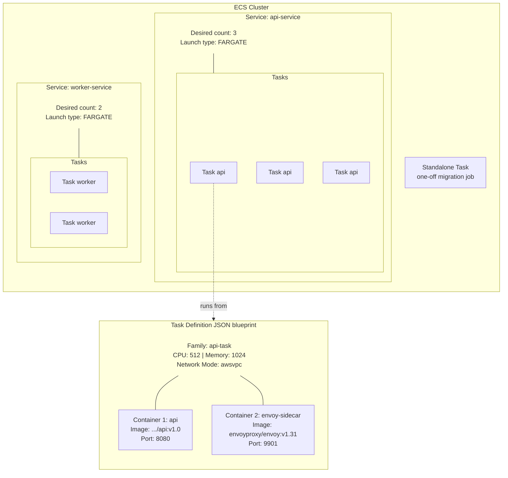
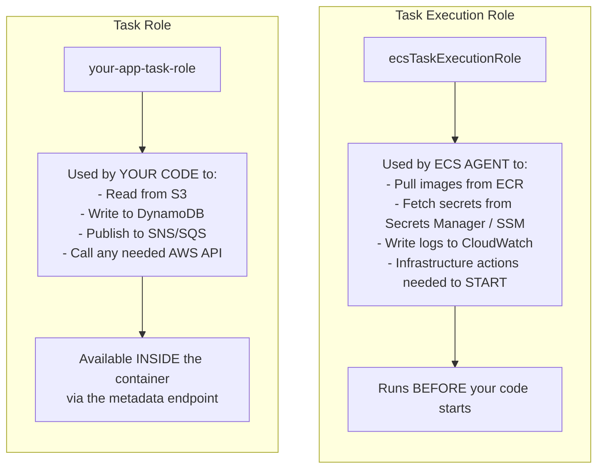
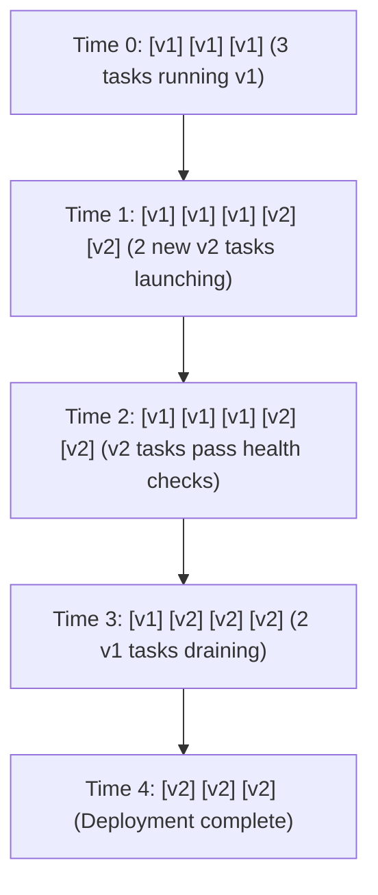
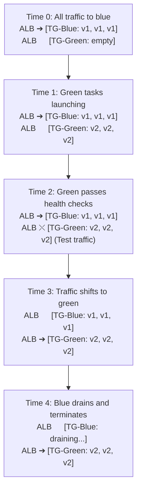
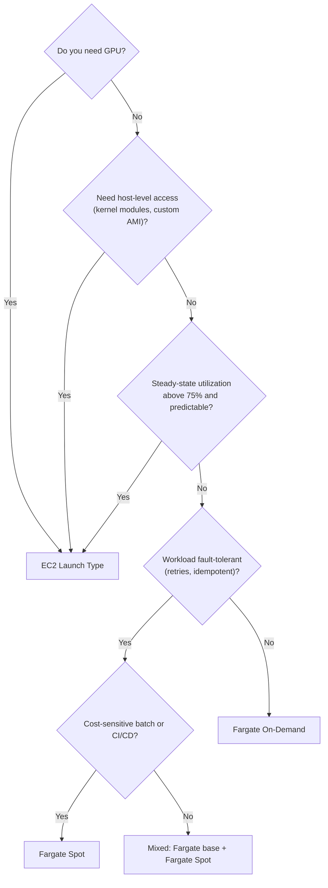

**Complexity**: `[COMPLEX]` | **Time to Complete**: 3 hours | **Prerequisites**: Module 1.2 VPC and Module 1.6 ECR, basic container and Docker knowledge, JSON familiarity, and a configured AWS CLI.

## Prerequisites

Before starting this module, you should have completed:
- [Module 1.2: VPC & Networking Foundations](../module-1.2-vpc/)
- [Module 1.6: Elastic Container Registry (ECR)](../module-1.6-ecr/)
- Basic understanding of containers and Docker
- Familiarity with JSON (ECS task definitions are JSON-heavy)
- AWS CLI configured with appropriate permissions

## What You'll Be Able to Do

After completing this module, you will be able to:

- **Deploy containerized applications on ECS Fargate with task definitions, services, and load balancer integration**
- **Configure ECS service auto-scaling policies based on CPU, memory, and custom CloudWatch metrics**
- **Design ECS networking with awsvpc mode, security groups, and private subnets for production workloads**
- **Implement blue/green deployments using CodeDeploy with ECS to achieve zero-downtime releases**

---

## Why This Module Matters

**Hypothetical scenario:** A major airline was running its booking system on a fleet of EC2 instances managed by a custom deployment pipeline. During a holiday travel surge, traffic spiked well beyond projections. The operations team scrambled to launch new instances, but the bootstrapping process — installing dependencies, pulling container images, registering with the load balancer — took many minutes per instance. While capacity lagged behind demand, customers saw timeout errors and bookings were lost. The lesson: slow host bootstrap directly translates into lost serving capacity during spikes.

They migrated to ECS on Fargate. On the next holiday surge, new tasks still needed a realistic cold start (image pull, ENI attach — typically 45–90 seconds), but there were no EC2 instances to bootstrap, no AMIs to maintain, and no separate host fleet to scale. Capacity tracked task demand instead of instance boot time. The traffic spike was larger that year, and operations stayed ahead of the curve.

Amazon Elastic Container Service (ECS) is AWS's native container orchestration platform, purpose-built for the operational reality that most teams do not want to manage container hosts. If Kubernetes is the Swiss Army knife of container orchestration, ECS is a purpose-built surgical tool for running containers on AWS. It is deeply integrated with every relevant AWS service -- IAM, VPC, ALB, CloudWatch, Secrets Manager, and dozens more. Combined with Fargate (serverless compute for containers), ECS lets you focus on your application rather than the infrastructure running it. You describe what your application needs — CPU, memory, networking, IAM permissions — in a declarative task definition, and AWS handles the rest: placing containers on healthy capacity, replacing failed tasks, scaling in response to load, and rolling out new versions without downtime.

ECS sits at a sweet spot in the AWS compute landscape. It provides more control than Lambda (you define the container, the runtime, the binary) but far less operational overhead than EC2 (no AMI patching, no kernel updates, no capacity planning on Fargate). For the vast majority of containerized workloads that run continuously and need to scale, ECS on Fargate is the correct default choice.

In this module, you will learn ECS from the ground up: clusters, task definitions, services, both launch types (EC2 and Fargate), load balancer integration, IAM roles, service discovery, and debugging with ECS Exec. By the end, you will have deployed a microservice on Fargate, connected it to an Application Load Balancer, and debugged it with an interactive shell.

---

## ECS Architecture Overview

ECS has a handful of core concepts that fit together like nesting boxes. Let us walk through each one.



### Core Concepts

**Cluster**: A logical grouping of tasks and services. It is not a compute resource itself -- think of it as a namespace. You might have clusters for `production`, `staging`, and `development`.

**Task Definition**: A blueprint (JSON template) that describes how to run your containers. It specifies the Docker image, CPU/memory, port mappings, environment variables, logging, and IAM roles. Task definitions are versioned -- each update creates a new revision.

**Task**: A running instance of a task definition. One task can contain multiple containers that share the same network namespace and can communicate via `localhost`.

**Service**: A long-running configuration that maintains a desired count of tasks. The service scheduler constantly compares the running task count against the desired count — if a task crashes, exits, or fails a health check, the scheduler launches a replacement automatically. Services also integrate with load balancers for traffic distribution, register and deregister task IPs with target groups as tasks start and stop, and manage the deployment lifecycle when you update to a new task definition revision.

### EC2 Launch Type vs Fargate

This is the biggest architectural decision you will make with ECS.

| Aspect | EC2 Launch Type | Fargate Launch Type |
|--------|----------------|-------------------|
| Infrastructure | You manage EC2 instances | AWS manages compute |
| Pricing | Pay for EC2 instances (even idle capacity) | Pay per task (per-second, 1-min minimum, CPU + memory) |
| Scaling | Must scale instances AND tasks separately | Only scale tasks |
| Startup time | Seconds (on warm instances) | 45-90 seconds (cold start: microVM + ENI + image pull) |
| GPU support | Yes | No (as of 2026, use SageMaker for GPU) |
| Max task size | Limited by instance type | 16 vCPU, 120 GB memory |
| SSH access | Yes (to the EC2 host) | No (use ECS Exec) |
| Operating system patches | Your responsibility | AWS handles it |
| Cost at steady state | Cheaper for predictable, high-utilization workloads | Cheaper for variable or bursty workloads |
| Spot support | Yes (EC2 Spot instances) | Yes (Fargate Spot, 70% cheaper) |

**When to use EC2**: GPU workloads, very large containers, extreme cost optimization at high steady-state utilization, or when you need host-level access (custom kernel modules, specialized networking).

**When to use Fargate**: Everything else. Seriously. The operational overhead of managing EC2 instances is almost never worth it unless you have a specific technical reason.


## Network Modes: awsvpc, bridge, host, and none

ECS supports four network modes. Your choice fundamentally shapes security boundaries, IP address consumption, and how containers communicate with one another. If you are coming from Kubernetes, think of these as the ECS equivalent of CNI plugins — but built into the platform, with no add-on installation required.

### awsvpc (Fargate and EC2)

This is the only network mode available on Fargate and the recommended mode for all EC2 production workloads. Every task receives its own Elastic Network Interface (ENI) — a dedicated virtual network card with a private IP address from your VPC subnet. Security groups attach per-task, not per-host. Two containers within the same task share the ENI and reach each other at `localhost`, just as containers in the same Kubernetes pod share a network namespace.

The architectural constraint that catches teams off guard: **every single task consumes one IP address from its subnet.** Run 500 tasks in a `/24` subnet (~251 usable addresses per AZ — AWS reserves five addresses per subnet), and you exhaust your IP space long before running out of compute. Plan your VPC CIDR blocks accordingly — `/19` (8,191 addresses) or `/20` (4,095 addresses) subnets are common for large ECS deployments. Also budget for ENI attachment during rolling deployments: with `maximumPercent: 200` and a desired count of 50, ECS temporarily provisions 100 ENIs during a rolling update.

### bridge (EC2 only)

Docker's default bridge network. Containers on the same EC2 host communicate through the `docker0` bridge; containers on different hosts must use port mapping on the host's IP address. Because multiple task definitions may expose the same container port, ECS supports **dynamic port mapping** — it assigns a random high-numbered host port and registers it with the load balancer or service discovery, avoiding port conflicts entirely. Bridge mode primarily exists for backward compatibility with workloads that predate `awsvpc`.

### host (EC2 only)

The container bypasses Docker's virtual networking and uses the EC2 host's network stack directly. Ports inside the container map one-to-one to ports on the host. This provides the lowest possible network latency — no Docker NAT, no bridge overhead — making it suitable for latency-sensitive workloads such as high-frequency trading systems, real-time multiplayer game servers, or UDP-heavy streaming protocols where every microsecond counts. The tradeoff is zero network isolation: any container can bind to any port on the host, and a misconfigured application can collide with critical system services.

### none

No external network connectivity. The container can communicate only through shared volumes or IPC. Rarely used in production — a legitimate case is a data preprocessing container that reads from an EFS volume, transforms files, and exits without ever needing the network.

| Network Mode | Fargate | Per-Task IP | Per-Task SG | Port Mapping | Use Case |
|---|---|---|---|---|---|
| `awsvpc` | Required | Yes (ENI) | Yes | None (direct) | All production Fargate workloads; multi-tenant EC2 |
| `bridge` | No | No (shared host) | No (host-level SG) | Static or dynamic | Legacy single-host applications |
| `host` | No | No (direct host) | No (host-level SG) | None (1:1) | Ultra-low-latency; UDP-heavy streaming |
| `none` | No | No | N/A | None | Isolated batch preprocessing |

## Capacity Providers: Bridging ECS to Compute

A capacity provider is the abstraction layer that connects ECS services to the underlying compute. Instead of hardcoding `launchType: FARGATE` on every service, define capacity providers at the cluster level and let services consume them through a flexible strategy.

### The Three Provider Types

**FARGATE**: Standard on-demand Fargate capacity. Tasks launch immediately — no host to provision, no AMI to maintain. AWS guarantees the capacity (subject to account vCPU limits). Use for production traffic that must be continuously available and cannot tolerate interruptions.

**FARGATE_SPOT**: Spare Fargate capacity at up to 70% discount. AWS can reclaim this capacity with a 2-minute warning, delivered as a SIGTERM signal and an event on the task metadata endpoint. Your application receives the signal, drains in-flight connections, optionally checkpoints state, and exits gracefully. Use for fault-tolerant workloads: batch processing jobs, CI/CD pipeline runners, development and staging environments, and asynchronous queue workers where an SQS visibility timeout handles retry logic automatically.

**EC2 ASG capacity providers**: Connect an EC2 Auto Scaling group to your ECS cluster. Enable **managed scaling**, and ECS calculates the optimal instance count based on pending task requirements and your configured scale-out and scale-in thresholds. This is the modern replacement for manually managing a fleet of EC2 container instances — ECS monitors the ASG, launches new instances when tasks cannot be placed, and scales in idle instances after a configurable cooldown period. Managed scaling uses three parameters: `targetCapacity` (utilization target, typically 80 to 100 percent), `minimumScalingStepSize` (minimum instances to add per scaling action), and `maximumScalingStepSize` (a ceiling per action to prevent runaway scaling).

### Capacity Provider Strategies

A strategy distributes tasks among capacity providers using two knobs:

- **`base`**: A minimum number of tasks *guaranteed* to run on this provider, placed before weight-based distribution begins.
- **`weight`**: A relative proportion for distributing the *remaining* tasks (desired count minus the sum of all `base` values across providers).

Consider a service with desired count of 10 and this strategy:

```bash
--capacity-provider-strategy '[
  {"capacityProvider": "FARGATE",        "weight": 1, "base": 3},
  {"capacityProvider": "FARGATE_SPOT",   "weight": 2, "base": 0}
]'
```

The math: ECS places 3 tasks on FARGATE (base). Seven tasks remain. They are distributed at a 1:2 ratio — approximately 2 additional on FARGATE and 5 on FARGATE_SPOT. Final placement: 5 Fargate on-demand, 5 Fargate Spot. The `base` of 3 guarantees uninterrupted capacity for serving health checks and processing critical queue messages even if AWS reclaims all Spot capacity simultaneously.

For a production API that must never drop below minimum capacity, set `base` to at least 2 on FARGATE and let FARGATE_SPOT absorb the variable portion. For a completely fault-tolerant batch processor that retries failed messages via an SQS dead-letter queue, set `base: 0` and run every task on FARGATE_SPOT at the full 70 percent discount.

Set a **cluster-level default strategy** so every new service inherits it automatically:

```bash
aws ecs put-cluster-capacity-providers \
  --cluster production \
  --capacity-providers FARGATE FARGATE_SPOT \
  --default-capacity-provider-strategy \
    capacityProvider=FARGATE,weight=1,base=1 \
    capacityProvider=FARGATE_SPOT,weight=1
```


---

## Task Definitions: The Container Blueprint

Task definitions are where you describe exactly how your containers should run. Let us build one step by step.

### A Production-Ready Task Definition

```json
{
  "family": "api-service",
  "networkMode": "awsvpc",
  "requiresCompatibilities": ["FARGATE"],
  "cpu": "512",
  "memory": "1024",
  "executionRoleArn": "arn:aws:iam::123456789012:role/ecsTaskExecutionRole",
  "taskRoleArn": "arn:aws:iam::123456789012:role/api-task-role",
  "containerDefinitions": [
    {
      "name": "api",
      "image": "123456789012.dkr.ecr.us-east-1.amazonaws.com/myapp/api:v1.3.0",
      "essential": true,
      "portMappings": [
        {
          "name": "api-port",
          "containerPort": 8080,
          "protocol": "tcp",
          "appProtocol": "http"
        }
      ],
      "environment": [
        {"name": "APP_ENV", "value": "production"},
        {"name": "LOG_LEVEL", "value": "info"}
      ],
      "secrets": [
        {
          "name": "DATABASE_URL",
          "valueFrom": "arn:aws:secretsmanager:us-east-1:123456789012:secret:prod/db-url-AbCdEf"
        },
        {
          "name": "API_KEY",
          "valueFrom": "arn:aws:ssm:us-east-1:123456789012:parameter/prod/api-key"
        }
      ],
      "logConfiguration": {
        "logDriver": "awslogs",
        "options": {
          "awslogs-group": "/ecs/api-service",
          "awslogs-region": "us-east-1",
          "awslogs-stream-prefix": "api"
        }
      },
      "healthCheck": {
        "command": ["CMD-SHELL", "curl -f http://localhost:8080/health || exit 1"],
        "interval": 30,
        "timeout": 5,
        "retries": 3,
        "startPeriod": 60
      },
      "linuxParameters": {
        "initProcessEnabled": true
      }
    }
  ],
  "runtimePlatform": {
    "cpuArchitecture": "X86_64",
    "operatingSystemFamily": "LINUX"
  }
}
```

Let us break down the key fields. Every field in this task definition serves a specific purpose — some are immediately obvious (the container image and port mapping), while others are subtle but critical in production. The `executionRoleArn` determines whether your task can even start; the `taskRoleArn` determines what your application can do once it is running; the `healthCheck` determines whether ECS considers the container healthy or restarts it; and `linuxParameters.initProcessEnabled` determines whether your container shuts down gracefully when it receives a SIGTERM. Understanding each field is the difference between a task that runs and a task that runs *reliably*.

### CPU and Memory Combinations for Fargate

Fargate does not let you choose arbitrary CPU/memory combinations. Here are the valid options:

| CPU (vCPU) | Memory Options (MB) |
|------------|-------------------|
| 256 (.25 vCPU) | 512, 1024, 2048 |
| 512 (.5 vCPU) | 1024 - 4096 (in 1024 increments) |
| 1024 (1 vCPU) | 2048 - 8192 (in 1024 increments) |
| 2048 (2 vCPU) | 4096 - 16384 (in 1024 increments) |
| 4096 (4 vCPU) | 8192 - 30720 (in 1024 increments) |
| 8192 (8 vCPU) | 16384 - 61440 (in 4096 increments) |
| 16384 (16 vCPU) | 32768 - 122880 (in 8192 increments) |

> **Pause and predict**: You are migrating a legacy Java application that requires a large heap size (at least 6GB) but does very little processing (mostly waiting on database locks). You are also migrating a Node.js image processing worker that maxes out CPU but uses only 200MB of RAM. Which Fargate CPU/memory combinations would you choose for each, and why?

### IAM Roles: Execution Role vs Task Role

This is one of the most commonly confused concepts in ECS.



```bash
# Create the task execution role
aws iam create-role \
  --role-name ecsTaskExecutionRole \
  --assume-role-policy-document '{
    "Version": "2012-10-17",
    "Statement": [{
      "Effect": "Allow",
      "Principal": {"Service": "ecs-tasks.amazonaws.com"},
      "Action": "sts:AssumeRole"
    }]
  }'

# Attach the AWS managed policy for basic execution
aws iam attach-role-policy \
  --role-name ecsTaskExecutionRole \
  --policy-arn arn:aws:iam::aws:policy/service-role/AmazonECSTaskExecutionRolePolicy

# If your task uses secrets from Secrets Manager, add this:
aws iam put-role-policy \
  --role-name ecsTaskExecutionRole \
  --policy-name SecretsAccess \
  --policy-document '{
    "Version": "2012-10-17",
    "Statement": [{
      "Effect": "Allow",
      "Action": [
        "secretsmanager:GetSecretValue",
        "ssm:GetParameters"
      ],
      "Resource": [
        "arn:aws:secretsmanager:us-east-1:123456789012:secret:prod/*",
        "arn:aws:ssm:us-east-1:123456789012:parameter/prod/*"
      ]
    }]
  }'

# Create the task role (what your application code uses)
aws iam create-role \
  --role-name api-task-role \
  --assume-role-policy-document '{
    "Version": "2012-10-17",
    "Statement": [{
      "Effect": "Allow",
      "Principal": {"Service": "ecs-tasks.amazonaws.com"},
      "Action": "sts:AssumeRole"
    }]
  }'

# Add permissions your application needs
aws iam put-role-policy \
  --role-name api-task-role \
  --policy-name AppPermissions \
  --policy-document '{
    "Version": "2012-10-17",
    "Statement": [
      {
        "Effect": "Allow",
        "Action": ["s3:GetObject", "s3:PutObject"],
        "Resource": "arn:aws:s3:::my-app-bucket/*"
      },
      {
        "Effect": "Allow",
        "Action": ["dynamodb:GetItem", "dynamodb:PutItem", "dynamodb:Query"],
        "Resource": "arn:aws:dynamodb:us-east-1:123456789012:table/my-app-table"
      }
    ]
  }'
```

> **Stop and think**: You just deployed a new task. The ECS console shows the task is stuck in the `PENDING` state and eventually fails with a `CannotPullContainerError`. Later, you fix that, the container starts, but your application logs show an `AccessDenied` error when trying to write a file to an S3 bucket. Which IAM roles are misconfigured in each scenario?

### Registering the Task Definition

```bash
# Register the task definition
aws ecs register-task-definition \
  --cli-input-json file://task-definition.json

# List revisions of a task definition family
aws ecs list-task-definitions \
  --family-prefix api-service

# Describe the latest revision
aws ecs describe-task-definition \
  --task-definition api-service
```


## Logging with FireLens

The `awslogs` log driver (shown in the task definition above) sends container logs directly to CloudWatch Logs. It works, it is simple, and it is sufficient for most use cases. But teams with multi-destination logging requirements — shipping the same log stream to CloudWatch for operational dashboards AND to OpenSearch for full-text search AND to S3 for long-term archival — need a more flexible approach.

**FireLens** is ECS's log router. Under the hood, it is a managed Fluent Bit or Fluentd sidecar container that you declare explicitly in the task definition with `firelensConfiguration` (typically `name: log_router`). ECS wires application containers that use the `awsfirelens` log driver to that sidecar — it does not silently inject a log router for you. Instead of each container shipping its own logs, every container writes to `stdout` or `stderr`, and FireLens picks up the output, transforms it, and routes it to one or more destinations simultaneously.

FireLens supports these destinations natively:

| Destination | Use Case |
|---|---|
| CloudWatch Logs | Operational dashboards, metric filters, alarms |
| Amazon S3 | Long-term archival, compliance retention |
| Amazon OpenSearch | Full-text log search across services |
| Kinesis Data Firehose | Near-real-time streaming to S3, Redshift, or Splunk |
| Datadog, Splunk, New Relic | Third-party observability platforms |

Enable FireLens by adding a log configuration that references the `awsfirelens` driver instead of `awslogs`:

```json
"logConfiguration": {
  "logDriver": "awsfirelens",
  "options": {
    "Name": "cloudwatch",
    "region": "us-east-1",
    "log_group_name": "/ecs/api-service-firelens",
    "auto_create_group": "true",
    "log_stream_prefix": "api/"
  }
}
```

The FireLens container itself must be defined in your task definition — ECS does not inject it without being told. Use the AWS-managed FireLens image:

```json
{
  "name": "log_router",
  "image": "public.ecr.aws/aws-observability/aws-for-fluent-bit:stable",
  "essential": true,
  "firelensConfiguration": {
    "type": "fluentbit"
  },
  "memoryReservation": 50
}
```

The `firelensConfiguration` field signals to ECS that this container is a log router. Every other container in the task that uses the `awsfirelens` log driver routes its logs through this container automatically.

## The Sidecar Pattern

ECS task definitions support multiple containers within a single task. These containers share the same network namespace — they reach each other at `localhost` — and can share storage volumes. This makes ECS a natural fit for the **sidecar pattern**: deploying a companion container alongside your application container to handle cross-cutting concerns without modifying your application code.

Common ECS sidecar deployments:

- **Envoy or Nginx proxy**: A reverse proxy sidecar that handles TLS termination, request routing, rate limiting, and retry logic. Your application container listens only on `localhost` with no TLS; the proxy sidecar terminates public HTTPS traffic at the task boundary.
- **AWS X-Ray daemon**: Collects trace segments from your application over UDP on `localhost:2000`, buffers them, and uploads batches to the X-Ray service. Your application sends trace data without managing batching, retries, or sampling logic.
- **CloudWatch agent**: Collects custom metrics at sub-minute resolution and ships them to CloudWatch. Useful when the default 1-minute CloudWatch metric resolution is insufficient.
- **FireLens**: The canonical sidecar — your application writes to `stdout`, and FireLens does everything else.

Below is a two-container task definition with an Envoy sidecar that terminates TLS while the application container binds only to localhost:

```json
"containerDefinitions": [
  {
    "name": "api",
    "image": "123456789012.dkr.ecr.us-east-1.amazonaws.com/myapp/api:v1.3.0",
    "essential": true,
    "portMappings": [
      {"containerPort": 8080, "protocol": "tcp"}
    ],
    "environment": [
      {"name": "LISTEN_ADDR", "value": "127.0.0.1:8080"}
    ]
  },
  {
    "name": "envoy-sidecar",
    "image": "envoyproxy/envoy:v1.31",
    "essential": true,
    "portMappings": [
      {"containerPort": 443, "protocol": "tcp"}
    ],
    "environment": [
      {"name": "UPSTREAM_ADDR", "value": "127.0.0.1:8080"}
    ]
  }
]
```

The API container binds to `127.0.0.1:8080` — it is unreachable from outside the task. The Envoy sidecar binds to port 443 and forwards everything to the API container over the shared `localhost` interface. The ALB target group points to port 443 on the Envoy container. This separation means your application code contains zero TLS logic: Envoy handles certificate rotation, cipher negotiation, and ALPN entirely outside your application.

> **Pause and predict**: A security audit requires that all traffic between ECS services be encrypted with mTLS. Your application is a Go binary that does not have built-in mTLS support. You have two months before the audit deadline. How does the sidecar pattern solve this without rewriting the application?

## Secrets Injection: Beyond the Basics

The task definition shown earlier uses `valueFrom` with Secrets Manager and SSM Parameter Store ARNs to inject secrets as environment variables. A few deeper details that matter in production:

**Execution role vs. task role scope for secrets**: The execution role fetches secrets *before* the container starts. If the execution role lacks `secretsmanager:GetSecretValue` for the specified secret, the task fails to start with an authorization error visible in the ECS agent logs — not in your application logs. The task role, by contrast, is what your running code uses to call AWS APIs at runtime. These two roles must be scoped independently. The execution role needs access to the secrets your task needs to *start*; the task role needs access to the resources your code needs to *run*.

**Parameter Store hierarchies for environment-specific secrets**: Instead of hardcoding separate ARNs for development and production, use SSM Parameter Store hierarchies:

```

/prod/api/DATABASE_URL     → secretsmanager ARN for production
/staging/api/DATABASE_URL  → secretsmanager ARN for staging
/dev/api/DATABASE_URL      → secretsmanager ARN for development
```

Inject the parameter path as an environment variable and resolve the correct secret at startup based on the environment. This avoids duplicating task definition revisions across environments.

**Secret rotation**: Secrets Manager supports automatic rotation via Lambda functions. When a secret rotates, the new value is available to new tasks immediately (the execution role fetches it at task start). Running tasks continue using the old value until they restart. For long-running tasks, poll Secrets Manager periodically or handle connection failures by re-fetching credentials.

**Never put secrets in the `environment` array**: The `environment` field is returned in plaintext by `ecs:DescribeTaskDefinition` and `ecs:RegisterTaskDefinition` to principals with those IAM permissions — a real exposure risk for CI roles and auditors with read access, even though CloudTrail does not guarantee full task-definition payloads in every account configuration. Always use the `secrets` array with `valueFrom`.


---

## Creating Clusters and Services

### Creating an ECS Cluster

For Fargate, a cluster is just a logical namespace — no EC2 instances to provision, no AMIs to select, no capacity to plan. You create the cluster, give it a name, and it exists. The cluster itself has no compute resources; it simply groups services and tasks together so you can apply shared configuration like Container Insights, ECS Exec logging, and the default capacity provider strategy.

```bash
# Create a cluster with Container Insights enabled
aws ecs create-cluster \
  --cluster-name production \
  --settings name=containerInsights,value=enabled \
  --configuration '{
    "executeCommandConfiguration": {
      "logging": "OVERRIDE",
      "logConfiguration": {
        "cloudWatchLogGroupName": "/ecs/exec-logs",
        "cloudWatchEncryptionEnabled": true
      }
    }
  }'
```

### Creating a Service with ALB Integration

This is where everything comes together. A service maintains your desired task count and routes traffic through a load balancer. You will create an Application Load Balancer, configure a target group that ECS registers task IPs with, and then create the ECS service that ties everything together. Start with the ALB:

```bash
# Create an Application Load Balancer
ALB_ARN=$(aws elbv2 create-load-balancer \
  --name api-alb \
  --subnets subnet-0abc123 subnet-0def456 \
  --security-groups sg-0abc123456 \
  --scheme internet-facing \
  --type application \
  --query 'LoadBalancers[0].LoadBalancerArn' --output text)

# Create a target group (IP type for Fargate/awsvpc)
TG_ARN=$(aws elbv2 create-target-group \
  --name api-targets \
  --protocol HTTP \
  --port 8080 \
  --vpc-id vpc-0abc123 \
  --target-type ip \
  --health-check-path /health \
  --health-check-interval-seconds 15 \
  --healthy-threshold-count 2 \
  --unhealthy-threshold-count 3 \
  --query 'TargetGroups[0].TargetGroupArn' --output text)

# Create a listener
aws elbv2 create-listener \
  --load-balancer-arn ${ALB_ARN} \
  --protocol HTTP \
  --port 80 \
  --default-actions Type=forward,TargetGroupArn=${TG_ARN}
```

Now create the ECS service, which links the task definition, the networking configuration, and the load balancer target group into one running deployment:

```bash
# Create the service
aws ecs create-service \
  --cluster production \
  --service-name api-service \
  --task-definition api-service:1 \
  --desired-count 3 \
  --launch-type FARGATE \
  --platform-version LATEST \
  --network-configuration '{
    "awsvpcConfiguration": {
      "subnets": ["subnet-0abc123", "subnet-0def456"],
      "securityGroups": ["sg-0abc123456"],
      "assignPublicIp": "DISABLED"
    }
  }' \
  --load-balancers '[{
    "targetGroupArn": "'"${TG_ARN}"'",
    "containerName": "api",
    "containerPort": 8080
  }]' \
  --enable-execute-command \
  --deployment-configuration '{
    "maximumPercent": 200,
    "minimumHealthyPercent": 100,
    "deploymentCircuitBreaker": {
      "enable": true,
      "rollback": true
    }
  }'
```

Let us break down the service configuration:

**`assignPublicIp: DISABLED`**: Tasks in private subnets. They reach ECR through a VPC endpoint or NAT Gateway. This is the production pattern -- in most cases, do not expose tasks directly to the internet.

**`maximumPercent: 200, minimumHealthyPercent: 100`**: During deployments, ECS can launch up to 200% of desired count (6 tasks if desired is 3) while keeping 100% healthy. This means zero-downtime rolling deployments.

**`deploymentCircuitBreaker`**: If new tasks keep failing, ECS automatically rolls back to the last working version instead of endlessly retrying. This was added in 2021 and should be enabled on every service.

**`enable-execute-command`**: Enables ECS Exec for debugging (covered later in this module).

### Service Auto Scaling

```bash
# Register the service as a scalable target
aws application-autoscaling register-scalable-target \
  --service-namespace ecs \
  --resource-id service/production/api-service \
  --scalable-dimension ecs:service:DesiredCount \
  --min-capacity 2 \
  --max-capacity 20

# Create a target tracking scaling policy based on CPU
aws application-autoscaling put-scaling-policy \
  --service-namespace ecs \
  --resource-id service/production/api-service \
  --scalable-dimension ecs:service:DesiredCount \
  --policy-name cpu-target-tracking \
  --policy-type TargetTrackingScaling \
  --target-tracking-scaling-policy-configuration '{
    "TargetValue": 60.0,
    "PredefinedMetricSpecification": {
      "PredefinedMetricType": "ECSServiceAverageCPUUtilization"
    },
    "ScaleInCooldown": 300,
    "ScaleOutCooldown": 60
  }'

# Scale when average memory utilization exceeds 70%
aws application-autoscaling put-scaling-policy \
  --service-namespace ecs \
  --resource-id service/production/api-service \
  --scalable-dimension ecs:service:DesiredCount \
  --policy-name memory-target-tracking \
  --policy-type TargetTrackingScaling \
  --target-tracking-scaling-policy-configuration '{
    "TargetValue": 70.0,
    "PredefinedMetricSpecification": {
      "PredefinedMetricType": "ECSServiceAverageMemoryUtilization"
    },
    "ScaleInCooldown": 300,
    "ScaleOutCooldown": 60
  }'

# Custom CloudWatch metrics (queue depth, business KPIs): use TargetTrackingScaling
# with CustomizedMetricSpecification instead of a PredefinedMetricType.

# Also scale based on ALB request count
aws application-autoscaling put-scaling-policy \
  --service-namespace ecs \
  --resource-id service/production/api-service \
  --scalable-dimension ecs:service:DesiredCount \
  --policy-name requests-target-tracking \
  --policy-type TargetTrackingScaling \
  --target-tracking-scaling-policy-configuration '{
    "TargetValue": 1000.0,
    "PredefinedMetricSpecification": {
      "PredefinedMetricType": "ALBRequestCountPerTarget",
      "ResourceLabel": "app/api-alb/1234567890/targetgroup/api-targets/0987654321"
    },
    "ScaleInCooldown": 300,
    "ScaleOutCooldown": 30
  }'
```

Note the asymmetric cooldowns: 60 seconds for scale-out (react quickly to load) but 300 seconds for scale-in (avoid flapping during variable traffic).

---

## Service Discovery

ECS integrates with AWS Cloud Map for DNS-based service discovery. This allows services to find each other by name without hardcoding IP addresses or using a separate load balancer for internal communication. Cloud Map maintains a registry of service instances and their IP addresses, updating DNS records within seconds when tasks start or stop. Every other service in the VPC can resolve the service name to a set of IP addresses, enabling direct service-to-service communication without routing through an external load balancer — which reduces latency and eliminates the cost of internal ALBs for service mesh traffic.

```bash
# Create a Cloud Map namespace (returns an OperationId, not the namespace ID yet)
OPERATION_ID=$(aws servicediscovery create-private-dns-namespace \
  --name production.internal \
  --vpc vpc-0abc123 \
  --query 'OperationId' --output text)

# Poll until the namespace creation succeeds
while true; do
  STATUS=$(aws servicediscovery get-operation \
    --operation-id "${OPERATION_ID}" \
    --query 'Operation.Status' --output text)
  if [ "${STATUS}" = "SUCCESS" ]; then
    NAMESPACE_ID=$(aws servicediscovery get-operation \
      --operation-id "${OPERATION_ID}" \
      --query 'Operation.Targets.NAMESPACE' --output text)
    break
  fi
  if [ "${STATUS}" = "FAIL" ]; then
    echo "Namespace creation failed" >&2
    exit 1
  fi
  sleep 2
done

# Create a service discovery service
DISCOVERY_SERVICE_ID=$(aws servicediscovery create-service \
  --name api \
  --namespace-id "${NAMESPACE_ID}" \
  --dns-config '{
    "DnsRecords": [{"Type": "A", "TTL": 10}]
  }' \
  --health-check-custom-config FailureThreshold=1 \
  --query 'Service.Id' --output text)
```

Now create the ECS service with the `--service-registries` flag pointing to your Cloud Map service, and ECS automatically registers each task's private IP address as a DNS A record:

```bash
aws ecs create-service \
  --cluster production \
  --service-name api-service \
  --task-definition api-service:1 \
  --desired-count 3 \
  --launch-type FARGATE \
  --network-configuration '{
    "awsvpcConfiguration": {
      "subnets": ["subnet-0abc123", "subnet-0def456"],
      "securityGroups": ["sg-0abc123456"],
      "assignPublicIp": "DISABLED"
    }
  }' \
  --service-registries '[{
    "registryArn": "arn:aws:servicediscovery:us-east-1:123456789012:service/srv-abcdef1234567890"
  }]' \
  --enable-execute-command
```

Once the service stabilizes, any service in the VPC can reach the API at `api.production.internal` using standard DNS resolution:

```bash
# From inside another container in the same VPC:
curl http://api.production.internal:8080/health
# Returns: {"status": "healthy"}

# DNS resolution returns the private IPs of running tasks:
dig api.production.internal +short
# 10.0.1.23
# 10.0.1.45
# 10.0.2.12
```

This is how microservices communicate in ECS without external load balancers for internal traffic.

## ECS Service Connect: The Newer Alternative

Cloud Map (covered above) has been the ECS service discovery mechanism since 2018. It works — register a service, get DNS records — but it requires managing separate Cloud Map namespaces and services outside of ECS, and DNS TTLs mean discovery is eventually consistent under rapid change.

**ECS Service Connect**, launched at AWS re:Invent 2022, is a built-in alternative that wires service discovery through ECS instead of you creating separate Cloud Map *services* by hand. Service Connect still uses a Cloud Map **namespace** (ECS can create and manage it for you). Service Connect integrates directly into the ECS service configuration and provides:

- **Automatic DNS-based discovery**: Services resolve each other by short names within the Service Connect namespace — ECS registers instances for you.
- **Optional TLS in transit**: Plain HTTP routing works out of the box. **Mutual TLS (mTLS) is opt-in**: enable TLS in `serviceConnectConfiguration` with an AWS Private CA (PCA) resource, an infrastructure IAM role, and optional KMS encryption for PCA private keys — not automatic on every deployment.
- **Client-side load balancing**: Each task maintains a local connection pool to peer tasks, distributing requests without a central proxy.
- **Configurable timeouts**: The ECS API exposes a nested `timeout` object with `idleTimeoutSeconds` and `perRequestTimeoutSeconds` at the service level.
- **Circuit breaking**: Service Connect can detect failing upstream tasks and eject them from the connection pool.

### Cloud Map vs. Service Connect

| Aspect | AWS Cloud Map | ECS Service Connect |
|---|---|---|
| Setup complexity | Requires separate namespace, service, and DNS config | Configured directly in ECS service definition (namespace still backed by Cloud Map) |
| Encryption | None (you bring your own TLS) | Optional mTLS via PCA when enabled in `serviceConnectConfiguration` |
| Load balancing | DNS round-robin only (client must re-resolve) | Client-side connection pool with health-aware routing |
| Observability | CloudWatch metrics on DNS queries | CloudWatch metrics on connections, requests, errors, and TLS handshakes |
| Non-ECS consumers | Yes — any client in the VPC can resolve DNS names | ECS tasks only (Service Connect is ECS-native) |
| Maturity | Stable since 2018 | GA since late 2022; fewer production-years of operational experience |

**When to use Cloud Map**: You have non-ECS consumers that need DNS-based discovery (Lambda functions in a VPC, EC2-based services, third-party appliances), or you need a solution with a longer track record in production.

**When to use Service Connect**: You are building a greenfield ECS microservice architecture and all service consumers are ECS tasks. Optional PCA-backed mTLS can eliminate manual certificate distribution when you enable it — but it is a deliberate configuration choice, not on by default.

### Enabling Service Connect

Add a `serviceConnectConfiguration` block to your ECS service. The `clientAliases` list defines the DNS names other services use to reach this one:

```bash
aws ecs create-service \
  --cluster production \
  --service-name api-service \
  --task-definition api-service:1 \
  --desired-count 3 \
  --launch-type FARGATE \
  --network-configuration '{
    "awsvpcConfiguration": {
      "subnets": ["subnet-0abc123"],
      "securityGroups": ["sg-0abc123456"],
      "assignPublicIp": "DISABLED"
    }
  }' \
  --service-connect-configuration '{
    "enabled": true,
    "namespace": "production",
    "services": [{
      "portName": "api-port",
      "clientAliases": [{"port": 8080, "dnsName": "api"}]
    }]
  }'
```

Any other ECS service in the same Service Connect namespace can now reach this service at `http://api:8080` using ECS-managed discovery wiring. Enable TLS in `serviceConnectConfiguration` with a PCA when you need encrypted service-to-service traffic — that is separate from the DNS alias shown here.


---

## ECS Exec: Debugging Running Containers

ECS Exec lets you run commands inside a running Fargate container -- similar to `docker exec` or `kubectl exec`. It uses AWS Systems Manager (SSM) under the hood.

### Prerequisites for ECS Exec

Your task role needs SSM permissions, the **operator** invoking `execute-command` needs `ecs:ExecuteCommand` on the task/service, and the service must be created with `--enable-execute-command`:

```bash
# Add SSM permissions to the task role
aws iam put-role-policy \
  --role-name api-task-role \
  --policy-name ECSExecPermissions \
  --policy-document '{
    "Version": "2012-10-17",
    "Statement": [
      {
        "Effect": "Allow",
        "Action": [
          "ssmmessages:CreateControlChannel",
          "ssmmessages:CreateDataChannel",
          "ssmmessages:OpenControlChannel",
          "ssmmessages:OpenDataChannel"
        ],
        "Resource": "*"
      }
    ]
  }'
```

### Using ECS Exec

```bash
# List running tasks
aws ecs list-tasks \
  --cluster production \
  --service-name api-service

# Execute an interactive shell in a task
aws ecs execute-command \
  --cluster production \
  --task arn:aws:ecs:us-east-1:123456789012:task/production/abc123def456 \
  --container api \
  --interactive \
  --command "/bin/sh"

# Run a one-off command (non-interactive)
aws ecs execute-command \
  --cluster production \
  --task arn:aws:ecs:us-east-1:123456789012:task/production/abc123def456 \
  --container api \
  --command "cat /etc/resolv.conf"
```

### Debugging Checklist

When a container is misbehaving, here is the order of investigation. This checklist moves from the broadest signals (service-level events that tell you *what* happened) to the narrowest (a shell inside the container that lets you investigate *why*). Each step answers a specific question: step 1 tells you that a deployment failed; step 2 tells you why the task stopped; step 3 shows you what the application emitted before it stopped; step 4 lets you explore a running container interactively. Following this order avoids the common mistake of jumping straight to ECS Exec before checking whether the service events already tell you the answer.

```bash
# 1. Check service events (deployment issues, scaling events)
aws ecs describe-services \
  --cluster production \
  --services api-service \
  --query 'services[0].events[:10]'

# 2. Check task status (why did it stop?)
aws ecs describe-tasks \
  --cluster production \
  --tasks arn:aws:ecs:us-east-1:123456789012:task/production/abc123 \
  --query 'tasks[0].{Status:lastStatus,StopCode:stopCode,StopReason:stoppedReason,Containers:containers[*].{Name:name,Status:lastStatus,ExitCode:exitCode,Reason:reason}}'

# 3. Check CloudWatch logs
aws logs get-log-events \
  --log-group-name /ecs/api-service \
  --log-stream-name "api/api/abc123def456" \
  --limit 50

# 4. If the container is running, use ECS Exec to investigate
aws ecs execute-command \
  --cluster production \
  --task arn:aws:ecs:us-east-1:123456789012:task/production/abc123def456 \
  --container api \
  --interactive \
  --command "/bin/sh"

# Inside the container:
# - Check environment variables: env | sort
# - Check DNS resolution: nslookup api.production.internal
# - Check connectivity: curl -v http://dependency-service:8080/health
# - Check disk: df -h
# - Check memory: cat /proc/meminfo
# - Check processes: ps aux
```

---

## Deployment Strategies

ECS supports several deployment strategies. Understanding when to use each one prevents outages.

### Rolling Update (Default)



### Blue/Green with CodeDeploy

For production services where you want the ability to quickly roll back, or where you need to run pre-traffic validation tests against the new version before any customer sees it. Blue/green deployments on ECS use AWS CodeDeploy to orchestrate the entire process: it provisions a replacement ("green") set of tasks, optionally runs validation hooks (Lambda functions that test the green environment), shifts traffic gradually from the original ("blue") tasks to the green tasks, and monitors CloudWatch alarms throughout the traffic shift. If any alarm fires during the shift, CodeDeploy automatically halts and rolls back traffic to the blue tasks — a safety guarantee that a rolling update cannot provide on its own.

```bash
# Create a service with CODE_DEPLOY deployment controller
aws ecs create-service \
  --cluster production \
  --service-name api-service \
  --task-definition api-service:1 \
  --desired-count 3 \
  --launch-type FARGATE \
  --deployment-controller type=CODE_DEPLOY \
  --network-configuration '{
    "awsvpcConfiguration": {
      "subnets": ["subnet-0abc123", "subnet-0def456"],
      "securityGroups": ["sg-0abc123456"],
      "assignPublicIp": "DISABLED"
    }
  }' \
  --load-balancers '[{
    "targetGroupArn": "'"${TG_ARN}"'",
    "containerName": "api",
    "containerPort": 8080
  }]'
```



> **Pause and predict**: You manage a high-traffic payment processing API. A failed deployment that causes even 30 seconds of downtime will result in thousands of dropped transactions. The new version (v2) includes a subtle database connection pool bug that only manifests under high load, meaning it will pass the initial ALB health checks. If you use a Rolling Update, what will happen when v2 is deployed? How would Blue/Green mitigate this?

---

## Fargate Spot: Saving Up to 70%

Fargate Spot uses spare AWS capacity at up to 70% discount. Tasks can be interrupted with a 2-minute warning -- suitable for batch jobs, development environments, and non-critical workloads.

```bash
# Create a service with mixed Fargate and Fargate Spot
aws ecs create-service \
  --cluster production \
  --service-name worker-service \
  --task-definition worker-task:1 \
  --desired-count 5 \
  --capacity-provider-strategy '[
    {
      "capacityProvider": "FARGATE",
      "weight": 1,
      "base": 2
    },
    {
      "capacityProvider": "FARGATE_SPOT",
      "weight": 3,
      "base": 0
    }
  ]' \
  --network-configuration '{
    "awsvpcConfiguration": {
      "subnets": ["subnet-0abc123", "subnet-0def456"],
      "securityGroups": ["sg-0abc123456"],
      "assignPublicIp": "DISABLED"
    }
  }'
```

This configuration guarantees 2 tasks on regular Fargate (`base: 2`) and distributes the remaining 3 tasks with a 1:3 ratio -- roughly 1 on Fargate and 3 on Fargate Spot. For a worker service processing a queue, this is ideal: if Spot tasks are interrupted, the base tasks continue processing while replacements launch.

## The Cost Lens: What ECS & Fargate Actually Cost

Understanding the pricing model before you deploy prevents the post-invoice panic. Fargate pricing has four primary dimensions you need to budget for.

### Fargate Pricing Model

Fargate charges per-second (1-minute minimum) for vCPU and memory allocated to your tasks — not what your application actually uses. If you allocate 2 vCPU and 4 GB but your application averages 15 percent CPU utilization, you still pay for all 2 vCPU and 4 GB. This is the single most important cost fact about Fargate: **right-sizing task definitions directly impacts your AWS bill.**

The pricing structure in us-east-1 for Linux on x86 architecture, as of the 2025-2026 timeframe, follows a simple model: you pay separately for vCPU and memory, per second, with a 1-minute minimum. Fargate Spot provides the same capacity at a steep discount with the tradeoff that AWS can reclaim it on short notice:

| Resource | On-Demand Rate (approximate) | Fargate Spot Rate |
|---|---|---|
| Per vCPU-hour | ~$0.04048 | Up to 70% off |
| Per GB-hour | ~$0.004445 | Up to 70% off |

To make this concrete, consider a modest API container sized at 0.5 vCPU and 1 GB of memory. Running continuously for a full 30-day month (730 hours), the math looks like this:

```

CPU:  0.5 x 730 x $0.04048 = $14.78
MEM:  1.0 x 730 x $0.004445 = $3.24
Total per task per month:    ~$18.02 (on-demand)
                              ~$5.41 (Fargate Spot, 70% discount)
```

A service with 10 such tasks on Fargate Spot costs roughly $54 per month for compute — less than a single on-demand `t3.medium` EC2 instance running 24/7.

### The Fargate-vs-EC2 Breakeven

When does it make financial sense to manage EC2 instances instead of using Fargate? The breakeven depends on utilization — what percentage of your allocated EC2 capacity your tasks actually consume.

Hypothetical scenario: You run 20 tasks, each needing 1 vCPU and 2 GB. On Fargate, this costs approximately $785 per month. On EC2, you need roughly 5 `c5.xlarge` instances (4 vCPU each, accounting for ECS agent and OS overhead). At on-demand pricing, those instances cost about $680 per month — Fargate is roughly 15 percent more expensive at 100 percent utilization.

But at 60 percent utilization — the more common scenario where you over-provision EC2 instances for burst headroom — you need 8 instances at $1,088 per month. Fargate is now roughly 28 percent *cheaper* because you only pay for the tasks you run, not idle instance capacity.

**The real-world rule**: If your workload is predictable, steady-state, and utilizes instances above roughly 75 percent, EC2 is cheaper. If your workload is variable, bursty, or you value not managing instances, Fargate is cheaper — sometimes dramatically so when you factor in the engineering time saved on patching, AMI management, and capacity planning.

### Where Cost Spikes Unexpectedly

**Inter-AZ data transfer**: Fargate tasks in private subnets that communicate across Availability Zones incur data transfer charges of $0.01 per GB in each direction. A chatty microservice architecture with 10 services exchanging data across AZs can generate hundreds of dollars per month in inter-AZ data transfer alone. Mitigation: use Service Connect with connection pooling to reduce cross-AZ chatter, or design services to prefer same-AZ communication where latency is not critical.

**NAT Gateway**: Fargate tasks in private subnets without VPC endpoints route all AWS API traffic (ECR pulls, CloudWatch log uploads, Secrets Manager fetches) through a NAT Gateway. A single NAT Gateway costs roughly $33 per month just for existing, plus data processing charges of $0.045 per GB. Mitigation: deploy VPC endpoints for ECR, CloudWatch Logs, Secrets Manager, and SSM — these cost approximately $7.20 per month each but eliminate NAT Gateway data charges for those services.

**CloudWatch Logs**: The `awslogs` driver sends every line of container stdout and stderr to CloudWatch. At scale, log ingestion at $0.50 per GB, storage at $0.03 per GB-month, and Insights queries can add up. Mitigation: set aggressive log retention policies (7 days for dev, 30 days for staging), use FireLens to filter verbose log levels before shipping, and avoid `awslogs` in development environments.

### Cost Optimization Checklist

1. **Right-size task CPU and memory**: Use Container Insights metrics — not guesses — to determine actual utilization. Many teams over-provision by 2 to 3 times "just to be safe" and pay for it every month.
2. **Use Fargate Spot for all non-critical workloads**: Dev, staging, batch, CI/CD — a 70 percent discount on these environments is free money with no architectural tradeoffs.
3. **Deploy VPC endpoints** for ECR, CloudWatch, Secrets Manager, and SSM if your tasks run in private subnets. The endpoint cost is usually offset by eliminated NAT Gateway data charges at moderate to high throughput.
4. **Set CloudWatch log retention**: 7 days for dev, 30 days for staging, 90 to 365 days for production (compliance-dependent).
5. **Use Graviton (ARM)**: If your application runs on ARM (most Go, Python, Node.js, and Java applications do), Fargate on Graviton is approximately 20 percent cheaper than x86 for the same vCPU and memory configuration.
6. **Consolidate services where sensible**: Ten services each running 2 tasks incur more fixed overhead (ALB target groups, CloudWatch log groups, IAM roles) than 2 services running 10 tasks each. This does not mean cramming unrelated services together — it means grouping services that share a lifecycle and ownership domain into fewer, larger task definitions where the operational overhead savings justify the slightly coarser deployment granularity.

### Pricing for Other ECS Resources

While Fargate compute dominates the monthly bill, several supporting resources add meaningful cost at scale — and teams are often surprised by how quickly these ancillary charges accumulate when running more than a handful of services:

- **Application Load Balancer**: Approximately $22 per month base fee plus $0.008 per LCU-hour (Load Balancer Capacity Unit). A single ALB can front dozens of ECS services via host-based or path-based routing rules, so consolidating services behind fewer ALBs is often the largest cost lever after right-sizing tasks.
- **CloudWatch Container Insights**: Enabled per-cluster, Container Insights ingests custom metrics that cost roughly $0.30 per metric per month. For a cluster with 10 services each exposing the default set of task-level metrics, expect roughly $15 to $30 per month. This is almost always worth it — the observability pays for itself the first time you diagnose a memory leak from the aggregated metrics dashboard instead of SSHing into individual containers.
- **ECS Exec auditing**: Every command executed via ECS Exec is logged to CloudWatch or S3 (depending on your cluster configuration). The S3 storage cost for audit logs is negligible (fractions of a cent per gigabyte), but you must configure an S3 bucket with SSE-KMS encryption if your compliance policy requires encrypted exec audit logs, adding KMS key charges of $1 per key per month.

## Patterns for Production ECS

These are battle-tested architectural patterns that experienced ECS teams converge on after operating at scale. Each pattern addresses a recurring problem that every team hits eventually — how to structure task definitions, how to balance cost and reliability with capacity providers, how to manage cross-cutting concerns without bloating application code, and how to prevent bad deployments from causing outages.

### Pattern 1: One Task Definition Family Per Service

Each independently deployable microservice gets its own task definition family. The `api` service uses family `api-service`, the `worker` service uses family `worker-service`. Task definition revisions are scoped to that family — `api-service:42` is the 42nd revision of the API task definition. This means you can update the worker without touching the API's task definition, and each service's deployment history is independent.

**Why it works**: Decouples deployment risk. A bad API deployment does not block a worker fix. Rollbacks are scoped to one service.

**Scaling note**: At 50 or more services, the IAM role count, security group count, and task definition count become significant. Use infrastructure-as-code (CDK or Terraform) with shared modules to avoid copy-paste drift across service definitions.

### Pattern 2: Dual Capacity Provider for Production Services

Every production service uses a capacity provider strategy with a `base` on FARGATE and the remainder on FARGATE_SPOT. The `base` guarantees minimum capacity even during Spot interruptions; Spot provides cost savings for the variable portion.

**Why it works**: You get the cost savings of Spot without risking minimum service availability. If Spot capacity is tight in your region or AZ, ECS launches additional on-demand Fargate tasks automatically to meet the desired count.

**Scaling note**: Monitor the `FargateSpotTaskCount` CloudWatch metric. If your Spot tasks consistently run at zero (meaning Spot capacity is unavailable in your region or AZ), increase the FARGATE weight or base accordingly.

### Pattern 3: Sidecar for Cross-Cutting Concerns

Logging (FireLens), tracing (X-Ray daemon), metrics (CloudWatch agent), and TLS termination (Envoy proxy) run as sidecar containers alongside the application container. The application code contains zero infrastructure logic.

**Why it works**: Infrastructure concerns change at a different cadence than application code. Upgrading the Envoy sidecar from v1.30 to v1.31 does not require a code change in the Go application. Security patches to the X-Ray daemon ship independently of feature releases.

**Scaling note**: Each sidecar consumes memory — budget 50 to 100 MB for FireLens and 100 to 200 MB for Envoy — that you must include in the task memory allocation. A task with a 512 MB application and 256 MB of sidecars needs 768 MB, not 512 MB.

### Pattern 4: Circuit Breaker on Every Production Service

Enable `deploymentCircuitBreaker.enable: true` and `rollback: true` on every service that faces production traffic. The circuit breaker monitors the percentage of tasks that fail to reach a steady state during a deployment and automatically rolls back when the failure rate exceeds the threshold.

**Why it works**: A bad deployment at 2 AM rolls back automatically before a human even notices the page. The cost of a circuit-breaker-triggered rollback — a few minutes of partial degradation — is orders of magnitude lower than a bad deployment running unchecked for 30 minutes while an on-call engineer investigates.

**Scaling note**: The circuit breaker threshold uses an internal heuristic, not a user-configurable percentage. If your service has very slow startup (2 minutes or more), the circuit breaker may trigger prematurely. Use `healthCheckGracePeriodSeconds` in the service configuration to give tasks enough time to start before health checks begin.

### Pattern 5: Private Subnets with VPC Endpoints

Fargate tasks run in private subnets with no public IPs. ECR image pulls, CloudWatch log uploads, and Secrets Manager fetches go through VPC endpoints, not a NAT Gateway.

**Why it works**: Eliminates the security risk of publicly addressable tasks, reduces NAT Gateway data transfer charges, and removes a single point of failure — a NAT Gateway outage in one AZ breaks all tasks in that AZ's private subnets.

**Scaling note**: VPC endpoints scale automatically. The `com.amazonaws.region.ecr.dkr` endpoint can handle thousands of concurrent image pulls without throttling.

## Anti-Patterns: What Experienced Teams Learn to Avoid

| Anti-Pattern | Why It Fails | Better Approach |
|---|---|---|
| **One giant task definition for all services** | A change to the worker's environment variables creates a new revision of the API's task definition. Deployments are coupled; rollbacks affect unrelated services. | One task definition family per independently deployable service. |
| **`latest` image tag in production task definitions** | `latest` is non-deterministic. You cannot know which image revision is running, cannot reproduce issues from last week, and rolling back does not actually revert to the previous code. | Use immutable version tags such as `:v1.3.0` or `:git-sha-abc123`. |
| **Public subnets with public IPs for Fargate tasks** | Your API container is directly reachable from the internet. A misconfigured security group or an application vulnerability exposes it without the ALB's request validation, rate limiting, or WAF protection. | Place tasks in private subnets. Route traffic through an ALB in public subnets. Use VPC endpoints for AWS service access. |
| **Missing container health check** | The ALB health check determines whether the ALB routes traffic to the task. But ECS's own health check in the task definition determines whether ECS considers the container healthy. Without it, ECS cannot detect a stuck process that still accepts TCP connections. | Define `healthCheck` in every container definition, even if you also have an ALB health check. They serve different purposes. |
| **Symmetric auto-scaling cooldowns** | Setting `ScaleInCooldown: 60` and `ScaleOutCooldown: 60` causes rapid scale-in during traffic dips followed by panic scale-out when traffic returns — a flapping pattern that degrades performance and increases cost from constant task churn. | Use asymmetric cooldowns: 30 to 60 seconds for scale-out (react quickly to load), 300 to 600 seconds for scale-in (avoid flapping during variable traffic). |
| **Manual EC2 fleet management without capacity providers** | You manage EC2 instances through Auto Scaling groups that know nothing about ECS task placement. Tasks fail to place because instances are the wrong type, in the wrong AZ, or missing required attributes. | Use EC2 ASG capacity providers with managed scaling enabled so ECS manages the instance fleet based on task requirements. |
| **Not enabling Container Insights** | Without Container Insights, you have no aggregated view of task-level CPU, memory, network, and storage utilization across your cluster. Debugging a slow service requires parsing raw CloudWatch metrics or SSHing into individual instances on EC2. | Enable Container Insights on every cluster. The per-cluster cost in CloudWatch custom metrics ingestion is negligible compared to the debugging time it saves. |
| **Hardcoding secrets in task definition environment variables** | The `environment` array is returned in plaintext by `ecs:DescribeTaskDefinition` / `ecs:RegisterTaskDefinition` to any principal with those IAM permissions. | Use the `secrets` array with `valueFrom` pointing to Secrets Manager or SSM Parameter Store. |

## Decision Framework: Choosing Your Container Strategy

ECS is one of several compute options on AWS, and it is not always the right answer. The decision of *when* to use ECS — and which launch type within ECS — is among the most consequential architecture choices you will make for a containerized workload. Making this choice correctly at the start of a project avoids the expensive and disruptive migration from one compute model to another six months in, when you discover that your initial pick cannot handle the scaling patterns, cost profile, or operational requirements of your production workload.

### ECS vs. EKS vs. Lambda

| Dimension | ECS (Fargate) | EKS (Managed K8s) | Lambda |
|---|---|---|---|
| **Abstraction level** | Containers; AWS manages orchestration | Containers; you manage Kubernetes control plane configuration | Functions; no servers or containers to think about |
| **Cold start** | 45 to 90 seconds (Fargate microVM boot plus image pull) | 30 to 60 seconds (node provisioning) plus image pull | 100 ms to 2 seconds (depending on runtime, VPC attachment, and memory allocation) |
| **Max runtime per invocation** | Unlimited (continuous service) | Unlimited (continuous service) | 15 minutes (900 seconds) |
| **Max resources per unit** | 16 vCPU, 120 GB memory | Limited by node type (hundreds of vCPU possible) | 10 GB memory, 6 vCPU |
| **Ecosystem portability** | AWS-specific (no multi-cloud portability) | Kubernetes API (portable across cloud providers) | AWS-specific (Lambda API) |
| **Operational overhead** | Very low (no nodes to manage on Fargate) | Medium to high (node upgrades, add-on management, cluster version upgrades) | None (fully managed) |
| **Scale to zero** | No (minimum 1 task unless you delete the service) | No (minimum 1 node) | Yes (zero cost when idle) |
| **Best for** | Continuous containerized services on AWS with minimal operational overhead | Multi-cloud strategy; need Kubernetes ecosystem (Helm, operators, custom resources) | Event-driven, short-duration, bursty compute |

**Choose ECS** when you run containerized services exclusively on AWS, want the minimum operational overhead possible for containers, and do not need the Kubernetes ecosystem. ECS is the shortest path from Dockerfile to production on AWS.

**Choose EKS** when you need the Kubernetes API and ecosystem, your organization already has Kubernetes expertise, you run workloads across multiple clouds, or you require Kubernetes-specific features such as custom resource definitions, admission webhooks, or operators.

**Choose Lambda** when your code runs for less than 15 minutes, is triggered by events (API Gateway, S3, SQS, EventBridge), has unpredictable or highly variable traffic, and can scale to zero between invocations. Lambda scales down to zero cost when idle — neither ECS nor EKS can do that without deleting services or scaling to zero nodes.

### Fargate vs. EC2 Launch Type Decision Matrix



**Key tradeoffs summarized**:

| Factor | Fargate | EC2 |
|---|---|---|
| Operational overhead | AWS manages hosts, patching, AMIs | You manage everything below the container |
| Cost predictability | Pay per task (straightforward to model) | Pay per instance (need utilization estimates) |
| Scaling granularity | Per-task in 0.25 vCPU increments | Per-instance (whole instances at a time) |
| Startup latency | 45 to 90 seconds cold, 10 to 15 seconds warm | Seconds on warm instances |
| Isolation model | Firecracker microVM per task | Shared EC2 instance per set of tasks |
| GPU support | No | Yes |
| Compliance (custom AMI) | No — AWS-managed platform | Yes — bring your own hardened AMI |

The majority of teams new to ECS should start with Fargate. The operational simplicity of not managing instances outweighs the cost difference at moderate scale. Move to EC2 launch type only when you hit a specific technical or financial wall: GPU workloads, sustained utilization above 75 percent that makes the instance cost math compelling, or compliance requirements demanding a custom-hardened host operating system.


---

## Did You Know?

1. **ECS predates Kubernetes' public release.** Amazon launched ECS in April 2015, just months after Kubernetes 1.0 was released in July 2015. While Kubernetes won the industry mindshare war, ECS remains one of the most widely used container orchestration services on AWS. Many large AWS customers — including Amazon.com itself — use ECS internally rather than Kubernetes for specific workloads.

2. **Fargate's "serverless" containers are not actually serverless in the way Lambda is.** Each Fargate task runs on a dedicated Firecracker microVM -- the same virtualization technology that powers Lambda. Firecracker can launch a microVM in under 125 milliseconds, which is why Fargate cold starts are so fast. But unlike Lambda, Fargate tasks run continuously and you pay per-second, not per-invocation.

3. **The `awsvpc` networking mode gives every task its own ENI** (Elastic Network Interface) with a private IP address. This means security groups are applied per-task, not per-host. You can have two tasks on the same host with completely different network access rules. Before `awsvpc` (the `bridge` and `host` modes), you could not apply fine-grained network policies to individual containers, which was a serious security limitation.

4. **ECS Exec was one of the most requested features in ECS history**, with the GitHub issue gathering hundreds of thumbs-up reactions over three years before it was finally released in March 2021. Before ECS Exec, debugging a Fargate container required adding SSH servers to your container images — a practice that bloated images, expanded the attack surface, and violated the principle that containers should run a single process. The alternative was relying entirely on logs, which works until you need to inspect a running process's file descriptors, network connections, or heap. ECS Exec solves this by embedding the SSM Agent directly in the Fargate platform, so you get an audited, IAM-controlled shell without adding anything to your container image.

---

## Common Mistakes

| Mistake | Why It Happens | How to Fix It |
|---------|---------------|---------------|
| Confusing task execution role with task role | The names are similar and the documentation is not always clear | Execution role = for ECS to start your task (pull images, fetch secrets). Task role = for your application code (access S3, DynamoDB, etc.). Always create both |
| Not enabling deployment circuit breaker | It is not enabled by default | Always set `deploymentCircuitBreaker.enable: true` and `rollback: true`. Without it, a bad deployment loops forever trying to launch failing tasks |
| Using public subnets with public IPs for Fargate tasks | Seems simpler than setting up NAT Gateway or VPC endpoints | Use private subnets with either a NAT Gateway or VPC endpoints for ECR/S3/CloudWatch. Public IPs on tasks are a security risk |
| No health check in task definition | ALB health check seems sufficient | The task definition health check determines if ECS should restart the container. The ALB health check determines if the ALB routes traffic. Both are needed for reliable operation |
| Hardcoding container image tags as `latest` | Convenient during development | Use explicit version tags. With `latest`, you cannot tell what is running, cannot reproduce issues, and rollbacks do not actually roll back to the previous code |
| Not setting `linuxParameters.initProcessEnabled` | It is an obscure setting buried in the task definition | Without an init process (PID 1 signal handling), your container may not handle SIGTERM gracefully during deployments, leading to dropped connections. Usually enable it |
| Setting scale-in cooldown too low | Teams want aggressive scaling in both directions | Aggressive scale-in causes flapping during variable traffic. Set scale-out cooldown to 30-60s and scale-in cooldown to 300-600s |
| Not using Fargate Spot for non-critical workloads | Teams default to regular Fargate for everything | Use a capacity provider strategy with a `base` of regular Fargate and additional capacity on Spot. Saves 50-70% on dev/staging and batch workloads |

---

## Quiz

<details>
<summary>1. Scenario: You are migrating a monolithic application to AWS. Your team wants to run a single container for a one-off database migration script, and a fleet of 5 containers for the main web application that must automatically replace any containers that crash. How do ECS Tasks and Services map to these two requirements?</summary>

For the database migration script, you would run a standalone ECS Task. A task is simply a running instance of a task definition — you call `RunTask`, ECS places the container on available capacity, it executes, and when the container process exits with code 0, the task transitions to the `STOPPED` state and does not restart. This is perfect for one-off jobs that start, do their work, and then terminate once complete: database migrations, data backfills, schema upgrades, or any batch operation that has a defined start and end. Because you do not want the migration to run continuously or restart after it finishes successfully, a service is the wrong choice here. Conversely, for the web application, you would create an ECS Service with a desired count of 5. The service acts as an intelligent process manager that ensures exactly 5 tasks are running at all times to handle incoming traffic. By using a service, ECS integrates directly with your load balancer to distribute traffic evenly and automatically launches replacements if a task fails health checks or crashes, ensuring high availability.
</details>

<details>
<summary>2. Scenario: Your security team mandates that the `payment-processing` container must be completely isolated at the network level from the `public-api` container, even if they happen to be scheduled on the same underlying physical infrastructure. How does Fargate's `awsvpc` network mode achieve this, and what architectural constraint does this introduce?</summary>

The `awsvpc` network mode assigns each individual task its own Elastic Network Interface (ENI) with a dedicated private IP address from your VPC. This means you can attach completely different Security Groups directly to the `payment-processing` task and the `public-api` task. By doing so, you achieve strict network isolation at the ENI level regardless of where the tasks physically run, satisfying the security team's requirement. The primary architectural constraint this introduces is IP address exhaustion. Because every single task consumes an IP address from your subnet, a service scaling out to hundreds of tasks requires a VPC and subnets with a sufficiently large CIDR block (e.g., /19 or /20) to accommodate them all.
</details>

<details>
<summary>3. Scenario: You deploy a new version of your application with a misconfigured environment variable causing the container to crash immediately on startup. Your ECS service has a desired count of 4. What exactly will ECS do in response to this bad deployment if the deployment circuit breaker is NOT enabled, versus if it IS enabled?</summary>

Without the deployment circuit breaker, ECS will enter an endless loop of launching new tasks, seeing them fail health checks, stopping them, and launching more replacements indefinitely. Your service will be stuck in a "deploying" state forever, consuming resources and muddying your logs without ever stabilizing, which requires manual intervention to force a new deployment. With the circuit breaker enabled, ECS actively monitors the failure rate of the newly launched tasks during the deployment. Once a threshold of failures is reached, it automatically halts the deployment and rolls the service back to the last known healthy task definition revision. This built-in mechanism restores stability without human intervention and prevents a bad configuration from taking down your entire service.
</details>

<details>
<summary>4. Scenario: A memory leak is occurring in your production Fargate task, but it only happens after several hours of sustained traffic. The logs do not provide enough detail, and you need to run `jmap` (a Java profiling tool) inside the running container to dump the heap. How do you gain access to this container given that Fargate does not allow SSH to the host machine?</summary>

You must use ECS Exec, which leverages AWS Systems Manager (SSM) Session Manager to establish a secure WebSocket connection directly into the running container. To make this work, your task role must have the necessary `ssmmessages` IAM permissions, and your ECS service must have been created or updated with the `--enable-execute-command` flag. Once configured, you can use the AWS CLI (`aws ecs execute-command`) to drop into an interactive shell inside the container without needing an SSH server. This allows you to run your profiling tools just like you would with `docker exec`, all while maintaining a secure, centrally logged audit trail of every command executed, which is critical for compliance in production.
</details>

<details>
<summary>5. Scenario: Your company processes satellite imagery using a proprietary machine learning model that requires NVIDIA GPUs to complete processing within acceptable timeframes. At the same time, you have a lightweight Go-based API that serves the processed images to web clients with highly unpredictable traffic spikes. Which ECS launch type should you choose for each workload, and why?</summary>

For the satellite imagery processing workload, you must use the EC2 launch type because Fargate does not support GPU instances natively as of the current AWS offerings. You will need to provision EC2 instances with GPUs (like the p3 or g5 families), manage their AMIs, and register them to your ECS cluster to provide the necessary hardware acceleration. Conversely, for the Go-based API, you should use the Fargate launch type. Fargate's ability to seamlessly scale out tasks is perfect for unpredictable traffic spikes, as it abstracts away the underlying infrastructure completely. This allows you to quickly scale up to meet demand without pre-provisioning idle capacity, ensuring you pay only for the precise compute the API consumes during those bursts.
</details>

<details>
<summary>6. Scenario: You are designing the compute architecture for a system that generates end-of-month financial reports. The job takes about 45 minutes to run, is triggered asynchronously via an SQS queue, and if it fails, the system simply picks the message back up and tries again. You need to minimize AWS costs. How should you configure your ECS capacity providers for this workload?</summary>

You should run this workload entirely on Fargate Spot, which provides up to a 70% discount compared to regular Fargate pricing by utilizing spare AWS compute capacity. Because your application is driven by an SQS queue and is designed to retry automatically upon failure, it can perfectly tolerate the 2-minute interruption warning that Fargate Spot issues when AWS reclaims the capacity. If an interruption occurs, the task terminates, the SQS message visibility timeout expires, and another Spot task simply picks it up later. By setting the capacity provider strategy to use Fargate Spot exclusively for this specific worker service, you achieve massive cost savings without risking data loss. This perfectly aligns with the architectural best practice of matching fault-tolerant, asynchronous background jobs to deeply discounted, interruptible compute.
</details>


<details>
<summary>7. Scenario: Your team runs 15 ECS services in production. Every service stores its database credentials in the `environment` array of the task definition JSON. During a routine security audit, the auditor asks: "Who has access to read these credentials?" Your team responds that only people with IAM access can view task definitions. The auditor then shows you a CloudTrail log entry from last week where `ecs:DescribeTaskDefinition` was called by an automated CI/CD pipeline, and the full task definition — including the plaintext DATABASE_URL — was logged. What architectural change do you need to make, and which IAM role is involved in the fix?</summary>

The `environment` array in a task definition is returned in plaintext to anyone with `ecs:DescribeTaskDefinition` or `ecs:RegisterTaskDefinition` IAM permission — which means your CI/CD pipeline, deployment tools, and anyone with those read APIs can retrieve the full task definition including credentials. The fix is to move all secrets from the `environment` array to the `secrets` array using `valueFrom`, which references Secrets Manager or SSM Parameter Store ARNs instead of embedding the value. The **execution role** (not the task role) is responsible for fetching these secrets — ECS calls `secretsmanager:GetSecretValue` and `ssm:GetParameters` at task startup and injects the resolved values into the container as environment variables. The task definition itself contains only ARN references, never the actual secret values. Additionally, enable secret rotation in Secrets Manager and configure your application to reload secrets on connection failures so long-running tasks pick up rotated credentials without requiring a redeployment.
</details>

<details>
<summary>8. Scenario: Your ECS service uses Service Connect for internal communication between the `orders-api` and `payments-api` services. The `payments-api` experiences a spike in latency due to a slow downstream dependency, and requests from `orders-api` start piling up, exhausting connection pools. You need requests to `payments-api` to time out after 2 seconds so that `orders-api` can fail fast and return an error to the client instead of hanging indefinitely. How do you configure this in ECS, and why does Service Connect handle this better than Cloud Map DNS-based discovery?</summary>

Service Connect allows you to configure timeouts at the service level through the nested `timeout` object in `serviceConnectConfiguration` — specifically `idleTimeoutSeconds` (how long an idle connection stays open) and `perRequestTimeoutSeconds` (maximum time for a single request-response cycle). Setting `perRequestTimeoutSeconds: 2` means any request to `payments-api` that takes longer than 2 seconds is terminated by Service Connect's proxy, and the calling application receives an immediate error. This is fundamentally different from Cloud Map DNS-based discovery — with DNS, the `orders-api` resolves `payments-api.production.internal` to an IP address and opens a TCP connection, but DNS has no concept of request timeouts. The application itself must implement timeout logic, connection pooling, and retry policies. Service Connect moves timeout enforcement into the infrastructure layer, so even applications that do not implement client-side timeouts are protected against hanging upstream dependencies. Combined with Service Connect's circuit breaking, a single slow `payments-api` task is ejected from the connection pool rather than degrading every request.
</details>


---

## Hands-On Exercise: Deploy a Microservice on Fargate

In this exercise, you will deploy a containerized API service on ECS Fargate, connect it to an Application Load Balancer, and debug it with ECS Exec.

### Setup

You need a VPC with public and private subnets, an ECR repository with a pushed image, and the IAM roles created earlier in this module.

```bash
# Set your variables (replace with your actual values)
export CLUSTER_NAME="kubedojo-exercise"
export VPC_ID="vpc-0abc123"
export PRIVATE_SUBNET_1="subnet-0abc123"
export PRIVATE_SUBNET_2="subnet-0def456"
export PUBLIC_SUBNET_1="subnet-0ghi789"
export PUBLIC_SUBNET_2="subnet-0jkl012"
export ACCOUNT_ID=$(aws sts get-caller-identity --query Account --output text)
export REGION="us-east-1"
export REGISTRY="${ACCOUNT_ID}.dkr.ecr.${REGION}.amazonaws.com"
```

### Task 1: Create the ECS Cluster

<details>
<summary>Solution</summary>

```bash
aws ecs create-cluster \
  --cluster-name ${CLUSTER_NAME} \
  --settings name=containerInsights,value=enabled \
  --configuration '{
    "executeCommandConfiguration": {
      "logging": "DEFAULT"
    }
  }'

# Verify
aws ecs describe-clusters --clusters ${CLUSTER_NAME} \
  --query 'clusters[0].{Name:clusterName,Status:status,Settings:settings}'
```
</details>

### Task 2: Create a Security Group and ALB

<details>
<summary>Solution</summary>

```bash
# Create security group for the ALB (allows inbound HTTP)
ALB_SG=$(aws ec2 create-security-group \
  --group-name ecs-alb-sg \
  --description "Security group for ECS ALB" \
  --vpc-id ${VPC_ID} \
  --query 'GroupId' --output text)

aws ec2 authorize-security-group-ingress \
  --group-id ${ALB_SG} \
  --protocol tcp --port 80 --cidr 0.0.0.0/0

# Create security group for tasks (allows inbound from ALB only)
TASK_SG=$(aws ec2 create-security-group \
  --group-name ecs-tasks-sg \
  --description "Security group for ECS tasks" \
  --vpc-id ${VPC_ID} \
  --query 'GroupId' --output text)

aws ec2 authorize-security-group-ingress \
  --group-id ${TASK_SG} \
  --protocol tcp --port 8080 --source-group ${ALB_SG}

# Create the ALB
ALB_ARN=$(aws elbv2 create-load-balancer \
  --name ecs-exercise-alb \
  --subnets ${PUBLIC_SUBNET_1} ${PUBLIC_SUBNET_2} \
  --security-groups ${ALB_SG} \
  --scheme internet-facing \
  --type application \
  --query 'LoadBalancers[0].LoadBalancerArn' --output text)

# Create target group
TG_ARN=$(aws elbv2 create-target-group \
  --name ecs-exercise-targets \
  --protocol HTTP \
  --port 8080 \
  --vpc-id ${VPC_ID} \
  --target-type ip \
  --health-check-path /health \
  --health-check-interval-seconds 15 \
  --healthy-threshold-count 2 \
  --query 'TargetGroups[0].TargetGroupArn' --output text)

# Create listener
aws elbv2 create-listener \
  --load-balancer-arn ${ALB_ARN} \
  --protocol HTTP --port 80 \
  --default-actions Type=forward,TargetGroupArn=${TG_ARN}

# Get the ALB DNS name
ALB_DNS=$(aws elbv2 describe-load-balancers \
  --load-balancer-arns ${ALB_ARN} \
  --query 'LoadBalancers[0].DNSName' --output text)

echo "ALB DNS: ${ALB_DNS}"
```
</details>

### Task 3: Register a Task Definition and Create the Service

<details>
<summary>Solution</summary>

```bash
# Create the task definition file
cat > /tmp/task-def.json <<EOF
{
  "family": "ecs-exercise",
  "networkMode": "awsvpc",
  "requiresCompatibilities": ["FARGATE"],
  "cpu": "256",
  "memory": "512",
  "executionRoleArn": "arn:aws:iam::${ACCOUNT_ID}:role/ecsTaskExecutionRole",
  "taskRoleArn": "arn:aws:iam::${ACCOUNT_ID}:role/api-task-role",
  "containerDefinitions": [
    {
      "name": "api",
      "image": "${REGISTRY}/kubedojo/ecr-exercise:v1.0.0",
      "essential": true,
      "portMappings": [
        {"containerPort": 8080, "protocol": "tcp"}
      ],
      "environment": [
        {"name": "APP_ENV", "value": "exercise"}
      ],
      "logConfiguration": {
        "logDriver": "awslogs",
        "options": {
          "awslogs-group": "/ecs/ecs-exercise",
          "awslogs-region": "${REGION}",
          "awslogs-stream-prefix": "api",
          "awslogs-create-group": "true"
        }
      },
      "healthCheck": {
        "command": ["CMD-SHELL", "curl -f http://localhost:8080/health || exit 1"],
        "interval": 30,
        "timeout": 5,
        "retries": 3,
        "startPeriod": 30
      },
      "linuxParameters": {
        "initProcessEnabled": true
      }
    }
  ]
}
EOF

# Register the task definition
aws ecs register-task-definition --cli-input-json file:///tmp/task-def.json

# Create the service
aws ecs create-service \
  --cluster ${CLUSTER_NAME} \
  --service-name api-service \
  --task-definition ecs-exercise:1 \
  --desired-count 2 \
  --launch-type FARGATE \
  --network-configuration '{
    "awsvpcConfiguration": {
      "subnets": ["'"${PRIVATE_SUBNET_1}"'", "'"${PRIVATE_SUBNET_2}"'"],
      "securityGroups": ["'"${TASK_SG}"'"],
      "assignPublicIp": "DISABLED"
    }
  }' \
  --load-balancers '[{
    "targetGroupArn": "'"${TG_ARN}"'",
    "containerName": "api",
    "containerPort": 8080
  }]' \
  --enable-execute-command \
  --deployment-configuration '{
    "maximumPercent": 200,
    "minimumHealthyPercent": 100,
    "deploymentCircuitBreaker": {"enable": true, "rollback": true}
  }'
```
</details>

### Task 4: Verify the Deployment and Test the Endpoint

<details>
<summary>Solution</summary>

```bash
# Wait for the service to stabilize
aws ecs wait services-stable \
  --cluster ${CLUSTER_NAME} \
  --services api-service

# Check service status
aws ecs describe-services \
  --cluster ${CLUSTER_NAME} \
  --services api-service \
  --query 'services[0].{DesiredCount:desiredCount,RunningCount:runningCount,Status:status,Events:events[:3]}'

# Test the endpoint through the ALB
curl http://${ALB_DNS}/
curl http://${ALB_DNS}/health
```
</details>

### Task 5: Debug with ECS Exec

ECS Exec is the supported way to troubleshoot a running Fargate task when logs are not enough — you get an interactive shell without baking SSH into the image. Your IAM user or role needs `ecs:ExecuteCommand` in addition to the task role's SSM channel permissions.

<details>
<summary>Solution</summary>

```bash
# Get a running task ARN
TASK_ARN=$(aws ecs list-tasks \
  --cluster ${CLUSTER_NAME} \
  --service-name api-service \
  --query 'taskArns[0]' --output text)

# Start an interactive shell
aws ecs execute-command \
  --cluster ${CLUSTER_NAME} \
  --task ${TASK_ARN} \
  --container api \
  --interactive \
  --command "/bin/sh"

# Inside the container, try:
# env | sort          # Check environment variables
# curl localhost:8080/health  # Test health endpoint locally
# cat /etc/resolv.conf        # Check DNS configuration
# exit                        # Leave the container
```
</details>

### Task 6: Configure Service Auto Scaling

Target tracking on CPU is the usual first policy because it reacts to compute pressure without custom metrics. Configure the service to scale out when average CPU utilization exceeds 50%, with asymmetric cooldowns so scale-in does not flap during brief traffic dips.

<details>
<summary>Solution</summary>

```bash
# Register the service as a scalable target (min 2, max 6 tasks)
aws application-autoscaling register-scalable-target \
  --service-namespace ecs \
  --resource-id service/${CLUSTER_NAME}/api-service \
  --scalable-dimension ecs:service:DesiredCount \
  --min-capacity 2 \
  --max-capacity 6

# Create a target tracking scaling policy for CPU
aws application-autoscaling put-scaling-policy \
  --service-namespace ecs \
  --resource-id service/${CLUSTER_NAME}/api-service \
  --scalable-dimension ecs:service:DesiredCount \
  --policy-name cpu-scaling \
  --policy-type TargetTrackingScaling \
  --target-tracking-scaling-policy-configuration '{
    "TargetValue": 50.0,
    "PredefinedMetricSpecification": {
      "PredefinedMetricType": "ECSServiceAverageCPUUtilization"
    },
    "ScaleInCooldown": 300,
    "ScaleOutCooldown": 60
  }'

# Describe the policy to verify
aws application-autoscaling describe-scaling-policies \
  --service-namespace ecs \
  --resource-id service/${CLUSTER_NAME}/api-service
```
</details>

### Task 7: Prepare for Blue/Green Deployments

CodeDeploy blue/green for ECS shifts traffic between two target groups so you can validate a new task set before cutover. To perform that deployment style, you need a secondary target group and a CodeDeploy application wired to the service.

<details>
<summary>Solution</summary>

```bash
# Create a second target group for Green deployments
TG_GREEN_ARN=$(aws elbv2 create-target-group \
  --name ecs-exercise-targets-green \
  --protocol HTTP \
  --port 8080 \
  --vpc-id ${VPC_ID} \
  --target-type ip \
  --health-check-path /health \
  --health-check-interval-seconds 15 \
  --healthy-threshold-count 2 \
  --query 'TargetGroups[0].TargetGroupArn' --output text)

# Create CodeDeploy Service Role
cat > /tmp/cd-trust.json <<EOF
{
  "Version": "2012-10-17",
  "Statement": [
    {
      "Effect": "Allow",
      "Principal": {"Service": "codedeploy.amazonaws.com"},
      "Action": "sts:AssumeRole"
    }
  ]
}
EOF

CD_ROLE_ARN=$(aws iam create-role --role-name ECSCodeDeployRole --assume-role-policy-document file:///tmp/cd-trust.json --query 'Role.Arn' --output text)
aws iam attach-role-policy --role-name ECSCodeDeployRole --policy-arn arn:aws:iam::aws:policy/AWSCodeDeployRoleForECS

# Create CodeDeploy Application
aws deploy create-application \
  --application-name ecs-exercise-app \
  --compute-platform ECS

# Create Deployment Group for Blue/Green
LISTENER_ARN=$(aws elbv2 describe-listeners --load-balancer-arn ${ALB_ARN} --query 'Listeners[0].ListenerArn' --output text)

aws deploy create-deployment-group \
  --application-name ecs-exercise-app \
  --deployment-group-name ecs-exercise-dg \
  --service-role-arn ${CD_ROLE_ARN} \
  --deployment-style deploymentType=BLUE_GREEN,deploymentOption=WITH_TRAFFIC_CONTROL \
  --blue-green-deployment-configuration '{
    "terminateBlueInstancesOnDeploymentSuccess": {
      "action": "TERMINATE",
      "terminationWaitTimeInMinutes": 5
    },
    "deploymentReadyOption": {
      "actionOnTimeout": "CONTINUE_DEPLOYMENT"
    }
  }' \
  --load-balancer-info '{
    "targetGroupPairInfoList": [{
      "targetGroups": [{"name": "ecs-exercise-targets"}, {"name": "ecs-exercise-targets-green"}],
      "prodTrafficRoute": {"listenerArns": ["'"${LISTENER_ARN}"'"]}
    }]
  }' \
  --ecs-services '[{"serviceName": "api-service", "clusterName": "'"${CLUSTER_NAME}"'"}]'
```
</details>

### Task 8: Clean Up

<details>
<summary>Solution</summary>

```bash
# Delete CodeDeploy resources
aws deploy delete-deployment-group --application-name ecs-exercise-app --deployment-group-name ecs-exercise-dg
aws deploy delete-application --application-name ecs-exercise-app
aws iam detach-role-policy --role-name ECSCodeDeployRole --policy-arn arn:aws:iam::aws:policy/AWSCodeDeployRoleForECS
aws iam delete-role --role-name ECSCodeDeployRole

# Scale down the service (this also deletes associated auto-scaling policies)
aws ecs update-service \
  --cluster ${CLUSTER_NAME} \
  --service api-service \
  --desired-count 0

# Wait for tasks to drain
aws ecs wait services-stable \
  --cluster ${CLUSTER_NAME} \
  --services api-service

# Delete the service
aws ecs delete-service \
  --cluster ${CLUSTER_NAME} \
  --service api-service \
  --force

# Delete the cluster
aws ecs delete-cluster --cluster ${CLUSTER_NAME}

# Delete ALB resources
aws elbv2 delete-listener \
  --listener-arn $(aws elbv2 describe-listeners \
    --load-balancer-arn ${ALB_ARN} \
    --query 'Listeners[0].ListenerArn' --output text)

aws elbv2 delete-target-group --target-group-arn ${TG_ARN}
aws elbv2 delete-target-group --target-group-arn ${TG_GREEN_ARN}
aws elbv2 delete-load-balancer --load-balancer-arn ${ALB_ARN}

# Delete security groups (wait for ALB to fully delete first)
echo "Waiting 30 seconds for ALB to release ENIs..."
sleep 30
aws ec2 delete-security-group --group-id ${TASK_SG}
aws ec2 delete-security-group --group-id ${ALB_SG}

# Deregister task definitions
aws ecs deregister-task-definition --task-definition ecs-exercise:1

echo "Cleanup complete"
```
</details>

### Success Criteria

- [ ] ECS cluster created with Container Insights enabled
- [ ] ALB created with proper security groups (ALB public, tasks private)
- [ ] Task definition registered with health check and logging
- [ ] Service running with 2 healthy tasks behind the ALB
- [ ] HTTP requests through ALB return expected responses
- [ ] ECS Exec provides interactive shell access to running containers
- [ ] Auto Scaling policies applied to the ECS service
- [ ] CodeDeploy Application and Deployment Group created with dual Target Groups
- [ ] All resources cleaned up


## Going Deeper

- **[Amazon ECS Best Practices Guide](https://docs.aws.amazon.com/AmazonECS/latest/bestpracticesguide/introduction.html)** — AWS's own operational recommendations covering task sizing, security, networking, logging, and CI/CD integration with ECS. An essential companion to this module for teams taking ECS into production.
- **[AWS re:Invent 2022: Deep Dive on Amazon ECS](https://www.youtube.com/results?search_query=reInvent+2022+ECS+deep+dive)** — The launch presentation for ECS Service Connect, detailing the motivation behind the feature, its architecture, and how it compares to the existing Cloud Map service discovery model.
- **[Firecracker: Lightweight Virtualization for Serverless Applications](https://www.usenix.org/conference/nsdi20/presentation/agache)** — The NSDI '20 academic paper describing Firecracker, the microVM technology that powers both Lambda and Fargate. Reading this paper gives you an understanding of what "serverless" compute actually means at the virtualization layer, including the 125-millisecond boot time and the security isolation guarantees that make per-task microVMs viable at scale.
- **[The Amazon Builders' Library: Going Faster with Continuous Delivery](https://aws.amazon.com/builders-library/going-faster-with-continuous-delivery/)** — Written by AWS's own engineering teams, this article explains how Amazon.com uses ECS blue/green deployments internally to ship changes hundreds of times per day with zero customer-facing downtime. The deployment safety patterns described here (automated rollback, pre-traffic testing, canary analysis) apply directly to your own ECS deployment pipeline.


---

## Next Module

Next up: **[Module 1.8: AWS Lambda & Serverless Patterns](../module-1.8-lambda/)** -- Move beyond always-on containers to event-driven computing. You will learn Lambda's execution model, triggers, cold starts, Step Functions for orchestration, and build an S3-triggered image processing pipeline.

## Sources

- [AWS Fargate for Amazon ECS](https://docs.aws.amazon.com/AmazonECS/latest/developerguide/AWS_Fargate.html) — Authoritative overview of Fargate capabilities, Spot behavior, platform versions, and load balancing requirements.
- [Amazon ECS Task Networking Options for Fargate](https://docs.aws.amazon.com/AmazonECS/latest/developerguide/fargate-task-networking.html) — Covers ENIs, private IPs, public IP assignment, NAT gateways, and VPC endpoint patterns.
- [Monitor Amazon ECS Containers with ECS Exec](https://docs.aws.amazon.com/AmazonECS/latest/developerguide/ecs-exec.html) — Explains ECS Exec architecture, prerequisites, IAM implications, logging, and operational limits.
- [CodeDeploy Blue/Green Deployments for Amazon ECS](https://docs.aws.amazon.com/AmazonECS/latest/developerguide/deployment-type-bluegreen.html) — Details the ECS blue/green model, target-group requirements, listener setup, and deployment behavior.
- [Amazon ECS Capacity Providers](https://docs.aws.amazon.com/AmazonECS/latest/developerguide/cluster-capacity-providers.html) — Covers FARGATE, FARGATE_SPOT, and EC2 ASG capacity providers, base/weight strategy semantics, and managed scaling configuration.
- [Using FireLens for Log Routing](https://docs.aws.amazon.com/AmazonECS/latest/developerguide/using_firelens.html) — Explains FireLens architecture, Fluent Bit and Fluentd integration, supported destinations, and task definition configuration.
- [Amazon ECS Service Connect](https://docs.aws.amazon.com/AmazonECS/latest/developerguide/service-connect.html) — Describes Service Connect capabilities including mTLS, client-side load balancing, timeouts, retries, and migration from Cloud Map.
- [Service Auto Scaling for Amazon ECS](https://docs.aws.amazon.com/AmazonECS/latest/developerguide/service-auto-scaling.html) — Covers target tracking, step scaling, predefined metric types (ECSServiceAverageCPUUtilization, ALBRequestCountPerTarget), and cooldown configuration.
- [Amazon ECS CloudWatch Metrics](https://docs.aws.amazon.com/AmazonECS/latest/developerguide/cloudwatch-metrics.html) — Documents CPUUtilization, MemoryUtilization, and network metrics available through Container Insights and CloudWatch.
- [Task Definition Parameters](https://docs.aws.amazon.com/AmazonECS/latest/developerguide/task_definition_parameters.html) — Complete reference for all task definition fields including secrets, logging, health checks, and network mode.
- [AWS Fargate Pricing](https://aws.amazon.com/fargate/pricing/) — Current per-vCPU and per-GB pricing for Fargate on-demand and Fargate Spot across all regions.
