**Complexity**: `[MEDIUM]` | **Time to Complete**: 2 hours | **Prerequisites**: Module 1.1 IAM and Module 1.4 S3, basic Python or Node.js knowledge, and a configured AWS CLI.

## Prerequisites

Before starting this module, you should have completed:
- [Module 1.1: IAM & Security Foundations](../module-1.1-iam/)
- [Module 1.4: S3 & Storage Fundamentals](../module-1.4-s3/)
- Basic Python or Node.js knowledge (Lambda examples use Python)
- AWS CLI configured with appropriate permissions

## What You'll Be Able to Do

After completing this module, you will be able to:

- **Design** event-driven architectures leveraging Lambda event source mappings for S3, SQS, API Gateway, and EventBridge.
- **Diagnose** and mitigate Lambda cold start performance issues by configuring provisioned concurrency, memory allocation, and optimal runtimes.
- **Implement** resilient serverless processing pipelines incorporating dead-letter queues, Step Functions, and robust error handling patterns.
- **Evaluate** the architectural trade-offs between AWS Lambda and containerized workloads (ECS/EKS) based on cost, latency, and operational complexity.

---

## Why This Module Matters

**Hypothetical scenario:** Consider a ride-sharing platform processing GPS telemetry from a large driver fleet. Each smartphone sends location updates on a steady cadence, with massive, unpredictable spikes during rush hours, storms, or special events, and near-zero traffic overnight. To handle the influx, the team initially provisioned a large EC2 fleet behind auto-scaling groups keyed to CPU utilization.

The fundamental problem was the velocity of scaling. EC2 auto-scaling lagged the actual load curve by several minutes. When a sudden rush-hour surge hit, requests queued, and ingested location data went stale. For riders, that meant inaccurate ETAs and drivers that appeared to jump blocks on the map. During off-peak hours, the company paid for powerful instances that sat mostly idle — wasted compute plus degraded trust during peaks.

They replaced the server-based ingestion layer with AWS Lambda functions triggered by Amazon Kinesis Data Streams. Each batch of GPS events triggered a Lambda invocation. During rush hour, AWS scaled concurrent execution environments to match demand in seconds. Overnight, the footprint shrank toward zero. Scaling tracked the load curve instead of a pre-provisioned fleet. AWS Lambda, launched in 2014, showed that teams can focus on business logic while the provider handles provisioning, scaling, patching, and availability. In this module, you will master Lambda mechanics, event-driven orchestration, and the patterns for resilient production serverless pipelines.

---

## The Execution Environment Lifecycle

AWS Lambda's execution model is fundamentally different from traditional containers or persistent virtual machines. Understanding this underlying lifecycle is absolutely essential for writing effective, performant serverless applications.

When an event triggers a Lambda function, AWS must allocate an execution environment, download your code, and start the runtime. This process is known as the lifecycle.

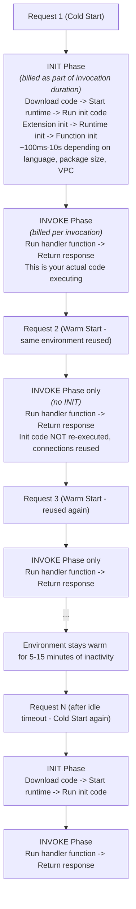

The critical insight to glean from this architecture: code placed outside your primary handler function runs exactly once per cold start, and is then preserved and reused across all subsequent invocations routed to that specific execution environment. This is precisely where you should initialize heavy database connections, load external configurations, and import massive dependency libraries.

When an execution environment has been idle for a period of time — typically 5 to 15 minutes, though AWS does not guarantee a specific timeout — Lambda reclaims the environment in what is known as the SHUTDOWN phase. During shutdown, the Lambda service sends a SIGTERM signal to the runtime, giving your code a brief window (up to 2 seconds with registered extensions, or 500 ms without) to perform cleanup. This is your opportunity to close database connections gracefully, flush metrics buffers, or write final log entries. However, you should never rely on the SHUTDOWN phase for critical business logic; Lambda may terminate an environment at any time to rebalance capacity across Availability Zones, and shutdown hooks are best-effort, not guaranteed.

Understanding the full lifecycle — INIT, INVOKE, and SHUTDOWN — directly informs every architectural decision you will make in serverless design. Code that runs during INIT is your most expensive per-cold-start investment, so keep it lean. Code in INVOKE runs on every request, so optimize it ruthlessly. And code in SHUTDOWN is for hygiene, not for committing state.

> **Stop and think**: How might this affect your approach to handling environment variables or API keys in a Lambda function?

### The Restaurant Kitchen Analogy

Think of a Lambda execution environment like a restaurant kitchen. When a customer orders a meal (an incoming event) and the kitchen is currently closed, the chefs must unlock the doors, turn on the ovens, prep their stations, and organize their ingredients. This is the **INIT phase** (the cold start), and it inherently takes time. Once the kitchen is fully prepped, the chefs cook the meal, representing the **INVOKE phase**. 

If another order comes in immediately after, the kitchen is already hot and the chefs are at their stations. They can skip the prep and go straight to cooking. This is a **Warm Start**, where only the INVOKE phase occurs. However, if no new orders arrive for a prolonged period, the restaurant manager sends the staff home and turns off the ovens to save on operating costs. The next order will trigger another cold start.

One of the most insidious bugs encountered in serverless applications involves developers initializing heavy dependencies inside the handler. Imagine a scenario where a developer accidentally instantiated a 500MB machine learning model inside the handler function. Every single API request forced the Lambda environment to reload the massive model from disk into memory. The API latency consistently hovered around eight seconds, and AWS costs skyrocketed due to the billed execution duration. Simply moving the model initialization outside the handler function reduced the P90 latency to under 200 milliseconds.

```python
# lambda_function.py

import boto3
import json
import os

# INIT CODE - runs once per cold start, reused across invocations
# Put expensive initialization HERE
dynamodb = boto3.resource('dynamodb')
table = dynamodb.Table(os.environ['TABLE_NAME'])
print("Cold start: initialized DynamoDB client")

def handler(event, context):
    """
    HANDLER CODE - runs on every invocation
    Keep this lean and fast
    """
    # The 'table' variable is already initialized from the cold start
    response = table.get_item(Key={'id': event['id']})

    return {
        'statusCode': 200,
        'body': json.dumps(response.get('Item', {}))
    }
```

---

## Execution Limits and Configuration

Before diving into trigger mechanisms, you must understand the hard and soft constraints AWS imposes on Lambda environments. Architecting within these boundaries is a core competency of serverless design.

### Lambda Execution Limits

| Limit | Value | Can Be Increased? |
|-------|-------|-------------------|
| Max execution time | 15 minutes | No (hard limit) |
| Memory allocation | 128 MB - 10,240 MB | No (choose within range) |
| vCPU | Proportional to memory (1,769 MB = 1 vCPU) | No |
| Ephemeral storage (/tmp) | 512 MB - 10,240 MB | Configurable |
| Deployment package (zip) | 50 MB (250 MB unzipped) | No |
| Container image size | 10 GB | No |
| Concurrent executions | 1,000 per region (default) | Yes (up to tens of thousands) |
| Burst concurrency (per function) | +1,000 concurrent executions every 10 seconds, up to account limit | No (account limit can be raised) |
| Environment variables | 4 KB total | No |
| Sync invocation payload | 6 MB | No (hard limit) |
| Async invocation payload | 256 KB | No (hard limit) |
| Layers | 5 layers per function | No |

Since December 2023, burst scaling is **per function**, not a single regional bucket shared across every function in the account. A sudden spike on one hot function ramps its concurrency in 1,000-execution steps every ten seconds until it hits the account concurrency ceiling (default 1,000 per Region, raiseable via support). Neighbor functions in the same account are not starved by one function's burst allocation the way older regional burst pools sometimes behaved. Plan load tests around this per-function curve when you expect step-change traffic (product launches, batch replays, or viral API endpoints).

The memory-to-CPU relationship is the most crucial detail in this matrix. AWS Lambda does not allow you to configure CPU allocation independently. At 1,769 MB of memory, you are guaranteed exactly one full vCPU. At 128 MB, you receive only a microscopic fraction of a vCPU. Workloads that are inherently CPU-bound, such as complex image processing, cryptography, or heavy data transformations, require significantly higher memory allocations even if they consume very little actual RAM, simply because they require the computational power that scales linearly with the memory setting.

---

## Event Sources and Invocation Models

Lambda functions are entirely event-driven; they do not simply run autonomously. They must be explicitly triggered by events generated by other AWS services or external HTTP requests. Understanding the nuances of these trigger patterns is essential for designing resilient asynchronous architectures.

> **Pause and predict**: How can you leverage different AWS services to trigger your Lambda functions and build robust event-driven systems?

### Synchronous Invocations

In a synchronous invocation, the upstream caller waits actively for the Lambda function to finish executing and return a response. Any operational errors or timeouts are returned directly to the calling client.

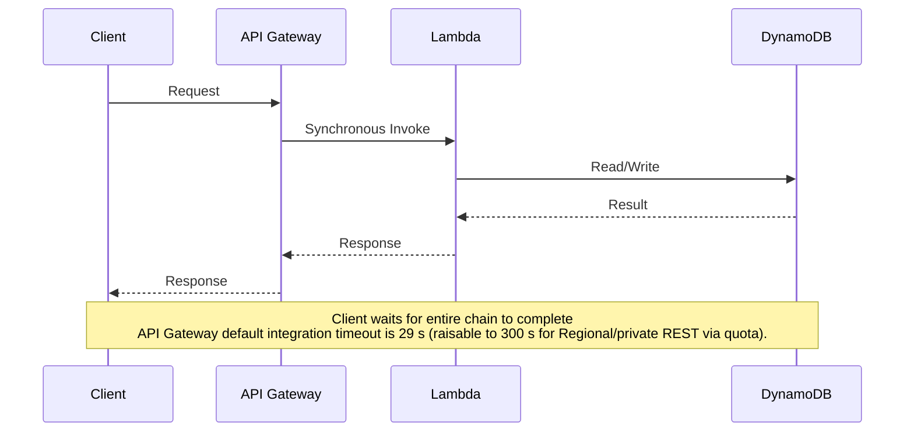

If you genuinely need synchronous HTTP calls longer than 29 seconds, request the **Maximum integration timeout in milliseconds** quota increase for Regional or private REST APIs (up to 300,000 ms), align the Lambda timeout and any downstream client timeouts to the new ceiling, and document the change in your runbooks so on-call engineers know the stack no longer fails at the historical default.

A classic war story involving synchronous invocations revolves around API Gateway timeouts. A payment processing API utilized a synchronous API Gateway trigger to invoke a Lambda function. The Lambda function reached out to a legacy banking mainframe that occasionally required over thirty seconds to respond under heavy load. Because API Gateway's **default** integration timeout is 29 seconds (you can raise it to 300 seconds for Regional and private REST APIs via a service-quota increase since June 2024, but many stacks still run the default), downstream clients began receiving 504 Gateway Timeout errors, even though the backend Lambda function (which was configured with a 60-second timeout) eventually succeeded in processing the transaction. This mismatch resulted in confused users retrying their purchases and being charged twice. Synchronous serverless architectures demand strict alignment of timeouts across the entire interconnected stack.

```bash
# Create a Lambda function
aws lambda create-function \
  --function-name api-handler \
  --runtime python3.12 \
  --role arn:aws:iam::123456789012:role/lambda-execution-role \
  --handler lambda_function.handler \
  --zip-file fileb://function.zip \
  --timeout 30 \
  --memory-size 256

# Invoke synchronously (RequestResponse)
aws lambda invoke \
  --function-name api-handler \
  --invocation-type RequestResponse \
  --payload '{"id": "user-123"}' \
  response.json

cat response.json
```

### Function URLs

If your use case does not require the full routing, throttling, authorization, or request/response transformation capabilities of API Gateway, Lambda Function URLs provide a dramatically simpler alternative. A Function URL is a dedicated HTTPS endpoint that you can enable on any Lambda function with a single configuration change, and it supports two authentication modes: IAM (requiring SigV4-signed requests) and NONE (a public endpoint, though you should combine this with custom authorization logic inside the function itself). Function URLs are ideal for internal microservices, simple webhooks that do not need API Gateway's feature surface, and machine-to-machine communication within an AWS account or organization where the overhead of an entire API Gateway deployment would be excessive.

Function URLs also support Cross-Origin Resource Sharing (CORS) configuration directly on the function, and they generate a predictable endpoint of the form `https://<url-id>.lambda-url.<region>.on.aws/`. The caller receives the Lambda function's response directly, including status codes and headers, with no intermediary transformation — which makes debugging significantly more straightforward than tracing through API Gateway mapping templates.

```bash
# Create a Function URL with IAM auth
aws lambda create-function-url-config \
  --function-name api-handler \
  --auth-type AWS_IAM

# Or create a public Function URL (use with caution)
aws lambda create-function-url-config \
  --function-name webhook-receiver \
  --auth-type NONE \
  --cors '{
    "AllowOrigins": ["https://example.com"],
    "AllowMethods": ["POST"],
    "AllowHeaders": ["Content-Type"]
  }'

# Get the Function URL
aws lambda get-function-url-config \
  --function-name api-handler \
  --query 'FunctionUrl' --output text
```

> **When to choose Function URLs over API Gateway**: Function URLs are the right choice when you need a simple HTTPS endpoint with no complex routing, no request/response transformation, and no API-key management. They are also simpler to deploy (one AWS CLI call versus defining a full REST API resource hierarchy). However, if you need request validation, rate limiting, usage plans, WebSocket support, or a unified API surface across dozens of Lambda functions with a single domain name, API Gateway remains the correct architectural choice. Many production systems use both: Function URLs for internal service-to-service calls where latency and simplicity matter most, and API Gateway for external-facing, customer-authenticated endpoints.

### Asynchronous Invocations

In asynchronous invocations, the caller transmits the event payload and immediately receives a `202 Accepted` HTTP status code. The Lambda service internal queue processes the event in the background, utilizing built-in retry logic (typically two retries by default) if the function encounters an error.

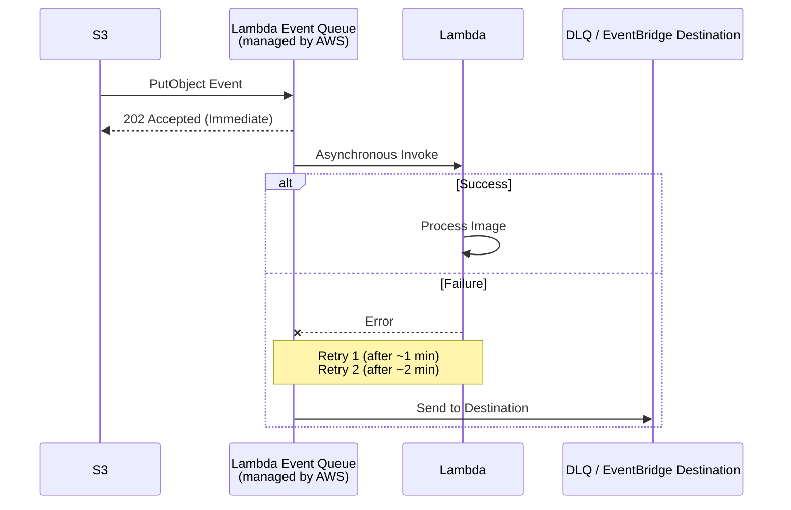

```bash
# Configure async invocation settings
aws lambda put-function-event-invoke-config \
  --function-name image-processor \
  --maximum-retry-attempts 2 \
  --maximum-event-age-in-seconds 3600 \
  --destination-config '{
    "OnSuccess": {
      "Destination": "arn:aws:sqs:us-east-1:123456789012:success-queue"
    },
    "OnFailure": {
      "Destination": "arn:aws:sqs:us-east-1:123456789012:dead-letter-queue"
    }
  }'
```

### Stream-Based (Polling) Invocations

Stream-based triggers operate differently. The Lambda service internally polls a designated data stream or queue (such as Kinesis, DynamoDB Streams, or SQS) and processes the incoming records in configurable batches.

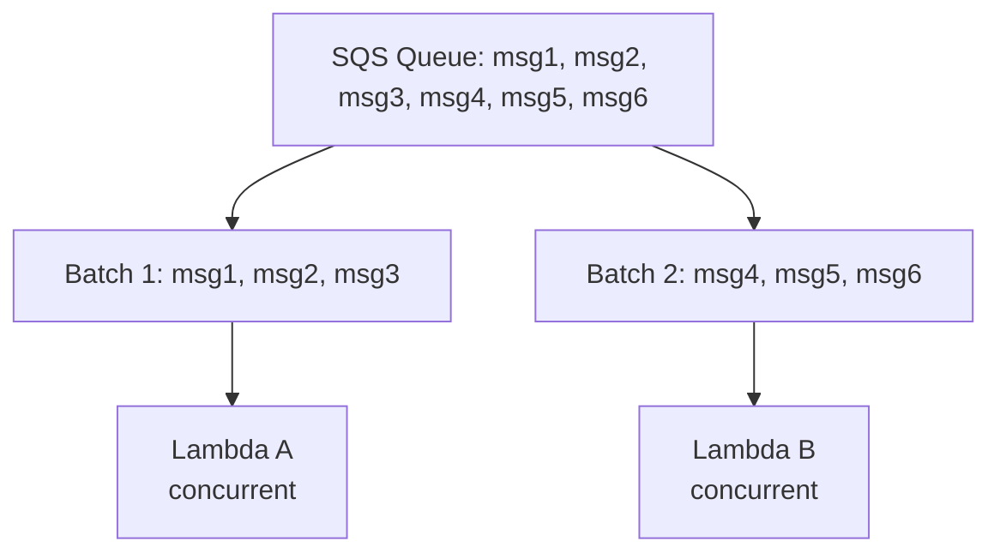

```bash
# Create an SQS trigger for Lambda
aws lambda create-event-source-mapping \
  --function-name order-processor \
  --event-source-arn arn:aws:sqs:us-east-1:123456789012:orders-queue \
  --batch-size 10 \
  --maximum-batching-window-in-seconds 5 \
  --function-response-types ReportBatchItemFailures
```

### Trigger Pattern Reference

| Trigger Source | Invocation Type | Retry Behavior | Common Use Case |
|---------------|----------------|----------------|-----------------|
| API Gateway | Synchronous | Caller retries | REST APIs, webhooks |
| ALB | Synchronous | Caller retries | HTTP services behind ALB |
| S3 Events | Asynchronous | 2 retries + DLQ | File processing pipelines |
| EventBridge | Asynchronous | 2 retries + DLQ | Event-driven microservices |
| SNS | Asynchronous | 2 retries + DLQ | Fan-out notifications |
| SQS | Polling | Message returns to queue | Queue processing, decoupling |
| Kinesis | Polling | Retries until data expires | Real-time stream processing |
| DynamoDB Streams | Polling | Retries until data expires | Change data capture (CDC) |
| CloudWatch Events | Asynchronous | 2 retries | Scheduled tasks (cron) |
| Cognito | Synchronous | No retry | Auth triggers |

---

## Cold Starts, Optimization, and Layers

Cold starts are frequently cited as AWS Lambda's primary drawback. However, by understanding the underlying mechanics, you can heavily mitigate their impact on production latency.

> **Pause and predict**: Based on what you know about Lambda's execution environment, what strategies do you think might help reduce cold start times?

### Cold Start Duration by Runtime

| Runtime | Typical Cold Start | With VPC | With Provisioned Concurrency |
|---------|-------------------|----------|------------------------------|
| Python 3.12 | 150-400 ms | 200-500 ms | ~0 ms (warm) |
| Node.js 20 | 150-350 ms | 200-500 ms | ~0 ms (warm) |
| Java 21 | 800-3000 ms | 1000-4000 ms | ~0 ms (warm) |
| .NET 8 | 400-900 ms | 500-1200 ms | ~0 ms (warm) |
| Go (AL2023) | 80-200 ms | 100-300 ms | ~0 ms (warm) |
| Rust (AL2023) | 50-150 ms | 80-250 ms | ~0 ms (warm) |
| Container image | 500-5000 ms | 600-6000 ms | ~0 ms (warm) |

Historically, attaching a Lambda function to an Amazon VPC introduced brutal cold starts, frequently adding eight to twelve seconds of latency while an Elastic Network Interface (ENI) was dynamically provisioned. With the introduction of Hyperplane ENIs in 2019, VPC cold starts now add a negligible 50 to 200 milliseconds. VPC attachment is no longer a valid reason to avoid serverless architectures.

### Minimizing Cold Starts

**1. Optimize the Deployment Package**

Bloated deployment packages drastically increase the duration of the INIT phase because the Lambda microVM must download and uncompress a massive payload before execution begins.

```bash
# Bad: 250 MB package with everything
pip install boto3 pandas numpy scipy scikit-learn -t .
# This includes hundreds of MB of unused code

# Better: Only install what you need
pip install boto3 -t .  # boto3 is actually pre-installed in Lambda runtime

# Best: Use Lambda Layers for shared dependencies
# Your function package stays tiny, dependencies are in layers
```

**2. Optimize Initialization Logic**

```python
# BAD: Connection created on every invocation
def handler(event, context):
    import boto3  # Import on every call
    client = boto3.client('s3')  # New client on every call
    return client.get_object(Bucket='my-bucket', Key=event['key'])

# GOOD: Connection created once, reused
import boto3  # Import once at cold start
client = boto3.client('s3')  # Client created once

def handler(event, context):
    return client.get_object(Bucket='my-bucket', Key=event['key'])
```

**3. Leverage Provisioned Concurrency**

For latency-sensitive, user-facing APIs where P99 performance is critical, Provisioned Concurrency guarantees that a specified number of execution environments remain constantly initialized and warm.

```bash
# Provision 10 warm environments for the production alias
aws lambda put-provisioned-concurrency-config \
  --function-name api-handler \
  --qualifier production \
  --provisioned-concurrent-executions 10

# Check provisioned concurrency status
aws lambda get-provisioned-concurrency-config \
  --function-name api-handler \
  --qualifier production

# Use Application Auto Scaling to adjust provisioned concurrency
aws application-autoscaling register-scalable-target \
  --service-namespace lambda \
  --resource-id function:api-handler:production \
  --scalable-dimension lambda:function:ProvisionedConcurrency \
  --min-capacity 5 \
  --max-capacity 50

aws application-autoscaling put-scaling-policy \
  --service-namespace lambda \
  --resource-id function:api-handler:production \
  --scalable-dimension lambda:function:ProvisionedConcurrency \
  --policy-name utilization-tracking \
  --policy-type TargetTrackingScaling \
  --target-tracking-scaling-policy-configuration '{
    "TargetValue": 0.7,
    "PredefinedMetricSpecification": {
      "PredefinedMetricType": "LambdaProvisionedConcurrencyUtilization"
    }
  }'
```

Provisioned concurrency incurs continuous costs because you pay for the warm execution environments even when they are idle. It should be applied strategically to user-facing paths rather than backend asynchronous processing.

### Lambda Layers

Lambda Layers empower you to package shared runtime dependencies independently from your core function code. This architectural pattern drastically reduces your deployment package size and enables the seamless sharing of common corporate libraries across hundreds of individual functions.

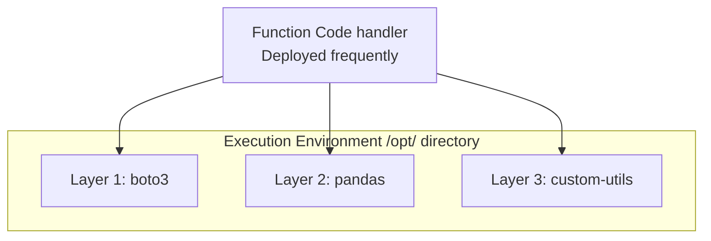

```bash
# Create a layer with Python dependencies
mkdir -p python-layer/python
pip install requests pillow -t python-layer/python/
cd python-layer && zip -r ../my-layer.zip python/

# Publish the layer
LAYER_ARN=$(aws lambda publish-layer-version \
  --layer-name common-dependencies \
  --zip-file fileb://my-layer.zip \
  --compatible-runtimes python3.12 \
  --compatible-architectures x86_64 arm64 \
  --query 'LayerVersionArn' --output text)

echo "Layer ARN: ${LAYER_ARN}"

# Add the layer to a function
aws lambda update-function-configuration \
  --function-name image-processor \
  --layers ${LAYER_ARN}
```

> **Pause and predict**: Considering the deployment package limits and the nature of different applications, when would you choose Lambda Layers over a Container Image for your function?

### When to Use Layers vs. Container Images

| Approach | Best For | Limits |
|----------|---------|--------|
| Zip package only | Simple functions < 50 MB | 50 MB zipped, 250 MB unzipped |
| Zip + Layers | Shared dependencies, moderate size | 5 layers, 250 MB total unzipped |
| Container Image | Large dependencies (ML models, binaries) | 10 GB image size |

For any workload necessitating machine learning frameworks like PyTorch or TensorFlow, complex scientific computing packages, or custom compiled system binaries, Container Images are the definitive solution. The 10 GB upper limit provides ample runway for enterprise-scale dependencies.

### ARM64 (Graviton) Architecture

AWS Lambda supports both x86_64 and arm64 instruction set architectures. The arm64 architecture runs on **AWS Graviton2** processors (Lambda does not run on Graviton3 today). For the vast majority of serverless workloads — especially I/O-bound applications, web APIs, and data processing pipelines — switching from x86_64 to arm64 yields an immediate, tangible benefit with zero code changes for interpreted runtimes like Python and Node.js.

The economics of Graviton for Lambda are compelling and straightforward. Arm64 functions cost approximately 20% less per GB-second than their x86_64 equivalents. AWS documents up to **34% better price-performance** for Lambda on Graviton2 versus x86_64 for many workloads. For organizations running millions of Lambda invocations monthly, this architectural switch alone can materially reduce the serverless compute bill. CPU-bound functions may also finish faster on arm64 when the workload benefits from Graviton2's efficiency, which compounds savings by reducing billed duration.

The only meaningful caveat involves compiled native dependencies. If your Lambda deployment package includes architecture-specific binary libraries (for example, a C-extension compiled only for x86_64, or a platform-specific machine learning runtime), you must recompile those dependencies for arm64. Python wheels that are pure Python or provide `manylinux2014_aarch64` variants work transparently. Node.js packages with native addons require `npm install` targeting the arm64 platform. The Lambda console and CLI default to x86_64, so teams that never actively choose arm64 will miss out on this optimization indefinitely.

```bash
# Create a Lambda function targeting arm64 (Graviton)
aws lambda create-function \
  --function-name image-processor-arm \
  --runtime python3.12 \
  --role arn:aws:iam::123456789012:role/lambda-execution-role \
  --handler lambda_function.handler \
  --zip-file fileb://function.zip \
  --architectures arm64 \
  --memory-size 1024 \
  --timeout 30

# Verify the architecture
aws lambda get-function-configuration \
  --function-name image-processor-arm \
  --query 'Architectures' --output text
```

### SnapStart: Eliminating Cold Starts for Latency-Sensitive Workloads

AWS Lambda SnapStart, announced at re:Invent 2022 and initially available only for Java runtimes, addresses the most persistent complaint about serverless computing: the unpredictable latency tax imposed by cold starts. SnapStart fundamentally changes the cold-start model by pre-initializing the execution environment at deployment time, capturing a Firecracker microVM memory snapshot of the fully initialized runtime (after the INIT phase completes but before any invocation), and caching that snapshot for ultra-fast restoration when a new execution environment is needed.

The mechanics are worth understanding because they directly affect how you write initialization code. When you publish a new Lambda version with SnapStart enabled, Lambda runs the full INIT phase — downloading your deployment package, starting the runtime, executing all static initializers and global-scope code — and then takes a point-in-time memory snapshot. When a subsequent invocation triggers a cold start, Lambda restores the cached snapshot in a fraction of the time required for a traditional INIT, typically reducing cold-start latency from seconds to under 200 milliseconds for Java functions. The snapshot restoration skips the runtime bootstrap, class loading, and dependency initialization entirely because those operations were already performed during the snapshot creation step.

AWS has expanded SnapStart runtime support significantly. As of 2024, SnapStart supports Java (Corretto 11, 17, and 21), Python 3.12+, and .NET 8. This expansion means that the two most popular interpreted runtimes now have a path to near-zero cold-start latency for latency-critical APIs. SnapStart is particularly valuable for Java-based Lambda functions behind synchronous API Gateway or ALB endpoints, where the 800–3,000 ms traditional cold start would otherwise violate user-facing SLAs.

A critical design consideration with SnapStart involves uniqueness. Because the snapshot is taken once during deployment and reused across potentially thousands of concurrent execution environments, any state that must be unique per execution environment — such as random seeds, GUIDs, or cryptographic nonces generated during initialization — will be identical across all environments that are restored from the same snapshot. AWS provides a runtime hook (`CRaC` for Java, `SnapStart Runtime Hooks` for Python and .NET) that executes code after snapshot restoration, allowing you to re-seed random number generators, re-establish database connections with unique client identifiers, or regenerate ephemeral credentials. Neglecting this hook results in subtle, catastrophic bugs: imagine every concurrent Lambda instance generating the same "unique" request ID.

```bash
# Enable SnapStart on a Lambda function (Java shown; Python/.NET use same flag)
aws lambda update-function-configuration \
  --function-name payment-api \
  --snap-start '{"ApplyOn": "PublishedVersions"}'

# Publish a new version to trigger snapshot creation
aws lambda publish-version \
  --function-name payment-api \
  --description "v2 with SnapStart enabled"
```

> **When to use SnapStart**: SnapStart is most impactful for latency-sensitive synchronous workloads where users or upstream services wait for a response — REST APIs, payment processing endpoints, authentication handlers, and real-time personalization engines. For asynchronous, stream-based, or batch processing workloads where a 500 ms cold start is invisible behind queue processing latency, SnapStart adds deployment complexity without meaningful end-user benefit. It is also worth noting that SnapStart increases the deployment duration slightly because of the snapshot-creation overhead, so fast CI/CD pipelines with dozens of daily deployments should factor in this additional time.

---

---

## Orchestrating Complexity with Step Functions

When the logic of a single Lambda function expands beyond simple transformations, developers often attempt to chain multiple functions together. AWS Step Functions provides a robust state machine orchestrator that resolves the inherent fragility of direct function-to-function invocation.

### The Pitfalls of Direct Invocation

> **Pause and predict**: If you have multiple Lambda functions that need to execute in a specific sequence, what are the potential downsides of one Lambda function directly invoking another?

Early in the serverless movement, engineering teams frequently constructed "orchestrator" Lambdas whose sole purpose was to synchronously invoke a sequence of downstream Lambdas. 

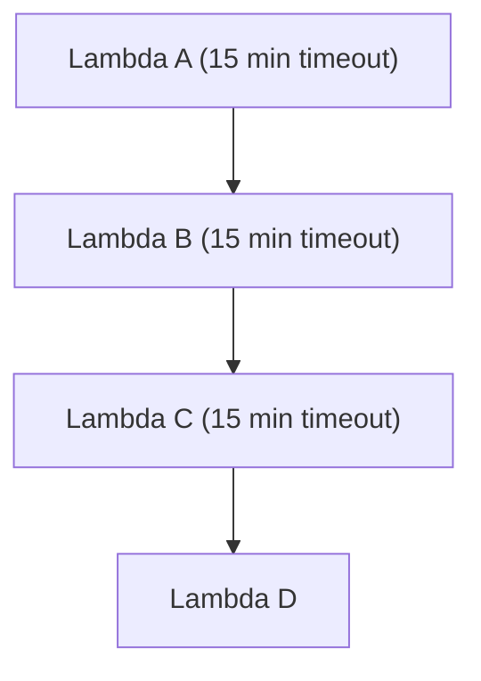

This anti-pattern creates severe structural liabilities:
- The calling Lambda is actively waiting (and accumulating billing charges) while downstream functions execute.
- If a downstream function fails, error handling and complex retries must be manually coded into the orchestrator.
- If the orchestrator reaches its 15-minute maximum timeout, all downstream processes become untracked orphans.
- Debugging requires tracing deeply nested CloudWatch log streams across multiple independent functions.

### The Step Functions Solution

AWS Step Functions completely eliminates these liabilities by externalizing state management and error handling into a visual, fully managed workflow.

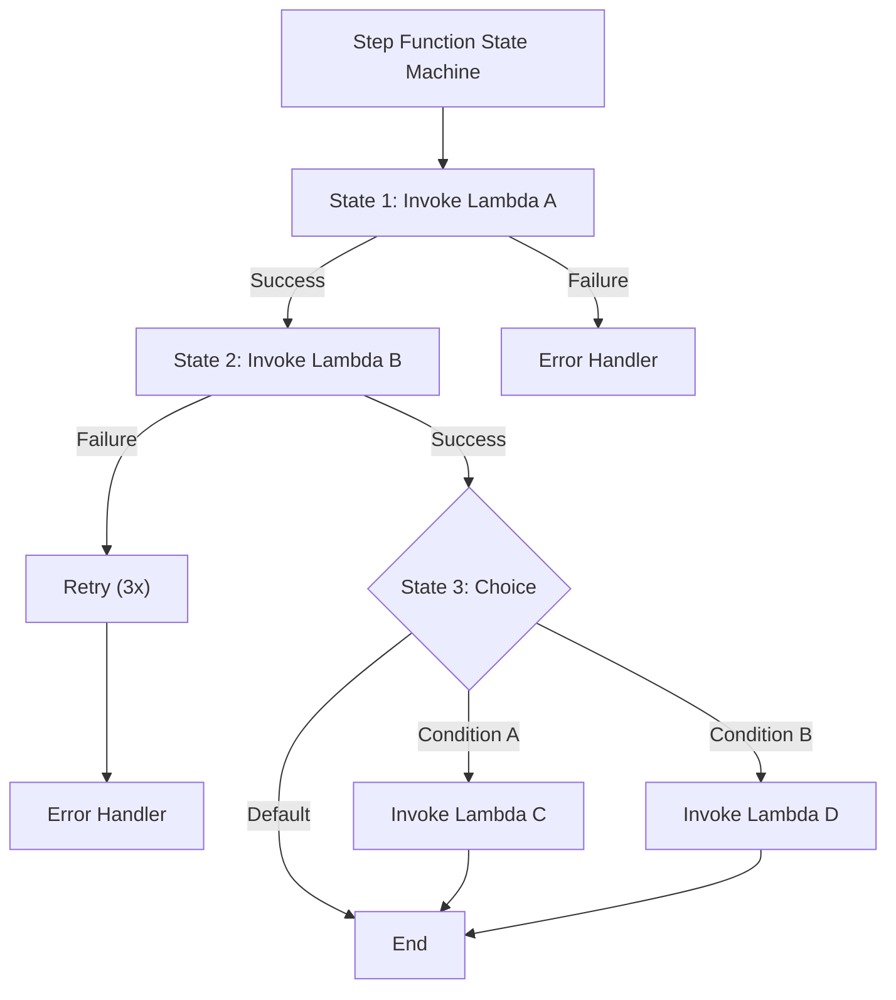

```bash
# Create the state machine definition
cat > /tmp/state-machine.json <<'EOF'
{
  "Comment": "Image processing pipeline",
  "StartAt": "ValidateInput",
  "States": {
    "ValidateInput": {
      "Type": "Task",
      "Resource": "arn:aws:lambda:us-east-1:123456789012:function:validate-input",
      "Next": "GenerateThumbnail",
      "Catch": [{
        "ErrorEquals": ["ValidationError"],
        "Next": "HandleError",
        "ResultPath": "$.error"
      }]
    },
    "GenerateThumbnail": {
      "Type": "Task",
      "Resource": "arn:aws:lambda:us-east-1:123456789012:function:generate-thumbnail",
      "Retry": [{
        "ErrorEquals": ["States.TaskFailed"],
        "IntervalSeconds": 3,
        "MaxAttempts": 2,
        "BackoffRate": 2.0
      }],
      "Next": "StoreMetadata"
    },
    "StoreMetadata": {
      "Type": "Task",
      "Resource": "arn:aws:states:::dynamodb:putItem",
      "Parameters": {
        "TableName": "image-metadata",
        "Item": {
          "imageId": {"S.$": "$.imageId"},
          "thumbnailKey": {"S.$": "$.thumbnailKey"},
          "processedAt": {"S.$": "$$.State.EnteredTime"}
        }
      },
      "Next": "NotifyComplete"
    },
    "NotifyComplete": {
      "Type": "Task",
      "Resource": "arn:aws:states:::sns:publish",
      "Parameters": {
        "TopicArn": "arn:aws:sns:us-east-1:123456789012:image-processed",
        "Message.$": "States.Format('Image {} processed successfully', $.imageId)"
      },
      "End": true
    },
    "HandleError": {
      "Type": "Task",
      "Resource": "arn:aws:states:::sns:publish",
      "Parameters": {
        "TopicArn": "arn:aws:sns:us-east-1:123456789012:processing-errors",
        "Message.$": "States.Format('Error processing image: {}', $.error.Cause)"
      },
      "End": true
    }
  }
}
EOF

# Create the IAM role for Step Functions
aws iam create-role \
  --role-name step-functions-execution-role \
  --assume-role-policy-document '{
    "Version": "2012-10-17",
    "Statement": [{
      "Effect": "Allow",
      "Principal": {"Service": "states.amazonaws.com"},
      "Action": "sts:AssumeRole"
    }]
  }'

# Attach permissions
aws iam put-role-policy \
  --role-name step-functions-execution-role \
  --policy-name StepFunctionsPermissions \
  --policy-document '{
    "Version": "2012-10-17",
    "Statement": [
      {
        "Effect": "Allow",
        "Action": "lambda:InvokeFunction",
        "Resource": "arn:aws:lambda:us-east-1:123456789012:function:*"
      },
      {
        "Effect": "Allow",
        "Action": ["dynamodb:PutItem"],
        "Resource": "arn:aws:dynamodb:us-east-1:123456789012:table/image-metadata"
      },
      {
        "Effect": "Allow",
        "Action": "sns:Publish",
        "Resource": "arn:aws:sns:us-east-1:123456789012:*"
      }
    ]
  }'

# Create the state machine
aws stepfunctions create-state-machine \
  --name image-processing-pipeline \
  --definition file:///tmp/state-machine.json \
  --role-arn arn:aws:iam::123456789012:role/step-functions-execution-role \
  --type STANDARD
```

### Standard vs. Express Workflows

| Feature | Standard | Express |
|---------|----------|---------|
| Max duration | 1 year | 5 minutes |
| Pricing | Per state transition ($0.025/1000) | Per execution + duration |
| Execution history | 90 days in console | CloudWatch Logs only |
| At-least-once vs exactly-once | Exactly once | At-least-once |
| Best for | Long-running, business-critical workflows | High-volume, short-duration processing |

Standard workflows are highly appropriate for complex order processing, multi-day approval chains, and any scenario demanding human intervention. Express workflows are designed explicitly for massive-scale, high-throughput data ingestion, IoT event transformations, and real-time stream processing.

---

## Event-Driven Architecture Patterns

Lambda excels as the connective tissue in event-driven systems. Mastering these architectural patterns is critical for modern cloud engineering.

### Pattern 1: S3 Event Processing Pipeline

This foundational pattern is widely utilized for asynchronous file processing, image manipulation, and data ingestion.

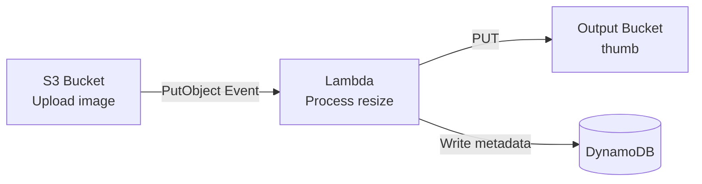

```bash
# Add S3 trigger permission
aws lambda add-permission \
  --function-name image-processor \
  --statement-id s3-trigger \
  --action lambda:InvokeFunction \
  --principal s3.amazonaws.com \
  --source-arn arn:aws:s3:::upload-bucket \
  --source-account 123456789012

# Configure S3 to send events to Lambda
aws s3api put-bucket-notification-configuration \
  --bucket upload-bucket \
  --notification-configuration '{
    "LambdaFunctionConfigurations": [
      {
        "LambdaFunctionArn": "arn:aws:lambda:us-east-1:123456789012:function:image-processor",
        "Events": ["s3:ObjectCreated:*"],
        "Filter": {
          "Key": {
            "FilterRules": [
              {"Name": "prefix", "Value": "uploads/"},
              {"Name": "suffix", "Value": ".jpg"}
            ]
          }
        }
      }
    ]
  }'
```

### Pattern 2: Fan-Out Architecture with SNS

The fan-out pattern leverages Amazon SNS to broadcast a single incoming event to multiple independent downstream Lambda functions, enabling parallel processing without tight coupling.

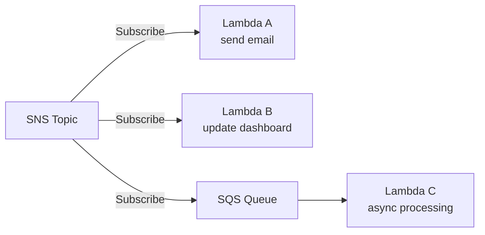

### Pattern 3: Centralized Event Bus with EventBridge

Amazon EventBridge serves as a centralized nervous system for enterprise microservices, allowing discrete applications to publish events and trigger strictly decoupled Lambda functions based on intricate content routing rules.

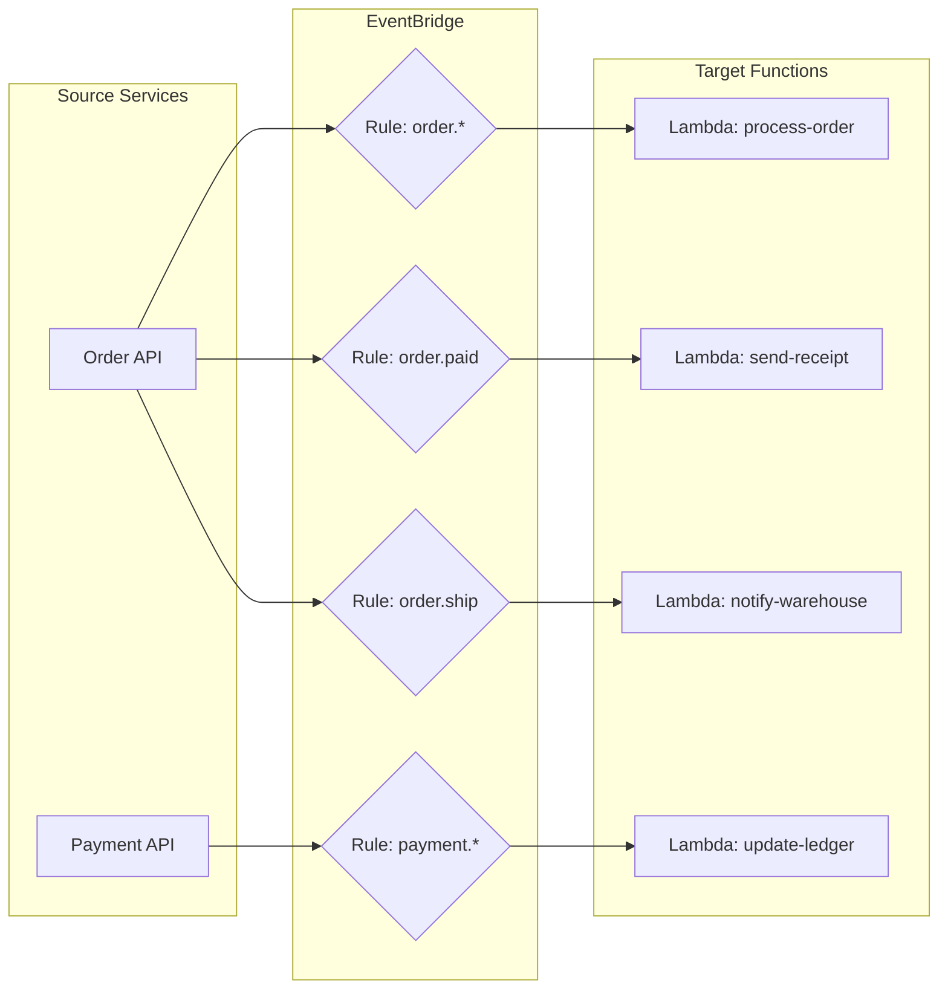

```bash
# Create an EventBridge rule
aws events put-rule \
  --name order-created-rule \
  --event-pattern '{
    "source": ["com.myapp.orders"],
    "detail-type": ["OrderCreated"],
    "detail": {
      "total": [{"numeric": [">", 100]}]
    }
  }'

# Add Lambda as a target
aws events put-targets \
  --rule order-created-rule \
  --targets '[{
    "Id": "process-high-value-order",
    "Arn": "arn:aws:lambda:us-east-1:123456789012:function:high-value-order-processor"
  }]'
```

---

## Decision Framework: Lambda vs. Fargate vs. EC2

Selecting the correct compute substrate is one of the most consequential architectural decisions you will make in AWS. A poor choice leads to runaway costs, brittle scaling behavior, or operational toil that compounds monthly. This decision framework provides a structured, repeatable method for evaluating your workload against the three primary compute options: AWS Lambda (serverless functions), Amazon ECS with AWS Fargate (serverless containers), and Amazon EC2 (virtual machines).

### The Compute Decision Flowchart

The following flowchart walks through the key decision points that experienced cloud architects apply when choosing a compute platform. The questions are ordered by elimination power — the first question that rules out an option is usually sufficient, but production-grade decisions should consider the entire path.

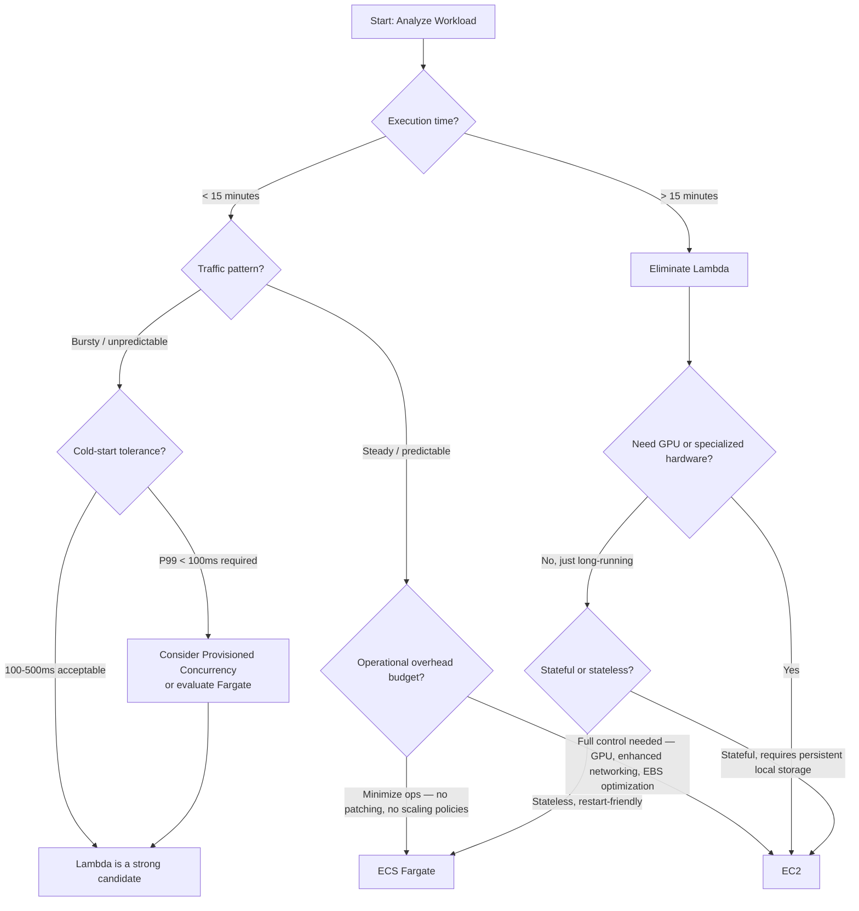

### Decision Matrix

The flowchart clarifies the elimination path. The matrix below quantifies the trade-offs across the dimensions that matter in production: cost at scale, latency behavior, operational burden, and architectural flexibility. Use this matrix when you have a workload that could plausibly run on more than one platform and you need to justify the decision with data rather than intuition.

| Decision Vector | AWS Lambda | ECS Fargate | EC2 |
|----------------|------------|-------------|-----|
| **Cost model** | Pay per invocation + GB-second at 1 ms granularity. Zero cost when idle. | Pay per vCPU-hour + GB-hour while tasks are running. No idle cost for stopped tasks. | Pay per instance-hour regardless of utilization. Reserved/Savings Plans reduce rate. |
| **Cost at steady high load** | Expensive. Provisioned concurrency adds continuous cost. | Moderate. Predictable. Savings Plans apply. | Cheapest with Reserved Instances at 3-year commitment. |
| **Cost at low/spiky load** | Cheapest. Idle is free. | Moderate — you still pay for one running task. | Expensive — you pay for the instance 24/7. |
| **Cold-start latency** | 50 ms–5 s (runtime-dependent). SnapStart reduces this significantly for Java/Python/.NET. | None once tasks are running. Initial task launch: 15–60 s. | None once instances are running. Instance launch: 60–120 s. |
| **Scaling speed** | Milliseconds to seconds. Up to burst-concurrency limit instantly. | Minutes. Auto-scaling reacts to CloudWatch metrics with 1–3 minute delays. | Minutes. Auto-scaling groups react to CloudWatch metrics. |
| **Max vCPUs** | ~6 vCPUs (at 10,240 MB memory). CPU scales linearly with memory. | 16 vCPUs (Fargate). | Up to 448 vCPUs (largest EC2 instances). |
| **Max memory** | 10,240 MB (10 GB). | 120 GB (Fargate). | Up to 24 TB (largest EC2 instances). |
| **Max execution duration** | 15 minutes (hard limit). | Unlimited (task runs until stopped). | Unlimited. |
| **GPU support** | Not available. | Not available on Fargate. Available on ECS with EC2 launch type. | Yes — full range of GPU instances (P5, G6, etc.). |
| **Persistent local storage** | /tmp: 512 MB–10,240 MB. Ephemeral, per-invocation. | 20 GB ephemeral (Fargate). EFS mountable. | Full EBS volumes — up to 64 TB per volume. |
| **Networking** | VPC-attachable (Hyperplane ENI). No fixed IP. | VPC-attachable. Each task gets an ENI. | VPC-attachable. Full ENI control. Elastic IP support. |
| **Operational burden** | None: no OS patching, no container orchestration, no scaling policies (beyond concurrency limits). | Low: Fargate manages the underlying host. You write the Dockerfile and task definition. | High: OS patching, AMI management, kernel tuning, scaling group configuration, capacity planning. |
| **Deployment speed** | Seconds. | 1–3 minutes for new task replacement. | Minutes for rolling instance replacement. |
| **Best for** | Event-driven processing, REST APIs with bursty traffic, glue code, cron jobs under 15 min. | Steady-state web services, long-running API workers, background processors. | GPU workloads, stateful applications, legacy lift-and-shift, regulated workloads requiring full OS control. |

### How to Apply the Framework

Start by eliminating options that violate hard constraints. If your workload requires more than 15 minutes of execution time per unit of work, Lambda is eliminated regardless of how attractive its operational model appears. If your workload requires GPU hardware, only EC2 remains. If your workload requires sub-millisecond P99 tail latency under all conditions and you cannot afford provisioned concurrency at scale, Lambda is not the right choice — Fargate or EC2 will deliver more consistent latency.

After eliminating infeasible options, apply the cost lens. For workloads with a utilization curve that fluctuates wildly — spiking 100x at peak and falling to near zero overnight — Lambda's "idle is free" property typically yields the lowest total cost. For workloads with a steady, predictable request rate that fills at least two vCPUs' worth of compute 24/7, EC2 with a 3-year Reserved Instance commitment will undercut both Lambda and Fargate on a per-compute-unit basis. Fargate occupies the middle ground: it eliminates the operational burden of EC2 while providing the consistent latency and unlimited duration that Lambda cannot offer.

Finally, consider the team's operational maturity. A three-person startup with no dedicated infrastructure team should default to Lambda for as many workloads as possible, because every hour spent tuning auto-scaling groups or patching AMIs is an hour not spent building the product. A large enterprise with a dedicated platform engineering team that has standardized on ECS and built internal tooling around it may derive more value from Fargate's consistency across workloads than from Lambda's per-workload cost optimization. The framework's purpose is to make the trade-offs explicit so the decision is deliberate, not accidental.

---

## Understanding the Lambda Cost Model

AWS Lambda's pricing model is simultaneously one of its most attractive features and one of the most frequently misunderstood. Unlike EC2 or Fargate, where you pay for provisioned capacity regardless of whether that capacity is doing useful work, Lambda charges for actual compute consumption at millisecond granularity. This section explains the pricing model in detail, identifies the knobs that control cost, and flags the scenarios where costs can surprise you.

### The Two-Part Pricing Formula

Lambda pricing has two independent components that combine to form your total bill:

1. **Per-request charge**: You pay $0.20 per 1 million invocations, regardless of how long each invocation runs. This charge covers the overhead of receiving the event, routing it to an available execution environment, and returning the response. For functions that process large batches of records (for example, an SQS-triggered function handling 10 messages per invocation), the per-request cost is negligible. For a high-frequency API with millions of tiny requests that each execute for under 50 ms, the per-request charge becomes a meaningful fraction of the total.

2. **Duration charge**: You pay for the GB-seconds consumed by your function, calculated as the memory allocated (in GB) multiplied by the execution duration (in seconds, billed at 1 ms granularity). The rate differs by architecture: x86_64 costs $0.0000166667 per GB-second (which works out to $0.060 per GB-hour), and arm64 (Graviton) costs $0.0000133334 per GB-second (approximately $0.048 per GB-hour) — a 20% discount.

To make this concrete, consider a function configured with 1,024 MB (1 GB) of memory, running on x86_64, invoked 10 million times per month, with an average execution duration of 200 ms per invocation:

- Per-request cost: 10 million × $0.20/1M = $2.00
- Duration cost: 10M × 200 ms × 1 GB × $0.0000166667/GB-s = $33.33
- **Total monthly cost: approximately $35.33**

If the same function were switched to arm64, the duration cost drops to $26.67, bringing the total to $28.67 — a 19% reduction with no code changes.

### Provisioned Concurrency Cost

Provisioned Concurrency billing works differently from standard Lambda invocations and catches many teams off guard. You pay for the provisioned capacity continuously — 24 hours a day, 7 days a week — at a rate that is slightly lower than the standard duration rate, but you pay it whether or not the provisioned environments are handling traffic. The provisioned concurrency rate is approximately $0.0000041667 per GB-second for x86_64, which works out to about $0.015 per GB-hour. For a function with 1,024 MB of memory and 10 provisioned concurrent executions, the baseline monthly cost for provisioned capacity alone — before a single invocation is processed — is approximately $108 (10 environments × 1 GB × $0.015/GB-hr × 720 hours).

When an invocation lands on a provisioned-concurrency environment, you still pay the standard duration charge on top of the provisioned-capacity charge. Provisioned concurrency is therefore a latency optimization, not a cost optimization. It should be applied surgically to the specific function aliases and versions that serve user-facing synchronous traffic where P99 latency matters, and paired with Application Auto Scaling to ramp provisioned capacity up and down with demand, rather than statically over-provisioning.

### The Hidden Cost of Cold Starts

Cold starts are not a line item on your AWS bill, but they influence cost in two subtle ways. First, the INIT phase is included in the billed duration of the invocation that triggered the cold start, meaning that a 3-second cold start followed by a 200 ms handler execution generates 3.2 seconds of billed duration. If 1% of your invocations experience cold starts averaging 2 seconds, your total billed duration increases by roughly 2%. This effect is small for low-concurrency functions but becomes material at scale.

Second, and more important architecturally, developers who fear cold-start latency tend to over-allocate memory to their functions. Because CPU scales linearly with memory, teams running CPU-bound workloads often configure 3,008 MB or more not because they need the RAM, but because they need the vCPU capacity to finish faster. A function that genuinely needs 256 MB of RAM but is configured at 3,008 MB for CPU reasons pays for over 10x the memory it uses. The Lambda Power Tuning tool — an open-source Step Functions state machine available in the AWS Serverless Application Repository — automatically tests your function at every memory tier and identifies the memory configuration that minimizes total cost, factoring in the trade-off between faster execution and higher per-millisecond rate.

### What Makes Lambda Costs Spike Unexpectedly

**Recursive invocations** are the most common cause of catastrophic Lambda cost surprises. A Lambda function triggered by S3 PutObject events that writes its output back to the same bucket creates an infinite loop, generating millions of invocations in hours. AWS added automatic recursive invocation detection in 2023, which stops the function after detecting 16 consecutive recursive calls, but the damage in those 16 invocations can still be painful because each invocation fans out to multiple concurrent executions. Prevention — separate input and output buckets, strict S3 event prefix/suffix filters — is dramatically cheaper than detection.

**Orchestrator Lambda patterns** — where one Lambda synchronously invokes another and waits — double-bill the calling function while it sits idle. If Lambda A calls Lambda B and waits 5 seconds for B to finish, Lambda A is billed for those 5 seconds of idle waiting plus its own processing time. Step Functions eliminates this double-billing because the state machine waits externally.

**Over-large deployment packages** extend the INIT phase of every cold start, increasing the billed duration of cold-start invocations. A 250 MB zip package takes measurably longer to download and decompress than a 5 MB package. This effect compounds at scale: if your function experiences 10,000 cold starts per day, each extended by 300 ms due to package bloat, you are paying for an extra 3,000 seconds of billed duration daily — approximately $0.05 per day for a 1 GB function, or $18 per year, which appears trivial until you realize that a typical organization runs dozens or hundreds of Lambda functions. Layer extraction, dependency pruning, and container-image optimization for larger functions are cost disciplines, not just latency optimizations.

**Provisioned Concurrency over-provisioning** is the most expensive mistake specific to Lambda. Setting provisioned concurrency to 100 for a function that peaks at 20 concurrent executions during business hours and idles overnight wastes roughly 80% of the provisioned-concurrency spend. Application Auto Scaling with a target utilization of 70% ensures that provisioned capacity tracks actual demand and reduces the financial penalty of always-warm environments.

### A Concrete Cost Comparison: Lambda vs. Fargate vs. EC2

Abstract pricing rates are only useful when applied to a realistic workload. The following comparison evaluates three compute options for a hypothetical internal API that handles 50 requests per second during business hours (9 AM–6 PM, weekdays) and approximately 5 requests per second overnight and on weekends. Each request triggers 150 ms of compute on average, and the application requires roughly 1 GB of RAM to run comfortably. We assume a 30-day month with 22 business days.

**AWS Lambda (arm64, 1,024 MB):** Business-hour invocation count is 50 req/s × 3,600 s/hr × 9 hr/day × 22 days ≈ 35.6 million invocations. Off-peak adds roughly 7.8 million invocations. Total: ~43.4 million invocations/month. Per-request cost: 43.4M × $0.20/1M = $8.68. Duration cost: 43.4M × 0.150 s × 1 GB × $0.0000133334/GB-s = $86.80. Assume 2% of invocations are cold starts adding 250 ms each, contributing roughly $2.90 extra. No provisioned concurrency — this is an internal API where 300 ms cold starts are acceptable. **Total: ~$98/month.** The function costs approximately zero at 3 AM on Sunday.

**ECS Fargate (arm64, 1 vCPU, 2 GB):** Fargate pricing for arm64 is approximately $0.03238 per vCPU-hour and $0.00356 per GB-hour. You must run at least one task continuously because the API must respond to requests at all hours, even when traffic is low. A single 1 vCPU / 2 GB task: (1 × $0.03238 + 2 × $0.00356) × 730 hours = $28.83/month. However, at 50 req/s, one task is insufficient — you need approximately 2 tasks during business hours. Adding a second task for business hours only: the same rate × (9 hr/day × 22 days) = $7.85. **Total: ~$37/month.** Notably cheaper than Lambda at this steady load, but you must write a Dockerfile, manage a container registry, configure auto-scaling, and maintain the task definition.

**EC2 (c7g.medium Reserved Instance, 3-year):** On-demand price is approximately $0.0361/hr. With a 3-year all-upfront Reserved Instance, the effective rate drops to roughly $0.023/hr. One instance running 24/7: 730 hours × $0.023 = $16.79/month. Even two instances for redundancy: $33.58/month. **Total: ~$34/month for a redundant pair.** This is the cheapest option on a per-compute-unit basis, but it also demands OS patching, AMI management, capacity monitoring, and network configuration — operational overhead that costs engineering time, even if that time does not appear on the AWS bill.

The numbers reveal the core serverless economics: Lambda is cheapest when utilization is low and spiky, Fargate is competitive for steady moderate loads with minimal operational overhead, and EC2 is cheapest in pure compute-cost terms but shifts significant operational cost onto your team. The decision is never purely about the infrastructure bill. A $60/month saving on EC2 that costs your team 10 engineering-hours per month in patching and troubleshooting is a net loss at any reasonable engineering salary. This is why the Decision Framework earlier in the module foregrounds operational maturity alongside raw compute pricing.

---

## Patterns & Anti-Patterns for Serverless on Lambda

Mastery of AWS Lambda requires not only understanding what the service can do, but also recognizing when a particular design pattern is the right solution and when it will lead you into a costly dead end. This section presents three proven serverless patterns with their rationale and scaling considerations, followed by three anti-patterns that experienced teams learn to avoid — often the hard way.

### Proven Patterns

| Pattern | When to Use | Why It Works | Scaling Note |
|---------|-------------|--------------|--------------|
| **Decoupled Async Processing** — S3/SQS/EventBridge trigger Lambda, which processes the event and writes results to a separate destination. No synchronous caller waits for completion. | File processing pipelines, order fulfillment where the client submits and polls separately, any workflow where the user does not need an immediate synchronous response. | Eliminates the tight coupling between producer and consumer. If the Lambda function fails, the event source (SQS, Kinesis, DynamoDB Streams) retries automatically. The producer never blocks, and failures are isolated to individual events rather than cascading across the system. | SQS standard queues scale Lambda concurrency linearly with the number of visible messages, up to 1,000 concurrent executions by default. For Kinesis and DynamoDB Streams, concurrency is bounded by the number of shards (one Lambda instance per shard per stream), so pre-scale your shard count if you anticipate a throughput increase. |
| **API Gateway Proxy to Lambda** — API Gateway routes HTTP requests directly to Lambda, with the Lambda function responsible for parsing the request, executing business logic, and returning a structured HTTP response. | Public-facing REST APIs, webhook receivers, mobile backends, and any HTTP endpoint where the compute is stateless and per-request. | Separates the HTTP concern (routing, TLS termination, throttling) from the business logic concern (the Lambda function). API Gateway handles authorization via Cognito or IAM, request validation via models, and throttling via usage plans, while the Lambda function focuses purely on domain logic. | API Gateway's **default** integration timeout is 29 seconds (raisable to 300 seconds for Regional/private REST APIs via quota increase since June 2024). The Lambda function must complete within the configured integration timeout for synchronous invocations. API Gateway also imposes a 10 MB payload limit. For long-running requests, use asynchronous invocation or switch to ALB. |
| **Step Functions Orchestration** — Step Functions state machine coordinates multiple Lambda functions, AWS service integrations (DynamoDB, SNS, SQS), and control-flow logic (Choice, Parallel, Map states) into a single, observable workflow. | Multi-step business processes (order fulfillment, user onboarding, ETL pipelines), any workflow with conditional branching, retry logic, or human approval steps. | Externalizes workflow state, retry policies, and error handling from application code into a declarative JSON/YAML definition. Each Lambda function operates independently without knowing about the broader workflow. The execution history is persisted for 90 days (Standard) and is visually inspectable, making debugging and auditing dramatically simpler than tracing logged invocation chains across CloudWatch. | Standard Workflows support up to 1 year of execution and guarantee exactly-once execution semantics. Express Workflows support 5 minutes maximum but are priced per execution and duration — roughly 10x cheaper per state transition for high-volume, short-duration workflows. Choose Express for real-time event processing at scale; choose Standard for business-critical transactions where correctness matters more than cost. |

### Anti-Patterns

| Anti-Pattern | What Goes Wrong | Why Teams Fall Into It | Better Alternative |
|-------------|----------------|----------------------|-------------------|
| **The Monolith Lambda** — A single Lambda function that handles every request type for an entire application domain, using internal routing (if/else or switch on `event.path` or `event.detail-type`) to dispatch to different handler functions embedded in the same deployment package. | The function grows to hundreds or thousands of lines of code, deployment becomes slow (one small change to a single endpoint requires deploying the entire monolith), and concurrency becomes inefficient because every invocation — even for a rarely used endpoint — loads the entire codebase. Cold starts become slower as the package size grows. Testing becomes difficult because the handler logic is entangled. | The function starts small with one or two clearly related operations. As the domain expands, adding another `if` branch feels simpler than creating a new Lambda function with its own IAM role, deployment pipeline, and configuration. Teams also conflate "one API" with "one Lambda function," which is a lift-and-shift mental model from monolithic servers. | Decompose by bounded context. Each Lambda function should handle one well-defined responsibility — one API resource, one event type, one processing step. Use API Gateway's resource-based routing to direct different paths to different Lambda functions. The deployment and IAM isolation this provides are worth the marginal increase in the number of functions. A serverless application with 30 small, focused Lambda functions is dramatically easier to operate at scale than one with 3 enormous functions. |
| **Synchronous Lambda Chaining** — One Lambda function directly invokes another Lambda function using the `RequestResponse` invocation type and waits for the response before proceeding. | Both functions are billed for the entire duration of the slower function. If Lambda A invokes Lambda B and Lambda B takes 8 seconds, Lambda A is billed for 8 seconds of idle waiting. If the chain is 4 functions deep, the caller accumulates 4 layers of billing. Error handling becomes complex: if Lambda C fails, should Lambda B retry? Should Lambda A roll back? Timeout management becomes combinatorially difficult — if any function in the chain hits the 15-minute limit, the entire request is orphaned. | Developers model serverless workflows as they would model synchronous method calls in a monolithic application: function A calls function B, which calls function C. The mental model is procedural and linear. This is the most natural transition path for teams moving from servers to serverless, and it is also the most expensive. | Use Step Functions for any workflow involving more than one sequential step. Step Functions externalizes the sequencing, retry, and error-handling logic from the Lambda code, eliminates idle-wait billing, and provides a single execution history for debugging. For simple fan-out (one event, multiple independent consumers), use SNS or EventBridge instead of a Lambda orchestrator. |
| **No Idempotency Handling** — The Lambda function processes an event and mutates state (writes to DynamoDB, sends an email, charges a credit card) without any mechanism to detect or reject duplicate events. | Under normal operation, Lambda processes each event exactly once. However, when the function throws an error, SQS returns the message to the queue for retry; Kinesis and DynamoDB Streams may redeliver records that were partially processed. If the function had already written its result to DynamoDB before throwing the error on a subsequent operation, the retry will duplicate the write. In the worst case — a payment processing function without idempotency — a single customer transaction can be charged twice, triggering chargebacks, compliance violations, and reputational damage that far exceed the engineering cost of building idempotency from day one. | Idempotency feels like a "nice to have" during development because failures are rare and retries seem hypothetical. Teams prioritize feature velocity over resilience infrastructure. Many also assume that because Lambda "guarantees at-least-once delivery" for stream-based sources, the function does not need to handle the "at-least" part. | Design every state-mutating Lambda function with a unique idempotency key derived from the event payload (for example, a combination of `eventSourceARN` + `eventID`, or a business identifier like `orderId`). Use DynamoDB conditional writes (`ConditionExpression: attribute_not_exists(pk)`) to ensure that a given idempotency key is processed exactly once. For payment processing, use an external idempotency service or DynamoDB as the source of truth. The overhead of adding one conditional write per invocation is negligible compared to the blast radius of a duplicate charge. |

These patterns and anti-patterns are not academic. Every one has been extracted from real production incidents in serverless architectures across industries — financial services, e-commerce, media streaming, and SaaS platforms. The difference between a serverless architecture that scales gracefully and one that collapses under its own complexity is often the disciplined application of these design principles from the very first line of code.

---

## Did You Know?

1. AWS Lambda was initially unveiled at the AWS re:Invent conference in 2014, and at launch, it solely supported the Node.js runtime environment. The canonical launch demonstration featured a function dynamically resizing images uploaded to an S3 bucket. Tim Wagner, widely considered the architect of Lambda, later revealed that the most difficult engineering hurdle was not executing the isolated code, but rather engineering a radically new billing metering infrastructure — at launch, duration was billed in **100-millisecond** increments (1 ms granularity arrived in December 2020).
2. AWS Lambda functions typically execute within the heavily fortified confines of a Firecracker microVM. Firecracker is an open-source virtualization technology constructed specifically for the Lambda service, and it concurrently powers AWS Fargate. Each microVM ensures hardware-level security isolation between individual tenants while booting securely in under 125 milliseconds.
3. The theoretical maximum concurrency threshold across all Lambda functions within a single AWS region defaults to 1,000 executions, but AWS routinely authorizes limit increases exceeding 100,000 for massive enterprise accounts. Streaming giants like Netflix operate hundreds of thousands of concurrent Lambda executions during global peak hours to handle video encoding, data validation, and highly automated infrastructure remediation.
4. Lambda@Edge and CloudFront Functions let you run code at **600+** CloudFront edge locations worldwide, executing within single-digit milliseconds of the end user. Lambda@Edge supports Node.js and Python; **viewer-request and viewer-response triggers** allow up to five seconds, while **origin-request and origin-response triggers** allow up to 30 seconds. CloudFront Functions use a highly restricted JavaScript environment with sub-millisecond typical execution. These edge capabilities support request manipulation, A/B testing, and dynamic routing without round-tripping to the origin for every decision.

---

## Common Mistakes

| Mistake | Why It Happens | How to Fix It |
|---------|---------------|---------------|
| Initializing SDK clients inside the handler | Developers follow the same patterns they use in web applications | Move all initialization (SDK clients, DB connections, config loading) outside the handler function. This code runs once per cold start and is reused for subsequent invocations |
| Setting timeout too close to the expected duration | Developers measure average execution time and set timeout just above it | Set timeout to 3-5x the expected P95 duration. Network calls to downstream services can be slow under load. A function that normally takes 2 seconds should have a 10-second timeout |
| Using Lambda for long-running processes | Lambda seems simpler than ECS for everything | Lambda has a 15-minute hard limit. For processes longer than 5-10 minutes, use ECS Fargate or Step Functions to chain multiple Lambda invocations |
| Not configuring dead letter queues for async invocations | DLQs seem optional and add complexity | Without a DLQ or failure destination, events that fail all retries are silently dropped. Always configure either a DLQ (SQS) or an OnFailure destination for asynchronous triggers |
| Using the same concurrency for all functions | Default is account-level 1,000 shared across all functions | Set reserved concurrency on critical functions to guarantee capacity. A runaway non-critical function can starve your production API by consuming all available concurrency |
| Not using ARM64 (Graviton) processors | x86_64 is the default, and developers do not think to change it | ARM64 functions cost 20% less and often run faster. Unless you have x86-specific compiled dependencies, always use arm64 architecture |
| Packaging the entire node_modules or site-packages | Default build includes everything, including dev dependencies | Use `--only=production` for npm or create a requirements.txt with only runtime dependencies. Use Lambda Layers for heavy shared libraries. Smaller packages = faster cold starts |
| Recursive Lambda invocations | Lambda writes to S3, which triggers the same Lambda, which writes to S3... | Use different source and destination buckets, or apply event filters (prefix/suffix) to prevent the function from triggering itself. AWS added recursive invocation detection in 2023, but prevention is better |

---

## Quiz

> **Stop and think**: Take a moment to reflect on the core concepts covered in this module. Can you articulate the main benefits and challenges of serverless computing with AWS Lambda?

<details>
<summary>1. You are reviewing a colleague's Lambda function that experiences 500ms of extra latency on every single invocation. You notice they are initializing their database connection inside the handler function. Why is this problematic, and what should they do instead?</summary>

Lambda reuses execution environments across invocations. Code outside the handler runs once during the cold start (INIT phase) and persists in memory for subsequent invocations. If you create a database connection inside the handler, you create a new connection on every single invocation -- which is slow (adding 50-200ms per call), wasteful (opening and closing connections unnecessarily), and can exhaust database connection limits under high concurrency. By initializing outside the handler, the connection is created once and reused for the lifetime of the execution environment (typically 5-15 minutes of inactivity).
</details>

<details>
<summary>2. Your e-commerce application uses a Lambda function to process SQS messages containing order details in batches of 10. During a deployment, a malformed order message causes the function to throw an exception. If you have not configured `ReportBatchItemFailures`, what happens to the other 9 perfectly valid orders in that batch?</summary>

Without `ReportBatchItemFailures` configured, if your function throws an error while processing any message in the batch, Lambda considers the entire batch as failed. All 10 messages return to the queue and will be processed again -- including the 9 that succeeded. This causes duplicate processing of successful messages and keeps failing on the same bad message, potentially leading to a poison pill scenario. The fix is to enable `ReportBatchItemFailures` in the event source mapping and have your function return a list of failed message IDs in the `batchItemFailures` response field. Lambda then only returns the specific failed messages to the queue while acknowledging the successful ones.
</details>

<details>
<summary>3. Your company has a critical customer-facing API backed by Lambda that suffers from slow response times during unexpected traffic spikes due to cold starts. Meanwhile, a background reporting Lambda function occasionally consumes all available account concurrency, taking the API down completely. How can you use reserved concurrency and provisioned concurrency to solve both problems?</summary>

Reserved concurrency sets a maximum limit on how many concurrent executions a function can have, carved out from the account-level pool. Applying reserved concurrency to the background reporting function will cap its usage and prevent it from starving the critical API. Provisioned concurrency, on the other hand, keeps a specified number of execution environments pre-initialized and warm, eliminating cold starts. You should configure provisioned concurrency for the customer-facing API to ensure immediate response times during traffic spikes. Reserved concurrency is about capacity management and isolation (which is free), while provisioned concurrency is about latency optimization (which costs money).
</details>

<details>
<summary>4. Your Lambda function is configured with 128 MB of memory and processes image files. It runs slowly even though memory usage is only 40 MB. Why, and how do you fix it?</summary>

Lambda allocates CPU proportionally to memory. At 128 MB, you get a tiny fraction of a vCPU. Image processing is CPU-intensive, so your function is CPU-starved even though it has plenty of RAM. The fix is to increase the memory allocation. At 1,769 MB, you get 1 full vCPU. For image processing, try 1,024-2,048 MB. The function will run faster and may actually cost less because the reduced execution time offsets the higher per-millisecond cost. AWS provides the Lambda Power Tuning tool (an open-source Step Functions-based tool) that automatically tests your function at different memory settings and finds the optimal cost/performance balance.
</details>

<details>
<summary>5. You are designing an order fulfillment system where a Lambda function charges a credit card, and if successful, calls another Lambda function to update inventory, which then calls a third function to dispatch shipping. What are the architectural flaws in having these Lambda functions directly invoke each other, and what service should you use instead?</summary>

Direct Lambda-to-Lambda invocation has several problems, primarily that the calling function must wait (and pay) while the called function runs. If the called function fails, you must implement complex retry and fallback logic manually in your code. Furthermore, if the calling function times out, the called function becomes an orphan with no coordination or visibility into the workflow state. Step Functions solves all of these issues: each Lambda runs independently without idle waiting, retries are declarative, and error handling is standardized with catch/fallback states. The visual execution history is persisted for 90 days, making debugging straightforward, and although it costs $0.025 per 1,000 state transitions, it pays for itself in reduced debugging time and robust error handling.
</details>

<details>
<summary>6. A developer on your team configures a Lambda function to trigger on `s3:ObjectCreated:*` events for a bucket named `company-images`. The function resizes the uploaded image and saves the new version back to the `company-images` bucket. What catastrophic failure will this cause, and how can it be prevented?</summary>

This configuration creates a recursive invocation loop, also known as an infinite loop. The function is triggered by an S3 PutObject event, processes the file, and writes the output to the same bucket, which immediately triggers another invocation, repeating ad infinitum. This can generate millions of invocations in minutes, resulting in massive AWS costs and potential service disruption due to concurrency exhaustion. AWS added recursive invocation detection in 2023, which automatically stops the function after detecting 16 recursive calls, but you should prevent this by design. Always use separate input and output buckets, or configure S3 event filters with different prefixes (e.g., trigger on `uploads/` prefix, write to `processed/` prefix) to ensure the output does not trigger a new execution.
</details>

<details>
<summary>7. Your data science team has built a machine learning inference function using PyTorch and OpenCV. The resulting deployment package is 850 MB, which far exceeds the Lambda zip file limits. What alternative packaging method should you use, and what are the trade-offs?</summary>

You should package the function as a container image. Container images support up to 10 GB in size, giving you more than enough room for large dependencies like PyTorch, ML models, or custom system binaries that exceed the 250 MB unzipped limit for zip packages. They also let you use your existing Docker build pipeline and test locally with `docker run`. The main trade-off is slightly slower cold starts (typically 500-5000ms compared to 150-400ms for zip) because the container image must be pulled and extracted by the Firecracker microVM. However, for functions with heavy dependencies, container images are the most practical and supported choice.
</details>

---

## Hands-On Exercise: S3 Upload to Lambda Thumbnail Generator

In this rigorous hands-on exercise, you will autonomously architect and deploy a complete event-driven processing pipeline. When a user uploads a raw image asset to a specific S3 bucket, a highly optimized Lambda function will automatically intercept the event, generate a resized thumbnail utilizing the Pillow library, and securely deposit the processed asset into a designated output bucket.

### Setup

Initialize your environment variables to ensure seamless resource generation across the subsequent tasks.

```bash
export ACCOUNT_ID=$(aws sts get-caller-identity --query Account --output text)
export REGION="us-east-1"
export INPUT_BUCKET="kubedojo-lambda-input-${ACCOUNT_ID}"
export OUTPUT_BUCKET="kubedojo-lambda-output-${ACCOUNT_ID}"
export FUNCTION_NAME="kubedojo-thumbnail-generator"
```

### Task 1: Create the S3 Buckets

Provision the foundational storage infrastructure by creating isolated input and output S3 buckets.

<details>
<summary>Solution</summary>

```bash
# Create input bucket
aws s3api create-bucket \
  --bucket ${INPUT_BUCKET} \
  --region ${REGION}

# Create output bucket
aws s3api create-bucket \
  --bucket ${OUTPUT_BUCKET} \
  --region ${REGION}

echo "Input bucket: ${INPUT_BUCKET}"
echo "Output bucket: ${OUTPUT_BUCKET}"

# Verify buckets were created
aws s3 ls | grep kubedojo-lambda
```
</details>

### Task 2: Create the Lambda Function Code

Write the core thumbnail generator function leveraging the Python Pillow image processing library. Ensure all AWS SDK clients are correctly instantiated outside the primary handler to optimize cold start performance.

<details>
<summary>Solution</summary>

```bash
mkdir -p /tmp/lambda-exercise && cd /tmp/lambda-exercise

# Create the Lambda function code
cat > lambda_function.py <<'PYTHON'
import boto3
import json
import os
import urllib.parse
from io import BytesIO

# Initialize clients outside handler (reused across invocations)
s3_client = boto3.client('s3')
OUTPUT_BUCKET = os.environ['OUTPUT_BUCKET']
THUMBNAIL_SIZE = (200, 200)

def handler(event, context):
    """Process S3 PutObject events and generate thumbnails."""

    # Import Pillow here to keep cold start fast if there is no image
    from PIL import Image

    for record in event['Records']:
        # Extract bucket and key from the S3 event
        source_bucket = record['s3']['bucket']['name']
        source_key = urllib.parse.unquote_plus(
            record['s3']['object']['key'], encoding='utf-8'
        )

        print(f"Processing: s3://{source_bucket}/{source_key}")

        # Skip if not an image
        if not source_key.lower().endswith(('.jpg', '.jpeg', '.png', '.gif')):
            print(f"Skipping non-image file: {source_key}")
            continue

        try:
            # Download the original image
            response = s3_client.get_object(
                Bucket=source_bucket, Key=source_key
            )
            image_data = response['Body'].read()
            original_size = len(image_data)

            # Open and resize the image
            image = Image.open(BytesIO(image_data))
            image.thumbnail(THUMBNAIL_SIZE, Image.LANCZOS)

            # Save thumbnail to buffer
            buffer = BytesIO()
            output_format = 'JPEG' if source_key.lower().endswith(('.jpg', '.jpeg')) else 'PNG'
            image.save(buffer, format=output_format, quality=85)
            buffer.seek(0)
            thumbnail_size = buffer.getbuffer().nbytes

            # Generate output key
            filename = os.path.basename(source_key)
            name, ext = os.path.splitext(filename)
            output_key = f"thumbnails/{name}-thumb{ext}"

            # Upload thumbnail to output bucket
            content_type = 'image/jpeg' if output_format == 'JPEG' else 'image/png'
            s3_client.put_object(
                Bucket=OUTPUT_BUCKET,
                Key=output_key,
                Body=buffer,
                ContentType=content_type,
                Metadata={
                    'original-bucket': source_bucket,
                    'original-key': source_key,
                    'original-size': str(original_size),
                    'thumbnail-size': str(thumbnail_size)
                }
            )

            print(f"Thumbnail saved: s3://{OUTPUT_BUCKET}/{output_key} "
                  f"({original_size} -> {thumbnail_size} bytes)")

        except Exception as e:
            print(f"Error processing {source_key}: {str(e)}")
            raise

    return {
        'statusCode': 200,
        'body': json.dumps({
            'message': f'Processed {len(event["Records"])} image(s)',
        })
    }
PYTHON

echo "Lambda function code created"

# Verify file was created
ls -l lambda_function.py
```
</details>

### Task 3: Create the Lambda Layer with Pillow

Package the heavy Pillow dependency as a distinct Lambda Layer to drastically minimize the primary function's deployment package size.

<details>
<summary>Solution</summary>

```bash
cd /tmp/lambda-exercise

# Create a layer with Pillow
mkdir -p pillow-layer/python
pip install Pillow -t pillow-layer/python/ --platform manylinux2014_x86_64 --only-binary=:all: --python-version 3.12
cd pillow-layer && zip -r ../pillow-layer.zip python/
cd ..

# Publish the layer
LAYER_ARN=$(aws lambda publish-layer-version \
  --layer-name pillow \
  --zip-file fileb://pillow-layer.zip \
  --compatible-runtimes python3.12 \
  --compatible-architectures x86_64 \
  --query 'LayerVersionArn' --output text)

echo "Layer ARN: ${LAYER_ARN}"
```
</details>

### Task 4: Create the IAM Role and Deploy the Function

Establish a least-privilege IAM execution role and officially deploy the Lambda function to your AWS environment, explicitly attaching the previously constructed Pillow Layer.

<details>
<summary>Solution</summary>

```bash
# Create the execution role
aws iam create-role \
  --role-name lambda-thumbnail-role \
  --assume-role-policy-document '{
    "Version": "2012-10-17",
    "Statement": [{
      "Effect": "Allow",
      "Principal": {"Service": "lambda.amazonaws.com"},
      "Action": "sts:AssumeRole"
    }]
  }'

# Attach basic Lambda execution policy (CloudWatch Logs)
aws iam attach-role-policy \
  --role-name lambda-thumbnail-role \
  --policy-arn arn:aws:iam::aws:policy/service-role/AWSLambdaBasicExecutionRole

# Add S3 read/write permissions
aws iam put-role-policy \
  --role-name lambda-thumbnail-role \
  --policy-name S3Access \
  --policy-document '{
    "Version": "2012-10-17",
    "Statement": [
      {
        "Effect": "Allow",
        "Action": ["s3:GetObject"],
        "Resource": "arn:aws:s3:::'"${INPUT_BUCKET}"'/*"
      },
      {
        "Effect": "Allow",
        "Action": ["s3:PutObject"],
        "Resource": "arn:aws:s3:::'"${OUTPUT_BUCKET}"'/*"
      }
    ]
  }'

# Wait for IAM propagation
echo "Waiting 10 seconds for IAM role propagation..."
sleep 10

# Package the function
cd /tmp/lambda-exercise
zip function.zip lambda_function.py

# Create the Lambda function
aws lambda create-function \
  --function-name ${FUNCTION_NAME} \
  --runtime python3.12 \
  --role arn:aws:iam::${ACCOUNT_ID}:role/lambda-thumbnail-role \
  --handler lambda_function.handler \
  --zip-file fileb://function.zip \
  --timeout 60 \
  --memory-size 512 \
  --environment "Variables={OUTPUT_BUCKET=${OUTPUT_BUCKET}}" \
  --layers ${LAYER_ARN}

echo "Function created: ${FUNCTION_NAME}"

# Verify function state
aws lambda get-function \
  --function-name ${FUNCTION_NAME} \
  --query 'Configuration.State' \
  --output text
```
</details>

### Task 5: Configure the S3 Trigger

Configure the S3 bucket notification system to asynchronously trigger your Lambda function exclusively when `.jpg` files are deposited into the `uploads/` prefix.

<details>
<summary>Solution</summary>

```bash
# Grant S3 permission to invoke the Lambda function
aws lambda add-permission \
  --function-name ${FUNCTION_NAME} \
  --statement-id s3-trigger-permission \
  --action lambda:InvokeFunction \
  --principal s3.amazonaws.com \
  --source-arn arn:aws:s3:::${INPUT_BUCKET} \
  --source-account ${ACCOUNT_ID}

# Configure S3 bucket notification
aws s3api put-bucket-notification-configuration \
  --bucket ${INPUT_BUCKET} \
  --notification-configuration '{
    "LambdaFunctionConfigurations": [
      {
        "LambdaFunctionArn": "arn:aws:lambda:'"${REGION}"':'"${ACCOUNT_ID}"':function:'"${FUNCTION_NAME}"'",
        "Events": ["s3:ObjectCreated:*"],
        "Filter": {
          "Key": {
            "FilterRules": [
              {"Name": "prefix", "Value": "uploads/"},
              {"Name": "suffix", "Value": ".jpg"}
            ]
          }
        }
      }
    ]
  }'

echo "S3 trigger configured"

# Verify S3 trigger
aws s3api get-bucket-notification-configuration \
  --bucket ${INPUT_BUCKET}
```
</details>

### Task 6: Test the Pipeline End-to-End

Execute a comprehensive end-to-end validation by generating a synthetic test image, uploading it to the ingestion bucket, and verifying the successful generation of the thumbnail within the output bucket.

<details>
<summary>Solution</summary>

```bash
# Setup a virtual environment and install Pillow for testing
python3 -m venv /tmp/lambda-exercise/venv
source /tmp/lambda-exercise/venv/bin/activate
pip install --quiet Pillow

# Create a test image (a simple 1000x1000 red square)
python3 -c "
from PIL import Image
img = Image.new('RGB', (1000, 1000), color='red')
img.save('/tmp/lambda-exercise/test-image.jpg', 'JPEG')
print('Test image created: 1000x1000 red square')
"

# Upload to the input bucket
aws s3 cp /tmp/lambda-exercise/test-image.jpg \
  s3://${INPUT_BUCKET}/uploads/test-image.jpg

echo "Uploaded test image. Waiting 10 seconds for processing..."
sleep 10

# Check the output bucket for the thumbnail
aws s3 ls s3://${OUTPUT_BUCKET}/thumbnails/

# Download and verify the thumbnail
aws s3 cp s3://${OUTPUT_BUCKET}/thumbnails/test-image-thumb.jpg \
  /tmp/lambda-exercise/thumbnail.jpg

python3 -c "
from PIL import Image
img = Image.open('/tmp/lambda-exercise/thumbnail.jpg')
print(f'Thumbnail size: {img.size}')
print(f'Format: {img.format}')
"

deactivate

# Check Lambda logs
LOG_STREAM=$(aws logs describe-log-streams \
  --log-group-name /aws/lambda/${FUNCTION_NAME} \
  --order-by LastEventTime --descending --limit 1 \
  --query 'logStreams[0].logStreamName' --output text)

aws logs get-log-events \
  --log-group-name /aws/lambda/${FUNCTION_NAME} \
  --log-stream-name "${LOG_STREAM}" \
  --limit 20 \
  --query 'events[*].message' --output text
```
</details>

### Cleanup

Systematically tear down all provisioned infrastructure to ensure no lingering AWS charges remain on your account.

<details>
<summary>Solution</summary>

```bash
# Delete S3 bucket contents and buckets
aws s3 rm s3://${INPUT_BUCKET} --recursive
aws s3 rm s3://${OUTPUT_BUCKET} --recursive
aws s3api delete-bucket --bucket ${INPUT_BUCKET}
aws s3api delete-bucket --bucket ${OUTPUT_BUCKET}

# Delete Lambda function
aws lambda delete-function --function-name ${FUNCTION_NAME}

# Delete Lambda layer
aws lambda delete-layer-version \
  --layer-name pillow --version-number 1

# Delete IAM role (detach policies first)
aws iam detach-role-policy \
  --role-name lambda-thumbnail-role \
  --policy-arn arn:aws:iam::aws:policy/service-role/AWSLambdaBasicExecutionRole

aws iam delete-role-policy \
  --role-name lambda-thumbnail-role \
  --policy-name S3Access

aws iam delete-role --role-name lambda-thumbnail-role

# Delete CloudWatch log group
aws logs delete-log-group \
  --log-group-name /aws/lambda/${FUNCTION_NAME}

# Clean up local files
rm -rf /tmp/lambda-exercise

echo "Cleanup complete"
```
</details>

### Success Criteria

- [ ] Input and output S3 buckets successfully created and verified.
- [ ] Lambda function deployed with the external Pillow layer attached.
- [ ] IAM execution role securely provisioned with least-privilege S3 access policies.
- [ ] S3 event trigger configured with strict prefix (`uploads/`) and suffix (`.jpg`) validation filters.
- [ ] Uploading a raw `.jpg` to the input bucket reliably generates a thumbnail in the output bucket.
- [ ] Processed thumbnail dimensions are successfully reduced to 200x200 or smaller.
- [ ] CloudWatch Lambda logs successfully demonstrate clean processing without execution errors.
- [ ] All infrastructure completely dismantled and cleaned up.

---

## Next Module

Next up: **[Module 1.9: Secrets Manager](../module-1.9-secrets/)** — Learn to definitively manage sensitive configuration data, including enterprise database credentials, third-party API keys, and TLS certificates, securely with automatic rotation, cross-account sharing capabilities, and native integration directly with AWS Lambda, ECS, and EKS workloads.

## Sources

- [Lambda Execution Environment Lifecycle](https://docs.aws.amazon.com/lambda/latest/dg/lambda-runtime-environment.html) — Explains Init, Invoke, and Shutdown phases, static initialization, execution environment reuse, and cold-start behavior.
- [Lambda Quotas](https://docs.aws.amazon.com/lambda/latest/dg/gettingstarted-limits.html) — Authoritative reference for current Lambda execution, packaging, storage, payload, and concurrency limits.
- [Lambda Function URLs](https://docs.aws.amazon.com/lambda/latest/dg/urls-configuration.html) — Official documentation for creating, configuring, and securing Lambda Function URLs, including auth types and CORS.
- [Lambda SnapStart](https://docs.aws.amazon.com/lambda/latest/dg/snapstart.html) — Explains the SnapStart lifecycle, snapshot creation and restoration, runtime hooks, and supported runtimes (Java, Python, .NET).
- [Lambda Provisioned Concurrency](https://docs.aws.amazon.com/lambda/latest/dg/provisioned-concurrency.html) — Covers how to configure and auto-scale provisioned concurrency, pricing model, and when to use it.
- [Lambda Reserved Concurrency](https://docs.aws.amazon.com/lambda/latest/dg/configuration-concurrency.html) — Explains reserved concurrency for capacity management and how it isolates function concurrency pools.
- [Configuring Lambda with ARM64 (Graviton)](https://docs.aws.amazon.com/lambda/latest/dg/foundation-arch.html) — Documents the arm64 architecture option, performance characteristics, and migration guidance.
- [Lambda Pricing](https://aws.amazon.com/lambda/pricing/) — Current per-request and per-GB-second pricing for both x86_64 and arm64 architectures, including provisioned concurrency rates.
- [Choosing Standard vs. Express Step Functions Workflows](https://docs.aws.amazon.com/step-functions/latest/dg/choosing-workflow-type.html) — Clarifies duration, execution semantics, history retention, and pricing differences for Step Functions orchestration.
- [Using Lambda with SQS](https://docs.aws.amazon.com/lambda/latest/dg/with-sqs.html) — Documents SQS event source mapping, batch processing, partial batch failures (ReportBatchItemFailures), and scaling behavior.
- [Using Lambda with API Gateway](https://docs.aws.amazon.com/lambda/latest/dg/services-apigateway.html) — Explains API Gateway integration modes, proxy vs. custom integration, timeout considerations, and request/response mapping.
- [Lambda Layers](https://docs.aws.amazon.com/lambda/latest/dg/chapter-layers.html) — Details how to create, publish, and use Lambda Layers for shared dependency management.
- [AWS Lambda Power Tuning](https://docs.aws.amazon.com/lambda/latest/operatorguide/profile-functions.html) — AWS Lambda Operator Guide section on profiling functions for optimal memory and cost configuration.
- [Firecracker MicroVM](https://firecracker-microvm.github.io/) — Open-source virtualization technology underlying Lambda and Fargate, providing hardware-level isolation with sub-125ms boot times.
