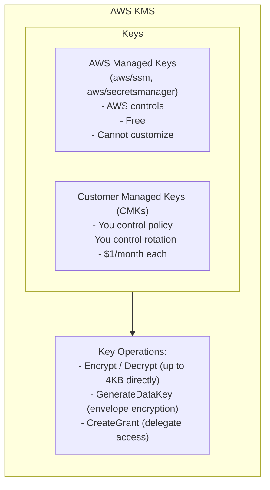
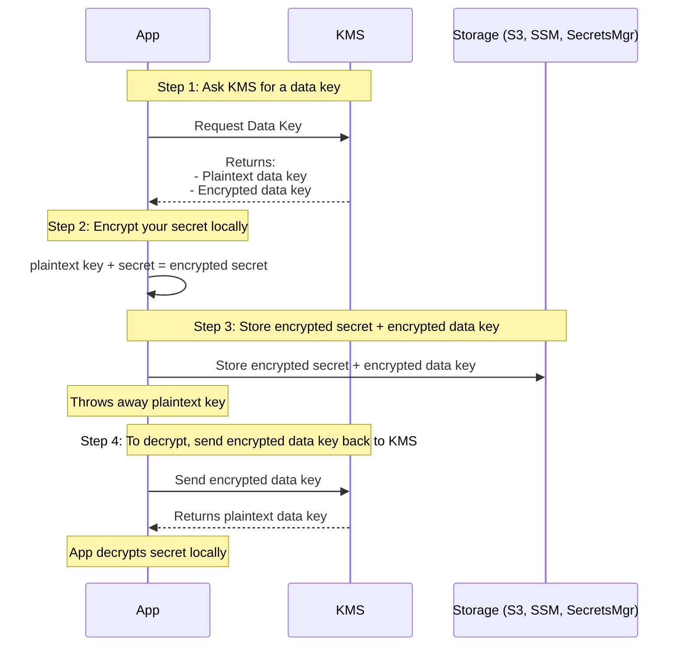
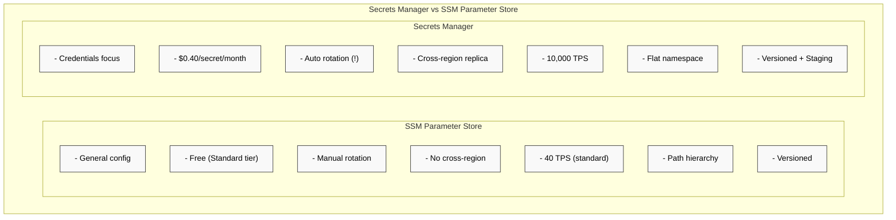
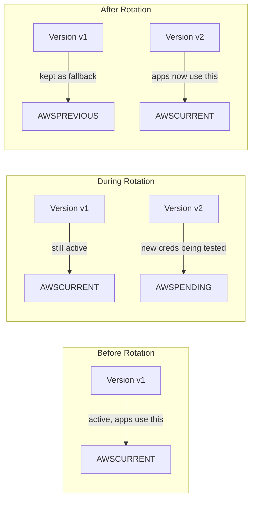
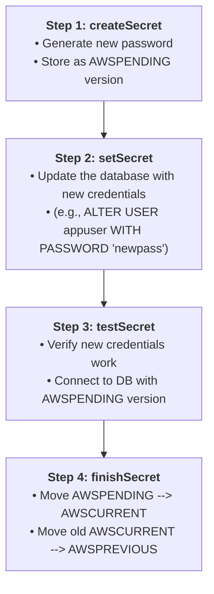
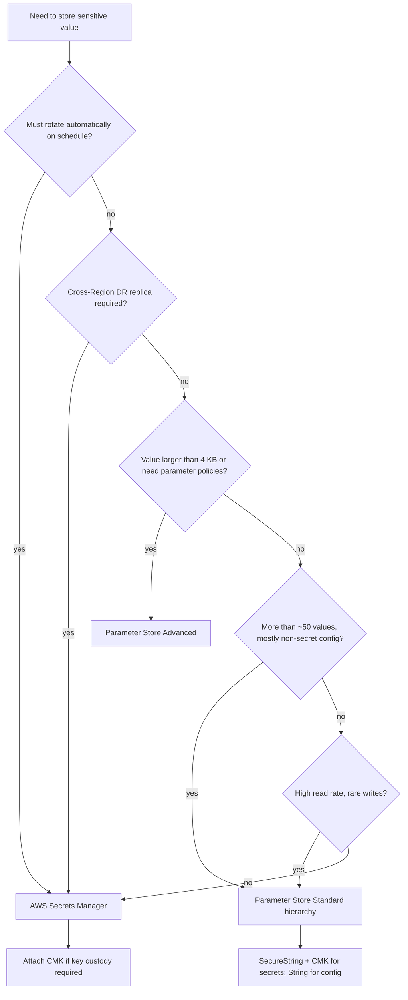
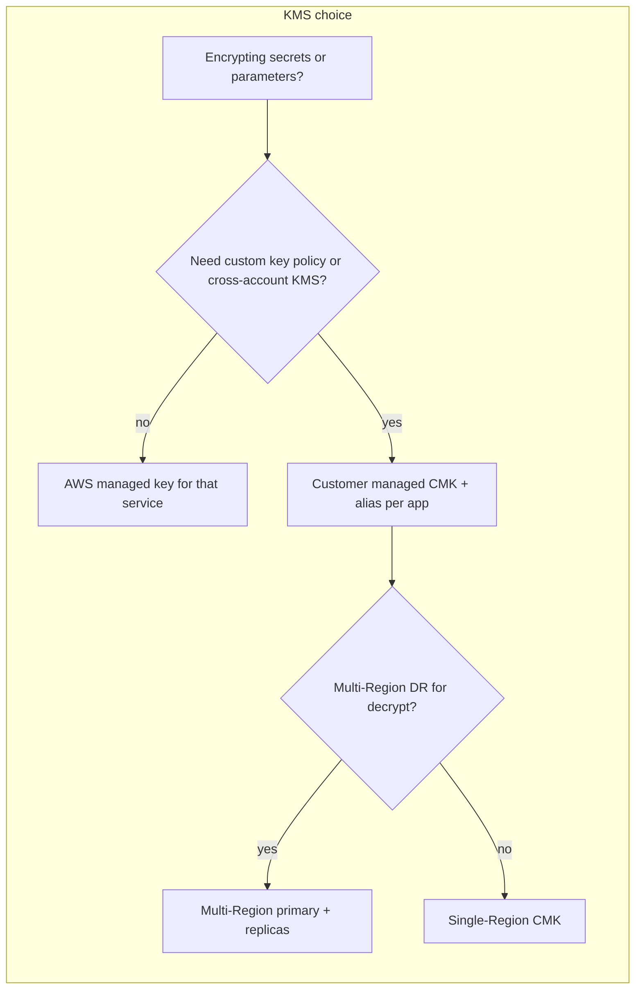

**Complexity**: `[MEDIUM]` | **Time to Complete**: 1.5 hours | **Prerequisites**: Module 1.1 IAM, an AWS account with scoped SSM/Secrets Manager/KMS permissions, AWS CLI v2, and basic encryption concepts.

## Prerequisites

Before starting this module, ensure you have:

- Completed [Module 1.1: IAM & Access Management](../module-1.1-iam/) (IAM policies, roles, trust relationships)
- An AWS account with admin access (or scoped permissions for SSM, Secrets Manager, KMS)
- AWS CLI v2 installed and configured
- Basic understanding of encryption concepts (symmetric vs. asymmetric keys)

## What You'll Be Able to Do

After completing this module, you will be able to configure AWS Secrets Manager for automatic rotation, work with KMS key hierarchies, compare SSM Parameter Store with Secrets Manager, and deploy secrets to EC2, ECS, Lambda, and EKS without hardcoding credentials. You will also be able to explain when a customer managed KMS key is worth the monthly charge versus an AWS managed key, and how envelope encryption keeps plaintext secrets off the KMS wire.

- **Configure AWS Secrets Manager with automatic rotation schedules for database credentials and API keys**
- **Implement KMS encryption key hierarchies and key policies to control access to sensitive data at rest**
- **Compare SSM Parameter Store and Secrets Manager to select the right secret storage for each use case**
- **Deploy secret injection patterns for EC2 instances, ECS tasks, and Lambda functions without hardcoding credentials**
- **Select customer managed KMS keys versus AWS managed keys based on custody, cross-account, and compliance requirements**

---

## Why This Module Matters

**Hypothetical scenario:** A developer at a mid-sized fintech company committed a database connection string to a public GitHub repository. The string contained the master username, password, and RDS endpoint for their production PostgreSQL database. Automated bots that scrape GitHub for leaked credentials discovered it quickly. Attackers used the live credentials to reach production data, triggering regulatory scrutiny, incident response, customer notification, and lasting reputational damage.

This was entirely preventable. AWS provides purpose-built services for storing, rotating, and injecting secrets into your applications. The developer could have stored that connection string in AWS Secrets Manager, configured automatic rotation every 30 days, and had the application retrieve it at runtime. No credential ever touches source code. No password stays valid long enough to be useful if leaked. The organizational lesson is not "ban developers" but **remove the easy wrong path**: pre-commit hooks, CI secret scanning, and platform-provided secret ARNs in deployment templates so the secure route is also the fastest route.

In production, treat leaked credentials as a **rotation and blast-radius** problem, not only a repo hygiene problem. Revoke or rotate the exposed secret immediately, review CloudTrail for `GetSecretValue` and database login anomalies, and confirm whether the same password was reused across environments. Pair technical controls (Secrets Manager rotation, CMK-backed SecureStrings, ECS/Lambda injection via `secrets` rather than plaintext `environment`) with process controls (break-glass access reviews, quarterly access attestation on secret read APIs).

In this module, you will learn how AWS approaches secrets management across the stack -- from the low-level encryption primitives in KMS, to the two competing secret-storage services (SSM Parameter Store and Secrets Manager), to the practical patterns for injecting secrets into EC2 instances, ECS tasks, and Lambda functions. By the end, you should be much less tempted to put a password in an environment variable file or a Docker image.

---

## KMS: The Encryption Foundation

Before diving into secret storage, you need to understand AWS Key Management Service (KMS). Every encrypted parameter in SSM and every secret in Secrets Manager relies on KMS under the hood. Think of KMS as the locksmith who makes and manages all the keys -- but never actually sees the contents of what you lock up.

### Key Concepts



There are two types of keys you will encounter. **AWS Managed Keys** are created and managed by AWS for specific services. When you encrypt an SSM parameter with the default key, you are using `aws/ssm`. These are free, but you cannot change their rotation schedule, key policy, or share them across accounts.

**Customer Managed Keys (CMKs)** are keys you create and control. You define who can use them via key policies, you decide the rotation schedule, and you can share them across accounts. They cost approximately $1 per key per month plus per-request API charges documented on the AWS KMS pricing page — budget one CMK per environment or domain rather than one per microservice unless policy mandates isolation.

Choosing between AWS managed and customer managed keys is a custody decision, not a performance decision. AWS managed keys (`aws/ssm`, `aws/secretsmanager`, `aws/rds`, and others) are created automatically when you first use a service's encryption feature; they are free of separate KMS key monthly charges and require no key policy maintenance. Customer managed keys cost money and operational attention but let security teams enforce separation of duties, cross-account boundaries, and CloudTrail scrutiny on `kms:Decrypt` callers. Regulated workloads almost always land on CMKs; internal dev sandboxes often stay on AWS managed keys until a promotion gate requires otherwise.

### Envelope Encryption

This is the pattern that makes large-scale encryption practical, because the payload encryption stays with the application while KMS handles only the key operations.



The critical insight: KMS never sees your secret. It only sees the small data key. This means even if someone compromised KMS's internal logging, your actual database password or API key would not be exposed.

### Creating a Customer Managed Key

```bash
ACCOUNT_ID=$(aws sts get-caller-identity --query Account --output text)

# 1. Define a Key Policy (Delegating to IAM)
# Note: By granting access to the account root, we allow IAM policies to control key access.
cat <<EOF > /tmp/key-policy.json
{
  "Version": "2012-10-17",
  "Id": "app-secrets-policy",
  "Statement": [
    {
      "Sid": "Enable IAM User Permissions",
      "Effect": "Allow",
      "Principal": { "AWS": "arn:aws:iam::${ACCOUNT_ID}:root" },
      "Action": "kms:*",
      "Resource": "*"
    }
  ]
}
EOF

# 2. Create a symmetric encryption key with the policy
aws kms create-key \
  --description "Application secrets encryption key" \
  --key-usage ENCRYPT_DECRYPT \
  --key-spec SYMMETRIC_DEFAULT \
  --policy file:///tmp/key-policy.json \
  --tags TagKey=Environment,TagValue=production

# The output includes the KeyId -- save it
# Example: "KeyId": "1234abcd-12ab-34cd-56ef-1234567890ab"

# Create a human-readable alias
aws kms create-alias \
  --alias-name alias/app-secrets-key \
  --target-key-id 1234abcd-12ab-34cd-56ef-1234567890ab

# Verify the key exists
aws kms describe-key --key-id alias/app-secrets-key
```

**Pause and predict:** if an adversary gains full read access to an S3 bucket storing envelope-encrypted application secrets but lacks permissions on the backing customer managed KMS key, can they decrypt the payload?

<details>
<summary>Check your prediction</summary>

No; envelope ciphertext is useless without `kms:Decrypt` on the CMK. In envelope encryption, the data stored in S3 is encrypted with a data key, and the data key itself is stored alongside the ciphertext encrypted under the CMK. Without access to invoke KMS decryption for that specific customer managed key, the raw bytes stored in the bucket remain unreadable ciphertext.

</details>

The next section walks through the three KMS authorization documents that stack on a customer managed key, then how grants appear when a service must use that key on your behalf.

### Key Policies, IAM Policies, and Grants

Access to a customer managed key is controlled through three mechanisms that stack together rather than replace one another. The **key policy** is a resource policy attached directly to the KMS key; every CMK must have one, and it is the authoritative document for who may administer or use the key. A common bootstrap pattern grants the account root `kms:*` on the key, which delegates day-to-day access control to IAM policies attached to users and roles in that account. IAM policies alone cannot grant KMS permissions unless the key policy (or a grant) allows the principal to use the key — this is why teams that copy an IAM policy from a tutorial still see `AccessDeniedException` until the key policy is updated.

**Grants** are a third path: temporary, fine-grained delegations often used when AWS services need to use your CMK on your behalf (for example, when Secrets Manager encrypts a secret with a customer managed key). Grants supplement key policies and IAM; they appear in CloudTrail as `CreateGrant` events and can be audited like any other KMS API call. For secrets workloads, the practical rule is simple: define the key policy once with account-root delegation, scope IAM policies per application role, and only touch grants when a service integration documentation explicitly requires them.

```bash
# List grants on a CMK (useful during audits)
aws kms list-grants --key-id alias/app-secrets-key

# Inspect the effective key policy
aws kms get-key-policy \
  --key-id alias/app-secrets-key \
  --policy-name default \
  --output text | jq .
```

### Automatic Key Rotation and What It Does Not Do

For symmetric CMKs with AWS-generated key material (`AWS_KMS` origin), you can enable **automatic key rotation** on the primary key. By default, AWS KMS generates new cryptographic material on a schedule of approximately 365 days (you can configure a custom rotation period between 90 and 2560 days). Rotation changes only the **key material** behind the same logical KMS key ID — aliases, key policies, and grants stay attached to the key resource. When an application calls `Decrypt`, KMS automatically selects the key material version that was used to encrypt the ciphertext, so existing Secrets Manager secrets and SSM SecureStrings continue to decrypt without application changes.

What rotation does **not** do is equally important for security conversations. Rotating a CMK does not re-encrypt data that was already encrypted with older data keys, does not rotate application passwords stored in Secrets Manager, and does not mitigate compromise of a leaked plaintext secret. Treat CMK rotation as cryptographic hygiene for the wrapping key, not as a substitute for Secrets Manager rotation or credential revocation. AWS KMS bills monthly storage for the first and second rotation of key material on a CMK; subsequent rotations of the same key are not charged additional storage fees per AWS KMS pricing documentation.

```bash
# Enable automatic rotation (365-day default if period omitted)
aws kms enable-key-rotation --key-id alias/app-secrets-key

# Verify rotation status and next rotation date
aws kms get-key-rotation-status --key-id alias/app-secrets-key
```

Asymmetric keys, HMAC keys, keys in custom key stores, and keys with imported material follow different rules — many require **manual** rotation (create a new key, re-encrypt, update aliases). Plan your secrets architecture around symmetric `SYMMETRIC_DEFAULT` CMKs unless you have a documented need for signing or asymmetric operations.

### Multi-Region Keys for Disaster Recovery

A **multi-Region key** is a set of related KMS keys in different AWS Regions that share the same key ID and key material, so ciphertext encrypted in `us-east-1` can be decrypted in `eu-west-1` without re-encrypting or making a cross-Region KMS API call. You create a **primary** multi-Region key, then replicate it to selected Regions; each replica has its own key policy, aliases, and IAM attachments, but interoperable cryptographic material. Automatic rotation is enabled only on the primary key; when rotation runs, AWS KMS propagates new material to all replicas before using it for new encrypt operations.

Multi-Region keys help active-active or disaster-recovery designs where applications fail over across Regions. They are not a global singleton — you still manage each Region independently, and many AWS services treat multi-Region keys like single-Region keys for replication (for example, S3 cross-Region replication may still re-encrypt objects). For secrets specifically, pairing multi-Region KMS keys with Secrets Manager **replica secrets** (covered later) gives you a coherent cross-Region story: the secret metadata and ciphertext follow the same regional layout as your compute.

---

## SSM Parameter Store: The Configuration Swiss Army Knife

AWS Systems Manager Parameter Store is the workhorse for configuration management. It stores three types of data -- plain strings, string lists, and encrypted secure strings -- in a hierarchical namespace that maps naturally to application configuration.

### Parameter Types

| Type | Encryption | Max Size (Standard) | Max Size (Advanced) | Cost |
|------|-----------|---------------------|---------------------|------|
| `String` | None | 4 KB | 8 KB | Free (Standard) |
| `StringList` | None | 4 KB | 8 KB | Free (Standard) |
| `SecureString` | KMS | 4 KB | 8 KB | Free (Standard) |

**Standard parameters** are free for up to 10,000 per account per region. **Advanced parameters** cost $0.05 per parameter per month, support up to 8 KB values, and parameter policies (TTL, expiration notifications). Higher throughput (up to 10,000 TPS) is an account-level setting available for both Standard and Advanced parameters.

### Hierarchical Naming

The real power of Parameter Store is its path-based hierarchy. Structure your parameters like a filesystem:

```bash
# Create parameters with a path hierarchy
aws ssm put-parameter \
  --name "/myapp/production/database/host" \
  --value "prod-db.cluster-abc123.us-east-1.rds.amazonaws.com" \
  --type String

aws ssm put-parameter \
  --name "/myapp/production/database/port" \
  --value "5432" \
  --type String

aws ssm put-parameter \
  --name "/myapp/production/database/password" \
  --value "SuperSecretPassword123!" \
  --type SecureString \
  --key-id alias/app-secrets-key

aws ssm put-parameter \
  --name "/myapp/production/feature-flags" \
  --value "dark-mode,new-checkout,beta-api" \
  --type StringList

# Retrieve a single parameter
aws ssm get-parameter \
  --name "/myapp/production/database/host"

# Retrieve a SecureString (decrypted)
aws ssm get-parameter \
  --name "/myapp/production/database/password" \
  --with-decryption

# Retrieve ALL parameters under a path
aws ssm get-parameters-by-path \
  --path "/myapp/production/" \
  --recursive \
  --with-decryption
```

That last command -- `get-parameters-by-path` -- is a game changer. Your application can load its entire configuration tree with a single API call, so you do not need to know every parameter name in advance. This is invaluable for debugging because when someone says "the app broke after the config change," you can see exactly what changed and when.

Naming discipline matters as much as encryption. Teams that flatten names like `prod_db_password` without paths regret it when the second service needs the same key name in another environment. A path such as `/myapp/production/database/password` encodes environment and component, works with IAM `Resource` ARNs that scope to `/myapp/production/*`, and keeps humans oriented in the console. `StringList` parameters suit comma-separated allowlists (feature flags, CIDR hints) where a single key should return multiple tokens without JSON parsing overhead.

When you encrypt with `SecureString`, the `--key-id` argument accepts an alias or key ID. If you omit it, Parameter Store uses the AWS managed SSM key for that account and Region. That is acceptable for development; production paths that must survive audits should pin a CMK so key administrators can revoke access independently of SSM console permissions.

### Versioning and History

Every time you update a parameter, Parameter Store keeps the previous version, which makes rollbacks and safe recovery much easier when a change causes unexpected behavior:

```bash
# Update a parameter (creates version 2)
aws ssm put-parameter \
  --name "/myapp/production/database/host" \
  --value "new-prod-db.cluster-xyz789.us-east-1.rds.amazonaws.com" \
  --type String \
  --overwrite

# Get a specific version
aws ssm get-parameter \
  --name "/myapp/production/database/host:2"

# View parameter history
aws ssm get-parameter-history \
  --name "/myapp/production/database/host"
```

**Pause and predict:** you need to store an API key that changes once a year and is read thousands of times per second by your application. Based on the feature sets and pricing models of SSM Parameter Store versus Secrets Manager, which service is more cost-effective for this specific workload?

<details>
<summary>Check your prediction</summary>

Parameter Store is significantly more cost-effective for high-read, rarely changing credentials. Parameter Store standard tier provides free parameter storage, whereas Secrets Manager charges $0.40 per secret monthly plus $0.05 per 10,000 API calls. At thousands of reads per second without caching, Secrets Manager API interaction charges quickly generate substantial recurring costs.

</details>

Choosing a store is also choosing an API and rotation contract. The sections below separate Parameter Store tiering from the Secrets Manager rotation model so you can match a workload to the contract you actually need.

### Standard vs Advanced Tier in Practice

The tier choice is a product decision, not just a billing line item. **Standard parameters** cost nothing to store (up to 10,000 per account per Region), cap values at 4 KB, and work well for feature flags, service URLs, and static configuration. **Advanced parameters** cost $0.05 per parameter per month (prorated hourly), allow values up to 8 KB, support **parameter policies** (expiration and notification schedules), and are required for **cross-account sharing** — the owning account pays storage; consuming accounts pay API interaction charges when they read shared parameters.

You cannot downgrade an advanced parameter back to standard; you must delete and recreate it. Teams often start on standard and promote only the handful of parameters that need policies or sharing. If you enable **higher throughput** for Parameter Store at the account level, API interactions for both standard and advanced parameters are billed at $0.05 per 10,000 interactions — a cost that surprises teams who run hot `GetParameter` loops on thousands of microservices.

| Decision signal | Standard tier | Advanced tier |
|-----------------|---------------|---------------|
| Value size | ≤ 4 KB | ≤ 8 KB |
| Cross-account share | Not supported | Required for sharing |
| Parameter policies (TTL alerts) | No | Yes |
| Monthly storage charge | $0 | $0.05 per parameter |
| Typical use | App config, flags, static URLs | Shared secrets, policy-driven expiry |

### Parameter Store vs Secrets Manager for the Same Password

Hypothetical scenario: your platform team stores a database password in Parameter Store as a `SecureString` and rotates it manually every quarter. That works until compliance asks for **automatic** rotation with audit evidence and zero-downtime cutover. Secrets Manager adds managed rotation Lambdas, version stages (`AWSCURRENT` / `AWSPENDING` / `AWSPREVIOUS`), and higher default throughput for secret retrieval. Systems Manager excels when managing environment variables, hierarchical configuration trees via `get-parameters-by-path`, or non-sensitive runtime parameters that do not justify dedicated secret management overhead. Secrets Manager justifies its per-secret storage fee and operational model whenever automated rotation schedules, staging labels, or cross-Region secret replicas are mandatory control objectives — rather than simple encryption at rest.

---

## Secrets Manager: Purpose-Built for Credentials

While Parameter Store can hold encrypted strings, AWS Secrets Manager is designed specifically for credentials that need lifecycle management -- especially automatic rotation. If your secret is a database password, an API key, or an OAuth client secret, Secrets Manager is the right home for it.

Secrets Manager stores each secret as encrypted data plus metadata (name, description, rotation rules, resource policy, tags). The encryption always flows through KMS — either the AWS managed Secrets Manager key or a CMK you specify at creation time. That KMS linkage is why a perfectly scoped `secretsmanager:GetSecretValue` IAM statement still fails when the principal lacks `kms:Decrypt` on the backing key. Operators should treat "create secret" runbooks as a two-resource operation: secret plus CMK policy review.

### What Sets Secrets Manager Apart



The throughput numbers in the diagram are order-of-magnitude planning hints from AWS documentation — your exact quotas depend on account limits and Region. The architectural split is what matters for interviews and design reviews: Parameter Store optimizes for **configuration surface area** (many keys, hierarchical reads, free standard tier), while Secrets Manager optimizes for **credential lifecycle** (rotation Lambdas, staged versions, replica secrets). Neither service replaces IAM; both assume roles and policies already follow least privilege from Module 1.1.

When you store a JSON blob in Secrets Manager (username, password, host, port), consumers can fetch the entire document or address single keys through ECS `valueFrom` suffixes. Parameter Store instead stores opaque strings — if you need structured fields without Secrets Manager pricing, you serialize JSON into one SecureString and parse in application code, accepting that rotation and field-level IAM are now your responsibility.

### Creating and Retrieving Secrets

```bash
# Create a secret with key-value pairs (most common pattern)
aws secretsmanager create-secret \
  --name "myapp/production/db-credentials" \
  --description "Production RDS PostgreSQL credentials" \
  --secret-string '{"username":"appuser","password":"xK9#mP2$vL7!nQ4","host":"prod-db.cluster-abc123.us-east-1.rds.amazonaws.com","port":"5432","dbname":"myapp_prod"}'

# Retrieve the secret
aws secretsmanager get-secret-value \
  --secret-id "myapp/production/db-credentials"

# The response includes:
# - SecretString (your JSON blob)
# - VersionId (UUID)
# - VersionStages (["AWSCURRENT"])
```

### Version Stages: AWSCURRENT vs AWSPREVIOUS

Secrets Manager uses version stages to manage credential rotation without downtime. By using staged labels and staged promotions, your application usually avoids a window where an old credential is invalid while the replacement has not yet been activated. This pattern is designed so production traffic remains stable during normal rotation operations:



This two-phase approach is designed so your application does not usually see a moment where the old password is invalid but the new one is not yet available. Because `AWSCURRENT`, `AWSPREVIOUS`, and `AWSPENDING` are coordinated, secret consumers can continue using valid credentials during transition.

### Automatic Rotation

This is the killer feature. Secrets Manager can automatically rotate database credentials on a schedule you define. That gives you a managed way to change credentials over time instead of building custom rotation orchestration for every secret:

```bash
# Enable rotation for an RDS secret
aws secretsmanager rotate-secret \
  --secret-id "myapp/production/db-credentials" \
  --rotation-lambda-arn arn:aws:lambda:us-east-1:123456789012:function:SecretsManagerRDSPostgreSQLRotation \
  --rotation-rules '{"ScheduleExpression":"rate(30 days)"}'
```

AWS provides pre-built Lambda rotation functions for common AWS-native databases and credential stores:
- Amazon RDS (MySQL, PostgreSQL, Oracle, SQL Server, MariaDB)
- Amazon Redshift
- Amazon DocumentDB
- Generic credentials (you provide the rotation logic)

You supply the rotation Lambda ARN and a schedule (`rate(30 days)` or a cron expression). Secrets Manager invokes the function; the function must implement the contract expected for your secret type (single username/password string versus JSON with host and port). Custom databases use the generic template where your code implements `createSecret`, `setSecret`, `testSecret`, and `finishSecret` against your API. Test rotation in a lower environment first, and document the rotation window in your runbook so on-call engineers know that brief `AWSPENDING` states are normal, not incidents. Pair rotation alarms with a dashboard showing each secret's `LastRotatedDate` field from daily `describe-secret` health checks. That small operational habit catches stuck rotations before database passwords expire unexpectedly.

The rotation Lambda follows a four-step protocol that moves credentials through create, test, and promotion phases:



The rotation protocol executes sequentially across these four dedicated Lambda handler steps to coordinate credential generation, target database updates, connectivity verification, and version label promotion.

**Pause and predict:** during an automated database credential rotation managed by Secrets Manager, what happens if the `testSecret` step fails because the newly generated password violates the database engine's complexity rules, and how does this outcome affect the application currently running in production?

<details>
<summary>Check your prediction</summary>

The rotation execution halts immediately and rolls back without promoting the invalid credentials; `AWSCURRENT` remains pointed at the existing working secret version while the rejected `AWSPENDING` version is discarded. Because Secrets Manager does not advance the `AWSCURRENT` label until `finishSecret` succeeds, running application instances continue fetching and using valid credentials without service interruption.

</details>

The sections below cover who may read a secret across accounts and how replica secrets behave in another Region during failover, including the KMS decrypt path that must exist in the replica Region.

### Cross-Account Access and Resource Policies

Secrets Manager secrets are account-scoped resources. To let a workload in Account B read a secret in Account A, you attach a **resource-based policy** on the secret (similar to an S3 bucket policy) that trusts Account B's role, **and** you grant that role `secretsmanager:GetSecretValue` in its IAM policy. If the secret uses a customer managed KMS key, Account B's role also needs `kms:Decrypt` on that key, and the **KMS key policy** must allow the cross-account principal. Missing any leg of that triangle produces `AccessDeniedException` even when the secret policy looks correct.

Cross-account patterns appear in hub-and-spoke landing zones (shared services account owns secrets; workload accounts consume them) and in CI/CD accounts that deploy to multiple environments. Document the secret ARN (with suffix wildcard in IAM), KMS key ARN, and which account performs rotation — only the owning account should run rotation Lambdas that mutate the upstream database.

### Multi-Region Replication

For disaster recovery, you can create **replica secrets** in additional Regions from a primary secret. Replicas share the secret name and encrypted value; `GetSecretValue` in the replica Region avoids cross-Region latency and keeps applications regional during failover. Replication is not automatic for every secret — you plan which credentials must survive a Regional outage (typically databases and signing keys), create replicas explicitly, and ensure failover runbooks point applications at the Regional secret ARN. Pair replica secrets with multi-Region KMS keys when you need decrypt capability in the failover Region without re-encrypting all ciphertext.

```bash
# Create a replica in eu-west-1 from a primary in us-east-1
aws secretsmanager replicate-secret-to-regions \
  --secret-id "myapp/production/db-credentials" \
  --add-replica-regions Region=eu-west-1,KmsKeyId=alias/app-secrets-key-eu
```

Rotation and administrative updates still originate from the primary secret's configuration; replicas inherit new secret versions when replication synchronizes. Test failover by reading the replica ARN from a task definition or Lambda in the secondary Region before you depend on it in production.

---

## Injecting Secrets Into Compute Services

Storing secrets is only half the problem. The other half is getting them into your running application without exposing them in plaintext along the way. The anti-pattern you are replacing — credentials in git, user data, or baked into AMIs — fails in three places at once: version control history never forgets, launch-time scripts appear in instance metadata and snapshots, and rotation becomes a redeploy event instead of an API call. AWS injection patterns move retrieval to runtime with IAM-scoped identities so compromise of one layer (for example, a log file) does not automatically expose the secret material.

The security model across EC2, ECS, Lambda, and EKS shares the same spine: an IAM principal with least-privilege API access, KMS decrypt on the CMK that protects the ciphertext, and application discipline to avoid logging secret values. Where the services differ is **when** resolution happens. EC2 and in-code Lambda fetch at process start (or on a timer). ECS resolves at task launch via the execution role before your container main process runs. EKS CSI drivers mount or sync on a poll interval inside the pod lifecycle. Pick the integration that matches your orchestrator; do not copy ECS task-definition snippets into Kubernetes manifests without translation.

### EC2 Instances

For EC2, your application retrieves secrets at startup using the AWS SDK or CLI. The instance's IAM role provides the authorization. Long-running instances should refresh credentials on a schedule because Secrets Manager rotation can invalidate passwords even while TCP connections stay up — a nightly batch job that opens new DB connections must read `AWSCURRENT` after rotation, not a value cached since boot week.

```bash
# IAM policy for the EC2 instance role
cat <<'EOF'
{
  "Version": "2012-10-17",
  "Statement": [
    {
      "Effect": "Allow",
      "Action": [
        "secretsmanager:GetSecretValue"
      ],
      "Resource": "arn:aws:secretsmanager:us-east-1:123456789012:secret:myapp/production/*"
    },
    {
      "Effect": "Allow",
      "Action": [
        "ssm:GetParametersByPath",
        "ssm:GetParameter"
      ],
      "Resource": "arn:aws:ssm:us-east-1:123456789012:parameter/myapp/production/*"
    },
    {
      "Effect": "Allow",
      "Action": "kms:Decrypt",
      "Resource": "arn:aws:kms:us-east-1:123456789012:key/1234abcd-12ab-34cd-56ef-1234567890ab"
    }
  ]
}
EOF
```

A Python application retrieving secrets at startup can fetch the secret once and parse it into runtime values before the service begins work. In this pattern, you can build your database bootstrap from explicit fields like `host`, `username`, and `password` rather than scattering them through configuration files. **Important**: Cache the secret in memory and refresh periodically (every 5-15 minutes). Calling Secrets Manager on every database connection adds latency and costs money.

```python
import boto3
import json

def get_db_credentials():
    """Retrieve database credentials from Secrets Manager."""
    client = boto3.client('secretsmanager', region_name='us-east-1')

    response = client.get_secret_value(
        SecretId='myapp/production/db-credentials'
    )

    return json.loads(response['SecretString'])

# At application startup
creds = get_db_credentials()
db_host = creds['host']
db_user = creds['username']
db_pass = creds['password']
```

Never log the full `SecretString` response in application logs — structured logging frameworks often serialize entire dicts. Redact or hash identifiers in debug output, and use IAM condition keys such as `aws:RequestedRegion` when secrets must not leave a designated Region.

### ECS / Fargate

ECS has native integration with both SSM Parameter Store and Secrets Manager. You reference secrets directly in your task definition, and the ECS agent injects them as environment variables at container startup. This means secret material can enter your containers without hardcoded values in the task definition image itself.

```json
{
  "containerDefinitions": [
    {
      "name": "myapp",
      "image": "123456789012.dkr.ecr.us-east-1.amazonaws.com/myapp:latest",
      "essential": true,
      "secrets": [
        {
          "name": "DB_PASSWORD",
          "valueFrom": "arn:aws:secretsmanager:us-east-1:123456789012:secret:myapp/production/db-credentials-a1b2c3:password::"
        },
        {
          "name": "DB_USERNAME",
          "valueFrom": "arn:aws:secretsmanager:us-east-1:123456789012:secret:myapp/production/db-credentials-a1b2c3:username::"
        },
        {
          "name": "LOG_LEVEL",
          "valueFrom": "arn:aws:ssm:us-east-1:123456789012:parameter/myapp/production/log-level"
        }
      ],
      "environment": [
        {
          "name": "APP_ENV",
          "value": "production"
        }
      ]
    }
  ],
  "taskRoleArn": "arn:aws:iam::123456789012:role/myapp-task-role",
  "executionRoleArn": "arn:aws:iam::123456789012:role/myapp-execution-role"
}
```

Notice the distinction between two IAM roles in secret injection: your task role is for runtime application calls, while the execution role is for launch-time secret injection and container startup permissions:

- **Task Role**: What the application code can do at runtime (e.g., read from S3, write to DynamoDB)
- **Execution Role**: What the ECS agent needs to start the container (e.g., pull image from ECR, read secrets for injection)

The execution role needs `secretsmanager:GetSecretValue` and `ssm:GetParameters` permissions. The task role only needs these if your application also reads secrets at runtime (in addition to the injected environment variables). This is the key split in ECS secret-injection ownership because roles are evaluated at different points in the launch and runtime flow.

The `valueFrom` ARN for Secrets Manager supports a special syntax for extracting individual JSON keys, and `...:db-credentials:password::` extracts just the `password` field from the JSON secret using the current version.

```
arn:aws:secretsmanager:REGION:ACCOUNT:secret:SECRET_NAME:JSON_KEY:VERSION_STAGE:VERSION_ID
```

Fargate tasks still expose injected secrets as **environment variables inside the container**, which means anyone with `docker exec` or a shell in the task can print them. That is acceptable for many internal services when combined with locked-down ECS Exec and tight task roles, but high-assurance teams mount secrets as files via sidecars or fetch in application code to keep values out of `/proc` environ. Understand the threat model: ECS injection removes secrets from the task definition API object and image layers, not from the running process memory.

For SSM parameters referenced in `valueFrom`, use the parameter ARN without the JSON key suffix. SecureString parameters still require the execution role to call `ssm:GetParameters` and `kms:Decrypt`. Mixing Secrets Manager JSON keys and SSM plain parameters in one task definition is common — database credentials from Secrets Manager, log level from Parameter Store — but each ARN type must match the permission set on the execution role.

### Lambda Functions

Lambda supports the same secret injection pattern but with a different mechanism. You can use Lambda environment variables (encrypted at rest with KMS) or retrieve secrets in your function code, and both are used in real teams depending on startup behavior, rotation tolerance, and operational preferences:

```python
import boto3
import json
import os

# Option 1: Use the AWS Parameters and Secrets Lambda Extension
# (adds ~50ms cold start but caches secrets automatically)
# Set environment variable: AWS_LAMBDA_EXEC_WRAPPER=/opt/wrapper

# Option 2: Retrieve in code with caching
_secret_cache = {}

def get_cached_secret(secret_id):
    """Retrieve secret with in-memory caching."""
    if secret_id not in _secret_cache:
        client = boto3.client('secretsmanager')
        response = client.get_secret_value(SecretId=secret_id)
        _secret_cache[secret_id] = json.loads(response['SecretString'])
    return _secret_cache[secret_id]

def handler(event, context):
    creds = get_cached_secret('myapp/production/db-credentials')
    # Use creds['host'], creds['username'], creds['password']
    # The cache persists across warm invocations
    return {"statusCode": 200}
```

The **AWS Parameters and Secrets Lambda Extension** is worth knowing about. It runs as a Lambda layer, automatically caches secrets, and refreshes them on a configurable interval. This avoids each function invocation making its own API call:

```bash
# Add the extension layer to your function
aws lambda update-function-configuration \
  --function-name myapp-handler \
  --layers arn:aws:lambda:us-east-1:177933569100:layer:AWS-Parameters-and-Secrets-Lambda-Extension:12 \
  --environment "Variables={SECRETS_MANAGER_TTL=300,SSM_PARAMETER_STORE_TTL=300}"
```

Lambda can also encrypt **environment variables at rest** with a customer managed KMS key (`KMSKeyArn` on the function configuration). That protects values stored in the Lambda control plane, but environment variables still appear in plaintext inside the execution environment — prefer Secrets Manager or SSM for credentials, and reserve encrypted env vars for non-secret configuration that benefits from CMK ownership.

### Amazon EKS (Kubernetes on AWS)

EKS does not inject secrets into pods the way ECS injects them at task launch. The common AWS-native pattern is the **Secrets Store CSI Driver**, which mounts secrets from Secrets Manager or Parameter Store as files in the pod filesystem, synchronized on a poll interval. The driver's **SecretProviderClass** names the secret ARN or parameter path; the pod's **service account** (via IRSA — IAM Roles for Service Accounts) supplies `secretsmanager:GetSecretValue` or `ssm:GetParameter` and `kms:Decrypt`. Many teams also run the **External Secrets Operator**, which watches Kubernetes `ExternalSecret` custom resources and projects AWS secrets into native Kubernetes `Secret` objects for compatibility with Helm charts that expect in-cluster secrets.

The operational trade-off versus ECS is more moving parts (CSI driver DaemonSet, IRSA trust policies, rotation refresh intervals) but stronger alignment with the wider Kubernetes ecosystem. For platform engineers crossing tabs in this curriculum: treat EKS secret delivery as "CSI file mount or operator-synced K8s Secret," not as task-definition `valueFrom` — the security principles (least privilege IAM, CMK decrypt, cache and refresh) are identical even when the integration surface differs.

---

## Security Best Practices

### Least Privilege for Secrets

Never grant `secretsmanager:GetSecretValue` on `*`. Scope permissions to exactly the secrets the application needs so only the expected producers and consumers can read values.

```json
{
  "Effect": "Allow",
  "Action": "secretsmanager:GetSecretValue",
  "Resource": [
    "arn:aws:secretsmanager:us-east-1:123456789012:secret:myapp/production/db-credentials-??????"
  ],
  "Condition": {
    "StringEquals": {
      "aws:RequestedRegion": "us-east-1"
    }
  }
}
```

The six question marks (`??????`) at the end match the random suffix that Secrets Manager appends to every secret ARN. This is a common gotcha -- if you use the exact secret name without the suffix wildcard, your policy will not match.

### Audit Access with CloudTrail

Every call to `GetSecretValue`, `GetParameter`, and KMS `Decrypt` is logged in CloudTrail, so you can trace who read what when. Set up alerts for unusual access patterns and review those events when they appear outside normal deployment windows. Rotation events (`RotateSecret`, Lambda rotation steps) and KMS `CreateGrant` should appear in the same trail — correlate them when investigating suspected credential leaks. For regulated environments, ship these logs to a centralized security account with immutable storage; secret access reviews are periodic audit evidence, not optional telemetry.

Hypothetical scenario: an attacker compromises a CI role that had `secretsmanager:GetSecretValue` on `*` six months ago. CloudTrail shows burst reads from an unfamiliar IP on a Sunday night. Your response playbooks should include disabling the role, rotating affected secrets (forcing new `AWSCURRENT` versions), and checking whether the secret's resource policy or KMS key policy allowed broader principals than intended — the read API succeeding does not mean the access was intended in your current least-privilege model.

```bash
# Check who accessed a secret recently
aws cloudtrail lookup-events \
  --lookup-attributes AttributeKey=EventName,AttributeValue=GetSecretValue \
  --start-time "2026-03-01" \
  --end-time "2026-03-24" \
  --max-results 20
```

### Block Secrets in Code Repositories

Even with proper secrets management, developers make mistakes. Use pre-commit hooks and repository scanning to prevent accidental secret checks from reaching version control:

```bash
# Install git-secrets (by AWS Labs)
brew install git-secrets  # macOS

# Configure it for AWS patterns
git secrets --register-aws --global

# Add custom patterns for your org
git secrets --add --global '(password|secret|apikey)\s*=\s*.+'

# Scan existing repo
git secrets --scan
```

---

## Patterns & Anti-Patterns

| Pattern | When to use it | Why it works | Scaling note |
|---------|----------------|--------------|--------------|
| Envelope encryption with a dedicated app CMK | Many services (SSM, Secrets Manager, S3) encrypt application data | KMS never sees plaintext secrets; one CMK policy governs all app ciphertext | Watch KMS API volume; batch decrypt where possible |
| Parameter Store hierarchy for non-secret config | Feature flags, URLs, tuning values per env | `get-parameters-by-path` loads trees; standard tier stays free | Avoid 4 KB limits — promote only oversized values to advanced |
| Secrets Manager + AWS rotation template for RDS | Database passwords with compliance rotation | Four-step Lambda protocol with version stages avoids downtime | One secret per database user; tune schedule to connection pool behavior |
| In-memory cache with TTL (5–15 min) | High read rate from Lambda/ECS/EC2 | Cuts API cost and latency; rotation still visible on cache miss | Invalidate cache on auth failure to pick up `AWSCURRENT` |
| IRSA + Secrets Store CSI on EKS | Pods need files or K8s Secrets from AWS | No long-lived cloud credentials in the cluster; IAM scoped per namespace | Tune CSI rotation poll; monitor driver DaemonSet health |
| Multi-Region replica secrets + CMKs | Active-active or DR across Regions | Failover reads local ARN without cross-Region API | Replicate only secrets that justify DR cost |

| Anti-pattern | What goes wrong | Why teams fall into it | Better alternative |
|--------------|-----------------|------------------------|-------------------|
| Storing all config in Secrets Manager | $0.40/secret/month × hundreds of keys | "One service for everything" simplicity | Parameter Store for static config; SM for rotating credentials |
| Default `aws/ssm` CMK for regulated data | Cannot customize key policy or cross-account KMS | Fastest console path | Customer managed CMK with documented key policy |
| `GetSecretValue` on every HTTP request | API bills spike; p99 latency grows | Fear of stale credentials | Cache + extension; refresh on failure |
| Plaintext `environment` in ECS for passwords | Values visible in console/API; not launch-time injection | Copy-paste from tutorials | `secrets` block + execution role |
| Disabling rotation because Lambda scares ops | Long-lived passwords; audit findings | One bad rotation story | Start 90-day schedule; use AWS RDS templates |
| Sharing one secret across dev/stage/prod | Blast radius spans environments | Naming convenience | Separate secrets per env path prefix |
| Ignoring KMS in IAM reviews | `AccessDenied` after perfect SM policy | SM docs focus on secret ARN only | Always pair `GetSecretValue` with `kms:Decrypt` on the CMK |

---

## Decision Framework

Use the matrices below when architects ask "Parameter Store or Secrets Manager?" or "AWS managed key or CMK?" — start from the **control requirement** (rotation, cross-account, key custody), not from whichever service someone used last quarter.

### Parameter Store vs Secrets Manager

| Requirement | Choose Parameter Store | Choose Secrets Manager |
|-------------|------------------------|------------------------|
| Automatic credential rotation | No (build your own) | Yes (Lambda rotation functions) |
| Zero-downtime rotation staging | Manual versioning only | `AWSCURRENT` / `AWSPENDING` / `AWSPREVIOUS` |
| Cost for 200 static values | $0 standard tier | ~$80/month storage alone |
| Hierarchical bulk config load | `get-parameters-by-path` | Flat namespace |
| Cross-Region DR replica | Not built-in | Replica secrets supported |
| JSON key extraction in ECS | Limited | Native `valueFrom` key syntax |



### AWS Managed KMS Key vs Customer Managed CMK

| Signal | AWS managed key (`aws/ssm`, `aws/secretsmanager`) | Customer managed CMK |
|--------|--------------------------------------------------|----------------------|
| Key policy control | AWS-owned; minimal customization | Full key policy + IAM + grants |
| Monthly key charge | Included in service usage | ~$1/month per CMK + API requests |
| Cross-account decrypt | Follow service docs; limited CMK control | Explicit key policy for foreign accounts |
| Rotation | AWS manages for service keys | You enable rotation on symmetric CMKs |
| Compliance "customer holds keys" | Often insufficient | Required pattern |



---

## Cost Lens

Secrets spending is usually three line items — **storage**, **API calls**, and **KMS** — not the headline service name alone.

**AWS Secrets Manager** charges $0.40 per secret per month (prorated hourly if deleted mid-month) plus $0.05 per 10,000 API calls. Every API operation counts, including metadata calls like `ListSecretVersionIds`, so chatty SDK loops show up on the bill. Example: 25 rotating database secrets cost $10/month in storage; if each secret is read 20 times per day across 10 services, that is roughly 150,000 calls/month (~$0.75 API) before KMS charges.

**Parameter Store** standard parameters have no storage fee (up to 10,000 per Region). Advanced parameters cost $0.05 per parameter per month. If you enable higher throughput, Parameter Store API interactions bill at $0.05 per 10,000 calls for standard and advanced alike — a hidden multiplier when microservices call `GetParameter` on every request.

**KMS** customer managed keys cost approximately $1 per key per month plus about $0.03 per 10,000 requests (varies slightly by operation type and Region). Automatic rotation stores prior key material versions; AWS bills for the first and second rotation storage tranche, then caps further rotation storage charges on that key. Using one shared `alias/app-secrets-key` for dozens of SecureStrings is cheaper than dozens of CMKs, but concentrates blast radius — many teams use one CMK per environment or per data class.

| Cost spike trigger | What happens | Mitigation |
|--------------------|--------------|------------|
| Secrets Manager per-request reads | API line item grows linearly with traffic | Cache 5–15 min; Lambda extension |
| Hundreds of secrets in SM | Storage dominates | Move static config to Parameter Store |
| Advanced parameters everywhere | $0.05 × N monthly | Stay on standard unless policies/sharing need advanced |
| Many CMKs per microservice | $1/key/month adds up | Consolidate CMKs per env or domain |
| Rotation Lambda failures | Repeated rotation API attempts | Fix `testSecret`; align DB password policy |

Hypothetical scenario: a fleet of 80 Lambda functions each calls `GetSecretValue` twice per invocation at 500 invocations per minute. That is tens of millions of API calls per month — far more expensive than storing the same JSON in Parameter Store with a five-minute extension cache. The fix is architectural (cache, extension, or env injection at launch), not switching Regions.

FinOps reviewers should ask two questions on every secrets design review: how many **distinct secrets** exist (storage line item), and how many **reads per minute** hit the API (interaction line item). A microservice with twelve environment variables backed by twelve Secrets Manager secrets costs $4.80/month before a single request — the same values under one JSON secret cost $0.40 plus parse logic in code. Consolidation is not always correct (rotation granularity may require separation), but the trade-off should be explicit in architecture notes rather than discovered on the monthly invoice.

---

## Did You Know?

- **AWS Secrets Manager** rotates credentials at very large scale across its customer base. The service launched in April 2018 specifically because AWS saw how many customers were storing credentials in plaintext in S3 buckets, EC2 user data, and environment variables.

- **KMS** is one of the most-called AWS services in practice. When you read an encrypted SSM parameter or retrieve a Secrets Manager secret, KMS is typically involved behind the scenes — you usually do not see it directly.

- **SSM Parameter Store's free tier supports up to 10,000 parameters per account per region**, while Secrets Manager charges $0.40 per secret per month. This cost difference drives many teams to use Parameter Store for non-rotating configuration and Secrets Manager only for credentials that need automatic rotation.

- **Envelope encryption** (used by both SSM and Secrets Manager) means your actual secret is never sent to KMS. Instead, a local data key encrypts the secret, and KMS only encrypts/decrypts that small data key. This design means KMS never sees your plaintext secret and keeps API latency low for typical decrypt operations.

---

## Common Mistakes

| Mistake | Why It Happens | How to Fix It |
|---------|---------------|---------------|
| Using Parameter Store SecureString without specifying KMS key | Developers assume default encryption is sufficient | Specify a CMK with `--key-id` so you control the key policy and can share across accounts |
| Hardcoding secret ARN with random suffix | Copy-pasting from the console includes the suffix | Use the secret name without suffix in code; use `??????` wildcard in IAM policies |
| Not granting `kms:Decrypt` in addition to secret read | Forgetting that SecureString/Secrets Manager decryption requires KMS access | Always include `kms:Decrypt` on the specific KMS key ARN in your IAM policy |
| Calling Secrets Manager on every request | "It should always be fresh" mindset | Cache secrets in memory with a TTL of 5-15 minutes; use the Lambda extension for serverless |
| Using the same secret across all environments | "We'll rotate it later" shortcuts | Use path-based naming (`/myapp/dev/...`, `/myapp/prod/...`) and separate secrets per environment |
| Storing secrets in ECS task definition environment variables | Confusing `environment` (plaintext) with `secrets` (resolved at launch) | Use the `secrets` block in container definitions, not the `environment` block for sensitive values |
| Forgetting execution role permissions for ECS secret injection | Task role has permissions but execution role does not | The execution role (not task role) needs `secretsmanager:GetSecretValue` for secret injection at launch |
| Assuming CMK rotation re-encrypts Secrets Manager payloads | Confusing KMS key material rotation with secret value rotation | Run Secrets Manager rotation for credentials; CMK rotation is separate key hygiene — old ciphertext stays decryptable via retained key-material versions |

---

## Quiz

<details>
<summary>1. Your team is debating whether to use SSM Parameter Store or AWS Secrets Manager to store a third-party API key that must be rotated every 90 days. Which service should you choose and why?</summary>

You should choose AWS Secrets Manager because it is purpose-built for credential lifecycle management. Its defining feature is automatic rotation, allowing it to seamlessly change database passwords, API keys, and other credentials on a defined schedule using Lambda functions. While Parameter Store can store encrypted strings securely, it has no built-in rotation mechanism, meaning your team would have to build and maintain custom rotation scripts. Furthermore, Secrets Manager supports version staging (AWSCURRENT, AWSPREVIOUS, AWSPENDING), which is essential for ensuring zero-downtime during the rotation process.
</details>

<details>
<summary>2. You are presenting your security architecture to an auditor who is concerned that AWS administrators might be able to read your database passwords stored in Secrets Manager. How does envelope encryption ensure that KMS never actually sees your plaintext secret?</summary>

In envelope encryption, KMS is only responsible for generating and decrypting a small data key, not the secret itself. When an application encrypts a secret, KMS provides both a plaintext data key and an encrypted data key. The application uses the plaintext data key to encrypt the sensitive payload locally, discards the plaintext key, and stores only the encrypted secret alongside the encrypted data key. Because KMS only ever handles the 256-bit data key during decryption requests, it has zero exposure to your actual sensitive data, completely preventing AWS or its administrators from accessing the underlying plaintext secret.
</details>

<details>
<summary>3. You have just deployed a new ECS Fargate service that injects database credentials from Secrets Manager into the container as environment variables. However, the task immediately fails to start with the error message "ResourceInitializationError: unable to pull secrets." What is the most likely configuration error?</summary>

The most likely cause is that the task's execution role lacks the necessary IAM permissions to read the secret. When ECS injects secrets at container startup, the ECS agent uses the execution role—not the task role—to call `secretsmanager:GetSecretValue` and `kms:Decrypt`. Many teams incorrectly grant these permissions to the task role, forgetting that secret injection happens at the infrastructure level before the container actually starts. To fix this, you must update the execution role's IAM policy to explicitly allow reading the specific secret ARN and using the associated KMS key.
</details>

<details>
<summary>4. Your startup is launching a new microservice that requires 50 configuration values, including plaintext feature flags, internal service URLs, and a few static API tokens that do not require rotation. You have a strict infrastructure budget. Which AWS service or combination of services provides the most cost-effective solution?</summary>

You should use SSM Parameter Store for all 50 configuration values to minimize infrastructure costs. The standard tier of Parameter Store is completely free for up to 10,000 parameters per account, and it supports both plaintext strings and KMS-encrypted SecureStrings for your static API tokens. Since none of the credentials require automatic rotation, paying $0.40 per secret per month for Secrets Manager would be an unnecessary expense. By structuring your parameters with a consistent path hierarchy (e.g., `/myservice/production/`), your application can also efficiently retrieve all 50 values using a single `get-parameters-by-path` API call.
</details>

<details>
<summary>5. A critical batch processing job runs for four hours every night. Halfway through the job, Secrets Manager triggers an automatic rotation of the database credentials. Will the batch job's active database connection drop?</summary>

The batch job's existing database connections will not be affected by the rotation and will not drop. Secrets Manager rotation changes the password stored in AWS and updates the password in the database, but connections that are already established and authenticated remain perfectly valid. A primary risk occurs if the batch job drops its connection and attempts to open a new one using a cached, outdated password. To handle this gracefully, AWS retains the old password under the `AWSPREVIOUS` label, ensuring that applications have a buffer period to fetch the new credentials upon encountering an authentication failure.
</details>

<details>
<summary>6. A developer creates an IAM policy to allow a Lambda function to read a secret named `myapp/prod/db-creds`. They copy the secret name directly into the Resource ARN of the policy, but the Lambda function receives an Access Denied error. What did the developer miss regarding Secrets Manager ARNs?</summary>

The developer failed to account for the random 6-character suffix that Secrets Manager automatically appends to the end of every secret ARN upon creation. Because this suffix is dynamically generated and unpredictable, an IAM policy written with just the exact secret name will not match the actual deployed ARN, resulting in an Access Denied error. To resolve this, the developer must append a 6-character wildcard (`??????`) or an asterisk (`*`) to the end of the resource ARN in the IAM policy. This ensures the policy consistently matches the secret regardless of the random characters added by AWS.
</details>

<details>
<summary>7. You recently updated a high-traffic Lambda function to retrieve an API key from Secrets Manager instead of hardcoding it. Since the deployment, latency metrics show that cold starts have increased by 800ms, causing timeouts for some downstream clients. How can you optimize the function to eliminate this latency?</summary>

You should optimize the function by attaching the AWS Parameters and Secrets Lambda Extension to your Lambda function. This extension runs as a sidecar process within the execution environment, automatically retrieving and caching secrets locally based on a configurable time-to-live (TTL). By configuring your application code to query the local extension endpoint rather than making a direct SDK call over the internet to Secrets Manager, you eliminate the API overhead on warm invocations completely. Even during cold starts, the extension typically only adds about 50ms of latency, which is a massive improvement over the 800ms penalty of a direct SDK call.
</details>

<details>
<summary>8. Your security team requires that database encryption keys stay under a customer managed CMK with a key policy that denies all principals outside two workload accounts. The application team proposes using the default AWS managed key for Secrets Manager to avoid KMS operations overhead. Why will that proposal fail the control, and what is the minimum viable fix?</summary>

AWS managed keys for Secrets Manager (`aws/secretsmanager`) are owned and governed by AWS; you cannot attach a custom key policy that denies foreign accounts or fine-tune administrative separation the way compliance expects for customer managed keys. The minimum viable fix is to create a customer managed CMK, enable rotation if required, reference that CMK when creating or updating the secret, and update IAM plus key policy so only the two workload accounts can call `kms:Decrypt` and `secretsmanager:GetSecretValue`. Applications do not need code changes for the CMK swap if they already read via Secrets Manager APIs — the ciphertext is re-wrapped when the secret is updated to the new key.
</details>

---

## Hands-On Exercise: Retrieve DB Credentials from Secrets Manager in an ECS Fargate Task

### Objective

Build a complete secrets pipeline: create a secret in Secrets Manager, configure an ECS Fargate task definition to inject it, and verify the secret appears inside the running container. The exercise mirrors how production Fargate services wire database credentials without embedding them in the container image or the task definition's plaintext `environment` map — you will touch every layer auditors ask about: secret storage, IAM execution role, ARN suffix wildcards, and launch-time injection verified through logs rather than by echoing passwords.

### Setup

Ensure you have these preconditions before you start:
- AWS CLI configured with sufficient permissions
- A default VPC with subnets (or know your VPC/subnet IDs)
- An ECS cluster (create one if needed: `aws ecs create-cluster --cluster-name secrets-lab`)

### Task 1: Create the Secret

Store simulated database credentials in Secrets Manager so the lab can consistently consume a single secret name across task definitions, verification commands, and cleanup steps.

<details>
<summary>Solution</summary>

```bash
# Create the secret
aws secretsmanager create-secret \
  --name "secrets-lab/db-credentials" \
  --description "Lab exercise - simulated DB credentials" \
  --secret-string '{"username":"labuser","password":"L4bP@ssw0rd!2026","host":"lab-db.example.com","port":"5432","dbname":"labdb"}'

# Verify it was created
aws secretsmanager describe-secret \
  --secret-id "secrets-lab/db-credentials"

# Retrieve and verify the value
aws secretsmanager get-secret-value \
  --secret-id "secrets-lab/db-credentials" \
  --query 'SecretString' --output text
```
</details>

### Task 2: Create IAM Roles for ECS

Create the execution role (for pulling secrets at startup) and a task role, which keeps launch-time permissions separate from application runtime permissions during the lab workflow.

<details>
<summary>Solution</summary>

```bash
# Create the trust policy for ECS tasks
cat > /tmp/ecs-trust-policy.json <<'EOF'
{
  "Version": "2012-10-17",
  "Statement": [
    {
      "Effect": "Allow",
      "Principal": {
        "Service": "ecs-tasks.amazonaws.com"
      },
      "Action": "sts:AssumeRole"
    }
  ]
}
EOF

# Create execution role
aws iam create-role \
  --role-name secrets-lab-execution-role \
  --assume-role-policy-document file:///tmp/ecs-trust-policy.json

# Attach the standard ECS execution policy
aws iam attach-role-policy \
  --role-name secrets-lab-execution-role \
  --policy-arn arn:aws:iam::aws:policy/service-role/AmazonECSTaskExecutionRolePolicy

# Get your account ID
ACCOUNT_ID=$(aws sts get-caller-identity --query Account --output text)

# Create inline policy for Secrets Manager access
cat > /tmp/secrets-policy.json <<EOF
{
  "Version": "2012-10-17",
  "Statement": [
    {
      "Effect": "Allow",
      "Action": "secretsmanager:GetSecretValue",
      "Resource": "arn:aws:secretsmanager:*:${ACCOUNT_ID}:secret:secrets-lab/*"
    }
  ]
}
EOF

aws iam put-role-policy \
  --role-name secrets-lab-execution-role \
  --policy-name SecretsAccess \
  --policy-document file:///tmp/secrets-policy.json

# Create task role (minimal for this lab)
aws iam create-role \
  --role-name secrets-lab-task-role \
  --assume-role-policy-document file:///tmp/ecs-trust-policy.json
```
</details>

### Task 3: Register an ECS Task Definition with Secret Injection

Create a Fargate task definition that injects the database username and password as environment variables so the task launch can demonstrate real ECS secret wiring.

<details>
<summary>Solution</summary>

```bash
ACCOUNT_ID=$(aws sts get-caller-identity --query Account --output text)
SECRET_ARN=$(aws secretsmanager describe-secret \
  --secret-id "secrets-lab/db-credentials" \
  --query 'ARN' --output text)
AWS_REGION=$(aws configure get region || echo us-east-1)

cat > /tmp/task-definition.json <<EOF
{
  "family": "secrets-lab-task",
  "networkMode": "awsvpc",
  "requiresCompatibilities": ["FARGATE"],
  "cpu": "256",
  "memory": "512",
  "executionRoleArn": "arn:aws:iam::${ACCOUNT_ID}:role/secrets-lab-execution-role",
  "taskRoleArn": "arn:aws:iam::${ACCOUNT_ID}:role/secrets-lab-task-role",
  "containerDefinitions": [
    {
      "name": "secret-reader",
      "image": "amazonlinux:2023",
      "essential": true,
      "command": ["sh", "-c", "echo DB_USER=\$DB_USERNAME && echo DB_HOST=\$DB_HOST && echo 'Password length:' \$(echo -n \$DB_PASSWORD | wc -c) && sleep 120"],
      "secrets": [
        {
          "name": "DB_USERNAME",
          "valueFrom": "${SECRET_ARN}:username::"
        },
        {
          "name": "DB_PASSWORD",
          "valueFrom": "${SECRET_ARN}:password::"
        },
        {
          "name": "DB_HOST",
          "valueFrom": "${SECRET_ARN}:host::"
        }
      ],
      "logConfiguration": {
        "logDriver": "awslogs",
        "options": {
          "awslogs-group": "/ecs/secrets-lab",
          "awslogs-region": "${AWS_REGION}",
          "awslogs-stream-prefix": "ecs",
          "awslogs-create-group": "true"
        }
      }
    }
  ]
}
EOF

aws ecs register-task-definition \
  --cli-input-json file:///tmp/task-definition.json
```
</details>

### Task 4: Run the Task and Verify Secrets Were Injected

Launch the Fargate task and check CloudWatch Logs to confirm the secrets appeared as environment variables, then verify startup-time substitution behavior from actual runtime logs.

<details>
<summary>Solution</summary>

```bash
# Get a subnet from the default VPC
SUBNET_ID=$(aws ec2 describe-subnets \
  --filters "Name=default-for-az,Values=true" \
  --query 'Subnets[0].SubnetId' --output text)

# Get the default security group
VPC_ID=$(aws ec2 describe-subnets \
  --subnet-ids $SUBNET_ID \
  --query 'Subnets[0].VpcId' --output text)

SG_ID=$(aws ec2 describe-security-groups \
  --filters "Name=vpc-id,Values=$VPC_ID" "Name=group-name,Values=default" \
  --query 'SecurityGroups[0].GroupId' --output text)

# Run the task
aws ecs run-task \
  --cluster secrets-lab \
  --task-definition secrets-lab-task \
  --launch-type FARGATE \
  --network-configuration "awsvpcConfiguration={subnets=[$SUBNET_ID],securityGroups=[$SG_ID],assignPublicIp=ENABLED}"

# Wait 30-60 seconds for the task to start, then check logs
aws logs get-log-events \
  --log-group-name /ecs/secrets-lab \
  --log-stream-name "$(aws logs describe-log-streams \
    --log-group-name /ecs/secrets-lab \
    --order-by LastEventTime \
    --descending \
    --query 'logStreams[0].logStreamName' --output text)" \
  --query 'events[*].message' --output text

# You should see:
# DB_USER=labuser
# DB_HOST=lab-db.example.com
# Password length: 16
```
</details>

### Task 5: Clean Up

Remove all resources created in this exercise, including the secret, task definition, IAM roles, log group, and cluster, so the lab finishes in a clean state.

<details>
<summary>Solution</summary>

```bash
# Delete the secret (force, no recovery window for lab)
aws secretsmanager delete-secret \
  --secret-id "secrets-lab/db-credentials" \
  --force-delete-without-recovery

# Deregister task definition
aws ecs deregister-task-definition \
  --task-definition secrets-lab-task:1

# Delete IAM roles
aws iam delete-role-policy \
  --role-name secrets-lab-execution-role \
  --policy-name SecretsAccess

aws iam detach-role-policy \
  --role-name secrets-lab-execution-role \
  --policy-arn arn:aws:iam::aws:policy/service-role/AmazonECSTaskExecutionRolePolicy

aws iam delete-role --role-name secrets-lab-execution-role
aws iam delete-role --role-name secrets-lab-task-role

# Delete log group
aws logs delete-log-group --log-group-name /ecs/secrets-lab

# Delete cluster (if created for this lab)
aws ecs delete-cluster --cluster-name secrets-lab
```
</details>

**Card A: S3 ciphertext is enough; the attacker can decrypt without the KMS key.** A security auditor assumes that obtaining read access to raw S3 bucket objects allows an unauthorized actor to immediately decrypt application secrets stored within envelope-encrypted files. The audit team believes that because the encrypted payload and the wrapped data encryption key reside side by side in the same object storage bucket, an attacker can use offline cryptanalysis tools to extract the credentials without calling AWS APIs. They treat object-storage access as sufficient to recover the plaintext.

<details>
<summary>Check your prediction</summary>

Failure layer: conflating possession of envelope ciphertext with the authorization to decrypt data encryption keys. Next action: configure restrictive KMS key policies and IAM permissions requiring explicit `kms:Decrypt` actions on the customer managed key, ensuring that compromised storage buckets yield unusable ciphertext without KMS access.

</details>

**Card B: Secrets Manager is always the cheaper place for a high-QPS yearly API key.** A cloud architect migrates a static third-party API token into AWS Secrets Manager because enterprise compliance standards require all credentials to be stored inside a dedicated secrets vault. The consuming microservice issues thousands of direct `GetSecretValue` API calls every second across a fleet of auto-scaling container tasks without implementing a client-side caching layer. The engineering team assumes that Secrets Manager's baseline monthly fee represents the vast majority of the service cost and expects API interaction fees to remain negligible for a single credential.

<details>
<summary>Check your prediction</summary>

Failure layer: ignoring per-request API pricing dynamics on high-throughput workloads without local caching. Next action: store static, high-read credentials in SSM Parameter Store or attach the AWS Parameters and Secrets Lambda Extension to cache secrets locally and eliminate high-frequency `GetSecretValue` API charges.

</details>

**Card C: If `testSecret` fails, `AWSCURRENT` is already swapped so the app breaks.** During an off-hours automated rotation window, an engineer notices that the custom database rotation Lambda failed during the `testSecret` step due to an unexpected database password complexity rule. Believing that Secrets Manager advances the `AWSCURRENT` staging label immediately upon creating the new credential string in `createSecret`, the engineer triggers an emergency rollback of all application containers. They assume the live production service is already failing authentication attempts against the database using the rejected password string.

<details>
<summary>Check your prediction</summary>

Failure layer: misunderstanding the Secrets Manager four-step rotation state machine and staging label promotion lifecycle. Next action: verify the secret status using `aws secretsmanager describe-secret` to confirm `AWSCURRENT` remains attached to the working version, then update the rotation Lambda logic to comply with database password requirements.

</details>

**Card D: Injecting secrets as ECS `environment` variables is equivalent to the `secrets` block.** A platform engineer defines sensitive database passwords directly inside the plaintext `environment` array of an ECS task definition manifest to simplify deployment automation scripts. The engineer reasons that because the container runtime presents both mechanisms as standard Linux environment variables to the application process, the two configuration approaches provide identical security boundaries. They conclude that referencing secret ARNs through the dedicated `secrets` attribute adds unnecessary IAM execution role overhead without delivering tangible security benefits.

<details>
<summary>Check your prediction</summary>

Failure layer: confusing process-level runtime variable availability with infrastructure-level configuration exposure. Next action: migrate sensitive values to the ECS task definition `secrets` block with an IAM execution role, preventing credential exposure in task definition JSON, `DescribeTasks` API responses, and CloudTrail management events.

</details>

**Success Criteria**:

- [ ] Secret created in Secrets Manager with JSON key-value structure
- [ ] Execution role has `secretsmanager:GetSecretValue` permission
- [ ] Task definition uses `secrets` block (not `environment`) for sensitive values
- [ ] Fargate task runs and logs confirm injected values (`DB_USER=labuser`, `DB_HOST=lab-db.example.com`)
- [ ] Password value is not printed in plaintext (only length is shown)
- [ ] All resources cleaned up after exercise

### Troubleshooting Notes

If the task fails with `ResourceInitializationError`, walk the checklist in order: execution role (not task role) has `secretsmanager:GetSecretValue` on the secret ARN pattern with `??????` suffix wildcard; execution role has `kms:Decrypt` if the secret uses a CMK; the `valueFrom` ARN matches `describe-secret` output; subnets assign a route to pull the image (public IP or NAT); CloudWatch log group permissions exist on the execution role when `awslogs-create-group` is true. Most classroom failures are IAM on the wrong role — fixing that single attachment often clears the error without redeploying application code.

If injected variables are empty but the task runs, verify the JSON keys in `secret-string` match the `valueFrom` suffix (`username`, `password`, `host`) and that you did not accidentally place secrets under `environment` where ECS stores plaintext. The lab command prints password **length** only; carry that habit into production log reviews so support tickets never paste live credentials into Slack.

---

## Next Module

Continue to [Module 1.10: CloudWatch & Observability](../module-1.10-cloudwatch/) -- where you will learn to monitor everything you have built so far. Secrets management tells you *what* your application needs; observability tells you *how* it is behaving. Wire CloudWatch alarms to unusual `GetSecretValue` rates and rotation Lambda errors so credential problems surface before customers do — the next module's dashboards are the natural home for those metrics.

## Sources

- [Secret encryption and decryption in AWS Secrets Manager](https://docs.aws.amazon.com/secretsmanager/latest/userguide/security-encryption.html) — Envelope encryption and KMS integration for secrets at rest.
- [Rotate AWS KMS keys](https://docs.aws.amazon.com/kms/latest/developerguide/rotate-keys.html) — Automatic and on-demand CMK rotation behavior and billing notes.
- [Multi-Region keys in AWS KMS](https://docs.aws.amazon.com/kms/latest/developerguide/multi-region-keys-overview.html) — Primary/replica keys and DR-oriented KMS design.
- [Key policies in AWS KMS](https://docs.aws.amazon.com/kms/latest/developerguide/key-policies.html) — How key policies interact with IAM for CMK access.
- [Using grants in AWS KMS](https://docs.aws.amazon.com/kms/latest/developerguide/grants.html) — Delegated access used by several AWS service integrations.
- [AWS Key Management Service pricing](https://aws.amazon.com/kms/pricing/) — CMK monthly and per-request charges used in the cost lens.
- [AWS Systems Manager Parameter Store](https://docs.aws.amazon.com/systems-manager/latest/userguide/systems-manager-parameter-store.html) — Parameter types, hierarchy, and SecureString overview.
- [Managing parameter tiers](https://docs.aws.amazon.com/systems-manager/latest/userguide/parameter-store-advanced-parameters.html) — Standard vs advanced limits, policies, and sharing prerequisites.
- [AWS Systems Manager pricing (Parameter Store)](https://aws.amazon.com/systems-manager/pricing/) — Advanced parameter storage and API interaction rates.
- [Rotate AWS Secrets Manager secrets](https://docs.aws.amazon.com/secretsmanager/latest/userguide/rotating-secrets.html) — Rotation Lambda four-step protocol and scheduling.
- [Manage secrets with AWS Secrets Manager](https://docs.aws.amazon.com/secretsmanager/latest/userguide/manage_update-secret.html) — Version stages and secret value updates.
- [Authentication and access control for Secrets Manager](https://docs.aws.amazon.com/secretsmanager/latest/userguide/auth-and-access.html) — IAM and resource policies including cross-account access.
- [Replicate AWS Secrets Manager secrets to other Regions](https://docs.aws.amazon.com/secretsmanager/latest/userguide/replicate-secrets.html) — Multi-Region replica secrets for DR.
- [AWS Secrets Manager pricing](https://aws.amazon.com/secrets-manager/pricing/) — Per-secret and per-API-call rates cited in this module.
- [Pass Secrets Manager secrets through Amazon ECS environment variables](https://docs.aws.amazon.com/AmazonECS/latest/developerguide/secrets-envvar-secrets-manager.html) — ECS `secrets` / `valueFrom` ARN syntax.
- [Use AWS Secrets and Configuration Provider CSI with IAM Roles for Service Accounts](https://docs.aws.amazon.com/secretsmanager/latest/userguide/integrating_csi-driver.html) — EKS Secrets Store CSI Driver integration pattern.
- [Using AWS Lambda environment variables](https://docs.aws.amazon.com/lambda/latest/dg/configuration-envvars.html) — Environment variable encryption with KMS.
