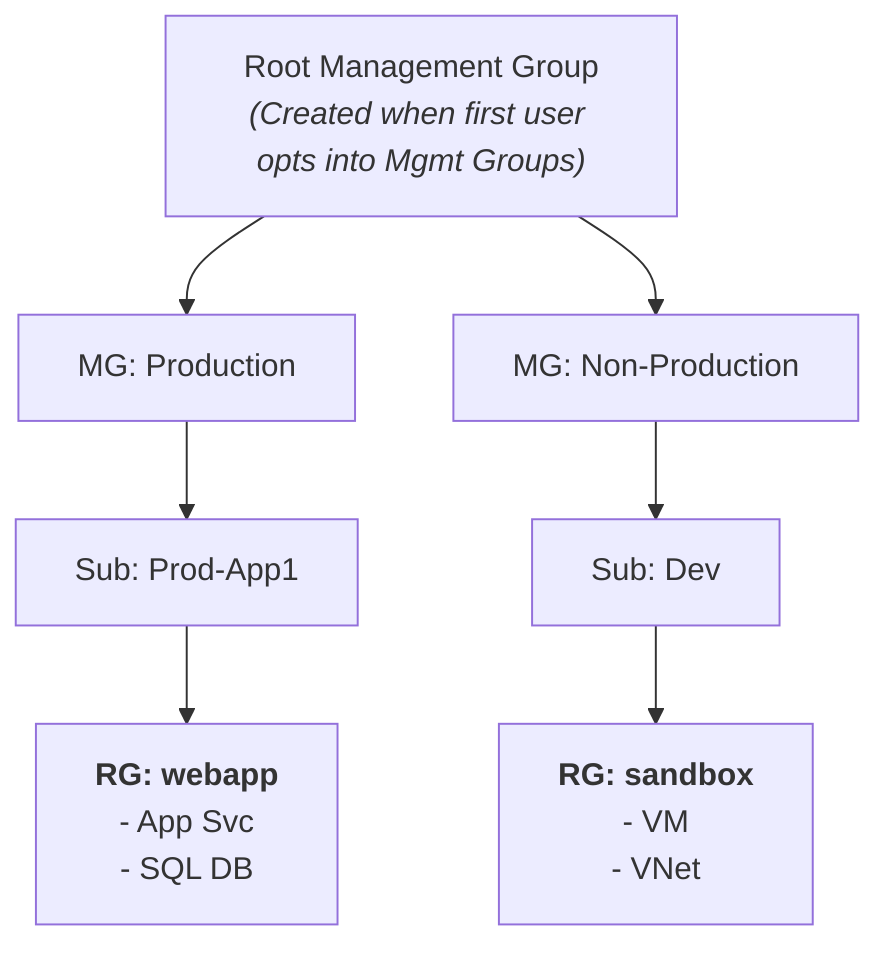
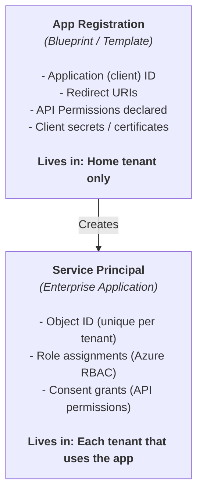
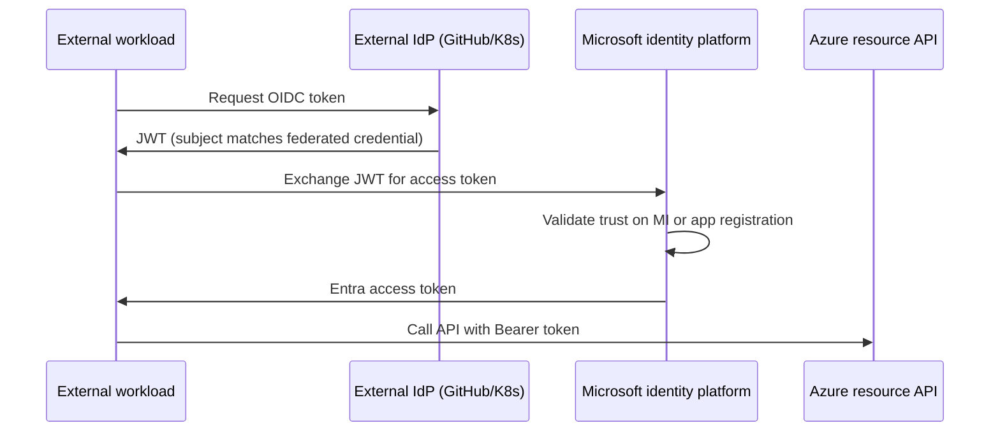
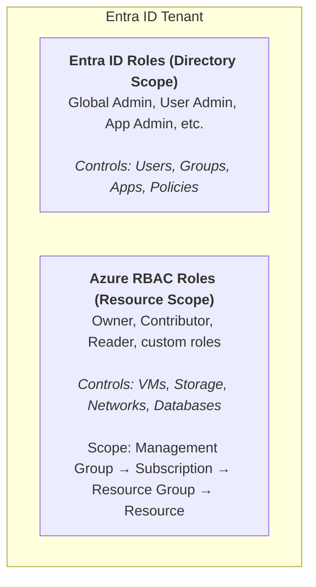
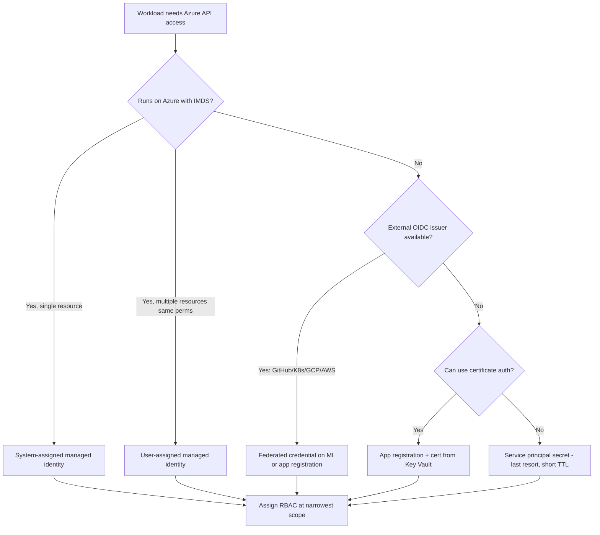

**Complexity**: `[MEDIUM]` | **Time to Complete**: 2.5h | **Prerequisites**: Cloud Native 101. You will use this module after you can already read and create resources in Azure, because the module assumes comfort with role and identity fundamentals.

## What You'll Be Able to Do

After completing this module, you will be able to:

- **Configure Entra ID application registrations, service principals, and Managed Identities for Azure workloads**
- **Design Azure RBAC role assignments across Management Groups, Subscriptions, and Resource Groups with least privilege**
- **Implement Conditional Access policies and Privileged Identity Management (PIM) for just-in-time access**
- **Diagnose Entra ID vs Azure RBAC permission conflicts using role assignment analysis and access reviews**

---

## Why This Module Matters

Hypothetical scenario: a platform team ships a new microservice with a client secret embedded in Helm values. Six months later, nobody remembers which pipeline created the app registration. The secret never rotated. An attacker with read access to the chart history now has Contributor on a production subscription. The breach is not a firewall failure. It is an identity lifecycle failure that compounded quietly.

This pattern is common because Azure makes resource creation easy while identity cleanup stays manual. **Identity is not just security---it is the foundation of everything in Azure.** Every VM, storage account, and Kubernetes cluster call flows through Entra authentication and Azure RBAC authorization. Traditional on-premises defenses often lean on network segmentation first. Azure's control plane is identity-driven first. A compromised service principal with broad RBAC can delete data even when NSGs are perfect.

In this module, you will learn how Microsoft Entra ID (formerly Azure Active Directory) works as the identity backbone of Azure. You will map tenants, management groups, and subscriptions to real permission boundaries. You will separate Entra directory roles from Azure resource roles---a distinction that still trips experienced engineers during incidents. You will also learn when managed identities beat secrets, and when workload identity federation beats both. By the end, you can design least-privilege access that survives audits and reduces licensing waste.

---

## Azure's Identity Backbone: Microsoft Entra ID

Before you create a single resource in Azure, you need to understand the identity layer that governs everything. Microsoft Entra ID (still frequently called Azure AD in documentation, CLI tools, and everyday conversation) is a cloud-based identity and access management service. Think of it as the bouncer at every door in the Azure building. Every person, every application, and every automated process must present credentials to Entra ID before Azure will do anything.

> **The Bouncer Analogy**
>
> A nightclub bouncer checks ID at the door—that is authentication. The wristband color determines which rooms you may enter—that is authorization. Entra ID issues wristbands (tokens). Azure RBAC decides which rooms (resources) each wristband may access. You need both checks; a forged ID at the door is useless if the wristband never gets issued, and a valid ID without the right wristband still cannot enter the VIP room.

Cloud operators who internalize this analogy debug faster. Sign-in failures are bouncer problems (password, MFA, Conditional Access). Resource Manager `AuthorizationFailed` errors are wristband problems (missing RBAC, wrong scope, missing data-plane role, deny assignment). Mixing the two leads to futile password resets when the real issue is a missing `Storage Blob Data Contributor` assignment.

### What Entra ID Is (and What It Is Not)

Entra ID is **not** the same as on-premises Active Directory Domain Services (AD DS). This is one of the most persistent misconceptions in the Azure world. [AD DS uses Kerberos and LDAP for authentication, organizes objects into Organizational Units (OUs) with Group Policy Objects (GPOs), and requires domain controllers running on Windows Server. Entra ID uses OAuth 2.0, OpenID Connect, and SAML for authentication, has a flat structure (no OUs, no GPOs), and is a fully managed cloud service.](https://learn.microsoft.com/en-us/entra/fundamentals/compare)

| On-Premises AD DS | Microsoft Entra ID |
| :--- | :--- |
| Kerberos / NTLM / LDAP | OAuth 2.0 / OIDC / SAML |
| Organizational Units (OUs) | Flat directory (no OUs) |
| Group Policy Objects (GPOs) | Conditional Access Policies |
| Domain Controllers (servers) | Fully managed SaaS |
| Forest / Domain / Trust model | Tenant model |
| On-prem network required | Internet-accessible |
| Supports LDAP queries | Supports Microsoft Graph API |

If your organization has on-premises AD DS and wants to use the same identities in Azure, you [use **Entra Connect** (formerly Azure AD Connect) to synchronize identities](https://learn.microsoft.com/en-us/entra/identity/hybrid/connect/whatis-azure-ad-connect). This hybrid setup is extremely common in enterprises.

### The Tenant: Your Identity Boundary

A **tenant** is a dedicated instance of Entra ID that your organization receives when it signs up for any Microsoft cloud service (Azure, Microsoft 365, Dynamics 365). Think of a tenant as your organization's apartment in a massive apartment building: you share the building infrastructure with others, but the tenant boundary isolates your users, groups, and applications. This is why tenant governance is often the first place teams secure before applying broader resource rules. Every tenant has a unique identifier (a GUID) and at least one verified domain; by default, you get a domain like `yourcompany.onmicrosoft.com`, but you can (and should) add your own custom domain to make identities and sign-in patterns feel like your organization rather than a generic cloud namespace.

```bash
# View your current tenant
az account show --query '{TenantId:tenantId, SubscriptionName:name}' -o table

# List all tenants your account has access to
az account tenant list -o table

# Show detailed tenant information
az rest --method GET --url "https://graph.microsoft.com/v1.0/organization" \
  --query "value[0].{DisplayName:displayName, TenantId:id, Domains:verifiedDomains[].name}"
```

### The Hierarchy: Management Groups, Subscriptions, and Resource Groups

Azure organizes resources in a four-level hierarchy. Understanding this hierarchy is essential because **access control and policy inheritance flow from top to bottom**. Once you internalize it, you can predict not only where permissions land, but also where controls should be applied for least-privilege governance.



*[Inheritance flows DOWN: Policy assigned at MG: Production → applies to ALL subscriptions, resource groups, and resources beneath it.](https://learn.microsoft.com/en-us/azure/governance/management-groups/overview)*

| Level | Purpose | Key Facts |
| :--- | :--- | :--- |
| **Management Group** | Organize subscriptions into governance hierarchies | [Up to 6 levels deep (excluding root). Max 10,000 MGs per tenant.](https://learn.microsoft.com/en-us/azure/governance/management-groups/overview) |
| **Subscription** | Billing boundary and access control boundary | [Each subscription trusts exactly one Entra ID tenant.](https://learn.microsoft.com/en-us/azure/cost-management-billing/understand/understand-billing-tenant-relationship) Max 980 resource groups per sub. |
| **Resource Group** | Logical container for related resources | Resources can only exist in one RG. Deleting RG deletes ALL resources inside. |
| **Resource** | The actual thing (VM, database, storage account) | Inherits RBAC and policy from all levels above. |

A common mistake is treating subscriptions as purely a billing construct. They are also **security boundaries**, because a user with Owner on Subscription A has zero access to Subscription B by default, even if both subscriptions are in the same tenant. This is why large organizations use multiple subscriptions to isolate environments and teams: they want predictable blast-radius boundaries and cleaner privilege models before cost structures become a secondary consideration.

### Enterprise Layout: Tenants, Management Groups, and Landing Zones

Real enterprises rarely run "one subscription for everything." A common pattern is a **platform subscription** for shared services (logging, DNS hubs, identity automation) and **workload subscriptions** per product or environment (dev/test/prod). Management groups apply policies once—require tags, deny public IPs in production, inherit Azure Policy initiatives—while subscriptions keep billing and RBAC isolation crisp.

| Pattern | Structure | Identity benefit |
| :--- | :--- | :--- |
| **Environment isolation** | MG `Production` / `NonProd` with separate subs | CA policies differ; prod Owners are fewer |
| **Team isolation** | Subscription per product team | Blast radius contained to one sub |
| **Platform hub** | Shared services sub with user-assigned MIs | Central MI for DNS/ACR/Key Vault access |
| **Sandbox** | Low-privilege sub with Contributor for engineers | No standing Owner; PIM for exceptions |

When designing landing zones, decide **where human access lives** (groups at MG or sub scope) versus **where workload identities live** (user-assigned MIs in the workload sub, federated CI/CD from GitHub). Hypothetical scenario: a company places all production apps in one subscription to "save money," then grants 40 engineers Contributor. Incident response becomes role-assignment archaeology. Splitting subscriptions costs little compared to one mistaken `az group delete`.

Landing zone identity automation often uses infrastructure-as-code to create groups, assign RBAC, and register federated credentials. The operator still must understand scope strings. A role assignment scope of `/providers/Microsoft.Management/managementGroups/Production` affects every child subscription. A scope of `/subscriptions/{id}/resourceGroups/app-rg` affects only that group. Terraform `azurerm_role_assignment` and Bicep `Microsoft.Authorization/roleAssignments` must mirror the same paths you would type in `az role assignment create`.

**Pause and predict:** If you assign a user the 'Contributor' role at the Subscription level, but explicitly assign them the 'Reader' role at a specific Resource Group level within that subscription, what effective permissions do they have on the Resource Group?

<details>
<summary>Check your prediction</summary>

Azure RBAC is an additive authorization model where permissions inherit downward through the resource hierarchy. A lower-scope Reader assignment does not subtract or restrict permissions granted by a subscription-level Contributor role unless an explicit deny assignment exists.
</details>

The next object is the management-group CLI. After those commands, you can move a subscription under Production and inspect the resulting scope string.

```bash
# List management groups
az account management-group list -o table

# Create a management group
az account management-group create --name "Production" --display-name "Production Workloads"

# Move a subscription under a management group
az account management-group subscription add \
  --name "Production" \
  --subscription "xxxxxxxx-xxxx-xxxx-xxxx-xxxxxxxxxxxx"

# List subscriptions in the current tenant
az account list -o table --query '[].{Name:name, Id:id, State:state}'
```

---

## Identities in Entra ID: Users, Groups, Service Principals, and Managed Identities

Now that you understand the organizational structure, let's dive into the identity types. In Azure, there are fundamentally two categories of identities: **human identities** (people who log in) and **workload identities** (applications and services that authenticate programmatically). That distinction is the first mental model shift: humans need interactive and audit-friendly access paths, while workloads need non-interactive identity patterns that scale safely in automation.

### Users

An Entra ID user represents a person. Users can be **cloud-only** (created directly in Entra ID) or **synced** (synchronized from on-premises AD DS via Entra Connect). Users can also be **guest users**, invited from other Entra ID tenants or external email providers via B2B collaboration. This is useful in real teams because production security depends on separating what “who is in the directory” means from “what each identity can actually touch” across scopes.

```bash
# Create a cloud-only user
az ad user create \
  --display-name "Alice Engineer" \
  --user-principal-name "alice@yourcompany.onmicrosoft.com" \
  --password "TemporaryP@ss123!" \
  --force-change-password-next-sign-in true

# List all users (first 10)
az ad user list --query '[:10].{Name:displayName, UPN:userPrincipalName, Type:userType}' -o table

# Get a specific user
az ad user show --id "alice@yourcompany.onmicrosoft.com"
```

### Groups

Groups simplify access management. Instead of assigning roles to individual users, you assign roles to groups and add users to the groups so membership becomes the control point. This is how you avoid per-user sprawl, especially when teams change. Entra ID has two group types:

- **Security groups**: Used for managing access to resources. This is what you'll use 90% of the time.
- **Microsoft 365 groups**: Used for collaboration (shared mailbox, SharePoint site, Teams channel). Also usable for RBAC, but carry extra baggage.

Groups can have **assigned membership** (manually add/remove members) or **dynamic membership** (members are automatically added/removed based on user attributes like department or job title). [Dynamic groups require Entra ID P1 or P2 licensing.](https://learn.microsoft.com/en-us/entra/identity/users/groups-dynamic-membership)

**Guest users (B2B collaboration)** invite external identities into your tenant as `userType: Guest`. Guests authenticate with their home organization but appear in your directory for RBAC and app access. Treat guests like employees for access reviews—contractors often retain group memberships after projects end. Assign RBAC to groups that include guests only when necessary; prefer app-scoped access or entitlement management for vendor scenarios.

| Group strategy | Best for | RBAC tip |
| :--- | :--- | :--- |
| **Security group (assigned)** | Stable teams with manual onboarding | `Platform-Ops` group gets Contributor on `rg-platform` |
| **Security group (dynamic)** | Department-based access at scale | Rule `department -eq "Engineering"`; needs P1 |
| **Role-assignable group** | Nesting Entra directory roles | Limited to ~500 role-assignable groups per tenant |
| **Microsoft 365 group** | Collaboration + optional RBAC | Extra M365 licensing surface; use security groups for pure RBAC |

```bash
# Create a security group
az ad group create \
  --display-name "Platform Engineers" \
  --mail-nickname "platform-engineers"

# Add a user to a group
USER_ID=$(az ad user show --id "alice@yourcompany.onmicrosoft.com" --query id -o tsv)
GROUP_ID=$(az ad group show --group "Platform Engineers" --query id -o tsv)
az ad group member add --group "$GROUP_ID" --member-id "$USER_ID"

# List group members
az ad group member list --group "Platform Engineers" --query '[].displayName' -o tsv
```

### Service Principals (App Registrations)

A **service principal** is the identity that an application uses to authenticate with Entra ID, and it is the object you actually grant permissions to. But there is a subtle two-step process that confuses many people:

1. **App Registration**: A global definition of your application. Think of it as the blueprint. It lives in your home tenant and defines what permissions the app needs, what redirect URIs it uses, and what credentials it has.
2. **Service Principal (Enterprise Application)**: [A local instance of the app in a specific tenant. Think of it as an installation of the blueprint. When you grant an app access to resources, you are granting access to the service principal, not the app registration.](https://learn.microsoft.com/en-us/entra/identity-platform/app-objects-and-service-principals)



```bash
# Create an app registration (automatically creates service principal in home tenant)
az ad app create --display-name "my-cicd-pipeline"

# Get the app ID
APP_ID=$(az ad app list --display-name "my-cicd-pipeline" --query '[0].appId' -o tsv)

# Create a client secret (AVOID THIS -- use federated credentials or certificates instead)
az ad app credential reset --id "$APP_ID" --years 1

# Preferred: Create federated credential for GitHub Actions (OIDC -- no secrets!)
az ad app federated-credential create --id "$APP_ID" --parameters '{
  "name": "github-actions-main",
  "issuer": "https://token.actions.githubusercontent.com",
  "subject": "repo:myorg/myrepo:ref:refs/heads/main",
  "audiences": ["api://AzureADTokenExchange"]
}'
```

**Security note**: Exposed client secrets in public repositories can be discovered quickly, and a high-privilege service principal can be abused for costly or destructive activity. The safer pattern is to avoid long-lived secrets by using Managed Identities for Azure workloads and federated workload identity for CI/CD.

### Application Permissions vs Delegated Permissions

App registrations declare **API permissions** in two flavors. **Delegated permissions** apply when a signed-in user is present—the app acts on behalf of that user within the consent boundary. **Application permissions** apply when the app calls APIs with its own identity (daemon jobs, unattended sync)—these are powerful and often require admin consent. [Microsoft Graph and Azure Resource Manager permissions are separate from Azure RBAC](https://learn.microsoft.com/en-us/entra/identity-platform/permissions-consent-overview): granting `Directory.Read.All` on Graph does not grant Reader on a subscription. Operators must track both planes during security reviews.

A mature registration workflow documents: which secrets or federated credentials exist, which API permissions are granted, which enterprise application (service principal) holds Azure RBAC assignments, and who owns quarterly review. Hypothetical scenario: an inventory scanner holds Graph application permission and subscription Reader via RBAC. Removing Graph access does not remove storage enumeration if RBAC Reader remains—fix both or the scanner still exfiltrates metadata.

```bash
# List API permissions declared on an app registration
az ad app show --id "$APP_ID" --query "requiredResourceAccess" -o json

# Show service principal RBAC (Azure plane) vs Graph app roles (directory/API plane)
az role assignment list --assignee "$SP_OBJECT_ID" --all -o table
```

### Managed Identities: The Gold Standard

A **Managed Identity** is [a special type of service principal that Azure manages for you](https://learn.microsoft.com/en-us/entra/identity-platform/app-objects-and-service-principals). You typically do not need to see or handle credentials---Azure automatically provisions, rotates, and revokes the tokens behind the scenes. This is the single most important identity concept for application developers on Azure.

There are two types, and the choice changes how you think about lifecycle and access sharing. This decision is not cosmetic because it determines whether identities stay coupled to a single resource or can be reused across environments.

| Feature | System-Assigned | User-Assigned |
| :--- | :--- | :--- |
| **Lifecycle** | [Tied to the resource (delete VM = delete identity) | Independent (persists until you delete it)](https://learn.microsoft.com/en-us/entra/identity/managed-identities-azure-resources/overview) |
| **Sharing** | One-to-one (each resource gets its own) | One-to-many (multiple resources share one) |
| **Creation** | Enable on the resource | Create separately, then assign to resources |
| **Naming** | Named after the resource | You choose the name |
| **Best for** | Single-resource scenarios, simpler management | Shared access patterns, pre-provisioning |
| **RBAC management** | Role assignments per resource | Role assignments per identity (shared) |

```bash
# Enable system-assigned managed identity on a VM
az vm identity assign --resource-group myRG --name myVM

# Create a user-assigned managed identity
az identity create --resource-group myRG --name "app-identity"

# Assign the user-assigned identity to a VM
IDENTITY_ID=$(az identity show -g myRG -n "app-identity" --query id -o tsv)
az vm identity assign --resource-group myRG --name myVM --identities "$IDENTITY_ID"

# Grant the managed identity access to a Key Vault
PRINCIPAL_ID=$(az identity show -g myRG -n "app-identity" --query principalId -o tsv)
az role assignment create \
  --assignee "$PRINCIPAL_ID" \
  --role "Key Vault Secrets User" \
  --scope "/subscriptions/<sub-id>/resourceGroups/myRG/providers/Microsoft.KeyVault/vaults/myVault"
```

When your application code runs on a resource with a Managed Identity, it can acquire tokens without any credentials:

```python
# Python example using azure-identity SDK
from azure.identity import DefaultAzureCredential
from azure.keyvault.secrets import SecretClient

# DefaultAzureCredential automatically detects Managed Identity
credential = DefaultAzureCredential()
client = SecretClient(vault_url="https://myvault.vault.azure.net/", credential=credential)

secret = client.get_secret("database-connection-string")
print(f"Secret value: {secret.value}")
```

The `DefaultAzureCredential` class tries several credential types, and the exact chain depends on SDK version and configuration. In Azure, Managed Identity is one built-in option; on a developer machine, local credentials such as Azure CLI can be used instead.

### How Managed Identities Obtain Tokens Without Secrets

When code on an Azure resource calls the local **Instance Metadata Service (IMDS)** endpoint, Azure validates that the request originates from that resource and returns a Microsoft Entra access token for the managed identity's service principal. [No client secret or certificate is stored in your application configuration](https://learn.microsoft.com/en-us/entra/identity/managed-identities-azure-resources/overview); Azure rotates credentials on the platform side. This is why managed identities are the default recommendation for App Service, Azure Functions, VMs, and AKS pods that call Azure APIs: you grant RBAC on the identity's `principalId`, and the runtime handles token acquisition.

The operator workflow is deliberately simple: create or enable the identity, assign roles at the narrowest scope, then let the SDK call `DefaultAzureCredential()` or `ManagedIdentityCredential()`. Propagation delays still apply after role assignment, so automated deployments should retry token acquisition for several minutes after `az role assignment create`.

### Workload Identity Federation for AKS, GitHub Actions, and External Workloads

Not every workload runs on Azure compute with IMDS available. CI/CD pipelines in GitHub Actions, pods on Amazon EKS or Google GKE, and legacy VMs outside Azure still need Entra tokens—but **client secrets expire, leak in logs, and resist rotation at scale**. [Workload identity federation lets a user-assigned managed identity or app registration trust tokens from an external identity provider (IdP)](https://learn.microsoft.com/en-us/entra/workload-id/workload-identity-federation) such as GitHub, Kubernetes OIDC issuers, or Google Cloud. You configure a **federated identity credential** with `issuer`, `subject`, and `audience` values that must case-sensitively match the external JWT; Microsoft identity platform validates the external token and issues an Entra access token with no long-lived secret.



For **AKS**, the supported pattern is [Azure Workload Identity](https://learn.microsoft.com/en-us/azure/aks/workload-identity-overview). Enable the OIDC issuer on the cluster first. Create a user-assigned managed identity in the node resource group or a dedicated identity RG. Add a federated credential whose `issuer` is the cluster OIDC URL and whose `subject` is the Kubernetes service account (`system:serviceaccount:<namespace>:<name>`). Annotate the pod service account with `azure.workload.identity/client-id`. The pod receives Entra tokens like a VM managed identity, without mounting secrets. This curriculum targets Kubernetes **1.35**; workload identity is the modern replacement for the deprecated aad-pod-identity addon pattern.

**Pause and predict:** When configuring an automated deployment workflow to authenticate against Azure using workload identity federation, does the GitHub Actions `azure/login` action still require a stored `AZURE_CLIENT_SECRET` parameter?

<details>
<summary>Check your prediction</summary>

Federated credentials replace long-lived client secrets entirely by exchanging short-lived OpenID Connect tokens issued by GitHub for Entra ID access tokens. Supplying `client-id`, `tenant-id`, and `subscription-id` in the login action parameters is completely sufficient.
</details>

The next object is the GitHub Actions federated-credential recipe. After it, the Important constraint is why you cannot chain Entra tokens as an external IdP.

For **GitHub Actions**, you create a federated credential on the app registration with `az ad app federated-credential create` as shown earlier. Hypothetical scenario: a platform team runs twenty repositories; rotating twenty secrets quarterly is error-prone, but one federated trust per repo branch pattern scales with policy-as-code reviews.

**Important constraint**: [tokens issued by Microsoft Entra ID cannot be used as input to federated identity credential flows](https://learn.microsoft.com/en-us/entra/workload-id/workload-identity-federation)—the external IdP must be GitHub, your Kubernetes issuer, AWS Cognito, etc., not another Entra tenant token chained informally.

```bash
# Federated credential on a user-assigned managed identity (AKS-style issuer example)
az identity federated-credential create \
  --name "aks-federated-credential" \
  --identity-name "app-identity" \
  --resource-group myRG \
  --issuer "https://oidc.prod.aks.azure.com/<tenant-id>/<cluster-id>/" \
  --subject "system:serviceaccount:default:my-app-sa" \
  --audience "api://AzureADTokenExchange"
```

---

## Azure RBAC vs Entra ID Roles: The Great Confusion

This is the section that will save you hours of frustration. Azure has **two separate role systems** that operate at different layers, and confusing them is one of the most common mistakes in the Azure ecosystem. Once this split is clear in your head, you stop over-assigning permissions because you can immediately ask whether a request is directory-level or resource-level before you grant access.

### Entra ID Roles (Directory Roles)

These roles control access to **Entra ID itself**---the directory. They govern who can create users, manage groups, register applications, configure Conditional Access policies, and perform other directory operations. In other words, Entra ID roles are about identity administration and tenant governance, not direct resource creation, deletion, or data plane operations. [Directory roles are assigned at tenant scope only](https://learn.microsoft.com/en-us/entra/identity/role-based-access-control/custom-overview); you cannot assign "User Administrator" on a single subscription because the directory is one flat namespace per tenant.

Examples of core Entra ID directory roles are shown below:
- **Global Administrator**: Full access to Entra ID and all Microsoft services (the "root" of your tenant)
- **User Administrator**: Can create and manage users and groups
- **Application Administrator**: Can manage app registrations and enterprise applications
- **Security Reader**: Read-only access to security features
- **Privileged Role Administrator**: Can manage role assignments for other Entra directory roles (high blast radius—often paired with PIM)

When an engineer asks for "admin access," clarify **which plane** they need. Directory admins can reset passwords and create app registrations; they cannot deploy VMs until someone grants Azure RBAC. Resource owners can delete storage accounts but cannot invite guest users unless they also hold directory roles.

### Azure RBAC Roles (Resource Roles)

These roles control access to **Azure resources**---VMs, storage accounts, databases, networks, and everything else you deploy. They operate on the management group / subscription / resource group / resource hierarchy. In practice, this means the scope you choose for a role assignment is often the difference between a secure design and a permission leak when teams grow or move projects between environments.

The four fundamental built-in roles are the practical starting point for most permission models because they cover most operational scenarios without overengineering.

| Role | What It Can Do | Scope |
| :--- | :--- | :--- |
| **Owner** | Full access + can assign roles to others | Can manage everything and delegate |
| **Contributor** | Full access to resources, but cannot assign roles | Can create/delete/modify resources |
| **Reader** | View-only access | Can see resources but not change anything |
| **User Access Administrator** | Can only manage role assignments | Can grant/revoke access but not modify resources |



**Pause and predict:** A new security engineer is granted the 'Global Administrator' role in Entra ID. When they log into the Azure portal, they cannot see any Virtual Machines or Storage Accounts across tenant subscriptions. Why?

<details>
<summary>Check your prediction</summary>

KEY INSIGHT: Global Administrator does NOT automatically have Azure RBAC access. They must "elevate" themselves first, because directory privileges and Azure resource permissions are deliberately separated. Global Administrator is an Entra ID directory role that grants control over tenant identities and policies, not an Azure RBAC role. The administrator has no default access to Azure resources and must explicitly [elevate access to User Access Administrator at the root scope](https://learn.microsoft.com/en-us/azure/role-based-access-control/elevate-access-global-admin) before they can grant themselves permissions to view or manage Azure resources.
</details>

The next object is `az role assignment create`. After it, management group → subscription → resource group is the scope tree you will type daily.

### Role Assignment Scope Hierarchy and `az role assignment create`

Azure RBAC assignments attach a **role definition** to a **security principal** (user, group, service principal, or managed identity) at a **scope**. Scopes form a tree: management group → subscription → resource group → individual resource. [Permissions are additive as they inherit downward](https://learn.microsoft.com/en-us/azure/role-based-access-control/overview); a Contributor at subscription scope can modify every resource group underneath unless a **deny assignment** blocks specific actions.

The CLI shape you will use daily is:

```bash
az role assignment create \
  --assignee "<object-id-or-upn>" \
  --role "<RoleName>" \
  --scope "/subscriptions/<sub-id>/resourceGroups/<rg-name>"
```

Use the principal's **object ID** for service principals and managed identities (`principalId` from `az identity show` or `az ad sp show`). For users, UPN often works, but object ID avoids ambiguity when guest accounts share display names. Scope should be as narrow as the task allows: prefer resource group over subscription, and resource over resource group when the workload is single-purpose.

```bash
# List Azure RBAC role assignments at subscription scope
az role assignment list --scope "/subscriptions/<sub-id>" -o table

# List assignments for one principal across the tenant (diagnostics)
az role assignment list --assignee "$PRINCIPAL_ID" --all -o table

# List all built-in Azure RBAC roles
az role definition list --query "[?roleType=='BuiltInRole'].{Name:roleName, Description:description}" -o table

# Show what a specific role can do
az role definition list --name "Contributor" --query '[0].{Actions:permissions[0].actions, NotActions:permissions[0].notActions}'
```

### Deny Assignments and the Least-Privilege Model

Least privilege on Azure means granting the **minimum RBAC and directory roles** required for a task, at the **narrowest scope**, for the **shortest duration** practical. Groups should hold roles; humans should be members of groups. Standing Global Administrator or subscription Owner assignments should be rare and visible in access reviews.

**Deny assignments** are the exception mechanism: they block specified control-plane or data-plane actions even when a role assignment would allow them. [You cannot create arbitrary deny assignments yourself in most tenants](https://learn.microsoft.com/en-us/azure/role-based-access-control/deny-assignments)—Azure creates them to protect platform resources, and deployment stacks can create deny settings to prevent deletion of managed resources. Operators still need to recognize deny assignments when troubleshooting "I have Contributor but the API returns AuthorizationFailed." List them in the portal under Access control (IAM) → Deny assignments, or query with appropriate `Microsoft.Authorization/denyAssignments/read` permission.

Deny does not replace good role design. If teams rely on deny to compensate for excessive Contributor grants, the permission model is already unhealthy. The sustainable pattern is: built-in or custom roles scoped tightly, PIM for elevation, Conditional Access for sign-in risk, and access reviews to remove stale assignments.

### Custom RBAC Roles

When built-in roles are too broad or don't fit your needs, you create custom roles. A custom role is a JSON definition that specifies exactly which actions are allowed or denied.

```json
{
  "Name": "VM Operator",
  "Description": "Can start, stop, and restart VMs but not create or delete them",
  "Actions": [
    "Microsoft.Compute/virtualMachines/start/action",
    "Microsoft.Compute/virtualMachines/restart/action",
    "Microsoft.Compute/virtualMachines/deallocate/action",
    "Microsoft.Compute/virtualMachines/powerOff/action",
    "Microsoft.Compute/virtualMachines/read",
    "Microsoft.Compute/virtualMachines/instanceView/read",
    "Microsoft.Resources/subscriptions/resourceGroups/read"
  ],
  "NotActions": [],
  "DataActions": [],
  "NotDataActions": [],
  "AssignableScopes": [
    "/subscriptions/xxxxxxxx-xxxx-xxxx-xxxx-xxxxxxxxxxxx"
  ]
}
```

```bash
# Create a custom role from a JSON file
az role definition create --role-definition @vm-operator-role.json

# Assign the custom role
az role assignment create \
  --assignee "alice@yourcompany.onmicrosoft.com" \
  --role "VM Operator" \
  --scope "/subscriptions/<sub-id>/resourceGroups/production"

# List custom roles in your subscription
az role definition list --custom-role-only true -o table
```

An important distinction: **Actions** vs **DataActions**. [Actions control *management plane* operations (creating, deleting, configuring resources). DataActions control *data plane* operations (reading blobs in storage, sending messages to a queue). The role `Storage Blob Data Reader` uses DataActions, not Actions](https://learn.microsoft.com/en-us/azure/role-based-access-control/role-definitions), because it grants access to the data inside storage, not to the storage account management operations.

### Diagnosing "Access Denied" Across Entra ID and Azure RBAC

When authentication succeeds but authorization fails, split the problem into **token issuance** (Entra sign-in, Conditional Access, app consent) versus **RBAC evaluation** (role assignments, scope, deny assignments, data-plane roles). The Azure portal's "Check access" blade on a resource is the fastest sanity check for RBAC. For directory tasks, verify Entra directory role assignments in Entra admin center roles and administrators.

| Symptom | Likely plane | First checks |
| :--- | :--- | :--- |
| Cannot sign in to portal | Entra authentication / CA | Sign-in logs, CA report-only, MFA registration |
| Sign-in works, cannot create RG | Azure RBAC | `az role assignment list --assignee`, scope too narrow |
| Can create container, cannot upload blob | Data-plane RBAC | Missing `Storage Blob Data Contributor` or equivalent |
| Global Admin cannot see VMs | Plane confusion | RBAC not granted; elevate access or assign Reader |
| Contributor but delete blocked | Deny assignment / locks | Deny assignments tab, CanNotDelete lock on RG |
| MI works locally, fails in Azure | Wrong credential chain | `DefaultAzureCredential` picking CLI instead of IMDS |

Worked troubleshooting flow: confirm the principal's `objectId`, list all role assignments with `--all`, verify each assignment scope includes the target resource, confirm data-plane roles exist for storage/SQL/Key Vault data APIs, wait ten minutes for propagation, then inspect deny assignments. If the principal is a service principal, also verify API permissions and admin consent on the app registration—Graph consent gaps will not show up in `az role assignment list`.

```bash
# Effective permissions simulation (subscription scope example)
az role assignment list --assignee "$PRINCIPAL_ID" --scope "/subscriptions/<sub-id>" -o table

# Sign-in diagnostics for human users (requires appropriate Graph permissions)
az rest --method GET \
  --url "https://graph.microsoft.com/v1.0/auditLogs/signIns?\$top=5" \
  --query "value[].{User:userPrincipalName, App:appDisplayName, Status:status.errorCode}" -o table
```

---

## Conditional Access: Context-Aware Security

Conditional Access policies are the enforcement engine of Entra ID. They evaluate conditions (who, where, what device, what app) and make access decisions (allow, block, require MFA). Think of them as programmable if/then rules for authentication that let you tighten control based on context instead of trying to secure every login with one static policy. In practice, this gives you better risk balance because you can keep the default experience lightweight while still protecting high-risk scenarios.

### Policy Anatomy: Signals, Conditions, and Grant Controls

Every Conditional Access policy is a pipeline. **Assignments** define who and what the policy applies to (users, groups, roles, cloud apps, or user actions such as registering security info). **Conditions** filter the sign-in context: client app type, device platform, location (IP ranges from **named locations**), sign-in risk level, or device compliance state. **Access controls** decide the outcome: block, grant with requirements (MFA, compliant device, approved app), or session controls (sign-in frequency, persistent browser session). [Policies evaluate in report-only mode first, then enforcement](https://learn.microsoft.com/en-us/entra/identity/conditional-access/concept-conditional-access-policy-common)—a practical rollout pattern that avoids locking out administrators on day one.

| Policy stage | What you configure | Operator intent |
| :--- | :--- | :--- |
| **Assignments (WHO/WHAT)** | Users, groups, roles, cloud apps, user actions | Limit blast radius—start with admins, then expand |
| **Conditions (signals)** | Locations, device state, risk, client apps | Tie controls to real risk (unknown geography, legacy auth) |
| **Grant controls** | Require MFA, require compliant device, block | Enforce step-up only when context warrants it |
| **Session controls** | Sign-in frequency, app-enforced restrictions | Reduce token lifetime for sensitive portals |

**Named locations** are CIDR ranges or countries you label as trusted corporate networks versus "anywhere else." Pairing "Require MFA except from trusted locations" with "Block legacy authentication" closes common password-spray paths without punishing employees on VPN. [Risk-based Conditional Access (sign-in risk, user risk) requires Microsoft Entra ID Protection, which needs P2 licensing](https://learn.microsoft.com/en-us/entra/fundamentals/licensing).

| Assignments (WHO) | Conditions (WHERE/WHEN/HOW) | Controls (THEN WHAT) |
| :--- | :--- | :--- |
| Users/Groups | Sign-in risk (AI-based) | Block access |
| Apps | Device platform (iOS, etc.) | Require MFA |
| Roles | Location (IP ranges) | Require device |
| | Client app type | Session limits |
| | Device state | App controls |

Common Conditional Access patterns are usually implemented first as a baseline because they provide strong control with minimal policy complexity before more specialized scenarios:

1. **Require MFA for all Global Administrators** (this should be your first policy)
2. **Block sign-ins from countries where you have no employees**
3. **Require compliant devices for accessing sensitive applications**
4. **Force re-authentication every 4 hours for Azure portal access**

[Conditional Access requires at least Entra ID P1 licensing.](https://learn.microsoft.com/en-us/entra/identity/conditional-access/overview) You can view and manage policies through the Azure portal or Microsoft Graph API:

```bash
# List Conditional Access policies via Graph API
az rest --method GET \
  --url "https://graph.microsoft.com/v1.0/identity/conditionalAccess/policies" \
  --query "value[].{Name:displayName, State:state}"
```

### MFA Methods and Authentication Strength

Multi-factor authentication is not a single technology. Entra supports Authenticator push/OTP, FIDO2 security keys, certificate-based auth, and telephony (where licensed). [Security defaults favor Microsoft Authenticator for all users](https://learn.microsoft.com/en-us/entra/fundamentals/licensing), while P1/P2 tenants can tune allowed methods per Conditional Access policy. Phishing-resistant MFA (FIDO2, Windows Hello for Business, certificate-based) should be required for Global Administrators and for PIM activations.

Operators should align MFA policy with helpdesk capacity. If every CA policy demands FIDO2 on day one, contractors without enrolled keys will open tickets. A staged rollout—Authenticator first, FIDO2 for privileged roles—is usually sustainable. Pair MFA requirements with **named locations** so corporate VPN users are not challenged on every API call, while unknown locations always step up.

[Break-glass emergency access accounts](https://learn.microsoft.com/en-us/entra/identity/role-based-access-control/security-emergency-access) should be cloud-only, excluded from routine Conditional Access, and monitored with alerts. Skipping this step causes painful lockouts during MFA migrations when administrators cannot sign in to fix policies.

---

## Privileged Identity Management (PIM) & Access Reviews

Even with least privilege and Conditional Access, standing access is a massive security risk. Standing access means a user can hold a highly privileged role like Owner or Global Administrator continuously, even when they are not actively performing privileged tasks. If their account is compromised, the attacker can immediately inherit that privilege. This is why modern governance patterns treat privileged assignments as exceptions, not defaults.

Microsoft Entra Privileged Identity Management (PIM) solves this by providing **Just-In-Time (JIT) access** that limits privileged exposure to specific windows. With PIM, users are made *eligible* for a role rather than being permanently assigned to it. When they need to perform a privileged task, they must *activate* the role and satisfy the controls defined in the policy, which is usually a lower-risk posture than indefinite standing rights.

### Eligible vs Active Assignments

An **active** assignment behaves like a classic standing role: the principal has the privilege until someone removes it. An **eligible** assignment means the principal *may* request activation; until activation succeeds, the effective permissions are not granted. [PIM applies to both Entra directory roles and Azure resource roles](https://learn.microsoft.com/en-us/azure/role-based-access-control/pim-integration) when licensed appropriately—Global Administrator eligible assignments are directory-scoped, while subscription Owner eligible assignments are Azure RBAC-scoped. Activation creates a time-bound active assignment; when the window expires, the extra assignment disappears without a manual cleanup ticket.

The [Microsoft Entra PIM model](https://learn.microsoft.com/en-us/entra/id-governance/privileged-identity-management/pim-configure) exists so you can require evidence before granting temporary privilege, and it makes the access decision explicit instead of implicit.

The activation process can require several controls before a role becomes active, and that sequence is where governance policies get enforced:
- **Time-bounding**: The role automatically expires after a set period (e.g., 2 hours).
- **MFA**: The user must perform multi-factor authentication to activate.
- **Approval**: A manager or security team member must approve the activation request.
- **Ticketing**: The user must provide a valid Jira/ServiceNow ticket number as justification.

**Pause and predict:** An engineer is eligible for the Subscription Owner role via Privileged Identity Management. They activate the role, which requires approval. After approval, they attempt to delete a resource group but receive an authorization error, yet fifteen minutes later the deletion succeeds. Why does this delay occur?

<details>
<summary>Check your prediction</summary>

Privileged Identity Management operates by dynamically creating a temporary Azure RBAC role assignment upon activation approval. Because Azure RBAC role assignments propagate across globally distributed authorization caches, effective permissions can take several minutes to take effect worldwide.
</details>

The next object is Access Reviews. After that section, PIM limits duration while reviews ask whether the assignment should exist at all.

### Access Reviews and Governance Cadence

Over time, users accumulate permissions they no longer need—often from changing teams, temporary project assignments, or evolving org structures. **Access Reviews** automate cleanup by giving owners and reviewers a periodic checkpoint, which is far more reliable than relying on people to remember every stale permission. You can configure this process to ask users, managers, or resource owners on a cadence (for example, quarterly) whether specific access is still required. If the reviewer says "no" or fails to respond within the timeframe, Entra ID can automatically revoke access, which directly supports periodic governance evidence and least-privilege review processes. [Deploy access reviews with explicit reviewers and auto-removal settings documented](https://learn.microsoft.com/en-us/entra/id-governance/deploy-access-reviews) so audit evidence is reproducible.

Access reviews complement PIM: PIM limits *how long* elevated access lasts during an incident window; access reviews prove *whether standing or eligible assignments should exist at all*. For this reason, Access Reviews are most effective when they are tied to clear ownership and realistic review cycles.

### Entra ID Licensing: Free, P1, P2, and What Requires a Paid Seat

[Microsoft Entra ID Free is included with Azure and Microsoft 365 subscriptions](https://learn.microsoft.com/en-us/entra/fundamentals/licensing) and covers basic directory features, security defaults with MFA for all users (with Authenticator as the primary method in defaults), and built-in Azure RBAC role usage. **Entra ID P1** adds Conditional Access, dynamic groups, self-service password reset with writeback, Entra Connect Health, and custom directory roles (each user with a custom role assignment needs P1). **Entra ID P2** adds Privileged Identity Management, Entra ID Protection (risk-based policies), and advanced access review capabilities bundled with governance scenarios.

| Capability | Free | P1 | P2 |
| :--- | :---: | :---: | :---: |
| Security defaults / basic MFA | Yes | Yes | Yes |
| Conditional Access policies | No | Yes | Yes |
| Dynamic group membership | No | Yes | Yes |
| Custom Entra directory roles | No | Yes (licensed assignees) | Yes |
| Privileged Identity Management | No | No | Yes |
| Risk-based Conditional Access | No | No | Yes (via ID Protection) |
| Managed identities for Azure resources | Yes (no extra license) | Yes | Yes |

Microsoft 365 E3 includes P1; Microsoft 365 E5 and EMS E5 include P2. Small-business **Microsoft 365 Business Premium** also bundles Conditional Access—check your exact SKU before buying standalone P1 seats.

---

## Patterns & Anti-Patterns

| Pattern | When to use | Why it works | Scaling note |
| :--- | :--- | :--- | :--- |
| **Group-based RBAC** | Any team larger than a handful of engineers | Role assignments on groups survive org churn; audit shows group membership changes | Use dynamic groups for department-based access; avoid nested group explosions |
| **User-assigned managed identity shared across services** | Multiple Azure resources need the same downstream permissions | One `principalId`, one set of Key Vault or SQL role assignments | Pre-create identity in Terraform/Bicep before attaching to App Service, Functions, ACI |
| **Workload identity federation for CI/CD** | GitHub Actions, GitLab, or non-Azure Kubernetes calling Azure APIs | No rotating client secrets in pipeline variables | One federated credential per repo/environment subject; review `issuer`/`subject` in PRs |
| **Conditional Access baseline + report-only** | New tenant hardening | MFA for admins and block legacy auth stop most commodity attacks | Expand policies gradually; exclude break-glass accounts explicitly |
| **PIM eligible for Owner/Global Admin** | Production subscriptions and tenant administration | Standing privilege window shrinks to activation duration | License every eligible user, approver, and reviewer (P2 or Governance) |

| Anti-pattern | What goes wrong | Why teams fall into it | Better alternative |
| :--- | :--- | :--- | :--- |
| **Subscription Owner for all engineers** | One compromised laptop deletes entire environments | Speed during early cloud adoption | Contributor or custom roles at RG scope; PIM Owner when needed |
| **Client secret in pipeline variables** | Secret leaks via logs, forks, or retired maintainers | Tutorials default to `AZURE_CLIENT_SECRET` | Federated credential + OIDC login action |
| **System-assigned MI per microservice when permissions are identical** | N identities, N role assignments, N audit trails | Each tutorial enables `[system]` locally | One user-assigned MI attached to all components |
| **Global Admin for day-to-day Azure portal work** | Directory and resource planes blurred; over-broad access | Confusion between Entra roles and RBAC | RBAC Reader/Contributor at scoped resources; PIM for elevation |
| **Conditional Access without break-glass plan** | Lockout during MFA or location misconfiguration | "Secure everything" rush | Two cloud-only emergency accounts, excluded from CA, monitored |
| **Ignoring deny assignments during RCA** | "Contributor" still fails mysteriously | Deny is invisible in simple IAM screenshots | Check Deny assignments tab; review deployment stack deny settings |

---

## Decision Framework: Workload Identity Choice

Use this matrix when onboarding a new workload that needs Entra-authenticated access to Azure APIs. The goal is **no long-lived secrets** and **narrow RBAC scope**.

| Workload context | Recommended identity | Why | Avoid |
| :--- | :--- | :--- | :--- |
| Single Azure VM, App Service, or Function | System-assigned managed identity | Lifecycle tied to resource; zero secret management | User-assigned unless you will share permissions |
| Multiple Azure resources, same permissions | User-assigned managed identity | One principal, many attachments | Duplicate system-assigned identities |
| AKS pod accessing Azure APIs | User-assigned MI + workload identity federation | OIDC trust to Kubernetes service account | Mounting service principal secrets into cluster |
| GitHub Actions deploying to Azure | App registration + federated credential (OIDC) | Branch/repo-scoped trust, no secret rotation | Client secret in GitHub Secrets |
| Third-party SaaS outside Azure | App registration + certificate or federation if supported | Explicit consent and scoped API permissions | Contributor role on subscription for the vendor |
| Legacy app that cannot use OIDC/MI | Service principal + short-lived certificate | Certificates rotatable via Key Vault | Multi-year client secrets in config files |



---

## Cost Lens: Entra Licensing and Over-Provisioning

Identity licensing is a **per-user monthly line item** that is easy to overspend because it is invisible next to VM and storage bills. [Managed identities for Azure resources incur no additional Entra license charge](https://learn.microsoft.com/en-us/entra/fundamentals/licensing)—you pay for the Azure resources themselves, not per identity. The cost driver is **human and governance seats**: Conditional Access, dynamic groups, PIM activations, and access reviews each map to P1, P2, or Entra ID Governance licensing rules.

**Free tier** covers directory basics and security defaults. If you only need cloud-only users, standard groups, and built-in RBAC on subscriptions, you may never buy P1—until you need Conditional Access for compliance, at which point every user **in scope of those policies** needs P1 (or a bundle like Microsoft 365 E3 that includes P1).

**P1** is the enterprise baseline for policy-driven sign-in. Budget P1 (or E3) for employees subject to Conditional Access and for administrators who use custom Entra directory roles. A common over-licensing mistake is assigning P1 to every contractor when only employees hitting CA policies need it—use separate guest policies or scoped assignments.

**P2** is required for PIM eligible/active role workflows, risk-based Conditional Access, and Entra ID Protection reports. [Microsoft documents that every user who is eligible for PIM, can approve activations, or participates in access reviews needs a P2 or Entra ID Governance license](https://learn.microsoft.com/en-us/entra/fundamentals/licensing). A team of five eligible Owners plus three approvers plus quarterly reviewers can require **more licensed identities than expected** because approvers and reviewers count too.

**Cost spikes to watch**:
- Buying standalone P2 when Microsoft 365 E5 already includes it for the same users (duplicate spend).
- Leaving PIM eligible assignments on vendors or contractors who no longer need them—licenses still attach to identities in review scope.
- Enabling advanced access review features without Entra ID Governance planning—some scenarios bill per reviewer and per reviewed user.
- Using service principals with secrets instead of federation—no license savings, but incident cost dominates when secrets leak.

**Knobs that reduce cost without weakening security**: use group-based licensing in Microsoft 365 admin center; align CA policies to groups rather than "all users" when possible; prefer managed identities (no license) over human service accounts; use PIM time bounds so fewer people need standing Owner; right-size P2 to identities in governance workflows only.

Hypothetical scenario: a 200-person company buys 200 P2 licenses "for security," but only 15 administrators use PIM and 30 employees are in Conditional Access scope. A disciplined model might be 30 P1-equivalent (E3) plus 20 P2 for admins and reviewers—saving substantial monthly cost while keeping controls on the identities that actually touch privileged paths.

**Licensing hygiene checklist** (quarterly): reconcile Microsoft 365 admin center group-based licensing with Entra group membership; remove P2 from users without eligible PIM roles; confirm contractors are guests with scoped access reviews; verify GitHub federated credentials still match active repos; audit app registrations with secrets older than 90 days.

### Security Defaults vs Conditional Access

Tenants without P1 historically relied on **security defaults**—tenant-wide baseline requiring MFA for admins and users, and blocking legacy authentication. [Security defaults are mutually exclusive with Conditional Access in many tenants](https://learn.microsoft.com/en-us/entra/fundamentals/security-defaults)—you choose a baseline path. Moving to Conditional Access means buying P1 (or bundled E3/Business Premium) and migrating policies deliberately. Do not disable security defaults until equivalent CA policies exist, or you temporarily weaken sign-in protections.

---

## Did You Know?

1. **[Microsoft Entra ID was renamed from Azure Active Directory in July 2023](https://learn.microsoft.com/en-us/entra/fundamentals/new-name)**, but [the CLI commands still use `az ad` (not `az entra`)](https://learn.microsoft.com/en-us/cli/azure/ad?view=azure-cli-lts), the PowerShell module is still `AzureAD`, and many API endpoints still reference `azure-active-directory`. This naming mismatch is likely to remain because Microsoft keeps existing tooling and API surfaces stable for backward compatibility.

2. **Microsoft Entra tenants are subject to directory object quotas, and applications and service principals count toward those tenant-wide limits.** In large environments, service principals can accumulate quickly because first-party apps, SaaS integrations, and internal tools all create directory objects.

3. **On Azure compute resources that use managed identities, client libraries can obtain tokens from a local metadata endpoint that is reachable only from within the resource.** This design avoids exposing long-lived secrets over the public internet.

4. **New Azure RBAC role assignments can take several minutes to take effect.** This delay catches people during deployments---you assign a role and immediately try to use it, and it fails. Build in a wait or retry mechanism when programmatically assigning roles that need to work right away.

---

## Common Mistakes

| Mistake | Why It Happens | How to Fix It |
| :--- | :--- | :--- |
| Using client secrets for service principals in production workloads on Azure | It's the "easy" way shown in many tutorials | Use Managed Identities for Azure-hosted workloads. Use OIDC federated credentials for external CI/CD. |
| Granting Owner at subscription scope "just to get things working" | Contributor seems insufficient during initial setup | Identify the specific actions needed and use a narrower built-in role or create a custom role. |
| Confusing Entra ID roles with Azure RBAC roles | The naming is genuinely confusing, and both appear in the portal | Remember: Entra ID roles = directory operations. RBAC roles = resource operations. Check which scope you need. |
| Not using groups for role assignments | It seems faster to assign roles directly to users | Prefer assigning RBAC roles to groups, then manage group membership. This scales and is auditable. |
| Leaving orphaned service principal secrets active | Teams create secrets for one-off tasks and forget them | Set short expiration dates. Audit with `az ad app credential list`. Use workload identity federation. |
| Setting system-assigned identity when user-assigned is more appropriate | System-assigned is the default in most tutorials | If multiple resources need the same identity/permissions, use user-assigned. It simplifies role management. |
| Not restricting the AssignableScopes of custom roles | Developers copy examples that use subscription scope | Scope custom roles to the narrowest possible scope (resource group when possible). |
| Skipping Conditional Access for break-glass accounts | Emergency accounts seem like they should bypass everything | Exclude emergency access accounts from routine Conditional Access policies to avoid lockout, and monitor them closely with alerts and regular review. |

---

## Quiz

<details>
<summary>1. Your company acquired a startup. You need to enforce your corporate Azure Policies on the startup's cloud environment, but their cloud costs must be billed completely separately from your corporate resources. How should you architect the hierarchy?</summary>

Create a new Management Group for the startup under your Root Management Group. Place the startup's Subscription under this new Management Group. You can apply your corporate Azure Policies at the Management Group level, which will inherit down to their Subscription. Because they remain in their own distinct Subscription, their billing is isolated and can be tied to a different payment method or invoice, while still sharing the same Entra ID tenant and governance boundaries.
</details>

<details>
<summary>2. An external auditor needs to review your Entra ID Conditional Access policies and also verify the Network Security Group (NSG) rules on your production Azure Virtual Networks. What is the minimum combination of roles you must assign them?</summary>

You must assign them **Security Reader** (an Entra ID directory role) so they can view the Conditional Access policies in the tenant. You must also assign them **Reader** (an Azure RBAC resource role) at the Subscription or Resource Group scope so they can view the NSG configurations. This highlights the separation between directory management and resource management. No single read-only role spans both the directory and resource planes by default, requiring discrete assignments.
</details>

<details>
<summary>3. A microservices application consists of an Azure App Service, an Azure Function, and an Azure Container Instance. All three components need to authenticate to the same Azure SQL Database. How should you architect the identity solution to minimize maintenance overhead?</summary>

You should create a single **User-Assigned Managed Identity**. You grant this user-assigned identity the required RBAC access to the Azure SQL Database. Then, you attach this single identity to the App Service, the Azure Function, and the Container Instance. If you used System-Assigned Managed Identities, you would have three separate identities to manage and three separate role assignments to maintain in the SQL database, increasing maintenance overhead.
</details>

<details>
<summary>4. You assigned the 'Contributor' role to a data scientist on a Resource Group containing a Storage Account. They report they can create new storage containers but get an 'Access Denied' error when trying to upload a CSV file into a container. What is causing this, and how do you fix it?</summary>

The built-in 'Contributor' role has broad `Actions` permissions, which allow management plane operations like creating containers or deleting the storage account. However, it has zero `DataActions` permissions, which are required for data plane operations like reading or writing the actual blobs and files. To fix this, you must assign the data scientist a data-plane role, such as **Storage Blob Data Contributor**. This role contains the specific `DataActions` required to upload and manipulate files within the storage containers.
</details>

<details>
<summary>5. You are designing the RBAC model for a new platform engineering team. A junior engineer suggests creating a custom role and assigning it directly to each of the 12 team members. Why should you reject this proposal, and what is the standard approach?</summary>

Assigning roles directly to individual users does not scale and creates a nightmare for lifecycle management. When someone leaves the team or changes roles, you must manually track down and remove their individual role assignments across all resources. Over time, this leads to permission bloat and orphaned access rights. Instead, you should create an Entra ID Security Group (e.g., 'Platform Engineers'), assign the RBAC role to the group, and manage access solely by adding or removing users from that group.
</details>

<details>
<summary>6. You accidentally deleted a Virtual Machine that had a System-Assigned Managed Identity with access to a production Key Vault. You quickly restore the VM from a backup with the exact same name. However, the application on the VM is now failing to read from the Key Vault. Why?</summary>

A System-Assigned Managed Identity is inextricably tied to the specific lifecycle of the Azure resource it was created on. When you deleted the original VM, its managed identity (and all associated role assignments) was permanently destroyed by Azure. When you restored the VM, Azure generated a brand new System-Assigned Managed Identity with a completely different Principal ID. You must recreate the RBAC role assignments on the Key Vault for this new identity before the application can authenticate.
</details>

<details>
<summary>7. Your security team wants GitHub Actions in `repo:contoso/deploy:environment:production` to deploy to Azure without storing `AZURE_CLIENT_SECRET`. The app registration already exists. What Entra feature do you configure, and what three fields must match the token GitHub sends?</summary>

Configure a **federated identity credential** on the app registration (or on a user-assigned managed identity if the pipeline assumes that identity). The credential's **issuer** must match GitHub's OIDC issuer (`https://token.actions.githubusercontent.com`), the **subject** must match the workflow claim (for example `repo:contoso/deploy:environment:production`), and the **audience** must match what the login action expects (commonly `api://AzureADTokenExchange`). Microsoft identity platform rejects the exchange if any value differs by even case from the external JWT. This is workload identity federation: external OIDC token in, Entra access token out, with no client secret in GitHub.
</details>

<details>
<summary>8. A contractor still appears as *eligible* for User Administrator in PIM, but your organization let their Microsoft 365 license expire last month. They attempt to activate the role and the portal blocks them. Which licensing lesson applies, and what should operations do?</summary>

PIM requires **Microsoft Entra ID P2 or Entra ID Governance** licenses for users with eligible assignments, approvers, and reviewers—not merely an Azure subscription. Expired or missing P2/Governance licensing disables activation even if the eligible assignment row still exists. Operations should remove stale eligible assignments during offboarding, reconcile licenses in the Microsoft 365 admin center, and run access reviews so contractors do not remain in privileged eligibility after employment ends. This is why identity governance is both a security process and a licensing compliance process.
</details>

---

## Hands-On Exercise: Custom RBAC Role + Managed Identity on a VM

In this exercise, you will create a custom RBAC role, set up a VM with a Managed Identity, and verify that the identity can only perform the actions allowed by the custom role. The lab stitches together three ideas from this module: **custom roles** narrow management and data actions, **system-assigned managed identities** remove secrets from the VM, and **scope-limited assignments** show least privilege in practice. You will see propagation delay in Task 5—build the wait into your scripts in production.

The exercise intentionally uses **DataActions** with **NotDataActions** so listing and reading blobs succeed while delete fails. That mirrors real application needs: telemetry agents that read inputs but must not wipe archives. If you only granted Contributor, the VM could delete containers even when blob delete should be forbidden—another reminder that management-plane roles do not imply data-plane rights.

**Prerequisites**: Azure CLI installed and authenticated (`az login`), a resource group to work in, and SSH access to a temporary VM for identity verification. Use a sandbox subscription; the VM is a small `Standard_B1s` burstable size. Delete the resource group in Cleanup to avoid ongoing compute charges.

### Task 1: Create a Resource Group for the Exercise

```bash
# Set variables
RG_NAME="kubedojo-identity-lab"
LOCATION="eastus2"

# Create the resource group
az group create --name "$RG_NAME" --location "$LOCATION"
```

<details>
<summary>Verify Task 1</summary>

```bash
az group show --name "$RG_NAME" --query '{Name:name, Location:location, State:properties.provisioningState}' -o table
```

You should see the resource group with `Succeeded` state.
</details>

### Task 2: Create a Custom RBAC Role (Storage Blob Lister)

Create a custom role that can list storage accounts and list and read blobs---but cannot write or delete blob contents.

```bash
# Create the role definition file
cat > /tmp/blob-lister-role.json << 'EOF'
{
  "Name": "Storage Blob Lister",
  "Description": "Can list storage accounts and enumerate and read blobs but cannot write or delete blob content",
  "Actions": [
    "Microsoft.Storage/storageAccounts/read",
    "Microsoft.Resources/subscriptions/resourceGroups/read"
  ],
  "DataActions": [
    "Microsoft.Storage/storageAccounts/blobServices/containers/read",
    "Microsoft.Storage/storageAccounts/blobServices/containers/blobs/read"
  ],
  "NotDataActions": [
    "Microsoft.Storage/storageAccounts/blobServices/containers/blobs/write",
    "Microsoft.Storage/storageAccounts/blobServices/containers/blobs/delete"
  ],
  "AssignableScopes": [
    "/subscriptions/YOUR_SUB_ID"
  ]
}
EOF

# Replace with your subscription ID
SUB_ID=$(az account show --query id -o tsv)
sed -i '' "s|YOUR_SUB_ID|$SUB_ID|g" /tmp/blob-lister-role.json 2>/dev/null || \
sed -i "s|YOUR_SUB_ID|$SUB_ID|g" /tmp/blob-lister-role.json

# Create the custom role
az role definition create --role-definition @/tmp/blob-lister-role.json
```

<details>
<summary>Verify Task 2</summary>

```bash
az role definition list --name "Storage Blob Lister" \
  --query '[0].{Name:roleName, Type:roleType, Actions:permissions[0].actions}' -o json
```

You should see the custom role with `CustomRole` type and the actions you defined.
</details>

### Task 3: Create a Storage Account with a Test Blob

```bash
# Create storage account (name must be globally unique)
STORAGE_NAME="kubedojolab$(openssl rand -hex 4)"
az storage account create \
  --name "$STORAGE_NAME" \
  --resource-group "$RG_NAME" \
  --location "$LOCATION" \
  --sku Standard_LRS

STORAGE_ID=$(az storage account show --name "$STORAGE_NAME" --resource-group "$RG_NAME" --query id -o tsv)

# Owner/Contributor grant management-plane rights but NOT blob data access — assign a data role.
ME=$(az ad signed-in-user show --query id -o tsv)
az role assignment create --assignee "$ME" --role "Storage Blob Data Contributor" \
  --scope "$STORAGE_ID"
# wait ~30s for the role assignment to propagate before the data-plane ops below
sleep 30

# Create a container
az storage container create \
  --name "testcontainer" \
  --account-name "$STORAGE_NAME" \
  --auth-mode login

# Upload a test blob
echo "Hello from KubeDojo identity lab" > /tmp/testfile.txt
az storage blob upload \
  --container-name "testcontainer" \
  --file /tmp/testfile.txt \
  --name "testfile.txt" \
  --account-name "$STORAGE_NAME" \
  --auth-mode login
```

<details>
<summary>Verify Task 3</summary>

```bash
az storage blob list --container-name "testcontainer" \
  --account-name "$STORAGE_NAME" --auth-mode login \
  --query '[].name' -o tsv
```

You should see `testfile.txt`.
</details>

### Task 4: Create a VM with a System-Assigned Managed Identity

```bash
az vm create \
  --resource-group "$RG_NAME" \
  --name "identity-lab-vm" \
  --image Ubuntu2204 \
  --size Standard_B1s \
  --admin-username azureuser \
  --generate-ssh-keys \
  --assign-identity '[system]' \
  --output table
```

<details>
<summary>Verify Task 4</summary>

```bash
az vm identity show --resource-group "$RG_NAME" --name "identity-lab-vm" \
  --query '{Type:type, PrincipalId:principalId}' -o table
```

You should see `SystemAssigned` type and a principal ID (a GUID).
</details>

### Task 5: Assign the Custom Role to the VM's Managed Identity

```bash
# Get the VM's managed identity principal ID
VM_PRINCIPAL_ID=$(az vm identity show \
  --resource-group "$RG_NAME" \
  --name "identity-lab-vm" \
  --query principalId -o tsv)

# Assign the custom role scoped to the storage account
STORAGE_ID=$(az storage account show --name "$STORAGE_NAME" --resource-group "$RG_NAME" --query id -o tsv)

az role assignment create \
  --assignee "$VM_PRINCIPAL_ID" \
  --role "Storage Blob Lister" \
  --scope "$STORAGE_ID"

# Wait for propagation
echo "Waiting 60 seconds for role assignment propagation..."
sleep 60
```

<details>
<summary>Verify Task 5</summary>

```bash
az role assignment list \
  --assignee "$VM_PRINCIPAL_ID" \
  --scope "$STORAGE_ID" \
  --query '[].{Role:roleDefinitionName, Scope:scope}' -o table
```

You should see `Storage Blob Lister` assigned at the storage account scope.
</details>

### Task 6: Test the Managed Identity from Inside the VM

SSH into the VM and verify that the Managed Identity can list blobs but cannot delete them by running each command exactly as shown and observing the expected authorization behavior.

```bash
# SSH into the VM
VM_IP=$(az vm show -g "$RG_NAME" -n "identity-lab-vm" -d --query publicIpAddress -o tsv)
ssh -o StrictHostKeyChecking=no azureuser@"$VM_IP"

# Inside the VM, install Azure CLI
curl -sL https://aka.ms/InstallAzureCLIDeb | sudo bash

# Login using the VM's managed identity
az login --identity

# This should SUCCEED: list blobs
az storage blob list --container-name "testcontainer" \
  --account-name "$STORAGE_NAME" --auth-mode login \
  --query '[].name' -o tsv

# This should SUCCEED: read blob content
az storage blob download --container-name "testcontainer" \
  --name "testfile.txt" --file /tmp/downloaded.txt \
  --account-name "$STORAGE_NAME" --auth-mode login
cat /tmp/downloaded.txt

# This should FAIL: delete blob (NotDataActions blocks this)
az storage blob delete --container-name "testcontainer" \
  --name "testfile.txt" \
  --account-name "$STORAGE_NAME" --auth-mode login
# Expected: AuthorizationPermissionMismatch error
```

<details>
<summary>Verify Task 6</summary>

If the list and read operations succeed but the delete operation returns an authorization error, you have successfully configured a custom RBAC role with a Managed Identity. The identity can enumerate and read blobs but cannot modify or delete them.
</details>

### Cleanup

```bash
# Delete everything
az group delete --name "$RG_NAME" --yes --no-wait
az role definition delete --name "Storage Blob Lister"
```

After cleanup, confirm the custom role no longer appears in `az role definition list --custom-role-only true`. If the role definition delete fails because assignments still exist, remove assignments first with `az role assignment delete`. Labs that skip cleanup leave custom roles and storage accounts billing quietly in sandbox subscriptions. Document your principal IDs during the lab—they help when comparing audit logs and exported Azure RBAC role assignment lists later.

**Card A: Reader at a resource group subtracts Contributor granted at the subscription.** An operations team grants an engineer Contributor at subscription scope for broad infrastructure maintenance, but assigns Reader on a sensitive production resource group intending to restrict modification rights. The team assumes that narrower child-scope role assignments override and reduce inherited higher-level privileges.

<details>
<summary>Check your prediction</summary>

Failure layer: additive role inheritance versus scope-level subtraction. Next action: avoid assigning broad subscription Contributor roles, use explicit Deny Assignments if supported, or grant targeted Contributor rights only on specific resource groups requiring active operator modification.
</details>

**Card B: Entra ID Global Administrator can see every VM and storage account by default.** A newly designated enterprise security administrator attempts to audit virtual machine configurations and review storage account firewall settings directly in the Azure portal immediately after receiving the Global Administrator directory role. The administrator assumes tenant-level directory authority automatically confers administrative visibility across Azure management groups and subscriptions.

<details>
<summary>Check your prediction</summary>

Failure layer: tenant identity plane isolation versus resource management control plane authorization. Next action: elevate tenant access to User Access Administrator at the root management group scope, then explicitly assign appropriate Azure RBAC roles such as Reader or Contributor at subscription or resource group scopes.
</details>

**Card C: After PIM approval, Subscription Owner can delete a resource group immediately.** An on-call engineer receives formal manager approval for a Privileged Identity Management role activation request to assume the Subscription Owner role during a critical outage window. The engineer attempts to delete a malfunctioning resource group seconds after approval confirmation and expects immediate control-plane execution.

<details>
<summary>Check your prediction</summary>

Failure layer: synchronous workflow approval versus distributed authorization propagation latency. Next action: design operational runbooks that account for Azure RBAC cache propagation intervals across global endpoints, and verify role assignment activation using Azure CLI queries before executing destructive administrative tasks.
</details>

**Card D: GitHub Actions `azure/login` still needs `AZURE_CLIENT_SECRET` even with a federated credential.** A continuous delivery engineer configures workload identity federation between an enterprise GitHub repository and an Azure app registration. The engineer maintains a repository secret containing an application client secret, believing the `azure/login` action requires both federated OpenID Connect trust and a static client secret to authenticate.

<details>
<summary>Check your prediction</summary>

Failure layer: secretless OpenID Connect token exchange versus legacy credential authentication. Next action: remove static client secret parameters from the workflow definition, configure the federated identity credential with GitHub subject claims, and pass only `client-id`, `tenant-id`, and `subscription-id` to the login action.
</details>

**Success Criteria**:

- [ ] Custom RBAC role "Storage Blob Lister" created with specific actions and data actions
- [ ] Storage account created with a test blob in a container
- [ ] VM created with system-assigned Managed Identity enabled
- [ ] Custom role assigned to the VM's Managed Identity at storage account scope
- [ ] From inside the VM, Managed Identity can list and read blobs
- [ ] From inside the VM, Managed Identity cannot delete blobs (authorization error)

---

## Next Module

[Module 3.2: Virtual Networks (VNet)](../module-3.2-vnet/) --- Learn how Azure networking works, from VNets and subnets to NSGs, peering, and the hub-and-spoke architecture that every enterprise uses.

## Sources

- [learn.microsoft.com: compare](https://learn.microsoft.com/en-us/entra/fundamentals/compare) — Microsoft's comparison page explicitly contrasts Active Directory concepts such as LDAP, Kerberos/NTLM, domains, OUs, and Group Policy with Microsoft Entra ID capabilities.
- [learn.microsoft.com: whatis azure ad connect](https://learn.microsoft.com/en-us/entra/identity/hybrid/connect/whatis-azure-ad-connect) — The Microsoft Entra Connect overview states that synchronization creates a common identity across on-premises and cloud environments.
- [learn.microsoft.com: overview](https://learn.microsoft.com/en-us/azure/governance/management-groups/overview) — The Azure management groups overview says governance conditions and inherited access cascade through nested scopes.
- [learn.microsoft.com: understand billing tenant relationship](https://learn.microsoft.com/en-us/azure/cost-management-billing/understand/understand-billing-tenant-relationship) — Microsoft's billing and tenant relationship documentation states that every subscription has a 1:1 trust relationship with a Microsoft Entra tenant.
- [learn.microsoft.com: groups dynamic membership](https://learn.microsoft.com/en-us/entra/identity/users/groups-dynamic-membership) — The dynamic membership documentation lists Microsoft Entra ID P1 licensing requirements for dynamic groups.
- [learn.microsoft.com: app objects and service principals](https://learn.microsoft.com/en-us/entra/identity-platform/app-objects-and-service-principals) — Microsoft's identity platform documentation describes the application object as the global definition and the service principal as the local tenant representation.
- [learn.microsoft.com: overview](https://learn.microsoft.com/en-us/entra/identity/managed-identities-azure-resources/overview) — The managed identities overview compares system-assigned and user-assigned identities by creation, lifecycle, and whether they can be shared.
- [learn.microsoft.com: elevate access global admin](https://learn.microsoft.com/en-us/azure/role-based-access-control/elevate-access-global-admin) — Microsoft's elevate-access documentation explicitly states that Entra and Azure resource permissions are secured independently and describes the root-scope elevation behavior.
- [learn.microsoft.com: role definitions](https://learn.microsoft.com/en-us/azure/role-based-access-control/role-definitions) — Azure RBAC role-definition documentation explains the control-plane versus data-plane split and uses storage blob roles as examples.
- [learn.microsoft.com: overview](https://learn.microsoft.com/en-us/entra/identity/conditional-access/overview) — The Conditional Access overview includes a license requirements section stating that Conditional Access requires Microsoft Entra ID P1.
- [learn.microsoft.com: pim integration](https://learn.microsoft.com/en-us/azure/role-based-access-control/pim-integration) — The Azure RBAC and PIM integration docs describe eligible assignments, JIT access, MFA, justification, and approval requirements.
- [learn.microsoft.com: deploy access reviews](https://learn.microsoft.com/en-us/azure/active-directory/governance/deploy-access-reviews) — Microsoft's access reviews deployment guidance documents recurring reviews and auto-apply removal behavior.
- [learn.microsoft.com: new name](https://learn.microsoft.com/en-us/entra/fundamentals/new-name) — The official rename guidance states the July 2023 announcement and that existing login URLs, APIs, and PowerShell cmdlets stayed the same.
- [learn.microsoft.com: ad](https://learn.microsoft.com/en-us/cli/azure/ad?view=azure-cli-lts) — The Azure CLI reference page still documents the az ad command group for Microsoft Entra entities.
- [learn.microsoft.com: licensing](https://learn.microsoft.com/en-us/entra/fundamentals/licensing) — Documents Free, P1, and P2 feature matrices, Conditional Access and PIM license requirements, and managed identity licensing (none).
- [learn.microsoft.com: workload identity federation](https://learn.microsoft.com/en-us/entra/workload-id/workload-identity-federation) — Explains federated credentials, supported external IdPs, and the OIDC token exchange flow without secrets.
- [learn.microsoft.com: deny assignments](https://learn.microsoft.com/en-us/azure/role-based-access-control/deny-assignments) — Describes how deny assignments block actions despite role grants and that operators cannot create arbitrary deny assignments.
- [learn.microsoft.com: rbac overview](https://learn.microsoft.com/en-us/azure/role-based-access-control/overview) — Scope hierarchy, inheritance, and role assignment fundamentals for management groups through resources.
- [learn.microsoft.com: custom roles overview](https://learn.microsoft.com/en-us/entra/identity/role-based-access-control/custom-overview) — Entra directory roles versus Azure RBAC and tenant-scoped directory role assignments.
- [learn.microsoft.com: workload identity overview](https://learn.microsoft.com/en-us/azure/aks/workload-identity-overview) — AKS OIDC issuer and Kubernetes service account federation to user-assigned managed identities.
- [learn.microsoft.com: conditional access common policies](https://learn.microsoft.com/en-us/entra/identity/conditional-access/concept-conditional-access-policy-common) — Policy structure: assignments, conditions, grant controls, and report-only rollout.
- [learn.microsoft.com: pim configure](https://learn.microsoft.com/en-us/entra/id-governance/privileged-identity-management/pim-configure) — Eligible versus active role assignments and activation settings for directory and Azure roles.
- [learn.microsoft.com: permissions consent overview](https://learn.microsoft.com/en-us/entra/identity-platform/permissions-consent-overview) — Delegated versus application API permissions and admin consent boundaries separate from Azure RBAC.
- [learn.microsoft.com: security defaults](https://learn.microsoft.com/en-us/entra/fundamentals/security-defaults) — Baseline MFA and legacy auth blocks for tenants not yet on Conditional Access.
