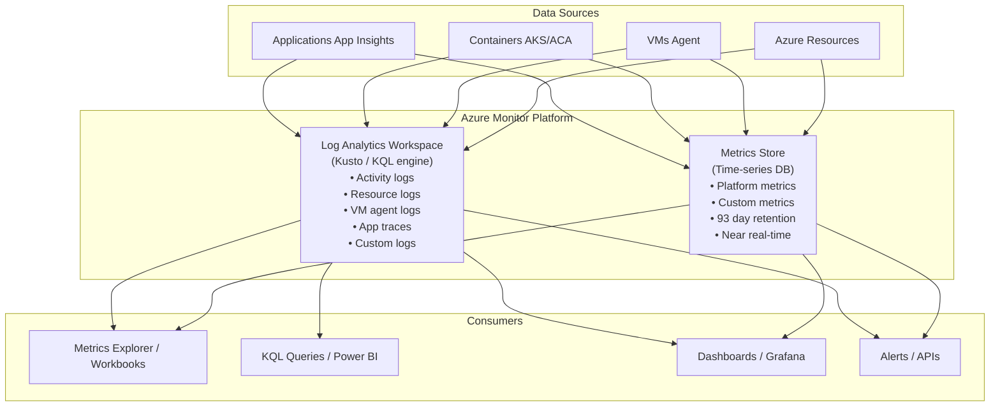
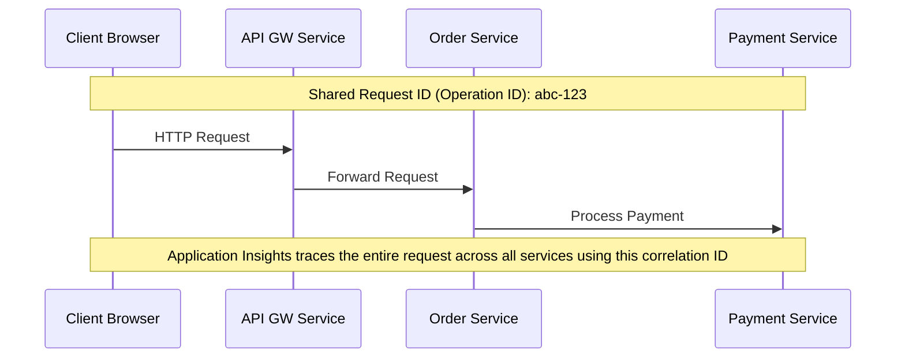

**Complexity**: `[MEDIUM]` | **Time to Complete**: 2.5h | **Prerequisites**: Module 3.3 (VMs), Module 3.1 (Entra ID). This module balances practical incident-readiness with conceptual grounding so you can configure monitoring both quickly and correctly under pressure.

## What You'll Be Able to Do

After completing this module, you will be able to complete these practical outcomes and apply them to production incidents.

- **Configure Azure Monitor with Log Analytics workspaces, diagnostic settings, and custom metric collection**
- **Implement alert rules with action groups, dynamic thresholds, and multi-resource metric alerts**
- **Deploy Application Insights for distributed tracing, dependency mapping, and performance anomaly detection**
- **Design centralized monitoring architectures using Azure Monitor across multiple subscriptions and resource types**

---

## Why This Module Matters

Hypothetical scenario: a logistics company runs a fleet management application on Azure. Customer complaints triple over two weeks while drivers report slow load times and intermittent errors. The engineering team has not configured monitoring beyond default portal metrics. When someone finally investigates, they find an Azure SQL database at sustained high DTU utilization. A reporting query deployed with a routine release runs every five minutes and dominates database capacity. The outage was preventable: a metric alert on database utilization and a log query on slow queries would have surfaced the regression within hours instead of weeks.

Observability is not a luxury. It is the difference between proactively fixing problems and reactively apologizing to customers. [Azure Monitor](https://learn.microsoft.com/en-us/azure/azure-monitor/fundamentals/overview) is the platform's unified observability service, collecting metrics and logs from every Azure resource, virtual machine, container, and application. [Log Analytics](https://learn.microsoft.com/en-us/azure/azure-monitor/logs/data-platform-logs) provides the query engine to make sense of that data. [Alerts](https://learn.microsoft.com/en-us/azure/azure-monitor/alerts/alerts-overview) turn signals into actions. [Application Insights](https://learn.microsoft.com/en-us/azure/azure-monitor/app/app-insights-overview) traces requests through distributed systems.

In this module, you will learn how Azure Monitor collects and organizes data, how to explore metrics in Metrics Explorer, how to write KQL (Kusto Query Language) queries against Log Analytics, how to create alerts with action groups, and how Application Insights provides end-to-end request tracing. By the end, you will deploy monitoring agents on a VM, ingest custom logs, write KQL queries, and create an alert that sends email when a threshold is breached.

---

## Azure Monitor Architecture

Azure Monitor is not a single service—it is a platform composed of interconnected components designed as a chain. Think of three layers: **ingestion** (agents, diagnostic settings, App Insights SDKs, platform pipelines), **storage and analysis** (metrics time-series store and Log Analytics tables), and **action** (alerts, autoscale, Logic Apps, webhooks). Data from subscriptions, regions, and on-premises Arc machines can funnel into shared workspaces so SRE sees one operational picture instead of fifty siloed portals.

### Designing centralized monitoring

Enterprise landing zones typically designate a **monitoring subscription** that hosts Log Analytics workspaces, action groups, and alert rules. Spoke subscriptions hold applications with diagnostic settings and DCR associations pointing at the hub workspace. [Azure Policy](https://learn.microsoft.com/en-us/azure/azure-monitor/policy-reference) can deploy diagnostic settings and AMA associations automatically so new resources do not ship without telemetry. Tag resources with `environment`, `cost-center`, and `owner` so KQL can filter `AzureActivity` and `AzureResourceGraph` results during incidents.

Cross-subscription visibility does not require moving resources—only correct routing and RBAC. Readers need `Log Analytics Reader` on the workspace; alert rule authors need `Monitoring Contributor` on scopes they manage. Document which workspace holds production security data versus production application data before an incident forces ad-hoc merging.

### Activity logs versus resource logs

**Pause and predict:** If an application database begins failing because queries are timing out under heavy load, will an Azure Monitor alert built on the Activity log detect the outage?

<details>
<summary>Check your prediction</summary>

No. The Activity log only records control-plane management events, such as who created a virtual machine or deleted a resource group. Data-plane query timeouts occur inside the database engine and are recorded in resource logs, which require diagnostic settings to route telemetry into a Log Analytics workspace before alerts can evaluate them.
</details>

Control-plane records land in `AzureActivity` when collected to a workspace. Resource IDs and caller object IDs in those rows are what you join during an access review. Tag resources with `environment` and `owner` so KQL can filter `AzureActivity` during change windows.



**Pause and predict:** If a critical application crashes due to an out-of-memory error, which monitoring capability (metrics or logs) alerts that memory was exhausted, and which finds the line of code?

<details>
<summary>Check your prediction</summary>

Metrics (such as Available Memory or container memory working set) fire near-real-time threshold alerts indicating that memory was exhausted, but cannot capture execution context. Logs, traces, and application exceptions stored in Log Analytics record the unhandled exception and call stack required to find the specific line of code.
</details>

The comparison table below lists latency, retention, query language, and cost so capacity and compliance reviews share one grid. Pin those numbers in the runbook next to workspace SKU and Metrics Explorer bookmarks before you add the first dashboard tile.

### Metrics vs Logs

| Aspect | Metrics | Logs |
| :--- | :--- | :--- |
| **Data type** | Numeric time-series (counters, gauges) | Semi-structured text (JSON, syslog) |
| **Latency** | Near real-time (~1 minute) | 2-5 minutes (ingestion delay) |
| **Retention** | 93 days (free) | 31 days free, up to 12 years paid |
| **Query language** | Simple (filter, aggregate) | KQL (powerful, SQL-like) |
| **Cost** | Free (platform metrics) | Per-GB ingested (see [pricing](https://azure.microsoft.com/pricing/details/monitor/)) |
| **Best for** | Dashboards, alerting on thresholds | Root cause analysis, auditing, forensics |
| **Examples** | CPU %, memory %, request count, latency | Error messages, audit events, request traces |

> **The observability funnel analogy**
>
> Metrics are the speedometer and fuel gauge on your dashboard—continuous numbers that tell you something is wrong in seconds. Logs are the flight recorder—richer, heavier, and essential after an incident to reconstruct decisions and errors. Diagnostic settings are the cables that connect each system to the recorder. Alerts are the seatbelt warning light: useless if nobody hears the chime.

### The data planes in depth: metrics, logs, and diagnostic settings

Azure Monitor splits telemetry into two complementary data platforms. [Metrics](https://learn.microsoft.com/en-us/azure/azure-monitor/metrics/data-platform-metrics) land in a regional time-series store optimized for numeric aggregation, charting, and fast threshold evaluation. [Logs](https://learn.microsoft.com/en-us/azure/azure-monitor/logs/data-platform-logs) land in a Log Analytics workspace as typed tables queried with Kusto Query Language (KQL). Neither plane replaces the other: metrics answer "is something wrong right now?" while logs answer "what exactly happened and who triggered it?"

**Platform metrics** are emitted automatically by most Azure resources. They are multi-dimensional (you can slice by instance, region, or HTTP status code where the resource supports dimensions), near-real-time with about one-minute granularity for many resource types, and retained for roughly 93 days without ingestion charges for standard platform metrics. Metrics Explorer is the portal experience for ad-hoc charts; the same metric definitions power metric alerts and autoscale rules. Custom metrics (from your application or from the Azure Monitor Agent) follow the same pipeline but may incur charges depending on volume and configuration.

**Log Analytics workspaces** are the central SaaS data store for log tables. One workspace can hold activity logs, resource diagnostic logs, VM agent data, container stdout, and Application Insights tables side by side. That consolidation is what makes cross-resource KQL possible: you can join a Key Vault audit event with an App Service request trace in one query instead of hunting across siloed tools. Workspace-level settings include default retention, daily ingestion cap, commitment tier pricing, and optional dedicated clusters for advanced scenarios such as customer-managed keys.

**Table plans** control cost versus query power per table. The [Analytics plan](https://learn.microsoft.com/en-us/azure/azure-monitor/logs/data-platform-logs#table-plans) is the default for high-value operational data: full KQL, alerts, Insights, dashboards, and interactive retention (30 days by default, extendable with long-term retention). The **Basic** plan reduces ingestion cost for medium-touch troubleshooting data; you still run KQL on a single table (with lookup into Analytics tables), and simple log alerts are supported. The **Auxiliary** plan minimizes ingestion cost for verbose or compliance-oriented streams but is not optimized for real-time analysis or alerting. Choosing the wrong plan for a firehose table (for example, verbose debug logs on Analytics) is one of the fastest ways to inflate a bill without improving incident response.

**Retention and archive** are layered. Interactive analytics retention applies while data is "hot" in the workspace. [Long-term retention](https://learn.microsoft.com/en-us/azure/azure-monitor/logs/data-retention-archive) can extend total retention up to 12 years per table at a lower storage rate, with search jobs or restore operations when you need to query cold data. Deleting rows with the purge API does not reduce retention charges—you must lower retention settings on the workspace or table. Plan retention per compliance need, not "keep everything forever by default."

**Diagnostic settings** are the routing pipe from Azure resources into destinations you control. A single diagnostic setting can send **resource logs** (formerly diagnostic logs) and optionally **metrics** to a Log Analytics workspace, an Azure Storage account, or an Event Hub. Sending to a workspace enables KQL, log alerts, and correlation with other tables. Storage is cheaper for long-term archive and compliance exports but is not queryable with KQL until you re-import or use external tools. Event Hub fits streaming to SIEM pipelines or custom processors. Many teams use workspace for operations and Storage or Event Hub for regulated archives. [Diagnostic settings](https://learn.microsoft.com/en-us/azure/azure-monitor/platform/diagnostic-settings) are not enabled by default on every resource—treat them as day-one infrastructure, often enforced with Azure Policy.

```bash
# Route Key Vault audit logs and all metrics to a workspace (same pattern for SQL, Storage, etc.)
WORKSPACE_ID=$(az monitor log-analytics workspace show -g myRG -n kubedojo-logs --query id -o tsv)

az monitor diagnostic-settings create \
  --name "audit-and-metrics-to-law" \
  --resource "/subscriptions/<sub>/resourceGroups/myRG/providers/Microsoft.Sql/servers/myserver/databases/mydb" \
  --workspace "$WORKSPACE_ID" \
  --logs '[{"category":"SQLSecurityAuditEvents","enabled":true},{"category":"Errors","enabled":true}]' \
  --metrics '[{"category":"AllMetrics","enabled":true}]'

# Export the same categories to Storage for cheap long-term retention (archive path)
STORAGE_ID=$(az storage account show -g myRG -n mymonitorarchive --query id -o tsv)
az monitor diagnostic-settings create \
  --name "sql-logs-to-storage" \
  --resource "/subscriptions/<sub>/resourceGroups/myRG/providers/Microsoft.Sql/servers/myserver/databases/mydb" \
  --storage-account "$STORAGE_ID" \
  --logs '[{"category":"SQLSecurityAuditEvents","enabled":true}]'
```

When you design monitoring, draw two arrows from every critical resource: one to **metrics** for dashboards and fast alerts, one through **diagnostic settings** to the right log destination for forensics. Skipping diagnostic settings leaves you with platform metrics only—you will see that CPU spiked but not which query or principal caused it.

### Network monitoring and high-volume logs

Network Watcher **[VNet flow logs](https://learn.microsoft.com/en-us/azure/virtual-network/virtual-network-flow-logs-overview)** are the current path for virtual-network traffic visibility. Legacy [NSG flow logs](https://learn.microsoft.com/en-us/azure/network-watcher/nsg-flow-logs-overview) retire **2027-09-30**, and **new NSG flow logs can no longer be created after 2025-06-30**—plan migrations to VNet flow logs. [Traffic analytics](https://learn.microsoft.com/en-us/azure/network-watcher/traffic-analytics) can generate very large log volume. Treat flow logging as a deliberate cost decision: flow logs to Storage or Event Hub for security analytics, not always to Analytics tables unless security operations queries them daily. [Azure Monitor for networks](https://learn.microsoft.com/en-us/azure/azure-monitor/insights/network-insights-overview) provides curated views when network diagnostics and topology data are enabled.

For Azure Kubernetes Service, control plane metrics remain platform-managed while workload telemetry flows through Container Insights or OpenTelemetry collectors. Align with your platform team on whether container stdout belongs in `ContainerLogV2` on Analytics or Auxiliary—verbose application logging from dozens of pods is a common reason production workspaces exceed ingestion forecasts.

### Custom logs and the Logs Ingestion API

Applications can send custom structured logs with the [Logs Ingestion API](https://learn.microsoft.com/en-us/azure/azure-monitor/logs/logs-ingestion-api-overview) and DCR-defined destinations. Prefer structured JSON with stable schemas so tables remain queryable and transformations can drop fields before billing. Custom logs without retention planning often become “forever Analytics tables” that dominate workspace cost.

---

## Metrics Explorer: Real-Time Dashboards

Every Azure resource automatically emits **platform metrics** to the Azure Monitor metrics store, so the most important
signals are collected as soon as the resource is provisioned. That means a virtual machine, database, storage account, or
container app will usually surface CPU, memory, network, and disk telemetry without you having to install an agent first.
In practice, Metrics Explorer is your fastest way to validate whether a resource is healthy right now, because it shows
near-real-time values that are already there by default. Use it first to confirm baseline behavior, and only after you
understand the normal operating range should you start defining alerts and deeper log investigation.

```bash
# List available metrics for a VM
az monitor metrics list-definitions \
  --resource "/subscriptions/<sub>/resourceGroups/myRG/providers/Microsoft.Compute/virtualMachines/myVM" \
  --query '[].{Name:name.value, Unit:unit, Aggregation:primaryAggregationType}' -o table

# Query a specific metric (CPU percentage, last 1 hour, 5-minute intervals)
az monitor metrics list \
  --resource "/subscriptions/<sub>/resourceGroups/myRG/providers/Microsoft.Compute/virtualMachines/myVM" \
  --metric "Percentage CPU" \
  --interval PT5M \
  --start-time "$(date -u -v-1H '+%Y-%m-%dT%H:%M:%SZ' 2>/dev/null || date -u -d '-1 hour' '+%Y-%m-%dT%H:%M:%SZ')" \
  --aggregation Average Maximum \
  -o table

# Query storage account metrics
az monitor metrics list \
  --resource "/subscriptions/<sub>/resourceGroups/myRG/providers/Microsoft.Storage/storageAccounts/mystorage" \
  --metric "Transactions" \
  --interval PT1H \
  --aggregation Total \
  -o table
```

Common metrics you should usually monitor are your first line of defense in day-two operations. Platform metrics appear in Metrics Explorer within about a minute for many resource types, which is why on-call starts charts before KQL during a sev-1. **Custom metrics** let applications emit business KPIs (orders queued, jobs failed) via the [Metrics REST API](https://learn.microsoft.com/en-us/azure/azure-monitor/essentials/metrics-custom-overview) or OpenTelemetry—useful when infrastructure looks healthy but the business pipeline is stuck.

**Multi-dimensional metrics** let one alert rule split on dimension values (for example HTTP status code on App Service). Each dimension value can become a billed time series in large scopes, so prefer focused scopes or fewer dimensions when cost matters. **Metric namespaces** separate platform metrics (`Microsoft.Compute/virtualMachines`) from guest OS and custom namespaces; verify you alert on the namespace that actually receives data after AMA or diagnostic settings are configured.

Teams tune default thresholds during normal traffic periods, then revise after observing seasonality. Document baseline charts in a workbook so new engineers know what “healthy” looks like before they page the team for a expected nightly batch spike.

| Resource | Critical Metrics | Alert Threshold (suggestion) |
| :--- | :--- | :--- |
| **VM** | Percentage CPU, Available Memory Bytes, Disk IOPS | CPU > 85%, Memory < 10%, Disk queue > 5 |
| **SQL Database** | DTU percentage, Connection failed | DTU > 80%, Failed connections > 10/5min |
| **Storage Account** | Availability, E2E Latency | Availability < 99.9%, Latency > 100ms |
| **App Service** | Response time, HTTP 5xx, CPU % | Response > 2s, 5xx > 5/min, CPU > 80% |
| **Container App** | Replica count, Request count, Response time | Response > 1s, Restarts > 3/hour |
| **Key Vault** | Service API Latency, Availability | Latency > 1s, Availability < 99.9% |

When building dashboards, pin the charts that on-call checks first—DTU for databases, `Percentage CPU` for VMs, `Http5xx` for App Service—then link each chart to the alert rule that protects the same signal. That pairing trains the team that a green dashboard and a silent alert channel are related, not redundant.

---

## Log Analytics Workspaces

A [Log Analytics workspace](https://learn.microsoft.com/en-us/azure/azure-monitor/logs/log-analytics-workspace-overview) is the central repository for log data in Azure Monitor. Logs from resources, VMs, containers, and applications can all be sent to the same workspace, which makes cross-resource troubleshooting possible without switching between dozens of portal blades. You use the workspace not just to store data but to reason across it: one KQL query can correlate a Key Vault `AuditEvent`, an App Service `AppRequest`, and a SQL `AzureDiagnostics` row that share a time window and resource ID.

### Workspace architecture across subscriptions

Platform teams often deploy **one workspace per environment** (production, staging, development) rather than per application. Resources in any subscription can send data to a workspace in another subscription as long as RBAC and network rules allow it. That pattern supports centralized monitoring for enterprise landing zones: hub subscriptions host the workspace, spoke subscriptions host workloads with diagnostic settings pointed at the hub. Use [Azure Monitor workspace access management](https://learn.microsoft.com/en-us/azure/azure-monitor/logs/manage-access) and workspace permissions so application teams query only their tables or resource sets.

When Microsoft Sentinel or Defender for Cloud is enabled on a workspace, billing and data mix change—Sentinel charges apply to security tables, and operational data may need a separate workspace to avoid paying Sentinel rates on routine VM performance logs. The [workspace design guidance](https://learn.microsoft.com/en-us/azure/azure-monitor/logs/workspace-design) documents tradeoffs between single workspace simplicity and multi-workspace isolation.

### Data collection rules and ingestion pipeline

Modern collection uses [Data Collection Rules (DCRs)](https://learn.microsoft.com/en-us/azure/azure-monitor/agents/data-collection-rule-overview) attached to Azure Monitor Agent on VMs, or platform-native diagnostic settings on PaaS resources. DCRs define streams (performance, syslog, Windows events), optional [transformations](https://learn.microsoft.com/en-us/azure/azure-monitor/data-collection/data-collection-transformations) that filter or reshape JSON before ingestion, and destinations (workspace, metrics, storage). Transformations are a cost control: drop DEBUG fields, strip PII, or route noisy tables to Basic plans before billable ingestion occurs.

```bash
# List tables in a workspace (discover what is actually ingesting)
az monitor log-analytics workspace table list \
  --resource-group myRG \
  --workspace-name kubedojo-logs \
  --query '[].{Name:name, Plan:plan}' -o table
```

```bash
# Create a Log Analytics workspace
az monitor log-analytics workspace create \
  --resource-group myRG \
  --workspace-name kubedojo-logs \
  --location eastus2 \
  --retention-time 90

# Get workspace details
az monitor log-analytics workspace show \
  --resource-group myRG \
  --workspace-name kubedojo-logs \
  --query '{Name:name, ID:customerId, RetentionDays:retentionInDays}' -o table

# Enable diagnostic logs for a resource (send to Log Analytics)
WORKSPACE_ID=$(az monitor log-analytics workspace show \
  -g myRG -n kubedojo-logs --query id -o tsv)

az monitor diagnostic-settings create \
  --name "send-to-log-analytics" \
  --resource "/subscriptions/<sub>/resourceGroups/myRG/providers/Microsoft.KeyVault/vaults/myVault" \
  --workspace "$WORKSPACE_ID" \
  --logs '[{"category":"AuditEvent","enabled":true}]' \
  --metrics '[{"category":"AllMetrics","enabled":true}]'
```

### Common Log Tables

| Table | Source | Contains |
| :--- | :--- | :--- |
| `AzureActivity` | All resources | Control plane operations (create, delete, update) |
| `AzureDiagnostics` | Resources with diagnostics | Resource-specific logs (SQL, Key Vault, etc.) |
| `Heartbeat` | Azure Monitor Agent | VM health status (every minute) |
| `Syslog` | Linux VMs | System logs (auth, kernel, daemon) |
| `Event` | Windows VMs | Windows Event Log entries |
| `Perf` | VMs with agent | Performance counters (CPU, memory, disk) |
| `ContainerLogV2` | AKS | Container stdout/stderr |
| `AppRequests` | Application Insights | HTTP request traces |
| `AppExceptions` | Application Insights | Exception traces |

The `_ResourceId` and `_SubscriptionId` columns on many tables tie rows back to Azure Resource Manager IDs. Use them in `where` clauses to scope dashboards per team without separate workspaces: `where _ResourceId contains "/resourceGroups/prod-app/"`. The `_IsBillable` column marks rows excluded from ingestion charges—useful when reconciling usage reports with raw row counts.

Querying Entra sign-in data requires the `SigninLogs` table (often via Microsoft Graph connector or Sentinel). Security investigations blend `SigninLogs`, `AzureActivity`, and `AuditLogs` depending on which diagnostic streams you enabled—document which table is authoritative for your tenant.

---

## KQL: Kusto Query Language

KQL is the query language for Azure Monitor logs, and it is designed for operational data where you usually start with a lot of
signals and narrow down quickly. It is similar to SQL in readability, but its distinctive pipe-based model lets you chain
transformations step by step, so each line of a query progressively refines what you care about. In practice, this is powerful
because you can run a broad query to find candidate events, then immediately project only the columns and statistics you need
without rewriting the whole statement.

### KQL Fundamentals

Read KQL top to bottom as a pipeline: each pipe takes the result of the previous step. Start wide with a table and time filter, then narrow with `where`, shape with `project` or `extend`, aggregate with `summarize`, and present with `order` or `render`. The Log Analytics portal **Simple mode** helps beginners without syntax; **KQL mode** is what alert rules and workbooks store—learn both because on-call will paste alert queries into the editor during incidents.

Time filters are non-negotiable for cost and speed. Tables are date-partitioned; `where TimeGenerated > ago(1h)` limits scanned data. Use `bin(TimeGenerated, 5m)` for trend charts so alert queries and dashboards share the same grain. When comparing weeks, use `ago(7d)` and `ago(14d)` in parallel queries rather than open-ended scans.

```kusto
// Basic query structure: Table | operator1 | operator2 | ...

// Find all failed login attempts in the last 24 hours
SigninLogs
| where TimeGenerated > ago(24h)
| where ResultType != 0    // 0 = success
| project TimeGenerated, UserPrincipalName, IPAddress, ResultDescription
| order by TimeGenerated desc
| take 50

// Count errors by type in the last hour
AzureDiagnostics
| where TimeGenerated > ago(1h)
| where Category == "AuditEvent"
| where ResultType == "Failure"
| summarize FailureCount = count() by OperationName
| order by FailureCount desc

// Calculate P50, P95, P99 response times
AppRequests
| where TimeGenerated > ago(1h)
| summarize
    P50 = percentile(DurationMs, 50),
    P95 = percentile(DurationMs, 95),
    P99 = percentile(DurationMs, 99),
    Total = count()
    by bin(TimeGenerated, 5m)
| order by TimeGenerated asc

// Find VMs with high CPU (from performance counters)
Perf
| where TimeGenerated > ago(15m)
| where CounterName == "% Processor Time"
| where InstanceName == "_Total"
| summarize AvgCPU = avg(CounterValue), MaxCPU = max(CounterValue) by Computer
| where AvgCPU > 80
| order by AvgCPU desc
```

### Joining infrastructure and application signals

Production investigations rarely stay in one table. A failed checkout might require `AppRequests` joined to `AppDependencies` on `OperationId`, then cross-checked against `AzureDiagnostics` for SQL time-outs on the same `ResourceId`. Use `join kind=inner` when you need matching keys only; use `lookup` when enriching a large table with a small reference set (region map, service owner table) to avoid expensive full scans.

```kusto
// Correlate slow requests with SQL dependency failures (last hour)
AppRequests
| where TimeGenerated > ago(1h)
| where DurationMs > 3000
| project RequestTime = TimeGenerated, OperationId, RequestName = Name, RequestDuration = DurationMs
| join kind=inner (
    AppDependencies
    | where TimeGenerated > ago(1h)
    | where DependencyType == "SQL"
    | where Success == false
    | project OperationId, SqlTarget = Target, SqlResult = ResultCode
) on OperationId
| order by RequestTime desc
| take 50
```

### Workbooks, dashboards, and Grafana

[Azure Monitor workbooks](https://learn.microsoft.com/en-us/azure/azure-monitor/visualize/workbooks-overview) combine metrics, log queries, and text into shareable operational views. Pin single charts to Azure dashboards for executive summaries. [Azure Managed Grafana](https://learn.microsoft.com/en-us/azure/managed-grafana/overview) integrates with Monitor for teams that already standardized on Grafana dashboards—useful when you unify cloud and on-premises metrics in one pane.

### Essential KQL Operators

| Operator | Purpose | Example |
| :--- | :--- | :--- |
| `where` | Filter rows | `where Status == 500` |
| `project` | Select/rename columns | `project Time=TimeGenerated, User` |
| `summarize` | Aggregate (count, avg, sum, etc.) | `summarize count() by Status` |
| `order by` | Sort results | `order by TimeGenerated desc` |
| `take` | Limit result count | `take 100` |
| `extend` | Add computed columns | `extend DurationSec = DurationMs / 1000` |
| `bin` | Group time into buckets | `bin(TimeGenerated, 5m)` |
| `join` | Join two tables | `join kind=inner (Table2) on Key` |
| `render` | Visualize as chart | `render timechart` |
| `ago` | Relative time | `ago(24h)`, `ago(7d)` |
| `between` | Range filter | `where Value between (10 .. 100)` |

### Practical KQL Queries for Day-to-Day Operations

```kusto
// Who deleted resources in the last 7 days?
AzureActivity
| where TimeGenerated > ago(7d)
| where OperationNameValue endswith "delete"
| where ActivityStatusValue == "Success"
| project TimeGenerated, Caller, ResourceGroup,
          Resource = tostring(split(ResourceId, "/")[-1]),
          Operation = OperationNameValue
| order by TimeGenerated desc

// Disk space usage trends (last 24 hours)
Perf
| where TimeGenerated > ago(24h)
| where ObjectName == "LogicalDisk" and CounterName == "% Free Space"
| where InstanceName !in ("_Total", "HarddiskVolume1")
| summarize AvgFreeSpace = avg(CounterValue) by Computer, InstanceName, bin(TimeGenerated, 1h)
| order by AvgFreeSpace asc

// Top 10 slowest API endpoints
AppRequests
| where TimeGenerated > ago(1h)
| where Success == true
| summarize AvgDuration = avg(DurationMs), P99 = percentile(DurationMs, 99), Count = count() by Name
| where Count > 10   // Filter out infrequent endpoints
| order by P99 desc
| take 10

// Anomaly detection: sudden spike in errors
AppExceptions
| where TimeGenerated > ago(24h)
| summarize ErrorCount = count() by bin(TimeGenerated, 15m)
| render timechart
```

---

## Alerts and Action Groups

**Pause and predict:** If you configure an alert rule to trigger when CPU exceeds 90%, but do not assign an Action Group to it, what will happen when CPU hits 100%?

<details>
<summary>Check your prediction</summary>

The alert rule fires in the Azure portal and updates its state on the monitoring dashboard, but nobody is paged. Without an action group, triggered alerts remain silent dashboard decorations while on-call engineers sleep through the incident.
</details>

[Alerts](https://learn.microsoft.com/en-us/azure/azure-monitor/alerts/alerts-overview) connect signal detection to response. A durable alert design has four parts: the **signal** (metric, log query, or activity log), the **evaluation logic** (threshold, dynamic band, or KQL aggregation), the **severity** (0–4 in Azure Monitor), and an **action group** that notifies humans or triggers automation. Establishing standardized notification policies ensures that on-call engineers receive actionable operational context through appropriate escalation channels during critical production incidents.

### Alert types and when to use each

| Type | Monitors | Evaluation Frequency | Use Case |
| :--- | :--- | :--- | :--- |
| **Metric alert** | Numeric time-series | As low as 1 minute | CPU, DTU, latency, queue depth—fast, cheap signals |
| **Log alert** (scheduled query) | KQL result count | 5–15 minutes typical | Error rates, security patterns, cross-table correlation |
| **Activity log alert** | Control plane events | Near real-time | Deletes, RBAC changes, policy violations |
| **Smart detection** | App Insights anomalies | Continuous | Failure-rate spikes, dependency degradation |

**Metric alerts** excel when the condition is a single numeric threshold on platform or custom metrics. They evaluate frequently and cost less per evaluation than scanning gigabytes of logs. **Log alerts** excel when the condition requires text, joins, or business logic—“more than 5% of checkout requests returned HTTP 500 in the last 15 minutes” is natural KQL, awkward as a raw metric. Expect log alerts to run on a slower cadence because each evaluation scans workspace data.

**Dynamic thresholds** on metric alerts use machine learning to learn seasonal baselines instead of a fixed “CPU > 85%.” They help workloads with daily cycles (batch jobs, business-hours traffic) but still need tuning for brand-new services with little history. **Multi-resource metric alerts** apply one rule to many VMs or databases in a scope, which reduces rule sprawl when you operate fleet-wide SRE policies.

### Action groups, suppression, and alert processing rules

An [action group](https://learn.microsoft.com/en-us/azure/azure-monitor/alerts/action-groups) is a named set of notification channels: email, SMS, voice, webhook (PagerDuty, Slack, Teams), Azure Functions, Logic Apps, or ITSM connectors. Reuse action groups across rules so routing changes happen in one place. [Alert processing rules](https://learn.microsoft.com/en-us/azure/azure-monitor/alerts/alerts-action-rules) add schedule-based suppression (maintenance windows), deduplication behavior, or routing overrides—for example, suppress non-critical Sev 3 alerts during a planned change window while still allowing Sev 1 pages.

### Log alert example: HTTP 500 error rate

Log alerts should encode **why** the condition matters. This query fires when failed requests exceed 5% of traffic in a 15-minute window—actionable for customer-facing APIs:

```kusto
AppRequests
| where TimeGenerated > ago(15m)
| summarize
    Total = count(),
    Failed = countif(toint(ResultCode) >= 500)
| extend FailRate = 100.0 * Failed / Total
| where Total > 100 and FailRate > 5
```

The `Total > 100` guard prevents alerting during low-traffic periods when three errors look like 100% failure rate. Wire the scheduled query rule to the same action group as your CPU alerts so on-call sees correlated infrastructure and application signals.

### Autoscale driven by metrics

[Autoscale](https://learn.microsoft.com/en-us/azure/azure-monitor/autoscale/autoscale-overview) uses the same metric platform as alerts but changes capacity instead of notifying humans. VM scale sets, App Service plans, and other scalable resources can add or remove instances when CPU, queue length, or custom metrics cross thresholds. Autoscale rules and metric alerts complement each other: autoscale handles predictable load (morning traffic), alerts catch misconfiguration (autoscale maxed out but latency still high). Test scale-out and scale-in cooldowns in staging—aggressive scale-in during a traffic spike causes flapping outages.

```bash
# Create an action group (email + webhook)
az monitor action-group create \
  --resource-group myRG \
  --name "platform-team" \
  --short-name "platform" \
  --email-receiver "oncall" "oncall@company.com" \
  --webhook-receiver "pagerduty" "https://events.pagerduty.com/integration/xxx/enqueue"

# Create a metric alert: VM CPU > 85% for 5 minutes
VM_ID="/subscriptions/<sub>/resourceGroups/myRG/providers/Microsoft.Compute/virtualMachines/myVM"
ACTION_GROUP_ID=$(az monitor action-group show -g myRG -n platform-team --query id -o tsv)

az monitor metrics alert create \
  --resource-group myRG \
  --name "high-cpu-alert" \
  --description "VM CPU exceeds 85% for 5 minutes" \
  --severity 2 \
  --scopes "$VM_ID" \
  --condition "avg Percentage CPU > 85" \
  --window-size 5m \
  --evaluation-frequency 1m \
  --action "$ACTION_GROUP_ID"

# Create a log alert: more than 10 errors in 15 minutes
WORKSPACE_ID=$(az monitor log-analytics workspace show -g myRG -n kubedojo-logs --query id -o tsv)

az monitor scheduled-query create \
  --resource-group myRG \
  --name "high-error-rate" \
  --description "More than 10 errors in 15 minutes" \
  --severity 1 \
  --scopes "$WORKSPACE_ID" \
  --condition "count 'Failures' > 10 resource id _ResourceId at least 1 violations out of 1 aggregated points" \
  --condition-query Failures="AzureDiagnostics | where Category == 'AuditEvent' | where ResultType == 'Failure'" \
  --window-size 15m \
  --evaluation-frequency 5m \
  --action-groups "$ACTION_GROUP_ID"

# Create an activity log alert: resource group deleted
az monitor activity-log alert create \
  --resource-group myRG \
  --name "rg-deleted-alert" \
  --description "Resource group was deleted" \
  --condition "category=Administrative and operationName=Microsoft.Resources/subscriptions/resourceGroups/delete" \
  --action-group "$ACTION_GROUP_ID"
```

### Alert severity and on-call routing

Azure Monitor alert severity runs from 0 (Critical) to 4 (Verbose). Map severities to response channels before go-live: Sev 0–1 pages on-call, Sev 2 opens a ticket, Sev 3–4 posts to chat or a dashboard only. Document runbooks linked from action group webhooks so recipients know whether to scale SQL, restart pods, or fail over. Test action groups quarterly—expired PagerDuty keys are a common reason real outages stay silent while portal shows “Fired.”

| Severity | Typical signal | Suggested channel |
| :--- | :--- | :--- |
| 0–1 | Customer-facing outage, data loss risk | PagerDuty / phone / SMS |
| 2 | Degraded SLO, capacity near limit | Email + ticket system |
| 3 | Early warning, non-customer impact | Teams / Slack webhook |
| 4 | Informational trend | Dashboard only, no page |

---

## Production monitoring checklist

Before declaring an Azure workload production-ready, verify observability end to end. This checklist prevents the “metrics exist but nobody gets paged” failure mode from the module opener scenario.

| Area | Minimum bar | Verification |
| :--- | :--- | :--- |
| Platform metrics | CPU, memory, disk, or service-specific SLO metrics charted | Metrics Explorer shows 24h baseline |
| Diagnostic settings | Data-plane logs for SQL, KV, Storage, App Service | `AzureDiagnostics` or resource-specific tables receive rows |
| Workspace | One workspace per environment, retention documented | `az monitor log-analytics workspace show` |
| Agent / DCR | AMA on VMs, Container Insights on AKS if applicable | `Heartbeat` or `ContainerLogV2` rows in last 15m |
| App Insights | Workspace-based component linked, sampling configured | `AppRequests` shows traffic after deploy |
| Alerts | Metric alerts for capacity; log alert for error rate | Test fire to action group in lower environment |
| Action groups | Routes per severity, no orphaned rules | Portal shows action on every enabled rule |
| Cost guards | Table plans for verbose logs, no DEBUG fleet-wide | Usage blade reviewed weekly first month |
| Runbooks | Link from alert payload or wiki | On-call drill completes in under 15 minutes |

Hypothetical scenario: a team ships AKS without Container Insights but installs Prometheus only for their own squad. During an outage, platform engineers cannot see pod restart loops in the shared workspace while application engineers see healthy HTTP metrics on the ingress. The checklist forces shared visibility before merge to main.

---

## Application Insights: End-to-End Tracing

[Application Insights](https://learn.microsoft.com/en-us/azure/azure-monitor/app/app-insights-overview) is the APM layer of Azure Monitor. It adds application context that infrastructure metrics alone cannot provide: HTTP requests, dependency calls (SQL, HTTP APIs, Azure services), exceptions, traces, and custom events. When a user reports a slow checkout, App Insights lets you follow one **operation ID** across the API gateway, order service, and payment service instead of guessing which tier failed.

### Workspace-based versus classic resources

Modern Application Insights resources are **workspace-based**: telemetry is stored in tables such as `AppRequests`, `AppDependencies`, and `AppExceptions` inside a linked Log Analytics workspace. Billing for ingestion and retention follows the [workspace pricing model](https://learn.microsoft.com/en-us/azure/azure-monitor/logs/cost-logs#application-insights-billing), including commitment tiers and table plans. **Classic** Application Insights resources still exist in older deployments; they bill ingestion separately and cannot use workspace commitment tiers. New designs should always create workspace-based components and link them explicitly to a production or non-production workspace per environment.

### Distributed tracing, correlation, and the Application Map

Application Insights implements distributed tracing using the W3C `traceparent` standard. Each incoming request receives an operation ID; outbound calls propagate that context so dependencies appear under the same end-to-end transaction. The **Application Map** visualizes services as nodes and calls as edges, highlighting failure rates and latency between components. **Live Metrics** streams near-real-time server health (request rate, failures, CPU) without waiting for full ingestion—useful during a deploy or load test, though it is not a substitute for retained logs.

### Instrumentation: SDK, auto-instrumentation, and OpenTelemetry

You have three common instrumentation paths. **Auto-instrumentation** (Azure App Service, Container Apps, Functions when you set `APPLICATIONINSIGHTS_CONNECTION_STRING`) captures requests and dependencies with minimal code changes. **Application Insights SDKs** (.NET, Java, Node.js, Python) give finer control over telemetry initializers, custom dimensions, and sampling configuration. **OpenTelemetry** with the [Azure Monitor OpenTelemetry Distro](https://learn.microsoft.com/en-us/azure/azure-monitor/app/opentelemetry-overview) is the long-term standards-based path: export OTLP to the same workspace-backed tables without locking into a single vendor SDK. Use auto-instrumentation for speed in platform-hosted apps; use OpenTelemetry when you run polyglot microservices or need portable instrumentation across clouds.

### Sampling and noise control

**Pause and predict:** If you disable telemetry sampling for a high-traffic microservices application deployed across a large AKS cluster, will Application Insights ingestion expenses remain roughly unchanged?

<details>
<summary>Check your prediction</summary>

No. Disabling sampling causes workspace ingestion costs to surge dramatically because full successful telemetry dominates workspace data volume. In contrast, adaptive or fixed sampling drops the vast majority of repetitive successful calls while reliably preserving anomalous errors and slow requests.
</details>

The sequence diagram below follows one operation ID across gateway, order, and payment services. Live Metrics still streams request rate during a deploy without waiting for full ingestion, and OpenTelemetry export targets the same workspace tables when you outgrow auto-instrumentation.



```bash
# Create Application Insights resource
az monitor app-insights component create \
  --app kubedojo-app-insights \
  --resource-group myRG \
  --location eastus2 \
  --kind web \
  --application-type web \
  --workspace "$WORKSPACE_ID"

# Get the instrumentation key and connection string
az monitor app-insights component show \
  --app kubedojo-app-insights -g myRG \
  --query '{InstrumentationKey:instrumentationKey, ConnectionString:connectionString}' -o json
```

Most Azure SDKs and popular frameworks can auto-instrument when you set the
`APPLICATIONINSIGHTS_CONNECTION_STRING` environment variable, so you do not need to manually wire tracing into every endpoint
first. Once set, the platform can automatically generate request, dependency, and exception telemetry for each component in a
workflow, which makes correlation much easier than hand-built log markers. In this model, you are not waiting to build
custom tracing first—you are standardizing on a shared context model and only then refining what to collect for your
specific service behaviors.

For Kubernetes, install the [OpenTelemetry Collector](https://learn.microsoft.com/en-us/azure/azure-monitor/app/kubernetes-codeless) or enable codeless attachment where supported so pod telemetry reaches the same workspace as VM and platform logs. Consistent `cloud_RoleName` and `cloud_RoleInstance` dimensions keep the Application Map readable when replica counts change during autoscale events.

```bash
# Configure App Insights on a Container App
az containerapp update \
  --resource-group myRG \
  --name my-app \
  --set-env-vars "APPLICATIONINSIGHTS_CONNECTION_STRING=$APPINSIGHTS_CONN_STRING"
```

### Availability tests and smart detection

[Availability tests](https://learn.microsoft.com/en-us/azure/azure-monitor/app/availability-overview) probe public URLs or private endpoints from Azure regions on a schedule. They emit metrics and alerts when synthetic transactions fail—ideal for “can users reach the site?” checks that infrastructure metrics miss (DNS, TLS, CDN, third-party SaaS). Combine synthetic tests with server-side App Requests so you distinguish global network issues from application regressions.

**Smart detection** rules in Application Insights use ML on failure rates, dependency duration, and performance anomalies. They complement explicit alert rules when you lack baseline history. Smart detection does not replace log-based error-rate alerts for contractual SLOs; it surfaces unknown-unknown patterns during early rollout.

### Useful App Insights KQL Queries

```kusto
// Request performance by endpoint (last hour)
AppRequests
| where TimeGenerated > ago(1h)
| summarize
    AvgDuration = avg(DurationMs),
    P95 = percentile(DurationMs, 95),
    FailRate = countif(Success == false) * 100.0 / count(),
    Total = count()
    by Name
| order by Total desc

// Dependency call failures (DB, HTTP, etc.)
AppDependencies
| where TimeGenerated > ago(1h)
| where Success == false
| summarize FailCount = count() by Target, DependencyType, ResultCode
| order by FailCount desc

// End-to-end transaction search
AppRequests
| where OperationId == "abc123"
| union AppDependencies | where OperationId == "abc123"
| union AppExceptions | where OperationId == "abc123"
| project TimeGenerated, ItemType = Type, Name, DurationMs, Success, ResultCode
| order by TimeGenerated asc
```

### Failure analysis workflow

When App Insights shows elevated failures, walk this sequence before scaling infrastructure blindly. First, open the Application Map to see which dependency turned red. Second, run `AppExceptions` grouped by `ProblemId` for stack signature. Third, filter `AppDependencies` where `Success == false` for the failing tier. Fourth, check platform metrics (SQL DTU, App Service CPU) for the same timestamp. Fifth, pull resource logs via `AzureDiagnostics` if the dependency is Azure PaaS. This order moves from user symptom to code path to infrastructure constraint without duplicating work across tools.

---

## Azure Monitor Agent (AMA)

The [Azure Monitor Agent](https://learn.microsoft.com/en-us/azure/azure-monitor/agents/azure-monitor-agent-overview) replaces the legacy Log Analytics Agent (MMA/OMS). It collects performance counters, syslog, Windows events, and custom logs from VMs, then forwards data according to Data Collection Rules. Configuration is policy-driven: security teams publish DCRs for auth syslog, platform teams publish DCRs for perf counters, and associations attach rules to VM scale sets, Arc-enabled servers, and standalone VMs without reinstalling agents.

AMA supports **managed identity** for authentication to ingestion endpoints, **multiple destinations** (workspace plus metrics), and **transformations** at collection time. The legacy MMA agent cannot use modern table plans or transformations—migrate during any VM refresh project. On Azure Kubernetes Service, container logs often flow via Container Insights (`ContainerLogV2`) rather than per-node AMA, but node-level syslog and perf counters still use AMA on the underlying nodes when required for host-level debugging.

### VM insights and Container Insights

[VM insights](https://learn.microsoft.com/en-us/azure/azure-monitor/vm/vminsights-overview) adds curated performance, dependency, and health views for virtual machines when AMA and the right DCRs are associated. [Container Insights](https://learn.microsoft.com/en-us/azure/azure-monitor/containers/container-insights-overview) monitors AKS and Arc-enabled Kubernetes with Prometheus metrics, container logs, and Kubernetes events funneled to the workspace. Enable these solutions when you operate fleets—raw tables alone overwhelm engineers who need opinionated dashboards during incidents.

```bash
# Install Azure Monitor Agent on a Linux VM
az vm extension set \
  --resource-group myRG \
  --vm-name myVM \
  --name AzureMonitorLinuxAgent \
  --publisher Microsoft.Azure.Monitor \
  --enable-auto-upgrade true

# Create a Data Collection Rule (DCR) - defines what to collect
az monitor data-collection rule create \
  --resource-group myRG \
  --name "vm-performance-rule" \
  --location eastus2 \
  --data-flows '[{
    "streams": ["Microsoft-Perf", "Microsoft-Syslog"],
    "destinations": ["logAnalyticsWorkspace"]
  }]' \
  --destinations '{
    "logAnalytics": [{
      "workspaceResourceId": "'$WORKSPACE_ID'",
      "name": "logAnalyticsWorkspace"
    }]
  }' \
  --data-sources '{
    "performanceCounters": [{
      "name": "perfCounters",
      "streams": ["Microsoft-Perf"],
      "samplingFrequencyInSeconds": 60,
      "counterSpecifiers": [
        "\\Processor(_Total)\\% Processor Time",
        "\\Memory\\Available MBytes Memory",
        "\\LogicalDisk(_Total)\\% Free Space",
        "\\LogicalDisk(_Total)\\Disk Reads/sec",
        "\\LogicalDisk(_Total)\\Disk Writes/sec"
      ]
    }],
    "syslog": [{
      "name": "syslogDataSource",
      "streams": ["Microsoft-Syslog"],
      "facilityNames": ["auth", "authpriv", "cron", "daemon", "kern"],
      "logLevels": ["Warning", "Error", "Critical", "Alert", "Emergency"]
    }]
  }'

# Associate the DCR with the VM
DCR_ID=$(az monitor data-collection rule show -g myRG -n vm-performance-rule --query id -o tsv)
az monitor data-collection rule association create \
  --name "vm-dcr-association" \
  --resource "/subscriptions/<sub>/resourceGroups/myRG/providers/Microsoft.Compute/virtualMachines/myVM" \
  --rule-id "$DCR_ID"
```

### AMA on scale sets and Arc

For virtual machine scale sets, associate the DCR at the scale set resource so new instances inherit collection automatically. [Azure Arc-enabled servers](https://learn.microsoft.com/en-us/azure/azure-monitor/agents/azure-monitor-agent-install?tabs=CLI) outside Azure use the same AMA package with Arc connectivity—hybrid fleets benefit from one DCR model for on-premises and cloud. Test DCR changes on a canary instance before fleet-wide association; a misconfigured syslog facility can double ingestion overnight.

---

## Cost lens: ingestion, retention, and alert economics

Monitoring spend is rarely a single line item. It accumulates across Log Analytics ingestion, retention beyond included periods, Application Insights telemetry, metric alert evaluations, and data you never meant to collect. Understanding the knobs prevents observability from becoming an unbounded tax.

### Log Analytics ingestion and commitment tiers

Log Analytics bills ingested data volume in gigabytes per workspace. Pay-as-you-go is the default; [commitment tiers](https://learn.microsoft.com/en-us/azure/azure-monitor/logs/cost-logs#commitment-tiers) commit to a daily ingestion volume (starting at 100 GB/day) at a lower per-GB rate when sustained volume justifies it. Billable size is based on the string representation of columns stored, not the raw JSON payload—Microsoft documents that billed volume is often substantially smaller than incoming event size for Analytics tables, but verbose custom fields still add up. Use the workspace **Usage and estimated costs** blade to compare pay-as-you-go versus commitment before you lock a 31-day commitment period.

The first 5 GB per billing account per month are free for Log Analytics ingestion (regional pricing applies beyond that—check [Azure Monitor pricing](https://azure.microsoft.com/pricing/details/monitor/) for your region). Auxiliary and Basic table plans reduce ingestion cost for tables that do not need full interactive analytics; query charges apply when you scan Basic or Auxiliary data interactively.

### Retention beyond interactive analytics

Default interactive retention is commonly 30 days for many tables (90 days for some Microsoft Sentinel and Application Insights scenarios). [Extending retention](https://learn.microsoft.com/en-us/azure/azure-monitor/logs/data-retention-archive) or using long-term retention adds monthly charges per GB retained. Purging data does not retroactively reduce retention billing—you must lower retention settings. Archive expensive verbose tables to Auxiliary with explicit total retention for compliance instead of keeping debug logs on Analytics for a year.

### Application Insights and sampling as a cost control

Workspace-based Application Insights stores all telemetry in linked workspace tables, so App Insights ingestion is workspace ingestion. Adaptive and fixed [sampling](https://learn.microsoft.com/en-us/azure/azure-monitor/app/sampling) is the primary cost lever for high-traffic apps: drop redundant successful requests while retaining errors and outliers. Live Metrics Stream does not add ingestion volume for retained data, but it does not replace historical analysis either.

### Metric alerts, log alerts, and hidden volume drivers

Metric alerts bill per rule and can bill per monitored time series when dimensions multiply scopes. Log alerts bill based on scanned data during each evaluation—wide time ranges and unfiltered tables increase cost and latency. The silent budget killer is **verbose logging**: DEBUG-level application logs, legacy NSG flow logs (retiring 2027-09-30—prefer VNet flow logs), and full HTTP body logging can push a single VM from a few gigabytes per month to tens of gigabytes. Pair diagnostic settings with table plan selection and ingestion transforms to drop noise before it lands in Analytics tables.

| Cost driver | What spikes the bill | Mitigation |
| :--- | :--- | :--- |
| Analytics ingestion | VNet/NSG flow logs, verbose app logs, all pods at DEBUG | Basic/Auxiliary plans, transforms, log level discipline |
| Retention | 365+ day retention on high-volume tables | Per-table retention, long-term tier, export to Storage |
| App Insights | High RPS without sampling | Adaptive sampling, filter health-check traffic |
| Log alerts | Broad KQL every 5 minutes | Tight `TimeGenerated` filters, metric alerts where possible |
| Metric alerts | Hundreds of dimensional time series | Consolidate multi-resource rules, reduce dimensions |
| Daily cap misconfiguration | Ingestion stops silently when cap hit | Set caps only in dev/test; use alerts on usage meters in prod |

### Estimating ingestion before enablement

Use the workspace **Usage and estimated costs** view and [Analyze usage in a Log Analytics workspace](https://learn.microsoft.com/en-us/azure/azure-monitor/logs/analyze-usage) to identify top tables before enabling VNet flow logs or DEBUG logging fleet-wide. Multiply per-VM estimates by instance count: a modest 2 GB/month per VM becomes 200 GB/month at 100 VMs. Commitment tiers help only when sustained volume is predictable—spiky debug logging does not fit a fixed daily commit.

---

## Decision Framework: metrics, logs, destinations, and alerts

Operators need a decision path because “turn on monitoring” is too vague. Start from the question you must answer in an incident, then pick the data plane and destination.

```text
start
  |
  v
Need sub-minute numeric threshold on a resource metric?
  | yes -> Metric alert + Metrics Explorer
  | no
  v
Need text, joins, or % error rate over requests?
  | yes -> Log Analytics table + log alert (scheduled query)
  | no
  v
Need who changed Azure control plane (delete, RBAC)?
  | yes -> Activity log alert on AzureActivity
  | no
  v
Need retained queryable ops data in one place?
  | yes -> Diagnostic settings -> Log Analytics workspace
  | no
  v
Need cheap multi-year archive or SIEM stream?
  | yes -> Diagnostic settings -> Storage and/or Event Hub
  | no -> Revisit requirement (metrics-only may suffice)
```

| Decision | Choose | Tradeoff |
| :--- | :--- | :--- |
| Fast threshold on CPU, DTU, latency | Metric alert | Misses log-only context; cheap evaluation |
| “>5% HTTP 500 in 15m” with volume guard | Log alert on `AppRequests` | Slower cadence; scans workspace GB |
| Compliance archive, not daily KQL | Diagnostic settings → Storage | Cheap retention; not interactive in Log Analytics |
| Real-time export to Splunk/Sentinel | Diagnostic settings → Event Hub | Streaming cost + consumer ops |
| High-volume debug logs | Auxiliary or Basic table plan | Lower ingest; query/alert limits on Auxiliary |
| Fleet-wide CPU policy | Multi-resource metric alert | One rule; dimension explosion still costs |

### Instrumentation choice

| Signal need | First instrumentation | Why |
| :--- | :--- | :--- |
| App Service / Functions / ACA | Connection string auto-instrumentation | Fastest path to requests and dependencies |
| Custom business events | SDK or OpenTelemetry custom spans | Dimensions you control |
| Polyglot Kubernetes microservices | OpenTelemetry distro → workspace | Portable across languages |
| VM syslog and perf counters | Azure Monitor Agent + DCR | Policy-driven, no legacy MMA |

---

## Patterns & Anti-Patterns

| Pattern | When to use it | Why it works | Scaling note |
| :--- | :--- | :--- | :--- |
| One workspace per environment | Dev, staging, prod separation | Cross-resource KQL without mixing blast radius | Use RBAC and table-level access for teams |
| Diagnostic settings on day one | All critical data-plane resources | Metrics alone miss audit and query text | Enforce with Azure Policy at scale |
| Metric alerts for SLO gates | Latency, availability, CPU, DTU | Sub-minute evaluation, predictable cost | Add dynamic thresholds for seasonal workloads |
| Log alerts for error-rate logic | HTTP 5xx %, auth failures | Expresses business conditions | Always filter `TimeGenerated` and minimum volume |
| Workspace-based App Insights | New applications | Unified billing and KQL across infra + apps | Link prod workspace only to prod components |
| Adaptive sampling in production | High RPS services | Cuts ingest while keeping failures | Validate in load test before go-live |

| Anti-pattern | What goes wrong | Better approach |
| :--- | :--- | :--- |
| DEBUG logging everywhere in production | Ingestion dominates cloud bill | INFO in prod; DEBUG only on sampled instances |
| Log alert without time filter | Scans entire table history; slow and costly | Start every query with `where TimeGenerated > ago(...)` |
| One workspace per resource | Cannot correlate App + SQL + KV in one KQL | Centralize per environment with RBAC |
| Alerts with no action group | Incidents visible only in portal | Attach shared action group per severity tier |
| Classic App Insights for new apps | Misses commitment tiers and table plans | Workspace-based component linked to LAW |
| All diagnostics to Analytics only | Paying interactive ingest for archive-only data | Route verbose streams to Auxiliary or Storage |
| Static CPU 50% on bursty VMs | Alert fatigue; ignored pages | Raise threshold, longer window, or dynamic band |

### Governance with Azure Policy and automation

At scale, manual portal configuration drifts. [Azure Policy initiatives for monitoring](https://learn.microsoft.com/en-us/azure/azure-monitor/policy-reference) deploy diagnostic settings, deploy AMA with DCR associations, and enforce tagging that KQL relies on. Pair policy with remediation tasks so existing resources backfill telemetry without a human opening each blade. Logic Apps triggered from action groups can open ServiceNow tickets, post to Teams, or run safe automation (scale out, restart app) when alerts fire—keep automation idempotent and bounded so flapping alerts do not loop scale operations.

Export selected tables to Storage or Event Hub when compliance requires immutable copies outside the workspace. [Data export rules](https://learn.microsoft.com/en-us/azure/azure-monitor/logs/logs-data-export-rules) run continuously per table; test export filters so you do not duplicate entire workspace firehoses into storage accounts without lifecycle policies.

---

## Did You Know?

1. **Log Analytics ingestion is priced per GB ingested** (regional rates on the [Azure Monitor pricing page](https://azure.microsoft.com/pricing/details/monitor/)), but the first 5 GB per billing account per month are free. A single VM running the Azure Monitor Agent with default performance counters and syslog collection generates approximately 1-3 GB of log data per month. However, enabling verbose application logging or NSG flow logs can push a single VM to 10+ GB per month. Always estimate your ingestion volume before enabling logging on production fleets.

2. **KQL was designed by the same team that built Azure Data Explorer** (Kusto), and it processes over 15 exabytes of data per day across Microsoft's internal telemetry systems. The same language is used in Microsoft Sentinel (SIEM), Azure Monitor, Azure Data Explorer, and Microsoft 365 Defender. Learning KQL is one of the highest-ROI skills for any Azure engineer.

3. **Azure Monitor can detect anomalies automatically using machine learning.** The `series_decompose_anomalies()` KQL function analyzes time-series data and flags data points that deviate significantly from the expected pattern. You do not need to set static thresholds---the model learns what "normal" looks like and alerts on deviations. This catches issues like "response time gradually increased 40% over 3 days" that static thresholds miss.

4. **Application Insights sampling reduces data volume without losing visibility.** By default, adaptive sampling kicks in when your application generates more than 5 events per second per server. It intelligently drops redundant telemetry (like 1000 identical successful requests) while preserving anomalies (errors, slow requests). High-traffic estates often cut App Insights ingestion by 80–90% with adaptive sampling while retaining errors and slow requests for diagnosis.

---

## Common Mistakes

| Mistake | Why It Happens | How to Fix It |
| :--- | :--- | :--- |
| Not setting up monitoring until after an incident | "We will add monitoring later" is the most expensive sentence in engineering | Set up baseline monitoring (CPU, memory, disk, response time) and alerts on day one, before the application goes to production. |
| Creating one Log Analytics workspace per resource | Misunderstanding of workspace purpose | Use one workspace per environment (dev, staging, prod) or per team. Multiple resources send logs to the same workspace. Separate workspaces fragment your data and make cross-resource queries much harder. |
| Setting alert thresholds too aggressively (e.g., CPU > 50%) | Teams want to catch problems early | Aggressive thresholds cause alert fatigue. The team ignores alerts, and real problems are missed. Set thresholds at actionable levels (CPU > 85%, not 50%). |
| Not configuring action groups on alerts | Alerts are created but nobody receives them | Every alert must have an action group. At minimum, email the on-call team. Better: integrate with PagerDuty/Opsgenie for proper incident management. |
| Using the legacy Log Analytics Agent (MMA) instead of Azure Monitor Agent | MMA appears in older documentation and tutorials | MMA is deprecated. Always use the Azure Monitor Agent (AMA) with Data Collection Rules. AMA supports identity-based auth, multiple workspaces, and data transformation. |
| Writing KQL queries that scan entire tables without time filters | The query "works" but takes 30 seconds | Always start KQL queries with a `where TimeGenerated > ago(...)` filter. Log Analytics partitions data by time, so time filters dramatically reduce scan volume and cost. |
| Not enabling diagnostic settings on critical resources | Diagnostic settings are not enabled by default | Use Azure Policy to enforce diagnostic settings across all resources. At minimum, enable them on Key Vault, SQL, storage accounts, and networking resources. |
| Logging sensitive data (passwords, tokens, PII) to Log Analytics | Applications log full request/response bodies for debugging | Implement log scrubbing. Never log request bodies, authorization headers, or user PII. Application Insights allows custom telemetry processors to redact sensitive fields before ingestion. |

---

## Quiz

<details>
<summary>1. Your team is building a new microservice and wants to be notified when the HTTP 500 error rate exceeds 5% for fifteen minutes. They also need to search exact error messages and stack traces from failing requests. How should you use Azure Monitor metrics and logs together?</summary>

Use a **log alert** (scheduled query) on `AppRequests` for the error-rate condition because percentage-of-traffic logic needs KQL, not a single platform metric. Include a minimum request count guard so low traffic does not false-positive. Evaluation every five to fifteen minutes matches log ingestion latency. For root cause, query the same workspace: `AppExceptions` for stack traces and `AppRequests | where Success == false` for URLs and result codes. Platform metrics (CPU, memory) complement App Insights when failures correlate with infrastructure saturation. Metric alerts remain appropriate for pure infrastructure thresholds (DTU, disk queue) where no log query is required.
</details>

<details>
<summary>2. A critical production storage account was unexpectedly deleted sometime during the past weekend, causing an application outage. Your manager has asked you to figure out exactly who deleted the resource and when the deletion occurred. Write a KQL query that retrieves this information from the control plane logs for the last 7 days.</summary>

```kusto
AzureActivity
| where TimeGenerated > ago(7d)
| where OperationNameValue endswith "delete"
| where ActivityStatusValue == "Success"
| project
    TimeGenerated,
    Caller,
    ResourceGroup,
    ResourceType = tostring(split(ResourceId, "/")[-2]),
    ResourceName = tostring(split(ResourceId, "/")[-1]),
    OperationName = OperationNameValue
| order by TimeGenerated desc
```

This query targets the `AzureActivity` table, which records all control plane operations (like creations, updates, and deletions) across your Azure subscription. By filtering for operations ending with "delete" and a "Success" status, you isolate the exact events where resources were removed. The `project` operator then extracts only the most relevant fields—specifically the `Caller` (which identifies the user or service principal) and the precise `TimeGenerated`—allowing you to quickly answer who performed the action and when. It sorts the output by time in descending order to surface the most recent deletions first. By querying this centralized control plane log rather than resource-specific logs, you can guarantee visibility even after the resource itself is gone.
</details>

<details>
<summary>3. A junior engineer on your team suggests that to keep things organized, you should create a separate Log Analytics workspace for every single Azure App Service and SQL Database in your production environment (over 50 workspaces total). Why is this a problematic architectural decision?</summary>

Creating a separate workspace for every resource severely fragments your log data and breaks your ability to perform end-to-end tracing. When a user request fails, you often need to correlate logs from the frontend App Service with logs from the backend SQL Database. If those logs are in different workspaces, writing a single KQL query to join them becomes significantly harder, slower, and more expensive. The recommended best practice is to centralize logs into a single workspace per environment (e.g., one for production, one for staging) and use Role-Based Access Control (RBAC) to restrict who can query specific tables or resources.
</details>

<details>
<summary>4. You have a fleet of 100 Linux VMs running the Azure Monitor Agent. The security team wants to collect all `auth` and `kern` syslog events, while the platform team only wants to collect CPU and Memory performance counters. How can you configure the agents to satisfy both teams without installing two different monitoring agents?</summary>

You can satisfy both teams by using a Data Collection Rule (DCR) in Azure Monitor. A DCR is a centralized configuration resource that defines exactly what data should be collected (like performance counters or syslog facilities), how it should be transformed, and to which Log Analytics workspace it should be routed. Instead of configuring each VM's agent individually, you create one or more DCRs defining the security and platform requirements, and then associate those rules with your 100 VMs. The Azure Monitor Agent will automatically download the rules and begin collecting only the specified data streams, keeping configuration consistent and easy to manage centrally.
</details>

<details>
<summary>5. Since deploying a new application, your on-call engineers are receiving over 50 alert emails per day. Most of these alerts trigger when a VM's CPU exceeds 50% for a single minute, but the CPU drops back to 20% almost immediately. The engineers have started ignoring all monitoring emails. How should you redesign the alerting strategy to fix this?</summary>

You need to redesign the strategy to eliminate alert fatigue by adjusting both the thresholds and the evaluation windows. First, a 50% CPU spike for one minute is normal behavior for many applications; you should raise the threshold to an actionable level (e.g., 85%) and increase the window size so the alert only fires if the CPU remains elevated for 5 or 10 consecutive minutes. Second, you should route alerts based on severity: transient or non-critical issues (Sev 3/4) should be logged to a dashboard or chat channel, while only critical, user-impacting issues (Sev 0/1) should trigger emails or wake up an engineer via PagerDuty. Finally, you might consider using dynamic thresholds that rely on machine learning to alert only when the CPU deviates significantly from its historical baseline.
</details>

<details>
<summary>6. Your architecture consists of a frontend web app, an API gateway, and three backend microservices. A user reports that when they click "Checkout", the page spins for 10 seconds and then fails. You need to figure out which specific backend microservice is causing the delay. How does Application Insights track this single checkout request across all five components?</summary>

Application Insights tracks the request across multiple services by implementing distributed tracing based on the W3C Trace Context standard. When the user clicks "Checkout", the first component (the frontend web app) generates a unique Operation ID for that specific transaction. This Operation ID is automatically injected into the HTTP headers (such as `traceparent`) of all subsequent outbound calls to the API gateway and backend microservices. Because every service logs its telemetry (requests, dependencies, exceptions) using that exact same Operation ID, you can query Application Insights for that ID to visualize the entire end-to-end transaction, instantly identifying which specific microservice took 10 seconds to respond.
</details>

<details>
<summary>7. Your security team needs a seven-year audit trail of Key Vault access events for compliance, but the SRE team only queries those logs during incidents (a few times per month). Diagnostic settings can send logs to a Log Analytics workspace, Storage, or Event Hub. How do you balance cost and queryability?</summary>

Send operational copies to a Log Analytics workspace on an appropriate table plan so SRE can run KQL during incidents—use Basic or Auxiliary for high-volume audit streams if interactive analytics are rare. Send a parallel export to Azure Storage via diagnostic settings for low-cost long-term retention that satisfies compliance archive requirements. Storage is cheaper for years of retained JSON but is not queryable with KQL until you rehydrate or use external tools. Event Hub is optional if a SIEM consumes the stream in real time. The mistake to avoid is keeping seven years of verbose audit data in Analytics tables with default interactive retention, which inflates both ingestion and retention charges without daily operational value.
</details>

<details>
<summary>8. Production App Insights ingestion jumped 400% after a release even though traffic only rose 10%. Developers enabled verbose dependency tracking and DEBUG logging on every microservice. What three changes reduce cost without blinding on-call to real failures?</summary>

First, enable adaptive or fixed sampling so successful high-volume requests are represented statistically while errors and slow dependencies are retained. Second, lower log verbosity to INFO in production and restrict DEBUG to short-lived troubleshooting on a single instance. Third, route verbose container stdout to Auxiliary tables (or filter with ingestion transforms) instead of Analytics tables used for alerting. Metric and log alerts on error rate and latency should remain on Analytics or AppRequests tables so customer-impacting failures still page on-call. Validate changes in staging under load so sampling does not hide rare failure modes.
</details>

---

## Hands-On Exercise: Monitor Agent on VM with Custom Logs, KQL Query, and Email Alert

In this exercise, you deploy a VM with the Azure Monitor Agent, collect performance data and syslog, write KQL queries, and create a metric alert with an email action group. The lab mirrors production patterns: workspace first, agent second, DCR third, validation fourth, alerts last. Skipping validation and jumping straight to alerts is how teams learn the hard way that rules fired on empty data.

**Prerequisites**: Azure CLI installed and authenticated. Confirm subscription, tenant, and permissions to create resource groups, VMs, Log Analytics workspaces, DCRs, and action groups. Ingestion delay is typically three to eight minutes—budget time in Task 4. Use a disposable email in the action group or expect messages when the CPU stress test triggers the alert.

**Conceptual mapping**: Task 1 establishes the Log Analytics workspace (logs plane). Task 2–3 configure AMA and DCR (ingestion pipe). Task 4 proves data in `Perf` and `Heartbeat`. Task 5 attaches a metric alert (action plane) separate from log queries in Task 6. In production you would add diagnostic settings on PaaS resources and workspace-based App Insights for applications; this lab isolates VM collection so each step stays visible.

### Task 1: Create Infrastructure

```bash
RG="kubedojo-monitor-lab"
LOCATION="eastus2"

az group create --name "$RG" --location "$LOCATION"

# Create Log Analytics workspace
az monitor log-analytics workspace create \
  --resource-group "$RG" \
  --workspace-name monitor-lab-logs \
  --location "$LOCATION" \
  --retention-time 30

WORKSPACE_ID=$(az monitor log-analytics workspace show \
  -g "$RG" -n monitor-lab-logs --query id -o tsv)
WORKSPACE_CUSTOMER_ID=$(az monitor log-analytics workspace show \
  -g "$RG" -n monitor-lab-logs --query customerId -o tsv)
```

<details>
<summary>Verify Task 1</summary>

```bash
az monitor log-analytics workspace show -g "$RG" -n monitor-lab-logs \
  --query '{Name:name, ID:customerId, Retention:retentionInDays}' -o table
```
</details>

### Task 2: Deploy a VM with Azure Monitor Agent

```bash
# Create a VM
az vm create \
  --resource-group "$RG" \
  --name monitor-lab-vm \
  --image Ubuntu2204 \
  --size Standard_B2s \
  --admin-username azureuser \
  --generate-ssh-keys \
  --assign-identity '[system]'

# Install Azure Monitor Agent
az vm extension set \
  --resource-group "$RG" \
  --vm-name monitor-lab-vm \
  --name AzureMonitorLinuxAgent \
  --publisher Microsoft.Azure.Monitor \
  --enable-auto-upgrade true
```

<details>
<summary>Verify Task 2</summary>

```bash
az vm extension list -g "$RG" --vm-name monitor-lab-vm \
  --query '[].{Name:name, Publisher:publisher, State:provisioningState}' -o table
```

You should see AzureMonitorLinuxAgent with Succeeded state.
</details>

### Task 3: Create a Data Collection Rule

```bash
az monitor data-collection rule create \
  --resource-group "$RG" \
  --name "vm-perf-syslog-rule" \
  --location "$LOCATION" \
  --data-flows '[{
    "streams": ["Microsoft-Perf"],
    "destinations": ["logAnalytics"]
  }, {
    "streams": ["Microsoft-Syslog"],
    "destinations": ["logAnalytics"]
  }]' \
  --destinations "{
    \"logAnalytics\": [{
      \"workspaceResourceId\": \"$WORKSPACE_ID\",
      \"name\": \"logAnalytics\"
    }]
  }" \
  --data-sources '{
    "performanceCounters": [{
      "name": "perfCounters",
      "streams": ["Microsoft-Perf"],
      "samplingFrequencyInSeconds": 30,
      "counterSpecifiers": [
        "\\Processor(_Total)\\% Processor Time",
        "\\Memory\\Available MBytes Memory",
        "\\Memory\\% Used Memory",
        "\\LogicalDisk(_Total)\\% Free Space"
      ]
    }],
    "syslog": [{
      "name": "syslog",
      "streams": ["Microsoft-Syslog"],
      "facilityNames": ["auth", "authpriv", "daemon", "kern"],
      "logLevels": ["Warning", "Error", "Critical", "Alert", "Emergency"]
    }]
  }'

# Associate DCR with the VM
DCR_ID=$(az monitor data-collection rule show -g "$RG" -n vm-perf-syslog-rule --query id -o tsv)
VM_ID=$(az vm show -g "$RG" -n monitor-lab-vm --query id -o tsv)

az monitor data-collection rule association create \
  --name "vm-dcr-assoc" \
  --resource "$VM_ID" \
  --rule-id "$DCR_ID"
```

<details>
<summary>Verify Task 3</summary>

```bash
az monitor data-collection rule association list --resource "$VM_ID" \
  --query '[].{Name:name, RuleId:dataCollectionRuleId}' -o table
```
</details>

### Task 4: Generate Load and Wait for Data

```bash
# Generate CPU load (stress-ng is not preinstalled on Ubuntu 22.04 images)
az vm run-command invoke -g "$RG" -n monitor-lab-vm \
  --command-id RunShellScript \
  --scripts "sudo apt-get update -qq && sudo apt-get install -y stress-ng && stress-ng --cpu 2 --timeout 120"

# Fallback if apt fails: yes-loop CPU burn
az vm run-command invoke -g "$RG" -n monitor-lab-vm \
  --command-id RunShellScript \
  --scripts "for i in \$(seq 1 4); do yes > /dev/null & done; sleep 120; kill \$(jobs -p) 2>/dev/null; true"

echo "Generating CPU load... Waiting 5 minutes for data to appear in Log Analytics."
echo "(Data ingestion typically takes 3-8 minutes)"
sleep 300
```

<details>
<summary>Verify Task 4</summary>

```bash
# Query Log Analytics for performance data
az monitor log-analytics query \
  --workspace "$WORKSPACE_CUSTOMER_ID" \
  --analytics-query "Perf | where TimeGenerated > ago(10m) | where Computer contains 'monitor-lab' | summarize avg(CounterValue) by CounterName | order by CounterName asc" \
  --output table
```

You should see CPU and memory counter data.
</details>

### Task 5: Create an Alert Rule with Action Group

```bash
# Create an action group (email notification)
az monitor action-group create \
  --resource-group "$RG" \
  --name "lab-alerts" \
  --short-name "labalerts" \
  --email-receiver "lab-oncall" "your-email@example.com"

# Create a metric alert for high CPU
ACTION_GROUP_ID=$(az monitor action-group show -g "$RG" -n lab-alerts --query id -o tsv)

az monitor metrics alert create \
  --resource-group "$RG" \
  --name "vm-high-cpu" \
  --description "Alert when CPU exceeds 80% for 5 minutes" \
  --severity 2 \
  --scopes "$VM_ID" \
  --condition "avg Percentage CPU > 80" \
  --window-size 5m \
  --evaluation-frequency 1m \
  --action "$ACTION_GROUP_ID"
```

<details>
<summary>Verify Task 5</summary>

```bash
az monitor metrics alert show -g "$RG" -n vm-high-cpu \
  --query '{Name:name, Severity:severity, Enabled:enabled, Condition:criteria.allOf[0].{Metric:metricName, Operator:operator, Threshold:threshold}}' -o json
```
</details>

### Task 6: Run KQL Queries

After data appears, practice the investigation pattern you will use in production: start with `Heartbeat` to prove the agent path, use `Perf` for resource saturation, then add application tables when App Insights is linked. Save useful queries as workspace **saved searches** or workbook steps so on-call does not rewrite KQL under stress.

```bash
# Query 1: Average CPU over the last 10 minutes
az monitor log-analytics query \
  --workspace "$WORKSPACE_CUSTOMER_ID" \
  --analytics-query "
    Perf
    | where TimeGenerated > ago(10m)
    | where CounterName == '% Processor Time'
    | where InstanceName == '_Total'
    | summarize AvgCPU = avg(CounterValue), MaxCPU = max(CounterValue) by bin(TimeGenerated, 1m)
    | order by TimeGenerated desc
  " --output table

# Query 2: Memory usage
az monitor log-analytics query \
  --workspace "$WORKSPACE_CUSTOMER_ID" \
  --analytics-query "
    Perf
    | where TimeGenerated > ago(10m)
    | where CounterName == '% Used Memory'
    | summarize AvgMemory = avg(CounterValue) by bin(TimeGenerated, 1m)
    | order by TimeGenerated desc
  " --output table

# Query 3: Agent heartbeat (proves the agent is reporting)
az monitor log-analytics query \
  --workspace "$WORKSPACE_CUSTOMER_ID" \
  --analytics-query "
    Heartbeat
    | where TimeGenerated > ago(10m)
    | summarize LastHeartbeat = max(TimeGenerated) by Computer, OSType, Version
  " --output table
```

<details>
<summary>Verify Task 6</summary>

All three queries should return data. If they are empty, wait another 5 minutes for data ingestion and retry. The Heartbeat query is the most reliable indicator that the agent is working.
</details>

### Cleanup

```bash
az group delete --name "$RG" --yes --no-wait
```

**Card A: Metrics alone can show the line of code that caused an OOM crash.** An incident response team detects an out-of-memory container crash through platform memory metrics and expects the time-series graph to identify the offending line of code. The engineers assume numerical memory utilization counters capture runtime stack traces and application-level execution context.

<details>
<summary>Check your prediction</summary>

Failure layer: numerical time-series metrics versus application-level execution traces. Next action: configure Application Insights or enable diagnostic log streaming to Log Analytics so unhandled out-of-memory exceptions and runtime stack traces are captured for code-level debugging.
</details>

**Card B: An alert without an action group still pages on-call when CPU hits 100%.** A platform administrator configures a critical metric alert rule to detect CPU saturation across backend compute instances but forgets to attach an Action Group. The team assumes that triggering an alert in Azure automatically escalates notifications to subscription owners and on-call personnel.

<details>
<summary>Check your prediction</summary>

Failure layer: alert signal detection versus notification routing decoupled architecture. Next action: attach an Action Group configured with email, SMS, or webhook receivers to the alert rule so on-call engineers receive immediate escalation upon trigger.
</details>

**Card C: Activity log alerts catch SQL query timeouts.** A database reliability team configures an Azure Monitor Activity log alert expecting to catch execution timeouts and connection failures occurring in Azure SQL Database. The team assumes tenant audit channels automatically capture internal query processing failures occurring inside database engines.

<details>
<summary>Check your prediction</summary>

Failure layer: control-plane audit events versus data-plane execution diagnostics. Next action: enable diagnostic settings on the database to route SQL query errors and deadlock logs to Log Analytics, then configure scheduled query alert rules.
</details>

**Card D: Turning off sampling on a high-traffic AKS app does not change Application Insights cost.** A microservice development team disables telemetry sampling within their Application Insights configuration to capture every single production HTTP transaction across an enterprise AKS cluster. The developers assume that collecting complete telemetry streams carries no additional billing impact beyond standard base licensing fees.

<details>
<summary>Check your prediction</summary>

Failure layer: volume-based ingestion charges versus unthrottled tracing telemetry. Next action: enable adaptive or fixed-rate sampling in the Application Insights SDK to discard redundant successful requests while preserving anomalous errors and performance bottlenecks.
</details>

**Success Criteria**:

- [ ] Log Analytics workspace created
- [ ] VM deployed with Azure Monitor Agent and system-assigned managed identity
- [ ] Data Collection Rule created and associated with the VM
- [ ] Performance counter data visible in Log Analytics (Perf table)
- [ ] KQL queries returning CPU, memory, and heartbeat data
- [ ] Metric alert created with email action group

### Extending the lab (optional)

Link workspace-based Application Insights to the same workspace and deploy a sample web app with `APPLICATIONINSIGHTS_CONNECTION_STRING` set. Confirm `AppRequests` rows appear, then clone the HTTP 5xx log alert query from the Alerts section. Add a diagnostic setting on the lab storage account (if created) to practice routing audit logs to Storage while metrics stay in Metrics Explorer—mirroring the split destination pattern from the Decision Framework. These optional steps take another thirty to sixty minutes but cement the difference between metrics-only VM monitoring and full application observability in one workspace. Document the workspace ID, action group name, and alert rule names in your team runbook so the next engineer can extend the lab without rediscovering resource names from CLI history. When you tear down the resource group, confirm alert rules and action groups are gone so orphaned notifications do not fire against deleted VMs. That cleanup habit matters in shared lab subscriptions where forgotten alerts spam the whole team during the next teammate VM stress test in the lab.

---

## Next Module

[Module 3.11: CI/CD with Azure DevOps & GitHub Actions](../module-3.11-cicd/) --- Learn how to build automated deployment pipelines that securely deploy to Azure using OIDC authentication, Azure Container Registry, and Container Apps.

## Sources

- [Azure Monitor Overview](https://learn.microsoft.com/en-us/azure/azure-monitor/fundamentals/overview) — How metrics, logs, traces, and alerting fit together on the platform.
- [Azure Monitor Metrics](https://learn.microsoft.com/en-us/azure/azure-monitor/metrics/data-platform-metrics) — Time-series metrics store, retention, and multi-dimensional platform metrics.
- [Azure Monitor Logs overview](https://learn.microsoft.com/en-us/azure/azure-monitor/logs/data-platform-logs) — Workspaces, table plans (Analytics, Basic, Auxiliary), and KQL consumption patterns.
- [Cost calculations for Log Analytics](https://learn.microsoft.com/en-us/azure/azure-monitor/logs/cost-logs) — Ingestion, commitment tiers, retention, and Application Insights billing via workspace.
- [Diagnostic settings in Azure Monitor](https://learn.microsoft.com/en-us/azure/azure-monitor/platform/diagnostic-settings) — Routing resource logs and metrics to workspace, Storage, or Event Hub.
- [Manage data retention and archive](https://learn.microsoft.com/en-us/azure/azure-monitor/logs/data-retention-archive) — Interactive retention, long-term retention, and cost implications.
- [Azure Monitor alerts overview](https://learn.microsoft.com/en-us/azure/azure-monitor/alerts/alerts-overview) — Metric, log, and activity log alert types and evaluation model.
- [Action groups](https://learn.microsoft.com/en-us/azure/azure-monitor/alerts/action-groups) — Notification channels and integrations for alert response.
- [Alert processing rules](https://learn.microsoft.com/en-us/azure/azure-monitor/alerts/alerts-action-rules) — Suppression schedules and alert behavior overrides.
- [Autoscale overview](https://learn.microsoft.com/en-us/azure/azure-monitor/autoscale/autoscale-overview) — Metric-driven capacity changes for scalable resources.
- [Application Insights overview](https://learn.microsoft.com/en-us/azure/azure-monitor/app/app-insights-overview) — APM scenarios, workspace-based resources, and investigation tools.
- [OpenTelemetry with Azure Monitor](https://learn.microsoft.com/en-us/azure/azure-monitor/app/opentelemetry-overview) — Standards-based instrumentation to workspace-backed tables.
- [Sampling in Application Insights](https://learn.microsoft.com/en-us/azure/azure-monitor/app/sampling) — Adaptive and fixed sampling to control telemetry volume.
- [Azure Monitor pricing](https://azure.microsoft.com/pricing/details/monitor/) — Regional ingestion, retention, and alert pricing reference.
- [Log Analytics workspace overview](https://learn.microsoft.com/en-us/azure/azure-monitor/logs/log-analytics-workspace-overview) — Workspace resource model and management basics.
- [Data Collection Rule overview](https://learn.microsoft.com/en-us/azure/azure-monitor/agents/data-collection-rule-overview) — AMA and platform collection configuration.
- [VM insights](https://learn.microsoft.com/en-us/azure/azure-monitor/vm/vminsights-overview) — Curated VM monitoring experience atop AMA.
- [Container Insights overview](https://learn.microsoft.com/en-us/azure/azure-monitor/containers/container-insights-overview) — AKS and Kubernetes monitoring solution.
- [Availability tests](https://learn.microsoft.com/en-us/azure/azure-monitor/app/availability-overview) — Synthetic URL monitoring and alerts.
- [Azure Monitor policy samples](https://learn.microsoft.com/en-us/azure/azure-monitor/policy-reference) — Policy definitions for diagnostic settings and agents.
- [Logs data export rules](https://learn.microsoft.com/en-us/azure/azure-monitor/logs/logs-data-export-rules) — Continuous export from workspace tables to Storage or Event Hub.
- [Analyze workspace usage](https://learn.microsoft.com/en-us/azure/azure-monitor/logs/analyze-usage) — Find top ingestion tables and cost drivers.
