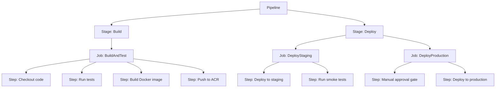
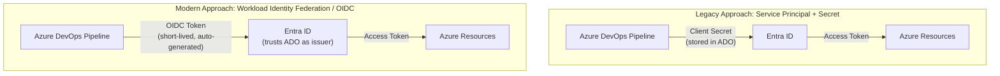
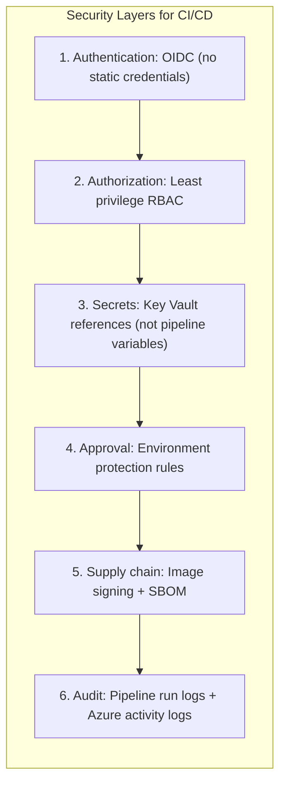
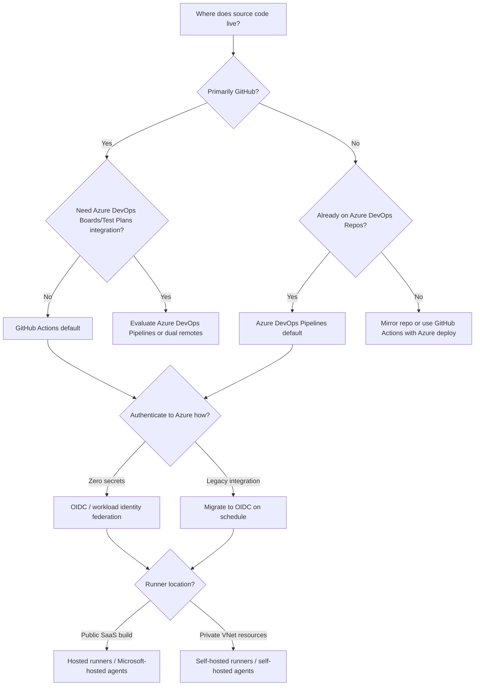

## What You'll Be Able to Do

**Complexity**: `[MEDIUM]` | **Time to Complete**: 2h | **Prerequisites**: Module 3.6 (ACR), Module 3.7 (Container Apps), Module 3.1 (Entra ID)

When you finish this module, you will be able to design, secure, and operate CI/CD pipelines that build container images and deploy them to Azure using either Azure DevOps Pipelines or GitHub Actions. The learning outcomes below map directly to the hands-on exercise and quiz, so you can verify each skill as you go.

- **Design multi-stage CI/CD pipelines incorporating container builds and release approvals for platforms like Azure DevOps and GitHub Actions**
- **Configure GitHub Actions workflows with Azure login, container builds, and Container Apps deployment steps**
- **Implement deployment approvals and staging environments using Azure DevOps and GitHub Actions environments**
- **Secure CI/CD pipelines with service connections, managed identities, and environment protection rules**

---

## Why This Module Matters

Hypothetical scenario: a platform team stores an Azure service principal client secret in a GitHub repository secret so nightly builds can push images to ACR. A contributor opens a pull request that modifies a workflow file. The workflow runs with elevated repository permissions, prints the secret to build logs, and an external scanner harvests the credential within minutes. The attacker now has Contributor access to a production resource group until someone notices the rotation calendar is three weeks overdue.

That chain is not exotic. It is the predictable outcome when CI/CD authentication relies on long-lived passwords instead of short-lived, context-bound tokens. **The CI/CD pipeline is the most privileged part of your infrastructure, and it deserves the strongest security posture.** Your pipeline can deploy code to production, read Key Vault secrets, and modify infrastructure. If an attacker compromises the pipeline or the runner executing it, they inherit whatever RBAC roles you granted the deployment identity.

Recent CI/CD security incidents reinforce the same operational lesson across both GitHub Actions and Azure DevOps. When attackers compromise build infrastructure or workflow execution paths, they steal pipeline secrets and pivot into downstream cloud environments. Static credentials stored in pipeline variables increase risk because they require manual rotation. They are visible to anyone who can administer or alter the pipeline. They can be exfiltrated if the runner or logs are compromised.

In this module, you will learn how to build secure CI/CD pipelines targeting Azure using two platforms: Azure DevOps Pipelines and GitHub Actions. You will understand YAML pipeline syntax, how Service Connections and OIDC federation eliminate static credentials, and how to deploy to Azure Container Registry, Container Apps, App Service, AKS, and infrastructure defined in Bicep or Terraform. By the end, you will build a complete GitHub Actions pipeline that authenticates to Azure using OIDC with zero stored passwords, builds a container image, pushes it to ACR, and deploys it to Container Apps.

---

## Azure DevOps Pipelines

Azure DevOps is Microsoft's integrated DevOps platform providing [source control (Azure Repos), CI/CD (Azure Pipelines), project management (Boards), artifact management (Artifacts), and testing (Test Plans)](https://learn.microsoft.com/en-us/azure/devops/). Teams that already standardize on Microsoft tooling often choose Azure DevOps because source control, pipelines, and release management live in one project boundary. Permissions, audit logs, and work-item traceability stay inside a single organization instead of spanning separate vendors.

Azure Pipelines excels when release managers need granular approval chains tied to Azure DevOps environments, when test results must gate promotions through built-in test plans, or when multiple product teams share a pool of self-hosted agents inside a corporate VNet. YAML pipelines are the modern default; classic release pipelines still exist but lack environment objects with the same YAML-first ergonomics described in this module.

Understanding the stage/job/step hierarchy early prevents YAML that becomes impossible to reason about after the tenth microservice adds a deploy stage. Think of a **stage** as a phase gate in your release story, a **job** as a unit of parallel work that acquires an agent, and a **step** as one command or task executing on that agent. Deployment jobs are special: they bind to environments, emit deployment records, and support lifecycle strategies like `runOnce`, `rolling`, and `canary` depending on target type.

### Pipeline Basics

Azure Pipelines uses YAML files (typically `azure-pipelines.yml`) to define build and deployment workflows. A pipeline consists of [**stages**, **jobs**, and **steps**](https://learn.microsoft.com/en-us/azure/devops/pipelines/yaml-schema/?view=azure-pipelines). Stages group related work (for example, build versus deploy), jobs run on an agent pool within a stage, and steps are the individual tasks such as checking out code or pushing an image. In practice, you express the entire delivery path in one version-controlled file so every change to the pipeline itself goes through the same review process as application code.



```yaml
# azure-pipelines.yml
trigger:
  branches:
    include:
      - main
  paths:
    exclude:
      - '**/*.md'
      - '.github/**'

pool:
  vmImage: 'ubuntu-latest'

variables:
  acrName: 'myacr'
  imageName: 'myapp'
  tag: '$(Build.BuildId)'

stages:
  - stage: Build
    displayName: 'Build and Push Image'
    jobs:
      - job: BuildJob
        steps:
          - task: Docker@2
            displayName: 'Build and Push to ACR'
            inputs:
              containerRegistry: 'acr-service-connection'
              repository: '$(imageName)'
              command: 'buildAndPush'
              Dockerfile: '**/Dockerfile'
              tags: |
                $(tag)
                latest

  - stage: DeployStaging
    displayName: 'Deploy to Staging'
    dependsOn: Build
    condition: succeeded()
    jobs:
      - deployment: DeployStagingJob
        environment: 'staging'
        strategy:
          runOnce:
            deploy:
              steps:
                - task: AzureContainerApps@1
                  displayName: 'Deploy to Container Apps'
                  inputs:
                    azureSubscription: 'azure-service-connection'
                    containerAppName: 'myapp-staging'
                    resourceGroup: 'myRG'
                    imageToDeploy: '$(acrName).azurecr.io/$(imageName):$(tag)'

  - stage: DeployProduction
    displayName: 'Deploy to Production'
    dependsOn: DeployStaging
    condition: succeeded()
    jobs:
      - deployment: DeployProdJob
        environment: 'production'  # Requires manual approval configured on the environment
        strategy:
          runOnce:
            deploy:
              steps:
                - task: AzureContainerApps@1
                  inputs:
                    azureSubscription: 'azure-service-connection'
                    containerAppName: 'myapp-production'
                    resourceGroup: 'myRG-prod'
                    imageToDeploy: '$(acrName).azurecr.io/$(imageName):$(tag)'
```

The example above follows a common multi-stage pattern: a Build stage produces and pushes a tagged image to ACR, DeployStaging rolls that image into a non-production Container App, and DeployProduction waits for staging to succeed before targeting production. Deployment jobs reference named environments (`staging`, `production`) so Azure DevOps can enforce [manual approval checks](https://learn.microsoft.com/en-us/azure/devops/pipelines/process/approvals?view=azure-devops) on the production environment without embedding approval logic in YAML. Path filters on the trigger keep documentation-only commits from kicking off full builds, which saves agent minutes on large monorepos.

### Service Connections (OIDC/Workload Identity Federation)

Service Connections are how Azure DevOps authenticates with Azure. The modern approach uses [**Workload Identity Federation** (OIDC)](https://learn.microsoft.com/en-us/azure/devops/pipelines/release/configure-app-secret?view=azure-devops), which eliminates client secrets entirely. Instead of storing a client secret that a compromised pipeline could exfiltrate, the pipeline requests a short-lived OIDC token from Azure DevOps and exchanges it with Entra ID for an Azure access token scoped to the service connection's RBAC assignment.



To create a Workload Identity Federation service connection in Azure DevOps, use the project settings UI or replicate the same trust relationship manually with the Azure CLI commands below. The UI path is usually faster because Azure DevOps creates the app registration and federated credential for you, but understanding the manual steps helps when you need custom scopes or when automating tenant bootstrap.

1. Go to Project Settings > Service Connections > New service connection
2. Select "Azure Resource Manager"
3. Select "Workload Identity federation (automatic)" (or manual for custom setup)
4. Select your subscription and resource group scope
5. Azure DevOps automatically creates the app registration and federated credential

```bash
# Manual setup: Create app registration with federated credential for Azure DevOps
az ad app create --display-name "azure-devops-cicd"
APP_ID=$(az ad app list --display-name "azure-devops-cicd" --query '[0].appId' -o tsv)
APP_OBJECT_ID=$(az ad app list --display-name "azure-devops-cicd" --query '[0].id' -o tsv)

# Create service principal
az ad sp create --id "$APP_ID"

# Add federated credential for Azure DevOps
az ad app federated-credential create --id "$APP_OBJECT_ID" --parameters '{
  "name": "azure-devops-federation",
  "issuer": "https://vstoken.dev.azure.com/YOUR_ORG_ID",
  "subject": "sc://YOUR_ORG/YOUR_PROJECT/YOUR_SERVICE_CONNECTION",
  "audiences": ["api://AzureADTokenExchange"]
}'

# Grant the service principal appropriate RBAC
SP_OBJECT_ID=$(az ad sp show --id "$APP_ID" --query id -o tsv)
az role assignment create \
  --assignee-object-id "$SP_OBJECT_ID" \
  --assignee-principal-type ServicePrincipal \
  --role Contributor \
  --scope "/subscriptions/<sub-id>/resourceGroups/myRG"
```

### Secure Authentication from CI to Azure

Authentication is the highest-value security control in any Azure CI/CD design. Both GitHub Actions and Azure DevOps can reach Azure using a service principal and a client secret stored in the pipeline. Microsoft explicitly [discourages secret-based service connections](https://learn.microsoft.com/en-us/azure/devops/pipelines/release/configure-app-secret?view=azure-devops) because secrets are long-lived, hard to rotate under pressure, and attractive to attackers who gain workflow edit access.

The modern alternative is **OpenID Connect (OIDC) federation**, also called workload identity federation. The pipeline requests a short-lived JWT from its platform issuer. Entra ID validates the token's issuer, audience, and subject claim. It then issues an Azure access token scoped to the RBAC roles you assigned the service principal. No password crosses your YAML file or secret store.

#### Why OIDC beats long-lived secrets

Long-lived secrets fail in three predictable ways. First, rotation is manual and often deferred until an audit finding forces action. Second, anyone with permission to view or export pipeline secrets can copy them outside the pipeline boundary. Third, a compromised runner or malicious workflow step can echo secrets into logs that retention policies keep for months.

OIDC addresses each failure mode. Tokens expire within minutes. The subject claim binds a token to a specific repository, branch, environment, or Azure DevOps service connection path. Entra ID refuses tokens whose claims do not match a federated credential you pre-registered. Even if an attacker exfiltrates one token, it cannot be replayed indefinitely and it cannot authenticate a workflow you did not authorize.

#### GitHub Actions: `azure/login` with federated credentials

GitHub Actions exposes OIDC through the [`permissions: id-token: write`](https://docs.github.com/en/actions/deployment/security-hardening-your-deployments/configuring-openid-connect-in-azure) declaration at workflow or job scope. Without that permission, the runner cannot request a JWT from GitHub's issuer at `https://token.actions.githubusercontent.com`.

The [`azure/login@v2`](https://github.com/marketplace/actions/azure-login) action exchanges that JWT for an Azure session. You store only three non-secret identifiers in GitHub: `AZURE_CLIENT_ID`, `AZURE_TENANT_ID`, and `AZURE_SUBSCRIPTION_ID`. The client secret field stays empty because federation handles proof of identity.

Least-privilege design means creating **separate federated credentials per environment** rather than one credential for the entire repository. Match the `subject` claim to `repo:ORG/REPO:environment:production` for production deploy jobs and `repo:ORG/REPO:environment:staging` for staging. Assign the production service principal Contributor on the production resource group only. Assign the staging principal Contributor on the staging resource group only. A compromised staging workflow cannot mutate production infrastructure because Entra ID will not issue a production-scoped token for a staging subject.

Pull-request workflows deserve tighter scopes than main-branch deploys. A federated credential with subject `repo:ORG/REPO:pull_request` can authenticate read-only tasks such as `terraform plan` or Bicep what-if against a sandbox subscription. Keep push and deploy permissions on branch and environment subjects that untrusted forks cannot satisfy.

#### Azure DevOps: service connections with workload identity federation

Azure DevOps authenticates to Azure through **service connections** referenced in tasks like `AzureContainerApps@1` or `AzureResourceManagerTemplateDeployment@3`. The UI path **Project Settings → Service connections → Azure Resource Manager → Workload Identity federation (automatic)** creates the Entra app registration, federated credential, and scoped RBAC assignment in one flow. Microsoft documents the manual equivalent in [Configure workload identity federation](https://learn.microsoft.com/en-us/azure/devops/pipelines/release/configure-workload-identity?view=azure-devops).

The federated credential issuer for Azure DevOps is `https://vstoken.dev.azure.com/{organizationId}`. The subject follows the pattern `sc://{organization}/{project}/{serviceConnectionName}`. That subject binding is why renaming a service connection after creation can break authentication until you update the federated credential.

Legacy service connections that still use a client secret should be migrated during your next maintenance window. Secret rotation requires updating both Entra ID and the service connection. Federation removes that toil entirely. If you must keep a secret temporarily, store it in Azure Key Vault and reference it from the pipeline rather than embedding it in plain variables.

#### Least-privilege RBAC for pipeline identities

Contributor at subscription scope is the most common over-permission in Azure CI/CD. It is convenient during a hackathon and dangerous in production. Prefer scoped assignments:

| Pipeline stage | Typical roles | Scope |
| :--- | :--- | :--- |
| Build and push image | `AcrPush` | ACR resource ID |
| Deploy Container Apps | `Contributor` or custom role | Target resource group |
| Deploy App Service slot | `Website Contributor` | Web app or resource group |
| Deploy AKS manifest | `Azure Kubernetes Service RBAC Cluster Admin` or namespace-scoped role | AKS cluster or namespace |
| Bicep/Terraform apply | `Contributor` on target RG; `User Access Administrator` only if the template assigns roles | Resource group or subscription per design |

Use [custom role definitions](https://learn.microsoft.com/en-us/azure/role-based-access-control/custom-roles) when built-in roles grant delete permissions your deployer should not have. A deployer that only updates container images rarely needs permission to delete the underlying App Service plan.

#### Managing OIDC token session lifecycles

**Pause and predict:** If an OIDC token issued by Entra ID expires after 10 minutes, how does a continuous delivery workflow requiring 45 minutes of end-to-end execution maintain valid Azure control plane authorization?

<details>
<summary>Check your prediction</summary>

Each `azure/login` step performs a fresh token exchange at the start of the job that runs it. Re-login before lengthy operations or split work across jobs so each job re-authenticates independently. Azure DevOps service connections refresh tokens per job similarly, ensuring no unattended shell step outlives the short token lifetime.
</details>

Federated credentials bind subject claims to a repository, branch, or environment path so Entra ID refuses tokens that do not match a pre-registered credential. Least-privilege still means separate principals per environment even when every job uses OIDC instead of a client secret. Pin `azure/login` and checkout actions by SHA on any job that touches Azure so a retagged action cannot swap the identity mid-flight.

---

## GitHub Actions Targeting Azure

GitHub Actions is GitHub's built-in CI/CD platform. If your code lives on GitHub, Actions provides tight integration with zero additional tooling, which means you can colocate workflow definitions with application code and reuse the same branch protection and review rules for both.

### Workflow Basics

GitHub Actions workflows live in `.github/workflows/` and are triggered by events such as push, pull_request, schedule, or manual workflow_dispatch. Each workflow file declares one or more jobs that run on hosted or self-hosted runners, and jobs can depend on one another so build artifacts or output variables flow naturally into deploy steps. The pattern mirrors Azure DevOps stages and jobs, but the syntax uses GitHub-specific contexts like `${{ github.ref }}` and `${{ secrets.NAME }}` instead of Azure DevOps predefined variables.

```yaml
# .github/workflows/deploy.yml
name: Build and Deploy to Azure

on:
  push:
    branches: [main]
  pull_request:
    branches: [main]
  workflow_dispatch:  # Manual trigger

permissions:
  id-token: write   # Required for OIDC
  contents: read

env:
  ACR_NAME: myacr
  IMAGE_NAME: myapp
  RESOURCE_GROUP: myRG
  CONTAINER_APP_NAME: myapp

jobs:
  build:
    runs-on: ubuntu-latest
    outputs:
      image-tag: ${{ steps.meta.outputs.version }}
    steps:
      - name: Checkout code
        uses: actions/checkout@v4

      - name: Azure Login (OIDC)
        uses: azure/login@v2
        with:
          client-id: ${{ secrets.AZURE_CLIENT_ID }}
          tenant-id: ${{ secrets.AZURE_TENANT_ID }}
          subscription-id: ${{ secrets.AZURE_SUBSCRIPTION_ID }}

      - name: Login to ACR
        run: az acr login --name ${{ env.ACR_NAME }}

      - name: Docker meta (tags and labels)
        id: meta
        uses: docker/metadata-action@v5
        with:
          images: ${{ env.ACR_NAME }}.azurecr.io/${{ env.IMAGE_NAME }}
          tags: |
            type=sha,prefix=
            type=ref,event=branch
            type=semver,pattern={{version}}

      - name: Build and push
        uses: docker/build-push-action@v6
        with:
          context: .
          push: ${{ github.event_name != 'pull_request' }}
          tags: ${{ steps.meta.outputs.tags }}
          labels: ${{ steps.meta.outputs.labels }}

  deploy-staging:
    needs: build
    if: github.ref == 'refs/heads/main' && github.event_name != 'pull_request'
    runs-on: ubuntu-latest
    environment: staging
    steps:
      - name: Azure Login (OIDC)
        uses: azure/login@v2
        with:
          client-id: ${{ secrets.AZURE_CLIENT_ID }}
          tenant-id: ${{ secrets.AZURE_TENANT_ID }}
          subscription-id: ${{ secrets.AZURE_SUBSCRIPTION_ID }}

      - name: Deploy to Container Apps
        uses: azure/container-apps-deploy-action@v2
        with:
          resourceGroup: ${{ env.RESOURCE_GROUP }}
          containerAppName: ${{ env.CONTAINER_APP_NAME }}-staging
          imageToDeploy: ${{ env.ACR_NAME }}.azurecr.io/${{ env.IMAGE_NAME }}:${{ needs.build.outputs.image-tag }}

  deploy-production:
    needs: [build, deploy-staging]
    if: github.ref == 'refs/heads/main' && github.event_name != 'pull_request'
    runs-on: ubuntu-latest
    environment: production  # Requires approval reviewers configured in GitHub
    steps:
      - name: Azure Login (OIDC)
        uses: azure/login@v2
        with:
          client-id: ${{ secrets.AZURE_CLIENT_ID }}
          tenant-id: ${{ secrets.AZURE_TENANT_ID }}
          subscription-id: ${{ secrets.AZURE_SUBSCRIPTION_ID }}

      - name: Deploy to Container Apps
        uses: azure/container-apps-deploy-action@v2
        with:
          resourceGroup: ${{ env.RESOURCE_GROUP }}
          containerAppName: ${{ env.CONTAINER_APP_NAME }}
          imageToDeploy: ${{ env.ACR_NAME }}.azurecr.io/${{ env.IMAGE_NAME }}:${{ needs.build.outputs.image-tag }}
```

This workflow separates concerns across three jobs: build produces and pushes the image (skipping push on pull requests so untrusted forks cannot publish to your registry), deploy-staging targets the staging environment, and deploy-production targets production only after staging succeeds. Associating deploy jobs with GitHub Environments (`staging`, `production`) lets you require reviewers before production steps run and scope environment-specific secrets so a staging job never sees production credentials.

#### Workflow triggers and concurrency controls

Beyond `push` and `pull_request`, production-grade workflows use **`workflow_dispatch`** for on-demand releases and **`schedule`** for nightly security scans. Combine triggers with **`paths` filters** so edits under `docs/` or `*.md` skip container builds. Without filters, a typo fix in README.md can launch a full matrix that burns minutes and queues behind more important builds.

**Concurrency groups** cancel obsolete runs when new commits arrive on the same branch:

```yaml
concurrency:
  group: deploy-${{ github.ref }}
  cancel-in-progress: true
```

This pattern prevents three overlapping deploys to staging when a developer pushes fix commits faster than the first workflow finishes. The latest commit wins; earlier runs stop before they mutate shared environments.

**Job outputs** pass immutable identifiers between jobs. Capture the image digest or tag in the build job `outputs` block and reference it in deploy jobs with `needs.build.outputs.image-tag`. Avoid re-deriving tags in downstream jobs from `github.sha` alone when the build job might skip push on certain events—outputs make dependencies explicit in the Actions UI.

#### Azure Pipelines equivalents: variable groups and template repositories

Azure DevOps stores reusable configuration in **variable groups** and **library groups** linked to Key Vault secrets. Link a variable group to staging versus production pipelines so connection strings never cross environments. Mark secrets as secret type so logs mask values automatically.

**Template repositories** let you maintain pipeline templates in a dedicated Git repo and reference them across projects:

```yaml
resources:
  repositories:
    - repository: templates
      type: git
      name: PlatformEngineering/pipeline-templates
      ref: refs/tags/v2.1.0

stages:
  - template: container-build.yml@templates
    parameters:
      acrConnection: acr-prod-sc
```

Tag or SHA-pin template repositories exactly as you pin GitHub Actions. A floating `@main` template reference can introduce breaking changes without a consumer pipeline PR.

**Pipeline artifacts** (`PublishPipelineArtifact` and `DownloadPipelineArtifact` tasks) carry non-container outputs—Bicep folders, Helm charts, test reports—between stages when you are not using a registry. Set meaningful artifact names with build IDs so rollback pipelines can fetch the same artifact bundle later.

### OIDC Setup for GitHub Actions

The Azure CLI commands in this section create an app registration, service principal, and federated credentials that trust GitHub's OIDC issuer. You typically create one federated credential per branch, pull-request context, or environment subject so Entra ID only accepts tokens that match the workflow's actual execution context.

```bash
# Create an app registration for GitHub Actions
az ad app create --display-name "github-actions-deploy"
APP_ID=$(az ad app list --display-name "github-actions-deploy" --query '[0].appId' -o tsv)
APP_OBJECT_ID=$(az ad app list --display-name "github-actions-deploy" --query '[0].id' -o tsv)

# Create service principal
az ad sp create --id "$APP_ID"

# Create federated credentials for different scenarios

# 1. For the main branch
az ad app federated-credential create --id "$APP_OBJECT_ID" --parameters '{
  "name": "github-main-branch",
  "issuer": "https://token.actions.githubusercontent.com",
  "subject": "repo:myorg/myrepo:ref:refs/heads/main",
  "audiences": ["api://AzureADTokenExchange"]
}'

# 2. For pull requests (read-only access for testing)
az ad app federated-credential create --id "$APP_OBJECT_ID" --parameters '{
  "name": "github-pull-requests",
  "issuer": "https://token.actions.githubusercontent.com",
  "subject": "repo:myorg/myrepo:pull_request",
  "audiences": ["api://AzureADTokenExchange"]
}'

# 3. For a specific environment (production)
az ad app federated-credential create --id "$APP_OBJECT_ID" --parameters '{
  "name": "github-production-env",
  "issuer": "https://token.actions.githubusercontent.com",
  "subject": "repo:myorg/myrepo:environment:production",
  "audiences": ["api://AzureADTokenExchange"]
}'

# Grant RBAC roles
SP_OBJECT_ID=$(az ad sp show --id "$APP_ID" --query id -o tsv)

# ACR push access
ACR_ID=$(az acr show -n myacr --query id -o tsv)
az role assignment create \
  --assignee-object-id "$SP_OBJECT_ID" \
  --assignee-principal-type ServicePrincipal \
  --role AcrPush \
  --scope "$ACR_ID"

# Container Apps contributor access
az role assignment create \
  --assignee-object-id "$SP_OBJECT_ID" \
  --assignee-principal-type ServicePrincipal \
  --role Contributor \
  --scope "/subscriptions/<sub-id>/resourceGroups/myRG"
```

After the app registration and RBAC assignments exist, add three repository secrets so the `azure/login` action can locate your tenant and subscription: `AZURE_CLIENT_ID` (the application ID), `AZURE_TENANT_ID` (your Entra ID tenant), and `AZURE_SUBSCRIPTION_ID` (the target subscription). These values are identifiers, not passwords. OIDC handles authentication using short-lived tokens generated per workflow run.

---

## Pipeline Structure, Environments, and Promotion Gates

Well-structured pipelines separate **build**, **validate**, and **promote** concerns. Mixing them in one job saves YAML lines but removes safety gates and makes rollback harder. Both GitHub Actions and Azure DevOps provide first-class environment objects where you attach approvals, branch filters, and secret scopes.

### Azure DevOps: stages, templates, and environments

Azure Pipelines organizes work into **stages** (logical phases), **jobs** (parallelizable units on an agent pool), and **steps** (individual tasks). A **deployment job** differs from a regular job because it targets a named [environment](https://learn.microsoft.com/en-us/azure/devops/pipelines/process/environments?view=azure-devops) and records deployment history against that environment's resources.

**YAML templates** reduce duplication across microservices. Store shared build steps in `templates/build.yml` and reference them with:

```yaml
stages:
  - template: templates/build-and-push.yml
    parameters:
      acrServiceConnection: acr-service-connection
      imageName: $(imageName)
```

Template parameters let one pipeline definition serve multiple services while keeping service-specific values in variable groups or pipeline variables.

**Environments** in Azure DevOps represent logical targets such as Dev, Staging, and Production. When a deployment job sets `environment: production`, Azure DevOps evaluates [approvals and checks](https://learn.microsoft.com/en-us/azure/devops/pipelines/process/approvals?view=azure-devops) configured on that environment. A release waiting for approval does not consume a parallel job slot, which matters when your organization has limited concurrency.

**Deployment strategies** control how new bits reach users:

| Strategy | Behavior | Azure DevOps mechanism | Best for |
| :--- | :--- | :--- | :--- |
| **Rolling / runOnce** | Replace instances sequentially or all at once | `strategy: runOnce` on deployment job | Simple web apps, Container Apps revisions |
| **Blue-green** | Two full environments; switch traffic atomically | Two resource groups or App Service slots; swap after validation | Zero-downtime web tiers |
| **Canary** | Route small traffic percentage to new version | App Service slot with routing rules; AKS service mesh weights | Risk-sensitive APIs |
| **Ring-based** | Promote through internal → partner → broad audiences | Sequential stages with distinct environment names | Large SaaS with staged audiences |

**Gated promotion** means no artifact reaches production without passing staging checks and human or automated approval. Configure branch filters so only `main` triggers production stages. Use `dependsOn` and `condition: succeeded()` so a failed smoke test blocks downstream stages automatically.

### GitHub Actions: workflows, reusable workflows, and environments

GitHub Actions uses **workflows** (YAML files under `.github/workflows/`), **jobs** (run on a runner), and **steps** (shell commands or actions). **Reusable workflows** (`workflow_call`) let a platform team publish a blessed deploy pattern:

```yaml
# .github/workflows/reusable-deploy.yml
on:
  workflow_call:
    inputs:
      environment:
        required: true
        type: string
      image:
        required: true
        type: string
jobs:
  deploy:
    runs-on: ubuntu-latest
    environment: ${{ inputs.environment }}
    steps:
      - uses: azure/login@v2
        with:
          client-id: ${{ secrets.AZURE_CLIENT_ID }}
          tenant-id: ${{ secrets.AZURE_TENANT_ID }}
          subscription-id: ${{ secrets.AZURE_SUBSCRIPTION_ID }}
      - uses: azure/container-apps-deploy-action@v2
        with:
          containerAppName: myapp-${{ inputs.environment }}
          resourceGroup: rg-${{ inputs.environment }}
          imageToDeploy: ${{ inputs.image }}
```

Calling repositories invoke the reusable workflow with `uses: org/repo/.github/workflows/reusable-deploy.yml@main` and pass inputs. Centralizing OIDC login and deploy actions prevents each team from inventing a slightly different—and slightly insecure—pattern.

**GitHub Environments** (`environment: production` on a job) provide [protection rules](https://docs.github.com/en/actions/deployment/targeting-different-environments/using-environments-for-deployment): required reviewers, wait timers, deployment branches, and environment-scoped secrets. Production secrets should live in the production environment, not repository-wide secrets, so a staging job cannot read them even if YAML is maliciously edited.

For **gated promotion** in GitHub Actions, chain jobs with `needs:` and attach stricter environments to later jobs. Run automated smoke tests in the staging job before the production job becomes eligible. Use `workflow_dispatch` inputs when you want manual control over which version promotes without pushing a new commit.

### Deployment strategies on Azure compute targets

**Blue-green on App Service** uses deployment slots. Deploy the new build to a staging slot, warm it up, then swap slots so production traffic moves atomically. Rollback is another swap operation.

**Canary on Container Apps** creates a new revision with a traffic weight below 100%. Monitor error rates and latency, then shift weight to the new revision or deactivate it. [Managing revisions](https://learn.microsoft.com/en-us/azure/container-apps/revisions-manage) is your rollback lever when a bad image ships.

**Ring-based promotion** maps cleanly to sequential pipeline stages: `deploy-internal` → `deploy-partner` → `deploy-public`, each with its own environment approvals and monitoring dashboard. Fail fast in early rings before customer-facing rings receive the build.

---

## Deploying to Azure Targets

Different Azure services expect different deploy mechanics. A pipeline that works for Container Apps will not drop cleanly onto AKS without manifest or Helm steps. Infrastructure pipelines differ again because they mutate control plane resources rather than application bits.

### App Service

[Deploy to App Service from GitHub Actions](https://learn.microsoft.com/en-us/azure/app-service/deploy-github-actions) typically uses `azure/webapps-deploy@v3` after `azure/login`. For containerized App Service, build and push to ACR first, then deploy the image reference:

```yaml
      - name: Deploy to App Service
        uses: azure/webapps-deploy@v3
        with:
          app-name: my-webapp
          images: ${{ env.ACR_NAME }}.azurecr.io/${{ env.IMAGE_NAME }}:${{ github.sha }}
```

Use **deployment slots** for staging. Point the staging slot at the candidate image, run smoke tests against the slot URL, then swap into production. Slot settings can stick to the slot or travel with the swap depending on configuration, which matters for connection strings that differ between staging and production.

Azure Pipelines uses the `AzureWebAppContainer@1` task with the same image reference pattern and a service connection for authentication.

### Azure Container Apps

Container Apps deployments create a **new revision** when the template changes or the container image tag changes. The [`azure/container-apps-deploy-action`](https://learn.microsoft.com/en-us/azure/container-apps/github-actions) handles Dockerfile builds, source-to-cloud builds, or deploying a pre-built image tag.

Best practices for Container Apps CI/CD:

- Tag images with immutable identifiers such as the Git commit SHA, not only `latest`.
- Configure the app to pull from ACR using **managed identity** with `AcrPull` rather than admin credentials.
- Keep environment-specific values in Container Apps secrets or Key Vault references, not baked into the image.
- Roll back by [activating a previous healthy revision](https://learn.microsoft.com/en-us/azure/container-apps/revisions-manage) rather than rebuilding old code under pressure.

### AKS: build, push, deploy

AKS pipelines follow a three-step rhythm: build container image, push to ACR, update the cluster workload. GitHub Actions and Azure DevOps both support this pattern with `azure/login`, `az acr build` or `docker build-push-action`, then `Azure/k8s-deploy` or `kubectl`/`helm` against the cluster.

A minimal GitHub Actions fragment for manifest deploy:

```yaml
      - name: Build and push
        run: |
          az acr build --registry ${{ env.ACR_NAME }} \
            --image myapp:${{ github.sha }} .

      - name: Set AKS context
        uses: azure/aks-set-context@v4
        with:
          cluster-name: my-aks
          resource-group: my-rg

      - name: Deploy manifests
        uses: Azure/k8s-deploy@v5
        with:
          action: deploy
          manifests: |
            k8s/deployment.yaml
            k8s/service.yaml
          images: |
            ${{ env.ACR_NAME }}.azurecr.io/myapp:${{ github.sha }}
```

For private AKS API servers, run agents inside the cluster VNet or use a self-hosted runner with network connectivity. Microsoft recommends self-hosted agents for [private cluster deployment jobs](https://learn.microsoft.com/en-us/azure/devops/pipelines/process/environments?view=azure-devops).

Use Helm when charts encapsulate environment-specific values files (`values-staging.yaml`, `values-production.yaml`). Pipeline parameters select the values file per stage.

### Infrastructure: Bicep and Terraform with what-if

Infrastructure pipelines should **preview before apply**. ARM/Bicep supports [`az deployment group what-if`](https://learn.microsoft.com/en-us/azure/azure-resource-manager/bicep/deploy-what-if) to show creates, modifications, and deletes without changing resources. Terraform offers `terraform plan` with equivalent intent.

Example Bicep gate in GitHub Actions:

```yaml
      - name: Bicep what-if
        run: |
          az deployment group what-if \
            --resource-group ${{ env.RG }} \
            --template-file infra/main.bicep \
            --parameters @infra/main.parameters.json

      - name: Bicep deploy
        if: github.ref == 'refs/heads/main'
        run: |
          az deployment group create \
            --resource-group ${{ env.RG }} \
            --template-file infra/main.bicep \
            --parameters @infra/main.parameters.json
```

**Pause and predict:** Should infrastructure automation teams configure Bicep what-if predictions exclusively within post-merge deployment jobs, or should change preview commands run across pre-merge pull requests?

<details>
<summary>Check your prediction</summary>

Run what-if on every pull request so code reviewers can inspect proposed resource mutations before merging; execute deployment apply steps only from protected branches after approval.
</details>

Storing Terraform state in Azure Storage with blob lease locking guarantees that parallel execution threads cannot corrupt remote configuration state during concurrent execution runs. Infrastructure engineers must keep remote state files strictly out of source control repositories to prevent the accidental exposure of sensitive resource connection strings, secrets, and generated endpoint identifiers.

Establishing automated drift detection runs on a regular schedule complements pull-request validations by identifying out-of-band modifications before deployments execute. If an operator modifies cloud resources directly through administrative portals during an emergency incident, scheduled pipeline checks report the resulting configuration variance promptly. Platform engineers can then reconcile declarative templates before subsequent deployment cycles begin.

**Terraform on Azure** follows the same preview-then-apply rhythm. Configure the `azurerm` backend to use a storage account container with state locking. In GitHub Actions, run `terraform init`, `terraform plan -out=tfplan`, upload the plan artifact, and require a separate approved job for `terraform apply tfplan`. In Azure DevOps, split plan and apply stages; gate apply with an environment approval on production.

Use **OIDC for Terraform** the same way as application deploys: configure `azure/login` or workload identity federation, then set ARM environment variables (`ARM_USE_OIDC=true`, `ARM_CLIENT_ID`, `ARM_TENANT_ID`, `ARM_SUBSCRIPTION_ID`) so the Terraform Azure provider acquires tokens without a client secret. Scope the identity to the resource groups Terraform manages, not the entire subscription, unless your modules genuinely require subscription-wide resources.

When pipelines manage both Bicep and Terraform temporarily during migration, enforce a single source of truth per resource group. Running Bicep deploy and Terraform apply against the same scope causes state drift that what-if and plan output cannot reconcile without manual intervention.

Separate **application pipelines** from **infrastructure pipelines** when lifecycles differ. Application teams may deploy daily; platform teams may apply Bicep weekly. Different identities and approval paths reduce the chance that an application deploy accidentally touches network or identity resources.

### Artifacts, config, and rollback

**Artifacts** carry build outputs between stages: container images in ACR, ZIP packages for App Service, Helm charts in ACR or Artifacts, Bicep modules in a Git tag. Pin artifact versions with immutable tags or digest SHAs so a production redeploy pulls the exact bits you tested in staging.

**Environment-specific configuration** belongs in Azure App Configuration, Key Vault references, Container Apps secrets, or Kubernetes ConfigMaps and Secrets—not in the same artifact as code when values differ per environment. Inject config at deploy time so one image promotes across stages unchanged.

**Rollback** is service-specific: swap App Service slots, shift Container Apps traffic to a prior revision, `helm rollback` on AKS, or redeploy a previous Bicep deployment from Git history. Document rollback in the pipeline README and test it quarterly. A rollback procedure you have never executed is a hope, not a plan.

### Minimal OIDC workflow reference

The workflow below consolidates login, ACR build, and Container Apps deploy in one file for labs and small services:

```yaml
name: OIDC Deploy
on:
  push:
    branches: [main]
permissions:
  id-token: write
  contents: read
jobs:
  deploy:
    runs-on: ubuntu-latest
    environment: production
    steps:
      - uses: actions/checkout@v4
      - uses: azure/login@v2
        with:
          client-id: ${{ secrets.AZURE_CLIENT_ID }}
          tenant-id: ${{ secrets.AZURE_TENANT_ID }}
          subscription-id: ${{ secrets.AZURE_SUBSCRIPTION_ID }}
      - run: az acr build --registry $ACR --image app:${{ github.sha }} .
        env:
          ACR: ${{ secrets.ACR_NAME }}
      - uses: azure/container-apps-deploy-action@v2
        with:
          resourceGroup: ${{ secrets.RESOURCE_GROUP }}
          containerAppName: ${{ secrets.CONTAINER_APP_NAME }}
          imageToDeploy: ${{ secrets.ACR_NAME }}.azurecr.io/app:${{ github.sha }}
```

---

## Self-Hosted Agents and Runners

Both Azure DevOps and GitHub Actions offer hosted runners where Microsoft or GitHub manages the underlying VM, which is the default choice for most teams because it requires zero infrastructure maintenance. You may need self-hosted runners when builds must reach private VNet resources (private endpoints, internal APIs), when you require specialized hardware such as GPU or high-memory SKUs, when persistent caches between runs materially shorten build times, or when compliance mandates that compilation and packaging happen inside your own environment rather than on a shared multi-tenant runner fleet.

### Azure DevOps Self-Hosted Agent

```bash
# Deploy a self-hosted agent as a Container Instance
az container create \
  --resource-group myRG \
  --name ado-agent \
  --image mcr.microsoft.com/azure-pipelines/vsts-agent:ubuntu-22.04 \
  --cpu 2 \
  --memory 4 \
  --environment-variables \
    AZP_URL="https://dev.azure.com/myorg" \
    AZP_POOL="Self-Hosted" \
    AZP_AGENT_NAME="aci-agent-1" \
  --secure-environment-variables \
    AZP_TOKEN="$AZURE_DEVOPS_PAT" \
  --restart-policy Always
```

### GitHub Actions Self-Hosted Runner on Azure

```bash
# Deploy a runner as a VM Scale Set (recommended for auto-scaling)
# First, install the runner on a base VM, create an image, then use VMSS.

# For a single runner (quick setup):
az vm create \
  --resource-group myRG \
  --name github-runner \
  --image Ubuntu2204 \
  --size Standard_D4s_v5 \
  --admin-username azureuser \
  --generate-ssh-keys \
  --custom-data @runner-cloud-init.yaml

# runner-cloud-init.yaml would install the runner package and register it
```

Self-hosted runners introduce operational responsibility: you patch the OS, rotate registration tokens, and ensure one job cannot read another job's workspace artifacts. For production GitHub Actions scale-out, use the official **Actions Runner Controller (ARC)** on AKS, which [auto-scales runners based on pending jobs](https://github.com/actions/actions-runner-controller/blob/master/docs/automatically-scaling-runners.md) so you pay for capacity only while workflows are queued or running.

When sizing self-hosted capacity, model peak concurrent jobs rather than average developer count. A team of fifteen engineers might run only three concurrent builds on a typical afternoon but spike to twelve when everyone merges before a release freeze. VM Scale Sets or ARC autoscaling policies should target queue depth, not CPU utilization alone, because idle runners still cost money while queued jobs delay releases.

**Network placement** matters as much as CPU. Runners that deploy to private AKS clusters or pull from ACR via private endpoints must sit on subnets with routing to those endpoints. Document outbound allow lists if your security team restricts runner internet access—GitHub and Azure DevOps still need HTTPS to orchestration endpoints even when builds are otherwise internal.

**Pause and predict:** Why might deploying a persistent self-hosted runner inside your production virtual network introduce substantial security risks compared to utilizing Microsoft-hosted runners?

<details>
<summary>Check your prediction</summary>

The self-hosted runner acts as a privileged foothold on the production network where compromised jobs or third-party dependencies can reach internal private endpoints and access leftover `.azure` credential caches; Microsoft-hosted runners destroy the underlying virtual machine after each job to ensure complete workload isolation.
</details>

Document outbound allow lists with the security team before you scale a runner pool. GitHub and Azure DevOps still need HTTPS to orchestration endpoints even when builds are otherwise internal. Persistent caches between runs can shorten build times, but they also require a documented wipe policy when multiple teams share a pool.

---

## Pipeline Security Best Practices



| Practice | Why | Implementation |
| :--- | :--- | :--- |
| **Use OIDC, not client secrets** | Secrets can leak; OIDC tokens are ephemeral | Azure Login action with `id-token: write` permission |
| **Scope RBAC to resource groups** | Contributor on subscription is too broad | `az role assignment create --scope /subscriptions/.../resourceGroups/specific-rg` |
| **Use environments with approvals** | Prevent accidental production deploys | GitHub Environments with required reviewers |
| **Pin action versions by SHA** | Tag-based versions can be overwritten | `uses: actions/checkout@a12a3943b...` instead of `@v4` |
| **Scan images before deployment** | Catch vulnerabilities before they reach production | `trivy image myacr.azurecr.io/myapp:latest` in the pipeline |
| **Use branch protection rules** | Prevent direct pushes to main | Require PRs, status checks, and code review |

If a repository can run or merge workflow changes without adequate review and a pipeline relies on long-lived cloud credentials, an attacker may be able to alter the workflow, expose those credentials, and use them against production resources. The practical defenses are to remove long-lived secrets, require approvals for protected environments, and enforce review on workflow changes.

### Supply chain and workflow integrity

Modern pipelines compose dozens of third-party actions and tasks. Treat each `uses:` reference and each Azure DevOps marketplace task as a dependency with supply-chain risk. Pin GitHub Actions to immutable commit SHAs for anything that touches credentials, production deploy paths, or forked pull-request workflows. Periodically bump SHAs through an automated pull request that runs your test suite before merge.

Pinning build dependencies and third-party action commits prevents upstream maintainer compromise from injecting malicious execution logic into automated continuous deployment pipelines. Organizations enforce strict workflow governance by requiring mandatory repository status checks and restricting workflow modification rights to trusted administrative teams.

Enable **branch protection** on default branches and on `.github/workflows/**` path rules where GitHub supports it. Require CODEOWNERS review for workflow changes so a single compromised contributor account cannot silently alter production deploy steps. In Azure DevOps, restrict who can edit YAML pipelines and service connections through project-level permissions and audit streaming to Log Analytics or Sentinel.

### Observability: correlating pipeline runs with Azure Activity Log

When a production incident traces to a deployment, you need a fast answer to who deployed what and when. GitHub Actions retains workflow run history with commit SHA, actor, and job logs. Azure DevOps environments show deployment history with work-item links. On the Azure side, [Activity Log](https://learn.microsoft.com/en-us/azure/azure-monitor/platform/activity-log) records resource modifications with caller identity and correlation IDs.

Forward pipeline audit events to your SIEM. Alert on service principal logins from unexpected IP ranges, spikes in failed OIDC token exchanges, or deployment jobs that skip staging environments because someone edited YAML conditions. The goal is not to log every successful build—it is to detect anomalous promotion paths before they repeat.

**Pause and predict:** If you configure branch protection rules requiring mandatory pull request reviews before merging code to main, how could an attacker possessing repository Contributor access still compromise the deployment pipeline without merging a pull request?

<details>
<summary>Check your prediction</summary>

Workflows configured with `pull_request_target` execute in the context of the base repository default branch with access to base secrets and federated OIDC credentials while checking out untrusted code from external fork branches.
</details>

Comprehensive pipeline defense requires defense-in-depth across source control, execution environments, and cloud control planes. Establishing environment approval checks and maintaining separate read-only federated identities for automated test validation ensure that unauthorized repository changes cannot manipulate cloud infrastructure.

Continuous integration systems must also maintain strict cryptographic auditing across every pipeline step. Signing container images and publishing verifiable metadata allow downstream admission controllers in Azure Kubernetes Service to reject unsigned or tampered binaries. This policy enforcement ensures only approved application artifacts deploy onto production worker nodes.

---

## Cost Lens: Runners, Minutes, and Parallel Jobs

CI/CD cost surprises usually come from concurrency and trigger design, not from Azure resource consumption alone. Two billing models dominate this module: GitHub Actions minutes for hosted runners, and Azure DevOps parallel jobs for Microsoft-hosted agents.

### GitHub Actions hosted runner economics

For **private repositories**, GitHub includes a monthly minute allowance that depends on your plan. GitHub Free includes 2,000 minutes; GitHub Team includes 3,000; GitHub Enterprise Cloud includes 50,000 according to [GitHub Actions billing](https://docs.github.com/en/billing/managing-billing-for-github-actions/about-billing-for-github-actions). Minutes reset at the start of each billing cycle. Usage beyond the allowance bills per minute by runner SKU.

Baseline per-minute rates for standard hosted runners (USD) from GitHub's billing documentation:

| Runner SKU | Approximate per-minute rate |
| :--- | :--- |
| Linux 2-core (`actions_linux`) | $0.006 |
| Windows 2-core (`actions_windows`) | $0.010 |
| macOS (`actions_macos`) | $0.062 |

**Public repositories** using standard GitHub-hosted runners do not consume billable minutes for those jobs. That is why open-source workflows can run extensive matrices without minute charges, while identical patterns in private repos accrue cost quickly.

**Self-hosted runners** do not consume GitHub-hosted minutes. You pay for the Azure VMs, scale sets, or AKS nodes that run the agents instead. Self-hosted makes financial sense when you need sustained high concurrency, large runners, or long-running builds that would exhaust included minutes in days.

Cost spikes on GitHub Actions often trace to:

- **Matrix builds** that multiply jobs (`os × node-version × service` can turn one push into dozens of jobs).
- **Chatty triggers** such as `on: push` without path filters, rebuilding on every documentation commit.
- **Windows or macOS runners** when Linux would suffice (macOS is roughly ten times the Linux minute rate).
- **Artifact and cache storage** billed hourly in GB-hours beyond included storage pools.

Mitigations include path filters, concurrency groups to cancel superseded runs, caching dependencies with deterministic keys, and running expensive integration tests on a schedule rather than every push.

### Azure DevOps parallel job economics

Azure DevOps bills **parallel jobs**, not individual pipeline definitions. Each running job on a Microsoft-hosted agent consumes one parallel job from your organization's pool until it finishes. Private projects receive a limited free grant (commonly one parallel job up to 60 minutes per run and 1,800 minutes per month) as described in [Configure and pay for parallel jobs](https://learn.microsoft.com/en-us/azure/devops/pipelines/licensing/concurrent-jobs). Additional parallel jobs are purchased at the organization level and shared across all projects.

Important consumption details:

- A release **waiting for manual approval does not consume** a parallel job slot.
- **Self-hosted agents** do not require paid Microsoft-hosted parallel jobs for the agent itself—you supply the machines.
- Queued jobs indicate insufficient parallel capacity; purchasing another parallel job removes queue delay but increases monthly cost.

Rule of thumb from Microsoft: estimate **one parallel job per four to five active developers** when many pipelines run concurrently. Teams with multiple products on one organization may need more.

### Azure-side costs triggered by pipelines

Pipelines also incur Azure service charges:

- **ACR Tasks** and `az acr build` bill for build compute separately from GitHub or Azure DevOps minutes.
- **Container Apps** create new revisions on deploy; idle revisions you forget to deactivate still consume resources if left active.
- **Key Vault** operations and secret retrieval during deploy steps accrue per-transaction fees at scale.

Treat pipeline cost as **platform minutes + Azure build/deploy resources + engineer time waiting in queues**. Right-sizing parallel jobs and using path filters often saves more than switching cloud SKUs.

---

## Patterns & Anti-Patterns

These patterns reflect what mature Azure CI/CD teams repeat across GitHub Actions and Azure DevOps. They prioritize safe promotion, observable deploys, and identities that survive audits.

| Pattern | When to Use | Why It Works | Scaling Note |
| :--- | :--- | :--- | :--- |
| **OIDC federation for every Azure deploy identity** | All new pipelines targeting Azure | Eliminates secret rotation toil and shrinks exfiltration value | Separate federated credentials per environment before repo count grows |
| **Environment-scoped secrets and approvals** | Staging and production deploys | Staging jobs cannot read production secrets; humans gate prod | Map GitHub Environments or ADO environments to Azure resource groups |
| **Immutable image tags per commit** | Container deploys to ACR, AKS, Container Apps | Rollback pulls a known artifact; `latest` hides what ran | Retention policies on ACR tags prevent unbounded storage cost |
| **What-if / plan before infra apply** | Bicep, ARM, Terraform pipelines | Surprises surface in PR comments, not in production outages | Run plan on PR; apply only from default branch with approval |
| **Reusable workflows or YAML templates** | Many repos with identical deploy shape | One security fix propagates everywhere | Version reusable workflows with tags or SHA pins |
| **Path-filtered triggers** | Monorepos with docs, infra, and app folders | Docs edits skip multi-hour test matrices | Tune filters when new top-level folders appear |

| Anti-Pattern | What Goes Wrong | Why Teams Fall Into It | Better Alternative |
| :--- | :--- | :--- | :--- |
| **One service principal for all environments** | Staging compromise becomes production compromise | Single OIDC setup is faster on day one | Separate apps, federated credentials, and RBAC scopes per environment |
| **Contributor on the subscription for deployers** | Pipeline can delete unrelated resources | Broad role always "works" during debugging | Scope to resource group; use custom roles without delete |
| **Deploy on every branch push to production targets** | Feature branches overwrite prod | Simple `on: push` trigger | Restrict production jobs to `main` and protected environments |
| **Skipping smoke tests before approval gates** | Approvers click approve without signal | Pressure to ship fast | Automated HTTP or health checks in staging job outputs |
| **Mutable `@v4` action tags only** | Tag hijack supply-chain risk | Tags are readable in reviews | Pin actions to full commit SHA; automate SHA bumps |
| **Building on hosted runners then pushing huge contexts** | Slow uploads inflate minutes | Familiar Docker local workflow | ACR Tasks or `az acr build` builds inside Azure near the registry |
| **No tested rollback** | Incidents extend while teams invent rollback | Rollback feels rare until it is not | Document slot swap, revision activate, or `helm rollback` and drill quarterly |

---

## Decision Framework: Platform, Auth, and Runners

Choose CI/CD components based on where code lives, who must approve production change, and whether builds need private network access—not based on which logo your team prefers.



| Decision | Choose GitHub Actions | Choose Azure DevOps Pipelines | Notes |
| :--- | :--- | :--- | :--- |
| Source of truth is GitHub.com | Default | Only if org mandates ADO for work tracking | Actions colocate workflows with code reviews |
| Entire eng org on Azure DevOps | Possible via mirroring | Default | Service connections integrate natively |
| OIDC to Azure | `azure/login` + federated credentials | Workload identity service connections | Both avoid client secrets when configured correctly |
| Secret-based service principal | Migrate away | Migrate away | Acceptable only as temporary bridge |
| Hosted runners | GitHub-hosted (minutes billing) | Microsoft-hosted (parallel jobs) | macOS builds are expensive on GitHub hosted |
| Self-hosted | ARC on AKS or VMSS | VMSS or ACI agents in your VNet | You patch OS and isolate job workspaces |
| Reusable pipeline logic | Reusable workflows | YAML templates + template repos | Pin versions to prevent drift |
| Manual production gate | GitHub Environment reviewers | ADO environment approvals | Both support wait timers and branch filters |

**Authentication decision:** Prefer OIDC unless a third-party tool literally cannot federate and you have a dated exception register entry. Secret-based connections require rotation evidence in audits.

**Runner decision:** Start hosted until you hit one of three walls: private resource access, compliance requirement for tenant-isolated compute, or minute/job cost exceeding the VM fleet you would operate anyway. Then deploy self-hosted agents with autoscaling rather than a single pet VM.

**Platform decision:** If developers already live in GitHub pull requests, GitHub Actions reduces context switching. If portfolio management, test plans, and pipelines must share Azure DevOps permissions boundaries, Azure DevOps Pipelines is the coherent default. Many enterprises run GitHub Actions for CI and Azure DevOps for release gates against the same ACR images—pick consciously and document which system owns production approval.

### Applying the framework to a hybrid example

Consider a product team with application code on GitHub and a platform team managing Bicep modules in Azure DevOps. A sensible split: GitHub Actions builds and pushes images to ACR on every merge to main using OIDC scoped to `AcrPush`. Azure DevOps YAML consumes the immutable tag as a pipeline resource, runs integration tests in a staging environment with automated checks, then waits for a release manager approval before a deployment job updates production Container Apps. Each system does what its permissions model handles best without sharing long-lived secrets across both.

Document the handoff explicitly: which pipeline produces the canonical artifact tag, which environment name in each system maps to which Azure resource group, and which on-call rotation receives failed approval notifications. Ambiguity at that boundary causes double deploys or, worse, the assumption that "someone else already promoted to production."

When evaluating a migration from secret-based service connections to OIDC, schedule the Entra work first, validate staging pipelines, then cut production over during a maintenance window with rollback credentials revoked immediately after success. Parallel secret and OIDC paths during migration are acceptable for days, not quarters—dual paths double audit findings and confuse on-call engineers about which identity actually deployed a failing revision.

---

## Did You Know?

1. **GitHub Actions OIDC tokens are short-lived** and include claims that scope them to the repository and workflow context. Compared with storing long-lived client secrets in the pipeline, that materially reduces credential exposure because even a successful exfiltration yields a token that expires within minutes and cannot be reused outside the intended subject claim.

2. **Azure DevOps supports pipeline caching** that persists across runs. On dependency-heavy projects, restoring a warm cache can be much faster than reinstalling dependencies from scratch, and over repeated pipeline runs that difference compounds into meaningful build-time savings. Use the [`Cache@2` task](https://learn.microsoft.com/en-us/azure/devops/pipelines/release/caching?view=azure-devops) with a hash of your lock file as the cache key so cache invalidation tracks dependency changes rather than arbitrary timestamps.

3. **GitHub Actions hosted runners are ephemeral and fresh for every job.** Each job gets a brand-new VM with a clean filesystem, which is excellent for security because one build cannot leave artifacts that contaminate the next tenant's job, but it also means every job cold-starts without local caches. Self-hosted runners persist between jobs, enabling persistent caches and pre-installed tools, but require you to manage security by ensuring one job cannot access another job's data on the same disk.

4. **Azure DevOps Pipelines can deploy beyond Azure** by using service connections and deployment tasks for external systems such as Kubernetes clusters, Docker registries, and other remote services. The same YAML pipeline model that pushes to ACR can therefore orchestrate a hybrid release where container images land in Azure while manifests roll out to on-premises or multi-cloud Kubernetes without switching CI products.

---

## Common Mistakes

| Mistake | Why It Happens | How to Fix It |
| :--- | :--- | :--- |
| Storing Azure credentials as pipeline secrets instead of using OIDC | OIDC setup requires more initial configuration | Invest 15 minutes in OIDC setup. It eliminates secret rotation, reduces blast radius, and prevents credential exfiltration. |
| Granting Contributor at subscription scope to the pipeline identity | It is the quickest way to "make it work" | Create a custom role or use Contributor scoped to the specific resource group the pipeline deploys to. |
| Not using environments with approval gates for production | "We trust our team" or "approvals slow us down" | Environment protection rules are the last line of defense against accidental or malicious production deployments. A 30-second approval is cheap insurance. |
| Running `docker build` on the runner instead of using ACR Tasks | Teams are familiar with local Docker builds | [ACR Tasks builds images in Azure](https://learn.microsoft.com/en-us/azure/container-registry/container-registry-tasks-overview), reducing build time (no push over internet), leveraging Azure network for base image pulls, and eliminating the need for Docker on the runner. |
| Using `actions/checkout@v4` instead of pinning to a specific SHA | Version tags are readable and convenient | Tags can be moved to point to different commits (supply chain attack). Pin critical actions to their full SHA: `actions/checkout@a12a3943...`. |
| Not scanning images for vulnerabilities in the pipeline | "Scanning slows down the pipeline" | Add Trivy or Microsoft Defender scan as a pipeline step. A 30-second scan catches vulnerabilities before they reach production. Better to delay a deploy than to deploy a vulnerable image. |
| Hardcoding resource names in the workflow file | It works for a single environment | Use workflow inputs, environment variables, or matrix strategies to parameterize resource names. This enables the same workflow to deploy to staging and production. |
| Not testing the deployment rollback process | "We will figure it out when we need to" | Include a rollback step or document the rollback procedure. For Container Apps, this means [reactivating a previous revision](https://learn.microsoft.com/en-us/azure/container-apps/revisions-manage). Test it before you need it. |

---

## Quiz

<details>
<summary>1. Your team currently uses an Azure Service Principal client secret stored as a GitHub secret for CI/CD deployments. Security mandates that all static credentials be rotated every 30 days. How does migrating to OIDC federation solve this operational burden, and why does it improve the pipeline's security posture?</summary>

OIDC (OpenID Connect) federation allows a CI/CD platform to authenticate with Azure without any stored secrets. The CI/CD platform generates a short-lived OIDC token that includes claims about the workflow. Azure Entra ID is configured to trust the CI/CD platform as an OIDC token issuer. When the pipeline presents the token, Entra ID validates it and issues an Azure access token. This eliminates manual rotation because no secret is stored that can be leaked, tokens are ephemeral, and they are scoped to the specific workflow run.
</details>

<details>
<summary>2. You are configuring a new GitHub Actions workflow to deploy to Azure using OIDC. However, the `azure/login` step fails with an error stating it cannot retrieve an OIDC token. You verify the Entra ID federated credential is correct. What configuration is likely missing from your workflow YAML, and why is this required?</summary>

The workflow is likely missing the `permissions: id-token: write` setting at the job or workflow level. This setting grants the workflow permission to request an OIDC token from GitHub's token endpoint. Without this permission, the `azure/login` action cannot generate the JWT needed for OIDC authentication with Azure. By default, GitHub workflows do not have this permission to enforce the principle of least privilege. You must explicitly declare that the workflow needs OIDC token generation capabilities to ensure secure access control.
</details>

<details>
<summary>3. Your company is building a container image that must pull proprietary dependencies from an internal Nexus repository hosted on an Azure Virtual Network without public internet access. Since GitHub-hosted runners operate on public IPs, how can you execute this build process successfully, and what new responsibilities does this introduce?</summary>

To access the internal Nexus repository, you must deploy a self-hosted runner within your Azure Virtual Network. This runner operates inside your private network boundary, allowing it to communicate with internal resources that Microsoft-hosted runners cannot reach. However, choosing self-hosted runners shifts the operational burden to your team. You become responsible for managing the runner's underlying virtual machine, applying security patches, and ensuring proper isolation between pipeline jobs to prevent data contamination. Additionally, you must implement scaling mechanisms, such as using Actions Runner Controller (ARC) on AKS, to handle fluctuating CI/CD workloads efficiently.
</details>

<details>
<summary>4. A junior developer accidentally pushes a commit directly to the `main` branch that drops all tables in the database. The automated pipeline successfully builds the code and deploys it to the staging environment. How can you configure your CI/CD pipeline to ensure this destructive change does not automatically deploy to the production environment?</summary>

You should utilize GitHub Environments to define deployment targets with specific protection rules, such as required manual approvals. By configuring the production environment to require designated reviewers, the pipeline will pause after the staging deployment and wait for human authorization. This acts as a critical safety gate, giving the team time to verify the staging deployment and realize the destructive nature of the commit before it reaches users. Furthermore, environments allow you to scope secrets, ensuring that the staging pipeline step cannot accidentally or maliciously access production database credentials. This combination of approvals and secret scoping prevents unauthorized or accidental production changes.
</details>

<details>
<summary>5. Your pipeline uses a popular third-party GitHub Action referenced via the tag `@v2`. An attacker gains control of the third-party repository, injects a cryptocurrency miner into the action's code, and moves the `v2` tag to point to this malicious commit. How could you have designed your pipeline to prevent this supply chain attack from executing the malware?</summary>

You could have prevented this attack by referencing the third-party action using its immutable commit SHA instead of a mutable version tag. When you reference an action by a tag, the pointer can be moved to any commit, meaning your pipeline will unknowingly pull down the newly tagged malicious code. Pinning to a specific commit SHA helps ensure that the pipeline executes the exact pinned revision of the action code, even if someone later moves a tag or changes the repository. Even if an attacker modifies the action's repository, the SHA remains cryptographically tied to the original, safe code. Teams can use automated dependency management tools to safely update these SHAs when new, verified versions are released.
</details>

<details>
<summary>6. You are tasked with consolidating three separate, redundant GitHub Actions workflows into a single unified pipeline. This new pipeline must build a Docker image upon a push to the main branch, deploy it to a staging Azure Container App, run automated tests, and finally deploy to the production Container App only after management approval. How would you design the workflow jobs and Entra ID authentication to achieve this securely?</summary>

You should design a single workflow with three sequential jobs: a build job, a staging deploy job, and a production deploy job. The staging and production jobs must be associated with their respective GitHub Environments to leverage environment-specific variables and enforce the required manual approval gate on the production environment. For secure authentication, you should configure separate OIDC federated credentials in Entra ID for both the staging and production environments by matching the `subject` claims to those specific environments. This approach ensures the principle of least privilege, as the staging job will only receive an Azure token with Contributor access to the staging resource group. By scoping access at the environment level, you completely isolate the pipeline stages and prevent staging compromise from affecting production infrastructure.
</details>

<details>
<summary>7. Your platform team runs Azure DevOps pipelines with Microsoft-hosted agents. Builds queue for 20+ minutes during business hours even though individual jobs finish in eight minutes. Parallel job settings show one Microsoft-hosted parallel job. What is the most likely cause, and what two changes address both wait time and cost?</summary>

The organization is limited to a single Microsoft-hosted parallel job, so every job after the first waits in queue until the prior job releases the slot. Purchase or request additional parallel jobs for the organization so multiple pipelines can run concurrently during peak hours. Complement capacity with path filters, pipeline caching, and cancelling redundant runs so each consumed parallel job minute delivers more value. Self-hosted agents are an alternative when queue time remains unacceptable and you already operate a VM fleet with spare capacity.
</details>

<details>
<summary>8. A developer proposes running `az deployment group create` directly from a laptop against production because "the pipeline what-if step is too slow." What risks does bypassing the pipeline introduce, and how should the team respond without blocking legitimate hotfixes?</summary>

Manual CLI deploys bypass environment approvals, omit audit correlation with pull requests, and rely on whatever credential happens to be on the laptop—often over-privileged and unrotated. Respond by documenting an emergency break-glass pipeline triggered via `workflow_dispatch` or Azure DevOps manual run that still uses OIDC, requires two approvers, and writes to Activity Log. Hotfixes should change code in Git and flow through the expedited pipeline so the fix is reproducible and reviewable after the incident stabilizes.
</details>

---

## Hands-On Exercise: GitHub Actions OIDC Auth to ACR Build and Container Apps Deploy

In this exercise, you will set up OIDC authentication between GitHub Actions and Azure, build a container image with ACR Tasks, and deploy it to Container Apps. The sequence mirrors what many teams adopt in production: provision registry and runtime infrastructure, establish federated trust between GitHub and Entra ID, then wire a workflow that builds on every push to main without storing Azure passwords in GitHub.

You need the Azure CLI, a GitHub repository, and optionally the `gh` CLI for setting repository secrets from your terminal. Install the Container Apps extension if needed: `az extension add --name containerapp`. Work through the tasks in order because later steps reference resource names and object IDs created earlier.

### Troubleshooting common lab failures

If `azure/login` fails with an OIDC error, verify three items in order: the workflow declares `permissions: id-token: write`, the federated credential `subject` exactly matches your repository and branch or environment, and the three identifier secrets contain no trailing whitespace. Entra ID rejects tokens when the subject claim differs by even one character from the registered value.

If `az acr build` succeeds but Container Apps still serves an old image, confirm the deploy step references the same tag the build pushed and that the app has permission to pull from ACR via the managed identity configured in Task 1. Container Apps creates a new revision only when the template image reference changes; pushing `latest` without updating the app template may leave traffic on an older revision.

If the GitHub workflow never triggers, check that the default branch name in `on.push.branches` matches your repository and that Actions is enabled under repository Settings. Organization policies can disable Actions for new repositories until an administrator allowlists them.

### Task 1: Create Azure Infrastructure

```bash
RG="kubedojo-cicd-lab"
LOCATION="eastus2"
ACR_NAME="kubedojocicd$(openssl rand -hex 4)"
APP_NAME="cicd-demo-app"
ENV_NAME="cicd-demo-env"

az group create --name "$RG" --location "$LOCATION"

# Create ACR
az acr create -g "$RG" -n "$ACR_NAME" --sku Standard --location "$LOCATION"

# Create Container Apps environment
az containerapp env create -g "$RG" -n "$ENV_NAME" --location "$LOCATION"

# Deploy initial Container App
az containerapp create \
  --resource-group "$RG" \
  --name "$APP_NAME" \
  --environment "$ENV_NAME" \
  --image mcr.microsoft.com/k8se/quickstart:latest \
  --target-port 80 \
  --ingress external \
  --min-replicas 1

# Give the Container App a system-assigned identity and let it pull from ACR
az containerapp identity assign -g "$RG" -n "$APP_NAME" --system-assigned
APP_MI_PRINCIPAL=$(az containerapp identity show -g "$RG" -n "$APP_NAME" --query principalId -o tsv)
ACR_ID=$(az acr show -n "$ACR_NAME" --query id -o tsv)
az role assignment create --assignee-object-id "$APP_MI_PRINCIPAL" \
  --assignee-principal-type ServicePrincipal --role AcrPull --scope "$ACR_ID"
az containerapp registry set -g "$RG" -n "$APP_NAME" \
  --server "$ACR_NAME.azurecr.io" --identity system

APP_URL=$(az containerapp show -g "$RG" -n "$APP_NAME" --query properties.configuration.ingress.fqdn -o tsv)
echo "App URL: https://$APP_URL"
```

<details>
<summary>Verify Task 1</summary>

```bash
curl -s "https://$APP_URL" | head -5
```
</details>

### Task 2: Set Up OIDC Authentication for GitHub Actions

```bash
# Create app registration
az ad app create --display-name "github-cicd-lab"
APP_ID=$(az ad app list --display-name "github-cicd-lab" --query '[0].appId' -o tsv)
APP_OBJECT_ID=$(az ad app list --display-name "github-cicd-lab" --query '[0].id' -o tsv)

# Create service principal
az ad sp create --id "$APP_ID"
SP_OBJECT_ID=$(az ad sp show --id "$APP_ID" --query id -o tsv)

# Create federated credential for your GitHub repo
GITHUB_ORG="<your-github-org>"
GITHUB_REPO="<your-repo-name>"

az ad app federated-credential create --id "$APP_OBJECT_ID" --parameters '{
  "name": "github-main",
  "issuer": "https://token.actions.githubusercontent.com",
  "subject": "repo:'"${GITHUB_ORG}"'/'"${GITHUB_REPO}"':ref:refs/heads/main",
  "audiences": ["api://AzureADTokenExchange"]
}'

# Grant RBAC: ACR Push
ACR_ID=$(az acr show -n "$ACR_NAME" --query id -o tsv)
az role assignment create \
  --assignee-object-id "$SP_OBJECT_ID" \
  --assignee-principal-type ServicePrincipal \
  --role AcrPush \
  --scope "$ACR_ID"

# Grant RBAC: Container Apps Contributor
RG_ID=$(az group show -n "$RG" --query id -o tsv)
az role assignment create \
  --assignee-object-id "$SP_OBJECT_ID" \
  --assignee-principal-type ServicePrincipal \
  --role Contributor \
  --scope "$RG_ID"

# Output the values you need for GitHub secrets
TENANT_ID=$(az account show --query tenantId -o tsv)
SUB_ID=$(az account show --query id -o tsv)

echo "================================"
echo "Add these as GitHub repository secrets:"
echo "AZURE_CLIENT_ID: $APP_ID"
echo "AZURE_TENANT_ID: $TENANT_ID"
echo "AZURE_SUBSCRIPTION_ID: $SUB_ID"
echo "ACR_NAME: $ACR_NAME"
echo "RESOURCE_GROUP: $RG"
echo "CONTAINER_APP_NAME: $APP_NAME"
echo "================================"
```

<details>
<summary>Verify Task 2</summary>

```bash
az ad app federated-credential list --id "$APP_OBJECT_ID" \
  --query '[].{Name:name, Subject:subject}' -o table
```

You should see the federated credential for your GitHub repository.
</details>

### Task 3: Create the Application Code

Create a minimal nginx-based application in your GitHub repository root so the pipeline has something to build and deploy. The Dockerfile copies a static HTML page that embeds the Git commit SHA, which gives you a visible signal on the live site when a new deployment succeeds.

```bash
# Dockerfile
cat > Dockerfile << 'EOF'
FROM nginx:alpine
COPY index.html /usr/share/nginx/html/index.html
EXPOSE 80
EOF

# index.html
cat > index.html << 'EOF'
<!DOCTYPE html>
<html><body>
<h1>KubeDojo CI/CD Lab</h1>
<p>Deployed via GitHub Actions with OIDC</p>
<p>Build: BUILD_SHA</p>
</body></html>
EOF
```

<details>
<summary>Verify Task 3</summary>

Ensure both files exist in your repository root.
</details>

### Task 4: Create the GitHub Actions Workflow

```bash
mkdir -p .github/workflows

cat > .github/workflows/deploy.yml << 'WORKFLOW'
name: Build and Deploy

on:
  push:
    branches: [main]
  workflow_dispatch:

permissions:
  id-token: write
  contents: read

jobs:
  build-and-deploy:
    runs-on: ubuntu-latest
    steps:
      - name: Checkout
        uses: actions/checkout@v4

      - name: Azure Login (OIDC)
        uses: azure/login@v2
        with:
          client-id: ${{ secrets.AZURE_CLIENT_ID }}
          tenant-id: ${{ secrets.AZURE_TENANT_ID }}
          subscription-id: ${{ secrets.AZURE_SUBSCRIPTION_ID }}

      - name: Set build SHA in HTML
        run: sed -i "s/BUILD_SHA/${GITHUB_SHA::8}/" index.html

      - name: Build and push to ACR
        run: |
          az acr build \
            --registry ${{ secrets.ACR_NAME }} \
            --image cicd-demo:${{ github.sha }} \
            --image cicd-demo:latest \
            .

      - name: Deploy to Container Apps
        run: |
          az containerapp update \
            --resource-group ${{ secrets.RESOURCE_GROUP }} \
            --name ${{ secrets.CONTAINER_APP_NAME }} \
            --image ${{ secrets.ACR_NAME }}.azurecr.io/cicd-demo:${{ github.sha }}
WORKFLOW
```

<details>
<summary>Verify Task 4</summary>

The workflow file should be at `.github/workflows/deploy.yml`. After pushing to main, check the Actions tab in your GitHub repository for the workflow run.
</details>

### Task 5: Add GitHub Secrets and Trigger the Pipeline

```bash
# If you have the gh CLI installed:
gh secret set AZURE_CLIENT_ID --body "$APP_ID"
gh secret set AZURE_TENANT_ID --body "$TENANT_ID"
gh secret set AZURE_SUBSCRIPTION_ID --body "$SUB_ID"
gh secret set ACR_NAME --body "$ACR_NAME"
gh secret set RESOURCE_GROUP --body "$RG"
gh secret set CONTAINER_APP_NAME --body "$APP_NAME"

# Commit and push to trigger the pipeline
git add -A
git commit -m "feat: add CI/CD pipeline with OIDC authentication"
git push origin main
```

<details>
<summary>Verify Task 5</summary>

```bash
# Check the GitHub Actions run status
gh run list --limit 1

# Or check the deployed app
curl -s "https://$APP_URL"
```

The page should show the build SHA, confirming the pipeline deployed successfully.
</details>

### Task 6: Make a Change and Verify Automatic Deployment

```bash
# Update the HTML
cat > index.html << 'EOF'
<!DOCTYPE html>
<html><body>
<h1>KubeDojo CI/CD Lab - Updated!</h1>
<p>Automatic deployment via GitHub Actions OIDC</p>
<p>Build: BUILD_SHA</p>
<p>Zero secrets stored in the pipeline.</p>
</body></html>
EOF

git add index.html
git commit -m "feat: update landing page"
git push origin main

# Wait for the pipeline to complete
echo "Waiting for pipeline... Check https://github.com/YOUR_ORG/YOUR_REPO/actions"
```

<details>
<summary>Verify Task 6</summary>

After the pipeline completes, curl the app URL again. The updated content should be visible, confirming the automated deployment pipeline works end to end.
</details>

### Cleanup

```bash
az group delete --name "$RG" --yes --no-wait
az ad app delete --id "$APP_OBJECT_ID"
```

Confirm resource group deletion with `az group list --query "[?name=='$RG'].name" -o tsv` to ensure no lingering resources incur subscription charges. Deleting the Entra ID application registration prevents orphaned federated credentials from persisting in your directory after completing the deployment lab.

**Card A: One azure/login at the start of a 45-minute job is enough because the OIDC token lasts the whole job.** A release engineering team designs a monolithic continuous delivery pipeline that runs database migrations, integration tests, and container rollouts over forty-five minutes after invoking azure/login once during initialization. The team assumes the initial federated OpenID Connect session token remains valid indefinitely for all downstream deployment steps.

<details>
<summary>Check your prediction</summary>

Failure layer: short-lived OIDC token expiration versus long-running job execution. Next action: decompose monolithic deployment runs into discrete workflow jobs with independent authentication steps, or invoke azure/login again before executing lengthy deployment commands.
</details>

**Card B: A self-hosted runner inside the production VNet is strictly safer than Microsoft-hosted runners.** An infrastructure architect configures persistent virtual machine runners inside a private production virtual network to eliminate public internet routing and simplify access to private database endpoints. The architect assumes co-locating build compute inside the protected network perimeter eliminates security exposure compared to hosted cloud runners.

<details>
<summary>Check your prediction</summary>

Failure layer: persistent runner host compromise and lateral network movement versus ephemeral VM isolation. Next action: isolate build runners in dedicated spoke subnets with restrictive network security groups, or deploy ephemeral runner pods using Actions Runner Controller to destroy containers after job completion.
</details>

**Card C: Branch protection that requires PR reviews fully blocks a Contributor from compromising the pipeline without merging.** A security compliance officer enables strict branch protection requiring two peer reviews and linear history before any commit merges into the main branch. The team assumes that unauthorized developers with repository write permissions cannot trigger privileged cloud deployments without completing the formal pull request review process.

<details>
<summary>Check your prediction</summary>

Failure layer: privileged workflow trigger contexts such as pull_request_target versus source code branch protection. Next action: replace pull_request_target triggers with standard pull_request events, enforce GitHub environment approval gates on production deployments, and audit repository workflow permissions.
</details>

**Card D: Bicep what-if is only needed on the apply job after merge, not on pull requests.** A platform team optimizes pipeline execution speed by running Bicep what-if validation solely during the production deployment job on the main branch after merge. The engineers assume evaluating infrastructure change impact during pull request code review adds redundant overhead since the final apply stage will display planned resource modifications before execution.

<details>
<summary>Check your prediction</summary>

Failure layer: post-merge failure discovery versus pre-merge architectural review and drift detection. Next action: automate what-if preview generation on all infrastructure pull requests so reviewers can verify resource deltas before merging changes into protected branches.
</details>

**Success Criteria**:

- [ ] ACR and Container Apps infrastructure created
- [ ] App registration with OIDC federated credential for GitHub Actions
- [ ] GitHub secrets configured (client ID, tenant ID, subscription ID)
- [ ] GitHub Actions workflow created with OIDC login, ACR build, and Container Apps deploy
- [ ] Initial deployment triggered and verified (app accessible via URL)
- [ ] Code change automatically deployed via pipeline (no manual intervention)

---

## Next Module

[Module 3.12: ARM & Bicep Basics](../module-3.12-bicep/) --- Learn infrastructure as code on Azure with ARM templates and Bicep, including modules, deployment scopes, and what-if previews for safe infrastructure changes.

## Sources

- [learn.microsoft.com: devops](https://learn.microsoft.com/en-us/azure/devops/) — The Microsoft Learn product documentation directly enumerates the Azure DevOps product areas named in the sentence.
- [learn.microsoft.com: yaml schema](https://learn.microsoft.com/en-us/azure/devops/pipelines/yaml-schema/?view=azure-pipelines) — The Azure Pipelines YAML schema and jobs documentation define pipelines, stages, jobs, and steps in these terms.
- [learn.microsoft.com: configure app secret](https://learn.microsoft.com/en-us/azure/devops/pipelines/release/configure-app-secret?view=azure-devops) — Microsoft Learn explicitly says secret-based ARM service connections are not recommended and that workload identity federation is the preferred credential type.
- [learn.microsoft.com: approvals](https://learn.microsoft.com/en-us/azure/devops/pipelines/process/approvals?view=azure-devops) — Microsoft Learn explicitly documents manual approval checks on environments that pause a stage until approval is granted.
- [learn.microsoft.com: caching](https://learn.microsoft.com/en-us/azure/devops/pipelines/release/caching?view=azure-devops) — Microsoft Learn directly documents pipeline caching behavior and the Cache task model.
- [learn.microsoft.com: container registry tasks overview](https://learn.microsoft.com/en-us/azure/container-registry/container-registry-tasks-overview) — The ACR Tasks overview directly documents cloud-based builds and on-demand builds without a local Docker engine.
- [learn.microsoft.com: revisions manage](https://learn.microsoft.com/en-us/azure/container-apps/revisions-manage) — Microsoft Learn directly documents activating and deactivating Container Apps revisions.
- [Azure DevOps Workload Identity Service Connections](https://learn.microsoft.com/en-us/azure/devops/pipelines/release/configure-workload-identity?view=azure-devops) — Primary Microsoft guidance for Azure DevOps workload identity federation and service connection setup.
- [learn.microsoft.com: environments](https://learn.microsoft.com/en-us/azure/devops/pipelines/process/environments?view=azure-devops) — Documents Azure DevOps environments, deployment history, and approval integration with deployment jobs.
- [learn.microsoft.com: parallel jobs](https://learn.microsoft.com/en-us/azure/devops/pipelines/licensing/concurrent-jobs) — Explains Microsoft-hosted versus self-hosted parallel jobs, free tier limits, and purchasing additional capacity.
- [learn.microsoft.com: Container Apps GitHub Actions](https://learn.microsoft.com/en-us/azure/container-apps/github-actions) — Official guidance for the azure/container-apps-deploy-action and revision-based deploy flows.
- [learn.microsoft.com: deploy Bicep GitHub Actions](https://learn.microsoft.com/en-us/azure/azure-resource-manager/bicep/deploy-github-actions) — Quickstart for OIDC-based Bicep deployment from GitHub Actions using azure/login and azure/arm-deploy.
- [learn.microsoft.com: Bicep what-if](https://learn.microsoft.com/en-us/azure/azure-resource-manager/bicep/deploy-what-if) — Documents az deployment group what-if preview behavior before infrastructure apply.
- [learn.microsoft.com: App Service GitHub Actions](https://learn.microsoft.com/en-us/azure/app-service/deploy-github-actions) — Deploy web apps and container images to App Service from GitHub Actions workflows.
- [learn.microsoft.com: custom roles](https://learn.microsoft.com/en-us/azure/role-based-access-control/custom-roles) — Reference for narrowing pipeline identity permissions below built-in Contributor scope.
- [learn.microsoft.com: Activity Log](https://learn.microsoft.com/en-us/azure/azure-monitor/platform/activity-log) — Azure platform log of subscription-level events including deployments and role assignments triggered by pipeline identities.
- [github.com: automatically scaling runners.md](https://github.com/actions/actions-runner-controller/blob/master/docs/automatically-scaling-runners.md) — The official ARC repository documents autoscaling using queued and in-progress workflow runs.
