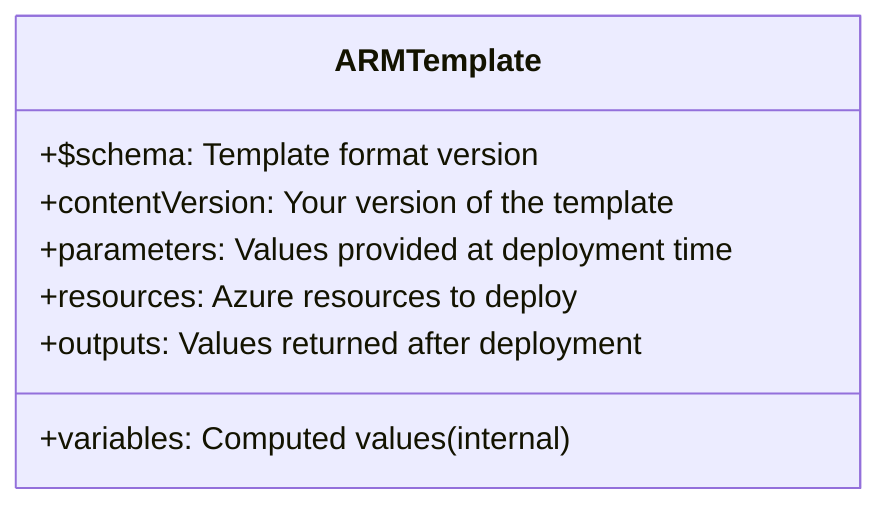
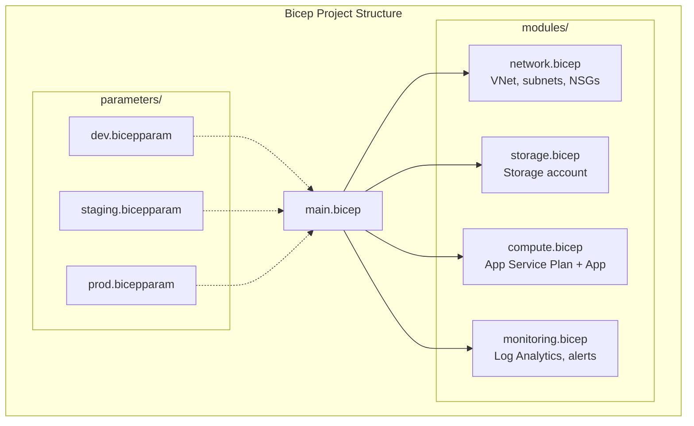
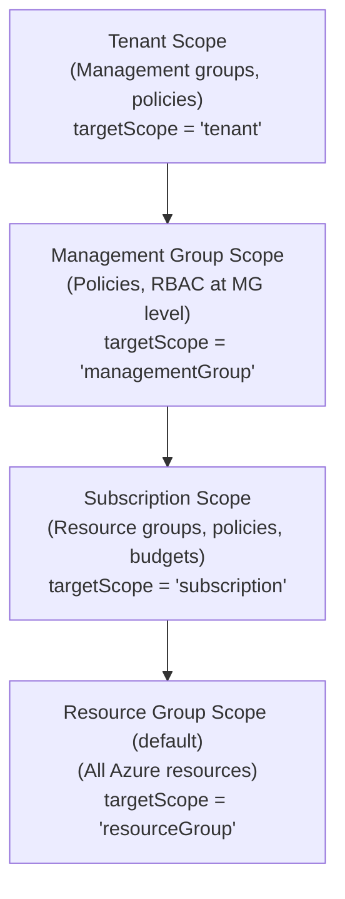
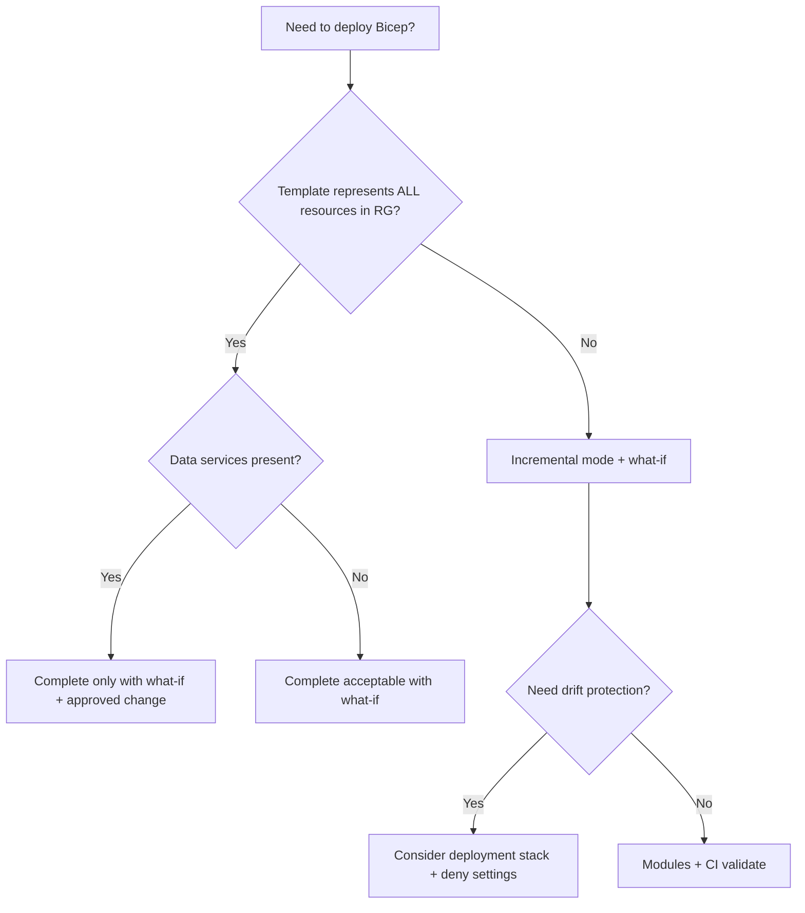

**Complexity**: `[MEDIUM]` | **Time to Complete**: ~1.5h | **Prerequisites**: Module 3.1 (Entra ID) and basic Azure CLI fluency.

## What You'll Be Able to Do

This module builds on Module 3.1 (Entra ID) plus basic Azure CLI fluency, because Bicep deployments assume you already know how to target resource groups and authenticate with `az login`. When you finish the theory sections, tool comparisons, and hands-on lab below, you will be able to accomplish the following outcomes.

- **Deploy Azure resources using Bicep templates with parameters, modules, and conditional logic**
- **Implement Bicep modules and template specs for reusable infrastructure components across teams**
- **Configure deployment stacks and what-if operations to preview and protect Bicep deployments**
- **Compare Bicep with ARM templates and Terraform to evaluate the right IaC tool for Azure environments**

---

## Why This Module Matters

Hypothetical scenario: a platform team must rebuild a staging environment after a subscription migration. Portal clicks and wiki notes disagree on SKU choices, subnet sizes, and tag conventions. Engineers spend days reconciling drift before the environment is usable again. That failure mode is common when infrastructure lives outside version control.

Once an environment is described in Bicep, reprovisioning becomes faster and more repeatable. You rerun a deployment with different parameters instead of rediscovering settings from portal history. This is the fundamental promise of Infrastructure as Code (IaC): **your infrastructure is defined in version-controlled files, not in wiki pages, portal clicks, or tribal knowledge.** ARM templates have been Azure's native IaC format since the beginning. Bicep is the modern, human-friendly language that compiles down to ARM. In this module, you will learn ARM template structure, Bicep syntax, modules, deployment scopes, and the what-if feature that previews changes before they are applied. By the end, you will refactor a CLI-based deployment script into a reusable Bicep template.

---

## ARM Templates: The Foundation

[Azure Resource Manager (ARM) is the deployment and management layer for Azure. Every Azure operation---whether from the portal, CLI, PowerShell, or SDK---goes through ARM. ARM templates are JSON files that define the resources you want to deploy.](https://learn.microsoft.com/en-us/azure/azure-resource-manager/management/overview)

### ARM Template Structure

```json
{
  "$schema": "https://schema.management.azure.com/schemas/2019-04-01/deploymentTemplate.json#",
  "contentVersion": "1.0.0.0",
  "parameters": {
    "environment": {
      "type": "string",
      "allowedValues": ["dev", "staging", "prod"],
      "defaultValue": "dev"
    },
    "location": {
      "type": "string",
      "defaultValue": "[resourceGroup().location]"
    }
  },
  "variables": {
    "storageName": "[format('kubedojo{0}{1}', parameters('environment'), uniqueString(resourceGroup().id))]"
  },
  "resources": [
    {
      "type": "Microsoft.Storage/storageAccounts",
      "apiVersion": "2023-01-01",
      "name": "[variables('storageName')]",
      "location": "[parameters('location')]",
      "sku": {
        "name": "Standard_LRS"
      },
      "kind": "StorageV2",
      "properties": {
        "minimumTlsVersion": "TLS1_2",
        "allowBlobPublicAccess": false
      }
    }
  ],
  "outputs": {
    "storageAccountName": {
      "type": "string",
      "value": "[variables('storageName')]"
    },
    "storageEndpoint": {
      "type": "string",
      "value": "[reference(variables('storageName')).primaryEndpoints.blob]"
    }
  }
}
```



The template above follows the canonical ARM shape. `parameters` accept deployment-time values. `variables` hold computed strings. `resources` declare what Azure should create. `outputs` return useful values to callers or pipelines. Every property is explicit JSON, so you can trace exactly what will deploy. The syntax still makes modest templates feel heavy compared with imperative CLI scripts.

**Pause and predict:** An ARM template dynamically computes a storage account name using `[concat(parameters('env'), uniqueString(resourceGroup().id))]`, but deployment fails because the name exceeds Azure's 24-character limit. Because ARM templates lack interactive `print()` debugging statements and expression evaluation occurs server-side, how do you locate the exact evaluated string that the engine attempted to provision?

<details>
<summary>Check your prediction</summary>

Because ARM template expression evaluation occurs server-side inside Azure Resource Manager, intermediate string expressions cannot be printed during compilation. You inspect the deployment history in the Azure portal or run `az deployment group show` and `az deployment operation group list` to examine the evaluated parameters, operations, and target resource payloads submitted by Resource Manager.
</details>

ARM templates work, but they carry significant drawbacks that show up quickly on real teams. They are **verbose** (simple deployments require dozens of lines of JSON). They are **hard to read** when nested functions pile up. JSON does not support inline comments, so intent disappears. **Modularization** via linked templates requires externally hosted URIs and extra deployment orchestration. Microsoft introduced Bicep to preserve ARM's deployment engine while removing these ergonomics gaps. You still deploy through Resource Manager. You author in a language designed for infrastructure engineers rather than JSON editors.

### ARM functions and expressions (why Bicep feels lighter)

ARM JSON uses a string-based expression language inside `[...]` brackets. Common functions include `resourceGroup()`, `subscription()`, `uniqueString()`, `format()`, and `reference()`. They are powerful but dense:

```json
"name": "[format('kubedojo{0}{1}', parameters('environment'), uniqueString(resourceGroup().id))]"
```

Bicep replaces many of these with native string interpolation: `'kubedojo${environment}${uniqueString(resourceGroup().id)}'`. The compiled output still uses ARM functions under the hood. Authors simply stop fighting JSON escaping. When you debug a failed deployment, `az deployment group show` and the portal deployment blade still expose ARM-level errors. Learning one expression style in Bicep is enough for Essentials; reach for ARM JSON function docs when decompiling legacy templates.

### Linked templates vs Bicep modules (historical context)

Before Bicep modules, large ARM solutions split into **linked templates** stored in storage accounts or template spec URIs. The parent template called children with `Microsoft.Resources/deployments` resources. That pattern works but adds moving parts: SAS tokens, URI versioning, and failure modes when a child URI is unreachable. Bicep's `module` keyword compiles to the same deployment resource type. The difference is developer ergonomics: relative paths, compile-time validation, and registry publishing. If you inherit linked-template estates, `az bicep decompile` and incremental module extraction are typical migration steps.

---

## Bicep: ARM Templates for Humans

[Bicep is a domain-specific language (DSL) that compiles to ARM JSON.](https://learn.microsoft.com/en-us/azure/azure-resource-manager/bicep/overview) It provides the same deployment capabilities with better readability and tooling. The Bicep CLI transpiles your source file into standard ARM JSON before Resource Manager sees it. That transparency matters in practice. You can mix Bicep modules with raw ARM JSON modules in one deployment. You can check compiled output into source control when a scanner only accepts JSON. Day-to-day authoring stays in the cleaner Bicep syntax.

### Bicep vs ARM Template Comparison

The storage account from the ARM example above shrinks to roughly half the line count when expressed in Bicep, and the readability gap widens once you add parameters, conditions, and modules.

```bicep
// main.bicep

@allowed(['dev', 'staging', 'prod'])
param environment string = 'dev'

param location string = resourceGroup().location

var storageName = 'kubedojo${environment}${uniqueString(resourceGroup().id)}'

resource storageAccount 'Microsoft.Storage/storageAccounts@2023-01-01' = {
  name: storageName
  location: location
  sku: {
    name: 'Standard_LRS'
  }
  kind: 'StorageV2'
  properties: {
    minimumTlsVersion: 'TLS1_2'
    allowBlobPublicAccess: false
  }
}

output storageAccountName string = storageAccount.name
output storageEndpoint string = storageAccount.properties.primaryEndpoints.blob
```

Side by side, the language differences are stark enough that teams usually standardize on Bicep for new Azure-only work while keeping ARM JSON only where legacy pipelines or third-party tools require it.

| Feature | ARM JSON | Bicep |
| :--- | :--- | :--- |
| **Lines of code** | ~40 lines | ~20 lines |
| **Comments** | Not supported | `//` and `/* */` |
| **String interpolation** | `[format('a{0}b', param)]` | `'a${param}b'` |
| **Readability** | Low (nested JSON) | High (clean syntax) |
| **IntelliSense** | Limited | [Full VS Code support](https://learn.microsoft.com/en-us/azure/azure-resource-manager/bicep/overview) |
| **Modules** | Linked templates (external URLs) | [Native `module` keyword](https://learn.microsoft.com/en-us/azure/azure-resource-manager/bicep/overview) |
| **Compilation** | N/A (direct JSON) | Compiles to ARM JSON |
| **Decompilation** | N/A | [Can decompile ARM to Bicep](https://learn.microsoft.com/en-us/azure/azure-resource-manager/bicep/decompile) |

In day-to-day use, the biggest wins are comments, string interpolation, and first-class modules. You can explain non-obvious naming logic inline. You compose `${environment}` strings naturally. You import `./modules/storage.bicep` without a template hosting endpoint. When you bootstrap from an existing environment, `az bicep decompile` gives you a starting Bicep file from exported ARM JSON. That is often faster than rewriting portal-created resources by hand.

### When teams still keep ARM JSON in repo

Some regulated environments store only JSON in Git. The workflow is: author in Bicep locally, `az bicep build`, commit `main.json`, deploy JSON in CI. Other teams store Bicep only and compile in the pipeline. Both are valid. Pick one policy per repository and enforce it in code review. Mixing hand-edited JSON with Bicep sources in the same folder without ownership rules creates drift within the IaC layer itself.

### Bicep vs Terraform

While Bicep is the native choice for Azure, Terraform remains a common option for multi-cloud IaC. Teams already managing Datadog, GitHub, or AWS with Terraform often keep Azure resources in the same state backend for operational consistency. The decision is less about syntax beauty and more about where state should live. It is also about how many clouds one pipeline must orchestrate.

Terraform plans resemble Bicep what-if previews, but the mechanics differ. Terraform compares desired state in HCL against its state file. Bicep what-if compares template against live Azure without a separate state artifact. Hybrid organizations sometimes use Terraform for multi-cloud and Bicep for Azure-only landing zones. Document the boundary so engineers do not duplicate networking baselines in two languages.

| Feature | Bicep | Terraform |
| :--- | :--- | :--- |
| **State Management** | [No state file (state is in Azure)](https://learn.microsoft.com/en-us/azure/developer/terraform/comparing-terraform-and-bicep) | Requires state file management (backend) |
| **Cloud Support** | Azure only | Multi-cloud (AWS, GCP, Azure, etc.) |
| **Day 0 Support** | [Immediate support for new Azure features](https://learn.microsoft.com/en-us/azure/azure-resource-manager/bicep/overview) | Slight delay for provider updates |
| **Integration** | Native to Azure CLI and Portal | Requires separate Terraform CLI |

The comparison tables above are a starting point. The full **Decision Framework** section later in this module walks through Bicep versus ARM JSON versus Terraform, incremental versus complete deployment mode, and local modules versus registry modules with explicit tradeoffs.

---

## Language & Authoring Model

[Bicep is a transparent abstraction over ARM JSON.](https://learn.microsoft.com/en-us/azure/azure-resource-manager/bicep/overview) There is no separate Bicep runtime in Azure. The Bicep CLI transpiles your `.bicep` file into a standard ARM deployment template, and Resource Manager deploys that JSON. Every `resource` block maps one-to-one to an entry in the compiled `resources` array. That transparency matters when security scanners only accept JSON, when you need to diff compiled output in CI, or when you mix Bicep modules with legacy ARM JSON modules in one deployment.

### File anatomy: params, vars, resources, modules, outputs

A [Bicep file](https://learn.microsoft.com/en-us/azure/azure-resource-manager/bicep/file) is declarative. Element order does not change deployment behavior. The canonical sections are:

| Section | Purpose | Typical use |
| :--- | :--- | :--- |
| `targetScope` | Where the deployment runs | Default `resourceGroup`; lift to `subscription` to create RGs |
| `param` | Inputs at deploy time | Environment name, SKU, secrets (`@secure()`) |
| `var` | Internal computed values | Naming prefixes, tag objects, derived CIDRs |
| `resource` | Azure resources to create | One symbolic name per resource; pin `@api-version` |
| `module` | Reusable nested deployments | Local path, registry `br:`, or template spec |
| `output` | Values returned to callers | Endpoints, resource IDs, connection hints |

Metadata, user-defined `type` blocks, and experimental `func` definitions extend the model for larger platforms. For most Essentials modules, parameters, variables, resources, modules, and outputs cover daily work.

### Resource dependencies: implicit vs explicit

[Resource Manager orders deployments using dependencies.](https://learn.microsoft.com/en-us/azure/azure-resource-manager/bicep/resource-dependencies) In Bicep, referencing another resource's symbolic name creates an **implicit** dependency. If `webApp` uses `appServicePlan.id`, ARM deploys the plan before the web app without a manual `dependsOn` array.

You add **explicit** `dependsOn` when the link is not visible from property references alone. Examples include a deployment script that must run after a storage account exists, or extension resources that need ordering the compiler cannot infer. Prefer implicit dependencies because they stay readable and survive refactors.

```bicep
// Implicit: webApp waits for plan because of serverFarmId reference
resource appServicePlan 'Microsoft.Web/serverfarms@2023-01-01' = {
  name: 'kubedojo-plan'
  location: resourceGroup().location
  sku: { name: 'B1' }
}

resource webApp 'Microsoft.Web/sites@2023-01-01' = {
  name: 'kubedojo-web'
  location: resourceGroup().location
  properties: {
    serverFarmId: appServicePlan.id
  }
}

// Explicit dependsOn when no property reference exists
resource diagnosticSetting 'Microsoft.Insights/diagnosticSettings@2021-05-01-preview' = {
  name: 'send-to-log-analytics'
  scope: webApp
  properties: {
    workspaceId: logAnalyticsWorkspace.id
  }
  dependsOn: [
    webApp
    logAnalyticsWorkspace
  ]
}
```

### Loops, conditions, and existing resources

[Iterative loops](https://learn.microsoft.com/en-us/azure/azure-resource-manager/bicep/loops) use `[for item in collection: { ... }]`. You can loop resources, modules, variables, properties, and outputs. [Conditional deployments](https://learn.microsoft.com/en-us/azure/azure-resource-manager/bicep/conditional-resource-deployment) use `if (expression)` on a resource or module. Skipped resources are absent from the deployment, which affects outputs that reference them.

[Existing resource references](https://learn.microsoft.com/en-us/azure/azure-resource-manager/bicep/existing-resource) let a template read resources deployed elsewhere without recreating them. You declare `existing` and optionally set `scope` to another resource group or subscription. Platform templates often reference a shared Key Vault, hub VNet, or Log Analytics workspace this way.

### Small module example: network + compute wiring

The snippet below is a realistic slice of a service template. It shows params, vars, implicit dependencies, a conditional dev-only storage account, and outputs for a pipeline.

```bicep
@description('Environment name')
@allowed(['dev', 'staging', 'prod'])
param environment string

param location string = resourceGroup().location

var prefix = 'kubedojo-${environment}'
var tags = {
  environment: environment
  costCenter: 'platform-eng'
  managedBy: 'bicep'
}

resource vnet 'Microsoft.Network/virtualNetworks@2023-04-01' = {
  name: '${prefix}-vnet'
  location: location
  tags: tags
  properties: {
    addressSpace: { addressPrefixes: ['10.0.0.0/16'] }
    subnets: [
      { name: 'app', properties: { addressPrefix: '10.0.1.0/24' } }
    ]
  }
}

resource devStorage 'Microsoft.Storage/storageAccounts@2023-01-01' = if (environment == 'dev') {
  name: '${replace(prefix, '-', '')}devstore'
  location: location
  tags: tags
  sku: { name: 'Standard_LRS' }
  kind: 'StorageV2'
}

output vnetResourceId string = vnet.id
output devStorageName string = environment == 'dev' ? devStorage.name : ''
```

Compile locally before every PR: `az bicep build --file main.bicep` writes `main.json` so reviewers can inspect the ARM Resource Manager will execute.

### Transpilation mental model (1:1 with ARM resources)

When you declare `resource stg 'Microsoft.Storage/storageAccounts@2023-01-01' = { ... }`, the compiler emits one entry in the `resources` array of the ARM template. Module blocks emit nested `Microsoft.Resources/deployments` resources. Parameters become ARM `parameters`; variables become ARM `variables`. There is no hidden magic layer that changes SKU semantics. If a Bicep deployment creates an unexpected resource type, the compiled JSON is the ground truth artifact to inspect.

Decompilation (`az bicep decompile --file exported.json`) is lossy for human readability but excellent for bootstrapping. Exported portal templates include noise and sometimes outdated API versions. Treat decompile output as a draft. Refactor into modules, parameters, and naming variables before merging to main.

### Bicep building blocks in one file

Most production templates combine parameters for environment variance, variables for derived names and tags, resource declarations with explicit API versions, optional `existing` references for out-of-scope dependencies, conditional and loop constructs for branching deployments, and outputs that downstream modules or pipelines consume. The example below shows each pattern in one file so you can see how they interact before splitting the file into modules.

```bicep
// Parameters: Values provided at deployment time
@description('The environment name')
@allowed(['dev', 'staging', 'prod'])
param environment string

@description('Azure region for resources')
param location string = resourceGroup().location

@minValue(1)
@maxValue(10)
param instanceCount int = 2

@secure()
param adminPassword string  // Marked secure: not logged, not shown in outputs

// Variables: Computed values
var prefix = 'kubedojo-${environment}'
var tags = {
  environment: environment
  project: 'kubedojo'
  managedBy: 'bicep'
}

// Resources: Azure resources to deploy
resource vnet 'Microsoft.Network/virtualNetworks@2023-04-01' = {
  name: '${prefix}-vnet'
  location: location
  tags: tags
  properties: {
    addressSpace: {
      addressPrefixes: ['10.0.0.0/16']
    }
    subnets: [
      {
        name: 'app-subnet'
        properties: {
          addressPrefix: '10.0.1.0/24'
        }
      }
      {
        name: 'data-subnet'
        properties: {
          addressPrefix: '10.0.2.0/24'
        }
      }
    ]
  }
}

// Reference existing resources (not deployed by this template)
resource existingKeyVault 'Microsoft.KeyVault/vaults@2023-02-01' existing = {
  name: 'my-existing-vault'
  scope: resourceGroup('other-rg')  // Can reference resources in other RGs
}

// Conditional deployment
resource devStorage 'Microsoft.Storage/storageAccounts@2023-01-01' = if (environment == 'dev') {
  name: '${prefix}devstorage'
  location: location
  sku: { name: 'Standard_LRS' }
  kind: 'StorageV2'
  properties: {}
}

// Loops
resource nsgRules 'Microsoft.Network/networkSecurityGroups@2023-04-01' = [for i in range(0, instanceCount): {
  name: '${prefix}-nsg-${i}'
  location: location
  properties: {}
}]

// Outputs
output vnetId string = vnet.id
output subnetIds array = [for subnet in vnet.properties.subnets: subnet.id]
```

**Pause and predict:** You declare an Azure resource with a conditional guard `if (environment == 'dev')` and define a template output that directly references its `.id` property without any conditional expression. When you deploy this template to a production environment where the condition evaluates to false, what happens when the ARM engine attempts to evaluate the output block?

<details>
<summary>Check your prediction</summary>

The ARM deployment engine fails at runtime with an evaluation error because it cannot dereference properties from a resource that was not provisioned. To avoid deployment failure when referencing conditional resources, outputs must use a ternary expression (such as `environment == 'dev' ? devStorage.id : ''`) or separate environment tier configurations so they do not dereference a missing resource.
</details>

Pay attention to API versions in each `resource` declaration. Pinning `Microsoft.Storage/storageAccounts@2023-01-01` makes upgrades deliberate. Drifting to "latest" during a routine edit can change property schemas and break CI unexpectedly. Secure parameters (`@secure()`) keep secrets out of deployment logs. That matters the moment you parameterize admin passwords or connection strings.

### Conditional outputs and symbolic references

Bicep constructs an internal directed acyclic graph by resolving symbolic references across all resource and module declarations. When a downstream resource refers to `vnet.id` or `appServicePlan.id`, Resource Manager automatically infers the required deployment sequence without requiring manual `dependsOn` declarations. Symbolic identifiers exist exclusively within Bicep source code and do not alter the physical Azure resource names assigned in Resource Manager. Designing clean module boundaries requires keeping outputs targeted and deterministic, providing callers with stable endpoints and resource identifiers that abstract underlying implementation choices.

Symbolic names are case-sensitive and cannot collide with parameter or variable names. Reference resources with their symbolic name (`storageAccount.name`), not the Azure resource name string, so renames propagate automatically.

### Deploying Bicep Templates

Once a template compiles cleanly, deployment is a Resource Manager operation. You invoke it through Azure CLI, PowerShell, Azure DevOps, or GitHub Actions. The CLI commands below show the usual progression. Deploy with inline parameters when experimenting. Deploy with a parameter file when environments differ. Preview with what-if before shared environments. Validate without mutating resources in CI. Inspect history when debugging partial failures. Decompile exported JSON when migrating legacy ARM from portal exports.

Understanding failure messages is part of safe deployment practice. Common classes include:

- **Authorization** — `AuthorizationFailed` means the deploying identity lacks RBAC on the RG or resource type.
- **Quota** — `QuotaExceeded` means subscription limits for cores, public IPs, or storage accounts.
- **Invalid template** — Compile-time Bicep errors should be caught by `az bicep build`; ARM validation errors appear in `az deployment group validate`.
- **Conflict** — Name collisions on globally unique resources such as storage accounts.

When a nested module fails, open the child deployment in the portal or with `az deployment operation group list`. The parent deployment shows success while a child failed; do not assume the whole stack is healthy from the parent status alone.

```bash
# Deploy a Bicep template to a resource group
az deployment group create \
  --resource-group myRG \
  --template-file main.bicep \
  --parameters environment=staging instanceCount=3

# Deploy with a parameters file
az deployment group create \
  --resource-group myRG \
  --template-file main.bicep \
  --parameters @parameters.staging.json

# Preview changes (what-if) before deploying
az deployment group what-if \
  --resource-group myRG \
  --template-file main.bicep \
  --parameters environment=staging

# Validate without deploying
az deployment group validate \
  --resource-group myRG \
  --template-file main.bicep \
  --parameters environment=staging

# View deployment history
az deployment group list --resource-group myRG -o table

# Export an existing resource group to Bicep (decompile)
az bicep decompile --file exported-template.json
```

---

## Bicep Modules: Composable Infrastructure

Modules are the killer feature of Bicep. They let you break large templates into reusable components with explicit input parameters and typed outputs. Think of them like functions in a programming language, but fully declarative. A `main.bicep` file orchestrates the environment. `./modules/*.bicep` files encapsulate networking, storage, compute, and observability. Environment-specific `.bicepparam` files supply the only values that should change between dev, staging, and prod.

### Module contracts: inputs, outputs, and deployment names

Each module invocation creates a nested deployment with the `name` you provide. That name appears in deployment history and must be unique within the parent deployment. Use descriptive names (`storage-${environment}`) so operators correlate portal blades with Git modules.

Module **params** are the public API. Treat breaking param renames like application API changes: semver your registry modules and document migrations. Module **outputs** are the integration surface for `main.bicep`. Export only what parents need (IDs, endpoints, names). Avoid leaking internal symbolic names.

When a module fails, nested deployment errors bubble up with the child deployment name. Splitting modules by failure domain (network vs compute) shortens incident triage because you know which nested deployment to open first.

### Orchestration patterns that scale

Three patterns appear repeatedly in Azure platform engineering:

- **Layered main** — `main.bicep` calls networking, then compute, then observability modules. Pass subnet IDs from network outputs into compute params. Dependencies stay implicit through output references.
- **Environment router** — One `main.bicep`, many `.bicepparam` files. CI selects the parameter file by branch or pipeline stage. No template forks per environment.
- **Platform base + product overlay** — Subscription template creates RG and policies. Product `main.bicep` deploys into the RG. Keeps guardrails centralized and application velocity high.

Anti-pattern: circular output dependencies between modules A and B. Bicep compile fails early, but design reviews should catch logical cycles before merge.



In the layout above, `main.bicep` stays thin: it wires modules together, passes shared tags and naming prefixes, and exposes top-level outputs for pipelines. Each module file owns one bounded slice of infrastructure so reviewers can reason about storage SKUs separately from App Service Plan sizing.

```bicep
// modules/storage.bicep
@description('Storage account name')
param name string

@description('Azure region')
param location string

@description('Storage account SKU')
@allowed(['Standard_LRS', 'Standard_ZRS', 'Standard_GRS'])
param skuName string = 'Standard_LRS'

param tags object = {}

resource storage 'Microsoft.Storage/storageAccounts@2023-01-01' = {
  name: name
  location: location
  tags: tags
  sku: { name: skuName }
  kind: 'StorageV2'
  properties: {
    minimumTlsVersion: 'TLS1_2'
    allowBlobPublicAccess: false
    supportsHttpsTrafficOnly: true
  }
}

output id string = storage.id
output name string = storage.name
output primaryEndpoint string = storage.properties.primaryEndpoints.blob
```

```bicep
// modules/appServicePlan.bicep
param name string
param location string
param skuName string = 'B1'
param tags object = {}

resource plan 'Microsoft.Web/serverfarms@2023-01-01' = {
  name: name
  location: location
  tags: tags
  sku: {
    name: skuName
  }
  kind: 'linux'
  properties: {
    reserved: true  // Required for Linux
  }
}

output id string = plan.id
output name string = plan.name
```

```bicep
// main.bicep - Using modules
@allowed(['dev', 'staging', 'prod'])
param environment string

param location string = resourceGroup().location

var prefix = 'kubedojo-${environment}'
var tags = {
  environment: environment
  project: 'kubedojo'
  managedBy: 'bicep'
}

// Deploy storage using the module
module storage 'modules/storage.bicep' = {
  name: 'storage-deployment'
  params: {
    name: '${replace(prefix, '-', '')}store'
    location: location
    skuName: environment == 'prod' ? 'Standard_ZRS' : 'Standard_LRS'
    tags: tags
  }
}

// Deploy App Service Plan using the module
module appPlan 'modules/appServicePlan.bicep' = {
  name: 'app-plan-deployment'
  params: {
    name: '${prefix}-plan'
    location: location
    skuName: environment == 'prod' ? 'P1v3' : 'B1'
    tags: tags
  }
}

// Reference module outputs
output storageEndpoint string = storage.outputs.primaryEndpoint
output appPlanId string = appPlan.outputs.id
```

Notice how `main.bicep` references `storage.outputs.primaryEndpoint` and `appPlan.outputs.id` without re-declaring those resources. That is the compositional payoff. Modules remain independently testable with `az bicep build` per file. The root template describes the full environment graph. In code review, challenge modules that export ten outputs but only three are used. Unused outputs often signal unclear module boundaries.

Testing strategy for modules: compile each module in isolation, run `az deployment group validate` with mock parameters in a lab RG, and only then integrate into `main.bicep`. For registry modules, add a consumer template in the module repository that pins the version under test.

### Bicep Parameters Files

Parameter files keep secrets and environment-specific values out of the shared template. A `.bicepparam` file binds to exactly one Bicep entrypoint via `using`, so CI can deploy the same `main.bicep` everywhere while swapping only the parameter file path.

```bicep
// parameters/staging.bicepparam
using '../main.bicep'

param environment = 'staging'
param location = 'eastus2'
```

```bash
# Deploy with a .bicepparam file
az deployment group create \
  --resource-group myRG \
  --template-file main.bicep \
  --parameters parameters/staging.bicepparam
```

### User-defined types and secure parameters (advanced authoring)

[Bicep user-defined types](https://learn.microsoft.com/en-us/azure/azure-resource-manager/bicep/user-defined-data-types) let you group related parameters into one structured object with compile-time validation. Instead of eight separate VM parameters, you define a `vmConfig` type and pass one object. That pattern scales when platform teams publish opinionated configs (backup policy bundles, monitoring baselines).

Combine types with `@secure()` on secrets. Secure parameters are not logged in deployment history the same way plain strings are. They still exist in parameter files on disk, so protect `.bicepparam` with pipeline secret stores for passwords and keys. Prefer managed identities at runtime over embedding secrets in templates when the service supports it.

### Sharing Modules: Registries and Template Specs

When modules graduate from a single repository to an organization-wide standard, you need a distribution mechanism that enforces versioning and access control. Azure provides two native ways to share IaC components without asking every team to clone the same Git repository.

1. **Private Bicep Registries (ACR)**: [You can publish Bicep modules to an Azure Container Registry (ACR). Teams reference them using the `br:` scheme](https://learn.microsoft.com/en-us/azure/azure-resource-manager/bicep/private-module-registry) (e.g., `module redis 'br:myacr.azurecr.io/bicep/modules/redis:v1'`).
2. **Template Specs**: [Template specs are native Azure resources that store an ARM template for later deployment. You can compile a Bicep file and save it as a Template Spec, complete with RBAC access control and versioning](https://learn.microsoft.com/en-us/azure/azure-resource-manager/bicep/template-specs), allowing non-developers to deploy standardized infrastructure directly from the Azure Portal.

```bash
# Publish a Bicep module to a Template Spec
az ts create \
  --name standard-storage-spec \
  --version "1.0.0" \
  --resource-group myRG \
  --location eastus2 \
  --template-file modules/storage.bicep
```

---

## Deployment Scopes & Modularity

[Bicep can deploy resources at four scopes.](https://learn.microsoft.com/en-us/azure/azure-resource-manager/bicep/deploy-to-resource-group) Each scope defines what resource types you may declare and which Azure CLI command invokes the deployment. Choosing the wrong scope is a common review failure: a resource group template cannot create a subscription policy without changing `targetScope`.

| Scope | `targetScope` value | Typical resources | CLI command |
| :--- | :--- | :--- | :--- |
| Resource group | `resourceGroup` (default) | Storage, VNets, AKS, Web Apps | `az deployment group create` |
| Subscription | `subscription` | Resource groups, policies, budgets | `az deployment sub create` |
| Management group | `managementGroup` | MG policies, RBAC at MG level | `az deployment mg create` |
| Tenant | `tenant` | Tenant-wide policies, Entra artifacts | `az deployment tenant create` |

Most application templates stay at resource group scope. Platform teams lift to subscription or management group when the template must create the resource group itself, assign Azure Policy, or wire role assignments before application resources land.



```bicep
// Subscription-scoped deployment: create a resource group + deploy into it
targetScope = 'subscription'

param location string = 'eastus2'
param environment string

resource rg 'Microsoft.Resources/resourceGroups@2022-09-01' = {
  name: 'kubedojo-${environment}'
  location: location
}

// Deploy resources into the newly created resource group
module resources 'main.bicep' = {
  name: 'resources-deployment'
  scope: rg  // Deploy into the RG we just created
  params: {
    environment: environment
    location: location
  }
}
```

Subscription-scoped deployments are a common pattern for platform teams. The outer template creates the resource group. A nested module uses `scope: rg` so application templates stay resource-group-local while the subscription template owns naming and placement policy.

```bash
# Resource group scope (default)
az deployment group create -g myRG -f main.bicep

# Subscription scope
az deployment sub create --location eastus2 -f subscription.bicep

# Management group scope
az deployment mg create --management-group-id myMG --location eastus2 -f mg.bicep

# Tenant scope
az deployment tenant create --location eastus2 -f tenant.bicep
```

### Local modules vs registry modules vs template specs

Three distribution patterns cover most enterprise Bicep reuse:

1. **Local modules** (`module net './modules/network.bicep' = { ... }`) — fastest for a single repo; paths are relative; ideal for tightly coupled stacks reviewed together in one PR.
2. **[Private Bicep registry on ACR](https://learn.microsoft.com/en-us/azure/azure-resource-manager/bicep/private-module-registry)** — publish versioned modules; consumers reference `br:myregistry.azurecr.io/bicep/modules/redis:v1`. Scales when many subscriptions need the same hardened baseline without copying Git subtrees.
3. **[Template specs](https://learn.microsoft.com/en-us/azure/azure-resource-manager/bicep/template-specs)** — ARM templates stored as Azure resources with RBAC and versioning; portal-friendly for operators who do not edit Git daily.

Registry modules trade local simplicity for governance. Template specs trade Bicep-native ergonomics for portal deploy buttons. Local modules trade enterprise scale for speed during early product development.

```bicep
// Registry module (requires prior publish to ACR)
module redisCache 'br:contoso.azurecr.io/bicep/redis:v1' = {
  name: 'redis-${environment}'
  params: {
    name: '${prefix}-cache'
    location: location
    sku: environment == 'prod' ? 'Premium' : 'Basic'
  }
}
```

Publish registry artifacts in CI after `az bicep build` succeeds. Pin versions in consumer templates so a floating `:latest` tag cannot change production SKUs overnight.

---

## Deployment Stacks: Managing Resource Lifecycles

While Bicep modules organize your **code**, [deployment stacks](https://learn.microsoft.com/en-us/azure/azure-resource-manager/bicep/deployment-stacks) organize **deployed resources**. A stack is a native Azure resource that tracks a set of resources deployed from a template. Stacks can span resource groups and subscriptions when platform boundaries require it.

Stacks address two production gaps that modules alone do not solve:

- **Lifecycle cleanup** — When you remove a resource from the template and redeploy the stack, [actionOnUnmanage](https://learn.microsoft.com/en-us/azure/azure-resource-manager/bicep/deployment-stacks) can delete or detach resources that are no longer managed. That is closer to "template is source of truth" than incremental mode alone.
- **Drift protection** — [Deny settings](https://learn.microsoft.com/en-us/azure/azure-resource-manager/bicep/deployment-stacks) can block portal or CLI deletes and modifications on managed resources. Use this when regulatory or SRE policy requires infrastructure changes to flow through Git, not break-glass portal edits.

Deny settings are powerful. A misconfigured deny rule can block legitimate incident response. Pilot stacks on non-production scopes first. Document an escalation path before enabling `denyDelete` on data-plane resources.

```bash
# Create a deployment stack with DenySettings to protect against drift
az stack group create \
  --name my-production-stack \
  --resource-group myRG \
  --template-file main.bicep \
  --action-on-unmanage detachAll \
  --deny-settings-mode denyDelete \
  --yes
```

Stacks complement incremental deployments; they do not replace Git review. A stack tracks which resources belong to the managed set. Removing a resource from the template without updating the stack action can leave orphans or surprise deletes depending on `actionOnUnmanage`. Document whether your organization uses `deleteResources` or `detachResources` for non-production stacks. Detach is safer when experimenting. Delete enforces strict parity at the cost of data loss risk.

---

## Operating Bicep in Shared Subscriptions

Shared subscriptions multiply the impact of template mistakes. A staging deployment that targets the wrong resource group name can overwrite production if parameters are swapped. Guardrails that reduce that risk are cheap compared to incident hours.

**Resource group targeting** — Always pass `-g` or `--resource-group` explicitly in scripts. Never rely on `az configure` defaults in CI agents. Pipeline variables should include subscription ID and resource group name per environment.

**Parameter file review** — `.bicepparam` diffs should be as visible as `.bicep` diffs in pull requests. A one-line change from `eastus2` to `westeurope` can move data across regions with egress cost implications.

**Deployment correlation** — Tag deployments with Git SHA in the deployment name or via `metadata` in Bicep. When finance asks why storage spend doubled, you need the deployment name that introduced `Standard_GRS`.

**Cross-subscription modules** — Modules can set `scope` to resource groups in other subscriptions when RBAC allows. Hub-spoke networks often reference hub VNets with `existing` and peering resources in spoke templates. Draw scope diagrams in design docs so reviewers see subscription boundaries.

**Kubernetes note for this curriculum** — When Bicep deploys AKS, cluster version should align with the KubeDojo target (Kubernetes 1.35). Pin `kubernetesVersion` in the AKS resource block rather than accepting portal defaults. Upgrades belong in planned template changes with what-if, not ad hoc portal bumps.

### Drift detection without complete mode

Incremental mode does not delete portal-created resources missing from the template. Teams run scheduled what-if jobs comparing Git main to live Azure. Any unexpected `+` or `~` triggers a ticket to backfill Bicep or remove manual resources. This pattern avoids complete mode while still surfacing drift within days instead of months.

### Export and import workflows

`az group export` and portal export generate ARM JSON for brownfield imports. Expect manual cleanup: exported templates include default properties and sometimes resources you no longer want. Workflow: export → decompile to Bicep → refactor modules → validate in lab RG → what-if against production RG read-only (if RBAC permits preview) → deploy incrementally.

---

## Safe Deployment Practices

Production Bicep work is not only syntax. It is a pipeline of validate, lint, what-if, and controlled apply. [What-if](https://learn.microsoft.com/en-us/azure/azure-resource-manager/templates/deploy-what-if) is your safety net before any `az deployment group create` touches shared environments. It predicts create, modify, and delete operations without changing resources. Bicep has no separate state file; what-if is how you see blast radius against live Azure.

**Pause and predict:** An administrator creates a test subnet directly inside a virtual network using the Azure portal. Your team later runs a what-if operation in Incremental deployment mode with a Bicep template that declares the virtual network but omits this new subnet from the `subnets` array. Will what-if flag the manual subnet for deletion with a minus sign (-)?

<details>
<summary>Check your prediction</summary>

Incremental deployments often do not delete omitted array elements from existing parent resources. Because Resource Manager treats nested array properties additively or retains existing unreferenced items in many resource providers, the manual subnet is typically ignored rather than marked with a deletion symbol (-).
</details>

Array properties are not the only subtle case. Renaming a resource in Bicep usually creates a destroy-and-recreate plan because Azure resource names are often immutable. What-if shows delete plus create. Treat name changes as migration projects with data copy plans, not as casual refactors.

```bash
# Preview changes
az deployment group what-if \
  --resource-group myRG \
  --template-file main.bicep \
  --parameters environment=staging
```

The what-if output uses color-coded symbols so you can scan a large deployment quickly. Treat anything marked modify or delete as a prompt to read the underlying property path, not as noise to scroll past.

```text
What-If Results:

+ Create    (new resource will be created)
~ Modify    (existing resource properties will change)
- Delete    (resource will be removed — complete mode or omitted from template)
= NoChange  (resource exists and matches template; may redeploy without property changes)
* Ignore    (resource exists but is not in the template, or what-if could not expand it)
! Deploy    (ResourceIdOnly format — resource will redeploy; property changes unknown)

Example output:
Resource and property changes are indicated with these symbols:
  - Delete
  + Create
  ~ Modify

The deployment will update the following scope:
Scope: /subscriptions/xxx/resourceGroups/myRG

  ~ Microsoft.Storage/storageAccounts/kubedojostorage [2023-01-01]
    ~ properties.minimumTlsVersion: "TLS1_0" => "TLS1_2"

  + Microsoft.Web/serverfarms/kubedojo-staging-plan [2023-01-01]
```

**Pause and predict:** An operations engineer wants to eliminate manual configuration drift across cloud environments and proposes configuring continuous deployment release pipelines to execute in Complete mode by default. Is Complete mode the recommended safe everyday default for routine application deployments?

<details>
<summary>Check your prediction</summary>

Incremental mode is the safe everyday default for Azure deployments. Complete mode deletes any existing resources in the target resource group that are omitted from the template, which can inadvertently destroy production databases, shared network links, or unmanaged secrets; complete mode should only be used with explicit what-if validation and formal change tickets.
</details>

Resource Manager evaluates [complete mode](https://learn.microsoft.com/en-us/azure/azure-resource-manager/templates/deployment-modes) across the entire target resource group scope rather than individual component boundaries. When engineering teams adopt automated deletion semantics for dedicated ephemeral clusters, they isolate stateful assets into separate long-lived resource groups protected by Azure Resource Manager locks. Platform teams combine read-only locks on operational data tiers with strict branch protection rules, ensuring that automated provisioning systems never prune unreferenced resources without explicit multi-stage architecture review.

### What-if change types and how to read them

What-if output uses symbols documented on Learn. Train reviewers to treat `~ Modify` on SKU or redundancy properties as a cost signal, not only a technical diff.

| Symbol | Meaning | Reviewer question |
| :--- | :--- | :--- |
| `+` | Create | Is this resource net-new spend? |
| `~` | Modify | Does SKU, redundancy, or retention change monthly cost? |
| `-` | Delete | Is data loss possible (storage, SQL, DNS)? |
| `=` | NoChange | Confirms template matches live for that resource |
| `*` | Ignore | Resource not in template or what-if could not expand it |
| `!` | Deploy | ResourceIdOnly format — redeploy expected; property diff unknown |

Array properties on resources such as subnets deserve extra care. Incremental deployments may not delete portal-added array elements that the template omits. What-if helps surface that class of drift before you assume parity.

### CI integration: validate, build, what-if, deploy

A minimal safe pipeline for pull requests:

```yaml
# Excerpt: GitHub Actions style — adapt to your runner auth (OIDC/federated credential)
steps:
  - name: Install Bicep CLI
    run: az bicep install
  - name: Build and lint
    run: az bicep build --file infra/main.bicep
  - name: Validate deployment
    run: |
      az deployment group validate \
        --resource-group ${{ vars.RG_NAME }} \
        --template-file infra/main.bicep \
        --parameters @infra/parameters/ci.bicepparam
  - name: What-if (required gate)
    run: |
      az deployment group what-if \
        --resource-group ${{ vars.RG_NAME }} \
        --template-file infra/main.bicep \
        --parameters @infra/parameters/ci.bicepparam \
        --result-format ResourceIdOnly
```

Promotion to production should require a human or break-glass approver on what-if output when the diff shows deletes or SKU changes on data services. Store deployment names in pipelines so `az deployment group list` correlates Git commits with Azure history.

```bash
# Deployment modes
# Incremental (default): Add/modify resources, never delete
az deployment group create -g myRG -f main.bicep --mode Incremental

# Complete: Add/modify AND delete resources not in template (DANGEROUS)
az deployment group create -g myRG -f main.bicep --mode Complete

# ALWAYS use what-if before complete mode
az deployment group what-if -g myRG -f main.bicep --mode Complete
```

---

## Cost Lens: IaC Prevents Cost Surprises

Bicep and ARM template deployments have **no per-deployment metered charge** from Microsoft for the deployment operation itself. The cost lever is what resources your template creates and how you operate deployments over time. Framing IaC as a cost-control discipline is accurate: templates make spend visible, reviewable, and repeatable.

| Cost risk | How Bicep/ARM practice reduces it |
| :--- | :--- |
| Accidental SKU upgrade | What-if shows `~` on `sku` before apply; PR review catches `P` series in staging |
| Complete-mode data loss | Deletes trigger re-create bills and downtime; incremental default avoids surprise `-` |
| Untagged resources | `var tags` applied in template feeds Cost Management allocation |
| Environment sprawl | Same `main.bicep` + different `.bicepparam` keeps dev cheap and prod right-sized |
| Drift + emergency rebuild | Redeploy from Git is faster than forensic portal archaeology |

**Knobs that change monthly spend** include App Service Plan SKU, storage redundancy (`LRS` vs `ZRS` vs `GRS`), AKS node pool VM size, and SQL tier. Encode those as parameters with `@allowed` sets so a typo cannot jump from `B1` to `P3v3` silently. Use environment maps (`envConfig[environment].appSku`) like the lab template so prod and dev diverge deliberately, not accidentally.

**What makes cost spike unexpectedly** includes deploying to the wrong subscription (production parameters against a sandbox subscription that later bills centrally), enabling geo-redundant storage for dev workloads, and complete-mode deletes that force full reprovision with higher SKUs. Tag enforcement in Bicep is cheap insurance: a missing `costCenter` tag today becomes a finance escalation next quarter.

Finance and engineering should agree on which parameters are **cost knobs** in each template. Document them in module README files or `metadata` descriptions. During review, diff those parameters first. A change from `Standard_LRS` to `Standard_GRS` is rarely "just a one-liner" for monthly storage bills.

Hypothetical scenario: a pipeline promotes the production parameter file to a subscription that uses enterprise agreement discounts differently per region. The template deploys successfully. Cost Management shows a 40% month-over-month increase. Root cause is region and redundancy parameters, not a deployment failure. IaC did its job; parameter governance failed.

---

## Patterns & Anti-Patterns

| Pattern | When to use it | Why it works | Scaling note |
| :--- | :--- | :--- | :--- |
| Parameter files per environment | Same architecture, different SKUs and regions | Template stays single source; CI swaps only `.bicepparam` | Add a fourth environment by adding one file, not cloning templates |
| Thin `main.bicep` + domain modules | Networking, data, and compute change at different rates | Reviewers scope diffs; modules compile independently | Publish mature modules to `br:` registry when 3+ teams consume them |
| Mandatory what-if in CI | Every PR touching `*.bicep` | Surfaces blast radius before merge | Cache nothing that skips what-if on production paths |
| `existing` for shared platform resources | Hub VNet, central Key Vault, Log Analytics | Avoids redeploying shared dependencies | Document scope and RBAC; cross-RG references need reader rights |
| Pin API versions | Long-lived platforms | Prevents surprise schema breaks on "latest" drift | Schedule quarterly API version upgrades with test what-if |
| Deployment stacks with deny on prod | Strict IaC-only estates | Blocks portal drift on managed resources | Pilot deny settings; keep break-glass runbook |

| Anti-pattern | What goes wrong | Why teams fall into it | Better alternative |
| :--- | :--- | :--- | :--- |
| Monolithic 2,000-line `main.bicep` | Review fatigue; accidental cross-resource edits | "It worked in the demo" | Split modules by bounded context |
| Floating registry tag (`:latest`) | Unreviewed SKU or security defaults change overnight | Fastest path to consume shared module | Pin `br:.../module:v1.4.2` |
| Complete mode as "cleanup" | Deletes databases not listed in template | Misunderstanding incremental vs complete | Incremental + stack `deleteResources` policy |
| Skipping what-if on "tiny" changes | Storage networking rules wiped with app SKU tweak | Late-night incident deploy | What-if even for one-property diffs |
| Hardcoded production SKUs in template | Staging bills like prod; dev cannot shrink spend | Copy-paste from prod export | `envConfig` map or parameters |
| Portal hotfix without backfill to Git | Next deployment overwrites or fights manual fix | Speed during incident | Backfill Bicep, then redeploy incrementally |

---

## Decision Framework

Use these matrices when choosing tools and deployment modes. They complement the Bicep-vs-Terraform table earlier; they do not replace architecture review for multi-cloud estates.

### IaC language: Bicep vs ARM JSON vs Terraform

| Criterion | Bicep | ARM JSON | Terraform (AzureRM) |
| :--- | :--- | :--- | :--- |
| Azure-only greenfield | Preferred | Legacy maintenance | Viable if org standard |
| Readability & modules | Native `module`, comments | Verbose linked templates | HCL modules + registry |
| State management | Azure holds deployed graph | Same | Remote state required |
| Day-0 new Azure APIs | Typically immediate via Bicep | Same underlying ARM | Provider lag possible |
| Multi-cloud | No | No | Yes |
| Security scan JSON-only | `az bicep build` → scan JSON | Direct | `terraform plan` JSON export |

**Choose Bicep** when the team is Azure-native and wants transpiled ARM without maintaining JSON by hand. **Choose ARM JSON** when a regulated pipeline forbids `.bicep` in artifacts but allows compiled output. **Choose Terraform** when one pipeline must own AWS, Azure, and SaaS providers with shared state practices.

### Deployment mode: incremental vs complete

| Question | If "yes" → | If "no" → |
| :--- | :--- | :--- |
| Template lists every resource that must survive in the RG? | Consider complete with what-if | Stay incremental |
| Drift from portal must be pruned automatically? | Stack + managed lifecycle, not ad hoc complete | Incremental + backfill Git |
| Data services exist in the RG? | Avoid complete unless template owns them explicitly | Incremental |
| Greenfield empty RG? | Either mode works; still run what-if | — |



### Module distribution: local vs registry vs template spec

| Factor | Local path | Bicep registry (`br:`) | Template spec |
| :--- | :--- | :--- | :--- |
| Team count | 1–2 teams in one repo | Many teams / subscriptions | Mixed dev + operator consumers |
| Version discipline | Git tags / folders | Semver in registry | Template spec versions |
| Portal deploy | No | No | Yes |
| CI complexity | Lowest | Publish step to ACR | `az ts create` + RBAC |

---

## Bicep Best Practices

Good Bicep reads like a contract. Names are predictable. Lint rules catch unused parameters before CI. Validation runs on every pull request. The snippets below show habits that prevent common template regressions: centralized naming maps and analyzer rules enforced through `bicepconfig.json`.

### Deployment identity, RBAC, and pipeline auth

Templates do not replace authorization. The identity running `az deployment group create` must have rights to create the resources declared. Common choices:

- **Human operator** — `az login` with a user that has Contributor on the RG (acceptable for labs only).
- **Pipeline service principal or federated workload identity** — Scoped Contributor or custom roles on target RGs; subscription Owner is rarely justified.
- **Managed deployment scripts** — Deployment scripts run PowerShell or CLI inside Azure; they need their own managed identity and role assignments created in template or prerequisite.

Role assignment in Azure CLI uses:

```bash
az role assignment create \
  --assignee <principal-id-or-app-id> \
  --role "Contributor" \
  --scope /subscriptions/<sub-id>/resourceGroups/myRG
```

User-assigned managed identity creation is separate from system-assigned on resources:

```bash
az identity create -g myRG -n myPipelineIdentity -l eastus2
```

System-assigned identities are declared in the resource `identity` block (see AKS and Web App examples in certification modules). Match identity type to rotation and audit requirements.

### Deployment naming and idempotency

Set explicit deployment names in CI so reruns are traceable:

```bash
az deployment group create \
  --resource-group myRG \
  --name "main-$(Build.BuildId)" \
  --template-file main.bicep \
  --parameters @parameters/staging.bicepparam
```

Resource Manager deployments are idempotent for unchanged templates. Re-running the same parameters often yields `NoChange` on many resources in what-if. That behavior is useful for drift detection jobs that only alert when diffs appear.

### Naming Conventions

Consistent naming makes cross-module references and operations dashboards easier to navigate. Storage accounts, Key Vaults, and virtual networks should share an environment prefix. Azure naming rules still apply: storage account names are globally unique and lowercase; many resources have length limits. Centralize naming in a `var naming = { ... }` object so modules receive computed names instead of inventing their own patterns.

```bicep
// Use consistent, descriptive resource names
var naming = {
  storageAccount: 'st${replace(prefix, '-', '')}${uniqueString(resourceGroup().id)}'
  appServicePlan: '${prefix}-asp'
  appService: '${prefix}-app'
  keyVault: '${prefix}-kv'
  logAnalytics: '${prefix}-log'
  vnet: '${prefix}-vnet'
}
```

### Linting and Validation

Compile and lint before deploy. `az bicep build` catches syntax errors locally. Analyzer rules in `bicepconfig.json` flag unused parameters and insecure defaults. `az deployment group validate` confirms Resource Manager accepts the compiled template against your target subscription without creating resources.

Extend validation in mature pipelines with:

- **PSRule for Azure** or organizational policy-as-code on compiled JSON
- **Resource Graph queries** post-deploy to assert tags and SKUs match expectations
- **Cost estimation** workflows (manual spreadsheet or FinOps tooling) when SKUs change in what-if

Linter rule `secure-parameter-default` blocking default values on secure params prevents accidentally committing `param password string = 'changeme'`. Treat linter warnings as merge blockers for platform repos.

```bash
# Build (compile) Bicep to ARM JSON
az bicep build --file main.bicep

# Lint check (via bicepconfig.json)
# Create bicepconfig.json for linting rules:
cat > bicepconfig.json << 'EOF'
{
  "analyzers": {
    "core": {
      "rules": {
        "no-unused-params": { "level": "warning" },
        "no-unused-vars": { "level": "warning" },
        "prefer-interpolation": { "level": "warning" },
        "secure-parameter-default": { "level": "error" },
        "explicit-values-for-loc-params": { "level": "warning" }
      }
    }
  }
}
EOF

# Validate without deploying
az deployment group validate -g myRG -f main.bicep -p environment=staging
```

---

## Summary: From CLI Scripts to Governed IaC

You started this module with ARM JSON as the foundation and Bicep as the authoring layer teams prefer for new Azure work. The through-line is simple: Resource Manager executes templates; your job is to make templates readable, modular, reviewable, and safe to apply.

**Authoring** — Parameters express environment variance. Variables centralize naming and tags. Resources declare desired state with pinned API versions. Modules encapsulate domains. Outputs integrate layers without copy-paste. Loops and conditions remove template duplication. `existing` references connect to shared platform resources without redeploying them.

**Scope and reuse** — Resource group scope covers most application resources. Subscription and management group scopes carry policies and guardrails. Local modules suit single-repo products. Registry modules scale security baselines. Template specs help operators who deploy from the portal under RBAC.

**Safe apply** — Validate and build in CI. Require what-if on shared environments. Default to incremental mode. Treat complete mode and deployment stack delete actions as high-risk operations with approvals. Correlate deployment names to Git commits for audits.

**Cost** — Deployments are not billed per template run; resources are. What-if catches SKU and redundancy changes. Tags in templates feed allocation. Parameter files prevent prod SKUs from landing in dev subscriptions by mistake.

**Operations** — Drift happens in incremental mode when portal changes are not backfilled to Git. Scheduled what-if jobs surface drift early. Nested module failures require child deployment investigation. Export/decompile bootstraps brownfield; refactor before production apply.

When you complete the hands-on lab, you will have practiced the same refactor sequence platform teams use: imperative CLI → modular Bicep → parameter files → what-if → incremental deploy → iterative what-if on child resource additions. That sequence is more valuable than memorizing every Bicep function. Functions are documented on Learn; workflow discipline wins interviews and on-call scenarios.

Cross-family reviewers will ask whether your templates teach **why** a scope or mode was chosen, not only **how** to run CLI commands. Carry that standard into Module 3.13 networking modules, where Application Gateway and WAF resources also belong in version-controlled templates rather than portal-only configuration.

---

## Did You Know?

1. **Bicep is a transparent abstraction over ARM templates.** Every Bicep file compiles to a standard ARM JSON template. There is no "Bicep runtime" or "Bicep API"---Azure only sees ARM JSON. This means the important deployment artifact remains an ARM template, which reduces dependence on Bicep-specific tooling during deployment. You can even mix Bicep and ARM JSON in the same deployment using modules.

2. **`.bicepparam` files separate environment values from template logic.** You declare `using '../main.bicep'` at the top of a parameter file and assign values there, so the same `main.bicep` deploys to dev, staging, and prod while CI swaps only the parameter file path.

3. Before deploying a template, what-if gives you a preview of the changes Azure Resource Manager expects to make, which makes it a useful safety check similar in spirit to Terraform plan.

4. [**Bicep supports user-defined types** (since Bicep v0.12), allowing you to define structured parameter types.](https://learn.microsoft.com/en-us/azure/azure-resource-manager/bicep/user-defined-data-types) Instead of passing 8 separate parameters for a VM configuration, you define a `vmConfig` type with all properties, getting compile-time validation and IntelliSense. This moves Bicep closer to a full programming language while remaining declarative.

The [Bicep linter](https://learn.microsoft.com/en-us/azure/azure-resource-manager/bicep/linter) runs during `az bicep build` and in the VS Code extension. Rules such as `no-unused-params` and `adminusername-should-not-be-literal` catch mistakes before deployment. Teams commit `bicepconfig.json` so every author shares the same severity levels.

---

## Review Checklist (self-assessment before Module 3.13)

Use this checklist after the lab. It mirrors what cross-family reviewers verify on Azure Essentials expansions.

- Can you draw the four deployment scopes and name one resource type each scope commonly deploys?
- Can you explain implicit versus explicit `dependsOn` with an example from your lab `main.bicep`?
- Can you describe when incremental mode leaves portal drift in place versus when complete mode or stacks remove it?
- Did you run what-if before both deploy steps in the lab and interpret at least one `~` or `+` line?
- Are cost knobs (SKU, redundancy, region) parameterized rather than hardcoded in your modules?
- Can you articulate when you would choose registry modules over local paths for a shared Redis baseline?

If any item is shaky, rerun Task 4 what-if against your lab resource group and read the deployment operations log for the nested module deployments. That five-minute investment prevents repeating the same debugging path in production.

Optional stretch goal: publish your lab storage module to a private registry in a non-production ACR and consume it with a `br:` reference in a second `main.bicep`. You will feel the version-pinning and RBAC differences immediately. Most enterprises adopt registry modules only after local modules stabilize, but practicing both paths clarifies the Decision Framework tables above.

Keep a personal cheat sheet of the CLI verbs you used: `group create`, `deployment group what-if`, `deployment group create`, `deployment group validate`, `bicep build`, and `bicep decompile`. Those six commands cover most Essentials labs and early production workflows. Add `stack group create` when you experiment with deployment stacks in a sandbox subscription. Record the resource group name and deployment name every time. Future you will need that correlation during incident review. The portal deployment history blade searches by deployment name, not by Git commit unless you encoded the commit in that name. This small habit separates ad hoc deploys from pipeline-driven deploys during audits and postmortems. Treat deployment names as operational metadata, not disposable labels, in every Azure environment.

---

## Common Mistakes

| Mistake | Why It Happens | How to Fix It |
| :--- | :--- | :--- |
| Using the portal to create resources instead of IaC | The portal feels faster for "quick" resources | Every resource should be in a Bicep template, even "temporary" ones. Portal-created resources are undocumented and unreproducible. |
| Hardcoding resource names and IDs | It works for the first environment | Use parameters for anything that changes between environments. Use `uniqueString()` for globally unique names. |
| Using Complete deployment mode in production | Someone thought it would "clean up" unused resources | [Prefer Incremental mode (the default) in most production cases. Complete mode deletes resources not in the template, which can destroy databases and storage accounts.](https://learn.microsoft.com/en-us/azure/azure-resource-manager/templates/deployment-modes) |
| Not running what-if before deploying | "The template worked last time" | Make what-if a mandatory CI/CD step. A 30-second preview prevents hours of incident response. |
| Writing one massive Bicep file | The template "works" at first | Break large templates into modules. Each module should represent a logical unit (networking, compute, storage). |
| Not using parameter files for different environments | Developers hardcode environment-specific values | Create parameter files per environment (`dev.bicepparam`, `staging.bicepparam`, `prod.bicepparam`). The template stays the same; only parameters change. |
| Not tagging resources in templates | Tags feel like busywork | Define tags as a variable and apply them to all resources. Tags are essential for cost allocation, ownership tracking, and automation. |
| Ignoring the API version in resource definitions | "Latest" seems like the safest choice | Pin API versions explicitly. Newer API versions can change resource property formats, breaking existing templates. Update API versions deliberately, not accidentally. |

---

## Quiz

<details>
<summary>1. Your security team uses a static analysis tool that only natively supports scanning JSON files. They mandate that Bicep cannot be used because their tool cannot parse `.bicep` files. How do you integrate Bicep into this pipeline constraint without abandoning the language?</summary>

Bicep is not a separate runtime or engine; it is a domain-specific language that transpiles directly into standard ARM JSON templates. Because Bicep acts as a transparent abstraction, you can simply add a build step to your CI pipeline (`az bicep build`) that compiles the `.bicep` files into `.json` before the security scan runs. The security team's tool will scan the transpiled JSON exactly as if you had written the ARM templates by hand. This completely satisfies the JSON-only constraint while still allowing developers to benefit from Bicep's readable syntax, modularity, and strong compile-time validation.
</details>

<details>
<summary>2. A junior engineer deploys a Bicep template containing only an App Service to a resource group that currently hosts your production SQL database. They accidentally append `--mode Complete` to the deployment command. What exactly happens to the SQL database, and why does this mode exist if it is so dangerous?</summary>

The production SQL database will be permanently deleted. Complete mode instructs the Azure Resource Manager to make the resource group match the template exactly, meaning it will create the App Service and actively destroy any existing resources within the group that are not defined in the template. This mode exists because it provides a mechanism to enforce strict infrastructure-as-code parity, ensuring that no "drift" or manually created resources accumulate in a resource group over time. However, because of its highly destructive nature, Complete mode should usually be reserved for tightly controlled, automated pipelines where the template is intended to represent the entire environment, and ideally preceded by a `what-if` preview.
</details>

<details>
<summary>3. Your organization has three product teams (Frontend, Backend, Data) that all need to deploy standard Redis caches. Currently, they each copy-paste Bicep code, leading to wildly inconsistent TLS and firewall settings. How would you redesign this using Bicep modules to enforce security standards while letting teams deploy on their own?</summary>

You would author a centralized `redis.bicep` module that hardcodes the mandatory security configurations, such as enforcing minimum TLS versions and disabling public network access, while exposing configurable properties (like name, SKU, or location) via explicit parameters. This module would be hosted in a shared Bicep registry (like an Azure Container Registry) accessible to all teams across the organization. The individual teams would then write their own `main.bicep` files and invoke your centralized module using the `module` keyword, passing in only their specific business parameters. This approach enforces enterprise-wide security compliance seamlessly because teams are forced to consume a hardened, approved infrastructure block rather than maintaining their own potentially flawed implementations.
</details>

<details>
<summary>4. During a late-night incident, a developer modifies a Bicep template to scale up an App Service Plan. They bypass the CI pipeline and run `az deployment group create` directly from their laptop. The deployment succeeds, but a completely unrelated Storage Account defined in the exact same template loses all its custom networking rules. How would running a `what-if` command have prevented this specific outage?</summary>

Running the `what-if` operation before deployment would have output a visual preview showing the exact modifications Resource Manager was about to apply across the entire target scope. It would have highlighted the Storage Account's networking rules with a modification (`~`) or deletion (`-`) symbol in the output console. This immediate visual feedback would have alerted the developer that their supposedly isolated App Service change was going to inadvertently wipe out the storage networking configuration due to template drift on their local machine. By exposing the unintended blast radius of the deployment, `what-if` transforms infrastructure changes from a blind execution into a verifiable plan, acting as a critical safety check to catch destructive side-effects.
</details>

<details>
<summary>5. You need to deploy the exact same Virtual Network architecture to Dev, Staging, and Production environments. However, Dev requires cheaper B-series VMs while Production needs P-series VMs with availability zone redundancy. How do you structure your Bicep project to achieve this without maintaining three completely separate template files?</summary>

You construct a single, unified `main.bicep` template that utilizes parameters to represent all the variables that change between environments, such as `vmSku` and `redundancyMode`. You then create three distinct parameter files (`dev.bicepparam`, `staging.bicepparam`, `prod.bicepparam`) that supply the environment-specific values to the main template. When deploying, your CI/CD pipeline references the exact same `main.bicep` file but injects the corresponding `.bicepparam` file based on the target deployment stage. This guarantees that all environments share an identical architectural foundation while remaining appropriately sized and cost-optimized, significantly reducing maintenance overhead and eliminating structural configuration drift.
</details>

<details>
<summary>6. You are tasked with deploying an Azure Policy that restricts resource creation exclusively to the `eastus` region. You want this policy to automatically apply to all current and future resource groups within your project's subscription. Which deployment scope must you target in your Bicep file, and why would targeting the default Resource Group scope fail to achieve your goal?</summary>

You must explicitly define `targetScope = 'subscription'` at the top of your Bicep file to deploy the policy at the Subscription scope. Targeting the default Resource Group scope would fail because a policy applied at the resource group level only restricts resources in that group. Any new resource group created elsewhere would be unaffected. By targeting the subscription, the policy cascades downward and enforces the region constraint across current and future resource groups. Hierarchical inheritance is the primary reason Bicep supports distinct deployment scopes.
</details>

<details>
<summary>7. Your pipeline compiles Bicep to JSON for a security scanner, then deploys with `az deployment group create` using the `.bicep` file directly. A reviewer asks why you do not deploy the JSON artifact. What is the correct explanation, and does Azure ever execute Bicep natively?</summary>

Azure Resource Manager always executes ARM JSON templates. Bicep is an authoring layer that transpiles to that JSON. Deploying with `--template-file main.bicep` is valid because the CLI compiles Bicep before submission. Checking in compiled JSON satisfies scanners without changing the runtime engine. There is no separate Bicep runtime in Azure. The deployment history still records an ARM template deployment. Keeping Bicep as the source of truth while emitting JSON for policy gates is a common enterprise pattern.
</details>

<details>
<summary>8. Scenario: a platform team publishes a hardened storage module to a private registry. A product team references `br:contoso.azurecr.io/bicep/storage:latest` and production storage suddenly enables geo-redundant SKU after an unpinned registry publish. What two practices prevent this class of cost and compliance surprise?</summary>

Pin an explicit semantic version in the `br:` reference instead of a floating tag. Treat registry publishes like application releases with changelog review and CI what-if on consumer templates. Require module consumers to run `az deployment group what-if` when module version bumps merge. Registry modules are powerful because they centralize security defaults. They are risky when versions float because every team inherits changes without a PR in their own repository.
</details>

---

## Hands-On Exercise: Refactor CLI Script to Bicep Template

In this exercise, you will take a deployment that was done via Azure CLI commands and convert it into a reusable Bicep template with modules. You will run what-if to preview changes before applying them incrementally. The narrative mirrors how platform teams migrate click-ops or shell scripts: capture imperative steps, factor shared resources into modules, parameterize environment variance, then gate production on what-if output.

Pay attention to **why each task exists**. Task 1 isolates storage so SKU and TLS policies are reviewable without App Service noise. Task 2 isolates compute so runtime and Always On rules stay in one module. Task 3 composes modules and shows environment maps instead of copy-pasted SKUs. Task 4 trains the what-if habit before spend. Task 5 applies incrementally. Task 6 shows how nested child resources (blob containers) change diffs.

**Prerequisites**: Azure CLI with the Bicep extension installed (`az bicep install`) and permission to create a throwaway resource group in a subscription you use for labs. Run `az group create` before deployments; most resource operations assume an existing resource group per [Azure Resource Manager deployment flow](https://learn.microsoft.com/en-us/azure/azure-resource-manager/templates/deploy-powershell).

### The Original CLI Script (What We Are Replacing)

```bash
# This is the "click-ops" approach we are replacing:
az group create -n myapp-staging -l eastus2
az storage account create -n myappstagingstore -g myapp-staging -l eastus2 --sku Standard_LRS --kind StorageV2
az appservice plan create -n myapp-staging-plan -g myapp-staging -l eastus2 --sku B1 --is-linux
az webapp create -n myapp-staging-web -g myapp-staging -p myapp-staging-plan --runtime "NODE:20-lts"
```

### Task 1: Create the Bicep Module for Storage

```bash
mkdir -p /tmp/bicep-lab/modules
```

```bash
cat > /tmp/bicep-lab/modules/storage.bicep << 'BICEP'
@description('Storage account name (must be globally unique)')
param name string

@description('Azure region')
param location string

@description('Storage SKU')
@allowed(['Standard_LRS', 'Standard_ZRS', 'Standard_GRS'])
param skuName string = 'Standard_LRS'

@description('Resource tags')
param tags object = {}

resource storageAccount 'Microsoft.Storage/storageAccounts@2023-01-01' = {
  name: name
  location: location
  tags: tags
  sku: {
    name: skuName
  }
  kind: 'StorageV2'
  properties: {
    minimumTlsVersion: 'TLS1_2'
    allowBlobPublicAccess: false
    supportsHttpsTrafficOnly: true
  }
}

output id string = storageAccount.id
output name string = storageAccount.name
output primaryEndpoint string = storageAccount.properties.primaryEndpoints.blob
BICEP
```

<details>
<summary>Verify Task 1</summary>

```bash
az bicep build --file /tmp/bicep-lab/modules/storage.bicep
echo "Build successful if no errors above"
```
</details>

### Task 2: Create the Bicep Module for App Service

```bash
cat > /tmp/bicep-lab/modules/appservice.bicep << 'BICEP'
@description('App Service Plan name')
param planName string

@description('Web App name')
param appName string

@description('Azure region')
param location string

@description('App Service Plan SKU')
@allowed(['B1', 'B2', 'S1', 'P1v3', 'P2v3'])
param skuName string = 'B1'

@description('Runtime stack')
param runtimeStack string = 'NODE:20-lts'

@description('Resource tags')
param tags object = {}

resource appServicePlan 'Microsoft.Web/serverfarms@2023-01-01' = {
  name: planName
  location: location
  tags: tags
  sku: {
    name: skuName
  }
  kind: 'linux'
  properties: {
    reserved: true
  }
}

resource webApp 'Microsoft.Web/sites@2023-01-01' = {
  name: appName
  location: location
  tags: tags
  properties: {
    serverFarmId: appServicePlan.id
    siteConfig: {
      linuxFxVersion: runtimeStack
      alwaysOn: skuName != 'B1' // AlwaysOn not available on Basic
      ftpsState: 'Disabled'
      minTlsVersion: '1.2'
    }
    httpsOnly: true
  }
}

output appServicePlanId string = appServicePlan.id
output webAppName string = webApp.name
output webAppUrl string = 'https://${webApp.properties.defaultHostName}'
BICEP
```

<details>
<summary>Verify Task 2</summary>

```bash
az bicep build --file /tmp/bicep-lab/modules/appservice.bicep
echo "Build successful if no errors above"
```
</details>

### Task 3: Create the Main Bicep Template

```bash
cat > /tmp/bicep-lab/main.bicep << 'BICEP'
// main.bicep - Complete environment deployment

@description('Environment name')
@allowed(['dev', 'staging', 'prod'])
param environment string

@description('Azure region')
param location string = resourceGroup().location

@description('Base name for resources')
param baseName string = 'kubedojo'

@description('Deployment timestamp tag')
param deployedAt string = utcNow('yyyy-MM-dd')

// Computed values
var prefix = '${baseName}-${environment}'
var tags = {
  environment: environment
  project: baseName
  managedBy: 'bicep'
  deployedAt: deployedAt
}

// Environment-specific configuration
var envConfig = {
  dev: {
    storageSku: 'Standard_LRS'
    appSku: 'B1'
  }
  staging: {
    storageSku: 'Standard_LRS'
    appSku: 'B1'
  }
  prod: {
    storageSku: 'Standard_ZRS'
    appSku: 'P1v3'
  }
}

// Deploy storage account
module storage 'modules/storage.bicep' = {
  name: 'storage-${environment}'
  params: {
    name: take('${replace(prefix, '-', '')}st${uniqueString(resourceGroup().id)}', 24)
    location: location
    skuName: envConfig[environment].storageSku
    tags: tags
  }
}

// Deploy App Service
module appService 'modules/appservice.bicep' = {
  name: 'appservice-${environment}'
  params: {
    planName: '${prefix}-plan-${uniqueString(resourceGroup().id)}'
    appName: '${prefix}-web-${uniqueString(resourceGroup().id)}'
    location: location
    skuName: envConfig[environment].appSku
    tags: tags
  }
}

// Outputs
output storageAccountName string = storage.outputs.name
output storageEndpoint string = storage.outputs.primaryEndpoint
output webAppUrl string = appService.outputs.webAppUrl
output environment string = environment
BICEP
```

<details>
<summary>Verify Task 3</summary>

```bash
az bicep build --file /tmp/bicep-lab/main.bicep
echo "Build successful if no errors above"
```
</details>

### Task 4: Run What-If to Preview Changes

```bash
RG="kubedojo-bicep-lab"
az group create --name "$RG" --location eastus2

# Preview what will be created
az deployment group what-if \
  --resource-group "$RG" \
  --template-file /tmp/bicep-lab/main.bicep \
  --parameters environment=staging
```

<details>
<summary>Verify Task 4</summary>

You should see green `+` symbols indicating resources that will be created: a storage account, an App Service Plan, and a Web App. No resources should show as modified or deleted since this is a fresh deployment.
</details>

### Task 5: Deploy the Template

```bash
az deployment group create \
  --resource-group "$RG" \
  --template-file /tmp/bicep-lab/main.bicep \
  --parameters environment=staging \
  --query '{Outputs: properties.outputs, State: properties.provisioningState}' -o json
```

<details>
<summary>Verify Task 5</summary>

```bash
# Verify all resources were created
az resource list -g "$RG" --query '[].{Name:name, Type:type}' -o table

# Test the web app
WEB_URL=$(az deployment group show -g "$RG" -n main \
  --query 'properties.outputs.webAppUrl.value' -o tsv 2>/dev/null)
echo "Web App URL: $WEB_URL"
curl -s "$WEB_URL" | head -5
```

You should see a storage account, an App Service Plan, and a Web App.
</details>

### Task 6: Modify and Redeploy (See What-If in Action)

```bash
# Change the App Service SKU from B1 to B2
# Instead of editing the template, just pass a different parameter
# (In real life, you'd update the envConfig or add a parameter)

# Let's add a blob container to the storage account by updating the module
cat >> /tmp/bicep-lab/modules/storage.bicep << 'BICEP'

resource blobService 'Microsoft.Storage/storageAccounts/blobServices@2023-01-01' = {
  parent: storageAccount
  name: 'default'
}

resource uploadsContainer 'Microsoft.Storage/storageAccounts/blobServices/containers@2023-01-01' = {
  parent: blobService
  name: 'uploads'
  properties: {
    publicAccess: 'None'
  }
}
BICEP

# Preview the change
az deployment group what-if \
  --resource-group "$RG" \
  --template-file /tmp/bicep-lab/main.bicep \
  --parameters environment=staging

# Deploy the change
az deployment group create \
  --resource-group "$RG" \
  --template-file /tmp/bicep-lab/main.bicep \
  --parameters environment=staging
```

<details>
<summary>Verify Task 6</summary>

The what-if should show the storage account as unchanged (*) and the blob service + container as new (+). After deployment, verify:

```bash
az storage container list \
  --account-name "$(az storage account list -g "$RG" --query '[0].name' -o tsv)" \
  --auth-mode login --query '[].name' -o tsv
```

You should see the `uploads` container.
</details>

### Cleanup

```bash
az group delete --name "$RG" --yes --no-wait
rm -rf /tmp/bicep-lab
```

After completing the lab exercises, confirm that the deployment resource group has been scheduled for deletion and that local template files are removed from the filesystem. Cleaning up lab deployments prevents unwanted billing for App Service plans and storage accounts while keeping developer subscriptions tidy for subsequent certification modules.

**Card A: ARM concat/uniqueString names can be debugged with print() statements in the template.** An engineer troubleshooting a failed ARM deployment attempts to insert logging statements inside the template expression language to print the dynamically evaluated storage account name before provisioning begins. The engineer assumes declarative ARM expressions support standard procedural console output and runtime inspection statements.

<details>
<summary>Check your prediction</summary>

Failure layer: declarative server-side template compilation versus procedural local debugging. Next action: query the Azure deployment operations history via `az deployment operation group list` or review the deployment error details in the Azure portal to inspect the exact evaluated resource payload.
</details>

**Card B: A skipped conditional resource still emits a valid output id without failing the deployment.** A template author declares a storage account with an `if (environment == 'dev')` condition and references its symbolic identifier in the template outputs without an accompanying conditional check. The author assumes the deployment engine safely provides an empty string or null output when deploying to production environments where the resource is skipped.

<details>
<summary>Check your prediction</summary>

Failure layer: runtime output evaluation of omitted symbolic resource references. Next action: guard conditional outputs with ternary expressions such as `environment == 'dev' ? devStorage.id : ''` or restructure module contracts so outputs do not reference absent resources.
</details>

**Card C: Incremental what-if marks a portal-added subnet for deletion when the template omits it.** An operations team runs an incremental what-if prediction on a virtual network template that omits a test subnet previously created through the Azure portal. The team expects what-if to flag the undocumented subnet with a delete symbol (-) because the declarative code does not define it in the subnets array.

<details>
<summary>Check your prediction</summary>

Failure layer: incremental array property merging versus full declarative resource reconciliation. Next action: backfill untracked subnets into the Bicep template definition before deployment, or manage subnets as independent child resources (`Microsoft.Network/virtualNetworks/subnets`) rather than embedded array properties.
</details>

**Card D: Complete mode is the safe everyday default because it cleans up portal drift.** A platform engineer configures CI/CD release pipelines to execute Bicep deployments using Complete mode by default, intending to automatically wipe out any manual configuration changes made outside source control. The engineer assumes Complete mode is a routine cleanup mechanism for daily team deployments.

<details>
<summary>Check your prediction</summary>

Failure layer: destructive resource group reconciliation versus safe additive deployment defaults. Next action: retain Incremental mode as the everyday deployment default, use scheduled what-if pipelines to detect portal drift, and restrict Complete mode to controlled maintenance windows backed by what-if validation and change tickets.
</details>

**Success Criteria**:

- [ ] Storage module created and compiles successfully
- [ ] App Service module created and compiles successfully
- [ ] Main template uses modules with environment-specific configuration
- [ ] What-if previewed changes before first deployment
- [ ] Initial deployment created storage account, App Service Plan, and Web App
- [ ] Template modification (adding blob container) previewed and deployed incrementally

---

## Next Module

[Module 3.13: Azure Application Gateway — Operator Path](../module-3.13-application-gateway/) --- Extend your Azure networking skills with WAF policies, TLS termination, AKS ingress integration, and diagnostics for application-layer load balancing.

The skills you have built across the Azure Essentials modules—identity, networking, compute, storage, DNS, containers, serverless, secrets, monitoring, CI/CD, and infrastructure as code—are the foundation of every production Azure environment. The difference between a junior and senior engineer is not knowing more services. It is knowing how to combine these fundamentals into reliable, secure, and cost-effective architectures. Bicep is the glue that keeps those combinations reproducible when subscriptions, regions, or teams change.

Before moving on, confirm you can explain incremental versus complete mode to a teammate without looking at notes. Confirm you can run what-if and interpret `+` and `~` lines on a real lab resource group. Those two habits prevent more production pain than any single Bicep language feature.

## Sources

- [learn.microsoft.com: overview](https://learn.microsoft.com/en-us/azure/azure-resource-manager/management/overview) — The ARM overview explicitly describes Resource Manager as the deployment and management service, says requests from Azure APIs/tools/SDKs go through it, and defines ARM templates as JSON deployment files.
- [learn.microsoft.com: overview](https://learn.microsoft.com/en-us/azure/azure-resource-manager/bicep/overview) — The Bicep overview directly says Bicep is a transparent abstraction over ARM JSON and that the CLI converts Bicep into ARM JSON.
- [learn.microsoft.com: decompile](https://learn.microsoft.com/en-us/azure/azure-resource-manager/bicep/decompile) — Microsoft Learn has a dedicated decompile article for converting ARM template JSON into Bicep.
- [learn.microsoft.com: comparing terraform and bicep](https://learn.microsoft.com/en-us/azure/developer/terraform/comparing-terraform-and-bicep) — Microsoft's Terraform-vs-Bicep comparison explicitly says Terraform stores state and Bicep does not.
- [learn.microsoft.com: parameter files](https://learn.microsoft.com/en-us/azure/azure-resource-manager/bicep/parameter-files) — The parameter files documentation explicitly covers `.bicepparam` files and their association to Bicep files through `using`.
- [learn.microsoft.com: private module registry](https://learn.microsoft.com/en-us/azure/azure-resource-manager/bicep/private-module-registry) — The private module registry docs state that a Bicep registry is hosted on ACR and show `br:` references.
- [learn.microsoft.com: template specs](https://learn.microsoft.com/en-us/azure/azure-resource-manager/bicep/template-specs) — The template specs documentation explicitly describes them as ARM-template resources with RBAC sharing and versioning.
- [learn.microsoft.com: deployment stacks](https://learn.microsoft.com/en-us/azure/azure-resource-manager/bicep/deployment-stacks) — The deployment stacks documentation explicitly says stacks manage groups of resources together and can detach or delete removed resources.
- [learn.microsoft.com: deploy what if](https://learn.microsoft.com/en-us/azure/azure-resource-manager/templates/deploy-what-if) — The what-if documentation explicitly says it predicts changes and does not make changes to existing resources.
- [learn.microsoft.com: deployment modes](https://learn.microsoft.com/en-us/azure/azure-resource-manager/templates/deployment-modes) — The deployment modes documentation explicitly says incremental is the default and recommended mode, complete mode deletes absent resources, and what-if should be used before complete mode.
- [learn.microsoft.com: user defined data types](https://learn.microsoft.com/en-us/azure/azure-resource-manager/bicep/user-defined-data-types) — The user-defined data types documentation explicitly says Bicep CLI version 0.12.x or higher is required.
- [learn.microsoft.com: bicep file structure](https://learn.microsoft.com/en-us/azure/azure-resource-manager/bicep/file) — Documents params, vars, resources, modules, outputs, targetScope, and declarative ordering rules.
- [learn.microsoft.com: resource dependencies](https://learn.microsoft.com/en-us/azure/azure-resource-manager/bicep/resource-dependencies) — Explains implicit dependencies via symbolic references and explicit dependsOn.
- [learn.microsoft.com: deploy to resource group](https://learn.microsoft.com/en-us/azure/azure-resource-manager/bicep/deploy-to-resource-group) — Scope-specific deployment commands and targetScope values.
- [learn.microsoft.com: conditional deployment](https://learn.microsoft.com/en-us/azure/azure-resource-manager/bicep/conditional-resource-deployment) — `if` expressions for resources and modules.
- [learn.microsoft.com: existing resources](https://learn.microsoft.com/en-us/azure/azure-resource-manager/bicep/existing-resource) — Referencing resources deployed outside the current template scope.
- [learn.microsoft.com: bicep linter](https://learn.microsoft.com/en-us/azure/azure-resource-manager/bicep/linter) — Core analyzer rules and bicepconfig.json configuration.
