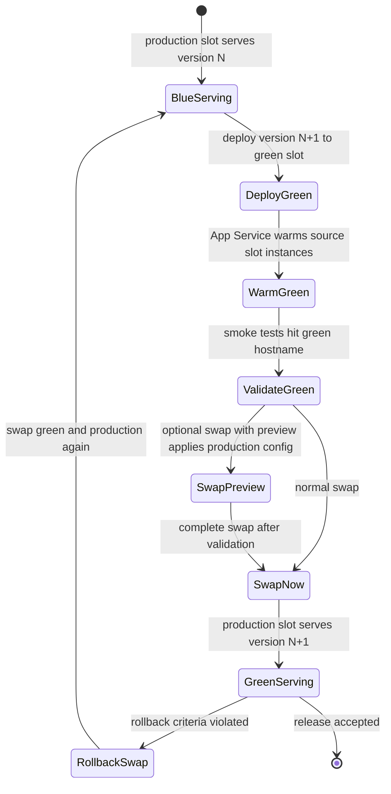
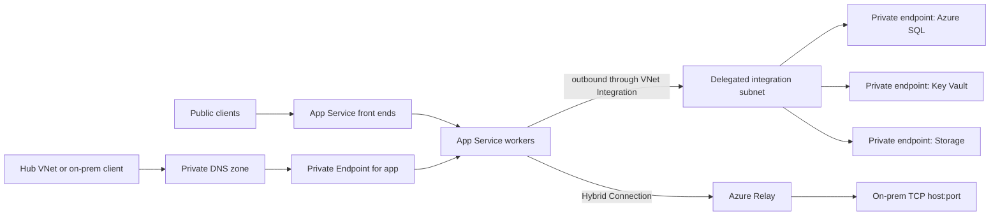

**Complexity**: `[COMPLEX]` | **Time:** 90-120 min | **Prerequisites**: [3.7-aci-aca](../module-3.7-aci-aca/) (Container Apps), [3.8-functions](../module-3.8-functions/), [3.9-key-vault](../module-3.9-key-vault/), [3.10-monitor](../module-3.10-monitor/)

## What You'll Be Able to Do

After completing this module, you will be able to:

- **Debug** App Service incidents by separating plan capacity, worker health, deployment slot state, networking path, identity permissions, and application logs.
- **Design** a production Web App pattern with the right App Service Plan tier, deployment slots, managed identity, private networking, autoscale rules, and diagnostics.
- **Evaluate** when App Service is the right default, when Azure Container Apps is a better fit, and when AKS is justified by platform control requirements.

The focus is the operator path. You are not learning App Service as a portal wizard. You are learning it as a production hosting surface with shared compute, slots, warm-up behavior, identity, private access patterns, and scaling boundaries. By the end, you should be able to look at a web workload and answer these seven operator questions:

> - Which service should host it?
> - Which plan tier should run it?
> - Which settings must be sticky across swaps?
> - Which path does inbound traffic use?
> - Which path does outbound traffic use?
> - Which logs prove what happened?
> - Which rollback takes minutes instead of hours?

## Why This Module Matters

Azure App Service is a managed platform for web applications, REST APIs, mobile back ends, and custom containers, and it supports mainstream stacks such as .NET, Java, Node.js, Python, PHP, and containerized workloads on Windows or Linux. The operational value is not that the service hides everything; the value is that the app team can operate at the app, plan, slot, identity, network, and telemetry layer instead of owning host patching and a full ingress platform. [Microsoft's overview](https://learn.microsoft.com/en-us/azure/app-service/overview) is deliberately broad, but the operator version is narrower: know which compute plan owns capacity, which release primitive moves traffic, which identity authorizes dependencies, and which network feature controls each traffic direction.

The first production surprise is usually the App Service Plan. A plan defines the region, operating system, VM size, tier, and instance count, and every app, deployment slot, diagnostic job, backup, and WebJob in that plan consumes the same worker pool. Scaling the plan scales all apps inside it, so cost isolation and blast-radius isolation are plan decisions, not just tagging decisions. [The hosting-plan documentation](https://learn.microsoft.com/en-us/azure/app-service/overview-hosting-plans) states this directly, and [the service-limits table](https://learn.microsoft.com/en-us/azure/azure-resource-manager/management/azure-subscription-service-limits#azure-app-service-limits) is the canonical place to check maximum instance counts, slot counts, storage, access restrictions, and networking feature availability before committing a design.

The second surprise is that App Service has two different private-networking stories. Virtual Network Integration is outbound from the app into a VNet; it does not make the app privately reachable. Private Endpoint is inbound private access to the app; it does not route the app's outbound calls into the VNet. Hybrid Connections are a narrow outbound bridge to a single TCP host and port. Microsoft documents these boundaries separately for [VNet Integration](https://learn.microsoft.com/en-us/azure/app-service/overview-vnet-integration), [Private Endpoint](https://learn.microsoft.com/en-us/azure/app-service/overview-private-endpoint), and [Hybrid Connections](https://learn.microsoft.com/en-us/azure/app-service/app-service-hybrid-connections), so an incident runbook must always name inbound and outbound paths separately.

The third surprise is release behavior. Operational teams frequently debate whether to migrate traditional workloads to microservice runtimes or stay on managed web platforms. Comparing hosting options requires evaluating how routine deployments execute, how long traffic shifts take, and how quickly an operator can revert a problematic build under strict recovery time objectives.

**Pause and predict:** A public .NET monolith has predictable traffic, Azure SQL, Key Vault references, a custom domain, weekly releases, and a rollback target of under five minutes. App Service, Container Apps, and AKS can all run the workload. Which one is the first candidate, and which release primitive drives that answer?

<details>
<summary>Check your prediction</summary>

App Service is the first candidate because it provides native web platform semantics without the infrastructure overhead of managing container clusters or ingress controllers. The primary release primitive is **deployment slots**, which allow staging validation, instant warm-up, and an atomic swap into production. If an unexpected failure occurs after release, swapping the slots again restores the previous production build in under five minutes.
</details>

Platform teams must treat release velocity and recovery speed as primary architectural constraints rather than secondary operational afterthoughts. Establishing clear boundary definitions between compute hosting, configuration drift, and observability surfaces prevents costly governance disputes when selecting enterprise application foundations.

## Did You Know

These four details explain many App Service incidents that look surprising only because the team learned the feature names without learning the boundaries. A slot is production-like because it runs on the same plan, but that also means capacity is shared. VNet Integration sounds bidirectional, but Microsoft defines it as outbound. Key Vault references remove secrets from app settings, but they still depend on identity, network access, and refresh behavior. Autoscale can add workers, but it cannot make a saturated SQL database accept more concurrent requests. The practical operator move is to turn each detail into a release checklist item and a dashboard signal, not a trivia note. [Hosting plans](https://learn.microsoft.com/en-us/azure/app-service/overview-hosting-plans), [VNet Integration](https://learn.microsoft.com/en-us/azure/app-service/overview-vnet-integration), [Key Vault references](https://learn.microsoft.com/en-us/azure/app-service/app-service-key-vault-references), and [Azure Monitor autoscale](https://learn.microsoft.com/en-us/azure/azure-monitor/autoscale/autoscale-overview) are the source anchors.

- **Did You Know:** An active deployment slot is an active app competing for resources in the same App Service Plan as production.
- **Did You Know:** VNet Integration gives outbound access from the app into a VNet; it does not provide inbound private access to the app.
- **Did You Know:** Versionless Key Vault references refresh automatically, but App Service caches resolved values and refetches on its documented cadence or after configuration changes.
- **Did You Know:** Azure Monitor autoscale scales out when any scale-out rule is met, but scales in only when all scale-in rules are met.

## Choosing the Hosting Surface

Start with the ownership model. App Service is a web-app platform: the primary object is an app in a plan, and the release tool is a slot swap. Container Apps is a serverless container platform: the primary object is a container app revision, and the release tool is revision traffic management with HTTP, event, CPU, memory, and KEDA-supported scale rules. AKS is a managed Kubernetes service: the primary object is a cluster with node pools, Kubernetes APIs, workload controllers, ingress, storage, autoscalers, and platform governance. These are different operating models, not just three ways to start a container. [App Service](https://learn.microsoft.com/en-us/azure/app-service/overview), [Container Apps](https://learn.microsoft.com/en-us/azure/container-apps/overview), and [AKS](https://learn.microsoft.com/en-us/azure/aks/what-is-aks) each document a different contract.

| Decision factor | App Service | Container Apps | AKS |
|---|---|---|---|
| Primary abstraction | Web app or API in an App Service Plan | Container app revision in a managed environment | Kubernetes workload in a cluster |
| Best default for | Traditional web apps, enterprise APIs, slot-based releases | Microservices, workers, event-driven containers, scale-to-zero candidates | Platforms that need Kubernetes APIs, controllers, mesh, policy, or node control |
| Release primitive | Deployment slots, swap, swap with preview, slot rollback | Immutable revisions, labels, traffic splitting, rollback to prior revision | Kubernetes rollouts, GitOps, controller-driven rollout and rollback |
| Scaling primitive | Plan instances, Azure Monitor autoscale, or supported automatic scaling | Replica min/max, HTTP and KEDA-based triggers, many apps can scale to zero | Cluster autoscaler, horizontal pod autoscaler, node pools, workload controllers |
| Operational surface | App, plan, slots, app settings, identity, networking, diagnostics | App, revisions, environment, ingress, secrets, scale rules | Cluster, nodes, CNI, ingress, storage, policy, upgrades, runtime add-ons |
| Cost shape | Pay for plan instances except Free; shared plans can host multiple apps | Pay for replicas and environment profile behavior; inactive revisions are not charged | Pay for nodes and cluster dependencies; platform cost remains even when apps are idle |
| First hesitation | Event-driven scale-to-zero services may fit better elsewhere | Classic apps may miss slot workflows and runtime conveniences | Normal web apps rarely justify cluster ownership |

For a normal web app with a stable runtime, custom domain, managed identity, TLS, App Insights, and a release-slot workflow, evaluate App Service first because the service natively supports those app-platform concerns. For a new set of containerized APIs and queue workers that should scale by queue depth or HTTP concurrency, evaluate Container Apps first because its revision and KEDA model is built around that workload shape. For a shared developer platform that needs Kubernetes admission policy, CRDs, service mesh, node pools, DaemonSets, GPUs, or multi-cloud Kubernetes consistency, AKS can be justified because the organization is operating Kubernetes as the product. [Container Apps revisions](https://learn.microsoft.com/en-us/azure/container-apps/revisions), [Container Apps scaling](https://learn.microsoft.com/en-us/azure/container-apps/scale-app), and [AKS capabilities](https://learn.microsoft.com/en-us/azure/aks/what-is-aks) are the comparison anchors.

Total cost of ownership follows the same ownership model. App Service charges for plan compute resources, and dedicated plan instances are charged the same regardless of how many apps run on them, which can make plan sharing efficient or dangerous depending on ownership and traffic patterns. Container Apps can reduce idle cost for workloads that truly scale down, but revision, ingress, environment, and scale-rule behavior become the operator's release vocabulary. AKS puts more knobs in your hands, but the nodes, network, ingress, storage, upgrades, policy, and incident response all need owners. [App Service plan cost behavior](https://learn.microsoft.com/en-us/azure/app-service/overview-hosting-plans), [Container Apps scale behavior](https://learn.microsoft.com/en-us/azure/container-apps/scale-app), and [AKS cluster operations](https://learn.microsoft.com/en-us/azure/aks/what-is-aks) should be reviewed before any "Kubernetes by default" decision.

## App Service Plan Tiers and Capacity

An App Service Plan is the compute boundary. Free and Shared run on shared compute with CPU quotas and cannot scale out; Basic, Standard, Premium, and Isolated tiers run on dedicated workers, and only apps in the same plan share those dedicated workers. The higher tiers unlock more feature coverage and larger scale-out ceilings, while Isolated runs in an App Service Environment for network isolation on top of compute isolation. [Hosting-plan tiers](https://learn.microsoft.com/en-us/azure/app-service/overview-hosting-plans) explain the model; [service limits](https://learn.microsoft.com/en-us/azure/azure-resource-manager/management/azure-subscription-service-limits#azure-app-service-limits) and the Microsoft pricing pages give the current shape of CPU, memory, storage, and scale ceilings.

| Tier | Compute and size anchor | Scale-out limit | Production fit | Networking and release features to check |
|---|---|---:|---|---|
| Free | Shared compute, 1 GB RAM quota, 1 GB storage, 60 CPU minutes/day | 1 shared | No | No custom domains beyond `azurewebsites.net`; diagnostic logs and Kudu exist, but production features are intentionally limited |
| Shared | Shared compute, 1 GB RAM per app, 1 GB storage, 240 CPU minutes/day | 1 shared | No | Custom domains are supported, but dedicated capacity, autoscale, slots, VNet Integration, and Private Endpoint are not the production story |
| Basic | Dedicated workers; B1/B2/B3 are 1/2/4 cores with 1.75/3.5/7 GB RAM and 10 GB storage | 3 dedicated | Small internal apps, dev/test, minimum dedicated tier | Manual scale only; supports custom domains, TLS, access restrictions, diagnostics, and Kudu; no staging slots or autoscale |
| Standard | Dedicated workers; S1/S2/S3 are 1/2/4 cores with 1.75/3.5/7 GB RAM and 50 GB storage | 10 dedicated | Baseline production tier | Adds autoscale and staging slots; supports VNet Integration, diagnostics, access restrictions, custom domains, and managed certificates where applicable |
| Premium v3 | Dedicated workers; P0v3-P5mv3 range from 1 vCPU/4 GB to 32 vCPU/256 GB with 250 GB storage | 30 dedicated | Serious production default when headroom or networking matters | Stronger CPU/RAM options, slots, autoscale, Private Endpoint, VNet Integration, Always On, backups, and production networking patterns |
| Isolated v2 | Dedicated workers in App Service Environment v3; I1v2-I6v2 and memory-optimized variants range from 2 cores/8 GB to 64 cores/256 GB with 1 TB storage | 100 dedicated by default, more by request | Compliance or network-isolated estate only | ASE v3 provides single-tenant environment isolation and supports internal load-balancer patterns; cost and platform ownership must be explicit |

Use this matrix as a review prompt, not a substitute for the live SKU selector. Microsoft now highlights Premium v4 on the primary App Service pricing page, while Standard and Premium v2 sit under the legacy pricing page for existing customers, and SKU availability can vary by region, operating system, and deployment stamp. If a migration depends on Premium v3 or Isolated v2, test creation in the target region before the incident, because a "scale up" plan can become a migration plan if the current deployment unit cannot host the target SKU. [Current App Service pricing](https://azure.microsoft.com/en-us/pricing/details/app-service/windows/), [legacy App Service pricing](https://azure.microsoft.com/en-us/pricing/details/app-service/windows-previous/), and [service limits](https://learn.microsoft.com/en-us/azure/azure-resource-manager/management/azure-subscription-service-limits#azure-app-service-limits) are the current cross-checks.

Plan sharing is a cost optimization only when the apps have the same owner, same availability target, compatible traffic shape, and acceptable shared scale events. The hosting-plan guide states that apps and slots in the same plan share the same VM instances, and the same guide recommends isolating resource-intensive apps or apps that must scale independently into separate plans. A useful production rule is simple: if a noisy neighbor would trigger an incident bridge or a cost dispute, that app deserves its own plan. [App Service plan sharing](https://learn.microsoft.com/en-us/azure/app-service/overview-hosting-plans) and [the density guidance in the plan documentation](https://learn.microsoft.com/en-us/azure/app-service/overview-hosting-plans#decision-to-use-a-new-plan-or-an-existing-plan-for-an-app) support that review.

Scale up and scale out solve different problems. Scale up changes tier or worker size to unlock CPU, memory, storage, or features; scale out changes instance count and assumes the application can run horizontally without local session state or local-disk coordination. If session state, cache, uploaded files, or background jobs depend on one worker, more instances can create correctness bugs before they fix latency. The platform will scale the plan, but the operator still has to prove the app is stateless enough for plan-level scale. [Plan scaling behavior](https://learn.microsoft.com/en-us/azure/app-service/overview-hosting-plans#considerations-for-running-and-scaling-an-app) and [Azure Monitor autoscale](https://learn.microsoft.com/en-us/azure/azure-monitor/autoscale/autoscale-overview) define the platform side of that decision.

## Production Baseline as Code

Provisioning should make the operator decisions reviewable: plan tier, worker count, runtime, identity, HTTPS, health check, app settings, diagnostics, network integration, and slot behavior should be visible in code before the release. This Bicep skeleton keeps the app, plan, identity, and key runtime settings together, using resource types from the Microsoft.Web provider and operational settings documented in the App Service plan, managed identity, and app-setting references. [Hosting plans](https://learn.microsoft.com/en-us/azure/app-service/overview-hosting-plans), [managed identity](https://learn.microsoft.com/en-us/azure/app-service/overview-managed-identity), and [app settings](https://learn.microsoft.com/en-us/azure/app-service/reference-app-settings) explain the underlying resources.

```bicep
param location string = resourceGroup().location
param appName string = 'app-orders-prod-eus'
param planName string = 'asp-orders-prod-eus'
param logAnalyticsWorkspaceId string

resource plan 'Microsoft.Web/serverfarms@2025-03-01' = {
  name: planName
  location: location
  kind: 'linux'
  sku: {
    name: 'P1v3'
    tier: 'PremiumV3'
    capacity: 2
  }
  properties: {
    reserved: true
  }
}

resource app 'Microsoft.Web/sites@2023-12-01' = {
  name: appName
  location: location
  kind: 'app,linux'
  identity: {
    type: 'SystemAssigned'
  }
  properties: {
    serverFarmId: plan.id
    httpsOnly: true
    siteConfig: {
      alwaysOn: true
      healthCheckPath: '/healthz'
      linuxFxVersion: 'NODE|20-lts'
      appSettings: [
        {
          name: 'APP_ENV'
          value: 'production'
        }
        {
          name: 'WEBSITE_HEALTHCHECK_MAXPINGFAILURES'
          value: '3'
        }
        {
          name: 'SCM_DO_BUILD_DURING_DEPLOYMENT'
          value: 'true'
        }
        {
          name: 'WEBSITE_SWAP_WARMUP_PING_PATH'
          value: '/healthz/ready'
        }
        {
          name: 'WEBSITE_SWAP_WARMUP_PING_STATUSES'
          value: '200,202'
        }
      ]
    }
  }
}

resource logs 'Microsoft.Insights/diagnosticSettings@2021-05-01-preview' = {
  name: 'send-appservice-logs'
  scope: app
  properties: {
    workspaceId: logAnalyticsWorkspaceId
    logs: [
      {
        category: 'AppServiceHTTPLogs'
        enabled: true
      }
      {
        category: 'AppServiceConsoleLogs'
        enabled: true
      }
    ]
  }
}
```

After deployment, the first check is not whether the app page loads once. Confirm that the plan instance count, runtime, identity, diagnostic settings, and health endpoint match the intended operating model. The Azure CLI gives a repeatable review surface and avoids relying on portal screenshots. [Diagnostic settings for App Service](https://learn.microsoft.com/en-us/azure/app-service/tutorial-troubleshoot-monitor) show the `AppServiceHTTPLogs` and `AppServiceConsoleLogs` categories used here, and [App Service diagnostics](https://learn.microsoft.com/en-us/azure/app-service/overview-diagnostics) explains the built-in troubleshooting surface.

```bash
az appservice plan show -g rg-appsvc-prod-eus -n asp-orders-prod-eus \
  --query '{sku:sku.name, tier:sku.tier, workers:sku.capacity, kind:kind}' -o table

az webapp show -g rg-appsvc-prod-eus -n app-orders-prod-eus \
  --query '{httpsOnly:httpsOnly, state:state, hostNames:enabledHostNames}' -o json

az webapp identity show -g rg-appsvc-prod-eus -n app-orders-prod-eus \
  --query '{principalId:principalId, tenantId:tenantId, type:type}' -o json

az monitor diagnostic-settings list \
  --resource "$(az webapp show -g rg-appsvc-prod-eus -n app-orders-prod-eus --query id -o tsv)" \
  -o table
```

## Deployment Slots and Swap Safety

Deployment slots are separate deployment targets for the same app, with their own hostnames, configuration surface, and deployed content, but they run on the same App Service Plan workers as production. That means a staging slot can be realistic, but it also means a staging load test can consume production plan capacity. The slot guide documents validation before swap, warm-up of all slot instances, slot-specific settings, swap with preview, auto swap, and troubleshooting, while the plan guide documents that slots share the plan's VM instances. [Deployment slots](https://learn.microsoft.com/en-us/azure/app-service/deploy-staging-slots) and [hosting-plan slot sharing](https://learn.microsoft.com/en-us/azure/app-service/overview-hosting-plans#considerations-for-running-and-scaling-an-app) should be read together.



The safe runbook is to deploy the new artifact to `green`, warm it through a readiness endpoint, smoke-test the slot hostname, verify sticky settings, swap into production, and keep the old production build in `green` until the release is accepted. The rollback command is the same swap command because the old production code now lives in the nonproduction slot. This is why the release primitive is stronger than "redeploy the old package under stress." [The slot swap workflow](https://learn.microsoft.com/en-us/azure/app-service/deploy-staging-slots) is explicit about validating a nonproduction slot before swapping it into production.

```bash
az webapp deployment slot create \
  --resource-group rg-appsvc-prod-eus \
  --name app-orders-prod-eus \
  --slot green

curl -fsS https://app-orders-prod-eus-green.azurewebsites.net/healthz/ready
curl -fsS https://app-orders-prod-eus-green.azurewebsites.net/version

az webapp deployment slot swap \
  --resource-group rg-appsvc-prod-eus \
  --name app-orders-prod-eus \
  --slot green \
  --target-slot production
```

Slot stickiness is the configuration trap. An app setting or connection string that is marked as a deployment-slot setting stays with the slot during swap; a setting that is not marked as slot-specific swaps with the content. Production database connection strings, Key Vault references, OAuth redirect settings, public callback URLs, and telemetry endpoints often need to stay attached to the production slot, while release-specific feature flags may intentionally move with the release. Microsoft documents the CLI form through `az webapp config appsettings set --slot-settings` and the equivalent connection-string command. [Slot-specific settings](https://learn.microsoft.com/en-us/azure/app-service/deploy-staging-slots#make-an-app-setting-unswappable) are not optional release hygiene.

| Setting class | Swap behavior you usually want | Operator reason | Review command or artifact |
|---|---|---|---|
| Production database connection string | Sticky to production slot | Prevent production code from writing to staging data after swap | `az webapp config connection-string list --slot production` |
| Key Vault reference for environment secret | Sticky per environment | Keep prod slot on prod vault and staging slot on staging vault | `az webapp config appsettings list --slot green` |
| Telemetry connection string | Usually sticky | Keep release evidence in the right workspace or App Insights resource | Diagnostic setting plus app setting review |
| OAuth redirect URI or callback base URL | Usually sticky | External identity providers and webhooks often bind to hostnames | Identity provider config and app setting review |
| Feature flag for new code path | Usually swappable | The flag belongs to the release if rollback should disable the same code path | Release manifest or feature-flag system |
| `WEBSITE_SWAP_WARMUP_PING_PATH` | Sticky or globally identical | Warm-up must reflect the slot's real readiness contract | App-setting definition in IaC |

Warm-up needs a real readiness endpoint. App Service supports `WEBSITE_SWAP_WARMUP_PING_PATH`, and `WEBSITE_SWAP_WARMUP_PING_STATUSES` can stop the warm-up and swap if the response code is not in the allowed list. A shallow `/` check can return before caches, dependency connections, or container initialization are ready, so the readiness path should prove that the app can serve core traffic without doing destructive work. [The app-setting reference](https://learn.microsoft.com/en-us/azure/app-service/reference-app-settings) documents these swap warm-up settings, and [the slot guide](https://learn.microsoft.com/en-us/azure/app-service/deploy-staging-slots) explains how warm-up fits the swap operation.

Automated cutover workflows are frequently evaluated for continuous deployment pipelines that aim to eliminate manual gates during routine application updates. Platform engineers often explore whether staging slots can shift incoming traffic without manual intervention as soon as new application code finishes deploying.

**Pause and predict:** A team running a Linux web app wants to streamline its continuous deployment pipeline by enabling auto swap on the staging slot as the default rollout mechanism. Will this configuration achieve hands-free production traffic cutover?

<details>
<summary>Check your prediction</summary>

Microsoft Learn explicitly notes that **auto swap isn't supported in web apps on Linux and in Web App for Containers**. Enabling or attempting to rely on auto swap for Linux application workloads will not perform automated production swaps upon deployment. Continuous deployment pipelines for Linux web apps must instead invoke explicit slot swap operations using Azure CLI, PowerShell, or pipeline release tasks after automated health checks pass.
</details>

Swap with preview applies destination settings to the source slot before completing the swap operation. This allows operators to validate the would-be production configuration before live traffic moves. A disciplined operator chooses normal manual swap, swap with preview, or pipeline-orchestrated cutover based on configuration risk, runtime platform capabilities, and change governance policies rather than habit. [Auto swap and swap troubleshooting](https://learn.microsoft.com/en-us/azure/app-service/deploy-staging-slots#configure-auto-swap) define those operational trade-offs across deployment workflows.

## Managed Identity and Secretless Dependencies

Managed identity gives the app an Entra ID identity that can request tokens for Azure services without storing client secrets in app settings. A system-assigned identity is enabled on the app or slot and is removed when that resource is removed; a user-assigned identity is its own Azure resource and can be attached to apps or slots when identity lifecycle must outlive a single app or when a deployment needs a stable principal before the app exists. Microsoft documents both identity types, the permissions needed to create and assign them, and the local token endpoint exposed through `IDENTITY_ENDPOINT` and `IDENTITY_HEADER`. [Managed identities for App Service](https://learn.microsoft.com/en-us/azure/app-service/overview-managed-identity) is the primary source.

```bash
APP_PRINCIPAL_ID=$(
  az webapp identity assign \
    --resource-group rg-appsvc-prod-eus \
    --name app-orders-prod-eus \
    --query principalId -o tsv
)

az role assignment create \
  --assignee "$APP_PRINCIPAL_ID" \
  --role "Key Vault Secrets User" \
  --scope "$KEY_VAULT_ID"

az webapp config appsettings set \
  --resource-group rg-appsvc-prod-eus \
  --name app-orders-prod-eus \
  --slot-settings "OrdersDbPassword=@Microsoft.KeyVault(SecretUri=https://kv-orders-prod.vault.azure.net/secrets/orders-db-password/)"
```

Key Vault references are useful when an application still requires a secret value, because an app setting can store an `@Microsoft.KeyVault(...)` reference and the runtime reads it like standard configuration. The reference uses the system-assigned identity by default, can be configured with a user-assigned identity, and prevents embedding credentials directly in deployment templates. Microsoft also recommends designating Key Vault references as slot settings because staging and production environments typically connect to isolated vaults.

**Pause and predict:** If an application relies on a versionless Key Vault reference (`SecretUri` without a version GUID) and an engineer rotates the secret in Key Vault, does the running App Service app pick up the rotated secret within seconds?

<details>
<summary>Check your prediction</summary>

App Service **caches** the value and refetches every **24 hours** on a background polling interval. The running application will not pick up the rotated secret within seconds; however, a configuration change restarts the app and forces an immediate refetch from Key Vault. During an emergency credential rotation, operators must trigger an application restart or update an app setting rather than waiting for background polling.
</details>

Operational secret management requires engineering teams to balance runtime execution performance with credential lifecycle policies across environments. Verifying reference syntax, managed identity access rights, and network reachability ensures secret resolution functions smoothly throughout normal runtime operations. [Key Vault references](https://learn.microsoft.com/en-us/azure/app-service/app-service-key-vault-references) document these behaviors and operational failure modes.

Prefer direct Entra authentication when the downstream service supports it. For Azure SQL, the app identity must exist, the SQL server needs an Entra administrator, and the database must create a user for the identity and grant only the required roles. For Blob Storage, Azure RBAC data roles such as Storage Blob Data Contributor or Storage Blob Data Reader authorize data-plane access, and the role scope should be the narrowest useful container, account, resource group, or subscription scope. [App Service to Azure SQL with managed identity](https://learn.microsoft.com/en-us/azure/app-service/tutorial-connect-msi-sql-database) and [Blob access with Microsoft Entra ID](https://learn.microsoft.com/en-us/azure/storage/blobs/authorize-access-azure-active-directory) are the operator references.

Identity incidents are usually grant-chain failures, not platform mysteries. Confirm the slot has the expected identity, confirm the app is requesting the right resource and the right user-assigned identity client ID when applicable, confirm the target resource has an RBAC role or access policy at the correct scope, wait for role propagation where documented, and verify that private networking is not blocking the dependency call. Key Vault reference diagnostics explicitly mention unresolved references caused by permissions, missing secrets, syntax, or network restrictions, and Blob RBAC documentation warns that role assignments can take time to propagate. [Key Vault reference troubleshooting](https://learn.microsoft.com/en-us/azure/app-service/app-service-key-vault-references#troubleshoot-key-vault-references) and [Storage RBAC propagation notes](https://learn.microsoft.com/en-us/azure/storage/blobs/authorize-access-azure-active-directory#assign-azure-roles-for-access-rights) keep the debug path concrete.

## Networking: Inbound and Outbound Are Separate

An App Service networking design must draw two paths: inbound traffic from clients and outbound traffic to dependencies. Multi-tenant hosting environments present distinct networking primitives for connecting workloads across cloud virtual networks, corporate backbones, and software-as-a-service endpoints.

**Pause and predict:** If an engineer enables regional Virtual Network Integration on an App Service app by attaching it to a delegated subnet, does that configuration make the web application privately reachable from virtual machines inside that VNet?

<details>
<summary>Check your prediction</summary>

VNet Integration is **outbound only** and does not grant inbound private access to the application from the VNet. It enables worker instances to route egress traffic into a delegated subnet to reach private databases, storage accounts, and peered networks. To make an App Service app privately reachable from the VNet for inbound traffic, you must configure a **Private Endpoint**.
</details>

Network reviews should name the client path and the dependency path as two tickets, not one subnet checkbox. Access restrictions still order allow and deny rules on the public front end, and Hybrid Connections still cover a single TCP host and port through Azure Relay. [VNet Integration](https://learn.microsoft.com/en-us/azure/app-service/overview-vnet-integration), [Private Endpoint](https://learn.microsoft.com/en-us/azure/app-service/overview-private-endpoint), [access restrictions](https://learn.microsoft.com/en-us/azure/app-service/app-service-ip-restrictions), and [Hybrid Connections](https://learn.microsoft.com/en-us/azure/app-service/app-service-hybrid-connections) define those operational boundaries.



| Requirement | First feature to evaluate | What it solves | What it does not solve |
|---|---|---|---|
| Public app should allow only Front Door or known corporate IPs | Access restrictions | Priority-ordered allow/deny rules at App Service front ends, including IP ranges and service tags | It does not move the app into a VNet |
| Internal clients must reach the app privately | Private Endpoint | Private inbound access to the app through a VNet and private DNS | It does not route outbound calls to private dependencies |
| App must call private Azure resources or on-prem networks | VNet Integration | Outbound calls from workers into a delegated subnet, peered VNets, Private Endpoints, VPN, or ExpressRoute paths | It does not make inbound access private |
| App must reach one legacy host and port quickly | Hybrid Connection | Outbound TCP access to one host:port through Azure Relay and Hybrid Connection Manager | It does not support UDP, dynamic ports, or inbound access |
| ASE-level single-tenant network isolation is required | App Service Environment v3 | Dedicated App Service environment deployed into a VNet with Isolated v2 plans | It is a platform and cost commitment, not a fix for one private app |

VNet Integration needs subnet planning. The feature requires a dedicated subnet, consumes addresses per plan instance, temporarily doubles address use during some scale operations, and Microsoft recommends enough address space for planned maximum scale plus platform operations. It can route private-only or all outbound traffic depending on routing configuration, and NSGs or route tables on the integration subnet apply only to traffic routed through the integration. If Key Vault, Storage, SQL, or image pulls use private endpoints, DNS must resolve those names to private endpoint addresses from the app's VNet path. [Subnet requirements and routing](https://learn.microsoft.com/en-us/azure/app-service/overview-vnet-integration#subnet-requirements) and [private endpoint DNS behavior for outbound calls](https://learn.microsoft.com/en-us/azure/app-service/overview-vnet-integration#private-endpoints) are the design guardrails.

Private Endpoint is configured per app slot, and a slot cannot share another slot's private endpoint. The official documentation states that each slot is configured separately, the current limits table lists 100 private endpoints per app, and the private endpoint subnet cannot be the same subnet used for VNet Integration. That matters during release design: if a staging slot must be tested privately, it needs its own private endpoint and DNS story. [Private Endpoint for App Service](https://learn.microsoft.com/en-us/azure/app-service/overview-private-endpoint) and [VNet Integration subnet limitations](https://learn.microsoft.com/en-us/azure/app-service/overview-vnet-integration#limitations) make this a review item.

Access restrictions are still useful even when Private Endpoint is planned. They provide priority-ordered allow and deny rules, support IP ranges, service tags, and selected VNet subnets through service endpoints, and can be applied separately to the SCM/Kudu site. If any allow or deny entries exist, an implicit deny exists at the end unless the unmatched rule action is changed. The service returns HTTP 403 when the source is not allowed, so a sudden 403 after a network change should send the operator to the access-restriction list before blaming application auth. [Access restrictions](https://learn.microsoft.com/en-us/azure/app-service/app-service-ip-restrictions) document the rule order, 512-rule limit, service tags, and SCM-site restrictions.

## Autoscale Without Creating a Dependency Outage

App Service has manual scale, Azure Monitor autoscale, and a newer automatic scaling feature for supported Premium v2-v4 plans. Manual scale is Basic and up; Azure Monitor autoscale is Standard and up and uses metric or schedule rules at the plan level; automatic scaling is different because App Service handles HTTP-traffic-based scaling decisions and exposes always-ready, prewarmed, per-app limit, and burst controls. Microsoft explicitly says only one scaling method should be active for an App Service plan. [Automatic scaling](https://learn.microsoft.com/en-us/azure/app-service/manage-automatic-scaling) and [Azure Monitor autoscale](https://learn.microsoft.com/en-us/azure/azure-monitor/autoscale/autoscale-overview) define the difference.

Azure Monitor autoscale is the usual regulated-production pattern because it has explicit profiles, default/minimum/maximum instance bounds, metric rules, schedule rules, cooldowns, and notifications. Autoscale can add resources when load increases and reduce them when load is low, and the rule engine scales out if any scale-out rule is met but scales in only if all scale-in rules are met. That OR-for-out, AND-for-in behavior prevents one quiet metric from shrinking the plan while another metric still shows pressure. [Autoscale rules and settings](https://learn.microsoft.com/en-us/azure/azure-monitor/autoscale/autoscale-overview#rules) are worth citing in design reviews.

| Rule type | Example | Operator use | Failure mode |
|---|---|---|---|
| Metric scale-out | CPU above 70% for 10 minutes, memory above 75%, or HTTP queue length above baseline | Add workers when sustained plan pressure is likely capacity-related | More workers can increase SQL, Storage, or downstream API pressure |
| Metric scale-in | CPU below 35% and queue length low for 30 minutes | Remove idle workers slowly after demand falls | Fast scale-in can cause oscillation and cold workers |
| Schedule | Weekdays 07:30 set min to 4; weekdays 19:00 set min to 2 | Prewarm for predictable business traffic before users arrive | Schedules drift from real traffic if never reviewed |
| Maximum bound | Cap at 10 workers for a Standard plan or lower if downstreams cannot handle more | Limits cost and blast radius during runaway traffic | If max is too low, HTTP queue grows and users see latency |
| Notification | Email, webhook, automation runbook, or Logic App action | Makes scale events visible during incidents | Silent scale events hide cost spikes and dependency saturation |

The autoscale design must include dependency capacity. If the database is saturating, scaling the web tier can make the outage worse by increasing concurrent database calls. If Key Vault, Storage, or a private API is the bottleneck, more workers may only amplify retries. Use scale-out rules to address worker saturation, and use dashboards to detect when the bottleneck moved downstream. Azure Monitor supports metrics, Log Analytics, metric alerts, log alerts, and Application Insights telemetry, so the scale decision should be visible in the same evidence surface used for incident response. [Monitor App Service](https://learn.microsoft.com/en-us/azure/app-service/monitor-app-service) and [Azure Monitor autoscale actions](https://learn.microsoft.com/en-us/azure/azure-monitor/autoscale/autoscale-overview#actions-and-automation) support that pattern.

## Diagnostics and Evidence

App Service diagnostics are layered. App Service logs can capture application logs, web server logs, detailed errors, failed request traces, and deployment logs, with filesystem logging intended for temporary debugging in some cases and blob or Azure Monitor routing used for longer retention. Diagnostic settings can route `AppServiceHTTPLogs` and `AppServiceConsoleLogs` to Log Analytics, while Application Insights adds application exceptions, dependency telemetry, distributed traces, and application-level correlation. [Diagnostic logs](https://learn.microsoft.com/en-us/azure/app-service/troubleshoot-diagnostic-logs), [Azure Monitor troubleshooting](https://learn.microsoft.com/en-us/azure/app-service/tutorial-troubleshoot-monitor), and [Monitor App Service](https://learn.microsoft.com/en-us/azure/app-service/monitor-app-service) define the data paths.

Kudu is the companion SCM site for an App Service app, exposed at `https://<app-name>.scm.azurewebsites.net` for non-Isolated apps, and it powers deployment-related features and provides access to diagnostic files. It is not a public troubleshooting toy; lock down the SCM site with access restrictions when the main app has network restrictions, because Microsoft documents separate SCM restrictions and the ability to use the main-site rules. [Kudu overview](https://learn.microsoft.com/en-us/azure/app-service/resources-kudu) and [SCM access restrictions](https://learn.microsoft.com/en-us/azure/app-service/app-service-ip-restrictions#restrict-access-to-an-scm-site) give the control surface.

```kusto
AppServiceHTTPLogs
| where TimeGenerated > ago(2h)
| where ScStatus >= 500
| summarize Requests=count(), P95DurationMs=percentile(TimeTaken, 95)
  by bin(TimeGenerated, 5m), _ResourceId, CsMethod, CsUriStem, ScStatus
| order by TimeGenerated desc, Requests desc
```

Use the first query when the symptom is "users see 5xx." It separates one broken endpoint from app-wide failure and gives a latency signal next to the status code. App Service monitoring examples use `AppServiceHTTPLogs` for HTTP 500 analysis, and the troubleshooting tutorial shows diagnostic settings that route those logs to Log Analytics. [Monitor App Service KQL](https://learn.microsoft.com/en-us/azure/app-service/monitor-app-service#kusto-queries) and [diagnostic setting examples](https://learn.microsoft.com/en-us/azure/app-service/tutorial-troubleshoot-monitor#create-a-diagnostic-setting) are the source anchors.

```kusto
AppServiceHTTPLogs
| where TimeGenerated > ago(6h)
| summarize Requests=count(),
            P50Ms=percentile(TimeTaken, 50),
            P95Ms=percentile(TimeTaken, 95),
            P99Ms=percentile(TimeTaken, 99),
            Errors=countif(ScStatus >= 500)
  by bin(TimeGenerated, 10m), _ResourceId
| extend ErrorRate = todouble(Errors) / todouble(Requests)
| order by TimeGenerated desc
```

Use the second query when latency rose before errors. Many App Service incidents are saturation stories: CPU, memory, SNAT, connection pools, dependency latency, or cold initialization increases request time before the user-visible error rate climbs. The built-in Diagnose and solve problems blade groups availability, performance, application logs, CPU, memory, TCP connections, SNAT exhaustion, and application changes into diagnostic categories, so the log query should be paired with the diagnostic blade rather than treated as the only evidence. [App Service diagnostics](https://learn.microsoft.com/en-us/azure/app-service/overview-diagnostics) documents those categories.

```kusto
AppServiceConsoleLogs
| where TimeGenerated > ago(1h)
| where Level in ("Error", "Warning")
   or ResultDescription has_any ("Exception", "ERROR", "Traceback", "Startup")
| project TimeGenerated, _ResourceId, Host, Level, ResultDescription
| order by TimeGenerated desc
```

Use the third query immediately after a deployment or slot swap. Startup errors, dependency failures, container launch issues, and framework exceptions often appear in console or application logs before a clean HTTP pattern emerges. For Linux apps and custom containers, App Service stores console output under `/home/LogFiles`, and scaled-out diagnostic dumps contain logs for each instance, which is why instance-aware log review matters after a bad release. [Diagnostic log locations](https://learn.microsoft.com/en-us/azure/app-service/troubleshoot-diagnostic-logs#access-log-files) and [Log Analytics tooling](https://learn.microsoft.com/en-us/azure/app-service/monitor-app-service#azure-monitor-tools) document the workflow.

## Outage Playbook

For a 502 or 503, first decide whether the platform has no healthy worker, the app process is failing, the slot swap exposed a cold or misconfigured app, or a dependency is causing startup failure. Check current slot and code version, plan CPU and memory, HTTP queue length, instance count, app restarts, console errors, deployment logs, and dependency telemetry. If the incident started immediately after swap, compare sticky settings, warm-up path, Key Vault reference resolution, and database target before scaling the plan. [Deployment slots](https://learn.microsoft.com/en-us/azure/app-service/deploy-staging-slots), [diagnostic logs](https://learn.microsoft.com/en-us/azure/app-service/troubleshoot-diagnostic-logs), and [App Service diagnostics](https://learn.microsoft.com/en-us/azure/app-service/overview-diagnostics) map directly to this first branch.

For a slot-swap warm-up failure, read the warm-up settings and response codes before forcing traffic. `WEBSITE_SWAP_WARMUP_PING_PATH` should point to readiness, `WEBSITE_SWAP_WARMUP_PING_STATUSES` should reject unacceptable responses, and swap with preview should be used when production configuration is the main risk. If the source slot only passes `/` but fails a dependency-aware readiness check, fix the readiness contract or the dependency path before completing the swap. [Warm-up app settings](https://learn.microsoft.com/en-us/azure/app-service/reference-app-settings) and [swap with preview](https://learn.microsoft.com/en-us/azure/app-service/deploy-staging-slots#swap-with-preview) are the runbook references.

For an identity failure, do not stop at the HTTP status. A Key Vault reference can fail because the reference syntax is wrong, the secret no longer exists, the identity lacks `get` permission or RBAC, the app uses the wrong user-assigned identity, role assignment has not propagated, or network-restricted vault access is not routed correctly. SQL and Storage add their own grant chain: SQL needs an Entra admin and database user; Blob access needs a data-plane role such as Storage Blob Data Reader or Contributor at the correct scope. [Key Vault reference troubleshooting](https://learn.microsoft.com/en-us/azure/app-service/app-service-key-vault-references#troubleshoot-key-vault-references), [SQL managed identity](https://learn.microsoft.com/en-us/azure/app-service/tutorial-connect-msi-sql-database), and [Storage RBAC](https://learn.microsoft.com/en-us/azure/storage/blobs/authorize-access-azure-active-directory) keep the debug path factual.

For a networking failure, draw the path and test the name resolution. If clients cannot reach a private app, confirm Private Endpoint, private DNS, public network access, and access restrictions. If the app cannot reach SQL, Storage, or Key Vault privately, confirm VNet Integration, route-all behavior when required, integration subnet sizing, private endpoint DNS, NSGs, UDRs, and target firewalls. If the app reaches one on-prem TCP endpoint through Hybrid Connections, confirm the host:port mapping and Hybrid Connection Manager, and do not expect UDP or dynamic ports. [VNet Integration routing](https://learn.microsoft.com/en-us/azure/app-service/overview-vnet-integration#routes), [Private Endpoint](https://learn.microsoft.com/en-us/azure/app-service/overview-private-endpoint), and [Hybrid Connections](https://learn.microsoft.com/en-us/azure/app-service/app-service-hybrid-connections) separate the evidence.

For an autoscale storm, determine whether the rule is reacting to real worker pressure or to a bad release, retry loop, crawler, dependency timeout, or staging-slot load test. Check scale actions, instance count, HTTP queue, CPU, memory, response time, request paths, dependency metrics, and downstream throttling before raising the maximum bound. Autoscale can save a saturated stateless web tier, but it can also multiply downstream concurrency and cost. [Azure Monitor autoscale](https://learn.microsoft.com/en-us/azure/azure-monitor/autoscale/autoscale-overview) and [App Service plan sharing](https://learn.microsoft.com/en-us/azure/app-service/overview-hosting-plans) explain why scale events are plan events.

## Common Mistakes

Most App Service failures in mature environments are not caused by a missing feature; they are caused by applying the right feature at the wrong boundary. The table below translates the common operator failure into the review habit that prevents it. Read it as a pre-submit checklist for design documents and pull requests: every row asks whether the team has made capacity, release, identity, networking, autoscale, and evidence decisions explicit enough that an on-call engineer can debug without reconstructing the architecture from the portal. [App Service plans](https://learn.microsoft.com/en-us/azure/app-service/overview-hosting-plans), [slots](https://learn.microsoft.com/en-us/azure/app-service/deploy-staging-slots), [networking](https://learn.microsoft.com/en-us/azure/app-service/overview-vnet-integration), and [diagnostics](https://learn.microsoft.com/en-us/azure/app-service/troubleshoot-diagnostic-logs) are the backing references.

| Mistake | Why it happens | Better operator move |
|---|---|---|
| Putting every app in one plan | Shared compute looks cheaper in the estimate | Put critical or noisy apps in their own plan unless shared scaling is explicitly acceptable |
| Treating slots as free staging capacity | The slot has a separate hostname and feels isolated | Remember slots share plan workers and include slot warm-up in capacity reviews |
| Swapping without sticky-setting review | Release automation focuses on code, not configuration | Mark environment-specific settings and connection strings as slot settings and inspect them before swap |
| Using VNet Integration for private inbound access | The feature name sounds bidirectional | Use Private Endpoint for inbound private access and VNet Integration for outbound private dependency calls |
| Resolving every 403 as application authorization | Network and identity failures both surface as access failures | Check access restrictions, Key Vault permissions, identity selection, and private endpoint DNS before changing code |
| Raising max autoscale during every outage | More workers feel like progress under pressure | Confirm the bottleneck is the web tier and not SQL, Storage, Key Vault, or a retry storm |
| Leaving SCM/Kudu unrestricted | The main site received network rules, but the tool site was forgotten | Apply SCM access restrictions or main-site rules to the advanced tool site as part of the same network change |

## Quiz

### Question 1

A team is building five small containerized services. Each service releases independently, queue workers should scale from queue length, HTTP services should scale down aggressively outside business hours, and the team does not need Kubernetes APIs. Which platform is the first candidate?

A. App Service
B. Container Apps
C. AKS
D. App Service Environment v3

<details>
<summary>Answer</summary>

**Correct: B.** Container Apps matches the revision, traffic-splitting, event-driven scale, and scale-to-zero shape documented for serverless container apps. This is the Evaluate outcome: App Service can run containers, but this workload is revision and worker oriented rather than slot-oriented web hosting.

</details>

### Question 2

A staging slot uses a staging database, and production must always use the production database after a swap. What must be true before the release?

A. The database connection string is marked as a slot setting.
B. The staging slot runs on a separate App Service Plan.
C. The app uses Free tier.
D. VNet Integration is disabled.

<details>
<summary>Answer</summary>

**Correct: A.** Environment-specific connection strings should stay with the slot. This is part of the Design outcome because the production Web App pattern must define slot settings before the release, not during rollback.

</details>

### Question 3

An internal API must be reachable only from a hub VNet and on-prem networks connected through ExpressRoute, and the same API must call Azure SQL through a private endpoint. Which networking shape fits?

A. Hybrid Connection only
B. VNet Integration only
C. Private Endpoint for inbound plus VNet Integration for outbound
D. Access restrictions only

<details>
<summary>Answer</summary>

**Correct: C.** Private Endpoint provides the private inbound path to the app, while VNet Integration provides the outbound path from the app to private dependencies. This reinforces the Design outcome because the architecture must name both paths.

</details>

### Question 4

An autoscale rule adds workers during a traffic spike. CPU drops, but latency and 5xx errors increase, and SQL metrics show throttling and connection pressure. What is the best operator conclusion?

A. App Service cannot add workers.
B. The bottleneck moved to SQL, and more workers increased dependency pressure.
C. The app must move to ASE v3 immediately.
D. HTTPS should be disabled.

<details>
<summary>Answer</summary>

**Correct: B.** Scaling the web tier can increase concurrent dependency calls. This is the Debug outcome: separate plan capacity from dependency saturation before changing autoscale bounds.

</details>

### Question 5

After a slot swap, users see intermittent 503 responses for five minutes. The release passed a `/` check, but console logs show startup work and connection-pool initialization. Which fix targets the release mechanism rather than the symptom?

A. Set a real `WEBSITE_SWAP_WARMUP_PING_PATH` and allow only acceptable warm-up statuses.
B. Remove the staging slot.
C. Disable diagnostic logs.
D. Move the app into the Shared tier.

<details>
<summary>Answer</summary>

**Correct: A.** The swap should wait for a readiness path that proves the app can serve core traffic. This is a Debug and Design bridge: the failed release evidence points back to the warm-up contract.

</details>

### Question 6

A Key Vault reference appears in the application as the literal `@Microsoft.KeyVault(...)` string, and the app throws a configuration error. Which first branch is most useful?

A. Recreate the App Service Plan.
B. Check reference syntax, secret existence, identity permission, and network-restricted vault access.
C. Increase the autoscale maximum.
D. Remove Application Insights.

<details>
<summary>Answer</summary>

**Correct: B.** Microsoft documents unresolved Key Vault references as usually caused by syntax, missing secrets, permission, or network access problems. This is the Debug outcome applied to the identity grant chain.

</details>

## Hands-On Practice

Use this design scenario without provisioning paid Azure resources unless you have an approved sandbox subscription. The application is `orders-api`, a Node.js or .NET API with steady business traffic, 3x spikes at 09:00 and 13:00, weekly releases, rollback under five minutes, Azure SQL, Storage, Key Vault, public inbound today, private-only target in six months, and an app team that owns code while a platform team owns shared networking. Your deliverables are five short files: `decision.md`, `slots-runbook.md`, `networking.md`, `autoscale.md`, and `monitoring.kql`. The exercise deliberately asks you to Design the target App Service pattern, Evaluate the service choice against Container Apps and AKS, and Debug likely failure modes before any real resource exists.

In `decision.md`, compare App Service, Container Apps, and AKS in one paragraph each, then pick the first candidate and name the release primitive that makes rollback credible. In `slots-runbook.md`, choose a plan tier, minimum workers, staging slot name, warm-up path, sticky settings, swap command, rollback command, and stop condition. In `networking.md`, draw inbound and outbound paths separately for the current public model and the private target model. In `autoscale.md`, set minimum, maximum, metric rules, schedule rules, cooldowns, and dependency stop conditions. In `monitoring.kql`, include one 5xx query, one latency-percentile query, and one console-error query adapted from this module. [The App Service plan](https://learn.microsoft.com/en-us/azure/app-service/overview-hosting-plans), [slot](https://learn.microsoft.com/en-us/azure/app-service/deploy-staging-slots), [networking](https://learn.microsoft.com/en-us/azure/app-service/overview-vnet-integration), [autoscale](https://learn.microsoft.com/en-us/azure/azure-monitor/autoscale/autoscale-overview), and [diagnostics](https://learn.microsoft.com/en-us/azure/app-service/tutorial-troubleshoot-monitor) docs are the source set you should use while writing.

Success means the design can answer the seven operator questions without guessing. A reviewer should be able to see which service hosts the workload, which plan tier and worker count run it, which settings are sticky, how inbound and outbound traffic flow, which logs prove a failed release, which rollback action takes minutes, and which metric would stop web-tier scaling because the bottleneck moved to SQL, Storage, Key Vault, or another dependency. This is also the final alignment check: the Debug outcome maps to the outage evidence, the Design outcome maps to the plan/slot/network/autoscale files, and the Evaluate outcome maps to the service decision.

Treat the practice as an operator handoff, not a classroom worksheet. The strongest submission is one another engineer could use during a change review or a 03:00 incident: it names the plan and slot, states whether the plan is shared, identifies exactly which settings are sticky, draws the private inbound and outbound paths, gives the first three KQL queries, and states the rollback command in full. It should also include one rejected alternative, such as Container Apps for a team that prefers revision traffic splitting or AKS for a platform team that already owns Kubernetes policy and ingress. That rejected alternative keeps the Evaluate outcome honest because it proves the App Service decision was chosen against current Azure service contracts, not by habit. If you add optional provisioning, create only a small nonproduction app and delete it after testing, because App Service plans and dependent resources can accrue cost even when the application itself is stopped. [App Service plan billing](https://learn.microsoft.com/en-us/azure/app-service/overview-hosting-plans), [Container Apps revisions](https://learn.microsoft.com/en-us/azure/container-apps/revisions), [AKS](https://learn.microsoft.com/en-us/azure/aks/what-is-aks), and [diagnostic settings](https://learn.microsoft.com/en-us/azure/app-service/tutorial-troubleshoot-monitor) are the review references.

Before you call the exercise complete, write one "first five minutes" incident note. It should say what you check first for a 503 after swap, what evidence would make you swap back, and what evidence would make you hold traffic in production while fixing a downstream dependency. That note turns the design from a static architecture into an executable Debug runbook, and it forces the plan, slot, identity, network, autoscale, and log sections to agree with each other. [Deployment slots](https://learn.microsoft.com/en-us/azure/app-service/deploy-staging-slots) and [App Service diagnostics](https://learn.microsoft.com/en-us/azure/app-service/overview-diagnostics) are enough to ground that runbook.

**Card A: Container Apps is the first candidate because revision traffic splitting is the fastest rollback for this weekly .NET monolith.** A migration engineer evaluates hosting options for a legacy .NET monolith and argues that Container Apps provides the fastest recovery mechanism through revision traffic splitting. The engineer prioritizes revision weighting over native web platform semantics, warm-up slot behavior, and direct operational fit.

<details>
<summary>Check your prediction</summary>

Failure layer: hosting platform abstraction and release primitive selection. Next action: designate App Service as the first candidate because deployment slots provide atomic swaps, pre-swap warm-up, and sub-five-minute rollback for traditional web applications without the operational overhead of managing container environments or ingress abstractions.
</details>

**Card B: Auto swap is supported for Linux web apps and should be the default continuous-deploy path.** An operations team configures continuous deployment for an enterprise Linux web application and enables auto swap on the staging slot to automate production releases. The team assumes the hosting platform executes automated swaps identically across all operating systems without requiring script orchestration.

<details>
<summary>Check your prediction</summary>

Failure layer: operating system feature support and automated deployment constraints. Next action: disable auto swap on Linux web apps because Microsoft Learn documents that auto swap is not supported on Linux and Web App for Containers, and implement explicit slot swap automation or swap with preview in the deployment pipeline.
</details>

**Card C: VNet Integration makes the App Service app privately reachable from the VNet.** A cloud engineer attaches an App Service web application to a delegated virtual network subnet using regional VNet Integration and assumes internal clients on that network can now access the application securely over private IP addresses. The engineer assumes virtual network integration establishes bidirectional private connectivity.

<details>
<summary>Check your prediction</summary>

Failure layer: network directional traffic boundaries. Next action: configure a Private Endpoint on the web application for inbound private access from the virtual network, while using VNet Integration strictly for routing outbound calls from application workers to backend dependencies.
</details>

**Card D: A versionless Key Vault reference updates the running App Service app within seconds of secret rotation.** A systems administrator rotates an application database password in Azure Key Vault and expects the App Service application referencing the versionless secret URI to fetch and use the new secret value immediately. The administrator assumes the platform resolves Key Vault references synchronously on every application request.

<details>
<summary>Check your prediction</summary>

Failure layer: secret caching and polling synchronization intervals. Next action: account for the default 24-hour Key Vault reference cache refresh interval, and perform an application restart or trigger an app configuration update to force an immediate secret refetch during credential rotation.
</details>

**Success Criteria**:

Your design artifacts must clearly demonstrate operational ownership and architectural control decisions across compute, slot, networking, autoscale, and diagnostic boundaries:

- [ ] Evaluate App Service, Container Apps, and AKS, then write the service decision and the release primitive in `decision.md`.
- [ ] Design the App Service Plan, staging slot, sticky settings, warm-up path, swap command, and rollback criteria in `slots-runbook.md`.
- [ ] Design separate inbound and outbound network paths in `networking.md`, including Private Endpoint, VNet Integration, DNS ownership, and access restrictions.
- [ ] Design metric and schedule autoscale rules in `autoscale.md`, including a dependency condition that stops further web-tier scale-out.
- [ ] Debug the imagined 503, Key Vault 403, and autoscale storm by writing the evidence query or command you would run first in `monitoring.kql`.

## Sources

- [Azure App Service overview](https://learn.microsoft.com/en-us/azure/app-service/overview) - product scope, supported stacks, deployment, networking, identity, and diagnostics orientation.
- [Azure App Service plans](https://learn.microsoft.com/en-us/azure/app-service/overview-hosting-plans) - plan boundary, shared versus dedicated compute, plan cost behavior, app and slot resource sharing.
- [Azure App Service limits](https://learn.microsoft.com/en-us/azure/azure-resource-manager/management/azure-subscription-service-limits#azure-app-service-limits) - scale-out ceilings, slots, storage, networking features, access restrictions, custom domains, and diagnostic availability by tier.
- [App Service pricing](https://azure.microsoft.com/en-us/pricing/details/app-service/windows/) and [legacy App Service pricing](https://azure.microsoft.com/en-us/pricing/details/app-service/windows-previous/) - CPU, RAM, and storage anchors for Basic, Standard, Premium v3, and Isolated v2 tiers.
- [Set up staging environments in App Service](https://learn.microsoft.com/en-us/azure/app-service/deploy-staging-slots) - deployment slots, slot swap, warm-up, slot-specific settings, swap with preview, auto-swap caveats.
- [Environment variables and app settings reference](https://learn.microsoft.com/en-us/azure/app-service/reference-app-settings) - swap warm-up settings and App Service configuration behavior.
- [Managed identities for App Service](https://learn.microsoft.com/en-us/azure/app-service/overview-managed-identity) - system-assigned and user-assigned identity setup, token endpoint behavior, and identity removal.
- [Use Key Vault references as app settings](https://learn.microsoft.com/en-us/azure/app-service/app-service-key-vault-references) - Key Vault reference syntax, identity use, rotation behavior, slot-setting recommendation, and troubleshooting.
- [VNet Integration](https://learn.microsoft.com/en-us/azure/app-service/overview-vnet-integration), [Private Endpoint](https://learn.microsoft.com/en-us/azure/app-service/overview-private-endpoint), [Hybrid Connections](https://learn.microsoft.com/en-us/azure/app-service/app-service-hybrid-connections), and [access restrictions](https://learn.microsoft.com/en-us/azure/app-service/app-service-ip-restrictions) - inbound and outbound networking patterns.
- [Automatic scaling in App Service](https://learn.microsoft.com/en-us/azure/app-service/manage-automatic-scaling) and [Azure Monitor autoscale](https://learn.microsoft.com/en-us/azure/azure-monitor/autoscale/autoscale-overview) - automatic scaling versus autoscale rules, metric rules, schedule rules, bounds, and notifications.
- [Diagnostic logs](https://learn.microsoft.com/en-us/azure/app-service/troubleshoot-diagnostic-logs), [troubleshoot with Azure Monitor](https://learn.microsoft.com/en-us/azure/app-service/tutorial-troubleshoot-monitor), [Monitor App Service](https://learn.microsoft.com/en-us/azure/app-service/monitor-app-service), [App Service diagnostics](https://learn.microsoft.com/en-us/azure/app-service/overview-diagnostics), and [Kudu overview](https://learn.microsoft.com/en-us/azure/app-service/resources-kudu) - log paths, Log Analytics tables, diagnostics blade, KQL, and SCM tooling.
- [Azure Container Apps overview](https://learn.microsoft.com/en-us/azure/container-apps/overview), [Container Apps revisions](https://learn.microsoft.com/en-us/azure/container-apps/revisions), and [Container Apps scaling](https://learn.microsoft.com/en-us/azure/container-apps/scale-app) - serverless container, revision, traffic splitting, KEDA, and scale-to-zero comparison anchors.
- [What is AKS?](https://learn.microsoft.com/en-us/azure/aks/what-is-aks), [App Service Environment overview](https://learn.microsoft.com/en-us/azure/app-service/environment/overview), [App Service to Azure SQL with managed identity](https://learn.microsoft.com/en-us/azure/app-service/tutorial-connect-msi-sql-database), and [Blob access with Microsoft Entra ID](https://learn.microsoft.com/en-us/azure/storage/blobs/authorize-access-azure-active-directory) - Kubernetes comparison, ASE isolation, SQL identity, and Storage RBAC anchors.

## Next Module

This closes the Azure Essentials application-hosting decision path: App Service for slot-centered web apps, Container Apps for revision-centered container services and workers, and AKS for Kubernetes platforms. Continue to [Event Hubs & Event Grid](../module-3.15-event-hub-event-grid/) to add event-driven and streaming service boundaries to your Azure toolkit.
