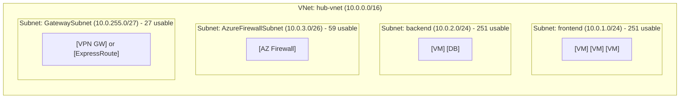
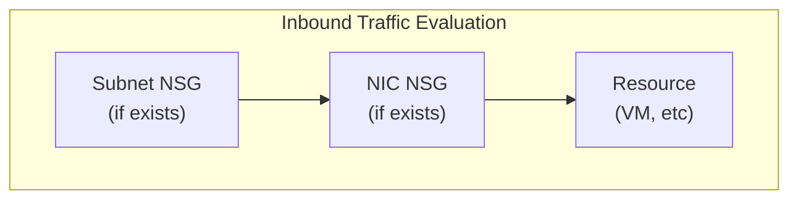
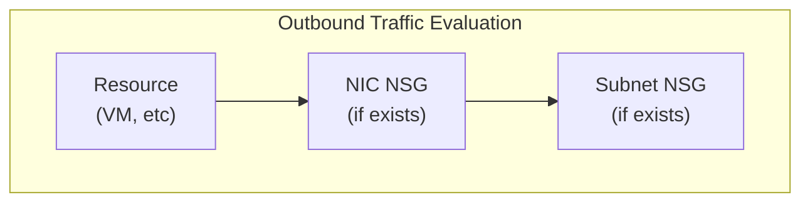
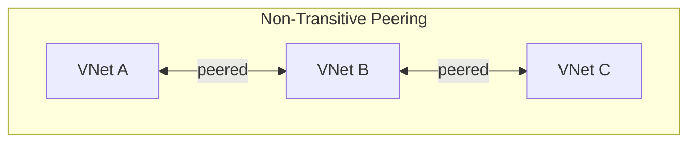
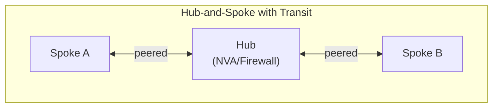
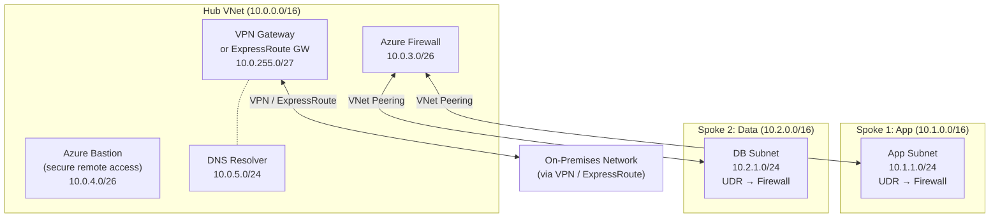

> **Complexity**: `[COMPLEX]` | **Time to Complete**: 3h | **Prerequisites**: Module 3.1 (Entra ID & RBAC)

## What You'll Be Able to Do

By the end of this module you will have practiced the networking primitives that underpin nearly every Azure landing zone: virtual networks, subnets, security filtering, peering, and controlled egress through a hub. The outcomes below are not a vocabulary checklist; each one maps to a design decision you will make in the hands-on lab, in the quiz scenarios, and in real hub-and-spoke deployments where traffic must be both reachable and inspectable.

- **Design Azure VNet architectures using subnets, Network Security Groups, and User-Defined Routes**
- **Configure VNet peering for hub-and-spoke connectivity to establish centralized routing**
- **Evaluate Azure Firewall, VPN Gateway, and ExpressRoute to control and connect enterprise traffic**
- **Diagnose network traffic flow based on NSG rule evaluation and system routing behaviors**

---

## Why This Module Matters

Changes to VNet address space or peering dependencies can break shared services such as DNS, gateways, and on-premises connectivity, causing broad outages across a platform. Because those dependencies are shared, a single planning mistake in the hub often surfaces as mysterious timeouts in application spokes long after the original change shipped, which is why mature teams treat IP address management and peering design as platform contracts rather than per-team preferences.

Networking in Azure is invisible when it works and catastrophic when it breaks. Unlike compute resources that you can scale up with a button click, or storage that you can provision in seconds, networking mistakes often cascade across your entire infrastructure because routes, peering links, and security rules compose silently in the data plane. A misconfigured Network Security Group can block traffic for hours before anyone notices, especially when the deny is buried under higher-priority defaults that still look correct in a portal screenshot. An overlapping address space between two VNets makes peering impossible until someone renumbers a spoke, and a missing route table entry can send production traffic into a black hole even though the subnets and NSGs appear healthy.

In this module, you will learn Azure networking from the ground up so those failure modes become predictable instead of mysterious. You will understand VNets and subnets as the containers for private addressing, how Network Security Groups filter traffic at the subnet and NIC boundary, how VNet peering connects separate networks without traversing the public internet, and how User-Defined Routes plus a hub appliance steer spoke traffic for inspection. By the end, you will be able to design and implement a multi-VNet architecture where spoke networks route egress and east-west flows through a central hub, which is the pattern most enterprises use when they need shared firewalls, shared VPN or ExpressRoute entry points, and consistent logging without giving every application team a full copy of those expensive shared services.

---

## VNets and Subnets: Your Private Network in the Cloud

An Azure Virtual Network (VNet) is a logically isolated network in Azure that closely mirrors a traditional network you would operate in your own data center. Think of a VNet as renting an empty floor in an office building: the floor is yours, you decide how to divide it into rooms (subnets), you install badge readers at the corridors (NSGs), and you negotiate skybridges to other floors your company rents (peering). The analogy breaks only where Azure automation is stricter than a physical landlord---certain rooms must be named exactly `GatewaySubnet` or `AzureFirewallSubnet`, and the building management reserves five parking spots in every garage whether you asked for them or not.

Resources inside a VNet communicate with private IPs that are not reachable from the internet unless you publish explicit public entry points. That isolation is foundational to defense in depth: even if an application misconfigures a public IP, neighboring VNets remain unreachable unless peering, VPN, ExpressRoute, or deliberate public services bridge them. Your job as the architect is to decide which bridges are allowed, which must pass through inspection, and which address blocks must never collide.

### VNet Fundamentals

Every VNet has an **address space** defined using CIDR notation, and that choice is the root constraint for every subnet, peering link, and on-premises route you add later. The address space is the pool of private IP addresses your resources may consume inside the VNet, and you should size it for growth because expanding or renumbering after workloads land is painful. Azure supports the standard RFC 1918 private address ranges, and most organizations standardize on one of the three families below rather than mixing arbitrary public ranges into VNets:

| Range | CIDR | Available Addresses | Typical Use |
| :--- | :--- | :--- | :--- |
| 10.0.0.0 - 10.255.255.255 | 10.0.0.0/8 | ~16.7 million | Large enterprise networks |
| 172.16.0.0 - 172.31.255.255 | 172.16.0.0/12 | ~1 million | Medium-sized deployments |
| 192.168.0.0 - 192.168.255.255 | 192.168.0.0/16 | ~65,000 | Small networks, labs |

A VNet is **regional**---it exists in a [single Azure region](https://learn.microsoft.com/en-us/azure/virtual-network/virtual-networks-faq), which means its control plane and default data-plane behavior are anchored to that region's fabric. A VNet in East US and a VNet in West Europe are completely separate, isolated networks even if you use identical address spaces in both, so you cannot treat them as one LAN without an explicit connectivity mechanism. To connect regions you use VNet peering, including global peering when the spokes and hub live in different geographies, and you still must respect non-overlapping address spaces and routing intent on both sides of each link.

```bash
# Create a VNet with a /16 address space (65,536 addresses)
az network vnet create \
  --resource-group myRG \
  --name hub-vnet \
  --address-prefix 10.0.0.0/16 \
  --location eastus2

# You can add multiple address spaces to a single VNet
az network vnet update \
  --resource-group myRG \
  --name hub-vnet \
  --add addressSpace.addressPrefixes "10.100.0.0/16"
```

### Designing a non-overlapping IP plan

Enterprise Azure estates rarely stop at a single VNet. Your first `/16` choice is really a reservation in a larger map shared with on-premises routers, partner networks, and future acquisitions. Allocate large, coarse blocks per environment. For example, reserve `10.0.0.0/16` for a production hub, `10.1.0.0/16` for production spokes, and `10.128.0.0/16` for non-production. Document which team may consume which `/24` inside each block. When two teams independently pick `10.1.0.0/16`, peering fails until someone renumbers. The error can look transient in the portal even though the conflict is permanent.

Hub-and-spoke designs amplify overlap risk. Spokes must peer to the hub and often route through it. Overlapping spaces break peering creation. They also break User-Defined Routes that assume a unique next hop.

Regional boundaries matter alongside address uniqueness. A VNet cannot span regions. Disaster recovery patterns therefore use separate VNets per region. Application replication handles data movement above Layer 3. Global peering connects regional VNets. It does not merge address policies. You still need non-overlapping prefixes on both sides. You still need a clear owner for authoritative DNS per application.

### Subnets: Dividing Your Network

Subnets are subdivisions of your VNet's address space, and they are the attachment point for almost every resource that participates in private IPv4 networking. Every Azure resource that needs a private IP address---virtual machines, internal load balancers, private endpoints, and many PaaS integrations---must be placed in a subnet, which is why subnet sizing errors show up as scale failures rather than as clear "subnet full" messages in every service. Subnets serve two complementary purposes in practice: **organization**, because they let you group tiers such as frontend, backend, and shared services, and **security**, because you can associate a Network Security Group at the subnet boundary to enforce a baseline before traffic ever reaches an individual NIC.



[Azure reserves 5 IP addresses in every subnet](https://learn.microsoft.com/en-us/azure/virtual-network/virtual-networks-faq) regardless of prefix length: `.0` for the network address, `.1` for the default gateway, `.2` and `.3` for Azure DNS mapping, and the last address for broadcast semantics. That reservation is easy to forget during spreadsheet math because a /24 still "looks like" 256 addresses on paper, but [for a /24 you receive 251 usable host addresses](https://learn.microsoft.com/en-us/azure/architecture/example-scenario/integrated-multiservices/virtual-network-integration), [for a /27 you receive 27 usable addresses](https://learn.microsoft.com/en-us/azure/architecture/example-scenario/integrated-multiservices/virtual-network-integration), and [for a /29 you receive only 3 usable addresses](https://learn.microsoft.com/en-us/azure/virtual-network/virtual-network-manage-subnet). The practical lesson is to size subnets for peak consumption---pods, private endpoints, and internal load balancers all consume IPs---not for today's VM count alone.

Several Azure platform services also require **specific subnet names** and minimum prefix lengths because the resource provider validates those strings during deployment. Treat the table below as a hard contract: renaming `GatewaySubnet` to something friendlier will not work, and undersizing `AzureFirewallSubnet` below /26 will fail even when the rest of your address plan has plenty of room elsewhere in the VNet.

| Subnet Name | Required For | Minimum Size |
| :--- | :--- | :--- |
| [`GatewaySubnet`](https://learn.microsoft.com/en-us/azure/vpn-gateway/vpn-gateway-vpn-faq) | VPN Gateway, ExpressRoute Gateway | /27 recommended |
| [`AzureFirewallSubnet`](https://learn.microsoft.com/en-us/azure/well-architected/service-guides/azure-firewall) | Azure Firewall | /26 required |
| [`AzureFirewallManagementSubnet`](https://learn.microsoft.com/en-us/azure/firewall/management-nic) | Azure Firewall (forced tunneling) | /26 required |
| [`AzureBastionSubnet`](https://learn.microsoft.com/en-us/azure/bastion/configuration-settings) | Azure Bastion | /26 or larger |
| `RouteServerSubnet` | Azure Route Server | /26 or larger |

### Subnet sizing in practice

When you translate business requirements into prefixes, start from the largest consumers of IP addresses rather than from the VM count alone. Azure Kubernetes Service with Azure CNI assigns pod IPs from the subnet, so a cluster that may reach fifty nodes with thirty pods each needs headroom for roughly fifteen hundred addresses plus growth, which quickly pushes you beyond a `/24` even if only fifty NICs exist today. Private endpoints also consume addresses in the subnet you select, and internal load balancers may require additional allocations depending on SKU and frontend configuration. A workable rule used by many platform teams is to plan for twice the peak address consumption you measure in staging, then round up to the next comfortable prefix boundary so you are not performing emergency renumbering during a marketing event.

Reserved addresses punish small prefixes disproportionately, which is why gateway and firewall subnets should be carved with their minimum sizes up front even if they look wasteful on paper. A `/26` for `AzureFirewallSubnet` yields only fifty-nine usable addresses after reservation, which is acceptable because the firewall is a managed service rather than a farm of VMs. In contrast, placing application tiers into `/28` subnets because "we only need ten VMs today" often blocks private endpoint density later. The mermaid diagram above is a teaching layout: production designs also separate management subnets, bastion subnets, and resolver subnets so blast radius and RBAC boundaries align with the traffic flows you intend to inspect in the hub.

```bash
# Create subnets within the VNet
az network vnet subnet create \
  --resource-group myRG \
  --vnet-name hub-vnet \
  --name frontend \
  --address-prefix 10.0.1.0/24

az network vnet subnet create \
  --resource-group myRG \
  --vnet-name hub-vnet \
  --name backend \
  --address-prefix 10.0.2.0/24

# Create the special GatewaySubnet
az network vnet subnet create \
  --resource-group myRG \
  --vnet-name hub-vnet \
  --name GatewaySubnet \
  --address-prefix 10.0.255.0/27

# List all subnets in a VNet
az network vnet subnet list --resource-group myRG --vnet-name hub-vnet -o table
```

**Pause and predict:** You plan to deploy an Azure Kubernetes Service cluster configured with Azure CNI that must scale up to 50 nodes with 30 pods per node. If you place this cluster inside a single /24 subnet, what will happen during scale-out, and why do Azure subnet reservation rules cause this deployment to fail?

<details>
<summary>Check your prediction</summary>

Azure reserves 5 IP addresses in every subnet (network, gateway, two DNS resolvers, and broadcast), leaving only 251 usable IP addresses in a standard /24 prefix. Because Azure CNI assigns an individual private VNet IP address to each pod and node, 50 nodes running 30 pods each require 1,550 distinct IP addresses (50 node IPs plus 1,500 pod IPs). This exceeds the 251 usable addresses, causing IP address exhaustion and preventing node scale-out and pod scheduling.
</details>

Dedicated subnets such as `GatewaySubnet`, `AzureFirewallSubnet`, and `AzureBastionSubnet` require exact naming syntax. Azure fabric controllers programmatically bind gateway appliances and firewall scale sets to those specific names. Reserving distinct address ranges for these platform services prevents administrative rework during hybrid connectivity expansion.

---

## Network Security Groups (NSGs): Your Subnet-Level Firewall

A Network Security Group is a stateful firewall that filters network traffic to and from Azure resources at Layer 3 and Layer 4. NSGs contain **security rules** that allow or deny traffic based on source, destination, port, and protocol, and because they are stateful, return traffic for an allowed flow is generally permitted without a symmetric inbound rule. You can attach an NSG to a **subnet**, which is the recommended default for a consistent baseline, or to a **network interface** when you need an exception for a single VM without changing neighbors in the same subnet.

### How NSG Rules Are Evaluated

[NSG rules have a **priority** from 100 through 4096, where a lower number means higher precedence, and Azure evaluates rules from lowest priority number to highest until the first match applies.](https://learn.microsoft.com/en-us/troubleshoot/azure/virtual-network/virtual-network-troubleshoot-nsg-blocking-traffic) That first-match behavior matters when you add a broad deny above a narrow allow: the deny wins if its priority number is smaller, even when the allow looks correct in isolation.



When both a subnet NSG and a NIC NSG apply, Azure evaluates them in a fixed order and requires **both** to permit the flow. For inbound traffic the subnet NSG is evaluated before the NIC NSG, and for outbound traffic the NIC NSG is evaluated before the subnet NSG, which is why a deny on either attachment point blocks the packet even when the other attachment allows it. If you are troubleshooting a timeout, always check effective rules on the NIC (`list-effective-nsg`) rather than assuming the subnet rule you edited is the one that actually matched.



[Every NSG also ships with **default rules**](https://learn.microsoft.com/en-us/azure/virtual-network/network-security-groups-overview) that you cannot delete, and those defaults still participate in the priority ordering even when your custom rules look exhaustive:

| Priority | Name | Direction | Action | Source | Destination |
| :--- | :--- | :--- | :--- | :--- | :--- |
| 65000 | AllowVnetInBound | Inbound | Allow | VirtualNetwork | VirtualNetwork |
| 65001 | AllowAzureLoadBalancerInBound | Inbound | Allow | AzureLoadBalancer | * |
| 65500 | DenyAllInBound | Inbound | Deny | * | * |
| 65000 | AllowVnetOutBound | Outbound | Allow | VirtualNetwork | VirtualNetwork |
| 65001 | AllowInternetOutBound | Outbound | Allow | * | Internet |
| 65500 | DenyAllOutBound | Outbound | Deny | * | * |

[The `VirtualNetwork` service tag includes the VNet address space, all peered VNet address spaces, and on-premises address spaces connected via VPN or ExpressRoute.](https://learn.microsoft.com/en-us/azure/virtual-network/service-tags-overview) That tag is why the default rules feel permissive inside a well-peered estate: east-west traffic among connected private networks is allowed unless you add explicit denies with higher precedence. When you move to a hub-and-spoke design with forced tunneling, you still need firewall or NVA rules on top of NSGs because NSGs alone cannot express FQDN-based egress policies or centralized inspection.

```bash
# Create an NSG
az network nsg create \
  --resource-group myRG \
  --name frontend-nsg

# Allow HTTPS inbound from the internet
az network nsg rule create \
  --resource-group myRG \
  --nsg-name frontend-nsg \
  --name AllowHTTPS \
  --priority 100 \
  --direction Inbound \
  --access Allow \
  --protocol Tcp \
  --source-address-prefixes Internet \
  --destination-port-ranges 443

# Allow SSH only from your IP
MY_IP=$(curl -s ifconfig.me)
az network nsg rule create \
  --resource-group myRG \
  --nsg-name frontend-nsg \
  --name AllowSSH \
  --priority 110 \
  --direction Inbound \
  --access Allow \
  --protocol Tcp \
  --source-address-prefixes "$MY_IP/32" \
  --destination-port-ranges 22

# Associate NSG with a subnet
az network vnet subnet update \
  --resource-group myRG \
  --vnet-name hub-vnet \
  --name frontend \
  --network-security-group frontend-nsg

# View effective NSG rules for a VM's NIC
az network nic list-effective-nsg \
  --resource-group myRG \
  --name myVM-nic -o table
```

**Pause and predict:** A virtual machine has a Network Security Group associated with its network interface that allows inbound port 80, but its enclosing subnet has an NSG with a rule that denies inbound port 80. When web traffic arrives from the public internet targeting port 80 on the virtual machine, will the connection reach the workload?

<details>
<summary>Check your prediction</summary>

The packets will not reach the virtual machine. For inbound traffic, Azure evaluates the subnet-level Network Security Group first and the NIC-level Network Security Group second, and the traffic must pass both evaluations to reach the destination. Because the subnet NSG denies port 80, the packet is discarded at the subnet perimeter before the NIC NSG allow rule can ever be evaluated.
</details>

Managing firewall rules across large fleets of virtual machines becomes cumbersome when administrators maintain individual IP addresses inside access control lists. Cloud platform teams streamline perimeter management by defining security policies around operational roles rather than host addresses. This operational pattern ensures that network security posture remains consistent across auto-scaled compute clusters.

### Application Security Groups (ASGs)

Application Security Groups let you group NICs logically and reference those groups in NSG rules instead of hard-coding IP addresses that change every time autoscale replaces an instance. ASGs are powerful in dynamic environments---Kubernetes node pools, VM scale sets, and short-lived build agents---because membership travels with the NIC rather than with a fragile rule row per address.

```bash
# Create ASGs
az network asg create --resource-group myRG --name web-servers
az network asg create --resource-group myRG --name db-servers

# Create NSG rule using ASGs instead of IPs
az network nsg rule create \
  --resource-group myRG \
  --nsg-name backend-nsg \
  --name AllowWebToDb \
  --priority 100 \
  --direction Inbound \
  --access Allow \
  --protocol Tcp \
  --source-asgs web-servers \
  --destination-asgs db-servers \
  --destination-port-ranges 5432

# Associate a VM's NIC with an ASG
az network nic ip-config update \
  --resource-group myRG \
  --nic-name web-vm-nic \
  --name ipconfig1 \
  --application-security-groups web-servers
```

### Modeling security rules for change

A maintainable NSG design separates **platform rules** from **application rules** by priority bands. Platform teams often reserve priorities 100-199 for baseline denies and allows that apply to every subnet in a landing zone---for example, blocking management ports from the internet---while application teams receive priorities 200-999 for ASG-to-ASG rules that describe tier-to-tier access. Because evaluation stops at the first match, document the intent of each priority block in your infrastructure repository so a well-meaning "temporary allow" at priority 150 does not override a deny at 200 that was protecting a compliance control. When you debug flows, remember that default rules at priorities 65000 and 65500 still exist; a custom deny at 4096 does not magically remove the default allow for intra-VNet traffic unless your custom rule matches first with a lower priority number.

Teams that encode NSG rules with individual IP addresses often create brittle operations where every scale-out event becomes a ticket to "open the NSG." Using Application Security Groups lets new or replaced VMs inherit the intended policy through group membership instead of manual IP-based rule edits, which is why platform teams pair subnet-level baselines with ASG-scoped exceptions rather than NIC-level rule sprawl on every host.

---

## VNet Peering: Connecting Networks

VNet peering creates a direct, high-bandwidth, low-latency connection between two VNets inside Azure's private backbone. [Traffic between peered VNets travels over the Microsoft network rather than the public internet, and peering works across regions as **global VNet peering** as well as across subscriptions and Entra ID tenants when RBAC and deployment permissions are aligned.](https://learn.microsoft.com/en-us/azure/virtual-network/virtual-network-peering-overview) Peering is the glue in hub-and-spoke designs: spokes do not each need their own VPN appliance when they can use a hub gateway, but only when you configure gateway transit flags and routes deliberately.

### How Peering Works

**Pause and predict:** If VNet A is peered directly with VNet B, and VNet B is peered directly with VNet C, can workloads residing in VNet A communicate with workloads in VNet C across this topology without configuring additional routing components?

<details>
<summary>Check your prediction</summary>

[Peering is **non-transitive** by default.](https://learn.microsoft.com/en-us/azure/virtual-network/virtual-networks-faq) If VNet A is peered with VNet B, and VNet B is peered with VNet C, VNet A **cannot** reach VNet C merely because B sits in the middle; there is no automatic "mesh through B" behavior. Spoke-to-spoke communication requires placing a router or firewall in the hub, configuring User-Defined Routes on spokes to steer traffic through that appliance, and enabling the **Allow Forwarded Traffic** flag on both peering links.



* **A can reach B:** YES
* **B can reach C:** YES
* **A can reach C:** NO (peering is not transitive)
</details>

Designing enterprise networks around a central hub enables organizations to inspect and audit data flows at a single administrative boundary. Rather than managing complex point-to-point configurations as the application footprint expands, centralized architectures enforce compliance standards cleanly. This pattern also simplifies traffic engineering and reduces the operational overhead of maintaining spoke networks.



* **A can reach B:** YES (traffic routes through Hub's NVA/Firewall)
* **Requires:** UDR on spoke subnets + "Allow Forwarded Traffic" on peering

```bash
# Create two VNets
az network vnet create -g myRG -n spoke1-vnet --address-prefix 10.1.0.0/16 --location eastus2
az network vnet create -g myRG -n spoke2-vnet --address-prefix 10.2.0.0/16 --location eastus2

# Get VNet resource IDs
HUB_VNET_ID=$(az network vnet show -g myRG -n hub-vnet --query id -o tsv)
SPOKE1_VNET_ID=$(az network vnet show -g myRG -n spoke1-vnet --query id -o tsv)

# Create peering: Hub → Spoke1
az network vnet peering create \
  --resource-group myRG \
  --name hub-to-spoke1 \
  --vnet-name hub-vnet \
  --remote-vnet "$SPOKE1_VNET_ID" \
  --allow-vnet-access \
  --allow-forwarded-traffic \
  --allow-gateway-transit    # Hub shares its gateway with spokes

# Create peering: Spoke1 → Hub
az network vnet peering create \
  --resource-group myRG \
  --name spoke1-to-hub \
  --vnet-name spoke1-vnet \
  --remote-vnet "$HUB_VNET_ID" \
  --allow-vnet-access \
  --allow-forwarded-traffic \
  --use-remote-gateways      # Spoke uses Hub's gateway

# Verify peering status
az network vnet peering list -g myRG --vnet-name hub-vnet -o table
```

### Peering operations and verification

Peering is always created in pairs, and the control plane reports `Connected` only when both sides reference each other with compatible address spaces. Operations teams should treat a one-sided peering link as a failed deployment even if the portal shows half of the relationship green, because data-plane connectivity requires reciprocal configuration. After changes, `az network vnet peering list` should show `PeeringState` of `Connected` and the forwarded-traffic flags you expect for hub transit designs. When spokes use remote gateways, verify both `--allow-gateway-transit` on the hub and `--use-remote-gateways` on the spoke; missing either flag produces symptoms that look like on-premises routing bugs but are actually peering option mismatches.

Because peering is non-transitive, documentation should draw the actual path packets take, not just a box diagram of logical relationships. If Spoke A must reach Spoke B through a hub firewall, the drawing should include the UDR next hop, the firewall rule that permits the flow, and the return path symmetry. Asymmetric routing---where forward and reverse paths differ---is a common reason pings fail even when a one-way trace appears successful, especially after introducing an NVA that must be enabled for IP forwarding on its NIC and inside the guest operating system.

Each peering link exposes four flags that control whether traffic may flow, whether forwarded packets are accepted, and whether a spoke may borrow the hub's VPN or ExpressRoute gateway. The CLI examples above set them on purpose: spokes that need centralized inspection must allow forwarded traffic, and spokes that should use the hub's on-premises path must opt into remote gateways while the hub allows gateway transit.

| Flag | Meaning |
| :--- | :--- |
| `--allow-vnet-access` | Allow traffic between the peered VNets (almost always yes) |
| `--allow-forwarded-traffic` | Accept traffic that did not originate in the peer VNet (needed for transit routing) |
| `--allow-gateway-transit` | Set on the hub---lets spokes use the hub's VPN/ExpressRoute gateway |
| `--use-remote-gateways` | Set on the spoke---tells it to use the hub's gateway for on-prem connectivity |

**Pause and predict:** Can two virtual networks that both assign the `10.0.0.0/16` address space establish a VNet peering connection if they reside in completely different Azure subscriptions or Entra ID tenants?

<details>
<summary>Check your prediction</summary>

Peering creation will fail immediately during provisioning. [Peered VNets **cannot have overlapping address spaces**](https://learn.microsoft.com/en-us/azure/virtual-network/virtual-networks-faq) under any circumstances, even when they reside in separate subscriptions or different Entra ID tenants. Azure software-defined routing requires unambiguous destination IP prefixes to direct network packets across virtual networks.
</details>

Organizations maintain centralized IP address management registries to coordinate CIDR block allocations across cloud subscriptions and on-premises datacenters. When integrating acquired infrastructure with preexisting address conflicts, network architects implement Private Link connections or network address translation gateways. These mechanisms establish secure connectivity between systems without requiring immediate subnet renumbering.

---

## Azure Firewall and Route Tables: Controlling Traffic Flow

### User-Defined Routes (UDRs)

By default, Azure installs **system routes** that deliver traffic between subnets inside a VNet and between directly peered address spaces without you managing a routing protocol. That default is convenient for small labs but insufficient when security policy requires every spoke-to-spoke or spoke-to-internet flow to pass through a hub appliance. In hub-and-spoke topologies, [you intentionally override those defaults with User-Defined Routes so spoke subnets send traffic to a firewall or network virtual appliance (NVA) in the hub for inspection and logging.](https://learn.microsoft.com/en-us/azure/virtual-network/virtual-network-peering-overview)

A **route table** is a named collection of routes you associate with one or more subnets. [When a route table is associated with a subnet, its routes take precedence over the relevant system routes for matching prefixes](https://learn.microsoft.com/en-us/azure/virtual-network/virtual-networks-udr-overview), which is how you implement a default route to a firewall private IP without reconfiguring every VM individually. Disabling BGP route propagation on a spoke route table is common when you want the hub to remain the single source of truth for learned on-premises prefixes.

```bash
# Create a route table for spoke subnets
az network route-table create \
  --resource-group myRG \
  --name spoke-route-table \
  --disable-bgp-route-propagation true

# Add a default route that sends all traffic to the hub firewall
az network route-table route create \
  --resource-group myRG \
  --route-table-name spoke-route-table \
  --name default-to-firewall \
  --address-prefix 0.0.0.0/0 \
  --next-hop-type VirtualAppliance \
  --next-hop-ip-address 10.0.3.4    # Azure Firewall's private IP

# Associate route table with spoke subnet
az network vnet subnet update \
  --resource-group myRG \
  --vnet-name spoke1-vnet \
  --name workload \
  --route-table spoke-route-table
```

### Azure Firewall

Azure Firewall is a managed, cloud-based network security service deployed into the dedicated `AzureFirewallSubnet` you reserved in the hub. Unlike NSGs, which operate at Layers 3 and 4 with IP and port semantics, [Azure Firewall can inspect traffic at Layer 7](https://learn.microsoft.com/en-us/azure/firewall/features-by-sku), applying FQDN and URL filtering, TLS inspection on supported SKUs, and threat intelligence feeds that are difficult to replicate with NSG rules alone. Organizations typically place Azure Firewall in the hub so spokes stay thin: spokes peer to the hub, UDRs point default routes at the firewall, and application teams inherit centralized egress policy instead of copying rule sets into every subscription.

| Feature | NSG (Layer 3/4) | Azure Firewall (Layer 3-7) |
| :--- | :--- | :--- |
| **Rules** | IP-based rules | IP, FQDN, URL-based rules |
| **Filtering** | Port filtering | Port + protocol + app inspection |
| **Engine** | Stateful | Stateful + threat intelligence |
| **Cost** | No direct NSG service charge | Azure Firewall has recurring SKU and data-processing costs |
| **Placement** | Per-subnet | Centralized (hub) |
| **Logging** | Flow logging is available via Network Watcher or VNet flow logs | Diagnostic logging is available via Azure Monitor |
| **Inspection** | No TLS inspect | TLS inspection (Premium) |

```bash
# Create Azure Firewall subnet (must be named exactly AzureFirewallSubnet)
az network vnet subnet create \
  --resource-group myRG \
  --vnet-name hub-vnet \
  --name AzureFirewallSubnet \
  --address-prefix 10.0.3.0/26

# Create public IP for the firewall
az network public-ip create \
  --resource-group myRG \
  --name fw-public-ip \
  --sku Standard \
  --allocation-method Static

# Create Azure Firewall
az network firewall create \
  --resource-group myRG \
  --name hub-firewall \
  --location eastus2 \
  --sku AZFW_VNet \
  --tier Standard

# Configure the firewall IP
az network firewall ip-config create \
  --resource-group myRG \
  --firewall-name hub-firewall \
  --name fw-ipconfig \
  --public-ip-address fw-public-ip \
  --vnet-name hub-vnet

# Get the firewall's private IP (for route tables)
FW_PRIVATE_IP=$(az network firewall show -g myRG -n hub-firewall \
  --query "ipConfigurations[0].privateIPAddress" -o tsv)
echo "Firewall private IP: $FW_PRIVATE_IP"

# Create a network rule collection (allow spoke-to-spoke traffic)
az network firewall network-rule create \
  --resource-group myRG \
  --firewall-name hub-firewall \
  --collection-name "spoke-to-spoke" \
  --priority 200 \
  --action Allow \
  --name "allow-all-spokes" \
  --protocols Any \
  --source-addresses "10.1.0.0/16" "10.2.0.0/16" \
  --destination-addresses "10.1.0.0/16" "10.2.0.0/16" \
  --destination-ports "*"

# Create an application rule (allow AKS service endpoints via FQDN tag)
az network firewall application-rule create \
  --resource-group myRG \
  --firewall-name hub-firewall \
  --collection-name "allowed-websites" \
  --priority 300 \
  --action Allow \
  --name "allow-aks" \
  --protocols Https=443 \
  --source-addresses "10.1.0.0/16" "10.2.0.0/16" \
  --fqdn-tags "AzureKubernetesService"

# Separate rule for OS update FQDNs (cannot mix --fqdn-tags and --target-fqdns)
az network firewall application-rule create \
  --resource-group myRG \
  --firewall-name hub-firewall \
  --collection-name "allowed-websites" \
  --priority 301 \
  --action Allow \
  --name "allow-os-updates" \
  --protocols Https=443 \
  --source-addresses "10.1.0.0/16" "10.2.0.0/16" \
  --target-fqdns "*.ubuntu.com" "packages.microsoft.com"
```

### Composing inspection in the hub

Hub-and-spoke security is a chain: UDRs deliver packets to the appliance, the appliance must forward or drop, NSGs on subnets still apply at the NIC and subnet boundary, and application rules on Azure Firewall decide FQDN and network collections. A spoke VM reaching another spoke therefore needs a UDR on the source subnet pointing at the firewall or NVA private IP, a firewall network rule permitting the address prefixes, peering with **Allow Forwarded Traffic** on both hub and spoke, and NSGs that do not deny the flow earlier. Missing any single link produces partial connectivity that is tedious to debug because each layer looks "mostly configured." When you migrate from the lab NVA to Azure Firewall, you swap the next-hop IP and add explicit firewall collections, but you should keep the same diagram of paths so operators know which component owns logging for a given flow.

The comparison table above is not a verdict that NSGs are obsolete; most designs use NSGs for coarse segmentation inside a spoke and Azure Firewall for centralized egress and inter-spoke inspection. Cost and operations trade-offs matter: NSGs do not bill per rule, while Azure Firewall introduces SKU and processing charges that are justified when you need FQDN filtering, centralized threat intelligence, or uniform egress auditing across dozens of subscriptions.

---

## VPN Gateway vs ExpressRoute: Connecting to On-Premises

When you need to connect Azure VNets to an on-premises data center or to a partner network, you choose between encrypted connectivity over the public internet and private connectivity through a telecommunications provider. VPN Gateway is usually faster to stand up for labs and branch offices, while ExpressRoute is the choice when latency variance and bandwidth ceilings on internet paths are unacceptable for the workload. The table below summarizes the trade-offs you will defend in architecture reviews; neither option removes the need for correct address planning on the Azure side.

| Feature | VPN Gateway | ExpressRoute |
| :--- | :--- | :--- |
| **Connection type** | IPSec/IKE over public internet | Private, dedicated connection via partner |
| **Bandwidth** | Up to 10 Gbps, depending on VPN Gateway SKU | Higher bandwidth options than VPN, with standard ExpressRoute circuits up to 10 Gbps and larger capacities available through ExpressRoute Direct |
| **Latency** | Variable (internet-dependent) | Predictable, low latency |
| **Encryption** | Built-in IPSec | Not encrypted by default (add MACsec or VPN) |
| **Cost** | Lower (~$140-1,250/month for gateway) | Higher ($200-10,000+/month for circuit) |
| **Setup time** | Minutes to hours | Weeks (requires provider provisioning) |
| **SLA** | 99.9% (single) / 99.95% (active-active) | 99.95% (Premium extends global reach, not the SLA) |
| **Best for** | Dev/test, small offices, quick setup | Production, compliance, high-throughput |

```bash
# Create a VPN Gateway (takes 30-45 minutes to provision)
az network vnet-gateway create \
  --resource-group myRG \
  --name hub-vpn-gateway \
  --vnet hub-vnet \
  --gateway-type Vpn \
  --vpn-type RouteBased \
  --sku VpnGw2 \
  --generation Generation2 \
  --public-ip-addresses vpn-gw-pip \
  --no-wait

# Check provisioning status
az network vnet-gateway show -g myRG -n hub-vpn-gateway --query provisioningState -o tsv
```

### Hybrid connectivity review questions

When stakeholders ask "why not VPN to save money," answer with workload requirements rather than with brand preference. Ask whether the application tolerates variable latency on the public internet path, whether sustained throughput exceeds common VPN gateway SKUs, and whether regulatory guidance mandates private connectivity. VPN remains appropriate for dev/test, disaster recovery drills, and smaller branch offices that can tolerate best-effort bandwidth. ExpressRoute earns its place when mainframe or trading workloads need predictable round-trip times, when multi-gigabit replication runs continuously, or when compliance frameworks expect a provider-managed circuit with documented demarcation points.

Gateway placement belongs in the hub in hub-and-spoke designs so spokes inherit hybrid access through peering flags instead of duplicating expensive VPN or ExpressRoute gateways in every subscription. That consolidation saves money but concentrates risk: schedule hub gateway maintenance windows with the same rigor as on-premises core router changes, and test failover paths when Microsoft or your provider performs planned maintenance.

For production workloads with sustained throughput requirements and strict latency expectations, internet-based VPN connectivity can become a bottleneck because congestion on paths you do not control shows up as application tail latency. Evaluate ExpressRoute when predictable performance, compliance-driven private connectivity, or multi-gigabit sustained throughput are business-critical, and place the gateway in `GatewaySubnet` on the hub so spokes can consume it through peering flags instead of deploying redundant gateways per spoke.

---

## The Hub-and-Spoke Topology: Enterprise Standard

The hub-and-spoke architecture is the most common network topology for enterprise Azure deployments because it separates shared platform services from application lifecycles. The hub VNet hosts firewalls, VPN or ExpressRoute gateways, DNS resolvers, bastion access, and monitoring collectors, while each spoke VNet belongs to a team or application with its own RBAC boundary and address space. Spokes peer to the hub, not to every other spoke directly, which keeps the peering mesh manageable as the estate grows.



Teams adopt hub-and-spoke for repeatable operations as much as for security. The pattern delivers several reinforcing advantages that show up in total cost of ownership and audit evidence:

1. **Cost savings**: Shared services (firewall, gateway) are deployed once in the hub
2. **Security**: All spoke egress flows through the central firewall for inspection
3. **Separation of concerns**: Each team gets their own spoke VNet with their own RBAC
4. **Scalability**: Add new spokes without modifying existing infrastructure
5. **Compliance**: Centralized logging and traffic inspection

### Operating hub-and-spoke after day one

Once the topology is live, most incidents are changes to shared hub resources rather than mistakes inside a single application subnet. Patching a firewall, resizing `GatewaySubnet`, or altering hub address space can disconnect many spokes simultaneously, so hub changes should run through the same change advisory process as on-premises core routers. DNS is another shared dependency: if spokes rely on a hub resolver or on Private DNS Zones linked to multiple VNets, a zone link removal breaks name resolution even when IP connectivity still works. Document which team owns hub DNS, hub monitoring agents, and hub route tables so application teams know where to escalate when only cross-spoke traffic fails.

Governance complements technology. RBAC on spoke resource groups lets application teams deploy VMs without granting them rights to modify hub peerings or firewall policies. Azure Policy can enforce required NSG associations or deny creation of overlapping address spaces at subscription scope. Together, hub-and-spoke becomes a platform product: spokes innovate quickly inside their address blocks, while the hub team guarantees consistent egress, hybrid connectivity, and inspection that auditors can reason about from a single place.

---

## Did You Know?

The items below are easy to overlook during design reviews because they do not block the first deployment the way a missing subnet might. They show up instead in finance tickets, scale events, or security audits months later, which is why experienced architects model them explicitly in the same spreadsheet as address space.

1. **VNet peering traffic should be priced explicitly during design.** Azure bills peering traffic according to the current Virtual Network pricing page, and cross-region replication can create meaningful networking costs if you do not model them up front. A spoke that chatters continuously to a hub monitoring collector in another region can accrue egress-style charges even though the traffic never leaves Microsoft's network, so capacity planning should include bytes per day estimates the same way you would for internet egress.

2. **Azure reserves exactly 5 IP addresses in every subnet**, regardless of size. In a /28 subnet (16 addresses), you lose 5 to Azure, leaving only 11 usable. The reserved addresses are: the network address (.0), Azure's default gateway (.1), Azure DNS mapping (.2 and .3), and the broadcast address (last address). This matches AWS, which also reserves 5 (the first four addresses and the last); the positions differ slightly, so don't assume an Azure subnet has more usable space than the same-sized AWS subnet.

3. **Network flow logs can generate substantial data and ingestion costs.** In busy environments, leaving flow logs enabled continuously can create noticeable Log Analytics charges if you do not scope retention and collection carefully. Sampling, filtering to security-relevant subnets, and aligning retention with compliance rather than default thirty-day storage often reduces cost more than disabling logs entirely and flying blind during an incident.

4. **Azure Firewall has meaningful fixed and usage-based cost even at low traffic levels.** For dev/test environments, teams sometimes choose simpler alternatives such as NSGs alone or a self-managed network appliance, trading lower cost for more operational work. Production estates still frequently standardize on Azure Firewall in the hub because the policy language and centralized logging outweigh the SKU charges when dozens of spokes depend on the same egress path.

---

## Common Mistakes

Most Azure networking outages in mature tenants trace back to a small set of repeatable mistakes rather than to obscure platform bugs. The table below collects the ones this module's quiz scenarios emphasize; use it as a pre-flight checklist before you merge infrastructure-as-code changes that touch address space, peering, or default routes.

| Mistake | Why It Happens | How to Fix It |
| :--- | :--- | :--- |
| Overlapping address spaces between VNets that need to peer | Poor IP address planning, especially when multiple teams create VNets independently | Create a centralized IP Address Management (IPAM) spreadsheet or use Azure IPAM. Plan your entire address scheme before creating any VNets. |
| Not enabling "Allow Forwarded Traffic" on peering | The default is disabled, and the peering "works" for direct traffic, so it seems fine | For hub-and-spoke with transit routing, both sides of the peering need `--allow-forwarded-traffic`. The hub also needs `--allow-gateway-transit`. |
| Putting the Azure Firewall in a subnet not named "AzureFirewallSubnet" | The requirement is not obvious until deployment fails | [Azure Firewall requires the subnet to be named exactly `AzureFirewallSubnet` with a minimum size of /26.](https://learn.microsoft.com/en-us/azure/well-architected/service-guides/azure-firewall) This is a hard-coded requirement. |
| Creating subnets that are too small for the workload | Developers estimate VM count but forget about internal load balancers, private endpoints, and future growth | Size subnets at least 2x your current need. For AKS, remember each pod gets an IP (Azure CNI), so [a 50-node cluster with 30 pods per node needs 1,500+ IPs](https://learn.microsoft.com/en-us/azure/aks/concepts-network-ip-address-planning). |
| Not associating NSGs with subnets (relying only on NIC-level NSGs) | NIC-level NSGs seem more granular and therefore "better" | Subnet-level NSGs provide a consistent security baseline. Use ASGs for per-VM differentiation within a subnet. NIC-level NSGs should be the exception, not the rule. |
| Forgetting to create the return peering (only creating one direction) | VNet peering requires a link in both directions, but Azure does not warn you until traffic fails | Always create peering in pairs. Script it so both sides are created in the same deployment. |
| Relying on implicit outbound internet access in production | Default outbound behavior and subnet defaults can change, so explicit outbound design is safer | In production, choose an explicit outbound pattern such as a firewall/NVA, NAT Gateway, or private subnets with the routes you need |
| Not planning DNS resolution across connected VNets | Cross-VNet name resolution isn't automatic — VNets default to Azure-provided DNS scoped to themselves | Link a Private DNS Zone to each VNet that must resolve the names, or run a central DNS resolver in the hub |

---

## Summary checkpoint

Before you attempt the quiz, sanity-check that you can narrate the path of a packet without peeking at the diagrams. Start with two VMs in different spoke subnets. The source subnet should have a User-Defined Route that points inter-spoke traffic at the hub appliance private IP. Peering links between hub and spokes must allow forwarded traffic. The appliance must forward packets and must not drop return traffic because IP forwarding is disabled. NSGs on each subnet and NIC must allow the ports you care about. Azure Firewall or NVA rules must explicitly permit the address prefixes if a firewall sits in the hub. DNS must resolve names if the application uses hostnames instead of IPs.

If any step in that story is vague, revisit the section that owns it. VNet and subnet content explains addressing. NSG content explains priority and dual evaluation. Peering content explains non-transitivity and flags. Route table and firewall content explains hub inspection. VPN and ExpressRoute content explains hybrid entry through the hub gateway. The hands-on lab proves the story with ping and traceroute, which is the fastest feedback loop when your mental model disagrees with Azure's data plane.

When you review your own designs, sketch three columns on paper: **addressing**, **security**, and **routing**. Addressing lists each VNet prefix and justifies subnet sizes with reserved IP math. Security lists NSG baselines, ASG memberships, and whether centralized inspection is required. Routing lists peerings, UDR next hops, and hybrid gateways. Designs feel "finished" in the portal when only the first column is complete. Production readiness requires all three columns to tell the same story.

Finally, treat defaults as policies you consciously accept or override. Default NSG rules allow intra-VNet traffic. Default system routes deliver traffic between peered networks. Default outbound internet access may exist until you force tunneling. Each default is reasonable for a quick start. Each default can surprise you at scale. Your hub-and-spoke blueprint should document which defaults remain, which UDRs override them, and which firewall collections implement the security promise your stakeholders expect.

Keep a personal checklist for reviews: non-overlapping prefixes, bidirectional peerings, forwarded traffic enabled where UDRs exist, firewall or NVA rules for spoke-to-spoke flows, and DNS linked to every VNet that must resolve private names. That checklist catches most regressions before they reach production. Run it after every infrastructure-as-code pull request that touches `Microsoft.Network` resources, even when the diff looks small on first glance. Network changes are rarely as local as they appear.

---

## Quiz

<details>
<summary>1. You are designing a network for a new application environment in Azure. You have allocated a VNet with the address space 10.0.0.0/16. For the frontend web servers, you create a subnet with the prefix 10.0.1.0/24 and plan to deploy exactly 255 small virtual machines. Will this deployment succeed?</summary>

No, the deployment will fail because you do not have enough usable IP addresses. While a /24 subnet mathematically contains 256 total IP addresses, Azure automatically reserves exactly 5 addresses in every subnet for internal operational purposes. These reserved addresses include the network address, the default gateway, two for DNS mapping, and the broadcast address. This constraint leaves only 251 usable IP addresses for your resources. Therefore, attempting to deploy 255 virtual machines into this subnet will exhaust the available address pool, causing the final four VM deployments to fail with an allocation error.
</details>

<details>
<summary>2. Your company acquired a startup. Your main production network (VNet A) is peered to a shared services network (VNet B). The startup's network (VNet C) is now peered to VNet B. A developer in VNet A is trying to SSH directly into a database server in VNet C but the connection times out. What architectural characteristic of Azure networking is causing this, and how do you fix it?</summary>

The developer's SSH connection fails because Azure VNet peering is strictly non-transitive by default. Even though VNet A is connected to VNet B, and VNet B is connected to VNet C, traffic from A does not automatically route through B to reach C. To establish this communication path, you must design a transit routing architecture by deploying a routing appliance like Azure Firewall or a Network Virtual Appliance in the central hub (VNet B). You then must configure User-Defined Routes (UDRs) in VNets A and C to direct traffic to the appliance, and explicitly enable the "Allow Forwarded Traffic" setting on all peering connections.
</details>

<details>
<summary>3. Your security team mandates that all outbound traffic to the internet must be restricted to a specific list of approved domain names (FQDNs), and all traffic must be logged. A developer suggests simply applying a Network Security Group (NSG) to all subnets to meet this requirement. Will the developer's solution work?</summary>

No, the developer's solution will fail because NSGs cannot filter traffic based on domain names (FQDNs). Network Security Groups operate strictly at Layer 3/4 of the OSI model, meaning they can only filter traffic using IP addresses, ports, and basic protocols. To fulfill the security team's mandate for FQDN-based outbound filtering and comprehensive logging, you must deploy an advanced security service like Azure Firewall. Azure Firewall operates up to Layer 7 and deeply understands application-level constructs like URLs, domain names, and TLS traffic. While NSGs provide essential baseline security at the subnet level, Azure Firewall is absolutely required for centralized, advanced inspection and routing.
</details>

<details>
<summary>4. An infrastructure-as-code deployment pipeline is failing. The error occurs when attempting to deploy an Azure Firewall into a subnet named "hub-firewall-snet" (prefix 10.0.3.0/26). The developer insists the subnet size is correct. Why is the deployment failing, and what is the underlying reason Azure enforces this?</summary>

The deployment is failing because Azure requires the firewall's subnet to be named exactly "AzureFirewallSubnet" without exception. This is a hard-coded requirement within the Azure resource provider responsible for provisioning the firewall service. By enforcing a specific, reserved subnet name, Azure ensures that the service is placed in a dedicated space with appropriate sizing parameters (a minimum of /26). This strict naming convention also fundamentally prevents other infrastructure resources from being accidentally deployed alongside the firewall, which could disrupt its operation. Renaming the subnet from "hub-firewall-snet" to the required name should resolve the deployment error when you redeploy.
</details>

<details>
<summary>5. You have successfully built a hub-and-spoke architecture. VMs in Spoke 1 (10.1.0.0/16) can successfully download updates from the internet via the Azure Firewall in the hub. However, VMs in Spoke 1 cannot connect to the database servers in Spoke 2 (10.2.0.0/16). What specific configuration is likely missing in your network topology?</summary>

The most likely issue is that the Azure Firewall (or Network Virtual Appliance) in the hub VNet lacks a network rule explicitly allowing traffic between the two spoke address spaces. Because you have configured User-Defined Routes (UDRs) on the spoke subnets to send all traffic (0.0.0.0/0) directly to the firewall, the initial connection successfully reaches the hub. However, while the firewall is configured to forward internet-bound traffic, its default security posture drops any unknown internal spoke-to-spoke traffic. You must create a firewall network rule explicitly allowing traffic from 10.1.0.0/16 to 10.2.0.0/16 (and vice versa), and verify that "Allow Forwarded Traffic" is enabled on all associated peering links.
</details>

<details>
<summary>6. Your environment has 50 web servers and 50 database servers in the same subnet. Web servers scale in and out dynamically based on load. Currently, the security team updates the NSG manually with individual IP addresses every time a new web server is created, which frequently causes delays and outages. How can you redesign this security model to be dynamic and resilient?</summary>

You can fundamentally redesign the security model by implementing Application Security Groups (ASGs). ASGs allow you to logically group network interfaces (e.g., creating a "web-servers" ASG and a "db-servers" ASG) and use these abstract groups as the source or destination in your NSG rules, rather than hardcoding individual IP addresses. When the web servers scale out, the newly created VMs simply join the predefined "web-servers" ASG and automatically inherit the correct access rules to communicate with the databases. This declarative approach completely eliminates the need for manual NSG updates, drastically reducing human error and preventing deployment delays during scaling events.
</details>

<details>
<summary>7. A financial institution is migrating their core transaction processing system to Azure. This system requires constant, highly predictable latency to on-premises mainframes and transfers around 5 Gbps of data continuously. The network team has proposed deploying a VPN Gateway to save costs. Why is this proposal risky for this specific workload?</summary>

The proposal to use a VPN Gateway is highly risky because VPNs operate entirely over the public internet, meaning latency is inherently unpredictable and subject to external congestion beyond your control. Furthermore, most standard VPN Gateways cannot reliably sustain a continuous 5 Gbps throughput, which would rapidly lead to dropped packets and severe performance degradation for the critical transaction system. For a workload requiring predictable latency, high throughput, and enterprise-grade reliability, an ExpressRoute circuit must be architected. ExpressRoute provides a dedicated, private connection to the Microsoft backbone, completely bypassing the public internet and effortlessly accommodating massive multi-gigabit workloads.
</details>

---

## Hands-On Exercise: Hub-and-Spoke with VNet Peering and Spoke Egress via Hub

In this exercise, you will build a hub-and-spoke network topology with two spokes, configure bidirectional VNet peering, and attach route tables so spoke-to-spoke and default-bound traffic traverses a hub network virtual appliance. The lab uses a small Linux VM with IP forwarding enabled to simulate an NVA because a full Azure Firewall deployment takes longer and incurs ongoing charges; the routing concepts transfer directly when you replace the NVA with Azure Firewall private IP as the next hop.

**Prerequisites**: Install and authenticate the Azure CLI (`az login`), and confirm your subscription has quota for two or three small VMs plus a handful of public IP addresses in the chosen region.

### Task 1: Create the Hub VNet with Subnets

Task 1 establishes the shared platform network that later tasks will treat as the transit point. You create a dedicated resource group so cleanup is a single `az group delete`, then provision `hub-vnet` with a `/16` that leaves room for firewall, gateway, and shared service subnets without renumbering later. Naming consistency matters because every subsequent CLI command references `hub-vnet` and subnet names exactly as created here.

```bash
RG="kubedojo-network-lab"
LOCATION="eastus2"

# Create resource group
az group create --name "$RG" --location "$LOCATION"

# Create hub VNet
az network vnet create \
  --resource-group "$RG" \
  --name hub-vnet \
  --address-prefix 10.0.0.0/16 \
  --location "$LOCATION"

# Create hub subnets
az network vnet subnet create -g "$RG" --vnet-name hub-vnet \
  --name shared-services --address-prefix 10.0.1.0/24

az network vnet subnet create -g "$RG" --vnet-name hub-vnet \
  --name AzureFirewallSubnet --address-prefix 10.0.3.0/26
```

<details>
<summary>Verify Task 1</summary>

```bash
az network vnet show -g "$RG" -n hub-vnet \
  --query '{AddressSpace:addressSpace.addressPrefixes, Subnets:subnets[].{Name:name, Prefix:addressPrefix}}' -o json
```

You should see the hub VNet with two subnets.
</details>

### Task 2: Create Two Spoke VNets

Task 2 models two independent application teams that receive non-overlapping `/16` blocks. In production you would also assign separate resource groups and RBAC roles per spoke; here the focus is address planning and subnet creation. Each spoke receives a `workload` subnet where VMs will land in Task 6, and the distinct prefixes (`10.1.0.0/16` and `10.2.0.0/16`) let you test inter-spoke routing through the hub without address collisions.

```bash
# Spoke 1: Application workloads
az network vnet create -g "$RG" -n spoke1-vnet \
  --address-prefix 10.1.0.0/16 --location "$LOCATION"
az network vnet subnet create -g "$RG" --vnet-name spoke1-vnet \
  --name workload --address-prefix 10.1.1.0/24

# Spoke 2: Data workloads
az network vnet create -g "$RG" -n spoke2-vnet \
  --address-prefix 10.2.0.0/16 --location "$LOCATION"
az network vnet subnet create -g "$RG" --vnet-name spoke2-vnet \
  --name workload --address-prefix 10.2.1.0/24
```

<details>
<summary>Verify Task 2</summary>

```bash
az network vnet list -g "$RG" --query '[].{Name:name, AddressSpace:addressSpace.addressPrefixes[0]}' -o table
```

You should see three VNets: hub-vnet (10.0.0.0/16), spoke1-vnet (10.1.0.0/16), spoke2-vnet (10.2.0.0/16).
</details>

### Task 3: Create VNet Peering (Hub to Both Spokes)

Task 3 wires logical connectivity. Peering commands require the full resource ID of the remote VNet, which is why the script captures IDs before creating links. You create four peerings total---hub to each spoke and each spoke back to the hub---because Azure treats each direction as its own object with its own flags. Enable **Allow Forwarded Traffic** now so Task 5's User-Defined Routes can deliver packets to the NVA without silent drops at the peering boundary.

```bash
# Get VNet resource IDs
HUB_ID=$(az network vnet show -g "$RG" -n hub-vnet --query id -o tsv)
SPOKE1_ID=$(az network vnet show -g "$RG" -n spoke1-vnet --query id -o tsv)
SPOKE2_ID=$(az network vnet show -g "$RG" -n spoke2-vnet --query id -o tsv)

# Hub ↔ Spoke1 peering
az network vnet peering create -g "$RG" --vnet-name hub-vnet \
  --name hub-to-spoke1 --remote-vnet "$SPOKE1_ID" \
  --allow-vnet-access --allow-forwarded-traffic

az network vnet peering create -g "$RG" --vnet-name spoke1-vnet \
  --name spoke1-to-hub --remote-vnet "$HUB_ID" \
  --allow-vnet-access --allow-forwarded-traffic

# Hub ↔ Spoke2 peering
az network vnet peering create -g "$RG" --vnet-name hub-vnet \
  --name hub-to-spoke2 --remote-vnet "$SPOKE2_ID" \
  --allow-vnet-access --allow-forwarded-traffic

az network vnet peering create -g "$RG" --vnet-name spoke2-vnet \
  --name spoke2-to-hub --remote-vnet "$HUB_ID" \
  --allow-vnet-access --allow-forwarded-traffic
```

<details>
<summary>Verify Task 3</summary>

```bash
az network vnet peering list -g "$RG" --vnet-name hub-vnet \
  --query '[].{Name:name, PeeringState:peeringState, AllowForwarded:allowForwardedTraffic}' -o table
```

Both peerings should show `Connected` state with `AllowForwarded: True`.
</details>

### Task 4: Deploy a Simulated NVA in the Hub

Task 4 introduces the routing appliance that makes hub-and-spoke inspection visible. You deploy a small Linux VM in the hub shared-services subnet and enable IP forwarding on the NIC. You also enable forwarding inside the guest and add a simple NAT rule so return traffic can find its way home during the lab. This pattern mirrors production NVAs and Azure Firewall placements even though the software stack is simpler.

For this exercise, we use that Linux VM instead of provisioning Azure Firewall. Full firewall creation often takes fifteen minutes or longer and carries recurring SKU charges. The UDR next-hop type remains `VirtualAppliance` in either case. Azure forwards packets to the private IP you specify. The appliance must route correctly and must SNAT when the lab requires it.

```bash
# Create NVA VM in hub shared-services subnet
az vm create \
  --resource-group "$RG" \
  --name hub-nva \
  --image Ubuntu2204 \
  --size Standard_B1s \
  --vnet-name hub-vnet \
  --subnet shared-services \
  --private-ip-address 10.0.1.4 \
  --admin-username azureuser \
  --generate-ssh-keys \
  --public-ip-address hub-nva-pip

# Enable IP forwarding on the NIC (required for routing)
NVA_NIC=$(az vm show -g "$RG" -n hub-nva --query 'networkProfile.networkInterfaces[0].id' -o tsv)
az network nic update --ids "$NVA_NIC" --ip-forwarding true

# Enable IP forwarding inside the VM
az vm run-command invoke -g "$RG" -n hub-nva \
  --command-id RunShellScript \
  --scripts "sudo sysctl -w net.ipv4.ip_forward=1 && echo 'net.ipv4.ip_forward=1' | sudo tee -a /etc/sysctl.conf && sudo iptables -t nat -A POSTROUTING -o eth0 -j MASQUERADE"
```

<details>
<summary>Verify Task 4</summary>

```bash
az network nic show --ids "$NVA_NIC" --query '{IPForwarding:enableIPForwarding, PrivateIP:ipConfigurations[0].privateIPAddress}' -o table
```

IP forwarding should be `True` and the private IP should be `10.0.1.4`.
</details>

### Task 5: Create Route Tables for Spoke Egress via Hub

Task 5 is where hub-and-spoke behavior becomes visible in the data plane. The route table associated with each spoke workload subnet overrides system routes so traffic destined for the other spoke---and default-bound traffic---uses the hub NVA private IP as next hop. You add explicit `/16` routes for cross-spoke traffic in addition to `0.0.0.0/0` so inter-spoke flows do not rely on implicit system paths that might bypass the appliance. Disabling BGP route propagation prevents unexpected learned routes from competing with your intentional design during the lab.

```bash
# Create route table
az network route-table create -g "$RG" -n spoke-udr \
  --disable-bgp-route-propagation true

# Default route: all traffic goes to the NVA
az network route-table route create -g "$RG" \
  --route-table-name spoke-udr \
  --name default-to-hub \
  --address-prefix 0.0.0.0/0 \
  --next-hop-type VirtualAppliance \
  --next-hop-ip-address 10.0.1.4

# Spoke1-to-Spoke2 route via NVA
az network route-table route create -g "$RG" \
  --route-table-name spoke-udr \
  --name spoke1-to-spoke2 \
  --address-prefix 10.2.0.0/16 \
  --next-hop-type VirtualAppliance \
  --next-hop-ip-address 10.0.1.4

# Spoke2-to-Spoke1 route via NVA
az network route-table route create -g "$RG" \
  --route-table-name spoke-udr \
  --name spoke2-to-spoke1 \
  --address-prefix 10.1.0.0/16 \
  --next-hop-type VirtualAppliance \
  --next-hop-ip-address 10.0.1.4

# Associate route table with both spoke subnets
az network vnet subnet update -g "$RG" --vnet-name spoke1-vnet \
  --name workload --route-table spoke-udr

az network vnet subnet update -g "$RG" --vnet-name spoke2-vnet \
  --name workload --route-table spoke-udr
```

<details>
<summary>Verify Task 5</summary>

```bash
az network route-table route list -g "$RG" --route-table-name spoke-udr -o table
```

You should see three routes, all with next-hop type `VirtualAppliance` and next-hop IP `10.0.1.4`.
</details>

### Task 6: Deploy Test VMs and Verify Connectivity

Task 6 validates the design with data-plane evidence rather than with portal greens alone. You place one VM in each spoke workload subnet, wait for provisioning to finish, then run ping and traceroute from Spoke 1 toward Spoke 2's private address. A successful ping shows that peering, UDRs, and NVA forwarding align. Traceroute should reveal the hub NVA hop, which confirms that traffic is not taking a shortcut system route that bypasses your intentional inspection path.

```bash
# Create a VM in each spoke
az vm create -g "$RG" -n spoke1-vm --image Ubuntu2204 --size Standard_B1s \
  --vnet-name spoke1-vnet --subnet workload --admin-username azureuser \
  --generate-ssh-keys --public-ip-address spoke1-vm-pip --no-wait

az vm create -g "$RG" -n spoke2-vm --image Ubuntu2204 --size Standard_B1s \
  --vnet-name spoke2-vnet --subnet workload --admin-username azureuser \
  --generate-ssh-keys --public-ip-address spoke2-vm-pip --no-wait

# Wait for VMs to be created
az vm wait -g "$RG" -n spoke1-vm --created
az vm wait -g "$RG" -n spoke2-vm --created

# Get spoke2 VM private IP
SPOKE2_PRIVATE_IP=$(az vm show -g "$RG" -n spoke2-vm -d --query privateIps -o tsv)

# Test connectivity from spoke1 to spoke2 (through the hub NVA)
az vm run-command invoke -g "$RG" -n spoke1-vm \
  --command-id RunShellScript \
  --scripts "ping -c 3 $SPOKE2_PRIVATE_IP && echo 'SUCCESS: Spoke-to-spoke via hub' || echo 'FAIL: No connectivity'"

# Verify traffic goes through the NVA by checking traceroute
az vm run-command invoke -g "$RG" -n spoke1-vm \
  --command-id RunShellScript \
  --scripts "sudo apt-get update -qq && sudo apt-get install -y traceroute && traceroute -n -m 5 $SPOKE2_PRIVATE_IP"
```

<details>
<summary>Verify Task 6</summary>

The ping should succeed, and the traceroute should show a hop through `10.0.1.4` (the hub NVA) before reaching the spoke2 VM. This confirms that spoke-to-spoke traffic is flowing through the hub as designed.
</details>

### Cleanup

Delete the lab resource group when you finish so public IPs and VMs do not accrue charges. The `--no-wait` flag returns immediately while Azure tears down resources in the background. In shared subscriptions, tag the group with your username and date if policy requires it. Production teardown follows change control, but the same principle applies: remove peerings and route tables deliberately rather than deleting a VNet while spokes still reference it.

```bash
az group delete --name "$RG" --yes --no-wait
```

**Card A: A /24 subnet is plenty for an AKS cluster of 50 nodes with 30 pods each.** An infrastructure team deploys an Azure Kubernetes Service cluster configured with Azure CNI inside a /24 subnet. The team plans to scale the worker node pool up to 50 nodes with 30 application pods running on each node. They assume that a standard /24 prefix provides sufficient private IP addresses to support their planned container scale without exhaustion.

<details>
<summary>Check your prediction</summary>

Failure layer: container network interface IP address consumption versus subnet allocation limits. Next action: calculate the full IP budget including per-pod allocations and Azure reserved addresses before deployment, and allocate at least a /22 subnet prefix or configure Azure CNI overlay networking.
</details>

**Card B: A NIC NSG that allows port 80 overrides a subnet NSG that denies port 80.** An application engineer attaches a Network Security Group to a virtual machine network interface with a high-priority rule allowing inbound HTTP traffic on TCP port 80. The enclosing subnet NSG contains a rule denying inbound port 80. The engineer assumes that the more specific network interface rule takes precedence over the broader subnet-level security rule.

<details>
<summary>Check your prediction</summary>

Failure layer: dual-stage network security evaluation versus single-rule precedence. Next action: examine effective security rules using Azure CLI diagnostics, and ensure both the subnet-level and network-interface-level Network Security Groups permit the required inbound traffic flow.
</details>

**Card C: If Spoke A peers Hub and Hub peers Spoke B, Spoke A can reach Spoke B because peering is transitive.** A systems architect connects two spoke virtual networks to a central hub virtual network through standard VNet peering connections. Workloads in Spoke A are expected to communicate directly with workloads in Spoke B across the shared hub. The architect assumes that VNet peering relationships behave transitively across interconnected virtual network topologies.

<details>
<summary>Check your prediction</summary>

Failure layer: non-transitive peering boundary enforcement versus routed transit. Next action: deploy a network virtual appliance or Azure Firewall within the hub VNet, configure spoke User-Defined Routes pointing inter-spoke traffic to the hub appliance IP, and enable the Allow Forwarded Traffic setting on peering links.
</details>

**Card D: Two VNets both using `10.0.0.0/16` can peer if they live in different subscriptions.** A cloud engineer attempts to establish a bidirectional VNet peering connection between a development virtual network and a production virtual network that both utilize the private address space `10.0.0.0/16`. The two virtual networks reside in distinct Azure subscriptions under different management groups. The engineer assumes that subscription boundary isolation permits overlapping address spaces to peer successfully.

<details>
<summary>Check your prediction</summary>

Failure layer: software-defined routing address collision versus subscription boundary isolation. Next action: design non-overlapping CIDR address allocations across all corporate virtual networks prior to deployment, or use Azure Private Link and network address translation when interconnecting identical address spaces.
</details>

**Success Criteria**:

- [ ] Hub VNet created with shared-services and AzureFirewallSubnet
- [ ] Two spoke VNets created with non-overlapping address spaces
- [ ] VNet peering established bidirectionally between hub and both spokes
- [ ] NVA VM deployed in hub with IP forwarding enabled
- [ ] Route table created directing spoke traffic through hub NVA
- [ ] Spoke-to-spoke connectivity verified (traffic flows through hub)

---

## Next Module

You now have the virtual network foundation that VMs attach to in the next lesson. Subnets you carved here become attachment targets. NSG baselines you defined here continue to apply when NICs appear. Route tables you practiced here still steer traffic when compute scales out.

[Module 3.3: VMs & VM Scale Sets](../module-3.3-vms/) --- Learn how to deploy and manage virtual machines in Azure, from choosing the right VM size to building highly available workloads with VM Scale Sets and Availability Zones.

## Sources

- [learn.microsoft.com: hub spoke network topology](https://learn.microsoft.com/en-us/azure/cloud-adoption-framework/ready/azure-best-practices/hub-spoke-network-topology) — General lesson point for an illustrative rewrite.
- [learn.microsoft.com: virtual networks faq](https://learn.microsoft.com/en-us/azure/virtual-network/virtual-networks-faq) — Microsoft's VNet FAQ explicitly states that a virtual network cannot span regions.
- [learn.microsoft.com: virtual network integration](https://learn.microsoft.com/en-us/azure/architecture/example-scenario/integrated-multiservices/virtual-network-integration) — Microsoft's subnet-sizing guidance includes /24 = 251 usable and /27 = 27 usable.
- [learn.microsoft.com: virtual network manage subnet](https://learn.microsoft.com/en-us/azure/virtual-network/virtual-network-manage-subnet) — Microsoft's subnet management documentation explicitly says a /29 gives three usable IPs.
- [learn.microsoft.com: vpn gateway vpn faq](https://learn.microsoft.com/en-us/azure/vpn-gateway/vpn-gateway-vpn-faq) — The VPN Gateway FAQ says the subnet must be named GatewaySubnet and recommends /27 or larger.
- [learn.microsoft.com: azure firewall](https://learn.microsoft.com/en-us/azure/well-architected/service-guides/azure-firewall) — Microsoft's Azure Firewall guidance states the firewall needs a dedicated subnet named AzureFirewallSubnet with /26 address space.
- [learn.microsoft.com: management nic](https://learn.microsoft.com/en-us/azure/firewall/management-nic) — Microsoft's management NIC documentation explicitly gives AzureFirewallManagementSubnet a minimum subnet size of /26.
- [learn.microsoft.com: configuration settings](https://learn.microsoft.com/en-us/azure/bastion/configuration-settings) — Azure Bastion documentation explicitly requires the AzureBastionSubnet name and a /26-or-larger subnet.
- [learn.microsoft.com: virtual network troubleshoot nsg blocking traffic](https://learn.microsoft.com/en-us/troubleshoot/azure/virtual-network/virtual-network-troubleshoot-nsg-blocking-traffic) — Microsoft's troubleshooting guide explicitly documents the evaluation order and the requirement that both NSGs allow the traffic.
- [learn.microsoft.com: network security groups overview](https://learn.microsoft.com/en-us/azure/virtual-network/network-security-groups-overview) — Microsoft's NSG overview lists these default rules and their priorities.
- [learn.microsoft.com: service tags overview](https://learn.microsoft.com/en-us/azure/virtual-network/service-tags-overview) — Microsoft's service-tags documentation explicitly defines what the VirtualNetwork tag contains.
- [learn.microsoft.com: virtual network peering overview](https://learn.microsoft.com/en-us/azure/virtual-network/virtual-network-peering-overview) — The VNet peering overview explicitly covers the Microsoft backbone, same-region performance, and cross-subscription/tenant support.
- [learn.microsoft.com: virtual networks udr overview](https://learn.microsoft.com/en-us/azure/virtual-network/virtual-networks-udr-overview) — Microsoft's routing documentation explicitly says custom routes can override some system routes.
- [learn.microsoft.com: features by sku](https://learn.microsoft.com/en-us/azure/firewall/features-by-sku) — Microsoft's features-by-SKU documentation directly describes these capabilities and their SKU boundaries.
- [azure.microsoft.com: log analytics](https://azure.microsoft.com/en-us/pricing/details/log-analytics/) — General lesson point for an illustrative rewrite.
- [learn.microsoft.com: firewall faq](https://learn.microsoft.com/en-us/azure/firewall/firewall-faq) — General lesson point for an illustrative rewrite.
- [learn.microsoft.com: concepts network ip address planning](https://learn.microsoft.com/en-us/azure/aks/concepts-network-ip-address-planning) — Microsoft's AKS IP-planning documentation gives a closely matching worked example and subnet-sizing formula.
