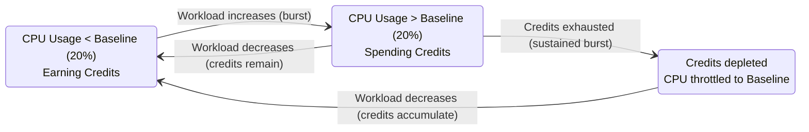
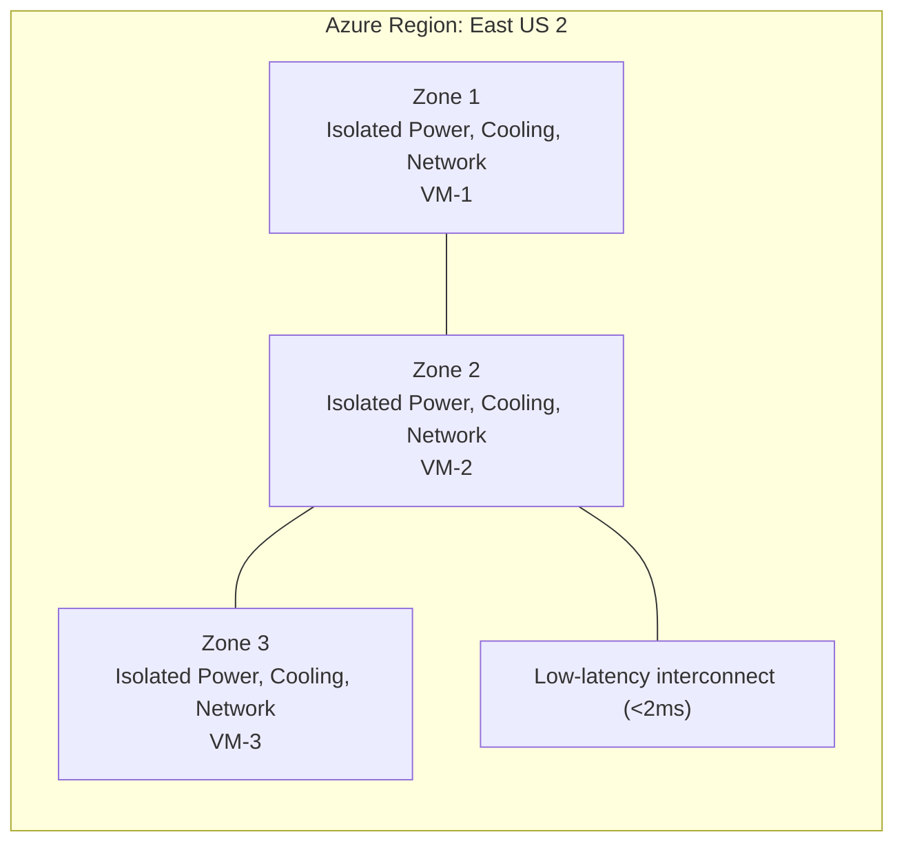
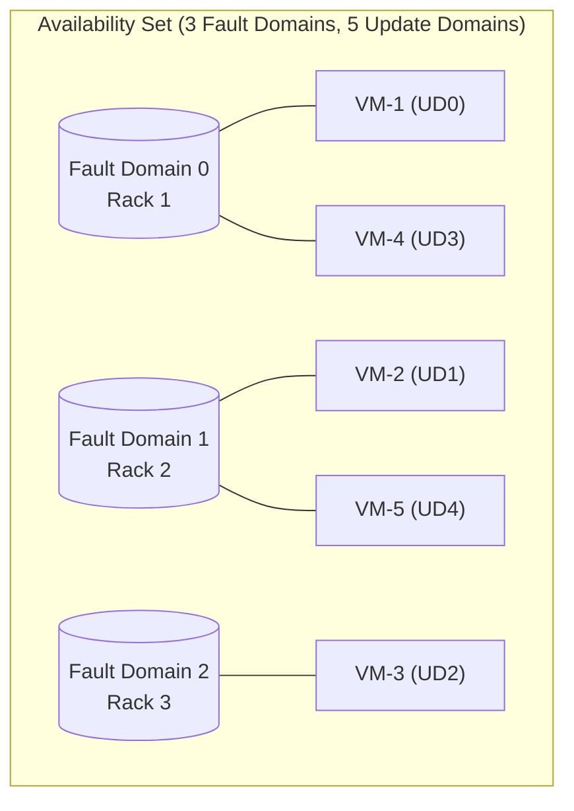
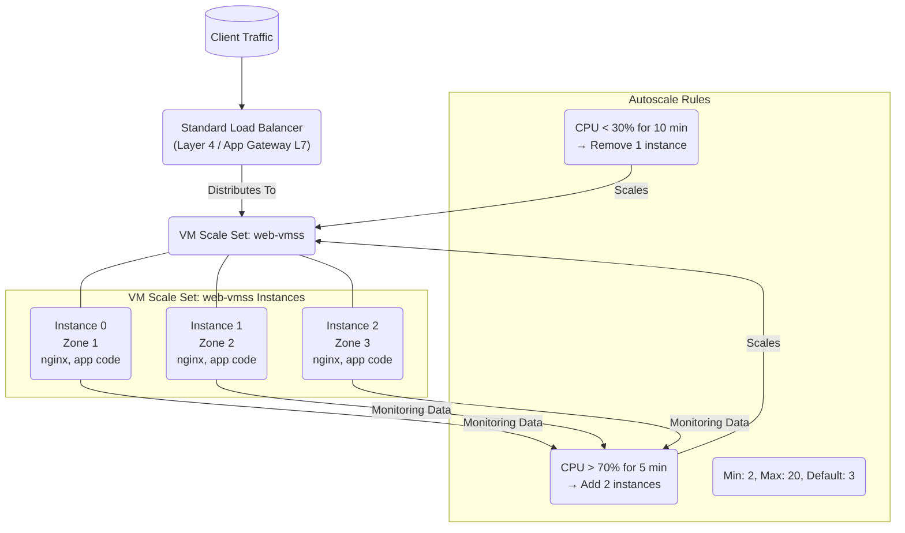
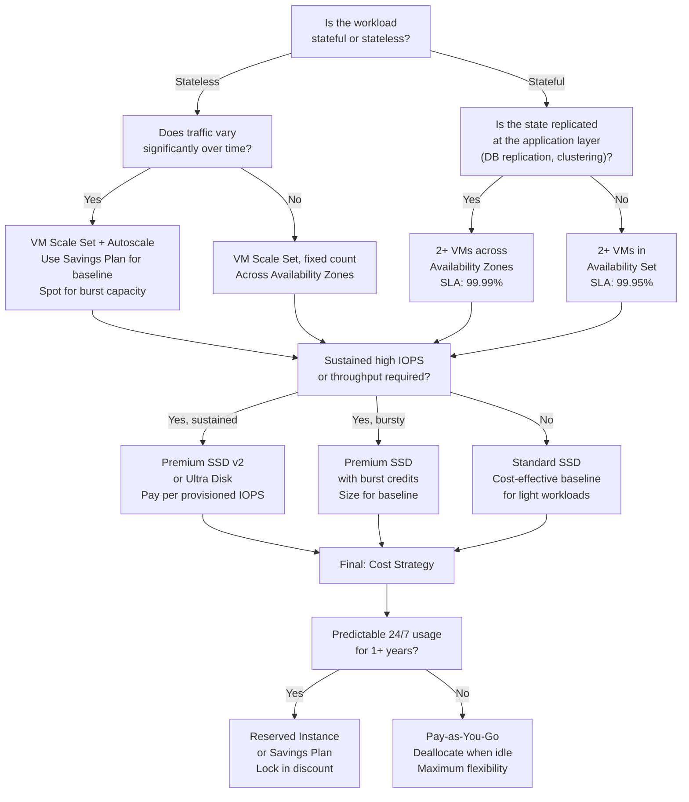

**Complexity**: `[MEDIUM]` | **Time to Complete**: ~2h | **Prerequisites**: [Module 3.2 (Virtual Networks)](../module-3.2-vnet/).

## What You'll Be Able to Do

This module assumes you have finished [Module 3.2 (Virtual Networks)](../module-3.2-vnet/). When you complete it, you will be able to:

- **Deploy Azure VMs with Availability Sets and Availability Zones for high-availability compute workloads**
- **Configure VM Scale Sets with autoscaling rules, custom images, and Flexible orchestration mode**
- **Implement Azure Spot VMs and Reserved Instances to optimize compute costs across workloads**
- **Evaluate Azure VM families (B-series, D-series, E-series, N-series) and select the right size for each workload**

---

## Why This Module Matters

A production workload running on a single Azure VM without zone redundancy, load balancing, or horizontal failover can go fully offline during an infrastructure failure, and the cost of basic high availability is often far lower than the cost of a prolonged outage.

Virtual machines remain the workhorse of cloud computing. Even in a world of containers, serverless functions, and managed services, VMs are the foundation that most of those higher-level services are built on. Understanding VM sizes, high availability constructs, disk types, and auto-scaling is fundamental to running reliable workloads on Azure. When you need full control over the operating system, when you are running software that cannot be containerized, or when you need specific hardware (like GPUs or high-memory instances), VMs are the answer.

In this module, you will learn how to choose the right VM size for your workload, how Availability Zones and Availability Sets protect you from infrastructure failures, how Managed Disks work, and how VM Scale Sets automate horizontal scaling. By the end, you will deploy a highly available web tier across multiple Availability Zones behind a Standard Load Balancer.

---

## Choosing the Right VM Size

Azure offers many VM sizes, organized into families based on the workload type they are optimized for. Choosing the right VM size is one of the most impactful decisions you will make---oversizing wastes money, undersizing causes performance problems.

### VM Size Families

| Family | Prefix | Optimized For | Example Use Cases |
| :--- | :--- | :--- | :--- |
| **General Purpose** | B, D, Ds | Balanced CPU-to-memory ratio | Web servers, small databases, dev/test |
| **Compute Optimized** | F, Fs | High CPU-to-memory ratio | Batch processing, gaming servers, CI/CD agents |
| **Memory Optimized** | E, Es, M | High memory-to-CPU ratio | Large databases, in-memory caches, SAP HANA |
| **Storage Optimized** | L, Ls | High disk throughput and IOPS | Data warehouses, large transactional databases |
| **GPU** | NC, ND, NV | GPU-accelerated workloads | ML training, rendering, video encoding |
| **High Performance** | HB, HC, HX | Fastest CPUs, InfiniBand networking | Scientific simulation, financial modeling |

### Deep Dive: VM Family Characteristics

Selecting a VM size is about matching workload demands to the hardware profile each family provides. Every family tunes a different ratio of compute, memory, storage, and networking capacity. Picking the wrong family creates a VM bottlenecked in one dimension while wasting money in another. Understanding what each family optimizes is the first step toward right-sizing.

**General Purpose (B-family, D-family)**: The B-series uses a CPU credit model that makes it effective for workloads with irregular traffic patterns where the VM spends most of its time well below the baseline and only occasionally spikes. The D-family (D, Ds, Dd, Das, Dps) balances CPU and memory for production web servers, small-to-medium databases, and line-of-business applications. The `s` variant adds premium storage support, making it the default choice for any workload that needs both balanced compute and fast managed disks. The `a` variant uses AMD EPYC processors, which often deliver similar performance at a lower per-hour cost than their Intel counterparts in the same D-family.

**Compute Optimized (F-family)**: The F-series provides a higher CPU-to-memory ratio than D-series at a lower per-core cost because each vCPU maps to a full physical core rather than a hyper-thread. This makes F-series the natural fit for batch processing, computational workloads, gaming servers, and build agents where the workload is CPU-bound and memory demand is modest. Like D-series, the `s` variant enables premium storage. F-series VMs also offer higher network bandwidth per vCPU than D-series, which helps when processing requires fetching large datasets from remote storage.

**Memory Optimized (E-family, M-family)**: The E-family delivers substantially more memory per vCPU than D-series, typically 8 GiB of RAM per vCPU compared to 4 GiB on D-series. This makes E-series suitable for relational databases with large buffer pools, in-memory caches like Redis or Memcached, and medium-sized SAP workloads. The M-family scales memory much further, supporting configurations with up to 12 TiB of RAM for the largest SAP HANA and SQL Server deployments. When a database workload slows down under concurrent query load, insufficient memory for caching is the most common cause, and moving from D-series to E-series often resolves the bottleneck without any application changes.

**Storage Optimized (L-family)**: The L-series pairs high CPU counts with locally attached NVMe SSDs that deliver very high IOPS and throughput without incurring managed-disk charges. These local disks are ephemeral, so data does not survive a VM stop or deallocation. L-series is designed for workloads that either do their own replication, such as Cassandra, MongoDB, and Elasticsearch, or treat storage as disposable cache for temporary processing and data pipeline scratch space. The locally attached storage is not encrypted at rest by default; you must enable encryption explicitly if compliance requires it.

**GPU-Accelerated (NC-family, ND-family, NV-family)**: The NC-series targets compute-intensive GPU workloads using NVIDIA Tesla GPUs for machine learning training and high-performance computing simulation. The ND-series adds high-bandwidth InfiniBand networking for tightly coupled multi-GPU distributed training jobs where inter-GPU communication is the scaling bottleneck. The NV-series provides visualization-grade GPUs designed for remote desktops, 3D rendering, and video transcoding. GPU instances are among the most expensive VM types, so verify that your workload genuinely benefits from GPU acceleration. Many inference workloads can run efficiently on CPU-only D-series VMs.

**High-Performance Compute (HB-series, HC-series, HX-series)**: The HB-series uses AMD EPYC processors with 100 Gbps InfiniBand for MPI workloads where sub-microsecond inter-node latency matters, including weather modeling, computational fluid dynamics, and financial risk simulation. The HC-series targets dense compute with Intel Xeon processors, and the HX-series pushes to extreme scale for the largest simulation workloads. These families are infrequently used outside specialized scientific and engineering domains, but when you need them, the choice between HB and HC depends on whether your application is optimized for AMD or Intel instruction sets.

### Right-Sizing Workflow

Right-sizing is an iterative process, not a single decision made at deployment time.

1. **Profile the workload**: Measure CPU utilization, memory consumption, disk IOPS and throughput, and network throughput under realistic, not synthetic, load. A VM that averages 15% CPU but spikes to 95% for two hours during nightly batch processing needs burst capacity, not a permanently larger, more expensive size.

2. **Identify the primary bottleneck**: Determine which resource ceiling the workload hits first. If CPU is pinned at 100% but memory sits at 40%, a compute-optimized size (F-series) is the right direction. If disk queue length is consistently high while CPU is at 30%, the bottleneck is storage throughput, not compute, and a different disk tier or Premium SSD v2 is the fix.

3. **Choose the matching family**: Map the bottleneck to a family: compute-bound workloads go to F-series, memory-bound to E-series, disk-bound to L-series or Premium SSD v2, and balanced workloads to D-series. Avoid the temptation to jump two tiers higher just in case because each tier step adds cost that compounds across a fleet of VMs.

4. **Select the generation**: Newer generations, indicated by a higher `_v` number, typically offer better price-performance ratios and newer hardware features such as faster networking or support for larger local disks. A `Standard_D4s_v6` may offer 15 to 20 percent better performance per dollar than `Standard_D4s_v5` at a similar or identical per-hour price.

5. **Monitor and iterate**: After resizing, continue monitoring because workloads change. A size that was well-matched six months ago may be oversized or undersized today. Azure Advisor provides automated right-sizing recommendations based on observed usage patterns over a rolling 7-day window (configurable up to 90 days).

> **Stop and think**: Your team runs a web application on `Standard_D2s_v5` VMs. Metrics show 92% CPU utilization at peak but only 30% memory consumption. The application latency spikes during peak hours. Would you scale up to `Standard_D4s_v5` or scale out to more `Standard_D2s_v5` instances? What factors beyond raw CPU numbers would influence your choice?


### Understanding VM Size Naming

Once you pick a family, the size name itself encodes tier, vCPU count, disk capabilities, and hardware generation—so Azure VM sizes follow a naming convention that tells you a lot if you know how to read it:

```text
    Standard_D4s_v5

    Standard   = VM tier (Standard)
    D          = Family (General Purpose)
    4          = vCPUs
    s          = Premium SSD capable
    _v5        = Generation (hardware version)

    Other suffixes:
    a = AMD processor      (Standard_D4as_v5)
    d = Local temp disk     (Standard_D4ds_v5)
    i = Isolated (isolated to dedicated hardware)
    l = Low memory
    p = ARM-based (Ampere)  (Standard_D4ps_v5)
```

> **Stop and think**: If you needed to deploy a high-performance computing (HPC) cluster with tightly coupled nodes requiring very fast inter-node communication, which VM size family would you immediately investigate? Why?

```bash
# List all available VM sizes in a region
az vm list-skus --location eastus2 --resource-type virtualMachines -o table

# Filter for D-series v5 sizes
az vm list-skus --location eastus2 --resource-type virtualMachines \
  --query "[?starts_with(name, 'Standard_D') && contains(name, 'v5')].{Name:name, vCPUs:capabilities[?name=='vCPUs'].value | [0], MemoryGB:capabilities[?name=='MemoryGB'].value | [0]}" \
  -o table

# Check what sizes are available for a specific VM (for resizing)
az vm list-vm-resize-options -g myRG -n myVM -o table
```

### The B-Series: Burstable VMs

The B-series deserves special attention because it is the most cost-effective option for workloads that do not need sustained CPU. [B-series VMs accumulate CPU credits when idle and spend them during bursts.](https://learn.microsoft.com/en-us/azure/virtual-machines/sizes/general-purpose/b-family)



For a lightly used dev/test VM, a burstable B-series instance can cost materially less than a comparable D-series VM, which is why B-series is often attractive for workloads that spend much of their time idle. A common pattern is **build agents** that sit quiet most of the day and spike briefly during CI runs: when bursts stay within accumulated credits, moving from fixed-performance VMs to burstable VMs can cut compute spend without sacrificing acceptable peak performance.

> **Pause and predict**: You're designing an application that processes large batch jobs nightly. These jobs run for 2-3 hours and require significant CPU, but the VMs are idle for the remaining 21 hours. Would B-series VMs be a good fit? Why or why not?

---

## High Availability: Availability Zones vs Availability Sets

Azure provides two mechanisms to protect your VMs from infrastructure failures—**Availability Zones** and **Availability Sets**—and choosing the wrong one (or using neither) is a frequent cause of preventable outages. Understanding how each mechanism isolates failure is essential for designing reliable systems.

### Availability Zones (AZs)

[An Availability Zone is a physically separate location within an Azure region. Each zone has independent power, cooling, and networking.](https://learn.microsoft.com/en-us/azure/reliability/availability-zones-overview) If a fire or power loss affects one zone, VMs in the other zones in the same region can keep serving traffic, which is why zone-spanning designs target a [**99.99% SLA**](https://azure.microsoft.com/en-us/explore/global-infrastructure/availability-zones/) when you run VMs across two or more zones behind a load balancer.



### Availability Sets

[An Availability Set distributes VMs across **Fault Domains** (separate physical racks) and **Update Domains** (groups that Azure reboots sequentially during maintenance).](https://learn.microsoft.com/en-us/azure/virtual-machines/availability-set-overview) Availability Sets provide a [**99.95% SLA**](https://learn.microsoft.com/en-us/azure/virtual-machines/availability). During platform maintenance, Azure reboots one Update Domain at a time—UD0, then UD1, then UD2—so not every VM in the set is offline simultaneously.



> **Stop and think**: Your company has a strict RPO (Recovery Point Objective) of 0 and an RTO (Recovery Time Objective) of under 5 minutes for a critical financial application. The application is currently running on a single VM. You need to implement high availability. Which Azure HA mechanism would you choose first, and why?

### When to Use Which

| Criteria | Availability Zones | Availability Sets |
| :--- | :--- | :--- |
| **SLA** | 99.99% | 99.95% |
| **Protection against** | Data center-level failure | Rack-level failure, planned maintenance |
| **Latency between instances** | ~1-2ms (cross-zone) | <1ms (same data center) |
| **Region support** | Most major regions, but not all | All regions |
| **Cost** | No extra charge for the VM, but cross-zone data transfer costs | No extra charge |
| **Recommendation** | Use whenever the region supports zones | Use only when zones are unavailable in a region for the desired VM size |


### Zonal vs Zone-Redundant Architectures

When you deploy across Availability Zones, you choose between two architectural patterns that determine how resilience trades off against complexity and operational control.

**Zonal architecture** pins each VM to a specific, named zone using `--zone 1`, `--zone 2`, or `--zone 3`. You explicitly control which zone hosts each instance, which gives you precise failure-domain placement. A zonal deployment where all VMs land in zone 1 survives the loss of zones 2 and 3 but goes completely offline if zone 1 fails. Zonal placement makes sense when you need to co-locate compute with zonal storage, such as a managed disk pinned to a specific zone, or when running an active-passive cluster where the passive node must reside in a different zone from the active for true physical isolation.

**Zone-redundant architecture** spreads instances across all available zones automatically. A VM Scale Set deployed with `--zones 1 2 3` distributes instances evenly, and the Standard Load Balancer distributes traffic across every healthy instance regardless of zone. If any single zone fails, the load balancer detects the unhealthy backends and routes traffic exclusively to the surviving zones while the scale set provisions replacement capacity. This is the recommended default for stateless web tiers, API gateways, and any workload where you want Azure to manage zone placement rather than controlling it yourself.

### SLA Architecture: What You Are Actually Promised

The SLA is a binding commitment with financial consequences. If Azure fails to meet it, you may be eligible for service credits. Understanding the SLA tiers helps you communicate risk to stakeholders and justify the cost of redundancy to budget owners:

| Architecture | SLA | Protects Against |
| :--- | :--- | :--- |
| Single VM with Standard HDD/SSD | No compute SLA | Nothing, a host failure means VM downtime with no recourse |
| Single VM with Premium SSD / Ultra Disk | 99.9% | Host-level failure with a faster disk recovery path |
| 2+ VMs in an Availability Set | 99.95% | Rack failure and planned host maintenance |
| 2+ VMs across 2+ Availability Zones | 99.99% | Data center-level failure: power, cooling, or network isolation event |

The gap between no SLA and 99.9% is significant: a single Premium SSD is the minimum barrier to earn an SLA at all. The jump from 99.9% to 99.95% requires adding a second VM with an Availability Set, which protects against the host maintenance and rack-failure scenarios that a single VM cannot survive. The jump to 99.99% requires spanning zones, which isolates against entire data-center failures.

> **Hypothetical scenario**: A team deploys a customer-facing payments API on a single `Standard_D2s_v5` VM with a Premium SSD OS disk. The workload processes transactions with an RTO of 5 minutes. At 3 AM on a Saturday, the underlying physical host experiences a hardware failure that Azure Live Migration cannot recover. Because there is no second VM and no availability construct, the API stays down for 45 minutes while an engineer is paged, wakes up, and manually reprovisions the VM from a backup. With an Availability Set and a pre-configured second VM, the failover would have been automatic and the API would have been back in under 2 minutes, well inside the RTO window.

### Availability in VM Scale Sets

VM Scale Sets offer a third path to high availability that layers auto-scaling on top of zone placement. In Flexible orchestration mode with `--zones 1 2 3`, Azure spreads instances across zones and maintains the target count within each zone. When zone 1 loses capacity, the scale set automatically provisions replacements in zones 2 and 3, and the load balancer shifts traffic accordingly. This combination of zone redundancy plus automated instance replacement provides the most resilient architecture for stateless workloads because it handles both individual VM failures and zone-level failures with the same mechanism.

Uniform orchestration also supports high availability through fault-domain spreading within the selected zones, but it cannot absorb existing standalone VMs into the scale set, which limits migration paths. For greenfield deployments, Flexible mode is the recommended choice.


```bash
# Create a VM in a specific Availability Zone
az vm create \
  --resource-group myRG \
  --name web-vm-1 \
  --image Ubuntu2204 \
  --size Standard_D2s_v5 \
  --zone 1 \
  --admin-username azureuser \
  --generate-ssh-keys

# Create a VM in a different zone
az vm create \
  --resource-group myRG \
  --name web-vm-2 \
  --image Ubuntu2204 \
  --size Standard_D2s_v5 \
  --zone 2 \
  --admin-username azureuser \
  --generate-ssh-keys

# Create an Availability Set (when zones are not available)
az vm availability-set create \
  --resource-group myRG \
  --name web-avset \
  --platform-fault-domain-count 3 \
  --platform-update-domain-count 5
```

---

## Managed Disks: Storage for Your VMs

Every Azure VM needs at least one disk: the **OS disk**. Most production VMs also have one or more **data disks**. Azure Managed Disks abstract away the storage account management, giving you a simple, reliable disk resource.

### Disk Types

| Type | IOPS (max) | Throughput (max) | Use Case | Cost (128 GB) |
| :--- | :--- | :--- | :--- | :--- |
| **Standard HDD** | 500 | 60 MB/s | Backups, dev/test, infrequent access | ~$5/month |
| **Standard SSD** | 6,000 | 750 MB/s | Web servers, light databases | ~$10/month |
| **Premium SSD** | 20,000 | 900 MB/s | Production databases, high IOPS | ~$19/month |
| **Premium SSD v2** | 80,000 | 1,200 MB/s | Tier-1 databases, demanding workloads | ~$10+/month (pay per IOPS/throughput) |
| **Ultra Disk** | 400,000 | 10,000 MB/s | SAP HANA, transaction-heavy databases | ~$67+/month |

> **Pause and predict**: Your application team reports slow database queries. You investigate and find the database VM's disk queue length is consistently high. The VM is currently using a Standard SSD for its data disk. What's your immediate recommendation, and why?

```bash
# Create a VM with a Premium SSD OS disk and a 256 GB data disk
az vm create \
  --resource-group myRG \
  --name db-vm \
  --image Ubuntu2204 \
  --size Standard_D4s_v5 \
  --os-disk-size-gb 64 \
  --storage-sku Premium_LRS \
  --data-disk-sizes-gb 256 \
  --admin-username azureuser \
  --generate-ssh-keys

# Add another data disk to an existing VM
az vm disk attach \
  --resource-group myRG \
  --vm-name db-vm \
  --name db-data-disk-2 \
  --size-gb 512 \
  --sku Premium_LRS \
  --new

# List disks attached to a VM
az vm show -g myRG -n db-vm \
  --query '{OSDisk:storageProfile.osDisk.name, DataDisks:storageProfile.dataDisks[].{Name:name, SizeGB:diskSizeGb, Type:managedDisk.storageAccountType}}' -o json
```

### Disk Encryption

[Azure encrypts all Managed Disks at rest by default using platform-managed keys (PMK). For additional control, you can use:](https://learn.microsoft.com/en-us/azure/virtual-machines/disk-encryption-overview)

- **Customer-managed keys (CMK)**: You manage the encryption key in Azure Key Vault
- **Azure Disk Encryption (ADE)**: Uses BitLocker (Windows) or DM-Crypt (Linux) for OS-level encryption
- **Confidential disk encryption**: For confidential VMs, encrypts the disk with a key tied to the VM's TPM

```bash
# Enable Azure Disk Encryption on a Linux VM
az vm encryption enable \
  --resource-group myRG \
  --name db-vm \
  --disk-encryption-keyvault myKeyVault \
  --volume-type All

# Check encryption status
az vm encryption show --resource-group myRG --name db-vm -o table
```

### Understanding IOPS and Throughput

IOPS and throughput are the two dimensions of disk performance, and understanding the relationship between them prevents misdiagnosing performance problems. IOPS measures how many individual read or write operations the disk can complete per second, while throughput measures the total data volume those operations transfer. A workload issuing many small, random reads, such as a database index scan, is IOPS-bound. A workload streaming large sequential files, such as log shipping or media transcoding, is throughput-bound. If you provision for IOPS when your bottleneck is throughput, or vice versa, you pay for performance you cannot use while the real constraint remains unsolved.

With Premium SSDs, the IOPS and throughput are provisioned based on disk size. The relationship is deterministic: a larger disk automatically gets more IOPS and throughput. A 128 GiB Premium SSD (P10) provides 500 IOPS and 100 MB/s. A 512 GiB disk (P20) provides 2,300 IOPS and 150 MB/s. A 1 TiB disk (P30) provides 5,000 IOPS and 200 MB/s. To reach 5,000 IOPS on standard Premium SSD, you must provision at least 1 TiB of capacity even if your actual data occupies only 100 GiB. This forced coupling means that many teams over-provision capacity purely to reach a performance target, accepting the wasted storage cost as a necessary tradeoff.

Premium SSD v2 and Ultra Disk break this coupling entirely. With Premium SSD v2, you pay separately for capacity, IOPS, and throughput, and you can adjust each dimension independently without detaching the disk or restarting the VM. A 32 GiB Premium SSD v2 can be configured for 5,000 IOPS if your workload is small but transaction-heavy. This configuration is impossible with standard Premium SSD, where 32 GiB provides only 120 IOPS. Ultra Disk pushes further, supporting up to 400,000 IOPS and 10,000 MB/s on a single disk for the most demanding enterprise workloads.

### Baseline vs Burst Performance

Standard SSDs and Premium SSDs support disk-level bursting, which allows a disk to exceed its provisioned baseline for short periods using accumulated credits. Credits build up when the disk operates below its baseline and are consumed during demand spikes, providing a buffer for predictable, short-duration traffic surges without forcing you to pay for a permanently larger disk.

For example, a 512 GiB Premium SSD (P20) has a baseline of 2,300 IOPS and 150 MB/s but can burst up to 3,500 IOPS for a limited window determined by the credit balance. This burst capacity handles daily spikes like a morning report generation or an end-of-day batch reconcile without a permanent performance upgrade. However, sustained demand above baseline exhausts credits and throttles the disk back to its provisioned limits. If your workload consistently needs more than the baseline, you need Premium SSD v2 or Ultra Disk, or you need to use multiple Premium SSDs in a storage pool through OS-level striping to aggregate performance. Striping adds operational complexity because you must manage the pool yourself.

### Disk Caching: The Free Performance Multiplier

Azure provides host-level disk caching that can dramatically improve read and write performance at no additional cost, but only when you match the caching mode to the workload's access pattern. The cache sits between the VM and the storage fabric, using fast local SSD on the physical host to serve reads directly from cache rather than fetching from the storage backend every time.

| Caching Mode | Behavior | Best For |
| :--- | :--- | :--- |
| **None** | All reads and writes bypass the cache entirely, going directly to persistent storage. This is the default for data disks. | Write-heavy workloads such as database transaction logs, append-only log files, and any workload where the storage engine manages its own cache, such as PostgreSQL `shared_buffers` or the SQL Server buffer pool. |
| **ReadOnly** | Reads are served from the cache when the data is present, dramatically reducing read latency. Writes always go to persistent storage, so there is no data loss risk from cache volatility. | Read-heavy data disks: static content servers, reporting databases, data warehouse query volumes, and OLAP workloads where reads dominate writes by a large margin. |
| **ReadWrite** | Both reads and writes are cached, but writes must be acknowledged and flushed to persistent storage. A host failure before a flush loses cached-but-unflushed writes. | OS disks, the default, and applications that explicitly handle write-caching semantics through write barriers or `fsync`. Not suitable for database data files unless the database is configured with synchronous commit and understands the caching layer. |

Premium SSD v2 and Ultra Disk do not support host caching, but their inherently lower latency, often sub-millisecond, addresses many of the same performance concerns that host caching solves on Premium SSD. The tradeoff is that you cannot boost read performance through a free cache layer; you must provision the IOPS and throughput your workload needs directly.

> **Pause and predict**: Your PostgreSQL database uses a data disk with a read-heavy workload at roughly 80 percent reads and 20 percent writes, and you have already tuned the `shared_buffers` parameter. Would you enable ReadOnly caching on the data disk, and what risk must you consider before doing so?

### The VM IOPS Cap: When the Disk Outruns the VM

A fast disk cannot deliver its full performance if the VM it is attached to cannot keep up. Every VM size has a maximum uncached and cached disk IOPS and throughput limit, documented in the VM size specifications. Attaching a disk capable of more IOPS than the VM can handle wastes money on unused disk performance while the VM itself becomes the bottleneck.

For example, a `Standard_D2s_v5` VM has a maximum uncached disk throughput of roughly 85 MB/s and a maximum of approximately 3,750 IOPS. Attaching a Premium SSD P30 that can deliver 5,000 IOPS and 200 MB/s does not give you 5,000 IOPS because the VM caps any disk at its own lower limit. When you diagnose disk performance problems, measure both the disk metrics, to check if the disk is hitting its provisioned ceiling, and the VM metrics, to check if the VM is hitting its own IOPS or throughput cap. The bottleneck can sit on either side, and replacing the disk when the VM is the constraint wastes time and money.

Use `az vm list-skus --location <region> --resource-type virtualMachines` and inspect the `maxDataDiskCount` and resource disk fields to compare against your provisioned disk performance. Right-sizing is a combined exercise: the VM and its disks form a single performance envelope, and you must size both together rather than independently.


---

## VM Extensions and Cloud-Init: Automating Configuration

Manually SSHing into VMs to install software is fragile, hard to audit, and does not scale past a handful of instances, so production teams automate first-boot configuration instead. Azure supports two complementary approaches: **cloud-init** for portable, first-boot bootstrap (common on Linux marketplace images) and **VM Extensions** for Azure-native post-deployment automation managed through ARM, CLI, or the portal.

### Cloud-Init

Cloud-init is the industry standard for cross-platform cloud instance initialization; on first boot it can update packages, write files, run commands, and enable services before your application accepts traffic.

```yaml
# cloud-init.yaml
#cloud-config
package_update: true
package_upgrade: true

packages:
  - nginx
  - curl
  - jq

write_files:
  - path: /var/www/html/index.html
    content: |
      <!DOCTYPE html>
      <html>
      <body>
        <h1>Hello from KubeDojo VM</h1>
        <p>Hostname: HOSTNAME_PLACEHOLDER</p>
        <p>Zone: ZONE_PLACEHOLDER</p>
      </body>
      </html>

runcmd:
  - hostnamectl set-hostname $(curl -s -H Metadata:true "http://169.254.169.254/metadata/instance/compute/name?api-version=2021-02-01&format=text")
  - |
    HOSTNAME=$(hostname)
    ZONE=$(curl -s -H Metadata:true "http://169.254.169.254/metadata/instance/compute/zone?api-version=2021-02-01&format=text")
    sed -i "s/HOSTNAME_PLACEHOLDER/$HOSTNAME/" /var/www/html/index.html
    sed -i "s/ZONE_PLACEHOLDER/$ZONE/" /var/www/html/index.html
  - systemctl enable nginx
  - systemctl start nginx
```

> **Stop and think**: You need to deploy a complex application that requires a specific version of a Java Development Kit (JDK) and a set of proprietary libraries. You plan to use cloud-init. What's a potential pitfall of putting the entire installation logic in a single cloud-init script?

```bash
# Create a VM with cloud-init
az vm create \
  --resource-group myRG \
  --name web-vm \
  --image Ubuntu2204 \
  --size Standard_B2s \
  --custom-data @cloud-init.yaml \
  --admin-username azureuser \
  --generate-ssh-keys
```

### VM Extensions

VM Extensions are small, publisher-maintained agents that run on the VM after deployment—examples include Custom Script for ad hoc commands and the Azure Monitor agent for telemetry—and because they are first-class Azure resources, you can install, upgrade, and audit them consistently across a fleet using ARM templates, CLI, or the portal.

```bash
# Install the Custom Script Extension to run a script
az vm extension set \
  --resource-group myRG \
  --vm-name web-vm \
  --name CustomScript \
  --publisher Microsoft.Azure.Extensions \
  --settings '{"commandToExecute":"apt-get update && apt-get install -y docker.io && systemctl enable docker"}'

# Install the Azure Monitor Agent
az vm extension set \
  --resource-group myRG \
  --vm-name web-vm \
  --name AzureMonitorLinuxAgent \
  --publisher Microsoft.Azure.Monitor \
  --enable-auto-upgrade true

# List extensions on a VM
az vm extension list -g myRG --vm-name web-vm -o table
```

---

## VM Scale Sets (VMSS): Horizontal Auto-Scaling

[A VM Scale Set is a group of identical, load-balanced VMs that can automatically scale in and out based on demand or a schedule.](https://learn.microsoft.com/en-us/azure/virtual-machine-scale-sets/overview) Think of it as a fleet of VMs managed as a single resource: you define an image, SKU, and capacity bounds once, and Azure creates or removes instances while keeping them behind a load balancer and optional zone placement rules.

### VMSS Architecture



### Orchestration Modes

VM Scale Sets support two orchestration modes—**Uniform** (legacy) and **Flexible** (recommended)—and the choice affects whether you can mix VM sizes, attach existing VMs, and how networking and fault domains behave. The table below compares the two modes on the dimensions that matter most when you design for production:

| Feature | Uniform (Legacy) | Flexible (Recommended) |
| :--- | :--- | :--- |
| **VM model** | All VMs identical | Mix of VM sizes and configs |
| **Zones** | Spread across zones | Spread across zones |
| **Manual VMs** | Cannot add existing VMs | Can add existing VMs |
| **Instance protection** | Limited | Full control |
| **Networking** | VMSS-managed NICs | Standard NICs |
| **Fault domains** | Configurable (max 5) | Max spreading (recommended) |

> **Pause and predict**: You have an existing application running on several standalone Azure VMs. You want to leverage the auto-scaling and high availability features of VM Scale Sets without re-creating all your VMs. Which orchestration mode would you choose, and why?

### Custom Images with VMSS

For complex applications or hardened environments, you'll often need to deploy VMs from a custom image rather than a marketplace image. This allows you to pre-install software, apply specific configurations, or include security baselines. Custom images can be created from existing VMs or built using tools like Azure Image Builder or Packer, and then stored in a Managed Image resource or a Shared Image Gallery.

A **Shared Image Gallery (SIG)** (now Azure Compute Gallery) is recommended for managing custom images. [It provides versioning, global replication, and access control for your images.](https://learn.microsoft.com/en-us/azure/virtual-machines/azure-compute-gallery)

```bash
# Example: Deploy a VMSS using a custom image from a Shared Image Gallery
# First, you need an image definition and an image version in a Shared Image Gallery.
# (Steps to create SIG, image definition, and image version are omitted for brevity)

# Assuming you have an Image Definition ID (e.g., /subscriptions/<subId>/resourceGroups/<rgName>/providers/Microsoft.Compute/galleries/<galleryName>/images/<imageDefinitionName>)
IMAGE_DEFINITION_ID="/subscriptions/<your-subscription-id>/resourceGroups/mySIGRG/providers/Microsoft.Compute/galleries/mySIG/images/myWebAppImage"

az vmss create \
  --resource-group myRG \
  --name web-vmss-custom \
  --image "$IMAGE_DEFINITION_ID" \
  --vm-sku Standard_B2s \
  --instance-count 3 \
  --zones 1 2 3 \
  --orchestration-mode Flexible \
  --admin-username azureuser \
  --generate-ssh-keys \
  --lb-sku Standard \
  --upgrade-policy-mode Automatic
```

```bash
# Create a VMSS in Flexible orchestration mode across Availability Zones
az vmss create \
  --resource-group myRG \
  --name web-vmss \
  --image Ubuntu2204 \
  --vm-sku Standard_B2s \
  --instance-count 3 \
  --zones 1 2 3 \
  --orchestration-mode Flexible \
  --admin-username azureuser \
  --generate-ssh-keys \
  --custom-data @cloud-init.yaml \
  --lb-sku Standard \
  --upgrade-policy-mode Automatic

# Configure autoscale rules
az monitor autoscale create \
  --resource-group myRG \
  --resource web-vmss \
  --resource-type Microsoft.Compute/virtualMachineScaleSets \
  --name web-autoscale \
  --min-count 2 \
  --max-count 20 \
  --count 3

# Scale out when CPU > 70% for 5 minutes
az monitor autoscale rule create \
  --resource-group myRG \
  --autoscale-name web-autoscale \
  --condition "Percentage CPU > 70 avg 5m" \
  --scale out 2

# Scale in when CPU < 30% for 10 minutes
az monitor autoscale rule create \
  --resource-group myRG \
  --autoscale-name web-autoscale \
  --condition "Percentage CPU < 30 avg 10m" \
  --scale in 1

# View VMSS instances
az vmss list-instances -g myRG -n web-vmss -o table

# View autoscale settings
az monitor autoscale show -g myRG -n web-autoscale -o json
```

---

## Azure Load Balancer: Distributing Traffic

[Azure Load Balancer operates at Layer 4 (TCP/UDP) and distributes incoming traffic across healthy VM instances.](https://learn.microsoft.com/en-us/azure/reliability/reliability-load-balancer) There are two SKUs:

| Feature | Basic (being retired) | Standard |
| :--- | :--- | :--- |
| **Backend pool size** | Up to 300 instances | Up to 1,000 instances |
| **Health probes** | TCP, HTTP | TCP, HTTP, HTTPS |
| **Availability Zones** | Not supported | Zone-redundant or zonal |
| **SLA** | No SLA | 99.99% |
| **Security** | Open by default | Closed by default (requires NSG) |
| **Cost** | Free | ~$18/month + data processing |
| **Outbound rules** | Limited | Full control |

```bash
# The VMSS creation command above automatically creates a Standard LB.
# To create one manually:

# Create public IP for the load balancer
az network public-ip create \
  --resource-group myRG \
  --name web-lb-pip \
  --sku Standard \
  --zone 1 2 3    # Zone-redundant

# Create load balancer
az network lb create \
  --resource-group myRG \
  --name web-lb \
  --sku Standard \
  --frontend-ip-name web-frontend \
  --backend-pool-name web-backend \
  --public-ip-address web-lb-pip

# Create health probe
az network lb probe create \
  --resource-group myRG \
  --lb-name web-lb \
  --name http-probe \
  --protocol Http \
  --port 80 \
  --path /health \
  --interval 15 \
  --threshold 2

# Create load balancing rule
az network lb rule create \
  --resource-group myRG \
  --lb-name web-lb \
  --name http-rule \
  --frontend-ip-name web-frontend \
  --backend-pool-name web-backend \
  --protocol Tcp \
  --frontend-port 80 \
  --backend-port 80 \
  --probe-name http-probe \
  --idle-timeout 4 \
  --enable-tcp-reset true

# IMPORTANT: Standard LB is "secure by default" -- you MUST create an NSG
# to allow traffic, or the health probes and client traffic will be blocked.
```

---

## Optimizing Costs: Spot VMs and Reserved Instances

Managing cloud costs is as critical as managing performance and availability. Azure provides several options to significantly reduce compute expenses, especially for workloads with flexible requirements.

### Azure Spot VMs

[Azure Spot Virtual Machines allow you to utilize unused Azure compute capacity at a significant discount (up to 90% off pay-as-you-go prices). The trade-off is that Azure can evict Spot VMs at any time if it needs the capacity back.](https://learn.microsoft.com/en-us/azure/architecture/guide/spot/spot-eviction)

Spot VMs fit workloads that tolerate interruption: **batch processing** jobs that can restart, **development and test** environments where brief downtime is acceptable, and **high-throughput stateless** applications such as rendering or media encoding where progress can be checkpointed or redistributed. They also pair well with **VM Scale Sets**, because the scale set can replace evicted instances and keep capacity aligned with demand. When you adopt Spot, plan for **eviction policy** (deallocate versus delete on eviction), whether to set a **price cap** or let Azure price the instance for higher availability, and that **VM size and region** strongly affect Spot availability and cost.

```bash
# Create a single Azure Spot VM
az vm create \
  --resource-group myRG \
  --name spot-batch-vm \
  --image Ubuntu2204 \
  --size Standard_D2s_v5 \
  --admin-username azureuser \
  --generate-ssh-keys \
  --priority Spot \
  --eviction-policy Deallocate \
  --max-price -1 # -1 means pay current price up to on-demand price
```

> **Pause and predict**: Your data science team needs to run daily machine learning training jobs that take several hours. These jobs are fault-tolerant and can resume from checkpoints. The budget is very constrained. What Azure VM offering would you recommend to them, and what's the primary risk they need to be aware of?

### Azure Reserved Virtual Machine Instances (RIs)

[Azure Reserved Instances allow you to commit to a specific VM size and region for a one-year or three-year term in exchange for a significant discount (up to 72% compared to pay-as-you-go). When you purchase a reservation, it applies to any qualifying VM in that region, regardless of the specific VM running.](https://learn.microsoft.com/en-us/azure/cost-management-billing/reservations/save-compute-costs-reservations)

Reserved Instances reward **steady-state** production—databases, always-on web tiers, and other workloads with predictable 24/7 usage—and **long-running projects** where you already know you will need the same compute footprint for a year or more. Reservations include **instance size flexibility** within a family in many cases, but savings depend on **utilization**: unused reservation hours do not roll forward as free compute. You can pay **upfront or monthly** depending on how your finance team prefers to recognize spend. In practice, **Spot VMs** win for interruptible, cost-sensitive burst work, while **Reserved Instances** win when you need guaranteed capacity and a stable unit price for continuously running VMs.


### Azure Savings Plans

Azure Savings Plans offer a discount model that trades a slightly lower savings rate than Reserved Instances for substantially more flexibility. Instead of committing to a specific VM SKU and region, you commit to a fixed hourly spend amount, for example $10 per hour, for a one-year or three-year term. Azure automatically applies the savings plan discount to any eligible compute usage across VM families, regions, and even to some non-VM compute services such as App Service and Azure Functions Premium plans.

Savings Plans typically provide discounts of up to 65 percent compared to pay-as-you-go rates, with the three-year plan yielding a deeper discount than the one-year plan because of the longer commitment. The key advantage over Reserved Instances is portability: if you migrate from D-series to E-series VMs or shift workloads from East US 2 to West US 3, the savings plan follows your compute spend without requiring you to exchange, cancel, or re-purchase a reservation. This makes Savings Plans the better match for environments where workload types, regions, or architectures change over time. Reserved Instances win when you know with certainty that a specific VM SKU will run continuously in a specific region for the full commitment term.

### Stopped vs Stopped (Deallocated): The Billing Distinction

The distinction between `Stopped` and `Stopped (Deallocated)` is one of the most common sources of unexpected Azure compute bills. When you stop a VM from inside the guest operating system, using `sudo shutdown now` or the Windows Start menu, the VM transitions to the `Stopped` state but remains allocated to the underlying physical host. Compute charges continue to accrue because the host's CPU and memory remain reserved for that VM. When you stop a VM through Azure's control plane, using `az vm deallocate`, the Azure portal's Stop button, or an automation runbook calling the deallocation API, the VM releases the physical host and enters the `Stopped (Deallocated)` state. Compute charges stop immediately, but you continue paying for the OS disk and any attached managed disks.

A team with 50 deallocated VMs, each carrying a 128 GiB Premium SSD OS disk at approximately $19 per month, faces roughly $950 per month in disk charges even when zero VMs are running. To eliminate disk costs entirely, you must delete the disks and recreate the VMs from images or snapshots when needed. For truly temporary dev and test environments, consider deleting the entire resource group, including the VM, disks, NICs, and public IPs, at the end of each day rather than deallocating individually. An Azure Automation runbook or a simple Logic App with a schedule trigger can automate this so nobody has to remember.

### What Drives Managed Disk Cost

Managed disk cost breaks down into three components. First, the disk tier sets the base rate: Standard HDD costs approximately $0.05 per GiB per month, while Premium SSD costs approximately $0.15 per GiB per month and Ultra Disk costs around $0.33 per GiB per month for the storage capacity alone. Second, the provisioned capacity determines the monthly charge regardless of how much data you actually store. A 1 TiB disk costs the same whether it holds 100 GiB or 900 GiB of data. Third, for Premium SSD v2 and Ultra Disk, you pay separately for provisioned IOPS and throughput on top of the capacity charge. Ultra Disk charges roughly $0.06 per provisioned IOPS and $0.01 per MB/s of throughput per month, which means a disk configured for 10,000 IOPS and 500 MB/s adds approximately $600 per month in IOPS charges and $5 per month in throughput charges before the capacity cost.

Transaction costs add another layer. Premium SSD and Standard SSD bill per I/O operation beyond a monthly free threshold, while Standard HDD bills approximately $0.0005 per 10,000 disk operations after the first 10 million free operations each month. For a VM that handles millions of small database queries per day, transaction charges can become the dominant cost component even if the disk capacity charge appears modest. Measure your workload's typical I/O profile before committing to a disk tier, because a workload with many small transactions may cost less on a higher-tier disk with fewer per-transaction charges than on a lower-tier disk that bills aggressively per operation.

The cost scaling is not linear across disk tiers. A 512 GiB Premium SSD (P20) costs roughly four times as much per month as a 128 GiB Premium SSD (P10) for four times the capacity and roughly four times the baseline IOPS. When performance dictates the disk choice more than capacity, Premium SSD v2 often delivers better cost efficiency because you can provision exactly the IOPS and throughput you need on a smaller-capacity disk. Achieving 5,000 IOPS with standard Premium SSD requires a 1 TiB P30 disk at approximately $195 per month for capacity you may not need, while Premium SSD v2 can deliver the same 5,000 IOPS on a 32 GiB disk at a fraction of the capacity cost because you pay only for the provisioned IOPS you actually use.

### Cost Strategy Comparison

| Strategy | Discount | Commitment | Capacity Guarantee | Best For |
| :--- | :--- | :--- | :--- | :--- |
| Pay-as-You-Go | Baseline | None | Yes | Short-lived experiments, unpredictable spikes, usage under 8 hours per day |
| Spot VMs | Up to 90% | None (eviction risk) | No (eviction with 30-second notice) | Batch processing, CI/CD runners, stateless dev/test, fault-tolerant stateless web |
| Reserved Instances (1-year) | ~35 to 40% | Specific SKU + region | Yes | Databases, always-on web tiers, predictable 24/7 workloads |
| Reserved Instances (3-year) | Up to 72% | Specific SKU + region | Yes | Multi-year ERP, core infrastructure, stable-architecture production |
| Savings Plans (1-year) | ~30 to 35% | Hourly spend commitment | Yes | Multi-region deployments, evolving architectures, growing workloads |
| Savings Plans (3-year) | Up to 65% | Hourly spend commitment | Yes | Large stable compute spend with changing SKU mix or regions |

When a workload runs 24/7 and you know the SKU and region for at least a year, Reserved Instances provide the highest guaranteed discount with capacity assurance. When the SKU or region may change during a migration, a multi-region expansion, or a technology refresh, Savings Plans preserve the bulk of the discount while keeping your options open. Spot is never a replacement for guaranteed capacity but works as a cost layer on top: cover the baseline with a Reservation or Savings Plan and use Spot for burst capacity, accepting that burst instances may disappear when Azure needs the capacity back.

The combination approach is common in mature cloud cost strategies: production database VMs on 3-year RIs, web-tier VMSS with a Savings Plan covering the minimum instance count, and Spot VMs handling autoscale overflow. No single model fits every workload. The skill is matching each component to the cost instrument that best aligns with its usage pattern, risk tolerance, and predictability.


---

## Did You Know?

1.  **Azure periodically performs host maintenance**. Many VM-impacting maintenance events are brief, and Scheduled Events can provide advance notice for many maintenance scenarios, but some VM families or update types can still require a reboot.

2.  **The Standard_B1ls is a very small, low-cost VM** that can still be useful for lightweight workloads like a bastion-style host, a small relay service, or a simple scheduled task runner.

3.  **VM Scale Sets in Flexible orchestration mode can use instance mix to combine multiple VM sizes in one scale set**. This can improve provisioning success and cost flexibility when capacity is constrained.

4.  [**When you stop (deallocate) a VM, you stop paying for compute but continue paying for the OS disk and any data disks.**](https://learn.microsoft.com/en-us/azure/virtual-machines/states-billing) Even when compute is off, attached disks can still add up to a meaningful monthly bill across many stopped VMs. To truly eliminate disk costs, you need to delete the disks and recreate the VMs from images or snapshots.

---

## Common Mistakes

| Mistake | Why It Happens | How to Fix It |
| :--- | :--- | :--- |
| Running production on a single VM without HA | The application "works fine" and adding redundancy seems like overkill | Use at least 2 VMs across Availability Zones behind a Standard Load Balancer. The cost is minimal compared to downtime. |
| Choosing a VM size based only on vCPU count | Developers assume "4 vCPUs = 4 vCPUs" regardless of family | Different families have different CPU architectures, clock speeds, and memory ratios. Benchmark your workload on candidate sizes before committing. |
| Using Standard HDD for production workloads | It is the cheapest option and "seems fast enough in testing" | Standard HDD has only 500 IOPS max. Under production load, disk I/O becomes the bottleneck. Use Premium SSD minimum for production. |
| Not configuring a health probe on the load balancer | The default TCP probe on the backend port "seems to work" | Use an HTTP health probe that checks your application's /health endpoint. A TCP probe only verifies the port is open, not that your app is healthy. |
| Forgetting to create an NSG when using Standard Load Balancer | Basic LB allows traffic by default, so teams assume Standard does too | Standard LB blocks all traffic unless an NSG explicitly allows it. Ensure an NSG permits traffic on the load balancer's frontend port when using Standard Load Balancer. |
| Scaling up (bigger VM) instead of scaling out (more VMs) | Scaling up is simpler and requires no architecture changes | Scaling up hits a ceiling and creates a single point of failure. Design for horizontal scaling with VMSS from the start. |
| Using cloud-init for complex configuration that takes 15+ minutes | Cloud-init runs on first boot and there is no timeout feedback | For complex configurations, build a custom VM image with Packer or Azure Image Builder. Use cloud-init only for lightweight, last-mile configuration. |
| Not tagging VMs with cost allocation metadata | It seems like busywork during initial deployment | Without tags, you cannot attribute costs to teams or projects. Enforce tagging with Azure Policy. At minimum, tag with environment, team, and project. |

---


## Patterns & Anti-Patterns

### Proven Patterns

**1. Scale out before scaling up.** Deploy several smaller VMs rather than a single large one, even at small scale. Horizontal scaling builds resilience into the architecture from day one: if one VM fails, traffic routes to the others without interruption. Autoscale reduces cost during off-peak hours by removing unneeded instances. Horizontal scale has no practical ceiling, you can add instances indefinitely, whereas a single VM eventually hits the largest size available in its family. The prerequisite is stateless application design: session state must live in an external cache or database, never in local VM memory or disk.

**2. Build immutable images for repeatable deployments.** Bake application code, OS dependencies, and security baselines into a Shared Image Gallery image rather than configuring each VM individually at boot time. Every VM launched from the same image version is identical, eliminating configuration drift. Rolling back becomes a version change: point the scale set or deployment pipeline at the previous image version. Boot time shrinks because no package installation runs at first boot, which matters when autoscale must add instances quickly during a traffic spike. Azure Image Builder and Packer both integrate with CI/CD pipelines to produce images on every application release.

**3. Use burstable VMs for spiky, low-average workloads.** Deploy B-series VMs for workloads that spend most of the day near idle and spike only occasionally, such as build agents, cron-driven batch processing, or internal dashboards that refresh hourly. The credit model lets you pay for baseline CPU while handling bursts transparently, provided the burst does not exhaust credits. Monitor CPU credit balance through Azure Metrics and set alerts when credit approaches zero. A VM that consistently exhausts credits belongs on a larger baseline or a fixed-performance family.

**4. Define the availability construct before deploying the first VM.** Every production deployment should specify the failure-domain strategy, whether Availability Zones, Availability Set, or VMSS with zone placement, before a single `az vm create` runs. Retrofitting availability onto an existing deployment is difficult because moving a VM into an Availability Set or changing its zone assignment usually requires recreating the VM with new NICs, new disks, and a new IP configuration. Making availability the first decision rather than the last forces the team to design for resilience at architecture time.

### Anti-Patterns

| Anti-Pattern | Why Teams Fall Into It | What Goes Wrong | Better Approach |
| :--- | :--- | :--- | :--- |
| Deploying one large VM instead of several smaller ones | It seems simpler: one VM to manage, one IP address, no load balancer to configure. | A single point of failure takes the entire workload offline. You hit the VM family's maximum size with no path to further vertical scaling, and you cannot reduce cost during off-peak hours because there is nothing to scale in. | Start with at least two VMs in a VMSS or Availability Set. Even a minimal two-instance deployment behind a Standard Load Balancer eliminates the single point of failure and opens a path to horizontal scaling. |
| Using the OS disk for application data | The OS disk is the easiest to attach because it comes with the VM and requires no extra `az vm disk attach` step. | OS disk resizing is constrained by the image. Snapshot and migration workflows are more complex, and performance tuning interferes with OS operations. A compromised application that fills the disk also fills the OS volume, which can prevent the VM from booting. | Keep the OS disk small, typically 64 to 128 GiB. Attach separate data disks for application data, database files, and logs, each independently provisioned for its IOPS and capacity requirements. |
| TCP health probes that skip application-level checks | The default probe from `az vmss create` is TCP on the backend port, and it succeeds as long as the port is listening. This feels sufficient during initial setup. | A running web server like nginx, Apache, or IIS accepts TCP connections and returns successfully to the probe even when the application behind it has crashed, is returning HTTP 500 errors, or is stuck in a restart loop. The load balancer continues sending production traffic to a broken backend indefinitely. | Create an HTTP health endpoint at `/health` or `/healthz` that verifies the application's actual dependencies: database connectivity, cache availability, and disk space. Return HTTP 200 only when every dependency check passes. |
| Running production databases on Spot VMs | A 90 percent discount is compelling, and weeks of stable operation build false confidence that eviction will not happen. | Spot VMs can be evicted with as little as 30 seconds of notice through the Scheduled Events API. A database cannot safely checkpoint, flush writes, and shut down in 30 seconds, and eviction during a write operation risks data corruption. | Use Spot only for stateless and fault-tolerant workloads: batch processing with checkpointing, CI/CD runners, and dev/test environments. Production databases belong on Reserved Instances or Savings Plans. |
| Deploying resources without cost-allocation tags | Tags feel like optional metadata during the rush to deploy, and teams promise to add them later. | Without `environment`, `team`, `costCenter`, and `project` tags, you cannot attribute Azure charges to specific teams or projects. Waste goes undetected because nobody knows who owns the idle resources. | Enforce mandatory tags through Azure Policy at the subscription or management-group level. Configure the policy to deny VM and disk creation unless required tags are present. |
| Choosing a disk tier by price alone | Standard HDD is the cheapest option per GiB, and during initial testing under light load, performance appears acceptable. | Under production concurrency, Standard HDD's 500 IOPS ceiling becomes the bottleneck for every workload sharing that disk. Latency spikes cascade through the application stack, and the team spends days debugging slow application code when the root cause is the disk. | Match the disk tier to the workload's IOPS and latency requirements from the start. Use Premium SSD as the production minimum and profile the workload under realistic concurrency before committing to a tier. |

## Decision Framework

### Compute + Availability Decision Matrix

Use this matrix as a starting point for matching workload patterns to Azure compute and availability constructs. Every workload has unique constraints that may pull you toward a different choice, but this table captures the default mappings that apply to the most common scenarios.

| Workload Pattern | Compute Choice | Availability Construct | Cost Strategy | Key Tradeoff |
| :--- | :--- | :--- | :--- | :--- |
| Stateless web tier, variable traffic | VMSS (Flexible, B or D-series) | Zones + Autoscale | Savings Plan (baseline) + Spot (burst) | Spot instances can be evicted, so use only for overflow capacity, not the minimum instance count |
| Stateful database, steady 24/7 load | Standalone D or E-series VM | Availability Zones (2 VMs, active-passive or synchronous replica) | 3-year RI | Highest discount but SKU and region are locked; validate the commitment period against planned migrations |
| Nightly batch processing, fault-tolerant | VMSS with Spot instances (F-series) | Zones (replace on eviction) | Spot (up to 90% off) | Jobs must checkpoint progress; eviction interrupts in-flight work and wastes compute time |
| Dev/test, business hours only | Standalone B-series VMs | None (single VM, deallocate off-hours) | PAYG + scheduled deallocation | Deallocation stops compute charges but disks continue billing at approximately $15 to $20 per VM per month |
| GPU training, multi-week job | Standalone NC or ND-series VM | None (checkpoint model, no HA) | Spot if available (GPU Spot availability is lower than general-purpose) | Spot eviction can waste days of training unless checkpointing is frequent and automated |
| Always-on ERP, multi-year horizon | Standalone E or M-series VM | Availability Zones or Availability Set | 3-year RI (maximum discount) | Commit duration matches the business planning horizon; oversize slightly for growth within the term |
| Multi-region global API | VMSS (Flexible) per region | Zones per region + cross-region Traffic Manager or Front Door | Savings Plan (follows spend across regions) | Multi-region VMSS coordination adds operational overhead; ensure deployment pipelines are consistent globally |
| Virtual desktop infrastructure (VDI) | NV-series VMs + Azure Virtual Desktop | Availability Set for session hosts | 1-year RI (workforce size is predictable within a year) | GPU-enabled VDI is expensive; verify that user density per host justifies the NV-series premium |

### Architectural Decision Flow

Start at the top of this flowchart and follow the path that matches your workload characteristics. The flow guides the primary decision, but real workloads often combine multiple patterns. For example, a database tier might run on RIs while a web tier runs on VMSS with Savings Plans.



Working through this flow typically produces a mixed strategy: steady-state database VMs on 3-year Reserved Instances, a web tier on VMSS with a Savings Plan covering the minimum instance count and Spot handling scale-out, and dev/test environments on PAYG B-series deallocated overnight. The goal is not a single answer for everything but a deliberate match between each workload component and the cost and availability model that fits its actual usage pattern. When in doubt, start with PAYG for the first month of a new workload to establish a usage baseline, then graduate to a commitment-based model once you have real data rather than estimates.


## Quiz

<details>
<summary>1. A critical, always-on microservice requires high availability and minimal downtime. Your application is deployed in the East US 2 region, which supports Availability Zones. Which high-availability strategy should you prioritize for your VMs, and why?</summary>

The primary strategy should be deploying VMs across **Availability Zones**. Availability Zones provide protection against entire data center failures by physically separating compute, networking, and storage. If one zone experiences an outage, VMs in other zones remain operational, offering a 99.99% SLA. While Availability Sets protect against rack-level failures and planned maintenance, they do not offer the same level of isolation against widespread data center issues, providing a lower 99.95% SLA. For a critical, always-on service in a zone-enabled region, Availability Zones offer superior resilience.
</details>

<details>
<summary>2. You are evaluating VM sizes for a new web application. The application is expected to have highly variable traffic, with peak loads during business hours and very low usage overnight. Cost optimization is a key concern. Which VM family would you primarily consider, and how does it help optimize costs in this scenario?</summary>

For a web application with highly variable traffic and a focus on cost optimization, the **B-series (Burstable)** VM family would be the primary consideration. B-series VMs accumulate CPU credits when they are running below their baseline performance and can spend these credits during bursts of high CPU demand. This model is ideal for workloads that don't require sustained high CPU usage. During off-peak hours, when traffic is low, the VMs earn credits, which they then use during peak business hours. This allows you to pay less than an equivalent D-series VM while still providing satisfactory performance during bursts, as long as the bursts are not continuous enough to deplete all accumulated credits.
</details>

<details>
<summary>3. Your development team needs several VMs for daily testing. These VMs are only active during working hours (9 AM - 5 PM, Monday - Friday) and can be turned off outside these times. What compute cost optimization strategy should you implement, and what is a crucial aspect to manage to fully realize the savings?</summary>

You should implement a strategy of **stopping (deallocating) the VMs outside working hours**. While stopping a VM pauses compute charges, a crucial aspect to manage is the **disks attached to the VMs**. When a VM is deallocated, you continue to pay for its OS disk and any data disks. To fully realize cost savings, it's essential to understand that disk costs can be significant. If the VMs are truly temporary or can be recreated from images daily, deleting the disks when the VMs are not in use would provide maximum savings. Otherwise, simply deallocating them reduces compute costs but retains disk costs.
</details>

<details>
<summary>4. Your company needs to deploy a critical, proprietary application onto Azure VMs. The application requires specific operating system configurations, pre-installed software, and hardened security settings that are not available in standard marketplace images. How would you ensure all VMs deployed for this application consistently meet these requirements?</summary>

To ensure all VMs consistently meet these requirements, you should use a **custom VM image** deployed via a **Shared Image Gallery (SIG)**, now known as Azure Compute Gallery. A custom image allows you to capture a VM's specific OS configuration, pre-installed applications, and security settings as a template. The Shared Image Gallery provides a centralized repository for managing, versioning, and sharing these custom images across subscriptions and regions. This approach guarantees that every VM spun up from this custom image will have the exact, pre-validated configuration, eliminating manual setup and reducing configuration drift.
</details>

<details>
<summary>5. You are setting up a VM Scale Set for a public-facing web application. To adhere to security best practices, all inbound traffic to the backend instances must be explicitly allowed. After deploying the VMSS with a Standard Load Balancer, you find that web requests are not reaching the application. What is the likely cause of the problem, and how would you resolve it?</summary>

The likely cause is that the **Network Security Group (NSG) associated with the VM Scale Set's subnet or individual VM NICs is blocking traffic**. The Standard Load Balancer is designed with a "secure by default" model, meaning it explicitly blocks all inbound traffic unless an NSG rule explicitly permits it. Unlike the older Basic Load Balancer, it does not automatically open ports. To resolve this, you must create an inbound security rule in the relevant NSG to allow traffic on the required port (e.g., TCP port 80 or 443) from the internet to your VMSS instances. This ensures that the Load Balancer can forward client requests, and its health probes can reach the backend VMs.
</details>

<details>
<summary>6. Your data engineering team runs a complex ETL (Extract, Transform, Load) pipeline that requires high disk I/O for temporary data storage. The current setup uses Premium SSDs, but they are frequently hitting I/O bottlenecks during peak processing. The budget allows for a more performant solution. Which advanced disk type should you consider, and what is its primary advantage for this workload?</summary>

For a complex ETL pipeline experiencing I/O bottlenecks with Premium SSDs and requiring higher performance, **Premium SSD v2** would be the ideal advanced disk type. Its primary advantage for this workload is the ability to **independently configure and scale IOPS and throughput**. Unlike Premium SSDs, where IOPS and throughput are tied to the disk size, Premium SSD v2 allows you to provision exactly the IOPS (up to 80,000) and throughput (up to 1,200 MB/s) needed for your workload, and you only pay for what you provision. This offers significant flexibility and cost-efficiency compared to Ultra Disks for most high-demand scenarios, as you can fine-tune performance without oversizing storage capacity.
</details>

<details>
<summary>7. Your company has a consistent, 24/7 workload running on Azure VMs for its core ERP system. The usage patterns are stable, and you anticipate needing this compute capacity for at least the next three years. What cost optimization strategy would provide the most significant, guaranteed savings for this specific workload, and why?</summary>

For a consistent, 24/7 workload with predictable usage over a three-year term, purchasing **Azure Reserved Virtual Machine Instances (RIs)** would provide the most significant and guaranteed savings. Reserved Instances offer substantial discounts (up to 72% compared to pay-as-you-go rates) in exchange for committing to a specific VM size and region for a one-year or three-year period. Since the ERP system is a stable, always-on workload, you can accurately forecast its compute needs, making it an ideal candidate for an RI. This commitment ensures you pay a much lower, predictable rate for the compute capacity, leading to considerable long-term cost reductions without sacrificing availability or performance.
</details>

---

## Hands-On Exercise: HA Web Tier on VMSS Across Availability Zones with Standard LB

In this exercise, you will deploy a highly available web application using a VM Scale Set spread across three Availability Zones, with a Standard Load Balancer distributing traffic and autoscale rules based on CPU utilization. You need the **Azure CLI installed and authenticated** (`az login`) before you start; the steps below assume you can create resource groups and networking in a subscription where you have Contributor rights.

### Task 1: Create the Resource Group and Network

```bash
RG="kubedojo-vmss-lab"
LOCATION="eastus2"

az group create --name "$RG" --location "$LOCATION"

# Create a VNet and subnet for the VMSS
az network vnet create \
  --resource-group "$RG" \
  --name web-vnet \
  --address-prefix 10.0.0.0/16 \
  --subnet-name web-subnet \
  --subnet-prefix 10.0.1.0/24
```

<details>
<summary>Verify Task 1</summary>

```bash
az network vnet show -g "$RG" -n web-vnet --query '{AddressSpace:addressSpace.addressPrefixes[0], Subnet:subnets[0].name}' -o table
```
</details>

### Task 2: Create a Cloud-Init Configuration

```bash
cat > /tmp/web-cloud-init.yaml << 'CLOUDINIT'
#cloud-config
package_update: true
packages:
  - nginx
  - curl

write_files:
  - path: /var/www/html/index.html
    content: |
      <!DOCTYPE html>
      <html><body>
      <h1>KubeDojo VMSS Lab</h1>
      <p>Instance: INSTANCE_ID</p>
      <p>Zone: ZONE_ID</p>
      </body></html>

  - path: /var/www/html/health
    content: "OK"

runcmd:
  - |
    INSTANCE=$(curl -s -H Metadata:true "http://169.254.169.254/metadata/instance/compute/name?api-version=2021-02-01&format=text")
    ZONE=$(curl -s -H Metadata:true "http://169.254.169.254/metadata/instance/compute/zone?api-version=2021-02-01&format=text")
    sed -i "s/INSTANCE_ID/$INSTANCE/" /var/www/html/index.html
    sed -i "s/ZONE_ID/$ZONE/" /var/www/html/index.html
  - systemctl enable nginx
  - systemctl restart nginx
CLOUDINIT
```

<details>
<summary>Verify Task 2</summary>

```bash
cat /tmp/web-cloud-init.yaml | head -5
```

You should see the cloud-config header.
</details>

### Task 3: Create the VMSS with Standard Load Balancer

```bash
az vmss create \
  --resource-group "$RG" \
  --name web-vmss \
  --image Ubuntu2204 \
  --vm-sku Standard_B2s \
  --instance-count 3 \
  --zones 1 2 3 \
  --orchestration-mode Flexible \
  --admin-username azureuser \
  --generate-ssh-keys \
  --custom-data /tmp/web-cloud-init.yaml \
  --lb-sku Standard \
  --lb web-lb \
  --vnet-name web-vnet \
  --subnet web-subnet \
  --upgrade-policy-mode Automatic
```

<details>
<summary>Verify Task 3</summary>

```bash
az vmss show -g "$RG" -n web-vmss \
  --query '{Name:name, SKU:sku.name, Capacity:sku.capacity, Zones:zones}' -o table
```

You should see 3 instances across zones 1, 2, and 3.
</details>

### Task 4: Configure NSG and Health Probe

```bash
# Get the NSG name created by VMSS
NSG_NAME=$(az network nsg list -g "$RG" --query '[0].name' -o tsv)

# Allow HTTP traffic inbound
az network nsg rule create \
  --resource-group "$RG" \
  --nsg-name "$NSG_NAME" \
  --name AllowHTTP \
  --priority 100 \
  --direction Inbound \
  --access Allow \
  --protocol Tcp \
  --source-address-prefixes Internet \
  --destination-port-ranges 80

# Update the LB health probe to use HTTP (VMSS creates the LB and backend pool)
LB_POOL=$(az network lb address-pool list -g "$RG" --lb-name web-lb --query '[0].name' -o tsv)
LB_FRONTEND=$(az network lb frontend-ip list -g "$RG" --lb-name web-lb --query '[0].name' -o tsv)

az network lb probe create \
  --resource-group "$RG" \
  --lb-name web-lb \
  --name http-probe \
  --protocol Http \
  --port 80 \
  --path /health

# Create port-80 load-balancing rule so curl http://$LB_IP reaches the VMSS backends
az network lb rule create \
  --resource-group "$RG" \
  --lb-name web-lb \
  --name http \
  --protocol Tcp \
  --frontend-port 80 \
  --backend-port 80 \
  --frontend-ip-name "$LB_FRONTEND" \
  --backend-pool-name "$LB_POOL" \
  --probe-name http-probe
```

<details>
<summary>Verify Task 4</summary>

```bash
az network lb probe show -g "$RG" --lb-name web-lb -n http-probe \
  --query '{Protocol:protocol, Port:port, Path:requestPath}' -o table

az network lb rule show -g "$RG" --lb-name web-lb -n http \
  --query '{FrontendPort:frontendPort, BackendPort:backendPort, Probe:probe.id}' -o table
```

You should see HTTP probe on port 80 with path /health, plus an http rule forwarding frontend port 80 to backend port 80.
</details>

### Task 5: Configure Autoscale Rules

```bash
VMSS_ID=$(az vmss show -g "$RG" -n web-vmss --query id -o tsv)

# Create autoscale setting
az monitor autoscale create \
  --resource-group "$RG" \
  --resource "$VMSS_ID" \
  --resource-type Microsoft.Compute/virtualMachineScaleSets \
  --name web-autoscale \
  --min-count 2 \
  --max-count 10 \
  --count 3

# Scale out: CPU > 70% for 5 minutes → add 2 instances
az monitor autoscale rule create \
  --resource-group "$RG" \
  --autoscale-name web-autoscale \
  --condition "Percentage CPU > 70 avg 5m" \
  --scale out 2

# Scale in: CPU < 25% for 10 minutes → remove 1 instance
az monitor autoscale rule create \
  --resource-group "$RG" \
  --autoscale-name web-autoscale \
  --condition "Percentage CPU < 25 avg 10m" \
  --scale in 1
```

<details>
<summary>Verify Task 5</summary>

```bash
az monitor autoscale show -g "$RG" -n web-autoscale \
  --query '{Min:profiles[0].capacity.minimum, Max:profiles[0].capacity.maximum, Default:profiles[0].capacity.default, RuleCount:profiles[0].rules|length(@)}' -o table
```

You should see min 2, max 10, default 3, and 2 rules.
</details>

### Task 6: Test the Deployment

```bash
# Get the public IP of the load balancer
LB_IP=$(az network public-ip list -g "$RG" --query '[0].ipAddress' -o tsv)
echo "Load Balancer IP: $LB_IP"

# Test the web server (run multiple times to see different instances)
for i in $(seq 1 6); do
  echo "Request $i:"
  curl -s "http://$LB_IP" | grep -o 'Instance: [^<]*\|Zone: [^<]*'
  echo "---"
done

# Check health endpoint
curl -s "http://$LB_IP/health"
```

<details>
<summary>Verify Task 6</summary>

You should see responses from different instances across different zones. The Instance and Zone values should vary as the load balancer distributes requests. The health endpoint should return "OK".
</details>

### Cleanup

```bash
az group delete --name "$RG" --yes --no-wait
```

### Success Criteria

- [ ] VMSS created with 3 instances across Availability Zones 1, 2, and 3
- [ ] Standard Load Balancer distributing HTTP traffic to VMSS instances
- [ ] HTTP health probe configured on /health endpoint
- [ ] NSG rule allowing inbound HTTP traffic from the internet
- [ ] Autoscale rules configured (scale out at 70% CPU, scale in at 25% CPU)
- [ ] curl requests to the LB IP show responses from different instances and zones

---

## Next Module

[Module 3.4: Azure Blob Storage & Data Lake](../module-3.4-blob/) --- Learn how Azure stores unstructured data at massive scale, from hot-tier serving to cold archival, with SAS tokens and identity-based access control.

## Sources

- [learn.microsoft.com: b family](https://learn.microsoft.com/en-us/azure/virtual-machines/sizes/general-purpose/b-family) — Microsoft's B-family documentation directly describes the CPU credit model and throttling behavior.
- [learn.microsoft.com: availability zones overview](https://learn.microsoft.com/en-us/azure/reliability/availability-zones-overview) — Microsoft's availability-zones overview directly states these isolation properties.
- [azure.microsoft.com: availability zones](https://azure.microsoft.com/en-us/explore/global-infrastructure/availability-zones/) — Microsoft Azure's availability-zones page explicitly markets the 99.99% VM uptime SLA.
- [learn.microsoft.com: availability set overview](https://learn.microsoft.com/en-us/azure/virtual-machines/availability-set-overview) — The availability-set overview directly defines fault domains, update domains, and their maintenance behavior.
- [learn.microsoft.com: availability](https://learn.microsoft.com/en-us/azure/virtual-machines/availability) — Microsoft's availability-options page explicitly ties availability sets to the 99.95% Azure SLA.
- [learn.microsoft.com: disk encryption overview](https://learn.microsoft.com/en-us/azure/virtual-machines/disk-encryption-overview) — Microsoft's managed-disk encryption overview directly documents default encryption-at-rest and the available encryption models.
- [learn.microsoft.com: virtual machine scale sets orchestration modes](https://learn.microsoft.com/en-us/azure/virtual-machine-scale-sets/virtual-machine-scale-sets-orchestration-modes) — Microsoft's orchestration-modes documentation explicitly calls Flexible the recommended mode and describes mixed VM-type support.
- [learn.microsoft.com: azure compute gallery](https://learn.microsoft.com/en-us/azure/virtual-machines/azure-compute-gallery) — The Azure Compute Gallery overview directly lists versioning, regional replication, and sharing capabilities.
- [learn.microsoft.com: reliability load balancer](https://learn.microsoft.com/en-us/azure/reliability/reliability-load-balancer) — Microsoft's reliability guidance directly defines Azure Load Balancer as a Layer 4 TCP/UDP service.
- [learn.microsoft.com: spot eviction](https://learn.microsoft.com/en-us/azure/architecture/guide/spot/spot-eviction) — Microsoft's Spot VM architecture guidance explicitly states the up-to-90% discount and eviction risk.
- [learn.microsoft.com: save compute costs reservations](https://learn.microsoft.com/en-us/azure/cost-management-billing/reservations/save-compute-costs-reservations) — Microsoft's reservations documentation directly states the up-to-72% savings, one- and three-year terms, and automatic application to matching resources.
- [learn.microsoft.com: states billing](https://learn.microsoft.com/en-us/azure/virtual-machines/states-billing) — Microsoft's billing-state documentation explicitly says deallocated VMs stop compute billing while resources like disks continue to incur charges.
- [Azure Managed Disk Types](https://learn.microsoft.com/en-us/azure/virtual-machines/disks-types) — Authoritative reference for current disk classes, performance envelopes, and workload-fit guidance.
- [Azure Spot Virtual Machines](https://learn.microsoft.com/en-us/azure/virtual-machines/spot-vms) — Canonical product documentation for Spot VM eviction behavior, notice timing, and operational tradeoffs.
- [VM sizes overview](https://learn.microsoft.com/en-us/azure/virtual-machines/sizes/overview) — Microsoft's VM size series taxonomy, naming conventions, and family descriptions used as the authoritative reference for VM family characteristics and right-sizing guidance.
- [Premium Storage performance](https://learn.microsoft.com/en-us/azure/virtual-machines/premium-storage-performance) — Microsoft's guidance on disk caching modes (None, ReadOnly, ReadWrite), host-cache interaction, and VM-level IOPS and throughput limits.
- [Azure Savings Plans](https://learn.microsoft.com/en-us/azure/cost-management-billing/savings-plan/) — Microsoft's Savings Plan documentation covering the hourly spend commitment model, discount rates, and eligible compute services.
- [Disk bursting](https://learn.microsoft.com/en-us/azure/virtual-machines/disk-bursting) — Microsoft's documentation on disk-level bursting for Premium SSD and Standard SSD, including credit accumulation, burst duration, and throttling behavior.
