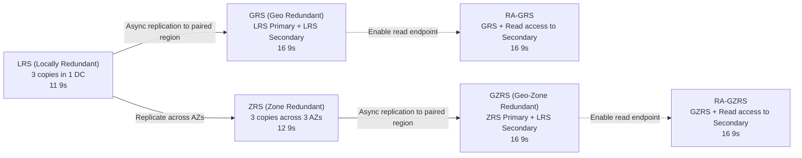
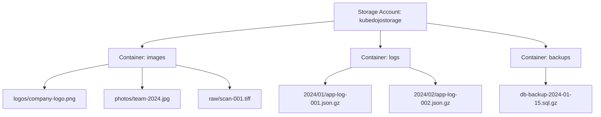
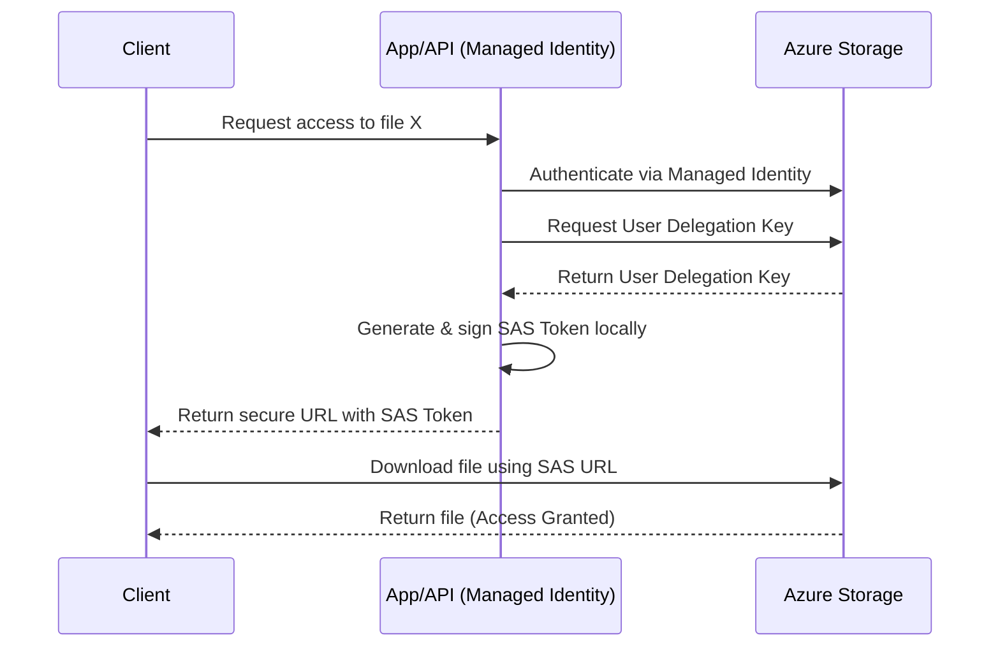
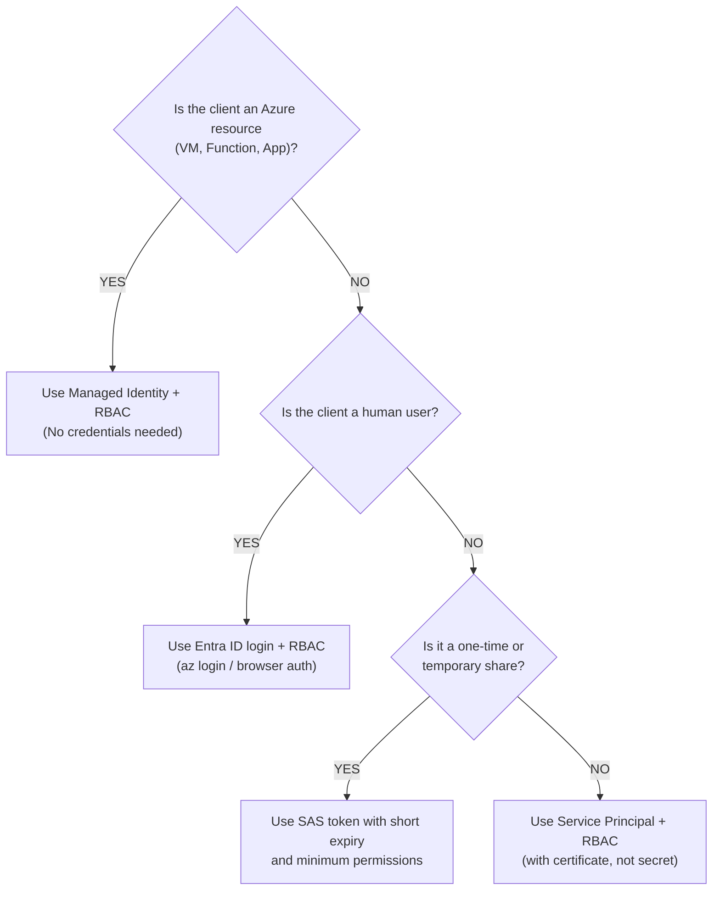
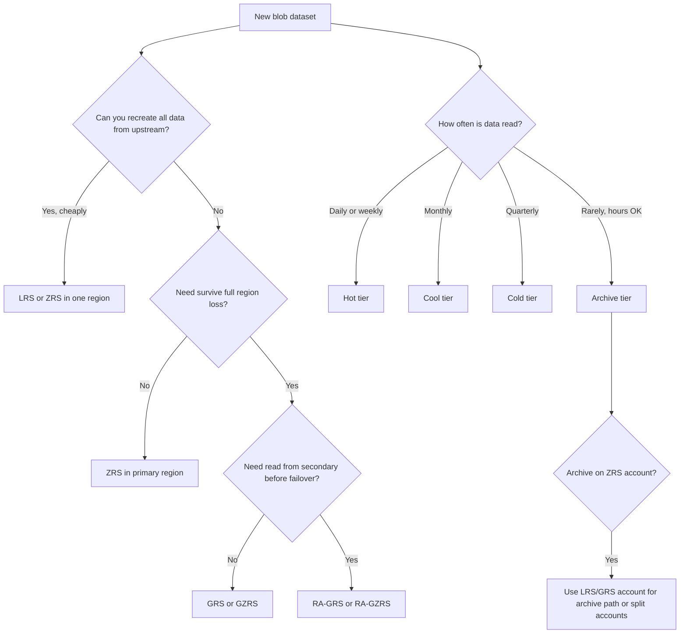

**Complexity**: `[MEDIUM]` | **Time to Complete**: 2h | **Prerequisites**: Module 3.1 (Entra ID & RBAC). You should be comfortable assigning Entra ID RBAC roles and running `az` commands with `--auth-mode login` before starting.

## What You'll Be Able to Do

After completing this module, you will be able to apply the patterns below in production storage designs:

- **Configure Azure Blob Storage with access tiers (Hot, Cool, Cold, Archive) and lifecycle management policies**
- **Implement storage account security with private endpoints, SAS tokens, and Entra ID-based RBAC access**
- **Deploy blob versioning, soft delete, and immutable storage policies for data protection and compliance**
- **Design Data Lake Storage Gen2 hierarchical namespaces for analytics workloads integrated with Azure services**

---

## Why This Module Matters

Poor tiering and missing lifecycle policies can quietly drive Azure storage bills far above expectations. Large volumes of logs and intermediate data often remain in Hot tier for months without anyone noticing.

Azure Blob Storage is the foundation of data storage in Azure. It serves website assets, application logs, enterprise data lakes, and machine learning datasets. The surface API looks simple: create a storage account, upload files, and read them back. Under that simplicity sits a layered system of access tiers, replication SKUs, authorization models, and lifecycle automation. Operators who ignore those layers often discover the cost impact only after a finance review.

In this module, you will learn how storage accounts scope redundancy and default tiers. You will choose access tiers and lifecycle rules that match real access patterns. You will apply SAS tokens, Entra ID RBAC, and network controls without falling back to account keys. You will also see how Data Lake Storage Gen2 extends Blob Storage for analytics workloads. By the end, you can design storage that balances cost, durability, and security deliberately rather than by accident.

---

## Storage Accounts: The Container for Everything

A **Storage Account** is the top-level resource for Azure Storage. It provides a [unique namespace for your data that is accessible from anywhere in the world over HTTP or HTTPS](https://learn.microsoft.com/en-us/azure/storage/common/storage-account-overview). A single storage account can hold up to [5 PiB (petabytes) of data](https://learn.microsoft.com/en-us/azure/storage/common/scalability-targets-standard-account).

### Storage Account Types

| Account Type | Supported Services | Performance Tiers | Use Case |
| :--- | :--- | :--- | :--- |
| **Standard general-purpose v2** | Blob, File, Queue, Table | Standard (HDD-backed) | [Most workloads---default choice](https://learn.microsoft.com/en-us/azure/storage/common/storage-account-overview) |
| **Premium block blobs** | Blob only (block blobs) | Premium (SSD-backed) | Low-latency, high-transaction workloads |
| **Premium file shares** | Files only | Premium (SSD-backed) | Enterprise file shares, databases on SMB |
| **Premium page blobs** | Page blobs only | Premium (SSD-backed) | VM disk storage (unmanaged disks---legacy) |

For the vast majority of workloads, **Standard general-purpose v2** is the right choice. Premium accounts are for specialized scenarios where you need consistently low latency or very high transaction rates.

**Performance tier** (Standard vs Premium) is separate from **access tier** (Hot/Cool/Cold/Archive). Standard accounts store blob data on HDD-backed media unless you choose Premium block blob accounts for SSD-backed block blobs. Premium block blob (`BlockBlobStorage` kind) does not support the same lifecycle tiering to Archive as general-purpose v2. [Premium block blob accounts support LRS and ZRS in select regions](https://learn.microsoft.com/en-us/azure/storage/common/storage-redundancy). Plan premium accounts for IOPS-sensitive workloads, not for cheap long-term archive.

**Naming and limits** matter at scale. Storage account names are globally unique, 3–24 characters, lowercase letters and numbers only. A single account can hold up to [5 PiB by default](https://learn.microsoft.com/en-us/azure/storage/common/scalability-targets-standard-account) with high request rates when partitioned well. Many teams use one account per environment (dev/stage/prod) or per data domain (media, logs, analytics) so firewall rules, private endpoints, and lifecycle policies stay understandable.

To translate this theory into practice, here is how you would provision both a standard and a premium storage account using the Azure CLI, ensuring secure defaults are set from the start:

```bash
# Create a standard storage account with LRS (locally redundant)
az storage account create \
  --name "kubedojostorage$(openssl rand -hex 4)" \
  --resource-group myRG \
  --location eastus2 \
  --sku Standard_LRS \
  --kind StorageV2 \
  --min-tls-version TLS1_2 \
  --allow-blob-public-access false

# Create a premium block blob account for low-latency workloads
az storage account create \
  --name "kubedojopremium$(openssl rand -hex 4)" \
  --resource-group myRG \
  --location eastus2 \
  --sku Premium_LRS \
  --kind BlockBlobStorage
```

### Redundancy Options

Azure replicates your data to protect against failures. [The redundancy option you choose dictates the physical distribution of your data](https://learn.microsoft.com/en-us/azure/storage/common/storage-redundancy), heavily impacting both durability and your monthly invoice:



The table above shows durability tiers; the bullets below illustrate how redundancy choice shifts **storage cost per GB** on Hot tier in East US (approximate, for planning only):
* LRS: baseline storage cost
* ZRS: higher storage cost than LRS
* GRS: materially higher storage cost than LRS
* RA-GRS: higher storage cost than GRS because it adds read access to the secondary region

**Example**: Choosing the cheapest redundancy option can still be a costly mistake if your workload cannot tolerate zonal or datacenter unavailability.

**Pause and predict:** If your primary region suffers a complete outage, how does your application know to read from the secondary region in an RA-GRS setup?

<details>
<summary>Check your prediction</summary>

RA-GRS does not automatically fail over the primary URL. Azure provides a distinct secondary endpoint URL appended with `-secondary` (such as `accountname-secondary.blob.core.windows.net`), and your client application or traffic router must actively target this secondary hostname to service read operations.
</details>

Durability planning starts with the failure you can actually survive: a disk, a datacenter, or an entire Azure region. The next subsections walk through those layers in order.

### Redundancy in depth: blast radius, durability, and failover

[Microsoft documents six redundancy options for storage accounts](https://learn.microsoft.com/en-us/azure/storage/common/storage-redundancy). Each option trades monthly storage cost against the failures it can survive. Think in three layers: disk or server failure inside one datacenter, loss of an entire datacenter or availability zone, and loss of an entire Azure region.

**Locally redundant storage (LRS)** keeps three synchronous copies inside one physical datacenter in your chosen region. LRS targets at least **99.999999999% (11 nines)** annual durability for objects. It protects against drive, rack, and server failures. It does not protect against a datacenter-wide disaster such as fire or flooding. LRS is the lowest-cost option and the narrowest blast-radius protection.

**Zone-redundant storage (ZRS)** spreads three synchronous copies across separate availability zones in the primary region. Each zone has independent power, cooling, and networking. ZRS targets at least **99.9999999999% (12 nines)** durability. Writes return success only after all available zones acknowledge the data. ZRS is Microsoft's recommended default for high availability within a single region, including [Data Lake workloads](https://learn.microsoft.com/en-us/azure/storage/common/storage-redundancy).

**Geo-redundant storage (GRS)** and **geo-zone-redundant storage (GZRS)** add asynchronous replication to a paired secondary region hundreds of miles away. GRS uses LRS in the primary region; GZRS uses ZRS in the primary. The secondary region always uses LRS internally. Both GRS and GZRS target at least **99.99999999999999% (16 nines)** durability. Replication is asynchronous, so the secondary can lag the primary during heavy write load. That lag defines your **recovery point objective (RPO)** if the primary region fails.

**Read-access geo-redundant storage (RA-GRS)** and **read-access geo-zone-redundant storage (RA-GZRS)** are the same geo-replicated configurations with read access to the secondary endpoint enabled before failover. Your application can read from `accountname-secondary.blob.core.windows.net` while the primary is healthy. That pattern supports warm DR testing and read-heavy DR architectures. [Azure Files does not support RA-GRS or RA-GZRS](https://learn.microsoft.com/en-us/azure/storage/common/storage-redundancy).

The **RA** distinction matters operationally. Standard GRS and GZRS keep the secondary write-only until you fail over. RA variants let you serve read traffic from the secondary during a primary outage without waiting for DNS failover to complete. You still need application logic—or Traffic Manager, Front Door, or custom routing—to send writes to whichever endpoint is primary after failover.

**Failover and RPO** are separate concerns from durability on paper. [Customer-managed planned failover](https://learn.microsoft.com/en-us/azure/storage/common/storage-disaster-recovery-guidance) swaps primary and secondary when both regions are healthy. Microsoft expects **no data loss** during planned failover when endpoints stay available throughout the process. **Customer-managed unplanned failover** is for primary-region endpoint outages. It promotes the secondary and typically causes **some data loss** for writes not yet replicated. After unplanned failover, the account becomes **LRS** in the new primary until you re-enable geo-redundancy. Check the **Last Sync Time** property on the account to estimate how far behind the secondary was before you fail over.

**Archive tier constraint**: [Archive tier is supported only on LRS, GRS, and RA-GRS accounts today](https://learn.microsoft.com/en-us/azure/storage/blobs/access-tiers-overview). It is not supported on ZRS, GZRS, or RA-GZRS. If you plan heavy Archive use with zone redundancy in the primary region, validate redundancy and tier compatibility before you ingest petabytes.

Hypothetical scenario: A team stores compliance archives in GRS with RA-GRS enabled. They rehearse quarterly reads from the secondary endpoint. When a regional outage blocks the primary blob endpoint, their app already points read paths at `-secondary`. Failover then becomes a controlled promotion rather than an improvised DNS change under incident pressure.

---

## Blob Storage: Containers and Blobs

Blob (Binary Large Object) storage is organized into **containers** within a storage account. Think of containers as top-level directories. A critical architectural constraint to remember is that standard Blob Storage is [fundamentally flat---there are no actual subdirectories, only virtual prefixes](https://learn.microsoft.com/en-us/azure/storage/blobs/data-lake-storage-namespace).

Containers also carry policy boundaries in mature estates. You attach **immutable policies** at container scope. **Private endpoints** can target the blob sub-resource for an entire account, but IAM assignments often narrow to specific containers for pipeline identities. **Lifecycle prefixMatch** filters almost always start from container name or a path prefix inside it (`logs/2024/`). Naming containers after workload and environment (`prod-exports`, `dev-exports`) keeps automation readable when dozens of rules accumulate.

Hot paths for performance sometimes use **block blob size and partition key** strategies. Extremely high request rates may require spreading blobs across multiple accounts because throttling limits apply per account. [Scalability targets document per-second limits](https://learn.microsoft.com/en-us/azure/storage/blobs/scalability-targets). When telemetry shows throttling, split by container prefix into additional accounts before chasing Premium tier spend.


*(Note: The "/" in blob names creates a virtual directory hierarchy in the Azure portal, but the underlying storage engine treats it as a single flat string).*

### [Blob Types](https://learn.microsoft.com/en-us/azure/storage/blobs/scalability-targets)

| Type | Max Size | Use Case |
| :--- | :--- | :--- |
| **Block Blob** | 190.7 TiB | Files, images, logs, backups---99% of workloads |
| **Append Blob** | 195 GiB | Append-only scenarios like log files |
| **Page Blob** | 8 TiB | Random read/write---used for VM disks (legacy) |

Interacting with containers and blobs programmatically is straightforward. The following commands demonstrate how to perform common file operations using Microsoft Entra ID authentication (`--auth-mode login`), strictly avoiding legacy access keys:

```bash
STORAGE_NAME="kubedojostorage"  # Replace with your actual name

# Create a container
az storage container create \
  --name "application-data" \
  --account-name "$STORAGE_NAME" \
  --auth-mode login

# Upload a file
echo '{"event": "user_login", "timestamp": "2024-06-15T10:30:00Z"}' > /tmp/event.json
az storage blob upload \
  --container-name "application-data" \
  --file /tmp/event.json \
  --name "events/2024/06/event-001.json" \
  --account-name "$STORAGE_NAME" \
  --auth-mode login

# Upload multiple files
az storage blob upload-batch \
  --destination "application-data" \
  --source /tmp/logs/ \
  --pattern "*.log" \
  --account-name "$STORAGE_NAME" \
  --auth-mode login

# List blobs in a container
az storage blob list \
  --container-name "application-data" \
  --account-name "$STORAGE_NAME" \
  --auth-mode login \
  --query '[].{Name:name, Size:properties.contentLength, Tier:properties.blobTier}' -o table

# Download a blob
az storage blob download \
  --container-name "application-data" \
  --name "events/2024/06/event-001.json" \
  --file /tmp/downloaded-event.json \
  --account-name "$STORAGE_NAME" \
  --auth-mode login
```

---

## Access Tiers: [Hot, Cool, Cold, and Archive](https://learn.microsoft.com/en-us/azure/storage/blobs/access-tiers-overview)

Azure Blob Storage offers four access tiers with radically different cost profiles. The foundational economic principle of cloud storage applies here: **storage cost and access cost are inversely related**. The cheaper a gigabyte is to store, the more expensive it will be to read.

Tier choice is a product decision, not only a storage admin task. Application owners should answer three questions before upload defaults are set: How often is this object read? How fast must first byte return? What happens financially if we delete early? Hot optimizes for frequent access. Cool and Cold trade lower capacity rates for higher read and transaction charges. Archive optimizes capacity cost at the price of offline data and rehydration delay.

Block blobs support tiering; append and page blobs do not use these access tiers the same way. [Access tier settings apply to block blobs in general-purpose v2 and Blob Storage accounts](https://learn.microsoft.com/en-us/azure/storage/blobs/access-tiers-overview). Page blobs backing legacy unmanaged disks follow different pricing models. When architects say "move logs to Cool," they mean block blobs in object containers, not VM disks.

Availability SLAs differ slightly by tier. Hot targets higher read availability than Cool, Cold, or Archive on the same redundancy SKU. For many batch workloads the SLA difference does not matter. For customer-facing assets served directly from blob without CDN, Hot plus redundancy matching your uptime target is the usual starting point.

| Tier | Storage Cost (per GB) | Read Cost (per 10K ops) | Min Retention | Access Latency | Best For |
| :--- | :--- | :--- | :--- | :--- | :--- |
| **Hot** | Highest storage cost | Lowest read cost | None | Milliseconds | Frequently accessed data |
| **Cool** | Lower than Hot | Higher than Hot | 30 days | Milliseconds | Infrequently accessed (monthly) |
| **Cold** | Lower than Cool | Higher than Hot | 90 days | Milliseconds | Rarely accessed (quarterly) |
| **Archive** | Lowest storage cost | Highest retrieval cost | 180 days | Hours (rehydration) | Compliance, long-term backup |

> **Cost Visualization (storing 10 TB for 1 year):**
> 
> *   **Hot:** highest annual storage cost
> *   **Cool:** lower annual storage cost than Hot
> *   **Cold:** much lower annual storage cost than Hot
> *   **Archive:** lowest storage cost, but retrieval and rehydration costs can dominate if you need the data
>
> **A practical heuristic:** Cooler tiers generally make more sense as data is accessed less often, but the exact break-even point depends on current storage, transaction, and retrieval pricing in your region.

You can modify tiers dynamically at the blob level, or establish default tiers at the account level. Here is how you manipulate tiering via the CLI, including initiating a costly Archive rehydration:

```bash
# Set the default access tier for a storage account
az storage account update \
  --name "$STORAGE_NAME" \
  --resource-group myRG \
  --access-tier Cool

# Set tier for individual blobs
az storage blob set-tier \
  --container-name "application-data" \
  --name "events/2024/01/event-old.json" \
  --tier Archive \
  --account-name "$STORAGE_NAME" \
  --auth-mode login

# Rehydrate a blob from Archive (takes hours)
az storage blob set-tier \
  --container-name "application-data" \
  --name "events/2024/01/event-old.json" \
  --tier Hot \
  --rehydrate-priority High \
  --account-name "$STORAGE_NAME" \
  --auth-mode login
# High priority: typically <1 hour. Standard priority: up to 15 hours.
```

**Pause and predict:** If you upload a 100 GB backup file directly to the Archive tier and then unexpectedly delete it a week later to free up space, what financial penalty will you incur?

<details>
<summary>Check your prediction</summary>

The Archive tier enforces a 180-day minimum retention period. Deleting the 100 GB blob after only seven days incurs a prorated early-deletion fee equal to the storage cost for the remaining 173 days at standard Archive tier rates.
</details>

Storage cost optimization requires disciplined capacity governance and automated policy enforcement rather than relying on manual operator intervention across expanding enterprise accounts.

### Lifecycle Management Policies

Manually moving blobs between tiers is operationally impractical at enterprise scale. Lifecycle management policies provide the operational automation required to govern data across its useful lifespan without manual intervention.

```bash
# Create a lifecycle management policy
az storage account management-policy create \
  --account-name "$STORAGE_NAME" \
  --resource-group myRG \
  --policy '{
    "rules": [
      {
        "name": "move-to-cool-after-30-days",
        "enabled": true,
        "type": "Lifecycle",
        "definition": {
          "filters": {
            "blobTypes": ["blockBlob"],
            "prefixMatch": ["logs/"]
          },
          "actions": {
            "baseBlob": {
              "tierToCool": {"daysAfterModificationGreaterThan": 30},
              "tierToArchive": {"daysAfterModificationGreaterThan": 180},
              "delete": {"daysAfterModificationGreaterThan": 365}
            }
          }
        }
      }
    ]
  }'
```

This JSON policy instructs Azure's background services to evaluate the `logs/` prefix periodically after the policy takes effect. Blobs age smoothly into Cool tier, then Archive, and are ultimately purged from the system after a year---greatly reducing the chance that you end up as the subject of the surprise-bill scenario described in the introduction.

Production lifecycle rule definitions frequently combine multiple action targets within a single policy document to balance storage consumption against operational availability. Beyond moving base blobs across access tiers, lifecycle policies can manage previous blob versions and point-in-time snapshots using dedicated action blocks. When versioning is active, defining separate deletion schedules for noncurrent versions prevents superseded object states from accumulating indefinitely in high-cost tiers. Filter criteria can match exact blob prefixes or leverage index tag matches, allowing automated retention workflows to target specific application domains without restructuring physical container paths.

### Access tiers and lifecycle in depth

[Hot, Cool, and Cold are online tiers](https://learn.microsoft.com/en-us/azure/storage/blobs/access-tiers-overview). Applications can read and write them with millisecond latency. **Archive is offline**. Reads and writes against archived blobs fail until you rehydrate to an online tier. Archive is for data you rarely touch and can tolerate hours of latency.

**Minimum retention and early deletion** apply when you tier down or delete too soon. Cool requires **30 days** minimum on general-purpose v2 accounts. Cold requires **90 days**. Archive requires **180 days**. If you delete or move a blob before the minimum elapses, Azure charges a **prorated early deletion fee** based on the remaining days at that tier's storage rate. Overwriting a blob via Put Blob, Put Block List, or Copy Blob within the window can also trigger the fee. With **soft delete** enabled, a blob counts as deleted only after the soft-delete retention expires, so soft-deleted blobs are not subject to early deletion penalties during the retention window.

**Blob-level vs account-level tiering** solves different problems. Each storage account has a **default access tier** (Hot, Cool, or Cold—not Archive). New block blobs without an explicit tier inherit that default. The portal may label them **Hot (inferred)** or **Cool (inferred)** when the tier comes from the account setting. You can override tier per blob at upload or with `az storage blob set-tier`. Changing the account default tier re-prices every blob that still has an inferred tier. Moving the default to a cooler tier bills **write operations per 10,000** for those blobs. Moving the default warmer bills **read operations and per-GB retrieval** from the source tier. Set explicit tiers on long-lived datasets so a blanket account change does not surprise finance.

**Lifecycle management** automates tier transitions and expirations with JSON rules. [Rules can filter by prefix, blob index tags, and blob type](https://learn.microsoft.com/en-us/azure/storage/blobs/lifecycle-management-overview). Conditions use **last modified time**, **creation time**, and optionally **last accessed time** when access tracking is enabled. Actions include tier-to-cool, tier-to-cold, tier-to-archive, and delete for base blobs, versions, and snapshots. Policy changes can take up to **24 hours** to apply; the first run may start after that delay. Lifecycle policies are **free**; you pay standard **Set Blob Tier** and delete operation charges. Lifecycle **cannot rehydrate** Archive to an online tier—you must use Set Blob Tier or Copy Blob for that path.

**Last-accessed tracking** lets rules tier down idle data even when last-modified time stays old. Each last-access time update can bill as an **other operation** at most once per 24 hours per object. Enable tracking only when lifecycle rules actually use last-accessed conditions, or you pay tracking overhead without savings.

**Rehydration from Archive** uses Standard or High priority. [Microsoft documents up to 15 hours for Standard priority](https://learn.microsoft.com/en-us/azure/storage/blobs/access-tiers-overview). High priority is faster for urgent restores but costs more. While rehydration runs, capacity billing stays at Archive rates until the blob lands in the target online tier. Plan restore runbooks before auditors or regulators ask for immediate access to cold records.

**Smart tier** (where enabled) automatically moves data among Hot, Cool, and Cold based on usage. It is a managed alternative to hand-tuned lifecycle rules for variable access patterns. Whether you use Smart tier or explicit lifecycle rules, the design question is the same: match tier to measured access frequency, not to how long ago the file was created.

Objects smaller than **128 KiB** in Cool, Cold, or Archive may bill as **128 KiB** minimum objects on accounts created after Microsoft's staged rollout dates documented in the access tiers overview. Packaging tiny telemetry files into larger aggregate blobs before tiering down avoids silent minimum-size billing surprises.

---

## Data Protection and Compliance

Enterprise data requires resilience against both accidental deletion and malicious alteration. Azure Blob Storage provides three core mechanisms to ensure data integrity:

### 1. Soft Delete
When enabled, soft delete retains deleted blobs or containers for a specified retention period ([between 1 and 365 days](https://learn.microsoft.com/en-us/azure/storage/blobs/soft-delete-container-overview)) before permanently erasing them. During this window, you can restore the data. It acts as a direct safety net against accidental deletion by human error or buggy application code.

### 2. Blob Versioning
Versioning automatically maintains previous states of a blob each time it is [modified or deleted](https://learn.microsoft.com/en-us/azure/storage/blobs/versioning-overview). When a blob is overwritten, the previous data becomes a distinct, read-only version. This is critical for applications where users might accidentally overwrite files with corrupted data, allowing instant rollback to a known good state.

### 3. [Immutable Storage (WORM)](https://learn.microsoft.com/en-us/azure/storage/blobs/immutable-storage-overview)
Write-Once, Read-Many (WORM) policies ensure data cannot be modified or deleted by *anyone*---not even users with full administrative privileges or Microsoft support---for a user-specified interval. 
*   **Time-based retention policies:** Lock data for a specific duration (e.g., 7 years for financial records).
*   **Legal holds:** Lock data indefinitely until the hold is explicitly removed (used during litigation).

Versioning and immutability interact with operations teams daily. Versioning preserves history when applications overwrite blobs. Immutability prevents tampering even when someone has Owner rights. Together they support ransomware recovery narratives: restore a known-good version, while locked containers block attacker encryption from replacing compliance evidence. Operators must still plan **storage growth**: each version is billable capacity until lifecycle deletes old versions. Immutable containers reject lifecycle delete actions on protected blobs, so retention policies need explicit owners and calendar reviews.

Change feed, point-in-time restore, and object replication build on similar blob-change tracking primitives. If you enable those features for operational backup, read [disaster recovery guidance](https://learn.microsoft.com/en-us/azure/storage/common/storage-disaster-recovery-guidance) for failover caveats. Unplanned failover can reset earliest restore points and introduce consistency considerations when change feed is enabled.

```bash
# Enable versioning on a storage account
az storage account blob-service-properties update \
  --account-name "$STORAGE_NAME" \
  --resource-group myRG \
  --enable-versioning true

# Create a time-based immutability policy (e.g., retain for 365 days)
az storage container immutability-policy create \
  --account-name "$STORAGE_NAME" \
  --container-name "financial-records" \
  --resource-group myRG \
  --period 365
```

---

## Securing Blob Storage: Identity, Access, and Networks

Choosing how to authorize access to blob storage defines your security posture. There are three primary methods for identity and authorization, alongside robust network controls.

### 1. Account Keys (Avoid in Production)

Every storage account has [two 512-bit access keys](https://learn.microsoft.com/en-us/azure/storage/common/storage-account-keys-manage) that grant **full administrative control** over the entire account. Using these keys is equivalent to giving an application the master root password to your data.

```bash
# List storage account keys
az storage account keys list \
  --account-name "$STORAGE_NAME" \
  --resource-group myRG \
  --query '[].{KeyName:keyName, Value:value}' -o table

# Rotate keys (do this regularly if you must use keys)
az storage account keys renew \
  --account-name "$STORAGE_NAME" \
  --resource-group myRG \
  --key key1
```

### 2. Shared Access Signatures (SAS Tokens)

A SAS token is a cryptographic URI query string that delegates restricted, time-bound access. It defines exactly what operations are allowed, against which specific resources, and when the delegation expires.

The most secure implementation is the [**User Delegation SAS**](https://learn.microsoft.com/en-us/azure/storage/blobs/storage-blob-user-delegation-sas-create-cli), where an Entra ID identity (not a master key) signs the token. This creates a secure, verifiable exchange:



The following commands generate highly scoped SAS tokens using Entra ID user delegation (`--as-user`), so the token is signed by your identity rather than a storage account key:

```bash
# Generate a SAS token for a specific blob (read-only, expires in 1 hour)
END_DATE=$(date -u -v+1H "+%Y-%m-%dT%H:%MZ" 2>/dev/null || date -u -d "+1 hour" "+%Y-%m-%dT%H:%MZ")

az storage blob generate-sas \
  --account-name "$STORAGE_NAME" \
  --container-name "application-data" \
  --name "events/2024/06/event-001.json" \
  --permissions r \
  --expiry "$END_DATE" \
  --auth-mode login \
  --as-user \
  --output tsv

# Generate a SAS for an entire container (list + read, 24 hours)
END_DATE_24H=$(date -u -v+24H "+%Y-%m-%dT%H:%MZ" 2>/dev/null || date -u -d "+24 hours" "+%Y-%m-%dT%H:%MZ")

az storage container generate-sas \
  --account-name "$STORAGE_NAME" \
  --name "application-data" \
  --permissions lr \
  --expiry "$END_DATE_24H" \
  --auth-mode login \
  --as-user \
  --output tsv
```

When you build a SAS URI, combine permission flags to grant only what the client needs:

| Flag | Permission |
| :--- | :--- |
| `r` | Read |
| `a` | Add |
| `c` | Create |
| `w` | Write |
| `d` | Delete |
| `l` | List |
| `t` | Tags |
| `x` | Delete version |
| `e` | Execute (ADLS Gen2) |

**Account SAS** spans multiple services in the account (blob, file, queue, table) when signed with account keys. **Service SAS** scopes to a single service (blob) but still uses account keys unless you switch to user delegation. Service SAS is common in legacy apps. **User delegation SAS** scopes to blob resources and ties to Entra ID. For new integrations, default to user delegation with `--auth-mode login --as-user` as shown earlier.

Operational hygiene for SAS URLs: never log complete URLs in application logs; treat query strings as secrets. Prefer HTTPS only. When a vendor integration is decommissioned, revoke delegation keys if user delegation SAS might still circulate. For account-key SAS, rotation requires regenerating every outstanding token when keys roll.

### 3. Identity-Based Access (Recommended)

The gold standard for authorization is using Entra ID identities combined with Azure Role-Based Access Control (RBAC). By leveraging Managed Identities, you completely eliminate the need to generate, rotate, or secure credentials in application code.

```bash
# Grant a user read access to blob data
az role assignment create \
  --assignee "alice@yourcompany.onmicrosoft.com" \
  --role "Storage Blob Data Reader" \
  --scope "/subscriptions/<sub>/resourceGroups/myRG/providers/Microsoft.Storage/storageAccounts/$STORAGE_NAME"

# Grant a managed identity write access to a specific container
az role assignment create \
  --assignee "$MANAGED_IDENTITY_PRINCIPAL_ID" \
  --role "Storage Blob Data Contributor" \
  --scope "/subscriptions/<sub>/resourceGroups/myRG/providers/Microsoft.Storage/storageAccounts/$STORAGE_NAME/blobServices/default/containers/application-data"
```

Microsoft documents **[key storage RBAC roles](https://learn.microsoft.com/en-us/azure/role-based-access-control/built-in-roles/storage)** for data-plane access; the ones you will assign most often are:
*   **Storage Blob Data Reader:** Read and list blobs
*   **Storage Blob Data Contributor:** Read, write, delete blobs
*   **Storage Blob Data Owner:** Full access + set POSIX ACLs (Data Lake)
*   **Storage Blob Delegator:** Generate user delegation SAS tokens

Use this decision tree when you are unsure whether to use Managed Identity, Entra ID sign-in, SAS, or a service principal:



### 4. Network Security and Private Endpoints

While authorization controls *who* can access your data, network security controls *from where* they can access it. By default, storage accounts are accessible via public endpoints over the internet.

To restrict network access, you have two primary mechanisms, and many teams combine them. **Storage Firewall (service endpoints)** lets you allow only specific public IP ranges or Azure Virtual Network subnets; traffic still uses Azure's backbone, but the storage account rejects requests from anywhere else. **[Private Endpoints (Azure Private Link)](https://learn.microsoft.com/en-us/azure/storage/common/storage-private-endpoints)** go further by placing a NIC in your VNet with a private IP so blob traffic stays on Microsoft's private network and never crosses the public internet.

```bash
# Disable public network access entirely
az storage account update \
  --name "$STORAGE_NAME" \
  --resource-group myRG \
  --public-network-access Disabled

# Create a Private Endpoint for the storage account
az network private-endpoint create \
  --name "pe-kubedojostorage" \
  --resource-group myRG \
  --vnet-name "myVNet" \
  --subnet "mySubnet" \
  --private-connection-resource-id "/subscriptions/<sub>/resourceGroups/myRG/providers/Microsoft.Storage/storageAccounts/$STORAGE_NAME" \
  --group-id "blob" \
  --connection-name "blob-private-connection"
```

**Pause and predict:** If you disable public network access and rely exclusively on a Private Endpoint, how will developers working from their local laptops access the storage account to upload test data?

<details>
<summary>Check your prediction</summary>

Public network access is blocked, preventing direct internet routing to the storage endpoint. Developers must establish secure network connectivity into the virtual network using a point-to-site VPN, an Azure Bastion jump host, or configure a temporary storage firewall IP exception for their client machines.
</details>

Authorization decisions decide who may call the data plane. The following section separates identity from network origin so teams can tighten both independently.

### Security and access control in depth

Authorization and network isolation work together. **Who** may call the data plane is separate from **where** requests may originate. Production designs usually tighten both.

**Account keys** remain full-power secrets. [Each storage account has two 512-bit keys](https://learn.microsoft.com/en-us/azure/storage/common/storage-account-keys-manage). Either key grants complete control over blobs, queues, tables, and files in that account. Keys leak through logs, tickets, and backups. Prefer Entra ID, managed identities, and user delegation SAS for application access. Rotate keys only when legacy integrations still require them.

**SAS types** differ by signing material. **Account SAS** and **service SAS** are signed with storage account keys. **User delegation SAS** is signed with a key obtained through Entra ID. Microsoft recommends user delegation SAS when possible. The signing identity needs a role that includes **Microsoft.Storage/storageAccounts/blobServices/generateUserDelegationKey**, such as **Storage Blob Data Contributor**. [User delegation keys are valid up to seven days](https://learn.microsoft.com/en-us/azure/storage/blobs/storage-blob-user-delegation-sas-create-cli). Set SAS expiry within that window even if you want a longer calendar lifetime. Revoke compromised delegation keys with `az storage account revoke-delegation-keys`; cache delays may apply before old SAS URLs fail.

Architecturally, user delegation signatures separate the credential issuance authority from the storage account access keys entirely. Because the delegation key is acquired using an Entra ID OAuth 2.0 token, Azure logs every key generation request in Azure Monitor audit trails with the requesting principal identity. Security operations teams can correlate token issuance events directly to specific service principals or user accounts during compliance audits. Furthermore, revoking permissions from the underlying Entra ID principal immediately invalidates subsequent delegation requests, providing centralized administrative governance that static shared account keys cannot deliver.

**Entra ID RBAC on the data plane** assigns roles at subscription, resource group, storage account, container, or blob scope. **Storage Blob Data Reader** covers read and list. **Storage Blob Data Contributor** adds write and delete. **Storage Blob Data Owner** adds ACL management needed for Data Lake Gen2 paths. **Storage Blob Delegator** allows generating user delegation SAS without broad data write rights. Scope assignments narrowly: a CI pipeline that uploads build artifacts needs Contributor on one container, not on the whole account.

**Service endpoints vs private endpoints vs firewall rules** solve different network problems. [Storage firewall rules](https://learn.microsoft.com/en-us/azure/storage/common/storage-network-security) restrict which public IPs and which VNet subnets may reach the **public** storage endpoints. **Service endpoints** route traffic from your subnet to Azure Storage over the Microsoft backbone while the account still has a public endpoint. **Private endpoints** place a private IP in your VNet via Azure Private Link. Blob traffic then stays off the public internet for clients that resolve the private DNS name. Many production accounts combine **default-action Deny** on the firewall with selected subnet rules for PaaS services, plus private endpoints for application tiers inside the VNet. `--public-network-access Disabled` blocks the public endpoint entirely; only private endpoint paths remain.

**Blob versioning** keeps prior versions when blobs are overwritten or deleted. Each version is a separate billable object until you delete it. Versioning pairs well with lifecycle rules that tier or delete **previous versions** on a schedule. Without lifecycle on versions, overwrite-heavy workloads can grow storage silently.

**Soft delete** for blobs and containers retains deleted objects for **1 to 365 days** before permanent removal. Restore with undelete APIs during the window. Soft delete is cheap insurance against operator mistakes and buggy automation.

Soft delete functions as an application-transparent safety net by retaining deleted blobs and snapshots in a hidden state for the configured retention duration. When a client application issues a delete command, Azure marks the target resource as soft-deleted rather than immediately freeing the underlying storage blocks. During this retention window, administrators can inspect soft-deleted items by listing blobs with deleted entities included and selectively restore them using the undelete API call. Storage capacity is billed at standard active rates throughout the retention period, so teams must balance recovery time objectives against predictable capacity overhead.

**Immutability (WORM)** supports **time-based retention** and **legal holds** on containers. Locked policies prevent overwrite and delete even for administrators until retention expires or legal hold clears. Immutable containers block lifecycle **delete** actions on protected blobs. Plan immutability for audit logs and regulatory archives where tamper evidence matters more than day-to-day agility.

Hypothetical scenario: An export service runs on AKS with a managed identity. It receives Contributor on `exports/` only. Partner downloads use one-hour user delegation SAS on individual blobs. The account denies public access and accepts traffic only from the cluster subnet and a private endpoint in the production VNet. Keys exist for break-glass only and rotate on a calendar owned by security.

---

## Azure Data Lake Storage Gen2

Azure Data Lake Storage Gen2 (ADLS Gen2) is [not a separate physical service---it is an architectural capability built natively onto Blob Storage](https://learn.microsoft.com/en-us/azure/storage/blobs/data-lake-storage-introduction). When you toggle the **hierarchical namespace** feature upon creation, you gain true directory semantics, POSIX-like access control lists (ACLs), and atomic directory operations. This capability transforms Blob Storage into an enterprise analytics engine tailored for tools like Apache Spark, Databricks, and Synapse Analytics.

The **DFS endpoint** (`dfs.core.windows.net`) exposes file-system semantics that Spark and Synapse prefer. The **blob endpoint** still exists for tools that speak classic blob APIs. Permissions combine **RBAC** (coarse, Azure control plane aligned) with **POSIX ACLs** on paths (fine-grained for data lake folders). **Storage Blob Data Owner** is required when pipelines set ACLs programmatically. Misaligned ACLs are a common reason jobs can list a path but fail to write parquet files underneath.

[Hierarchical namespace is enabled only at account creation](https://learn.microsoft.com/en-us/azure/storage/blobs/data-lake-storage-namespace). Upgrading a flat account later is not a casual toggle. If analytics is on the roadmap within 12 months, enabling HNS up front avoids painful migrations. If the workload is only object PUT/GET with no directory renames, flat blob storage remains simpler and fully sufficient.

To utilize these big data features, you must enable the namespace during creation and interact via the file system (`fs`) commands rather than the `blob` commands:

```bash
# Create a storage account with hierarchical namespace (Data Lake)
DATALAKE_NAME="kubedojodatalake$(openssl rand -hex 4)"
az storage account create \
  --name "$DATALAKE_NAME" \
  --resource-group myRG \
  --location eastus2 \
  --sku Standard_LRS \
  --kind StorageV2 \
  --enable-hierarchical-namespace true

# Create a filesystem (equivalent to a container in blob storage)
az storage fs create \
  --name "raw-data" \
  --account-name "$DATALAKE_NAME" \
  --auth-mode login

# Create actual directories (not virtual like in blob storage)
az storage fs directory create \
  --name "2024/06/sales" \
  --file-system "raw-data" \
  --account-name "$DATALAKE_NAME" \
  --auth-mode login
```

**Pause and predict:** If you are deploying an application that exclusively uploads and downloads millions of tiny individual images with no need for directory renaming or big data analytics, should you enable ADLS Gen2?

<details>
<summary>Check your prediction</summary>

Enabling a hierarchical namespace is unnecessary for simple image ingestion. A standard flat blob namespace is the simpler architectural fit because the workload does not benefit from directory-level transactions or distributed analytics query optimizations.
</details>

The feature matrix below compares namespace, rename, ACL, analytics, protocol, and billing attributes so you can match an account kind to the workload.

Choosing between flat Blob Storage and ADLS Gen2 is not about price---both use the same storage meters---but about namespace semantics, rename behavior, and how analytics tools expect to read data:

| Feature | Blob Storage | ADLS Gen2 |
| :--- | :--- | :--- |
| **Namespace** | Flat (virtual directories via `/`) | Hierarchical (real directories) |
| **Rename directory** | Must copy all blobs, then delete originals | Atomic single metadata operation |
| **ACLs** | RBAC only (container/account level) | RBAC + POSIX ACLs (file/directory level) |
| **Analytics tools** | Limited integration | Native Spark, Databricks, Synapse support |
| **Protocol** | Blob REST API (`blob.core.windows.net`) | Blob + DFS REST API (`dfs.core.windows.net`) |
| **Cost** | Same | [Same (no premium for hierarchical namespace)](https://learn.microsoft.com/en-us/azure/storage/blobs/data-lake-storage-introduction) |

---

## Patterns and Anti-Patterns

Blob storage patterns turn one-off console choices into repeatable architecture. The goal is not perfect storage on day one. The goal is to make expensive mistakes boring: tiers match access, keys stay out of code, redundancy matches blast radius, and lifecycle runs without a human spreadsheet.

| Pattern | When to use it | Why it works | Scaling note |
| :--- | :--- | :--- | :--- |
| Lifecycle rules on day one | Any container with logs, backups, or exports | Tier-down and delete happen automatically as data ages | Add prefix filters per team; cap rule count (10 prefixes per rule) |
| Explicit blob tiers for long-lived datasets | Data with known access frequency | Account default changes do not surprise you with inference charges | Tag blobs in CMDB with tier and retention owner |
| ZRS in primary for production app data | Workloads needing zone fault tolerance within a region | Survives single-zone loss without regional failover | Pair with GZRS when regional DR is required |
| RA-GZRS plus tested secondary reads | Business-critical blobs with DR read paths | Secondary endpoint is readable before failover | Application must use `-secondary` hostname in DR tests |
| User delegation SAS for external sharing | Partners need time-bound read without Entra accounts | Signing ties to Entra identity; revoke via delegation keys | Hours-long expiry, single-blob scope, read-only when possible |
| Managed identity plus scoped RBAC | Azure-hosted apps (AKS, Functions, VMs) | No secrets in config; platform rotates credentials | Scope to container, not whole account |
| Private endpoint plus firewall default Deny | Production data planes inside VNets | Removes broad internet exposure to public endpoint | Document break-glass IP rules for on-call engineers |
| Soft delete plus versioning | User-facing or compliance-sensitive blobs | Accidental delete and overwrite are recoverable | Add lifecycle on previous versions to control version sprawl |
| ADLS Gen2 at create time for analytics | Spark, Synapse, Databricks lakehouses | Atomic directory ops and POSIX ACLs | Cannot casually flip namespace later; plan up front |

Anti-patterns look efficient until the first incident or invoice.

| Anti-pattern | What goes wrong | Better alternative |
| :--- | :--- | :--- |
| Leaving everything in Hot tier | Storage GB-month dominates; finance asks why logs cost like databases | Lifecycle to Cool/Cold/Archive by prefix and age |
| Frequent reads on Archive-tier data | Retrieval and rehydration charges exceed storage savings | Keep quarterly-access data in Cold; reserve Archive for true cold compliance |
| Account keys in app settings or pipelines | One leak compromises entire account | Managed identity and RBAC, or user delegation SAS |
| Year-long container SAS with full permissions | Stolen URL grants broad long-lived access | Short expiry, minimum permissions, blob-scoped user delegation SAS |
| LRS for irreplaceable customer data | Datacenter loss means data loss | ZRS minimum; GRS/GZRS when regional DR is required |
| GRS without failover runbooks | Team discovers RPO and DNS steps during outage | Planned failover tests; monitor Last Sync Time |
| Public blob access for "quick sharing" | Anonymous internet reads and crawlers | Disable public access; share with SAS or Entra |
| Enabling ADLS Gen2 for simple object upload apps | Extra complexity without analytics benefit | Flat blob namespace until directory semantics are required |
| Immutability on dev containers | Deletes blocked; storage grows forever | Separate immutable production containers with named owners |
| Disabling network rules because Private Link is "done" | Misconfigured DNS still exposes public path | Set `public-network-access` explicitly; test both paths |

---

## Decision Framework

Use two decisions in sequence: **redundancy SKU** (how much failure to survive) and **access tier** (how often data is read). Cost and operations follow from those choices.



### Redundancy decision matrix

| Requirement | Choose | Avoid |
| :--- | :--- | :--- |
| Dev/test blobs, easy rebuild | LRS | GZRS for cost reasons only |
| Production app blobs, zone tolerance | ZRS | LRS when SLA expects zone survival |
| Must survive regional disaster | GRS or GZRS | LRS or ZRS alone |
| DR app reads secondary during outage | RA-GRS or RA-GZRS | GRS without read access |
| Heavy Archive + zone primary | Separate accounts or LRS/GRS for archive | Archive on ZRS/GZRS account |
| Lowest monthly storage $/GB | LRS Hot | RA-GZRS when you never test secondary |

### Access tier decision matrix

| Access pattern | Tier | Watch-out |
| :--- | :--- | :--- |
| Active read/write | Hot | Highest $/GB-month, lowest read cost |
| Touch about monthly | Cool | 30-day minimum; read charges higher than Hot |
| Touch about quarterly | Cold | 90-day minimum; do not use Archive if reads are quarterly |
| Compliance, years, rare restore | Archive | Rehydration hours; 180-day minimum; offline until rehydrated |
| Unknown or bursty | Smart tier or lifecycle from Hot | Measure before locking Archive |

Worked example: Application logs land in Hot for seven days, then lifecycle moves them to Cool at day 30, Cold at day 90, and Archive at day 180. The storage account uses **ZRS** because zone outage should not stop ingestion. Customer profile images use **Hot** with **LRS** in a separate account because they are CDN-backed and reproducible from the app database. Neither choice is "best" globally—they match blast radius and access frequency.

---

## Cost Lens

Blob economics are four meters: **capacity (GB-month by tier)**, **transactions (per 10,000 operations)**, **data retrieval (per GB on cooler tiers)**, and **egress (per GB leaving the region)**. [Block blob pricing](https://azure.microsoft.com/en-us/pricing/details/storage/blobs/) varies by region and redundancy SKU. Always model your region and redundancy, not a generic blog estimate.

**Capacity** drops as tiers get cooler. Hot costs the most per GB-month. Archive costs the least. Redundancy multiplies the storage line: ZRS costs more than LRS; GRS and GZRS cost more than single-region options. Geo-replication also adds **geo-replication data transfer (egress between regions)** on write-heavy accounts.

**Transactions** rise as tiers get cooler. Listing and reading Cold or Archive data costs more per 10,000 operations than Hot. A telemetry pipeline that scans Archive blobs daily can spend more on reads than it saved on storage.

**Retrieval charges** apply per GB when you read Cool, Cold, or Archive data. Archive adds **rehydration** priority charges. The surprise bill pattern is "cheap Archive storage" plus "frequent partial reads" from indexing or antivirus scans.

**Early deletion** fees punish tier mistakes. Moving 50 TB to Archive and deleting it after 30 days still bills roughly **150 days** of Archive storage equivalent (180-day minimum minus 30 days held). Test retention assumptions on a pilot prefix before bulk tier changes.

**Lifecycle** policy execution is free. You pay underlying Set Blob Tier and delete operations. [Last-accessed tracking](https://learn.microsoft.com/en-us/azure/storage/blobs/lifecycle-management-overview) can add other-operation charges when enabled. Disable tracking unless rules use last-accessed conditions.

**Egress** to the internet or other regions is often the dominant cost for CDN-less public downloads. Put Azure CDN or Front Door in front of hot objects served globally. Keep bulk analytics ingress on private endpoints in the same region as compute when possible.

**Cost control knobs** that actually work: lifecycle and prefix filters; right-sizing redundancy (do not use RA-GZRS for disposable logs); user delegation SAS instead of wide-open containers; monitoring **capacity by tier** in Cost Management; alerting on Archive read spikes; versioning lifecycle for overwrite-heavy apps; and reserving Hot only for data touched in the last week.

Hypothetical scenario: A 20 TB log bucket stays in Hot for a year at roughly $360/month storage in East US (illustrative—verify current rates). The same data in Cool might land near $120/month storage but fails if operators run weekly grep jobs across all objects because retrieval and read operations climb. Lifecycle to Cold after 90 days without reads, plus blocking scans on archived prefixes, aligns spend with the original "write once, read never" intent.

Monitor **Capacity** metrics in Azure Monitor and Cost Management views split by tier when available. Review those charts monthly with application owners. A sudden jump in Hot capacity after enabling versioning usually means overwrite-heavy apps without version lifecycle rules. A jump in Archive capacity with flat Hot often means lifecycle is working; a matching jump in transaction costs may mean something is reading archived data too often.

---

## Did You Know?

1. **A single Azure Storage Account can handle up to 20,000 requests per second** and store up to 5 PiB of data. If you need to serve a very popular file to many concurrent clients, put Azure CDN in front of the storage account instead of relying on the storage account alone.

2. **Archive tier rehydration can take up to 15 hours with Standard priority.** High-priority rehydration may complete faster for smaller blobs, but retrieval time still depends on blob size and service conditions.

3. **Deleting a blob in Cool tier before 30 days incurs an early deletion fee.** Similarly, Cold has a 90-day minimum, and Archive has a 180-day minimum. If you delete archived data early, Azure still bills you for the remaining minimum-retention period, so confirm you will not need the data before archiving it.

4. **Azure Storage immutability policies (WORM---Write Once, Read Many) are used to help satisfy regulatory retention requirements** in regulated industries. Once a time-based retention policy is locked, even privileged users cannot delete the data until the retention period expires.

---


## Common Mistakes

| Mistake | Why It Happens | How to Fix It |
| :--- | :--- | :--- |
| Storing all data in Hot tier indefinitely | Hot is the default and "just works" | Implement lifecycle management policies on day one. Most logs and backups should move to Cool after 30 days. Model egress if you serve large downloads without CDN. |
| Using storage account keys in application code | Keys are the first thing shown in tutorials | Use Managed Identities and RBAC for Azure-hosted apps. Use SAS tokens with short expiry for external access. |
| Creating SAS tokens with long expiry and broad permissions | Developers want tokens that "just work" without renewal | Generate SAS tokens scoped to specific containers/blobs with minimum permissions and short expiry (hours, not months). |
| Not enabling soft delete on blob storage | It seems like an unnecessary precaution until someone deletes production data | Enable soft delete with a 14-30 day retention period. It costs almost nothing but saves you from accidental deletions. |
| Choosing LRS for data that cannot be recreated | LRS is the cheapest option | Use ZRS minimum for any data that has no backup. Use GRS or RA-GRS for business-critical data like customer records. Rehearse reading from `-secondary` when using RA variants. |
| Enabling public anonymous access on containers | Quick demos and testing leave public access enabled | Set `--allow-blob-public-access false` at the account level. Use SAS tokens or RBAC for legitimate sharing needs. |
| Not planning the storage account naming scheme | Storage account names must be [globally unique and 3-24 characters](https://learn.microsoft.com/en-us/azure/storage/common/storage-account-overview) | Adopt a naming convention early: `<company><env><region><purpose>`, e.g., `acmeprodeus2data`. |
| Using Blob Storage when Data Lake (hierarchical namespace) is needed | Teams start with blob storage and later discover they need Spark/Databricks compatibility | Decide upfront if you need analytics workloads, and review Azure's current upgrade guidance and compatibility impacts before enabling hierarchical namespace later. |

---

## Quiz

<details>
<summary>1. A storage account has 50 TB of log files currently residing in the Hot tier, but an analysis shows these files are only accessed approximately once per quarter. Which tier should they be migrated to, and how much would this strategic shift save annually?</summary>

*[Maps to Learning Outcome: Configure Azure Blob Storage with access tiers and lifecycle management policies]*

They should be in Cold tier. Hot tier costs $0.018/GB/month (illustrative), leading to $10,800/year, whereas Cold tier reduces this to $2,700/year (illustrative), saving approximately $8,100 annually. Cool tier would also offer significant savings, but since the data is accessed only quarterly, Cold tier's 90-day minimum retention perfectly aligns with the access pattern. Archive tier would save even more on storage, but the steep $5 per 10,000 read operations and hours-long rehydration time make it operationally impractical for data that still requires guaranteed quarterly access.
</details>

<details>
<summary>2. Your security team audits an application that shares monthly reports with external vendors using SAS tokens. They notice the application generates these tokens by signing them with the primary storage account key. Why is this a major security risk, and what exact mechanism should be implemented instead?</summary>

*[Maps to Learning Outcome: Implement storage account security with private endpoints, SAS tokens, and Entra ID-based RBAC access]*

Using account keys is extremely dangerous because they grant absolute, unrestricted administrative control over the entire storage account, meaning a compromised key gives an attacker systemic access. If a master key is leaked, the primary remediation is to rotate it, which can disrupt other applications across the enterprise that rely on that key. Instead, you should implement User Delegation SAS tokens signed directly by an Entra ID identity. This mechanism cryptographically ties the token to a specific authenticated user, allows you to restrict access to a single container or blob, and enables granular revocation without impacting other production services.
</details>

<details>
<summary>3. You need to securely share a specific diagnostic log blob with a third-party consultant who does not have an Azure account. They only need access for the next 48 hours to complete their analysis. What is the most secure architectural approach to grant this access?</summary>

*[Maps to Learning Outcome: Implement storage account security with private endpoints, SAS tokens, and Entra ID-based RBAC access]*

You should generate a user delegation SAS token scoped explicitly to that single diagnostic blob with read-only permission (`r`) and a strict 48-hour expiry constraint. By leveraging the `--as-user` flag, the token is securely signed by Entra ID rather than the master storage account key, minimizing the blast radius if the URL is ever intercepted. Furthermore, this approach provides a standard HTTP URL, ensuring the consultant does not need their own Azure credentials or SDKs to download the file. Never generate a SAS token at the broader container level or artificially extend the expiry period "just in case", as this fundamentally violates the principle of least privilege.
</details>

<details>
<summary>4. During a high-stakes compliance audit, an inspector asks to immediately view a 5-year-old financial record that is currently stored in the Archive tier. What exactly happens when your application attempts a direct read operation on this blob, and what steps must you take to satisfy the auditor's request?</summary>

*[Maps to Learning Outcome: Configure Azure Blob Storage with access tiers and lifecycle management policies]*

Direct read operations on archived blobs are technically impossible and will immediately be rejected by Azure with a 409 Conflict error. Before the auditor can view the record, you must explicitly initiate a rehydration operation to move the blob back into the Hot or Cool tier. Because the auditor is waiting on the data, you should trigger this tier change using the 'High' rehydration priority, which typically completes in under an hour. If you had used the default 'Standard' priority to save money, the auditor might have been forced to wait up to 15 hours for the data block to become readable.
</details>

<details>
<summary>5. A data engineering team is trying to rename a virtual directory containing 10,000 parquet files in a standard Blob Storage container. The operation is taking hours, burning compute credits, and causing pipeline timeout errors. Why is this happening, and how would Azure Data Lake Storage Gen2 solve this specific problem?</summary>

*[Maps to Learning Outcome: Design Data Lake Storage Gen2 hierarchical namespaces for analytics workloads integrated with Azure services]*

Standard Blob Storage utilizes a fundamentally flat namespace where directories are merely virtual string prefixes in the file name, meaning a "directory rename" forces the underlying system to individually copy and then delete all 10,000 files over the network. Azure Data Lake Storage Gen2 introduces a true hierarchical namespace, which allows the storage engine to simply update a single metadata pointer to rename the parent directory atomically. This architectural difference reduces a multi-hour, error-prone network operation into a lightweight metadata update that completes in milliseconds. Furthermore, ADLS Gen2 provides POSIX-like access control lists, ensuring the engineering team can enforce granular security permissions across the newly restructured directory.
</details>

<details>
<summary>6. A developer wants to hardcode a storage account access key into a virtual machine's environment variables to authenticate an application that uploads processed images. As a cloud architect, you reject this design and mandate the use of a Managed Identity. Defend your architectural decision by comparing the security blast radius and operational overhead of both approaches.</summary>

*[Maps to Learning Outcome: Implement storage account security with private endpoints, SAS tokens, and Entra ID-based RBAC access]*

Hardcoding storage account keys provides the application with unlimited administrative access to every container in the account, maximizing the potential blast radius if the VM is ever breached. Furthermore, account keys lack automatic rotation mechanisms, placing a permanent and risky operational burden on the engineering team to manually manage, rotate, and distribute secrets. In stark contrast, assigning a Managed Identity with the "Storage Blob Data Contributor" role scoped explicitly to the target image container adheres perfectly to the principle of least privilege. The Azure platform automatically provisions and rotates the underlying cryptographic credentials in the background, entirely eliminating the catastrophic risk of hardcoded secrets leaking into source control or logs.
</details>

<details>
<summary>7. A highly regulated financial application needs to ensure that end-of-year audit logs are preserved for exactly seven years. Furthermore, the security team dictates that this data must never traverse the public internet during ingestion. How should you architect the storage solution to meet these specific requirements?</summary>

*[Maps to Learning Outcomes: Implement storage account security with private endpoints / Deploy immutable storage policies]*

To satisfy the network security mandate, you must disable public network access on the storage account and configure an Azure Private Endpoint, which provisions a private IP address within your Virtual Network and ensures all ingestion traffic remains strictly on the Microsoft backbone. To fulfill the regulatory preservation requirement, you must apply a time-based immutable storage (WORM) policy to the container, locking it for seven years. Once this immutability policy is locked, the Azure platform enforces it at the lowest level, guaranteeing that no user, application, or even Microsoft administrator can modify or delete the audit logs until the retention period expires.
</details>

---

## Hands-On Exercise: Storage Account with Lifecycle Policies and SAS Tokens

In this exercise, you will create a storage account, configure lifecycle management, upload blobs to different tiers, practice generating scoped SAS tokens, and provision a Data Lake Gen2 namespace for big data.

Treat the lab as a miniature production rollout. After each task, note which cost meters you touched: capacity (containers and blobs), transactions (upload and list), and potential retrieval (if you tier down and read back). That habit makes Azure Cost Management charts readable when this account moves from sandbox to shared team use.

**Prerequisites**: Install and authenticate the Azure CLI (`az login`), and ensure your signed-in identity has **Storage Blob Data Contributor** (or Owner) on the subscription or resource group you use for the lab.

**Tip**: Run `az storage account show -n "$STORAGE_NAME" -g "$RG" --query '{sku:sku.name, tier:accessTier, publicAccess:publicNetworkAccess}' -o json` after Task 1. You will reuse those fields when explaining redundancy and default tier choices to reviewers.

### Task 1: Create a Storage Account
*[Maps to Learning Outcome: Implement storage account security with private endpoints, SAS tokens, and Entra ID-based RBAC access]*

```bash
RG="kubedojo-storage-lab"
LOCATION="eastus2"
STORAGE_NAME="kubedojolab$(openssl rand -hex 4)"

az group create --name "$RG" --location "$LOCATION"

az storage account create \
  --name "$STORAGE_NAME" \
  --resource-group "$RG" \
  --location "$LOCATION" \
  --sku Standard_LRS \
  --kind StorageV2 \
  --min-tls-version TLS1_2 \
  --allow-blob-public-access false \
  --default-action Allow

# Assign yourself Storage Blob Data Contributor
USER_ID=$(az ad signed-in-user show --query id -o tsv)
STORAGE_ID=$(az storage account show -n "$STORAGE_NAME" -g "$RG" --query id -o tsv)
az role assignment create --assignee "$USER_ID" --role "Storage Blob Data Contributor" --scope "$STORAGE_ID"
sleep 30
```

<details>
<summary>Verify Task 1</summary>

```bash
az storage account show -n "$STORAGE_NAME" -g "$RG" \
  --query '{Name:name, SKU:sku.name, TLS:minimumTlsVersion, PublicAccess:allowBlobPublicAccess}' -o table
```
</details>

### Task 2: Create Containers and Upload Test Data

Create containers and upload sample blobs so you can see tier labels and lifecycle prefixes in later steps (learning outcome: access tiers and lifecycle policies).

```bash
# Create containers for different purposes
az storage container create --name "hot-data" --account-name "$STORAGE_NAME" --auth-mode login
az storage container create --name "archive-data" --account-name "$STORAGE_NAME" --auth-mode login
az storage container create --name "logs" --account-name "$STORAGE_NAME" --auth-mode login

# Generate some test files
for i in $(seq 1 5); do
  echo "{\"event\": \"test_$i\", \"timestamp\": \"$(date -u +%Y-%m-%dT%H:%M:%SZ)\"}" > "/tmp/event-$i.json"
done

# Upload to hot-data container
for i in $(seq 1 5); do
  az storage blob upload \
    --container-name "hot-data" \
    --file "/tmp/event-$i.json" \
    --name "events/event-$i.json" \
    --account-name "$STORAGE_NAME" \
    --auth-mode login
done
```

<details>
<summary>Verify Task 2</summary>

```bash
az storage blob list --container-name "hot-data" --account-name "$STORAGE_NAME" \
  --auth-mode login --query '[].{Name:name, Tier:properties.blobTier}' -o table
```

You should see 5 blobs in Hot tier.
</details>

### Task 3: Configure Lifecycle Management Policy

Apply a management policy that ages `logs/` blobs through Cool, Cold, and Archive before deletion (learning outcome: access tiers and lifecycle policies).

```bash
az storage account management-policy create \
  --account-name "$STORAGE_NAME" \
  --resource-group "$RG" \
  --policy '{
    "rules": [
      {
        "name": "logs-lifecycle",
        "enabled": true,
        "type": "Lifecycle",
        "definition": {
          "filters": {
            "blobTypes": ["blockBlob"],
            "prefixMatch": ["logs/"]
          },
          "actions": {
            "baseBlob": {
              "tierToCool": {"daysAfterModificationGreaterThan": 30},
              "tierToCold": {"daysAfterModificationGreaterThan": 90},
              "tierToArchive": {"daysAfterModificationGreaterThan": 180},
              "delete": {"daysAfterModificationGreaterThan": 365}
            }
          }
        }
      }
    ]
  }'
```

<details>
<summary>Verify Task 3</summary>

```bash
az storage account management-policy show \
  --account-name "$STORAGE_NAME" \
  --resource-group "$RG" \
  --query 'policy.rules[0].{Name:name, CoolAfter:definition.actions.baseBlob.tierToCool.daysAfterModificationGreaterThan, ArchiveAfter:definition.actions.baseBlob.tierToArchive.daysAfterModificationGreaterThan, DeleteAfter:definition.actions.baseBlob.delete.daysAfterModificationGreaterThan}' -o table
```
</details>

### Task 4: Generate a Scoped SAS Token
*[Maps to Learning Outcome: Implement storage account security with private endpoints, SAS tokens, and Entra ID-based RBAC access]*

```bash
# Generate a read-only SAS token for a specific blob, valid for 1 hour
EXPIRY=$(date -u -v+1H "+%Y-%m-%dT%H:%MZ" 2>/dev/null || date -u -d "+1 hour" "+%Y-%m-%dT%H:%MZ")

SAS_TOKEN=$(az storage blob generate-sas \
  --account-name "$STORAGE_NAME" \
  --container-name "hot-data" \
  --name "events/event-1.json" \
  --permissions r \
  --expiry "$EXPIRY" \
  --auth-mode login \
  --as-user \
  --output tsv)

# Construct the full URL
BLOB_URL="https://${STORAGE_NAME}.blob.core.windows.net/hot-data/events/event-1.json?${SAS_TOKEN}"
echo "SAS URL: $BLOB_URL"

# Test the SAS URL (should return the blob content)
curl -s "$BLOB_URL"
```

<details>
<summary>Verify Task 4</summary>

The curl command should return the JSON content of event-1.json. If you try to upload or delete using this SAS URL, it should fail because the token only has read (`r`) permission.
</details>

### Task 5: Enable Soft Delete
*[Maps to Learning Outcome: Deploy blob versioning, soft delete, and immutable storage policies for data protection and compliance]*

```bash
# Enable soft delete for blobs (14 day retention)
az storage account blob-service-properties update \
  --account-name "$STORAGE_NAME" \
  --resource-group "$RG" \
  --enable-delete-retention true \
  --delete-retention-days 14

# Enable soft delete for containers (7 day retention)
az storage account blob-service-properties update \
  --account-name "$STORAGE_NAME" \
  --resource-group "$RG" \
  --enable-container-delete-retention true \
  --container-delete-retention-days 7

# Test: delete a blob, then verify it is soft-deleted
az storage blob delete \
  --container-name "hot-data" \
  --name "events/event-1.json" \
  --account-name "$STORAGE_NAME" \
  --auth-mode login

# List soft-deleted blobs
az storage blob list \
  --container-name "hot-data" \
  --account-name "$STORAGE_NAME" \
  --auth-mode login \
  --include d \
  --query '[?deleted].{Name:name, Deleted:deleted}' -o table
```

<details>
<summary>Verify Task 5</summary>

You should see the deleted blob listed with `Deleted: true`. To restore it:

```bash
az storage blob undelete \
  --container-name "hot-data" \
  --name "events/event-1.json" \
  --account-name "$STORAGE_NAME" \
  --auth-mode login
```
</details>

### Task 6: Enable and Use Data Lake Storage Gen2
*[Maps to Learning Outcome: Design Data Lake Storage Gen2 hierarchical namespaces for analytics workloads integrated with Azure services]*

In this task, you will create a storage account with a hierarchical namespace and perform an atomic directory rename, demonstrating ADLS Gen2's advantages for analytics workloads.

```bash
# Create an ADLS Gen2 enabled storage account
DL_NAME="kubedojodatalake$(openssl rand -hex 4)"
az storage account create \
  --name "$DL_NAME" \
  --resource-group "$RG" \
  --location "$LOCATION" \
  --sku Standard_LRS \
  --enable-hierarchical-namespace true \
  --allow-blob-public-access false

# Assign yourself Storage Blob Data Contributor for the Data Lake
USER_ID=$(az ad signed-in-user show --query id -o tsv)
DL_ID=$(az storage account show -n "$DL_NAME" -g "$RG" --query id -o tsv)
az role assignment create --assignee "$USER_ID" --role "Storage Blob Data Contributor" --scope "$DL_ID"
sleep 30

# Create a file system (container equivalent)
az storage fs create --name "analytics-raw" --account-name "$DL_NAME" --auth-mode login

# Create a directory hierarchy and upload a file
az storage fs directory create --name "2024/sales" --file-system "analytics-raw" --account-name "$DL_NAME" --auth-mode login
echo "data" > /tmp/data.csv
az storage fs file upload --source /tmp/data.csv --path "2024/sales/report.csv" --file-system "analytics-raw" --account-name "$DL_NAME" --auth-mode login

# Perform an atomic rename of the directory (not possible in standard blob storage without copying all files)
az storage fs directory move --name "2024/sales" --new-directory "analytics-raw/2024/archived-sales" --file-system "analytics-raw" --account-name "$DL_NAME" --auth-mode login
```

<details>
<summary>Verify Task 6</summary>

You should be able to verify the atomic directory rename by listing the file system contents. The `archived-sales` directory should exist with the data inside it, proving the metadata structure updated through a metadata-only rename without copying files:

```bash
az storage fs file list --file-system "analytics-raw" --account-name "$DL_NAME" --auth-mode login --query '[].name' -o tsv
```
</details>

### Cleanup

```bash
az group delete --name "$RG" --yes --no-wait
```

**Card A: In RA-GRS, the app keeps using the primary blob URL during a regional outage and Azure transparently serves the secondary.** An operations team deploys an application configured with standard primary blob storage endpoints. They expect Azure DNS to reroute client traffic transparently to the secondary region during an outage without manual endpoint modifications.

<details>
<summary>Check your prediction</summary>

Failure layer: client-side connection routing versus automated DNS failover. Next action: update application connection strings to use the distinct `-secondary` endpoint during outages, or implement automated circuit-breaker logic across primary and secondary storage URIs.
</details>

**Card B: Deleting a 100 GB Archive blob after one week incurs no extra charge beyond the week of storage.** A storage administrator uploads a large database backup directly into the Archive tier. They delete the file seven days later, expecting storage billing to reflect only that single week of active consumption.

<details>
<summary>Check your prediction</summary>

Failure layer: minimum tier retention requirements versus actual storage duration. Next action: account for the mandatory 180-day Archive retention commitment when designing lifecycle rules, and use Cool or Cold tiers for temporary datasets subject to early deletion.
</details>

**Card C: With public network access disabled and only a Private Endpoint, any developer laptop can upload with a valid Entra ID token.** A security engineer disables public network access on a storage account to enforce strict compliance. They expect developers on public home internet connections to authenticate and upload blobs successfully using corporate Entra ID tokens alone.

<details>
<summary>Check your prediction</summary>

Failure layer: network perimeter firewall boundaries versus identity authentication tokens. Next action: establish line-of-sight network connectivity to the private endpoint using a point-to-site VPN or Azure Bastion host, or configure firewall IP rules to permit developer source IPs.
</details>

**Card D: Always enable ADLS Gen2 hierarchical namespace for millions of tiny image blobs.** A software architect enables hierarchical namespaces on every new production storage account. They assume that real directory structures and atomic renames will improve ingestion throughput and query performance for unstructured web assets.

<details>
<summary>Check your prediction</summary>

Failure layer: workload access pattern matching versus file system metadata overhead. Next action: use standard flat blob storage for independent object retrieval workloads, reserving ADLS Gen2 hierarchical namespaces for analytics frameworks requiring directory renames and POSIX access control.
</details>

**Success Criteria**:

- [ ] Storage account created with TLS 1.2 minimum and public access disabled
- [ ] Three containers created with test blobs uploaded
- [ ] Lifecycle management policy configured for logs container
- [ ] Scoped SAS token generated and tested with curl
- [ ] Soft delete enabled and tested (delete + verify soft-deleted blob)
- [ ] ADLS Gen2 enabled and tested with atomic directory operations

---

## Next Module

[Module 3.5: Azure DNS & Traffic Manager](../module-3.5-dns/) --- Learn how Azure handles DNS resolution for both public and private zones, and how Traffic Manager and Front Door route traffic across regions for high availability.

## Sources

- [learn.microsoft.com: storage account overview](https://learn.microsoft.com/en-us/azure/storage/common/storage-account-overview) — Microsoft Learn's storage account overview directly states this namespace and endpoint behavior.
- [learn.microsoft.com: scalability targets standard account](https://learn.microsoft.com/en-us/azure/storage/common/scalability-targets-standard-account) — Microsoft's standard-account scalability targets page documents the 5 PiB default maximum storage account capacity.
- [learn.microsoft.com: storage redundancy](https://learn.microsoft.com/en-us/azure/storage/common/storage-redundancy) — Azure Storage redundancy documentation is the primary source for LRS/ZRS/GRS/RA-GRS/GZRS/RA-GZRS behavior and durability figures.
- [azure.microsoft.com: blobs](https://azure.microsoft.com/en-us/pricing/details/storage/blobs/) — General lesson point for an illustrative rewrite.
- [learn.microsoft.com: data lake storage namespace](https://learn.microsoft.com/en-us/azure/storage/blobs/data-lake-storage-namespace) — The hierarchical namespace documentation explicitly contrasts flat blob prefixes with real directories.
- [learn.microsoft.com: scalability targets](https://learn.microsoft.com/en-us/azure/storage/blobs/scalability-targets) — Azure Blob scalability targets directly publish these maximum sizes.
- [learn.microsoft.com: access tiers overview](https://learn.microsoft.com/en-us/azure/storage/blobs/access-tiers-overview) — The access tiers overview directly documents tier purpose, minimum retention periods, and archive rehydration behavior.
- [learn.microsoft.com: soft delete container overview](https://learn.microsoft.com/en-us/azure/storage/blobs/soft-delete-container-overview) — Microsoft Learn directly documents the 1-365 day container soft-delete retention range.
- [learn.microsoft.com: versioning overview](https://learn.microsoft.com/en-us/azure/storage/blobs/versioning-overview) — Blob versioning behavior is documented directly in the versioning overview.
- [learn.microsoft.com: immutable storage overview](https://learn.microsoft.com/en-us/azure/storage/blobs/immutable-storage-overview) — The immutable-storage overview is the primary source for WORM behavior, legal holds, and admin restrictions.
- [learn.microsoft.com: storage account keys manage](https://learn.microsoft.com/en-us/azure/storage/common/storage-account-keys-manage) — The access-key management doc directly states the key count, bit length, and authorization scope.
- [learn.microsoft.com: storage blob user delegation sas create cli](https://learn.microsoft.com/en-us/azure/storage/blobs/storage-blob-user-delegation-sas-create-cli) — Microsoft Learn explicitly recommends user delegation SAS over account-key-signed SAS.
- [learn.microsoft.com: storage](https://learn.microsoft.com/en-us/azure/role-based-access-control/built-in-roles/storage) — The Azure built-in roles page is the authoritative source for these storage RBAC roles.
- [learn.microsoft.com: storage private endpoints](https://learn.microsoft.com/en-us/azure/storage/common/storage-private-endpoints) — Microsoft Learn documents both the default public-endpoint model and private endpoint network path.
- [learn.microsoft.com: data lake storage introduction](https://learn.microsoft.com/en-us/azure/storage/blobs/data-lake-storage-introduction) — Azure's ADLS introduction directly describes Gen2 as Blob-based capabilities unlocked by hierarchical namespace.
- [learn.microsoft.com: lifecycle management overview](https://learn.microsoft.com/en-us/azure/storage/blobs/lifecycle-management-overview) — Documents rule structure, billing for tier operations, last-accessed tracking, and policy execution delays.
- [learn.microsoft.com: storage disaster recovery guidance](https://learn.microsoft.com/en-us/azure/storage/common/storage-disaster-recovery-guidance) — Covers planned vs unplanned failover, RPO, Last Sync Time, and post-failover redundancy state.
- [learn.microsoft.com: storage network security](https://learn.microsoft.com/en-us/azure/storage/common/storage-network-security) — Explains firewall default action, virtual network rules, and public network access settings.
- [learn.microsoft.com: grant limited access with SAS](https://learn.microsoft.com/en-us/azure/storage/common/storage-sas-overview) — Compares account, service, and user delegation SAS and Microsoft guidance to prefer Entra-backed SAS.
