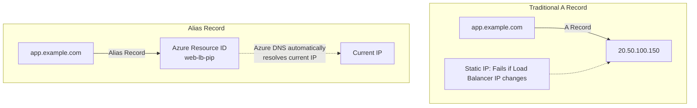
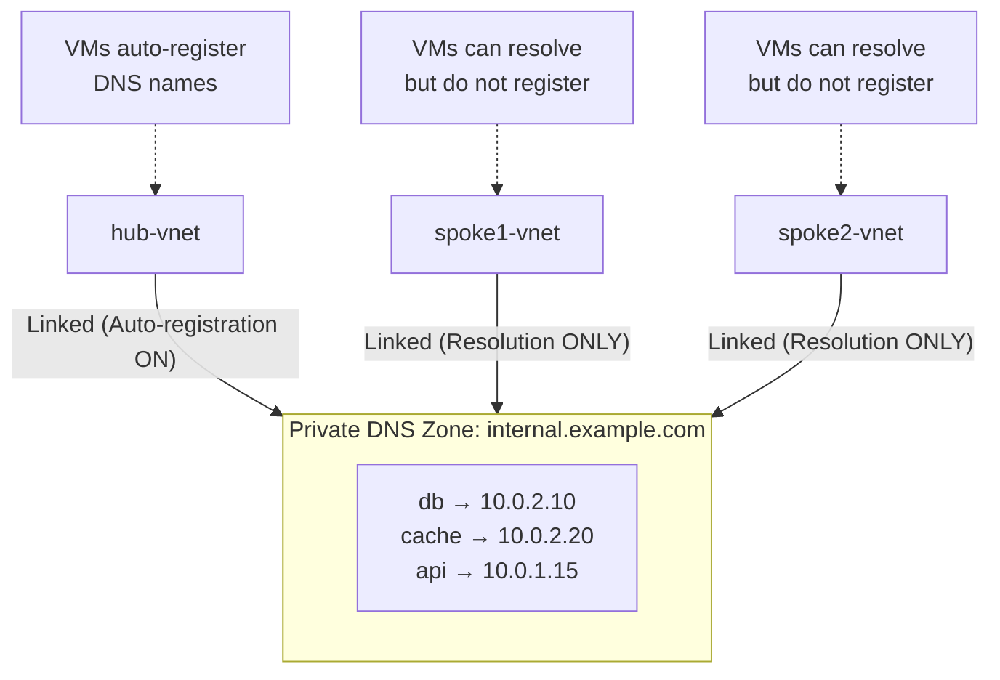
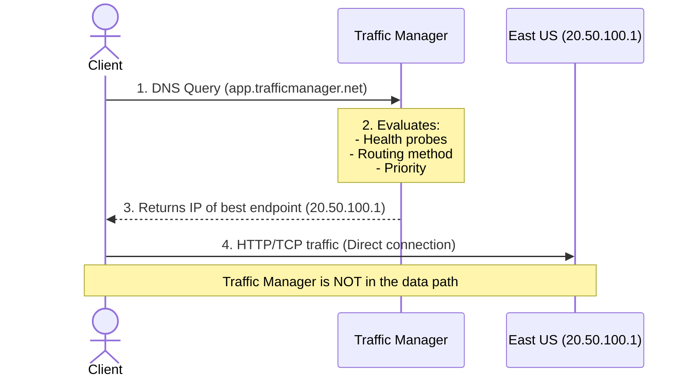
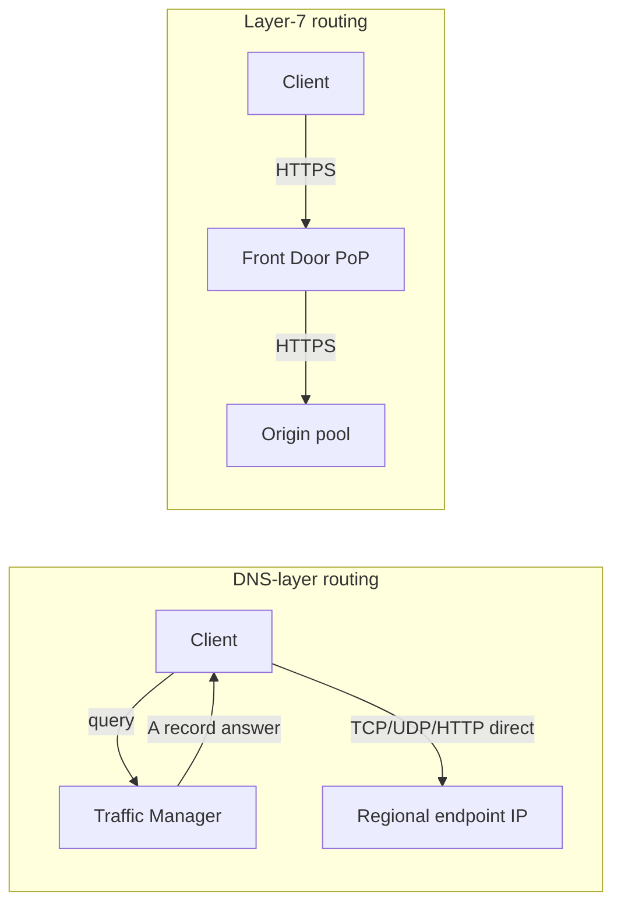
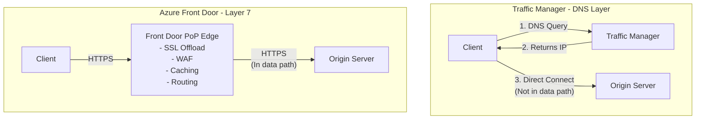
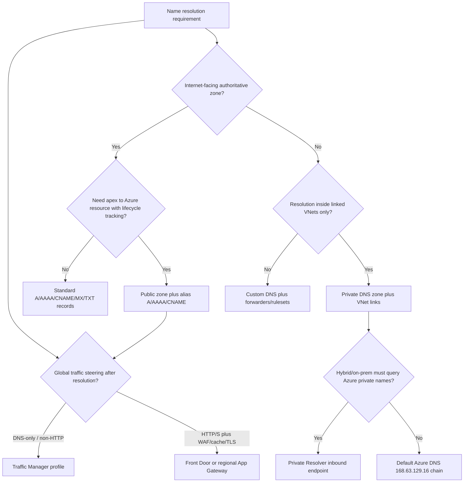

**Complexity**: `[MEDIUM]` | **Time to Complete**: 1.5h | **Prerequisites**: Module 3.2 (Virtual Networks)

## What You'll Be Able to Do

After completing this module, you will be able to:

- **Configure Azure DNS zones with record sets for public-facing and private VNet-linked name resolution**
- **Implement Traffic Manager profiles with priority, weighted, and performance routing for multi-region failover**
- **Deploy Azure Private DNS zones for VNet-internal service discovery across peered virtual networks**
- **Design DNS architectures combining Azure DNS, Traffic Manager, and Front Door for global traffic distribution**

---

## Why This Module Matters

A multi-region application can still fail hard if DNS points directly to one regional IP and there is no traffic-routing layer to detect failures and steer new users to a healthy region.

DNS is the invisible infrastructure that underpins every internet interaction. When it works, nobody thinks about it. When it fails, nothing works. In Azure, DNS is not just about resolving names to IP addresses---it is a critical component of high availability, traffic routing, and hybrid cloud architecture. Azure DNS handles public-facing domain resolution, Private DNS Zones handle name resolution within your virtual networks, and Traffic Manager uses DNS-based routing to distribute traffic across regions and endpoints.

Hypothetical scenario: your platform team ships a flawless multi-region deployment, but the public zone still points `app.example.com` at a single static A record tied to last month's load balancer IP. A routine redeploy changes that IP, certificate renewals break for users with cached answers, and failover never triggers because nothing monitors endpoint health at the DNS layer. The application code was fine; the name layer was the single point of failure.

In this module, you will learn how Azure DNS zones work for both public and private scenarios, how Traffic Manager routes traffic using different algorithms, and how Azure Front Door provides a modern alternative with layer-7 capabilities. By the end, you will understand how to design a DNS architecture that keeps your applications reachable even when entire regions fail.

> **The DNS Analogy**
>
> Think of DNS as the phone book and routing policy of the internet. A public zone is the published directory everyone can look up. A private zone is the internal extension list inside your building. Traffic Manager is the receptionist who answers "which office should I connect you to?" based on who is available. Front Door is the security desk that inspects every visitor, terminates their credentials at the lobby, and only then forwards them to the right floor.

---

## Azure DNS: Public Zones

Azure DNS allows you to host your DNS zones on [Azure's global anycast network of name servers](https://learn.microsoft.com/en-us/azure/dns/dns-faq). When you host your zone in Azure DNS, your DNS records are served from Microsoft's worldwide network of DNS servers, providing low latency and high availability.

### How DNS Zones Work

A DNS zone is a container for all the DNS records for a specific domain. When you create a zone for `example.com` in Azure DNS, [Azure assigns four name servers](https://learn.microsoft.com/en-us/azure/dns/dns-delegate-domain-azure-dns) (in the format `ns1-XX.azure-dns.com`, `ns2-XX.azure-dns.net`, `ns3-XX.azure-dns.org`, `ns4-XX.azure-dns.info`).

Public zones in Azure DNS are authoritative only for names you delegate to them. Azure does not automatically become registrar and DNS host in one step: registration at a registrar and hosting at Azure DNS are two relationships that must meet at the NS records. Many production incidents trace to a perfectly valid zone in Azure that the public internet never queries because the registrar still points at a previous provider's name servers from a migration that stopped halfway.

Azure DNS uses anycast so the same four names resolve to different physical servers worldwide, minimizing latency for global clients. You manage record sets through the portal, ARM templates, Bicep, or `az network dns` commands; all paths converge on the same authoritative data that resolvers fetch when NS delegation is correct.

```bash
# Create a DNS zone
az network dns zone create \
  --resource-group myRG \
  --name example.com

# View the assigned name servers
az network dns zone show \
  --resource-group myRG \
  --name example.com \
  --query nameServers -o tsv
```

After creating the zone, you must [update your domain registrar's NS records to point to the Azure name servers](https://learn.microsoft.com/en-us/azure/dns/dns-delegate-domain-azure-dns). Until you do this, DNS queries for your domain will not reach Azure.

### Delegation and the NS Record Chain

Delegation is the handoff of authority from a parent zone to a child zone. When you register `example.com` with a registrar, that registrar typically publishes NS records that tell the global DNS system who is authoritative for your domain. Creating a zone in Azure DNS does not automatically change the internet's view of your domain. Azure assigns four name servers to your zone, but the registrar must publish those four names as the NS record set at the zone apex.

The NS and SOA record sets at the zone apex are [created automatically when you create a public zone](https://learn.microsoft.com/en-us/azure/dns/dns-zones-records). You cannot delete them separately, though you can add additional name servers for co-hosting scenarios where two DNS providers serve the same zone. Child zones use separate NS record sets that you manage freely, which is how you delegate `dev.example.com` to a different DNS provider while keeping `example.com` in Azure DNS.

Verification should happen from outside your own resolver cache. Use `nslookup -type=NS example.com` against a public resolver, or query one of the Azure-assigned name servers directly. Propagation at the registrar can take minutes to hours depending on the registrar's workflow and any prior TTL on the old NS records.

### Time-to-Live Tradeoffs

Every record set carries a TTL value that tells resolvers how long they may cache the answer. [Azure DNS changes propagate to Azure's authoritative servers within about 60 seconds](https://learn.microsoft.com/en-us/azure/dns/dns-faq), but clients and intermediate resolvers honor TTL independently. A TTL of 3600 seconds means a laptop that resolved your app five minutes before an outage may keep using a stale IP for nearly an hour.

Lower TTL increases query volume and therefore cost, but it shrinks the blast radius during failover. Traffic Manager profiles expose their own DNS TTL setting, which can range from 0 seconds up to the RFC maximum. For production failover designs, teams commonly choose 10 to 30 seconds on Traffic Manager and alias-backed apex records rather than the 300-second default that feels safe during steady state.

The right TTL is a compromise between stability and agility. Steady-state marketing sites with rarely changing backends can tolerate higher TTL. Active/active or priority-based failover architectures should treat TTL as part of the recovery time objective, not as an afterthought configured once during initial setup.

Resolvers at edge internet service providers sometimes enforce minimum TTL floors, caching responses longer than upstream authoritative zones specify. Network engineers must account for these non-compliant caching resolvers by initiating DNS record changes well before planned infrastructure maintenance, establishing overlapping multi-region availability so traffic shifts gracefully even when cached answers linger.

### Common Record Types

```bash
# A record: Maps a name to an IPv4 address
az network dns record-set a add-record \
  --resource-group myRG \
  --zone-name example.com \
  --record-set-name www \
  --ipv4-address 20.50.100.150

# AAAA record: Maps a name to an IPv6 address
az network dns record-set aaaa add-record \
  --resource-group myRG \
  --zone-name example.com \
  --record-set-name www \
  --ipv6-address 2603:1030:800:5::1

# CNAME record: Maps a name to another name (alias)
az network dns record-set cname set-record \
  --resource-group myRG \
  --zone-name example.com \
  --record-set-name blog \
  --cname blog.wordpress.com

# MX record: Mail exchange
az network dns record-set mx add-record \
  --resource-group myRG \
  --zone-name example.com \
  --record-set-name "@" \
  --exchange mail.example.com \
  --preference 10

# TXT record: Arbitrary text (SPF, DKIM, verification)
az network dns record-set txt add-record \
  --resource-group myRG \
  --zone-name example.com \
  --record-set-name "@" \
  --value "v=spf1 include:spf.protection.outlook.com -all"

# List all records in a zone
az network dns record-set list \
  --resource-group myRG \
  --zone-name example.com -o table
```

[Azure DNS supports the common public record types](https://learn.microsoft.com/en-us/azure/dns/dns-zones-records): A, AAAA, CNAME, MX, TXT, SRV, CAA, NS, PTR, and SOA. SPF records are represented as TXT records. Understanding when to use each type prevents subtle production failures that no amount of application tuning can fix.

**A and AAAA** map hostnames to IPv4 and IPv6 addresses. They are the default choice for pointing `www` or `api` subdomains at a known IP. The weakness is lifecycle: if the IP is tied to a resource that Azure may replace, you must update the record manually unless you use an alias record instead.

**CNAME** maps one name to another canonical name. It works well for subdomains like `blog.example.com` pointing at a SaaS provider's hostname. RFC 1034 forbids CNAME at the zone apex, which is why teams hit errors when they try to point naked `example.com` at an external hostname.

**MX** directs email to mail exchangers with a preference value. Lower preference numbers are tried first. Email deliverability depends on accurate MX and TXT records for SPF and DKIM, so DNS changes here affect security tooling as much as user-facing web traffic.

**TXT** holds arbitrary text used for domain verification, SPF, DKIM, and DMARC policies. Multiple TXT records can coexist on the same name, which is why certificate authorities and Microsoft 365 both ask you to add verification strings without removing existing ones.

**SRV** encodes service location with priority, weight, port, and target. In Azure DNS the service and protocol belong in the record set name, such as `_sip._tcp` for SIP over TCP. SRV is common for federated identity, VoIP, and some Kubernetes service discovery patterns that expect DNS-based lookup.

**CAA** restricts which certificate authorities may issue certificates for your domain or subdomain. Publishing `issue "digicert.com"` on `example.com` tells compliant CAs they should not mint certificates unless authorized. CAA is a cheap defense-in-depth control against mis-issued public certificates.

**NS** at the zone apex is managed by Azure for your primary delegation. Additional NS records at the apex support split authority across providers. NS records on child names delegate subdomains, such as pointing `partners.example.com` at a partner's name servers.

**SOA** is created automatically at the zone apex and stores serial numbers and timing parameters resolvers use when refreshing zone data. You can adjust fields like refresh and expire intervals, but you cannot delete the SOA record set independently of the zone.

```bash
# CAA record: authorize a specific CA to issue certificates
az network dns record-set caa add-record \
  --resource-group myRG \
  --zone-name example.com \
  --record-set-name "@" \
  --flags 0 \
  --tag issue \
  --value "digicert.com"

# SRV record: locate a SIP service
az network dns record-set srv add-record \
  --resource-group myRG \
  --zone-name example.com \
  --record-set-name _sip._tcp \
  --priority 10 \
  --weight 5 \
  --port 5060 \
  --target sip.example.com
```

### Alias Records

Azure DNS supports **alias records**, which [point directly to an Azure resource](https://learn.microsoft.com/en-us/azure/dns/dns-alias) (like a Load Balancer, Traffic Manager profile, or CDN endpoint) instead of an IP address. The key advantage: when the resource's IP changes, the DNS record updates automatically.

Alias record sets are supported for **A**, **AAAA**, and **CNAME** types. Supported targets include [Azure public IP addresses, Traffic Manager profiles, Azure CDN endpoints, and Azure Front Door profiles](https://learn.microsoft.com/en-us/azure/dns/dns-alias). There is no additional charge for alias records themselves; you pay normal zone and query costs. Alias records also provide **lifecycle tracking**: if the target resource is deleted, the alias stops resolving correctly rather than silently pointing at a reassigned IP that now belongs to someone else.

**Pause and predict:** Why does standard DNS prohibit placing a CNAME record at the zone apex such as contoso.com, and how does Azure DNS resolve queries when you configure an Alias record pointing to an Azure resource at that apex?

<details>
<summary>Check your prediction</summary>

Under RFC 1034, a CNAME record cannot coexist with any other record set for the same label, but a zone apex must always host SOA and authoritative NS records. Azure DNS overcomes this limitation by implementing Alias records as qualified A or AAAA record sets rather than CNAME redirections. During recursive resolution, Azure DNS follows the referenced resource ID internally and returns direct A or AAAA address answers to the requesting client.
</details>

Authoritative alias evaluation simplifies root domain hosting for global platforms and content delivery networks. When enterprise applications expose high-traffic entry points at the naked domain, operators still have to pick a supported Azure target and keep that resource alive. Lifecycle tracking then matters more than a spreadsheet of numeric addresses, because a deleted public IP should fail closed rather than resolve to a stranger's allocation.

**Alias to Public IP** is the straightforward case for load balancers and application gateways with standard public IPs. When Azure replaces the underlying IP, the alias tracks the resource ID rather than a numeric literal you pasted into a spreadsheet.

**Alias to Traffic Manager** lets the zone apex participate in global routing. You can point `contoso.com` at a Traffic Manager profile instead of chaining CNAME indirection. When aliasing A or AAAA directly to Traffic Manager, [the profile must use external endpoints with static IP addresses](https://learn.microsoft.com/en-us/azure/dns/dns-faq), not FQDN-only external targets, because the alias resolution path materializes concrete addresses for clients.

**Alias to Azure CDN or Front Door** supports branded naked domains for static sites and global entry points. Static websites on storage plus CDN often need apex support so users can type `wideworldimports.com` without `www`. Front Door custom domains similarly benefit from apex alias records that track the Front Door profile rather than a volatile edge address you copied manually.

```bash
# Create an alias record pointing to a Load Balancer public IP
LB_PIP_ID=$(az network public-ip show -g myRG -n web-lb-pip --query id -o tsv)

az network dns record-set a create \
  --resource-group myRG \
  --zone-name example.com \
  --name app \
  --target-resource "$LB_PIP_ID"

# Alias apex to a Traffic Manager profile
TM_PROFILE_ID=$(az network traffic-manager profile show -g myRG -n app-tm-profile --query id -o tsv)

az network dns record-set a create \
  --resource-group myRG \
  --zone-name example.com \
  --name "@" \
  --target-resource "$TM_PROFILE_ID"

# Alias to an Azure Front Door profile (Standard/Premium)
AFD_PROFILE_ID=$(az afd profile show -g myRG -n app-frontdoor --query id -o tsv)

az network dns record-set a create \
  --resource-group myRG \
  --zone-name example.com \
  --name "@" \
  --target-resource "$AFD_PROFILE_ID"
```



---

## Azure Private DNS Zones

Private DNS Zones [provide name resolution within your Virtual Networks without exposing records to the public internet](https://learn.microsoft.com/en-us/azure/dns/private-dns-privatednszone). This is essential for internal service discovery---your web servers need to find your database by name (`db.internal.example.com`), not by memorizing IP addresses that change when you redeploy.

Private zones implement **split-horizon DNS** when paired with a public zone for the same brand domain. Public resolvers answer `api.example.com` with internet-facing addresses, while linked VNets resolve `db.internal.example.com` or private-link names only inside Azure. The same logical application can therefore publish different answers depending on where the query originates, which is how zero-trust designs keep administrative interfaces off the public internet without renaming everything.

### Resolution Links vs Registration Links

Every VNet link to a private zone is either **resolution-only** or **registration-enabled**. Resolution links allow VMs in that VNet to query records in the zone. Registration links additionally create and maintain A records for VMs based on their Azure resource names.

A VNet can have auto-registration enabled on **only one** private DNS zone; a single zone can accept auto-registration from many VNets. Hub VNets that host shared infrastructure commonly enable registration so databases and middleware register automatically. Spoke VNets that run stateless application tiers typically use resolution-only links so they can look up shared services without polluting the zone with ephemeral pod-like names.

When a VNet uses **Azure-provided DNS** (the default), [linked private zones are consulted before Azure-provided recursive resolution](https://learn.microsoft.com/en-us/azure/dns/private-dns-privatednszone). If you configure **custom DNS servers** on the VNet or NIC, that automatic chain stops. Custom DNS must forward queries for private zones to Azure, usually via conditional forwarders to **168.63.129.16** or via Azure DNS Private Resolver inbound endpoints.

### Azure-Provided DNS and 168.63.129.16

Before Private Resolver existed, hybrid designs relied on the platform recursive resolver at **[168.63.129.16](https://learn.microsoft.com/en-us/azure/virtual-network/what-is-ip-address-168-63-129-16)**. This virtual IP is stable across Azure and provides filtered name resolution for Azure-provided hostnames and linked private zones when the VNet uses default DNS settings.

Custom DNS servers on domain controllers or Linux BIND instances must still forward Azure-specific names to 168.63.129.16. Without that forwarder, VMs lose the ability to resolve peer VM hostnames, private link FQDNs, and other platform-managed names even though your corporate AD zones work fine. VPN and ExpressRoute designs that inject custom DNS at the VNet level should treat 168.63.129.16 as a required forwarder, not an optional optimization.

168.63.129.16 is not a substitute for cross-network hybrid resolution by itself. It answers queries from Azure workloads, but on-premises DNS knows nothing about your private zones unless you add conditional forwarding or deploy Private Resolver inbound endpoints that on-premises can target.

### Azure DNS Private Resolver

[Azure DNS Private Resolver](https://learn.microsoft.com/en-us/azure/dns/dns-private-resolver-overview) is a managed hybrid DNS bridge. It replaces fragile VM-based DNS forwarders with dedicated inbound and outbound endpoints deployed into delegated subnets in your VNet.

**Inbound endpoints** receive DNS queries from on-premises or other networks over VPN or ExpressRoute. You point on-premises conditional forwarders at the inbound IP addresses inside your private address space. Those queries can then resolve Azure private zones linked to the hub VNet, including auto-registered VM names and private endpoint records.

**Outbound endpoints** send queries from Azure to external DNS systems. You attach **DNS forwarding rulesets** that map domain suffixes to target DNS servers, such as forwarding `corp.contoso.com` to on-premises Active Directory DNS or forwarding `malware.example` to a protective DNS service.

Architecting Private Resolver requires dedicating specific subnets with delegation to the Microsoft.Network/dnsResolvers service. Production landing zones typically deploy inbound endpoints across multiple availability zones within the hub virtual network to ensure resilient hybrid resolution during datacenter incidents. Because each inbound endpoint provides a static private IP address reachable across ExpressRoute or VPN gateways, on-premises conditional forwarders maintain uninterrupted connectivity without depending on software-based forwarder virtual machines that require OS patching and lifecycle management.

```bash
# Create a Private Resolver in the hub VNet (subnets must be delegated to Microsoft.Network/dnsResolvers)
az dns-resolver create \
  --resource-group myRG \
  --name hub-resolver \
  --id "/subscriptions/<sub>/resourceGroups/myRG/providers/Microsoft.Network/virtualNetworks/hub-vnet" \
  --location eastus

# Inbound endpoint for on-premises to query Azure private zones
az dns-resolver inbound-endpoint create \
  --resource-group myRG \
  --dns-resolver-name hub-resolver \
  --name inbound \
  --ip-configurations '[{"subnet":{"id":"/subscriptions/.../subnets/snet-inbound"},"privateIpAddress":"10.0.0.4"}]'

# Outbound endpoint plus ruleset for conditional forwarding to on-premises
az dns-resolver outbound-endpoint create \
  --resource-group myRG \
  --dns-resolver-name hub-resolver \
  --name outbound \
  --ip-configurations '[{"subnet":{"id":"/subscriptions/.../subnets/snet-outbound"},"privateIpAddress":"10.0.0.20"}]'

az dns-resolver forwarding-ruleset create \
  --resource-group myRG \
  --name onprem-rules \
  --dns-resolver-outbound-endpoints "[$(az dns-resolver outbound-endpoint show -g myRG --dns-resolver-name hub-resolver -n outbound --query id -o tsv)]" \
  --location eastus

az dns-resolver forwarding-rule create \
  --resource-group myRG \
  --ruleset-name onprem-rules \
  --name corp-forward \
  --domain-name corp.contoso.com. \
  --target-dns-servers '[{"ipAddress":"192.168.1.2","port":53}]'

# Link ruleset to spoke VNet so VMs forward corp.contoso.com via outbound endpoint
az dns-resolver vnet-link create \
  --resource-group myRG \
  --ruleset-name onprem-rules \
  --name spoke1-link \
  --id "/subscriptions/<sub>/resourceGroups/myRG/providers/Microsoft.Network/virtualNetworks/spoke1-vnet"
```

Each resolver supports up to five inbound and five outbound endpoints per instance, with [10,000 queries per second per endpoint](https://learn.microsoft.com/en-us/azure/dns/dns-private-resolver-overview) under documented limits. Rulesets can hold up to 1,000 forwarding rules and link to hundreds of VNets in the same region, which makes hub-and-spoke designs practical without maintaining BIND clusters.

Compare Private Resolver against legacy VM forwarders using total cost of ownership, not just hourly compute. Two small DNS VMs plus patching windows plus monitoring often exceed a single resolver pair in operational hours, even before counting the incident when a VM forwarder disk fills during a log spike. Resolver subnets must be dedicated `/28` or larger delegations with no other workloads; planning IPAM early avoids painful renumbering when hybrid DNS lands late in a migration program.

Centralized DNS architecture guidance from Microsoft recommends placing resolver infrastructure in hub VNets that already host VPN or ExpressRoute gateways, then linking rulesets to spokes that need on-premises suffix resolution. Document which teams may create forwarding rules; unconstrained ruleset edits become shadow IT paths that bypass security filtering on port 53.

### How Private DNS Zones Work



```bash
# Create a private DNS zone
az network private-dns zone create \
  --resource-group myRG \
  --name internal.example.com

# Link the private DNS zone to a VNet (with auto-registration)
az network private-dns link vnet create \
  --resource-group myRG \
  --zone-name internal.example.com \
  --name hub-link \
  --virtual-network hub-vnet \
  --registration-enabled true    # VMs in this VNet auto-register

# Link to spoke VNets (resolution only, no auto-registration)
az network private-dns link vnet create \
  --resource-group myRG \
  --zone-name internal.example.com \
  --name spoke1-link \
  --virtual-network spoke1-vnet \
  --registration-enabled false

# Manually add a record
az network private-dns record-set a add-record \
  --resource-group myRG \
  --zone-name internal.example.com \
  --record-set-name db \
  --ipv4-address 10.0.2.10

# List records in the private zone
az network private-dns record-set list \
  --resource-group myRG \
  --zone-name internal.example.com -o table
```

**Auto-registration** is a powerful feature: when enabled on a VNet link, [every VM created in that VNet automatically gets a DNS record in the private zone. When the VM is deleted, the record is automatically removed](https://learn.microsoft.com/en-us/azure/dns/private-dns-autoregistration). This eliminates the need to manually manage internal DNS records.

**Pause and predict:** You deploy a virtual machine named database-primary in a virtual network linked to an Azure Private DNS Zone with auto-registration enabled. An engineer later connects directly to the guest operating system and manually reconfigures a new static IP address on the local network adapter. What happens to the corresponding A record in the Private DNS Zone?

<details>
<summary>Check your prediction</summary>

Auto-registration synchronizes exclusively with the Azure network interface resource tracked by the Azure control plane, rather than inspecting the internal configuration of the guest operating system. The private DNS A record does not update and continues resolving to the IP address defined on the Azure NIC, creating name resolution drift until the Azure resource is updated.
</details>

Peered VNets do not automatically inherit private zone links. Each spoke that must resolve `internal.example.com` needs its own link, even when routing to the hub is already established. Teams often configure connectivity correctly at the IP layer but forget DNS is a separate control plane that only sees linked VNets.

Wildcard records are supported in private zones for most record types, which helps platform teams publish `*.apps.internal.example.com` patterns for dynamically named services. NS and SOA wildcards remain constrained because apex authority records follow different rules.

### Private DNS and Private Endpoints

Private Endpoints are a mechanism to access Azure PaaS services (Storage, SQL, Key Vault, etc.) over a private IP address in your VNet instead of over the public internet. When you create a private endpoint, you need a Private DNS Zone to resolve the service's FQDN to the private IP.

```bash
# Example: Private endpoint for a storage account
# Step 1: Create the private endpoint
az network private-endpoint create \
  --resource-group myRG \
  --name storage-pe \
  --vnet-name hub-vnet \
  --subnet private-endpoints \
  --private-connection-resource-id "$STORAGE_ACCOUNT_ID" \
  --group-id blob \
  --connection-name storage-connection

# Step 2: Create the private DNS zone for blob storage
az network private-dns zone create \
  --resource-group myRG \
  --name privatelink.blob.core.windows.net

# Step 3: Link the DNS zone to your VNet
az network private-dns link vnet create \
  --resource-group myRG \
  --zone-name privatelink.blob.core.windows.net \
  --name hub-dns-link \
  --virtual-network hub-vnet \
  --registration-enabled false

# Step 4: Create DNS zone group (auto-manages DNS records)
az network private-endpoint dns-zone-group create \
  --resource-group myRG \
  --endpoint-name storage-pe \
  --name default \
  --private-dns-zone "privatelink.blob.core.windows.net" \
  --zone-name blob
```

After this setup, when a VM in hub-vnet resolves `yourstorage.blob.core.windows.net`, [the response is the private IP of the private endpoint (e.g., 10.0.5.4) instead of the public IP](https://learn.microsoft.com/en-us/azure/private-link/private-endpoint-dns). [Traffic stays entirely within Azure's backbone](https://learn.microsoft.com/en-us/azure/private-link/private-link-overview).

Microsoft publishes [recommended private zone names per service](https://learn.microsoft.com/en-us/azure/private-link/private-endpoint-dns) (`privatelink.blob.core.windows.net`, `privatelink.database.windows.net`, and others). Using nonstandard zone names works technically but breaks copy-paste runbooks and automation that assume the official suffix. DNS zone groups on the private endpoint create the correct A record automatically and refresh it when the endpoint changes, which is preferable to manual A records that orphan when endpoints are rebuilt.

Split-horizon effects appear during troubleshooting: a developer's laptop on the public internet resolves the storage FQDN to a public address, while a VM in the linked VNet resolves the same FQDN to `10.x.x.x`. Always test from the same network path production uses, not from a corporate laptop outside Azure.

---

## Azure Traffic Manager: DNS-Based Global Load Balancing

[Traffic Manager is a DNS-based traffic routing service that distributes traffic across global endpoints](https://learn.microsoft.com/en-us/azure/traffic-manager/traffic-manager-overview). It operates at the DNS / application layer---when a client resolves your domain, Traffic Manager returns the IP of the most appropriate endpoint based on the routing method you configure.

### How Traffic Manager Works



**Critical insight**: Traffic Manager is **not** a proxy or a load balancer. It only participates in the DNS resolution step. After that, [the client connects directly to the endpoint](https://learn.microsoft.com/en-us/azure/traffic-manager/traffic-manager-how-it-works). This means Traffic Manager cannot see HTTP headers, cannot terminate SSL, and cannot cache content. For those features, you need Azure Front Door.

### [Routing Methods](https://learn.microsoft.com/en-us/azure/traffic-manager/traffic-manager-routing-methods)

| Method | How It Routes | Best For |
| :--- | :--- | :--- |
| **Priority** | Always sends to highest-priority healthy endpoint | Active/passive failover |
| **Weighted** | Distributes traffic by weight (e.g., 80/20) | Canary deployments, A/B testing |
| **Performance** | Routes to the closest endpoint (by latency) | Global apps needing low latency |
| **Geographic** | Routes based on the client's geographic location | Data sovereignty, regional compliance |
| **MultiValue** | Returns multiple healthy IPs (client chooses) | Increase availability with client-side retry |
| **Subnet** | Routes based on client's source IP range | VIP customers, partner-specific endpoints |

Each routing method encodes a different operations contract. **Priority** is the classic disaster recovery pattern: one hot region, one or more warm standbys. Operations teams tune probe intervals knowing failover time includes both detection and cached TTL on clients. **Weighted** distributes probabilistically, which suits canaries where you want roughly 10% of DNS answers to point at a new build without pulling a lever on every client individually.

**Pause and predict:** An enterprise uses Traffic Manager with Geographic routing to meet regulatory compliance, directing European users to endpoints in Frankfurt and United States users to Virginia. If an infrastructure outage takes all Virginia endpoints offline while Frankfurt remains fully operational, what happens to DNS queries submitted by United States users?

<details>
<summary>Check your prediction</summary>

United States queries do not automatically route to Frankfurt. Traffic Manager Geographic routing operates as a strict territorial policy map rather than an automatic multi-region Priority failover system. When all endpoints within a mapped geographic scope fail health checks, Traffic Manager returns a negative DNS response (NODATA) unless an explicit fallback endpoint or nested failover profile has been provisioned.
</details>

**Performance** routing uses latency measurements between probe vantage points and endpoints to approximate the closest destination for each client geography. It references Microsoft's global internet latency intelligence network rather than calculating real-time round-trip pings for individual users, providing responsive steering for consumer applications across diverse peering links.

**Geographic** routing directs DNS queries based on the geographical origin of the DNS lookup, mapping clients hierarchically from World down to specific countries or regional subdivisions. This method is primarily chosen to satisfy legal governance frameworks and ensure content customization by jurisdiction rather than maximizing service uptime.

**MultiValue** returns multiple healthy IPs simultaneously, pushing retry decisions to the client stack. That helps some custom clients but confuses others that pick only the first answer. **Subnet** routing supports partner allowlists or migration windows where specific CIDR blocks should always reach a legacy endpoint until decommission day.

Health probes originate from [published Azure Traffic Manager address ranges](https://learn.microsoft.com/en-us/azure/traffic-manager/traffic-manager-monitoring). Backend NSGs must allow those sources on the probe port and path. A probe that receives HTTP 403 because a WAF blocks Microsoft probe IPs looks identical to a dead server from Traffic Manager's perspective.

Production resilience engineering requires separating residency boundaries from availability contracts during architectural planning. Engineering teams frequently deploy nested profiles where an outer geographic policy delegates to inner regional failover sets, or define dedicated overflow endpoints that activate only when compliance policies explicitly permit cross-border degradation. Runbooks must clearly document these boundary behaviors to prevent operational confusion during regional service incidents.

Nested profiles let platform teams compose policies: an outer Geographic profile sends EU queries to an inner Priority profile with two EU regions, while US queries hit a separate inner profile. [Nested profiles do not double-charge DNS queries](https://learn.microsoft.com/en-us/azure/traffic-manager/traffic-manager-faqs) at both parent and child levels for the same lookup, though health checks still accrue per monitored endpoint in each profile.

```bash
# Create a Traffic Manager profile with Priority routing
az network traffic-manager profile create \
  --resource-group myRG \
  --name app-tm-profile \
  --routing-method Priority \
  --unique-dns-name app-kubedojo \
  --ttl 30 \
  --protocol HTTPS \
  --port 443 \
  --path "/health" \
  --interval 10 \
  --timeout 5 \
  --max-failures 3

# Add primary endpoint (East US)
az network traffic-manager endpoint create \
  --resource-group myRG \
  --profile-name app-tm-profile \
  --name eastus-endpoint \
  --type azureEndpoints \
  --target-resource-id "$EASTUS_PIP_ID" \
  --priority 1 \
  --endpoint-status Enabled

# Add secondary endpoint (West Europe)
az network traffic-manager endpoint create \
  --resource-group myRG \
  --profile-name app-tm-profile \
  --name westeurope-endpoint \
  --type azureEndpoints \
  --target-resource-id "$WESTEUROPE_PIP_ID" \
  --priority 2 \
  --endpoint-status Enabled

# Check endpoint health status
az network traffic-manager endpoint list \
  --resource-group myRG \
  --profile-name app-tm-profile \
  --type azureEndpoints \
  --query '[].{Name:name, Status:endpointStatus, Monitor:endpointMonitorStatus, Priority:priority}' -o table

# Test DNS resolution
nslookup app-kubedojo.trafficmanager.net
```

### Traffic Manager with Weighted Routing (Canary Deployments)

```bash
# Create a profile for canary deployment
az network traffic-manager profile create \
  --resource-group myRG \
  --name canary-tm-profile \
  --routing-method Weighted \
  --unique-dns-name canary-kubedojo \
  --ttl 10 \
  --protocol HTTPS \
  --port 443 \
  --path "/health"

# Stable version gets 90% of traffic
az network traffic-manager endpoint create \
  --resource-group myRG \
  --profile-name canary-tm-profile \
  --name stable \
  --type externalEndpoints \
  --target stable.example.com \
  --weight 90

# Canary version gets 10% of traffic
az network traffic-manager endpoint create \
  --resource-group myRG \
  --profile-name canary-tm-profile \
  --name canary \
  --type externalEndpoints \
  --target canary.example.com \
  --weight 10
```

**Scenario**: With DNS-based regional failover, new DNS queries can be steered toward a healthier region when probes detect an endpoint problem, which can reduce downtime while the primary region recovers.

### DNS Routing vs Layer-7 Load Balancing

The boundary between DNS-based routing and application-layer load balancing is where many global architectures go wrong. **Traffic Manager** participates only in name resolution. It returns an IP address (or multiple addresses for MultiValue routing) and then exits the path. It cannot inspect HTTP paths, terminate TLS, cache static assets, or block SQL injection attempts because it never sees application bytes.

**Azure Front Door** and **Application Gateway** sit in the data path for HTTP or HTTPS. Front Door is global; Application Gateway is regional but offers rich Layer-7 rules inside a VNet. Choose Traffic Manager when you need cheap protocol-agnostic steering to public IPs or external hostnames, especially for non-HTTP services or simple active/passive failover. Choose Front Door when user experience, security inspection, and edge caching matter more than minimizing DNS query bills.

**Pause and predict:** You configure Traffic Manager Priority routing between a primary datacenter in East US and a backup in West US, setting the profile DNS time-to-live to 300 seconds. If an infrastructure incident causes health probes to mark East US offline in twenty seconds, when do active client devices actually complete their transition to West US?

<details>
<summary>Check your prediction</summary>

Clients and intermediate recursive resolvers continue routing traffic to the failed East US address until their locally cached DNS records expire at the end of the 300-second TTL window. Traffic Manager probe detection only alters the records supplied to subsequent DNS queries, meaning active client failover is governed by DNS caching intervals rather than health probe detection speed alone.
</details>

Hypothetical scenario: An engineering organization compared staging cutovers with production promotion during a planned datacenter migration and found the two environments used different Traffic Manager profile templates. Post-incident analysis prompted the infrastructure team to establish runbook automation that rehearses the same profile settings twelve hours before scheduled regional operations, complemented by Anycast front-end proxies for zero-downtime failover.

A common layered pattern uses alias records at the apex pointing to Front Door for web traffic, while internal APIs behind Traffic Manager Performance routing connect game clients or IoT devices that speak custom TCP protocols Front Door cannot proxy. Another pattern nests Traffic Manager beneath Front Door only when you understand double billing and double TTL effects; simpler designs pick one routing layer as the source of truth.

Application Gateway remains the right regional choice when backends live on private IPs inside a VNet and you need WAF plus path-based routing without exposing origins publicly. DNS still matters because public clients must resolve a name that reaches the gateway's frontend, but the gateway performs health checks and request routing after the connection starts.



When Geographic routing sends EU users to Frankfurt and US users to Virginia, remember that Geographic policies enforce placement; they do not automatically fail over across geography unless you configure nested profiles or overlapping endpoints. A total Virginia outage does not silently redirect US users to Frankfurt unless your design explicitly allows that overflow path.

---

## Azure Front Door: The Modern Alternative

Azure Front Door is a global, scalable entry point for web applications. Unlike Traffic Manager (DNS only), Front Door operates at Layer 7 (HTTP/HTTPS) and sits in the data path. It acts as a reverse proxy, [providing SSL termination, caching, WAF, and intelligent routing](https://learn.microsoft.com/en-us/azure/networking/load-balancer-content-delivery/load-balancing-content-delivery-overview).

Front Door terminates client TLS at a nearby Point of Presence, which means certificate management shifts to the edge profile rather than every origin region. Origins can remain private inside VNets when paired with Private Link or secured public hostnames, while clients only ever see the Front Door hostname and certificate. Session affinity cookies, URL path patterns, and custom routing rules operate on HTTP semantics Traffic Manager cannot see.

Caching static assets at the edge reduces origin load and latency for repeat visitors. WAF policies inspect request bodies and query strings before traffic reaches application code, which closes the gap when Traffic Manager would happily send clients to a compromised but still TCP-healthy origin. The tradeoff is cost and complexity: you pay for Front Door requests and egress, and misconfigured origin host headers or health probes can mark healthy Kubernetes ingress as down even when pods respond correctly inside the cluster.

Application Gateway fills a complementary regional niche. It is not global like Front Door, but it excels at VNet-local Layer-7 routing to private backends, integrated WAF, and AKS ingress controllers that need direct regional control. A pattern for large enterprises uses Front Door as the global front door and Application Gateway per region as the regional reverse proxy behind it, with DNS alias records pointing public names at Front Door rather than at regional IPs directly.



| Feature | Traffic Manager | Azure Front Door |
| :--- | :--- | :--- |
| **Layer** | DNS (returns IP) | HTTP/HTTPS (reverse proxy) |
| **In data path** | No | Yes |
| **SSL termination** | No | Yes |
| **Caching** | No | Yes (edge caching) |
| **WAF** | No | Yes (built-in) |
| **URL path routing** | No | Yes |
| **Session affinity** | No (DNS round-robin) | Yes (cookie-based) |
| **Health probes** | TCP, HTTP, HTTPS | HTTP, HTTPS (with custom headers) |
| **Protocol support** | Any (TCP/UDP/HTTP) | HTTP/HTTPS only |
| **Cost** | Lower-cost DNS-based pricing; see current Azure pricing | Higher base fees plus request and data charges; see current Azure pricing |
| **Failover speed** | Depends on DNS caching and health-check settings | Typically faster application-layer failover with active health probes |

```bash
# Create an Azure Front Door profile (Standard tier)
az afd profile create \
  --resource-group myRG \
  --profile-name app-frontdoor \
  --sku Standard_AzureFrontDoor

# Add an endpoint
az afd endpoint create \
  --resource-group myRG \
  --profile-name app-frontdoor \
  --endpoint-name app-endpoint \
  --enabled-state Enabled

# Add an origin group (backend pool)
az afd origin-group create \
  --resource-group myRG \
  --profile-name app-frontdoor \
  --origin-group-name app-origins \
  --probe-request-type GET \
  --probe-protocol Https \
  --probe-path "/health" \
  --probe-interval-in-seconds 10 \
  --sample-size 4 \
  --successful-samples-required 3

# Add origins (backends)
az afd origin create \
  --resource-group myRG \
  --profile-name app-frontdoor \
  --origin-group-name app-origins \
  --origin-name eastus-origin \
  --host-name eastus-app.azurewebsites.net \
  --origin-host-header eastus-app.azurewebsites.net \
  --http-port 80 \
  --https-port 443 \
  --priority 1 \
  --weight 1000

# Add a route
az afd route create \
  --resource-group myRG \
  --profile-name app-frontdoor \
  --endpoint-name app-endpoint \
  --route-name default-route \
  --origin-group app-origins \
  --supported-protocols Https \
  --patterns-to-match "/*" \
  --forwarding-protocol HttpsOnly
```

### When to Choose Which

Use **Traffic Manager** when:
- You need non-HTTP routing (TCP, UDP services)
- You want the simplest, cheapest global routing
- Your endpoints handle SSL themselves
- You need Geographic routing for compliance

Use **Azure Front Door** when:
- You need SSL termination at the edge
- You want a Web Application Firewall (WAF)
- You need edge caching for static content
- You want sub-second failover (not DNS-TTL dependent)
- You need URL-based routing (e.g., `/api/*` to one backend, `/static/*` to another)

---

## Cost Lens

DNS looks inexpensive until query volume, health probes, and hybrid resolver endpoints accumulate across dozens of zones and regions. Understanding the billing model early prevents surprise invoices and guides TTL and architecture choices.

### Public and Private Zone Hosting

[Azure DNS bills per hosted zone and per query](https://azure.microsoft.com/en-us/pricing/details/dns/). The first 25 zones in a subscription cost **$0.50 per zone per month**, with additional zones at **$0.10 per zone per month**, prorated daily. Public and private zones share the same hosted-zone pricing table. A microservice team that creates one private zone per VNet can accidentally spend more on zone fees than on the VMs inside those VNets.

Queries for the first billion per month cost **$0.40 per million**, dropping to **$0.20 per million** beyond that threshold, aggregated at subscription scope. Private zone queries inside linked VNets count toward the same totals as public internet queries against your authoritative zones.

### TTL and Query Volume

TTL is a cost knob. Cutting TTL from 300 seconds to 30 seconds can multiply recurring lookups roughly tenfold for clients that stay active. Traffic Manager profiles with very low TTL plus alias apex records plus aggressive client retry logic can push you toward higher query tiers during marketing events or DDoS-induced retry storms. Raise TTL only when failover speed requirements allow it; lower TTL when RTO demands it, but model the query increase before change windows.

### Private Resolver Endpoints

Hybrid designs using [Azure DNS Private Resolver](https://azure.microsoft.com/en-us/pricing/details/dns/) pay **$180 per month per inbound endpoint** and **$180 per month per outbound endpoint**, prorated hourly, plus **$2.50 per month per forwarding ruleset** (verify current pricing on the Azure DNS pricing page). A hub with one inbound and one outbound endpoint therefore starts near **$362.50/month** before VNet data transfer. That is often cheaper than operating highly available BIND pairs, but it is not free compared with simple conditional forwarders to 168.63.129.16 on a single custom DNS VM.

Scale resolver endpoints when you approach the documented **10,000 QPS per endpoint** limit. Additional inbound endpoints add monthly fixed cost but increase headroom for on-premises forwarders during peak login storms.

### Traffic Manager Charges

[Traffic Manager pricing](https://azure.microsoft.com/en-us/pricing/details/traffic-manager/) includes **$0.54 per million DNS queries** for the first billion each month, then **$0.375 per million** above that. Endpoint health monitoring adds **$0.36 per Azure endpoint per month** or **$0.54 per external endpoint per month** for basic probes. Fast 10-second probing adds **$1.00 or $2.00 per endpoint per month** depending on endpoint type.

A profile with four external endpoints on fast probing can exceed **$8/month in probe fees alone**, before counting millions of client DNS lookups during an launch. Nested profiles bill queries once at the parent level, which avoids double-charging DNS lookups but still bills health checks for child endpoints normally.

### Front Door vs Traffic Manager Cost Shape

Front Door charges base profile fees, request processing, and outbound data transfer per the [Front Door pricing page](https://learn.microsoft.com/en-us/azure/frontdoor/understanding-pricing). It typically costs more at low traffic than Traffic Manager alone, but bundles WAF, caching, and TLS offload that would otherwise require separate services. Compare total cost of ownership, not line-item DNS query rates, when HTTP workloads need edge security.

| Cost driver | What increases spend | Mitigation |
| :--- | :--- | :--- |
| Hosted zones | Many private zones per team or environment | Consolidate shared private zones; link many VNets |
| Authoritative queries | Low TTL, high user count, retry storms | Tune TTL; cache at app layer where safe |
| Private Resolver | Extra inbound/outbound endpoints | Right-size QPS; one hub resolver per region |
| Traffic Manager probes | Many endpoints, fast interval | Use fast probing only on critical profiles |
| TM DNS queries | Popular alias apex names | Accept tradeoff or move HTTP to Front Door |

---

## Patterns & Anti-Patterns

Operational DNS maturity shows up in patterns teams repeat on purpose and anti-patterns they accidentally normalize. The table below captures proven Azure DNS designs and the failure modes that trigger midnight pages.

| Pattern | When to use it | Why it works | Scaling note |
| :--- | :--- | :--- | :--- |
| Centralized private zone with hub registration | Shared services in hub, apps in spokes | One authoritative internal namespace | One registration-enabled link per VNet; many resolution links |
| Alias apex to Traffic Manager or Front Door | Global entry with lifecycle-safe apex | Avoids static A records and CNAME apex violations | TM alias to A/AAAA requires static external endpoint IPs |
| Private endpoint DNS zone groups | PaaS accessed via Private Link | Automatic A records track endpoint IPs | Use official `privatelink.*` zone names per service |
| Hub Private Resolver with rulesets | Hybrid AD plus Azure private zones | Managed HA forwarders replace BIND clusters | Watch $180/endpoint/month and QPS limits |
| Low TTL on TM plus Priority routing | Active/passive regional failover | Faster cache expiry after probe failure | Query volume rises; monitor DNS billing |
| Split public/private zones for same brand | Different answers inside vs outside Azure | Split horizon without exposing internal names | Document which resolvers see which zone |

| Anti-pattern | What goes wrong | Why teams fall into it | Better alternative |
| :--- | :--- | :--- | :--- |
| Static A record to load balancer IP | Outage after redeploy or IP swap | Copy/paste from portal feels fastest | Alias record to public IP or TM profile |
| CNAME at zone apex | Violates DNS rules; broken apex resolution | SaaS docs show CNAME examples only | Alias to Front Door, CDN, or TM |
| One private zone per VNet with same name | Fragmented records, inconsistent discovery | Team autonomy without platform guardrails | Shared zone with multiple VNet links |
| Custom DNS without 168.63.129.16 forwarder | Private Link and VM names fail silently | AD team owns DNS and skips Azure forward | Conditional forward or Private Resolver inbound |
| Traffic Manager for WAF/TLS needs | No inspection or termination at edge | TM is simpler to demo | Front Door or App Gateway in data path |
| TTL 3600 on failover profile | Users stay on dead region for minutes | Default TTL looks "normal" | 10–30s TM TTL with measured query cost |
| Geographic TM without overflow plan | Region outage drops traffic entirely | Compliance interpreted as hard isolation | Nested profiles or explicit fallback endpoints |

---

## Decision Framework

Start with the question clients are asking: **where should this name resolve, and who needs to enforce policy on the connection after resolution?** DNS answers the first part. Layer-7 services answer the second.



| Decision | Choose public zone | Choose private zone |
| :--- | :--- | :--- |
| Who queries | Internet resolvers and clients | Linked VNets (and hybrid via Resolver) |
| Record exposure | Publicly enumerable if guessed | Hidden from internet |
| Typical records | MX, TXT, apex alias to TM/FD | Internal service names, privatelink zones |
| Cost shape | Zone fee plus public query volume | Zone fee plus internal query volume |

| Decision | Choose alias record | Choose CNAME |
| :--- | :--- | :--- |
| Zone apex | Supported | Not supported |
| Target type | Azure resource IDs | Any hostname |
| IP lifecycle | Tracks Azure resource | Manual updates if target IP changes |
| MX/TXT at same name | Allowed with alias A/AAAA | Forbidden with CNAME at node |

| Decision | Choose Traffic Manager | Choose Front Door |
| :--- | :--- | :--- |
| Protocol | Any after DNS returns IP | HTTP/HTTPS only |
| Data path | Not in path | Reverse proxy in path |
| Failover speed | TTL and probe bound | Active probes plus connection draining |
| Best fit | TCP/UDP apps, simple failover | Web apps needing WAF, cache, path routes |

When both services appear viable for a web property, run a decision workshop with security and finance stakeholders. Traffic Manager wins when monthly query volume is predictable, origins already terminate TLS correctly, and you accept DNS cache as part of RTO. Front Door wins when you must block OWASP patterns at the edge, serve static content from PoPs, or rewrite URLs based on path. Document the chosen boundary in your architecture decision record so future teams do not stack redundant global entry points that confuse incident response during major outages.

---

## Did You Know?

1. **Azure DNS is a large-scale authoritative DNS service** that uses anycast networking so queries are answered by nearby DNS servers, which improves performance and availability.

2. **[Traffic Manager health probes come from specific well-known IP ranges](https://learn.microsoft.com/en-us/azure/traffic-manager/traffic-manager-monitoring)** published by Microsoft. If your backend has IP-based firewall rules, you must whitelist these IPs or your health probes will fail and Traffic Manager will mark your endpoint as degraded. The IP ranges are published in the Azure IP Ranges JSON file, under the `AzureTrafficManager` service tag.

3. **Azure Front Door has over [190+ edge locations (Points of Presence)](https://learn.microsoft.com/en-us/azure/frontdoor/edge-locations-by-region)** across 100+ metro areas worldwide as of 2025. When a user in Tokyo accesses your app through Front Door, the TLS handshake terminates at a Tokyo PoP. This can substantially reduce TLS setup latency for users by terminating TLS at a nearby edge location instead of at a distant origin. The PoP then maintains a persistent, optimized connection to your origin backend.

4. **Private DNS Zone auto-registration has a limit of one registration-enabled link per VNet.** A VNet can be linked to multiple Private DNS Zones for resolution, but [only one zone can have auto-registration enabled](https://learn.microsoft.com/en-us/azure/dns/private-dns-autoregistration). This prevents conflicts where multiple zones try to register the same VM name. If you need records in multiple zones, use one zone for auto-registration and manually create records in the others.

---

## Common Mistakes

| Mistake | Why It Happens | How to Fix It |
| :--- | :--- | :--- |
| Forgetting to update NS records at the domain registrar after creating an Azure DNS zone | Azure creates the zone and records, but has no authority over the domain until NS records are delegated | After creating the zone, copy the four Azure NS records and update them at your domain registrar. Verify with `nslookup -type=NS example.com`. |
| [Setting Traffic Manager TTL too high (300s default)](https://learn.microsoft.com/en-us/azure/traffic-manager/traffic-manager-performance-considerations) | Higher TTL reduces DNS query costs | For failover scenarios, set TTL to 10-30 seconds. High TTL means clients cache stale IPs and do not fail over for minutes after an endpoint goes down. |
| Using Traffic Manager when Front Door is more appropriate | Traffic Manager is simpler and cheaper to set up | If you need SSL termination, WAF, caching, or sub-second failover, Front Door is worth the extra cost. Traffic Manager's failover speed is limited by DNS TTL. |
| Not linking Private DNS Zones to all VNets that need resolution | Only the initial VNet is linked during creation | [Every VNet that needs to resolve private DNS names must be explicitly linked to the zone.](https://learn.microsoft.com/en-us/azure/dns/private-dns-privatednszone) Forgetting a spoke VNet means VMs in that spoke cannot resolve internal names. |
| Using CNAME records at the zone apex (e.g., example.com) | [RFC 1034 prohibits CNAME at the zone apex](https://www.rfc-editor.org/rfc/rfc1034.html), but teams need it for services like Front Door | Use Azure DNS alias records instead. [Alias records can point to Azure resources at the zone apex](https://learn.microsoft.com/en-us/azure/dns/dns-alias) without violating the RFC. |
| Not using a meaningful Traffic Manager health check | A generic or misconfigured probe can stay green even when the application is unhealthy | Configure HTTP/HTTPS monitoring with a path like /health that validates real application readiness. |
| Ignoring the DNS propagation delay when making changes | DNS changes appear instant in the portal | [Changes propagate to the Azure DNS servers within 60 seconds](https://learn.microsoft.com/en-us/azure/dns/dns-faq), but clients and intermediate DNS resolvers may cache the old record for up to the TTL duration. Plan maintenance windows accordingly. |
| Creating separate private DNS zones per VNet instead of shared zones | Teams independently create zones with the same name | Use centralized Private DNS Zones linked to all VNets. If each team creates their own `internal.company.com` zone, records are fragmented and inconsistent. |

---

## Quiz

<details>
<summary>1. <strong>Scenario</strong>: Your team is hosting an e-commerce platform behind an Azure Public Load Balancer. The security team mandates that the Load Balancer must be recreated monthly using infrastructure-as-code to ensure zero configuration drift. You need to map the apex domain (`shop.com`) to this Load Balancer. Why must you use an Azure DNS alias record instead of a standard A record or CNAME?</summary>

A standard A record requires a static IP; recreating the Load Balancer would assign a new public IP, causing downtime until the A record is manually updated. A CNAME record cannot be used at the zone apex (`shop.com`) due to RFC constraints. An Azure DNS alias record solves both problems: it maps directly to the Load Balancer's Azure Resource ID, so it automatically tracks IP changes without manual intervention, and it is fully supported at the zone apex. When queried, Azure dynamically returns the current IP as a standard A record.
</details>

<details>
<summary>2. <strong>Scenario</strong>: You are designing a hub-and-spoke network architecture with one hub VNet (containing shared databases) and two spoke VNets (containing web APIs). You create a Private DNS Zone `internal.corp` to resolve internal hostnames. If you enable auto-registration for the hub VNet, how should you configure the links for the spoke VNets, and why?</summary>

You must link the Private DNS Zone to the spoke VNets with auto-registration disabled (resolution-only). A VNet can enable auto-registration on only one zone, and you don't want stateless spoke app-tier VMs polluting the shared-services zone with ephemeral names. By enabling auto-registration on the hub, the shared databases automatically register their DNS records. The resolution-only links on the spokes ensure the web APIs can successfully look up those database hostnames without attempting to register their own potentially conflicting names into the shared zone.
</details>

<details>
<summary>3. <strong>Scenario</strong>: During a Black Friday sale, your primary East US application crashes. Traffic Manager is configured with Priority routing (East US is Priority 1, West Europe is Priority 2) and a DNS TTL of 5 minutes (300 seconds). The health probe interval is 30 seconds. A customer in New York refreshed their browser exactly 10 seconds before the crash. How long might this customer experience downtime before being routed to West Europe, and why?</summary>

The customer could experience over 6 minutes of downtime. First, Traffic Manager must detect the failure, which takes up to 90 seconds (3 failed probes at 30-second intervals) before it updates its internal routing to point to West Europe. Second, because the DNS TTL is 300 seconds and the customer just resolved the name, their local machine or ISP DNS cache will hold onto the stale East US IP for another 4 minutes and 50 seconds. To minimize this, you must configure a lower DNS TTL (e.g., 30 seconds) and faster probe intervals.
</details>

<details>
<summary>4. <strong>Scenario</strong>: A financial startup is launching a global trading platform. They need to ensure that European traffic stays in Europe, all connections enforce TLS 1.3, static assets like charts are cached at edge locations, and any malicious SQL injection attempts are blocked before reaching the application servers. Why is Traffic Manager insufficient for this architecture, and what service must they use instead?</summary>

Traffic Manager operates at the DNS / application layer and is not in the data path, meaning it cannot inspect or modify HTTP traffic. It cannot terminate TLS, cache content, or provide Web Application Firewall (WAF) protections against SQL injections. The startup must use Azure Front Door. Front Door acts as a Layer 7 global reverse proxy in the data path, terminating TLS at the edge, caching static assets at local Points of Presence (PoPs), and inspecting traffic with its built-in WAF before forwarding it to the backend.
</details>

<details>
<summary>5. <strong>Scenario</strong>: You provisioned an Azure SQL Database and secured it with a Private Endpoint, giving it an IP of `10.0.1.4` in your VNet. However, when your application tries to connect using `myserver.database.windows.net`, the connection times out because it's still trying to route over the public internet. What missing component is causing this, and how does it fix the problem?</summary>

The missing component is the integration between the Private Endpoint and an Azure Private DNS Zone. By default, the public FQDN of the Azure SQL Database (`myserver.database.windows.net`) continues to resolve to its public IP address on the internet. You must create a Private DNS Zone (e.g., `privatelink.database.windows.net`), link it to your VNet, and configure the Private Endpoint's DNS Zone Group. This overrides the public DNS resolution for that specific FQDN within your VNet, seamlessly returning the private IP `10.0.1.4` so the application connects securely over the internal backbone.
</details>

<details>
<summary>6. <strong>Scenario</strong>: A gaming company uses Traffic Manager with Performance routing to connect players to the lowest-latency game server. After a server in Tokyo goes offline, players in Japan complain they cannot connect for several minutes, even though a backup server in Seoul is available. You investigate and find the profile has a TTL of 300 seconds. What two specific configuration changes must you make to guarantee failover happens in under 60 seconds?</summary>

First, reduce the DNS TTL from 300 seconds to 10 or 30 seconds so client and ISP caches expire stale Tokyo IPs faster. Second, tighten endpoint monitoring by lowering probe interval toward 10 seconds and reducing tolerated failures so Traffic Manager marks Tokyo unhealthy sooner. Failover time is always detection time plus cache time; both knobs must move together for sub-minute recovery during regional game server loss.
</details>

<details>
<summary>7. <strong>Scenario</strong>: Your security team requires CAA records so only one public CA can issue certificates for `example.com`. Separately, platform engineering wants `_http._tcp.example.com` SRV records for a service mesh discovery experiment. Both record types must live in the same Azure public zone you already delegated from the registrar. What do you configure, and why do neither record type replace your NS delegation at the apex?</summary>

Publish a CAA record set on `@` (or a subdomain scope if policy allows) with the `issue` tag pointing at the approved CA name, which tells compliant CAs they must respect your authorization policy. Create an SRV record set named `_http._tcp` with priority, weight, port, and target fields per Azure DNS conventions for SRV naming. Neither CAA nor SRV replaces apex NS records because NS and SOA record sets are created and managed automatically for zone authority. CAA constrains certificate issuance; SRV advertises service location; NS still tells the internet which name servers are authoritative for the zone.
</details>

<details>
<summary>8. <strong>Scenario</strong>: A hybrid hub VNet uses custom Active Directory DNS at 10.0.0.4 as the VNet DNS server. Spoke VMs cannot resolve `privatelink.blob.core.windows.net` to private endpoint IPs even though the private zone is linked to the spoke. On-premises users also cannot resolve Azure private zone names. Which two Azure components address the spoke problem and the on-premises problem respectively, and why is 168.63.129.16 still relevant?</summary>

For spokes using custom DNS, configure conditional forwarding on the custom DNS servers to 168.63.129.16 for Azure private zones, or deploy Azure DNS Private Resolver with outbound rulesets linked to spokes and inbound endpoints for cross-network access. On-premises resolution requires inbound Private Resolver endpoints (or VPN/ExpressRoute connectivity plus forwarders) so AD DNS can forward Azure private suffixes into Azure. Address 168.63.129.16 remains the platform recursive resolver that understands linked private zones when queries reach Azure DNS; custom DNS must forward to it or to Resolver endpoints that encapsulate the same resolution path.
</details>

---

## Hands-On Exercise: Public DNS Zone with Traffic Manager Failover

In this exercise, you will create a public DNS zone, set up a Traffic Manager profile with Priority routing and health probes, and simulate a failover. The lab intentionally uses the `trafficmanager.net` namespace so you can practice global routing without buying a domain or waiting for registrar delegation. If you extend the lab to a real zone, remember delegation: create the zone, copy Azure's four name servers, update the registrar, then verify with external `nslookup` before cutting over production traffic.

**Prerequisites**: Azure CLI installed and authenticated. You do not need a real domain for this exercise---we will work entirely within the `trafficmanager.net` namespace.

Understanding TTL in this lab matters for interpreting Task 5. With TTL set to 10 seconds, `sleep 15` is usually enough for a fresh lookup to see the secondary endpoint, but your local resolver may still cache longer if an upstream forwarder ignores low TTL. If failover appears stuck, query the Traffic Manager name servers directly or flush local cache before assuming the profile misconfigured.

### Task 1: Create the Resource Group and Two Simulated Endpoints

We will use Azure Container Instances as lightweight web servers to act as our "regional endpoints."

```bash
RG="kubedojo-dns-lab"
LOCATION_PRIMARY="eastus2"
LOCATION_SECONDARY="westeurope"

az group create --name "$RG" --location "$LOCATION_PRIMARY"

# Primary endpoint: a simple web server in East US 2
az container create \
  --resource-group "$RG" \
  --name primary-web \
  --image mcr.microsoft.com/azuredocs/aci-helloworld \
  --dns-name-label "kubedojo-primary-$(openssl rand -hex 4)" \
  --location "$LOCATION_PRIMARY" \
  --ports 80

# Secondary endpoint: a simple web server in West Europe
az container create \
  --resource-group "$RG" \
  --name secondary-web \
  --image mcr.microsoft.com/azuredocs/aci-helloworld \
  --dns-name-label "kubedojo-secondary-$(openssl rand -hex 4)" \
  --location "$LOCATION_SECONDARY" \
  --ports 80

# Get their FQDNs
PRIMARY_FQDN=$(az container show -g "$RG" -n primary-web --query ipAddress.fqdn -o tsv)
SECONDARY_FQDN=$(az container show -g "$RG" -n secondary-web --query ipAddress.fqdn -o tsv)
echo "Primary: $PRIMARY_FQDN"
echo "Secondary: $SECONDARY_FQDN"
```

<details>
<summary>Verify Task 1</summary>

```bash
curl -s "http://$PRIMARY_FQDN" | head -5
curl -s "http://$SECONDARY_FQDN" | head -5
```

Both should return HTML content.
</details>

### Task 2: Create a Traffic Manager Profile

```bash
TM_DNS="kubedojo-tm-$(openssl rand -hex 4)"

az network traffic-manager profile create \
  --resource-group "$RG" \
  --name app-tm \
  --routing-method Priority \
  --unique-dns-name "$TM_DNS" \
  --ttl 10 \
  --protocol HTTP \
  --port 80 \
  --path "/" \
  --interval 10 \
  --timeout 5 \
  --max-failures 2

echo "Traffic Manager DNS: ${TM_DNS}.trafficmanager.net"
```

<details>
<summary>Verify Task 2</summary>

```bash
az network traffic-manager profile show -g "$RG" -n app-tm \
  --query '{DNS:dnsConfig.fqdn, Routing:trafficRoutingMethod, TTL:dnsConfig.ttl}' -o table
```
</details>

### Task 3: Add Endpoints to Traffic Manager

```bash
# Add primary endpoint (priority 1)
az network traffic-manager endpoint create \
  --resource-group "$RG" \
  --profile-name app-tm \
  --name primary \
  --type externalEndpoints \
  --target "$PRIMARY_FQDN" \
  --priority 1 \
  --endpoint-status Enabled

# Add secondary endpoint (priority 2)
az network traffic-manager endpoint create \
  --resource-group "$RG" \
  --profile-name app-tm \
  --name secondary \
  --type externalEndpoints \
  --target "$SECONDARY_FQDN" \
  --priority 2 \
  --endpoint-status Enabled
```

<details>
<summary>Verify Task 3</summary>

```bash
az network traffic-manager endpoint list -g "$RG" --profile-name app-tm \
  --type externalEndpoints \
  --query '[].{Name:name, Target:target, Priority:priority, MonitorStatus:endpointMonitorStatus}' -o table
```

Both endpoints should show with their respective priorities. MonitorStatus may take a minute to populate.
</details>

### Task 4: Test Normal Operation

```bash
# Resolve the Traffic Manager DNS name
nslookup "${TM_DNS}.trafficmanager.net"

# Access the app through Traffic Manager
curl -s "http://${TM_DNS}.trafficmanager.net" | head -5

# You should see the primary endpoint's response
```

<details>
<summary>Verify Task 4</summary>

The nslookup should resolve to the primary endpoint's IP address. The curl should return the primary web server's content. All traffic goes to priority 1 (primary) because both endpoints are healthy.
</details>

### Task 5: Simulate Failover

```bash
# Disable the primary endpoint (simulating a regional outage)
az network traffic-manager endpoint update \
  --resource-group "$RG" \
  --profile-name app-tm \
  --name primary \
  --type externalEndpoints \
  --endpoint-status Disabled

# Wait for the change to propagate (TTL is 10 seconds)
echo "Waiting 15 seconds for DNS propagation..."
sleep 15

# Verify Traffic Manager now routes to secondary
nslookup "${TM_DNS}.trafficmanager.net"
curl -s "http://${TM_DNS}.trafficmanager.net" | head -5

# Check endpoint status
az network traffic-manager endpoint list -g "$RG" --profile-name app-tm \
  --type externalEndpoints \
  --query '[].{Name:name, Status:endpointStatus, MonitorStatus:endpointMonitorStatus}' -o table
```

<details>
<summary>Verify Task 5</summary>

After disabling the primary endpoint, the DNS resolution should now return the secondary endpoint's IP address. The curl should return the secondary web server's content. The endpoint list should show primary as Disabled and secondary as Enabled with Online monitor status.
</details>

### Task 6: Restore and Verify

```bash
# Re-enable the primary endpoint
az network traffic-manager endpoint update \
  --resource-group "$RG" \
  --profile-name app-tm \
  --name primary \
  --type externalEndpoints \
  --endpoint-status Enabled

# Wait for propagation
sleep 15

# Verify traffic returns to primary
nslookup "${TM_DNS}.trafficmanager.net"
curl -s "http://${TM_DNS}.trafficmanager.net" | head -5
```

<details>
<summary>Verify Task 6</summary>

Traffic should return to the primary endpoint (priority 1) once it is re-enabled and health probes confirm it is healthy. This demonstrates the complete failover and failback cycle.
</details>

### Cleanup

```bash
az group delete --name "$RG" --yes --no-wait
```

After initiating cleanup, verify the resource group deletion in the background with `az group show --name "$RG"`. Deleting the resource group deletes both Azure Container Instances, their public IP addresses, and the Traffic Manager profile. Always clean up lab environments to avoid incurring ongoing query charges and compute reservations in your sandbox subscriptions.

**Card A: An Azure Alias at the zone apex is a CNAME, so RFC 1034 still applies.** An infrastructure engineering team designs the public DNS architecture for a corporate apex domain. Assuming that pointing the naked domain to an Azure Front Door or Traffic Manager profile relies on traditional CNAME aliasing, they fear violating RFC 1034 co-existence restrictions alongside required NS and SOA authority records.

<details>
<summary>Check your prediction</summary>

Failure layer: RFC 1034 canonical name collision versus Azure DNS authoritative alias qualification. Next action: configure an Azure DNS Alias record on an A or AAAA record set referencing the target resource ID directly, allowing Azure DNS authoritative servers to respond with synthesized address records rather than CNAME redirections.
</details>

**Card B: Changing a VM's IP inside the guest OS immediately updates the auto-registered Private DNS A record.** A system administrator logs directly into a running database virtual machine and manually assigns a static IPv4 address within the guest network configuration. The administrator expects the Azure Private DNS Zone linked with auto-registration enabled to detect the internal OS change and dynamically refresh the service's private A record.

<details>
<summary>Check your prediction</summary>

Failure layer: guest operating system network configuration versus Azure Resource Manager control plane synchronization. Next action: update IP configurations directly on the Azure Virtual Network Interface (NIC) resource using the Azure portal, CLI, or infrastructure-as-code definitions so the control plane can automatically synchronize the Private DNS record.
</details>

**Card C: Traffic Manager Geographic routing fails US users over to Frankfurt when Virginia is down.** A platform team deploys an application across North America and Europe, configuring Traffic Manager Geographic routing to steer European users to Frankfurt and American users to Virginia for data sovereignty compliance. During an unplanned datacenter outage in Virginia, the team assumes Traffic Manager will automatically redirect stranded US queries to the healthy Frankfurt endpoint.

<details>
<summary>Check your prediction</summary>

Failure layer: geopolitical boundary enforcement policy versus automated high-availability disaster recovery failover. Next action: implement nested Traffic Manager profiles or configure explicit fallback endpoints within the Geographic routing profile if cross-border traffic overflow is legally permitted during regional disruptions.
</details>

**Card D: Traffic Manager Priority failover is complete as soon as probes mark the primary endpoint down.** An operations engineer monitors a production cutover where Traffic Manager health probes detect a degraded primary endpoint and successfully transition its operational state to unhealthy. The engineer assumes customer traffic immediately transfers to the standby secondary region without lingering client impact.

<details>
<summary>Check your prediction</summary>

Failure layer: authoritative DNS health probe state transition versus distributed recursive resolver TTL caching latency. Next action: tune DNS profile time-to-live settings to lower intervals appropriate for business recovery objectives, and account for client-side DNS resolver caching windows in disaster recovery failover runbooks.
</details>

**Success Criteria**:

- [ ] Two web servers deployed in different Azure regions
- [ ] Traffic Manager profile created with Priority routing and 10-second TTL
- [ ] Both endpoints added with correct priorities
- [ ] Normal operation confirmed (traffic routes to primary)
- [ ] Failover verified (disabling primary routes traffic to secondary)
- [ ] Failback verified (re-enabling primary restores original routing)

---

## Next Module

[Module 3.6: Azure Container Registry (ACR)](../module-3.6-acr/) --- Learn how to store, manage, and secure your container images with Azure Container Registry, including authentication, ACR Tasks for automated builds, and geo-replication.

## Sources

- [learn.microsoft.com: dns faq](https://learn.microsoft.com/en-us/azure/dns/dns-faq) — The Azure DNS FAQ directly states that Azure DNS uses Anycast on Azure's global DNS name server network for fast performance and high availability.
- [learn.microsoft.com: dns delegate domain azure dns](https://learn.microsoft.com/en-us/azure/dns/dns-delegate-domain-azure-dns) — Microsoft's delegation tutorial shows Azure DNS assigning four nameservers with exactly these suffixes.
- [learn.microsoft.com: dns zones records](https://learn.microsoft.com/en-us/azure/dns/dns-zones-records) — Record type reference for A, AAAA, CAA, CNAME, MX, NS, SOA, SRV, TXT, and apex NS/SOA behavior.
- [learn.microsoft.com: dns alias](https://learn.microsoft.com/en-us/azure/dns/dns-alias) — The Azure DNS alias-record overview says alias records reference Azure resources and update dynamically during DNS resolution.
- [learn.microsoft.com: private dns privatednszone](https://learn.microsoft.com/en-us/azure/dns/private-dns-privatednszone) — The Private DNS zone overview directly states that private-zone records are not resolvable from the Internet and work only from linked VNets.
- [learn.microsoft.com: private dns autoregistration](https://learn.microsoft.com/en-us/azure/dns/private-dns-autoregistration) — Microsoft's autoregistration doc explicitly describes automatic creation and removal of VM A records.
- [learn.microsoft.com: private dns records](https://learn.microsoft.com/en-us/azure/dns/dns-private-records) — Private zone record types, wildcard rules, and apex constraints for CNAME/SOA.
- [learn.microsoft.com: dns private resolver overview](https://learn.microsoft.com/en-us/azure/dns/dns-private-resolver-overview) — Inbound/outbound endpoints, rulesets, and service limits including QPS per endpoint.
- [learn.microsoft.com: dns private resolver get started](https://learn.microsoft.com/en-us/azure/dns/dns-private-resolver-get-started-portal) — Step-by-step hybrid forwarding and VNet link patterns for Private Resolver.
- [learn.microsoft.com: what is ip address 168 63 129 16](https://learn.microsoft.com/en-us/azure/virtual-network/what-is-ip-address-168-63-129-16) — Platform recursive resolver role, filtering, and custom DNS forwarder requirements.
- [learn.microsoft.com: virtual networks name resolution](https://learn.microsoft.com/en-us/azure/virtual-network/virtual-networks-name-resolution-for-vms-and-role-instances) — Default Azure-provided DNS behavior and conditional forwarding to 168.63.129.16.
- [learn.microsoft.com: private endpoint dns](https://learn.microsoft.com/en-us/azure/private-link/private-endpoint-dns) — The private-endpoint DNS guidance says public DNS resolution is overridden with a private DNS zone so the FQDN resolves to the private endpoint IP.
- [learn.microsoft.com: private link overview](https://learn.microsoft.com/en-us/azure/private-link/private-link-overview) — The Azure Private Link overview directly states that traffic travels over the Microsoft backbone network and public exposure is unnecessary.
- [learn.microsoft.com: traffic manager overview](https://learn.microsoft.com/en-us/azure/traffic-manager/traffic-manager-overview) — The Traffic Manager overview directly describes the service as DNS-based routing for public-facing endpoints.
- [learn.microsoft.com: traffic manager how it works](https://learn.microsoft.com/en-us/azure/traffic-manager/traffic-manager-how-it-works) — Microsoft's how-it-works page explicitly says clients connect directly and Traffic Manager is not a proxy or gateway.
- [learn.microsoft.com: traffic manager routing methods](https://learn.microsoft.com/en-us/azure/traffic-manager/traffic-manager-routing-methods) — The Traffic Manager routing-methods documentation lists these six supported methods and their intended behaviors.
- [learn.microsoft.com: load balancing content delivery overview](https://learn.microsoft.com/en-us/azure/networking/load-balancer-content-delivery/load-balancing-content-delivery-overview) — Microsoft's load-balancing overview describes Front Door as a Layer 7 application delivery network with SSL offload, path routing, caching, and WAF-related security.
- [learn.microsoft.com: understanding pricing](https://learn.microsoft.com/en-us/azure/frontdoor/understanding-pricing) — Front Door billing components for comparing edge proxy TCO against DNS-only routing.
- [learn.microsoft.com: traffic manager monitoring](https://learn.microsoft.com/en-us/azure/traffic-manager/traffic-manager-monitoring) — The endpoint-monitoring doc directly states that firewalls must allow Traffic Manager IPs and recommends the AzureTrafficManager service tag.
- [learn.microsoft.com: edge locations by region](https://learn.microsoft.com/en-us/azure/frontdoor/edge-locations-by-region) — The current Microsoft Learn edge-location page explicitly gives these counts.
- [learn.microsoft.com: traffic manager performance considerations](https://learn.microsoft.com/en-us/azure/traffic-manager/traffic-manager-performance-considerations) — Microsoft's performance-considerations doc states the default TTL is 300 seconds and that longer caching delays traffic redirection away from failed endpoints.
- [learn.microsoft.com: traffic manager faqs](https://learn.microsoft.com/en-us/azure/traffic-manager/traffic-manager-faqs) — Nested profile billing, Traffic View charges, and fast probing guidance.
- [azure.microsoft.com: dns pricing](https://azure.microsoft.com/en-us/pricing/details/dns/) — Hosted zone, query, and Private Resolver endpoint pricing tables.
- [azure.microsoft.com: traffic manager pricing](https://azure.microsoft.com/en-us/pricing/details/traffic-manager/) — DNS query and health probe pricing for Traffic Manager profiles.
- [rfc-editor.org: rfc1034.html](https://www.rfc-editor.org/rfc/rfc1034.html) — RFC 1034 states that if a CNAME is present at a node, no other data should be present.
- [Azure Front Door Overview](https://learn.microsoft.com/en-us/azure/frontdoor/front-door-overview) — Best official overview of Front Door capabilities, edge network, SSL offload, caching, and security positioning.
