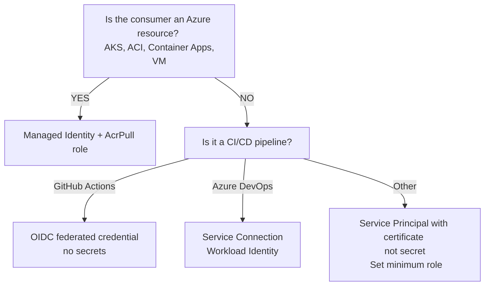
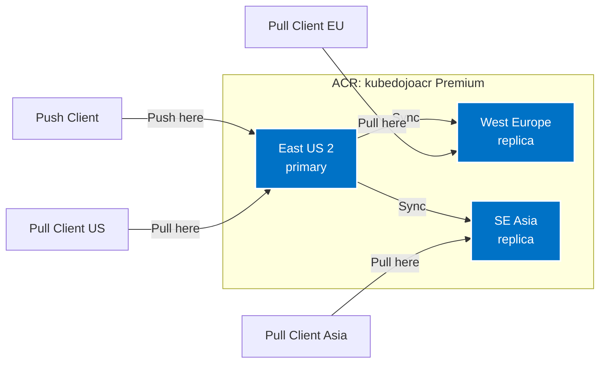
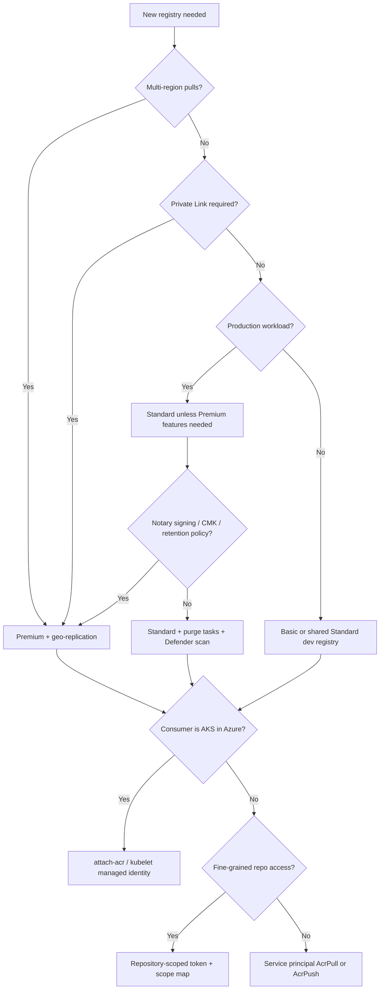

**Complexity**: `[MEDIUM]` | **Time to Complete**: 2h | **Prerequisites**: Module 3.3 (Virtual Machines), Module 3.1 (Microsoft Entra ID)

## What You'll Be Able to Do

After completing this module, you will be able to:

- **Design** a scalable Azure Container Registry architecture utilizing geo-replication and Private Link for secure, global deployments.
- **Implement** automated container image builds and patching pipelines using ACR Tasks to ensure base image security.
- **Evaluate** least-privilege authentication mechanisms for ACR access across CI/CD pipelines, virtual machines, and Kubernetes clusters.
- **Diagnose** image bloat and lifecycle issues by configuring automated purge policies and immutable tags.
- **Compare** the Basic, Standard, and Premium SKUs to select the most cost-effective registry tier for specific enterprise workloads.

## Why This Module Matters

Hypothetical scenario: a platform team that relies on a shared public registry discovers at the worst possible time that pull limits or registry availability are constraining their CI/CD pipeline. Docker Hub had heavily rate-limited their pulls: the free tier allows only [100 pulls per 6 hours for anonymous users and 200 for authenticated users](https://www.docker.com/blog/revisiting-docker-hub-policies-prioritizing-developer-experience/). With 40 microservices, 3 environments, and frequent node scaling events, they were regularly blowing past the limit.

Registry bottlenecks can delay fixes, slow engineering teams, and create real operational and business costs. They learned the hard way that infrastructure dependencies must be owned and controlled.

Container images are the atoms of modern application deployment. Every container you run—whether on Azure Kubernetes Service (AKS), Azure Container Apps, or Azure Container Instances (ACI)—starts with pulling an image from a registry. If your registry is slow, unreliable, or insecure, your entire deployment pipeline suffers. [Azure Container Registry is a fully managed, highly available, private Docker registry that integrates deeply with Azure's identity system.](https://learn.microsoft.com/en-us/azure/container-registry/container-registry-intro) It removes dependence on third-party public registry limits, can be deployed close to Azure workloads, and integrates with Azure services for builds, optional vulnerability assessment, and geo-replication. In this module, you will build a production-ready container registry strategy from the ground up.

Hypothetical scenario: a retailer runs forty microservices on AKS 1.35 during a flash sale. Node autoscaler adds fifty nodes in West Europe while the registry remains in East US on Standard SKU. Image pulls contend for cross-region bandwidth, pod startup stretches past the HPA deadline, and checkout latency spikes even though CPU limits are fine. The incident is not "Kubernetes broken"; it is registry topology and SKU choice. ACR gives you the knobs—colocation, replication, private networking, and lifecycle automation—to prevent that class of failure before it reaches customers.

Platform engineers own the registry the way they own DNS or ingress: quietly until it fails. This module connects SKU limits, identity, tasks, and cost so you can explain to security why admin accounts are unacceptable, to finance why three Premium replicas exist, and to application teams why `:latest` is not a deployment strategy.

---

## ACR SKUs: Choosing the Right Tier

Azure Container Registry is designed to scale with your organization. To support everything from individual developers to global enterprises, ACR comes in three distinct SKUs (Stock Keeping Units). These SKUs dictate your performance limits, storage capacity, and access to advanced enterprise features.

| Feature | Basic | Standard | Premium |
| :--- | :--- | :--- | :--- |
| **Storage** | 10 GiB | 100 GiB | 500 GiB included (see current Microsoft limits for maximum capacity) |
| **Read throughput** | Lower | Higher | Highest |
| **Write throughput** | Lower | Higher | Highest |
| **Webhooks** | 2 | 10 | 500 |
| **Geo-replication** | No | No | Yes |
| **Private Link** | No | No | Yes |
| **Image signing (Notary Project)** | No | No | Yes (OCI artifact signing) |
| **Customer-managed keys** | No | No | Yes |
| **Approximate cost** | Varies by region and agreement | Varies by region and agreement | Varies by region, agreement, and replica count |

The comparison table is a starting point, not a capacity plan. Validate against `az acr show-usage` after your first production scale test.

When designing your architecture, you must balance cost against capability. The **Basic** tier is excellent for individual learning and sandboxed development environments, but its strict rate limits (1,000 ReadOps/min) can easily be overwhelmed by a moderately sized Kubernetes cluster pulling images during a scale-out event. 

[For most production workloads, **Standard** is the recommended baseline. It provides ten times the storage and significantly higher throughput. However, if your security team mandates that all traffic must traverse private networks, or if your application is deployed across multiple global regions, you must adopt the **Premium** tier to unlock Private Link and Geo-replication.](https://learn.microsoft.com/en-us/azure/container-registry/container-registry-skus)

Microsoft documents that you can change an ACR SKU without registry downtime, subject to the limits and feature constraints of the target tier.

```bash
# Create a Basic ACR (for dev/test)
az acr create \
  --resource-group myRG \
  --name kubedojoacr \
  --sku Basic \
  --location eastus2

# Upgrade to Standard (no downtime, no data loss)
az acr update --name kubedojoacr --sku Standard

# View ACR details
az acr show --name kubedojoacr \
  --query '{Name:name, SKU:sku.name, LoginServer:loginServer, Location:location}' -o table
```

Every registry you create is assigned a unique **login server** URL (for example, `kubedojoacr.azurecr.io`). This fully qualified domain name is the address your Docker CLI and Kubernetes clusters will use to communicate with the registry API.

### Included storage, throughput, and when you are forced to Premium

Microsoft publishes [SKU features and limits](https://learn.microsoft.com/en-us/azure/container-registry/container-registry-skus) for every tier. Basic includes **10 GiB** of storage in the daily rate; Standard includes **100 GiB**; Premium includes **500 GiB**, with additional storage billed per GiB beyond those included amounts. All three SKUs support the same programmatic APIs, but Premium unlocks the features that enterprise platforms routinely require.

Throughput is not a single headline number on the pricing page. Image pull and push performance depends on [API concurrency, bandwidth, layer reuse, concurrent node pulls, and network path](https://learn.microsoft.com/en-us/azure/container-registry/container-registry-skus). During large AKS scale-out events, many nodes may pull the same image layers simultaneously. If your registry SKU is too small for that burst pattern, clients can see HTTP **429 Too Many Requests** throttling. The documented mitigation is retry with backoff, spacing deployments, or moving to a higher SKU.

**Pause and predict:** Can an engineering team configure geo-replication on a Standard SKU registry to serve local image pulls across multiple Azure regions?

<details>
<summary>Check your prediction</summary>

No. Geo-replication is strictly a Premium SKU capability in Azure Container Registry. Standard and Basic registries are restricted to a single Azure region; enabling automated multi-region replication requires upgrading to the Premium tier.
</details>

Regional replicas are provisioned using `az acr replication create`, allowing container images pushed to the primary region to [replicate asynchronously to each replica](https://learn.microsoft.com/en-us/azure/container-registry/container-registry-geo-replication). Workloads in each region are automatically steered to their nearest local replica for image pulls, achieving a single-registry multi-region deployment architecture with regional endpoint management. Operating these replicas incurs an additional daily charge per configured replica location in addition to standard registry platform fees (see [Azure Container Registry pricing](https://azure.microsoft.com/en-us/pricing/details/container-registry/)).

**Private Link** and **OCI image signing** via the [Notary Project](https://notaryproject.dev/) (`notation` CLI with Azure Key Vault keys) are Premium-aligned supply-chain controls. [Docker Content Trust (DCT) is deprecated](https://learn.microsoft.com/en-us/azure/container-registry/container-registry-content-trust-deprecation)—new DCT enablement ended 2025-03-31 and DCT is fully removed 2028-03-31; use Notary Project signing instead. [Private endpoints](https://learn.microsoft.com/en-us/azure/container-registry/container-registry-private-link) project the registry into your VNet so pulls never traverse the public internet. **Customer-managed keys** for encryption at rest and **retention policies** for untagged manifests are Premium capabilities as well.

[Zone redundancy](https://learn.microsoft.com/en-us/azure/container-registry/zone-redundancy) is enabled by default in supported regions for Basic, Standard, and Premium. That protects the registry control plane and storage substrate within a region. It does not replace geo-replication: zone redundancy is about surviving a zone failure inside one region; geo-replication is about placing blobs close to compute in multiple regions.

Teams are effectively forced to Premium when any of these are non-negotiable: multi-region pull locality without operating separate registries per region, Private Link with public access disabled, signed images via Notary Project, CMK, connected registries at the edge, or the built-in untagged-manifest retention policy. Standard is the right default for single-region production that still needs anonymous pull or artifact cache rules but not geo-replication.

```bash
# Check current usage against SKU limits (storage, webhooks, replicas, etc.)
az acr show-usage --name kubedojoacr -o table

# List geo-replicas (Premium only)
az acr replication list --registry kubedojoacr -o table
```

---

## Authentication: Three Methods, One Recommendation

Securing access to your container images is arguably the most critical operational task in this module. Container registries are frequent targets for attackers because a compromised registry allows a malicious actor to inject cryptocurrency miners or backdoors directly into your production workloads. ACR supports three authentication methods, each with vastly different security profiles.

### 1. The Admin Account (Avoid in Production)

When creating an Azure Container Registry, the management plane provides an optional administrative toggle that provisions a static username and a pair of access keys for baseline testing.

**Pause and predict:** Can the built-in ACR admin user credentials be scoped down to permit access to only a single repository within the registry?

<details>
<summary>Check your prediction</summary>

No. The ACR admin user is a monolithic identity that provides shared, registry-wide push and pull privileges. It operates at the top level of the registry resource and cannot be scoped to individual repositories or restricted to granular permissions.
</details>

Operators frequently encounter the admin account in introductory quickstarts because it enables immediate authentication via standard Docker CLI tools. However, enabling this account bypasses Microsoft Entra audit logging and violates least-privilege security controls. If you enabled the admin user during initial development or testing, disable it immediately using `az acr update --name kubedojoacr --admin-enabled false` and rotate any downstream secrets that previously touched those static keys.

```bash
# Enable admin (NOT recommended for production)
az acr update --name kubedojoacr --admin-enabled true

# Get credentials
az acr credential show --name kubedojoacr -o table

# Login with admin credentials
az acr login --name kubedojoacr
```

While convenient for a five-minute proof of concept, the admin account violates almost every principle of modern security. The credentials are shared, meaning you cannot audit which developer or system performed a specific action. The account has full push and pull access across the entire registry, violating the principle of least privilege. Furthermore, rotating the password requires orchestrating an update across every single system that relies on it, often leading to production downtime.

### 2. Service Principals

[A Service Principal is an identity created for use with applications, hosted services, and automated tools to access Azure resources. Unlike the admin account, you can create dozens of service principals and grant each one a highly specific Role-Based Access Control (RBAC) assignment.](https://learn.microsoft.com/en-us/azure/container-registry/container-registry-auth-service-principal)

```bash
# Create a service principal with AcrPull role (read-only)
ACR_ID=$(az acr show --name kubedojoacr --query id -o tsv)

az ad sp create-for-rbac \
  --name "acr-pull-sp" \
  --role AcrPull \
  --scopes "$ACR_ID"

# Available ACR roles:
# AcrPull   - Pull images only
# AcrPush   - Push and pull images
# AcrDelete - Delete images
# Owner     - Full access including role assignments
```

Service principals are ideal for external CI/CD pipelines (like GitLab CI or CircleCI) that need to push images into Azure but live outside of the Azure ecosystem.

Microsoft documents [ACR Entra roles](https://learn.microsoft.com/en-us/azure/container-registry/container-registry-roles) including **AcrPull**, **AcrPush**, **AcrDelete**, and registry **Owner** for RBAC administration. Assign roles at registry scope unless you adopt repository-level Entra ABAC on supported registries. The CLI pattern is always `az role assignment create --assignee <id> --role "<RoleName>" --scope <registryResourceId>`—never confuse this with `az identity create`, which provisions a user-assigned managed identity resource.

Rotate service principal secrets on a calendar, and prefer certificates over client secrets where your CI platform supports them. Federated workload identity (GitHub OIDC, Azure DevOps service connections) eliminates static secrets entirely by exchanging short-lived tokens at pipeline runtime. When a principal only needs import, consider **Container Registry Data Importer and Data Reader** instead of blanket Owner.

### 3. Managed Identity (The Enterprise Standard)

For any workload running inside Azure, Managed Identities represent the gold standard for authentication. [A Managed Identity is effectively a service principal that the Azure platform manages on your behalf. There are no passwords to generate, store, or rotate.](https://learn.microsoft.com/en-us/azure/container-registry/container-registry-authentication-managed-identity) The Azure control plane handles all credential exchanges seamlessly under the hood.

```bash
# Grant a VM's managed identity access to pull from ACR
VM_PRINCIPAL_ID=$(az vm identity show -g myRG -n myVM --query principalId -o tsv)
ACR_ID=$(az acr show --name kubedojoacr --query id -o tsv)

az role assignment create \
  --assignee "$VM_PRINCIPAL_ID" \
  --role AcrPull \
  --scope "$ACR_ID"

# For AKS, attach ACR directly (creates role assignment automatically)
az aks update \
  --resource-group myRG \
  --name myAKSCluster \
  --attach-acr kubedojoacr
```

**Pause and predict:** If an attacker compromises a CI/CD pipeline holding an ACR admin password versus one holding an AcrPush service principal limited to a single repository, how does the blast radius compare?

<details>
<summary>Check your prediction</summary>

The ACR admin password is a shared registry-wide identity granting full push and pull access across every image in the registry. A repository-scoped service principal cannot match that destructive blast radius because its permissions are strictly confined to modifying artifacts within that single designated repository.
</details>

Evaluating client identity patterns ensures workloads leverage managed identities whenever compute runs inside Azure while reserving scoped credentials for external deployment pipelines. Production architectures should systematically match consumer capabilities to identity controls rather than relying on shared static secrets. The following architectural decision tree summarizes the recommended authentication model across infrastructure resources and deployment pipelines:



### Repository-scoped tokens and scope maps

Registry-wide **AcrPull**, **AcrPush**, and **AcrDelete** roles are correct for many Azure workloads, but they are coarse. [Repository-scoped permissions](https://learn.microsoft.com/en-us/azure/container-registry/container-registry-repository-scoped-permissions) use **tokens** bound to **scope maps** so a credential can pull one repository path, push another, and never list the entire catalog.

A scope map groups actions such as `content/read`, `content/write`, `content/delete`, `metadata/read`, and `metadata/write` per repository. Wildcards like `samples/*` are supported when the pattern ends with `/*`. Tokens ship with generated passwords; Microsoft recommends expiration dates and treating passwords like any other secret rotation item. This model fits IoT devices, partner access to a single repo, and CI jobs that should not receive delete rights on production images.

Microsoft Entra managed identities **can** receive repository-scoped permissions via [Entra ABAC repository permissions](https://learn.microsoft.com/en-us/azure/container-registry/container-registry-rbac-abac-repository-permissions) (GA November 2025). Set the registry role-assignment mode to **RBAC Registry + ABAC Repository Permissions**, then assign the ABAC built-in roles **Container Registry Repository Reader**, **Writer**, or **Contributor** with repository conditions to AKS kubelet/workload identities, Container Apps, ACI, and other Entra principals. On ABAC-enabled registries, broad Owner/Contributor/Reader roles grant control-plane access only—not data-plane pull/push. Use repository-scoped **tokens** and **scope maps** for non-Entra consumers (IoT devices, external partners).

```bash
# Create a token limited to one repository (creates a matching scope map)
az acr token create --name ci-push-token --registry kubedojoacr \
  --repository myapp content/read content/write

# Reuse or update permissions via scope maps
az acr scope-map create --name team-a-map --registry kubedojoacr \
  --repository team-a/* content/read content/write
az acr token create --name team-a-token --registry kubedojoacr --scope-map team-a-map
```

### Image signing, Defender scanning, and anonymous pull

**Docker Content Trust (DCT)** on ACR is [deprecated](https://learn.microsoft.com/en-us/azure/container-registry/container-registry-content-trust-deprecation): Microsoft stopped new DCT enablement on 2025-03-31 and will fully remove DCT on 2028-03-31. For supply-chain signing on Premium registries, adopt the **[Notary Project](https://notaryproject.dev/)** with the `notation` CLI and keys stored in **Azure Key Vault**. Sign images at push time (`notation sign`) and verify at deploy time (`notation verify`); on AKS, pair verification with [Ratify](https://ratify.dev/) and enforce policy via Azure Policy so unsigned images cannot run.

This is separate from generic TLS: signing cryptographically ties an artifact digest to a publisher key, which helps when you need guarantees beyond "someone with AcrPush uploaded this."

**Microsoft Defender for Containers** can [scan images pushed to ACR](https://learn.microsoft.com/en-us/azure/container-registry/scan-images-defender) and surface CVE data in Defender views. Scanning is a control-plane integration; it does not replace patching your Dockerfiles. Pair Defender findings with ACR Tasks base-image triggers so vulnerable bases trigger rebuilds instead of lingering silently in `:latest`.

**Anonymous pull** is available on Standard and Premium when explicitly enabled. [Anonymous access](https://learn.microsoft.com/en-us/azure/container-registry/anonymous-pull-access) lets unauthenticated clients pull selected public artifacts. The risk is obvious: any network path that can reach the registry endpoint may download your images unless you combine anonymous pull with IP rules, Private Link, or careful repository hygiene. Default is disabled; enable only for intentionally public content.

### AKS authentication: attach-acr, not imagePullSecrets

AKS should pull from ACR using the cluster kubelet's managed identity, not long-lived `kubernetes.io/dockerconfigjson` secrets copied from `az acr credential show`. The command `az aks update --attach-acr <registryName>` grants the kubelet identity **AcrPull** on that registry. This matches [AKS–ACR integration guidance](https://learn.microsoft.com/en-us/azure/aks/cluster-container-registry-integration?tabs=azure-cli) and avoids secret sprawl in every namespace.

Hypothetical scenario: a platform team copies ACR admin passwords into Helm values for twelve microservices. During a credential rotation, three namespaces still reference the old secret while nine updated, producing intermittent `ImagePullBackOff` that looks like a registry outage. Managed identity attach removes that class of drift entirely.

Once authentication is established, interacting with the registry uses standard Docker CLI commands, heavily augmented by the Azure CLI to handle the credential exchange smoothly.

```bash
# Login to ACR using the Azure CLI (uses your current az login identity)
az acr login --name kubedojoacr

# Push an image
docker tag myapp:latest kubedojoacr.azurecr.io/myapp:v1.0.0
docker push kubedojoacr.azurecr.io/myapp:v1.0.0

# Pull an image
docker pull kubedojoacr.azurecr.io/myapp:v1.0.0

# List repositories in ACR
az acr repository list --name kubedojoacr -o table

# List tags for a repository
az acr repository show-tags --name kubedojoacr --repository myapp -o table

# Show image manifest details (tagged manifests only)
az acr manifest list-metadata --registry kubedojoacr --name myapp --detail -o table
```

---

## ACR Tasks: Serverless Container Builds

Historically, building container images required a dedicated build server running the Docker daemon. This approach is fraught with maintenance overhead, security risks (privileged containers), and scaling bottlenecks. ACR Tasks completely revolutionizes this by allowing you to offload the build execution directly to Azure's managed compute infrastructure.

Tasks run in Azure's network, close to your registry, which reduces push time after `docker build` completes. They also support **Windows** and **Linux** agent platforms where documented, enabling mixed fleets without maintaining separate Jenkins agents. Logs stream to `az acr task logs`, and run IDs correlate to image tags like `myapp:{{.Run.ID}}` for traceability.

From a threat-model perspective, tasks reduce the need for privileged Docker sockets on developer laptops. The tradeoff is pipeline credentials: protect Git PATs, service connections, and task identities with the same rigor as production kubeconfig. A malicious `Dockerfile` in a connected repo still executes inside your subscription; code review and branch protections remain mandatory.

### The Quick Build

With a single command, you can [stream your local directory context to Azure, where a managed virtual machine provisions itself, executes your Dockerfile, pushes the resulting image directly into your registry, and then terminates](https://learn.microsoft.com/en-us/azure/container-registry/container-registry-tasks-overview).

```bash
# Build an image from a local Dockerfile (uploads context to ACR)
az acr build \
  --registry kubedojoacr \
  --image myapp:v1.0.0 \
  --file Dockerfile \
  .

# Build from a Git repository
az acr build \
  --registry kubedojoacr \
  --image myapp:v2.0.0 \
  https://github.com/myorg/myrepo.git#main

# Build a multi-architecture image (requires buildx; --platform on az acr build accepts one OS/arch)
docker buildx build \
  --platform linux/amd64,linux/arm64 \
  --tag kubedojoacr.azurecr.io/myapp:v1.0.0 \
  --push .
```

### Base Image Triggers and Automated Patching

While manual builds are excellent for local development, production systems require automation. [ACR Tasks can monitor upstream base images (like `ubuntu:22.04` or `node:18-alpine`) and automatically trigger a rebuild of your application whenever the base image maintainer pushes a security patch.](https://learn.microsoft.com/en-us/azure/container-registry/container-registry-tasks-overview)

```bash
# Create a task that rebuilds when the base image updates
az acr task create \
  --registry kubedojoacr \
  --name rebuild-on-base-update \
  --image myapp:{{.Run.ID}} \
  --context https://github.com/myorg/myrepo.git#main \
  --file Dockerfile \
  --git-access-token "$GITHUB_PAT" \
  --base-image-trigger-enabled true \
  --base-image-trigger-type All

# Create a scheduled task (rebuild every day at 3 AM UTC)
az acr task create \
  --registry kubedojoacr \
  --name nightly-rebuild \
  --image myapp:nightly \
  --context https://github.com/myorg/myrepo.git#main \
  --file Dockerfile \
  --git-access-token "$GITHUB_PAT" \
  --schedule "0 3 * * *"

# Manually trigger a task run
az acr task run --registry kubedojoacr --name rebuild-on-base-update

# View task run logs
az acr task logs --registry kubedojoacr --run-id cf1
```

**Example**: Base-image triggers can automatically rebuild dependent images when an upstream base image changes, reducing manual patching work during a security event.

### Multi-step tasks, dedicated agents, and OS patching automation

Beyond quick builds, [ACR Tasks](https://learn.microsoft.com/en-us/azure/container-registry/container-registry-tasks-overview) support **multi-step** YAML-defined pipelines: build, test, push, and optionally invoke other steps in one task run. Tasks can source context from Git with PAT or managed identity, run on schedule, or react to base-image updates. Premium registries can use [dedicated agent pools](https://learn.microsoft.com/en-us/azure/container-registry/tasks-agent-pools) for predictable CPU/RAM instead of shared task compute.

Task billing is per CPU-second of execution (and dedicated pools bill per allocated CPU-second while scaled up). See [Container Build pricing](https://azure.microsoft.com/en-us/pricing/details/container-registry/) on the ACR pricing page. A nightly rebuild fleet across fifty repositories can dominate your bill if each task rebuilds from scratch without layer cache discipline.

Microsoft also documents [automatic OS and framework patching](https://learn.microsoft.com/en-us/azure/container-registry/automate-os-updates) patterns where base updates flow through tasks. The operational goal is the same as base-image triggers: shrink the window between upstream patch availability and your rebuilt application image landing in production.

```bash
# Import an image without local Docker (promote from another registry)
az acr import --name kubedojoacr \
  --source mysourceregistry.azurecr.io/platform/base:1.4 \
  --image platform/base:1.4 \
  --registry /subscriptions/<sub>/resourceGroups/<rg>/providers/Microsoft.ContainerRegistry/registries/mysourceregistry

# Premium: retention policy for untagged manifests (preview)
az acr config retention update --registry kubedojoacr \
  --status enabled --days 30 --type UntaggedManifests
```

---

## Global Distribution with Geo-Replication

When you design distributed systems, physics is your ultimate constraint. The speed of light dictates that transferring gigabytes of image data across oceans will induce significant latency. If your primary registry is in East US, but your AKS cluster is scaling out in West Europe, every pod startup is penalized by transatlantic data transfer speeds.

Furthermore, cross-region bandwidth is not free. Pulling images across regional boundaries incurs heavy egress charges on your monthly Azure bill.

Geo-replication solves this by allowing a single logical registry to exist physically in multiple Azure regions simultaneously. Here is the architectural flow:



When you push an image to your registry, [Azure automatically replicates the underlying storage blobs asynchronously to all configured regions. When a client requests an image, Azure Traffic Manager intercepts the DNS request and seamlessly routes the client to the closest regional replica.](https://learn.microsoft.com/en-us/azure/container-registry/container-registry-geo-replication)

Geo-replication is not a backup strategy. It mirrors live image content for pull performance and availability; it does not replace artifact export policies or cross-subscription disaster recovery plans. If you delete a repository in the home region, that deletion propagates through the replication fabric. Treat registry RBAC and purge automation as production-critical controls, not afterthoughts.

For Kubernetes, you do not configure different registry URLs per region when using geo-replication. The same `kubedojoacr.azurecr.io` login server remains the contract; Traffic Manager handles locality. That simplicity is powerful for Helm charts and GitOps repos because values files stay identical across regions, but it also means DNS and Private Link planning must work in every VNet where nodes run.

```bash
# Enable geo-replication (requires Premium SKU)
az acr replication create \
  --registry kubedojoacr \
  --location westeurope

az acr replication create \
  --registry kubedojoacr \
  --location southeastasia

# List replications
az acr replication list --registry kubedojoacr \
  --query '[].{Location:location, Status:provisioningState}' -o table
```

**Example**: Without in-region registry access, cross-region pulls can add startup latency and data-transfer costs; geo-replication reduces both for multi-region deployments.

### Operating geo-replicated registries day to day

Treat the **home region** as the write target. CI systems and release automation should push to the primary region login server; replicas are read-optimized copies. After a large release, replication is asynchronous. If European pods scale before blobs finish copying, you may still see pull retries. Monitor registry metrics and plan rollout ordering accordingly.

Storage usage in the portal reflects the home region; Microsoft documentation notes you should [multiply storage figures by replica count](https://learn.microsoft.com/en-us/azure/container-registry/container-registry-skus) for total footprint. That matters when finance asks why a "500 GiB included" registry still bills overage: three replicas mean three copies of large base images.

Downgrading from Premium requires removing geo-replicas first. Attempting to switch SKU while replicas exist fails or leaves you in a blocked state until `az acr replication delete` completes. Plan SKU changes in change windows the same way you would for AKS upgrades.

Dedicated **data endpoints** (Premium) expose region-specific DNS names for high-throughput pulls without sharing the global login server path. They help when firewall rules must allowlist explicit endpoints per region. Evaluate them when network teams resist wildcard `*.azurecr.io` allowances.

---

## Network Security and Private Link

By default, Azure Container Registry exposes a public endpoint. While authenticated via Microsoft Entra ID, the registry is technically reachable from anywhere on the internet. In highly regulated industries like healthcare or finance, data exfiltration policies mandate that Platform-as-a-Service (PaaS) resources must not possess public IP addresses.

[Azure Private Link allows you to project your ACR directly into your Virtual Network (VNet). The registry receives a private IP address (e.g., `10.0.5.10`), and all traffic between your virtual machines or Kubernetes nodes and the registry never leaves the Microsoft backbone network.](https://learn.microsoft.com/en-us/azure/container-registry/container-registry-private-link)

**Pause and predict:** If you configure Private Link with public network access disabled on an ACR, but forget to link the Private DNS Zone to your AKS Virtual Network, what happens when the kubelet attempts to pull an image?

<details>
<summary>Check your prediction</summary>

The kubelet still resolves the public `*.azurecr.io` fully qualified domain name because the cluster virtual network lacks the private DNS zone link. Because public network access is disabled on the registry, the connection cannot be established, and the pull fails with connection timeouts leading to `ImagePullBackOff` rather than routing across the private IP.
</details>

Enforcing private network isolation requires coordinating private endpoint allocation, virtual network routing, and regional DNS integration into a unified deployment workflow. When public network ingress is completely blocked, validating network interface configuration ensures traffic remains securely routed over the Microsoft backbone. The following operational commands demonstrate how to disable public ingress, establish a private endpoint, and link the required private DNS zone:

```bash
# Disable public access
az acr update --name kubedojoacr --public-network-enabled false

# Create a private endpoint for ACR
az network private-endpoint create \
  --resource-group myRG \
  --name acr-private-endpoint \
  --vnet-name hub-vnet \
  --subnet private-endpoints \
  --private-connection-resource-id "$ACR_ID" \
  --group-id registry \
  --connection-name acr-connection

# Create Private DNS Zone for ACR
az network private-dns zone create \
  --resource-group myRG \
  --name privatelink.azurecr.io

# Link DNS zone to VNet
az network private-dns link vnet create \
  --resource-group myRG \
  --zone-name privatelink.azurecr.io \
  --name acr-dns-link \
  --virtual-network hub-vnet \
  --registration-enabled false

# Create DNS zone group for automatic record management
az network private-endpoint dns-zone-group create \
  --resource-group myRG \
  --endpoint-name acr-private-endpoint \
  --name default \
  --private-dns-zone "privatelink.azurecr.io" \
  --zone-name acr
```

Once Private Link is established and the DNS zone is correctly linked to your VNet, any request to `kubedojoacr.azurecr.io` from within that VNet will transparently resolve to the private IP address instead of the public endpoint.

### Firewall rules, trusted services, and import gotchas

Premium registries support [public IP network rules](https://learn.microsoft.com/en-us/azure/container-registry/container-registry-skus) and service endpoints in preview. Private Link is stricter: you disable `public-network-enabled` and rely on private endpoints in hub or spoke VNets. Document which VNets host the private DNS zone links; AKS node pools in a spoke without the link will fail pulls with DNS errors that resemble registry outages.

When public access is disabled, [`az acr import`](https://learn.microsoft.com/en-us/azure/container-registry/container-registry-import-images) still works if **Allow trusted Microsoft services** bypass is enabled on the registry network settings. New locked-down registries sometimes ship with that toggle off, and imports fail until platform engineers allow trusted services for automation identities.

Hypothetical scenario: engineers enable Private Link in production but leave CI runners on a corporate network without private endpoint reachability. Builds succeed locally with `az acr login` using public paths while pipeline pushes time out. The fix is either private endpoint connectivity for runners or a segmented build registry with controlled import promotion into the locked-down prod registry.

AKS with Azure CNI and custom DNS must forward `privatelink.azurecr.io` queries to the linked zone. The [Private Link tutorial](https://learn.microsoft.com/en-us/azure/container-registry/container-registry-private-link) walks through zone creation, VNet link, and private-endpoint DNS zone groups—mirror that automation in Bicep or Terraform to avoid manual drift.

```bash
# Confirm public access state before troubleshooting pulls
az acr show --name kubedojoacr --query "{publicNetwork:publicNetworkAccess, sku:sku.name}" -o json
```

---

## Image Management Best Practices

Container registries are notoriously prone to storage bloat. Every time a developer merges a pull request, CI systems typically build and push a new image. Over time, terabytes of outdated, unused images accumulate, driving up storage costs and obscuring the operational state of the registry.

### Tagging Strategy

Implementing a robust tagging strategy is your first line of defense against chaos. You must absolutely [avoid deploying the `:latest` tag into production, as it is a floating pointer that mutates unpredictably](https://learn.microsoft.com/en-us/azure/container-registry/container-registry-image-tag-version).

Semantic versioning (`1.3.2`, `1.3`, `1`) gives humans readable promotion lanes. Git SHA tags give forensic precision: you can tie a running pod to an exact commit even when two builds share a semver by mistake. Many teams publish **three** tags per build: immutable SHA, semver, and a moving `latest` or `dev` pointer for convenience. Only the immutable tags belong in production Helm values or Kubernetes manifests targeting AKS 1.35 clusters.

OCI artifacts complicate tagging slightly. ACR stores [Helm charts and other OCI artifacts](https://learn.microsoft.com/en-us/azure/container-registry/container-registry-concepts) alongside container images. Lifecycle rules must consider chart repos used by GitOps the same way you consider application images—deleting an untagged chart layer can break rollback for Flux or Argo CD releases.

### Manifest lists, digests, and supply-chain traceability

Multi-architecture images ship as manifest lists. When you `docker pull` on Apple silicon and CI pulls on AMD64, you may get different digests under the same tag. For compliance, record the digest returned at deploy time (`kubectl get pod -o jsonpath='{.status.containerStatuses[0].imageID}'`) and compare against `az acr manifest list-metadata`. Notary Project signing on Premium adds cryptographic verification on top of digest discipline.

Locking tags with `az acr repository update --write-enabled false` prevents accidental overwrites of golden releases. Pair locks with RBAC so only release managers hold **AcrDelete** or token `content/delete` on production repositories. Developers retain push to `myapp/dev-*` repos via scope maps without delete on `myapp/release-*` paths.

```bash
# Use semantic versioning for release images
docker tag myapp kubedojoacr.azurecr.io/myapp:1.3.2
docker tag myapp kubedojoacr.azurecr.io/myapp:1.3
docker tag myapp kubedojoacr.azurecr.io/myapp:1
docker tag myapp kubedojoacr.azurecr.io/myapp:latest

# Use Git SHA for traceability
docker tag myapp kubedojoacr.azurecr.io/myapp:sha-a1b2c3d

# Use build number for CI/CD
docker tag myapp kubedojoacr.azurecr.io/myapp:build-1234
```

### Automated Cleanup and Retention

When you overwrite an existing tag (like pushing a new build to `myapp:dev`), the old image data isn't deleted. Instead, the tag pointer moves, [leaving behind an "untagged" or orphaned manifest. These orphaned layers consume expensive storage space.](https://learn.microsoft.com/en-us/azure/container-registry/container-registry-concepts) 

You should utilize ACR Tasks to schedule a recurring administrative command that forcefully purges old tags and orphaned manifests.

```bash
# Delete a specific tag
az acr repository delete --name kubedojoacr --image myapp:old-tag --yes

# Delete untagged manifests (orphaned layers)
az acr run --registry kubedojoacr \
  --cmd "acr purge --filter 'myapp:.*' --ago 30d --untagged" \
  /dev/null

# Set up automatic purge (run daily, delete untagged images older than 7 days)
az acr task create \
  --registry kubedojoacr \
  --name purge-untagged \
  --cmd "acr purge --filter '.*:.*' --ago 7d --untagged" \
  --context /dev/null \
  --schedule "0 4 * * *"

# Lock an image to prevent deletion (immutable tag)
az acr repository update \
  --name kubedojoacr \
  --image myapp:v1.0.0 \
  --write-enabled false
```

[By scheduling `acr purge`, you ensure that your registry remains lean and cost-effective automatically, without manual intervention from the operations team.](https://learn.microsoft.com/en-us/azure/container-registry/container-registry-auto-purge)

Premium registries can alternatively enable the [retention policy for untagged manifests](https://learn.microsoft.com/en-us/azure/container-registry/container-registry-retention-policy), which schedules deletion after N days without a separate purge task. Microsoft warns that systems pulling by digest must not use aggressive retention, because untagged manifests may still be referenced. Purge tasks remain valuable for **tagged** image cleanup (`acr purge --filter 'myapp:.*' --ago 90d`).

For promotion between environments, prefer [`az acr import`](https://learn.microsoft.com/en-us/azure/container-registry/container-registry-import-images) over docker pull/tag/push from a build agent. Import copies manifests server-side, supports multi-arch images, and can source from Docker Hub, Microsoft Container Registry, or another ACR—including registries with public access disabled when you pass the source registry resource ID and hold **Container Registry Data Importer and Data Reader** on both sides.

---

## Webhooks, Automation, and CI/CD Touchpoints

ACR [webhooks](https://learn.microsoft.com/en-us/azure/container-registry/container-registry-webhook) fire HTTP POST notifications when images are pushed or deleted. Webhook counts scale with SKU (2 on Basic, 10 on Standard, 500 on Premium). Use them to trigger Azure Functions, Logic Apps, or external scanners when a new `myapp:v*` tag lands, especially if you cannot yet adopt full Task-based pipelines.

Azure DevOps and GitHub Actions commonly push images with service principals or OIDC, then deploy to AKS referencing the same login server. Keep build registries separate from production when compliance demands it: build in Standard, import golden images into Premium prod with Private Link, and let Defender scan on push in each environment.

Container Apps and ACI consume the same pull mechanics as AKS: assign **AcrPull** to the workload identity or use admin credentials only in throwaway labs. For GitOps, ensure your chart repo in ACR (Helm 3 OCI) follows the same retention rules as application images so old chart versions do not accumulate silently.

When diagnosing slow deployments, split the problem: registry throttling (429), DNS to Private Link, authentication (401/403), or image size. `az acr check-health --name kubedojoacr` exercises connectivity and permissions from your current client context and is a fast pre-flight before blaming the orchestrator.

---

## Monitoring, Metrics, and Operational Signals

Production registries deserve dashboards, not ad-hoc CLI queries. Azure Monitor exposes ACR metrics such as **StorageUsed**, **TotalPullCount**, and **TotalPushCount** (exact names vary by portal view) so you can alert before storage overage surprises finance. Pair registry metrics with AKS **kubelet** pull latency and pod startup histograms; a spike in `ImagePullBackOff` events without registry throttling often means DNS or RBAC, while 429 errors point to SKU limits.

Enable diagnostic settings to send registry logs to Log Analytics when you need forensic trails of authentication failures or administrative changes. Entra sign-in logs complement registry data plane logs for service principal and managed identity troubleshooting. For geo-replicated registries, watch replication health after large image promotions; asynchronous sync means temporary skew between regions is normal, but prolonged lag warrants investigation.

Runbooks should list: who can approve SKU upgrades, how to execute purge dry-runs, where token passwords are stored, and which teams own repository naming conventions. During incident response, capture the manifest digest, tag, and pulling principal ID before purging anything—deletions are irreversible. Quarterly reviews that compare `az acr show-usage` output to finance invoices catch orphaned dev registries still on Premium because someone cloned production Terraform years ago.

Capacity planning for black Friday or major launches should include a pull storm simulation: multiply expected new nodes by image size and layer count, compare to documented throughput guidance for your SKU, and pre-warm critical images on nodes only if your orchestrator supports it. Registry scale is cheaper than application scale, but only if you choose the correct tier and region topology before traffic arrives.

---

## Cost Lens: Tiers, Storage, Replication, and Task Minutes

Container registry cost is rarely one line item. Finance sees registry SKU days, storage overage, geo-replica days, build CPU-seconds, and cross-region bandwidth together.

| Cost driver | What moves the needle | Knobs that help |
| :--- | :--- | :--- |
| SKU daily rate | Basic ≈ $0.167/day, Standard ≈ $0.667/day, Premium ≈ $1.667/day in US regions (see [pricing](https://azure.microsoft.com/en-us/pricing/details/container-registry/)) | Use Basic only for sandboxes; downgrade dev registries copied from prod |
| Included storage | 10 / 100 / 500 GiB included per tier | Retention policy, scheduled `acr purge`, stop retagging `:dev` endlessly |
| Storage overage | ~$0.00334/GiB/day beyond included amount | Delete untagged manifests; avoid duplicate multi-arch copies you never pull |
| Geo-replication | Premium base + ~$1.667/day per replica region | Add replicas only where compute exists; do not replicate to vanity regions |
| ACR Tasks | ~$0.0001 per CPU-second (shared pool) | Cache layers; narrow task schedules; avoid rebuilding entire monorepos nightly |
| Egress | Pulling across regions without replicas | Geo-replicate or colocate registry with compute |

Untagged manifests are the silent budget leak. Every CI pipeline that pushes `myapp:build-$BUILD_ID` and never deletes older tags leaves orphaned layers billed as storage. A purge task costing fractions of a dollar per day often pays for itself the first month it runs.

Hypothetical scenario: a team runs Premium in three regions for a single-region AKS cluster "because prod does." They pay three replica charges plus storage multiplied across replicas for images that only East US workloads ever pull. Right-sizing SKU and replica count is a platform engineering responsibility, not only a finance review.

---

## Patterns & Anti-Patterns

| Pattern | When to use it | Why it works | Scaling note |
| :--- | :--- | :--- | :--- |
| Single prod registry per environment | Clear promotion boundaries dev → staging → prod | Import and RBAC separate blast radius | Pair with `az acr import` instead of mutable `:latest` promotion |
| `az aks update --attach-acr` | AKS pulls from ACR in same tenant | No pull secrets; Entra-managed kubelet identity | Repeat per cluster; verify AcrPull on correct registry scope |
| Geo-replicated Premium + regional compute | Multi-region AKS or ACI | Pulls stay on Microsoft backbone near nodes | Monitor replica sync lag after large pushes |
| Repository-scoped tokens for partners/IoT | External actor needs one repo | Least privilege without admin account | Rotate token passwords; disable tokens promptly |
| ACR Tasks + base-image triggers | Many services share public bases | Rebuilds track upstream CVE patches | Watch task CPU spend when repo count grows |
| Scheduled `acr purge` + immutable prod tags | High churn CI tags | Storage stays predictable | Dry-run purge filters before enabling destructive schedules |
| Private Link + private DNS on hub VNet | Regulated workloads | No public registry endpoint | Test DNS from each spoke before cutover |

| Anti-pattern | What goes wrong | Better alternative |
| :--- | :--- | :--- |
| ACR admin account in CI/CD | Shared password, full registry power, poor audit trail | Service principal with AcrPush or OIDC federation |
| `imagePullSecrets` from admin creds | Secret rotation breaks random namespaces | Managed identity attach-acr |
| Premium SKU for every dev registry | 10×+ daily cost vs Basic | Basic for labs; Standard for shared dev |
| Geo-replication without regional compute | Paying replica storage without latency win | Replicate only where clusters run |
| Anonymous pull for "internal" images | Unauthenticated download if endpoint reachable | Keep anonymous off; use AcrPull + network rules |
| Ignoring untagged manifest growth | Storage bill climbs while tag count looks fine | Retention policy (Premium) or weekly purge |
| Pulling prod images cross-region on Standard | Slow scale-out + egress charges | Upgrade to Premium replicas or move compute |
| Signing disabled but claiming supply-chain security | Tampered tags look legitimate | Sign release images with Notary Project (`notation` + AKV); verify on AKS with Ratify + Azure Policy |

---

## Decision Framework

Use this matrix when onboarding a new workload to ACR. It complements the authentication mermaid above by focusing on SKU and identity choices.

| Requirement | Basic | Standard | Premium |
| :--- | :--- | :--- | :--- |
| Dev/sandbox, low pull volume | **Fit** | Overkill | Overkill |
| Single-region production, no Private Link | Tight limits | **Default** | Optional |
| Anonymous public artifacts | No | **Yes** | **Yes** |
| Geo-replication or Private Link | No | No | **Required** |
| Image signing (Notary Project) / CMK / retention policy | No | No | **Required** |
| >100 GiB included storage need | No | Maybe | **Likely** |



**Authentication quick pick**: Azure-hosted runtime (AKS, Container Apps, VM) → managed identity with **AcrPull** or **attach-acr**. GitHub Actions in Azure → OIDC federation where possible. Third-party CI → service principal with minimum role. Partner or device → repository-scoped token, not admin.

### Worked example: single-region SaaS on Standard

Imagine a B2B SaaS with one AKS cluster in East US 2, twelve services, and GitHub Actions building on every merge to `main`. The registry is Standard in the same region: no geo-replication charge, Private Link not required yet, Defender scanning enabled on push. CI uses OIDC to obtain short-lived Azure credentials with **AcrPush** on a `builds/` repository namespace via scope map. Production Helm charts reference `myapp@sha256:...` digests, not `:latest`. A nightly Task runs `acr purge` on `builds/*` tags older than fourteen days. Monthly cost stays near one Standard day-rate plus modest storage because untagged manifests never accumulate. This profile fails only when the company opens a EU data residency region—then Premium geo-replication becomes a compliance-driven upgrade, not a performance luxury.

### Worked example: regulated multi-region bank on Premium

The same architectural diagram with Private Link, three geo-replicas, Notary Project signing on `banking/*` repos, and CMK keys in a dedicated Key Vault illustrates the Premium baseline. Builds still occur in a non-production registry; `az acr import` promotes signed release candidates into the production registry after change advisory approval. AKS clusters in each region attach-acr to the same logical registry name but pull from local replicas. Operations runbooks document replica lag checks after marketing pushes large ML model images. Finance sees predictable line items: Premium SKU, three replica days, Defender, and Task minutes for quarterly base-image rebuilds. Attempting to replicate this with Docker Hub plus pull secrets would violate network policy and rate limits simultaneously.

---

## Did You Know?

1. **ACR supports preview Cloud Native Buildpacks builds** via the `az acr pack build` command, which can build some applications from source without a Dockerfile when a buildpack detector matches your repo layout.
2. **Azure Container Registry can store OCI artifacts in addition to container images**, including Helm charts and other artifact types supported by OCI tooling.
3. **In-region ACR pulls are often noticeably faster than pulling the same image from a public registry over the internet**, which becomes more visible during large scale-out events.
4. **ACR supports anonymous pull** on Standard and Premium registries. When enabled, anyone can pull images without authentication, so it should be used intentionally for public artifacts only. Anonymous pull is disabled by default.

---

## Common Mistakes

| Mistake | Why It Happens | How to Fix It |
| :--- | :--- | :--- |
| Using the admin account for CI/CD pipelines | It is the first authentication method shown in quickstarts | Use service principals with AcrPush role for CI/CD, or OIDC federation for GitHub Actions. Run `az acr check-health` before blaming AKS for pull failures. |
| Not cleaning up old images | [There is no built-in retention policy enabled by default](https://learn.microsoft.com/en-us/azure/container-registry/container-registry-retention-policy) | Create an ACR Task with `acr purge` on a schedule. Delete untagged manifests weekly and old tagged images monthly. |
| Using `:latest` tag in production deployments | It seems like "latest" means "newest and best" | `:latest` is mutable---it can point to different images at different times. Use immutable tags (semantic version or Git SHA) for production. |
| Running Premium SKU for dev/test registries | Teams copy production configuration | Use Basic ($5/month) for dev/test. Premium ($50+/month) is only needed for geo-replication, Private Link, or Notary Project image signing. |
| Pulling images from a different region than compute | The registry is in East US but compute is in West Europe | Use geo-replication (Premium) or create separate registries per region. Cross-region pull adds latency and egress costs. |
| Not enabling vulnerability scanning | Teams assume images are secure because they built them | [Enable Microsoft Defender for Containers, which automatically scans images pushed to ACR and reports vulnerabilities.](https://learn.microsoft.com/en-us/azure/container-registry/scan-images-defender) |
| Hardcoding registry URLs in Kubernetes manifests | It works today, so why abstract it? | Use a variable or Helm value for the registry URL. This lets you switch registries (e.g., from dev ACR to prod ACR) without modifying manifests. |
| Granting AcrPush when only AcrPull is needed | AcrPull seems "incomplete" | Follow least privilege. Build agents need AcrPush. Runtime workloads (AKS, ACI, Container Apps) only need AcrPull. |

---

## Quiz

<details>
<summary>1. You are designing an automated CI/CD pipeline using GitLab that pushes container images to ACR. A junior engineer suggests enabling the ACR admin account for the pipeline to use. Why should you reject this proposal and what should you implement instead?</summary>

You should reject the use of the admin account because it provides unfettered, full administrative access (push, pull, delete) to the entire registry using a single shared credential, which completely violates the principle of least privilege and destroys auditability. If that CI/CD pipeline is compromised, the attacker gains full control over your entire container registry. Instead, you should provision a dedicated Service Principal bound specifically to the `AcrPush` RBAC role. This approach ensures the pipeline only has the exact permissions required to upload images, allows for independent credential rotation, and provides clear audit trails in Azure Monitor without exposing other repositories to risk.
</details>

<details>
<summary>2. Your company just expanded its e-commerce platform to serve users in both North America (East US) and Europe (West Europe). The application teams report that pods in the European AKS cluster are taking over 30 seconds to start during traffic spikes. You discover they are pulling images from a single Standard tier ACR in East US. How do you resolve this architectural bottleneck?</summary>

You must upgrade the Azure Container Registry from the Standard tier to the Premium tier to unlock the geo-replication feature. Once upgraded, you can provision a secondary read-only replica of the registry in the West Europe region. When developers push new images to East US, Azure will automatically and asynchronously sync the blob storage to the West Europe replica over the Microsoft backbone. Consequently, when the European AKS cluster scales out, Azure Traffic Manager will intercept the image pull request and route it locally, dropping pod startup times from 30+ seconds to just a few seconds and eliminating expensive cross-region bandwidth egress costs.
</details>

<details>
<summary>3. You have an AKS cluster that needs to pull images from ACR. What is the most secure authentication method?</summary>

You must utilize Managed Identities by executing `az aks update --attach-acr`. This operational command configures the AKS kubelet identity with a system-managed Service Principal and automatically assigns it the `AcrPull` RBAC role scoped explicitly to your registry. This architectural pattern represents the pinnacle of security because zero static credentials are ever generated, stored in Kubernetes secrets, or transmitted over the network. The Azure platform autonomously handles the lifecycle, secure exchange, and rotation of the underlying tokens, eliminating the risk of credential leakage entirely.
</details>

<details>
<summary>4. Your microservices rely on a public Node.js Alpine base image. A critical zero-day vulnerability is announced in Alpine Linux, and the Node.js maintainers push a patched base image to Docker Hub. How can you ensure your microservices automatically inherit this security patch without relying on your central Jenkins CI pipeline?</summary>

You should implement ACR Tasks and configure base image triggers for your application repositories. When enabled, ACR Tasks acts as a serverless supply chain security mechanism that continuously monitors the upstream base images (like `node:18-alpine`) declared in your Dockerfiles. The moment the patched base image is pushed to Docker Hub, ACR detects the change and instantaneously spins up ephemeral compute to rebuild your application images automatically. This guarantees your deployments are rapidly immunized against zero-day vulnerabilities in underlying layers, drastically reducing your exposure window without requiring any manual engineering intervention or tying up CI/CD build agents.
</details>

<details>
<summary>5. A developer on your team configures their Kubernetes Deployment manifest to use the `webapp:latest` image tag. During a routine node upgrade, several pods are rescheduled, but they suddenly start failing crash loop backoffs. Explain the operational danger of this tagging strategy and how it caused the outage.</summary>

Deploying the `:latest` tag introduces catastrophic non-determinism into production environments because it acts as a highly mutable, floating pointer rather than a fixed artifact. During the node upgrade, when the kubelet rescheduled the pods, it reached out to the registry and blindly pulled whatever newly built image was currently tagged as `:latest`. The team likely pushed a breaking, untested change to `:latest` in the background, meaning the newly scheduled pods received a completely different application version than the pods running on the older nodes. To prevent this split-brain behavior and ensure reliable rollbacks, you should use immutable semantic version tags (e.g., `v1.2.4`) or exact Git SHA commit hashes in your production manifests.
</details>

<details>
<summary>6. Your organization is migrating a highly regulated healthcare workload to Azure. The security compliance team dictates that the container registry must not be accessible via any public IP address and must encrypt all data at rest using keys managed by the organization, not Microsoft. Which ACR SKU must you choose and why?</summary>

You are strictly required to choose the Premium SKU for your Azure Container Registry. While the Standard tier provides adequate storage and throughput for many workloads, it cannot satisfy strict network isolation or cryptographic compliance mandates. Only the Premium tier unlocks the Azure Private Link feature, which completely disables public internet access and projects the registry directly into your Virtual Network using a private IP address. Furthermore, the Premium tier is the only SKU that supports Customer-Managed Encryption Keys (CMK), allowing your security team to retain direct control over the keys used to encrypt the underlying image blob storage.
</details>

<details>
<summary>7. You are designing a multi-region deployment spanning East US and West Europe. Your AKS clusters in West Europe are experiencing elevated image pull latencies when fetching from your Standard SKU ACR located in East US. Diagnose the root cause and implement a solution.</summary>

The root cause of the latency is the physical limitation of transmitting massive gigabyte-scale container layers across the transatlantic network link during pod scaling events. Because the registry is running the Standard SKU, it physically resides only in the East US datacenter. To resolve this, you must upgrade the registry to the Premium SKU dynamically (`az acr update --sku Premium`) and provision a Geo-replication replica in West Europe (`az acr replication create --location westeurope`). This ensures the West Europe AKS nodes pull directly from localized storage, drastically reducing startup latency and eliminating cross-region egress bandwidth costs.
</details>

<details>
<summary>8. A security audit reveals that your development team has been using the `:latest` tag for all production deployments. Evaluate the risks associated with this practice and design a remediation strategy.</summary>

The primary risk is a severe lack of operational determinism. Because `:latest` is continuously overwritten, horizontal pod autoscaling events may inadvertently deploy a mix of different application versions simultaneously, leading to split-brain application behavior and corrupted data schemas. To remediate this, you must implement a strict semantic versioning policy (e.g., `v1.2.4`) or inject the unique Git SHA commit hash directly into the image tag during the CI pipeline build phase. Additionally, you should execute an `az acr repository update --write-enabled false` command against specific production tags to render them cryptographically immutable, preventing any accidental overwrites or malicious tampering by compromised pipelines.
</details>

---

## Hands-On Exercise: ACR Setup, Build, and Image Management

In this comprehensive exercise, you will provision an Azure Container Registry from scratch, utilize the serverless capabilities of ACR Tasks to build an image without relying on a local Docker daemon, manage complex tagging strategies, and implement a sophisticated automated storage purge policy.

The exercise intentionally stays on **Standard** SKU so you can complete it without Premium-only features. In production you would layer geo-replication, Private Link, or retention policies after passing this baseline. Keep the randomly suffixed registry name global-unique (`kubedojolab` + hex) because ACR names are DNS labels across Azure.

**Prerequisites**: Ensure you have the Azure CLI installed locally and are actively authenticated to your Azure subscription. You need permission to create resource groups and registries. Local Docker is optional because Task 2 uses `az acr build`.

### Task 1: Create an ACR

We will begin by scaffolding out the resource group and provisioning a Standard tier registry to balance cost and capability. Standard gives enough included storage and webhook headroom for this lab while avoiding Premium charges. In your organization, sandbox teams might share one Standard registry with repository prefixes per squad (`team-a/`, `team-b/`) instead of provisioning a registry per developer, which reduces DNS and RBAC sprawl.

```bash
RG="kubedojo-acr-lab"
LOCATION="eastus2"
ACR_NAME="kubedojolab$(openssl rand -hex 4)"

az group create --name "$RG" --location "$LOCATION"

az acr create \
  --resource-group "$RG" \
  --name "$ACR_NAME" \
  --sku Standard \
  --location "$LOCATION"

echo "ACR Login Server: ${ACR_NAME}.azurecr.io"
```

<details>
<summary>Verify Task 1</summary>

```bash
az acr show -n "$ACR_NAME" --query '{Name:name, SKU:sku.name, LoginServer:loginServer}' -o table
```
</details>

### Task 2: Build an Image with ACR Tasks (No Local Docker)

In this task, we will simulate a scenario where a developer lacks local administrative privileges to run the Docker daemon. We will stream the build context directly to Azure's managed compute. The `az acr build` command uploads your directory tarball to Azure, executes the Dockerfile remotely, and pushes the result to the registry you created. This pattern is common on locked-down laptops and in CI agents that should not run Docker-in-Docker. Watch Task run duration in the portal because the same CPU-second meter bills production pipelines.

```bash
# Create a simple app
mkdir -p /tmp/acr-lab && cd /tmp/acr-lab

cat > Dockerfile << 'EOF'
FROM nginx:alpine
COPY index.html /usr/share/nginx/html/index.html
EXPOSE 80
CMD ["nginx", "-g", "daemon off;"]
EOF

cat > index.html << 'EOF'
<!DOCTYPE html>
<html><body>
<h1>Built by ACR Tasks</h1>
<p>No local Docker daemon needed.</p>
</body></html>
EOF

# Build the image in the cloud
az acr build \
  --registry "$ACR_NAME" \
  --image webapp:v1.0.0 \
  --file Dockerfile \
  /tmp/acr-lab
```

<details>
<summary>Verify Task 2</summary>

```bash
az acr repository show-tags -n "$ACR_NAME" --repository webapp -o table
```

You should see the `v1.0.0` tag successfully registered.
</details>

### Task 3: Push Multiple Tagged Versions

Now we will simulate a standard software development lifecycle by patching our HTML application and pushing subsequent semantic versions. Each `az acr build` produces a new manifest even when only a tiny HTML file changed, which mirrors real pipelines where every commit triggers a full image layer upload. Observe how tag count grows faster than intuitive "three releases" because `:latest` moves and older builds may become untagged orphans unless purge tasks run.

```bash
# Modify the app and build v1.1.0
cat > /tmp/acr-lab/index.html << 'EOF'
<!DOCTYPE html>
<html><body>
<h1>Version 1.1.0</h1>
<p>New feature: improved layout</p>
</body></html>
EOF

az acr build --registry "$ACR_NAME" --image webapp:v1.1.0 /tmp/acr-lab

# Build a third version
cat > /tmp/acr-lab/index.html << 'EOF'
<!DOCTYPE html>
<html><body>
<h1>Version 1.2.0</h1>
<p>Bug fix release</p>
</body></html>
EOF

az acr build --registry "$ACR_NAME" --image webapp:v1.2.0 /tmp/acr-lab
az acr build --registry "$ACR_NAME" --image webapp:latest /tmp/acr-lab

# List all tags
az acr repository show-tags -n "$ACR_NAME" --repository webapp --orderby time_desc -o table
```

<details>
<summary>Verify Task 3</summary>

You should observe exactly four tags chronologically ordered: v1.0.0, v1.1.0, v1.2.0, and latest.
</details>

### Task 4: Inspect Image Metadata

Understanding how to query the underlying cryptographic signatures and storage metrics of your images is essential for compliance auditing. Manifest digests are the immutable identifiers auditors expect; tags are friendly aliases that can move during promotions. `az acr manifest list-metadata` returns **tagged** manifests only, which is sufficient for this lab's tag inventory.

```bash
# Show detailed manifest information (tagged manifests only)
az acr manifest list-metadata \
  --registry "$ACR_NAME" \
  --name webapp \
  --detail \
  --query '[].{Digest:digest, Tags:tags, Created:createdTime, Size:imageSize}' -o table

# Show repository metadata
az acr repository show --name "$ACR_NAME" --repository webapp -o json
```

<details>
<summary>Verify Task 4</summary>

You should see complex JSON output detailing the manifest digests (SHA-256 hashes), mapping arrays for tags, precise creation timestamps, and aggregated image sizes for all pushed versions.
</details>

### Task 5: Create an Automated Purge Task

To prevent uncontrolled storage bloat, we will provision a serverless cron job inside ACR that executes a deep cleanup operation against orphaned layers. The lab uses `--dry-run` first so you can see which manifests would be deleted without destroying your exercise images. Production schedules typically target untagged manifests weekly and tagged dev images monthly. Document the filter regex (`webapp:.*` vs `.*:.*`) in your runbook so on-call engineers understand what a misfired purge could remove.

```bash
# Create a purge task that removes untagged images older than 7 days
az acr task create \
  --registry "$ACR_NAME" \
  --name purge-untagged \
  --cmd "acr purge --filter 'webapp:.*' --ago 0d --untagged --dry-run" \
  --context /dev/null \
  --schedule "0 4 * * *"

# Run it manually to see what would be purged (dry run)
az acr task run --registry "$ACR_NAME" --name purge-untagged
```

<details>
<summary>Verify Task 5</summary>

```bash
az acr task list --registry "$ACR_NAME" \
  --query '[].{Name:name, Status:provisioningState, Schedule:trigger.timerTriggers[0].schedule}' -o table
```

You should see the `purge-untagged` task successfully provisioned with its corresponding cron schedule configuration attached.
</details>

### Cleanup

Always destroy your cloud infrastructure after completing training modules to halt unexpected billing accruals.

```bash
az group delete --name "$RG" --yes --no-wait
rm -rf /tmp/acr-lab
```

Confirm that resource group deletion has completed before closing your session so orphaned registries do not continue accruing daily SKU fees. Review the following scenario prediction cards to test your understanding of registry failure modes and security boundaries before verifying your lab outcomes:

**Card A: An ACR admin password has the same blast radius as a repository-scoped AcrPush service principal.** A deployment engineer shares registry admin credentials across several development teams to streamline CI/CD pipeline automation. The engineer assumes that compromise of the pipeline credentials carries the same operational blast radius as compromising an AcrPush service principal restricted to a single application repository.

<details>
<summary>Check your prediction</summary>

Failure layer: monolithic administrative credentials versus repository-scoped role authorization. Next action: disable registry admin accounts, adopt Microsoft Entra managed identities or repository-scoped tokens bound to explicit scope maps, and enforce least-privilege permissions across all automated deployment pipelines.
</details>

**Card B: Private Link without a Private DNS Zone link still lets AKS pull via the public ACR FQDN.** A platform operations team establishes an Azure Private Endpoint for their container registry and disables public network access, but omits linking the Private DNS Zone to the cluster virtual network. The team assumes that AKS node kubelets will seamlessly resolve and pull container images over the public registry FQDN.

<details>
<summary>Check your prediction</summary>

Failure layer: virtual network private DNS resolution versus public network endpoint isolation. Next action: create and link the `privatelink.azurecr.io` private DNS zone to the AKS virtual network, verify DNS resolution returns the private endpoint IP, and confirm nodes pull images exclusively over the private link.
</details>

**Card C: Geo-replication can be enabled on a Standard SKU registry.** An infrastructure engineer deploys a container registry using the Standard tier to support a multi-region container workload. The engineer attempts to provision regional replicas across secondary Azure regions using CLI replication commands, expecting geo-replication to be an operational feature available on all paid tiers.

<details>
<summary>Check your prediction</summary>

Failure layer: SKU feature tier gating versus multi-region replication requirements. Next action: evaluate regional traffic patterns, upgrade the registry to the Premium SKU before provisioning regional replicas, or deploy independent single-region registries with separate build pipelines.
</details>

**Card D: The ACR admin user can be scoped to a single repository.** A compliance team requests that external CI/CD runners be restricted to pushing images into a single quarantine repository using the built-in registry admin account. The operations team attempts to attach scoping policies and repository restrictions directly to the administrative user credentials.

<details>
<summary>Check your prediction</summary>

Failure layer: administrative root account architecture versus granular data-plane authorization. Next action: keep the registry admin user disabled, issue repository-scoped tokens bound to dedicated repository scope maps, or implement Microsoft Entra ABAC repository permissions for workload identities.
</details>

**Success Criteria**:

- [ ] ACR successfully provisioned leveraging the Standard SKU architecture.
- [ ] Container image cleanly built utilizing the remote compute of ACR Tasks (no local Docker dependency).
- [ ] Multiple progressive image variants pushed and correctly labeled with semantic version tags.
- [ ] Deep image manifests successfully queried and inspected for precise metadata insights.
- [ ] Automated serverless purge task actively deployed, scheduled, and validated via a dry-run execution.

---

## Next Module

[Module 3.7: ACI & Container Apps](../module-3.7-aci-aca/) — Take your newly secured container images and deploy them using the powerful serverless container orchestration options available in Azure. You will transition from quick-and-simple execution environments in Azure Container Instances to building massively scalable microservice fleets in Azure Container Apps, fully integrated with KEDA auto-scaling and Dapr runtime semantics.

Before you leave this module, sanity-check your registry against the decision framework: SKU matches actual features in use, identities use AcrPull or AcrPush instead of admin, lifecycle automation exists for untagged manifests, and multi-region workloads either geo-replicate or colocate compute. Those four checks prevent the majority of registry-related incidents platform teams see during AKS scale events, image pull storms, and compliance audits.

## Sources

- [Azure Container Registry documentation hub](https://learn.microsoft.com/en-us/azure/container-registry/) — Overview of features, tutorials, and operations.
- [What is Azure Container Registry?](https://learn.microsoft.com/en-us/azure/container-registry/container-registry-intro) — Managed private registry role in Azure.
- [ACR SKU features and limits](https://learn.microsoft.com/en-us/azure/container-registry/container-registry-skus) — Storage, throughput, and tier-gated capabilities.
- [Azure Container Registry pricing](https://azure.microsoft.com/en-us/pricing/details/container-registry/) — Daily SKU rates, geo-replica and task build charges.
- [Authenticate with Azure Container Registry](https://learn.microsoft.com/en-us/azure/container-registry/container-registry-authentication) — Admin, service principal, and managed identity patterns.
- [Authenticate with a managed identity](https://learn.microsoft.com/en-us/azure/container-registry/container-registry-authentication-managed-identity) — Passwordless access for Azure resources.
- [Repository-scoped tokens and scope maps](https://learn.microsoft.com/en-us/azure/container-registry/container-registry-repository-scoped-permissions) — Fine-grained non-Entra credentials.
- [Geo-replication](https://learn.microsoft.com/en-us/azure/container-registry/container-registry-geo-replication) — Multi-region replica model and routing.
- [Private Link for ACR](https://learn.microsoft.com/en-us/azure/container-registry/container-registry-private-link) — VNet-integrated registry access.
- [ACR Tasks overview](https://learn.microsoft.com/en-us/azure/container-registry/container-registry-tasks-overview) — Cloud builds, triggers, and schedules.
- [Automatically purge images](https://learn.microsoft.com/en-us/azure/container-registry/container-registry-auto-purge) — Scheduled cleanup with `acr purge`.
- [Retention policy for untagged manifests](https://learn.microsoft.com/en-us/azure/container-registry/container-registry-retention-policy) — Premium untagged manifest lifecycle.
- [Import container images](https://learn.microsoft.com/en-us/azure/container-registry/container-registry-import-images) — Server-side promotion between registries.
- [Scan images with Microsoft Defender](https://learn.microsoft.com/en-us/azure/container-registry/scan-images-defender) — Vulnerability assessment integration.
- [AKS integration with ACR](https://learn.microsoft.com/en-us/azure/aks/cluster-container-registry-integration) — attach-acr and kubelet identity.
