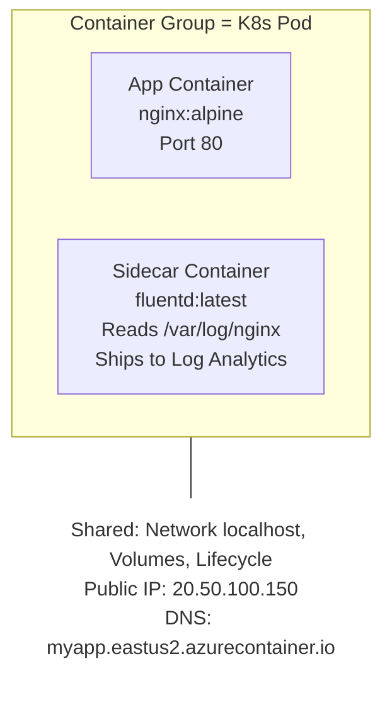
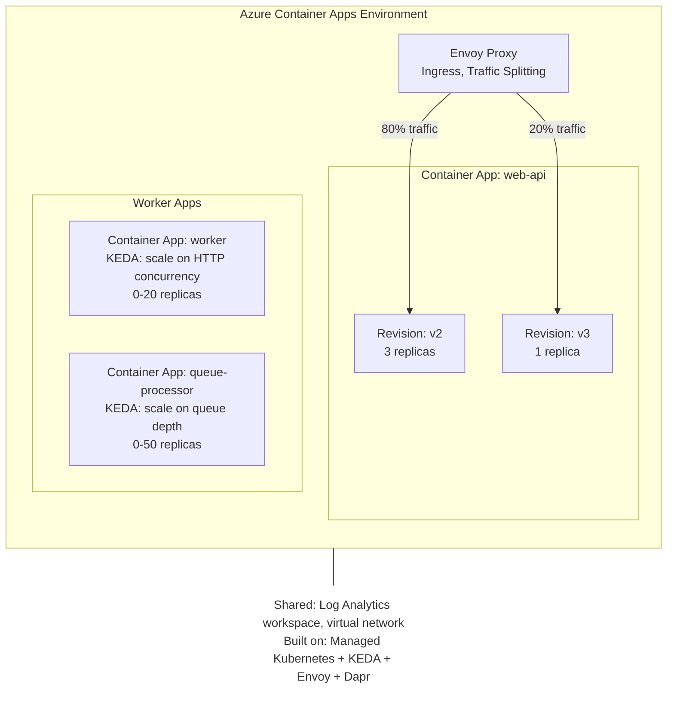
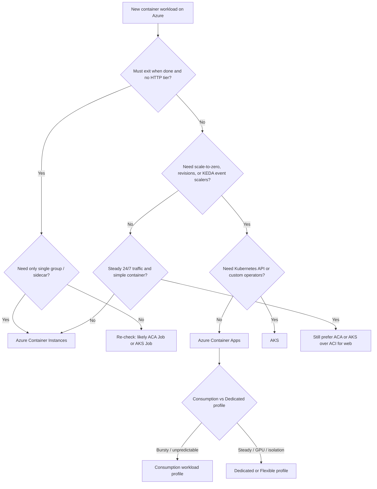

**Complexity**: `[COMPLEX]` | **Time to Complete**: 3 hours | **Prerequisites**: [Module 3.6 (ACR)](../module-3.6-acr/), [Module 3.1 (Entra ID)](../module-3.1-entra-id/)

## What You'll Be Able to Do

After completing this module, you will be able to:

- **Deploy Azure Container Instances for burst workloads with virtual network integration**
- **Configure Azure Container Apps with Dapr integration, KEDA-based autoscaling, and revision traffic splitting**
- **Implement event-driven container architectures using Container Apps with Azure Storage Queue triggers**
- **Evaluate ACI vs Container Apps vs AKS to select the right container platform for each workload pattern**

You will also be able to explain per-second ACI economics versus ACA Consumption grants, configure restart policies appropriate to batch jobs, mount Azure Files for task output, interpret revision traffic weights for canary releases, and recognize when Dedicated workload profiles change the monthly cost floor. These skills matter because Azure presents three legitimate container paths; choosing the wrong one early forces expensive rewrites or fragile shell automation that mimics features the platform already offers elsewhere.

---

## Key Concepts at a Glance

**Container group (ACI)** bundles one or more containers that share IP, lifecycle, and optional volumes. **Container Apps environment (ACA)** hosts multiple apps with shared logging, networking, Dapr components, and workload profiles. **Revision (ACA)** is an immutable app template snapshot that ingress can weight for progressive delivery. **KEDA scaler (ACA)** translates external signals such as HTTP concurrency or queue depth into replica counts. **Workload profile (ACA)** defines whether compute is serverless Consumption, reserved Dedicated, or Flexible preview. **Virtual nodes (AKS + ACI)** schedule overflow pods onto ACI capacity without maintaining extra VM nodes year-round.

Keep the mental model linear: ACI answers "run this container now," ACA answers "operate this service with platform ingress and scalers," AKS answers "I need Kubernetes APIs and node control." Everything else in the module is elaboration on those three sentences.

---

## Why This Module Matters

Hypothetical scenario: your platform team receives three container requests in one planning meeting. Operations wants a nightly data-export job that runs for twelve minutes and exits. Product wants a public HTTP API with unpredictable traffic and zero-downtime releases. Platform engineering wants a multi-tenant control plane with custom operators and node-level tuning. All three requests say "containers on Azure," but only the first maps cleanly to Azure Container Instances, only the second is a natural fit for Azure Container Apps, and the third still belongs on AKS even though ACA hides Kubernetes from you.

For spiky event-driven workloads, always-on VMs often waste money off-peak and still struggle during bursts. A queue-driven worker on Azure Container Apps can scale out during busy periods and scale back down afterward, reducing idle spend while improving backlog handling. The billing models differ in ways that matter at moderate scale: ACI charges per second for the container group's requested vCPU and memory for the entire time the group exists, while ACA Consumption adds HTTP request metering and can scale to zero when `min-replicas` is zero.

Containers have become the standard unit of deployment, but not every workload needs the complexity of Kubernetes. Azure offers two serverless container platforms that abstract away cluster management: [**Azure Container Instances (ACI)**, a raw container execution engine for simple workloads, and **Azure Container Apps (ACA)**, a higher-level platform built on Kubernetes that handles scaling, traffic routing, and service-to-service communication automatically](https://learn.microsoft.com/en-us/azure/container-apps/compare-options). ACI is the primitive: you get a container group, a network attachment, optional Azure Files storage, and restart semantics—nothing that resembles a load balancer, revision router, or horizontal autoscaler. ACA is the application platform: Envoy ingress, KEDA scalers, optional Dapr sidecars, and revision-based traffic weights sit on top of a managed environment you never patch.

In this module, you will learn when to use ACI versus Container Apps versus AKS, how container groups share lifecycle and network in ACI, how Container Apps manages revisions and traffic splitting, how KEDA auto-scaling responds to event-driven triggers, how Dapr simplifies microservice communication, and how Consumption versus Dedicated workload profiles change your cost floor. By the end, you will build an event-driven worker on Container Apps that scales based on queue length and be able to explain why a always-on web tier should not default to ACI.

---

## Azure Container Instances (ACI): Containers Without Infrastructure

ACI is the simplest way to run a container in Azure. There is no cluster to manage, no orchestrator to configure, no nodes to patch. You provide a container image, specify CPU and memory, and Azure runs it. Think of ACI as the "function" of the container world: instant startup, per-second billing, and a hard stop when the container group is deleted. The [ACI overview](https://learn.microsoft.com/en-us/azure/container-instances/container-instances-overview) emphasizes fast deployments and granular resource requests because the platform targets bursty and task-shaped work rather than long-lived multi-tier applications.

Understanding ACI as a **container group** primitive prevents category errors later. Every deployment creates a group that owns networking, DNS labels, restart policy, and optional volumes. You do not get layer-seven routing across multiple groups, health-based traffic shifting, or replica autoscaling. If you need those behaviors, you are already in ACA or AKS territory. ACI shines when the unit of work is "run this image until the process exits" or "hold this sidecar next to this app container on one host."

### When to Use ACI

ACI is ideal for:
- **Batch jobs and tasks**: Data processing, report generation, ETL pipelines
- **CI/CD build agents**: Ephemeral agents that spin up for a build and disappear
- **Dev/test environments**: Quick deployment without cluster overhead
- **Sidecar scenarios**: Running a container alongside another (container groups)
- **Burstable workloads from AKS**: Virtual Kubelet integration for overflow

[ACI is **not** ideal for long-running web services (use Container Apps), complex microservice architectures (use AKS), or workloads needing auto-scaling (use Container Apps or AKS)](https://learn.microsoft.com/en-us/azure/container-apps/compare-options). There is also no managed ingress controller that distributes HTTP across multiple container groups, no built-in TLS certificate lifecycle for custom domains at the platform layer, and no scale-out when CPU stays low while queue depth spikes. Teams sometimes deploy a single nginx container group with a public IP and call it "production," then discover that patching, rolling updates, and failure recovery are entirely manual scripts.

### Restart policies and run-to-completion tasks

ACI restart policy is a first-class design knob because billing stops when the group stops. The [restart policy documentation](https://learn.microsoft.com/en-us/azure/container-instances/container-instances-restart-policy) defines three values: `Always` (default) keeps containers running across process exits; `Never` runs at most once; `OnFailure` restarts only when the main process exits with a non-zero code. Batch exporters, CI agents, and one-shot migration containers should usually use `OnFailure` or `Never` so you are not paying for an idle restart loop after success.

```bash
# Run a task container that exits when the script completes
az container create \
  --resource-group myRG \
  --name batch-export \
  --image myregistry.azurecr.io/export:latest \
  --cpu 2 \
  --memory 4 \
  --restart-policy OnFailure \
  --registry-login-server myregistry.azurecr.io \
  --registry-username "$SP_APP_ID" \
  --registry-password "$SP_PASSWORD"
```

Pair restart policy with observability expectations. When a group reaches `Terminated`, logs remain available through `az container logs`, but there is no autoscaler to replace unhealthy replicas because replicas are not a concept. For recurring schedules, many teams trigger ACI from Azure Container Apps jobs, Azure Functions, or Logic Apps rather than leaving `Always` groups running empty loops.

### Per-second billing and what spikes cost

ACI bills at the **container group** level for requested vCPU and memory, measured in seconds from image pull start until the group stops. Microsoft rounds vCPU requests up to the nearest whole number and memory up to the nearest tenth of a gigabyte for the duration the group exists, as described on the [Container Instances pricing page](https://azure.microsoft.com/pricing/details/container-instances/). Linux and Windows rates differ, and Windows container groups incur an additional per-vCPU-second software charge documented on that same page.

At moderate scale, cost surprises usually come from four places rather than from mysterious platform fees. First, **rounding**: requesting 1.3 vCPU bills as 2 vCPU for every second the group runs. Second, **Always-on groups**: a forgotten dev container group with public IP and `Always` restart behaves like a tiny VM you never shut down. Third, **sidecars in the same group**: the log shipper and the app share the group's CPU and memory reservation, so sizing must include both containers. Fourth, **Windows images** when Linux would suffice, because the Windows surcharge applies for the entire group duration.

ACI Spot container groups (documented in the [ACI FAQ](https://learn.microsoft.com/en-us/azure/container-instances/container-instances-faq)) trade availability for discounted per-second rates on interruptible work such as Monte Carlo batches or non-critical rendering. Spot is not a substitute for ACA scale-to-zero HTTP tiers; it is still one group with no autoscaler, only cheaper seconds while Azure has spare capacity.

### Azure Files mounts and state beyond the container lifecycle

By default, container filesystems inside ACI are ephemeral. The [mount Azure Files volume guide](https://learn.microsoft.com/en-us/azure/container-instances/container-instances-volume-azure-files) shows how to attach an SMB file share so output survives restarts within the share's retention rules. This pattern suits log aggregation sidecars, batch output directories, and short pipelines that must hand results to downstream systems without adopting full Kubernetes persistent volumes.

```bash
STORAGE_KEY=$(az storage account keys list -g myRG -n mystorageacct --query "[0].value" -o tsv)

az container create \
  --resource-group myRG \
  --name worker-with-share \
  --image myregistry.azurecr.io/worker:latest \
  --cpu 1 --memory 2 \
  --azure-file-volume-account-name mystorageacct \
  --azure-file-volume-account-key "$STORAGE_KEY" \
  --azure-file-volume-share-name job-output \
  --azure-file-volume-mount-path /output
```

Linux file share mounts have documented constraints: the container often must run as root for the mount, and managed-identity-based SMB mount is not supported in the same way as Azure Files on VMs. Plan secrets rotation for storage account keys or inject keys from Key Vault at deploy time. ACA can also mount Azure Files for similar persistence needs, but ACA adds replica-level scaling and shared environment ingress on top.

### ACI-backed burst on AKS (virtual nodes)

When an AKS cluster exhausts node capacity, **virtual nodes** extend the scheduler with ACI-backed pods so burst capacity does not require pre-provisioned VMs. The integration is documented under AKS burst scenarios and the [virtual nodes concept](https://learn.microsoft.com/en-us/azure/aks/virtual-nodes). Operationally, you still pay ACI per-second rates for those pods, and networking policies differ from standard node pools, so burst is a relief valve rather than a silent cost-free expansion.

Use virtual nodes when batch or dev/test spikes would otherwise force oversized static node pools. Avoid treating virtual nodes as the primary home for latency-sensitive production services that need predictable neighbor isolation, because the pods run on multitenant ACI infrastructure with different operational characteristics than your worker nodes.

### Confidential container groups

For workloads that require hardware-rooted isolation, [confidential containers on ACI](https://learn.microsoft.com/en-us/azure/container-instances/container-instances-confidential-containers-overview) run inside confidential container groups with distinct size limits documented in the FAQ. They carry additional cost versus standard SKU groups. Choose them when compliance or threat models require encrypted memory boundaries, not when ordinary secret injection from Key Vault would suffice.

```bash
# Run a simple container
az container create \
  --resource-group myRG \
  --name hello-world \
  --image mcr.microsoft.com/azuredocs/aci-helloworld \
  --cpu 1 \
  --memory 1.5 \
  --ports 80 \
  --dns-name-label hello-kubedojo \
  --location eastus2

# View the running container
az container show -g myRG -n hello-world \
  --query '{FQDN:ipAddress.fqdn, State:provisioningState, IP:ipAddress.ip}' -o table

# View logs
az container logs -g myRG -n hello-world

# Execute a command inside the container
az container exec -g myRG -n hello-world --exec-command "/bin/sh"

# Delete when done
az container delete -g myRG -n hello-world --yes
```

### Container Groups: The ACI Pod

A **container group** is ACI's equivalent of a Kubernetes Pod. It is a [collection of containers that are scheduled on the same host, share the same network namespace (they can reach each other on `localhost`), and can share volumes](https://learn.microsoft.com/en-us/azure/container-instances/container-instances-container-groups). The group is also the **billing boundary**: you request CPU and memory once at the group level, then divide those resources across member containers. If the web container spikes CPU while the sidecar is idle, they still compete inside the same reservation, which is why capacity planning must treat the group as one unit rather than as independent micro-VMs.

Lifecycle is shared as well. Restarting or deleting the group affects every container in it. That is powerful for sidecars that must start and stop with the primary process, but dangerous when a team mixes unrelated services into one group to "save money." Two applications with different release cadences should be two groups, even if that means paying for two public IPs in lab environments. In production, private VNet groups often share internal IPs only, which reduces exposure while keeping the lifecycle coupling explicit.

Multi-container groups also define **port exposure** at the group IP address. Only ports declared on the group are reachable from outside the shared network namespace. Internal coordination happens on `localhost` without publishing ports externally, mirroring Kubernetes pod networking mental models without bringing along Services or Endpoints APIs.



```yaml
# container-group.yaml
apiVersion: "2023-05-01"
name: web-with-sidecar
location: eastus2
properties:
  containers:
    - name: web
      properties:
        image: nginx:alpine
        ports:
          - port: 80
        resources:
          requests:
            cpu: 0.5
            memoryInGb: 0.5
        volumeMounts:
          - name: shared-logs
            mountPath: /var/log/nginx

    - name: log-shipper
      properties:
        image: fluent/fluentd:latest
        resources:
          requests:
            cpu: 0.25
            memoryInGb: 0.25
        volumeMounts:
          - name: shared-logs
            mountPath: /var/log/nginx
            readOnly: true

  osType: Linux
  ipAddress:
    type: Public
    ports:
      - protocol: TCP
        port: 80
  volumes:
    - name: shared-logs
      emptyDir: {}
```

```bash
# Deploy the container group
az container create -g myRG --file container-group.yaml

# View individual container logs within a group
az container logs -g myRG -n web-with-sidecar --container-name web
az container logs -g myRG -n web-with-sidecar --container-name log-shipper
```

### ACI Networking

[ACI containers can be deployed with a **public IP** (internet-accessible) or into a **VNet subnet** (private, for internal workloads)](https://learn.microsoft.com/en-us/azure/container-instances/container-instances-virtual-network-concepts). Public deployments are fastest for tutorials because Azure assigns a DNS name label and IP, but production systems usually prefer subnet delegation so traffic stays on private address space reachable from hub-spoke peers or on-premises links. Subnet delegation consumes address space and requires planning for minimum prefix sizes documented for your region; treat that planning as part of the security design, not as a late-stage networking ticket.

DNS name labels must be unique per region, which becomes an operational naming standard issue when CI pipelines create many ephemeral groups. Automations should generate labels with entropy or use private VNet deployments without public labels when DNS is not required. Remember that IP addresses can change when groups restart if you rely on default public IP behavior without static planning, so downstream allow lists should prefer FQDN patterns documented for the deployment type or private IPs with stable integration through Application Gateway or ACA ingress in front.

Because ACI has no platform load balancer, exposing a highly available HTTP API requires architectural work outside the group: multiple groups behind Application Gateway, Front Door, or a move to ACA/AKS. That limitation is not a footnote; it is the main reason ACI fails as a web tier even when a single-container demo "works fine" in a screenshot.

```bash
# Deploy ACI into a VNet (private, no public IP)
az container create \
  --resource-group myRG \
  --name private-worker \
  --image myregistry.azurecr.io/worker:latest \
  --cpu 2 \
  --memory 4 \
  --vnet hub-vnet \
  --subnet aci-subnet \
  --registry-login-server myregistry.azurecr.io \
  --registry-username "$SP_APP_ID" \
  --registry-password "$SP_PASSWORD"
```

### ACI Resource Limits and Pricing

Sizing ACI is a request-and-round game, not a continuous autoscale curve. Standard Linux groups support fractional CPU in requests but bill whole vCPUs per second. Memory requests round up to the nearest tenth of a gigabyte. When your workload needs more than the standard maximums, Microsoft documents **big container** SKUs in the FAQ with higher vCPU and memory ceilings for compute-intensive jobs. Confidential groups have separate maximums. Always read current regional quotas in the portal or via `az container list-usage` before planning massive parallel batch fan-out, because default subscription quotas are modest and increases require support tickets.

Windows container groups remain viable when legacy .NET Framework or Windows-only tools require it, but Linux should be the default for cost and image availability. GPU acceleration in ACI has been retired for general SKUs per FAQ guidance; GPU-heavy inference should move to ACA GPU workload profiles or AKS node pools with GPU SKUs instead of expecting ACI to host CUDA workloads.

| Resource | Linux | Windows |
| :--- | :--- | :--- |
| **Max CPU per group** | Check current ACI quota docs | Check current ACI quota docs |
| **Max Memory per group** | Check current ACI quota docs | Check current ACI quota docs |
| **Max containers per group** | Check current ACI service limits | Check current ACI service limits |
| **GPU support** | Retired in ACI | No |
| **Pricing (per vCPU/sec)** | See current pricing page | See current pricing page |
| **Pricing (per GB memory/sec)** | See current pricing page | See current pricing page |

A continuously running ACI workload should be priced against the current Azure pricing page, because the effective hourly and monthly cost depends on the current rates, region, and OS. Worked estimate without pinning a currency to a stale rate: a Linux group at 2 vCPU and 4 GiB memory running continuously for thirty days is roughly 5.18 million vCPU-seconds and 10.4 million GB-seconds per month before rounding nuances. Multiply those seconds by your region's published per-second rates from the pricing page to compare against a B-series VM or against ACA with `min-replicas: 1`. You will often discover that ACI's simplicity does not beat a right-sized VM for flat always-on CPU, while ACI still wins for cumulative runtimes measured in minutes per day.

> **Pause and predict**: If you had a monolithic web application that receives consistent, heavy traffic 24/7, would ACI be a cost-effective hosting choice compared to a standard VM? Why or why not?

The honest answer is usually no for steady HTTP traffic, because you would pay continuous per-second charges without receiving load balancing, autoscaling, or managed TLS. ACI wins when utilization is sparse and task boundaries are clear.

---

## Azure Container Apps (ACA): The Sweet Spot

Azure Container Apps is built on Kubernetes (specifically, a managed environment running KEDA, Envoy, and optional Dapr sidecars) but abstracts away cluster operations. You define container images, ingress, scaling rules, secrets, and revisions; Microsoft operates the control plane, node pools behind workload profiles, and platform components. The [Container Apps overview](https://learn.microsoft.com/en-us/azure/container-apps/overview) positions the service for microservices, background jobs, and event-driven apps that need HTTPS ingress and scale rules without hiring a full platform team on day one.

Every app runs inside a **Container Apps environment**, which is the shared boundary for logging, VNet integration, Dapr components, and workload profiles. Environments are not free abstractions: VNet-injected environments, private endpoints, and Dedicated plan profiles can incur baseline charges even when individual apps scale to zero, which the [billing article](https://learn.microsoft.com/en-us/azure/container-apps/billing) calls out explicitly.

### Architecture

The managed stack underneath ACA is intentionally opaque, but the responsibilities are not. **Envoy** terminates ingress traffic, applies revision weights, and routes to active replicas. **KEDA** reads external metrics or HTTP pressure to change replica counts. **Dapr** optional sidecars implement service invocation, pub/sub, state, and secret retrieval without embedding all SDKs in application images. Your team still owns container images, environment variables, secrets, observability queries, and capacity planning; Microsoft owns kube-apiserver patching, node OS images for workload profiles, and control plane availability.



### [Container Apps vs ACI vs AKS](https://learn.microsoft.com/en-us/azure/container-apps/compare-options)

| Feature | ACI | Container Apps | AKS |
| :--- | :--- | :--- | :--- |
| **Complexity** | Lowest | Medium | Highest |
| **Auto-scaling** | No | Yes (KEDA) | Yes (HPA, KEDA, Karpenter) |
| **Scale to zero** | N/A (stops = deletes) | Yes | No (minimum 1 node) |
| **Traffic splitting** | No | Yes (revision-based) | Yes (manual with Istio/etc) |
| **Service mesh** | No | Dapr (built-in) | Istio/Linkerd (you manage) |
| **Custom domains + TLS** | No (IP/FQDN only) | Yes (auto-cert) | Yes (you manage) |
| **Persistent volumes** | Azure Files | Azure Files | Full PV/PVC support |
| **Max CPU per container** | 4 cores | 4 cores (Consumption) | Unlimited (node size) |
| **Ideal for** | Batch jobs, simple tasks | Web APIs, workers, microservices | Complex platforms, full K8s control |
| **Monthly cost baseline** | Pay per use | Consumption plan includes a monthly free grant, then pay per use | Non-zero baseline because cluster nodes must run |

Use the table as a negotiation tool in architecture reviews. When someone proposes AKS for a single stateless API with no CRD requirements, ask which row justifies control-plane ownership. When someone proposes ACI for a SaaS API with weekly releases and canary requirements, ask which missing row blocks the design. The comparison is also the backbone of Azure landing-zone guidance: platform teams standardize on ACA for application teams, reserve AKS for tenants that truly need Kubernetes APIs, and expose ACI to data engineering or CI systems that already think in jobs.

AKS deep dives in this curriculum (including Kubernetes version 1.35 targets) remain the home for pod security standards, custom operators, service mesh choice, and node pool autoscaling with Karpenter or cluster autoscaler. ACA does not remove Kubernetes from Azure; it hides it for a defined subset of application patterns. ACI removes Kubernetes entirely for single-group execution. Picking the wrong tier usually shows up six months later as either "why are we paying for three nodes overnight" or "why did we build a bash deploy script that pretends to be Kubernetes."

### Consumption versus Dedicated workload profiles

ACA environments use **workload profiles** to decide how compute is allocated and billed. The [workload profiles overview](https://learn.microsoft.com/en-us/azure/container-apps/workload-profiles-overview) describes three families today: Consumption (serverless per-replica billing with scale-to-zero on supported apps), Dedicated (reserved VM-backed pools billed per profile instance), and Flexible (preview in selected regions, blending Consumption-style billing with dedicated isolation characteristics).

Consumption profiles fit HTTP APIs and queue workers with unpredictable traffic because you pay for vCPU-seconds and GiB-seconds while replicas run, and you can set `min-replicas` to zero for supported scale rules. Dedicated profiles fit steady high-throughput services, larger per-replica CPU and memory ceilings, GPU form factors, and teams that want predictable neighbor isolation on named VM sizes. Switching profiles is not a runtime toggle inside one app; it is an environment architecture choice made when you create or extend the environment.

```bash
# Create a Container Apps Environment
az containerapp env create \
  --resource-group myRG \
  --name kubedojo-env \
  --location eastus2

# Deploy a Container App (web API)
az containerapp create \
  --resource-group myRG \
  --name web-api \
  --environment kubedojo-env \
  --image mcr.microsoft.com/k8se/quickstart:latest \
  --target-port 80 \
  --ingress external \
  --revision-suffix v1 \
  --min-replicas 1 \
  --max-replicas 10 \
  --cpu 0.5 \
  --memory 1.0Gi

# Get the app URL
az containerapp show -g myRG -n web-api --query properties.configuration.ingress.fqdn -o tsv
```

### Ingress, TLS, and internal service exposure

External ingress publishes an HTTPS endpoint on the environment's domain space, which is why ACA is the default home for microservices that must be reachable from the Internet or from a partner VPN without operating your own ingress controller fleet. Internal ingress exposes applications to other apps in the same environment using internal FQDNs, which pairs naturally with Dapr service invocation and with layered architectures where only an edge API is public. The [ingress documentation](https://learn.microsoft.com/en-us/azure/container-apps/ingress) covers transport modes, port mapping, and certificate binding; production checklists should include certificate renewal ownership even when Microsoft provides managed certificate integration.

Health probes deserve equal attention because KEDA cannot protect users from broken containers that still pass scheduling. Configure readiness probes so Envoy does not send traffic to replicas that cannot serve, and liveness probes so crashed processes restart without manual `az containerapp revision restart` calls during incidents. Probes are especially important when scaling from zero: the first replica must become ready before traffic shifts, or clients will observe flaky cold-start errors that look like application bugs.

### Revisions and Traffic Splitting

Every time you update a Container App's configuration or image, [a new **revision** is created. You can control how traffic is split between revisions, enabling canary deployments and blue/green deployments](https://learn.microsoft.com/en-us/azure/container-apps/revisions). Revisions are immutable snapshots of template settings: image digest, environment variables, scale rules, probe configuration, and resource requests. **Single revision mode** simplifies operations by automatically shifting all traffic to the latest revision, which is appropriate for internal tools. **Multiple revision mode** keeps older revisions warm so Envoy can shift weights without rebuilding images.

Traffic splitting is an ingress concern. External and internal ingress types (documented under [ingress in Container Apps](https://learn.microsoft.com/en-us/azure/container-apps/ingress)) terminate TLS at the environment edge for external apps, while internal ingress exposes service-to-service routes within the environment VNet boundary. Custom domains and managed certificates reduce toil compared with ACI public IPs, but they also imply DNS and certificate renewal processes you must own in production.

```bash
# Enable multiple active revisions
az containerapp revision set-mode \
  --resource-group myRG \
  --name web-api \
  --mode multiple

# Deploy a new revision with an updated image
az containerapp update \
  --resource-group myRG \
  --name web-api \
  --image myregistry.azurecr.io/web-api:v2.0.0 \
  --revision-suffix v2

# Split traffic: 80% to current, 20% to new revision
az containerapp ingress traffic set \
  --resource-group myRG \
  --name web-api \
  --revision-weight "web-api--v1=80" "web-api--v2=20"

# Promote: shift all traffic to the new revision
az containerapp ingress traffic set \
  --resource-group myRG \
  --name web-api \
  --revision-weight "web-api--v2=100"

# List revisions
az containerapp revision list -g myRG -n web-api \
  --query '[].{Name:name, Active:properties.active, TrafficWeight:properties.trafficWeight, Created:properties.createdTime}' -o table
```

### KEDA Auto-Scaling

[Container Apps uses KEDA (Kubernetes Event-Driven Autoscaling) to scale based on event sources, not just CPU/memory](https://learn.microsoft.com/en-us/azure/container-apps/scale-app). This is the defining feature for event-driven architectures because the scaler observes the backlog or request pressure you care about, not a lagging CPU graph. HTTP rules use concurrent request thresholds; queue rules use depth per replica; cron rules fire scheduled jobs. Each rule still respects `min-replicas` and `max-replicas`, and cool-down timers prevent flapping when messages arrive in bursts.

Scale-to-zero is powerful only when idle truly means zero replicas. Setting `min-replicas` to 1 for a queue worker "to avoid cold start" converts ACA into a small always-on service that bills active rates continuously, which erases much of the Consumption savings described in the billing guide. For user-facing HTTP APIs, measure cold-start latency with realistic images and regional placement before committing to zero; background workers often tolerate tens of seconds of startup while still saving substantially versus always-on VMs.

```bash
# Scale based on HTTP concurrent requests
az containerapp create \
  --resource-group myRG \
  --name http-api \
  --environment kubedojo-env \
  --image myregistry.azurecr.io/api:v1 \
  --target-port 8080 \
  --ingress external \
  --min-replicas 0 \
  --max-replicas 30 \
  --scale-rule-name http-rule \
  --scale-rule-type http \
  --scale-rule-http-concurrency 50

# Scale based on Azure Service Bus queue depth
az containerapp create \
  --resource-group myRG \
  --name queue-worker \
  --environment kubedojo-env \
  --image myregistry.azurecr.io/worker:v1 \
  --min-replicas 0 \
  --max-replicas 50 \
  --scale-rule-name queue-rule \
  --scale-rule-type azure-servicebus \
  --scale-rule-metadata "queueName=processing" "namespace=my-sb-ns" "messageCount=5" \
  --scale-rule-auth "connection=sb-connection-string" \
  --secrets "sb-connection-string=$SB_CONNECTION_STRING"
```

Available KEDA scale triggers in Container Apps:

When you combine multiple rules, remember that KEDA evaluates scalers against the maximum desired replica count implied by the active rules, subject to `max-replicas`. A cron scaler that wakes a nightly job can coexist with a queue scaler for daytime backlog, but overlapping rules without documentation confuse on-call engineers during incidents. Name each scaler rule and document it in the production application runbook the same way you document database connection limits, pool sizes, and client timeout values.

| Trigger | Scales On | Example Use Case |
| :--- | :--- | :--- |
| **HTTP** | Concurrent requests | Web APIs |
| **Azure Service Bus** | Queue/topic message count | Async processing |
| **Azure Storage Queue** | Queue message count | Batch processing |
| **Azure Event Hubs** | Unprocessed event count | Event streaming |
| **Cron** | Schedule | Scheduled batch jobs |
| **TCP** | Concurrent TCP connections | TCP-based services |
| **Custom** | Any Prometheus metric | Custom workloads |

### Dapr Integration

[Dapr (Distributed Application Runtime) is built into Container Apps and provides building blocks for microservice communication without requiring you to learn Kubernetes networking](https://learn.microsoft.com/en-us/azure/container-apps/dapr-overview). Enable Dapr per app with an application ID and port; the platform injects the sidecar and wires component YAML at the environment level for pub/sub brokers, state stores, and secret stores. Scopes limit which apps may use a component, which prevents accidental cross-talk when dozens of microservices share one environment.

Service invocation routes `http://localhost:3500/v1.0/invoke/<app-id>/method/<name>` through the sidecar, which resolves targets inside the environment rather than hard-coding cluster DNS names that change during revisions. Pub/sub decouples publishers from subscribers: an order service publishes `OrderCreated` without maintaining a subscriber list in code. State management abstracts key/value persistence to configured backends. Each capability trades operational simplicity for sidecar overhead; monitor CPU and memory after enabling Dapr on high-density environments.

Component configuration belongs in Git-reviewed YAML checked into your platform repository, not in one-off CLI strings in runbooks. The example below shows a `pubsub.yaml` component file; apply it with `az containerapp env dapr-component set --yaml pubsub.yaml`. Production pipelines should parameterize secrets via Key Vault references or managed identity-backed components where supported.

```mermaid
flowchart TB
    subgraph Dapr Blocks
        direction TB
        B1["Service Invoke: Call other services by name"]
        B2["Pub/Sub: Publish/subscribe messaging"]
        B3["State Store: Key/value state management"]
        B4["Bindings: Input/output bindings (queues, DBs)"]
        B5["Secrets: Secret store integration"]
    end

    subgraph Flow Without Dapr
        direction LR
        App1[App] -- HTTP call --> API1[http://web-api.internal.company.com:8080/orders]
    end

    subgraph Flow With Dapr
        direction LR
        App2[App] -- HTTP call --> Sidecar[Dapr sidecar<br/>http://localhost:3500/v1.0/invoke/web-api/method/orders]
        Sidecar -.-> Magic[Dapr handles service discovery, retries, mTLS, observability]
        style Magic fill:none,stroke:none
    end
```



```yaml
# pubsub.yaml — Dapr pub/sub component for Azure Service Bus
componentType: pubsub.azure.servicebus.topics
version: v1
metadata:
  - name: connectionString
    secretRef: sb-connection
secrets:
  - name: sb-connection
    value: "<connection-string>"
scopes:
  - order-service
  - notification-service
```

```bash
# Enable Dapr on a Container App
az containerapp create \
  --resource-group myRG \
  --name order-service \
  --environment kubedojo-env \
  --image myregistry.azurecr.io/order-service:v1 \
  --target-port 8080 \
  --ingress internal \
  --enable-dapr true \
  --dapr-app-id order-service \
  --dapr-app-port 8080 \
  --dapr-app-protocol http

# Configure a Dapr pub/sub component from file
az containerapp env dapr-component set \
  --resource-group myRG \
  --name kubedojo-env \
  --dapr-component-name pubsub \
  --yaml pubsub.yaml
```

**Example pattern**: In a microservice architecture, direct service-to-service HTTP calls can amplify slowdowns and retries into cascading failures. Dapr on Container Apps can reduce custom plumbing by adding service invocation, mTLS, and optional resiliency features such as retries and circuit breakers.

> **Stop and think**: If your team is migrating a complex microservices architecture to Azure and wants to avoid the operational overhead of managing a full Kubernetes cluster, how does ACA's built-in Dapr integration reduce the custom code you need to write?

---

## Choosing ACI, Container Apps, or AKS

The decision is primarily about **operational ownership** and **scaling contract**, not about which logo appears on the slide deck. ACI minimizes moving parts: no cluster RBAC, no node pools, no ingress controller installation. ACA minimizes Kubernetes toil while keeping application-level primitives teams expect from platforms: replicas, autoscaling, revisions, managed ingress. AKS maximizes control: you install operators, tune the API server, choose CNI plugins, and accept patch and upgrade responsibility for the data plane.

| Operational burden | ACI | Container Apps | AKS |
| :--- | :--- | :--- | :--- |
| Cluster upgrades | None (no cluster) | Platform-managed | Customer-owned |
| Autoscaling | Manual / external orchestration | KEDA rules native | HPA, KEDA, Karpenter, custom |
| Multi-service routing | Manual DNS / scripts | Envoy ingress + revisions | Service mesh or ingress you operate |
| Identity integration | Registry creds, SP, managed identity patterns | Managed identity + secrets store | Full workload identity patterns |
| Blast radius of misconfiguration | Single group | Environment-wide profiles | Cluster-wide |

Short-lived **tasks**—CI agents, one-off renders, migration scripts—should default to ACI with `OnFailure` or `Never` restart policies unless they need ACA jobs features you have already standardized on. **Event-driven services and HTTP APIs** that benefit from scale-to-zero, queue-depth scaling, or revision traffic splitting belong on ACA Consumption unless Dedicated profiles are justified by steady load or GPU form factors. **Platforms** that install cluster-scoped controllers, require hostPath, need arbitrary DaemonSets, or depend on unsupported Container Apps APIs belong on AKS, even if the first sprint could hack a subset into ACA.

Hypothetical scenario: a team proposes ACI for a customer-facing API because "containers are containers." Push back with the comparison table: without autoscaling, TLS lifecycle, or revision routing, the team will reimplement fragile shell scripts for deploys and outages. Hypothetical scenario: a team proposes AKS for a single internal webhook that fires twice an hour. ACA with `min-replicas: 0` and an HTTP or queue scaler likely costs less operational attention than a two-node cluster that runs continuously.

When AKS already exists, virtual nodes remain the bridge for burst pods that tolerate ACI economics. When ACA already exists, ACI remains the bridge for tasks that should not pay for environment ingress and Dapr sidecars they will never use.

Document the decision in your architecture record with three fields: **runtime shape** (task, service, platform), **scaling contract** (none, KEDA, Kubernetes autoscaler), and **cost floor** (per-second group, Consumption replica seconds, node pool hours). Future you—and the finance partner reviewing the subscription—will otherwise relitigate the same ACI-versus-ACA debate every quarter with only invoice screenshots as evidence.

---

## Patterns & Anti-Patterns

| Pattern | When to use it | Why it works | Scaling note |
| :--- | :--- | :--- | :--- |
| ACI `OnFailure` for batch exports | Known exit code semantics, finite runtime | Billing tracks active seconds only; no replica concept to misconfigure | Many parallel groups need quota planning per subscription region |
| Container group sidecars | Log shipping or config refresh beside one app | Shared `localhost` network and volumes without a cluster | Size CPU/memory for sum of containers; one OOM affects the group |
| ACA revision canary | User-facing API with measurable error budgets | Envoy shifts weights without rebuilding the whole environment | Deactivate stale revisions to stay under revision limits |
| KEDA queue scaler with `min-replicas: 0` | Background workers with tolerable cold start | Scales on backlog, not CPU lag | Tune `queueLength` per replica to avoid under-provisioning spikes |
| Dapr pub/sub between ACA services | Three or more services needing loose coupling | Removes bespoke discovery and adds resiliency hooks | Each Dapr sidecar consumes CPU/memory; keep scopes tight |
| Dedicated workload profile for steady GPU inference | Predictable high QPS or GPU classes | Reserved nodes reduce noisy-neighbor surprises | Profile instances bill even when apps scale in partially |
| AKS virtual nodes for batch overflow | Existing cluster, intermittent burst | Adds capacity without permanent large node pools | Monitor ACI per-second charges during bursts |

| Anti-pattern | What goes wrong | Why teams pick it | Better alternative |
| :--- | :--- | :--- | :--- |
| ACI as 24/7 web tier | No autoscaler, manual deploys, fragile IP/DNS story | "We already know `az container create`" | ACA with ingress + KEDA HTTP scaler |
| `min-replicas: 1` "just in case" on idle workers | Pays active rates 24/7; scale-to-zero savings disappear | Fear of cold starts without measurement | Load-test cold start; use 0 for queue workers |
| Enabling Dapr on two-service monolith | Sidecar tax without pub/sub benefit | Checkbox enablement during POC | Direct internal ingress until cross-cutting needs appear |
| Ignoring environment VNet costs | Bills continue with private endpoints and profiles idle | Focus only on app replica count | Right-size environment features; document baseline |
| ACA for full Kubernetes API access | Unsupported scenarios become hacks | Avoiding AKS operational fear | AKS with platform team guardrails |
| Giant ACI groups without restart policy thought | Restart loops after success burn seconds | Default `Always` left in place | `OnFailure` or `Never` for tasks |
| Single revision mode during risky migrations | All traffic jumps at once | Simpler CLI defaults | Multiple revision mode + weighted ingress |

---

## Decision Framework

Start with workload **shape**, not brand preference. If the process must exit and never respawn unless failure occurs, begin with ACI. If the workload serves HTTP or consumes queues with variable depth, begin with ACA. If the workload needs cluster-scoped APIs or custom node configuration, begin with AKS.



| Decision point | Lean ACI | Lean ACA | Lean AKS |
| :--- | :--- | :--- | :--- |
| Runtime | Minutes to hours, non-HTTP | HTTP or queue/event driven | Any, including controllers |
| Deploy model | One-off group | Revisions with ingress weights | Helm/GitOps pipelines |
| Cost model | Per-second group | Per-second replica + requests | Node pool hours |
| Team skills | Scripting + ACR | App config + scalers | Kubernetes platform |

Worked example: a PDF renderer runs forty times per day for three minutes each. ACI with `OnFailure`, ACR pull from managed identity, and optional Azure Files output is the straightforward design. Worked example: an order API with business-hours spikes, JWT auth, and blue/green deploys maps to ACA Consumption with HTTP scaler, multiple revision mode, and readiness probes. Worked example: a data platform operator that installs CRDs cluster-wide maps to AKS regardless of ACA marketing overlap.

---

## Cost Lens

**ACI** costs are the sum of vCPU-seconds and GB-seconds for the container group's requested resources while the group exists, plus Windows surcharges when applicable, as published on the [Container Instances pricing page](https://azure.microsoft.com/pricing/details/container-instances/). Cost knobs that actually move the bill: shorten lifetime (delete groups aggressively), right-size CPU/memory requests to avoid rounding waste, prefer Linux images, use Spot groups only when interruptions are acceptable, and avoid `Always` groups for tasks that should stop. Cost spikes: hundreds of parallel groups during a misconfigured loop, oversized "big container" SKUs left running over a weekend, or Windows groups left up for dev convenience.

**ACA Consumption** adds vCPU-seconds, GiB-seconds, and HTTP request charges after the monthly free grant documented in [Container Apps billing](https://learn.microsoft.com/en-us/azure/container-apps/billing): 180,000 vCPU-seconds, 360,000 GiB-seconds, and 2 million requests per subscription per calendar month. Free grants do not appear as line-item credits; you simply pay only for usage above them. Idle billing still applies when replicas exist: a `min-replicas` of 1 on a 0.5 vCPU / 1 GiB app consumes active rates continuously. Scale-to-zero saves money only when replicas truly scale to zero and the environment features you enabled do not impose their own baseline.

**ACA Dedicated** shifts spend to **workload profile instances**—reserved VM-backed capacity—plus a management fee when Dedicated profiles exist in the environment, per the billing article. This can be cheaper than Consumption for always-on, predictable workloads, but it introduces a floor cost even when individual apps scale in. **Flexible** profiles (preview regions listed in the workload profiles overview) add Consumption-like metering plus dedicated management fees and cannot scale to zero.

Compare platforms with the same traffic sketch: one million HTTP requests per month, average 0.5 vCPU and 1 GiB per instance, five minutes average processing per request burst. ACI without autoscaling forces over-provisioned always-on groups or manual orchestration, often losing on operations before pure dollar math. ACA Consumption with `min-replicas: 0` aligns cost with active seconds and may remain inside free grants for modest startups. AKS with two small nodes runs continuously; it wins when you need the API, not when you only need ten hours of compute per month.

**ACA Consumption worked sketch (conceptual):** suppose one replica at 0.5 vCPU and 1 GiB runs for 100,000 seconds in a month and serves 500,000 HTTP requests. vCPU-seconds equal 50,000 and GiB-seconds equal 100,000, both below the free grant thresholds, so compute might bill only above grant if other apps in the subscription consumed the free pool first. Requests also sit below two million. Add a second app with the same footprint and you may still remain free. Add always-on `min-replicas: 1` on three apps 24/7 and you will exit the free tier quickly because seconds accumulate while queues are empty. **Dedicated sketch:** one D4 profile instance running full time bills per profile hours regardless of whether individual microservices scaled in; that can be cheaper than millions of burst seconds if utilization is flat above roughly sixty percent.

Cost governance habits that survive audits: tag container groups and container apps with `cost-center` and `environment`, alert on unexpected ACI group counts per resource group, review ACA environments with zero apps but enabled private endpoints, and schedule weekly reports on vCPU-seconds by app. Finance conversations go better when you translate scaler settings into seconds per month before they translate invoices into surprises.

---

## Did You Know?

1. **Azure Container Instances is designed for burstable, on-demand container workloads.** Teams can use ACI to spin up large numbers of short-lived container groups for batch processing and then shut them down when the work is finished.

2. **Container Apps includes a monthly free grant on the Consumption plan.** The current grant includes 180,000 vCPU-seconds, 360,000 GiB-seconds, and 2 million requests per subscription per month; how far that goes depends on your app's CPU, memory, and request profile.

3. **Container Apps can scale from zero to many replicas for bursty workloads.** Exact startup and scale-out times depend on factors such as image size, networking, environment state, and the scaling trigger, but the platform is designed for responsive event-driven scaling.

4. **Container Apps is a fully managed platform that does not expose the underlying Kubernetes API directly.** You work through the Container Apps resource model and tooling rather than managing the cluster yourself.

The fourth fact is a governance hinge: platform engineering teams cannot apply cluster-scoped `ClusterRole` patterns from AKS training verbatim on ACA. Instead they standardize environment boundaries, Dapr component libraries, and approved scaler types. Application teams gain speed; platform teams shift left into policy templates rather than node SSH.

---

## Common Mistakes

Most container platform incidents in Azure are misconfiguration stories rather than mysterious platform bugs. Teams import Kubernetes habits into ACI and wonder why replicas do not exist. Teams import VM habits into ACA and wonder why scale-to-zero does not save money while `min-replicas` stays at one. The table below captures the failures operators repeat across subscriptions; treat it as a pre-production review checklist for every new container group or container app.

| Mistake | Why It Happens | How to Fix It |
| :--- | :--- | :--- |
| Using ACI for long-running web services that need auto-scaling | ACI is the first container service teams discover | Use Container Apps for HTTP workloads that need scaling. [ACI has no built-in auto-scaling or load balancing](https://learn.microsoft.com/en-us/azure/container-apps/compare-options). |
| Setting min-replicas to 1 when the workload can tolerate cold starts | Fear of cold start latency | If your workload is event-driven (queue processor, scheduled job), set min-replicas to 0. You only pay when the app is actively processing work. Cold-start latency is often acceptable for background jobs, but exact startup time depends on image size and environment. |
| Not configuring health probes on Container Apps | The app "works" without them | [Without health probes, Container Apps cannot detect unhealthy replicas. Configure both liveness and readiness probes at minimum.](https://learn.microsoft.com/en-us/azure/container-apps/health-probes) |
| Using Container Apps for workloads that need Kubernetes-level control | Container Apps seems easier than AKS | If you need direct access to the Kubernetes API or cluster-level control, you need AKS. Container Apps is not intended to replace full Kubernetes control-plane scenarios. |
| Hardcoding connection strings in container environment variables | It works and is easy to set up | Use Container Apps secrets and reference them in env vars. Better yet, use Managed Identity where the target Azure service supports it so you do not have to manage credentials in your app. |
| Ignoring revision cleanup | Old revisions accumulate and count toward limits | Deactivate old revisions after promoting new ones. [Container Apps has a limit on the number of revisions per app.](https://learn.microsoft.com/en-us/azure/container-apps/revisions) |
| Not setting resource limits (CPU/memory) per container | Defaults "seem fine" in dev | Without limits, a misbehaving container can consume all available resources and affect other apps in the same environment. Set realistic CPU and memory limits based on load testing. |
| Using Dapr for simple point-to-point HTTP calls between two services | Dapr sounds beneficial and is free to enable | Dapr adds a sidecar container that consumes CPU and memory. For simple architectures with 2-3 services, direct HTTP is simpler. Dapr shines when you have many services and need pub/sub, state management, or cross-cutting concerns. |

---

## Quiz

<details>
<summary>1. Scenario: Your team is debating between ACI and Azure Container Apps for a new microservices deployment. A junior developer states they are essentially the same service, just with different pricing. How would you explain the fundamental architectural differences to correct this misconception?</summary>

Azure Container Instances (ACI) and Azure Container Apps (ACA) operate on fundamentally different architectures. ACI functions as a raw container execution engine, simply taking a container image and providing compute resources to run it without any built-in orchestration, traffic routing, or auto-scaling. In contrast, Azure Container Apps is built on top of a fully managed Kubernetes cluster under the hood, pre-configured with KEDA for event-driven scaling, Envoy for traffic splitting, and Dapr for microservice communication. Because ACA abstracts away the Kubernetes control plane, you receive orchestration benefits like scale-to-zero and seamless service discovery without having to manage nodes or complex YAML manifests yourself.
</details>

<details>
<summary>2. Scenario: You have been tasked with migrating two distinct workloads to Azure: a nightly PDF generation script that runs for ten minutes and stops, and an e-commerce shopping cart API that experiences highly variable traffic throughout the day. Which container service would you choose for each workload, and why?</summary>

For the nightly PDF generation script, Azure Container Instances (ACI) is the optimal choice because it is a simple, short-lived task that requires no auto-scaling, load balancing, or persistent network identity. You simply pay per second of execution, and the container group terminates once the job completes, making it highly cost-effective and operationally simple. For the e-commerce shopping cart API, Azure Container Apps (ACA) is the required solution. This workload demands responsive HTTP auto-scaling to handle traffic spikes, built-in ingress, and zero-downtime deployments via traffic splitting, all of which ACA provides natively through its managed Kubernetes foundation and Envoy proxy.
</details>

<details>
<summary>3. Scenario: Your background processing service needs to scale based on the number of pending orders in an Azure Storage Queue. A colleague suggests just using a standard CPU utilization metric of 70% to trigger scale-out events. Why is this approach flawed for queue processors, and how does KEDA scaling in Container Apps provide a better solution?</summary>

Relying on CPU-based auto-scaling for queue processors is fundamentally flawed because CPU utilization is a lagging indicator that only measures current compute usage, not the actual backlog of pending work. If your queue suddenly receives 10,000 messages while your existing instances are idle, the CPU metric won't trigger a scale-out until the instances start pulling messages and actually consume CPU cycles. KEDA solves this by directly monitoring external event sources, such as queue depth, HTTP concurrency, or topic lag, meaning it scales based on the demand signal rather than the resource consumption. Additionally, KEDA enables scaling completely to zero when the queue is empty, which is impossible with CPU scaling since you must have at least one running instance to measure CPU usage.
</details>

<details>
<summary>4. Scenario: You are performing a canary deployment for a critical payment gateway running on Container Apps. You currently have 80% of traffic routing to revision v1 and 20% to revision v2. When you observe no errors in v2, you update the ingress rules to route 100% of traffic to v2. What happens to the users currently in the middle of processing a payment on revision v1?</summary>

Users currently processing payments on revision v1 will not experience drops or interruptions. When you shift the traffic weights to 100% for revision v2, the Envoy proxy stops routing new incoming requests to v1 while allowing established connections on v1 to complete. In **multiple revision mode**, weighting v1 to 0 does not automatically deactivate it—v1 stops receiving new requests, but you should deactivate or scale it down once drained. In **single revision mode**, shifting all traffic to v2 deactivates the prior revision automatically.
</details>

<details>
<summary>5. Scenario: Your architecture consists of an order service, an inventory service, and a shipping service communicating via standard REST calls over HTTP. During a recent outage, a database slowdown in the inventory service caused cascading timeouts that brought down the entire application. How would enabling Dapr on your Container Apps have mitigated this specific failure?</summary>

Direct HTTP calls between services lack inherent resilience mechanisms; if a downstream service slows down, upstream services simply wait and time out, quickly exhausting connection pools and causing cascading system failures. By enabling Dapr in Container Apps, a sidecar proxy is injected alongside your application container that intercepts these inter-service calls. Dapr automatically provides a robust service mesh layer that includes retries with exponential backoff, circuit breakers, and distributed tracing without requiring any changes to your application code. In the scenario of a slow inventory database, Dapr's circuit breaker would typically trip quickly, rejecting calls from the order service to help prevent connection pool exhaustion and allowing the rest of the system to remain stable while the inventory service recovers.
</details>

<details>
<summary>6. Scenario: You deploy an ACA background worker configured to process video rendering jobs from a Service Bus queue, with a target of 1 replica per 5 messages, min-replicas set to 0, and max-replicas set to 50. During off-peak hours, a batch upload system suddenly pushes 1,000 video jobs into the queue. Detail the exact sequence of scaling events that Container Apps will execute in response.</summary>

Initially, KEDA detects the sudden spike in queue depth and triggers a scale-out from zero replicas, with the first instance starting up after a brief cold start (seconds, depending on image size) to pull the image and initialize the container. Next, KEDA evaluates your scaling rule (1 replica per 5 messages) against the backlog of 1,000 messages, calculating a desired state of 200 replicas, but strictly caps the deployment at your configured `max-replicas` limit of 50. The environment rapidly spins up to 50 concurrent replicas to chew through the queue backlog. Once the queue is entirely empty and the default cool-down period of 300 seconds passes without any new messages arriving, KEDA will gracefully scale the worker back down to zero replicas, ensuring you pay absolutely nothing for compute while the system is idle.
</details>

<details>
<summary>7. Scenario: Finance asks why ACA costs rose after you "optimized" scale-to-zero. The app still shows `minReplicas: 1`, the environment uses a VNet with a private endpoint, and average queue depth is near zero nights and weekends. Which factors explain the bill despite scale-to-zero marketing?</summary>

Scale-to-zero in ACA applies to application replicas, not to every resource in the architecture. With `minReplicas` set to 1, at least one replica remains allocated overnight, consuming vCPU-seconds and GiB-seconds at active rates even when the queue is empty. Environment-level choices such as VNet injection and private endpoints can incur ongoing charges independent of replica count, which the billing documentation separates from Consumption free grants. The monthly free grant also covers only the first 180,000 vCPU-seconds, 360,000 GiB-seconds, and 2 million HTTP requests per subscription; sustained always-on replicas and networking features exhaust those grants quickly. The fix path is to measure cold-start tolerance, set `min-replicas` to 0 for true background workers, and document environment baseline costs before promising zero-dollar idle periods.
</details>

<details>
<summary>8. Scenario: You must run a one-time database migration container that needs 2 vCPU, 4 GiB RAM, an Azure Files mount for CSV output, and guaranteed termination when the script exits successfully. A teammate suggests ACA Consumption with `min-replicas: 0` instead of ACI. What would you recommend and why?</summary>

ACI is the better default for a single run-to-completion task with an Azure Files mount because the platform natively models restart policies (`OnFailure` or `Never`), per-second billing for exactly the group lifetime, and straightforward file share mounts without provisioning ingress, revisions, or Dapr sidecars you will not use. ACA Consumption could run a job-style pattern, but it introduces environment dependencies and scaler semantics that add moving parts without improving the migration outcome. Choose ACA when the same environment will host long-lived services that share networking and observability; choose ACI when the unit of work is a bounded script that should disappear from the bill the moment it exits zero.
</details>

---

## Hands-On Exercise: Event-Driven Worker on Container Apps Scaling on Queue Length

In this exercise, you will deploy an Azure Container App that processes messages from a Storage Queue, auto-scales based on queue depth using KEDA, and scales to zero when idle. The lab intentionally uses a public quickstart image rather than a custom worker binary so you can focus on platform wiring: environment creation, secret references, scaler metadata, and replica observation. In production you would swap the image for your worker, add managed identity to Storage instead of connection-string secrets where possible, and export metrics to Azure Monitor for queue age alarms independent of KEDA.

Read the exercise as three layers. Task 1 provisions durable queue storage. Task 2 creates the observability-backed environment that all apps in the lab share. Task 3 attaches the scaler rule that translates queue depth into replica count. Tasks 4 through 6 prove the economic story: zero replicas when idle, non-zero replicas when messages exist, and logs that explain scaling decisions. If replica count does not move, verify secret names in `--scale-rule-auth` match `--secrets`, that the storage account name in metadata is correct, and that messages actually landed in `work-items` using the verification commands.

**Prerequisites**: Azure CLI installed and authenticated.

### Task 1: Create Infrastructure

```bash
RG="kubedojo-aca-lab"
LOCATION="eastus2"
STORAGE_NAME="kubedojoaca$(openssl rand -hex 4)"
ENV_NAME="kubedojo-env"

# Create resource group
az group create --name "$RG" --location "$LOCATION"

# Create storage account for the queue
az storage account create \
  --name "$STORAGE_NAME" \
  --resource-group "$RG" \
  --location "$LOCATION" \
  --sku Standard_LRS

# Create a queue
az storage queue create \
  --name "work-items" \
  --account-name "$STORAGE_NAME"

# Get the storage connection string
STORAGE_CONN=$(az storage account show-connection-string \
  --name "$STORAGE_NAME" -g "$RG" --query connectionString -o tsv)
```

<details>
<summary>Verify Task 1</summary>

```bash
az storage queue list --account-name "$STORAGE_NAME" --query '[].name' -o tsv
```

You should see `work-items`.
</details>

### Task 2: Create the Container Apps Environment

```bash
# Create a Log Analytics workspace (required for Container Apps)
az monitor log-analytics workspace create \
  --resource-group "$RG" \
  --workspace-name kubedojo-logs

LOG_ANALYTICS_ID=$(az monitor log-analytics workspace show \
  -g "$RG" -n kubedojo-logs --query customerId -o tsv)
LOG_ANALYTICS_KEY=$(az monitor log-analytics workspace get-shared-keys \
  -g "$RG" -n kubedojo-logs --query primarySharedKey -o tsv)

# Create Container Apps environment
az containerapp env create \
  --resource-group "$RG" \
  --name "$ENV_NAME" \
  --location "$LOCATION" \
  --logs-workspace-id "$LOG_ANALYTICS_ID" \
  --logs-workspace-key "$LOG_ANALYTICS_KEY"
```

<details>
<summary>Verify Task 2</summary>

```bash
az containerapp env show -g "$RG" -n "$ENV_NAME" \
  --query '{Name:name, State:provisioningState, Location:location}' -o table
```

State should be `Succeeded`.
</details>

### Task 3: Deploy the Queue Worker Container App

```bash
# Deploy a worker that reads from the storage queue
# Using a simple Alpine container that simulates message processing
az containerapp create \
  --resource-group "$RG" \
  --name queue-worker \
  --environment "$ENV_NAME" \
  --image mcr.microsoft.com/k8se/quickstart:latest \
  --cpu 0.25 \
  --memory 0.5Gi \
  --min-replicas 0 \
  --max-replicas 10 \
  --secrets "storage-connection=$STORAGE_CONN" \
  --env-vars "STORAGE_CONNECTION=secretref:storage-connection" "QUEUE_NAME=work-items" \
  --scale-rule-name queue-scaling \
  --scale-rule-type azure-queue \
  --scale-rule-metadata "queueName=work-items" "queueLength=5" "accountName=$STORAGE_NAME" \
  --scale-rule-auth "connection=storage-connection"
```

<details>
<summary>Verify Task 3</summary>

```bash
az containerapp show -g "$RG" -n queue-worker \
  --query '{Name:name, MinReplicas:properties.template.scale.minReplicas, MaxReplicas:properties.template.scale.maxReplicas}' -o table
```

Min should be 0, max should be 10.
</details>

### Task 4: Verify Scale to Zero

```bash
# Check current replica count (should be 0 since queue is empty)
az containerapp replica list -g "$RG" -n queue-worker \
  --query 'length(@)' -o tsv

echo "Current replicas: $(az containerapp replica list -g "$RG" -n queue-worker --query 'length(@)' -o tsv)"
echo "(Should be 0 -- no messages in queue)"
```

<details>
<summary>Verify Task 4</summary>

The replica count should be 0 (or the command returns an empty list). This confirms scale-to-zero is working---no compute cost when idle.
</details>

### Task 5: Generate Load and Observe Scaling

```bash
# Send 50 messages to the queue
for i in $(seq 1 50); do
  az storage message put \
    --queue-name "work-items" \
    --content "work-item-$i" \
    --account-name "$STORAGE_NAME" \
    --connection-string "$STORAGE_CONN"
done

echo "Sent 50 messages. Waiting 30 seconds for KEDA to detect..."
sleep 30

# Check replica count (should have scaled up)
echo "Current replicas: $(az containerapp replica list -g "$RG" -n queue-worker --query 'length(@)' -o tsv)"

# Check the queue length (approximate count from queue metadata)
az storage queue metadata show \
  --name "work-items" \
  --account-name "$STORAGE_NAME" \
  --connection-string "$STORAGE_CONN" \
  --query approximateMessageCount -o tsv
```

<details>
<summary>Verify Task 5</summary>

The replica count should have increased from 0. With 50 messages and a queueLength of 5, KEDA targets 50/5 = 10 replicas (matching our max). The exact number depends on timing and how quickly messages are processed.
</details>

### Task 6: Monitor via Log Analytics

```bash
# View container app system logs
az containerapp logs show \
  --resource-group "$RG" \
  --name queue-worker \
  --type system \
  --follow false

# Query Log Analytics for scaling events (may take a few minutes to appear)
az monitor log-analytics query \
  --workspace "$LOG_ANALYTICS_ID" \
  --analytics-query "ContainerAppSystemLogs_CL | where RevisionName_s contains 'queue-worker' | project TimeGenerated, Log_s | order by TimeGenerated desc | take 20" \
  --output table 2>/dev/null || echo "Logs may take 5-10 minutes to appear in Log Analytics"
```

<details>
<summary>Verify Task 6</summary>

You should see system logs showing replica creation events as the worker scales to meet queue demand. If logs are not yet available, wait a few minutes---Log Analytics ingestion has a delay.
</details>

### Cleanup

```bash
az group delete --name "$RG" --yes --no-wait
```

### Success Criteria

- [ ] Storage queue created with messages successfully sent
- [ ] Container Apps environment created with Log Analytics integration
- [ ] Queue worker deployed with KEDA scale rule on queue depth
- [ ] Worker scaled to zero when queue is empty (no compute cost)
- [ ] Worker scaled up when messages were added to the queue
- [ ] Logs visible showing scaling events

---

## Next Module

[Module 3.8: Azure Functions & Serverless](../module-3.8-functions/) --- Learn Azure's function-as-a-service platform with triggers, bindings, and Durable Functions for orchestrating complex serverless workflows.

## Sources

- [Azure Container Instances overview](https://learn.microsoft.com/en-us/azure/container-instances/container-instances-overview) — Serverless container primitive, per-second billing model, and feature scope.
- [Restart policies for run-once tasks](https://learn.microsoft.com/en-us/azure/container-instances/container-instances-restart-policy) — `Always`, `Never`, and `OnFailure` semantics for task-shaped workloads.
- [Mount an Azure Files share in ACI](https://learn.microsoft.com/en-us/azure/container-instances/container-instances-volume-azure-files) — Persistent output via SMB shares and CLI/YAML mount patterns.
- [Container groups](https://learn.microsoft.com/en-us/azure/container-instances/container-instances-container-groups) — Multi-container shared network, volumes, and lifecycle.
- [Deploy ACI into a virtual network](https://learn.microsoft.com/en-us/azure/container-instances/container-instances-virtual-network-concepts) — Private subnet deployment without public IPs.
- [ACI FAQ (quotas, Spot, confidential)](https://learn.microsoft.com/en-us/azure/container-instances/container-instances-faq) — Size limits, Spot discounts, and confidential container groups.
- [Confidential containers on ACI overview](https://learn.microsoft.com/en-us/azure/container-instances/container-instances-confidential-containers-overview) — Hardware-isolated container groups.
- [Virtual nodes on AKS](https://learn.microsoft.com/en-us/azure/aks/virtual-nodes) — Burst pods onto ACI-backed capacity from an existing cluster.
- [Azure Container Apps overview](https://learn.microsoft.com/en-us/azure/container-apps/overview) — Managed environment, ingress, and platform components.
- [Comparing Container Apps with other Azure container options](https://learn.microsoft.com/en-us/azure/container-apps/compare-options) — Decision matrix versus ACI and AKS.
- [Container Apps revisions](https://learn.microsoft.com/en-us/azure/container-apps/revisions) — Single versus multiple revision modes and traffic weights.
- [Ingress in Azure Container Apps](https://learn.microsoft.com/en-us/azure/container-apps/ingress) — External, internal, and TLS/custom domain behavior.
- [Scale Container Apps (KEDA)](https://learn.microsoft.com/en-us/azure/container-apps/scale-app) — HTTP, queue, cron, and custom scalers.
- [Health probes in Container Apps](https://learn.microsoft.com/en-us/azure/container-apps/health-probes) — Liveness and readiness requirements for reliable scaling.
- [Dapr microservice APIs in Container Apps](https://learn.microsoft.com/en-us/azure/container-apps/dapr-overview) — Built-in sidecar building blocks.
- [Workload profiles overview](https://learn.microsoft.com/en-us/azure/container-apps/workload-profiles-overview) — Consumption, Dedicated, and Flexible profiles.
- [Billing in Azure Container Apps](https://learn.microsoft.com/en-us/azure/container-apps/billing) — Consumption meters, free grants, and Dedicated plan fees.
- [Container Instances pricing](https://azure.microsoft.com/pricing/details/container-instances/) — Regional vCPU and memory per-second rates.
- [Azure Container Apps pricing](https://azure.microsoft.com/pricing/details/container-apps/) — Consumption rates after monthly free grant.
