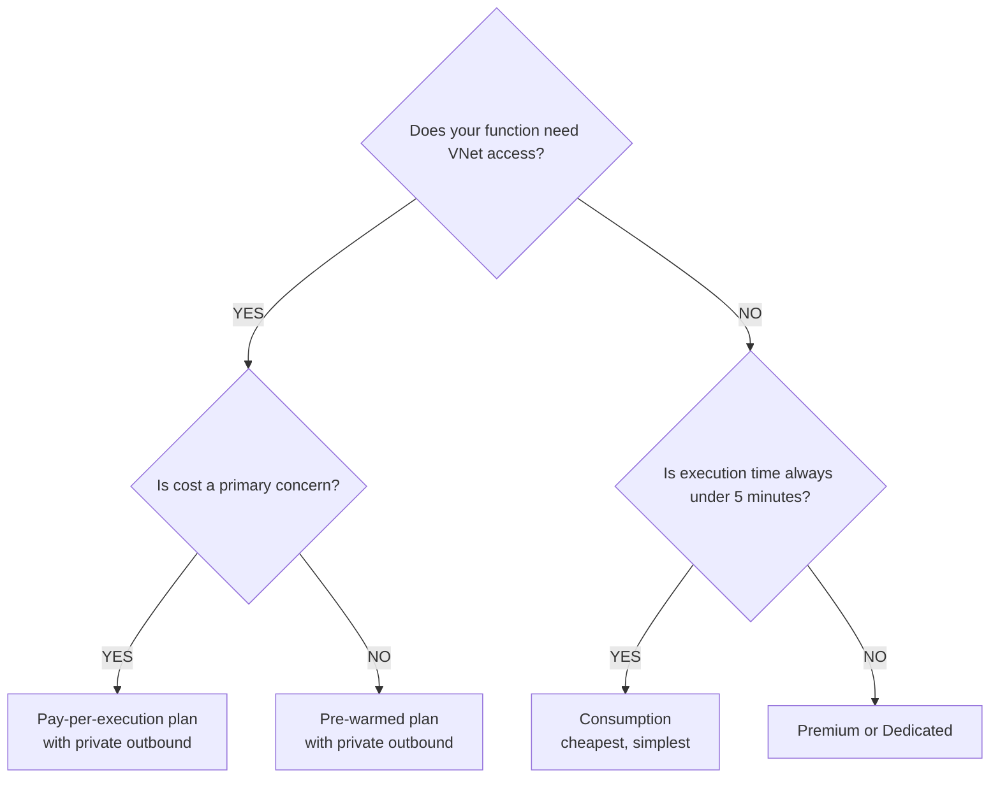
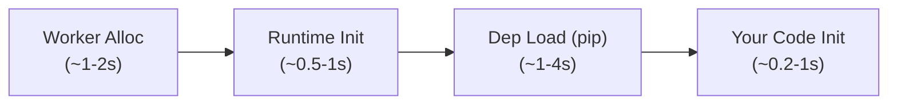
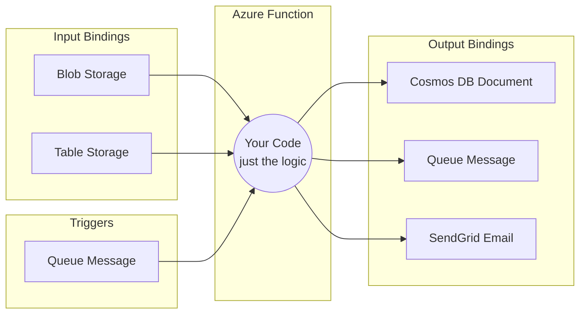
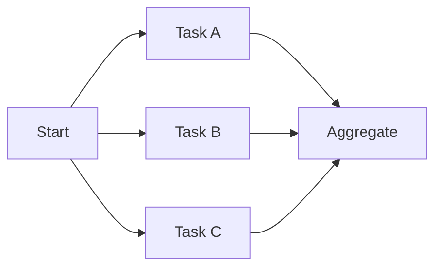
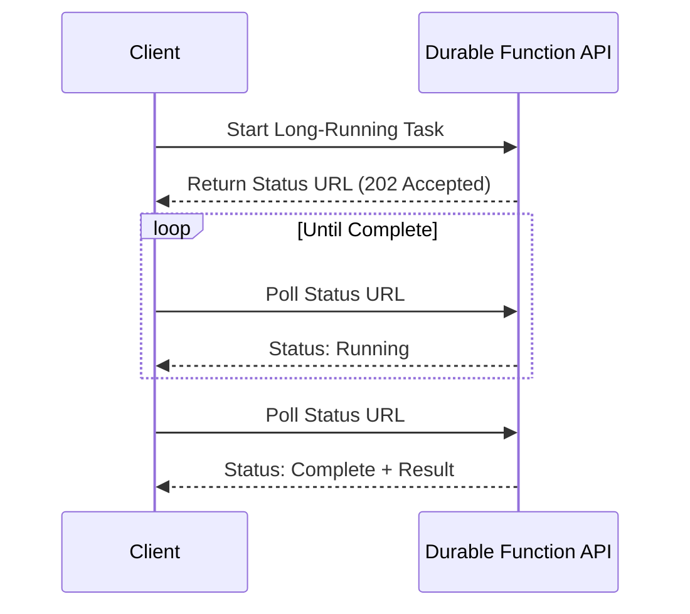
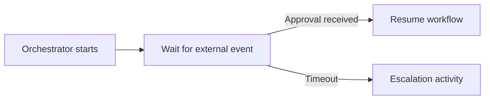

**Complexity**: `[MEDIUM]` | **Time to Complete**: 2h | **Prerequisites**: Module 3.4 (Blob Storage), Module 3.1 (Entra ID).

## What You'll Be Able to Do

- **Deploy Azure Functions with HTTP, Timer, Blob, and Service Bus triggers using the Flex Consumption plan**
- **Configure Durable Functions for stateful orchestration patterns (fan-out/fan-in, human interaction, chaining)**
- **Implement Azure Functions with VNet integration, managed identity, and Key Vault secret references**
- **Optimize Azure Functions performance by configuring host.json settings, concurrency limits, and scale-out rules**

---

## Why This Module Matters

Hypothetical scenario: an e-commerce team processes product image uploads by resizing each file into three formats and storing the results. They run the workload on a pair of always-on VMs that poll an upload queue, paying for capacity around the clock even when no uploads arrive overnight. During a seasonal traffic spike, the fixed pool cannot keep up and a processing backlog grows for hours. After migrating to Azure Functions with an event-driven trigger, the same logic scales out on demand and scales toward zero when idle, so burst capacity appears only when work exists instead of being pre-provisioned all month.

That shift captures why serverless compute matters for cloud-native teams. Azure Functions is Microsoft's function-as-a-service (FaaS) platform. You write a small piece of code—a function—that is triggered by an event such as an HTTP request, a new blob, a queue message, or a timer. Azure handles provisioning, scaling, patching, and monitoring so you do not manage servers for platform plumbing. You pay primarily for the compute time your code consumes, measured in gigabyte-seconds on consumption-based plans. This model is especially compelling when work arrives in bursts, because idle capacity is not billed while nothing is running.

In this module, you will learn the hosting plans for Functions, how triggers and bindings eliminate boilerplate integration code, and how Durable Functions orchestrate multi-step workflows. By the end, you will build a function triggered by a blob upload that processes data and writes results to Cosmos DB using output bindings. The through-line is that each decision—plan, trigger, and orchestration style—maps directly to one of three constraints: cost, responsiveness, and operational complexity.

---

## Hosting Plans: Where Your Functions Run

The hosting plan determines the scaling behavior, available resources, and pricing model for your Functions. Choosing the right plan is one of the most consequential decisions, because it controls both your budget profile at idle time and your latency profile under load. For example, a workload that is dormant for 23 hours and busy for one hour will behave very differently from an API that receives steady traffic around the clock. In practice, picking the wrong plan usually does not cause an immediate outage, but it creates recurring operational friction where you spend time mitigating cost surprises and latency spikes.

| Feature | Consumption | Flex Consumption | Premium (EP) | Dedicated (ASP) |
| :--- | :--- | :--- | :--- | :--- |
| **Scaling** | 0 to 100 instances (Linux; Windows 200) | 0 to 1000 instances | 1 to 100 instances | Manual or autoscale |
| **Scale to zero** | Yes | Yes | No (always ≥1 warm instance) | No |
| **Cold start** | Yes (1-10 seconds) | Reduced (pre-warmed) | No (always warm) | No (always running) |
| **Max execution** | 5 min (default, 10 max) | Default 30 min / max unbounded | Unlimited | Unlimited |
| **Memory** | 1.5 GB | Up to 4 GB | 3.5-14 GB | Plan-dependent |
| **VNet integration** | No | Yes | Yes | Yes |
| **Cost model** | Per execution + GB-s | Per execution + GB-s | Per instance hour | Per App Service Plan |
| **Free grant** | 1M executions + 400K GB-s/month | Similar | None | None |
| **Best for** | Event-driven, sporadic | Event-driven, predictable | Low latency, always ready | Existing ASP, long jobs |

Microsoft now recommends **Flex Consumption** for new serverless function apps. The legacy Consumption plan remains available on Windows, but Linux Consumption is retiring and no longer receives new language versions—plan migrations before that deadline if you inherit older apps. Flex Consumption keeps pay-per-execution billing while adding VNet integration, selectable instance memory (512 MB, 2,048 MB, or 4,096 MB), and optional **always-ready** instances that reduce cold starts without abandoning scale-to-zero for the rest of the app.

### The Scale Controller and Instance Limits

Behind every dynamically scaled plan sits the **Functions scale controller**, a component that watches trigger metrics—queue depth, Event Hub lag, HTTP request rate, timer schedules—and adds or removes worker instances to match load. On the legacy Consumption plan, scale-out is capped at **100 instances per function app on Linux** (the runtime Python and Node use; Windows Consumption allows up to **200**). Flex Consumption raises that ceiling to **1,000 instances** and scales faster because it keys off per-instance concurrency settings rather than treating every invocation as a potential new worker. Premium plans scale between your configured minimum and maximum burst count on pre-provisioned Elastic Premium SKUs (EP1, EP2, EP3), while Dedicated plans inherit App Service Plan autoscale rules you define yourself.

Understanding these limits prevents architectural surprises during load tests. A fan-out workflow that launches ten thousand parallel activity functions still executes on a bounded worker pool; the orchestrator queues work, but downstream services must tolerate the throughput your instance cap allows. If you need guaranteed headroom for a product launch, Premium **always-ready** instances or Flex **always-ready** baselines buy responsiveness upfront instead of waiting for the scale controller to react.

Load tests should ramp gradually the first time you observe scale-out, because cold-start storms during instantaneous step loads can look like failures even when the controller is working as designed. Capture **Application Insights** metrics for **`Function Execution Count`**, **`Average Memory Working Set`**, and **`Server Response Time`** segmented by plan SKU so you can compare Flex on-demand versus always-ready baselines with evidence instead of assumptions.

### Mapping Plans to Workloads

| Workload shape | Recommended plan | Primary reason |
| :--- | :--- | :--- |
| Nightly batch job, minutes of runtime | Flex Consumption on-demand | Scale to zero between runs; VNet if databases are private |
| Public webhook API with tight SLA | Premium or Flex with always-ready | Cold-start tail latency breaks external timeout budgets |
| Long-running ML preprocessing (30+ min) | Premium or Dedicated | Consumption and Flex cap individual function executions |
| Existing .NET Framework integration | Dedicated or Premium isolated worker | Legacy runtime support outside in-process model |
| Internal admin tool, sporadic clicks | Flex Consumption on-demand | Free monthly grant often covers entire monthly usage |

**Pause and predict:** If your company has a strict policy that all database traffic must route through a private VNet, but you want to avoid paying for instances when no traffic is hitting your function at night, which hosting plan is your only viable option?

<details>
<summary>Check your prediction</summary>

Flex Consumption combines VNet integration with scale-to-zero behavior. Premium is the alternative if always-on readiness is also mandatory alongside private network connectivity.
</details>

Subnet delegation rules require dedicated subnets for Function Apps. These subnets cannot host other infrastructure resources simultaneously. Network administrators must allocate a CIDR block that matches peak workload concurrency. Each scaled worker instance consumes an individual IP address from the subnet pool. Sizing subnets too small causes provisioning failures during sudden demand spikes.



Use the decision path above as a first-pass filter before you write your first function. VNet-restricted workloads, bursty traffic, and APIs with tight latency targets usually map quickly to Flex or Premium because the platform choice enforces guardrails you may struggle to recreate in code. This is why plan selection should be part of your architecture, not a final operational afterthought.

```bash
# Create a Consumption plan Function App (Python requires Linux)
az functionapp create \
  --resource-group myRG \
  --consumption-plan-location eastus2 \
  --runtime python \
  --runtime-version 3.11 \
  --os-type Linux \
  --functions-version 4 \
  --name kubedojo-func-$(openssl rand -hex 4) \
  --storage-account "$STORAGE_NAME"

# Create a Premium plan Function App
az functionapp plan create \
  --resource-group myRG \
  --name kubedojo-premium-plan \
  --location eastus2 \
  --sku EP1 \
  --is-linux true \
  --min-instances 1 \
  --max-burst 20

az functionapp create \
  --resource-group myRG \
  --plan kubedojo-premium-plan \
  --runtime python \
  --runtime-version 3.11 \
  --functions-version 4 \
  --name kubedojo-premium-func \
  --storage-account "$STORAGE_NAME"

# Configure VNet integration for secure internal access
az functionapp vnet-integration add \
  --resource-group myRG \
  --name kubedojo-premium-func \
  --vnet myVNet \
  --subnet mySubnet

# Create a Flex Consumption plan Function App
az functionapp create \
  --resource-group myRG \
  --name kubedojo-flex-func \
  --location eastus2 \
  --flexconsumption-location eastus2 \
  --runtime python \
  --runtime-version 3.11 \
  --functions-version 4 \
  --storage-account "$STORAGE_NAME"
```

Each command encodes plan-specific infrastructure. **Consumption** (`--consumption-plan-location`) creates a hidden Dynamic Y1 plan tied to the app. **Premium** requires an explicit **`az functionapp plan create`** with SKU EP1/EP2/EP3, **`--min-instances`** for always-warm baseline, and **`--max-burst`** to cap scale-out during runaway loops. **Flex Consumption** uses **`--flexconsumption-location`** and deploys from blob storage containers rather than Azure Files shares used by older plans—CI pipelines should follow Flex deployment guidance to avoid partial updates. VNet integration attaches the function app to a delegated subnet so outbound traffic reaches private endpoints for SQL, Cosmos DB, or internal APIs without traversing the public internet.

After creation, verify plan SKU and runtime stack before publishing code:

```bash
az functionapp show -g myRG -n kubedojo-flex-func \
  --query '{plan:appServicePlanId, kind:kind, runtime:siteConfig.linuxFxVersion}' -o json
```

### Understanding Cold Start

Cold start is the latency added when a function executes for the first time (or after an idle period). It happens because Azure needs to allocate a worker, load the runtime, and initialize your code before your handler receives traffic. If a function has been idle, the first call absorbs this startup work, so the same function can look slow even when business logic is tiny. In practice, this matters most for user-facing endpoints and webhook processors where first-request latency directly affects retry behavior and user perception.



In many environments, total startup time is often around **3-8 seconds**, which can dominate tail latency when traffic ramps quickly. The mitigations teams use most often are:
1. Keep dependencies minimal (fewer pip packages)
2. Use Premium plan (always-warm instances)
3. Use Flex Consumption (pre-provisioned instances)
4. Avoid heavy initialization in function startup

Cold starts stack several phases: the platform must **allocate a worker**, the **Functions host runtime** must start, your **language worker** (Python, Node, .NET isolated process) must boot, and any **module imports or dependency injection** in your startup path run before the trigger handler executes. Large container images, heavyweight ML libraries, or synchronous network calls during import multiply the delay. Premium and Flex always-ready instances keep a baseline warm so the first customer request skips most of that path, which is why payment and authentication webhooks often justify the fixed hourly component even when average traffic is low.

**Hypothetical scenario (War Story)**: A payment processing company chose the Consumption plan for their webhook handler. Most requests completed in 200ms. But once every 15-20 minutes, the function would cold start, adding 6 seconds of latency. Their payment provider interpreted these 6-second responses as timeouts and marked them as failed, triggering retry logic that created duplicate transactions. Switching to Premium plan with 1 minimum instance eliminated cold starts entirely, and the duplicate transaction problem vanished overnight.

---

## Triggers and Bindings: The Power of Declarative Integration

Triggers and bindings are what make Azure Functions genuinely productive, because they let you focus on business logic instead of integration boilerplate. A **trigger** is the event that causes a function to execute, like an HTTP request, new blob, timer, or message. A **binding** is a declarative connection to another Azure service that handles the boilerplate of reading from or writing to that service. In practice, this separation reduces repeated SDK code, lowers integration bugs, and makes each function easier to reason about under pressure.

### The Programming Model: One Trigger, Many Bindings

Every function obeys a strict contract: **exactly one trigger** defines when the function runs, and **zero or more bindings** declare additional inputs and outputs. Input bindings inject data—blob content, Cosmos DB documents, table rows—into your handler parameters. Output bindings accept return values or `Out<T>` parameters and persist results without explicit SDK calls. The runtime resolves connection strings from application settings (preferably Key Vault references), handles retries at the extension layer for many services, and serializes payloads into native types.

You can configure bindings **declaratively** through attributes in Python v2 programming model (`@app.queue_trigger`, `@app.cosmos_db_output`) or `function.json` in older projects. **Imperative** binding is still possible by constructing SDK clients inside your function, but you lose automatic batching, retry integration, and the concise signatures that make Functions readable in code review. Reach for imperative code only when a binding extension does not exist or when you need fine-grained transaction control that declarative bindings cannot express.

```text
                    ┌─────────────────────────────────────┐
  Timer / HTTP /    │  Trigger (required, exactly one)    │
  Queue / Blob ────►│  "When does this function run?"     │
                    └─────────────────┬───────────────────┘
                                      │
                    ┌─────────────────▼───────────────────┐
                    │  Function handler (your business      │
                    │  logic only)                        │
                    └─────────────────┬───────────────────┘
                                      │
         ┌────────────────────────────┼────────────────────────────┐
         ▼                            ▼                            ▼
   Input binding                 Output binding              Output binding
   (Blob, Table)                 (Cosmos DB)                 (Queue, SendGrid)
```

### Isolated Worker vs In-Process Execution

For **Python, Node.js, Java, and PowerShell**, the Functions runtime always runs your code in a **language worker process** separate from the host. The host receives trigger events, forwards them to the worker over gRPC, and applies binding extensions on either side depending on the trigger type. This isolation improves security boundaries and lets each language runtime evolve independently.

**Pause and predict:** Can a new in-process .NET Function App run on Flex Consumption?

<details>
<summary>Check your prediction</summary>

The legacy in-process model does not support Flex Consumption; isolated worker architecture is required. Microsoft ends full support for the in-process .NET runtime on 10 November 2026.
</details>

.NET apps still boot through a process the host does not own, so `Program.cs` is where dependency injection, middleware, and extension packages get wired. Pin worker extension versions in the lockfile so local `func start` matches Azure, and treat host upgrades as a separate change from application dependency bumps. Record which worker model each app uses in the runbook so on-call knows which process to inspect during a failed invocation.

| Aspect | Isolated worker (.NET and other languages) | In-process (.NET legacy) |
| :--- | :--- | :--- |
| Process boundary | Separate worker process | Same process as host |
| Flex Consumption | Supported (.NET isolated) | Not supported |
| Middleware / DI | Full .NET DI and middleware | Limited compared to isolated |
| Binding packages | `Microsoft.Azure.Functions.Worker.Extensions.*` | `Microsoft.Azure.WebJobs.Extensions.*` |
| Support horizon | Current and future runtimes | Ends November 10, 2026 |

Supported languages on Functions 4.x include C#, Java, JavaScript/TypeScript, Python, and PowerShell, with **custom handlers** available for any executable that speaks HTTP. Custom handlers trade binding convenience for language freedom—you implement the trigger protocol yourself while Azure still manages scaling and the hosting plan.

### Trigger Types

| Trigger | Event Source | Common Use Case |
| :--- | :--- | :--- |
| **HTTP** | HTTP request | REST APIs, webhooks |
| **Timer** | Cron schedule | Scheduled tasks, cleanup jobs |
| **Blob** | New/modified blob | Image processing, file transformation |
| **Queue** | Queue message | Async task processing |
| **Service Bus** | SB message | Enterprise messaging |
| **Event Hub** | Streaming events | IoT, telemetry processing |
| **Cosmos DB** | Document change feed | Real-time data synchronization |
| **Event Grid** | Azure events | Resource change reactions |

**Event Grid** triggers deserve special attention for blob processing. A storage **Blob trigger** polls the container on an interval, which can introduce tens of seconds of delay. An **Event Grid** subscription on `Microsoft.Storage.BlobCreated` pushes an event to your function within seconds, which is why profile-picture and document-ingestion pipelines often pair Event Grid with Functions instead of raw Blob triggers when latency matters.

**Cosmos DB** triggers consume the change feed, giving you ordered, incremental reads of inserts and updates inside a container partition range. **Timer** triggers fire on NCRONTAB schedules and are deceptively expensive at scale—each scheduled execution bills even when there is nothing to clean up, so combine timers with cheap early-exit logic rather than chaining dozens of per-resource schedules.

### Input and Output Bindings



**Without bindings:** 50+ lines of SDK setup code
**With bindings:** 0 lines of SDK code (declarative)

**Pause and predict:** If you use an output binding to write a document to Cosmos DB, but the Cosmos DB service experiences a brief 2-second network blip while the function runs, do you need to write custom retry logic in your Python code?

<details>
<summary>Check your prediction</summary>

The Functions runtime and binding layer automatically retry transient network failures during output binding operations. You do not need to write custom Cosmos DB retry logic in your Python handler for that blip, though you must still design downstream write operations for idempotency and implement observability.
</details>

Declarative bindings decouple infrastructure connectivity from core business logic across application code. Delegating connection management to the platform runtime keeps function handlers lightweight. This eliminates boilerplate connection code across enterprise microservice fleets. Handlers receive fully instantiated SDK objects or serialized event payloads directly. Developers can swap underlying storage providers without rewriting execution signatures.

### Imperative Bindings and Connection Settings

When declarative bindings are insufficient, the Functions app still reads **`AzureWebJobsStorage`** and named connection settings from application settings. Binding connections map to settings such as `StorageConnection` or `CosmosDBConnection` referenced in attribute `connection=` parameters. At runtime the host resolves those values, which is why Key Vault references and managed identity reduce rotation toil: the setting name stays stable while the secret value rotates in vault. For local development, `local.settings.json` holds the same keys but must never be committed to source control.

Batch-oriented triggers expose tuning knobs that directly affect cost. Storage queue triggers pull messages in batches (`batchSize` in `host.json`); larger batches improve throughput but lengthen individual function executions and GB-second totals if each message triggers heavy work. Service Bus triggers honor **`maxConcurrentCalls`** and **`prefetchCount`**, trading memory for pipeline depth. HTTP triggers expose **`maxConcurrentRequests`** and **`maxOutstandingRequests`** to protect downstream databases from unbounded parallelism when scale-out adds instances during spikes.

### Python Function Examples

```python
# function_app.py - Timer trigger (run every 30 minutes)
import azure.functions as func
import logging

app = func.FunctionApp()

@app.timer_trigger(
    schedule="0 */30 * * * *",  # Every 30 minutes
    arg_name="timer",
    run_on_startup=False
)
def cleanup_job(timer: func.TimerRequest) -> None:
    if timer.past_due:
        logging.warning("Timer is past due!")
    logging.info("Running scheduled cleanup...")
    # Your cleanup logic here
```

```python
# HTTP trigger with Cosmos DB output binding
@app.route(route="orders", methods=["POST"], auth_level=func.AuthLevel.FUNCTION)
@app.cosmos_db_output(
    arg_name="outputDocument",
    database_name="OrdersDB",
    container_name="orders",
    connection="CosmosDBConnection"
)
def create_order(req: func.HttpRequest, outputDocument: func.Out[func.Document]) -> func.HttpResponse:
    order = req.get_json()
    order["id"] = str(uuid.uuid4())
    order["createdAt"] = datetime.utcnow().isoformat()

    # Write to Cosmos DB via output binding (no SDK code needed!)
    outputDocument.set(func.Document.from_dict(order))

    return func.HttpResponse(
        json.dumps({"orderId": order["id"]}),
        status_code=201,
        mimetype="application/json"
    )
```

```python
# Blob trigger with Queue output binding
@app.blob_trigger(
    arg_name="inputBlob",
    path="uploads/{name}",
    connection="StorageConnection"
)
@app.queue_output(
    arg_name="outputQueue",
    queue_name="processing-results",
    connection="StorageConnection"
)
def process_upload(inputBlob: func.InputStream, outputQueue: func.Out[str]) -> None:
    logging.info(f"Processing blob: {inputBlob.name}, Size: {inputBlob.length} bytes")

    # Process the blob content
    content = inputBlob.read()
    result = {
        "blobName": inputBlob.name,
        "size": inputBlob.length,
        "processedAt": datetime.utcnow().isoformat()
    }

    # Send result to queue via output binding
    outputQueue.set(json.dumps(result))
    logging.info(f"Result queued for {inputBlob.name}")
```

```python
# Service Bus queue trigger
@app.service_bus_queue_trigger(
    arg_name="msg",
    queue_name="orders",
    connection="ServiceBusConnection"
)
def process_service_bus(msg: func.ServiceBusMessage) -> None:
    logging.info(f"Processing Service Bus message: {msg.get_body().decode('utf-8')}")
```

The examples above use the **Python v2 programming model** (`FunctionApp()` decorator style), which is the default for new Python projects. Each decorator registers a binding extension with the host. **`run_on_startup=False`** on timers prevents an immediate execution during deploy that could duplicate migrations or send duplicate emails. HTTP routes inherit the **`routePrefix`** from `host.json` (commonly `api`), so the orders endpoint is reachable at `/api/orders` unless you override the prefix globally.

When binding to Cosmos DB, partition key paths in the container must align with document fields you write—mismatches surface as runtime errors after deploy, not during `func start`, if local emulator settings differ from cloud. Service Bus triggers should complete or abandon messages within lock duration; enable **`maxAutoRenewDuration`** when handlers legitimately run longer than the default lock, otherwise messages become visible again and a second worker may duplicate work unless idempotency guards exist.

### Deploying Functions

Once your function code is in place, deployment becomes a predictable sequence of local verification and publish steps. The commands below include local run, direct publish, and zip deployment, which is important because teams often discover environment drift only when their deployment path and authentication mode differ. Choose the simplest path during initial validation, then adopt zip deploy when you need repeatable, scripted releases.

Local **`func start`** uses the same host runtime as Azure, which catches binding misconfigurations before cloud deploy. **`func azure functionapp publish`** packages Python dependencies according to remote build settings; for production, many teams prefer **`--build remote`** so native wheels compile on Azure's build agents rather than on developer laptops with mismatched architectures. Zip deploy via **`az functionapp deployment source config-zip`** is ideal for CI/CD pipelines that produce immutable artifacts stored in a pipeline workspace—pair it with deployment slots on Premium and Dedicated plans for swap-based releases, or use Flex rolling update strategies when zero-downtime matters.

Authentication during deploy typically flows through **`az login`** and RBAC on the function app resource. Service principals in pipelines need **`Website Contributor`** or tighter custom roles on the app scope plus permission to reach the backing storage account, because the host stores triggers and sync state in storage even when your business data lives elsewhere.

```bash
# Initialize a new Function project locally
func init MyFunctionProject --python

# Create a new function
cd MyFunctionProject
func new --name ProcessBlob --template "Azure Blob Storage trigger"

# Run locally
func start

# Deploy to Azure
func azure functionapp publish kubedojo-func-xxxx

# Or deploy via Azure CLI with zip deploy
cd MyFunctionProject
zip -r function.zip . -x ".venv/*"
az functionapp deployment source config-zip \
  --resource-group myRG \
  --name kubedojo-func-xxxx \
  --src function.zip
```

---

## Durable Functions: Orchestrating Complex Workflows

Regular Azure Functions are stateless---each execution is independent, and local variables disappear when execution ends. Durable Functions add state management, enabling you to write multi-step workflows, fan-out/fan-in patterns, and human interaction patterns that survive process boundaries. In practice, stateful orchestration means you can encode ordering, waiting, and failure behavior without building your own durable storage layer. That is especially useful for business workflows where one step may complete in minutes and the next cannot proceed until a separate approval or external event arrives.

Durable Functions introduce three function **kinds** with distinct roles. **Orchestrator** functions coordinate workflow logic and must be deterministic—they call activities, wait for timers, and schedule external events, but they never perform I/O directly. **Activity** functions execute non-deterministic work such as database writes, HTTP calls, or file transforms. **Entity** functions (Durable Entities) model singleton state with serializable operations, useful for counters, locks, or lightweight state machines without standing up a database. The runtime persists orchestration history to Azure Storage (default), Azure Cosmos DB, or SQL Server depending on your task hub configuration.

### Checkpoint, Replay, and Idempotency

When an orchestrator awaits an activity, the Durable Task framework **checkpoints** orchestration state to storage and releases the worker. On the next wake-up—whether seconds or days later—the orchestrator **replays** from the beginning of the function, but prior completed steps return cached results instantly instead of re-executing side effects. That replay model is why orchestrator code must avoid random numbers, direct I/O, and `DateTime.Now`; non-deterministic work belongs in activities.

Activities must be **idempotent** because retries are normal. If charging a credit card fails transiently, the orchestrator may invoke the charge activity twice; your implementation should use idempotency keys or check existing ledger entries before posting a duplicate charge. The same discipline applies to email notifications and inventory decrements—design activities so a second call with the same input produces the same outcome without double effect.

### Patterns

**Pattern 1: Function Chaining** is best when each activity must run in a strict order, because each step can wait for the previous output before continuing.


**Pattern 2: Fan-Out / Fan-In** splits independent work across branches and then recombines the partial results once all branches complete.


**Pattern 3: Async HTTP API (Long-Running)** supports start-and-poll workflows, so clients receive a status URL immediately while the durable work proceeds asynchronously.


**Pattern 4: Human Interaction** pauses the orchestrator until an external actor raises an event—typically an approval link handled by a separate HTTP function that calls `raise_event` on the orchestration instance. While waiting, the orchestrator consumes **no compute**; only storage retains history.

**Pattern 5: Monitor** runs a recurring check (inventory level, certificate expiry) on a timer inside the orchestration, calling an activity each interval until a condition is met or a timeout fires. This replaces fragile cron-plus-database flag patterns with a single durable workflow you can inspect in the Durable Functions monitoring UI.



### Retry Policies and Dead-Lettering

Transient failures in queue-driven Functions are handled at two layers. **Binding extensions** for Azure Storage queues and Service Bus honor `host.json` settings such as `maxRetryCount`, `retryStrategy` (`fixedDelay` or `exponentialBackoff`), and lock renewal duration for long-running handlers. After retries exhaust, Service Bus messages move to the **dead-letter subqueue** where operators can inspect poison payloads without blocking the main queue.

Durable Functions add orchestration-level policies via `CallActivityWithRetryAsync` or retry options on individual activities, specifying backoff coefficients and maximum attempts independent of the trigger extension defaults. Combine both layers thoughtfully: a Service Bus trigger might retry delivery three times before dead-lettering, while the orchestrator retries the business activity twice with idempotent logic—without idempotency, stacked retries amplify duplicate side effects.

```json
{
  "extensions": {
    "queues": {
      "maxPollingInterval": "00:00:02",
      "visibilityTimeout": "00:00:30",
      "batchSize": 16,
      "maxDequeueCount": 5
    },
    "serviceBus": {
      "messageHandlerOptions": {
        "maxConcurrentCalls": 8,
        "maxAutoRenewDuration": "00:05:00"
      }
    }
  }
}
```

On Consumption and Flex plans, individual **activity** executions remain subject to per-function timeout limits, while the **orchestrator** instance can run for days by checkpointing between activities. Premium and Dedicated remove practical duration ceilings for activities as well, which matters for large file transforms or long external API polls implemented inside activities rather than orchestrator waits.

```python
# Durable Functions example: Image processing pipeline
import azure.functions as func
import azure.durable_functions as df

app = func.FunctionApp()

# Orchestrator function (coordinates the workflow)
@app.orchestration_trigger(context_name="context")
def image_pipeline(context: df.DurableOrchestrationContext):
    # Input: blob URL from the trigger
    blob_url = context.get_input()

    # Step 1: Validate the image
    validation = yield context.call_activity("validate_image", blob_url)
    if not validation["valid"]:
        return {"status": "rejected", "reason": validation["reason"]}

    # Step 2: Fan-out - create multiple sizes in parallel
    parallel_tasks = [
        context.call_activity("resize_image", {"url": blob_url, "size": "thumbnail"}),
        context.call_activity("resize_image", {"url": blob_url, "size": "medium"}),
        context.call_activity("resize_image", {"url": blob_url, "size": "large"}),
    ]
    results = yield context.task_all(parallel_tasks)

    # Step 3: Save metadata to database
    metadata = yield context.call_activity("save_metadata", {
        "original": blob_url,
        "variants": results
    })

    return {"status": "completed", "metadata": metadata}

# Activity functions (do the actual work)
@app.activity_trigger(input_name="blobUrl")
def validate_image(blobUrl: str) -> dict:
    # Validate image format, size, etc.
    return {"valid": True, "format": "jpeg", "dimensions": "3024x4032"}

@app.activity_trigger(input_name="params")
def resize_image(params: dict) -> str:
    # Resize the image (actual PIL/Pillow code would go here)
    return f"resized/{params['size']}/{params['url'].split('/')[-1]}"

@app.activity_trigger(input_name="data")
def save_metadata(data: dict) -> dict:
    # Save to Cosmos DB or Table Storage
    return {"id": "img-12345", "saved": True}

# HTTP trigger to start the orchestration
@app.route(route="start-pipeline", methods=["POST"])
@app.durable_client_input(client_name="client")
async def start_pipeline(req: func.HttpRequest, client) -> func.HttpResponse:
    blob_url = req.get_json().get("blobUrl")
    instance_id = await client.start_new("image_pipeline", client_input=blob_url)

    return client.create_check_status_response(req, instance_id)
```

Durable Functions store their state in Azure Storage (tables and queues), enabling them to run for days, weeks, or even months. An orchestration can be paused (waiting for a human approval, for example) and resumed without consuming any compute.

### Observability and Versioning

Durable Functions emit **custom traces and structured logs** tied to **instance IDs**, which appear in Application Insights when telemetry is enabled. Operators search by instance ID to compare orchestration history, failed activities, and retry timelines in the **Durable Functions monitoring** blade. When deploying new orchestrator logic, treat orchestration code changes as **versioned contracts**: in-flight instances replay against the orchestrator definition that existed when they started unless you use explicit versioning APIs—surprise breaking changes mid-flight produce nondeterminism errors that surface as `OrchestrationRuntimeException` entries in logs.

Entity functions complement orchestrators when you need strongly consistent counters or lease patterns without provisioning Redis or SQL solely for coordination. An entity receives operations sequentially per entity key, which gives you a lightweight alternative to external locks for throttling concurrent updates to the same customer account or inventory SKU.

---

## Function App Configuration and Security

Production Function Apps rarely fail because Python syntax is wrong; they fail because **identity, secrets, and concurrency** were treated as afterthoughts. This section ties together settings that every plan shares, then highlights where Premium and Flex differ in networking defaults.

### Application Settings and Secrets

Application settings are the easiest way to pass runtime configuration into your function, and they surface as environment variables in code. For non-secret values, this is straightforward and predictable. For secrets, reference Key Vault instead so the secret material stays in a managed system, while the app setting only stores an indirection URI. Managed identity then lets the app authenticate to Key Vault without hardcoding credentials that rotate poorly and leak easily.

```bash
# Set an application setting (becomes an environment variable)
az functionapp config appsettings set \
  --resource-group myRG \
  --name kubedojo-func-xxxx \
  --settings "COSMOS_DB_ENDPOINT=https://mydb.documents.azure.com:443/"

# Reference Key Vault secrets (recommended over plain text)
az functionapp config appsettings set \
  --resource-group myRG \
  --name kubedojo-func-xxxx \
  --settings "CosmosDBConnection=@Microsoft.KeyVault(SecretUri=https://myvault.vault.azure.net/secrets/cosmos-connection/)"

# Enable managed identity for Key Vault access
az functionapp identity assign --resource-group myRG --name kubedojo-func-xxxx
```

Grant the identity **`Key Vault Secrets User`** (or tighter custom role) on the vault scope, then replace plaintext secrets with **`@Microsoft.KeyVault(SecretUri=...)`** references. The platform resolves secrets at runtime and refreshes them on a cache interval, which means secret rotation does not require redeploying function code if URIs remain stable. For Cosmos DB and Storage, prefer **RBAC data-plane roles** (`Cosmos DB Built-in Data Contributor`, `Storage Blob Data Contributor`) over connection strings when bindings support token authentication—connection strings remain common in labs for speed, but RBAC reduces credential leakage blast radius in production.

### Performance and host.json Configuration

You can optimize performance and control scaling behavior by configuring `host.json`. This is where you define concurrency limits, batch sizes, and scale-out rules for different trigger types, which becomes a first-class operational control plane. In practice, these settings decide how aggressively your app handles bursts and how quickly it yields work during downstream saturation. Small changes to `host.json` often outperform adding more code when the bottleneck is throughput and reliability rather than algorithmic speed.

```json
{
  "version": "2.0",
  "concurrency": {
    "dynamicConcurrencyEnabled": true,
    "snapshotPersistenceEnabled": true
  },
  "extensions": {
    "serviceBus": {
      "messageHandlerOptions": {
        "maxConcurrentCalls": 16,
        "maxAutoRenewDuration": "00:05:00"
      }
    },
    "http": {
      "routePrefix": "api",
      "maxConcurrentRequests": 100,
      "maxOutstandingRequests": 200
    }
  }
}
```

**Dynamic concurrency** (when enabled) lets the runtime learn optimal per-trigger concurrency and persist snapshots between scale events, which helps queue-heavy workloads without manual tuning. Pair **`functionAppScaleLimit`** consciously: setting it too low protects downstream systems but creates artificial backlog during legitimate spikes; leaving it unlimited on Linux Consumption without testing can hit the 100-instance ceiling and still saturate a fragile database. For Python CPU-bound handlers, **`FUNCTIONS_WORKER_PROCESS_COUNT`** launches multiple worker processes to sidestep GIL contention—each process consumes memory, so GB-second costs rise with process count even if executions stay flat.

### Authentication and Authorization

Authentication determines who can call your function and how trust is established, so treat it as architecture, not decoration. Function-level auth via `authLevel` is useful for learning and simple internal APIs, while app-level Entra ID integration centralizes identity and token validation at the platform edge. In production this split gives you better auditability and easier policy changes, because enforcement happens outside individual function handlers.

**Function keys** (`authLevel=FUNCTION` or `ADMIN`) embed shared secrets in URLs or headers—fine for lab webhooks, poor for user-facing browsers where keys leak via logs and referrer headers. **Easy Auth** (`az webapp auth`) validates JWTs from Entra ID before requests reach your code, enabling **`AuthLevel.ANONYMOUS`** on HTTP triggers while still rejecting unauthenticated callers at the edge. Combine Easy Auth with **`@Microsoft.KeyVault`** secret references so neither database credentials nor function keys live in source control.

For internal service-to-service calls inside a VNet, some teams terminate mTLS at Application Gateway or use **`x-functions-key`** rotation via Key Vault-backed settings. Whatever model you choose, document which layer validates identity (gateway, Easy Auth, or function key) so on-call engineers know where to inspect failures when callers receive 401 responses after a secret rotation event.

```bash
# Function-level auth (API key in header or query string)
# Configured per-function via authLevel in the trigger decorator

# App-level auth with Entra ID (Easy Auth)
az webapp auth microsoft update \
  --resource-group myRG \
  --name kubedojo-func-xxxx \
  --client-id "$APP_CLIENT_ID" \
  --issuer "https://login.microsoftonline.com/$TENANT_ID/v2.0"
```

---

## Cost Lens: Plans, Triggers, and Surprise Bills

Serverless pricing looks inexpensive until trigger choice and hosting plan interact badly with production traffic. On **legacy Consumption** and **Flex Consumption on-demand** billing, you pay for **executions** plus **GB-seconds**—gigabytes of memory multiplied by seconds of execution time. Azure rounds memory up to the nearest 128 MB (legacy Consumption caps at 1,536 MB per instance) and bills a minimum of **100 ms and 128 MB per execution** even when your handler finishes in milliseconds. Each subscription receives a monthly **free grant** of **1 million executions** and **400,000 GB-seconds** shared across all function apps in that subscription, which covers many labs and low-traffic internal tools entirely.

**Pause and predict:** Do Flex Consumption always-ready instances stay inside the monthly free grant when no functions execute?

<details>
<summary>Check your prediction</summary>

Always-ready instances bill continuous GB-seconds for provisioned baseline memory even with zero executions and do not include the monthly free grant.
</details>

Alternative hosting models establish different commercial tradeoffs between consumption billing and fixed commitments. Premium plans bill for provisioned vCPU and memory across active instances. They eliminate cold starts without scaling compute to zero. Dedicated hosting plans charge a flat hourly rate for the App Service Plan. Teams use dedicated plans to consolidate event handlers alongside web workloads. This shared resource model lowers hosting expenditure for continuous corporate background services.

Cost spikes usually trace to behavioral causes rather than mysterious platform bugs. A **Timer** trigger that fires every minute across hundreds of environments generates 43,200 executions per month per function before any useful work happens—multiplied across dev, test, and staging copies, that exhausts free grants quickly. **Blob triggers** that poll large containers can invoke functions repeatedly when many blobs exist even if only a few change, which is another reason Event Grid is cheaper at the latency layer when events are sparse but containers are huge. Chatty HTTP APIs on Consumption during sustained 24/7 traffic often exceed Premium baseline cost; model both using the [consumption cost estimation guidance](https://learn.microsoft.com/en-us/azure/azure-functions/functions-consumption-costs) before launch.

| Cost driver | Typical symptom | Mitigation |
| :--- | :--- | :--- |
| High execution count | Timer or webhook retry storms | Widen timer intervals; fix upstream timeouts; use idempotent handlers |
| High GB-seconds | Large memory footprint or slow imports | Right-size Flex memory; slim dependencies; move heavy init to activities |
| Always-ready baseline | Warm instances 24/7 "just in case" | Scope always-ready to HTTP entrypoints only; use on-demand elsewhere |
| Premium minimum instances | Steady traffic on EP1+ | Compare against Dedicated ASP; tune min/max burst |
| Dead-letter neglect | Repeated poison processing | Alert on DLQ depth; fix root cause before replay |

The cold-start versus cost tradeoff is explicit: Consumption and Flex on-demand minimize idle spend but tax the first requests after idle periods; Premium and Flex always-ready spend continuously to buy stable tail latency. Neither side is universally correct—payment webhooks justify warmth, nightly ETL jobs do not.

**Premium plan math** differs from consumption meters: you pay for allocated vCPU and memory per pre-warmed instance hour, not just executed milliseconds. A single EP1 instance running 730 hours per month carries a predictable baseline even if HTTP traffic is zero, which is why 24/7 APIs with moderate traffic often land near Premium parity versus consumption GB-seconds. Elastic scale **`maxBurst`** prevents runaway bills when a bug fans out infinite Service Bus messages—treat burst caps as financial circuit breakers, not only performance knobs.

**Dedicated (App Service) plan** Functions share the ASP with web apps and background jobs. If you already pay for a P1v3 plan hosting three APIs, adding Functions to the same plan avoids incremental hosting cost until CPU or memory saturation forces a SKU upgrade. The tradeoff is loss of independent scale-to-zero: the plan runs continuously.

---

## Decision Framework: Hosting Plan and Compute Choice

Use the framework below after you know connectivity, duration, and latency requirements. The earlier flowchart in the Hosting Plans section is a quick filter; this matrix compares **Functions hosting plans** against **Container Apps** and **Logic Apps** when teams debate "serverless" broadly.

```text
Need visual workflow / SaaS connectors with minimal code?
  yes -> Logic Apps (orchestration/integration)
  no
Need long-running containers, KEDA scale, TCP, or sidecars?
  yes -> Azure Container Apps
  no
Need event-driven code with bindings and Durable Functions?
  yes -> Azure Functions (pick plan below)
```

| Requirement | First choice | Why | Watch out |
| :--- | :--- | :--- | :--- |
| Sporadic events, no VNet, under 5–10 min | Flex Consumption on-demand | Scale to zero; free grant; recommended serverless path | Cold starts on first requests |
| Private resources in VNet, bursty traffic | Flex Consumption | VNet integration with serverless billing | Configure subnets and DNS before deploy |
| Sub-second API latency 24/7 | Premium or Flex always-ready | Pre-warmed workers; unlimited duration on Premium | Baseline hourly cost never reaches zero |
| Existing App Service Plan capacity | Dedicated Functions on ASP | Share plan with web apps; predictable cost | Plan size must cover peak combined load |
| Multi-step human approvals over days | Functions + Durable Functions | Checkpointed orchestration; zero compute while waiting | Activity idempotency is mandatory |
| Low-code integration across SaaS | Logic Apps | Connector ecosystem; visual designer | Per-action pricing at high volume |
| Custom container + HTTP/TCP + KEDA | Container Apps | Full container control; scale to zero option | You manage image and probes |

### Hosting Plan Decision Matrix

| Factor | Consumption (legacy) | Flex Consumption | Premium (EP) | Dedicated (ASP) |
| :--- | :--- | :--- | :--- | :--- |
| Cold-start tolerance | Low–medium | Medium–high (with always-ready) | High | High |
| VNet required | No | Yes | Yes | Yes |
| Max scale-out | 100 (Linux; Windows 200) | 1,000 | Configurable burst | Plan limit |
| Scale to zero | Yes | Yes | No (always ≥1 warm) | No |
| Max single execution | 5 min default (10 max) | Default 30 min / max unbounded | Unlimited | Unlimited |
| Best cost when | Legacy Windows sporadic jobs | New serverless apps | Steady low-latency APIs | Shared ASP already paid |

When latency-sensitive HTTP meets private networking, **Flex with targeted always-ready instances** often beats **Premium with large minimum instances** because you pay baseline warmth only on entry functions while background queue processors stay on-demand. When executions routinely exceed Flex timeout limits or require more than 4 GB memory per instance, move activities to Premium or Container Apps rather than forcing monolithic functions.

### Functions vs Container Apps vs Logic Apps

Teams sometimes ask whether Functions is the wrong product entirely. **Logic Apps** excel when integrations are connector-heavy, approvals are visual, and custom code is minimal—think SaaS webhooks stitched together with built-in retries and enterprise connectors. **Azure Container Apps** excel when you need arbitrary containers, TCP listeners, sidecars, or KEDA scaling on custom metrics while still avoiding full cluster operations. **Azure Functions** sits in the middle: optimized for short event-driven code with first-class bindings and Durable Functions orchestration. A valid hybrid places HTTP entry on Functions or Container Apps, pushes long orchestrations to Durable Functions, and delegates cross-SaaS fan-out to Logic Apps when connector maintenance would otherwise dominate sprint time.

---

## Patterns & Anti-Patterns

Patterns capture what experienced teams repeat on purpose; anti-patterns capture the shortcuts that look fine in demos and fail on the first Black Friday.

| Pattern | When to use it | Why it works | Scaling note |
| :--- | :--- | :--- | :--- |
| Event Grid → Function for blob events | User-facing uploads need sub-minute processing | Push delivery avoids Blob trigger polling delay | Filter subscriptions to specific containers/paths |
| Queue trigger + poison DLQ | Async work with retry semantics | Service Bus or Storage queues isolate bursts | Monitor dead-letter depth; idempotent handlers |
| Durable fan-out/fan-in | Parallel independent steps with aggregation | `task_all` concurrency without manual thread pools | Size activities small; respect downstream rate limits |
| Flex always-ready on HTTP only | Webhooks with strict timeout budgets | Warm entrypoints without warming entire app | Assign always-ready per function, not globally |
| Key Vault references + managed identity | Any production binding connection | Secrets rotate without redeploy; no plaintext in settings | Grant least-privilege RBAC on vault and data plane |
| Output bindings for Cosmos/Queue | CRUD micro-operations from Functions | Removes SDK ceremony; runtime handles batching | Still validate payload size limits per service |

| Anti-pattern | What goes wrong | Why teams fall into it | Better approach |
| :--- | :--- | :--- | :--- |
| Blob trigger for real-time UX | 10–60s polling delay | Blob trigger appears first in tutorials | Event Grid trigger on BlobCreated |
| Monolithic 2,000-line function | Untestable, slow cold start | "Move the whole microservice" migration | Chain activities via Durable Functions |
| Consumption for VNet SQL | Cannot reach private database | Consumption is default in samples | Flex Consumption with VNet integration |
| Timer per customer/resource | Execution count explodes | Cron seems simpler than queue batching | Single timer batches work items from storage |
| Ignoring orchestrator determinism | Duplicate side effects on replay | Copy-paste imperative code into orchestrator | I/O only in activities; pure logic in orchestrator |
| Plaintext connection strings | Secret sprawl and audit failures | Fastest portal copy/paste | `@Microsoft.KeyVault(SecretUri=...)` + MI |

---

## Did You Know?

1. **Azure Functions Consumption plan has processed trillions of executions** since its launch. The free grant of 1 million executions and 400,000 GB-seconds per month means that many small-to-medium applications run entirely for free. A function that executes 100,000 times per month at 128 MB memory and 200ms average duration uses only 2,560 GB-seconds---well within the free tier. Flex Consumption adds selectable instance memory (512 MB, 2,048 MB, or 4,096 MB); higher tiers increase GB-second totals but prevent timeouts for memory-heavy Python workloads.

2. **Durable Functions orchestrations can run for days, weeks, or months on any hosting plan** because the runtime checkpoints orchestrator state to storage and replays on wake—there is no separate 7-day orchestration cap on Consumption, Flex, Premium, or Dedicated. What *is* bounded is each **activity function execution**: on Consumption that is 5 minutes by default (10 minutes maximum); on Flex the default is 30 minutes with no enforced maximum execution timeout (the 230-second ceiling applies only to HTTP-trigger responses). Durable timers for Python, JavaScript, and PowerShell can schedule up to 6 days per timer, chainable for longer waits. **Hypothetical scenario:** a month-long A/B test orchestration might use periodic timer check-ins and automatic completion without holding a worker busy between intervals.

3. **Blob triggers use a polling mechanism, not events.** When you use a Blob trigger, Azure Functions scans the blob container for changes every few seconds. This means there can be a delay of up to 60 seconds between a blob being uploaded and the function executing. For real-time processing, use an Event Grid trigger (which is event-driven and near-instant) that subscribes to the blob storage account's BlobCreated events.

4. **Azure Functions supports custom handlers**, meaning you can write functions in any language that can listen on an HTTP port---Rust, Go, Ruby, or even Bash scripts. The Functions runtime sends trigger data to your custom handler via HTTP, and your handler sends back the response. This opens Azure Functions to languages that are not natively supported.

---

## Common Mistakes

| Mistake | Why It Happens | How to Fix It |
| :--- | :--- | :--- |
| Choosing Consumption plan for latency-sensitive APIs | Consumption is the default and cheapest | Use Premium or Flex Consumption for APIs where cold start latency is unacceptable. The extra cost of keeping 1 instance warm is usually justified. |
| Writing functions that take longer than 5 minutes on Consumption | Developers do not check the timeout limit during development | Move long-running work to Durable Functions (activity functions can run up to 5 min each, but the orchestration chains them). Or switch to Premium plan. |
| Using Blob triggers when Event Grid triggers are more appropriate | Blob trigger is the first result in documentation | Blob triggers poll (up to 60s delay). Event Grid triggers are event-driven (sub-second). Use Event Grid for time-sensitive processing. |
| Storing connection strings in Application Settings as plain text | It is the quickest way to configure bindings | Use Key Vault references: `@Microsoft.KeyVault(SecretUri=...)`. Enable managed identity on the Function App and grant it Key Vault Secrets User role. |
| Not configuring retry policies for queue/event triggers | The default retry behavior is not always appropriate | Configure `maxRetryCount` and `retryStrategy` (fixed or exponential backoff) in host.json. Without retries, transient failures cause permanent message loss. |
| Writing large, monolithic functions instead of chaining small ones | It seems simpler to put all logic in one function | Break complex workflows into small, focused functions. Use Durable Functions for orchestration. Small functions are easier to test, debug, and scale independently. |
| Not setting FUNCTIONS_WORKER_PROCESS_COUNT for CPU-intensive work | The default is 1 worker process | For Python functions (GIL limitation), increase FUNCTIONS_WORKER_PROCESS_COUNT to utilize multiple cores. Each process handles requests independently. |
| Ignoring the cold start impact of large dependency packages | Adding dependencies is easy; understanding their boot cost is not | Profile your cold start time. Remove unused packages. Use slim base images. For Python, consider using layers or pre-compiled wheels. |

---

## Quiz

<details>
<summary>1. Your team is migrating a legacy e-commerce API to Azure Functions. The API must connect to a secure on-premises inventory database via a VNet, and it consistently receives traffic 24/7 without significant idle periods. Why would you choose the Premium plan over the Consumption plan for this workload?</summary>

You would choose the Premium plan because the Consumption plan does not support VNet integration, making it impossible to connect to your secure on-premises database. Additionally, since the API receives constant traffic, the per-execution pricing of the Consumption plan would likely become more expensive than the flat, instance-based pricing of the Premium plan. The Premium plan also keeps instances pre-warmed, eliminating cold starts and ensuring the latency-sensitive e-commerce API remains responsive to customers at all times.
</details>

<details>
<summary>2. You are writing an Azure Function that processes uploaded CSV files and writes the results to both a Cosmos DB database and an Azure Service Bus queue. How would you divide the responsibilities between triggers and bindings to implement this without writing any connection management code?</summary>

You would configure a single Blob Storage trigger to initiate the function execution whenever a new CSV file is uploaded, as every function requires exactly one trigger to define when it runs. To handle the outputs, you would configure two output bindings: one for Cosmos DB and one for Service Bus. The bindings declaratively handle the connection, authentication, and data formatting for the external services. By using output bindings, your Python code simply returns or sets the data objects. The Azure Functions runtime then automatically manages the complex SDK operations required to write the data securely to the respective destinations.
</details>

<details>
<summary>3. Your media processing application uses a Blob trigger function to resize user profile pictures. Users are complaining that it takes up to a minute for their new profile picture to appear after uploading. What is causing this delay, and how can you re-architect the trigger to solve it?</summary>

The delay is caused by the Blob trigger's internal polling mechanism, which periodically scans the storage container for new or modified blobs. Because it operates on a polling schedule (often every 10 to 60 seconds), it cannot provide immediate execution upon upload. To solve this and achieve real-time processing, you should switch from a Blob trigger to an Event Grid trigger. By configuring the storage account to emit an event to Event Grid the moment a blob is created, the function will usually be triggered within seconds. This removes the polling delay and helps profile pictures update much faster for a better user experience.
</details>

<details>
<summary>4. You are tasked with building an onboarding system. When a new user signs up, the system must create an Active Directory account, assign licenses, and then wait for an HR manager to manually approve the access via an email link. This approval could take up to 5 days. Why would you choose Durable Functions over regular Azure Functions for this workflow?</summary>

Regular Azure Functions are stateless and have a maximum execution time limit (up to 10 minutes on Consumption, or 30 on Flex), meaning they cannot natively wait 5 days for a manual approval without timing out or running continuously. Durable Functions solve this by using stateful orchestration. When the workflow reaches the manual approval step, the orchestrator function goes to sleep, saving its state to Azure Storage and stopping compute consumption entirely. Once the HR manager clicks the approval link, an external event wakes the orchestrator back up, restoring its state, and allowing the workflow to continue assigning licenses.
</details>

<details>
<summary>5. Your web application experiences massive, unpredictable traffic spikes on Black Friday, jumping from zero requests to thousands of requests per second instantly. You are debating between using the Consumption plan and the Premium plan to handle this API. How would the scaling behavior differ between the two plans during this spike?</summary>

On the Consumption plan, Azure manages scaling automatically by rapidly allocating new workers from a shared pool to handle the incoming requests, allowing it to scale from zero to hundreds of instances. However, this reactive scaling introduces cold starts, meaning the first wave of users will experience significant latency while new instances boot up. On the Premium plan, you configure a minimum number of always-warm instances and a maximum burst count. When the spike hits, the pre-warmed instances handle the initial load with much lower startup latency and avoid most cold starts. Azure then rapidly scales out additional instances up to your defined maximum limit, providing a much smoother and faster scaling response.
</details>

<details>
<summary>6. You have a function that processes orders and needs to: validate the order, charge the credit card, update inventory, and send a confirmation email. How would you architect this with Azure Functions?</summary>

You should use a Durable Functions orchestrator with four separate activity functions for validation, charging, inventory, and emailing. The orchestrator function calls each activity sequentially, maintaining the state of the entire workflow reliably. If a step fails, such as the inventory update, the orchestrator can natively implement compensation logic to call a refund activity and reverse the credit card charge. By using Durable Functions instead of chaining multiple independent functions via queue messages, you gain a single, readable source of truth for the workflow. This ensures that partial failures do not leave your system in an inconsistent state while providing built-in observability.
</details>

<details>
<summary>7. Your platform team must deploy a new Python function app that calls a PostgreSQL database inside a private VNet and should scale to zero on weekends. Flex Consumption is available in your region. Which execution and hosting choices align with current Microsoft guidance?</summary>

Deploy on **Flex Consumption** with the Python v2 programming model, which runs in the standard language worker process and supports VNet integration that legacy Consumption lacks. Configure VNet integration on the function app and route database traffic through the integrated subnet. Use on-demand billing for scale-to-zero on weekends, adding always-ready instances only if cold-start latency becomes a measured problem on HTTP entrypoints. Avoid legacy Linux Consumption for new apps because Microsoft directs new serverless workloads to Flex Consumption and is retiring Linux Consumption over time.
</details>

<details>
<summary>8. A Service Bus queue-triggered function processes financial transactions. After three failures, messages should land in a dead-letter queue for manual review, and the handler must survive transient Cosmos DB throttling. Where do you configure retries, and what code property must your handler guarantee?</summary>

Configure **Service Bus** `maxConcurrentCalls`, lock renewal, and dead-letter behavior through the Service Bus extension in `host.json` and queue/subscription settings on the broker. The function runtime retries delivery until `maxDeliveryCount` exhausts, then dead-letters the message. Implement **idempotent** transaction logic so a retried delivery does not double-post charges if the first attempt partially succeeded. For Durable orchestrations wrapping the same work, also use activity retry policies—but idempotency remains the developer's responsibility because replay and broker retries stack.
</details>

---

## Hands-On Exercise: Blob Trigger to Process and Store in Cosmos DB

In this exercise, you will create an Azure Function triggered by blob uploads that processes the file metadata and stores the result in Cosmos DB via an output binding. This lab walks through the same principles from earlier in the module by tying triggers, host configuration, and secret management into one coherent workflow. You will provision resources, deploy code, and then verify end-to-end behavior so each layer is checked before you move to the next one. This sequencing helps prevent the “it deployed but does not run” gap that appears when configuration is left implicit.

The lab intentionally uses a **Blob trigger** rather than Event Grid so you experience polling delay firsthand—compare the 60-second wait in Task 5 against the Event Grid guidance earlier and articulate which production scenarios would justify the extra subscription setup. In production you would also replace connection-string settings with managed identity and RBAC, but connection strings keep the lab focused on bindings rather than Entra ID role assignments you practiced in Module 3.1.

**Prerequisites**: Azure CLI, Azure Functions Core Tools (`func`), Python 3.11+. You should also have an active subscription with sufficient permissions for resource creation, storage, and Cosmos DB so the commands are safe to run end-to-end without environment churn.

### Task 1: Create Infrastructure

Task 1 provisions the three Azure pillars this lab needs: **Storage** (function host state plus upload container), **Cosmos DB** (output binding destination), and the resource group boundary for cleanup. The storage account name must be globally unique, which is why the script generates random suffixes. Cosmos DB uses **`Session`** consistency as a balanced default for read-your-writes metadata indexing; production pipelines might choose stronger consistency only when downstream analytics require it.

```bash
RG="kubedojo-functions-lab"
LOCATION="eastus2"
STORAGE_NAME="kubedojofunc$(openssl rand -hex 4)"
FUNC_NAME="kubedojofunc$(openssl rand -hex 4)"
COSMOS_NAME="kubedojocosmos$(openssl rand -hex 4)"

az group create --name "$RG" --location "$LOCATION"

# Create storage account for the Function App
az storage account create \
  --name "$STORAGE_NAME" \
  --resource-group "$RG" \
  --location "$LOCATION" \
  --sku Standard_LRS

# Create a blob container for uploads
az storage container create \
  --name "uploads" \
  --account-name "$STORAGE_NAME"

# Create Cosmos DB account
az cosmosdb create \
  --name "$COSMOS_NAME" \
  --resource-group "$RG" \
  --kind GlobalDocumentDB \
  --default-consistency-level Session \
  --locations regionName="$LOCATION" failoverPriority=0

# Create Cosmos DB database and container
az cosmosdb sql database create \
  --account-name "$COSMOS_NAME" \
  --resource-group "$RG" \
  --name "ProcessingDB"

az cosmosdb sql container create \
  --account-name "$COSMOS_NAME" \
  --resource-group "$RG" \
  --database-name "ProcessingDB" \
  --name "results" \
  --partition-key-path "/blobName"
```

<details>
<summary>Verify Task 1</summary>

```bash
az cosmosdb sql container show \
  --account-name "$COSMOS_NAME" -g "$RG" \
  --database-name "ProcessingDB" --name "results" \
  --query '{Name:name, PartitionKey:resource.partitionKey.paths[0]}' -o table
```
</details>

### Task 2: Create the Function App

Task 2 creates a **Consumption plan** function app for simplicity. In a production migration you would likely choose **Flex Consumption** instead and add VNet integration before storing secrets—note how application settings map directly to binding `connection=` names used later in `function_app.py`. Mismatched setting names are the most common reason blob triggers never fire after a successful deploy.

```bash
# Create a Consumption plan Function App
az functionapp create \
  --resource-group "$RG" \
  --consumption-plan-location "$LOCATION" \
  --runtime python \
  --runtime-version 3.11 \
  --functions-version 4 \
  --name "$FUNC_NAME" \
  --storage-account "$STORAGE_NAME"

# Get connection strings
STORAGE_CONN=$(az storage account show-connection-string \
  -n "$STORAGE_NAME" -g "$RG" --query connectionString -o tsv)
COSMOS_CONN=$(az cosmosdb keys list \
  --name "$COSMOS_NAME" -g "$RG" --type connection-strings \
  --query 'connectionStrings[0].connectionString' -o tsv)

# Configure app settings
az functionapp config appsettings set \
  --resource-group "$RG" \
  --name "$FUNC_NAME" \
  --settings \
    "StorageConnection=$STORAGE_CONN" \
    "CosmosDBConnection=$COSMOS_CONN"
```

<details>
<summary>Verify Task 2</summary>

```bash
az functionapp show -g "$RG" -n "$FUNC_NAME" \
  --query '{Name:name, State:state, Runtime:siteConfig.linuxFxVersion}' -o table
```
</details>

### Task 3: Write the Function Code

```bash
# Create project directory
mkdir -p /tmp/functions-lab && cd /tmp/functions-lab

# Initialize the project
func init --python --model V2
```

Now create the function code by writing the function handler and output-binding declarations into function_app.py, because this is where the trigger and output behavior from the earlier examples becomes a production-ready artifact.

```bash
cat > /tmp/functions-lab/function_app.py << 'PYEOF'
import azure.functions as func
import json
import uuid
import logging
from datetime import datetime

app = func.FunctionApp()

@app.blob_trigger(
    arg_name="inputBlob",
    path="uploads/{name}",
    connection="StorageConnection"
)
@app.cosmos_db_output(
    arg_name="outputDocument",
    database_name="ProcessingDB",
    container_name="results",
    connection="CosmosDBConnection"
)
def process_upload(inputBlob: func.InputStream, outputDocument: func.Out[func.Document]):
    """Process uploaded blobs and store metadata in Cosmos DB."""

    blob_name = inputBlob.name
    blob_size = inputBlob.length
    content = inputBlob.read()

    logging.info(f"Processing blob: {blob_name}, Size: {blob_size} bytes")

    # Determine content type based on extension
    extension = blob_name.rsplit(".", 1)[-1].lower() if "." in blob_name else "unknown"
    content_types = {
        "json": "application/json",
        "csv": "text/csv",
        "txt": "text/plain",
        "jpg": "image/jpeg",
        "png": "image/png",
        "pdf": "application/pdf"
    }

    # Build the metadata document
    result = {
        "id": str(uuid.uuid4()),
        "blobName": blob_name.split("/")[-1],
        "fullPath": blob_name,
        "sizeBytes": blob_size,
        "extension": extension,
        "contentType": content_types.get(extension, "application/octet-stream"),
        "processedAt": datetime.utcnow().isoformat() + "Z",
        "status": "processed"
    }

    # If it is a JSON file, count the records
    if extension == "json":
        try:
            data = json.loads(content)
            if isinstance(data, list):
                result["recordCount"] = len(data)
            result["status"] = "processed_with_analysis"
        except json.JSONDecodeError:
            result["status"] = "invalid_json"

    # Write to Cosmos DB via output binding
    outputDocument.set(func.Document.from_dict(result))
    logging.info(f"Stored metadata for {blob_name} in Cosmos DB with id {result['id']}")
PYEOF

# Update requirements.txt
cat > /tmp/functions-lab/requirements.txt << 'EOF'
azure-functions
azure-cosmos
EOF
```

<details>
<summary>Verify Task 3</summary>

```bash
ls -la /tmp/functions-lab/function_app.py
cat /tmp/functions-lab/requirements.txt
```

You should see the function_app.py file and requirements.txt.
</details>

### Task 4: Deploy the Function

```bash
cd /tmp/functions-lab
func azure functionapp publish "$FUNC_NAME"
```

<details>
<summary>Verify Task 4</summary>

```bash
az functionapp function list -g "$RG" -n "$FUNC_NAME" \
  --query '[].{Name:name, Trigger:config.bindings[0].type}' -o table
```

You should see the `process_upload` function with a `blobTrigger`.
</details>

### Task 5: Test the Function by Uploading Blobs

Task 5 demonstrates end-to-end behavior and the **Blob trigger polling delay** discussed throughout the module. If results do not appear immediately, resist the urge to redeploy—wait the full polling window, confirm the blob landed in the **`uploads`** container with correct path casing, and inspect **`StorageConnection`** settings if the trigger never fires at all. Event Grid would remove this wait in production, at the cost of an additional subscription resource and filter maintenance.

```bash
# Upload a JSON file
echo '[{"user": "alice", "action": "login"}, {"user": "bob", "action": "purchase"}]' > /tmp/test-data.json
az storage blob upload \
  --container-name "uploads" \
  --file /tmp/test-data.json \
  --name "test-data.json" \
  --account-name "$STORAGE_NAME" \
  --connection-string "$STORAGE_CONN"

# Upload a text file
echo "Hello from KubeDojo Functions lab" > /tmp/readme.txt
az storage blob upload \
  --container-name "uploads" \
  --file /tmp/readme.txt \
  --name "readme.txt" \
  --account-name "$STORAGE_NAME" \
  --connection-string "$STORAGE_CONN"

# Wait for processing (blob trigger polling delay)
echo "Waiting 60 seconds for blob trigger to process..."
sleep 60

# Check function execution logs
az functionapp log tail -g "$RG" -n "$FUNC_NAME" --timeout 10 2>/dev/null || \
  echo "Check logs in the Azure portal: Function App > Functions > process_upload > Monitor"
```

<details>
<summary>Verify Task 5</summary>

```bash
# Cosmos DB document reads are data-plane operations — az cosmosdb has no sql query subcommand.
# Confirm the results container exists (control plane):
az cosmosdb sql container show \
  --account-name "$COSMOS_NAME" -g "$RG" \
  --database-name "ProcessingDB" --name "results" \
  --query '{Name:name, PartitionKey:resource.partitionKey.paths[0]}' -o table

# Open Azure portal → Cosmos DB account → Data Explorer → ProcessingDB → results
# Run: SELECT c.blobName, c.sizeBytes, c.extension, c.status, c.processedAt FROM c
# Expect two documents after both uploads process.
```

You should see two documents in the portal Data Explorer: one for `test-data.json` (with `recordCount=2` and `status=processed_with_analysis`) and one for `readme.txt` (with `status=processed`). The CLI commands above prove the container exists; document content verification requires the portal or the Cosmos DB REST/SDK data plane.
</details>

### Cleanup

```bash
az group delete --name "$RG" --yes --no-wait
rm -rf /tmp/functions-lab /tmp/test-data.json /tmp/readme.txt
```

Verify that the resource group deletion finishes completely. This prevents lingering database throughput charges from accumulating in your training subscription. Recording deployed storage account names helps audit test runs. It also ensures reproducible automation for future serverless lab exercises.

**Card A: Premium is required if you need VNet access and must scale to zero at night.** An enterprise architect provisions a serverless backend for an internal Azure SQL database. The workload requires outbound virtual network integration. The architect selects the Premium hosting tier to support private subnet routing. The team also expects the infrastructure to scale down to zero compute instances overnight.

<details>
<summary>Check your prediction</summary>

Failure layer: hosting tier feature boundaries versus unnecessary baseline compute commitments. Next action: deploy to the Flex Consumption plan to combine native virtual network injection with automated scale-to-zero compute economics during idle periods.
</details>

**Card B: A 2-second Cosmos blip during an output binding write requires custom retry logic in the Python handler.** A backend developer notices intermittent network timeouts during database operations. The function writes order records into a Cosmos DB collection using output bindings. The developer adds a custom retry loop inside the Python handler code to catch momentary interruptions.

<details>
<summary>Check your prediction</summary>

Failure layer: application-level error handling versus native runtime binding resilience. Next action: rely on the built-in Functions host retry policies and output binding recovery mechanisms, while ensuring data operations remain strictly idempotent.
</details>

**Card C: A new in-process .NET Function App can run on Flex Consumption.** A software development team initiates a greenfield microservice migration. The team selects the legacy .NET in-process execution model to preserve existing class attributes. They deploy the project to the Flex Consumption tier. They assume the hosting environment supports legacy in-process application binaries.

<details>
<summary>Check your prediction</summary>

Failure layer: legacy runtime constraints versus modern isolated worker prerequisites. Next action: migrate .NET projects to the out-of-process isolated worker model using modern worker extensions, keeping in mind that Microsoft deprecates in-process support entirely on 10 November 2026.
</details>

**Card D: Flex always-ready instances are covered by the monthly free grant when no functions execute.** A platform administrator configures two always-ready instances on a Flex Consumption plan. The pre-warmed instances eliminate cold-start latencies for occasional webhook triggers. The administrator expects idle compute to stay within the monthly free allowance of four hundred thousand gigabyte-seconds.

<details>
<summary>Check your prediction</summary>

Failure layer: baseline pre-warmed capacity charges versus active on-demand consumption allowances. Next action: restrict always-ready instance configurations to latency-critical production entrypoints, recognizing that always-ready capacity charges gigabyte-seconds continuously without free grant deductions.
</details>

**Success Criteria**:

- [ ] Storage account with uploads container created
- [ ] Cosmos DB account with ProcessingDB database and results container created
- [ ] Function App deployed with blob trigger and Cosmos DB output binding
- [ ] JSON file uploaded; function logs show processing; `results` container exists in Cosmos DB
- [ ] Text file uploaded; portal Data Explorer shows two result documents with expected `blobName` and `status` values
- [ ] Function execution visible in logs or monitor

After cleanup, capture one lesson in your runbook: which trigger type you used, how long polling delayed processing, and which hosting plan you would choose for a production deployment with VNet and latency requirements.

---

## Next Module

[Module 3.9: Azure Key Vault](../module-3.9-key-vault/) --- Learn how to securely manage secrets, encryption keys, and certificates with Azure Key Vault, and integrate it with your applications using Managed Identities.

## Sources

- [Azure Functions hosting options](https://learn.microsoft.com/en-us/azure/azure-functions/functions-scale) — Primary comparison for Consumption, Flex Consumption, Premium, and Dedicated hosting behavior, scale limits, and plan selection guidance.
- [Azure Functions Flex Consumption plan](https://learn.microsoft.com/en-us/azure/azure-functions/flex-consumption-plan) — Details on always-ready instances, memory sizes, VNet integration, and Flex-specific billing modes.
- [Estimating consumption-based costs](https://learn.microsoft.com/en-us/azure/azure-functions/functions-consumption-costs) — GB-second calculation, free grants, and always-ready baseline costs for Flex Consumption.
- [Azure Functions pricing](https://azure.microsoft.com/en-us/pricing/details/functions/) — Current meter rates for execution time, executions, and Premium vCPU/GB pricing.
- [Azure Functions triggers and bindings](https://learn.microsoft.com/en-us/azure/azure-functions/functions-triggers-bindings) — Trigger/binding programming model, extension concepts, and supported integrations.
- [Azure Functions best practices](https://learn.microsoft.com/en-us/azure/azure-functions/functions-best-practices) — Cold-start mitigation, plan selection, deployment, and operational guidance.
- [Durable Functions overview](https://learn.microsoft.com/en-us/azure/azure-functions/durable-functions/durable-functions-overview) — Orchestrator, activity, and entity concepts with checkpoint/replay semantics.
- [Durable Functions patterns and technical overview](https://learn.microsoft.com/en-us/azure/azure-functions/durable/durable-functions-orchestration) — Function chaining, fan-out/fan-in, async HTTP, human interaction, and monitor patterns.
- [Guide for running C# Functions in the isolated worker process](https://learn.microsoft.com/en-us/azure/azure-functions/dotnet-isolated-process-guide) — Isolated worker benefits, package model, and migration path from in-process.
- [Differences between in-process and isolated worker .NET Functions](https://learn.microsoft.com/en-us/azure/azure-functions/dotnet-isolated-in-process-differences) — Feature matrix including Flex Consumption support and binding package naming.
- [Azure Event Grid trigger for Azure Functions](https://learn.microsoft.com/en-us/azure/azure-functions/functions-event-grid-trigger) — Event-driven blob and resource notifications as an alternative to polling Blob triggers.
- [host.json reference for Azure Functions](https://learn.microsoft.com/en-us/azure/azure-functions/functions-host-json) — Concurrency, queue/Service Bus retry settings, and extension configuration.
