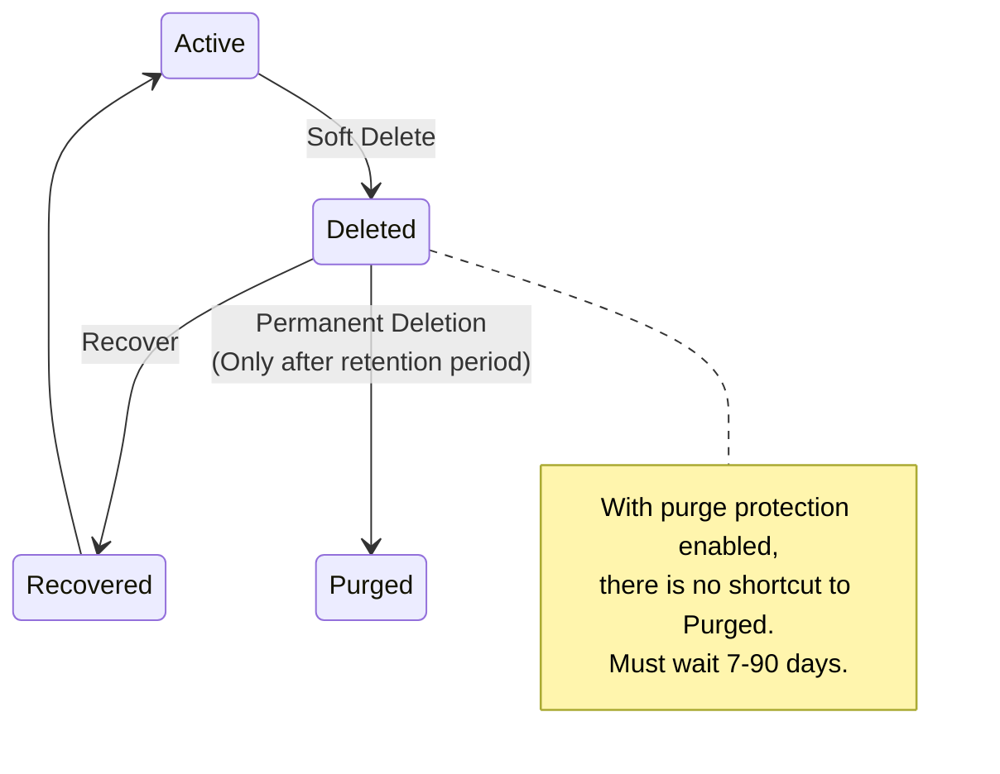
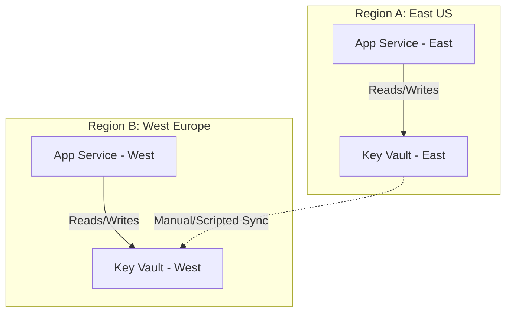
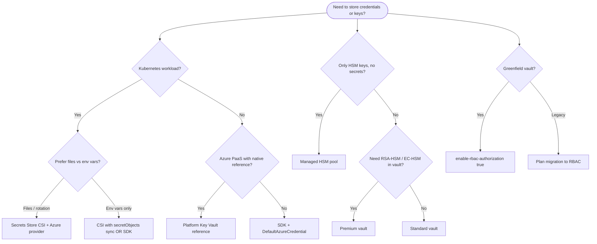

**Complexity**: `[MEDIUM]` | **Time to Complete**: 1.5h | **Prerequisites**: Module 3.1 (Entra ID & RBAC)

## What You'll Be Able to Do

After completing this module, you will be able to:

- **Configure Azure Key Vault with access policies and RBAC for secrets, keys, and certificate management**
- **Implement automatic secret rotation using Key Vault with Event Grid notifications and Azure Functions**
- **Deploy Key Vault integration patterns for App Service, Azure Functions, AKS, and VM workloads**
- **Design multi-region Key Vault architectures with soft delete, purge protection, and HSM-backed keys**

These outcomes chain together in real designs: you cannot integrate AKS or Container Apps safely without RBAC and managed identity; you cannot claim disaster recovery without understanding soft delete versus regional vault pairs; you cannot control spend without transaction and HSM-key meters. The hands-on lab intentionally uses RBAC, user-assigned identity, and soft-delete recovery—the same primitives production templates encode in Bicep or Terraform modules.

---

## Why This Module Matters

**Hypothetical scenario:** A platform team ships a hotfix that embeds a production database connection string in a Git commit. A contractor’s laptop is compromised the next week. The attacker clones the repository, extracts the string, and pivots into customer data before anyone rotates credentials. Incident response spends days untangling which services still read the old password from config maps, environment variables, and stale deployment artifacts.

That pattern is common because **secrets management is not optional, and it is not a problem you solve with environment variables alone.** Every application has secrets—database passwords, API keys, encryption keys, TLS certificates. How you store, scope, rotate, and audit access to those objects determines whether one leaked credential becomes a contained rotation event or a prolonged breach.

Azure Key Vault is a cloud service for [securely storing and managing secrets, encryption keys, and certificates](https://learn.microsoft.com/en-us/azure/key-vault/general/developers-guide). It supports HSM-protected keys and integrates with many Azure services, but the exact hardware validation level depends on the SKU and HSM platform. In this module, you will learn the three object types Key Vault manages, the two access control models (Access Policies vs RBAC), how soft delete and purge protection safeguard against accidental deletion, and how to integrate Key Vault with your applications using Managed Identities. You will also compare Standard, Premium, and Managed HSM costs, and choose among SDK, platform reference, and CSI integration paths. By the end, you will store a database connection string in Key Vault and retrieve it from a Container App without any credentials in your code.

---

## Key Vault Fundamentals

Azure Key Vault is the default **control plane for secrets, keys, and certificates** in Azure-native architectures. Other services (Managed HSM, dedicated HSM appliances) exist for specialized key-only regimes, but vaults remain the integration point for App Service, SQL, AKS CSI, Disk Encryption, and hundreds of resource providers that expect a `vault.azure.net` URI. Thinking in object types—not “a password store”—helps you pick the right API, RBAC role, and pricing meter for each credential.

Every REST call to `https://<vault-name>.vault.azure.net` is authenticated with a bearer token from Microsoft Entra ID whose audience is `https://vault.azure.net`. The token carries the caller’s identity; authorization is evaluated separately via RBAC or access policies. That split is why you can grant a managed identity read access without sharing passwords, and why compromised tokens are revocable by disabling the identity or removing role assignments—there is no long-lived shared vault password to rotate globally.

### The Three Object Types

Key Vault manages three distinct categories of cryptographic and sensitive material:

| Object Type | What It Stores | Use Cases | API Endpoint |
| :--- | :--- | :--- | :--- |
| **Secrets** | [Any string up to 25 KB](https://learn.microsoft.com/en-us/azure/key-vault/secrets/about-secrets) | DB passwords, API keys, connection strings, config values | [`https://myvault.vault.azure.net/secrets/`](https://learn.microsoft.com/en-us/azure/key-vault/general/about-keys-secrets-certificates) |
| **Keys** | [RSA or EC cryptographic keys](https://learn.microsoft.com/en-us/azure/key-vault/keys/about-keys) | Data encryption, signing, wrapping other keys | `https://myvault.vault.azure.net/keys/` |
| **Certificates** | [X.509 certificates + private keys](https://learn.microsoft.com/en-us/azure/key-vault/certificates/about-certificates) | TLS/SSL for web apps, code signing, mTLS | `https://myvault.vault.azure.net/certificates/` |

Each object type has its own lifecycle semantics on the data plane. **Secrets** are opaque strings (up to 25 KB) with optional `nbf` (not-before), `exp` (expiry), and `enabled` attributes. Disabling a secret blocks new reads without deleting history—useful during incident response when you need to stop traffic immediately but preserve versions for forensics. **Keys** are JSON Web Key (JWK) objects; software-protected keys run in FIPS-validated software modules, while HSM-protected keys (`RSA-HSM`, `EC-HSM`) keep private material inside the HSM boundary for Premium vaults. **Certificates** bundle the public certificate, policy (issuer, subject, SANs, validity), and private key; Key Vault can [integrate with public CAs](https://learn.microsoft.com/en-us/azure/key-vault/certificates/about-certificates) (DigiCert, GlobalSign) for enrollment and renewal, or you can import PFX files you already own.

Versioning applies uniformly: every `set` on a secret, `create`/`rotate` on a key, or certificate renewal produces a new version ID. Applications should pin to a version only when they must reproduce a specific ciphertext; otherwise they read the **current** version and tolerate rotation by refreshing on a schedule or on failure. Backup operations are special—Microsoft documents a [500-version cap per object for backup](https://learn.microsoft.com/en-us/azure/key-vault/general/service-limits); vaults with hundreds of versions per secret slow backup and can block restore planning.

### Key Vault vaults vs Azure Managed HSM

Most teams start with a **Key Vault vault** (`*.vault.azure.net`). [Standard tier](https://learn.microsoft.com/en-us/azure/key-vault/general/overview) encrypts data at rest with FIPS 140 Level 1 software modules and supports software-protected RSA/EC keys. **Premium tier** adds HSM-protected keys (FIPS 140-3 Level 3 on newer HSM platform keys per Microsoft’s [about keys](https://learn.microsoft.com/en-us/azure/key-vault/keys/about-keys) documentation) and is the right default when regulations or customer contracts require keys that never leave the HSM for wrap/unwrap operations.

**Azure Managed HSM** (`*.managedhsm.azure.net`) is a separate resource type: single-tenant pools for **HSM-protected keys only**—no secrets or certificates in the same resource. Microsoft positions it for high-value keys and strict compliance ([Managed HSM overview](https://learn.microsoft.com/en-us/azure/key-vault/managed-hsm/overview)). You pay an hourly pool fee (pricing page lists Standard B1 pools) rather than per-transaction secret pricing. Choose Managed HSM when you need dedicated tenancy, higher key counts per pool, or symmetric `oct-HSM` keys; stay on a Premium vault when you want one control plane for secrets, certs, and HSM keys together.

```mermaid
graph TD
    subgraph Azure Key Vault [Azure Key Vault 'myvault']
        S[Secrets<br/>- db-password<br/>- api-key-stripe<br/>- cosmos-conn-str]
        K[Keys<br/>- data-encrypt<br/>- signing-key<br/>- wrapping-key]
        C[Certificates<br/>- api-tls<br/>- mtls-cert<br/>- code-sign]
    end
    F["Features:<br/>• HSM-backed FIPS 140-2 L2 / 140-3 L3 (HSM Platform 2, current default)<br/>• Versioned updates<br/>• Audit logged access<br/>• Soft delete & purge protection<br/>• Private endpoint support"]
    Azure Key Vault --- F
    style F text-align:left
```

```bash
# Create a Key Vault
az keyvault create \
  --resource-group myRG \
  --name kubedojo-vault \
  --location eastus2 \
  --sku standard \
  --retention-days 90 \
  --enable-purge-protection true \
  --enable-rbac-authorization true

# Store a secret
az keyvault secret set \
  --vault-name kubedojo-vault \
  --name "db-password" \
  --value "SuperSecretP@ss123!"

# Retrieve a secret
az keyvault secret show \
  --vault-name kubedojo-vault \
  --name "db-password" \
  --query value -o tsv

# Store a multi-line secret (like a connection string)
az keyvault secret set \
  --vault-name kubedojo-vault \
  --name "cosmos-connection" \
  --value "AccountEndpoint=https://mydb.documents.azure.com:443/;AccountKey=abc123..."

# List all secrets (names only, not values)
az keyvault secret list \
  --vault-name kubedojo-vault \
  --query '[].{Name:name, Enabled:attributes.enabled, Created:attributes.created}' -o table
```

### Secret Versioning

Every time you update a secret, [Key Vault creates a new version](https://learn.microsoft.com/en-us/azure/key-vault/general/about-keys-secrets-certificates). The "current" version is always the latest, but you can access any previous version by its version identifier.

```bash
# Update a secret (creates a new version)
az keyvault secret set \
  --vault-name kubedojo-vault \
  --name "db-password" \
  --value "NewRotatedP@ss456!"

# List all versions of a secret
az keyvault secret list-versions \
  --vault-name kubedojo-vault \
  --name "db-password" \
  --query '[].{Version:id, Created:attributes.created, Enabled:attributes.enabled}' -o table

# Get a specific version
az keyvault secret show \
  --vault-name kubedojo-vault \
  --name "db-password" \
  --version "abc123def456..."
```

For rotation-friendly secrets, set `exp` when you create or update so Key Vault can emit [SecretNearExpiry events](https://learn.microsoft.com/en-us/azure/event-grid/event-schema-key-vault) to Event Grid. Operations teams often pair expiry metadata with an Azure Function that writes the next version after the downstream system (SQL login, API vendor key) has been updated—Key Vault stores the truth, but it does not change external systems by itself.

```bash
# Create a secret with activation and expiry (ISO 8601 duration/date)
az keyvault secret set \
  --vault-name kubedojo-vault \
  --name "api-key-vendor" \
  --value "vendor-key-v1" \
  --expires "2026-12-31T23:59:59Z" \
  --not-before "2026-06-01T00:00:00Z"

# Disable without deleting (blocks new reads of current version)
az keyvault secret set-attributes \
  --vault-name kubedojo-vault \
  --name "api-key-vendor" \
  --enabled false
```

### Keys: Encryption Without Exposing Key Material

Key Vault keys are special: [for HSM-protected keys, the private key material stays inside the HSM](https://learn.microsoft.com/en-us/azure/key-vault/general/developers-guide). When you need to encrypt data, you send the data to Key Vault, and it returns the ciphertext. You never see the raw key.

Software keys (`RSA`, `EC`) are cheaper per operation and sufficient for dev/test or low-risk signing. HSM keys (`RSA-HSM`, `EC-HSM`) require **Premium** SKU and bill a monthly **per active key version** charge when used in the prior 30 days, plus per-operation fees ([Azure Key Vault pricing](https://azure.microsoft.com/en-us/pricing/details/key-vault/)). Advanced sizes (3072/4096-bit RSA, non-2048 curves) use a higher operations meter ($0.15 per 10,000 transactions vs $0.03 for 2048-bit software keys on the public pricing page). Throttling also differs: [service limits](https://learn.microsoft.com/en-us/azure/key-vault/general/service-limits) allow fewer GETs per 10 seconds for larger HSM keys because limits are weighted—4096-bit HSM GETs consume the budget eight times faster than 2048-bit HSM GETs.

**Pause and predict:** If the raw key material for a Key Vault key never leaves the HSM, how does an application encrypt a 50 GB video file?

<details>
<summary>Check your prediction</summary>

Applications use envelope encryption. They generate a random AES data key locally and encrypt the 50 GB payload with AES locally. They wrap only the small data key with Key Vault using RSA-OAEP or AES key wrap. The 50 GB file never hits the Key Vault API.
</details>

Direct cryptographic operations against Key Vault suit small payloads such as signing hashes or wrapping symmetric keys. Sending large binaries over REST introduces severe network latency and quickly consumes transactional throughput quotas. Client applications should limit direct vault calls to key management operations and credential wrapping.

```bash
# Create an RSA key
az keyvault key create \
  --vault-name kubedojo-vault \
  --name "data-encryption-key" \
  --kty RSA \
  --size 2048

# Encrypt data (the key never leaves Key Vault)
echo -n "sensitive data" | base64 > /tmp/plaintext.b64
CIPHERTEXT=$(az keyvault key encrypt \
  --vault-name kubedojo-vault \
  --name "data-encryption-key" \
  --algorithm RSA-OAEP \
  --value "$(cat /tmp/plaintext.b64)" \
  -o tsv --query result)

# Decrypt data
az keyvault key decrypt \
  --vault-name kubedojo-vault \
  --name "data-encryption-key" \
  --algorithm RSA-OAEP \
  --data-type base64 \
  --value "$CIPHERTEXT"
```

### Certificates: Automated TLS Management

Key Vault can issue certificates from [integrated Certificate Authorities (DigiCert, GlobalSign) or manage self-signed certificates. It handles renewal automatically.](https://learn.microsoft.com/en-us/azure/key-vault/certificates/about-certificates)

```bash
# Create a self-signed certificate
az keyvault certificate create \
  --vault-name kubedojo-vault \
  --name "api-tls-cert" \
  --policy "$(az keyvault certificate get-default-policy)"

# Import an existing PFX certificate
az keyvault certificate import \
  --vault-name kubedojo-vault \
  --name "imported-cert" \
  --file mycert.pfx \
  --password "pfx-password"

# Download the certificate (public portion)
az keyvault certificate download \
  --vault-name kubedojo-vault \
  --name "api-tls-cert" \
  --file /tmp/api-cert.pem \
  --encoding PEM
```

Certificate **policies** define issuer (self-signed vs CA partner), key type, exportability, and lifetime actions. Auto-renewal triggers before expiry; each renewal is a billable **certificate renewal** operation on the pricing page (distinct from ordinary certificate API calls). Imported certificates skip CA integration but still benefit from centralized private-key storage and access logging. When App Service or Application Gateway consumes certs, they typically pull the current version via reference URI—rotation in Key Vault propagates only after the consuming service refreshes its binding.

---

## Automated Secret Rotation

Storing secrets securely is only half the battle; secrets must be rotated regularly to limit the impact of a potential compromise. Rotation has three moving parts: **generate new material**, **update dependents** (databases, partners, apps), and **retire old versions** without breaking decrypt of historical data. Azure Key Vault owns the first and third for keys; secrets usually need your automation for the second.

### Key Vault Rotation Policies (Keys)
For cryptographic keys, you can [define an automated rotation policy directly within Key Vault](https://learn.microsoft.com/en-us/azure/key-vault/keys/how-to-configure-key-rotation). This instructs the HSM to generate new key material at a scheduled interval. The policy JSON combines `lifetimeActions` (when to rotate) with `attributes.expiryTime` on the key.

```bash
# Create a rotation policy for a key (rotate 30 days before expiry)
cat > policy.json <<EOF
{
  "lifetimeActions": [
    {
      "trigger": {
        "timeBeforeExpiry": "P30D"
      },
      "action": {
        "type": "Rotate"
      }
    }
  ],
  "attributes": {
    "expiryTime": "P90D"
  }
}
EOF

az keyvault key rotation-policy update \
  --vault-name kubedojo-vault \
  --name "data-encryption-key" \
  --value @policy.json
```

**Pause and predict:** If Key Vault automatically rotates the key material for `data-encryption-key`, what happens to the data that was encrypted using the old key version? Does Key Vault automatically re-encrypt your database?

<details>
<summary>Check your prediction</summary>

Key Vault does not re-encrypt your database or storage disks. Old key versions remain addressable by their specific version identifiers so historical data decrypts without error. Consuming applications and PaaS services such as SQL TDE or Storage CMK must explicitly select the latest key version for new writes.
</details>

Automated rotation policies establish predictable cryptographic hygiene without interrupting ongoing read operations across running workloads. Platform teams must establish audit alerting to track when rotation events fire successfully across active vaults.

### Secret Rotation via Event Grid
For secrets (like database passwords), Key Vault cannot magically change the password in the target system (e.g., Azure SQL). Instead, Key Vault [emits an Event Grid event 30 days before a secret expires](https://learn.microsoft.com/en-us/azure/event-grid/event-schema-key-vault). This event triggers an Azure Function, which connects to the database, generates a new password, updates the database user, and saves the new version to Key Vault.

Event types you should wire in automation include **SecretNearExpiry**, **SecretExpired**, **KeyNearExpiry**, and certificate analogues—each maps to a schema version documented on the Event Grid page. Subscriptions can fan out to Functions, Logic Apps, or Service Bus so rotation does not run inline with user traffic. Idempotency matters: NearExpiry may fire more than once if clocks or retries overlap; your function should check the current secret version before writing.

```bash
# Example flow for Secret Rotation:
# 1. Secret approaches 'Expiration Date'
# 2. Key Vault publishes 'SecretNearExpiry' event to Event Grid
# 3. Event Grid triggers an Azure Function
# 4. Function connects to Azure SQL and changes the password
# 5. Function writes the new password to Key Vault as a new version
# 6. Function notifies app owners OR relies on app cache TTL to pick up new version
```

**Human runbooks vs automation:** low-frequency secrets (annual vendor API keys) may stay manual with calendar reminders; high-frequency database credentials should be fully automated. In all cases, test rollback: keep the previous secret version enabled until all consumers confirm the new password, then disable the old version to prevent silent fallback.

### Monitoring who touched secrets

Key Vault integrates with Azure Monitor for auditability. Enable diagnostic settings to stream **AuditEvent** logs to Log Analytics or a storage account ([overview](https://learn.microsoft.com/en-us/azure/key-vault/general/overview) describes monitoring options). Security teams hunt for unusual `SecretGet` volumes, `Delete` after hours, or `Purge` attempts. Correlate vault logs with Entra ID sign-in logs for human operators; managed identities show as service principals with predictable application IDs. Alerts on 429 rates often precede credential stuffing or misconfigured loops more than external attackers.

---

## Access Control: [Access Policies vs Azure RBAC](https://learn.microsoft.com/en-us/azure/key-vault/general/rbac-access-policy)

Key Vault supports two access control models. You must choose one at creation time (though you can switch later).

### Access Policies (Legacy)

Access Policies are vault-level permissions granted to specific identities. Each policy specifies what operations (get, set, delete, list, etc.) an identity can perform on secrets, keys, and certificates. Permissions are not Azure RBAC roles—they are Key Vault-specific strings like `get`, `list`, `set`, `delete`, `recover`, `backup`, `restore`, `encrypt`, `decrypt`, `wrapKey`, `unwrapKey`, `sign`, and `verify` combined per object type. A single principal might have `secret-permissions get list` and `key-permissions get wrapKey unwrapKey` on the same vault, which still grants visibility to **every** secret name in that vault when `list` is allowed.

Microsoft’s migration guidance maps common combinations to built-in RBAC roles, but automated scanners should flag any vault with `enableRbacAuthorization: false` for remediation. Access policies also do not participate in Entra Conditional Access or PIM—only RBAC assignments do—so human access via policies bypasses modern Zero Trust controls described in the [Key Vault overview](https://learn.microsoft.com/en-us/azure/key-vault/general/overview).

```bash
# Create a vault with access policies (not recommended for new vaults)
az keyvault create \
  --name old-style-vault \
  --resource-group myRG \
  --enable-rbac-authorization false

# Grant a user access to secrets
az keyvault set-policy \
  --name old-style-vault \
  --upn "alice@company.com" \
  --secret-permissions get list set

# Grant a managed identity access to keys
az keyvault set-policy \
  --name old-style-vault \
  --object-id "$MANAGED_IDENTITY_PRINCIPAL_ID" \
  --key-permissions get unwrapKey wrapKey
```

### Azure RBAC (Recommended)

RBAC uses the standard Azure role assignment model with fine-grained built-in roles:

| Role | Scope | Permissions |
| :--- | :--- | :--- |
| **Key Vault Administrator** | Vault | Full management of all objects |
| **Key Vault Secrets Officer** | [Vault or secret](https://learn.microsoft.com/en-us/azure/key-vault/general/rbac-guide) | Manage secrets (set, delete, rotate) |
| **Key Vault Secrets User** | Vault or secret | Read secrets only |
| **Key Vault Crypto Officer** | Vault or key | Manage keys (create, delete, sign, encrypt) |
| **Key Vault Crypto User** | Vault or key | Use keys (sign, encrypt) but not manage |
| **Key Vault Certificates Officer** | Vault or cert | Manage certificates |
| **Key Vault Reader** | Vault | Read metadata (not secret values) |

```bash
# Create a vault with RBAC (recommended)
az keyvault create \
  --name kubedojo-vault \
  --resource-group myRG \
  --enable-rbac-authorization true

# Grant read-only access to secrets for a managed identity
VAULT_ID=$(az keyvault show -n kubedojo-vault --query id -o tsv)
az role assignment create \
  --assignee-object-id "$MANAGED_IDENTITY_PRINCIPAL_ID" \
  --assignee-principal-type ServicePrincipal \
  --role "Key Vault Secrets User" \
  --scope "$VAULT_ID"

# Grant secret management access to a specific secret
ALICE_OBJECT_ID="<alice-entra-object-id>"
az role assignment create \
  --assignee-object-id "$ALICE_OBJECT_ID" \
  --assignee-principal-type User \
  --role "Key Vault Secrets Officer" \
  --scope "$VAULT_ID/secrets/db-password"
```

```mermaid
graph TD
    subgraph AP [Access Policies - Legacy]
        AP_V[Vault: kubedojo-vault]
        AP_U1[alice@company.com<br/>Secrets: get, list, set]
        AP_U2[app-managed-identity<br/>Keys: get, wrapKey, unwrapKey<br/>Secrets: get]
        AP_V --> AP_U1
        AP_V --> AP_U2
        AP_N[Limitation: Cannot scope to individual secrets/keys]
        style AP_N stroke-dasharray: 5 5
    end

    subgraph RBAC [Azure RBAC - Recommended]
        RBAC_V[Vault: kubedojo-vault]
        RBAC_S1[Scope: /secrets/db-password]
        RBAC_S2[Scope: / entire vault]
        RBAC_U1[alice@company.com<br/>Role: Key Vault Secrets Officer]
        RBAC_U2[app-managed-identity<br/>Role: Key Vault Secrets User]
        RBAC_V --> RBAC_S1
        RBAC_V --> RBAC_S2
        RBAC_S1 --> RBAC_U1
        RBAC_S2 --> RBAC_U2
        RBAC_N[Advantage: Standard Azure RBAC, Conditional Access, PIM support]
        style RBAC_N stroke-dasharray: 5 5
    end
```

**War Story**: With Access Policies, permissions are granted at vault scope, so a broad set of identities can end up with access to more secrets than they actually need. They could not scope Access Policies to individual secrets. After migrating to RBAC, they granted `Key Vault Secrets User` at the individual secret scope, reducing the blast radius of each identity to only the secrets it needed.

### Why mixing access policies and RBAC fails

A vault is created in **either** RBAC mode or access-policy mode (`enableRbacAuthorization`). Microsoft’s [RBAC vs access policy guide](https://learn.microsoft.com/en-us/azure/key-vault/general/rbac-access-policy) recommends RBAC for new vaults because it aligns with Entra ID Conditional Access, Privileged Identity Management, and subscription-wide access reviews. **Do not grant vault access policies on an RBAC-enabled vault** “just to make it work”—that bypasses the governance model and creates dual paths auditors cannot reason about. Migration is a one-time switch: export policies, map to built-in roles (`Key Vault Secrets User`, `Key Vault Crypto User`, etc.), validate with a staging vault, then cut over.

Data-plane roles are intentionally narrow. `Key Vault Secrets User` can read secret **values**; `Key Vault Reader` sees vault metadata only. Human break-glass should use PIM-eligible `Key Vault Secrets Officer` at the narrowest scope (single secret URI), not standing `Key Vault Administrator` on the subscription. Managed identities for workloads almost always need **Secrets User** or **Crypto User**—not Officer—because rotation and import remain pipeline responsibilities.

Network controls stack on top of RBAC: `default-action Deny` on the vault firewall, subnet rules, optional [private endpoints](https://learn.microsoft.com/en-us/azure/key-vault/general/how-to-azure-key-vault-network-security), and “Allow trusted Microsoft services” when a PaaS resource must reach the vault without public IPs. RBAC alone does not stop a caller on an allowed network path; conversely, a perfect firewall does not help if the identity holds `Key Vault Administrator`. Design both layers.

### Transaction throttling on the data plane

Even authorized callers hit [service limits](https://learn.microsoft.com/en-us/azure/key-vault/general/service-limits). Secret GET operations share a **4,000 transactions per 10 seconds per vault per region** bucket (with a subscription-wide multiplier). Create/import bursts for secrets, certificates, and keys share a **300 per 10 seconds** collective cap. Exceeding limits returns HTTP **429**; clients must backoff and retry. Hot paths that call `get_secret` on every HTTP request will throttle during scale-out long before RBAC denies them—cache in memory and refresh on interval or after rotation events.

---

## Soft Delete and Purge Protection

Key Vault has two safety nets against accidental or malicious deletion. Together they implement a **recoverable delete** model that is very different from simply removing a row in a configuration database.

**Soft Delete**: When you delete a secret, key, or certificate, it is not immediately destroyed. Instead, it enters a "soft-deleted" state and can be recovered during the [retention period (7-90 days)](https://learn.microsoft.com/en-us/azure/key-vault/general/soft-delete-overview). Soft delete is on by default for newly created key vaults. During the retention window the name remains reserved—you cannot create a new secret with the same name until the old object is recovered or purged. Applications that read the live name will fail after delete, which is why operations runbooks should document recover steps alongside monitoring alerts on secret GET failures.

**Purge Protection**: When enabled, even a soft-deleted object cannot be permanently destroyed (purged) until the retention period expires. This protects against a compromised admin account deliberately destroying secrets. Microsoft documents that **purge protection cannot be disabled** once enabled; plan retention length per environment (seven days for labs, longer for production) because every delete becomes a waiting game until scheduled purge date. Vault-level purge protection also prevents purging the entire vault until retention elapses—pair with break-glass procedures stored outside the vault.

**Operational implications:** soft delete protects against oops moments; purge protection protects against malicious purge. Neither replaces backup: [backup/restore](https://learn.microsoft.com/en-us/azure/key-vault/general/backup) downloads encrypted blobs that only restore into the same subscription and geography. For regional disasters, rely on paired-region replication behavior plus your active-active vault pattern, not backup alone.

```bash
# Delete a secret (soft delete)
az keyvault secret delete --vault-name kubedojo-vault --name "db-password"

# List soft-deleted secrets
az keyvault secret list-deleted --vault-name kubedojo-vault \
  --query '[].{Name:name, DeletedDate:deletedDate, ScheduledPurge:scheduledPurgeDate}' -o table

# Recover a soft-deleted secret
az keyvault secret recover --vault-name kubedojo-vault --name "db-password"

# With purge protection disabled, you COULD permanently purge:
# az keyvault secret purge --vault-name kubedojo-vault --name "db-password"
# With purge protection enabled, this command fails until retention expires.
```



---

## Multi-Region Architectures and Disaster Recovery

For mission-critical applications deployed across multiple Azure regions (e.g., East US and West Europe), depending on a single Key Vault creates a single point of failure and introduces cross-region latency. Calls from West Europe to an East US vault add round-trip time on every cold start that touches Key Vault; at scale you will feel it in pod startup and autoscaling curves even when throttling is not triggered.

### High Availability within a Region
Behind the scenes, Azure Key Vault automatically replicates its contents within the region and to a paired region (e.g., East US to West US). If a single node fails, traffic is transparently routed to a healthy node. You do not configure this replication—it is part of the managed service SLA story. Your responsibility is to place the vault in the same sovereignty boundary as the primary workload and to grant identities access via RBAC before failover events, because Entra ID tokens and DNS for `*.vault.azure.net` must still resolve during stress.

### The Active-Active Vault Pattern
However, if an entire region goes down, the vault in the [paired region enters read-only mode](https://learn.microsoft.com/en-us/azure/reliability/reliability-key-vault). For active-active applications that need to *write* secrets or manage keys during a regional outage, you [must deploy independent Key Vaults in each region](https://learn.microsoft.com/en-us/azure/reliability/reliability-key-vault). Reads may continue from the surviving regional endpoint for many scenarios, but secret rotation, new certificate issuance, or emergency key creation requires a writable vault in the active region.

**Sync discipline:** Treat regional vaults like regional data boundaries. Regional secrets such as SQL logins for `db-east` versus `db-west` should exist only in their local vault to avoid accidental cross-region database traffic. Document secret scope categories in your enterprise secret catalog so compliance auditors can verify data boundaries.

**Failover testing:** quarterly exercises should include revoking a secret version, recovering via soft delete, and failing over application reads to the secondary regional vault URI. Teams that only test compute failover without Key Vault writes discover read-only mode when they attempt to rotate during an incident.



Multi-region architectures require explicit design choices for secret replication. Applications running across distinct geographies often depend on shared third-party credentials while maintaining isolated infrastructure credentials.

**Latency budgeting:** cross-region secret reads add tens of milliseconds per call. If each pod startup performs five serial GETs across the continent, startup SLOs suffer before throttling appears. Co-locate vault and compute in the same region whenever possible; use regional vault pairs only for disaster tolerance, not for routine traffic.

**Compliance copies:** some regimes require customer-managed keys in specific geographies. Document vault region, backup geography, and Entra tenant residency together—Key Vault does not override data residency choices made at subscription creation time.

**Pause and predict:** In an active-active architecture distributing a shared Stripe API key to KV-East and KV-West, what happens if the deployment updates KV-East but fails before reaching KV-West?

<details>
<summary>Check your prediction</summary>

KV-West still serves the old key while KV-East serves the updated version. This mismatch causes split-brain authentication failures across regions. Global secrets need identical values in both vaults alongside automated drift alerts to detect partial sync failures immediately.
</details>

Disaster recovery runbooks should include automated health checks that query both regional endpoints and verify configuration synchronization. Catching credential discrepancies during automated canary verification prevents partial deployments from degrading production traffic.

---

## Integrating Key Vault with Applications

Applications should treat Key Vault as an **upstream dependency** with latency, quotas, and availability characteristics—not as a local file. Plan retries, circuit breaking, and health checks that distinguish “vault unreachable” from “identity misconfigured.” Azure VMs reach managed identity tokens through the always-present **IMDS** endpoint at `169.254.169.254`; `az vm identity assign` attaches the identity—no VM extension is required. Container Apps and other PaaS hosts expose a different token endpoint via `IDENTITY_ENDPOINT` and `IDENTITY_HEADER` environment variables (see Task 5 in the lab).

**AKS workload identity (modern):** replaces pod identity with federated credentials to Entra ID; the CSI provider documentation aligns with managed identity client IDs. Whichever identity model you choose, the vault firewall must see the caller’s egress path and RBAC must reference the same principal ID you pass to `az role assignment create`.

### Pattern 1: Direct SDK Access (Application Code)

Direct SDK access is the most portable pattern: it works on AKS, Container Apps, VMs, and developer laptops with the same code path. Authentication flows through [DefaultAzureCredential](https://learn.microsoft.com/en-us/azure/active-directory/managed-identities-azure-resources/overview-for-developers), which tries environment variables, managed identity endpoint, and Azure CLI login in order. Authorization is pure RBAC on the vault data plane—no magic strings in app settings beyond the vault URL.

**Design checklist for SDK consumers:** (1) grant only `Key Vault Secrets User` (or Crypto User) to the workload identity; (2) use versionless secret names in production so operators can rotate without redeploying when the app reloads secrets; (3) implement exponential backoff on 429 responses per [throttling guidance](https://learn.microsoft.com/en-us/azure/key-vault/general/overview-throttling); (4) emit structured logs when secret refresh fails but do not log secret values; (5) separate read credentials from rotation credentials—rotation functions need Officer, apps need User.

```python
from azure.identity import DefaultAzureCredential
from azure.keyvault.secrets import SecretClient

# No credentials in code! DefaultAzureCredential uses Managed Identity.
credential = DefaultAzureCredential()
client = SecretClient(vault_url="https://kubedojo-vault.vault.azure.net/", credential=credential)

# Get a secret
db_password = client.get_secret("db-password")
print(f"Connected to DB with password: {db_password.value[:3]}***")

# Set a secret
client.set_secret("api-key-new", "my-new-api-key")

# List secrets (metadata only, not values)
for secret in client.list_properties_of_secrets():
    print(f"Secret: {secret.name}, Enabled: {secret.enabled}")
```

### Pattern 2: Key Vault References in App Configuration

Platform references trade flexibility for simplicity. Azure resolves the secret at runtime and injects it like a normal app setting, which means your code never imports the Key Vault SDK—great for legacy apps, but rotation requires the platform to refresh the binding and you lose fine-grained per-request audit in application logs (vault diagnostics still record access). References must use a fully qualified secret URI including version if you pin; versionless URIs track **current** automatically per [App Service Key Vault references](https://learn.microsoft.com/en-us/azure/app-service/app-service-key-vault-references).

The identity performing resolution needs `get` on secrets—typically the App Service system-assigned identity with **Secrets User** on the vault. Misconfiguration shows up as startup errors referencing `@Microsoft.KeyVault(...)` syntax literally in environment dumps; never log resolved values.

Azure App Service and Functions can use Key Vault references in app settings, and Container Apps can consume Key Vault-backed secrets without SDK code:

```bash
# Set a Key Vault reference in a Function App
az functionapp config appsettings set \
  --resource-group myRG \
  --name my-function-app \
  --settings "DB_PASSWORD=@Microsoft.KeyVault(SecretUri=https://kubedojo-vault.vault.azure.net/secrets/db-password/)"

# The application reads DB_PASSWORD as a normal environment variable.
# Azure resolves the Key Vault reference automatically.
```

> **Stop and think**: When passing a Key Vault reference into an App Service or Container App environment variable, the application itself is completely unaware of Key Vault. It just reads a standard environment variable. What are the security tradeoffs of this convenience compared to having the application use the Azure SDK directly?

### Pattern 3: Container Apps with Key Vault

Container Apps treat Key Vault as a **secret provider** referenced at deploy time. The `keyvaultref:` and `identityref:` pair binds a secret name to a vault URI and the managed identity that authenticates. Environment variables then use `secretref:` indirection so the image stays free of vault URLs. Rotation requires revising the Container App secret definition or using an external pipeline to update revisions—there is no in-container SDK call unless you add one.

Operational tip: user-assigned identities are clearer in multi-tenant platforms than system-assigned when several apps share automation templates. Grant **Secrets User** on the vault scope, not Contributor on the resource group, to avoid accidental resource deletion rights.

```bash
# Create a Container App that reads secrets from Key Vault via Managed Identity
az containerapp create \
  --resource-group myRG \
  --name my-app \
  --environment my-env \
  --image myregistry.azurecr.io/app:v1 \
  --secrets "db-pass=keyvaultref:https://kubedojo-vault.vault.azure.net/secrets/db-password,identityref:/subscriptions/.../userAssignedIdentities/my-identity" \
  --env-vars "DB_PASSWORD=secretref:db-pass"
```

### Pattern 4: Kubernetes Integration (CSI Driver)

For AKS, the Azure Key Vault Provider for Secrets Store CSI Driver [mounts secrets as files in the pod](https://learn.microsoft.com/en-us/azure/aks/csi-secrets-store-driver). Pods see secrets as read-only files under `/mnt/secrets-store` (path depends on your `volumeMount`). Linux containers can `source` or read files directly; .NET and Java apps often map paths via configuration. Because the driver calls Key Vault on mount and on rotation intervals, cluster autoscaling that churns pods during traffic spikes can amplify transaction counts—pre-warm secrets in images only when they are non-sensitive config; never bake real secrets into layers.

**Rotation and reload:** enabling rotation on the `SecretProviderClass` lets the driver pick up new versions without redeploying the entire Deployment, but application code may still cache old values until it re-reads files or receives SIGHUP. Document whether your framework watches the mount directory. When `secretObjects` sync to Kubernetes Secrets for env vars, rotation updates the mount first; synced Secrets may lag unless you enable auto-reload annotations supported in your cluster version.

**Identity wiring:** `useVMManagedIdentity: "true"` uses the kubelet identity on the node pool unless you specify `userAssignedIdentityID` for a dedicated identity per workload class—prefer user-assigned identities per team so compromise of one pool does not unlock every vault in the subscription.

```yaml
# SecretProviderClass for AKS
apiVersion: secrets-store.csi.x-k8s.io/v1
kind: SecretProviderClass
metadata:
  name: kv-secrets
spec:
  provider: azure
  parameters:
    usePodIdentity: "false"
    useVMManagedIdentity: "true"
    userAssignedIdentityID: "<managed-identity-client-id>"
    keyvaultName: "kubedojo-vault"
    objects: |
      array:
        - |
          objectName: db-password
          objectType: secret
        - |
          objectName: api-key-stripe
          objectType: secret
    tenantId: "<tenant-id>"
  secretObjects:
    - secretName: app-secrets
      type: Opaque
      data:
        - objectName: db-password
          key: DB_PASSWORD
        - objectName: api-key-stripe
          key: STRIPE_KEY
```

Mount the volume in the pod spec (`volumeMounts` + `volumes` referencing the `SecretProviderClass`). With `secretObjects`, the driver can [sync into a native Kubernetes Secret](https://learn.microsoft.com/en-us/azure/aks/csi-secrets-store-driver) for env-var injection—understand that copying to a K8s Secret widens the blast radius to anyone with `get secrets` in the namespace. Prefer file mounts for sensitive material when your runtime supports reading paths.

**Rotation on AKS:** enable rotation/reload on the `SecretProviderClass` so the driver polls Key Vault and remounts files; pair with workload restarts or sidecars that signal the app when files change. Managed identity (system- or user-assigned) replaces deprecated pod identity; set `useVMManagedIdentity: "true"` and pass the identity’s client ID as in the manifest above.

### Contrast: hardcoded connection strings

| Approach | Credential in Git? | Audit trail | Rotation | Scale-out risk |
| :--- | :--- | :--- | :--- | :--- |
| Env var / `appsettings.json` | Often yes | None on read | Redeploy required | N/A |
| SDK + Managed Identity | No | Key Vault diagnostic logs | Update secret version; app refresh | Throttling if uncached |
| App Service / Container Apps Key Vault reference | No | Platform + vault logs | Update vault; platform resolves | Platform caches reference |
| CSI file mount | No | Vault logs + K8s audit | Driver rotation + pod reload | Low if mount-on-start only |

The anti-pattern this module prevents is treating Key Vault as a remote `.env` file fetched per request. Fetch at process start (or on rotation webhook), hold in protected memory, and respect 429 backoff.

---

## Key Vault Networking: Private and Secure

By default, Key Vault is [accessible from the public internet (with authentication required)](https://learn.microsoft.com/fi-fi/azure/key-vault/general/how-to-azure-key-vault-network-security?tabs=azure-cli). Authentication and authorization still apply on public endpoints—network openness is not the same as anonymous access—but production baselines should assume attackers probe `*.vault.azure.net` from anywhere.

**Defense in depth layers:** (1) private endpoint on a dedicated subnet with DNS integration to the vault’s private link FQDN; (2) firewall `default-action Deny` with explicit VNet service endpoints or private endpoint subnets; (3) optional IP rules for break-glass operators; (4) `Allow trusted Microsoft services` when Azure Backup, App Service, or other Microsoft services must reach the vault without routing through your VNet. Each layer reduces exposure; combine with RBAC least privilege because an insider on an allowed subnet can still exfiltrate secrets if they hold **Secrets User**.

**AKS note:** when the CSI driver or workload identity calls Key Vault, traffic egresses from the node pool or overlay network—ensure NSGs and firewall rules include those subnets, not only developer office IPs. Private Link without updating DNS in the cluster causes opaque TLS failures that look like “Key Vault is down.”

For production, restrict network access:

```bash
# Restrict to specific VNets and IPs
az keyvault update \
  --name kubedojo-vault \
  --default-action Deny

# Allow access from a specific subnet
az keyvault network-rule add \
  --name kubedojo-vault \
  --subnet "/subscriptions/.../subnets/app-subnet"

# Allow access from a specific IP
az keyvault network-rule add \
  --name kubedojo-vault \
  --ip-address "203.0.113.0/24"

# Or use Private Endpoint for full private access
az network private-endpoint create \
  --resource-group myRG \
  --name kv-private-endpoint \
  --vnet-name hub-vnet \
  --subnet private-endpoints \
  --private-connection-resource-id "$VAULT_ID" \
  --group-id vault \
  --connection-name kv-connection
```

**Pause and predict:** If a user has the Key Vault Administrator role at subscription scope, but a vault firewall denies all IP addresses except one office network, can the administrator read secrets from home? Which control takes precedence?

<details>
<summary>Check your prediction</summary>

Network firewalls take precedence over role-based access control. The administrator cannot read secrets from an unapproved home IP address. Azure RBAC does not punch through a denied public IP, and the request is rejected at the network perimeter before identity authentication evaluates.
</details>

Network perimeter controls enforce transport security boundaries before the data plane examines Microsoft Entra authorization tokens. Security teams must pair least-privilege role assignments with explicit network isolation to prevent unauthorized data access.

---

## Cost Lens: Transactions, Keys, Certificates, and Managed HSM

Key Vault billing is **operation-centric** for vaults, not capacity-based. Microsoft’s [pricing page](https://azure.microsoft.com/en-us/pricing/details/key-vault/) charges **$0.03 per 10,000 transactions** for most secret, software key, and certificate API calls in both Standard and Premium. That sounds negligible until you multiply by microservice instance count and request rate.

**Secrets hot path:** An API tier with 200 pods, each handling 50 requests/second, that calls `get_secret` once per request generates **10,000** secret GETs per second—orders of magnitude above the [4,000 GETs per 10 seconds](https://learn.microsoft.com/en-us/azure/key-vault/general/service-limits) limit. You pay twice: throttling outages plus billable operations if you somehow stayed under the cap. **Knobs that reduce cost:** in-memory cache with TTL (5–15 minutes is common), startup-only fetch, batching configuration reads, and fewer secrets per vault (reuse references, not duplicate copies).

**Premium HSM keys:** Each active HSM key version can incur **$1/month (2048-bit RSA)** plus operations, with higher monthly charges for advanced key sizes on the pricing table. Idle versions you never use may avoid the monthly HSM key fee, but **each version counts separately** if it was used in the last 30 days—rotation without retiring old versions increases steady cost.

**Certificates:** Ordinary certificate API operations bill like secrets; **renewal requests** bill **$3 per renewal** (not the $0.03/10k bucket). Automated TLS with frequent renewals across dozens of hostnames adds up—consolidate SAN certs where policy allows.

**Automated key rotation policy:** Each rotation produces a new key **version**; you pay for active HSM key versions and the operations they generate—not a flat per-rotation fee. Keep rotation frequency sane so version sprawl does not inflate monthly HSM key charges.

**Managed HSM pools:** Billed per **hour per HSM pool** (e.g., Standard B1 at $3.20/hour on the US pricing page at time of writing—verify region/currency in the calculator). Economical when you need many HSM operations on dedicated hardware; expensive for a handful of secrets—use a Premium **vault** instead.

**Cost spike surprises:** Black Friday scale-out without cache; certificate auto-renewal storms; integration tests hitting production vaults; and backup jobs over objects with 500+ versions (slow, operation-heavy). Tag vaults by environment and alert on Key Vault metrics for **ServiceApiHit** throttling and transaction volume.

---

## Patterns & Anti-Patterns

### Proven patterns

| Pattern | When to use | Why it works | Scaling note |
| :--- | :--- | :--- | :--- |
| **One vault per app per environment** | Prod vs dev isolation | Blast radius and RBAC scope stay bounded; aligns with [Microsoft app guidance](https://learn.microsoft.com/en-us/azure/key-vault/general/apps-api-keys-secrets) | More vaults mean more RBAC assignments—automate with IaC |
| **RBAC + least-privilege data-plane roles** | All new vaults | Entra ID governance, secret-level scope, PIM for humans | Use `Key Vault Secrets User` at `/secrets/<name>` URI |
| **Startup cache + periodic refresh** | High QPS services | Avoids 429 throttling and cuts $0.03/10k charges | Refresh on rotation Event Grid events, not every HTTP call |
| **CSI file mount for AKS** | Twelve-factor apps that read files | No secret in image; identity-based access | Enable rotation; limit K8s Secret sync |
| **Envelope encryption for bulk data** | Large blobs, disks, SQL CMK | Key Vault wraps DEK only; data stays in service | Use HSM keys when policy requires |

### Anti-patterns

| Anti-pattern | What goes wrong | Why teams fall into it | Better alternative |
| :--- | :--- | :--- | :--- |
| **Per-request `get_secret`** | 429 throttling + high ops bill | “Always fresh” security myth | Cache + rotation hooks |
| **Subscription-wide `Key Vault Administrator`** | Over-privileged humans/scripts | Easiest role to “make it work” | Scoped Officer/User + PIM |
| **Mixing access policies on RBAC vaults** | Audit gaps, dual control paths | Legacy scripts during migration | Complete RBAC migration |
| **Premium vault for secrets-only workloads** | Paying HSM key fees unnecessarily | One-size-fits-all platform standard | Standard vault for secrets; Premium only when using HSM keys |
| **CSI sync to K8s Secret for everything** | Secret duplicated in etcd | Env vars need Secret objects | Mount files; sync only when required |
| **No purge protection in production** | Attacker purges after delete | Faster “cleanup” in tests | Enable purge protection; shorter retention in dev |

---

## Decision Framework

Use this matrix when choosing control plane, SKU, and integration path. Prices and limits change—confirm in [pricing](https://azure.microsoft.com/en-us/pricing/details/key-vault/) and [service limits](https://learn.microsoft.com/en-us/azure/key-vault/general/service-limits) before production sign-off.

| Decision | Choose A | Choose B | Choose C |
| :--- | :--- | :--- | :--- |
| **Authorization** | **Azure RBAC** (new vaults) | Access policies (legacy only) | — |
| **Vault SKU** | **Standard** — secrets + software keys | **Premium** — HSM keys + secrets/certs in one vault | **Managed HSM** — dedicated HSM keys only, highest isolation |
| **App integration** | **SDK + Managed Identity** (full control, any host) | **Key Vault reference** (App Service/Functions/Container Apps) | **Secrets Store CSI** (AKS file mounts + optional K8s Secret sync) |



**Tradeoffs in one glance:** RBAC wins governance; access policies only remain for untouchable legacy. Standard is cheapest for secrets-heavy platforms. Premium adds HSM key monthly + ops cost but keeps certs and secrets together. Managed HSM is hourly pool pricing—justify with compliance, not convenience. SDK offers maximum portability; references minimize code but hide rotation semantics; CSI is best for AKS-native secret delivery with file-based interfaces.

### When Standard beats Premium (and when it does not)

Choose **Standard** when the workload stores application secrets and software-protected RSA/EC keys only, and compliance does not mandate HSM-wrapped keys. Many microservice estates never call `wrapKey` on an HSM key—paying Premium’s per-key monthly fees would fund unused capability. Choose **Premium** when you require `RSA-HSM`/`EC-HSM` keys that stay inside validated HSM boundaries, or when auditors explicitly map controls to FIPS 140-3 Level 3 material described in Microsoft’s tier comparison. Choose **Managed HSM** when symmetric `oct-HSM` keys, dedicated tenancy, or pool-level scaling guidance from [Managed HSM scaling](https://learn.microsoft.com/en-us/azure/key-vault/managed-hsm/scaling-guidance) dominates the architecture—accept that secrets and certificates will still live in a separate vault.

Certificate-heavy platforms should model **renewal dollars** separately from API operation dollars: a fleet of fifty certs renewing monthly triggers fifty $3 renewal lines on the public pricing page even if API traffic stays low. Secrets-heavy platforms should model **GET volume** against the 4,000/10s limit before the first invoice arrives. FinOps dashboards that only track vault count miss the dominant cost driver—transactions and renewals scale with application behavior, not resource inventory. Tag each vault with `cost-center` and `environment` application tags for chargeback reports. Review monthly Cost Management filters grouped by Key Vault resource ID.

---

## Did You Know?

1. **Azure Key Vault handles a very large volume of requests** across Azure customers. It is one of the most heavily used services in Azure because virtually every Azure service that needs secrets, keys, or certificates uses Key Vault under the hood. Azure Disk Encryption, App Service certificates, SQL Transparent Data Encryption—they all store their keys in Key Vault. That ubiquity means Microsoft invests heavily in throttling fairness and regional replication; your misconfigured loop affects shared capacity, which is why 429 responses should trigger client backoff instead of tight retry storms.

2. **Key Vault tiers differ in protection model and pricing**. Standard uses software-protected keys with FIPS 140 Level 1 modules; Premium adds HSM-protected keys with stronger validations on current HSM platforms. Managed HSM pools bill hourly and target key-only estates. Always reconcile architectural slides with the current [overview](https://learn.microsoft.com/en-us/azure/key-vault/general/overview) and [pricing](https://azure.microsoft.com/en-us/pricing/details/key-vault/) pages before contractual commitments.

3. **Key Vault has a throttling limit of [4,000 transactions per vault per 10 seconds](https://learn.microsoft.com/en-us/azure/key-vault/general/service-limits)** for secret read operations. Large microservice rollouts can hit Key Vault throttling if every instance fetches multiple secrets at once. Cache secrets locally, refresh them on a sensible interval, and stagger large deployments. The same page documents weighted limits for large RSA HSM keys—capacity planning is not only about secrets.

4. **Once purge protection is enabled on a vault, it cannot be disabled.** This is by design—it prevents an attacker who gains admin access from disabling the protection and then purging secrets. If you enable purge protection on a test vault with a long retention period, deleted objects cannot be permanently purged until that retention window expires. Use a shorter retention period (such as 7 days) for most non-production vaults, and document scheduled purge dates in change tickets so operators know when names become reusable.

---

## Common Mistakes

| Mistake | Why It Happens | How to Fix It |
| :--- | :--- | :--- |
| Storing secrets in environment variables, config files, or code | It is "faster" during development | Use Key Vault from day one. Local dev uses `DefaultAzureCredential` which falls back to Azure CLI login---no secret management needed locally. |
| Creating one vault per secret | Misunderstanding of vault purpose | A vault is a logical grouping of related secrets. [Use one vault per application/environment](https://learn.microsoft.com/en-us/azure/key-vault/general/apps-api-keys-secrets) (e.g., `app-prod-vault`, `app-dev-vault`). |
| Using Access Policies on new vaults | Copying old tutorials | For new vaults, create them with `--enable-rbac-authorization true` unless you have a specific legacy reason. RBAC provides per-secret scoping and uses standard Azure role-assignment and privileged-access workflows. |
| Not enabling purge protection on production vaults | It seems overly cautious | A compromised admin could delete and purge all secrets. Purge protection ensures deleted secrets can be recovered. Enable it on all production vaults. |
| Reading secrets from Key Vault on every request | It seems like the "most secure" approach | Cache secrets in memory and refresh periodically (every 5-15 minutes). Key Vault has throttling limits, and each call adds network latency. |
| Granting Key Vault Administrator when Key Vault Secrets User is sufficient | "Administrator" sounds like the right role for an admin | [Key Vault Administrator can create, delete, and manage ALL objects. Most applications only need Key Vault Secrets User (read secrets).](https://learn.microsoft.com/en-us/azure/key-vault/general/rbac-guide) |
| Not rotating secrets | The initial secret "works fine" | Implement secret rotation. Use Key Vault rotation policies for keys, or Event Grid notifications to trigger custom secret-rotation logic. |
| Forgetting to configure firewall rules on production vaults | The vault works from everywhere by default | Set `--default-action Deny` and add only the necessary VNet subnets and IPs. Use Private Endpoint for the strongest isolation. |

**Governance habits that stick:** maintain a secret catalog (name, owner, rotation cadence, regional copy, RBAC assignees). Review **Key Vault Administrator** assignments quarterly. Export diagnostic logs to a workspace with retention matching your compliance regime, and alert when `SecretGet` anomalies exceed baselines. Treat emergency secret disable (`enabled: false`) as a break-glass action with ticket linkage, not as everyday rotation.

---

## Quiz

<details>
<summary>1. You are designing the security architecture for a new e-commerce application. The application needs to connect to a SQL database, encrypt credit card numbers before storing them, and serve traffic over HTTPS. How would you categorize these requirements into Azure Key Vault object types, and why?</summary>

The three requirements directly map to Key Vault's three object types. The SQL database password should be stored as a **Secret**, because it is a raw string value that the application needs to retrieve and pass to the database driver. The credit card encryption mechanism should use a **Key**, because Key Vault can perform the cryptographic operations (encrypt/decrypt) entirely within its HSM without ever exposing the raw key material to the application. The HTTPS traffic requirement should be handled by a **Certificate**, because Key Vault can manage the X.509 certificate, securely store its private key, and automatically handle the renewal process with integrated certificate authorities.
</details>

<details>
<summary>2. Your organization currently manages Key Vault using Access Policies, but the security team has mandated that all access to production database passwords must be strictly limited to the specific application that uses them, and access must require Multi-Factor Authentication. How does migrating to Azure RBAC solve this, and why couldn't Access Policies meet the requirement?</summary>

Migrating to Azure RBAC allows you to apply granular access controls down to the individual secret level, whereas Access Policies only operate at the vault level. With Access Policies, granting an application access to read the database password would inherently grant it access to read every other secret in the vault. Furthermore, Access Policies are a legacy Key Vault-specific mechanism that does not integrate with modern Azure AD features. By using Azure RBAC, the security team can leverage Conditional Access policies to enforce MFA, and use Privileged Identity Management (PIM) to require just-in-time access approvals for human users requesting the `Key Vault Secrets Officer` role.
</details>

<details>
<summary>3. A rogue administrator account executes a script that deletes all secrets from your production Key Vault and then immediately attempts to permanently purge them to cause maximum disruption. Your vault was configured with soft delete and purge protection enabled. Walk through what happens to the secrets and why the attacker's plan fails.</summary>

When the attacker executes the deletion script, the secrets are not permanently destroyed; instead, they are moved into a soft-deleted state. In this state, applications that rely on live Key Vault reads will typically lose access quickly (often resulting in downtime), but the secrets themselves are safely preserved in the vault's recycle bin. When the attacker attempts to purge the soft-deleted secrets, the Key Vault service rejects the request because purge protection is enabled. Purge protection enforces a mandatory waiting period (between 7 and 90 days, depending on configuration) during which absolutely no one—including Global Administrators—can bypass the retention period. The organization can simply restore the soft-deleted secrets and revoke the rogue administrator's access.
</details>

<details>
<summary>4. Your development team is struggling with "it works on my machine" errors because they hardcode Key Vault credentials locally, but the application uses Managed Identities in production. You rewrite the code to use `DefaultAzureCredential()`. Walk through how this single line of code resolves authentication in both the local development environment and the production Container App.</summary>

The `DefaultAzureCredential` class operates by iterating through a prioritized chain of authentication providers based on the environment it detects. When a developer runs the application locally, it discovers the developer's cached Azure CLI credentials (`az login`) and uses their personal identity to request an access token for Key Vault. When the exact same code is deployed to the production Container App, the local developer credentials do not exist, so the chain falls back to the Managed Identity endpoint injected by Azure into the container environment. This abstracts the authentication mechanism away from the application logic, ensuring that no raw credentials are ever hardcoded in the source repository.
</details>

<details>
<summary>5. On Black Friday, your application automatically scales out from 10 to 200 instances in response to traffic. Immediately, the new instances crash on startup with HTTP 429 (Too Many Requests) errors originating from Azure Key Vault. The developers configured the app to fetch its 5 database connection strings from Key Vault on every incoming user request. Why did this cause an outage, and what architectural pattern should they implement to fix it?</summary>

The outage occurred because Key Vault is designed as a secure storage repository, not a high-throughput, low-latency database; it strictly throttles secret read operations to approximately 4,000 transactions per 10 seconds per vault. By reading 5 secrets on every request across thousands of concurrent operations, the scaled-out application instances massively exceeded the service limit and triggered 429 errors. To fix this architectural flaw, the team must implement an in-memory caching layer within the application. The application should fetch the secrets once during startup, cache them in memory, and only periodically poll Key Vault (e.g., every 10 minutes) to check for rotated values.
</details>

<details>
<summary>6. A startup currently injects its database password into its App Service via an environment variable called `DB_PASS`. A security consultant recommends moving this to Azure Key Vault and using a Managed Identity to access it. Compare these two approaches: what specific vulnerabilities exist in the environment variable method that Key Vault eliminates?</summary>

Storing a password directly in an environment variable leaves the plaintext credential exposed in memory dumps, process listings, debugging logs, and the Azure Portal interface for anyone with read access to the App Service. It also provides no audit trail of who viewed the password, and requires a full application restart to rotate the credential. By moving the password to Azure Key Vault and using a Managed Identity, the credential is encrypted at rest in a hardware security module (HSM) and the application's identity is authenticated via Entra ID. This approach provides fine-grained RBAC scoping, generates an immutable audit log of every access attempt, and allows the secret to be rotated independently of the application deployment lifecycle.
</details>

<details>
<summary>7. Your security architect must choose between a Premium Key Vault in East US and a Managed HSM pool for storing a single RSA-2048 key used by SQL transparent data encryption with customer-managed keys. The workload also needs fifty application secrets in the same project. Which resource type do you recommend and why?</summary>

Use a **Premium Key Vault** for this combined workload. Managed HSM pools host **HSM-protected keys only** and do not store the application secrets SQL and microservices need in the same resource ([about keys](https://learn.microsoft.com/en-us/azure/key-vault/keys/about-keys) contrasts vaults vs Managed HSM). Premium vaults provide HSM-backed `RSA-HSM` keys for TDE while still centralizing secrets and certificates under one RBAC and networking model. Managed HSM is justified when keys are the sole high-value assets, tenancy isolation is mandatory, or symmetric `oct-HSM` keys are required—not when dozens of secrets share the operational plane with one CMK.
</details>

<details>
<summary>8. Scenario: ACI tasks fetch three secrets from Key Vault on every container start, but your SRE sees rising monthly Key Vault charges after autoscaling to 500 tasks/day that each restart twice. The app is correct functionally. What change preserves security while addressing cost?</summary>

Fetching on **every start** is appropriate; fetching on **every task iteration or health probe** is not. Ensure secrets load once per process lifetime into memory, not per job step. If restarts are excessive, fix orchestrator restart policy. For 500×2 starts/day, operations stay modest; charges spike when loops call Key Vault repeatedly. Add caching inside the container process, reuse the same vault URI with versionless GET for current secret, and verify diagnostic logs so only startup paths call `get_secret`. That preserves managed identity authentication while aligning with Microsoft’s throttling guidance for high-volume GETs.
</details>

---

## Hands-On Exercise: DB Connection String in Key Vault, Retrieved by Container App via Managed Identity

In this exercise, you will store a secret in Key Vault, create a Container App with a Managed Identity, grant the identity access to read the secret, and verify the integration. The flow mirrors production: **no secret in the container image**, Entra ID authenticates the identity, RBAC authorizes only `get`/`list` on secrets, and soft delete demonstrates recoverability. You use a disposable resource group so purge protection stays off for easy cleanup—do not copy that setting to production vaults.

**What you are proving:** (1) RBAC mode vaults reject anonymous access; (2) role assignments use `az role assignment create --assignee <principal> --role "Key Vault Secrets User" --scope <vault-id>` syntax; (3) user-assigned managed identity requires `AZURE_CLIENT_ID` when multiple identities exist on the same resource; (4) secret lifecycle commands (`set`, `delete`, `list-deleted`, `recover`) behave as documented in soft-delete overview.

**Prerequisites**: Azure CLI installed and authenticated (`az login`). Sufficient subscription permissions to create resource groups, Key Vaults, managed identities, and Container Apps in `eastus2` (or change `LOCATION` consistently).

### Task 1: Create Key Vault with RBAC Authorization

```bash
RG="kubedojo-keyvault-lab"
LOCATION="eastus2"
VAULT_NAME="kubedojokv$(openssl rand -hex 4)"

az group create --name "$RG" --location "$LOCATION"

az keyvault create \
  --resource-group "$RG" \
  --name "$VAULT_NAME" \
  --location "$LOCATION" \
  --enable-rbac-authorization true \
  --retention-days 7 \
  --enable-purge-protection false  # false for lab (easy cleanup)

# Grant yourself Key Vault Secrets Officer so you can create secrets
USER_ID=$(az ad signed-in-user show --query id -o tsv)
VAULT_ID=$(az keyvault show -n "$VAULT_NAME" --query id -o tsv)
az role assignment create \
  --assignee-object-id "$USER_ID" \
  --assignee-principal-type User \
  --role "Key Vault Secrets Officer" \
  --scope "$VAULT_ID"
```

<details>
<summary>Verify Task 1</summary>

```bash
az keyvault show -n "$VAULT_NAME" \
  --query '{Name:name, RBAC:properties.enableRbacAuthorization, SoftDelete:properties.enableSoftDelete}' -o table
```
</details>

### Task 2: Store Secrets in Key Vault

```bash
# Store a simulated database connection string
az keyvault secret set \
  --vault-name "$VAULT_NAME" \
  --name "db-connection-string" \
  --value "Server=tcp:myserver.database.windows.net,1433;Database=mydb;User=admin;Password=SuperS3cretP@ssw0rd!;"

# Store an API key
az keyvault secret set \
  --vault-name "$VAULT_NAME" \
  --name "api-key" \
  --value "sk-live-abc123def456ghi789"

# Verify secrets exist
az keyvault secret list --vault-name "$VAULT_NAME" \
  --query '[].{Name:name, Enabled:attributes.enabled}' -o table
```

<details>
<summary>Verify Task 2</summary>

```bash
az keyvault secret show --vault-name "$VAULT_NAME" --name "db-connection-string" \
  --query '{Name:name, Created:attributes.created}' -o table
```
</details>

### Task 3: Create a User-Assigned Managed Identity

```bash
IDENTITY_NAME="keyvault-reader-identity"

az identity create \
  --resource-group "$RG" \
  --name "$IDENTITY_NAME"

IDENTITY_ID=$(az identity show -g "$RG" -n "$IDENTITY_NAME" --query id -o tsv)
IDENTITY_PRINCIPAL=$(az identity show -g "$RG" -n "$IDENTITY_NAME" --query principalId -o tsv)
IDENTITY_CLIENT=$(az identity show -g "$RG" -n "$IDENTITY_NAME" --query clientId -o tsv)

# Grant the managed identity Key Vault Secrets User role
az role assignment create \
  --assignee-object-id "$IDENTITY_PRINCIPAL" \
  --assignee-principal-type ServicePrincipal \
  --role "Key Vault Secrets User" \
  --scope "$VAULT_ID"

echo "Identity Principal ID: $IDENTITY_PRINCIPAL"
echo "Identity Client ID: $IDENTITY_CLIENT"
```

<details>
<summary>Verify Task 3</summary>

```bash
az role assignment list --assignee "$IDENTITY_PRINCIPAL" --scope "$VAULT_ID" \
  --query '[].{Role:roleDefinitionName, Scope:scope}' -o table
```

You should see `Key Vault Secrets User` assigned.
</details>

### Task 4: Create Container Apps Environment and App

```bash
# Create Log Analytics workspace
az monitor log-analytics workspace create \
  --resource-group "$RG" --workspace-name kv-lab-logs
LOG_ID=$(az monitor log-analytics workspace show -g "$RG" -n kv-lab-logs --query customerId -o tsv)
LOG_KEY=$(az monitor log-analytics workspace get-shared-keys -g "$RG" -n kv-lab-logs --query primarySharedKey -o tsv)

# Create Container Apps environment
az containerapp env create \
  --resource-group "$RG" \
  --name kv-lab-env \
  --location "$LOCATION" \
  --logs-workspace-id "$LOG_ID" \
  --logs-workspace-key "$LOG_KEY"

# Deploy a Container App with the managed identity
az containerapp create \
  --resource-group "$RG" \
  --name secret-reader-app \
  --environment kv-lab-env \
  --image mcr.microsoft.com/k8se/quickstart:latest \
  --target-port 80 \
  --ingress external \
  --user-assigned "$IDENTITY_ID" \
  --min-replicas 1 \
  --max-replicas 1 \
  --env-vars "VAULT_URL=https://${VAULT_NAME}.vault.azure.net/" "AZURE_CLIENT_ID=$IDENTITY_CLIENT"
```

<details>
<summary>Verify Task 4</summary>

```bash
az containerapp show -g "$RG" -n secret-reader-app \
  --query '{Name:name, Identities:identity.userAssignedIdentities}' -o json | head -10
```

You should see the user-assigned identity attached to the Container App.
</details>

### Task 5: Verify Managed Identity Token from the Container App

```bash
# Container Apps use IDENTITY_ENDPOINT + IDENTITY_HEADER — not the VM IMDS URL.
# Request an Entra token for Key Vault using the user-assigned managed identity:
az containerapp exec \
  --resource-group "$RG" \
  --name secret-reader-app \
  --command 'curl -s "$IDENTITY_ENDPOINT?resource=https://vault.azure.net&api-version=2019-08-01&client_id=$AZURE_CLIENT_ID" -H "X-IDENTITY-HEADER: $IDENTITY_HEADER"' \
  2>/dev/null | head -c 200 || \
echo "Note: exec may not be available on the quickstart image. Use the SDK pattern in Verify Task 5 below."
```

<details>
<summary>Verify Task 5</summary>

A successful response includes an `"access_token"` field—this proves the **managed identity** can authenticate to Key Vault. It does **not** use your signed-in user's RBAC.

In production, your application code uses the Azure SDK with the same identity:

```python
from azure.identity import DefaultAzureCredential
from azure.keyvault.secrets import SecretClient

credential = DefaultAzureCredential()
client = SecretClient(vault_url="https://VAULT_NAME.vault.azure.net/", credential=credential)
secret = client.get_secret("db-connection-string")
# Use secret.value to configure your database connection
```

The `AZURE_CLIENT_ID` environment variable tells `DefaultAzureCredential` which user-assigned managed identity to use. To confirm secret **content** after SDK integration, log only the secret name—not the value—or query Key Vault audit logs for `SecretGet` from the identity's object ID.
</details>

### Task 6: Test Soft Delete and Recovery

```bash
# Delete a secret
az keyvault secret delete --vault-name "$VAULT_NAME" --name "api-key"

# Verify it is gone from active list
az keyvault secret list --vault-name "$VAULT_NAME" \
  --query '[].name' -o tsv

# Find it in deleted secrets
az keyvault secret list-deleted --vault-name "$VAULT_NAME" \
  --query '[].{Name:name, DeletedDate:deletedDate}' -o table

# Recover it
az keyvault secret recover --vault-name "$VAULT_NAME" --name "api-key"

# Verify it is back
az keyvault secret show --vault-name "$VAULT_NAME" --name "api-key" \
  --query '{Name:name, Value:value}' -o table
```

<details>
<summary>Verify Task 6</summary>

The api-key secret should be restored to its original value after recovery. This demonstrates that soft delete protects against accidental deletions.
</details>

### Cleanup

```bash
az group delete --name "$RG" --yes --no-wait
```

Deleting the resource group removes the Key Vault, user-assigned managed identity, and Container Apps environment cleanly. Note that Key Vault soft delete retains deleted vaults and secrets according to their retention window unless purge protection is disabled and an explicit purge command is issued.

**Card A: Encrypting a 50 GB video with a Key Vault HSM key means uploading the video to Key Vault.** An engineering team designs a media transcoding pipeline and attempts to upload large video files to the Key Vault REST API for hardware encryption. The team assumes that hardware security module protection requires streaming entire bulk payloads directly into the vault service.

<details>
<summary>Check your prediction</summary>

Failure layer: payload size constraints and envelope encryption versus direct cryptographic transit. Next action: generate a local AES data key, encrypt the 50 GB video locally with AES, and call Key Vault only to wrap the small symmetric data key.
</details>

**Card B: Key Vault key rotation automatically re-encrypts the database.** A database team configures an automated key rotation policy for transparent data encryption. The team assumes that generating a new key version immediately rewrites existing table spaces on disk with the new key material.

<details>
<summary>Check your prediction</summary>

Failure layer: historical key addressability versus automated storage rewriting. Next action: keep prior key versions active in Key Vault for decrypting existing records, while configuring database engines to use the latest key version for new writes.
</details>

**Card C: If CI/CD updates KV-East but fails on KV-West, both regions keep serving a consistent Stripe API key.** A platform team deploys an active-active cross-region architecture and runs a pipeline that updates a shared payment key in the primary regional vault. The deployment fails before reaching the secondary regional vault, but the team assumes both regions remain functional.

<details>
<summary>Check your prediction</summary>

Failure layer: partial synchronization failure and split-brain credential drift. Next action: implement transactional deployment automation with drift detection alerts to verify that global secrets match across all regional vaults.
</details>

**Card D: Key Vault Administrator at subscription scope can still read secrets from a home IP that the vault firewall denies.** An engineer with subscription-level Key Vault Administrator privileges attempts to inspect production secrets from an unapproved remote home network. The engineer assumes that broad administrative RBAC roles bypass network firewall rules.

<details>
<summary>Check your prediction</summary>

Failure layer: network boundary enforcement precedence over identity-plane RBAC permissions. Next action: connect through an authorized corporate VPN or Private Endpoint rather than relying on subscription-level administrative roles to override network perimeter controls.
</details>

**Success Criteria**:

- [ ] Key Vault created with RBAC authorization
- [ ] Two secrets stored (db-connection-string and api-key)
- [ ] User-assigned Managed Identity created and granted Key Vault Secrets User role
- [ ] Container App deployed with the managed identity attached
- [ ] Managed identity token request via Container Apps `IDENTITY_ENDPOINT` returns an `access_token` (or SDK path documented)
- [ ] Soft delete tested: secret deleted, found in deleted list, and recovered

---

## Next Module

[Module 3.10: Azure Monitor & Log Analytics](../module-3.10-monitor/) --- Learn how to observe your Azure infrastructure and applications with metrics, logs, KQL queries, and alerts that notify you before your customers notice problems.

## Sources

- [learn.microsoft.com: developers guide](https://learn.microsoft.com/en-us/azure/key-vault/general/developers-guide) — Microsoft's Key Vault documentation directly describes the service as secure storage and management for keys, secrets, and certificates.
- [learn.microsoft.com: about secrets](https://learn.microsoft.com/en-us/azure/key-vault/secrets/about-secrets) — Microsoft's secrets documentation explicitly states the 25 KB maximum size.
- [learn.microsoft.com: about keys secrets certificates](https://learn.microsoft.com/en-us/azure/key-vault/general/about-keys-secrets-certificates) — The Key Vault object overview documents the object-type identifier suffixes for secrets, keys, and certificates.
- [learn.microsoft.com: about keys](https://learn.microsoft.com/en-us/azure/key-vault/keys/about-keys) — The Key Vault keys documentation directly lists RSA and EC support for vaults.
- [learn.microsoft.com: about certificates](https://learn.microsoft.com/en-us/azure/key-vault/certificates/about-certificates) — Microsoft's certificate documentation explicitly describes X.509 certificate management and retrieval behavior for private keys.
- [learn.microsoft.com: how to configure key rotation](https://learn.microsoft.com/en-us/azure/key-vault/keys/how-to-configure-key-rotation) — Microsoft's key rotation documentation directly describes configuring automated rotation policies.
- [learn.microsoft.com: event schema key vault](https://learn.microsoft.com/en-us/azure/event-grid/event-schema-key-vault) — The Event Grid schema page explicitly states that SecretNearExpiry is triggered 30 days before expiration.
- [learn.microsoft.com: rbac access policy](https://learn.microsoft.com/en-us/azure/key-vault/general/rbac-access-policy) — Microsoft's access-control comparison page explicitly documents the two models and recommends RBAC.
- [learn.microsoft.com: rbac guide](https://learn.microsoft.com/en-us/azure/key-vault/general/rbac-guide) — The RBAC guide explicitly states that RBAC supports individual-resource scopes, while access policies are vault-level.
- [learn.microsoft.com: soft delete overview](https://learn.microsoft.com/en-us/azure/key-vault/general/soft-delete-overview) — Microsoft's soft-delete overview explicitly documents the 7-90 day retention window.
- [learn.microsoft.com: reliability key vault](https://learn.microsoft.com/en-us/azure/reliability/reliability-key-vault) — Microsoft's reliability guidance explicitly documents paired-region replication and read-only behavior after failover.
- [learn.microsoft.com: overview for developers](https://learn.microsoft.com/en-us/azure/active-directory/managed-identities-azure-resources/overview-for-developers) — Microsoft's managed identity guidance explicitly states that DefaultAzureCredential works in local development and Azure-hosted managed-identity environments without code changes.
- [learn.microsoft.com: app service key vault references](https://learn.microsoft.com/en-us/azure/app-service/app-service-key-vault-references) — Microsoft's App Service Key Vault references page explicitly says the app can use the setting like any other app setting or connection string.
- [learn.microsoft.com: manage secrets](https://learn.microsoft.com/es-es/azure/container-apps/manage-secrets) — The Container Apps secrets documentation directly shows Key Vault-backed secret definitions and the keyvaultref/identityref CLI syntax.
- [learn.microsoft.com: csi secrets store driver](https://learn.microsoft.com/en-us/azure/aks/csi-secrets-store-driver) — Microsoft's AKS documentation explicitly describes mounting secrets, keys, and certificates into pods through the CSI driver.
- [learn.microsoft.com: how to azure key vault network security](https://learn.microsoft.com/fi-fi/azure/key-vault/general/how-to-azure-key-vault-network-security?tabs=azure-cli) — Microsoft's Key Vault networking documentation explicitly states that the firewall is disabled by default and clarifies that authentication and permissions still apply.
- [learn.microsoft.com: service limits](https://learn.microsoft.com/en-us/azure/key-vault/general/service-limits) — Microsoft's service-limits page explicitly documents the 4,000 transactions per 10 seconds threshold.
- [learn.microsoft.com: apps api keys secrets](https://learn.microsoft.com/en-us/azure/key-vault/general/apps-api-keys-secrets) — Microsoft's current application guidance explicitly recommends separate key vaults for different applications and environments.
- [learn.microsoft.com: overview](https://learn.microsoft.com/en-us/azure/key-vault/general/overview) — Documents Standard vs Premium tiers, FIPS levels, and centralized secrets management rationale.
- [learn.microsoft.com: managed hsm overview](https://learn.microsoft.com/en-us/azure/key-vault/managed-hsm/overview) — Explains single-tenant Managed HSM pools vs multi-tenant vaults.
- [learn.microsoft.com: key vault throttling guidance](https://learn.microsoft.com/en-us/azure/key-vault/general/overview-throttling) — Official backoff guidance when HTTP 429 occurs.
- [azure.microsoft.com: key vault pricing](https://azure.microsoft.com/en-us/pricing/details/key-vault/) — Transaction, HSM key monthly, certificate renewal, rotation, and Managed HSM hourly rates.
- [learn.microsoft.com: backup](https://learn.microsoft.com/en-us/azure/key-vault/general/backup) — Backup limits and restore geography constraints.
- [learn.microsoft.com: managed hsm scaling guidance](https://learn.microsoft.com/en-us/azure/key-vault/managed-hsm/scaling-guidance) — Capacity planning for dedicated HSM pools.
